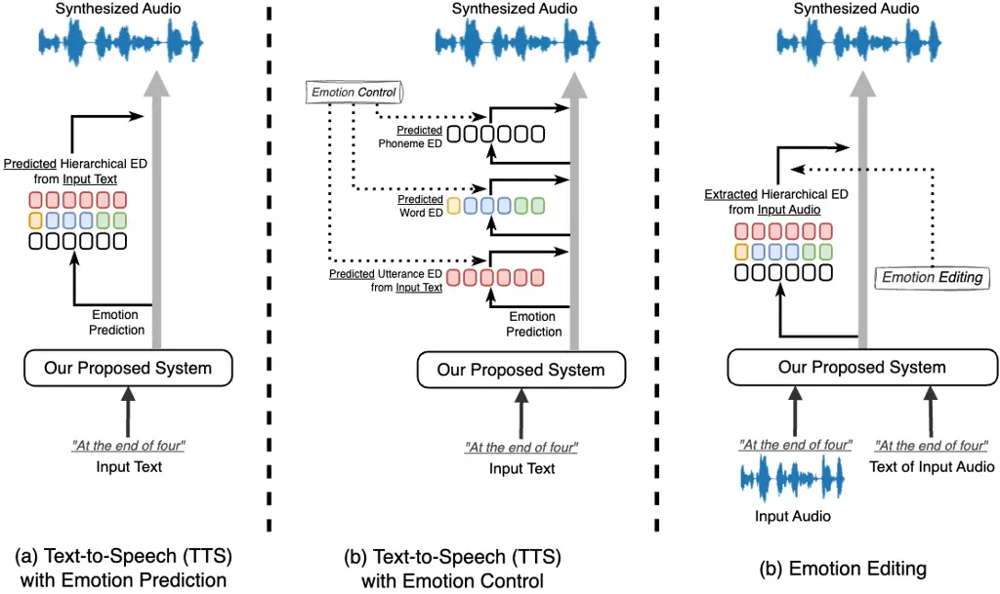
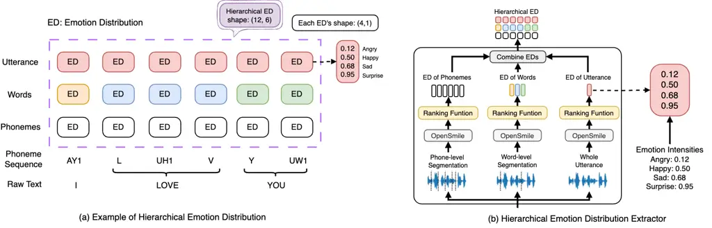
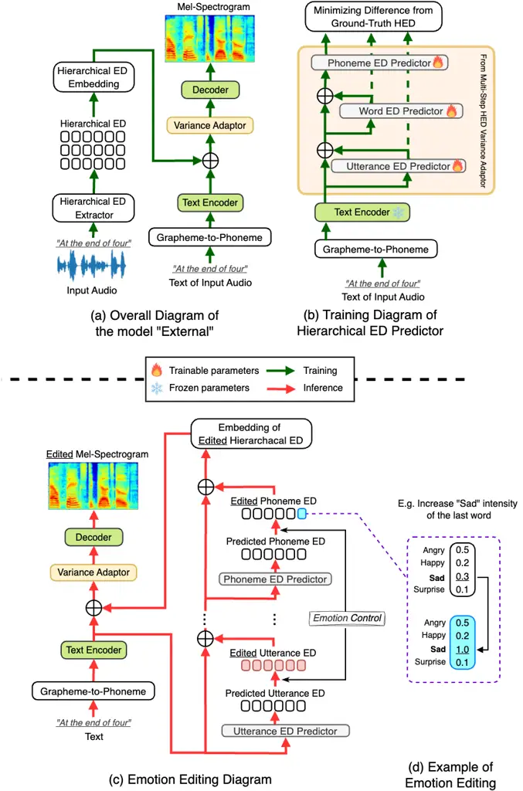
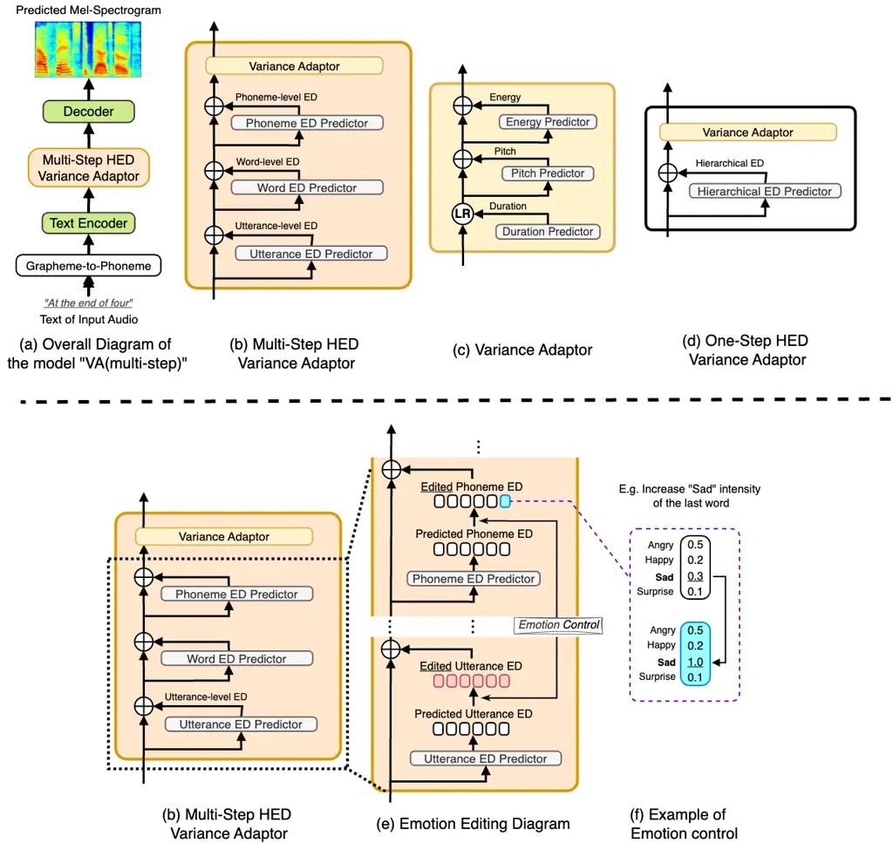
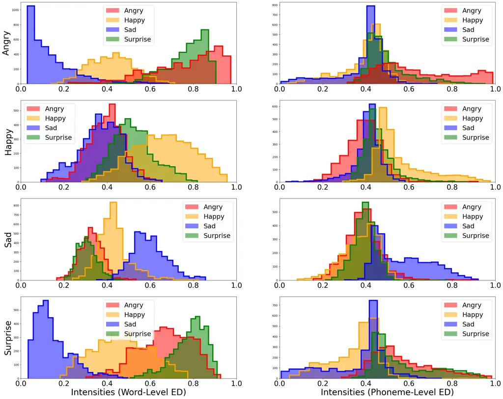
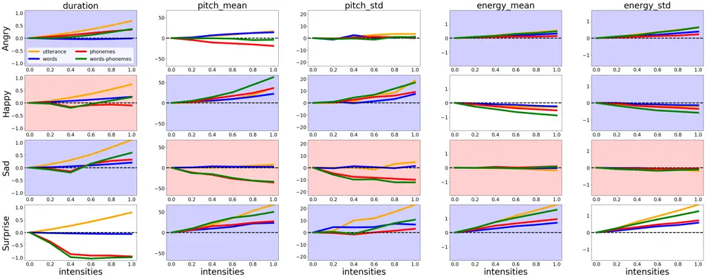
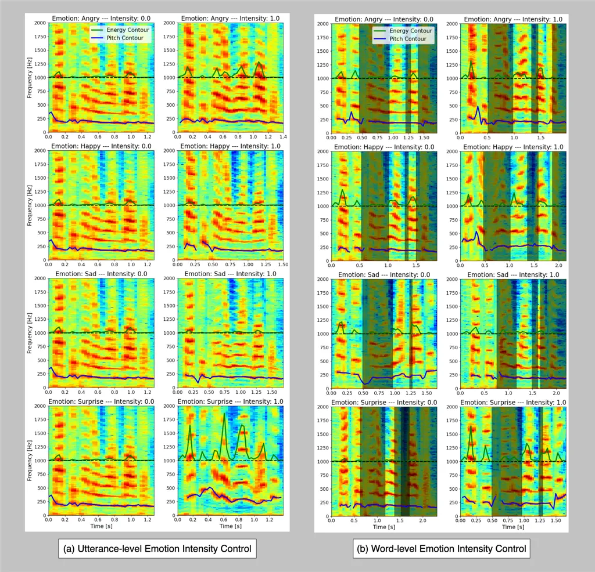

# Multi-Step Prediction and Control of Hierarchical Emotion Distribution in Text-to-Speech Synthesis

Sho Inoue    Kun Zhou    Shuai Wang    Haizhou Li Affiliation: \[
Affiliation: \[ Affiliation: \[ Affiliation: \[ Affiliation: \[

###### Abstract

We investigate hierarchical emotion distribution (ED) for achieving
multi-level quantitative control of emotion rendering in text-to-speech
synthesis (TTS). We introduce a novel multi-step hierarchical ED
prediction module that quantifies emotion variance at the utterance,
word, and phoneme levels. By predicting emotion variance in a multi-step
manner, we leverage global emotional context to refine local emotional
variations, thereby capturing the intrinsic hierarchical structure of
speech emotion. Our approach is validated through its integration into a
variance adaptor and an external module design compatible with various
TTS systems. Both objective and subjective evaluations demonstrate that
the proposed framework significantly enhances emotional expressiveness
and enables precise control of emotion rendering across multiple speech
granularities.

###### keywords

Hierarchical emotion distribution, multi-step emotion prediction,
text-to-speech synthesis

1\]School of Data Science, The Chinese University of Hong Kong, Shenzhen
(CUHK-Shenzhen), China 2\]School of Intelligence Science and Technology,
Nanjing University, Suzhou, China 3\]Shenzhen Research Institute of Big
Data, Shenzhen, China 4\]Tongyi Speech Lab, Alibaba Group, Singapore
5\]Department of ECE, National University of Singapore, Singapore
\issuevolumeyear2024 \issuevolumenumberxx \issueelocatione
\articledataboxReceived xx xxxxx 2024; Revised xx xxxxx 2024  
ISSN 2048-7703; DOI 10.1561/116.xxxxxxxx  
© 2025 S. Inoue \OAstatementThis is an Open Access article, distributed
under the terms of the Creative Commons Attribution licence
([http://creativecommons.org/licenses/by-nc/4.0/](http://creativecommons.org/licenses/by-nc/4.0/)),
which permits unrestricted re-use, distribution, and reproduction in any
medium, for non-commercial use, provided the original work is properly
cited. \creditline\*Corresponding author: haizhouli@cuhk.edu.cn

## 1 Introduction

Text-to-speech (TTS) synthesis focuses on generating human-like speech
from text input Tan et al., 2021. Advancements in deep learning have
significantly improved the naturalness and quality of synthesized
speech. However, current TTS systems still struggle with conveying
emotional expressiveness and precisely controlling emotional nuances,
limiting their ability to deliver humanlike expressive speech
Triantafyllopoulos et al., 2023. To address these limitations, Emotional
TTS aims to bridge this gap by enhancing speech expressiveness, enabling
more engaging and empathetic dialogue systems with emotional
intelligence Triantafyllopoulos & Schuller, 2024.

Emotional TTS faces challenges stemming from the hierarchical structure
of human emotions KUN, 2022. Since speech emotion is characterized by
distinct prosodic patterns at the phoneme, word, and utterance
levels Triantafyllopoulos et al., 2023; KUN, 2022; Hirschberg, 2006,
these patterns naturally form a hierarchy, as established in previous
studies El et al., 2011; Schuller, 2018. The prior literature indicates
that modifying only global prosodic attributes does not capture the full
complexity of emotional speech Zhou et al., 2023; Xu, 2011; Latorre &
Akamine, 2008; Zhou et al., 2020. Additionally, prior work in
text-to-speech synthesis and emotional voice conversion underscores the
necessity of multi-level modeling Ming et al., 2016; Zhou et al., 2020;
Lei et al., 2022. Consequently, developing a method to model the
hierarchical structure of emotions is essential for generating nuanced
speech synthesis. However, existing text-based emotion representation
prediction networks in controllable models address phoneme-level
variations Ren et al., 2022; Lei et al., 2022a, overlooking the benefits
of multi-level emotion modeling.

In this work, we build upon our previous work on a multi-level
quantifiable method for speech emotion control Inoue et al., 2024a and
editing Inoue et al., 2024 by proposing a multi-step prediction
framework for hierarchical emotion distribution (ED) derived from
textual cues. Our proposed pipeline supports three inference scenarios,
as illustrated in Figure 1: (a) Text-to-Speech (TTS) with Emotion
Prediction, where the hierarchical emotion distribution (ED) is directly
predicted from the input text; (b) TTS with Emotion Control, where the
ED is predicted from the text and can be modified by users; and (c)
Emotion Editing, where the ED is extracted from input audio and manually
adjusted by users. In  Inoue et al., 2024a; Inoue et al., 2024; Inoue et
al., 2025, a hierarchical ED was introduced to enable both global and
fine-grained emotion modification in speech generation. Unlike prior
single-step ED prediction approaches Inoue et al., 2024a, which treat
different levels of emotion variance independently, we propose to
explicitly model hierarchical dependencies by predicting EDs at the
utterance, word, and phoneme levels in a multi-step manner. This
structured approach ensures that higher-level emotional context
influences lower-level prosodic details, resulting in a more coherent,
expressive, and controllable emotional rendering. By leveraging
multi-step ED prediction, our method provides fine-grained control,
closely mimicking the way humans modulate speech—starting with an
overall tone and refining intonation and articulation dynamically. This
leads to an improved performance on both emotion expressiveness and
speech naturalness. Furthermore, to demonstrate its flexibility, we
explore two integration strategies for hierarchical ED: implementing it
as a variance adaptor within FastSpeech2 Inoue et al., 2024a and
incorporating it as an external module compatible with any
text-to-speech (TTS) model Inoue et al., 2024. Through this approach, we
bridge the gap between interpretability and fine-grained emotion
control. Our contributions are summarized as follows¹¹ 1 Demo:
[https://shinshoji01.github.io/multi-step-prediction-HED/](https://shinshoji01.github.io/multi-step-prediction-HED/):

- •
  We introduce a multi-step prediction framework for hierarchical
  emotion distribution (ED), where the utterance-, word-, and
  phoneme-level EDs are derived from textual cues in successive steps.
  This structured approach ensures that higher-level emotional context
  guides low-level prosodic details, resulting in synthesized emotional
  speech that is both natural and expressive;
- •
  Leveraging the multi-step prediction of EDs, our method achieves
  refined control over emotion rendering and closely emulates human
  speech modulation. This approach not only enhances global and nuanced
  emotional expressiveness but also significantly improves performance
  in controlled emotional voices;
- •
  We explore two integration strategies for hierarchical ED into TTS
  systems: (1) embedding it as a variance adaptor within FastSpeech2
  and (2) implementing it as an external module, making it adaptable to
  various text-to-speech (TTS) systems.

The rest of this paper is organized as follows: In Section 2, we discuss
the related works. Section 3 describes our proposed methodology. In
Section 4, we summarize experimental setups. In Section 5, we report our
experiments and results. Section 6 concludes our study.



Figure 1: Inference diagram of the proposed system: (a) TTS with emotion
prediction; (b) TTS with emotion control; and (c) emotion editing. The
hierarchical emotion distribution (ED) can be obtained in three ways:
(1) directly predicted from the input text (“Emotion Prediction”), (2)
predicted from the input text with user modifications (“Emotion
Control”), or (3) extracted from the input audio and manually adjusted
by users (“Emotion Editing”).

## 2 Related Works

In this section, we briefly introduce related studies to set the stage
for our research and highlight the novelty of our contributions. We
begin by discussing the hierarchical nature of speech emotions,
emphasizing the need for multi-level and multi-step emotion modeling. We
then review existing approaches to emotion rendering control in the TTS
literature, identifying key advancements and gaps that our work
addresses.

### 2.1 Hierarchical Nature of Speech Emotion

Speech emotions manifest hierarchically across three levels: utterance,
word, and phoneme. At the utterance level, previous studies have shown
that global prosodic patterns—such as pitch contour, range, mean,
intonation, tempo, and rhythm—play a crucial role in conveying
emotion Rodero, 2011. At the word level, lexical cues shape emotional
tone Warriner et al., 2013 and enhance intensity through
emphasis Hirschberg & Ward, 1992. Additionally, research suggests that
when lexical and prosodic signals conflict, listeners tend to rely on
prosodic cues to interpret emotion Snedeker & Trueswell, 2003. At the
phoneme level, individual prosodic features such as pitch, energy, and
duration contribute to emotional expression Krothapalli & Koolagudi,
2013, as supported by multiple studies Busso et al., 2009; El Ayadi et
al., 2011; Leinonen et al., 1997. This hierarchical structure highlights
the necessity of studying multi-level and multi-step emotion modeling
for effective emotion modeling and control.

### 2.2 Control of Speech Emotion

Recent advancements in emotional TTS have significantly enhanced
expressiveness; however, achieving interpretable emotion control remains
a challenge. Prior studies have primarily focused on refining emotion
intensity control by treating speech emotion as a global feature and
manipulating representations or attributes derived from reference audio.
For instance, Oh et al., 2023 enables utterance-level control via a
speech mixer that predicts pseudo-labels and modulates features such as
pitch, duration, and energy. Zhang et al., 2023; Li et al., 2022 further
controlled emotion by manipulating speaker-disentangled representations
in cross-speaker scenarios. Recent studies employ relative attributes
Parikh & Grauman, 2011 for intensity control Zhou et al., 2023a; Zhu et
al., 2019. Approaches for mixed emotions include manipulating relative
attributes Zhou et al., 2022a, incorporating noise mixing in diffusion
models Tang et al., 2023, and leveraging continuous emotional
representations Zhou et al., 2024. In contrast, EmoSphere-TTS Cho et
al., 2024; Cho et al., 2024a models emotional complexity via a spherical
emotion vector through Cartesian-spherical transformations, while Jing
et al., 2024 integrates computational paralinguistic text prompts to
enhance emotional expressiveness.

To achieve fine-grained emotion control, several studies have explored
segmental-level representations. For example, MsEmoTTS Lei et al., 2022a
employs a global emotion label and modifies phoneme-level intensity via
relative attributes. EmoQ-TTS Im et al., 2022 quantifies emotion
intensity using a distance-based method, while the study in Wang et al.,
2023 refines control by examining inter- and intra-class distances.
Additionally, CASEIN Cui et al., 2023 leverages a speech emotion
recognition module to predict phoneme-level emotion distributions. These
multi- or phoneme-level approaches outperform utterance-level modeling
in emotional speech synthesis Lei et al., 2022a; Im et al., 2022; Cui et
al., 2023 Building upon these efforts, our previous work introduced
hierarchical emotion distribution (ED)Inoue et al., 2024a; Inoue et al.,
2024, which enables multi-level emotion control, capturing both global
and fine-grained emotional variations in speech synthesis.

However, existing approaches to hierarchical emotion modeling still face
several limitations. Previous methods Inoue et al., 2024a; Inoue et al.,
2024 rely on single-step prediction strategies, which treat different
levels of emotion variance independently and fail to capture the
contextual dependencies between hierarchical emotion distributions.
Additionally, current techniques often lack a structured mechanism to
ensure that higher-level emotions influence lower-level prosodic
variations, leading to inconsistencies in emotion expressiveness.
Furthermore, integration with TTS remains another challenge, as most
approaches are either model-specific or require reference audio,
limiting their adaptability across different TTS architectures.
Addressing these gaps, we propose a multi-step ED prediction framework
that models hierarchical ED progressively, ensuring a more
interpretable, flexible, and effective approach to speech emotion
rendering and control.

## 3 Multi-Step Prediction and Hierarchical Control of Emotion Intensity

We propose a novel approach, which supports the rendering of both single
emotions and mixed emotions, that can be seamlessly integrated with
various text-to-speech frameworks. Traditionally, speech databases label
emotions at the utterance level, overlooking nuanced intensity
variations within speech. To address this challenge, we automatically
generate fine-grained, quantitative intensity labels, which serve as
“soft labels” for speech generation models, eliminating the need for
manual annotation. This method effectively enhances emotion control,
enables mixed-emotion rendering, and can be readily adapted to speech
generation frameworks, including text-to-speech and voice conversion.

### 3.1 Hierarchical Emotion Distribution (ED) Extractor

Built upon our previous studies Inoue et al., 2024a; Inoue et al., 2024,
the hierarchical emotion distribution (ED) extraction module integrates
OpenSmile feature extractors Eyben et al., 2010 with pre-trained ranking
functions at each segmental level to quantify emotion intensities in an
utterance, as shown in Figure 2. Grounded in relative attributes Parikh
& Grauman, 2011, our method measures emotion prominence by treating
emotion style as a speech attribute and ranking its presence relative to
other emotions, enabling a structured and interpretable approach to
hierarchical emotion quantification.

Specifically, we define the ranking function as:

```math
\displaystyle f(\mathbf{x}_{i})=\mathbf{w}^{T}\mathbf{x}_{i}+b \tag{1}
```

where $`\mathbf{x}_{i}`$, $`\mathbf{w}`$, and $`b`$ denote the acoustic
features of the $`i`$-th sample, weight vector, and bias, respectively.
We optimize these parameters using a support vector machine objective
for binary classification (e.g., Angry vs. Non-angry) Cortes & Vapnik,
1995 and normalize the outputs to the range $`[0,1]`$, with larger
values indicating stronger emotion intensity. This process enables
continuous labeling of training data and the quantification of emotion
intensity in unseen utterances during run-time.

Figure 2(b) illustrates our hierarchical ED extractor. We begin by
segmenting the input audio into phoneme, word, and utterance levels
using the Montreal Forced Aligner McAuliffe et al., 2017, and extracting
an 88-dimensional feature set for each segment via OpenSMILE Eyben et
al., 2010. The pre-trained ranking functions then estimate an ED vector
for each segment, where each element represents the intensity of a
specific emotion. To ensure hierarchical consistency, we duplicate the
utterance-level ED across all phonemes and replicate the word-level ED
for the corresponding phonemes, as shown in Figure 2(a). These
hierarchical ED vectors are subsequently incorporated into TTS training,
which will be introduced in the next subsection.



Figure 2: (a) Example of Hierarchical Emotion Distribution (ED)
including EDs at levels of utterance, words, and phonemes; (b) Diagram
of Hierarchical ED Extractor.

### 3.2 Multi-Step Modeling of Hierarchical ED for TTS

We propose a multi-step strategy for modeling hierarchical emotion
distribution (ED) to enable precise, multi-level control over emotion
rendering in text-to-speech (TTS) synthesis. By progressively predicting
ED at the utterance, word, and phoneme levels, our approach ensures that
global emotional context guides local prosodic details. We explore two
integration strategies to incorporate this multi-step hierarchical ED
prediction into TTS frameworks.

#### 3.2.1 External Integration

In the external integration approach (“External”), as shown in
Figure 3(a), we enhance a model-agnostic TTS pipeline by integrating a
hierarchical ED embedding after text processing. In this paper, we
choose FastSpeech2 Ren et al., 2022 as our TTS backbone. A text encoder
converts phoneme sequences into linguistic embeddings, while a fully
connected network transforms the hierarchical ED into an ED embedding. A
variance adaptor then predicts pitch, duration, and energy, followed by
a decoder that reconstructs the Mel-spectrogram using an L1 loss. This
design effectively captures emotion intensity and improves prosody.
Since the “External” framework does not inherently predict hierarchical
ED, we incorporate a dedicated multi-step hierarchical ED prediction
module. In this module, EDs are predicted sequentially—starting from the
utterance level, progressing to the word level, and finally to the
phoneme level—while keeping the text encoder frozen as shown in
Figure 3(b). This multi-step process allows a higher-level emotional
context to guide finer, local prosodic adjustments.



Figure 3: Training and Inference Diagrams of the proposed framework
using external integration (“External”): (a) Overall diagram; (b)
Training diagram of hierarchical emotion distribution (ED) predictor;
(c) Emotion editing (inference) diagram (d) Example of emotion editing.

#### 3.2.2 Variation Adaptor Integration

The variation adaptor integration approach (“VA”) integrates
hierarchical ED modeling directly within the variance adaptor of
FastSpeech2 Ren et al., 2022. This configuration extends the variance
adaptor to jointly learn emotion representations and acoustic features,
thereby tightly coupling emotion prediction with prosody generation. In
contrast to the “External” setting, we train the linguistic encoder with
a loss function that minimizes hierarchical ED differences.
Specifically, we use a mean squared error (MSE) loss to reduce the
discrepancy between the predicted and ground-truth EDs. Within the VA
integration, ED prediction is also performed in a multi-step manner. The
process begins with predicting the utterance-level ED to establish the
global emotional tone, which then informs the word-level prediction.
Finally, these outputs are combined to generate phoneme-level ED,
enabling fine-grained emotion control, as shown in Figure 4(b). This
hierarchical, multi-step approach ensures that a broader emotional
context effectively influences lower-level prosodic details.



Figure 4: Training and Inference Diagrams of the proposed framework
using variance adaptor integration (“VA”): (a) Overall diagram; (b)
Diagram of sequential hierarchical emotion distribution (hierarchical
ED) variance adaptor; (c) Diagram of variance adaptor; (d) Diagram of
parallel hierarchical ED variance adaptor (e) Emotion editing
(inference) diagram (f) Example of emotion editing.

### 3.3 Run-time Emotion Editing and Control

During run-time, our framework supports two primary tasks: (1) Emotion
Control and (2) Emotion Editing. For emotion control, where only text
input is available, our model predicts a hierarchical emotion
distribution that aligns with the textual content. This allows users to
control the emotion intensity of individual speech segments, enabling
fine-grained and quantifiable emotion rendering in synthesized speech.
For the speech editing task, given an audio input and its corresponding
transcript, our model extracts the hierarchical emotion distribution
from the audio signal, enabling users control over emotion intensity for
quantifiable emotion modification. In general, as depicted in
Figure 3(c) and Figure 4(e), users are able to control the emotion
rendering by adjusting the emotion distributions at three distinct
levels, regardless of whether the ED is derived from audio or predicted
from text.

## 4 Experimental Setup

We evaluated our system performance by conducting two experiments: (1)
emotion prediction and (2) emotion editing. For emotion prediction, we
train the TTS model on LibriTTS-R Koizumi et al., 2023, a multi-speaker
dataset containing approximately 580 hours of recordings from 2,306
speakers. Specifically, we utilized the “train-clean-100” and
“train-clean-360” subsets for model training.

For the speech editing experiment, we used the Emotion Speech Dataset
(ESD) Zhou et al., 2022; Zhou et al., 2021, which comprises over 29
hours of emotional speech in five categories—Neutral, Angry, Happy, Sad,
and Surprise—from 20 speakers (10 native English and 10 Mandarin). We
exclusively used the English recordings and the full training split for
TTS model training. We also use the ESD dataset to train the
hierarchical ED extractor’s ranking functions, where we randomly
selected 100 samples per speaker and emotion, resulting in a total of
5,000 audio samples for hierarchical ED extractor training.

### 4.1 Model Architecture

We choose FastSpeech2 Ren et al., 2022 as our backbone, which comprises
a text encoder, variance adaptor, and decoder. We use a
transformer Vaswani et al., 2017-based encoder to convert input phoneme
sequences into linguistic embeddings. Variance adaptors predict
hierarchical ED, duration, pitch, and energy. We utilize a
transformer-based decoder to synthesize mel-spectrograms from these
features. Our loss function combines the L1 loss on mel-spectrograms
with the mean squared error for prosodic predictions in the variance
adaptor. To address multi-speaker scenarios, we integrate speaker
embeddings from Resemblyzer Wan et al., 2020 into the encoder output. We
adopt the Adam optimizer Kingma & Ba, 2017. For TTS training, we use a
batch size of 32 and perform 200,000 iterations over 48 hours on a
single GPU. For text-based hierarchical ED prediction in “External”, we
conduct 100,000 iterations. The ED embedding layers consist of fully
connected layers with a Tanh activation function. Finally, we employ
HiFiGAN Kong et al., 2020 as the vocoder, trained on the ESD and
LibriTTS-R datasets.

### 4.2 Baselines Comparison

For emotion prediction experiments, we compared the model with our
previous works Inoue et al., 2024a; Inoue et al., 2024 (“single-step”),
which predict EDs from text in a single-step manner. For example, in the
“VA” setting, our proposed model progressively predicted utterance-,
word-, and phoneme-level EDs (Figure 4(b)), whereas the baseline Inoue
et al., 2024a predicted all segments concurrently (Figure 4(d)). For
emotion editing experiments, we re-implemented MsEmoTTS Lei et al.,
2022a into the FastSpeech2 framework as the baseline (“MsEmoTTS”) to
ensure a fair comparison.

### 4.3 Evaluation Metrics

For objective evaluation, we calculated the Word Error Rate (WER) using
Whisper²² 2 Whisper Large:
[https://github.com/openai/whisper](https://github.com/openai/whisper) Radford
et al., 2022 to assess the system’s robustness. To measure emotion
similarity with the target, we evaluated spectral similarity using
Mel-Cepstral Distortion (MCD) Kubichek, 1993, prosody alignment through
pitch and energy distortion, and duration deviation using Frame
Disturbance (FD) Sisman et al., 2017.

For subjective evaluation, we conducted three listening experiments with
20 participants, each evaluating 210 synthesized samples. First, we
conducted MUSHRA tests, where participants rated each speech sample on a
scale from 0 to 100, with higher scores indicating better quality or
greater similarity. The first test assessed speech naturalness,
instructing participants to disregard noise and emotion. The second test
evaluated emotion similarity, asking participants to rate the
synthesized audio solely based on its emotional expressiveness while
ignoring speech quality. Additionally, we conducted best-worst scaling
(BWS) tests Kiritchenko & Mohammad, 2017 to compare word-level emotion
controllability between our model and the baseline. In BWStests, we
adjusted the emotion intensity of three words per utterance to 0.0, 0.5,
and 1.0, and evaluators selected the least and most expressive samples.

## 5 Experiments and Results

In this section, we present the experimental results for two tasks: (1)
Emotion Prediction and (2) Emotion Editing. For Emotion Prediction, we
evaluated our models based on speech quality and emotional
expressiveness, supplemented by qualitative analysis. For Emotion
Editing, we assessed the controllability of emotions, measuring how
effectively the model modifies and adjusts emotion intensity for
different speech segmental levels.

### 5.1 Experiments with Emotion Prediction

We compared synthesized audio samples across seven different conditions,
as detailed in Table 1 and Table 2. These tables organize these
conditions into three key categories: “GT or Pred”, “TTS Model”, and
“Pred Mode”:

- •
  GT or Pred: This column specifies whether the hierarchical emotion
  distributions (EDs) are obtained from ground-truth data (GT) or
  predicted from text.
- •
  TTS Model: This column indicates the TTS model used. “VA” refers to
  the model utilizing the Single-Step hierarchical ED Variance Adaptor
  (Figure 4(d)), while “VA (Multi-Step)” corresponds to the model
  employing the Multi-Step hierarchical ED Variance Adaptor
  (Figure 4(b)).
- •
  Pred Mode: This column describes how the hierarchical ED is predicted.
  It is either generated progressively from longer to shorter segments
  (“Multi-Step”) or in parallel for all segments at once
  (“Single-Step”).

This configuration allows for a structured comparison of how different
hierarchical ED configurations and prediction strategies impact
synthesis quality and emotion expressiveness.

#### 5.1.1 Speech Quality Evaluation

Table 1 summarizes the results of the MUSHRA and WER tests. With
ground-truth hierarchical ED, the variance adapter with multi-step
emotion modeling (“VA (Multi-Step)”) consistently outperforms the
single-step approach (“VA”), achieving higher MUSHRA scores and lower
WER. We also observe that, when using predicted hierarchical ED, the
multi-step models significantly improve both speech naturalness and
intelligibility compared to the single-step models. These findings
suggest that aligning the EDs of shorter segments with those of longer
segments is crucial for enhancing overall speech quality.

|                                 |                |             |                       |                      |
| ------------------------------- | -------------- | ----------- | --------------------- | -------------------- |
| Hierarchical ED                 |                |             | Speech Quality        |                      |
| GT or Pred                      | TTS Model      | Pred Mode   | MUSHRA ($`\uparrow`$) | WER ($`\downarrow`$) |
| — Ground-Truth Speech Samples — |                |             | 79.4$`\pm`$ 1.9       | 2.16                 |
| GT                              | External       | \-          | 61.6$`\pm`$ 2.2       | 3.37                 |
| GT                              | VA             | \-          | 57.5$`\pm`$ 2.6       | 3.11                 |
| GT                              | VA(Multi-Step) | \-          | 62.2$`\pm`$ 2.3       | 2.48                 |
| Predicted                       | External       | Single-Step | 50.7$`\pm`$ 2.4       | 3.80                 |
| Predicted                       | External       | Multi-Step  | 54.0$`\pm`$ 2.3       | 3.25                 |
| Predicted                       | VA             | Single-Step | 52.2$`\pm`$ 2.6       | 4.61                 |
| Predicted                       | VA(Multi-Step) | Multi-Step  | 53.2$`\pm`$ 2.4       | 2.45                 |

Table 1: Speech Quality Test Results: MUSHRA naturalness scores with 95%
confidence interval and Word Error Rate (WER). The column “GT or Pred”
indicates whether we use ground-truth hierarchical ED (“GT”) or a
text-predicted version. In the “TTS Model” column, “VA” and
“VA(Multi-Step)” denote the TTS models employing the Single-Step
hierarchical ED Variance Adaptor (Figure 4(d)) and the Multi-Step
hierarchical ED Variance Adaptor (Figure 4(b)), respectively. Finally,
the “Pred Mode” column specifies whether we predict the hierarchical ED
sequentially from longer to shorter segments (Multi-Step) or in parallel
for all segments (Single-Step).

#### 5.1.2 Emotion Expressiveness Evaluation

We further assess emotion expressiveness by conducting MUSHRA tests on
emotional similarity and computing multiple objective prosody-related
metrics, including Mel-Cepstral Distortion (MCD), Pitch/Energy
Distortion, and Frame Disturbance (FD). As shown in Table 2, our
proposed multi-step hierarchical ED prediction consistently achieves
higher MUSHRA emotional similarity scores and lower distortion values
across all objective metrics for both ground-truth and predicted
hierarchical EDs. These results highlight the effectiveness of the
multi-step scheme in enhancing emotion expressiveness and improving
alignment with ground-truth emotions. However, we observe that in the
“VA” setting, the multi-step scheme does not outperform the single-step
approach in Pitch and FD. This discrepancy may stem from error
accumulation across different levels of ED prediction (utterance, word,
and phoneme levels). Compared to the “External” setting, where the
linguistic encoder remains independent to emotion prediction, the “VA”
setting incorporates hierarchical emotion distribution difference loss
in training. This joint training may increase the model’s sensitivity to
ED variations in longer segments, potentially leading to greater
fluctuations in prosody-related metrics.

|                 |                |             |                        |                      |                        |                         |                     |
| --------------- | -------------- | ----------- | ---------------------- | -------------------- | ---------------------- | ----------------------- | ------------------- |
| Hierarchical ED |                |             | Emotion Expressiveness |                      |                        |                         |                     |
| GT or Pred      | TTS Model      | Pred Mode   | MUSHRA ($`\uparrow`$)  | MCD ($`\downarrow`$) | Pitch ($`\downarrow`$) | Energy ($`\downarrow`$) | FD ($`\downarrow`$) |
| GT              | External       | \-          | 61.9$`\pm`$ 2.1        | 5.88$`\pm`$ 0.10     | 15.6$`\pm`$ 1.0        | 0.363$`\pm`$ 0.022      | 24.8$`\pm`$ 3.4     |
| GT              | VA             | \-          | 55.8$`\pm`$ 2.6        | 6.48$`\pm`$ 0.23     | 16.1$`\pm`$ 1.1        | 0.386$`\pm`$ 0.023      | 25.5$`\pm`$ 3.6     |
| GT              | VA(Multi-Step) | \-          | 61.9$`\pm`$ 2.1        | 5.62$`\pm`$ 0.11     | 15.5$`\pm`$ 1.1        | 0.348$`\pm`$ 0.020      | 22.4$`\pm`$ 2.9     |
| Predicted       | External       | Single-Step | 47.2$`\pm`$ 2.3        | 7.59$`\pm`$ 0.14     | 18.2$`\pm`$ 1.1        | 0.438$`\pm`$ 0.027      | 46.3$`\pm`$ 6.5     |
| Predicted       | External       | Multi-Step  | 51.9$`\pm`$ 2.2        | 6.89$`\pm`$ 0.12     | 16.9$`\pm`$ 1.2        | 0.409$`\pm`$ 0.024      | 42.6$`\pm`$ 4.7     |
| Predicted       | VA             | Single-Step | 48.2$`\pm`$ 2.5        | 7.23$`\pm`$ 0.20     | 16.7$`\pm`$ 1.0        | 0.426$`\pm`$ 0.025      | 41.4$`\pm`$ 4.7     |
| Predicted       | VA(Multi-Step) | Multi-Step  | 49.1$`\pm`$ 2.2        | 6.91$`\pm`$ 0.12     | 17.2$`\pm`$ 1.1        | 0.416$`\pm`$ 0.025      | 46.3$`\pm`$ 5.1     |

Table 2: Emotion Expressiveness Test Results with 95% confidence
interval: MUSHRA similarity scores, Mel-Cepstral Distortion (MCD),
Pitch/Energy Distortion (Pitch/Energy), and Frame Disturbance (FD). The
column “GT or Pred” indicates whether we use ground-truth hierarchical
ED (“GT”) or a text-predicted version. In the “TTS Model” column, “VA”
and “VA(Multi-Step)” denote the TTS models employing the Single-Step
hierarchical ED Variance Adaptor (Figure 4(d)) and the Multi-Step
hierarchical ED Variance Adaptor (Figure 4(b)), respectively. Finally,
the “Pred Mode” column specifies whether we predict the hierarchical ED
progressively from longer to shorter segments (Multi-Step) or in
parallel for all segments (Single-Step).

#### 5.1.3 Analysis on Hierarchical ED Prediction

We further analyzed the predicted hierarchical emotion distribution
(ED). Table 3 presents the mean absolute difference between the
predicted and ground-truth values for each segment. The column “Longer
Segments” denotes the longer segments used to predict shorter segments;
“GT” indicates that ground-truth values were employed. For example,
under the “GT” condition, we used the ground-truth utterance-level ED to
predict the word-level ED, whereas under the “Predicted” condition, we
utilized the predicted utterance-level ED.

Table 3 summarizes our results. We did not observe significant
differences between single-step and multi-step predictions, despite
substantial differences in synthesized audio performances (see Tables 1
and 2). These results suggest that our prediction modules not only
reduce hierarchical ED differences but also generate emotion
representations consistent with the textual emotional content in the
audio domain. More importantly, when comparing “Predicted” and “GT” in
the multi-step mode, we found error accumulation in ED prediction,
evidenced by a smaller gap at the word level and an increased gap at the
phoneme level. These findings suggest that our model prioritizes the
dependency of EDs across segments over mere ED differences, which
explains the improved speech naturalness (Table 1) and only marginally
better emotion expressiveness (Table 2).

| Hierarchical ED Condition |             |                 | Hierarchical ED Difference |        |           |        |
| ------------------------- | ----------- | --------------- | -------------------------- | ------ | --------- | ------ |
| TTS Model                 | Pred Mode   | Longer Segments | Phonemes                   | Words  | Utterance | Avg.   |
| External                  | Single-Step | \-              | 0.1333                     | 0.1283 | 0.0594    | 0.1070 |
| External                  | Multi-Step  | Predicted       | 0.1345                     | 0.1297 | 0.0587    | 0.1077 |
| External                  | Multi-Step  | GT              | 0.1214                     | 0.1281 | 0.0587    | 0.1028 |
| VA                        | Single-Step | \-              | 0.1358                     | 0.1294 | 0.0599    | 0.1084 |
| VA(Multi-Step)            | Multi-Step  | Predicted       | 0.1356                     | 0.1298 | 0.0601    | 0.1085 |
| VA(Multi-Step)            | Multi-Step  | GT              | 0.1230                     | 0.1272 | 0.0601    | 0.1034 |

Table 3: Mean Absolute Difference of Hierarchical ED: differences
between the predicted and the ground-truth hierarchical ED values. The
column Longer “Longer Segments” denotes the longer segments used to
predict shorter segments; “GT” indicates that ground-truth values were
employed. For example, under the “GT” condition, we used the
ground-truth utterance-level ED to predict the word-level ED, whereas
under the “Predicted” condition, we utilized the predicted
utterance-level ED.

Next, we analyzed the predicted word- and phoneme-level EDs derived from
different utterance-level EDs. Specifically, we systematically varied
the intensity of a single emotion, setting it to 1.0 while keeping the
intensities of all other emotions at 0.0. We then visualized the
resulting ED distributions as histograms for each segment in Figure 5,
where each row represents the intensified emotion and each column
corresponds to a segment. We utilized a TTS model trained on the ESD
dataset to highlight the impact of emotional variations in speech
synthesis. From Figure 5, we observe that both word- and phoneme-level
EDs exhibit a positive correlation with their respective utterance-level
ED values, with the correlation being stronger at the word level. This
suggests that emotion propagation is more consistent across words than
phonemes. Additionally, we find that word-level anger and surprise
intensities display a notably stronger inter-correlation compared to
other emotions, indicating that these two emotions may share similar
prosodic and acoustic patterns at the word level. This observation
aligns with psychological studies suggesting that anger and surprise
often exhibit overlapping acoustic characteristics, such as increased
pitch and energy.



Figure 5: Histograms of word-level and phoneme-level emotion
distributions (EDs) for various intensified utterance-level EDs. Each
row corresponds to an intensified emotion, and each column corresponds
to a segment.

### 5.2 Experiments with Emotion Editing

Following Inoue et al., 2024, we evaluated our models’ emotion
controllability on the ESD dataset through subjective evaluations and
objective analysis. We first conducted best-worst scaling (BWS)
tests Kiritchenko & Mohammad, 2017 to compare word-level emotion
controllability between our model and the baseline MsEmoTTS Lei et al.,
2022a. As presented in Table 4, our model exhibited a stronger tendency
than MsEmoTTS to select the least expressive sample at low intensity and
the most expressive sample at high intensity across all five emotions.
This trend was especially pronounced for Sad and Surprise emotions,
where the distinction between intensity levels was more evident. These
results demonstrate our model’s ability to capture fine-grained
variations in emotional intensity, ensuring more precise and consistent
emotion rendering control compared to the baseline MsEmoTTS.

|       |     | Hierarchical ED |     |     |     | MsEmoTTS |     |     |     |
| ----- | --- | --------------- | --- | --- | --- | -------- | --- | --- | --- |
|       |     | Ang             | Hap | Sad | Sur | Ang      | Hap | Sad | Sur |
|       | 0.0 | 79              | 63  | 67  | 81  | 42       | 32  | 21  | 33  |
| Least | 0.5 | 0               | 28  | 14  | 14  | 47       | 47  | 54  | 42  |
|       | 1.0 | 21              | 9   | 19  | 5   | 11       | 21  | 25  | 25  |
|       | 0.0 | 11              | 18  | 16  | 7   | 11       | 12  | 30  | 18  |
| Most  | 0.5 | 16              | 7   | 9   | 7   | 26       | 16  | 23  | 30  |
|       | 1.0 | 74              | 75  | 75  | 86  | 63       | 72  | 47  | 53  |

Table 4: Best-Worst Scaling (BWS) Test Result: The value represents
evaluator preferences (%), with red and blue indicating the heatmap for
the least expressive and most expressive audio, respectively.



Figure 6: The illustration of prosodic variants with intensity changes.
The red background represents the expected negative trend, the blue
indicates the expected positive trend, both summarized from the ESD
dataset.

We further validated controllability across utterance, word, phoneme,
and word-and-phoneme levels. We incremented emotion intensity from 0.0
to 1.0 and computed prosodic features such as duration and the
mean/standard deviation of pitch and energy (Figure 6). Because duration
values vary between levels, we standardized them prior to visualization.
Prior literature Schuller, 2018 correlates these features with emotion
intensity; for example, sadness is associated with a slower speaking
rate and lower pitch and energy values. We analyzed the ESD dataset Zhou
et al., 2022 to examine these acoustic-emotion relationships. A red
background indicates a negative trend, while blue is a positive trend
with increasing intensity. Our model followed these expected trends,
showing a positive correlation between happiness and mean pitch and a
negative correlation between sadness and pitch. Additionally, editing
both word and phoneme-level emotions produced significant prosodic
changes, with the standard deviation of pitch at the utterance level
aligning with our expectations.



Figure 7: Spectrograms of synthesized audio samples across different
emotion intensities with pitch (blue) and energy (green) contours: the
y-axis for energy contours are not relevant. (a) Utterance-level Emotion
Intensity Control (b) Word-level Emotion Intensity Control.

Figure 7 shows the spectrograms of synthesized audio samples with
varying emotion intensities. We display pitch and energy contours (blue
and green lines, respectively), noting that the y-axis for the energy
contours is not relevant. Figures 7(a) and (b) present utterance- and
word-level intensity control. Each row corresponds to a different
emotion, with the first column depicting acoustic features at an emotion
intensity of 0.0, and the second column at 1.0. In (b), the three
highlighted areas indicate regions where the intensity has been
modified. For both segments, for anger, we observe more pronounced
energy spikes, at higher intensities. In happiness, pitch and energy
patterns are similar, with higher pitch values at an intensity of 1.0.
Sadness prolongs duration and stabilizes pitch contour as intensity
increases. For surprise, we note a rise in both pitch contours and
energy spikes. These results align with Figure 6 and demonstrate that
our model’s ability to manipulate duration and pitch/energy according to
emotion intensity.

## 6 Conclusion

We present a multi-step prediction framework for hierarchical emotion
distribution (ED), enabling multi-level control of emotion rendering in
speech synthesis. By modeling ED at the utterance, word, and phoneme
levels progressively, our approach ensures that higher-level emotional
context influences lower-level prosody, resulting in more natural and
expressive speech. We integrate ED into TTS systems through two
strategies: embedding it within the variance adaptor of FastSpeech2 and
incorporating it as an external module for other non-autoregressive TTS
models, making our method flexible and widely applicable. At runtime,
users can quantitatively control emotion intensity, enhancing the
interpretability and adaptability of emotional speech synthesis.
Objective and subjective evaluations demonstrate that our approach
significantly improves speech quality, expressiveness, and
controllability. In future work, we will extend our proposed method to
additional languages, varied voice qualities, and more diverse emotional
datasets, further exploring cross-lingual robustness and broadening the
applicability of multi-level emotion intensity prediction.

## References

- Busso et al. (2009) Carlos Busso, Sungbok Lee and Shrikanth Narayanan
  “Analysis of Emotionally Salient Aspects of Fundamental Frequency for
  Emotion Detection” In _IEEE Transactions on Audio, Speech, and
  Language Processing_ 17.4, 2009, pp. 582–596 DOI:
  [10.1109/TASL.2008.2009578](https://dx.doi.org/10.1109/TASL.2008.2009578)
- Cho et al. (2024) Deok-Hyeon Cho et al. “EmoSphere-TTS: Emotional
  Style and Intensity Modeling via Spherical Emotion Vector for
  Controllable Emotional Text-to-Speech” In _Interspeech 2024_, 2024,
  pp. 1810–1814 DOI:
  [10.21437/Interspeech.2024-398](https://dx.doi.org/10.21437/Interspeech.2024-398)
- Cho et al. (2024a) Deok-Hyeon Cho, Hyung-Seok Oh, Seung-Bin Kim and
  Seong-Whan Lee “EmoSphere++: Emotion-Controllable Zero-Shot
  Text-to-Speech via Emotion-Adaptive Spherical Vector”, 2024 arXiv:
  [https://arxiv.org/abs/2411.02625](https://arxiv.org/abs/2411.02625)
- Cortes & Vapnik (1995) Corinna Cortes and Vladimir Vapnik
  “Support-vector networks” In _Machine learning_ 20.3 Springer, 1995,
  pp. 273–297
- Cui et al. (2023) Yuhao Cui et al. “CASEIN: Cascading Explicit and
  Implicit Control for Fine-grained Emotion Intensity Regulation”, 2023
  arXiv:[2307.00020 \[cs.SD\]](https://arxiv.org/abs/2307.00020)
- El et al. (2011) Moataz El, Mohamed Kamel and Fakhri Karray “Survey on
  speech emotion recognition: Features, classification schemes, and
  databases” In _Pattern recognition_ 44.3 Elsevier, 2011, pp. 572–587
- El Ayadi et al. (2011) Moataz El Ayadi, Mohamed. Kamel and Fakhri
  Karray “Survey on speech emotion recognition: Features, classification
  schemes, and databases” In _Pattern Recognition_ 44.3, 2011, pp.
  572–587 DOI:
  [https://doi.org/10.1016/j.patcog.2010.09.020](https://dx.doi.org/https://doi.org/10.1016/j.patcog.2010.09.020)
- Eyben et al. (2010) Florian Eyben, Martin Wöllmer and Björn Schuller
  “openSMILE – The Munich Versatile and Fast Open-Source Audio Feature
  Extractor” In _MM’10 - Proceedings of the ACM Multimedia 2010
  International Conference_, 2010, pp. 1459–1462 DOI:
  [10.1145/1873951.1874246](https://dx.doi.org/10.1145/1873951.1874246)
- Hirschberg (2006) Julia Hirschberg “Pragmatics and intonation” In _The
  handbook of pragmatics_ Wiley Online Library, 2006, pp. 515–537
- Hirschberg & Ward (1992) Julia Hirschberg and Gregory Ward “The
  influence of pitch range, duration, amplitude and spectral features on
  the interpretation of the rise-fall-rise intonation contour in
  English” In _Journal of Phonetics_ 20.2, 1992, pp. 241–251 DOI:
  [https://doi.org/10.1016/S0095-4470(19)30625-4](<https://dx.doi.org/https://doi.org/10.1016/S0095-4470(19)30625-4>)
- Im et al. (2022) Chae-Bin Im, Sang-Hoon Lee, Seung-Bin Kim and
  Seong-Whan Lee “EMOQ-TTS: Emotion Intensity Quantization for
  Fine-Grained Controllable Emotional Text-to-Speech” In _ICASSP 2022 -
  2022 IEEE International Conference on Acoustics, Speech and Signal
  Processing (ICASSP)_, 2022, pp. 6317–6321 DOI:
  [10.1109/ICASSP43922.2022.9747098](https://dx.doi.org/10.1109/ICASSP43922.2022.9747098)
- Inoue et al. (2024) Sho Inoue, Kun Zhou, Shuai Wang and Haizhou Li
  “Fine-Grained Quantitative Emotion Editing for Speech Generation” In
  _2024 Asia Pacific Signal and Information Processing Association
  Annual Summit and Conference (APSIPA ASC)_, 2024, pp. 1–6 URL:
  [https://api.semanticscholar.org/CorpusID:268248771](https://api.semanticscholar.org/CorpusID:268248771)
- Inoue et al. (2024a) Sho Inoue, Kun Zhou, Shuai Wang and Haizhou Li
  “Hierarchical Emotion Prediction and Control in Text-to-Speech
  Synthesis” In _ICASSP 2024 - 2024 IEEE International Conference on
  Acoustics, Speech and Signal Processing (ICASSP)_, 2024, pp.
  10601–10605 DOI:
  [10.1109/ICASSP48485.2024.10445996](https://dx.doi.org/10.1109/ICASSP48485.2024.10445996)
- Inoue et al. (2025) Sho Inoue, Kun Zhou, Shuai Wang and Haizhou Li
  “Hierarchical Control of Emotion Rendering in Speech Synthesis”, 2025
  arXiv:
  [https://arxiv.org/abs/2412.12498](https://arxiv.org/abs/2412.12498)
- Jing et al. (2024) Xin Jing, Kun Zhou, Andreas Triantafyllopoulos and
  Björn Schuller “Enhancing Emotional Text-to-Speech Controllability
  with Natural Language Guidance through Contrastive Learning and
  Diffusion Models” In _arXiv preprint arXiv:2409.06451_, 2024
- Kingma & Ba (2017) Diederik. Kingma and Jimmy Ba “Adam: A Method for
  Stochastic Optimization”, 2017 arXiv:[1412.6980
  \[cs.LG\]](https://arxiv.org/abs/1412.6980)
- Kiritchenko & Mohammad (2017) Svetlana Kiritchenko and Saif Mohammad
  “Best-Worst Scaling More Reliable than Rating Scales: A Case Study on
  Sentiment Intensity Annotation” In _Proceedings of the 55th Annual
  Meeting of the Association for Computational Linguistics (Volume 2:
  Short Papers)_ Vancouver, Canada: Association for Computational
  Linguistics, 2017, pp. 465–470 DOI:
  [10.18653/v1/P17-2074](https://dx.doi.org/10.18653/v1/P17-2074)
- Koizumi et al. (2023) Yuma Koizumi et al. “Libritts-r: A restored
  multi-speaker text-to-speech corpus” In _arXiv preprint
  arXiv:2305.18802_, 2023
- Kong et al. (2020) Jungil Kong, Jaehyeon Kim and Jaekyoung Bae
  “HiFi-GAN: Generative Adversarial Networks for Efficient and High
  Fidelity Speech Synthesis”, 2020 arXiv:[2010.05646
  \[cs.SD\]](https://arxiv.org/abs/2010.05646)
- Krothapalli & Koolagudi (2013) Sreenivasa Krothapalli and Shashidhar.
  Koolagudi “Emotion Recognition Using Prosodic Information” In _Emotion
  Recognition using Speech Features_ New York, NY: Springer New York,
  2013, pp. 79–91 DOI:
  [10.1007/978-1-4614-5143-3_5](https://dx.doi.org/10.1007/978-1-4614-5143-3_5)
- Kubichek (1993) R. Kubichek “Mel-cepstral distance measure for
  objective speech quality assessment” In _Proceedings of IEEE Pacific
  Rim Conference on Communications Computers and Signal Processing_ 1,
  1993, pp. 125–128 vol.1 DOI:
  [10.1109/PACRIM.1993.407206](https://dx.doi.org/10.1109/PACRIM.1993.407206)
- KUN (2022) ZHOU KUN “Emotion modelling for speech generation”, 2022
- Latorre & Akamine (2008) Javier Latorre and Masami Akamine “Multilevel
  parametric-base F0 model for speech synthesis” In _Ninth Annual
  Conference of the International Speech Communication Association_,
  2008
- Lei et al. (2022) Shun Lei et al. “Towards Multi-Scale Speaking Style
  Modelling with Hierarchical Context Information for Mandarin Speech
  Synthesis”, 2022 arXiv:[2204.02743
  \[cs.SD\]](https://arxiv.org/abs/2204.02743)
- Lei et al. (2022a) Yi Lei, Shan Yang, Xinsheng Wang and Lei Xie
  “MsEmoTTS: Multi-scale emotion transfer, prediction, and control for
  emotional speech synthesis”, 2022 arXiv:[2201.06460
  \[cs.SD\]](https://arxiv.org/abs/2201.06460)
- Leinonen et al. (1997) Lasse Leinonen, Tuija Hiltunen, Ilkka
  Linnankoski and Minna-Liisa Laakso “Expression of
  emotional–motivational connotations with a one-word utterance” In
  _Journal of the Acoustical Society of America_ 102.3, 1997, pp.
  1853–1863 URL:
  [https://doi.org/10.1121/1.420109](https://doi.org/10.1121/1.420109)
- Li et al. (2022) Tao Li et al. “Cross-speaker emotion disentangling
  and transfer for end-to-end speech synthesis”, 2022 arXiv:[2109.06733
  \[cs.SD\]](https://arxiv.org/abs/2109.06733)
- McAuliffe et al. (2017) Michael McAuliffe et al. “Montreal Forced
  Aligner: Trainable Text-Speech Alignment Using Kaldi” In _Proc.
  Interspeech 2017_, 2017, pp. 498–502 DOI:
  [10.21437/Interspeech.2017-1386](https://dx.doi.org/10.21437/Interspeech.2017-1386)
- Ming et al. (2016) Huaiping Ming et al. “Deep Bidirectional LSTM
  Modeling of Timbre and Prosody for Emotional Voice Conversion.” In
  _Interspeech_, 2016, pp. 2453–2457
- Oh et al. (2023) Yoori Oh, Juheon Lee, Yoseob Han and Kyogu Lee
  “Semi-supervised learning for continuous emotional intensity
  controllable speech synthesis with disentangled representations”, 2023
  arXiv:[2211.06160 \[eess.AS\]](https://arxiv.org/abs/2211.06160)
- Parikh & Grauman (2011) Devi Parikh and Kristen Grauman “Relative
  attributes” In _2011 International Conference on Computer Vision_,
  2011, pp. 503–510 IEEE
- Radford et al. (2022) Alec Radford et al. “Robust Speech Recognition
  via Large-Scale Weak Supervision”, 2022 arXiv:
  [https://arxiv.org/abs/2212.04356](https://arxiv.org/abs/2212.04356)
- Ren et al. (2022) Yi Ren et al. “FastSpeech 2: Fast and High-Quality
  End-to-End Text to Speech”, 2022 arXiv:[2006.04558
  \[eess.AS\]](https://arxiv.org/abs/2006.04558)
- Rodero (2011) Emma Rodero “Intonation and Emotion: Influence of Pitch
  Levels and Contour Type on Creating Emotions” In _Journal of Voice_
  25.1, 2011, pp. e25–e34 DOI:
  [https://doi.org/10.1016/j.jvoice.2010.02.002](https://dx.doi.org/https://doi.org/10.1016/j.jvoice.2010.02.002)
- Schuller (2018) Björn Schuller “Speech emotion recognition: Two
  decades in a nutshell, benchmarks, and ongoing trends” In
  _Communications of the ACM_ 61.5 ACM New York, NY, USA, 2018, pp.
  90–99
- Sisman et al. (2017) Berrak Sisman, Grandee Lee, Haizhou Li and Kay
  Tan “On the analysis and evaluation of prosody conversion techniques”
  In _2017 International Conference on Asian Language Processing
  (IALP)_, 2017, pp. 44–47 DOI:
  [10.1109/IALP.2017.8300542](https://dx.doi.org/10.1109/IALP.2017.8300542)
- Snedeker & Trueswell (2003) Jesse Snedeker and John Trueswell “Using
  prosody to avoid ambiguity: Effects of speaker awareness and
  referential context” In _Journal of Memory and Language_ 48, 2003, pp.
  103–130 DOI:
  [10.1016/S0749-596X(02)00519-3](<https://dx.doi.org/10.1016/S0749-596X(02)00519-3>)
- Tan et al. (2021) Xu Tan, Tao Qin, Frank Soong and Tie-Yan Liu “A
  survey on neural speech synthesis” In _arXiv preprint
  arXiv:2106.15561_, 2021
- Tang et al. (2023) Haobin Tang et al. “EmoMix: Emotion Mixing via
  Diffusion Models for Emotional Speech Synthesis”, 2023
  arXiv:[2306.00648 \[cs.SD\]](https://arxiv.org/abs/2306.00648)
- Triantafyllopoulos & Schuller (2024) Andreas Triantafyllopoulos and
  Björn Schuller “Expressivity and Speech Synthesis” In _arXiv preprint
  arXiv:2404.19363_, 2024
- Triantafyllopoulos et al. (2023) Andreas Triantafyllopoulos et al. “An
  overview of affective speech synthesis and conversion in the deep
  learning era” In _Proceedings of the IEEE_ IEEE, 2023
- Vaswani et al. (2017) Ashish Vaswani et al. “Attention Is All You
  Need”, 2017 arXiv:[1706.03762
  \[cs.CL\]](https://arxiv.org/abs/1706.03762)
- Wan et al. (2020) Li Wan, Quan Wang, Alan Papir and Ignacio Moreno
  “Generalized End-to-End Loss for Speaker Verification”, 2020
  arXiv:[1710.10467 \[eess.AS\]](https://arxiv.org/abs/1710.10467)
- Wang et al. (2023) Shijun Wang, Jon Guonason and Damian Borth
  “Fine-Grained Emotional Control of Text-to-Speech: Learning to Rank
  Inter- and Intra-Class Emotion Intensities” In _ICASSP 2023 - 2023
  IEEE International Conference on Acoustics, Speech and Signal
  Processing (ICASSP)_, 2023, pp. 1–5 DOI:
  [10.1109/ICASSP49357.2023.10097118](https://dx.doi.org/10.1109/ICASSP49357.2023.10097118)
- Warriner et al. (2013) Amy Warriner, Victor Kuperman and Marc
  Brysbaert “Norms of valence, arousal, and dominance for 13,915 English
  lemmas” In _Behavior research methods_ 45, 2013 DOI:
  [10.3758/s13428-012-0314-x](https://dx.doi.org/10.3758/s13428-012-0314-x)
- Xu (2011) Yi Xu “Speech prosody: A methodological review” In _Journal
  of Speech Sciences_ 1.1, 2011, pp. 85–115
- Zhang et al. (2023) Guangyan Zhang et al. “iEmoTTS: Toward Robust
  Cross-Speaker Emotion Transfer and Control for Speech Synthesis based
  on Disentanglement between Prosody and Timbre”, 2023 arXiv:[2206.14866
  \[eess.AS\]](https://arxiv.org/abs/2206.14866)
- Zhou et al. (2023) Kun Zhou et al. “Mixed-EVC: Mixed Emotion Synthesis
  and Control in Voice Conversion”, 2023 arXiv:[2210.13756
  \[eess.AS\]](https://arxiv.org/abs/2210.13756)
- Zhou et al. (2020) Kun Zhou, Berrak Sisman and Haizhou Li
  “Transforming Spectrum and Prosody for Emotional Voice Conversion with
  Non-Parallel Training Data” In _Proc. Odyssey 2020 The Speaker and
  Language Recognition Workshop_, 2020, pp. 230–237
- Zhou et al. (2021) Kun Zhou, Berrak Sisman, Rui Liu and Haizhou Li
  “Seen and unseen emotional style transfer for voice conversion with a
  new emotional speech dataset” In _ICASSP 2021-2021 IEEE International
  Conference on Acoustics, Speech and Signal Processing (ICASSP)_, 2021,
  pp. 920–924 IEEE
- Zhou et al. (2022) Kun Zhou, Berrak Sisman, Rui Liu and Haizhou Li
  “Emotional voice conversion: Theory, databases and ESD” In _Speech
  Communication_ 137 Elsevier, 2022, pp. 1–18
- Zhou et al. (2022a) Kun Zhou et al. “Speech Synthesis with Mixed
  Emotions”, 2022 arXiv:[2208.05890
  \[cs.CL\]](https://arxiv.org/abs/2208.05890)
- Zhou et al. (2023a) Kun Zhou et al. “Emotion Intensity and its Control
  for Emotional Voice Conversion” In _IEEE Transactions on Affective
  Computing_ 14.1, 2023, pp. 31–48 DOI:
  [10.1109/TAFFC.2022.3175578](https://dx.doi.org/10.1109/TAFFC.2022.3175578)
- Zhou et al. (2024) Kun Zhou et al. “Emotional Dimension Control in
  Language Model-Based Text-to-Speech: Spanning a Broad Spectrum of
  Human Emotions” In _arXiv preprint arXiv:2409.16681_, 2024
- Zhu et al. (2019) Xiaolian Zhu, Shan Yang, Geng Yang and Lei Xie
  “Controlling Emotion Strength with Relative Attribute for End-to-End
  Speech Synthesis” In _2019 IEEE Automatic Speech Recognition and
  Understanding Workshop (ASRU)_, 2019, pp. 192–199 DOI:
  [10.1109/ASRU46091.2019.9003829](https://dx.doi.org/10.1109/ASRU46091.2019.9003829)
