# LAPS-Diff: A Diffusion-Based Framework for Singing Voice Synthesis With Language Aware Prosody-Style Guided Learning

Sandipan Dhar\*, Mayank Gupta\*, Preeti Rao Affiliation: Department of
Electrical Engineering, Indian Institute of Technology, Bombay.
Affiliation: Email:
[sandipandhartsk03@gmail.com](mailto:sandipandhartsk03@gmail.com),
[guptamayank8899@gmail.com](mailto:guptamayank8899@gmail.com),
[prao@ee.iitb.ac.in](mailto:prao@ee.iitb.ac.in)

###### Abstract

The field of Singing Voice Synthesis (SVS) has seen significant
advancements in recent years due to the rapid progress of
diffusion-based approaches. However, capturing vocal style,
genre-specific pitch inflections, and language-dependent characteristics
remains challenging, particularly in low-resource scenarios. To address
this, we propose LAPS-Diff, a diffusion model integrated with
language-aware embeddings and a vocal-style guided learning mechanism,
specifically designed for Bollywood Hindi singing style. We curate a
Hindi SVS dataset and leverage pre-trained language models to extract
word and phone-level embeddings for an enriched lyrics representation.
Additionally, we incorporated a style encoder and a pitch extraction
model to compute style and pitch losses, capturing features essential to
the naturalness and expressiveness of the synthesized singing,
particularly in terms of vocal style and pitch variations. Furthermore,
we utilize MERT and IndicWav2Vec models to extract musical and
contextual embeddings, serving as conditional priors to refine the
acoustic feature generation process further. Based on objective and
subjective evaluations, we demonstrate that LAPS-Diff significantly
improves the quality of the generated samples compared to the considered
state-of-the-art (SOTA) model for our constrained dataset that is
typical of the low resource scenario.¹¹ 1 \* Sandipan Dhar and Mayank
Gupta are co-first authors

###### Index Terms: 

Singing Voice Synthesis, Diffusion Model, Bollywood Hindi Singing Style.

## I Introduction

Singing Voice Synthesis (SVS) is the process of generating
natural-sounding singing voices using statistical or Artificial
Intelligence (AI)-based algorithms, guided by musical scores \[1\].
Unlike Text-to-Speech (TTS) synthesis systems that convert text into
audible speech \[2\], the primary objective of SVS models is to produce
a singing voice that is accurately synchronized with the musical
composition as given by a music score. Like a TTS model, an SVS model
also follows a three-stage pipeline: converting the input music score
into bottleneck features, generating acoustic features from bottleneck
features, and reconstructing the audible singing voice \[3\]. In recent
years, the growing use of SVS applications in the media and
entertainment industry has highlighted the significant potential of this
evolving field \[2, 4\].

In the recent past, improved variants of diffusion models have exhibited
significant advancements in SVS \[5, 6, 7, 8\]. In particular, the
DiffSinger model \[1\] is widely recognized as a pioneering approach in
diffusion-based SVS research and has demonstrated promising results. It
includes an auxiliary decoder that generates the target mel-spectrogram
from music score embeddings. Specifically, the shallow diffusion
mechanism introduced in DiffSinger accelerates the inference by
providing the denoiser a boundary predicted intermediate mel-spectrogram
rather than the noise input. Learn2Sing 2.0 \[2\] is also a well-known
diffusion-based approach in which the authors adapted the GradTTS
framework \[9\] to transform speech data into singing audio. In
Learn2Sing 2.0, the authors effectively demonstrated how TTS models can
be adapted for SVS with significant adjustments. Specifically, to
improve the denoising process in the reverse diffusion for accurate
estimation of the denoised mel-spectrogram having precise detail of the
speaker’s vocal characteristics, Learn2Sing 2.0 \[2\] introduced style
embedding as an additional conditioning feature within the Grad-TTS
framework. As a newer variant of diffusion-based approach, the authors
of MakeSinger \[5\] introduced an efficient semi-supervised training
mechanism, enabling the model to learn from both labeled and unlabeled
singing data. They conditioned the denoiser on text, pitch, and speaker
embeddings, ensuring an improved reverse denoising process. While
diffusion-based approaches have shown impressive results, models like
VISinger2 \[10\] have also exhibited notable performance in SVS by
utilizing a conditional variational autoencoder (CVAE)-based framework.

Although the discussed models have shown significant advancements, most
of these existing SVS models, including DiffSinger, have been trained
and evaluated on singing audio datasets \[11, 12, 13, 14\] that
typically contain more than 5 hours of audio data (single voice) in
languages such as Mandarin, Korean, Japanese, and English. Moreover,
each of these language-specific singing datasets belongs to a distinct
musical genre with its own peculiar characteristics for melody (pitch
variation), rhythm, and pronunciation. These aspects are also strongly
influenced by the individual singer’s unique vocal characteristics.
However, due to the scarcity of labeled singing data in most languages
and genres, it is highly challenging for an SVS model to effectively
capture linguistic content, style, and pitch related information from
low-resource singing data, highlighting a significant research gap.

To address this challenge of capturing content information, vocal style,
and pitch variations from low-resource SVS data, we introduce LAPS-Diff,
a diffusion model that incorporates language-aware embeddings and
prosody-style guided learning mechanism. The proposed model is built on
the DiffSinger framework \[1\]. As part of this work, we curate a
dataset of about one hour duration of Hindi Bollywood-style songs by a
single male singer and process the audio to obtain the music scores. To
effectively capture the lyrical content information, we leverage
additionally two pre-trained language models, IndicBERT \[15\] and
XPhoneBERT \[16\], for Hindi word and phone-level embeddings. We combine
these embeddings with music score embedding \[1\] to form an enriched
content representation. Further, we integrate a style encoder \[17\] and
pre-trained JDCNet pitch extraction model \[18, 19\] to obtain style and
pitch information (melody) to compute the corresponding losses for the
training of the auxilary decoder of our proposed LAPS-Diff model. Given
the critical importance of preserving expressive pitch inflections in
the songs in the genre of interest, we go beyond L1 loss of F0 (or log
F0), and investigate the role of linear correlation in the loss
function. The resulting style and pitch losses are found to improve the
model’s ability to effectively capture vocal style and pitch-related
information, enabling a closer resemblance to the underlying singing
dynamics. Moreover, we utilize pre-trained MERT \[20\] and IndicWav2Vec
\[21\] models for extracting musical feature embeddings and contextual
embeddings, respectively, to use as conditional priors to the denoiser
for improving the reverse diffusion process \[22\] through explicit
feature guidance. Finally, we evaluate the performances of the proposed
LAPS-Diff model and the considered state-of-the-art (SOTA) SVS model
using our Bollywood Hindi dataset with objective and subjective measures
and discuss the obtained improvements.

## II Dataset

Given that music generation must satisfy strong musical and cultural
norms, it is critical to test with a dataset of the music in the genre
of interest. We select the vastly popular genre of Indian music called
Bollywood where iconic singers have large repertoires and significant
following. While considered a pop genre in terms of song structure,
Bollywood is known to be influenced by Indian classical traditions in
terms of drawing on melodic material from ragas and folk songs, with
Hindi as its primary language²² 2 Dataset details, and samples of
reference and generated audio, can be accessed at anonymised site:
[https://shorturl.at/2uARh](https://shorturl.at/2uARh). We choose songs
by popular singer Arijit Singh over the period 2012-2020. The selected
37 songs are in a single male voice.

The original song audio (as obtained from publicly accessible sites) is
processed for vocals separation using a commercial tool \[23\].
Automatically detected silences greater than 500 ms are used to segment
the song into the lyrics lines/phrases that are then manually assigned
to each audio segment. Next, we achieve the automatic alignment of the
audio and text at the phone level using forced alignment with a hybrid
automatic speech recognition system \[24\] that has been trained on 180
hours of adult Hindi read speech across 400 male and female speakers
\[25\]. Sung lyrics exhibit notable differences from speech, chiefly on
word pronunciations in terms of vowel duration as well as the nature of
pitch variation over this duration. It is also common to find the
addition of schwa on the last consonant of words. We account for these
differences with a specially constructed lexicon by the systematic
augmentation with alternate pronunciations. Syllable boundaries are
obtained by merging the corresponding aligned phones. The vocal pitch is
extracted at 10 ms intervals using an autocorrelation based method for
fundamental frequency and voicing \[26\]. Brief uv segments and pauses
are linearly interpolated in pitch. Each syllable is assigned a MIDI
note corresponding to the quantized mode of the F0 values across the
syllable segment. Syllables longer than 200 ms are analysed for pitch
fluctuations by computing the MIDI pitch separately for non-overlapping
sub-segments of 200 ms and assigning a Slur flag to those segments that
register a MIDI note change from the previous. This is the first attempt
to the best of our knowledge to build an Indian music dataset for an SVS
task. We adopt the same music score format as the Opencpop dataset
\[11\] with lyrical content in text, corresponding phoneme sequence,
associated musical notes, note duration, phoneme duration, and slur
information, as depicted in Figure 1.

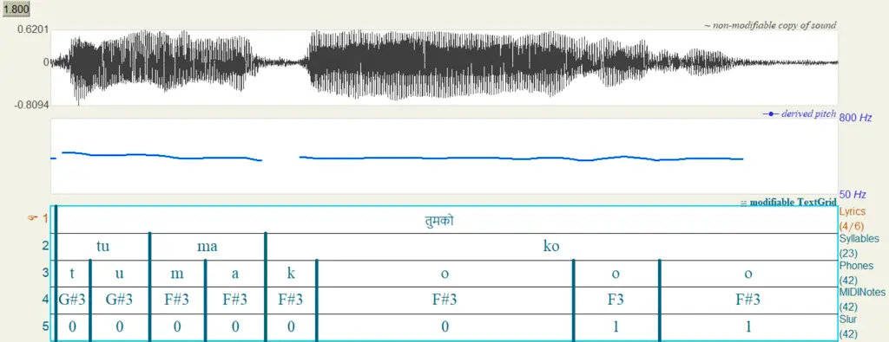

Fig. 1: Waveform, pitch track and music score for a song segment from
our dataset.

## III Proposed Method

The proposed model is built upon the DiffSinger framework \[1\]. The
same encoder model $`E(.)`$ is utilized to extract the music score
embedding $`{\boldsymbol{e}_{m}}`$ from the music score $`x`$, as
depicted in Fig. 2. Similar to DiffSinger, the LAPS-Diff model
incorporates two key components: the auxiliary decoder (aux decoder) and
the denoiser. Training details of the auxiliary decoder and the
denoiser, as well as the inference stage, are discussed in the following
subsections.

### III-A Feature Fusion

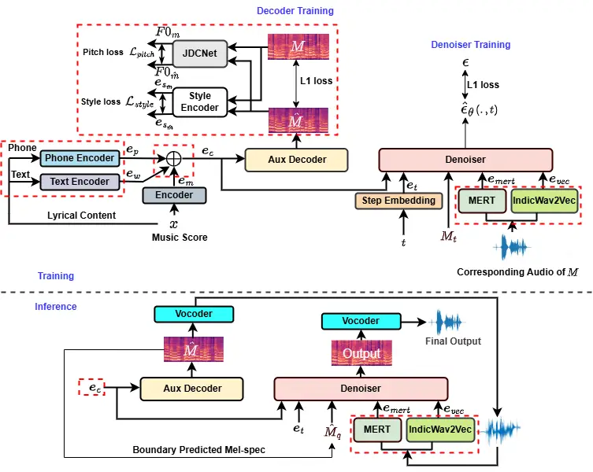

Fig. 2: Schematic overview of the proposed LAPS-Diff model, including
training and inference stages. The components enclosed within the
red-dashed boxes represent the specific enhancements of this work over
the DiffSinger framework.

To efficiently extract Hindi lyrical content related information from
the textual content of the music score by obtaining an enriched lyrical
representation, we use two pre-trained language models: IndicBERT (as a
text encoder $`T(.)`$) and XPhoneBERT (as a phone encoder $`H(.)`$) both
of which are compatible with the Hindi language. Thereafter, we combine
IndicBERT’s word level embedding $`{\boldsymbol{e}_{w}}`$ and
XPhoneBERT’s phone level embedding $`{\boldsymbol{e}_{p}}`$ with
$`{\boldsymbol{e}_{m}}`$ to derive the final fused embedding
$`{\boldsymbol{e}_{c}}`$ (i.e., fusion of three feature embeddings via
summation operation \[27, 28\]), as described mathematically in Eq.(1)
(shown in Fig. 2),

```math
\displaystyle\mathbf{e}_{c} \displaystyle=T(\text{text})+H(\text{phone})+E(x), \tag{1}
```

```math
\displaystyle=\mathbf{e}_{w}+\mathbf{e}_{p}+\mathbf{e}_{m},
```

The objective of constructing the fused embedding
$`{\boldsymbol{e}_{c}}`$ is to provide a better representation of
linguistic content (Hindi) in the embedding space, rather than relying
solely on $`{\boldsymbol{e}_{m}}`$ as considered in DiffSinger.

### III-B Decoder Training

The auxiliary decoder $`AD(.)`$ used in this work is a mel-spectrogram
decoder capable of reconstructing mel-spectrograms $`\hat{M}`$ from the
music score embedding \[1\]. However, in this work, we provide the
combined embedding $`{\boldsymbol{e}_{c}}`$ as the input to the
auxiliary decoder to generate mel-spectrograms (i.e.,
$`\hat{M}=AD(\boldsymbol{e}_{c})`$, where $`\hat{M}`$ is the generated
version that is conditioned on the supplied embedding. In addition to
content information, singer’s vocal style and pitch variations carry the
recognizable characteristics associated with any genre of singing.
Hence, to effectively train the auxiliary decoder in capturing relevant
information, we incorporate style and pitch losses as optimization
objectives in our work.

#### III-B1 Style Loss

To extract the vocal style related information in terms of style
embedding (style vector) from mel-spectrogram, we used a residual
connection based Convolutional Neural Network (CNN) model as the style
encoder $`S(.)`$ (the architectural framework of $`S(.)`$ is similar to
the acoustic style encoder of StyleTTS2 \[17\]). The extracted style
embedding carries an abstract representation (i.e., latent
representation) of the singer’s vocal characteristics. To compute the
style loss $`\mathcal{L}_{{style}}`$, we first extract the style
embeddings $`\boldsymbol{e}_{s_{m}}`$ and
$`\boldsymbol{e}_{s_{\hat{m}}}`$ from both $`M`$ and $`\hat{M}`$
respectively, as illustrated in Fig. 2. We then obtain
$`\mathcal{L}_{{style}}`$ using the Mean Squared Error (MSE), as defined
in the following equation,

```math
\displaystyle\mathcal{L}_{{style}} \displaystyle=\frac{1}{N}\sum_{i=1}^{N}\left\|\boldsymbol{e}_{s_{{m}_{i}}}-\boldsymbol{e}_{s_{\hat{m}_{i}}}\right\|^{2}, \tag{2}
```

where $`N`$ is the total length of the embedding. In Eq.(2),
$`\boldsymbol{e}_{s_{m}}=S(M)`$ and
$`\boldsymbol{e}_{s_{\hat{m}}}=S(\hat{M})`$.

#### III-B2 Pitch Loss

The pitch loss $`\mathcal{L}_{{pitch}}`$ is calculated using MSE between
the pitch values $`{{F0}}_{m}`$ and $`{{F0}}_{\hat{m}}`$ extracted from
both $`M`$ and $`\hat{M}`$ respectively, using the pre-trained JDCNet
model \[19\] denoted as $`J(.)`$. The pre-trained JDCNet model used in
this work is adopted from StyleTTS2 \[17\]). Due to StyleTTS2’s
impressive voice cloning abilities in terms of naturalness and
expressiveness, we kept the framework of $`S(.)`$ and $`J(.)`$ the same
as in StyleTTS2. Moreover, JDCNet \[19\] is extensively trained on
singing voice data, making it highly effective in capturing fine pitch
details from mel-spectrograms \[18\]. In a novel approach in this work,
we introduce the concordance correlation coefficient (CCC) \[29\] to
exploit the linear correlation between matched pitch contours
$`{{F0}}_{m}`$ and $`{{F0}}_{\hat{m}}`$. That is, the CCC (given in the
Eq.(3) below) balances the requirements of pitch height and correlation,
making it particularly suitable for evaluating the perceptual similarity
of two pitch contours. The CCC value ranges from $`-1`$ to $`1`$. To
influence the pitch loss, $`\mathcal{L}_{{pitch}}`$, we incorporate
$`(1-\text{CCC})`$ as a multiplicative factor such that a highly
correlated pair of $`{{F0}}_{m}`$ and $`{F0}_{\hat{m}}`$ results in a
lower penalty, whereas a lower correlation increases the penalty. The
pitch loss $`\mathcal{L}_{{pitch}}`$ is mathematically defined in
Eq.(3),

```math
\displaystyle\mathcal{L}_{\text{pitch}}=(1-\text{CCC})\times\left(\frac{1}{K}\sum_{i=1}^{K}\left\|F0_{m_{i}}-F0_{\hat{m}_{i}}\right\|^{2}\right) \tag{3}
```

```math
\displaystyle\text{where}\quad\text{CCC}=\frac{2\,\text{$\rho$}_{\scriptscriptstyle F0_{m}\,F0_{\hat{m}}}\sigma_{\scriptscriptstyle F0_{m}}\sigma_{\scriptscriptstyle F0_{\hat{m}}}}{\sigma_{\scriptscriptstyle F0_{m}}^{2}+\sigma_{\scriptscriptstyle F0_{\hat{m}}}^{2}+\left(\mu_{\scriptscriptstyle F0_{m}}-\mu_{\scriptscriptstyle F0_{\hat{m}}}\right)^{2}}\raisebox{1.72218pt}{\scalebox{1.1}{,}}
```

and $`\rho`$ denotes the Pearson correlation coefficient between the
predicted and ground-truth pitch contours, $`\sigma`$ represents the
standard deviation, and $`\mu`$ denotes the mean value of the respective
sequences. In Eq.(3), $`K`$ represents the length of the $`F0`$
sequence, $`{{F0}}_{m}=J(M)`$ and $`{{F0}}_{\hat{m}}=J(\hat{M})`$. To
prevent the loss from becoming zero for highly correlated pairs, we
introduce a minimum multiplicative factor of $`0.01`$.

Besides $`\mathcal{L}_{{style}}`$ and $`\mathcal{L}_{{pitch}}`$, we
incorporate $`L_{1}`$ loss (MAE loss) to measure the difference between
$`M`$ and $`\hat{M}`$, following a similar approach to DiffSinger. Apart
from these three losses, all other losses remain the same as in
DiffSinger’s Github repository \[30\].

### III-C Denoiser Training

In the training phase of the denoiser $`D(.)`$ in DiffSinger, the model
takes a noisy mel-spectrogram $`M_{t}`$ from the $`t`$-th
($`t\in{0,T}`$) diffusion step, along with the step embedding
$`\boldsymbol{e}_{t}`$ for time step $`t`$ and the music score embedding
$`\boldsymbol{e}_{m}`$, to estimate the noise
$`\hat{\epsilon}_{\theta}(\cdot)`$ \[1\] for obtaining $`(t-1)`$-th
denoised melspectrogram $`M_{t-1}`$ as given in Eq.(4),

```math
M_{t-1}=\frac{1}{\sqrt{\alpha_{t}}}\left(M_{t}-\frac{1-\alpha_{t}}{\sqrt{1-\bar{\alpha}_{t}}}\hat{\epsilon}_{\theta}(M_{t},\boldsymbol{e}_{m},\boldsymbol{e}_{t})\right)+\sigma_{t}z. \tag{4}
```

In Eq.(4), $`\alpha_{t}=1-\beta_{t}`$ ($`\beta_{t}`$ is variance
schedule at time step $`t`$),
$`\bar{\alpha}_{t}=\prod_{s=1}^{t}\alpha_{s}`$,
$`z\sim\mathcal{N}(0,I)`$ and $`\sigma_{t}`$ is noise scale at time step
$`t`$ \[22\].

To improve the denoising process in reverse diffusion, particularly for
accurate estimation of the denoised mel-spectrogram having precise
detail of the musical and linguistic information, we introduce two
additional feature embeddings as conditional priors to provide more
explicit guidance during denoising. Between the two, one captures
musical characteristics through MERT embedding \[20\] (focusing on tonal
and pitch-related attributes), and the other captures linguistic
information in terms of IndicWav2Vec \[21\] embedding to obtain a richer
representation in the denoised mel-spectrogram. MERT and IndicWav2Vec
are two pre-trained models (trained using self-supervised learning
approach) that efficiently extract respective embeddings from singing
audio data (shown in Fig. 2), as they are trained on singing (music)
data and multilingual speech data (including Hindi), respectively.
Therefore, Eq.(4) can be reformulated as follows:

```math
\displaystyle M_{t-1} \displaystyle=\frac{1}{\sqrt{\alpha_{t}}}\bigg(M_{t}-\frac{1-\alpha_{t}}{\sqrt{1-\bar{\alpha}_{t}}}\hat{\epsilon}_{\theta}(M_{t},\boldsymbol{e}_{c},\boldsymbol{e}_{t},\boldsymbol{e}_{{mert}},\boldsymbol{e}_{{vec}})\bigg)
```

```math
\displaystyle\quad+\sigma_{t}z. \tag{5}
```

In Eq.(5), $`\boldsymbol{e}_{{mert}}`$ and $`\boldsymbol{e}_{{vec}}`$
represents MERT and IndicWav2Vec embeddings respectively. The denoiser
training loss used in our work is identical to that of DiffSinger \[30\]
(i.e., $`L_{1}`$ loss). The model architecture of $`D(.)`$ considered in
LAPS-Diff is identical to the denoiser used in DiffSinger \[1\].

### III-D Inference Stage

In the inference stage, the optimal auxiliary decoder $`AD^{*}(\cdot)`$
generates the mel-spectrogram $`\hat{M}`$, which contains nuanced
representations of the lyrical content, vocal style, and prosody. The
pre-trained HiFi-GAN vocoder \[31\] is then used to reconstruct the
audio waveform from $`\hat{M}`$, from which the embeddings
$`\boldsymbol{e}_{{mert}}`$ and $`\boldsymbol{e}_{{vec}}`$ are
extracted. These embeddings along with $`\boldsymbol{e}_{{c}}`$,
$`\boldsymbol{e}_{{t}}`$, and the intermediate boundary-predicted \[1\]
representation $`\hat{M}_{q}`$ are used to condition the optimal
denoiser $`D^{*}(\cdot)`$, as illustrated in Fig. 2 to generate the
final output. Here, $`\hat{M}_{q}`$ is derived from $`\hat{M}`$ through
the shallow diffusion mechanism of DiffSinger \[1\], where $`q`$ denotes
the shallow diffusion step. Boundary prediction mechanism is applied
only at the first iteration of the reverse diffusion, rest are same as
Eq.(5).

In the DiffSinger model, the inference stage primarily relies on the
boundary-predicted mel-spectrogram to generate the final output. In
contrast, the proposed LAPS-Diff model explicitly incorporates MERT and
IndicWav2Vec embeddings that are derived from the reconstructed waveform
output of the vocoder. The complete workflow of the proposed LAPS-Diff
model is summarized in Algorithm 1.

1: Input: Text, Phoneme, and Music score; Ground-truth audio and
mel-spectrogram $`M`$

2: Output: Trained models $`AD^{*}(\cdot)`$ and $`D^{*}(\cdot)`$

3: Embedding Extraction

4: Extract embeddings: $`\boldsymbol{e}_{w}`$, $`\boldsymbol{e}_{p}`$,
$`\boldsymbol{e}_{m}`$

5: Training Auxiliary Decoder

6: Generate mel-spectrogram: $`\hat{M}=AD(\boldsymbol{e}_{c})`$

7: Extract $`\boldsymbol{e}_{s_{m}}`$, $`\boldsymbol{e}_{s_{\hat{m}}}`$

8: Extract $`F0_{m}`$, $`F0_{\hat{m}}`$

9: Compute style loss: $`\mathcal{L}_{\text{style}}`$

10: Compute pitch loss: $`\mathcal{L}_{\text{pitch}}`$

11: Compute reconstruction loss:
$`\mathcal{L}_{\text{L1}}=\text{MAE}(M,\hat{M})`$

12: Compute total auxiliary loss:
$`\mathcal{L}_{\text{aux}}=\mathcal{L}_{\text{style}}+\mathcal{L}_{\text{pitch}}+\mathcal{L}_{\text{L1}}`$

13: Update $`AD(\cdot)`$ to minimize $`\mathcal{L}_{\text{aux}}`$

14: Training Denoiser

15: for each diffusion step $`t`$ do

16:   Generate noisy mel-spectrogram: $`M_{t}`$

17:   Get timestep embedding: $`\boldsymbol{e}_{t}`$

18:   Extract conditional MERT features:
$`\boldsymbol{e}_{\text{mert}}`$

19:   Extract conditional Wav2Vec features:
$`\boldsymbol{e}_{\text{vec}}`$

20:   Estimate noise:
$`\hat{\epsilon}_{\theta}=D(M_{t},\boldsymbol{e}_{c},\boldsymbol{e}_{t},\boldsymbol{e}_{\text{mert}},\boldsymbol{e}_{\text{vec}})`$

21:   Compute denoising loss:
$`\mathcal{L}_{\text{denoise}}=\text{MAE}(\epsilon,\hat{\epsilon}_{\theta})`$

22:   Update $`D(\cdot)`$ to minimize $`\mathcal{L}_{\text{denoise}}`$

23: end for

24: Obtain optimal models: $`AD^{*}(\cdot)`$ and $`D^{*}(\cdot)`$

25: Inference Stage

26: Extract embeddings as in previous steps

27: Generate initial mel-spectrogram:
$`\hat{M}=AD^{*}(\boldsymbol{e}_{c})`$

28: Perform shallow diffusion:

29:
 $`\hat{M}_{q}=\text{ShallowDiffusion}(\hat{M},\epsilon),\quad\epsilon\sim\mathcal{N}(0,I)`$

30: Extract conditional MERT features: $`\boldsymbol{e}_{\text{mert}}`$

31: Extract conditional Wav2Vec features:
$`\boldsymbol{e}_{\text{vec}}`$

32: Initialize diffusion mel: $`M_{q}=\hat{M}_{q}`$

33: for $`t=q`$ to $`1`$ do

34:   if $`t=1`$ then

35:    $`z=0`$

36:   else

37:    Sample $`z\sim\mathcal{N}(0,I)`$

38:   end if

39:   Compute denoised mel-spectrogram:

40:
   $`\begin{aligned} M_{t-1}={}&\frac{1}{\sqrt{\alpha_{t}}}\Bigg(M_{t}-\frac{1-\alpha_{t}}{\sqrt{1-\bar{\alpha}_{t}}}\hat{\epsilon}_{\theta}(M_{t},\boldsymbol{e}_{c},\boldsymbol{e}_{t},\\
&\boldsymbol{e}_{\text{mert}},\boldsymbol{e}_{\text{vec}})\Bigg)+\sigma_{t}z\end{aligned}`$

41: end for

Algorithm 1 Workflow of the Proposed LAPS-Diff Model

## IV Experiments

We present our experimental setup with implementation details.

### IV-A Data Preprocessing

The overall duration of the singing voice segments of our Hindi
Bollywood SVS dataset, introduced in Section II, is approximately 65
minutes. With 38 unique songs, segmented into 397 sung phrases each with
duration ranging from 5 to 15 seconds. The dataset splits are based on
distributing the songs across training, validation, and test sets with
details shown in Table I. Each audio file is sampled at $`16`$ kHz with
$`16`$-bit quantization. The Hindi text (Devanagari script) is converted
into its corresponding phonemes using the IIT-M Hindi phoneset \[32\].
The size of the phoneme vocabulary considered is $`43`$. We extract
mel-spectrograms considering $`80`$ mel-bins using frame size of $`512`$
and hop size of $`128`$. Similar to DiffSinger \[1\], the
mel-spectrograms are normalized to the range $`[-1,1]`$.

|            |       |          |                |
| ---------- | ----- | -------- | -------------- |
| Split      | Songs | Segments | Duration (Min) |
| Train      | 31    | 344      | 57.14          |
| Validation | 3     | 25       | 3.76           |
| Test       | 4     | 28       | 3.76           |

TABLE I: Description of dataset splits

#### IV-A1 Implementation Details

In our work, we use the IndicBERT model \[15\], pre-trained on $`12`$
Indian languages, including Hindi. In contrast, the pre-trained
XPhoneBERT model \[16\], which follows the BERT-base architecture
\[27\], is trained on nearly $`100`$ languages, also including Hindi.
The embedding dimension for both IndicBERT and XPhoneBERT is $`768`$.
Linear projection is applied to reduce the dimensionality to 256,
ensuring compatibility with the $`256`$-dimensional music score
embedding $`\boldsymbol{e}_{m}`$. We retain the encoder architecture
$`E(.)`$ as used in DiffSinger \[30\].

The style encoder $`S(.)`$ consists of four 2D residual blocks \[18\],
and the style vector dimensionality is set to 48. We use the checkpoint
of the pre-trained JDCNet (a ConvBi-LSTM model consisting of three
ResNet blocks) \[19\] from StyleTTS2 \[17\] to extract pitch values (the
pitch sequence is of variable length depending on the segment duration).
Unlike the loss functions described in the original DiffSinger paper
\[1\], the official GitHub implementation \[30\] incorporates three
additional duration losses—word, phone, and slur—duration along with a
pitch and energy loss, employing duration, pitch and energy predictors
similar to FastSpeech 2 \[33\]. These additional losses are also used to
train the auxiliary decoder of both DiffSinger and our proposed model in
all the experiments. The model architecture of $`AD(.)`$ is the same as
FastSpeech2 \[34, 1\]). In LAPS-Diff, the denoiser architecture $`D(.)`$
follows a non-causal WaveNet framework \[35\], similar to that used in
DiffSinger \[1\].

The MERT model considered in our work is trained on diverse datasets
comprising musical instruments and singing voices \[20\]. We use the
pre-trained model to obtain the musical embeddings of size 1024. The
IndicWav2Vec \[21\] is trained on nine Indian languages including Hindi,
is capable of extracting linguistic content from speech audio. We employ
the pre-trained IndicWav2Vec to obtain content embeddings of size 1024.
We consider batch size as 48 and optimize the model using AdamW
optimizer \[36\] with a learning rate of $`1\times{1}0^{-3}`$, for a
total training iteration of $`2\times{10}^{5}`$. Validation is performed
in every $`2\times{10}^{3}`$ iterations. We set the value of $`T=100`$
and $`{\beta}`$ value increases linearly from from $`1\times{10}^{-4}`$
to $`6\times{10}^{-2}`$ over the diffusion steps. While the DiffSinger
paper \[1\] describes the computation of the shallow diffusion step
$`q`$ using boundary prediction mechanism, the official GitHub
implementation \[30\] sets $`q=60`$, which value we have retained in our
implementation.

The LAPS-Diff experiments are implemented in python 3.8.20 using pytorch
2.4.1 and numpy 1.19.2. Librosa 0.8.0 is used for audio preprocessing.
All experiments run on an NVIDIA A100 GPU with 80GB memory. The training
process takes approximately 2 GPU days to complete for the proposed
model with the major component for complexity coming from the extra
pitch calculation at each training iteration from the JDCNet \[19\]
model.

## V Results and Discussion

The performance of the proposed LAPS-Diff model is compared with the
SOTA DiffSinger model using both objective and subjective tests, on our
Hindi Bollywood SVS dataset. Additionally, an ablation study is carried
out to demonstrate the effectiveness of the individual components
integrated into LAPS-Diff to adapt it for Hindi singing data, using the
same evaluation methods. For objective evaluation, we have used
Mel-Cepstral Distortion (MCD), logarithmic Fundamental Frequency Root
Mean Square Error (logF0 RMSE), Mean Absolute Error (MAE), cosine
similarity and voiced/unvoiced (V/UV) ratio \[37, 38, 39\] as evaluation
metrics. Additionally, we have utilized the metas’s Audiobox Aesthetic
Score (AES) \[40\] for perceptual evaluation. Whereas, for subjective
evaluation, we have considered Mean Opinion Score (MOS) \[41\].

Four ablation settings (as summarised in Table II and Table III) are
considered in our experiments: (i) training DiffSinger from scratch with
text and phone embeddings (Ablation 1), (ii) training DiffSinger from
scratch with MERT and IndicWav2Vec features as conditional priors
(Ablation 2), (iii) training DiffSinger from scratch with JDCNet-based
CCC pitch loss (Ablation 3), and (iv) training DiffSinger from scratch
with style loss (Ablation 4). All settings were trained using the same
dataset, preprocessing steps, number of training iterations, and overall
hyperparameters to ensure consistency.

### V-A Objective Evaluation

The objective evaluation metrics considered here serve distinct
purposes: MCD captures timbral (spectral) similarity, logF0 RMSE
evaluates pitch similarity, MAE measures overall (global) structural
similarity between mel-spectrograms, cosine similarity (with ECAPA-TDNN
embeddings \[42\]) assesses the similarity of speaker dependent
characteristics, and the V/UV ratio reflects the model’s ability to
distinguish voiced and unvoiced regions. In contrast, AES provides a
perceptual score using Meta’s pre-trained audio toolbox. Collectively,
these metrics provide a comprehensive assessment of the generated
samples across key acoustic dimensions.

|                                                |                                  |                      |                              |                                     |                      |                            |                            |
| ---------------------------------------------- | -------------------------------- | -------------------- | ---------------------------- | ----------------------------------- | -------------------- | -------------------------- | -------------------------- |
| Model                                          | Cosine Similarity ($`\uparrow`$) | MAE ($`\downarrow`$) | V/UV Accuracy ($`\uparrow`$) | Log-$`F_{0}`$ RMSE ($`\downarrow`$) | MCD ($`\downarrow`$) | Audiobox CE ($`\uparrow`$) | Audiobox PQ ($`\uparrow`$) |
| Reference                                      | –                                | –                    | –                            | –                                   | –                    | 6.206                      | 7.637                      |
| LAPS-Diff (Proposed)                           | 0.987                            | 0.165                | 0.907                        | 0.141                               | 7.897                | 4.770                      | 6.552                      |
| DiffSinger (Baseline)                          | 0.982                            | 0.197                | 0.890                        | 0.155                               | 8.200                | 4.004                      | 6.340                      |
| Ablation 1 (Baseline + IndicBERT + XPhoneBERT) | 0.973                            | 0.171                | 0.890                        | 0.159                               | 7.983                | 4.200                      | 6.499                      |
| Ablation 2 (Baseline + MERT + IndicWav2Vec)    | 0.978                            | 0.185                | 0.869                        | 0.151                               | 9.445                | 4.151                      | 6.408                      |
| Ablation 3 (Baseline + JDCNet Pitch Loss)      | 0.978                            | 0.171                | 0.898                        | 0.118                               | 7.928                | 3.460                      | 6.355                      |
| Ablation 4 (Baseline + Style Loss)             | 0.986                            | 0.169                | 0.880                        | 0.145                               | 7.883                | 3.869                      | 6.511                      |

TABLE II: Objective and perceptual evaluation of the proposed LAPS-Diff
model, baseline DiffSinger, and its ablation variants

The objective evaluation results in Table II are the average computed
across all the test data. We note the superior performance of the
proposed LAPS-Diff model compared to the baseline DiffSinger. LAPS-Diff
outperforms across most metrics, achieving the highest average cosine
similarity, lowest MAE, highest V/UV accuracy, second lowest log-F0 RMSE
and MCD. These results suggest that LAPS-Diff captures speaker
characteristics more accurately and ensures closer alignment of the
spectral features (including pitch) with the ground truth, thereby
enhancing the overall quality of the synthesized singing voice.
Moreover, the higher V/UV ratio achieved by the proposed model indicates
its effectiveness in capturing the details of voiced and unvoiced
regions, contributing to greater naturalness in the synthesized singing
voice.

In Ablation 1, we retain only the content encoder enhanced part (i.e.,
$`\boldsymbol{e}_{c}`$), replacing all other LAPS-Diff innovations with
their vanilla counterparts (i.e., DiffSinger). This configuration showed
moderate performance gains over vanilla DiffSinger, in terms of MAE and
MCD ratio. However, due to the absence of stylistic and prosodic
control, the generated outputs lacked expressive nuance, evident from a
higher log-F0 RMSE and reduced cosine similarity. The results show that
the absence of prosody and style modeling greatly hampers the melodic
and stylistic quality of the synthesized singing voice. In Ablation 2
variant, only the MERT and IndicWav2Vec priors were added to denoiser,
while other LAPS-Diff components were excluded. This setup led to
notable improvements in MAE, MCD, and log-F0 RMSE compared to the
vanilla DiffSinger, suggesting that these embedding priors effectively
enhance spectral feature generation. However, the cosine similarity and
the V/UV ratio decreased, highlighting the necessity of style and
prosody embeddings for better speaker similarity and accurate modeling
of voiced/unvoiced regions. In Ablation 3 the JDCNet-based pitch loss
retained, excluding all other LAPS-Diff components. By introducing
pre-trained prosody-level supervision, the model achieved notable
improvements in log-F0 RMSE, MCD, MAE, and V/UV ratio reflecting more
accurate and smoother pitch and spectral modeling. However, the cosine
similarity slightly decreased compared to the vanilla DiffSinger.
Finally, in Ablation 4 variant, only the style loss is retained by
replacing all other components of LAPS-Diff. This enables explicit
modeling of style enhanced expressive features as compared to vanilla
DiffSinger. This setting demonstrated improvements in cosine similarity
(as compared to vanilla DiffSinger) suggesting better stylistic
alignment, but a decline in the V/UV ratio. However, it showed
significant gains in terms log-F0 RMSE, MCD, and MAE. These results
highlight that while style loss effectively introduces expressive
variation, it alone is insufficient for managing the dynamic aspects of
singing that influence V/UV regions.

Meta’s AES evaluation metrics \[40\], adopted in our work, are designed
to assess the aesthetic quality of diverse audio types including speech,
music and general sounds, using a pre-trained model that closely aligns
with human perceptual judgments. We select the measures relevant to
synthesis from music score (i.e. content is pre-defined), viz.
Production Quality (PQ) capturing the technical clarity and fidelity of
the audio, including its dynamics, frequency balance, and spatial
attributes. Content Enjoyment (CE) evaluates the emotional and artistic
expressiveness of the audio—highlighting aspects like creativity, mood,
and subjective appeal. Since we have a single voice, the AES ”production
complexity” measure (PC) is irrelevant.

Table II clearly shows that the LAPS-Diff model outperforms all other
models across both AES dimensions, achieving the highest scores (except
for the reference scores, as expected) demonstrating its superior
performance in generating singing voice samples that are highly
expressive and perceptually rich. Among the ablation variants, Ablation
1 and Ablation 2 show notable improvements over the DiffSinger baseline,
particularly in terms of CE and PQ, highlighting the importance of
linguistic and musical embeddings in enhancing expressiveness and the
overall quality of the generated samples. Additionally, Ablation 3 and
Ablation 4 contribute primarily to technical fidelity, clarity, and
harmonic richness of the generated singing voice (i.e., PQ) but fall
slightly short in capturing artistic expressiveness (CE), suggesting
that this attribute likely needs other dimensions such as timbre,
loudness and voice quality.

#### V-A1 Visual Analysis

To compare the lyrical content preservation capabilities of the proposed
model and the baseline, we extracted Hindi content embeddings using
IndicWav2Vec from LAPS-Diff, DiffSinger, and the ground truth audio.
These high-dimensional embeddings are projected onto a 2D space using
Principal Component Analysis (PCA) \[43\] for visualization. As
illustrated in Fig. 3, the LAPS-Diff embeddings are located closer to
the ground truth than those from DiffSinger, indicating that LAPS-Diff
captures content information more effectively.

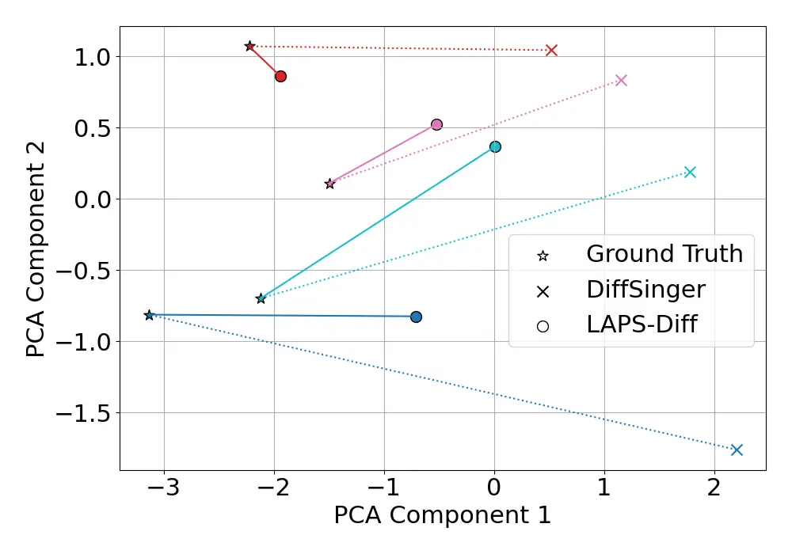

Fig. 3: PCA visualization of content embeddings extracted using
IndicWav2Vec from ground truth, DiffSinger, and LAPS-Diff outputs,
illustrating content-level similarity. Here, each color represents a
unique audio segment.

Next, we present a visual comparison of pitch contours from selected
audio segments for LAPS-Diff, DiffSinger and the reference,
corresponding to faster and slower singing rates shown in Fig. 4. For
the fast singing rate, the pitch contours in regions $`A`$ and $`C`$ of
LAPS-Diff closely resemble those of the corresponding ground truth
regions, whereas DiffSinger shows noticeable deviations. The region
$`B`$ contains a pitch transition to a much higher value, and Fig. 4
shows LAPS-Diff appropriately synthesizes the high-pitched part,
matching the ground truth. In contrast, DiffSinger’s pitch pattern in
region $`B`$ deviates visibly from the music score MIDI. This indicates
LAPS-Diff’s ability in handling high-pitched regions and highlights its
effectiveness in capturing fine-grained pitch details across diverse
frequency ranges. A similar observation holds for region $`P`$ (Fig. 4)
in the slower singing rate scenario, where LAPS-Diff better matches the
ground truth contours. Moreover, in region $`Q`$, which corresponds to a
held (and therefore long duration) vowel, DiffSinger fails to follow the
within-vowel pitch variation, while LAPS-Diff shows high similarity with
the ground truth. These comparisons indicate that LAPS-Diff captures
pitch information more accurately and consistently than DiffSinger,
which may be attributed to the additional correlation-dependent pitch
loss.

We also present a visual comparison of mel-spectrograms to evaluate the
effectiveness of our proposed model. Two audio segments are considered:
one with a faster singing rate and the other with a slower rate, shown
in the top and bottom rows of Fig. 5, respectively. The spectrograms are
divided into three regions for detailed analysis. In the first row,
corresponding to the faster singing rate, regions $`R_{a}`$ and
$`R_{b}`$ exhibit significant harmonic distortion in DiffSinger, whereas
LAPS-Diff preserves the harmonic structure more accurately. In region
$`R_{c}`$, an elongated phoneme appears noticeably distorted in
DiffSinger, while LAPS-Diff renders it more clearly with minimal
artifacts. In the second row of Fig. 5, which corresponds to the slower
singing rate, region $`R_{p}`$ again shows harmonic distortion in the
output of DiffSinger, while LAPS-Diff maintains clear harmonic patterns.
In region $`R_{q}`$, DiffSinger struggles to represent low-energy
(unvoiced) segments, which are better captured by LAPS-Diff. Lastly, in
region $`R_{r}`$, stressed phonemes are distorted in DiffSinger, whereas
LAPS-Diff preserves their clarity. These observations highlight
LAPS-Diff’s superior ability to model elongated phonemes and stylistic
nuances, which are crucial for high-quality singing voice synthesis.
Since the audio samples used in Fig. 4 and Fig. 5 are not the same,
their time durations differ.

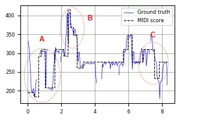

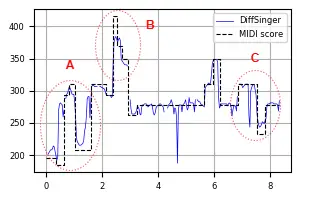

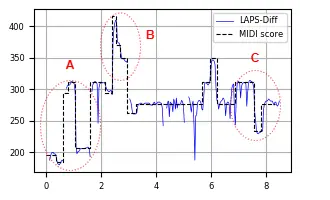

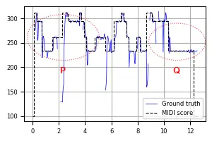

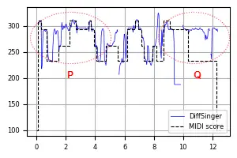

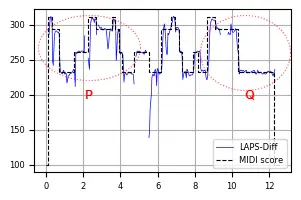

Fig. 4: Visualization of the F0 contour comparing ground truth with
synthesized outputs from DiffSinger and LAPS-Diff, all with reference to
the MIDI score. The vertical axis shows frequency (Hz), and the
horizontal axis represents time (seconds). Top row contains a sample
with faster singing rate, and bottom shows a sample with slower singing
rate.

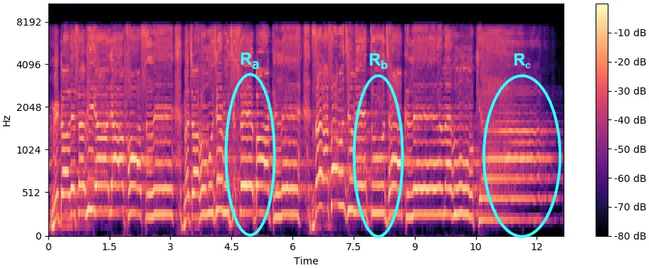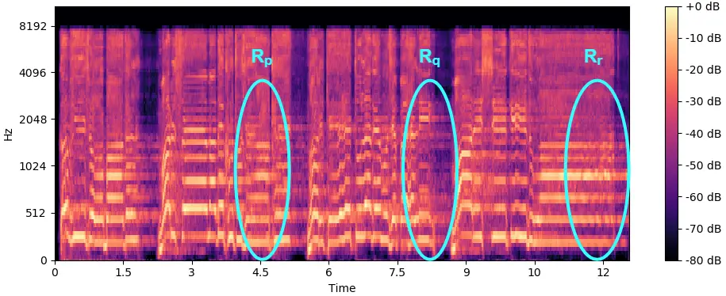

Ground Truth

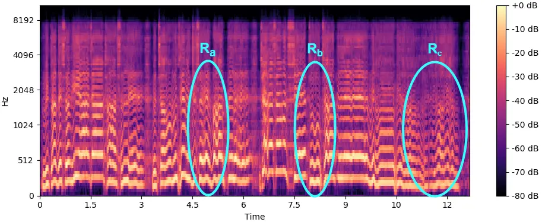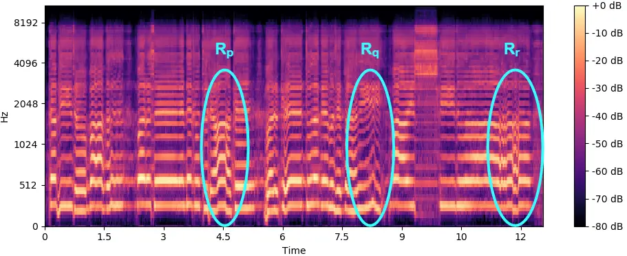

DiffSinger

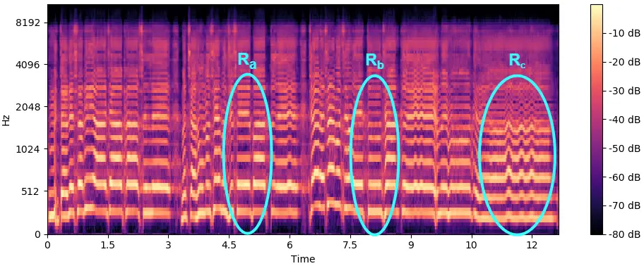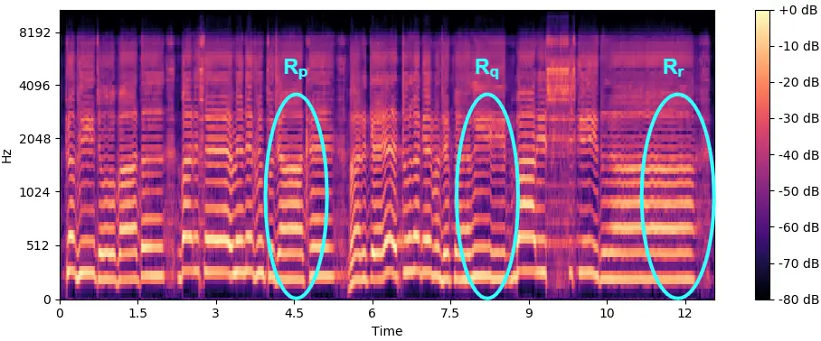

LAPS-Diff

Fig. 5: Mel spectrograms comparing ground truth with synthesized outputs
from DiffSinger and LAPS-Diff. Top row contains a sample with faster
singing rate, whereas the bottom row features a sample with slower
singing rate.

### V-B Subjective Evaluation

#### V-B1 MOS Testing

We conducted MOS subjective evaluation test to assess the naturalness of
the generated audio samples and the ground truth. A total of 15
listeners, aged between 20-35 years and without any known hearing
impairments, participated. Each participant was asked to rate the
samples on a 5-point scale \[41\]. Our test set consists of 4 songs: one
each with fast and slow singing rates and two with average singing
rates. The evaluation included $`6`$ segments (out of a total of 28)
from our test set, ensuring that we take segments from each category of
fast, slow, and average singing rate. We take segments from each of the
following $`7`$ categories: ground truth, DiffSinger, LAPS-Diff
(proposed model), and four ablation variants, resulting in a total of 42
samples. These were randomly permuted and arranged in $`6`$ test sets of
$`7`$ each. The results of the MOS subjective evaluation test are shown
in Table III.

|                                                |                    |
| ---------------------------------------------- | ------------------ |
| Model                                          | MOS ($`\uparrow`$) |
| Reference                                      | 4.59 $`\pm`$ 0.26  |
| LAPS-Diff (Proposed)                           | 3.36 $`\pm`$ 0.34  |
| DiffSinger (Baseline)                          | 2.85 $`\pm`$ 0.44  |
| Ablation 1 (Baseline + IndicBERT + XPhoneBERT) | 2.83 $`\pm`$ 0.58  |
| Ablation 2 (Baseline + MERT + IndicWav2Vec)    | 3.01 $`\pm`$ 0.18  |
| Ablation 3 (Baseline + JDCNet pitch loss)      | 3.05 $`\pm`$ 0.38  |
| Ablation 4 (Baseline + style loss)             | 2.95 $`\pm`$ 0.47  |

TABLE III: MOS with 95% confidence intervals

The results of Table III clearly highlight the effectiveness of each
component integrated into the proposed LAPS-Diff model. As observed from
the MOS scores, the proposed LAPS-Diff model achieves a significantly
higher MOS (3.36) compared to the baseline DiffSinger (2.85), confirming
the benefit of our proposed enhancements. Ablation 1 results in a low
MOS score, indicating that linguistic features alone are insufficient
for adequately capturing the expressive qualities of the singing voice
that are needed to enhance perceptual naturalness. Listeners reported
that while this ablation has good content information, it has unwanted
artifacts in pitch in long phones and instances with slurs, indicating
the need for improvement in the pitch. Ablation 2, achieves a higher MOS
(3.01), suggesting that musical and contextual embeddings help to guide
the denoiser more effectively. Listeners reported smoother transitions
across different phones and stated that the audio seemed more natural,
as seen by the high PQ score in the perceptual evaluation in Table II.
Similarly, Ablation 3 further improves the naturalness, revealing how
accurate pitch modeling contributes to generating more melodically
coherent singing voice. Listeners reported that the prosody and pitch
quality in this ablation was significantly better than other ablations,
but at the same time, intelligibility was reduced, indicating the
necessity of combining all the contributions. Ablation 4 reaches 2.95,
pointing out the role of vocal style in enhancing expressiveness. In
this Ablation, listeners perceived the expected singing expressiveness
and naturalness compared to the other cases. Overall, integrating
linguistic embeddings, musical and contextual priors, along with style-
and pitch-guided losses, results in a comprehensive performance
improvement for the LAPS-Diff model, showcasing its capability to
generate natural and expressive Hindi singing voices even under limited
data conditions.

## VI Conclusion

In this work, we introduced LAPS-Diff, a novel singing voice synthesis
model designed for low-resource Hindi Bollywood singing style. We
present a new labeled dataset for Hindi Bollywood music of one-hour
duration (audio provided via available public links). By incorporating
enriched linguistic content embeddings, style and pitch supervision
through loss computation, and utilizing conditional priors, LAPS-Diff
achieves notable improvements in the expressiveness and fidelity of the
synthesized singing voice over that of the DiffSinger baseline it is
derived from. In particular, the implicit learning of expressive pitch
contours is facilitated by the use of a new pitch loss that considers
also the correlation of the pitch contours (i.e. melodic shape
matching). Our results, supported by both objective and subjective
evaluations, confirm that incorporating pre-trained language models
alongside singing voice-specific feature modules greatly improves the
quality of SVS, as observed in the low-resource context targeted in this
work. Future efforts will address the computational optimization of
training and inference. We will study gains in generated quality that
are achievable as the dataset size is expanded, including multilingual
SVS, with an emphasis on enhancing generalization across a variety of
vocal styles.

## References

- \[1\] J. Liu, C. Li, Y. Ren, F. Chen, and Z. Zhao (2021) DiffSinger:
  singing voice synthesis via shallow diffusion mechanism. In AAAI
  Conference on Artificial Intelligence, Cited by: §I, §I, §I, §III-B,
  §III-C, §III-C, §III-D, §III, §IV-A1, §IV-A1, §IV-A.
- \[2\] H. Xue, X. Wang, Y. Zhang, L. Xie, P. Zhu, and M. Bi (2022)
  Learn2Sing 2.0: diffusion and mutual information-based target speaker
  svs by learning from singing teacher. In Interspeech, Cited by: §I,
  §I.
- \[3\] Y. Zhang, Z. Jiang, R. Li, C. Pan, J. He, R. Huang, C. Wang,
  and Z. Zhao (2024) TCSinger: zero-shot singing voice synthesis with
  style transfer and multi-level style control. ArXiv abs/2409.15977.
  Cited by: §I.
- \[4\] T. Wang, R. Fu, J. Yi, Z. Wen, and J. Tao (2022)
  Singing-tacotron: global duration control attention and dynamic filter
  for end-to-end singing voice synthesis. In Proceedings of the 1st
  International Workshop on Deepfake Detection for Audio Multimedia,
  DDAM ’22, New York, NY, USA, pp. 53–59. External Links: ISBN
  9781450394963, [Document](https://dx.doi.org/10.1145/3552466.3556534)
  Cited by: §I.
- \[5\] S. Kim, M. Jeong, H. Lee, M. Kim, B. J. Choi, and N. S.
  Kim (2024) MakeSinger: a semi-supervised training method for
  data-efficient singing voice synthesis via classifier-free diffusion
  guidance. ArXiv abs/2406.05965. Cited by: §I.
- \[6\] J. Hwang, S. Lee, and S. Lee (2023) HiddenSinger: high-quality
  singing voice synthesis via neural audio codec and latent diffusion
  models. Neural networks : the official journal of the International
  Neural Network Society 181. Cited by: §I.
- \[7\] K. Sui, J. Xiang, and F. Jin (2024) RDSinger: reference-based
  diffusion network for singing voice synthesis. ArXiv abs/2410.21641.
  Cited by: §I.
- \[8\] S. Dai, M. Liu, R. Valle, and S. Gururani (2024)
  ExpressiveSinger: multilingual and multi-style score-based singing
  voice synthesis with expressive performance control. In Proceedings of
  the 32nd ACM International Conference on Multimedia, MM ’24, New York,
  NY, USA, pp. 3229–3238. External Links: ISBN 9798400706868,
  [Document](https://dx.doi.org/10.1145/3664647.3681642) Cited by: §I.
- \[9\] V. Popov, I. Vovk, V. Gogoryan, T. Sadekova, and M.
  Kudinov (2021) Grad-tts: a diffusion probabilistic model for
  text-to-speech. In International Conference on Machine Learning, Cited
  by: §I.
- \[10\] Y. Zhang, H. Xue, H. Li, L. Xie, T. Guo, R. Zhang, and C.
  Gong (2022) VISinger 2: high-fidelity end-to-end singing voice
  synthesis enhanced by digital signal processing synthesizer. ArXiv
  abs/2211.02903. Cited by: §I.
- \[11\] Y. Wang, X. Wang, P. Zhu, J. Wu, H. Li, H. Xue, Y. Zhang, L.
  Xie, and M. Bi (2022) Opencpop: a high-quality open source chinese
  popular song corpus for singing voice synthesis. ArXiv abs/2201.07429.
  Cited by: §I, §II.
- \[12\] G. Lee, T. Kim, H. Bae, M. Lee, Y. Kim, and H. Cho (2021)
  N-singer: a non-autoregressive korean singing voice synthesis system
  for pronunciation enhancement. In Interspeech, Cited by: §I.
- \[13\] H. Tamaru, S. Takamichi, N. Tanji, and H. Saruwatari (2020)
  JVS-music: japanese multispeaker singing-voice corpus. ArXiv
  abs/2001.07044. Cited by: §I.
- \[14\] H. Zhou, Y. Lin, Y. Shi, P. Sun, and M. Li (2023) Bisinger:
  bilingual singing voice synthesis. 2023 IEEE Automatic Speech
  Recognition and Understanding Workshop (ASRU), pp. 1–8. Cited by: §I.
- \[15\] S. Doddapaneni, R. Aralikatte, G. Ramesh, S. Goyal, M. M.
  Khapra, A. Kunchukuttan, and P. Kumar (2022) Towards leaving no indic
  language behind: building monolingual corpora, benchmark and models
  for indic languages. In Annual Meeting of the Association for
  Computational Linguistics, Cited by: §I, §IV-A1.
- \[16\] L. T. Nguyen, T. Pham, and D. Q. Nguyen (2023) XPhoneBERT: a
  pre-trained multilingual model for phoneme representations for
  text-to-speech. In Interspeech, Cited by: §I, §IV-A1.
- \[17\] Y. A. Li, C. Han, V. S. Raghavan, G. Mischler, and N.
  Mesgarani (2023) StyleTTS 2: towards human-level text-to-speech
  through style diffusion and adversarial training with large speech
  language models. Advances in neural information processing systems 36.
  Cited by: §I, §III-B1, §III-B2, §IV-A1.
- \[18\] Y. A. Li, C. Han, and N. Mesgarani (2022) StyleTTS: a
  style-based generative model for natural and diverse text-to-speech
  synthesis. IEEE Journal of Selected Topics in Signal Processing 19,
  pp. 283–296. Cited by: §I, §III-B2, §IV-A1.
- \[19\] S. Kum and J. Nam (2019) Joint detection and classification of
  singing voice melody using convolutional recurrent neural networks.
  Applied Sciences 9 (7). External Links: ISSN 2076-3417,
  [Document](https://dx.doi.org/10.3390/app9071324) Cited by: §I,
  §III-B2, §IV-A1, §IV-A1.
- \[20\] Y. Li, R. Yuan, G. Zhang, Y. Ma, X. Chen, H. Yin, C. Lin, A.
  Ragni, E. Benetos, N. Gyenge, R. B. Dannenberg, R. Liu, W. Chen, G. G.
  Xia, Y. Shi, W. Huang, Y. Guo, and J. Fu (2023) MERT: acoustic music
  understanding model with large-scale self-supervised training. ArXiv
  abs/2306.00107. Cited by: §I, §III-C, §IV-A1.
- \[21\] T. Javed, S. Doddapaneni, A. V. Raman, K. Bhogale, G.
  Ramesh, A. Kunchukuttan, P. Kumar, and M. M. Khapra (2021) Towards
  building asr systems for the next billion users. In AAAI Conference on
  Artificial Intelligence, Cited by: §I, §III-C, §IV-A1.
- \[22\] J. Ho, A. Jain, and P. Abbeel (2020) Denoising diffusion
  probabilistic models. ArXiv abs/2006.11239. Cited by: §I, §III-C.
- \[23\] G. Lab (2024) Gaudio studio: ai-powered audio processing.
  External Links: [Link](https://studio.gaudiolab.io/) Cited by: §II.
- \[24\] D. Povey, A. Ghoshal, G. Boulianne, L. Burget, O. Glembek, N.
  Goel, M. Hannemann, P. Motlicek, Y. Qian, P. Schwarz, et al. (2011)
  The kaldi speech recognition toolkit. In IEEE 2011 workshop on
  automatic speech recognition and understanding, Cited by: §II.
- \[25\] IIT Madras Speech Lab (2021) IIT-Madras Hindi-Tamil-English ASR
  Challenge. Note:
  [https://sites.google.com/view/indian-language-asrchallenge/home](https://sites.google.com/view/indian-language-asrchallenge/home)
  Cited by: §II.
- \[26\] Y. Jadoul, B. Thompson, and B. De Boer (2018) Introducing
  parselmouth: a python interface to praat. Journal of Phonetics 71,
  pp. 1–15. Cited by: §II.
- \[27\] J. Devlin, M. Chang, K. Lee, and K. Toutanova (2019) BERT:
  pre-training of deep bidirectional transformers for language
  understanding. In North American Chapter of the Association for
  Computational Linguistics, Cited by: §III-A, §IV-A1.
- \[28\] Y. Chen, S. Zheng, H. Wang, L. Cheng, Q. Chen, and J. Qi (2023)
  An enhanced res2net with local and global feature fusion for speaker
  verification. ArXiv abs/2305.12838. Cited by: §III-A.
- \[29\] B. T. Atmaja and M. Akagi (2020) Evaluation of error- and
  correlation-based loss functions for multitask learning dimensional
  speech emotion recognition. Journal of Physics: Conference Series 1896. External Links:
  [Link](https://api.semanticscholar.org/CorpusID:214623473) Cited by:
  §III-B2.
- \[30\] J. Liu, C. Li, Y. Ren, F. Chen, and Z. Zhao (2021) DiffSinger:
  singing voice synthesis via shallow diffusion mechanism. Note:
  [https://github.com/MoonInTheRiver/DiffSinger](https://github.com/MoonInTheRiver/DiffSinger)
  Cited by: §III-B2, §III-C, §IV-A1, §IV-A1, §IV-A1.
- \[31\] J. Kong, J. Kim, and J. Bae (2020) HiFi-gan: generative
  adversarial networks for efficient and high fidelity speech synthesis.
  ArXiv abs/2010.05646. Cited by: §III-D.
- \[32\] D. o. C. S. IIT Madras and Engineering (2020) IndicTTS common
  label set. External Links:
  [Link](https://www.iitm.ac.in/donlab/indictts/commonLabelSet) Cited
  by: §IV-A.
- \[33\] Y. Ren, C. Hu, X. Tan, T. Qin, S. Zhao, Z. Zhao, and T.
  Liu (2020) FastSpeech 2: fast and high-quality end-to-end text to
  speech. ArXiv abs/2006.04558. Cited by: §IV-A1.
- \[34\] Y. Ren, C. Hu, X. Tan, T. Qin, S. Zhao, Z. Zhao, and T.
  Liu (2020) FastSpeech 2: fast and high-quality end-to-end text to
  speech. ArXiv abs/2006.04558. Cited by: §IV-A1.
- \[35\] J. Shen, R. Pang, R. J. Weiss, M. Schuster, N. Jaitly, Z.
  Yang, Z. Chen, Y. Zhang, Y. Wang, R. Skerrv-Ryan, R. A. Saurous, Y.
  Agiomvrgiannakis, and Y. Wu (2018) Natural tts synthesis by
  conditioning wavenet on mel spectrogram predictions. In 2018 IEEE
  International Conference on Acoustics, Speech and Signal Processing
  (ICASSP), pp. 4779–4783. External Links:
  [Document](https://dx.doi.org/10.1109/ICASSP.2018.8461368) Cited by:
  §IV-A1.
- \[36\] I. Loshchilov and F. Hutter (2019) Decoupled weight decay
  regularization. In International Conference on Learning
  Representations, External Links:
  [Link](https://openreview.net/forum?id=Bkg6RiCqY7) Cited by: §IV-A1.
- \[37\] B. Sisman, J. Yamagishi, S. King, and H. Li (2020) An overview
  of voice conversion and its challenges: from statistical modeling to
  deep learning. IEEE/ACM Transactions on Audio, Speech, and Language
  Processing 29, pp. 132–157. Cited by: §V.
- \[38\] J. Xue, Y. Deng, Y. Han, Y. Li, J. Sun, and J. Liang (2022)
  ECAPA-tdnn for multi-speaker text-to-speech synthesis. 2022 13th
  International Symposium on Chinese Spoken Language Processing
  (ISCSLP), pp. 230–234. Cited by: §V.
- \[39\] Z. Senturk, O. E. Yetgin, and O. Salor (2014) Voiced-unvoiced
  classification of speech using autocorrelation matrix. In 2014 22nd
  Signal Processing and Communications Applications Conference (SIU),
  pp. 1802–1805. Cited by: §V.
- \[40\] A. Tjandra, Y. Wu, B. Guo, J. Hoffman, B. Ellis, A. Vyas, B.
  Shi, S. Chen, M. Le, N. Zacharov, C. Wood, A. Lee, and W. Hsu (2025)
  Meta audiobox aesthetics: unified automatic quality assessment for
  speech, music, and sound. ArXiv abs/2502.05139. Cited by: §V-A, §V.
- \[41\] R. C. Streijl, S. Winkler, and D. S. Hands (2016) Mean opinion
  score (mos) revisited: methods and applications, limitations and
  alternatives. Multimedia Syst. 22 (2), pp. 213–227. External Links:
  ISSN 0942-4962 Cited by: §V-B1, §V.
- \[42\] B. Desplanques, J. Thienpondt, and K. Demuynck (2020)
  ECAPA-tdnn: emphasized channel attention, propagation and aggregation
  in tdnn based speaker verification. In Interspeech, Cited by: §V-A.
- \[43\] J. Shlens (2014) A tutorial on principal component analysis.
  ArXiv abs/1404.1100. Cited by: §V-A1.
