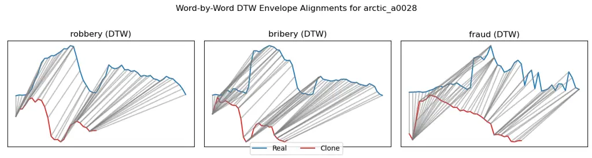
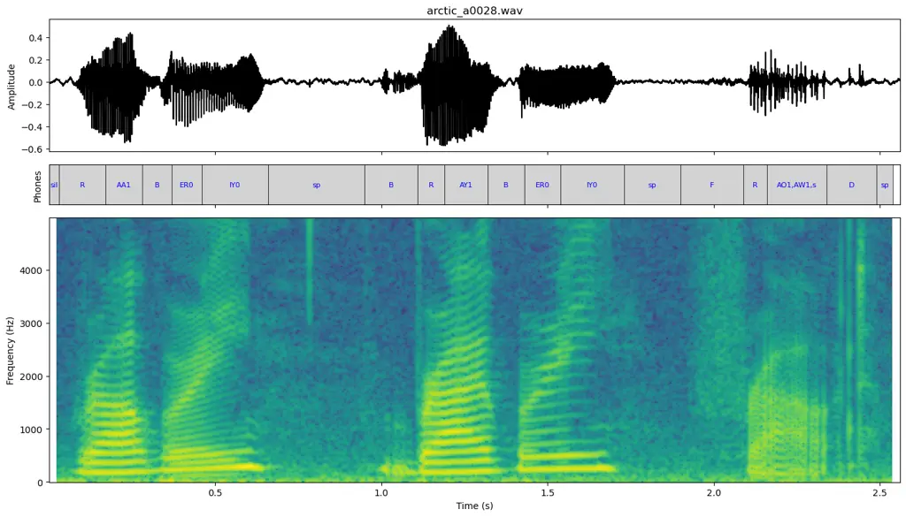
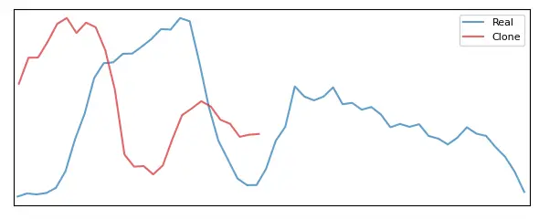
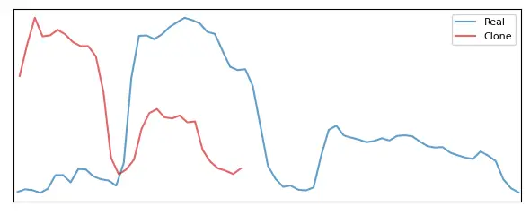
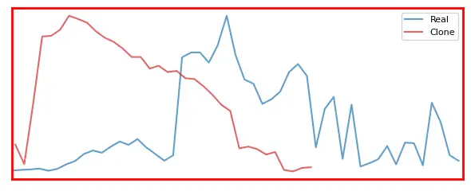
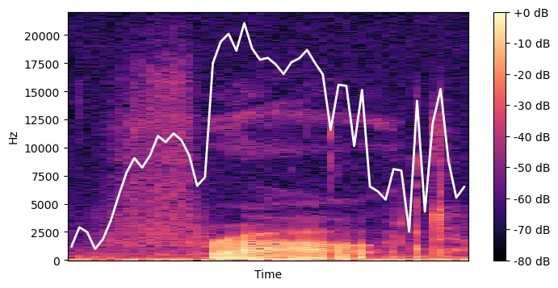
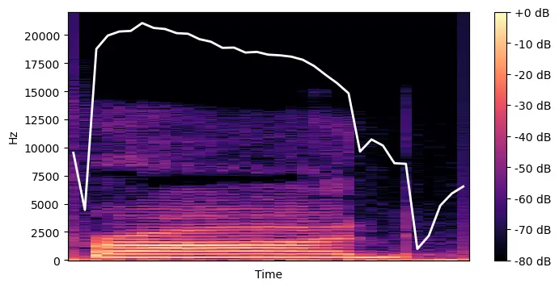

# Pronunciation Deviation Analysis Through Voice Cloning and Acoustic Comparison

Andrew Valdivia Affiliation: California State University Long Beach,
Long Beach, CA, USA E-mail 
[{andrew.valdivia01,simon.zhang01}@student.csulb.edu](mailto:%0A%7Bandrew.valdivia01,simon.zhang01%7D@student.csulb.edu)
   Yueming Zhang Affiliation: California State University Long Beach,
Long Beach, CA, USA E-mail 
[{andrew.valdivia01,simon.zhang01}@student.csulb.edu](mailto:%0A%7Bandrew.valdivia01,simon.zhang01%7D@student.csulb.edu)
   Hailu Xu Affiliation: California State University Long Beach, Long
Beach, CA, USA E-mail 
[{andrew.valdivia01,simon.zhang01}@student.csulb.edu](mailto:%0A%7Bandrew.valdivia01,simon.zhang01%7D@student.csulb.edu)
   Amir Ghasemkhani Affiliation: California State University Long Beach,
Long Beach, CA, USA E-mail 
[{andrew.valdivia01,simon.zhang01}@student.csulb.edu](mailto:%0A%7Bandrew.valdivia01,simon.zhang01%7D@student.csulb.edu)
   Xin Qin E-mail 
[{hailu.xu,amir.ghasemkhani,xin.qin}@csulb.edu](mailto:%0A%7Bhailu.xu,amir.ghasemkhani,xin.qin%7D@csulb.edu%0A)
Affiliation: California State University Long Beach, Long Beach, CA, USA
E-mail 
[{andrew.valdivia01,simon.zhang01}@student.csulb.edu](mailto:%0A%7Bandrew.valdivia01,simon.zhang01%7D@student.csulb.edu)

###### Abstract

This paper presents a novel approach for detecting mispronunciations by
analyzing deviations between a user’s original speech and their
voice-cloned counterpart with corrected pronunciation. We hypothesize
that regions with maximal acoustic deviation between the original and
cloned utterances indicate potential mispronunciations. Our method
leverages recent advances in voice cloning to generate a synthetic
version of the user’s voice with proper pronunciation, then performs
frame-by-frame comparisons to identify problematic segments.
Experimental results demonstrate the effectiveness of this approach in
pinpointing specific pronunciation errors without requiring pre-defined
phonetic rules or extensive training data for each target language.

###### Keywords: 

Pronunciation analysis Voice cloning Speech processing Language learning
Acoustic comparison

## 1 Introduction

Computer-assisted language learning programs have been extensively
researched and widely adopted to overcome deficiencies inherent in
traditional English language learning resources. These tools enable ESL
(English as a Second Language) learners and tutors to systematically
address nuanced linguistic challenges, particularly those related to
phonological differences between English phonemes and those present in a
learner’s primary language. In this context, computer-assisted
pronunciation training (CAPT) has emerged as a crucial resource,
offering learners and instructors accessible methods to practice and
refine English pronunciation \[1\].

For such systems to be effective, they must robustly detect subtle
mispronunciations and provide immediate, actionable feedback to
learners. However, existing CAPT systems often underperform due to their
reliance on generalized pronunciation models, which fail to account for
individual variability in a learner’s idiolect and accent
characteristics. Standard reference models typically lack
personalization, limiting their sensitivity to nuanced pronunciation
errors\[2, 3\]. Moreover, CAPT systems tend to overlook phonological
transfer effects from learners’ first languages (L1), which vary widely
and require targeted modeling approaches \[4\] .


Figure 1: Data-processing pipeline.

To address these limitations, our approach leverages personalized,
synthetically generated voices, finely tuned to replicate each learner’s
unique vocal traits under ideal pronunciation conditions. We employ
advanced voice cloning technologies, explicitly utilizing the ElevenLabs
platform \[5\], renowned for its sophisticated deep-learning algorithms
and realistic synthetic speech generation. ElevenLabs’ state-of-the-art
neural models and extensive training datasets enable precise replication
of individual vocal nuances, including subtle variations in intonation,
rhythm, and articulation. This personalized synthetic reference serves
as a tailored benchmark, substantially enhancing mispronunciation
detection and feedback mechanisms’ sensitivity, accuracy, and real-time
responsiveness.

Recent research has shown that integrating speech synthesis into CAPT
workflows enables large-scale generation of native-like references for
training error detection models, overcoming the scarcity of annotated
mispronounced data \[4\] . Furthermore, work by Das and Gutierrez-Osuna
\[6\] demonstrated that combining text-to-speech (TTS) with speech
reconstruction in a multi-task learning framework improves
mispronunciation detection accuracy by modeling the mismatch between
learner speech and native-like reconstruction. Nguyen et al. \[7\]
extended this idea by synthesizing native-accented versions of
non-native speech using knowledge distillation and TTS-based ground
truth, allowing more effective accent and pronunciation correction.

Our experiments leverage the L2-ARCTIC corpus \[8\] a comprehensive
dataset designed explicitly for voice conversion, accent modification,
and mispronunciation detection research. The corpus includes 26,867
utterances from 24 non-native English speakers representing diverse
linguistic backgrounds, such as Arabic, Chinese, Hindi, Korean, Spanish,
and Vietnamese. Each speaker provided approximately one hour of
phonetically balanced read speech, amounting to over 27 hours of
recorded data. Critically, the dataset offers detailed annotations,
comprising over 238,000 word segments and approximately 852,000 phone
segments, with explicit identification of more than 14,000 phone
substitutions, 3,400 deletions, and 1,000 additions. These meticulous
annotations facilitate the robust development and evaluation of
innovative pronunciation assessment tools.

Integrating personalized voice cloning with a comprehensive, rigorously
annotated corpus like L2-ARCTIC enables our method to pinpoint
problematic phonemes and subtle pronunciation errors reliably.
Consequently, our approach offers targeted, precise feedback and
provides more effective pronunciation training interventions. This
personalized feedback strategy also aligns with emerging trends in CAPT
personalization \[9\],\[10\], where learner-specific acoustic profiles,
L1 influences, and synthetic benchmarking are used to enhance training
efficacy.

## 2 Related Work

Recent advances in voice cloning and neural TTS have reshaped
pronunciation training. Modern systems leverage synthetic speech for
high-variability phonetic training \[9\], accent conversion \[10\], and
personalized feedback generation. Notably, \[9\] demonstrated that
synthetic mispronunciations created through phoneme manipulation and
voice cloning significantly improve error detection accuracy in CAPT
systems, addressing data scarcity in non-native speech corpora. Their
work aligns with the broader trend of using generative models to bypass
dependency on annotated L2 data – a key enabler for our approach.

Traditional phoneme-level feedback methods rely on acoustic models like
GOP scoring or end-to-end neural classifiers \[3\]. While effective,
these techniques require extensive training data and struggle with
interpretability, often necessitating post-hoc transformations to map
phonetic errors to orthographic representations. Recent innovations in
voice identity preservation through neural voice conversion \[9\]
suggest new possibilities for creating personalized pronunciation
references, though prior work has not exploited acoustic deviation
analysis between native and learner-specific voice clones.

Standard CAPT systems face three key limitations our method circumvents:
(1) reliance on a large number of samples for model training, (2)
rule-based error detection requiring phonetic expertise, and (3) generic
feedback lacking voice personalization. By combining voice cloning with
frame-level acoustic analysis, our approach eliminates the need for
predefined phonetic rules while maintaining native pronunciation
benchmarks in the learner’s own vocal characteristics.

## 3 Proposed Method

Our mispronunciation detector runs in two phases, calibration and
runtime, over six steps:

### 3.1 Data Preparation

Load real utterances $`U=\{u_{i}\}`$ with TextGrids format and their TTS
clones $`\hat{U}=\{\hat{u}_{i}\}`$.

### 3.2 Word Alignment

For each pair $`(u_{i},\hat{u}_{i})`$, extract the set of word
alignments:

```math
\bigl\{\,\bigl(w_{j},[s_{j}^{\mathrm{real}},e_{j}^{\mathrm{real}}],[s_{j}^{\mathrm{clone}},e_{j}^{\mathrm{clone}}]\bigr)\mid j=1,\ldots,n_{i}\,\bigr\}, \tag{1}
```

where $`n_{i}`$ is the number of words in the utterance, $`w_{j}`$ is
the $`j`$-th word, and $`[s_{j}^{\mathrm{real}},e_{j}^{\mathrm{real}}]`$
and $`[s_{j}^{\mathrm{clone}},e_{j}^{\mathrm{clone}}]`$ are the start
and end times of $`w_{j}`$ in the real and clone utterance,
respectively.

### 3.3 Feature Extraction

For each aligned word instance $`j`$, compute 13-dimensional MFCC
envelopes \[11\]:

```math
\displaystyle E_{j}^{\mathrm{real}} \displaystyle=\left[\mathbf{e}_{j,1}^{\mathrm{real}},\mathbf{e}_{j,2}^{\mathrm{real}},\dots,\mathbf{e}_{j,T_{j}^{\mathrm{real}}}^{\mathrm{real}}\right]\in\mathbb{R}^{13\times T_{j}^{\mathrm{real}}} \tag{2}
```

```math
\displaystyle E_{j}^{\mathrm{clone}} \displaystyle=\left[\mathbf{e}_{j,1}^{\mathrm{clone}},\mathbf{e}_{j,2}^{\mathrm{clone}},\dots,\mathbf{e}_{j,T_{j}^{\mathrm{clone}}}^{\mathrm{clone}}\right]\in\mathbb{R}^{13\times T_{j}^{\mathrm{clone}}} \tag{3}
```

where $`T_{j}^{\mathrm{real}},T_{j}^{\mathrm{clone}}`$ is the number of
time frames in real/clone segments respectively,
$`\mathbf{e}_{j,t}^{\mathrm{real}},\mathbf{e}_{j,t}^{\mathrm{clone}}\in\mathbb{R}^{13}`$
denotes MFCC feature vectors at frame $`t`$.

### 3.4 Multi-Feature Dynamic Time Warping

Given a pair of aligned word instances represented by their
13-dimensional MFCC envelopes, let $`A`$ denote
$`E_{j}^{\mathrm{real}}`$ and let $`B`$ denote
$`E_{j}^{\mathrm{clone}}`$, where $`T_{A}`$ and $`T_{B}`$ denote the
respective frame counts. We first resample both sequences to a common
length $`\hat{T}=\max(T_{A},T_{B})`$ along the time axis, yielding
$`\tilde{A}\in\mathbb{R}^{\hat{T}\times 13}`$ and
$`\tilde{B}\in\mathbb{R}^{\hat{T}\times 13}`$. For each MFCC coefficient
$`d\in\{1,\dots,13\}`$, we compute the standard DTW distance $`d_{d}`$
between the aligned 1D sequences $`\tilde{A}_{:,d}`$ and
$`\tilde{B}_{:,d}`$. The final distance
$`\bar{d}=(13\hat{T})^{-1}\sum_{d=1}^{13}d_{d}`$ averages these
per-coefficient distances while normalizing for sequence duration and
feature dimensionality. This approach handles temporal misalignments
through DTW, accommodates variable-length inputs via resampling, and
provides coefficient-level comparisons through the decomposed distances
$`d_{d}`$, with the normalization ensuring scale invariance across
different utterance lengths.



Figure 2: An example of DTW alignment between original and synthesized
samples.

### 3.5 Threshold Calculation

Given the sets of training distances partitioned by prediction
correctness:

```math
\mathcal{D}_{\mathrm{correct}}=\{\bar{d}_{j}\mid\text{correct predictions}\},\quad\mathcal{D}_{\mathrm{incorrect}}=\{\bar{d}_{j}\mid\text{incorrect predictions}\},
```

the class-specific thresholds $`\tau_{C}`$ and $`\tau_{I}`$ are computed
as the 90th percentiles of their respective distance distributions:

```math
\tau_{C}=Q_{0.9}\left(\mathcal{D}_{\mathrm{correct}}\right),\quad\tau_{I}=Q_{0.9}\left(\mathcal{D}_{\mathrm{incorrect}}\right), \tag{4}
```

where $`Q_{p}(\cdot)`$ denotes the $`p`$-th percentile of a dataset.
These thresholds satisfy:

```math
\mathbb{P}(\bar{d}_{j}\leq\tau_{C}\mid\text{correct})=0.9,\quad\mathbb{P}(\bar{d}_{j}\leq\tau_{I}\mid\text{incorrect})=0.9,
```

where $`\mathbb{P}`$ denotes the empirical probability.

### 3.6 Runtime Detection

Given the sets of training distances partitioned by prediction
correctness $`\mathcal{D}_{\mathrm{correct}}`$ and
$`\mathcal{D}_{\mathrm{incorrect}}`$, we their probability density
functions using kernel density estimation (KDE) \[12\], and denote with
$`K_{\mathrm{COR}}(x)`$ and $`K_{\mathrm{INC}}(x)`$, where
$`K_{\mathrm{COR}}(x)=\text{kde}(\mathcal{D}_{\mathrm{correct}})`$ and
$`K_{\mathrm{INC}}(x)=\text{kde}(\mathcal{D}_{\mathrm{incorrect}})`$. We
define the decision rule for classification as:

```math
\text{c}(x)=\begin{cases}0&\text{if }K_{\mathrm{COR}}(x)\geq K_{\mathrm{INC}}(x)\\
1&\text{otherwise}\end{cases} \tag{5}
```

For a new utterance $`u`$ with synthesized version $`\hat{u}=V(u)`$, we
first calculate the distance $`\bar{d}_{j}`$, then determine the
prediction as follows:

The threshold selection is given by:

```math
\tau^{*}=\begin{cases}\tau_{C},&\text{if }\mathrm{c}(\bar{d}_{j})=0,\\
\tau_{I},&\text{if }\mathrm{c}(\bar{d}_{j})=1,\end{cases} \tag{6}
```

The final prediction is assigned according to:

```math
\hat{y}_{j}=\begin{cases}\text{CORRECT},&\mathrm{c}(\bar{d}_{j})=0\land\bar{d}_{j}\leq\tau_{C},\\
\text{INCORRECT},&\mathrm{c}(\bar{d}_{j})=1\land\bar{d}_{j}\geq\tau_{I},\\
\text{AMBIGUOUS},&\text{otherwise}.\end{cases} \tag{7}
```

### 3.7 Algorithm

 

Algorithm 1 Mispronunciation Detection via TTS-Clone Comparison

 

1: Real utterances $`U=\{u_{i}\}_{i=1}^{M}`$, TTS model $`V`$, KDE
estimators $`K_{\mathrm{COR}}`$, $`K_{\mathrm{INC}}`$, thresholds
$`\tau_{C},\tau_{I}`$

2: Training Phase:

3: for each training utterance $`u_{i}\in U`$ do

4:   $`\hat{u}_{i}\leftarrow V(u_{i})`$ $`\triangleright`$ Generate TTS
clone

5:   Align words:
$`\{(w_{j},[s_{j}^{\mathrm{real}},e_{j}^{\mathrm{real}}],[s_{j}^{\mathrm{clone}},e_{j}^{\mathrm{clone}}])\}_{j}`$

6:   for each aligned word $`w_{j}`$ do

7:    Extract MFCC envelopes
$`E_{j}^{\mathrm{real}}\in\mathbb{R}^{13\times T_{j}^{\mathrm{real}}}`$,
$`E_{j}^{\mathrm{clone}}\in\mathbb{R}^{13\times T_{j}^{\mathrm{clone}}}`$

8:    Resample to
$`\hat{T}=\max(T_{j}^{\mathrm{real}},T_{j}^{\mathrm{clone}})`$ yielding
$`\tilde{A},\tilde{B}\in\mathbb{R}^{\hat{T}\times 13}`$

9:    for each coefficient $`d\in\{1,...,13\}`$ do

10:      Compute DTW distance $`d_{d}`$ between $`\tilde{A}_{:,d}`$ and
$`\tilde{B}_{:,d}`$

11:    end for

12:    $`\bar{d}_{j}\leftarrow(13\hat{T})^{-1}\sum_{d=1}^{13}d_{d}`$
$`\triangleright`$ Normalized distance

13:    Append $`\bar{d}_{j}`$ to $`\mathcal{D}_{\mathrm{correct}}`$ or
$`\mathcal{D}_{\mathrm{incorrect}}`$ per ground truth

14:   end for

15: end for

16: Fit KDE:
$`K_{\mathrm{COR}}\leftarrow\text{kde}(\mathcal{D}_{\mathrm{correct}})`$,
$`K_{\mathrm{INC}}\leftarrow\text{kde}(\mathcal{D}_{\mathrm{incorrect}})`$

17: Compute thresholds:
$`\tau_{C}\leftarrow Q_{0.9}(\mathcal{D}_{\mathrm{correct}})`$,
$`\tau_{I}\leftarrow Q_{0.9}(\mathcal{D}_{\mathrm{incorrect}})`$

18: Runtime Detection (new utterance $`u`$):

19: $`\hat{u}\leftarrow V(u)`$

20: Repeat alignment and feature extraction to obtain
$`\{\bar{d}_{j}\}`$

21: for each word $`w_{j}`$ with distance $`\bar{d}_{j}`$ do

22:   Evaluate KDE:
$`k_{\mathrm{cor}}\leftarrow K_{\mathrm{COR}}(\bar{d}_{j})`$,
$`k_{\mathrm{inc}}\leftarrow K_{\mathrm{INC}}(\bar{d}_{j})`$

23:   Classify:
$`c(\bar{d}_{j})\leftarrow\mathbb{I}(k_{\mathrm{inc}}>k_{\mathrm{cor}})`$

24:   Select threshold:

```math
\tau^{*}\leftarrow\begin{cases}\tau_{C},&\text{if }c(\bar{d}_{j})=0,\\
\tau_{I},&\text{if }c(\bar{d}_{j})=1\end{cases}
```

25:   Predict:

```math
\hat{y}_{j}\leftarrow\begin{cases}\text{CORRECT},&\text{if }c(\bar{d}_{j})=0\land\bar{d}_{j}\leq\tau_{C},\\
\text{INCORRECT},&\text{if }c(\bar{d}_{j})=1\land\bar{d}_{j}\geq\tau_{I},\\
\text{AMBIGUOUS},&\text{otherwise}\end{cases}
```

26: end for

 

## 4 Experiments

We tested our model on four L2-Arctic speakers (EBVS, ERMS, MBMPS, NJS),
measuring classification performance via precision, recall, F1-score,
and accuracy.

| Dataset | Class | Precision | Recall    | F1-score  | Support | Accuracy |
| ------- | ----- | --------- | --------- | --------- | ------- | -------- |
| EBVS    | $`0`$ | $`0.615`$ | $`0.582`$ | $`0.598`$ | $`110`$ | 0.646    |
|         | $`1`$ | $`0.669`$ | $`0.699`$ | $`0.684`$ | $`133`$ |          |
| ERMS    | $`0`$ | $`0.581`$ | $`0.541`$ | $`0.560`$ | $`133`$ | 0.537    |
|         | $`1`$ | $`0.492`$ | $`0.532`$ | $`0.511`$ | $`111`$ |          |
| MBMPS   | $`0`$ | $`0.604`$ | $`0.416`$ | $`0.492`$ | $`154`$ | 0.461    |
|         | $`1`$ | $`0.353`$ | $`0.538`$ | $`0.426`$ | $`91`$  |          |
| NJS     | $`0`$ | $`0.634`$ | $`0.479`$ | $`0.545`$ | $`163`$ | 0.486    |
|         | $`1`$ | $`0.346`$ | $`0.500`$ | $`0.409`$ | $`90`$  |          |

Table 1: Classification performance of the proposed model on each
dataset.

Table 2 presents the per-individual distance distribution (mean, median,
standard deviation, and 25th/75th percentiles) for correctly and
incorrectly classified examples. The results show that mispronounced
words exhibit a greater average distance between cloned and original
voices compared to correctly pronounced words. Table 1 shows that across
users, our model performs best on EBVS, suggesting the potential for
individualized models for each user, which could extend our current
methods, which are based on data from all users.

To investigate explainability in our model, we employ the NJS speech
sample arctic_a0028.mp2 to illustrate the system’s capacity for
resolving an issue that is similar to the caught–cot vowel merger. This
phenomenon, stemming from first-language phonological interference,
results in non-native speakers conflating two distinct English low-back
vowels. English, by contrast, maintains approximately twenty contrastive
vowel phonemes, including the low back unrounded (/A/) and low back
rounded (/O/) categories.



Figure 3: Phonetic transcription of “Robbery, Bribery, Fraud.”

The utterance under examination, _“Robbery, Bribery, Fraud,”_ is
presented in Figure 3 with its corresponding phonetic transcription. We
extract the relevant temporal segments from both the original recording
and the synthesized audio; these segments are depicted in Figure 4.
Subsequent alignment is performed via Dynamic Time Warping (DTW), as
demonstrated in Figure 2.

| Dataset | Outcome   | Mean       | Median     | Std        | 25%        | 75%        |
| ------- | --------- | ---------- | ---------- | ---------- | ---------- | ---------- |
| EBVS    | Correct   | $`0.3467`$ | $`0.3343`$ | $`0.0981`$ | $`0.2694`$ | $`0.4114`$ |
|         | Incorrect | $`0.3785`$ | $`0.3795`$ | $`0.0928`$ | $`0.3130`$ | $`0.4378`$ |
| ERMS    | Correct   | $`0.3649`$ | $`0.3575`$ | $`0.1030`$ | $`0.2903`$ | $`0.4289`$ |
|         | Incorrect | $`0.3952`$ | $`0.3852`$ | $`0.0971`$ | $`0.3261`$ | $`0.4601`$ |
| MBMPS   | Correct   | $`0.3252`$ | $`0.3152`$ | $`0.0936`$ | $`0.2547`$ | $`0.3809`$ |
|         | Incorrect | $`0.3379`$ | $`0.3301`$ | $`0.0907`$ | $`0.2751`$ | $`0.3957`$ |
| NJS     | Correct   | $`0.3693`$ | $`0.3551`$ | $`0.1053`$ | $`0.2936`$ | $`0.4349`$ |
|         | Incorrect | $`0.3971`$ | $`0.3913`$ | $`0.0960`$ | $`0.3270`$ | $`0.4608`$ |

Table 2: Summary of distances across datasets for correct vs. incorrect
examples.



(a) Robbery



(b) Bribary



(c) Fraud

Figure 4: Temporal segments from the original and synthesized signals.
Mispronounced word "fraud" detected.

Focusing on the final word _“Fraud,”_ the phonetic sequence can be
analyzed as follows:

- •
  /f/ (voiceless labiodental fricative)
- •
  /r/ (voiced postalveolar approximant)
- •
  Vowel: original sample (incorrectly realized as /AW1/), whereas the
  synthesized output correctly produces /AO1/
- •
  /d/ (voiced alveolar plosive)



(a) Real-world slice



(b) Clone-world slice

Figure 5: STFT spectrograms of a real vs. cloned word slice (colour
scale: $`-80\,\mathrm{dB}`$ to $`0\,\mathrm{dB}`$). The white curve
shows the frame-wise mean magnitude.

Notably, the original speaker’s production employs /AW1/, indicative of
the merger, while our model distinguishes the difference with /AO1/.
This contrast substantiates the model’s ability to mitigate L1
interference effects by reinstating the phonetic distinction lost in
non-native renditions.

## 5 Conclusion and Future Work

This paper introduces a novel paradigm for pronunciation error detection
through voice cloning and differential acoustic analysis, demonstrating
robust performance in identifying mispronunciations across diverse
linguistic backgrounds. Our experiments validate the core hypothesis
that deviations between original and pronunciation-corrected cloned
speech correlate with human-perceived errors. While the current
framework operates effectively without language-specific rules, future
work will integrate linguistic knowledge to enhance error type
classification (e.g., distinguishing phonemic substitutions from
prosodic errors) and pedagogical feedback. Further developments will
focus on real-time implementation for interactive language learning
applications and expansion to under-resourced languages, addressing
broader cross-lingual pronunciation challenges. By bridging voice
cloning technology with language pedagogy, this approach establishes a
scalable foundation for adaptive pronunciation training systems that
preserve speaker identity while targeting acoustic-phonetic
improvements.

## References

- \[1\] M. Amrate and P.-H. Tsai, “Computer-assisted pronunciation
  training: A systematic review,” _ReCALL_, 2024, published online
  Sep. 2024.
- \[2\] D. Korzekwa, J. L. Trueba, T. Drugman, and B. Kostek,
  “Computer-assisted pronunciation training—speech synthesis is almost
  all you need,” _Speech Communication_, vol. 142, pp. 22–33, 2022.
- \[3\] C. Richter, R. Pálsson, L. O’Brien, K. Friðriksdóttir, B. Bédi,
  E. H. Magnúsdóttir, and J. Guðnason, “Orthography-based pronunciation
  scoring for better capt feedback,” in _Proc. Interspeech 2023_, 2023,
  pp. 1004–1008.
- \[4\] D. Korzekwa, J. Lorenzo-Trueba, T. Drugman, and B. Kostek,
  “Computer-assisted pronunciation training—speech synthesis is almost
  all you need,” _Speech Communication_, vol. 142, p. 22–33, Jul. 2022.
  \[Online\]. Available:
  [http://dx.doi.org/10.1016/j.specom.2022.06.003](http://dx.doi.org/10.1016/j.specom.2022.06.003)
- \[5\] ElevenLabs, “Elevenlabs text-to-speech api,”
  [https://elevenlabs.io/](https://elevenlabs.io/), 2025, accessed 11
  June 2025.
- \[6\] A. Das and R. Gutierrez-Osuna, “Improving mispronunciation
  detection using speech reconstruction,” _IEEE/ACM Transactions on
  Audio, Speech, and Language Processing_, vol. 32, pp. 4420–4433, 2024.
- \[7\] T. N. Nguyen, S. Akti, N. Q. Pham, and A. Waibel, “Improving
  pronunciation and accent conversion through knowledge distillation and
  synthetic ground-truth from native tts,” in _ICASSP 2025 - 2025 IEEE
  International Conference on Acoustics, Speech and Signal Processing
  (ICASSP)_, 2025, pp. 1–5.
- \[8\] G. Zhao, S. Sonsaat, A. Silpachai, I. Lucić,
  E. Chukharev-Hudilainen, J. Levis, and R. Gutierrez-Osuna, “L2-arctic:
  A non-native english speech corpus,” in _Proc. Interspeech 2018_,
  2018, pp. 2783–2787.
- \[9\] V. Khaustova, E. Pyshkin, V. Khaustov, J. Blake, and N. Bogach,
  “Capturing accents: An approach to personalize pronunciation training
  for learners with different l1 backgrounds,” in _Speech and Computer
  (SPECOM 2023)_, ser. Lecture Notes in Computer Science, vol. 14339,
  2023, pp. 59–70.
- \[10\] Y. Zhou, Z. Wu, M. Zhang, X. Tian, and H. Li, “Accent
  conversion without parallel data using pretrained tts models,” _arXiv
  preprint arXiv:2212.10204_, 2022.
- \[11\] T. Bäckström, O. Räsänen, A. Zewoudie, P. P. Zarazaga,
  L. Koivusalo, S. Das, E. G. Mellado, M. B. Mansali, D. Ramos,
  S. Kadiri, P. Alku, and M. H. Vali, _Introduction to Speech
  Processing_, 2nd ed., 2022. \[Online\]. Available:
  [https://speechprocessingbook.aalto.fi](https://speechprocessingbook.aalto.fi)
- \[12\] B. W. Silverman, _Density estimation for statistics and data
  analysis_. Routledge, 2018.
