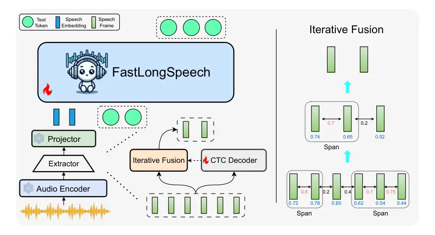

# FastLongSpeech: Enhancing Large Speech-Language Models for Efficient Long-Speech Processing

Shoutao Guo Affiliation: Key Laboratory of Intelligent Information
Processing,Institute of Computing Technology, Chinese Academy of
Sciences (ICT/CAS) Affiliation:  University of Chinese Academy of
Sciences, Beijing, China
Email: <mailto:guoshoutao22z@ict.ac.cnguoshoutao22z@ict.ac.cn>   
Shaolei Zhang Affiliation: Key Laboratory of Intelligent Information
Processing,Institute of Computing Technology, Chinese Academy of
Sciences (ICT/CAS) Affiliation:  University of Chinese Academy of
Sciences, Beijing, China
Email: <mailto:zhangshaolei20z@ict.ac.cnzhangshaolei20z@ict.ac.cn>   
Qingkai Fang Affiliation: Key Laboratory of Intelligent Information
Processing,Institute of Computing Technology, Chinese Academy of
Sciences (ICT/CAS) Affiliation:  University of Chinese Academy of
Sciences, Beijing, China
Email: <mailto:fengyang@ict.ac.cnfengyang@ict.ac.cn>    Zhengrui Ma
Affiliation: Key Laboratory of Intelligent Information
Processing,Institute of Computing Technology, Chinese Academy of
Sciences (ICT/CAS) Affiliation:  University of Chinese Academy of
Sciences, Beijing, China    Min Zhang Affiliation:  School of Future
Science and Engineering, Soochow University    Yang Feng ^(†)^(†)thanks:
Corresponding author: Yang Feng. Affiliation:  Affiliation: 
Affiliation:  Affiliation: Key Laboratory of Intelligent Information
Processing,Institute of Computing Technology, Chinese Academy of
Sciences (ICT/CAS) Affiliation:  Key Laboratory of AI Safety, Chinese
Academy of Sciences Affiliation:  University of Chinese Academy of
Sciences, Beijing, China

###### Abstract

The rapid advancement of Large Language Models (LLMs) has spurred
significant progress in Large Speech-Language Models (LSLMs), enhancing
their capabilities in both speech understanding and generation. While
existing LSLMs often concentrate on augmenting speech generation or
tackling a diverse array of short-speech tasks, the efficient processing
of long-form speech remains a critical yet underexplored challenge. This
gap is primarily attributed to the scarcity of long-speech training
datasets and the high computational costs associated with long
sequences. To address these limitations, we introduce FastLongSpeech, a
novel framework designed to extend LSLM capabilities for efficient
long-speech processing without necessitating dedicated long-speech
training data. FastLongSpeech incorporates an iterative fusion strategy
that can compress excessively long-speech sequences into manageable
lengths. To adapt LSLMs for long-speech inputs, it introduces a dynamic
compression training approach, which exposes the model to short-speech
sequences at varying compression ratios, thereby transferring the
capabilities of LSLMs to long-speech tasks. To assess the long-speech
capabilities of LSLMs, we develop a long-speech understanding benchmark
called LongSpeech-Eval. Experiments show that our method exhibits strong
performance in both long-speech and short-speech tasks, while greatly
improving inference efficiency ¹¹ 1 The Code is at
[https://github.com/ictnlp/FastLongSpeech.git](https://github.com/ictnlp/FastLongSpeech.git)..

## 1 Introduction

Benefiting from the advancement of Large Language Models (LLMs) \[1, 2,
3\], Large Speech-Language Models (LSLMs) have also made significant
strides by extending the speech capabilities of LLMs. By harnessing the
knowledge and reasoning abilities of LLMs, LSLMs can directly comprehend
speech signals, perform analysis and reasoning, and achieve superior
performance in a diverse of tasks such as speech recognition, speech
translation, and speech understanding \[4, 5, 6\]. The ability to
process and understand diverse speech signals has emerged as a key
research focus in LSLMs \[7\].

To handle speech inputs, traditional methods \[8, 9\] typically employ a
cascaded pipeline, where speech is first transcribed into text and then
processed by LLMs. However, these approaches suffer from error
propagation and discard valuable paralinguistic information \[10\]. To
overcome these drawbacks, recent research \[11, 12, 13\] has shifted
towards an end-to-end paradigm, enabling LSLMs to directly process and
reason with speech signals. These methods can be broadly divided into
two categories. On one hand, some approaches \[4, 14, 15, 16\] such as
Qwen2-Audio \[5\] align the output spaces of pre-trained audio encoders
with the embedding of LLMs, which allows speech inputs to be
accommodated while transferring partial capabilities of the employed
LLMs. At the same time, other methods \[11, 17\] involves discretizing
the speech to discrete units, which allows LSLMs to handle speech units
similar to text tokens. Despite these advancements, current LSLMs are
largely constrained to processing short speech segments, typically under
30 seconds \[5, 18\]. Only a few LSLMs \[12\] have achieved a processing
duration of 30 minutes on speech summarization tasks by relying on the
construction of extensive, specialized training datasets.

The processing of long-form speech by LSLMs remains a largely unexplored
area, primarily due to two significant challenges. First, unlike the
abundance of diverse short-speech datasets \[19, 20, 21\], there is a
scarcity of training data specifically for long-speech alignment and
instruction, and the generation of such data is costly. Second,
long-speech sequences impose substantial computational demands on LSLMs.
The sequence of speech representations is often more than four times
longer than its text equivalents for the same content \[17\]. which, in
the context of long-form speech, leads to significantly higher
computational costs. Therefore, LSLMs face considerable challenges in
modeling long-speech sequences, stemming from both a scarcity of
training data and increased computational costs. These challenges limit
the exploration and application of LSLMs in long-speech processing.

To address the above challenges, we propose FastLongSpeech, a novel
framework designed to extend the capabilities of LSLMs to long-speech
processing, leveraging only short-speech training data. We utilize
Qwen2-Audio²² 2 For convenience, Qwen2-Audio refers to
Qwen2-Audio-7B-Instruct throughout this paper. \[5\], the currently
representative LSLM, as our foundational speech-language model. To
enable long-speech processing, FastLongSpeech incorporates a speech
extractor module on top of the audio encoder \[22\]. This module employs
our proposed iterative fusion strategy to compress the speech
representations output by the audio encoder, preserving essential
temporal information while reducing redundancy. The resulting condensed
speech representations are then used by LLM for comprehension and
reasoning. In our method, the speech extractor significantly reduces the
sequence length of the condensed representations, thereby lowering the
computational costs for subsequent LLM.

To further adapt LSLM for long-speech processing, FastLongSpeech employs
a two-stage training approach. In the first stage, a CTC loss \[23\] is
introduced within the extractor module to measure the text density of
the input speech representations, which is utilized for the iterative
fusion strategy. The second stage introduces a dynamic compression
training method, enabling LLM to effectively adapt to condensed speech
representations. This stage leverages existing short-speech data and
dynamically adjusts the compression ratios in the iterative fusion
strategy to transfer the understanding and reasoning capabilities of
LSLMs to long-speech tasks.

To evaluate the long-speech understanding capabilities of LSLMs, we also
develop a benchmark, called LongSpeech-Eval. Experiments show that
FastLongSpeech achieves efficient speech processing on both long-speech
and short-speech benchmarks, and can balance efficiency and
effectiveness to meet different requirements.

## 2 Background

Our method builds upon Qwen2-Audio \[5\] and incorporates CTC loss
\[23\]. We provide a brief overview of these key components below.

#### Qwen2-Audio

Qwen2-Audio is a large-scale audio-language model capable of
comprehending various audio signals, performing reasoning, and
generating text responses. It consists of three modules: an audio
encoder \[22\], an LLM \[24\], and an adaptor. The adaptor serves to
align the output of the audio encoder with the embeddings of LLM,
enabling the LLM to process speech inputs. Following extensive
pre-training, supervised fine-tuning, and DPO \[25\], Qwen2-Audio
demonstrates remarkable performance across a wide range of speech tasks.
Given a raw waveform $`\mathbf{s}`$ = $`(s_{1},...,s_{N})`$ sampled at
16 kHz, the audio encoder produces a sequence of speech representations
$`\mathbf{h}`$ = $`(h_{1},...,h_{J})`$ with 25 Hz frame rate. The LLMs
then generate the text response $`\mathbf{y}`$ based on $`\mathbf{h}`$
and an instruction $`\mathbf{x}`$:

```math
p(\mathbf{y}|\mathbf{x},\mathbf{h})=\sum\limits_{i=1}^{I}p(y_{i}\mid\mathbf{y}_{<i},\mathbf{x},\mathbf{h}), \tag{1}
```

where $`p(y_{i}\mid\mathbf{y}_{<i},\mathbf{x},\mathbf{h})`$ denotes
probability distribution of the next token.

#### CTC

Connectionist Temporal Classification (CTC) \[23\] is widely used in
Automatic Speech Recognition (ASR), where the input is typically longer
than the corresponding output \[26\]. To align speech with the
transcript, CTC introduces a blank token into the vocabulary and defines
the possible output as an alignment $`\mathbf{a}`$. Each time step in
this alignment corresponds to either a blank token or a non-blank token.
The alignment has the same length as the speech sequence and can be
reduced to the final transcript through a collapse function
$`\Gamma^{-1}`$. During training, CTC employs an efficient dynamic
programming algorithm to maximize the probability of all possible
alignments corresponding to the ground-truth transcript $`\mathbf{c}`$:

```math
\mathcal{L}_{ctc}=-\log\sum\limits_{\mathbf{a}\in\Gamma(\mathbf{c})}p_{ctc}\!\left(\mathbf{a}\mid\mathbf{h}\right), \tag{2}
```

where $`\Gamma(\mathbf{c})`$ denotes the set of all alignments
corresponding to $`\mathbf{c}`$, and $`\mathbf{h}`$ denotes the sequence
of speech representations produced by audio encoder \[22\]. In this
paper, we leverage the output distribution of CTC to quantify the text
density of speech representations $`\mathbf{h}`$, which is subsequently
utilized in the iterative fusion strategy.

## 3 Method

In this section, we introduce the architecture of FastLongSpeech, with a
particular emphasis on its novel speech extractor module. To empower
LSLM with the ability to learn speech compression techniques and adapt
to long-speech processing, we present an innovative two-stage training
approach. Additionally, we introduce the LongSpeech-Eval benchmark,
designed to evaluate the long-speech understanding capabilities of
LSLMs.



Figure 1: Architecture of FastLongSpeech. The left panel illustrates
that FastLongSpeech generates a response based on the input speech and
text instruction. The right panel details the iterative fusion strategy,
where numbers between adjacent frames denote similarity scores and
numbers below frames represent content density.

### 3.1 Model Architecture

Figure 1 illustrates the model framework of FastLongSpeech. Building
upon Qwen2-Audio, we incorporate an advanced extractor module, which
features a CTC \[23\] decoder and employs our proposed iterative fusion
strategy to condense speech representations. The workflow of
FastLongSpeech proceeds as follows. Given a waveform $`\mathbf{s}`$
sampled at 16 kHz, the audio encoder converts it into a mel-spectrogram
and processes it through convolution and transformer layers \[22\],
yielding a sequence of speech representations $`\mathbf{h}`$ with 25 Hz
frame rate. Subsequently, the extractor module processes $`\mathbf{h}`$
using an iteration fusion strategy to produce the condensed
representations $`\mathbf{h^{\prime}}`$, whose length is within the
speech window of LLM. The speech window denotes the maximum length of
the speech representations $`\mathbf{h}`$ during training, specifically
the maximum number of speech frames. LLM then utilizes the condensed
representations $`\mathbf{h^{\prime}}`$ along with the instruction
$`\mathbf{x}`$ to generate the response $`\mathbf{y}`$, as described in
Eq.(1).

### 3.2 Iterative Fusion

To facilitate efficient long-speech processing, we introduce an
extractor to compress lengthy and sparse speech representations \[17\]
into more compact forms. Our primary objective is to minimize
information loss during compression, preserving essential temporal
information while reducing redundancy. Thus, our method needs to retain
speech representations that contain more textual content, while
discarding excessively similar adjacent speech frames. To achieve this,
we propose an iterative fusion strategy that incrementally merges
selected representations based on content density and similarity between
adjacent frames, ultimately yielding condensed representations.

We first define the metrics to measure content density and frame
similarity, followed by an introduction of our iterative fusion
strategy. For a given speech frame $`h_{j}`$, content density is
generally associated with the amount of textual information it contains
\[27, 28\]. To quantify this, we employ a CTC decoder, whose output
distribution provides the probabilities of the speech frame being
classified as either a blank or a non-blank token. Consequently, the
content density of $`h_{j}`$ is derived from the sum of probabilities
for non-blank tokens:

```math
d_{j}=\sum_{a_{j}\neq\epsilon}p_{ctc}(a_{j}\mid h_{j}), \tag{3}
```

where $`\epsilon`$ denotes the blank token. Frame similarity, on the
other hand, captures the overlap in content between adjacent speech
frames. We measure this using cosine similarity between $`h_{j}`$ and
$`h_{j+1}`$:

```math
e_{j,j+1}=\frac{h_{j}h_{j+1}}{\lvert h_{j}\rvert\lvert h_{j+1}\rvert}. \tag{4}
```

After introducing these measurements, we provide an overview of our
iterative fusion strategy in Figure 1. For $`m`$-th iteration, we first
determine the length $`T(m)`$ of current speech representations and the
length for the next iteration:

```math
T(m\!+\!1)=\begin{cases}\lfloor T(m)/2\rfloor,&\text{if }T(m)>2L\\
L,&\text{if }T(m)\leq 2L\end{cases}, \tag{5}
```

where $`L`$ denotes the final target length of condensed representations
$`\mathbf{h}^{\prime}`$. The number of speech frames to be reduced is
then calculated as:

```math
r(m)=T(m)-T(m\!+\!1). \tag{6}
```

Subsequently, we utilize the similarity metric between adjacent frames,
as defined in Eq.(4) to identify the $`r(m)`$ most similar pairs of
adjacent frames. The consecutive identified frames are grouped into a
span, as illustrated in Figure 1. For each span, we employ a weighted
fusion approach, leveraging the content density in Eq.(3) as weights to
merge all frames within the span into a single compressed speech frame.
This process yields a new sequence of speech representations with length
$`T(m\!+\!1)`$, comprising both the newly condensed frames and the
remaining uncompressed frames. If $`T(m\!+\!1)`$ still exceeds the
target length $`L`$, we initiate another iteration. Otherwise, the
resulting speech representations from this round constitute the final
condensed representations $`\mathbf{h}^{\prime}`$.

This iterative fusion strategy effectively reduces the length of speech
representations by half in each iteration, facilitating efficient speech
processing.

### 3.3 Training Method

After introducing the iterative fusion strategy, we further present a
two-stage training method to enable FastLongSpeech to perform
long-speech tasks. To facilitate the generation of condensed
representations through the iterative fusion strategy, the first stage
of training focuses on the ASR task, allowing FastLongSpeech to learn
the measurement of content density. Building on this, the second stage
incorporates our proposed dynamic compression training method, which
helps LLMs adapt to short-speech condensed representations with varying
compression ratios, thereby transferring short-speech capabilities to
long-speech processing.

#### CTC Training

In the first stage, we aim to leverage the ASR task to enable
FastLongSpeech to recognize the amount of textual information in speech
representations, namely content density. To achieve this, we introduce a
CTC decoder in the extractor module, which is trained using the CTC loss
\[23\] as shown in Eq.(2). This allows us to utilize the generation
distribution of the CTC decoder to measure the content density of speech
representations. In this stage, we only train the CTC decoder.

#### Dynamic Compression Training

In the second stage, we introduce a novel dynamic compression training
method. The introduction of this method is based on two considerations.
First, it enables the LLM to adapt to condensed representations
$`\mathbf{h}^{\prime}`$ with different compression ratios. Second, the
current \<$`\mathbf{s}`$, $`\mathbf{x}`$, $`\mathbf{y}`$\> triplet
training data primarily contains short-speech clips, which are typically
under 30 seconds in duration \[29\]. By sampling the length $`L`$ of
condensed representations \[30\], LSLM can maintain its perception of
speech sequences corresponding to the length of its speech window,
without avoiding excessive bias towards overly condensed speech
sequences. The dynamic compression training method is as follows:

```math
L_{dct}=\!-\!\sum\limits_{L\sim\mathcal{U}(\emph{\rm{L}})}\log p(\mathbf{y}\mid\mathbf{x},\mathrm{IF}(\mathbf{h},L)), \tag{7}
```

where $`L`$ is uniformly sampled from $`\emph{\rm{L}}`$, which is a set
of hyperparameters. $`\mathrm{IF}(\mathbf{h},L)`$ represents applying
the iterative fusion operation on the speech representations
$`\mathbf{h}`$ to obtain the condensed representations of length $`L`$.
After the training process, FastLongSpeech can transfer the short-speech
capabilities of LSLMs to long-speech tasks.

### 3.4 LongSpeech-Eval Benchmark

After introducing FastLongSpeech, we aim to evaluate its capacity to
handle long-speech inputs. Due to the lack of benchmarks for assessing
the long-speech capabilities of LSLMs, we construct LongSpeech-Eval.
This benchmark is based on the MultiFieldQA-En and NarrativeQA subsets
of LongBench \[31\], a comprehensive long context understanding
benchmark. This benchmark assesses the ability of LLM to answer
questions based on the long document.

To construct LongSpeech-Eval, we aim to convert the document into
speech. We first employ Llama3.1-70B-Instruct³³ 3
[https://huggingface.co/meta-llama/Llama-3.1-70B-Instruct](https://huggingface.co/meta-llama/Llama-3.1-70B-Instruct)
to filter out samples containing numerous formulas or non-English
characters. Subsequently, GPT-4o \[32\] is utilized to summarize and
polish the document into a spoken format. Llama3.1-70B-Instruct is then
used to answer questions based on the spoken-form document, with
inappropriate samples manually discarded. For the remaining samples, we
then synthesize speech for the spoken-form document using Orca⁴⁴ 4
[https://github.com/Picovoice/orca.git](https://github.com/Picovoice/orca.git).
Consequently, each sample in the LongSpeech-Eval consists of the
synthesized speech along with the corresponding questions and answers.
More details are provided in Appendix A.

## 4 Experiments

### 4.1 Datasets

For the training data in the first stage, we utilize the ASR data, which
contain 960 hours of LibriSpeech \[33\] data and 3k hours of data
sampled from MLS \[34\]. In the second training stage, our training data
primarily originates from three datasets following the Spoken QA format:
OpenASQA \[35\], LibriSQA \[36\], and Common Voice \[37\]. All employed
samples used for training are under 30 seconds in duration. For
OpenASQA, we use the Open-Ended Speech AQA subset (5.9k hours), which
covers diverse question types including content, speaker style, and
emotion. For LibriSQA, we incorporate the 360-hour training set. For
Common Voice, we adapt the English subset (1.7k hours) to the spoken QA
format by generating transcription instructions via ChatGPT and using
the original transcripts as the ground-truth answers.

For evaluation, we employ a diverse set of nine datasets spanning five
distinct tasks to comprehensively assess performance:

Short-Speech Spoken QA: We utilize three datasets: the speech_QA_iemocap
(AIR-Bench) \[38\], the LibriSQA test set \[36\], and the LibriTTS test
subset from OpenASQA \[35\]. The three datasets contain rich set of QA
pairs involving paralinguistic information. We utilize this task to
evaluate the effectiveness of various speech fusion methods under
different compression ratios.

Long-Speech Spoken QA: We leverage our proposed LongSpeech-Eval
benchmark to assess the performance of different methods in long-speech
understanding scenarios.

Spoken Dialogue Understanding: We evaluate the inference efficiency of
our method using speech_dialogue_QA_fisher subset from AIR-Bench.

Emotion Recognition: We leverage the MELD dataset \[39\] to benchmark
our method against other efficiency method \[40\] under diverse
efficiency scenarios.

ASR: We use the LibriSpeech \[33\] test-clean and test-other, and
GigaSpeech \[41\] test set to evaluate ASR performance. The ASR task
utilizes short-speech samples, which evaluate the capacity to extract
complete content from the speech.

Speech Information Retrieval: We introduce SPIRAL-H benchmark, which is
introduced in the paper of SpeechPrune \[42\] for long speech
information retrieval.

More details of the training and evaluation dataset are in Appendix B.

### 4.2 System Settings

Given the current scarcity of long-speech LSLMs, we implement several
baseline approaches in addition to our FastLongSpeech.

Random method randomly selects frames from speech representations and
arranges them sequentially to serve as conditioning input for LSLM.

AvgPool method sequentially selects a fixed number of speech frames to
form segments and then apply average operation within each segment.

MostSim method first selects the most similar consecutive speech frames
and then applies the average pooling operation to each set of adjacent
representations.

NTK-RoPE method modifies the base Rotary Position Embedding (RoPE)
\[43\] of LLMs to an NTK-Aware Scaled RoPE \[44\], thereby extending the
speech window of Qwen2-Audio to match the context length of its LLM.
This method is exclusively utilized for long-speech reasoning tasks.

Cascaded first uses Whisper-Large-V3 \[22\] to transcribe the audio, and
then pass the resulting context text to Qwen-7B-Chat (since
Qwen2-Audio-7B is based on Qwen-7B-Chat).

Baseline refers to the direct application of vanilla Qwen2-Audio for
inference, which is not employed in long-speech inference tasks.

FastLongSpeech refers to our proposed method.

We use Qwen2-Audio-7B-Instruct⁵⁵ 5
[https://huggingface.co/Qwen/Qwen2-Audio-7B-Instruct](https://huggingface.co/Qwen/Qwen2-Audio-7B-Instruct)
as the base LSLM for all methods, with the length of speech window as 750. Besides, we also extend our method to vanilla Qwen2.5-Omni \[15\]
without dynamic compression training to verify the effectiveness of our
method. In the first stage of training for our FastLongSpeech, we only
train the CTC decoder. In the second stage, we experimentally set
$`\mathbf{L}`$ to {750, 400, 200, 100, 50, 25, 12} and fine-tune the LLM
of Qwen2-Audio using LoRA \[45\]. For a fair comparison, we also
fine-tune Qwen2-Audio for all methods except the Baseline and
FastLongSpeech, using the same training data and implementation settings
as used for FastLongSpeech. All methods employ the original prompt
template from Qwen2-Audio. For more training details, please refer to
the Appendix C.

((a)) speech_QA_iemocap

((b)) LibriTTS (OpenASQA)

((c)) LibriSQA

Figure 2: Performance of diverse speech fusion methods in the
short-speech spoken QA tasks. The score is derived from the LLM
evaluating the quality of responses based on the questions and
ground-truth answers. The baseline model utilizes a speech window of 750
frames. For the methods other than Baseline, we regulate the compression
ratio by adjusting the target length $`L`$ of the condensed speech
representations. In the experiments, a smaller value of $`L`$
corresponds to a higher compression ratio. A higher score indicates a
better quality of the responses.

During evaluation, we use greedy search for all methods and control
compression ratios by adjusting the target length $`L`$. For long-speech
inference, we split the input speech into a series of 30-second clips,
which are processed by the audio encoder and then combined into a
complete sequence of speech representations in temporal order. To
evaluate the performance, we employ various metrics tailored to each
task. For the Spoken QA and Spoken Dialogue Understanding task, we use
Llama3.1-70B-Instruct \[2\] to score responses on a scale of 1 to 5,
with the scoring template available in the Appendix D. For the ASR task,
we use Word Error Rate (WER) to assess the accuracy of the generated
transcripts. For Emotion Recognition task, we use the Accuracy (ACC)
metric to evaluate the performance.

### 4.3 Main Results

We evaluate the performance of our method on short-speech and
long-speech spoken QA tasks.

| Method         | Score ($`\uparrow`$) |
| -------------- | -------------------- |
| Random         | 2.54                 |
| Similar        | 3.08                 |
| AvgPool        | 3.10                 |
| NTK-RoPE       | 3.44                 |
| FastLongSpeech | 3.55                 |

Table 1: Performance of various speech methods on long-speech spoken QA
task.

For the short-speech spoken QA task, Figure 2 illustrates the
performance of various methods across three datasets. Our FastLongSpeech
method consistently outperforms other methods on all three datasets
under different speech compression ratios, maintaining high response
quality even at a 30-fold compression ratio ($`L`$ = 25). Unlike the
Random method, which arbitrarily discards speech representations, other
methods consider all temporal information when compressing speech
representation, resulting in improved generation quality \[29\].
Compared to AvgPool and MostSim methods, our method more effectively
eliminates redundant information while preserving highly informative
speech representations, leading to better performance across various
compression ratios. Notably, when $`L`$ equals 12, other speech fusion
methods exhibit similarly suboptimal performance, while our method
maintains a substantial performance advantage. We attribute this
superiority to our novel iterative fusion strategy and dynamic
compression training approach. Furthermore, compared to vanilla
Qwen2-Audio, our method achieves comparable performance with a shorter
sequence of speech representations, demonstrating higher efficiency.

For the long-speech spoken QA task, our method outperforms other
approaches in generation quality, as evidenced in Table 1. To handle the
long-speech input, methods such as Random, Similar, and AvgPool employ
their respective fusion techniques to compress the speech
representations within the speech window. However, these approaches
yield suboptimal generation quality, primarily due to ineffective fusion
strategies and misaligned training methods. In contrast, NTK-RoPE
expands the speech window of LSLM to the context length of LLM, thereby
preserving more speech information and achieving improved performance.
Furthermore, our method leverages a more effective speech fusion
strategy coupled with a dynamic compression training approach,
transferring the short-speech reasoning capabilities of LSLMs to the
long-speech domain. Notably, despite utilizing the same speech window
size as Qwen2-Audio \[5\], our method achieves optimal performance in
long-speech comprehension tasks with greater efficiency than NTK-RoPE.

## 5 Analysis

To provide a comprehensive evaluation of our approach, we conduct
extensive analyses. We then introduce each analytical experiment in
detail.

|        Method          | Score ($`\uparrow`$) |
| ---------------------- | -------------------- |
| FastLongSpeech         | 3.55                 |
|    w/o DCT             | 3.33                 |
|    w/o Iterate Fusion  | 3.41                 |
|    w/o Content Density | 3.28                 |

Table 2: The ablation experiments of our method on long-speech
benchmark. “w/o DCT” replaces Dynamic Compression Training method with
standard fine-tuning approach. “w/o Iterative Fusion” eliminates the
multiple iterations in the iterative fusion. “w/o Content Density”
substitutes the method of merging all speech frames within the same span
with an average pooling operation.

### 5.1 Ablation Study

To gain a comprehensive understanding of the contributions made by
different components in our approach, we conduct detailed ablation
experiments. As shown in Table 2, both the iterative fusion and dynamic
compression training strategies proposed in FastLongSpeech significantly
enhance the performance of LSLMs on long-speech reasoning tasks. First,
the dynamic compression training strategy effectively transfers the
short-speech capabilities of LSLMs to long-speech scenarios, utilizing
only short-speech data. This approach enables LLMs to adapt to condensed
representations at varying compression ratios and mitigate over-reliance
on excessively compressed speech representations. Consequently,
FastLongSpeech can compress long-speech representations to fit within
the speech window length, facilitating efficient long-speech processing
at high compression ratios. Moreover, multiple iterations in the
iterative fusion approach lead to substantial improvements in generation
quality. This finding underscores the benefits of progressively
expanding the receptive field \[46\] in iterative fusion for aggregating
semantic information. Furthermore, guided by content density, our
iterative fusion strategy tends to retain more informative speech frames
\[27\], resulting in the most significant performance improvement.

### 5.2 Inference Efficiency

| Method           | Score ($`\uparrow`$) | TFLOPs ($`\downarrow`$) |
| ---------------- | -------------------- | ----------------------- |
| Baseline         | 3.73                 | 9.79                    |
| Ours ($`L`$=400) | 3.80                 | 8.54                    |
| Ours ($`L`$=200) | 3.87                 | 5.64                    |
| Ours ($`L`$=100) | 3.71                 | 4.17                    |

Table 3: The inference efficiency on LibriTTS test subset of OpenASQA
dataset, where “Ours” denotes FastLongSpeech.

After investigating the impact of various components in FastLongSpeech,
we conduct analyses on the inference efficiency across different
methods. To quantify this efficiency, we employ the TFLOPs metric, which
measures the average number of floating-point operations (FLOPs) across
the entire dataset and is calculated using calflops⁶⁶ 6
[https://github.com/MrYxJ/calculate-flops.pytorch](https://github.com/MrYxJ/calculate-flops.pytorch)
tool. For long-speech scenarios, we incorporate average runtime as an
additional efficiency indicator, which is measured in seconds. Table 3
and 4 present the results of inference efficiency experiments, which are
obtained on NVIDIA L40.

In short-speech tasks, our approach demonstrates performance comparable
to vanilla Qwen2-Audio while requiring only half the computational
resources. When the allocated computational resources are increased, we
can achieve better results. Notably, the computational costs decrease as
the compression ratio increases. This not only demonstrates the better
efficiency of our model but also highlights its ability to balance
generation quality and inference efficiency.

| Method   | Score ($`\uparrow`$) | TFLOPs ($`\downarrow`$) | Time ($`\downarrow`$) |
| -------- | -------------------- | ----------------------- | --------------------- |
| NTK-RoPE | 3.44                 | 61.21                   | 4.80                  |
| Cascaded | 3.75                 | n/a                     | 17.23+1.38            |
| Ours     | 3.55                 | 26.44                   | 1.47                  |

Table 4: The efficiency on the long-speech benchmark.

The advantages of our method become even more pronounced in long-speech
tasks, where our method achieves better generation quality than
NTK-ROPE, with a 70% reduction in runtime and a 60% decrease in
computational costs. Compared to the cascaded method, it even achieves a
speedup of more than sevenfold, underscoring its substantial efficiency
advantage for processing long-form speech. This further shows the
effectiveness of our method in handling long-speech inputs. For spoken
dialogue understanding, emotion recognition and speech information
retrieval tasks, please refer to the Appendix E and F.

### 5.3 Content of Condensed Representations

| Method           | Clean | Other | Giga  |
| ---------------- | ----- | ----- | ----- |
| Baseline         | 3.85  | 6.70  | 13.71 |
| Ours ($`L`$=750) | 4.04  | 7.02  | 11.76 |
| Ours ($`L`$=400) | 4.08  | 7.17  | 11.77 |
| Ours ($`L`$=200) | 4.36  | 7.40  | 12.70 |
| Ours ($`L`$=100) | 27.12 | 24.61 | 23.69 |

Table 5: The performance on the ASR task, where “Ours” denotes the
FastLongSpeech. For the dataset, “Clean” and “Other” denote LibriSpeech
test-clean and test-other sets. “Giga” denotes the test set of
GigaSpeech. The results are evaluated with WER metric.

Beyond the spoken QA, spoken dialogue understanding and emotion
recognition tasks, we extend our evaluation to the ASR task, which
requires precise transcription of the entire speech content \[47\].
Through this task, we explore variations in condensed representations
across different compression ratios. Table 5 demonstrates the ASR
performance of Qwen2-Audio and our method. At low compression ratios
($`L`$=400), FastLongSpeech performs comparably to Qwen2-Audio,
demonstrating the effectiveness of our dynamic compression training and
iterative fusion strategy in preserving speech content. Unlike
Qwen2-Audio, our method does not require substantial post-processing to
extract the transcript, with strong instruction following abilities. At
higher compression ratios ($`L`$=100), FastLongSpeech slightly trails
Qwen2-Audio in ASR but maintains comparable results in spoken QA, as
illustrated in Figure 2. This indicates that while our approach
demonstrates applicability across diverse tasks, the optimal compression
ratio is inherently task-dependent. Therefore, achieving an effective
balance between efficiency and effectiveness thus necessitates careful
calibration and a thorough assessment of resource constraints.

## 6 Related Work

#### Large Speech-Language Models

With the advancements in Large Language Models (LLMs), recent research
attempts to extend the understanding and reasoning capabilities of LLMs
to speech inputs, becoming Large Speech-Language Models (LSLMs). Early
studies \[8, 9\] employ a cascading paradigm, where speech is first
transcribed into text before being processed by LLMs. More recently,
some works \[5, 48, 14, 12\] utilize the adaptors to align the output
space of speech encoders with the input space of LLMs, achieving
multi-task LSLMs. Other approaches \[49, 11, 50, 17\] utilize speech
discretization techniques, converting waveforms into discrete units,
enabling LSLMs to process speech in the same way they process text.
These approaches allow LSLMs to handle both speech understanding and
generation.

#### Long Sequence Modeling

Long sequence modeling presents challenges across diverse domains,
including text, video, and speech. The approaches to long-context
modeling vary depending on the type of the inputs. For extended text
sequences, researchers explored methods such as position interpolation
and extrapolation \[51\], sliding window \[52\], continuous fine-tuning
on long-text data \[53\], and native sparse attention \[54\]. To address
long-video processing, recent works leverage frame selection or merging
strategies \[55\], as well as vision token merging techniques \[56\]. In
the realm of speech processing, early methods focus on enhancing the
performance of ASR \[57\] and speech translation \[58\] through speech
compression techniques. More recently, FastAdaSP \[40\] mitigates
inference overhead by performing token selection within LLMs.
Concurrently, Speechprune \[29\] employs a token selection strategy to
extend the effective speech window of Qwen2-Audio to 90 seconds for
Speech Information Retrieval task. StreamUni \[42\] achieves real-time
speech translation for long speech streams by integrating a segmentation
strategy and a policy-decision module.

## 7 Conclusion

In this paper, we introduce FastLongSpeech, a novel approach that
extends the capabilities of LSLMs to efficiently conduct long-speech
processing. Experiments show that our method significantly reduces the
computational costs and inference time in long-speech tasks, achieving
better trade-offs between performance and efficiency.

## Limitations

Given the current scarcity of long-speech data, FastLongSpeech
introduces an innovative dynamic compression training approach. This
method leverages short-speech training data to extend the capabilities
of LSLMs for long-speech processing. As long-speech training and
evaluation data become more abundant in the future, FastLongSpeech will
further enhance its ability to process longer speech inputs using the
expanded datasets with lower costs.

## Acknowledgement

We gratefully acknowledge all the reviewers for their valuable comments
and suggestions. This work was supported by the Natural Science
Foundation of Beijing, China (Grant No. L257006).

## References

- \[1\] OpenAI, :, Aaron Hurst, Adam Lerer, Adam P. Goucher, Adam
  Perelman, Aditya Ramesh, Aidan Clark, AJ Ostrow, Akila Welihinda, Alan
  Hayes, Alec Radford, Aleksander Mądry, Alex Baker-Whitcomb, Alex
  Beutel, Alex Borzunov, Alex Carney, Alex Chow, Alex Kirillov, Alex
  Nichol, Alex Paino, Alex Renzin, Alex Tachard Passos, Alexander
  Kirillov, Alexi Christakis, Alexis Conneau, Ali Kamali, Allan Jabri,
  Allison Moyer, Allison Tam, Amadou Crookes, Amin Tootoochian, Amin
  Tootoonchian, Ananya Kumar, Andrea Vallone, Andrej Karpathy, Andrew
  Braunstein, Andrew Cann, Andrew Codispoti, Andrew Galu, Andrew
  Kondrich, Andrew Tulloch, Andrey Mishchenko, Angela Baek, Angela
  Jiang, Antoine Pelisse, Antonia Woodford, Anuj Gosalia, Arka Dhar,
  Ashley Pantuliano, Avi Nayak, Avital Oliver, Barret Zoph, Behrooz
  Ghorbani, Ben Leimberger, Ben Rossen, Ben Sokolowsky, Ben Wang,
  Benjamin Zweig, Beth Hoover, Blake Samic, Bob McGrew, Bobby Spero,
  Bogo Giertler, Bowen Cheng, Brad Lightcap, Brandon Walkin, Brendan
  Quinn, Brian Guarraci, Brian Hsu, Bright Kellogg, Brydon Eastman,
  Camillo Lugaresi, Carroll Wainwright, Cary Bassin, Cary Hudson, Casey
  Chu, Chad Nelson, Chak Li, Chan Jun Shern, Channing Conger, Charlotte
  Barette, Chelsea Voss, Chen Ding, Cheng Lu, Chong Zhang, Chris
  Beaumont, Chris Hallacy, Chris Koch, Christian Gibson, Christina Kim,
  Christine Choi, Christine McLeavey, Christopher Hesse, Claudia
  Fischer, Clemens Winter, Coley Czarnecki, Colin Jarvis, Colin Wei,
  Constantin Koumouzelis, Dane Sherburn, Daniel Kappler, Daniel Levin,
  Daniel Levy, David Carr, David Farhi, David Mely, David Robinson,
  David Sasaki, Denny Jin, Dev Valladares, Dimitris Tsipras, Doug Li,
  Duc Phong Nguyen, Duncan Findlay, Edede Oiwoh, Edmund Wong, Ehsan
  Asdar, Elizabeth Proehl, Elizabeth Yang, Eric Antonow, Eric Kramer,
  Eric Peterson, Eric Sigler, Eric Wallace, Eugene Brevdo, Evan Mays,
  Farzad Khorasani, Felipe Petroski Such, Filippo Raso, Francis Zhang,
  Fred von Lohmann, Freddie Sulit, Gabriel Goh, Gene Oden, Geoff Salmon,
  Giulio Starace, Greg Brockman, Hadi Salman, Haiming Bao, Haitang Hu,
  Hannah Wong, Haoyu Wang, Heather Schmidt, Heather Whitney, Heewoo Jun,
  Hendrik Kirchner, Henrique Ponde de Oliveira Pinto, Hongyu Ren, Huiwen
  Chang, Hyung Won Chung, Ian Kivlichan, Ian O’Connell, Ian O’Connell,
  Ian Osband, Ian Silber, Ian Sohl, Ibrahim Okuyucu, Ikai Lan, Ilya
  Kostrikov, Ilya Sutskever, Ingmar Kanitscheider, Ishaan Gulrajani,
  Jacob Coxon, Jacob Menick, Jakub Pachocki, James Aung, James Betker,
  James Crooks, James Lennon, Jamie Kiros, Jan Leike, Jane Park, Jason
  Kwon, Jason Phang, Jason Teplitz, Jason Wei, Jason Wolfe, Jay Chen,
  Jeff Harris, Jenia Varavva, Jessica Gan Lee, Jessica Shieh, Ji Lin,
  Jiahui Yu, Jiayi Weng, Jie Tang, Jieqi Yu, Joanne Jang,
  Joaquin Quinonero Candela, Joe Beutler, Joe Landers, Joel Parish,
  Johannes Heidecke, John Schulman, Jonathan Lachman, Jonathan McKay,
  Jonathan Uesato, Jonathan Ward, Jong Wook Kim, Joost Huizinga, Jordan
  Sitkin, Jos Kraaijeveld, Josh Gross, Josh Kaplan, Josh Snyder, Joshua
  Achiam, Joy Jiao, Joyce Lee, Juntang Zhuang, Justyn Harriman, Kai
  Fricke, Kai Hayashi, Karan Singhal, Katy Shi, Kavin Karthik, Kayla
  Wood, Kendra Rimbach, Kenny Hsu, Kenny Nguyen, Keren Gu-Lemberg, Kevin
  Button, Kevin Liu, Kiel Howe, Krithika Muthukumar, Kyle Luther, Lama
  Ahmad, Larry Kai, Lauren Itow, Lauren Workman, Leher Pathak, Leo Chen,
  Li Jing, Lia Guy, Liam Fedus, Liang Zhou, Lien Mamitsuka, Lilian Weng,
  Lindsay McCallum, Lindsey Held, Long Ouyang, Louis Feuvrier, Lu Zhang,
  Lukas Kondraciuk, Lukasz Kaiser, Luke Hewitt, Luke Metz, Lyric Doshi,
  Mada Aflak, Maddie Simens, Madelaine Boyd, Madeleine Thompson, Marat
  Dukhan, Mark Chen, Mark Gray, Mark Hudnall, Marvin Zhang, Marwan
  Aljubeh, Mateusz Litwin, Matthew Zeng, Max Johnson, Maya Shetty,
  Mayank Gupta, Meghan Shah, Mehmet Yatbaz, Meng Jia Yang, Mengchao
  Zhong, Mia Glaese, Mianna Chen, Michael Janner, Michael Lampe, Michael
  Petrov, Michael Wu, Michele Wang, Michelle Fradin, Michelle Pokrass,
  Miguel Castro, Miguel Oom Temudo de Castro, Mikhail Pavlov, Miles
  Brundage, Miles Wang, Minal Khan, Mira Murati, Mo Bavarian, Molly Lin,
  Murat Yesildal, Nacho Soto, Natalia Gimelshein, Natalie Cone, Natalie
  Staudacher, Natalie Summers, Natan LaFontaine, Neil Chowdhury, Nick
  Ryder, Nick Stathas, Nick Turley, Nik Tezak, Niko Felix, Nithanth
  Kudige, Nitish Keskar, Noah Deutsch, Noel Bundick, Nora Puckett, Ofir
  Nachum, Ola Okelola, Oleg Boiko, Oleg Murk, Oliver Jaffe, Olivia
  Watkins, Olivier Godement, Owen Campbell-Moore, Patrick Chao, Paul
  McMillan, Pavel Belov, Peng Su, Peter Bak, Peter Bakkum, Peter Deng,
  Peter Dolan, Peter Hoeschele, Peter Welinder, Phil Tillet, Philip
  Pronin, Philippe Tillet, Prafulla Dhariwal, Qiming Yuan, Rachel Dias,
  Rachel Lim, Rahul Arora, Rajan Troll, Randall Lin, Rapha Gontijo
  Lopes, Raul Puri, Reah Miyara, Reimar Leike, Renaud Gaubert, Reza
  Zamani, Ricky Wang, Rob Donnelly, Rob Honsby, Rocky Smith, Rohan
  Sahai, Rohit Ramchandani, Romain Huet, Rory Carmichael, Rowan Zellers,
  Roy Chen, Ruby Chen, Ruslan Nigmatullin, Ryan Cheu, Saachi Jain, Sam
  Altman, Sam Schoenholz, Sam Toizer, Samuel Miserendino, Sandhini
  Agarwal, Sara Culver, Scott Ethersmith, Scott Gray, Sean Grove, Sean
  Metzger, Shamez Hermani, Shantanu Jain, Shengjia Zhao, Sherwin Wu,
  Shino Jomoto, Shirong Wu, Shuaiqi, Xia, Sonia Phene, Spencer Papay,
  Srinivas Narayanan, Steve Coffey, Steve Lee, Stewart Hall, Suchir
  Balaji, Tal Broda, Tal Stramer, Tao Xu, Tarun Gogineni, Taya
  Christianson, Ted Sanders, Tejal Patwardhan, Thomas Cunninghman,
  Thomas Degry, Thomas Dimson, Thomas Raoux, Thomas Shadwell, Tianhao
  Zheng, Todd Underwood, Todor Markov, Toki Sherbakov, Tom Rubin, Tom
  Stasi, Tomer Kaftan, Tristan Heywood, Troy Peterson, Tyce Walters,
  Tyna Eloundou, Valerie Qi, Veit Moeller, Vinnie Monaco, Vishal Kuo,
  Vlad Fomenko, Wayne Chang, Weiyi Zheng, Wenda Zhou, Wesam Manassra,
  Will Sheu, Wojciech Zaremba, Yash Patil, Yilei Qian, Yongjik Kim,
  Youlong Cheng, Yu Zhang, Yuchen He, Yuchen Zhang, Yujia Jin, Yunxing
  Dai, and Yury Malkov. Gpt-4o system card, 2024. URL
  [https://arxiv.org/abs/2410.21276](https://arxiv.org/abs/2410.21276).
- \[2\] Aaron Grattafiori, Abhimanyu Dubey, Abhinav Jauhri, Abhinav
  Pandey, Abhishek Kadian, Ahmad Al-Dahle, Aiesha Letman, Akhil Mathur,
  Alan Schelten, Alex Vaughan, Amy Yang, Angela Fan, Anirudh Goyal,
  Anthony Hartshorn, Aobo Yang, Archi Mitra, Archie Sravankumar, Artem
  Korenev, Arthur Hinsvark, Arun Rao, Aston Zhang, Aurelien Rodriguez,
  Austen Gregerson, Ava Spataru, Baptiste Roziere, Bethany Biron, Binh
  Tang, Bobbie Chern, Charlotte Caucheteux, Chaya Nayak, Chloe Bi, Chris
  Marra, Chris McConnell, Christian Keller, Christophe Touret, Chunyang
  Wu, Corinne Wong, Cristian Canton Ferrer, Cyrus Nikolaidis, Damien
  Allonsius, Daniel Song, Danielle Pintz, Danny Livshits, Danny Wyatt,
  David Esiobu, Dhruv Choudhary, Dhruv Mahajan, Diego Garcia-Olano,
  Diego Perino, Dieuwke Hupkes, Egor Lakomkin, Ehab AlBadawy, Elina
  Lobanova, Emily Dinan, Eric Michael Smith, Filip Radenovic, Francisco
  Guzmán, Frank Zhang, Gabriel Synnaeve, Gabrielle Lee, Georgia Lewis
  Anderson, Govind Thattai, Graeme Nail, Gregoire Mialon, Guan Pang,
  Guillem Cucurell, Hailey Nguyen, Hannah Korevaar, Hu Xu, Hugo Touvron,
  Iliyan Zarov, Imanol Arrieta Ibarra, Isabel Kloumann, Ishan Misra,
  Ivan Evtimov, Jack Zhang, Jade Copet, Jaewon Lee, Jan Geffert, Jana
  Vranes, Jason Park, Jay Mahadeokar, Jeet Shah, Jelmer van der Linde,
  Jennifer Billock, Jenny Hong, Jenya Lee, Jeremy Fu, Jianfeng Chi,
  Jianyu Huang, Jiawen Liu, Jie Wang, Jiecao Yu, Joanna Bitton, Joe
  Spisak, Jongsoo Park, Joseph Rocca, Joshua Johnstun, Joshua Saxe,
  Junteng Jia, Kalyan Vasuden Alwala, Karthik Prasad, Kartikeya Upasani,
  Kate Plawiak, Ke Li, Kenneth Heafield, Kevin Stone, Khalid El-Arini,
  Krithika Iyer, Kshitiz Malik, Kuenley Chiu, Kunal Bhalla, Kushal
  Lakhotia, Lauren Rantala-Yeary, Laurens van der Maaten, Lawrence Chen,
  Liang Tan, Liz Jenkins, Louis Martin, Lovish Madaan, Lubo Malo, Lukas
  Blecher, Lukas Landzaat, Luke de Oliveira, Madeline Muzzi, Mahesh
  Pasupuleti, Mannat Singh, Manohar Paluri, Marcin Kardas, Maria
  Tsimpoukelli, Mathew Oldham, Mathieu Rita, Maya Pavlova, Melanie
  Kambadur, Mike Lewis, Min Si, Mitesh Kumar Singh, Mona Hassan, Naman
  Goyal, Narjes Torabi, Nikolay Bashlykov, Nikolay Bogoychev, Niladri
  Chatterji, Ning Zhang, Olivier Duchenne, Onur Çelebi, Patrick Alrassy,
  Pengchuan Zhang, Pengwei Li, Petar Vasic, Peter Weng, Prajjwal
  Bhargava, Pratik Dubal, Praveen Krishnan, Punit Singh Koura, Puxin Xu,
  Qing He, Qingxiao Dong, Ragavan Srinivasan, Raj Ganapathy, Ramon
  Calderer, Ricardo Silveira Cabral, Robert Stojnic, Roberta Raileanu,
  Rohan Maheswari, Rohit Girdhar, Rohit Patel, Romain Sauvestre, Ronnie
  Polidoro, Roshan Sumbaly, Ross Taylor, Ruan Silva, Rui Hou, Rui Wang,
  Saghar Hosseini, Sahana Chennabasappa, Sanjay Singh, Sean Bell,
  Seohyun Sonia Kim, Sergey Edunov, Shaoliang Nie, Sharan Narang,
  Sharath Raparthy, Sheng Shen, Shengye Wan, Shruti Bhosale, Shun Zhang,
  Simon Vandenhende, Soumya Batra, Spencer Whitman, Sten Sootla,
  Stephane Collot, Suchin Gururangan, Sydney Borodinsky, Tamar Herman,
  Tara Fowler, Tarek Sheasha, Thomas Georgiou, Thomas Scialom, Tobias
  Speckbacher, Todor Mihaylov, Tong Xiao, Ujjwal Karn, Vedanuj Goswami,
  Vibhor Gupta, Vignesh Ramanathan, Viktor Kerkez, Vincent Gonguet,
  Virginie Do, Vish Vogeti, Vítor Albiero, Vladan Petrovic, Weiwei Chu,
  Wenhan Xiong, Wenyin Fu, Whitney Meers, Xavier Martinet, Xiaodong
  Wang, Xiaofang Wang, Xiaoqing Ellen Tan, Xide Xia, Xinfeng Xie, Xuchao
  Jia, Xuewei Wang, Yaelle Goldschlag, Yashesh Gaur, Yasmine Babaei,
  Yi Wen, Yiwen Song, Yuchen Zhang, Yue Li, Yuning Mao,
  Zacharie Delpierre Coudert, Zheng Yan, Zhengxing Chen, Zoe Papakipos,
  Aaditya Singh, Aayushi Srivastava, Abha Jain, Adam Kelsey, Adam
  Shajnfeld, Adithya Gangidi, Adolfo Victoria, Ahuva Goldstand, Ajay
  Menon, Ajay Sharma, Alex Boesenberg, Alexei Baevski, Allie Feinstein,
  Amanda Kallet, Amit Sangani, Amos Teo, Anam Yunus, Andrei Lupu, Andres
  Alvarado, Andrew Caples, Andrew Gu, Andrew Ho, Andrew Poulton, Andrew
  Ryan, Ankit Ramchandani, Annie Dong, Annie Franco, Anuj Goyal,
  Aparajita Saraf, Arkabandhu Chowdhury, Ashley Gabriel, Ashwin
  Bharambe, Assaf Eisenman, Azadeh Yazdan, Beau James, Ben Maurer,
  Benjamin Leonhardi, Bernie Huang, Beth Loyd, Beto De Paola, Bhargavi
  Paranjape, Bing Liu, Bo Wu, Boyu Ni, Braden Hancock, Bram Wasti,
  Brandon Spence, Brani Stojkovic, Brian Gamido, Britt Montalvo, Carl
  Parker, Carly Burton, Catalina Mejia, Ce Liu, Changhan Wang, Changkyu
  Kim, Chao Zhou, Chester Hu, Ching-Hsiang Chu, Chris Cai, Chris Tindal,
  Christoph Feichtenhofer, Cynthia Gao, Damon Civin, Dana Beaty, Daniel
  Kreymer, Daniel Li, David Adkins, David Xu, Davide Testuggine, Delia
  David, Devi Parikh, Diana Liskovich, Didem Foss, Dingkang Wang, Duc
  Le, Dustin Holland, Edward Dowling, Eissa Jamil, Elaine Montgomery,
  Eleonora Presani, Emily Hahn, Emily Wood, Eric-Tuan Le, Erik Brinkman,
  Esteban Arcaute, Evan Dunbar, Evan Smothers, Fei Sun, Felix Kreuk,
  Feng Tian, Filippos Kokkinos, Firat Ozgenel, Francesco Caggioni, Frank
  Kanayet, Frank Seide, Gabriela Medina Florez, Gabriella Schwarz, Gada
  Badeer, Georgia Swee, Gil Halpern, Grant Herman, Grigory Sizov,
  Guangyi, Zhang, Guna Lakshminarayanan, Hakan Inan, Hamid Shojanazeri,
  Han Zou, Hannah Wang, Hanwen Zha, Haroun Habeeb, Harrison Rudolph,
  Helen Suk, Henry Aspegren, Hunter Goldman, Hongyuan Zhan, Ibrahim
  Damlaj, Igor Molybog, Igor Tufanov, Ilias Leontiadis, Irina-Elena
  Veliche, Itai Gat, Jake Weissman, James Geboski, James Kohli, Janice
  Lam, Japhet Asher, Jean-Baptiste Gaya, Jeff Marcus, Jeff Tang,
  Jennifer Chan, Jenny Zhen, Jeremy Reizenstein, Jeremy Teboul, Jessica
  Zhong, Jian Jin, Jingyi Yang, Joe Cummings, Jon Carvill, Jon Shepard,
  Jonathan McPhie, Jonathan Torres, Josh Ginsburg, Junjie Wang, Kai Wu,
  Kam Hou U, Karan Saxena, Kartikay Khandelwal, Katayoun Zand, Kathy
  Matosich, Kaushik Veeraraghavan, Kelly Michelena, Keqian Li, Kiran
  Jagadeesh, Kun Huang, Kunal Chawla, Kyle Huang, Lailin Chen, Lakshya
  Garg, Lavender A, Leandro Silva, Lee Bell, Lei Zhang, Liangpeng Guo,
  Licheng Yu, Liron Moshkovich, Luca Wehrstedt, Madian Khabsa, Manav
  Avalani, Manish Bhatt, Martynas Mankus, Matan Hasson, Matthew Lennie,
  Matthias Reso, Maxim Groshev, Maxim Naumov, Maya Lathi, Meghan
  Keneally, Miao Liu, Michael L. Seltzer, Michal Valko, Michelle
  Restrepo, Mihir Patel, Mik Vyatskov, Mikayel Samvelyan, Mike Clark,
  Mike Macey, Mike Wang, Miquel Jubert Hermoso, Mo Metanat, Mohammad
  Rastegari, Munish Bansal, Nandhini Santhanam, Natascha Parks, Natasha
  White, Navyata Bawa, Nayan Singhal, Nick Egebo, Nicolas Usunier,
  Nikhil Mehta, Nikolay Pavlovich Laptev, Ning Dong, Norman Cheng, Oleg
  Chernoguz, Olivia Hart, Omkar Salpekar, Ozlem Kalinli, Parkin Kent,
  Parth Parekh, Paul Saab, Pavan Balaji, Pedro Rittner, Philip
  Bontrager, Pierre Roux, Piotr Dollar, Polina Zvyagina, Prashant
  Ratanchandani, Pritish Yuvraj, Qian Liang, Rachad Alao, Rachel
  Rodriguez, Rafi Ayub, Raghotham Murthy, Raghu Nayani, Rahul Mitra,
  Rangaprabhu Parthasarathy, Raymond Li, Rebekkah Hogan, Robin Battey,
  Rocky Wang, Russ Howes, Ruty Rinott, Sachin Mehta, Sachin Siby,
  Sai Jayesh Bondu, Samyak Datta, Sara Chugh, Sara Hunt, Sargun Dhillon,
  Sasha Sidorov, Satadru Pan, Saurabh Mahajan, Saurabh Verma, Seiji
  Yamamoto, Sharadh Ramaswamy, Shaun Lindsay, Shaun Lindsay, Sheng Feng,
  Shenghao Lin, Shengxin Cindy Zha, Shishir Patil, Shiva Shankar,
  Shuqiang Zhang, Shuqiang Zhang, Sinong Wang, Sneha Agarwal, Soji
  Sajuyigbe, Soumith Chintala, Stephanie Max, Stephen Chen, Steve Kehoe,
  Steve Satterfield, Sudarshan Govindaprasad, Sumit Gupta, Summer Deng,
  Sungmin Cho, Sunny Virk, Suraj Subramanian, Sy Choudhury, Sydney
  Goldman, Tal Remez, Tamar Glaser, Tamara Best, Thilo Koehler, Thomas
  Robinson, Tianhe Li, Tianjun Zhang, Tim Matthews, Timothy Chou, Tzook
  Shaked, Varun Vontimitta, Victoria Ajayi, Victoria Montanez, Vijai
  Mohan, Vinay Satish Kumar, Vishal Mangla, Vlad Ionescu, Vlad Poenaru,
  Vlad Tiberiu Mihailescu, Vladimir Ivanov, Wei Li, Wenchen Wang, Wenwen
  Jiang, Wes Bouaziz, Will Constable, Xiaocheng Tang, Xiaojian Wu,
  Xiaolan Wang, Xilun Wu, Xinbo Gao, Yaniv Kleinman, Yanjun Chen, Ye Hu,
  Ye Jia, Ye Qi, Yenda Li, Yilin Zhang, Ying Zhang, Yossi Adi, Youngjin
  Nam, Yu, Wang, Yu Zhao, Yuchen Hao, Yundi Qian, Yunlu Li, Yuzi He,
  Zach Rait, Zachary DeVito, Zef Rosnbrick, Zhaoduo Wen, Zhenyu Yang,
  Zhiwei Zhao, and Zhiyu Ma. The llama 3 herd of models, 2024. URL
  [https://arxiv.org/abs/2407.21783](https://arxiv.org/abs/2407.21783).
- \[3\] DeepSeek-AI, Aixin Liu, Bei Feng, Bing Xue, Bingxuan Wang,
  Bochao Wu, Chengda Lu, Chenggang Zhao, Chengqi Deng, Chenyu Zhang,
  Chong Ruan, Damai Dai, Daya Guo, Dejian Yang, Deli Chen, Dongjie Ji,
  Erhang Li, Fangyun Lin, Fucong Dai, Fuli Luo, Guangbo Hao, Guanting
  Chen, Guowei Li, H. Zhang, Han Bao, Hanwei Xu, Haocheng Wang, Haowei
  Zhang, Honghui Ding, Huajian Xin, Huazuo Gao, Hui Li, Hui Qu, J. L.
  Cai, Jian Liang, Jianzhong Guo, Jiaqi Ni, Jiashi Li, Jiawei Wang, Jin
  Chen, Jingchang Chen, Jingyang Yuan, Junjie Qiu, Junlong Li, Junxiao
  Song, Kai Dong, Kai Hu, Kaige Gao, Kang Guan, Kexin Huang, Kuai Yu,
  Lean Wang, Lecong Zhang, Lei Xu, Leyi Xia, Liang Zhao, Litong Wang,
  Liyue Zhang, Meng Li, Miaojun Wang, Mingchuan Zhang, Minghua Zhang,
  Minghui Tang, Mingming Li, Ning Tian, Panpan Huang, Peiyi Wang, Peng
  Zhang, Qiancheng Wang, Qihao Zhu, Qinyu Chen, Qiushi Du, R. J. Chen,
  R. L. Jin, Ruiqi Ge, Ruisong Zhang, Ruizhe Pan, Runji Wang, Runxin Xu,
  Ruoyu Zhang, Ruyi Chen, S. S. Li, Shanghao Lu, Shangyan Zhou,
  Shanhuang Chen, Shaoqing Wu, Shengfeng Ye, Shengfeng Ye, Shirong Ma,
  Shiyu Wang, Shuang Zhou, Shuiping Yu, Shunfeng Zhou, Shuting Pan,
  T. Wang, Tao Yun, Tian Pei, Tianyu Sun, W. L. Xiao, Wangding Zeng,
  Wanjia Zhao, Wei An, Wen Liu, Wenfeng Liang, Wenjun Gao, Wenqin Yu,
  Wentao Zhang, X. Q. Li, Xiangyue Jin, Xianzu Wang, Xiao Bi, Xiaodong
  Liu, Xiaohan Wang, Xiaojin Shen, Xiaokang Chen, Xiaokang Zhang,
  Xiaosha Chen, Xiaotao Nie, Xiaowen Sun, Xiaoxiang Wang, Xin Cheng, Xin
  Liu, Xin Xie, Xingchao Liu, Xingkai Yu, Xinnan Song, Xinxia Shan,
  Xinyi Zhou, Xinyu Yang, Xinyuan Li, Xuecheng Su, Xuheng Lin, Y. K. Li,
  Y. Q. Wang, Y. X. Wei, Y. X. Zhu, Yang Zhang, Yanhong Xu, Yanhong Xu,
  Yanping Huang, Yao Li, Yao Zhao, Yaofeng Sun, Yaohui Li, Yaohui Wang,
  Yi Yu, Yi Zheng, Yichao Zhang, Yifan Shi, Yiliang Xiong, Ying He, Ying
  Tang, Yishi Piao, Yisong Wang, Yixuan Tan, Yiyang Ma, Yiyuan Liu,
  Yongqiang Guo, Yu Wu, Yuan Ou, Yuchen Zhu, Yuduan Wang, Yue Gong,
  Yuheng Zou, Yujia He, Yukun Zha, Yunfan Xiong, Yunxian Ma, Yuting Yan,
  Yuxiang Luo, Yuxiang You, Yuxuan Liu, Yuyang Zhou, Z. F. Wu, Z. Z.
  Ren, Zehui Ren, Zhangli Sha, Zhe Fu, Zhean Xu, Zhen Huang, Zhen Zhang,
  Zhenda Xie, Zhengyan Zhang, Zhewen Hao, Zhibin Gou, Zhicheng Ma,
  Zhigang Yan, Zhihong Shao, Zhipeng Xu, Zhiyu Wu, Zhongyu Zhang,
  Zhuoshu Li, Zihui Gu, Zijia Zhu, Zijun Liu, Zilin Li, Ziwei Xie,
  Ziyang Song, Ziyi Gao, and Zizheng Pan. Deepseek-v3 technical
  report, 2024. URL
  [https://arxiv.org/abs/2412.19437](https://arxiv.org/abs/2412.19437).
- \[4\] Changli Tang, Wenyi Yu, Guangzhi Sun, Xianzhao Chen, Tian Tan,
  Wei Li, Lu Lu, Zejun MA, and Chao Zhang. SALMONN: Towards generic
  hearing abilities for large language models. In _The Twelfth
  International Conference on Learning Representations_, 2024. URL
  [https://openreview.net/forum?id=14rn7HpKVk](https://openreview.net/forum?id=14rn7HpKVk).
- \[5\] Yunfei Chu, Jin Xu, Qian Yang, Haojie Wei, Xipin Wei, Zhifang
  Guo, Yichong Leng, Yuanjun Lv, Jinzheng He, Junyang Lin, Chang Zhou,
  and Jingren Zhou. Qwen2-audio technical report, 2024. URL
  [https://arxiv.org/abs/2407.10759](https://arxiv.org/abs/2407.10759).
- \[6\] Qian Chen, Yafeng Chen, Yanni Chen, Mengzhe Chen, Yingda Chen,
  Chong Deng, Zhihao Du, Ruize Gao, Changfeng Gao, Zhifu Gao, Yabin Li,
  Xiang Lv, Jiaqing Liu, Haoneng Luo, Bin Ma, Chongjia Ni, Xian Shi,
  Jialong Tang, Hui Wang, Hao Wang, Wen Wang, Yuxuan Wang, Yunlan Xu,
  Fan Yu, Zhijie Yan, Yexin Yang, Baosong Yang, Xian Yang, Guanrou Yang,
  Tianyu Zhao, Qinglin Zhang, Shiliang Zhang, Nan Zhao, Pei Zhang, Chong
  Zhang, and Jinren Zhou. Minmo: A multimodal large language model for
  seamless voice interaction, 2025. URL
  [https://arxiv.org/abs/2501.06282](https://arxiv.org/abs/2501.06282).
- \[7\] Yunfei Chu, Jin Xu, Xiaohuan Zhou, Qian Yang, Shiliang Zhang,
  Zhijie Yan, Chang Zhou, and Jingren Zhou. Qwen-audio: Advancing
  universal audio understanding via unified large-scale audio-language
  models, 2023. URL
  [https://arxiv.org/abs/2311.07919](https://arxiv.org/abs/2311.07919).
- \[8\] Yongliang Shen, Kaitao Song, Xu Tan, Dongsheng Li, Weiming Lu,
  and Yueting Zhuang. Hugginggpt: Solving ai tasks with chatgpt and its
  friends in hugging face, 2023. URL
  [https://arxiv.org/abs/2303.17580](https://arxiv.org/abs/2303.17580).
- \[9\] Rongjie Huang, Mingze Li, Dongchao Yang, Jiatong Shi, Xuankai
  Chang, Zhenhui Ye, Yuning Wu, Zhiqing Hong, Jiawei Huang, Jinglin Liu,
  Yi Ren, Zhou Zhao, and Shinji Watanabe. Audiogpt: Understanding and
  generating speech, music, sound, and talking head, 2023. URL
  [https://arxiv.org/abs/2304.12995](https://arxiv.org/abs/2304.12995).
- \[10\] Chen Wang, Minpeng Liao, Zhongqiang Huang, Jinliang Lu, Junhong
  Wu, Yuchen Liu, Chengqing Zong, and Jiajun Zhang. Blsp: Bootstrapping
  language-speech pre-training via behavior alignment of continuation
  writing, 2024. URL
  [https://arxiv.org/abs/2309.00916](https://arxiv.org/abs/2309.00916).
- \[11\] Dong Zhang, Shimin Li, Xin Zhang, Jun Zhan, Pengyu Wang, Yaqian
  Zhou, and Xipeng Qiu. Speechgpt: Empowering large language models with
  intrinsic cross-modal conversational abilities, 2023. URL
  [https://arxiv.org/abs/2305.11000](https://arxiv.org/abs/2305.11000).
- \[12\] Microsoft, :, Abdelrahman Abouelenin, Atabak Ashfaq, Adam
  Atkinson, Hany Awadalla, Nguyen Bach, Jianmin Bao, Alon Benhaim,
  Martin Cai, Vishrav Chaudhary, Congcong Chen, Dong Chen, Dongdong
  Chen, Junkun Chen, Weizhu Chen, Yen-Chun Chen, Yi ling Chen, Qi Dai,
  Xiyang Dai, Ruchao Fan, Mei Gao, Min Gao, Amit Garg, Abhishek Goswami,
  Junheng Hao, Amr Hendy, Yuxuan Hu, Xin Jin, Mahmoud Khademi, Dongwoo
  Kim, Young Jin Kim, Gina Lee, Jinyu Li, Yunsheng Li, Chen Liang, Xihui
  Lin, Zeqi Lin, Mengchen Liu, Yang Liu, Gilsinia Lopez, Chong Luo,
  Piyush Madan, Vadim Mazalov, Arindam Mitra, Ali Mousavi, Anh Nguyen,
  Jing Pan, Daniel Perez-Becker, Jacob Platin, Thomas Portet, Kai Qiu,
  Bo Ren, Liliang Ren, Sambuddha Roy, Ning Shang, Yelong Shen, Saksham
  Singhal, Subhojit Som, Xia Song, Tetyana Sych, Praneetha Vaddamanu,
  Shuohang Wang, Yiming Wang, Zhenghao Wang, Haibin Wu, Haoran Xu,
  Weijian Xu, Yifan Yang, Ziyi Yang, Donghan Yu, Ishmam Zabir, Jianwen
  Zhang, Li Lyna Zhang, Yunan Zhang, and Xiren Zhou. Phi-4-mini
  technical report: Compact yet powerful multimodal language models via
  mixture-of-loras, 2025. URL
  [https://arxiv.org/abs/2503.01743](https://arxiv.org/abs/2503.01743).
- \[13\] KimiTeam, Ding Ding, Zeqian Ju, Yichong Leng, Songxiang Liu,
  Tong Liu, Zeyu Shang, Kai Shen, Wei Song, Xu Tan, Heyi Tang, Zhengtao
  Wang, Chu Wei, Yifei Xin, Xinran Xu, Jianwei Yu, Yutao Zhang, Xinyu
  Zhou, Y. Charles, Jun Chen, Yanru Chen, Yulun Du, Weiran He, Zhenxing
  Hu, Guokun Lai, Qingcheng Li, Yangyang Liu, Weidong Sun, Jianzhou
  Wang, Yuzhi Wang, Yuefeng Wu, Yuxin Wu, Dongchao Yang, Hao Yang, Ying
  Yang, Zhilin Yang, Aoxiong Yin, Ruibin Yuan, Yutong Zhang, and Zaida
  Zhou. Kimi-audio technical report, 2025. URL
  [https://arxiv.org/abs/2504.18425](https://arxiv.org/abs/2504.18425).
- \[14\] Qingkai Fang, Shoutao Guo, Yan Zhou, Zhengrui Ma, Shaolei
  Zhang, and Yang Feng. LLaMA-omni: Seamless speech interaction with
  large language models. In _The Thirteenth International Conference on
  Learning Representations_, 2025a. URL
  [https://openreview.net/forum?id=PYmrUQmMEw](https://openreview.net/forum?id=PYmrUQmMEw).
- \[15\] Jin Xu, Zhifang Guo, Jinzheng He, Hangrui Hu, Ting He, Shuai
  Bai, Keqin Chen, Jialin Wang, Yang Fan, Kai Dang, Bin Zhang, Xiong
  Wang, Yunfei Chu, and Junyang Lin. Qwen2.5-omni technical
  report, 2025. URL
  [https://arxiv.org/abs/2503.20215](https://arxiv.org/abs/2503.20215).
- \[16\] Qingkai Fang, Yan Zhou, Shoutao Guo, Shaolei Zhang, and Yang
  Feng. Llama-omni2: Llm-based real-time spoken chatbot with
  autoregressive streaming speech synthesis, 2025b. URL
  [https://arxiv.org/abs/2505.02625](https://arxiv.org/abs/2505.02625).
- \[17\] Aohan Zeng, Zhengxiao Du, Mingdao Liu, Kedong Wang, Shengmin
  Jiang, Lei Zhao, Yuxiao Dong, and Jie Tang. Glm-4-voice: Towards
  intelligent and human-like end-to-end spoken chatbot, 2024. URL
  [https://arxiv.org/abs/2412.02612](https://arxiv.org/abs/2412.02612).
- \[18\] Qingkai Fang, Shoutao Guo, Yan Zhou, Zhengrui Ma, Shaolei
  Zhang, and Yang Feng. Llama-omni: Seamless speech interaction with
  large language models, 2025c. URL
  [https://arxiv.org/abs/2409.06666](https://arxiv.org/abs/2409.06666).
- \[19\] Joon Son Chung, Arsha Nagrani, and Andrew Zisserman. Voxceleb2:
  Deep speaker recognition. In _Interspeech 2018_, pages
  1086–1090, 2018. doi: 10.21437/Interspeech.2018-1929.
- \[20\] Changhan Wang, Anne Wu, Jiatao Gu, and Juan Pino. Covost 2 and
  massively multilingual speech translation. In _Interspeech 2021_,
  pages 2247–2251, 2021. doi: 10.21437/Interspeech.2021-2027.
- \[21\] Yuan Gong, Alexander H. Liu, Hongyin Luo, Leonid Karlinsky, and
  James R. Glass. Joint audio and speech understanding. In _IEEE
  Automatic Speech Recognition and Understanding Workshop, ASRU 2023,
  Taipei, Taiwan, December 16-20, 2023_, pages 1–8. IEEE, 2023a. doi:
  10.1109/ASRU57964.2023.10389742. URL
  [https://doi.org/10.1109/ASRU57964.2023.10389742](https://doi.org/10.1109/ASRU57964.2023.10389742).
- \[22\] Alec Radford, Jong Wook Kim, Tao Xu, Greg Brockman, Christine
  McLeavey, and Ilya Sutskever. Robust speech recognition via
  large-scale weak supervision, 2022. URL
  [https://arxiv.org/abs/2212.04356](https://arxiv.org/abs/2212.04356).
- \[23\] Alex Graves, Santiago Fernández, Faustino Gomez, and Jürgen
  Schmidhuber. Connectionist temporal classification: labelling
  unsegmented sequence data with recurrent neural networks. In
  _Proceedings of the 23rd international conference on Machine
  learning_, pages 369–376, 2006.
- \[24\] Jinze Bai, Shuai Bai, Yunfei Chu, Zeyu Cui, Kai Dang, Xiaodong
  Deng, Yang Fan, Wenbin Ge, Yu Han, Fei Huang, Binyuan Hui, Luo Ji, Mei
  Li, Junyang Lin, Runji Lin, Dayiheng Liu, Gao Liu, Chengqiang Lu,
  Keming Lu, Jianxin Ma, Rui Men, Xingzhang Ren, Xuancheng Ren, Chuanqi
  Tan, Sinan Tan, Jianhong Tu, Peng Wang, Shijie Wang, Wei Wang,
  Shengguang Wu, Benfeng Xu, Jin Xu, An Yang, Hao Yang, Jian Yang,
  Shusheng Yang, Yang Yao, Bowen Yu, Hongyi Yuan, Zheng Yuan, Jianwei
  Zhang, Xingxuan Zhang, Yichang Zhang, Zhenru Zhang, Chang Zhou,
  Jingren Zhou, Xiaohuan Zhou, and Tianhang Zhu. Qwen technical
  report, 2023. URL
  [https://arxiv.org/abs/2309.16609](https://arxiv.org/abs/2309.16609).
- \[25\] Rafael Rafailov, Archit Sharma, Eric Mitchell, Christopher D
  Manning, Stefano Ermon, and Chelsea Finn. Direct preference
  optimization: Your language model is secretly a reward model. In
  _Thirty-seventh Conference on Neural Information Processing
  Systems_, 2023. URL
  [https://openreview.net/forum?id=HPuSIXJaa9](https://openreview.net/forum?id=HPuSIXJaa9).
- \[26\] Shoutao Guo, Shaolei Zhang, and Yang Feng. Simultaneous machine
  translation with tailored reference, 2023. URL
  [https://arxiv.org/abs/2310.13588](https://arxiv.org/abs/2310.13588).
- \[27\] Yi Ren, Jinglin Liu, Xu Tan, Chen Zhang, Tao Qin, Zhou Zhao,
  and Tie-Yan Liu. SimulSpeech: End-to-end simultaneous speech to text
  translation. In Dan Jurafsky, Joyce Chai, Natalie Schluter, and Joel
  Tetreault, editors, _Proceedings of the 58th Annual Meeting of the
  Association for Computational Linguistics_, pages 3787–3796, Online,
  July 2020. Association for Computational Linguistics. doi:
  10.18653/v1/2020.acl-main.350. URL
  [https://aclanthology.org/2020.acl-main.350/](https://aclanthology.org/2020.acl-main.350/).
- \[28\] Shaolei Zhang and Yang Feng. End-to-end simultaneous speech
  translation with differentiable segmentation. In Anna Rogers, Jordan
  Boyd-Graber, and Naoaki Okazaki, editors, _Findings of the Association
  for Computational Linguistics: ACL 2023_, pages 7659–7680, Toronto,
  Canada, July 2023. Association for Computational Linguistics. doi:
  10.18653/v1/2023.findings-acl.485. URL
  [https://aclanthology.org/2023.findings-acl.485/](https://aclanthology.org/2023.findings-acl.485/).
- \[29\] Yueqian Lin, Yuzhe Fu, Jingyang Zhang, Yudong Liu, Jianyi
  Zhang, Jingwei Sun, Hai "Helen" Li, and Yiran Chen. Speechprune:
  Context-aware token pruning for speech information retrieval, 2024.
  URL
  [https://arxiv.org/abs/2412.12009](https://arxiv.org/abs/2412.12009).
- \[30\] Shoutao Guo, Shaolei Zhang, and Yang Feng. Glancing future for
  simultaneous machine translation. In _ICASSP 2024 - 2024 IEEE
  International Conference on Acoustics, Speech and Signal Processing
  (ICASSP)_, page 11386–11390. IEEE, April 2024. doi:
  10.1109/icassp48485.2024.10446517. URL
  [http://dx.doi.org/10.1109/ICASSP48485.2024.10446517](http://dx.doi.org/10.1109/ICASSP48485.2024.10446517).
- \[31\] Yushi Bai, Xin Lv, Jiajie Zhang, Hongchang Lyu, Jiankai Tang,
  Zhidian Huang, Zhengxiao Du, Xiao Liu, Aohan Zeng, Lei Hou, Yuxiao
  Dong, Jie Tang, and Juanzi Li. LongBench: A bilingual, multitask
  benchmark for long context understanding. In Lun-Wei Ku, Andre
  Martins, and Vivek Srikumar, editors, _Proceedings of the 62nd Annual
  Meeting of the Association for Computational Linguistics (Volume 1:
  Long Papers)_, pages 3119–3137, Bangkok, Thailand, August 2024.
  Association for Computational Linguistics. doi:
  10.18653/v1/2024.acl-long.172. URL
  [https://aclanthology.org/2024.acl-long.172/](https://aclanthology.org/2024.acl-long.172/).
- \[32\] OpenAI. Hello gpt-4o, 2024. URL
  [https://openai.com/index/hello-gpt-4o/](https://openai.com/index/hello-gpt-4o/).
- \[33\] Vassil Panayotov, Guoguo Chen, Daniel Povey, and Sanjeev
  Khudanpur. Librispeech: An asr corpus based on public domain audio
  books. In _2015 IEEE International Conference on Acoustics, Speech and
  Signal Processing (ICASSP)_, pages 5206–5210, 2015. doi:
  10.1109/ICASSP.2015.7178964.
- \[34\] Vineel Pratap, Qiantong Xu, Anuroop Sriram, Gabriel Synnaeve,
  and Ronan Collobert. Mls: A large-scale multilingual dataset for
  speech research. In _Interspeech 2020_. ISCA, October 2020. doi:
  10.21437/interspeech.2020-2826. URL
  [http://dx.doi.org/10.21437/Interspeech.2020-2826](http://dx.doi.org/10.21437/Interspeech.2020-2826).
- \[35\] Yuan Gong, Alexander H. Liu, Hongyin Luo, Leonid Karlinsky, and
  James Glass. Joint audio and speech understanding. In _2023 IEEE
  Automatic Speech Recognition and Understanding Workshop (ASRU)_, pages
  1–8, 2023b. doi: 10.1109/ASRU57964.2023.10389742.
- \[36\] Zihan Zhao, Yiyang Jiang, Heyang Liu, Yanfeng Wang, and
  Yu Wang. Librisqa: A novel dataset and framework for spoken question
  answering with large language models, 2024. URL
  [https://arxiv.org/abs/2308.10390](https://arxiv.org/abs/2308.10390).
- \[37\] Rosana Ardila, Megan Branson, Kelly Davis, Michael Kohler, Josh
  Meyer, Michael Henretty, Reuben Morais, Lindsay Saunders, Francis
  Tyers, and Gregor Weber. Common voice: A massively-multilingual speech
  corpus. In Nicoletta Calzolari, Frédéric Béchet, Philippe Blache,
  Khalid Choukri, Christopher Cieri, Thierry Declerck, Sara Goggi,
  Hitoshi Isahara, Bente Maegaard, Joseph Mariani, Hélène Mazo, Asuncion
  Moreno, Jan Odijk, and Stelios Piperidis, editors, _Proceedings of the
  Twelfth Language Resources and Evaluation Conference_, pages
  4218–4222, Marseille, France, May 2020. European Language Resources
  Association. ISBN 979-10-95546-34-4. URL
  [https://aclanthology.org/2020.lrec-1.520/](https://aclanthology.org/2020.lrec-1.520/).
- \[38\] Qian Yang, Jin Xu, Wenrui Liu, Yunfei Chu, Ziyue Jiang,
  Xiaohuan Zhou, Yichong Leng, Yuanjun Lv, Zhou Zhao, Chang Zhou, and
  Jingren Zhou. AIR-bench: Benchmarking large audio-language models via
  generative comprehension. In Lun-Wei Ku, Andre Martins, and Vivek
  Srikumar, editors, _Proceedings of the 62nd Annual Meeting of the
  Association for Computational Linguistics (Volume 1: Long Papers)_,
  pages 1979–1998, Bangkok, Thailand, August 2024. Association for
  Computational Linguistics. doi: 10.18653/v1/2024.acl-long.109. URL
  [https://aclanthology.org/2024.acl-long.109/](https://aclanthology.org/2024.acl-long.109/).
- \[39\] Soujanya Poria, Devamanyu Hazarika, Navonil Majumder, Gautam
  Naik, Erik Cambria, and Rada Mihalcea. MELD: A multimodal multi-party
  dataset for emotion recognition in conversations. In Anna Korhonen,
  David Traum, and Lluís Màrquez, editors, _Proceedings of the 57th
  Annual Meeting of the Association for Computational Linguistics_,
  pages 527–536, Florence, Italy, July 2019. Association for
  Computational Linguistics. doi: 10.18653/v1/P19-1050. URL
  [https://aclanthology.org/P19-1050/](https://aclanthology.org/P19-1050/).
- \[40\] Yichen Lu, Jiaqi Song, Chao-Han Huck Yang, and Shinji Watanabe.
  Fastadasp: Multitask-adapted efficient inference for large speech
  language model, 2024. URL
  [https://arxiv.org/abs/2410.03007](https://arxiv.org/abs/2410.03007).
- \[41\] Guoguo Chen, Shuzhou Chai, Guanbo Wang, Jiayu Du, Wei-Qiang
  Zhang, Chao Weng, Dan Su, Daniel Povey, Jan Trmal, Junbo Zhang,
  Mingjie Jin, Sanjeev Khudanpur, Shinji Watanabe, Shuaijiang Zhao, Wei
  Zou, Xiangang Li, Xuchen Yao, Yongqing Wang, Yujun Wang, Zhao You, and
  Zhiyong Yan. Gigaspeech: An evolving, multi-domain asr corpus with
  10,000 hours of transcribed audio, 2021. URL
  [https://arxiv.org/abs/2106.06909](https://arxiv.org/abs/2106.06909).
- \[42\] Yueqian Lin, Yuzhe Fu, Jingyang Zhang, Yudong Liu, Jianyi
  Zhang, Jingwei Sun, Hai "Helen" Li, and Yiran Chen. Speechprune:
  Context-aware token pruning for speech information retrieval, 2025.
  URL
  [https://arxiv.org/abs/2412.12009](https://arxiv.org/abs/2412.12009).
- \[43\] Jianlin Su, Yu Lu, Shengfeng Pan, Ahmed Murtadha, Bo Wen, and
  Yunfeng Liu. Roformer: Enhanced transformer with rotary position
  embedding, 2023. URL
  [https://arxiv.org/abs/2104.09864](https://arxiv.org/abs/2104.09864).
- \[44\] bloc97. Ntk-aware scaled rope allows llama models to have
  extended (8k+) context size without any fine-tuning and minimal
  perplexity degradation, 2023.
- \[45\] Edward J. Hu, Yelong Shen, Phillip Wallis, Zeyuan Allen-Zhu,
  Yuanzhi Li, Shean Wang, Lu Wang, and Weizhu Chen. Lora: Low-rank
  adaptation of large language models, 2021.
- \[46\] Xiaohan Ding, Xiangyu Zhang, Jungong Han, and Guiguang Ding.
  Scaling up your kernels to 31x31: Revisiting large kernel design in
  cnns. In _Proceedings of the IEEE/CVF Conference on Computer Vision
  and Pattern Recognition (CVPR)_, pages 11963–11975, June 2022.
- \[47\] Rohit Prabhavalkar, Takaaki Hori, Tara N. Sainath, Ralf
  Schlüter, and Shinji Watanabe. End-to-end speech recognition: A
  survey. _IEEE/ACM Transactions on Audio, Speech, and Language
  Processing_, 32:325–351, 2024. doi: 10.1109/TASLP.2023.3328283.
- \[48\] Chaoyou Fu, Haojia Lin, Zuwei Long, Yunhang Shen, Meng Zhao,
  Yifan Zhang, Shaoqi Dong, Xiong Wang, Di Yin, Long Ma, Xiawu Zheng,
  Ran He, Rongrong Ji, Yunsheng Wu, Caifeng Shan, and Xing Sun. Vita:
  Towards open-source interactive omni multimodal llm, 2024. URL
  [https://arxiv.org/abs/2408.05211](https://arxiv.org/abs/2408.05211).
- \[49\] Paul K. Rubenstein, Chulayuth Asawaroengchai, Duc Dung Nguyen,
  Ankur Bapna, Zalán Borsos, Félix de Chaumont Quitry, Peter Chen,
  Dalia El Badawy, Wei Han, Eugene Kharitonov, Hannah Muckenhirn, Dirk
  Padfield, James Qin, Danny Rozenberg, Tara Sainath, Johan Schalkwyk,
  Matt Sharifi, Michelle Tadmor Ramanovich, Marco Tagliasacchi,
  Alexandru Tudor, Mihajlo Velimirović, Damien Vincent, Jiahui Yu,
  Yongqiang Wang, Vicky Zayats, Neil Zeghidour, Yu Zhang, Zhishuai
  Zhang, Lukas Zilka, and Christian Frank. Audiopalm: A large language
  model that can speak and listen, 2023. URL
  [https://arxiv.org/abs/2306.12925](https://arxiv.org/abs/2306.12925).
- \[50\] Alexandre Défossez, Laurent Mazaré, Manu Orsini, Amélie Royer,
  Patrick Pérez, Hervé Jégou, Edouard Grave, and Neil Zeghidour. Moshi:
  a speech-text foundation model for real-time dialogue, 2024. URL
  [https://arxiv.org/abs/2410.00037](https://arxiv.org/abs/2410.00037).
- \[51\] Shouyuan Chen, Sherman Wong, Liangjian Chen, and Yuandong Tian.
  Extending context window of large language models via positional
  interpolation, 2023. URL
  [https://arxiv.org/abs/2306.15595](https://arxiv.org/abs/2306.15595).
- \[52\] Nir Ratner, Yoav Levine, Yonatan Belinkov, Ori Ram, Inbal
  Magar, Omri Abend, Ehud Karpas, Amnon Shashua, Kevin Leyton-Brown, and
  Yoav Shoham. Parallel context windows for large language models. In
  Anna Rogers, Jordan Boyd-Graber, and Naoaki Okazaki, editors,
  _Proceedings of the 61st Annual Meeting of the Association for
  Computational Linguistics (Volume 1: Long Papers)_, pages 6383–6402,
  Toronto, Canada, July 2023. Association for Computational Linguistics.
  doi: 10.18653/v1/2023.acl-long.352. URL
  [https://aclanthology.org/2023.acl-long.352/](https://aclanthology.org/2023.acl-long.352/).
- \[53\] Baptiste Rozière, Jonas Gehring, Fabian Gloeckle, Sten Sootla,
  Itai Gat, Xiaoqing Ellen Tan, Yossi Adi, Jingyu Liu, Romain Sauvestre,
  Tal Remez, Jérémy Rapin, Artyom Kozhevnikov, Ivan Evtimov, Joanna
  Bitton, Manish Bhatt, Cristian Canton Ferrer, Aaron Grattafiori,
  Wenhan Xiong, Alexandre Défossez, Jade Copet, Faisal Azhar, Hugo
  Touvron, Louis Martin, Nicolas Usunier, Thomas Scialom, and Gabriel
  Synnaeve. Code llama: Open foundation models for code, 2024. URL
  [https://arxiv.org/abs/2308.12950](https://arxiv.org/abs/2308.12950).
- \[54\] Jingyang Yuan, Huazuo Gao, Damai Dai, Junyu Luo, Liang Zhao,
  Zhengyan Zhang, Zhenda Xie, Y. X. Wei, Lean Wang, Zhiping Xiao, Yuqing
  Wang, Chong Ruan, Ming Zhang, Wenfeng Liang, and Wangding Zeng. Native
  sparse attention: Hardware-aligned and natively trainable sparse
  attention, 2025. URL
  [https://arxiv.org/abs/2502.11089](https://arxiv.org/abs/2502.11089).
- \[55\] Enxin Song, Wenhao Chai, Guanhong Wang, Yucheng Zhang, Haoyang
  Zhou, Feiyang Wu, Haozhe Chi, Xun Guo, Tian Ye, Yanting Zhang, Yan Lu,
  Jenq-Neng Hwang, and Gaoang Wang. Moviechat: From dense token to
  sparse memory for long video understanding, 2024. URL
  [https://arxiv.org/abs/2307.16449](https://arxiv.org/abs/2307.16449).
- \[56\] Yuzhang Shang, Mu Cai, Bingxin Xu, Yong Jae Lee, and Yan Yan.
  Llava-prumerge: Adaptive token reduction for efficient large
  multimodal models, 2024. URL
  [https://arxiv.org/abs/2403.15388](https://arxiv.org/abs/2403.15388).
- \[57\] Emiru Tsunoo, Hayato Futami, Yosuke Kashiwagi, Siddhant Arora,
  and Shinji Watanabe. Decoder-only architecture for speech recognition
  with ctc prompts and text data augmentation, 2024. URL
  [https://arxiv.org/abs/2309.08876](https://arxiv.org/abs/2309.08876).
- \[58\] Marco Gaido, Mauro Cettolo, Matteo Negri, and Marco Turchi.
  Ctc-based compression for direct speech translation, 2021. URL
  [https://arxiv.org/abs/2102.01578](https://arxiv.org/abs/2102.01578).

## Appendix A Description of LongSpeech-Eval

LongSpeech-Eval is a novel benchmark we propose for evaluating the
long-speech understanding capabilities of Large Speech-Language Models
(LSLMs). This benchmark presents a spoken Question-Answering (QA) task,
challenging LSLMs to answer questions based on the extended speech
inputs. The dataset comprises 164 samples, with an average speech
duration of 132.77 seconds and a maximum duration reaching 1000 seconds.

The foundation for LongSpeech-Eval is the MultiField-En and NarrativeQA
subsets from LongBench, an established long-context understanding
benchmark. MultiField-En is a single-document QA dataset encompassing
diverse domains, with questions and answers meticulously annotated by
Ph.D. students. NarrativeQA consists of long stories along with
questions posed to test reading comprehension. Our methodology for
creating LongSpeech-Eval involves a rigorous multi-step process.

We first employ Llama3.1-70B-Instruct⁷⁷ 7
[https://huggingface.co/meta-llama/Llama-3.1-70B-Instruct](https://huggingface.co/meta-llama/Llama-3.1-70B-Instruct)
to filter out samples containing numerous formulas or non-English
characters, ensuring the dataset’s suitability for speech synthesis and
comprehension. GPT-4o \[32\] is utilized to summarize and polish the
documents into more natural spoken forms, enhancing their suitability
for speech synthesis. We then reapply Llama3.1-70B-Instruct to eliminate
any samples where questions could not be adequately answered based on
the spoken-form documents, ensuring the validity of the samples.
Finally, we leverage the Text-to-Speech (TTS) model Orca⁸⁸ 8
[https://github.com/Picovoice/orca](https://github.com/Picovoice/orca)
to synthesize speech from the refined spoken-form documents.

The resulting dataset combines synthesized speech with corresponding
questions and answers, forming a comprehensive spoken QA benchmark.

## Appendix B Details of Dataset

In this section, we provide a detailed description of the training and
testing data.

### B.1 Training Dataset

Our training method is divided into two stages.

In the first stage, we train the CTC decoder using the CTC loss \[22\].
During this stage, only ASR data are used, including 960 hours of
LibriSpeech \[33\] data and 3k hours of data sampled from MLS dataset
\[34\].

In the second stage, we utilize our proposed dynamic compression
training approach to train the LLM. For this stage, we use spoken QA
datasets, which come from three datasets: OpenASQA \[35\], LibriSQA
\[36\], and Common Voice \[37\]. For OpenASQA, we select the Open-Ended
Speech AQA subset, which contains 5.9k hours of speech data. The
questions and answers in this dataset are generated by GPT-3.5-Turbo and
cover aspects such as spoken text, speaker gender, age, style, and
emotion. For LibriSQA, we use the complete training set, which contains
360 hours of training data. The questions and answers in this dataset
are generated by ChatGPT, with the speech data sourced from the
LibriSpeech train-clean-360 subset \[36\]. For the Common Voice ASR
dataset, we transform it into a spoken QA format to enhance our training
set. First, we use ChatGPT to generate 200 diverse speech transcription
instructions. For each ASR sample, we randomly select one instruction as
the question and use the ground-truth transcription as the answer,
resulting in 1.7k hours of training data.

### B.2 Evaluation Dataset

For testing, we evaluate our method on short-speech spoken QA,
long-speech spoken QA, and ASR tasks. The long-speech spoken QA task
corresponds to the LongSpeech-Eval benchmark, which is introduced in
Appendix A.

For short-speech spoken QA, we utilize three test sets: the
speech_QA_iemocap (AIR-Bench) \[38\], the LibriSQA test set \[36\], and
the LibriTTS test subset from OpenASQA \[35\]. The speech_QA_iemocap
dataset comes from the AIR-Bench benchmark and contains 200 samples. The
LibriSQA test set includes 2620 samples. For the LibriTTS test subset,
we select samples corresponding to the LibriTTS test-clean set from
OpenASQA, keeping only the 417 samples with a speech duration longer
than 15 seconds as our test set. All test sets are under 30s in
duration.

For spoken dialogue understanding, we evaluate the inference efficiency
of our method using speech_dialogue_QA_fisher subset \[38\] from
AIR-Bench. This subset contains 200 samples. For this task, our method
is directly applied to vanilla Qwen2-Audio, which has only undergone the
first training phase of our method. This setup allows us to assess the
effectiveness of our approach without requiring the training of LSLMs.

For the ASR task, we use the LibriSpeech \[33\] test-clean, test-other,
and GigaSpeech \[41\] test set as our evaluation datasets. For
convenience in evaluation, we convert these datasets into the spoken QA
format, where the instruction for each sample is: “Transcribe the speech
to text without explanation: ”.

For emotion recognition task, We leverage the MELD dataset \[39\] to
benchmark our method against other efficiency method \[40\] under
diverse efficiency scenarios. FastAdaSP lowers the inference costs of
Qwen2-Audio through the layer-wise dynamic reduction of speech
representations within the LLM’s architecture. We compare our method
with FastAdaSP to demonstrate the advantage of our method in retaining
information. Since we could not find the specific prompt in FastAdaSP
\[40\], we utilize the following prompt: "Given the Choices: \[Anger,
Disgust, Fear, Joy, Neutral, Sadness, Surprise\]. What is the emotion in
the audio?"

|                 |                  |                       |                                |
| --------------- | ---------------- | --------------------- | ------------------------------ |
| Hyperparameters |                  |                       | Settings                       |
| CTC Decoder     | Model            | hidden_dim            | 4096                           |
|                 |                  | output_dim            | 10000                          |
|                 | Training Details | per_device_batch_size | 16                             |
|                 |                  | learning_rate         | 2e-5                           |
|                 |                  | lr_scheduler          | cosine                         |
| LSLM            | Base_model       | Base_model            | Qwen2-Audio-7B-Instruct        |
|                 | LoRA             | lora_r                | 128                            |
|                 |                  | lora_alpha            | 256                            |
|                 |                  | lora_dropout          | 0.05                           |
|                 |                  | lora_target_modules   | q_proj, k_proj, v_proj, o_proj |
|                 | Training Details | per_device_batch_size | 16                             |
|                 |                  | learning_rate         | 2e-4                           |
|                 |                  | lr_scheduler          | cosine                         |

Table 6: Settings of FastLongSpeech.

## Appendix C Experimental Details

In this section, we introduce the NTK-RoPE method in greater detail and
outline the system configuration of FastLongSpeech. Our FastLongSpeech
primarily leverages Qwen2-Audio. Additionally, we apply our approach to
a vanilla Qwen2.5-Omni \[15\] model that has only undergone the first
training phase. This serves to validate that our method can achieve
competitive performance without altering the inherent capabilities of
the model, while also demonstrating its generalizability.

NTK-RoPE extends the speech window of Qwen2-Audio to match the context
length of its LLM by adjusting the Rotary Position Embedding (RoPE).
However, some samples in our LongSpeech-Eval may still exceed this
extended context length. To handle these special cases, we apply our
iterative fusion strategy to reduce the sequence of speech
representations to fit within the prescribed context length.

We then delineate the configuration of FastLongSpeech. The training
process is in two stages. In the first stage, we utilize ASR data to
train the CTC Decoder, which is a feed-forward network with one hidden
layer. We use the SentencePiece⁹⁹ 9
[https://github.com/google/sentencepiece](https://github.com/google/sentencepiece)
toolkit to construct the vocabulary for the training of the CTC decoder.
This vocabulary is extracted from the ASR dataset. The second stage
focuses on training the LLM within the LSLM using Spoken QA data. Both
training stages leverage DeepSpeed¹⁰¹⁰ 10
[https://github.com/deepspeedai/DeepSpeed](https://github.com/deepspeedai/DeepSpeed)
ZeRO-2 for optimization. Table 6 provides additional training and
configuration details.

## Appendix D Evaluation Template

In this section, we present the prompt template used for evaluating
LSLMs. As shown in Figure 3, the template will be employed by the LLM to
score the responses generated by the LSLMs. This scoring template is
used to evaluate long-speech and short-speech spoken QA tasks.

Figure 3: The prompt template for the LLM to evaluate the response of
LSLMs.

## Appendix E Applicability of Our Method to Vanilla LSLMs

In our FastLongSpeech framework, we extend LSLMs for long-speech
processing by adopting an iterative fusion strategy and a dynamic
compression training approach. As highlighted in subsection 5.2, our
method not only excels in long-speech tasks but also achieves a good
balance between performance and efficiency in short-speech scenarios.
Therefore, this prompts us to investigate whether vanilla LSLMs can
benefit from our method to effectively balance computational efficiency
and generation quality, thus meeting diverse requirements across various
speech processing applications. To this end, we apply the iterative
fusion strategy directly to the vanilla Qwen2-Audio and vanilla
Qwen2.5-Omni model.

| Method           | Score ($`\uparrow`$) | TFLOPs ($`\downarrow`$) |
| ---------------- | -------------------- | ----------------------- |
| Baseline         | 3.95                 | 11.76                   |
| Ours ($`L`$=400) | 4.13                 | 8.25                    |
| Ours ($`L`$=200) | 3.92                 | 5.46                    |
| Ours ($`L`$=100) | 3.62                 | 4.06                    |
| Ours ($`L`$=50)  | 3.16                 | 3.35                    |

Table 7: The experiment results on the speech_dialogue_QA_fisher subset,
where “Baseline” denotes vanilla Qwen2-Audio and “Ours” denotes applying
iterate fusion strategy to vanilla Qwen2-Audio.

To demonstrate the effectiveness and robustness of our method, we first
extend our experiments to spoken dialogue understanding task. For this
task, we conduct experiments on vanilla Qwen2-Audio using
speech_dialogue_QA_fisher of AIR-Bench \[38\]. As shown in Table 7, our
method effectively balances performance and inference efficiency.
Notably, at lower compression ratios ($`L`$ = 200), our approach
demonstrate comparable performance to the vanilla Qwen2-Audio model with
a 50% reduction in computational costs. Moreover, even at a higher
compression ratio of 15x ($`L`$=50), our method still maintains robust
performance. These findings underscore the efficacy and versatility of
our iterative fusion strategy.

| $`L`$ | Qwen2-Audio | Qwen2.5-Omni |
| ----- | ----------- | ------------ |
| 750   | 3.68        | 3.82         |
| 400   | 3.69        | 3.82         |
| 200   | 3.67        | 3.75         |

Table 8: The experiment results on the speech_QA_iemocap subset.

We further extend our approach to vanilla Qwen2.5-Omni \[15\], a model
exhibiting superior capabilities compared to Qwen2-Audio. Specifically,
we benchmark the performance of Qwen2.5-Omni against Qwen2-Audio on the
speech_QA_iemocap subset of AIR-Bench. The results in Table 8 indicate
that Qwen2.5-Omni, owing to its stronger speech capabilities,
demonstrates superior performance across various compression ratios.
This demonstrates that our method achieves superior performance on more
capable LSLMs, highlighting its generalizability.

| Method         | Accuracy (%) ($`\uparrow`$) |
| -------------- | --------------------------- |
| FastAdaSP      | 52.14                       |
| FastLongSpeech | 52.95                       |

Table 9: The experiments on the MELD dataset, where the results are
reported in the configuration with a 50% reduction in inference cost.
The performance is measured with accuracy metric.

## Appendix F Applicability of Our Method to Other Tasks

Additionally, we extend our experimental evaluation to the emotion
recognition task and employ MELD dataset \[39\]. For this task, we
benchmark our method against FastAdaSP \[40\], an approach designed for
enhancing inference efficiency of Qwen2-Audio. We adopt the identical
experimental setup as in the FastAdaSP, comparing performance under the
same inference reduction settings. As depicted in Table 9, our method
not only achieved superior performance but also reduced inference cost
by 50% compared to FastAdaSP-Sparse. This underscores the effectiveness
of our approach in preserving crucial information. Furthermore, our
method is complementary to the method \[40\] and holds potential for
further improving inference efficiency through integration, a prospect
we leave for future investigation.

| Method                     | Prune Rate (%)($`\uparrow`$) | Accuracy (%) ($`\uparrow`$) |
| -------------------------- | ---------------------------- | --------------------------- |
| SpeechPrune                | 60.00                        | 63.77                       |
| FastLongSpeech ($`L=750`$) | 65.88                        | 76.81                       |

Table 10: The experiments on the SPIRAL-H dataset. The performance is
measured with accuracy metric.

Beyond emotion recognition, we also conduct additional experiments on
the SPIRAL-H¹¹¹¹ 11
[https://github.com/linyueqian/SPIRAL_Dataset](https://github.com/linyueqian/SPIRAL_Dataset)
dataset, a benchmark designed for long speech information retrieval. On
this dataset, we follow the experimental setup \[29\] and compare model
performance under similar speech embedding pruning rates. As shown in
the table 10, our method achieves better performance with fewer speech
embeddings, demonstrating its superiority and efficiency in modeling
long speech inputs.

| $`\mathbf{L}`$       | 200  | 400  | 750  | 1200 | 4000 |
| -------------------- | ---- | ---- | ---- | ---- | ---- |
| Score ($`\uparrow`$) | 2.47 | 2.90 | 3.55 | 3.66 | 3.59 |

Table 11: The performance of FastLongSpeech with varying context
lengths.

## Appendix G Extending Maximum Context Length

We also explore the performance of FastLongSpeech on the LongSpeech-Eval
dataset with varying context lengths $`\mathbf{L}`$. The results are
shown in Table 11. When $`L`$ is less than 750, the model exhibits
increasing performance with longer context, as it is trained under
dynamically varying compression ratios in this range. When $`L`$ equals
1200, although the model is not explicitly trained for this length, it
still achieves strong performance, indicating good generalization beyond
the training regime. When increases to 4000, performance slightly
declines. This is expected, as the model is not exposed to such long
contexts during training, despite having a larger speech context window.
We think our FastLongSpeech can achieve better performance with longer
effective context length as the long-speech training data becomes more
available.
