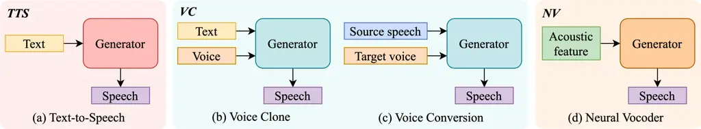
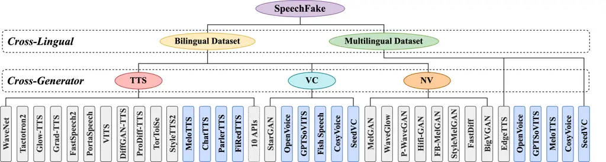
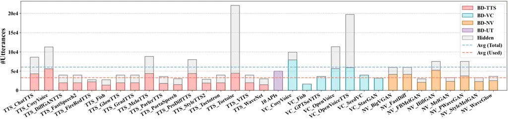
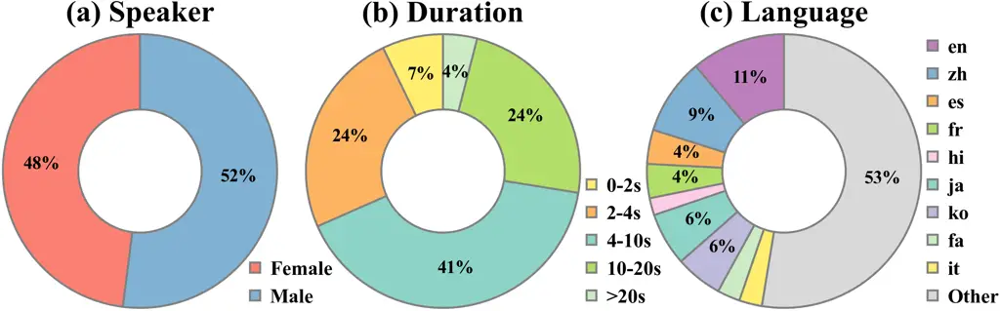
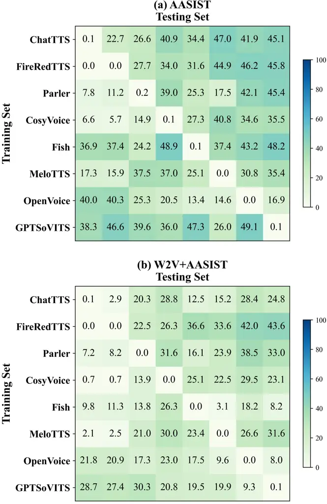

# SpeechFake: A Large-Scale Multilingual Speech Deepfake Dataset Incorporating Cutting-Edge Generation Methods

Wen Huang Affiliation: Auditory Cognition and Computational Acoustics
LabMoE Key Lab of Artificial Intelligence, AI InstituteSchool of
Computer Science, Shanghai Jiao Tong University, Shanghai, China   
Yanmei Gu    Zhiming Wang Affiliation: Ant Group, Shanghai, China   
Huijia Zhu    Yanmin Qian

###### Abstract

As speech generation technology advances, the risk of misuse through
deepfake audio has become a pressing concern, which underscores the
critical need for robust detection systems. However, many existing
speech deepfake datasets are limited in scale and diversity, making it
challenging to train models that can generalize well to unseen
deepfakes. To address these gaps, we introduce SpeechFake, a large-scale
dataset designed specifically for speech deepfake detection. SpeechFake
includes over 3 million deepfake samples, totaling more than 3,000 hours
of audio, generated using 40 different speech synthesis tools. The
dataset encompasses a wide range of generation techniques, including
text-to-speech, voice conversion, and neural vocoder, incorporating the
latest cutting-edge methods. It also provides multilingual support,
spanning 46 languages. In this paper, we offer a detailed overview of
the dataset’s creation, composition, and statistics. We also present
baseline results by training detection models on SpeechFake,
demonstrating strong performance on both its own test sets and various
unseen test sets. Additionally, we conduct experiments to rigorously
explore how generation methods, language diversity, and speaker
variation affect detection performance. We believe SpeechFake will be a
valuable resource for advancing speech deepfake detection and developing
more robust models for evolving generation techniques¹¹ 1 Dataset is
released at:
[https://github.com/YMLLG/SpeechFake](https://github.com/YMLLG/SpeechFake).

|                                         |      |                     |       |       |                 |                   |            |
| --------------------------------------- | ---- | ------------------- | ----- | ----- | --------------- | ----------------- | ---------- |
| Dataset                                 | Year | Deepfake Statistics |       |       | Generator Types | Languages         | Access     |
|                                         |      | \#utt               | \#spk | \#gen |                 |                   |            |
| ASVspoof2015 Wu et al. (2014)           | 2015 | 246,500             | 106   | 10    | TTS, VC         | English           | Public     |
| FakeOrReal Reimao and Tzerpos (2019)    | 2019 | 87,285              | 33    | 7     | TTS             | English           | Public     |
| ASVspoof2019-LA Nautsch et al. (2021)   | 2019 | 130,378             | 107   | 19    | TTS, VC         | English           | Public     |
| WaveFake Frank and Schönherr (2021)     | 2021 | 117,985             | 2     | 6     | NV              | English, Japanese | Public     |
| ASVspoof2021-LA Yamagishi et al. (2021) | 2021 | 148,148             | 67    | 13    | TTS, VC         | English           | Public     |
| ASVspoof2021-DF Yamagishi et al. (2021) | 2021 | 572,616             | 93    | 100+  | TTS, VC         | English           | Public     |
| ADD2022 Yi et al. (2022)                | 2022 | 389,419             | \-    | \-    | TTS, VC         | Chinese           | Public     |
| CFAD Ma et al. (2024)                   | 2022 | 231,600             | 279   | 12    | TTS             | Chinese           | Public     |
| In-the-Wild Müller et al. (2022)        | 2022 | 11,816              | 58    | \-    | \-              | English           | Public     |
| ADD2023 Yi et al. (2024)                | 2023 | 273,847             | \-    | \-    | TTS, VC         | Chinese           | Public     |
| HABLA Tamayo Flórez et al. (2023)       | 2023 | 58,000              | 162   | 6     | TTS, VC         | Spanish           | Public     |
| MLAAD Müller et al. (2024)              | 2024 | 82,000              | \-    | 26    | TTS             | 23 Languages      | Public     |
| CD-ADD Li et al. (2024c)                | 2024 | 117,720             | \-    | 5     | TTS             | Chinese           | Public     |
| ASVspoof5 Wang et al. (2024)            | 2024 | 1,211,186           | 1,922 | 32    | TTS, VC, AT^(⋆) | English           | Public     |
| VoiceWukong Yan et al. (2024)           | 2024 | 413,400             | \-    | 34    | TTS, VC         | English, Chinese  | Restricted |
| DFADD Du et al. (2024a)                 | 2024 | 163,500             | 109   | 5     | TTS             | English           | Public     |
| CVoiceFake Li et al. (2024a)            | 2024 | 1,254,893           | \-    | 6     | NV              | 5 Languages       | Public     |
| SpoofCeleb Jung et al. (2025)           | 2024 | 2,687,292           | 1,251 | 23    | TTS             | English           | Public     |
| SpeechFake-BD                           | 2025 | 2,003,016           | 541   | 40    | TTS, VC, NV     | English, Chinese  | Public     |
| SpeechFake-MD                           | 2025 | 1,335,492           | 179   | 6     | TTS, VC         | 46 Languages      |            |

- •
  ^(⋆)AT: Adversarial Attacks using Malafide Panariello et al. (2023) or
  Malocopula Todisco et al. (2024).

Table 1: Basic statistics of SpeechFake and its comparison with existing
speech deepfake datasets. \#utt, \#spk, \#gen represent number of
utterances, speakers and generators, respectively. “-” indicates that
the dataset either does not provide information on the number of
speakers or generators, or the generator type is unspecified.

## 1 Introduction

In recent years, speech generation technology has rapidly advanced, with
models in text-to-speech and voice conversion systems producing highly
natural and high-quality voices Tan et al. (2021); Triantafyllopoulos
et al. (2023); Ju et al. (2024). These systems are increasingly used in
virtual assistants, content creation, and language learning, making
speech synthesis more accessible and widely adopted. However, as the
realism of synthetic voices improves, so does the risk of misuse,
especially through speech deepfakes, where synthetic voices are used to
impersonate real individuals. Such deepfakes have been employed in
fraud Stupp (2019), identity theft Korshunov and Marcel (2018), and
misinformation Chesney and Citron (2019), highlighting the significant
harm they can cause. Therefore, the growing quality and availability of
speech generation systems make the need for robust detection methods
more urgent than ever.

A key challenge in developing effective deepfake detection methods is
the issue of generalization. Detection models often suffer from
substantial performance degradation when confronted with unseen
deepfakes Yamagishi et al. (2021); Müller et al. (2022), which
underscores the importance of creating comprehensive datasets to support
the development of robust detection systems. However, current datasets
for this task come with several limitations. As shown in Table 1, many
publicly available datasets are relatively small, and the generation
techniques they include are often outdated or limited, making it
challenging for models to detect more advanced deepfake technologies.
Moreover, most datasets primarily focus on English or Chinese, offering
limited representation of other languages.

To address these limitations, we propose SpeechFake, a large-scale
dataset designed to significantly improve both the scale and diversity
of data available for speech deepfake detection. The dataset contains
over 3 million speech deepfakes, amounting to more than 3,000 hours.
These deepfakes are generated using 30 publicly available speech
generation tools and 10 commercial APIs, covering a comprehensive range
of speech generation methods and incorporating cutting-edge techniques
capable of producing highly realistic synthetic speech. To support
multilingual detection and balance language distribution, SpeechFake is
divided into two parts: the Bilingual Dataset (BD), focused on English
and Chinese, and the Multilingual Dataset (MD), which spans 46
languages, broadening research opportunities in multilingual
environments. Furthermore, unlike most existing datasets that offer only
binary labels (real / fake), SpeechFake provides rich metadata,
including generation methods, voice id, language, and text
transcriptions, which facilitates deeper research into the factors that
influence deepfake detection and enables other potential use cases.

In addition, we conduct a comprehensive set of experiments to establish
a baseline for SpeechFake and explore key factors that influence
deepfake detection performance. First, we evaluate the overall
performance across multiple datasets to assess how well models trained
on SpeechFake generalize to both seen and unseen data, demonstrating
strong performance (Section 4.2). Next, we analyze cross-generator
performance to examine how different speech generation methods affect
detection accuracy (Section 4.3). We also investigate cross-lingual
performance, exploring how models trained on specific languages perform
when exposed to deepfakes in other languages (Section 4.4). Finally, we
assess cross-speaker performance to determine the impact of speaker
variability on detection robustness (Section 4.5). These experiments
establish a strong baseline for SpeechFake and provide valuable insights
into the key aspects that influence speech deepfake detection
performance.

Figure 1: Classification of speech generation methods in SpeechFake
based on input modality during inference. (a) TTS: Generate speech from
text input. (b)(c) VC: generate speech from text or speech based on
target voice. (d) NV: Generate speech from acoustic feature.

## 2 Related Work

#### Speech Generation

In prior literature, speech generation (or speech synthesis) is
primarily represented by two tasks: Text-to-Speech (TTS) and Voice
Conversion (VC). TTS generates speech from text, while VC transforms an
existing speech sample to match a target speaker’s voice without
altering its linguistic content. These two tasks often share similar
model backbones but may differ in task-specific components.

The architecture of TTS has seen significant evolution, starting with
CNN/RNN-based models Oord (2016); Wang et al. (2017), progressing to
Transformer-based architectures Li et al. (2019); Ren et al. (2021a),
and advancing further with generative frameworks such as VAE, GAN, flow,
and diffusion models Prenger et al. (2019); Kong et al. (2020); Kim
et al. (2021); Liu et al. (2022). Besides, the field has shifted from
cascaded acoustic models with separate vocoders Oord (2016); Kong et al.
(2020) to fully end-to-end systems Ren et al. (2021a); Kim et al.
(2021). More recently, the integration of Large Language Models (LLMs)
into TTS has enhanced text-to-token generation Du et al. (2024b); Guo
et al. (2024).

While traditional TTS systems generated speech in a fixed voice, newer
approaches enable multi-speaker synthesis via speaker embeddings Kim
et al. (2021); Betker (2023) and support few-shot or zero-shot voice
cloning, allowing speech generation from minimal target voice
samples Arik et al. (2018); Casanova et al. (2022); Wang et al. (2023);
Qin et al. (2023). These advancements have blurred the line between TTS
and VC.

VC has undergone a similar architectural transformation. Meanwhile,
early methods relied on parallel data and statistical techniques Godoy
et al. (2011), whereas modern VC models employ non-parallel training
with adversarial and self-supervised learning, significantly improving
conversion quality and adaptability Kaneko and Kameoka (2018); Li et al.
(2021).

A key component in many TTS and VC systems is neural vocoders (NV),
which generate waveforms from acoustic features (e.g.,
mel-spectrograms) Kong et al. (2020); gil Lee et al. (2023).
Traditionally integrated within TTS and VC pipelines, vocoders were not
regarded as standalone systems. However, recent studies indicate that
vocoded audio also plays a crucial role in deepfake detection Frank and
Schönherr (2021); Wang and Yamagishi (2023); Wang and Yamagishi (2024).

To better align speech generation with deepfake research, we categorize
speech generation methods into three types based on input modality at
inference, as shown in Figure 1: TTS, VC (Voice Clone or Voice
Conversion), and NV (Neural Vocoder). In this classification, TTS refers
to systems that generate speech with seen voices from text alone. VC
focuses on generating speech with target voice reference, whether the
content comes from text or speech. Finally, NV generates speech from
acoustic features without explicitly altering the original voice. By
adopting this classification, we encompass a more comprehensive and
systematic framework for deepfake speech generation.

#### Speech Deepfake Datasets

Several benchmark datasets have been developed for speech deepfake
detection. The ASVspoof Challenge series Wu et al. (2014); Nautsch
et al. (2021); Yamagishi et al. (2021); Wang et al. (2024) has
progressively expanded from spoofing attacks on automatic speaker
verification (ASV) systems to a broader range of speech deepfakes.
Similarly, the Audio Deepfake Detection (ADD) Challenge has released
datasets focusing on deepfake detection in Chinese Yi et al. (2022); Yi
et al. (2024). Other datasets include FoR Reimao and Tzerpos (2019),
WaveFake Frank and Schönherr (2021), and In-the-Wild Müller et al.
(2022), which collect deepfake speech from various synthesis methods,
including open-source tools, neural vocoders, and internet sources.
Multilingual resources such as HABLA (Spanish) Tamayo Flórez et al.
(2023), MLADD (23 languages) Müller et al. (2024), and CVoiceFake (5
languages) Li et al. (2024a) further extend language coverage.

Meanwhile, recent datasets have gradually integrated advanced speech
synthesis techniques. CD-ADD Li et al. (2024c) targets zero-shot TTS,
DFADD Du et al. (2024a) focuses on diffusion-based models,
VoiceWukong Yan et al. (2024) covers various synthesis methods with
perturbation variants, and SpoofCeleb Jung et al. (2025) provides
speaker-dependent deepfakes generated from real-world and TTS-based
samples.

Despite the availability of several datasets, none offer a comprehensive
combination of both large-scale data and diversity in generation methods
and languages. Simply merging existing datasets to create a larger
benchmark would likely introduce issues such as condition mismatches and
increased complexity in model training. SpeechFake addresses these
challenges by offering a large-scale, multilingual dataset that
incorporates cutting-edge synthesis techniques, providing broader and
more robust coverage for deepfake detection research.

Figure 2: Overview of the SpeechFake dataset. The dataset is divided
into two parts: the Bilingual Dataset and the Multilingual Dataset. The
Bilingual Dataset is further categorized into three generation methods:
TTS, VC, and NV. Methods highlighted in blue represent the latest speech
generation methods.

## 3 Dataset Collection and Statistics

### 3.1 Data Collection

The data collection consists of two parts: real speech, sourced from
existing datasets, and fake speech, generated using open-source speech
generation methods or commercial APIs. Since most speech generation
methods primarily support English or Chinese, we split our dataset into
two parts to balance the samples for each language: the Bilingual
Dataset (BD), which includes English and Chinese, and the Multilingual
Dataset (MD), which covers data from 46 languages. An overview of the
dataset composition is shown in Figure 2.

For BD, real speech data is sourced from four datasets: LibriTTS Zen
et al. (2019) and VCTK Veaux et al. (2013) for English, and AISHELL1 Bu
et al. (2017) and AISHELL3 Shi et al. (2020) for Chinese. Fake speech is
generated using 30 open-source speech generation tools and 10 commercial
APIs, as detailed in Table 8. The open-source models span a variety of
architectures, including GAN-based models Kumar et al. (2019); Kong
et al. (2020), Diffusion models Liu et al. (2022); Huang et al. (2022b),
Sequence-to-Sequence models Oord (2016); Ren et al. (2021a), and Flow or
VAE models Prenger et al. (2019); Kim et al. (2021). Besides, we include
the latest speech generation techniques (highlighted in blue in
Figure 2), all of which were released in the past year and represent
cutting-edge advancements in speech synthesis.

Figure 3: Distribution of speech generation methods in SpeechFake-BD.
Some data is hidden in experiment trials to ensure a more balanced
distribution across each method and across different test trials.

Figure 4: Distribution of speaker gender, language, and duration in
SpeechFake. The speaker and duration statistics are based on the entire
dataset, while the language distribution is specific to the MD subset.

For MD, real speech data is sourced from the CommonVoice dataset Ardila
et al. (2019), which supports multiple languages. Fake speech data is
generated using 6 multilingual speech generation tools, as shown in
Figure 2. EdgeTTS²² 2
[https://github.com/rany2/edge-tts.git](https://github.com/rany2/edge-tts.git)
supports the widest range of languages, while the other tools cover a
subset based on their respective multilingual capabilities.

#### Data Preparation

Before generation, we prepare the necessary text or audio inputs for
each generator. These inputs are sourced from real datasets, including
text transcriptions for TTS systems and audio samples for VC and NV
systems.

- •
  Text Preprocessing: For TTS systems, we clean the text inputs by
  removing special characters, punctuation, and extra spaces. We also
  ensure that each text sample maintains an appropriate word or
  character count (e.g., 5–30 words for English) and provides a broad
  phonemic coverage. The text is then tokenized and formatted to meet
  the specific requirements of each TTS model, with adjustments made for
  sentence length or phonetic transcription where necessary.
- •
  Audio Preprocessing: Audio samples for VC and NV systems are resampled
  to the required sampling rate and converted into the appropriate
  formats, such as mel-spectrograms for neural vocoders or raw waveforms
  for voice conversion models. The silence at the beginning or end of
  the clips is trimmed.

#### Data Generation

During the data generation process, the prepared inputs are fed into the
respective generators based on the system type.

- •
  For TTS systems: The prepared text is used to generate speech for each
  method. If the method supports multiple voices, the text is evenly
  split among the available voices. An exception is TTS_Tortoise, for
  which additional data is generated to support the cross-speaker
  experiment.
- •
  For VC systems: Reference voices are sampled from the real datasets,
  while the content comes from the selected text or the corresponding
  speech recordings. The text is generally split equally among the
  reference voices. For methods supporting style transfer (e.g.,
  CosyVoice, OpenVoice), we include additional data to reflect the
  transformed styles.
- •
  For NV systems: The generated speech is based on the original input
  audio selected from the real datasets, without any explicit
  instructions to alter the content or voice.

#### Data Post-processing

Once the speech is generated, we perform several post-processing steps
to ensure that the data meets the required quality standards and is
suitable for downstream tasks:

- •
  Quality Filtering: We apply voice activity detection (VAD) to filter
  out speech segments shorter than 0.5 seconds. Additionally, a
  selective human review is conducted to discard generated speech with
  noticeable distortions, excessive noise, or unnatural artifacts.
  Approximately 1% of samples from each method are randomly selected to
  ensure representative coverage of the diversity in generation options
  (e.g., voices, languages).
- •
  Format Standardization: The remaining audio clips are standardized to
  a 16kHz sampling rate, converted to mono, and saved in WAV format to
  ensure consistency across all samples in the dataset.

### 3.2 Dataset Statistics

The dataset partitioning for experiments is outlined in Table 7 in the
Appendix. To address the imbalance between the substantial amount of
fake data and the limited real data, as well as to ensure balanced test
trials, we allocated approximately half of the fake data across the
train, dev, and test sets (split 6:1:3), reserving the remainder for
future experiments.

The main portion of BD (train, dev, and test) includes speech deepfakes
generated using open-source speech generation methods. It is divided
into two language partitions: BD-EN (English) and BD-CN (Chinese), as
well as three generator-based subsets: BD-TTS, BD-VC, and BD-NV. To
assess model generalization to unseen methods, we also created a
separate unseen test set (BD-UT) using commercial APIs. Figure 3
illustrates the distribution of the different generation methods used in
BD. TTS methods account for the majority, while VC and NV methods
represent a smaller portion. On average, each method generates around
60k utterances, with 30k samples used per method for balanced trials.

MD utilizes the same set of generation methods with multilingual support
across its train, dev, and test sets, with the key distinction being
language coverage. The dataset spans 46 languages, including 9 primary
languages with larger sample volumes: English (en), Chinese (zh),
Spanish (es), French (fr), Hindi (hi), Japanese (ja), Korean (ko),
Persian (fa), and Italian (it). As shown in Figure 4 (c), these 9
languages account for half of the dataset, with English and Chinese
being the most prominent, while the remaining 37 languages make up the
other half. The train and dev sets consist exclusively of English and
Chinese data, while the test set is divided into 10 subsets: one for
each of the 9 primary languages and one combined subset for the
remaining 37 languages. For the combined subset, around 5,000 clips are
selected per language, with the rest reserved for future research.

Figure 4 also illustrates the distribution of speaker gender and audio
duration. We ensure a relatively balanced representation of female and
male speakers in terms of gender. Regarding audio duration, most clips
range from 2.0 to 20.0 seconds, with a smaller number of shorter clips
(0–2 seconds) and longer ones (over 20 seconds), providing variability
in length.

## 4 Experiments and Analysis

### 4.1 Experimental Settings

To evaluate deepfake detection performance, we use two state-of-the-art
models: AASIST Jung et al. (2022) and W2V+AASIST Tak et al. (2022).
AASIST employs a heterogeneous stacking graph attention network with a
novel attention mechanism to capture spoofing artifacts across both
temporal and spectral domains. W2V+AASIST integrates Wav2Vec2.0
XLSR Babu et al. (2021) as a frontend feature extractor with AASIST
serving as the backend classifier. The training details for each model
are provided in Table 6 in the Appendix. For evaluation, we use the
Equal Error Rate (EER) as the metric, following previous work Yamagishi
et al. (2021); Du et al. (2024a).

|            |            |                        |       |       |                    |       |       |       |       |       |       |
| ---------- | ---------- | ---------------------- | ----- | ----- | ------------------ | ----- | ----- | ----- | ----- | ----- | ----- |
| Train Data | Model      | Test Data (SpeechFake) |       |       | Test Data (Others) |       |       |       |       |       |       |
|            |            | BD                     | BD-EN | BD-CN | ASV19              | FOR   | WF    | CFAD  | ITW   | CDADD | ASV24 |
| ASV19      | AASIST     | 39.36                  | 41.05 | 39.07 | 1.88               | 36.08 | 21.17 | 43.95 | 45.27 | 49.53 | 41.89 |
| BD         |            | 3.48                   | 3.98  | 2.68  | 23.62              | 23.35 | 4.30  | 34.32 | 7.53  | 22.52 | 35.02 |
| BD-EN      |            | 9.02                   | 6.17  | 12.00 | 30.65              | 28.99 | 8.54  | 43.39 | 6.96  | 23.24 | 40.82 |
| BD-CN      |            | 16.58                  | 24.59 | 5.43  | 16.56              | 25.48 | 5.88  | 32.34 | 8.54  | 39.75 | 34.39 |
| ASV19      | W2V+AASIST | 23.78                  | 20.15 | 24.93 | 0.89               | 6.18  | 3.48  | 20.53 | 10.07 | 8.55  | 1.41  |
| BD         |            | 3.54                   | 3.55  | 2.83  | 2.91               | 6.00  | 0.58  | 12.39 | 2.01  | 2.42  | 0.71  |
| BD-EN      |            | 8.65                   | 4.58  | 10.44 | 5.28               | 8.33  | 0.96  | 21.42 | 2.62  | 3.54  | 0.71  |
| BD-CN      |            | 8.99                   | 11.40 | 4.51  | 0.99               | 4.88  | 0.64  | 11.72 | 3.34  | 7.16  | 1.17  |

Table 2: Performance evaluation (EER%) of different models trained on
ASVspoof2019 (ASV19) or SpeechFake Bilingual Dataset (BD) across
multiple test sets, including subsets of BD and other publicly available
benchmarks. For each model, the best results are bold and the second
best are underlined.

### 4.2 Overall Performance

We first establish baseline results to demonstrate the overall
performance on the Bilingual Dataset. For training, we include the
ASVspoof2019-LA training set (ASV19), a widely used benchmark in speech
deepfake detection research, alongside three partitions of the BD
training set (BD, BD-EN, BD-CN). The evaluation is conducted on multiple
test sets: the BD testing sets (BD, BD-EN, BD-CN), and some additional
commonly used benchmarks, spanning a range of datasets from older to
newer: ASVspoof2019-LA eval set (ASV19), FakeOrReal (FOR), WaveFake
(WF), In-the-Wild (ITW), CDADD, ASVspoof5 (ASV24). Details of the test
settings are provided in Appendix B.1.

From Table 2, we observe that when models are trained on ASV19, they
perform well on its own evaluation set but experience significant
performance degradation on other test sets, particularly on BD, where
most of the generation methods are unseen during training. In contrast,
training on BD leads to significant accuracy improvements. While
training on the English (BD-EN) or Chinese (BD-CN) subsets yields good
performance on their respective test sets, it results in poorer
performance on the complementary sets. This may be attributed to the
differences in the generation methods or languages included in each
partition. Using the full BD training set delivers the best overall
results, enhancing accuracy across all BD test subsets compared to
training on a single language subset.

When tested on external datasets, models trained on BD consistently
outperform those trained on ASV19, except on the ASV19 test set, which
is in-domain for the ASV19-trained models. The improvements are
particularly significant for test sets such as WF, ITW, and CDADD, where
models trained on BD show 50%-80% better performance compared to those
trained on ASV19. Notably, the BD-EN and BD-CN subsets show different
performance patterns across test sets. BD-EN performs better on English
datasets such as ITW and CDADD, while BD-CN tends to perform better on
Chinese datasets like CFAD. However, BD-CN also outperforms both BD-EN
and BD on some English test sets, such as ASV19 and FOR. This indicates
that language is not the sole factor influencing performance on these
unseen test settings. Other factors, such as generation methods and
recording conditions, likely contribute as well. Hence, to accurately
evaluate the impact of factors like language, other variables should be
controlled and kept as consistent as possible across experiments.

### 4.3 Cross-Generator Performance

To evaluate the impact of generators on detection performance, we
conduct cross-evaluations using three categories of generators in BD:
TTS, VC, and NV. The results are presented in Table 3.

|        |             |           |       |       |       |       |
| ------ | ----------- | --------- | ----- | ----- | ----- | ----- |
| Train  | Model       | Test Data |       |       |       |       |
| Data   |             | BD-TTS    | BD-VC | BD-NV | BD    | BD-UT |
| BD-TTS | AASIST      | 0.44      | 16.85 | 25.66 | 14.26 | 0.53  |
| BD-VC  |             | 18.71     | 2.18  | 35.31 | 20.90 | 14.34 |
| BD-NV  |             | 23.44     | 41.63 | 9.53  | 26.30 | 26.87 |
| BD-TTS | W2V+ AASIST | 1.01      | 9.78  | 14.34 | 8.08  | 0.20  |
| BD-VC  |             | 5.81      | 3.82  | 18.26 | 8.81  | 9.35  |
| BD-NV  |             | 9.34      | 17.38 | 7.77  | 11.33 | 23.79 |

Table 3: Performance evaluation (EER%) of different generator types used
as training sets across various test sets. For each model, the best
results are bolded, and the second-best results are underlined.

|            |       |           |      |       |       |       |      |      |      |      |         |        |
| ---------- | ----- | --------- | ---- | ----- | ----- | ----- | ---- | ---- | ---- | ---- | ------- | ------ |
| Model      | Epoch | Test Data |      |       |       |       |      |      |      |      |         |        |
|            |       | en        | zh   | es    | fr    | hi    | ja   | ko   | fa   | it   | 9 langs | others |
| AASIST     | 20    | 0.81      | 2.14 | 14.60 | 22.54 | 26.06 | 9.53 | 4.39 | 9.73 | 6.79 | 10.86   | 6.03   |
|            | 50    | 0.60      | 3.48 | 3.74  | 9.70  | 20.25 | 8.95 | 3.46 | 8.62 | 5.18 | 8.49    | 4.93   |
| W2V+AASIST | 20    | 0.27      | 1.38 | 7.98  | 12.08 | 11.90 | 5.14 | 2.54 | 4.42 | 3.48 | 6.53    | 4.64   |
|            | 50    | 0.15      | 0.29 | 0.12  | 0.42  | 0.98  | 0.22 | 0.03 | 0.24 | 0.16 | 0.50    | 0.23   |

Table 4: Performance evaluation (EER%) on test sets across various
languages for models trained on English and Chinese at different epochs.
“9 langs” represents the combination of the 9 primary languages, while
“others” refers to the combination of remaining languages.

For each training set, the best detection performance is consistently
observed on its corresponding testing set, but performance degrades
significantly when tested on other generator types. This highlights the
challenge of generalizing across unseen generation methods.

In terms of overall performance, models trained on TTS data consistently
deliver the best results on the full BD test set, followed by VC, while
NV-trained models generally show lower performance. This is likely due
to the TTS subset’s diverse composition, which includes state-of-the-art
techniques that produce highly realistic synthetic speech. In contrast,
NV-based systems may underperform because they often rely on older
methods that generate lower-quality deepfakes, making detection more
challenging for models trained on NV data.

When tested on the unseen commercial TTS API set (BD-UT), TTS-trained
models consistently outperform those trained on VC and NV, achieving
strong performance across both. This underscores that exposure to modern
TTS data enhances the model’s ability to detect high-quality,
natural-sounding deepfakes.

In summary, unseen generation methods present a significant challenge
for generalization in deepfake detection. Although training on similar
generation types can somewhat improve detection performance, substantial
differences between generation methods still result in considerable
performance degradation. Additionally, we provide cross-evaluation
results for individual latest generation methods in Figure 5 in the
Appendix, which further confirm these findings.

### 4.4 Cross-Lingual performance

To assess the impact of language on deepfake detection, we conducted
experiments using MD, where all generation methods were seen during
training, but certain languages were kept unseen. The training set
includes only English and Chinese, while the test set spans a total of
46 languages.

From Table 4, we observe that both models perform well on the seen
English (en) and Chinese (zh) test sets, with minimal error rates after
just 20 epochs. However, for the unseen languages, both models show a
noticeable performance drop after 20 epochs, particularly for French
(fr) and Hindi (hi). Extending the training to 50 epochs, AASIST still
exhibits a significant gap between the seen and unseen languages, though
there is some improvement for the unseen languages and minimal
improvement for the seen ones. In contrast, the W2V+AASIST model
achieves generally good performance, which can likely be attributed to
the multilingual pretraining of the Wav2Vec 2.0 XLSR model Babu et al.
(2021).

These results suggest that language content does affect detection
performance, even when the generation methods are seen during training.
However, prior exposure to a language through multilingual pretraining
can help mitigate this effect to some extent.

### 4.5 Cross-Speaker Performance

Some TTS systems are limited to generating specific voices, making it
possible to detect deepfakes by merely memorizing the speaker’s voice
rather than learning the distinct audio characteristics that
differentiate real and fake speech. This raises the question: can a
model learn to detect deepfakes based on their inherent characteristics,
or does it simply overfit to the speaker identity?

To explore this, we created a small dataset selected from BD. To
minimize the influence of different generation methods, we exclusively
used TorToiSe Betker (2023), a TTS system that supports multi-speaker
speech generation. The training dataset is a subset of the BD train set,
consisting of 100 real speakers and 10 fake speakers, with a total of
34,305 utterances. As detailed in Table 5, we designed five different
test trials, varying the combinations of seen and unseen speakers to
assess the model’s ability to generalize across speakers. For
evaluation, we trained an AASIST model over three runs for 50 epochs on
this training set.

|     |       |              |        |            |                   |
| --- | ----- | ------------ | ------ | ---------- | ----------------- |
| No. | Real  |              | Fake   |            | EER(%)            |
|     | \#utt | \#spk        | \#utt  | \#spk      |                   |
| 1   | 6,599 | 100 (100, 0) | 13,871 | 10 (10, 0) | 0.06 $`\pm`$ 0.01 |
| 2   | 5,557 | 100 (0, 100) | 12,377 | 10 (0, 10) | 0.43 $`\pm`$ 0.15 |
| 3   | 5,557 | 100 (0, 100) | 13,871 | 10 (10, 0) | 0.01 $`\pm`$ 0.01 |
| 4   | 6,599 | 100 (100, 0) | 12,377 | 10 (0, 10) | 0.64 $`\pm`$ 0.06 |
| 5   | 6,071 | 100 (50, 50) | 13,677 | 10 (5, 5)  | 0.49 $`\pm`$ 0.05 |

Table 5: Statistics and EER(%) results of cross-speaker testing trials.
\#utt, \#spk represent number of utterances and speakers, respectively.
The numbers in parentheses represent the distribution of speakers (seen,
unseen) in the training set.

Overall, the EERs across all five test settings are minimal, indicating
that the model can detect deepfake-specific features rather than relying
solely on speaker identity. When comparing Settings 1 and 2, which
differ in whether both real and fake speakers are seen or unseen during
training, we observe only a slight increase in EER when speakers are
unseen (from 0.06% to 0.43%). In Setting 3, where real speakers are
unseen and fake speakers are seen, the model achieves almost perfect
detection (0.01%), likely due to more fake data per speaker, though some
speaker memorization may be occurring. In contrast, Setting 4, with seen
real speakers and unseen fake speakers, results in a higher EER (0.64%),
suggesting that the model struggles more with unseen fake speakers,
possibly relying on learned fake speaker characteristics. Setting 5,
with a mix of seen and unseen speakers, yields an EER of 0.49%,
indicating better generalization than Setting 4, but still some
performance drop with unseen fake speakers.

The experimental results demonstrate that the model effectively learns
deepfake-specific features instead of overfitting to individual speaker
identities. While the impact of speaker identity on detection
performance is generally minimal, it becomes more pronounced when the
model encounters completely unseen fake speakers.

## 5 Conclusion

In conclusion, SpeechFake addresses critical gaps in existing speech
deepfake detection datasets by providing a large-scale collection of
over 3 million deepfakes, with diverse generation methods and languages.
Through extensive experimentation, we established baseline results and
demonstrated significant performance improvements for models trained on
SpeechFake, particularly on unseen test sets. Our analysis of key
factors, including generation methods, language diversity, and speaker
variation, shows that while generation methods and language diversity
influence detection performance, speaker variation has minimal impact.
These findings highlight the challenges of generalizing across unseen
deepfakes, while showcasing SpeechFake’s potential to advance model
robustness and generalization. We believe SpeechFake will be an
invaluable resource for developing robust detection systems, ultimately
helping mitigate the risks of deepfake misuse.

## 6 Limitations

While SpeechFake provides a large and diverse dataset for speech
deepfake detection, several limitations exist. First, although the
dataset includes 40 different speech generation tools, it does not cover
all current or emerging techniques. This is due to the rapid pace of
advancements in speech generation technology, which introduces new
methods that may not yet be represented. Additionally, the multilingual
dataset is limited in terms of generation method variety, primarily
because multilingual speech generation systems are still scarce. For
future work, we plan to address these limitations by continuously
updating the dataset to incorporate emerging generation techniques and
expanding its multilingual component as new techniques become available.

## 7 Acknowledgements

This work was partially supported by the Ant Group Research Intern
Program and the Pioneer R&D Program of Zhejiang Province (No.
2024C01024). This work was supported in part by China NSFC projects
under Grants 62122050 and 62071288, in part by Shanghai Municipal
Science and Technology Commission Project under Grant 2021SHZDZX0102.

## References

- Ardila et al. (2019) Rosana Ardila, Megan Branson, Kelly Davis,
  Michael Henretty, Michael Kohler, Josh Meyer, Reuben Morais, Lindsay
  Saunders, Francis M Tyers, and Gregor Weber. 2019. Common voice: A
  massively-multilingual speech corpus. _arXiv preprint
  arXiv:1912.06670_.
- Arik et al. (2018) Sercan Arik, Jitong Chen, Kainan Peng, Wei Ping,
  and Yanqi Zhou. 2018. Neural voice cloning with a few samples.
  _Advances in neural information processing systems_, 31.
- Babu et al. (2021) Arun Babu, Changhan Wang, Andros Tjandra, Kushal
  Lakhotia, Qiantong Xu, Naman Goyal, Kritika Singh, Patrick Von Platen,
  Yatharth Saraf, Juan Pino, et al. 2021. Xls-r: Self-supervised
  cross-lingual speech representation learning at scale. _arXiv preprint
  arXiv:2111.09296_.
- Betker (2023) James Betker. 2023. Better speech synthesis through
  scaling. _arXiv preprint arXiv:2305.07243_.
- Bu et al. (2017) Hui Bu, Jiayu Du, Xingyu Na, Bengu Wu, and Hao
  Zheng. 2017. Aishell-1: An open-source mandarin speech corpus and a
  speech recognition baseline. In _2017 20th conference of the oriental
  chapter of the international coordinating committee on speech
  databases and speech I/O systems and assessment (O-COCOSDA)_, pages
  1–5. IEEE.
- Casanova et al. (2022) Edresson Casanova, Julian Weber, Christopher D
  Shulby, Arnaldo Candido Junior, Eren Gölge, and Moacir A Ponti. 2022.
  Yourtts: Towards zero-shot multi-speaker tts and zero-shot voice
  conversion for everyone. In _International Conference on Machine
  Learning_, pages 2709–2720. PMLR.
- Chesney and Citron (2019) Robert Chesney and Danielle Citron. 2019.
  Deepfakes and the new disinformation war: The coming age of post-truth
  geopolitics. _Foreign Aff._, 98:147.
- Du et al. (2024a) Jiawei Du, I Lin, I Chiu, Xuanjun Chen, Haibin Wu,
  Wenze Ren, Yu Tsao, Hung-yi Lee, Jyh-Shing Roger Jang, et al. 2024a.
  Dfadd: The diffusion and flow-matching based audio deepfake dataset.
  _arXiv preprint arXiv:2409.08731_.
- Du et al. (2024b) Zhihao Du, Qian Chen, Shiliang Zhang, Kai Hu, Heng
  Lu, Yexin Yang, Hangrui Hu, Siqi Zheng, Yue Gu, Ziyang Ma, et al.
  2024b. Cosyvoice: A scalable multilingual zero-shot text-to-speech
  synthesizer based on supervised semantic tokens. _arXiv preprint
  arXiv:2407.05407_.
- Frank and Schönherr (2021) Joel Frank and Lea Schönherr. 2021.
  WaveFake: A Data Set to Facilitate Audio Deepfake Detection. In
  _Thirty-fifth Conference on Neural Information Processing Systems
  Datasets and Benchmarks Track_.
- gil Lee et al. (2023) Sang gil Lee, Wei Ping, Boris Ginsburg, Bryan
  Catanzaro, and Sungroh Yoon. 2023. BigVGAN: A universal neural vocoder
  with large-scale training. In _The Eleventh International Conference
  on Learning Representations_.
- Godoy et al. (2011) Elizabeth Godoy, Olivier Rosec, and Thierry
  Chonavel. 2011. Voice conversion using dynamic frequency warping with
  amplitude scaling, for parallel or nonparallel corpora. _IEEE
  Transactions on Audio, Speech, and Language Processing_,
  20(4):1313–1323.
- Guo et al. (2024) Hao-Han Guo, Kun Liu, Fei-Yu Shen, Yi-Chen Wu,
  Feng-Long Xie, Kun Xie, and Kai-Tuo Xu. 2024. Fireredtts: A foundation
  text-to-speech framework for industry-level generative speech
  applications. _arXiv preprint arXiv:2409.03283_.
- Huang et al. (2022a) Rongjie Huang, Max WY Lam, Jun Wang, Dan Su, Dong
  Yu, Yi Ren, and Zhou Zhao. 2022a. Fastdiff: A fast conditional
  diffusion model for high-quality speech synthesis. In _Proceedings of
  the Thirty-First International Joint Conference on Artificial
  Intelligence, IJCAI-22_. International Joint Conferences on Artificial
  Intelligence Organization.
- Huang et al. (2022b) Rongjie Huang, Zhou Zhao, Huadai Liu, Jinglin
  Liu, Chenye Cui, and Yi Ren. 2022b. Prodiff: Progressive fast
  diffusion model for high-quality text-to-speech. In _Proceedings of
  the 30th ACM International Conference on Multimedia_, pages 2595–2605.
- Ju et al. (2024) Zeqian Ju, Yuancheng Wang, Kai Shen, Xu Tan, Detai
  Xin, Dongchao Yang, Yanqing Liu, Yichong Leng, Kaitao Song, Siliang
  Tang, et al. 2024. Naturalspeech 3: Zero-shot speech synthesis with
  factorized codec and diffusion models. _arXiv preprint
  arXiv:2403.03100_.
- Jung et al. (2022) Jee-weon Jung, Hee-Soo Heo, Hemlata Tak, Hye-jin
  Shim, Joon Son Chung, Bong-Jin Lee, Ha-Jin Yu, and Nicholas
  Evans. 2022. Aasist: Audio anti-spoofing using integrated
  spectro-temporal graph attention networks. In _ICASSP 2022-2022 IEEE
  international conference on acoustics, speech and signal processing
  (ICASSP)_, pages 6367–6371. IEEE.
- Jung et al. (2025) Jee-weon Jung, Yihan Wu, Xin Wang, Ji-Hoon Kim,
  Soumi Maiti, Yuta Matsunaga, Hye-jin Shim, Jinchuan Tian, Nicholas
  Evans, Joon Son Chung, et al. 2025. Spoofceleb: Speech deepfake
  detection and sasv in the wild. _IEEE Open Journal of Signal
  Processing_.
- Kaneko and Kameoka (2018) Takuhiro Kaneko and Hirokazu Kameoka. 2018.
  Cyclegan-vc: Non-parallel voice conversion using cycle-consistent
  adversarial networks. In _2018 26th European Signal Processing
  Conference (EUSIPCO)_, pages 2100–2104. IEEE.
- Kim et al. (2020) Jaehyeon Kim, Sungwon Kim, Jungil Kong, and Sungroh
  Yoon. 2020. Glow-tts: A generative flow for text-to-speech via
  monotonic alignment search. _Advances in Neural Information Processing
  Systems_, 33:8067–8077.
- Kim et al. (2021) Jaehyeon Kim, Jungil Kong, and Juhee Son. 2021.
  Conditional variational autoencoder with adversarial learning for
  end-to-end text-to-speech. In _International Conference on Machine
  Learning_, pages 5530–5540. PMLR.
- Kong et al. (2020) Jungil Kong, Jaehyeon Kim, and Jaekyoung Bae. 2020.
  Hifi-gan: Generative adversarial networks for efficient and high
  fidelity speech synthesis. _Advances in neural information processing
  systems_, 33:17022–17033.
- Korshunov and Marcel (2018) Pavel Korshunov and Sébastien
  Marcel. 2018. Deepfakes: a new threat to face recognition? assessment
  and detection. _arXiv preprint arXiv:1812.08685_.
- Kumar et al. (2019) Kundan Kumar, Rithesh Kumar, Thibault
  De Boissiere, Lucas Gestin, Wei Zhen Teoh, Jose Sotelo, Alexandre
  De Brebisson, Yoshua Bengio, and Aaron C Courville. 2019. Melgan:
  Generative adversarial networks for conditional waveform synthesis.
  _Advances in neural information processing systems_, 32.
- Li et al. (2019) Naihan Li, Shujie Liu, Yanqing Liu, Sheng Zhao, and
  Ming Liu. 2019. Neural speech synthesis with transformer network. In
  _Proceedings of the AAAI conference on artificial intelligence_,
  volume 33, pages 6706–6713.
- Li et al. (2024a) Xinfeng Li, Kai Li, Yifan Zheng, Chen Yan, Xiaoyu
  Ji, and Wenyuan Xu. 2024a. SafeEar: Content Privacy-Preserving Audio
  Deepfake Detection. In _Proceedings of the 2024 ACM SIGSAC Conference
  on Computer and Communications Security, CCS 2024_.
- Li et al. (2024b) Yinghao Aaron Li, Cong Han, Vinay Raghavan, Gavin
  Mischler, and Nima Mesgarani. 2024b. Styletts 2: Towards human-level
  text-to-speech through style diffusion and adversarial training with
  large speech language models. _Advances in Neural Information
  Processing Systems_, 36.
- Li et al. (2021) Yinghao Aaron Li, Ali Zare, and Nima Mesgarani. 2021.
  Starganv2-vc: A diverse, unsupervised, non-parallel framework for
  natural-sounding voice conversion. In _Interspeech 2021_, pages
  1349–1353.
- Li et al. (2024c) Yuang Li, Min Zhang, Mengxin Ren, Miaomiao Ma,
  Daimeng Wei, and Hao Yang. 2024c. Cross-domain audio deepfake
  detection: Dataset and analysis. _arXiv preprint arXiv:2404.04904_.
- Liao et al. (2024) Shijia Liao, Yuxuan Wang, Tianyu Li, Yifan Cheng,
  Ruoyi Zhang, Rongzhi Zhou, and Yijin Xing. 2024. [Fish-speech:
  Leveraging large language models for advanced multilingual
  text-to-speech synthesis](https://arxiv.org/abs/2411.01156).
  _Preprint_, arXiv:2411.01156.
- Liu (2024) Songting Liu. 2024. Zero-shot voice conversion with
  diffusion transformers. _arXiv preprint arXiv:2411.09943_.
- Liu et al. (2022) Songxiang Liu, Dan Su, and Dong Yu. 2022.
  Diffgan-tts: High-fidelity and efficient text-to-speech with denoising
  diffusion gans. _arXiv preprint arXiv:2201.11972_.
- Lyth and King (2024) Dan Lyth and Simon King. 2024. [Natural language
  guidance of high-fidelity text-to-speech with synthetic
  annotations](https://arxiv.org/abs/2402.01912). _Preprint_,
  arXiv:2402.01912.
- Ma et al. (2024) Haoxin Ma, Jiangyan Yi, Chenglong Wang, Xinrui Yan,
  Jianhua Tao, Tao Wang, Shiming Wang, and Ruibo Fu. 2024. Cfad: A
  chinese dataset for fake audio detection. _Speech Communication_,
  164:103122.
- Müller et al. (2024) Nicolas M Müller, Piotr Kawa, Wei Herng Choong,
  Edresson Casanova, Eren Gölge, Thorsten Müller, Piotr Syga, Philip
  Sperl, and Konstantin Böttinger. 2024. Mlaad: The multi-language audio
  anti-spoofing dataset. _arXiv preprint arXiv:2401.09512_.
- Mustafa et al. (2021) Ahmed Mustafa, Nicola Pia, and Guillaume
  Fuchs. 2021. Stylemelgan: An efficient high-fidelity adversarial
  vocoder with temporal adaptive normalization. In _ICASSP 2021-2021
  IEEE International Conference on Acoustics, Speech and Signal
  Processing (ICASSP)_, pages 6034–6038. IEEE.
- Müller et al. (2022) Nicolas Müller, Pavel Czempin, Franziska
  Diekmann, Adam Froghyar, and Konstantin Böttinger. 2022. Does audio
  deepfake detection generalize? In _Interspeech 2022_, pages 2783–2787.
- Nautsch et al. (2021) Andreas Nautsch, Xin Wang, Nicholas Evans,
  Tomi H Kinnunen, Ville Vestman, Massimiliano Todisco, Hector Delgado,
  Md Sahidullah, Junichi Yamagishi, and Kong Aik Lee. 2021. Asvspoof
  2019: Spoofing countermeasures for the detection of synthesized,
  converted and replayed speech. _IEEE Transactions on Biometrics,
  Behavior, and Identity Science_, 3(2):252–265.
- Oord (2016) Aaron van den Oord. 2016. Wavenet: A generative model for
  raw audio. _arXiv preprint arXiv:1609.03499_.
- Panariello et al. (2023) Michele Panariello, Wanying Ge, Hemlata Tak,
  Massimiliano Todisco, and Nicholas Evans. 2023. Malafide: a novel
  adversarial convolutive noise attack against deepfake and spoofing
  detection systems. _arXiv preprint arXiv:2306.07655_.
- Popov et al. (2021) Vadim Popov, Ivan Vovk, Vladimir Gogoryan, Tasnima
  Sadekova, and Mikhail Kudinov. 2021. Grad-tts: A diffusion
  probabilistic model for text-to-speech. In _International Conference
  on Machine Learning_, pages 8599–8608. PMLR.
- Prenger et al. (2019) Ryan Prenger, Rafael Valle, and Bryan
  Catanzaro. 2019. Waveglow: A flow-based generative network for speech
  synthesis. In _ICASSP 2019-2019 IEEE International Conference on
  Acoustics, Speech and Signal Processing (ICASSP)_, pages 3617–3621.
  IEEE.
- Qin et al. (2023) Zengyi Qin, Wenliang Zhao, Xumin Yu, and Xin
  Sun. 2023. Openvoice: Versatile instant voice cloning. _arXiv preprint
  arXiv:2312.01479_.
- Reimao and Tzerpos (2019) Ricardo Reimao and Vassilios Tzerpos. 2019.
  For: A dataset for synthetic speech detection. In _2019 International
  Conference on Speech Technology and Human-Computer Dialogue (SpeD)_,
  pages 1–10. IEEE.
- Ren et al. (2021a) Yi Ren, Chenxu Hu, Xu Tan, Tao Qin, Sheng Zhao,
  Zhou Zhao, and Tie-Yan Liu. 2021a. Fastspeech 2: Fast and high-quality
  end-to-end text to speech. In _International Conference on Learning
  Representations_.
- Ren et al. (2021b) Yi Ren, Jinglin Liu, and Zhou Zhao. 2021b.
  Portaspeech: Portable and high-quality generative text-to-speech.
  _Advances in Neural Information Processing Systems_, 34:13963–13974.
- Shen et al. (2018) Jonathan Shen, Ruoming Pang, Ron J Weiss, Mike
  Schuster, Navdeep Jaitly, Zongheng Yang, Zhifeng Chen, Yu Zhang,
  Yuxuan Wang, Rj Skerrv-Ryan, et al. 2018. Natural tts synthesis by
  conditioning wavenet on mel spectrogram predictions. In _2018 IEEE
  international conference on acoustics, speech and signal processing
  (ICASSP)_, pages 4779–4783. IEEE.
- Shi et al. (2020) Yao Shi, Hui Bu, Xin Xu, Shaoji Zhang, and Ming
  Li. 2020. Aishell-3: A multi-speaker mandarin tts corpus and the
  baselines. _arXiv preprint arXiv:2010.11567_.
- Stupp (2019) Catherine Stupp. 2019. Fraudsters used ai to mimic ceo’s
  voice in unusual cybercrime case. _The Wall Street Journal_, 30(08).
- Tak et al. (2022) Hemlata Tak, Massimiliano Todisco, Xin Wang,
  Jee-weon Jung, Junichi Yamagishi, and Nicholas Evans. 2022. Automatic
  speaker verification spoofing and deepfake detection using wav2vec 2.0
  and data augmentation. In _The Speaker and Language Recognition
  Workshop_.
- Tamayo Flórez et al. (2023) Pablo Andrés Tamayo Flórez, Rubén
  Manrique, and Bernardo Pereira Nunes. 2023. Habla: A dataset of latin
  american spanish accents for voice anti-spoofing. In _INTERSPEECH
  2023_, pages 1963–1967.
- Tan et al. (2021) Xu Tan, Tao Qin, Frank Soong, and Tie-Yan Liu. 2021.
  A survey on neural speech synthesis. _arXiv preprint
  arXiv:2106.15561_.
- Todisco et al. (2024) Massimiliano Todisco, Michele Panariello, Xin
  Wang, Hector Delgado, Kong Aik Lee, and Nicholas Evans. 2024.
  Malacopula: Adversarial automatic speaker verification attacks using a
  neural-based generalised hammerstein model. _arXiv preprint
  arXiv:2408.09300_.
- Triantafyllopoulos et al. (2023) Andreas Triantafyllopoulos, Björn W
  Schuller, Gökçe İymen, Metin Sezgin, Xiangheng He, Zijiang Yang,
  Panagiotis Tzirakis, Shuo Liu, Silvan Mertes, Elisabeth André,
  et al. 2023. An overview of affective speech synthesis and conversion
  in the deep learning era. _Proceedings of the IEEE_,
  111(10):1355–1381.
- Van Den Oord et al. (2016) Aaron Van Den Oord, Sander Dieleman, Heiga
  Zen, Karen Simonyan, Oriol Vinyals, Alex Graves, Nal Kalchbrenner,
  Andrew Senior, Koray Kavukcuoglu, et al. 2016. Wavenet: A generative
  model for raw audio. _arXiv preprint arXiv:1609.03499_, 12.
- Veaux et al. (2013) Christophe Veaux, Junichi Yamagishi, and Simon
  King. 2013. The voice bank corpus: Design, collection and data
  analysis of a large regional accent speech database. In _2013
  international conference oriental COCOSDA held jointly with 2013
  conference on Asian spoken language research and evaluation
  (O-COCOSDA/CASLRE)_, pages 1–4. IEEE.
- Wang et al. (2023) Chengyi Wang, Sanyuan Chen, Yu Wu, Ziqiang Zhang,
  Long Zhou, Shujie Liu, Zhuo Chen, Yanqing Liu, Huaming Wang, Jinyu Li,
  et al. 2023. Neural codec language models are zero-shot text to speech
  synthesizers. _arXiv preprint arXiv:2301.02111_.
- Wang et al. (2024) Xin Wang, Hector Delgado, Hemlata Tak, Jee-weon
  Jung, Hye-jin Shim, Massimiliano Todisco, Ivan Kukanov, Xuechen Liu,
  Md Sahidullah, Tomi Kinnunen, et al. 2024. Asvspoof 5: Crowdsourced
  speech data, deepfakes, and adversarial attacks at scale. _arXiv
  preprint arXiv:2408.08739_.
- Wang and Yamagishi (2023) Xin Wang and Junichi Yamagishi. 2023.
  Spoofed training data for speech spoofing countermeasure can be
  efficiently created using neural vocoders. In _ICASSP 2023-2023 IEEE
  International Conference on Acoustics, Speech and Signal Processing
  (ICASSP)_, pages 1–5. IEEE.
- Wang and Yamagishi (2024) Xin Wang and Junichi Yamagishi. 2024. Can
  large-scale vocoded spoofed data improve speech spoofing
  countermeasure with a self-supervised front end? In _ICASSP 2024-2024
  IEEE International Conference on Acoustics, Speech and Signal
  Processing (ICASSP)_, pages 10311–10315. IEEE.
- Wang et al. (2017) Yuxuan Wang, R.J. Skerry-Ryan, Daisy Stanton,
  Yonghui Wu, Ron J. Weiss, Navdeep Jaitly, Zongheng Yang, Ying Xiao,
  Zhifeng Chen, Samy Bengio, Quoc Le, Yannis Agiomyrgiannakis, Rob
  Clark, and Rif A. Saurous. 2017. Tacotron: Towards end-to-end speech
  synthesis. In _Interspeech 2017_, pages 4006–4010.
- Wu et al. (2014) Zhizheng Wu, Tomi Kinnunen, Nicholas Evans, and
  Junichi Yamagishi. 2014. Asvspoof 2015: Automatic speaker verification
  spoofing and countermeasures challenge evaluation plan. _Training_,
  10(15):3750.
- Yamagishi et al. (2021) Junichi Yamagishi, Xin Wang, Massimiliano
  Todisco, Md Sahidullah, Jose Patino, Andreas Nautsch, Xuechen Liu,
  Kong Aik Lee, Tomi Kinnunen, Nicholas Evans, et al. 2021. Asvspoof
  2021: accelerating progress in spoofed and deepfake speech detection.
  In _ASVspoof 2021 Workshop-Automatic Speaker Verification and Spoofing
  Coutermeasures Challenge_.
- Yamamoto et al. (2020) Ryuichi Yamamoto, Eunwoo Song, and Jae-Min
  Kim. 2020. Parallel wavegan: A fast waveform generation model based on
  generative adversarial networks with multi-resolution spectrogram. In
  _ICASSP 2020-2020 IEEE International Conference on Acoustics, Speech
  and Signal Processing (ICASSP)_, pages 6199–6203. IEEE.
- Yan et al. (2024) Ziwei Yan, Yanjie Zhao, and Haoyu Wang. 2024.
  Voicewukong: Benchmarking deepfake voice detection. _arXiv preprint
  arXiv:2409.06348_.
- Yang et al. (2021) Geng Yang, Shan Yang, Kai Liu, Peng Fang, Wei Chen,
  and Lei Xie. 2021. Multi-band melgan: Faster waveform generation for
  high-quality text-to-speech. In _2021 IEEE Spoken Language Technology
  Workshop (SLT)_, pages 492–498. IEEE.
- Yi et al. (2022) Jiangyan Yi, Ruibo Fu, Jianhua Tao, Shuai Nie, Haoxin
  Ma, Chenglong Wang, Tao Wang, Zhengkun Tian, Ye Bai, Cunhang Fan,
  et al. 2022. Add 2022: the first audio deep synthesis detection
  challenge. In _ICASSP 2022-2022 IEEE International Conference on
  Acoustics, Speech and Signal Processing (ICASSP)_, pages 9216–9220.
  IEEE.
- Yi et al. (2024) Jiangyan Yi, Chu Yuan Zhang, Jianhua Tao, Chenglong
  Wang, Xinrui Yan, Yong Ren, Hao Gu, and Junzuo Zhou. 2024. Add 2023:
  Towards audio deepfake detection and analysis in the wild. _arXiv
  preprint arXiv:2408.04967_.
- Zen et al. (2019) Heiga Zen, Viet Dang, Rob Clark, Yu Zhang, Ron J
  Weiss, Ye Jia, Zhifeng Chen, and Yonghui Wu. 2019. Libritts: A corpus
  derived from librispeech for text-to-speech. _arXiv preprint
  arXiv:1904.02882_.

## Appendix A Dataset Details

### A.1 Dataset Partition

Table 7 provides the partition of SpeechFake as additional details for
Section 3.1.

### A.2 Dataset Metadata

SpeechFake provides detailed metadata for each generated speech sample,
including:

- •
  Basic Labels: Identifying real or fake speech.
- •
  Generation Method: Specifying the tool used to create the speech.
- •
  Speaker/Voice ID: Providing identity labels for the original or
  generated voice.
- •
  Language ID: Indicating the language of the audio sample.
- •
  Text Transcriptions: Providing the corresponding text for the
  generated speech.

### A.3 Generation Methods

Table 8 presents a comprehensive list of the 40 speech generation tools
used to create the SpeechFake dataset. These tools encompass a wide
range of techniques, including TTS, VC, and NV systems. Notably, some
methods, such as Fish Speech and CosyVoice, can be applied to multiple
generation tasks (e.g., TTS and VC). For the 30 open-source tools, we
carefully reviewed their licenses to ensure compliance with the
construction and release of a publicly available dataset. The remaining
10 generation tools are commercial APIs, for which we obtained paid
access, ensuring compliance with non-commercial research usage policies.

### A.4 License and Ethics

The main part of the dataset is distributed under the CC BY 4.0 license,
with certain portions licensed under alternative terms (e.g., GPL-3.0)
to meet the requirements of specific tools used in dataset creation.

To clarify, the dataset does not include deepfakes of identifiable real
individuals. The voices in the dataset originate from either original
training data (TTS), reference voices (VC), or original audio (NV), none
of which are identifiable. Furthermore, all text and speech samples used
in the dataset are sourced from publicly available speech datasets
commonly used in speech generation research, and do not contain harmful
or sensitive content.

## Appendix B Experiment Details

### B.1 Experimental Settings

Table 6 outlines the training configurations for the two
state-of-the-art models used in our experiments. The basic settings are
consistent with the training setup proposed by Tak et al. (2022). Unlike
previous research on deepfake detection, we opted not to apply data
augmentation in order to isolate the fundamental effects of the audio
data and avoid potential biases introduced by augmentation methods,
which may not generalize well across all datasets. Given the imbalance
between deepfake and real samples, we employed weighted cross-entropy
loss to ensure balanced training. Both models were trained for 50 epochs
on 8 A100 GPUs over 1 run in the main experiments.

|                   |                              |            |
| ----------------- | ---------------------------- | ---------- |
| Configurations    | AASIST                       | W2V+AASIST |
| Model Size        | 297K                         | 3M         |
| Input Audio       | Chunk or pad to 4s           |            |
| Data augmentation | None                         | None       |
| Optimizer         | Adam                         | Adam       |
| Learning Rate     | 1e-4                         | 1e-6       |
| Weight Decay      | 1e-4                         | 1e-4       |
| Batch Size        | 1024                         | 512        |
| Total Epochs      | 50                           | 50         |
| Loss Function     | Weighted Cross Entropy       |            |
|                   | (0.9 for real, 0.1 for fake) |            |

Table 6: Training configurations of AASIST and W2V+AASIST models used in
experiments.

For the test settings in Section 4.2, the following evaluation protocols
were used:

- •
  ASV19: original evaluation set.
- •
  FOR: randomly selected 10,000 utterances due to the small size of the
  original dataset.
- •
  WF: randomly selected 15,000 clips, as no predefined train/test splits
  exist.
- •
  ITW: entire dataset.
- •
  CDADD: original test set.
- •
  ASV24: development set, as evaluation labels were unavailable.

### B.2 Cross-model Evaluation

Building on the cross-generator performance evaluation in Section 4.3,
we assess the impact of the latest generation methods by evaluating
models trained on individual ones. As shown in Figure 5, the EER remains
low on corresponding test sets but drops significantly on others. Some
models perform well on specific unseen test sets (e.g.,
FireRedTTS-trained model on ChatTTS), but results are inconsistent
across all sets. This highlights the challenge of generalizing to unseen
deepfakes and the need for more robust detection models that can adapt
to diverse generation methods.

Figure 5: Cross-evaluation performance (EER%) of models trained on
subsets with individual generation methods, evaluated on their
respective test sets. Eight latest generation methods were selected.

|        |           |        |         |         |           |         |         |         |           |
| ------ | --------- | ------ | ------- | ------- | --------- | ------- | ------- | ------- | --------- |
| Set    | Real Data |        |         |         | Fake Data |         |         |         |           |
|        | train     | dev    | test    | total   | train     | dev     | test    | hidden  | total     |
| BD     | 75,708    | 12,618 | 37,854  | 126,180 | 633,354   | 105,544 | 315,222 | 898,896 | 1,953,016 |
| BD-UT  | \-        | \-     | 37,854  | 37,854  | \-        | \-      | 50,000  | \-      | 50,000    |
| BD-EN  | 38,400    | 6,400  | 19,200  | 64,000  | 389,866   | 64,970  | 193,461 | 480,585 | 1,128,882 |
| BD-CN  | 37,308    | 6,218  | 18,654  | 62,180  | 243,488   | 40,575  | 121,760 | 418,311 | 824,134   |
| BD-TTS | 75,708    | 12,618 | 37,854  | 126,180 | 280,622   | 46,764  | 138,834 | 547,887 | 1,014,107 |
| BD-VC  | 75,708    | 12,618 | 37,854  | 126,180 | 192,210   | 32,031  | 96,115  | 214,849 | 535,205   |
| BD-NV  | 75,708    | 12,618 | 37,854  | 126,180 | 160,522   | 26,749  | 80,273  | 136,160 | 403,704   |
| MD     | 60,000    | 10,000 | 152,757 | 222,757 | 208,126   | 34,690  | 726,136 | 366,540 | 1,335,492 |

Table 7: Partition of the SpeechFake dataset, with real and fake data
divided into train, dev, test, and optional hidden sets.

|     |                                          |           |                                                                                                    |
| --- | ---------------------------------------- | --------- | -------------------------------------------------------------------------------------------------- |
| No. | Method                                   | Generator | Link                                                                                               |
| 1   | MelGAN (Kumar et al., 2019)              | NV        | [https://github.com/kan-bayashi/ParallelWaveGAN](https://github.com/kan-bayashi/ParallelWaveGAN)   |
| 2   | WaveGlow (Prenger et al., 2019)          | NV        | [https://github.com/NVIDIA/waveglow](https://github.com/NVIDIA/waveglow)                           |
| 3   | Parallel WaveGAN (Yamamoto et al., 2020) | NV        | [https://github.com/kan-bayashi/ParallelWaveGAN](https://github.com/kan-bayashi/ParallelWaveGAN)   |
| 4   | HiFi-GAN (Kong et al., 2020)             | NV        | [https://github.com/kan-bayashi/ParallelWaveGAN](https://github.com/kan-bayashi/ParallelWaveGAN)   |
| 5   | Fullband-MelGAN (Yang et al., 2021)      | NV        | [https://github.com/kan-bayashi/ParallelWaveGAN](https://github.com/kan-bayashi/ParallelWaveGAN)   |
| 6   | StyleMelGAN (Mustafa et al., 2021)       | NV        | [https://github.com/kan-bayashi/ParallelWaveGAN](https://github.com/kan-bayashi/ParallelWaveGAN)   |
| 7   | FastDiff (Huang et al., 2022a)           | NV        | [https://github.com/Rongjiehuang/FastDiff](https://github.com/Rongjiehuang/FastDiff)               |
| 8   | BigVGAN (gil Lee et al., 2023)           | NV        | [https://github.com/NVIDIA/BigVGAN](https://github.com/NVIDIA/BigVGAN)                             |
| 9   | WaveNet (Van Den Oord et al., 2016)      | TTS       | [https://github.com/r9y9/wavenet_vocoder](https://github.com/r9y9/wavenet_vocoder)                 |
| 10  | Tactotron2 (Shen et al., 2018)           | TTS       | [https://github.com/NVIDIA/tacotron2](https://github.com/NVIDIA/tacotron2)                         |
| 11  | Glow-TTS (Kim et al., 2020)              | TTS       | [https://github.com/jaywalnut310/glow-tts](https://github.com/jaywalnut310/glow-tts)               |
| 12  | Grad-TTS (Popov et al., 2021)            | TTS       | [https://github.com/huawei-noah/Speech-Backbones](https://github.com/huawei-noah/Speech-Backbones) |
| 13  | FastSpeech2 (Ren et al., 2021a)          | TTS       | [https://github.com/ming024/FastSpeech2](https://github.com/ming024/FastSpeech2)                   |
| 14  | PortaSpeech (Ren et al., 2021b)          | TTS       | [https://github.com/keonlee9420/PortaSpeech](https://github.com/keonlee9420/PortaSpeech)           |
| 15  | VITS (Kim et al., 2021)                  | TTS       | [https://github.com/jaywalnut310/vits](https://github.com/jaywalnut310/vits)                       |
| 16  | StarGAN-VC (Li et al., 2021)             | VC        | [https://github.com/yl4579/StarGANv2-VC](https://github.com/yl4579/StarGANv2-VC)                   |
| 17  | DiffGAN-TTS (Liu et al., 2022)           | TTS       | [https://github.com/keonlee9420/DiffGAN-TTS](https://github.com/keonlee9420/DiffGAN-TTS)           |
| 18  | ProDiff-TTS (Huang et al., 2022b)        | TTS       | [https://github.com/Rongjiehuang/ProDiff](https://github.com/Rongjiehuang/ProDiff)                 |
| 19  | EdgeTTS                                  | TTS       | [https://github.com/rany2/edge-tts.git](https://github.com/rany2/edge-tts.git)                     |
| 20  | TorToiSe (Betker, 2023)                  | TTS       | [https://github.com/neonbjb/tortoise-tts](https://github.com/neonbjb/tortoise-tts)                 |
| 21  | StyleTTS2 (Li et al., 2024b)             | TTS       | [https://github.com/yl4579/StyleTTS2](https://github.com/yl4579/StyleTTS2)                         |
| 22  | OpenVoice (Qin et al., 2023)             | VC        | [https://github.com/myshell-ai/OpenVoice](https://github.com/myshell-ai/OpenVoice)                 |
| 23  | GPTSoVITS                                | VC        | [https://github.com/RVC-Boss/GPT-SoVITS](https://github.com/RVC-Boss/GPT-SoVITS)                   |
| 24  | Fish Speech (Liao et al., 2024)          | TTS/VC    | [https://github.com/fishaudio/fish-speech](https://github.com/fishaudio/fish-speech)               |
| 25  | MeloTTS                                  | TTS       | [https://github.com/myshell-ai/MeloTTS](https://github.com/myshell-ai/MeloTTS)                     |
| 26  | ChatTTS                                  | TTS       | [https://github.com/2noise/ChatTTS](https://github.com/2noise/ChatTTS)                             |
| 27  | CosyVoice (Du et al., 2024b)             | TTS/VC    | [https://github.com/FunAudioLLM/CosyVoice](https://github.com/FunAudioLLM/CosyVoice)               |
| 28  | Parler-TTS (Lyth and King, 2024)         | TTS       | [https://github.com/huggingface/parler-tts](https://github.com/huggingface/parler-tts)             |
| 29  | FireRedTTS (Guo et al., 2024)            | TTS       | [https://github.com/FireRedTeam/FireRedTTS](https://github.com/FireRedTeam/FireRedTTS)             |
| 30  | Seed-VC (Liu, 2024)                      | VC        | [https://github.com/Plachtaa/seed-vc](https://github.com/Plachtaa/seed-vc)                         |
| 31  | Volcengine API                           | TTS       | [https://www.volcengine.com](https://www.volcengine.com)                                           |
| 32  | Baidu API                                | TTS       | [https://cloud.baidu.com](https://cloud.baidu.com)                                                 |
| 33  | AliYun API                               | TTS       | [https://www.aliyun.com](https://www.aliyun.com)                                                   |
| 34  | Xfyun API                                | TTS       | [https://www.xfyun.cn](https://www.xfyun.cn)                                                       |
| 35  | Moyin API                                | TTS       | [https://www.moyin.com](https://www.moyin.com)                                                     |
| 36  | Microsoft API                            | TTS       | [https://azure.microsoft.com](https://azure.microsoft.com)                                         |
| 37  | Google API                               | TTS       | [https://cloud.google.com](https://cloud.google.com)                                               |
| 38  | Amazon API                               | TTS       | [https://docs.aws.amazon.com/polly](https://docs.aws.amazon.com/polly)                             |
| 39  | OpenAI API                               | TTS       | [https://platform.openai.com](https://platform.openai.com)                                         |
| 40  | GPT4o API                                | TTS       | [https://platform.openai.com](https://platform.openai.com)                                         |

Table 8: List of generation methods used in the creation of SpeechFake.
