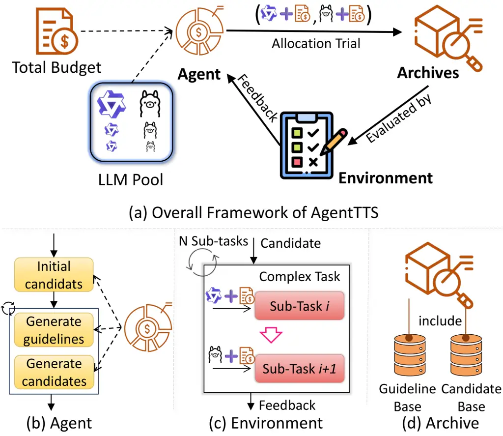
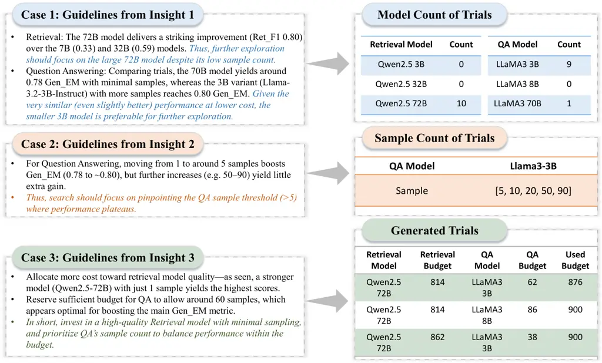
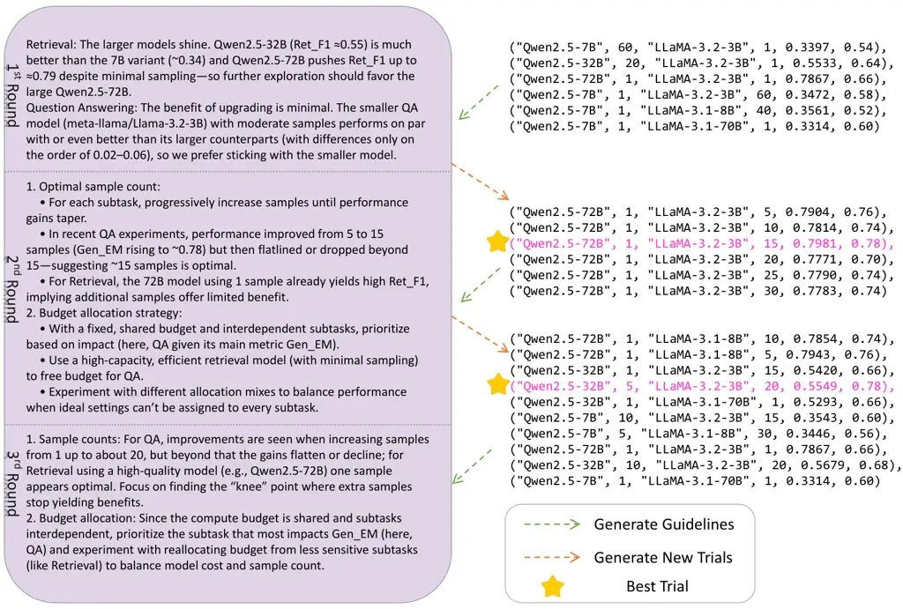
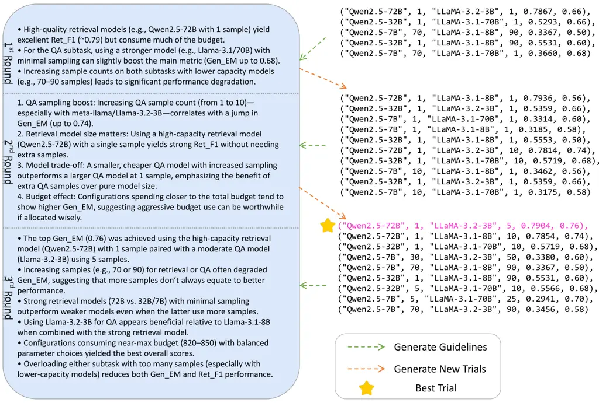

# AgentTTS: Large Language Model Agent for Test-time Compute-optimal Scaling Strategy in Complex Tasks

Fali Wang ^(†)^(†)thanks: Work done during an internship at Amazon.
Affiliation: The Pennsylvania State University, University Park, PA, USA
Email: [fqw5095@psu.edu](mailto:)    Hui Liu Affiliation: Amazon, Palo
Alto, CA, USA Email: [zbz5349@psu.edu](mailto:)    Zhenwei Dai
Affiliation: Amazon, Palo Alto, CA, USA
Email: [zzw5373@psu.edu](mailto:)    Jingying Zeng Affiliation: Amazon,
Palo Alto, CA, USA Email: [szw494@psu.edu](mailto:)    Zhiwei Zhang
Affiliation: The Pennsylvania State University, University Park, PA, USA
Email: [liunhu@amazon.com](mailto:)    Zongyu Wu Affiliation: The
Pennsylvania State University, University Park, PA, USA
Email: [zejingyi@amazon.com](mailto:)    Chen Luo Affiliation: Amazon,
Palo Alto, CA, USA Email: [zwdai@amazon.com](mailto:)    Zhen Li
Affiliation: Amazon, Palo Alto, CA, USA
Email: [cheluo@amazon.com](mailto:)    Xianfeng Tang
Affiliation: Amazon, Palo Alto, CA, USA
Email: [xianft@amazon.com](mailto:)    Qi He Affiliation: Amazon, Palo
Alto, CA, USA    Suhang Wang Affiliation: The Pennsylvania State
University, University Park, PA, USA

###### Abstract

Test-time scaling (TTS) enhances the performance of large language
models (LLMs) by allocating additional compute resources during
inference. However, existing research primarily investigates TTS in
single-stage tasks; while many real-world problems are multi-stage
complex tasks, composed of a sequence of heterogeneous subtasks with
each subtask requires LLM of specific capability. Therefore, we study a
novel problem: the test-time compute-optimal scaling in multi-stage
complex tasks, aiming to select suitable models and allocate budgets per
subtask to maximize overall performance. TTS in multi-stage tasks
introduces two fundamental challenges: (i) The combinatorial search
space of model and budget allocations, combined with the high cost of
inference, makes brute-force search impractical. (ii) The optimal model
and budget allocations across subtasks are interdependent, increasing
the complexity of the compute-optimal search. To address this gap, we
conduct extensive pilot experiments on four tasks across six datasets,
deriving three empirical insights characterizing the behavior of LLMs in
multi-stage complex tasks. Informed by these insights, we propose
AgentTTS, an LLM-agent-based framework that autonomously searches for
compute-optimal allocations through iterative feedback-driven
interactions with the execution environment. Experimental results
demonstrate that AgentTTS significantly outperforms traditional and
other LLM-based baselines in search efficiency, and shows improved
robustness to varying training set sizes and enhanced
interpretability. ¹¹ 1 Code link:
[https://github.com/FairyFali/AgentTTS/](https://github.com/FairyFali/AgentTTS/)

## 1 Introduction

Test-time scaling (TTS), which refers to allocating additional
computational resources during inference, has shown promising results in
improving the performance of large language models (LLMs) \[2, 45, 55,
33, 19, 54, 26\]. For example, Brown et al. \[2\] scaled inference
compute via repeated sampling of candidate solutions, using a verifier
to select the best prediction, enabling a weak small model to outperform
single-sample state-of-the-art models. Despite its effectiveness,
existing methods are primarily designed for single-stage tasks, where
the model performs a single function, such as mathematical problem
solving \[45, 2, 55, 33, 19, 26, 14\] or code generation \[2, 34\].
However, many real-world applications involve multi-stage complex tasks,
for which compute allocation remains underexplored. These tasks involve
a sequential execution of heterogeneous subtasks to accomplish complex
objectives. Representative examples include retrieval-then-generation QA
systems \[16\], waterfall-style software development (comprising
requirement analysis, system design, coding, and testing) \[29\], and
multi-agent task automation (such as task decomposition, tool selection,
and parameter prediction) \[32\]. Each subtask within a multi-stage
workflow often requires a model with specific capabilities \[13\]. For
example, in a retrieval-then-generation QA task, retrieval benefits from
large models with strong long-context understanding, while generation
can achieve competitive performance using smaller models with repeated
sampling (see Fig. 1(a)(b)). Therefore, multi-stage tasks demand models
with diverse types and levels of capabilities, challenging existing TTS
methods.

To bridge this gap, we formulate and study a novel problem: test-time
compute-optimal scaling in multi-stage complex tasks: for a complex task
composed of a sequence of subtasks and each subtask has a set of
candidate models to choose from, given a total compute budget, the
objective is to select the appropriate model and allocate the compute
budget for each subtask to maximize overall task performance. This
problem presents two major challenges. (i) The search space is large due
to the combinatorial choices of models and budget allocations across
subtasks. For instance, in software development with three subtasks and
two model options each (3B and 70B), the number of configurations can
reach up to $`10^{6}`$ (see Appendix A.1 for a calculation example),
with each configuration requiring time-consuming inference (often
several hours), rendering brute-force search impractical. (ii) Subtasks
are not independent. The compute allocation for one subtask affects the
performance and budget requirements of others. As shown in Fig. 1(b-d),
high-quality retrieval can significantly reduce the compute required by
the downstream generation subtask to achieve peak performance. In
contrast, poor retrieval quality necessitates increased computation for
generation, either through additional sampling or the use of larger
models, to compensate for degraded input quality. These challenges
highlight the need for an efficient search strategy that can handle the
large and interdependent search space.

To address these challenges, we first conduct preliminary experiments to
characterize the behavior of LLMs under test-time scaling in multi-stage
tasks. From experiments, we derive three generalizable insights across
four task types: (1) Different subtasks exhibit distinct preferences
between large and small models; (2) Increasing test-time compute
initially improves performance, but beyond a certain point, additional
compute yields diminishing or no gains; (3) The compute allocated to
earlier subtasks influences the scaling dynamics and compute needs of
downstream subtasks. Guided by these insights, we propose AgentTTS, a
novel LLM-agent-based framework designed to efficiently search for
compute-optimal budget allocations in multi-stage tasks. Recent
works \[20, 56, 49, 25, 23\] have shown that LLM-based agents are
effective in planning and searching for hyperparameter optimization.
Given the capability of LLMs in understanding and following
instructions, AgentTTS integrates our observed test-time scaling
insights into the LLM-agent search process. AgentTTS consists of three
key components: the Agent, Archive, and Environment. The Agent begins by
generating an initial set of trials based on Insight 1, which guides
model preferences for each subtask. These trials are executed by the
Environment, which evaluates them on the actual task platform and
returns performance feedback. The Archive stores a history of generated
trials, guidelines, and feedback. In subsequent stages, the Agent
produces new trials and guidelines informed by Insights 2 and 3. This
iterative process continues until a predefined stopping criterion is
met. By leveraging LLM-based search, AgentTTS offers two advantages: (i)
interpretability, through explicit guideline generation that explains
decision rationales; and (ii) robustness, in navigating non-smooth
search spaces commonly found in test-time scaling.

Our main contributions are: (i) We study a novel problem of test-time
compute-optimal scaling for multi-stage complex tasks; (ii) We identify
three key insights that uncover fundamental patterns of test-time
scaling in multi-stage tasks and motivate the design of AgentTTS, an
efficient LLM-agent-based framework for searching compute-optimal
configurations in this problem setting. and (iii) Comprehensive
evaluations on six datasets show that AgentTTS achieves strong search
efficiency, transparent interpretability in generating new trials, and
robustness to non-smooth search landscapes.

## 2 Related Work

Test-time Scaling and Compute-optimal Strategy. Test-time scaling (TTS)
enhances LLM performance by allocating additional compute during
inference \[2, 45, 39\]. Existing methods fall into two categories:
sequential scaling \[24, 6, 33, 26, 48\], which iteratively refines
outputs but depends on good initial responses, and parallel scaling\[2,
55, 34, 35, 9, 33, 19, 45\], which generates multiple outputs and
aggregates them using reward-based selection (e.g., repeated
sampling \[2, 55\], Best-of-N \[35\], or tree search \[45\]). Recent
work reduces reliance on reward models by using LLMs as fusers \[13, 17,
30, 3\]. Parallel scaling is preferred for complex tasks due to better
scalability and broader solution coverage \[33\]. Hence, we adopt
repeated sampling with fusion. Research on test-time compute-optimal
scaling shows that small models with optimal strategies can outperform
larger ones \[2, 45, 19, 54, 33, 41, 40\]. Approaches include
difficulty-aware model selection \[33\], reward-guided voting \[45\],
and budget-aware prompting \[54\]. However, they focus on single-stage
tasks, while we extend this to multi-stage tasks, where budgets must be
adaptively allocated across interdependent subtasks to maximize overall
performance. A more detailed discussion is given in Appendix A.10.1.

LLMs for Hyperparameter Optimization. LLMs have become powerful tools
for hyperparameter optimization (HPO), surpassing traditional AutoML
techniques such as Bayesian Optimization (BO) \[15, 31\] by leveraging
contextual reasoning and prior knowledge \[8\]. LLM-based HPO research
generally follows two directions: (1) reducing the search space and (2)
directly generating hyperparameter configurations. For the former, LLMs
have been used to prune large search spaces in NAS and HPO \[52, 25, 23,
21\], as seen in GPT-NAS \[52\], AutoM3L \[23\], and Llambo \[21\]. For
the latter, recent works \[4, 62, 58, 1, 12, 56, 18, 57\] treat LLMs as
autonomous optimizers. Systems like AutoMMLab \[49\], GENIUS \[62\],
MLCopilot \[56\], and AgentHPO \[20\] refine trials via feedback and
experience. We extend this line of work to compute-optimal test-time
scaling in multi-stage tasks. A more detailed introduction of related
work is given in Appendix A.10.2.

## 3 Preliminary Knowledge and Problem Definition

Problem Definition. We define a multi-stage complex task
$`\mathcal{T}=[T_{1},T_{2},\ldots,T_{n}]`$ as comprising $`n`$ simpler
subtasks. Each subtask $`T_{i}`$ has a set of candidate models
$`M_{i}\in\mathcal{M}_{i}`$, where each $`M_{i}`$ is tailored for
subtask $`T_{i}`$. Given a fixed total computational budget $`B`$ for
the entire complex task $`\mathcal{T}`$, each subtask must be assigned a
portion $`B_{i}`$ such that $`\sum_{i=1}^{n}B_{i}=B`$. For a subtask
$`T_{i}`$, there exists a trade-off between using a larger model with
fewer inference samples and a smaller model with more samples,
constrained by the assigned budget $`B_{i}`$. Our research problem is
defined as

###### Definition 1 (Test-time compute-optimal budget allocation in multi-stage tasks).

Given a fixed total computational budget $`B`$ for a multi-stage complex
task $`\mathcal{T}`$, how can we optimally allocate the computational
budget among subtasks $`B\mapsto\{B_{1},B_{2},\dots,B_{n}\}`$, select
appropriate models $`M_{i}`$, and effectively distribute the allocated
resources to maximize overall performance?

Test-time Scaling Mode: Repeated Sampling with Fusion. We adopt the
Repeated Sampling with Fusion strategy for test-time scaling, as it does
not rely on additional reward models or verifiers compared to
Best-of-N \[35, 9\] or tree search algorithms \[45, 53\], and it offers
greater scalability compared to sequential scaling \[55, 2\]. Given a
problem $`p`$, a language model $`M`$ with parameters $`\theta`$,
test-time scaling is performed by increasing the number of repeated
samples $`k`$. To stimulate diverse generations, we set the temperature
hyperparameter to 0.9 throughout. A fusion prompt is then used to
aggregate the multiple candidate solutions generated through repeated
sampling:

```math
o=f_{\text{fuse}}(\mathcal{S},M),\quad\mathcal{S}=\{s_{i}\mid 1\leq i\leq k\},\quad s_{i}\sim M(s\mid p,\theta) \tag{1}
```

where $`\mathcal{S}`$ denotes the set of sampled responses, each
$`s_{i}`$ is independently drawn from the model $`M`$ conditioned on the
input prompt $`p`$ and model parameters $`\theta`$. The fusion function
$`f_{\text{fuse}}`$ integrates the sampled responses using a fusion
prompt, as described in Appendix A.7. Notably, the same LLM is used for
both generating solutions and performing fusion.

## 4 Insights of Test-time Scaling on Multi-stage Complex Tasks

Allocating computational budgets for TTS in multi-stage complex tasks
has significant challenges: (i) the search space expands exponentially
as the number of subtasks increases, making exhaustive search
impractical; (ii) subtasks typically require models tailored to their
specific characteristics, rendering uniform model assignment
inefficient; (iii) the scaling strategies employed in earlier subtasks
directly impact subsequent stages. To address the challenges, we first
conduct pilot experiments to understand fundamental patterns in LLM
behavior under TTS in complex tasks, which pave the way to design a
compute-optimal scaling strategy specifically tailored for multi-stage
scenarios.

### 4.1 Experimental Setting

In this subsection, we first briefly introduce the datasets, models, and
metrics used across the four multi-stage complex tasks. Then, we
describe a unified budget conversion approach across models and tasks,
followed by an example using the inference FLOPs as the primary compute
cost metric. Detailed descriptions of the datasets, models, and metrics
are provided in Appendix A.4.

Tasks, Datasets, and Models We conduct preliminary experiments on four
multi-stage tasks: (i) Retrieval-based Question Answering using
2WikiMultiHopQA \[11\] and HotpotQA \[50\] datasets, (ii) Knowledge
Graph Question Answering using CWQ \[36\] and WebQSP \[51\], (iii) Task
Automation, using TaskBench \[32\], and (iv) Automated Software
Development, using ChatDev \[29\]. Subtasks differ in prompt and
generation lengths; retrieval uses longer prompts, while QA needs longer
generations. We consider models ranging from 3B to 72B. Details of task
specifications, datasets, models, and evaluation metrics are provided in
Appendix A.4 and A.5.

Unified Budget Conversion Across Models and Tasks Different models and
tasks demand varying levels of computational resources. Larger models
require more inference FLOPs, and complex tasks typically involve longer
input or output tokens, leading to increased compute costs. These
disparities complicate fair comparisons of computational overhead across
models and tasks. To address this, we propose a budget normalization
framework that equates the cost of fewer inference samples from larger
models with that of more samples from smaller models, while explicitly
accounting for task-specific compute variations.

Formally, let the total computational cost of sampling $`S`$ times from
model $`M`$ on task $`T`$ be denoted as $`f_{\text{cost}}(M,S,T)`$, and
the corresponding normalized compute budget as
$`B=f_{\text{budget}}(M,S,T)`$. The cost metric may reflect user-defined
preferences, such as inference FLOPs, wall-clock time, or monetary cost.
To establish a common unit of budget, we define it as the cost of a
single inference pass by the smallest model (e.g., LLaMA 3B) on the
lowest computationally consuming task $`T_{\text{lowest}}`$:

```math
f_{\text{budget}}(M_{\text{smallest}},1,T_{\text{lowest}})=1. \tag{2}
```

Given a model $`M_{\ell}`$, sample count $`S_{\ell}`$, and task
$`T_{\ell}`$, we compute the equivalent budget $`B`$ by equating its
total cost to that of the smallest model executing
$`S_{\text{smallest}}`$ samples on the lowest-consuming task:

```math
\small B=f_{\text{budget}}(M_{\ell},S_{\ell},T_{\ell})=S_{\text{smallest}}~~\text{such that}~~f_{\text{cost}}(M_{\ell},S_{\ell},T_{\ell})=f_{\text{cost}}(M_{\text{smallest}},S_{\text{smallest}},T_{\text{lowest}}) \tag{3}
```

This formulation expresses the inference budget of any model-task pair
as the number of equivalent samples that the smallest model would
generate on the least computationally intensive task.

Compute Cost Metric and Budget Definition. Different stakeholders
prioritize different cost metrics. Consumers are typically concerned
with monetary expenses, such as the price per million input and output
tokens. LLM researchers focus on computational cost, such as inference
FLOPs, due to constraints of limited GPU memory. Discussion of using API
price as a cost metric is in Appendix 6. In this work, we adopt
inference FLOPs as the primary cost metric throughout. The corresponding
budget conversion is stated in the theory below. The proof is in
Appendix A.2.

###### Theorem 1 (Normalized Budget Function).

Given a configuration $`(M_{\ell},S_{\ell},T_{\ell})`$ where
$`M_{\ell}`$ is the model size, $`S_{\ell}`$ the number of samples, and
$`T_{\ell}=(N_{p,\ell},N_{d,\ell})`$ the task specification where
$`N_{p,\ell}`$ and $`N_{d,\ell}`$ is the average prompt and generation
lengths, the equivalent normalized budget under the base configuration
$`(M_{\text{smallest}}=3\textup{B},N_{p,\text{lowest}}=128,N_{d,\text{lowest}}=64)`$
is:

```math
\small B=f_{\text{budget}}(M_{\ell},S_{\ell},T_{\ell})=\frac{2\alpha\beta_{2}S_{\ell}}{\beta_{1}}+2(\alpha\beta_{2}-1) \tag{4}
```

where
$`\alpha=\frac{M_{\ell}}{M_{\text{smallest}}},\beta_{1}=\frac{N_{p,\ell}}{N_{d,\ell}},\beta_{2}=\frac{N_{p,\ell}}{N_{p,\text{lowest}}}.`$

Under this conversion, the budget $`B`$ intuitively represents: how many
passes using a 3B-parameter model on the base configuration
$`T_{\text{lowest}}`$ would incur the same cost as given sampling
$`S_{\ell}`$ times with model $`M_{\ell}`$ on task $`T_{\ell}`$? The
base configuration corresponds to the minimal compute setting among our
subtasks (see Table 4 in the Appendix) and aligns with standard defaults
used in short-form QA tasks, such as QA in WebQSP.

Figure 1: Performance variance on 2WikiMultiHopQA with increasing
sampling and inference FLOPs. Top: performance by sample count; bottom:
performance by log-scaled inference FLOPs. (a) Retrieval accuracy
measured by Retrieval F1 (Ret_F1). (b-d) QA performance under varying
retrieval quality levels measured by Gen_EM, the exact match between the
generated answer and ground truth

### 4.2 Preliminary Experimental Results and Insights

We use the FLOPs-based budget conversion in Eq. 4 to analyze performance
variance with increasing sample count and compute budget, and to guide
budget allocation in our method in the next section. Fig. 1 shows how
subtask performance in retrieval-based question answering varies with
increasing test-time sampling and computational budget (FLOPs). In
Fig. 1 (a), performance on the retrieval subtask exhibits a strong
positive correlation with model size, while smaller models provide only
marginal improvements even with increased budget. This suggests that
retrieval benefits from larger models, where fewer high-capacity samples
yield better results. In contrast, Fig. 1 (b) shows that for the
question answering subtask, under a limited budget (e.g., $`<10^{14}`$
FLOPs), LLaMA-3 3B and LLaMA-3 8B outperform LLaMA-3 70B, indicating a
preference for smaller models. Similar trends are observed in Fig. 10
(a)(b) and across other benchmarks (see Fig. 11-14 in Appendix A.6).
These discrepancies arise from subtask-specific demands: retrieval
emphasizes long-context understanding, favoring large models; while
question answering primarily involves extracting information from
retrieved content, where smaller models excel and can better exploit
test-time scaling via repeated sampling. Thus, different subtasks
exhibit distinct preferences between language models and sampling
frequency, depending on the specific capabilities required by each
subtask (Insight 1).

Fig. 1 (b-d) reveal a non-monotonic performance trend across models in
the question answering subtask, which is sensitive to test-time compute.
As the number of sampling repetitions increases, performance initially
improves but often fluctuates or declines after reaching an optimal
budget. For example, LLaMA-3 3B reaches peak performance at 10 samples
(FLOPs budget $`\approx 2\times 10^{13}`$) in Fig. 9 (b), indicating
that additional compute does not always yield better results in this
subtask. Similar patterns are observed in Fig. 10 (b-d) and other
benchmarks (see Appendix A.6). This is because, as the number of
candidates grows, fusion becomes more complex and may become a
performance bottleneck. Smaller models, with limited capacity, struggle
more under high sampling and tend to degrade, whereas larger models are
more capable of handling extensive fusion and show greater tolerance. In
conclusion, subtask-level test-time scaling typically exhibits an
optimal budget, beyond which more budget often leads to limited or even
negative returns (Insight 2).

Fig. 1 (b-d) show how the performance of the question answering subtask
varies under different levels of retrieval quality, with F1 scores
approximately 0.80, 0.60, and 0.35, respectively. When high-quality
retrieval is provided by a larger model (Fig. 1 (b)), we observe: (1)
the optimal test-time budget for question answering is reached earlier.
For instance, LLaMA-3 8B peaks at 10 samples (budget around
$`2\times 10^{13}`$ FLOPs); and (2) smaller models (3B and 8B) may
outperform the larger model (70B) under the same compute budget. In
contrast, when retrieval quality is low (Fig. 1 (c)(d)), the peak
performance is delayed. For example, with $`\text{Ret\_F1}=0.6`$,
LLaMA-3 8B peaks at 20 samples (budget about $`3\times 10^{13}`$ FLOPs),
while with $`\text{Ret\_F1}=0.35`$, even 90 samples (budget near
$`10^{14}`$ FLOPs) still do not reach peak performance. Moreover, under
low retrieval quality, smaller models are less likely to outperform
larger ones. For instance, in Fig. 1 (d), the peak performance of the 3B
and 8B models does not surpass even the lowest performance of the 70B
model. These findings indicate that the scaling behavior of a subtask is
affected by the performance of its preceding subtasks. Poor retrieval
increases downstream task difficulty, requiring the model to compensate
for missing information, where larger models are more beneficial.
Similar trends are observed in Fig. 10 (b-d) and other benchmarks in
Appendix A.6. We conclude that budget allocation for a preceding subtask
impacts the model selection and optimal budget of subsequent subtasks
(Insight 3).

## 5 AgentTTS: Agent for Test-time Scaling Budget Allocation

The insights in Sec. 4 provide guidance on how to efficiently search for
effective budget and model allocations in multi-stage tasks. As LLMs
have shown strong capabilities in planning and reasoning, we propose
AgentTTS (Agent for Test-Time compute-optimal Scaling), which integrates
these insights into an LLM-based agent to autonomously navigate the
compute allocation space and capture subtask-specific model preferences
and optimal budget, and inter-subtask dependencies. An illustration of
AgentTTS is in Fig. 2. Next, we elaborate on the design of AgentTTS.



Figure 2: Overview of LLM Agent for Test-time Scaling Budget Allocation.

Overview of AgentTTS. As shown in Fig. 2 (b-d), the framework consists
of three core components: the Agent, Archive, and Environment.
Initially, the Agent generates a batch of candidate trials (each looks
like $`(M_{1},B_{1},M_{2},B_{2},\ldots)`$, guided by Insight 1, which
reflects preliminary model preferences across subtasks. These trials are
stored in the Archive and forwarded to the Environment for evaluation.
The resulting performance feedback is returned to the Agent and used to
construct initial guidelines that suggest whether subsequent trials
should prioritize smaller or larger models. Both feedback and guidelines
are retained in the Archive for future reference. In subsequent
iterations, the Agent generates new trials based on the existing
guidelines and adds new guidelines by Insight 2 and Insight 3. The
Archive continuously stores the evolving guidelines along with
corresponding trials and performance feedback, while the Environment
evaluates each batch of trials in a practical execution environment and
returns feedback. This loop repeats until a predefined stopping
criterion is met. The full procedure is outlined in Algo. 1, and the
class diagram is shown in Fig. 16 (Appendix).

0:  Agent $`\mathcal{A}`$, Model set $`\mathcal{M}`$, Subtasks
$`\mathcal{T}`$, Environment $`\mathcal{E}`$, Total budget $`B`$.

1:  Initialize experiment archive: $`\mathcal{L}\leftarrow\emptyset`$.

2:  Initialize candidate trials:
$`\mathcal{C}\leftarrow\mathcal{A}.\texttt{initialize}(\mathcal{M},\mathcal{T})`$
(Insight 1, Eq. 5)

3:  Obtain feedback:
$`\mathcal{S}\leftarrow\mathcal{E}.\texttt{execute}(\mathcal{C})`$

4:  while stopping criterion is not met do

5:    Generate exploration guidelines:
$`\mathcal{G}\leftarrow\mathcal{A}.\texttt{generate\_guidelines}(\mathcal{C},\mathcal{S})`$
(Insights 2, 3)

6:    Update experiment log:
$`\mathcal{L}\leftarrow\mathcal{L}\cup\{(\mathcal{C},\mathcal{S},\mathcal{G})\}`$

7:    Generate new candidate trials:
$`\mathcal{C}\leftarrow\mathcal{A}.\texttt{generate}(\mathcal{G},\mathcal{M},\mathcal{T},B)`$
(Eq. 5)

8:    Obtain feedback:
$`\mathcal{S}\leftarrow\mathcal{E}.\texttt{execute}(\mathcal{C})`$

9:  end while

10:  return Best-performing trial from $`\mathcal{L}`$.

Algorithm 1 Compute-Optimal Test-time Budget Allocation

Agent component The Agent, implemented using an LLM, is responsible for
generating test-time budget allocation candidate trials and guidelines,
as shown in Fig. 2 (b). Although LLMs perform well in hyperparameter
optimization for machine learning models, they lack knowledge of
test-time scaling, a relatively new technique. To address this, we
incorporate Insight 1 into the initial search stage and Insights 2 and 3
into all stages.

Insight 1 reveals that different subtasks prefer models with specific
capabilities. Therefore, matching a suitable model early steers the
search toward effective configurations, reducing wasted effort on
inferior options. To estimate each subtask’s model preference, we
perform the following during the initialization stage. Let
$`B_{i}^{\max}=f_{\text{budget}}(M_{i,\max},1,T_{i})`$ be the budget
required for a single sample from the largest available model
$`M_{i,\max}`$ for subtask $`{T}_{i}`$ and
$`B_{i}^{\min}=f_{\text{budget}}(M_{i,\min},1,T_{i})`$ the budget from
the smallest model. For each subtask $`\mathcal{T}_{i}`$, we compare all
candidate models that fit within $`B_{i}^{\max}`$, while fixing all
other subtasks to use their respective largest available model with
one-pass inference. This ensures a fair comparison across model
candidates for the target subtask $`\mathcal{T}_{i}`$. Under the
condition that $`B_{i}^{\max}>B-\sum_{j\neq i}B_{j}^{\min}`$, the
largest model for subtask $`i`$ occupies too much budget to allow
feasible allocations for the remaining subtasks. In this case, we
progressively downsize the model until the largest available model
$`M_{i,\max}`$ is found. This operation is repeated for each subtask.

Upon receiving initial feedback from the Environment module, the Agent
summarizes the initial guidelines $`\mathcal{G}`$ (Algo. Line 5) using
the prompt provided in Appendix A.7, based on performance comparisons.
If the large model significantly outperforms the small model, the large
one is preferred. Otherwise, the small model is preferred due to its
greater flexibility in subsequent exploration. The resulting guideline
specifies which model should be prioritized in the later stages of the
search. The instruction to identify the preferred model is used only in
the initial search stage. The overall procedure is implemented in Line 2
of Alg. 1 and formalized in Eq. 5 below

```math
\small\mathcal{C}=\begin{cases}\left\{\left(...,M_{i},B_{i},...\right)\,\middle|\,1\leq i\leq N,\,M_{i}\in\mathcal{M}_{i},\,B_{i}=B_{i}^{\max}\right\},&\text{initial stage}\\
\left\{c\,\middle|\,c\in\mathcal{A}.\texttt{generate}(\mathcal{G},\mathcal{M},\mathcal{T},B)\right\},&\text{subsequent stages}\end{cases} \tag{5}
```

where each trial is represented as
$`c=(M_{1},B_{1},\dots,M_{n},B_{n})`$, $`M_{i}\in\mathcal{M}_{i}`$ is
the selected model, and $`B_{i}`$ is its assigned budget for subtask
$`i`$. $`B`$ denotes the total compute budget. $`M_{i,\max}`$ is the
largest available model for subtask $`i`$, and the configuration
$`(...,M_{i},B_{i},...)`$ indicates that other subtasks are fixed to
their respective available largest models with one-pass inference.

Insight 2 shows that increasing test-time compute initially improves
performance, but beyond an optimal point, it may cause oscillation or
degradation within a subtask. Each model thus has a task-specific
optimal budget: too little limits performance, while too much wastes
compute and harms other subtasks. Identifying this optimal budget per
subtask is key to maximizing overall performance efficiently. To support
this, we put Insight 2 in the guideline generation prompt (Appendix A.7)
and ask LLM to follow Insight 2 to: “identify the search direction for
finding the optimal number of samples for each subtask.” This ensures
that the agent focuses the next round of search within the right scope,
enabling faster convergence to optimal allocation.

Insight 3 indicates that budget allocation for a preceding subtask
affects model choice and sampling needs in downstream subtasks. Under
limited budgets, optimal configurations cannot be assigned to all
subtasks. Allocating more resources to one may shift the optimal setup
of others, making previous configurations suboptimal. This
interdependence increases search complexity, as each subtask must be
re-evaluated in light of others’ changes. To address this, we embed an
instruction into the prompt (Appendix A.7) that leverages the LLM’s
planning capabilities to explore allocation trade-offs across subtasks.
This enables the Agent to generate search guidelines that adaptively
identify critical subtasks and configurations.

The instructions derived from three insights are applied concurrently
throughout the search process. Based on the updated guidelines, the
Agent then generates the next round of candidate trials (Algo. Line 7)
for evaluation.

Environment & Archive Components The Environment module executes and
evaluates trials in the actual runtime environment. Upon receiving
trials from the Archive, it converts them into executable scripts and
submits them to the task platform for execution on a small training set.
After completion, performance feedback is returned to the Agent, as
shown in Fig. 2(c) and Lines 3 and 8 of Algo. 1. The Archive component
stores generated guidelines and candidate trials in corresponding bases,
as shown in Fig. 2(d) and Lines 1 and 6 of Algo. 1. It records the
search process throughout iterations and outputs the best-performing
trials upon termination.

## 6 Experiments

This section presents a comprehensive evaluation of AgentTTS for
test-time compute-optimal budget allocation in multi-stage complex
tasks. We also conduct ablation studies on integrated key insights,
analyze the interpretability of budget allocations, evaluate robustness
to different training sizes, and compare search effectiveness under
various budget conversion methods.

Experimental Setup. We conduct experiments across six datasets covering
four distinct task categories, as detailed in Appendix A.4. Baselines
include two groups of hyperparameter optimization: traditional machine
learning methods and recent LLM-based methods. The traditional baselines
include Bayesian optimization (BO) \[15, 31\] and random search. For
LLM-based approaches, we consider AgentHPO \[20\], MLCopilot \[56\], and
LLM_ZS. Given that these LLM-based methods were initially proposed for
hyperparameter tuning, we adapt them to the test-time budget allocation.
Both AgentHPO and MLCopilot employ a two-phase pipeline: (1)
feedback-driven guideline generation and (2) guideline-informed
candidate trial generation. They differ in the initialization of
guidelines: AgentHPO generates initial guidelines autonomously via the
LLM, while MLCopilot initializes guidelines based on performance trends
observed in similar tasks. In contrast, LLM_ZS directly prompts the LLM
to generate candidate trials without relying on guidelines or external
references. Further details of each baseline are in Appendix A.9. All
methods execute 50 iterations of search on a training set comprising 50
samples and are subsequently evaluated on a test set containing 500
samples. We use GPT-o3-mini \[27\] as the LLM search agent. The default
budget is set as the sum of the minimum budget required for one-pass
inference on each subtask using the largest model.

Figure 3: Performance trajectories across various search methods over 50
trials. X-axis: trial count; Y-axis: best performance up to each trial.
The best score is obtained from the optimal trial in a prior grid search
and serves as the benchmark for all methods.

|           |       |      |        |      |      |      |        |      |           |      |         |       |
| --------- | ----- | ---- | ------ | ---- | ---- | ---- | ------ | ---- | --------- | ---- | ------- | ----- |
| Method    | 2Wiki |      | Hotpot |      | CWQ  |      | WebQSP |      | Taskbench |      | ChatDev |       |
|           | Time  | EM   | Time   | EM   | Time | EM   | Time   | EM   | Time      | p-F1 | Time    | Cons. |
| Random    | –     | 0.66 | –      | 0.71 | –    | 0.76 | –      | 0.86 | –         | 0.40 | –       | 0.74  |
| BO        | –     | 0.60 | –      | 0.71 | –    | 0.76 | –      | 0.85 | –         | 0.52 | –       | 0.75  |
| LLM_ZS    | 12.5  | 0.70 | –      | 0.71 | 55.3 | 0.76 | 37.7   | 0.89 | –         | 0.49 | –       | 0.74  |
| MLCopilot | 12.5  | 0.70 | 46.3   | 0.72 | 48.4 | 0.78 | 20.8   | 0.88 | –         | 0.53 | –       | 0.75  |
| AgentHPO  | 8.3   | 0.70 | 36.3   | 0.74 | 37.4 | 0.78 | 48.1   | 0.89 | –         | 0.49 | –       | 0.74  |
| Ours      | 2.5   | 0.72 | 17.5   | 0.74 | 11.1 | 0.78 | 7.8    | 0.89 | 64.3      | 0.53 | 14.3    | 0.75  |

Table 1: Comparison of search time (in hours) and test-set performance
across datasets. “–” indicates unavailable results or failure to find
the optimal trial.

Main Results and Analysis. Fig. 3 shows the search trajectories of our
method and the baselines for test-time compute-optimal budget allocation
on the training set. The search time and test-set performance of the
best trials are reported in Tab. 1. We observe: (i) Our method
outperforms baselines in both search efficiency and test-set performance
in Fig. 3 and Tab. 1. First, ours achieves top results on most tasks and
requires fewer trials, even when baselines eventually reach optimality.
Second, our method reduces search time, confirming higher computational
efficiency. These gains come from leveraging empirical insights to guide
the search toward promising trials. Despite similar performance on the
training set, our method often generalizes better, as shown in Tab. 1.
For example, on 2WikiMultiHopQA, it exceeds the next best methods by 2%
on the test set. This suggests that Insight 2 helps identify minimal
budgets and avoid redundant sampling, improving generalization. (ii)
Compared to LLM-agent-based AgentHPO and MLCopilot, our method converges
faster, showing integrated insights improve search efficiency on
compute-optimal allocation. (iii) Traditional methods such as BO often
get stuck in local optima due to the non-smooth landscape, while random
search is noise-tolerant but inefficient. In contrast, LLM-based methods
use prior hyperparameter tuning knowledge to bypass suboptimal regions,
achieving better search performance.

Ablation Studies. To evaluate the contribution of each insight in
AgentTTS, we perform ablation studies by comparing it to variants with
individual insights removed. AgentTTS-w/o-Insight1 replaces Insight 1
with random initialization. AgentTTS-w/o-Insight2/3 removes prompt
components addressing diminishing returns beyond optimal budget
(Insight 2) and inter-subtask dependencies (Insight 3). As shown in
Fig. 4(d), we observe: (1) Removing Insight 1 prevents reaching optimal
configurations, highlighting the role of initial model choice in guiding
subsequent exploration. (2) Without Insight 2, search efficiency drops,
delaying optimal trials to 29 steps, showing the need to identify
per-subtask optimal budget. (3) Excluding Insight 3 delays the optimal
trial to step 38, confirming the importance of leveraging LLM planning
to handle subtask dependencies.

Figure 4: (a-c) Search trajectories under varying training sizes on
2WikiMultiHopQA. (d) Ablation study on 2WikiMultiHopQA with a total
budget of 900.

Robustness to Varying Training Sizes. A small training set might lead to
unstable performance, creating a non-smooth search landscape that
hinders optimization. To assess the robustness of search methods under
this condition, we vary the training set size (50, 75, 100 samples) and
evaluate their effectiveness in finding optimal configurations. As shown
in Fig. 4(a-c), the search efficiency of LLM-based baselines and
Bayesian optimization declines with smaller training sets, whereas
AgentTTS maintains strong efficiency. This indicates that our empirical
insights integrated in AgentTTS help the LLM agent effectively navigate
non-smooth search spaces through valuable prior guidance.

Interpretability of Budget Allocation To illustrate the interpretability
benefit from integrating prior insights into the LLM agent for test-time
compute allocation, we present three case studies on 2WikiMultiHopQA in
Fig. 5. The first row shows Insight 1 enables subtask-specific model
use, favoring large models for retrieval and small ones for QA, to guide
efficient trials. The second row shows Insight 2 pinpoints the optimal
sampling range (5–50), narrowing the search space. The third row shows
Insight 3 promotes balanced allocation, favoring one-sample
“high-capacity” retrieval and “lower-cost” QA configuration, enabling
effective trade-offs for better overall performance.



Figure 5: Detailed Cases of Interpreting AgentTTS Through Integrated
Empirical Insights.

Figure 6: Comparative search results under low, medium, and high compute
budget settings.

Performance under varying budget settings To assess the search
efficiency under different budgets, we evaluate AgentTTS under two
budget settings on 2WikiMultiHopQA: $`500`$ (low budget: only one
subtask can reach its optimum) and $`2000`$ (high, full optima reachable
but with larger search spaces). As shown in Fig. 6, we can conclude: (1)
Our method finds optimal configurations under low budgets, confirming
the benefit of integrated insights on trade-off subtask interdependence;
(2) Across low to high budget settings, our method consistently
outperforms baselines in search efficiency, indicating that the
insight-informed LLM agent remains robust to the expanded search space.

Performance under varying temperatures To assess the impact of
temperature on test-time scaling, we conduct additional experiments on
the 2Wiki dataset. The retriever is fixed to Qwen2.5-72B (producing a
single retrieval result), and we vary the number of samples and
temperature values for the QA model LLaMA 3 3B. As shown in Tab. 2,
higher temperatures (e.g., 0.9) improve performance with multiple
samples, while lower temperatures (e.g., 0.1) are more effective for
single-sample cases. This suggests that higher temperatures enhance
output diversity and fusion in sampling-based reasoning, whereas lower
temperatures promote more stable, deterministic outputs. These results
align with prior findings \[28\], which show that temperature-induced
diversity improves sample efficiency in reasoning tasks.

Figure 7: Test-time scaling and AgentTTS search trajectories under price
budget. Left: scaling curves; Right: corresponding search trajectories.

##### API price as the cost metric

Beyond inference-compute FLOPs, end-users are often more concerned with
the monetary cost. Therefore, we introduce an alternative budget metric:
API price. Using this metric, we redraw the test-time scaling curves for
the question answering subtask of 2WikiMultiHopQA, as shown in Fig. 7
(left). The results indicate that smaller models remain preferable under
constrained budgets. Furthermore, as illustrated in Fig. 7 (right), the
proposed insights continue to improve the search efficiency and
performance of AgentTTS, demonstrating strong generalization across
different cost metrics.

|         |            |            |            |
| ------- | ---------- | ---------- | ---------- |
| Samples | Temp = 0.1 | Temp = 0.5 | Temp = 0.9 |
| 1       | 0.70       | 0.64       | 0.66       |
| 10      | 0.70       | 0.78       | 0.78       |
| 20      | 0.72       | 0.76       | 0.78       |
| 30      | 0.74       | 0.78       | 0.72       |
| 40      | 0.74       | 0.76       | 0.78       |
| 50      | 0.74       | 0.72       | 0.78       |
| 60      | 0.74       | 0.78       | 0.80       |
| 70      | 0.76       | 0.72       | 0.74       |
| 80      | 0.76       | 0.76       | 0.78       |
| 90      | 0.74       | 0.72       | 0.76       |

Table 2: EM scores of LLaMA 3 3B at different temperature values on the
2Wiki dataset. The retriever is fixed to Qwen2.5-72B (single retrieval
result).

## 7 Conclusion

We study a novel problem of test-time compute-optimal scaling in
multi-stage complex tasks, where the search space grows exponentially
with the number of model choices and subtasks, and budget allocation
across subtasks is interdependent. Empirical analysis across four task
types and six datasets yields three key insights: (1) subtasks have
distinct preferences for small or large models; (2) test-time scaling
saturates, with diminishing or negative returns beyond an optimal
budget; and (3) early subtask budgets influence downstream scaling
behavior. Informed by these insights, we propose AgentTTS, an
LLM-agent-based framework that iteratively searches for compute-optimal
configurations through interaction with actual task platforms.
Experiments show that AgentTTS outperforms both traditional and
LLM-based baselines in search efficiency, final test performance, and
robustness to non-smooth landscapes.

## Acknowledgment

This material is based on work supported by, or in part by, the Army
Research Office (ARO) under grant number W911NF-21-1-0198 and Cisco
Faculty Research Award.

## References

- \[1\] Josh Achiam, Steven Adler, Sandhini Agarwal, Lama Ahmad, Ilge
  Akkaya, Florencia Leoni Aleman, Diogo Almeida, Janko Altenschmidt, Sam
  Altman, Shyamal Anadkat, et al. Gpt-4 technical report. _arXiv
  preprint arXiv:2303.08774_, 2023.
- \[2\] Bradley Brown, Jordan Juravsky, Ryan Ehrlich, Ronald Clark,
  Quoc V Le, Christopher Ré, and Azalia Mirhoseini. Large language
  monkeys: Scaling inference compute with repeated sampling. _arXiv
  preprint arXiv:2407.21787_, 2024.
- \[3\] Juntai Cao, Xiang Zhang, Raymond Li, Chuyuan Li, Shafiq Joty,
  and Giuseppe Carenini. Multi2: Multi-agent test-time scalable
  framework for multi-document processing. _arXiv preprint
  arXiv:2502.20592_, 2025.
- \[4\] Angelica Chen, David Dohan, and David So. Evoprompting: Language
  models for code-level neural architecture search. In _Thirty-seventh
  Conference on Neural Information Processing Systems_, 2023. URL
  [https://openreview.net/forum?id=ifbF4WdT8f](https://openreview.net/forum?id=ifbF4WdT8f).
- \[5\] Guoxin Chen, Minpeng Liao, Chengxi Li, and Kai Fan. Alphamath
  almost zero: Process supervision without process. In _The
  Thirty-eighth Annual Conference on Neural Information Processing
  Systems_, 2024. URL
  [https://openreview.net/forum?id=VaXnxQ3UKo](https://openreview.net/forum?id=VaXnxQ3UKo).
- \[6\] Zhibin Gou, Zhihong Shao, Yeyun Gong, yelong shen, Yujiu Yang,
  Nan Duan, and Weizhu Chen. CRITIC: Large language models can
  self-correct with tool-interactive critiquing. In _The Twelfth
  International Conference on Learning Representations_, 2024. URL
  [https://openreview.net/forum?id=Sx038qxjek](https://openreview.net/forum?id=Sx038qxjek).
- \[7\] Aaron Grattafiori, Abhimanyu Dubey, Abhinav Jauhri, Abhinav
  Pandey, Abhishek Kadian, Ahmad Al-Dahle, Aiesha Letman, Akhil Mathur,
  Alan Schelten, Alex Vaughan, et al. The llama 3 herd of models. _arXiv
  preprint arXiv:2407.21783_, 2024.
- \[8\] Yang Gu, Hengyu You, Jian Cao, Muran Yu, Haoran Fan, and Shiyou
  Qian. Large language models for constructing and optimizing machine
  learning workflows: A survey. _arXiv preprint arXiv:2411.10478_, 2024.
- \[9\] Lin Gui, Cristina Garbacea, and Victor Veitch. BoNBon alignment
  for large language models and the sweetness of best-of-n sampling. In
  _The Thirty-eighth Annual Conference on Neural Information Processing
  Systems_, 2024. URL
  [https://openreview.net/forum?id=haSKMlrbX5](https://openreview.net/forum?id=haSKMlrbX5).
- \[10\] Shibo Hao, Yi Gu, Haodi Ma, Joshua Hong, Zhen Wang, Daisy Wang,
  and Zhiting Hu. Reasoning with language model is planning with world
  model. In _Proceedings of the 2023 Conference on Empirical Methods in
  Natural Language Processing_, pages 8154–8173, 2023.
- \[11\] Xanh Ho, Anh-Khoa Duong Nguyen, Saku Sugawara, and Akiko
  Aizawa. Constructing a multi-hop qa dataset for comprehensive
  evaluation of reasoning steps. In _Proceedings of the 28th
  International Conference on Computational Linguistics_, pages
  6609–6625, 2020.
- \[12\] Noah Hollmann, Samuel Müller, and Frank Hutter. Large language
  models for automated data science: Introducing caafe for context-aware
  automated feature engineering. _Advances in Neural Information
  Processing Systems_, 36:44753–44775, 2023.
- \[13\] Dongfu Jiang, Xiang Ren, and Bill Yuchen Lin. Llm-blender:
  Ensembling large language models with pairwise ranking and generative
  fusion. In _Proceedings of the 61st Annual Meeting of the Association
  for Computational Linguistics (Volume 1: Long Papers)_, pages
  14165–14178, 2023.
- \[14\] Can Jin, Hongwu Peng, Qixin Zhang, Yujin Tang, Dimitris N
  Metaxas, and Tong Che. Two heads are better than one: Test-time
  scaling of multi-agent collaborative reasoning. _arXiv preprint
  arXiv:2504.09772_, 2025.
- \[15\] Donald R Jones, Matthias Schonlau, and William J Welch.
  Efficient global optimization of expensive black-box functions.
  _Journal of Global optimization_, 13:455–492, 1998.
- \[16\] Patrick Lewis, Ethan Perez, Aleksandra Piktus, Fabio Petroni,
  Vladimir Karpukhin, Naman Goyal, Heinrich Küttler, Mike Lewis, Wen-tau
  Yih, Tim Rocktäschel, et al. Retrieval-augmented generation for
  knowledge-intensive nlp tasks. _Advances in neural information
  processing systems_, 33:9459–9474, 2020.
- \[17\] Zichong Li, Xinyu Feng, Yuheng Cai, Zixuan Zhang, Tianyi Liu,
  Chen Liang, Weizhu Chen, Haoyu Wang, and Tuo Zhao. Llms can generate a
  better answer by aggregating their own responses. _arXiv preprint
  arXiv:2503.04104_, 2025.
- \[18\] Minhua Lin, Hui Liu, Xianfeng Tang, Jingying Zeng, Zhenwei Dai,
  Chen Luo, Zheng Li, Xiang Zhang, Qi He, and Suhang Wang. How far are
  llms from real search? a comprehensive study on efficiency,
  completeness, and inherent capabilities. _arXiv preprint
  arXiv:2502.18387_, 2025.
- \[19\] Runze Liu, Junqi Gao, Jian Zhao, Kaiyan Zhang, Xiu Li, Biqing
  Qi, Wanli Ouyang, and Bowen Zhou. Can 1b llm surpass 405b llm?
  rethinking compute-optimal test-time scaling. _arXiv preprint
  arXiv:2502.06703_, 2025a.
- \[20\] Siyi Liu, Chen Gao, and Yong Li. Large language model agent for
  hyper-parameter optimization. _arXiv preprint arXiv:2402.01881_,
  2024a.
- \[21\] Tennison Liu, Nicolás Astorga, Nabeel Seedat, and Mihaela
  van der Schaar. Large language models to enhance bayesian
  optimization. In _The Twelfth International Conference on Learning
  Representations_, 2024b. URL
  [https://openreview.net/forum?id=OOxotBmGol](https://openreview.net/forum?id=OOxotBmGol).
- \[22\] Xiyu Liu, Zhengxiao Liu, Naibin Gu, Zheng Lin, Wanli Ma,
  Ji Xiang, and Weiping Wang. Relation also knows: Rethinking the recall
  and editing of factual associations in auto-regressive transformer
  language models. In _Proceedings of the AAAI Conference on Artificial
  Intelligence_, volume 39, pages 24659–24667, 2025b.
- \[23\] Daqin Luo, Chengjian Feng, Yuxuan Nong, and Yiqing Shen.
  Autom3l: An automated multimodal machine learning framework with large
  language models. In _Proceedings of the 32nd ACM International
  Conference on Multimedia_, pages 8586–8594, 2024.
- \[24\] Aman Madaan, Niket Tandon, Prakhar Gupta, Skyler Hallinan, Luyu
  Gao, Sarah Wiegreffe, Uri Alon, Nouha Dziri, Shrimai Prabhumoye,
  Yiming Yang, et al. Self-refine: Iterative refinement with
  self-feedback. _Advances in Neural Information Processing Systems_,
  36:46534–46594, 2023.
- \[25\] Clint Morris, Michael Jurado, and Jason Zutty. Llm guided
  evolution-the automation of models advancing models. In _Proceedings
  of the Genetic and Evolutionary Computation Conference_, pages
  377–384, 2024.
- \[26\] Niklas Muennighoff, Zitong Yang, Weijia Shi, Xiang Lisa Li,
  Li Fei-Fei, Hannaneh Hajishirzi, Luke Zettlemoyer, Percy Liang,
  Emmanuel Candès, and Tatsunori Hashimoto. s1: Simple test-time
  scaling. _arXiv preprint arXiv:2501.19393_, 2025.
- \[27\] OpenAI. Gpt-o3-mini.
  [https://platform.openai.com/docs/models](https://platform.openai.com/docs/models), 2025.
  \[Online; accessed January 31, 2025\].
- \[28\] Nearchos Potamitis and Akhil Arora. Are retrials all you need?
  enhancing large language model reasoning without verbalized feedback.
  _arXiv preprint arXiv:2504.12951_, 2025.
- \[29\] Chen Qian, Wei Liu, Hongzhang Liu, Nuo Chen, Yufan Dang, Jiahao
  Li, Cheng Yang, Weize Chen, Yusheng Su, Xin Cong, et al. Chatdev:
  Communicative agents for software development. In _Proceedings of the
  62nd Annual Meeting of the Association for Computational Linguistics
  (Volume 1: Long Papers)_, pages 15174–15186, 2024.
- \[30\] Jon Saad-Falcon, Adrian Gamarra Lafuente, Shlok Natarajan,
  Nahum Maru, Hristo Todorov, Etash Guha, E Kelly Buchanan, Mayee Chen,
  Neel Guha, Christopher Ré, et al. Archon: An architecture search
  framework for inference-time techniques. _arXiv preprint
  arXiv:2409.15254_, 2024.
- \[31\] Bobak Shahriari, Kevin Swersky, Ziyu Wang, Ryan P Adams, and
  Nando De Freitas. Taking the human out of the loop: A review of
  bayesian optimization. _Proceedings of the IEEE_,
  104(1):148–175, 2015.
- \[32\] Yongliang Shen, Kaitao Song, Xu Tan, Wenqi Zhang, Kan Ren, Siyu
  Yuan, Weiming Lu, Dongsheng Li, and Yueting Zhuang. Taskbench:
  Benchmarking large language models for task automation. _Advances in
  Neural Information Processing Systems_, 37:4540–4574, 2024.
- \[33\] Charlie Victor Snell, Jaehoon Lee, Kelvin Xu, and Aviral Kumar.
  Scaling LLM test-time compute optimally can be more effective than
  scaling parameters for reasoning. In _The Thirteenth International
  Conference on Learning Representations_, 2025. URL
  [https://openreview.net/forum?id=4FWAwZtd2n](https://openreview.net/forum?id=4FWAwZtd2n).
- \[34\] Benedikt Stroebl, Sayash Kapoor, and Arvind Narayanan.
  Inference scaling $`{\scriptsize\mathtt{f}}`$ laws: The limits of llm
  resampling with imperfect verifiers. _arXiv preprint
  arXiv:2411.17501_, 2024.
- \[35\] Hanshi Sun, Momin Haider, Ruiqi Zhang, Huitao Yang, Jiahao Qiu,
  Ming Yin, Mengdi Wang, Peter Bartlett, and Andrea Zanette. Fast
  best-of-n decoding via speculative rejection. In _The Thirty-eighth
  Annual Conference on Neural Information Processing Systems_, 2024. URL
  [https://openreview.net/forum?id=348hfcprUs](https://openreview.net/forum?id=348hfcprUs).
- \[36\] Alon Talmor and Jonathan Berant. The web as a knowledge-base
  for answering complex questions. In _Proceedings of the 2018
  Conference of the North American Chapter of the Association for
  Computational Linguistics: Human Language Technologies, Volume 1 (Long
  Papers)_, pages 641–651, 2018.
- \[37\] Ziyu Wan, Xidong Feng, Muning Wen, Stephen Marcus McAleer, Ying
  Wen, Weinan Zhang, and Jun Wang. Alphazero-like tree-search can guide
  large language model decoding and training. In _Forty-first
  International Conference on Machine Learning_, 2024. URL
  [https://openreview.net/forum?id=C4OpREezgj](https://openreview.net/forum?id=C4OpREezgj).
- \[38\] Fali Wang, Runxue Bao, Suhang Wang, Wenchao Yu, Yanchi Liu, Wei
  Cheng, and Haifeng Chen. Infuserki: Enhancing large language models
  with knowledge graphs via infuser-guided knowledge integration. In
  _Findings of the Association for Computational Linguistics: EMNLP
  2024_, pages 3675–3688, 2024a.
- \[39\] Fali Wang, Jihai Chen, Shuhua Yang, Ali Al-Lawati, Linli Tang,
  Hui Liu, and Suhang Wang. A survey on collaborating small and large
  language models for performance, cost-effectiveness, cloud-edge
  privacy, and trustworthiness. _arXiv preprint arXiv:2510.13890_,
  2025a.
- \[40\] Fali Wang, Minhua Lin, Yao Ma, Hui Liu, Qi He, Xianfeng Tang,
  Jiliang Tang, Jian Pei, and Suhang Wang. A survey on small language
  models in the era of large language models: Architecture,
  capabilities, and trustworthiness. In _Proceedings of the 31st ACM
  SIGKDD Conference on Knowledge Discovery and Data Mining V.2_, KDD
  ’25, page 6173–6183, New York, NY, USA, 2025b. Association for
  Computing Machinery. ISBN 9798400714542. doi: 10.1145/3711896.3736563.
  URL
  [https://doi.org/10.1145/3711896.3736563](https://doi.org/10.1145/3711896.3736563).
- \[41\] Fali Wang, Zhiwei Zhang, Xianren Zhang, Zongyu Wu, TzuHao Mo,
  Qiuhao Lu, Wanjing Wang, Rui Li, Junjie Xu, Xianfeng Tang, Qi He, Yao
  Ma, Ming Huang, and Suhang Wang. A comprehensive survey of small
  language models in the era of large language models: Techniques,
  enhancements, applications, collaboration with llms, and
  trustworthiness. _ACM Trans. Intell. Syst. Technol._, September 2025c.
  ISSN 2157-6904. doi: 10.1145/3768165. URL
  [https://doi.org/10.1145/3768165](https://doi.org/10.1145/3768165).
  Just Accepted.
- \[42\] Xuezhi Wang, Jason Wei, Dale Schuurmans, Quoc V Le, Ed H. Chi,
  Sharan Narang, Aakanksha Chowdhery, and Denny Zhou. Self-consistency
  improves chain of thought reasoning in language models. In _The
  Eleventh International Conference on Learning Representations_, 2023.
  URL
  [https://openreview.net/forum?id=1PL1NIMMrw](https://openreview.net/forum?id=1PL1NIMMrw).
- \[43\] Zhepeng Wang, Runxue Bao, Yawen Wu, Jackson Taylor, Cao Xiao,
  Feng Zheng, Weiwen Jiang, Shangqian Gao, and Yanfu Zhang. Unlocking
  memorization in large language models with dynamic soft prompting. In
  _Proceedings of the 2024 Conference on Empirical Methods in Natural
  Language Processing_, pages 9782–9796, 2024b.
- \[44\] Jason Wei, Xuezhi Wang, Dale Schuurmans, Maarten Bosma, Fei
  Xia, Ed Chi, Quoc V Le, Denny Zhou, et al. Chain-of-thought prompting
  elicits reasoning in large language models. _Advances in neural
  information processing systems_, 35:24824–24837, 2022.
- \[45\] Yangzhen Wu, Zhiqing Sun, Shanda Li, Sean Welleck, and Yiming
  Yang. Inference scaling laws: An empirical analysis of compute-optimal
  inference for llm problem-solving. In _The Thirteenth International
  Conference on Learning Representations_, 2025.
- \[46\] Yuxi Xie, Kenji Kawaguchi, Yiran Zhao, James Xu Zhao, Min-Yen
  Kan, Junxian He, and Michael Xie. Self-evaluation guided beam search
  for reasoning. _Advances in Neural Information Processing Systems_,
  36:41618–41650, 2023.
- \[47\] An Yang, Baosong Yang, Beichen Zhang, Binyuan Hui, Bo Zheng,
  Bowen Yu, Chengyuan Li, Dayiheng Liu, Fei Huang, Haoran Wei, et al.
  Qwen2.5 technical report. _arXiv preprint arXiv:2412.15115_, 2024.
- \[48\] Chenxu Yang, Qingyi Si, Yongjie Duan, Zheliang Zhu, Chenyu Zhu,
  Zheng Lin, Li Cao, and Weiping Wang. Dynamic early exit in reasoning
  models. _arXiv preprint arXiv:2504.15895_, 2025a.
- \[49\] Zekang Yang, Wang Zeng, Sheng Jin, Chen Qian, Ping Luo, and
  Wentao Liu. Autommlab: Automatically generating deployable models from
  language instructions for computer vision tasks. In _Proceedings of
  the AAAI Conference on Artificial Intelligence_, volume 39, pages
  22056–22064, 2025b.
- \[50\] Zhilin Yang, Peng Qi, Saizheng Zhang, Yoshua Bengio, William
  Cohen, Ruslan Salakhutdinov, and Christopher D Manning. Hotpotqa: A
  dataset for diverse, explainable multi-hop question answering. In
  _Proceedings of the 2018 Conference on Empirical Methods in Natural
  Language Processing_, pages 2369–2380, 2018.
- \[51\] Wen-tau Yih, Ming-Wei Chang, Xiaodong He, and Jianfeng Gao.
  Semantic parsing via staged query graph generation: Question answering
  with knowledge base. In _Proceedings of the 53rd Annual Meeting of the
  Association for Computational Linguistics and the 7th International
  Joint Conference on Natural Language Processing (Volume 1: Long
  Papers)_, pages 1321–1331, 2015.
- \[52\] Caiyang Yu, Xianggen Liu, Yifan Wang, Yun Liu, Wentao Feng,
  Xiong Deng, Chenwei Tang, and Jiancheng Lv. Gpt-nas: Evolutionary
  neural architecture search with the generative pre-trained model.
  _arXiv preprint arXiv:2305.05351_, 2023.
- \[53\] Fei Yu, Anningzhe Gao, and Benyou Wang. Ovm, outcome-supervised
  value models for planning in mathematical reasoning. In _Findings of
  the Association for Computational Linguistics: NAACL 2024_, pages
  858–875, 2024.
- \[54\] Zhenrui Yue, Honglei Zhuang, Aijun Bai, Kai Hui, Rolf Jagerman,
  Hansi Zeng, Zhen Qin, Dong Wang, Xuanhui Wang, and Michael Bendersky.
  Inference scaling for long-context retrieval augmented generation. In
  _The Thirteenth International Conference on Learning
  Representations_, 2025. URL
  [https://openreview.net/forum?id=FSjIrOm1vz](https://openreview.net/forum?id=FSjIrOm1vz).
- \[55\] Zhiyuan Zeng, Qinyuan Cheng, Zhangyue Yin, Yunhua Zhou, and
  Xipeng Qiu. Revisiting the test-time scaling of o1-like models: Do
  they truly possess test-time scaling capabilities? _arXiv preprint
  arXiv:2502.12215_, 2025.
- \[56\] Lei Zhang, Yuge Zhang, Kan Ren, Dongsheng Li, and Yuqing Yang.
  Mlcopilot: Unleashing the power of large language models in solving
  machine learning tasks. In _Proceedings of the 18th Conference of the
  European Chapter of the Association for Computational Linguistics
  (Volume 1: Long Papers)_, pages 2931–2959, 2024a.
- \[57\] Shaokun Zhang, Jieyu Zhang, Jiale Liu, Linxin Song, Chi Wang,
  Ranjay Krishna, and Qingyun Wu. Offline training of language model
  agents with functions as learnable weights. In _Forty-first
  International Conference on Machine Learning_, 2024b.
- \[58\] Shujian Zhang, Chengyue Gong, Lemeng Wu, Xingchao Liu, and
  Mingyuan Zhou. Automl-gpt: Automatic machine learning with gpt. _arXiv
  preprint arXiv:2305.02499_, 2023a.
- \[59\] Shun Zhang, Zhenfang Chen, Yikang Shen, Mingyu Ding, Joshua B.
  Tenenbaum, and Chuang Gan. Planning with large language models for
  code generation. In _The Eleventh International Conference on Learning
  Representations_, 2023b. URL
  [https://openreview.net/forum?id=Lr8cOOtYbfL](https://openreview.net/forum?id=Lr8cOOtYbfL).
- \[60\] Tong Zhang, Chunyu Lei, Zongyan Zhang, Xian-Bing Meng, and
  CL Philip Chen. As-nas: Adaptive scalable neural architecture search
  with reinforced evolutionary algorithm for deep learning. _IEEE
  Transactions on Evolutionary Computation_, 25(5):830–841, 2021.
- \[61\] Zhiwei Zhang, Fali Wang, Xiaomin Li, Zongyu Wu, Xianfeng Tang,
  Hui Liu, Qi He, Wenpeng Yin, and Suhang Wang. Catastrophic failure of
  LLM unlearning via quantization. In _The Thirteenth International
  Conference on Learning Representations_, 2025. URL
  [https://openreview.net/forum?id=lHSeDYamnz](https://openreview.net/forum?id=lHSeDYamnz).
- \[62\] Mingkai Zheng, Xiu Su, Shan You, Fei Wang, Chen Qian, Chang Xu,
  and Samuel Albanie. Can gpt-4 perform neural architecture search?
  _arXiv preprint arXiv:2304.10970_, 2023.

## NeurIPS Paper Checklist

1.  1.  Claims
2.  Question: Do the main claims made in the abstract and introduction
    accurately reflect the paper’s contributions and scope?
3.  Answer: \[Yes\]
4.  Justification: Yes, the main claims in the abstract and introduction
    align with the paper’s contribution to test-time compute-optimal
    budget allocation in multi-stage tasks.
5.  Guidelines:
    - •
      The answer NA means that the abstract and introduction do not
      include the claims made in the paper.
    - •
      The abstract and/or introduction should clearly state the claims
      made, including the contributions made in the paper and important
      assumptions and limitations. A No or NA answer to this question
      will not be perceived well by the reviewers.
    - •
      The claims made should match theoretical and experimental results,
      and reflect how much the results can be expected to generalize to
      other settings.
    - •
      It is fine to include aspirational goals as motivation as long as
      it is clear that these goals are not attained by the paper.

6.  2.  Limitations
7.  Question: Does the paper discuss the limitations of the work
    performed by the authors?
8.  Answer: \[Yes\]
9.  Justification: We discuss the limitation in Appendix A.11.
10. Guidelines:
    - •
      The answer NA means that the paper has no limitation while the
      answer No means that the paper has limitations, but those are not
      discussed in the paper.
    - •
      The authors are encouraged to create a separate "Limitations"
      section in their paper.
    - •
      The paper should point out any strong assumptions and how robust
      the results are to violations of these assumptions (e.g.,
      independence assumptions, noiseless settings, model
      well-specification, asymptotic approximations only holding
      locally). The authors should reflect on how these assumptions
      might be violated in practice and what the implications would be.
    - •
      The authors should reflect on the scope of the claims made, e.g.,
      if the approach was only tested on a few datasets or with a few
      runs. In general, empirical results often depend on implicit
      assumptions, which should be articulated.
    - •
      The authors should reflect on the factors that influence the
      performance of the approach. For example, a facial recognition
      algorithm may perform poorly when image resolution is low or
      images are taken in low lighting. Or a speech-to-text system might
      not be used reliably to provide closed captions for online
      lectures because it fails to handle technical jargon.
    - •
      The authors should discuss the computational efficiency of the
      proposed algorithms and how they scale with dataset size.
    - •
      If applicable, the authors should discuss possible limitations of
      their approach to address problems of privacy and fairness.
    - •
      While the authors might fear that complete honesty about
      limitations might be used by reviewers as grounds for rejection, a
      worse outcome might be that reviewers discover limitations that
      aren’t acknowledged in the paper. The authors should use their
      best judgment and recognize that individual actions in favor of
      transparency play an important role in developing norms that
      preserve the integrity of the community. Reviewers will be
      specifically instructed to not penalize honesty concerning
      limitations.

11. 3.  Theory assumptions and proofs
12. Question: For each theoretical result, does the paper provide the
    full set of assumptions and a complete (and correct) proof?
13. Answer: \[Yes\]
14. Justification: We report a deviation in inference FLOPs and detail
    the computation procedure in Appendix A.2.
15. Guidelines:
    - •
      The answer NA means that the paper does not include theoretical
      results.
    - •
      All the theorems, formulas, and proofs in the paper should be
      numbered and cross-referenced.
    - •
      All assumptions should be clearly stated or referenced in the
      statement of any theorems.
    - •
      The proofs can either appear in the main paper or the supplemental
      material, but if they appear in the supplemental material, the
      authors are encouraged to provide a short proof sketch to provide
      intuition.
    - •
      Inversely, any informal proof provided in the core of the paper
      should be complemented by formal proofs provided in appendix or
      supplemental material.
    - •
      Theorems and Lemmas that the proof relies upon should be properly
      referenced.

16. 4.  Experimental result reproducibility
17. Question: Does the paper fully disclose all the information needed
    to reproduce the main experimental results of the paper to the
    extent that it affects the main claims and/or conclusions of the
    paper (regardless of whether the code and data are provided or not)?
18. Answer: \[Yes\]
19. Justification: Yes, we provide sufficient experimental information
    for reproduction, related sections include 6 (Experimental Setup),
    4.1, A.4, A.7. Our code is available at:
    [https://github.com/FairyFali/AgentTTS/](https://github.com/FairyFali/AgentTTS/).
20. Guidelines:
    - •
      The answer NA means that the paper does not include experiments.
    - •
      If the paper includes experiments, a No answer to this question
      will not be perceived well by the reviewers: Making the paper
      reproducible is important, regardless of whether the code and data
      are provided or not.
    - •
      If the contribution is a dataset and/or model, the authors should
      describe the steps taken to make their results reproducible or
      verifiable.
    - •
      Depending on the contribution, reproducibility can be accomplished
      in various ways. For example, if the contribution is a novel
      architecture, describing the architecture fully might suffice, or
      if the contribution is a specific model and empirical evaluation,
      it may be necessary to either make it possible for others to
      replicate the model with the same dataset, or provide access to
      the model. In general. releasing code and data is often one good
      way to accomplish this, but reproducibility can also be provided
      via detailed instructions for how to replicate the results, access
      to a hosted model (e.g., in the case of a large language model),
      releasing of a model checkpoint, or other means that are
      appropriate to the research performed.
    - •
      While NeurIPS does not require releasing code, the conference does
      require all submissions to provide some reasonable avenue for
      reproducibility, which may depend on the nature of the
      contribution. For example
      1.  (a)
          If the contribution is primarily a new algorithm, the paper
          should make it clear how to reproduce that algorithm.
      2.  (b)
          If the contribution is primarily a new model architecture, the
          paper should describe the architecture clearly and fully.
      3.  (c)
          If the contribution is a new model (e.g., a large language
          model), then there should either be a way to access this model
          for reproducing the results or a way to reproduce the model
          (e.g., with an open-source dataset or instructions for how to
          construct the dataset).
      4.  (d)
          We recognize that reproducibility may be tricky in some cases,
          in which case authors are welcome to describe the particular
          way they provide for reproducibility. In the case of
          closed-source models, it may be that access to the model is
          limited in some way (e.g., to registered users), but it should
          be possible for other researchers to have some path to
          reproducing or verifying the results.

21. 5.  Open access to data and code
22. Question: Does the paper provide open access to the data and code,
    with sufficient instructions to faithfully reproduce the main
    experimental results, as described in supplemental material?
23. Answer: \[Yes\]
24. Justification: All experiments in our paper are conducted using
    open-source datasets. The code is available at:
    [https://github.com/FairyFali/AgentTTS/](https://github.com/FairyFali/AgentTTS/).
25. Guidelines:
    - •
      The answer NA means that paper does not include experiments
      requiring code.
    - •
      Please see the NeurIPS code and data submission guidelines
      ([https://nips.cc/public/guides/CodeSubmissionPolicy](https://nips.cc/public/guides/CodeSubmissionPolicy))
      for more details.
    - •
      While we encourage the release of code and data, we understand
      that this might not be possible, so “No” is an acceptable answer.
      Papers cannot be rejected simply for not including code, unless
      this is central to the contribution (e.g., for a new open-source
      benchmark).
    - •
      The instructions should contain the exact command and environment
      needed to run to reproduce the results. See the NeurIPS code and
      data submission guidelines
      ([https://nips.cc/public/guides/CodeSubmissionPolicy](https://nips.cc/public/guides/CodeSubmissionPolicy))
      for more details.
    - •
      The authors should provide instructions on data access and
      preparation, including how to access the raw data, preprocessed
      data, intermediate data, and generated data, etc.
    - •
      The authors should provide scripts to reproduce all experimental
      results for the new proposed method and baselines. If only a
      subset of experiments are reproducible, they should state which
      ones are omitted from the script and why.
    - •
      At submission time, to preserve anonymity, the authors should
      release anonymized versions (if applicable).
    - •
      Providing as much information as possible in supplemental material
      (appended to the paper) is recommended, but including URLs to data
      and code is permitted.

26. 6.  Experimental setting/details
27. Question: Does the paper specify all the training and test details
    (e.g., data splits, hyperparameters, how they were chosen, type of
    optimizer, etc.) necessary to understand the results?
28. Answer: \[Yes\]
29. Justification: Yes, we provide the experimental settings in Sec. 4
    and Appendix A.4.
30. Guidelines:
    - •
      The answer NA means that the paper does not include experiments.
    - •
      The experimental setting should be presented in the core of the
      paper to a level of detail that is necessary to appreciate the
      results and make sense of them.
    - •
      The full details can be provided either with the code, in
      appendix, or as supplemental material.

31. 7.  Experiment statistical significance
32. Question: Does the paper report error bars suitably and correctly
    defined or other appropriate information about the statistical
    significance of the experiments?
33. Answer: \[No\]
34. Justification: Due to the high computational overhead, we do not
    report variance.
35. Guidelines:
    - •
      The answer NA means that the paper does not include experiments.
    - •
      The authors should answer "Yes" if the results are accompanied by
      error bars, confidence intervals, or statistical significance
      tests, at least for the experiments that support the main claims
      of the paper.
    - •
      The factors of variability that the error bars are capturing
      should be clearly stated (for example, train/test split,
      initialization, random drawing of some parameter, or overall run
      with given experimental conditions).
    - •
      The method for calculating the error bars should be explained
      (closed form formula, call to a library function, bootstrap, etc.)
    - •
      The assumptions made should be given (e.g., Normally distributed
      errors).
    - •
      It should be clear whether the error bar is the standard deviation
      or the standard error of the mean.
    - •
      It is OK to report 1-sigma error bars, but one should state it.
      The authors should preferably report a 2-sigma error bar than
      state that they have a 96% CI, if the hypothesis of Normality of
      errors is not verified.
    - •
      For asymmetric distributions, the authors should be careful not to
      show in tables or figures symmetric error bars that would yield
      results that are out of range (e.g. negative error rates).
    - •
      If error bars are reported in tables or plots, The authors should
      explain in the text how they were calculated and reference the
      corresponding figures or tables in the text.

36. 8.  Experiments compute resources
37. Question: For each experiment, does the paper provide sufficient
    information on the computer resources (type of compute workers,
    memory, time of execution) needed to reproduce the experiments?
38. Answer: \[Yes\]
39. Justification: Yes, we provide a detailed experimental setting in
    Appendix A.4 and time of execution in Sec. 6.
40. Guidelines:
    - •
      The answer NA means that the paper does not include experiments.
    - •
      The paper should indicate the type of compute workers CPU or GPU,
      internal cluster, or cloud provider, including relevant memory and
      storage.
    - •
      The paper should provide the amount of compute required for each
      of the individual experimental runs as well as estimate the total
      compute.
    - •
      The paper should disclose whether the full research project
      required more compute than the experiments reported in the paper
      (e.g., preliminary or failed experiments that didn’t make it into
      the paper).

41. 9.  Code of ethics
42. Question: Does the research conducted in the paper conform, in every
    respect, with the NeurIPS Code of Ethics
    [https://neurips.cc/public/EthicsGuidelines](https://neurips.cc/public/EthicsGuidelines)?
43. Answer: \[Yes\]
44. Justification: Yes, we have read and comply with the NeurIPS Code of
    Ethics.
45. Guidelines:
    - •
      The answer NA means that the authors have not reviewed the NeurIPS
      Code of Ethics.
    - •
      If the authors answer No, they should explain the special
      circumstances that require a deviation from the Code of Ethics.
    - •
      The authors should make sure to preserve anonymity (e.g., if there
      is a special consideration due to laws or regulations in their
      jurisdiction).

46. 10. Broader impacts
47. Question: Does the paper discuss both potential positive societal
    impacts and negative societal impacts of the work performed?
48. Answer: \[Yes\]
49. Justification: We discuss the societal impacts in Appendix A.12.
50. Guidelines:
    - •
      The answer NA means that there is no societal impact of the work
      performed.
    - •
      If the authors answer NA or No, they should explain why their work
      has no societal impact or why the paper does not address societal
      impact.
    - •
      Examples of negative societal impacts include potential malicious
      or unintended uses (e.g., disinformation, generating fake
      profiles, surveillance), fairness considerations (e.g., deployment
      of technologies that could make decisions that unfairly impact
      specific groups), privacy considerations, and security
      considerations.
    - •
      The conference expects that many papers will be foundational
      research and not tied to particular applications, let alone
      deployments. However, if there is a direct path to any negative
      applications, the authors should point it out. For example, it is
      legitimate to point out that an improvement in the quality of
      generative models could be used to generate deepfakes for
      disinformation. On the other hand, it is not needed to point out
      that a generic algorithm for optimizing neural networks could
      enable people to train models that generate Deepfakes faster.
    - •
      The authors should consider possible harms that could arise when
      the technology is being used as intended and functioning
      correctly, harms that could arise when the technology is being
      used as intended but gives incorrect results, and harms following
      from (intentional or unintentional) misuse of the technology.
    - •
      If there are negative societal impacts, the authors could also
      discuss possible mitigation strategies (e.g., gated release of
      models, providing defenses in addition to attacks, mechanisms for
      monitoring misuse, mechanisms to monitor how a system learns from
      feedback over time, improving the efficiency and accessibility of
      ML).

51. 11. Safeguards
52. Question: Does the paper describe safeguards that have been put in
    place for responsible release of data or models that have a high
    risk for misuse (e.g., pretrained language models, image generators,
    or scraped datasets)?
53. Answer: \[N/A\]
54. Justification: No such risks.
55. Guidelines:
    - •
      The answer NA means that the paper poses no such risks.
    - •
      Released models that have a high risk for misuse or dual-use
      should be released with necessary safeguards to allow for
      controlled use of the model, for example by requiring that users
      adhere to usage guidelines or restrictions to access the model or
      implementing safety filters.
    - •
      Datasets that have been scraped from the Internet could pose
      safety risks. The authors should describe how they avoided
      releasing unsafe images.
    - •
      We recognize that providing effective safeguards is challenging,
      and many papers do not require this, but we encourage authors to
      take this into account and make a best faith effort.

56. 12. Licenses for existing assets
57. Question: Are the creators or original owners of assets (e.g., code,
    data, models), used in the paper, properly credited and are the
    license and terms of use explicitly mentioned and properly
    respected?
58. Answer: \[Yes\]
59. Justification: We use open-source datasets and benchmarks and have
    cited all sources.
60. Guidelines:
    - •
      The answer NA means that the paper does not use existing assets.
    - •
      The authors should cite the original paper that produced the code
      package or dataset.
    - •
      The authors should state which version of the asset is used and,
      if possible, include a URL.
    - •
      The name of the license (e.g., CC-BY 4.0) should be included for
      each asset.
    - •
      For scraped data from a particular source (e.g., website), the
      copyright and terms of service of that source should be provided.
    - •
      If assets are released, the license, copyright information, and
      terms of use in the package should be provided. For popular
      datasets,
      [paperswithcode.com/datasets](https://paperswithcode.com/datasets)
      has curated licenses for some datasets. Their licensing guide can
      help determine the license of a dataset.
    - •
      For existing datasets that are re-packaged, both the original
      license and the license of the derived asset (if it has changed)
      should be provided.
    - •
      If this information is not available online, the authors are
      encouraged to reach out to the asset’s creators.

61. 13. New assets
62. Question: Are new assets introduced in the paper well documented and
    is the documentation provided alongside the assets?
63. Answer: \[N/A\]
64. Justification: No new datasets, models, or other assets are
    introduced in this work.
65. Guidelines:
    - •
      The answer NA means that the paper does not release new assets.
    - •
      Researchers should communicate the details of the
      dataset/code/model as part of their submissions via structured
      templates. This includes details about training, license,
      limitations, etc.
    - •
      The paper should discuss whether and how consent was obtained from
      people whose asset is used.
    - •
      At submission time, remember to anonymize your assets (if
      applicable). You can either create an anonymized URL or include an
      anonymized zip file.

66. 14. Crowdsourcing and research with human subjects
67. Question: For crowdsourcing experiments and research with human
    subjects, does the paper include the full text of instructions given
    to participants and screenshots, if applicable, as well as details
    about compensation (if any)?
68. Answer: \[N/A\]
69. Justification: No crowdsourcing was involved.
70. Guidelines:
    - •
      The answer NA means that the paper does not involve crowdsourcing
      nor research with human subjects.
    - •
      Including this information in the supplemental material is fine,
      but if the main contribution of the paper involves human subjects,
      then as much detail as possible should be included in the main
      paper.
    - •
      According to the NeurIPS Code of Ethics, workers involved in data
      collection, curation, or other labor should be paid at least the
      minimum wage in the country of the data collector.

71. 15. Institutional review board (IRB) approvals or equivalent for
        research with human subjects
72. Question: Does the paper describe potential risks incurred by study
    participants, whether such risks were disclosed to the subjects, and
    whether Institutional Review Board (IRB) approvals (or an equivalent
    approval/review based on the requirements of your country or
    institution) were obtained?
73. Answer: \[N/A\]
74. Justification: No human subjects were involved.
75. Guidelines:
    - •
      The answer NA means that the paper does not involve crowdsourcing
      nor research with human subjects.
    - •
      Depending on the country in which research is conducted, IRB
      approval (or equivalent) may be required for any human subjects
      research. If you obtained IRB approval, you should clearly state
      this in the paper.
    - •
      We recognize that the procedures for this may vary significantly
      between institutions and locations, and we expect authors to
      adhere to the NeurIPS Code of Ethics and the guidelines for their
      institution.
    - •
      For initial submissions, do not include any information that would
      break anonymity (if applicable), such as the institution
      conducting the review.

76. 16. Declaration of LLM usage
77. Question: Does the paper describe the usage of LLMs if it is an
    important, original, or non-standard component of the core methods
    in this research? Note that if the LLM is used only for writing,
    editing, or formatting purposes and does not impact the core
    methodology, scientific rigorousness, or originality of the
    research, declaration is not required.
78. Answer: \[N/A\]
79. Justification: NA
80. Guidelines:
    - •
      The answer NA means that the core method development in this
      research does not involve LLMs as any important, original, or
      non-standard components.
    - •
      Please refer to our LLM policy
      ([https://neurips.cc/Conferences/2025/LLM](https://neurips.cc/Conferences/2025/LLM))
      for what should or should not be described.

## Appendix A Technical Appendices and Supplementary Material

### A.1 An Example of Search-space Size

We take automated software development as a representative example,
which consists of three subtasks: coding, static testing, and dynamic
testing. The average prompt and generation token lengths for each
subtask are summarized in Table 4. All subtasks share the same model
space $`\mathcal{M}=\{\text{LLaMA-3 3B},\text{LLaMA-3 70B}\}`$. Given a
total compute budget of $`B=\sum_{i}B_{i}^{\max}\approx 1768`$, which
corresponds to the cost of using the largest model (LLaMA-3 70B) for all
subtasks, we provide the corresponding calculation code below. The
output shows the count is about $`1.8\times 10^{6}`$.

[⬇](data:text/plain;base64,ZGVmIGNvbXB1dGVfYnVkZ2V0KFMsIE1fbGFyZ2UsIE5wMSwgTmQxLCBNX3NtYWxsPTNlOSwgTnAyPTEyOCwgTmQyPTY0KToKICAgICcnJwogICAgQ29tcHV0ZSB0aGUgbm9ybWFsaXplZCBjb21wdXRlIGJ1ZGdldCByZXF1aXJlZCB0byBnZW5lcmF0ZSBTIHNhbXBsZXMgZnJvbSBhIG1vZGVsIE1fbGFyZ2Ugb24gYSB0YXNrIHdpdGggcHJvbXB0IGxlbmd0aCBOcDEgYW5kIGdlbmVyYXRpb24gbGVuZ3RoIE5kMS4KCiAgICBUaGUgYnVkZ2V0IGlzIG5vcm1hbGl6ZWQgd2l0aCByZXNwZWN0IHRvIHRoZSB1bml0IGNvc3Qgb2YgZ2VuZXJhdGluZyAxIHNhbXBsZSB1c2luZyB0aGUgc21hbGxlc3QgbW9kZWwgKE1fc21hbGwpIG9uIHRoZSBsb3dlc3QgY29tcHV0YXRpb25hbGx5IGNvbnN1bWluZyB0YXNrIChwcm9tcHRfbGVuZ3RoPU5wMiwgZGVjb2RpbmdfbGVuZ3RoPU5kMikuCiAgICAnJycKICAgIGFscGhhID0gTV9sYXJnZSAvIE1fc21hbGwgICMgTW9kZWwgc2l6ZSByYXRpbwogICAgYmV0YTEgPSBOcDEgLyBOZDEgICMgUHJvbXB0LXRvLWdlbmVyYXRpb24gbGVuZ3RoIHJhdGlvIGZvciB0aGUgdGFyZ2V0IHRhc2sKICAgIGJldGEyID0gTnAxIC8gTnAyICAjIFByb21wdCBsZW5ndGggc2NhbGluZyBmYWN0b3IgcmVsYXRpdmUgdG8gdGhlIHJlZmVyZW5jZSB0YXNrCiAgICBiZXRhMyA9IE5wMiAvIE5kMiAgIyBQcm9tcHQtdG8tZ2VuZXJhdGlvbiBsZW5ndGggcmF0aW8gZm9yIHRoZSByZWZlcmVuY2UgdGFzawogICAgIyBDb21wdXRlIG5vcm1hbGl6ZWQgYnVkZ2V0IGNvc3QKICAgIHJldHVybiBiZXRhMyAqICgoYWxwaGEgKiBiZXRhMiAvIGJldGExKSAqIChiZXRhMSArIFMpIC0gMSkKCmRlZiBmaW5kX3NhbXBsZV91cHBlcl9ib3VuZChtYXhfYnVkZ2V0LCBtb2RlbF9zaXplLCBwcm9tcHRfbGVuLCBkZWNvZGVfbGVuKToKICAgICcnJ0l0ZXJhdGl2ZWx5IGluY3JlYXNlcyBTIChzYW1wbGUgY291bnQpIHVudGlsIGJ1ZGdldCBpcyBleGNlZWRlZCBmb3IgYSBnaXZlbiBtb2RlbCBhbmQgdGFzayBjb25maWd1cmF0aW9uLicnJwogICAgZm9yIFMgaW4gcmFuZ2UoMSwgMTAwMDApOgogICAgICAgIGlmIGNvbXB1dGVfYnVkZ2V0KFMsIG1vZGVsX3NpemUsIHByb21wdF9sZW4sIGRlY29kZV9sZW4pID4gbWF4X2J1ZGdldDoKICAgICAgICAgICAgcmV0dXJuIFMgLSAxCiAgICByZXR1cm4gOTk5OQoKIyBDb21wdXRlIHRoZSB0b3RhbCBidWRnZXQgcmVxdWlyZWQgZm9yIG9uZSBzYW1wbGUgZnJvbSB0aGUgbGFyZ2VzdCBtb2RlbCBhY3Jvc3MgdGFza3MuCmIgPSBjb21wdXRlX2J1ZGdldCgxLCA3MGU5LCAxMDI0LCAxMDI0KSArIGNvbXB1dGVfYnVkZ2V0KDEsIDcwZTksIDEwMjQsIDUxMikgKyBjb21wdXRlX2J1ZGdldCgxLCA3MGU5LCAxMDI0LCAyNTYpCm1vZGVsX3NwYWNlID0gWzNlOSwgNzBlOV0gICMgVHdvIG1vZGVsIHNpemVzOiBzbWFsbCAoM0IpIGFuZCBsYXJnZSAoNzBCKQojIENvbXB1dGUgdGhlIG1heGltdW0gZmVhc2libGUgc2FtcGxlIGNvdW50IHBlciB0YXNrIHVzaW5nIHRoZSBzbWFsbGVzdCBtb2RlbAptYXhfczEgPSBmaW5kX3NhbXBsZV91cHBlcl9ib3VuZChiLCAzZTksIDEwMjQsIDEwMjQpCm1heF9zMiA9IGZpbmRfc2FtcGxlX3VwcGVyX2JvdW5kKGIsIDNlOSwgMTAyNCwgNTEyKQptYXhfczMgPSBmaW5kX3NhbXBsZV91cHBlcl9ib3VuZChiLCAzZTksIDEwMjQsIDI1NikKTnAxX2xpc3QgPSBbMTAyNCwgMTAyNCwgMTAyNF0gICMgUHJvbXB0IGxlbmd0aHMgZm9yIGVhY2ggc3VidGFzawpOZDFfbGlzdCA9IFsxMDI0LCA1MTIsIDI1Nl0gICMgR2VuZXJhdGlvbiBsZW5ndGhzIGZvciBlYWNoIHN1YnRhc2sKCiMgRXhoYXVzdGl2ZSBzZWFyY2ggb3ZlciB2YWxpZCBjb25maWd1cmF0aW9ucyB1bmRlciB0aGUgdG90YWwgYnVkZ2V0IGNvbnN0cmFpbnQKdmFsaWRfY29uZmlnX2NvdW50ID0gMApmb3IgczEgaW4gcmFuZ2UobWF4X3MxICsgMSk6CiAgICBmb3IgbW9kZWwxIGluIG1vZGVsX3NwYWNlOgogICAgICAgIGIxID0gY29tcHV0ZV9idWRnZXQoczEsIG1vZGVsMSwgTnAxX2xpc3RbMF0sIE5kMV9saXN0WzBdKQogICAgICAgIGlmIGIxID4gYjogYnJlYWsKCiAgICAgICAgZm9yIHMyIGluIHJhbmdlKG1heF9zMiArIDEpOgogICAgICAgICAgICBmb3IgbW9kZWwyIGluIG1vZGVsX3NwYWNlOgogICAgICAgICAgICAgICAgYjIgPSBjb21wdXRlX2J1ZGdldChzMiwgbW9kZWwyLCBOcDFfbGlzdFsxXSwgTmQxX2xpc3RbMV0pCiAgICAgICAgICAgICAgICBpZiBiMSArIGIyID4gYjogYnJlYWsKCiAgICAgICAgICAgICAgICBmb3IgczMgaW4gcmFuZ2UobWF4X3MzICsgMSk6CiAgICAgICAgICAgICAgICAgICAgZm9yIG1vZGVsMyBpbiBtb2RlbF9zcGFjZToKICAgICAgICAgICAgICAgICAgICAgICAgYjMgPSBjb21wdXRlX2J1ZGdldChzMywgbW9kZWwzLCBOcDFfbGlzdFsyXSwgTmQxX2xpc3RbMl0pCiAgICAgICAgICAgICAgICAgICAgICAgIGlmIGIxICsgYjIgKyBiMyA+IGI6IGJyZWFrCiAgICAgICAgICAgICAgICAgICAgICAgIHZhbGlkX2NvbmZpZ19jb3VudCArPSAxCgpwcmludCgiVG90YWwgdmFsaWQgY29uZmlndXJhdGlvbnM6IiwgdmFsaWRfY29uZmlnX2NvdW50KQojIFRoZSBvdXRwdXQgc2hvdWxkIGJlOiBUb3RhbCB2YWxpZCBjb25maWd1cmF0aW9uczogMTg1NDg0MQ==)

def compute_budget(S, M_large, Np1, Nd1, M_small=3e9, Np2=128, Nd2=64):

’’’

Compute the normalized compute budget required to generate S samples
from a model M_large on a task with prompt length Np1 and generation
length Nd1.

The budget is normalized with respect to the unit cost of generating 1
sample using the smallest model (M_small) on the lowest computationally
consuming task (prompt_length=Np2, decoding_length=Nd2).

’’’

alpha = M_large / M_small \# Model size ratio

beta1 = Np1 / Nd1 \# Prompt-to-generation length ratio for the target
task

beta2 = Np1 / Np2 \# Prompt length scaling factor relative to the
reference task

beta3 = Np2 / Nd2 \# Prompt-to-generation length ratio for the reference
task

\# Compute normalized budget cost

return beta3 \* ((alpha \* beta2 / beta1) \* (beta1 + S) - 1)

def find_sample_upper_bound(max_budget, model_size, prompt_len,
decode_len):

’’’Iteratively increases S (sample count) until budget is exceeded for a
given model and task configuration.’’’

for S in range(1, 10000):

if compute_budget(S, model_size, prompt_len, decode_len) \> max_budget:

return S - 1

return 9999

\# Compute the total budget required for one sample from the largest
model across tasks.

b = compute_budget(1, 70e9, 1024, 1024) + compute_budget(1, 70e9, 1024, 512) + compute_budget(1, 70e9, 1024, 256)

model_space = \[3e9, 70e9\] \# Two model sizes: small (3B) and large
(70B)

\# Compute the maximum feasible sample count per task using the smallest
model

max_s1 = find_sample_upper_bound(b, 3e9, 1024, 1024)

max_s2 = find_sample_upper_bound(b, 3e9, 1024, 512)

max_s3 = find_sample_upper_bound(b, 3e9, 1024, 256)

Np1_list = \[1024, 1024, 1024\] \# Prompt lengths for each subtask

Nd1_list = \[1024, 512, 256\] \# Generation lengths for each subtask

\# Exhaustive search over valid configurations under the total budget
constraint

valid_config_count = 0

for s1 in range(max_s1 + 1):

for model1 in model_space:

b1 = compute_budget(s1, model1, Np1_list\[0\], Nd1_list\[0\])

if b1 \> b: break

for s2 in range(max_s2 + 1):

for model2 in model_space:

b2 = compute_budget(s2, model2, Np1_list\[1\], Nd1_list\[1\])

if b1 + b2 \> b: break

for s3 in range(max_s3 + 1):

for model3 in model_space:

b3 = compute_budget(s3, model3, Np1_list\[2\], Nd1_list\[2\])

if b1 + b2 + b3 \> b: break

valid_config_count += 1

print("Total valid configurations:", valid_config_count)

\# The output should be: Total valid configurations: 1854841

Listing 1: Enumerating Valid (M1, S1, M2, S2, M3, S3) Triplets under
Budget Constraint

### A.2 Inference FLOPs-Based Budget Conversion

We adopt floating-point operations (FLOPs) as the primary computation
cost metric for measuring inference cost. In repeated sampling
scenarios, Transformer models can exploit batching to share the cost of
prompt encoding across multiple decoding passes. This allows for
efficient reuse of the prompt representation while performing multiple,
independent decoding operations.

Then, we formalize the computation of FLOPs and describe how to convert
the number of decoding samples between a large and a small model under
an equivalent FLOPs budget. We use unified notation throughout in Tab. 3.

|           |                                                 |
| --------- | ----------------------------------------------- |
| Symbol    | Description                                     |
| $`M`$     | Number of model parameters                      |
| $`L`$     | Number of Transformer layers                    |
| $`D`$     | Hidden dimension size                           |
| $`N_{p}`$ | Number of prompt tokens                         |
| $`N_{d}`$ | Number of generated (decoded) tokens per sample |
| $`S`$     | Number of decoding samples                      |

Table 3: Notation used in FLOPs-based cost formulation.

The calculation of budget conversion using inference FLOPs in Eq. 4 is
as follows:

###### Proof.

Per-token FLOPs. For a decoder-only Transformer generating tokens
autoregressively, the per-token FLOPs primarily stem from two
components:

- •
  (i) Parameter matrix multiplications. Each non-embedding weight is
  used exactly once per token in a matrix multiplication followed by
  addition, resulting in approximately $`2M`$ FLOPs per token, where
  $`M`$ is the total number of non-embedding parameters.
- •
  (ii) Attention operations. At decoding step $`t+1`$, attention
  requires computing query-key dot products and applying the attention
  weights to value vectors. Both operations involve multiply-adds,
  contributing approximately $`4LDt`$ FLOPs per token, where $`L`$ is
  the number of layers, $`D`$ is the hidden size, and $`t`$ is the
  number of preceding tokens.

Thus, the approximate FLOPs per token is:
$`\text{FLOPs}_{\text{token}}(M,L,D,t)\approx 2M+4LDt`$.

Per-phase FLOPs. The total inference cost for a generation can be
decomposed into two phases:

(1) Prompt Encoding:

```math
\displaystyle\text{FLOPs}_{\text{prompt}}(M,L,D,N_{p}) \displaystyle=\sum_{t=1}^{N_{p}}\text{FLOPs}_{\text{token}}(M,L,D,t) \tag{6}
```

```math
\displaystyle=2MN_{p}+2LDN_{p}(N_{p}+1)
```

(2) Decoding:

```math
\displaystyle\text{FLOPs}_{\text{decode}}(M,L,D,N_{p},N_{d}) \displaystyle=\sum_{t=1}^{N_{d}}\text{FLOPs}_{\text{token}}(M,L,D,N_{p}+t) \tag{7}
```

```math
\displaystyle=2MN_{d}+2LDN_{d}(2N_{p}+N_{d}+1)
```

(3) Total FLOPs: To generate $`S`$ decoding samples from a prompt of
length $`N_{p}`$, the total FLOPs is:

```math
\displaystyle\text{FLOPs}_{\text{total}}(S,M,L,D,N_{p},N_{d}) \displaystyle=\text{FLOPs}_{\text{prompt}}(M,L,D,N_{p})+S\cdot\text{FLOPs}_{\text{decode}}(M,L,D,N_{p},N_{d}) \tag{8}
```

We denote this as
$`f_{\text{cost}}=\text{FLOPs}_{\text{total}}(S,M,L,D,N_{p},N_{d})`$.

Budget Conversion Across Models and Tasks. Consider converting FLOPs
usage between two tasks using different models: a large model ($`\ell`$)
for Task 1 and a smaller model ($`s`$) for Task 2. Let
$`M_{\ell},L_{\ell},D_{\ell}`$ and $`M_{s},L_{s},D_{s}`$ be their
respective parameters, and $`N_{p,1},N_{d,1}`$, and $`N_{p,2},N_{d,2}`$
the average prompt and decoding lengths for the two tasks.

Suppose the large model executes $`S_{\ell}`$ decoding samples. The
equivalent number of samples $`S_{s}`$ that the small model can generate
under the same FLOPs budget is:

```math
S_{s}=\frac{\text{FLOPs}_{\text{total},\ell}(S_{\ell},M_{\ell},L_{\ell},D_{\ell},N_{p,1},N_{d,1})-\text{FLOPs}_{\text{prompt},s}(M_{s},L_{s},D_{s},N_{p,2})}{\text{FLOPs}_{\text{decode},s}(M_{s},L_{s},D_{s},N_{p,2},N_{d,2})} \tag{9}
```

To simplify, we ignore attention-related terms (typically less than 1%
of total FLOPs) and define:
$`\beta_{1}=\frac{N_{p,1}}{N_{d,1}},\beta_{2}=\frac{N_{p,1}}{N_{p,2}},\beta_{3}=\frac{N_{p,2}}{N_{d,2}},\alpha=\frac{M_{\ell}}{M_{s}}`$.
Substituting these yields:

```math
S_{s}=\beta_{3}\left(\frac{\alpha\beta_{2}}{\beta_{1}}(\beta_{1}+S_{\ell})-1\right) \tag{10}
```

Normalized Budget Function. We define the unit budget $`B=1`$ as the
FLOPs cost of generating a single sample using the smallest model
($`M_{s}=3\text{B}`$) on the lowest consuming task specification,
characterized by $`N_{p,\text{lowest}}=128`$ and
$`N_{d,\text{lowest}}=64`$. This setting represents the minimal
computational cost among all available subtask-model combinations.

Substituting into Eq. 10 yields:

```math
S_{s}=\frac{2\alpha\beta_{2}S_{\ell}}{\beta_{1}}+2(\alpha\beta_{2}-1) \tag{11}
```

Thus, for a configuration defined by model size $`M_{\ell}`$, sample
count $`S_{\ell}`$, and task parameters
$`T_{\ell}=(N_{p,\ell},N_{d,\ell})`$, the normalized budget function is:

```math
f_{\text{budget}}(M_{\ell},S_{\ell},T_{\ell})=S_{s}=\frac{2\alpha\beta_{2}S_{\ell}}{\beta_{1}}+2(\alpha\beta_{2}-1) \tag{12}
```

∎

We provide the average lengths of prompt and decoding in different
subtasks in Tab. 4. We provide the look-up tables when generating
$`S=1,5,10,45,90`$ in Tab. 5–9.

|                                |           |           |
| ------------------------------ | --------- | --------- |
| Subtask                        | $`N_{p}`$ | $`N_{d}`$ |
| 2WikiMultiHopQA-Retrieval      | 2048      | 128       |
| 2WikiMultiHopQA-QA             | 256       | 64        |
| HotpotQA-Retrieval             | 2048      | 128       |
| HotpotQA-QA                    | 256       | 64        |
| CWQ-Retrieval                  | 1024      | 64        |
| CWQ-QA                         | 256       | 64        |
| WebQSP-Retrieval               | 1024      | 64        |
| WebQSP-QA                      | 128       | 64        |
| Taskbench-Decomposition        | 1024      | 64        |
| Taskbench-Tool Selection       | 1024      | 256       |
| Taskbench-Parameter Prediction | 1024      | 2048      |
| ChatDev-Code                   | 1024      | 1024      |
| ChatDev-Static Test            | 1024      | 512       |
| ChatDev-Dynamic Test           | 1024      | 256       |

Table 4: Average prompt and generation token lengths ($`N_{p}`$,
$`N_{d}`$) for each subtask.

|               |         |          |       |        |       |        |        |         |        |         |           |      |        |         |
| ------------- | ------- | -------- | ----- | ------ | ----- | ------ | ------ | ------- | ------ | ------- | --------- | ---- | ------ | ------- |
| Model         | 2Wiki-R | 2Wiki-QA | Hot-R | Hot-QA | CWQ-R | CWQ-QA | WQSP-R | WQSP-QA | Decomp | ToolSel | ParamPred | Code | Static | Dynamic |
| Qwen2.5-72B   | 814     | 118      | 814   | 118    | 406   | 118    | 406    | 70      | 406    | 478     | 1150      | 766  | 574    | 478     |
| Qwen2.5-32B   | 361     | 51       | 361   | 51     | 179   | 51     | 179    | 30      | 179    | 211     | 510       | 339  | 254    | 211     |
| Qwen2.5-7B    | 77      | 10       | 77    | 10     | 38    | 10     | 38     | 5       | 38     | 45      | 110       | 73   | 54     | 45      |
| LLaMA-3.1-70B | 791     | 115      | 791   | 115    | 395   | 115    | 395    | 68      | 395    | 465     | 1118      | 745  | 558    | 465     |
| LLaMA-3.1-8B  | 89      | 11       | 89    | 11     | 43    | 11     | 43     | 6       | 43     | 51      | 126       | 83   | 62     | 51      |
| LLaMA-3.2-3B  | 32      | 3        | 32    | 3      | 15    | 3      | 15     | 2       | 15     | 18      | 46        | 30   | 22     | 18      |
| Gemma-2-27B   | 304     | 43       | 304   | 43     | 151   | 43     | 151    | 26      | 151    | 178     | 430       | 286  | 214    | 178     |
| Gemma-2-9B    | 100     | 13       | 100   | 13     | 49    | 13     | 49     | 8       | 49     | 58      | 142       | 94   | 70     | 58      |
| Gemma-2-2B    | 21      | 1        | 21    | 1      | 9     | 1      | 9      | 1       | 9      | 11      | 30        | 19   | 14     | 11      |
| Phi-3-medium  | 157     | 21       | 157   | 21     | 77    | 21     | 77     | 13      | 77     | 91      | 222       | 147  | 110    | 91      |
| Phi-3-small   | 77      | 10       | 77    | 10     | 38    | 10     | 38     | 5       | 38     | 45      | 110       | 73   | 54     | 45      |
| Phi-3-mini    | 41      | 4        | 41    | 4      | 20    | 4      | 20     | 3       | 20     | 23      | 59        | 39   | 28     | 23      |

Table 5: Normalized compute budget when generating $`S=1`$ sample.

|               |         |          |       |        |       |        |        |         |        |         |           |      |        |         |
| ------------- | ------- | -------- | ----- | ------ | ----- | ------ | ------ | ------- | ------ | ------- | --------- | ---- | ------ | ------- |
| Model         | 2Wiki-R | 2Wiki-QA | Hot-R | Hot-QA | CWQ-R | CWQ-QA | WQSP-R | WQSP-QA | Decomp | ToolSel | ParamPred | Code | Static | Dynamic |
| Qwen2.5-72B   | 1006    | 214      | 1006  | 214    | 502   | 214    | 502    | 166     | 502    | 862     | 4222      | 2302 | 1342   | 862     |
| Qwen2.5-32B   | 446     | 94       | 446   | 94     | 222   | 94     | 222    | 73      | 222    | 382     | 1875      | 1022 | 595    | 382     |
| Qwen2.5-7B    | 96      | 19       | 96    | 19     | 47    | 19     | 47     | 14      | 47     | 82      | 409       | 222  | 129    | 82      |
| LLaMA-3.1-70B | 978     | 208      | 978   | 208    | 488   | 208    | 488    | 161     | 488    | 838     | 4105      | 2238 | 1305   | 838     |
| LLaMA-3.1-8B  | 110     | 22       | 110   | 22     | 54    | 22     | 54     | 17      | 54     | 94      | 467       | 254  | 147    | 94      |
| LLaMA-3.2-3B  | 40      | 7        | 40    | 7      | 19    | 7      | 19     | 6       | 19     | 34      | 174       | 94   | 54     | 34      |
| Gemma-2-27B   | 376     | 79       | 376   | 79     | 187   | 79     | 187    | 61      | 187    | 322     | 1582      | 862  | 502    | 322     |
| Gemma-2-9B    | 124     | 25       | 124   | 25     | 61    | 25     | 61     | 20      | 61     | 106     | 526       | 286  | 166    | 106     |
| Gemma-2-2B    | 26      | 4        | 26    | 4      | 12    | 4      | 12     | 3       | 12     | 22      | 115       | 62   | 35     | 22      |
| Phi-3-medium  | 194     | 40       | 194   | 40     | 96    | 40     | 96     | 31      | 96     | 166     | 819       | 446  | 259    | 166     |
| Phi-3-small   | 96      | 19       | 96    | 19     | 47    | 19     | 47     | 14      | 47     | 82      | 409       | 222  | 129    | 82      |
| Phi-3-mini    | 51      | 9        | 51    | 9      | 25    | 9      | 25     | 8       | 25     | 44      | 221       | 120  | 69     | 44      |

Table 6: Normalized compute budget when generating $`S=5`$ samples.

|               |         |          |       |        |       |        |        |         |        |         |           |      |        |         |
| ------------- | ------- | -------- | ----- | ------ | ----- | ------ | ------ | ------- | ------ | ------- | --------- | ---- | ------ | ------- |
| Model         | 2Wiki-R | 2Wiki-QA | Hot-R | Hot-QA | CWQ-R | CWQ-QA | WQSP-R | WQSP-QA | Decomp | ToolSel | ParamPred | Code | Static | Dynamic |
| Qwen2.5-72B   | 1246    | 334      | 1246  | 334    | 622   | 334    | 622    | 214     | 622    | 1342    | 8062      | 4222 | 2302   | 1342    |
| Qwen2.5-32B   | 553     | 147      | 553   | 147    | 275   | 147    | 275    | 94      | 275    | 595     | 3582      | 1875 | 1022   | 595     |
| Qwen2.5-7B    | 119     | 31       | 119   | 31     | 59    | 31     | 59     | 19      | 59     | 129     | 782       | 409  | 222    | 129     |
| LLaMA-3.1-70B | 1211    | 325      | 1211  | 325    | 605   | 325    | 605    | 201     | 605    | 1305    | 7838      | 4105 | 2238   | 1305    |
| LLaMA-3.1-8B  | 137     | 35       | 137   | 35     | 67    | 35     | 67     | 22      | 67     | 147     | 894       | 467  | 254    | 147     |
| LLaMA-3.2-3B  | 50      | 12       | 50    | 12     | 24    | 12     | 24     | 8       | 24     | 54      | 334       | 174  | 94     | 54      |
| Gemma-2-27B   | 466     | 124      | 466   | 124    | 232   | 124    | 232    | 76      | 232    | 502     | 3022      | 1582 | 862    | 502     |
| Gemma-2-9B    | 154     | 40       | 154   | 40     | 76    | 40     | 76     | 25      | 76     | 166     | 1006      | 526  | 286    | 166     |
| Gemma-2-2B    | 33      | 7        | 33    | 7      | 15    | 7      | 15     | 5       | 15     | 35      | 222       | 115  | 62     | 35      |
| Phi-3-medium  | 241     | 63       | 241   | 63     | 119   | 63     | 119    | 39      | 119    | 259     | 1566      | 819  | 446    | 259     |
| Phi-3-small   | 119     | 31       | 119   | 31     | 59    | 31     | 59     | 19      | 59     | 129     | 782       | 409  | 222    | 129     |
| Phi-3-mini    | 64      | 16       | 64    | 16     | 31    | 16     | 31     | 10      | 31     | 69      | 424       | 221  | 120    | 69      |

Table 7: Normalized compute budget for each subtask when generating
$`S=10`$ samples.

|               |         |          |       |        |       |        |        |         |        |         |           |       |        |         |
| ------------- | ------- | -------- | ----- | ------ | ----- | ------ | ------ | ------- | ------ | ------- | --------- | ----- | ------ | ------- |
| Model         | 2Wiki-R | 2Wiki-QA | Hot-R | Hot-QA | CWQ-R | CWQ-QA | WQSP-R | WQSP-QA | Decomp | ToolSel | ParamPred | Code  | Static | Dynamic |
| Qwen2.5-72B   | 2926    | 1174     | 2926  | 1174   | 1462  | 1174   | 1462   | 470     | 1462   | 4702    | 34942     | 17662 | 9022   | 4702    |
| Qwen2.5-32B   | 1299    | 521      | 1299  | 521    | 649   | 521    | 649    | 209     | 649    | 2089    | 15529     | 7849  | 4009   | 2089    |
| Qwen2.5-7B    | 283     | 112      | 283   | 112    | 140   | 112    | 140    | 45      | 140    | 455     | 3395      | 1715  | 875    | 455     |
| LLaMA-3.1-70B | 2845    | 1141     | 2845  | 1141   | 1421  | 1141   | 1421   | 457     | 1421   | 4571    | 33971     | 17171 | 8771   | 4571    |
| LLaMA-3.1-8B  | 323     | 129      | 323   | 129    | 161   | 129    | 161    | 52      | 161    | 521     | 3881      | 1961  | 1001   | 521     |
| LLaMA-3.2-3B  | 120     | 47       | 120   | 47     | 59    | 47     | 59     | 19      | 59     | 194     | 1454      | 734   | 374    | 194     |
| Gemma-2-27B   | 1096    | 439      | 1096  | 439    | 547   | 439    | 547    | 176     | 547    | 1762    | 13102     | 6622  | 3382   | 1762    |
| Gemma-2-9B    | 364     | 145      | 364   | 145    | 181   | 145    | 181    | 59      | 181    | 586     | 4366      | 2206  | 1126   | 586     |
| Gemma-2-2B    | 79      | 31       | 79    | 31     | 39    | 31     | 39     | 13      | 39     | 129     | 969       | 489   | 249    | 129     |
| Phi-3-medium  | 567     | 227      | 567   | 227    | 283   | 227    | 283    | 91      | 283    | 913     | 6793      | 3433  | 1753   | 913     |
| Phi-3-small   | 283     | 112      | 283   | 112    | 140   | 112    | 140    | 45      | 140    | 455     | 3395      | 1715  | 875    | 455     |
| Phi-3-mini    | 153     | 60       | 153   | 60     | 75    | 60     | 75     | 25      | 75     | 246     | 1842      | 930   | 474    | 246     |

Table 8: Normalized compute budget for each subtask when generating
$`S=45`$ samples.

|               |         |          |       |        |       |        |        |         |        |         |           |       |        |         |
| ------------- | ------- | -------- | ----- | ------ | ----- | ------ | ------ | ------- | ------ | ------- | --------- | ----- | ------ | ------- |
| Model         | 2Wiki-R | 2Wiki-QA | Hot-R | Hot-QA | CWQ-R | CWQ-QA | WQSP-R | WQSP-QA | Decomp | ToolSel | ParamPred | Code  | Static | Dynamic |
| Qwen2.5-72B   | 5086    | 2254     | 5086  | 2254   | 2542  | 2254   | 2542   | 902     | 2542   | 9022    | 69502     | 34942 | 17662  | 9022    |
| Qwen2.5-32B   | 2259    | 1001     | 2259  | 1001   | 1129  | 1001   | 1129   | 400     | 1129   | 4009    | 30889     | 15529 | 7849   | 4009    |
| Qwen2.5-7B    | 493     | 217      | 493   | 217    | 245   | 217    | 245    | 87      | 245    | 875     | 6755      | 3395  | 1715   | 875     |
| LLaMA-3.1-70B | 4945    | 2191     | 4945  | 2191   | 2471  | 2191   | 2471   | 877     | 2471   | 8771    | 67571     | 33971 | 17171  | 8771    |
| LLaMA-3.1-8B  | 563     | 249      | 563   | 249    | 281   | 249    | 281    | 100     | 281    | 1001    | 7721      | 3881  | 1961   | 1001    |
| LLaMA-3.2-3B  | 210     | 92       | 210   | 92     | 104   | 92     | 104    | 37      | 104    | 374     | 2894      | 1454  | 734    | 374     |
| Gemma-2-27B   | 1906    | 844      | 1906  | 844    | 952   | 844    | 952    | 338     | 952    | 3382    | 26062     | 13102 | 6622   | 3382    |
| Gemma-2-9B    | 634     | 280      | 634   | 280    | 316   | 280    | 316    | 112     | 316    | 1126    | 8686      | 4366  | 2206   | 1126    |
| Gemma-2-2B    | 139     | 61       | 139   | 61     | 69    | 61     | 69     | 25      | 69     | 249     | 1929      | 969   | 489    | 249     |
| Phi-3-medium  | 987     | 437      | 987   | 437    | 493   | 437    | 493    | 175     | 493    | 1753    | 13513     | 6793  | 3433   | 1753    |
| Phi-3-small   | 493     | 217      | 493   | 217    | 245   | 217    | 245    | 87      | 245    | 875     | 6755      | 3395  | 1715   | 875     |
| Phi-3-mini    | 267     | 117      | 267   | 117    | 132   | 117    | 132    | 47      | 132    | 474     | 3666      | 1842  | 930    | 474     |

Table 9: Normalized compute budget for each subtask when generating
$`S=90`$ samples.

### A.3 Dollar Costs of Repeated Sampling

Table 10 is the API cost information for each model from Together AI. We
do not convert it in the same manner as above, as the dollar serves as a
natural unit of price.

|               |            |                                |
| ------------- | ---------- | ------------------------------ |
| Model Name    | Parameters | Inference Cost (per 1M tokens) |
| Qwen2.5 72B   | 72B        | \$1.20                         |
| Qwen2.5 32B   | 32B        | \$0.80                         |
| Qwen2.5 7B    | 7B         | \$0.30                         |
| LLaMA-3.1-70B | 70B        | \$0.88                         |
| LLaMA-3.1 8B  | 8B         | \$0.18                         |
| LLaMA-3.2 3B  | 3B         | \$0.06                         |

Table 10: Inference costs per 1M tokens for selected models from
Together AI.

### A.4 Benchmarks, Datasets, Models, Metrics, and other Experimental Setup

We introduce the benchmarks, datasets, models, evaluation metrics, and
other experimental setups.

##### Retrieval-based Question Answering

uses two datasets: 2WikiMultiHopQA \[11\] and HotpotQA \[50\], each
providing 100 candidate text chunks per query. The task involves two
subtasks: (1) retrieving relevant documents using an LLM retriever, and
(2) answering the question using another LLM with the retrieved
documents as context. For both datasets, the average prompt and
generation lengths are 2048 and 128 for retrieval tasks, and 256 and 64
for the QA subtasks, respectively. We employ Qwen 2.5 (7B, 32B,
72B) \[47\] for retrieval and LLaMA-3 (3B, 8B, 72B) \[7\] for answering.
These model families are selected due to their strong subtask
performance and wide range of model sizes, which helps mitigate the
influence of pre-training differences. This setup is used consistently
across the other three tasks. The evaluation metrics are retrieval F1
(Ret-F1) and exact match (EM), corresponding to the two subtasks,
respectively. For the Ret-F1 metric, given the ground-truth retrieval
documents, precision is computed as the fraction of correctly retrieved
documents among all predicted documents, while recall is the fraction of
ground-truth documents that are successfully retrieved. The F1 score is
then calculated as the harmonic mean of precision and recall. For the EM
metric, an answer is considered correct only if it exactly matches the
ground truth. The EM score is computed as the fraction of such exactly
matched answers among all predictions.

##### Knowledge Graph Question Answering

This task uses two KGQA datasets: ComplexWebQuestions \[36\] and
WebQSP \[51\]. The objective is to retrieve relevant knowledge triplets
from 100 candidates in the knowledge graph and answer the question based
on the retrieved context. The task includes two subtasks: knowledge
retrieval and question answering. For both datasets, the average prompt
and generation lengths are 2048 and 64 for retrieval tasks, and 256 and
64 for the QA subtasks, respectively. We use Qwen 2.5 (7B, 72B) \[47\]
for retrieval and LLaMA-3 (8B, 70B) \[7\] for answering. The evaluation
metrics are retrieval F1 (Ret-F1) and exact match (EM), corresponding to
the two subtasks, respectively. The computation of Ret-F1 and EM is the
same as above.

##### Task Automation

This task involves decomposing complex user instructions into subtasks
and invoking external tools to execute them. We use the TaskBench
benchmark \[32\] to evaluate LLM performance across three stages: task
decomposition, tool selection, and parameter prediction. The average
prompt and generation lengths are 2048 and 64 for task decomposition,
1024 and 256 for tool selection, and 1024 and 2048 for parameter
prediction. LLaMA-3 (8B, 70B) \[7\] is used for all subtasks. To
evaluate LLMs’ ability to understand and decompose complex tasks, we
assess the quality of task decomposition using three complementary ROUGE
metrics, including ROUGE-L. To evaluate tool selection, we introduce
Node F1 (n-F1), which measures the correctness of predicted tools by
comparing them against a reference set, reflecting the model’s ability
to identify appropriate tools for each subtask. To assess the accuracy
of tool configuration, we use Parameter Name & Value F1 (p-F1), which
evaluates both the identification of parameter names and the correctness
of their assigned values, capturing the model’s ability to provide
contextually appropriate configurations.

##### Automated Software Development

We leverage ChatDev \[29\], a chat-driven framework based on the
waterfall model, encompassing documentation, design, coding, static
testing, and dynamic testing phases. Our focus is on three core
subtasks: coding, static testing, and dynamic testing. The average
prompt and generation lengths are 1024 and 1024 for coding, 1024 and 512
for static testing, and 1024 and 256 for dynamic testing. We use LLaMA-3
(3B, 70B) \[7\] for all subtasks. Consistency measures how well the
generated software code aligns with the original requirement
description. It is quantified as the cosine similarity between the
semantic embeddings of the textual requirements and the generated code.
A higher score indicates a greater degree of consistency with the
specified requirements.

##### Other Experimental Setup

To encourage diverse generations and activate LLMs’ coverage during
repeated sampling, we set the temperature to $`0.9`$, while keeping all
other decoding hyperparameters at their default values. Each trial is
conducted using an NVIDIA H100 80GB HBM3 GPU to ensure consistent
runtime performance across all datasets. For each dataset, we randomly
sample 50 instances to form the training set used for search and 500
instances as the test set for final evaluation. All datasets used in our
experiments are made publicly available through an anonymous link to
ensure transparency and reproducibility.

### A.5 Model Selection for Subtask-Specific Analysis

For each subtask, we select models from the same model family and assume
that model size reflects model capacity. By comparing the performance of
small and large models within the same family under test-time scaling,
we can figure out whether smaller models can outperform larger ones
under equivalent compute budgets. This comparison focuses solely on the
relationship between test-time compute and model size. Otherwise,
comparisons across different model families could introduce confounding
effects due to variations in pretraining, such as differences in
pre-training data or objectives. Therefore, we restrict each subtask to
models within a single family. During evaluation, all other non-target
subtasks are fixed to use LLaMA-3 70B with one-pass inference to isolate
the effect of model choice in the target subtask. For each subtask, we
select the model family that achieves the best performance.
Fig. 8(a)-8(i) present subtask-level performance across model sizes and
families. We exclude ChatDev from this analysis, as it does not provide
metrics for intermediate steps. Based on the results, we select the Qwen
family for retrieval-related subtasks and the LLaMA-3 family for all
others.

(a) 2Wiki-Ret

(b) 2Wiki-QA

(c) Hotpot-Ret

(d) Hotpot-QA

(e) CWQ-Ret

(f) CWQ-QA

(g) TaskBench-Decomp

(h) TaskBench-ToolSel

(i) TaskBench-ParamPred

Figure 8: Performance of various LLMs across retrieval, question
answering, and task execution subtasks on three types of tasks.

### A.6 More Preliminary Experimental Results

Fig. 11, 12, 13, and 14 illustrate how subtask performance evolves in
KGQA, TaskBench, and ChatDev as the test-time sampling, FLOPs, and
budget increase.

Figure 9: Performance variance on 2WikiMultiHopQA with increasing
sampling, inference FLOPs, and budget. Top: performance by sample count;
middle: performance by log-scaled inference FLOPs; bottom: performance
by normalized budget. (a) Retrieval accuracy measured by Retrieval F1
(Ret_F1). (b-d) QA performance under varying retrieval quality levels
measured by Gen_EM, the exact match between the generated answer and the
ground truth.

Figure 10: Performance variance on HotpotQA with increasing sampling,
inference FLOPs, and budget. Top: performance by sample count; middle:
performance by log-scaled inference FLOPs; bottom: performance by
normalized budget. (a) Retrieval subtask performance; (b-d) Question
answering performance under different retrieval quality levels.

Figure 11: Performance variance on CWQ with increasing sampling,
inference FLOPs, and budget. Top: performance by sample count; middle:
performance by log-scaled inference FLOPs; bottom: performance by
normalized budget. (a) Retrieval performance; (b-d) Question answering
performance under different retrieval quality levels.

Figure 12: Performance variance on WebQSP with increasing sampling,
inference FLOPs, and budget. Top: performance by sample count; middle:
performance by log-scaled inference FLOPs; bottom: performance by
normalized budget. (a) Retrieval performance; (b-d) Question answering
performance under different retrieval quality levels.

Figure 13: Performance variance on Taskbench-DailyAPIUsage with
increasing sampling, inference FLOPs, and budget. Top: performance by
sample count; middle: performance by log-scaled inference FLOPs; bottom:
performance by normalized budget. (a) Task decomposition performance;
(b) Tool selection performance; (c-d) Parameter prediction under
different tool-selection quality levels.

Figure 14: Performance variance on ChatDev with increasing sampling and
inference FLOPs. Top: performance by sample count; middle: performance
by log-scaled inference FLOPs; bottom: performance by normalized budget.
(a-c) The consistency score during coding, static test, and dynamic
test, respectively.



(a) AgentTTS on 2Wiki (budget = 850).



(b) AgentHPO on 2Wiki (budget = 850).

Figure 15: Comparison of complete trial generation and decision
guidelines using AgentTTS and AgentHPO on the 2Wiki dataset under a
compute budget of 850.

### A.7 Prompt Design in AgentTTS for Search Guidelines and Trial Generation

We design prompts below to guide the LLM agent in generating both
guidelines and candidate trials. Each prompt is constructed to provide
the agent with basic task information and requirements, enabling
effective reasoning and planning. For guideline generation, we
distinguish between the initial and non-initial phases. The initial
guideline prompt, informed by Insight 1, helps identify whether each
subtask favors smaller or larger models, thereby guiding early-stage
search. The non-initial guideline prompt, informed by Insights 2 and 3,
reflects general test-time scaling patterns and assists in balancing
budget allocations across subtasks. For trial generation, the LLM agent
proposes new configurations based on the existing guidelines.


Figure 16: Class Diagram of the AgentTTS Framework.

### A.8 Detailed Cases for Interpretability

We present a complete case study comparing AgentTTS and AgentHPO in
Fig. 15. The budget of 850 poses a challenge in balancing optimal usage
across two subtasks, as the optimal retrieval configuration
(Qwen2.5-72B, 1 sample) consumes 814 units, while the optimal QA setting
(LLaMA-3-3B, 50 samples) requires 52. We observe: (1) AgentTTS
identifies optimal configurations using embedded insights, whereas
AgentHPO does not; (2) Insights 1, 2, and 3 guide different stages of
the search: Insight 1 selects models (Qwen2.5-72B for retrieval,
LLaMA-3-3B for QA), Insight 2 focuses sampling (reaching the optimal
trial: Qwen2.5-72B, 1 / LLaMA-3-3B, 15), and Insight 3 balances budget
use (yielding another optimal trial: Qwen2.5-32B, 5 / LLaMA-3-3B, 20).

### A.9 Baselines

We compare two baseline categories: LLM-based approaches
(AgentHPO \[20\], MLCopilot \[56\], and LLM_ZS) and traditional methods
(Random Search and Bayesian Optimization \[31\]).

##### AgentHPO \[20\]

targets Hyperparameter Optimization (HPO), addressing limitations of
traditional AutoML methods such as high trial cost, complex setup, and
limited interpretability by leveraging LLM-powered autonomous agents. It
comprises two modules: the Creator, which converts natural language
inputs (e.g., dataset, model, and goals) into initial hyperparameters,
and the Executor, which trains models, logs outcomes, and returns
feedback. The Creator iteratively refines HPs using this feedback,
forming a closed-loop optimization. To adapt AgentHPO for our test-time
scaling budget allocation setting, we provide AgentHPO with structured
inputs similar to our method, including task descriptions, model
choices, and total budget. However, AgentHPO assumes LLMs possess
sufficient ML knowledge for HPO tasks, an assumption that fails in
multi-stage test-time scaling, where domain-specific knowledge is
lacking. Our method addresses this gap by injecting targeted insights
about test-time scaling into the agent’s reasoning process, improving
both search efficiency and decision interpretability.

##### MLCopilot \[56\]

focuses on generating machine learning solutions, addressing limitations
in traditional AutoML methods, such as Bayesian optimization \[31\],
which often lack interpretability and struggle to incorporate human
prior knowledge, e.g., regarding model architectures. Inspired by human
design patterns, where individuals understand a task by recalling
relevant experiences or knowledge from prior work or textbooks,
MLCopilot emulates this process by leveraging LLMs to suggest solutions
for new ML tasks based on historical cases. To adapt MLCopilot to our
problem setting, we provide the search history of a similar task to
guide the LLM in generating both prior experience and candidate trials
iteratively for the target multi-stage task. However, while MLCopilot
can extract surface-level patterns from related tasks, it lacks the
ability to derive tailored insights necessary for efficient budget
allocation in test-time scaling. This limits its effectiveness in the
test-time scaling compute-optimal budget allocation problem, where
fine-grained domain understanding is essential for optimal resource
allocation.

##### LLM_ZS

LLM_ZS directly prompts the LLM to generate zero-shot candidate trials
across multiple iterations, using only the task description, model
choices, and total budget as input. Unlike methods that leverage prior
knowledge or historical search experience, LLM_ZS relies solely on the
LLM’s pretrained knowledge to guide trial generation.

##### Bayesian Optimization (BO) \[31\]

is a model-based method for optimizing black-box functions and is widely
used in hyperparameter tuning. For test-time scaling in multi-stage
tasks, BO models the performance of a candidate allocation as a
black-box objective and employs a surrogate model (e.g., Gaussian
Process) to guide the search via acquisition functions (e.g., Expected
Improvement). It balances exploration and exploitation to navigate the
combinatorial space of model-budget configurations. However, its limited
interpretability hinders its applicability. Moreover, in multi-stage
tasks with complex subtask interactions and non-smooth performance
landscapes, BO may converge to local optima and require a large number
of evaluations.

##### Random Search

serves as a simple yet widely used baseline for hyperparameter tuning.
In the context of test-time scaling budget allocation for multi-stage
settings, it randomly samples model-budget configurations without
relying on performance history or prior knowledge. Despite its
simplicity, Random Search is often robust to non-smooth landscapes,
which allows it to occasionally find globally optimal trials. However,
its inherent randomness and lack of guidance result in significantly
slower convergence compared to more informed or tailored strategies.

### A.10 Detailed Related Work

#### A.10.1 Test-time Scaling and Compute-optimal Strategy

Inspired by the human reasoning process that tends to engage in deeper,
more deliberate thinking, several studies have proposed allocating
additional compute during inference to enhance task performance \[44,
42\]. Further, other works \[2, 45\] have observed that increasing
inference-time compute exhibits a similar pattern akin to training
scaling laws: additional inference compute consistently leads to
improved task performance. This phenomenon is commonly referred to as
test-time scaling (TTS). Test-time scaling technologies can be mainly
classified into two categories: sequential scaling and parallel scaling.
In sequential scaling, it enhances test-time computation by generating
progressively longer solutions along the sequence dimension. The most
prevalent method is self-revision, where first generate an initial
response and then iteratively evaluate and refine it based on
self-assessment \[24, 6, 33\]. Because sequential scaling relies on the
model’s ability to generate reasonably accurate initial responses, it is
generally more effective for simpler tasks \[33\]. On the other hand,
parallel scaling generates multiple independent solutions in parallel
and aggregates them into a final answer. Common solution-level
aggregation methods are Best-of-N \[35, 9\], which sample N complete
solutions and then select the best one according to a verifier. While
Tree-Search algorithms, viewed as parallel scaling at the token or step
level, are against a process-based reward model to search top-K
intermediate steps and further explore, including Beam Search \[53, 46\]
and Monte Carlo Tree Search (MCTS) \[45, 33, 10, 37, 5, 59\]. However,
they typically rely on explicit guidance signals for candidate
selection. An alternative line of work directly employs an LLM as the
fuser to aggregate candidate solutions, offering greater generalization
and flexibility \[13, 17, 30\]. Zeng et al. \[55\] argues that parallel
scaling provides better coverage and scalability than sequential
scaling, as extended sequential reasoning chains may corrupt
intermediate correct outputs. Similarly, Snell et al. \[33\]
demonstrates that parallel scaling is more suitable for complex tasks,
as it requires only the ability to generate correct final answers.
Therefore, we adopt a parallel test-time scaling strategy—specifically,
repeated sampling with fusion, to address complex multi-stage reasoning
tasks, leveraging the strengths of small models in diverse sampling and
robust aggregation.

The configuration of test-time scaling strategies plays a critical role
in performance improvement, giving rise to the broader problem of
optimally allocating compute and budget, commonly referred to as the
test-time compute-optimal scaling strategy. Recent studies \[2, 45, 19,
54, 33, 41, 40\] have shown that, in certain settings, smaller models
can outperform large language models under the same compute budget.
These works explore how to choose between training scaling and test-time
scaling, as well as how to select among different test-time scaling
techniques to optimize performance. For instance, Snell et al. \[33\]
demonstrate that task difficulty strongly influences the optimal scaling
strategy: for moderately difficult tasks, parallel search with small
models is preferred, while for simpler tasks, sequential scaling with
large models is more effective. Based on this observation, they propose
a difficulty predictor to guide scaling decisions dynamically. Liu
et al. \[19\] further extend this line of work by showing that the
choice of optimal TTS strategies is highly sensitive to the design of
reward functions. Yue et al. \[54\] propose using a linear model to fit
key factors influencing strategy selection within retrieval-augmented
generation (RAG) systems. Wu et al. \[45\] introduce Reward Balanced
Search (REBASE), a novel tree search algorithm that combines weighted
voting to achieve a Pareto-optimal trade-off between accuracy and
inference cost. However, these approaches primarily focus on
single-stage task scenarios and do not systematically address the
challenge of budget allocation across subtasks in multi-stage complex
tasks. In this work, we extend the test-time compute-optimal scaling
framework to multi-stage complex tasks.

#### A.10.2 LLM for Hyperparameter Optimization

LLMs have emerged as promising tools for enhancing the efficiency and
effectiveness of hyperparameter optimization (HPO) by leveraging
contextual understanding and prior knowledge \[8, 43, 61, 22, 38\],
compared to traditional Automated Machine Learning (AutoML) approaches
such as Bayesian Optimization (BO) \[31\]. Existing LLM-based HPO
studies can be mainly categorized into two directions: (1) using LLMs to
reduce the search space for traditional methods, and (2) enabling LLMs
to autonomously search optimal hyperparameters. On one hand, LLMs can
significantly reduce the vast search spaces in Neural Architecture
Search (NAS) and HPO \[52, 25, 23, 20\]. For example, GPT-NAS \[52\]
combines GPT models with evolutionary algorithms \[60\] to rapidly prune
low-quality architectures, enhancing search efficiency. Morris et al.
\[25\] introduce "Evolution of Thought," allowing LLMs to refine
architectures and hyperparameters based on feedback iteratively.
AutoM3L \[23\] integrates external tools such as Ray.Tune for
hyperparameter tuning, with LLMs recommending optimized search spaces.
Llambo \[20\] formulates BO problems in natural language, enabling LLMs
to propose high-potential candidates and iteratively optimize based on
historical observations.

On the other hand, several works \[4, 18, 62, 58, 1, 12, 56\] empower
LLMs to search hyperparameter configurations autonomously.
AutoMMLab \[49\] and GENIUS \[62\] treat LLMs as black-box optimizers,
iteratively refining configurations based on evaluation feedback.
CAAFE \[12\] focuses on tabular data, where LLMs generate new
semantically meaningful features based on dataset descriptions.
Moreover, LLM-based agent frameworks have emerged, leveraging feedback
from machine learning platforms or historical experiments. For instance,
AutoML-GPT \[58\] automates the pipeline from preprocessing to model
selection and hyperparameter tuning, adjusting strategies based on
experimental logs. MLCopilot \[56\] predicts hyperparameters for unseen
tasks by canonicalizing prior task experiences and interactively
refining solutions through LLM reasoning. AgentHPO \[20\] autonomously
processes task descriptions, conducts experiments, and iteratively
improves hyperparameter search based on accumulated trials. Building
upon these advancements, we extend the LLM-agent framework to the domain
of test-time scaling budget allocation in multi-stage complex tasks,
aiming to search for compute-optimal scaling configurations.

### A.11 Limitations

Our problem focuses on multi-stage tasks with static stages, where the
compute budget is allocated across a fixed set of subtasks. However, in
real-world applications, some tasks exhibit dynamic multi-stage
behavior, where the actual runtime subtasks may vary depending on input
conditions or user interaction. For example, in voice-based personal
assistants on mobile devices, the system may dynamically decide whether
to perform document retrieval, clarification, or follow-up question
generation based on the user’s query and context. In such scenarios, it
is difficult to predefine all possible subtasks and their corresponding
budget allocations. Consequently, applying our LLM-agent-based search
framework to these dynamic multi-stage tasks presents a considerable
challenge.

### A.12 Broader Impact

This work proposes AgentTTS, an LLM-agent-based framework for
compute-optimal test-time scaling in multi-stage tasks. The methodology
offers significant positive societal impacts. First, by improving
inference efficiency and reducing unnecessary computation, it
contributes to more sustainable and cost-effective deployment of large
language models, especially in resource-constrained environments.
Second, our framework promotes better alignment between model selection
and task complexity, enabling more accessible AI solutions across
diverse application domains such as education, healthcare, and
low-resource software development.

Nonetheless, our approach raises potential concerns. AgentTTS relies on
repeated sampling from foundation LLMs, which can amplify not only their
strengths but also their limitations. For instance, hallucinations in
large language models may be intensified through test-time scaling
integration and efficiently propagated, increasing the risk of
misinformation. Moreover, LLMs are susceptible to adversarial attacks
such as jailbreaks, backdoor injections, and membership inference
attacks, thereby heightening the security risks associated with
AgentTTS.
