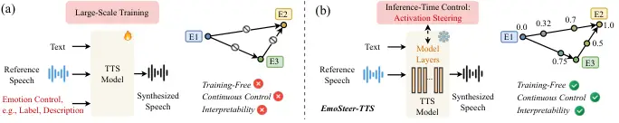
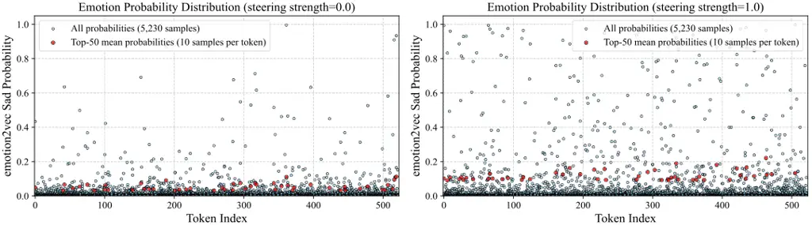
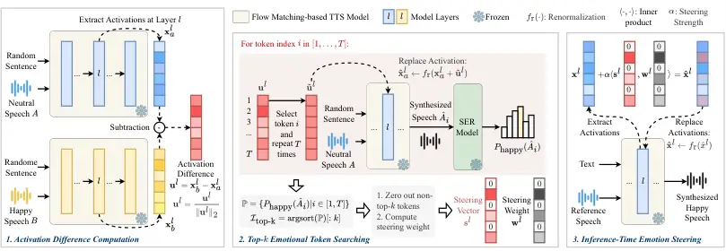

# EmoSteer-TTS: Fine-Grained and Training-Free Emotion-Controllable Text-to-Speech via Activation Steering

Tianxin Xie Affiliation: The Hong Kong University of Science and
Technology (Guangzhou)    Shan Yang Affiliation: Tencent AI Lab   
Chenxing Li Affiliation: Tencent AI Lab    Dong Yu Affiliation: Tencent
AI Lab    Li Liu ^(†)^(†)thanks: Corresponds to Li Liu
(avrillliu@hkust-gz.edu.cn) Affiliation: The Hong Kong University of
Science and Technology (Guangzhou)

###### Abstract

Text-to-speech (TTS) has shown great progress in recent years. However,
most existing TTS systems offer only coarse and rigid emotion control,
typically via discrete emotion labels or a carefully crafted and
detailed emotional text prompt, making fine-grained emotion manipulation
either inaccessible or unstable. These models also require extensive,
high-quality datasets for training. To address these limitations, we
propose EmoSteer-TTS, a novel training-free approach, to achieve
fine-grained speech emotion control (conversion, interpolation, erasure)
by activation steering. We first empirically observe that modifying a
subset of the internal activations within a flow matching-based TTS
model can effectively alter the emotional tone of synthesized speech.
Building on this insight, we then develop a training-free and efficient
algorithm, including activation extraction, emotional token searching,
and inference-time steering, which can be seamlessly integrated into a
wide range of pretrained models (e.g., F5-TTS, CosyVoice2, and E2-TTS).
In addition, to derive effective steering vectors, we construct a
curated emotional speech dataset with diverse speakers. Extensive
experiments demonstrate that EmoSteer-TTS enables fine-grained,
interpretable, and continuous control over speech emotion, outperforming
the state-of-the-art (SOTA). To the best of our knowledge, this is the
first method that achieves training-free and continuous fine-grained
emotion control in TTS. Demo samples are available at
[https://emosteer-tts-demo.pages.dev/](https://emosteer-tts-demo.pages.dev/).

|     |
| --- |
|     |

## 1 Introduction

Text-to-speech (TTS) aims to generate natural-sounding human speech from
textual input (Tan et al., 2021; Xie et al., 2025). It has been widely
adopted in various domains, including voice assistants, robotics, and
podcast production. Emotion-controllable TTS (EC-TTS) enhances this
capability by enabling control over the emotional tone of synthesized
speech, making it more expressive and engaging. Fine-grained EC-TTS
takes this further by allowing precise modulation of the conveyed
emotion intensity in synthesized speech. Such detailed control is vital
for applications requiring nuanced expressiveness, e.g., personalized
storytelling (Rong et al., 2025), empathetic human-computer
interaction (Wadley et al., 2022), and precise speech editing (Peng
et al., 2024).

Controlling the emotional tone of synthesized speech typically requires
the simultaneous manipulation of multiple characteristics, such as
pitch, energy, and prosody. Independently adjusting any of these
attributes often leads to undesirable artifacts. Therefore, in the
literature, existing methods commonly adopt a conditional generation
paradigm, including label-based methods that incorporate discrete
emotion labels (Cho et al., 2025) and description-based methods that use
textual emotion descriptions (Yang et al., 2025) as additional inputs to
guide the speech synthesis process.

Label-based EC-TTS approaches use categorical labels (e.g., anger,
happiness, fear) as an additional input to control the emotional
expression during training and inference. For example,
StyleTagging-TTS (Kim et al., 2021b) uses Sentence BERT (Reimers &
Gurevych, 2019) to encode short phrases or keywords as emotion labels to
guide the synthesis. However, such methods rely on fixed emotion labels,
offering limited flexibility in control (Cong et al., 2025). Recent
studies apply strength control to emotion labels. For instance,
EmoSphere++ (Cho et al., 2025) converts discrete labels into the
Valence-Arousal-Dominance (VAD) vector space (Mehrabian, 1980), where
the origin represents a neutral state. Both the type and intensity of
emotion can be controlled by adjusting the direction and magnitude of
the emotional vector. However, these methods rely on large
emotion-labeled datasets and often struggle to generalize to unseen
reference speech (Inoue et al., 2025).

On the other hand, description-based EC-TTS methods use textual prompts,
such as “A girl says welcome in a happy tone”, to describe the target
emotion, guiding the TTS model to generate speech that aligns with the
given description. For example, CosyVoice2 (Du et al., 2024) leverages
textual prompts to control emotional expressiveness, enhanced via
instruction fine-tuning. Similarly, EmoVoice (Yang et al., 2025)
incorporates emotion descriptions into the text context to enable
fine-grained emotion control. However, such methods (Guo et al., 2023;
Shimizu et al., 2024; Ji et al., 2025; Li et al., 2023b) require
large-scale datasets and carefully designed training procedures.
Although these methods enable finer emotion manipulation, their
controllability is fundamentally limited by the finite set of human
language expressions, imposing an upper bound on control granularity.
Moreover, they exhibit instability due to the inherent variability of
textual descriptions and the stochastic nature of token sampling in the
language models used for encoding.

In summary, existing methods have two limitations, i.e.,
instability/poor generalization and coarse controllability. The first
arises from the lack of large-scale emotional speech datasets required
for effective model training. The second stems from the control
strategies employed in existing methods, which restrict the precision of
emotion manipulation. Furthermore, the absence of exploration in emotion
representations within TTS models poses challenges for researchers
seeking to understand how speech emotions are encoded.



Figure 1: Motivations of our work. (a) Existing paradigm for speech
emotion control. (b) EmoSteer-TTS offers training-free, fine-grained
continuous emotion control with improved interpretability.

To address these limitations, we present EmoSteer-TTS, a training-free
approach that enables fine-grained, continuous emotion control, as
illustrated in Fig. 1. Specifically, we begin by analyzing the internal
emotion representations of pretrained zero-shot TTS models, such as
F5-TTS (Chen et al., 2025) and CosyVoice2. These models use a Diffusion
Transformer (DiT) (Peebles & Xie, 2023) as the backbone and employ flow
matching (Lipman et al., 2023) to generate high-fidelity
mel-spectrograms. As shown in Fig. 2, we observe that only a subset of
tokens, i.e., activations, within the model significantly influences the
emotional tone of the synthesized speech. Building on this insight, we
propose a simple yet effective algorithm to extract emotionally salient
tokens, such as those associated with “sad.” After identifying these
tokens, we then use the difference between emotional tokens and neutral
tokens to construct steering vectors for six basic emotions (Ekman,
1992). These steering vectors, combined with an adjustable strength
parameter, are then used to control the synthesized emotional tone.

In summary, EmoSteer-TTS enables training-free and fine-grained emotion
control, offering improved interpretability over existing approaches.
The contributions of our method are:

- •
  We present the first fine-grained and training-free EC-TTS approach by
  identifying and modulating internal emotion representations within
  existing TTS models.
- •
  We provide new insights and enhanced interpretability for continuous
  EC-TTS by uncovering the emotion steering dynamics in pretrained TTS
  models, offering practical guidance for the design of the proposed
  algorithm.
- •
  Extensive objective and subjective evaluations demonstrate the
  effectiveness of EmoSteer-TTS in fine-grained speech emotion control,
  showing its potential applicability across a wide range of pretrained
  TTS models.



Figure 2: Adding a sadness steering vector to the activations in five
DiT layers (1, 6, 11, 16, 21) of F5-TTS, conditioned on neutral speech,
substantially increases the predicted sadness probability.

## 2 Related Work

Emotion-Controllable Text-to-Speech. Unlike traditional TTS systems,
e.g., VITS (Kim et al., 2021a) and VALL-E (Wang et al., 2023), that
produce neutral or monotone speech, EC-TTS systems allow users to
specify speech emotions, enabling more expressive and natural-sounding
voices. Label-based methods control emotion using discrete labels (Cho
et al., 2025). For instance, EmoDubber (Cong et al., 2025) uses a
flow-based framework with positive/negative emotion guidance and a
classifier to adjust emotion intensity. HED-TTS (Inoue et al., 2025)
models hierarchical emotion distributions across speech segments,
allowing multi-level intensity control. Description-based methods use
textual prompts to specify emotions (Shimizu et al., 2024; Li et al.,
2025; Ji et al., 2024). PromptTTS (Guo et al., 2023) employs a
BERT-based encoder to extract style from prompts and guide synthesis.
VoxInstruct (Zhou et al., 2024) introduces semantic speech tokens and
classifier-free guidance for fine-grained control from emotion
descriptions. ControlSpeech (Ji et al., 2025) models emotional styles as
Gaussian mixtures, aligning text and audio via KL divergence to enable
zero-shot, controllable synthesis. Some zero-shot methods, e.g.,
MaskGCT (Wang et al., 2025b) and Vevo (Zhang et al., 2025), can also
synthesize emotional speech, but they lack direct control and instead
rely on reference speech. While these approaches have significantly
advanced expressive speech synthesis, they typically require large-scale
datasets and training.

Activation Steering. Activation steering aims to directly modulate the
internal activations of neural networks, providing a means to exert
fine-grained control over the behavior of pretrained models. Activation
steering has shown great potential in the realm of LLMs. For example, it
can be used to control the behavior of LLMs, such as enhancing the
truthfulness of responses (Xiao et al., 2024; Wang et al., 2025a).
Researchers can identify the mapping between the activation
distributions associated with false or misleading statements and those
of accurate information (Rodriguez et al., 2024). Then, during the
generation process, the model’s activations are steered towards the
distribution representing truth, encouraging LLMs to produce more
factually correct outputs (Li et al., 2023a). Activation steering can
also be used to control text-to-image (T2I) diffusion models (Li et al.,
2024; Nair et al., 2023). By modifying the activations of the diffusion
model towards the distribution that corresponds to a particular style,
e.g., impressionist or cubist, the model can generate images with the
desired aesthetic qualities (Rodriguez et al., 2024; Brack et al.,
2022). Inspired by these advances, we explore emotion representations in
pretrained zero-shot TTS models and apply activation steering, offering
a stable and interpretable EC-TTS method.

## 3 Method



Figure 3: Overview of EmoSteer-TTS. Steering vectors and steering
weights are derived from pairs of neutral and emotional reference
speech. During inference, these vectors are used to modulate the
activations in a TTS model, guiding it to synthesize speech that
reflects the desired emotion.

### 3.1 Overview

As shown in Fig. 3, the proposed EmoSteer-TTS approach consists of three
key stages. First, we compute activation differences using pairs of
neutral and emotional reference speeches. Second, we identify top-$`k`$
emotion-relevant tokens (e.g., for “happy”) to construct a steering
vector and its associated weight vector. At inference time, given any
unseen reference speech and text, we control the emotion of the
synthesized speech by applying the steering vector with a strength
parameter to modify internal activations. The proposed method is
detailed in the following subsections.

### 3.2 Activation Extraction

Our method focuses on zero-shot TTS models that use flow matching to
synthesize mel-spectrograms. Given a pretrained TTS model with
$`|\mathcal{L}|`$ DiT layers, we use random sentence texts along with
$`M`$ neutral speech samples (denoted as $`\mathcal{A}`$) and $`N`$
emotional speech samples (denoted as $`\mathcal{B}`$) as inputs to
synthesize a total of $`M+N`$ speech samples. For each model layer (a
DiT block) $`l\in\mathcal{L}`$, we extract the first residual
activations $`\mathbf{x}^{l}_{a,i}`$ and $`\mathbf{x}^{l}_{b,j}`$ for
the synthesized speech conditioned on reference samples
$`A_{i}\in\mathcal{A}`$ and $`B_{j}\in\mathcal{B}`$, respectively. The
activation difference between neutral and target emotional speech at
layer $`l`$ is defined as:

```math
\mathbf{u}^{l}=\frac{1}{N}\sum_{j=1}^{N}\mathbf{x}^{l}_{b,j}-\frac{1}{M}\sum_{i=1}^{M}\mathbf{x}^{l}_{a,i}. \tag{1}
```

This activation difference is also known as the
difference-in-means (Belrose et al., 2023), which can effectively
extract robust feature directions. To ensure stable steering, we
normalize $`\mathbf{u}^{l}`$ by dividing it by its L2 norm, resulting in
a unit vector:
$`\mathbf{u}^{l}\leftarrow\frac{\mathbf{u}^{l}}{\|\mathbf{u}^{l}\|_{2}}`$.
The activation differences for all target layers to be steered are
defined as $`\mathcal{U}=\{\mathbf{u}^{l}\mid l\in\hat{\mathcal{L}}\}`$,
where $`\hat{\mathcal{L}}\subseteq\mathcal{L}`$ denotes the set of
selected layers. It is worth noting that the direction of
$`\mathbf{u}^{l}`$ indicates the trajectory of emotional change in the
feature space, while its original magnitude reflects the extent of the
transition between emotions.

Synthesized speech may vary in length. Therefore, we use nearest
interpolation to align the extracted activations (token sequences) to a
fixed length, which is the average activation sequence length across all
$`M+N`$ samples. As a result, each activation has the shape
$`[avg\_seq\_length,hidden\_dim]`$.

### 3.3 Steering Vector Construction

After obtaining the activation difference $`\mathbf{u}^{l}`$, we select
the top-$`k`$ tokens most relevant to the target emotion to construct
the steering vector. As illustrated in Fig. 3, for each token in
$`\mathbf{u}^{l}`$, we repeat token $`i\in[1,2,\ldots,T]`$ $`T`$ times
to form a new vector $`\mathbf{\hat{u}}^{l}`$. We then modify the
activation $`\mathbf{x}^{l}_{a}`$ as follows:

```math
\mathbf{\hat{x}}^{l}_{a}\leftarrow f_{\text{r}}(\mathbf{x}^{l}_{a}+\mathbf{\hat{u}}^{l}),\;f_{\text{r}}=\frac{\|\mathbf{x}^{l}_{a}\|_{2}}{\|\mathbf{x}^{l}_{a}+\mathbf{\hat{u}}^{l}\|_{2}}, \tag{2}
```

where $`\mathbf{x}^{l}_{a}`$ is the activation corresponding to a random
sentence and a reference speech sample different from those used to
compute $`\mathbf{u}^{l}`$, and $`f_{\text{r}}`$ is a function that
renormalizes the modified activation to preserve the original L2 norm,
which ensures more stable modification Gaintseva et al. (2025).

After the activation modification, the model synthesizes the output
sample $`\hat{A}_{i}`$ corresponding to token $`i`$. We then use a
pre-trained speech emotion recognition (SER) model, i.e.,
emotion2vec (Ma et al., 2024), to predict the probability that
$`\hat{A}_{i}`$ corresponds to the target emotion, denoted as
$`P_{\text{emotion}}(\hat{A}_{i})`$. By computing
$`P_{\text{emotion}}(\hat{A}_{i})`$ for all tokens, we obtain the
probability set:

```math
\mathbb{P}=\{P_{\text{emotion}}(\hat{A}_{i})|i\in[1,T]\}, \tag{3}
```

and the indices of the top-$`k`$ emotional tokens:

```math
\mathcal{I}_{\text{top-k}}=\operatorname{argsort}(\mathbb{P})[:k]. \tag{4}
```

Next, we zero out all non-top-$`k`$ tokens in $`\mathbf{u}^{l}`$ to
derive the steering vector $`\mathbf{s}^{l}`$:

```math
\mathbf{s}^{l}\leftarrow\mathbf{u}^{l}\odot\mathbf{m},\;\mathbf{m}_{i}=\begin{cases}1,&\text{if }i\in\mathcal{I}_{\text{top-k}}\\
0,&\text{otherwise}\end{cases}, \tag{5}
```

where $`\mathbf{m}`$ is a mask vector, and $`\odot`$ is element-wise
multiplication. To apply adaptive steering strength to each token, we
compute a steering weight vector $`\mathbf{w}^{l}`$ as follows:

```math
\mathbf{w}^{l}=\delta(\mathbb{\hat{P}}),\ \mathbb{\hat{P}}=\{P_{\text{emotion}}(\hat{A}_{i})|i\in\mathcal{I}_{\text{top-}k}\}, \tag{6}
```

where $`\delta`$ is the Softmax function:
$`\delta(z_{i})=\frac{e^{z_{i}}}{\sum_{j=1}^{k}e^{z_{j}}}`$. Finally, we
get the weighted steering vector $`\mathbf{\hat{s}}^{l}`$:

```math
\mathbf{\hat{s}}^{l}=\langle\mathbf{s}^{l},\mathbf{w}^{l}\rangle=\mathbf{w}^{l}_{1}\mathbf{s}^{l}_{1}+\mathbf{w}^{l}_{2}\mathbf{s}^{l}_{2}+...+\mathbf{w}^{l}_{T}\mathbf{s}^{l}_{T}, \tag{7}
```

which can be used to steer speech emotions. Since most elements of the
weighted steering vector are zero, $`\mathbf{\hat{s}}^{l}`$ lies within
a subspace of the TTS model’s feature space that is specifically
responsible for modeling emotional tone. To ensure the efficiency of the
token searching process, we simultaneously modify all selected layers at
the same token indices, which can reduce the computational complexity
from $`\mathcal{O}(|\hat{\mathcal{L}}|\times avg\_seq\_length)`$ to
$`\mathcal{O}(avg\_seq\_length)`$.

### 3.4 Fine-Grained Emotion Control

In this subsection, we show how the proposed method enables fine-grained
emotion control, including emotion conversion, interpolation, erasure,
and composite manipulation.

Emotion Conversion and Interpolation. As shown in Fig. 3, given the text
and reference speech, we can use the steering vector $`\mathbf{s}^{l}`$
and weight $`\mathbf{w}^{l}`$ to modify the activations in layer
$`l\in\mathcal{\hat{L}}`$ as follows:

```math
\mathbf{\hat{x}}^{l}=f_{\text{r}}(\mathbf{x}^{l}+\alpha\mathbf{\hat{s}}^{l}), \tag{8}
```

where $`\alpha`$ controls the steering strength. Note that
$`\mathbf{\hat{s}}^{l}`$ has the same shape as a token, i.e.,
$`[hidden\_dim]`$. Thus, the plus sign in Eq. 8 involves an implicit
broadcasting operation. Fine-grained emotion control, e.g., conversion
and interpolation, can be achieved by tuning the parameter $`\alpha`$:
when $`\alpha=0`$, the emotional tone of the synthesized speech remains
unchanged; when $`\alpha>0`$, the emotional tone is steered toward the
target emotion; and when $`\alpha<0`$, it is steered in the opposite
direction of the target emotion.

Emotion Erasure. One may wish to synthesize new speech samples using the
speaking style or timbre from the reference speech while disregarding
the emotional tone. Suppose the weighted steering vector
$`\mathbf{\hat{s}}^{l}`$ corresponds to the emotion conveyed by the
reference speech, our method achieves this by subtracting the weighted
steering vector $`\mathbf{\hat{s}}^{l}`$ from the original activation
$`\mathbf{x}^{l}`$, multiplied by the projection of
$`\mathbf{\hat{s}}^{l}`$ onto $`\mathbf{x}^{l}`$, which can be expressed
as follows:

```math
\mathbf{\hat{x}}^{l}=f_{\text{r}}(\mathbf{x}^{l}-\beta(\mathbf{\hat{s}}^{l}\cdot\mathbf{x}^{l})\mathbf{\hat{s}}^{l}), \tag{9}
```

where $`\beta`$ is the erasing strength. Eq. 9 also involves implicit
broadcasting operations because $`\mathbf{\hat{s}}^{l}`$ is a single
vector while $`\mathbf{x}^{l}`$ is a token sequence. Explanation of
Eq. 9: Different reference speech samples may contain multiple emotions,
including the target emotion at varying intensities. Our goal is to
remove only the target emotion. The projection operation quantifies the
intensity of the target emotion in the reference speech, while
preserving all other speech characteristics.

Composite Control. EmoSteer-TTS also enables composite control over the
emotional tone of synthesized speech. For example, given a reference
speech sample, emotion replacement can be achieved through the following
operation ($`\mathbf{\hat{s}}^{l}_{\text{emo}_{i}}`$ is the weighted
steering vector of emotion “emo\_(i)”):

```math
\mathbf{\hat{x}}^{l}=f_{\text{r}}(\mathbf{x}^{l}-\beta(\mathbf{\hat{s}}^{l}_{\text{emo}_{1}}\cdot\mathbf{x}^{l})\mathbf{\hat{s}}^{l}_{\text{emo}_{1}}+\alpha\mathbf{\hat{s}}^{l}_{\text{emo}_{2}}), \tag{10}
```

which replaces emotion “emo₁” with “emo₂”. We can also realize multiple
emotion steering:

```math
\mathbf{\hat{x}}^{l}=f_{\text{r}}(\mathbf{x}^{l}+\alpha_{1}\mathbf{\hat{s}}^{l}_{\text{emo}_{1}}+\alpha_{2}\mathbf{\hat{s}}^{l}_{\text{emo}_{2}}+...+\alpha_{E}\mathbf{\hat{s}}^{l}_{\text{emo}_{E}}), \tag{11}
```

which is particularly useful for synthesizing speech with compound
emotions, such as “contempt” (disgust combined with mild anger),
“pleasant surprise” (a mix of happiness and surprise), as well as more
nuanced emotions like “happiness tinged with sadness” or “anger
intertwined with fear”.

EmoSteer-TTS enables fine-grained, continuous emotional control and
supports multiple control strategies, representing the first
training-free EC-TTS approach. Appendix A provides code snippets for the
operations described above.

## 4 Experiment

### 4.1 Datasets and Models

Datasets for Steering Vector Construction. To obtain effective steering
vectors, we construct a curated emotional speech dataset by collecting
samples with clear emotional expression from multiple corpora:
MSP-Podcast (Lotfian & Busso, 2017), IEMOCAP (Busso et al., 2008),
RAVDESS (Livingstone & Russo, 2018), CREMA-D (Cao et al., 2014),
TESS (Pichora-Fuller & Dupuis, 2020), SAVEE (Jackson & Haq, 2014),
ASVP-ESD (Landry et al., 2020), CASIA (CASIA, 2023), M3ED (Zhao et al.,
2022), ESD (Zhou et al., 2022), and Emo-Emilia (Zhao et al., 2025). The
resulting dataset contains 6,900 utterances covering six basic emotions
(anger, happiness, sadness, disgust, surprise, fear) and neutrality.
Each emotion includes 1,000 samples, 500 in English and 500 in Chinese,
except for fear, which has 400. The dataset includes diverse speakers
with a balanced gender distribution. The construction details are
provided in Appendix B. This dataset is used to compute activation
differences between neutral and emotional speech, as defined in Eq. 1.
To identify the top-$`k`$ tokens for each emotion, we synthesize speech
using 10 random neutral ESD samples as references (5 English and 5
Chinese).

Datasets for Inference-Time Emotion Steering. 1) In-distribution
evaluation: We sample neutral and emotional reference speeches from
MSP-Podcast and ESD, which are excluded from steering vector
computation. 2) Out-of-distribution (OOD) evaluation: We sample neutral
speech from SeedTTS Anastassiou et al. (2024) test sets and emotional
speech from EMNS Noriy et al. (2023).

Models. We enhance three SOTA flow matching-based TTS models (F5-TTS,
CosyVoice2, E2-TTS (Eskimez et al., 2024)) using our proposed method,
and compare their controllability with that of leading EC-TTS baselines,
including both label-based methods with adjustable control strength
(EmoSphere++, EmoDubber, HED-TTS (Inoue et al., 2025)) and
description-based methods (EmoVoice, CosyVoice2, FleSpeech (Li et al.,
2025)). Appendix C provides detailed model and hardware configurations
for all experiments.

### 4.2 Emotion Conversion and Interpolation

|                                                                                        |               |                             |                     |                          |                     |                      |                          |                      |
| -------------------------------------------------------------------------------------- | ------------- | --------------------------- | ------------------- | ------------------------ | ------------------- | -------------------- | ------------------------ | -------------------- |
| Method                                                                                 |               | Conversion ($`\alpha=2.0`$) |                     |                          |                     | Interpolation        | Erasure ($`\beta=2.5`$)  |                      |
|                                                                                        |               | WER($`\downarrow`$)         | S-SIM($`\uparrow`$) | E-SIM($`\uparrow`$)      | N-MOS($`\uparrow`$) | EI-MOS($`\uparrow`$) | E-SIM($`\uparrow`$)      | EE-MOS($`\uparrow`$) |
|                                                                                        |               |                             |                     | emotion2vec / SenseVoice |                     |                      | emotion2vec / SenseVoice |                      |
| Label-based\*                                                                          | EmoSphere++   | 16.25                       | 0.44                | 0.25 / 0.24\_(avg=0.245) | $`3.23_{\pm 0.81}`$ | 3.50\_(±1.05)        | \-                       | \-                   |
|                                                                                        | EmoDubber     | 18.61                       | 0.41                | 0.25 / 0.22\_(avg=0.235) | 2.47\_(±1.22)       | 2.21\_(±1.08)        | \-                       | \-                   |
|                                                                                        | HED-TTS       | 13.27                       | 0.52                | 0.22 / 0.26\_(avg=0.240) | 3.31\_(±0.79)       | 2.59\_(±0.76)        | \-                       | \-                   |
| Description -based\*                                                                   | EmoVoice      | 2.91                        | 0.58                | 0.27 / 0.25\_(avg=0.260) | 3.81\_(±0.86)       | \-                   | \-                       | \-                   |
|                                                                                        | CosyVoice2    | 2.53                        | 0.73                | 0.24 / 0.27\_(avg=0.255) | 3.69\_(±1.07)       | \-                   | \-                       | \-                   |
|                                                                                        | FleSpeech     | 9.34                        | 0.54                | 0.29 / 0.26\_(avg=0.275) | 3.07\_(±0.75)       | \-                   | \-                       | \-                   |
| Unsteered                                                                              | F5-TTS        | 2.14                        | 0.66                | 0.07 / 0.04\_(avg=0.055) | 3.79\_(±0.89)       | \-                   | 0.03 / 0.05\_(avg=0.040) | 1.21\_(±1.17)        |
|                                                                                        | E2-TTS        | 2.71                        | 0.64                | 0.05 / 0.08\_(avg=0.065) | 3.51\_(±0.94)       | \-                   | 0.06 / 0.02\_(avg=0.040) | 1.35\_(±1.05)        |
| In-distribution evaluation on MSP-Podcast (25% en) and ESD (25% en, 50% zh)            |               |                             |                     |                          |                     |                      |                          |                      |
| EmoSteer-TTS# (Ours)                                                                   | \+ F5-TTS     | 2.79                        | 0.64                | 0.29 / 0.26\_(avg=0.275) | 3.29\_(±1.05)       | 4.00\_(±0.89)        | 0.27 / 0.25\_(avg=0.260) | 4.02\_(±0.85)        |
|                                                                                        | \+ E2-TTS     | 3.28                        | 0.59                | 0.28 / 0.28\_(avg=0.280) | 3.31\_(±0.97)       | 3.38\_(±1.09)        | 0.24 / 0.26\_(avg=0.250) | 3.63\_(±1.17)        |
|                                                                                        | \+ CosyVoice2 | 2.83                        | 0.65                | 0.26 / 0.29\_(avg=0.275) | 3.65\_(±1.08)       | 3.56\_(±1.15)        | 0.26 / 0.25\_(avg=0.255) | 3.94\_(±0.97)        |
| Cross-datasets (OOD) evaluation on EMNS (25% en) and SeedTT test sets (25% en, 50% zh) |               |                             |                     |                          |                     |                      |                          |                      |
| EmoSteer-TTS# (Ours)                                                                   | \+ F5-TTS     | 2.65                        | 0.65                | 0.25 / 0.27\_(avg=0.260) | 3.58\_(±1.04)       | 3.46\_(±1.08)        | 0.25 / 0.22\_(avg=0.235) | 3.92\_(±0.99)        |
|                                                                                        | \+ E2-TTS     | 3.41                        | 0.55                | 0.26 / 0.25\_(avg=0.255) | 3.44\_(±1.07)       | 3.50\_(±0.97)        | 0.24 / 0.27\_(avg=0.255) | 3.57\_(±1.03)        |
|                                                                                        | \+ CosyVoice2 | 2.86                        | 0.66                | 0.28 / 0.25\_(avg=0.265) | 3.49\_(±1.01)       | 3.48\_(±1.27)        | 0.23 / 0.21\_(avg=0.220) | 3.98\_(±0.94)        |

\*: Training-based, \#: Training-free, -: Neither label-based,
description-based, nor unsteered methods support interpolation or
erasure.  
The top three results are indicated in boldface. Unsteered backbones are
shown in gray for reference.

Table 1: In-distribution and OOD comparison with emotion-controllable
baselines.

Emotion Conversion. We conduct emotion conversion using 100 neutral
reference speech samples (50 English from MSP-Podcast and 50 Chinese
from ESD), with $`\alpha`$=2.0 and $`k`$=200. We report Word Error Rate
(WER), Speaker Similarity (S-SIM), Emotion Similarity (E-SIM), and
Naturalness Mean Opinion Score (N-MOS, 1–5 scale, see Appendix D for
details). WER is derived from Whisper-Large V3 (Radford et al., 2023)
transcriptions. S-SIM is the cosine similarity between the embeddings of
synthesized and neutral reference from a speaker embedding model (Bredin
et al., 2020). E-SIM is computed as the cosine similarity between
emotion2vec embeddings of synthesized speech and 100 anchor emotional
samples (per emotion) from MSP-Podcast and ESD. To mitigate potential
metric overfitting from emotion2vec, we also report E-SIM scores
computed with SenseVoice An et al. (2024) embeddings. Since we cannot
guarantee the synthesis quality of reproduced baselines, we compute
their scores using demo samples for fairness. The reproduced baseline
results are additionally reported in Appendix E. As shown in Table 1,
EmoSteer-TTS achieves superior performance across multiple methods.
Integrated with F5-TTS, it yields a low WER of 2.79, close to CosyVoice2
(2.53) and far better than label-based baselines. It also maintains high
S-SIMs (0.66, 0.65), indicating strong speaker preservation. F5-TTS,
E2-TTS, and CosyVoice2 with EmoSteer-TTS reach the top E-SIM scores,
outperforming all baselines and matching FleSpeech. In N-MOS,
“EmoSteer-TTS+CosyVoice2” (3.65) is close to the best (EmoVoice, 3.81),
and our method consistently outperforms label-based systems. Fig. 4(a)
also shows the shift in emotion probability distribution (averaged
across three models) for 100 synthesized samples per emotional tone
before ($`\alpha`$=0) and after ($`\alpha`$=2) emotion conversion.

Figure 4: Emotion steering results on MSP-Podcast and ESD. ⚫
emotion2vec, ▲ SenseVoice.

Emotion Interpolation. We reuse the speech samples from the emotion
conversion experiments to perform interpolation ($`k`$=200), gradually
shifting emotional tone from neutrality to a target emotion. To assess
fine-grained controllability, we report the Emotion Interpolation MOS
(EI-MOS; 1–5 scale), which evaluates the alignment between target
intensity and synthesized speech. Detailed criteria for EI-MOS are
provided in Appendix D. Label-based baselines use intensity levels
(e.g., 0.5 or 1.0) to control, while description-based methods, lacking
intensity control, are excluded in this experiment. For fairness,
baseline metrics are computed using their official demo samples. As
shown in Table 1, EmoSteer-TTS achieves higher EI-MOS than label-based
baselines, indicating superior capability in controlling emotional
intensity. Notably, “EmoSteer-TTS+F5-TTS” obtains the highest EI-MOS of
4.00, outperforming EmoSphere++ and HED-TTS, showing better alignment
with intended emotion levels. E2-TTS and CosyVoice2 variants also
perform well, suggesting EmoSteer-TTS generalizes across different
models. As shown in Fig. 4(b), the average predicted emotion
probabilities (via emotion2vec and SenseVoice) vary smoothly with
$`\alpha`$, illustrating EmoSteer-TTS’s fine-grained controllability.
However, we find that large $`\alpha`$ values (e.g., 3) may lead to
unintelligible speech. Fig. 5(a) also illustrates smooth F0 transitions
with increasing anger intensity. More examples are provided in Appendix
F.

### 4.3 Emotion Erasure

We randomly select 100 unseen emotional speech samples for each type of
emotion from MSP-Podcast (50 English) and ESD (50 Chinese), and erase
the emotional tone using Eq. 9. We report the average E-SIM between the
emotionally erased samples and 100 randomly selected neutral samples
from MSP-Podcast (50 English) and ESD (50 Chinese). We also report
Emotion-Erasure MOS (EE-MOS, 1-5 scale), which indicates how well the
synthesized speech reflects the intended emotion erasure. Higher EE-MOS
reflects better erasure performance. The standard for EE-MOS is detailed

Figure 5: Visualization of F0 contours. (a) An example showing how the
F0 contour varies with steering intensity; (b) The speech tone (F0
contour) becomes calmer after emotion erasure.

![[Uncaptioned
image]](arxiv-2508-03543--47af3b5c9ab0.figures/figure-4.webp)

Figure 6: Results of composite control: (a) emotion replacement and (b)
multi-emotion steering (Abbreviations: Anger, Disgust, Fear, Happiness,
Sadness, Surprise)

in Appendix D. We set $`\beta`$=2.5, $`k`$=200 for this experiment. As
shown in Table 1, our method achieves a fairly high EE-MOS score,
indicating effective removal of target emotions. The decreased target
emotion scores shown in Fig. 4(c) further demonstrate the emotion
erasing ability. Fig. 5(b) illustrates the variation of F0 contours when
gradually erasing an emotional tone. Appendix F provides more
visualizations.

### 4.4 Composite Control

Emotion Replacement. We use the same emotional samples from the emotion
erasure experiment as reference speech for three TTS models. As defined
by Eq. 10, we first remove the emotional tone of the original activation
and add a target emotion. We perform six groups of replacement with
$`\alpha`$=2, $`\beta`$=2.5, and $`k`$=200. The values in Fig. 6(a) are
computed by subtracting the emotion2vec probabilities before emotion
replacement from those after replacement. Each row represents a specific
replacement operation (e.g., F$`\rightarrow`$H denotes replacing fear
with happiness), while each column indicates the predicted probability
change for a given emotion. The diagonal patterns validate the success
of emotion transfer, e.g., F$`\rightarrow`$H shows an increase in
happiness (+0.28) and a marked decrease in fear (-0.33). Similar trends
are observed for other pairs, such as Su$`\rightarrow`$A and
H$`\rightarrow`$Sa, confirming that EmoSteer-TTS effectively suppresses
the original emotion and enhances the target one.

Multi-Emotion Steering. We use the same neutral samples from the emotion
conversion experiment as reference speech. For simplicity, this
experiment simultaneously adds two emotions to the synthesized speech
($`\alpha_{1}`$=$`\alpha_{2}`$=2, $`k`$=200). As shown in Fig. 6(b), the
predicted emotion2vec distributions align closely with the intended
emotion pairs. For example, the row labeled “F, H” shows elevated
probabilities for both fear (0.22) and happiness (0.33), while “Sa ,Su”
leads to strong activations for sadness (0.28) and surprise (0.42).
These results indicate that EmoSteer-TTS can blend multiple emotions,
enabling expressive and nuanced speech synthesis beyond single-label
control.

### 4.5 Cross-Datasets Evaluation

Since some samples used for computing steering vectors come from the
same datasets (e.g., MSP-Podcast, ESD), we also evaluate EmoSteer-TTS in
an OOD setting. For emotion conversion and interpolation, we sample 100
neutral utterances from SeedTTS and 100 emotional anchors per emotion
from EMNS; for emotion erasure, we use 100 emotional utterances from
EMNS as references and 100 neutral anchors per emotion from SeedTTS. As
shown in Table 1 (lower section), EmoSteer-TTS maintains robust
performance on unseen datasets, with minimal degradation across metrics,
demonstrating strong generalization beyond the steering data.

### 4.6 Analysis of Emotion Steering Dynamics

Figure 7: Analysis of emotion steering dynamics using emotion2vec
predictions.

In this subsection, we analyze the emotion steering dynamics of our
method. All analyses are conducted on F5-TTS, which consists of 22 DiT
block layers and performs 32 flow matching steps to generate
mel-spectrograms. We use the same neutral samples from the emotion
conversion experiment as reference speech. We report emotion2vec emotion
probabilities for all analyses.

The Impact of Top-$`k`$. The parameter $`k`$ determines the number of
emotion-related tokens used to construct the steering vectors. A larger
$`k`$ introduces more tokens into the steering signal, potentially
capturing a broader range of emotional nuances, while a smaller $`k`$
focuses on the most dominant emotion features. We conduct emotion
conversion with varying $`k`$ values (e.g., $`k\in{10,50,...,400}`$) and
evaluate their impact on the synthesized emotion. Fig. 7(a) shows that
increasing $`k`$ generally leads to higher average emotion probabilities
across all categories, particularly for anger and happiness, which peak
around $`k`$=200. Incorporating more emotion-relevant tokens enriches
the steering signal, but gains plateau beyond $`k=200`$ for most
emotions. We therefore use $`k=200`$ in all main experiments to balance
expressiveness and efficiency.

Steering Different Layers. We examine how controlled layers affect
emotion conversion by applying steering vectors $`\mathbf{s}^{l}`$ at
shallow (1–7), middle (8–14), deep (15–22), and spaced layers (1, 6, 11,
16, 21). As shown in Fig. 7(b), shallow layers yield moderate emotional
influence, middle layers provide slightly stronger control, and deep
layers show a decline, likely focusing on acoustic details rather than
emotion. Steering multiple spaced layers, however, significantly boosts
probabilities across all six emotions. Overall, shallow-to-deep layers
provide progressively refined control, and multi-layer steering enables
the most effective emotion modulation.

Steering Different Flow Matching Steps. F5-TTS generates
mel-spectrograms through 32 conditional flow-matching (CFM) steps. To
assess the impact of steering at different stages, we apply emotion
control to early (0–10), middle (11–21), late (22–32), or all steps. As
shown in Fig. 7(c), early steering has little effect, while middle and
late stages exert stronger influence as the spectrogram takes shape. The
strongest emotion emerges when steering spans all steps, consistent with
CFM’s stepwise conditioning on reference speech. Therefore, we apply
emotion steering across all steps in the main experiments: 32 for F5-TTS
and E2-TTS, and 10 for CosyVoice2.

## 5 Conclusion

We presented EmoSteer-TTS, the first training-free framework for
fine-grained, continuous, and interpretable emotion control in speech
synthesis. By steering a subset of internal activations in a TTS model,
our method enables flexible emotional manipulation, including emotion
conversion, interpolation, and erasure, without modifying or fine-tuning
the pretrained TTS model. We also constructed a curated emotional speech
dataset to support steering vector construction. Extensive experiments
confirm that EmoSteer-TTS achieves robust, zero-shot emotion control
with broad applicability, outperforming SOTA methods. The analysis also
offers deeper insights into the emotion steering dynamics of flow
matching-based TTS. To the best of our knowledge, this is the first
fine-grained EC-TTS approach that needs no additional training.

Limitations and Future Work. A limitation of our method is the reliance
on high-quality emotional speech samples, albeit in modest quantities,
to extract effective steering vectors. In addition, strong activation
steering may introduce artifacts. Future work will explore combining
activation steering with learning-based approaches to mitigate these
issues.

## 6 Reproducibility Statement

To ensure the reproducibility of our work, we have provided
comprehensive details throughout the paper and its appendices. Our
proposed methodology, EmoSteer-TTS, is thoroughly described in Section
4, including the key algorithms for activation extraction, steering
vector construction, and fine-grained control, accompanied by precise
mathematical formulations. Appendix A further offers detailed code
snippets illustrating the implementation of our core steering
operations. Details regarding the datasets used for both steering vector
construction and evaluation are presented in Section 4.1, with the
specific curation and filtering process for our emotional speech dataset
outlined in Appendix B. We also provide the code for dataset
preprocessing and the processed dataset in the Supplementary Materials.
The configurations for the TTS models (F5-TTS, E2-TTS, Cosy Voice2),
including the specific layers and steps selected for steering, are
detailed in Appendix C. The hyperparameters and experimental settings
for all evaluations are specified within the relevant subsections of
Section 4, and the criteria for our subjective evaluation metrics are
defined in Appendix D. We will release the fully runnable code and
curated dataset upon the paper’s acceptance to facilitate further
research.

## References

- An et al. (2024) Keyu An, Qian Chen, Chong Deng, Zhihao Du, Changfeng
  Gao, Zhifu Gao, Yue Gu, Ting He, Hangrui Hu, Kai Hu, et al.
  Funaudiollm: Voice understanding and generation foundation models for
  natural interaction between humans and llms. _arXiv preprint
  arXiv:2407.04051_, 2024.
- Anastassiou et al. (2024) Philip Anastassiou, Jiawei Chen, Jitong
  Chen, Yuanzhe Chen, Zhuo Chen, Ziyi Chen, Jian Cong, Lelai Deng,
  Chuang Ding, Lu Gao, et al. Seed-tts: A family of high-quality
  versatile speech generation models. _arXiv preprint
  arXiv:2406.02430_, 2024.
- Belrose et al. (2023) Nora Belrose, David Schneider-Joseph, Shauli
  Ravfogel, Ryan Cotterell, Edward Raff, and Stella Biderman. Leace:
  Perfect linear concept erasure in closed form. _Advances in Neural
  Information Processing Systems_, 36:66044–66063, 2023.
- Brack et al. (2022) Manuel Brack, Patrick Schramowski, Felix
  Friedrich, Dominik Hintersdorf, and Kristian Kersting. The stable
  artist: Steering semantics in diffusion latent space. _arXiv preprint
  arXiv:2212.06013_, 2022.
- Bredin et al. (2020) Hervé Bredin, Ruiqing Yin, Juan Manuel Coria,
  Gregory Gelly, Pavel Korshunov, Marvin Lavechin, Diego Fustes, Hadrien
  Titeux, Wassim Bouaziz, and Marie-Philippe Gill. Pyannote.audio:
  Neural building blocks for speaker diarization. In _IEEE International
  Conference on Acoustics, Speech and Signal Processing_, pp.
  7124–7128, 2020.
- Busso et al. (2008) Carlos Busso, Murtaza Bulut, Chi-Chun Lee, Abe
  Kazemzadeh, Emily Mower, Samuel Kim, Jeannette N Chang, Sungbok Lee,
  and Shrikanth S Narayanan. Iemocap: Interactive emotional dyadic
  motion capture database. _Language Resources and Evaluation_,
  42:335–359, 2008.
- Cao et al. (2014) Houwei Cao, David G. Cooper, Michael K. Keutmann,
  Ruben C. Gur, Ani Nenkova, and Ragini Verma. Crema-d: Crowd-sourced
  emotional multimodal actors dataset. _IEEE Transactions on Affective
  Computing_, 5(4):377–390, 2014. doi: 10.1109/TAFFC.2014.2336244.
- CASIA (2023) CASIA. Casia chinese emotional audio corpus.
  [https://aistudio.baidu.com/datasetdetail/209512](https://aistudio.baidu.com/datasetdetail/209512), 2023.
  Accessed: 2025-07-01.
- Chen et al. (2025) Yushen Chen, Zhikang Niu, Ziyang Ma, Keqi Deng,
  Chunhui Wang, JianZhao JianZhao, Kai Yu, and Xie Chen. F5-TTS: A
  fairytaler that fakes fluent and faithful speech with flow matching.
  In _Proceedings of the 63rd Annual Meeting of the Association for
  Computational Linguistics (Volume 1: Long Papers)_, pp.
  6255–6271, 2025.
- Cho et al. (2025) Deok-Hyeon Cho, Hyung-Seok Oh, Seung-Bin Kim, and
  Seong-Whan Lee. EmoSphere++: Emotion-controllable zero-shot
  text-to-speech via emotion-adaptive spherical vector. _IEEE
  Transactions on Affective Computing_, pp. 1–16, 2025.
- Cong et al. (2025) Gaoxiang Cong, Jiadong Pan, Liang Li, Yuankai Qi,
  Yuxin Peng, Anton van den Hengel, Jian Yang, and Qingming Huang.
  Emodubber: Towards high quality and emotion controllable movie
  dubbing. In _Proceedings of the Computer Vision and Pattern
  Recognition Conference_, pp. 15863–15873, 2025.
- Du et al. (2024) Zhihao Du, Yuxuan Wang, Qian Chen, Xian Shi, Xiang
  Lv, Tianyu Zhao, Zhifu Gao, Yexin Yang, Changfeng Gao, Hui Wang, Fan
  Yu, Huadai Liu, Zhengyan Sheng, Yue Gu, Chong Deng, Wen Wang, Shiliang
  Zhang, Zhijie Yan, and Jingren Zhou. Cosyvoice 2: Scalable streaming
  speech synthesis with large language models. _arXiv preprint
  arXiv:2412.10117_, 2024.
- Ekman (1992) Paul Ekman. Facial expressions of emotion: New findings,
  new questions. _Psychological Science_, 3(1):34–38, 1992.
- Eskimez et al. (2024) Sefik Emre Eskimez, Xiaofei Wang, Manthan
  Thakker, Canrun Li, Chung-Hsien Tsai, Zhen Xiao, Hemin Yang, Zirun
  Zhu, Min Tang, Xu Tan, et al. E2 tts: Embarrassingly easy fully
  non-autoregressive zero-shot tts. In _IEEE Spoken Language Technology
  Workshop_, pp. 682–689, 2024.
- Gaintseva et al. (2025) Tatiana Gaintseva, Chengcheng Ma, Ziquan Liu,
  Martin Benning, Gregory Slabaugh, Jiankang Deng, and Ismail Elezi.
  Casteer: Steering diffusion models for controllable generation. _arXiv
  preprint arXiv:2503.09630_, 2025.
- Guo et al. (2023) Zhifang Guo, Yichong Leng, Yihan Wu, Sheng Zhao, and
  Xu Tan. Prompttts: Controllable text-to-speech with text descriptions.
  In _IEEE International Conference on Acoustics, Speech and Signal
  Processing_, pp. 1–5, 2023.
- Inoue et al. (2025) Sho Inoue, Kun Zhou, Shuai Wang, and Haizhou Li.
  Hierarchical control of emotion rendering in speech synthesis. _IEEE
  Transactions on Affective Computing_, pp. 1–13, 2025. doi:
  10.1109/TAFFC.2025.3582715.
- Jackson & Haq (2014) Philip Jackson and SJUoSG Haq. Surrey
  audio-visual expressed emotion (savee) database. _University of
  Surrey: Guildford, UK_, 2014.
- Ji et al. (2024) Shengpeng Ji, Jialong Zuo, Minghui Fang, Ziyue Jiang,
  Feiyang Chen, Xinyu Duan, Baoxing Huai, and Zhou Zhao. Textrolspeech:
  A text style control speech corpus with codec language text-to-speech
  models. In _IEEE International Conference on Acoustics, Speech and
  Signal Processing_, pp. 10301–10305, 2024.
- Ji et al. (2025) Shengpeng Ji, Qian Chen, Wen Wang, Jialong Zuo,
  Minghui Fang, Ziyue Jiang, Hai Huang, Zehan Wang, Xize Cheng, Siqi
  Zheng, and Zhou Zhao. Controlspeech: Towards simultaneous and
  independent zero-shot speaker cloning and zero-shot language style
  control. _arXiv preprint arXiv:2406.01205_, 2025.
- Kim et al. (2021a) Jaehyeon Kim, Jungil Kong, and Juhee Son.
  Conditional variational autoencoder with adversarial learning for
  end-to-end text-to-speech. In _Proceedings of the 38th International
  Conference on Machine Learning_, volume 139 of _Proceedings of Machine
  Learning Research_, pp. 5530–5540, 2021a.
- Kim et al. (2021b) Minchan Kim, Sung Jun Cheon, Byoung Jin Choi,
  Jong Jin Kim, and Nam Soo Kim. Expressive text-to-speech using style
  tag. In _Interspeech 2021_, pp. 4663–4667, 2021b. doi:
  10.21437/Interspeech.2021-465.
- Landry et al. (2020) DTT Landry, Qianhua He, Haikang Yan, and Yanxiong
  Li. Asvp-esd: A dataset and its benchmark for emotion recognition
  using both speech and non-speech utterances. _Global Scientific
  Journals_, 8:1793–1798, 2020.
- Li et al. (2025) Hanzhao Li, Yuke Li, Xinsheng Wang, Jingbin Hu,
  Qicong Xie, Shan Yang, and Lei Xie. Flespeech: Flexibly controllable
  speech generation with various prompts. _arXiv preprint
  arXiv:2501.04644_, 2025.
- Li et al. (2023a) Kenneth Li, Oam Patel, Fernanda Viégas, Hanspeter
  Pfister, and Martin Wattenberg. Inference-time intervention: Eliciting
  truthful answers from a language model. _Advances in Neural
  Information Processing Systems_, 36:41451–41530, 2023a.
- Li et al. (2024) Senmao Li, Joost van de Weijer, taihang Hu, Fahad
  Khan, Qibin Hou, Yaxing Wang, and jian Yang. Get what you want, not
  what you don’t: Image content suppression for text-to-image diffusion
  models. In _The Twelfth International Conference on Learning
  Representations_, 2024.
- Li et al. (2023b) Yinghao Aaron Li, Cong Han, Vinay Raghavan, Gavin
  Mischler, and Nima Mesgarani. Styletts 2: Towards human-level
  text-to-speech through style diffusion and adversarial training with
  large speech language models. In _Advances in Neural Information
  Processing Systems_, volume 36, pp. 19594–19621, 2023b.
- Lipman et al. (2023) Yaron Lipman, Ricky T. Q. Chen, Heli Ben-Hamu,
  Maximilian Nickel, and Matthew Le. Flow matching for generative
  modeling. In _The Eleventh International Conference on Learning
  Representations_, pp. 1–28, 2023.
- Livingstone & Russo (2018) Steven R Livingstone and Frank A Russo. The
  ryerson audio-visual database of emotional speech and song (ravdess):
  A dynamic, multimodal set of facial and vocal expressions in north
  american english. _PloS One_, 13(5):e0196391, 2018.
- Lotfian & Busso (2017) Reza Lotfian and Carlos Busso. Building
  naturalistic emotionally balanced speech corpus by retrieving
  emotional speech from existing podcast recordings. _IEEE Transactions
  on Affective Computing_, 10(4):471–483, 2017.
- Ma et al. (2024) Ziyang Ma, Zhisheng Zheng, Jiaxin Ye, Jinchao Li,
  Zhifu Gao, ShiLiang Zhang, and Xie Chen. emotion2vec: Self-supervised
  pre-training for speech emotion representation. In _Findings of the
  Association for Computational Linguistics: ACL 2024_, pp.
  15747–15760, 2024.
- McFee et al. (2015) Brian McFee, Colin Raffel, Dawen Liang, Daniel PW
  Ellis, Matt McVicar, Eric Battenberg, and Oriol Nieto. librosa: Audio
  and music signal analysis in python. _SciPy_, 2015:18–24, 2015.
- Mehrabian (1980) Albert Mehrabian. Basic dimensions for a general
  psychological theory. In _Basic Dimensions for a General Psychological
  Theory_, pp. 39–53. Oelgeschlager, Gunn & Hain, 1980. ISBN
  978-0-89946-004-8.
- Nair et al. (2023) Nithin Gopalakrishnan Nair, Anoop Cherian, Suhas
  Lohit, Ye Wang, Toshiaki Koike-Akino, Vishal M Patel, and Tim K Marks.
  Steered diffusion: A generalized framework for plug-and-play
  conditional image synthesis. In _Proceedings of the IEEE/CVF
  International Conference on Computer Vision_, pp. 20850–20860, 2023.
- Noriy et al. (2023) Kari Ali Noriy, Xiaosong Yang, and Jian Jun Zhang.
  Emns/imz/corpus: An emotive single-speaker dataset for narrative
  storytelling in games, television and graphic novels. _arXiv preprint
  arXiv:2305.13137_, 2023.
- Peebles & Xie (2023) William Peebles and Saining Xie. Scalable
  diffusion models with transformers. In _Proceedings of the IEEE/CVF
  International Conference on Computer Vision_, pp. 4195–4205, 2023.
- Peng et al. (2024) Puyuan Peng, Po-Yao Huang, Shang-Wen Li,
  Abdelrahman Mohamed, and David Harwath. VoiceCraft: Zero-shot speech
  editing and text-to-speech in the wild. In _Proceedings of the 62nd
  Annual Meeting of the Association for Computational Linguistics
  (Volume 1: Long Papers)_, pp. 12442–12462, 2024.
- Pichora-Fuller & Dupuis (2020) M. Kathleen Pichora-Fuller and Kate
  Dupuis. Toronto emotional speech set (TESS), 2020. URL
  [https://doi.org/10.5683/SP2/E8H2MF](https://doi.org/10.5683/SP2/E8H2MF).
- Radford et al. (2023) Alec Radford, Jong Wook Kim, Tao Xu, Greg
  Brockman, Christine McLeavey, and Ilya Sutskever. Robust speech
  recognition via large-scale weak supervision. In _Proceedings of the
  40th International Conference on Machine Learning_, 2023.
- Reimers & Gurevych (2019) Nils Reimers and Iryna Gurevych.
  Sentence-BERT: Sentence embeddings using Siamese BERT-networks. In
  _Proceedings of the Conference on Empirical Methods in Natural
  Language Processing and the 9th International Joint Conference on
  Natural Language Processing_, pp. 3982–3992, 2019.
- Rodriguez et al. (2024) Pau Rodriguez, Arno Blaas, Michal Klein, Luca
  Zappella, Nicholas Apostoloff, Marco Cuturi, and Xavier Suau.
  Controlling language and diffusion models by transporting activations.
  _arXiv preprint arXiv:2410.23054_, 2024.
- Rong et al. (2025) Yan Rong, Jinting Wang, Shan Yang, Guangzhi Lei,
  and Li Liu. Audiogenie: A training-free multi-agent framework for
  diverse multimodality-to-multiaudio generation. _arXiv preprint
  arXiv:2505.22053_, 2025.
- Shimizu et al. (2024) Reo Shimizu, Ryuichi Yamamoto, Masaya Kawamura,
  Yuma Shirahata, Hironori Doi, Tatsuya Komatsu, and Kentaro Tachibana.
  Prompttts++: Controlling speaker identity in prompt-based
  text-to-speech using natural language descriptions. In _IEEE
  International Conference on Acoustics, Speech and Signal Processing_,
  pp. 12672–12676, 2024.
- Tan et al. (2021) Xu Tan, Tao Qin, Frank Soong, and Tie-Yan Liu. A
  survey on neural speech synthesis. _arXiv preprint
  arXiv:2106.15561_, 2021.
- Wadley et al. (2022) Greg Wadley, Vassilis Kostakos, Peter Koval,
  Wally Smith, Sarah Webber, Anna Cox, James J Gross, Kristina Höök,
  Regan Mandryk, and Petr Slovák. The future of emotion in
  human-computer interaction. In _CHI Conference on human factors in
  computing systems extended abstracts_, pp. 1–6, 2022.
- Wang et al. (2023) Chengyi Wang, Sanyuan Chen, Yu Wu, Ziqiang Zhang,
  Long Zhou, Shujie Liu, Zhuo Chen, Yanqing Liu, Huaming Wang, Jinyu Li,
  Lei He, Sheng Zhao, and Furu Wei. Neural codec language models are
  zero-shot text to speech synthesizers. _arXiv preprint
  arXiv:2301.02111_, 2023.
- Wang et al. (2025a) Tianlong Wang, Xianfeng Jiao, Yinghao Zhu,
  Zhongzhi Chen, Yifan He, Xu Chu, Junyi Gao, Yasha Wang, and Liantao
  Ma. Adaptive activation steering: A tuning-free llm truthfulness
  improvement method for diverse hallucinations categories. In
  _Proceedings of the ACM on Web Conference_, pp. 2562–2578, 2025a.
- Wang et al. (2025b) Yuancheng Wang, Haoyue Zhan, Liwei Liu, Ruihong
  Zeng, Haotian Guo, Jiachen Zheng, Qiang Zhang, Xueyao Zhang, Shunsi
  Zhang, and Zhizheng Wu. MaskGCT: Zero-shot text-to-speech with masked
  generative codec transformer. In _The Thirteenth International
  Conference on Learning Representations_, pp. 1–24, 2025b.
- Xiao et al. (2024) Yuxin Xiao, Wan Chaoqun, Yonggang Zhang, Wenxiao
  Wang, Binbin Lin, Xiaofei He, Xu Shen, and Jieping Ye. Enhancing
  multiple dimensions of trustworthiness in LLMs via sparse activation
  control. _Advances in Neural Information Processing Systems_,
  37:15730–15764, 2024.
- Xie et al. (2025) Tianxin Xie, Yan Rong, Pengfei Zhang, Wenwu Wang,
  and Li Liu. Towards controllable speech synthesis in the era of large
  language models: A survey. _arXiv preprint arXiv:2412.06602_, 2025.
- Yang et al. (2025) Guanrou Yang, Chen Yang, Qian Chen, Ziyang Ma,
  Wenxi Chen, Wen Wang, Tianrui Wang, Yifan Yang, Zhikang Niu, Wenrui
  Liu, Fan Yu, Zhihao Du, Zhifu Gao, Shiliang Zhang, and Xie Chen.
  Emovoice: Llm-based emotional text-to-speech model with freestyle text
  prompting. _arXiv preprint arXiv:2504.12867_, 2025.
- Zhang et al. (2025) Xueyao Zhang, Xiaohui Zhang, Kainan Peng, Zhenyu
  Tang, Vimal Manohar, Yingru Liu, Jeff Hwang, Dangna Li, Yuhao Wang,
  Julian Chan, Yuan Huang, Zhizheng Wu, and Mingbo Ma. Vevo:
  Controllable zero-shot voice imitation with self-supervised
  disentanglement. In _The Thirteenth International Conference on
  Learning Representations_, pp. 1–24, 2025.
- Zhao et al. (2022) Jinming Zhao, Tenggan Zhang, Jingwen Hu, Yuchen
  Liu, Qin Jin, Xinchao Wang, and Haizhou Li. M3ED: Multi-modal
  multi-scene multi-label emotional dialogue database. In _Proceedings
  of the 60th Annual Meeting of the Association for Computational
  Linguistics (Volume 1: Long Papers)_, pp. 5699–5710, 2022.
- Zhao et al. (2025) Zhixian Zhao, Xinfa Zhu, Xinsheng Wang, Shuiyuan
  Wang, Xuelong Geng, Wenjie Tian, and Lei Xie. Steering language model
  to stable speech emotion recognition via contextual perception and
  chain of thought. _arXiv preprint arXiv:2502.18186_, 2025.
- Zhou et al. (2022) Kun Zhou, Berrak Sisman, Rui Liu, and Haizhou Li.
  Emotional voice conversion: Theory, databases and esd. _Speech
  Communication_, 137:1–18, 2022.
- Zhou et al. (2024) Yixuan Zhou, Xiaoyu Qin, Zeyu Jin, Shuoyi Zhou,
  Shun Lei, Songtao Zhou, Zhiyong Wu, and Jia Jia. Voxinstruct:
  Expressive human instruction-to-speech generation with unified
  multilingual codec language modelling. In _Proceedings of the 32nd ACM
  International Conference on Multimedia_, pp. 554–563, 2024.

## Appendix A Appendix A: Code Snippets for Fine-Grained Emotion Control

For all three TTS models used in our study, i.e., F5-TTS (Chen et al.,
2025), E2-TTS (Eskimez et al., 2024), and CosyVoice2 (Du et al., 2024),
steering operations are implemented as hook functions. These hooks are
registered either before or after the forward pass of the first residual
stream in each DiT block. Code will be released upon acceptance.

### A.1 Emotion Conversion and Interpolation

For emotion conversion and interpolation, we steer the activation of the
first residual stream in selected DiT blocks by registering a
forward_pre_hook that modifies the inputs before they enter the linear
residual stream module. The weighted steering vector, i.e.,
$`\mathbf{\hat{s}}^{l}`$ in Eq. 8, is stored in variable
steering_activations. The steering intensity, i.e., $`\alpha`$ in Eq. 8,
is controlled via args.steering_strength. The code for emotion
conversion and interpolation is shown in Listing 1.

[⬇](data:text/plain;base64,ZGVmIGFjdF9zdGVlcmluZ19ob29rKGJsb2NrX2lkeCwgbmFtZT1Ob25lKToKICAgICIiIgogICAgQ3JlYXRlIGEgaG9vayBmdW5jdGlvbiBmb3Igc3RlZXJpbmcgYWN0aXZhdGlvbnMuCiAgICAiIiIKCiAgICBkZWYgaG9vayhtb2R1bGUsIGlucHV0X2FyZ3MpOgogICAgICAgIGlmIGlucHV0X2FyZ3MgYW5kIGxlbihpbnB1dF9hcmdzKSA+IDE6CiAgICAgICAgICAgICMgR2V0IHRoZSBpbnB1dAogICAgICAgICAgICAoCiAgICAgICAgICAgICAgICB4LAogICAgICAgICAgICAgICAgdCwKICAgICAgICAgICAgICAgIHRpbWUsCiAgICAgICAgICAgICAgICBtYXNrLAogICAgICAgICAgICAgICAgcm9wZSwKICAgICAgICAgICAgICAgIGRyb3BfYXVkaW9fY29uZCwKICAgICAgICAgICAgICAgIGRyb3BfdGV4dCwKICAgICAgICAgICAgICAgIHJlZl9hdWRpb19sZW4sCiAgICAgICAgICAgICkgPSBpbnB1dF9hcmdzCiAgICAgICAgICAgIGlmICgKICAgICAgICAgICAgICAgIG5vdCBkcm9wX2F1ZGlvX2NvbmQKICAgICAgICAgICAgKTogICMgSWYgZHJvcF9hdWRpb19jb25kIGlzIFRydWUsIG5vIG1hbmlwdWxhdGlvbiBvZiBhY3RpdmF0aW9uIHZhbHVlcy4KICAgICAgICAgICAgICAgIHN0ZXAgPSBpbnQodGltZSAqIDMyKSAjIHRpbWUgaXMgYSBmbG9hdGluZyAtIHBvaW50IG51bWJlciBiZXR3ZWVuIDAgYW5kIDEKICAgICAgICAgICAgICAgIGFjdCA9IHN0ZWVyaW5nX2FjdGl2YXRpb25zW2Jsb2NrX2lkeCAvLyA1LCBzdGVwLCA6XSAgIyAoMTAyNCkKICAgICAgICAgICAgICAgIGFjdCA9IGFjdC51bnNxdWVlemUoMCkucmVwZWF0KAogICAgICAgICAgICAgICAgICAgIHJlZl9hdWRpb19sZW4sIDEKICAgICAgICAgICAgICAgICkgICMgKHJlZl9hdWRpb19sZW4sIDEwMjQpCiAgICAgICAgICAgICAgICBhY3QgPSBhY3QudW5zcXVlZXplKDApICAjICgxLCByZWZfYXVkaW9fbGVuLCAxMDI0KQogICAgICAgICAgICAgICAgYWN0ID0gYWN0LnRvKHguZGV2aWNlKQoKICAgICAgICAgICAgICAgICMgTm9ybWFsaXplIGFjdCB0byB1bml0IHZlY3RvcgogICAgICAgICAgICAgICAgYWN0ID0gYWN0IC8gKGFjdC5ub3JtKHA9MikgKyAxZS04KQoKICAgICAgICAgICAgICAgIHBhZF9sZW4gPSB4LnNpemUoMSkgLSBhY3Quc2l6ZSgxKQogICAgICAgICAgICAgICAgcGFkX3RlbnNvciA9IHRvcmNoLnplcm9zKAogICAgICAgICAgICAgICAgICAgIHguc2l6ZSgwKSwKICAgICAgICAgICAgICAgICAgICBwYWRfbGVuLAogICAgICAgICAgICAgICAgICAgIHguc2l6ZSgyKSwKICAgICAgICAgICAgICAgICAgICBkdHlwZT14LmR0eXBlLAogICAgICAgICAgICAgICAgICAgIGRldmljZT14LmRldmljZSwKICAgICAgICAgICAgICAgICkKICAgICAgICAgICAgICAgIGFjdCA9IHRvcmNoLmNhdChbYWN0LCBwYWRfdGVuc29yXSwgZGltPTEpLnRvKHguZHR5cGUpCgogICAgICAgICAgICAgICAgIyBTYXZlIG9yaWdpbmFsIG5vcm0gZm9yIGVhY2ggc2FtcGxlIGluIGJhdGNoCiAgICAgICAgICAgICAgICBvcmlnX25vcm0gPSB4Lm5vcm0ocD0yLCBkaW09KDEsIDIpLCBrZWVwZGltPVRydWUpICAjIChCLCAxLCAxKQoKICAgICAgICAgICAgICAgIHggPSB4ICsgYXJncy5zdGVlcmluZ19zdHJlbmd0aCAqIGFjdAoKICAgICAgICAgICAgICAgICMgUmVzY2FsZSB4IHRvIGhhdmUgdGhlIHNhbWUgbm9ybSBhcyBvcmlnaW5hbCB4CiAgICAgICAgICAgICAgICBuZXdfbm9ybSA9IHgubm9ybShwPTIsIGRpbT0oMSwgMiksIGtlZXBkaW09VHJ1ZSkgKyAxZS04CiAgICAgICAgICAgICAgICB4ID0geCAqIChvcmlnX25vcm0gLyBuZXdfbm9ybSkKCiAgICAgICAgICAgIHJldHVybiAoCiAgICAgICAgICAgICAgICAgICAgeCwKICAgICAgICAgICAgICAgICAgICB0LAogICAgICAgICAgICAgICAgICAgIHRpbWUsCiAgICAgICAgICAgICAgICAgICAgbWFzaywKICAgICAgICAgICAgICAgICAgICByb3BlLAogICAgICAgICAgICAgICAgICAgIGRyb3BfYXVkaW9fY29uZCwKICAgICAgICAgICAgICAgICAgICBkcm9wX3RleHQsCiAgICAgICAgICAgICAgICAgICAgcmVmX2F1ZGlvX2xlbiwKICAgICAgICAgICAgICAgICkKCiAgICByZXR1cm4gaG9vaw==)

1 def act_steering_hook(block_idx, name=None):

2 """

3 Create a hook function for steering activations.

4 """

5

6 def hook(module, input_args):

7 if input_args and len(input_args) \> 1:

8 \# Get the input

9 (

10 x,

11 t,

12 time,

13 mask,

14 rope,

15 drop_audio_cond,

16 drop_text,

17 ref_audio_len,

18 ) = input_args

19 if (

20 not drop_audio_cond

21 ): \# If drop_audio_cond is True, no manipulation of activation
values.

22 step = int(time \* 32) \# time is a floating - point number between 0
and 1

23 act = steering_activations\[block_idx // 5, step, :\] \# (1024)

24 act = act.unsqueeze(0).repeat(

25 ref_audio_len, 1

26 ) \# (ref_audio_len, 1024)

27 act = act.unsqueeze(0) \# (1, ref_audio_len, 1024)

28 act = act.to(x.device)

29

30 \# Normalize act to unit vector

31 act = act / (act.norm(p=2) + 1e-8)

32

33 pad_len = x.size(1) - act.size(1)

34 pad_tensor = torch.zeros(

35 x.size(0),

36 pad_len,

37 x.size(2),

38 dtype=x.dtype,

39 device=x.device,

40 )

41 act = torch.cat(\[act, pad_tensor\], dim=1).to(x.dtype)

42

43 \# Save original norm for each sample in batch

44 orig_norm = x.norm(p=2, dim=(1, 2), keepdim=True) \# (B, 1, 1)

45

46 x = x + args.steering_strength \* act

47

48 \# Rescale x to have the same norm as original x

49 new_norm = x.norm(p=2, dim=(1, 2), keepdim=True) + 1e-8

50 x = x \* (orig_norm / new_norm)

51

52 return (

53 x,

54 t,

55 time,

56 mask,

57 rope,

58 drop_audio_cond,

59 drop_text,

60 ref_audio_len,

61 )

62

63 return hook

Listing 1: Emotion Conversion and Interpolation Hook

### A.2 Emotion Erasure

For emotion erasure, we steer the activation of the first residual
stream in selected DiT blocks by registering a forward_pre_hook that
modifies the inputs before they enter the linear residual stream module.
The weighted steering vector, i.e., $`\mathbf{\hat{s}}^{l}`$ in Eq. 9,
is stored in variable steering_activations. The erasing intensity, i.e.,
$`\beta`$ in Eq. 9, is controlled via args.erasing_strength. The code
for emotion erasure is shown in Listing 2.

[⬇](data:text/plain;base64,ZGVmIGFjdF9lcmFzaW5nX2hvb2soYmxvY2tfaWR4LCBuYW1lPU5vbmUpOgogICAgIiIiCiAgICBDcmVhdGUgYSBob29rIGZ1bmN0aW9uIGZvciBlbW90aW9uIGVyYXN1cmUuCiAgICAiIiIKCiAgICBkZWYgaG9vayhtb2R1bGUsIGlucHV0X2FyZ3MpOgogICAgICAgIGlmIGlucHV0X2FyZ3MgYW5kIGxlbihpbnB1dF9hcmdzKSA+IDE6CiAgICAgICAgICAgICgKICAgICAgICAgICAgICAgIHgsICAjIChCLCBMLCAxMDI0KQogICAgICAgICAgICAgICAgdCwKICAgICAgICAgICAgICAgIHRpbWUsCiAgICAgICAgICAgICAgICBtYXNrLAogICAgICAgICAgICAgICAgcm9wZSwKICAgICAgICAgICAgICAgIGRyb3BfYXVkaW9fY29uZCwKICAgICAgICAgICAgICAgIGRyb3BfdGV4dCwKICAgICAgICAgICAgICAgIHJlZl9hdWRpb19sZW4sCiAgICAgICAgICAgICkgPSBpbnB1dF9hcmdzCiAgICAgICAgICAgIGlmICgKICAgICAgICAgICAgICAgIG5vdCBkcm9wX2F1ZGlvX2NvbmQKICAgICAgICAgICAgKToKICAgICAgICAgICAgICAgIHN0ZXAgPSBpbnQodGltZSAqIDMyKQogICAgICAgICAgICAgICAgYWN0ID0gc3RlZXJpbmdfYWN0aXZhdGlvbnNbYmxvY2tfaWR4IC8vIDUsIHN0ZXAsIDpdICAjICgxMDI0KQogICAgICAgICAgICAgICAgYWN0ID0gYWN0LnRvKHguZHR5cGUpLnRvKHguZGV2aWNlKQoKICAgICAgICAgICAgICAgICMgTm9ybWFsaXplIGFjdCB0byB1bml0IHZlY3RvcgogICAgICAgICAgICAgICAgYWN0ID0gYWN0IC8gKGFjdC5ub3JtKHA9MikgKyAxZS04KQoKICAgICAgICAgICAgICAgIHByb2plY3Rpb24gPSB0b3JjaC5tYXRtdWwoCiAgICAgICAgICAgICAgICAgICAgYWN0LnVuc3F1ZWV6ZSgwKSwgICMgKDEsIDEwMjQpCiAgICAgICAgICAgICAgICAgICAgeFs6LCA6cmVmX2F1ZGlvX2xlbiwgOl0udHJhbnNwb3NlKAogICAgICAgICAgICAgICAgICAgICAgICAxLCAyCiAgICAgICAgICAgICAgICAgICAgKSwgICMgKEIsIHJlZl9hdWRpb19sZW4sIDEwMjQpCiAgICAgICAgICAgICAgICApLnRyYW5zcG9zZSgKICAgICAgICAgICAgICAgICAgICAxLCAyCiAgICAgICAgICAgICAgICApICAjIChCLCByZWZfYXVkaW9fbGVuLCAxKQoKICAgICAgICAgICAgICAgIHBhZF9sZW4gPSB4LnNpemUoMSkgLSByZWZfYXVkaW9fbGVuCiAgICAgICAgICAgICAgICBwYWRkZWRfcHJvamVjdGlvbiA9IHRvcmNoLmNhdCgKICAgICAgICAgICAgICAgICAgICBbCiAgICAgICAgICAgICAgICAgICAgICAgIHByb2plY3Rpb24sCiAgICAgICAgICAgICAgICAgICAgICAgIHRvcmNoLnplcm9zKAogICAgICAgICAgICAgICAgICAgICAgICAgICAgeC5zaXplKDApLAogICAgICAgICAgICAgICAgICAgICAgICAgICAgcGFkX2xlbiwKICAgICAgICAgICAgICAgICAgICAgICAgICAgIDEsCiAgICAgICAgICAgICAgICAgICAgICAgICAgICBkdHlwZT14LmR0eXBlLAogICAgICAgICAgICAgICAgICAgICAgICAgICAgZGV2aWNlPXguZGV2aWNlLAogICAgICAgICAgICAgICAgICAgICAgICApLAogICAgICAgICAgICAgICAgICAgIF0sCiAgICAgICAgICAgICAgICAgICAgZGltPTEsCiAgICAgICAgICAgICAgICApCgogICAgICAgICAgICAgICAgYWN0ID0gYWN0LnVuc3F1ZWV6ZSgwKS5yZXBlYXQoCiAgICAgICAgICAgICAgICAgICAgcmVmX2F1ZGlvX2xlbiwgMQogICAgICAgICAgICAgICAgKSAgIyAocmVmX2F1ZGlvX2xlbiwgMTAyNCkKICAgICAgICAgICAgICAgIGFjdCA9IGFjdC51bnNxdWVlemUoMCkgICMgKDEsIHJlZl9hdWRpb19sZW4sIDEwMjQpCgogICAgICAgICAgICAgICAgcGFkX3RlbnNvciA9IHRvcmNoLnplcm9zKAogICAgICAgICAgICAgICAgICAgIHguc2l6ZSgwKSwKICAgICAgICAgICAgICAgICAgICBwYWRfbGVuLAogICAgICAgICAgICAgICAgICAgIHguc2l6ZSgyKSwKICAgICAgICAgICAgICAgICAgICBkdHlwZT14LmR0eXBlLAogICAgICAgICAgICAgICAgICAgIGRldmljZT14LmRldmljZSwKICAgICAgICAgICAgICAgICkKICAgICAgICAgICAgICAgIGFjdCA9IHRvcmNoLmNhdChbYWN0LCBwYWRfdGVuc29yXSwgZGltPTEpCgogICAgICAgICAgICAgICAgIyBTYXZlIG9yaWdpbmFsIG5vcm0gZm9yIGVhY2ggc2FtcGxlIGluIGJhdGNoCiAgICAgICAgICAgICAgICBvcmlnX25vcm0gPSB4Lm5vcm0ocD0yLCBkaW09KDEsIDIpLCBrZWVwZGltPVRydWUpICAjIChCLCAxLCAxKQoKICAgICAgICAgICAgICAgIHggPSB4IC0gYXJncy5lcmFzaW5nX3N0cmVuZ3RoICogcGFkZGVkX3Byb2plY3Rpb24gKiBhY3QKCiAgICAgICAgICAgICAgICAjIFJlc2NhbGUgeCB0byBoYXZlIHRoZSBzYW1lIG5vcm0gYXMgb3JpZ2luYWwgeAogICAgICAgICAgICAgICAgbmV3X25vcm0gPSB4Lm5vcm0ocD0yLCBkaW09KDEsIDIpLCBrZWVwZGltPVRydWUpICsgMWUtOAogICAgICAgICAgICAgICAgeCA9IHggKiAob3JpZ19ub3JtIC8gbmV3X25vcm0pCgogICAgICAgICAgICByZXR1cm4gKAogICAgICAgICAgICAgICAgeCwKICAgICAgICAgICAgICAgIHQsCiAgICAgICAgICAgICAgICB0aW1lLAogICAgICAgICAgICAgICAgbWFzaywKICAgICAgICAgICAgICAgIHJvcGUsCiAgICAgICAgICAgICAgICBkcm9wX2F1ZGlvX2NvbmQsCiAgICAgICAgICAgICAgICBkcm9wX3RleHQsCiAgICAgICAgICAgICAgICByZWZfYXVkaW9fbGVuLAogICAgICAgICAgICApCgogICAgcmV0dXJuIGhvb2s=)

1 def act_erasing_hook(block_idx, name=None):

2 """

3 Create a hook function for emotion erasure.

4 """

5

6 def hook(module, input_args):

7 if input_args and len(input_args) \> 1:

8 (

9 x, \# (B, L, 1024)

10 t,

11 time,

12 mask,

13 rope,

14 drop_audio_cond,

15 drop_text,

16 ref_audio_len,

17 ) = input_args

18 if (

19 not drop_audio_cond

20 ):

21 step = int(time \* 32)

22 act = steering_activations\[block_idx // 5, step, :\] \# (1024)

23 act = act.to(x.dtype).to(x.device)

24

25 \# Normalize act to unit vector

26 act = act / (act.norm(p=2) + 1e-8)

27

28 projection = torch.matmul(

29 act.unsqueeze(0), \# (1, 1024)

30 x\[:, :ref_audio_len, :\].transpose(

31 1, 2

32 ), \# (B, ref_audio_len, 1024)

33 ).transpose(

34 1, 2

35 ) \# (B, ref_audio_len, 1)

36

37 pad_len = x.size(1) - ref_audio_len

38 padded_projection = torch.cat(

39 \[

40 projection,

41 torch.zeros(

42 x.size(0),

43 pad_len,

44 1,

45 dtype=x.dtype,

46 device=x.device,

47 ),

48 \],

49 dim=1,

50 )

51

52 act = act.unsqueeze(0).repeat(

53 ref_audio_len, 1

54 ) \# (ref_audio_len, 1024)

55 act = act.unsqueeze(0) \# (1, ref_audio_len, 1024)

56

57 pad_tensor = torch.zeros(

58 x.size(0),

59 pad_len,

60 x.size(2),

61 dtype=x.dtype,

62 device=x.device,

63 )

64 act = torch.cat(\[act, pad_tensor\], dim=1)

65

66 \# Save original norm for each sample in batch

67 orig_norm = x.norm(p=2, dim=(1, 2), keepdim=True) \# (B, 1, 1)

68

69 x = x - args.erasing_strength \* padded_projection \* act

70

71 \# Rescale x to have the same norm as original x

72 new_norm = x.norm(p=2, dim=(1, 2), keepdim=True) + 1e-8

73 x = x \* (orig_norm / new_norm)

74

75 return (

76 x,

77 t,

78 time,

79 mask,

80 rope,

81 drop_audio_cond,

82 drop_text,

83 ref_audio_len,

84 )

85

86 return hook

Listing 2: Emotion Erasure Hook

### A.3 Emotion Replacement

For emotion replacement, we steer the activation of the first residual
stream in selected DiT blocks by registering a forward*pre_hook, which
modifies the inputs before they enter the linear residual stream module.
The weighted steering vectors for emotion 1 and emotion 2, i.e.,
$`\mathbf{\hat{s}}^{l}*{\text{emo1}}`$ and
$`\mathbf{\hat{s}}^{l}\_{\text{emo2}}`$ in Eq. 10, are stored in the
variable steering_activations_1 and variable steering_activations_2,
respectively. The erasing and steering intensities, i.e., $`\beta`$ and
$`\alpha`$ in Eq. 10, are controlled by variables args.erasing_strength
and args.steering_strength, respectively. The implementation of emotion
replacement is provided in Listing 3.

[⬇](data:text/plain;base64,ZGVmIGFjdF9yZXBsYWNlbWVudF9ob29rKGJsb2NrX2lkeCwgbmFtZT1Ob25lKToKICAgICIiIgogICAgQ3JlYXRlIGEgaG9vayBmdW5jdGlvbiBmb3IgZW1vdGlvbiByZXBsYWNlbWVudC4KICAgICIiIgoKICAgIGRlZiBob29rKG1vZHVsZSwgaW5wdXRfYXJncyk6CiAgICAgICAgaWYgaW5wdXRfYXJncyBhbmQgbGVuKGlucHV0X2FyZ3MpID4gMToKICAgICAgICAgICAgKAogICAgICAgICAgICAgICAgeCwgICMgKEIsIEwsIDEwMjQpCiAgICAgICAgICAgICAgICB0LAogICAgICAgICAgICAgICAgdGltZSwKICAgICAgICAgICAgICAgIG1hc2ssCiAgICAgICAgICAgICAgICByb3BlLAogICAgICAgICAgICAgICAgZHJvcF9hdWRpb19jb25kLAogICAgICAgICAgICAgICAgZHJvcF90ZXh0LAogICAgICAgICAgICAgICAgcmVmX2F1ZGlvX2xlbiwKICAgICAgICAgICAgKSA9IGlucHV0X2FyZ3MKICAgICAgICAgICAgaWYgKAogICAgICAgICAgICAgICAgbm90IGRyb3BfYXVkaW9fY29uZAogICAgICAgICAgICApOgogICAgICAgICAgICAgICAgc3RlcCA9IGludCh0aW1lICogMzIpCiAgICAgICAgICAgICAgICBhY3QxID0gc3RlZXJpbmdfYWN0aXZhdGlvbnNfMVtibG9ja19pZHggLy8gNSwgc3RlcCwgOl0gICMgKDEwMjQpCiAgICAgICAgICAgICAgICBhY3QxID0gYWN0LnRvKHguZHR5cGUpLnRvKHguZGV2aWNlKQoKICAgICAgICAgICAgICAgICMgTm9ybWFsaXplIGFjdCB0byB1bml0IHZlY3RvcgogICAgICAgICAgICAgICAgYWN0MSA9IGFjdDEgLyAoYWN0MS5ub3JtKHA9MikgKyAxZS04KQoKICAgICAgICAgICAgICAgIHByb2plY3Rpb24gPSB0b3JjaC5tYXRtdWwoCiAgICAgICAgICAgICAgICAgICAgYWN0MS51bnNxdWVlemUoMCksICAjICgxLCAxMDI0KQogICAgICAgICAgICAgICAgICAgIHhbOiwgOnJlZl9hdWRpb19sZW4sIDpdLnRyYW5zcG9zZSgKICAgICAgICAgICAgICAgICAgICAgICAgMSwgMgogICAgICAgICAgICAgICAgICAgICksICAjIChCLCByZWZfYXVkaW9fbGVuLCAxMDI0KQogICAgICAgICAgICAgICAgKS50cmFuc3Bvc2UoCiAgICAgICAgICAgICAgICAgICAgMSwgMgogICAgICAgICAgICAgICAgKSAgIyAoQiwgcmVmX2F1ZGlvX2xlbiwgMSkKCiAgICAgICAgICAgICAgICBwYWRfbGVuID0geC5zaXplKDEpIC0gcmVmX2F1ZGlvX2xlbgogICAgICAgICAgICAgICAgcGFkZGVkX3Byb2plY3Rpb24gPSB0b3JjaC5jYXQoCiAgICAgICAgICAgICAgICAgICAgWwogICAgICAgICAgICAgICAgICAgICAgICBwcm9qZWN0aW9uLAogICAgICAgICAgICAgICAgICAgICAgICB0b3JjaC56ZXJvcygKICAgICAgICAgICAgICAgICAgICAgICAgICAgIHguc2l6ZSgwKSwKICAgICAgICAgICAgICAgICAgICAgICAgICAgIHBhZF9sZW4sCiAgICAgICAgICAgICAgICAgICAgICAgICAgICAxLAogICAgICAgICAgICAgICAgICAgICAgICAgICAgZHR5cGU9eC5kdHlwZSwKICAgICAgICAgICAgICAgICAgICAgICAgICAgIGRldmljZT14LmRldmljZSwKICAgICAgICAgICAgICAgICAgICAgICAgKSwKICAgICAgICAgICAgICAgICAgICBdLAogICAgICAgICAgICAgICAgICAgIGRpbT0xLAogICAgICAgICAgICAgICAgKQoKICAgICAgICAgICAgICAgIGFjdDEgPSBhY3QxLnVuc3F1ZWV6ZSgwKS5yZXBlYXQoCiAgICAgICAgICAgICAgICAgICAgcmVmX2F1ZGlvX2xlbiwgMQogICAgICAgICAgICAgICAgKSAgIyAocmVmX2F1ZGlvX2xlbiwgMTAyNCkKICAgICAgICAgICAgICAgIGFjdDEgPSBhY3QxLnVuc3F1ZWV6ZSgwKSAgIyAoMSwgcmVmX2F1ZGlvX2xlbiwgMTAyNCkKCiAgICAgICAgICAgICAgICBwYWRfdGVuc29yID0gdG9yY2guemVyb3MoCiAgICAgICAgICAgICAgICAgICAgeC5zaXplKDApLAogICAgICAgICAgICAgICAgICAgIHBhZF9sZW4sCiAgICAgICAgICAgICAgICAgICAgeC5zaXplKDIpLAogICAgICAgICAgICAgICAgICAgIGR0eXBlPXguZHR5cGUsCiAgICAgICAgICAgICAgICAgICAgZGV2aWNlPXguZGV2aWNlLAogICAgICAgICAgICAgICAgKQogICAgICAgICAgICAgICAgYWN0MSA9IHRvcmNoLmNhdChbYWN0MSwgcGFkX3RlbnNvcl0sIGRpbT0xKQoKICAgICAgICAgICAgICAgIGFjdDIgPSBzdGVlcmluZ19hY3RpdmF0aW9uc18yW2Jsb2NrX2lkeCAvLyA1LCBzdGVwLCA6XSAgIyAoMTAyNCkKICAgICAgICAgICAgICAgIGFjdDIgPSBhY3QyLnVuc3F1ZWV6ZSgwKS5yZXBlYXQoCiAgICAgICAgICAgICAgICAgICAgcmVmX2F1ZGlvX2xlbiwgMQogICAgICAgICAgICAgICAgKSAgIyAocmVmX2F1ZGlvX2xlbiwgMTAyNCkKICAgICAgICAgICAgICAgIGFjdDIgPSBhY3QyLnVuc3F1ZWV6ZSgwKSAgIyAoMSwgcmVmX2F1ZGlvX2xlbiwgMTAyNCkKICAgICAgICAgICAgICAgIGFjdDIgPSBhY3QyLnRvKHguZGV2aWNlKQoKICAgICAgICAgICAgICAgICMgTm9ybWFsaXplIGFjdDIgdG8gdW5pdCB2ZWN0b3IKICAgICAgICAgICAgICAgIGFjdDIgPSBhY3QyIC8gKGFjdDIubm9ybShwPTIpICsgMWUtOCkKCiAgICAgICAgICAgICAgICBwYWRfbGVuID0geC5zaXplKDEpIC0gYWN0Mi5zaXplKDEpCiAgICAgICAgICAgICAgICBwYWRfdGVuc29yID0gdG9yY2guemVyb3MoCiAgICAgICAgICAgICAgICAgICAgeC5zaXplKDApLAogICAgICAgICAgICAgICAgICAgIHBhZF9sZW4sCiAgICAgICAgICAgICAgICAgICAgeC5zaXplKDIpLAogICAgICAgICAgICAgICAgICAgIGR0eXBlPXguZHR5cGUsCiAgICAgICAgICAgICAgICAgICAgZGV2aWNlPXguZGV2aWNlLAogICAgICAgICAgICAgICAgKQogICAgICAgICAgICAgICAgYWN0MiA9IHRvcmNoLmNhdChbYWN0MiwgcGFkX3RlbnNvcl0sIGRpbT0xKS50byh4LmR0eXBlKQoKICAgICAgICAgICAgICAgICMgU2F2ZSBvcmlnaW5hbCBub3JtIGZvciBlYWNoIHNhbXBsZSBpbiBiYXRjaAogICAgICAgICAgICAgICAgb3JpZ19ub3JtID0geC5ub3JtKHA9MiwgZGltPSgxLCAyKSwga2VlcGRpbT1UcnVlKSAgIyAoQiwgMSwgMSkKCiAgICAgICAgICAgICAgICB4ID0geCAtIGFyZ3MuZXJhc2luZ19zdHJlbmd0aCAqIHBhZGRlZF9wcm9qZWN0aW9uICogYWN0MSArIGFyZ3Muc3RlZXJpbmdfc3RyZW5ndGggKiBhY3QyCgogICAgICAgICAgICAgICAgIyBSZXNjYWxlIHggdG8gaGF2ZSB0aGUgc2FtZSBub3JtIGFzIG9yaWdpbmFsIHgKICAgICAgICAgICAgICAgIG5ld19ub3JtID0geC5ub3JtKHA9MiwgZGltPSgxLCAyKSwga2VlcGRpbT1UcnVlKSArIDFlLTgKICAgICAgICAgICAgICAgIHggPSB4ICogKG9yaWdfbm9ybSAvIG5ld19ub3JtKQoKICAgICAgICAgICAgcmV0dXJuICgKICAgICAgICAgICAgICAgIHgsCiAgICAgICAgICAgICAgICB0LAogICAgICAgICAgICAgICAgdGltZSwKICAgICAgICAgICAgICAgIG1hc2ssCiAgICAgICAgICAgICAgICByb3BlLAogICAgICAgICAgICAgICAgZHJvcF9hdWRpb19jb25kLAogICAgICAgICAgICAgICAgZHJvcF90ZXh0LAogICAgICAgICAgICAgICAgcmVmX2F1ZGlvX2xlbiwKICAgICAgICAgICAgKQoKICAgIHJldHVybiBob29r)

1 def act_replacement_hook(block_idx, name=None):

2 """

3 Create a hook function for emotion replacement.

4 """

5

6 def hook(module, input_args):

7 if input_args and len(input_args) \> 1:

8 (

9 x, \# (B, L, 1024)

10 t,

11 time,

12 mask,

13 rope,

14 drop_audio_cond,

15 drop_text,

16 ref_audio_len,

17 ) = input_args

18 if (

19 not drop_audio_cond

20 ):

21 step = int(time \* 32)

22 act1 = steering_activations_1\[block_idx // 5, step, :\] \# (1024)

23 act1 = act.to(x.dtype).to(x.device)

24

25 \# Normalize act to unit vector

26 act1 = act1 / (act1.norm(p=2) + 1e-8)

27

28 projection = torch.matmul(

29 act1.unsqueeze(0), \# (1, 1024)

30 x\[:, :ref_audio_len, :\].transpose(

31 1, 2

32 ), \# (B, ref_audio_len, 1024)

33 ).transpose(

34 1, 2

35 ) \# (B, ref_audio_len, 1)

36

37 pad_len = x.size(1) - ref_audio_len

38 padded_projection = torch.cat(

39 \[

40 projection,

41 torch.zeros(

42 x.size(0),

43 pad_len,

44 1,

45 dtype=x.dtype,

46 device=x.device,

47 ),

48 \],

49 dim=1,

50 )

51

52 act1 = act1.unsqueeze(0).repeat(

53 ref_audio_len, 1

54 ) \# (ref_audio_len, 1024)

55 act1 = act1.unsqueeze(0) \# (1, ref_audio_len, 1024)

56

57 pad_tensor = torch.zeros(

58 x.size(0),

59 pad_len,

60 x.size(2),

61 dtype=x.dtype,

62 device=x.device,

63 )

64 act1 = torch.cat(\[act1, pad_tensor\], dim=1)

65

66 act2 = steering_activations_2\[block_idx // 5, step, :\] \# (1024)

67 act2 = act2.unsqueeze(0).repeat(

68 ref_audio_len, 1

69 ) \# (ref_audio_len, 1024)

70 act2 = act2.unsqueeze(0) \# (1, ref_audio_len, 1024)

71 act2 = act2.to(x.device)

72

73 \# Normalize act2 to unit vector

74 act2 = act2 / (act2.norm(p=2) + 1e-8)

75

76 pad_len = x.size(1) - act2.size(1)

77 pad_tensor = torch.zeros(

78 x.size(0),

79 pad_len,

80 x.size(2),

81 dtype=x.dtype,

82 device=x.device,

83 )

84 act2 = torch.cat(\[act2, pad_tensor\], dim=1).to(x.dtype)

85

86 \# Save original norm for each sample in batch

87 orig_norm = x.norm(p=2, dim=(1, 2), keepdim=True) \# (B, 1, 1)

88

89 x = x - args.erasing_strength \* padded_projection \* act1 +
args.steering_strength \* act2

90

91 \# Rescale x to have the same norm as original x

92 new_norm = x.norm(p=2, dim=(1, 2), keepdim=True) + 1e-8

93 x = x \* (orig_norm / new_norm)

94

95 return (

96 x,

97 t,

98 time,

99 mask,

100 rope,

101 drop_audio_cond,

102 drop_text,

103 ref_audio_len,

104 )

105

106 return hook

Listing 3: Emotion Replacement Hook

### A.4 Multiple Emotion Steering

For multiple emotion steering, we steer the activation of the first
residual stream in selected DiT blocks by registering a forward*pre_hook
that modifies the inputs before they enter the linear residual stream
module. The weighted steering vectors for emotions 1 and 2, i.e.,
$`\mathbf{\hat{s}}^{l}*{\text{emo1}}`$ and
$`\mathbf{\hat{s}}^{l}_{\text{emo2}}`$ in Eq. 11, are stored in variable
steering_activations_1 and variable steering_activations_2,
respectively. The steering intensities for the two emotions, i.e.,
$`\alpha_{1}`$ and $`\alpha\_{2}`$ in Eq. 11, are controlled via
args.steering_strength_1 and steering_strength_2, respectively. The code
for multiple emotion steering is shown in Listing 4.

[⬇](data:text/plain;base64,ZGVmIGFjdF9tdWx0aV9zdGVlcmluZ19ob29rKGJsb2NrX2lkeCwgbmFtZT1Ob25lKToKICAgICIiIgogICAgQ3JlYXRlIGEgaG9vayBmdW5jdGlvbiBmb3IgbXVsdGlwbGUgZW1vdGlvbiBzdGVlcmluZy4KICAgICIiIgoKICAgIGRlZiBob29rKG1vZHVsZSwgaW5wdXRfYXJncyk6CiAgICAgICAgaWYgaW5wdXRfYXJncyBhbmQgbGVuKGlucHV0X2FyZ3MpID4gMToKICAgICAgICAgICAgIyBHZXQgdGhlIGlucHV0CiAgICAgICAgICAgICgKICAgICAgICAgICAgICAgIHgsCiAgICAgICAgICAgICAgICB0LAogICAgICAgICAgICAgICAgdGltZSwKICAgICAgICAgICAgICAgIG1hc2ssCiAgICAgICAgICAgICAgICByb3BlLAogICAgICAgICAgICAgICAgZHJvcF9hdWRpb19jb25kLAogICAgICAgICAgICAgICAgZHJvcF90ZXh0LAogICAgICAgICAgICAgICAgcmVmX2F1ZGlvX2xlbiwKICAgICAgICAgICAgKSA9IGlucHV0X2FyZ3MKICAgICAgICAgICAgaWYgKAogICAgICAgICAgICAgICAgbm90IGRyb3BfYXVkaW9fY29uZAogICAgICAgICAgICApOgogICAgICAgICAgICAgICAgc3RlcCA9IGludCh0aW1lICogMzIpCiAgICAgICAgICAgICAgICBhY3QxID0gc3RlZXJpbmdfYWN0aXZhdGlvbnNfMVtibG9ja19pZHggLy8gNSwgc3RlcCwgOl0gICMgKDEwMjQpCiAgICAgICAgICAgICAgICBhY3QxID0gYWN0MS51bnNxdWVlemUoMCkucmVwZWF0KAogICAgICAgICAgICAgICAgICAgIHJlZl9hdWRpb19sZW4sIDEKICAgICAgICAgICAgICAgICkgICMgKHJlZl9hdWRpb19sZW4sIDEwMjQpCiAgICAgICAgICAgICAgICBhY3QxID0gYWN0MS51bnNxdWVlemUoMCkgICMgKDEsIHJlZl9hdWRpb19sZW4sIDEwMjQpCiAgICAgICAgICAgICAgICBhY3QxID0gYWN0MS50byh4LmRldmljZSkKCiAgICAgICAgICAgICAgICAjIE5vcm1hbGl6ZSBhY3QgdG8gdW5pdCB2ZWN0b3IKICAgICAgICAgICAgICAgIGFjdDEgPSBhY3QxIC8gKGFjdDEubm9ybShwPTIpICsgMWUtOCkKCiAgICAgICAgICAgICAgICBwYWRfbGVuID0geC5zaXplKDEpIC0gYWN0MS5zaXplKDEpCiAgICAgICAgICAgICAgICBwYWRfdGVuc29yID0gdG9yY2guemVyb3MoCiAgICAgICAgICAgICAgICAgICAgeC5zaXplKDApLAogICAgICAgICAgICAgICAgICAgIHBhZF9sZW4sCiAgICAgICAgICAgICAgICAgICAgeC5zaXplKDIpLAogICAgICAgICAgICAgICAgICAgIGR0eXBlPXguZHR5cGUsCiAgICAgICAgICAgICAgICAgICAgZGV2aWNlPXguZGV2aWNlLAogICAgICAgICAgICAgICAgKQogICAgICAgICAgICAgICAgYWN0MSA9IHRvcmNoLmNhdChbYWN0MSwgcGFkX3RlbnNvcl0sIGRpbT0xKS50byh4LmR0eXBlKQoKICAgICAgICAgICAgICAgIGFjdDIgPSBzdGVlcmluZ19hY3RpdmF0aW9uc18yW2Jsb2NrX2lkeCAvLyA1LCBzdGVwLCA6XSAgIyAoMTAyNCkKICAgICAgICAgICAgICAgIGFjdDIgPSBhY3QyLnVuc3F1ZWV6ZSgwKS5yZXBlYXQoCiAgICAgICAgICAgICAgICAgICAgcmVmX2F1ZGlvX2xlbiwgMQogICAgICAgICAgICAgICAgKSAgIyAocmVmX2F1ZGlvX2xlbiwgMTAyNCkKICAgICAgICAgICAgICAgIGFjdDIgPSBhY3QyLnVuc3F1ZWV6ZSgwKSAgIyAoMSwgcmVmX2F1ZGlvX2xlbiwgMTAyNCkKICAgICAgICAgICAgICAgIGFjdDIgPSBhY3QyLnRvKHguZGV2aWNlKQoKICAgICAgICAgICAgICAgICMgTm9ybWFsaXplIGFjdCB0byB1bml0IHZlY3RvcgogICAgICAgICAgICAgICAgYWN0MiA9IGFjdDIgLyAoYWN0Mi5ub3JtKHA9MikgKyAxZS04KQoKICAgICAgICAgICAgICAgIHBhZF9sZW4gPSB4LnNpemUoMSkgLSBhY3QyLnNpemUoMSkKICAgICAgICAgICAgICAgIHBhZF90ZW5zb3IgPSB0b3JjaC56ZXJvcygKICAgICAgICAgICAgICAgICAgICB4LnNpemUoMCksCiAgICAgICAgICAgICAgICAgICAgcGFkX2xlbiwKICAgICAgICAgICAgICAgICAgICB4LnNpemUoMiksCiAgICAgICAgICAgICAgICAgICAgZHR5cGU9eC5kdHlwZSwKICAgICAgICAgICAgICAgICAgICBkZXZpY2U9eC5kZXZpY2UsCiAgICAgICAgICAgICAgICApCiAgICAgICAgICAgICAgICBhY3QyID0gdG9yY2guY2F0KFthY3QyLCBwYWRfdGVuc29yXSwgZGltPTEpLnRvKHguZHR5cGUpCgogICAgICAgICAgICAgICAgIyBTYXZlIG9yaWdpbmFsIG5vcm0gZm9yIGVhY2ggc2FtcGxlIGluIGJhdGNoCiAgICAgICAgICAgICAgICBvcmlnX25vcm0gPSB4Lm5vcm0ocD0yLCBkaW09KDEsIDIpLCBrZWVwZGltPVRydWUpICAjIChCLCAxLCAxKQoKICAgICAgICAgICAgICAgIHggPSB4ICsgYXJncy5zdGVlcmluZ19zdHJlbmd0aF8xICogYWN0MSArIGFyZ3Muc3RlZXJpbmdfc3RyZW5ndGhfMiAqIGFjdDIKCiAgICAgICAgICAgICAgICAjIFJlc2NhbGUgeCB0byBoYXZlIHRoZSBzYW1lIG5vcm0gYXMgb3JpZ2luYWwgeAogICAgICAgICAgICAgICAgbmV3X25vcm0gPSB4Lm5vcm0ocD0yLCBkaW09KDEsIDIpLCBrZWVwZGltPVRydWUpICsgMWUtOAogICAgICAgICAgICAgICAgeCA9IHggKiAob3JpZ19ub3JtIC8gbmV3X25vcm0pCgogICAgICAgICAgICByZXR1cm4gKAogICAgICAgICAgICAgICAgICAgIHgsCiAgICAgICAgICAgICAgICAgICAgdCwKICAgICAgICAgICAgICAgICAgICB0aW1lLAogICAgICAgICAgICAgICAgICAgIG1hc2ssCiAgICAgICAgICAgICAgICAgICAgcm9wZSwKICAgICAgICAgICAgICAgICAgICBkcm9wX2F1ZGlvX2NvbmQsCiAgICAgICAgICAgICAgICAgICAgZHJvcF90ZXh0LAogICAgICAgICAgICAgICAgICAgIHJlZl9hdWRpb19sZW4sCiAgICAgICAgICAgICAgICApCgogICAgcmV0dXJuIGhvb2s=)

1 def act_multi_steering_hook(block_idx, name=None):

2 """

3 Create a hook function for multiple emotion steering.

4 """

5

6 def hook(module, input_args):

7 if input_args and len(input_args) \> 1:

8 \# Get the input

9 (

10 x,

11 t,

12 time,

13 mask,

14 rope,

15 drop_audio_cond,

16 drop_text,

17 ref_audio_len,

18 ) = input_args

19 if (

20 not drop_audio_cond

21 ):

22 step = int(time \* 32)

23 act1 = steering_activations_1\[block_idx // 5, step, :\] \# (1024)

24 act1 = act1.unsqueeze(0).repeat(

25 ref_audio_len, 1

26 ) \# (ref_audio_len, 1024)

27 act1 = act1.unsqueeze(0) \# (1, ref_audio_len, 1024)

28 act1 = act1.to(x.device)

29

30 \# Normalize act to unit vector

31 act1 = act1 / (act1.norm(p=2) + 1e-8)

32

33 pad_len = x.size(1) - act1.size(1)

34 pad_tensor = torch.zeros(

35 x.size(0),

36 pad_len,

37 x.size(2),

38 dtype=x.dtype,

39 device=x.device,

40 )

41 act1 = torch.cat(\[act1, pad_tensor\], dim=1).to(x.dtype)

42

43 act2 = steering_activations_2\[block_idx // 5, step, :\] \# (1024)

44 act2 = act2.unsqueeze(0).repeat(

45 ref_audio_len, 1

46 ) \# (ref_audio_len, 1024)

47 act2 = act2.unsqueeze(0) \# (1, ref_audio_len, 1024)

48 act2 = act2.to(x.device)

49

50 \# Normalize act to unit vector

51 act2 = act2 / (act2.norm(p=2) + 1e-8)

52

53 pad_len = x.size(1) - act2.size(1)

54 pad_tensor = torch.zeros(

55 x.size(0),

56 pad_len,

57 x.size(2),

58 dtype=x.dtype,

59 device=x.device,

60 )

61 act2 = torch.cat(\[act2, pad_tensor\], dim=1).to(x.dtype)

62

63 \# Save original norm for each sample in batch

64 orig_norm = x.norm(p=2, dim=(1, 2), keepdim=True) \# (B, 1, 1)

65

66 x = x + args.steering_strength_1 \* act1 + args.steering_strength_2 \* act2

67

68 \# Rescale x to have the same norm as original x

69 new_norm = x.norm(p=2, dim=(1, 2), keepdim=True) + 1e-8

70 x = x \* (orig_norm / new_norm)

71

72 return (

73 x,

74 t,

75 time,

76 mask,

77 rope,

78 drop_audio_cond,

79 drop_text,

80 ref_audio_len,

81 )

82

83 return hook

Listing 4: Multiple Emotion Steering Hook

## Appendix B Appendix B: Dataset Construction

To ensure the effectiveness of the steering vectors, we curate an
emotional speech dataset by collecting and filtering audio samples with
clearly distinguishable emotional tones from multiple existing corpora,
including MSP-Podcast (Lotfian & Busso, 2017), IEMOCAP (Busso et al.,
2008), RAVDESS (Livingstone & Russo, 2018), CREMA-D (Cao et al., 2014),
TESS (Pichora-Fuller & Dupuis, 2020), SAVEE (Jackson & Haq, 2014),
ASVP-ESD (Landry et al., 2020), CASIA (CASIA, 2023), M3ED (Zhao et al.,
2022), ESD (Zhou et al., 2022), and Emo-Emilia (Zhao et al., 2025). The
quality filtering process involves the following steps:

1.  1.  We use librosa (McFee et al., 2015) to remove utterances that are
        either too short ($`<`$2s) or too long ($`>`$20s).
2.  2.  We further filter out samples exhibiting excessive silence
        ($`>`$30%) or a low signal-to-noise ratio (SNR) ($`<`$10dB), also
        using librosa.
3.  3.  We use a SER model, emotion2Vec, to eliminate samples with low
        recognition confidence ($`<`$0.6), retaining only those predicted as
        ground truth labels.
4.  4.  Finally, we perform a manual inspection on 50% of the data to ensure
        overall dataset quality.

The resulting dataset covers a broad range of speakers, emotions, and
speaking styles, providing a robust foundation for learning and
evaluating fine-grained emotion steering in text-to-speech synthesis.
Data and code will be released upon acceptance.

## Appendix C Appendix C: Configurations

### C.1 Model Configurations

We steer three pretrained conditional flow matching (CFM)-based TTS
models, i.e., F5-TTS, E2-TTS, and CosyVoice2, in our main experiments.
As illustrated in Fig.8, we apply steering to the first residual stream
at each layer of these models. The detailed configurations of the models
are provided in Table 2. emotion2vec and SenseVoice checkpoints are
downloaded from their official repos¹¹ 1
[https://huggingface.co/emotion2vec/emotion2vec_plus_large](https://huggingface.co/emotion2vec/emotion2vec_plus_large)²²
2
[https://huggingface.co/FunAudioLLM/SenseVoiceSmall](https://huggingface.co/FunAudioLLM/SenseVoiceSmall).

|            |           |              |                                      |                                   |
| ---------- | --------- | ------------ | ------------------------------------ | --------------------------------- |
| Model      | \# Layers | \# CFM Steps | Steered Layers                       | Steered Activations in Each Layer |
| F5-TTS     | 22        | 32           | Every 5 layers starting from layer 1 | The first residual stream         |
| E2-TTS     | 8         | 32           | Every 3 layers starting from layer 1 | The first residual stream         |
| CosyVoice2 | 56        | 10           | Every 5 layers starting from layer 1 | The first residual stream         |

Table 2: The details of model configuration for activation steering.

Figure 8: A DiT block in a CFM-based TTS model.

### C.2 Hardware and Software Configurations

All experiments were conducted on a server equipped with 8× NVIDIA RTX
6000 Ada GPUs (48GB each) and 2× Intel(R) Xeon(R) Platinum 8375C CPUs
(2.9GHz, 32 cores each), with a total of 256GB of RAM. The operating
system is Ubuntu 20.04.6 LTS. All code was executed in Conda
environments. The relevant software libraries and frameworks for each
model (F5-TTS, E2-TTS, CosyVoice2) are described in their GitHub
repositories³³ 3
[https://github.com/SWivid/F5-TTS](https://github.com/SWivid/F5-TTS)⁴⁴ 4
[https://github.com/lucidrains/e2-tts-pytorch](https://github.com/lucidrains/e2-tts-pytorch)⁵⁵
5
[https://github.com/FunAudioLLM/CosyVoice](https://github.com/FunAudioLLM/CosyVoice).

## Appendix D Appendix D: Objective Evaluation Metrics

### D.1 Naturalness Mean Opinion Score

The Naturalness Mean Opinion Score (N-MOS) evaluates the perceived
naturalness of synthesized speech on a 5-point Likert scale.
Participants are asked to rate each utterance based solely on how
natural and human-like it sounds, regardless of its emotional
expressiveness or content accuracy. The scale is defined as follows:

- •
  5 — Completely natural: indistinguishable from real human speech.
- •
  4 — Mostly natural: minor artifacts but still sounds largely human.
- •
  3 — Moderately natural: noticeable synthetic artifacts, but
  intelligible.
- •
  2 — Barely natural: speech is intelligible but sounds clearly robotic.
- •
  1 — Not natural at all: heavily distorted or unnatural-sounding.

Each utterance is evaluated by multiple annotators, and the final N-MOS
is computed as the average score across all evaluations.

### D.2 Emotion Interpolation Mean Opinion Score

The Emotion Interpolation Mean Opinion Score (EI-MOS) assesses the
system’s ability to smoothly interpolate between two emotional styles.
For each interpolation sequence (e.g., neutral $`\rightarrow`$ angry),
raters listen to a series of utterances generated with gradually
increasing emotion intensity and judge how naturally and smoothly the
emotional change is conveyed. Raters are instructed to focus on the
continuity and consistency of emotional expression rather than the
naturalness or correctness of individual utterances. The scoring scale
is as follows:

- •
  5 — Emotion transition is smooth and realistic throughout the
  sequence.
- •
  4 — Emotion changes are mostly smooth, with minor inconsistencies.
- •
  3 — Some transitions feel abrupt or inconsistent.
- •
  2 — Transitions are disjointed, or emotion interpolation feels
  unnatural.
- •
  1 — No meaningful emotion interpolation perceived.

Each interpolation sequence is rated by multiple annotators, and the
EI-MOS is reported as the average of all scores.

### D.3 Emotion Erasure Mean Opinion Score

The Emotion Erasure Mean Opinion Score (EE-MOS) evaluates the
effectiveness of emotion removal from synthesized speech. Specifically,
it measures how well the target emotion has been erased, with the
desired outcome being emotionally neutral and natural-sounding speech.
Annotators are instructed to assess whether the emotional content of the
original utterance has been successfully suppressed or removed. The
rating is based on a 5-point scale:

- •
  5 — Emotion fully removed: The target emotion is completely erased;
  the speech sounds emotionally neutral and natural, with no detectable
  emotional cues.
- •
  4 — Emotion mostly removed: Only faint traces of the original emotion
  remain; the speech is close to neutral.
- •
  3 — Emotion partially removed: The emotional intensity is reduced, but
  the target emotion is still clearly noticeable.
- •
  2 — Emotion barely removed: The emotional expression remains strong;
  only minimal reduction is observed.
- •
  1 — Emotion not removed: The original emotional tone persists fully or
  is even unintentionally enhanced.

Each utterance is evaluated independently by multiple listeners, and the
EE-MOS is calculated as the average of all individual scores. A higher
EE-MOS indicates a more effective erasure of the target emotion.

|                                                                                        |               |                             |                     |                          |                     |                      |                          |                      |
| -------------------------------------------------------------------------------------- | ------------- | --------------------------- | ------------------- | ------------------------ | ------------------- | -------------------- | ------------------------ | -------------------- |
| Method                                                                                 |               | Conversion ($`\alpha=2.0`$) |                     |                          |                     | Interpolation        | Erasure ($`\beta=2.5`$)  |                      |
|                                                                                        |               | WER($`\downarrow`$)         | S-SIM($`\uparrow`$) | E-SIM($`\uparrow`$)      | N-MOS($`\uparrow`$) | EI-MOS($`\uparrow`$) | E-SIM($`\uparrow`$)      | EE-MOS($`\uparrow`$) |
|                                                                                        |               |                             |                     | emotion2vec / SenseVoice |                     |                      | emotion2vec / SenseVoice |                      |
| In-distribution evaluation on MSP-Podcast (25% en) and ESD (25% en, 50% zh)            |               |                             |                     |                          |                     |                      |                          |                      |
| Label-based\*                                                                          | EmoSphere++   | 37.29                       | 0.21                | 0.14 / 0.11\_(avg=0.125) | 2.14\_(±0.91)       | 2.41\_(±0.83)        | \-                       | \-                   |
|                                                                                        | EmoDubber     | 65.93                       | 0.16                | 0.08 / 0.05\_(avg=0.065) | 1.07\_(±0.94)       | 1.13\_(±1.02)        | \-                       | \-                   |
| Description -based\*                                                                   | EmoVoice      | 5.31                        | 0.48                | 0.22 / 0.19\_(avg=0.205) | 3.26\_(±1.22)       | \-                   | \-                       | \-                   |
|                                                                                        | CosyVoice2    | 2.71                        | 0.69                | 0.23 / 0.25\_(avg=0.240) | 3.66\_(±1.17)       | \-                   | \-                       | \-                   |
| Unsteered                                                                              | F5-TTS        | 2.14                        | 0.66                | 0.07 / 0.04\_(avg=0.055) | 3.79\_(±0.89)       | \-                   | 0.03 / 0.05\_(avg=0.040) | 1.21\_(±1.17)        |
|                                                                                        | E2-TTS        | 2.71                        | 0.64                | 0.05 / 0.08\_(avg=0.065) | 3.51\_(±0.94)       | \-                   | 0.06 / 0.02\_(avg=0.040) | 1.35\_(±1.05)        |
| EmoSteer-TTS# (Ours)                                                                   | \+ F5-TTS     | 2.79                        | 0.64                | 0.29 / 0.26\_(avg=0.275) | 3.29\_(±1.05)       | 4.00\_(±0.89)        | 0.27 / 0.25\_(avg=0.260) | 4.02\_(±0.85)        |
|                                                                                        | \+ E2-TTS     | 3.28                        | 0.59                | 0.28 / 0.28\_(avg=0.280) | 3.31\_(±0.97)       | 3.38\_(±1.09)        | 0.24 / 0.26\_(avg=0.250) | 3.63\_(±1.17)        |
|                                                                                        | \+ CosyVoice2 | 2.83                        | 0.65                | 0.26 / 0.29\_(avg=0.275) | 3.65\_(±1.08)       | 3.56\_(±1.15)        | 0.26 / 0.25\_(avg=0.255) | 3.94\_(±0.97)        |
| Cross-datasets (OOD) evaluation on EMNS (25% en) and SeedTT test sets (25% en, 50% zh) |               |                             |                     |                          |                     |                      |                          |                      |
| EmoSteer-TTS# (Ours)                                                                   | \+ F5-TTS     | 2.65                        | 0.65                | 0.25 / 0.27\_(avg=0.260) | 3.58\_(±1.04)       | 3.46\_(±1.08)        | 0.25 / 0.22\_(avg=0.235) | 3.92\_(±0.99)        |
|                                                                                        | \+ E2-TTS     | 3.41                        | 0.55                | 0.26 / 0.25\_(avg=0.255) | 3.44\_(±1.07)       | 3.50\_(±0.97)        | 0.24 / 0.27\_(avg=0.255) | 3.57\_(±1.03)        |
|                                                                                        | \+ CosyVoice2 | 2.86                        | 0.66                | 0.28 / 0.25\_(avg=0.265) | 3.49\_(±1.01)       | 3.48\_(±1.27)        | 0.23 / 0.21\_(avg=0.220) | 3.98\_(±0.94)        |

\*: Training-based, \#: Training-free, -: Unsupported operation.  
The top three results are indicated in boldface. Unsteered backbones are
shown in gray for reference.

Table 3: Unguaranteed reproduced results of open-source baselines.

Figure 9: Visualizations of F0 contours in emotion interpolation. From
left to right: F5-TTS, E2-TTS, and CosyVoice2. From top to bottom:
anger, disgust, fear, happiness, sadness, and surprise. All the
synthesized speech samples are interpolated between neutrality
($`\alpha`$=0) and a target emotion ($`\alpha`$=2).

Figure 10: Visualizations of F0 contours in emotion erasure. From left
to right: F5-TTS, E2-TTS, and CosyVoice2. From top to bottom: anger,
disgust, fear, happiness, sadness, and surprise. All the synthesized
speech samples are emotionally erased from a target emotion
($`\beta`$=0) towards neutrality ($`\beta`$=2.5).

## Appendix E Appendix E: Reproduced Baseline Results

This section recomputes baselines under a controlled protocol, using the
same text prompts, reference speeches, and evaluation scripts as in the
in-distribution evaluation on MSP-Podcast and ESD. We report results
only for open-source methods, as the reproduced quality cannot be
guaranteed. Therefore, the results in Table 3 are provided for reference
only.

## Appendix F Appendix F: Visualization of F0 Contours

### F.1 Emotion Interpolation

In this subsection, we present additional visualizations of F0 contours
to illustrate the fine-grained and continuous emotion interpolation
capabilities of the proposed EmoSteer-TTS. As shown in Fig. 9, voices
with angrier, happier, or more surprised tones tend to exhibit higher
pitch, while sadder tones are generally associated with lower pitch. In
contrast, pitch variations in disgust and fear interpolation show no
clear monotonic trend, which we attribute to the fact that these
emotions are more closely tied to semantic content than to acoustic
characteristics.

### F.2 Emotion Erasure

In this subsection, we present additional F0 contour visualizations to
demonstrate the emotion erasure capability of the proposed EmoSteer-TTS.
As shown in Fig. 10, the pitch contours of angry, disgusted, happy, and
surprised voices become noticeably flatter after emotion erasure,
indicating a calmer prosodic pattern. In contrast, the changes in pitch
for fear and sadness are more diverse and less predictable. This
variability may stem from the fact that fear can be expressed through
multiple vocal styles, such as a low, trembling voice or a high-pitched
scream, making it difficult for pitch alone to capture the underlying
emotional shift. Similarly, sadness may manifest as either soft weeping
or loud crying, resulting in inconsistent pitch patterns that do not
reliably reflect emotional intensity.

In both emotion interpolation and erasure, F0 contours capture only a
partial aspect of human emotional perception, as pitch alone cannot
fully convey complex emotional nuances. Therefore, we encourage readers
to listen to the audio samples available on our demo page.

## Appendix G Appendix G: The Use of LLMs

Some portions of this paper were paraphrased or refined with the
assistance of ChatGPT and Gemini. No content was directly generated by
LLMs.
