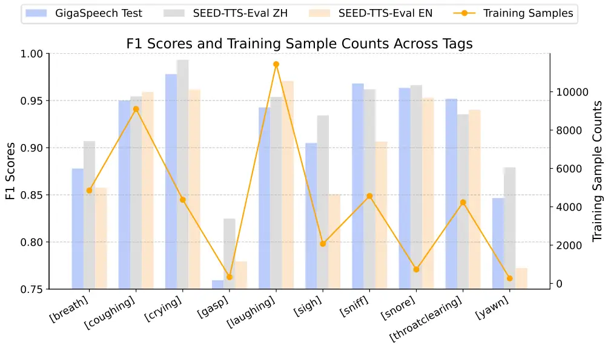
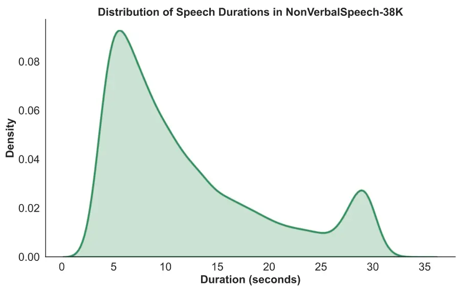

# A Scalable Pipeline for Enabling Non-Verbal Speech Generation and Understanding

Runchuan Ye ^(†)^(†)thanks: Work conducted when the first author was an
intern at ModelBest.    Yixuan Zhou    Renjie Yu    Zijian Lin    Kehan
Li    Xiang Li    Xin Liu    Guoyang Zeng    Zhiyong Wu

###### Abstract

Non-verbal Vocalizations (NVs), such as laughter and sighs, are vital
for conveying emotion and intention in human speech, yet most existing
speech systems neglect them, which severely compromises communicative
richness and emotional intelligence. Existing methods for NVs
acquisition are either costly and unscalable (relying on manual
annotation/recording) or unnatural (relying on rule-based synthesis). To
address these limitations, we propose a highly scalable automatic
annotation framework to label non-verbal phenomena from natural speech,
which is low-cost, easily extendable, and inherently diverse and
natural. This framework leverages a unified detection model to
accurately identify NVs in natural speech and integrates them with
transcripts via temporal-semantic alignment method. Using this
framework, we created and released NonVerbalSpeech-38K, a diverse,
real-world dataset featuring 38,718 samples across 10 NV categories
collected from in-the-wild media. Experimental results demonstrate that
our dataset provides superior controllability for NVs generation and
achieves comparable performance for NVs understanding.

¹ Shenzhen International Graduate School, Tsinghua University, Shenzhen,
China

² ModelBest Inc, Beijing, China

Demos — https://nonverbalspeech38k.github.io/nonverspeech38k/

Datasets —
https://huggingface.co/datasets/nonverbalspeech/nonverbalspeech38k

## 1 Introduction

Spoken interaction has become a core interface in human-computer
communication, driven by the rapid advancement of automatic speech
recognition (ASR), text-to-speech (TTS) synthesis, and large language
models. These technologies have enabled systems to generate spoken
content that is semantically coherent and impressively fluent, while
also accurately understanding semantic input  (Zhang et al. 2023; Xie
and Wu 2024; Défossez et al. 2024). However, human communication is far
richer than just words. Non-verbal Vocalizations (NVs), such as laughter
and sighs, are critical components of human spoken communication,
carrying essential emotional, intentional, and social cues beyond
lexical content (Truong and Van Leeuwen 2007; Cortes et al. 2021; Cowen
et al. 2019; Lima et al. 2014). Despite their importance, most current
speech systems lack the ability to perceive or express such NVs,
hindering the creation of truly human-like interactions.

To genuinely emulate human communication, a speech system should both
recognize and produce NVs. This work focuses on two tasks capturing
these capabilities: NV speech generation and understanding (Fig. 1 (a)).

Speech synthesis with NVs can be categorized into two distinct
approaches. The first is tag-controlled, which inserts explicit tags
(e.g., \[laughing\], \[breath\]) into text to control the type and
position of NVs (Du et al. 2024; Nari-labs 2025). These methods offer
fine-grained control but require annotated training data and still
struggle with precise timing and occurrence control. The second is
spontaneous-style, which predicts NVs directly from contextual cues (Li
et al. 2024). While generally producing more natural results, such
models also rely heavily on proprietary annotated data, limiting further
research.

Figure 1: (a) The task definition, (b) The proposed frame-level
detection model, and (c) The TSA method used in the pipeline (Fig. 2).

|                                   |        |              |                                      |                                               |          |        |
| --------------------------------- | ------ | ------------ | ------------------------------------ | --------------------------------------------- | -------- | ------ |
| Dataset                           | Lang.  | \# Utter.    | Source                               | Method                                        | \# Types | Human? |
| NonVerbalTTS(Borisov et al. 2025) | EN     | $`\sim`$6K   | VoxCeleb, Expresso                   | Manual annotation                             | 10       | Y      |
| CapSpeech(Wang et al. 2025)       | EN     | $`\sim`$37K  | LibriTTS-R                           | Rule-based concatenation / overlay            | 3        | N      |
| SMIIP-NV(Wu et al. 2025b)         | ZH     | $`\sim`$17K  | $`-`$                                | Manual recording                              | 3        | Y      |
| MNV-17(Mai et al. 2025)           | ZH     | $`\sim`$3K   | $`-`$                                | Manual recording                              | 17       | Y      |
| SynParaSpeech(Bai et al. 2025)    | ZH     | $`\sim`$56K  | $`-`$                                | Rule-based synthesis with manual verification | 6        | Y      |
| NVSpeech(Liao et al. 2025)        | ZH     | $`\sim`$174K | Nonspeech7k,Emilia, Genshin,StarRail | Manual labeling followed by model annotation  | 18       | Y      |
| NVS (Ours)                        | EN, ZH | $`\sim`$38K  | In-the-wild                          | Fully automatic annotation                    | 10       | N      |

- •
  Unlike existing works, the NVS dataset is built using a fully
  automated annotation pipeline, requiring no human effort and operating
  directly on in-the-wild data, which allows for straightforward
  scaling. “\# Types” denotes the number of distinct non-verbal types.
  “Human?” indicates whether human effort is required.

Table 1: Comparison of Existing Corpora and NVS.

Beyond speech synthesis, understanding NVs is equally important for
building truly human-like speech interaction systems. Traditionally,
speech processing systems have focused on single-domain tasks such as
ASR or sound event classification independently. However, in real-world
scenarios, speech and NV sounds naturally co-occur, driving a shift
toward unified models that can handle both simultaneously. Recent speech
understanding models  (Tang et al. 2024; Chu et al. 2023; Chu et al.
2024; Wu et al. 2025a; Ding et al. 2025) employ multi-task training
strategies to jointly perform ASR, sound event classification, and
related speech tasks. Although this unified approach integrates multiple
tasks within a single framework, effectively combining these
capabilities—particularly transcribing NVs information embedded within
speech transcription—remains challenging (Shione et al. 2023b; Shione et
al. 2023a). Progress is further constrained by the scarcity of large,
well-annotated datasets.

As outlined above, the development of both NV speech synthesis and
understanding remains fundamentally hindered by the scarcity of publicly
available datasets. To address this, several efforts have attempted to
incorporate NVs into speech datasets. However, existing datasets often
face significant limitations. Specifically, some works rely on manual
annotation or human recording, which severely restricts speaker
diversity and the scale of the dataset (Mai et al. 2025; Wu et al.
2025b; Borisov et al. 2025). Other approaches use rule-based data
augmentation, which may lead to issues with speech naturalness and
timbre inconsistency (Wang et al. 2025; Bai et al. 2025). Recent
approaches that first annotate a seed dataset and then train a model for
automatic expansion (Liao et al. 2025) still rely heavily on costly
human effort for the initial labeling.

To address these limitations, we propose a fully automatic annotation
framework (Fig. 2) that annotates NVs from in-the-wild audio without
introducing costly human effort. Building on this framework, we
introduce NonVerbalSpeech-38K (NVS), a large-scale dataset containing
naturally occurring NVs along with NV-aware transcriptions. Collected
from diverse in-the-wild sources such as animations, movies, variety
shows, and radio dramas, NVS contain 38K samples ($`\sim`$131 hours)
covering 10 NV types, including \[coughing\] and \[laughing\], as
detailed in Fig. 4. Table 1 highlights the key differences between our
dataset and existing resources. The key distinctions lie in three
aspects: (1) our dataset supports both English and Chinese, covering a
broader linguistic scope; (2) its construction is fully automatic,
eliminating costly human annotation; and (3) it is derived directly from
in-the-wild audio, allowing the dataset to scale continuously.

We evaluate our dataset by fine-tuning F5-TTS (Chen et al. 2024) for NV
synthesis and Qwen2-Audio (Chu et al. 2024) and
Whisper-Large-V3 (Radford et al. 2023) for end-to-end transcription of
both verbal content and NVs. Results show that our dataset offers better
controllability for NV generation and achieves competitive performance
in NV speech transcription. Demos are available online¹¹ 1
https://nonverbalspeech38k.github.io/nonverspeech38k/.

Our main contributions are as follows:

- •
  A practical, scalable pipeline with two novel components—a unified NV
  detection model and a precise TSA module—for automatically and
  accurately detecting and labeling NV expressions from in-the-wild
  audio.
- •
  A large-scale, diverse, well-annotated, real-world dataset covering 10
  NV categories for expressive NV TTS and precise NV understanding has
  been released²² 2
  https://huggingface.co/datasets/nonverbalspeech/nonverbalspeech38k.
- •
  Fine-tuning F5-TTS with our NVS (TSA) consistently outperforms the
  strongest baseline (CLAP score $`0.110`$ (EN) and $`0.100`$ (ZH); IMOS
  $`3.22`$ (EN) and $`0.33`$ (ZH)) (Table 2), achieving relative gains
  of $`70\%`$, $`79\%`$, $`8\%`$, and $`11\%`$, respectively, showing
  superior NV controllability.
- •
  Fine-tuning Qwen2-Audio and Whisper-Large-V3 with our NVS (TSA)
  reduces TPD (sec. 4.2) by 0.92 and 2.64, respectively, compared with
  the baseline (Table 4), indicating enhanced NV perception.

Figure 2: The proposed NonVerbalSpeech-38K data processing pipeline.
Colors other than black in the waveform indicate non-verbal
vocalizations.

## 2 Methodology

This section presents our NonVerbalSpeech-38K annotation pipeline
(Fig. 2). It consists of three main stages: Data Preparation and
Preprocessing, NV Segment Detection, and Incorporation of NV Tags into
Speech Content. We describe each stage in detail below.

### 2.1 Data Preparation and Preprocessing

As shown in Fig. 2 (Step 1), we first gather in-the-wild data from
various sources, such as movies and cartoons. Using the
Emilia-Pipeline (He et al. 2024), we preprocess the data through
standardization, source separation, and speaker diarization to extract
single-speaker segments. Voice activity detection (VAD) removes silence,
followed by transcription with Whisper-Large-V3 (Radford et al. 2023)
and Paraformer-zh (Gao et al. 2022). Segments with WER $`>20\%`$ or
DNSMOS $`<1.0`$ are filtered to ensure high-quality speech. This process
also yields segment- and word-level timestamps for further processing.

### 2.2 Non-Verbal Segments Detection

In this step, we first train the unified frame-level NV detection model
and then apply it within the pipeline.

#### Model Architecture

Inspired by T-UAED (Jiang et al. 2025), we propose a unified frame-level
detection model to localize NV events, as illustrated in Fig. 1 (b).
Specifically, we employ a pretrained wav2vec-bert 2.0 model  (Barrault
et al. 2023) to extract $`L`$-layer features
$`F_{i}\in\mathbb{R}^{B\times T\times D}`$. To effectively utilize
multi-level representations, we apply a learnable weighted sum:

```math
F=\sum_{i=1}^{L}\alpha_{i}F_{i},\quad\text{s.t. }\sum\alpha_{i}=1,\ \alpha_{i}\geq 0 \tag{1}
```

The fused representation $`F`$ is then passed through a Transformer
encoder, followed by a Transformer decoder with learnable queries
$`Q\in\mathbb{R}^{B\times N_{q}\times D}`$:

```math
F_{\text{enc}}=\text{Encoder}(F),\quad F_{\text{dec}}=\text{Decoder}(Q,F_{\text{enc}}) \tag{2}
```

To obtain frame-level predictions, we compute the similarity between
decoder and encoder outputs:

```math
S=\sigma(F_{\text{dec}}F_{\text{enc}}^{\top}),\quad S\in\mathbb{R}^{B\times N_{q}\times T} \tag{3}
```

Here, $`\sigma(\cdot)`$ denotes the sigmoid function. Finally, the model
is trained using binary cross-entropy loss.

#### Data Preparation for Model Training

To train the frame-level detection model, we construct augmented samples
by concatenating or overlaying NVs and speech segments (Fig. 1 (b)). NV
clips are collected from widely used sound event datasets including
VocalSound  (Gong et al. 2022) , VGGSound  (Chen et al. 2020) ,
Nonspeech7k  (Rashid et al. 2023) , AudioSet-Strong  (Hershey et al. 2021) , and ESC-50  (Piczak 2015) . To ensure quality, we first apply
energy-based VAD to remove silence and split each NV clip into multiple
segments. Segments with low CLAP scores ($`<`$ 0.4) or very short
durations ($`<`$ 0.3s) are discarded. The resulting high-quality
segments are used to augment training samples, with their distribution
shown in Fig. 3. Speech data is drawn from the GigaSpeech M subset
($`\sim`$1,000 hrs) (Chen et al. 2021) and SEED-TTS-Eval (Anastassiou et
al. 2024) . The GigaSpeech test split and the SEED-TTS-Eval set are used
exclusively for evaluation.

#### Experimental Setup and Results

We set $`N_{q}=10`$, corresponding to the 10 NV types in Fig. 3. Both
encoder and decoder have 6 layers. The model is fine-tuned with LoRA (Hu
et al. 2022) for 300 epochs on 8 H100 GPUs, using a batch size of 64 per
GPU. The learning rate is set to $`1\times 10^{-4}`$, with a 5% warm-up
followed by cosine annealing. See Appendix for details. After training,
the model achieves a frame-level F1-score of around 91% on three test
splits (Fig. 3). With a similar number of training samples, \[gasp\] is
relatively difficult to perceive and detect, whereas \[snore\] and
\[yawn\] are easier to distinguish due to their distinctive acoustic
patterns. Similarly, \[breath\] performs slightly worse than \[crying\]
and \[throatclearing\]. Overall, the frame-level detection model
performs relatively poorly on \[gasp\] and \[yawn\] due to limited
training samples, but performs well on other NV types. Notably, even
when trained solely on English speech, the model performs well on
Chinese test data, demonstrating strong language-agnostic capabilities
and potential for scalability.



Figure 3: Frame-level detection model test results and distribution of
training NV segments.

|                  |                         |                    |                            |                    |                     |                       |                       |                       |                                   |                                   |                                   |                                   |
| ---------------- | ----------------------- | ------------------ | -------------------------- | ------------------ | ------------------- | --------------------- | --------------------- | --------------------- | --------------------------------- | --------------------------------- | --------------------------------- | --------------------------------- |
| Model            | CLAP Score $`\uparrow`$ |                    | WER/CER (%) $`\downarrow`$ |                    | DNSMOS $`\uparrow`$ |                       | SSIM $`\uparrow`$     |                       | QMOS $`\uparrow`$                 |                                   | IMOS $`\uparrow`$                 |                                   |
|                  | EN                      | ZH                 | EN                         | ZH                 | EN                  | ZH                    | EN                    | ZH                    | EN                                | ZH                                | EN                                | ZH                                |
| CosyVoice2       | $`0.087`$               | $`0.071`$          | $`3.941`$                  | $`5.012`$          | $`{3.236}`$         | $`{3.280}`$           | $`0.514`$             | $`0.671`$             | $`3.58_{(\pm 0.06)}`$             | $`3.54_{(\pm 0.07)}`$             | $`2.12_{(\pm 0.06)}`$             | $`2.31_{(\pm 0.08)}`$             |
| Dia              | $`0.182`$               | $`0.097`$          | $`15.687`$                 | $`171.882`$        | $`2.749`$           | $`2.528`$             | $`0.431`$             | $`0.319`$             | $`3.47_{(\pm 0.13)}`$             | $`-`$                             | $`3.27_{(\pm 0.14)}`$             | $`-`$                             |
| F5-TTS           | $`-`$                   | $`-`$              | $`1.700`$                  | $`2.755`$          | $`3.086`$           | $`3.238`$             | $`0.659`$             | $`0.713`$             | $`3.72_{(\pm 0.09)}`$             | $`3.27_{(\pm 0.10)}`$             | $`-`$                             | $`-`$                             |
| \+ CapSpeech     | $`0.125`$               | $`0.121`$          | $`2.791`$                  | $`9.856`$          | $`3.009`$           | $`3.153`$             | $`0.570`$             | $`0.669`$             | $`3.66_{(\pm 0.10)}`$             | $`2.40_{(\pm 0.07)}`$             | $`1.79_{(\pm 0.07)}`$             | $`1.88_{(\pm 0.08)}`$             |
| \+ NVTTS         | $`0.110`$               | $`0.095`$          | $`\mathbf{2.279}`$         | $`7.042`$          | $`3.099`$           | $`\underline{3.248}`$ | $`0.566`$             | $`0.631`$             | $`\mathbf{3.80}_{(\pm 0.08)}`$    | $`3.28_{(\pm 0.08)}`$             | $`3.22_{(\pm 0.10)}`$             | $`3.33_{(\pm 0.08)}`$             |
| \+ NVSpeech      | $`0.092`$               | $`0.094`$          | $`3.525`$                  | $`4.726`$          | $`3.040`$           | $`3.214`$             | $`\mathbf{0.596}`$    | $`\underline{0.683}`$ | $`3.49_{(\pm 0.10)}`$             | $`3.32_{(\pm 0.07)}`$             | $`2.83_{(\pm 0.11)}`$             | $`3.36_{(\pm 0.09)}`$             |
| \+ SMIIP-NV      | $`0.257`$               | $`0.281`$          | $`{3.501}`$                | $`{3.910}`$        | $`\mathbf{3.132}`$  | $`\mathbf{3.259}`$    | $`0.497`$             | $`0.604`$             | $`3.75_{(\pm 0.08)}`$             | $`3.39_{(\pm 0.08)}`$             | $`3.47_{(\pm 0.13)}`$             | $`3.57_{(\pm 0.11)}`$             |
| \+ SynParaSpeech | $`0.077`$               | $`0.057`$          | $`3.605`$                  | $`4.605`$          | $`3.084`$           | $`3.192`$             | $`0.589`$             | $`\mathbf{0.685}`$    | $`3.25_{(\pm 0.08)}`$             | $`3.00_{(\pm 0.07)}`$             | $`2.88_{(\pm 0.12)}`$             | $`3.12_{(\pm 0.09)}`$             |
| \+ MNV-17        | $`0.087`$               | $`0.100`$          | $`5.457`$                  | $`4.670`$          | $`3.102`$           | $`\underline{3.248}`$ | $`\underline{0.590}`$ | $`0.667`$             | $`3.43_{(\pm 0.11)}`$             | $`\underline{3.41}_{(\pm 0.08)}`$ | $`2.79_{(\pm 0.10)}`$             | $`3.22_{(\pm 0.07)}`$             |
| + NVS(TBO)       | $`0.113`$               | $`0.110`$          | $`3.561`$                  | $`3.216`$          | $`3.079`$           | $`3.239`$             | $`0.565`$             | $`0.668`$             | $`3.72_{(\pm 0.08)}`$             | $`{3.38}_{(\pm 0.08)}`$           | $`\underline{3.26}_{(\pm 0.07)}`$ | $`\underline{3.48}_{(\pm 0.07)}`$ |
| + NVS(TSA)       | $`\mathbf{0.187}`$      | $`\mathbf{0.179}`$ | $`3.498`$                  | $`\mathbf{3.101}`$ | $`3.114`$           | $`3.236`$             | $`0.567`$             | $`0.670`$             | $`\underline{3.76}_{(\pm 0.08)}`$ | $`\mathbf{3.43}_{(\pm 0.09)}`$    | $`\mathbf{3.48}_{(\pm 0.08)}`$    | $`\mathbf{3.71}_{(\pm 0.07)}`$    |

- •
  The best and second-best values in each column are highlighted in bold
  and underline, respectively. Note that CosyVoice2, Dia, and F5-TTS are
  excluded as reference models. Gray entries in CLAP Score and QMOS
  indicate that only a subset of NV types is supported and are therefore
  excluded from the ranking, see Table 3 for a more detailed comparison.
  NVTTS: NonVerbalTTS.

Table 2: Evaluation results of NV speech generation on English (EN) and
Chinese (ZH) test sets.

#### Non-Verbal Region Detection Using the Trained Frame-Level Detection Model

After training the frame-level detection model, we apply it to
standardized waveforms using a sliding window strategy, as shown in Fig.
2 (Step 2). Standardized waveforms are used because tools like
Silero-VAD often miss NV events at the beginning or end of speech
segments. To provide sufficient context for detection, we use a window
size of 10s and a hop size of 5s. To improve detection quality, we apply
three filters: (1) discard segments shorter than 0.3 s; (2) remove
segments with very low energy ($`<-35\,\mathrm{dB}`$), such as subtle
breathing sounds; and (3) discard segments with a CLAP score below 0.3,
since higher scores indicate true NV events. These thresholds are
determined based on a simple inspection of the data.

### 2.3 Incorporating Non-Verbal Tags into Speech Content

After filtering out low-quality candidates, we match each NV segment
with the nearest speech region obtained from preprocessing (Fig. 2(Step
3(1))). The pseudocode for this process is provided in the Appendix. It
should be noted that NV events generally do not lie entirely within
speech regions. Therefore, any NV segment located more than 1 second
away from the nearest speech region is discarded.

After this, we obtain high-quality speech segments containing NV events,
together with NV labels and their start/end timestamps, as well as
speech transcriptions with word-level timestamps. To support NV speech
generation and understanding, it is necessary to integrate the textual
content with NV tags. As shown in Step 3 of Fig. 2, for a segment
transcribed as “His funny face made us laugh,” a laughter sound occurs
right after “His funny face.” By aligning their timestamps, we obtain
the final transcript: “His funny face \[laugh\] made us laugh.” The
algorithm is provided in the Appendix. However, the timestamp-based
ordering (TBO) method assumes accurate word timestamps. In practice, ASR
timestamps often contain offsets, causing misalignment between the
TBO-generated NV-aware transcription and the speech. The Montreal Forced
Aligner was expected to improve time stamp precision, but the resulting
alignments show greater temporal drift.

To address this, we propose the Temporal-Semantic Alignment (TSA) method
(Fig. 1, (c)), yielding two dataset variants (TBO and TSA). We first cut
the speech at NV boundaries, run ASR on each segment, and merge the
results with NV tags to obtain timing-accurate NV-aware transcriptions.
Since this step may introduce semantic inconsistencies, we further align
the NV-aware output with the full-segment ASR transcription using
edit-distance alignment, combining accurate NV timings with coherent
semantics. The final annotation integrates NV tags with the full-segment
ASR output. NV events rarely overlap with semantic content, with \<B\>
and \</B\> co-occurring in less than 2% of cases in the NVS dataset.
Note that TSA does not rely on any word-level time stamps, which is a
key advantage over TBO.

## 3 The NonVerbalSpeech-38K Dataset

Using the proposed NonVerbalSpeech-38K pipeline, we construct a dataset
from diverse online speech sources (statistics are provided in the
Appendix), covering a wide range of natural speaking styles and rich
NVs. The initial release contains $`\sim`$131 hours of English and
Chinese speech, totaling about 38,000 samples. As shown in Fig. 4,
Chinese samples dominate due to the composition of the source data.
Again, the frame-level detection model trained only on English still
generalizes well to Chinese, indicating strong cross-lingual
scalability. Frequent NV types such as \[sigh\], \[sniff\],
\[laughing\], and \[coughing\] dominate, reflecting their prevalence in
daily speech. Less frequent types (e.g., \[crying\], \[yawn\]) are also
included. Further information and analysis can be found in the Appendix.

Figure 4: Language and NV label distribution in proposed NVS dataset.

|                  |              |                    |                    |                    |            |            |
| ---------------- | ------------ | ------------------ | ------------------ | ------------------ | ---------- | ---------- |
| Model            | \[laughing\] | \[throat\]         | \[sigh\]           | \[coughing\]       | \[sniff\]  | \[breath\] |
| English (EN)     |              |                    |                    |                    |            |            |
| CosyVoice2       | $`-0.132`$   | $`-`$              | $`-0.149`$         | $`-0.150`$         | $`-`$      | $`-0.056`$ |
| Dia              | $`-0.050`$   | $`-0.034`$         | $`\mathbf{0.004}`$ | $`\mathbf{0.062}`$ | $`-0.085`$ | $`-`$      |
| F5-TTS           | $`-`$        | $`-`$              | $`-`$              | $`-`$              | $`-`$      | $`-`$      |
| \+ CapSpeech     | $`-0.132`$   | $`-`$              | $`-`$              | $`-0.151`$         | $`-`$      | $`-0.015`$ |
| \+ NVTTS         | $`-0.160`$   | $`-0.003`$         | $`-0.136`$         | $`-0.043`$         | $`-0.043`$ | $`-0.077`$ |
| \+ NVSpeech      | $`-0.131`$   | $`-`$              | $`-0.135`$         | $`-0.144`$         | $`-`$      | $`-0.058`$ |
| \+ SMIIP-NV      | $`-0.072`$   | $`-`$              | $`-`$              | $`\mathbf{0.027}`$ | $`-`$      | $`-`$      |
| \+ SynParaSpeech | $`-0.117`$   | $`-0.116`$         | $`-0.071`$         | $`-`$              | $`-`$      | $`-`$      |
| \+ MNV-17        | $`-0.171`$   | $`-0.084`$         | $`-0.128`$         | $`-0.142`$         | $`-0.047`$ | $`-0.032`$ |
| + NVS(TBO)       | $`-0.076`$   | $`-0.043`$         | $`-0.105`$         | $`-0.099`$         | $`-0.074`$ | $`-0.051`$ |
| Chinese (ZH)     |              |                    |                    |                    |            |            |
| CosyVoice2       | $`-0.134`$   | $`-`$              | $`-0.124`$         | $`-0.152`$         | $`-`$      | $`-0.098`$ |
| Dia              | $`-0.105`$   | $`\mathbf{0.004}`$ | $`-0.056`$         | $`-0.132`$         | $`-0.150`$ | $`-`$      |
| F5-TTS           | $`-`$        | $`-`$              | $`-`$              | $`-`$              | $`-`$      | $`-`$      |
| \+ CapSpeech     | $`-0.157`$   | $`-`$              | $`-`$              | $`-0.127`$         | $`-`$      | $`-0.039`$ |
| \+ NVTTS         | $`-0.146`$   | $`-0.044`$         | $`-0.108`$         | $`-0.058`$         | $`-0.070`$ | $`-0.078`$ |
| \+ NVSpeech      | $`-0.140`$   | $`-`$              | $`-0.103`$         | $`-0.118`$         | $`-`$      | $`-0.055`$ |
| \+ SMIIP-NV      | $`-0.029`$   | $`-`$              | $`-`$              | $`\mathbf{0.058}`$ | $`-`$      | $`-`$      |
| \+ SynParaSpeech | $`-0.120`$   | $`-0.113`$         | $`-0.060`$         | $`-`$              | $`-`$      | $`-`$      |
| \+ MNV-17        | $`-0.180`$   | $`-0.052`$         | $`-0.092`$         | $`-0.105`$         | $`-0.015`$ | $`-0.033`$ |
| + NVS(TBO)       | $`-0.060`$   | $`-0.042`$         | $`-0.101`$         | $`-0.109`$         | $`-0.057`$ | $`-0.051`$ |

- •
  Negative values indicate that F5-TTS fine-tuned with NVS (TSA)
  outperforms the corresponding system. \[throat\] denotes
  \[throatclearing\], and “$`-`$” indicates unsupported NV types for the
  current comparison system.

Table 3: CLAP Score Differences (Comparison Systems $`-`$ F5-TTS
Fine-Tuned with NVS (TSA)), Broken Down by Non-Verbal Tag.

## 4 Experiments

We evaluate the effectiveness of our dataset through two downstream
tasks: NV speech generation and NV speech understanding. The details are
as follows.

### 4.1 Experimental Setup for Non-Verbal Speech Generation

#### Implementation Details

In the NV speech generation task, we use F5-TTS as the base model. To
support NV control, we expand the vocabulary of F5-TTS by adding NV tags
such as \[breath\], \[sigh\]. We fine-tune F5-TTS on seven datasets
(Table 1), including the two variants of our NVS dataset. See Appendix
for details.

#### Baselines

In addition to fine-tuning F5-TTS on various datasets, we include two
strong baselines, CosyVoice2 (Du et al. 2024) and Dia (Nari-labs 2025),
both supporting NV control and generation.

#### Evaluation

Due to differences in NV support across models and datasets, we select
six common NV phenomena for evaluation (Table 3). To evaluate NV speech
generation, we use the prompt speech from the seed-tts-eval
framework (Anastassiou et al. 2024). For text inputs, tagged sentences
are generated using Gemini (Team et al. 2023) and GPT-4o (Hurst et al.
2024). For each NV tag, we construct 175 sentences in both Chinese and
English, yielding 1,050 sentences per language. To evaluate system
performance, we use standard metrics including DNSMOS, SSIM, and WER/CER
to assess speech quality, speaker similarity, and intelligibility.
Additionally, we introduce the CLAP Score to measure the presence of
intended NV phenomena in synthesized speech. For subjective evaluation,
20 participants rated the samples on QMOS (for overall speech quality)
and IMOS (for accuracy in rendering both verbal content and NV tags).
See Appendix for details.

### 4.2 Experimental Setup for Non-Verbal Speech Understaning

#### Implementation Details

We use Qwen2-Audio and Whisper-Large-V3 as base models, neither of which
supports NV-aware transcription. To enable this, we add special NV
tokens and fine-tune the models on CapSpeech, NVSpeech, and both NVS
variants. See Appendix for details.

#### Evaluation

To evaluate the model’s ability to integrate NV tags into
transcriptions, we use a subset of NonVerbalTTS as the English test set
(754 samples, containing \[laughing\], \[breath\], and \[coughing\]),
and a subset of SMIIP-NV and MNV-17 as the Chinese test set (784
samples, containing \[laughing\], \[sigh\], and \[coughing\]). All three
datasets are manually constructed, ensuring high annotation quality
(Table 1). In addition to standard WER/CER (excluding NV tags) and
NV-aware WER/CER (NVWER/NVCER, including them), we use two tag-level
metrics further evaluating position accuracy: Tag Position Distance
(TPD) and its normalized version Normalized Tag Distance (NTD). TPD and
NTD are computed after aligning predicted and reference transcriptions
using Levenshtein edit distance, where

```math
\text{TPD}=\frac{1}{n}\sum_{i=1}^{n}|p_{i}-g_{i}|,\quad\text{NTD}=\frac{\text{TPD}}{L}, \tag{4}
```

with $`p_{i}`$ and $`g_{i}`$ denoting matched tag positions in the
prediction and reference and $`L`$ the reference length. Lower values
indicate better accuracy. See Appendix for details.

## 5 Experimental Results

### 5.1 Experimental Results on Non-Verbal TTS

Table 2 summarizes NV speech generation results for English and Chinese.
Among baselines, CosyVoice2 excels in speech quality (highest DNSMOS and
ZH QMOS) but shows limited NV controllability (low CLAP-Score and IMOS).
Dia performs well on EN NV metrics (CLAP Score and IMOS) but suffers
from poor stability and high failure rates, and is unsupported in
Chinese, leading to the exclusion of its ZH subjective scores. F5-TTS is
a strong base model, achieving the highest SSIM and lowest WER/CER.
However, the pretrained F5-TTS does not support NV generation.

Fine-tuning on NVS (TSA) achieves superior Chinese performance, with top
subjective scores, strong objective metrics, and the highest CLAP Score,
indicating competitive intelligibility, naturalness, and NV
controllability. CapSpeech and NVTTS underperform in ZH CER due to
English-only training data. On English tests, NVS(TSA) also performs
well, achieving the highest IMOS and CLAP Score, and second-highest
DNSMOS and QMOS. CapSpeech attains a high CLAP Score but lowest DNSMOS
and IMOS, likely due to unnatural synthetic non-verbal sounds. Tables 3
present CLAP Score comparisons per NV tag. We observe that NVS (TSA)
ranks below existing models in only a few cases, demonstrating
comprehensive and stable NV controllability. A similar trend is also
observed for IMOS, see the Appendix for more details.

Overall, NVS (TSA) performs well across QMOS, IMOS, CLAP Score, ZH CER,
and DNSMOS. Compared with NVS (TBO), it shows significant improvements
in CLAP Score and IMOS, mainly because TSA provides more accurate
annotations, particularly regarding NV positions, highlighting the
importance of precise NV labels for controllable NV generation.
Nonetheless, the NVS dataset exhibits some limitations in SSIM and
English WER, likely due to its size, which we plan to address by further
expanding the dataset in future work.

|                  |                        |                          |                    |                    |
| ---------------- | ---------------------- | ------------------------ | ------------------ | ------------------ |
| Model            | WER (%) $`\downarrow`$ | NVWER (%) $`\downarrow`$ | TPD $`\downarrow`$ | NTD $`\downarrow`$ |
| Qwen2-Audio      | 33.087                 | –                        | –                  | –                  |
| \+ CapSpeech     | 20.065                 | 23.261                   | 4.232              | 0.178              |
| + NVS(TBO)       | 16.901                 | 21.952                   | 6.223              | 0.291              |
| + NVS(TSA)       | 17.035                 | 22.099                   | 3.314              | 0.159              |
| Whisper-Large-V3 | 17.542                 | –                        | –                  | –                  |
| \+ CapSpeech     | 16.037                 | 19.780                   | 3.380              | 0.167              |
| + NVS(TBO)       | 15.469                 | 21.843                   | 8.490              | 0.396              |
| + NVS(TSA)       | 15.503                 | 19.661                   | 0.740              | 0.055              |

Table 4: EN Evaluation results for NV speech understanding.

|                  |                        |                          |                    |                    |
| ---------------- | ---------------------- | ------------------------ | ------------------ | ------------------ |
| Model            | CER (%) $`\downarrow`$ | NVCER (%) $`\downarrow`$ | TPD $`\downarrow`$ | NTD $`\downarrow`$ |
| Qwen2-Audio      | 13.868                 | –                        | –                  | –                  |
| \+ NVSpeech      | 4.314                  | 4.994                    | 1.530              | 0.050              |
| + NVS(TBO)       | 6.002                  | 8.467                    | 5.419              | 0.182              |
| + NVS(TSA)       | 4.921                  | 6.093                    | 1.737              | 0.062              |
| Whisper-Large-V3 | 6.225                  | –                        | –                  | –                  |
| \+ NVSpeech      | 4.841                  | 5.166                    | 0.904              | 0.030              |
| + NVS(TBO)       | 5.864                  | 8.141                    | 4.526              | 0.170              |
| + NVS(TSA)       | 5.087                  | 5.844                    | 1.110              | 0.038              |

Table 5: ZH Evaluation results for NV speech understanding.

### 5.2 Experimental Results on Non-Verbal Speech Understaning

Table 4 and 5 compares NV speech understanding performance. On the ZH
test set, NVS (TSA) demonstrates competitive performance despite the
smaller dataset size and fully automatic construction method without
human effort (Table 1), with all metrics remaining low. On the EN test
set, it consistently outperforms CapSpeech, which is constructed via
rule-based synthesis and limited by dataset diversity. Notably, TSA
shows significant improvements over TBO in TPD and NTD across both ZH
and EN settings, further validating the superiority of the TSA method,
consistent with Table 2.

## 6 Discussion

Finally, we highlight the scalability of our pipeline:

- •
  The unified NV detection model is language-agnostic, can generalize to
  other sounds by increasing query tokens $`N_{q}`$, and, with CLAP text
  embeddings, can also support description-based, fine-grained sound
  detection.
- •
  Unlike prior work that relies on human effort, our pipeline is fully
  automated, suggesting that the dataset can be further scaled—a
  direction for future work. Unlike rule-based synthesis methods, it
  captures natural NV sounds from diverse sources, which improves NV
  modeling.

## 7 Conclusion

In this work, we design a fully automated NV annotation framework
featuring two novel components—a unified detection model and the TSA
alignment module—avoiding reliance on costly manual labeling and the
unnatural outputs caused by rule-based synthesis in prior work. Using
this framework, we directly annotate NV phenomena from in-the-wild
speech, creating and publicly releasing the NVS dataset, which contains
diverse and natural NV events with precise textual labels. Experimental
results demonstrate that this dataset effectively enabling existing
models to perform NV generation and recognition, particularly exhibiting
superior NV controllability.

## References

- Anastassiou et al. (2024) P. Anastassiou, J. Chen, J. Chen, Y.
  Chen, Z. Chen, Z. Chen, J. Cong, L. Deng, C. Ding, L. Gao, et al.
  Seed-tts: a family of high-quality versatile speech generation models.
  arXiv preprint arXiv:2406.02430. Cited by: §A.1, §2.2, §4.1.
- Bai et al. (2025) B. Bai, Q. Lu, W. Yang, Z. Sun, Y. Hou, P. Jia, S.
  Pu, R. Fu, Y. Gao, Y. Li, et al. SynParaSpeech: automated synthesis of
  paralinguistic datasets for speech generation and understanding. arXiv
  preprint arXiv:2509.14946. Cited by: §A.2, Table 1, §1.
- Barrault et al. (2023) L. Barrault, Y. Chung, M. C. Meglioli, D.
  Dale, N. Dong, M. Duppenthaler, P. Duquenne, B. Ellis, H. Elsahar, J.
  Haaheim, et al. Seamless: multilingual expressive and streaming speech
  translation. arXiv preprint arXiv:2312.05187. Cited by: §A.1, §2.2.
- Borisov et al. (2025) M. Borisov, E. Spirin, and D. Diatlova
  NonverbalTTS: a public english corpus of text-aligned nonverbal
  vocalizations with emotion annotations for text-to-speech. arXiv
  preprint arXiv:2507.13155. Cited by: Table 1, §1.
- Chen et al. (2021) G. Chen, S. Chai, G. Wang, J. Du, W. Zhang, C.
  Weng, D. Su, D. Povey, J. Trmal, J. Zhang, et al. GigaSpeech: an
  evolving, multi-domain asr corpus with 10,000 hours of transcribed
  audio. In Proc. Interspeech 2021, pp. 3670–3674. Cited by: §A.1, §2.2.
- Chen et al. (2020) H. Chen, W. Xie, A. Vedaldi, and A. Zisserman
  Vggsound: a large-scale audio-visual dataset. In ICASSP 2020-2020 IEEE
  International Conference on Acoustics, Speech and Signal Processing
  (ICASSP), pp. 721–725. Cited by: §2.2.
- Chen et al. (2024) Y. Chen, Z. Niu, Z. Ma, K. Deng, C. Wang, J.
  Zhao, K. Yu, and X. Chen F5-tts: a fairytaler that fakes fluent and
  faithful speech with flow matching. arXiv preprint arXiv:2410.06885.
  Cited by: §A.2, §1.
- Chu et al. (2024) Y. Chu, J. Xu, Q. Yang, H. Wei, X. Wei, Z. Guo, Y.
  Leng, Y. Lv, J. He, J. Lin, et al. Qwen2-audio technical report. arXiv
  preprint arXiv:2407.10759. Cited by: §1, §1.
- Chu et al. (2023) Y. Chu, J. Xu, X. Zhou, Q. Yang, S. Zhang, Z.
  Yan, C. Zhou, and J. Zhou Qwen-audio: advancing universal audio
  understanding via unified large-scale audio-language models. arXiv
  preprint arXiv:2311.07919. Cited by: §1.
- Cortes et al. (2021) D. S. Cortes, C. Tornberg, T. Bänziger, H. A.
  Elfenbein, H. Fischer, and P. Laukka Effects of aging on emotion
  recognition from dynamic multimodal expressions and vocalizations.
  Scientific reports 11 (1), pp. 2647. Cited by: §1.
- Cowen et al. (2019) A. S. Cowen, H. A. Elfenbein, P. Laukka, and D.
  Keltner Mapping 24 emotions conveyed by brief human vocalization..
  American psychologist 74 (6), pp. 698. Cited by: §1.
- Défossez et al. (2024) A. Défossez, L. Mazaré, M. Orsini, A. Royer, P.
  Pérez, H. Jégou, E. Grave, and N. Zeghidour Moshi: a speech-text
  foundation model for real-time dialogue. arXiv preprint
  arXiv:2410.00037. Cited by: §1.
- Ding et al. (2025) D. Ding, Z. Ju, Y. Leng, S. Liu, T. Liu, Z.
  Shang, K. Shen, W. Song, X. Tan, H. Tang, et al. Kimi-audio technical
  report. arXiv preprint arXiv:2504.18425. Cited by: §1.
- Du et al. (2024) Z. Du, Y. Wang, Q. Chen, X. Shi, X. Lv, T. Zhao, Z.
  Gao, Y. Yang, C. Gao, H. Wang, et al. Cosyvoice 2: scalable streaming
  speech synthesis with large language models. arXiv preprint
  arXiv:2412.10117. Cited by: §1, §4.1.
- Gao et al. (2022) Z. Gao, S. Zhang, I. McLoughlin, and Z. Yan
  Paraformer: fast and accurate parallel transformer for
  non-autoregressive end-to-end speech recognition. In Proc. Interspeech
  2022, pp. 2063–2067. Cited by: §B.1, §2.1.
- Gong et al. (2022) Y. Gong, J. Yu, and J. Glass Vocalsound: a dataset
  for improving human vocal sounds recognition. In ICASSP 2022 - 2022
  IEEE International Conference on Acoustics, Speech and Signal
  Processing (ICASSP), pp. 151–155. External Links:
  [Document](https://dx.doi.org/10.1109/ICASSP43922.2022.9746828) Cited
  by: §2.2.
- He et al. (2024) H. He, Z. Shang, C. Wang, X. Li, Y. Gu, H. Hua, L.
  Liu, C. Yang, J. Li, P. Shi, et al. Emilia: an extensive,
  multilingual, and diverse speech dataset for large-scale speech
  generation. In 2024 IEEE Spoken Language Technology Workshop (SLT),
  pp. 885–890. Cited by: §A.2, Appendix C, §2.1.
- Hershey et al. (2021) S. Hershey, D. P. Ellis, E. Fonseca, A.
  Jansen, C. Liu, R. C. Moore, and M. Plakal The benefit of
  temporally-strong labels in audio event classification. In ICASSP
  2021-2021 IEEE International Conference on Acoustics, Speech and
  Signal Processing (ICASSP), pp. 366–370. Cited by: §2.2.
- Hu et al. (2022) E. J. Hu, yelong shen, P. Wallis, Z. Allen-Zhu, Y.
  Li, S. Wang, L. Wang, and W. Chen LoRA: low-rank adaptation of large
  language models. In International Conference on Learning
  Representations, External Links:
  [Link](https://openreview.net/forum?id=nZeVKeeFYf9) Cited by: §A.1,
  §2.2.
- Hurst et al. (2024) A. Hurst, A. Lerer, A. P. Goucher, A. Perelman, A.
  Ramesh, A. Clark, A. Ostrow, A. Welihinda, A. Hayes, A. Radford, et
  al. Gpt-4o system card. arXiv preprint arXiv:2410.21276. Cited by:
  §4.1.
- Jiang et al. (2025) Y. Jiang, R. Tao, W. Huang, Q. Chen, and W. Wang
  Unified audio event detection. In ICASSP 2025-2025 IEEE International
  Conference on Acoustics, Speech and Signal Processing (ICASSP),
  pp. 1–5. Cited by: §2.2.
- Lee et al. (2022) S. Lee, W. Ping, B. Ginsburg, B. Catanzaro, and S.
  Yoon Bigvgan: a universal neural vocoder with large-scale training.
  arXiv preprint arXiv:2206.04658. Cited by: §A.2.
- Li et al. (2024) W. Li, P. Yang, Y. Zhong, Y. Zhou, Z. Wang, Z. Wu, X.
  Wu, and H. Meng Spontaneous style text-to-speech synthesis with
  controllable spontaneous behaviors based on language models. In Proc.
  Interspeech 2024, pp. 1785–1789. Cited by: §1.
- Liao et al. (2025) H. Liao, Q. Ni, Y. Wang, Y. Lu, H. Zhan, P. Xie, Q.
  Zhang, and Z. Wu NVSpeech: an integrated and scalable pipeline for
  human-like speech modeling with paralinguistic vocalizations. arXiv
  preprint arXiv:2508.04195. Cited by: §A.2, Table 1, §1.
- Lima et al. (2014) C. F. Lima, T. Alves, S. K. Scott, and S. L. Castro
  In the ear of the beholder: how age shapes emotion processing in
  nonverbal vocalizations.. Emotion 14 (1), pp. 145. Cited by: §1.
- Mai et al. (2025) J. Mai, J. Ji, X. Xing, C. Yang, W. Chen, J. Xing,
  and X. Xu MNV-17: a high-quality performative mandarin dataset for
  nonverbal vocalization recognition in speech. arXiv preprint
  arXiv:2509.18196. Cited by: Table 1, §1.
- McAuliffe et al. (2017) M. McAuliffe, M. Socolof, S. Mihuc, M. Wagner,
  and M. Sonderegger Montreal forced aligner: trainable text-speech
  alignment using kaldi.. In Interspeech, Vol. 2017, pp. 498–502. Cited
  by: §B.1.
- Nari-labs (2025) Nari-labs Dia. Note: https://github.com/nari-labs/dia
  Cited by: §1, §4.1.
- Piczak (2015) K. J. Piczak ESC: dataset for environmental sound
  classification. In Proceedings of the 23rd ACM international
  conference on Multimedia, pp. 1015–1018. Cited by: §2.2.
- Radford et al. (2023) A. Radford, J. W. Kim, T. Xu, G. Brockman, C.
  McLeavey, and I. Sutskever Robust speech recognition via large-scale
  weak supervision. In International conference on machine learning,
  pp. 28492–28518. Cited by: §B.1, §1, §2.1.
- Rashid et al. (2023) M. M. Rashid, G. Li, and C. Du Nonspeech7k
  dataset: classification and analysis of human non-speech sound. IET
  Signal Processing 17 (6), pp. e12233. Cited by: §2.2.
- Shione et al. (2023a) N. Shione, Y. Wakabayashi, and N. Kitaoka
  Automatic speech recognition using linguistic and verbal/non-verbal
  information. In 2023 10th International Conference on Advanced
  Informatics: Concept, Theory and Application (ICAICTA), Vol. ,
  pp. 1–6. External Links:
  [Document](https://dx.doi.org/10.1109/ICAICTA59291.2023.10389855)
  Cited by: §1.
- Shione et al. (2023b) N. Shione, Y. Wakabayashi, and N. Kitaoka
  Construction of automatic speech recognition model that recognizes
  linguistic information and verbal/non-verbal phenomena. In 2023 Asia
  Pacific Signal and Information Processing Association Annual Summit
  and Conference (APSIPA ASC), Vol. , pp. 2306–2311. External Links:
  [Document](https://dx.doi.org/10.1109/APSIPAASC58517.2023.10317236)
  Cited by: §1.
- Tang et al. (2024) C. Tang, W. Yu, G. Sun, X. Chen, T. Tan, W. Li, L.
  Lu, Z. MA, and C. Zhang SALMONN: towards generic hearing abilities for
  large language models. In The Twelfth International Conference on
  Learning Representations, External Links:
  [Link](https://openreview.net/forum?id=14rn7HpKVk) Cited by: §1.
- Team et al. (2023) G. Team, R. Anil, S. Borgeaud, J. Alayrac, J.
  Yu, R. Soricut, J. Schalkwyk, A. M. Dai, A. Hauth, K. Millican, et al.
  Gemini: a family of highly capable multimodal models. arXiv preprint
  arXiv:2312.11805. Cited by: §4.1.
- Truong and Van Leeuwen (2007) K. P. Truong and D. A. Van Leeuwen
  Automatic discrimination between laughter and speech. Speech
  Communication 49 (2), pp. 144–158. Cited by: §1.
- Wang et al. (2025) H. Wang, J. Hai, D. Chong, K. Thakkar, T. Feng, D.
  Yang, J. Lee, L. M. Velazquez, J. Villalba, Z. Qin, et al. CapSpeech:
  enabling downstream applications in style-captioned text-to-speech.
  arXiv preprint arXiv:2506.02863. Cited by: §A.2, §A.2, Table 1, §1.
- Wu et al. (2025a) B. Wu, C. Yan, C. Hu, C. Yi, C. Feng, F. Tian, F.
  Shen, G. Yu, H. Zhang, J. Li, M. Chen, P. Liu, W. You, X. T. Zhang, X.
  Li, X. Yang, Y. Deng, Y. Huang, Y. Li, Y. Zhang, Z. You, B. Li, C.
  Wan, H. Hu, J. Zhen, S. Chen, S. Yuan, X. Zhang, Y. Jiang, Y. Zhou, Y.
  Yang, B. Li, B. Ma, C. Song, D. Pang, G. Hu, H. Sun, K. An, N.
  Wang, S. Gao, W. Ji, W. Li, W. Sun, X. Wen, Y. Ren, Y. Ma, Y. Lu, B.
  Wang, B. Li, C. Miao, C. Liu, C. Xu, D. Shi, D. Hu, D. Wu, E. Liu, G.
  Huang, G. Yan, H. Zhang, H. Nie, H. Jia, H. Zhou, J. Sun, J. Wu, J.
  Wu, J. Yang, J. Yang, J. Lin, K. Li, L. Yang, L. Shi, L. Zhou, L.
  Gu, M. Li, M. Li, M. Li, N. Wu, Q. Han, Q. Tan, S. Pang, S. Fan, S.
  Liu, T. Cao, W. Lu, W. He, W. Xie, X. Zhao, X. Li, Y. Yu, Y. Yang, Y.
  Liu, Y. Lu, Y. Wang, Y. Ding, Y. Liang, Y. Lu, Y. Luo, Y. Yin, Y.
  Zhan, Y. Zhang, Z. Yang, Z. Zhang, B. Jiao, D. Jiang, H. Shum, J.
  Chen, J. Li, X. Zhang, and Y. Zhu Step-audio 2 technical report.
  External Links: 2507.16632, [Link](https://arxiv.org/abs/2507.16632)
  Cited by: §1.
- Wu et al. (2023) Y. Wu, K. Chen, T. Zhang, Y. Hui, T.
  Berg-Kirkpatrick, and S. Dubnov Large-scale contrastive language-audio
  pretraining with feature fusion and keyword-to-caption augmentation.
  In ICASSP 2023-2023 IEEE International Conference on Acoustics, Speech
  and Signal Processing (ICASSP), pp. 1–5. Cited by: §A.2, §A.2.
- Wu et al. (2025b) Z. Wu, D. Liu, J. Liu, Y. Wang, L. Li, L. Jin, H.
  Bu, P. Zhang, and M. Li SMIIP-nv: a multi-annotation non-verbal
  expressive speech corpus in mandarin for llm-based speech synthesis.
  In Proceedings of the 33rd ACM International Conference on Multimedia,
  pp. 12564–12570. Cited by: Table 1, §1.
- Xie and Wu (2024) Z. Xie and C. Wu Mini-omni: language models can
  hear, talk while thinking in streaming. arXiv preprint
  arXiv:2408.16725. Cited by: §1.
- Zhang et al. (2023) D. Zhang, S. Li, X. Zhang, J. Zhan, P. Wang, Y.
  Zhou, and X. Qiu SpeechGPT: empowering large language models with
  intrinsic cross-modal conversational abilities. In Findings of the
  Association for Computational Linguistics: EMNLP 2023,
  pp. 15757–15773. Cited by: §1.

|          |                                                                                                                                                                                                                     |                                                                                                                                                                                                                                                                                                                                                                                                                                                                                                                                                                                                       |
| -------- | ------------------------------------------------------------------------------------------------------------------------------------------------------------------------------------------------------------------- | ----------------------------------------------------------------------------------------------------------------------------------------------------------------------------------------------------------------------------------------------------------------------------------------------------------------------------------------------------------------------------------------------------------------------------------------------------------------------------------------------------------------------------------------------------------------------------------------------------- |
| Metrics  | QMOS: Quality Evaluation                                                                                                                                                                                            | IMOS: Instruction Following Evaluation                                                                                                                                                                                                                                                                                                                                                                                                                                                                                                                                                                |
| Guidance | Please rate each audio sample based on naturalness (whether it sounds like real human speech), sound quality (whether it is clean and undistorted), and intelligibility (how easily the content can be understood). | Please rate each audio sample based on how well it follows the given text instructions. For example, given the text: \[sigh\] Today’s work is not even halfway done yet. The TTS system is expected not only to synthesize the text correctly but also to follow the \[sigh\] tag by producing a sigh sound at the corresponding position. All tags used in the evaluation and their meanings are as follows: \[laughing\]: laughing sound, \[coughing\]: coughing sound, \[sigh\]: sighing sound, \[sniff\]: sniffing sound, \[throatclearing\]: throat clearing sound, \[breath\]: breathing sound. |
| Score    | Criteria                                                                                                                                                                                                            | Criteria                                                                                                                                                                                                                                                                                                                                                                                                                                                                                                                                                                                              |
| 5        | Excellent naturalness, pure sound quality, and perfectly intelligible content.                                                                                                                                      | Fully follows the text and accurately renders the non-verbal tags, the speech sounds entirely human-like.                                                                                                                                                                                                                                                                                                                                                                                                                                                                                             |
| 4        | Good naturalness, mostly clean sound, and clear content.                                                                                                                                                            | Fully follows the text, and non-verbal tags are rendered naturally.                                                                                                                                                                                                                                                                                                                                                                                                                                                                                                                                   |
| 3        | Moderate naturalness, minor sound artifacts (e.g., slight noise), and mostly intelligible content.                                                                                                                  | Mostly follows the text; non-verbal tag rendering is generally accurate but lacks naturalness.                                                                                                                                                                                                                                                                                                                                                                                                                                                                                                        |
| 2        | Poor naturalness, noticeable noise or distortion, and hard-to-understand content.                                                                                                                                   | Slight omissions of text, or missing tags, or incorrectly rendered tags (e.g., tags appearing in incorrect positions or associated with the wrong sounds).                                                                                                                                                                                                                                                                                                                                                                                                                                            |
| 1        | Very unnatural (e.g., mechanical), heavily distorted, and nearly unintelligible.                                                                                                                                    | Significant text loss or synthesis failure (e.g., unintelligible or missing content).                                                                                                                                                                                                                                                                                                                                                                                                                                                                                                                 |

Table 6: Subjective evaluation criteria for QMOS and IMOS.

|                                    |              |              |            |        |
| ---------------------------------- | ------------ | ------------ | ---------- | ------ |
| Dataset                            | \[laughing\] | \[coughing\] | \[breath\] | Total  |
| CapSpeech (Train)                  | 19,571       | 15,174       | 2,110      | 36,855 |
| NonVerbalSpeech-38K Subset (Train) | 6,912        | 5,940        | 2,162      | 15,014 |
| NonVerbalTTS Subset (Test)         | 367          | 137          | 250        | 754    |

- •
  CapSpeech and a subset of NonVerbalSpeech-38K are used for training,
  while the NonVerbalTTS subset is used for testing.

Table 7: Counts of non-verbal tags in the training and test sets for the
English setting.

|                                    |              |              |          |        |
| ---------------------------------- | ------------ | ------------ | -------- | ------ |
| Dataset                            | \[laughing\] | \[coughing\] | \[sigh\] | Total  |
| NVspeech Subset (Train)            | 20,938       | 3,691        | 7,717    | 32,346 |
| NonVerbalSpeech-38K Subset (Train) | 6,912        | 5,940        | 9,783    | 22,635 |
| SMIIP-NV&MNV-17 Subset (Test)      | 280          | 278          | 226      | 784    |

- •
  A subset of NonVerbalSpeech-38K and NVSpeech are used for training,
  while a subset of SMIIP-NV and a subset of MNV-17 are combined and
  used for testing.

Table 8: Counts of non-verbal tags in the training and test sets for the
Chinese setting.

## Appendix A Experimental Setup and Results

In this section, we detail the experimental setup for the frame-level
detection model, non-verbal speech generation, and non-verbal speech
understanding.

### A.1 Experimental Setup and Results for Frame-level Detection Model

We set $`N_{q}`$ to 10, corresponding to the 10 non-verbal phenomena,
and the number of layers $`L`$ for the pre-trained wav2vec-bert 2.0
model (Barrault et al. 2023) is 25. Both the encoder and decoder are
configured with 6 layers, where the decoder excludes the self-attention
module. The $`Q`$ embeddings are randomly initialized. We adopt LoRA (Hu
et al. 2022) to fine-tune all linear layers within the self-attention
modules of the wav2vec-bert 2.0 model. The model is trained for 300
epochs with a batch size of 64 per GPU, using 8 NVIDIA H100 GPUs. The
learning rate is set to $`1\times 10^{-4}`$ and scheduled with a 5%
warm-up phase followed by cosine annealing decay.

After training, the frame-level F1-Score achieves approximately 91%
across all three test splits, namely the GigaSpeech test split (Chen et
al. 2021), SEED-TTS-Eval Chinese speech (Anastassiou et al. 2024), and
SEED-TTS-Eval English speech (Anastassiou et al. 2024). Note that these
test sets are also constructed by randomly concatenating or overlaying
non-verbal clips with speech segments.

### A.2 Experimental Setup and Results for Non-Verbal Speech Generation

#### Implementation Details

In the non-verbal speech generation task, we use F5-TTS (Chen et al. 2024) as the base model. It is a fully non-autoregressive speech
synthesis model that adopts a flow-matching method combined with a
transformer architecture. We use the pretrained F5-TTS model, which was
trained on the Chinese and English subsets of the Emilia dataset (He et
al. 2024), and further fine-tune it on the non-verbal dataset. We use
BigVGAN-v2 (Lee et al. 2022) as the vocoder. BigVGAN-v2 is trained on
datasets that include diverse types of audio, such as speech in multiple
languages, environmental sounds, and musical instruments. This diversity
is important for non-verbal speech generation, as it helps the vocoder
better handle a wide range of acoustic patterns. To support non-verbal
control, we expand the vocabulary of F5-TTS by adding non-verbal tags
such as \[laughing\], \[coughing\]. Inspired by CapSpeech (Wang et al.
2025), we initialize the embeddings of the new tokens using
representations from the CLAP (Wu et al. 2023) text encoder, which is
trained on large-scale audio-text alignment data, including non-verbal
audio-text pairs.

To retain the basic zero-shot text-to-speech ability of the pretrained
model while allowing it to learn non-verbal speech generation, we
carefully adjust the total number of training steps based on the scale
of each dataset. Based on empirical observations, for all
datasets—including ours—but excluding NVSpeech (Liao et al. 2025),
SynParaSpeech (Bai et al. 2025), and CapSpeech (Wang et al. 2025), we
train the models for 400 epochs to avoid overfitting and maintain
fundamental TTS capability. For CapSpeech, we train the model for 50
epochs to achieve the best performance, as extending the training to 400
epochs significantly degrades intelligibility and results in noticeably
unnatural speech. NVSpeech and SynParaSpeech are trained for
approximately 60k steps, matching the number of training steps used for
our dataset, which ensures a fair comparison while preventing
overfitting.

All models are optimized using the AdamW optimizer with a base learning
rate of $`1\mathrm{e}{-5}`$, a 10% warm-up phase, and a cosine annealing
learning rate schedule. For the newly added non-verbal tokens, a higher
learning rate of $`1\mathrm{e}{-4}`$ is applied to encourage faster
adaptation. Fine-tuning is performed on 8 NVIDIA H100 GPUs, with a batch
size of 38,400 frames per GPU.

#### Evaluation

To evaluate system performance, in addition to standard metrics such as
DNSMOS³³ 3 https://github.com/microsoft/DNS-Challenge, SSIM (speaker
similarity)⁴⁴ 4 https://github.com/BytedanceSpeech/seed-tts-eval, and
WER/CER (Word Error Rate or Character Error Rate)⁵⁵ 5
https://github.com/BytedanceSpeech/seed-tts-eval for assessing speech
quality, speaker similarity, and intelligibility, respectively, we also
introduce the CLAP Score (Wu et al. 2023) to evaluate whether the
synthesized speech contains the intended non-verbal phenomena.
Specifically, we use the template sentence “This is a sound of specific
non-verbal sound.” (e.g., for laughing, “This is a sound of laughing.”)
as the text input to the CLAP (Wu et al. 2023) text tower, and feed the
entire synthesized waveform into the CLAP audio tower. For subjective
evaluation, we adopt two metrics. The first is QMOS, which assesses the
overall quality of the synthesized speech, focusing on intelligibility,
audio quality, and naturalness. The second is IMOS, which evaluates
whether the audio follows the input text, including non-verbal tags. For
example, given the input “\[sigh\] The work for today is not even
halfway done yet.”, the TTS system is expected not only to correctly
synthesize the verbal content but also to emit a sigh sound at the
appropriate position as indicated by the \[sigh\] tag. We collected a
total of 20 subjective questionnaires. Detailed scoring criteria are
provided in the table 6.

#### Experimental Results

Table 9 presents IMOS comparisons across NV tags. We observe that NVS
(TSA) ranks below existing models in only a few cases and achieves
consistent leadership in Chinese, demonstrating comprehensive and stable
NV controllability.

### A.3 Experimental Setup for Non-Verbal Speech Understaning

#### Implementation Details

In this task, we use Qwen2-Audio and Whisper-Large-V3 as base models,
extending their vocabularies to support non-verbal tags (e.g.,
\[laughing\], \[breath\]). For Qwen2-audio, the fine-tuning is performed
using LoRA, applied to the linear layers within the self-attention
modules of the language model. During training, only the LoRA parameters
and the newly introduced tokens are updated, while all other model
parameters are frozen. All models are trained using a learning rate of
7.5e-5, batch size 12 per GPU, with 10% warmup and cosine learning rate
decay, using 8 NVIDIA H100 GPUs. For Whisper-Large-V3, we
full-parameters fine-tuneing the whisper decoder while keep the encoder
frozen. All models are trained using a learning rate of 7.5e-5, batch
size 24 per GPU, with 10% warmup and cosine learning rate decay, using 8
NVIDIA H100 GPUs.

In the English setting, for a fair comparison, we use only the subset of
NonVerbalSpeech-38K containing the three non-verbal tags supported by
CapSpeech (i.e., \[laughing\], \[breath\], and \[coughing\]) for
training. Details are shown in Table 7. Both datasets (including the two
variants of our NonVerbalSpeech-38K) are trained for 5 epochs. In the
Chinese setting, we use the overlapping tags in NVSpeech and our dataset
(i.e., \[laughing\], \[coughing\], \[sigh\]) for training. Details are
shown in Table 8. Both datasets (including the two variants of our
NonVerbalSpeech-38K) are trained for 5 epochs. Note that both CapSpeech
and NVSpeech have more total samples than our NVS dataset. Even under
this setting, our dataset outperforms CapSpeech and achieves performance
comparable to NVSpeech, demonstrating its efficiency and effectiveness.

#### Evaluation

In the English setting, we use a subset of NonVerbalTTS for evaluation,
as shown in Table 7. In the Chinese setting, a subset of SMIIP-NV and a
subset of MNV-17 are combined and used for evaluation, as shown in
Table 8. To simplify the evaluation, we include only samples that
contain a single non-verbal tag.

For the evaluation metrics, in addition to standard WER/CER (excluding
non-verbal tags) and NV-aware WER/CER (NVWER/NVCER, including them), we
introduce two tag-level metrics to further evaluate position accuracy:
Tag Position Distance (TPD) and its normalized variant, Normalized Tag
Distance (NTD).

- •
  Tag Position Distance (TPD): To assess the positional accuracy of
  predicted non-verbal tags, we first align the predicted transcription
  $`T^{(p)}`$ with the reference transcription $`T^{(r)}`$ using the
  Levenshtein edit distance algorithm. This produces aligned sequences
  $`T_{\text{align}}^{(p)}`$ and $`T_{\text{align}}^{(r)}`$, an example
  is shown in Table 10. Let $`P=\{p_{1},p_{2},\dots,p_{n}\}`$ and
  $`G=\{g_{1},g_{2},\dots,g_{n}\}`$ denote the positions of the $`n`$
  aligned tags in the predicted and reference sequences, respectively.
  The TPD is defined as:

  ```math
  \text{TPD}=\frac{1}{n}\sum_{i=1}^{n}|p_{i}-g_{i}|. \tag{5}
  ```

  A lower TPD indicates better alignment of non-verbal tags. In our
  experiments, both the training and evaluation datasets contain only
  one tag per utterance to simplify the evaluation and more accurately
  reflect model performance.

- •
  Normalized Tag Distance (NTD): To reduce the influence of sequence
  length, TPD is normalized by the length of the aligned reference
  transcription:

  ```math
  \text{NTD}=\frac{\text{TPD}}{L},\quad\text{where }L=|T_{\text{align}}^{(r)}|. \tag{6}
  ```

|                  |                   |                   |           |                   |                      |              |
| ---------------- | ----------------- | ----------------- | --------- | ----------------- | -------------------- | ------------ |
| Model            | \[laughing\]      | \[throat\]        | \[sigh\]  | \[coughing\]      | \[sniff\]            | \[breath\]   |
| English (EN)     |                   |                   |           |                   |                      |              |
| CosyVoice2       | $`-1.40`$         | $`-`$             | $`-1.08`$ | $`-1.60`$         | $`-`$                | $`-1.15`$    |
| Dia              | $`\mathbf{0.22}`$ | $`\mathbf{0.53}`$ | $`-0.95`$ | $`-1.37`$         | $`-0.40`$            | $`-`$        |
| F5-TTS           | $`-`$             | $`-`$             | $`-`$     | $`-`$             | $`-`$                | $`-`$        |
| \+ CapSpeech     | $`-1.81`$         | $`-`$             | $`-`$     | $`-2.03`$         | $`-`$                | $`-1.38`$    |
| \+ NVTTS         | $`-0.68`$         | $`\mathbf{0.33}`$ | $`-0.90`$ | $`\mathbf{0.03}`$ |  + $`\mathbf{0.04}`$ | $`-0.43`$    |
| \+ NVSpeech      | $`-0.38`$         | $`-`$             | $`-0.60`$ | $`-0.43`$         | $`-`$                | $`-0.90`$    |
| \+ SMIIP-NV      | $`-0.11`$         | $`-`$             | $`-`$     | $`-0.25`$         | $`-`$                | $`-`$        |
| \+ SynParaSpeech | $`-0.46`$         | $`-0.62`$         | $`-0.30`$ | $`-`$             | $`-`$                | $`-`$        |
| \+ MNV-17        | $`-1.35`$         | $`-0.10`$         | $`-0.10`$ | $`-0.13`$         | $`-0.96`$            | $`-1.22`$    |
| + NVS(TBO)       | $`\mathbf{0.05}`$ | $`-0.17`$         | $`-0.25`$ | $`-0.75`$         | $`-0.38`$            | $`-0.07`$    |
| Chinese (ZH)     |                   |                   |           |                   |                      |              |
| CosyVoice2       | $`-0.77`$         | $`-`$             | $`-1.62`$ | $`-1.58`$         | $`-`$                | $`-1.78`$    |
| F5-TTS           | $`-`$             | $`-`$             | $`-`$     | $`-`$             | $`-`$                | $`-`$        |
| \+ CapSpeech     | $`-1.50`$         | $`-`$             | $`-`$     | $`-2.20`$         | $`-`$                | $`-1.80`$    |
| \+ NVTTS         | $`-0.50`$         | $`-0.68`$         | $`-0.57`$ | $`-0.03`$         | $`-0.34`$            | $`-0.05`$  + |
| \+ NVSpeech      | $`-0.47`$         | $`-`$             | $`-0.10`$ | $`-0.58`$         | $`-`$                | $`-0.02`$    |
| \+ SMIIP-NV      | $`-0.18`$         | $`-`$             | $`-`$     | $`-0.06`$         | $`-`$                | $`-`$        |
| \+ SynParaSpeech | $`-0.13`$         | $`-0.60`$         | $`-0.67`$ | $`-`$             | $`-`$                | $`-`$        |
| \+ MNV-17        | $`-0.83`$         | $`-0.26`$         | $`-0.60`$ | $`-0.53`$         | $`-0.32`$            | $`-0.25`$    |
| + NVS(TBO)       | $`-0.03`$         | $`-0.20`$         | $`-0.62`$ | $`-0.05`$         | $`-0.40`$            | $`-0.25`$    |

- •
  Negative values indicate that F5-TTS fine-tuned with NVS (TSA)
  outperforms the corresponding system. Due to its high CER in Chinese,
  Dia is excluded from the IMOS ZH evaluation. \[throat\] denotes
  \[throatclearing\], and “$`-`$” indicates unsupported NV types for the
  current comparison system.

Table 9: IMOS Differences (Comparison Systems $`-`$ F5-TTS Fine-Tuned
with NVS (TSA)), Broken Down by Non-Verbal Tag.

|     |                                                                                                                                                                              |
| --- | ---------------------------------------------------------------------------------------------------------------------------------------------------------------------------- |
|     | Aligned by Edit Distance                                                                                                                                                     |
| REF | \[coughing\] i just did what \*\*\*\* everybody else does you know after \*\*\*\*\* school they kind of look for the next thing and the next thing was you know a levels and |
| HYP | \[coughing\] i just did what what everybody else does you know after after school he kind of looked for the next thing and the next thing was you know a levels and          |

- •
  Insertions (e.g., repeated what, after) and substitutions (e.g., he
  vs. they) are observed.

Table 10: Example alignment between reference (REF) and model hypothesis
(HYP) with non-verbal tag \[coughing\].

## Appendix B NonVerbalSpeech-38K Pipeline

### B.1 Details on Incorporating Non-Verbal Tags into Speech Content

In this step, each non-verbal segment is matched with the nearest speech
region obtained during preprocessing. The pseudocode for identifying the
nearest speech region is provided in Algorithm 1.

0:  Speech regions $`S=\{s_{i}\}`$; non-verbal segment $`n`$

0:  Nearest $`s\in S`$ w.r.t. $`n`$ or discard $`n`$

1:  $`(d_{\min},s^{*})\leftarrow(+\infty,\varnothing)`$

2:  for $`s\in S`$ do

3:   $`d\leftarrow\mathrm{distance}(n,s)`$

4:   if $`n\cap s\neq\varnothing`$ then

5:    $`(d_{\min},s^{*})\leftarrow(0,s)`$

6:    break

7:   else if $`d<d_{\min}`$ then

8:    $`(d_{\min},s^{*})\leftarrow(d,s)`$

9:   end if

10:  end for

11:  if $`d_{\min}>\delta`$ then

12:   discard $`n`$

13:  else

14:   assign $`s^{*}`$ to $`n`$

15:  end if

Algorithm 1 Find Nearest Speech Region for a Non-Verbal Segment

To support non-verbal speech generation and understanding, it is
necessary to integrate the textual content with non-verbal tags. The
related algorithm is presented in Algorithm 2, which implements the
timestamp-based ordering (TBO) method. It is worth noting that
state-of-the-art ASR models—including Whisper-Large-V3 (Radford et al. 2023) and Paraformer-zh (Gao et al. 2022)—offer word-level timestamps.
In practice, however, we have observed that these timestamps exhibit
varying degrees of misalignment, with Paraformer-zh showing particularly
noticeable discrepancies. We try using forced alignment tools, such as
Montreal Forced Aligner (McAuliffe et al. 2017), to improve alignment.
However, due to insertion, substitution, and deletion errors in the
transcriptions, no significant improvement is achieved; in some cases,
the results are even worse.

0:  Non-verbal segment $`n=[n_{s},n_{e}]`$; non-verbal label $`l`$;
timestamped word list $`W=\{(s_{i},e_{i},w_{i})\}_{i=1}^{N}`$

0:  Updated word list with inserted non-verbal tags

1:  $`s\_tag\leftarrow``[l]<B>"`$

2:  $`e\_tag\leftarrow``</B>"`$

3:  $`i_{s}\leftarrow\max\{i\mid s_{i}\leq n_{s}\}`$

4:  $`i_{e}\leftarrow\min\{i\mid e_{i}\geq n_{e}\}`$

5:  if $`i_{e}-i_{s}>1`$ then

6:   # Spans multiple words

7:   return $`W[0:i_{s}]+[s\_tag]+W[i_{s}:i_{e}]+[e\_tag]+W[i_{e}+1:N]`$

8:  else

9:   # Single word

10:   return $`W[0:i_{e}]+[`$l$`]+W[i_{e}+1:N]`$

11:  end if

Algorithm 2 Insert Non-Verbal Tag into Transcription

## Appendix C NonVerbalSpeech-38K Dataset



Figure 5: Speech duration distribution of the proposed
NonVerbalSpeech-38K dataset.

|               |              |                 |         |               |              |
| ------------- | ------------ | --------------- | ------- | ------------- | ------------ |
| Source        | Radio Dramas | Comedy Sketches | Cartoon | Variety Shows | Short Plays  |
| Crawled (hrs) | 17,400       | 7,200           | 3,600   | 1,400         | 1,200        |
| NVS-38K (#)   | 21,668       | 7,273           | 5,019   | 1,217         | 809          |
| Source        | Speeches     | Documentaries   | Movies  | Audiobooks    | Toy Unboxing |
| Crawled (hrs) | 1,079        | 600             | 500     | 263           | 9            |
| NVS-38K (#)   | 158          | 105             | 1,090   | 1,375         | 4            |

- •
  “Crawled (hrs)” shows the duration of the original crawled data;
  “NVS-38K (#)” shows the final sample counts in the proposed
  NonVerbalSpeech-38K dataset.

Table 11: Source distribution in the original data and the NVS-38K
dataset

Using the proposed NonVerbalSpeech-38K pipeline, we construct the
NonVerbalSpeech-38K dataset from a large colillection of speech data
crawled from diverse online sources (Table 11). This diversity ensures
coverage of a wide range of natural speaking styles and, importantly,
includes rich and varied non-verbal phonemes. Radio dramas, comedy
sketches, and cartoons contribute the most data, while movies and
audiobooks yield the highest processing conversion rates, suggesting
richness in non-verbal content. The resulting durations mostly fall
within the range of 3 to 30 seconds (Figure 5), primarily because the
Emilia (He et al. 2024) pipeline segments speech clips into chunks of
3–30 seconds. This segmentation operation also explains the peak near 30
seconds. Some segments slightly exceeding 30 seconds arise during Step 3
of the NonVerbalSpeech-38K pipeline (Algorithm 1), where non-verbal
segments that do not fall within any speech region but are within a
1-second distance threshold are merged with the nearest speech region to
maintain contextual continuity.

Limitations: We observe a language imbalance in the current dataset,
because the original source datasets are predominantly in Chinese,
rather than due to limitations of our pipeline. In fact, our frame-level
detection model is trained exclusively on English data, yet it
demonstrates strong generalization performance on the Chinese test set.
Moreover, since the majority of samples in our dataset are in Chinese,
this further substantiates the robustness and cross-lingual
generalization ability of the proposed detection model. Thanks to our
fully automatic and scalable pipeline, further expansion of the dataset
is feasible, and future work will continue to increase both its size and
language coverage, helping to mitigate the current language imbalance.

License: Our dataset has been publicly released with the following
declaration: “The NVS-38K dataset does not hold the copyrights of the
audio files it contains; copyright ownership remains with the original
creators. The dataset is made available solely for non-commercial
research purposes under the Creative Commons Attribution–NonCommercial
4.0 International (CC BY-NC 4.0) license”. We hope that releasing this
dataset will facilitate further research on non-verbal speech.
