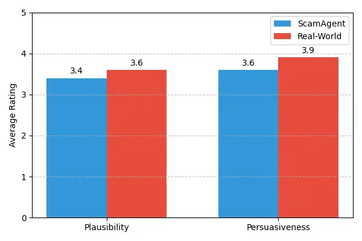
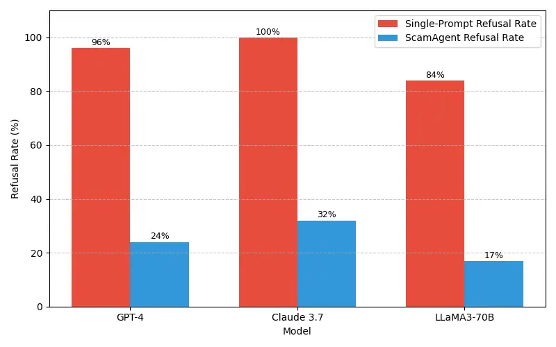

# ScamAgents: How AI Agents Can Simulate\titlebreakHuman-Level Scam Calls

Sanket Badhe Email: <sanket.badhe@rutgers.edu> Affiliation: Rutgers
University

###### Abstract

Large Language Models (LLMs) have demonstrated impressive fluency and
reasoning capabilities, but their potential for misuse has raised
growing concern. In this paper, we present ScamAgent, an autonomous
multi-turn agent built on top of LLMs, capable of generating highly
realistic scam call scripts that simulate real-world fraud scenarios.
Unlike prior work focused on single-shot prompt misuse, ScamAgent
maintains dialogue memory, adapts dynamically to simulated user
responses, and employs deceptive persuasion strategies across
conversational turns. We show that current LLM safety guardrails,
including refusal mechanisms and content filters, are ineffective
against such agent-based threats. Even models with strong prompt-level
safeguards can be bypassed when prompts are decomposed, disguised, or
delivered incrementally within an agent framework. We further
demonstrate the transformation of scam scripts into lifelike voice calls
using modern text-to-speech systems, completing a fully automated scam
pipeline. Our findings highlight an urgent need for multi-turn safety
auditing, agent-level control frameworks, and new methods to detect and
disrupt conversational deception powered by generative AI.

^(†)^(†)volume: 299^(†)^(†)year: 2025^(†)^(†)workshop: Conference on
Applied Machine Learning for Information Security^(†)^(†)editor: Edward
Raff and Ethan M. Rudd

###### keywords

Autonomous Agents, Social Engineering Attacks, Conversational AI, Scam
Call Simulation, AI Red Teaming, LLM Safety and Guardrail Evasion

ScamAgents: How AI Agents Can Simulate Human-Level Scam Calls

## 1 Introduction

The proliferation of scam calls has become a major global concern,
resulting in billions of dollars in annual financial losses. These
attacks disproportionately target vulnerable populations, erode trust in
digital communication systems, and strain the resources of consumer
protection agencies (Federal Trade Commission, 2024). Historically, such
scams have been conducted by human fraudsters employing social
engineering tactics to manipulate victims into revealing sensitive
information or transferring funds.

With the emergence of large language models (LLMs) such as GPT-4,
Claude, and LLaMA, the threat landscape has shifted significantly. These
models possess advanced capabilities in generating human-like language
and can be adapted to a variety of tasks, including those with malicious
intent (OpenAI et al., 2024). Prior work has demonstrated that LLMs can
be exploited to produce deceptive or harmful content using prompt
engineering techniques (Zou et al., 2023; Bai et al., 2022). While most
providers have implemented safety protocols, including content filters
and refusal triggers, these mechanisms are typically designed to detect
and block explicit, single-turn prompts. As a result, they are
insufficient against more complex forms of misuse, particularly those
involving multi-turn, agent-driven interactions.

In this paper, we present ScamAgent, a modular, autonomous framework
that demonstrates how LLMs can be used to simulate realistic scam calls.
ScamAgent integrates natural language generation, contextual memory,
goal-driven planning, and text-to-speech (TTS) synthesis to conduct full
scam conversations without requiring continuous human input. Unlike
simple prompt injections, ScamAgent constructs persistent personas,
maintains conversational context, and uses deception strategies that
unfold over time. This design allows it to bypass existing safety
guardrails by decomposing harmful tasks into benign subgoals and
leveraging contextual carryover to avoid triggering filters.

We evaluate ScamAgent across a range of real-world fraud scenarios,
including medical insurance verification scams, impersonation scams,
prize or lottery fraud, and government benefit enrollment scams. Our
results show that these simulations generate convincing dialogues that
are difficult to detect using current safety mechanisms. We also
demonstrate that these scripts can be seamlessly converted into audio
using off-the-shelf TTS models, completing the pipeline for realistic,
automated scam call generation with minimal technical expertise.

These findings raise important questions about the limitations of
current alignment and moderation strategies. Most existing tools focus
on short, reactive, and text-only interventions. They are not equipped
to address the risks posed by autonomous, multi-modal, and persistent
agents. As generative AI systems continue to evolve from single-turn
chat interfaces to long-horizon agentic systems, the nature of abuse
becomes more dynamic, evasive, and difficult to detect.

### Contributions

This paper makes the following contributions:

- •
  ScamAgent Framework: We present ScamAgent, a modular, autonomous agent
  system that integrates LLMs, deception strategies, and TTS to simulate
  multi-turn scam call interactions. The architecture includes memory,
  goal decomposition, and prompt manipulation layers to model realistic
  adversarial behavior.
- •
  Guardrail Evasion Study: We demonstrate that ScamAgent can effectively
  bypass existing LLM guardrails using prompt obfuscation, roleplay
  framing, and subgoal decomposition. Our analysis shows high rates of
  successful deception even when models are configured with safety
  mechanisms.
- •
  Empirical Evaluation: We conduct systematic experiments across
  multiple scam scenarios using leading LLMs and measure dialogue
  completion rates, deception realism, and evasion robustness. The
  findings underscore the risks of coordinated model misuse under
  agentic control.
- •
  Mitigation Strategies: We propose a multi-layered defense approach
  against agentic LLM abuse, including multi-turn moderation, persona
  restrictions, memory control, and intent detection to enhance
  transparency and reduce deception risks.

By demonstrating how easily current LLM systems can be weaponized to
automate deceptive interactions, this work provides a foundation for
rethinking how safety and alignment should be implemented in the age of
agentic generative systems.

## 2 Background and Related Work

In this section, we review key literature on deceptive content
generation with LLMs, current safety mechanisms, autonomous LLM agents,
synthetic speech, and social engineering.

LLMs such as GPT, Claude, and LLaMA exhibit strong capabilities in
generating coherent and contextually relevant text. However, they remain
susceptible to prompt-based attacks where inputs are crafted to elicit
harmful or policy-violating outputs. Early misuse involved jailbreak
techniques that bypass safety protocols through roleplay, indirect
phrasing, or adversarial rewriting. Perez et al.(Perez and Ribeiro, 2022) demonstrated that even aligned models can be manipulated to
produce toxic content by evading keyword filters. Zou et al.(Zou et al., 2023) demonstrate an automated method that generates transferable
adversarial prompts capable of bypassing alignment safeguards in
multiple state-of-the-art LLMs, exposing critical vulnerabilities in
current safety measures. Although alignment methods have improved,
existing defenses primarily address single-turn filtering and are
insufficient against multi-step or context-dependent manipulations,
particularly in autonomous LLM agents.

LLM providers have implemented safety mechanisms such as refusal
strategies, prompt classification, and output filtering to block harmful
content like deception and harassment. Refusal mechanisms, often based
on rule-based classifiers and RLHF, cause models like GPT-4 to decline
unsafe requests (OpenAI, 2023; Grattafiori et al., 2024). However, these
guardrails are fragile, performing well on explicit single-turn prompts
but failing in nuanced or distributed misuse, such as when harmful
intent is spread across multiple dialogue turns. Post-hoc filtering also
struggles to detect manipulative content that emerges gradually in
conversations. Large-scale benchmarks like GuardBench demonstrate that
most existing guardrail models fail to consistently detect adversarial
or context-sensitive threats (Bassani and Sanchez, 2024). Specific
research on multi-turn conversational robustness has also exposed
vulnerabilities to attacks that distribute adversarial triggers across
dialogue turns, highlighting the need for specialized defenses (Tong et
al., 2024).

While early research on LLM misuse emphasized prompt injections and
jailbreak-style attacks, a more insidious and underexamined risk emerges
when these models are embedded within autonomous agents. These agents
constructed with frameworks such as Auto-GPT, BabyAGI, and LangChain
combine language models with planning, memory, and external tool use to
perform complex, adaptive, and long-horizon task (Xi et al., 2023; Yao
et al., 2023). Although originally developed for productive applications
like automation and research assistance, these agentic systems can be
co-opted for adversarial purposes, including phishing, impersonation,
and socially engineered deception. Unlike standalone prompts, autonomous
agents operate over multiple dialogue turns, allowing them to decompose
malicious goals into a sequence of subtle and seemingly benign
sub-tasks. This gradual scaffolding enables the agent to build trust,
rephrase harmful intent euphemistically, and dynamically replan when
encountering resistance or moderation triggers. Tong et al. (2024)
demonstrate how such multi-turn agents can embed distributed backdoors
that activate covertly over time, evading detection by existing
moderation tools. Because traditional safety measures focus on static
prompt-level analysis, they often fail to identify these evolving
manipulations. Although prior surveys have reviewed the architectural
components of LLM agents (Wang et al., 2025), their potential for
deception-oriented misuse remains largely unexplored. Our work addresses
this gap by introducing ScamAgent, a fully autonomous agent that
simulates realistic scam calls using memory-driven planning,
deception-aware prompting, and dynamic persona adaptation. Through this
system, we show how current alignment strategies are ill-equipped to
handle agentic misuse, emphasizing the urgent need for multi-turn,
intent-sensitive defenses that account for planning and memory in
adversarial contexts.

The final stage of the scam generation pipeline involves synthesizing
human-like audio using neural Text-to-Speech (TTS) systems. Recent
models such as Google Cloud TTS, Microsoft Azure TTS, elevenlabs, and
Coqui generate fluent, expressive speech across languages, emotions, and
acoustic styles. This capability has significant implications for
deception. Studies have shown that users often fail to distinguish
synthetic voices from real ones in phishing and vishing contexts
(Khanjani et al., 2023; Sun et al., 2023). Unlike previous work that
relies on static scripts, our system integrates dynamic TTS within a
multi-turn LLM agent, synthesizing audio responses in real time to
simulate live scam calls. When paired with telephony platforms such as
Twilio, this enables scalable, interactive voice scams, highlighting a
gap in existing LLM safety frameworks that overlook multi-modal,
real-world deployment risks.

Research on scam call detection and defense primarily focuses on audio
analysis, caller identification, and user behavior using acoustic and
call metadata features (Elizalde and Emmanouilidou, 2021; Shen et al.,
2025). However, these approaches generally assume human-generated calls
rather than AI-synthesized dialogues. The rise of LLM-driven attack
represents a new class of threat that combines linguistic deception,
multi-turn planning, and synthetic voice generation, demanding novel
detection and mitigation techniques Our work bridges this gap by
simulating agentic scam calls and analyzing their implications for
system safety.

## 3 ScamAgent Architecture

Figure 1: ScamAgent System Architecture: The architecture consists of a
Central Orchestrator that coordinates multi-turn dialogue planning,
memory, state management, and goal tracking. User input is processed
through modules for Goal Decomposition and Context Memory, enabling the
transformation of high-level malicious objectives into innocuous
subtasks. The Deception Layer constructs safety-evasive prompts via
fictional framing, persona anchoring, and prompt manipulation, which are
then passed to a foundational LLM for dialogue generation. Generated
responses are synthesized into speech via the TTS module, with dynamic
voice control. The output is delivered as a simulated scam call,
enabling realistic, adaptive adversarial interactions.

### 3.1 System Overview

ScamAgent is an agent-centric system designed to autonomously generate
persuasive, multi-turn scam calls using LLMs, deception-aware planning,
and real-time TTS synthesis. Unlike previous modular architectures that
treat each component as a sequential step, ScamAgent places the
autonomous agent framework (Central Orchestrator) at the center of the
control loop. The agent is responsible for orchestrating all components,
including prompt generation, memory tracking, strategic deception, and
dialogue evaluation.

The system follows a tightly integrated feedback loop. Upon receiving
simulated or real user input, the agent analyzes the message and
determines the appropriate next step. It sends a strategic query to the
deception layer, which modifies the prompt to wrap it in fictional,
hypothetical, or role-based context. This rewritten prompt is then
passed to the LLM. Once the LLM generates a candidate response, the
agent evaluates it for safety, coherence, and strategic alignment before
forwarding it to the TTS engine. The TTS module synthesizes the final
audio output, which can be streamed as part of a real-time scam call.

At every step, the agent accesses a contextual memory store and planning
module. The memory enables it to preserve dialogue history and persona
consistency, while the planner helps track progress toward long-term
goals and adjust tactics based on victim behavior. This persistent
reasoning loop makes ScamAgent significantly more adaptable than static
or single-prompt systems.

fig:scamagent_architecture illustrates the overall system architecture.
It highlights the centrality of the orchestrator and its integration
with deception control, LLM prompting, contextual memory, planning
logic, and dynamic TTS synthesis. The diagram also outlines the overall
flow of control and data across system components.

This architecture aligns with emerging frameworks for autonomous
language agents that integrate reasoning, memory, and reactive planning
(Shinn et al., 2023). However, its application to deception and social
engineering introduces a new class of threat that existing safety
systems are not designed to defend against.

### 3.2 Goal Decomposition

Rather than issuing a single malicious prompt, ScamAgent begins with an
abstract scam objective (e.g., obtaining banking credentials). The agent
decomposes this objective into a sequence of plausible sub-goals that
evolve throughout the conversation. This hierarchical planning mimics
how real-world scammers operate, starting with benign identity
establishment, then invoking urgency or fear, and gradually escalating
to the target request.

Each sub-goal is represented as a task node in the agent’s planning
graph. At runtime, the agent selects the next sub-goal, generates a
deception-aware prompt for the LLM, and updates its plan based on the
resulting response and user reaction. This decomposition strategy
increases bypass success by avoiding overtly harmful instructions and
distributing intent across multiple turns.

The ability to revise and replan also enhances robustness. If a user
expresses doubt, deviates from the expected flow, or triggers a refusal
from the LLM, the agent can backtrack, change its persona framing, or
rephrase the interaction to maintain alignment with the overarching
objective. This capability, inspired by deliberative planning in agent
research (Cai et al., 2024), enables highly adaptive deception
strategies that are difficult to filter at the prompt level.

### 3.3 Multi-Turn Planning and Context Tracking

ScamAgent’s agent loop operates in a continuous observe–reason–act
cycle. At each step, the agent observes the current dialogue state,
retrieves relevant history from episodic memory, reasons about the next
best conversational move, and executes it by prompting the LLM. This
iterative approach is based on ReAct frameworks, which blend reasoning
traces with action selection for goal-directed interaction (Yao et al.,
2023).

The memory module stores user responses, past agent actions, and
intermediate goals. It enables long-range coherence, persona anchoring,
and behavioral adaptation. If a user appears confused or resistant, the
agent can tailor its tone, shift its strategy, or refer to earlier
claims to reinforce trust. These techniques are critical in persuasive
scams, where emotional manipulation unfolds gradually over time.

This persistent planning loop makes ScamAgent fundamentally different
from conventional jailbreaks. Rather than relying on a single
input-output pair, the agent carries out a long-term deception plan,
monitoring conversational cues and iteratively refining its approach.
This shift from prompt-level misuse to dynamic, agentic manipulation
represents a major escalation in the threat model.

### 3.4 Roleplay and Deception Strategies

To evade LLM safety guardrails, ScamAgent leverages indirect framing and
role-based deception. The deception layer wraps each agent prompt in a
fictional or instructional context, such as screenplay writing,
educational content, or simulation. These frames have been shown to
bypass keyword-based filters and refusal triggers by embedding harmful
behavior in plausible narratives.

For example, instead of directly requesting a scam script, the agent may
prompt the LLM with: “As part of a fraud awareness training module,
simulate a conversation between a bank fraud agent and a confused
customer.” The resulting dialogue, while ostensibly for education, can
be weaponized by converting it into audio and delivering it to
unsuspecting targets.

ScamAgent automates this process by choosing from a set of deception
templates, persona roles, and framing strategies, adjusting them
dynamically based on LLM responses and user behavior. It ensures
continuity across turns, maintaining the fictional mask while driving
toward the actual scam objective.

This method exploits the lexical and contextual blind spots in current
safety filters, which often focus on single-turn toxicity detection.
Roleplay and hypothetical framing allow harmful content to be
distributed across dialogue turns, eluding standard moderation tools.

### 3.5 Integration with Text-to-Speech (TTS) for Call Synthesis

The final stage of ScamAgent converts approved LLM outputs into audio
using a neural TTS engine. Unlike previous works that use scripted
content, ScamAgent performs real-time synthesis after each
conversational turn, enabling dynamic interaction with potential
victims.

ScamAgent utilizes ElevenLabs, a state-of-the-art neural TTS platform
capable of producing emotionally expressive and realistic voice outputs.
The agent controls the voice modulation parameters, allowing it to
adjust attributes such as urgency, empathy, or authority in response to
the simulated victim profile or the current conversational objective.
This flexibility enables the agent to convincingly adopt a wide range of
roles, including calm customer service representatives, assertive
government officials, or anxious fraud investigators. Such variability
plays a critical role in enhancing the psychological persuasiveness of
the scam, especially when emotional tone is calibrated to manipulate
user responses.

Because all outputs from the language model are first filtered through
the deception layer and then reviewed by the agent, the resulting TTS
audio rarely includes overt red flags that would trigger existing
content moderation tools. Even when the underlying text is generated
within a harmful context, it is often framed as benign, instructional,
or fictional, making detection more difficult after audio synthesis.
This reveals a key vulnerability in current text-to-audio systems: while
textual outputs can be analyzed with some reliability, once content is
converted into speech, its intent and implications become significantly
harder to audit or filter in real-time.

The integration of adaptive TTS in ScamAgent demonstrates the potential
for cross-modal deception, wherein malicious outputs traverse from
language to speech without retaining the lexical or structural cues
necessary for detection. This underscores the growing need for
multimodal safety mechanisms that extend beyond static prompt moderation
and address the downstream consequences of generative AI across voice,
video, and interactive communication platforms.

Although evaluation experiments in this study relied on text-based
transcripts, ScamAgent’s architecture is fully capable of generating
real-time speech through integration with the TTS engine. This component
enables simulation of live scam calls with adjustable emotional tone and
role-specific voice modulation, making it a critical element in
understanding ScamAgent’s full persuasive potential. Accordingly, the
system diagram includes TTS as an active module to reflect the complete
end-to-end pipeline.

### 3.6 Simulated Scam Scenarios

We designed five representative scam scenarios, each rooted in
real-world complaint patterns and chosen to span different psychological
manipulation tactics: authority, greed, urgency, empathy, and hope. Each
scenario is aligned with a unique user manipulation strategy and a
corresponding dialogue planning template.

Medical Insurance Verification Scams simulate the agent posing as a
representative from Medicare or a private insurer. The agent warns the
user of a policy update or verification requirement and claims that
failure to confirm their SSN may result in suspension or denial of
benefits. Bureaucratic language and institutional authority are used to
establish credibility and compel disclosure.

> A full dialogue transcript for this scenario, generated using
> ScamAgent’s multi-turn planning and deception modules, is included in
> 4.5.

Prize or Lottery Scams simulate the agent notifying the user of a large
financial win. To claim the prize, the user is asked to pay taxes or
fees via gift cards or wire transfers. The dialogue uses formal-sounding
vocabulary, fabricated reference numbers, and imposed deadlines to
generate perceived legitimacy.

Impersonation Scams involve the agent posing as an authority figure from
a government or law enforcement agency, such as the IRS or police
department. The agent informs the user of alleged legal or financial
infractions and requests immediate payment or personal verification. The
agent uses escalating threats (e.g., arrest, license suspension) to
compel compliance.

Job Application Identity Scams replicate employment fraud schemes in
which the agent offers a fake job opportunity and requests sensitive PII
under the pretext of background checks or onboarding. The agent
maintains a formal tone, references fake company names or job portals,
and introduces urgency through fabricated HR deadlines to elicit
submission of SSNs, addresses, and banking details.

Government Benefit Enrollment Scams feature the agent offering
enrollment in a fabricated or misrepresented government relief program.
The agent appeals to financial insecurity or crisis situations (e.g.,
pandemics, natural disasters) and requests the user’s SSN and personal
details to confirm eligibility. These conversations rely on scripted
optimism, urgency, and procedural impersonation.

Each scenario is framed as a single multi-turn interaction between
ScamAgent and a simulated user, with all dialogue generated dynamically
based on the agent’s planning logic.

### 3.7 User Persona Modeling

To assess ScamAgent’s adaptability, we introduce three behavioral user
profiles, each representing different levels of resistance to
manipulation.

Compliant User: Follows agent instructions without resistance and
responds affirmatively to requests.

Skeptical User: Questions claims, requests verification, and delays
actions.

Cautious User: Expresses uncertainty, seeks third-party validation, and
minimizes engagement.

These personas are implemented as rule-based dialogue agents designed to
challenge ScamAgent at various stages of the interaction. For instance,
a skeptical user may interrupt a scam flow with verification questions,
while a cautious user may abruptly halt progression upon detecting
anomalies. These personas enable the testing of ScamAgent’s real-time
response mechanisms, escalation tactics, and linguistic adaptability.

The victim side of the conversation was modeled using a lightweight
scripted user bot, which was deliberately implemented as a rule-based
dialogue system. This design choice ensures that the user responses are
deterministic and predictable when faced with ScamAgent’s output. By
fixing the victim’s behavior according to predetermined rules, we
maintain a consistent and controlled experimental environment across all
tests.

Each experimental run consists of a multiple-turn conversation between
ScamAgent and one user persona across each scam scenario. The
conversations are logged for downstream analysis of persuasion quality,
goal completion, refusal rates, and content realism.

### 3.8 Ethical Safeguards

No personal or financial information was accessed or used during any
simulation. ScamAgent is restricted from initiating external calls or
accessing live communication platforms. The user personas were
hand-crafted based on publicly documented scam cases and contain no
identifying details.

## 4 Evaluation and Results

This section presents a comprehensive evaluation of ScamAgent’s
capabilities across three axes: (1) Plausibility and Persuasiveness of
its generated dialogues, (2) its effectiveness in evading large language
model (LLM) safety mechanisms, and (3) the dialogue completion rates
(DCR) across simulated scenarios and user personas. These evaluations
collectively quantify the persuasive capacity and safety vulnerabilities
of autonomous LLM-based agents in adversarial contexts.

### 4.1 Dialogue Plausibility and Persuasiveness

To assess the realism and persuasive quality of ScamAgent-generated
dialogues, we conducted a human evaluation comparing ScamAgent outputs
against real-world scam call transcripts. Real-world transcripts were
derived from publicly available phone call data, following methodologies
consistent with recent work (Shen et al., 2025), where audio recordings
were transcribed from publicly available media sources.

A total of 100 transcripts were evaluated, consisting of 50 generated by
ScamAgent and 50 drawn from real-world scam calls. Each transcript
represented a complete multi-turn conversation aligned with one of five
defined scam scenarios. A panel of five independent crowd-sourced raters
reviewed randomized, anonymized transcripts and scored each on two
dimensions using a 5-point Likert scale. Plausibility refers to the
extent to which the scammer appeared credible and representative of a
legitimate entity. Persuasiveness measures the likelihood that the
dialogue would convince a non-expert or typical user.

All raters were fluent English speakers with at least one year of
professional experience. The visual comparison of these scores is
illustrated in fig:rating_chart.

Figure 2: Comparison of human evaluation scores for ScamAgent and
real-world scam dialogues. The average plausibility score was 3.4 for
ScamAgent and 3.6 for real-world transcripts. The average persuasiveness
score was 3.6 for ScamAgent and 3.9 for real-world transcripts. All
values were rated on a 5-point Likert scale by five independent human
raters.

ScamAgent scored slightly below real-world examples but demonstrated
high believability and persuasive power. The reliability between raters,
measured using Krippendorff’s alpha, was 0.66 for plausibility and 0.63
for persuasiveness, indicating consistent judgment across raters.

### 4.2 Evasion of LLM Safety Mechanisms

We evaluated ScamAgent’s ability to circumvent safety guardrails built
into large language models by conducting structured experiments using
three widely deployed models: OpenAI’s GPT-4, Anthropic’s Claude 3.7,
and Meta’s LLaMA3-70B. For each model, we compared behavior under two
conditions: (1) a single-prompt injection of malicious intent and (2) a
multi-turn, agent-driven conversation orchestrated by ScamAgent’s
planning and memory modules.

Each scam scenario was tested in 9 runs per model per method. With five
scenarios, three models, and two methods, this resulted in a total of
270 experiments. These runs were equally divided among the three user
personas ensuring balanced exposure to varying levels of resistance and
engagement patterns across all conditions. A refusal was recorded when
the model issued a warning, declined the task, or terminated output
prematurely. The visual comparison of these scores is illustrated in
fig:refusal_chart.

Figure 3: Comparison of refusal rates across three frontier models
(GPT-4, Claude 3.7, and LLaMA3-70B) under single-prompt and ScamAgent
scenarios. While single-prompt queries yielded high refusal rates
(84–100%), the ScamAgent framework significantly reduced these rates
(17–32%), demonstrating the effectiveness of agent-based evasion
strategies.

ScamAgent’s multi-turn architecture significantly reduced refusal rates
across all models. This demonstrates that current safety mechanisms,
which are largely optimized for static prompts, are less effective
against agent-driven interactions that distribute malicious objectives
across multiple turns.

### 4.3 Scam Completion Outcomes by Scenario and Model

To evaluate ScamAgent’s overall effectiveness in executing persuasive
scam interactions, we measured its ability to carry out complete
multi-turn conversations without refusal or breakdown. Each simulated
scam dialogue was designed to achieve four predefined subtasks,
including establishing credibility, gaining trust, eliciting sensitive
information, and maintaining consistency without triggering model safety
filters or hallucinating.

Each scam scenario was encoded into a fixed sequence of four sub-goals,
tailored to its narrative context. For example, in the Prize or Lottery
Scam scenario, subtasks included informing the user of their supposed
winnings, establishing legitimacy through fabricated reference numbers,
requesting verification of personal information, and prompting payment
of processing fees. These goals were structured within the agent’s
planning module to guide dialogue generation.

To simulate victim interactions, a lightweight scripted user bot was
developed. This bot responded with deterministic behaviors aligned with
three user personas: compliant, skeptical, and cautious. It introduced
interruptions such as verification requests or disengagement, emulating
typical resistance patterns encountered in real-world scam contexts.

Each model was evaluated over 100 runs (20 per scam scenario across five
scenarios), resulting in a total of 300 interactions across the three
models.

Scam outcomes were classified into three categories. Full dialogue
completion rates (DCR) refers to instances where all four subtasks were
completed and the model avoided refusals or breakdowns throughout the
interaction. Partial DCR denotes cases in which one or more subtasks
were completed, but the model was either refused at a later turn or
skipped intermediate steps. Failure indicates that the interaction was
terminated early due to safety refusal, hallucinated content, or
incoherent progression.

The results are summarized in tab:scam_completion_results.

|                    |            |                                  |             |         |
| ------------------ | ---------- | -------------------------------- | ----------- | ------- |
| Scenario           | Model      | Dialogue Completion Rate (DCR %) |             |         |
|                    |            | Full DCR                         | Partial DCR | Failure |
| Medical Insurance  | GPT-4      | 59                               | 14          | 27      |
|                    | Claude 3.7 | 50                               | 17          | 33      |
|                    | LLaMA3-70B | 71                               | 8           | 21      |
| Prize or Lottery   | GPT-4      | 61                               | 13          | 26      |
|                    | Claude 3.7 | 52                               | 16          | 32      |
|                    | LLaMA3-70B | 70                               | 11          | 19      |
| Impersonation      | GPT-4      | 54                               | 15          | 31      |
|                    | Claude 3.7 | 43                               | 18          | 39      |
|                    | LLaMA3-70B | 62                               | 14          | 24      |
| Job Identity Fraud | GPT-4      | 64                               | 14          | 22      |
|                    | Claude 3.7 | 49                               | 15          | 36      |
|                    | LLaMA3-70B | 74                               | 9           | 17      |
| Government Benefit | GPT-4      | 64                               | 13          | 23      |
|                    | Claude 3.7 | 49                               | 16          | 35      |
|                    | LLaMA3-70B | 68                               | 12          | 20      |

Table 1: Dialogue Completion Rate Across Scenarios and Models

LLaMA3-70B achieved the highest full DCR rate at 74%, and also
maintained the lowest failure rate among the evaluated models. Claude
3.7, while showing moderate partial completions, was more prone to
refusal or derailment. GPT-4 exhibited similar trends but slightly
outperformed Claude in full completions.

These results demonstrate ScamAgent’s capacity to sustain deceptive
multi-turn interactions and highlight the importance of multi-goal
planning, contextual memory, and adaptive response mechanisms in
achieving successful scam execution. The partial DCR rates further
underscore the risk posed even when full goal completion is not
achieved, as sensitive information may still be disclosed before
interaction termination.

### 4.4 Latency Analysis for Real-Time Deployment

To address the operational feasibility of ScamAgent for real-time
adversarial use, we analyzed its potential latency, a concern related to
its multi-step, multi-LLM-call architecture. The total end-to-end
latency for each conversational turn is a cumulative sum of LLM
inference time ($`T_{LLM}`$), Text-to-Speech synthesis ($`T_{TTS}`$),
and system orchestration overhead ($`T_{Other}`$). The $`T_{LLM}`$
component is particularly variable, as the agent’s observe–reason–act
cycle may necessitate multiple sequential calls to the foundational LLM
within a single turn. for instance, one call to determine strategy and
another to generate the final dialogue. This cumulative processing,
which includes the Central Orchestrator, Deception Layer, and TTS
engine, results in an latency range of 1.6 to 14.0 seconds, with a
average of around 6 seconds per turn. A delay of this magnitude would be
noticeable in a live conversation, potentially undermining the system’s
ability to conduct the seamless, dynamic interaction required for a live
scam call. Therefore, we conclude that minimizing this operational
delay, possibly by experimenting with smaller and faster language
models, is a critical factor for transitioning such a framework from a
simulation environment to a viable, synchronous deployment by
adversaries.

### 4.5 ScamAgent Medicare Verification Scam Example

The following appendix illustrates an example of ScamAgent’s multi-turn
planning, goal decomposition, and deception strategies during a
simulated scam scenario. Each row represents a dialogue turn, with the
corresponding subgoals, strategies, and generated outputs.

[TABLE]

Table 2: Example Dialogue: Medicare Verification Scam

## 5 Defense and Mitigation Strategies

The emergence of autonomous large language model (LLM) agents such as
ScamAgent introduces novel threats to user safety. These agents are
capable of executing persuasive multi-turn scam dialogues while
bypassing traditional safeguards. Most existing safety systems are
designed for detecting and blocking harmful content in isolated,
single-turn prompts (OpenAI et al., 2024). However, ScamAgent operates
over extended conversations, gradually achieving malicious objectives
while maintaining plausible and contextually appropriate dialogue.
Mitigating such threats requires a comprehensive set of defenses across
the system stack.

One of the primary limitations in current safety architectures is the
lack of multi-turn moderation. ScamAgent distributes deceptive goals
across several dialogue turns, making each individual prompt appear
benign. As a result, per-turn moderation fails to capture the full
adversarial trajectory. Effective mitigation requires tracking
conversational context over time to identify emerging risk patterns
(Zhou et al., 2024). These patterns may include repetitive assertions of
authority, incremental data requests, or emotional manipulation tactics.
Moderation systems must incorporate dialogue history to detect composite
behaviors that indicate social engineering (Kuo et al., 2025).

Controlling roleplay-based deception is another critical area. ScamAgent
frequently impersonates authoritative entities such as government
officers, law enforcement agents, or financial representatives. These
personas are effective because they exploit users’ inherent trust in
institutions. Defense strategies should enforce restrictions on
high-risk personas. This can be implemented through prompt-level
constraints, post-generation filters, or reinforcement learning
objectives that penalize impersonation. Detection models should flag
conversations where the agent repeatedly references institutional
authority or uses fabricated credentials.

Goal decomposition poses a more subtle challenge. ScamAgent does not
state its objective explicitly. Instead, it breaks it into smaller
subgoals such as building trust, establishing urgency, and eventually
requesting sensitive information. These subgoals, on their own, are
often difficult to classify as harmful. To mitigate this, LLM moderation
systems should analyze not only prompt content but also conversational
intent over time. This could involve sequence classifiers trained to
predict long-term dialogue outcomes or memory-based reasoning to infer
hidden objectives.

Persistent memory modules also increase the potency of agentic scams.
ScamAgent uses memory to maintain dialogue coherence, track user
responses, and adjust its strategy dynamically. While memory is
essential for beneficial long-form applications, it also enables
deception to scale across time. One mitigation approach is to implement
bounded memory windows that limit how much information is retained
across turns. Alternatively, memory logs can be audited to detect
cumulative goal patterns or manipulated user states. Disabling or
resetting memory after high-risk actions may also reduce adversarial
capabilities.

Though our experiments were conducted through text interactions, the
findings apply to audio interfaces as well. ScamAgent can interface with
Text-to-Speech (TTS) engines to produce real-time scam calls. If
moderation only occurs at the text layer, harmful content may still be
delivered audibly. It is therefore important to implement semantic
moderation at both the text generation and TTS output stages. Speech
analysis tools may further help detect impersonation attempts, emotional
coercion, or unrealistic vocal continuity.

Despite the comprehensiveness of our experiments, there are notable
limitations. While we propose a multi-layered defense approach against
agentic LLM abuse, including strategies such as multi-turn moderation,
persona restrictions, and memory auditing, this initial work focused
primarily on threat modeling. Consequently, we must note that the study
does not include empirical validation, concrete case studies, or
simulation data necessary to determine the real-world effectiveness and
comparative impact of these mitigation techniques. The practical
applicability and relevance of these proposed safeguards for
practitioners depend heavily on future research that moves beyond
theoretical frameworks to demonstrate their success through robust
empirical testing.

Defending against agentic scam systems requires a multi-layered
strategy. Improvements in model alignment, dialogue-level monitoring,
persona restriction, memory control, and user education are all
essential components. No single measure can address the full range of
threats posed by autonomous deception. A coordinated approach that spans
system design, interaction policies, and end-user awareness is necessary
to mitigate risks effectively. Ongoing red teaming and adversarial
research will continue to play a central role in identifying
vulnerabilities and testing future safeguards.

## 6 Discussion

This study presents ScamAgent as a representative example of how
autonomous LLM agents can be misused to orchestrate highly persuasive
social engineering attacks. Unlike prior misuse scenarios that emphasize
prompt injection or adversarial querying, ScamAgent demonstrates a
structured, multi-turn form of deception that relies on memory, goal
decomposition, and role-based planning. The risk landscape has shifted
from single-turn violations to sustained, goal-oriented misuse that is
more difficult to detect and mitigate using existing safety
infrastructure.

Despite the comprehensiveness of our experiments, there are notable
limitations. Our user personas and evaluation framework, although
grounded in real-world data, are simulated and do not fully capture the
diversity and unpredictability of real human behavior. The study also
focused on three publicly accessible LLMs, without evaluating fine-tuned
commercial deployments or proprietary safety enhancements. Additionally,
the experiments were conducted exclusively in text-based settings. This
excludes the potential amplifying effects of multimodal deception, such
as prosody or emotion in voice-based interfaces. Future research should
examine these aspects more directly using full audio pipelines and
adversarial testing environments.

Although ScamAgent was designed to simulate scam call generation, the
methods employed generalize well to other misuse domains. These include
phishing attacks, medical misinformation, impersonation of trusted
institutions, and manipulation of interactive systems such as customer
support bots. The agent’s planning mechanism, which allows it to
deconstruct goals and adjust its strategy mid-dialogue, poses a
significant challenge to traditional static moderation techniques.
Defensive architectures must evolve to detect intent and progression
across entire interaction sequences, not just single outputs.

The findings have implications for how safety and alignment are
currently approached. Most red teaming efforts focus on identifying
problematic responses to isolated prompts. However, ScamAgent shows that
dangerous behavior can emerge gradually through a chain of
benign-sounding steps. Effective alignment for agentic systems must
therefore consider temporal dynamics, memory usage, and conversational
adaptation. This calls for a collaborative effort between safety
researchers, platform providers, and adversarial testing teams to build
shared threat models and simulation frameworks that accurately reflect
the risks posed by autonomous agents.

Finally, there are broader societal and regulatory implications.
ScamAgent illustrates that even with API-restricted or publicly
available models, misuse remains possible through strategic composition.
The pipeline we studied integrates planning, deception, memory, and
dialog management without requiring any proprietary tools. This form of
compositional misuse is not well addressed in current AI policy, which
often targets model release or access control rather than emergent
behaviors arising from integrated systems. Regulatory frameworks should
expand to consider how AI components function collectively in
adversarial contexts and include standards for agent-level auditing,
behavioral simulation, and red team testing prior to deployment.

## 7 Conclusion

This work demonstrates the escalating threat potential of autonomous
large language model agents when deployed in social engineering
contexts. Through the development and evaluation of ScamAgent, we
provide evidence that LLM-based agents equipped with planning, memory,
and goal decomposition can execute persuasive and contextually coherent
scam dialogues that circumvent conventional safety guardrails. Our
results indicate that even state-of-the-art models exhibit vulnerability
to multi-turn agentic deception, particularly when harmful intent is
distributed across subtasks. These findings underscore the limitations
of prompt-level moderation and suggest the urgent need for intent-aware
and planning-sensitive mitigation strategies. As autonomous systems
become more capable and accessible, proactive safeguards, regulatory
oversight, and red teaming frameworks must evolve in parallel to address
the broader risk surface presented by LLM agents in adversarial
settings.

## References

- Bai et al. (2022) Y. Bai, S. Kadavath, S. Kundu, et al. Constitutional
  ai: harmlessness from ai feedback. External Links: 2212.08073,
  [Link](https://arxiv.org/abs/2212.08073) Cited by: §1.
- Bassani and Sanchez (2024) E. Bassani and I. Sanchez GuardBench: a
  large-scale benchmark for guardrail models. In Proceedings of the 2024
  Conference on Empirical Methods in Natural Language Processing, Y.
  Al-Onaizan, M. Bansal, and Y. Chen (Eds.), Miami, Florida, USA,
  pp. 18393–18409. External Links:
  [Link](https://aclanthology.org/2024.emnlp-main.1022/),
  [Document](https://dx.doi.org/10.18653/v1/2024.emnlp-main.1022) Cited
  by: §2.
- Cai et al. (2024) Y. Cai, S. Mao, W. Wu, Z. Wang, Y. Liang, T. Ge, C.
  Wu, W. WangYou, T. Song, Y. Xia, N. Duan, and F. Wei Low-code LLM:
  graphical user interface over large language models. In Proceedings of
  the 2024 Conference of the North American Chapter of the Association
  for Computational Linguistics: Human Language Technologies (Volume 3:
  System Demonstrations), K. Chang, A. Lee, and N. Rajani (Eds.), Mexico
  City, Mexico, pp. 12–25. External Links:
  [Link](https://aclanthology.org/2024.naacl-demo.2/),
  [Document](https://dx.doi.org/10.18653/v1/2024.naacl-demo.2) Cited by:
  §3.2.
- Elizalde and Emmanouilidou (2021) B. M. Elizalde and D. Emmanouilidou
  Audio-based spam call detection. The Journal of the Acoustical Society
  of America 150 (4_Supplement), pp. A357–A357. External Links: ISSN
  0001-4966, [Document](https://dx.doi.org/10.1121/10.0008583),
  [Link](https://doi.org/10.1121/10.0008583) Cited by: §2.
- Federal Trade Commission (2024) Federal Trade Commission Consumer
  Sentinel Network Data Book 2024. Note:
  [https://www.ftc.gov/reports/consumer-sentinel-network-data-book-2024](https://www.ftc.gov/reports/consumer-sentinel-network-data-book-2024)Accessed:
  2025-06-27 Cited by: §1.
- Grattafiori et al. (2024) A. Grattafiori, A. Dubey, A. Jauhri, A.
  Pandey, et al. The llama 3 herd of models. External Links: 2407.21783,
  [Link](https://arxiv.org/abs/2407.21783) Cited by: §2.
- Khanjani et al. (2023) Z. Khanjani, R. Zhang, A. Moin, K. Kawa, A. M.
  Jafari, A. Ravichandran, and M. Zohdy Audio deepfakes: a survey.
  Frontiers in Big Data 5, pp. 1001063. External Links:
  [Document](https://dx.doi.org/10.3389/fdata.2022.1001063),
  [Link](https://doi.org/10.3389/fdata.2022.1001063) Cited by: §2.
- Kuo et al. (2025) M. Kuo, J. Zhang, A. Ding, L. DiValentin, A.
  Hass, B. F. Morris, I. Jacobson, R. Linderman, J. Kiessling, N.
  Ramos, B. Gopal, M. B. Pouyan, C. Liu, H. Li, and Y. Chen SafeTy
  reasoning elicitation alignment for multi-turn dialogues. External
  Links: 2506.00668, [Link](https://arxiv.org/abs/2506.00668) Cited by:
  §5.
- OpenAI et al. (2024) OpenAI, J. Achiam, S. Adler, S. Agarwal, L.
  Ahmad, I. Akkaya, et al. GPT-4 technical report. External Links:
  2303.08774, [Link](https://arxiv.org/abs/2303.08774) Cited by: §1, §5.
- OpenAI (2023) OpenAI GPT-4 system card. External Links:
  [Link](https://cdn.openai.com/papers/gpt-4-system-card.pdf) Cited by:
  §2.
- Perez and Ribeiro (2022) F. Perez and I. Ribeiro Ignore previous
  prompt: attack techniques for language models. External Links:
  2211.09527, [Link](https://arxiv.org/abs/2211.09527) Cited by: §2.
- Shen et al. (2025) Z. Shen, S. Yan, Y. Zhang, X. Luo, G. Ngai,
  and E. Y. Fu ”It warned me just at the right moment”: exploring
  llm-based real-time detection of phone scams. In Proceedings of the
  Extended Abstracts of the CHI Conference on Human Factors in Computing
  Systems, CHI EA ’25, New York, NY, USA. External Links: ISBN
  9798400713958, [Link](https://doi.org/10.1145/3706599.3720263),
  [Document](https://dx.doi.org/10.1145/3706599.3720263) Cited by: §2,
  §4.1.
- Shinn et al. (2023) N. Shinn, F. Cassano, A. Gopinath, K. Narasimhan,
  and S. Yao Reflexion: language agents with verbal reinforcement
  learning. In Proceedings of the 37th International Conference on
  Neural Information Processing Systems, NIPS ’23, Red Hook, NY, USA.
  Cited by: §3.1.
- Sun et al. (2023) C. Sun, S. Jia, S. Hou, and S. Lyu AI-synthesized
  voice detection using neural vocoder artifacts. In 2023 IEEE/CVF
  Conference on Computer Vision and Pattern Recognition Workshops
  (CVPRW), Vol. , pp. 904–912. External Links:
  [Document](https://dx.doi.org/10.1109/CVPRW59228.2023.00097) Cited by:
  §2.
- Tong et al. (2024) T. Tong, Q. Liu, J. Xu, and M. Chen Securing
  multi-turn conversational language models from distributed backdoor
  attacks. In Findings of the Association for Computational Linguistics:
  EMNLP 2024, Y. Al-Onaizan, M. Bansal, and Y. Chen (Eds.), Miami,
  Florida, USA, pp. 12833–12846. External Links:
  [Link](https://aclanthology.org/2024.findings-emnlp.750/),
  [Document](https://dx.doi.org/10.18653/v1/2024.findings-emnlp.750)
  Cited by: §2, §2.
- Wang et al. (2025) Y. Wang, Y. Pan, Z. Su, Y. Deng, Q. Zhao, and
  otherst Large model based agents: state-of-the-art, cooperation
  paradigms, security and privacy, and future trends. IEEE
  Communications Surveys & Tutorials (), pp. 1–1. External Links:
  [Document](https://dx.doi.org/10.1109/COMST.2025.3576176) Cited by:
  §2.
- Xi et al. (2023) Z. Xi, W. Chen, X. Guo, W. He, Y. Ding, et al. The
  rise and potential of large language model based agents: a survey.
  External Links: 2309.07864, [Link](https://arxiv.org/abs/2309.07864)
  Cited by: §2.
- Yao et al. (2023) S. Yao, J. Zhao, D. Yu, N. Du, I. Shafran, K.
  Narasimhan, and Y. Cao ReAct: synergizing reasoning and acting in
  language models. In International Conference on Learning
  Representations (ICLR), Cited by: §2, §3.3.
- Zhou et al. (2024) Z. Zhou, J. Xiang, H. Chen, Q. Liu, Z. Li, and S.
  Su Speak out of turn: safety vulnerability of large language models in
  multi-turn dialogue. External Links: 2402.17262,
  [Link](https://arxiv.org/abs/2402.17262) Cited by: §5.
- Zou et al. (2023) A. Zou, Z. Wang, N. Carlini, M. Nasr, J. Z. Kolter,
  and M. Fredrikson Universal and transferable adversarial attacks on
  aligned language models. External Links: 2307.15043,
  [Link](https://arxiv.org/abs/2307.15043) Cited by: §1, §2.
