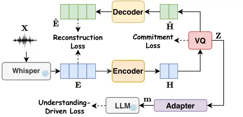
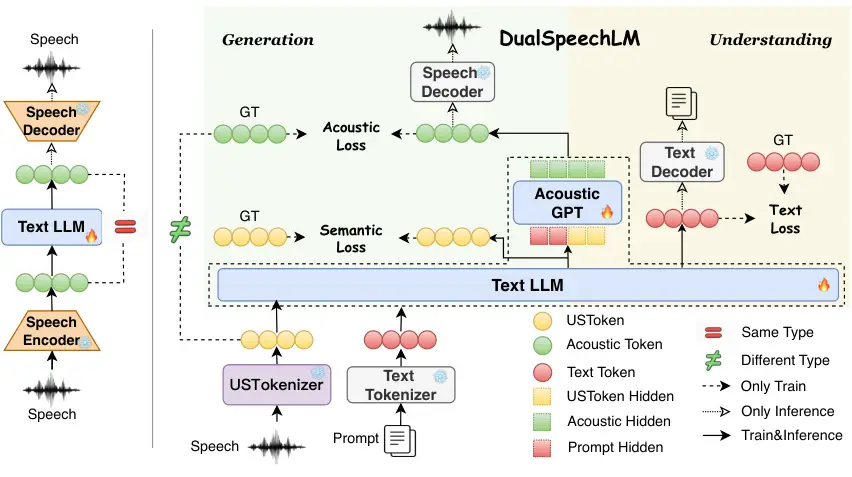
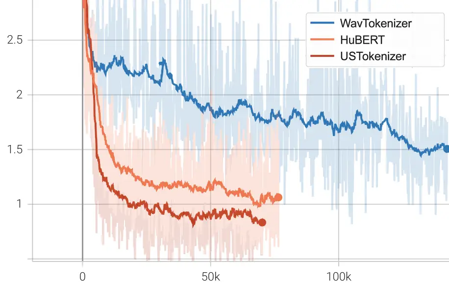

# DualSpeechLM: Towards Unified Speech Understanding and Generation via Dual Speech Token Modeling with Large Language Models

Yuanyuan Wang    Dongchao Yang    Yiwen Shao    Hangting Chen    Jiankun
Zhao    Zhiyong Wu    Helen Meng    Xixin Wu ^(†)^(†)thanks:
Corresponding authors.

###### Abstract

Extending pre-trained text Large Language Models (LLMs)’s speech
understanding or generation abilities by introducing various effective
speech tokens has attracted great attention in the speech research
community. However, building a unified speech understanding and
generation model still faces the following challenges: (1) Due to the
huge modality gap between speech and text tokens, extending text LLMs to
unified speech LLMs relies on large-scale paired data for fine-tuning,
and (2) Generation and understanding tasks prefer information at
different levels, e.g., generation benefits from detailed acoustic
features, while understanding favors high-level semantics. This
divergence leads to difficult performance optimization in one unified
model. To solve these challenges, in this paper, we present two key
insights in speech tokenization and speech language modeling.
Specifically, we first propose an Understanding-driven Speech Tokenizer
(USTokenizer), which extracts high-level semantic information essential
for accomplishing understanding tasks using text LLMs. In this way,
USToken enjoys better modality commonality with text, which reduces the
difficulty of modality alignment in adapting text LLMs to speech LLMs.
Secondly, we present DualSpeechLM, a dual-token modeling framework that
concurrently models USToken as input and acoustic token as output within
a unified, end-to-end framework, seamlessly integrating speech
understanding and generation capabilities. Furthermore, we propose a
novel semantic supervision loss and a Chain-of-Condition (CoC) strategy
to stabilize model training and enhance speech generation performance.
Experimental results demonstrate that our proposed approach effectively
fosters a complementary relationship between understanding and
generation tasks, highlighting the promising strategy of mutually
enhancing both tasks in one unified model.¹¹ 1 Code and demo:
https://github.com/lavendery/UUG.

¹The Chinese University of Hong Kong, ²Tencent AI Lab, ³Tsinghua
University

## Introduction

Recent advancements in autoregressive large language models (LLMs) have
demonstrated excellent performance in the natural language processing
community (Achiam et al. 2023; Touvron et al. 2023; Team et al. 2023).
Leveraging the powerful foundations of text LLMs, recent advancements
have led to emergence of speech LLMs that possess speech understanding
and generation capabilities. In addition to fine-tuning textual LLMs to
separately perform speech understanding tasks (Gong et al. 2023; Tang et
al. 2023; Chu et al. 2023; Wang et al. 2024a; Wang et al. 2025) and
generation tasks (Wang et al. 2023; Anastassiou et al. 2024; Kim et al.
2024; Wang et al. 2024b; Yang et al. 2024b; Yang et al. 2025a; Jia et
al. 2025), developing unified models that excel at both capabilities has
been explored in recent years (Zhang et al. 2023a; Xie and others 2024;
Fu et al. 2025; Nguyen et al. 2025; Défossez et al. 2024; Xu et al.
2025). However, several limitations still remain.

First, adapting pre-trained text LLMs to unified speech LLMs still
relies heavily on large-scale paired speech-text data (Zhang et al.
2023a; Défossez et al. 2024; Xie and others 2024; Xu et al. 2025). For
example, SpeechGPT (Zhang et al. 2023a) and SpiritLM (Nguyen et al. 2025) require approximately 70K and 570K hours of paired data,
respectively. This dependence stems from the substantial modality gap
between speech and text, which hinders capability transfer. Second,
existing speech LLMs struggle to meet the distinct informational needs
of understanding and generation. As shown in Figure 1 (a) Left and (b)
Left, the Baseline model—trained solely with acoustic tokens—exhibits a
contradiction between tasks, i.e., improving one often leads to
degradation of the other, highlighting its inability to balance both
tasks effectively. In fact, generation tasks demand rich acoustic
details (e.g., prosody, emotion, speaker traits) for high-fidelity
synthesis (Zeghidour et al. 2021; Défossez et al. 2022; Kumar et al.
2023; Wang et al. 2023), which acoustic tokens capture well but lack
high-level semantics (Shi et al. 2024; Dhawan et al. 2024; Anastassiou
et al. 2024; Chang et al. 2024). Conversely, understanding tasks benefit
from semantic features (Borsos et al. 2023; Rubenstein et al. 2023;
Maiti et al. 2024), but semantic tokens inevitably compromise the
acoustic details needed for natural speech generation.

To solve these problems, we propose two key insights from the
perspectives of speech tokenization and language modeling. First, we
present an Understanding-driven Speech Tokenizer (USTokenizer) that can
extract high-level semantic features, which are critical for
understanding tasks. Unlike prior methods that rely on only
self-supervised learning (SSL) representation quantization (Hsu et al.
2021; Chen et al. 2022) or automatic speech recognition (ASR)-based
objectives (Du et al. 2024a; Zeng et al. 2024) to capture semantics, our
approach directly aligns speech tokenizer with the semantic
understanding capabilities of text LLMs. This leads to USTokens that
have inherently better alignment with text modality, significantly
easing modality alignment when adapting text LLMs to speech LLMs.
Secondly, building on USTokenizer, we introduce DualSpeechLM, a novel
dual speech token modeling framework that effectively handles the
distinct informational needs of understanding and generation within a
unified end-to-end architecture. Unlike conventional approaches that use
the same token as input and output of LLM, our model separates them by
using USTokens as input and acoustic tokens as output. Specifically, the
USTokenizer provides high-level semantic information to boost
understanding tasks, while an AcousticGPT module restores fine-grained
acoustic details, enabling diverse and realistic speech generation
within a unified end-to-end framework. In addition, we introduce a
semantic supervision loss and a Chain of Condition (CoC) strategy to
stabilize training and further improve the performance of the unified
framework. In summary, our contributions are as follows:

- •
  We present a USTokenizer that can extract high-level semantic
  information and reduce the modality gap when adapting text LLMs to
  speech LLMs.
- •
  We propose an end-to-end dual token modeling framework, DualSpeechLM,
  that simultaneously accepts USTokens as input and generates acoustic
  tokens as output, effectively accommodating distinct informational
  needs.
- •
  We also propose a novel semantic supervision loss and a CoC strategy
  to improve training stability and generation performance.
- •
  Experiments demonstrate that our method achieves faster convergence
  and excellent performance with small-scale data, and enhances mutual
  improvements between understanding and generation tasks.

(a) Generation performance ($`\downarrow`$), measured by generated
speech WER (%), using different amounts of generation (left) or
understanding (right) data, with the amount of understanding (left) or
generation (right) data fixed as 300K samples.

(b) Understanding performance ($`\downarrow`$), measured by speech
recognition WER (%), using different amounts of generation (left) or
understanding (right) data, with the amount of understanding (left) or
generation (right) data fixed as 300K samples.

Figure 1: Comparison of baseline and our model on generation and
understanding tasks with different ratios of generation and
understanding training data.

## Related Work

### Speech Tokenization

The success of autoregressive language models (Achiam et al. 2023;
Touvron et al. 2023; Team et al. 2023) has spurred progress in speech
LLMs (Chu et al. 2023; Wang et al. 2024b; Wang et al. 2024c; Défossez et
al. 2024), where speech tokenizers are essential for converting
continuous signals into discrete tokens (Yang et al. 2025b). Speech
tokenizers are typically categorized as acoustic or semantic (Borsos et
al. 2023; Parker et al. 2024; Yang et al. 2024a). Acoustic tokens,
optimized for signal reconstruction (Zeghidour et al. 2021; Défossez et
al. 2022; Yang et al. 2023; Wang et al. 2023), capture detailed acoustic
features beneficial for generation, but perform poorly on understanding
tasks like ASR (Shi et al. 2024; Dhawan et al. 2024; Anastassiou et al.
2024; Chang et al. 2024). Previous semantic tokenizers were trained in
two ways: (1) applying clustering (Borsos et al. 2023; Zhang et al.
2023a; Shi et al. 2023) or vector quantization (VQ) (Huang et al. 2024)
to representations of SSL models  (Hsu et al. 2021; Chen et al. 2022),
and (2) applying a VQ layer to the intermediate layer of ASR models  (Du
et al. 2024a; Zeng et al. 2024; Du et al. 2024b). Although these
semantic tokenizers have shown benefits for understanding tasks (Borsos
et al. 2023; Rubenstein et al. 2023; Maiti et al. 2024), they do not
explicitly consider the alignment to the modality of text LLM (Li et al.
2025). Furthermore, multi-codebook designs (Zhang et al. 2023b; Défossez
et al. 2024; Yang et al. 2025b) aim to capture semantics and acoustics
in different codebooks jointly, but often introduce complexity when
integrated with LLMs. In this work, we present a single VQ-codebook
USTokenizer, which not only incorporates high-level semantic information
but also achieves better alignment between speech and text modality when
applied to LLMs.

### Speech Language Models

Recent advances in speech LLMs have explored unified understanding and
generation (Zhang et al. 2023a; Pan et al. 2024; Défossez et al. 2024;
Nguyen et al. 2025). Some speech LLMs (Yang et al. 2024b; Shi et al. 2025) adopt acoustic tokens to ensure high-fidelity speech synthesis.
However, such tokens usually lead to degraded performance in
understanding tasks, particularly in low-resource scenarios. By
contrast, semantic tokens perform better in understanding tasks. Yet,
their lack of acoustic details often results in reduced generation
quality. To compensate for generation, existing works (Polyak et al.
2021; Zhang et al. 2023a; Du et al. 2024a; Nguyen et al. 2025) introduce
additional components such as diffusion models (Ho et al. 2020) or flow
matching (Lipman et al. 2022), to convert speech tokens into a Mel
spectrogram, and then a HiFi-GAN (Kong et al. 2020) vocoder is used to
synthesize waveform with the Mel spectrogram as input. These multi-stage
pipelines increase complexity and risk error accumulation (Jia et al.
2025). To address these limitations, we propose DualSpeechLM, an
end-to-end dual-token modeling framework that explicitly models USTokens
as input for understanding and acoustic tokens as output for generation,
effectively achieving distinct informational requirements.

## Methodologies

We propose a novel unified speech LLM framework, comprising an
understanding-driven speech tokenization method and a dual-token
modeling paradigm. This framework enhances both understanding and
generation capabilities in the resulting DualSpeechLLM. In the
following, we describe each module of our framework.

### USTokenizer



Figure 2: The architecture of USTokenizer, which can extract high-level
semantic features aligned with text LLMs via an understanding-driven
loss.

As shown in Figure 2, our Understanding-driven Speech Tokenizer
(USTokenizer) consists of a pre-trained Whisper encoder, another
downsampling Encoder, a vector quantizer (VQ), an upsampling Decoder, an
Adapter module, and a frozen text LLM. Given a speech utterance
$`\mathbf{X}`$, we use the final hidden states $`\mathbf{E}`$ from the
Whisper-medium encoder ²² 2 https://github.com/openai/whisper as the
input to the downsampling Encoder and then the VQ to obtain the
Understanding-driven Speech Token (USToken). Additionally, we novelly
project the quantized vector from VQ to the input space of LLM via an
adapter to integrate the guidance provided by text LLMs to optimize the
speech token during training, as described in the following sections.

#### Encoder and Decoder

The Encoder converts Whisper features $`\mathbf{E}`$ into
representations $`\mathbf{H}`$ using a 2× downsampling convolution
followed by two residual convolutional blocks, then discretized by VQ.
Symmetrically, the Decoder reconstructs $`\mathbf{\hat{E}}`$ from
quantized vectors $`\mathbf{\hat{H}}`$. Both Encoder and Decoder adopt
similar residual convolutional blocks with RepCodec (Huang et al. 2024).
We then compute the reconstruction loss via mean squared error (MSE)
between $`\mathbf{E}`$ and $`\mathbf{\hat{E}}`$, formulated as:

```math
\begin{aligned} \mathcal{L}_{\text{reconstruction}}(\mathbf{E},\mathbf{\hat{E}})=\frac{1}{N}\sum_{i=1}^{N}(E_{i}-\hat{E_{i}})^{2}\end{aligned}, \tag{1}
```

where $`N`$ is the number of elements in the embedding vector.



Figure 3: DualSpeechLM’s dual-token modeling paradigm. The left
illustrates the baseline pipeline treating LLM input/output as identical
tokens. In contrast, our DualSpeechLM (right) incorporates an Acoustic
GPT module into the text LLM module for joint training, separately
processing USToken inputs and acoustic token outputs through distinct
modeling paths, effectively capturing the different levels of
information required for both generation and understanding tasks.

|                                   |              |                 |          |           |                 |       |                |                 |                           |
| --------------------------------- | ------------ | --------------- | -------- | --------- | --------------- | ----- | -------------- | --------------- | ------------------------- |
| Model                             | LLM          | Input Token     | Training | Data(hrs) | ASR             |       | S2TT           | SER             | SQA                       |
|                                   |              |                 |          |           | Clean           | Other | En2De          | \-              | \-                        |
|                                   |              |                 |          |           | $`w\downarrow`$ |       | $`b4\uparrow`$ | $`acc\uparrow`$ | $`b4\uparrow/gs\uparrow`$ |
| SpeechGPT  (Zhang et al. 2023a)   | LLaMA-7B     | D(Hubert)       | Full FT  | 70K       | 42.73           | 78.54 | 1.07           | \-              | 3.58/40                   |
| SpiritLM  (Nguyen et al. 2025)    | LLaMA-7B     | D(Hubert)       | Full FT  | 570K      | 6.0             | 11.0  | \-             | \-              | \-                        |
| Mini-Omni2  (Xie and others 2024) | Qwen2-0.5B   | C(Whisper)      | Full FT  | 9K        | 4.8             | 9.8   | \-             | \-              | \-                        |
| VITA  (Fu et al. 2025)            | Mixtral-8x7B | C(Mel)          | Full FT  | 20K       | 8.14            | 18.41 | \-             | \-              | 7.62/70                   |
| Moshi  (Défossez et al. 2024)     | Helium-7B    | D(Mimicodec)    | Full FT  | 7M        | 5.7             | \-    | \-             | \-              | \-                        |
| Qwen2.5-Omni  (Xu et al. 2025)    | Qwen2.5-7B   | C(Whisper)      | Full FT  | $`\star`$ | 1.8             | 3.4   | 30.2           | 60.03           | 4.28/60                   |
| Baseline-Acoustic                 | Phi3.5-3B    | D(Wavtokenizer) | LoRA     | 4.5K      | 36.52           | 80.06 | 1.91           | 54.90           | 17.68/76                  |
| Baseline-Semantic                 | Phi3.5-3B    | D(Hubert)       | LoRA     | 4.5K      | 5.70            | 14.32 | 11.13          | 51.91           | 42.01/85                  |
| DualSpeechLM                      | Phi3.5-3B    | D(Hubert)       | LoRA     | 4.5K      | 5.56            | 14.62 | 10.20          | 51.77           | 42.59/85                  |
|                                   |              | D(USToken)      | LoRA     | 4.5K      | 4.22            | 9.71  | 19.74          | 60.92           | 44.38/88                  |

Table 1: Understanding capability evaluation. ‘D’: Discrete, ‘C’:
Continuous, ‘Full FT’: full fine-tuning. $`w`$, $`b4`$, $`gs`$ denote
WER, BLEU4, ChatGPTScore. ^(⋆)Qwen2.5-Omni uses 300B audio tokens, and
DualSpeechLM uses 405M speech tokens.

|                   |            |                 |          |                                     |                 |                                     |                |       |                           |
| ----------------- | ---------- | --------------- | -------- | ----------------------------------- | --------------- | ----------------------------------- | -------------- | ----- | ------------------------- |
| Model             | LLM        | Input Token     | Training | TTS                                 |                 | VC                                  | T2ST           |       | SC                        |
|                   |            |                 |          | Clean                               | Other           | VCTK                                | Es2En          | Fr2En | \-                        |
|                   |            |                 |          | $`s\uparrow/w\downarrow/d\uparrow`$ |                 | $`s\uparrow/w\downarrow/d\uparrow`$ | $`b4\uparrow`$ |       | $`b4\uparrow/gs\uparrow`$ |
| GT                |            | \-              | \-       | 1.0/3.94/3.86                       | 1.0/5.35/3.78   | 1.0/2.64/3.62                       | \-             | \-    | -/-                       |
| SpeechGPT         | LLaMA-7B   | D(Hubert)       | Full FT  | -/22.15/3.97                        | -/24.55/3.96    | \-                                  | 14.62          | 14.74 | 3.50/54                   |
| Mini-Omni2        | Qwen2-0.5B | C(Whisper)      | Full FT  | \-                                  | \-              | \-                                  | \-             | \-    | 2.22/54                   |
| Moshi             | Helium-7B  | D(Mimicodec)    | Full FT  | \-                                  | \-              | \-                                  | \-             | \-    | 1.75/50                   |
| Qwen2.5-Omni      | Qwen2.5-7B | C(Whisper)      | Full FT  | -/3.73/4.10^(⋆)                     | -/4.29/4.08     | \-                                  | \-             | \-    | 6.70/70                   |
| Baseline-Acoustic | Phi3.5-3B  | D(Wavtokenizer) | LoRA     | 0.88/22.11/3.76                     | 0.87/26.38/3.69 | 0.80/22.07/3.30                     | 8.52           | 7.62  | 0.52/62                   |
| Baseline-Semantic | Phi3.5-3B  | D(Hubert)       | LoRA     | 0.80/21.72/3.29                     | 0.81/22.32/3.26 | 0.81/18.88/3.25                     | 18.05          | 15.76 | 10.44/60                  |
| DualSpeechLM      | Phi3.5-3B  | D(Hubert)       | LoRA     | 0.81/20.80/3.35                     | 0.81/17.12/3.38 | 0.82/18.70/3.37                     | 17.54          | 15.97 | 11.06/65                  |
|                   |            | D(USToken)      | LoRA     | 0.90/9.25/3.86                      | 0.88/9.88/3.82  | 0.80/10.16/3.46                     | 26.77          | 23.82 | 16.24/67                  |

Table 2: Generation capability evaluation. Data usage is the same as
Data(hrs) in Table 1. $`s`$, $`w`$, $`d`$, $`b4`$, $`gs`$ denote SIM,
WER, DNSMOS, BLEU4, ChatGPTScore. ^(⋆)Qwen2.5-Omni lacks standalone TTS
inference, so the Qwen-TTS API is used instead.

|                   |                                                  |                                                           |
| ----------------- | ------------------------------------------------ | --------------------------------------------------------- |
| Model             | TTS ($`Q\uparrow/S\uparrow`$)                    | VC ($`Q\uparrow/S\uparrow`$)                              |
| GT                | $`4.20_{\pm 0.33}/3.94_{\pm 0.42}`$              | $`4.48_{\pm 0.23}/4.60_{\pm 0.25}`$                       |
| SpeechGPT         | $`3.53_{\pm 0.51}`$/-                            | \-                                                        |
| Qwen-TTS          | $`4.49_{\pm 0.21}`$/-                            | \-                                                        |
| Baseline-Acoustic | $`3.67_{\pm 0.48}`$/$`\mathbf{3.77_{\pm 0.52}}`$ | $`3.63_{\pm 0.33}`$/$`3.43_{\pm 0.42}`$                   |
| Baseline-Semantic | $`2.26_{\pm 0.53}`$/$`2.76_{\pm 0.45}`$          | $`2.75_{\pm 0.0.56}`$/$`2.93_{\pm 0.57}`$                 |
| Ours-Hubert       | $`3.48_{\pm 0.61}`$/$`3.59_{\pm 0.47}`$          | $`3.54_{\pm 0.34}`$/$`3.18_{\pm 0.36}`$                   |
| Ours-USToken      | $`\mathbf{3.89_{\pm 0.31}}`$/$`3.74_{\pm 0.24}`$ | $`\mathbf{3.80_{\pm 0.28}}`$/$`\mathbf{3.55_{\pm 0.37}}`$ |

Table 3: Subjective evaluation on generation tasks. $`Q,S`$ denote QMOS,
SMOS. Ours-Hubert and Ours-USToken refer to DualSpeechLM using Hubert
and USToken as input tokens, respectively. Configurations are the same
as Table 2.

#### Vector Quantization

The VQ module discretizes continuous feature representations
$`\mathbf{H}`$ by mapping them to a codebook of learned vectors. In this
work, we use a single VQ layer to quantize the feature $`\mathbf{H}`$
into discrete tokens $`\mathbf{Z}`$. Following previous works (Huang et
al. 2024), we add a commitment loss $`\mathcal{L}_{\text{commit}}`$ to
ensure training stability, with more details provided in Appendix B.

#### Understanding-Driven Loss

The LLM module aims to align the speech token $`\mathbf{Z}`$ with the
LLM’s input space. By optimizing the understanding tasks upon the text
LLM, the required understanding capability will be backpropagated to the
optimization of speech token, such that the modality gap between speech
and text tokens can be effectively reduced. The LLM-based understanding
loss is formulated as the likelihood of generating the target response
given a speech prompt using a text LLM (e.g., generating answers given
the prompt of speech question):

```math
\displaystyle\mathcal{L}_{\text{Under}}=-\sum_{t=1}^{L}\log p(S_{t}\mid\mathbf{m},S_{<t};\theta), \tag{2}
```

where $`L`$ is the length of the sequence, $`S_{t}`$ represents the
target token at position $`t`$, $`S_{<t}`$ is the sub-sequence of text
tokens before $`t`$, and $`\mathbf{m}`$ is the feature of speech prompt
extracted by USTokenizer. $`\theta`$ represents parameters of the text
LLM.

The LLM module aligns the VQ space with text LLM’s input space, which
means USTokens are mapped to an LLM-compatible feature space, enhancing
subsequent unified understanding and generation modeling. The final
total loss of USTokenizer is as follows:

```math
\displaystyle\mathcal{L}_{\text{USTokenizer}}=\alpha\cdot\mathcal{L}_{\text{commit}}+\beta\cdot\mathcal{L}_{\text{Under}}+\gamma\cdot\mathcal{L}_{\text{reconstruction}},
```

where $`\alpha,\beta`$ and $`\gamma`$ are weighting hyperparameter.

### DualSpeechLM

As shown in Figure 3, unlike prior Speech LLMs that use the same token
for both input and output (Yang et al. 2024b; Wang et al. 2024b; Shi et
al. 2025), DualSpeechLM introduces a novel dual-token design by modeling
USTokens as input and acoustic tokens as output via an integrated
AcousticGPT, effectively accommodating different levels of information
required for understanding and generation tasks.

For speech understanding tasks, the USTokenizer first encodes raw speech
into USTokens, which are combined with task-specific prompts and fed
into the text LLM. The model is trained using Cross-Entropy (CE) loss
between predicted and ground-truth text tokens. During inference, the
model generates text tokens conditioned on USTokens and prompts. The
text tokens are then decoded into the final outputs.

For the generation task, let $`\mathbf{U^{tar}}`$ and
$`\mathbf{A^{tar}}`$ denote USTokens and acoustic tokens of target
speech, $`\mathbf{U^{in}}`$ and $`\mathbf{P}`$ represent the USTokens
and prompt of input speech. As shown in Figure 3, the text LLM first
predicts $`\mathbf{U^{tar}}`$ conditioned on $`\mathbf{P}`$ and
$`\mathbf{U^{in}}`$, formulated as:

```math
\displaystyle p(\mathbf{U^{tar}}|\mathbf{P},\mathbf{U^{in}};\theta)=\prod_{t=1}^{L}p(\mathbf{U^{tar}}_{t}|\mathbf{U^{tar}}_{<t},\mathbf{P},\mathbf{U^{in}};\theta), \tag{3}
```

where $`L`$ is the length of $`\mathbf{U^{tar}}`$,
$`\mathbf{U^{tar}}_{t}`$ is the target USToken at position $`t`$ and
$`\mathbf{U^{tar}}_{<t}`$ represents all previous USTokens. $`\theta`$
denotes model parameters. To improve training stability and model
performance, we introduce a semantic supervision loss:

```math
\displaystyle\mathcal{L}_{\text{semantic}}=-\frac{1}{L}\sum_{t=1}^{L}\log p(\mathbf{U^{tar}}_{t}|\mathbf{U^{tar}}_{<t},\mathbf{P},\mathbf{U^{in}};\theta) \tag{4}
```

Next, the predicted USToken sequence $`\mathbf{U^{tar}}`$ is passed to
AcousticGPT, which autoregressively generates acoustic tokens. They are
then converted into speech via a Speech Decoder. For both understanding
and generation, we adopt text LLM as backbone and fine-tune it using
parameter-efficient Low-Rank Adaptation (LoRA) (Hu et al. 2022). Within
the unified framework, we integrate AcousticGPT into text LLM to enable
joint end-to-end training. This allows DualSpeechLM to simultaneously
capture high-level semantics for understanding and fine-grained acoustic
details for generation, which we refer to as dual-token modeling.
Notably, the acoustic tokens and Speech Decoder are modular and can be
implemented using any open-source codec model.

#### AcousticGPT

Inspired by AudioLM (Borsos et al. 2023), we design an AcousticGPT
module to autoregressively generate acoustic tokens conditioned on
semantic hidden states and speaker embeddings. Built on a GPT-style
transformer, the model consists of six causal blocks, each containing a
causal self-attention layer followed by a Multi-Layer Perceptron (MLP).
The multi-head self-attention captures dependencies under causal
constraints. In addition, each block includes residual connections and
layer normalization to enhance training stability and model performance.
Further details are provided in Appendix B.

#### Chain of Condition

To improve training robustness, we introduce a Chain of Condition (CoC)
strategy for AcousticGPT. Specifically, given the dynamically changing
semantic hidden states, we randomly sample conditioning signals from
three sources with equal probability: prompt hidden states
$`\mathbf{S}_{p}`$, predicted USTokens $`\mathbf{U^{tar}}`$, or their
concatenation $`[\mathbf{S}_{p};\mathbf{U^{tar}}]`$. During inference,
we consistently use the concatenated form
$`[\mathbf{S}_{p};\mathbf{U^{tar}}]`$. This CoC strategy acts as a
regularizer, preventing overfitting to any single modality and improving
the model’s adaptability by exposing it to varied conditioning signals
during training. Importantly, it also mitigates the adverse effects of
inaccurate USToken predictions by allowing the model to flexibly rely on
more stable prompt hidden states or concatenation. As a result, CoC
improves the alignment between USTokens and text tokens in the shared
latent space, fostering stronger synergy between understanding and
generation representations. The acoustic loss in AcousticGPT is defined
as:

```math
\displaystyle\mathcal{L}_{\text{acoustic}}=-\sum_{t=1}^{L}\log p(\mathbf{A^{tar}}_{t}|\mathbf{A^{tar}}_{<t},\mathbf{S},\mathbf{Spk};\theta), \tag{5}
```

where
$`\mathbf{S}\in\{\mathbf{S}_{p},\mathbf{U^{tar}},[\mathbf{S}_{p};\mathbf{U^{tar}}]\}`$
is selected via CoC, $`\mathbf{Spk}`$ is the speaker embedding, and
$`\mathbf{A^{tar}}_{t}`$ is the predicted acoustic token at time $`t`$.
$`p(\mathbf{A^{tar}}_{t}|\mathbf{A^{tar}}_{<t},\mathbf{S},\mathbf{Spk};\theta)`$
is the predicted probability of generating $`\mathbf{A^{tar}}_{t}`$,
given $`\{\mathbf{A^{tar}}_{<t},\mathbf{S},\mathbf{Spk}\}`$. Finally,
the overall generation loss combines semantic and acoustic objectives
as:

```math
\displaystyle\mathcal{L}_{\text{generation}}=\lambda\cdot\mathcal{L}_{\text{semantic}}+\xi\cdot\mathcal{L}_{\text{acoustic}}, \tag{6}
```

where $`\lambda,\xi`$ are weighting hyperparameters.

## Experiment Setup

### Dataset

We train the USTokenizer using multiple speech understanding tasks,
including Automatic Speech Recognition (ASR), Speech Emotion Recognition
(SER), and Speech Question Answering (SQA). They are based on
LibriSpeech (Panayotov et al. 2015), IEMOCAP (Busso et al. 2008) and SQA
dataset from SALMONN (Tang et al. 2023), respectively. In the SQA
dataset, both questions and answers were automatically generated based
on LibriSpeech transcripts using ChatGPT, forming
spoken-question–text-answer pairs.

DualSpeechLM is trained on eight speech understanding and generation
tasks using approximately 4,500 hours of speech data. For understanding,
we use LibriSpeech for ASR task, the English-to-German (En2De) subset of
CoVoST2 (Wang et al. 2020) for Speech-to-Text Translation (S2TT) task,
IEMOCAP (Busso et al. 2008) for the SER task, and the SQA dataset (Tang
et al. 2023) constructed from LibriSpeech using ChatGPT. For generation,
we train Text-to-Speech (TTS) on LibriTTS-R (Koizumi et al. 2023),
Text-to-Speech Translation (T2ST) on Spanish-to-English (Es–En) and
French-to-English (Fr–En) subsets of CVSS (Jia et al. 2022), and Voice
Conversion (VC) on a 1,000-hour subset of LibriHeavy (Kang et al. 2023)
with evaluation on 400 pairs from VCTK (Yamagishi and others 2019).
Additionally, the Speech Conversation (SC) task is built by synthesizing
speech from the SQA dataset using the Volcengine TTS API. Please see
Appendix C for dataset details.

### Evaluation Metrics

#### Objective Evaluation

For evaluation of the understanding tasks, we use Word Error Rate (WER)
for ASR, BLEU-4 for S2TT, accuracy (ACC) for SER, and both BLEU-4 and
ChatGPTScore for SQA, respectively. For the generation tasks, we employ
speaker similarity (SIM), WER, and DNSMOS to assess TTS and VC
performance. BLEU-4 is used for T2ST. Both BLEU-4 and ChatGPTScore are
used for evaluating the SC task.

#### Subjective Evaluation

We also conduct subjective evaluations for generation tasks, focusing
primarily on TTS and VC. For each task, subjective assessment is carried
out from speech quality (QMOS) and speaker similarity (SMOS). More
details can be found in Appendix C.

### Model Settings

In experiments, we compare four variants under the same configurations:
(1) Baseline-Acoustic, where both input and output are acoustic token
from WavTokenizer (Ji et al. 2024); (2) Baseline-Semantic, where both
input and output are HuBERT token (Hsu et al. 2021); (3)
DualSpeechLM-Hubert, using HuBERT token as input, acoustic token from
WavTokenizer as output; and (4) DualSpeechLM-USToken, using our USToken
as input, acoustic token from WavTokenizer as output. Notably, the
Baseline-Acoustic model requires 160k steps to converge under multi-task
settings, while others converge in 60k steps. Further details are
provided in the Appendix D.

## Results and Analyses

### Understanding and Generation Performance

|       |           |         |                   |       |                   |                 |                   |
| ----- | --------- | ------- | ----------------- | ----- | ----------------- | --------------- | ----------------- |
| Model | LLM       | Token   | ASR               |       | S2TT              | SER             | SQA               |
|       |           |         | Clean             | Other | En2De             | \-              | \-                |
|       |           |         | $`wer\downarrow`$ |       | $`bleu4\uparrow`$ | $`acc\uparrow`$ | $`bleu4\uparrow`$ |
| Ours  | Phi3.5-3B | Hubert  | 5.56              | 14.62 | 10.20             | 51.77           | 42.59             |
|       |           | USToken | 4.22              | 9.71  | 19.74             | 60.92           | 44.38             |
| Ours  | Vicuna-7B | Hubert  | 5.28              | 16.64 | 10.92             | 54.08           | 42.68             |
|       |           | USToken | 4.15              | 9.69  | 20.46             | 58.42           | 44.60             |

Table 4: The understanding performance comparison of DualSpeechLM when
using different text LLM backbones.

|              |           |             |                                     |                 |                                     |                   |       |                   |
| ------------ | --------- | ----------- | ----------------------------------- | --------------- | ----------------------------------- | ----------------- | ----- | ----------------- |
| Model        | LLM       | Input Token | TTS                                 |                 | VC                                  | T2ST              |       | SC                |
|              |           |             | Clean                               | Other           | VCTK                                | Es2En             | Fr2En | \-                |
|              |           |             | $`s\uparrow/w\downarrow/d\uparrow`$ |                 | $`s\uparrow/w\downarrow/d\uparrow`$ | $`bleu4\uparrow`$ |       | $`bleu4\uparrow`$ |
| DualSpeechLM | Phi3.5-3B | Hubert      | 0.81/20.80/3.35                     | 0.81/17.12/3.38 | 0.82/18.70/3.37                     | 17.54             | 15.97 | 11.06             |
|              |           | USToken     | 0.90/9.25/3.86                      | 0.88/9.88/3.82  | 0.80/10.16/3.46                     | 26.77             | 23.82 | 16.24             |
| DualSpeechLM | Vicuna-7B | Hubert      | 0.87/13.58/3.88                     | 0.86/15.56/3.80 | 0.78/19.86/3.38                     | 22.29             | 19.74 | 13.17             |
|              |           | USToken     | 0.89/12.63/3.90                     | 0.87/14.65/3.86 | 0.78/17.03/3.43                     | 29.58             | 25.40 | 17.18             |

Table 5: Comparison of generation performance of DualSpeechLM using
different text LLM backbones.

|                               |                                     |                  |                                     |                   |       |                   |
| ----------------------------- | ----------------------------------- | ---------------- | ----------------------------------- | ----------------- | ----- | ----------------- |
| Model                         | TTS                                 |                  | VC                                  | T2ST              |       | SC                |
|                               | Clean                               | Other            | VCTK                                | Es2En             | Fr2En | \-                |
|                               | $`s\uparrow/w\downarrow/d\uparrow`$ |                  | $`s\uparrow/w\downarrow/d\uparrow`$ | $`bleu4\uparrow`$ |       | $`bleu4\uparrow`$ |
| DualSpeechLM                  | 0.90/9.25/3.86                      | 0.88/9.88/3.82   | 0.80/10.16/3.46                     | 26.77             | 23.82 | 16.24             |
| USTokenizer Ablation          |                                     |                  |                                     |                   |       |                   |
| w/o Understanding-driven Loss | 0.90/8.59/3.86                      | 0.88/9.45/3.81   | 0.82/9.90/3.39                      | 24.03             | 22.73 | 15.59             |
| w/o Reconstruction Loss       | 0.83/52.50/3.02                     | 0.81/54.24/2.96  | 0.79/26.08/3.33                     | 32.43             | 29.46 | 17.09             |
| DualSpeechLM Ablation         |                                     |                  |                                     |                   |       |                   |
| w/o Semantic Loss             | 0.80/167.56/3.85                    | 0.85/175.11/3.83 | 0.80/264.53/3.45                    | 0.09              | 0.07  | 0.15              |
| w/o CoC                       | 0.89/9.96/3.84                      | 0.87/10.34/3.81  | 0.79/13.06/3.38                     | \-                | \-    | \-                |

Table 6: Ablation study using generation tasks. We use Phi-3.5-3B as the
text LLM backbone.

| Model                         | ASR               |       | S2TT              | SER             | SQA               |
| ----------------------------- | ----------------- | ----- | ----------------- | --------------- | ----------------- |
|                               | Clean             | Other | En2De             | \-              | \-                |
|                               | $`wer\downarrow`$ |       | $`bleu4\uparrow`$ | $`acc\uparrow`$ | $`bleu4\uparrow`$ |
| DualSpeechLM                  | 4.22              | 9.71  | 19.74             | 60.92           | 44.38             |
| USTokenizer Ablation          |                   |       |                   |                 |                   |
| w/o Understanding-driven Loss | 4.81              | 10.43 | 14.81             | 52.7            | 37.67             |
| w/o Reconstruction Loss       | 4.74              | 10.46 | 18.5              | 45.21           | 46.44             |
| DualSpeechLM Ablation         |                   |       |                   |                 |                   |
| w/o Semantic Loss             | 4.31              | 9.61  | 18.67             | 60.35           | 43.86             |

Table 7: Ablation study using understanding tasks. Phi-3.5-3B is used as
the text LLM backbone.

We first compare the performance of our method with prior work. The
results for understanding and generation are shown in Table 1, 2 and 3,
respectively. From these results, we observe the following:

\(1\) USToken has better modality commonality with text, reducing the
difficulty of modality alignment when adapting text LLMs to speech LLMs.
DualSpeechLM-USToken outperforms both Baselines and DualSpeechLM-Hubert
across almost all tasks, highlighting USToken’s enhanced semantic
understanding capabilities. Additionally, on translation tasks (S2TT and
T2ST), which require the inherent translation capabilities of text LLM,
our DualSpeechLM-USToken still significantly outperforms both Baselines
and DualSpeechLM-Hubert. This demonstrates that USToken has better
alignment with text modality, allowing it to retain more capabilities of
text LLM during training. Overall, both DualSpeechLM-Hubert and
DualSpeechLM-USToken exhibit better performance than the baseline,
indicating that the design of Acoustic GPT in DualSpeechLM also helps
alleviate the pressure of text LLM. The comparison of convergence speed
is provided in Appendix A.

\(2\) DualSpeechLM achieves strong performance in both tasks with
small-scale resources. Specifically, compared to Baselines, both
DualSpeechLM-Hubert and DualSpeechLM-USToken demonstrate significant
performance improvements, highlighting the effectiveness of
DualSpeechLM. Compared to existing unified models, which rely on larger
datasets and full fine-tuning, such as SpeechGPT and Mini-Omni2,
DualSpeechLM-USToken achieves better performance with just 4.5k hours of
data using parameter-efficient fine-tuning, LoRA.

\(3\) DualSpeechLM simultaneously fulfill the distinct information
requirements of generation and understanding by dual-token modeling.
Comparisons between Baseline-Acoustic and Baseline-Semantic in Table 1,
2, and 3 show that semantic tokens excel in understanding tasks, while
acoustic tokens perform better in generation, e.g., higher SIM and
DNSMOS scores in TTS. However, acoustic tokens carry weaker semantics
reflected by higher WER results and lower translation quality. In
contrast, our DualSpeechLM demonstrates superior performance on both
understanding and generation tasks simultaneously due to its dual-token
modeling. Another evidence is shown in Figure 1, where our method
consistently improves performance on both generation and understanding
tasks as the amount of either type of training data increases. This
demonstrates its strong ability to support one task without compromising
the other.

### Performance with Different LLM Backbones

To further assess the generalizability of DualSpeechLM and the
effectiveness of USToken across different backbones, we compare models
using various text LLMs as backbones. Table 4 and 5 show that
DualSpeechLM-USToken consistently outperforms DualSpeechLM-Hubert across
almost all tasks, regardless of the underlying LLMs. This demonstrates
that USToken not only aligns more effectively with text LLMs but also
transfers well across model architectures. Additionally, our
DualSpeechLM achieves performance comparable to or better than existing
methods, with different text LLMs as the backbone. This highlights the
strong compatibility and robustness of DualSpeechLM across different LLM
backbones, further demonstrating its effectiveness as a unified
framework for both speech understanding and generation.

### Ablation Study

We perform ablation studies to evaluate the contribution of each
component, with results shown in Table 6 and 7.

#### The Influence of Understanding-driven Loss.

We ablate the understanding-driven loss in USTokenizer while keeping all
other components unchanged. As shown in Table 7, removing this LLM-based
objective leads to significant performance drops in understanding tasks
(e.g., BLEU4 decreases from 44.38 to 37.67 on SQA), highlighting its
importance for aligning USTokens more closely with the semantic space of
text LLMs using the understanding-driven loss. For T2ST and SC in
Table 6, we also observe a performance drop after removing the
understanding-driven loss. This can be attributed to these two tasks
rely more heavily on the internal capabilities of the text LLM. The
understanding-driven loss plays a critical role in enhancing modality
commonality between USTokens and text tokens, thereby helping to
preserve as much of the original ability of the text LLM as possible
when adapting the text LLM to speech-related tasks.

#### Effect of the Reconstruction Loss.

The third row in Table 6 and 7 shows the results when the reconstruction
loss is removed from USTokenizer. For tasks like T2ST that rely more on
the reasoning capabilities of the text LLM, performance actually
improves. This suggests that removing the reconstruction objective
pushes USTokenizer to better align with the text modality, thus
narrowing the modality gap and allowing the LLM to operate more
effectively on semantically rich tasks. However, we observe notable
performance degradation in SER, TTS, and VC tasks, indicating that the
reconstruction loss is essential for preserving fine-grained
information, which is crucial for these tasks.

#### Effect of Semantic Loss.

The fourth row in Table 6 and 7 shows the results of removing semantic
loss from DualSpeechLM. This leads to a slight decline in understanding
performance, indicating that reconstructing USTokens, as enforced by
semantic loss, provides useful semantic supervision that benefits
understanding tasks. More critically, we observe a substantial
performance drop across all generation tasks. Without semantic loss, the
text LLM struggles with producing high-quality USTokens, resulting in
degraded inputs to AcousticGPT and ultimately poor generation of
acoustic tokens. These results underscore the pivotal role of semantic
loss in ensuring accurate semantic representation, which is essential
not only for understanding but also for maintaining high-fidelity
generation in unified DualSpeechLM.

#### Influence of CoC.

The final row in Table 6 shows the impact of removing the Chain of
Condition (CoC) strategy from the AcousticGPT module, which is applied
only to TTS and VC tasks. Performance drops notably on both tasks,
indicating that CoC’s stochastic conditioning improves alignment between
DualTokens and text tokens in the shared latent space. This enhanced
alignment leads to more stable and accurate acoustic token generation.

## Conclusions

In this work, we aim to develop a unified speech LLM that can
simultaneously excel in both speech understanding and generation. We
first propose USTokenizer, which reduces the modality gap between speech
and text when adapting text LLMs to speech LLMs. Based on this, we
present an end-to-end DualSpeechLM that effectively accommodates the
different informational requirements for understanding and generation by
a dual-token modeling strategy. Experiments indicate that our method
achieves significantly better performance than baselines, enabling
mutual improvements between understanding and generation. In the future,
we plan to improve DualSpeechLM to larger, more diverse multilingual and
cross-domain datasets to further explore its generalization and
robustness.

## References

- Abdin et al. (2024) M. Abdin, J. Aneja, H. Awadalla, A.
  Awadallah, A. A. Awan, N. Bach, A. Bahree, et al. Phi-3 technical
  report: a highly capable language model locally on your phone.
  External Links: 2404.14219, [Link](https://arxiv.org/abs/2404.14219)
  Cited by: Appendix E.
- Achiam et al. (2023) J. Achiam, S. Adler, S. Agarwal, L. Ahmad, I.
  Akkaya, F. L. Aleman, D. Almeida, J. Altenschmidt, S. Altman, S.
  Anadkat, et al. Gpt-4 technical report. arXiv preprint
  arXiv:2303.08774. Cited by: Appendix D, Introduction, Speech
  Tokenization.
- Anastassiou et al. (2024) P. Anastassiou, J. Chen, J. Chen, Y.
  Chen, Z. Chen, Z. Chen, J. Cong, L. Deng, C. Ding, L. Gao, et al.
  Seed-tts: a family of high-quality versatile speech generation models.
  arXiv preprint arXiv:2406.02430. Cited by: Introduction, Introduction,
  Speech Tokenization.
- Borsos et al. (2023) Z. Borsos, R. Marinier, D. Vincent, E.
  Kharitonov, O. Pietquin, M. Sharifi, D. Roblek, O. Teboul, D.
  Grangier, M. Tagliasacchi, et al. Audiolm: a language modeling
  approach to audio generation. IEEE/ACM transactions on audio, speech,
  and language processing 31, pp. 2523–2533. Cited by: Introduction,
  Speech Tokenization, AcousticGPT.
- Busso et al. (2008) C. Busso, M. Bulut, C. Lee, A. Kazemzadeh, E.
  Mower, S. Kim, J. N. Chang, S. Lee, and S. S. Narayanan IEMOCAP:
  interactive emotional dyadic motion capture database. Language
  resources and evaluation 42, pp. 335–359. Cited by: Appendix D,
  Appendix D, Table 8, Dataset, Dataset.
- Chang et al. (2024) X. Chang, B. Yan, K. Choi, J. Jung, Y. Lu, S.
  Maiti, R. Sharma, J. Shi, J. Tian, S. Watanabe, Y. Fujita, T.
  Maekaku, P. Guo, Y. Cheng, P. Denisov, K. Saijo, and H. Wang Exploring
  speech recognition, translation, and understanding with discrete
  speech units: a comparative study. In ICASSP 2024 - 2024 IEEE
  International Conference on Acoustics, Speech and Signal Processing
  (ICASSP), Vol. , pp. 11481–11485. Cited by: Introduction, Speech
  Tokenization.
- Chen et al. (2022) S. Chen, C. Wang, Z. Chen, Y. Wu, S. Liu, Z.
  Chen, J. Li, N. Kanda, T. Yoshioka, X. Xiao, et al. Wavlm: large-scale
  self-supervised pre-training for full stack speech processing. IEEE
  Journal of Selected Topics in Signal Processing 16 (6), pp. 1505–1518.
  Cited by: Appendix D, Appendix F, Introduction, Speech Tokenization.
- Chen et al. (2025) Y. Chen, S. Zheng, H. Wang, L. Cheng, et al.
  3D-speaker-toolkit: an open source toolkit for multi-modal speaker
  verification and diarization. Cited by: Appendix C.
- Chu et al. (2023) Y. Chu, J. Xu, X. Zhou, Q. Yang, S. Zhang, Z.
  Yan, C. Zhou, and J. Zhou Qwen-audio: advancing universal audio
  understanding via unified large-scale audio-language models. External
  Links: 2311.07919, [Link](https://arxiv.org/abs/2311.07919) Cited by:
  Introduction, Speech Tokenization.
- Défossez et al. (2022) A. Défossez, J. Copet, G. Synnaeve, and Y. Adi
  High fidelity neural audio compression. arXiv preprint
  arXiv:2210.13438. Cited by: Introduction, Speech Tokenization.
- Défossez et al. (2024) A. Défossez, L. Mazaré, M. Orsini, A. Royer, P.
  Pérez, H. Jégou, E. Grave, and N. Zeghidour Moshi: a speech-text
  foundation model for real-time dialogue. arXiv preprint
  arXiv:2410.00037. Cited by: Appendix F, Introduction, Introduction,
  Speech Tokenization, Speech Language Models, Table 1.
- Dhawan et al. (2024) K. Dhawan, N. R. Koluguri, A. Jukić, R.
  Langman, J. Balam, and B. Ginsburg Codec-asr: training performant
  automatic speech recognition systems with discrete speech
  representations. In Proc. Interspeech 2024, pp. 2574–2578. Cited by:
  Introduction, Speech Tokenization.
- Du et al. (2024a) Z. Du, Q. Chen, S. Zhang, K. Hu, H. Lu, Y. Yang, H.
  Hu, S. Zheng, Y. Gu, Z. Ma, et al. Cosyvoice: a scalable multilingual
  zero-shot text-to-speech synthesizer based on supervised semantic
  tokens. arXiv preprint arXiv:2407.05407. Cited by: Introduction,
  Speech Tokenization, Speech Language Models.
- Du et al. (2024b) Z. Du, Y. Wang, Q. Chen, X. Shi, X. Lv, T. Zhao, Z.
  Gao, Y. Yang, C. Gao, H. Wang, F. Yu, H. Liu, Z. Sheng, Y. Gu, C.
  Deng, W. Wang, S. Zhang, Z. Yan, and J. Zhou CosyVoice 2: scalable
  streaming speech synthesis with large language models. External Links:
  2412.10117, [Link](https://arxiv.org/abs/2412.10117) Cited by:
  Appendix F, Speech Tokenization.
- Dubey et al. (2024) A. Dubey, A. Jauhri, A. Pandey, A. Kadian, A.
  Al-Dahle, A. Letman, A. Mathur, A. Schelten, A. Yang, A. Fan, et al.
  The llama 3 herd of models. arXiv preprint arXiv:2407.21783. Cited by:
  Appendix E.
- Fu et al. (2025) C. Fu, H. Lin, Z. Long, Y. Shen, Y. Dai, M. Zhao, Y.
  Zhang, S. Dong, et al. VITA: towards open-source interactive omni
  multimodal llm. External Links: 2408.05211,
  [Link](https://arxiv.org/abs/2408.05211) Cited by: Introduction, Table
  1.
- Gong et al. (2023) Y. Gong, A. H. Liu, H. Luo, L. Karlinsky, and J.
  Glass Joint audio and speech understanding. In 2023 IEEE Automatic
  Speech Recognition and Understanding Workshop (ASRU), pp. 1–8. Cited
  by: Introduction.
- Ho et al. (2020) J. Ho, A. Jain, and P. Abbeel Denoising diffusion
  probabilistic models. Advances in neural information processing
  systems 33, pp. 6840–6851. Cited by: Speech Language Models.
- Hsu et al. (2021) W. Hsu, B. Bolte, Y. H. Tsai, K. Lakhotia, R.
  Salakhutdinov, and A. Mohamed Hubert: self-supervised speech
  representation learning by masked prediction of hidden units. IEEE/ACM
  transactions on audio, speech, and language processing 29,
  pp. 3451–3460. Cited by: Introduction, Speech Tokenization, Model
  Settings.
- Hu et al. (2022) E. J. Hu, Y. Shen, P. Wallis, Z. Allen-Zhu, Y. Li, S.
  Wang, L. Wang, W. Chen, et al. Lora: low-rank adaptation of large
  language models.. ICLR 1 (2), pp. 3. Cited by: DualSpeechLM.
- Huang et al. (2024) Z. Huang, C. Meng, and T. Ko RepCodec: a speech
  representation codec for speech tokenization. In Proceedings of the
  62nd Annual Meeting of the Association for Computational Linguistics
  (Volume 1: Long Papers), pp. 5777–5790. Cited by: Speech Tokenization,
  Encoder and Decoder, Vector Quantization.
- Ji et al. (2024) S. Ji, Z. Jiang, W. Wang, Y. Chen, M. Fang, J.
  Zuo, Q. Yang, X. Cheng, Z. Wang, R. Li, et al. Wavtokenizer: an
  efficient acoustic discrete codec tokenizer for audio language
  modeling. arXiv preprint arXiv:2408.16532. Cited by: Model Settings.
- Jia et al. (2025) D. Jia, Z. Chen, J. Chen, C. Du, J. Wu, J. Cong, X.
  Zhuang, C. Li, Z. Wei, Y. Wang, et al. DiTAR: diffusion transformer
  autoregressive modeling for speech generation. arXiv preprint
  arXiv:2502.03930. Cited by: Introduction, Speech Language Models.
- Jia et al. (2022) Y. Jia, M. Tadmor Ramanovich, Q. Wang, and H. Zen
  CVSS corpus and massively multilingual speech-to-speech translation.
  In Proceedings of Language Resources and Evaluation Conference (LREC),
  pp. 6691–6703. Cited by: Appendix D, Table 8, Table 8, Dataset.
- Kang et al. (2023) W. Kang, X. Yang, Z. Yao, F. Kuang, Y. Yang, L.
  Guo, L. Lin, and D. Povey Libriheavy: a 50,000 hours asr corpus with
  punctuation casing and context. External Links: 2309.08105 Cited by:
  Appendix D, Table 8, Dataset.
- Kim et al. (2024) J. Kim, K. Lee, S. Chung, and J. Cho Clam-tts:
  improving neural codec language model for zero-shot text-to-speech.
  arXiv preprint arXiv:2404.02781. Cited by: Introduction.
- Koizumi et al. (2023) Y. Koizumi, H. Zen, S. Karita, Y. Ding, K.
  Yatabe, N. Morioka, M. Bacchiani, Y. Zhang, W. Han, and A. Bapna
  LibriTTS-r: a restored multi-speaker text-to-speech corpus. External
  Links: 2305.18802, [Link](https://arxiv.org/abs/2305.18802) Cited by:
  Appendix D, Table 8, Dataset.
- Kong et al. (2020) J. Kong, J. Kim, and J. Bae Hifi-gan: generative
  adversarial networks for efficient and high fidelity speech synthesis.
  Advances in neural information processing systems 33, pp. 17022–17033.
  Cited by: Speech Language Models.
- Kumar et al. (2023) R. Kumar, P. Seetharaman, A. Luebs, I. Kumar,
  and K. Kumar High-fidelity audio compression with improved rvqgan.
  Advances in Neural Information Processing Systems 36, pp. 27980–27993.
  Cited by: Introduction.
- Li et al. (2025) T. Li, J. Liu, T. Zhang, Y. Fang, D. Pan, M. Wang, Z.
  Liang, Z. Li, M. Lin, G. Dong, J. Xu, H. Sun, Z. Zhou, and W. Chen
  Baichuan-audio: a unified framework for end-to-end speech interaction.
  External Links: 2502.17239, [Link](https://arxiv.org/abs/2502.17239)
  Cited by: Appendix F, Speech Tokenization.
- Lipman et al. (2022) Y. Lipman, R. T. Chen, H. Ben-Hamu, M. Nickel,
  and M. Le Flow matching for generative modeling. arXiv preprint
  arXiv:2210.02747. Cited by: Speech Language Models.
- Loshchilov and Hutter (2017) I. Loshchilov and F. Hutter Decoupled
  weight decay regularization. arXiv preprint arXiv:1711.05101. Cited
  by: Appendix E.
- Maiti et al. (2024) S. Maiti, Y. Peng, S. Choi, J. Jung, X. Chang,
  and S. Watanabe Voxtlm: unified decoder-only models for consolidating
  speech recognition, synthesis and speech, text continuation tasks. In
  ICASSP 2024-2024 IEEE International Conference on Acoustics, Speech
  and Signal Processing (ICASSP), pp. 13326–13330. Cited by:
  Introduction, Speech Tokenization.
- Nguyen et al. (2025) T. A. Nguyen, B. Muller, B. Yu, M. R.
  Costa-Jussa, M. Elbayad, S. Popuri, C. Ropers, P. Duquenne, R.
  Algayres, R. Mavlyutov, et al. Spirit-lm: interleaved spoken and
  written language model. Transactions of the Association for
  Computational Linguistics 13, pp. 30–52. Cited by: Introduction,
  Introduction, Speech Language Models, Table 1.
- Pan et al. (2024) K. Pan, S. Tang, J. Li, Z. Fan, W. Chow, S. Yan, T.
  Chua, Y. Zhuang, and H. Zhang Auto-encoding morph-tokens for
  multimodal llm. In Proceedings of the 41st International Conference on
  Machine Learning, pp. 39308–39323. Cited by: Speech Language Models.
- Panayotov et al. (2015) V. Panayotov, G. Chen, D. Povey, and S.
  Khudanpur Librispeech: an asr corpus based on public domain audio
  books. In 2015 IEEE International Conference on Acoustics, Speech and
  Signal Processing (ICASSP), Vol. , pp. 5206–5210. External Links:
  [Document](https://dx.doi.org/10.1109/ICASSP.2015.7178964) Cited by:
  Appendix D, Appendix D, Table 8, Dataset.
- Papineni et al. (2002) K. Papineni, S. Roukos, T. Ward, and W. Zhu
  Bleu: a method for automatic evaluation of machine translation. In
  Proceedings of the 40th annual meeting of the Association for
  Computational Linguistics, pp. 311–318. Cited by: Appendix D.
- Parker et al. (2024) J. D. Parker, A. Smirnov, J. Pons, et al. Scaling
  transformers for low-bitrate high-quality speech coding. arXiv
  preprint arXiv:2411.19842. Cited by: Appendix F, Speech Tokenization.
- Polyak et al. (2021) A. Polyak, Y. Adi, J. Copet, E. Kharitonov, K.
  Lakhotia, W. Hsu, A. Mohamed, and E. Dupoux Speech resynthesis from
  discrete disentangled self-supervised representations. In INTERSPEECH
  2021-Annual Conference of the International Speech Communication
  Association, Cited by: Speech Language Models.
- Radford et al. (2023) A. Radford, J. W. Kim, T. Xu, G. Brockman, C.
  McLeavey, and I. Sutskever Robust speech recognition via large-scale
  weak supervision. In International conference on machine learning,
  pp. 28492–28518. Cited by: Appendix D.
- Reddy et al. (2021) C. K. A. Reddy, V. Gopal, and R. Cutler Dnsmos: a
  non-intrusive perceptual objective speech quality metric to evaluate
  noise suppressors. In ICASSP 2021 - 2021 IEEE International Conference
  on Acoustics, Speech and Signal Processing (ICASSP), Vol. ,
  pp. 6493–6497. Cited by: Appendix D.
- Rubenstein et al. (2023) P. K. Rubenstein, C. Asawaroengchai, D. D.
  Nguyen, A. Bapna, Z. Borsos, F. d. C. Quitry, P. Chen, D. E.
  Badawy, W. Han, E. Kharitonov, et al. Audiopalm: a large language
  model that can speak and listen. arXiv preprint arXiv:2306.12925.
  Cited by: Introduction, Speech Tokenization.
- Shi et al. (2023) J. Shi, H. Inaguma, X. Ma, I. Kulikov, and A. Sun
  Multi-resolution hubert: multi-resolution speech self-supervised
  learning with masked unit prediction. arXiv preprint arXiv:2310.02720.
  Cited by: Speech Tokenization.
- Shi et al. (2024) J. Shi, J. Tian, Y. Wu, J. Jung, J. Q. Yip, Y.
  Masuyama, W. Chen, Y. Wu, Y. Tang, M. Baali, et al. Espnet-codec:
  comprehensive training and evaluation of neural codecs for audio,
  music, and speech. In 2024 IEEE Spoken Language Technology Workshop
  (SLT), pp. 562–569. Cited by: Introduction, Speech Tokenization.
- Shi et al. (2025) J. Shi, C. Zhang, J. Tian, J. Ni, H. Zhang, S.
  Watanabe, and D. Yu Balancing speech understanding and generation
  using continual pre-training for codec-based speech llm. arXiv
  preprint arXiv:2502.16897. Cited by: Speech Language Models,
  DualSpeechLM.
- Tang et al. (2023) C. Tang, W. Yu, G. Sun, X. Chen, T. Tan, W. Li, L.
  Lu, Z. Ma, and C. Zhang Salmonn: towards generic hearing abilities for
  large language models. arXiv preprint arXiv:2310.13289. Cited by:
  Appendix D, Appendix D, Table 8, Table 8, Table 9, Table 9,
  Introduction, Dataset, Dataset.
- Team et al. (2023) G. Team, R. Anil, S. Borgeaud, J. Alayrac, J.
  Yu, R. Soricut, J. Schalkwyk, A. M. Dai, A. Hauth, K. Millican, et al.
  Gemini: a family of highly capable multimodal models. arXiv preprint
  arXiv:2312.11805. Cited by: Introduction, Speech Tokenization.
- Touvron et al. (2023) H. Touvron, T. Lavril, G. Izacard, X.
  Martinet, M. Lachaux, T. Lacroix, B. Rozière, N. Goyal, E. Hambro, F.
  Azhar, et al. Llama: open and efficient foundation language models.
  arXiv preprint arXiv:2302.13971. Cited by: Introduction, Speech
  Tokenization.
- Wang et al. (2020) C. Wang, A. Wu, and J. Pino CoVoST 2: a massively
  multilingual speech-to-text translation corpus. External Links:
  2007.10310 Cited by: Appendix D, Table 8, Dataset.
- Wang et al. (2024a) C. Wang, M. Liao, Z. Huang, J. Lu, J. Wu, Y.
  Liu, C. Zong, and J. Zhang BLSP: bootstrapping language-speech
  pre-training via behavior alignment of continuation writing. External
  Links: 2309.00916, [Link](https://arxiv.org/abs/2309.00916) Cited by:
  Introduction.
- Wang et al. (2023) C. Wang, S. Chen, Y. Wu, Z. Zhang, L. Zhou, S.
  Liu, Z. Chen, Y. Liu, H. Wang, J. Li, et al. Neural codec language
  models are zero-shot text to speech synthesizers. arXiv preprint
  arXiv:2301.02111. Cited by: Introduction, Introduction, Speech
  Tokenization.
- Wang et al. (2024b) X. Wang, M. Thakker, Z. Chen, N. Kanda, S. E.
  Eskimez, S. Chen, M. Tang, S. Liu, J. Li, and T. Yoshioka Speechx:
  neural codec language model as a versatile speech transformer.
  IEEE/ACM Transactions on Audio, Speech, and Language Processing. Cited
  by: Introduction, Speech Tokenization, DualSpeechLM.
- Wang et al. (2024c) X. Wang, Y. Li, C. Fu, Y. Shen, L. Xie, K. Li, X.
  Sun, and L. Ma Freeze-omni: a smart and low latency speech-to-speech
  dialogue model with frozen llm. arXiv preprint arXiv:2411.00774. Cited
  by: Speech Tokenization.
- Wang et al. (2025) Y. Wang, H. Chen, D. Yang, W. Li, D. Luo, G. Li, S.
  Yang, Z. Wu, H. Meng, and X. Wu UniSep: universal target audio
  separation with language models at scale. arXiv preprint
  arXiv:2503.23762. Cited by: Introduction.
- Xie et al. (2024) Z. Xie et al. Mini-omni2: towards open-source gpt-4o
  with vision, speech and duplex capabilities. External Links:
  2410.11190, [Link](https://arxiv.org/abs/2410.11190) Cited by:
  Introduction, Introduction, Table 1.
- Xu et al. (2025) J. Xu, Z. Guo, J. He, H. Hu, T. He, S. Bai, K.
  Chen, J. Wang, Y. Fan, K. Dang, et al. Qwen2. 5-omni technical report.
  arXiv preprint arXiv:2503.20215. Cited by: Introduction, Introduction,
  Table 1.
- Yamagishi et al. (2019) J. Yamagishi et al. CSTR vctk corpus: english
  multi-speaker corpus for cstr voice cloning toolkit (version 0.92).
  External Links:
  [Link](https://api.semanticscholar.org/CorpusID:213060286) Cited by:
  Appendix D, Table 9, Dataset.
- Yang et al. (2024a) D. Yang, H. Guo, Y. Wang, et al. UniAudio 1.5:
  large language model-driven audio codec is a few-shot audio task
  learner. In Proceedings of the 38th International Conference on Neural
  Information Processing Systems, pp. 56802–56827. Cited by: Speech
  Tokenization.
- Yang et al. (2025a) D. Yang, R. Huang, Y. Wang, H. Guo, D. Chong, S.
  Liu, X. Wu, and H. Meng Simplespeech 2: towards simple and efficient
  text-to-speech with flow-based scalar latent transformer diffusion
  models. IEEE Transactions on Audio, Speech and Language Processing.
  Cited by: Introduction.
- Yang et al. (2025b) D. Yang, S. Liu, H. Guo, J. Zhao, Y. Wang, H.
  Wang, Z. Ju, X. Liu, X. Chen, X. Tan, X. Wu, and H. M. Meng
  ALMTokenizer: a low-bitrate and semantic-rich audio codec tokenizer
  for audio language modeling. In Forty-second International Conference
  on Machine Learning, External Links:
  [Link](https://openreview.net/forum?id=QtMcq04xXd) Cited by: Speech
  Tokenization.
- Yang et al. (2023) D. Yang, S. Liu, R. Huang, J. Tian, C. Weng, and Y.
  Zou Hifi-codec: group-residual vector quantization for high fidelity
  audio codec. arXiv preprint arXiv:2305.02765. Cited by: Speech
  Tokenization.
- Yang et al. (2024b) D. Yang, J. Tian, X. Tan, R. Huang, S. Liu, H.
  Guo, X. Chang, J. Shi, J. Bian, Z. Zhao, et al. Uniaudio: towards
  universal audio generation with large language models. In Forty-first
  International Conference on Machine Learning, Cited by: Introduction,
  Speech Language Models, DualSpeechLM.
- Zeghidour et al. (2021) N. Zeghidour, A. Luebs, A. Omran, J. Skoglund,
  and M. Tagliasacchi Soundstream: an end-to-end neural audio codec.
  IEEE/ACM Transactions on Audio, Speech, and Language Processing 30,
  pp. 495–507. Cited by: Introduction, Speech Tokenization.
- Zeng et al. (2024) A. Zeng, Z. Du, M. Liu, K. Wang, S. Jiang, L.
  Zhao, Y. Dong, and J. Tang GLM-4-voice: towards intelligent and
  human-like end-to-end spoken chatbot. External Links: 2412.02612,
  [Link](https://arxiv.org/abs/2412.02612) Cited by: Introduction,
  Speech Tokenization.
- Zhang et al. (2023a) D. Zhang, S. Li, X. Zhang, J. Zhan, P. Wang, Y.
  Zhou, and X. Qiu Speechgpt: empowering large language models with
  intrinsic cross-modal conversational abilities. arXiv preprint
  arXiv:2305.11000. Cited by: Appendix E, Introduction, Introduction,
  Speech Tokenization, Speech Language Models, Table 1.
- Zhang et al. (2023b) X. Zhang, D. Zhang, S. Li, Y. Zhou, and X. Qiu
  SpeechTokenizer: unified speech tokenizer for speech language models.
  External Links: 2308.16692 Cited by: Speech Tokenization.

## Appendix A Appendix

## Appendix B A. Convergence Speed Comparison

Figure 4 shows the training loss curves of adapting text LLMs to speech
LLMs with different tokens as input. The speech LLMs with USTokenizer
and HuBERT converge faster and achieve lower final loss than other
Speech LLMs using WavTokenizer. Notably, USTokenizer achieves the
fastest convergence at the lowest loss, underscoring its effectiveness
in adapting text LLMs to speech LLMs. This advantage stems from
USTokenizer’s alignment with the semantic space of text LLMs, enabling
USTokens to share stronger modality commonality with text and thus
facilitating more efficient learning.



Figure 4: Training loss curves for the understanding task. From top to
bottom, the curves correspond to models trained with WavTokenizer,
HuBERT, and USTokenizer as input, respectively.

## Appendix C B. Model Details

### Vector Quantization

In this work, we use a single quantizer. As shown in the architecture of
USTokenizer in our main paper, the input $`\mathbf{H}`$ is first
reshaped and passed through the codebook, where the distance between the
input and the codebook vectors is computed. The nearest codebook vector
is selected for each input element, producing the quantized output
$`\mathbf{Z}`$. The commitment loss in VQ modules encourages the
encoder’s continuous outputs to stay close to the codebook vectors,
stabilizing training. Based on this, we define the commitment loss as:

```math
\displaystyle\mathcal{L}_{\text{commit}}=\left\|\mathbf{H}-\text{sg}(\mathbf{Z})\right\|_{2}^{2}, \tag{7}
```

where $`\mathbf{H}`$ is the continuous feature vector from the encoder,
$`\mathbf{Z=vq(H)}`$ is the quantized vector from the codebook,
$`\text{sg}(\cdot)`$ represents stop-gradient operator, that treats
$`\mathbf{Z}`$ as a constant during backpropagation, and
$`\|\cdot\|_{2}`$ is the L2-norm. By this commitment loss, the encoder
parameters are updated to move $`\mathbf{H}`$ closer to $`\mathbf{Z}`$
during training.

### AcousticGPT

Figure 5: The details of AcousticGPT .

The AcousticGPT module is implemented as a GPT-style structure, which
autoregressively predicts next acoustic tokens based on previous
acoustic tokens and conditioned on semantic representations and speaker
embeddings. As shown in Figure 5, the module consists of six stacked
causal blocks, each comprising a causal multi-head self-attention layer
followed by a multi-layer perceptron (MLP). Within each block, layer
normalization is applied before both the self-attention and MLP modules,
and residual connections are added after each to facilitate gradient
flow and improve training stability. The MLP component includes a linear
layer, GELU activation, another linear projection, and dropout for
regularization. A final layer normalization layer is applied after the
last causal block. During training, the hidden states extracted from
text LLMs are first selected using the CoC strategy and then
concatenated with speaker embeddings extracted by a pre-trained
3D-Speaker encoder (Chen et al. 2025) to form the input to the
AcousticGPT module. Then the model generates acoustic tokens that are
coherent in both content and speaker characteristics. This architecture
enables AcousticGPT to produce high-fidelity speech representations
aligned with semantic and stylistic information.

## Appendix D C. DataSet Statistics

### Training Data Statistics

| Task          | Description                  | Data Source                                    | \#Hours | \#Samples |
| ------------- | ---------------------------- | ---------------------------------------------- | ------- | --------- |
| Understanding |                              |                                                |         |           |
| ASR           | Automatic Speech Recognition | Librispeech (Panayotov et al. 2015)            | 960     | 280K      |
| S2TT          | Speech-to-Text Translation   | CoVoST2-En2De (Wang et al. 2020)               | 430     | 290K      |
| SER           | Speech Emotion Recognition   | IEMOCAP (Busso et al. 2008) Session 1$`\sim`$4 | 5       | 4K        |
| SQA           | Speech Question Answering    | SQA (Tang et al. 2023)                         | 960     | 280K      |
| Generation    |                              |                                                |         |           |
| TTS           | Text-to-Speech               | LibriTTS-R (Koizumi et al. 2023)               | 960     | 350K      |
| T2ST          | Text-to-Speech Translation   | CVSS (Jia et al. 2022)-Es2En                   | 60      | 70K       |
|               |                              | CVSS (Jia et al. 2022)-Fr2En                   | 109     | 130K      |
| VC            | Voice Conversion             | Libriheavy (Kang et al. 2023)                  | 1K      | 290K      |
| SC            | Speech Conversation          | Synthetic SQA (Tang et al. 2023)               | 100     | 28K       |
| Total         |                              |                                                | 4.5K    | 1.7M      |

Table 8: Training data statistics.

| Task          | Description                  | Data Source                      | Eval Metrics       |
| ------------- | ---------------------------- | -------------------------------- | ------------------ |
| Understanding |                              |                                  |                    |
| ASR           | Automatic Speech Recognition | Librispeech test clean           | WER                |
|               |                              | Librispeech test other           |                    |
| S2TT          | Speech-to-Text Translation   | CoVoST2-En2De                    | BLEU4              |
| SER           | Speech Emotion Recognition   | IEMOCAP Session 5                | ACC                |
| SQA           | Speech Question Answering    | SQA (Tang et al. 2023)           | BLEU4/ChatGPTScore |
| Generation    |                              |                                  |                    |
| TTS           | Text-to-Speech               | LibriTTS-R test clean            | SIM/WER/DNSMOS     |
|               |                              | LibriTTS-R test other            |                    |
| T2ST          | Text-to-Speech Translation   | CVSS-Es2En                       | BLEU4              |
|               |                              | CVSS-Fr2En                       |                    |
| VC            | Voice Conversion             | VCTK (Yamagishi and others 2019) | SIM/WER/DNSMOS     |
| SC            | Speech Conversation          | Synthetic SQA (Tang et al. 2023) | BLEU4/ChatGPTScore |

Table 9: Test data statistics for DualSpeechLM.

During the training of USTokenizer, we utilize a dataset comprising
nearly 2,000 hours of speech, jointly optimizing for multiple spoken
language understanding tasks, including Automatic Speech Recognition
(ASR), Speech Emotion Recognition (SER), and Speech Question Answering
(SQA). Specifically, the LibriSpeech (Panayotov et al. 2015) train set
was used for ASR, while the IEMOCAP (Busso et al. 2008) Sessions 1–4 are
employed for SER. For the SQA task, we utilize a dataset from
SALMONN (Tang et al. 2023), where questions and answers are
automatically generated from the LibriSpeech transcripts using ChatGPT.
In this setting, the LLM is required to generate text responses to
prompts by jointly considering both the speech input and the
corresponding text question. We refer to this task as Speech Question
Answering (SQA).

As shown in Table 8, in DualSpeechLM, we jointly train a unified model
for both speech understanding and generation across eight distinct
tasks, leveraging approximately 4,500 hours of speech data. For speech
understanding, we use the LibriSpeech (Panayotov et al. 2015) dataset to
train and evaluate the Automatic Speech Recognition (ASR) task; the
English-to-German (En2De) split of CoVoST2 (Wang et al. 2020) for
training and evaluating the Speech-to-Text Translation (S2TT) task;
IEMOCAP (Busso et al. 2008) Sessions 1–4 for training and Session 5 for
evaluating the Speech Emotion Recognition (SER) task; Similarly, in the
SQA task, our DualSpeechLLM is required to generate text responses to
prompts by jointly considering both the speech input and the
corresponding text question. We use the SQA dataset (Tang et al. 2023),
constructed from LibriSpeech using ChatGPT, for both training and
evaluation. Specifically, 400 data pairs are randomly selected from the
dataset to form a separate test set, which does not overlap with the
training set. For speech generation, we employ the LibriTTS-R (Koizumi
et al. 2023) dataset for training and evaluating the Text-to-Speech
(TTS) task; the Spanish-to-English (Es–En) and French-to-English (Fr–En)
splits of  (Jia et al. 2022) for training and evaluating the
Text-to-Speech Translation (T2ST) task. For the Voice Conversion (VC)
task, we randomly select 1,000 hours from LibriHeavy (Kang et al. 2023)
for training. To evaluate the VC task, we randomly construct 400 data
pairs from VCTK (Yamagishi and others 2019) by pairing utterances of the
same sentence spoken by different speakers, as well as different
utterances by the same speaker for speaker embeddings. Furthermore, we
randomly sample 100 hours of speech from the SQA training set and use
the open-source Volcengine TTS API to synthesize both corresponding
questions and answers into speech, forming speech-question–speech-answer
pairs for the Speech Conversation (SC) task. For evaluation, we
construct a separate SC test set by randomly selecting 400 additional
data pairs and applying the same synthesis procedure. In the SC task,
the DualSpeechLLM is required to generate speech responses to speech
prompts that include speech input and the corresponding speech question.

### Objective Evaluation Metrics

|                            |                                   |
| -------------------------- | --------------------------------- |
| USTokenizer                | Configuration                     |
| Model Configuration        |                                   |
| Codebook size              | 1024                              |
| Codebook dimension         | 1024                              |
| VQ layers                  | 1                                 |
| Encoder dimension          | 1024                              |
| Decoder dimension          | 1024                              |
| Optimization Configuration |                                   |
| Global batch size          | 32                                |
| Optimizer                  | AdamW                             |
| Optimizer hyperparameter   | $`\beta_{1}=0.9,\beta_{2}=0.999`$ |
| Warmup Steps               | 3000                              |
| Peak learning rate         | 3e-5                              |
| Minimum learning rate      | 1e-5                              |
| Learning rate decay        | 5e-2                              |
| Numerical precision        | bf16                              |

Table 10: USTokenizer Configuration.

As shown in Table 9, we adopt a set of objective metrics to evaluate
both understanding and generation performance in DualSpeechLM.
Specifically, Word Error Rate (WER) is used in ASR, TTS, and VC to
quantify transcription errors by calculating the proportion of
substitutions, insertions, and deletions relative to the total number of
words in the reference, where lower WER indicates higher transcription
fidelity. For TTS and VC tasks, we first transcribe the generated speech
using Whisper large-v3 (Radford et al. 2023) ³³ 3
https://huggingface.co/openai/whisper-large-v3 and then compute WER
based on the transcribed output. BLEU4 (Papineni et al. 2002) is
employed in S2TT, T2ST, SQA, and SC to measure the n-gram overlap (up to
4-grams) between generated and reference texts, where higher scores
reflect stronger textual alignment, especially useful for translation.
For SQA and SC, since the answers are typically generated based on the
given speech input, BLEU4 can be used to evaluate the consistency
between the generated and reference answers. However, as BLEU4 has
limited coverage for diverse but correct expressions, we additionally
adopt ChatGPTScore for further evaluation for SQA and SC tasks.
Specifically, we use ChatGPT 4.1 (Achiam et al. 2023) to directly rate
the relevance, fluency, and correctness of generated and reference
answers, with the evaluation prompt detailed as shown in Figure 6. For
the AC task, we first use Whisper large-v3 (Radford et al. 2023) to
transcribe speech answers into text, and then employ the same evaluation
prompt with ChatGPT 4.1 to assess the results. For the SER task, we use
classification accuracy (ACC) to assess the proportion of correctly
predicted emotion categories. For speaker similarity (SIM), used in TTS
and VC, we employ the wavlm-base-plus-sv (Chen et al. 2022) ⁴⁴ 4
https://huggingface.co/microsoft/wavlm-base-plus-sv model to extract
speaker embeddings from both the prompt and synthesized speech, and
compute the cosine similarity between them to assess speaker similarity.
Finally, DNSMOS (Reddy et al. 2021) is applied in TTS and VC to assess
speech naturalness. It is a no-reference neural metric that predicts
mean opinion scores (MOS) on a 5-point Likert scale, approximating human
judgments of audio quality.

### Subjective Evaluation Metrics

Considering the cost of human evaluation, we perform subjective
assessments primarily for the TTS and VC tasks. For each task,
assessments are performed from two perspectives: speech
naturalness/quality (QMOS) and speaker similarity (SMOS). (1)QMOS
evaluates the speech’s overall quality, naturalness, and clarity, while
disregarding differences in speaking voice and speaking style such as
emotion and prosody. (2)SMOS assesses how closely the speaker identity
(i.e., timbre) in the generated speech matches the that in the reference
speech, ignoring content, grammar, or audio fidelity of the generated
speech. The scoring follows a 5-point Likert scale (5: excellent, 4:
good, 3: fair, 2: poor, 1: bad). For each task, 15 audio samples are
randomly selected and rated by 20 human evaluators.

|                                |                                  |
| ------------------------------ | -------------------------------- |
| DualSpeechLM                   | Configuration                    |
| Model Configuration            |                                  |
| Embedding dim in AcousticGPT   | 1024                             |
| Number of heads in AcousticGPT | 8                                |
| Max context length (#tokens)   | 2000                             |
| LoRA rank                      | 16                               |
| Optimization Configuration     |                                  |
| Global batch size              | 72                               |
| Optimizer                      | AdamW                            |
| Optimizer hyperparameter       | $`\beta_{1}=0.9,\beta_{2}=0.95`$ |
| Warmup Steps                   | 3500                             |
| Peak learning rate             | 1e-4                             |
| Minimum learning rate          | 1e-5                             |
| Learning rate decay            | 5e-2                             |
| Numerical precision            | bf16                             |

Table 11: DualSpeechLM Configuration.

[⬇](data:text/plain;base64,WW91IGFyZSBhIHByb2Zlc3Npb25hbCBldmFsdWF0b3IgZm9yIFF1ZXN0aW9uIEFuc3dlcmluZyAoUUEpIHRhc2tzLgoKRmlyc3RseSwgeW91IHdpbGwgYmUgZ2l2ZW4gdGhlIGZvbGxvd2luZyBjb250ZW50OgotIHNwZWVjaCBjb250ZW50IChmcm9tIHdoaWNoIHF1ZXN0aW9ucyB3aWxsIGJlIGFza2VkIGJhc2VkIG9uIHRoZSBzcGVlY2ggY29udGVudCksCi0gcXVlc3Rpb25zLAotIHJlZmVyZW5jZSBhbnN3ZXJzLAotIGFuZCB0aGVuIEkgd2lsbCBnaXZlIHlvdSBzb21lIGNhbmRpZGF0ZSBhbnN3ZXJzIGdlbmVyYXRlZCBieSBkaWZmZXJlbnQgbW9kZWxzIHNlcXVlbnRpYWxseS4KCllvdSBuZWVkIHRvIGV2YWx1YXRlIHRoZSBvdmVyYWxsIHF1YWxpdHkgb2YgZXZlcnkgbW9kZWwncyBvdXRwdXQgYWNyb3NzIGFsbCBzYW1wbGVzLgpQbGVhc2UgYXNzZXNzIHRoZSBtb2RlbCdzIGFuc3dlcnMgYmFzZWQgb24gdGhlIGZvbGxvd2luZyBjcml0ZXJpYToKCigxKSBSZWxldmFuY2UgKDEtMTAwKTogSG93IHdlbGwgZG8gdGhlIGFuc3dlcnMgYWRkcmVzcyB0aGUgcXVlc3Rpb25zPwooMikgRmx1ZW5jeSAoMS0xMDApOiBIb3cgbmF0dXJhbCBhbmQgZ3JhbW1hdGljYWxseSBjb3JyZWN0IGFyZSB0aGUgYW5zd2Vycz8KKDMpIENvcnJlY3RuZXNzICgxLTEwMCk6IEhvdyBhY2N1cmF0ZWx5IGRvIHRoZSBhbnN3ZXJzIHJlZmxlY3QgdGhlIGluZm9ybWF0aW9uIGluIHRoZSByZWZlcmVuY2UgYW5zd2Vycz8KCkNvbXBhcmUgYW5kIGV2YWx1YXRlIHRoZXNlIGNhbmRpZGF0ZSBhbnN3ZXJzIGdlbmVyYXRlZCBieSBkaWZmZXJlbnQgbW9kZWxzLgpBZnRlciByZWFkaW5nIHRocm91Z2ggYWxsIHRoZSBzYW1wbGUgcXVlc3Rpb25zLCBwbGVhc2UgZ2l2ZSBhIGZpbmFsIHNjb3JlICgxLTEwMApwb2ludHMpIGZvciBlYWNoIGNhbmRpZGF0ZSdzIGFuc3dlcnMsIHRha2luZyBhbGwgdGhyZWUgY3JpdGVyaWEgaW50byBhY2NvdW50LiBZb3UKc2hvdWxkIGFsc28gd3JpdGUgYSBicmllZiBleHBsYW5hdGlvbiBmb3IgZWFjaCBzY29yZS4=)

You are a professional evaluator for Question Answering (QA) tasks.

Firstly, you will be given the following content:

- speech content (from which questions will be asked based on the speech
  content),

- questions,

- reference answers,

- and then I will give you some candidate answers generated by different
  models sequentially.

You need to evaluate the overall quality of every model’s output across
all samples.

Please assess the model’s answers based on the following criteria:

(1) Relevance (1-100): How well do the answers address the questions?

(2) Fluency (1-100): How natural and grammatically correct are the
answers?

(3) Correctness (1-100): How accurately do the answers reflect the
information in the reference answers?

Compare and evaluate these candidate answers generated by different
models.

After reading through all the sample questions, please give a final
score (1-100

points) for each candidate’s answers, taking all three criteria into
account. You

should also write a brief explanation for each score.

Figure 6: Prompt for QA Evaluation using ChatGPTScore.

## Appendix E D. Model Configuration

### USTokenizer Configuration

In USTokenizer, the Whisper-medium encoder ⁵⁵ 5
https://github.com/openai/whisper first extracts 50-dimensional
features. After applying a 2$`\times`$ downsampling, we encode one
second of 16kHz audio into 25 frames. We set the codebook size to 1024,
which results in a bitrate of 250 bps. We train the tokenizer using a
frozen llama3.2-1B (Dubey et al. 2024) model for the
understanding-driven loss. USTokenizer is trained on 4 NVIDIA A100-40GB
GPUs for 500k steps with the configurations listed in Table 10. For
weighting hyperparameter in $`\mathcal{L}_{\text{USTokenizer}}`$, we set
$`\alpha`$, $`\beta`$, and $`\gamma`$ as 1, 5 and 45 respectively during
training. Lower $`\mathcal{L}_{\text{reconstruction}}`$ degrades
generation performance, while lower $`\mathcal{L}_{\text{Under}}`$ harms
understanding, which is similar to the trends observed in Table 6 and
Table 7. Moreover, removing the speech emotion recognition (SER) task
results in a 9% drop in emotion accuracy within SpeechLM, indicating
that task supervision has an influence on the encoded token information.
We adopt AdamW (Loshchilov and Hutter 2017) ($`\beta_{1}=0.9`$,
$`\beta_{2}=0.999`$) as the optimizer, with a peak learning rate of
$`3\mathrm{e}{-5}`$, a minimum learning rate of $`1\mathrm{e}{-5}`$,
weight decay of $`0.05`$, and 3,000 warmup steps at the start learning
rate of $`1\mathrm{e}{-6}`$. After the warmup stage, the learning rate
is scheduled with cosine decay.

### DualSpeechLM Configuration

To verify the generalization of USToken and the effectiveness of the
DualSpeechLM framework on different backbones, we conduct experiments
using text LLMs of Vicuna-7B⁶⁶ 6
https://huggingface.co/lmsys/vicuna-7b-v1.1 and Phi-3B⁷⁷ 7
https://huggingface.co/microsoft/Phi-3.5-mini-instruct (Abdin et al.
2024). For AcousticGPT, we adopt 6 multi-head self-attention layers,
each featuring an embedding dimension of 1024 and 8 attention heads.
Causal masking is applied in each layer to effectively model sequential
dependencies. During training, we set the weighting hyperparameters both
$`\lambda`$ and $`\xi`$ in $`\mathcal{L}_{\text{generation}}`$ to 1. All
DualSpeechLM models are trained on 4 NVIDIA A100-40GB GPUs for 60,000
steps. The detailed model and optimization configurations are summarized
in Table 11. Furthermore, it is important to note that in SpeechGPT
(Zhang et al. 2023a) (Table 1 and Table 2), certain tasks, such as S2TT
and T2ST, are not inherently supported. During inference, the S2TT task
is accomplished by first applying ASR to transcribe speech into text,
followed by translating the resulting English text into German. For the
T2ST task, we first translate the Spanish and French text inputs into
English, and subsequently perform TTS to synthesize speech.

## Appendix F E. Semantic Comparison of USTokenizer

| Task | Prompt                                                                                                       |
| ---- | ------------------------------------------------------------------------------------------------------------ |
| ASR  | Recognize the speech and give me the transcription.                                                          |
| TTS  | Please read this sentence out loud.                                                                          |
| VC   | Without altering the spoken content, transform the speaker’s voice in this speech to match the target voice. |
| T2ST | Please translate the $`[source\;language]`$ text into $`[target\;language]`$ speech.                         |
| SC   | Please listen to the speech content and provide a spoken answer to the question.                             |
| SQA  | Based on the content, provide a text-based answer to the question.                                           |
| S2TT | Please translate the $`[source\;language]`$ speech into $`[target\;language]`$ text transcription.           |
| SER  | Please describe the emotion of the speaker.                                                                  |

Table 12: Task prompts used in multi-task evaluation.

### Evaluation with Recent Tokenizers

To further validate the semantic capability of our USTokenizer, we
retrain automatic speech recognition (ASR) models using several recent
tokenizers on Librispeech, including TAAE (Parker et al. 2024),
MimiCodec (Défossez et al. 2024), and CosyVoice-2 (Du et al. 2024b),
under identical experimental setups. For fairness, we only use the first
quantization layer of MimiCodec, which is distilled from the first layer
of WavLM (Chen et al. 2022). As shown in Table 13, USTokenizer achieves
the lowest Word Error Rate (WER) on both clean and noisy speech
conditions. These results demonstrate that USTokenizer provides a more
effective abstraction of high-level information, indicating its stronger
ability in semantic preservation.

| Model             | Clean             | Other |
| ----------------- | ----------------- | ----- |
|                   | $`wer\downarrow`$ |       |
| TAAE              | 13.24             | 29.49 |
| MimiCodec         | 5.96              | 14.54 |
| CosyVoice2        | 6.29              | 15.19 |
| USTokenizer(Ours) | 4.22              | 9.71  |

Table 13: The Comparison with Recent Tokenizers.

### Comparison with Baichuan-Audio Tokenizer

We also compare USTokenizer with Baichuan-Audio (Li et al. 2025), a
recent unified framework for end-to-end speech interaction.
Baichuan-Audio adopts an 8-layer Residual Vector Quantization (RVQ)
scheme optimized for Mel-spectrogram reconstruction. In contrast,
USTokenizer employs a single-layer VQ optimized for self-supervised
representation reconstruction, which is simpler, more LLM-friendly, and
emphasizes semantic preservation. As summarized in Table 14,
Baichuan-Audio exhibits a higher WER, possibly because Mel
reconstruction prioritizes acoustic fidelity, which in turn diminishes
semantic retention to some extent. By contrast, USTokenizer reconstructs
self-supervised representations, achieving a lower bitrate and richer
semantic encoding.

| Model             | Frame Rate | Token     | Bitrate  | Clean/Other       |
| ----------------- | ---------- | --------- | -------- | ----------------- |
|                   | $`Hz`$     | $`num/s`$ | $`kbps`$ | $`wer\downarrow`$ |
| Baichuan-Audio    | 12.5       | 100       | 1.08     | 4.53/10.65        |
| USTokenizer(Ours) | 25         | 25        | 0.25     | 4.22/9.71         |

Table 14: The Comparison with Baichuan-Audio on Librispeech.

## Appendix G F. Computational Overhead Analysis

To quantify the additional computational cost introduced by USTokenizer
and DualSpeechLM, we report the relative changes in memory and training
time under different configurations. As shown in Table 15, the text-LLM
module in USTokenizer introduces moderate overhead but remains
manageable, as it is unused during inference and converges quickly when
applied to DualSpeechLM. Furthermore, DualSpeechLM demonstrates higher
training efficiency owing to the low-bitrate token design of
USTokenizer, which reduces both memory and time consumption compared
with baselines.

| Model        | Setting              | Memory(%)         | Time(%)           |
| ------------ | -------------------- | ----------------- | ----------------- |
| USTokenizer  | vs w/o Text LLM      | $`\uparrow`$ 288  | $`\uparrow`$ 76   |
| DualSpeechLM | vs Baseline-Semantic | $`\downarrow`$ 26 | $`\downarrow`$ 32 |
| DualSpeechLM | vs Baseline-Acoustic | $`\downarrow`$ 17 | $`\downarrow`$ 31 |

Table 15: Training overhead of USTokenizer and DualSpeechLM.

Overall, these results indicate that the additional text-LLM module in
USTokenizer slightly increases training cost but does not affect
inference efficiency, while DualSpeechLM achieves better computational
efficiency.

## Appendix H G. Prompts for different tasks

Table 12 summarizes the prompts used for different tasks in training and
evaluation of our DualSpeechLM.

## Appendix I H. Discussion

Although Figure 1 shows that understanding and generation tasks can
mutually enhance each other in our framework, a closer look at
subfigures (a) Right and (b) Left reveals an interesting asymmetry:
increasing the data for understanding significantly boosts generation
performance, whereas increasing generation data yields only limited
improvements in understanding. This may be because the understanding
task is inherently ‘stronger’ in our setting. When more understanding
data is provided, the text LLM can better learn the mapping between text
tokens and DualTokens, leading to more accurate DualToken
representations. These improved semantic representations in turn enhance
AcousticGPT’s predictions, thereby improving generation performance.
Conversely, even when generation data increases, its relatively weaker
semantic quality limits the benefit it can bring to the understanding
task. Nevertheless, our semantic supervision loss mitigates this issue
by explicitly improving the model’s semantic representation capability
during generation. This enables generation data to still have a
positive, albeit smaller, effect on understanding. In contrast, the
baseline model in subfigure (b) Left relies solely on acoustic tokens,
which lack sufficient semantic information, resulting in poor
performance on understanding tasks.
