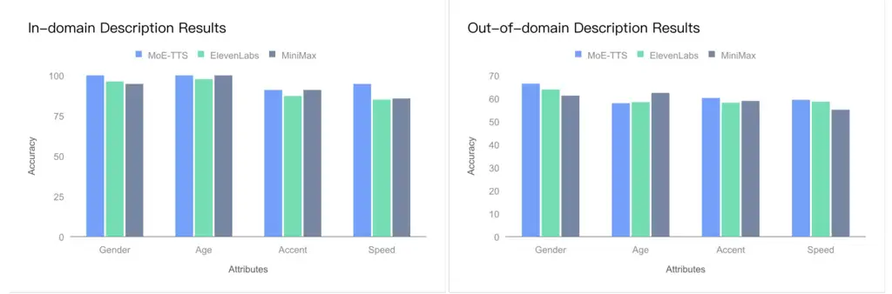

# MoE-TTS: Enhancing Out-of-Domain Text Understanding for Description-based TTS via Mixture-of-Experts

Heyang Xue, Xuchen Song , Yu Tang, Jianyu Chen, Yanru Chen, Yang Li,
Yahui Zhou ^(†)^(†)thanks: Corresponding author Affiliation: Kunlun Inc.
Affiliation: {heyang.xue, xuchen.song}@kunlun-inc.com

###### Abstract

Description-based text-to-speech (TTS) models exhibit strong performance
on in-domain text descriptions, i.e., those encountered during training.
However, in real-world applications, the diverse range of user-generated
descriptions inevitably introduces numerous out-of-domain inputs that
challenge the text understanding capabilities of these systems. To
address this issue, we propose MoE-TTS, a description-based TTS model
designed to enhance the understanding of out-of-domain text
descriptions. MoE-TTS employs a modality-based mixture-of-experts (MoE)
approach to augment a pre-trained textual large language model (LLM)
with a set of specialized weights adapted to the speech modality while
maintaining the original LLM frozen during training. This approach
allows MoE-TTS to effectively leverage the pre-trained knowledge and
text understanding abilities of textual LLMs. Our experimental results
indicate that: first, even the most advanced closed-source commercial
products can be challenged by carefully designed out-of-domain
description test sets; second, MoE-TTS achieves superior performance in
generating speech that more accurately reflects the descriptions. We
encourage readers to listen to the demos at
[https://welkinyang.github.io/MoE-TTS/](https://welkinyang.github.io/MoE-TTS/).

## 1 Introduction

In recent years, description-based text-to-speech (TTS) technology has
been adopted in industrial applications \[1, 2\], enabling users to
precisely control the speaker and style characteristics of synthesized
speech through natural language text descriptions (e.g., "clear,
youthful voice with a magnetic tone"). This interaction method
significantly lowers the barrier for speech customization and holds
great potential in areas such as virtual assistants and audio content
creation. Concurrently, substantial research \[3, 4, 5, 6, 7, 8, 9, 10\]
progress has been made to generate speech that better aligns with these
descriptions. Among them, numerous studies \[5, 4, 8, 7, 9, 10\] have
contributed dedicated, open-source datasets to advance description-based
TTS. The natural language descriptions within these datasets often
originate from a finite set of predefined tags representing speaker and
style attributes. While dataset designers utilize large language
models (LLMs) \[11, 12\] and carefully engineered prompts to structure
these tags into natural language and enhance diversity, the resulting
descriptions (referred to as in-domain descriptions) remain
fundamentally constrained by the underlying tag space. In stark
contrast, real-world user-generated descriptions exhibit immense
diversity, inevitably exceeding the scope of the training data. These
out-of-domain descriptions pose a significant challenge to the text
understanding capabilities of models trained solely on in-domain data,
limiting their practical robustness.

Existing approaches to text understanding in description-based TTS fall
into three main categories. The first approach involves training
encoders for textual descriptions jointly with the TTS model itself \[4,
6\]. Although this method is straightforward, it relies exclusively on
in-domain descriptions for learning, which inherently limits its
potential for broader generalization. The second approach \[3, 9\]
incorporates pre-trained textual encoders, such as T5 \[13\], to
leverage extensive pre-trained linguistic knowledge. Although this
strategy improves generalizability to some extent, it is constrained by
the capacity of the encoder to handle complex linguistic phenomena. The
last category \[14, 15\] uses a pre-trained textual LLM to initialize
the backbone network without any additional encoders, thereby providing
a more natural mechanism for processing natural language descriptions.
Notably, textual LLMs (e.g. Qwen \[16\]) offer not only richer
pre-trained knowledge but also more advanced natural language
understanding capabilities, enabling them to decode nuanced
descriptions. Despite the promising potential of this third approach for
out-of-domain understanding, updating all model parameters within a
modal coupled framework can lead to catastrophic forgetting \[17\],
which undermines the retention of pre-trained knowledge and consequently
impairs text understanding. To address this challenge, the present work
investigates improved strategies for leveraging textual LLMs to achieve
robust understanding of out-of-domain descriptions.

Inspired by the successful application of the Mixture-of-Experts (MoE)
paradigm in multimodal large language models (MLLMs) \[18, 19, 20, 21\],
we propose MoE-TTS. Our model enhances out-of-domain description
understanding within a description-based TTS framework. Specifically,
MoE-TTS integrates a set of learnable speech-specific parameters (acting
as speech-modality experts) seamlessly into a pre-trained textual LLM
via a modality-based MoE approach. Crucially, the original LLM
parameters remain frozen throughout training, preserving its potent
pre-trained knowledge and text understanding capabilities. Furthermore,
we meticulously construct an out-of-domain description test set using
diverse linguistic strategies specifically designed to rigorously
evaluate the generalization performance of MoE-TTS on challenging unseen
descriptions. In our experiments, we compared MoE-TTS with
state-of-the-art models from commercial entitles, such as:
ElevenLabs \[1\] and MiniMax \[2\]. The results suggest that even when
trained solely on open-source datasets, MoE-TTS still demonstrates
superior performance for both in-domain and out-of-domain descriptions.
Our key contributions can be summarized as follows:

- •
  We are the first to focus on the performance of description-based TTS
  with out-of-domain descriptions. This approach helps bridge the gap
  between description-based TTS research and real-world applications.
- •
  To the best of our knowledge, MoE-TTS is the first work to apply
  mixture-of-experts techniques to enhance TTS models by leveraging the
  pre-trained knowledge and text understanding capabilities of textual
  LLM.
- •
  The experimental results demonstrate that our design surpasses
  state-of-the-art commercial models in generating speech that more
  aligned with the descriptions.

## 2 Related Work

### 2.1 Description-based TTS

PromptTTS \[3\] pioneered description-based TTS by creating a natural
language dataset derived from five style tags using SimBERT \[22\]. Its
architecture utilized BERT \[23\] as the text understanding module and
FastSpeech \[24\] as the speech generation module. While PromptTTS
demonstrated the ability to control speaker and style characteristics
through natural language descriptions, it exhibited notable limitations.
Specifically, its tag-based system was oversimplified: the limited
number of tags provided a restricted descriptive vocabulary for each
tag.

To address this data limitation, subsequent research significantly
expanded the tagging framework. SpeechCraft \[8\] increased the number
of tags to eight, while ParaspeechCaps \[10\] extended it substantially
to 59 tags, enriching the descriptive vocabulary associated with each
tag. Furthermore, later studies replaced SimBERT with powerful,
commercially available large language models (LLMs), such as GPT-3.5
Turbo in TextrolSpeech \[5\] and GPT-4 in ParaspeechCaps \[6\], to
generate more natural and diverse descriptions from the tags.
EmoVoice \[15\] constructed a high-quality emotion dataset featuring
expressive speech and fine-grained emotion tags with natural language
descriptions. Concurrently, advancements in language models-based
TTS \[25, 14, 26, 27\] led to their replacement of FastSpeech as
generation modules \[5, 9, 15\]. Models like Parler-TTS \[9\] further
enhance text processing by leveraging pre-trained T5 within the
understanding module.

Collectively, these works and the open-source datasets they
introduced—have established a critical foundation for ongoing research
in description-based TTS systems.

### 2.2 Mixture-of-Experts

Recently, the MoE paradigm has been widely adopted in MLLMs \[18, 19,
20, 21, 28\]. These models benefit from the ability of MoE approaches to
decouple parameter spaces across different modalities, thereby avoiding
the representational interference often caused by fully shared
parameters. This facilitates more effective training and model
scaling \[28\].

Notably, Mono-InternVL \[18\] leverages MoE by embedding a visual
parameter space into a frozen, pre-trained textual LLM and employs a
static routing strategy to assign experts to corresponding tokens. This
design preserves the pre-trained knowledge and text understanding
capabilities of the LLM while facilitating the learning of visual
representations. Furthermore, EVEv2 \[19\] discovered the shortcomings
caused by interference between modalities in multimodal learning through
a series of careful experiments. To address this issue, EVEv2
incorporates modality-specific weights into critical Transformer
components achieving finer-grained modality separation.

Our work is inspired by these innovative approaches to modality
integration and parameter decoupling.

### 2.3 Text Understanding Ability

Previous studies \[29\] have established that robust text understanding
is critical for the performance of TTS models, influencing naturalness,
content accuracy, and expressiveness. Consequently, leveraging the
inherent text-processing capabilities of textual LLMs presents a natural
approach. For example, CosyVoice2 \[14\] initializes its TTS model with
Qwen2.5-0.5B \[30\], and Llasa \[29\] inherits initialization parameters
and training paradigms from LLaMA3 \[31\].

However, catastrophic forgetting \[17\] during training hinders the full
utilization of the text capabilities of LLMs when relying solely on
initialization. Orpheus-TTS \[32\] attempts to mitigate this issue by
incorporating text data during pre-training to preserve the capabilities
of LLaMA. Nevertheless, this strategy introduces significant
computational overhead due to the complexity of the data. In addition,
discrepancies in the data distribution and scale of the incorporated
text and the original LLM training corpus can compromise their
linguistic competence.

In this paper, MoE-TTS addresses the challenge of effectively leveraging
the pre-trained knowledge and text understanding capabilities of textual
LLMs within TTS frameworks. While primarily focused on improving text
description understanding, MoE-TTS provides a practical solution to this
critical issue by effectively mitigating the limitations related to
catastrophic forgetting and the complexities of multi-modal data
integration.

Figure 1: Overview of MoE-TTS. MoE-TTS is initialized from a pre-trained
textual LLM and transforms key components of the original Transformer
blocks into mixture-of-expert layers. The original weights function as
text experts, while the newly incorporated weights serve as speech
experts.

[TABLE]

Table 1: Examples of differences in wording between in-domain
descriptions and out-of-domain descriptions for different voice
attributes. The underline indicates the description corresponding to the
specific voice attribute.

## 3 MoE-TTS

### 3.1 Basic Task

Our core idea is to fully leverage the pre-trained knowledge of textual
LLMs to enhance the understanding of out-of-domain descriptions.
Following this principle, we first construct the entire
description-based TTS system from a pre-trained transformer-based
textual LLM with a textual tokenizer (e.g., Qwen3) and adhering to its
next-token prediction training objective. To enable the generation of
speech tokens, we then incorporate speech tokens into the vocabulary and
insert the newly initialized token embeddings into the original LLM.
This approach allows us to train description-based TTS models within a
fully textual LLM paradigm. Specifically, given the conditional text
input $`T\in\mathbb{Z}^{n}`$, which consists of the text transcription
and text description, we have the corresponding speech output
$`Y\in\mathbb{R}^{m}`$. We then convert $`T`$ and $`Y`$ into discrete
text tokens $`t\in\mathbb{R}^{n}`$ and speech tokens
$`y\in\mathbb{R}^{m^{\prime}}`$ through text and speech tokenizers,
respectively. In this work, MoE-TTS addresses the following problem:

```math
\displaystyle p(y_{1:m^{\prime}}\mid t_{1:n};\theta,\theta_{s})=p(y_{1}\mid t_{1:n};\theta,\theta_{s})\prod_{i=2}^{m^{\prime}}p(y_{m^{\prime}}\mid t_{1:n},y_{1:m^{\prime}-1};\theta,\theta_{s}). \tag{1}
```

where $`\theta`$ denotes the parameters of the pre-trained LLM, and
$`\theta_{s}`$ represents the newly added parameters for the speech
modality.

### 3.2 Modality-based Mixture-of-Experts

Using a textual LLM as the base model leverages its pre-trained
knowledge and text understanding capabilities. However, updating LLM
parameters within a modal coupled framework during training inevitably
leads to catastrophic forgetting \[18\], which hinders the effective
utilization of that pre-trained knowledge and text understanding
capabilities. To address this issue, we introduce a practical MoE
approach. As illustrated in Figure 1, MoE-TTS integrates a set of
speech-modality parameter spaces, acting as speech experts, into the
pre-trained LLM. It employs a modality-specific routing strategy \[18\]
to assign text and speech experts to their corresponding tokens,
resulting in modality-aware MoE layers. During training, only the
weights of the speech-modality experts are updated, while the original
LLM parameters remain frozen. This approach ensures that the frozen
parameters retain the pre-trained knowledge, thereby preventing
catastrophic forgetting. Moreover, these frozen parameters enhance
generalization on out-of-domain descriptions during inference by
preserving the powerful text understanding capabilities of the original
textual LLM. To further reduce interference between modalities, we
follow \[19\] by converting critical components within transformer
blocks into modality-aware MoE layers, including multi-head attention
(ATTN), feed-forward networks (FFN), and layer normalization (LN).

Specifically, given text tokens $`t\in\mathbb{R}^{n}`$ and speech tokens
$`y\in\mathbb{R}^{m^{\prime}}`$ as inputs, we first obtain token
embeddings:

```math
\displaystyle e_{t}=\text{Embedding}(t),\quad e_{y}=\text{Embedding}(y) \tag{2}
```

yielding $`e_{t}\in\mathbb{R}^{n\times d}`$ and
$`e_{y}\in\mathbb{R}^{m^{\prime}\times d}`$. The combined input token
embedding for transformer blocks is then
$`e=\text{Concat}(e_{t},e_{y})\in\mathbb{R}^{(n+m^{\prime})\times d}`$.
With the MoE approach integrated, each transformer block layer operates
as follows:

```math
\displaystyle e^{l^{\prime}} \displaystyle=e^{l-1}+\text{ATTN}(\text{MoE\_LN}(e^{l-1})), \tag{3}
```

```math
\displaystyle e^{l} \displaystyle=e^{l^{\prime}}+\text{MoE\_FFN}(\text{MoE\_LN}(e^{l^{\prime}})).
```

```math
\displaystyle\text{ATTN}(e) \displaystyle=\text{MoE\_{O}}\left(\text{softmax}\left(\frac{\text{MoE\_Q}(e)\cdot\text{MoE\_K}(e)^{\text{T}}}{\sqrt{d_{k}}}\right)\cdot\text{MoE\_V}(e)\right).
```

All MoE layers prefixed with ’$`\text{MoE}\_`$’ are defined
conditionally based on token modality:

```math
\text{MoE}\_\text{Layer}(e_{i})=\left\{\begin{aligned} &\text{Layer}_{t}(e_{i}),\quad\text{if}\kern 5.0pte_{i}\in e_{t},\\
&\text{Layer}_{y}(e_{i}),\quad\text{if}\kern 5.0pte_{i}\in e_{y}.\\
\end{aligned}\right. \tag{4}
```

where $`e_{i}`$ denotes the $`i`$-th element of the token embeddings
$`e`$. $`\text{Layer}_{t}`$ and $`\text{Layer}_{y}`$ represent the text
expert and speech expert components of the MoE layers, respectively. The
speech expert is initialized using the parameters of the text expert,
ensuring that both layers possess an identical architecture and
parameter count.

### 3.3 Acoustic Modeling

Since the central concept of MoE-TTS focuses on leveraging the text
understanding capabilities of pre-trained textual LLMs, the model does
not impose any restrictions on the choice of discrete speech
representations. Available options include:

- •
  Semantic tokens derived from self-supervised learning (SSL)
  encoders \[33, 34\] using vector quantization methods \[35, 36\]
- •
  Acoustic tokens generated by neural codecs \[36, 37\]
- •
  Hybrid representations combining both \[29, 38\]

In this work, we utilize the speech tokenizer from CosyVoice2 for
waveform tokenization. To reconstruct the waveform from predicted speech
tokens, we employ a widely adopted multi-stage approach \[14, 26, 27\].
Specifically, a diffusion model \[39\] transforms discrete speech tokens
predicted by the LLM into Gaussian latent representations. During
training, these Gaussian latent representations are extracted using a
pre-trained VAEGAN \[40\]. During inference, the decoder component of
the VAEGAN converts these latent representations back into the final
waveform.

## 4 Experiments

### 4.1 Experimental Setup

#### Model Setup

In this work, we utilize the open-sourced Qwen3-4B model \[16\] as the
foundational textual LLM to leverage its powerful pre-training knowledge
and text understanding capabilities. After implementing the previously
described MoE approach, we scaled MoE-TTS to 8 billion parameters. For
speech tokenization, we employ the speech tokenizer component of
CosyVoice2 operating at a frame rate of 25 Hz to convert waveform
signals into discrete speech tokens. These 6,561 distinct speech tokens
were subsequently incorporated into the vocabulary of the Qwen3 model.
Regarding the diffusion model implementation, we adopt the Elucidated
Diffusion Models (EDM) framework \[39\]—a widely recognized approach in
image and speech generation. Specifically, we implement the Diffusion
Transformer (DiT) architecture \[41\] from Stable Audio \[40\],
configuring it with 0.7 billion parameters. Additionally, we integrate
the VAEGAN component from Stable Audio, preserving the same
architectural configuration, training procedures, and inference
pipelines. This component processes latent representations at 50 Hz with
32-dimensional features.

#### Training Details

During training, we strictly adhered to the original chat template
format of Qwen3. This involved utilizing system prompts, text
descriptions, and text transcripts as user messages, while speech tokens
were used as assistant messages. The template contains a thinking block
designated for Chain-of-Thought (CoT) content, which we left empty for
simplicity. Due to the limited scale of open-source description-based
TTS datasets, we divided the LLM training within MoE-TTS into two
phases: 1) Pre-training phase: Focused on developing text-to-speech
capabilities using pure TTS datasets devoid of text descriptions. 2)
Fine-tuning phase: Leveraged description-based datasets to enhance
understanding of text descriptions and corresponding speech generation,
initializing from the parameters obtained in phase one. Both phases
employed the AdamW optimizer with betas of \[0.9, 0.98\], a learning
rate of $`3\times 10^{-4}`$, a cosine learning rate scheduler, and a
warm-up ratio of 0.08, training for one epoch. Importantly, only the
speech-modality parameters were updated during training, while the
original parameters (i.e., text-modality experts) remained frozen.
Regarding the acoustic modeling modules (EDM and VAEGAN), we trained
them exclusively on TTS datasets without any fine-tuning.

#### Data Preparation

To facilitate reproducibility, we exclusively utilized open-source
corpora. For the LLM pre-training phase, we employed two TTS datasets:
VoxBox \[38\] and Emilia-YODAS \[42\]. The fine-tuning phase
incorporated multiple description-based TTS datasets:
TextrolSpeech \[5\], SpeechCraft \[8\], Parler-TTS \[9\],
LibriTTS-P \[7\], and ParaspeechCaps \[10\]. All speech samples were
resampled to 16kHz to align with the speech tokenizer requirements
during LLM training. For VAEGAN training, samples were resampled to
48kHz to ensure high-fidelity waveform reconstruction. To evaluate the
effectiveness of MoE-TTS, we first constructed two specific test sets:
an in-domain description test set and an out-of-domain description test
set. Each test sample includes a text description and the text to be
synthesized. Specifically, the in-domain test set contains 20 test
samples, while the out-of-domain test set contains 40 test samples. As
the name suggests, the text descriptions in the in-domain description
set do not exceed the scope of the training data. In contrast, the
descriptions in the out-of-domain test set were constructed using a
series of linguistic strategies to ensure they differ significantly from
the training data. Specifically, we employed metaphors, analogies,
implications, and paraphrases to implicitly convey the speaker and style
voice attributes contained in the descriptions, such as gender, age,
pitch, speed, speaking style, and emotion. Table 1 provides examples
illustrating the differences between in-domain and out-of-domain
descriptions when describing various voice attributes.

| Test Sets                  | Models     | SQ         | WSSA       | PA         | SEA        | OA         | OS         |
| -------------------------- | ---------- | ---------- | ---------- | ---------- | ---------- | ---------- | ---------- |
| In-domain Descriptions     | MoE-TTS    | 4.12±0.082 | 4.06±0.108 | 4.23±0.106 | 4.06±0.093 | 3.61±0.132 | 3.82±0.081 |
|                            | ElevenLabs | 4.06±0.084 | 4.27±0.084 | 4.45±0.094 | 3.85±0.098 | 3.26±0.142 | 3.77±0.070 |
|                            | MiniMax    | 4.24±0.082 | 4.11±0.103 | 4.40±0.094 | 3.87±0.098 | 3.46±0.132 | 3.83±0.081 |
| Out-of-domain Descriptions | MoE-TTS    | 3.84±0.075 | 4.30±0.070 | 4.57±0.052 | 4.02±0.063 | 3.75±0.097 | 3.79±0.054 |
|                            | ElevenLabs | 4.02±0.071 | 4.35±0.069 | 4.62±0.051 | 3.89±0.080 | 3.39±0.101 | 3.73±0.059 |
|                            | MiniMax    | 4.25±0.062 | 4.28±0.066 | 4.56±0.060 | 3.87±0.072 | 3.30±0.091 | 3.70±0.063 |

Table 2: We compare MoE-TTS with the most leading commercial products.

### 4.2 Evaluations

#### Evaluation Metrics

A well-designed description-based TTS model should meet two core
requirements for effective evaluation: 1) The synthesized speech content
must accurately reflect the target text transcription. 2) Speaker
characteristics and style characteristics in synthesized speech must
closely match the text description. To comprehensively assess model
performance against these criteria, we designed a detailed subjective
evaluation. Twenty-one professional speech evaluators participated, each
rating synthesized samples on a 5-point scale across six dimensions:
speech quality (SQ), word and sentence segmentation accuracy (WSSA),
pronunciation accuracy (PA), stylistic expressiveness alignment (SEA),
overall alignment (OA) and overall score (OS). Here, alignment
quantifies conformity with the text descriptions. The dimensions SQ,
WSSA, and PA evaluate requirement 1 (content accuracy), while SEA and OA
measure requirement 2 (characteristic matching). The OA score represents
overall performance considering all factors. We computed Mean Opinion
Scores (MOS) for each dimension by aggregating all evaluator ratings.
Although alignment scores indicate overall conformity between
description and speech, they lack detailed insights into contributing
factors. Therefore, evaluators also verified attribute-level matches for
gender, age, accent, and speaking speed. Each test sample underwent
attribute verification by seven evaluators. Results were aggregated to
calculate accuracy metrics per attribute, enabling a granular analysis
of the factors influencing alignment scores.

#### Comparison with State-of-the-Art Models

Our evaluation compares MoE-TTS against leading commercial systems:
ElevenLabs and MiniMax. We synthesized test samples using their latest
publicly available APIs¹¹ 1 As of early August 2025, the ElevenLabs
multilingual_v2 API was used, as the alpha v3 remained inaccessible. to
benchmark capabilities at the time of evaluation. Table 2 presents MOS
results across test sets. For basic TTS capabilities, MoE-TTS achieves
performance comparable to both commercial systems across all test sets.
ElevenLabs attained the highest scores in WSSA and PA, while MiniMax
excelled in SQ. Given that MoE-TTS foundational TTS capabilities were
trained exclusively on open-source datasets, these results validate its
potential as a novel paradigm for foundational TTS modeling. Crucially,
in description-alignment dimensions (SEA and OA), MoE-TTS significantly
outperforms both closed-source commercial competitors. This demonstrates
that MoE-TTS effectively leverages textual LLM pre-training knowledge
to: 1) Excel on in-domain descriptions. 2) Achieve superior alignment on
out-of-domain descriptions. Regarding overall scores: MiniMax achieved
the highest scores on in-domain descriptions while MoE-TTS led on
out-of-domain descriptions. To analyze alignment superiority, Figure 2
compares attribute accuracy across systems. MoE-TTS achieved the highest
accuracy across most voice attributes (gender, accent, speed) in both
test sets, except for the age attribute in out-of-domain descriptions
where it trailed the commercial systems. Notably, all systems exhibited
significant accuracy degradation on out-of-domain descriptions,
highlighting inherent challenges in this domain.



Figure 2: We compare the accuracy of MoE-TTS, ElevenLabs, and Minimax
across four fundamental voice attributes—gender, age, accent, and
speed—using both in-domain and out-of-domain description test sets.

## 5 Limitations

Due to its reliance on open-source data, the current MoE-TTS
implementation supports only English text descriptions as input.
However, the framework shows strong potential for multilingual
extension. GPU resource constraints limited our ability to evaluate
MoE-TTS effectiveness across diverse LLM architectures. Key open
questions include the performance impact of reduced model parameters and
the scalability benefits of increased parameter counts. We defer these
investigations to future work.

## 6 Conclusion

In this paper, we focus on the challenging issues posed by out-of-domain
descriptions in description-based text-to-speech (TTS) tasks. Building
on the core idea of enhancing description-based TTS through the
pre-trained knowledge and text understanding capabilities of large
language models, we propose MoE-TTS. Our approach employs a
mixture-of-experts framework that utilizes a modality-based routing
strategy and modality-aware Transformer components to bridge large
language models and TTS models. Experimental results demonstrate that
MoE-TTS outperforms state-of-the-art closed-source commercial models
using only open-source datasets.

## References

- \[1\] Elevenlabs. URL
  [https://elevenlabs.io/](https://elevenlabs.io/).
- \[2\] Minimax. URL
  [https://www.minimaxi.com/](https://www.minimaxi.com/).
- \[3\] Zhifang Guo, Yichong Leng, Yihan Wu, Sheng Zhao, and Xu Tan.
  Prompttts: Controllable text-to-speech with text descriptions. In
  _IEEE International Conference on Acoustics, Speech and Signal
  Processing ICASSP 2023, Rhodes Island, Greece, June 4-10, 2023_, pages
  1–5. IEEE, 2023. doi: 10.1109/ICASSP49357.2023.10096285. URL
  [https://doi.org/10.1109/ICASSP49357.2023.10096285](https://doi.org/10.1109/ICASSP49357.2023.10096285).
- \[4\] Reo Shimizu, Ryuichi Yamamoto, Masaya Kawamura, Yuma Shirahata,
  Hironori Doi, Tatsuya Komatsu, and Kentaro Tachibana. Prompttts++:
  Controlling speaker identity in prompt-based text-to-speech using
  natural language descriptions. In _IEEE International Conference on
  Acoustics, Speech and Signal Processing, ICASSP 2024, Seoul, Republic
  of Korea, April 14-19, 2024_, pages 12672–12676. IEEE, 2024. doi:
  10.1109/ICASSP48485.2024.10448173. URL
  [https://doi.org/10.1109/ICASSP48485.2024.10448173](https://doi.org/10.1109/ICASSP48485.2024.10448173).
- \[5\] Shengpeng Ji, Jialong Zuo, Minghui Fang, Ziyue Jiang, Feiyang
  Chen, Xinyu Duan, Baoxing Huai, and Zhou Zhao. Textrolspeech: A text
  style control speech corpus with codec language text-to-speech models.
  In _IEEE International Conference on Acoustics, Speech and Signal
  Processing, ICASSP 2024, Seoul, Republic of Korea, April 14-19, 2024_,
  pages 10301–10305. IEEE, 2024. doi: 10.1109/ICASSP48485.2024.10445879.
  URL
  [https://doi.org/10.1109/ICASSP48485.2024.10445879](https://doi.org/10.1109/ICASSP48485.2024.10445879).
- \[6\] Yichong Leng, Zhifang Guo, Kai Shen, Zeqian Ju, Xu Tan, Eric
  Liu, Yufei Liu, Dongchao Yang, Leying Zhang, Kaitao Song, Lei He,
  Xiangyang Li, Sheng Zhao, Tao Qin, and Jiang Bian. Prompttts 2:
  Describing and generating voices with text prompt. In _The Twelfth
  International Conference on Learning Representations, ICLR 2024,
  Vienna, Austria, May 7-11, 2024_. OpenReview.net, 2024. URL
  [https://openreview.net/forum?id=NsCXDyv2Bn](https://openreview.net/forum?id=NsCXDyv2Bn).
- \[7\] Masaya Kawamura, Ryuichi Yamamoto, Yuma Shirahata, Takuya
  Hasumi, and Kentaro Tachibana. Libritts-p: A corpus with speaking
  style and speaker identity prompts for text-to-speech and style
  captioning. In Itshak Lapidot and Sharon Gannot, editors, _25th Annual
  Conference of the International Speech Communication Association,
  Interspeech 2024, Kos, Greece, September 1-5, 2024_. ISCA, 2024. doi:
  10.21437/INTERSPEECH.2024-692. URL
  [https://doi.org/10.21437/Interspeech.2024-692](https://doi.org/10.21437/Interspeech.2024-692).
- \[8\] Zeyu Jin, Jia Jia, Qixin Wang, Kehan Li, Shuoyi Zhou, Songtao
  Zhou, Xiaoyu Qin, and Zhiyong Wu. Speechcraft: A fine-grained
  expressive speech dataset with natural language description. In
  Jianfei Cai, Mohan S. Kankanhalli, Balakrishnan Prabhakaran, Susanne
  Boll, Ramanathan Subramanian, Liang Zheng, Vivek K. Singh, Pablo
  César, Lexing Xie, and Dong Xu, editors, _Proceedings of the 32nd ACM
  International Conference on Multimedia, MM 2024, Melbourne, VIC,
  Australia, 28 October 2024 - 1 November 2024_, pages 1255–1264.
  ACM, 2024. doi: 10.1145/3664647.3681674. URL
  [https://doi.org/10.1145/3664647.3681674](https://doi.org/10.1145/3664647.3681674).
- \[9\] Daniel Lyth and Simon King. Natural language guidance of
  high-fidelity text-to-speech with synthetic annotations. _CoRR_,
  abs/2402.01912, 2024. doi: 10.48550/ARXIV.2402.01912. URL
  [https://doi.org/10.48550/arXiv.2402.01912](https://doi.org/10.48550/arXiv.2402.01912).
- \[10\] Anuj Diwan, Zhisheng Zheng, David Harwath, and Eunsol Choi.
  Scaling rich style-prompted text-to-speech datasets. _CoRR_,
  abs/2503.04713, 2025. doi: 10.48550/ARXIV.2503.04713. URL
  [https://doi.org/10.48550/arXiv.2503.04713](https://doi.org/10.48550/arXiv.2503.04713).
- \[11\] OpenAI. GPT-4 technical report. _CoRR_, abs/2303.08774, 2023.
  doi: 10.48550/ARXIV.2303.08774. URL
  [https://doi.org/10.48550/arXiv.2303.08774](https://doi.org/10.48550/arXiv.2303.08774).
- \[12\] Hugo Touvron, Louis Martin, Kevin Stone, Peter Albert, Amjad
  Almahairi, Yasmine Babaei, Nikolay Bashlykov, Soumya Batra, Prajjwal
  Bhargava, Shruti Bhosale, Dan Bikel, Lukas Blecher, Cristian
  Canton-Ferrer, Moya Chen, Guillem Cucurull, David Esiobu, Jude
  Fernandes, Jeremy Fu, Wenyin Fu, Brian Fuller, Cynthia Gao, Vedanuj
  Goswami, Naman Goyal, Anthony Hartshorn, Saghar Hosseini, Rui Hou,
  Hakan Inan, Marcin Kardas, Viktor Kerkez, Madian Khabsa, Isabel
  Kloumann, Artem Korenev, Punit Singh Koura, Marie-Anne Lachaux,
  Thibaut Lavril, Jenya Lee, Diana Liskovich, Yinghai Lu, Yuning Mao,
  Xavier Martinet, Todor Mihaylov, Pushkar Mishra, Igor Molybog, Yixin
  Nie, Andrew Poulton, Jeremy Reizenstein, Rashi Rungta, Kalyan Saladi,
  Alan Schelten, Ruan Silva, Eric Michael Smith, Ranjan Subramanian,
  Xiaoqing Ellen Tan, Binh Tang, Ross Taylor, Adina Williams, Jian Xiang
  Kuan, Puxin Xu, Zheng Yan, Iliyan Zarov, Yuchen Zhang, Angela Fan,
  Melanie Kambadur, Sharan Narang, Aurélien Rodriguez, Robert Stojnic,
  Sergey Edunov, and Thomas Scialom. Llama 2: Open foundation and
  fine-tuned chat models. _CoRR_, abs/2307.09288, 2023. doi:
  10.48550/ARXIV.2307.09288. URL
  [https://doi.org/10.48550/arXiv.2307.09288](https://doi.org/10.48550/arXiv.2307.09288).
- \[13\] Colin Raffel, Noam Shazeer, Adam Roberts, Katherine Lee, Sharan
  Narang, Michael Matena, Yanqi Zhou, Wei Li, and Peter J. Liu.
  Exploring the limits of transfer learning with a unified text-to-text
  transformer. _J. Mach. Learn. Res._, 21:140:1–140:67, 2020. URL
  [https://jmlr.org/papers/v21/20-074.html](https://jmlr.org/papers/v21/20-074.html).
- \[14\] Zhihao Du, Yuxuan Wang, Qian Chen, Xian Shi, Xiang Lv, Tianyu
  Zhao, Zhifu Gao, Yexin Yang, Changfeng Gao, Hui Wang, Fan Yu, Huadai
  Liu, Zhengyan Sheng, Yue Gu, Chong Deng, Wen Wang, Shiliang Zhang,
  Zhijie Yan, and Jingren Zhou. Cosyvoice 2: Scalable streaming speech
  synthesis with large language models. _CoRR_, abs/2412.10117, 2024.
  doi: 10.48550/ARXIV.2412.10117. URL
  [https://doi.org/10.48550/arXiv.2412.10117](https://doi.org/10.48550/arXiv.2412.10117).
- \[15\] Guanrou Yang, Chen Yang, Qian Chen, Ziyang Ma, Wenxi Chen, Wen
  Wang, Tianrui Wang, Yifan Yang, Zhikang Niu, Wenrui Liu, Fan Yu,
  Zhihao Du, Zhifu Gao, Shiliang Zhang, and Xie Chen. Emovoice:
  Llm-based emotional text-to-speech model with freestyle text
  prompting. _CoRR_, abs/2504.12867, 2025a. doi:
  10.48550/ARXIV.2504.12867. URL
  [https://doi.org/10.48550/arXiv.2504.12867](https://doi.org/10.48550/arXiv.2504.12867).
- \[16\] An Yang, Anfeng Li, Baosong Yang, Beichen Zhang, Binyuan Hui,
  Bo Zheng, Bowen Yu, Chang Gao, Chengen Huang, Chenxu Lv, Chujie Zheng,
  Dayiheng Liu, Fan Zhou, Fei Huang, Feng Hu, Hao Ge, Haoran Wei, Huan
  Lin, Jialong Tang, Jian Yang, Jianhong Tu, Jianwei Zhang, Jian Yang,
  Jiaxi Yang, Jingren Zhou, Jingren Zhou, Junyang Lin, Kai Dang, Keqin
  Bao, Kexin Yang, Le Yu, Lianghao Deng, Mei Li, Mingfeng Xue, Mingze
  Li, Pei Zhang, Peng Wang, Qin Zhu, Rui Men, Ruize Gao, Shixuan Liu,
  Shuang Luo, Tianhao Li, Tianyi Tang, Wenbiao Yin, Xingzhang Ren, Xinyu
  Wang, Xinyu Zhang, Xuancheng Ren, Yang Fan, Yang Su, Yichang Zhang,
  Yinger Zhang, Yu Wan, Yuqiong Liu, Zekun Wang, Zeyu Cui, Zhenru Zhang,
  Zhipeng Zhou, and Zihan Qiu. Qwen3 technical report. _CoRR_,
  abs/2505.09388, 2025b. doi: 10.48550/ARXIV.2505.09388. URL
  [https://doi.org/10.48550/arXiv.2505.09388](https://doi.org/10.48550/arXiv.2505.09388).
- \[17\] Yuexiang Zhai, Shengbang Tong, Xiao Li, Mu Cai, Qing Qu,
  Yong Jae Lee, and Yi Ma. Investigating the catastrophic forgetting in
  multimodal large language models. _CoRR_, abs/2309.10313, 2023. doi:
  10.48550/ARXIV.2309.10313. URL
  [https://doi.org/10.48550/arXiv.2309.10313](https://doi.org/10.48550/arXiv.2309.10313).
- \[18\] Gen Luo, Xue Yang, Wenhan Dou, Zhaokai Wang, Jiawen Liu, Jifeng
  Dai, Yu Qiao, and Xizhou Zhu. Mono-internvl: Pushing the boundaries of
  monolithic multimodal large language models with endogenous visual
  pre-training. In _IEEE/CVF Conference on Computer Vision and Pattern
  Recognition, CVPR 2025, Nashville, TN, USA, June 11-15, 2025_, pages
  24960–24971. Computer Vision Foundation / IEEE, 2025. URL
  [https://openaccess.thecvf.com/content/CVPR2025/html/Luo_Mono-InternVL_Pushing_the_Boundaries_of_Monolithic_Multimodal_Large_Language_Models_CVPR_2025_paper.html](https://openaccess.thecvf.com/content/CVPR2025/html/Luo_Mono-InternVL_Pushing_the_Boundaries_of_Monolithic_Multimodal_Large_Language_Models_CVPR_2025_paper.html).
- \[19\] Haiwen Diao, Xiaotong Li, Yufeng Cui, Yueze Wang, Haoge Deng,
  Ting Pan, Wenxuan Wang, Huchuan Lu, and Xinlong Wang. Evev2: Improved
  baselines for encoder-free vision-language models. _CoRR_,
  abs/2502.06788, 2025. doi: 10.48550/ARXIV.2502.06788. URL
  [https://doi.org/10.48550/arXiv.2502.06788](https://doi.org/10.48550/arXiv.2502.06788).
- \[20\] Hangbo Bao, Wenhui Wang, Li Dong, Qiang Liu, Owais Khan
  Mohammed, Kriti Aggarwal, Subhojit Som, Songhao Piao, and Furu Wei.
  Vlmo: Unified vision-language pre-training with
  mixture-of-modality-experts. In Sanmi Koyejo, S. Mohamed, A. Agarwal,
  Danielle Belgrave, K. Cho, and A. Oh, editors, _Advances in Neural
  Information Processing Systems 35: Annual Conference on Neural
  Information Processing Systems 2022, NeurIPS 2022, New Orleans, LA,
  USA, November 28 - December 9, 2022_, 2022. URL
  [http://papers.nips.cc/paper_files/paper/2022/hash/d46662aa53e78a62afd980a29e0c37ed-Abstract-Conference.html](http://papers.nips.cc/paper_files/paper/2022/hash/d46662aa53e78a62afd980a29e0c37ed-Abstract-Conference.html).
- \[21\] Wenhui Wang, Hangbo Bao, Li Dong, Johan Bjorck, Zhiliang Peng,
  Qiang Liu, Kriti Aggarwal, Owais Khan Mohammed, Saksham Singhal,
  Subhojit Som, and Furu Wei. Image as a foreign language: Beit
  pretraining for all vision and vision-language tasks. _CoRR_,
  abs/2208.10442, 2022. doi: 10.48550/ARXIV.2208.10442. URL
  [https://doi.org/10.48550/arXiv.2208.10442](https://doi.org/10.48550/arXiv.2208.10442).
- \[22\] Jianlin Su. Simbert: Integrating retrieval and generation into
  bert. Technical report, 2020. URL
  [https://github.com/ZhuiyiTechnology/simbert](https://github.com/ZhuiyiTechnology/simbert).
- \[23\] Jacob Devlin, Ming-Wei Chang, Kenton Lee, and Kristina
  Toutanova. BERT: pre-training of deep bidirectional transformers for
  language understanding. In Jill Burstein, Christy Doran, and Thamar
  Solorio, editors, _Proceedings of the 2019 Conference of the North
  American Chapter of the Association for Computational Linguistics:
  Human Language Technologies, NAACL-HLT 2019, Minneapolis, MN, USA,
  June 2-7, 2019, Volume 1 (Long and Short Papers)_, pages 4171–4186.
  Association for Computational Linguistics, 2019. doi:
  10.18653/V1/N19-1423. URL
  [https://doi.org/10.18653/v1/n19-1423](https://doi.org/10.18653/v1/n19-1423).
- \[24\] Yi Ren, Yangjun Ruan, Xu Tan, Tao Qin, Sheng Zhao, Zhou Zhao,
  and Tie-Yan Liu. Fastspeech: Fast, robust and controllable text to
  speech. In Hanna M. Wallach, Hugo Larochelle, Alina Beygelzimer,
  Florence d’Alché-Buc, Emily B. Fox, and Roman Garnett, editors,
  _Advances in Neural Information Processing Systems 32: Annual
  Conference on Neural Information Processing Systems 2019, NeurIPS
  2019, December 8-14, 2019, Vancouver, BC, Canada_, pages
  3165–3174, 2019. URL
  [https://proceedings.neurips.cc/paper/2019/hash/f63f65b503e22cb970527f23c9ad7db1-Abstract.html](https://proceedings.neurips.cc/paper/2019/hash/f63f65b503e22cb970527f23c9ad7db1-Abstract.html).
- \[25\] Chengyi Wang, Sanyuan Chen, Yu Wu, Ziqiang Zhang, Long Zhou,
  Shujie Liu, Zhuo Chen, Yanqing Liu, Huaming Wang, Jinyu Li, Lei He,
  Sheng Zhao, and Furu Wei. Neural codec language models are zero-shot
  text to speech synthesizers. _CoRR_, abs/2301.02111, 2023. doi:
  10.48550/ARXIV.2301.02111. URL
  [https://doi.org/10.48550/arXiv.2301.02111](https://doi.org/10.48550/arXiv.2301.02111).
- \[26\] Philip Anastassiou, Jiawei Chen, Jitong Chen, Yuanzhe Chen,
  Zhuo Chen, Ziyi Chen, Jian Cong, Lelai Deng, Chuang Ding, Lu Gao,
  Mingqing Gong, Peisong Huang, Qingqing Huang, Zhiying Huang, Yuanyuan
  Huo, Dongya Jia, Chumin Li, Feiya Li, Hui Li, Jiaxin Li, Xiaoyang Li,
  Xingxing Li, Lin Liu, Shouda Liu, Sichao Liu, Xudong Liu, Yuchen Liu,
  Zhengxi Liu, Lu Lu, Junjie Pan, Xin Wang, Yuping Wang, Yuxuan Wang,
  Zhen Wei, Jian Wu, Chao Yao, Yifeng Yang, Yuanhao Yi, Junteng Zhang,
  Qidi Zhang, Shuo Zhang, Wenjie Zhang, Yang Zhang, Zilin Zhao, Dejian
  Zhong, and Xiaobin Zhuang. Seed-tts: A family of high-quality
  versatile speech generation models. _CoRR_, abs/2406.02430, 2024. doi:
  10.48550/ARXIV.2406.02430. URL
  [https://doi.org/10.48550/arXiv.2406.02430](https://doi.org/10.48550/arXiv.2406.02430).
- \[27\] Bowen Zhang, Congchao Guo, Geng Yang, Hang Yu, Haozhe Zhang,
  Heidi Lei, Jialong Mai, Junjie Yan, Kaiyue Yang, Mingqi Yang, Peikai
  Huang, Ruiyang Jin, Sitan Jiang, Weihua Cheng, Yawei Li, Yichen Xiao,
  Yiying Zhou, Yongmao Zhang, Yuan Lu, and Yucen He. Minimax-speech:
  Intrinsic zero-shot text-to-speech with a learnable speaker encoder.
  _CoRR_, abs/2505.07916, 2025. doi: 10.48550/ARXIV.2505.07916. URL
  [https://doi.org/10.48550/arXiv.2505.07916](https://doi.org/10.48550/arXiv.2505.07916).
- \[28\] Sheng Shen, Zhewei Yao, Chunyuan Li, Trevor Darrell, Kurt
  Keutzer, and Yuxiong He. Scaling vision-language models with sparse
  mixture of experts. In Houda Bouamor, Juan Pino, and Kalika Bali,
  editors, _Findings of the Association for Computational Linguistics:
  EMNLP 2023, Singapore, December 6-10, 2023_, pages 11329–11344.
  Association for Computational Linguistics, 2023. doi:
  10.18653/V1/2023.FINDINGS-EMNLP.758. URL
  [https://doi.org/10.18653/v1/2023.findings-emnlp.758](https://doi.org/10.18653/v1/2023.findings-emnlp.758).
- \[29\] Zhen Ye, Xinfa Zhu, Chi-Min Chan, Xinsheng Wang, Xu Tan, Jiahe
  Lei, Yi Peng, Haohe Liu, Yizhu Jin, Zheqi Dai, Hongzhan Lin, Jianyi
  Chen, Xingjian Du, Liumeng Xue, Yunlin Chen, Zhifei Li, Lei Xie,
  Qiuqiang Kong, Yike Guo, and Wei Xue. Llasa: Scaling train-time and
  inference-time compute for llama-based speech synthesis. _CoRR_,
  abs/2502.04128, 2025. doi: 10.48550/ARXIV.2502.04128. URL
  [https://doi.org/10.48550/arXiv.2502.04128](https://doi.org/10.48550/arXiv.2502.04128).
- \[30\] An Yang, Bowen Yu, Chengyuan Li, Dayiheng Liu, Fei Huang,
  Haoyan Huang, Jiandong Jiang, Jianhong Tu, Jianwei Zhang, Jingren
  Zhou, Junyang Lin, Kai Dang, Kexin Yang, Le Yu, Mei Li, Minmin Sun,
  Qin Zhu, Rui Men, Tao He, Weijia Xu, Wenbiao Yin, Wenyuan Yu, Xiafei
  Qiu, Xingzhang Ren, Xinlong Yang, Yong Li, Zhiying Xu, and Zipeng
  Zhang. Qwen2.5-1m technical report. _CoRR_, abs/2501.15383, 2025c.
  doi: 10.48550/ARXIV.2501.15383. URL
  [https://doi.org/10.48550/arXiv.2501.15383](https://doi.org/10.48550/arXiv.2501.15383).
- \[31\] Abhimanyu Dubey, Abhinav Jauhri, Abhinav Pandey, Abhishek
  Kadian, Ahmad Al-Dahle, Aiesha Letman, Akhil Mathur, Alan Schelten,
  Amy Yang, Angela Fan, Anirudh Goyal, Anthony Hartshorn, Aobo Yang,
  Archi Mitra, Archie Sravankumar, Artem Korenev, Arthur Hinsvark, Arun
  Rao, Aston Zhang, Aurélien Rodriguez, Austen Gregerson, Ava Spataru,
  Baptiste Rozière, Bethany Biron, Binh Tang, Bobbie Chern, Charlotte
  Caucheteux, Chaya Nayak, Chloe Bi, Chris Marra, Chris McConnell,
  Christian Keller, Christophe Touret, Chunyang Wu, Corinne Wong,
  Cristian Canton Ferrer, Cyrus Nikolaidis, Damien Allonsius, Daniel
  Song, Danielle Pintz, Danny Livshits, David Esiobu, Dhruv Choudhary,
  Dhruv Mahajan, Diego Garcia-Olano, Diego Perino, Dieuwke Hupkes, Egor
  Lakomkin, Ehab AlBadawy, Elina Lobanova, Emily Dinan, Eric Michael
  Smith, Filip Radenovic, Frank Zhang, Gabriel Synnaeve, Gabrielle Lee,
  Georgia Lewis Anderson, Graeme Nail, Grégoire Mialon, Guan Pang,
  Guillem Cucurell, Hailey Nguyen, Hannah Korevaar, Hu Xu, Hugo Touvron,
  Iliyan Zarov, Imanol Arrieta Ibarra, Isabel M. Kloumann, Ishan Misra,
  Ivan Evtimov, Jade Copet, Jaewon Lee, Jan Geffert, Jana Vranes, Jason
  Park, Jay Mahadeokar, Jeet Shah, Jelmer van der Linde, Jennifer
  Billock, Jenny Hong, Jenya Lee, Jeremy Fu, Jianfeng Chi, Jianyu Huang,
  Jiawen Liu, Jie Wang, Jiecao Yu, Joanna Bitton, Joe Spisak, Jongsoo
  Park, Joseph Rocca, Joshua Johnstun, Joshua Saxe, Junteng Jia,
  Kalyan Vasuden Alwala, Kartikeya Upasani, Kate Plawiak, Ke Li, Kenneth
  Heafield, Kevin Stone, and et al. The llama 3 herd of models. _CoRR_,
  abs/2407.21783, 2024. doi: 10.48550/ARXIV.2407.21783. URL
  [https://doi.org/10.48550/arXiv.2407.21783](https://doi.org/10.48550/arXiv.2407.21783).
- \[32\] The Canopy Labs Team. Orpheus tts: Towards human-sounding tts.
  Technical report, 2025. URL
  [https://canopylabs.ai/model-releases](https://canopylabs.ai/model-releases).
- \[33\] Wei-Ning Hsu, Benjamin Bolte, Yao-Hung Hubert Tsai, Kushal
  Lakhotia, Ruslan Salakhutdinov, and Abdelrahman Mohamed. Hubert:
  Self-supervised speech representation learning by masked prediction of
  hidden units. _IEEE ACM Trans. Audio Speech Lang. Process._,
  29:3451–3460, 2021. doi: 10.1109/TASLP.2021.3122291. URL
  [https://doi.org/10.1109/TASLP.2021.3122291](https://doi.org/10.1109/TASLP.2021.3122291).
- \[34\] Chung-Cheng Chiu, James Qin, Yu Zhang, Jiahui Yu, and Yonghui
  Wu. Self-supervised learning with random-projection quantizer for
  speech recognition. In Kamalika Chaudhuri, Stefanie Jegelka, Le Song,
  Csaba Szepesvári, Gang Niu, and Sivan Sabato, editors, _International
  Conference on Machine Learning, ICML 2022, 17-23 July 2022, Baltimore,
  Maryland, USA_, volume 162 of _Proceedings of Machine Learning
  Research_, pages 3915–3924. PMLR, 2022. URL
  [https://proceedings.mlr.press/v162/chiu22a.html](https://proceedings.mlr.press/v162/chiu22a.html).
- \[35\] Aäron van den Oord, Oriol Vinyals, and Koray Kavukcuoglu.
  Neural discrete representation learning. In Isabelle Guyon, Ulrike von
  Luxburg, Samy Bengio, Hanna M. Wallach, Rob Fergus, S. V. N.
  Vishwanathan, and Roman Garnett, editors, _Advances in Neural
  Information Processing Systems 30: Annual Conference on Neural
  Information Processing Systems 2017, December 4-9, 2017, Long Beach,
  CA, USA_, pages 6306–6315, 2017. URL
  [https://proceedings.neurips.cc/paper/2017/hash/7a98af17e63a0ac09ce2e96d03992fbc-Abstract.html](https://proceedings.neurips.cc/paper/2017/hash/7a98af17e63a0ac09ce2e96d03992fbc-Abstract.html).
- \[36\] Neil Zeghidour, Alejandro Luebs, Ahmed Omran, Jan Skoglund, and
  Marco Tagliasacchi. Soundstream: An end-to-end neural audio codec.
  _IEEE ACM Trans. Audio Speech Lang. Process._, 30:495–507, 2022. doi:
  10.1109/TASLP.2021.3129994. URL
  [https://doi.org/10.1109/TASLP.2021.3129994](https://doi.org/10.1109/TASLP.2021.3129994).
- \[37\] Rithesh Kumar, Prem Seetharaman, Alejandro Luebs, Ishaan Kumar,
  and Kundan Kumar. High-fidelity audio compression with improved
  RVQGAN. In Alice Oh, Tristan Naumann, Amir Globerson, Kate Saenko,
  Moritz Hardt, and Sergey Levine, editors, _Advances in Neural
  Information Processing Systems 36: Annual Conference on Neural
  Information Processing Systems 2023, NeurIPS 2023, New Orleans, LA,
  USA, December 10 - 16, 2023_, 2023. URL
  [http://papers.nips.cc/paper_files/paper/2023/hash/58d0e78cf042af5876e12661087bea12-Abstract-Conference.html](http://papers.nips.cc/paper_files/paper/2023/hash/58d0e78cf042af5876e12661087bea12-Abstract-Conference.html).
- \[38\] Xinsheng Wang, Mingqi Jiang, Ziyang Ma, Ziyu Zhang, Songxiang
  Liu, Linqin Li, Zheng Liang, Qixi Zheng, Rui Wang, Xiaoqin Feng,
  Weizhen Bian, Zhen Ye, Sitong Cheng, Ruibin Yuan, Zhixian Zhao, Xinfa
  Zhu, Jiahao Pan, Liumeng Xue, Pengcheng Zhu, Yunlin Chen, Zhifei Li,
  Xie Chen, Lei Xie, Yike Guo, and Wei Xue. Spark-tts: An efficient
  llm-based text-to-speech model with single-stream decoupled speech
  tokens. _CoRR_, abs/2503.01710, 2025. doi: 10.48550/ARXIV.2503.01710.
  URL
  [https://doi.org/10.48550/arXiv.2503.01710](https://doi.org/10.48550/arXiv.2503.01710).
- \[39\] Tero Karras, Miika Aittala, Timo Aila, and Samuli Laine.
  Elucidating the design space of diffusion-based generative models. In
  Sanmi Koyejo, S. Mohamed, A. Agarwal, Danielle Belgrave, K. Cho, and
  A. Oh, editors, _Advances in Neural Information Processing Systems 35:
  Annual Conference on Neural Information Processing Systems 2022,
  NeurIPS 2022, New Orleans, LA, USA, November 28 - December 9,
  2022_, 2022. URL
  [http://papers.nips.cc/paper_files/paper/2022/hash/a98846e9d9cc01cfb87eb694d946ce6b-Abstract-Conference.html](http://papers.nips.cc/paper_files/paper/2022/hash/a98846e9d9cc01cfb87eb694d946ce6b-Abstract-Conference.html).
- \[40\] Zach Evans, Julian D. Parker, CJ Carr, Zack Zukowski, Josiah
  Taylor, and Jordi Pons. Stable audio open. In _2025 IEEE International
  Conference on Acoustics, Speech and Signal Processing, ICASSP 2025,
  Hyderabad, India, April 6-11, 2025_, pages 1–5. IEEE, 2025. doi:
  10.1109/ICASSP49660.2025.10888461. URL
  [https://doi.org/10.1109/ICASSP49660.2025.10888461](https://doi.org/10.1109/ICASSP49660.2025.10888461).
- \[41\] Nanye Ma, Mark Goldstein, Michael S. Albergo, Nicholas M.
  Boffi, Eric Vanden-Eijnden, and Saining Xie. Sit: Exploring flow and
  diffusion-based generative models with scalable interpolant
  transformers. In Ales Leonardis, Elisa Ricci, Stefan Roth, Olga
  Russakovsky, Torsten Sattler, and Gül Varol, editors, _Computer
  Vision - ECCV 2024 - 18th European Conference, Milan, Italy, September
  29-October 4, 2024, Proceedings, Part LXXVII_, volume 15135 of
  _Lecture Notes in Computer Science_, pages 23–40. Springer, 2024. doi:
  10.1007/978-3-031-72980-5\\2. URL
  [https://doi.org/10.1007/978-3-031-72980-5_2](https://doi.org/10.1007/978-3-031-72980-5_2).
- \[42\] Haorui He, Zengqiang Shang, Chaoren Wang, Xuyuan Li, Yicheng
  Gu, Hua Hua, Liwei Liu, Chen Yang, Jiaqi Li, Peiyang Shi, Yuancheng
  Wang, Kai Chen, Pengyuan Zhang, and Zhizheng Wu. Emilia: A
  large-scale, extensive, multilingual, and diverse dataset for speech
  generation. _CoRR_, abs/2501.15907, 2025. doi:
  10.48550/ARXIV.2501.15907. URL
  [https://doi.org/10.48550/arXiv.2501.15907](https://doi.org/10.48550/arXiv.2501.15907).
