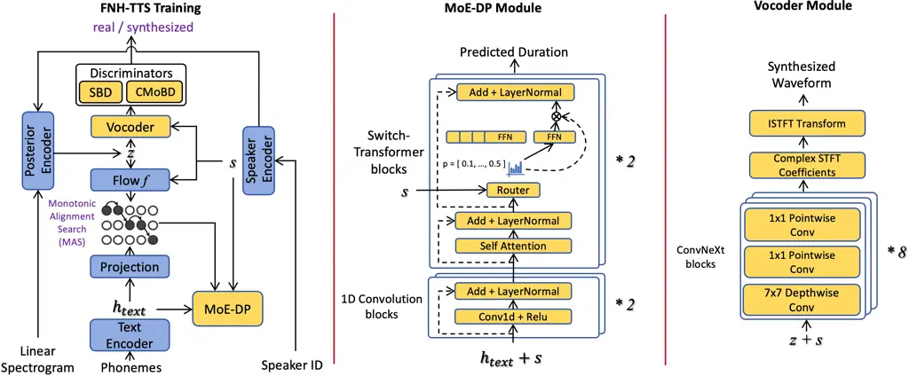
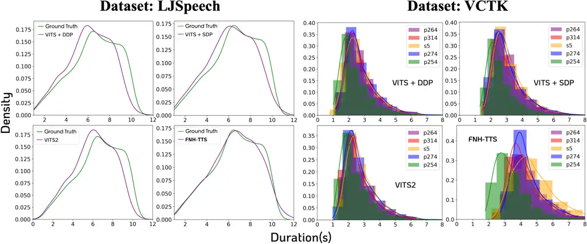
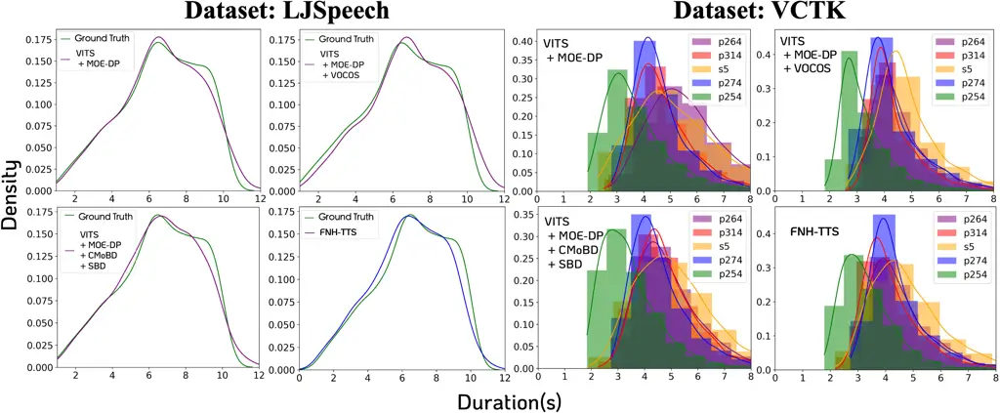
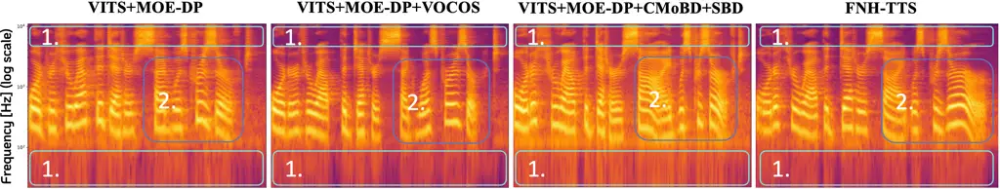

# FNH-TTS: Mixture-of-Experts Duration Modeling for Robust Neural Speech Synthesis

Qingliang Meng Affiliation: Megatronix, Beijing, China    Yuqing Deng
Affiliation: Megatronix, Beijing, China    Wei Liang
Affiliation: Megatronix, Beijing, China    Limei Yu
Affiliation: Megatronix, Beijing, China    Huizhi Liang
Affiliation: Newcastle University, Newcastle Upon Tyne, United Kingdom  
, , , , , E-mail <mengqingliang9485@163.com>    Tian Li
E-mail <yuqing.deng.i@megatronix.com> E-mail <wei.liang@megatronix.com>
E-mail <limei.yu@megatronix.com> E-mail <huizhi.liang@newcastle.ac.uk>
E-mail <t.li56@newcastle.ac.uk> Affiliation: Newcastle University,
Newcastle Upon Tyne, United Kingdom  
, , , , , E-mail <mengqingliang9485@163.com>

###### Abstract

Natural and human-like speech depends on the coordination between
prosodic timing and acoustic realization: duration modeling shapes
rhythmic structure, while waveform generation determines whether that
structure is rendered naturally. In natural speech, duration patterns
vary across linguistic contexts and speakers, requiring a TTS system
both to capture this variability and to faithfully realize it in the
waveform. To address these challenges, we propose FNH-TTS, a VITS-based
end-to-end system that jointly improves duration modeling and waveform
generation. A mixture-of-experts duration predictor (MoE-DP) uses
multiple experts and routing jointly conditioned on linguistic context
and speaker information to model diverse duration patterns. For waveform
generation, we adopt an inverse short-time Fourier transform
(ISTFT)-based generator, providing a more direct and efficient synthesis
path. We further employ multi-resolution and sub-band discriminators for
fine-grained temporal and spectral adversarial supervision, thereby
supporting natural waveform synthesis. Experiments on LJSpeech, VCTK,
and LibriTTS show that FNH-TTS achieves the highest mean MOS on LJSpeech
and VCTK and the highest duration-category accuracy on LibriTTS among
the compared systems, together with competitive waveform reconstruction
and substantially faster vocoder inference. Controlled analyses further
show that MoE-DP primarily drives the duration-modeling gains, while the
vocoder-side components make complementary contributions to synthesis
quality and efficiency.

###### Keywords: 

Text-to-speech Speech Synthesis Prosody Modeling.

## 1 Introduction

Text-to-speech (TTS) aims to synthesize natural speech from text in a
desired speaking style. Prosodic timing plays a central role in
perceived naturalness because it governs how speech unfolds over time.
Phoneme durations vary with linguistic context and speaker-specific
speaking habits, producing diverse patterns of rhythm, emphasis, and
speaking rate. Natural synthesis therefore requires a system to capture
these duration patterns and render the resulting acoustic transitions
coherently in the waveform.

Autoregressive (AR) \[33, 17, 2\] and non-autoregressive (NAR) \[27, 11,
9\] TTS systems model this temporal organization differently. AR systems
determine duration implicitly during sequential generation, whereas NAR
systems typically predict duration explicitly to construct
text-to-speech alignment. In many NAR systems, this role is assigned to
a dedicated Duration Predictor (DP). Capturing diverse contextual and
speaker-dependent duration patterns within such an explicit predictor
remains challenging \[22\].

Recent studies have analyzed and improved duration modeling from
different perspectives. StyleTTS \[18\] points out that duration labels
derived from hard alignment, soft alignment, or Monotonic Alignment
Search (MAS) \[11\] are not true ground-truth labels, and overfitting to
such labels can reduce speech naturalness. Mehta et al. \[22\] further
highlight the importance of duration modeling and call for more direct
methods to assess prosodic complexity. VITS2 \[14\] improves the
original VITS \[12\] framework through adversarial learning to enhance
duration prediction, particularly in multi-speaker scenarios.
Nevertheless, these approaches mainly focus on alignment quality,
supervision strategy, or adversarial objectives, while the internal
structure of the DP itself remains relatively underexplored for
capturing diverse duration patterns.

Improving duration prediction addresses the temporal organization of
speech, but these temporal patterns must ultimately be realized by the
waveform generator. VITS adopts a HiFi-GAN-style generator that
synthesizes waveforms through learned temporal upsampling, which
previous studies have associated with tonal artifacts and spectral
distortions \[10, 30, 1\]. The accompanying adversarial discriminators
primarily examine waveform structures at different scales and periods,
whereas frequency-band-specific distortions receive less explicit
attention \[13, 1\]. These limitations are relevant to our goal:
representing more diverse duration patterns requires the waveform stage
to render acoustic events with different temporal spans while preserving
continuity and spectral detail. This motivates a waveform-generation
design with a more direct synthesis path and finer temporal and spectral
supervision.

In this paper, we propose FNH-TTS, a VITS-based NAR TTS system that
jointly improves duration modeling and waveform generation. For duration
modeling, we introduce a Mixture-of-Experts Duration Predictor (MoE-DP).
Its router jointly uses contextual phoneme representations and speaker
embeddings to assign phoneme-level states to different experts,
providing additional capacity for modeling contextual and
speaker-dependent duration patterns. For waveform generation, we adapt
the ISTFT-based architecture of VOCOS \[30\], originally developed as a
separate neural vocoder, to operate on the VITS posterior latent
representation and train it jointly with the complete TTS system. We
further incorporate the Collaborative Multi-Band Discriminator (CoMBD)
and Sub-Band Discriminator (SBD) \[1\] to provide complementary
supervision across temporal resolutions and frequency bands. Together,
MoE-DP models diverse duration patterns, while the generator and
discriminators support their efficient and natural acoustic realization.

Our key contributions are as follows:

- •
  We introduce a Mixture-of-Experts Duration Predictor (MoE-DP), which
  uses multiple experts and context- and speaker-conditioned routing to
  model diverse duration patterns. Duration-specific evaluations and
  controlled analyses demonstrate its contribution to duration modeling.
- •
  We develop FNH-TTS by combining MoE-DP with a VOCOS-style generator
  and CoMBD/SBD in an end-to-end VITS framework. The generator supports
  efficient frequency-domain synthesis, while CoMBD and SBD provide
  complementary multi-resolution and sub-band supervision for waveform
  quality.
- •
  We conduct leave-one-component-out ablations and targeted duration and
  vocoder evaluations to distinguish the roles of the proposed
  components. The results further show that WER reflects content
  accuracy and intelligibility and should be interpreted alongside other
  metrics when assessing overall synthesis quality.

## 2 Methodology



Figure 1: The overall framework of the FNH-TTS system. The blue modules
represent components inherited from the original VITS, while the yellow
modules indicate newly introduced modifications.

Our system, FNH-TTS, is built upon VITS and retains its Text Encoder,
Speaker Encoder, Posterior Encoder, and Flow modules. We mainly modify
the Duration Predictor (DP) and vocoder-related components, as shown in
Fig. 1. The overall optimization objective is formulated as follows:

```math
\displaystyle\mathcal{L}=\mathcal{L}_{rec}+\mathcal{L}_{kl}+\mathcal{L}_{dur}+\mathcal{L}_{adv}+\mathcal{L}_{gen}. \tag{1}
```

$`\mathcal{L}_{rec}`$ and $`\mathcal{L}_{kl}`$ correspond to the
reconstruction and KL losses used by the original VITS modules,
including the Text Encoder, Speaker Encoder, Posterior Encoder, and
Flow. These modules and losses are retained without modification.

$`\mathcal{L}_{dur}`$ supervises the DP. We replace the original DP with
the proposed Mixture-of-Experts Duration Predictor (MoE-DP). This module
belongs to the category of Deterministic Duration Predictors
(DDP) \[22\], as it directly predicts phoneme durations.
$`\mathcal{L}_{dur}`$ consists of two components: $`\mathcal{L}_{mas}`$,
computed from the Monotonic Alignment Search (MAS) \[11\] result, and
$`\mathcal{L}_{aux}`$, an auxiliary loss for balancing the workload
among experts. Details are provided in Section 2.1.

$`\mathcal{L}_{adv}`$ and $`\mathcal{L}_{gen}`$ denote the
discriminator-side adversarial loss and the generator-side vocoder loss,
respectively. Following the joint design of duration modeling and
waveform generation, we integrate a VOCOS-style generator with a
Collaborative Multi-Band Discriminator and a Sub-Band Discriminator. The
generator supports efficient ISTFT-based waveform synthesis, while the
discriminators provide complementary temporal and spectral adversarial
supervision. Details are provided in Section 2.2.

### 2.1 MoE Duration Predictor

The Mixture-of-Experts (MoE) routing mechanism, initially introduced
by \[29\], increases model capacity through sparse expert routing
without substantially increasing inference costs. A typical MoE layer
consists of a router and a set of experts. The router dynamically
assigns each token to suitable experts, allowing different experts to
process different input patterns. Switch Transformer \[4\] further
applies MoE to the feed-forward network (FFN) of Transformer blocks,
enabling efficient capacity scaling.

Building on this idea, we propose a DP architecture composed of 1D
convolution blocks and Switch-Transformer blocks, as shown in Fig. 1.
The input to the MoE-DP is $`h_{text}+s`$, where $`h_{text}`$ denotes
the hidden representation encoded from the phoneme sequence by the Text
Encoder, and $`s`$ denotes the speaker embedding. The router jointly
uses the contextual representation and speaker embedding $`s`$, enabling
the routing decisions to reflect both linguistic context and
speaker-specific information. The routing and expert processing
mechanism is formulated as follows:

```math
\displaystyle y=\sum_{i\in\Psi}p_{i}(x+s)E_{i}(x), \tag{2}
```

where $`y`$ denotes the output of the MoE layer, $`x`$ denotes the
hidden representation from the previous layer, $`\Psi`$ denotes the
selected expert set. We use top-1 routing, so $`\Psi`$ contains only the
expert with the highest routing probability among the $`N`$ experts.
$`p_{i}(x+s)`$ is the routing probability assigned to expert $`i`$, and
$`E_{i}(x)`$ is the output of expert $`i`$.

To alleviate unbalanced expert assignment, we incorporate the load
balancing loss \[4\] as an auxiliary loss $`\mathcal{L}_{aux}`$. The
loss is scaled by $`\alpha`$, as shown in Eq. 3. Following Switch
Transformer, we use tokens to denote the routing units in the MoE layer.
In our DP, these tokens correspond to phoneme-level hidden states.
$`f_{i}`$ in Eq. 4 measures the fraction of tokens assigned to expert
$`i`$ within a mini-batch $`\mathcal{B}`$, while $`P_{i}`$ in Eq. 5
denotes the average routing probability of expert $`i`$. $`T`$ is the
total number of tokens in $`\mathcal{B}`$.

```math
\displaystyle\mathcal{L}_{aux}=\alpha\cdot N\cdot\sum_{i=1}^{N}f_{i}\cdot P_{i} \tag{3}
```

```math
\displaystyle f_{i}=\frac{1}{T}\sum_{token\in\mathcal{B}}\mathds{1}\{\arg\max_{j=1,\ldots,N}\ p_{j}(token)=i\} \tag{4}
```

```math
\displaystyle P_{i}=\frac{1}{T}\sum_{token\in\mathcal{B}}p_{i}(token) \tag{5}
```

Finally, the overall optimization objective for the MoE-DP is defined
as:

```math
\displaystyle\mathcal{L}_{dur}=\mathcal{L}_{mas}+\mathcal{L}_{aux}. \tag{6}
```

### 2.2 Vocoder and Discriminators

To render the diverse duration patterns modeled by MoE-DP with both high
waveform quality and low inference cost, we combine a VOCOS-style
generator with CoMBD and SBD, as shown in Fig. 1. The VOCOS-style
generator provides efficient frequency-domain synthesis, while CoMBD and
SBD strengthen waveform supervision across temporal resolutions and
frequency bands.

We employ a VOCOS-style generator based on ConvNeXt blocks \[30, 20\].
Unlike HiFi-GAN-based generators that progressively upsample acoustic
representations in the time domain, this design directly predicts
complex STFT coefficients and reconstructs the waveform through ISTFT.
To integrate it into the VITS end-to-end training pipeline, we condition
the generator on the posterior latent variable $`z`$ and speaker
embedding $`s`$:

```math
\displaystyle\hat{w}=\mathrm{ISTFT}(\mathrm{Backbone}(z+s)), \tag{7}
```

where $`\hat{w}`$ denotes the reconstructed waveform. This
frequency-domain formulation avoids stacked temporal upsampling and
supports efficient waveform generation.

For adversarial training, we adopt the Collaborative Multi-Band
Discriminator (CoMBD) and Sub-Band Discriminator (SBD) \[1\].

Collaborative Multi-Band Discriminator (CoMBD): This discriminator
operates on waveform signals at different resolutions. To reduce
computational cost, each waveform resolution is processed using the same
multi-scale discriminator (MSD) \[16\]. This design evaluates global
waveform coherence and local waveform structures across resolutions,
providing multi-scale supervision for temporal continuity.

Sub-Band Discriminator (SBD): This discriminator employs PQMF
analysis \[24\] to decompose the speech waveform into multiple sub-band
signals, enabling discrimination across different frequency ranges.
Multi-scale dilated convolutions further extract sub-band features at
different receptive fields, providing frequency-dependent supervision
for spectral consistency.

### 2.3 Model and Training Configuration

For the Text Encoder, Speaker Encoder, Posterior Encoder, and Flow, we
adopt the original VITS hyperparameters. For the MoE-DP, the convolution
part consists of two 1D convolution blocks with a kernel size of 3 and a
hidden dimension of 192. The MoE part contains two Switch-Transformer
blocks, each with 8 experts, 4 attention heads, and a hidden dimension
of 192. We use top-1 routing with a capacity factor of 1.0. For the
vocoder, the hop length and FFT size are set to 256 and 1024,
respectively. It contains 8 ConvNeXt blocks, each with an intermediate
dimension of 1536 and a hidden dimension of 512.

Our system is trained using the AdamW optimizer with $`\beta_{1}=0.8`$
and $`\beta_{2}=0.99`$. The initial learning rate is
$`2\times 10^{-4}`$, with a decay factor of 0.999 applied after each
epoch. The batch size $`\mathcal{B}`$ is 24, and the model is trained on
4 NVIDIA RTX 3090 GPUs.

## 3 Experimental Setup

### 3.1 Overall Quality Assessment

We evaluate overall synthesis quality on LJSpeech \[6\] and VCTK \[34\],
two widely used benchmarks for single-speaker and multi-speaker TTS,
using 1,324 and 1,500 held-out samples, respectively. All systems
evaluated on the same dataset synthesize the same test sentences. In our
experiments, LJSpeech and VCTK are used at sampling rates of 22.05 kHz
and 16 kHz, respectively.

We use Mean Opinion Score (MOS) and Word Error Rate (WER) to evaluate
synthesis quality and additionally report model and discriminator sizes.
Perceptual quality is assessed using a standard five-point MOS
scale \[5\]. The same ten annotators evaluated all systems. Each sample
received 10 ratings, and mean MOS is reported with 95% confidence
intervals. WER measures content accuracy and intelligibility using
Whisper-large-v3 \[25\], with the same transcription and calculation
pipeline applied to all systems. Although different systems may generate
audio at different sampling rates, all outputs are resampled to 16 kHz
using the same procedure before MOS and WER evaluation. Model and
discriminator sizes are calculated directly from the evaluated
checkpoints.

For external baseline comparison, we consider two categories of systems:
dataset-specific TTS systems, represented by FastSpeech 2 \[26\] and
StyleTTS 2 \[19\], and large-scale reference-conditioned zero-shot
systems, represented by F5-TTS \[3\] and Spark-TTS \[32\]. The former
are evaluated using their released dataset-specific checkpoints (no
official VCTK dataset model, so VCTK results are unavailable), whereas
the latter use their official pretrained checkpoints with
speaker-matched reference utterances different from the target
utterances. All external baselines retain their original training
configurations and are evaluated using their complete released inference
pipelines, without retraining or architectural modification. For
internal ablations, VITS Origin and all FNH-TTS variants are trained and
evaluated by us using the same data splits, training steps, random
seeds, and evaluation protocol, differing only in the ablated
components.

### 3.2 Prosody Modeling Assessment

To evaluate duration-related prosody modeling, we use LibriTTS \[36\]
(sampling rate: 24 kHz). The train-clean-100 and train-clean-360
subsets, collectively denoted as Libri460, are used to train our
VITS-based systems, while test-clean is used for evaluation. We select
LibriTTS because phoneme-duration annotations are provided by Ji et
al. \[8\], whereas LJSpeech and VCTK do not provide corresponding
annotations.

To compute duration-category accuracy, we follow the evaluation script
provided by ControlSpeech \[7\]. Montreal Forced Alignment (MFA) \[21\]
first aligns each synthesized utterance with its phoneme sequence to
determine the phoneme boundaries, from which the average phoneme
duration is calculated. An utterance is classified as fast if its
average phoneme duration is below 0.0727 s, normal if it falls between
0.0727 s and 0.1107 s, and slow if it is above 0.1107 s.
Duration-category accuracy is computed by comparing the synthesized
category with its manually annotated reference label. We also report MOS
and WER following the overall quality assessment protocol and visualize
utterance-level duration distributions on LJSpeech and VCTK to examine
natural duration variation and speaker-dependent speaking-rate patterns.

The external comparison systems and inference protocols follow the
overall quality assessment, with the FastSpeech 2 checkpoint provided by
ESPnet. For internal comparisons, we include VITS+DDP, VITS+SDP \[12\],
and VITS2 \[14\], which cover three principal duration-prediction
paradigms within the VITS framework: deterministic regression,
flow-based stochastic prediction, and adversarially trained stochastic
prediction, respectively. This selection enables a controlled comparison
of MoE-DP with established DP designs while keeping the remaining VITS
framework unchanged. All VITS-based systems, including FNH-TTS, are
trained by us under the same controlled setting.

### 3.3 Vocoder Reconstruction and Inference Efficiency

We evaluate vocoder reconstruction and inference efficiency on the same
LibriTTS test-clean subset used in the prosody assessment. Both
reference and reconstructed audio are evaluated at the native sampling
rate of 24 kHz, providing objective evidence complementary to the
end-to-end MOS evaluation.

Because end-to-end synthesized speech and its reference often differ in
length, directly applying reference-based metrics may conflate waveform
reconstruction with duration and alignment errors. We therefore adopt an
analysis-by-synthesis protocol that encodes each reference linear
spectrogram into the posterior latent variable $`z`$ and reconstructs
the waveform from $`z`$, thereby bypassing duration prediction and
text–audio alignment. We report Multi-Scale STFT Loss (M-STFT) \[35\],
Perceptual Evaluation of Speech Quality (PESQ) \[28\], Mel Cepstral
Distortion (MCD) \[15\], Periodicity, and Voiced/Unvoiced F1 Score (V/UV
F1) \[23\]. RTF is measured with a batch size of 1 on an Intel Xeon Gold
5218R CPU and a single NVIDIA RTX 3090 GPU.

We compare the FNH-TTS vocoder configuration with the VITS vocoders
based on HiFi-GAN \[13\] and HiFi-GANv2 \[31\]. All configurations are
trained on the same Libri460 data and evaluated on test-clean under the
same protocol, differing only in their vocoder-related configurations.
The comparison is limited to VITS-based systems because the
reconstruction protocol requires the posterior latent representation.

## 4 Results

This section evaluates FNH-TTS from three aspects: overall synthesis
quality, duration-related prosody modeling, and vocoder reconstruction
and inference efficiency.

### 4.1 Synthesis Quality Comparison

|                         |                               |                      |                               |                      |              |              |
| ----------------------- | ----------------------------- | -------------------- | ----------------------------- | -------------------- | ------------ | ------------ |
| System                  | LJSpeech                      |                      | VCTK                          |                      | Model Params | Disc. Params |
|                         | MOS ($`\uparrow`$)            | WER ($`\downarrow`$) | MOS ($`\uparrow`$)            | WER ($`\downarrow`$) |              |              |
| External baselines      |                               |                      |                               |                      |              |              |
| FastSpeech 2            | $`4.12\pm 0.09`$              | 7.02%                | –                             | –                    | 34.64M       | 42.53M       |
| StyleTTS 2              | $`4.35\pm 0.10`$              | 5.78%                | –                             | –                    | 145.53M      | 41.38M       |
| F5-TTS                  | $`3.87\pm 0.13`$              | 8.70%                | $`4.49\pm 0.08`$              | 2.24%                | 337.09M      | –            |
| Spark-TTS               | $`4.10\pm 0.11`$              | 7.36%                | $`4.38\pm 0.12`$              | 4.98%                | 506.63M      | –            |
| Controlled VITS systems |                               |                      |                               |                      |              |              |
| VITS Origin             | $`4.26\pm 0.08`$              | 3.41%                | $`4.34\pm 0.09`$              | 4.11%                | 39.53M       | 46.75M       |
| FNH-TTS                 | $`\boldsymbol{4.48\pm 0.10}`$ | 2.59%                | $`\boldsymbol{4.63\pm 0.09}`$ | 3.88%                | 47.73M       | 27.07M       |
|    w/o MoE-DP           | $`4.44\pm 0.09`$              | 2.60%                | $`4.27\pm 0.09`$              | 4.96%                | 40.89M       | 27.07M       |
|    w/o VOCOS            | $`4.20\pm 0.11`$              | 2.42%                | $`4.43\pm 0.11`$              | 3.60%                | 46.37M       | 27.07M       |
|    w/o CoMBD/SBD        | $`3.75\pm 0.12`$              | 9.74%                | $`3.95\pm 0.12`$              | 10.58%               | 47.73M       | 46.75M       |

Table 1: Overall synthesis quality and leave-one-component-out
ablations. MOS is reported with 95% confidence intervals. In each
ablation, the removed component is replaced by its corresponding VITS
component.

Table 1 compares FNH-TTS with external TTS systems and controlled
VITS-based variants. FNH-TTS achieves the highest mean MOS on both
LJSpeech and VCTK and obtains higher mean MOS than VITS Origin, while
its 47.73M model parameters remain substantially below those of the
large-scale F5-TTS and Spark-TTS systems.

The leave-one-component-out ablations reveal the contribution of each
component within the complete system. (1) Removing MoE-DP. MoE-DP
contributes positively to FNH-TTS, with its effect most evident in the
multi-speaker setting. Without MoE-DP, the VCTK mean MOS decreases from
4.63 to 4.27 and WER increases from 3.88% to 4.96%, both becoming worse
than VITS Origin. (2) Removing VOCOS. VOCOS contributes to perceived
synthesis quality, although this contribution is not reflected by WER.
Removing it lowers mean MOS on both datasets while improving WER,
illustrating that MOS and WER capture different aspects of synthesized
speech. (3) Removing CoMBD and SBD. CoMBD and SBD provide the strongest
support for final synthesis quality within the complete configuration.
Their removal causes the largest and most consistent degradation,
reducing mean MOS by approximately 0.7 and increasing WER to around 10%
on both datasets.

Based on the mean-MOS degradation caused by component removal, the
ablations suggest an apparent contribution pattern of CoMBD/SBD $`>`$
MoE-DP $`\approx`$ VOCOS. However, this metric-level ordering describes
only the sensitivity of the complete system to component removal and
does not reveal the distinct modeling roles of these components or their
underlying interaction. We therefore examine duration-related prosody
modeling and vocoder reconstruction in Sections 4.2 and 4.3,
respectively, before further analyzing their interaction in Section 5.

### 4.2 Prosody Modeling Analysis

|                               |                          |                               |                      |
| ----------------------------- | ------------------------ | ----------------------------- | -------------------- |
| System                        | Dur. Acc. ($`\uparrow`$) | MOS ($`\uparrow`$)            | WER ($`\downarrow`$) |
| External baselines            |                          |                               |                      |
| FastSpeech 2                  | 59.80%                   | $`4.37\pm 0.06`$              | 2.12%                |
| StyleTTS 2                    | 59.28%                   | $`4.41\pm 0.08`$              | 1.58%                |
| F5-TTS                        | 11.17%                   | $`4.35\pm 0.10`$              | 4.21%                |
| Spark-TTS                     | 66.77%                   | $`4.36\pm 0.09`$              | 5.12%                |
| VITS-based duration baselines |                          |                               |                      |
| VITS+DDP                      | 61.26%                   | $`4.37\pm 0.08`$              | 3.42%                |
| VITS+SDP                      | 65.76%                   | $`4.27\pm 0.09`$              | 6.06%                |
| VITS2                         | 60.36%                   | $`4.33\pm 0.08`$              | 3.34%                |
| FNH-TTS                       | 67.07%                   | $`\boldsymbol{4.42\pm 0.07}`$ | 3.15%                |

Table 2: Duration-related prosody evaluation on LibriTTS test-clean. MOS
is reported with 95% confidence intervals.

Using the annotated duration categories in LibriTTS test-clean, Table 2
directly evaluates duration-related prosody together with perceptual
quality MOS and intelligibility WER. FNH-TTS achieves the highest
duration-category accuracy of 67.07% and the highest mean MOS of 4.42.
These point estimates are the highest among both the external systems
and the three representative VITS-based duration-modeling baselines.

The metric rankings are again different: StyleTTS 2 obtains the lowest
WER, whereas FNH-TTS achieves higher duration-category accuracy and mean
MOS. This result reinforces that WER and MOS reflect different aspects
of synthesized audio. Because TTS naturalness is ultimately judged by
listeners, WER should be interpreted together with MOS and
duration-specific metrics rather than as a substitute for perceptual
evaluation.



Figure 2: Utterance-level duration distributions of different systems on
LJSpeech and VCTK.

To complement the duration-category evaluation, we visualize the
utterance-level duration distributions of synthesized speech in Fig. 2.
On LJSpeech, FNH-TTS more closely follows the overall shape of the
reference distribution, whereas VITS+DDP and VITS2 exhibit sharper peaks
and larger distributional deviations. On VCTK, FNH-TTS produces more
distinct speaker-dependent duration distributions, while the other
VITS-based systems show greater overlap among speakers.

Together, the duration-category results and distribution visualizations
support that FNH-TTS better captures duration-related prosody. However,
the current evidence has three limitations: (1) duration-category
accuracy does not quantify fine-grained phoneme-duration distribution
differences; (2) this labeled metric is available only for LibriTTS; and
(3) complete-system comparisons do not isolate the contribution of
MoE-DP. Therefore, Section 5.1 presents an additional controlled
analysis on LJSpeech and VCTK by comparing the predicted
phoneme-duration sequences of each variant with those of the complete
FNH-TTS system. Because this analysis uses the FNH-TTS output as an
empirical anchor rather than manually annotated ground truth, it
measures component-level consistency with the duration behavior of
FNH-TTS instead of absolute duration accuracy. We therefore treat it as
complementary diagnostic evidence and present it in the Discussion
rather than as a primary evaluation result.

### 4.3 Vocoder Performance Evaluation

| (a) Reconstruction quality |                        |                    |                     |                             |                       |
| -------------------------- | ---------------------- | ------------------ | ------------------- | --------------------------- | --------------------- |
| System                     | M-STFT($`\downarrow`$) | PESQ($`\uparrow`$) | MCD($`\downarrow`$) | Periodicity($`\downarrow`$) | V/UV F1($`\uparrow`$) |
| VITS (HiFi-GAN)            | 1.208                  | 2.441              | 1.677               | 0.160                       | 0.928                 |
| VITS (HiFi-GANv2)          | 1.246                  | 2.231              | 1.814               | 0.166                       | 0.922                 |
| FNH-TTS                    | 1.207                  | 2.425              | 1.654               | 0.162                       | 0.927                 |

| (b) Inference efficiency |                         |                         |
| ------------------------ | ----------------------- | ----------------------- |
| System                   | CPU RTF($`\downarrow`$) | GPU RTF($`\downarrow`$) |
| VITS (HiFi-GAN)          | 0.352                   | 0.00748                 |
| VITS (HiFi-GANv2)        | 0.181                   | 0.00659                 |
| FNH-TTS                  | 0.046                   | 0.00460                 |

Table 3: Vocoder reconstruction quality and inference efficiency on
LibriTTS test-clean under the analysis-by-synthesis setting. Bold and
underlined values denote the best and second-best results, respectively.

Table 3 evaluates complementary aspects of vocoder performance: M-STFT
and MCD reflect spectral reconstruction, PESQ estimates perceptual
quality, and Periodicity and V/UV F1 measure periodic structure and
voicing consistency.

The FNH-TTS vocoder configuration achieves the lowest M-STFT and MCD,
demonstrating its advantage in spectral reconstruction. Its PESQ,
Periodicity, and V/UV F1 are numerically close to the best HiFi-GAN
results, and it outperforms HiFi-GANv2 across all five reconstruction
metrics. These results show that the proposed configuration provides a
strong overall balance between spectral fidelity, perceptual quality,
and voicing consistency, although it does not rank first on every
metric.

FNH-TTS also provides a substantial efficiency advantage. Compared with
the original VITS vocoder, it achieves approximately $`7.7\times`$
faster CPU inference and $`1.6\times`$ faster GPU inference. The
reconstruction results characterize the complete FNH-TTS vocoder
configuration, whereas the RTF improvement mainly reflects the
VOCOS-style generator because CoMBD and SBD are used only during
training.

Together with the leave-one-component-out results in Table 1, where
removing VOCOS lowers the mean MOS on both datasets, these findings
support its contribution to perceived synthesis quality and
waveform-generation efficiency. Overall, the VOCOS-style generator
offers a favorable quality–efficiency trade-off within FNH-TTS rather
than improving efficiency at the expense of reconstruction quality.

## 5 Discussion

The preceding results show that FNH-TTS achieves strong overall and
duration-related performance, while its components contribute
differently to synthesis quality. However, the leave-one-component-out
results alone do not fully explain the roles of the individual
components. We therefore conduct additional controlled analyses to
isolate the contribution of MoE-DP to duration modeling and examine how
the vocoder-side components complement it during waveform generation.

### 5.1 The Role of MoE-DP in Duration Modeling

The labeled LibriTTS results show that the complete FNH-TTS system
achieves better duration-related prosody modeling, but the
complete-system comparison does not isolate the contribution of MoE-DP.
We therefore analyze whether this duration behavior primarily comes from
MoE-DP and remains stable across vocoder-side configurations at both the
utterance and phoneme levels.



Figure 3: Utterance-duration distributions of MoE-DP-based systems under
different vocoder-side configurations on LJSpeech and VCTK.

Figure 3 shows that (1) all MoE-DP-based configurations produce similar
utterance-duration distributions that remain close to the reference
distribution on LJSpeech; (2) they preserve visible speaker-dependent
duration differences on VCTK; and (3) together with the non-MoE
comparisons in Fig. 2, these results suggest that the main duration
characteristics of FNH-TTS are associated with MoE-DP and are not
removed by VOCOS or CoMBD/SBD.

To further quantify the contribution of MoE-DP, we use the predicted
phoneme-duration sequence of the complete FNH-TTS system as an anchor
distribution and compute its Jensen–Shannon (JS) divergence from the DP
output of each variant. This choice is motivated by the highest
duration-category accuracy achieved by FNH-TTS on the annotated LibriTTS
benchmark. For the same input, all controlled variants use the same
phoneme sequence, enabling direct comparison between their DP outputs; a
lower JS value indicates duration behavior closer to FNH-TTS. MFA is not
used because its phoneme inventory does not match that of our model,
preventing one-to-one comparison with the DP output. We report the mean
and variance over all test utterances and omit FNH-TTS because its
self-divergence is zero.

|                           |          |        |       |        |
| ------------------------- | -------- | ------ | ----- | ------ |
| System                    | LJSpeech |        | VCTK  |        |
|                           | Mean     | Var.   | Mean  | Var.   |
| VITS + DDP                | 0.057    | 0.0002 | 0.044 | 0.0002 |
| VITS + SDP                | 0.087    | 0.0003 | 0.066 | 0.0001 |
| VITS + MoE-DP             | 0.053    | 0.0002 | 0.039 | 0.0001 |
| VITS + MoE-DP + VOCOS     | 0.053    | 0.0002 | 0.043 | 0.0001 |
| VITS + MoE-DP + CoMBD/SBD | 0.047    | 0.0002 | 0.041 | 0.0004 |

Table 4: Jensen–Shannon divergence between the predicted
phoneme-duration sequences of each system and those of the complete
FNH-TTS system.

Table 4 shows that (1) all MoE-DP-based variants obtain lower mean JS
divergence than VITS+DDP and VITS+SDP on both datasets, indicating that
the main duration behavior of FNH-TTS follows MoE-DP; (2) the divergence
remains within the lower range of the MoE-DP variants after introducing
VOCOS or CoMBD/SBD, showing that this behavior is preserved across
vocoder-side configurations; and (3) because the analysis measures
similarity to FNH-TTS rather than absolute accuracy against manually
annotated durations, it is treated only as complementary
component-attribution evidence. Together with the labeled LibriTTS
evaluation, these results support MoE-DP as the primary source of the
duration-modeling characteristics of FNH-TTS, while the effects of the
vocoder-side components on final waveform synthesis are examined next.

### 5.2 Interaction Between Duration Modeling and Vocoder-Side Components

The quantitative results identify three complementary roles in FNH-TTS.
(1) MoE-DP is the primary source of the duration-modeling
characteristics, as shown in Section 5.1. (2) CoMBD/SBD provide the
strongest support for final synthesis quality, as removing them causes
the largest degradation in MOS and WER in Table 1. (3) VOCOS contributes
to perceived quality and waveform-generation efficiency. Removing it
lowers the mean MOS on both datasets, although this change is not
reflected by WER; Table 3 further shows that the complete vocoder
configuration combines strong reconstruction quality with the lowest
RTF. Since CoMBD/SBD are used only during training, the efficiency gain
mainly reflects the VOCOS-style generator.

To illustrate how these components affect waveform synthesis, Fig. 4
compares spectrograms produced by four controlled configurations.



Figure 4: Spectrograms of an LJSpeech sample synthesized by VITS +
MoE-DP, VITS + MoE-DP + VOCOS, VITS + MoE-DP + CoMBD/SBD, and the
complete FNH-TTS system.

The selected example illustrates three differences. (1) VITS + MoE-DP
exhibits weaker spectral details and less continuous time–frequency
structures in the highlighted high- and low-frequency regions. (2)
Adding VOCOS produces sharper spectral textures, while adding CoMBD/SBD
results in smoother temporal transitions. (3) The complete FNH-TTS
system combines clearer spectral details with more coherent temporal
structures. Because this comparison is based on a selected example, it
should be interpreted as a qualitative illustration rather than general
evidence of a causal relationship.

Taken together, the quantitative and qualitative results support
complementary roles for MoE-DP and the vocoder-side components under the
evaluated configurations. They do not establish that richer duration
variation itself causes the degradation of the original HiFi-GAN-based
generator, nor do they exclude other training- or optimization-related
explanations. Instead, the results motivate the joint design of FNH-TTS:
MoE-DP primarily improves duration modeling, CoMBD/SBD support final
synthesis quality, and VOCOS contributes to perceived quality and
efficient waveform generation while the complete vocoder configuration
maintains strong reconstruction quality.

## 6 Conclusion

In this paper, we propose FNH-TTS, a VITS-based NAR TTS system that
jointly strengthens duration modeling and waveform generation. MoE-DP
captures diverse contextual and speaker-dependent duration patterns,
while the VOCOS-style generator enables efficient waveform generation
and CoMBD/SBD provide complementary adversarial supervision.

Experiments on LJSpeech, VCTK, and LibriTTS demonstrate strong synthesis
quality, improved duration-related performance, competitive waveform
reconstruction, and substantially improved vocoder inference efficiency.
The leave-one-component-out ablations and controlled analyses support
distinct but complementary roles: MoE-DP is the primary source of the
duration-modeling characteristics, CoMBD/SBD provide the strongest
support for final synthesis quality, and VOCOS contributes to perceived
quality and efficient waveform generation while the complete vocoder
configuration maintains competitive reconstruction quality. These
findings characterize the empirical roles of the proposed components
without establishing a specific causal relationship between duration
variation and vocoder behavior.

Overall, our results suggest that duration modeling and waveform
generation should be considered jointly in end-to-end TTS design. Future
work will further investigate their interaction and develop more
reliable fine-grained prosody evaluation methods that complement
perceptual and intelligibility-oriented metrics such as MOS and WER.

## References

- \[1\] T. Bak, J. Lee, H. Bae, J. Yang, J. Bae, and Y. Joo (2023)
  Avocodo: generative adversarial network for artifact-free vocoder. In
  Proceedings of the AAAI Conference on Artificial Intelligence, Vol.
  37, pp. 12562–12570. Cited by: §1, §1, §2.2.
- \[2\] S. Chen, S. Liu, L. Zhou, Y. Liu, X. Tan, J. Li, S. Zhao, Y.
  Qian, and F. Wei (2024) VALL-e 2: neural codec language models are
  human parity zero-shot text to speech synthesizers. arXiv preprint
  arXiv:2406.05370. Cited by: §1.
- \[3\] Y. Chen, Z. Niu, Z. Ma, K. Deng, C. Wang, J. Zhao, K. Yu, and X.
  Chen (2024) F5-tts: a fairytaler that fakes fluent and faithful speech
  with flow matching. arXiv preprint arXiv:2410.06885. Cited by: §3.1.
- \[4\] W. Fedus, B. Zoph, and N. Shazeer (2022) Switch transformers:
  scaling to trillion parameter models with simple and efficient
  sparsity. Journal of Machine Learning Research 23 (120), pp. 1–39.
  Cited by: §2.1, §2.1.
- \[5\] International Telecommunication Union (1996) Methods for
  subjective determination of transmission quality. Recommendation
  Technical Report P.800, ITU-T, Geneva, Switzerland. External Links:
  [Link](https://handle.itu.int/11.1002/1000/3638) Cited by: §3.1.
- \[6\] K. Ito and L. Johnson (2017) The lj speech dataset. Note:
  [https://keithito.com/LJ-Speech-Dataset/](https://keithito.com/LJ-Speech-Dataset/)
  Cited by: §3.1.
- \[7\] S. Ji, Q. Chen, W. Wang, J. Zuo, M. Fang, Z. Jiang, H. Huang, Z.
  Wang, X. Cheng, S. Zheng, et al. (2025) Controlspeech: towards
  simultaneous and independent zero-shot speaker cloning and zero-shot
  language style control. In Proceedings of the 63rd Annual Meeting of
  the Association for Computational Linguistics (Volume 1: Long Papers),
  pp. 6966–6981. Cited by: §3.2.
- \[8\] S. Ji, J. Zuo, M. Fang, Z. Jiang, F. Chen, X. Duan, B. Huai,
  and Z. Zhao (2024) Textrolspeech: a text style control speech corpus
  with codec language text-to-speech models. In ICASSP 2024-2024 IEEE
  International Conference on Acoustics, Speech and Signal Processing
  (ICASSP), pp. 10301–10305. Cited by: §3.2.
- \[9\] Z. Ju, Y. Wang, K. Shen, X. Tan, D. Xin, D. Yang, Y. Liu, Y.
  Leng, K. Song, S. Tang, et al. (2024) Naturalspeech 3: zero-shot
  speech synthesis with factorized codec and diffusion models. arXiv
  preprint arXiv:2403.03100. Cited by: §1.
- \[10\] M. Kawamura, Y. Shirahata, R. Yamamoto, and K. Tachibana (2023)
  Lightweight and high-fidelity end-to-end text-to-speech with
  multi-band generation and inverse short-time fourier transform. In
  ICASSP 2023-2023 IEEE International Conference on Acoustics, Speech
  and Signal Processing (ICASSP), pp. 1–5. Cited by: §1.
- \[11\] J. Kim, S. Kim, J. Kong, and S. Yoon (2020) Glow-tts: a
  generative flow for text-to-speech via monotonic alignment search.
  Advances in Neural Information Processing Systems 33, pp. 8067–8077.
  Cited by: §1, §1, §2.
- \[12\] J. Kim, J. Kong, and J. Son (2021) Conditional variational
  autoencoder with adversarial learning for end-to-end text-to-speech.
  In International Conference on Machine Learning, pp. 5530–5540. Cited
  by: §1, §3.2.
- \[13\] J. Kong, J. Kim, and J. Bae (2020) Hifi-gan: generative
  adversarial networks for efficient and high fidelity speech synthesis.
  Advances in neural information processing systems 33, pp. 17022–17033.
  Cited by: §1, §3.3.
- \[14\] J. Kong, J. Park, B. Kim, J. Kim, D. Kong, and S. Kim (2023)
  VITS2: improving quality and efficiency of single-stage text-to-speech
  with adversarial learning and architecture design. arXiv preprint
  arXiv:2307.16430. Cited by: §1, §3.2.
- \[15\] R. Kubichek (1993) Mel-cepstral distance measure for objective
  speech quality assessment. In Proceedings of IEEE pacific rim
  conference on communications computers and signal processing, Vol. 1,
  pp. 125–128. Cited by: §3.3.
- \[16\] K. Kumar, R. Kumar, T. De Boissiere, L. Gestin, W. Z. Teoh, J.
  Sotelo, A. De Brebisson, Y. Bengio, and A. C. Courville (2019) Melgan:
  generative adversarial networks for conditional waveform synthesis.
  Advances in neural information processing systems 32. Cited by: §2.2.
- \[17\] N. Li, S. Liu, Y. Liu, S. Zhao, and M. Liu (2019) Neural speech
  synthesis with transformer network. In Proceedings of the AAAI
  conference on artificial intelligence, Vol. 33, pp. 6706–6713. Cited
  by: §1.
- \[18\] Y. A. Li, C. Han, and N. Mesgarani (2025) Styletts: a
  style-based generative model for natural and diverse text-to-speech
  synthesis. IEEE Journal of Selected Topics in Signal Processing. Cited
  by: §1.
- \[19\] Y. A. Li, C. Han, V. Raghavan, G. Mischler, and N.
  Mesgarani (2023) Styletts 2: towards human-level text-to-speech
  through style diffusion and adversarial training with large speech
  language models. Advances in Neural Information Processing Systems 36,
  pp. 19594–19621. Cited by: §3.1.
- \[20\] Z. Liu, H. Mao, C. Wu, C. Feichtenhofer, T. Darrell, and S.
  Xie (2022) A convnet for the 2020s. In Proceedings of the IEEE/CVF
  conference on computer vision and pattern recognition,
  pp. 11976–11986. Cited by: §2.2.
- \[21\] M. McAuliffe, M. Socolof, S. Mihuc, M. Wagner, and M.
  Sonderegger (2017) Montreal forced aligner: trainable text-speech
  alignment using kaldi.. In Interspeech, Vol. 2017, pp. 498–502. Cited
  by: §3.2.
- \[22\] S. Mehta, H. Lameris, R. Punmiya, J. Beskow, É. Székely,
  and G. E. Henter (2024) Should you use a probabilistic duration model
  in tts? probably! especially for spontaneous speech. arXiv preprint
  arXiv:2406.05401. Cited by: §1, §1, §2.
- \[23\] M. Morrison, R. Kumar, K. Kumar, P. Seetharaman, A. Courville,
  and Y. Bengio (2021) Chunked autoregressive gan for conditional
  waveform synthesis. arXiv preprint arXiv:2110.10139. Cited by: §3.3.
- \[24\] T. Q. Nguyen (1994) Near-perfect-reconstruction pseudo-qmf
  banks. IEEE Transactions on signal processing 42 (1), pp. 65–76. Cited
  by: §2.2.
- \[25\] A. Radford, J. W. Kim, T. Xu, G. Brockman, C. McLeavey, and I.
  Sutskever (2022) Robust speech recognition via large-scale weak
  supervision. arXiv. External Links:
  [Document](https://dx.doi.org/10.48550/ARXIV.2212.04356),
  [Link](https://arxiv.org/abs/2212.04356) Cited by: §3.1.
- \[26\] Y. Ren, C. Hu, X. Tan, T. Qin, S. Zhao, Z. Zhao, and T.
  Liu (2020) Fastspeech 2: fast and high-quality end-to-end text to
  speech. arXiv preprint arXiv:2006.04558. Cited by: §3.1.
- \[27\] Y. Ren, Y. Ruan, X. Tan, T. Qin, S. Zhao, Z. Zhao, and T.
  Liu (2019) Fastspeech: fast, robust and controllable text to speech.
  Advances in neural information processing systems 32. Cited by: §1.
- \[28\] A. W. Rix, J. G. Beerends, M. P. Hollier, and A. P.
  Hekstra (2001) Perceptual evaluation of speech quality (pesq)-a new
  method for speech quality assessment of telephone networks and codecs.
  In 2001 IEEE international conference on acoustics, speech, and signal
  processing. Proceedings (Cat. No. 01CH37221), Vol. 2, pp. 749–752.
  Cited by: §3.3.
- \[29\] N. Shazeer, A. Mirhoseini, K. Maziarz, A. Davis, Q. Le, G.
  Hinton, and J. Dean (2017) The sparsely-gated mixture-of-experts
  layer. Outrageously large neural networks. Cited by: §2.1.
- \[30\] H. Siuzdak (2023) Vocos: closing the gap between time-domain
  and fourier-based neural vocoders for high-quality audio synthesis.
  arXiv preprint arXiv:2306.00814. Cited by: §1, §1, §2.2.
- \[31\] J. Su, Z. Jin, and A. Finkelstein (2021) HiFi-gan-2:
  studio-quality speech enhancement via generative adversarial networks
  conditioned on acoustic features. In 2021 IEEE Workshop on
  Applications of Signal Processing to Audio and Acoustics (WASPAA),
  pp. 166–170. Cited by: §3.3.
- \[32\] X. Wang, M. Jiang, Z. Ma, Z. Zhang, S. Liu, L. Li, Z. Liang, Q.
  Zheng, R. Wang, X. Feng, et al. (2025) Spark-tts: an efficient
  llm-based text-to-speech model with single-stream decoupled speech
  tokens. arXiv preprint arXiv:2503.01710. Cited by: §3.1.
- \[33\] Y. Wang, R. Skerry-Ryan, D. Stanton, Y. Wu, R. J. Weiss, N.
  Jaitly, Z. Yang, Y. Xiao, Z. Chen, S. Bengio, et al. (2017) Tacotron:
  towards end-to-end speech synthesis. arXiv preprint arXiv:1703.10135.
  Cited by: §1.
- \[34\] J. Yamagishi, C. Veaux, and K. MacDonald (2019) CSTR VCTK
  Corpus: english multi-speaker corpus for CSTR voice cloning toolkit
  (version 0.92). University of Edinburgh. The Centre for Speech
  Technology Research (CSTR). External Links:
  [Document](https://dx.doi.org/10.7488/ds/2645) Cited by: §3.1.
- \[35\] R. Yamamoto, E. Song, and J. Kim (2020) Parallel wavegan: a
  fast waveform generation model based on generative adversarial
  networks with multi-resolution spectrogram. In ICASSP 2020-2020 IEEE
  International Conference on Acoustics, Speech and Signal Processing
  (ICASSP), pp. 6199–6203. Cited by: §3.3.
- \[36\] H. Zen, V. Dang, R. Clark, Y. Zhang, R. J. Weiss, Y. Jia, Z.
  Chen, and Y. Wu (2019) Libritts: a corpus derived from librispeech for
  text-to-speech. arXiv preprint arXiv:1904.02882. Cited by: §3.2.
