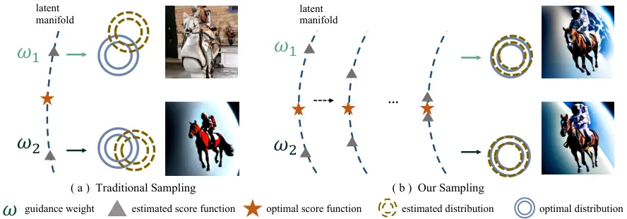
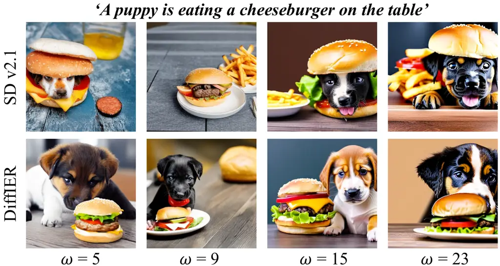
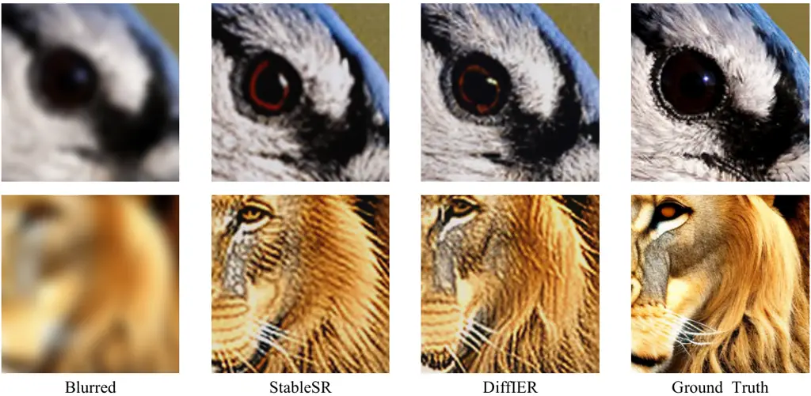
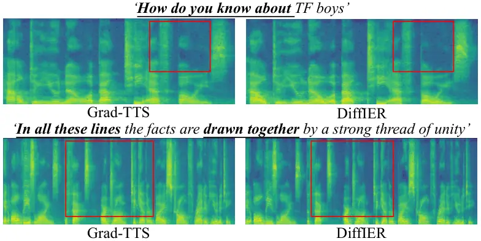
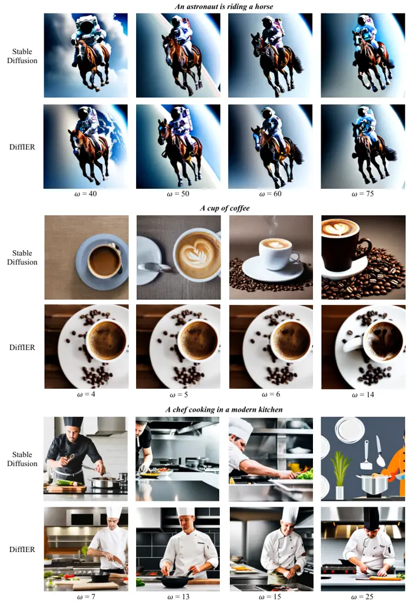
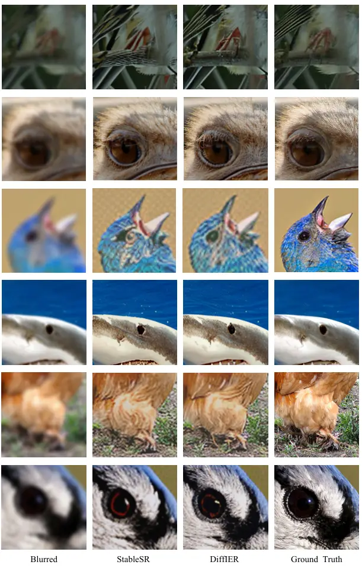
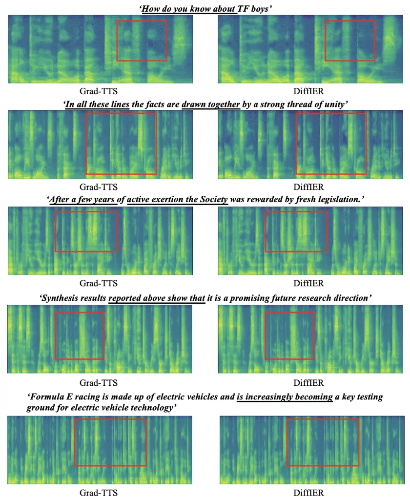

# DiffIER: Optimizing Diffusion Models with Iterative Error Reduction

Ao Chen    Lihe Ding    Tianfan Xue

###### Abstract

Diffusion models have demonstrated remarkable capabilities in generating
high-quality samples and enhancing performance across diverse domains
through Classifier-Free Guidance (CFG). However, the quality of
generated samples is highly sensitive to the selection of the guidance
weight. In this work, we identify a critical “training-inference gap”
and we argue that it is the presence of this gap that undermines the
performance of conditional generation and renders outputs highly
sensitive to the guidance weight. We quantify this gap by measuring the
accumulated error during the inference stage and establish a correlation
between the selection of guidance weight and minimizing this gap.
Furthermore, to mitigate this gap, we propose DiffIER, an
optimization-based method for high-quality generation. We demonstrate
that the accumulated error can be effectively reduced by an iterative
error minimization at each step during inference. By introducing this
novel plug-and-play optimization framework, we enable the optimization
of errors at every single inference step and enhance generation quality.
Empirical results demonstrate that our proposed method outperforms
baseline approaches in conditional generation tasks. Furthermore, the
method achieves consistent success in text-to-image generation, image
super-resolution, and text-to-speech generation, underscoring its
versatility and potential for broad applications in future research.

¹Shanghai Jiao Tong University

² The Chinese University of Hong Kong

llykevin@sjtu.edu.cn

![[Uncaptioned
image]](arxiv-2508-13628--65b18e661671.figures/figure-1.webp)

Figure 1: We present DiffIER, a general, training-free optimization
method that achieves high-fidelity generation in diffusion models. The
plug-and-play property integrates with existing diffusion-based
pipelines and delivers superior performance across multiple tasks,
including text-to-image generation, image super-resolution, and
text-to-speech generation.

## Introduction

Diffusion models have demonstrated superior performance in generation
across diverse domains, including image and video generation and
editing, text-to-speech generation, and 3D generation (Song et al. 2020;
Jiang et al. 2024; Popov et al. 2021; Rombach et al. 2022; Ding et al.
2023). The probabilistic diffusion process (Sohl-Dickstein et al. 2015a)
consists of a forward process that injects noise into a data
distribution and a reverse process that recovers the noised
distribution. Theoretically, implementing the reverse process requires
computing the log-likelihood of the data at every single time stamp
during the forward process (Sohl-Dickstein et al. 2015b). However,
direct calculation of data log-likelihoods is computationally
intractable, Song et al. (2020) instead uses a neural network to predict
score functions to approximate the gradient of the log-likelihood at the
training stage and generate samples through an iterative sampler at the
inference stage.

Even with these advancements, diffusion models sometimes generate
low-quality results in generation tasks, raising questions about the
underlying mechanisms (Dhariwal and Nichol 2021; Sohl-Dickstein et al.
2015b). Goodfellow et al. (2020) introduced an extra trained classifier
(termed _Classifier Guidance_) to boost the sampling quality. Then,
_Classifier-Free Guidance_ (CFG) (Ho and Salimans 2022), a weighted
score function was proposed to improve the quality of conditional
sampling while avoiding training an extra classifier. CFG shows a
significant improvement in many tasks, including image editing (Brooks,
Holynski, and Efros 2023) and video generation (Wu et al. 2023). While
an appropriate CFG weight can enhance sample quality, an inappropriate
selection can also deteriorate it, as demonstrated in Fig. 2(a). This is
because, for a specific input condition, selections of guidance weights
are based on empirical comparisons and trial-and-error approaches. As a
result, an excessively large weight can lead to oversaturation or
artifacts in images (Sadat, Hilliges, and Weber 2024).

The above observation raises two questions: 1) Why does a theoretically
sound score function suffers a performance drop in conditional
generation tasks? 2) Why a proper selection of guidance weight is
important and can improve sampling quality? Some previous research
researchers tried to explain this. For example, Bradley and Nakkiran
(2024) illustrated that the sampling distribution can explain the
performance drop, and Bradley and Nakkiran (2024); Wang et al. (2024b)
tried to find a more principled way to find a better guidance weight for
the second question. Still, most conclusions are empirical, and the
conclusions are hard to explain all observed phenomena. Instead, in this
work, we demonstrate that the existence of a _gap_ between training and
actual inference leads to the above two questions.



Figure 2: Illustration of how DiffIER improves diffusion models at
inference time. (a) Traditional sampling with Classifier-Free Guidance.
For different input conditions, the error between the estimated score
function and optimal score function can be manipulated with various
guidance weights $`\omega`$. We use this error to measure the
“training-inference gap”. A smaller gap leads to a better performance.
(b) We introduce DiffIER, an optimization-based method to reduce the
“training-inference gap”. By ensuring the convergence of the estimated
score function to the optimal value, we reduce the error, thereby
improving the sampling quality and mitigating the fundamental challenges
of weight selection.

For the first question, we found that the training-inference _gap_ is
the primary cause of the diminished sampling quality in diffusion
models. Even diffusion models (Song et al. 2020) substitute the original
gradient of log-likelihood by predicting a score function, there still
exists error between the estimated score function and the optimal one,
as illustrated in Fig. 2(a), resulting in a “training-inference gap”.
This can be quantitatively measured by the accumulated error, which is
the sum of errors between the model’s predicted score function and the
theoretical gradient of the log-likelihood of all steps during
inference. In the experiment, we will show that by minimizing this gap,
we can improve the sampling quality.

For the second question, we found that the weighted score mechanism of
CFG can be viewed as a compensation for this _gap_ with the guidance
weight. To illustrate this point, we demonstrate that there exists an
optimal value for the guidance weight. A proper choice of the guidance
weight can lead to a smaller derivation, which finally points to more
stable and effective sampling outcomes. This observation can help
address the “roller coaster” phenomenon observed in experiments, where
the quality of image generation improves as the guidance weight
increases but then declines if the weight continues to rise.

Based on these observation, we further introduce a new inference-time
optimization method that effectively reduces the _training-inference
gap_, mitigating the fundamental challenges of CFG weight selection. We
show that, although the optimal guidance weight $`\omega^{*}`$ is
computationally inaccessible, the training-inference gap can be
effectively reduced by a new iteratively error reduction at each step.
Specifically, for a given input condition, the model’s predictions may
exhibit certain errors at each time step (the gap between triangle and
star in Fig. 2). To reduce this error, at each time step, we use a
gradient-based method to converge the score function derived from the
trained model to the theoretical gradient of the log-likelihood during
the inference stage. The optimized result is then utilized in the
subsequent inference step iteratively, avoiding error accumulation. As
illustrated in Fig. 2(b), the gap between star and triangle is reduced
when iteration goes on. The advantage of this approach is that it
effectively mitigates inference-phase errors under diverse input
conditions. Meanwhile, if the gap itself is relatively small, the
optimization cost will also be minimal, without incurring excessively
heavy computational loads. By ensuring the convergence of the score
function to the gradient of the log-likelihood, we minimize the
approximation error, thereby significantly reducing the
_training-inference gap_ and ultimately improving the accuracy and
stability of the generation process.

Because DiffIER is simple and training-free, it can easily adapt to any
diffusion-based model. To illustrate this point, in the experiment, we
have demonstrated that DiffIER can boost the performance on three varied
generation tasks. In text-to-image generation, it improves sampling
quality and mitigates the variability induced by the selection of
guidance weight. In image super-resolution (SR) and text-to-speech
tasks, it also boosts the performance over the existing baselines, as
shown in Fig. 1 and the experimental result section. All these validate
the effectiveness of the method and demonstrate its potential in many
other tasks that utilize diffusion models.

## Related Work

#### Generative models

Generative models aim to synthesize new samples by learning data
distributions, with prominent approaches including Generative
Adversarial Networks (GANs), flow-based models, and diffusion models.
GANs (Goodfellow et al. 2020) generate samples via adversarial training
between a generator and a discriminator, achieving breakthroughs in
image synthesis. Further improvements, including Wasserstein
GAN (Arjovsky, Chintala, and Bottou 2017) and StyleGAN  (Karras, Laine,
and Aila 2019), enhance model stability and generate quality. Flow-based
models (Kingma and Dhariwal 2018; Dinh, Sohl-Dickstein, and Bengio
2016), leverage invertible transformations to optimize data likelihood
directly, enabling exact density estimation and latent space
interpolation. Diffusion models generate samples through a gradual
denoising process, with foundational theories introduced
by (Sohl-Dickstein et al. 2015a). (Ho, Jain, and Abbeel 2020) simplified
this framework into denoising diffusion probabilistic models (DDPM) and
(Song et al. 2020) proposed a sampling scheme with score function and
while (Song, Meng, and Ermon 2020) accelerated sampling process named
denoising diffusion implicit models (DDIM). Hybrid methods like
Diffusion-GAN (Wang et al. 2022) combine the stability of diffusion with
the efficiency of GANs. Recent advancements prioritize efficiency (Liu
et al. 2023b; Yin et al. 2024) and multimodal capability (Popov et al.
2021; Rombach et al. 2022; Liu et al. 2023a; Poole et al. 2022), driving
generative models toward practical and scalable applications.

#### Guidance in Diffusion models

Dhariwal and Nichol (Dhariwal and Nichol 2021) introduced classifier
guidance into the diffusion model and achieved superior performance in
the conditional image generation task. Through training a separate
classifier and replacing the estimated conditional score with a weighted
alternative, this work provides an enlightening impact on the subsequent
use of guidance. Classifier-free guidance (CFG) (Ho and Salimans 2022)
was then introduced to prove that guidance can be performed with a pure
generative model without training an extra classifier, where the
guidance was expressed by a weighted sum of conditional score and
unconditional score. Given the convenience of implementing CFG in
practical use, generative tasks have increasingly incorporated this
technology (Jiang et al. 2024; Rombach et al. 2022; Ding et al. 2023;
Poole et al. 2022). While the emphasis lies more on the contribution of
guidance weight to downstream task performance, researchers also
investigate the underlying mechanism for the differences in generative
outcomes (Schmidt 2019; Ning et al. 2023b; Ning et al. 2023a; Li et al.
2023; Yuzhe et al. ).

#### Investigation on Diffusion Guidance

To provide an analysis on the setting of CFG weights, Extensive
experimentation by (Wang et al. 2024b) confirmed that monotonically
increasing weight schedulers consistently improve performance. (Shenoy
et al. 2024)leveraged a pre-trained classifier in inference mode,
dynamically determining guidance scales at each time step so that
improving generation performance in both class-conditioned and
text-to-image generation tasks. (Karras et al. 2024) raised the idea of
refining a diffusion model with its inferior version. However, in
practical applications, relying on the mutual optimization of the two
models is of extremely high cost, and the assumptions in the reasoning
process are relatively strong (Dou and Song 2024). (Chung et al. 2024)
identified the off-manifold phenomenon of CFG and reformulated text
guidance as an inverse problem to enhance sample quality at lower
guidance weights. However, these aforementioned works overlook detailed
analytical exploration of CFG and do not address the underlying reasons
for the changes in weight strategies across varying conditions. To
deconstruct the essence of CFG, (Bradley and Nakkiran 2024) proposed
that CFG functions as a predictor-corrector framework and provides a
certain level of analytical insight. Nevertheless, this theory does not
account for the observed influence of weight adjustments on image
content, nor does it explain the decline in generation quality
associated with higher weights.

## Preliminaries

#### Diffusion Probabilistic Model

Diffusion probabilistic models firstly construct a forward process
$`q(\mathbf{x}_{1:T}|\mathbf{x}_{0})`$ that injects noise to a data
distribution $`q(\mathbf{x}_{0})`$, and then reverse the forward process
to recover it. Given a forward noise schedule
$`\beta_{t}\in(0,1),n=1,\dots,T`$, we define a Markov forward
process (Ho, Jain, and Abbeel 2020):

```math
\displaystyle\begin{cases}q(\mathbf{x}_{1:T}|\mathbf{x}_{0})=\prod_{t=1}^{T}q(\mathbf{x}_{t}|\mathbf{x}_{t-1}),\\
q(\mathbf{x}_{t}|\mathbf{x}_{t-1})=\mathcal{N}(\mathbf{x}_{t}|\sqrt{\alpha_{t}}\mathbf{x}_{t-1},\beta_{t}\mathbf{I}),\end{cases} \tag{1}
```

where $`\mathbf{I}`$ is the identity matrix, $`\{\alpha_{t}\}`$ and
$`\{\beta_{t}\}`$ are scalars, and $`\alpha_{t}:=1-\beta_{t}`$. In the
rest of the paper, we adopt $`q(\cdot)`$ denotes the probability of both
the forward diffusion process and its theoretical reverse process,
conditioned on the pre-specified parameters $`\{\beta_{t}\}`$ and
$`p_{\theta}(\cdot)`$ denotes the probability of the reverse process
that is realized by a trained neural network with parameter $`\theta`$.

The reverse process for Eq. 1 is defined as a Markov process that
approximates the data distribution $`q(\mathbf{x}_{0})`$ by gradually
denoising from the standard Gaussian distribution
$`\mathbf{x}_{T}\sim\mathcal{N}(0,\mathbf{I})`$ through
$`q(\mathbf{x}_{t-1}|\mathbf{x}_{t})=\mathcal{N}(\mathbf{x}_{t-1}|\mu_{t}(\mathbf{x}_{t}),\sigma_{t}^{2}\mathbf{I})`$:
where $`\mu_{t}(\mathbf{x}_{t})`$ is generally parameterized by a
time-dependent score-based model $`s_{\theta}(\mathbf{x}_{t})`$ (Song
et al. 2020; Song, Meng, and Ermon 2020):

```math
\begin{cases}\mu_{t}(\mathbf{x}_{t})=\tilde{\mu}_{t}\left(\mathbf{x}_{t},\frac{1}{\sqrt{\bar{\alpha}_{t}}}(\mathbf{x}_{t}+\bar{\beta}_{t}s_{\theta}(\mathbf{x}_{t}))\right),\\
\tilde{\mu}_{t}(\mathbf{x}_{t},\mathbf{x}_{0})=\sqrt{\bar{\alpha}_{t-1}}\mathbf{x}_{0}+\sqrt{\bar{\beta}_{t-1}}\cdot(\mathbf{x}_{t}-\sqrt{\bar{\alpha}_{t}}\mathbf{x}_{0})/\sqrt{\bar{\beta}_{t}},\end{cases} \tag{2}
```

where $`\bar{\alpha}_{t}:=\Pi^{t}_{i=1}\alpha_{i}`$ and
$`\bar{\beta}_{t}:=1-\bar{\alpha}_{t}`$.

The core of implementing the reverse process lies in computing the
gradient of the log-likelihood of the data
$`\nabla_{\mathbf{x}_{t}}\log q(\mathbf{x}_{t})`$ at different time
stamps during the forward process. However, calculating the
log-likelihood of the data at different time stamps is computationally
infeasible. Instead, the key idea from  Song et al. (2020) is to predict
a score function using a neural network$`s_{\theta}(\mathbf{x}_{t})`$,
where this score function approximates the gradient of the
log-likelihood of every time stamp. Following (Song et al. 2020), a
neural network with parameter $`\theta`$ is trained to approximate
$`s_{\theta}(\mathbf{x}_{t})\approx\nabla_{\mathbf{x}_{t}}\log q(\mathbf{x}_{t})`$:

```math
\theta^{*}=\argmin_{\theta}\mathbf{E}_{\mathbf{x}_{t}\sim q(\mathbf{x}_{t})}\left[||s_{\theta}(\mathbf{x}_{t})-\nabla_{\mathbf{x}_{t}}\log q(\mathbf{x}_{t})||^{2}\right]. \tag{3}
```

Once the optimal score function $`\theta^{*}`$ is achieved, the reverse
process can be solved by replacing the gradient of data log-likelihood
 $`\nabla_{\mathbf{x}_{t}}\log q(\mathbf{x}_{t})`$ with a predicted
score function $`s^{*}_{\theta}(\mathbf{x}_{t})`$, achieving the goal
for sampling from distribution
$`\mathbf{x}_{T}\sim\mathcal{N}(0,\mathbf{I})`$ (Song et al. 2020).

#### Classifier-Free Guidance.

The diffusion model above is for unconditional generation, while
conditional generation is more useful in practice. To achieve this, we
can incorporate a condition $`c`$ and sample from
$`q(\mathbf{x}_{t}|c)`$. Dhariwal and Nichol (2021) proposed to
decompose the conditional score function using Bayes’ Theorem as
$`\nabla_{\mathbf{x}_{t}}\log q(\mathbf{x}_{t}|c)=\nabla_{\mathbf{x}_{t}}\log q(\mathbf{x}_{t})+\nabla_{\mathbf{x}_{t}}\log q(c|\mathbf{x}_{t})`$.
This decomposition leads to the well-known Classifier Guidance (CG),
which introduces a weight $`\omega>0`$ to emphasize the condition $`c`$:

```math
s^{\text{cg}}_{\theta,\omega}(\mathbf{x}_{t},c)=s_{\theta}(\mathbf{x}_{t})+(\omega+1)\cdot\nabla_{\mathbf{x}_{t}}\log q(c|\mathbf{x}_{t}). \tag{4}
```

However, this approach comes at the cost of training an additional
classifier $`q(c|\mathbf{x}_{t})`$, which is often impractical. To
address this limitation, Ho and Salimans (2022) further analyze the
classifier by expressing it as
$`\nabla_{\mathbf{x}_{t}}\log q(c|\mathbf{x}_{t})=\nabla_{\mathbf{x}_{t}}\log q(\mathbf{x}_{t},c)-\nabla_{\mathbf{x}_{t}}\log q(\mathbf{x}_{t})`$,
through training a diffusion network to jointly estimate both the
conditional score $`\nabla_{\mathbf{x}_{t}}\log q(\mathbf{x}_{t}|c)`$
and the unconditional score
$`\nabla_{\mathbf{x}_{t}}\log q(\mathbf{x}_{t}|\varnothing)`$, where
$`\varnothing`$ means setting the input condition as null. This results
in the Classifier-Free Guidance (CFG):

```math
s^{\text{cfg}}_{\theta,\omega}(\mathbf{x}_{t},c)=s_{\theta}(\mathbf{x}_{t},\varnothing)+\omega\cdot\left(s_{\theta}(\mathbf{x}_{t},c)-s_{\theta}(\mathbf{x}_{t},\varnothing)\right), \tag{5}
```

where $`\omega`$ serves as a weight (usually $`\omega>1`$ and
$`\omega=1`$ indicates no CFG) to balance the conditional and
unconditional components. The choice of CFG weight $`\omega`$ is often
ad-hoc, but it is critical for high-quality generation.

## Methodology

In this section, we first present our new perspective on CFG for a
comprehensive understanding of this widely used mechanism in diffusion
models. Then, we propose an optimization method to reduce the
“training-inference gap” on current diffusion models. For brevity, we
omit the derivations of some equations and refer the interested readers
to the supplementary material.

### Relation between CFG and Training-Inference Gap

To obtain the optimal reverse process of a diffusion model,  Bao et al.
(2022) introduced analytic forms of mean
$`\mu^{*}_{t}(\mathbf{x}_{t})`$, as expressed in Eq. 6:

```math
\mu_{t}^{*}(\mathbf{x}_{t})=\tilde{\mu}_{t}\left(\mathbf{x}_{t},\frac{1}{\sqrt{\bar{\alpha}_{t}}}\left(\mathbf{x}_{t}+\bar{\beta}_{t}\nabla_{\mathbf{x}_{t}}\log q(\mathbf{x}_{t}|c)\right)\right), \tag{6}
```

where the formulation of $`\tilde{\mu}`$ in the equation follows the
definition given in Eq. 2 above.

To accomplish conditional sampling in reverse process with CFG, Ho and
Salimans (2022) replaces the gradient of data
log-likelihood $`\nabla_{\mathbf{x}_{t}}\log q(\mathbf{x}_{t}|c)`$ with
a weighted predicted score
function $`s^{\text{cfg}}_{\theta,\omega}(\mathbf{x}_{t},c)`$ by the
neural network. Here, we propose a re-evaluation of the deviation
between the theoretically value in the reverse process and the CFG-based
one, expressed as :

```math
\mathbf{E}_{\mathbf{x}_{t}}\left\|\mu_{t}^{*}(\mathbf{x}_{t})-\mu_{t}^{\text{cfg}}(\mathbf{x}_{t})\right\|^{2}, \tag{7}
```

where $`\mathbf{E}`$ denotes the mathematical expectation and
$`\mu_{t}^{\text{cfg}}(\mathbf{x}_{t})`$ means replacing
$`\nabla_{\mathbf{x}_{t}}\log q(\mathbf{x}_{t}|c)`$ with
$`s^{\text{cfg}}_{\theta,\omega}(\mathbf{x}_{t},c)`$ in Eq. 6 during
conditional sampling cases. Eq. 7 is reduced to the following expression
$`w.r.t`$ the guidance weight $`\omega`$:

```math
L(\omega)\triangleq\mathbf{E}_{\mathbf{x}_{t}}\left\|s_{\theta,\omega}^{\text{cfg}}(\mathbf{x}_{t},c)-\nabla_{\mathbf{x}_{t}}\log q(\mathbf{x}_{t}|c)\right\|^{2}. \tag{8}
```

Then, by strictly defining
$`s_{\theta}(\mathbf{x}_{t},c)\approx\nabla_{\mathbf{x}_{t}}\log q(\mathbf{x}_{t}|c)`$
as
$`\nabla_{\mathbf{x}_{t}}\log q(\mathbf{x}_{t}|c)\triangleq s_{\theta}(\mathbf{x}_{t},c)+e_{t,c}`$,
we reach the optimal CFG weight $`\omega^{*}`$ as follows (Details in
Supplementary A.1) :

```math
\omega^{*}=1+\mathbf{E}_{\mathbf{x}_{t}}\left[\frac{\left(s_{\theta}(\mathbf{x}_{t},c)-s_{\theta}(\mathbf{x}_{t},\varnothing)\right)e_{t,c}}{\left(s_{\theta}(\mathbf{x}_{t},c)-s_{\theta}(\mathbf{x}_{t},\varnothing)\right)^{2}}\right], \tag{9}
```

where $`e_{t,c}`$ donates the error between
$`s_{\theta}(\mathbf{x}_{t},c)`$ and
$`\nabla_{\mathbf{x}_{t}}\log q(\mathbf{x}_{t}|c)`$ under a fixed
condition $`c`$ at time step $`t`$ mentioned in Sec. Introduction.
Apparently, the optimal guidance weight $`\omega^{*}`$ equals to 1 when
the error $`e_{t,c}=0`$. The optimal CFG weight equation Eq. 9 shares
following observations:

- •
  The deviation(Eq.7) is related to the guidance weight $`\omega`$.
  There occurs a theoretically optimal value $`\omega^{*}`$, $`w.r.t`$
  time step $`t`$. A better choice of $`\omega`$ leads to a smaller
  deviation at every single time step, leading to a more stable and
  effective sampling outcome.
- •
  The optimal guidance weight $`\omega^{*}`$ equals to 1 (means no CFG)
  when the
  error $`e_{t,c}\triangleq\nabla_{\mathbf{x}_{t}}\log q(\mathbf{x}_{t}|c)-s_{\theta}(\mathbf{x}_{t},c)=0`$.
  As a result, the introduction of CFG constitutes a compensatory
  mechanism for the approximation error $`e_{t,c}`$.
- •
  Considering introducing the CFG (set $`\omega>1`$) can lead to a
  better generation result, there exists an error $`e_{t,c}\neq 0`$. We
  define the accumulating error of all sampling steps results in the
  “training-inference gap”.
- •
  The theoretic optimal guidance weight $`\omega^{*}`$ in Eq.  9 highly
  depends on the input condition $`c`$ and it is hard to calculate in
  practice. This explains why finding a global optimal CFG weight is
  impossible.

The analysis above shows that the occurrence of this gap leads to a drop
in sampling quality. To tackle this challenge, in the next subsection,
we will propose DiffIER, an inference-time optimization method that
reduces the accumulated error and improves generation quality.

### DiffIER

To reduce the “training-inference gap” described above, we introduce an
inference-time optimization method that effectively decreases the gap,
mitigating the fundamental challenges of CFG. An ideal solution is to
directly calculate the gradient of the log-likelihood
$`\nabla_{\mathbf{x}_{t}}\log q(\mathbf{x}_{t}|c)`$ for a fixed
condition $`c`$, which guarantees to minimize the error at any time step
$`t`$. However, calculating the log-likelihood is computationally
infeasible.

Therefore, instead of calculating the precise log likelihood to reach
the optimal guidance weight $`\omega^{*}`$, we directly optimize the
accumulative error itself. We reveal that the accumulated error can be
iteratively reduced through reducing the error of every single step
under a fixed condition $`c`$ with mathematical derivation (Details in
Supplementary A.2):

```math
p_{\theta^{*}}(\mathbf{x}_{t-1}|\mathbf{x}_{t})=\mathbf{E}_{p_{\theta^{*}}}q(\mathbf{x}_{t-1}|\mathbf{x}_{0:T-1/t-1},\mathbf{x}_{T}), \tag{10}
```

where $`p_{\theta}(\cdot)`$ means the predicted distribution from a
trained network with parameters $`\theta`$. $`t\in{1,2,...,T}`$ and
$`\mathbf{x}_{0:T-1/t-1}`$ represents
$`\{\mathbf{x}_{0},\mathbf{x}_{1},..,\mathbf{x}_{T-1}\}`$ excluding
$`\mathbf{x}_{t-1}`$. For an existing diffusion model such as
LDM (Rombach et al. 2022), we proposed an optimization strategy with the
Eq. 11 as the objective function:

```math
\hskip-9.0ptL=\left|\rule{0.0pt}{10.0pt}\right|p_{\theta}(\mathbf{x}_{t-1}|\mathbf{x}_{t})-\mathbf{E}_{p_{\theta}}q(\mathbf{x}_{t-1}|\mathbf{x}_{0:T-1/t-1},\mathbf{x}_{T})\left|\rule{0.0pt}{10.0pt}\right|^{2}. \tag{11}
```

We want to emphasize two points about this objective function. First,
the time index $`t`$ in the reverse process starts from $`T`$.
Considering that the target in the forward diffusion process is a
Gaussian distribution, the initial step of optimization is also chosen
to be Gaussian. Second, the computation of the expectation in the second
term of this expression is based on the probability of the inference
process. From an implementation perspective, the optimization result at
step $`t`$ will be iteratively used in the computation at step $`t-1`$.

Finally, following (Song et al. 2020), we ultimately simplify the
optimization objective as (Details in Supplementary):

```math
L=\left|\rule{0.0pt}{10.0pt}\right|\epsilon^{cfg}_{\theta,\omega}(\mathbf{x}_{t},c)-\epsilon\left|\rule{0.0pt}{10.0pt}\right|^{2}, \tag{12}
```

where $`\epsilon^{cfg}_{\theta,\omega}(\mathbf{x}_{t},c)`$ represents
output from the pre-trained model at time step $`t`$ with input
condition $`c`$. We propose the detailed algorithm of the proposed
DiffIER in Alg. 1, where we take the DDIM sampling method(Song, Meng,
and Ermon 2020) as an example.

1:  Input: classifier-free guidance weight: $`\omega`$

2:             gradient scale: $`\eta=5e-2`$

3:             convergence threshold: $`1e-3`$

4:  $`\mathbf{x}_{T}\sim\mathcal{N}(0,\mathbf{I})`$

5:  for $`t=T`$ to $`1`$ do

6:
  $`\epsilon^{\text{cfg}}_{\theta,\omega}(\mathbf{x}_{t},c)=\epsilon_{\theta}(\mathbf{x}_{t},\varnothing)+\omega\cdot\left(\epsilon_{\theta}(\mathbf{x}_{t},c)-\epsilon_{\theta}(\mathbf{x}_{t},\varnothing)\right)`$

7:   while not convergence do

8:    $`\epsilon\sim\mathcal{N}(0,I)`$

9:    L =
$`\left\|\epsilon^{cfg}_{\theta,\omega}(\mathbf{x}_{t},c)-\epsilon\right\|^{2}`$

10:
   $`\epsilon^{cfg}_{\theta,\omega}(\mathbf{x}_{t},c)=\epsilon^{cfg}_{\theta,\omega}(\mathbf{x}_{t},c)+\eta\cdot\nabla_{\epsilon^{cfg}_{\theta,\omega}(\mathbf{x}_{t},c)}`$L

11:   end while

12:   $`x_{t-1}`$ = DDIM
Sampler$`\left(\mathbf{x}_{t},\epsilon^{cfg}_{\theta,\omega}(\mathbf{x}_{t},t)\right)`$

13:  end for

14:  return $`\mathbf{x}_{0}`$

Algorithm 1 DiffIER: Optimizing Diffusion Models with Iterative Error
Reduction

## Experiments

In this section, we first introduce the experimental setups and provide
extensive experimental results to demonstrate the superiority of this
work.

### Experimental Setup

#### Datasets and Baselines

We evaluate our plug-and-play method on synthetic and real-world
datasets across multiple tasks. 1) For conditional sampling, we employ
LDM trained on ImageNet (Deng et al. 2009), using category labels as
conditions. Additionally, we compare results with LDM (Rombach et al. 2022) using descriptive prompts for text-to-image generation, validating
our method’s effectiveness across conditioning paradigms. 2) We explore
image super-resolution (SR) by comparing our method with StableSR (Wang
et al. 2024a), which leverages generative priors to overcome fixed-size
limitations. We manage samples from DIV2K (Agustsson and Timofte 2017),
LSUN-bedroom (Yu et al. 2015), LSUN-church (Yu et al. 2015) and
ImageNet (Deng et al. 2009) datasets with Gaussian-blurred LR-HR pairs,
rigorously evaluating resolution enhancement capabilities. 3) Finally,
to assess generalization ability, we benchmark against Grad-TTS (Popov
et al. 2021), a text-to-speech model that generates audio samples
aligned with text input. Our evaluation uses manually designed text
inputs to demonstrate robustness, versus samples generated by
Luvvoice (Luvvoice 2025), Text2Speech (Text2Speech.org 2025),
TTS-online (TextToSpeech.online 2025), TTSMaker (TTSMaker 2025). All
comparisons are conducted using pre-trained models as baselines.

#### Evaluation metrics

We first conduct a quantitative comparison in conditional image
generation, using established metrics: Inception Score (IS) (Barratt and
Sharma 2018), and Precision-and-Recall (Kynkäänniemi et al. 2019),
implemented with the Torch-Fidelity library for consistency. Comparable
results on the image super-resolution task are also demonstrated with
CLIP-IQA (Wang, Chan, and Loy 2023), DeQA-Score (You et al. 2025) and
MUSIQ (Ke et al. 2021) to evaluate the perceptual quality of generated
images. PSNR and Lpips scores are also reported for reference. Besides,
we also provide results of text-to-speech with PESQ. To assess
generalization, we provide visualized results for text-to-image
generation, text-to-speech synthesis, and image super-resolution,
offering an intuitive qualitative understanding.

| Method  | Cate. | IS $`\uparrow`$ | Prec. $`\uparrow`$ | Cate. | IS $`\uparrow`$ | Prec. $`\uparrow`$ |
| ------- | ----- | --------------- | ------------------ | ----- | --------------- | ------------------ |
| LD      | 101   | 1.164           | 0.730              | 167   | 1.060           | 0.641              |
| DiffIER |       | 1.168           | 0.748              |       | 1.063           | 0.699              |
| LD      | 187   | 1.027           | 0.944              | 267   | 1.060           | 0.749              |
| DiffIER |       | 1.168           | 0.748              |       | 1.005           | 0.927              |
| LD      | 448   | 1.005           | 0.923              | 736   | 1.012           | 0.961              |
| DiffIER |       | 1.064           | 0.773              |       | 1.015           | 0.966              |
| LD      | 879   | 1.122           | 0.908              | 992   | 1.016           | 0.918              |
| DiffIER |       | 1.127           | 0.909              |       | 1.017           | 0.928              |

Table 1: Quantitative comparison of conditional sampling on Imagenet
dataset versus Langevin Dynamics (LD) sampler (Song et al. 2020). We
generate 5K samples on each category for comparison.

### Quantitative Comparisons

#### Conditional Image Generation.

As discussed in (Song et al. 2020; Bradley and Nakkiran 2024), the
predictor-corrector sampling strategy can be regarded as an enhancement
to conventional conditional diffusion samplers. To validate the
effectiveness of our method, we provide numerical comparisons with (Song
et al. 2020) in Tab. 1, conducted on the ImageNet (Deng et al. 2009)
dataset. For efficiency and operational feasibility, we randomly select
various categories to generate corresponding samples. As shown in
Tab. 1, our approach consistently outperforms the baseline across all
evaluated metrics.

| Metrics          | Method   | DIV2K | LSUN-b | LSUN-c | ImageNet |
| ---------------- | -------- | ----- | ------ | ------ | -------- |
| L $`\downarrow`$ | StableSR | 0.265 | 0.314  | 0.305  | 0.327    |
|                  | DiffIER  | 0.253 | 20.69  | 0.297  | 0.306    |
| P $`\uparrow`$   | StableSR | 20.24 | 23.83  | 20.51  | 22.88    |
|                  | DiffIER  | 20.69 | 24.15  | 20.96  | 23.03    |
| M$`\uparrow`$    | StableSR | 68.13 | 58.22  | 52.51  | 57.86    |
|                  | DiffIER  | 70.46 | 20.96  | 53.55  | 59.71    |
| C $`\uparrow`$   | StableSR | 0.607 | 0.310  | 0.387  | 0.523    |
|                  | DiffIER  | 0.626 | 0.321  | 0.392  | 0.604    |
| D$`\uparrow`$    | StableSR | 3.032 | 2.782  | 2.493  | 2.796    |
|                  | DiffIER  | 3.141 | 2.945  | 2.574  | 2.881    |

Table 2: Quantitative comparison of image super-resolution with
StableSR (Wang et al. 2024a).(L:Lpips, P:PSNR, M:MUSIQ, C:Clip-IQA,
D:DeQA-Score)

#### Image Super-Resolution.

Table 2 illustrates the generalization capability of the proposed
DiffIER in the image super-resolution (SR) task across samples from
various datasets. As demonstrated in the table, our method achieves
consistent superiority over the baseline across all evaluated metrics.
This consistent improvement highlights the strong generalization ability
of our approach, ensuring reliable and uniform performance during
real-world deployment.

| Metric            | Method  | LuvVoice   | Text2Speech |
| ----------------- | ------- | ---------- | ----------- |
| PESQ $`\uparrow`$ | GradTTS | 1.042      | 1.032       |
|                   | DiffIER | 1.044      | 1.052       |
| Metric            | Method  | TTS-online | TTSMaker    |
| PESQ $`\uparrow`$ | GradTTS | 1.030      | 1.034       |
|                   | DiffIER | 1.038      | 1.041       |

Table 3: Quantitative comparison of text-to-speech with GradTTS (Popov
et al. 2021).

#### Text-to-speech.

This work illustrates the generalization capability of the proposed
DiffIER in the text-to-speech (TTS) task across diverse sources. Our
method consistently outperforms the baseline models in key PESQ
evaluation metrics (in Tab. 3). These results collectively validate the
robustness and potential of our algorithm in addressing cross-modal
tasks.

### Qualitative Comparisons

#### Text-to-image Generation.



Figure 3: Results on text-to-image task, compared with Stable Diffusion
(SD v2.1). For a given text prompt ’A puppy is eating a cheeseburger on
the table’, the generation results of SD are influenced by diverse
guidance weight $`\omega`$ settings. Generated images from SD cannot
align closely with the prompt and exhibit visual artifacts. With the
application of our proposed method DiffIER, the generated image
demonstrates improved alignment with the textual prompt, and quality has
been improved, mitigating the challenging weight setting of CFG
mechanism.



Figure 4: Results on image super-resolution task, compared with
StableSR. In comparison to StableSR, our method can produce a more
faithful restoration of image details.

We evaluate the performance of our method using the pre-trained
StableDiffusion  (Rombach et al. 2022) (SD v2.1) as the baseline. As
illustrated in Fig. 3, with the prompt “A puppy is eating a cheeseburger
on the table”, while SD can generate samples, the results of diverse
guidance weights cannot align with the prompt and exhibit visual
artifacts. In contrast, our method significantly improves image quality
by removing artifacts and producing more natural and coherent content.
Additionally, the consistency between the generated image and the input
prompt is enhanced, mitigating the fundamental challenges of CFG, as
shown in Fig. 3. More visible results in Supplementary C.1.

#### Diffusion-based Image Super-Resolution.

We provide qualitative results in Fig. 4. It can be seen that our work
outperforms the baseline. When taking the images that are blurred by a
Gaussian kernel as the input, our method can effectively and correctly
recover the details of objects, including the feather patterns of a
bird, the mane of a lion. With the ground truth images, the SR results
of the baseline contain a number of artifacts, although the images
become clearer. However, our method can restore the blurred part to
closely align with the ground truth. This is crucial in SR tasks that
effectively restore information of real-world images More visible
results in Supplementary C.2.



Figure 5: Results on text-to-speech task, compared with Grad-TTS. In
comparison to Grad-TTS, our method achieves a higher signal-to-noise
ratio in key syllables and a more natural and realistic tonal quality.

#### Diffusion-based Text-to-Speech Generation.

We evaluate the proposed method in Text-to-Speech (TTS) generation,
using Grad-TTS (Popov et al. 2021) as the baseline. Grad-TTS employs a
score-based decoder to generate mel-spectrograms, aligning with our
method’s strengths. As shown in Fig. 5, while both the baseline and our
method can generate speech for various input text prompts, our method
achieves a higher signal-to-noise ratio in key syllables. Additionally,
the samples produced by our method exhibit enhanced perceptual clarity
in enunciation and a more natural and realistic tonal quality. These
results validate the theoretical feasibility and generalization of our
approach, demonstrating its effectiveness in cross-modal tasks. More
visible results and audio samples in Supplementary C.3.

## Conclusion

The accumulated error during the inference stage underlies the
“training-inference gap”, which is a key factor contributing to the
quality deterioration in conditional sampling tasks with diffusion
models. Through mathematical derivation, we demonstrate that the weight
of Classifier-Free Guidance (CFG) modulates this gap during inference,
and the “training-inference gap” can be iteratively minimized at each
step. To address this issue, we propose DiffIER, an inference-time
optimization method designed to reduce the training-inference gap and
mitigate the fundamental challenges associated with CFG. Our approach
employs a gradient-based optimization technique to iteratively converge
the error at each step, which is then utilized in subsequent inference
steps. This process effectively reduces the accumulated error and
significantly enhances generation quality. Empirical results highlight
the effectiveness and versatility of our method, demonstrating its
potential for broad applications in future research. In future work, we
will explore the potential of this method to be applied to other
generative architectures.

## References

- Agustsson and Timofte (2017) Agustsson, E.; and Timofte, R. 2017.
  Ntire 2017 challenge on single image super-resolution: Dataset and
  study. In _Proceedings of the IEEE conference on computer vision and
  pattern recognition workshops_, 126–135.
- Arjovsky, Chintala, and Bottou (2017) Arjovsky, M.; Chintala, S.; and
  Bottou, L. 2017. Wasserstein generative adversarial networks. In
  _International conference on machine learning_, 214–223. PMLR.
- Bao et al. (2022) Bao, F.; Li, C.; Zhu, J.; and Zhang, B. 2022.
  Analytic-dpm: an analytic estimate of the optimal reverse variance in
  diffusion probabilistic models. _arXiv preprint arXiv:2201.06503_.
- Barratt and Sharma (2018) Barratt, S.; and Sharma, R. 2018. A note on
  the inception score. _arXiv preprint arXiv:1801.01973_.
- Bradley and Nakkiran (2024) Bradley, A.; and Nakkiran, P. 2024.
  Classifier-free guidance is a predictor-corrector. _arXiv preprint
  arXiv:2408.09000_.
- Brooks, Holynski, and Efros (2023) Brooks, T.; Holynski, A.; and
  Efros, A. A. 2023. InstructPix2Pix: Learning to Follow Image Editing
  Instructions. arXiv:2211.09800.
- Chung et al. (2024) Chung, H.; Kim, J.; Park, G. Y.; Nam, H.; and Ye,
  J. C. 2024. CFG++: Manifold-constrained classifier free guidance for
  diffusion models. _arXiv preprint arXiv:2406.08070_.
- Deng et al. (2009) Deng, J.; Dong, W.; Socher, R.; Li, L.-J.; Li, K.;
  and Fei-Fei, L. 2009. Imagenet: A large-scale hierarchical image
  database. In _2009 IEEE conference on computer vision and pattern
  recognition_, 248–255. Ieee.
- Dhariwal and Nichol (2021) Dhariwal, P.; and Nichol, A. 2021.
  Diffusion models beat gans on image synthesis. _Advances in neural
  information processing systems_, 34: 8780–8794.
- Ding et al. (2023) Ding, L.; Dong, S.; Huang, Z.; Wang, Z.; Zhang, Y.;
  Gong, K.; Xu, D.; and Xue, T. 2023. Text-to-3D Generation with
  Bidirectional Diffusion using both 2D and 3D priors. arXiv:2312.04963.
- Dinh, Sohl-Dickstein, and Bengio (2016) Dinh, L.; Sohl-Dickstein, J.;
  and Bengio, S. 2016. Density estimation using real nvp. _arXiv
  preprint arXiv:1605.08803_.
- Dou and Song (2024) Dou, Z.; and Song, Y. 2024. Diffusion posterior
  sampling for linear inverse problem solving: A filtering perspective.
  In _The Twelfth International Conference on Learning Representations_.
- Goodfellow et al. (2020) Goodfellow, I.; Pouget-Abadie, J.; Mirza, M.;
  Xu, B.; Warde-Farley, D.; Ozair, S.; Courville, A.; and
  Bengio, Y. 2020. Generative adversarial networks. _Communications of
  the ACM_, 63(11): 139–144.
- Ho, Jain, and Abbeel (2020) Ho, J.; Jain, A.; and Abbeel, P. 2020.
  Denoising diffusion probabilistic models. _Advances in neural
  information processing systems_, 33: 6840–6851.
- Ho and Salimans (2022) Ho, J.; and Salimans, T. 2022. Classifier-free
  diffusion guidance. _arXiv preprint arXiv:2207.12598_.
- Jiang et al. (2024) Jiang, Y.; Zhang, Z.; Xue, T.; and Gu, J. 2024.
  AutoDIR: Automatic All-in-One Image Restoration with Latent Diffusion.
  arXiv:2310.10123.
- Karras et al. (2024) Karras, T.; Aittala, M.; Kynkäänniemi, T.;
  Lehtinen, J.; Aila, T.; and Laine, S. 2024. Guiding a diffusion model
  with a bad version of itself. _Advances in Neural Information
  Processing Systems_, 37: 52996–53021.
- Karras, Laine, and Aila (2019) Karras, T.; Laine, S.; and
  Aila, T. 2019. A style-based generator architecture for generative
  adversarial networks. In _Proceedings of the IEEE/CVF conference on
  computer vision and pattern recognition_, 4401–4410.
- Ke et al. (2021) Ke, J.; Wang, Q.; Wang, Y.; Milanfar, P.; and
  Yang, F. 2021. Musiq: Multi-scale image quality transformer. In
  _Proceedings of the IEEE/CVF international conference on computer
  vision_, 5148–5157.
- Kingma and Dhariwal (2018) Kingma, D. P.; and Dhariwal, P. 2018. Glow:
  Generative flow with invertible 1x1 convolutions. _Advances in neural
  information processing systems_, 31.
- Kynkäänniemi et al. (2019) Kynkäänniemi, T.; Karras, T.; Laine, S.;
  Lehtinen, J.; and Aila, T. 2019. Improved precision and recall metric
  for assessing generative models. _Advances in neural information
  processing systems_, 32.
- Li et al. (2023) Li, M.; Qu, T.; Yao, R.; Sun, W.; and Moens,
  M.-F. 2023. Alleviating exposure bias in diffusion models through
  sampling with shifted time steps. _arXiv preprint arXiv:2305.15583_.
- Liu et al. (2023a) Liu, R.; Wu, R.; Van Hoorick, B.; Tokmakov, P.;
  Zakharov, S.; and Vondrick, C. 2023a. Zero-1-to-3: Zero-shot one image
  to 3d object. In _Proceedings of the IEEE/CVF international conference
  on computer vision_, 9298–9309.
- Liu et al. (2023b) Liu, X.; Zhang, X.; Ma, J.; Peng, J.; et al. 2023b.
  Instaflow: One step is enough for high-quality diffusion-based
  text-to-image generation. In _The Twelfth International Conference on
  Learning Representations_.
- Liu et al. (2015) Liu, Z.; Luo, P.; Wang, X.; and Tang, X. 2015. Deep
  Learning Face Attributes in the Wild. In _Proceedings of International
  Conference on Computer Vision (ICCV)_.
- Luvvoice (2025) Luvvoice. 2025. Luvvoice - Free Text to Speech with AI
  Voices https://luvvoice.com.
- Ning et al. (2023a) Ning, M.; Li, M.; Su, J.; Salah, A. A.; and
  Ertugrul, I. O. 2023a. Elucidating the exposure bias in diffusion
  models. _arXiv preprint arXiv:2308.15321_.
- Ning et al. (2023b) Ning, M.; Sangineto, E.; Porrello, A.; Calderara,
  S.; and Cucchiara, R. 2023b. Input perturbation reduces exposure bias
  in diffusion models. _arXiv preprint arXiv:2301.11706_.
- Poole et al. (2022) Poole, B.; Jain, A.; Barron, J. T.; and
  Mildenhall, B. 2022. Dreamfusion: Text-to-3d using 2d diffusion.
  _arXiv preprint arXiv:2209.14988_.
- Popov et al. (2021) Popov, V.; Vovk, I.; Gogoryan, V.; Sadekova, T.;
  and Kudinov, M. 2021. Grad-tts: A diffusion probabilistic model for
  text-to-speech. In _International conference on machine learning_,
  8599–8608. PMLR.
- Rombach et al. (2022) Rombach, R.; Blattmann, A.; Lorenz, D.; Esser,
  P.; and Ommer, B. 2022. High-resolution image synthesis with latent
  diffusion models. In _Proceedings of the IEEE/CVF conference on
  computer vision and pattern recognition_, 10684–10695.
- Sadat, Hilliges, and Weber (2024) Sadat, S.; Hilliges, O.; and Weber,
  R. M. 2024. Eliminating oversaturation and artifacts of high guidance
  scales in diffusion models. In _The Thirteenth International
  Conference on Learning Representations_.
- Schmidt (2019) Schmidt, F. 2019. Generalization in generation: A
  closer look at exposure bias. _arXiv preprint arXiv:1910.00292_.
- Shenoy et al. (2024) Shenoy, R.; Pan, Z.; Balakrishnan, K.; Cheng, Q.;
  Jeon, Y.; Yang, H.; and Kim, J. 2024. Gradient-Free Classifier
  Guidance for Diffusion Model Sampling. _arXiv preprint
  arXiv:2411.15393_.
- Sohl-Dickstein et al. (2015a) Sohl-Dickstein, J.; Weiss, E.;
  Maheswaranathan, N.; and Ganguli, S. 2015a. Deep unsupervised learning
  using nonequilibrium thermodynamics. In _International conference on
  machine learning_, 2256–2265. pmlr.
- Sohl-Dickstein et al. (2015b) Sohl-Dickstein, J.; Weiss, E. A.;
  Maheswaranathan, N.; and Ganguli, S. 2015b. Deep Unsupervised Learning
  using Nonequilibrium Thermodynamics. arXiv:1503.03585.
- Song, Meng, and Ermon (2020) Song, J.; Meng, C.; and Ermon, S. 2020.
  Denoising diffusion implicit models. _arXiv preprint
  arXiv:2010.02502_.
- Song et al. (2020) Song, Y.; Sohl-Dickstein, J.; Kingma, D. P.; Kumar,
  A.; Ermon, S.; and Poole, B. 2020. Score-based generative modeling
  through stochastic differential equations. _arXiv preprint
  arXiv:2011.13456_.
- Text2Speech.org (2025) Text2Speech.org. 2025.
  https://www.text2speech.org.
- TextToSpeech.online (2025) TextToSpeech.online. 2025. Text To Speech
  Online - FREE UNLIMITED https://texttospeech.online.
- TTSMaker (2025) TTSMaker. 2025. https://ttsmaker.cn.
- Wang, Chan, and Loy (2023) Wang, J.; Chan, K. C.; and Loy, C. C. 2023.
  Exploring clip for assessing the look and feel of images. In
  _Proceedings of the AAAI conference on artificial intelligence_,
  volume 37, 2555–2563.
- Wang et al. (2024a) Wang, J.; Yue, Z.; Zhou, S.; Chan, K. C.; and Loy,
  C. C. 2024a. Exploiting diffusion prior for real-world image
  super-resolution. _International Journal of Computer Vision_, 132(12):
  5929–5949.
- Wang et al. (2024b) Wang, X.; Dufour, N.; Andreou, N.; Cani, M.-P.;
  Abrevaya, V. F.; Picard, D.; and Kalogeiton, V. 2024b. Analysis of
  Classifier-Free Guidance Weight Schedulers. _arXiv preprint
  arXiv:2404.13040_.
- Wang et al. (2022) Wang, Z.; Zheng, H.; He, P.; Chen, W.; and
  Zhou, M. 2022. Diffusion-gan: Training gans with diffusion. _arXiv
  preprint arXiv:2206.02262_.
- Wu et al. (2023) Wu, J. Z.; Ge, Y.; Wang, X.; Lei, S. W.; Gu, Y.; Shi,
  Y.; Hsu, W.; Shan, Y.; Qie, X.; and Shou, M. Z. 2023. Tune-a-video:
  One-shot tuning of image diffusion models for text-to-video
  generation. In _Proceedings of the IEEE/CVF International Conference
  on Computer Vision_, 7623–7633.
- Yin et al. (2024) Yin, T.; Gharbi, M.; Zhang, R.; Shechtman, E.;
  Durand, F.; Freeman, W. T.; and Park, T. 2024. One-step diffusion with
  distribution matching distillation. In _Proceedings of the IEEE/CVF
  conference on computer vision and pattern recognition_, 6613–6623.
- You et al. (2025) You, Z.; Cai, X.; Gu, J.; Xue, T.; and
  Dong, C. 2025. Teaching Large Language Models to Regress Accurate
  Image Quality Scores using Score Distribution. In _IEEE Conference on
  Computer Vision and Pattern Recognition_.
- Yu et al. (2015) Yu, F.; Seff, A.; Zhang, Y.; Song, S.; Funkhouser,
  T.; and Xiao, J. 2015. Lsun: Construction of a large-scale image
  dataset using deep learning with humans in the loop. _arXiv preprint
  arXiv:1506.03365_.
- (50) Yuzhe, Y.; Chen, J.; Huang, Z.; Lin, H.; Wang, M.; Dai, G.; and
  Wang, J. ???? Manifold Constraint Reduces Exposure Bias in Accelerated
  Diffusion Sampling. In _The Thirteenth International Conference on
  Learning Representations_.

## Appendix A Technical Appendices and Supplementary Material

#### Computational resources

The method proposed in this work does not involve a training procedure,
and the related computational experiments are conducted in the inference
stage based on public models. On the hardware front, an NVIDIA 3090 GPU
is employed, and for the software side, the PyTorch machine learning
framework serves as the foundation.

### Detailed process of Sec. 4.1

In this section, we present more details on the conclusion of Section
4.1. Bao et al. (2022) concluded the optimal mean value at each time
step $`t`$ during inference stage:

```math
\displaystyle\mu_{t}^{*}(\mathbf{x}_{t}) \displaystyle=\tilde{\mu}_{t}\left(\mathbf{x}_{t},\frac{1}{\sqrt{\bar{\alpha}_{t}}}\left(\mathbf{x}_{t}+\bar{\beta}_{t}\nabla_{x_{t}}\log q(\mathbf{x}_{t}|c)\right)\right) \tag{13}
```

```math
\displaystyle=\left(\sqrt{\bar{\alpha}_{t-1}}-\frac{\sqrt{\bar{\beta}_{t-1}\bar{\alpha}_{t}}}{\sqrt{\bar{\beta}_{t}}}\right)
```

```math
\displaystyle\cdot\left(\frac{1}{\sqrt{\bar{\alpha}_{t}}}x_{t}+\frac{\bar{\beta}_{t}}{\sqrt{\bar{\alpha}_{t}}}\nabla_{x_{t}}\log q(\mathbf{x}_{t}|c)\right)+\sqrt{\bar{\beta}_{t-1}}\cdot\mathbf{x}_{t}.
```

Under the framework of Classifier-Free Guidance, when we consider
substituting the gradient of data log-likelihood
$`\nabla_{x_{t}}\log q(\mathbf{x}_{t}|c)`$ with the CFG score function
$`s^{cfg}_{\theta,\omega}(\mathbf{x}_{t},c)`$ to estimate
$`\mu^{*}_{t}`$ according to Eq. 13. The derivation of this estimation
lies in the expression:

```math
\displaystyle L(\omega) \displaystyle\triangleq\left\|s^{cfg}_{\theta,\omega}(\mathbf{x}_{t},c)-\nabla_{x_{t}}\log q(\mathbf{x}_{t}|c)\right\|^{2} \tag{14}
```

```math
\displaystyle=\left\|\omega\cdot s_{\theta}(\mathbf{x}_{t},c)+(1-\omega)\cdot s_{\theta}(\mathbf{x}_{t},\varnothing)-\nabla_{x_{t}}\log q(\mathbf{x}_{t}|c)\right\|^{2}.
```

By treating $`\omega`$ as a variable, we can obtain the minimum value of
$`L(\omega)`$ as follows:

```math
\displaystyle\omega^{*} \displaystyle=\argmin_{\omega}L(\omega) \tag{15}
```

```math
\displaystyle=\mathbf{E}_{x_{t}}\left[\frac{\left(s_{\theta}(\mathbf{x}_{t},c)-s_{\theta}(\mathbf{x}_{t},\varnothing)\right)\left(\nabla_{x_{t}}\log q(\mathbf{x}_{t}|c)-s_{\theta}(\mathbf{x}_{t},\varnothing)\right)}{\left(s_{\theta}(\mathbf{x}_{t},c)-s_{\theta}(\mathbf{x}_{t},\varnothing)\right)^{2}}\right]
```

```math
\displaystyle=\mathbf{E}_{x_{t}}\left[\frac{\left(s_{\theta}(\mathbf{x}_{t},c)-s_{\theta}(\mathbf{x}_{t},\varnothing)\right)\left(s_{\theta}(\mathbf{x}_{t},c)+e_{t,c}-s_{\theta}(\mathbf{x}_{t},\varnothing)\right)}{\left(s_{\theta}(\mathbf{x}_{t},c)-s_{\theta}(\mathbf{x}_{t},\varnothing)\right)^{2}}\right]
```

```math
\displaystyle=1+\mathbf{E}_{x_{t}}\left[\frac{\left(s_{\theta}(\mathbf{x}_{t},c)-s_{\theta}(\mathbf{x}_{t},\varnothing)\right)e_{t,c}}{\left(s_{\theta}(\mathbf{x}_{t},c)-s_{\theta}(\mathbf{x}_{t},\varnothing)\right)^{2}}\right].
```

Then we reach the conclusion:

```math
\omega^{*}=1+\mathbf{E}_{x_{t}}\left[\frac{\left(s_{\theta}(\mathbf{x}_{t},c)-s_{\theta}(\mathbf{x}_{t},\varnothing)\right)e_{t,c}}{\left(s_{\theta}(\mathbf{x}_{t},c)-s_{\theta}(\mathbf{x}_{t},\varnothing)\right)^{2}}\right], \tag{16}
```

where
$`e_{t,c}\triangleq\nabla_{x_{t}}\log q(\mathbf{x}_{t}|c)-s_{\theta}(\mathbf{x}_{t},c)`$
indicates the error between $`\nabla_{x_{t}}\log q(\mathbf{x}_{t}|c)`$
and $`s_{\theta}(\mathbf{x}_{t},c)`$ at time step $`t`$.

### Detailed process of Sec. 4.2

Following the setting of theoretical known diffusion process $`q`$ and
predicted reverse process $`p_{\theta}`$ (Song et al. 2020), we consider
metricing the Kullback-Leibler Divergence (KL Divergence, $`D_{KL}`$)
between these two:

```math
\displaystyle D_{KL}[p_{\theta}(\mathbf{x}_{0:T-1}|\mathbf{x}_{T})||q(\mathbf{x}_{0:T-1}|\mathbf{x}_{T})] \tag{17}
```

```math
\displaystyle= \displaystyle\int p_{\theta}(\mathbf{x}_{0:T-1}|\mathbf{x}_{T})\log\frac{p_{\theta}(\mathbf{x}_{0:T-1}|\mathbf{x}_{T})}{q(\mathbf{x}_{0:T-1}|\mathbf{x}_{T})}d\mathbf{x}_{0:T-1}
```

```math
\displaystyle= \displaystyle\int p_{\theta}(\mathbf{x}_{0:T-1}|\mathbf{x}_{T})\log\frac{q(\mathbf{x}_{0:T-1},\mathbf{x}_{T})p_{\theta}(\mathbf{x}_{0:T-1}|\mathbf{x}_{T})}{q(\mathbf{x}_{0:T-1}|\mathbf{x}_{T})q(\mathbf{x}_{0:T-1},\mathbf{x}_{T})}d\mathbf{x}_{0:T-1}
```

```math
\displaystyle= \displaystyle\int p_{\theta}(\mathbf{x}_{0:T-1}|\mathbf{x}_{T})\log q(\mathbf{x}_{T})d\mathbf{x}_{0:T-1}
```

```math
\displaystyle-\int p_{\theta}(\mathbf{x}_{0:T-1}|\mathbf{x}_{T})\frac{q(\mathbf{x}_{0:T-1},\mathbf{x}_{T})}{p_{\theta}(\mathbf{x}_{0:T-1}|x_{T})}d\mathbf{x}_{0:T-1}
```

```math
\displaystyle= \displaystyle\log q(\mathbf{x}_{T})-\int p_{\theta}(\mathbf{x}_{0:T-1}|\mathbf{x}_{T})\frac{q(\mathbf{x}_{0:T-1},\mathbf{x}_{T})}{p_{\theta}(\mathbf{x}_{0:T-1}|\mathbf{x}_{T})}d\mathbf{x}_{0:T-1}.
```

As a result:

```math
\displaystyle\min D_{KL}[p_{\theta}(\mathbf{x}_{0:T-1}|\mathbf{x}_{T})||q(\mathbf{x}_{0:T-1}|\mathbf{x}_{T})] \tag{18}
```

```math
\displaystyle= \displaystyle\max\int p_{\theta}(\mathbf{x}_{0:T-1}|\mathbf{x}_{T})\log\frac{q(\mathbf{x}_{0:T-1},\mathbf{x}_{T})}{p_{\theta}(\mathbf{x}_{0:T-1}|\mathbf{x}_{T})}d\mathbf{x}_{0:T-1}.
```

Following (Song et al. 2020), the predicted reverse process can be
expressed as :

```math
p_{\theta}(\mathbf{x}_{0:T-1}|\mathbf{x}_{T})=\Pi^{T}_{t=1}p_{\theta}(\mathbf{x}_{t-1}|\mathbf{x}_{t}). \tag{19}
```

Then Eq.18 can be expressed as:

```math
\displaystyle\max\int p_{\theta}(\mathbf{x}_{0:T-1}|\mathbf{x}_{T})\log\frac{q(\mathbf{x}_{0:T-1},\mathbf{x}_{T})}{p_{\theta}(\mathbf{x}_{0:T-1}|\mathbf{x}_{T})}d\mathbf{x}_{0:T-1} \tag{20}
```

```math
\displaystyle= \displaystyle\max~\scalebox{1.4}[1.4]{[}\int p_{\theta}(\mathbf{x}_{0:T-1}|\mathbf{x}_{T})\log q(\mathbf{x}_{0:T-1},\mathbf{x}_{T})d\mathbf{x}_{0:T-1}
```

```math
\displaystyle-\int p_{\theta}(\mathbf{x}_{0:T-1}|\mathbf{x}_{T})\log p_{\theta}(\mathbf{x}_{0:T-1}|\mathbf{x}_{T})d\mathbf{x}_{0:T-1}\scalebox{1.4}[1.4]{]}
```

```math
\displaystyle= \displaystyle\max~\scalebox{1.4}[1.4]{[}\int p_{\theta}(\mathbf{x}_{0:T-1}|\mathbf{x}_{T})\log q(\mathbf{x}_{0:T-1}|\mathbf{x}_{T})q(\mathbf{x}_{T})d\mathbf{x}_{0:T-1}
```

```math
\displaystyle-\int\Pi^{T}_{t=1}p_{\theta}(\mathbf{x}_{t-1}|\mathbf{x}_{t})\log\Pi^{T}_{t=1}p_{\theta}(\mathbf{x}_{t-1}|\mathbf{x}_{t})d\mathbf{x}_{0:T-1}\scalebox{1.4}[1.4]{]}
```

```math
\displaystyle= \displaystyle\max~\scalebox{1.4}[1.4]{[}\log q(\mathbf{x}_{T})+\mathbf{E}_{p_{\theta}}\log q(\mathbf{x}_{0:T-1}|\mathbf{x}_{T})
```

```math
\displaystyle-\Sigma_{t=1}^{T}\mathbf{E}_{p_{\theta}}\log p_{\theta}(\mathbf{x}_{t-1}|\mathbf{x}_{t})\scalebox{1.4}[1.4]{]}.
```

The above optimization problem can be tackled according to the
philosophy of mean–field approximation: the optimization over the entire
horizon $`t\in[0,T]`$ can be decomposed into a collection of single time
steps $`t\in\{1,...,T\}`$ that can be solved iteratively. For a specific
$`t\in\{1,...,T\}`$, we have:

```math
\displaystyle\argmax_{p_{\theta}(\mathbf{x}_{t-1}|\mathbf{x}_{t})}\scalebox{1.4}[1.4]{[}\log q(\mathbf{x}_{T})+\mathbf{E}_{p_{\theta}}\log q(\mathbf{x}_{0:T-1}|\mathbf{x}_{T}) \tag{21}
```

```math
\displaystyle-\Sigma_{t=1}^{T}\mathbf{E}_{p_{\theta}}\log p_{\theta}(\mathbf{x}_{t-1}|\mathbf{x}_{t})\scalebox{1.4}[1.4]{]}
```

```math
\displaystyle= \displaystyle\argmax_{p_{\theta}(\mathbf{x}_{t-1}|\mathbf{x}_{t})}\scalebox{1.4}[1.4]{[}\log q(\mathbf{x}_{T})+\mathbf{E}_{p_{\theta}}\log q(\mathbf{x}_{0:T-1/t-1},\mathbf{x}_{t-1}|\mathbf{x}_{T})
```

```math
\displaystyle-\Sigma_{t=1}^{T}\mathbf{E}_{p_{\theta}}\log p_{\theta}(\mathbf{x}_{t-1}|\mathbf{x}_{t})\scalebox{1.4}[1.4]{]}
```

```math
\displaystyle= \displaystyle\argmax_{p_{\theta}(\mathbf{x}_{t-1}|\mathbf{x}_{t})}\scalebox{1.4}[1.4]{[}\log q(\mathbf{x}_{T})+\mathbf{E}_{p_{\theta}}\log q(\mathbf{x}_{t-1}|\mathbf{x}_{0:T-1/t-1},\mathbf{x}_{T})
```

```math
\displaystyle+\mathbf{E}_{p_{\theta}}\log q(\mathbf{x}_{0:T-1/t-1}|\mathbf{x}_{T})
```

```math
\displaystyle-\Sigma_{t=1}^{T}\mathbf{E}_{p_{\theta}}\log p_{\theta}(\mathbf{x}_{t-1}|\mathbf{x}_{t})\scalebox{1.4}[1.4]{]}
```

```math
\displaystyle= \displaystyle\argmax_{p_{\theta}(\mathbf{x}_{t-1}|\mathbf{x}_{t})}\scalebox{1.4}[1.4]{[}\mathbf{E}_{p_{\theta}}\log q(\mathbf{x}_{t-1}|\mathbf{x}_{0:T-1/t-1},\mathbf{x}_{T})
```

```math
\displaystyle-\mathbf{E}_{p_{\theta}}\log p_{\theta}(\mathbf{\mathbf{x}}_{t-1}|\mathbf{x}_{t})\scalebox{1.4}[1.4]{]}
```

```math
\displaystyle= \displaystyle\argmax_{p_{\theta}(\mathbf{x}_{t-1}|\mathbf{x}_{t})}\scalebox{1.4}[1.4]{[}\int p_{\theta}(\mathbf{x}_{t-1}|x_{t})\log q(\mathbf{x}_{t-1}|\mathbf{x}_{0:T-1/t-1},\mathbf{x}_{T})d\mathbf{x}_{t-1}
```

```math
\displaystyle-\int p_{\theta}(\mathbf{x}_{t-1}|\mathbf{x}_{t})\log p_{\theta}(\mathbf{x}_{t-1}|\mathbf{x}_{t})d\mathbf{x}_{t-1}\scalebox{1.4}[1.4]{]}.
```

Then we reach the conclusion with the Lagrange Multiplier Method:

```math
p_{\theta^{*}}(\mathbf{x}_{t-1}|x_{t})=\mathbf{E}_{p_{\theta^{*}}}q(\mathbf{x}_{t-1}|\mathbf{x}_{0:T-1/t-1},\mathbf{x}_{T}), \tag{22}
```

where the left side indicates the predicted distribution from the model
given $`\mathbf{x}_{t}`$ and the right side means the theoretical
distribution of the diffusion process given the same $`\mathbf{x}_{t}`$.
Considering the setting from (Song et al. 2020), the convergence target
of every step should be:

```math
L=\left\|\epsilon^{cfg}_{\theta,\omega}(\mathbf{x}_{t},c)-\epsilon\right\|^{2}, \tag{23}
```

here $`\epsilon^{cfg}_{\theta,\omega}(\mathbf{x}_{t},c)`$ means the
weight score function with CFG and
$`\epsilon\sim\mathcal{N}(0,\mathbf{I})`$. In this work, we apply the
simple gradient descent method to accomplish this optimization task,
with a step size of $`5e-2`$ and a threshold of $`1e-3`$. The proposed
algorithm is expressed as:

1:  Input: classifier-free guidance weight: $`\omega`$

2:             gradient scale: $`\eta=5e-2`$

3:             convergence threshold: $`1e-3`$

4:  $`\mathbf{x}_{T}\sim\mathcal{N}(0,\mathbf{I})`$

5:  for $`t=T`$ to $`1`$ do

6:
  $`\epsilon^{\text{cfg}}_{\theta,\omega}(\mathbf{x}_{t},c)=\epsilon_{\theta}(\mathbf{x}_{t},\varnothing)+\omega\cdot\left(\epsilon_{\theta}(\mathbf{x}_{t},c)-\epsilon_{\theta}(\mathbf{x}_{t},\varnothing)\right)`$

7:   while not convergence do

8:    $`\epsilon\sim\mathcal{N}(0,\mathbf{I})`$

9:    L =
$`\left\|\epsilon^{cfg}_{\theta,\omega}(\mathbf{x}_{t},c)-\epsilon\right\|^{2}`$

10:
   $`\epsilon^{cfg}_{\theta,\omega}(\mathbf{x}_{t},c)=\epsilon^{cfg}_{\theta,\omega}(\mathbf{x}_{t},c)+\eta\cdot\nabla_{\epsilon^{cfg}_{\theta,\omega}(\mathbf{x}_{t},c)}`$L

11:   end while

12:   $`x_{t-1}`$ = DDIM
Sampler$`\left(\mathbf{x}_{t},\epsilon^{cfg}_{\theta,\omega}(\mathbf{x}_{t},t)\right)`$

13:  end for

14:  return $`\mathbf{x}_{0}`$

Algorithm 2 DiffIER: Optimizing Diffusion Models with Iterative Error
Reduction

## Appendix B Additional quantitative resuts

We also assess our approach for unconditional sampling with the Latent
Diffusion Model (LDM) trained on datasets including CelebA (Liu et al.
2015), LSUN-Church, and LSUN-Bedroom (Yu et al. 2015). We extend our
analysis using the Predictor-Corrector sampling strategy from (Song
et al. 2020), comparing results with the official pre-trained model.

| Method  | Val. set | IS $`\uparrow`$ | KID $`\downarrow`$ | Prec. $`\uparrow`$ | Rec. $`\uparrow`$ |
| ------- | -------- | --------------- | ------------------ | ------------------ | ----------------- |
| LDM     | C-128    | 3.27            | 0.0661             | 0.052              | 0.023             |
| DiffIER | C-128    | 3.28            | 0.0658             | 0.052              | 0.024             |
| LDM     | C-256    | 3.27            | 0.0184             | 0.468              | 0.316             |
| DiffIER | C-256    | 3.28            | 0.0183             | 0.470              | 0.320             |
| LDM     | C-512    | 3.27            | 0.0060             | 0.725              | 0.519             |
| DiffIER | C-512    | 3.28            | 0.0058             | 0.727              | 0.526             |
| LDM     | C-1024   | 3.27            | 0.0075             | 0.729              | 0.515             |
| DiffIER | C-1024   | 3.28            | 0.0073             | 0.734              | 0.523             |
| LDM     | L-b      | 2.23            | 0.0032             | 0.724              | 0.458             |
| DiffIER | L-b      | 2.23            | 0.0035             | 0.724              | 0.463             |
| LDM     | L-c      | 2.70            | 0.0062             | 0.766              | 0.453             |
| DiffIER | L-c      | 2.72            | 0.0060             | 0.774              | 0.453             |

Table 4: Numerical results of unconditional sampling on CelebA (C-128,
number for various image sizes)dataset, Lsun-bedroom (L-b), and
Lsun-church (L-c) datasets versus latent diffusion method (LDM). We
generate 50K samples for each comparison.

#### Unconditional Image Generation.

We also present a quantitative comparison for unconditional sampling
using LDM on datasets including CelebA, LSUN-Church, and LSUN-Bedroom.
Due to the varying image sizes in CelebA (e.g., $`128^{2}`$,
$`256^{2}`$, $`512^{2}`$, and $`1024^{2}`$), we use ’CelebA-128’ to
denote the corresponding generated image size. Since image size can
impact metric outcomes, we conduct comparisons across all sizes for a
comprehensive perspective. As shown in Table 4, our approach outperforms
LDM across multiple perceptual metrics, including IS, KID, Precision,
and Recall. For instance, on CelebA-256, our DiffIER achieves an IS
score of 3.28, surpassing the baseline. Additionally, it achieves
Precision and Recall scores of 0.470 and 0.320, respectively. Similarly,
on the LSUN-Church validation dataset, our method achieves an IS score
of 2.72, with Precision and Recall scores of 0.774 and 0.453,
outperforming the baseline. These results demonstrate that our method
achieves superior performance in unconditional sampling tasks.

#### Discussion on the computation cost of this work.

As a training-free optimization method, it is necessary to discuss the
computation cost of this work. First of all, since this method does not
involve a training procedure, it has hardware resource requirements for
model training. As illustrated in the scripts, this work aims to reduce
the “training-inference gap” of diffusion models with a gradient-based
method. This implies that for a model, when this gap is very small, the
computational cost of optimization will also be extremely low. As
tabulated in Tab. 4, despite being an unconditional generation instance,
the model demonstrates negligible intrinsic bias as evidenced by the
high fidelity of its generated outputs. Consequently, the magnitude of
improvement remains modest, while the optimization procedure incurs
minimal computational latency. On the other hand, for conditional
generation tasks (such as text-to-image generation), when the model’s
predicted values under a fixed input condition exhibit significant error
from theoretical values, the iterative optimization strategy of this
method can reduce such error, thereby enhancing generation quality.
Leveraging gradient-based characteristics, the proposed method achieves
high computational efficiency. In this scenario, the computational cost
is deemed acceptable considering the improved output quality.

## Appendix C More visible relusts

### Visible results on Text-to-Image Generation task

We illustrate more visible results on the Text-to-Image Generation task
in Fig. 6.



Figure 6: Results on Text-to-Image Generation task, compared with Stable
Diffusion.

### Visible results on Image Super-Resolution task

We illustrate more visible results on the Image Super-Resolution task in
Fig. 7.



Figure 7: Results on Image Super-Resolution task, compared with
StableSR.

### Visible results on Text-to-Speech Generation task

We illustrate more visible results on the Text-to-Speech Generation task
in Fig. 8.



Figure 8: Results on Text-to-Speech Generation task, compared with
Grad-TTS. The underlined segments of the text demonstrate significant
differences in linguistic and stylistic characteristics.
