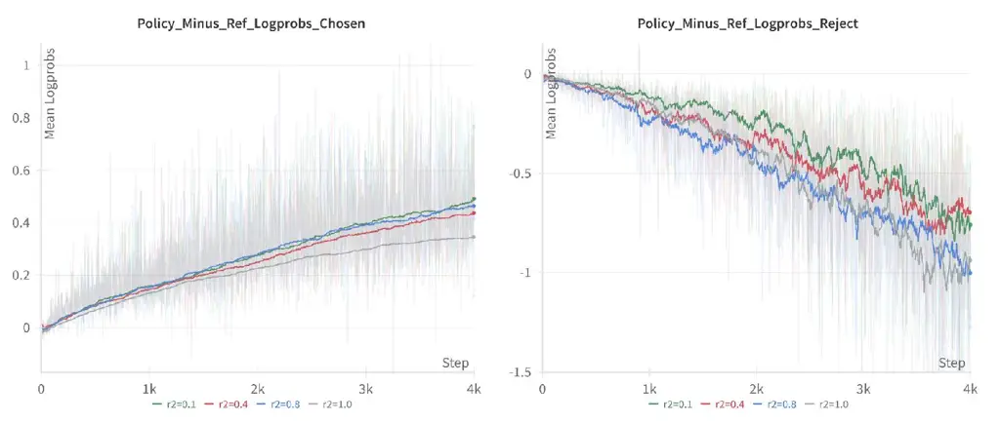
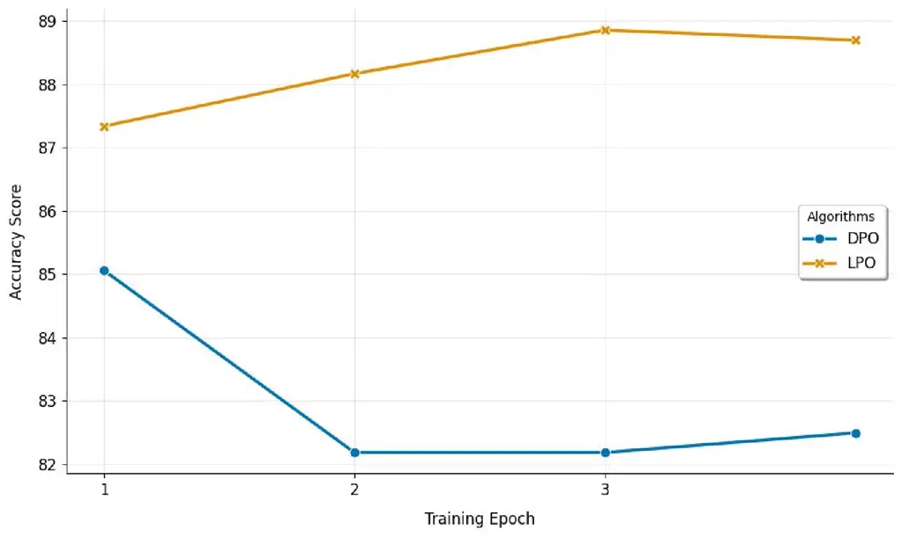
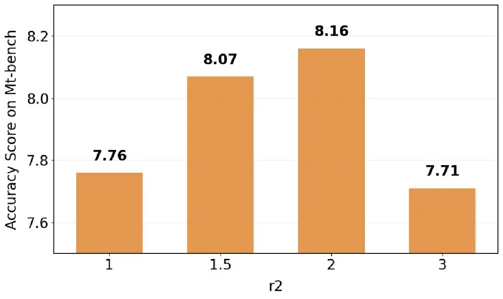
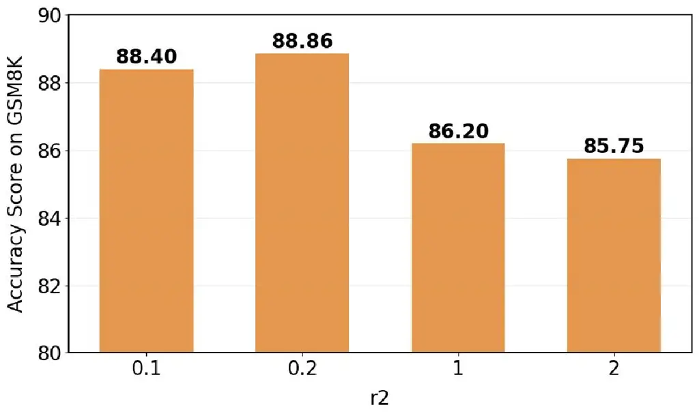

# Linear Preference Optimization: Decoupled Gradient Control via Absolute Regularization

Rui Wang ^(†)^(†)thanks: These authors contributed equally to this work.
   Qianguo Sun^(\*)    Chao Song    Yu Li ^(†)^(†)thanks: Corresponding
author. Affiliation: International Digital Economy Academy
Email: [{wangrui,sunqianguo,songchao,liyu}@idea.edu.cn](mailto:)   
Junlong Wu    Tianrong Chen    Zhiyun Zeng Affiliation: Emdoor
Collaborative Laboratory Affiliation: {tianrong.chen, zhiyun.zeng,
junlong.wu}@emdoor.com

###### Abstract

DPO (Direct Preference Optimization) has become a widely used offline
preference optimization algorithm due to its simplicity and training
stability. However, DPO is prone to overfitting and collapse. To address
these challenges, we propose Linear Preference Optimization (LPO), a
novel alignment framework featuring three key innovations. First, we
introduce gradient decoupling by replacing the log-sigmoid function with
an absolute difference loss, thereby isolating the optimization
dynamics. Second, we improve stability through an offset constraint
combined with a positive regularization term to preserve the chosen
response quality. Third, we implement controllable rejection suppression
using gradient separation with straightforward estimation and a tunable
coefficient that linearly regulates the descent of the rejection
probability. Through extensive experiments, we demonstrate that LPO
consistently improves performance on various tasks, including general
text, math, text-to-speech (TTS), and automatic speech recognition (ASR)
tasks. These results establish LPO as a robust and tunable paradigm for
preference alignment. Source code and model checkpoints are publicly
available at
[https://github.com/IDEA-Emdoor-Lab/LPO](https://github.com/IDEA-Emdoor-Lab/LPO).

|     |
| --- |
|     |

## 1 Introduction

The alignment of large language models (LLMs) with human preferences has
become a critical step in developing capable and safe AI assistants.
Reinforcement Learning from Human Feedback (RLHF) Ouyang et al. (2022a),
particularly through proximal policy optimization (PPO) Schulman et al.
(2017a), has established the dominant paradigm for this alignment.
Although effective, PPO suffers from significant complexity, requiring
multiple models (reward model, reference policy, active policy) and
intricate online sampling and optimization processes, leading to high
computational costs and implementation instability. To address these
limitations, Direct Preference Optimization (DPO) Rafailov et al. (2023)
emerged as a simpler and more stable alternative. DPO reframes
preference learning as a supervised loss function directly applied to
the policy network, bypassing the need for explicit reward modeling or
online RL.

Despite its elegance and widespread adoption, DPO exhibits several
critical shortcomings. First, the inherent coupling within the
log-sigmoid function forces the optimization of log-probability of the
chosen $`\log\pi_{\theta}(y_{w}|x)`$ and the rejected response
$`\log\pi_{\theta}(y_{l}|x)`$ to be interdependent. This often manifests
itself as an undesirable and significant decrease in the logarithmic
probability of the responses chosen during training, which can degrade
their inherent quality even as the preference objective improves.
Second, DPO is highly sensitive to the quality and noise level within
preference datasets. Suboptimal or ambiguous preference pairs can lead
to overfitting and subpar performance. Third, DPO lacks explicit
mechanisms to control the magnitude of the gap between the logarithmic
probabilities of the chosen and rejected responses
$`\log\frac{\pi_{\theta}(y_{w}|x)}{\pi_{\text{ref}}(y_{w}|x)}-\log\frac{\pi_{\theta}(y_{l}|x)}{\pi_{\text{ref}}(y_{l}|x)}`$,
which can lead to overoptimization and reduced generalization.

To overcome these fundamental limitations of DPO, we propose Linear
Preference Optimization (LPO), a novel preference alignment algorithm
built upon three key innovations:

- •
  Gradient Decoupling via Absolute Regulation: We replace the
  ’log-sigmoid’ function with the absolute difference function. This
  crucial modification decouples the gradients flowing back to the
  chosen and rejected log-probabilities, enabling more independent and
  targeted optimization of each term.
- •
  Stability Enhancement via Offset and Positive Constraint: Inspired by
  Offset-DPO (ODPO) Amini et al. (2024) and Identity Preference
  Optimization (IPO) Azar et al. (2023), we introduce an offset $`\mu`$
  to explicitly constrain the gap
  $`\log\frac{\pi_{\theta}(y_{w}|x)}{\pi_{\text{ref}}(y_{w}|x)}-\log\frac{\pi_{\theta}(y_{l}|x)}{\pi_{\text{ref}}(y_{l}|x)}`$,
  preventing it from growing excessively large and improving
  generalization. Simultaneously, inspired by DPOP Pal et al. (2024a),
  we incorporate an explicit positive constraint term
  $`-\log\pi_{\theta}(y_{w}|x)`$ to counteract the problematic decrease
  in log-probability of chosen responses observed in standard DPO.
- •
  Controlled Rejection Suppression via Gradient Separation: Leveraging
  the Straight-Through Estimator (STE) technique Esser et al. (2021), we
  strategically detach the computational graph (using ‘tensor.detach()‘)
  to isolate the gradients of the chosen and rejected log-probabilities.
  This allows us to introduce a control coefficient $`r_{2}`$
  specifically on the gradient path influencing the log-probability of
  the rejected response. By modulating $`r_{2}`$, we gain fine-grained
  control over the rate at which the log-probability of rejected
  responses is suppressed during optimization.

We conducted extensive experiments to validate the effectiveness of LPO.
Our results demonstrate:

- •
  General Capability: LPO achieves state-of-the-art or highly
  competitive performance on general instruction-following benchmarks,
  including MT-Bench Bai et al. (2024) and AlignBench Liu et al. (2023),
  confirming its robustness and general applicability.
- •
  Specialized Task Superiority: LPO excels in specialized domains. In
  particular, models fine-tuned with LPO significantly outperform strong
  baselines such as Qwen2.5-Instruct on mathematical reasoning (GSM8K
  Cobbe et al. (2021)). Furthermore, LPO yields substantial performance
  gains in specialized speech processing tasks, including Automatic
  Speech Recognition (ASR) and Text-to-Speech (TTS) synthesis within a
  native speech multimodality framework.
- •
  Controllability Validation: Ablation studies confirm the efficacy of
  the $`r_{2}`$ coefficient in precisely regulating the suppression rate
  of rejected response log-probabilities, providing practitioners with a
  valuable tuning knob for alignment behavior.

In summary, our work makes the following key contributions:

- •
  We introduce Linear Preference Optimization (LPO), a novel DPO variant
  designed to address core limitations: gradient coupling, chosen
  response degradation, and uncontrolled gap growth.
- •
  We propose three core innovations: 1) absolute difference for gradient
  decoupling, 2) offset constraint and positive regularization for
  stability, and 3) STE-based gradient separation with a rejection
  control coefficient $`r_{2}`$ for tunable optimization dynamics.
- •
  We provide comprehensive empirical evidence showcasing LPO’s
  effectiveness across general instruction-following, specialized
  mathematical reasoning, and speech processing tasks.
- •
  We demonstrate and validate the practical utility of the coefficient
  $`r_{2}`$ for controlling rejection suppression rates.

## 2 Related Works

Current large language models (LLMs) demonstrate a strong capability in
following human instructions Yang et al. (2025); Liu et al. (2024),
showcasing their effectiveness in various applications such as text
generation, question answering, and conversational agents. These models
leverage extensive training on diverse datasets, allowing them to
understand and respond accurately to user inputs. Their performance is
further enhanced through techniques like Reinforcement Learning from
Human Feedback (RLHF), which aligns model outputs with human preferences
Schulman et al. (2017b). This continuous refinement of LLMs not only
improves their responsiveness but also ensures they adhere to ethical
guidelines and user expectations. However, RLHF training necessitates
the separate training of a reward model Christiano et al. (2017); Ouyang
et al. (2022b), which in turn requires the simultaneous loading of four
distinct models. This method can be resource-intensive and may lead to
instability during the training process Rafailov et al. (2023). To
mitigate these issues, Direct Preference Optimization (DPO, Rafailov
et al. (2023)) introduces a novel parameterization method for the reward
model. This innovative approach facilitates the derivation of the
optimal policy through a closed-form solution, enabling traditional RLHF
challenges to be addressed using a straightforward classification loss
function.

The DPO training process is prone to overfitting, with both positive and
negative sample probabilities tending to decrease Feng et al. (2024b).
To address these issues, several improvements have been proposed, such
as DPOP Pal et al. (2024b) and IPO Azar et al. (2024). IPO examines the
theoretical underpinnings of RLHF and DPO. To address DPO’s tendency to
overfit, IPO introduces a pairwise preference loss function known as
“Identity Preference Optimization (IPO).” This function is designed to
mitigate overfitting on preference data by penalizing preference margins
that exceed a specified regularization threshold, thereby enhancing the
model’s generalization capabilities. DPOP Pal et al. (2024b) addresses
the issue of declining positive sample probability by incorporating a
penalty term for positive samples into its objective function. SimPO
Meng et al. (2024) utilizes the average log-probability of a sequence as
its implicit reward function, which allows for more accurate alignment
of the model’s generation behavior. This reward structure not only
enhances the effectiveness of the model but also eliminates the need for
a reference model. As a result, SimPO significantly boosts computational
efficiency and minimizes memory usage, making it a more
resource-friendly approach in preference optimization. Our approach
modifies DPO by replacing the log-sigmoid function with an absolute
function. We also integrate SimPO’s length normalization and decouple
the gradient computations for positive and negative samples. This
decoupling provides explicit control over the magnitude of gradient
descent for negative samples, enabling more targeted optimization and
improving the overall performance of the model.

## 3 Methods

### 3.1 Limitations of DPO

RLHF Ouyang et al. (2022a) has been demonstrated to significantly
enhance the robustness of model responses, safety, and reasoning
capabilities of large language models in previous training paradigms.
However, the practical application of RLHF presents several challenges.
These include the difficulty in training a sufficiently robust reward
model to prevent reward hacking, while certain RLHF algorithms, such as
Proximal Policy Optimization (PPO) Schulman et al. (2017a), suffer from
difficult parameter tuning. Consequently, to streamline the alignment
training process for large models, Direct Preference Optimization (DPO)
Rafailov et al. (2024) has been proposed. DPO demonstrates that the RLHF
training procedure can be simplified into a maximum likelihood
optimization problem without the need to explicitly train a separate
reward model:

```math
\begin{split}L_{\text{DPO}}(\pi_{\theta},\pi_{\text{ref}})=&-E_{(x,y_{w},y_{l})\sim D}\bigg[\log\sigma\bigg(\beta\cdot\log\frac{\pi_{\theta}(y_{w}|x)}{\pi_{\text{ref}}(y_{w}|x)}-\beta\cdot\log\frac{\pi_{\theta}(y_{l}|x)}{\pi_{\text{ref}}(y_{l}|x)}\bigg)\bigg]\end{split} \tag{1}
```

In Eq.1, $`\sigma`$ signifies the logistic function;
$`D=\{(x^{i},y_{w}^{i},y_{l}^{i})\}_{i=1}^{N}`$ represents the dataset,
where $`x^{i}`$ represents the prompt, and $`y_{w}^{i}`$ and
$`y_{l}^{i}`$ denote the chosen response and rejected response for the
input prompt $`x`$ respectively; The term $`\pi_{\theta}`$ refers to the
policy model to be optimized, which is initialized from the Supervised
Fine-Tuning (SFT) model, while $`\pi_{\text{ref}}`$ denotes the
Reference model, also derived from the SFT model.

Based on the gradient analysis Feng et al. (2024a) of DPO, we perform a
variable substitution in Eq.1 to facilitate subsequent gradient
analysis:

```math
\begin{split}L_{DPO}(\pi_{\theta},\pi_{ref})=-E_{(x,y_{w},y_{l})\sim D}\big[\log\sigma(\beta x_{1}-\beta x_{2})\big]\end{split} \tag{2}
```

In Eq.2, $`x_{1}`$ represents
$`\log\frac{\pi_{\theta}(y_{w}|x)}{\pi_{\text{ref}}(y_{w}|x)}`$, and
$`x_{2}`$ represents
$`\log\frac{\pi_{\theta}(y_{l}|x)}{\pi_{\text{ref}}(y_{l}|x)}`$. Then,
we take the partial derivatives with respect to $`x_{1}`$ and $`x_{2}`$
respectively, and we can obtain:

```math
\begin{split}\left\{\begin{aligned} \frac{\partial L_{DPO}(x_{1},x_{2})}{\partial x_{1}}=&-\frac{\beta x_{2}^{\beta}}{x_{1}(x_{1}^{\beta}+x_{2}^{\beta})}\\
\frac{\partial L_{DPO}(x_{1},x_{2})}{\partial x_{2}}=&-\frac{\beta x_{2}^{\beta-1}}{x_{1}^{\beta}+x_{2}^{\beta}}\end{aligned}\right.\end{split} \tag{3}
```

In Eq.3, $`\frac{\partial L_{DPO}(x_{1},x_{2})}{\partial x_{1}}`$ is
divided by $`\frac{\partial L_{DPO}(x_{1},x_{2})}{\partial x_{2}}`$, and
then we can obtain the following:

```math
\begin{split}\left|\frac{\partial L_{DPO}(x_{1},x_{2})}{\partial x_{1}}\bigg/{\frac{\partial L_{DPO}(x_{1},x_{2})}{\partial x_{2}}}\right|=\frac{x_{2}}{x_{1}}\end{split} \tag{4}
```

Based on the characteristics of the BT model and the DPO training
objectives, we can conclude that to maximize the likelihood function of
the DPO, the condition $`x_{1}-x_{2}`$ must be positive, implying that
$`x_{1}>x_{2}`$. Consequently, the gradient produced by $`x_{1}`$
(corresponding to the chosen response) will be less than that generated
by $`x_{2}`$ (corresponding to the rejected response). Additionally, due
to the marginal effect of the logistic function, in the later stages of
training, $`x_{2}`$ will become significantly smaller than $`x_{1}`$,
leading to the gradient from $`x_{2}`$ dominating the training process.
This results in the log-probabilities of the rejected responses being
reduced to extremely low values. However, in practice, there is no
necessity to decrease the log-probabilities of the rejected responses to
such an extent.

Meanwhile, since the loss of DPO essentially increases $`x_{1}-x_{2}`$,
the following situations may arise in the trends of $`x_{1}`$ and
$`x_{2}`$:

```math
\begin{cases}\text{Case 1: }x_{1}\uparrow,x_{2}\downarrow,\text{the rate of $x_{1}$ rising is slightly higher than $x_{2}$ descending}\\[8.61108pt]
\text{Case 2: }x_{1}\downarrow,x_{2}\downarrow,\text{the rate of $x_{1}$ descending is lower than $x_{2}$}\\[8.61108pt]
\text{Case 3: }x_{1}\uparrow,x_{2}\uparrow,\text{the rate of $x_{1}$ rising is higher than $x_{2}$}\end{cases} \tag{5}
```

Among the three cases, Case 1 represents the ideal optimization target
for DPO, where $`x_{1}`$ slightly increases while $`x_{2}`$ decreases at
a reasonable rate. However, in practical DPO training, a common issue
arises where both $`x_{1}`$ and $`x_{2}`$ decrease simultaneously. This
simultaneous decline can lead to a reduction in model performance,
undermining the effectiveness of the training process.

The limitations of DPO can be summarized in two key aspects:

\(i\) The contribution of the chosen responses to the gradient is
consistently less than that of the rejected responses. This imbalance
results in the optimization process predominantly focusing on reducing
the log-probabilities of the rejected samples. Consequently, the nature
of the sigmoid function exacerbates this issue, leading to an
excessively large reduction in the log-probabilities of the rejected
responses.

\(ii\) Since the objective of DPO training is fundamentally to increase
the difference between
$`\log\frac{\pi_{\theta}(y_{w}|x)}{\pi_{\text{ref}}(y_{w}|x)}`$ and
$`\log\frac{\pi_{\theta}(y_{l}|x)}{\pi_{\text{ref}}(y_{l}|x)}`$, it
frequently leads to both values decreasing simultaneously. This
simultaneous decline results in a reduction in the model’s performance
rather than an improvement, undermining the effectiveness of the
training process.

### 3.2 Linear Preference Optimization: Decoupling the grad between chosen and reject

Eq.1 shows that the DPO target function can be represented as
$`L_{DPO}(x_{1},x_{2})=f(x_{1},x_{2})`$. From Eq.2, the gradients
$`\frac{\partial L_{DPO}(x_{1},x_{2})}{\partial x_{1}}`$ and
$`\frac{\partial L_{DPO}(x_{1},x_{2})}{\partial x_{2}}`$ incorporate
nonlinear terms involving both $`x_{1}`$ and $`x_{2}`$. Therefore, we
proceed to linearize the mathematical expression of DPO to facilitate
further analysis and optimization.

To enhance LPO function, we replace DPO’s log-sigmoid function with the
absolute function. We also introduce an offset inspired by IPO Azar
et al. (2023) and ODPO Amini et al. (2024), incorporate a positive term
motivated by DPOP Pal et al. (2024a), and apply length normalization to
both chosen and rejected log-probabilities similar to SimPO Meng et al.
(2024). The resulting LPO function can be expressed as follows:

```math
\begin{split}\mathcal{L}_{LPO}=2\beta\cdot\left|x_{1}-x_{2}-\frac{1}{2\beta}\right|+\lambda\cdot\max(0,-x_{1})\end{split} \tag{6}
```

Here, $`\beta`$ and $`\lambda`$ are hyperparameters controlling the
offset and the magnitude of the positive term, respectively, while
$`x_{1}`$ and $`x_{2}`$ represent the length-normalized
log-probabilities of the chosen and rejected responses:

```math
\begin{split}\begin{cases}x_{1}=\log\frac{\pi_{\theta}(y_{w}|x)^{\frac{1}{len_{w}}}}{\pi_{\text{ref}}(y_{w}|x)^{\frac{1}{len_{w}}}}=\frac{1}{len_{w}}\cdot\log\frac{\pi_{\theta}(y_{w}|x)}{\pi_{\text{ref}}(y_{w}|x)}\\[8.61108pt]
x_{2}=\log\frac{\pi_{\theta}(y_{l}|x)^{\frac{1}{len_{l}}}}{\pi_{\text{ref}}(y_{l}|x)^{\frac{1}{len_{l}}}}=\frac{1}{len_{l}}\cdot\log\frac{\pi_{\theta}(y_{l}|x)}{\pi_{\text{ref}}(y_{l}|x)}\end{cases}\end{split} \tag{7}
```

Where $`len_{w}`$ denotes the length of the chosen response, and
$`len_{l}`$ denotes the length of the rejected response.

Using the gradient analysis method Feng et al. (2024a), we can compute
the partial derivatives of LPO function with respect to the variables
$`x_{1}`$ and $`x_{2}`$. The derivatives can be expressed as follows:

```math
\begin{split}\begin{cases}\frac{\partial L_{LPO}(x_{1},x_{2})}{\partial x_{1}}=-2\beta\cdot\text{sgn}(x_{1}-x_{2}-\frac{1}{2\beta})+C\\[12.91663pt]
\frac{\partial L_{LPO}(x_{1},x_{2})}{\partial x_{2}}=-2\beta\cdot\text{sgn}(x_{1}-x_{2}-\frac{1}{2\beta})\end{cases}\end{split} \tag{8}
```

Where sgn($`u`$) is the sign function, which is defined as 1 if $`u>0`$,
-1 if $`u<0`$, and 0 if $`u=0`$. The expression for $`C`$ is also a
constant, as shown in Eq. 9. This constant plays a crucial role in
adjusting the gradient based on the value of $`x_{1}`$, ensuring that
the optimization process is influenced appropriately depending on
whether the chosen response log-probability is negative or not. These
partial derivatives allow us to analyze how changes in the
log-probabilities of the chosen and rejected responses affect the
overall optimization objective, providing insights into the dynamics of
the optimization process.

```math
\begin{split}C=\lambda\cdot\begin{cases}1&\text{if }x_{1}<0\\
0&\text{if }x_{1}\geq 0\end{cases}\\[12.91663pt]
\end{split} \tag{9}
```

We divide
$`\frac{\partial L_{LPO}\left(x_{1},x_{2}\right)}{\partial x_{1}}`$ by
$`\frac{\partial L_{LPO}\left(x_{1},x_{2}\right)}{\partial x_{2}}`$ to
obtain the following expression:

```math
\begin{split}\frac{\partial L_{LPO}\left(x_{1},x_{2}\right)}{\partial x_{1}}\bigg/\frac{\partial L_{LPO}\left(x_{1},x_{2}\right)}{\partial x_{2}}=\frac{-2\beta\cdot\text{sgn}(x_{1}-x_{2}-\frac{1}{2\beta})+C}{2\beta\cdot\text{sgn}(x_{1}-x_{2}-\frac{1}{2\beta})}\end{split} \tag{10}
```

This simplification reveals that the ratio of $`x_{1}`$ and $`x_{2}`$
becomes a constant, and the relative magnitude of their gradients can be
controlled by $`\beta`$ and $`\lambda`$. Meanwhile, to more effectively
control the descent rate of $`x_{2}`$, we utilize the Straight-Through
Estimator (STE) as introduced in Esser et al. (2021). This technique
allows us to enhance Eq. 1 by enabling gradient propagation through
discrete operations while maintaining the ability to optimize continuous
variables effectively. As following:

```math
\begin{split}\begin{cases}L_{LPO-ste}^{x_{1}}=r_{1}\cdot 2\beta\left|x_{1}-x_{2}.\text{detach}()-\frac{1}{2\beta}\right|+\lambda\cdot\max(0,-x_{1})\\[8.61108pt]
L_{LPO-ste}^{x_{2}}=r_{2}\cdot 2\beta\left|x_{1}.\text{detach}()-x_{2}-\frac{1}{2\beta}\right|+\lambda\cdot\max(0,-x_{1}.\text{detach}())\end{cases}\end{split} \tag{11}
```

By applying the STE, we can isolate the gradients of the chosen and
rejected log-probabilities, allowing for separate adjustment of their
descent rates. This separation enhances the flexibility of our
optimization process, facilitating finer control over the learning
dynamics and improving overall model performance.

Ultimately, the expression for LPO-ste can be formulated as follows:

```math
\begin{split}\begin{cases}L_{LPO-ste}=\frac{2}{r_{1}+r_{2}}\cdot\left(r_{1}\cdot L_{LPO-ste}^{x_{1}}+r_{2}\cdot L_{LPO-ste}^{x_{2}}\right)\\[8.61108pt]
x_{1}=\frac{1}{len_{w}}\cdot\log\frac{\pi_{\theta}(y_{w}|x)}{\pi_{ref}(y_{w}|x)}\\[8.61108pt]
x_{2}=\frac{1}{len_{l}}\cdot\log\frac{\pi_{\theta}(y_{l}|x)}{\pi_{ref}(y_{l}|x)}\end{cases}\end{split} \tag{12}
```

In this expression, $`L_{x_{1}}^{LPO-STE}`$ and $`L_{x_{2}}^{LPO-STE}`$
represent the losses corresponding to the chosen and rejected responses,
respectively, while $`r_{1}`$ and $`r_{2}`$ are coefficients that
control the descent rates for these two components. By using the STE, we
ensure that gradients are effectively managed during the optimization
process, allowing for improved performance in preference alignment
tasks.

In the practical application of LPO-ste, $`r_{1}`$ is typically fixed at
1.0, while $`r_{2}`$ is adjusted within the range $`[0.05,3.0]`$. Fig. 1
illustrates the descent rate of the rejected responses and the ascent
rate of the chosen responses under varying $`r_{2}`$ values. From Fig.
1, it is evident that adjusting the size of $`r_{2}`$ facilitates
control over the ascent rate of the chosen responses and the descent
rate of the rejected responses. This capability enables us to fine-tune
the model’s performance effectively.



Figure 1: The changes of chosen and reject are shown when $`r_{2}`$
takes values of 0.1, 0.4, 0.8, and 1.0. A downward trend in reject can
be seen. As $`r_{2}`$ increases, the descent rate grows. Meanwhile, the
upward trend of chosen, which corresponds to the above, shows a
reduction. This matches the theoretical analysis of the relative
gradient changes of LPO.

### 3.3 Preference Pairs Construction

In the SPIN Chen et al. (2024), it is noted that after SFT training, a
general model’s output still displays certain discrepancies when
compared to the Ground Truth. Iterative DPO Pang et al. (2024) suggests
that a reward model can be utilized to select samples with the highest
and lowest scores for constructing preference pairs.

Consequently, we propose a novel method for constructing preference
pairs without relying on a reward model. In this approach, the chosen
sample is considered a sufficiently good answer, while the rejected
sample is generated using the SFT model’s inference hyperparameters,
with both top-p and temperature set to 1.0.

The specific algorithm for this preference pair construction is detailed
in Algorithm 1.

This method allows for the effective generation of preference pairs
while reducing dependency on additional models, enhancing efficiency in
the optimization process.

1:

2: $`\mathcal{D}=\left\{x^{i},y^{i}\right\}_{i=1}^{N}`$: where $`x^{i}`$
represents the prompt of the preference optimization dataset and
$`y^{i}`$ represents the corresponding Ground Truth.

3: $`\pi_{\theta}(x)`$: the Supervised Fine-tuning (SFT) model.

4:

5: Step 1: Construct Chosen:

6:
 $`\mathcal{D_{\text{chosen}}}=\left\{x^{i},y_{\text{chosen}}^{i}\equiv y^{i}\right\}_{i=1}^{N}`$,
where $`y_{\text{chosen}}^{i}`$ is always equal to the corresponding
$`y^{i}`$.

7: Step 2: Construct Reject:

8:
 $`\mathcal{D_{\text{reject}}}=\left\{x^{i},y_{\text{reject}}^{i}\equiv\pi_{\theta}(x^{i}|topp=1.0,temp=1.0)\right\}_{i=1}^{N}`$

9:
Output:$`\mathcal{D}_{\text{LPPC}}=\left\{x^{i},y_{\text{chosen}}^{i}\equiv y^{i},y_{\text{reject}}^{i}\equiv\pi_{\theta}(x^{i})\right\}_{i=1}^{N}`$

Algorithm 1 LPO Preference Pair Construction (LPPC)

## 4 Experiments

In this section, we first introduce the experimental setup and
subsequently present the comparative experimental results of the models.
To validate the effectiveness of the proposed algorithm, comprehensive
experiments were conducted across three distinct domains: general text
tasks, domain-specific mathematical text tasks, text-to-speech (TTS)
speech generation tasks, and automatic speech recognition (ASR) tasks.

The experimental framework involved selecting a diverse set of
benchmarks to assess the performance of the models effectively. Each
domain was meticulously designed to evaluate specific capabilities:

1.  1.  General Text Tasks: These tasks focused on a variety of language
        understanding and generation challenges, including writing,
        summarization, and question answering.
2.  2.  Domain-Specific Mathematical Text Tasks: This segment aimed to test
        the models on mathematical reasoning and problem-solving
        capabilities, utilizing datasets specifically curated for this
        purpose.
3.  3.  TTS Speech Generation Tasks: In this area, models were evaluated on
        their ability to synthesize natural-sounding speech, focusing on
        fidelity, stability, and emotional expressiveness.
4.  4.  ASR Speech Recognition Tasks: In this domain, models were assessed
        on their proficiency in converting spoken language into accurate and
        robust textual transcriptions, with an emphasis on handling diverse
        accents, background noise, and varying speech rates.

The results will be presented in terms of performance metrics relevant
to each task type, showcasing the improvements achieved through the
application of the proposed method compared to baseline models.

### 4.1 Results on General Tasks

We selected Qwen2.5 Team (2024) as the base model for our experiments.
Infinity-Instruct Li et al. (2025) serves as an open-source,
high-quality dataset. For SFT phase, we randomly selected 290k examples
from the Infinity-Instruct dataset. The model resulting from this SFT
process is denoted as qwen2.5-SFT. Detailed configurations and the
training procedure for the SFT are provided in the Appendix B.

During the alignment phase, we validated the algorithm’s robustness
using both noisy training data and high-quality preference training
data.

1\) Infinity-Preference: This is an open-source, high-quality preference
dataset characterized by subtle distinctions between chosen and rejected
responses. It features minimal noise and presents greater learning
difficulty, making it an ideal candidate for robust evaluation.

2\) Infinity-instruct-1w: For this dataset, we randomly selected 10,000
samples from the remaining Infinity-Instruct data. The responses from
the original Infinity-Instruct dataset are designated as the chosen set,
while the rejected set comprises data generated by Qwen2.5-SFT,
utilizing temperature and top-p parameters set to 1.0. It is important
to note that this constructed training dataset is of lower quality
compared to Infinity-Preference.

Previous research has shown that GPT-4 evaluations closely align with
human assessments and are significantly more cost-effective Zheng et al.
(2023). Consequently, we selected two GPT-4-based evaluation benchmarks:
MT-bench Bai et al. (2024) and Alignbench Liu et al. (2023).

MT-bench encompasses a variety of categories, including writing, STEM,
role-play, reasoning, mathematics, humanities, information extraction,
and coding, while also assessing multi-turn dialogue performance. For
this benchmark, we employ GPT-4 as the judge model. In a similar vein,
Alignbench includes evaluation categories such as mathematical
computation, role-playing, logical reasoning, and text writing.

For comprehensive tasks, we conducted detailed experiments on both
MT-bench and Alignbench. In both benchmarks, we employ GPT-4 as the
evaluation judge model.

We employ vanilla DPO Rafailov et al. (2023) as our baseline comparison
algorithm. For the DPO experiments, we adhere to the official setup,
configuring the $`\beta`$ hyperparameter to 0.1. The experimental setup
for LPO is detailed in Appendix Table 9.

|       |      |         |      |          |           |      |            |            |        |      |
| ----- | ---- | ------- | ---- | -------- | --------- | ---- | ---------- | ---------- | ------ | ---- |
| model | Turn | writing | stem | roleplay | reasoning | math | humanities | extraction | coding | avg  |
| SFT   | 1    | 9.1     | 8.7  | 8.2      | 6.6       | 8.5  | 9.2        | 8.8        | 5.5    | 7.65 |
|       | 2    | 6.7     | 7.3  | 7.7      | 5.3       | 5.6  | 9.4        | 8.9        | 7.0    |      |
| DPO   | 1    | 9.2     | 9.3  | 8.8      | 6.4       | 9.2  | 9.2        | 8.6        | 7.0    | 8.20 |
|       | 2    | 8.3     | 7.7  | 8.4      | 5.5       | 6.2  | 9.8        | 10.0       | 7.6    |      |
| LPO   | 1    | 9.1     | 8.9  | 8.5      | 8.1       | 8.8  | 8.9        | 8.1        | 7.9    | 8.16 |
|       | 2    | 7.9     | 7.6  | 8.0      | 6.3       | 6.8  | 9.5        | 8.8        | 7.4    |      |

Table 1: Details of LPO performance on MT-Bench trained on
infinity-preference dataset

|                       |      |      |      |
| --------------------- | ---- | ---- | ---- |
| Task                  | SFT  | DPO  | LPO  |
| Professional Skill    | 6.62 | 7.12 | 6.59 |
| Chinese Comprehension | 5.82 | 6.25 | 6.13 |
| Basic Task            | 6.45 | 6.22 | 6.35 |
| Math Computation      | 6.45 | 6.65 | 6.49 |
| Text Writing          | 5.65 | 5.21 | 6.16 |
| Comprehensive Q&A     | 6.23 | 7.23 | 7.26 |
| Roleplay              | 6.55 | 6.61 | 6.92 |
| Logical Reasoning     | 5.66 | 5.46 | 5.89 |
| Chinese Reasoning     | 6.06 | 6.05 | 6.14 |
| Chinese Language      | 6.22 | 6.61 | 6.57 |
| Overall Score         | 6.14 | 6.34 | 6.36 |

Table 2: Details of LPO performance on AlignBench trained on
infinity-perference dataset

|       |      |         |      |          |           |      |            |            |        |      |
| ----- | ---- | ------- | ---- | -------- | --------- | ---- | ---------- | ---------- | ------ | ---- |
| model | Turn | writing | stem | roleplay | reasoning | math | humanities | extraction | coding | avg  |
| SFT   | 1    | 9.1     | 8.7  | 8.2      | 6.6       | 8.5  | 9.2        | 8.8        | 5.5    | 7.65 |
|       | 2    | 6.7     | 7.3  | 7.7      | 5.3       | 5.6  | 9.4        | 8.9        | 7.0    |      |
| DPO   | 1    | 8.9     | 8.7  | 8.7      | 7.3       | 8.5  | 8.5        | 9.7        | 6.1    | 7.63 |
|       | 2    | 7.4     | 7.1  | 7.7      | 5.9       | 5.5  | 9.1        | 7.3        | 5.7    |      |
| LPO   | 1    | 9.0     | 9.1  | 8.4      | 8.2       | 8.4  | 9.0        | 8.8        | 5.4    | 8.02 |
|       | 2    | 8.3     | 7.5  | 7.9      | 7.5       | 5.7  | 9.3        | 9.9        | 6.0    |      |

Table 3: Details of LPO performance on MT-Bench trained on
infinity-instruct-1w dataset

|                       |      |      |      |
| --------------------- | ---- | ---- | ---- |
| Task                  | SFT  | DPO  | LPO  |
| Professional Skill    | 6.62 | 6.29 | 6.12 |
| Chinese Comprehension | 5.82 | 5.74 | 5.77 |
| Basic Task            | 6.45 | 5.89 | 6.16 |
| Math Computation      | 6.45 | 6.07 | 6.99 |
| Text Writing          | 5.65 | 5.86 | 6.65 |
| Comprehensive Q&A     | 6.23 | 7.18 | 6.07 |
| Roleplay              | 6.55 | 5.59 | 5.69 |
| Logical Reasoning     | 5.66 | 5.14 | 5.38 |
| Chinese Reasoning     | 6.06 | 5.61 | 6.18 |
| Chinese Language      | 6.22 | 6.09 | 5.91 |
| Overall Score         | 6.14 | 5.85 | 6.05 |

Table 4: Details of LPO performance on AlignBench trained on
infinity-instruct-1w dataset

Shown in Table 1, 2, 3 and 4, the LPO algorithm achieves significant
improvements over the SFT model: a 6.37% gain on MT-bench and a 2.24%
improvement on Alignbench when trained on the Infinity-Preference
dataset. Additionally, there is a 4.81% enhancement on MT-bench when
using the Infinity-Instruct-1w dataset.

While the model trained with DPO on the Infinity-Preference dataset
showed notable gains, its performance on the Infinity-Instruct-1w
dataset exhibited a slight decline on MT-bench and a more pronounced
drop on Alignbench. Further analysis reveals that paired data
constructed from Infinity-Preference exhibits finer distinctions and
presents greater learning challenges. In contrast, pairs derived from
Infinity-Instruct-1w display more pronounced differentiability and lower
learning difficulty.

These findings indicate that the LPO algorithm demonstrates superior
robustness, delivering consistent gains across diverse datasets. In
contrast, DPO exhibits higher sensitivity to training data and appears
prone to overfitting on simpler datasets. LPO demonstrates substantial
gains in logical reasoning, while DPO shows more significant
improvements in scenarios like Q&A. We have further assessed the model’s
effectiveness specifically within the mathematics vertical.

### 4.2 Results on Math Tasks

We initialize our model using the SFT model that has been pre-trained on
general tasks. During the alignment phase, we train the model using the
dataset constructed via step-DPO Lai et al. (2024). Detailed
experimental configurations are provided in the Appendix C.

We conducted extensive tests on the GSM8K Cobbe et al. (2021) benchmark.
To better reflect real-world usage scenarios, we employed a zero-shot
approach during inference. Here, “Qwen2.5-Instruct” denotes the
officially released model from the Qwen team. The experimental results
are presented in Table 5.

|                  |       |
| ---------------- | ----- |
| Model Version    | GSM8K |
| Qwen2.5-Instruct | 87.19 |
| SFT              | 84.15 |
| DP0              | 82.34 |
| LP0              | 88.86 |

Table 5: Model performance on GSM8K

As shown in Table 5, LPO achieves a score of 88.86 on the GSM8K
benchmark, representing a 4.71-point improvement over the SFT model and
surpassing the performance of Qwen2.5-Instruct. In contrast, DPO
exhibits a 1.81-point degradation compared to the SFT baseline. As noted
in DPOP, DPO often fails to achieve strong results on mathematical
reasoning tasks.

### 4.3 Results on Text-to-Speech Tasks

In speech generation, synthesized audio sequences typically require
excessively long token representations. We have validated LPO’s modeling
capabilities under these long-sequence conditions. Building upon the
Qwen-2.5-7B foundation, we expanded its audio token capacity and
conducted incremental pre-training using 322B text and speech tokens.
The model was further refined through instruction tuning on 440k TTS
training samples (denoted as UniTTS-SFT), followed by specialized
alignment-oriented LPO training (denoted as UniTTS-LPO). For details on
incremental pre-training and instruction tuning, please refer to UniTTS
Wang et al. (2025).

The LPO training dataset is constructed as follows: Using each sample’s
prompt as input, we generate three candidate responses. These candidates
are then paired with the sample’s reference answer to form three
preference pairs, which comprise the final training data. The
corresponding training parameters are detailed in Appendix C.

To evaluate the model’s performance, it is assessed across the following
dimensions, each rated on a scale of 0 to 5:

- •
  Fidelity: The degree to which the audio accurately reproduces the
  original sound, including the closeness of timbre, pitch, and other
  acoustic characteristics to the real voice.
- •
  Stability: The absence of playback issues such as stuttering, frame
  skipping, or sudden interruptions during audio playback.
- •
  Naturalness: The quality of sounding like natural speech or playing,
  without noticeable robotic artifacts or an unnatural feel.
- •
  Emotional Expression: The ability of the audio to accurately convey
  the intended emotions, such as joy, sadness, anger, etc.

|            |          |           |             |                          |
| ---------- | -------- | --------- | ----------- | ------------------------ |
| Model      | Fidelity | Stability | Naturalness | Emotional expressiveness |
| UniTTS-SFT | 4.43     | 5         | 4.77        | 4.23                     |
| UniTTS-LPO | 4.8      | 4.97      | 4.94        | 4.6                      |

Table 6: Comparison of UniTTS-SFT and UniTTS-LPO models

Table 6 shows that the LPO algorithm demonstrates significant
improvements in emotional expressiveness and fidelity compared to the
SFT model, while exhibiting a slight decrease in stability. This outcome
validates the effectiveness of the LPO algorithm in the field of speech
generation.

### 4.4 Results on Automatic Speech Recognition Task

Automatic Speech Recognition (ASR) refers to the process of transforming
spoken words into textual form, a task that involves detecting words
within audio inputs and converting them into written language. The
objective is to achieve a precise conversion of speech into text.

To assess the LPO’s performance on ASR, we conducted sequential SFT and
LPO training on the expanded Qwen-2.5-7B model, leveraging both
AISHELL-1 (Chinese) and LibriSpeech (English) corpora.

The LPO training data were prepared using two different methodologies:

- •
  Model-based: Inspired by TTS data synthesis methodologies, we
  leveraged the SFT model to generate LPO reject samples, which were
  then paired with reference samples.
- •
  Perturbation-based: Text perturbation strategies Li et al. (2022) were
  adopted to create reject samples through systematic corruption of
  reference sentences, employing insertion, deletion, and repetition
  operators at controlled noise ratios ($`\eta=0.1`$).

Reject samples derived from these two construction methods exhibit
divergent properties: the model-based method primarily generates
homophonic heterographs (phonetically identical or similar but
semantically distinct words), while the perturbation-based method
produces samples with quantifiable stochasticity.

Note that for both model-based and perturbation-based methods, it is
necessary to exclude data pairs where the chosen and reject samples are
the same. Furthermore, data quality has a far greater impact on model
performance than data quantity. In our experiments, we found that 1k
high-quality samples contributed more significantly to the model’s
effectiveness and stability than 200k ordinary samples.

We use Character Error Rate (CER) for evaluating Chinese speech
recognition and Word Error Rate (WER) for English.

Table 7 shows that although constrained by the base model’s fundamental
capabilities, our model did not achieve state-of-the-art (SOTA)
performance during SFT; however, the LPO algorithm effectively reduced
the speech recognition error rate.

|                        |                    |               |             |             |
| ---------------------- | ------------------ | ------------- | ----------- | ----------- |
| Benchmark              | ASR-LPO            |               |             | ASR-SFT     |
|                        | Candidate method   | LPO $`r_{2}`$ | CER/WER (%) | CER/WER (%) |
| AISHELL-1              | Model-based        | 1.0           | 3.583       | 3.868       |
|                        |                    | 2.0           | 3.621       |             |
|                        |                    | 3.0           | 3.655       |             |
|                        | Perturbation-based | 1.0           | 3.583       |             |
|                        |                    | 2.0           | 3.567       |             |
|                        |                    | 3.0           | 3.694       |             |
| LibriSpeech-test-clean | Model-based        | 1.0           | 6.81        | 7.222       |
|                        |                    | 2.0           | 6.927       |             |
|                        |                    | 3.0           | 6.927       |             |
|                        | Perturbation-based | 1.0           | 6.965       |             |
|                        |                    | 2.0           | 6.874       |             |
|                        |                    | 3.0           | 6.684       |             |

Table 7: Comparison of ASR-SFT and ASR-LPO models

### 4.5 Analysis of multi-epoch with different $`r_{2}`$

Analysis of Overfitting Phenomenon: During DPO training, models are
prone to overfitting and typically require both reduced learning rates
and early stopping mechanisms. To verify whether the LPO algorithm
exhibits similar susceptibility to overfitting, we replicated the
experimental setup from the mathematics-specific chapter. This involved
evaluating model performance on the GSM8K task across varying training
epochs, while maintaining zero-shot inference during assessment.



Figure 2: GSM8K scores over training epochs on math tasks.

As shown in Fig.2, DPO achieves its best performance in the first epoch
but drops rapidly after the second epoch, even falling below the SFT
model performance. In contrast, LPO shows steady improvement over the
first three epochs, reaching its peak at the third epoch. This
comparison demonstrates that LPO is less prone to overfitting compared
to DPO.

The influence of the coefficient of determination of $`r_{2}`$:

In the algorithm analysis section, we demonstrate how the $`r_{2}`$
coefficient regulates the rate of decline for rejected responses and the
rate of increase for chosen responses, thereby modifying the model’s
performance. We validated the experimental outcomes for different
$`r_{2}`$ coefficients across both general tasks and the
mathematics-specific domain.

For the general tasks, following the experimental setup detailed in
Section 4.1, $`r_{2}`$ coefficients were selected from the range \[1,
1.5, 2, 3\]. For vertically specific math tasks, using the configuration
described in Section 4.2, $`r_{2}`$ coefficients were tested at values
of \[0.1, 0.2, 1, 2\]. The corresponding experimental results are
illustrated in Fig. 3(a) and Fig. 3(b).



(a)



(b)

Figure 3: We tested the variation of model performance with the r2
coefficient: (a) Performance on the MT-Bench leaderboard for general
tasks as r2 varies; (b) Performance on the GSM8K leaderboard for math
tasks as r2 varies.

As shown in Fig. 3(a) and Fig. 3(b), our experimental results
demonstrate two key conclusions: 1) Model performance varies on the
leaderboard with different r2 coefficients. Thus, adjusting the r2
coefficient is necessary to prevent a rapid decline in rejection rate
that causes overfitting. 2) The difficulty of learning varies across
tasks. The r2 coefficient should be adjusted based on the rate of loss
decrease for different tasks.

## 5 Conclusion

In this work, we first identify a critical limitation in DPO training:
the simultaneous degradation of probabilities for both chosen and
rejected responses during optimization. To address this issue, we
propose the LPO algorithm, which decouples gradient control for chosen
and rejected responses via the Straight-Through Estimator (STE). Our
method regulates the rejection probability descent rate through
parameter $`r_{2}`$ while incorporating a positive reinforcement term to
ensure monotonic improvement in the chosen response probability.
Experimental results demonstrate consistent performance gains across
general NLP tasks, specialized mathematical domains, and text-to-speech
(TTS) applications, confirming LPO’s robustness and broad applicability.

## References

- Amini et al. (2024) Afra Amini, Tim Vieira, and Ryan Cotterell. Direct
  preference optimization with an offset, 2024. URL
  [https://arxiv.org/abs/2402.10571](https://arxiv.org/abs/2402.10571).
- Azar et al. (2023) Mohammad Gheshlaghi Azar, Mark Rowland, Bilal Piot,
  Daniel Guo, Daniele Calandriello, Michal Valko, and Rémi Munos. A
  general theoretical paradigm to understand learning from human
  preferences, 2023. URL
  [https://arxiv.org/abs/2310.12036](https://arxiv.org/abs/2310.12036).
- Azar et al. (2024) Mohammad Gheshlaghi Azar, Zhaohan Daniel Guo, Bilal
  Piot, Remi Munos, Mark Rowland, Michal Valko, and Daniele
  Calandriello. A general theoretical paradigm to understand learning
  from human preferences. In _International Conference on Artificial
  Intelligence and Statistics_, pp. 4447–4455. PMLR, 2024.
- Bai et al. (2024) Ge Bai, Jie Liu, Xingyuan Bu, Yancheng He, Jiaheng
  Liu, Zhanhui Zhou, Zhuoran Lin, Wenbo Su, Tiezheng Ge, Bo Zheng,
  et al. Mt-bench-101: A fine-grained benchmark for evaluating large
  language models in multi-turn dialogues. _arXiv preprint
  arXiv:2402.14762_, 2024.
- Chen et al. (2024) Zixiang Chen, Yihe Deng, Huizhuo Yuan, Kaixuan Ji,
  and Quanquan Gu. Self-play fine-tuning converts weak language models
  to strong language models, 2024. URL
  [https://arxiv.org/abs/2401.01335](https://arxiv.org/abs/2401.01335).
- Christiano et al. (2017) Paul F Christiano, Jan Leike, Tom Brown,
  Miljan Martic, Shane Legg, and Dario Amodei. Deep reinforcement
  learning from human preferences. _Advances in neural information
  processing systems_, 30, 2017.
- Cobbe et al. (2021) Karl Cobbe, Vineet Kosaraju, Mohammad Bavarian,
  Mark Chen, Heewoo Jun, Lukasz Kaiser, Matthias Plappert, Jerry Tworek,
  Jacob Hilton, Reiichiro Nakano, et al. Training verifiers to solve
  math word problems. _arXiv preprint arXiv:2110.14168_, 2021.
- Esser et al. (2021) Patrick Esser, Robin Rombach, and Björn Ommer.
  Taming transformers for high-resolution image synthesis, 2021. URL
  [https://arxiv.org/abs/2012.09841](https://arxiv.org/abs/2012.09841).
- Feng et al. (2024a) Duanyu Feng, Bowen Qin, Chen Huang, Zheng Zhang,
  and Wenqiang Lei. Towards analyzing and understanding the limitations
  of dpo: A theoretical perspective, 2024a. URL
  [https://arxiv.org/abs/2404.04626](https://arxiv.org/abs/2404.04626).
- Feng et al. (2024b) Duanyu Feng, Bowen Qin, Chen Huang, Zheng Zhang,
  and Wenqiang Lei. Towards analyzing and understanding the limitations
  of dpo: A theoretical perspective. _arXiv preprint arXiv:2404.04626_,
  2024b.
- Lai et al. (2024) Xin Lai, Zhuotao Tian, Yukang Chen, Senqiao Yang,
  Xiangru Peng, and Jiaya Jia. Step-dpo: Step-wise preference
  optimization for long-chain reasoning of llms. _arXiv preprint
  arXiv:2406.18629_, 2024.
- Li et al. (2022) Bohan Li, Yutai Hou, and Wanxiang Che. Data
  augmentation approaches in natural language processing: A survey. _AI
  Open_, 3:71–90, 2022. ISSN 2666-6510. doi:
  10.1016/j.aiopen.2022.03.001. URL
  [http://dx.doi.org/10.1016/j.aiopen.2022.03.001](http://dx.doi.org/10.1016/j.aiopen.2022.03.001).
- Li et al. (2025) Jijie Li, Li Du, Hanyu Zhao, Bo-wen Zhang, Liangdong
  Wang, Boyan Gao, Guang Liu, and Yonghua Lin. Infinity instruct:
  Scaling instruction selection and synthesis to enhance language
  models. _arXiv preprint arXiv:2506.11116_, 2025.
- Liu et al. (2024) Aixin Liu, Bei Feng, Bing Xue, Bingxuan Wang, Bochao
  Wu, Chengda Lu, Chenggang Zhao, Chengqi Deng, Chenyu Zhang, Chong
  Ruan, et al. Deepseek-v3 technical report. _arXiv preprint
  arXiv:2412.19437_, 2024.
- Liu et al. (2023) Xiao Liu, Xuanyu Lei, Shengyuan Wang, Yue Huang,
  Zhuoer Feng, Bosi Wen, Jiale Cheng, Pei Ke, Yifan Xu, Weng Lam Tam,
  et al. Alignbench: Benchmarking chinese alignment of large language
  models. _arXiv preprint arXiv:2311.18743_, 2023.
- Meng et al. (2024) Yu Meng, Mengzhou Xia, and Danqi Chen. Simpo:
  Simple preference optimization with a reference-free reward, 2024. URL
  [https://arxiv.org/abs/2405.14734](https://arxiv.org/abs/2405.14734).
- Ouyang et al. (2022a) Long Ouyang, Jeff Wu, Xu Jiang, Diogo Almeida,
  Carroll L. Wainwright, Pamela Mishkin, Chong Zhang, Sandhini Agarwal,
  Katarina Slama, Alex Ray, John Schulman, Jacob Hilton, Fraser Kelton,
  Luke Miller, Maddie Simens, Amanda Askell, Peter Welinder, Paul
  Christiano, Jan Leike, and Ryan Lowe. Training language models to
  follow instructions with human feedback, 2022a. URL
  [https://arxiv.org/abs/2203.02155](https://arxiv.org/abs/2203.02155).
- Ouyang et al. (2022b) Long Ouyang, Jeffrey Wu, Xu Jiang, Diogo
  Almeida, Carroll Wainwright, Pamela Mishkin, Chong Zhang, Sandhini
  Agarwal, Katarina Slama, Alex Ray, et al. Training language models to
  follow instructions with human feedback. _Advances in neural
  information processing systems_, 35:27730–27744, 2022b.
- Pal et al. (2024a) Arka Pal, Deep Karkhanis, Samuel Dooley, Manley
  Roberts, Siddartha Naidu, and Colin White. Smaug: Fixing failure modes
  of preference optimisation with dpo-positive, 2024a. URL
  [https://arxiv.org/abs/2402.13228](https://arxiv.org/abs/2402.13228).
- Pal et al. (2024b) Arka Pal, Deep Karkhanis, Samuel Dooley, Manley
  Roberts, Siddartha Naidu, and Colin White. Smaug: Fixing failure modes
  of preference optimisation with dpo-positive. _arXiv preprint
  arXiv:2402.13228_, 2024b.
- Pang et al. (2024) Richard Yuanzhe Pang, Weizhe Yuan, Kyunghyun Cho,
  He He, Sainbayar Sukhbaatar, and Jason Weston. Iterative reasoning
  preference optimization, 2024. URL
  [https://arxiv.org/abs/2404.19733](https://arxiv.org/abs/2404.19733).
- Rafailov et al. (2023) Rafael Rafailov, Archit Sharma, Eric Mitchell,
  Christopher D Manning, Stefano Ermon, and Chelsea Finn. Direct
  preference optimization: Your language model is secretly a reward
  model. _Advances in neural information processing systems_,
  36:53728–53741, 2023.
- Rafailov et al. (2024) Rafael Rafailov, Archit Sharma, Eric Mitchell,
  Stefano Ermon, Christopher D. Manning, and Chelsea Finn. Direct
  preference optimization: Your language model is secretly a reward
  model, 2024. URL
  [https://arxiv.org/abs/2305.18290](https://arxiv.org/abs/2305.18290).
- Schulman et al. (2017a) John Schulman, Filip Wolski, Prafulla
  Dhariwal, Alec Radford, and Oleg Klimov. Proximal policy optimization
  algorithms, 2017a. URL
  [https://arxiv.org/abs/1707.06347](https://arxiv.org/abs/1707.06347).
- Schulman et al. (2017b) John Schulman, Filip Wolski, Prafulla
  Dhariwal, Alec Radford, and Oleg Klimov. Proximal policy optimization
  algorithms. _arXiv preprint arXiv:1707.06347_, 2017b.
- Team (2024) Qwen Team. Qwen2 technical report. _arXiv preprint
  arXiv:2407.10671_, 2024.
- Wang et al. (2025) Rui Wang, Qianguo Sun, Tianrong Chen, Zhiyun Zeng,
  Junlong Wu, and Jiaxing Zhang. Unitts: An end-to-end tts system
  without decoupling of acoustic and semantic information. _arXiv
  preprint arXiv:2505.17426_, 2025.
- Yang et al. (2025) An Yang, Anfeng Li, Baosong Yang, Beichen Zhang,
  Binyuan Hui, Bo Zheng, Bowen Yu, Chang Gao, Chengen Huang, Chenxu Lv,
  et al. Qwen3 technical report. _arXiv preprint
  arXiv:2505.09388_, 2025.
- Zheng et al. (2023) Lianmin Zheng, Wei-Lin Chiang, Ying Sheng, Siyuan
  Zhuang, Zhanghao Wu, Yonghao Zhuang, Zi Lin, Zhuohan Li, Dacheng Li,
  Eric Xing, et al. Judging llm-as-a-judge with mt-bench and chatbot
  arena. _Advances in neural information processing systems_,
  36:46595–46623, 2023.

## Appendix A Alignment Training Framework Development

We conducted SFT and alignment training using the pai-megatron-patch
framework. Since the framework lacks native support for alignment
algorithms like DPO and LPO, we implemented custom modifications with
the following key enhancements:

1\) Added DPO/LPO algorithm support: The upgraded training pipeline now
handles million-scale alignment datasets efficiently through mmap-format
data loading, enabling rapid training initialization.

2\) Extended multimodal capabilities: Beyond text modality, we
implemented comprehensive speech modality support—including dataset
construction, loading pipelines, and training workflows—with distributed
inference during data preprocessing.

We’ve open-sourced this enhanced training framework to facilitate
community adoption, enabling researchers to build upon our
implementation or reproduce paper results.

## Appendix B SFT Experimental Setup

Infinity-Instruct is an open-source, high-quality dataset. We selected a
subset of 290K training samples from it for supervised fine-tuning
(SFT). The base model used was Qwen2.5-7B, with detailed training
parameters provided in Table 8.

|                |                 |
| -------------- | --------------- |
| Parameter Name | Parameter Value |
| BATCH_SIZE     | 128             |
| LR             | 9e-6            |

Table 8: Model training parameters for general task

## Appendix C LPO Experimental Setup

Table 9 presents the experimental settings for LPO across general tasks,
domain-specific mathematical tasks, and TTS tasks.

|                |              |           |          |
| -------------- | ------------ | --------- | -------- |
| Parameter Name | General Task | Math Task | TTS Task |
| R1             | 1.0          | 1.0       | 1.0      |
| R2             | 2.0          | 0.2       | 0.4      |
| BATCH_SIZE     | 24           | 24        | 120      |
| $`\beta`$      | 0.2          | 0.2       | 0.2      |
| $`\gamma`$     | 10.0         | 10.0      | 10.0     |
| LR             | 2e-7         | 2e-7      | 2e-7     |

Table 9: Training parameters for LPO
