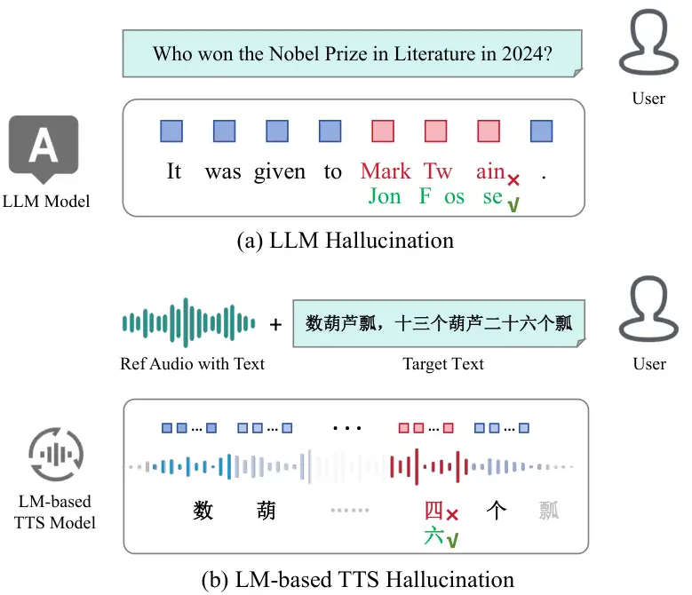
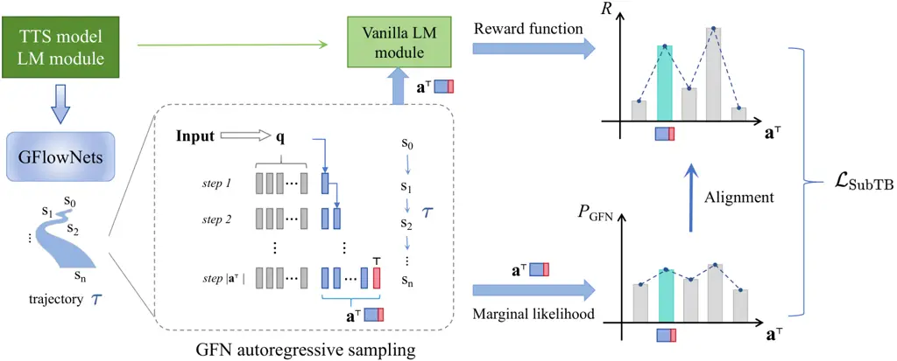
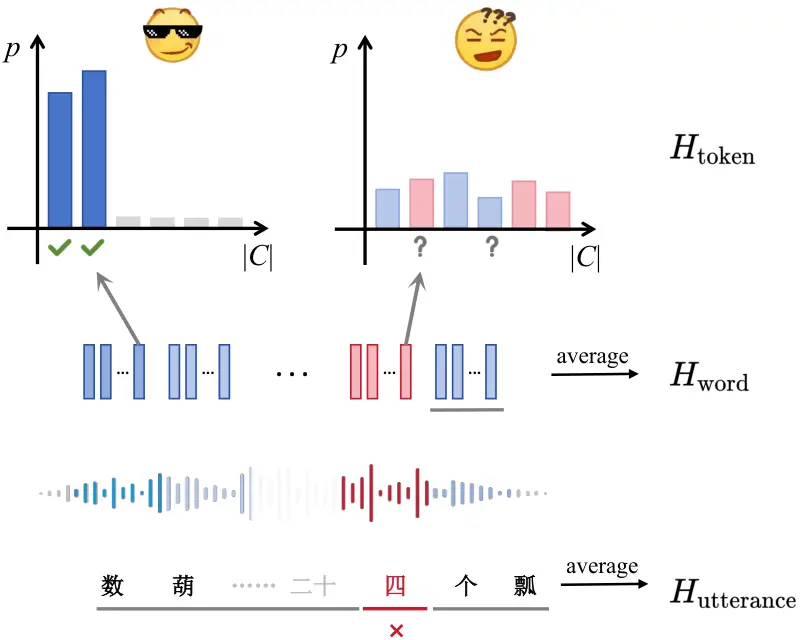
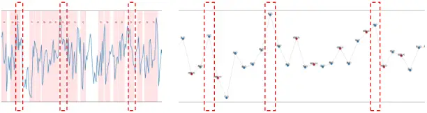
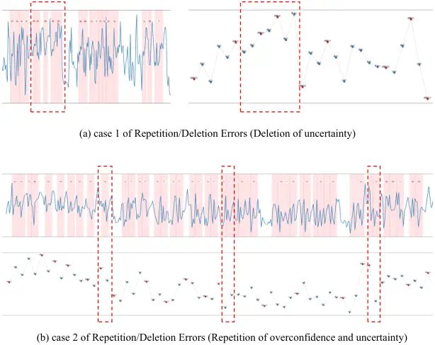
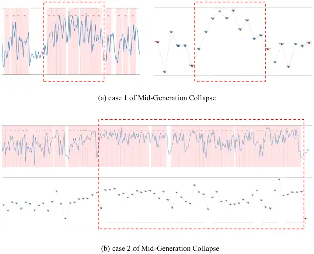
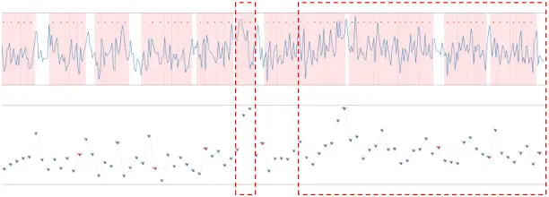
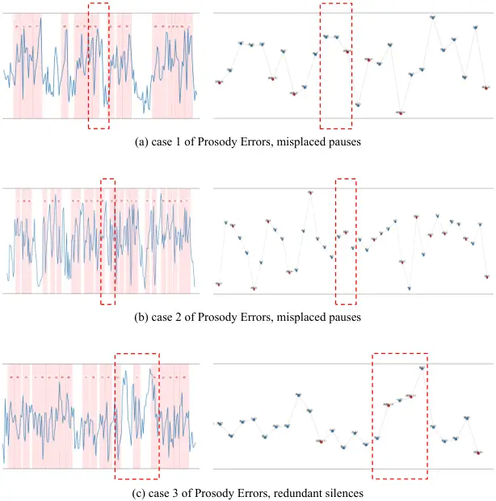

# Mitigating Hallucinations in LM-Based TTS Models via Distribution Alignment Using GFlowNets

Chenlin Liu Affiliation: Harbin Institute of Technology, China   
Minghui Fang Affiliation: Zhejiang University, China    Patrick Zhang
^(†)^(†)thanks: Project Leader Affiliation: Independent
Researcherchenlin.liu@stu.hit.edu.cn  jqhan@hit.edu.cn    Wei Zhou
Affiliation: Zhejiang University, China    Jie Gao Affiliation: Tsinghua
University, Shenzhen, China    Jiqing Han ^(†)^(†)thanks: Corresponding
Author Affiliation: Harbin Institute of Technology, China

###### Abstract

Language Model (LM)-based Text-to-Speech (TTS) systems often generate
hallucinated speech that deviates from input text. Existing mitigation
strategies either demand excessive training resources or introduce
significant inference latency. In this paper, we propose GFlOwNet-guided
distribution AlignmenT (GOAT) for LM-based TTS, a post-training
framework that mitigates hallucinations without relying on massive
resources or inference cost. Specifically, we first conduct an
uncertainty analysis, revealing a strong positive correlation between
hallucination and model uncertainty. Based on this, we reformulate TTS
generation as a trajectory flow optimization problem and introduce an
enhanced Subtrajectory Balance objective together with a sharpened
internal reward as target distribution. We further integrate reward
temperature decay and learning rate optimization for stability and
performance balance. Extensive experiments show that GOAT reduce over
50% character error rates on challenging test cases and lowering
uncertainty by up to 58%, demonstrating its strong generalization
ability and effectiveness. Code:
[https://github.com/lotuscarvedlife/GOAT](https://github.com/lotuscarvedlife/GOAT)

## 1 Introduction

Text-to-Speech (TTS) aims to convert written text into high-fidelity
speech and serves as a critical component in human-computer interaction
Kaur and Singh (2023); Kumar et al. (2023). Recently, advancements in
large language models Achiam et al. (2023); Guo et al. (2025); Yang
et al. (2025); Grattafiori et al. (2024) and speech discretization
techniques Zhang et al. (2023d); Lee et al. (2024); Huang et al. (2024b)
have spurred the development of LM-based TTS models following the
next-token prediction paradigm. These models Wang et al. (2023a);
Kharitonov et al. (2023); Han et al. (2024); Du et al. (2024a); Du
et al. (2024b) sample the next token from the multinomial distribution
conditional on previously generated tokens, which are very effective in
modeling long sequences and can synthesize impressively high-quality
speech.



Figure 1: Hallucination phenomenon in LLM and LM-based TTS model. (a)
LLM hallucination represents some wrong factual tokens. (b) LM-based TTS
hallucination manifest as wrong pieces of token sequences, which often
map to localized segments of generated audio containing inaccuracies
such as mispronunciations, missing words, or semantic inconsistencies.

Nevertheless, several studies Ji et al. (2023); Chuang et al. (2023) in
the field of natural language processing have shown that language models
are prone to hallucination, particularly when predicting tokens that
convey factual information, as shown in Figure 1. This phenomenon has
unfortunately been inherited by LM-based TTS models, manifesting as
generated speech that may deviate from the ground-truth text. Such
issues become more pronounced when generating long or complex sentences,
with errors such as mispronunciations, word omissions, and unnatural
repetitions occurring more frequently.

To address these challenges, existing research has primarily focused on
two directions: (1) Training-time scaling: Such approaches typically
involve scaling up model parameters and increasing the size of corpus to
develop more powerful TTS models Peng et al. (2024); Ju et al. (2024);
Du et al. (2024b). However, this incurs substantial computational costs
and data collection burdens, particularly in resource-constrained
scenarios. (2) Test-time scaling: Such approaches typically involve
increasing test-time computation to enhance performance Tu et al.
(2024); Ye et al. (2025). However, the inference overhead presents
significant challenges for real-time TTS applications, especially the
slowed down generation speed.

In light of this, we propose a GFlOwNet-guided distribution AlignmenT
framework (GOAT) for the post-training of LM-based TTS models.
Specifically, we first comprehensively investigate the decoding process
of LM-based TTS models, and identify potential correlations between TTS
hallucinations and model uncertainty. Building on this observation, GOAT
encourages the model to learn a probability distribution over state
transitions, aiming to discover more deterministic and optimal decoding
paths. GOAT tailors an internal reward distribution specifically for
LM-based TTS models and achieves objective alignment through enhanced
sub-trajectory balancing. To mitigate reward hacking, we carefully trade
off model performance and training stability, and optimize the training
process to ensure robust performance. GOAT enables intrinsic
reinforcement learning without relying on large-scale training corpora
or extensive computational resources, and does not introduce significant
inference latency.

GOAT utilizes CosyVoice 2 Du et al. (2024b) as its backbone and has
undergone extensive evaluation in cross-lingual settings, demonstrating
strong robustness and generalization capabilities. Further analysis from
the perspective of information entropy validates the effectiveness of
GOAT. GOAT achieves probability distribution alignment through intrinsic
reinforcement learning, offering a novel perspective for the
optimization of LM-based TTS models. Our contributions are highlighted
as follows.

- •
  To the best of our knowledge, GOAT is the first work that leverages
  GFlowNet to optimize speech synthesis through distribution alignment.
- •
  GOAT provides the first in-depth investigation of the weaknesses of
  LM-based TTS models from the model uncertainty perspective, which
  provides insights for subsequent work.
- •
  GOAT tailors the reward function as well as the optimization strategy
  for the LM-based TTS model, and comprehensive experiments demonstrate
  its effectiveness.

## 2 Hallucination Analysis in LM-based TTS models

We begin with a comprehensive analysis of hallucination issues in
LM-based TTS models (such as mispronunciations, omissions, and unnatural
repetitions), which serves as the key motivation and theoretical
foundation for GOAT.

### 2.1 Hallucination Detection

Recent studies Huang et al. (2024a); Ma et al. (2025) have analyzed the
hallucination problem of language models in text-based tasks from the
perspective of model uncertainty. Inspired by this, we adopt the
entropy-based metric for speech hallucination detection. More detailed
discussion can be found in Appendix A.1. Given that speech tokens have
significantly lower information density compared to text tokens,
multiple tokens must be aggregated to represent the pronunciation of a
single character. With this in mind, we assess the uncertainty of
LM-based TTS models across three dimensions: token level, character
level, and utterance level.

Specifically, for the token probability distribution
$`P_{t}=\{p_{1},\ldots,p_{|C|}\}`$ by the model at time step $`t`$, the
token-level uncertainty can be defined as:

```math
\displaystyle H_{\text{token}}(P_{t})=-\sum_{i=1}^{|C|}p_{i}\log p_{i} \tag{1}
```

where $`|C|`$ denotes the vocabulary size. We extract the left and right
boundaries $`i`$ and $`j`$ of each character $`W`$ within the token
sequence to compute the character-level uncertainty
$`H_{\text{character}}(W_{i:j})`$, while the utterance-level uncertainty
$`H_{\text{utterance}}(S)`$ is defined as the average uncertainty over
all tokens. They can be formally defined as follows:

```math
\displaystyle H_{\text{character}}(W_{i:j}) \displaystyle=\frac{1}{j-i}\sum_{k=i}^{j}H_{\text{token}}(P_{k}) \tag{2}
```

```math
\displaystyle H_{\text{utterance}}(S) \displaystyle=\frac{1}{|S|}\sum_{k=1}^{|S|}H_{\text{token}}(P_{k}) \tag{3}
```

where $`|S|`$ denotes the sequence length. More discussion can be found
in Appendix A.2. Intuitively quantifying model uncertainty facilitates
the exploration of its potential connection to hallucination.

### 2.2 Empirical Analysis

We conducted experiments on SeedTTS-Eval benchmark Anastassiou et al.
(2024) utilizing CosyVoice 2 Du et al. (2024b). To reveal potential
hallucinations, we select 200 samples from the test-hard subset and
generate speech using stochastic multinomial sampling. Paraformer-zh Gao
et al. (2022) is employed to perform automatic speech recognition (ASR)
to compute the character error rate (CER), which serves as the
hallucination proxy.

As shown in Figure 2, we annotate the utterance-level uncertainty and
the corresponding CER for all samples, and perform linear regression. We
observe that utterances with low CER typically exhibit lower
uncertainty, and vice versa. To enhance the credibility of the results,
we further compute the Pearson correlation coefficient and the Spearman
rank correlation coefficient, which are 0.636 and 0.649 respectively
($`p<1\mathrm{E}-4`$), revealing statistically significant positive
correlations. More discussion and detailed analysis of
token-level/character-level uncertainty is provided in Appendix A.3.

Figure 2: The relationship between utterance-level uncertainty and log
CER. The red line represents the linear regression fit.

Given the positive correlation between model uncertainty and
hallucination generation, GOAT encourages the model to discover more
deterministic and optimal decoding paths to enhance the performance of
LM-based TTS models.

## 3 GOAT

GOAT tailors an internal reward distribution specifically for LM-based
TTS models and achieves objective alignment through enhanced
sub-trajectory balancing. Building on the aforementioned findings, GOAT
leverages GFlowNet to adjust the probability distribution at the
sequence level, aiming to explore more deterministic and optimal
decoding paths. The intuition behind this is that GOAT assumes the LM
can reliably assign a high likelihood to high-probability sentences, and
wishes to preferentially sample over low-probability ones.

### 3.1 Adapting GOAT to LM-based TTS

We present the core pipeline and formulas of GFlowNets. The detailed
theoretical foundations are provided in Appendix B, which we strongly
recommend readers consult to deepen understanding. GFlowNets encourage
the model to learn an optimal transition process from the initial state
$`s_{0}`$ to the terminal state $`s_{n}`$, where the path from $`s_{0}`$
to $`s_{n}`$ forms a trajectory $`\tau`$. The forward policy
$`P_{F}(\tau)`$ of GFlowNets determines a distribution over $`\tau`$ by:

```math
\displaystyle P_{F}(\tau=(s_{0}\to\cdots\to s_{n}))=\prod_{i=0}^{n-1}P_{F}(s_{i+1}|s_{i}). \tag{4}
```

Each state transition is associated with a reward. Given reward function
$`R(x)`$ defined over the set of terminal states $`\mathcal{X}`$, the
forward policy $`P_{F}(\tau)`$ of GFlowNets should be proportional to
it:

```math
\displaystyle R(x)=Z\sum_{\begin{subarray}{c}\tau=(s_{0}\to\cdots\to s_{n}=x)\end{subarray}}P_{F}(\tau)\quad\forall x\in\mathcal{X}, \tag{5}
```

where the normalization constant $`Z=\sum_{x\in\mathcal{X}}R(x)`$. To
align with the reward distribution, GFlowNet brings in the trajectory
flow $`F(\tau)\propto P_{F}(\tau)`$, which is an unnormalized
probability function. By summing the trajectory flows $`F(\tau)`$ over
all trajectories $`\tau`$ that terminate at state $`x`$, the state flow
$`F(x)`$ can be obtained:

```math
\displaystyle F(x)=\sum_{x\in\tau}F(\tau). \tag{6}
```

GFlowNets follow the principle of flow conservation, which for any
terminal state $`x`$:

```math
\displaystyle F(x)=R(x)\quad\forall x\in\mathcal{X}. \tag{7}
```

GOAT treats the autoregressive generation process of LM-based TTS models
as a sequence-level state transition process. GOAT applies the forward
sampling policy $`P_{\text{GFN}}`$ to generate complete token sequences
$`\mathbf{a}^{\top}=a_{1}\dots a_{n}\top\in\mathcal{X}`$, where $`\top`$
denotes the terminal token. The process is as follows:

1.  1.  Initial Setup: Given a conditioning sequence $`\mathbf{q}`$ and
        model parameters $`\theta`$, the initial state $`s_{0}`$ is an empty
        token sequence denoted as $`\mathbf{a}_{0}`$.
2.  2.  State Transition At decoding step $`t`$, the next token is sampled
        from $`P_{\text{GFN}}(s_{t}\mid s_{t-1},\mathbf{q},\theta)`$, where
        $`s_{t-1}=\mathbf{a}_{t-1}=a_{1}\dots a_{t-1}`$. The next state is
        then updated to $`s_{t}=\mathbf{a}_{t}=a_{1}\dots a_{t}`$.
3.  3.  Termination: The pipeline stops upon sampling the termination token
        $`\top`$, yielding a complete token sequence
        $`\mathbf{a}^{\top}\in\mathcal{X}`$.

This entire process defines a complete trajectory
$`\tau=\mathbf{a}_{0}\to\dots\to\mathbf{a}^{\top}`$, as shown in
Figure 3, with the trajectory probability distribution given by:

```math
\displaystyle P_{\text{GFN}}(\tau) \displaystyle=\prod_{i=1}^{|\mathbf{a}^{\top}|}P_{\text{GFN}}(s_{i}\mid s_{i-1},\mathbf{q},\theta) \tag{8}
```

```math
\displaystyle=\prod_{i=1}^{|\mathbf{a}^{\top}|}P_{\text{GFN}}(a_{i}\mid a_{1:i-1},\mathbf{q},\theta),
```

where $`|\mathbf{a}^{\top}|=n`$ is the length of the complete sequence,
and $`a_{1:0}=\mathbf{a}_{0}`$. LM-based TTS models follow the
next-token prediction paradigm, where only one unique path leads to the
next state given the fixed prefix. Therefore, for any terminal state
$`x=\mathbf{a}^{\top}`$, there exists only one trajectory $`\tau`$.
Thus, the marginal likelihood of $`\mathbf{a}^{\top}`$ is:

```math
\displaystyle P_{\text{GFN}}^{\top}(\mathbf{a}^{\top}) \displaystyle=\sum_{\mathbf{a}^{\top}\in\tau}P_{\text{GFN}}(\tau) \tag{9}
```

```math
\displaystyle=\prod_{i=1}^{|\mathbf{a}^{\top}|}P_{\text{GFN}}(a_{i}\mid a_{1:i-1},\mathbf{q},\theta).
```

Based on this, the objective of GOAT is to learn a forward sampling
policy $`P_{\text{GFN}}(\cdot\mid\cdot,\mathbf{q};\theta)`$ that aligns
with distribution of reward function
$`R:\mathcal{X}\to\mathbb{R}_{\geq 0}`$. Formally:

```math
\displaystyle P_{\text{GFN}}^{\top}(\mathbf{a}^{\top})\propto R(\mathbf{a}^{\top})\quad\forall\mathbf{a}^{\top}\in\mathcal{X}. \tag{10}
```

### 3.2 Training Objective



Figure 3: Training pipeline of GOAT.

#### 3.2.1 Enhanced Subtrajectory Balance

Our empirical analysis reveals that LM-based TTS models tend to exhibit
fragmentary collapse when generating long and complex sentences. This
property necessitates that GOAT perform fine-grained optimization. To
this end, we employ the SubTrajectory Balance (SubTB) loss Madan et al.
(2023) for training, which enables the model to learn from subsequences
of varying lengths. For any subtrajectory
$`\tau_{m:n}=(s_{m}\to\cdots\to s_{n})`$, the SubTB loss can be defined
as:

```math
\displaystyle \displaystyle\mathcal{L}_{\text{SubTB}}(\tau_{m:n},\mathbf{q};\theta)= \tag{11}
```

```math
\displaystyle\left(\log\frac{F(s_{m})\prod_{i=m}^{n-1}P_{F}(s_{i+1}\mid s_{i},\mathbf{q},\theta)}{F(s_{n})\prod_{i=m}^{n-1}P_{B}(s_{i}\mid s_{i+1},\mathbf{q},\theta)}\right)^{2},
```

where $`P_{F}`$ denotes the forward policy for generating the next
state, while $`P_{B}`$ denotes the backward policy for tracing back to
the previous state based on the posterior distribution.

In LM-based TTS models, the autoregressive generation process imposes a
deterministic prefix on the current sequence, such that each state has
one unique parent state, which implies $`P_{B}\equiv 1`$. Following
Equation 7, we replace the state flow $`F`$ in Equation 11 with the
reward function $`R(\mathbf{a}^{\top})`$. This allows the model to
optimize the forward sampling policy $`P_{F}`$ directly, without the
need to parameterize $`F`$. Finally, by incorporating all
subtrajectories under the constraint of Equation 8, the final training
objective is defined as follows:

```math
\displaystyle\mathcal{L}(\mathbf{a}^{\top},\mathbf{q};\theta)=\sum_{0\leq i\leq j\leq|\mathbf{a}^{\top}|} \tag{12}
```

```math
\displaystyle\left(\log\frac{R(\mathbf{a}_{i})\prod_{k=i}^{j-1}P_{\text{GFN}}(a_{k+1}\mid a_{1:k},\mathbf{q},\theta)}{R(\mathbf{a}_{j})}\right)^{2},
```

where $`\mathbf{a}_{i},\mathbf{a}_{j}`$ represent partial sequences at
positions $`i,j`$.

#### 3.2.2 Internal Reward

To reduce resource dependency, we have meticulously designed an
intrinsic reward function for GOAT. This enables GOAT to be trained on
unlabeled data without relying on external reward models. Specifically,
in the autoregressive generation of LM-based TTS models, the normalized
token sampling probability $`p_{\text{LM}}(\cdot\mid\cdot)`$ at each
generation step serves as the most intuitive reward signal. By
accumulating all tokens rewards in the subsequence $`\mathbf{a}_{k}`$,
we define the reward for $`\mathbf{a}_{k}`$ as:

```math
\displaystyle R(\mathbf{a}_{k}|\mathbf{q})=p_{\text{LM}}(\mathbf{a}_{k}|\mathbf{q}) \tag{13}
```

This reward function maintains implicit alignment with the original
sequence distribution of the backbone model. Furthermore, learning a
more concentrated reward distribution contributes to reducing model
uncertainty. To achieve this, we apply an inverse temperature $`T`$
(where $`0<T<1`$) to the sampling probabilities in order to sharpen the
reward distribution. The final reward function is defined as follows:

```math
\displaystyle R(\mathbf{a}_{k}|\mathbf{q}) \displaystyle=p_{\text{LM}}(\mathbf{a}_{k}\mid\mathbf{q})^{\frac{1}{T}} \tag{14}
```

```math
\displaystyle=\left(\prod_{i=1}^{k}p_{\text{LM}}(a_{i}\mid a_{1:i-1},\mathbf{q})\right)^{\frac{1}{T}},
```

This reward function is grounded in the GOAT hypothesis, which posits
that language models inherently assign higher probabilities to speech
token sequences of superior quality. GOAT enhances model determinism
through sequence rewards, encouraging the model to prioritize sampling
high-probability sequences over low-probability ones.

It is worth noting that the temperature strategy proposed by GOAT is
distinct from the low-temperature sampling Brown et al. (2020) typically
applied during token generation. The temperature strategy of GOAT
influences the reward distribution across the entire sequence,
encouraging the model to favor globally optimal sequences. In contrast,
low-temperature sampling focuses on adjusting the probability
distribution at each decoding step, achieving only locally optimal
outcomes. As the temperature $`T`$ in low-temperature sampling
approaches 0, the probability of high-probability tokens tends toward
positive infinity, causing the sampling process to degenerate into
greedy sampling. Consequently, this fails to ensure the generation of
high-quality complete sequences.

### 3.3 Reward Hacking Suppression

Reward hacking Amodei et al. (2016); Pan et al. (2022a) refers to the
phenomenon where the model takes actions that are misaligned with the
intended task to steal rewards. In GOAT, reward hacking is observed when
the model generates speech token sequences with abruptly shortened
lengths, leading to premature termination of audio waveforms. To
mitigate this, we have carefully refined the training strategy.

Reward Temperature Decay. Ideally, a lower reward temperature yields a
sharper reward distribution, which can enhance model performance.
However, it also significantly increases the susceptibility of reward
hacking. To balance performance and stability, we impose a linearly
decaying reward temperature during training, starting from 1 and
decreasing to a predefined lower bound. This reduces instability at the
beginning of training, while gradually guiding the model toward more
optimal solutions.

Learning Rate Optimization. Given that an excessively high learning rate
may cause the model to learn anomalous and short-sighted high reward
behaviors, we design a stabilized learning rate optimization scheme.
Specifically, we employ the combination of warm-up and cosine annealing
to ensure a more effective optimization trajectory. These modifications
significantly reduced reward hacking occurrences while maintaining model
performance.

## 4 Experiments

### 4.1 Datasets & Baseline

Datasets We randomly select 1000 samples from LibriTTS Zen et al. (2019)
and WenetSpeech4TTS Ma et al. (2024) for training on Chinese and
English. For evaluation, we use the SeedTTS-Eval benchmark Anastassiou
et al. (2024), with further details provided in Appendix C.

Baseline We use a standard LM-based TTS architecture, CosyVoice 2 Du
et al. (2024a), as the foundation model for GOAT.

### 4.2 Implementation Details

We initialize the GFlowNet with the original language model and
subsequently post-train it using Low-rank Adaptation (LoRA) Hu et al.
(2022). We use 4 NVIDIA H100 Hopper GPUs for model training and one
NVIDIA V100 GPU for evaluation. The implementation includes two
configurations balancing performance and training stability, with
details provided in Appendix D.

### 4.3 Sampling Methods

We adopt the Repetition Aware Sampling (RAS) strategy from CosyVoice 2
under its default hyperparameters (see Appendix D for details). For a
more fine-grained comparison, we introduce random multinomial sampling
(RMS). Additionally, to verify the difference discussed in
Section 3.2.2, we also include a baseline that applies the same low
temperature as used in the reward function.

### 4.4 Experimental Results

#### 4.4.1 Metrics

We assess the synthesized speech based on content consistency (Character
Error Rate & Word Error Rate, CER/WER), Speaker Similarity (SS), and
speech quality (UTMOS, Saeki et al. (2022)). More details can be found
in Appendix E.

|                     |        |                        |                 |                    |                        |                 |                    |                        |                 |                    |
| ------------------- | ------ | ---------------------- | --------------- | ------------------ | ---------------------- | --------------- | ------------------ | ---------------------- | --------------- | ------------------ |
| Model               | SM     | test-zh                |                 |                    | test-en                |                 |                    | test-hard              |                 |                    |
|                     |        | CER (%) $`\downarrow`$ | SS $`\uparrow`$ | UTMOS $`\uparrow`$ | WER (%) $`\downarrow`$ | SS $`\uparrow`$ | UTMOS $`\uparrow`$ | CER (%) $`\downarrow`$ | SS $`\uparrow`$ | UTMOS $`\uparrow`$ |
| Human               | –      | 1.31                   | 0.78            | 2.785              | 2.74                   | 0.82            | 3.536              | \-                     | \-              | \-                 |
| baseline            | RMS    | 4.61                   | 0.84            | 3.102              | 7.10                   | 0.78            | 3.880              | 13.72                  | 0.82            | 2.849              |
|                     | RAS    | 1.36                   | 0.84            | 3.280              | 3.35                   | 0.79            | 4.099              | 8.16                   | 0.83            | 3.115              |
|                     | LT-RMS | 2.69                   | 0.84            | 3.219              | 4.63                   | 0.78            | 4.023              | 9.82                   | 0.83            | 3.021              |
|                     | LT-RAS | 1.31                   | 0.84            | 3.308              | 3.31                   | 0.78            | 4.124              | 8.25                   | 0.82            | 3.168              |
| CV2-GOAT-zh(1500S)  | RMS    | 0.94                   | 0.83            | 3.387              | 2.43                   | 0.80            | 4.170              | 6.61                   | 0.81            | 3.254              |
|                     | RAS    | 0.89                   | 0.83            | 3.401              | 2.02                   | 0.80            | 4.170              | 6.28                   | 0.81            | 3.255              |
| CV2-GOAT-zh(2500S)  | RMS    | 0.90                   | 0.82            | 3.394              | 2.27                   | 0.80            | 4.200              | 6.53                   | 0.81            | 3.273              |
|                     | RAS    | 0.85                   | 0.82            | 3.401              | 1.96                   | 0.80            | 4.216              | 6.36                   | 0.80            | 3.267              |
| CV2-GOAT-en(1500S)  | RMS    | 1.26                   | 0.84            | 3.300              | 2.16                   | 0.80            | 4.184              | 7.40                   | 0.82            | 3.146              |
|                     | RAS    | 1.04                   | 0.84            | 3.336              | 2.07                   | 0.81            | 4.196              | 6.56                   | 0.82            | 3.177              |
| CV2-GOAT-en(2500S)  | RMS    | 1.16                   | 0.84            | 3.299              | 2.13                   | 0.81            | 4.182              | 7.37                   | 0.82            | 3.131              |
|                     | RAS    | 0.96                   | 0.84            | 3.329              | 2.16                   | 0.81            | 4.204              | 6.76                   | 0.82            | 3.160              |
| CV2-GOAT-mix(1500S) | RMS    | 0.98                   | 0.84            | 3.385              | 2.18                   | 0.80            | 4.209              | 6.54                   | 0.82            | 3.256              |
|                     | RAS    | 0.88                   | 0.83            | 3.389              | 2.06                   | 0.80            | 4.225              | 6.51                   | 0.82            | 3.277              |
| CV2-GOAT-mix(2500S) | RMS    | 0.86                   | 0.83            | 3.386              | 2.13                   | 0.80            | 4.211              | 6.55                   | 0.82            | 3.253              |
|                     | RAS    | 0.88                   | 0.83            | 3.388              | 2.08                   | 0.80            | 4.227              | 6.56                   | 0.81            | 3.272              |

Table 1: Evaluation results across models. CV2-GOAT-zh/en/mix: models
fine-tuned on Chinese/English/Mix of two datasets; 1500S/2500S : total
steps in Learning Rate Optimization. SM: Sampling Method; LT prefix:
sampling method using Low-Temperature.

#### 4.4.2 Comparison with Baseline

As shown in Table 1, models trained and evaluated on the same language
outperform or achieve comparable performance to the baseline and even
ground truth across all metrics. Notable improvements are observed in
WER/CER and UTMOS scores, particularly with a more than 50% reduction in
WER/CER under RMS on the hallucination-prone test-hard subset. Regarding
SS, perceptual differences are minimal when SS values are sufficiently
high (e.g., above 0.7) Tu et al. (2024). These results strongly
demonstrate the efficacy of GOAT in mitigating hallucinations.

#### 4.4.3 Comparison with Low-temperature Sampling

As shown in Table 1, while low-temperature sampling achieves partial
hallucination suppression, GOAT significantly outperforms this strategy,
surpassing over 30% on CER/WER. This provides compelling evidence
supporting the distinction between GOAT and low-temperature sampling
presented in Section 3.2.2.

#### 4.4.4 Generalization and Effectiveness

For models trained and evaluated on different languages, results in
Table 1 still outperform the baseline, only marginally inferior to
models trained on matched-language data. For models trained on mixed
data, despite halving data volume for each language, the model achieved
comparable performance on both languages. These observations demonstrate
the strong robustness and generalization capability of GOAT.

Intriguingly, the marginal gains observed when applying RAS sampling
suggest that GOAT effectively steers probability distributions toward
higher-quality speech token sequences.

#### 4.4.5 Ablation Experiments

| Loss     | LRO Steps | CER (%) $`\downarrow`$ | SS $`\uparrow`$ | UTMOS $`\uparrow`$ |
| -------- | --------- | ---------------------- | --------------- | ------------------ |
| baseline | –         | 13.72                  | 0.82            | 2.849              |
| TB       | 1500      | 11.72                  | 0.82            | 2.923              |
|          | 2500      | 11.84                  | 0.82            | 2.94               |
| SubTB    | 1500      | 6.61                   | 0.81            | 3.254              |
|          | 2500      | 6.53                   | 0.81            | 3.273              |

Table 2: Comparison of TB and SubTB using the same enhancement method,
evaluated on test-hard

Furthermore, we conducted ablation experiments on each strategy that
could be removed. The results are as follows:

Figure 4: Evaluation of different configuration. Use line with nodes to
represent our configuration.

w/o enhanced SubTB In this setting, SubTB is degraded to Trajectory
Balance Malkin et al. (2022a) with the same enhancement. As shown in
Table 2, we observe that without the ability to learn from subsequences
of varying lengths, the model does not effectively mitigate
hallucinations.

w/o reward temperature decay This setting removes reward temperature
decay (RTD), directly using the minimum temperature for training. The
performance is shown in Figure 4 (a). Despite a seemingly more stable
training process, it does not lead to better convergence, with
performance details provided in Appendix F.

w/o learning rate optimization In this configuration, learning rate
optimization (LRO) is omitted, and the training uses a fixed learning
rate. The performance is shown in Figure 4 (b), where the model is more
prone to reward hacking, leading to a sudden drop in the output sequence
length. For performance details, please refer to Appendix F

### 4.5 In-depth Analysis

Figure 5: Comparison of the utterance-level uncertainty and log CER
between the two models. For those who have zero CER, we set the log CER
to 0.

| Model               | Average UUR |         |           |
| ------------------- | ----------- | ------- | --------- |
|                     | test-zh     | test-en | test-hard |
| baseline            | 1.00        | 1.00    | 1.00      |
| CV2-GOAT-zh(1500S)  | 0.53        | 0.66    | 0.50      |
| CV2-GOAT-zh(2500S)  | 0.42        | 0.58    | 0.39      |
| CV2-GOAT-en(1500S)  | 0.67        | 0.56    | 0.63      |
| CV2-GOAT-en(2500S)  | 0.66        | 0.54    | 0.62      |
| CV2-GOAT-mix(1500S) | 0.56        | 0.59    | 0.52      |
| CV2-GOAT-mix(2500S) | 0.47        | 0.51    | 0.44      |

Table 3: Comparison of average UUR across models. Set baseline model as
benchmark.

Uncertainty Analysis We also evaluate the effectiveness of GOAT from the
perspective of uncertainty. Leveraging the utterance-level uncertainty
defined in Formula 3, we compare CV2-GOAT-zh(2500S) with the baseline as
shown in Figure 2. The results in Figure 5 reveal that the aligned model
exhibits significantly lower utterance-level uncertainty than the
baseline. Additionally, the overall data cluster shifts leftward,
indicating reduced CER (as confirmed in Section 4.4.2), demonstrating
effective hallucination suppression.

To quantify uncertainty reduction, we define the Utterance Uncertainty
Ratio (UUR) as

```math
\text{UUR}=\frac{1}{N}\sum_{i=1}^{N}\frac{\sigma_{\text{trained},i}}{\sigma_{\text{baseline},i}}, \tag{15}
```

where $`\sigma`$ is the utterance-level uncertainty and N is the number
of test utterances. Table 3 summarizes UURs across all models and
evaluation sets. All models achieve substantial uncertainty reduction by
up to 58%. And both Chinese and English models exhibit consistent
improvements even on the evaluation datasets with unseen language.
Models trained on mixed data showing comparable performance on both
language demonstrating the efficacy and generalization of GOAT.

Hyperparameters Configuration We investigate the impact of several key
hyperparameters on model training stability and performance. As shown in
the results in Figure 4, all three hyperparameters play a crucial role
in suppressing reward hacking, and our proposed settings balance
training stability and model performance. An analysis of model
performance with various configuration is provided in Appendix F.

Inference Latency We also test the model’s inference latency and find no
significant increase compared to the baseline. Detailed results and
analysis are provided in Appendix G.

## 5 Related Works

### 5.1 LM-based TTS models

Significant progress has been made in using large language models (LLMs)
for TTS tasks. Early breakthroughs include VALL-EWang et al. (2023a),
which pioneered the use of autoregressive and non-autoregressive LMs to
predict discrete speech tokens from text or phonemes. Extensions like
VALL-E X Zhang et al. (2023e) enable cross-lingual synthesis, and
Spear-TTS Kharitonov et al. (2023) supports multi-speaker TTS with
minimal supervision. Recent TTS systems combine AR models with
components like diffusion Borsos et al. (2023); Łajszczak et al. (2024);
Anastassiou et al. (2024) to improve speech quality and control. In
contrast, single-stage systems like MELL-E Meng et al. (2024) and KALL-E
Zhu et al. (2024) avoid this issue but rely on continuous acoustic
features, which can hinder large-scale training.

### 5.2 GFlowNets

Generative Flow Network (GFlowNet) Bengio et al. (2021); Bengio et al.
(2023) is a probabilistic framework that learns amortized policies to
diversely sample structured objects (e.g., molecules, graphs) with
probabilities proportional to a predefined reward function, bridging
reinforcement learning, generative modeling, and probabilistic inference
Zhang et al. (2022b); Zhang et al. (2022a); Pan et al. (2023); Tiapkin
et al. (2024). Numerous studies have extended GFlowNets, including
connections to variational inference Malkin et al. (2022b); Zimmermann
et al. (2022), the integration of intermediate rewards Pan et al.
(2022b), and applications with diffusion models Garipov et al. (2023).
Currently, GFlowNets have been applied across a wide range of fields
including but not limited to scientific discovery (e.g., molecular
design) Jain et al. (2023); Koziarski et al. (2024); Ghari et al.
(2023), combinatorial optimization Zhang et al. (2023a); Zhang et al.
(2023b); Kim et al. (2024); Hu et al. (2024), diffusion
alignmentVenkatraman et al. (2024); Zhang et al. (2024); Liu et al.
(2024), domain adaptation Zhu et al. (2023), and phylogenetic inference
Zhou et al. (2023).

## 6 Conclusion

In this work, we propose GOAT, a novel post-training framework
leveraging GFlowNets to mitigate hallucinations in LM-based TTS models.
By reformulating autoregressive speech generation as a trajectory flow
optimization task, we tailor enhanced SubTB and internal reward to align
the model’s output distribution toward high-confidence sequences through
reward-proportional probability flows. Extensive experiments on
multilingual benchmarks demonstrate that GOAT can achieve efficient
hallucination suppression without any reliance on high-quality datasets
or huge computational resources. We believe this work offers an
inspiring solution for hallucination mitigation in autoregressive speech
generation.

## 7 Limitations

We initially analyzed hallucinations in LM-based TTS and proposed GOAT
to mitigate them. However, hallucination phenomena are more nuanced than
uncertainty alone can capture, so GOAT currently addresses only a subset
of cases. To date, our evaluation has focused on CosyVoice 2, a
representative LM-based TTS paradigm, laying the groundwork for broader
validation. Future work will both extend GOAT to cover a broader range
of hallucinations and assess its effectiveness across diverse LM-based
architectures.

## 8 Acknowledgments

This research is supported by the National Natural Science Foundation of
China under Grant No. 62376071.

## References

- Achiam et al. (2023) Josh Achiam, Steven Adler, Sandhini Agarwal, Lama
  Ahmad, Ilge Akkaya, Florencia Leoni Aleman, Diogo Almeida, Janko
  Altenschmidt, Sam Altman, Shyamal Anadkat, et al. 2023. Gpt-4
  technical report. _arXiv preprint arXiv:2303.08774_.
- Amodei et al. (2016) Dario Amodei, Chris Olah, Jacob Steinhardt, Paul
  Christiano, John Schulman, and Dan Mané. 2016. Concrete problems in ai
  safety. _arXiv preprint arXiv:1606.06565_.
- Anastassiou et al. (2024) Philip Anastassiou, Jiawei Chen, Jitong
  Chen, Yuanzhe Chen, Zhuo Chen, Ziyi Chen, Jian Cong, Lelai Deng,
  Chuang Ding, Lu Gao, et al. 2024. Seed-tts: A family of high-quality
  versatile speech generation models. _arXiv preprint arXiv:2406.02430_.
- Bengio et al. (2021) Emmanuel Bengio, Moksh Jain, Maksym Korablyov,
  Doina Precup, and Yoshua Bengio. 2021. Flow network based generative
  models for non-iterative diverse candidate generation. _Advances in
  Neural Information Processing Systems_, 34:27381–27394.
- Bengio et al. (2023) Yoshua Bengio, Salem Lahlou, Tristan Deleu,
  Edward J Hu, Mo Tiwari, and Emmanuel Bengio. 2023. Gflownet
  foundations. _The Journal of Machine Learning Research_,
  24(1):10006–10060.
- Borsos et al. (2023) Zalán Borsos, Raphaël Marinier, Damien Vincent,
  Eugene Kharitonov, Olivier Pietquin, Matt Sharifi, Dominik Roblek,
  Olivier Teboul, David Grangier, Marco Tagliasacchi, et al. 2023.
  Audiolm: a language modeling approach to audio generation. _IEEE/ACM
  transactions on audio, speech, and language processing_, 31:2523–2533.
- Brown et al. (2020) Tom Brown, Benjamin Mann, Nick Ryder, Melanie
  Subbiah, Jared D Kaplan, Prafulla Dhariwal, Arvind Neelakantan, Pranav
  Shyam, Girish Sastry, Amanda Askell, et al. 2020. Language models are
  few-shot learners. _Advances in neural information processing
  systems_, 33:1877–1901.
- Chuang et al. (2023) Yung-Sung Chuang, Yujia Xie, Hongyin Luo, Yoon
  Kim, James Glass, and Pengcheng He. 2023. Dola: Decoding by
  contrasting layers improves factuality in large language models.
  _arXiv preprint arXiv:2309.03883_.
- Du et al. (2024a) Zhihao Du, Qian Chen, Shiliang Zhang, Kai Hu, Heng
  Lu, Yexin Yang, Hangrui Hu, Siqi Zheng, Yue Gu, Ziyang Ma, et al.
  2024a. Cosyvoice: A scalable multilingual zero-shot text-to-speech
  synthesizer based on supervised semantic tokens. _arXiv preprint
  arXiv:2407.05407_.
- Du et al. (2024b) Zhihao Du, Yuxuan Wang, Qian Chen, Xian Shi, Xiang
  Lv, Tianyu Zhao, Zhifu Gao, Yexin Yang, Changfeng Gao, Hui Wang,
  et al. 2024b. Cosyvoice 2: Scalable streaming speech synthesis with
  large language models. _arXiv preprint arXiv:2412.10117_.
- Gao et al. (2022) Zhifu Gao, Shiliang Zhang, Ian McLoughlin, and
  Zhijie Yan. 2022. Paraformer: Fast and accurate parallel transformer
  for non-autoregressive end-to-end speech recognition. _arXiv preprint
  arXiv:2206.08317_.
- Garipov et al. (2023) Timur Garipov, Sebastiaan De Peuter, Ge Yang,
  Vikas Garg, Samuel Kaski, and Tommi Jaakkola. 2023. Compositional
  sculpting of iterative generative processes. _Advances in neural
  information processing systems_, 36:12665–12702.
- Ghari et al. (2023) Pouya M Ghari, Alex Tseng, Gökcen Eraslan, Romain
  Lopez, Tommaso Biancalani, Gabriele Scalia, and Ehsan
  Hajiramezanali. 2023. Generative flow networks assisted biological
  sequence editing. In _NeurIPS 2023 Generative AI and Biology (GenBio)
  Workshop_.
- Grattafiori et al. (2024) Aaron Grattafiori, Abhimanyu Dubey, Abhinav
  Jauhri, Abhinav Pandey, Abhishek Kadian, Ahmad Al-Dahle, Aiesha
  Letman, Akhil Mathur, Alan Schelten, Alex Vaughan, et al. 2024. The
  llama 3 herd of models. _arXiv preprint arXiv:2407.21783_.
- Guo et al. (2025) Daya Guo, Dejian Yang, Haowei Zhang, Junxiao Song,
  Ruoyu Zhang, Runxin Xu, Qihao Zhu, Shirong Ma, Peiyi Wang, Xiao Bi,
  et al. 2025. Deepseek-r1: Incentivizing reasoning capability in llms
  via reinforcement learning. _arXiv preprint arXiv:2501.12948_.
- Han et al. (2024) Bing Han, Long Zhou, Shujie Liu, Sanyuan Chen,
  Lingwei Meng, Yanming Qian, Yanqing Liu, Sheng Zhao, Jinyu Li, and
  Furu Wei. 2024. Vall-e r: Robust and efficient zero-shot
  text-to-speech synthesis via monotonic alignment. _arXiv preprint
  arXiv:2406.07855_.
- Hu et al. (2024) Edward J Hu, Moksh Jain, Eric Elmoznino, Younesse
  Kaddar, Guillaume Lajoie, Yoshua Bengio, and Nikolay Malkin. 2024.
  Amortizing intractable inference in large language models. In _The
  Twelfth International Conference on Learning Representations_.
- Hu et al. (2022) Edward J Hu, Yelong Shen, Phillip Wallis, Zeyuan
  Allen-Zhu, Yuanzhi Li, Shean Wang, Lu Wang, Weizhu Chen, et al. 2022.
  Lora: Low-rank adaptation of large language models. _ICLR_, 1(2):3.
- Huang et al. (2024a) Hsiu-Yuan Huang, Yutong Yang, Zhaoxi Zhang,
  Sanwoo Lee, and Yunfang Wu. 2024a. A survey of uncertainty estimation
  in llms: Theory meets practice. _arXiv preprint arXiv:2410.15326_.
- Huang et al. (2024b) Zhichao Huang, Chutong Meng, and Tom Ko. 2024b.
  [RepCodec: A speech representation codec for speech
  tokenization](https://doi.org/10.18653/v1/2024.acl-long.314). In
  _Proceedings of the 62nd Annual Meeting of the Association for
  Computational Linguistics (Volume 1: Long Papers)_, pages 5777–5790,
  Bangkok, Thailand. Association for Computational Linguistics.
- Jain et al. (2023) Moksh Jain, Tristan Deleu, Jason Hartford,
  Cheng-Hao Liu, Alex Hernandez-Garcia, and Yoshua Bengio. 2023.
  Gflownets for ai-driven scientific discovery. _Digital Discovery_,
  2(3):557–577.
- Ji et al. (2023) Ziwei Ji, Nayeon Lee, Rita Frieske, Tiezheng Yu, Dan
  Su, Yan Xu, Etsuko Ishii, Ye Jin Bang, Andrea Madotto, and Pascale
  Fung. 2023. Survey of hallucination in natural language generation.
  _ACM computing surveys_, 55(12):1–38.
- Ju et al. (2024) Zeqian Ju, Yuancheng Wang, Kai Shen, Xu Tan, Detai
  Xin, Dongchao Yang, Yanqing Liu, Yichong Leng, Kaitao Song, Siliang
  Tang, et al. 2024. Naturalspeech 3: Zero-shot speech synthesis with
  factorized codec and diffusion models. _arXiv preprint
  arXiv:2403.03100_.
- Kaur and Singh (2023) Navdeep Kaur and Parminder Singh. 2023.
  Conventional and contemporary approaches used in text to speech
  synthesis: A review. _Artificial Intelligence Review_,
  56(7):5837–5880.
- Kharitonov et al. (2023) Eugene Kharitonov, Damien Vincent, Zalán
  Borsos, Raphaël Marinier, Sertan Girgin, Olivier Pietquin, Matt
  Sharifi, Marco Tagliasacchi, and Neil Zeghidour. 2023. Speak, read and
  prompt: High-fidelity text-to-speech with minimal supervision.
  _Transactions of the Association for Computational Linguistics_,
  11:1703–1718.
- Kim et al. (2024) Minsu Kim, Sanghyeok Choi, Hyeonah Kim, Jiwoo Son,
  Jinkyoo Park, and Yoshua Bengio. 2024. Ant colony sampling with
  gflownets for combinatorial optimization. _arXiv preprint
  arXiv:2403.07041_.
- Koziarski et al. (2024) Michał Koziarski, Andrei Rekesh, Dmytro
  Shevchuk, Almer van der Sloot, Piotr Gaiński, Yoshua Bengio, Chenghao
  Liu, Mike Tyers, and Robert Batey. 2024. Rgfn: Synthesizable molecular
  generation using gflownets. _Advances in Neural Information Processing
  Systems_, 37:46908–46955.
- Kumar et al. (2023) Yogesh Kumar, Apeksha Koul, and Chamkaur
  Singh. 2023. A deep learning approaches in text-to-speech system: a
  systematic review and recent research perspective. _Multimedia Tools
  and Applications_, 82(10):15171–15197.
- Łajszczak et al. (2024) Mateusz Łajszczak, Guillermo Cámbara, Yang Li,
  Fatih Beyhan, Arent Van Korlaar, Fan Yang, Arnaud Joly, Álvaro
  Martín-Cortinas, Ammar Abbas, Adam Michalski, et al. 2024. Base tts:
  Lessons from building a billion-parameter text-to-speech model on 100k
  hours of data. _arXiv preprint arXiv:2402.08093_.
- Lee et al. (2024) Joun Yeop Lee, Myeonghun Jeong, Minchan Kim, Ji-Hyun
  Lee, Hoon-Young Cho, and Nam Soo Kim. 2024. High fidelity
  text-to-speech via discrete tokens using token transducer and group
  masked language model. _arXiv preprint arXiv:2406.17310_.
- Liu et al. (2024) Zhen Liu, Tim Z Xiao, Weiyang Liu, Yoshua Bengio,
  and Dinghuai Zhang. 2024. Efficient diversity-preserving diffusion
  alignment via gradient-informed gflownets. _arXiv preprint
  arXiv:2412.07775_.
- Ma et al. (2025) Huan Ma, Jingdong Chen, Guangyu Wang, and Changqing
  Zhang. 2025. Estimating llm uncertainty with logits. _arXiv preprint
  arXiv:2502.00290_.
- Ma et al. (2024) Linhan Ma, Dake Guo, Kun Song, Yuepeng Jiang, Shuai
  Wang, Liumeng Xue, Weiming Xu, Huan Zhao, Binbin Zhang, and Lei
  Xie. 2024. Wenetspeech4tts: A 12,800-hour mandarin tts corpus for
  large speech generation model benchmark. _arXiv preprint
  arXiv:2406.05763_.
- Madan et al. (2023) Kanika Madan, Jarrid Rector-Brooks, Maksym
  Korablyov, Emmanuel Bengio, Moksh Jain, Andrei Cristian Nica, Tom
  Bosc, Yoshua Bengio, and Nikolay Malkin. 2023. Learning gflownets from
  partial episodes for improved convergence and stability. In
  _International Conference on Machine Learning_, pages 23467–23483.
  PMLR.
- Malkin et al. (2022a) Nikolay Malkin, Moksh Jain, Emmanuel Bengio,
  Chen Sun, and Yoshua Bengio. 2022a. Trajectory balance: Improved
  credit assignment in gflownets. _Advances in Neural Information
  Processing Systems_, 35:5955–5967.
- Malkin et al. (2022b) Nikolay Malkin, Salem Lahlou, Tristan Deleu,
  Xu Ji, Edward Hu, Katie Everett, Dinghuai Zhang, and Yoshua Bengio.
  2022b. Gflownets and variational inference. _arXiv preprint
  arXiv:2210.00580_.
- Meng et al. (2024) Lingwei Meng, Long Zhou, Shujie Liu, Sanyuan Chen,
  Bing Han, Shujie Hu, Yanqing Liu, Jinyu Li, Sheng Zhao, Xixin Wu,
  et al. 2024. Autoregressive speech synthesis without vector
  quantization. _arXiv preprint arXiv:2407.08551_.
- Pan et al. (2022a) Alexander Pan, Kush Bhatia, and Jacob Steinhardt.
  2022a. The effects of reward misspecification: Mapping and mitigating
  misaligned models. _arXiv preprint arXiv:2201.03544_.
- Pan et al. (2023) Ling Pan, Nikolay Malkin, Dinghuai Zhang, and Yoshua
  Bengio. 2023. Better training of gflownets with local credit and
  incomplete trajectories. In _International Conference on Machine
  Learning_, pages 26878–26890. PMLR.
- Pan et al. (2022b) Ling Pan, Dinghuai Zhang, Aaron Courville, Longbo
  Huang, and Yoshua Bengio. 2022b. Generative augmented flow networks.
  _arXiv preprint arXiv:2210.03308_.
- Peng et al. (2024) Puyuan Peng, Po-Yao Huang, Shang-Wen Li,
  Abdelrahman Mohamed, and David Harwath. 2024. Voicecraft: Zero-shot
  speech editing and text-to-speech in the wild. _arXiv preprint
  arXiv:2403.16973_.
- Radford et al. (2023) Alec Radford, Jong Wook Kim, Tao Xu, Greg
  Brockman, Christine McLeavey, and Ilya Sutskever. 2023. Robust speech
  recognition via large-scale weak supervision. In _International
  conference on machine learning_, pages 28492–28518. PMLR.
- Saeki et al. (2022) Takaaki Saeki, Detai Xin, Wataru Nakata, Tomoki
  Koriyama, Shinnosuke Takamichi, and Hiroshi Saruwatari. 2022. Utmos:
  Utokyo-sarulab system for voicemos challenge 2022. _arXiv preprint
  arXiv:2204.02152_.
- Tiapkin et al. (2024) Daniil Tiapkin, Nikita Morozov, Alexey Naumov,
  and Dmitry P Vetrov. 2024. Generative flow networks as
  entropy-regularized rl. In _International Conference on Artificial
  Intelligence and Statistics_, pages 4213–4221. PMLR.
- Tu et al. (2024) Zehai Tu, Guangyan Zhang, Yiting Lu, Adaeze Adigwe,
  Simon King, and Yiwen Guo. 2024. Enabling beam search for language
  model-based text-to-speech synthesis. _arXiv preprint
  arXiv:2408.16373_.
- Venkatraman et al. (2024) Siddarth Venkatraman, Moksh Jain, Luca
  Scimeca, Minsu Kim, Marcin Sendera, Mohsin Hasan, Luke Rowe, Sarthak
  Mittal, Pablo Lemos, Emmanuel Bengio, et al. 2024. Amortizing
  intractable inference in diffusion models for vision, language, and
  control. _arXiv preprint arXiv:2405.20971_.
- Wang et al. (2023a) Chengyi Wang, Sanyuan Chen, Yu Wu, Ziqiang Zhang,
  Long Zhou, Shujie Liu, Zhuo Chen, Yanqing Liu, Huaming Wang, Jinyu Li,
  et al. 2023a. Neural codec language models are zero-shot text to
  speech synthesizers. _arXiv preprint arXiv:2301.02111_.
- Wang et al. (2023b) Hui Wang, Siqi Zheng, Yafeng Chen, Luyao Cheng,
  and Qian Chen. 2023b. Cam++: A fast and efficient network for speaker
  verification using context-aware masking. _arXiv preprint
  arXiv:2303.00332_.
- Yang et al. (2025) An Yang, Anfeng Li, Baosong Yang, Beichen Zhang,
  Binyuan Hui, Bo Zheng, Bowen Yu, Chang Gao, Chengen Huang, Chenxu Lv,
  et al. 2025. Qwen3 technical report. _arXiv preprint
  arXiv:2505.09388_.
- Ye et al. (2025) Zhen Ye, Xinfa Zhu, Chi-Min Chan, Xinsheng Wang,
  Xu Tan, Jiahe Lei, Yi Peng, Haohe Liu, Yizhu Jin, Zheqi DAI,
  et al. 2025. Llasa: Scaling train-time and inference-time compute for
  llama-based speech synthesis. _arXiv preprint arXiv:2502.04128_.
- Yoffe et al. (2024) Luke Yoffe, Alfonso Amayuelas, and William Yang
  Wang. 2024. Debunc: mitigating hallucinations in large language model
  agent communication with uncertainty estimations. _arXiv preprint
  arXiv:2407.06426_.
- Zen et al. (2019) Heiga Zen, Viet Dang, Rob Clark, Yu Zhang, Ron J
  Weiss, Ye Jia, Zhifeng Chen, and Yonghui Wu. 2019. Libritts: A corpus
  derived from librispeech for text-to-speech. _arXiv preprint
  arXiv:1904.02882_.
- Zhang et al. (2023a) David W Zhang, Corrado Rainone, Markus Peschl,
  and Roberto Bondesan. 2023a. Robust scheduling with gflownets. _arXiv
  preprint arXiv:2302.05446_.
- Zhang et al. (2022a) Dinghuai Zhang, Ricky TQ Chen, Nikolay Malkin,
  and Yoshua Bengio. 2022a. Unifying generative models with gflownets
  and beyond. _arXiv preprint arXiv:2209.02606_.
- Zhang et al. (2023b) Dinghuai Zhang, Hanjun Dai, Nikolay Malkin,
  Aaron C Courville, Yoshua Bengio, and Ling Pan. 2023b. Let the flows
  tell: Solving graph combinatorial problems with gflownets. _Advances
  in neural information processing systems_, 36:11952–11969.
- Zhang et al. (2022b) Dinghuai Zhang, Nikolay Malkin, Zhen Liu,
  Alexandra Volokhova, Aaron Courville, and Yoshua Bengio. 2022b.
  Generative flow networks for discrete probabilistic modeling. In
  _International Conference on Machine Learning_, pages 26412–26428.
  PMLR.
- Zhang et al. (2024) Dinghuai Zhang, Yizhe Zhang, Jiatao Gu, Ruixiang
  Zhang, Josh Susskind, Navdeep Jaitly, and Shuangfei Zhai. 2024.
  Improving gflownets for text-to-image diffusion alignment. _arXiv
  preprint arXiv:2406.00633_.
- Zhang et al. (2023c) Tianhang Zhang, Lin Qiu, Qipeng Guo, Cheng Deng,
  Yue Zhang, Zheng Zhang, Chenghu Zhou, Xinbing Wang, and Luoyi Fu.
  2023c. Enhancing uncertainty-based hallucination detection with
  stronger focus. _arXiv preprint arXiv:2311.13230_.
- Zhang et al. (2023d) Xin Zhang, Dong Zhang, Shimin Li, Yaqian Zhou,
  and Xipeng Qiu. 2023d. Speechtokenizer: Unified speech tokenizer for
  speech large language models. _arXiv preprint arXiv:2308.16692_.
- Zhang et al. (2023e) Ziqiang Zhang, Long Zhou, Chengyi Wang, Sanyuan
  Chen, Yu Wu, Shujie Liu, Zhuo Chen, Yanqing Liu, Huaming Wang, Jinyu
  Li, et al. 2023e. Speak foreign languages with your own voice:
  Cross-lingual neural codec language modeling. _arXiv preprint
  arXiv:2303.03926_.
- Zhou et al. (2023) Mingyang Zhou, Zichao Yan, Elliot Layne, Nikolay
  Malkin, Dinghuai Zhang, Moksh Jain, Mathieu Blanchette, and Yoshua
  Bengio. 2023. Phylogfn: Phylogenetic inference with generative flow
  networks. _arXiv preprint arXiv:2310.08774_.
- Zhu et al. (2023) Didi Zhu, Yinchuan Li, Yunfeng Shao, Jianye Hao, Fei
  Wu, Kun Kuang, Jun Xiao, and Chao Wu. 2023. Generalized universal
  domain adaptation with generative flow networks. In _Proceedings of
  the 31st ACM International Conference on Multimedia_, pages 8304–8315.
- Zhu et al. (2024) Xinfa Zhu, Wenjie Tian, and Lei Xie. 2024.
  Autoregressive speech synthesis with next-distribution prediction.
  _arXiv preprint arXiv:2412.16846_.
- Zimmermann et al. (2022) Heiko Zimmermann, Fredrik Lindsten,
  Jan-Willem van de Meent, and Christian A Naesseth. 2022. A variational
  perspective on generative flow networks. _arXiv preprint
  arXiv:2210.07992_.

## Appendix A Details of Hallucination Analysis in LM-based TTS models

### A.1 Modality-Specific Hallucination Detection in Speech

The investigation of hallucination detection methods remains a critical
research topic. While numerous hallucination detection methods have been
proposed for text generation tasks, most of them are tailored
specifically to the textual modality. However, significant gaps exist
between text and speech modalities in token sequence generation. Speech
inherently exhibits lower information density and longer token sequences
compared to text.

Crucially, individual text tokens often carry semantic meaning, whereas
speech tokens typically lack intrinsic interpretability and must be
aggregated to convey coherent information. For instance, a ten-word
utterance may require hundreds of acoustic tokens for representation.

Furthermore, the mapping relationship between token sequences and
outputs is fundamentally different across modalities. Text generation
allows for high-dimensional semantic space mappings, where a single
proposition can be expressed through syntactic reordering, lexical
substitution, or pragmatic adjustments. In contrast, speech synthesis
tasks, such as zero-shot generation, impose dual constraints on acoustic
token sequences: (1) strict alignment with the symbolic representation
of target text (e.g., phonetic/phonological features), and (2)
consistency with prosodic representations (e.g., timbre, rhythm,
emotion) derived from reference audio. This results in the necessity for
almost all tokens in the speech token sequence to be subject to
stringent constraints and treated uniformly, requiring comprehensive
analysis and optimization across all tokens. This narrows the feasible
solution space for speech generation, requiring models to optimize
within tighter acoustic-linguistic boundaries.

In light of the unique characteristics of token sequences in the speech
modality, it is necessary to develop specialized methods for analyzing
hallucinations in speech. Recent researches pointed out the promising
relationship between uncertainty and hallucination in LLM-driven text
generation systemsHuang et al. (2024a); Ma et al. (2025).

Specifically, in the token generation process of LLMs, output tokens are
typically sampled from probability distributions at each decoding step.
These distributions inherently reflect the model’s confidence in its
predictions: a concentrated distribution (i.e., dominant probabilities
assigned to a small subset of tokens) indicates high certainty in the
generated token. Conversely, a uniform or dispersed distribution signals
ambiguity in decision-making, often correlating with increased
uncertainty, which indicates a higher risk of hallucinations that may
propagate errors in subsequent stepsZhang et al. (2023c); Yoffe et al.
(2024).

### A.2 Hallucination Detection Methods



Figure 6: Model uncertainty quantification methods on token, character
and utterance levels by entropy.

Given huge modality gaps before, we adopt entropy—a more generalizable
metric—to detect hallucinations in LM-based TTS models. Let
$`\mathcal{M}`$ denote the pre-trained LLM component in an LLM-based TTS
model, with a tokenizer vocabulary
$`C=\{\tau^{1},\tau^{2},\dots,\tau^{|C|}\}`$, where $`|C|`$ represents
the vocabulary size. The model generates a probability distribution
$`P_{a_{t}}=\{p_{\tau^{1}},p_{\tau^{2}},\dots,p_{\tau^{|C|}}\}`$ for the
next token at timestep $`t`$, conditioned on the input prompt token
sequence $`\mathbf{q}`$ and the previously generated sequence
$`\mathbf{a}_{t-1}=a_{1}a_{2}\cdots a_{t-1}`$. Here, $`p_{\tau^{i}}`$
(for $`i\leq|C|`$) denotes the probability of token $`\tau^{i}`$, and
this process continues until the model samples a termination token. The
entropy, i.e., the uncertainty $`H_{\text{token}}(P_{a_{t}})`$ of the
probability distribution at timestep $`t`$ is defined as follows:

```math
\displaystyle H_{\text{token}}(P_{a_{t}})=-\sum_{i=1}^{|C|}p_{\tau^{i}}\log p_{\tau^{i}} \tag{16}
```

Equation (16) represents the uncertainty analysis at the token level.
However, in speech token sequences, multiple tokens are often required
to represent the pronunciation of a single character. For a character
$`W_{ij}`$ composed of the token sequence $`a_{i},a_{i+1},\dots,a_{j}`$,
the uncertainty $`H_{\text{character}}(W_{ij})`$ is computed as the
average uncertainty of the tokens constituting the character. Similarly,
for an utterance $`S`$ with a token sequence length of $`|S|`$, the
uncertainty $`H_{\text{utterance}}(S)`$ is calculated as the mean
uncertainty of all tokens in the utterance. The formulas for
character-level and utterance-level uncertainty are as follows:

```math
\displaystyle H_{\text{character}}(W_{ij}) \displaystyle=\frac{1}{j-i}\sum_{k=i}^{j}H_{\text{token}}(P_{a_{k}}) \tag{17}
```

```math
\displaystyle H_{\text{utterance}}(S) \displaystyle=\frac{1}{|S|}\sum_{k=1}^{|S|}H_{\text{token}}(P_{a_{k}}) \tag{18}
```

An illustration of our detection method is provided in Figure 6. In the
context of LLM generation tasks, entropy can be interpreted as a measure
of the model’s uncertainty regarding its output. When the model is
highly confident in predicting a specific token, the resulting
probability distribution exhibits low entropy, indicating a stable
generation process. Conversely, a high-entropy distribution suggests
that the model is uncertain among multiple candidate tokens, leading to
increased sampling variability and potential susceptibility to
randomness-induced fluctuations.

### A.3 Detailed Fine-grained Hallucination Phenomena Analysis with Uncertainty

Based on our experimental results at the utterance level, we observe
that using CER and entropy as evaluation proxies—along with external
factors such as ASR errors—inevitably introduces noise. This helps
explain why the obtained correlation coefficients (0.636 and 0.649) are
only moderately strong. To enable a more fine-grained analysis, we
further examine token-level uncertainty during the computation of
utterance-level uncertainty. We also visualize token-wise uncertainty
using line plots for each test utterance, allowing for detailed
inspection of local variations. By leveraging temporal alignment from
ASR outputs, we identified token subsequences corresponding to
individual characters. For character-level uncertainty, we computed the
average uncertainty of constituent tokens and generated character-wise
uncertainty line plots.

To address ASR limitations (e.g., insensitivity to prosodic/pause
errors), we manually validate a subset of hallucination cases through
human evaluation of speech-text alignment. We categorized hallucinations
into five primary types:



Figure 7: One classic case of Mispronounced/Incorrect characters, with
red dashed boxes highlighting error regions.

Mispronounced/Incorrect characters In these cases, the model generates
speech containing lexically incorrect terms or phonetic errors. Since
each character in speech token sequences is represented by multiple
tokens, such errors manifest as faulty subsequence generation,
indicating hallucinatory behavior. As is visualized in Figure 7, both
token-level and character-level uncertainties are significantly elevated
in these cases.



Figure 8: Two classic cases of Repetition/Deletion Errors, with red
dashed boxes highlighting error regions. (a) Deletion error case lacking
one time of the phonetic token ’ying’. (b) The first and third
hallucination examples exhibit high uncertainty in multiple repetition
errors, while the second repetition case demonstrates overconfidence.

Repetition/Deletion Errors These kind of errors occur when the model
fails to handle repetitive text, resulting in missing or extra character
repetitions. As is visualized in Figure 8, some errors arise from high
uncertainty (e.g., skipped characters in complex repetitions), while
others stem from overconfidence—where uncertainty decreases despite
errors.



Figure 9: Two classic cases of Mid-Generation Collapse, with red dashed
boxes highlighting error regions. (a) A mid-generation collapse occurred
in the speech token sequence (b) Starting from a certain step in the
middle, the generated content becomes entirely incoherent until
termination.

Mid-Generation Collapse This phenomenon represents severe hallucinations
where speech becomes incoherent after a certain point. Generated content
is often unrecognizable and lacks logical structure, reflecting profound
failures in autoregressive generation. As is visualized in Figure 9,
consistently high uncertainty is observed during these collapse phases.



Figure 10: One classic case of Content Divergence, with red dashed boxes
highlighting error regions. The first error region includes character
mispronunciations, and the second large region is inconsistent with
target text although preserving semantically related contents.

Content Divergence This involves semantically meaningful but textually
mismatched content, typically in long sentences.As is visualized in
Figure 10, while the generated speech remains intelligible and
semantically related to targets, textual alignment breaks down, which
represents the occurrence of hallucinations. Relatively large
uncertainty is observed despite the superficial coherence of outputs.



Figure 11: Three classic cases of Prosody errors, with red dashed boxes
highlighting error regions. (a) The error region contains two characters
with a gap that should be positioned between them. (b) In this error
region, the separated characters should be coherently pronounced,
followed by a brief pause. (c) Both larger gaps are redundant silences
and should not occur in this error region.

Prosody Errors Prosody errors include misplaced pauses or redundant
silences that may impair content comprehension. As is visualized in
Figure 11, unlike other categories, no consistent uncertainty pattern
emerges for prosodic hallucinations. Only part of high uncertainty
tokens are observed in some pauses or characters nearby. This complexity
suggests the need for specialized metrics tailored to prosodic
representation learning.

## Appendix B Preliminaries of GFlowNets

Since the autoregressive sampling process under consideration is
unidirectional (i.e., forward-only), we focus on the forward process of
GFlowNets in this section. Following the mathematical notation in Malkin
et al. (2022a), we define a directed acyclic graph (DAG)
$`G=(\mathcal{S},\mathcal{A})`$, where $`\mathcal{S}`$ represents the
set of states (vertices), and $`\mathcal{A}`$ denotes the set of actions
(edges), such as $`(u\to v)\in\mathcal{A}`$ for $`u,v\in\mathcal{S}`$.
The unique initial state $`s_{0}\in\mathcal{S}`$ has no incoming edges.
All terminal states (with no outgoing edges) form the set
$`\mathcal{X}`$. A trajectory $`\tau`$ is a sequence of states being
defined as
$`\tau=(s_{m}\rightarrow s_{m+1}\rightarrow\cdots\rightarrow s_{n})`$,
where $`\forall i=m,m+1,\dots,n-1,(s_{i}\to s_{i+1})\in\mathcal{A}`$. If
a trajectory satisfies $`s_{m}=s_{0}`$ and $`s_{n}\in\mathcal{X}`$, it
is termed complete. The set of all complete trajectories is denoted
$`\mathcal{T}`$.

To construct trajectories, GFlowNets sample decisions from a forward
policy $`P_{F}(\cdot|s)`$, where $`s\in\mathcal{S}`$ denotes the current
state. This policy iteratively transitions from one state to the next
until reaching a terminal state $`s_{n}`$. Consequently, the forward
policy implicitly defines a distribution over all successor states for
non-terminal states $`s\in\mathcal{S}`$. For a complete trajectory
$`\tau\in\mathcal{T}`$, the probability distribution is given by:

```math
\displaystyle P_{F}\big(\tau=(s_{0}\to\cdots\to s_{n})\big)=\prod_{i=0}^{n-1}P_{F}(s_{i+1}\mid s_{i}), \tag{19}
```

where all trajectories sampled from the forward policy satisfy the
Markov property: the distribution of any non-initial state depends
solely on its immediate predecessor. Thus, the objective of GFlowNets is
to sample a complete trajectory from the forward policy, which
corresponds to a terminal state $`x\in\mathcal{X}`$. The marginal
likelihood of $`x`$ is defined as the sum of probabilities of all
trajectories terminating at $`x`$:
$`\sum_{\begin{subarray}{c}\tau=(s_{0}\to\cdots\to s_{n}=x)\end{subarray}}P_{F}(\tau)`$

Given a non-trivial non-negative target reward function
$`R:\mathcal{X}\to\mathbb{R}_{\geq 0}`$, the objective of GFlowNets is
to learn a forward policy $`P_{F}`$ such that the probability of
sampling any terminal state $`x`$ is proportional to its reward
$`R(x)`$. In other words, the marginal likelihood distribution of
terminal states should align with the reward function (which need not be
normalized). Formally, there exists a non-negative constant $`Z`$
satisfying:

```math
\displaystyle R(x)=Z\sum_{\begin{subarray}{c}\tau=(s_{0}\to\cdots\to s_{n}=x)\end{subarray}}P_{F}(\tau)\quad\forall x\in\mathcal{X}. \tag{20}
```

Analogous to its name, the GFlowNet sampling process can be visualized
through a water-flow analogy: Define a trajectory flow
$`F:\mathcal{T}\to\mathbb{R}_{\geq 0}`$, where probability "flows" along
trajectories like water. The forward policy $`P_{F}`$ is then derived
from $`F`$ as:

```math
\displaystyle P_{F}(\tau)=\frac{1}{Z_{F}}F(\tau),\quad Z_{F}=F(s_{0})=\sum_{\tau\in\mathcal{T}}F(\tau) \tag{21}
```

where $`Z_{F}`$ normalizes the total flow. Notably, the absolute scale
of $`F`$ is arbitrary—it can be rescaled without affecting the induced
policy. For any state $`s\in\mathcal{S}`$, the state flow $`F(s)`$ is
defined as the total flow passing through $`s`$:
$`F(s)=\sum_{s\in\tau}F(\tau)`$. Under this framework, the goal of
GFlowNets is to approximate a flow $`F`$ that satisfies:

```math
\displaystyle F(x)=R(x)\quad\forall x\in\mathcal{X}. \tag{22}
```

Equations (20) and (22) are equivalent in objective. If this condition
holds, the total flow $`Z_{F}`$ equals the normalization constant
$`Z=\sum_{x\in\mathcal{X}}R(x)`$, representing the aggregate reward
across all terminal states.

## Appendix C Datasets

Training Dataset To evaluate the generalizability of our approach, we
conducted training on two major languages, Chinese and English. For
English, we used the train-clean-100 subset of the LibriTTSZen et al.
(2019) corpus as the source of prompts and target text during training,
which contains speech data from 247 speakers with good speakers
generalizability. Specifically, we randomly selected 1,000
text-to-speech pairs from the train-clean-100 subset to serve as prompts
for training, and then randomly selected another 1,000 text samples as
target text for synthesis. These target texts were combined with the
previously selected prompts to form the training dataset. For Chinese,
we used the premium subset of WenetSpeech4TTSMa et al. (2024), which
also contains a large number of speakers, as the source of prompts and
target text, following the same procedure as for the English dataset. We
also trained our model on a mixed dataset. Specifically, keeping the
total training data volume unchanged (still 1,000 samples), we randomly
sampled 500 instances from each of the Chinese and English datasets,
which together formed a combined training dataset for model training.

Evaluation Dataset Following the methodology of CosyVoice 2, we used the
official seed-tts-eval test setAnastassiou et al. (2024), which contains
three sub datasets, including approximately 1,000 English test samples
(test-en) from the Common Voice dataset, and 2,000 Chinese test samples
(test-zh) from the DiDiSpeech-2 dataset. Additionally, there are around
400 challenging samples in the case test-hard subset, which includes
difficult synthesis targets such as text repetition, tongue twisters,
phonetically similar texts, and commonly mispronounced characters. We
use the same testing methodology and dataset as CosyVoice 2 to
demonstrate the improvements made by our approach in enhancing model
performance.

## Appendix D Implementation Details

In this experiment, we provide two sets of hyperparameter
configurations, which differ primarily in the total number of steps in
the Learning Rate Optimization (LRO) process. Specifically, for all
experiments, the total training rounds are fixed at 15, corresponding to
approximately 3500 global steps. The entire training process takes about
7 hours on four NVIDIA H100 Hopper GPUs, with each GPU utilizing around
70 GB of memory. As described in Section 3.3, to balance model
performance and training stability while suppressing reward hacking, we
set the minimum reward temperature to 0.825 and the maximum learning
rate to 1e-5. Two configurations with slight differences in LRO are
provided, where the warm-up phase is fixed at 20 steps. We adjust the
remaining cosine annealing steps to achieve total LRO steps of 1500 and
2500, corresponding to more stable training and stronger model
performance respectively.

It is worth noting that, given the properties of GOAT, we speculate that
it should still perform effectively even with weaker or even no prompts.
Reducing the prompt length or the target synthesis text length could
significantly reduce GPU memory usage. We leave the exploration of more
efficient training strategies for GOAT to future work.

During the inference stage, we employ the Repetition Aware Sampling
(RAS) method using the default configuration from CosyVoice 2.
Specifically, the top-p value is set to 0.8, top-k is set to 25, the
repetition penalty window size (win_size) is 10, and the repetition
penalty coefficient (tau_r) is 0.1.

## Appendix E Metrics Details

For the Chinese dataset, we deploy the Paraformer-zh ASR modelGao et al.
(2022) to detect the content of the synthesized speech and compute the
character error rate (CER) by comparing it with the target text. For the
English dataset, we use the Whisper-large V3 modelRadford et al. (2023)
for speech recognition and calculate the corresponding word error rate
(WER). For speaker similarity (SS), we uniformly use the CAM++ modelWang
et al. (2023b) to extract speaker feature vectors from both the prompt
audio and the generated audio, then compute the cosine similarity of the
speaker embeddings, and finally average the results to represent the
speaker similarity evaluation. Lastly, for speech quality, we use the
objective evaluation metric UTMOSSaeki et al. (2022) to measure the
synthesized speech, which is one of the commonly used evaluation metrics
for assessing the naturalness and quality of synthesized speech.

## Appendix F Model Performance under Different Configuration

We evaluate models with different parameter settings. Specifically, we
use the CV2-GOAT-en(1500S) training setup, varying one hyperparameter at
a time, and test on the test-en dataset. For stably trained models, we
measure WER using the last three epochs; for models affected by reward
hacking, we evaluate the first three epochs before the impact by reward
hacking. The performance evaluation and analysis for different settings
are presented below.

|         | Epoch -3 | Epoch -2 | Epoch -1 |
| ------- | -------- | -------- | -------- |
| Ours    | 2.270    | 2.174    | 2.160    |
| w/o RTD | 2.753    | 2.705    | 2.750    |
| w/o LRO | 5.453    | 3.485    | 2.643    |

Table 4: Performance comparison on ablation study

w/o RTD As shown in Table 4, although discarding RTD yields a seemingly
more stable training process, the performance of the resulting model is
not particularly good, which demonstrates that the RTD strategy is
crucial for promoting training convergence and distribution alignment.

w/o LRO As shown in Table 4, for models trained without LRO, reward
hacking occurred before convergence, and their performance over the
final three epochs fell short of expectations. This observation
demonstrate the efficacy of LRO in guiding model training.

| Min Reward Temp | Epoch -3 | Epoch -2 | Epoch -1 |
| --------------- | -------- | -------- | -------- |
| 0.925           | 3.240    | 3.224    | 3.053    |
| 0.875           | 2.569    | 2.681    | 2.831    |
| 0.825 (Ours)    | 2.270    | 2.174    | 2.160    |
| 0.775           | 2.163    | 2.285    | 2.855    |
| 0.725           | 2.589    | 2.138    | 2.697    |

Table 5: Performance Comparison with different minimum reward
temperature (Min Reward Temp)

Minimum Reward Temperature Table 5 shows that a higher minimum reward
temperature ensures very stable training but yields suboptimal
performance, whereas a lower minimum temperature destabilizes training,
leading to premature reward hacking and large performance fluctuations.
Our configuration balances performance and stability.

| LRO Steps   | Epoch -3 | Epoch -2 | Epoch -1 |
| ----------- | -------- | -------- | -------- |
| 1500 (Ours) | 2.270    | 2.174    | 2.160    |
| 2500 (Ours) | 2.557    | 2.336    | 2.133    |
| 3500        | 2.693    | 2.628    | 2.182    |

Table 6: Performance comparison with different LRO steps

LRO steps Table 6 shows that with 3500 LRO steps, the model undergoes
premature reward hacking, fails to align the distribution, and thus
suffers degraded performance. In contrast, 1500 and 2500 steps
respectively yield stable convergence and a controlled trade-off of
stability for improved performance.

| Max Learning Rate        | Epoch -3 | Epoch -2 | Epoch -1 |
| ------------------------ | -------- | -------- | -------- |
| $`5\mathrm{E}-5`$        | 3.901    | 3.067    | 2.776    |
| $`1\mathrm{E}-5`$ (Ours) | 2.270    | 2.174    | 2.160    |
| $`5\mathrm{E}-6`$        | 2.791    | 2.788    | 3.082    |

Table 7: Performance comparison with different maximum learning rate

Maximum Learning Rate Regarding the maximum learning rate, as shown in
Table 7, setting it too high provokes premature reward hacking,
curtailing convergence and degrading performance. In converse, setting
it too low leaves optimization underutilized. Our chosen rate strikes a
balance, mitigating reward hacking while maintaining strong model
performance.

## Appendix G Inference Latency Analysis

Figure 12: RTF compared with baseline

We use Real-Time Factor (RTF) for inference latency analysis. RTF is a
widely used metric in the speech generation field to measure the
efficiency of a model in terms of its processing speed. It is defined as
the ratio between the time taken for the model to generate speech and
the duration of the generated audio. Specifically, the RTF is calculated
as:

```math
\text{RTF}=\frac{\text{Generation Time}}{\text{Audio Duration}} \tag{23}
```

An RTF of 1.0 indicates that the model generates speech in real-time,
while an RTF greater than 1.0 implies that the model takes longer than
real-time to generate the speech. A lower RTF is desirable, as it
reflects faster generation, which is crucial for practical deployment of
speech synthesis systems.

We evaluated the RTF on test-zh dataset of 2000 samples, accumulating
the results in batches of 100. As shown in Figure 12, the GOAT-trained
model does not incur significant additional inference latency compared
to the baseline, with only the delay introduced by LoRA. It still
maintains real-time generation capability on a V100 GPU.
