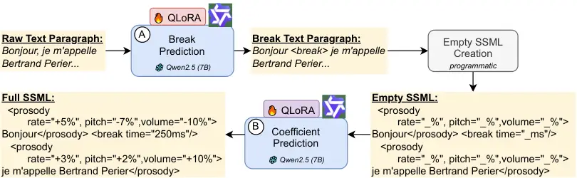
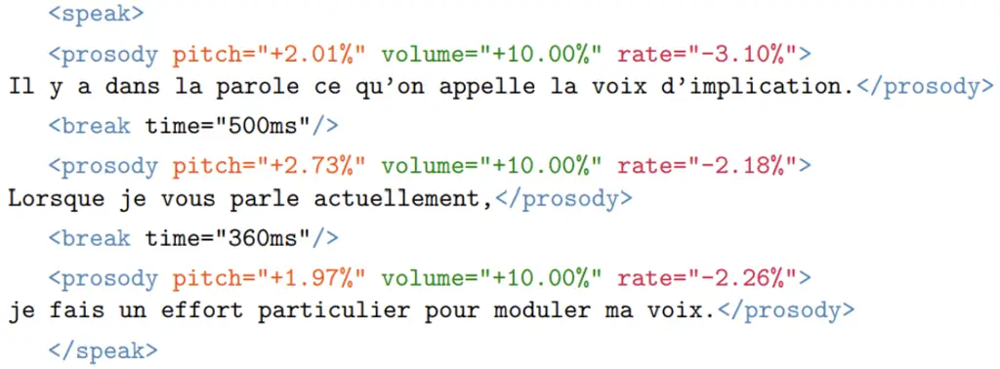

# Improving French Synthetic Speech Quality via SSML Prosody Control

Nassima Ould Ouali Affiliation: École Polytechnique, France,     Awais
Hussain Sani Affiliation: Hi! PARIS Research Center, France    Ruben
Bueno²² 2 Equal contribution; authors listed in alphabetical order.
Affiliation: École Polytechnique, France,     Jonah Dauvet²² 2 Equal
contribution; authors listed in alphabetical order., Tim Luka
Horstmann²² 2 Equal contribution; authors listed in alphabetical order.,
Eric Moulines Email: [{nassima.ould-ouali, ruben.bueno,
eric.moulines}@polytechnique.edu{awais.sani, tim.horstmann}@ip-paris.fr,
jonah.dauvet@mail.mcgill.ca](mailto:) Affiliation: École Polytechnique,
France,  Affiliation: Hi! PARIS Research Center, France
Affiliation: McGill University, Canada

###### Abstract

Despite recent advances, synthetic voices often lack expressiveness due
to limited prosody control in commercial text-to-speech (TTS) systems.
We introduce the first end-to-end pipeline that inserts Speech Synthesis
Markup Language (SSML) tags into French text to control pitch, speaking
rate, volume and pause duration. We employ a cascaded architecture with
two QLoRA-fine-tuned Qwen 2.5-7B models: one predicts phrase-break
positions and the other performs regression on prosodic targets,
generating commercial TTS-compatible SSML markup. Evaluated on a 14-hour
French podcast corpus, our method achieves 99.2% $`F_{1}`$ for break
placement and reduces mean absolute error on pitch, rate, and volume by
25–40% compared with prompting-only large language models (LLMs) and a
BiLSTM baseline. In perceptual evaluation involving 18 participants
across over 9 hours of synthesized audio, SSML-enhanced speech generated
by our pipeline significantly improves naturalness, with the mean
opinion score increasing from 3.20 to 3.87 ($`p<0.005`$). Additionally,
15 of 18 listeners preferred our enhanced synthesis. These results
demonstrate substantial progress in bridging the expressiveness gap
between synthetic and natural French speech. Our code is publicly
available at
[https://github.com/hi-paris/Prosody-Control-French-TTS](https://github.com/hi-paris/Prosody-Control-French-TTS).

## 1 Introduction

Recent Text-to-Speech (TTS) advances have improved speech
intelligibility; yet, achieving natural and expressive prosody remains
challenging. Commercial TTS solutions prioritize clarity over prosodic
variation, resulting in a monotonous speech output. This limitation
particularly affects French due to its complex prosodic features.

Speech Synthesis Markup Language (SSML) provides a standardized way to
control prosodic features such as pitch, speaking rate, and volume.
Unlike neural models, SSML allows post-hoc adjustments and is compatible
with commercial TTS engines. Yet, automating SSML generation is
difficult: manual markup does not scale, and current LLM-based methods
often produce incomplete tags, invalid syntax, or imprecise prosodic
control.

We propose an automated SSML pipeline for French, combining structured
prosody extraction with a novel cascaded LLM approach for simultaneous
tag prediction and prosodic parameter regression. Key contributions
include:

- •
  End-to-end SSML annotation pipeline that aligns speech to text,
  segments input into prosodic syntagms, and extracts prosodic
  coefficients normalized relative to a commercial TTS baseline.
- •
  Rigorous benchmarking comparing state-of-the-art (SOTA) approaches
  (fine-tuned BERT, BiLSTM) with contemporary LLMs across varied
  prompting strategies and metrics.
- •
  Cascaded LLM architecture using two fine-tuned Qwen 2.5-7B models: one
  for SSML structure/boundaries and another for prosodic prediction,
  ensuring valid markup and accurate parameter control.

## 2 Related Work

Enhancing neural TTS prosody through automatic markup is an active
research domain categorized into: (i) learning paradigm (supervised vs.
unsupervised approaches) and (ii) prosodic objective (prominence,
phrasing, style).

##### Supervised Prosody Learning

Word-level prominence modeling emphasizes salient words using prosodic
cues like pitch and duration. Stephenson et al. (2022) fine-tune
BERT Devlin et al. (2019) to predict three-level prominence tags from
wavelet-based labels, achieving $`F_{1}=0.588`$ and enabling
controllable synthesis in FastSpeech 2. Similarly, Zhong et al. (2023)
integrate emphasis features into FastSpeech 2, improving expressiveness
(+0.49 Mean Opinion Score (MOS)) and naturalness (+0.67 MOS).

Prosodic emphasis prediction controls automated stress placement
patterns. Shechtman et al. (2021) employ a hybrid model with acoustic
and syntactic features, and Seshadri et al. (2021) propose a
hierarchical latent model. Liu et al. (2024) combine graph-based
contextual encoding with FastSpeech 2 for enhanced rendering. More
recently, Chen et al. (2025) present DrawSpeech, a user-sketched
prosodic contour control.

Phrasing segments speech into natural prosodic units with appropriate
pauses. Transformer-based models now outperform recurrent neural
networks (RNNs) for break prediction: Futamata et al. (2021) integrate
BERT embeddings with linguistic features, improving phrase break
prediction ($`F_{1}`$ +3.2 points, MOS = 4.39). Vadapalli (2025) show
that fine-tuned BERT outperforms RNN baselines, reaching $`F_{1}=0.92`$
and achieving 58.5% listener preference for BERT-guided punctuation in
narrative TTS.

LLMs enable automated emotional and stylistic annotations at scale. Yoon
et al. (2022) prompt GPT-3 to assign sentence-level emotion labels that
guide expressive TTS, achieving MOS 3.92 (naturalness) and 3.94
(expressiveness), matching human-annotated systems. Complementarily,
Burkhardt et al. (2023) show that even simple, rule-based SSML
adaptations can shape emotional perception, with Unweighted Average
Recall scores of 0.76 for arousal and 0.43 for valence.

Narrative prosody modeling adjusts pitch, speaking rate, and volume to
enhance expressive storytelling. Pethe et al. (2025) use MPNet
embeddings and BiLSTMs to predict phrase-level prosody from text. Their
SSML-integrated predictions improved alignment with human narration in
22–23 out of 24 audiobooks, yielding +50% listener preference over
commercial baselines.

##### Unsupervised Prosody Learning

Discrete prosody representations eliminate dependency on manual
annotations by learning prosodic patterns directly from speech data.
Korotkova et al. (2024) utilize a vector-quantized variational
autoencoder with Wav2Vec2 and RoBERTa encodings, deriving ten
interpretable prosodic tags that enhance TTS expressiveness across
multiple languages, confirmed by MOS tests $`(p<0.001)`$. In contrast,
Karlapati et al. (2021) learn continuous 64-dimensional prosody
embeddings: a VAE encodes mel-spectrograms, and a RoBERTa + syntax-GNN
regresses these from text. At inference, the 64-dimensional prosodic
code conditions a Tacotron2 decoder, yielding 13.2% comparative MOS gain
(3.30→3.74, $`p<0.005`$) on LJSpeech with $`F_{0}`$ correlation of
$`r=0.68`$. Discrete tags offer interpretability; continuous embeddings
better capture fine-grained intonation. Both improve TTS expressiveness
without hand-crafted annotations.

##### Limitations of Prior Work:

However, existing research exhibits critical gaps. Current methods lack
a comprehensive end-to-end framework for converting raw speech into
standardized SSML-compliant prosodic markup. Most rely on partial manual
annotations, address isolated prosodic control aspects, or produce
markup incompatible with commercial TTS systems. Furthermore, the
majority of existing work focuses on English, leaving other complex
languages like French underexplored. Additionally, current LLM-based
approaches suffer from systematic limitations, undergenerating necessary
tags, producing syntactically invalid SSML structures, and lacking
precise control over numerical prosodic parameters, which prevents
deployment in practical TTS systems.

We address these limitations with two main contributions: (i) we
introduce the first reproducible, comprehensive French pipeline that
automatically extracts fine-grained prosodic annotations and converts
them into standards-compliant SSML, and (ii) we develop a novel cascaded
LLM architecture that generates syntactically correct prosodic tags with
precise numerical control at inference time, resulting in substantially
enhanced naturalness and expressiveness in synthetic speech.

## 3 Dataset Creation and SSML Annotation Pipeline

Figure 1: Overview of the SSML annotation pipeline. Natural speech is
aligned, segmented, and compared to a synthetic baseline to extract
prosodic features for SSML markup. Green elements indicate later model
training data.

We construct a comprehensive dataset annotated with prosodic features
from French speech. Our methodology involves aligning spoken audio with
transcripts, extracting four key prosodic features — pitch, volume,
speaking rate, and break duration — and converting them into
standardized SSML for enhanced synthetic speech generation. Figure 1
presents our preprocessing pipeline. Further dataset statistics are
provided in Appendix A.

##### Audio Collection and Preprocessing:

We process 14 hours of diverse French audio content sourced from ETX
Majelan¹¹ 1 [https://etxmajelan.com/](https://etxmajelan.com/), a
high-quality podcast platform with interviews and discussions. Our
dataset includes speech from 14 distinct speakers (42% female). The
original recordings contain background music, jingles, and sound
effects, complicating prosodic analysis. Hence, we isolate clean speech
using Demucs Défossez (2021), a SOTA audio source separation model,
down-sample to 16 kHz, and peak-normalize the audio. Using pydub²² 2
[https://github.com/jiaaro/pydub](https://github.com/jiaaro/pydub), we
segment the cleaned audio via silence detection with a $`-35`$ dBFS
threshold and 300 ms gaps. The resulting audio segments serve as our
fundamental processing units for subsequent prosodic analysis.

##### Text-Audio Alignment:

Accurate alignment between audio and transcribed text is crucial for
prosody extraction, but particularly challenging in French due to
phonetic phenomena such as liaisons, elisions, and prosodic
contractions. To address this, we employ the Whisper Timestamped
package³³ 3
[https://github.com/linto-ai/whisper-timestamped](https://github.com/linto-ai/whisper-timestamped)
with the Whisper Radford et al. (2022) medium model and Auditok Voice
Activity Detection (VAD) ⁴⁴ 4
[https://github.com/amsehili/auditok](https://github.com/amsehili/auditok),
which filters out silent segments that would otherwise distort prosodic
measurements.

To evaluate this setup, we benchmarked it against larger Whisper models,
Montreal Forced Aligner (MFA) by  McAuliffe et al. (2017), and NVIDIA
NeMo  Kuchaiev et al. (2019). Benchmarking used our dataset and FLEURS
benchmark Conneau et al. (2022) as a state-of-the-art reference.. While
larger models yielded marginal gains, they introduced instability such
as significant hallucinations during silence – a known issue in
Whisper Barański et al. (2025) – as well as higher computational cost.
Our chosen configuration achieved a 5.95% WER using Whisper-medium with
an average Alignment Recall Rate (ARR) of 96.3% over 15-second windows
against the manual TextGrid annotations created with Praat Boersma and
Van Heuven (2001) (see Table 1). This yielded an optimal
accuracy-efficiency trade-off.

|                       |                        |               |               |                |                  |                         |
| --------------------- | ---------------------- | ------------- | ------------- | -------------- | ---------------- | ----------------------- |
|                       | Whisper Model Variants |               |               |                | Alignment Models |                         |
| Metric                | Medium                 | Large v2      | Large v3      | Turbo Large v3 | MFA $`\ddagger`$ | NeMo Large $`\ddagger`$ |
| Parameters            | 769 M                  | 1550 M        | 1540 M        | 809 M          | –                | 120 M                   |
| WER^(†)               | 5.95% / 10.70%         | 4.60% / 6.27% | 3.92% / 5.80% | 3.52% / 5.71%  | –                | –                       |
| WER^(†) +VAD          | 5.68% / 8.72%          | 5.07% / 6.16% | 3.86% / 5.65% | 6.16% / 5.83%  | –                | –                       |
| ARR^(∗)               | 96.3%                  | 97.1%         | 96.2%         | 97.8%          | 99.7%            | 50.7%                   |
| Start MAE^(∗) (ms)    | 264                    | 191           | 207           | 152            | 115              | 4529                    |
| Duration MAE^(∗) (ms) | 91                     | 77            | 102           | 76             | 95               | 218                     |

- •
  $`\dagger`$ WER computed with the HuggingFace evaluate library.
- •
  $`*`$ ARR and MAE are computed on 15 second segments, against the gold
  manually annotated Text Grids of 1 hour of speech from our dataset.
- •
  $`\ddagger`$ MFA and NeMo alignments use gold transcripts, thus
  rendering the WER 0 by default.

Table 1: Metric evaluation of four whisper models, MFA, and NeMo on our
dataset (Section 3) and FLEURS.

##### Baseline Voice for Prosodic Comparison:

For prosodic reference, we synthesize each transcript using Microsoft
Azure Neural TTS with the French voice Henri Microsoft Azure (2024).
Henri was selected for its clarity, broad phonetic coverage, and
consistent yet neutral prosodic characteristics, making it optimal for
computing relative prosodic adjustments. The resulting synthetic speech
provides a stable baseline against which natural prosodic features are
measured and compared, as detailed in subsequent sections.

##### Syntagm Segmentation:

Each segment undergoes further subdivision into syntagms: prosodic units
with natural pause boundaries. Following  Roll et al. (2023), we detect
them through acoustic pauses and punctuation. We first derive a
word/pause sequence from the TextGrid, where pauses following function
words are discarded with a POS filter to remove Whisper artifacts. Next,
any silence that follows ., ?, or ! is clamped to at least 500 ms, and a
500 ms pause is injected whenever Whisper failed to signal the end of a
sentence. The resulting timestamped syntagms provide stable,
linguistically meaningful units for prosodic analysis.

##### Prosodic Feature Extraction and SSML Tag Construction:

Each syntagm is annotated with four prosodic features: median pitch
(fundamental frequency $`f_{0}`$), segment-level volume (Loudness Units
Full Scale (LUFS)), speaking rate (words per second), and
inter-syntagmatic break duration. All features are computed for both
natural and synthetic baseline voices to derive relative delta values
for SSML encoding. To account for intra- and inter-speaker variability,
we normalize each syntagm’s pitch, volume, and rate relative to a
baseline computed as the median over a sliding window of $`w=10`$ audio
segments (or, when $`w`$ covers all segments, the global median). The
computation of each feature is detailed as follows:

Pitch median fundamental frequency $`f_{0}^{(i)}`$ is converted to a
semitone offset
$`s_{i}=12\log_{2}\!\bigl(f_{0}^{(i)}/\bar{f}_{0}\bigr)`$, clipped to
$`\bigl[-0.7P,\;P\bigr]`$ to allow larger upward than downward shifts,
and re-scaled to percentage pitch change
$`p_{i}=\bigl(2^{s_{i}/12}-1\bigr)\!\times\!100`$.

Using LUFS for volume, the baseline–synthetic difference
$`\Delta L_{i}=\bar{L}-L_{\mathrm{syn}}^{(i)}`$ is mapped to a gain
$`v_{i}=\bigl(10^{\Delta L_{i}/20}-1\bigr)\!\times\!100`$, then clipped
to $`\pm V`$ (we use $`V=10\%`$).

Speaking rate is estimated as words per second. Let $`n_{i}`$ be the
word count and $`d_{\mathrm{nat}}`$, $`d_{\mathrm{syn}}`$ the net
speaking durations (pauses removed). The rate delta is
$`r_{i}=\frac{n_{i}/d_{\mathrm{nat}}-n_{i}/d_{\mathrm{syn}}}{n_{i}/d_{\mathrm{syn}}}\!\times\!100`$.
Slow-downs are amplified for long syntagms ($`>1`$ s) while speed-ups
are reduced, and the final value is clamped to $`\pm R`$ with a tighter
$`+0.5R`$ ceiling for accelerations.

To improve prosodic smoothness, we apply exponential smoothing to pitch
and rate with $`\alpha=0.2`$:

```math
\tilde{x}_{0}=x_{0},\quad\tilde{x}_{i}=\alpha x_{i}+(1-\alpha)\tilde{x}_{i-1}.
```

Sudden jumps are clamped to $`\Delta=8\%`$ per syntagm. Volume is not
smoothed.

Break durations are taken from the inter-syntagm silence gaps and
inserted as raw durations (e.g., \<break time="200ms"\>). The final SSML
markup is assembled by inserting appropriate \<prosody\> and \<break\>
tags into the text.⁵⁵ 5 At inference, we found that wrapping each
\<prosody\> tag with \<mstts:silence type="leading-exact/trailing-exact"
value="0"/\> improves output by suppressing unwanted Azure TTS pauses.

## 4 Methodology

We test whether text alone encodes sufficient cues for prosody by
training two baselines: (i) a BERT-base model fine-tuned for token-level
pause prediction Vadapalli (2025), and (ii) a BiLSTM Pethe et al. (2025)
which predicts SSML tags with pitch, speaking rate and volume
adjustments.

### 4.1 Fine-tuning BERT for Pause Prediction

Following Vadapalli (2025), we fine-tune an uncased BERT-base model for
token-level pause prediction. A binary classification head determines
whether each sub-word is followed by a break tag. We adopt the same
hyperparameters as the original work on our dataset: batch size 64,
learning rate $`10^{-5}`$, and gradient clipping at 10. For evaluation,
we report both $`F_{1}`$ score and perplexity. While $`F_{1}`$ is used
in Vadapalli (2025), perplexity is introduced here as an additional
metric to enable broader comparisons in later sections.

We additionally introduce bootstrapping, a technique not used in the
original paper, to evaluate the small model’s variance in performance.
We bootstrap on 10 distinct sets with the same configuration as the
original training set, which allows us to obtain a distribution of
performance scores for robust estimation of the uncertainty of
performance. Given the reduced size of the dataset, we expect overall
performance to degrade slightly. Hence, we focus on stability, measured
via standard deviation.

### 4.2 BiLSTM-Based Sequence Modeling

We implement a BiLSTM baseline following Pethe et al. (2025), explicitly
modeling prosody prediction as a sequence regression task to predict
three SSML parameters: pitch, volume, and speaking rate. This approach
leverages local context through sequential processing of prosodic units.

Each syntagm receives encoding into a 768-dimensional representation
using the pretrained sentence encoder all-mpnet-base-v2⁶⁶ 6
[https://huggingface.co/sentence-transformers/all-mpnet-base-v2](https://huggingface.co/sentence-transformers/all-mpnet-base-v2).
We construct overlapping input sequences of varying lengths
$`L\in\{1,2,3,4\}`$, extending beyond the original study’s sequence
lengths of 2 and 3 to assess optimal context window size. targeting
z-scored prosody vectors (pitch, volume, rate) of central segments,
normalized on training statistics.

The architecture includes LayerNorm preprocessing, bidirectional LSTM
(40 units per direction), dense layer (20 units, $`\tanh`$ activation),
and linear projection for predicting the 3-dimensional prosody vector.
Training uses MSE loss between predicted and target z-scored vectors. We
additionally compute raw RMSE and MAE metrics for interpretability and
literature comparison.

### 4.3 Zero-shot and Few-shot Evaluation

To assess SOTA LLMs for SSML markup generation, we benchmarked various
open-source models in both zero-shot and few-shot settings. We evaluated
Mistral (7B), Qwen 2.5 (7B), Llama 3 (8B), Granite 3.3 (8B), Qwen 3
(8B), DeepSeek-R1 (32B), and Qwen 3 (32B) via the Ollama framework⁷⁷ 7
[https://ollama.com/](https://ollama.com/). Models were prompted at the
segment level ($`\approx`$ eight tags per segment on average) with
French text, and tasked with generating fully annotated SSML for 100
randomly chosen segments. Few-shot prompts included 10 reference
examples.

### 4.4 Cascaded Fine-tuning Approach



Figure 2: Cascaded LLM approach for automated text-to-SSML generation:
QwenA predicts tag placement, QwenB injects prosodic values. This
disentangled design enables accurate and efficient prosody control for
synthetic speech.

As we show in Section 5.3, LLM-based approaches under-generate \<break\>
and \<prosody\> tags, resulting in SSML that is structurally incomplete
and limited in expressive control. To address this, we introduce a
cascaded strategy that separates structural and numerical prediction.
The first model, QwenA, predicts where prosodic boundaries occur; the
second, QwenB, supplies the corresponding numerical attributes.

#### QwenA (Stage 1): Break Prediction

We fine-tune a Qwen 2.5-7B model (QLoRA with 4-bit quantization, rank 8,
$`\alpha=16`$) to insert \<break\> tags at linguistically appropriate
junctures. QwenA processes up to 200-word French paragraphs (within a
1024-token limit), retaining punctuation, quotations, and parenthetical
clauses so that the model must reason over long-range dependencies
rather than relying on sentence-level heuristics. These features reflect
real-world TTS applications, where systems rarely receive inputs
entirely devoid of punctuation or other natural orthographic cues.
Furthermore, this approach aligns with the baseline methodology used in
Vadapalli (2025). A deterministic post-processor then converts each
\<break\> into an empty \<prosody\> element, yielding a syntactically
valid SSML skeleton to pass into the next stage.

#### QwenB (Stage 2): Prosodic Regression

QwenB builds on the skeleton emitted by QwenA and replaces each empty
\<prosody\> placeholder with fully specified numeric attributes (pitch,
rate, volume, and break duration). Starting again from Qwen 2.5-7B, we
inject a second QLoRA adapter with 4-bit quantization (rank 8,
$`\alpha=16`$) into the value and feed-forward projections so that only
those low-rank updates are trainable. Loss is computed on the numeric
tokens, so categorical text incurs zero penalty and the adapter’s
capacity is devoted entirely to modeling prosodic distributions. Targets
are standardized to unit variance during optimization and rescaled at
inference, a choice that stabilizes gradients and accelerates
convergence.

## 5 Results and Analysis

### 5.1 Perceptual Evaluation (AB Test)

To assess our SSML annotation pipeline’s effectiveness in enhancing
synthetic speech (Section 3), we conducted AB testing with 18
participants. Each participant evaluated 30 one-minute audio pairs,
where the baseline was the raw, unaltered voice of Microsoft Azure
Neural TTS (Henri), without any prosody modifications, compared to the
prosody-enhanced version. These pairs were presented randomly, with 60
segments evaluated per participant.

The SSML-enhanced audio achieved a MOS of 3.87 (5-point scale),
outperforming the baseline (3.20) and yielding a 20% improvement in
perceived quality. Additionally, 15 of 18 participants preferred the
enhanced version in over half of the cases, with 7 preferring it in more
than 75% of comparisons. These results support the effectiveness of our
SSML-based prosody enhancement for improving synthetic speech quality.

### 5.2 Baseline Model Performance

##### BERT Break Prediction Results:

We evaluated the performance of the fine-tuned BERT model from Vadapalli
(2025) on $`F_{1}`$ (%) and perplexity (best = 1), and attained results
very close to the original paper, which reports a 92.10% $`F_{1}`$ score
for break prediction. Our model achieves a $`F_{1}`$ score of 92.06%,
along with a perplexity of 1.123 (not reported in Vadapalli (2025) but
useful for further evaluation). Our stability assessment on 10
bootstrapped datasets yielded an average $`F_{1}`$ of 47.52% $`\pm`$
4.65% (Confidence Interval (CI) = 9.8%) and perplexity of 1.274 $`\pm`$
0.005 (CI = 0.4%), indicating high stability in token prediction but
moderate variability in classification performance. We present the
results from the original training data in Table 4.

##### BiLSTM Prosody Prediction Results:

We evaluated our BiLSTM model following Pethe et al. (2025). Table 2
presents the MSE values for normalized z-score prosody features. Our
approach achieves SOTA results comparable to those reported in the
original paper. For a more comprehensive analysis, we also report the
raw RMSE and MAE (%) for each prosodic parameter.

|       |                              |        |        |        |
| ----- | ---------------------------- | ------ | ------ | ------ |
| $`L`$ | Metric Type                  | Pitch  | Volume | Rate   |
| 1     | Z-score MSE ($`\downarrow`$) | 0.8752 | 0.9141 | 0.7733 |
|       | $`\%`$ RMSE ($`\downarrow`$) | 2.0659 | 7.8597 | 1.2771 |
|       | $`\%`$ MAE ($`\downarrow`$)  | 1.6709 | 6.4768 | 0.8878 |
| 2     | Z-score MSE ($`\downarrow`$) | 0.8983 | 0.8949 | 0.7572 |
|       | $`\%`$ RMSE ($`\downarrow`$) | 2.0930 | 7.7767 | 1.2637 |
|       | $`\%`$ MAE ($`\downarrow`$)  | 1.6883 | 6.0405 | 0.8462 |
| 3     | Z-score MSE ($`\downarrow`$) | 0.9936 | 0.9917 | 0.8593 |
|       | $`\%`$ RMSE ($`\downarrow`$) | 2.2012 | 8.1864 | 1.3462 |
|       | $`\%`$ MAE ($`\downarrow`$)  | 1.7732 | 6.5100 | 0.9257 |
| 4     | Z-score MSE ($`\downarrow`$) | 0.9950 | 0.9992 | 0.8263 |
|       | $`\%`$ RMSE ($`\downarrow`$) | 2.2028 | 8.2172 | 1.3201 |
|       | $`\%`$ MAE ($`\downarrow`$)  | 1.7568 | 6.5990 | 0.9312 |

Table 2: BiLSTM-based prosodic attribute prediction across sequence
window lengths ($`L`$). Best overall performance is achieved at $`L=2`$,
with lowest MAE for volume and rate, and near-best scores for pitch.

Unlike Pethe et al. (2025), our analysis revealed that a sequence window
length ($`L=2`$) yielded superior performance across prosodic
attributes. Specifically, $`L=2`$ demonstrated lower error rates for two
of the three prosodic attributes, while pitch prediction achieved
optimal performance with $`L=1`$. Notably, the MAE for volume with
$`L=2`$ was more than 0.04 percentage points lower than all other tested
lengths, and 0.04–0.09 percentage points superior to alternative
sequence configurations. Our best results align with those of Pethe
et al. (2025): z-scored MSE of 0.8734 for pitch, 0.7631 for volume, and
1.0610 for speaking rate. We attribute minor performance differences to
dataset variations and establish the $`L=2`$ model as our primary
baseline for subsequent comparisons with our proposed cascaded
architecture.

### 5.3 Zero-shot and Few-shot Prompting Evaluation

|                        |                        |                                   |                                    |                                  |                                         |
| ---------------------- | ---------------------- | --------------------------------- | ---------------------------------- | -------------------------------- | --------------------------------------- |
| Model                  | SSML Sim. $`\uparrow`$ | Pitch (%) MAE/RMSE $`\downarrow`$ | Volume (%) MAE/RMSE $`\downarrow`$ | Rate (%) MAE/RMSE $`\downarrow`$ | Break Time (ms) MAE/RMSE $`\downarrow`$ |
| Qwen3 (32B) (ZS)       | 0.91                   | 1.42/1.83                         | 7.65/8.48                          | 1.52/2.00                        | 170.23/232.41                           |
| Qwen2.5 (7B) (ZS)      | 0.90                   | 2.07/2.43                         | 7.23/8.05                          | 1.54/1.93                        | 361.88/393.04                           |
| Qwen3 (32B) (FS)       | 0.90                   | 1.08/1.41                         | 5.80/7.33                          | 0.97/1.31                        | 159.58/215.50                           |
| Qwen3 (8B) (FS)        | 0.90                   | 1.77/2.83                         | 6.96/16.85                         | 1.23/1.69                        | 147.24/242.98                           |
| Qwen2.5 (7B) (FS)      | 0.89                   | 1.26/1.50                         | 4.32/6.77                          | 1.01/1.24                        | 118.85/179.68                           |
| Mistral (7B) (ZS)      | 0.88                   | 1.85/2.25                         | 24.19/43.96                        | 18.30/41.24                      | 207.28/258.76                           |
| Mistral (7B) (FS)      | 0.87                   | 1.75/2.16                         | 5.38/8.33                          | 1.14/1.42                        | 205.03/384.17                           |
| Granite3.3 (8B) (FS)   | 0.87                   | 1.45/1.86                         | 4.95/7.12                          | 0.95/1.30                        | 196.93/265.07                           |
| Llama3 (8B) (ZS)       | 0.84                   | 1.44/1.82                         | 7.30/8.08                          | 2.26/10.17                       | 285.17/318.19                           |
| Qwen3 (8B) (ZS)        | 0.82                   | 1.99/2.70                         | 7.43/8.41                          | 1.69/2.06                        | 274.27/334.20                           |
| Deepseek-R1 (32B) (ZS) | 0.81                   | 1.64/2.11                         | 15.50/30.41                        | 18.79/41.14                      | 274.66/320.62                           |
| Granite3.3 (8B) (ZS)   | 0.76                   | 3.70/4.55                         | 13.86/29.11                        | 33.25/55.85                      | 320.77/413.91                           |
| Deepseek-R1 (32B) (FS) | 0.76                   | 1.43/2.04                         | 7.12/8.23                          | 3.69/12.94                       | 244.85/302.87                           |
| Llama3 (8B) (FS)       | 0.34                   | 1.26/1.62                         | 7.24/8.23                          | 1.53/1.88                        | 416.13/445.99                           |

- •
  $`\uparrow`$: higher is better, $`\downarrow`$: lower is better. ZS:
  Zero-Shot, FS: Few-Shot.

Table 3: SSML generation performance across models and prompting
strategies, evaluated by cosine similarity of predicted vs. gold SSML
embeddings, and MAE/RMSE for pitch, volume, rate, and break durations.
Qwen2.5 (7B) offers the best trade-off between accuracy and efficiency.

We first focused on evaluating break tag prediction, a proxy for
assessing structural correctness and syntagm segmentation. Figure 3
shows the average number of predicted \<break\> and \<prosody\> tags per
segment compared to gold annotations. All models consistently
under-generate tags, indicating systematic issues maintaining SSML
structure. Few-shot prompting led to unexpected patterns: fewer
predicted break tags but increased \<prosody\> tags, suggesting
attention shifts or stylistic overfitting to prompt exemplars. Notably,
Llama 3 and DeepSeek-R1 (32B) show large discrepancies between zero- and
few-shot modes, with Llama 3’s prosody tagging almost collapsing in the
few-shot case.

(a) Break tag usage comparison (DS = DeepSeek)

(b) Prosody tag usage comparison (DS = DeepSeek)

Figure 3: Structural comparison of SSML tag predictions across models.
All models under-generate both break and prosody tags relative to the
gold standard.

Beyond structural accuracy, we evaluated numerical performance through
cosine similarity between predicted and reference SSML structures,
embedded using the all-MiniLM-L6-v2 ⁸⁸ 8
[https://huggingface.co/sentence-transformers/all-MiniLM-L6-v2](https://huggingface.co/sentence-transformers/all-MiniLM-L6-v2)
model, RMSE, and MAE for break durations and prosodic coefficients,
averaged per segment. Table 3 summarizes the results. Qwen 2.5-7B
achieves the best overall balance: in the few-shot setting, it delivers
the lowest MAE for break (118.85 ms) and volume (4.32%), and
second-highest structural similarity in zero-shot (0.9). Qwen 3 (32B)
slightly surpasses it on similarity (0.908), but at a cost of 4.5 times
higher memory usage and slower inference, making it less suitable for
fine-tuning and deployment.

Our findings suggest that while few-shot prompting can improve prosody
tag usage and numerical accuracy, model behavior is highly
architecture-dependent. Furthermore, the consistent underproduction of
tags across models highlights the need for more robust SSML-structure
awareness.

### 5.4 Cascaded LLM Evaluation

Our evaluation of the cascaded QwenA and QwenB models demonstrates
substantial performance improvements over existing SOTA approaches, as
detailed in Table 4:

|                 |        |                                 |
| --------------- | ------ | ------------------------------- |
| Model           | F1 (%) | Perplexity ($`\rightarrow\,1`$) |
| Cascade (QwenA) | 99.24  | 1.00                            |
| Finetuned BERT  | 92.06  | 1.12                            |

Table 4: Break tag prediction: F1 and perplexity for our cascaded model
(QwenA) vs. fine-tuned BERT. QwenA achieves near-perfect accuracy and
fluency.

For QwenA, which utilizes next-token prediction on a linearized SSML
target, the model achieved a test perplexity of 1.001 and a tag-level
$`F_{1}`$ score of 99.24%, surpassing the fine-tuned BERT’s baseline of
1.123 perplexity and 92.06% $`F_{1}`$ score. Moreover, this approach
also outperforms the LLM tag prediction benchmarks, which consistently
under-generate break and prosody tags, as illustrated in Figures 3(a)
and 3(b). This near-perfect tag insertion accuracy validates the
improved performance of our cascaded approach compared to available
models for SSML tag prediction.

|                                                                      |        |       |        |      |            |
| -------------------------------------------------------------------- | ------ | ----- | ------ | ---- | ---------- |
| Model                                                                | Metric | Pitch | Volume | Rate | Break Time |
| Cascade (Ours)                                                       | RMSE   | 1.22  | 1.67   | 1.50 | 166.51     |
|                                                                      | MAE    | 0.97  | 1.09   | 1.10 | 132.89     |
| BiLSTM^(†) ($`L=2`$)                                                 | RMSE   | 2.09  | 7.77   | 1.26 | –          |
|                                                                      | MAE    | 1.68  | 6.04   | 0.84 | –          |
| SOTA Few-Shot\*                                                      | RMSE   | 1.41  | 7.33   | 1.31 | 215.50     |
|                                                                      | MAE    | 1.08  | 5.80   | 0.97 | 159.58     |
| SOTA Zero-Shot\*                                                     | RMSE   | 1.83  | 8.48   | 2.00 | 232.41     |
|                                                                      | MAE    | 1.42  | 7.65   | 1.52 | 170.23     |
| $`{\dagger}`$: Results based on Pethe et al. (2025); see Section 4.2 |        |       |        |      |            |
| $`*`$: Qwen-3 (32B) selected via cosine similarity (Tab. 3)          |        |       |        |      |            |
| Units: Pitch, Volume, Rate (%); Break Time (ms)                      |        |       |        |      |            |

Table 5: RMSE ($`\downarrow`$) and MAE ($`\downarrow`$) for our cascaded
model vs. benchmarks. It achieves the lowest error scores across nearly
all prosody attributes.

QwenB demonstrates significant advancements in prosody parameter
prediction, achieving an MAE of 0.97% for pitch, 1.09% for volume, 1.10%
for rate, and 132.9ms for break timing (Table 5). Furthermore, this
strong performance is achieved while maintaining an efficient end-to-end
latency of approximately 190 ms for a 150-word paragraph. This
demonstrates the model’s enhanced SSML parameter prediction and its
ability to process larger text segments, outperforming baseline
approaches. This performance also suggests that evaluations of pipeline
audio (Section 5.1) are highly generalizable to the cascaded model’s
audio quality due to their close similarity.

### 5.5 Summary and Analysis of Results

Table 5 provides a comparative overview of objective performance across
all evaluated approaches, revealing three key observations:

1.  1.  Cascaded QwenA + QwenB sets new SOTA performance. The system
        achieves single-digit MAE for all prosodic coefficients and reduces
        break-timing error by 25% vs. the best few-shot LLM baseline.
2.  2.  BiLSTM architectures remain competitive for speaking rate
        prediction. Though outperformed elsewhere, its 0.84% MAE on rate
        shows lightweight sequential models still capture localized prosodic
        patterns effectively.
3.  3.  Prompt-only LLMs systematically under-generate tags. Both zero- and
        few-shot settings underperform supervised baselines on break timing
        prediction (MAE \> 150 ms) and structural metrics (Figure 3),
        reinforcing the necessity for explicit structural supervision in
        SSML generation tasks.

These findings confirm that disentangling structural prediction (QwenA)
from numerical regression (QwenB) yields optimal performance across both
dimensions: syntactically valid SSML markup with fine-grained prosodic
control, while preserving inference efficiency suitable for real-time
TTS applications. The subjective evaluation results in Section 5.1
corroborate these objective improvements, demonstrating that enhanced
technical performance translates into substantial perceptual gains—a 20%
MOS improvement and consistent listener preference for enhanced
synthesis.

## 6 Conclusion and Future Directions

Using a fine-tuned cascaded Qwen 2.5-7B architecture, we separate
structural tag insertion from prosodic parameter prediction, achieving
near-perfect break placement (99.2% $`F_{1}`$, perplexity 1.001) and
reducing prosodic MAE below 1.1 points – representing 25–40% better than
prompting-only LLMs and BiLSTM baselines.

Perceptual evaluation shows that SSML from our pipeline increases MOS
from 3.20 to 3.87, with consistent listener preference. This marks a
significant step toward closing the expressiveness gap between synthetic
and natural French speech while preserving compatibility with commercial
TTS.

Future research includes unifying our cascaded approach into a single
end-to-end model for joint prosodic prediction, incorporating multimodal
audio embeddings to capture subtle speech characteristics beyond
text-derived features, and extending this methodology to additional
languages to assess cross-linguistic generalizability and robustness.

## 7 Limitations

While our proposed system shows significant improvements, several
limitations warrant discussion. Our experiments focus exclusively on
French using a proprietary 14-hour corpus. While our pipeline is
language-agnostic, performance may vary for languages with different
prosodic characteristics. The dataset size remains modest compared to
typical TTS training corpora, as English prosody modeling often
leverages hundreds of hours of annotated speech, indicating that scaling
our French dataset could yield additional performance gains.
Additionally, our improvements rely on TTS engines supporting
fine-grained SSML tags, meaning legacy or non-compliant systems may not
achieve similar gains and may require custom adjustments for
engine-specific behaviors.

Our prosodic deltas are computed with respect to a single baseline
synthetic voice (Azure fr-FR-HenriNeural) and evaluated with the same
voice, which limits out-of-domain generalization. While SSML prosody
tags are standardized, their acoustic realization is implementation- and
voice-dependent; engines may clamp or substitute values, and different
voices can map the same percentage to different F0/rate changes.
Consequently, numeric SSML settings may require voice-specific
recalibration (e.g., a short script that sweeps pitch/rate/volume and
measures resulting semitone, syllables/s, and dB changes) before
transfer to other voices or engines.

From a computational perspective, fine-tuning Qwen 2.5-7B requires
substantial GPU memory ($`\approx 15~GB`$ peak) despite 4-bit
quantization, necessitating model compression or distillation for
smaller deployments. Conversely, greater computational resources could
enable more extensive fine-tuning and potentially improve performance.
Our approach also assumes that punctuation and syntactic cues correlate
well with natural prosodic boundaries, an assumption that may break down
in highly informal or unpunctuated text such as social media
transcripts, leading to suboptimal break placement.

## 8 Ethics Statement

Our work uses commercially licensed French podcast audio, ensuring no
personal or sensitive data are exposed. We acknowledge potential biases
from using a limited speaker set and encourage broader demographic
validation. While improved prosody can enhance synthetic voices, it also
risks misuse in deceptive audio generation; we therefore recommend
watermarking or verification mechanisms. Code and anonymized alignment
scripts are publicly shared to promote reproducibility and transparency.

## Acknowledgments

This work was supported by Hi! PARIS and by the ANR/France 2030 program
(ANR-23-IACL-0005).  
We acknowledge access to the IDRIS high-performance computing resources
under allocation 20XX-AD011015141R2, granted by GENCI (Grand Équipement
National de Calcul Intensif).  
Ce projet a été financé par l’État dans le cadre de France 2030.  
Financé par l’Union européenne – NextGenerationEU dans le cadre du plan
France Relance.

## References

- Barański et al. (2025) Mateusz Barański, Jan Jasiński, Julitta
  Bartolewska, Stanisław Kacprzak, Marcin Witkowski, and Konrad
  Kowalczyk. 2025. [Investigation of Whisper ASR Hallucinations Induced
  by Non-Speech
  Audio](https://doi.org/10.1109/ICASSP49660.2025.10890105). In _ICASSP
  2025 - 2025 IEEE International Conference on Acoustics, Speech and
  Signal Processing (ICASSP)_, pages 1–5. ArXiv:2501.11378 \[cs\].
- Boersma and Van Heuven (2001) Paul Boersma and Vincent
  Van Heuven. 2001. [Speak and unspeak with
  praat](https://www.researchgate.net/publication/303164808_Speak_and_unSpeak_with_PRAAT).
  _Glot Int_, 5:341–347.
- Burkhardt et al. (2023) Felix Burkhardt, Uwe Reichel, Florian Eyben,
  and Björn Schuller. 2023. [Going retro: Astonishingly simple yet
  effective rule-based prosody modelling for speech synthesis simulating
  emotion dimensions](https://doi.org/10.48550/arXiv.2307.02132). _arXiv
  preprint arXiv:2307.02132_.
- Campione and Véronis (2002) Estelle Campione and Jean Véronis. 2002.
  [A large-scale multilingual study of silent pause
  duration](https://doi.org/10.21437/SpeechProsody.2002-35). In _Speech
  Prosody 2002_, pages 199–202. ISCA.
- Chen et al. (2025) Weidong Chen, Shan Yang, Guangzhi Li, and Xixin
  Wu. 2025. [Drawspeech: Expressive speech synthesis using prosodic
  sketches as control
  conditions](https://doi.org/10.48550/arXiv.2501.04256). _arXiv
  preprint arXiv:2501.04256_.
- Conneau et al. (2022) Alexis Conneau, Min Ma, Simran Khanuja,
  Yu Zhang, Vera Axelrod, Siddharth Dalmia, Jason Riesa, Clara Rivera,
  and Ankur Bapna. 2022. [Fleurs: Few-shot learning evaluation of
  universal representations of speech](http://arxiv.org/abs/2205.12446).
- Défossez (2021) Alexandre Défossez. 2021. [Hybrid spectrogram and
  waveform source
  separation](https://doi.org/https://doi.org/10.48550/arXiv.2111.03600).
  In _Proceedings of the ISMIR 2021 Workshop on Music Source
  Separation_.
- Devlin et al. (2019) Jacob Devlin, Ming-Wei Chang, Kenton Lee, and
  Kristina Toutanova. 2019. [BERT: Pre-training of Deep Bidirectional
  Transformers for Language
  Understanding](https://doi.org/10.48550/arXiv.1810.04805).
  ArXiv:1810.04805 \[cs\].
- Futamata et al. (2021) Kosuke Futamata, Byeongseon Park, Ryuichi
  Yamamoto, and Kentaro Tachibana. 2021. [Phrase break prediction with
  bidirectional encoder representations in japanese text-to-speech
  synthesis](https://doi.org/10.48550/arXiv.2104.12395). _arXiv preprint
  arXiv:2104.12395_.
- Karlapati et al. (2021) Sri Karlapati, Ammar Abbas, Zack Hodari,
  Alexis Moinet, Arnaud Joly, Penny Karanasou, and Thomas Drugman. 2021.
  [Prosodic representation learning and contextual sampling for neural
  text-to-speech](https://doi.org/10.48550/arXiv.2011.02252). In _ICASSP
  2021-2021 IEEE International Conference on Acoustics, Speech and
  Signal Processing (ICASSP)_, pages 6573–6577. IEEE.
- Korotkova et al. (2024) Yuliya Korotkova, Ilya Kalinovskiy, and
  Tatiana Vakhrusheva. 2024. [Word-level text markup for prosody control
  in speech synthesis](https://doi.org/10.21437/Interspeech.2024-715).
  In _Proc. Interspeech 2024_, pages 2280–2284.
- Kuchaiev et al. (2019) Oleksii Kuchaiev, Jason Li, Huyen Nguyen,
  Oleksii Hrinchuk, Ryan Leary, Boris Ginsburg, Samuel Kriman, Stanislav
  Beliaev, Vitaly Lavrukhin, Jack Cook, Patrice Castonguay, Mariya
  Popova, Jocelyn Huang, and Jonathan M. Cohen. 2019. [NeMo: a toolkit
  for building AI applications using Neural
  Modules](https://doi.org/10.48550/arXiv.1909.09577). ArXiv:1909.09577
  \[cs\].
- Liu et al. (2024) Rui Liu, Zhenqi Jia, Jie Yang, Yifan Hu, and Haizhou
  Li. 2024. [Emphasis rendering for conversational text-to-speech with
  multi-modal multi-scale context
  modeling](https://doi.org/10.48550/arXiv.2410.09524). _arXiv preprint
  arXiv:2410.09524_.
- McAuliffe et al. (2017) Michael McAuliffe, Michaela Socolof, Sarah
  Mihuc, Michael Wagner, and Morgan Sonderegger. 2017. [Montreal Forced
  Aligner: Trainable Text-Speech Alignment Using
  Kaldi](https://doi.org/10.21437/Interspeech.2017-1386). In
  _Interspeech 2017_, pages 498–502. ISCA.
- Microsoft Azure (2024) Microsoft Azure. 2024. [Speech synthesis markup
  language (ssml)
  documentation](https://learn.microsoft.com/en-us/azure/ai-services/speech-service/speech-synthesis-markup-voice).
- Peck and Becker (2024) Naomi Peck and Laura Becker. 2024. [Syntactic
  pausing? Re-examining the
  associations](https://doi.org/10.1515/lingvan-2022-0156). _Linguistics
  Vanguard_, 10(1):223–237. Publisher: De Gruyter Mouton.
- Pethe et al. (2025) Charuta Pethe, Bach Pham, Felix D Childress,
  Yunting Yin, and Steven Skiena. 2025. [Prosody analysis of
  audiobooks](https://doi.org/10.48550/arXiv.2310.06930).
- Radford et al. (2022) Alec Radford, Jong Wook Kim, Tao Xu, Greg
  Brockman, Christine McLeavey, and Ilya Sutskever. 2022. [Robust speech
  recognition via large-scale weak
  supervision](https://doi.org/10.48550/arXiv.2212.04356). _arXiv
  preprint arXiv:2212.04356_.
- Roll et al. (2023) Nathan Roll, Calbert Graham, and Simon Todd. 2023.
  [PSST! prosodic speech segmentation with
  transformers](https://doi.org/10.18653/v1/2023.conll-1.31). In
  _Proceedings of the 27th Conference on Computational Natural Language
  Learning (CoNLL)_, pages 476–487, Singapore. Association for
  Computational Linguistics.
- Seshadri et al. (2021) Shreyas Seshadri, Tuomo Raitio, Dan Castellani,
  and Jiangchuan Li. 2021. [Emphasis control for parallel neural
  tts](https://doi.org/10.48550/arXiv.2110.03012). _arXiv preprint
  arXiv:2110.03012_.
- Shechtman et al. (2021) Slava Shechtman, Raul Fernandez, and David
  Haws. 2021. [Supervised and unsupervised approaches for controlling
  narrow lexical focus in sequence-to-sequence speech
  synthesis](https://doi.org/10.1109/SLT48900.2021.9383591). In _2021
  IEEE Spoken Language Technology Workshop (SLT)_, pages 431–437.
- Stephenson et al. (2022) Brooke Stephenson, Laurent Besacier, Laurent
  Girin, and Thomas Hueber. 2022. [BERT, can HE predict contrastive
  focus? Predicting and controlling prominence in neural TTS using a
  language model](https://doi.org/10.48550/arXiv.2207.01718).
  ArXiv:2207.01718 \[cs\].
- Vadapalli (2025) Anandaswarup Vadapalli. 2025. [An investigation of
  phrase break prediction in an end-to-end tts
  system](https://doi.org/10.1007/s42979-024-03652-0). _SN Computer
  Science_, 6(2):1–11.
- Yoon et al. (2022) Hyun-Wook Yoon, Ohsung Kwon, Hoyeon Lee, Ryuichi
  Yamamoto, Eunwoo Song, Jae-Min Kim, and Min-Jae Hwang. 2022. [Language
  model-based emotion prediction methods for emotional speech synthesis
  systems](https://doi.org/10.48550/arXiv.2206.15067). _arXiv preprint
  arXiv:2206.15067_.
- Zhong et al. (2023) Yi Zhong, Chen Zhang, Xule Liu, Chenxi Sun,
  Weishan Deng, Haifeng Hu, and Zhongqian Sun. 2023. [Ee-tts: Emphatic
  expressive tts with linguistic
  information](https://doi.org/10.21437/Interspeech.2023-1671). _arXiv
  preprint arXiv:2305.12107_.

## Appendix A Dataset Statistics

The dataset constructed through our end-to-end SSML annotation pipeline
(Section 3) comprises 14 speakers (42% female), encompassing 122,303
words across 711,603 characters. Our annotation process generated 17,695
\<prosody\> tags and 18,746 \<break\> tags, providing comprehensive
prosodic markup for the corpus (Table 6).

|                  |         |
| ---------------- | ------- |
| Metric           | Value   |
| Speakers         | 14      |
| Total characters | 711,603 |
| Total words      | 122,303 |
| Prosody tags     | 17,695  |
| Break tags       | 18,746  |

Table 6: Corpus statistics for the annotated French speech dataset

The prosodic parameter distributions reveal linguistically meaningful
patterns (Figure 4). Pitch adjustments cluster around +1% with 50% of
values within $`\pm`$2%, reflecting the subtle phrase-final rises
characteristic of French declarative intonation. Rate modifications
center at -1%, indicating slight deceleration relative to the neutral
Azure baseline, consistent with the deliberate pacing typical of podcast
narration. Volume adjustments concentrate at -10% with an upper bound at
+2%, reflecting our systematic reduction strategy relative to the
synthetic baseline to achieve more natural amplitude levels.

Figure 4: Distribution of prosodic parameters in the annotated dataset.
Left: Pitch, rate, and volume adjustments (percentage) relative to
synthetic baseline. Right: Break durations (milliseconds) derived from
natural inter-phrasal pauses.

Break duration analysis reveals a median pause of approximately 400 ms
with an interquartile range of 250–500 ms, aligning with established
phonetic studies on French prosodic phrase boundaries Peck and Becker
(2024); Campione and Véronis (2002).

## Appendix B Comparative Analysis of Prosodic Features

### B.1 Pitch Characteristics

Figure 5 demonstrates the temporal evolution of fundamental frequency in
natural versus synthesized speech. Natural speech exhibits a broader
pitch range with complex, fluid intonational patterns reflecting the
dynamic modulation inherent in human vocal production. Conversely,
synthesized speech operates within a constrained, generally lower
fundamental frequency range, displaying more abrupt transitions and
reduced prosodic variability.

Figure 5: Temporal pitch contours, comparing natural and synthesized
speech across representative utterances

Cross-speaker analysis (Figure 6) reveals substantial inter-speaker
pitch variability in natural speech, while synthesized versions cluster
within a significantly narrower frequency range. This compression of the
pitch space in synthetic speech represents a fundamental limitation in
current TTS systems’ ability to capture individual vocal
characteristics.

Figure 6: Speaker-wise mean pitch comparison: natural speech (y-axis)
versus synthesized speech (x-axis). Each point represents one speaker’s
average fundamental frequency.

### B.2 Volume Dynamics

Amplitude modulation patterns (Figure 7) reveal marked differences
between natural and synthetic speech production. Natural speech
demonstrates substantial dynamic range with frequent amplitude
variations, characteristic of expressive human discourse and reflecting
the speaker’s communicative intent. Synthesized speech exhibits limited
volume variation, maintaining relatively consistent amplitude levels
that contribute to reduced prosodic expressiveness.

Figure 7: Volume variation patterns over time for natural versus
synthesized speech

Speaker-level volume analysis (Figure 8) confirms the systematic
amplitude differences between natural and synthetic speech across all
speakers in our corpus.

Figure 8: Speaker-wise mean volume comparison between natural and
synthesized speech

## Appendix C Evaluation Metrics

Our evaluation employs standard, well-established metrics from the
speech processing and natural language processing domains:

```math
\displaystyle=\exp\!\bigl(\text{CrossEntropy}(p,q)\bigr), \tag{1}
```

```math
\displaystyle F_{1} \displaystyle=2\cdot\frac{\text{Precision}\times\text{Recall}}{\text{Precision}+\text{Recall}}, \tag{2}
```

```math
\displaystyle=\frac{S+D+I}{N}, \tag{3}
```

```math
\displaystyle=\frac{1}{n}\sum_{i=1}^{n}|P_{i}-A_{i}|, \tag{4}
```

```math
\displaystyle=\sqrt{\frac{1}{n}\sum_{i=1}^{n}(P_{i}-A_{i})^{2}}, \tag{5}
```

```math
\displaystyle=\frac{\bigl|\{\,\text{words aligned within }\tau\,\}\bigr|}{N}. \tag{6}
```

Here, $`p`$ and $`q`$ denote the true and predicted distributions
(perplexity). In WER, $`S`$, $`D`$, and $`I`$ are substitutions,
deletions, and insertions, and $`N`$ is the number of reference words.
In MAE and RMSE, $`n`$ is the number of predictions, with $`P_{i}`$ and
$`A_{i}`$ the predicted and actual values for instance $`i`$. For ARR
(Alignment Recall Rate), $`\tau`$ is the temporal tolerance for correct
alignment (e.g., $`\pm 50`$ ms). Unless otherwise specified, we report a
macro-averaged ARR: the ratio is computed in each 15-second window and
then averaged over all windows.

## Appendix D SSML Annotation Example

Figure 9 illustrates a representative example of our automated SSML
annotation, demonstrating the integration of prosodic tags with natural
text to enable fine-grained control over synthetic speech parameters.



Figure 9: Example of text annotated with SSML prosodic tags generated by
our pipeline
