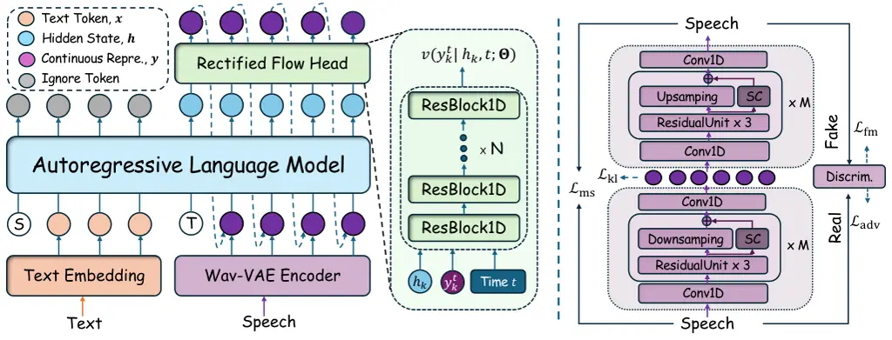
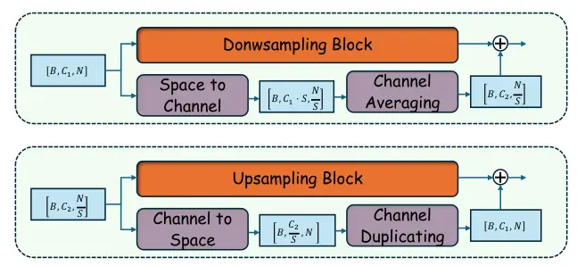
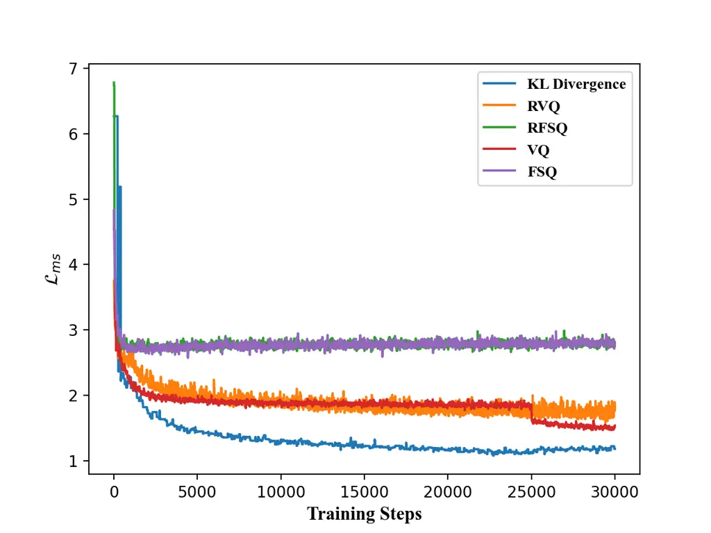
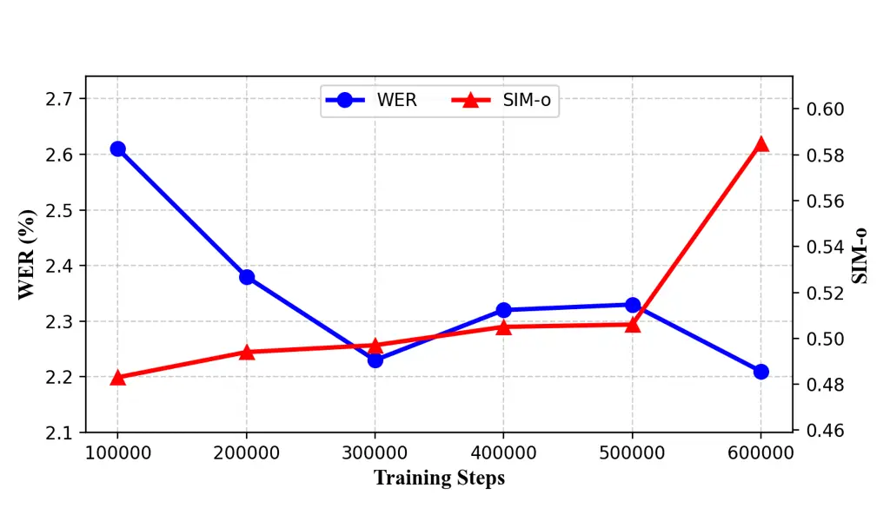
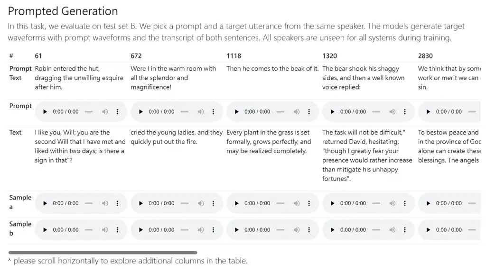
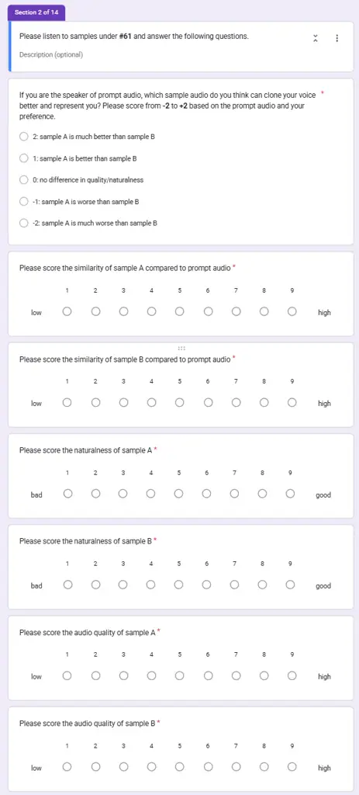

# CLEAR: Continuous Latent Autoregressive Modeling for High-quality and Low-latency Speech Synthesis

Chun Yat Wu Affiliation: The Chinese University of Hong Kong    Jiajun
Deng Affiliation: Hong Kong Research Center, Huawei    Guinan Li
Affiliation: The Chinese University of Hong Kong    Qiuqiang Kong
Affiliation: The Chinese University of Hong Kong    Simon Lui
Affiliation: Hong Kong Research Center, Huawei

###### Abstract

Autoregressive (AR) language models have emerged as powerful solutions
for zero-shot text-to-speech (TTS) synthesis, capable of generating
natural speech from a few seconds of audio prompts. However,
conventional AR-based TTS systems relying on discrete audio tokens face
the challenge of lossy compression during tokenization, requiring longer
discrete token sequences to capture the same information as continuous
ones, which adds inference latency and complicates AR modeling. To
address this challenge, this paper proposes the Continuous Latent
Autoregressive model (CLEAR), a unified zero-shot TTS framework that
directly models continuous audio representations. More specifically,
CLEAR introduces an enhanced variational autoencoder with shortcut
connections, which achieves a high compression ratio to map waveforms
into compact continuous latents. A lightweight MLP-based rectified flow
head that operates independently for each hidden state is presented to
model the continuous latent probability distribution, and trained
jointly with the AR model within a single-stage framework. Experiments
show that the proposed zero-shot CLEAR TTS can synthesize high-quality
speech with low latency. Compared to state-of-the-art (SOTA) TTS models,
CLEAR delivers competitive performance in robustness, speaker similarity
and naturalness, while offering a lower real-time factor (RTF). In
particular, CLEAR achieves SOTA results on the LibriSpeech test-clean
dataset, with a word error rate of 1.88% and an RTF of 0.29. Moreover,
CLEAR facilitates streaming speech synthesis with a first-frame delay of
96ms, while maintaining high-quality speech synthesis. Audio samples are
available at [here](https://anonymous.4open.science/w/clear_demo_/).

^(†)^(†)footnotetext: \* These two authors contributed equally to this
work.

## 1 Introduction

Recent advances in autoregressive (AR) language models (LMs) have
demonstrated impressive generative capabilities in the field of speech
synthesis \[4, 7, 54, 56, 62, 64\], driven by their ability to
effectively model sequences and leverage scaling properties. With a few
seconds of audio as a prompt, current AR-based text-to-speech (TTS)
systems that consecutively predict the next discrete token based on
previous tokens as condition can synthesize speech for any input text
while accurately mimicking the speaker’s characteristics from a few
seconds of a audio prompt \[10, 11, 22, 37\].

Despite their promising zero-shot TTS capability, AR modeling of
discrete tokens faces two fundamental limitations in delivering
high-quality and low-latency speech synthesis. First, lossy compression
during audio tokenization restricts reconstruction quality, as current
neural audio codecs often require high bitrates to achieve fidelity
comparable to continuous representations \[3, 9\]. For instance,
encoding one second of high-fidelity audio at 16 kHz typically requires
hundreds of audio tokens with a codebook of size 1024, resulting in long
sequences that not only complicate AR modeling but also lead to high
inference latency \[58\]. To fill the aforementioned information gap,
most state-of-the-art TTS systems, such as CosyVoice \[10\] and Seed-TTS
\[1\], often adopt a two-stage cascade of generative models: a LM
initially generates discrete audio tokens, which are subsequently
refined using token-based diffusion models. However, this cascaded
design is limited by error accumulation, misaligned optimization
objectives, and substantial computational demands. Second, neural audio
codecs are challenging to train and highly sensitive to gradient
approximation techniques in discrete distributions. For example, VQ-GANs
\[13\] require specialized techniques, such as auxiliary losses and
codebook re-initialization \[21\], to achieve effective training.

An intuitive method to overcome these limitations is to model directly
in continuous audio representations, thereby eliminating the need for
discrete-valued tokenizers. However, two essential factors need to be
addressed to achieve a high-quality, low-latency TTS system.

- •
  Probability Distribution Modeling: Compact continuous representations
  carry rich and complex information over discrete tokens, requiring
  autoregressive models with advanced capabilities to handle them
  effectively. For example, the regression-based loss functions used in
  MELLE \[37\] (i.e., mean squared error), which are based on simplified
  distributional assumptions, often struggle to capture complex speech
  patterns, leading to blurry and overly uniform predictions \[42\].
- •
  Training/Inference Efficiency: While diffusion techniques have proven
  effective in modeling continuous representations \[8\] and can deliver
  impressive performance when integrated with AR models \[33\], it comes
  at the cost of reduced training and inference efficiency. This
  limitation hampers the low-latency requirements of TTS systems. For
  example, ARDiT \[35\] introduces considerable computational overhead
  and high inference latency by forcing adjustments to the language
  model parameters to incorporate the diffusion process.

To this end, this paper presents a Continuous Latent Autoregressive
model (CLEAR) with rectified flow for high-quality and low-latency
text-to-speech synthesis. CLEAR is a robust zero-shot TTS model that
operates in a single pass, predicting continuous autoencoder (AE)
latents autoregressively conditioned on prior latents and text tokens.
In response to the challenges associated with AR modeling of continuous
audio representations: 1) A diffusion network is utilized to model the
underlying continuous latent probability distribution, conditioned on
the hidden state produced by the autoregressive model. Its ability to
estimate arbitrary densities ensures the preservation of natural
speech’s complex characteristics. The diffusion network and
autoregressive model are jointly trained under a single-stage framework
using the rectified flow loss criterion. 2) To facilitate the training
and inference efficiency, an enhanced variational auto-encoder (VAE) is
utilized to map the audio waveform to the continuous audio latent.
Specifically, the enhanced VAE not only delivers high-quality audio
reconstruction but also achieves significantly higher compression rates
than traditional mel-spectrogram feature extraction in continuous
representation modeling, substantially reducing computational overhead,
storage requirements, and enhancing inference efficiency. Moreover,
compact VAE latents exhibit greater training stability and require less
computation resources than mel spectrograms in AR modeling. 3) To
further minimize first-frame latency during inference, the diffusion
module adopts a simple MLP architecture and and a causal VAE decoder. In
contrast to complex Diffusion Transformer (DiT) models, which must wait
for the full generation of autoregressive hidden states before starting
denoising, the MLP-based diffusion module allows the diffusion process
to operate independently for each hidden state and immediately upon
receiving the first hidden state, facilitating real-time streaming
speech synthesis. The main contributions of this paper are summarized as
follows:

- •
  This paper presents CLEAR, a novel zero-shot TTS framework that
  directly models continuous audio representations, overcoming the
  limitations of lossy compression and high inference latency in
  discrete-valued AR-based TTS systems \[7, 10, 18, 19, 29, 39, 48, 59,
  54, 67\].
- •
  This paper introduces an enhanced VAE that transforms audio waveforms
  into compact continuous audio representations, which offers the dual
  benefits of improved training efficiency and reduced inference
  latency. In contrast, previous approaches rely on lengthy
  mel-spectrogram feature sequences \[37, 55\], which are
  computationally inefficient and increase the complexity of AR
  modeling.
- •
  This paper presents a simplified rectified flow head for continuous
  latent probability distribution modeling, jointly trained with an
  autoregressive model in a single-stage framework. In contrast, prior
  continuous-valued AR-based TTS systems either rely on simple
  distributional assumptions \[37\], which fail to effectively model
  complex speech patterns, or adopt complex DiT networks \[22, 35\] that
  incur significant inference latency, hindering their suitability for
  real-time streaming TTS.
- •
  Experimental results demonstrate that the proposed zero-shot CLEAR TTS
  model can synthesize high-quality speech with low latency. It achieves
  competitive performance in robustness, speaker similarity, and
  naturalness, while offering fast inference compared to
  state-of-the-art TTS models. Moreover, CLEAR provides streaming speech
  synthesis with a first-frame speech synthesis delay as low as 96ms,
  without compromising speech quality.

## 2 Related Work

Zero-shot TTS. In contrast to traditional speech synthesis methods that
require hours of high-quality transcribed data from the target speaker,
zero-shot TTS synthesizes the voice of a new speaker with a few seconds
of a voice prompt. Existing zero-shot TTS systems can be spearheaded
into two paradigms based on their output generation mechanisms:
autoregressive and non-autoregressive (NAR) paradigms. Autoregressive LM
represented by VALL-E \[54\], predict audio representations
sequentially, conditioned on text tokens and previously generated audio
representations. In contrast, NAR models represented by Voicebox
generate the entire audio sequence representations in parallel \[30\].
Diffusion models, in particular, have played a crucial role in the
success of NAR TTS systems, including but not limited to F5-TTS \[8\],
Naturalspeech \[24, 46, 51\], E2-TTS \[12\], and E3-TTS \[16\].

Discrete-valued AR-based TTS. Autoregressive language models (LMs) have
exhibited significant zero-shot and in-context learning capabilities in
text-to-speech synthesis, where discrete tokenization is commonly
utilized. VALL-E \[54\] pioneered the approach of treating TTS as a
conditional language modeling task by compressing audio waveforms into
discrete tokens using a neural audio codec encoder, predicting these
tokens autoregressively, and reconstructing the waveforms through a
codec decoder. The success of VALL-E’s zero-shot capabilities has
sparked widespread interest in discrete neural codec language models,
targeting improvements in multilingual generalization \[67\], inference
efficiency \[7\], and advancing performance \[19, 39, 48, 59\]. Despite
this, bitrate limitations during audio tokenization often prevent
discrete representations from reconstructing complex speech patterns
with high fidelity. To this end, models such as CosyVoice \[10, 11\],
BASE-TTS \[29\], FireRed TTS \[18\], and Seed-TTS \[1\] employ a
two-stage training framework. In the first stage, a LLM maps text to
coarse-grained discrete tokens using cross-entropy loss. In the second
stage, a conditional flow-matching model refines these tokens into
fine-grained mel-spectrograms using diffusion loss, resulting in
improved synthesized speech quality. Nonetheless, the inherent
limitations of two-stage training require extra efforts addressing
issues such as inference latency and error accumulation.

Continuous-valued AR-based TTS. Recent advances in continuous
representation-based TTS systems have shown promising performance by
eliminating the need for intricate codec training. For instance, MELLE
\[37\] autoregressively predicts Mel spectrograms parameterized by a
Gaussian distribution, but its simplified distribution assumptions limit
its ability to model complex speech patterns. To address such
limitations, several studies have explored diffusion techniques to model
multimodal distributions in continuous representations. ARDiT \[35\]
leverages a text-conditioned DiT with a special masking mechanism to
sample multiple tokens, but regrading Transformer as denosing backbone
incurs significant computational overhead. DiTAR \[22\] mitigates this
by aggregating speech tokens into patches for input to a language model
and using a LocDiT module for reconstruction. However, its reliance on
transformers as the diffusion backbone, due to the attention mechanism,
limits its ability to produce streaming speech output efficiently.
Similarly, FELLE \[55\] incorporates information from the previous step
to refine the general prior distribution in flow matching, while SALAD
\[52\] enhances modeling fidelity by employing latent diffusion model
per-token on continuous representations. Despite these advancements, the
two-stage coarse-to-fine generation process in FELLE and the additional
text-to-semantic module in SALAD for contextual guidance and stopping
control not only lead to cumbersome training framework but also increase
computational demands.



Figure 1: Overview of the CLEAR architecture (left) and the enhanced
wav-VAE architecture (right). The CLEAR architecture comprises the
wav-VAE encoder (purple), the autoregressive (AR) model (blue), and the
rectified flow head (green). Dashed lines indicate AR decoding during
inference. "S", and "T" represent the "start of sequence" and "turn of
speech" respectively. The enhanced wav-VAE architecture incorporates
shortcut connections (SC) in both the downsampling and upsampling layers
of the VAE encoder and decoder.

## 3 Method

### 3.1 Continuous-valued Autoregressive Modeling for Text-to-Speech Synthesis

CLEAR formulates text-to-speech synthesis as an autoregressive language
modeling task through next-token prediction. Given a sequence of
continuous audio representations
$`\bm{y}=(\bm{y}_{1},\bm{y}_{2},\cdots,\bm{y}_{K})`$ that
$`\bm{y}_{i}\in\mathbb{R}^{d}`$ and its corresponding sequence of text
tokens $`\bm{x}=(x_{1},x_{2},\cdots,x_{N})`$, where $`K`$ and $`N`$ are
the number of continuous audio tokens and text tokens respectively, the
model is expected to predict the joint distribution of the continuous
audio sequence conditioned on text tokens, which can be factorized into

```math
p(\bm{y}|\bm{x};\bm{\Theta})=\prod_{k=1}^{K}p(\bm{y}_{k}\mid\bm{y}_{<k},\bm{x};\bm{\Theta}), \tag{1}
```

where $`\bm{y}_{<k}=(\bm{y}_{1},\bm{y}_{2},\cdots,\bm{y}_{k-1})`$
denotes the audio representation sequence before the current
autoregressive step $`k`$, and $`\bm{\Theta}`$ denotes the model
parameters. As shown in Figure 1, in the CLEAR framework, the generation
can be separated into two parts
$`{\bm{\Theta}}=\{{\bm{\Theta}}_{\text{LM}},{\bm{\Theta}}_{\text{RF}}\}`$,
where $`{\bm{\Theta}}_{\text{LM}}`$ denotes the language model
parameters responsible for predicting the conditioning vector
$`\bm{h}_{k}=f(\bm{y}_{<k},\bm{x};{\bm{\Theta}}_{\text{LM}})`$,
$`{\bm{\Theta}}_{\text{RF}}`$ denotes the MLP rectified flow head
parameters that perform the probability of the next token by
$`p(\bm{y}_{k}|\bm{h}_{t};{\bm{\Theta}}_{\text{RF}})`$. Then the joint
distribution in Eqn. (1) can be reformulated as

```math
p(\bm{y}|\bm{x};\bm{\Theta})=\prod_{k=1}^{K}p(\bm{y}_{k}\mid\bm{h}_{k};{\bm{\Theta}}_{\text{RF}})=\prod_{k=1}^{K}p(\bm{y}_{k}\mid f(\bm{y}_{<k},\bm{x};{\bm{\Theta}}_{\text{LM}});{\bm{\Theta}}_{\text{RF}}), \tag{2}
```

In this paper, the language model $`f(\cdot;{\bm{\Theta}}_{\text{LM}})`$
is built on a unidirectional Transformer decoder to capture the
dependency between semantic and acoustic information. All Transformer
layers adopt the Pre-Norm configuration \[60\] and integrate RMSNorm
\[66\], RoPE \[50\] and SwiGLU \[45\] operations to align with current
LLM designs. The LM output $`\bm{h}_{k}`$, serving as a conditioning
vector, is passed to the diffusion module to synthesize the next-frame
continuous representation $`{\bm{y}}_{k}`$. Note that the language model
is jointly trained with the rectified flow head within a single
framework. Further details are provided in the following section.

### 3.2 Probability Distribution Modeling

The denoising diffusion model, capable of representing arbitrary
probability distributions, is utilized to model the distribution of each
token $`p(\bm{y}_{k}|\bm{h}_{k};{\bm{\Theta}}_{\text{RF}})`$. The core
idea behind diffusion operation is to model the data distribution by
reversing a forward noising process. Unlike traditional diffusion
operation model the noise estimation score function at various noise
levels, rectified flow (RF) \[34\] provides a more direct framework by
learning a smooth trajectory that rectifies the corrupted data
distributions into the true data distribution. Specifically, it defines
the forward process as straight-line paths between the data distribution
and a standard normal distribution. At the $`k`$-th autoregressive step,
the data point at the diffusion time step $`t`$ can be expressed as
$`{\bm{y}}_{k}^{t}=(1-t){\bm{y}}_{k}^{0}+t{\bm{y}}_{k}^{1}`$, where
$`{\bm{y}}_{k}^{1}=\bm{y}_{k}`$ and
$`{\bm{y}}_{k}^{0}\sim{\cal N}(\bm{0},\bf{I})`$ is a noise vector drawn
from the normal distribution. The rectified flow, characterized by an
ordinary differential equation (ODE), is defined as
$`d\bm{y}_{k}^{t}=v(\bm{y}_{k}^{t},t){dt}`$, where
$`v(\bm{y}_{k}^{t},t)`$ represents the drift vector field. The loss
function for the underlying probability distribution
$`p(\bm{y}_{k}|\bm{h}_{k};{\bm{\Theta}}_{\text{RF}})`$ can then be
expressed as a denoising criterion, formulated as

```math
{\cal L}_{\text{RF}}(\bm{y}_{k},\bm{h}_{k})=\mathbb{E}_{t,{\bm{y}}_{k}^{0}}\left[\lVert{\bm{u}}_{k}-v(\bm{y}_{k}^{t}|{\bm{h}}_{k},t;\bm{\Theta})\rVert^{2}\right], \tag{3}
```

where $`{\bm{u}}_{k}=({\bm{y}}_{k}^{1}-{\bm{y}}_{k}^{0})`$ denotes the
true conditional vector field for the original data distribution in
continuous audio representation. The notation
$`v(\bm{y}_{k}^{t}|{\bm{h}}_{k},t;\bm{\Theta})`$ denotes that the
diffusion module receives $`{\bm{y}}_{k}^{t}`$ as input, conditioned on
$`t`$ and $`\bm{h}_{k}`$. The denoising diffusion module is an MLP
network composed of several residual blocks \[33\]. Each block includes
a LayerNorm, a linear layer, a SiLU activation, and a residual
connection with an additional linear layer. Since the MLP denoising is
conditioned on a vector $`\bm{h}_{k}`$ generated by the autoregressive
language model, the rectified flow loss allows the update of the entire
model parameters
$`\bm{\Theta}=\{\bm{\Theta}_{\text{LM}},\bm{\Theta}_{\text{RF}}\}`$
within a single-stage framework. To further accelerate diffusion
convergence by enhancing supervision signals, directional information
(e.g., cosine similarity between predicted and ground-truth vector
fields) is incorporated \[31, 61, 63\]. Consequently, the auxiliary
velocity direction loss is defined as

```math
{\cal L}_{D}(\bm{y}_{k},\bm{h}_{k})=1-\mathbb{E}_{t,{\bm{y}}_{k}^{0}}\left[\cos{({\bm{u}}_{k},v(\bm{y}_{k}^{t}|{\bm{h}}_{k},t;\bm{\Theta}))}\right], \tag{4}
```

where $`\cos(\cdot,\cdot)`$ denotes the cosine similarity operation. The
timestep $`t`$ is commonly sampled from a uniform distribution
$`{\cal U}[0,1]`$. However, predicting the target vector filed
$`{\bm{u}}_{k}`$ is more challenging for timesteps in the middle of
$`[0,1]`$, as the optimal prediction is simpler at the boundaries. To
address this, we assign more weight to intermediate timesteps by
sampling $`t`$ more frequently \[14\], given as

```math
\pi_{\text{ln}}(t;m,s)=\frac{1}{s\sqrt{2\pi}t(1-t)}\exp\left(-\frac{(\text{logit}(t)-m)^{2}}{2s^{2}}\right), \tag{5}
```

where $`\text{logit}(t)=\log\frac{t}{1-t}`$, with location parameter
$`m`$ and scale parameter $`s`$. In this work, $`m`$ and $`s`$ are set
to be 0 and 1 respectively.

### 3.3 LM Guidance for Continuous-valued Token Generation

Classifier-free guidance (CFG) \[20\] is widely used to improve the
conditioning adherence of generative models. In diffusion models, the
conditional and unconditional models share the same set of parameters
and are jointly trained by randomly omitting the conditioning signal
during training. During inference, the outputs of the conditional and
unconditional models are combined using a hyperparameter, which controls
the balance between diversity and fidelity in the synthesized speech.

In the CLEAR framework, we implement CFG by jointly training the
autoregressive LM and the MLP-based rectified flow head using both
conditional and unconditional objectives. To train with CFG, we set all
text embeddings to $`\mathbf{0}`$ with a probability of 20% in a
mini-batch^(\*)^(\*) \* An ablation study on the CFG strategy is
conducted. Specifically, we found that setting text embeddings to
$`\mathbf{0}`$ at the LM prefix stage outperforms other CFG approaches,
such as randomly replacing the conditioning vector $`{\bm{h}}_{k}`$ with
either a) a null embedding or b) a learnable embedding resulted in
inferior performance., allowing the model to learn dual vector fields.
At inference time, guided vector fields are derived through linear
blending

```math
\hat{v}(\bm{y}_{k}^{t}|{\bm{h}}_{k},\bar{{\bm{h}}}_{k},t;\bm{\Theta})=wv(\bm{y}_{k}^{t}|{\bm{h}}_{k},t;\bm{\Theta})+(1-w)v(\bm{y}_{k}^{t}|\bar{{\bm{h}}}_{k},t;\bm{\Theta}), \tag{6}
```

where $`\bar{{\bm{h}}}_{k}=f(\bm{y}_{<k},\bm{0})`$ represents the
conditioning vector calculated with 0 text embedding, and $`w`$ is the
guidance scale.

### 3.4 Variational Autoencoder for Continuous Audio Representation

In the CLEAR framework, we present a deep compression variational
autoencoder (VAE) to map the audio waveform to the continuous latent
representation for efficient speech synthesis. The VAE architecture
consists of a convolutional encoder and a convolutional causal decoder
networks, enhanced with oobleck blocks \[15\] and snake activation
functions \[68\]. Given a 16 kHz audio waveform
$`{\bm{a}}\in\mathbb{R}^{L}`$, where $`L`$ represents the total length
of the audio, the VAE encoder compresses the waveform with a ratio of
$`D`$ to produce a sequence of continuous audio representations,
expressed as
$`{\bm{y}}=(\bm{y}_{1},\bm{y}_{2},\cdots,\bm{y}_{\lceil L/D\rceil})`$.
To ensure robust signal fidelity under aggressive downsampling of 16 kHz
audio, parameter-free deep residual connections are utilized to address
the optimization difficulty caused by high compression. These residual
connections introduce non-parametric shortcuts \[5\] into the
autoencoder, enabling the network to focus on learning residuals through
a space-to-channel transformation \[47\]. Specifically, in the encoder’s
downsample blocks and decoder’s upsample blocks, the non-parametric
shortcut consists of a space-to-channel operation followed by a
non-parametric channel averaging step to align the number of channels.
Further details on shortcut connections can be found in the Appendix C.1
and Appendix C.3. To facilitate stable training, a multi-task learning
criterion with a discriminator setup \[9\] is employed and can be
expressed as
$`{\cal L}_{\text{AE}}={\cal L}_{\text{ms}}+\alpha\cdot{\cal L}_{\text{fm}}+\beta\cdot{\cal L}_{\text{adv}}+\gamma\cdot{\cal L}_{\text{kl}}`$,

where $`{\cal L}_{\text{ms}}`$ is the multi-resolution STFT loss \[49\],
$`{\cal L}_{\text{fm}}`$ is the feature matching loss from a multi-scale
STFT discriminator \[9\], $`{\cal L}_{\text{adv}}`$ is the adversarial
loss \[17\], and $`{\cal L}_{\text{kl}}`$ is the Kullback-Leibler
divergence loss. In this work, $`\alpha`$, $`\beta`$, and $`\gamma`$ are
set to be $`1.0`$, $`5.0`$ and $`0.1`$, respectively. The downsampling
ratio $`D`$ is set to $`2048`$ in this work, effectively balancing
compression efficiency and reconstruction quality. Ablation studies can
be found at Appendix C.4.2.

### 3.5 Zero-shot CLEAR Text-to-Speech Synthesis

Single-stage Training Framework. The training process of CLEAR is
straightforward yet highly efficient. First, the text sequence
$`\bm{x}`$ is converted into phonemes and mapped to text embeddings
through an embedding layer. Meanwhile, speech audio $`\bm{a}`$ is
compressed into continuous audio representations $`\bm{y}`$ using a VAE
encoder. The input to the language model is then structured as
$`[S,\bm{x},T,\bm{y}]`$. A single end-to-end autoregressive model is
trained using teacher forcing manner, optimizing the following loss:
$`{\cal L}={\cal L}_{\text{RF}}+{\cal L}_{\text{D}}+{\cal L}_{\text{s}}`$^(†)^(†)
† Since CLEAR produces continuous audio representations instead of
discrete tokens, it cannot generate a stop token (e.g., ¡EOS¿) to signal
the end of generation for the autoregressive language model. Following
the approach used in TransformerTTS \[32\] and SpeechT5 \[2\], a binary
classifier with a fully connected layer is added to the language model’s
output to compute the binary cross-entropy loss, $`{\cal L}_{s}`$, for
stop prediction..

In-context Learning for Zero-shot TTS. Given the continuous
representation of the audio prompt $`\bm{\hat{y}}`$ and its
corresponding text prompt $`\bm{\hat{x}}`$, zero-shot speech synthesis
is performed by autoregressively predicting the continuous audio
representations $`\bm{y}`$ using the input sequence
$`[S,\bm{\hat{x}},\bm{x},T,\bm{\hat{y}}]`$. In non-streaming speech
synthesis, the continuous audio representations $`\bm{y}`$ are converted
into speech audio via the VAE decoder once the autoregressive generation
process is finished. In streaming speech synthesis, which reduces
first-frame latency, the causal VAE decoder begins synthesizing speech
immediately upon receiving the first chunk of continuous audio
representations.

## 4 Experimental Setup

### 4.1 Training and Evaluation Dataset

We utilize the open-source LibriHeavy \[25\] dataset to train the CLEAR
model. LibriHeavy contains approximately 50,000 hours of speech data
from 6,736 speakers and is derived from English audiobooks in the
LibriVox project. In addition, the open-source LibriTTS \[65\] dataset
with 585 hours of speech data from 2456 distinct speakers is utilized to
train the enhanced variational autoencoder in Sec. 3.4. For a fair
comparison with state-of-the-art TTS systems, we adopt two established
subsets from the open-source LibriSpeech(PC) test-clean set \[36, 40\]
for zero-shot TTS evaluation: a) Subset A from NaturalSpeech3 \[24\],
comprising 40 three-second audio prompts and 40 target samples, and b)
Subset B from F5-TTS \[8\], consisting of 40 audio prompts and 1,127
target samples.

### 4.2 Experimental Settings

Model Configurations: The CLEAR-Base model consists of 24 Transformer
blocks, each with 16 attention heads, an embedding dimension of 1024,
and a feed-forward layer dimension of 4096. The MLP-based rectified flow
head consists of 6 ResBlock1D layers, with 1024 dimensions across all
layers. For the CLEAR-Large model, we scale up the embedding dimension
to 1280 and the feed-forward layer dimension to 5120 for each layer.

Implementation Details: The CLEAR-Base model is trained with a batch
size of 768 audio latents per GPU for 118 hours using 6 NVIDIA RTX 4090
24GB GPUs, with gradient accumulation set to 4. For the CLEAR-Large
model, training is conducted with a batch size of 2048 audio latents per
GPU for 112 hours on 2 NVIDIA H20 96GB GPUs. The models are optimized
via the AdamW optimizer with momentum parameters $`\beta_{1}=0.9`$ and
$`\beta_{2}=0.95`$. The learning rate follows a linear warm-up schedule,
increasing to $`10^{-4}`$ over the first 1,000 updates, and remains
constant thereafter. The gradient norm clipping is set to 1. To expedite
the training process, audio waveforms are resampled to 16 kHz and cached
as latent representations before training. We utilize G2P to convert
text transcripts into phonemes while preserving punctuation, which
results in a phoneme vocabulary size of 203, with various punctuation
patterns observed in the LibriHeavy dataset. During training and
inference, we apply exponential moving averaging (EMA) \[26\] on model
weights. For inference, unless otherwise specified, we use a
classifier-free guidance (CFG) scale of 2.5 and 10 denoising function
evaluations. The details of the VAE training are provided in
Appendix C.2.

|                                                            |                      |          |               |                       |                   |                   |
| ---------------------------------------------------------- | -------------------- | -------- | ------------- | --------------------- | ----------------- | ----------------- |
| Model                                                      | Type                 | \#Params | Training Data | WER(%) $`\downarrow`$ | SIM-o$`\uparrow`$ | UTMOS$`\uparrow`$ |
| LibriSpeech test-clean Subset (Closed-sourced in \[7\])    |                      |          |               |                       |                   |                   |
| Ground Truth$`{}^{\text{♣}}`$                             | \-                   | \-       | \-            | 2.20                  | 0.75              | 4.09              |
| VALL-E 2\[7\]$`{}^{\text{♣}}`$                            | Disc. AR + Disc. NAR | \-       | Libri-50k     | 2.44                  | 0.64              | \-                |
| MELLE\[37\]$`{}^{\text{♣}}`$                              | Cont. AR             | \-       | Libri-50k     | 2.10                  | 0.63              | \-                |
| Voicebox\[30\]$`{}^{\text{♣}}`$                           | Cont. NAR            | 330M     | Libri-60k     | 1.90                  | 0.66              | \-                |
| LibriSpeech test-clean Subset-A (Open-sourced in \[24\])   |                      |          |               |                       |                   |                   |
| Ground Truth$`{}^{\text{♠}}`$                             | \-                   | \-       | \-            | 1.94                  | 0.68              | 4.09              |
| VAE Reconstruction                                         | \-                   | \-       | \-            | 2.57                  | 0.65              | 3.94              |
| VALL-E\[54\]$`{}^{\text{♥}}`$                             | Disc. AR + Disc. NAR | 400M     | Libri-60k     | 6.11                  | 0.47              | 3.68              |
| MegaTTS\[23\]$`{}^{\text{♥}}`$                            | Disc. AR + Cont. AR  | 500M     | Libri-60k     | 2.32                  | 0.53              | 4.02              |
| NaturalSpeech3\[24\]$`{}^{\text{♥}}`$                     | Disc. NAR            | 500M     | Libri-60k     | 1.81                  | 0.67              | 4.30              |
| NaturalSpeech2\[46\]$`{}^{\text{♥}}`$                     | Cont. NAR            | 400M     | Libri-60k     | 1.94                  | 0.55              | 3.88              |
| DiTAR\[22\]$`{}^{\text{♥}}`$                              | Cont. AR             | 600M     | Libri-60k     | 1.78                  | 0.64              | 4.15              |
| CLEAR-Base (ours)                                          | Cont. AR             | 439M     | Libri-50k     | 1.83                  | 0.55              | 4.21              |
| CLEAR-Large (ours)                                         | Cont. AR             | 686M     | Libri-50k     | 1.74                  | 0.56              | 4.26              |
| LibriSpeech-PC test-clean Subset-B (Open-sourced in \[8\]) |                      |          |               |                       |                   |                   |
| Ground Truth$`{}^{\text{♠}}`$                             | \-                   | \-       | \-            | 2.47                  | 0.69              | 4.09              |
| VAE Reconstruction                                         | \-                   | \-       | \-            | 2.89                  | 0.63              | 4.08              |
| CosyVoice\[10\]$`{}^{\text{♠}}`$                          | Disc. AR + Cont. NAR | 300M     | Multi-170k    | 3.59                  | 0.66              | \-                |
| CosyVoice 2\[11\]                                          | Disc. AR + Cont. NAR | 500M     | Multi-170k    | 2.47                  | 0.65              | 4.35              |
| FireRedTTS\[18\]$`{}^{\text{♠}}`$                         | Disc. AR + Cont. NAR | 580M     | Multi-248k    | 2.69                  | 0.47              | \-                |
| MaskGCT\[57\]$`{}^{\text{♣}}`$                            | Disc. NAR            | 1048M    | Emilia-100k   | 2.72                  | 0.69              | 3.90              |
| F5-TTS\[8\]$`{}^{\text{♣}}`$                              | Cont. NAR            | 300M     | Emilia-100k   | 2.42                  | 0.66              | 3.88              |
| DiTAR\[22\]$`{}^{\text{♣}}`$                              | Cont. AR             | 600M     | Emilia-100k   | 2.39                  | 0.67              | 4.22              |
| CLEAR-Base (ours)                                          | Cont. AR             | 439M     | Libri-50k     | 2.21                  | 0.59              | 4.22              |
| CLEAR-Large (ours)                                         | Cont. AR             | 686M     | Libri-50k     | 1.88                  | 0.59              | 4.22              |

Table 1: Objective evaluation results on the LibriSpeech (PC) test-clean
Subset-A and Subset-B. ♣ denotes the score reported in the corresponding
baseline papers. ♥ denotes the score reported in NaturalSpeech3 \[24\].
♠ denotes the score reported in F5-TTS \[8\]. ♠ denotes the reproduced
score. "Disc." and "Cont." denote "discrete-valued" and
"continuous-valued" respectively. $`\downarrow`$ and $`\uparrow`$
represent that lower or higher values are better.

### 4.3 Evaluation Metrics

The proposed CLEAR model is evaluated on a cross-sentence TTS task using
both objective and subjective metrics, including robustness, speaker
similarity, naturalness, and efficiency.

Objective Evaluation. a) Word error rate (WER) used to assess
robustness. For consistency, following the configurations in \[8, 24\],
we perform speech recognition on the synthesized speech via Hubert-based
model and Faster-whisper-large-v3 \[41\] for the subset A of LibriSpeech
test-clean and subset B of LibriSpeech-PC test-clean, respectively; b)
Speaker similarity between the generated and the original target
speeches (SIM-o). Specifically, the WavLM-TDNN \[6\] is leveraged to
extract corresponding speaker features to compute their cosine
similarity; c) UTMOS \[43\] that is used to predict the mean opinion
score (MOS) to assess the speech naturalness; and d) Real-time factor
(RTF) used to evaluate the inference efficiency. We measure the average
inference time through generating one second speech segments for all
synthesized samples.

Subjective Evaluation. Four types of mean opinion score (MOS) metrics
are adopted, including a) N-MOS to assess speech naturalness, b) Q-MOS
for perceived sound quality, c) S-MOS to measure speaker voice
similarity, and d) CMOS for side-by-side comparison with human speech.

## 5 Experimental Results

### 5.1 Objective Evaluation of Zero-shot Speech Synthesis

Table 1 presents an objective performance comparison between the
proposed CLEAR model and recent state-of-the-art TTS systems, several
trends can be observed.

a) On the LibriSpeech Subset-A evaluation set of NaturalSpeech3
\[24\], 1) the proposed CLEAR-Base model shows significant improvements
over conventional discrete-valued AR-based systems, such as VALL-E and
MegaTTS, with comparable model parameters. Specifically, it delivers up
to 4.28% absolute WER reductions, improves speaker similarity scores by
up to 0.08, and achieves an impressive UTMOS score of 4.21. This
demonstrates that the proposed continuous VAE latents, which bypass
manually designed strategies for discrete codec codes, produce more
stable and natural speech. 2) When compared to continuous-valued NAR
NaturalSpeech2 system, the CLEAR-Base model achieves better performance
in WER and UTMOS, while maintaining comparable speaker similarity. In
addition, it matches the WER and UTMOS performance of the
discrete-valued NAR NaturalSpeech3 system but lags in speaker
similarity. This difference may arise from the rich speaker information
embedded in the discrete value tokens extracted by FACodec in
NaturalSpeech3, which incorporates a speaker classification task by
predicting speaker IDs.

b) On the LibriSpeech Subset-B evaluation set of F5-TTS \[8\], the
CLEAR-Base model outperforms both the two-stage cascaded TTS models
(CosyVoice, CosyVoice-2, and FireRedTTS) and the state-of-the-art NAR
F5-TTS systems. Specifically, it achieves the lowest WER and an
excellent UTMOS score. Although a decline in speaker similarity is
observed, the CLEAR-Base model delivers competitive subjective speaker
voice similarity (S-MOS), as detailed in Section 5.2. Additional
analysis of the speaker similarity metrics is provided in Appendix D.2.

c) Compared to the state-of-the-art continuous-valued DiTAR model, the
proposed CLEAR-Large model demonstrates enhanced robustness and audio
quality in both the LibriSpeech Subset-A and Subset-B evaluation sets.
Specifically, the CLEAR-Large model achieves absolute WER reduction of
0.51% (21.3% relative) over DiTAR, while maintaining high audio quality
with a UTMOS score of 4.22 on the Subset-B dataset.

| Model                               | Type                 | Avg. Decoding Steps | RTF$`\downarrow`$ |
| ----------------------------------- | -------------------- | ------------------- | ----------------- |
| VALL-E \[54\] $`{}^{\text{♣}}`$    | Disc. AR + Disc. NAR | 750                 | 1.03              |
| VALL-E 2 \[7\] $`{}^{\text{♣}}`$   | Disc. AR + Disc. NAR | 750                 | 0.73              |
| CosyVoice \[10\] $`{}^{\text{♠}}`$ | Disc. AR + Cont. NAR | 250                 | 0.92              |
| VALL-E R \[19\] $`{}^{\text{♣}}`$  | Disc. AR             | 375                 | 0.37              |
| Voicebox \[30\]$`{}^{\text{♥}}`$   | Cont. NAR            | \-                  | 0.64              |
| CLaM-TTS \[27\] $`{}^{\text{♥}}`$  | Cont. NAR            | \-                  | 0.42              |
| F5-TTS \[8\] $`{}^{\text{♠}}`$     | Cont. NAR            | \-                  | 0.31              |
| DiTAR \[22\] $`{}^{\text{♠}}`$     | Cont. AR             | 400                 | \-                |
| MELLE \[37\]$`{}^{\text{♠}}`$      | Cont. AR             | 620                 | 0.55              |
| CLEAR-Base (ours)                   | Cont. AR             | 78                  | 0.18              |
| CLEAR-Large (ours)                  | Cont. AR             | 78                  | 0.29              |

Table 2: Average AR decoding steps (Avg. Decoding Steps) and real-time
factor (RTF) through generating a 10-second speech segment. ♣ denote the
score quoted from VALL-E R \[19\]. ♥ denote the score quoted from
CLaM-TTS \[27\]. ♠ denote the score reported in the baseline paper.

Further comparison of inference efficiency against recent TTS systems is
presented in Table 2. The CLEAR-Base model achieves the best RTF
performance among all TTS systems, including both AR and NAR frameworks.
Even with increased model parameters, the proposed CLEAR-Large model
maintains superior inference efficiency, making it ideal for real-time
applications. The low-latency capability of our model is achieved
through two key innovations. First, the enhanced VAE generates more
compact continuous latents compared to the lengthy discrete-valued
tokens (bitrate constraints) and continuous mel-spectrograms features.
This reduces the required autoregressive decoding steps to as low as
7.8, leading to significantly faster inference. Second, a simplified
MLP-based rectified flow head is introduced. By assigning most
parameters to the language model, it keeps the diffusion model
lightweight and efficient while preserving high-quality synthesis.
Further analysis of training efficiency is available in Appendix D.1.

|                    |                      |       |       |       |       |
| ------------------ | -------------------- | ----- | ----- | ----- | ----- |
| Model              | Type                 | N-MOS | Q-MOS | S-MOS | CMOS  |
| Ground Truth       | \-                   | 4.01  | 4.00  | 3.68  | 0.00  |
| F5-TTS \[8\]       | Cont. NAR            | 3.75  | 3.45  | 4.03  | -0.17 |
| CosyVoice-2 \[11\] | Disc. AR + Cont. NAR | 3.90  | 4.10  | 3.76  | +0.25 |
| CLEAR-Base (ours)  | Cont. AR             | 4.09  | 4.14  | 4.02  | +0.04 |

Table 3: Subjective evaluation results on LibriSpeech-PC test-clean
Subset-B \[8\].

### 5.2 Subjective Evaluation of Zero-shot Speech Synthesis

Subjective evaluation metrics of Section 4.3 including N-MOS, Q-MOS,
S-MOS and CMOS are assessed based on a human rating system. More details
are provided in Appendix E. Two open-sourced state-of-the-art TTS
models, including the cascaded CosyVoice-2 system and the NAR F5-TTS
system, are adopted to generate audio samples in the same configuration
for a fair comparison.

As presented in Table 3, the proposed CLEAR-Base model achieves best
performance in N-MOS (naturalness) and Q-MOS (quality) compared to
CosyVoice2, F5-TTS, and even ground truth audio, indicating its
capability to generate natural, high-quality speech rivaling human
performance. Furthermore, the CLEAR model demonstrates speaker
similarity performance comparable to F5-TTS, while outperforming
CosyVoice-2 and even ground truth audio, showcasing its in-context
learning capability to mimic a speaker’s voice based on an audio prompt.

|                            |                       |                      |                   |                   |                         |
| -------------------------- | --------------------- | -------------------- | ----------------- | ----------------- | ----------------------- |
| Chunk Size $`\bm{\Omega}`$ | Overlap $`\bm{\Psi}`$ | WER(%)$`\downarrow`$ | SIM-o$`\uparrow`$ | UTMOS$`\uparrow`$ | FFL (ms) $`\downarrow`$ |
| 4                          | 1                     | 2.34                 | 0.57              | 4.27              | 96                      |
| 8                          | 2                     | 2.24                 | 0.57              | 4.27              | 191                     |
| 16                         | 4                     | 2.18                 | 0.58              | 4.27              | 383                     |
| 32                         | 8                     | 2.19                 | 0.59              | 4.26              | 766                     |
| Non-streaming Synthesis    |                       | 2.21                 | 0.59              | 4.26              | \-                      |

Table 4: Performance of the proposed CLEAR-Base model evaluated on
LibriSpeech Subset-B when running in a streaming synthesis manner. "FFL"
denotes first-frame latency for speech synthesis.

### 5.3 Streaming Speech Synthesis

Streaming capability is vital for real-world applications (i.e., virtual
assistants, audiobooks, and public announcements) as it drastically
reduces latency and enhances the user experience. Users can begin
hearing speech almost immediately, creating a more natural and
conversational interaction, similar to human speech. The rectified flow
head empowers our model to achieve low-latency streaming synthesis by
allowing the diffusion process to function independently for each token,
eliminating the need to generate the entire output beforehand in DiT. In
the streaming speech synthesis process, the rectified flow head
sequentially generates tokens, which are accumulated into chunks of a
predefined size, denoted as $`\bm{\Omega}`$. Once the number of tokens
in a chunk reaches this threshold, the chunk is passed to the causal VAE
decoder to produce the corresponding waveform. To ensure smooth
transitions, a fade-in-fade-out technique is applied to the overlapping
region, denoted as $`\bm{\Psi}`$, of the waveform. The first-frame
latency (FFL) refers to the time interval between the start of system
processing and the moment when the first synthesized audio waveform
becomes audible, which is utilized to measure the latency performance.
Table 4 shows the performance of the proposed CLEAR-Base model when
running in a streaming speech synthesis manner. With a chunk size of 4,
the proposed CLEAR model achieves a mere 96ms latency on a 4096-GPU
while matching non-streaming synthesis performance in robustness,
speaker similarity, and quality. Specifically, its WER of 2.21% and
UTMOS of 4.27 in a streaming fashion, significantly outperform most
non-streaming TTS systems shown in Table 1.

## 6 Conclusion

This paper presents CLEAR, a novel zero-shot text-to-speech (TTS)
framework that directly models continuous audio representations,
addressing key limitations of traditional autoregressive (AR) TTS
systems based on discrete audio tokens. By leveraging an enhanced
variational autoencoder with shortcut connections, CLEAR achieves a high
compression ratio, mapping waveforms into compact continuous latents,
while a lightweight rectified flow head efficiently models the
continuous latent probability distribution. Experimental results
demonstrate that CLEAR delivers competitive performance in terms of
robustness, speaker similarity, and naturalness while achieving a lower
real-time factor compared to state-of-the-art TTS models. Moreover,
CLEAR supports streaming speech synthesis with a first-frame delay as
low as 96ms, without compromising speech quality.

## References

- \[1\] Philip Anastassiou, Jiawei Chen, Jitong Chen, Yuanzhe Chen, Zhuo
  Chen, Ziyi Chen, Jian Cong, Lelai Deng, Chuang Ding, Lu Gao, et al.
  Seed-tts: A family of high-quality versatile speech generation models.
  _arXiv preprint arXiv:2406.02430_, 2024.
- \[2\] Junyi Ao, Rui Wang, Long Zhou, Chengyi Wang, Shuo Ren, Yu Wu,
  Shujie Liu, Tom Ko, Qing Li, Yu Zhang, Zhihua Wei, Yao Qian, Jinyu Li,
  and Furu Wei. SpeechT5: Unified-Modal Encoder-Decoder Pre-Training for
  Spoken Language Processing, May 2022.
- \[3\] Yochai Blau and Tomer Michaeli. Rethinking lossy compression:
  The rate-distortion-perception tradeoff. In _International Conference
  on Machine Learning_, pages 675–685. PMLR, 2019.
- \[4\] Zalán Borsos, Raphaël Marinier, Damien Vincent, Eugene
  Kharitonov, Olivier Pietquin, Matt Sharifi, Dominik Roblek, Olivier
  Teboul, David Grangier, Marco Tagliasacchi, et al. Audiolm: a language
  modeling approach to audio generation. _IEEE/ACM transactions on
  audio, speech, and language processing_, 31:2523–2533, 2023.
- \[5\] Junyu Chen, Han Cai, Junsong Chen, Enze Xie, Shang Yang, Haotian
  Tang, Muyang Li, Yao Lu, and Song Han. Deep Compression Autoencoder
  for Efficient High-Resolution Diffusion Models, April 2025.
- \[6\] Sanyuan Chen, Chengyi Wang, Zhengyang Chen, Yu Wu, Shujie Liu,
  Zhuo Chen, Jinyu Li, Naoyuki Kanda, Takuya Yoshioka, Xiong Xiao,
  et al. Wavlm: Large-scale self-supervised pre-training for full stack
  speech processing. _IEEE Journal of Selected Topics in Signal
  Processing_, 16(6):1505–1518, 2022.
- \[7\] Sanyuan Chen, Shujie Liu, Long Zhou, Yanqing Liu, Xu Tan, Jinyu
  Li, Sheng Zhao, Yao Qian, and Furu Wei. Vall-e 2: Neural codec
  language models are human parity zero-shot text to speech
  synthesizers, 2024a. URL
  [https://arxiv.org/abs/2406.05370](https://arxiv.org/abs/2406.05370).
- \[8\] Yushen Chen, Zhikang Niu, Ziyang Ma, Keqi Deng, Chunhui Wang,
  Jian Zhao, Kai Yu, and Xie Chen. F5-tts: A fairytaler that fakes
  fluent and faithful speech with flow matching, 2024b. URL
  [https://arxiv.org/abs/2410.06885](https://arxiv.org/abs/2410.06885).
- \[9\] Alexandre Défossez, Jade Copet, Gabriel Synnaeve, and Yossi Adi.
  High Fidelity Neural Audio Compression, October 2022.
- \[10\] Zhihao Du, Qian Chen, Shiliang Zhang, Kai Hu, Heng Lu, Yexin
  Yang, Hangrui Hu, Siqi Zheng, Yue Gu, Ziyang Ma, Zhifu Gao, and Zhijie
  Yan. Cosyvoice: A scalable multilingual zero-shot text-to-speech
  synthesizer based on supervised semantic tokens, 2024a. URL
  [https://arxiv.org/abs/2407.05407](https://arxiv.org/abs/2407.05407).
- \[11\] Zhihao Du, Yuxuan Wang, Qian Chen, Xian Shi, Xiang Lv, Tianyu
  Zhao, Zhifu Gao, Yexin Yang, Changfeng Gao, Hui Wang, Fan Yu, Huadai
  Liu, Zhengyan Sheng, Yue Gu, Chong Deng, Wen Wang, Shiliang Zhang,
  Zhijie Yan, and Jingren Zhou. Cosyvoice 2: Scalable streaming speech
  synthesis with large language models, 2024b. URL
  [https://arxiv.org/abs/2412.10117](https://arxiv.org/abs/2412.10117).
- \[12\] Sefik Emre Eskimez, Xiaofei Wang, Manthan Thakker, Canrun Li,
  Chung-Hsien Tsai, Zhen Xiao, Hemin Yang, Zirun Zhu, Min Tang, Xu Tan,
  Yanqing Liu, Sheng Zhao, and Naoyuki Kanda. E2 tts: Embarrassingly
  easy fully non-autoregressive zero-shot tts, 2024. URL
  [https://arxiv.org/abs/2406.18009](https://arxiv.org/abs/2406.18009).
- \[13\] Patrick Esser, Robin Rombach, and Bjorn Ommer. Taming
  Transformers for High-Resolution Image Synthesis. In _Proceedings of
  the IEEE/CVF Conference on Computer Vision and Pattern Recognition_,
  pages 12873–12883, 2021.
- \[14\] Patrick Esser, Sumith Kulal, Andreas Blattmann, Rahim Entezari,
  Jonas Müller, Harry Saini, Yam Levi, Dominik Lorenz, Axel Sauer,
  Frederic Boesel, Dustin Podell, Tim Dockhorn, Zion English, Kyle
  Lacey, Alex Goodwin, Yannik Marek, and Robin Rombach. Scaling
  rectified flow transformers for high-resolution image synthesis, 2024.
  URL
  [https://arxiv.org/abs/2403.03206](https://arxiv.org/abs/2403.03206).
- \[15\] Zach Evans, CJ Carr, Josiah Taylor, Scott H. Hawley, and Jordi
  Pons. Fast timing-conditioned latent audio diffusion, 2024. URL
  [https://arxiv.org/abs/2402.04825](https://arxiv.org/abs/2402.04825).
- \[16\] Yuan Gao, Nobuyuki Morioka, Yu Zhang, and Nanxin Chen. E3 TTS:
  Easy End-to-End Diffusion-Based Text To Speech. In _ASRU_, pages 1–8,
  February 2023. doi: 10.1109/ASRU57964.2023.10389766.
- \[17\] Ian J. Goodfellow, Jean Pouget-Abadie, Mehdi Mirza, Bing Xu,
  David Warde-Farley, Sherjil Ozair, Aaron Courville, and Yoshua Bengio.
  Generative Adversarial Networks, June 2014.
- \[18\] Hao-Han Guo, Yao Hu, Kun Liu, Fei-Yu Shen, Xu Tang, Yi-Chen Wu,
  Feng-Long Xie, Kun Xie, and Kai-Tuo Xu. Fireredtts: A foundation
  text-to-speech framework for industry-level generative speech
  applications. _arXiv preprint arXiv:2409.03283_, 2024.
- \[19\] Bing Han, Long Zhou, Shujie Liu, Sanyuan Chen, Lingwei Meng,
  Yanming Qian, Yanqing Liu, Sheng Zhao, Jinyu Li, and Furu Wei. Vall-e
  r: Robust and efficient zero-shot text-to-speech synthesis via
  monotonic alignment. _arXiv preprint arXiv:2406.07855_, 2024.
- \[20\] Jonathan Ho and Tim Salimans. Classifier-free diffusion
  guidance, 2022. URL
  [https://arxiv.org/abs/2207.12598](https://arxiv.org/abs/2207.12598).
- \[21\] Minyoung Huh, Brian Cheung, Pulkit Agrawal, and Phillip Isola.
  Straightening out the straight-through estimator: Overcoming
  optimization challenges in vector quantized networks. In
  _International Conference on Machine Learning_, pages 14096–14113.
  PMLR, 2023.
- \[22\] Dongya Jia, Zhuo Chen, Jiawei Chen, Chenpeng Du, Jian Wu, Jian
  Cong, Xiaobin Zhuang, Chumin Li, Zhen Wei, Yuping Wang, and Yuxuan
  Wang. Ditar: Diffusion transformer autoregressive modeling for speech
  generation, 2025. URL
  [https://arxiv.org/abs/2502.03930](https://arxiv.org/abs/2502.03930).
- \[23\] Ziyue Jiang, Jinglin Liu, Yi Ren, Jinzheng He, Zhenhui Ye,
  Shengpeng Ji, Qian Yang, Chen Zhang, Pengfei Wei, Chunfeng Wang, Xiang
  Yin, Zejun Ma, and Zhou Zhao. Mega-TTS 2: Boosting Prompting
  Mechanisms for Zero-Shot Speech Synthesis, April 2024.
- \[24\] Zeqian Ju, Yuancheng Wang, Kai Shen, Xu Tan, Detai Xin,
  Dongchao Yang, Yanqing Liu, Yichong Leng, Kaitao Song, Siliang Tang,
  Zhizheng Wu, Tao Qin, Xiang-Yang Li, Wei Ye, Shikun Zhang, Jiang Bian,
  Lei He, Jinyu Li, and Sheng Zhao. NaturalSpeech 3: Zero-Shot Speech
  Synthesis with Factorized Codec and Diffusion Models, April 2024.
- \[25\] Wei Kang, Xiaoyu Yang, Zengwei Yao, Fangjun Kuang, Yifan Yang,
  Liyong Guo, Long Lin, and Daniel Povey. Libriheavy: a 50,000 hours asr
  corpus with punctuation casing and context, 2024. URL
  [https://arxiv.org/abs/2309.08105](https://arxiv.org/abs/2309.08105).
- \[26\] Tero Karras, Miika Aittala, Jaakko Lehtinen, Janne Hellsten,
  Timo Aila, and Samuli Laine. Analyzing and Improving the Training
  Dynamics of Diffusion Models. In _Proceedings of the IEEE/CVF
  Conference on Computer Vision and Pattern Recognition_, pages
  24174–24184, 2024.
- \[27\] Jaehyeon Kim, Keon Lee, Seungjun Chung, and Jaewoong Cho.
  Clam-tts: Improving neural codec language model for zero-shot
  text-to-speech. _arXiv preprint arXiv:2404.02781_, 2024.
- \[28\] Rithesh Kumar, Prem Seetharaman, Alejandro Luebs, Ishaan Kumar,
  and Kundan Kumar. High-Fidelity Audio Compression with Improved
  RVQGAN. _Advances in Neural Information Processing Systems_,
  36:27980–27993, December 2023.
- \[29\] Mateusz Łajszczak, Guillermo Cámbara, Yang Li, Fatih Beyhan,
  Arent van Korlaar, Fan Yang, Arnaud Joly, Álvaro Martín-Cortinas,
  Ammar Abbas, Adam Michalski, Alexis Moinet, Sri Karlapati, Ewa
  Muszyńska, Haohan Guo, Bartosz Putrycz, Soledad López Gambino, Kayeon
  Yoo, Elena Sokolova, and Thomas Drugman. BASE TTS: Lessons from
  building a billion-parameter Text-to-Speech model on 100K hours of
  data, February 2024.
- \[30\] Matthew Le, Apoorv Vyas, Bowen Shi, Brian Karrer, Leda Sari,
  Rashel Moritz, Mary Williamson, Vimal Manohar, Yossi Adi, Jay
  Mahadeokar, et al. Voicebox: Text-guided multilingual universal speech
  generation at scale. _Advances in neural information processing
  systems_, 36:14005–14034, 2023.
- \[31\] Xingjian Leng, Jaskirat Singh, Yunzhong Hou, Zhenchang Xing,
  Saining Xie, and Liang Zheng. REPA-E: Unlocking VAE for End-to-End
  Tuning with Latent Diffusion Transformers, April 2025.
- \[32\] Naihan Li, Shujie Liu, Yanqing Liu, Sheng Zhao, and Ming Liu.
  Neural Speech Synthesis with Transformer Network. _Proceedings of the
  AAAI Conference on Artificial Intelligence_, 33(01):6706–6713,
  July 2019. ISSN 2374-3468. doi: 10.1609/aaai.v33i01.33016706.
- \[33\] Tianhong Li, Yonglong Tian, He Li, Mingyang Deng, and Kaiming
  He. Autoregressive image generation without vector quantization, 2024.
  URL
  [https://arxiv.org/abs/2406.11838](https://arxiv.org/abs/2406.11838).
- \[34\] Xingchao Liu, Chengyue Gong, and Qiang Liu. Flow straight and
  fast: Learning to generate and transfer data with rectified
  flow, 2022. URL
  [https://arxiv.org/abs/2209.03003](https://arxiv.org/abs/2209.03003).
- \[35\] Zhijun Liu, Shuai Wang, Sho Inoue, Qibing Bai, and Haizhou Li.
  Autoregressive diffusion transformer for text-to-speech
  synthesis, 2024. URL
  [https://arxiv.org/abs/2406.05551](https://arxiv.org/abs/2406.05551).
- \[36\] Aleksandr Meister, Matvei Novikov, Nikolay Karpov, Evelina
  Bakhturina, Vitaly Lavrukhin, and Boris Ginsburg. LibriSpeech-PC:
  Benchmark for Evaluation of Punctuation and Capitalization
  Capabilities of End-to-End ASR Models. In _2023 IEEE Automatic Speech
  Recognition and Understanding Workshop (ASRU)_, pages 1–7,
  February 2023.
- \[37\] Lingwei Meng, Long Zhou, Shujie Liu, Sanyuan Chen, Bing Han,
  Shujie Hu, Yanqing Liu, Jinyu Li, Sheng Zhao, Xixin Wu, Helen Meng,
  and Furu Wei. Autoregressive speech synthesis without vector
  quantization, 2024. URL
  [https://arxiv.org/abs/2407.08551](https://arxiv.org/abs/2407.08551).
- \[38\] Fabian Mentzer, David Minnen, Eirikur Agustsson, and Michael
  Tschannen. Finite Scalar Quantization: VQ-VAE Made Simple,
  October 2023.
- \[39\] Yuto Nishimura, Takumi Hirose, Masanari Ohi, Hideki Nakayama,
  and Nakamasa Inoue. Hall-e: hierarchical neural codec language model
  for minute-long zero-shot text-to-speech synthesis. _arXiv preprint
  arXiv:2410.04380_, 2024.
- \[40\] Vassil Panayotov, Guoguo Chen, Daniel Povey, and Sanjeev
  Khudanpur. Librispeech: An ASR corpus based on public domain audio
  books. In _2015 IEEE International Conference on Acoustics, Speech and
  Signal Processing (ICASSP)_, pages 5206–5210, April 2015.
- \[41\] Alec Radford, Jong Wook Kim, Tao Xu, Greg Brockman, Christine
  McLeavey, and Ilya Sutskever. Robust speech recognition via
  large-scale weak supervision. In _International conference on machine
  learning_, pages 28492–28518. PMLR, 2023.
- \[42\] Yi Ren, Xu Tan, Tao Qin, Zhou Zhao, and Tie-Yan Liu. Revisiting
  over-smoothness in text to speech. In _ACL_, pages 8197–8213, 2022.
- \[43\] Takaaki Saeki, Detai Xin, Wataru Nakata, Tomoki Koriyama,
  Shinnosuke Takamichi, and Hiroshi Saruwatari. Utmos: Utokyo-sarulab
  system for voicemos challenge 2022. _arXiv preprint
  arXiv:2204.02152_, 2022.
- \[44\] Prem Seetharaman, Gordon Wichern, Bryan Pardo, and Jonathan Le
  Roux. AutoClip: Adaptive Gradient Clipping for Source Separation
  Networks, July 2020.
- \[45\] Noam Shazeer. Glu variants improve transformer, 2020. URL
  [https://arxiv.org/abs/2002.05202](https://arxiv.org/abs/2002.05202).
- \[46\] Kai Shen, Zeqian Ju, Xu Tan, Yanqing Liu, Yichong Leng, Lei He,
  Tao Qin, Sheng Zhao, and Jiang Bian. NaturalSpeech 2: Latent Diffusion
  Models are Natural and Zero-Shot Speech and Singing Synthesizers,
  May 2023.
- \[47\] Wenzhe Shi, Jose Caballero, Ferenc Huszár, Johannes Totz,
  Andrew P Aitken, Rob Bishop, Daniel Rueckert, and Zehan Wang.
  Real-time single image and video super-resolution using an efficient
  sub-pixel convolutional neural network. In _Proceedings of the IEEE
  conference on computer vision and pattern recognition_, pages
  1874–1883, 2016.
- \[48\] Yakun Song, Zhuo Chen, Xiaofei Wang, Ziyang Ma, and Xie Chen.
  Ella-v: Stable neural codec language modeling with alignment-guided
  sequence reordering. In _Proceedings of the AAAI Conference on
  Artificial Intelligence_, volume 39, pages 25174–25182, 2025.
- \[49\] Christian J. Steinmetz, Jordi Pons, Santiago Pascual, and Joan
  Serrà. Automatic Multitrack Mixing With A Differentiable Mixing
  Console Of Neural Audio Effects. In _ICASSP 2021 - 2021 IEEE
  International Conference on Acoustics, Speech and Signal Processing
  (ICASSP)_, pages 71–75, June 2021.
- \[50\] Jianlin Su, Yu Lu, Shengfeng Pan, Ahmed Murtadha, Bo Wen, and
  Yunfeng Liu. Roformer: Enhanced transformer with rotary position
  embedding, 2023. URL
  [https://arxiv.org/abs/2104.09864](https://arxiv.org/abs/2104.09864).
- \[51\] Xu Tan, Jiawei Chen, Haohe Liu, Jian Cong, Chen Zhang, Yanqing
  Liu, Xi Wang, Yichong Leng, Yuanhao Yi, Lei He, Sheng Zhao, Tao Qin,
  Frank Soong, and Tie-Yan Liu. NaturalSpeech: End-to-End Text-to-Speech
  Synthesis With Human-Level Quality. _IEEE Transactions on Pattern
  Analysis and Machine Intelligence_, 46(6):4234–4245, June 2024. ISSN
  1939-3539. doi: 10.1109/TPAMI.2024.3356232.
- \[52\] Arnon Turetzky, Nimrod Shabtay, Slava Shechtman, Hagai
  Aronowitz, David Haws, Ron Hoory, and Avihu Dekel. Continuous Speech
  Synthesis using per-token Latent Diffusion, October 2024.
- \[53\] Aaron van den Oord, Oriol Vinyals, and koray kavukcuoglu.
  Neural Discrete Representation Learning. In _Advances in Neural
  Information Processing Systems_, volume 30. Curran Associates,
  Inc., 2017.
- \[54\] Chengyi Wang, Sanyuan Chen, Yu Wu, Ziqiang Zhang, Long Zhou,
  Shujie Liu, Zhuo Chen, Yanqing Liu, Huaming Wang, Jinyu Li, et al.
  Neural codec language models are zero-shot text to speech
  synthesizers. _arXiv preprint arXiv:2301.02111_, 2023.
- \[55\] Hui Wang, Shujie Liu, Lingwei Meng, Jinyu Li, Yifan Yang,
  Shiwan Zhao, Haiyang Sun, Yanqing Liu, Haoqin Sun, Jiaming Zhou, Yan
  Lu, and Yong Qin. Felle: Autoregressive speech synthesis with
  token-wise coarse-to-fine flow matching, 2025a. URL
  [https://arxiv.org/abs/2502.11128](https://arxiv.org/abs/2502.11128).
- \[56\] Xinsheng Wang, Mingqi Jiang, Ziyang Ma, Ziyu Zhang, Songxiang
  Liu, Linqin Li, Zheng Liang, Qixi Zheng, Rui Wang, Xiaoqin Feng,
  et al. Spark-tts: An efficient llm-based text-to-speech model with
  single-stream decoupled speech tokens. _arXiv preprint
  arXiv:2503.01710_, 2025b.
- \[57\] Yuancheng Wang, Haoyue Zhan, Liwei Liu, Ruihong Zeng, Haotian
  Guo, Jiachen Zheng, Qiang Zhang, Xueyao Zhang, Shunsi Zhang, and
  Zhizheng Wu. MaskGCT: Zero-Shot Text-to-Speech with Masked Generative
  Codec Transformer, October 2024.
- \[58\] Haibin Wu, Xuanjun Chen, Yi-Cheng Lin, Kai-wei Chang, Ho-Lam
  Chung, Alexander H Liu, and Hung-yi Lee. Towards audio language
  modeling–an overview. _arXiv preprint arXiv:2402.13236_, 2024.
- \[59\] Detai Xin, Xu Tan, Kai Shen, Zeqian Ju, Dongchao Yang,
  Yuancheng Wang, Shinnosuke Takamichi, Hiroshi Saruwatari, Shujie Liu,
  Jinyu Li, et al. Rall-e: Robust codec language modeling with
  chain-of-thought prompting for text-to-speech synthesis. _arXiv
  preprint arXiv:2404.03204_, 2024.
- \[60\] Ruibin Xiong, Yunchang Yang, Di He, Kai Zheng, Shuxin Zheng,
  Chen Xing, Huishuai Zhang, Yanyan Lan, Liwei Wang, and Tie-Yan Liu. On
  layer normalization in the transformer architecture, 2020. URL
  [https://arxiv.org/abs/2002.04745](https://arxiv.org/abs/2002.04745).
- \[61\] Jingfeng Yao, Bin Yang, and Xinggang Wang. Reconstruction vs.
  Generation: Taming Optimization Dilemma in Latent Diffusion Models,
  March 2025.
- \[62\] Zhen Ye, Xinfa Zhu, Chi-Min Chan, Xinsheng Wang, Xu Tan, Jiahe
  Lei, Yi Peng, Haohe Liu, Yizhu Jin, Zheqi DAI, et al. Llasa: Scaling
  train-time and inference-time compute for llama-based speech
  synthesis. _arXiv preprint arXiv:2502.04128_, 2025.
- \[63\] Sihyun Yu, Sangkyung Kwak, Huiwon Jang, Jongheon Jeong,
  Jonathan Huang, Jinwoo Shin, and Saining Xie. Representation Alignment
  for Generation: Training Diffusion Transformers Is Easier Than You
  Think, February 2025.
- \[64\] Neil Zeghidour, Alejandro Luebs, Ahmed Omran, Jan Skoglund, and
  Marco Tagliasacchi. Soundstream: An end-to-end neural audio codec.
  _IEEE/ACM Transactions on Audio, Speech, and Language Processing_,
  30:495–507, 2021.
- \[65\] Heiga Zen, Viet Dang, Rob Clark, Yu Zhang, Ron J. Weiss,
  Ye Jia, Zhifeng Chen, and Yonghui Wu. LibriTTS: A Corpus Derived from
  LibriSpeech for Text-to-Speech, April 2019.
- \[66\] Biao Zhang and Rico Sennrich. Root mean square layer
  normalization, 2019. URL
  [https://arxiv.org/abs/1910.07467](https://arxiv.org/abs/1910.07467).
- \[67\] Ziqiang Zhang, Long Zhou, Chengyi Wang, Sanyuan Chen, Yu Wu,
  Shujie Liu, Zhuo Chen, Yanqing Liu, Huaming Wang, Jinyu Li, et al.
  Speak foreign languages with your own voice: Cross-lingual neural
  codec language modeling. _arXiv preprint arXiv:2303.03926_, 2023.
- \[68\] Liu Ziyin, Tilman Hartwig, and Masahito Ueda. Neural Networks
  Fail to Learn Periodic Functions and How to Fix It. In _Advances in
  Neural Information Processing Systems_, volume 33, pages 1583–1594.
  Curran Associates, Inc., 2020.

## Appendix A Limitations

Although CLEAR achieves competitive results with an efficient
architecture, we identify several areas for potential improvement.
First, although CLEAR demonstrates promising subjective speaker
similarity ratings, its objective speaker similarity metrics fall short
compared to other state-of-the-art models, highlighting opportunities
for refinement. Future work will focus on integrating speaker embeddings
into both CLEAR’s language model and rectified flow components to
improve voice characteristic fidelity. Second, the current evaluation is
limited to English, using the LibriSpeech test set. Future research will
explore multilingual settings and more diverse datasets. Third, the
existing CLEAR model generates autoregressive hidden states
sequentially. Enhancing CLEAR to support multi-token prediction could
significantly improve inference efficiency.

## Appendix B Broader Impact and Ethics Statement

Our research on CLEAR aims to advance the field of text-to-speech
synthesis by introducing a more efficient and accessible approach to
audio generation.

First, by eliminating the need for discrete tokens and heavy codebooks,
CLEAR significantly reduces computational requirements and energy
consumption in both training and inference, contributing to more
environmentally sustainable AI development.

Second, the low-latency and streaming capabilities of CLEAR (96ms
first-frame delay) make it particularly valuable for real-time
applications, potentially benefiting assistive technologies for
individuals with speech or reading disabilities, educational tools for
language learning, real-time translation services, and healthcare
applications requiring immediate voice feedback.

We acknowledge potential risks and challenges. Like other TTS systems,
CLEAR’s ability to mimic voices could be misused for impersonation or
fraud. To mitigate this, we recommend implementing speaker consent
protocols, developing robust voice authentication systems, and
integrating speech synthesis detection mechanisms. More specifically,
(a) Our model release will be accompanied by a clear usage policy and
ethical guidelines prohibiting malicious applications; (b) We will
implement a verification system requiring users to agree to terms of use
before accessing the model; (c) The released model will include built-in
watermarking for generated audio to ensure traceability; (d) We limit
the length and content of generated speech through content filtering
mechanisms; (e) Model weights will be released through a controlled
academic repository rather than public hosting platforms.

## Appendix C Variational Autoencoder Analysis

### C.1 Deep Shortcut Connection in Waveform Variational Autoencoder

Inspired by the image compression in \[5\], the parameter-free shortcut
connection is utilized in the waveform variational autoencoder (VAE).
The enhanced VAE with shortcut connection shows high reconstruction
quality even under a high compression ratio based on our experiments in
Figure 3 and Table 1 (VAE reconstruction results). Specifically, the
enhanced VAE with shortcut connections achieves a word error rate (WER)
of 2.89%, a SIM-o score of 0.63, and a UTMOS of 4.08, which are
comparable to the ground truth audio scores of WER 2.47%, SIM-o 0.69,
and UTMOS 4.09 on the LibriSpeech-PC test-clean Subset-B.

Figure 2 illustrates the shortcut connection operations in our VAE.
During each downsampling or upsampling operation in the VAE, reshaping
is performed along with channel averaging or channel duplication to
ensure the output shape matches that of the block.



Figure 2: The parameter-free shortcut connection used in waveform VAEs.
For space-to-channel and channel-to-space operations, the input is
reshaped to match the time dimension of the output. Subsequently,
averaging or duplication is applied to align the channel dimension with
the output.

### C.2 Implementation Details of Waveform VAE

The waveform VAE is trained with KL regularization and a downsampling
ratio of 2048. The strides of the convolution layers in the encoder are
set to $`[2,4,4,8,8]`$ and reversed for the decoder. The causal decoder
architecture employs causal convolutions in place of standard
convolution layers. For optimization, we use learning rates of
$`1.5\times 10^{-4}`$ and $`3\times 10^{-4}`$ for the generator and
discriminator, respectively, with a warmup phase of 25,000 steps before
applying adversarial training. The weights of both the generator and
discriminator are updated using the AdamW optimizer, with momentum
parameters $`\beta_{1}=0.8`$ and $`\beta_{2}=0.99`$, and a weight decay
of 0.001. We use AutoClip\[44\] to perform gradient clipping during the
training for VAEs.

### C.3 Continuous-valued and Discrete-valued VAEs Convergence Under High Compression

| Quantization | Codebook Size | Codebook Dim. | Levels          | Num. of Quantizers |
| ------------ | ------------- | ------------- | --------------- | ------------------ |
| VQ           | 1024          | 128           | \-              | 1                  |
| FSQ          | 4375          | 128           | $`[7,5,5,5,5]`$ | 1                  |
| RVQ          | 1024          | 128           | \-              | 8                  |
| RFSQ         | 4375          | 128           | $`[7,5,5,5,5]`$ | 8                  |

Table 5: Quantization configurations for different VQ-VAE models. Only
the codebook size is adjusted to ensure a fair comparison between VQ and
FSQ.

We have trained i) continuous-valued VAE with shortcut connection using
a KL regularization, and ii) discrete-valued VAE using a discrete
quantization-based regularization, including Vector
Quantization(VQ)\[53\], Residual Vector Quantization(RVQ)\[28\], Finite
Scalar Quantization(FSQ)\[38\] and Residual Finite Scalar
Quantization(RFSQ), under high-compression ratio of 4096 scenario.
Table 5 shows the detailed configuration for different quantization
methods in our experiments. All VAEs share identical model
configurations and training strategies described in the Appendix C.2.
For learnable codebooks, we use a commitment loss weight of 0.25 and a
codebook loss of 1.0.



Figure 3: Model convergence of our continuous VAE (KL divergence
regularization) and discrete VAEs (RVQ, RFSQ, VQ, FSQ) under a high
compression ratio of 4096.

Figure 3 compares the training convergence of the continuous-valued VAE
with shortcut connection used in the proposed CLEAR model with
discrete-valued VAEs commonly used in conventional autoregressive (AR)
based text-to-speech (TTS) synthesis systems, under a high compression
ratio of 4096. As illustrated in this figure, the proposed
continuous-valued VAE demonstrates faster and better convergence in
terms of the multi-resolution STFT loss compared to other
discrete-valued approaches.

### C.4 Zero-shot TTS Performance of CLEAR with VAEs Under Different Compression Ratio

#### C.4.1 Model Configuration

In this work, we present three configurations for CLEAR, leading to
CLEAR-Small, CLEAR-Base, and CLEAR-Large. The detailed hyperparameters
are provided in Table 6.

|                     |                  |             |            |             |
| ------------------- | ---------------- | ----------- | ---------- | ----------- |
| Model Config        |                  | CLEAR-Small | CLEAR-Base | CLEAR-Large |
| Language Model      | \# Param.        | 227M        | 403M       | 630M        |
|                     | Number of layers | 24          | 24         | 24          |
|                     | Hidden dim       | 768         | 1024       | 1280        |
|                     | Number of heads  | 12          | 16         | 20          |
|                     | FFN dim          | 3072        | 4096       | 5120        |
| Rectified Flow Head | \# Param.        | 20M         | 36M        | 56M         |
|                     | Number of layers | 6           | 6          | 6           |
|                     | Hidden dim       | 512         | 1024       | 1280        |

Table 6: Configurations of CLEAR of different sizes.

#### C.4.2 Analysis of Different Compression Ratio

To examine the effect of continuous latents with different compression
ratios on zero-shot TTS, we first extracted continuous audio latents
from VAEs configured with downsampling ratios of 768, 2048, and
4096^(‡)^(‡) ‡ The convolution strides for downsampling ratios of 768,
2048, and 4096 are $`[2,4,4,4,6]`$, $`[2,4,4,8,8]`$, and
$`[2,2,4,4,8,8]`$, respectively.. Using these latents, we trained the
CLEAR-Small model on the 960-hour LibriSpeech dataset. The training and
inference procedures followed the same configuration as described in
Section 4.2.

Table 7 shows the performance of CLEAR-Small model using continuous
audio latents with different downsampling ratios. As compression ratios
increase, we observe a trade-off between speech robustness and speaker
similarity. Higher compression ratios lead to shorter continuous latent
sequences, which while beneficial for LM semantic modeling, result in
decreased WER. Conversely, lower compression ratios produce longer
sequences that, while potentially suffering from error accumulation in
AR modeling causing pronunciation issues, better preserve acoustic
features including speaker characteristics, thus improving speaker
similarity scores. To strike a balance between speech robustness and
speaker similarity, we employ a downsampling ratio of 2048 in this
paper.

With a downsampling rate of 2048, our VAE effectively balances quality
and efficiency. For instance, in 16kHz speech, a mel spectrogram with a
hop size of 160 generates 100 latents per second, but the VAE only
requires $`16000/2048\approx 7.8`$ latents per second. This drastically
reduces the number of AR decoding steps, resulting in a significant
boost in inference efficiency.

| Model       | Downsampling Ratio | WER$`\downarrow`$ | SIM-o$`\uparrow`$ |
| ----------- | ------------------ | ----------------- | ----------------- |
| CLEAR-Small | 768                | 15.4              | 0.46              |
|             | 2048               | 5.74              | 0.44              |
|             | 4096               | 4.90              | 0.39              |

Table 7: Performance of CLEAR-Small with autoencoders at different
downsampling ratios.

## Appendix D Analysis of Zero-shot CLEAR TTS Model

### D.1 Training Efficiency

Figure 4 demonstrates the variation in CLEAR-Base’s WER and SIM-o scores
throughout the training process evaluated on the LibriSpeech-PC
test-clean Subset-B. Both WER and SIM-o metrics exhibit consistent
improvement as training progresses, achieving a good performance at 600k
steps. It’s worth noting that the highly compressed VAE latent
representations in this work offer two significant advantages. First,
the compact token sequences enable the language model to capture
semantic information more efficiently, achieving rapid convergence in
robustness (2.22% WER in just 300k steps). Second, the shorter sequence
length substantially reduces computational requirements, with our
CLEAR-Base model achieving impressive results using only 24GB of GPU
memory (completed 600k training steps with 50k-hrs training data in 118
hours using 6 NVIDIA RTX 4090 24GB GPUs), making it particularly
suitable for resource-constrained scenarios.



Figure 4: CLEAR-Base model performance (WER(%)/SIM-o) versus training
steps.

### D.2 Analysis of Speaker Similarity Performance

In addition to the widely used WavLM-TDNN, we also evaluate the SIM
score of CLEAR using WavLM-base-sv^(§)^(§) §
https://huggingface.co/microsoft/wavlm-base-sv. The results indicate
that variations in the SIM score are impacted by biases in the speaker
embedding model. When evaluated with WavLM-base-sv, The CLEAR-Base
demonstrates a smaller SIM score gap compared to the SOTA open-sourced
models.

Despite our strong performance in subjective speaker similarity ratings
in Table 3, there remains a gap between CLEAR and other SOTA models in
objective speaker similarity metrics, which requires further
improvement. We have identified two main limitations:

a) Regarding conditioning strategies in different latent generation
baselines, most existing zero-shot TTS systems directly inject
intermediate representations of the prompt audio (such as
mel-spectrograms in F5-TTS \[8\], discrete tokens in NaturalSpeech3
\[24\], or speaker embeddings in CosyVoice \[10\]) into the generative
network. CLEAR, however, the speaker characteristics must be inferred by
the language model (LM) from the input audio prompt through in-context
learning. This constrains the RF head’s ability to generate accurate
speech latents that match the prompt.

b) While the shorter continuous latent sequences resulting from high
compression rates benefit autoregressive modeling shown in Table 7, they
are less effective at preserving voice characteristics such as timbre
compared to longer mel-spectrogram features.

Therefore, in future work, we plan to explore incorporating speaker
embeddings into CLEAR to guide both the LM and the rectified flow head
toward more faithful reproduction of prompt voice characteristics.

|                    |                                                             |                                                                |
| ------------------ | ----------------------------------------------------------- | -------------------------------------------------------------- |
| Model              | WavLM-TDNN^(¶)^(¶) ¶ https://github.com/microsoft/UniSpeech | WavLM^(∥)^(∥) ∥ https://huggingface.co/microsoft/wavlm-base-sv |
| CosyVoice 2 \[11\] | 0.65                                                        | 0.956                                                          |
| F5-TTS \[8\]       | 0.66                                                        | 0.958                                                          |
| CLEAR-base         | 0.59                                                        | 0.950                                                          |

Table 8: Speaker similarity results using two different speaker
verification models on LibriSpeech test-clean Subset-B.



Figure 5: The user interface for subjective evaluation.



Figure 6: The questions of each samples pair for subjective evaluation.
When calculating the MOS score, we rescale Q-MOS, S-MOS and N-MOS to
have a maximum score of 5.

## Appendix E Subjective Evaluation

We supplement objective metrics with comprehensive subjective
evaluations to assess the zero-shot TTS performance. The evaluation
protocol requires human raters to compare two audio samples against a
reference, providing both comparative scores (CMOS) between samples and
individual ratings (N-MOS, Q-MOS, S-MOS) for each audio.

Specifically, the N-MOS (speech naturalness), Q-MOS (speech quality),
S-MOS (speaker voice similarity) evaluate synthesized audio on a scale
of 1 to 9, which is subsequently mapped to a 1-5 scale with 0.5 step
intervals. For CMOS (side-by-side human speech comparison), human
evaluators compare the synthesized audio to the ground truth (GT) and
assign a score ranging from -2 to 2. The evaluation interface and
question format are shown in Figures 5 and Figure 6, respectively.
