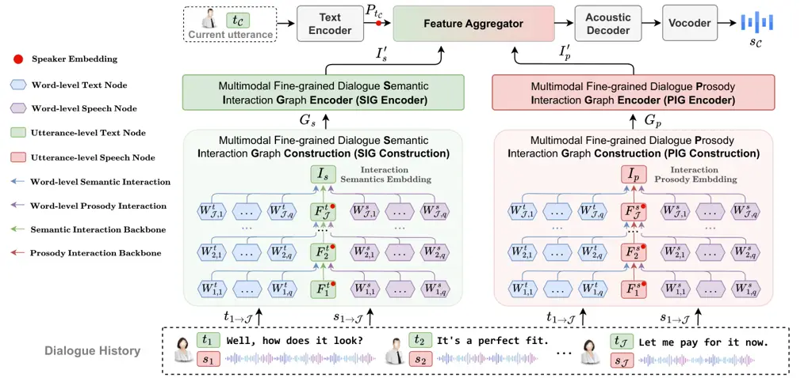

# Multimodal Fine-grained Context Interaction Graph Modeling for Conversational Speech Synthesis

Zhenqi Jia Affiliation: Inner Mongolia University, Hohhot, China
Email: [jiazhenqi7@163.com](mailto:)    Rui Liu ^(†)^(†)thanks:
Corresponding author. Affiliation: Inner Mongolia University, Hohhot,
China Email: [imucslr@imu.edu.cn](mailto:)    Berrak Sisman
Affiliation: Center for Language and Speech Processing (CLSP), Johns
Hopkins University, USA Email: [sisman@jhu.edu](mailto:)    Haizhou Li
Affiliation: School of Artificial Intelligence, The Chinese University
of Hong Kong, Shenzhen, China Email: [haizhouli@cuhk.edu.cn](mailto:)

###### Abstract

Conversational Speech Synthesis (CSS) aims to generate speech with
natural prosody by understanding the multimodal dialogue history (MDH).
The latest work predicts the accurate prosody expression of the target
utterance by modeling the utterance-level interaction characteristics of
MDH and the target utterance. However, MDH contains fine-grained
semantic and prosody knowledge at the word level. Existing methods
overlook the fine-grained semantic and prosodic interaction modeling. To
address this gap, we propose MFCIG-CSS, a novel Multimodal Fine-grained
Context Interaction Graph-based CSS system. Our approach constructs two
specialized multimodal fine-grained dialogue interaction graphs: a
semantic interaction graph and a prosody interaction graph. These two
interaction graphs effectively encode interactions between word-level
semantics, prosody, and their influence on subsequent utterances in MDH.
The encoded interaction features are then leveraged to enhance
synthesized speech with natural conversational prosody. Experiments on
the DailyTalk dataset demonstrate that MFCIG-CSS outperforms all
baseline models in terms of prosodic expressiveness. Code and speech
samples are available at https://github.com/AI-S2-Lab/MFCIG-CSS.

## 1 Introduction

Conversational speech synthesis (CSS) systems are required to generate
speech with conversational interaction prosody, unlike traditional
text-to-speech (TTS) systems Guo et al. (2021); Liu et al. (2024b); Liu
et al. (2024c); Liu et al. (2025a). With advances in user-agent
interaction, CSS plays a key role in intelligent systems such as
smartphone assistants Vu et al. (2024), smart homes Jenal et al. (2022),
and virtual reality El Miedany and El Miedany (2019).

Previous CSS methods improve prosody by modeling multimodal dialogue
history (MDH) with coarse- and fine-grained context encoders Lee et al.
(2023); Hu et al. (2024); Xue et al. (2023); Deng et al. (2024); Li
et al. (2022b). However, they model coarse- and fine-grained features
separately and overlook the interactive influence of word-level
semantics and prosody on subsequent utterances. Additionally, some
approaches Li et al. (2022a); Liu et al. (2024a); Jia and Liu (2024)
enhance prosody via speaking styles and emotional knowledge, but only
consider utterance-level interactions, ignoring word-level effects.

The word-level semantics and prosody of key words in MDH play a crucial
role in conversational interactions, directly influencing the semantics
and prosody of subsequent utterances Xue et al. (2023); Lin et al.
(2024); Castro et al. (2019); Li et al. (2024); Li et al. (2023); Peng
et al. (2022). For example, in a conversation, when the user says “I
lost my wallet" and “I lost my pen," they receive different responses in
terms of both semantics and emotional prosody: a concerned inquiry “Was
there anything valuable in the wallet?" versus a relaxed inquiry “Which
pen did you lose?" The reason for the different responses is that the
semantics expressed by the key words “wallet" and “pen" are different,
and the user’s emotional expression when saying these two words also
differ. Neglecting this word-level interaction modeling would limit the
agent’s ability to accurately capture semantic and prosodic variations
in MDH, further affecting the modeling of the prosodic expressiveness of
target utterance. Therefore, how to model the interactions between
word-level semantics, prosody, and the semantics, prosody of subsequent
utterances in MDH to help the agent better understand the MDH and
enhance the prosody expressiveness of the synthesized speech is the
focus of this work.



Figure 1: The overview of MFCIG-CSS consists of Multimodal Fine-grained
Dialogue Semantic Interaction Graph, Multimodal Fine-grained Dialogue
Prosody Interaction Graph, and Speech Synthesizer.

To address this issue, we propose a Multimodal Fine-grained Context
Interaction Graph-based CSS system, termed MFCIG-CSS. Specifically, we
design two multimodal fine-grained interaction graphs: a semantic
interaction graph that models interactions between word-level semantics,
prosody, and subsequent utterance semantics in MDH, and a prosody
interaction graph that encodes interactions between word-level
semantics, prosody, and subsequent utterance prosody. These interaction
graphs enhance the agent’s understanding of MDH. Finally, we feed the
encoded interaction features from both interaction graphs into the
speech synthesizer to help the agent in synthesizing speech that aligns
with conversational interaction prosody. In summary, the main
contributions of this paper are as follows: 1) We propose MFCIG-CSS, a
novel framework that models MDH interactions from the perspective of
word-level semantics and prosody. 2) We design two interaction graphs—a
semantic interaction graph and a prosody interaction graph—that
explicitly capture and encode the fine-grained semantic and prosodic
interactions in MDH, enhancing the system’s contextual understanding. 3)
Subjective and objective experiments on the DailyTalk dataset show that
MFCIG-CSS outperforms all baseline models in terms of prosody
expressiveness.

## 2 Methodology

### 2.1 Task Definition

A dialogue is defined as a sequence of utterances
$`\{[t_{1},s_{1}],[t_{2},s_{2}],...,[t_{\mathcal{J}},s_{\mathcal{J}}],[t_{\mathcal{C}},s_{\mathcal{C}}]\}`$,
where $`\{t_{1},t_{2},...,t_{\mathcal{J}}\}`$ represents the text of the
dialogue history and $`t_{\mathcal{C}}`$ represents the text of the
current utterance, $`\{s_{1},s_{2},...,s_{\mathcal{J}}\}`$ represents
the speech of the dialogue history and $`s_{\mathcal{C}}`$ represents
the speech to be synthesized. For any $`t_{i}`$ and $`s_{i}`$,
{$`{W^{t}_{i,1},\dots,W^{t}_{i,q}}`$} and
{$`{W^{s}_{i,1},\dots,W^{s}_{i,q}}`$} denote the word-level text and
word-level speech of the $`i`$-th utterance, where $`q`$ denotes the
number of words.

### 2.2 Model Overview

The proposed MFCIG-CSS consists of three main components: 1) Multimodal
Fine-grained Dialogue Semantic Interaction Graph (SIG), 2) Multimodal
Fine-grained Dialogue Prosody Interaction Graph (PIG), and 3) Speech
Synthesizer. These modules will be described in detail in the following
sections.

### 2.3 SIG

As shown on the left side of Figure 1, the SIG module consists of SIG
Construction and SIG Encoder. SIG captures the influence of word-level
semantics and prosody on semantic interactions among subsequent
utterances in dialogue history.

SIG Construction. To explicitly model the impact of word-level semantics
and prosody on the subsequent utterance-level semantics interaction, we
design an SIG $`G_{s}=(\mathcal{N},\mathcal{E})`$, where $`\mathcal{N}`$
denotes the nodes and $`\mathcal{E}`$ denotes the relational edges
between nodes. $`G_{s}`$ consists of three interaction branches,
realized by three types of nodes (word-level text, word-level speech,
and utterance-level text) and three types of relational edges. The three
interaction branches are: 1) Word-level semantic interaction branch:
modeling the interaction between the word-level semantics and the
subsequent utterance-level semantics in the dialogue history; 2)
Word-level prosody interaction branch: modeling the interaction between
the word-level prosody and the subsequent utterance-level semantics in
the dialogue history; 3) Semantic interaction backbone branch: modeling
the interaction between the utterance-level semantics and the subsequent
utterance-level semantics in the dialogue history. Note that we add a
special interaction semantic node ($`I_{s}`$) at the end of the semantic
interaction backbone branch to integrate the interactive semantic
features of the entire MDH. When initializing $`G_{s}`$, for the input
$`t_{1\rightarrow\mathcal{J}}`$, we use TOD-BERT Wu et al. (2020) to
extract word-level text node features
{$`{W^{t}_{1,1\rightarrow q},\dots,W^{t}_{\mathcal{J},1\rightarrow q}}`$},
and use Sentence-BERT Reimers and Gurevych (2019) to extract
utterance-level text node features
{$`{F^{t}_{1},\dots,F^{t}_{\mathcal{J}}}`$}, while adding speaker
embeddings to represent the identity of the speaker. For the input
$`s_{1\rightarrow\mathcal{J}}`$, we first use MFA to obtain each word’s
pronunciation segment, then use Wav2Vec2.0 Baevski et al. (2020) to
extract frame-level prosodic features and apply Average Pooling to
obtain word-level speech node features
{$`{W^{s}_{1,1\rightarrow q},\dots,W^{s}_{\mathcal{J},1\rightarrow q}}`$}.
We initialize $`I_{s}`$ with a zero vector.

SIG Encoder. We input the initialized $`G_{s}`$ into the SIG Encoder for
encoding, learning the interaction of word-level semantics, prosody, and
subsequent utterance-level semantics through three interaction branches.
As shown in Equation (1), starting from the first sentence in the
dialogue history, the utterance-level semantic feature ($`F^{t}_{i}`$),
the word-level semantic features ($`W^{t}_{i,1\rightarrow q}`$), and the
word-level prosody features ($`W^{s}_{i,1\rightarrow q}`$) of the i-th
sentence are sequentially aggregated into the utterance-level semantic
feature ($`F^{t}_{i+1}`$) of the (i+1)-th sentence. After all the nodes
{$`F^{t}_{1}`$, $`F^{t}_{2}`$, …, $`F^{t}_{\mathcal{J}}`$, $`I_{s}`$} in
the semantic interaction backbone branch fully interact with other
word-level semantic and prosody nodes, we use Average Pooling to
aggregate these interaction features into $`I_{s}`$, obtaining the final
semantic interaction feature: $`I^{\prime}_{s}`$.

```math
\displaystyle F^{t}_{i+1} \displaystyle=\text{SAGE}(F^{t}_{i},W^{t}_{i,1\to q},W^{s}_{i,1\to q}),\quad i\in[1,\mathcal{J}) \tag{1}
```

```math
\displaystyle I_{s} \displaystyle=\text{SAGE}(F^{t}_{\mathcal{J}},W^{t}_{\mathcal{J},1\to q},W^{s}_{\mathcal{J},1\to q})
```

```math
\displaystyle I^{\prime}_{s} \displaystyle=\text{Average Pooling}(F^{t}_{1\to\mathcal{J}},I_{s})
```

where SAGE Hamilton et al. (2017) denotes the graph convolution encoder.

### 2.4 PIG

As shown on the right side of Figure 1, the PIG module, similar to the
SIG module, consists of PIG Construction and PIG Encoder. It is designed
to model the influence of word-level semantics and prosody on the
prosodic interactions of subsequent utterances in the dialogue history.

PIG Construction. We design an PIG $`G_{p}`$ in a similar structure to
$`G_{s}`$. Note that the difference in construction compared to
$`G_{s}`$ is that the third interaction branch of $`G_{p}`$ is the
prosody interaction backbone branch, and at the end of this branch, a
special interaction prosody node ($`I_{p}`$) is added to integrate the
overall prosodic interaction features of MDH. During the initialization
of $`G_{p}`$, we use Wav2Vec2.0-IEMOCAP¹¹ 1
https://huggingface.co/speechbrain/emotion-recognition-wav2vec2-IEMOCAP
to extract utterance-level speech nodes and $`I_{p}`$ is initialized
with a zero vector.

PIG Encoder. For the initialized $`G_{p}`$, we use the same architecture
as the SIG Encoder to encode the interaction features between word-level
semantics, prosody, and prosody of subsequent utterances in MDH, as
shown in Equation (2). Finally, we apply Average Pooling to the
interaction features {$`F^{s}_{1}`$, $`F^{s}_{2}`$, …,
$`F^{s}_{\mathcal{J}}`$, $`I_{p}`$} to obtain the final prosodic
interaction features: $`I^{\prime}_{p}`$.

```math
\displaystyle F^{s}_{i+1} \displaystyle=\text{SAGE}(F^{s}_{i},W^{t}_{i,1\to q},W^{s}_{i,1\to q}),\quad i\in[1,\mathcal{J}) \tag{2}
```

```math
\displaystyle I_{p} \displaystyle=\text{SAGE}(F^{s}_{\mathcal{J}},W^{t}_{\mathcal{J},1\to q},W^{s}_{\mathcal{J},1\to q})
```

```math
\displaystyle I^{\prime}_{p} \displaystyle=\text{Average Pooling}(F^{s}_{1\to\mathcal{J}},I_{p})
```

### 2.5 Speech Synthesizer

We adopt the speech synthesizer with the same architecture as I³-CSS Jia
and Liu (2024). Note that the feature aggregator of MFCIG-CSS adds the
semantic interaction features $`I^{\prime}_{s}`$ and prosodic
interaction features $`I^{\prime}_{p}`$ into $`P_{t_{\mathcal{C}}}`$ to
constrain the synthesis of speech with conversational interaction
prosody. The speech synthesis loss follows the setup of FastSpeech 2 Ren
et al. (2021).

| Systems                      | N-DMOS ($`\uparrow`$)            | P-DMOS ($`\uparrow`$)            | MAE-P ($`\downarrow`$) | MAE-E ($`\downarrow`$) | MCD ($`\downarrow`$) |
| ---------------------------- | -------------------------------- | -------------------------------- | ---------------------- | ---------------------- | -------------------- |
| Base-CTTS Guo et al. (2021)  | 3.673 $`\pm`$ 0.025              | 3.543 $`\pm`$ 0.027              | 0.530                  | 0.467                  | 11.42                |
| FCTalker Hu et al. (2024)    | 3.716 $`\pm`$ 0.022              | 3.627 $`\pm`$ 0.021              | 0.479                  | 0.325                  | 11.41                |
| M²-CTTS Xue et al. (2023)    | 3.756 $`\pm`$ 0.024              | 3.628 $`\pm`$ 0.028              | 0.543                  | 0.380                  | 11.96                |
| CONCSS Deng et al. (2024)    | 3.819 $`\pm`$ 0.022              | 3.695 $`\pm`$ 0.024              | 0.482                  | 0.328                  | 11.92                |
| MSRGCN-CSS Li et al. (2022b) | 3.825 $`\pm`$ 0.020              | 3.734 $`\pm`$ 0.024              | 0.489                  | 0.320                  | 10.42                |
| ECSS Liu et al. (2024a)      | 3.843 $`\pm`$ 0.022              | 3.770 $`\pm`$ 0.025              | 0.505                  | 0.332                  | 9.90                 |
| I³-CSS Jia and Liu (2024)    | 3.858 $`\pm`$ 0.022              | 3.795 $`\pm`$ 0.020              | 0.450                  | 0.310                  | 11.47                |
| MFCIG-CSS (Proposed)         | 3.980 $`\pm`$ 0.022 $`(+0.122)`$ | 3.899 $`\pm`$ 0.024 $`(+0.104)`$ | 0.439 $`(+0.011)`$     | 0.314                  | 9.53 $`(+0.37)`$     |

Table 1: Main results. Bold indicates the best result. Green indicates
improvement over the best baseline.

| Systems                    | N-DMOS ($`\uparrow`$)            | P-DMOS ($`\uparrow`$)            | MAE-P ($`\downarrow`$) | MAE-E ($`\downarrow`$) | MCD ($`\downarrow`$) |
| -------------------------- | -------------------------------- | -------------------------------- | ---------------------- | ---------------------- | -------------------- |
| Abl.Exp.1: w/o SIG         | 3.833 $`\pm`$ 0.025              | 3.793 $`\pm`$ 0.022              | 0.454                  | 0.328                  | 11.45                |
| Abl.Exp.2: w/o PIG         | 3.824 $`\pm`$ 0.025              | 3.765 $`\pm`$ 0.023              | 0.457                  | 0.325                  | 11.36                |
| Abl.Exp.3: w/o SIG and PIG | 3.592 $`\pm`$ 0.023              | 3.512 $`\pm`$ 0.022              | 0.681                  | 0.588                  | 12.31                |
| MFCIG-CSS (Proposed)       | 3.980 $`\pm`$ 0.022 $`(+0.147)`$ | 3.899 $`\pm`$ 0.024 $`(+0.106)`$ | 0.439 $`(+0.015)`$     | 0.314 $`(+0.011)`$     | 9.53 $`(+1.83)`$     |

Table 2: Ablation results. Bold indicates the best result. Green
indicates improvement over the best ablation model.

## 3 Experiments and Results

### 3.1 Dataset

We validate MFCIG-CSS on the English dialogue dataset DailyTalk Lee
et al. (2023), which comprises 2,541 dialogue pairs with approximately
20 hours of speech data. Each dialogue consists of an average of 9.356
turns. The dialogues are recorded with alternating turns between a male
and a female speaker. We split the data into training, validation, and
test sets in an 8:1:1 ratio.

### 3.2 Experiment Setup

In MFCIG-CSS, the feature dimensions for text word-level, speech
word-level, text utterance-level, and speech utterance-level in both
$`G_{s}`$ and $`G_{p}`$ are set to 256. The SIG Encoder and PIG Encoder
utilize SAGE Hamilton et al. (2017) for graph encoding, with both input
and output channels set to 256. The speaker embedding dimension is also 256. The speech synthesizer configuration is based on FastSpeech2.0 Ren
et al. (2021). MFCIG-CSS is trained for 400k steps with a batch size of
16 on a single A800 GPU.

### 3.3 Comparative and Ablation Models

To demonstrate the effectiveness of the proposed MFCIG-CSS, we compare
it with seven state-of-the-art CSS models. A detailed introduction of
the compared models is provided in Appendix A.1.

For the ablation models, Abl.Exp.1 removes SIG to assess the impact of
the semantic interaction graph; Abl.Exp.2 removes PIG to assess the
impact of the prosody interaction graph; Abl.Exp.3 removes both to
evaluate their combined effect on model performance.

### 3.4 Evaluation Metric Details

For subjective evaluation, we use the Dialogue-level Mean Opinion Score
(DMOS) Streijl et al. (2016); Liu et al. (2024c); Liu et al. (2025b).
The evaluation is conducted by 20 graduate students specializing in
speech, all of whom have passed CET-6, IELTS, or TOEFL exams and have
extensive experience in DMOS assessments. Following the setup in Jia and
Liu (2024), we employ a 1-5 scale for Naturalness DMOS (N-DMOS) and
Prosody DMOS (P-DMOS) to evaluate the quality and prosodic performance
of the synthesized speech.

For objective evaluation, we compute the Mean Absolute Error of Pitch
(MAE-P) and Mean Absolute Error of Energy (MAE-E) Liu et al. (2024a) to
assess the prosody of the synthesized speech. Additionally, we measure
the Mel Cepstral Distortion (MCD) Kubichek (1993); Chen et al. (2022)
between the synthesized and ground-truth speech to evaluate synthesis
quality.

### 3.5 Main Results

We compare MFCIG-CSS with seven state-of-the-art CSS models and analyze
the results. As shown in Table 1, MFCIG-CSS outperforms all baseline
models in terms of average performance. For subjective metrics, N-DMOS
(3.980) and P-DMOS (3.899) achieve optimal performance, improving by
0.122 and 0.104 compared to the best baseline model, respectively. For
objective metrics, MAE-P (0.439) and MCD (9.53) also achieve optimal
performance, improving by 0.011 and 0.37 compared to the best baseline
model. For the objective metric MAE-E (0.314), MFCIG-CSS achieves the
second-best performance, just 0.004 lower than the best baseline model.
The experimental results show that MFCIG-CSS, by explicitly modeling the
interactions between word-level semantics, prosody, and the semantics,
prosody of subsequent utterances in MDH, can better understand the
conversational prosody expressed in MDH, thus enhancing the agent’s
ability to synthesize speech with appropriate conversational interaction
prosody.

### 3.6 Ablation Results

To assess the contribution of each component in MFCIG-CSS, we conduct
ablation experiments by removing different components, as shown in Table 2. Abl.Exp.1 removes SIG to verify the impact of modeling the
interaction between word-level semantics, prosody, and the semantics of
subsequent utterances in MDH on the performance of MFCIG-CSS. The
experimental results show that removing SIG leads to a decrease in both
subjective and objective metrics, indicating that explicitly modeling
the semantic interaction in MDH with SIG helps improve the quality of
the synthesized speech and enhances its conversational prosody.
Abl.Exp.2 removes PIG to verify the impact of modeling the interaction
between word-level semantics, prosody, and the prosody of subsequent
utterances in MDH on MFCIG-CSS performance. The experimental results
show that removing PIG decreases all metrics, especially prosody-related
metrics. This suggests that explicitly modeling the prosody interaction
in MDH with PIG helps the model learn the prosody interactions
effectively, improving the conversational prosody of the synthesized
speech. Abl. Exp. 3 removes both SIG and PIG, resulting in the worst
performance across all metrics, further validating the significant
contribution of SIG and PIG to the synthesis quality and prosody
expressiveness of MFCIG-CSS.

## 4 Conclusion

To enhance the CSS system’s understanding of MDH and enable the
synthesis of speech with appropriate conversational prosody, we propose
MFCIG-CSS, a novel framework that explicitly encodes the interactions
between word-level semantics, prosody, and the semantics and prosody of
subsequent utterances in MDH. This improves the model’s comprehension of
both semantic and prosodic interactions within MDH. Experiments on
DailyTalk demonstrate that MFCIG-CSS surpasses state-of-the-art CSS
systems in prosody expression. In the future, we will explore the
interaction modeling of finer-grained acoustic prosody, such as
emotions, emphasis, pauses, etc., within MDH.

## 5 Limitations

One limitation of our work is that MFCIG-CSS is currently implemented
only based on the FastSpeech 2 architecture to validate the
effectiveness of the proposed semantic and prosody interaction graph
modules. In the future, we plan to extend this approach to VITS-based
architectures and discrete token-based speech encoders. Another
limitation is that we have not yet incorporated acoustic features such
as emotion, emphasis, and pauses into the interaction graph modeling.
Future work will focus on integrating these features to further enhance
the prosodic expressiveness and naturalness of the synthesized speech.

## 6 Acknowledgment

The research by Rui Liu was funded by the Young Scientists Fund (No.
62206136), the General Program (No. 62476146) of the National Natural
Science Foundation of China, the Young Elite Scientists Sponsorship
Program by CAST (2024QNRC001), the Outstanding Youth Project of Inner
Mongolia Natural Science Foundation (2025JQ011), Key R&D and Achievement
Transformation Program of Inner Mongolia Autonomous Region
(2025YFHH0014) and the Central Government Fund for Promoting Local
Scientific and Technological Development (2025ZY0143). The work of
Zhenqi Jia was funded by the Research and Innovation Project for
Graduate Students of Inner Mongolia University. The work by Berrak
Sisman was supported by NSF CAREER award IIS-2338979. The work by
Haizhou Li was supported by the Shenzhen Science and Technology Program
(Shenzhen Key Laboratory, Grant No. ZDSYS20230626091302006), the
Shenzhen Science and Technology Research Fund (Fundamental Research Key
Project, Grant No. JCYJ20220818103001002), and the Program for Guangdong
Introducing Innovative and Enterpreneurial Teams, Grant No.
2023ZT10X044.

## References

- Baevski et al. (2020) Alexei Baevski, Yuhao Zhou, Abdelrahman Mohamed,
  and Michael Auli. 2020. wav2vec 2.0: A framework for self-supervised
  learning of speech representations. _Advances in neural information
  processing systems_, 33:12449–12460.
- Castro et al. (2019) Santiago Castro, Devamanyu Hazarika, Verónica
  Pérez-Rosas, Roger Zimmermann, Rada Mihalcea, and Soujanya
  Poria. 2019. [Towards multimodal sarcasm detection (An \_Obviously\_
  Perfect Paper)](https://doi.org/10.18653/v1/P19-1455). In _Proceedings
  of the 57th Annual Meeting of the Association for Computational
  Linguistics_, pages 4619–4629, Florence, Italy. Association for
  Computational Linguistics.
- Chen et al. (2022) Qi Chen, Mingkui Tan, Yuankai Qi, Jiaqiu Zhou,
  Yuanqing Li, and Qi Wu. 2022. V2c: Visual voice cloning. In
  _Proceedings of the IEEE/CVF Conference on Computer Vision and Pattern
  Recognition_, pages 21242–21251.
- Deng et al. (2024) Yayue Deng, Jinlong Xue, Yukang Jia, Qifei Li,
  Yichen Han, Fengping Wang, Yingming Gao, Dengfeng Ke, and Ya Li. 2024.
  Concss: Contrastive-based context comprehension for
  dialogue-appropriate prosody in conversational speech synthesis. In
  _ICASSP 2024-2024 IEEE International Conference on Acoustics, Speech
  and Signal Processing (ICASSP)_, pages 10706–10710. IEEE.
- El Miedany and El Miedany (2019) Yasser El Miedany and Yasser
  El Miedany. 2019. Virtual reality and augmented reality. _Rheumatology
  teaching: the art and science of medical education_, pages 403–427.
- Guo et al. (2021) Haohan Guo, Shaofei Zhang, Frank K Soong, Lei He,
  and Lei Xie. 2021. Conversational end-to-end tts for voice agents. In
  _2021 IEEE Spoken Language Technology Workshop (SLT)_, pages 403–409.
  IEEE.
- Hamilton et al. (2017) Will Hamilton, Zhitao Ying, and Jure
  Leskovec. 2017. Inductive representation learning on large graphs.
  _Advances in neural information processing systems_, 30.
- Hu et al. (2024) Yifan Hu, Rui Liu, Guanglai Gao, and Haizhou
  Li. 2024. Fctalker: Fine and coarse grained context modeling for
  expressive conversational speech synthesis. In _2024 IEEE 14th
  International Symposium on Chinese Spoken Language Processing
  (ISCSLP)_, pages 299–303. IEEE.
- Jenal et al. (2022) Mahyuzie Jenal, Athira Nabilla Omar, Muhammad
  Azizi Aswad Hisham, Wan Najmi Wan Mohd Noh, and Zul Adib Izzuddin
  Razali. 2022. Smart home controlling system. _Journal of Electronic
  Voltage and Application_, 3(1):92–104.
- Jia and Liu (2024) Zhenqi Jia and Rui Liu. 2024. Intra-and inter-modal
  context interaction modeling for conversational speech synthesis.
  _arXiv preprint arXiv:2412.18733_.
- Kubichek (1993) Robert Kubichek. 1993. Mel-cepstral distance measure
  for objective speech quality assessment. In _Proceedings of IEEE
  pacific rim conference on communications computers and signal
  processing_, volume 1, pages 125–128. IEEE.
- Lee et al. (2023) Keon Lee, Kyumin Park, and Daeyoung Kim. 2023.
  Dailytalk: Spoken dialogue dataset for conversational text-to-speech.
  In _ICASSP 2023-2023 IEEE International Conference on Acoustics,
  Speech and Signal Processing (ICASSP)_, pages 1–5. IEEE.
- Li et al. (2024) Deyi Li, Jialun Yin, Tianlei Zhang, Wei Han, and Hong
  Bao. 2024. The four most basic elements in machine cognition. _Data
  Intelligence_, 6(2):297–319.
- Li et al. (2022a) Jingbei Li, Yi Meng, Chenyi Li, Zhiyong Wu, Helen
  Meng, Chao Weng, and Dan Su. 2022a. Enhancing speaking styles in
  conversational text-to-speech synthesis with graph-based multi-modal
  context modeling. In _ICASSP 2022-2022 IEEE International Conference
  on Acoustics, Speech and Signal Processing (ICASSP)_, pages 7917–7921.
  IEEE.
- Li et al. (2022b) Jingbei Li, Yi Meng, Xixin Wu, Zhiyong Wu, Jia Jia,
  Helen Meng, Qiao Tian, Yuping Wang, and Yuxuan Wang. 2022b. Inferring
  speaking styles from multi-modal conversational context by multi-scale
  relational graph convolutional networks. In _Proceedings of the 30th
  ACM International Conference on Multimedia_, pages 5811–5820.
- Li et al. (2023) Xinhang Li, Xiangyu Zhao, Jiaxing Xu, Yong Zhang, and
  Chunxiao Xing. 2023. Imf: interactive multimodal fusion model for link
  prediction. In _Proceedings of the ACM Web Conference 2023_, pages
  2572–2580.
- Lin et al. (2024) Guan-Ting Lin, Cheng-Han Chiang, and Hung-yi
  Lee. 2024. [Advancing large language models to capture varied speaking
  styles and respond properly in spoken
  conversations](https://doi.org/10.18653/v1/2024.acl-long.358). In
  _Proceedings of the 62nd Annual Meeting of the Association for
  Computational Linguistics (Volume 1: Long Papers)_, pages 6626–6642,
  Bangkok, Thailand. Association for Computational Linguistics.
- Liu et al. (2024a) Rui Liu, Yifan Hu, Yi Ren, Xiang Yin, and Haizhou
  Li. 2024a. Emotion rendering for conversational speech synthesis with
  heterogeneous graph-based context modeling. In _Proceedings of the
  AAAI Conference on Artificial Intelligence_, volume 38, pages
  18698–18706.
- Liu et al. (2024b) Rui Liu, Yifan Hu, Yi Ren, Xiang Yin, and Haizhou
  Li. 2024b. Generative expressive conversational speech synthesis. In
  _Proceedings of the 32nd ACM International Conference on Multimedia_,
  pages 4187–4196.
- Liu et al. (2025a) Rui Liu, Zhenqi Jia, Feilong Bao, and Haizhou Li.
  2025a. Retrieval-augmented dialogue knowledge aggregation for
  expressive conversational speech synthesis. _Information Fusion_,
  118:102948.
- Liu et al. (2025b) Rui Liu, Zhenqi Jia, Feilong Bao, and Haizhou Li.
  2025b. [Retrieval-augmented dialogue knowledge aggregation for
  expressive conversational speech
  synthesis](https://doi.org/10.1016/j.inffus.2025.102948). _Information
  Fusion_, page 102948.
- Liu et al. (2024c) Rui Liu, Zhenqi Jia, Jie Yang, Yifan Hu, and
  Haizhou Li. 2024c. Emphasis rendering for conversational
  text-to-speech with multi-modal multi-scale context modeling. _arXiv
  preprint arXiv:2410.09524_.
- Peng et al. (2022) Wei Peng, Yue Hu, Luxi Xing, Yuqiang Xie, Xingsheng
  Zhang, and Yajing Sun. 2022. [Modeling intention, emotion and external
  world in dialogue
  systems](https://doi.org/10.1109/ICASSP43922.2022.9747565). In _ICASSP
  2022 - 2022 IEEE International Conference on Acoustics, Speech and
  Signal Processing (ICASSP)_, pages 7042–7046.
- Reimers and Gurevych (2019) Nils Reimers and Iryna Gurevych. 2019.
  [Sentence-BERT: Sentence embeddings using Siamese
  BERT-networks](https://doi.org/10.18653/v1/D19-1410). In _Proceedings
  of the 2019 Conference on Empirical Methods in Natural Language
  Processing and the 9th International Joint Conference on Natural
  Language Processing (EMNLP-IJCNLP)_, pages 3982–3992, Hong Kong,
  China. Association for Computational Linguistics.
- Ren et al. (2021) Yi Ren, Chenxu Hu, Xu Tan, Tao Qin, Sheng Zhao, Zhou
  Zhao, and Tie-Yan Liu. 2021. [Fastspeech 2: Fast and high-quality
  end-to-end text to
  speech](https://openreview.net/forum?id=piLPYqxtWuA). In
  _International Conference on Learning Representations_.
- Streijl et al. (2016) Robert C Streijl, Stefan Winkler, and David S
  Hands. 2016. Mean opinion score (mos) revisited: methods and
  applications, limitations and alternatives. _Multimedia Systems_,
  22(2):213–227.
- Vu et al. (2024) Minh Duc Vu, Han Wang, Zhuang Li, Jieshan Chen,
  Shengdong Zhao, Zhenchang Xing, and Chunyang Chen. 2024.
  Gptvoicetasker: Llm-powered virtual assistant for smartphone. _arXiv
  preprint arXiv:2401.14268_.
- Wu et al. (2020) Chien-Sheng Wu, Steven C.H. Hoi, Richard Socher, and
  Caiming Xiong. 2020. [TOD-BERT: Pre-trained natural language
  understanding for task-oriented
  dialogue](https://doi.org/10.18653/v1/2020.emnlp-main.66). In
  _Proceedings of the 2020 Conference on Empirical Methods in Natural
  Language Processing (EMNLP)_, pages 917–929, Online. Association for
  Computational Linguistics.
- Xue et al. (2023) Jinlong Xue, Yayue Deng, Fengping Wang, Ya Li,
  Yingming Gao, Jianhua Tao, Jianqing Sun, and Jiaen Liang. 2023. M
  2-ctts: End-to-end multi-scale multi-modal conversational
  text-to-speech synthesis. In _ICASSP 2023-2023 IEEE International
  Conference on Acoustics, Speech and Signal Processing (ICASSP)_, pages
  1–5. IEEE.

## Appendix A Example Appendix

### A.1 Comparative Models

- •
  Base-CTTS Guo et al. (2021) introduces a text coarse-grained context
  encoder to improve the quality of synthesized speech.
- •
  FCTalker Hu et al. (2024) designs a coarse-grained and fine-grained
  text context encoder to enhance the prosody of synthesized speech.
- •
  M²-CTTS Xue et al. (2023) proposes a multi-scale, multi-modal context
  encoder to enhance the prosody of synthesized speech.
- •
  CONCSS Deng et al. (2024) incorporates a negative sample enhancement
  sampling strategy in MDH modeling to improve the prosody sensitivity
  of synthesized speech.
- •
  MSRGCN-CSS Li et al. (2022b) introduces a context modeling scheme
  based on a multi-scale relational graph convolutional network to
  enhance the speaking style of synthesized speech.
- •
  ECSS Liu et al. (2024a) incorporates a context modeling scheme based
  on multi-source knowledge heterogeneous graphs to enhance the
  emotional expressiveness of the synthesized speech.
- •
  I³-CSS Jia and Liu (2024) includes an intra-modal and inter-modal
  context interaction modeling scheme at the utterance level to improve
  the prosody performance of synthesized speech.
