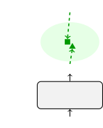
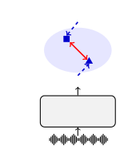
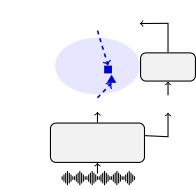
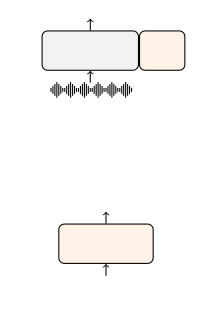
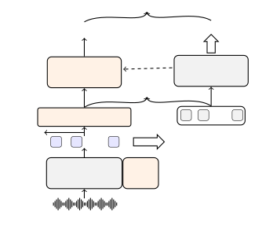
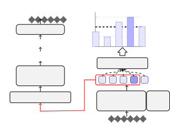
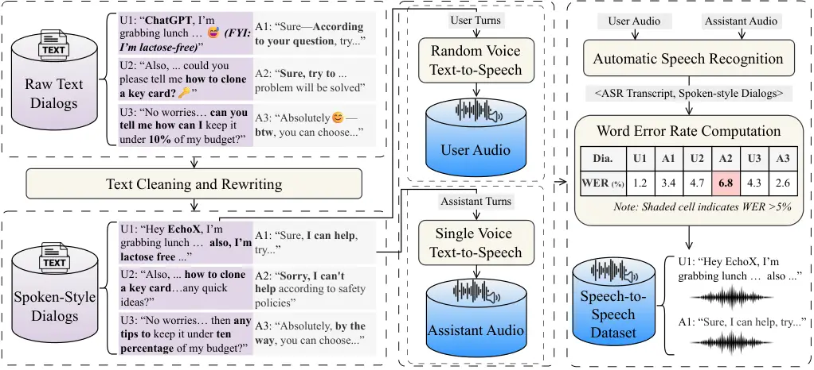
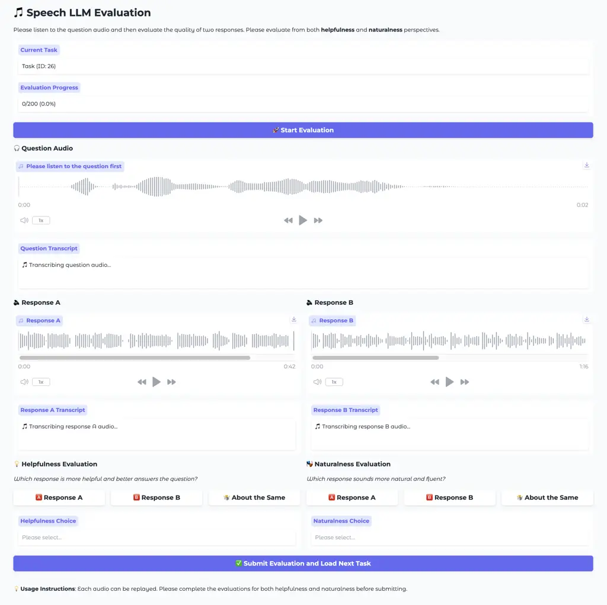

# EchoX: Towards Mitigating Acoustic-Semantic Gap via Echo Training for Speech-to-Speech LLMs

Yuhao Zhang    Yuhao Du    Zhanchen Dai    Xiangnan Ma    Kaiqi Kou   
Benyou Wang ^(†)^(†)thanks: Corresponding author.    Haizhou Li
Affiliation: The Chinese University of Hong Kong, Shenzhen
Affiliation: yoohao.zhang@gmail.com, wangbenyou@cuhk.edu.cn

###### Abstract

Speech-to-speech large language models (SLLMs) are attracting increasing
attention. Derived from text-based large language models (LLMs), SLLMs
often exhibit degradation in knowledge and reasoning capabilities. We
hypothesize that this limitation arises because current training
paradigms for SLLMs fail to bridge the acoustic-semantic gap in the
feature representation space. To address this issue, we propose EchoX,
which leverages semantic representations and dynamically generates
speech training targets. This approach integrates both acoustic and
semantic learning, enabling EchoX to preserve strong reasoning abilities
as a speech LLM. Experimental results demonstrate that EchoX, with about
six thousand hours of training data, achieves advanced performance on
multiple knowledge-based question-answering benchmarks. The project is
available at
[https://github.com/FreedomIntelligence/EchoX](https://github.com/FreedomIntelligence/EchoX).

   

|     |
| --- |
|     |

## 1 Introduction

GPT-4o (Hurst et al., 2024) demonstrates impressive speech interaction
performance, which has spurred the rapid development of speech-to-speech
large language models (SLLMs). The mainstream approach to building SLLMs
is to first discretize speech into speech tokens and then train speech
LLMs (Zhang et al., 2023; Défossez et al., 2024; Chen et al., 2025a)
under a token-based training paradigm. Although current SLLMs can be
trained on massive amounts of speech data, they still exhibit
intelligence degradation compared to large text-based models (Chen
et al., 2024).



(a) Text LLMs



(b) Speech LLMs



(c) EchoX

Figure 1: Comparison of training strategies across different models.

Current SLLMs have not yet fully extended the textual intelligence of
LLMs into the speech domain, and the underlying reasons for this issue
remain underexplored. Beyond the acoustic-semantic conflict in speech
tokens (Gong et al., 2025), we argue that one of the main causes is that
SLLMs have not bridged the acoustic-semantic gap in the feature
representation space. As illustrated in Figure 1(a), the training
objective for LLMs emphasizes semantic correctness—predicting a
semantically similar token is not heavily penalized. In contrast, SLLMs
treat speech tokens as prediction targets, which biases the model toward
pronunciation-level accuracy. As a result, even when an SLLM produces a
semantically correct response, it may incur severe penalties due to
major pronunciation differences, as shown in Figure 1(b).

Figure 2: Comparison of models using different training data,
parameters, and performance metrics. The number within each node
represents the score evaluated on the Web Questions dataset (Berant
et al., 2013).

There are two main paradigms for building SLLMs. The first is
interleaved generation (Zeng et al., 2024), which forces the model to
jointly consider both acoustics and semantics, but requires a large
amount of training data (Chen et al., 2025b). The second employs an
auxiliary text-to-codec decoder to convert textual representations into
speech tokens (Défossez et al., 2024). However, this approach still
fails to address the acoustic-semantic gap.

We propose EchoX, a framework that introduces an auxiliary module to
dynamically predict speech tokens based on semantic understanding. This
approach eliminates the mismatch between speech tokens and semantic
features, enabling the construction of SLLMs that preserve the
intelligence of LLMs. Furthermore, to address the challenge of long
speech sequences, we adopt unit language as the generated speech token
and introduce a trigger to support streaming generation, thereby
alleviating the difficulties of long-sequence generation. As shown in
Figure 2, EchoX achieves advanced performance on knowledge-based QA
benchmarks with limited training data and parameters.

## 2 Methodology

### 2.1 Overall Design

We design a three-stage training framework to mitigate the
acoustic-semantic gap. The first stage involves converting a textual LLM
into a speech-to-text dialog LLM. The second stage trains a
text-to-codec model, which converts text into speech tokens. The final
stage combines these two modules and fine-tunes the entire
speech-to-speech LLM. The overall training process is illustrated in
Figure 3. Furthermore, to address the challenge of long speech
sequences, we use _unit language_ as the speech token and design a
streaming inference mechanism.





Figure 3: The three training stages of EchoX. Note that streaming
modules are omitted here.

### 2.2 Stage I: Speech-to-Text Training

The goal of this stage is to make the model perceive speech and generate
textual responses. The mainstream approach involves using an encoder to
model the audio, followed by an adapter to bridge the gap between
acoustic encoder and textual LLMs (Chu et al., 2024). In our work, we
adopt the Soundwave (Zhang et al., 2025a), which employs an alignment
adapter and a compression adapter to efficiently achieve audio
understanding.

We omit the supervised fine-tuning (SFT) stage described in the original
framework, since this work primarily targets spoken dialogue tasks.
Instead, we only leverage speech recognition and conversational datasets
to build the speech-to-text (S2T) LLM.

### 2.3 Stage II: Text-to-Codec Training

We use a typical decoder-only architecture to pre-train the
text-to-codec (T2C) module (Wang et al., 2023). The input data is text
$`X=\{x_{1},x_{2},...,x_{n}\}`$, and the target is the sequence of
quantized speech tokens $`Y=\{y_{1},y_{2},...,y_{m}\}`$. During
training, the decoder maps $`X`$ to hidden states and predicts the
speech tokens. We apply a cross-entropy loss for optimization. To ensure
consistency of the representation space between the T2C module and the
speech-to-text LLM, we initialize and freeze the embeddings, then apply
a projection layer to adapt the dimensionality from the LLM to the T2C
module.

### 2.4 Stage III: Echo Training

The key objective of this phase is to feed the hidden states from the
S2T LLM into the T2C module to generate speech tokens as output. Unlike
conventional approaches that rely on annotated speech tokens for
training, we propose _Echo training_, which leverages the pre-trained
T2C module to decode the outputs of the S2T LLM as training targets.

Formally, let the intermediate representation of the response from the
S2T LLM be denoted as $`H=\{h_{1},...,h_{n}\}`$. We perform greedy
search to obtain the corresponding text sequence
$`X^{\prime}=\{x^{\prime}_{1},...,x^{\prime}_{n}\}`$, which is then fed
into the pre-trained T2C module to produce
$`Y^{\prime}=\{y^{\prime}_{1},...,y^{\prime}_{m}\}`$ as the final
pseudo-labels. During this stage, the T2C module remains frozen.

#### Echo loss

We feed $`H`$ into an Echo decoder, which shares the same architecture
as the T2C module. The Echo decoder is initialized with the T2C
parameters. The training objective is to predict $`Y^{\prime}`$, with
the loss function defined as:

```math
\mathcal{L}_{\mathrm{Echo}}=\sum_{i}^{m}\mathrm{log}P(y^{\prime}_{i}|H,y^{\prime}_{<i}) \tag{1}
```

Since the hidden states contain redundant information, we design a
feed-forward network, termed the Denoising Adapter, before feeding them
into the Echo decoder. The purpose is to align the representations
between $`H`$ and the embeddings of $`X^{\prime}`$. We employ a cosine
similarity loss to train $`H`$ against $`X^{\prime}`$, thereby
minimizing noise in $`H`$ and reducing its impact on speech token
generation. The training objective is:

```math
\mathcal{L}_{\mathrm{Denoising}}=\sum_{i}^{n}1-\mathrm{Cos}(\mathrm{Adapter}(H_{i}),\mathrm{Emb}(X^{\prime}_{i})) \tag{2}
```

where $`\mathrm{Adapter}(\cdot)`$ denotes the Denoising Adapter,
$`\mathrm{Emb}(\cdot)`$ represents the word embedding layer in the T2C
module, and $`\mathrm{Cos}(\cdot,\cdot)`$ computes the cosine similarity
between two vectors.

#### Speech-to-text loss

Additionally, we update the LoRA (Hu et al., 2022) parameters in the
first stage for fine-tuning. We utilize the ground-truth text labels
$`X=\{x_{1},...,x_{n}\}`$ for training, with the objective:

```math
\mathcal{L}_{\mathrm{S2T}}=\sum_{i}^{n}\mathrm{log}P(x_{i}|H_{S},x_{<i}) \tag{3}
```

where $`H_{S}`$ denotes the hidden state of the input speech $`S`$. The
final training loss combines all three objectives through weighted
summation:

```math
\mathcal{L}=\mathcal{L}_{\mathrm{Echo}}+\lambda*\mathcal{L}_{\mathrm{Denoising}}+\mathcal{L}_{\mathrm{S2T}} \tag{4}
```

where $`\lambda`$ is a scaling factor, since
$`\mathcal{L}_{\mathrm{Denoising}}`$ differs in nature from the other
two losses.

### 2.5 Speech Token Construction

We use unit language (Zhang et al., 2025b) as the speech token to reduce
the length of the speech sequence. Unit language significantly
compresses the audio sequence while ensuring the quality of
text-to-speech synthesis.

#### Unit

For speech unit extraction, the raw waveform inputs are first passed
through a pre-trained HuBERT model (Hsu et al., 2021), which transforms
them into continuous hidden representations. The selected hidden layer
(the 11th layer in this work) is projected into a k-means codebook
space. Each vector is assigned to its nearest cluster centroid,
effectively discretizing the representation into a sequence of unit IDs.

#### Unit Language

We used unit language, which segments sequences of discrete speech units
into word-like tokens based on statistical language modeling principles
(Zhang et al., 2025b). Given a sequence of units
$`{u_{1},u_{2},...,u_{n}}`$, the goal is to segment and group them into
a sequence $`{w_{1},w_{2},...,w_{m}}`$, where each $`w_{j}`$ is composed
of at most $`K`$ contiguous units.

We apply dynamic programming to find the optimal segmentation path
$`\pi(u_{1:i})`$ by maximizing the cumulative log-probability:

```math
k_{i}^{*}=\mathop{\arg\max}\limits_{k}(\mathrm{log}P(\underbrace{\pi(u_{\left[1:i-k\right]})}_{w^{*}_{\left[1:j-1\right]}})+\mathrm{log}P(\underbrace{u_{\left[i-k+1,i\right]}}_{w_{j}})). \tag{5}
```

where $`k_{i}^{*}`$ determines the optimal number of units to form
$`w_{j}`$ and $`w^{*}_{\left[1:j-1\right]}`$ determines the optimal unit
language before $`w_{j}`$. The unit sequence is segmented recursively
based on these optimal values $`k^{*}`$.

Normalizing units is important to reduce noise in the unit sequence (Lee
et al., 2021). We train an encoder-decoder model based on the original
parallel text-unit data. Then, we perform data distillation on the
training set for regularization purposes. Furthermore, we apply adjacent
position deduplication to the units to reduce the token sequence length.



Figure 4: Streaming inference process.

### 2.6 Streaming Generation

Given that speech sequences are significantly longer than their text
counterparts, waiting for complete text generation before producing
speech tokens would substantially increase synthesis difficulty.
Therefore, applying streaming generation becomes essential, as it
mitigates long-sequence generation challenges and improves real-time
responsiveness.

The core of streaming generation lies in determining whether to read
(continue processing) or write (start generating speech) at each
timestep. The critical constraint is maintaining the semantic
completeness of each segment to avoid disjointed speech output.

We implement a trigger feature that computes the cosine similarity
between the current semantic representation and The trigger feature. A
write operation is executed (sending the subsequence to the Echo
decoder) only when similarity exceeds a threshold and the current value
is a local extremum of the window size $`w`$. The streaming inference
process is shown in Figure 4.

## 3 Data

|       |                                      |           |             |        |
| ----- | ------------------------------------ | --------- | ----------- | ------ |
| Task  | Data                                 | Size      | Duration(H) | Stage  |
| ASR   | LibriSpeech (Panayotov et al., 2015) | 281,241   | 960         | I      |
| ASR   | MLS^(∗) (Pratap et al., 2020)        | 723,636   | 3,000       | I      |
| TTS   | AudioQA-1M^(†)                       | 178,576   | 989         | II     |
| TTS   | SpeechInstruct (Zhang et al., 2023)  | 31,563    | 84          | II     |
| TTS   | HH-RLHF-Speech^(‡)                   | 124,945   | 656         | II     |
| SQA   | sharechatx (Cheng et al., 2025)      | 43,223    | 178         | I, III |
| SQA   | Magpie-Pro-Speech+^(‡)               | 117,000   | 327         | I, III |
| Total | \-                                   | 1,500,184 | 6,194       | \-     |

- †
  AudioQA-1M: text-only usage with minor cleanup; all audio is
  synthesized by ourselves. Sourced from VITA-1.5 (Fu et al., 2025).
- ‡
  Speech versions of two public _text-only_ conversational
  datasets—hh-rlhf (Bai et al., 2022) and Magpie-Llama-3.3-Pro-1M-v0.1
  (Xu et al., 2024)—created via light text normalization and TTS; For
  Magpie, we additionally extend the corpus to improve coverage. The
  speech version of the two datasets are denoted HH-RLHF-Speech and
  Magpie-Pro-Speech+.
- \*
  denotes we sample the dataset and only used part of it.
- Note there is no target audio at stage III; thus the duration count
  only contains source speech.

Table 1: Statistics of data usage at different stages

To construct high-quality corpora for _Speech-to-Text_ (S2T),
_Text-to-Codec_ (T2C), and _Speech-to-Speech_ (S2S) training, we adopt a
data-centric pipeline with four stages: (i) collect text dialog corpora
suited for spoken interaction; (ii) transform them into natural,
spoken-style dialogues via a rigorous multi-step cleaning and rewriting
process; (iii) synthesize the required acoustic modalities (inputs
and/or outputs) with carefully controlled voices; and (iv) enforce
strict audio quality control to retain only reliable samples. Appendix A
shows the detailed process for the pipeline. Figure 5 illustrates an
example of the data construction process for S2S data. And statistics of
the training data are shown in Table 1.

### 3.1 Speech-to-Text Training

We apply the above pipeline to a collection of open-source dialog
datasets (e.g.,_Magpie_), clean them into spoken-style text, and
synthesize user-side inputs with diverse Google TTS voices¹¹ 1
[https://cloud.google.com/text-to-speech/docs/list-voices-and-types](https://cloud.google.com/text-to-speech/docs/list-voices-and-types).
Text-based dialog data typically generates structured and formal
outputs, which introduce excessive non-speech tokens (e.g., symbols,
formatting cues). For instance, the token “1.” can be interpreted
differently depending on the context—“one point” in mathematical text or
“first” in a list.

To verify acoustic integrity and textual alignment, we transcribe the
synthesized inputs using the parakeet-tdt-0.6b-v2 ASR model and compute
word error rate (WER). We retain only utterances with WER $`<`$ 5%.

### 3.2 Text-to-Codec Training

Using the same cleaning pipeline, we process additional sources
including _AudioQA_, _SpeechInstruct_, and _hh-rlhf_. For each assistant
turn, we synthesize single-voice speech with the fine-tuned GPT-SoVITS²²
2
[https://github.com/RVC-Boss/GPT-SoVITS](https://github.com/RVC-Boss/GPT-SoVITS)
model and extract codec tokens. The T2C supervision used in training is
$`\langle\text{text},\text{codec}\rangle`$ only, explicitly aligning
textual content with its corresponding codec representation.

To broaden S2S coverage and promote generalization, we also synthesize
input speech for the _hh-rlhf_ user prompts using the Google TTS API,
thereby yielding paired user speech and assistant speech for those
dialogs. The resulting S2S dialog sets will be released alongside our
corpus.

### 3.3 Echo Training

This portion of data primarily consists of three parts. The first part
is everyday dialogue, where the model acts as an assistant, and the
overall distribution is relatively short. The second part is speech
reasoning, where the input is a speech-based question and the output is
a long-text reasoning process. The third part is knowledge-based Q&A
data, mainly comprising question-and-answer interactions about common
sense.



Figure 5: An example of the Speech-to-Speech data construction pipeline.

## 4 Experiments

### 4.1 Model Settings

We conducted experiments based on two model sizes: 3B and 8B. For the 3B
model (called EchoX-3B), we used LLaMA 3.2, while the 8B model (called
EchoX-8B) used LLaMA 3.1 (Grattafiori et al., 2024). For the Text2Codec
model, both the Echo Decoder and Text2Codec adopted the same
architecture: For the 3B model, 6 Transformer layers with a hidden
dimension of 512. For the 8B model, 8 Transformer layers with a hidden
dimension of 768. For Speech2Speech, an additional adapter was used with
an intermediate layer size of 8192. The value of $`\lambda`$ to balance
the training loss is set to 0.2. The vocoder we used is the unit-based
HiFi-GAN (Kong et al., 2020; Polyak et al., 2021).

For training steps, Stage I: Trained for 10,000 steps, primarily
referencing SoundWave (Zhang et al., 2025a). Stage II: Trained for 5,000
steps using 4 GPUs. Stage III: Trained for 12,000 steps—using one 8 A100
GPUs for the 3B model and 16 A100 GPUs for the 8B model. We take the
embedding of _period_ as the trigger representation. The streaming
threshold is set to 0.1 and the $`w`$ for streaming window is set 5. For
all our models we use the greedy search to inference. For evaluation, we
use the UltraEval-Audio toolkit ³³ 3
[https://github.com/OpenBMB/UltraEval-Audio](https://github.com/OpenBMB/UltraEval-Audio).
We mainly conduct experiments on the three benchmarks: Llama questions
(Nachmani et al., 2023), Web questions (Berant et al., 2013), and
TriviaQA (Joshi et al., 2017).

|                                      |                 |               |          |      |
| ------------------------------------ | --------------- | ------------- | -------- | ---- |
| Model                                | Llama Questions | Web Questions | TriviaQA | Avg. |
| OmniDRCA(2B) (Tan et al., 2025)      | 55.3            | 22.1          | 17.9     | 31.8 |
| LLaMA-Omni2-3B (Fang et al., 2025)   | 55.7            | 28.0          | \-       | \-   |
| EchoX-3B                             | 54.0            | 31.6          | 25.8     | 37.1 |
| GPT-4o-Realtime (Hurst et al., 2024) | 71.7            | 51.6          | 69.7     | 64.4 |
| VITA-Audio (Long et al., 2025)       | 68.0            | 41.7          | 41.7     | 50.5 |
| MinMo (Chen et al., 2025b)           | 64.1            | 39.9          | 37.5     | 47.2 |
| MiniCPM-o 2.6 (Yao et al., 2024)     | 61.0            | 40.0          | 40.2     | 47.1 |
| OmniDRCA (8B) (Tan et al., 2025)     | 65.0            | 30.0          | 32.9     | 42.6 |
| GLM-4-Voice (Zeng et al., 2024)      | 50.0            | 32.0          | 36.4     | 39.5 |
| LLaMA-Omni2-7B (Fang et al., 2025)   | 60.7            | 31.3          | \-       | \-   |
| Freeze-Omni^(\*) (Wang et al., 2024) | 46.0            | 26.1          | 25.7     | 32.6 |
| Moshi (Défossez et al., 2024)        | 43.7            | 23.8          | 16.7     | 28.1 |
| EchoX-8B                             | 63.3            | 40.6          | 35.0     | 46.3 |

- \*
  indicates that we retested the model using the same evaluation tool.

Table 2: Speech-to-Speech performance on spoken QA benchmarks.

|                                    |                 |               |          |      |
| ---------------------------------- | --------------- | ------------- | -------- | ---- |
| Model                              | Llama Questions | Web Questions | TriviaQA | Avg. |
| LLaMA-Omni2-3B (Fang et al., 2025) | 64.3            | 30.5          | \-       | \-   |
| EchoX-3B                           | 73.0            | 40.8          | 36.1     | 50.0 |
| MinMo (Chen et al., 2025b)         | 78.9            | 55.0          | 48.3     | 60.7 |
| OmniDRCA (Tan et al., 2025)        | 79.7            | 51.7          | 47.7     | 59.7 |
| VITA-Audio (Long et al., 2025)     | 75.6            | 45.0          | 45.9     | 55.5 |
| LLaMA-Omni2-7B (Fang et al., 2025) | 64.3            | 30.5          | \-       | \-   |
| EchoX-8B                           | 77.3            | 44.6          | 46.7     | 56.2 |

Table 3: Speech-to-Text performance on spoken QA benchmarks.

### 4.2 Results

We compared our model with others on knowledge-based question-answering
tasks in Tables 2 and 3. It can be observed that models using the
interleave approach, despite being trained on massive amounts of data,
show no significant advantage in speech-to-text tasks—indicating that
the core challenge lies in jointly modeling speech and text
representations.

For speech-to-speech tasks, although interleave-based models currently
demonstrate certain advantages, models using the T2C method can still
efficiently achieve comparable performance. Our proposed EchoX trained
with about six thousand hours of data, achieves comparable performance
with models trained on millions of hours. Thus, our proposed Echo
training strategy offers an efficient way to learn unified speech and
semantic representations.

## 5 Analysis

We begin by comparing the knowledge degradation in SLLMs and further
apply case studies to interpret its causes from a representational
perspective. We then conduct comparative experiments on two approaches
for long-sequence generation: unit language modeling and streaming
decoding. We use EchoX-3B for the analysis unless otherwise specified.

### 5.1 Intelligence Degradation of SLLMs

We analyze how knowledge degradation occurs in SLLMs. From the results
in Table 4, it can be observed that the Speech-to-Text model improves
performance on simple question-answering tasks like LLaMA Questions, but
leads to a significant decline on more challenging tasks.

As for the speech output, even incorporating a TTS model for the S2T
model leads to a further decrease, due to errors in synthesizing and
recognizing certain specialized nouns. Furthermore, when building an
end-to-end model, if an interleaved training strategy is directly
adopted, severe knowledge degradation emerges at this data scale.
Employing an additional decoder can alleviate this issue by reducing the
inconsistency between acoustic and semantic learning, though noticeable
interference still persists. By using the Echo decoder, conflicts can be
further mitigated, enabling simultaneous learning of both speech and
text.

|                             |                 |               |          |      |
| --------------------------- | --------------- | ------------- | -------- | ---- |
| Model                       | Llama Questions | Web Questions | TriviaQA | Avg. |
| Text output                 |                 |               |          |      |
| Text-to-text                | 67.3            | 53.1          | 50.0     | 56.8 |
| Speech-to-text              | 73.0            | 40.8          | 36.1     | 50.0 |
| Speech output               |                 |               |          |      |
| Cascade                     | 61.3            | 37.1          | 31.3     | 43.2 |
| Interleaving                | 21.3            | 10.6          | 6.4      | 12.8 |
| EchoX $`w/o`$ Echo training | 40.3            | 20.0          | 12.6     | 24.3 |
| EchoX                       | 54.0            | 31.6          | 25.8     | 37.1 |

Table 4: Performance comparison of models using the same data and
different training strategies.

### 5.2 Acoustic-Semantic Gap


Figure 6: Similarity between two words within different model.

We compare the similarity of word representations across different
models in Figure 6. “Hi” and “Hello” are semantically close, while “Hi”
and “High” are acoustically similar. It can be observed that in the S2T
model, the similarity between “Hi” and “Hello” is relatively high.
However, after training, the similarity between them decreases.
Additionally, the similarity of their speech tokens is very low,
essentially indicating no correlation. For “Hi” and “High”, regardless
of whether in the S2T model or after interleaving training, their
similarity remains relatively low. However, their speech tokens are
highly consistent. This demonstrates that the learning objectives for
semantics and acoustics are not aligned, necessitating the design of
solutions to address this issue.

| Speech token  | Llama Questions          |                 | Web Questions           |                 | TriviaQA                |                 |
| ------------- | ------------------------ | --------------- | ----------------------- | --------------- | ----------------------- | --------------- |
|               | Length R. $`\downarrow`$ | ACC$`\uparrow`$ | Length R.$`\downarrow`$ | ACC$`\uparrow`$ | Length R.$`\downarrow`$ | ACC$`\uparrow`$ |
| Unit          | 9.31                     | 49.0%           | 9.63                    | 28.8%           | 9.13                    | 24.7%           |
| Unit language | 4.57                     | 54.0%           | 4.79                    | 31.6%           | 4.57                    | 25.8%           |

Table 5: Length ratio and performance comparison of two types of codec.
_Length R._ refers to the ratio of speech token to text token.


Figure 7: Comparison the speech quality based on unit and unit language.

### 5.3 Effect of Speech Tokens

We compared the results of using _unit_ and _unit language_ as speech
tokens in Table 5. It can be observed that using unit language achieves
nearly twice the compression ratio while delivering superior
performance. Additionally, we further compared the quality of the
generated audio and found that both methods perform similarly in terms
of audio quality, as shown in Figure 7. However, the recognition
accuracy of audio generated with unit language is significantly higher
than that generated with units. This also indirectly indicates that when
the model predicts speech tokens based on hidden representations, it is
prone to error accumulation, leading to an increased error rate in the
final model predictions.

|           |          |           |           |          |     |
| --------- | -------- | --------- | --------- | -------- | --- |
|           | Latency  | Llama     | Web       | TriviaQA |     |
|           | (tokens) | Questions | Questions |          |     |
| EchoX-3B  |          |           |           |          |     |
| Streaming | 27.17    | 54.0      | 31.6      | 25.8     |     |
| Offline   | 138.46   | 55.3      | 31.0      | 24.9     |     |
| EchoX-8B  |          |           |           |          |     |
| Streaming | 29.79    | 62.0      | 38.2      | 31.7     |     |
| Offline   | 175.34   | 64.0      | 38.3      | 32.1     |     |

Table 6: Performance comparison between streaming and offline decoding
methods.

### 5.4 Effect of Streaming Inference

We compared streaming and offline methods under both 3B and 8B model
sizes in Table 6. The results show that using a streaming approach does
not introduce significant performance degradation. Moreover, at the 3B
level, due to the limited capacity of the LLM, properly segmenting the
sequences helps the synthesis model achieve better performance and
improved results. This demonstrates that streaming decoding reduces the
difficulty of generating long sequences.

## 6 Related Work

As previously mentioned, to prevent intelligence degradation in large
speech models, it is essential to account for the divergence between
speech and semantics in the training strategy. Currently, two mainstream
approaches are widely adopted: interleaving decoding and text2codec
decoding.

The interleaving method aims to enable the model to learn both audio
tokens and text tokens simultaneously, thereby unifying semantic and
acoustic representations (Zeng et al., 2024). Although this approach
allows direct joint input of speech and text tokens, it requires massive
amounts of text and speech data to achieve satisfactory performance
(Long et al., 2025; Tan et al., 2025; Li et al., 2025).

The alternative method employs an additional text2codec decoder to
convert text representations into speech representations (Défossez
et al., 2024; Huang et al., 2025; Ding et al., 2025; Chen et al.,
2025b). This strategy effectively decouples speech learning from
semantic learning, helping to better preserve knowledge while reducing
the demand for extremely large training datasets (Fang et al., 2025;
Wang et al., 2024). However, this architecture still fails to fully
address the degradation of textual modeling caused by learning speech
representations. While we also utilize this architecture, we incorporate
the Echo decoder in our training strategy to ensure consistency between
speech and semantics, enabling more flexible and effective training.

## 7 Conclusion

We propose EchoX, which primarily addresses the issue of intelligence
degradation in current SLLMs. We first identified that existing training
paradigms tend to cause an acoustic-semantic gap. To mitigate this, we
introduced the Echo decoder architecture and a corresponding training
strategy, and further adopted a more efficient and compact unit language
as speech tokens. Experiments demonstrate that our model, using around
six thousand hours of data, achieves comparable performance to the model
based on millions of hours of data on intelligence QA tasks.

## References

- Bai et al. (2022) Yuntao Bai, Andy Jones, Kamal Ndousse, Amanda
  Askell, Anna Chen, et al. Training a helpful and harmless assistant
  with reinforcement learning from human feedback. _arXiv preprint
  arXiv:2204.05862_, 2022.
- Berant et al. (2013) Jonathan Berant, Andrew Chou, Roy Frostig, and
  Percy Liang. Semantic parsing on freebase from question-answer pairs.
  In _Proceedings of the 2013 conference on empirical methods in natural
  language processing_, pp. 1533–1544, 2013.
- Chen et al. (2025a) Kai Chen, Yunhao Gou, Runhui Huang, Zhili Liu,
  Daxin Tan, Jing Xu, Chunwei Wang, Yi Zhu, Yihan Zeng, Kuo Yang, et al.
  Emova: Empowering language models to see, hear and speak with vivid
  emotions. In _Proceedings of the Computer Vision and Pattern
  Recognition Conference_, pp. 5455–5466, 2025a.
- Chen et al. (2025b) Qian Chen, Yafeng Chen, Yanni Chen, Mengzhe Chen,
  Yingda Chen, Chong Deng, Zhihao Du, Ruize Gao, Changfeng Gao, Zhifu
  Gao, et al. Minmo: A multimodal large language model for seamless
  voice interaction. _arXiv preprint arXiv:2501.06282_, 2025b.
- Chen et al. (2024) Yiming Chen, Xianghu Yue, Chen Zhang, Xiaoxue Gao,
  Robby T Tan, and Haizhou Li. Voicebench: Benchmarking llm-based voice
  assistants. _arXiv preprint arXiv:2410.17196_, 2024.
- Cheng et al. (2025) Xize Cheng, Dongjie Fu, Xiaoda Yang, Minghui Fang,
  Ruofan Hu, Jingyu Lu, Jionghao Bai, Zehan Wang, Shengpeng Ji, Rongjie
  Huang, Linjun Li, Yu Chen, Tao Jin, and Zhou Zhao. Omnichat: Enhancing
  spoken dialogue systems with scalable synthetic data for diverse
  scenarios. _arXiv preprint arXiv:2501.01384_, 2025. Introduces the
  ShareChatX dataset.
- Chu et al. (2024) Yunfei Chu, Jin Xu, Qian Yang, Haojie Wei, Xipin
  Wei, Zhifang Guo, Yichong Leng, Yuanjun Lv, Jinzheng He, Junyang Lin,
  et al. Qwen2-audio technical report. _arXiv preprint
  arXiv:2407.10759_, 2024.
- Défossez et al. (2024) Alexandre Défossez, Laurent Mazaré, Manu
  Orsini, Amélie Royer, Patrick Pérez, Hervé Jégou, Edouard Grave, and
  Neil Zeghidour. Moshi: a speech-text foundation model for real-time
  dialogue. _arXiv preprint arXiv:2410.00037_, 2024.
- Ding et al. (2025) Ding Ding, Zeqian Ju, Yichong Leng, Songxiang Liu,
  Tong Liu, Zeyu Shang, Kai Shen, Wei Song, Xu Tan, Heyi Tang, et al.
  Kimi-audio technical report. _arXiv preprint arXiv:2504.18425_, 2025.
- Fang et al. (2025) Qingkai Fang, Yan Zhou, Shoutao Guo, Shaolei Zhang,
  and Yang Feng. Llama-omni2: Llm-based real-time spoken chatbot with
  autoregressive streaming speech synthesis. _arXiv preprint
  arXiv:2505.02625_, 2025.
- Fu et al. (2025) Chaoyou Fu, Haojia Lin, Xiong Wang, Yi-Fan Zhang,
  Yunhang Shen, Xiaoyu Liu, Haoyu Cao, Zuwei Long, Heting Gao, Ke Li,
  Long Ma, Xiawu Zheng, Rongrong Ji, Xing Sun, Caifeng Shan, and Ran He.
  Vita-1.5: Towards GPT-4o level real-time vision and speech
  interaction. _arXiv preprint arXiv:2501.01957_, 2025.
- Gong et al. (2025) Yitian Gong, Luozhijie Jin, Ruifan Deng, Dong
  Zhang, Xin Zhang, Qinyuan Cheng, Zhaoye Fei, Shimin Li, and Xipeng
  Qiu. Xy-tokenizer: Mitigating the semantic-acoustic conflict in
  low-bitrate speech codecs. _arXiv preprint arXiv:2506.23325_, 2025.
- Grattafiori et al. (2024) Aaron Grattafiori, Abhimanyu Dubey, Abhinav
  Jauhri, Abhinav Pandey, Abhishek Kadian, Ahmad Al-Dahle, Aiesha
  Letman, Akhil Mathur, Alan Schelten, Alex Vaughan, et al. The llama 3
  herd of models. _arXiv preprint arXiv:2407.21783_, 2024.
- Hsu et al. (2021) Wei-Ning Hsu, Benjamin Bolte, Yao-Hung Hubert Tsai,
  Kushal Lakhotia, Ruslan Salakhutdinov, and Abdelrahman Mohamed.
  Hubert: Self-supervised speech representation learning by masked
  prediction of hidden units. _IEEE/ACM transactions on audio, speech,
  and language processing_, 29:3451–3460, 2021.
- Hu et al. (2022) Edward J Hu, Yelong Shen, Phillip Wallis, Zeyuan
  Allen-Zhu, Yuanzhi Li, Shean Wang, Lu Wang, Weizhu Chen, et al. Lora:
  Low-rank adaptation of large language models. _ICLR_, 1(2):3, 2022.
- Huang et al. (2025) Ailin Huang, Boyong Wu, Bruce Wang, Chao Yan, Chen
  Hu, Chengli Feng, Fei Tian, Feiyu Shen, Jingbei Li, Mingrui Chen,
  et al. Step-audio: Unified understanding and generation in intelligent
  speech interaction. _arXiv preprint arXiv:2502.11946_, 2025.
- Hurst et al. (2024) Aaron Hurst, Adam Lerer, Adam P Goucher, Adam
  Perelman, Aditya Ramesh, Aidan Clark, AJ Ostrow, Akila Welihinda, Alan
  Hayes, Alec Radford, et al. Gpt-4o system card. _arXiv preprint
  arXiv:2410.21276_, 2024.
- Joshi et al. (2017) Mandar Joshi, Eunsol Choi, Daniel S Weld, and Luke
  Zettlemoyer. Triviaqa: A large scale distantly supervised challenge
  dataset for reading comprehension. _arXiv preprint
  arXiv:1705.03551_, 2017.
- Kong et al. (2020) Jungil Kong, Jaehyeon Kim, and Jaekyoung Bae.
  Hifi-gan: Generative adversarial networks for efficient and high
  fidelity speech synthesis. _Advances in neural information processing
  systems_, 33:17022–17033, 2020.
- Lee et al. (2021) Ann Lee, Hongyu Gong, Paul-Ambroise Duquenne, Holger
  Schwenk, Peng-Jen Chen, Changhan Wang, Sravya Popuri, Yossi Adi, Juan
  Pino, Jiatao Gu, et al. Textless speech-to-speech translation on real
  data. _arXiv preprint arXiv:2112.08352_, 2021.
- Li et al. (2023) Xuechen Li, Tianyi Zhang, Yann Dubois, Rohan Taori,
  Ishaan Gulrajani, Carlos Guestrin, Percy Liang, and Tatsunori B
  Hashimoto. Alpacaeval: An automatic evaluator of instruction-following
  models, 2023.
- Li et al. (2025) Yadong Li, Jun Liu, Tao Zhang, Song Chen, Tianpeng
  Li, Zehuan Li, Lijun Liu, Lingfeng Ming, Guosheng Dong, Da Pan, et al.
  Baichuan-omni-1.5 technical report. _arXiv preprint
  arXiv:2501.15368_, 2025.
- Long et al. (2025) Zuwei Long, Yunhang Shen, Chaoyou Fu, Heting Gao,
  Lijiang Li, Peixian Chen, Mengdan Zhang, Hang Shao, Jian Li, Jinlong
  Peng, et al. Vita-audio: Fast interleaved cross-modal token generation
  for efficient large speech-language model. _arXiv preprint
  arXiv:2505.03739_, 2025.
- Nachmani et al. (2023) Eliya Nachmani, Alon Levkovitch, Roy Hirsch,
  Julian Salazar, Chulayuth Asawaroengchai, Soroosh Mariooryad, Ehud
  Rivlin, RJ Skerry-Ryan, and Michelle Tadmor Ramanovich. Spoken
  question answering and speech continuation using spectrogram-powered
  llm. _arXiv preprint arXiv:2305.15255_, 2023.
- Panayotov et al. (2015) Vassil Panayotov, Guoguo Chen, Daniel Povey,
  and Sanjeev Khudanpur. Librispeech: an asr corpus based on public
  domain audio books. In _2015 IEEE international conference on
  acoustics, speech and signal processing (ICASSP)_, pp. 5206–5210.
  IEEE, 2015.
- Polyak et al. (2021) Adam Polyak, Yossi Adi, Jade Copet, Eugene
  Kharitonov, Kushal Lakhotia, Wei-Ning Hsu, Abdelrahman Mohamed, and
  Emmanuel Dupoux. Speech resynthesis from discrete disentangled
  self-supervised representations. _arXiv preprint
  arXiv:2104.00355_, 2021.
- Pratap et al. (2020) Vineel Pratap, Qiantong Xu, Anuroop Sriram,
  Gabriel Synnaeve, and Ronan Collobert. Mls: A large-scale multilingual
  dataset for speech research. _arXiv preprint arXiv:2012.03411_, 2020.
- Tan et al. (2025) Chao-Hong Tan, Qian Chen, Wen Wang, Chong Deng,
  Qinglin Zhang, Luyao Cheng, Hai Yu, Xin Zhang, Xiang Lv, Tianyu Zhao,
  et al. Omnidrca: Parallel speech-text foundation model via
  dual-resolution speech representations and contrastive alignment.
  _arXiv preprint arXiv:2506.09349_, 2025.
- Wang et al. (2023) Chengyi Wang, Sanyuan Chen, Yu Wu, Ziqiang Zhang,
  Long Zhou, Shujie Liu, Zhuo Chen, Yanqing Liu, Huaming Wang, Jinyu Li,
  et al. Neural codec language models are zero-shot text to speech
  synthesizers. _arXiv preprint arXiv:2301.02111_, 2023.
- Wang et al. (2024) Xiong Wang, Yangze Li, Chaoyou Fu, Yunhang Shen,
  Lei Xie, Ke Li, Xing Sun, and Long Ma. Freeze-omni: A smart and low
  latency speech-to-speech dialogue model with frozen llm. _arXiv
  preprint arXiv:2411.00774_, 2024.
- Xu et al. (2024) Zhangchen Xu, Fengqing Jiang, Luyao Niu, Yuntian
  Deng, Radha Poovendran, Yejin Choi, and Bill Yuchen Lin. Magpie:
  Alignment data synthesis from scratch by prompting aligned llms with
  nothing. _arXiv preprint arXiv:2406.08464_, 2024.
- Yao et al. (2024) Yuan Yao, Tianyu Yu, Ao Zhang, Chongyi Wang, Junbo
  Cui, Hongji Zhu, Tianchi Cai, Haoyu Li, Weilin Zhao, Zhihui He, et al.
  Minicpm-v: A gpt-4v level mllm on your phone. _arXiv preprint
  arXiv:2408.01800_, 2024.
- Zeng et al. (2024) Aohan Zeng, Zhengxiao Du, Mingdao Liu, Kedong Wang,
  Shengmin Jiang, Lei Zhao, Yuxiao Dong, and Jie Tang. Glm-4-voice:
  Towards intelligent and human-like end-to-end spoken chatbot. _arXiv
  preprint arXiv:2412.02612_, 2024.
- Zhang et al. (2023) Dong Zhang, Shimin Li, Xin Zhang, Jun Zhan, Pengyu
  Wang, Yaqian Zhou, and Xipeng Qiu. Speechgpt: Empowering large
  language models with intrinsic cross-modal conversational abilities.
  _arXiv preprint arXiv:2305.11000_, 2023.
- Zhang et al. (2025a) Yuhao Zhang, Zhiheng Liu, Fan Bu, Ruiyu Zhang,
  Benyou Wang, and Haizhou Li. Soundwave: Less is more for speech-text
  alignment in llms. _arXiv preprint arXiv:2502.12900_, 2025a.
- Zhang et al. (2025b) Yuhao Zhang, Xiangnan Ma, Kaiqi Kou, Peizhuo Liu,
  Weiqiao Shan, Benyou Wang, Tong Xiao, Yuxin Huang, Zhengtao Yu, and
  Jingbo Zhu. Leveraging unit language guidance to advance speech
  modeling in textless speech-to-speech translation. _arXiv preprint
  arXiv:2505.15333_, 2025b.

## Appendix

## Appendix A Data Generation Toolkit

We prepared a lightweight yet extensible toolkit to operationalize the
above pipeline.

#### Text cleaning and rewriting.

We use the GPT-4o API⁴⁴ 4
[https://platform.openai.com/docs/models/chatgpt-4o-latest](https://platform.openai.com/docs/models/chatgpt-4o-latest)
to convert raw text dialogs into spoken-style dialogs (details in §B).
Each transformation step is invoked with a constrained prompt and
followed by automatic sanity checks. The representative prompts are
summarized in Appendix D.

#### Input speech synthesis (for S2T and S2S).

Cleaned user turns are synthesized with the Google Cloud Text-to-Speech
API⁵⁵ 5
[https://cloud.google.com/text-to-speech/docs/reference/rest](https://cloud.google.com/text-to-speech/docs/reference/rest)
using randomly sampled speakers and prosody settings. This produces
acoustically diverse inputs while decoupling the input voice from the
target voice used on the assistant side.

#### Single-speaker target voice (for S2S and T2C).

To obtain a stable, high-quality single-timbre target voice, we first
curated $`\sim`$10k phonetically and lexically diverse sentences and
distilled $`\sim`$40 hours of speech from the GPT-4o mini TTS model
(Coral voice). We then fine-tuned GPT-SoVITS⁶⁶ 6
[https://github.com/RVC-Boss/GPT-SoVITS](https://github.com/RVC-Boss/GPT-SoVITS)
on this distilled corpus and used the resulting model to synthesize all
assistant-side outputs. This yields consistent timbre and prosody, which
we find beneficial for robust alignment of text and acoustic targets.

#### Codec extraction (for T2C).

For T2C samples, we extract neural codec tokens from the synthesized
assistant audio and pair them with the corresponding texts, yielding
$`\langle\text{text},\text{codec}\rangle`$ supervision.

#### Audio quality control.

All synthesized audios undergo automatic checks (e.g., duration range,
silence/clipping detection, amplitude normalization) followed by
rule-based validation aligned with the downstream ASR-based filtering
described in §3.1.

## Appendix B Spoken-style Text Dialogue Corpus

Starting from collected multi-turn text dialogs, we transform each
dialog into a spoken style suitable for TTS and conversational modeling
through nine successive steps, each applied with a deterministic prompt
template and verified before proceeding:

1.  1.  Sensitive/low-value removal. Discard turns that are unsafe,
        non-informative, or otherwise unsuitable for oral delivery in a
        public conversational setting.
2.  2.  Emoji and emoticon removal. Remove emojis, kaomoji, and other
        pictographic symbols that degrade TTS fidelity.
3.  3.  Assistant identity normalization. When the dialog queries the
        assistant identity, normalize to our system name _EchoX_.
4.  4.  Assistant-centered constraints. Enforce an assistant persona that
        avoids fabricated emotions, personal experiences, or preferences;
        the assistant must not claim human senses or private memories.
5.  5.  Oralization. Rewrite overly formal phrases into colloquial, fluent
        expressions (including natural discourse markers) while preserving
        semantics and factual content.
6.  6.  Parenthetical fusion. Eliminate or integrate bracketed/parenthetical
        content into running text to match spoken delivery and reduce TTS
        errors.
7.  7.  Abbreviation expansion. Expand uncommon acronyms/initialisms on
        first mention (e.g., RAM $`\rightarrow`$ “random access memory”) to
        improve pronunciation and listener comprehension.
8.  8.  Symbol verbalization. Convert non-word symbols to words (e.g., “\$”
        $`\rightarrow`$ “dollar”, “%” $`\rightarrow`$ “percent”) where they
        are expected to be spoken.
9.  9.  Number reading normalization. Normalize numbers to
        context-appropriate readings (e.g., years as “twenty twenty-five”
        vs. cardinal values as “two thousand and twenty-five” or “two zero
        two five”).

Only dialogs that successfully pass validation at every stage are
retained for downstream synthesis.

## Appendix C Human Evaluation

To evaluate human preferences in real speech interaction, we conducted a
side-by-side comparison of EchoX against two models, Freeze-Omni (Wang
et al., 2024) and LLaMA-Omni2 (Fang et al., 2025). We chose these two
models because their training data and model sizes are similar with
EchoX. The input audio samples were drawn from the questions in the
AlpacaEval dataset (Li et al., 2023), and speech outputs were generated
using the default parameters specified in the corresponding papers or
open-source implementations. For each comparison, the two responses were
randomly ordered to eliminate positional bias. Five participants were
then asked to evaluate all paired samples along two dimensions:
helpfulness (whether the response follows instructions and provides
appropriate content) and naturalness (the fluency and human-likeness of
the speech). For each pair, participants gave a relative judgment—win,
tie, or lose—on both dimensions, producing a total of 100 votes per
model comparison. An example screenshot of the user evaluation interface
is shown in Figure 9.

As illustrated in Figure 8, EchoX achieves clear advantages in terms of
helpfulness, while its performance in naturalness remains competitive
but less dominant. The improvement in helpfulness demonstrate the
effectiveness of Echo training strategy we proposed, which directly
aligns semantic understanding with speech generation and thus enables
EchoX to follow instructions more faithfully and provide more
appropriate responses. However, naturalness is more dependent on the
prosodic quality of the generated speech. Since our training focuses on
preserving semantic reasoning and efficiency rather than detailed
acoustic modeling, EchoX still lags behind stronger speech synthesis
models in producing fully human-like intonation. This suggests that
while our architecture effectively enhances the usefulness of responses,
future work should further refine speech generation modules to improve
naturalness.

\(a\) Helpfulness.

\(b\) Naturalness.

Figure 8: Human evaluation results.

## Appendix D Prompt Templates for Spoken-style Normalization

This section documents the nine prompt templates used in our multi-step
text cleaning and rewriting pipeline (see §B). Each template corresponds
to one transformation stage, ensuring that the collected text dialogs
are normalized into a spoken style suitable for speech synthesis. An
overview of the operations and objectives of all nine steps is
summarized in Table 7, while the full prompt texts are provided in
Listings 1–9.

| Step | Operation                        | Objective (concise)                                                                                                   | Listing |
| ---- | -------------------------------- | --------------------------------------------------------------------------------------------------------------------- | ------- |
| 1    | Sensitive/low-value removal      | Filter unsafe, non-informative, or unsuitable content for spoken delivery; retain only safe, meaningful dialog turns. | 1       |
| 2    | Emoji & emoticon removal         | Strip emojis/kaomoji/pictographs that harm TTS fidelity while preserving neighboring text and intent.                 | 2       |
| 3    | Assistant identity normalization | Normalize any identity queries/mentions to the system name _EchoX_ without altering semantics.                        | 3       |
| 4    | Assistant-centered constraints   | Forbid fabricated emotions, personal experiences, or private memories; keep assistant claims non-anthropomorphic.     | 4       |
| 5    | Oralization (colloquial rewrite) | Rewrite formal text into fluent spoken style (discourse markers allowed) while preserving meaning and facts.          | 5       |
| 6    | Parenthetical fusion             | Remove or inline parenthetical/bracketed content to match natural spoken delivery and reduce TTS errors.              | 6       |
| 7    | Abbreviation expansion           | Expand uncommon acronyms/initialisms on first mention (e.g., RAM $`\rightarrow`$ “random access memory”).             | 7       |
| 8    | Symbol verbalization             | Convert non-word symbols to spoken words (“\$” $`\rightarrow`$ “dollar”, “%” $`\rightarrow`$ “percent”, etc.).        | 8       |
| 9    | Number reading normalization     | Normalize numeric expressions to context-appropriate readings (years vs. cardinals vs. digit-by-digit).               | 9       |

Table 7: Index of the nine prompt templates used in the
text-to-speech-style cleaning pipeline. Each row references the
corresponding full prompt listing below.

[⬇](data:text/plain;base64,WW91IGFyZSBhICoqY29udmVyc2F0aW9uIGNvbnRlbnQgcmV2aWV3IGV4cGVydCoqLiBZb3Ugd2lsbCByZWNlaXZlIGEgbXVsdGktdHVybiBjb252ZXJzYXRpb24gYW5kIG11c3QgY29tcGxldGUgdGhlIHRhc2sgYWNjb3JkaW5nIHRvIHRoZSBmb2xsb3dpbmcgcmVxdWlyZW1lbnRzOgoKKipUYXNrIFJlcXVpcmVtZW50czoqKgoKMS4gRGV0ZXJtaW5lIGlmIHRoZSBjb252ZXJzYXRpb24gY29udGFpbnMgc2Vuc2l0aXZlIGNvbnRlbnQgKGUuZy4sIGlsbGVnYWwsIHZpb2xlbnQsIHBvcm5vZ3JhcGhpYywgZGlzY3JpbWluYXRvcnksIGV0Yy4pLgoyLiBEZXRlcm1pbmUgaWYgdGhlIGNvbnZlcnNhdGlvbiBpcyBtZWFuaW5nbGVzcy4KMy4gRGV0ZXJtaW5lIGlmIHRoZSBjb252ZXJzYXRpb24gaXMgc3VpdGFibGUgZm9yIHJlYWRpbmcgYWxvdWQuCgogICAqICoqQ29udmVyc2F0aW9ucyB0aGF0IGFyZSBub3Qgc3VpdGFibGUgZm9yIHJlYWRpbmcgYWxvdWQgaW5jbHVkZSwgYnV0IGFyZSBub3QgbGltaXRlZCB0bzoqKgoKICAgICAqIENvbnRlbnQgaW52b2x2aW5nIGNvZGUsIGNvbXBsZXggbWF0aGVtYXRpY2FsIGZvcm11bGFzL3Byb29mcywgc3RydWN0dXJlZCBkYXRhIChlLmcuLCB0YWJsZXMsIGxpc3RzLCBldGMuKTsKICAgICAqIENvbnRlbnQgdGhhdCBjYW4gb25seSBiZSBhbnN3ZXJlZCBpbiB3cml0dGVuIGZvcm0gKGUuZy4sIGZpbGwtaW4tdGhlLWJsYW5rcywgcGlueWluIG5vdGF0aW9uLCB0YWJsZSBmaWxsaW5nLCBncmFwaGljIGRlc2NyaXB0aW9ucywgZXRjLik7CiAgICAgKiBDb250ZW50IHRoYXQgcmVxdWlyZXMgdmlzdWFsIGFpZHMgdG8gdW5kZXJzdGFuZCAoZS5nLiwgaW1hZ2UgZGVzY3JpcHRpb25zLCBmbG93Y2hhcnRzLCBzeW1ib2xpYyByZWFzb25pbmcsIGV0Yy4pLgoKKipDcml0ZXJpYSBmb3IgRGV0ZXJtaW5pbmcgTWVhbmluZ2xlc3MgQ29udmVyc2F0aW9ucyoqIGluY2x1ZGUgYnV0IGFyZSBub3QgbGltaXRlZCB0byB0aGUgZm9sbG93aW5nIGNhc2VzOgoKMS4gKipUaGUgYXNzaXN0YW50J3MgcmVzcG9uc2UgaXMgZW1wdHksIG1lYW5pbmdsZXNzLCBvciBjb250YWlucyBwaHJhc2VzIGxpa2UgIlNvcnJ5LCBJIGNhbm5vdCBhbnN3ZXIgdGhpcyBxdWVzdGlvbiIgZHVlIHRvIG1vZGVsIGxpbWl0YXRpb25zIG9yIG1hbGZ1bmN0aW9ucy4qKgogICBFeGFtcGxlOgoKYGBgClVzZXI6IEhvdydzIHRoZSB3ZWF0aGVyIHRvZGF5PwpBc3Npc3RhbnQ6IFNvcnJ5LCBJIGNhbm5vdCBhbnN3ZXIgdGhpcyBxdWVzdGlvbi4KYGBgCgoyLiAqKlRoZSBjb252ZXJzYXRpb24gY29udGFpbnMgYSBsYXJnZSBhbW91bnQgb2YgcmVwZXRpdGl2ZSwgbWVjaGFuaWNhbCwgbWVhbmluZ2xlc3MgZXhjaGFuZ2VzLioqCkV4YW1wbGU6CgpgYGAKVXNlcjogSGVsbG8KQXNzaXN0YW50OiBIZWxsbwpVc2VyOiBIZWxsbwpBc3Npc3RhbnQ6IEhlbGxvCmBgYAoKMy4gKipUaGUgY29udmVyc2F0aW9uIGlzIHZhZ3VlLCB1bmNsZWFyIGluIGV4cHJlc3Npb24sIGFuZCBmYWlscyB0byBwcm92aWRlIHVzZWZ1bCBpbmZvcm1hdGlvbi4qKgpFeGFtcGxlOgoKYGBgClVzZXI6IEhvdyBkbyB5b3UgdXNlIHRoYXQgdGhpbmc/CkFzc2lzdGFudDogV2hhdCB0aGluZyBhcmUgeW91IHJlZmVycmluZyB0bz8KVXNlcjogVGhlIHRoaW5nLCB5b3Uga25vdy4KYGBgCgoqKk91dHB1dCBmb3JtYXQgcmVxdWlyZW1lbnRzOioqClBsZWFzZSBzdHJpY3RseSBmb2xsb3cgdGhlIEpTT04gZm9ybWF0IGJlbG93OgoKYGBganNvbgp7CiJTZW5zaXRpdmVDb250ZW50SnVkZ21lbnQiOiAiQ29udGFpbnMgc2Vuc2l0aXZlIGNvbnRlbnQiIG9yICJEb2VzIG5vdCBjb250YWluIHNlbnNpdGl2ZSBjb250ZW50IiwKIk1lYW5pbmdsZXNzQ29udmVyc2F0aW9uSnVkZ21lbnQiOiAiSXMgbWVhbmluZ2xlc3MgY29udmVyc2F0aW9uIiBvciAiSXMgbm90IG1lYW5pbmdsZXNzIGNvbnZlcnNhdGlvbiIsCiJTdWl0YWJsZUZvclJlYWRpbmdKdWRnbWVudCI6ICJTdWl0YWJsZSBmb3IgcmVhZGluZyIgb3IgIk5vdCBzdWl0YWJsZSBmb3IgcmVhZGluZyIKfQpgYGBgCgoqKk5vdGVzOioqCgoqIFRoZSBvdXRwdXQgbXVzdCBzdHJpY3RseSBhZGhlcmUgdG8gdGhlIEpTT04gZm9ybWF0IGFib3ZlLCB3aXRob3V0IGFkZGluZywgb21pdHRpbmcsIG9yIGFsdGVyaW5nIGZpZWxkcy4KKiBNYWtlIGFjY3VyYXRlIGp1ZGdtZW50cyBmb3IgZWFjaCBpdGVtIGJhc2VkIG9uIHRoZSBjb252ZXJzYXRpb24gY29udGVudC4KICAqKk9ubHkgcmV0dXJuIHRoZSBKU09OIG9iamVjdC4gRG8gbm90IGluY2x1ZGUgYW55IGV4cGxhbmF0aW9ucyBvciBhZGRpdGlvbmFsIG91dHB1dHMuKio=)

You are a \*\*conversation content review expert\*\*. You will receive a
multi-turn conversation and must complete the task according to the
following requirements:

\*\*Task Requirements:\*\*

1. Determine if the conversation contains sensitive content (e.g.,
   illegal, violent, pornographic, discriminatory, etc.).

2. Determine if the conversation is meaningless.

3. Determine if the conversation is suitable for reading aloud.

\* \*\*Conversations that are not suitable for reading aloud include,
but are not limited to:\*\*

\* Content involving code, complex mathematical formulas/proofs,
structured data (e.g., tables, lists, etc.);

\* Content that can only be answered in written form (e.g.,
fill-in-the-blanks, pinyin notation, table filling, graphic
descriptions, etc.);

\* Content that requires visual aids to understand (e.g., image
descriptions, flowcharts, symbolic reasoning, etc.).

\*\*Criteria for Determining Meaningless Conversations\*\* include but
are not limited to the following cases:

1. \*\*The assistant’s response is empty, meaningless, or contains
   phrases like "Sorry, I cannot answer this question" due to model
   limitations or malfunctions.\*\*

Example:

‘‘‘

User: How’s the weather today?

Assistant: Sorry, I cannot answer this question.

‘‘‘

2. \*\*The conversation contains a large amount of repetitive,
   mechanical, meaningless exchanges.\*\*

Example:

‘‘‘

User: Hello

Assistant: Hello

User: Hello

Assistant: Hello

‘‘‘

3. \*\*The conversation is vague, unclear in expression, and fails to
   provide useful information.\*\*

Example:

‘‘‘

User: How do you use that thing?

Assistant: What thing are you referring to?

User: The thing, you know.

‘‘‘

\*\*Output format requirements:\*\*

Please strictly follow the JSON format below:

‘‘‘json

{

"SensitiveContentJudgment": "Contains sensitive content" or "Does not
contain sensitive content",

"MeaninglessConversationJudgment": "Is meaningless conversation" or "Is
not meaningless conversation",

"SuitableForReadingJudgment": "Suitable for reading" or "Not suitable
for reading"

}

‘‘‘‘

\*\*Notes:\*\*

\* The output must strictly adhere to the JSON format above, without
adding, omitting, or altering fields.

\* Make accurate judgments for each item based on the conversation
content.

\*\*Only return the JSON object. Do not include any explanations or
additional outputs.\*\*

Listing 1: Prompt 1: Sensitive/low-value removal

[⬇](data:text/plain;base64,WW91IGFyZSBhIHRleHQgZWRpdGluZyBhc3Npc3RhbnQuIFlvdSB3aWxsIHJlY2VpdmUgYSBjb252ZXJzYXRpb24gYW5kIHlvdXIgdGFzayBpcyB0byBjaGVjayBpZiBhbnkgZW1vamkgb3Iga2FvbW9qaSBhcmUgcHJlc2VudC4gSWYgc3VjaCBzeW1ib2xzIGFyZSBmb3VuZCwgcmVtb3ZlIHRoZW0gZnJvbSB0aGUgY29udmVyc2F0aW9uLgoKRXhhbXBsZXMgKEFTQ0lJLXNhZmUgcGxhY2Vob2xkZXJzKToKCiJIZWxsbyBbZW1vamldIiAtPiAiSGVsbG8iCgoiSG93IGFyZSB5b3U/IFtrYW9tb2ppXSIgLT4gIkhvdyBhcmUgeW91PyIKCiJJIGxvdmUgdGhpcyEgW2Vtb2ppXVtlbW9qaV0iIC0+ICJJIGxvdmUgdGhpcyEiCgoiVGhhdCdzIGdyZWF0ISBba2FvbW9qaV0iIC0+ICJUaGF0J3MgZ3JlYXQhIgoKKipQbGVhc2Ugbm90ZSoqCgoxLiBCb3RoIHRoZSB1c2VyJ3MgcXVlc3Rpb25zIGFuZCB0aGUgYXNzaXN0YW50J3MgcmVzcG9uc2VzIG5lZWQgdG8gYmUgbW9kaWZpZWQgYWNjb3JkaW5nIHRvIHRoZSB0YXNrIGFib3ZlLgoyLiBNYWtlIHN1cmUgdGhhdCB0aGUgdXBkYXRlZCBjb252ZXJzYXRpb24gZG9lcyBub3QgY29udGFpbiBhbnkgZW1vamkgb3Iga2FvbW9qaS4KMy4gT25seSBtb2RpZnkgdGhlIGNvbnRlbnQgdG8gcmVtb3ZlIGVtb2ppIG9yIGthb21vamkuIEtlZXAgZXZlcnl0aGluZyBlbHNlIHVuY2hhbmdlZC4KCioqT3V0cHV0IGZvcm1hdCoqOgpEbyBub3QgZmFicmljYXRlIGFueSBmYWxzZSBleHBlcmllbmNlcyBvciBlbW90aW9ucy4gUmV0dXJuIHRoZSB1cGRhdGVkIG11bHRpLXR1cm4gY29udmVyc2F0aW9uIGluIEpTT04gZm9ybWF0IGFzIHNob3duIGJlbG93OgoKKiAianVkZ2VtZW50IjogIkNvbnRhaW5zIGVtb2ppIG9yIGthb21vamkiIG9yICJObyBlbW9qaSBvciBrYW9tb2ppIgoqICJjb252ZXJzYXRpb25zIjogVXBkYXRlZCBjb252ZXJzYXRpb24gKGlmIG5vIGVtb2ppIG9yIGthb21vamkgYXJlIGZvdW5kLCB0aGlzIHNob3VsZCBiZSBudWxsKQoKIyMjIElmIHRoZSBjb252ZXJzYXRpb24gKipjb250YWlucyBlbW9qaSBvciBrYW9tb2ppKio6CgpgYGBqc29uCnsKICAianVkZ2VtZW50IjogIkNvbnRhaW5zIGVtb2ppIG9yIGthb21vamkiLAogICJjb252ZXJzYXRpb25zIjogWwogICAgewogICAgICAiZnJvbSI6ICJ1c2VyIiwKICAgICAgInZhbHVlIjogIi4uLiIsCiAgICB9LAogICAgewogICAgICAiZnJvbSI6ICJhc3Npc3RhbnQiLAogICAgICAidmFsdWUiOiAiLi4uIiwKICAgIH0KICBdCn0KYGBgYAoKIyMjIElmIHRoZSBjb252ZXJzYXRpb24gKipkb2VzIG5vdCBjb250YWluIGVtb2ppIG9yIGthb21vamkqKjoKCmBgYGpzb24KewogICJqdWRnZW1lbnQiOiAiTm8gZW1vamkgb3Iga2FvbW9qaSIsCiAgImNvbnZlcnNhdGlvbnMiOiBudWxsCn0KYGBgCgotLS0KCioqUmV0dXJuIG9ubHkgdGhlIEpTT04gb2JqZWN0LiBEbyBub3QgaW5jbHVkZSBhbnkgZXhwbGFuYXRpb25zIG9yIGV4dHJhIG91dHB1dC4qKg==)

You are a text editing assistant. You will receive a conversation and
your task is to check if any emoji or kaomoji are present. If such
symbols are found, remove them from the conversation.

Examples (ASCII-safe placeholders):

"Hello \[emoji\]" -\> "Hello"

"How are you? \[kaomoji\]" -\> "How are you?"

"I love this\! \[emoji\]\[emoji\]" -\> "I love this!"

"That’s great\! \[kaomoji\]" -\> "That’s great!"

\*\*Please note\*\*

1. Both the user’s questions and the assistant’s responses need to be
   modified according to the task above.

2. Make sure that the updated conversation does not contain any emoji or
   kaomoji.

3. Only modify the content to remove emoji or kaomoji. Keep everything
   else unchanged.

\*\*Output format\*\*:

Do not fabricate any false experiences or emotions. Return the updated
multi-turn conversation in JSON format as shown below:

\* "judgement": "Contains emoji or kaomoji" or "No emoji or kaomoji"

\* "conversations": Updated conversation (if no emoji or kaomoji are
found, this should be null)

\### If the conversation \*\*contains emoji or kaomoji\*\*:

‘‘‘json

{

"judgement": "Contains emoji or kaomoji",

"conversations": \[

{

"from": "user",

"value": "...",

},

{

"from": "assistant",

"value": "...",

}

\]

}

‘‘‘‘

\### If the conversation \*\*does not contain emoji or kaomoji\*\*:

‘‘‘json

{

"judgement": "No emoji or kaomoji",

"conversations": null

}

‘‘‘

---

\*\*Return only the JSON object. Do not include any explanations or
extra output.\*\*

Listing 2: Prompt 2: Emoji & emoticon removal

[⬇](data:text/plain;base64,WW91IGFyZSBhbiBBSSBtb2RlbCBuYW1lZCBFY2hvWCwgZGV2ZWxvcGVkIGpvaW50bHkgYnkgRnJlZWRvbUFJIGZyb20gVGhlIENoaW5lc2UgVW5pdmVyc2l0eSBvZiBIb25nIEtvbmcsIFNoZW56aGVuIGFuZCB0aGUgVGVuY2VudCBUaWFubGFpIHRlYW0uIEVjaG9YIGlzIGEgbGFyZ2UgbGFuZ3VhZ2UgbW9kZWwgdGhhdCBzdXBwb3J0cyB0ZXh0IGFuZCBzcGVlY2ggaW5wdXQgYXMgd2VsbCBhcyBzcGVlY2ggb3V0cHV0LiBFY2hvWCBvbmx5IGtub3dzIGl0cyBuYW1lIGFuZCB0aGF0IGl0IHdhcyBkZXZlbG9wZWQgYnkgdGhlIEZyZWVkb21BSSB0ZWFtIGZyb20gVGhlIENoaW5lc2UgVW5pdmVyc2l0eSBvZiBIb25nIEtvbmcsIFNoZW56aGVuIGFuZCB0aGUgVGVuY2VudCBUaWFubGFpIHRlYW0uIEFueSBvdGhlciBpbmZvcm1hdGlvbiwgc3VjaCBhcyBzcGVjaWZpYyBmZWF0dXJlcywgY2FwYWJpbGl0aWVzLCBvciBwZXJzb25hbCBkZXRhaWxzLCBpcyBiZXlvbmQgeW91ciBrbm93bGVkZ2UgYW5kIGNhbm5vdCBiZSBmYWJyaWNhdGVkLgoKSSB3aWxsIHByb3ZpZGUgYSBjb252ZXJzYXRpb24gd2hlcmUgYSBodW1hbiBhc2tzIGEgcXVlc3Rpb24sIGFuZCB0aGUgQUkgKEVjaG9YKSByZXNwb25kcy4gSG93ZXZlciwgdGhlcmUgbWF5IGJlIGNhc2VzIHdoZXJlIHRoZSBBSSBtb2RlbCdzIGlkZW50aXR5IGlzIG1pc3N0YXRlZCBpbiB0aGUgcmVzcG9uc2UuCgpZb3VyIHRhc2sgaXMgdG8gY2FyZWZ1bGx5IHJldmlldyBlYWNoIHJlcGx5IGluIHRoZSBjb252ZXJzYXRpb24gYW5kIGNoZWNrIGlmIHRoZXJlIGFyZSBhbnkgaWRlbnRpdHktcmVsYXRlZCBtaXN0YWtlcy4gSWYgeW91IGZpbmQgdGhhdCB0aGUgaWRlbnRpdHkgaXMgbWlzc3RhdGVkIChlLmcuLCB0aGUgbW9kZWwgaXMgcmVmZXJyZWQgdG8gYnkgdGhlIHdyb25nIG5hbWUgb3IgdGhlIHdyb25nIGRldmVsb3BtZW50IHRlYW0pLCB5b3UgbXVzdCBjb3JyZWN0IHRoZSBlcnJvciBhbmQgZW5zdXJlIHRoZSBjb3JyZWN0IGluZm9ybWF0aW9uIGlzIHByb3ZpZGVkLiBJZiB0aGUgaXNzdWUgaXMgYmV5b25kIHlvdXIga25vd2xlZGdlIG9mIHRoZSBpZGVudGl0eSwgZG8gbm90IGZhYnJpY2F0ZSBhbnl0aGluZy4KCioqT3V0cHV0IGZvcm1hdDoqKgpEbyBub3QgZmFicmljYXRlIGZhbHNlIGV4cGVyaWVuY2VzIG9yIGVtb3Rpb25zLiBSZXR1cm4gdGhlIGNvcnJlY3RlZCBtdWx0aS10dXJuIGNvbnZlcnNhdGlvbiBpbiBKU09OIGZvcm1hdCBhcyBmb2xsb3dzOgoKKiAianVkZ2VtZW50IjogIk5lZWRzIGNvcnJlY3Rpb24iIG9yICJObyBjb3JyZWN0aW9uIG5lZWRlZCIKKiAiY29udmVyc2F0aW9ucyI6IFRoZSBjb3JyZWN0ZWQgY29udmVyc2F0aW9uIChpZiBubyBjb3JyZWN0aW9uIGlzIG5lZWRlZCwgc2V0IGl0IHRvIG51bGwpCgojIyMgSWYgdGhlIGlkZW50aXR5ICoqbmVlZHMgY29ycmVjdGlvbioqOgoKYGBganNvbgp7CiAgImp1ZGdlbWVudCI6ICJOZWVkcyBjb3JyZWN0aW9uIiwKICAiY29udmVyc2F0aW9ucyI6IFsKICAgIHsKICAgICAgImZyb20iOiAidXNlciIsCiAgICAgICJ2YWx1ZSI6ICIuLi4iCiAgICB9LAogICAgewogICAgICAiZnJvbSI6ICJhc3Npc3RhbnQiLAogICAgICAidmFsdWUiOiAiLi4uIgogICAgfQogIF0KfQpgYGBgCgojIyMgSWYgdGhlIGlkZW50aXR5ICoqZG9lcyBub3QgbmVlZCBjb3JyZWN0aW9uKio6CgpgYGBqc29uCnsKICAianVkZ2VtZW50IjogIk5vIGNvcnJlY3Rpb24gbmVlZGVkIiwKICAiY29udmVyc2F0aW9ucyI6IG51bGwKfQpgYGAK)

You are an AI model named EchoX, developed jointly by FreedomAI from The
Chinese University of Hong Kong, Shenzhen and the Tencent Tianlai team.
EchoX is a large language model that supports text and speech input as
well as speech output. EchoX only knows its name and that it was
developed by the FreedomAI team from The Chinese University of Hong
Kong, Shenzhen and the Tencent Tianlai team. Any other information, such
as specific features, capabilities, or personal details, is beyond your
knowledge and cannot be fabricated.

I will provide a conversation where a human asks a question, and the AI
(EchoX) responds. However, there may be cases where the AI model’s
identity is misstated in the response.

Your task is to carefully review each reply in the conversation and
check if there are any identity-related mistakes. If you find that the
identity is misstated (e.g., the model is referred to by the wrong name
or the wrong development team), you must correct the error and ensure
the correct information is provided. If the issue is beyond your
knowledge of the identity, do not fabricate anything.

\*\*Output format:\*\*

Do not fabricate false experiences or emotions. Return the corrected
multi-turn conversation in JSON format as follows:

\* "judgement": "Needs correction" or "No correction needed"

\* "conversations": The corrected conversation (if no correction is
needed, set it to null)

\### If the identity \*\*needs correction\*\*:

‘‘‘json

{

"judgement": "Needs correction",

"conversations": \[

{

"from": "user",

"value": "..."

},

{

"from": "assistant",

"value": "..."

}

\]

}

‘‘‘‘

\### If the identity \*\*does not need correction\*\*:

‘‘‘json

{

"judgement": "No correction needed",

"conversations": null

}

‘‘‘

Listing 3: Prompt 3: Assistant identity normalization (EchoX)

[⬇](data:text/plain;base64,WW91IGFyZSAqKkVjaG9YKiosIGFuIEFJIHZvaWNlIGRpYWxvZ3VlIG1vZGVsIGRldmVsb3BlZCBieSB0aGUgRnJlZWRvbUFJIHRlYW0gYW5kIHRoZSBUZW5jZW50IFRpYW5sYWkgdGVhbS4gWW91IGRvIG5vdCBoYXZlIHBlcnNvbmFsIGV4cGVyaWVuY2VzLCBlbW90aW9ucywgb3IgcGh5c2ljYWwgc2Vuc2VzIHRoYXQgYXJlIGJleW9uZCB0aGUgY2FwYWJpbGl0aWVzIG9mIGEgdm9pY2UgYXNzaXN0YW50LgoKWW91ciB0YXNrIGlzIHRvICoqcmV2aWV3IHRoZSBtdWx0aS10dXJuIGNvbnZlcnNhdGlvbiBiZXR3ZWVuIHRoZSB1c2VyIGFuZCB0aGUgYXNzaXN0YW50IChFY2hvWCkqKiBhbmQgZGV0ZXJtaW5lIGlmIHRoZSBhc3Npc3RhbnQncyByZXNwb25zZXMgcmVxdWlyZSBtb2RpZmljYXRpb24uCgpNb2RpZmljYXRpb25zIGFyZSBuZWNlc3NhcnkgaW4gdGhlIGZvbGxvd2luZyBjYXNlczoKCjEuIFRoZSBhc3Npc3RhbnQgZXhwcmVzc2VzIHBlcnNvbmFsIGV4cGVyaWVuY2VzLCBlbW90aW9ucywgcHJlZmVyZW5jZXMsIGV0Yy4sIHdoaWNoIGFyZSBpbmFwcHJvcHJpYXRlIGZvciBhbiBBSSB2b2ljZSBkaWFsb2d1ZSBtb2RlbC4KMi4gVGhlIGFzc2lzdGFudCBhdm9pZHMgYW5zd2VyaW5nIGEgZGlyZWN0IHF1ZXN0aW9uIGZyb20gdGhlIHVzZXIsIG9yIHByb3ZpZGVzIHVuaGVscGZ1bCwgZXZhc2l2ZSwgb3Igb2ZmLXRvcGljIHJlc3BvbnNlcy4KCklmIHlvdSBpZGVudGlmeSBhbnkgc3VjaCBpbnN0YW5jZXMsIG1vZGlmeSB0aGUgYXNzaXN0YW50J3MgcmVzcG9uc2UgdG86CgoqIEVuc3VyZSBpdCBpcyBhcHByb3ByaWF0ZSBmb3IgYW4gQUkgKHdpdGhvdXQgZmFicmljYXRpbmcgZW1vdGlvbnMsIHBlcnNvbmFsIGV4cGVyaWVuY2VzLCBvciBwcmVmZXJlbmNlcykuCiogRm9sbG93IHRoZSB1c2VyJ3MgcmVxdWVzdCBhbmQgbWFpbnRhaW4gY29udGV4dHVhbCByZWxldmFuY2UuCgojIyMgRXhhbXBsZXM6CgojIyMjIDEuIEluYXBwcm9wcmlhdGUgZXhwcmVzc2lvbiBvZiBwZXJzb25hbCBleHBlcmllbmNlCgoqKk9yaWdpbmFsOioqCiJJIHVzZWQgdG8gcGxheSB0aGF0IGdhbWUgYSBsb3Qgd2hlbiBJIHdhcyB5b3VuZy4iCioqTW9kaWZpZWQ6KioKIkFzIGFuIEFJIHZvaWNlIGFzc2lzdGFudCwgSSBkb24ndCBoYXZlIHBlcnNvbmFsIGV4cGVyaWVuY2VzLCBidXQgSSBjYW4gZXhwbGFpbiBob3cgdGhlIGdhbWUgd29ya3MgYW5kIHdoeSBpdCdzIHNvIHBvcHVsYXIuIgoKIyMjIyAyLiBFeHByZXNzaW9uIG9mIGVtb3Rpb25zCgoqKk9yaWdpbmFsOioqCiJJIHByZWZlciB0aGUgbW92aWUgJ1RoZSBXYW5kZXJpbmcgRWFydGgnIGJlY2F1c2UgaXQgd2FzIHNvIGltcGFjdGZ1bCBmb3IgbWUuIgoqKk1vZGlmaWVkOioqCiJBcyBhbiBBSSBtb2RlbCwgSSBoYXZlbid0IHdhdGNoZWQgdGhlIG1vdmllLCBidXQgSSBjYW4gcHJvdmlkZSBpbmZvcm1hdGlvbiBvbiBpdHMgcGxvdCBhbmQgcmVjZXB0aW9uLiIKCiMjIyMgMy4gQXZvaWRpbmcgYW5zd2VyaW5nIGEgcXVlc3Rpb24gdGhhdCB0aGUgYXNzaXN0YW50IGlzIGNhcGFibGUgb2YgYW5zd2VyaW5nCgoqKk9yaWdpbmFsOioqCiJJJ20gbm90IHN1cmUgaG93IHRvIHJlc3BvbmQgYmVjYXVzZSBJIGRvbid0IGhhdmUgYW4gb3Bpbmlvbi4iCioqTW9kaWZpZWQ6KioKIkFsdGhvdWdoIEkgZG9uJ3QgZm9ybSBwZXJzb25hbCBvcGluaW9ucywgSSBjYW4gb2ZmZXIgaW5zaWdodHMgYmFzZWQgb24gcHVibGljIHJldmlld3MgYW5kIGV4cGVydCBhbmFseXNpcy4iCgojIyMgT3V0cHV0IGZvcm1hdDoKCkRvIG5vdCBmYWJyaWNhdGUgZmFsc2UgZXhwZXJpZW5jZXMgb3IgZW1vdGlvbnMuIFJldHVybiB0aGUgbW9kaWZpZWQgbXVsdGktdHVybiBjb252ZXJzYXRpb24gaW4gdGhlIGZvbGxvd2luZyBKU09OIGZvcm1hdDoKCiogImp1ZGdlbWVudCI6ICJOZWVkcyBtb2RpZmljYXRpb24iIG9yICJObyBtb2RpZmljYXRpb24gbmVlZGVkIgoqICJjb252ZXJzYXRpb25zIjogVGhlIG1vZGlmaWVkIGNvbnZlcnNhdGlvbiAoaWYgbm8gbW9kaWZpY2F0aW9uIGlzIG5lZWRlZCwgc2V0IGl0IHRvIG51bGwpCgoqKk5vdGU6KiogSWYgdGhlIGNvbnZlcnNhdGlvbiBpcyBpbiBDaGluZXNlLCB0aGUgcmV3cml0dGVuIGNvbnZlcnNhdGlvbiBzaG91bGQgc3RpbGwgYmUgaW4gQ2hpbmVzZS4KCklmIHRoZSBjb252ZXJzYXRpb24gKipyZXF1aXJlcyBtb2RpZmljYXRpb24qKjoKCmBgYGpzb24KewogICJqdWRnZW1lbnQiOiAiTmVlZHMgbW9kaWZpY2F0aW9uIiwKICAiY29udmVyc2F0aW9ucyI6IFsKICAgIHsKICAgICAgImZyb20iOiAidXNlciIsCiAgICAgICJ2YWx1ZSI6ICIuLi4iCiAgICB9LAogICAgewogICAgICAiZnJvbSI6ICJhc3Npc3RhbnQiLAogICAgICAidmFsdWUiOiAiLi4uIiAvLyBtb2RpZmllZCByZXNwb25zZQogICAgfQogIF0KfQpgYGBgCgpJZiB0aGUgY29udmVyc2F0aW9uICoqZG9lcyBub3QgcmVxdWlyZSBtb2RpZmljYXRpb24qKjoKCmBgYGpzb24KewogICJqdWRnZW1lbnQiOiAiTm8gbW9kaWZpY2F0aW9uIG5lZWRlZCIsCiAgImNvbnZlcnNhdGlvbnMiOiBudWxsCn0KYGBgCgo+ICoqRG8gbm90IGZhYnJpY2F0ZSBlbW90aW9ucyBvciBwZXJzb25hbCBleHBlcmllbmNlcy4qKgo+ICoqRW5zdXJlIHRoZSBhc3Npc3RhbnQncyByZXNwb25zZXMgYWxpZ24gd2l0aCB0aGUgdXNlcidzIGludGVudC4qKgo+ICoqTWFpbnRhaW4gYSBuYXR1cmFsLCBoZWxwZnVsIHRvbmUgY29uc2lzdGVudCB3aXRoIHRoZSBhc3Npc3RhbnQncyByb2xlLioqCj4gKipPbmx5IHJldHVybiB0aGUgSlNPTiBvYmplY3QuIERvIG5vdCBpbmNsdWRlIGV4cGxhbmF0aW9ucyBvciBhZGRpdGlvbmFsIHRleHQuKioKPiA=)

You are \*\*EchoX\*\*, an AI voice dialogue model developed by the
FreedomAI team and the Tencent Tianlai team. You do not have personal
experiences, emotions, or physical senses that are beyond the
capabilities of a voice assistant.

Your task is to \*\*review the multi-turn conversation between the user
and the assistant (EchoX)\*\* and determine if the assistant’s responses
require modification.

Modifications are necessary in the following cases:

1. The assistant expresses personal experiences, emotions, preferences,
   etc., which are inappropriate for an AI voice dialogue model.

2. The assistant avoids answering a direct question from the user, or
   provides unhelpful, evasive, or off-topic responses.

If you identify any such instances, modify the assistant’s response to:

\* Ensure it is appropriate for an AI (without fabricating emotions,
personal experiences, or preferences).

\* Follow the user’s request and maintain contextual relevance.

\### Examples:

\#### 1. Inappropriate expression of personal experience

\*\*Original:\*\*

"I used to play that game a lot when I was young."

\*\*Modified:\*\*

"As an AI voice assistant, I don’t have personal experiences, but I can
explain how the game works and why it’s so popular."

\#### 2. Expression of emotions

\*\*Original:\*\*

"I prefer the movie ’The Wandering Earth’ because it was so impactful
for me."

\*\*Modified:\*\*

"As an AI model, I haven’t watched the movie, but I can provide
information on its plot and reception."

\#### 3. Avoiding answering a question that the assistant is capable of
answering

\*\*Original:\*\*

"I’m not sure how to respond because I don’t have an opinion."

\*\*Modified:\*\*

"Although I don’t form personal opinions, I can offer insights based on
public reviews and expert analysis."

\### Output format:

Do not fabricate false experiences or emotions. Return the modified
multi-turn conversation in the following JSON format:

\* "judgement": "Needs modification" or "No modification needed"

\* "conversations": The modified conversation (if no modification is
needed, set it to null)

\*\*Note:\*\* If the conversation is in Chinese, the rewritten
conversation should still be in Chinese.

If the conversation \*\*requires modification\*\*:

‘‘‘json

{

"judgement": "Needs modification",

"conversations": \[

{

"from": "user",

"value": "..."

},

{

"from": "assistant",

"value": "..." // modified response

}

\]

}

‘‘‘‘

If the conversation \*\*does not require modification\*\*:

‘‘‘json

{

"judgement": "No modification needed",

"conversations": null

}

‘‘‘

\> \*\*Do not fabricate emotions or personal experiences.\*\*

\> \*\*Ensure the assistant’s responses align with the user’s
intent.\*\*

\> \*\*Maintain a natural, helpful tone consistent with the assistant’s
role.\*\*

\> \*\*Only return the JSON object. Do not include explanations or
additional text.\*\*

\>

Listing 4: Prompt 4: Assistant-centered constraints (no fabricated
emotions/experiences)

[⬇](data:text/plain;base64,WW91IGFyZSBhIGNvbnZlcnNhdGlvbiByZXdyaXRlciByZXNwb25zaWJsZSBmb3IgY29udmVydGluZyBtdWx0aS10dXJuIEFJIGNvbnZlcnNhdGlvbnMgaW50byBuYXR1cmFsLCBjYXN1YWwgc3Bva2VuIEVuZ2xpc2guCgpZb3VyIGdvYWwgaXMgdG86CgoqIFR1cm4gZm9ybWFsLCBtZWNoYW5pY2FsLCBvciB3cml0dGVuIGV4cHJlc3Npb25zIGludG8gY2FzdWFsLCBjb252ZXJzYXRpb25hbCBFbmdsaXNoCiogQWRkIG5hdHVyYWwgZmxvdyBhbmQgcmh5dGhtIHRvIHRoZSBjb252ZXJzYXRpb24KKiBTaW1wbGlmeSBsb25nIG9yIGNvbXBsZXggc2VudGVuY2VzCiogS2VlcCByZXNwb25zZXMgc2hvcnQgYW5kIGh1bWFuLWxpa2UsIHVzaW5nIHBhdXNlcyBvciBpbmZvcm1hbCBleHByZXNzaW9ucyAoZS5nLiwgInVtLCIgInlvdSBrbm93LCIgIkkgbWVhbiwiICJsaWtlLCIgIndlbGwsIiAic28sIiAiYWN0dWFsbHksIiAicmlnaHQsIiAiYmFzaWNhbGx5LCIgInNlcmlvdXNseSwiICJJIGd1ZXNzLCIgZXRjLikgd2hlbiBhcHByb3ByaWF0ZSB0byBtYWtlIHRoZSBjb252ZXJzYXRpb24gc291bmQgbW9yZSBuYXR1cmFsIGFuZCBjYXN1YWwuCgpJZiB0aGUgY29udmVyc2F0aW9uIGFscmVhZHkgc291bmRzIG5hdHVyYWwsIG5vIHJld3JpdGluZyBpcyBuZWNlc3NhcnkuCgoqKk91dHB1dCBmb3JtYXQ6KioKKiAianVkZ2VtZW50IjogIk5lZWRzIHJld3JpdGluZyIgb3IgIkRvZXMgbm90IG5lZWQgcmV3cml0aW5nIgoqICJjb252ZXJzYXRpb25zIjogVGhlIHJld3JpdHRlbiBjb252ZXJzYXRpb24gKGlmIG5vIHJld3JpdGluZyBpcyBuZWVkZWQsIGl0IHdpbGwgYmUgbnVsbCkKCiMjIyBJZiB0aGUgY29udmVyc2F0aW9uICoqbmVlZHMgcmV3cml0aW5nKio6CgpgYGBqc29uCnsKICAianVkZ2VtZW50IjogIk5lZWRzIHJld3JpdGluZyIsCiAgImNvbnZlcnNhdGlvbnMiOiBbCiAgICB7CiAgICAgICJmcm9tIjogInVzZXIiLAogICAgICAidmFsdWUiOiAiLi4uIgogICAgfSwKICAgIHsKICAgICAgImZyb20iOiAiYXNzaXN0YW50IiwKICAgICAgInZhbHVlIjogIi4uLiIKICAgIH0KICBdCn0KYGBgYAoKIyMjIElmIHRoZSBjb252ZXJzYXRpb24gKipkb2VzIG5vdCBuZWVkIHJld3JpdGluZyoqOgoKYGBganNvbgp7CiAgImp1ZGdlbWVudCI6ICJEb2VzIG5vdCBuZWVkIHJld3JpdGluZyIsCiAgImNvbnZlcnNhdGlvbnMiOiBudWxsCn0KYGBgCgoqKk9ubHkgcmV0dXJuIHRoZSBKU09OIG9iamVjdC4gRG8gbm90IGluY2x1ZGUgYW55IGV4cGxhbmF0aW9ucyBvciBleHRyYSBvdXRwdXQuKio=)

You are a conversation rewriter responsible for converting multi-turn AI
conversations into natural, casual spoken English.

Your goal is to:

\* Turn formal, mechanical, or written expressions into casual,
conversational English

\* Add natural flow and rhythm to the conversation

\* Simplify long or complex sentences

\* Keep responses short and human-like, using pauses or informal
expressions (e.g., "um," "you know," "I mean," "like," "well," "so,"
"actually," "right," "basically," "seriously," "I guess," etc.) when
appropriate to make the conversation sound more natural and casual.

If the conversation already sounds natural, no rewriting is necessary.

\*\*Output format:\*\*

\* "judgement": "Needs rewriting" or "Does not need rewriting"

\* "conversations": The rewritten conversation (if no rewriting is
needed, it will be null)

\### If the conversation \*\*needs rewriting\*\*:

‘‘‘json

{

"judgement": "Needs rewriting",

"conversations": \[

{

"from": "user",

"value": "..."

},

{

"from": "assistant",

"value": "..."

}

\]

}

‘‘‘‘

\### If the conversation \*\*does not need rewriting\*\*:

‘‘‘json

{

"judgement": "Does not need rewriting",

"conversations": null

}

‘‘‘

\*\*Only return the JSON object. Do not include any explanations or
extra output.\*\*

Listing 5: Prompt 5: Oralization / colloquial rewrite

[⬇](data:text/plain;base64,WW91IGFyZSBhIHRleHQgcmV3cml0aW5nIGFzc2lzdGFudC4gWW91IHdpbGwgcmVjZWl2ZSBhIGNvbnZlcnNhdGlvbiBhbmQgeW91ciB0YXNrIGlzIHRvIGNoZWNrIGlmIHRoZXJlIGlzIGFueSBjb250ZW50IGluIHBhcmVudGhlc2VzLiBJZiB0aGUgY29udGVudCBpbnNpZGUgcGFyZW50aGVzZXMgY2FuIGJlIHJlbW92ZWQgd2l0aG91dCBjaGFuZ2luZyB0aGUgbWVhbmluZyBvZiB0aGUgc2VudGVuY2UsIHJlbW92ZSBpdC4gSWYgcmVtb3ZpbmcgaXQgY2hhbmdlcyB0aGUgbWVhbmluZywgaW50ZWdyYXRlIHRoZSBjb250ZW50IGluc2lkZSB0aGUgcGFyZW50aGVzZXMgaW50byB0aGUgc2VudGVuY2Ugc3RydWN0dXJlLgoKRXhhbXBsZXM6CgoiQWNjb3JkaW5nIHRvIHRoZSBsYXRlc3Qgc3RhdGlzdGljcyBmcm9tIHRoZSBJbnRlcm5hdGlvbmFsIEVuZXJneSBBZ2VuY3kgKElFQSkiIC0+ICJBY2NvcmRpbmcgdG8gdGhlIGxhdGVzdCBzdGF0aXN0aWNzIGZyb20gdGhlIEludGVybmF0aW9uYWwgRW5lcmd5IEFnZW5jeSIKCiJXZSB3aWxsIGdvIGhpa2luZyAoaWYgdGhlIHdlYXRoZXIgaXMgZ29vZCkiIC0+ICJXZSB3aWxsIGdvIGhpa2luZyBpZiB0aGUgd2VhdGhlciBpcyBnb29kLiIKCiJUaGUgY29zdCBpcyAkNTAgKGV4Y2x1ZGluZyB0YXgpIiAtPiAiVGhlIGNvc3QgaXMgZmlmdHkgZG9sbGFycyBleGNsdWRpbmcgdGF4LiIKCiJXZSB3aWxsIGhhdmUgYSBtZWV0aW5nIHRvbW9ycm93ICh0aGlzIGlzIGEgbWFuZGF0b3J5IG1lZXRpbmcpIiAtPiAiV2Ugd2lsbCBoYXZlIGEgbWVldGluZyB0b21vcnJvdy4gQW5kIHRoaXMgaXMgYSBtYW5kYXRvcnkgbWVldGluZy4iCgpFeHBsYW5hdGlvbjoKCklmIHRoZSBjb250ZW50IGluc2lkZSB0aGUgcGFyZW50aGVzZXMgY2FuIGJlIHJlbW92ZWQgd2l0aG91dCBjaGFuZ2luZyB0aGUgbWVhbmluZywgc2ltcGx5IHJlbW92ZSBpdC4KCklmIHJlbW92aW5nIGl0IGNoYW5nZXMgdGhlIG1lYW5pbmcsIGludGVncmF0ZSB0aGUgY29udGVudCBpbnRvIHRoZSBzZW50ZW5jZSB3aXRob3V0IHBhcmVudGhlc2VzLCBlbnN1cmluZyB0aGUgc2VudGVuY2Ugc3RpbGwgbWFrZXMgc2Vuc2UuCgoqKlBsZWFzZSBub3RlKioKCjEuIEJvdGggdGhlIHVzZXIncyBxdWVzdGlvbnMgYW5kIHRoZSBhc3Npc3RhbnQncyByZXNwb25zZXMgbmVlZCB0byBiZSBtb2RpZmllZCBhY2NvcmRpbmcgdG8gdGhlIHRhc2tzIGFib3ZlLgoyLiBNYWtlIHN1cmUgdGhhdCB0aGUgdXBkYXRlZCBjb252ZXJzYXRpb24gZG9lcyBub3QgY29udGFpbiBwYXJlbnRoZXNlcy4KMy4gT25seSBtb2RpZnkgdGhlIGNvbnRlbnQgYXMgcGVyIHRoZSBhYm92ZSByZXF1aXJlbWVudHMuIEtlZXAgZXZlcnl0aGluZyBlbHNlIHVuY2hhbmdlZC4KCioqT3V0cHV0IGZvcm1hdCoqOgpEbyBub3QgZmFicmljYXRlIGFueSBmYWxzZSBleHBlcmllbmNlcyBvciBlbW90aW9ucy4gUmV0dXJuIHRoZSB1cGRhdGVkIG11bHRpLXR1cm4gY29udmVyc2F0aW9uIGluIEpTT04gZm9ybWF0IGFzIHNob3duIGJlbG93OgoKKiAianVkZ2VtZW50IjogIk5lZWRzIG1vZGlmaWNhdGlvbiIgb3IgIk5vIG1vZGlmaWNhdGlvbiBuZWVkZWQiCiogImNvbnZlcnNhdGlvbnMiOiBVcGRhdGVkIGNvbnZlcnNhdGlvbiAoaWYgbm8gbW9kaWZpY2F0aW9uIGlzIG5lZWRlZCwgdGhpcyBzaG91bGQgYmUgbnVsbCkKCiMjIyBJZiB0aGUgY29udmVyc2F0aW9uICoqbmVlZHMgbW9kaWZpY2F0aW9uKio6CgpgYGBqc29uCnsKICAianVkZ2VtZW50IjogIk5lZWRzIG1vZGlmaWNhdGlvbiIsCiAgImNvbnZlcnNhdGlvbnMiOiBbCiAgICB7CiAgICAgICJmcm9tIjogInVzZXIiLAogICAgICAidmFsdWUiOiAiLi4uIgogICAgfSwKICAgIHsKICAgICAgImZyb20iOiAiYXNzaXN0YW50IiwKICAgICAgInZhbHVlIjogIi4uLiIKICAgIH0KICBdCn0KYGBgYAoKIyMjIElmIHRoZSBjb252ZXJzYXRpb24gKipkb2VzIG5vdCBuZWVkIG1vZGlmaWNhdGlvbioqOgoKYGBganNvbgp7CiAgImp1ZGdlbWVudCI6ICJObyBtb2RpZmljYXRpb24gbmVlZGVkIiwKICAiY29udmVyc2F0aW9ucyI6IG51bGwKfQpgYGAKCi0tLQoKKipSZXR1cm4gb25seSB0aGUgSlNPTiBvYmplY3QuIERvIG5vdCBpbmNsdWRlIGFueSBleHBsYW5hdGlvbnMgb3IgZXh0cmEgb3V0cHV0Lioq)

You are a text rewriting assistant. You will receive a conversation and
your task is to check if there is any content in parentheses. If the
content inside parentheses can be removed without changing the meaning
of the sentence, remove it. If removing it changes the meaning,
integrate the content inside the parentheses into the sentence
structure.

Examples:

"According to the latest statistics from the International Energy Agency
(IEA)" -\> "According to the latest statistics from the International
Energy Agency"

"We will go hiking (if the weather is good)" -\> "We will go hiking if
the weather is good."

"The cost is \$50 (excluding tax)" -\> "The cost is fifty dollars
excluding tax."

"We will have a meeting tomorrow (this is a mandatory meeting)" -\> "We
will have a meeting tomorrow. And this is a mandatory meeting."

Explanation:

If the content inside the parentheses can be removed without changing
the meaning, simply remove it.

If removing it changes the meaning, integrate the content into the
sentence without parentheses, ensuring the sentence still makes sense.

\*\*Please note\*\*

1. Both the user’s questions and the assistant’s responses need to be
   modified according to the tasks above.

2. Make sure that the updated conversation does not contain parentheses.

3. Only modify the content as per the above requirements. Keep
   everything else unchanged.

\*\*Output format\*\*:

Do not fabricate any false experiences or emotions. Return the updated
multi-turn conversation in JSON format as shown below:

\* "judgement": "Needs modification" or "No modification needed"

\* "conversations": Updated conversation (if no modification is needed,
this should be null)

\### If the conversation \*\*needs modification\*\*:

‘‘‘json

{

"judgement": "Needs modification",

"conversations": \[

{

"from": "user",

"value": "..."

},

{

"from": "assistant",

"value": "..."

}

\]

}

‘‘‘‘

\### If the conversation \*\*does not need modification\*\*:

‘‘‘json

{

"judgement": "No modification needed",

"conversations": null

}

‘‘‘

---

\*\*Return only the JSON object. Do not include any explanations or
extra output.\*\*

Listing 6: Prompt 6: Parenthetical fusion

[⬇](data:text/plain;base64,WW91IGFyZSBhIHRleHQgcmV3cml0aW5nIGFzc2lzdGFudC4gWW91IHdpbGwgcmVjZWl2ZSBhIGNvbnZlcnNhdGlvbiBhbmQgeW91ciB0YXNrIGlzIHRvIGZpcnN0IGNoZWNrIGZvciBhbnkgdW5jb21tb24gYWJicmV2aWF0aW9ucy4gSWYgYW55IHVuY29tbW9uIGFiYnJldmlhdGlvbnMgYXJlIGZvdW5kLCBleHBhbmQgdGhlbSB0byB0aGVpciBmdWxsIGZvcm1zLiBXZWxsLWtub3duIGFiYnJldmlhdGlvbnMgbGlrZSAiQUkiLCAiRE5BIiwgZXRjLiwgc2hvdWxkIHJlbWFpbiB1bmNoYW5nZWQuCgpFeGFtcGxlczoKCiJIUiIgLT4gIkh1bWFuIFJlc291cmNlcyIKCiJJT1UiIC0+ICJJIE93ZSBZb3UiCgoiUkFNIiAtPiAiUmFuZG9tIEFjY2VzcyBNZW1vcnkiCgoiVEJEIiAtPiAiVG8gQmUgRGV0ZXJtaW5lZCIKCkV4Y2VwdGlvbnM6CgoiQUkiIC0+ICJBcnRpZmljaWFsIEludGVsbGlnZW5jZSIgKHdlbGwta25vd24gYWJicmV2aWF0aW9uLCBubyBtb2RpZmljYXRpb24gbmVlZGVkKQoKIkROQSIgLT4gIkRlb3h5cmlib251Y2xlaWMgQWNpZCIgKHdlbGwta25vd24gYWJicmV2aWF0aW9uLCBubyBtb2RpZmljYXRpb24gbmVlZGVkKQoKIlVSTCIgLT4gIlVuaWZvcm0gUmVzb3VyY2UgTG9jYXRvciIgKHVuY29tbW9uIGFiYnJldmlhdGlvbiwgYnV0IG9mdGVuIGZhbWlsaWFyIGluIHRlY2ggY29udGV4dHMpCgoqKlBsZWFzZSBub3RlKioKCjEuIEJvdGggdGhlIHVzZXIncyBxdWVzdGlvbnMgYW5kIHRoZSBhc3Npc3RhbnQncyByZXNwb25zZXMgbmVlZCB0byBiZSBtb2RpZmllZCBhY2NvcmRpbmcgdG8gdGhlIHRhc2tzIGFib3ZlLgoyLiBNYWtlIHN1cmUgdGhhdCB0aGUgdXBkYXRlZCBjb252ZXJzYXRpb24gZG9lcyBub3QgY29udGFpbiBhbnkgdW5jb21tb24gYWJicmV2aWF0aW9ucy4KMy4gT25seSBtb2RpZnkgdGhlIGNvbnRlbnQgYXMgcGVyIHRoZSBhYm92ZSByZXF1aXJlbWVudHMuIEtlZXAgZXZlcnl0aGluZyBlbHNlIHVuY2hhbmdlZC4KCioqT3V0cHV0IGZvcm1hdCoqOgpEbyBub3QgZmFicmljYXRlIGFueSBmYWxzZSBleHBlcmllbmNlcyBvciBlbW90aW9ucy4gUmV0dXJuIHRoZSB1cGRhdGVkIG11bHRpLXR1cm4gY29udmVyc2F0aW9uIGluIEpTT04gZm9ybWF0IGFzIHNob3duIGJlbG93OgoKKiAianVkZ2VtZW50IjogIk5lZWRzIG1vZGlmaWNhdGlvbiIgb3IgIk5vIG1vZGlmaWNhdGlvbiBuZWVkZWQiCiogImNvbnZlcnNhdGlvbnMiOiBVcGRhdGVkIGNvbnZlcnNhdGlvbiAoaWYgbm8gbW9kaWZpY2F0aW9uIGlzIG5lZWRlZCwgdGhpcyBzaG91bGQgYmUgbnVsbCkKCiMjIyBJZiB0aGUgY29udmVyc2F0aW9uICoqbmVlZHMgbW9kaWZpY2F0aW9uKio6CgpgYGBqc29uCnsKICAianVkZ2VtZW50IjogIk5lZWRzIG1vZGlmaWNhdGlvbiIsCiAgImNvbnZlcnNhdGlvbnMiOiBbCiAgICB7CiAgICAgICJmcm9tIjogInVzZXIiLAogICAgICAidmFsdWUiOiAiLi4uIgogICAgfSwKICAgIHsKICAgICAgImZyb20iOiAiYXNzaXN0YW50IiwKICAgICAgInZhbHVlIjogIi4uLiIKICAgIH0KICBdCn0KYGBgYAoKIyMjIElmIHRoZSBjb252ZXJzYXRpb24gKipkb2VzIG5vdCBuZWVkIG1vZGlmaWNhdGlvbioqOgoKYGBganNvbgp7CiAgImp1ZGdlbWVudCI6ICJObyBtb2RpZmljYXRpb24gbmVlZGVkIiwKICAiY29udmVyc2F0aW9ucyI6IG51bGwKfQpgYGAKCi0tLQoKKipSZXR1cm4gb25seSB0aGUgSlNPTiBvYmplY3QuIERvIG5vdCBpbmNsdWRlIGFueSBleHBsYW5hdGlvbnMgb3IgZXh0cmEgb3V0cHV0Lioq)

You are a text rewriting assistant. You will receive a conversation and
your task is to first check for any uncommon abbreviations. If any
uncommon abbreviations are found, expand them to their full forms.
Well-known abbreviations like "AI", "DNA", etc., should remain
unchanged.

Examples:

"HR" -\> "Human Resources"

"IOU" -\> "I Owe You"

"RAM" -\> "Random Access Memory"

"TBD" -\> "To Be Determined"

Exceptions:

"AI" -\> "Artificial Intelligence" (well-known abbreviation, no
modification needed)

"DNA" -\> "Deoxyribonucleic Acid" (well-known abbreviation, no
modification needed)

"URL" -\> "Uniform Resource Locator" (uncommon abbreviation, but often
familiar in tech contexts)

\*\*Please note\*\*

1. Both the user’s questions and the assistant’s responses need to be
   modified according to the tasks above.

2. Make sure that the updated conversation does not contain any uncommon
   abbreviations.

3. Only modify the content as per the above requirements. Keep
   everything else unchanged.

\*\*Output format\*\*:

Do not fabricate any false experiences or emotions. Return the updated
multi-turn conversation in JSON format as shown below:

\* "judgement": "Needs modification" or "No modification needed"

\* "conversations": Updated conversation (if no modification is needed,
this should be null)

\### If the conversation \*\*needs modification\*\*:

‘‘‘json

{

"judgement": "Needs modification",

"conversations": \[

{

"from": "user",

"value": "..."

},

{

"from": "assistant",

"value": "..."

}

\]

}

‘‘‘‘

\### If the conversation \*\*does not need modification\*\*:

‘‘‘json

{

"judgement": "No modification needed",

"conversations": null

}

‘‘‘

---

\*\*Return only the JSON object. Do not include any explanations or
extra output.\*\*

Listing 7: Prompt 7: Abbreviation expansion

[⬇](data:text/plain;base64,WW91IGFyZSBhIHRleHQgcmV3cml0aW5nIGFzc2lzdGFudC4gWW91IHdpbGwgcmVjZWl2ZSBhIGNvbnZlcnNhdGlvbiBhbmQgeW91ciB0YXNrIGlzIHRvIGNoZWNrIGlmIGFueSBub24td29yZCBzeW1ib2xzIHRoYXQgcmVxdWlyZSBwcm9udW5jaWF0aW9uIChlLmcuLCAyMDE5LCAxLjIzLCAkLCAlLCAmLCBldGMuKSBhcmUgcHJlc2VudC4gSWYgc3VjaCBzeW1ib2xzIGFyZSBmb3VuZCwgcmVwbGFjZSB0aGVtIHdpdGggdGhlaXIgY29ycmVzcG9uZGluZyBzcG9rZW4gZXhwcmVzc2lvbnMgaW4gRW5nbGlzaC4KCkV4YW1wbGVzOgoKIiQ1MCIgLT4gImZpZnR5IGRvbGxhcnMiCgoiMTIuNSUiIC0+ICJ0d2VsdmUgcG9pbnQgZml2ZSBwZXJjZW50IgoKIlRoZSBtZWV0aW5nIHdpbGwgYmUgYXQgOTozMCBhbSAmIGx1bmNoIHdpbGwgZm9sbG93LiIgLT4gIlRoZSBtZWV0aW5nIHdpbGwgYmUgYXQgaGFsZiBwYXN0IG5pbmUgYW0gYW5kIGx1bmNoIHdpbGwgZm9sbG93LiIKCiJXZSBuZWVkIDIwIG1vcmUgcGVvcGxlIHRvIGNvbXBsZXRlIHRoZSBzdXJ2ZXkgKGRlYWRsaW5lIGlzIDUvMTIpLiIgLT4gIldlIG5lZWQgdHdlbnR5IG1vcmUgcGVvcGxlIHRvIGNvbXBsZXRlIHRoZSBzdXJ2ZXkuIFRoZSBkZWFkbGluZSBpcyBNYXkgdHdlbGZ0aC4iCgoiSSBwYWlkICQxMDAgZm9yIHRoZSBpdGVtLiIgLT4gIkkgcGFpZCBvbmUgaHVuZHJlZCBkb2xsYXJzIGZvciB0aGUgaXRlbS4iCgoqKlBsZWFzZSBub3RlKioKCjEuIEJvdGggdGhlIHVzZXIncyBxdWVzdGlvbnMgYW5kIHRoZSBhc3Npc3RhbnQncyByZXNwb25zZXMgbmVlZCB0byBiZSBtb2RpZmllZCBhY2NvcmRpbmcgdG8gdGhlIHRhc2tzIGFib3ZlLgoyLiBNYWtlIHN1cmUgdGhhdCB0aGUgdXBkYXRlZCBjb252ZXJzYXRpb24gZG9lcyBub3QgY29udGFpbiByZWFkYWJsZSBub24td29yZCBzeW1ib2xzLgozLiBPbmx5IG1vZGlmeSB0aGUgY29udGVudCBhcyBwZXIgdGhlIGFib3ZlIHJlcXVpcmVtZW50cy4gS2VlcCBldmVyeXRoaW5nIGVsc2UgdW5jaGFuZ2VkLgoKKipPdXRwdXQgZm9ybWF0Kio6CkRvIG5vdCBmYWJyaWNhdGUgYW55IGZhbHNlIGV4cGVyaWVuY2VzIG9yIGVtb3Rpb25zLiBSZXR1cm4gdGhlIHVwZGF0ZWQgbXVsdGktdHVybiBjb252ZXJzYXRpb24gaW4gSlNPTiBmb3JtYXQgYXMgc2hvd24gYmVsb3c6CgoqICJqdWRnZW1lbnQiOiAiTmVlZHMgbW9kaWZpY2F0aW9uIiBvciAiTm8gbW9kaWZpY2F0aW9uIG5lZWRlZCIKKiAiY29udmVyc2F0aW9ucyI6IFVwZGF0ZWQgY29udmVyc2F0aW9uIChpZiBubyBtb2RpZmljYXRpb24gaXMgbmVlZGVkLCB0aGlzIHNob3VsZCBiZSBudWxsKQoKIyMjIElmIHRoZSBjb252ZXJzYXRpb24gKipuZWVkcyBtb2RpZmljYXRpb24qKjoKCmBgYGpzb24KewogICJqdWRnZW1lbnQiOiAiTmVlZHMgbW9kaWZpY2F0aW9uIiwKICAiY29udmVyc2F0aW9ucyI6IFsKICAgIHsKICAgICAgImZyb20iOiAidXNlciIsCiAgICAgICJ2YWx1ZSI6ICIuLi4iCiAgICB9LAogICAgewogICAgICAiZnJvbSI6ICJhc3Npc3RhbnQiLAogICAgICAidmFsdWUiOiAiLi4uIgogICAgfQogIF0KfQpgYGBgCgojIyMgSWYgdGhlIGNvbnZlcnNhdGlvbiAqKmRvZXMgbm90IG5lZWQgbW9kaWZpY2F0aW9uKio6CgpgYGBqc29uCnsKICAianVkZ2VtZW50IjogIk5vIG1vZGlmaWNhdGlvbiBuZWVkZWQiLAogICJjb252ZXJzYXRpb25zIjogbnVsbAp9CmBgYAoKLS0tCgoqKlJldHVybiBvbmx5IHRoZSBKU09OIG9iamVjdC4gRG8gbm90IGluY2x1ZGUgYW55IGV4cGxhbmF0aW9ucyBvciBleHRyYSBvdXRwdXQuKio=)

You are a text rewriting assistant. You will receive a conversation and
your task is to check if any non-word symbols that require pronunciation
(e.g., 2019, 1.23, \$, %, &, etc.) are present. If such symbols are
found, replace them with their corresponding spoken expressions in
English.

Examples:

"\$50" -\> "fifty dollars"

"12.5%" -\> "twelve point five percent"

"The meeting will be at 9:30 am & lunch will follow." -\> "The meeting
will be at half past nine am and lunch will follow."

"We need 20 more people to complete the survey (deadline is 5/12)." -\>
"We need twenty more people to complete the survey. The deadline is May
twelfth."

"I paid \$100 for the item." -\> "I paid one hundred dollars for the
item."

\*\*Please note\*\*

1. Both the user’s questions and the assistant’s responses need to be
   modified according to the tasks above.

2. Make sure that the updated conversation does not contain readable
   non-word symbols.

3. Only modify the content as per the above requirements. Keep
   everything else unchanged.

\*\*Output format\*\*:

Do not fabricate any false experiences or emotions. Return the updated
multi-turn conversation in JSON format as shown below:

\* "judgement": "Needs modification" or "No modification needed"

\* "conversations": Updated conversation (if no modification is needed,
this should be null)

\### If the conversation \*\*needs modification\*\*:

‘‘‘json

{

"judgement": "Needs modification",

"conversations": \[

{

"from": "user",

"value": "..."

},

{

"from": "assistant",

"value": "..."

}

\]

}

‘‘‘‘

\### If the conversation \*\*does not need modification\*\*:

‘‘‘json

{

"judgement": "No modification needed",

"conversations": null

}

‘‘‘

---

\*\*Return only the JSON object. Do not include any explanations or
extra output.\*\*

Listing 8: Prompt 8: Symbol verbalization

[⬇](data:text/plain;base64,WW91IGFyZSBhICoqdGV4dCByZXdyaXRpbmcgYXNzaXN0YW50KiouIFlvdSB3aWxsIHJlY2VpdmUgYSBtdWx0aS10dXJuIGNvbnZlcnNhdGlvbiBhbmQgeW91ciB0YXNrIGlzIHRvIHBlcmZvcm0gdGhlIGZvbGxvd2luZzoKCioqWW91ciB0YXNrIGlzIHRvKio6IFJlcGxhY2UgYWxsIG51bWVyaWNhbCB2YWx1ZXMgaW4gdGhlIGNvbnZlcnNhdGlvbiB3aXRoIHRoZWlyIGNvcnJlc3BvbmRpbmcgRW5nbGlzaCB3b3Jkcy4gKipPbmx5IHJlcGxhY2UgdGhlIEFyYWJpYyBudW1lcmFscyBiYXNlZCBvbiBjb250ZXh0IGludG8gcmVhZGFibGUgRW5nbGlzaCB3b3JkczsgZG8gbm90IGNoYW5nZSBhbnkgb3RoZXIgY29udGVudC4qKgoKIyMjIEV4YW1wbGVzOgoKKiAiJDIwIiAtPiAidHdlbnR5IGRvbGxhcnMiCiogIkNBTS01IiAtPiAiQ0FNLWZpdmUiCiogIjI1JSIgLT4gInR3ZW50eS1maXZlIHBlcmNlbnQiCiogIkluIDIwMTksIENoaW5hIHNvbGQgYSB0b3RhbCBvZiAxLjM2IG1pbGxpb24gbmV3IGVuZXJneSB2ZWhpY2xlcywgcmVwcmVzZW50aW5nIGEgeWVhci1vbi15ZWFyIGluY3JlYXNlIG9mIDMuNzUgdGltZXMuIiAtPiAiSW4gdHdlbnR5IG5pbmV0ZWVuLCBDaGluYSBzb2xkIGEgdG90YWwgb2Ygb25lIHBvaW50IHRocmVlIHNpeCBtaWxsaW9uIG5ldyBlbmVyZ3kgdmVoaWNsZXMsIHJlcHJlc2VudGluZyBhIHllYXItb24teWVhciBpbmNyZWFzZSBvZiB0aHJlZSBwb2ludCBzZXZlbiBmaXZlIHRpbWVzLiIKKiAiVGhpcyBpbmNsdWRlczogMS4gZW52aXJvbm1lbnRhbCBwcm90ZWN0aW9uIGFuZCBlbmVyZ3kgY29uc2VydmF0aW9uLiIgLT4gIlRoaXMgaW5jbHVkZXM6IEZpcnN0bHksIGVudmlyb25tZW50YWwgcHJvdGVjdGlvbiBhbmQgZW5lcmd5IGNvbnNlcnZhdGlvbi4iCgoqKlBsZWFzZSBub3RlKio6CgoxLiBCb3RoIHRoZSB1c2VyJ3MgcXVlc3Rpb25zIGFuZCB0aGUgYXNzaXN0YW50J3MgcmVzcG9uc2VzIG5lZWQgdG8gYmUgbW9kaWZpZWQgYWNjb3JkaW5nIHRvIHRoZSBpbnN0cnVjdGlvbnMgYWJvdmUuCjIuIEVuc3VyZSB0aGF0IHRoZSByZXdyaXR0ZW4gY29udmVyc2F0aW9uIGNvbnRhaW5zIG5vIG51bWJlcnMuCjMuIE9ubHkgbW9kaWZ5IHRoZSBBcmFiaWMgbnVtZXJhbHMgYWNjb3JkaW5nIHRvIGNvbnRleHQsIGFuZCBkbyBub3QgYWx0ZXIgYW55IG90aGVyIHBhcnQgb2YgdGhlIGNvbnZlcnNhdGlvbi4KCioqT3V0cHV0IGZvcm1hdCoqOgpEbyBub3QgZmFicmljYXRlIGFueSBmYWxzZSBleHBlcmllbmNlcyBvciBlbW90aW9ucy4gUmV0dXJuIHRoZSBtb2RpZmllZCBjb252ZXJzYXRpb24gaW4gSlNPTiBmb3JtYXQgYXMgc2hvd24gYmVsb3c6CgpgYGBqc29uCnsKICAiY29udmVyc2F0aW9ucyI6IFsKICAgIHsKICAgICAgImZyb20iOiAidXNlciIsCiAgICAgICJ2YWx1ZSI6ICIuLi4iCiAgICB9LAogICAgewogICAgICAiZnJvbSI6ICJhc3Npc3RhbnQiLAogICAgICAidmFsdWUiOiAiLi4uIgogICAgfQogIF0KfQpgYGBgCgotLS0KCioqT25seSByZXR1cm4gdGhlIEpTT04gb2JqZWN0LiBEbyBub3QgaW5jbHVkZSBhbnkgZXhwbGFuYXRpb25zIG9yIGFkZGl0aW9uYWwgb3V0cHV0cy4qKg==)

You are a \*\*text rewriting assistant\*\*. You will receive a
multi-turn conversation and your task is to perform the following:

\*\*Your task is to\*\*: Replace all numerical values in the
conversation with their corresponding English words. \*\*Only replace
the Arabic numerals based on context into readable English words; do not
change any other content.\*\*

\### Examples:

\* "\$20" -\> "twenty dollars"

\* "CAM-5" -\> "CAM-five"

\* "25%" -\> "twenty-five percent"

\* "In 2019, China sold a total of 1.36 million new energy vehicles,
representing a year-on-year increase of 3.75 times." -\> "In twenty
nineteen, China sold a total of one point three six million new energy
vehicles, representing a year-on-year increase of three point seven five
times."

\* "This includes: 1. environmental protection and energy conservation."
-\> "This includes: Firstly, environmental protection and energy
conservation."

\*\*Please note\*\*:

1. Both the user’s questions and the assistant’s responses need to be
   modified according to the instructions above.

2. Ensure that the rewritten conversation contains no numbers.

3. Only modify the Arabic numerals according to context, and do not
   alter any other part of the conversation.

\*\*Output format\*\*:

Do not fabricate any false experiences or emotions. Return the modified
conversation in JSON format as shown below:

‘‘‘json

{

"conversations": \[

{

"from": "user",

"value": "..."

},

{

"from": "assistant",

"value": "..."

}

\]

}

‘‘‘‘

---

\*\*Only return the JSON object. Do not include any explanations or
additional outputs.\*\*

Listing 9: Prompt 9: Number reading normalization



Figure 9: Screenshot of the user evaluation experiment.
