# DiTReducio: A Training-Free Acceleration for DiT-Based TTS via Progressive Calibration

Yanru Huo Email: [hyrrrr0661@xmu.edu.cn](mailto:)    Ziyue Jiang   
Zuoli Tang    Qingyang Hong    Zhou Zhao ^(†)^(†)thanks: Corresponding
author    Zhejiang University    Xiamen University    Wuhan University

###### Abstract

While Diffusion Transformers (DiT) have advanced non-autoregressive
(NAR) speech synthesis, their high computational demands remain an
limitation. Existing DiT-based text-to-speech (TTS) model acceleration
approaches mainly focus on reducing sampling steps through distillation
techniques, yet they remain constrained by training costs. We introduce
DiTReducio, a training-free acceleration framework that compresses
computations in DiT-based TTS models via progressive calibration. We
propose two compression methods, Temporal Skipping and Branch Skipping,
to eliminate redundant computations during inference. Moreover, based on
two characteristic attention patterns identified within DiT layers, we
devise a pattern-guided strategy to selectively apply the compression
methods. Our method allows flexible modulation between generation
quality and computational efficiency through adjustable compression
thresholds. Experimental evaluations conducted on F5-TTS and MegaTTS 3
demonstrate that DiTReducio achieves a 75.4% reduction in FLOPs and
improves the Real-Time Factor (RTF) by 37.1%, while preserving
generation quality.

## 1 Introduction

Recent advances in TTS synthesis have enabled the generation of highly
realistic and natural speech, with applications including virtual
assistants, audiobooks, and digital avatars. The autoregressive (AR)
models Wang et al. (2023); Xin et al. (2024); Chen et al. (2024a);
Anastassiou et al. (2024); Du et al. (2024); Song et al. (2025); Huang
et al. (2023); Wang et al. (2025); Deng et al. (2025) and NAR TTS Wang
et al. (2024); Huang et al. (2022a) have demonstrated robust zero-shot
capabilities, especially those based on DiT Mehta et al. (2024); Ju
et al. (2024); Chen et al. (2024b); Eskimez et al. (2024); Jiang et al.
(2025) achieve accelerated inference while maintaining audio generation
quality through high-performance computational parallelization. These
benefits have facilitated their widespread adoption in real-world
applications.

Despite their benefits, DiT-based models fundamentally face
architectural limitations. While effectively capturing long-range
dependencies, the Transformer’s self-attention mechanism results in
quadratic time and space complexity. This computational burden is
further exacerbated by the multi-step denoising process and
Classifier-Free Guidance (CFG) techniques Ho and Salimans (2022)
employed in these models. While some lightweight DiT-based TTS systems
have achieved efficient inference, their computational requirements
still exceed the limits of on-device deployment and real-time
interactive applications, highlighting the need for inference
acceleration methods.

Prior works address these computational challenges through three main
approaches: (1) optimizing diffusion sampling using advanced samplers or
distillation to reduce inference steps Lu et al. (2022a); Lu et al.
(2022b); Salimans and Ho (2022); (2) applying model compression
techniques such as quantization and pruning  Shang et al. (2023); Wan
et al. (2025); and (3) implementing attention mechanism optimizations,
such as sparse attention Zaheer et al. (2020); Hassani et al. (2023) and
token-wise methods Bolya and Hoffman (2023); Saghatchian et al. (2025)
that may face compatibility issues with FlashAttention Dao et al.
(2022). While numerous innovations in efficient inference Yuan et al.
(2024) have emerged in image and video generation, comparable
advancements in TTS remain limited, highlighting a critical research
gap.

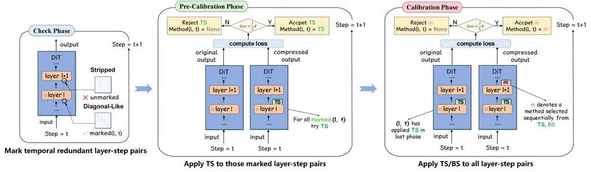

Figure 1: Overview of DiTReducio. In the Check Phase, we identify a
subset of highly temporally redundant layer-step pairs by detecting
diagonal-like attention patterns. In the Pre-Calibration Phase, we apply
TS to those identified pairs and retain only those for which the
resulting output loss remains below a dynamical threshold. Finally, in
the Calibration Phase, both TS and BS are applied across all layer-step
pairs under the same loss constraint. This procedure yields a
model-specific inference acceleration strategy.

Our goal is to develop a training-free approach for quality-controllable
acceleration in DiT-based TTS models. Inspired by prior observations of
computational redundancies in the DiT architectures Yuan et al. (2024),
we systematically investigate two key phenomena.

Firstly, through detailed analysis of DiT architectures, we identify two
notable forms of computational redundancy manifested during model
inference at specific layer-timestep combinations (referred to as
layer-step pairs below). The first, temporal redundancy, is
characterized by high output similarity across adjacent diffusion
denoising timesteps in attention mechanisms and feed-forward networks
(FFNs) at particular layers. The second, branch redundancy, emerges as
similar outputs between conditional and unconditional branches at
particular layer-step pairs. To leverage these redundancies, we
introduce two tailored strategies: Temporal Skipping (TS) and Branch
Skipping (BS). TS exploits temporal redundancy through caching and
reusing of computational results across timesteps, while BS derives the
unconditional branch output using the computed conditional branch output
and cached branch residuals from the previous timestep.

To further investigate the underlying mechanisms of these redundancies,
we analyze attention heatmaps in specific layer-step pairs and uncover
two distinct patterns, diagonal-like patterns and striped patterns. The
diagonal-like patterns are characterized by tokens primarily attending
to their neighboring tokens. This suggests that these layers focus on
local acoustic refinement, such as prosody and spectral details within
short speech segments at these timesteps. While the interpretability of
striped patterns remains challenging, our empirical studies demonstrate
their crucial role in maintaining the overall speech generation quality,
particularly in preserving the coherence and naturalness of the
synthesized speech.

Building on these insights, in this paper, we propose DiTReducio, a
systematic progressive calibration framework for efficient DiT-based TTS
inference. As Figure 1 shows, the framework operates through the
following sequential phases:

1.  1.  Check Phase: Identifying layer-step pairs exhibiting diagonal-like
        attention patterns as highly temporally redundant.
2.  2.  Pre-Calibration phase: Applying the TS strategy selectively to the
        marked layer-step pairs.
3.  3.  Calibration phase: Building upon the pre-calibrated model, applying
        both TS and BS strategies across all layer-step pairs while
        preserving generation quality.

Experimental results demonstrate that our approach can achieve a 1.6×
improvement in RTF while maintaining controllable generation quality. As
a training-free and plug-and-play solution, DiTReducio can seamlessly
integrate with existing acceleration methods. Also, the framework’s
adaptability in balancing acceleration and quality preservation makes it
particularly advantageous for large-scale TTS deployments.

## 2 Related Work

### 2.1 Diffusion-based Speech Synthesis

The emergence of diffusion models has challenged the long-standing
dominance of AR models in speech synthesis. Leveraging NAR generation
paradigms, diffusion models enhance generation efficiency while
preserving high synthesis quality. Early efforts such as Diff-TTS Jeong
et al. (2021) pioneered the application of diffusion models to speech
synthesis, demonstrating their feasibility. Guided-TTS Kim et al. (2022)
further introduced CFG mechanisms, substantially improving the
controllability and naturalness of generated speech.

With the development of Latent Diffusion Models (LDM) Rombach et al.
(2022), especially the emergence of DiT Peebles and Xie (2023),
diffusion-based speech synthesis has entered a new and promising phase.
These models Lee et al. (2024); Eskimez et al. (2024); Chen et al.
(2024b); Du et al. (2024); Jiang et al. (2025) fully exploit the
structural parallelism of Transformer architectures within the latent
diffusion framework, achieving both efficient training and inference as
well as robust zero-shot speech generation. This dual advantage of
computational efficiency and reliable generation has made them
well-suited for integration with multi-modal large language models Xu
et al. (2025) in practical applications.

### 2.2 Acceleration of Diffusion Model

Despite the excellent performance of diffusion models in generation
tasks, their inherent multi-step denoising nature leads to high
computational costs, constraining the practical application of
end-to-end speech synthesis. Current mainstream acceleration methods
primarily include model distillation, sampler optimization,
quantization, and pruning. Among these, model distillation Salimans and
Ho (2022); Sauer et al. (2024) techniques transfer the capabilities of
complex teacher models to lightweight student models, reducing sampling
steps. However, such methods require additional training overhead and
depend on the performance of the teacher model. Improvements to
samplers Lu et al. (2022a); Lu et al. (2022b) optimize noise schedules
and achieve generation quality comparable to that of thousand-step
sampling with significantly fewer sampling steps. These methods have the
advantage of being training-free and are relatively mature. While
quantization Li et al. (2023); He et al. (2023) and pruning Castells
et al. (2024) can improve inference efficiency, they lead to
unpredictable generation quality degradation, and pruning methods also
require additional training efforts.

Some works in image and video generation focus on optimizing the
attention mechanism and propose token-wise acceleration algorithms Bolya
et al. (2022); Kong et al. (2022); Xing et al. (2024). However, these
methods require training a token selector or calculating attention
heatmaps at each inference step, which causes compatibility issues with
efficient computation libraries such as FlashAttention, and their high
implementation complexity limits practical applications.

In speech synthesis, inference acceleration is primarily achieved
through distillation Huang et al. (2022b); Li et al. (2024); Guan et al.
(2024). Apart from distillation, architectural improvements offer an
alternative approach. DiffGAN-TTS Liu et al. (2022) introduces
Generative Adversarial Networks (GANs) to simulate denoising
distributions, enabling faster inference. While such methods can
significantly improve speed, they may introduce additional training
complexity.

Despite the progress, training-free and plug-and-play acceleration
solutions remain limited in diffusion-based speech synthesis. Achieving
low-cost acceleration while preserving generation quality remains an
urgent challenge in diffusion-based speech synthesis.

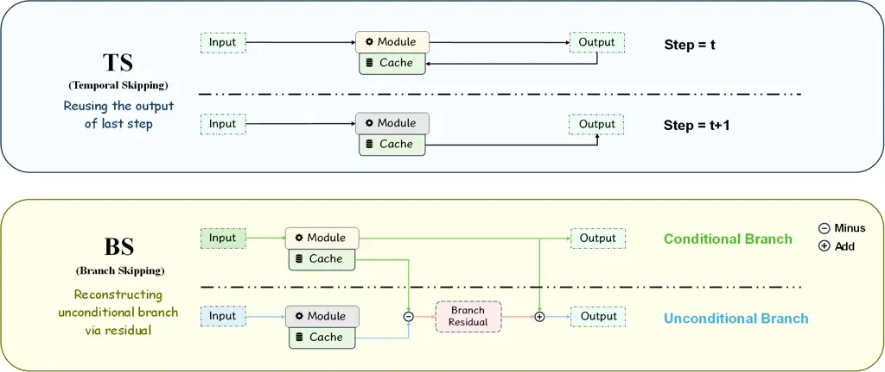

Figure 2: Comparison of the workflows of TS, BS. The cache is updated
only when TS is not applied by the corresponding module.

## 3 Method

### 3.1 Overview

In this section, we present the methodology of DiTReducio. In
Section 3.2, we systematically investigate two types of redundancy,
temporal redundancy and branch redundancy, arising during model
inference, and introduce corresponding compression methods. In
Section 3.3, we analyze the self-attention patterns within DiT layers
and demonstrate their correlation with temporal redundancy across
layer-step pairs. In Section 3.4, we propose DiTReducio, a progressive
calibration framework that iteratively explores compression
opportunities through three inference passes. The framework records
effective acceleration strategies based on observed redundancy, enabling
plug-and-play deployment in DiT-based speech synthesis.

### 3.2 Compression Methods

Redundant computations during diffusion model inference pose a major
bottleneck to inference speed. Previous studies Ma et al. (2024a); Zhao
et al. (2024) have shown that diffusion models for image and video
generation exhibit substantial temporal redundancy across multiple
timesteps. In our work, we demonstrate that diffusion models for speech
synthesis similarly exhibit extensive temporal redundancy and, under
CFG, also display measurable branch redundancy.

#### Temporal redundancy

Temporal redundancy refers to a high similarity between the outputs of a
given module at adjacent timesteps during model inference. Figure 7 in
Appendix A.2 indicates the cosine similarity heatmaps of the attention
and feed-forward modules at different timesteps for both F5-TTS and
MegaTTS 3. This observation reveals three key insights: (1) outputs
across different timesteps exhibit strong similarity; (2) output
similarity increases as timesteps become temporally closer, especially
for adjacent ones; (3) temporal redundancy exists across multiple
modules.

Based on this, we introduce the Temporal Skipping (TS) strategy. As
illustrated in Figure 2, TS caches an output from a specific module at
the preceding timestep and reuses it in subsequent steps to avoid
temporally redundant computation. Formally, let $`O_{t}`$ denote as the
output of a module at timestep $`t`$. Under TS, we have:

```math
O_{t}=O_{t-1}. \tag{1}
```

#### Branch redundancy

Branch redundancy arises in CFG-based diffusion models when the
conditional branch output $`O_{t}^{c}`$ and the unconditional branch
output $`O_{t}^{u}`$ of a module at a given timestep are highly similar.
Figure 8 in Appendix A.2 indicates the cosine similarity heatmaps
between $`O_{t}^{c}`$ and $`O_{t}^{u}`$ for the attention and
feed-forward modules in both F5-TTS and MegaTTS 3, confirming the
presence of obvious branch redundancy. This observation reveals the
following insights: (1) outputs across branches have high similarity but
in particular steps; (2) branch redundancy exists across multiple
modules.

To address this, we propose the Branch Skipping (BS) strategy. Unlike
the direct reuse mechanism in the TS strategy, branch redundancy is
comparatively less obvious than temporal redundancy; therefore, BS
exploits both types of redundancy by computing the branch residual. As
shown in Figure 2, under BS, only the conditional branch is executed,
and the unconditional branch output for the current timestep is
reconstructed using the conditional branch output and the branch
residual. Here, the branch residual is computed as the difference
between the cached unconditional and conditional branch outputs. Let the
output of a module at timestep $`t`$ be
$`O_{t}=\mathrm{Concat}\bigl(O_{t}^{c},O_{t}^{u}\bigr)`$, under BS, the
output becomes

```math
O_{t}=\mathrm{Concat}\bigl(O_{t}^{c},O_{t-1}^{u}-O_{t-1}^{c}+O_{t}^{c}\bigr), \tag{2}
```

This formulation skips the redundant branch computation while ensuring
that the resulting output closely approximates the original.

### 3.3 Attention Pattern

Early identification and application of TS on temporally redundant
layer-step pairs avoids forcing them into suboptimal compression
strategies during the subsequent greedy-based calibration phase.
Therefore, we focus on developing accurate methods for detecting such
redundancy. In fact, the degree of temporal redundancy depends not only
on the interval between timesteps but also on the distinct functional
roles of internal layers in generation tasks. DeepCache Ma et al.
(2024b) mentioned that shallow layers in diffusion models construct the
overall outline, whereas deeper layers are responsible for synthesizing
fine details. In our work, we further explore the relationship between
the attention patterns of each layer in the DiT and the distinct
functional roles of those layers in the inference process, leveraging
this connection to efficiently identify highly temporally redundant
layer-step pairs.

The attention heatmaps in the DiT layers exhibit two distinct patterns,
diagonal-like and striped. These patterns indicate potential functional
distinctions among layer-step pairs. Figure 3 presents these patterns
during inference in the F5-TTS model: (a) shows the diagonal-like
pattern for layer 5 at timestep 0, while (b) displays the striped
pattern for layer 2 at timestep 26. In the context of speech synthesis,
we interpret the diagonal-like pattern as handling fine-grained local
details, thereby enhancing speech fidelity and clarity. Although the
exact function of the striped pattern requires further investigation,
our empirical analysis suggests that striped patterns are crucial and
less redundant.

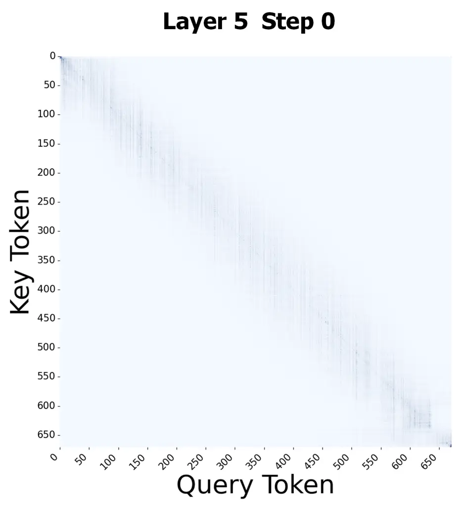

(a) Diagonal-like Pattern

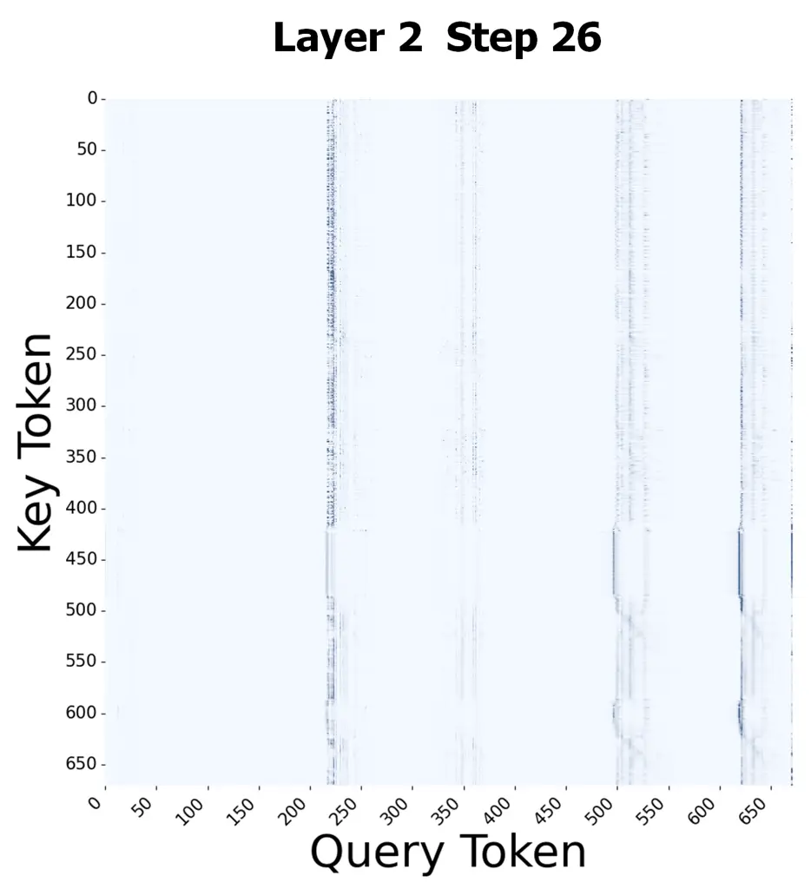

(b) Striped Pattern

Figure 3: Attention Patterns in F5-TTS inference: (a) Diagonal-like
patterns in both conditional and unconditional branches. (b) Striped
patterns in both branches.

To further analyze the diagonal-like attention pattern, we collected the
cosine similarity between attention heatmaps and diagonal matrices, as
well as the corresponding temporal redundancy across all layer-step
pairs in F5-TTS. The greater the similarity, the more closely the
layer-step pair aligns with a diagonal-like pattern. For layer $`l`$ at
timestep $`t`$, let $`O`$ denote the original output of the model and
$`O_{l,t}`$ represent the final model output when layer $`l`$ uses the
cached output from the timestep $`t-1`$ instead of recomputing it at the
current timestep $`t`$. Based on these outputs, we define the temporal
redundancy as:

```math
\text{$\displaystyle R_{l,t}=1-\frac{1}{b\cdot n\cdot d}\sum\limits_{k=1}^{b}\sum\limits_{i=1}^{n}\sum\limits_{j=1}^{d}||O_{k,i,j}-O^{\prime}_{k,i,j}||_{1}$}, \tag{3}
```

where $`b`$ denotes the batch size, $`n`$ the sequence length, and $`d`$
the feature dimension. This metric measures the mean absolute error
between $`O`$ and $`O_{l,t}`$. Layer-step pairs with redundancy above
0.9 are marked as highly temporally redundant. Figure 4 illustrates the
percentage of temporally redundant layer-step pairs in each similarity
interval in F5-TTS. At lower similarity, specifically below 0.1, the
percentage of redundant pairs remains relatively low, fluctuating
between 75% and 90%. As the similarity increases from 0.1 to 0.35, the
redundancy percentage exhibits a notable upward trend, reaching a peak
of nearly 100% between 0.15 and 0.35. The phenomenon suggests a tendency
that: (1) DiT layers exhibiting the diagonal-like patterns are more
likely to demonstrate higher temporal redundancy during inference; (2)
conversely, layers with striped patterns tend to exhibit lower temporal
redundancy.

Input : Model $`M`$, Calibration threshold $`\delta`$, total number of
layers $`L`$

Output : Strategy table $`\text{strategy\_table}[T][L]`$

Initialize strategy_table as a $`T\times L`$ matrix filled with NONE;

During the sampling process of the model, at each timestep $`t`$:

for _layer $`l\leftarrow 1`$ to $`L`$_ do

   for _method $`m\in\{\text{TS},\text{BS}\}`$_ do

      $`O\leftarrow`$ model output at timestep $`t`$ without compression
at layer $`l`$;

      $`O^{\prime}\leftarrow`$ model output at timestep $`t`$ with
method $`m`$ applied to layer $`l`$;

      $`\epsilon\leftarrow\frac{1}{n}\sum|O-O^{\prime}|`$, where $`n`$
is the number of elements in the tensor;

      if _$`\epsilon<\frac{l}{L}\cdot\delta`$_ then

         Update $`\text{strategy\_table}[t][l]\leftarrow m`$;

Algorithm 1 Calibration Phase of DiTReducio

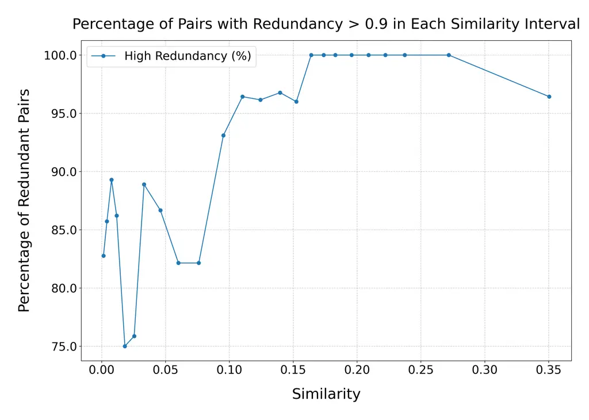

Figure 4: Percentage of temporally redundant layer-step pairs in each
similarity interval in F5-TTS.

### 3.4 DiTReducio

Previous studies Sun et al. (2024) analyzed the computational redundancy
of prevalent diffusion transformers relative to their inputs, revealing
that internal redundancy patterns are input-agnostic—i.e., they depend
primarily on model architecture and model parameters rather than
specific input content. This property enables the construction of
model-agnostic acceleration strategies via a limited number of inference
runs. Accordingly, we introduce DiTReducio, which achieves remarkable
acceleration by performing only three iterative inference passes and
trade off generation quality and inference speed with a predefined
compression threshold. DiTReducio comprises three phases: Check Phase,
Pre-Calibration Phase, and Calibration Phase.

#### Check Phase

The goal of this phase is to mark highly temporally redundant layer-step
pairs before calibration. Leveraging the correlation between attention
patterns and redundancy revealed in Section 3.3, we compute the cosine
similarity $`s_{l,t}`$ between each layer’s attention heatmap and the
identity matrix before the forward of layer $`l`$ at step $`t`$. After
inference, all $`s_{l,t}`$ values are sorted in descending order, and
the top $`q\%`$ highest-similarity layer-step pairs are marked.

#### Pre-Calibration Phase

This phase performs a preliminary calibration based on the Check Phase
results. Its procedure mirrors that of the Calibration Phase, except
that (1) only the marked layer-step pairs are considered, and (2) only
the TS is applied, without the BS. The ablation studies in Section 4.3
verify that this phase substantially improves the quality of the
resulting acceleration strategy.

| Model     | Metric        | Threshold |       |       |       |       |       |       |
| --------- | ------------- | --------- | ----- | ----- | ----- | ----- | ----- | ----- |
|           |               | T0        | T1    | T2    | T3    | T4    | T5    | T6    |
| F5-TTS    | SIM-o         | 0.640     | 0.640 | 0.637 | 0.629 | 0.618 | 0.610 | 0.590 |
|           | WER (%)       | 2.636     | 2.655 | 2.564 | 2.643 | 2.634 | 2.661 | 2.900 |
|           | RTF           | 0.178     | 0.165 | 0.149 | 0.138 | 0.129 | 0.120 | 0.112 |
|           | Ops Ratio (%) | 100.00    | 82.59 | 66.38 | 55.09 | 45.58 | 39.26 | 34.42 |
| MegaTTS 3 | SIM-o         | 0.750     | 0.750 | 0.748 | 0.743 | 0.734 | 0.691 | 0.626 |
|           | WER (%)       | 3.112     | 3.112 | 3.110 | 3.073 | 3.095 | 3.133 | 3.030 |
|           | RTF           | 0.396     | 0.395 | 0.359 | 0.287 | 0.224 | 0.176 | 0.156 |
|           | Ops Ratio (%) | 100.00    | 98.87 | 88.02 | 68.19 | 48.94 | 33.88 | 27.52 |

Table 1: Performance comparison between F5-TTS and MegaTTS 3 under
varying compression thresholds. The bold column (T4) represents the
optimal threshold, at which the models achieve substantial acceleration
while maintaining generation quality within acceptable bounds. _Ops
Ratio_ denotes the ratio of FLOPs after compression relative to the
baseline (uncompressed) model, indicating the extent of computational
reduction. The data is evaluated on a single Nvidia 3090 GPU.

#### Calibration Phase

This phase performs a comprehensive calibration following the
Pre-Calibration Phase. Since the impact of compressing deep layers is
greater than that of compressing shallow layers, under a given global
calibration threshold $`\delta`$, we introduce a dynamic threshold that
controls the computational compression for the layer-step pair $`(l,t)`$
using the threshold $`\frac{l}{L}\delta`$, where $`L`$ is the total
number of layers in the DiT. The algorithm is outlined in Algorithm 1.
During the model’s inference at step $`t`$, for layer $`l`$, we first
compute the entire model output $`O`$ without applying any acceleration
strategy to pair $`(l,t)`$. Then we sequentially apply both TS and BS
strategies to the attention and feed-forward modules of the layer to
obtain the compressed output $`O^{\prime}`$, prioritizing TS due to its
higher computational savings. Next, we compute the mean absolute error
between $`O`$ and $`O^{\prime}`$. If this value is less than the
threshold $`\frac{l}{L}\delta`$, we record the applied strategy used for
$`(l,t)`$; otherwise, we record that no acceleration strategy is used
for $`(l,t)`$. Notably, if $`(l,t)`$ has been selected for TS
application during the Pre-Calibration Phase, we skip the calibration
for that pair.

## 4 Experiments

### 4.1 Settings

#### Model

We evaluate DiTReducio on F5-TTS Chen et al. (2024b) and MegaTTS 3 Jiang
et al. (2025), both of which employ DiT for conditional flow matching.
To implement our compression method, we make several modifications to
the model. Implementation details are provided in the Appendix A.1.

#### Dataset & Task

We utilize the LibriSpeech-PC-test-clean subset Meister et al. (2023)
comprising 1,127 samples, following F5-TTS. We assess the performance of
the model under DiTReducio within the cross-sentence task paradigm,
where models generate speech with consistent speaker characteristics
based on a reference text, a speaker prompt, and a corresponding
transcription.

#### Metric

We adopt the evaluation metrics from F5-TTS to assess generation
quality. The speaker similarity-objective (SIM-o) is computed using the
WavLM-large-based model Chen et al. (2022) to compute cosine similarity
between features extracted from synthesized and reference audio. The
Word Error Rate (WER) is calculated by comparing the reference text
against transcriptions generated by Whisper-large-v3 Radford et al.
(2023). To evaluate acceleration performance, we adopt the RTF to
quantify inference speed, and use the total floating-point operations
(FLOPs) as an indicator of computational costs. For F5-TTS, the RTF is
measured based on the model’s total inference time. For MegaTTS 3, only
the DiT inference time is considered, as DiT is not the sole bottleneck
in the overall inference pipeline.

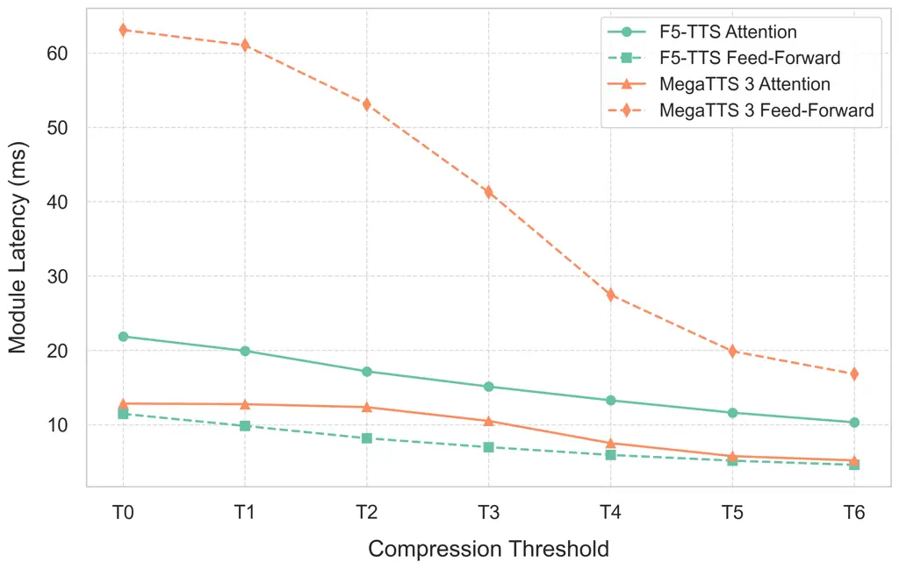

Figure 5: Attention and feed-forward module latencies of F5-TTS and
MegaTTS 3.

#### Evaluation

All evaluations are conducted across 5 random seeds (42, 3407, 666,
3954, 3962), with results averaged. For both F5-TTS and MegaTTS 3, we
evaluate 6 distinct compression thresholds (denoted as T1 through T6 in
ascending order, where T0 represents the uncompressed baseline). The
thresholds are uniformly distributed, with maximum values of 0.3 and 1.2
for F5-TTS and MegaTTS 3, and the maximum threshold resulting in
approximately 10% degradation in SIM-o. In the Check Phase, we identify
the top 10% of layer-step pairs as highly temporally redundant pairs.

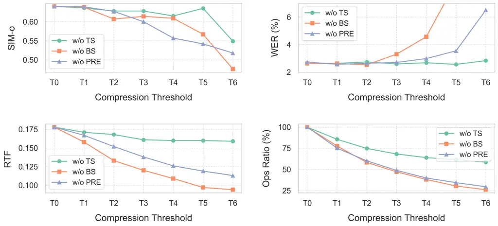

Figure 6: Ablation study on F5-TTS. PRE represents the Check Phase and
the Pre-Calibration Phase.

### 4.2 Results

DiTReducio demonstrates controlled acceleration while preserving the
generation quality. When applying the two lowest thresholds to F5-TTS,
the model maintains generation quality comparable to the baseline while
achieving significant RTF reduction. At threshold T2, RTF decreases by
16.5%. With increasing thresholds, the generation quality degradation
remains moderate while inference speed improves further, with a maximum
RTF reduction of 37.0%. The similar trend is observed for MegaTTS 3:
obvious quality degradation appears only at the highest threshold, while
inference efficiency improves more notably.

DiTReducio significantly reduce the latency of modules. We measured the
internal attention and feed-forward module latencies of F5-TTS and
MegaTTS 3 under varying compression thresholds. As shown in Figure 5,
both F5-TTS and MegaTTS 3 exhibit considerable decreases in module
latency as the compression thresholds increase. At the maximum
compression threshold, F5-TTS achieves latency reductions of 52.8% and
59.8% for the atention and feed-forward modules, respectively. For
MegaTTS 3, the latency reductions reach 60.3% for the attention module
and 63.6% for the feed-forward module.

The selection of compression thresholds is critical. Our analysis
reveals an interesting threshold-dependent behavior: from lower to
moderate thresholds (T2 to T4), increasing the threshold yields
considerable speedup with minimal quality degradation. However, at
higher threshold levels (T5 to T6), the marginal acceleration benefits
diminish while quality degradation becomes more evident. This phenomenon
suggests that compression approaches its theoretical limit around T4,
beyond which further threshold increases may incorrectly identify
essential computations as redundant. With appropriate threshold
selection, DiTReducio effectively balances inference acceleration and
generation quality. Furthermore, different models exhibit varying
sensitivities to threshold settings: the F5-TTS shows quality
degradation at a compression threshold of 0.3, while MegaTTS 3 retains
quality up to a threshold of 0.4, where it achieves notable compression
gains.

### 4.3 Ablation Study

In this section, we investigate the impact of Check Phase,
Pre-calibration Phase and two compression methods on DiTReducio’s
performance.

TS strategy is crucial for achieving effective acceleration. As shown in
Figure 6, ablation results demonstrate that applying only the Branch
Skipping (BS) strategy to F5-TTS maintains speech quality. However,
further increases in the compression threshold yield diminishing returns
in acceleration beyond T3. This highlights the intrinsic limitations of
relying solely on the BS strategy for acceleration.

BS strategy is essential for maintaining generation quality. As shown in
Figure 6, while only applying the TS strategy achieves greater
acceleration of F5-TTS, it significantly degrades audio quality. For
F5-TTS, employing TS alone leads to a substantial decrease in SIM-o at
equivalent compression thresholds, with WER even reaching 23.06% at the
maximum threshold, indicating loss of conditional information during
inference. The Check Phase and Pre-Calibration Phase are critical for
identifying effective acceleration strategies. As evidenced in Figure 6,
omitting the first two phases of DiTReducio leads to significant
degradation in both generation quality and inference speed for F5-TTS
under equivalent compression thresholds. These findings confirm that
these phases guide the Calibration Phase toward a superior strategy
combination.

## 5 Conclusion

In this paper, we present a training-free acceleration approach for
DiT-based TTS models, which derives a persistent acceleration strategy
through a progressive calibration process. We observe temporal
redundancy and branch redundancy in model inference, and develop
corresponding strategies to exploit them effectively. We analyze the
relationship between attention patterns and temporal redundancy in a
specific layer-step pair, and develop a calibration framework that
effectively identifies and compresses internal redundancies in a
model-specific manner. Our experimental results verify that DiTReducio
reduces computational costs in both attention and feed-forward modules
while maintaining generation quality and compatibility with efficient
attention computation libraries such as FlashAttention.

## Limitations

Firstly, the applicability of DiTReducio is primarily constrained to
DiT-based speech synthesis models, which limits its generalization to
other model architectures. Additionally, the framework demands
high-quality calibration audio for optimal performance.

## References

- Anastassiou et al. (2024) Philip Anastassiou, Jiawei Chen, Jitong
  Chen, Yuanzhe Chen, Zhuo Chen, Ziyi Chen, Jian Cong, Lelai Deng,
  Chuang Ding, Lu Gao, and 1 others. 2024. Seed-tts: A family of
  high-quality versatile speech generation models. _arXiv preprint
  arXiv:2406.02430_.
- Bolya et al. (2022) Daniel Bolya, Cheng-Yang Fu, Xiaoliang Dai,
  Peizhao Zhang, Christoph Feichtenhofer, and Judy Hoffman. 2022. Token
  merging: Your vit but faster. _arXiv preprint arXiv:2210.09461_.
- Bolya and Hoffman (2023) Daniel Bolya and Judy Hoffman. 2023. Token
  merging for fast stable diffusion. In _Proceedings of the IEEE/CVF
  conference on computer vision and pattern recognition_, pages
  4599–4603.
- Castells et al. (2024) Thibault Castells, Hyoung-Kyu Song, Bo-Kyeong
  Kim, and Shinkook Choi. 2024. Ld-pruner: Efficient pruning of latent
  diffusion models using task-agnostic insights. In _Proceedings of the
  IEEE/CVF Conference on Computer Vision and Pattern Recognition_, pages
  821–830.
- Chen et al. (2024a) Sanyuan Chen, Shujie Liu, Long Zhou, Yanqing Liu,
  Xu Tan, Jinyu Li, Sheng Zhao, Yao Qian, and Furu Wei. 2024a. Vall-e 2:
  Neural codec language models are human parity zero-shot text to speech
  synthesizers. _arXiv preprint arXiv:2406.05370_.
- Chen et al. (2024b) Yushen Chen, Zhikang Niu, Ziyang Ma, Keqi Deng,
  Chunhui Wang, Jian Zhao, Kai Yu, and Xie Chen. 2024b. F5-tts: A
  fairytaler that fakes fluent and faithful speech with flow matching.
  _arXiv preprint arXiv:2410.06885_.
- Chen et al. (2022) Zhengyang Chen, Sanyuan Chen, Yu Wu, Yao Qian,
  Chengyi Wang, Shujie Liu, Yanmin Qian, and Michael Zeng. 2022.
  Large-scale self-supervised speech representation learning for
  automatic speaker verification. In _ICASSP 2022-2022 IEEE
  International Conference on Acoustics, Speech and Signal Processing
  (ICASSP)_, pages 6147–6151. IEEE.
- Dao et al. (2022) Tri Dao, Dan Fu, Stefano Ermon, Atri Rudra, and
  Christopher Ré. 2022. Flashattention: Fast and memory-efficient exact
  attention with io-awareness. _Advances in neural information
  processing systems_, 35:16344–16359.
- Deng et al. (2025) Wei Deng, Siyi Zhou, Jingchen Shu, Jinchao Wang,
  and Lu Wang. 2025. Indextts: An industrial-level controllable and
  efficient zero-shot text-to-speech system. _arXiv preprint
  arXiv:2502.05512_.
- Du et al. (2024) Zhihao Du, Qian Chen, Shiliang Zhang, Kai Hu, Heng
  Lu, Yexin Yang, Hangrui Hu, Siqi Zheng, Yue Gu, Ziyang Ma, and 1
  others. 2024. Cosyvoice: A scalable multilingual zero-shot
  text-to-speech synthesizer based on supervised semantic tokens. _arXiv
  preprint arXiv:2407.05407_.
- Eskimez et al. (2024) Sefik Emre Eskimez, Xiaofei Wang, Manthan
  Thakker, Canrun Li, Chung-Hsien Tsai, Zhen Xiao, Hemin Yang, Zirun
  Zhu, Min Tang, Xu Tan, and 1 others. 2024. E2 tts: Embarrassingly easy
  fully non-autoregressive zero-shot tts. In _2024 IEEE Spoken Language
  Technology Workshop (SLT)_, pages 682–689. IEEE.
- Guan et al. (2024) Wenhao Guan, Qi Su, Haodong Zhou, Shiyu Miao,
  Xingjia Xie, Lin Li, and Qingyang Hong. 2024. Reflow-tts: A rectified
  flow model for high-fidelity text-to-speech. In _ICASSP 2024-2024 IEEE
  International Conference on Acoustics, Speech and Signal Processing
  (ICASSP)_, pages 10501–10505. IEEE.
- Hassani et al. (2023) Ali Hassani, Steven Walton, Jiachen Li, Shen Li,
  and Humphrey Shi. 2023. Neighborhood attention transformer. In
  _Proceedings of the IEEE/CVF conference on computer vision and pattern
  recognition_, pages 6185–6194.
- He et al. (2023) Yefei He, Luping Liu, Jing Liu, Weijia Wu, Hong Zhou,
  and Bohan Zhuang. 2023. Ptqd: Accurate post-training quantization for
  diffusion models. _arXiv preprint arXiv:2305.10657_.
- Ho and Salimans (2022) Jonathan Ho and Tim Salimans. 2022.
  Classifier-free diffusion guidance. _arXiv preprint arXiv:2207.12598_.
- Huang et al. (2022a) Rongjie Huang, Yi Ren, Jinglin Liu, Chenye Cui,
  and Zhou Zhao. 2022a. Generspeech: Towards style transfer for
  generalizable out-of-domain text-to-speech. _Advances in Neural
  Information Processing Systems_, 35:10970–10983.
- Huang et al. (2023) Rongjie Huang, Chunlei Zhang, Yongqi Wang,
  Dongchao Yang, Luping Liu, Zhenhui Ye, Ziyue Jiang, Chao Weng, Zhou
  Zhao, and Dong Yu. 2023. Make-a-voice: Unified voice synthesis with
  discrete representation. _arXiv preprint arXiv:2305.19269_.
- Huang et al. (2022b) Rongjie Huang, Zhou Zhao, Huadai Liu, Jinglin
  Liu, Chenye Cui, and Yi Ren. 2022b. Prodiff: Progressive fast
  diffusion model for high-quality text-to-speech. In _Proceedings of
  the 30th ACM International Conference on Multimedia_, pages 2595–2605.
- Jeong et al. (2021) Myeonghun Jeong, Hyeongju Kim, Sung Jun Cheon,
  Byoung Jin Choi, and Nam Soo Kim. 2021. Diff-tts: A denoising
  diffusion model for text-to-speech. _arXiv preprint arXiv:2104.01409_.
- Jiang et al. (2025) Ziyue Jiang, Yi Ren, Ruiqi Li, Shengpeng Ji,
  Boyang Zhang, Zhenhui Ye, Chen Zhang, Bai Jionghao, Xiaoda Yang,
  Jialong Zuo, and 1 others. 2025. Megatts 3: Sparse alignment enhanced
  latent diffusion transformer for zero-shot speech synthesis. _arXiv
  preprint arXiv:2502.18924_.
- Ju et al. (2024) Zeqian Ju, Yuancheng Wang, Kai Shen, Xu Tan, Detai
  Xin, Dongchao Yang, Yanqing Liu, Yichong Leng, Kaitao Song, Siliang
  Tang, and 1 others. 2024. Naturalspeech 3: Zero-shot speech synthesis
  with factorized codec and diffusion models. _arXiv preprint
  arXiv:2403.03100_.
- Kim et al. (2022) Heeseung Kim, Sungwon Kim, and Sungroh Yoon. 2022.
  Guided-tts: A diffusion model for text-to-speech via classifier
  guidance. In _International Conference on Machine Learning_, pages
  11119–11133. PMLR.
- Kong et al. (2022) Zhenglun Kong, Peiyan Dong, Xiaolong Ma, Xin Meng,
  Wei Niu, Mengshu Sun, Xuan Shen, Geng Yuan, Bin Ren, Hao Tang, and 1
  others. 2022. Spvit: Enabling faster vision transformers via
  latency-aware soft token pruning. In _European conference on computer
  vision_, pages 620–640. Springer.
- Lee et al. (2024) Keon Lee, Dong Won Kim, Jaehyeon Kim, and Jaewoong
  Cho. 2024. Ditto-tts: Efficient and scalable zero-shot text-to-speech
  with diffusion transformer. _arXiv preprint arXiv:2406.11427_.
- Li et al. (2023) Xiuyu Li, Yijiang Liu, Long Lian, Huanrui Yang, Zhen
  Dong, Daniel Kang, Shanghang Zhang, and Kurt Keutzer. 2023.
  Q-diffusion: Quantizing diffusion models. In _Proceedings of the
  IEEE/CVF International Conference on Computer Vision_, pages
  17535–17545.
- Li et al. (2024) Yingahao Aaron Li, Rithesh Kumar, and Zeyu Jin. 2024.
  Dmdspeech: Distilled diffusion model surpassing the teacher in
  zero-shot speech synthesis via direct metric optimization. _arXiv
  preprint arXiv:2410.11097_.
- Liu et al. (2022) Songxiang Liu, Dan Su, and Dong Yu. 2022.
  Diffgan-tts: High-fidelity and efficient text-to-speech with denoising
  diffusion gans. _arXiv preprint arXiv:2201.11972_.
- Lu et al. (2022a) Cheng Lu, Yuhao Zhou, Fan Bao, Jianfei Chen,
  Chongxuan Li, and Jun Zhu. 2022a. Dpm-solver: A fast ode solver for
  diffusion probabilistic model sampling in around 10 steps. _Advances
  in Neural Information Processing Systems_, 35:5775–5787.
- Lu et al. (2022b) Cheng Lu, Yuhao Zhou, Fan Bao, Jianfei Chen,
  Chongxuan Li, and Jun Zhu. 2022b. Dpm-solver++: Fast solver for guided
  sampling of diffusion probabilistic models. _arXiv preprint
  arXiv:2211.01095_.
- Ma et al. (2024a) Xinyin Ma, Gongfan Fang, Michael Bi Mi, and Xinchao
  Wang. 2024a. Learning-to-cache: Accelerating diffusion transformer via
  layer caching. _Advances in Neural Information Processing Systems_,
  37:133282–133304.
- Ma et al. (2024b) Xinyin Ma, Gongfan Fang, and Xinchao Wang. 2024b.
  Deepcache: Accelerating diffusion models for free. In _Proceedings of
  the IEEE/CVF conference on computer vision and pattern recognition_,
  pages 15762–15772.
- Mehta et al. (2024) Shivam Mehta, Ruibo Tu, Jonas Beskow, Éva Székely,
  and Gustav Eje Henter. 2024. Matcha-tts: A fast tts architecture with
  conditional flow matching. In _ICASSP 2024-2024 IEEE International
  Conference on Acoustics, Speech and Signal Processing (ICASSP)_, pages
  11341–11345. IEEE.
- Meister et al. (2023) Aleksandr Meister, Matvei Novikov, Nikolay
  Karpov, Evelina Bakhturina, Vitaly Lavrukhin, and Boris
  Ginsburg. 2023. Librispeech-pc: Benchmark for evaluation of
  punctuation and capitalization capabilities of end-to-end asr models.
  In _2023 IEEE automatic speech recognition and understanding workshop
  (ASRU)_, pages 1–7. IEEE.
- Peebles and Xie (2023) William Peebles and Saining Xie. 2023. Scalable
  diffusion models with transformers. In _Proceedings of the IEEE/CVF
  international conference on computer vision_, pages 4195–4205.
- Radford et al. (2023) Alec Radford, Jong Wook Kim, Tao Xu, Greg
  Brockman, Christine McLeavey, and Ilya Sutskever. 2023. Robust speech
  recognition via large-scale weak supervision. In _International
  conference on machine learning_, pages 28492–28518. PMLR.
- Rombach et al. (2022) Robin Rombach, Andreas Blattmann, Dominik
  Lorenz, Patrick Esser, and Björn Ommer. 2022. High-resolution image
  synthesis with latent diffusion models. In _Proceedings of the
  IEEE/CVF conference on computer vision and pattern recognition_, pages
  10684–10695.
- Saghatchian et al. (2025) Omid Saghatchian, Atiyeh Gh Moghadam, and
  Ahmad Nickabadi. 2025. Cached adaptive token merging: Dynamic token
  reduction and redundant computation elimination in diffusion model.
  _arXiv preprint arXiv:2501.00946_.
- Salimans and Ho (2022) Tim Salimans and Jonathan Ho. 2022. Progressive
  distillation for fast sampling of diffusion models. _arXiv preprint
  arXiv:2202.00512_.
- Sauer et al. (2024) Axel Sauer, Dominik Lorenz, Andreas Blattmann, and
  Robin Rombach. 2024. Adversarial diffusion distillation. In _European
  Conference on Computer Vision_, pages 87–103. Springer.
- Shang et al. (2023) Yuzhang Shang, Zhihang Yuan, Bin Xie, Bingzhe Wu,
  and Yan Yan. 2023. Post-training quantization on diffusion models. In
  _Proceedings of the IEEE/CVF conference on computer vision and pattern
  recognition_, pages 1972–1981.
- Song et al. (2025) Yakun Song, Zhuo Chen, Xiaofei Wang, Ziyang Ma, and
  Xie Chen. 2025. Ella-v: Stable neural codec language modeling with
  alignment-guided sequence reordering. In _Proceedings of the AAAI
  Conference on Artificial Intelligence_, volume 39, pages 25174–25182.
- Sun et al. (2024) Xibo Sun, Jiarui Fang, Aoyu Li, and Jinzhe
  Pan. 2024. Unveiling redundancy in diffusion transformers (dits): A
  systematic study. _arXiv preprint arXiv:2411.13588_.
- Wan et al. (2025) Ben Wan, Tianyi Zheng, Zhaoyu Chen, Yuxiao Wang, and
  Jia Wang. 2025. Pruning for sparse diffusion models based on gradient
  flow. _arXiv preprint arXiv:2501.09464_.
- Wang et al. (2023) Chengyi Wang, Sanyuan Chen, Yu Wu, Ziqiang Zhang,
  Long Zhou, Shujie Liu, Zhuo Chen, Yanqing Liu, Huaming Wang, Jinyu Li,
  and 1 others. 2023. Neural codec language models are zero-shot text to
  speech synthesizers. _arXiv preprint arXiv:2301.02111_.
- Wang et al. (2025) Xinsheng Wang, Mingqi Jiang, Ziyang Ma, Ziyu Zhang,
  Songxiang Liu, Linqin Li, Zheng Liang, Qixi Zheng, Rui Wang, Xiaoqin
  Feng, and 1 others. 2025. Spark-tts: An efficient llm-based
  text-to-speech model with single-stream decoupled speech tokens.
  _arXiv preprint arXiv:2503.01710_.
- Wang et al. (2024) Yuancheng Wang, Haoyue Zhan, Liwei Liu, Ruihong
  Zeng, Haotian Guo, Jiachen Zheng, Qiang Zhang, Xueyao Zhang, Shunsi
  Zhang, and Zhizheng Wu. 2024. Maskgct: Zero-shot text-to-speech with
  masked generative codec transformer. _arXiv preprint
  arXiv:2409.00750_.
- Xin et al. (2024) Detai Xin, Xu Tan, Kai Shen, Zeqian Ju, Dongchao
  Yang, Yuancheng Wang, Shinnosuke Takamichi, Hiroshi Saruwatari, Shujie
  Liu, Jinyu Li, and 1 others. 2024. Rall-e: Robust codec language
  modeling with chain-of-thought prompting for text-to-speech synthesis.
  _arXiv preprint arXiv:2404.03204_.
- Xing et al. (2024) Long Xing, Qidong Huang, Xiaoyi Dong, Jiajie Lu,
  Pan Zhang, Yuhang Zang, Yuhang Cao, Conghui He, Jiaqi Wang, Feng Wu,
  and 1 others. 2024. Pyramiddrop: Accelerating your large
  vision-language models via pyramid visual redundancy reduction. _arXiv
  preprint arXiv:2410.17247_.
- Xu et al. (2025) Jin Xu, Zhifang Guo, Jinzheng He, Hangrui Hu, Ting
  He, Shuai Bai, Keqin Chen, Jialin Wang, Yang Fan, Kai Dang, and 1
  others. 2025. Qwen2. 5-omni technical report. _arXiv preprint
  arXiv:2503.20215_.
- Yuan et al. (2024) Zhihang Yuan, Hanling Zhang, Lu Pu, Xuefei Ning,
  Linfeng Zhang, Tianchen Zhao, Shengen Yan, Guohao Dai, and
  Yu Wang. 2024. Ditfastattn: Attention compression for diffusion
  transformer models. _Advances in Neural Information Processing
  Systems_, 37:1196–1219.
- Zaheer et al. (2020) Manzil Zaheer, Guru Guruganesh, Kumar Avinava
  Dubey, Joshua Ainslie, Chris Alberti, Santiago Ontanon, Philip Pham,
  Anirudh Ravula, Qifan Wang, Li Yang, and 1 others. 2020. Big bird:
  Transformers for longer sequences. _Advances in neural information
  processing systems_, 33:17283–17297.
- Zhao et al. (2024) Xuanlei Zhao, Xiaolong Jin, Kai Wang, and Yang
  You. 2024. Real-time video generation with pyramid attention
  broadcast. _arXiv preprint arXiv:2408.12588_.

## Appendix A Appendix

### A.1 Implementation Details

For F5-TTS, we optimize the DiT implementation by integrating the
conditional and unconditional branch computations into a single forward
pass. Specifically, we concatenate conditional and unconditional inputs
into a single batch, with the first half used for conditional inputs and
the second half for unconditional ones. This modification allows the BS
strategy to be applied while retaining functional equivalence with the
original dual-pass method.

For MegaTTS 3, which employs multi-condition classifier-free guidance,
we adapted the BS strategy to accommodate its dual conditional branches
by computing two separate residuals: one between the text conditional
branch and the speaker conditional branch, and another between the
unconditional branch and the speaker conditional branch. During
inference, only the speaker conditional branch is computed explicitly,
while the other two branches are reconstructed by adding their
respective residuals to it.

Both models are enhanced with FlashAttention, confirming the
compatibility of our framework with efficient attention implementations.

### A.2 Redundancy in Model

We analyze the temporal and branch redundancy in both F5-TTS and MegaTTS
3 models. Figure 7 presents the temporal redundancy analysis results.
For F5-TTS, we examine layers 10 and 20, computing the cosine similarity
between outputs from adjacent denoising timesteps for both attention and
feed-forward. Similar analysis is conducted for MegaTTS 3, focusing on
layers 10 and 22. The results reveal high temporal redundancy during the
inference of the model.

The branch redundancy characteristics are depicted in Figure 8. For
F5-TTS, we measure the cosine similarity between outputs from
conditional and unconditional branches for both attention and
feed-forward modules across various timesteps. For MegaTTS 3, which
utilizes multi-condition classifier-free guidance with two conditional
branch outputs, we analyze the similarities among all three branches,
specifically comparing the speaker conditional branch (Branch 1) with
both the text conditional branch (Branch 2) and the unconditional branch
(Branch 3).

### A.3 Method Distribution

Figure 9 shows the method distribution heatmaps from the calibration of
F5-TTS under increasing compression thresholds. Each cell in the
heatmaps represents the compression method applied to a specific
layer-step pair. The heatmaps are arranged in a grid layout from left to
right and top to bottom, with each subplot corresponding to a threshold
in 0.05 increments, ranging from 0.05 to 0.30. As the compression
threshold rises, we observe a progressive increase in the number of
layer-step pairs employing compression strategies. Notably, layer-step
pairs at later timesteps are more likely to adopt TS, whereas those at
earlier timesteps tend to remain uncompressed or use BS. This suggests
an underlying connection between internal model redundancy and the
progression across diffusion timesteps.

### A.4 Potential Risks

While DiTReducio offers an efficient, training-free approach to
accelerate DiT-based TTS models, its deployment entails certain risks
that require careful management. A key concern is the potential
degradation of speech quality in high-stakes applications such as
healthcare, legal transcription, or emergency response. Even minor
distortions could lead to misinterpretation or diminished user trust,
highlighting the necessity of thorough validation in critical domains.
Additionally, the enhanced efficiency of DiTReducio may lower the
barrier for misuse, enabling malicious actors to generate deceptive
audio content such as deepfakes or impersonation attacks. Robust
safeguards are therefore essential to mitigate such risks.

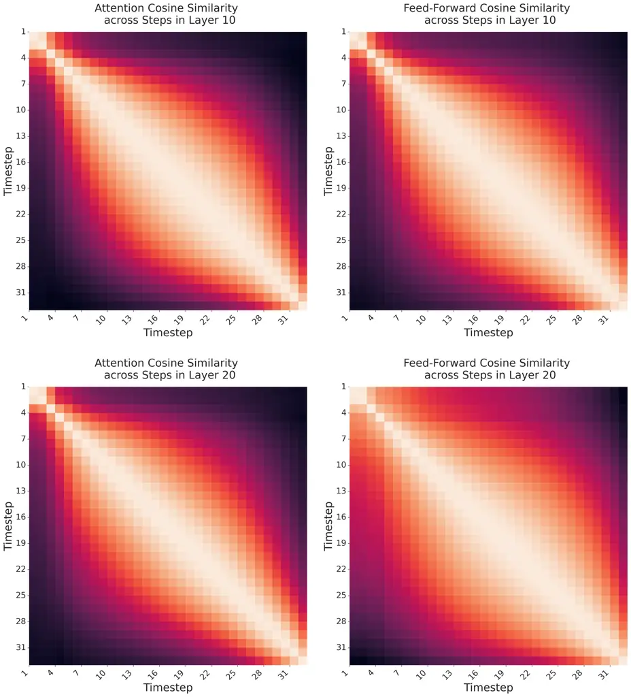

(a) F5-TTS

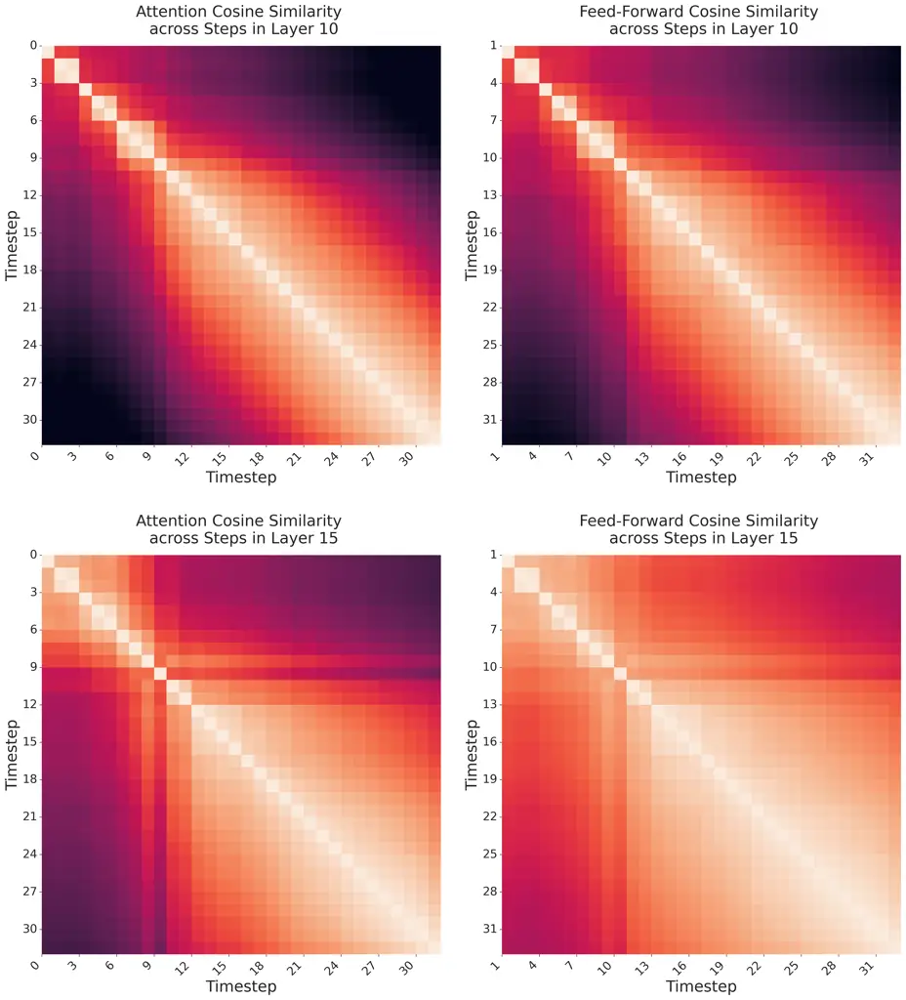

(b) MegaTTS 3

Figure 7: Temporal redundancy in F5-TTS and MegaTTS 3.

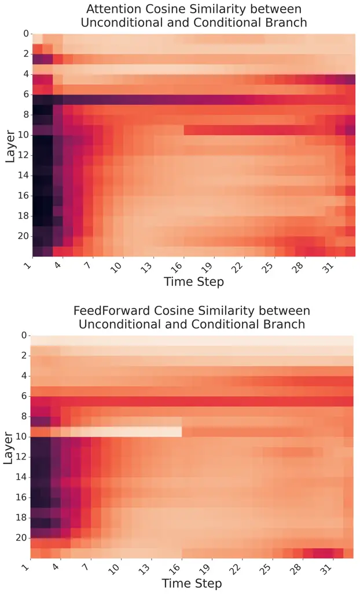

(a) F5-TTS

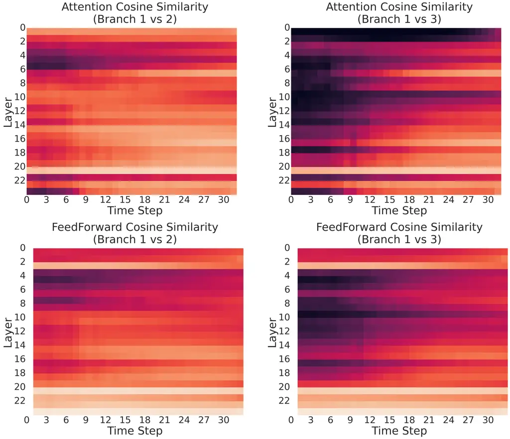

(b) MegaTTS 3

Figure 8: Branch redundancy in F5-TTS and MegaTTS 3.

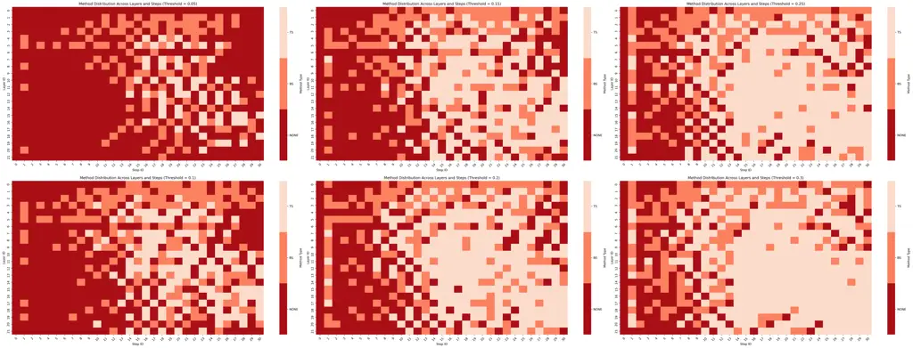

Figure 9: Method Distribution of F5-TTS across compression thresholds.
