# FuseCodec: Semantic-Contextual Fusion and Supervision for Neural Codecs

Md Mubtasim Ahasan ^(†)^(†)thanks: Corresponding author:
mubtasimahasan@gmail.com Affiliation:  Center for Computational & Data
Sciences, Independent University, Bangladesh    Rafat Hasan Khan
Affiliation:  Center for Computational & Data Sciences, Independent
University, Bangladesh    Tasnim Mohiuddin Affiliation:  Qatar Computing
Research Institute    Aman Chadha ^(†)^(†)thanks: Work does not relate
to position at Amazon. Affiliation:  Amazon GenAI    Tariq Iqbal
Affiliation:  University of Virginia    M Ashraful Amin Affiliation: 
Center for Computational & Data Sciences, Independent University,
Bangladesh    Amin Ahsan Ali Affiliation:  Center for Computational &
Data Sciences, Independent University, Bangladesh    Md Mofijul Islam
^(†)^(†)thanks: Equal Supervision. Affiliation:  Amazon GenAI    A K M
Mahbubur Rahman

###### Abstract

Speech tokenization enables discrete representation and facilitates
speech language modeling. However, existing neural codecs capture
low-level acoustic features, overlooking the semantic and contextual
cues inherent to human speech. While recent efforts introduced semantic
representations from self-supervised speech models or incorporated
contextual representations from pre-trained language models, challenges
remain in aligning and unifying the semantic and contextual
representations. We introduce FuseCodec, which unifies acoustic,
semantic, and contextual representations through strong cross-modal
alignment and globally informed supervision. We propose three
complementary techniques: (i) Latent Representation Fusion, integrating
semantic and contextual features directly into the encoder latent space
for robust and unified representation learning; (ii) Global
Semantic-Contextual Supervision, supervising discrete tokens with
globally pooled and broadcasted representations to enhance temporal
consistency and cross-modal alignment; and (iii) Temporally Aligned
Contextual Supervision, strengthening alignment by dynamically matching
contextual and speech tokens within a local window for fine-grained
token-level supervision. We further introduce FuseCodec-TTS,
demonstrating our methodology’s applicability to zero-shot speech
synthesis. Empirically, FuseCodec achieves state-of-the-art performance
in LibriSpeech, surpassing EnCodec, SpeechTokenizer, and DAC in
transcription accuracy, perceptual quality, intelligibility, and speaker
similarity. Results highlight the effectiveness of contextually and
semantically guided tokenization for speech tokenization and downstream
tasks. Code and pretrained models are available at
[github.com/mubtasimahasan/FuseCodec](https://github.com/mubtasimahasan/FuseCodec).

|     |
| --- |
|     |

## 1 Introduction

Tokenization is a cornerstone of natural language processing (NLP),
enabling language models to represent text in discrete units for
efficient autoregressive modeling and scalable downstream applications
(Schmidt et al., 2024). Inspired by this paradigm, the speech domain has
increasingly adopted neural codecs, popularized by Encodec (Défossez
et al., 2022) and SoundStream (Zeghidour et al., 2022). Neural codecs
tokenize speech using an encoder, residual vector quantizer, and decoder
architecture, enabling modeling discrete representations suitable for
modular extension to downstream tasks such as speech synthesis (Wang
et al., 2023).

However, learning discrete speech representations is more challenging
than text due to the continuous and multidimensional nature of speech
(Ju et al., 2024). While neural codecs learn acoustic representations
(waveform and low-level signal characteristics), they struggle to
capture high-level semantics, requiring downstream models to adopt
additional self-supervised masked language objectives to derive semantic
representations (phonetic content and linguistic meaning) (Borsos
et al., 2023). To bridge this gap, recent work incorporates semantic
distillation from self-supervised speech models (Borsos et al., 2023;
Zhang et al., 2024; Défossez et al., 2024), which improves both
reconstruction quality and semantic awareness of learned tokens. Yet
another fundamental aspect of human speech remains missing: speech is
inherently grounded in context and surrounding cues (Brown et al.,
2022). Discrete speech representations, lacking contextual grounding,
fall short of capturing this essential attribute Hallap et al. (2023).
While language models have demonstrated strong capabilities in modeling
such contextual dependencies from text corpora (Devlin et al., 2019a;
Peters et al., 2018), speech tokenizers have yet to fully leverage these
capabilities. Although a recent neural codec (Ahasan et al., 2024)
explored matching discrete speech representations with contextual
representations from a pre-trained language model, it falls short in
effective cross-modal alignment, constraining the model’s ability to
fully unify semantic and contextual information.

| Model           | A   | S   | C   | Sim. | Direct. | Align. |
| --------------- | --- | --- | --- | ---- | ------- | ------ |
| Encodec         | ✓   | ✗   | ✗   | ✗    | ✗       | ✗      |
| DAC             | ✓   | ✗   | ✗   | ✗    | ✗       | ✗      |
| FACodec         | ✓   | ✗   | ✗   | ✗    | ✗       | ✗      |
| BigCodec        | ✓   | ✗   | ✗   | ✗    | ✗       | ✗      |
| StableCodec     | ✓   | ✗   | ✗   | ✗    | ✗       | ✗      |
| WavTokenizer    | ✓   | ✓   | ✗   | ✗    | ✗       | ✗      |
| Mimi            | ✓   | ✓   | ✗   | ✗    | ✗       | ✗      |
| SpeechTokenizer | ✓   | ✓   | ✗   | ✓    | ✗       | ✗      |
| DM-Codec        | ✓   | ✓   | ✓   | ✓    | ✗       | ✗      |
| FuseCodec       | ✓   | ✓   | ✓   | ✓    | ✓       | ✓      |

Table 1: Codec comparison across key aspects. Most codecs capture only
acoustic (A) and partially semantic (S) information with
similarity-based supervision (Sim.), without contextual grounding (C),
direct latent integration (Direct.), or modality alignment (Align.); our
FuseCodec unifies all aspects.

Despite recent progress, three challenges remain. First, current
approaches fail to jointly capture all three aspects of speech: acoustic
(from neural codecs), semantic (from self-supervised speech models), and
contextual (from language models). Prior work largely focuses on
semantics, neglecting contextual grounding (Zhang et al., 2024; Défossez
et al., 2024; Ye et al., 2024). Second, while a recent effort (Ahasan
et al., 2024) attempts to integrate contextual representations, it lacks
effective mechanisms for aligning text and speech modalities. Third,
existing methods rely on similarity-based matching objectives, without
directly integrating semantic and contextual information into the latent
space, limiting coherence and downstream performance (Ji et al., 2025).
Table 1 highlights these gaps, showing prior codecs are restricted to
acoustic and partially semantic modeling, while our approach is the
first to unify acoustic, semantic, and contextual aspects with direct
integration and alignment.

To address these challenges, we propose three strategies that enrich
discrete speech representations with unified semantic and contextual
information: (i) Latent Representation Fusion (FuseCodec-Fusion)
integrates semantic and contextual embeddings into the encoder’s latent
space through cross-modal attention and additive fusion, yielding more
coherent representations. (ii) Global Semantic-Contextual Supervision
(FuseCodec-Distill) uses globally pooled and broadcasted modality
vectors to supervise each quantized token across time, ensuring
temporally consistent and globally informed learning. (iii) Temporally
Aligned Contextual Supervision (FuseCodec-ContextAlign) dynamically
matches contextual and speech tokens prior to time step-level similarity
supervision, enabling fine-grained cross-modal alignment and enhancing
representation quality.

FuseCodec establishes state-of-the-art performance on LibriSpeech test
set, outperforming EnCodec, SpeechTokenizer, and DM-Codec in both
intelligibility and perceptual quality. On Codec-SUPERB, it delivers the
best signal-level and strong downstream task performance, surpassing
recent codecs such as DAC, BigCodec, and X-Codec2 while operating at
only 4 kbps. Moreover, FuseCodec extends effectively to zero-shot speech
synthesis, underscoring the value of unified semantic and contextual
grounding in discrete speech tokenization.

Therefore, our key contributions are:

- •
  We introduce a unified speech tokenization framework with three codec
  variants: FuseCodec-Fusion, FuseCodec-Distill, and
  FuseCodec-ContextAlign, integrating semantic and contextual
  information via latent fusion, global supervision, and temporal
  alignment.
- •
  Our approach substantially improves speech reconstruction and
  representation quality, establishing new state-of-the-art results on
  LibriSpeech and outperforming prior codecs on the Codec-SUPERB
  benchmark.
- •
  We validate the effectiveness of each component through extensive
  ablations and demonstrate practical utility in downstream
  text-to-speech generation.

## 2 FuseCodec

As shown in Figure 1, we first introduce the speech discretization
pipeline (§2.1) and describe the extraction of semantic and contextual
representations from pre-trained models (§2.2). We then present three
strategies for integrating multimodal guidance into speech tokenization:
(i) Latent Representation Fusion (§2.3.1), (ii) Global
Semantic-Contextual Supervision (§2.3.2), and (iii) Temporally Aligned
Contextual Supervision (§2.3.3). Finally, we outline the training
objective (§2.4) and the extension to a text-to-speech task (§2.5).

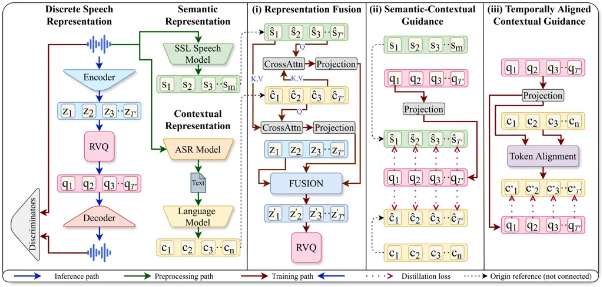

Figure 1: Overview of the FuseCodec speech tokenization framework. Input
speech $`\mathbf{x}`$ is encoded into latent features $`\mathbf{Z}`$,
then quantized into discrete tokens $`\mathbf{Q}^{(1:K)}`$ via residual
vector quantization (RVQ). To enrich these tokens, we incorporate
semantic ($`\mathbf{S}_{i},\hat{\mathbf{S}}`$) and contextual
($`\mathbf{C}_{i},\hat{\mathbf{C}},\mathbf{C}^{*}`$) representations
from frozen pre-trained models. Global vectors $`\hat{\mathbf{S}}`$ and
$`\hat{\mathbf{C}}`$ are formed via mean pooling and \[CLS\] selection,
respectively. We propose three strategies: (i) Latent Representation
Fusion, injecting global vectors $`\hat{\mathbf{S}},\hat{\mathbf{C}}`$
with $`\mathbf{Z}`$ to yield fused latent $`\mathbf{Z}^{\prime}`$; (ii)
Global Semantic-Contextual Supervision, supervising $`\mathbf{Q}^{(1)}`$
with global vectors; and (iii) Temporally Aligned Contextual
Supervision, aligning full contextual embeddings $`\{\mathbf{C}_{i}\}`$
to RVQ outputs via a windowed matching algorithm to form
$`\mathbf{C}^{*}`$.

### 2.1 Discrete Speech Representation

Discrete tokens serve as the foundation of neural codec-based
speech-language models. Following established approaches (Défossez
et al., 2022; Zhang et al., 2024; Ahasan et al., 2024), we discretize
audio using an encoder-quantizer setup.

Given an input speech waveform $`\mathbf{x}`$, an encoder $`E`$
compresses $`\mathbf{x}`$ into a sequence of latent representations
$`\mathbf{Z}=\{\mathbf{z}_{i}\}_{i=1}^{T^{\prime}}`$, where
$`T^{\prime}`$ is the number of encoded frames. The encoder output
$`\mathbf{Z}`$ is then passed through a Residual Vector Quantization
module (RVQ), consisting of $`K`$ quantization layers. For layer
$`k\in\{1,\dots,K\}`$, the RVQ produces a sequence of token indices
$`\{q_{i}^{(k)}\}_{i=1}^{T^{\prime}}`$. Each index $`q_{i}^{(k)}`$ is
then mapped to its embedding in the $`k`$-th codebook, yielding the
sequence of quantized vectors
$`\mathbf{Q}^{(k)}=\{\mathbf{q}_{i}^{(k)}\}_{i=1}^{T^{\prime}}`$, where
$`\mathbf{q}_{i}^{(k)}\in\mathbb{R}^{D}`$ and $`D`$ denotes the
embedding dimensionality.

### 2.2 Multimodal Representation Extraction

Concurrently, we extract representations from pre-trained models.
Specifically, we obtain contextual representations from a pre-trained
language model, which are dynamic, token-level embeddings that adapt to
surrounding text (Devlin et al., 2019b; Peters et al., 2018). In
parallel, we derive semantic representations from a pre-trained
self-supervised speech model, which capture the high-level structure and
meaning (Borsos et al., 2023).

Contextual Representation. The input speech waveform $`\mathbf{x}`$ is
transcribed into text $`\mathbf{x}^{\prime}`$ using a pre-trained
Automatic Speech Recognition (ASR) model $`A`$, such that
$`\mathbf{x}^{\prime}=A(\mathbf{x})`$. The ASR model functions purely as
a speech-to-text converter and remains detached during training. The
transcribed text $`\mathbf{x}^{\prime}`$ is processed by a pre-trained
language model $`B`$, which produces a token sequence
$`\{c_{i}\}_{i=1}^{n}`$. For each token $`c_{i}`$, we extract hidden
states from all $`L`$ layers, represented as
$`\{\mathbf{h}_{i}^{(l)}\}_{l=1}^{L}`$. These are averaged to produce
contextual embeddings:
$`\mathbf{C}_{i}=\frac{1}{L}\sum_{l=1}^{L}\mathbf{h}_{i}^{(l)}`$, where
$`\mathbf{C}_{i}\in\mathbb{R}^{D^{\prime}}`$, and $`D^{\prime}`$ denotes
the hidden dimension of the language model.

Semantic Representation. The input speech waveform $`\mathbf{x}`$ is
passed through a pre-trained self-supervised speech model $`H`$, which
outputs a sequence of frame-level tokens $`\{s_{i}\}_{i=1}^{m}`$,. For
each frame $`s_{i}`$, we extract hidden states from all $`L`$ layers:
$`\{\mathbf{h}_{i}^{(l)}\}_{l=1}^{L}`$. These are averaged to obtain
semantic embeddings:
$`\mathbf{S}_{i}=\frac{1}{L}\sum_{l=1}^{L}\mathbf{h}_{i}^{(l)}`$, where
$`\mathbf{S}_{i}\in\mathbb{R}^{D^{\prime}}`$, and $`D^{\prime}`$ denotes
the hidden dimension.

### 2.3 Semantic-Contextual Guidance

Our goal is to enrich discrete speech representations by integrating
contextual and semantic information, enabling tighter alignment between
acoustic structure and linguistic meaning. Prior work has explored
similar directions: Zhang et al. (2024); Défossez et al. (2024) aligned
HuBERT-based semantic features with the first RVQ layer using cosine
similarity, while Ahasan et al. (2024) matched BERT-based embeddings to
RVQ outputs via padded sequences and similarity loss. However, these
methods either rely on a single modality (semantic in Zhang et al.
(2024); Défossez et al. (2024)) or lack robust cross-modal alignment
(misaligned context in Ahasan et al. (2024)).

In contrast, we unify semantic and contextual representations while
ensuring robust alignment. For this, we propose three strategies: (i)
Latent Representation Fusion (§2.3.1), (ii) Global Semantic-Contextual
Supervision (§2.3.2), and (iii) Temporally Aligned Contextual
Supervision (§2.3.3)

#### 2.3.1 Latent Representation Fusion

We first propose to fuse semantic and contextual representations with
the encoder’s latent representations. The enhanced latents are then
passed to the residual vector quantization (RVQ) module, enabling the
learning of discrete codes enriched with semantic and contextual
information.

Specifically, we apply mean pooling over the semantic embeddings
$`\{\mathbf{S}_{i}\}_{i=1}^{m}`$ to compute the global semantic vector
$`\hat{\mathbf{S}}=\frac{1}{m}\sum_{i=1}^{m}\mathbf{S}_{i}`$. For the
textual modality, we select the \[CLS\] token embedding from the
contextual representations $`\{\mathbf{C}_{i}\}_{i=1}^{n}`$, yielding
$`\hat{\mathbf{C}}=\mathbf{C}_{\texttt{[CLS]}}`$. We then broadcast each
global vector across the discrete token sequence length $`T^{\prime}`$,
forming:
$`\tilde{\mathbf{S}}=\{\hat{\mathbf{S}}\}_{t=1}^{T^{\prime}},\text{and}\ \tilde{\mathbf{C}}=\{\hat{\mathbf{C}}\}_{t=1}^{T^{\prime}}.`$
Broadcasting allows each token to inherit the full semantic or
contextual knowledge of the sequence, ensuring every position is
enriched with the most informative signal for cross-modal fusion or
distillation. Next, we apply multi-head cross-attention to enable
cross-modal interaction, followed by an MLP projection to match the
encoder dimension $`D`$:

```math
\displaystyle\mathbf{S}^{\prime} \displaystyle=\text{CrossAttention}(\tilde{\mathbf{S}},\tilde{\mathbf{C}},\tilde{\mathbf{C}})\mathbf{W}_{S},\quad\mathbf{C}^{\prime}=\text{CrossAttention}(\tilde{\mathbf{C}},\tilde{\mathbf{S}},\tilde{\mathbf{S}})\mathbf{W}_{C}, \tag{1}
```

where
$`\mathbf{W}_{S},\mathbf{W}_{C}\in\mathbb{R}^{D^{\prime}\times D}`$ are
learned projection matrices and $`\text{CrossAttention}(\cdot)`$ denotes
multi-head cross-attention. Finally, we fuse the modality signals with
the latent representation
$`\mathbf{Z}\in\mathbb{R}^{T^{\prime}\times D}`$ via additive fusion and
modality dropout:

```math
\displaystyle\mathbf{Z}^{\prime}=\mathbf{Z}+(\mathbf{S}^{\prime}\odot\mathcal{D}_{S})+(\mathbf{C}^{\prime}\odot\mathcal{D}_{C}), \tag{2}
```

where $`\mathcal{D}_{S},\mathcal{D}_{C}\in\{0,1\}^{T^{\prime}\times D}`$
are stochastic dropout masks applied during training. Dropout promotes
robustness by preventing the quantized representations from over-relying
on the fused modalities (Hussen Abdelaziz et al., 2020), and allows
inference using only the encoder signal. The resulting fused
representation $`\mathbf{Z}^{\prime}`$ is then passed to the RVQ module
for discrete speech quantization.

#### 2.3.2 Global Semantic-Contextual Supervision

In addition to latent fusion, we introduce an alternative representation
supervision strategy, motivated by its effectiveness of similarity
matching in prior speech tokenization work (Zhang et al., 2024; Défossez
et al., 2024; Ahasan et al., 2024). Existing methods typically constrain
representations along feature dimensions or through local frame-level
alignment, which limits temporal consistency. In contrast, we propose a
global-to-local time-axis distillation scheme: global semantic
($`\hat{\mathbf{S}}`$) and contextual ($`\hat{\mathbf{C}}`$) vectors
directly supervise the RVQ outputs across time, enforcing consistent
temporal guidance and pushing the quantized space to capture
modality-aware temporal dynamics.

Together with our global semantic–contextual supervision, we redefine
the combined distillation loss of Ahasan et al. (2024) to operate along
the temporal rather than the feature axis. By embedding global signals
into every timestep, our approach achieves stronger cross-modal
coherence, temporally robust discrete codes, and richer unification of
semantic and contextual structure.

Given the broadcasted global signals (see 2.3.1)
$`\tilde{\mathbf{S}},\tilde{\mathbf{C}}\in\mathbb{R}^{T^{\prime}\times D^{\prime}}`$,
we apply a linear projection to the first-layer RVQ output
$`\mathbf{Q}^{(1)}\in\mathbb{R}^{T^{\prime}\times D}`$ to align
dimensionality:
$`\mathbf{Q}^{\prime(1)}=\mathbf{Q}^{(1)}\mathbf{W},\quad\text{where }\mathbf{W}\in\mathbb{R}^{D\times D^{\prime}}.`$
We then apply the semantic–contextual supervision loss:

```math
\mathcal{L}_{\text{distill}}=-\frac{1}{T^{\prime}}\sum_{t=1}^{T^{\prime}}\log\sigma\Big(\frac{1}{2}[\cos(\mathbf{Q}^{\prime(1)}_{t},\tilde{\mathbf{S}}_{t})+\cos(\mathbf{Q}^{\prime(1)}_{t},\tilde{\mathbf{C}}_{t})]\Big) \tag{3}
```

where $`\sigma(\cdot)`$ is the sigmoid function and
$`\cos(\cdot,\cdot)`$ denotes cosine similarity. This formulation
provides fine-grained temporal supervision using global modality
signals, enhancing the representational quality of the learned discrete
tokens.

#### 2.3.3 Temporally Aligned Contextual Supervision

Building on our use of the global contextual vector $`\hat{\mathbf{C}}`$
for supervision, we propose a finer-grained approach that leverages the
full sequence of contextual embeddings $`\{\mathbf{C}_{i}\}_{i=1}^{n}`$
to supervise the RVQ token sequence
$`\{\mathbf{q}_{t}^{(1)}\}_{t=1}^{T^{\prime}}`$, enabling richer,
timestep-level guidance. A key challenge, however, is the mismatch in
sequence lengths between the contextual embeddings ($`n`$) and the RVQ
output ($`T^{\prime}`$).

 

 

0:  Contextual embeddings $`\{\mathbf{C}_{i}\}_{i=1}^{n}`$, RVQ tokens
$`\{\mathbf{Q}^{(1)}_{t}\}_{t=1}^{T^{\prime}}`$, optional window size
$`w`$

1:  if $`w`$ not provided then

2:   $`w\leftarrow\lfloor T^{\prime}/n\rfloor`$

3:  end if

4:  Initialize aligned output
$`\mathbf{C}^{*}\in\mathbb{R}^{T^{\prime}\times D^{\prime}}\leftarrow 0`$

5:  Initialize $`\ell\leftarrow 0`$ {last matched index}

6:  for $`i=1`$ to $`n`$ do

7:   if dynamic window then

8:    $`s\leftarrow\ell+1`$ if $`i>1`$, else $`0`$ {start index}

9:    $`e\leftarrow\min(s+w,T^{\prime})`$ {end index}

10:   else

11:    $`s\leftarrow(i-1)\cdot w`$, $`e\leftarrow\min(s+w,T^{\prime})`$

12:   end if

13:   Compute cosine similarity
$`\alpha_{t}=\cos(\mathbf{C}_{i},\mathbf{Q}^{(1)}_{t})`$ for
$`t\in[s,e)`$

14:   Let $`\tau\leftarrow\max_{t}\alpha_{t}`$ {maximum similarity}

15:   $`\mathcal{T}_{i}\leftarrow\{t\mid\alpha_{t}\geq\tau\}`$

16:   for each $`t\in\mathcal{T}_{i}`$ do

17:    $`\mathbf{C}^{*}_{t}\leftarrow\mathbf{C}_{i}`$

18:   end for

19:   $`\ell\leftarrow\max(\mathcal{T}_{i})`$

20:  end for

21:  return $`\mathbf{C}^{*}`$

 

Algorithm 1 Window-Based Token Alignment

To address this, we introduce a dynamic window-based alignment strategy
(Algorithm 1). For each contextual embedding $`\mathbf{C}_{i}`$, the
method defines a localized search window of RVQ tokens: either evenly
divided across the sequence or adaptively shifted based on the previous
match. Within this window, we compute cosine similarities and assign
$`\mathbf{C}_{i}`$ to the token(s) with maximum similarity. If multiple
tokens achieve the maximum, the embedding is broadcast to all of them,
capturing the frequent case where a single text token corresponds to
multiple acoustic frame tokens. After each match, the search window
shifts forward, ensuring coverage of the entire sequence without overlap
or collapse. The resulting sequence
$`\mathbf{C}^{*}\in\mathbb{R}^{T^{\prime}\times D^{\prime}}`$ serves as
a temporally aligned supervision signal matched to RVQ tokens
$`\{\mathbf{Q}^{\prime(1)}_{t}\}_{t=1}^{T^{\prime}}`$ for the aligned
contextual supervision loss, applied as:

```math
\mathcal{L}_{\text{distill}}=-\frac{1}{T^{\prime}}\sum_{t=1}^{T^{\prime}}\log\sigma\!\left(\cos\!\big(\mathbf{Q}^{\prime(1)}_{t},\mathbf{C}^{*}_{t}\big)\right) \tag{4}
```

where
$`\mathbf{Q}^{\prime(1)}=\mathbf{Q}^{(1)}\mathbf{W}\in\mathbb{R}^{T^{\prime}\times D^{\prime}}`$
is the linearly projected RVQ output, and $`\sigma(\cdot)`$ denotes the
sigmoid function. This loss enforces temporally precise alignment
between RVQ tokens and their corresponding contextual representations.

### 2.4 Architecture and Training Objective

We build on widely adopted neural codec architectures and training
objectives, following (Défossez et al., 2022; Zhang et al., 2024; Ahasan
et al., 2024), to establish a strong and reliable foundation. We
contribute to enhancing the learned representations through semantic and
contextual supervision and fusion without altering the model
architecture.

Architecture. We use wav2vec 2.0 (base-960h) as the ASR model
$`A`$ (Baevski et al., 2020), BERT (bert-base-uncased) as the language
model $`B`$ (Devlin et al., 2019a), and HuBERT (base-ls960) as the
self-supervised speech model $`H`$ (Hsu et al., 2021). All pre-trained
models are frozen during training. The speech tokenizer consists of an
encoder $`E`$, an RVQ module with 8 quantization layers (codebooks) of
size 1024, a decoder $`D`$, and three discriminators (multi-period,
multi-scale, and multi-scale STFT). Architectural details are provided
in Sec. E.1. Quantization operates on 50 Hz frame rates. The encoder and
RVQ use an embedding dimension of $`D=1024`$, while the pre-trained
langauge and speech model have $`D^{\prime}=768`$. Cross-Attentions are
implemented using 8-heads. The dropout masks $`\mathcal{D}_{S}`$ and
$`\mathcal{D}_{C}`$ are applied at a rate of 10%.

Training Objective. We also adopt a multi-objective training setup
grounded in established neural codec practices. This includes
time-domain reconstruction loss $`\mathcal{L}_{\text{time}}`$,
frequency-domain reconstruction loss $`\mathcal{L}_{\text{freq}}`$,
adversarial loss $`\mathcal{L}_{\text{gen}}`$, feature matching loss
$`\mathcal{L}_{\text{feat}}`$, and RVQ commitment loss
$`\mathcal{L}_{\text{commit}}`$ (see Sec. E.2 for details). For our
proposed semantic-contextual fusion and supervision, the applied loss
depends on the model variant: when training FuseCodec-Distill we use the
semantic–contextual supervision loss as $`\mathcal{L}_{\text{distill}}`$
(Sec. 2.3.2); when training FuseCodec-ContextAlign we use the aligned
contextual supervision loss as $`\mathcal{L}_{\text{distill}}`$
(Sec. 2.3.3); and when training FuseCodec-Fusion (Sec. 2.3.1) both are
disabled, with $`\mathcal{L}_{\text{distill}}=0`$. The final training
objective is a weighted sum:

```math
\mathcal{L}_{\text{total}}=\lambda_{\text{time}}\mathcal{L}_{\text{time}}+\lambda_{\text{freq}}\mathcal{L}_{\text{freq}}+\lambda_{\text{gen}}\mathcal{L}_{\text{gen}}+\lambda_{\text{feat}}\mathcal{L}_{\text{feat}}+\lambda_{\text{commit}}\mathcal{L}_{\text{commit}}+\big(\lambda_{\text{distill}}\mathcal{L}_{\text{distill}}\ \text{or}\ 0\big) \tag{5}
```

### 2.5 Downstream Extension to TTS Model

We extend the learned discrete token representations to a downstream
text-to-speech (TTS) task, following the neural codec language modeling
framework and objective used in prior work (Wang et al., 2023; Zhang
et al., 2024; Ahasan et al., 2024). In this paradigm, speech synthesis
is performed by predicting quantized acoustic tokens produced by the RVQ
and decoded by a neural codec. We extend the learned discrete tokens to
TTS, with variants inheriting each fusion or supervision strategy,
enabling synthesis from tokens that capture acoustic, semantic, and
contextual information.

Given a phoneme sequence $`\mathbf{p}`$ and an acoustic prompt
$`\mathbf{A}\in\mathbb{R}^{\tau\times K}`$ extracted from a reference
utterance using FuseCodec, we predict discrete token indices
$`q^{(1)},\dots,q^{(K)}`$ for the $`K`$ RVQ layers.

To model coarse content and prosody, the first-layer tokens $`q^{(1)}`$
are predicted autoregressively with a decoder-only Transformer
conditioned on $`\mathbf{p}`$, using the objective:

```math
\mathcal{L}_{\text{AR}}=-\log\smash{\textstyle\prod_{i=1}^{T^{\prime}}}\,p\big(q_{i}^{(1)}\mid q_{<i}^{(1)},\,\mathbf{p};\,\theta_{\text{AR}}\big) \tag{6}
```

For fine-grained acoustic details, higher-layer tokens $`q^{(k)}`$
($`k=2,\dots,K`$) are predicted non-autoregressively conditioned on
$`q^{(<k)}`$, $`\mathbf{p}`$, and $`\mathbf{A}`$:

```math
\mathcal{L}_{\text{NAR}}=-\log\smash{\textstyle\prod_{k=2}^{K}}\,p\big(q^{(k)}\mid q^{(<k)},\mathbf{p},\mathbf{A};\theta_{\text{NAR}}\big) \tag{7}
```

Both AR and NAR models use 12-layer Transformers with 16 attention
heads, 1024-dim embeddings, 4096-dim feed-forward layers, and 0.1
dropout. Predicted tokens are mapped to embeddings $`\mathbf{Q}^{(k)}`$
and decoded by FuseCodec to synthesize speech.

## 3 Experiments

We describe our experimental setup (§3.1) and present main results and
ablation studies (§3.2–§3.3).

### 3.1 Experimental Setup

Training. Following prior work in speech tokenization (Zhang et al.,
2024; Ahasan et al., 2024), we train FuseCodec on the LibriSpeech
(Panayotov et al., 2015) train-clean-100 subset, which contains 100
hours of English speech from 251 speakers, sampled at 16 kHz. During
training, we randomly crop 3-second audio segments and reserve 100
samples for validation. For FuseCodec-TTS, we combine the train and dev
subsets of LibriTTS (Zen et al., 2019), comprising 570 hours of speech.
FuseCodec is trained for 100 epochs on two A40 GPUs with a batch size of
6, using the Adam optimizer with a learning rate of $`1\times 10^{-4}`$
and exponential decay factor 0.98. FuseCodec-TTS is trained on A100 and
L40S GPUs. The AR model is trained for 200 epochs, and the NAR model for
150 epochs. Training employs dynamic batching, with each batch
containing up to 550 seconds of audio for AR and 100–200 seconds for
NAR. We use the ScaledAdam optimizer with a learning rate of
$`5\times 10^{-2}`$ and 200 warm-up steps.

Baselines. We compare FuseCodec against both established and recent
strong baseline speech tokenizers, including EnCodec (Défossez et al., 2022) and SpeechTokenizer (Zhang et al., 2024), BigCodec (Xin et al.,
2024), DAC (Kumar et al., 2023), DM-Codec (LM+SM) (Ahasan et al., 2024)
FACodec (NaturalSpeech 3) (Ju et al., 2024), Moshi (Défossez et al.,
2024), StableCodec (Parker et al., 2025), WavTokenize (Ji et al., 2025),
and X-codec2 (Ye et al., 2025). All baseline results are obtained using
official released checkpoints. For FuseCodec-TTS, we compare with neural
codec language models that incorporate external representation guidance.
Specifically, we compare against USLM (from SpeechTokenizer) (Zhang
et al., 2024) and DM-Codec-TTS (Ahasan et al., 2024), using their
official released LibriTTS trained checkpoints.

Metrics. We evaluate FuseCodec on: Content Preservation and Speech
Naturalness. For Content Preservation, generated speech is transcribed
with Whisper (medium) (Radford et al., 2023) and compared to the
reference. We report Word Error Rate (WER):
$`\text{WER}=\frac{S+D+I}{N}`$, with $`S`$, $`D`$, $`I`$ as
substitutions, deletions, insertions, and $`N`$ the reference word
count. Word Information Lost (WIL) is
$`\text{WIL}=1-\frac{C}{N}+\frac{C}{P}`$, where $`C`$ is correct words
and $`P`$ predicted words. Short-Time Objective Intelligibility (STOI)
estimates intelligibility via short-time spectral similarity. For Speech
Naturalness, we assess perceptual and acoustic fidelity using
reference-based and learned metrics. ViSQOL and PESQ model auditory
similarity and signal distortion, respectively. UTMOS predicts
human-judged naturalness, and Similarity computes cosine similarity
between L2-normalized WavLM-TDNN embeddings (Chen et al., 2022) to
measure speaker or content consistency. For FuseCodec-TTS,
reference-based metrics (STOI, ViSQOL, PESQ) are omitted since
references are unavailable.

### 3.2 Main Results

We evaluate FuseCodec variants on speech reconstruction (§3.2.1),
representation quality (§3.2.2), and downstream speech generation
(§3.2.3).

#### 3.2.1 Speech Reconstruction Evaluation

|                        |                   |                      |                   |                  |                    |                  |                   |                        |
| ---------------------- | ----------------- | -------------------- | ----------------- | ---------------- | ------------------ | ---------------- | ----------------- | ---------------------- |
| Model                  | Config (Bw/Nq/FR) | Content Preservation |                   |                  | Speech Naturalness |                  |                   |                        |
|                        |                   | WER$`\downarrow`$    | WIL$`\downarrow`$ | STOI$`\uparrow`$ | ViSQOL$`\uparrow`$ | PESQ$`\uparrow`$ | UTMOS$`\uparrow`$ | Similarity$`\uparrow`$ |
| BigCodec               | 1.04 / 8 / 50     | 4.58                 | 7.45              | 0.93             | 3.02               | 2.68             | 3.44              | 0.996                  |
| DAC                    | 6 / 12 / 50       | 4.09                 | 6.54              | 0.94             | 3.36               | 2.72             | 3.33              | 0.996                  |
| DM-Codec               | 4 / 8 / 50        | 4.09                 | 6.75              | 0.93             | 3.20               | 2.77             | 3.45              | 0.994                  |
| EnCodec                | 6 / 8 / 75        | 4.04                 | 6.58              | 0.92             | 3.06               | 2.31             | 2.41              | 0.980                  |
| FACodec                | 4.8 / 6 / 80      | 4.11                 | 6.58              | 0.95             | 3.11               | 2.89             | 3.45              | 0.996                  |
| Mimi                   | 1.1 / 8 / 12.5    | 11.61                | 18.05             | 0.85             | 2.49               | 1.69             | 2.28              | 0.934                  |
| SpeechTokenizer        | 4 / 8 / 50        | 4.16                 | 6.71              | 0.92             | 3.08               | 2.60             | 3.41              | 0.996                  |
| StableCodec            | 0.625 / 6 / 25    | 10.32                | 15.87             | 0.88             | 2.51               | 1.95             | 3.58              | 0.984                  |
| WavTokenizer           | 0.9 / 1 / 75      | 6.28                 | 10.11             | 0.89             | 2.59               | 2.13             | 3.36              | 0.993                  |
| X-codec2               | 0.8 / 1 / 50      | 4.46                 | 7.20              | 0.92             | 2.87               | 2.43             | 3.55              | 0.997                  |
| FuseCodec (Baseline)   | 6 / 8 / 50        | 4.62                 | 7.44              | 0.93             | 2.95               | 2.54             | 3.18              | 0.990                  |
| FuseCodec-ContextAlign | 4 / 8 / 50        | 4.15                 | 6.70              | 0.93             | 3.18               | 2.85             | 3.65              | 0.995                  |
| FuseCodec-Distill      | 4 / 8 / 50        | 4.09                 | 6.60              | 0.94             | 3.43               | 3.06             | 3.65              | 0.996                  |
| FuseCodec-Fusion       | 4 / 8 / 50        | 3.99                 | 6.45              | 0.95             | 3.47               | 3.13             | 3.63              | 0.995                  |

Table 2: Speech reconstruction results on content preservation and
naturalness metrics using various codecs. Bold highlights best scores,
and underline indicates our second-best scores. Bw = bandwidth in kbps,
Nq = number of quantizers, FR = frame rate in Hz. Overall, FuseCodec
variants consistently achieve strong reconstruction performance by
unifying semantic and contextual information in discrete
representations.

This evaluation measures how well FuseCodec preserves both linguistic
content and perceptual quality in speech reconstruction. We compare
against widely used and trending codecs, selecting model configurations
that closely match ours for fairness. Consistent with established
practice, we evaluate on the LibriSpeech test-clean subset (2620
utterances), which has been the standard and exclusive benchmark in
prior neural codec studies (Zhang et al., 2024; Ahasan et al., 2024; Xin
et al., 2024; Défossez et al., 2024; Parker et al., 2025; Ye et al.,
2024; Ye et al., 2025). Table 2 reports the results, revealing:

(i) Best overall. FuseCodec-Fusion consistently achieves the strongest
reconstruction performance. It records the lowest WER (3.99) and WIL
(6.45), along with the highest STOI (0.95), ViSQOL (3.47), and PESQ
(3.13). Compared to EnCodec, which models only acoustics, and FACodec,
which separates attributes without unifying them, FuseCodec-Fusion
integrates both semantic and contextual signals directly into the
encoder’s latent space. This unified representation improves
intelligibility and perceptual quality, also outperforming
compression-focused models such as DAC, BigCodec, StableCodec,
WavTokenizer, and X-Codec2.  
(ii) Naturalness and speaker consistency. FuseCodec-Distill excels in
perceptual quality and speaker similarity, achieving the top UTMOS
(3.65) and Similarity (0.996), while ranking second in STOI (0.94),
ViSQOL (3.43), and PESQ (3.06). It surpasses models such as
SpeechTokenizer, X-Codec2, and Mimi, which capture only semantic
signals, as well as codecs lacking supervision: EnCodec, DAC,
StableCodec, and WavTokenizer. By supervising the quantized space with
global semantic and contextual signals, FuseCodec-Distill aligns
discrete tokens with both linguistic and acoustic content, yielding
natural and consistent speech.  
(iii) Interpretable local alignment. FuseCodec-ContextAlign delivers
competitive performance with aligned token-level supervision. It matches
the top UTMOS (3.65) and improves over the baseline FuseCodec (Baseline)
across all metrics, outperforming BigCodec, Mimi, SpeechTokenizer,
StableCodec, WavTokenizer, and X-Codec2 with lower WER (6.70), WIL
(4.15), and higher STOI (0.94), ViSQOL (3.18), and PESQ (2.85). These
gains show that aligning discrete tokens with contextual information
strengthens local content preservation and enhances intelligibility.
Although its constrained alignment limits global contextual guidance,
yielding slightly lower performance than FuseCodec-Fusion and
FuseCodec-Distill. Taken together, these results show that integrating
semantic and contextual signals in the latent space substantially
improves speech reconstruction.

#### 3.2.2 Representation Quality Evaluation

|                         |      |                           |                    |                   |                         |                   |                |                 |
| ----------------------- | ---- | ------------------------- | ------------------ | ----------------- | ----------------------- | ----------------- | -------------- | --------------- |
| \(a\) Codec Information |      |                           | \(b\) Signal-level |                   | \(c\) Application-level |                   |                |                 |
| Model                   | kbps | Other Configuration       | Speech$`\uparrow`$ | Audio$`\uparrow`$ | ASR$`\downarrow`$       | ASV$`\downarrow`$ | ER$`\uparrow`$ | AEC$`\uparrow`$ |
| None                    | \-   | \-                        | \-                 | \-                | 2.96                    | 0.86              | 69.84          | 45.68           |
| SpeechTokenizer         | 4    | 16k                       | 0.644              | 0.581             | 4.02                    | 3.31              | 65.49          | 15.11           |
| AcademiCodec            | 2    | 16k_320d                  | 0.610              | 0.574             | 4.94                    | 4.43              | 65.96          | 16.19           |
| AcademiCodec            | 2    | 16k_320d_large_uni        | 0.617              | 0.574             | 6.26                    | 5.22              | 64.63          | 28.65           |
| AcademiCodec            | 3    | 24k_320d                  | 0.611              | 0.592             | 4.49                    | 6.16              | 65.95          | 14.01           |
| AudioDec                | 6.4  | 24k_320d                  | 0.596              | 0.602             | 3.94                    | 5.22              | 65.70          | 17.41           |
| DAC                     | 6    | 16k                       | 0.798              | 0.591             | 3.26                    | 1.59              | 68.81          | 41.08           |
| EnCodec                 | 1.5  | 24k                       | 0.579              | 0.594             | 9.21                    | 13.88             | 58.84          | 18.84           |
| EnCodec                 | 3    | 24k                       | 0.636              | 0.599             | 4.34                    | 6.85              | 63.54          | 26.63           |
| EnCodec                 | 6    | 24k                       | 0.697              | 0.602             | 3.49                    | 4.28              | 66.18          | 32.43           |
| FunCodec                | 8    | en_libritts_16k_nq32ds640 | 0.678              | 0.578             | 3.43                    | 2.04              | 68.26          | 21.43           |
| FunCodec                | 8    | zh_en_16k_nq32ds640       | 0.718              | 0.583             | 3.27                    | 1.60              | 69.55          | 33.59           |
| FuseCodec-ContextAlign  | 4    | 16k                       | 0.698              | 0.771             | 4.24                    | 3.40              | 73.19          | 57.20           |
| FuseCodec-Distill       | 4    | 16k                       | 0.731              | 0.784             | 3.38                    | 3.12              | 73.82          | 57.25           |
| FuseCodec-Fusion        | 4    | 16k                       | 0.744              | 0.785             | 3.44                    | 3.85              | 73.96          | 55.35           |

Table 3: Representation quality results on the Codec-SUPERB benchmark.
Signal-level evaluation: Audio (Mel, STFT) and Speech (PESQ, STOI,
F0CORR) metrics. Application-level evaluation: ASR = automatic speech
recognition, ASV = speaker verification, ER = emotion recognition, AEC =
audio event classification. Bold highlights the best scores, and
underline indicates our second-best scores. Overall, FuseCodec variants
achieve top performance across both signal-level and downstream tasks,
demonstrating effective latent representations at low bitrates.

To assess the representational quality of FuseCodec beyond
reconstruction, we conduct experiments on the Codec-SUPERB benchmark (Wu
et al., 2024). The benchmark comprises application-level tasks:
automatic speech recognition (ASR); automatic speaker verification
(ASV); emotion recognition (ER); and audio event classification (AEC).
Signal-level evaluation is reported separately for audio (Mel, STFT) and
speech (PESQ, STOI, F0CORR). For fair comparison, we report results from
(Wu et al., 2024), selecting models with configurations aligned to ours
(4 kbps, 16 kHz). Baselines with higher bandwidths ($`\geq`$8 kbps) or
sampling rates ($`>`$24 kHz) are excluded, as their advantage comes from
greater information capacity rather than method design. The music metric
is omitted, as it lies outside our scope. Table 3 presents the
evaluation results, highlighting:

(i) High-quality speech and audio signals. FuseCodec-Fusion achieves the
highest signal-level performance, with the top Audio score (0.785) and
second-highest Speech score (0.744), outperforming SpeechTokenizer,
AudioDec, FunCodec, EnCodec, and AcademiCodec. Additionally,
FuseCodec-Distill and FuseCodec-ContextAlign maintain strong
signal-level quality, with Distill at 0.784 Audio and 0.731 Speech, and
ContextAlign at 0.771 Audio and 0.698 Speech, showing that FuseCodec
improves signal quality through semantic and contextual information
retention.  
(ii) Downstream application generalization. FuseCodec variants excel on
multiple downstream tasks, showing strong generalization beyond speech
reconstruction. Specifically, FuseCodec-Distill attains the best Audio
Event Classification performance (57.25), while FuseCodec-Fusion
achieves the highest Emotion Recognition accuracy (73.96). These results
indicate that the representations learned by FuseCodec effectively
capture task-relevant information, enabling superior performance on ER
and AEC, despite FuseCodec being trained primarily for reconstruction.  
(iii) Balanced performance at lower bitrate. While DAC achieves a
slightly lower ASR error (3.26) and FunCodec reaches the lowest ASV
error (1.60), FuseCodec variants provide consistently strong performance
across all metrics at only 4 kbps, substantially lower than DAC (6 kbps)
and FunCodec (8 kbps). This efficiency makes FuseCodec particularly
well-suited for real-world speech applications, where reduced bitrates
allow faster streaming, lower latency, and high-quality audio.

#### 3.2.3 Downstream Speech Generation Evaluation

| Model                      | WER $`\downarrow`$ |       | WIL $`\downarrow`$ |       | Similarity $`\uparrow`$ |      | UTMOS $`\uparrow`$ |      |
| -------------------------- | ------------------ | ----- | ------------------ | ----- | ----------------------- | ---- | ------------------ | ---- |
|                            | LibriSpeech        | VCTK  | LibriSpeech        | VCTK  | LibriSpeech             | VCTK | LibriSpeech        | VCTK |
| USLM                       | 16.72              | 14.79 | 25.65              | 23.24 | 0.80                    | 0.78 | 2.93               | 3.01 |
| DM-Codec-TTS               | 10.26              | 5.02  | 13.79              | 8.21  | 0.82                    | 0.79 | 3.70               | 3.86 |
| FuseCodec-ContextAlign-TTS | 12.43              | 4.27  | 16.92              | 6.89  | 0.83                    | 0.79 | 3.86               | 3.96 |
| FuseCodec-Distill-TTS      | 8.55               | 3.66  | 12.07              | 6.02  | 0.82                    | 0.78 | 3.55               | 3.75 |
| FuseCodec-Fusion-TTS       | 9.67               | 4.07  | 13.23              | 7.18  | 0.83                    | 0.79 | 3.63               | 3.82 |

Table 4: Speech generation results on LibriSpeech and VCTK using
zero-shot TTS. FuseCodec-TTS variants are compared with official neural
codec-based TTS checkpoints trained on LibriTTS. Bold highlights best
scores, and underline indicates second-best scores. Overall,
FuseCodec-Distill-TTS achieves the strongest intelligibility,
FuseCodec-ContextAlign-TTS leads in naturalness, and
FuseCodec-Fusion-TTS provides a well-rounded trade-off.

We further evaluate the downstream extensibility of all FuseCodec
variants on zero-shot TTS. Our goal is not to build the strongest TTS
model, which is beyond our scope and resources, but to train on the
smaller LibriTTS dataset and compare fairly with open-source codec
models (e.g., SpeechTokenizer, DM-Codec) distilling representation. For
evaluation, we adopt two established benchmarks. On LibriSpeech,
following Wang et al. (2023), we select utterances 4–10 seconds long
from test set, using 3-second enrollment segment from a different
utterance of the same speaker. On VCTK, following Zhang et al. (2024),
we use 3-second prompts from one utterance with transcript of another
utterance by the same speaker as target. Table 4 presents the results,
demonstrating:

(i) Linguistic precision. FuseCodec-Distill-TTS leads in content
preservation and intelligibility, achieving the lowest WER (8.55 / 3.66)
and WIL (12.07 / 6.02) on LibriSpeech and VCTK, and second-best
similarity (0.82 / 0.78). Unlike USLM, which lacks contextual grounding,
and DM-Codec-TTS, with limited context alignment, it distills global
semantic-contextual representations into quantized tokens, enhancing
both semantic and acoustic information.  
(ii) Perceptual quality. FuseCodec-ContextAlign-TTS delivers the highest
perceptual naturalness, achieving the best UTMOS scores (3.86 / 3.96)
while also tying for top speaker similarity (0.83 / 0.79). Its
temporally aligned contextual supervision enhances prosody modeling and
speaker identity retention, clearly outperforming DM-Codec-TTS and
USLM.  
(iii) Balanced performance. FuseCodec-Fusion-TTS offers the most
balanced trade-off, attaining joint-best similarity (0.83 / 0.79),
competitive UTMOS (3.63 / 3.82), and solid intelligibility with
second-best WER/WIL. Unlike DM-Codec-TTS, which lacks alignment, and
USLM, which relies only on semantic features, FuseCodec-Fusion jointly
integrates both semantic and contextual signals directly in the latent
space, enabling synthesis that is both accurate and natural.

### 3.3 Additional and Ablation Study Results

Unseen Multilingual Speech Reconstruction Evaluation. We test FuseCodec
on speech reconstruction across seven unseen languages (Appendix C.1).
FuseCodec-Fusion achieves the strongest content and perceptual scores,
with Distill maintaining second-best performance. Results show that
FuseCodec generalizes robustly through unified semantic and contextual
signals.

Ablation Study. We validate the design of FuseCodec through ablations
(Appendix D). Key insights: (i) Attention-projection: cross-before
yields best intelligibility and perceptual quality (See D.1); (ii)
Semantic-contextual guidance: distilling both signals stabilizes tokens
(See D.2); (iii) Temporal alignment: dynamic alignment improves clarity
and content (See D.3); (iv) Dropout: 10% balances robustness and
informativeness (See D.4); (v) Quantizer supervision: first-layer
supervision strengthens semantic-contextual grounding (See D.5).

## 4 Conclusion

We introduced FuseCodec, a unified speech tokenization framework that
integrates acoustic, semantic, and contextual signals via multimodal
representation fusion and supervision. Our methods enable fine-grained
alignment and achieve state-of-the-art results on speech reconstruction,
improving intelligibility, quality, and speaker similarity. These
findings highlight the value of semantic and contextual grounding in
discrete speech modeling.

## 5 Reproducibility Statement

We ensure the reproducibility of our proposed FuseCodec and experimental
results. The experimental setup, including datasets, training
configurations, and hyperparameters, is described in Section 3.1. To
facilitate replication, we provide links to anonymized resources in
Appendix A, including a Docker environment, the full codebase, and
trained model checkpoints, and include Python scripts for preprocessing
and training, along with all necessary dependencies.

## References

- Ahasan et al. (2024) Md Mubtasim Ahasan, Md Fahim, Tasnim Mohiuddin,
  A K M Mahbubur Rahman, Aman Chadha, Tariq Iqbal, M Ashraful Amin,
  Md Mofijul Islam, and Amin Ahsan Ali. Dm-codec: Distilling multimodal
  representations for speech tokenization, 2024. URL
  [https://arxiv.org/abs/2410.15017](https://arxiv.org/abs/2410.15017).
- Baevski et al. (2020) Alexei Baevski, Henry Zhou, Abdelrahman Mohamed,
  and Michael Auli. wav2vec 2.0: A framework for self-supervised
  learning of speech representations, 2020. URL
  [https://arxiv.org/abs/2006.11477](https://arxiv.org/abs/2006.11477).
- Bengio et al. (2013) Yoshua Bengio, Nicholas Léonard, and Aaron
  Courville. Estimating or propagating gradients through stochastic
  neurons for conditional computation, 2013. URL
  [https://arxiv.org/abs/1308.3432](https://arxiv.org/abs/1308.3432).
- Borsos et al. (2023) Zalán Borsos, Raphaël Marinier, Damien Vincent,
  Eugene Kharitonov, Olivier Pietquin, Matt Sharifi, Dominik Roblek,
  Olivier Teboul, David Grangier, Marco Tagliasacchi, and Neil
  Zeghidour. Audiolm: A language modeling approach to audio generation.
  _IEEE/ACM Trans. Audio, Speech and Lang. Proc._, 31:2523–2533,
  June 2023. ISSN 2329-9290. doi: 10.1109/TASLP.2023.3288409. URL
  [https://doi.org/10.1109/TASLP.2023.3288409](https://doi.org/10.1109/TASLP.2023.3288409).
- Brown et al. (2022) Annemarie C. Brown, Eva Childers, Elijah F. W.
  Bowen, Gabriel A. Zuckerberg, and Richard Granger. Phonemes in
  continuous speech are better recognized in context than in isolation.
  _Frontiers in Communication_, Volume 7 - 2022, 2022. ISSN 2297-900X.
  doi: 10.3389/fcomm.2022.865587. URL
  [https://www.frontiersin.org/journals/communication/articles/10.3389/fcomm.2022.865587](https://www.frontiersin.org/journals/communication/articles/10.3389/fcomm.2022.865587).
- Chen et al. (2022) Sanyuan Chen, Chengyi Wang, Zhengyang Chen, Yu Wu,
  Shujie Liu, Zhuo Chen, Jinyu Li, Naoyuki Kanda, Takuya Yoshioka, Xiong
  Xiao, Jian Wu, Long Zhou, Shuo Ren, Yanmin Qian, Yao Qian, Jian Wu,
  Michael Zeng, Xiangzhan Yu, and Furu Wei. Wavlm: Large-scale
  self-supervised pre-training for full stack speech processing. _IEEE
  Journal of Selected Topics in Signal Processing_, 16(6):1505–1518,
  October 2022. ISSN 1941-0484. doi: 10.1109/jstsp.2022.3188113. URL
  [http://dx.doi.org/10.1109/JSTSP.2022.3188113](http://dx.doi.org/10.1109/JSTSP.2022.3188113).
- Clevert et al. (2016) Djork-Arné Clevert, Thomas Unterthiner, and Sepp
  Hochreiter. Fast and accurate deep network learning by exponential
  linear units (elus), 2016. URL
  [https://arxiv.org/abs/1511.07289](https://arxiv.org/abs/1511.07289).
- Devlin et al. (2019a) Jacob Devlin, Ming-Wei Chang, Kenton Lee, and
  Kristina Toutanova. Bert: Pre-training of deep bidirectional
  transformers for language understanding, 2019a. URL
  [https://arxiv.org/abs/1810.04805](https://arxiv.org/abs/1810.04805).
- Devlin et al. (2019b) Jacob Devlin, Ming-Wei Chang, Kenton Lee, and
  Kristina Toutanova. BERT: Pre-training of deep bidirectional
  transformers for language understanding. In Jill Burstein, Christy
  Doran, and Thamar Solorio (eds.), _Proceedings of the 2019 Conference
  of the North American Chapter of the Association for Computational
  Linguistics: Human Language Technologies, Volume 1 (Long and Short
  Papers)_, pp. 4171–4186, Minneapolis, Minnesota, June 2019b.
  Association for Computational Linguistics. doi: 10.18653/v1/N19-1423.
  URL
  [https://aclanthology.org/N19-1423/](https://aclanthology.org/N19-1423/).
- Défossez et al. (2022) Alexandre Défossez, Jade Copet, Gabriel
  Synnaeve, and Yossi Adi. High fidelity neural audio compression, 2022.
  URL
  [https://arxiv.org/abs/2210.13438](https://arxiv.org/abs/2210.13438).
- Défossez et al. (2024) Alexandre Défossez, Laurent Mazaré, Manu
  Orsini, Amélie Royer, Patrick Pérez, Hervé Jégou, Edouard Grave, and
  Neil Zeghidour. Moshi: a speech-text foundation model for real-time
  dialogue, 2024. URL
  [https://arxiv.org/abs/2410.00037](https://arxiv.org/abs/2410.00037).
- Hallap et al. (2023) Mark Hallap, Emmanuel Dupoux, and Ewan Dunbar.
  Evaluating context-invariance in unsupervised speech
  representations, 2023. URL
  [https://arxiv.org/abs/2210.15775](https://arxiv.org/abs/2210.15775).
- Hsu et al. (2021) Wei-Ning Hsu, Benjamin Bolte, Yao-Hung Hubert Tsai,
  Kushal Lakhotia, Ruslan Salakhutdinov, and Abdelrahman Mohamed.
  Hubert: Self-supervised speech representation learning by masked
  prediction of hidden units. _IEEE/ACM transactions on audio, speech,
  and language processing_, 29:3451–3460, 2021.
- Hussen Abdelaziz et al. (2020) Ahmed Hussen Abdelaziz, Barry-John
  Theobald, Paul Dixon, Reinhard Knothe, Nicholas Apostoloff, and Sachin
  Kajareker. Modality dropout for improved performance-driven talking
  faces. In _Proceedings of the 2020 International Conference on
  Multimodal Interaction_, ICMI ’20, pp. 378–386, New York, NY,
  USA, 2020. Association for Computing Machinery. ISBN 9781450375818.
  doi: 10.1145/3382507.3418840. URL
  [https://doi.org/10.1145/3382507.3418840](https://doi.org/10.1145/3382507.3418840).
- Ji et al. (2025) Shengpeng Ji, Ziyue Jiang, Wen Wang, Yifu Chen,
  Minghui Fang, Jialong Zuo, Qian Yang, Xize Cheng, Zehan Wang, Ruiqi
  Li, Ziang Zhang, Xiaoda Yang, Rongjie Huang, Yidi Jiang, Qian Chen,
  Siqi Zheng, and Zhou Zhao. Wavtokenizer: an efficient acoustic
  discrete codec tokenizer for audio language modeling. In _The
  Thirteenth International Conference on Learning
  Representations_, 2025. URL
  [https://openreview.net/forum?id=yBlVlS2Fd9](https://openreview.net/forum?id=yBlVlS2Fd9).
- Ju et al. (2024) Zeqian Ju, Yuancheng Wang, Kai Shen, Xu Tan, Detai
  Xin, Dongchao Yang, Yanqing Liu, Yichong Leng, Kaitao Song, Siliang
  Tang, Zhizheng Wu, Tao Qin, Xiang-Yang Li, Wei Ye, Shikun Zhang, Jiang
  Bian, Lei He, Jinyu Li, and Sheng Zhao. Naturalspeech 3: Zero-shot
  speech synthesis with factorized codec and diffusion models, 2024. URL
  [https://arxiv.org/abs/2403.03100](https://arxiv.org/abs/2403.03100).
- Kong et al. (2020) Jungil Kong, Jaehyeon Kim, and Jaekyoung Bae.
  Hifi-gan: generative adversarial networks for efficient and high
  fidelity speech synthesis. In _Proceedings of the 34th International
  Conference on Neural Information Processing Systems_, NIPS ’20, Red
  Hook, NY, USA, 2020. Curran Associates Inc. ISBN 9781713829546.
- Kumar et al. (2019) Kundan Kumar, Rithesh Kumar, Thibault
  de Boissiere, Lucas Gestin, Wei Zhen Teoh, Jose Sotelo, Alexandre
  de Brebisson, Yoshua Bengio, and Aaron Courville. Melgan: Generative
  adversarial networks for conditional waveform synthesis, 2019. URL
  [https://arxiv.org/abs/1910.06711](https://arxiv.org/abs/1910.06711).
- Kumar et al. (2023) Rithesh Kumar, Prem Seetharaman, Alejandro Luebs,
  Ishaan Kumar, and Kundan Kumar. High-fidelity audio compression with
  improved rvqgan, 2023. URL
  [https://arxiv.org/abs/2306.06546](https://arxiv.org/abs/2306.06546).
- Panayotov et al. (2015) Vassil Panayotov, Guoguo Chen, Daniel Povey,
  and Sanjeev Khudanpur. Librispeech: An asr corpus based on public
  domain audio books. In _2015 IEEE International Conference on
  Acoustics, Speech and Signal Processing (ICASSP)_, pp.
  5206–5210, 2015. doi: 10.1109/ICASSP.2015.7178964.
- Parker et al. (2025) Julian D Parker, Anton Smirnov, Jordi Pons,
  CJ Carr, Zack Zukowski, Zach Evans, and Xubo Liu. Scaling transformers
  for low-bitrate high-quality speech coding. In _The Thirteenth
  International Conference on Learning Representations_, 2025. URL
  [https://openreview.net/forum?id=4YpMrGfldX](https://openreview.net/forum?id=4YpMrGfldX).
- Peters et al. (2018) Matthew E. Peters, Mark Neumann, Mohit Iyyer,
  Matt Gardner, Christopher Clark, Kenton Lee, and Luke Zettlemoyer.
  Deep contextualized word representations. In Marilyn Walker, Heng Ji,
  and Amanda Stent (eds.), _Proceedings of the 2018 Conference of the
  North American Chapter of the Association for Computational
  Linguistics: Human Language Technologies, Volume 1 (Long Papers)_, pp.
  2227–2237, New Orleans, Louisiana, June 2018. Association for
  Computational Linguistics. doi: 10.18653/v1/N18-1202. URL
  [https://aclanthology.org/N18-1202/](https://aclanthology.org/N18-1202/).
- Pratap et al. (2020) Vineel Pratap, Qiantong Xu, Anuroop Sriram,
  Gabriel Synnaeve, and Ronan Collobert. Mls: A large-scale multilingual
  dataset for speech research. _ArXiv_, abs/2012.03411, 2020.
- Radford et al. (2023) Alec Radford, Jong Wook Kim, Tao Xu, Greg
  Brockman, Christine Mcleavey, and Ilya Sutskever. Robust speech
  recognition via large-scale weak supervision. In Andreas Krause, Emma
  Brunskill, Kyunghyun Cho, Barbara Engelhardt, Sivan Sabato, and
  Jonathan Scarlett (eds.), _Proceedings of the 40th International
  Conference on Machine Learning_, volume 202 of _Proceedings of Machine
  Learning Research_, pp. 28492–28518. PMLR, 23–29 Jul 2023. URL
  [https://proceedings.mlr.press/v202/radford23a.html](https://proceedings.mlr.press/v202/radford23a.html).
- Schmidt et al. (2024) Craig W Schmidt, Varshini Reddy, Haoran Zhang,
  Alec Alameddine, Omri Uzan, Yuval Pinter, and Chris Tanner.
  Tokenization is more than compression. In Yaser Al-Onaizan, Mohit
  Bansal, and Yun-Nung Chen (eds.), _Proceedings of the 2024 Conference
  on Empirical Methods in Natural Language Processing_, pp. 678–702,
  Miami, Florida, USA, November 2024. Association for Computational
  Linguistics. doi: 10.18653/v1/2024.emnlp-main.40. URL
  [https://aclanthology.org/2024.emnlp-main.40/](https://aclanthology.org/2024.emnlp-main.40/).
- Turetzky & Adi (2024) Arnon Turetzky and Yossi Adi. Last: Language
  model aware speech tokenization, 2024. URL
  [https://arxiv.org/abs/2409.03701](https://arxiv.org/abs/2409.03701).
- van den Oord et al. (2018) Aaron van den Oord, Oriol Vinyals, and
  Koray Kavukcuoglu. Neural discrete representation learning, 2018. URL
  [https://arxiv.org/abs/1711.00937](https://arxiv.org/abs/1711.00937).
- Wang et al. (2023) Chengyi Wang, Sanyuan Chen, Yu Wu, Ziqiang Zhang,
  Long Zhou, Shujie Liu, Zhuo Chen, Yanqing Liu, Huaming Wang, Jinyu Li,
  Lei He, Sheng Zhao, and Furu Wei. Neural codec language models are
  zero-shot text to speech synthesizers, 2023. URL
  [https://arxiv.org/abs/2301.02111](https://arxiv.org/abs/2301.02111).
- Wu et al. (2024) Haibin Wu, Ho-Lam Chung, Yi-Cheng Lin, Yuan-Kuei Wu,
  Xuanjun Chen, Yu-Chi Pai, Hsiu-Hsuan Wang, Kai-Wei Chang, Alexander
  Liu, and Hung-yi Lee. Codec-SUPERB: An in-depth analysis of sound
  codec models. In Lun-Wei Ku, Andre Martins, and Vivek Srikumar (eds.),
  _Findings of the Association for Computational Linguistics: ACL 2024_,
  pp. 10330–10348, Bangkok, Thailand, August 2024. Association for
  Computational Linguistics. doi: 10.18653/v1/2024.findings-acl.616. URL
  [https://aclanthology.org/2024.findings-acl.616/](https://aclanthology.org/2024.findings-acl.616/).
- Xin et al. (2024) Detai Xin, Xu Tan, Shinnosuke Takamichi, and Hiroshi
  Saruwatari. Bigcodec: Pushing the limits of low-bitrate neural speech
  codec, 2024. URL
  [https://arxiv.org/abs/2409.05377](https://arxiv.org/abs/2409.05377).
- Yang et al. (2023) Dongchao Yang, Songxiang Liu, Rongjie Huang,
  Jinchuan Tian, Chao Weng, and Yuexian Zou. Hifi-codec: Group-residual
  vector quantization for high fidelity audio codec, 2023. URL
  [https://arxiv.org/abs/2305.02765](https://arxiv.org/abs/2305.02765).
- Ye et al. (2024) Zhen Ye, Peiwen Sun, Jiahe Lei, Hongzhan Lin, Xu Tan,
  Zheqi Dai, Qiuqiang Kong, Jianyi Chen, Jiahao Pan, Qifeng Liu, Yike
  Guo, and Wei Xue. Codec does matter: Exploring the semantic
  shortcoming of codec for audio language model, 2024. URL
  [https://arxiv.org/abs/2408.17175](https://arxiv.org/abs/2408.17175).
- Ye et al. (2025) Zhen Ye, Xinfa Zhu, Chi-Min Chan, Xinsheng Wang,
  Xu Tan, Jiahe Lei, Yi Peng, Haohe Liu, Yizhu Jin, Zheqi Dai, Hongzhan
  Lin, Jianyi Chen, Xingjian Du, Liumeng Xue, Yunlin Chen, Zhifei Li,
  Lei Xie, Qiuqiang Kong, Yike Guo, and Wei Xue. Llasa: Scaling
  train-time and inference-time compute for llama-based speech
  synthesis, 2025. URL
  [https://arxiv.org/abs/2502.04128](https://arxiv.org/abs/2502.04128).
- Zeghidour et al. (2022) Neil Zeghidour, Alejandro Luebs, Ahmed Omran,
  Jan Skoglund, and Marco Tagliasacchi. Soundstream: An end-to-end
  neural audio codec. _IEEE/ACM Transactions on Audio, Speech, and
  Language Processing_, 30:495–507, 2022. doi:
  10.1109/TASLP.2021.3129994.
- Zen et al. (2019) Heiga Zen, Viet Dang, Rob Clark, Yu Zhang, Ron J.
  Weiss, Ye Jia, Zhifeng Chen, and Yonghui Wu. Libritts: A corpus
  derived from librispeech for text-to-speech, 2019. URL
  [https://arxiv.org/abs/1904.02882](https://arxiv.org/abs/1904.02882).
- Zhang et al. (2024) Xin Zhang, Dong Zhang, Shimin Li, Yaqian Zhou, and
  Xipeng Qiu. Speechtokenizer: Unified speech tokenizer for speech
  language models. In _The Twelfth International Conference on Learning
  Representations_, 2024. URL
  [https://openreview.net/forum?id=AF9Q8Vip84](https://openreview.net/forum?id=AF9Q8Vip84).

Technical Appendix

## Appendix A Resources

We provide all necessary resources to ensure full reproducibility of our
models and results.

- •
  Docker: A containerized environment with all required Python packages
  for training.
  [LINK](https://drive.google.com/file/d/1hofjRg1IoeC2IEEd8Okwowg-P_GBnd0-/view?usp=drive_link)
- •
  Code and Configuration: Full codebase for preprocessing, training, and
  inference.
  [LINK](https://drive.google.com/file/d/1vUKnzhBJIC4SBV5A1GvLYXnLGH1baYsn/view?usp=drive_link)
- •
  Model Checkpoints: Trained model weights.
  [LINK](https://drive.google.com/drive/folders/1-2WE9AJS6Cw8N6Qw0TAw_nZFTVVDuIAY?usp=drive_link)

## Appendix B Related Work

Recent progress in speech and audio generation has been largely driven
by advances in discrete representation learning, neural audio codecs,
and language model-based synthesis. VQ-VAE (van den Oord et al., 2018)
introduced vector quantization in latent spaces to support symbolic
modeling of audio, while HuBERT (Hsu et al., 2021) applied masked
prediction over cluster-derived labels to learn speech features in a
self-supervised manner. SoundStream (Zeghidour et al., 2022) proposed a
causal adversarially trained codec with residual vector quantization
(RVQ) and demonstrated scalable compression at low bitrates. HiFi-Codec
(Yang et al., 2023) further improved efficiency by introducing group
residual quantization, reducing the number of required codebooks while
preserving audio fidelity. On the generative side, AudioLM (Borsos
et al., 2023) modeled long-range dependencies in semantic and acoustic
tokens using transformer-based language modeling. This approach was
extended by VALL-E (Wang et al., 2023), which enabled zero-shot
text-to-speech synthesis by conditioning on short acoustic prompts and
leveraging codec token generation. To improve the suitability of
tokenization for language modeling tasks, X-Codec (Ye et al., 2024)
integrated speech embeddings from pretrained models into the
quantization pipeline, while LAST (Turetzky & Adi, 2024) learned a
tokenizer supervised by a language model to improve downstream ASR and
speech generation performance. HiFi-GAN (Kong et al., 2020) introduced
multi-period and multi-scale discriminators, enabling high-fidelity
waveform synthesis with real-time efficiency.

In parallel, codec designs have evolved to improve training stability
and perceptual quality. EnCodec (Défossez et al., 2022) introduced a
GAN-based codec architecture with multi-loss balancing and
spectrogram-based discrimination, setting a new benchmark for real-time
low-bitrate synthesis. BigCodec (Xin et al., 2024) scaled the VQ-VAE
framework and showed that a single large codebook could achieve
near-human perceptual quality at 1 kbps. DAC (Kumar et al., 2023)
proposed refinements to residual quantization, such as factorized and
normalized codebooks, and introduced advanced discriminators to improve
quality under bitrate constraints. More recent work has focused on
improving token expressiveness for downstream tasks. SpeechTokenizer
(Zhang et al., 2024) demonstrated that hierarchical quantization
improves reconstruction and zero-shot TTS, while DM-Codec (Ahasan
et al., 2024) matched quantization layer representations with
pre-trained speech and text models to reduce WER and enhance contextual
fidelity. Finally, NaturalSpeech 3 (Ju et al., 2024) introduced a
factorized codec to disentangle prosodic and acoustic attributes in
speech, and Moshi (Défossez et al., 2024) unified ASR and TTS in a
streaming, full-duplex transformer model operating on jointly learned
speech tokens.

## Appendix C Additional Results

We provide additional results on FuseCodec variants for multilingual
speech reconstruction (§C.1).

### C.1 Extension to Unseen Multilingual Speech Reconstruction

|                        |                    |      |      |       |      |       |      |                    |       |       |       |       |       |      |                   |      |      |      |      |      |      |                     |      |      |      |      |      |      |
| ---------------------- | ------------------ | ---- | ---- | ----- | ---- | ----- | ---- | ------------------ | ----- | ----- | ----- | ----- | ----- | ---- | ----------------- | ---- | ---- | ---- | ---- | ---- | ---- | ------------------- | ---- | ---- | ---- | ---- | ---- | ---- |
| Model                  | WER $`\downarrow`$ |      |      |       |      |       |      | WIL $`\downarrow`$ |       |       |       |       |       |      | PESQ $`\uparrow`$ |      |      |      |      |      |      | VISQOL $`\uparrow`$ |      |      |      |      |      |      |
|                        | nl                 | fr   | de   | it    | pl   | pt    | es   | nl                 | fr    | de    | it    | pl    | pt    | es   | nl                | fr   | de   | it   | pl   | pt   | es   | nl                  | fr   | de   | it   | pl   | pt   | es   |
| SpeechTokenizer        | 7.89               | 7.96 | 7.19 | 12.24 | 9.09 | 13.29 | 5.47 | 13.47              | 12.95 | 11.65 | 19.35 | 15.03 | 19.29 | 8.56 | 2.53              | 2.42 | 2.37 | 2.36 | 2.36 | 2.18 | 2.36 | 3.03                | 2.96 | 2.96 | 3.01 | 2.92 | 2.88 | 2.98 |
| EnCodec                | 6.22               | 5.34 | 7.41 | 8.76  | 6.06 | 9.9   | 2.82 | 10.73              | 8.61  | 10.76 | 14.02 | 9.65  | 14.5  | 4.66 | 2.26              | 2.35 | 2.31 | 2.37 | 2.42 | 2.27 | 2.27 | 3.02                | 3.12 | 3.06 | 3.16 | 3.1  | 3.05 | 3.08 |
| DM-Codec               | 6.94               | 6.36 | 5.93 | 10.34 | 6.7  | 11.69 | 4.69 | 11.85              | 10.53 | 9.76  | 16.56 | 11.45 | 16.45 | 7.12 | 2.83              | 2.65 | 2.57 | 2.66 | 2.65 | 2.36 | 2.61 | 3.19                | 3.15 | 3.15 | 3.22 | 3.15 | 3.07 | 3.18 |
| FaCodec                | 5.34               | 5.98 | 4.82 | 8.89  | 5.22 | 9.84  | 3.26 | 9.23               | 9.87  | 8.16  | 14.09 | 8.9   | 14.57 | 5.5  | 2.80              | 2.68 | 2.63 | 2.63 | 2.76 | 2.46 | 2.62 | 3.13                | 2.99 | 3.01 | 3.02 | 3.05 | 2.94 | 3.03 |
| FuseCodec-Fusion       | 5.80               | 6.92 | 4.82 | 7.97  | 5.07 | 8.75  | 3.53 | 9.77               | 8.40  | 7.84  | 12.95 | 8.63  | 13.09 | 5.20 | 3.15              | 3.04 | 2.92 | 3.03 | 3.11 | 2.82 | 2.94 | 3.46                | 3.43 | 3.42 | 3.48 | 3.42 | 3.38 | 3.43 |
| FuseCodec-Distill      | 5.50               | 4.22 | 6.65 | 9.21  | 5.23 | 8.53  | 3.87 | 9.35               | 7.25  | 9.58  | 14.67 | 8.72  | 12.22 | 5.71 | 3.08              | 2.95 | 2.86 | 2.97 | 3.03 | 2.76 | 2.88 | 3.41                | 3.39 | 3.38 | 3.45 | 3.41 | 3.34 | 3.40 |
| FuseCodec-ContextAlign | 6.37               | 5.46 | 8.31 | 10.15 | 6.43 | 11.18 | 3.70 | 10.90              | 9.18  | 12.24 | 16.24 | 10.87 | 16.06 | 6.09 | 2.89              | 2.75 | 2.66 | 2.76 | 2.77 | 2.52 | 2.68 | 3.19                | 3.16 | 3.16 | 3.24 | 3.17 | 3.13 | 3.18 |

Table 5: Multilingual speech reconstruction results across content
preservation and perceptual metrics for unseen languages. Bold
highlights the best score per language/metric, and underline indicates
our second-best. Abbreviations: nl = Dutch, fr = French, de = German, it
= Italian, pl = Polish, pt = Portuguese, es = Spanish. Overall,
FuseCodec variants maintain high content fidelity and perceptual quality
across diverse languages by integrating semantic and contextual signals
in the latent space.

This evaluation examines how well FuseCodec generalizes to unseen
languages, testing whether integrating semantic and contextual signals
in the latent space enables the codec to capture language-agnostic
paralinguistic information. We use the Multilingual LibriSpeech test set
(Pratap et al., 2020), covering German, Dutch, Spanish, French, Italian,
Portuguese, and Polish. For fair comparison, we select baselines with
multi-quantizer architectures, 16–24 kHz sampling, and 4–6 bit
configurations, including SpeechTokenizer, EnCodec, DM-Codec, and
FaCodec. Table 5 presents the results, revealing:

(i) Content preservation. FuseCodec-Fusion achieves the lowest WER and
WIL in three languages and ties for best WER and WIL in Portuguese,
while FuseCodec-Distill attains the best WER in French and Portuguese
and second-best in Dutch. Across all seven languages, FuseCodec variants
consistently rank first or second, whereas FaCodec and EnCodec win only
in isolated cases. These results indicate that FuseCodec effectively
retains core linguistic content and generalizes across diverse languages
by unifying semantic and contextual signals.  
(ii) Perceptual quality. FuseCodec-Fusion delivers the highest PESQ and
ViSQOL scores across all languages, with Distill consistently
second-best. Baselines trail by a substantial margin (Fusion improves
PESQ by 0.3 or more over the next best model). This demonstrates that
integrating semantic-contextual signals enhances perceptual naturalness
and speech intelligibility, even in languages unseen during training.  
(iii) Cross-lingual robustness. FuseCodec-ContextAlign remains
competitive, outperforming several baselines, despite slightly lower
performance than Fusion and Distill. It shows particular strengths on
perceptual metrics (PESQ and ViSQOL) in Dutch, French, and Polish
languages, often surpassing DM-Codec and SpeechTokenizer, which lack
temporally aligned contextual supervision. Taken together, these results
demonstrate that FuseCodec maintains high content accuracy and
perceptual quality across unseen languages by unifying semantic and
contextual representations.

## Appendix D Ablation Studies

We ablate and investigate each design choice and the necessity of
components in our proposed methodology for FuseCodec. All model
hyperparameters, training procedures, and configurations are kept fixed,
except for the specific changes introduced in each ablation setup.

### D.1 Ablation: Attention-Projection Configuration in Representation Fusion

| Model Variant    | Attn-Proj Type | Content Preservation |                   |                  | Speech Naturalness |                  |                   |                        |
| ---------------- | -------------- | -------------------- | ----------------- | ---------------- | ------------------ | ---------------- | ----------------- | ---------------------- |
|                  |                | WER$`\downarrow`$    | WIL$`\downarrow`$ | STOI$`\uparrow`$ | ViSQOL$`\uparrow`$ | PESQ$`\uparrow`$ | UTMOS$`\uparrow`$ | Similarity$`\uparrow`$ |
| FuseCodec-Fusion | None           | 4.10                 | 6.60              | 0.93             | 3.26               | 2.92             | 3.65              | 0.995                  |
| FuseCodec-Fusion | Self-After     | 4.07                 | 6.61              | 0.93             | 3.26               | 2.95             | 3.63              | 0.995                  |
| FuseCodec-Fusion | Self-Before    | 3.92                 | 6.36              | 0.94             | 3.43               | 3.05             | 3.59              | 0.995                  |
| FuseCodec-Fusion | Cross-After    | 4.17                 | 6.70              | 0.93             | 3.28               | 2.90             | 3.61              | 0.995                  |
| FuseCodec-Fusion | Cross-Before   | 3.99                 | 6.45              | 0.95             | 3.47               | 3.13             | 3.63              | 0.995                  |

Table 6: Ablation of attention-projection configurations in multimodal
latent fusion. Cross variants incorporate cross-modal attention between
semantic and contextual signals, while Self variants apply
self-attention. Before applies attention prior to projection into the
encoder’s latent space, whereas After applies attention post-projection.
None uses direct projection without attention. Applying cross-modal
attention before projection consistently improves content preservation
and speech naturalness by enabling richer multimodal interactions in the
original dimension.

Setup. We investigate the impact of changing the attention-projection
configuration in FuseCodec-Fusion (Section 2.3.1). The selected method,
Cross-Before, applies multi-head cross-attention prior to projection:

```math
\displaystyle\mathbf{S}^{\prime} \displaystyle=\text{CrossAttention}(\tilde{\mathbf{S}},\tilde{\mathbf{C}},\tilde{\mathbf{C}})\mathbf{W}_{S}, \tag{8}
```

```math
\displaystyle\mathbf{C}^{\prime} \displaystyle=\text{CrossAttention}(\tilde{\mathbf{C}},\tilde{\mathbf{S}},\tilde{\mathbf{S}})\mathbf{W}_{C},
```

where
$`\tilde{\mathbf{S}},\tilde{\mathbf{C}}\in\mathbb{R}^{T^{\prime}\times D^{\prime}}`$
are broadcasted global semantic and contextual vectors. We compare this
with the following ablated variants:

None, which skips attention and directly applies projection:

```math
\displaystyle\mathbf{S}^{\prime} \displaystyle=\tilde{\mathbf{S}}\mathbf{W}_{S}, \tag{9}
```

```math
\displaystyle\mathbf{C}^{\prime} \displaystyle=\tilde{\mathbf{C}}\mathbf{W}_{C}
```

Self-Before, which applies self-attention before projection:

```math
\displaystyle\mathbf{S}^{\prime} \displaystyle=\text{SelfAttention}(\tilde{\mathbf{S}},\tilde{\mathbf{S}},\tilde{\mathbf{S}})\mathbf{W}_{S}, \tag{10}
```

```math
\displaystyle\mathbf{C}^{\prime} \displaystyle=\text{SelfAttention}(\tilde{\mathbf{C}},\tilde{\mathbf{C}},\tilde{\mathbf{C}})\mathbf{W}_{C}
```

Self-After, which projects first and then applies self-attention:

```math
\displaystyle\mathbf{S}^{\prime} \displaystyle=\text{SelfAttention}(\tilde{\mathbf{S}}\mathbf{W}_{S}), \tag{11}
```

```math
\displaystyle\mathbf{C}^{\prime} \displaystyle=\text{SelfAttention}(\tilde{\mathbf{C}}\mathbf{W}_{C})
```

Cross-After, which applies projection before cross-attention:

```math
\displaystyle\mathbf{S}^{\prime} \displaystyle=\text{CrossAttention}(\tilde{\mathbf{S}}\mathbf{W}_{S},\tilde{\mathbf{C}}\mathbf{W}_{C},\tilde{\mathbf{C}}\mathbf{W}_{C}), \tag{12}
```

```math
\displaystyle\mathbf{C}^{\prime} \displaystyle=\text{CrossAttention}(\tilde{\mathbf{C}}\mathbf{W}_{C},\tilde{\mathbf{S}}\mathbf{W}_{S},\tilde{\mathbf{S}}\mathbf{W}_{S})
```

Results. Table 6 shows the results of five variants. The selected
Cross-Before setup achieves the highest performance on intelligibility
STOI (0.95), and all naturalness metrics: ViSQOL (3.47), PESQ (3.13),
and second-best UTMOS (3.63). Self-Before yields the best WER (3.92) and
WIL (6.36), and second-best ViSQOL (3.43), PESQ (3.05), and STOI (0.94).
The None and Cross-After configurations perform comparatively worse
across intelligibility and naturalness.

Discussion. These results demonstrate that the configuration of
attention relative to projection significantly impacts the effectiveness
of representation fusion. The best-performing method, Cross-Before,
applies cross-modal attention in the original lower-dimensional space.
This enables richer semantic-contextual interactions to be captured
before transformation into the higher-dimensional encoder space, leading
to improved intelligibility and perceptual quality.

Self-Before performs competitively by achieving the best WER and WIL,
suggesting that intra-modal structuring of global feature
representations also benefits the fusion approach. However, the absence
of explicit cross-modal exchange limits its effectiveness on naturalness
metrics such as UTMOS and PESQ.

By contrast, Cross-After performs poorly, indicating that applying
cross-attention after projection diminishes its effectiveness.
Suggesting that once projected into the higher-dimensional space, the
global vectors lose semantic coherence, resulting in less expressive
fusion and lower audio quality.

Finally, removing attention (None) results in the weakest performance on
intelligibility and perceptual scores, despite yielding the highest
UTMOS. This indicates that even unstructured modality signals can
enhance naturalness, but without alignment through attention mechanisms,
they fail to deliver consistent semantic-contextual grounding.

Overall, these results confirm that performing attention prior to
projection, especially cross-modal attention, is essential for
extracting the most benefit from semantic-contextual signals during
fusion.

### D.2 Ablation: Attention-Guidance Configuration in Semantic-Contextual Guidance

| Model Variant     | Attention | Guidance            | Content Preservation |                   |                  | Speech Naturalness |                  |                   |                        |
| ----------------- | --------- | ------------------- | -------------------- | ----------------- | ---------------- | ------------------ | ---------------- | ----------------- | ---------------------- |
|                   |           |                     | WER$`\downarrow`$    | WIL$`\downarrow`$ | STOI$`\uparrow`$ | ViSQOL$`\uparrow`$ | PESQ$`\uparrow`$ | UTMOS$`\uparrow`$ | Similarity$`\uparrow`$ |
| FuseCodec-Distill | None      | Contextual          | 4.20                 | 6.77              | 0.93             | 3.13               | 2.74             | 3.60              | 0.995                  |
| FuseCodec-Distill | Cross     | Contextual          | 4.18                 | 6.75              | 0.93             | 3.21               | 2.83             | 3.60              | 0.995                  |
| FuseCodec-Distill | None      | Semantic-Contextual | 4.09                 | 6.60              | 0.94             | 3.43               | 3.06             | 3.65              | 0.996                  |
| FuseCodec-Distill | Cross     | Semantic-Contextual | 4.21                 | 6.82              | 0.93             | 3.18               | 2.84             | 3.62              | 0.994                  |

Table 7: Ablation of attention and guidance strategies in
semantic-contextual distillation. Cross variants apply cross-attention
between contextual embeddings and discrete tokens, while None applies
supervision directly. Semantic-Contextual combines both global semantic
and contextual signals. Direct supervision using both signals achieves
the best intelligibility and perceptual quality by preserving global
structure.

Setup. We study the impact of attention configuration and guidance
modality used in the distillation objective. Our method,
FuseCodec-Distill, introduces timestep-aligned supervision using global
contextual and semantic signals (Section 2.3.2). The selected
configuration, None + Semantic-Contextual, projects the first-layer RVQ
tokens $`\mathbf{Q}^{(1)}`$ and computes cosine similarity with both
semantic and contextual guidance vectors:

```math
\displaystyle\mathcal{L}_{\text{distill}} \displaystyle=-\frac{1}{T^{\prime}}\sum_{t=1}^{T^{\prime}}\log\sigma\left(\frac{1}{2}\left[\cos\left(\mathbf{Q}^{\prime(1)}_{t},\tilde{\mathbf{S}}_{t}\right)\right.\right. \tag{13}
```

```math
\displaystyle\left.\left.+\cos\left(\mathbf{Q}^{\prime(1)}_{t},\tilde{\mathbf{C}}_{t}\right)\right]\right)
```

We compare this against three ablated variants:

None + Contextual, which excludes both attention and semantic guidance:

```math
\mathcal{L}_{\text{distill}}=-\frac{1}{T^{\prime}}\sum_{t=1}^{T^{\prime}}\log\sigma\left(\cos\left(\mathbf{Q}^{\prime(1)}_{t},\tilde{\mathbf{C}}_{t}\right)\right) \tag{14}
```

Cross + Contextual, which introduces cross-attention between contextual
vectors and projected RVQ tokens:

```math
\tilde{\mathbf{C}}=\text{CrossAttention}(\tilde{\mathbf{C}},\mathbf{Q}^{\prime(1)},\mathbf{Q}^{\prime(1)}) \tag{15}
```

Cross + Semantic-Contextual, which includes cross-attention but retains
both guidance signals.

Results. Table 7 reports the performance across four configurations. The
best-performing variant is None + Semantic-Contextual, achieving the
lowest WER (4.09) and WIL (6.60), and highest scores on STOI (0.940),
ViSQOL (3.43), PESQ (3.06), UTMOS (3.65), and Similarity (0.996). The
second-best results are obtained by Cross + Contextual, but excluding
semantic guidance or using attention degrades performance across all
metrics.

Discussion. These results show that including both semantic and
contextual supervision is essential for improving the quantization
quality of the discrete tokens. The None + Semantic-Contextual
configuration outperforms all others, highlighting that cosine-based
alignment with both modalities provides the most stable and effective
guidance during quantized representation learning.

Introducing cross-attention (Cross) reduces performance, suggesting that
attention distorts the global nature of the guidance signals and makes
supervision less consistent across time. The Cross + Semantic-Contextual
variant also underperforms, despite having access to both guidance
sources, indicating that attention interferes with their inherent
structure and alignment function.

The Contextual-only variants perform comparatively worse, confirming
that semantic signals play an important role in guiding the learned
representations toward higher-level content fidelity and improved
intelligibility.

Overall, these findings support using both guidance signals in their
original global forms and applying them directly, without attention, to
ensure stable, timestep-aligned distillation.

### D.3 Ablation: Fixed vs. Dynamic Window Configuration in Temporal Alignment

| Model Variant          | Window  | Guidance            | Content Preservation |                   |                  | Speech Naturalness |                  |                   |                        |
| ---------------------- | ------- | ------------------- | -------------------- | ----------------- | ---------------- | ------------------ | ---------------- | ----------------- | ---------------------- |
|                        |         |                     | WER$`\downarrow`$    | WIL$`\downarrow`$ | STOI$`\uparrow`$ | ViSQOL$`\uparrow`$ | PESQ$`\uparrow`$ | UTMOS$`\uparrow`$ | Similarity$`\uparrow`$ |
| FuseCodec-ContextAlign | Fixed   | Contextual          | 4.26                 | 6.88              | 0.92             | 3.19               | 2.71             | 3.58              | 0.994                  |
| FuseCodec-ContextAlign | Dynamic | Contextual          | 4.15                 | 6.70              | 0.93             | 3.18               | 2.85             | 3.65              | 0.995                  |
| FuseCodec-ContextAlign | Fixed   | Semantic-Contextual | 4.30                 | 6.88              | 0.92             | 3.10               | 2.62             | 3.74              | 0.995                  |
| FuseCodec-ContextAlign | Dynamic | Semantic-Contextual | 4.21                 | 6.78              | 0.93             | 3.12               | 2.72             | 3.75              | 0.995                  |

Table 8: Ablation of windowing and guidance strategies in temporally
aligned contextual supervision. Dynamic variants adapt the alignment
window per token based on content similarity, while Fixed variants use a
uniform window. Semantic-Contextual combines semantic and contextual
signals for supervision. Dynamic windowing consistently improves
intelligibility and clarity by enabling finer temporal alignment of
contextual embeddings.

Setup. We investigate the effect of fixed versus dynamic windowing in
the token alignment algorithm (Algorithm 1). Our full method,
FuseCodec-ContextAlign, aligns each contextual embedding
$`\mathbf{C}_{i}\in\mathbb{R}^{D^{\prime}}`$ to a localized region of
RVQ tokens $`\{\mathbf{Q}^{(1)}_{t}\}_{t=1}^{T^{\prime}}`$ based on
cosine similarity. The selected configuration, Dynamic-window Contextual
(see Section 2.3.3), dynamically adjusts the alignment window for each
$`\mathbf{C}_{i}`$, using the index of the previous match to guide the
next search range. This content-aware strategy produces a temporally
aligned sequence
$`\mathbf{C}^{*}\in\mathbb{R}^{T^{\prime}\times D^{\prime}}`$, which is
used to compute a timestep-level distillation loss:

```math
\mathcal{L}_{\text{align}}=-\frac{1}{T^{\prime}}\sum_{t=1}^{T^{\prime}}\log\sigma\left(\cos\left(\mathbf{Q}^{\prime(1)}_{t},\mathbf{C}^{*}_{t}\right)\right) \tag{16}
```

We compare this setup against the following ablated variants:

Fixed-window Contextual, which uses a fixed alignment window of size
$`w=\lfloor T^{\prime}/n\rfloor`$, where $`T^{\prime}`$ is the RVQ
sequence length and $`n`$ is the number of contextual embeddings. Each
$`\mathbf{C}_{i}`$ is aligned to the most similar token
$`\mathbf{Q}^{(1)}_{t}`$ within its predefined window.

Fixed-window Semantic-Contextual, which adds semantic supervision using
semantic representations $`\{\mathbf{S}_{i}\}_{i=1}^{m}`$, in addition
to contextual representations aligned via a fixed-window token
alignment. Since both semantic and RVQ tokens are extracted at the same
frame rate, they are inherently time-aligned, requiring no additional
alignment. The combined loss is:

```math
\displaystyle\mathcal{L}_{\text{align}} \displaystyle=-\frac{1}{T^{\prime}}\sum_{t=1}^{T^{\prime}}\log\sigma\left(\frac{1}{2}\left[\cos\left(\mathbf{Q}^{\prime(1)}_{t},\mathbf{C}^{*}_{t}\right)\right.\right. \tag{17}
```

```math
\displaystyle\left.\left.+\cos\left(\mathbf{Q}^{\prime(1)}_{t},\mathbf{S}_{t}\right)\right]\right)
```

Dynamic-window Semantic-Contextual, which replaces the fixed window with
a dynamic alignment strategy, while also incorporating direct
supervision from semantic embeddings $`\{\mathbf{S}_{t}\}`$.

Results. As shown in Table 8, the Dynamic-window Contextual
configuration achieves the best performance across content preservation
metrics, achieving the lowest WER (4.15), WIL (6.70), and highest STOI
(0.93). It also performs strongly in terms of speech naturalness, with
the best PESQ (2.85), high ViSQOL (3.18), and top Similarity (0.995).
The Dynamic Semantic-Contextual variant achieves the best UTMOS (3.75),
second-best WER (4.21) and WIL (6.78), and matches the top Similarity.
By contrast, both Fixed-window configurations obtains lower scores
across most metrics, particularly the Fixed Semantic-Contextual
configuration, which scores the lowest ViSQOL (3.10) and PESQ (2.62),
despite a relatively high UTMOS (3.74).

Discussion. These results highlight the importance of the temporal
alignment strategy in influencing speech reconstruction quality. The
superior performance of the Dynamic-window Contextual variant
demonstrates that token alignment using a dynamic window, where
contextual embeddings are adaptively aligned based on token similarity,
achieves better semantic grounding and contextual precision.

In contrast, the Fixed-window variants suffer from rigid alignment
constraints. They fail to capture fine-grained temporal dependencies by
enforcing a fixed windowing strategy, which resuls in degraded speech
clarity (lower ViSQOL and PESQ). This limitation is especially
noticeable in the Fixed Semantic-Contextual setup, where the addition of
semantic supervision is insufficient to compensate for the strictly
aligned contextual embeddings as the fixed window does not account for
local content variations.

Both Semantic-Contextual variants improve UTMOS, indicating that
semantic supervision contributes positively to speech naturalness.
However, this comes with a trade-off when not paired with dynamically
aligned contextual guidance, as the semantic-only supervision fails to
improve content accuracy.

Overall, these findings underscore that dynamic alignment is essential
for effective contextual representation guidance. They also highlight
that while semantic supervision enhances fluency and naturalness, it
must be combined with flexible alignment mechanisms to avoid
compromising content preservation.

### D.4 Ablation: Dropout Mask Configuration in Representation Fusion

| Model Variant    | Dropout | Content Preservation |                   |                  | Speech Naturalness |                  |                   |                        |
| ---------------- | ------- | -------------------- | ----------------- | ---------------- | ------------------ | ---------------- | ----------------- | ---------------------- |
|                  |         | WER$`\downarrow`$    | WIL$`\downarrow`$ | STOI$`\uparrow`$ | ViSQOL$`\uparrow`$ | PESQ$`\uparrow`$ | UTMOS$`\uparrow`$ | Similarity$`\uparrow`$ |
| FuseCodec-Fusion | 10%     | 3.99                 | 6.45              | 0.95             | 3.47               | 3.13             | 3.63              | 0.995                  |
| FuseCodec-Fusion | 30%     | 4.10                 | 6.63              | 0.94             | 3.29               | 2.96             | 3.65              | 0.995                  |
| FuseCodec-Fusion | 50%     | 4.09                 | 6.58              | 0.94             | 3.33               | 2.97             | 3.66              | 0.996                  |
| FuseCodec-Fusion | 70%     | 4.08                 | 6.64              | 0.93             | 3.26               | 2.91             | 3.63              | 0.995                  |
| FuseCodec-Fusion | 90%     | 4.15                 | 6.67              | 0.93             | 3.26               | 2.86             | 3.61              | 0.995                  |

Table 9: Ablation of modality dropout probability during latent
representation fusion in FuseCodec. Dropout indicates the stochastic
masking rate applied independently to semantic and contextual
representations during training. Moderate dropout prevents over-reliance
on a single modality, while higher rates degrade multimodal integration.
A 10% dropout rate achieves the best trade-off, maximizing
intelligibility and perceptual quality.

Setup. We investigate the effect of modality dropout rate on the quality
of latent representation fusion. As described in Section 2.3.1, we apply
stochastic dropout masks
$`\mathcal{D}_{S},\mathcal{D}_{C}\in\{0,1\}^{T^{\prime}\times D}`$
element-wise to the projected semantic ($`\mathbf{S}^{\prime}`$) and
contextual ($`\mathbf{C}^{\prime}`$) vectors during training:

```math
\mathbf{Z}^{\prime}=\mathbf{Z}+(\mathbf{S}^{\prime}\odot\mathcal{D}_{S})+(\mathbf{C}^{\prime}\odot\mathcal{D}_{C}) \tag{18}
```

This stochastic masking prevents FuseCodec from over-reliance on any
single modality and encourages the model to learn robust
representations.

The selected configuration uses a 10% dropout rate—i.e., each element in
$`\mathcal{D}_{S}`$ and $`\mathcal{D}_{C}`$ has a 10% chance of being
masked to zero during training. We compare this against higher dropout
rates: 30%, 50%, 70%, and 90%.

Results. The best overall performance is achieved with the 10% dropout
rate configuration, which achieves the lowest WER (3.99) and WIL (6.45)
and the highest STOI (0.95), ViSQOL (3.47), and PESQ (3.13). Increasing
the dropout rate to 30–90% leads to the worsening of the most content
preservation and speech naturalness metrics. While UTMOS and Similarity
remain relatively stable, 50% dropout achieves minor gains in UTMOS
(3.66) and Similarity (0.996).

Discussion. These results confirm the importance of carefully balancing
modality dropout during latent fusion and underscore the value of
semantic-contextual representation integration. Preserving a sufficient
portion of the auxiliary representations by using a small 10% dropout
rate achieves the most effective use of semantic and contextual
information.

As the dropout rate increases, the model receives increasingly less
additional modality information, reducing its ability to align latent
tokens with multimodal supervision. This negatively affects
intelligibility (WER, WIL) and perceptual quality (ViSQOL, PESQ).

Interestingly, metrics such as UTMOS and Similarity remain relatively
stable or improve at moderate dropout rates (50%), suggesting that
prosodic and speaker characteristics are preserved within the base
latent representations. However, the loss of some semantic-contextual
information comes at the cost of worse content preservation.

Overall, the findings suggest that light dropout (10%) provides the best
trade-off, ensuring robust yet expressive multimodal grounding during
latent token fusion.

### D.5 Ablation: Quntizer Layer Configuration in Semantic-Contextual Guidance

| Model Variant          | RVQ Layer   | Content Preservation |                   |                  | Speech Naturalness |                  |                   |                        |
| ---------------------- | ----------- | -------------------- | ----------------- | ---------------- | ------------------ | ---------------- | ----------------- | ---------------------- |
|                        |             | WER$`\downarrow`$    | WIL$`\downarrow`$ | STOI$`\uparrow`$ | ViSQOL$`\uparrow`$ | PESQ$`\uparrow`$ | UTMOS$`\uparrow`$ | Similarity$`\uparrow`$ |
| FuseCodec-ContextAlign | First Layer | 4.15                 | 6.70              | 0.93             | 3.18               | 2.85             | 3.65              | 0.995                  |
| FuseCodec-ContextAlign | All Layers  | 4.34                 | 7.04              | 0.93             | 3.17               | 2.72             | 3.65              | 0.993                  |
| FuseCodec-Distill      | First Layer | 4.09                 | 6.60              | 0.94             | 3.43               | 3.06             | 3.65              | 0.996                  |
| FuseCodec-Distill      | All Layers  | 4.23                 | 6.86              | 0.93             | 3.26               | 2.84             | 3.61              | 0.994                  |

Table 10: Ablation of RVQ supervision depth under global (Distill) and
temporally aligned (ContexAlign) guidance. First Layer indicates
supervision is applied only to the first-layer RVQ tokens, while All
Layers averages representations from all eight RVQ layers before
supervision. Supervising the first-layer RVQ tokens leads to stronger
semantic-contextual grounding and improved intelligibility compared to
all-layer supervision.

Setup. We study the impact of RVQ layer supervision depth in the
distillation objective. Our method, FuseCodec-Distill, uses first-layer
supervision, projecting the first-layer RVQ tokens $`\mathbf{Q}^{(1)}`$
and computing cosine similarity (see Sections 2.3.2 and 2.3.3).

We compare this against an ablated variant, all-layer supervision, which
averages the outputs from all eight RVQ layers. We define the averaged
RVQ output as:

```math
\displaystyle\mathbf{Q}^{(1:8)} \displaystyle=\frac{1}{8}\sum_{i=1}^{8}\mathbf{Q}^{(i)}\in\mathbb{R}^{T^{\prime}\times D}, \tag{19}
```

```math
\displaystyle\mathbf{Q}^{\prime(1:8)} \displaystyle=\mathbf{Q}^{(1:8)}\mathbf{W}
```

In the Global Semantic-Contextual Supervision setting, we apply the
all-layer supervision to the distillation loss as:

```math
\displaystyle\mathcal{L}_{\text{distill}}=-\frac{1}{T^{\prime}}\sum_{t=1}^{T^{\prime}}\log\sigma\left(\frac{1}{2}\left[\cos\left(\mathbf{Q}^{\prime(1:8)}_{t},\tilde{\mathbf{S}}_{t}\right)\right.\right. \tag{20}
```

```math
\displaystyle\left.\left.+\cos\left(\mathbf{Q}^{\prime(1:8)}_{t},\tilde{\mathbf{C}}_{t}\right)\right]\right)
```

Similarly, for the Temporally Aligned Contextual Supervision setting, we
apply the all-layer supervision to the distillation loss as:

```math
\mathcal{L}_{\text{align}}=-\frac{1}{T^{\prime}}\sum_{t=1}^{T^{\prime}}\log\sigma\left(\cos\left(\mathbf{Q}^{\prime(1:8)}_{t},\mathbf{C}^{*}_{t}\right)\right) \tag{21}
```

Results. Table 10 shows the effect of RVQ supervision depth across both
distillation configurations. For FuseCodec (Distill), which uses Global
Semantic-Contextual Supervision, first-layer supervision achieves the
strongest performance across all content preservation and naturalness
metrics, with the lowest WER (4.09), WIL (6.60), and highest STOI
(0.94), ViSQOL (3.43), PESQ (3.06), UTMOS (3.65), and Similarity
(0.996). Similarly, FuseCodec (ContexAlign), which uses Temporally
Aligned Contextual Supervision, First-layer supervision again achieves
stronger results in WER (4.15), WIL (6.70), ViSQOL (3.18), PESQ (2.85),
and Similarity (0.995). In contrast, using all-layer supervision leads
to consistent degradation across most metrics in both settings.

Discussion. The results highlight that the layer at which RVQ tokens are
supervised significantly impacts the quality of semantic and contextual
guidance during distillation. Supervising the first RVQ layer yields
stronger performance, as these tokens encode high-level, abstract
representations more aligned with semantic intent and global context.
This leads to better linguistic grounding and intelligibility, reflected
in improved WER, STOI, and ViSQOL scores.

In contrast, deeper RVQ layers capture lower-level acoustic and residual
details, which are less suitable for semantic or contextual alignment.
Averaging supervision across all layers matches these fine-grained
signals with global ones, impacting the alignment objective. This
results in performance drop across content preservation and speech
naturalness metrics.

Some naturalness metrics, such as UTMOS and Similarity, remain
relatively stable with all-layer supervision, suggesting that speaker
identity and prosodic features are distributed throughout the RVQ
layers. However, these are insufficient for guiding semantic alignment
during distillation.

Overall, applying supervision at the first RVQ layer provides a clearer,
more semantically grounded signal, leading to better alignment and
overall performance in speech reconstruction.

## Appendix E Tokenizer Design and Loss Functions

In this section, we provide additional details on our tokenizer backbone
(§E.1) and the training objectives for the backbone neural codec (§E.2).

### E.1 Model Details

To implement a strong speech tokenizer baseline, we adopt a standard
neural codec architecture and discriminator setup commonly used in prior
work Défossez et al. (2022); Zeghidour et al. (2022).

Encoder and Decoder. The Encoder consists of an initial 1D convolutional
layer with 32 channels and a kernel size of 7, followed by 4 stacked
residual blocks. Each block includes two dilated convolutions with a
(3, 1) kernel and no dilation expansion (dilation = 1), a residual
connection, and a strided convolutional layer for temporal downsampling.
Stride values across the blocks are set to 2, 4, 5, and 8, with kernel
sizes for the downsampling layers set to twice the corresponding stride.
Channel dimensions double at each downsampling stage. The encoder then
includes a two-layer BiLSTM, and concludes with a 1D convolution (kernel
size 7) to project to the target embedding dimension. ELU (Clevert
et al., 2016) is used as the activation function, and layer
normalization or weight normalization is applied depending on the layer.
The Decoder mirrors the encoder architecture, with the only difference
being the use of transposed convolutions in place of strided
convolutions to reverse the downsampling steps, and the inclusion of
LSTM layers to restore temporal resolution.

Residual Vector Quantizer. The Residual Vector Quantizer (RVQ) module
discretizes the encoder’s continuous latent representations into a
sequence of codebook indices. Specifically, we quantize the encoder
latent tensor of shape $`[B,D,T]`$ using 8 residual codebooks, each with
1024 codebook entries. Each subsequent codebook quantizes the residual
error of the previous one. Codebook entries are updated using an
exponential moving average with a decay factor of 0.99. To prevent
codebook collapse, unused entries are randomly resampled using vectors
from the current batch. The RVQ output is a discrete tensor of shape
$`[B,N_{q},T]`$, where $`N_{q}`$ is the number of active quantizers. The
indices are mapped back to the original latent space by summing the
corresponding codebook embeddings and are then fed into the decoder to
reconstruct the input. A straight-through estimator (Bengio et al., 2013) is used to propagate gradients through the quantizer.

Discriminators. We utilize discriminators to guide the generators
(Encoder, RVQ, and Decoder) to reconstruct speech more closely to the
original. We make use of three distinct discriminators: a Multi-Scale
STFT (MS-STFT) discriminator, a Multi-Scale Discriminator (MSD), and a
Multi-Period Discriminator (MPD). The MS-STFT discriminator, proposed by
(Défossez et al., 2022), works on multiple resolutions of the
complex-valued short-time Fourier transform (STFT). It treats the real
and imaginary parts as concatenated and applies a sequence of 2D
convolutional layers. The initial layer uses a kernel size of
$`3\times 8`$ with 32 channels. This is followed by convolutions with
increasing temporal dilation rates (1, 2, and 4) and a stride of 2 along
the frequency axis. A final $`3\times 3`$ convolution with stride 1
outputs the discriminator prediction. The MSD processes the raw waveform
at various temporal scales using progressively downsampled versions of
the input. We adopt the configuration from (Zeghidour et al., 2022),
which was originally based on (Kumar et al., 2019). Similarly, the MPD,
introduced by (Kong et al., 2020), models periodic structure in the
waveform by reshaping it into a 2D input with unique periodic patterns.
For consistency, we standardize the number of channels in both the MSD
and MPD to match those in the MS-STFT discriminator.

### E.2 Training Objective

To ensure that FuseCodec learns discrete speech representations, we
ground our training objective on proven techniques, following (Défossez
et al., 2022; Zhang et al., 2024; Ahasan et al., 2024).

Reconstruction loss. Let $`\mathbf{x}`$ and $`\hat{\mathbf{x}}`$ denote
the original and reconstructed speech waveforms, respectively. For
spectral comparisons, we define 64-bin Mel-spectrograms
$`\mathbf{M}_{i}(\cdot)`$ using STFTs with window size $`2^{i}`$ and hop
size $`2^{i}/4`$, where $`i\in\mathcal{E}=\{5,\ldots,11\}`$ indexes
different resolution scales. We compute the time-domain
$`\mathcal{L}_{\text{time}}`$ and frequency-domain
$`\mathcal{L}_{\text{freq}}`$ reconstruction losses as:

```math
\mathcal{L}_{\text{time}}=\|\mathbf{x}-\hat{\mathbf{x}}\|_{1} \tag{22}
```

```math
\displaystyle\mathcal{L}_{\text{freq}}=\sum_{i\in\mathcal{E}}\biggl(\|\mathbf{M}_{i}(\mathbf{x})-\mathbf{M}_{i}(\hat{\mathbf{x}})\|_{1}\biggr.
```

```math
\displaystyle\biggl.+\|\mathbf{M}_{i}(\mathbf{x})-\mathbf{M}_{i}(\hat{\mathbf{x}})\|_{2}\biggr) \tag{23}
```

Adversarial loss. To reduce the discriminability of reconstructed
speech, we adopt a GAN-based training objective with a set of
discriminators $`\{D^{(i)}\}_{i=1}^{d}`$, including multi-period (MPD),
multi-scale (MSD), and multi-scale STFT (MS-STFT) variants (see Sec. E
for details). The generator $`\mathcal{L}_{\text{gen}}`$ and
discriminator $`\mathcal{L}_{\text{disc}}`$ losses are computed as:

```math
\mathcal{L}_{\text{gen}}=\frac{1}{d}\sum_{i=1}^{d}\max\left(0,\ 1-D^{(i)}(\hat{\mathbf{x}})\right) \tag{24}
```

```math
\displaystyle\mathcal{L}_{\text{disc}}=\frac{1}{d}\sum_{i=1}^{d}\big[\max(0,\ 1-D^{(i)}(\mathbf{x}))
```

```math
\displaystyle+\max(0,\ 1+D^{(i)}(\hat{\mathbf{x}}))\big] \tag{25}
```

Let $`D^{(i)}_{j}(\cdot)`$ denote the output of the $`j`$-th layer of
$`D^{(i)}`$, with $`\ell`$ total layers. We include a feature
$`\mathcal{L}_{\text{feat}}`$ matching loss to stabilize training and
align intermediate features as:

```math
\mathcal{L}_{\text{feat}}=\frac{1}{d\ell}\sum_{i=1}^{d}\sum_{j=1}^{\ell}\frac{\|D^{(i)}_{j}(\mathbf{x})-D^{(i)}_{j}(\hat{\mathbf{x}})\|_{1}}{\text{mean}\left(\|D^{(i)}_{j}(\mathbf{x})\|_{1}\right)} \tag{26}
```

Commitment Loss. To ensure encoder outputs align closely with their
quantized representations, we apply a commitment penalty during residual
vector quantization (RVQ). Let $`\mathbf{r}_{j}`$ denote the residual
vector at step $`j\in\{1,\dots,q\}`$, and $`\mathbf{c}_{j}`$ be its
corresponding nearest codebook entry, we calculate commitment loss
$`\mathcal{L}_{\text{commit}}`$ as:

```math
\mathcal{L}_{\text{commit}}=\sum_{j=1}^{q}\left\|\mathbf{r}_{j}-\mathbf{c}_{j}\right\|_{2}^{2} \tag{27}
```

## Appendix F Qualitative Comparison

Figure 2 compares qualitative speech reconstruction results of FuseCodec
with several baseline models, including SpeechTokenizer, DM-Codec, and
EnCodec. Each row corresponds to a model, and each column shows a
distinct speech sample; clicking an image opens the corresponding audio.

|                        | Sample 1                                                                                                                                            | Sample 2                                                                                                                                            |
| ---------------------- | --------------------------------------------------------------------------------------------------------------------------------------------------- | --------------------------------------------------------------------------------------------------------------------------------------------------- |
|                        | (click image to play audio)                                                                                                                         |                                                                                                                                                     |
| Original Speech        | [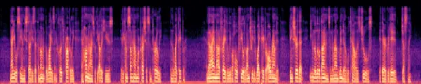](https://drive.google.com/file/d/1UklG8BrWddYdm7FhFS_cAlj_Sg4DDsyy/view?usp=drive_link)  | [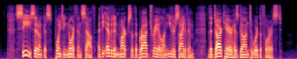](https://drive.google.com/file/d/1cYu4vUDFjHjvNV6olyDlZ-zKGT9ai3wY/view?usp=drive_link)  |
| SpeechTokenizer        | [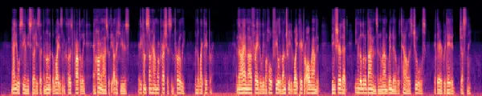](https://drive.google.com/file/d/1ESVkm5PCtZGNgEVf7vh8-rmlzi8e-_Bl/view?usp=drive_link)  | [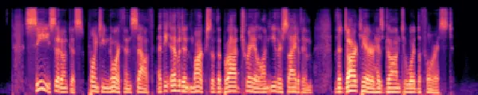](https://drive.google.com/file/d/1-LU6ZlbN1euAMVG-0o3PIJHQe2SFtH5o/view?usp=drive_link)  |
| DM-Codec               | [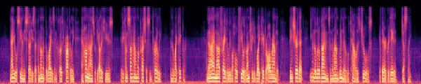](https://drive.google.com/file/d/1bUSJj4-yQ7YoqyFDAB8W0xabXUWDkFFr/view?usp=drive_link)  | [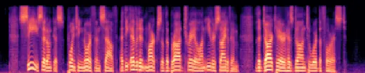](https://drive.google.com/file/d/1nTYclep1TNDdf_oza8BwpvEfvV4xNXHx/view?usp=drive_link)  |
| EnCodec                | [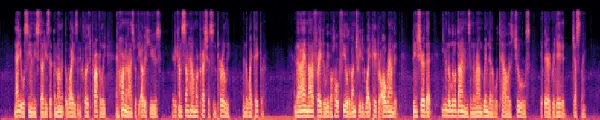](https://drive.google.com/file/d/1GWMFaXifdDpRzYW0lkKAXGrMfc4UA2dD/view?usp=drive_link)  | [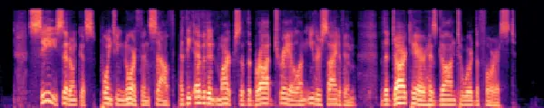](https://drive.google.com/file/d/1rXwl4rFgpxw7OeAFYMCko-ZZeR2oe1VL/view?usp=drive_link)  |
| FuseCodec-Fusion       | [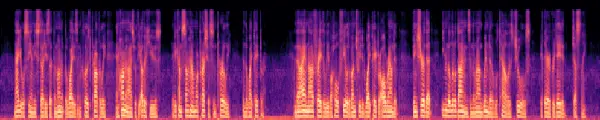](https://drive.google.com/file/d/129Z6P1WX0FwkgAl74MNGogupArj4Jj4N/view?usp=drive_link) | [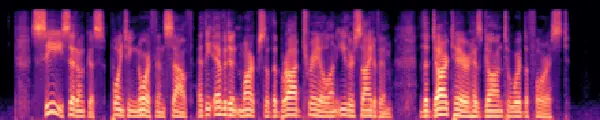](https://drive.google.com/file/d/1SZyh6gs8oQi8Q3nFC20g2jeh4PuFaAWR/view?usp=drive_link) |
| FuseCodec-Distill      | [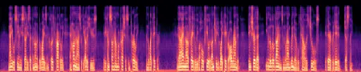](https://drive.google.com/file/d/1YPEhnENqi49zxBrmB4uX2pjXX841ouMt/view?usp=drive_link) | [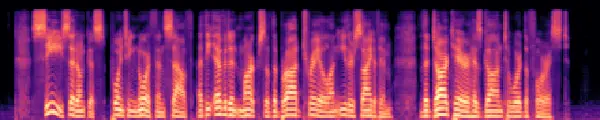](https://drive.google.com/file/d/1y91h1mfJvA78rgr0G57JkENyPpVstLsM/view?usp=drive_link) |
| FuseCodec-ContextAlign | [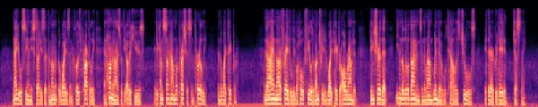](https://drive.google.com/file/d/1G9JYL9zRzQUiPNsfZRMkYzpsm_-oEXcC/view?usp=drive_link) | [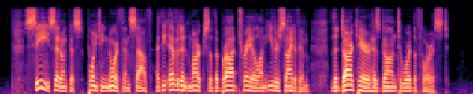](https://drive.google.com/file/d/1-cI80_JnXchQITu87-Lz8-BQGAsAjf29/view?usp=drive_link) |

Figure 2: Qualitative speech reconstruction results for FuseCodec and
baseline models. Each cell shows the spectrogram for two samples;
clicking an image links to the corresponding audio.
