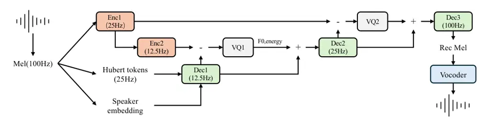
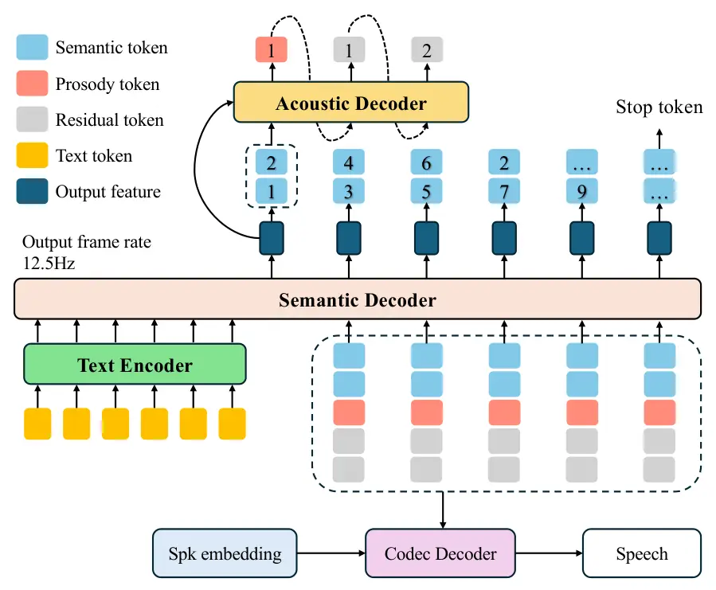

Li Zhang Ye Guo

# MSR-Codec: A Low-Bitrate Multi-Stream Residual Codec for High-Fidelity Speech Generation with Information Disentanglement

Jingyu    Guangyan    Zhen    Yiwen

###### Abstract

Audio codecs are a critical component of modern speech generation
systems. This paper introduces a low-bitrate, multi-scale residual codec
that encodes speech into four distinct streams: semantic, timbre,
prosody, and residual. This architecture achieves high-fidelity speech
reconstruction at competitive low bitrates while demonstrating an
inherent ability for information disentanglement. We construct a
two-stage language model for text-to-speech (TTS) synthesis using this
codec, which, despite its lightweight design and minimal data
requirements, achieves a state-of-the-art Word Error Rate (WER) and
superior speaker similarity compared to several larger models.
Furthermore, the codec’s design proves highly effective for voice
conversion, enabling independent manipulation of speaker timbre and
prosody. Our inference code, pre-trained models, and audio samples are
available at
[https://github.com/herbertLJY/MSRCodec](https://github.com/herbertLJY/MSRCodec).

###### keywords

audio codec, speech generation, low-bitrate, information disentanglement

^(†)^(†)address: ¹ LIGHTSPEED, Hong Kong SAR  
² The Hong Kong University of Science and Technology, Hong Kong SAR  
³ Independent Researcher ^(†)^(†)email:
{lijingyu0125,gyzhang}@link.cuhk.edu.hk, zhenye213@gmail.com,
guoyiwen89@gmail.com

## 1 Introduction

With the fast development of large language models (LLMs), LLM-based
systems have become the mainstream approaches in the task of
text-to-speech (TTS) and achieved state-of-the-art performance. Central
to these systems is the neural audio codec \[1, 2, 3, 4, 5\], a critical
module that transforms continuous speech waveforms into sequences of
discrete tokens. In a typical generation pipeline, an LLM predicts these
speech tokens conditioned on input text, and a corresponding decoder
then synthesizes the final audio from this token sequence.

A primary goal for modern neural codecs is to achieve high compression
rates without sacrificing quality. Models like SoundStream \[6\] and
Encodec \[7\] use stacked convolutions to compress speech by over 100
times, using Residual Vector Quantization (RVQ) to maintain
high-fidelity reconstruction. However, this fidelity often comes at the
cost of a high bitrate—the amount of data required to store the
tokenized speech. For instance, popular codecs may require bitrates of
6kbps or more, which increases the complexity for storage, transmission,
and the downstream language models that must predict these longer token
sequences.

To address this efficiency challenge, researchers have explored several
information disentanglement strategies \[8, 9\]. One prominent approach
separates speech into time-variant frame-level tokens and time-invariant
codes that capture global information, such as speaker timbre and
environmental sounds. As this global information does not scale with the
speech’s length, this method can significantly reduce the required
bitrate. For example, LSCodec \[10\] effectively disentangles timbre by
explicitly encoding speaker information with a prompt network. A more
structured approach, seen in models like SemantiCodec \[11\], factorizes
speech into its fundamental components: semantic information (linguistic
content) and acoustic information. Semantic tokens, which can be
extracted via supervised ASR tasks \[12\] or self-supervised models like
Hubert \[13\], capture what is being said but are insufficient on their
own for reconstruction. They must be complemented by another set of
acoustic tokens or a generative model to synthesize the final
high-fidelity speech.

In this work, we propose a highly efficient, low-bitrate codec that
advances this disentanglement paradigm for speech generation. Inspired
by factorized representations, we encode speech into four distinct
streams: semantic, timbre, prosody, and a fine-grained residual stream.
We leverage pre-trained models to extract semantic (Hubert) and timbre
(speaker embeddings) information. Our core novelty lies in how these
streams are integrated. While prior work \[14\] relies on complex
mechanisms like adversarial training to enforce disentanglement, our
model achieves this implicitly through a simple and stable cascaded
architecture. Information from each stream is progressively fused via
residual connections, naturally encouraging each component to capture
distinct attributes of the speech signal. By employing multi-scale
processing and smaller codebooks, our codec achieves a compression
factor of over 200x (62.5 tokens per second) while maintaining
high-quality output. We construct a two-stage LLM for TTS synthesis
using our codec, demonstrating that this disentangled representation
leads to superior performance. Our lightweight system achieves a
state-of-the-art Word Error Rate (WER) and superior speaker similarity.
Notably, it outperforms several larger, state-of-the-art models while
being trained on a fraction of the data and generating speech
significantly faster. Furthermore, the codec’s inherent disentanglement
enables highly effective zero-shot voice conversion of both timbre and
prosody, confirming the successful separation of these key speech
factors.



Figure 1: The overview structure of the codec, the output frame rate of
each module is presented in the figure

## 2 Method

Our proposed method consists of two primary components. First, we
introduce a Multi-Stream Residual Codec that disentangles speech into
four distinct streams and encodes them at a low bitrate. Second, we
present a Two-Stage TTS Model designed to generate the tokens for this
codec from input text.

### 2.1 The Structure of Codec

The codec transforms an input Mel-spectrogram into a highly compressed,
factorized representation and then reconstructs it. As illustrated in
Figure 1, it processes speech into four streams: timbre, semantics,
prosody, and a final residual stream. These are progressively fused in a
cascaded architecture, and a pre-trained vocoder converts the final
Mel-spectrogram into a waveform.

#### 2.1.1 Base Layer: Timbre and Semantic Streams

The foundation of our representation is formed by the speaker’s identity
and the linguistic contents.

Timbre Information: We use a pre-trained CAM++ \[15\] network to extract
a single, time-invariant speaker embedding for each utterance, which is
$`l2`$-normalized before feeding into the codec.

Semantic Information: To represent the linguistic content, we use a
pre-trained Hubert model to extract features at a 25Hz frame rate, which
are then quantized into discrete semantic tokens.

The semantic tokens and speaker embedding are fused together using Dec1.
The resulting features are downsampled to a 12.5Hz sequence, forming a
base representation of the speech’s content and speaker identity. Both
the speaker and Hubert encoders remain frozen during training.

#### 2.1.2 Prosody Streams

While the base layer captures what is said and by whom, it lacks
prosodic detail such as pitch and rhythm. We model this at a 12.5Hz
frame rate, which is well-suited for these slower-moving contours.

Residual Prosody Capture: To generate the features for this stream, the
input Mel-spectrogram is passed through a sequence of two encoders.
First, Enc1 transforms the Mel-spectrogram into a 25Hz feature map. This
output is then passed through Enc2, which further downsamples it to a
12.5Hz feature map. The prosody information is captured in the residual
domain as the difference between this Enc2 output and the output of
Dec1. This difference is then quantized by a single codebook (VQ1) to
generate prosody tokens.

Explicit Supervision: To ensure these tokens specifically learn prosodic
attributes, the quantized features are explicitly trained to predict the
corresponding frame-level $`F_{0}`$ and spectral energy via an auxiliary
predictor.

Fusion: The resulting prosody features are then element-wise added to
the base timbre-semantic stream and passed to the next decoder stage
(Dec2) for further fusion.

#### 2.1.3 Residual Stream

Finally, to ensure high-fidelity reconstruction, we capture fine-grained
acoustic details, such as environmental factors and complex textures, in
a residual stream. A higher temporal resolution is necessary for this
task.

Acoustic Detail Capture: This stream utilizes the 25Hz feature map
produced by Enc1. The residual information is calculated as the
difference between Enc1’s output and the upsampled output from the
prosody-enhanced stream (from Dec2). This difference is then quantized
using a second codebook (VQ2) to create residual tokens.

Final Reconstruction: These 25Hz residual features are element-wise
added to the preceding stream and passed to the final decoder (Dec3) to
reconstruct the Mel-spectrogram.

### 2.2 Training Objectives

The codec is trained with a combination of three loss functions:

Reconstruction Loss ($`L_{recon}`$): This is the primary objective,
calculated as the sum of $`\ell_{1}`$ and $`\ell_{2}`$ distances between
the ground-truth and reconstructed Mel-spectrograms,

```math
L_{recon}=\frac{1}{N}\sum_{n=i}^{N}(||x,\hat{x}||_{1}+||x,\hat{x}||_{2}) \tag{1}
```

where $`x`$ is the input and $`\hat{x}`$ is the reconstructed one. We
also apply this loss to the intermediate outputs of Dec1 and Dec2 to
stabilize training and ensure each stage contributes effectively to the
reconstruction.

Adversarial Loss ($`L_{adv}`$): A discriminator is trained to
distinguish between real ($`x`$) and reconstructed spectrograms
($`\hat{x}`$), improving the perceptual quality and naturalness of the
output.

Prosody Loss ($`L_{prosody}`$): An MSE loss is applied between the
predicted prosody outputs from VQ1 and the target $`F_{0}`$ and energy
values, encouraging the prosody stream to capture this specific
information.

### 2.3 The Structure of the TTS Model



Figure 2: The network structure of the TTS model. The index denotes the
order of each token. Best viewed in colors

We build a TTS model to generate speech using the proposed codec, as
shown in  Figure 2. The architecture consists of a text encoder and a
two-stage autoregressive language model.

Stage 1: Semantic Prediction with the Semantic Decoder: The primary
component is an autoregressive Semantic Decoder, which operates on
features from the text encoder. At each step, the Semantic Decoder
generates an output feature at a 12.5Hz rate. A split classification
head then predicts two 25Hz semantic tokens from this single feature.

Stage 2: Acoustic Prediction with the Acoustic Decoder: A smaller,
secondary Acoustic Decoder is responsible for predicting the acoustic
details for each frame. It takes the output feature from the Semantic
Decoder and the newly predicted semantic tokens as input to generate the
corresponding prosody and residual tokens for that time step.

Autoregressive Generation: The generation process proceeds
autoregressively at 12.5Hz. The input to the next step of the primary
Semantic Decoder is formed by concatenating its own output feature from
the current step with the embeddings of all tokens generated in that
step (semantic, prosody, and residual). Generation terminates when a
special stop token is predicted by the Semantic Decoder. The speaker
embedding is not used during token prediction; it is only provided as a
condition to the codec’s decoder during the final synthesis stage.

## 3 Experiments

### 3.1 Datasets and Preprocessing

The training data of the codec included the English portion of the
Multilingual LibriSpeech (MLS) dataset \[16\], Wenetspeech \[17\],
Textrolspeech \[18\], Aishell 1 & 2 \[19, 20\], CN-Celeb 1 & 2 \[21\],
and VoxCeleb 1 & 2  \[22\]. The TTS model was trained on MLS-en,
Libritts \[23\], and VCTK \[24\] only.

All speech audio was resampled to 16kHz. During training, 6-second
segments were randomly cropped from each sample. These segments were
then transformed into 80-dimensional Mel-spectrograms using a 25ms
window length and a 10ms hop length. The codec’s reconstruction ability
was evaluated on the Librispeech test set, while the zero-shot TTS
capability was evaluated on the English test set from Seed-TTS-eval¹¹ 1
https://github.com/BytedanceSpeech/seed-tts-eval.

### 3.2 Implementation Details

#### 3.2.1 Codec Configuration

The encoders (Enc1 $`\&`$ Enc2) and decoders (Dec2 $`\&`$ Dec3) in the
codec are convolution-based networks. Their structures are similar to
SEANet \[25\], with convolution layer parameters adjusted to match the
required frame rates for each stream. Two self-attention\[26\] modules
are added at the end of the Enc1 and the input of Dec3, respectively,
which involve the global relation between frames. Dec1 is a 2-layer
conformer network with cross-attention modules, a structure similar to
the decoder in CTX-vec2wav \[27\]. A pretrained 16kHz Fre-GAN  \[28\]
was used as the vocoder to convert reconstructed Mel-spectrograms into
audio waveforms. Three versions of the codec were trained with different
bitrates- 424/524/612. For all versions, the semantic stream uses a
fixed codebook of 500 centers from the pre-trained Hubert model²² 2
https://github.com/facebookresearch/textlesslib/blob/main/textless. The
sizes of the codebook for the prosody stream (VQ1) in these three codecs
are 64/256/512; their codebook sizes for the residual stream (VQ2) are
32/256/2048, respectively.

#### 3.2.2 TTS Model Architecture

The TTS model consists of a text encoder and a two-stage decoder. The
text encoder is a 6-layer transformer with a dimension of 768. No
attention mask is applied, giving each output a global receptive field
over the input text. The Semantic Decoder is an 18-layer decoder-only
transformer with a dimension of 768. The Acoustic Decoder is a 3-layer
decoder-only transformer, also with a dimension of 768.

#### 3.2.3 Evaluation Metrics

We assess the performance of our models using several standard metrics:

- •
  Reconstruction Quality: Measured with Short-Time Objective
  Intelligibility (STOI) \[29\], Perceptual Evaluation of Speech Quality
  (PESQ) \[30\], and a pre-trained UTMOS \[31\] model for naturalness.
- •
  Speaker Similarity (SIM): Measured between the original and
  synthesized speech using a WavLM-large-based speaker verification
  model \[32\].
- •
  Word Error Rate (WER): Calculated on the synthesized speech from the
  TTS model using the whisper-large-v3 model ³³ 3
  https://huggingface.co/openai/whisper-large-v3.
- •
  $`F_{0}`$ Difference: To evaluate prosody transfer in voice
  conversion, the average $`F_{0}`$ difference was measured between the
  converted speech and both the target ($`\Delta F_{0,\text{tar}}`$) and
  source ($`\Delta F_{0,\text{src}}`$) speech.

### 3.3 Results

|                 |              |     |            |          |       |      |      |        |      |
| --------------- | ------------ | --- | ---------- | -------- | ----- | ---- | ---- | ------ | ---- |
| Model           | Codebook     | Nq  | Token Rate | Bitrates | STOI↑ | PESQ | PESQ | UTMOS↑ | SIM↑ |
|                 | Size         |     | (TPS)      |          |       | NB↑  | WB↑  |        |      |
| SpeechTokenizer | 1024         | 2   | 100        | 1000     | 0.77  | 1.59 | 1.25 | 2.28   | 0.36 |
| X-codec         | 1024         | 2   | 100        | 1000     | 0.86  | 2.88 | 2.33 | 4.21   | 0.72 |
| SemantiCodec    | 16384        | 1   | 100        | 1400     | 0.88  | 2.63 | 2.07 | 2.92   | 0.74 |
| WavTokenizer    | 4096         | 1   | 75         | 900      | 0.89  | 2.64 | 2.14 | 3.94   | 0.67 |
| Single-Codec    | 8192         | 1   | 23.4       | 304      | 0.86  | 2.42 | 1.88 | 3.72   | 0.60 |
| MSR-Codec-424   | 500/64/32    | 3   | 62.5       | 424      | 0.84  | 2.37 | 1.82 | 4.15   | 0.80 |
| MSR-Codec-524   | 500/256/256  | 3   | 62.5       | 524      | 0.85  | 2.59 | 1.98 | 4.14   | 0.81 |
| MSR-Codec-612   | 500/512/2048 | 3   | 62.5       | 612      | 0.90  | 2.73 | 2.09 | 4.13   | 0.83 |

Table 1: Comparison of speech reconstruction quality on the Librispeech
test set. Our proposed models are benchmarked against a comprehensive
set of low-bitrate codecs. ‘Nq’ denotes the number of quantizers and
‘TPS’ is tokens per second. The best scores are in bold.

| Model         | Model | Data | WER↓ | SIM↑  | RTF↓ |
| ------------- | ----- | ---- | ---- | ----- | ---- |
|               | size  | size |      |       |      |
| Ori. speech   | \-    | \-   | 2.14 | 0.722 | \-   |
| FireRedTTS    | 0.4B  | 150k | 3.82 | 0.460 | 1.48 |
| CosyVoice2    | 0.5B  | 167k | 2.57 | 0.652 | 2.34 |
| Llasa-1B-250k | 1B    | 250k | 3.22 | 0.572 | 0.91 |
| MSR-Codec-524 | 0.2B  | 45k  | 3.07 | 0.613 | 0.67 |

Table 2: Zero-shot TTS performance on the Seed-TTS English test set.
‘Data size’ is measured in hours. ‘RTF’ denotes Real-Time Factor. Our
model’s results are bolded to highlight competitive performance from a
much smaller model. The best overall score in each column is also
marked.

| Model       | WER  | SIM$`{}_{\text{tar}}`$ | SIM$`{}_{\text{src}}`$ | $`\Delta F_{0,\text{tar}}`$ | $`\Delta F_{0,\text{src}}`$ |
| ----------- | ---- | ---------------------- | ---------------------- | --------------------------- | --------------------------- |
| Ori. speech | 7.49 | \-                     | 1                      | \-                          | 0                           |
| CosyVoice2  | 9.57 | 0.43                   | 0.32                   | 11.0                        | 46.1                        |
| Seed-VC     | 7.95 | 0.48                   | 0.27                   | 6.3                         | 53.2                        |
| 424+S       | 8.59 | 0.51                   | 0.22                   | 49.1                        | 7.7                         |
| 524+S       | 8.74 | 0.49                   | 0.24                   | 51.0                        | 6.5                         |
| 424+P       | 9.22 | 0.11                   | 0.64                   | 14.2                        | 49.8                        |
| 524+P       | 8.95 | 0.11                   | 0.59                   | 12.3                        | 53.5                        |
| 424+S+P     | 8.85 | 0.56                   | 0.18                   | 9.4                         | 54.7                        |
| 524+S+P     | 8.13 | 0.55                   | 0.18                   | 9.0                         | 54.7                        |

Table 3: Voice conversion results demonstrating information
disentanglement. ‘+S’ indicates timbre conversion and ‘+P’ indicates
prosody conversion. Key metrics supporting successful and disentangled
transfer are in bold.

#### 3.3.1 Speech Reconstruction Quality

As shown in  Table 1, the proposed codecs achieve strong reconstruction
quality at low bitrates. Compared to other codecs, our models
demonstrate the highest speaker similarity and comparable UTMOS scores,
indicating that timbre and naturalness are well-preserved. The STOI and
PESQ scores are relatively lower, which is expected as these metrics are
sensitive to signal-level details that require more bits to reconstruct
perfectly. Notably, these scores improve significantly when using the
larger bitrate version of the codec, where the MSR-Codec-612 achieves
the highest STOI and speaker similarity scores.

#### 3.3.2 Zero-Shot Text-to-Speech

The TTS results in Table 2 highlight our model’s exceptional efficiency
and performance. As the most lightweight model trained on the least
amount of data, our system still achieves a state-of-the-art Word Error
Rate (WER), surpassing all competing models. It also delivers the
highest speaker similarity, indicating superior voice cloning.
Crucially, our model demonstrates its speed by achieving the lowest
Real-Time Factor (RTF), making it the fastest generator among the tested
systems. This combination of top-tier accuracy and unparalleled
efficiency underscores the significant advantages of our proposed
architecture.

#### 3.3.3 Voice and Prosody Conversion

The codec’s disentangled representation enables inherent voice
conversion (VC) capabilities, which we evaluated to validate the
separation of speech attributes. $`8`$ utterances are randomly sampled
from the dataset of VCTK. These utterances come from different speakers
(4 male/ 4 female), and they are utilized as the target prompts. $`100`$
utterances are randomly sampled from the clean test set of Libritts and
utilized as the source speeches.

Timbre Conversion: By swapping only the speaker embedding of a source
speech with a target one, our method achieves higher target speaker
similarity than both CosyVoice2 and Seed-VC \[33\]. As shown in
 Table 3, this conversion preserves the original prosody, with the
average $`F_{0}`$ remaining close to the source speech (low
$`\Delta F_{0,\text{src}}`$) and not shifting towards the target (high
$`\Delta F_{0,\text{tar}}`$ ). This confirms the successful
disentanglement of the timbre from the prosody.

Prosody Conversion: By keeping the source speaker embedding and semantic
tokens but predicting new prosody and residual tokens from a target
speech, our model achieves a clear prosody transfer. The results show a
significant $`F_{0}`$ shift towards the target (low
$`\Delta F_{0,\text{tar}}`$) while maintaining the original speaker’s
timbre.

Combined Conversion: When both the speaker embedding is swapped, and the
prosody tokens are re-predicted, the model achieves the best results in
transferring both timbre and prosody simultaneously.

## 4 Conclusion

In this work, we proposed a highly efficient codec for speech generation
that factorizes speech into semantic, timbre, prosody, and residual
streams. The streams are progressively fused to reconstruct the final
Mel-spectrogram. Our model successfully achieves high-fidelity speech
reconstruction with low bitrates and demonstrates strong information
disentanglement capabilities. Additionally, we developed a two-stage TTS
model that leverages this codec. This model separates the prediction of
semantic content from prosodic details and achieves state-of-the-art
performance, delivering a lower WER and higher speaker similarity than
competing systems, while remaining lightweight, data-efficient, and
significantly faster at generation. The disentanglement ability of our
approach was validated through voice conversion experiments, where our
model demonstrated superior performance in transferring speaker timbre
independently of prosody, outperforming existing methods. This work
highlights the effectiveness of a multi-stream, residual architecture
for creating efficient and controllable representations for speech
synthesis.

## References

- \[1\] C. Wang, S. Chen, Y. Wu, Z. Zhang, L. Zhou, S. Liu, Z. Chen, Y.
  Liu, H. Wang, J. Li, et al. (2023) Neural codec language models are
  zero-shot text to speech synthesizers. arXiv preprint
  arXiv:2301.02111. Cited by: §1.
- \[2\] S. Chen, S. Liu, L. Zhou, Y. Liu, X. Tan, J. Li, S. Zhao, Y.
  Qian, and F. Wei (2024) Vall-e 2: neural codec language models are
  human parity zero-shot text to speech synthesizers. arXiv preprint
  arXiv:2406.05370. Cited by: §1.
- \[3\] Z. Du, Y. Wang, Q. Chen, X. Shi, X. Lv, T. Zhao, Z. Gao, Y.
  Yang, C. Gao, H. Wang, et al. (2024) Cosyvoice 2: scalable streaming
  speech synthesis with large language models. arXiv preprint
  arXiv:2412.10117. Cited by: §1.
- \[4\] Z. Ye, X. Zhu, C. Chan, X. Wang, X. Tan, J. Lei, Y. Peng, H.
  Liu, Y. Jin, Z. Dai, et al. (2025) Llasa: scaling train-time and
  inference-time compute for llama-based speech synthesis. arXiv
  preprint arXiv:2502.04128. Cited by: §1.
- \[5\] H. Guo, Y. Hu, K. Liu, F. Shen, X. Tang, Y. Wu, F. Xie, K. Xie,
  and K. Xu (2024) Fireredtts: a foundation text-to-speech framework for
  industry-level generative speech applications. arXiv preprint
  arXiv:2409.03283. Cited by: §1.
- \[6\] N. Zeghidour, A. Luebs, A. Omran, J. Skoglund, and M.
  Tagliasacchi (2021) Soundstream: an end-to-end neural audio codec.
  IEEE/ACM Transactions on Audio, Speech, and Language Processing 30,
  pp. 495–507. Cited by: §1.
- \[7\] A. Défossez, J. Copet, G. Synnaeve, and Y. Adi (2023) High
  fidelity neural audio compression. Trans. Mach. Learn. Res. 2023.
  External Links: [Link](https://openreview.net/forum?id=ivCd8z8zR2)
  Cited by: §1.
- \[8\] Y. Ren, T. Wang, J. Yi, L. Xu, J. Tao, C. Y. Zhang, and J.
  Zhou (2024) Fewer-token neural speech codec with time-invariant codes.
  In ICASSP, pp. 12737–12741. Cited by: §1.
- \[9\] H. Li, L. Xue, H. Guo, X. Zhu, Y. Lv, L. Xie, Y. Chen, H. Yin,
  and Z. Li (2024) Single-codec: single-codebook speech codec towards
  high-performance speech generation. In Proc. Interspeech 2024,
  pp. 3390–3394. Cited by: §1.
- \[10\] Y. Guo, Z. Li, C. Du, H. Wang, X. Chen, and K. Yu (2025)
  LSCodec: Low-Bitrate and Speaker-Decoupled Discrete Speech Codec. In
  Interspeech 2025, pp. 5018–5022. External Links:
  [Document](https://dx.doi.org/10.21437/Interspeech.2025-1106), ISSN
  2958-1796 Cited by: §1.
- \[11\] H. Liu, X. Xu, Y. Yuan, M. Wu, W. Wang, and M. D.
  Plumbley (2024) Semanticodec: an ultra low bitrate semantic audio
  codec for general sound. IEEE Journal of Selected Topics in Signal
  Processing. Cited by: §1.
- \[12\] Z. Du, Q. Chen, S. Zhang, K. Hu, H. Lu, Y. Yang, H. Hu, S.
  Zheng, Y. Gu, Z. Ma, et al. (2024) Cosyvoice: a scalable multilingual
  zero-shot text-to-speech synthesizer based on supervised semantic
  tokens. arXiv preprint arXiv:2407.05407. Cited by: §1.
- \[13\] W. Hsu, B. Bolte, Y. H. Tsai, K. Lakhotia, R. Salakhutdinov,
  and A. Mohamed (2021) Hubert: self-supervised speech representation
  learning by masked prediction of hidden units. IEEE/ACM transactions
  on audio, speech, and language processing 29, pp. 3451–3460. Cited by:
  §1.
- \[14\] Z. Ju, Y. Wang, K. Shen, X. Tan, D. Xin, D. Yang, E. Liu, Y.
  Leng, K. Song, S. Tang, et al. (2024) NaturalSpeech 3: zero-shot
  speech synthesis with factorized codec and diffusion models. In
  International Conference on Machine Learning, pp. 22605–22623. Cited
  by: §1.
- \[15\] H. Wang, S. Zheng, Y. Chen, L. Cheng, and Q. Chen (2023) CAM++:
  a fast and efficient network for speaker verification using
  context-aware masking. In Interspeech 2023, pp. 5301–5305. External
  Links: [Document](https://dx.doi.org/10.21437/Interspeech.2023-1513),
  ISSN 2958-1796 Cited by: §2.1.1.
- \[16\] V. Pratap, Q. Xu, A. Sriram, G. Synnaeve, and R.
  Collobert (2020) MLS: a large-scale multilingual dataset for speech
  research. Proc. Interspeech, pp. 2757–2761. Cited by: §3.1.
- \[17\] B. Zhang, H. Lv, P. Guo, Q. Shao, C. Yang, L. Xie, X. Xu, H.
  Bu, X. Chen, C. Zeng, et al. (2022) Wenetspeech: a 10000+ hours
  multi-domain mandarin corpus for speech recognition. In ICASSP
  2022-2022 IEEE International Conference on Acoustics, Speech and
  Signal Processing (ICASSP), pp. 6182–6186. Cited by: §3.1.
- \[18\] S. Ji, J. Zuo, M. Fang, Z. Jiang, F. Chen, X. Duan, B. Huai,
  and Z. Zhao (2024) Textrolspeech: a text style control speech corpus
  with codec language text-to-speech models. In ICASSP, pp. 10301–10305.
  Cited by: §3.1.
- \[19\] H. Bu, J. Du, X. Na, B. Wu, and H. Zheng (2017) Aishell-1: an
  open-source mandarin speech corpus and a speech recognition baseline.
  In 2017 20th conference of the oriental chapter of the international
  coordinating committee on speech databases and speech I/O systems and
  assessment (O-COCOSDA), pp. 1–5. Cited by: §3.1.
- \[20\] J. Du, X. Na, X. Liu, and H. Bu (2018) Aishell-2: transforming
  mandarin asr research into industrial scale. arXiv preprint
  arXiv:1808.10583. Cited by: §3.1.
- \[21\] L. Li, R. Liu, J. Kang, Y. Fan, H. Cui, Y. Cai, R.
  Vipperla, T. F. Zheng, and D. Wang (2022) Cn-celeb: multi-genre
  speaker recognition. Speech Communication 137, pp. 77–91. Cited by:
  §3.1.
- \[22\] A. Nagrani, J. S. Chung, W. Xie, and A. Zisserman (2020)
  Voxceleb: large-scale speaker verification in the wild. Computer
  Speech & Language 60, pp. 101027. Cited by: §3.1.
- \[23\] H. Zen, V. Dang, R. Clark, Y. Zhang, R. J. Weiss, Y. Jia, Z.
  Chen, and Y. Wu (2019) Libritts: a corpus derived from librispeech for
  text-to-speech. arXiv preprint arXiv:1904.02882. Cited by: §3.1.
- \[24\] J. Yamagishi, C. Veaux, and K. MacDonald (2017) CSTR vctk
  corpus: english multi-speaker corpus for cstr voice cloning toolkit.
  External Links: [Link](https://datashare.ed.ac.uk/handle/10283/3443)
  Cited by: §3.1.
- \[25\] M. Tagliasacchi, Y. Li, K. Misiunas, and D. Roblek (2020)
  SEANet: a multi-modal speech enhancement network. In Proc. Interspeech
  2020, pp. 1126–1130. Cited by: §3.2.1.
- \[26\] A. Vaswani, N. Shazeer, N. Parmar, J. Uszkoreit, L.
  Jones, A. N. Gomez, Ł. Kaiser, and I. Polosukhin (2017) Attention is
  all you need. Advances in neural information processing systems 30.
  Cited by: §3.2.1.
- \[27\] C. Du, Y. Guo, F. Shen, Z. Liu, Z. Liang, X. Chen, S. Wang, H.
  Zhang, and K. Yu (2024) Unicats: a unified context-aware
  text-to-speech framework with contextual vq-diffusion and vocoding. In
  Proceedings of the AAAI Conference on Artificial Intelligence, Vol.
  38, pp. 17924–17932. Cited by: §3.2.1.
- \[28\] J. Kim, S. Lee, J. Lee, and S. Lee (2021) Fre-gan: adversarial
  frequency-consistent audio synthesis. In Proc. Interspeech 2021,
  pp. 2197–2201. Cited by: §3.2.1.
- \[29\] A. H. Andersen, J. M. de Haan, Z. Tan, and J. Jensen (2017) A
  non-intrusive short-time objective intelligibility measure. In ICASSP,
  pp. 5085–5089. Cited by: 1st item.
- \[30\] A. W. Rix, J. G. Beerends, M. P. Hollier, and A. P.
  Hekstra (2001) Perceptual evaluation of speech quality (pesq)-a new
  method for speech quality assessment of telephone networks and codecs.
  In ICASSP, Vol. 2, pp. 749–752. Cited by: 1st item.
- \[31\] T. Saeki, D. Xin, W. Nakata, T. Koriyama, S. Takamichi, and H.
  Saruwatari (2022) UTMOS: utokyo-sarulab system for voicemos challenge 2022. In Proc. Interspeech 2022, pp. 4521–4525. Cited by: 1st item.
- \[32\] Z. Chen, S. Chen, Y. Wu, Y. Qian, C. Wang, S. Liu, Y. Qian,
  and M. Zeng (2022) Large-scale self-supervised speech representation
  learning for automatic speaker verification. In ICASSP, pp. 6147–6151.
  Cited by: 2nd item.
- \[33\] S. Liu (2024) Zero-shot voice conversion with diffusion
  transformers. arXiv preprint arXiv:2411.09943. Cited by: §3.3.3.
