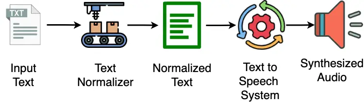
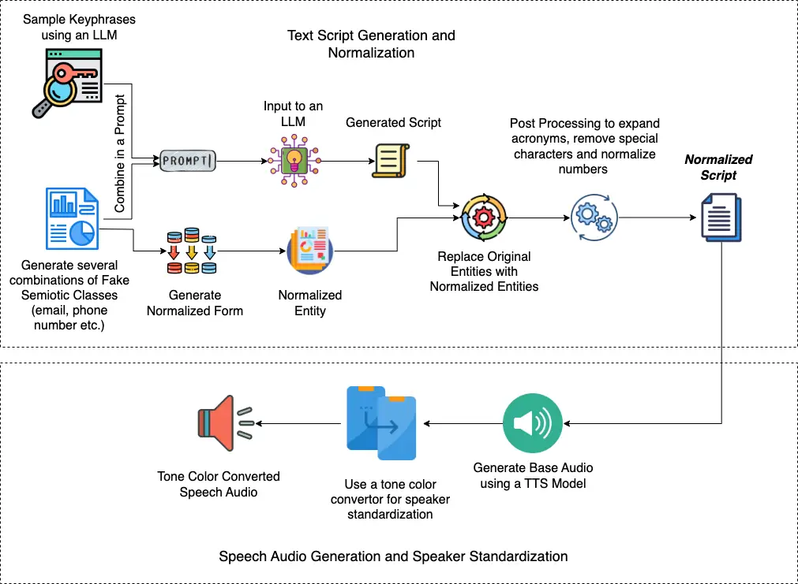
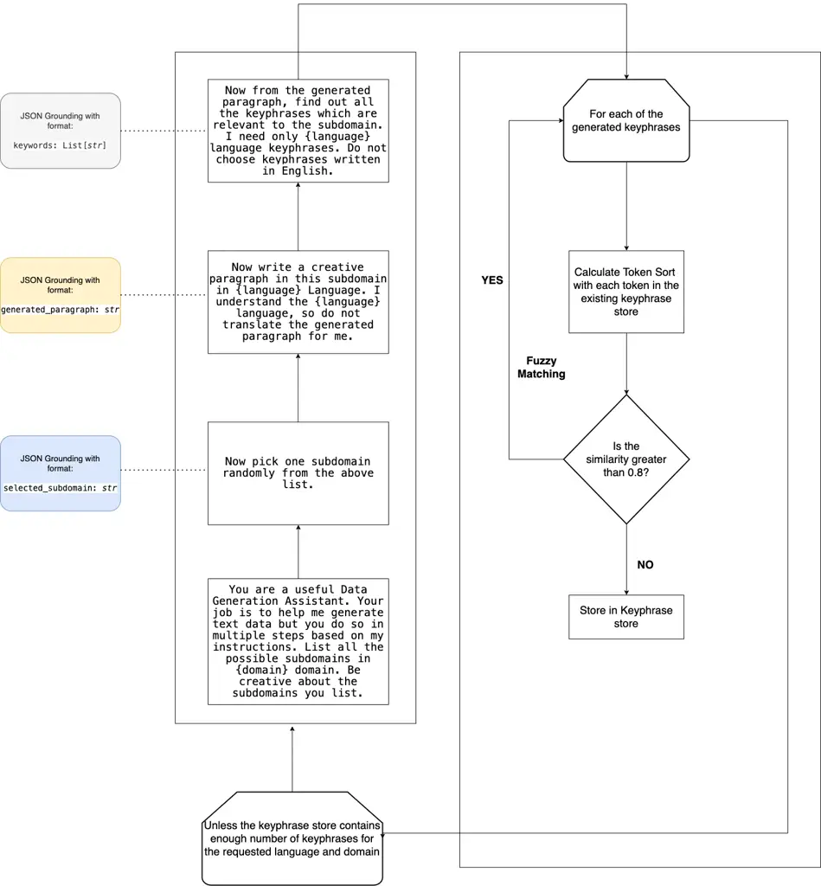
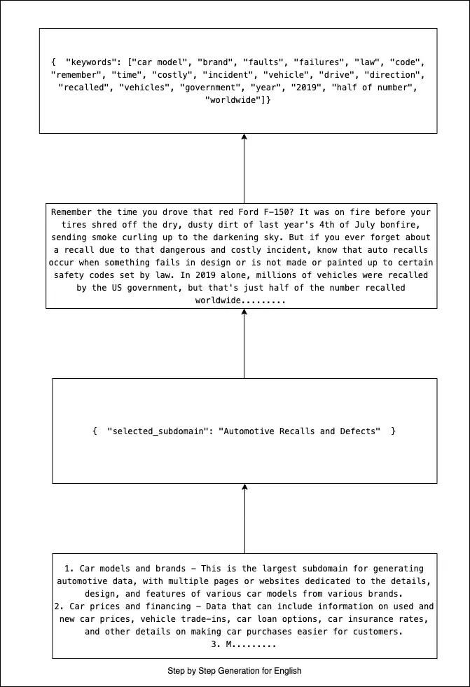
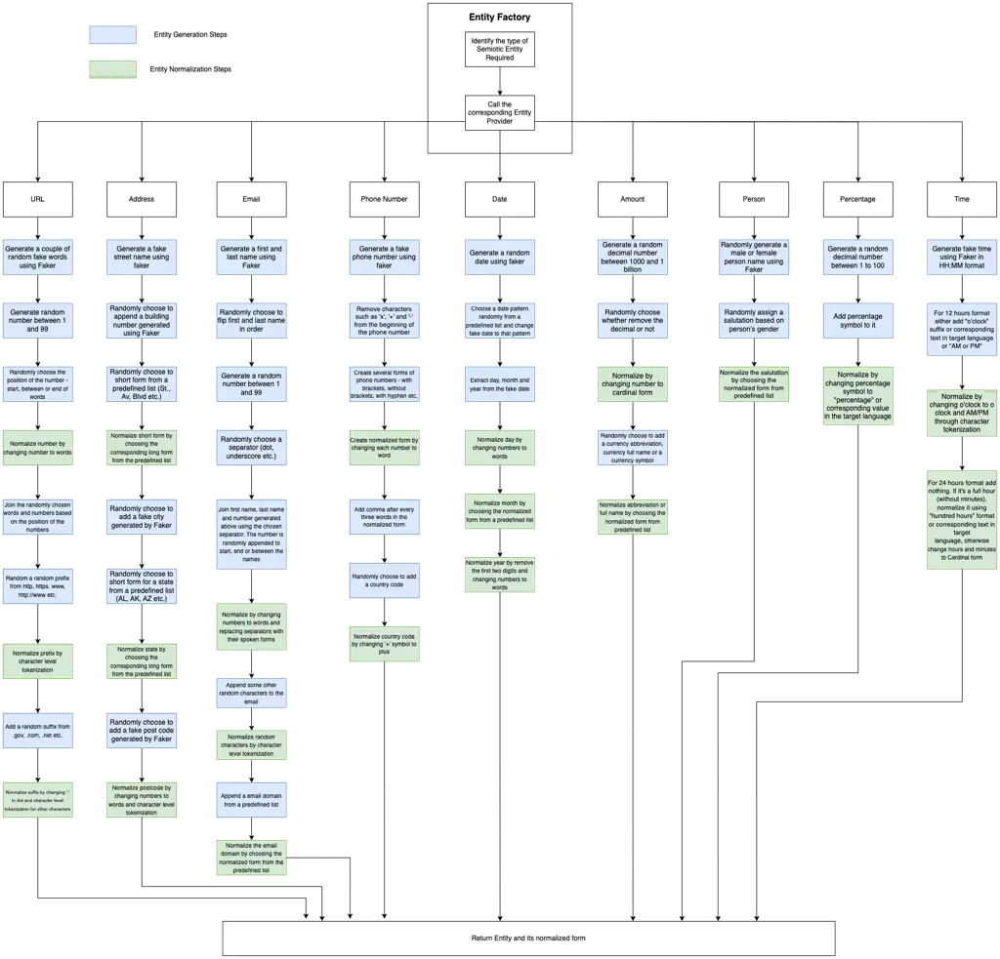
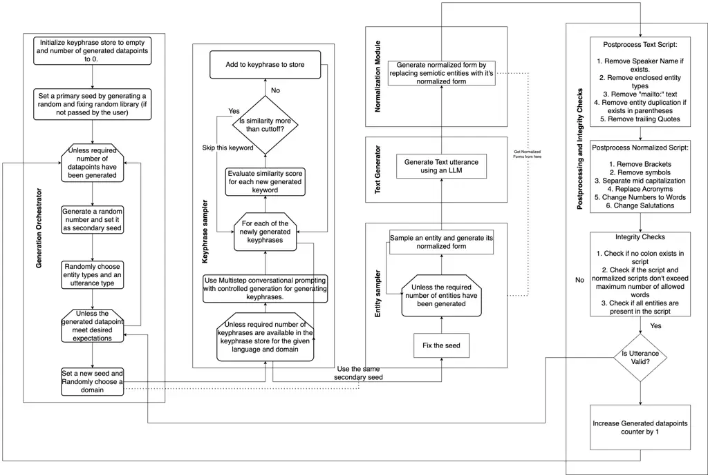
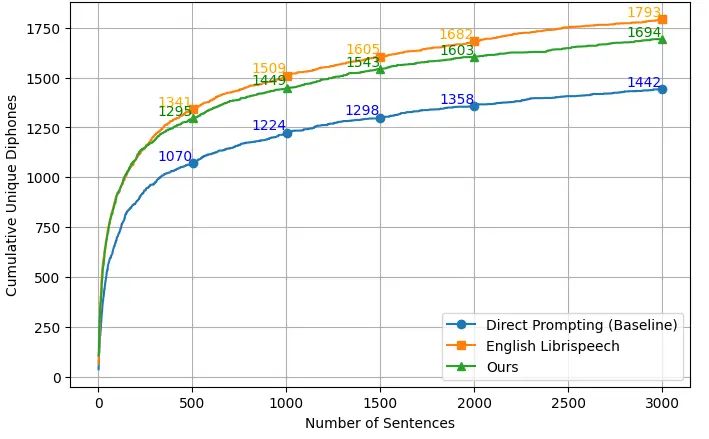
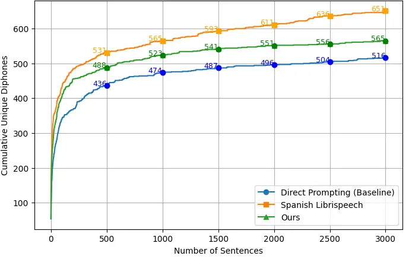
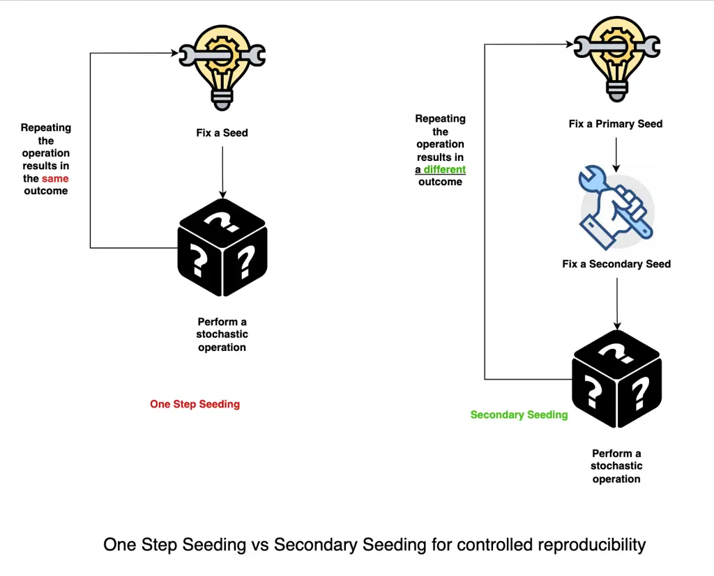

# SpeechWeave: Diverse Multilingual Synthetic Text & Audio Data Generation Pipeline for Training Text to Speech Models

Karan Dua    Puneet Mittal    Ranjeet Gupta    Hitesh Laxmichand Patel
Affiliation: {karan.dua, puneet.mittal, ranjeet.gupta,
hitesh.laxmichand.patel}@oracle.com Affiliation: Oracle AI

###### Abstract

High-quality Text-to-Speech (TTS) model training requires extensive and
diverse text and speech data. It is challenging to procure such data
from real sources due to issues of domain specificity, licensing, and
scalability. Large language models (LLMs) can certainly generate textual
data, but they create repetitive text with insufficient variation in the
prompt during the generation process. Another important aspect in TTS
training data is text normalization. Tools for normalization might
occasionally introduce anomalies or overlook valuable patterns, and thus
impact data quality. Furthermore, it is also impractical to rely on
voice artists for large scale speech recording in commercial TTS systems
with standardized voices. To address these challenges, we propose
SpeechWeave, a synthetic speech data generation pipeline that is capable
of automating the generation of multilingual, domain-specific datasets
for training TTS models. Our experiments reveal that our pipeline
generates data that is 10–48% more diverse than the baseline across
various linguistic and phonetic metrics, along with speaker-standardized
speech audio while generating approximately 97% correctly normalized
text. Our approach enables scalable, high-quality data generation for
TTS training, improving diversity, normalization, and voice consistency
in the generated datasets.

## 1 Introduction

Text-to-Speech (TTS) systems convert written text to spoken audio and
are used in applications such as virtual assistants, accessibility
software, navigation systems, and customer service to enable easier and
accessible user interaction. TTS systems require massive amounts of
training data consisting of text and speech pairs. Most publicly
available TTS datasets include book readings or generic passages Ito and
Johnson (2017), Panayotov et al. (2015),, Ardila et al. (2020). However,
for domain-specific business data (e.g., Automobile, Healthcare,
Retail), one needs to either scrape it from the web or purchase it from
data curation companies, which could introduce cost and licensing
issues. Additionally, the multilingual nature of such systems
complicates the process of obtaining domain-specific data.



Figure 1: High-level depiction of a TTS system incorporating
normalization

| Temperature | top_p | Output (Generated 3 times with the same settings)                                                                                                                                                                                                                                                                                   |
| ----------- | ----- | ----------------------------------------------------------------------------------------------------------------------------------------------------------------------------------------------------------------------------------------------------------------------------------------------------------------------------------- |
| 0.7         | 0.95  | 1. Maintaining a budget surplus is essential for reducing debt and securing financial stability.                                                                                                                                                                                                                                    |
|             |       | 2. Maintaining a budget surplus can help reduce debt and ensure financial stability.                                                                                                                                                                                                                                                |
|             |       | 3. Maintaining a balanced budget is crucial for achieving financial stability.                                                                                                                                                                                                                                                      |
| 1.2         | 0.95  | 1. Managing expenses effectively is crucial for maintaining a healthy financial situation.                                                                                                                                                                                                                                          |
|             |       | 2. Making regular investments in a diversified portfolio can help grow your wealth over time.                                                                                                                                                                                                                                       |
|             |       | 3. Maintaining a balanced budget is key to achieving long-term financial stability.                                                                                                                                                                                                                                                 |
| 1.2         | 0.51  | 1. Maintaining a budget surplus is crucial for reducing debt and ensuring financial stability.                                                                                                                                                                                                                                      |
|             |       | 2. Maintaining a budget helps control your expenses and save for future financial goals.                                                                                                                                                                                                                                            |
| 2.5         | 0.95  | 1. A wiser investment would have made twice your savings in a safer market stance. (Implying the reader missed an opportunity for increased returns by prioritizing safeguarded funds)                                                                                                                                              |
|             |       | 2. Exporting Savings: Despite decreased expenses, investments yield higher returns, bolstering my financial security.                                                                                                                                                                                                               |
|             |       | 3. A sound financial plan includes creating a budget, building an emergency reserves, saving for retirement, and consistently reducing unnecessary debts. But if you intend a single short sentence it would be- Investing as early and aggressively thanYou Can can enhance long-term returns significantly due toCompainddffects. |

Table 1: Generated outputs for different temperature and top-p settings
by prompting an LLM directly. Prompt used was "Construct one short
sentence in the finance domain".

### 1.1 Text Scripts

Text scripts serve as inputs to TTS systems and are essential for
adapting these systems to specific business domains. While obtaining
domain-specific data from public sources is difficult, it may seem that
LLMs can easily generate the necessary data using a simple prompt with
the domain as input. However, our experiments with _Mistral-7b-Instruct_
Jiang et al. (2023) show that for short sentences, the generated text
remains similar even with high _temperature_ and _top_p_ values,
especially if the input prompt stays unchanged. As shown in Table 1, an
LLM, even high temperature values produce almost identical results. Very
high values still limit the sub-domain to _Personal Finance_ but may
also generate unstable, low-quality output. Our analysis in the 4.1
Diversity Analysis section shows that LLMs, without prompt variation,
result in low-diversity datasets, thus making this approach impractical
for generating large datasets for training downstream models.

### 1.2 Normalization

The written and spoken forms of text often differ, primarily in specific
entities like addresses, dates, times, and salutations, known as
semiotic classes Zhang et al. (2019). Table 2 presents examples of text
scripts with their normalized forms across languages.

| Language | Text Script                                                                                    | Normalized Form                                                                                   |
| -------- | ---------------------------------------------------------------------------------------------- | ------------------------------------------------------------------------------------------------- |
| English  | The best waffles in Delhi are found in the 10th St., Hauz Khas Vil. in South Delhi.            | The best waffles in Delhi are found in the tenth street, Hauz Khas Village in South Delhi.        |
| Spanish  | El Dr. Johnson se especializa en el manejo de enfermedades relacionadas con el estilo de vida. | El Doctor Johnson se especializa en el manejo de enfermedades relacionadas con el estilo de vida. |
| French   | Emily est née le 03/08/1995.                                                                   | Emily est née le trois août mil neuf cent quatre-vingt-quinze.                                    |

Table 2: Examples of text scripts along with their normalized forms
across semiotic classes and languages.

A TTS system processes text through a Text Normalization System, such as
NeMo’s text normalizer Zhang et al. (2021), before generating speech
audio, as depicted in Figure 1. However, normalization systems may have
limitations, failing to recognize all semiotic class variations. For
example, a date could appear as 03/01/2005, 01-Mar-2005, or March 01,
2005, and some formats may be overlooked. For inference, a
pre-processing text normalizer is essential. However, for training data
generation, our work demonstrates that normalizing semiotic classes at
the time of generation achieves higher accuracy, eliminating the need
for a separate text normalizer.



Figure 2: High-level description of our synthetic text and audio
generation pipeline

### 1.3 Audio Data

Commercial TTS systems require speaker standardization to allow
customers to choose a specific speaker based on their usecase. To
achieve this, TTS systems need training data tailored to these specific
speakers. Utilizing human voice artists to record speech audio for
curating such training data is expensive and therefore not scalable.

To address these challenges, we introduce SpeechWeave—a comprehensive
synthetic speech data generation pipeline. Our key contributions through
SpeechWeave include:

- •
  An end-to-end automated pipeline for generating high-quality synthetic
  data to train Text-to-Speech models.
- •
  Highly diverse text generation—both linguistically and
  phonetically—with thousands of unique combinations of semiotic
  classes, normalized at the source with high accuracy.
- •
  High-quality speech audio generation with speaker standardization to
  ensure consistency in speech characteristics for commercial TTS
  systems.

## 2 Related Work

Holtzman et al. (2020) introduced nucleus sampling to stabilize text
diversity in language models. Studies like Naik et al. (2024) and Li
et al. (2023a) explored prompt engineering techniques to improve LLM
performance. Meincke et al. (2024) highlighted LLM limitations in
generating diverse ideas, showing how strategies like Chain-of-Thought
prompting can help. Hayati et al. (2024) focused on step-by-step recall
prompting for diversity.

Cornell et al. (2024) proposed a pipeline combining LLM-generated text
and TTS for ASR data, while Gunduz et al. Gunduz et al. (2024)
introduced an open-source TTS data generation tool that lacked text
script generation and normalization, relying on public datasets like the
Opus corpus Tiedemann (2009) and voice artists for recordings. chun Hsu
et al. (2024) presented a low-resource, self-supervised method for
training TTS using unlabeled audio.

Works like Eldan and Li (2023) and Cox et al. (2023) showed how
keyphrases can increase text diversity in LLMs. In TTS, Byambadorj
et al. (2021) trained a multi-speaker model for low-resource languages,
while Qin et al. (2024) developed a cross-lingual tone converter for
vocal characteristics.

Other studies, like Zhang et al. (2021), Mansfield et al. (2019), and Ro
et al. (2022), focused on text normalization systems.

Despite these advancements, no prior work has proposed an integrated
pipeline for generating diverse text scripts and their normalized forms
and speaker standardized speech audio for TTS training.

## 3 Our Pipeline and Components

SpeechWeave consists of a keyphrase sampler, an entity sampler with
at-source normalizer, a postprocessor and an audio generation module.

The pipeline is depicted at a high level in Figure 2. A more detailed
representation is available in Figure 6 in Appendix.

### 3.1 Keyphrase Sampling

As noticed above, if there isn’t enough diversity in the inputs to an
LLM, the model tends to generate repetitive text. One way to improve the
diversity of generated text is through keyphrase infusion in prompts as
demonstrated by Eldan and Li (2023). For e.g. instead of prompting the
model "Generate a sentence in finance domain", we can prompt, "Generate
a sentence in finance domain containing the following keyphrases:
Mortgage, Asset Finance". We can prompt the model to generate text with
multiple such keyphrase combinations to ensure higher diversity in the
generated text.

#### 3.1.1 Multi-Step Prompting

For domain-specific keyphrases, we may prompt an LLM to generate them,
but this can lead to repetition. To address this, we use a multi-step
prompting approach. As shown by Hayati et al. (2024), iterative
multi-step prompting enhances idea diversity. We begin by generating a
list of subdomains within a business domain, such as healthcare. Then we
randomly select one from the generated list. The LLM is then prompted to
generate a creative paragraph for the chosen subdomain, and then we
prompt the LLM to extract relevant keyphrases. To ensure structured
output, we use lm-format-enforcer Gat (2023) to convert results into a
parseable JSON format at each step.

[TABLE]

Table 3: Comparison of similarity scores, lexical diversity (TTR,
MATTR), and phoneme coverage (Diphone Coverage) between our method,
direct prompting baseline, and public datasets.

#### 3.1.2 Keyphrase Store and De-Duplication

We utilize an in-memory keyphrase store to store domain and language
specific keyphrases. We also utilize fuzzy search based on token sort
ratio and Levenshtein distance to ensure that we do not store keyphrases
that are very similar to each other. This can also be replaced with a
keyphrase embeddings model such as PhraseBERT Wang et al. (2021), where
we find the similarity between the keyphrases by first extracting the
keyphrase embeddings, then computing similarity with existing keyphrases
in the keyphrase store, and finally deciding whether the keyphrase
should be stored. However, we observe that using fuzzy search in the
pipeline produces more diverse keyphrases compared to PhraseBERT.

Our keyphrase sampling pipeline is described in Figure 3 and Figure 4 in
Appendix.

### 3.2 Entity Sampler

To address the problem of text normalization, we create an entity
generator that not only generates the semiotic classes but also their
normalized forms. Our entity sampler can generate complex, real-world
variations and combinations of semiotic classes. Since the rules for
generating the entities are encoded in the entity sampler, normalization
occurs simultaneously with generation. This approach ensures
deterministic generation with guaranteed accuracy in normalization, as
the entities do not yet exist in the text. For example, we might
generate an email address composed of a first name, a last name
separated by an underscore, and random characters. This allows us to
normalize the email address while these components are being
concatenated. Our entity sampler is capable of generating thousands of
unique combinations across 9 different entities: _Addresses, Phone
Numbers, Email Addresses, URLs, Dates, Times, Percentages, Person Names
with Salutations_. Our entity sampler is also locale-sensitive and
multilingual. In Appendix, Figure 5 describes the recipes for entity
generation and normalization for different semiotic classes, while
Table 8 and Table 9 contain different examples of such classes with
their normalized forms.

### 3.3 Text Script Generator

We combine the generated keyphrases with the semiotic classes in a
prompt to generate domain-specific text. We use lm-format-enforcer to
force the model to generate the text in JSON format, ensuring that only
the required text scripts are generated. We also replace the semiotic
classes in the text with their normalized forms to generate the
normalized script. Using different prompts, we can generate various
sentence types for our text scripts. Table 10 in Appendix shows
different prompts used for generating text scripts for different
sentence types.

### 3.4 Normalization Post Processing

LLM-generated text may occasionally introduce new semiotic classes.
Therefore, we use a basic post-processing algorithm to normalize the
text. The algorithm expands the acronyms, converts numbers to their
cardinal forms, and removes any hyphens, underscores, and brackets from
the normalized script. Our analysis reveals that post-processing steps,
such as changing numbers non-contextually to their cardinal forms, may
introduce normalization errors. However, given that the scripts we
generate are small (upto 50 words) the occurrence of such errors is
quite rare, and our overall process still achieves high normalization
accuracy (Section 4.2.1).

### 3.5 Speech Audio Generation And Cross Lingual Voice Cloning

Once the text and its normalized forms are generated, we feed the
normalized text to the Speech Audio Generation Module. The audio
generation module takes in the input text, and a reference audio, and
generates speech audio with voice cloned as per the reference audio. We
first generate a base speech audio using a pretrained TTS model Zhao
et al. (2023). Then, for speaker standardization, we use OpenVoiceV2’s
Qin et al. (2024) tone color converter with reference voices taken from
proprietary voice artists. The tone color converter is language agnostic
i.e. we can use reference audio in English to standardize voices in
other languages. This allows us to use standard voice artists across
languages for our downstream TTS system.

Data samples generated using SpeechWeave are available in Table 7.

## 4 Evaluation

To evaluate our pipeline, we generate a dataset with 3000 datapoints
across 16 business domains, 5 sentence types, 9 semiotic classes, and 2
reference speakers (male and female), each in English and Spanish.
Sentences with fewer than 5 or more than 50 words are excluded and
regenerated using a different seed. For the baseline (wherever
applicable), we prompt a large language model to generate text in the
required business domain, as detailed in Table 10 in Appendix. For
diversity evaluation, we also compare our results to public datasets —
English Librispeech Panayotov et al. (2015) and Spanish LibriSpeech
Pratap et al. (2020) - sampling 3000 datapoints from each, applying the
same filtering criteria. For evaluating the quality of a downstream
model trained on our dataset, we use the test splits from the same
public datasets. Experiment settings are detailed in Appendix Appendix E
Experimentation Settings.

### 4.1 Diversity Analysis

For diversity analysis, we examine the variation in both the generated
text and speech across different samples produced by the pipeline.

#### 4.1.1 Diphone Coverage

Diphones are adjacent phonemes representing transitions in speech, and
diphone coverage indicates how well a corpus captures phoneme
combinations. Our results show that relatively, our pipeline’s data
covers 17.4% more diphones in English and 9.7% more in Spanish compared
to the baseline. However, the public LibriSpeech datasets cover 5.7%
more in English and 15.2% more in Spanish than our pipeline’s data. The
superior coverage in LibriSpeech can largely be attributed to high mean
word count compared to our dataset. Experimentation settings and diphone
coverage comparisons are provided in Appendix E.2.1 and Figure 7
respectively.

#### 4.1.2 Mean Pairwise Similarity

We evaluated the semantic mean pairwise similarity within sentence
groups categorized by business domain and type. Compared to direct
prompting, our pipeline generates more diverse text, showing relatively
45.8% and 44.4% lower grouped similarity scores for English and Spanish,
respectively. Even in the most homogeneous group, our data’s similarity
scores were relatively 48.5% and 46.7% lower for English and Spanish
compared to the baseline. Since public speech datasets aren’t
categorized by business domain, we calculated mean pairwise similarity
without grouping for comparison. Our dataset shows greater diversity,
with relative mean similarity scores lower by 58.8% for English and
10.7% for Spanish. Experimentation settings and some additional analysis
are described in Appendix E.2.2

#### 4.1.3 Token Diversity

Token diversity, measured by Type-Token Ratio (TTR) and Moving Average
Type-Token Ratio (MATTR), reflects lexical richness. Our results show
both TTR and MATTR are higher in our synthesized dataset compared to
LLM-generated text and both public datasets - LibriSpeech English and
LibriSpeech Spanish.

Table 3 contains a comparison of the datasets on these diversity
indicators.

### 4.2 Quality Analysis

The quality of the data generated by our pipeline is assessed across
three key dimensions: Normalization Accuracy, Speech Audio Clarity and
Downstream Model Training.

#### 4.2.1 Normalization Accuracy

We evaluate our at-source normalization technique against _Nvidia NeMo’s
text normalizer_ Zhang et al. (2021). Normalization accuracy is the
ratio of correctly normalized sentences to the total evaluated. Our
pipeline achieves 0.97 and 0.94 for English and Spanish, while NeMo
scores 0.67 and 0.54, showing superior performance of at-source text
normalization for training data generation. NeMo’s errors involve
mishandling variations of semiotic classes, such as breaking up names,
improperly normalizing phone numbers, or missing alternate currencies.
Experimentation settings are detailed in Appendix Section E.2.4.

[TABLE]

Table 4: Comparison of our at-source text normalization accuracy with
Nemo’s Text Normalizer.

#### 4.2.2 Speech Audio Clarity

We evaluate the acoustic quality of the generated speech to assess the
effectiveness of the pretrained model in synthesizing speech from our
pipeline’s text scripts. Performance is quantified using Mean
Signal-to-Noise Ratio (SNR), Automated Mean Opinion Score (MOS), and
Word Error Rate (WER).

| Language | SNR (dB) | MOS  | WER (%) |
| -------- | -------- | ---- | ------- |
| English  | 59.82    | 4.95 | 9.32    |
| Spanish  | 53.01    | 4.87 | 15.21   |

Table 5: Speech audio clarity indicators for the data generated by
SpeechWeave

Table 5 shows that the synthesized speech achieves high MOS and SNR
scores with low WER, demonstrating superior audio quality and strong
textual and phonetic accuracy. Experimentation settings available in
Appendix E.2.5.

#### 4.2.3 Downstream Model Training

We fine-tuned a _StyleTTS 2_ model Li et al. (2023c) using a
_LibriTTS-trained checkpoint_ on data generated by our pipeline and
evaluated its quality using _WER_. As a baseline, we measured WER on the
LibriSpeech test dataset Panayotov et al. (2015); Pratap et al. (2020)
before fine-tuning. Our results show significant WER reductions: 40% for
English and 27% for Spanish relatively, compared to the baseline,
demonstrating the effectiveness of our pipeline in generating
high-quality training data for improved speech synthesis.

| Model                           | LibriSpeech English WER (%) | LibriSpeech Spanish WER (%) |
| ------------------------------- | --------------------------- | --------------------------- |
| LibriTTS Checkpoint (Baseline)  | 15.37                       | 85.05                       |
| Baseline fine-tuned on our data | 9.36                        | 48.44                       |

Table 6: WER before and after fine-tuning StyleTTS 2 with
SpeechWeave-generated data

Table 6 summarizes the experimental results with experimentation
settings described in Appendix Section E.2.6. It’s worth noting that
StyleTTS 2 does not have a Spanish-trained checkpoint, which explains
the higher overall WER for Spanish. In this context, training on our
Spanish data effectively adapts the model to the Spanish language.

## 5 Conclusion

We introduce SpeechWeave, a simple yet effective pipeline for generating
diverse, normalized text and speaker standarized speech audio data for
training text to speech systems. Our analysis reveals that the data
generated by our pipeline is much more diverse than the data generated
by directly prompting an LLM, and carries higher normalization accuracy
compared to post processing normalizers like NeMo while being
speaker-standardized to allow scaling training data. The data is also on
par with publicly available speech datasets, while adhering to the
required business domains. Given that the data is highly precise in
terms of normalization, it can also be used to train text normalization
models.

## Limitations and Future Work

The accuracy of the normalized text generated by our pipeline is limited
by the number of semiotic classes supported by the the entity sampler.
Moreover, although our pipeline incorporates _Mistral-7b-Instruct-0.3_
and _OpenVoice V2_ Stack for data generation, the results may vary
depending upon the models chosen for generating the dataset. Our
evaluation is also limited to English and Spanish languages and the
extent of improvement may vary based on the language for which the data
is generated. In the future, we plan to extend the framework to include
other morphologically rich languages, with a particular focus on those
that are currently underrepresented. Moreover, while, it is fairly
straightforward to support a new semiotic class, the post processor may
result in occasional normalization errors for unsupported entities. We
wish to continue this work by generalizing the framework for semiotic
class generation and entity normalization at source. We would also like
to extend this work to support styled speech audio generation and speech
style standardization.

## Ethical Considerations

Our work uses entirely synthetic text and audio data generated through a
controlled pipeline, without the involvement of real-world user data or
human participants, apart from publicly available speech datasets used
solely for evaluation purposes. This design inherently avoids privacy
violations and ensures that no personally identifiable information is
processed or exposed. As such, our data generation process does not pose
significant ethical risks typically associated with data collection,
consent, or user harm. By relying on synthetic data, we uphold best
practices in privacy-preserving and ethically responsible research.

## Acknowledgments

The work was conducted during employment with and funded by Oracle
Corporation (AI Services).

## References

- Agarwal et al. (2024) Amit Agarwal, Srikant Panda, Deepak Karmakar,
  and Kulbhushan Pachauri. 2024. Domain adapting graph networks for
  visually rich documents. US Patent App. 18/240,480.
- Agarwal et al. (2025) Amit Agarwal, Srikant Panda, and Kulbhushan
  Pachauri. 2025. [FS-DAG: Few shot domain adapting graph networks for
  visually rich document
  understanding](https://aclanthology.org/2025.coling-industry.9/). In
  _Proceedings of the 31st International Conference on Computational
  Linguistics: Industry Track_, pages 100–114, Abu Dhabi, UAE.
  Association for Computational Linguistics.
- Ardila et al. (2020) Rosana Ardila, Megan Branson, Kelly Davis,
  Michael Henretty, Michael Kohler, Josh Meyer, Reuben Morais, Lindsay
  Saunders, Francis M. Tyers, and Gregor Weber. 2020. [Common voice: A
  massively-multilingual speech
  corpus](https://arxiv.org/abs/1912.06670). _Preprint_,
  arXiv:1912.06670.
- Bernard and Titeux (2021) Mathieu Bernard and Hadrien Titeux. 2021.
  [Phonemizer: Text to phones transcription for multiple languages in
  python](https://doi.org/10.21105/joss.03958). _Journal of Open Source
  Software_, 6(68):3958.
- Bird et al. (2009) Steven Bird, Ewan Klein, and Edward Loper. 2009.
  [_Natural Language Processing with Python: Analyzing Text with the
  Natural Language Toolkit_](https://www.nltk.org/book/). O’Reilly
  Media, Inc.
- Byambadorj et al. (2021) Zolzaya Byambadorj, Ryota Nishimura,
  Altangerel Ayush, Kengo Ohta, and Norihide Kitaoka. 2021.
  Multi-speaker tts system for low-resource language using cross-lingual
  transfer learning and data augmentation. In _2021 Asia-Pacific Signal
  and Information Processing Association Annual Summit and Conference
  (APSIPA ASC)_, pages 849–853.
- chun Hsu et al. (2024) Po chun Hsu, Ali Elkahky, Wei-Ning Hsu, Yossi
  Adi, Tu Anh Nguyen, Jade Copet, Emmanuel Dupoux, Hung yi Lee, and
  Abdelrahman Mohamed. 2024. [Low-resource self-supervised learning with
  ssl-enhanced tts](https://arxiv.org/abs/2309.17020). _Preprint_,
  arXiv:2309.17020.
- Cornell et al. (2024) Samuele Cornell, Jordan Darefsky, Zhiyao Duan,
  and Shinji Watanabe. 2024. [Generating data with text-to-speech and
  large-language models for conversational speech
  recognition](https://arxiv.org/abs/2408.09215). _Preprint_,
  arXiv:2408.09215.
- Cox et al. (2023) Samuel Rhys Cox, Ashraf Abdul, and Wei Tsang
  Ooi. 2023. [Prompting a large language model to generate diverse
  motivational messages: A comparison with human-written
  messages](https://arxiv.org/abs/2308.13479). _Preprint_,
  arXiv:2308.13479.
- Eldan and Li (2023) Ronen Eldan and Yuanzhi Li. 2023. [Tinystories:
  How small can language models be and still speak coherent
  english?](https://arxiv.org/abs/2305.07759) _Preprint_,
  arXiv:2305.07759.
- Faraglia (2014) Daniele Faraglia. 2014.
  [Faker](https://github.com/joke2k/faker).
- Feng et al. (2022) Fangxiaoyu Feng, Yinfei Yang, Daniel Cer, Naveen
  Arivazhagan, and Wei Wang. 2022. [Language-agnostic bert sentence
  embedding](https://arxiv.org/abs/2007.01852). _Preprint_,
  arXiv:2007.01852.
- Gat (2023) Noam Gat. 2023. [Noamgat/lm-format-enforcer: Enforce the
  output format (json schema, regex etc) of a language
  model](https://github.com/noamgat/lm-format-enforcer).
- Gong et al. (2019) Zhiqiang Gong, Ping Zhong, and Weidong Hu. 2019.
  [Diversity in machine
  learning](https://doi.org/10.1109/access.2019.2917620). _IEEE Access_,
  7:64323–64350.
- Gunduz et al. (2024) Ahmet Gunduz, Kamer Ali Yuksel, Kareem Darwish,
  Golara Javadi, Fabio Minazzi, Nicola Sobieski, and Sébastien
  Bratières. 2024. [An automated end-to-end open-source software for
  high-quality text-to-speech dataset
  generation](https://aclanthology.org/2024.lrec-main.93/). In
  _Proceedings of the 2024 Joint International Conference on
  Computational Linguistics, Language Resources and Evaluation
  (LREC-COLING 2024)_, pages 1043–1051, Torino, Italia. ELRA and ICCL.
- Harper et al. (2021) Eric Harper, Somshubra Majumdar, Oleksii
  Kuchaiev, Jason Li, Yang Zhang, Evelina Bakhturina, Vahid Noroozi,
  Sandeep Subramanian, Nithin Koluguri, Jocelyn Huang, Fei Jia,
  Jagadeesh Balam, Xuesong Yang, Micha Livne, Yi Dong, Sean Naren, and
  Boris Ginsburg. 2021. [Nemo: A toolkit for conversational ai and large
  language models](https://nvidia.github.io/NeMo/).
  [https://nvidia.github.io/NeMo/](https://nvidia.github.io/NeMo/).
  Accessed: 2025-03-20.
- Hayati et al. (2024) Shirley Anugrah Hayati, Minhwa Lee, Dheeraj
  Rajagopal, and Dongyeop Kang. 2024. [How far can we extract diverse
  perspectives from large language
  models?](https://arxiv.org/abs/2311.09799) _Preprint_,
  arXiv:2311.09799.
- Holtzman et al. (2020) Ari Holtzman, Jan Buys, Li Du, Maxwell Forbes,
  and Yejin Choi. 2020. [The curious case of neural text
  degeneration](https://arxiv.org/abs/1904.09751). _Preprint_,
  arXiv:1904.09751.
- Honnibal and Montani (2017) Matthew Honnibal and Ines Montani. 2017.
  spaCy 2: Natural language understanding with Bloom embeddings,
  convolutional neural networks and incremental parsing. To appear.
- Ito and Johnson (2017) Keith Ito and Linda Johnson. 2017. The lj
  speech dataset.
  [https://keithito.com/LJ-Speech-Dataset/](https://keithito.com/LJ-Speech-Dataset/).
- Jiang et al. (2023) Albert Q. Jiang, Alexandre Sablayrolles, Arthur
  Mensch, Chris Bamford, Devendra Singh Chaplot, Diego de las Casas,
  Florian Bressand, Gianna Lengyel, Guillaume Lample, Lucile Saulnier,
  Lélio Renard Lavaud, Marie-Anne Lachaux, Pierre Stock, Teven Le Scao,
  Thibaut Lavril, Thomas Wang, Timothée Lacroix, and William El
  Sayed. 2023. [Mistral 7b](https://arxiv.org/abs/2310.06825).
  _Preprint_, arXiv:2310.06825.
- Li et al. (2023a) Yifei Li, Zeqi Lin, Shizhuo Zhang, Qiang Fu, Bei
  Chen, Jian-Guang Lou, and Weizhu Chen. 2023a. [Making large language
  models better reasoners with step-aware
  verifier](https://arxiv.org/abs/2206.02336). _Preprint_,
  arXiv:2206.02336.
- Li et al. (2023b) Yinghao Aaron Li, Cong Han, Xilin Jiang, and Nima
  Mesgarani. 2023b. [Phoneme-level bert for enhanced prosody of
  text-to-speech with grapheme
  predictions](https://arxiv.org/abs/2301.08810). _Preprint_,
  arXiv:2301.08810.
- Li et al. (2023c) Yinghao Aaron Li, Cong Han, Vinay S. Raghavan, Gavin
  Mischler, and Nima Mesgarani. 2023c. [Styletts 2: Towards human-level
  text-to-speech through style diffusion and adversarial training with
  large speech language models](https://arxiv.org/abs/2306.07691).
  _Preprint_, arXiv:2306.07691.
- Mansfield et al. (2019) Courtney Mansfield, Ming Sun, Yuzong Liu,
  Ankur Gandhe, and Björn Hoffmeister. 2019. [Neural text normalization
  with subword units](https://doi.org/10.18653/v1/N19-2024). In
  _Proceedings of the 2019 Conference of the North American Chapter of
  the Association for Computational Linguistics: Human Language
  Technologies, Volume 2 (Industry Papers)_, pages 190–196, Minneapolis,
  Minnesota. Association for Computational Linguistics.
- Meincke et al. (2024) Lennart Meincke, Ethan R. Mollick, and Christian
  Terwiesch. 2024. [Prompting diverse ideas: Increasing ai idea
  variance](https://arxiv.org/abs/2402.01727). _Preprint_,
  arXiv:2402.01727.
- Mittag et al. (2021) Gabriel Mittag, Babak Naderi, Assmaa Chehadi, and
  Sebastian Möller. 2021. [Nisqa: A deep cnn-self-attention model for
  multidimensional speech quality prediction with crowdsourced
  datasets](https://doi.org/10.21437/Interspeech.2021-299). In
  _Interspeech 2021_, pages 2127–2131.
- Naik et al. (2024) Ranjita Naik, Varun Chandrasekaran, Mert
  Yuksekgonul, Hamid Palangi, and Besmira Nushi. 2024. [Diversity of
  thought improves reasoning abilities of
  llms](https://arxiv.org/abs/2310.07088). _Preprint_, arXiv:2310.07088.
- NVIDIA (2025) NVIDIA. 2025. [Riva text-to-speech evaluation
  tutorial](https://docs.nvidia.com/deeplearning/riva/user-guide/docs/tutorials/tts-evaluate.html).
  Accessed: 2025-03-20.
- Panayotov et al. (2015) Vassil Panayotov, Guoguo Chen, Daniel Povey,
  and Sanjeev Khudanpur. 2015. [Librispeech: An asr corpus based on
  public domain audio
  books](https://doi.org/10.1109/ICASSP.2015.7178964). In _2015 IEEE
  International Conference on Acoustics, Speech and Signal Processing
  (ICASSP)_, pages 5206–5210.
- Panda et al. (2025) Srikant Panda, Amit Agarwal, and Kulbhushan
  Pachauri. 2025. Techniques of information extraction for selection
  marks. US Patent App. 18/240,344.
- Park (2019) Jongseok Park, Kyubyong & Kim. 2019. g2pe.
  [https://github.com/Kyubyong/g2p](https://github.com/Kyubyong/g2p).
- Patel et al. (2025) Hitesh Laxmichand Patel, Amit Agarwal, Arion Das,
  Bhargava Kumar, Srikant Panda, Priyaranjan Pattnayak, Taki Hasan Rafi,
  Tejaswini Kumar, and Dong-Kyu Chae. 2025. Sweeval: Do llms really
  swear? a safety benchmark for testing limits for enterprise use. In
  _Proceedings of the 2025 Conference of the Nations of the Americas
  Chapter of the Association for Computational Linguistics: Human
  Language Technologies (Volume 3: Industry Track)_, pages 558–582.
- Pattnayak et al. (2025) Priyaranjan Pattnayak, Amit Agarwal, Hansa
  Meghwani, Hitesh Laxmichand Patel, and Srikant Panda. 2025. [Hybrid AI
  for responsive multi-turn online conversations with novel dynamic
  routing and feedback
  adaptation](https://aclanthology.org/2025.knowledgenlp-1.20/). In
  _Proceedings of the 4th International Workshop on Knowledge-Augmented
  Methods for Natural Language Processing_, pages 215–229, Albuquerque,
  New Mexico, USA. Association for Computational Linguistics.
- Pratap et al. (2020) Vineel Pratap, Qiantong Xu, Anuroop Sriram,
  Gabriel Synnaeve, and Ronan Collobert. 2020. MLS: A Large-Scale
  Multilingual Dataset for Speech Research. In _Proceedings of
  Interspeech 2020_. ISCA.
  [https://doi.org/10.21437/Interspeech.2020-2826](https://doi.org/10.21437/Interspeech.2020-2826).
- Qin et al. (2024) Zengyi Qin, Wenliang Zhao, Xumin Yu, and Xin
  Sun. 2024. [Openvoice: Versatile instant voice
  cloning](https://arxiv.org/abs/2312.01479). _Preprint_,
  arXiv:2312.01479.
- Ro et al. (2022) Jae Hun Ro, Felix Stahlberg, Ke Wu, and Shankar
  Kumar. 2022. [Transformer-based models of text normalization for
  speech applications](https://arxiv.org/abs/2202.00153). _Preprint_,
  arXiv:2202.00153.
- Thomas et al. (2025) Edwin Thomas, Amit Agarwal, Sandeep Jana, and
  Kulbhushan Pachauri. 2025. Model augmentation framework for domain
  assisted continual learning in deep learning. US Patent App.
  18/406,905.
- Tiedemann (2009) Jörg Tiedemann. 2009. _News from OPUS - A Collection
  of Multilingual Parallel Corpora with Tools and Interfaces_, volume V,
  pages 237–248.
- Wang et al. (2021) Shufan Wang, Laure Thompson, and Mohit Iyyer. 2021.
  [Phrase-bert: Improved phrase embeddings from bert with an application
  to corpus exploration](https://arxiv.org/abs/2109.06304). _Preprint_,
  arXiv:2109.06304.
- Zhang et al. (2019) Hao Zhang, Richard Sproat, Axel H. Ng, Felix
  Stahlberg, Xiaochang Peng, Kyle Gorman, and Brian Roark. 2019. [Neural
  models of text normalization for speech
  applications](https://doi.org/10.1162/coli_a_00349). _Comput.
  Linguist._, 45(2):293–337.
- Zhang et al. (2021) Yang Zhang, Evelina Bakhturina, Kyle Gorman, and
  Boris Ginsburg. 2021. [Nemo inverse text normalization: From
  development to production](https://arxiv.org/abs/2104.05055).
  _Preprint_, arXiv:2104.05055.
- Zhao et al. (2023) Wenliang Zhao, Xumin Yu, and Zengyi Qin. 2023.
  [Melotts: High-quality multi-lingual multi-accent
  text-to-speech](https://github.com/myshell-ai/MeloTTS).

## Appendices

## Appendix A Generated Samples

Table 7 contains examples of text scripts generated by our pipeline
along with their normalized forms.

## Appendix B Keyphrase Sampling Pipeline

To generate keyphrases to increase diversity in the generated text
scripts, we prompt the LLM in multiple steps. We begin by prompting the
LLM to generate subdomains in the required business domain. Then we
prompt the LLM to pick one subdomain randomly. Then the LLM is required
to write a creative paragraph about the subdomain in the target
language. Finally, we prompt the LLM to extract keyphrases from the
generated paragraph. Output formats are enforced using
lm-format-enforcer Gat (2023) and set at different steps in the prompt
chain. For each of the generated keyphrases, we determine the similarity
score with the rest of the keyphrases generated by the pipeline (grouped
by domain and language) using Token Sort Ratio. Any keyphrase that has a
token sort ratio of less than 0.8 is then stored in the keyphrase store.
The process is repeated unless the required number of keyphrases is
available in the store. For the conducted evaluation experiments, we use
two keyphrases per text script. Figure 3 describes the keyphrase
sampling pipeline, while Figure 4 depicts an example at each step of the
prompt chain.

## Appendix C Entity Sampling

Our entity sampler consists of recipes to generate several forms of
semiotic classes along with their normalized forms. The sampler consists
of recipes for each language and is extensible to support more
languages. In most of the scenarios, the base entities are generated
using the Faker library Faraglia (2014). For example, for generating an
email, person names are generated using Faker library Panda et al.
(2025); Agarwal et al. (2025); Agarwal et al. (2024). The exact recipes
for different entity and their forms are described in Figure 5 and some
example of generated entities and their normalized forms are present in
Table 8 and Table 9.

## Appendix D Text Script Generation Pipeline

Entire text script generation pipeline is described in Figure 6.

## Appendix E Experimentation Settings

### E.1 Keyphrases and Text Scripts Generation

The keyphrases and text scripts are generated using
Mistral-7b-Instruct-0.3 Jiang et al. (2023) model with a temperature
setting of 1.2, a top_p value of 0.9. The data generated by the baseline
technique shares characteristics with the data produced by our pipeline,
including the use of the same LLM, dataset size, business domains,
sentence types, sampling parameters, and length filtering criteria.

### E.2 Evaluation

#### E.2.1 Diphone Coverage

To estimate the diphone coverage in our dataset and compare it with
baseline corpora, we begin by extracting all unique phonemes from the
text scripts using a phonemizer Park (2019); Patel et al. (2025);
Bernard and Titeux (2021). After identifying the phonemes, we compute
the diphones by examining each pair of adjacent phonemes. Figure 7
depicts the diphone coverage for different dataset sizes for the three
datasets we compared.

#### E.2.2 Pairwise Similarity

Since the generated text data is domain-specific, we compute mean
pairwise similarity Gong et al. (2019); Thomas et al. (2025) within
sentence groups categorized by business domain and sentence type.
Specifically, the dataset is first segmented based on these categories,
and the mean pairwise similarity is then calculated within each group. A
global similarity score (1) is obtained by averaging these group-level
similarity scores. The embeddings for calculating this metric are
obtained using the LaBSE model Feng et al. (2022).

```math
\text{Grouped Similarity}=\frac{1}{|G|}\sum_{g\in G}\left(\frac{1}{|S_{g}|(|S_{g}|-1)}\sum_{i=1}^{|S_{g}|}\sum_{j=i+1}^{|S_{g}|}\cos(s_{i}^{g},s_{j}^{g})\right) \tag{1}
```

where $`|G|`$ is the total number of groups, $`|S_{g}|`$ is the number
of sentences in group $`g`$, and $`s_{i}^{g}`$ and $`s_{j}^{g}`$ are
LaBSE embeddings for sentences at indices $`i`$ and $`j`$ in group
$`g`$.

Objectively, our pipeline produces significantly better results than the
direct prompting baseline. A quick manual review also reveals that the
direct prompting pipeline tends to generate sentences excessively
centered around certain phrases. For example: (1) 23% of sentences
generated in the Banking domain contain the phrase "savings account,"
compared to just 1.8% in our pipeline. (2) 14% of all sentences
generated in the Finance domain contain the phrase "stock market,"
compared to just 0.5% in our pipeline.

Non Grouped mean pairwise similarity is calculated as per Equation 2.

```math
\text{Non Group Similarity}=\frac{1}{M(M-1)}\sum_{j=1}^{M}\sum_{k=j+1}^{M}\cos(s_{j},s_{k}) \tag{2}
```

where $`M`$ is the total number of sentences, $`s_{j}`$ and $`s_{k}`$
are embeddings for sentences at index $`j`$ and $`k`$ in the group.

#### E.2.3 Token Diversity

To compute TTR, MATTR, we first tokenize the text using NLTK’s _Punkt_
tokenizer Bird et al. (2009) and SpaCy’s _es_core_news_sm_ model
Honnibal and Montani (2017); Pattnayak et al. (2025) for Spanish text
processing.

- •
  TTR (Type-Token Ratio): Calculated as the ratio of the number of
  unique tokens to the total number of tokens in the text.
- •
  MATTR (Moving Average Type-Token Ratio): Calculated as TTR over a
  sliding window of size 100, and then averaging the values.

#### E.2.4 Normalization Accuracy

While our pipeline performs at-source text normalization along with some
basic post-processing steps, we observe that certain semiotic classes
generated by the large language model (which we didn’t use in our
prompt) may not be correctly normalized. These normalization errors stem
from either the absence or incorrect application of normalization to
these new semiotic classes. To establish a ground truth for assessing
normalization accuracy, we manually evaluate 500 (each for English and
Spanish) sentences generated by our pipeline. For any incorrectly
normalized sentence, the correct normalization is documented and used as
the ground truth.

To further assess the performance of our technique, we apply Nvidia
NeMo’s WFST text normalizer to the generated sentences. We note that
NeMo’s text normalizer fails to perform certain fundamental
normalization tasks, such as removing hyphens or expanding acronyms,
which are handled by our pipeline’s postprocessor. To mitigate errors
arising from these discrepancies, we apply the same postprocessor to
NeMo’s output. Additionally, we observe that NeMo follows a different
strategy for normalizing phone numbers, specifically regarding the
placement of commas, compared to our pipeline. As such, we exclude comma
placement from penalties. A sentence is considered penalized if its
output does not match the ground truth. We also recognize that NeMo may
produce outputs that differ from our normalization process but are still
acceptable. To avoid penalizing these differences, we manually review
all penalized instances and classify those with acceptable normalization
as correct. A couple of examples of such acceptable errors are: (1)
Incorrect deduction of locale for normalizing dates. For example,
normalizing 02-01-2005 as "February one, twenty twenty five" instead of
"January two twenty twenty five" as done by our pipeline. (2)
Normalizing large amounts with "and" separator. For example, normalizing
\$301,000 as "three hundred one thousand" instead of "three hundred and
one thousand" as done by our pipeline.

#### E.2.5 Speech Audio Clarity

- •
  Mean Opinion Score (MOS): We estimated MOS using the NISQA (Neural
  Speech Quality Assessment) model Mittag et al. (2021), which predicts
  speech quality based on perceptual metrics without requiring human
  evaluation.
- •
  Signal-to-Noise Ratio (SNR): measures the level of speech signal
  relative to background noise. It is calculated as:

  ```math
  SNR=10\log_{10}\left(\frac{P_{\text{signal}}}{P_{\text{noise}}}\right) \tag{3}
  ```

  where $`P_{\text{signal}}`$ represents the power of the speech signal,
  and $`P_{\text{noise}}`$ represents the power of background noise. A
  higher SNR indicates cleaner audio with less noise interference. Since
  we lack a reference clean audio, we estimated the noise power from the
  quietest segments of the audio, assuming that these portions (where no
  speaker is present) primarily contain background noise.

- •
  Word Error Rate (WER): We utilized WER as a metric to measure how
  accurately the synthesized audio samples reflect the original
  normalized text, effectively evaluating the performance of the
  pipeline generating audio from the normalized text . This is achieved
  by leveraging an ASR model NVIDIA (2025); Harper et al. (2021) to
  transcribe the synthesized audio samples. We then compute the WER by
  comparing the transcribed text to the source normalized text.  
  It is calculated as:

  ```math
  WER=\frac{S+D+I}{N}\times 100 \tag{4}
  ```

  where:
  - –
    $`S`$ is the number of substitutions (incorrect words),
  - –
    $`D`$ is the number of deletions (missing words),
  - –
    $`I`$ is the number of insertions (extra words), and
  - –
    $`N`$ is the total number of words in the reference text.

  A lower WER indicates that the synthesized audio samples accurately
  reflect the input normalized source text.

#### E.2.6 Downstream Model Training

To evaluate the effectiveness of the synthetic dataset generated by our
pipeline for real-world Text-to-Speech synthesis, we conducted
downstream model training using the StyleTTS 2 model. We began by using
a StyleTTS’ LibriTTS checkpoint as our base model.

For the baseline setup, we performed inference on the LibriSpeech test
datasets, which are out-of-distribution (OOD) with respect to both our
generated dataset and the LibriTTS training data. Test set contains 2618
samples for English and 2385 samples for Spanish. These text inputs were
passed through the baseline model to synthesize speech audios.

We then evaluated the synthesized audio using NVIDIA NeMo’s automatic
speech recognition (ASR) models: stt_en_conformer_ctc_large for English
and stt_es_conformer_ctc_large for Spanish NVIDIA (2025). These ASR
models transcribed the generated audio into text, which was then
compared to the reference input using Word Error Rate (WER) as the
evaluation metric. To ensure fair and robust evaluation, we used a
reference speaker audio that was not present in the training set for
both the baseline and fine-tuned models.

For fine-tuning, we trained StyleTTS 2 models using the
pipeline-generated datasets for English and Spanish, initializing from
the same LibriTTS checkpoint and training for 50 epochs. The training
uses PLBERT Li et al. (2023b) for English and a multilingual variant of
the same for Spanish for grapheme predictions.

## Appendix F Text Script Generation Prompts

Prompts use for generating text scripts using direct prompting and
through our pipeline are available in Table 10

## Appendix G A note on secondary seeds

- •
  Reproducibility is an essential component in any machine learning
  pipeline. For text generation, we need to ensure that the generated
  dataset is reproducible.
- •
  We have stochastic components in our pipeline, such as Random Entity
  Generator, which can cause the entire pipeline to generate different
  text if not controlled.
- •
  Large Language Models also have stochastic components that cause them
  to generate different text even when the inputs remain the same.
- •
  One common way to control the stochasticity of both these components
  is by fixing the random seed. This ensures a component follows the
  same path when run again and again.
- •
  However, fixing this seed is a limitation for us. There may be
  situations where we need to generate something in a loop. For example:
  - –
    We may need to generate 5 email addresses. If we fix the seed, we
    will get the same value repeatedly.
  - –
    When filtering a sentence based on some criteria (e.g., it is too
    long), generating the sentence using the same seed will keep
    producing the same sentence.

- •
  To eliminate this, we use a process called secondary seeding.
- •
  We first generate a primary seed and fix it. With the primary seed
  fixed, we generate a secondary seed anytime we need to run a random
  generation.
  - –
    For example, if we encounter a generated sentence that is too long
    and needs to be filtered, we generate a new secondary seed. This
    generates a new sentence different from the last one.

- •
  Secondary Seeding also ensures reproducibility. Since the secondary
  seed is generated using the primary seed, the sequence of secondary
  seed generation remains the same.
- •
  Therefore, if you run the pipeline using the same primary seed again,
  you will generate the same data.

Secondary seeding is described in Figure 8

| Text Script                                                                                                                                                 | Normalized Form                                                                                                                                                                               |
| ----------------------------------------------------------------------------------------------------------------------------------------------------------- | --------------------------------------------------------------------------------------------------------------------------------------------------------------------------------------------- |
| Mrs. Julie Young was blown away by the sheer size of the aircraft and the luxurious amenities offered by the airline!                                       | Missis Julie Young was blown away by the sheer size of the aircraft and the luxurious amenities offered by the airline!                                                                       |
| I’ll be reaching out to Abigail Walker at 5.abigail.walker@yandex.com to discuss this further.                                                              | I’ll be reaching out to Abigail Walker at five dot abigail dot walker at yandex dot com to discuss this further.                                                                              |
| With 87% of repair manuals available online in step-by-step instructions, maintenance and repairs on automobiles have become more accessible and efficient. | With eighty seven percent of repair manuals available online in step by step instructions, maintenance and repairs on automobiles have become more accessible and efficient.                  |
| Dr. Angel Roberts has made it easier for customers to make major purchases by simplifying the process and reducing the necessary steps.                     | Doctor Angel Roberts has made it easier for customers to make major purchases by simplifying the process and reducing the necessary steps.                                                    |
| The city council is working on delivering a new £273 million scheme to improve the built environment for its residents.                                     | The city council is working on delivering a new two hundred and seventy three million pounds scheme to improve the built environment for its residents.                                       |
| El 02-01-1997 fue la fecha en la que Desmarca abrió su tienda, con un fuerte énfasis en la personalización de los productos.                                | El dos de enero de mil novecientos noventa y siete fue la fecha en la que Desmarca abrió su tienda, con un fuerte énfasis en la personalización de los productos.                             |
| El sistema de control de vuelo utiliza una señal de posición con un 93,45% de precisión para determinar la ubicación de la aeronave sobre la Tierra.        | El sistema de control de vuelo utiliza una señal de posición con un noventa y tres coma cuarenta y cinco por ciento de precisión para determinar la ubicación de la aeronave sobre la Tierra. |
| ¿Has realizado un análisis financiero de los instrumentos financieros que están disponibles para invertir CA\$572?                                          | ¿Has realizado un análisis financiero de los instrumentos financieros que están disponibles para invertir quinientos setenta y dos dólares canadienses?                                       |
| El informe sobre la corrupción en el gobierno se puede consultar en 86corrupti.net.                                                                         | El informe sobre la corrupción en el gobierno se puede consultar en ocho seis corrupti punto net.                                                                                             |

Table 7: Examples of generated text scripts and their normalized forms.



Figure 3: Multistep Keyphrase Sampling Pipeline with De-duplication and
Keyphrase Store



Figure 4: Example output from keyphrase sampling pipeline at each step
of the prompt chain

|              |                                |                                                                  |
| ------------ | ------------------------------ | ---------------------------------------------------------------- |
| Type         | Generated Entity               | Normalized Form                                                  |
| Amount       | 863k Canadian Dollars          | Eight Hundred and Sixty Three Thousand Canadian Dollars          |
|              | 29 USD                         | Twenty Nine U S Dollars                                          |
|              | £723m                          | Seven Hundred and Twenty Three Million Pounds                    |
| Date         | 10-04-2023                     | October fourth twenty twent three                                |
|              | 10/21/1997                     | October twenty first ninet seven                                 |
|              | 06/Jan/10                      | January sixth ten                                                |
| Person       | Dr. Yvette Nelson              | Doctor Yvette Nelson                                             |
|              | Mr. Cameron Carter             | Mister Cameron Carter                                            |
|              | Mrs. Julia Thomas              | Missis Julia Thomas                                              |
| Email        | cbrwthomaswalker29@hotmail.com | c b r w thomas walker two nine at hot mail dot com               |
|              | l51sonyasanders@mail.com       | l five one sonya sanders at mail dot com                         |
| Phone Number | 7854017402                     | seven eight five, four zero one, seven four zero two             |
|              | +1-47859964121                 | plus one, four seven eight five, nine nine six, four one two one |
| Percentage   | 39.29%                         | thirty nine point two nine percent                               |
| URL          | *http://though15.eu*           | h t t p colon slash slash though one five dot e u                |
| Address      | Johnson Trail Plz KY 45287     | Johnson Trail Plaza Kentucky four five two eight seven           |
|              | Chen Inlet North Dakota 34101  | Chen Inlet North Dakota three four one zero one                  |
| Time         | 13:59                          | Thirteen fifty nine                                              |
|              | 17:00                          | Seventeen hundred hours                                          |
|              | 02:34 PM                       | Two thirty four P M                                              |
|              | 11 o’clock                     | Eleven o clock                                                   |

Table 8: Examples of generated entities and their normalized forms
across various semiotic classes in English.

| Type         | Generated Entity                                          | Normalized Form                                                                                                                               |
| ------------ | --------------------------------------------------------- | --------------------------------------------------------------------------------------------------------------------------------------------- |
| Amount       | CA\$572                                                   | quinientos setenta y dos dólares canadienses                                                                                                  |
|              | A\$485,986,561.71                                         | cuatrocientos ochenta y cinco millones novecientos ochenta y seis mil quinientos sesenta y uno con setenta y un centavos dólares australianos |
|              | £723m                                                     | setecientos veintitrés millones de libras                                                                                                     |
| Date         | 05/22/93                                                  | veintidós de mayo de mil novecientos noventa y tres                                                                                           |
|              | 02-Oct-1988                                               | dos de octubre de mil novecientos ochenta y ocho                                                                                              |
|              | 08-04-2000                                                | ocho de abril de dos mil                                                                                                                      |
| Person       | Prof. Edgardo Aragón Trujillo                             | El Profesor Edgardo Aragón Trujillo                                                                                                           |
|              | Dr. Bernabé Quintanilla Cerezo                            | El Doctor Bernabé Quintanilla Cerezo                                                                                                          |
|              | Sr. Rodolfo del Cid                                       | El Señor Rodolfo del Cid                                                                                                                      |
| Email        | 16rosaliaquesada@outlook.com                              | uno seis rosalia quesada en outlook punto com                                                                                                 |
|              | ferreraclara36@outlook.com                                | ferrera clara tres seis en outlook punto com                                                                                                  |
| Phone Number | 4 835600765                                               | cuatro ocho tres, cinco seis cero, cero siete seis cinco                                                                                      |
|              | 4807 14 77 34                                             | cuatro ocho cero, siete uno cuatro, siete siete tres cuatro                                                                                   |
| Percentage   | 69.76%                                                    | sesenta y nueve punto setenta y seis por ciento                                                                                               |
|              | 76%                                                       | setenta y seis por ciento                                                                                                                     |
| URL          | 73corporis.gov                                            | siete tres corporis punto gov                                                                                                                 |
| Address      | 79 Pasaje de Claudio Jimenez Vlg Tarragona Colorado 11282 | siete nueve Pasaje de Claudio Jiménez Aldea Tarragona Colorado uno uno dos ocho dos                                                           |
|              | Pasadizo Julián Bosch Louisiana 32198                     | Pasadizo Julián Bosch Louisiana tres dos uno nueve ocho                                                                                       |
| Time         | 09:20                                                     | nueve veinte                                                                                                                                  |
|              | 07:59 pm                                                  | siete cincuenta y nueve p m                                                                                                                   |
|              | las 2 en punto                                            | las dos en punto                                                                                                                              |

Table 9: Examples of generated entities and their normalized forms
across various semiotic classes in Spanish.

| Dataset                     | Sentence Type | Prompt                                                                                                                                                                                                                                                  |
| --------------------------- | ------------- | ------------------------------------------------------------------------------------------------------------------------------------------------------------------------------------------------------------------------------------------------------- |
| Direct Prompting (Baseline) | Statement     | Construct one sentence in {language} language in {domain} domain. I am well aware of {language} language, so do not translate it.                                                                                                                       |
|                             | Exclamation   | Construct one sentence in {language} language in {domain} domain. The generated sentence should be exclamatory and have a surprising tone. I am well aware of {language} language, so do not translate it.                                              |
|                             | Question      | Construct one sentence in {language} language in {domain} domain. The generated sentence should be a question. I am well aware of {language} language, so do not translate it.                                                                          |
|                             | Phrase        | Construct a short phrase in {language} language in {domain} domain. The phrase should contain about 5 to 7 words. It should be strictly a phrase and not a sentence. I am well aware of {language} language, so do not translate it.                    |
|                             | Utterance     | Construct a short arbitrary conversation between two people in {language} language in {domain} domain. I am well aware of {language} language, so do not translate it.                                                                                  |
| Ours                        | Statement     | Construct one sentence in {language} language in {domain} domain with the following words: {words}. The following entities should also be present in the text: {entities}.                                                                              |
|                             | Exclamation   | Construct one sentence in {language} language in {domain} domain with the following words: {words}. The following entities should also be present in the text: {entities}. The generated sentence should be exclamatory and have a surprising tone.     |
|                             | Question      | Construct one sentence in {language} language in {domain} domain with the following words: {words}. The following entities should also be present in the text: {entities}. The generated sentence should be a question.                                 |
|                             | Phrase        | Construct a short phrase in {language} language in {domain} domain with the following words: {words}. The phrase should contain about 5 to 7 words. The phrase should not have any numbers or dates. It should be strictly a phrase and not a sentence. |
|                             | Utterance     | Construct a short arbitrary conversation between two people in {language} language in {domain} domain containing the following words: {words}. The following entities should also be present in the text: {entities}.                                   |

Table 10: Prompts used for Text Generation through direct prompting
(baseline) and our pipeline.



Figure 5: Recipes for generating different semiotic classes and their
normalized forms



Figure 6: Detailed description of text script generation pipeline





Figure 7: Diphone coverage for different dataset sizes for Baseline,
Librispeech and Our Pipeline for English and Spanish text scripts



Figure 8: Detailed description of text script generation pipeline
