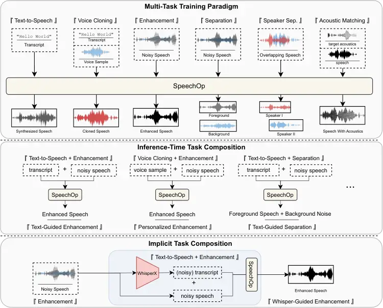
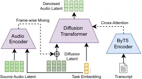

# SpeechOp: Inference-Time Task Composition for Generative Speech Processing

Justin Lovelace ^(†)^(†)thanks: Work done during an internship at Adobe.
Affiliation: Cornell University Email: [jl3353@cornell.edu](mailto:)   
Rithesh Kumar  Jiaqi Su  Ke Chen Affiliation: Adobe Research
Email: [{ritheshk,jsu,kechen}@adobe.com](mailto:)    Kilian Q Weinberger
Affiliation: Cornell University Email: [kqw4@cornell.edu](mailto:)   
Zeyu Jin Affiliation: Adobe Research Email: <zejin@adobe.com>

###### Abstract

While generative Text-to-Speech (TTS) systems leverage vast
“in-the-wild" data to achieve remarkable success, speech-to-speech
processing tasks like enhancement face data limitations, which lead
data-hungry generative approaches to distort speech content and speaker
identity. To bridge this gap, we present SpeechOp, a multi-task latent
diffusion model that transforms pre-trained TTS models into a universal
speech processor capable of performing a wide range of speech tasks and
composing them in novel ways at inference time. By adapting a
pre-trained TTS model, SpeechOp inherits a rich understanding of natural
speech, accelerating training and improving S2S task quality, while
simultaneously enhancing core TTS performance. Finally, we introduce
Implicit Task Composition (ITC), a novel pipeline where ASR-derived
transcripts (e.g., from Whisper) guide SpeechOp’s enhancement via our
principled inference-time task composition. ITC achieves
state-of-the-art content preservation by robustly combining web-scale
speech understanding with SpeechOp’s generative capabilities. Audio
samples are available at
[https://justinlovelace.github.io/projects/speechop](https://justinlovelace.github.io/projects/speechop).

## 1 Introduction

Generative Text-to-Speech (TTS) systems now produce increasingly natural
and expressive speech \[27, 17\], largely due to their ability to
leverage vast “in-the-wild” data (e.g., from audiobooks, podcasts \[5,
40\]). This scalability enables TTS models to learn robust speech
representations across diverse acoustic conditions and speaker
characteristics \[28, 39\].

In contrast, speech-to-speech (S2S) processing tasks like enhancement,
speaker separation, and foreground-background isolation face stricter
data requirements, often needing paired degraded/clean speech, which is
expensive to acquire at scale \[58\]. Consequently, S2S models are
typically trained on smaller, specialized datasets, often with simulated
degradations \[49\]. This data scarcity can cause generative S2S
approaches to distort original speaker identity and content—a critical
issue where faithful preservation is paramount, e.g., in speech
enhancement \[57, 24\]. These models often lack the rich speech
understanding derived from vast, diverse datasets available to TTS.

To bridge this data gap, we present SpeechOp: a multi-task latent
diffusion model that transforms pre-trained TTS models into a universal
speech processor. SpeechOp performs a wide range of S2S tasks and allows
their novel inference-time composition, leading to three key
advancements (Figure 1): (1) a flexible multi-task model enhancing core
TTS quality, (2) inference-time task composition for unprecedented
flexibility via our principled TC-CFG strategy, and (3) state-of-the-art
S2S performance through Implicit Task Composition (ITC), enabled by
TC-CFG.

We make the following contributions:

1. A Flexible Multi-Task Model That Enhances TTS Capabilities: SpeechOp,
   adapted from a pre-trained TTS model and fine-tuned on diverse S2S tasks
   (including TTS, enhancement, separation), not only becomes a versatile
   speech processor but also improves its underlying TTS quality. By
   learning to handle varied acoustic manipulations, SpeechOp’s TTS
   component generates more natural, higher-quality speech, validated by
   human listening studies.

2. Inference-Time Task Composition (TC-CFG): For instance, if speech
   content is obscured, SpeechOp can combine its enhancement capabilities
   with TTS content guidance to both enhance acoustics and re-synthesize
   the obscured portion. Crucially, our novel TC-CFG guidance strategy
   (Section 6) enables this powerful composition at inference-time without
   requiring joint training.

3. State-of-the-Art Speech Processing through Implicit Task Composition
   (ITC): SpeechOp achieves state-of-the-art content preservation via ITC.
   Traditional transcript-conditioned S2S models suffer from scarce paired
   noisy-clean-transcript data and the propagation of ASR errors. ITC
   overcomes these by robustly integrating ASR-derived transcripts (e.g.,
   from Whisper \[41, 3\]) using our TC-CFG inference-time composition.
   This principled approach, with its tunable “guidance strength,” allows
   balancing content restoration (more like TTS) and acoustic fidelity
   (more like enhancement) based on the situation, achieving superior
   content fidelity over specialized enhancement methods.



Figure 1: Overview of SpeechOp’s multi-task training (top),
inference-time task composition capabilities (middle), and implicit task
composition pipeline (bottom). The model is trained on six core speech
tasks including text-to-speech, enhancement, and separation. At
inference time, novel tasks can be composed by combining learned
capabilities - for example, using transcripts to guide enhancement or
personalizing enhancement with voice samples. In the implicit task
composition pipeline, we use a state-of-the-art discriminative model
(Whisper) to automatically transcribe noisy speech, then use the
resulting transcript to guide SpeechOp’s enhancement process.

## 2 Background: Diffusion Models

We introduce latent diffusion models following recent formulations \[13,
20, 43\]. Given data drawn from an unknown distribution
$`q(\mathbf{x})`$, our goal is to learn a generative model
$`p_{\theta}(\mathbf{x})`$ that approximates this distribution.

Forward process. The forward process defines a gradual transition from
the latent distribution to a Gaussian distribution through a sequence of
increasingly noisy latent variables $`\mathbf{z}_{t}`$ for timesteps
$`t\in[0,1]`$. This Gaussian diffusion process defines the conditional
distribution $`q(\mathbf{z}_{0,\ldots,1}|\mathbf{x})`$. For every
$`t\in[0,1]`$, the marginal $`q(\mathbf{z}_{t}|\mathbf{x})`$ is given
by:

```math
\mathbf{z}_{t}=\alpha_{t}\mathbf{x}+\sigma_{t}\bm{\epsilon},\quad\text{where}\quad\bm{\epsilon}\sim\mathcal{N}(\mathbf{0},\mathbf{I})
```

We use the variance-preserving formulation where
$`\sigma_{t}^{2}=1-\alpha_{t}^{2}`$. The noise schedule
$`\alpha_{t}\in[0,1]`$ is a strictly monotonically decreasing function
that starts with the original latent
($`\mathbf{z}_{0}\approx\mathbf{x}`$) and ends with approximately
Gaussian noise
($`q(\mathbf{z}_{1})\approx\mathcal{N}(\mathbf{z}_{1};\mathbf{0},\mathbf{I})`$).

Generative model. Given the score function
$`\nabla_{\mathbf{z}}\log q_{t}(\mathbf{z})`$, or the gradient of the
log probability density function, we can reverse the forward process
exactly. Diffusion models utilize a neural network learn to estimate the
score function,
$`\mathbf{s}_{\theta}(\mathbf{z};\lambda)\approx\nabla_{\mathbf{z}}\log q_{t}(\mathbf{z})`$,
and use the estimated score function to approximately reverse the
forward process. If
$`\mathbf{s}_{\theta}(\mathbf{z};\lambda)\approx\nabla_{\mathbf{z}}\log q_{t}(\mathbf{z})`$,
then our generative distribution is close to the true distribution. This
enables us to draw samples from a Gaussian distribution
$`\mathbf{z}_{1}\sim p(\mathbf{z}_{1})`$, and approximately solve the
reverse diffusion process using the estimated score
$`\mathbf{s}_{\theta}(\mathbf{z};\lambda)`$.

Training objective. We train the score network using a denoising score
matching (DSM) loss Song and Ermon \[48\] over all data points
$`\mathbf{x}\sim\mathcal{D}`$ and noise levels:

```math
\displaystyle\mathcal{L}_{\text{DSM}}(\mathbf{x})=\mathbb{E}_{t,\mathbf{x},\bm{\epsilon}}[{w}(\lambda_{t})\cdot\lVert\mathbf{s}_{\theta}(\mathbf{z}_{t};\lambda)-\nabla_{\mathbf{z}_{t}}\log q(\mathbf{z}_{t}|\mathbf{x})\rVert_{2}^{2}],
```

where $`w(\lambda_{t})`$ weights different noise levels during training.
Following best practices \[46\], we adopt the velocity parameterization,
$`\mathbf{v}={\alpha_{t}}\bm{\epsilon}-\sigma_{t}\mathbf{x}`$, for our
network output to ensure training stability.

## 3 Related Work

Text-to-speech (TTS) systems \[27, 47\] excel due to vast "in-the-wild"
data, unlike data-limited speech-to-speech (S2S) tasks like enhancement
\[24\] and separation, which often require scarce paired recordings.
While multi-task autoregressive models have been developed \[54\], they
often lack inference-time compositionality. Diffusion models, especially
latent ones, offer high-quality synthesis \[47, 27\] and inherent
composability \[31\], which SpeechOp leverages.

SpeechOp adapts pre-trained TTS models for S2S tasks and novel
inference-time composition. Recent work like Fugatto \[53\] also
explores multi-task audio generation. However, SpeechOp’s principled
task composition (TC-CFG, Section 6) provides superior control and
performance in S2S tasks like enhancement compared to Fugatto’s score
averaging (Section 8), enabling effective combination of operations like
enhancement and TTS. While foundational models like UniAudio \[56\]
pursue broad task coverage from scratch, and SpeechFlow \[30\]
investigates new pre-training schemes, SpeechOp focuses on efficiently
adapting existing TTS models. Crucially, we introduce Implicit Task
Composition (ITC), which uniquely integrates ASR models (e.g., Whisper)
via TC-CFG for robust content preservation. Our primary aim is not
maximizing task variety, but demonstrating how TTS pre-training and
sophisticated composition can address S2S data scarcity and improve
performance on established operations.

Speaker Separation Init SI-SDRi $`\uparrow`$ MCD $`\downarrow`$ SpBS
$`\uparrow`$ WER $`\downarrow`$ Val MSE $`\downarrow`$ Rand -3.99 22.95
.825 17.8 .358 TTS -1.38 4.46 .906 8.5 .336 Speech Enhancement Init PESQ
$`\uparrow`$ MCD $`\downarrow`$ SpBS $`\uparrow`$ WER $`\downarrow`$ Val
MSE $`\downarrow`$ Rand 2.07 4.76 .900 8.1 0.289 TTS 2.10 4.69 .910 8.1
0.276

Figure 2: Impact of TTS initialization on speech processing tasks.
(Left) Validation loss curves demonstrating accelerated convergence with
TTS initialization. Training time is reduced by 4$`\times`$ for
enhancement and 8$`\times`$ for separation. (Right) Performance metrics
for speaker separation and speech enhancement, comparing random
initialization (Rand) with TTS initialization (TTS).

## 4 TTS Pre-training Improves Speech Processing Tasks

To motivate our multi-task framework, we first examine the benefits of
initializing single-task speech enhancement and speaker separation
models from a pre-trained DiT TTS backbone \[37, 28\]. Figure 2 (Left)
shows that TTS initialization dramatically accelerates convergence,
achieving comparable validation loss with 4$`\times`$ fewer steps for
enhancement and 8$`\times`$ fewer for separation versus random
initialization. The significant speedup for separation, a complex
multi-speaker task, particularly highlights the value of the speech
understanding capabilities inherited from TTS pre-training.

Beyond faster training, TTS pre-training yields substantial performance
gains (Figure 2 Right). Speaker separation benefits most, with TTS
initialization leading to markedly improved SI-SDRi, MCD, and WER (8.5%
vs 17.8%), and eliminating artifacts present in randomly initialized
models that struggle with content disentanglement. Speech enhancement
also sees improvements in PESQ, MCD, and SpeechBERTScore. These results
demonstrate the broad advantages of TTS pre-training—accelerated
convergence and enhanced performance across diverse S2S tasks,
especially those requiring deep speech understanding. This motivates
SpeechOp, our multi-task framework leveraging TTS pre-training for
high-quality, versatile speech processing.

## 5 SpeechOp

We present the tasks explored in this work in Figure 1. These tasks
provide complementary capabilities that are composable via our diffusion
framework for applications like transcript-guided isolation. For speaker
separation, which requires a speaker prompt to identify the target
speaker, we provide a disjoint speech sample to disambiguate the target
speaker. For foreground/background separation, we parameterize them as
two separate tasks.

SpeechOp Architecture. SpeechOp is built on a latent diffusion framework
\[43\] that operates with compressed audio representations. Rather than
working with raw waveforms, we first compress the audio using a DAC
variational autoencoder \[25\] (details in Appendix), allowing our model
to efficiently process and generate speech in a lower-dimensional latent
space.

As shown in Figure 3, SpeechOp’s core architecture consists of a
Diffusion Transformer (DiT) \[38\] that serves as the denoising network,
adapted to handle both text-to-speech and speech-to-speech tasks. The
model processes text transcripts for TTS and source audio (like noisy
speech) for speech-to-speech tasks, with a learnable Task Embedding that
conditions model behavior. Training proceeds in two stages: TTS
pre-training followed by multi-task training to enable speech-to-speech
capabilities.



Figure 3: SpeechOp Architecture Overview.

Text-to-Speech Pathway. For TTS, SpeechOp (Figure 3, right) processes a
text transcript. We extract transcript representations with a frozen,
pre-trained ByT5-base encoder \[55, 32\]. ByT5’s character-level
representations capture phonetic information crucial for natural speech.
The DiT is conditioned on the ByT5 embeddings via cross-attention,
dynamically aligning text and audio frames and guiding denoising based
on text content. For our Diffusion Transformer (DiT) architecture, we
incorporate design choices from recent TTS systems \[28, 33\] (full
details in the Appendix).

To enable speaker-prompted generation and speech editing, we train our
model to perform inpainting for 75% of samples \[27\]. After adding
noise from the forward diffusion process, we replace a random segment of
the latent with the clean, target segment. We additionally sum a
learnable binary embedding at the input layer to distinguish clean from
noisy frames. The network will then learn to extrapolate speaker and
speech properties from the ground-truth region to denoise the noisy
speech. For half of our inpainting samples, we replace the initial
segment (simulating voice prompts). In the other half, we noise only the
middle section, replacing the start and end of the utterance with clean
speech to simulate speech editing. For sampling the relative duration,
we follow Lovelace et al. \[33\] and use a Beta distribution with a mode
of $`.01`$ and a concentration of $`5`$ to emphasize challenging cases
with short prompts.

Speech-to-Speech Pathway. To handle speech-to-speech tasks like
enhancement and separation (Figure 3, left), SpeechOp introduces a
dedicated Audio Encoder to process source audio such as noisy speech.
This encoder adopts the same DiT architecture as the main model but
starts with random initialization. Since speech-to-speech tasks
inherently maintain frame-level alignment between source and target
audio, we implement a straightforward frame-wise mixing approach rather
than us a complex alignment mechanism. Specifically, the Audio Encoder’s
output representations are directly added to the Diffusion Latent before
processing by the Diffusion Transformer, allowing direct incorporation
of source audio information during denoising. To handle different
speech-to-speech tasks, we use a learnable Task Embedding that
conditions both the Audio Encoder and Diffusion Transformer. This shared
embedding provides task-specific guidance to both components based on
the desired operation (enhancement, separation, etc.).

Some speech-to-speech tasks require additional input prompts. For
example, speaker separation needs a reference speech sample to identify
the target speaker, while acoustic matching needs an example of the
target acoustics. In these cases, we prepend the prompt to both the
source audio and noisy latent to maintain frame-wise alignment. For
tasks that typically don’t use prompts (like enhancement), we unmask the
latent’s initial segment in 10% of training instances to enable transfer
learning with speaker-prompted TTS. These prompt durations follow the
same Beta distribution used for TTS inpainting.

Multi-Task Fine-Tuning. SpeechOp uses a two-stage training approach.
After initial TTS pre-training, we conduct multi-task fine-tuning where
both the Audio Encoder and pre-trained DiT backbone are jointly
optimized. During this stage, we sample TTS and speech-to-speech (S2S)
data with equal frequency. Within the S2S samples, we apply selective
upsampling - tripling the frequency of enhancement and speaker
separation examples since these are the most challenging tasks. This
two-stage strategy efficiently adapts the TTS model into our multi-task
SpeechOp model.

Diffusion Training. During training, we sample noise levels using a
shifted cosine schedule (s=0.5) \[14\], following Lovelace et al.
\[32\]. We employ the Sigmoid diffusion loss weighting from Hoogeboom
et al. \[15\] with a bias of -2.5 to concentrate training on
perceptually relevant noise levels. To enable classifier-free guidance
during inference, we randomly drop conditioning information (source
audio and transcript) 10% of the time during training \[12\].

## 6 Inference-Time Task Composition

The ability to compose speech operations—such as simultaneously
enhancing noisy speech while restoring its content via text—represents a
powerful capability for speech processing. Text-guided generation can
help produce a plausible, high-fidelity version of content that is
otherwise not recoverable from complex acoustic situations, such as
intense noise and reverberation encountered in speech enhancement.
Similarly, in speaker separation, the text of spoken content could
provide important contextual cues for disentangling speakers.
Nonetheless, achieving an effective composition of tasks poses
significant technical challenges.

Prior work, including Fugatto in the audio domain, typically computes a
weighted average of score functions to compose operations\[31, 53\],
like for enhancement and TTS:

```math
\mathbf{s}^{\text{avg}}_{\theta}(\mathbf{z}_{t}|y,w)=(1-\alpha)\mathbf{s}^{\text{enh}}_{\theta}(\mathbf{z}_{t}|y)+\alpha\mathbf{s}^{\text{tts-prior}}_{\theta}(\mathbf{z}_{t}|w) \tag{1}
```

Here, $`\mathbf{s}^{\text{enh}}_{\theta}(\mathbf{z}_{t}|y)`$ is the
score from an enhancement model conditioned on noisy audio $`y`$, and
$`\mathbf{s}^{\text{tts}}_{\theta}(\mathbf{z}_{t}|w)`$ represents a
score function derived from a TTS model aiming to generate speech for
transcript $`w`$. While straightforward, this approach poses a
fundamental limitation: it combines the generative priors of different
tasks. For speech enhancement with TTS guidance, direct averaging allows
the TTS model’s broad acoustic prior (learned from diverse data for
generation) to corrupt the enhancement model’s focused studio-quality
prior (learned for reconstruction), degrading output quality.

To address this challenge, we propose decomposing the desired score
function $`\nabla_{\mathbf{z}_{t}}\log p(\mathbf{z}_{t}|y,w)`$ into
task-specific components. Using Bayes’ rule and a conditional
independence assumption (transcript $`w`$ is independent of noisy audio
$`y`$ given latent $`\mathbf{z}_{t}`$; detailed derivation in the
Appendix), we arrive at:

```math
\nabla_{\mathbf{z}_{t}}\log p(\mathbf{z}_{t}|y,w)=\nabla_{\mathbf{z}_{t}}\log p(\mathbf{z}_{t}|y)+\nabla_{\mathbf{z}_{t}}\log p(w|\mathbf{z}_{t}). \tag{2}
```

This decomposition yields two complementary terms: an enhancement score
$`\nabla_{\mathbf{z}_{t}}\log p(\mathbf{z}_{t}|y)`$ that guides acoustic
quality based on the input $`y`$, and a discriminative guide
$`\nabla_{\mathbf{z}_{t}}\log p(w|\mathbf{z}_{t})`$. This second term
leverages a TTS model not for its generative prior, but for its ability
to discriminate whether a latent $`\mathbf{z}_{t}`$ is likely to produce
content matching transcript $`w`$. This term guides the latent towards
speech aligned with the transcript without imposing the TTS model’s full
acoustic prior.

Implementation via Classifier-Free Guidance. We implement this
decomposition using classifier-free guidance (CFG) \[12\] to approximate
the discriminative signal
$`\nabla_{\mathbf{z}_{t}}\log p(w|\mathbf{z}_{t})`$:

```math
\displaystyle\nabla_{\mathbf{z}_{t}}\log p(w|\mathbf{z}_{t}) \displaystyle\approx\gamma\left(\mathbf{s}^{\text{tts}}_{\theta}(\mathbf{z}_{t}|w)-\mathbf{s}^{\text{tts}}_{\theta}(\mathbf{z}_{t})\right) \tag{3}
```

where $`\mathbf{s}^{\text{tts}}_{\theta}(\mathbf{z}_{t}|w)`$ is the
score of a TTS model conditioned on transcript $`w`$,
$`\mathbf{s}^{\text{tts}}_{\theta}(\mathbf{z}_{t})`$ is its
unconditional score, and $`\gamma`$ is a guidance scale. Substituting
this into Eq. (2), our final composed score is:

```math
\mathbf{s}^{\text{CFG}}_{\theta}(\mathbf{z}_{t}|y,w)\approx\mathbf{s}^{\text{enh}}_{\theta}(\mathbf{z}_{t}|y)+\gamma\left(\mathbf{s}^{\text{tts}}_{\theta}(\mathbf{z}_{t}|w)-\mathbf{s}^{\text{tts}}_{\theta}(\mathbf{z}_{t})\right). \tag{4}
```

This formulation, which we term Task-Composition Classifier-Free
Guidance (TC-CFG), preserves the strengths of both tasks. The
enhancement term maintains acoustic quality and speaker characteristics.
The CFG-derived discriminative term provides content alignment by
isolating text-specific guidance, avoiding the pitfalls of directly
mixing generative TTS priors with the enhancement prior.

Figure 4: A 1D toy simulation illustrating different task composition
methods. (a) The setup, showing a bimodal TTS prior (target $`w_{0}`$
and other $`w_{1}`$), an ideal sharp target distribution
($`p_{\text{Enh}}`$), and a biased enhancement model
($`\hat{p}_{\text{Enh}}`$) whose output is misaligned. (b) Samples from
the unguided biased model. (c) Samples using score averaging (Eq. (1)).
(d) Samples using our TC-CFG method (Eq. (4)).

Synthetic Simulation. To illustrate the downsides of score averaging and
motivate our TC-CFG approach, we use a 1D Gaussian mixture simulation
(Figure 4, full details in appendix). The setup (Figure 4a) features a
bimodal TTS prior, a sharp ideal enhanced distribution
$`p_{\text{Enh}}`$ for the target word $`w_{0}`$, and an imperfect
(biased) enhancement model $`\hat{p}_{\text{Enh}}`$ whose output for
$`w_{0}`$ is misaligned. Without guidance, the biased model’s samples
are incorrect (Figure 4b). However, combining the biased enhancement
score function with the TTS score function can potentially correct for
content errors.

Score averaging (Figure 4c) pulls samples towards the $`w_{0}`$ TTS
mode. However, because this mixes in the broad TTS prior, the result is
a "smeared" distribution that compromises the target’s distribution. In
contrast, our TC-CFG approach (Figure 4d) incorporates discriminative
TTS guidance (via $`\nabla_{x_{t}}\log p_{\text{TTS}}(w_{0}|x_{t})`$) to
steer sampling. This shifts the sampled distribution to satisfy the
discriminative signal without compromising the enhancement prior. We
demonstrate the benefits of this approach extend to the real-world
setting of composing enhancement with TTS synthesis in section 8.

## 7 Experimental Setup

SpeechOp integrates a 20-layer Diffusion Transformer (DiT, 419M
parameters) with an 8-layer audio encoder (71M parameters). We compare
it against strong baselines for speech enhancement and speaker
separation.

Training Data. For TTS, we combine MLS English ( 44k hours) \[40\] for
longer utterances (10-20s) and Libri-TTS (585 hours) \[58\] for shorter
segments (\<10s), improving robustness. All audio is resampled to 48kHz
and transcripts lowercased. For S2S tasks, we use LibriTTS-R \[22\] for
clean speech and simulate degradations using established noise/impulse
response datasets and pipelines \[57\], creating 5s paired instances.
Further dataset details are in the Appendix.

Tasks and Baselines. Text-to-Speech (TTS): Evaluated on LibriSpeech
test-clean \[36\] against contemporary end-to-end TTS systems \[27, 9,
28\]. Speech editing is evaluated on the LibriTTS portion of RealEdit
\[39\]. Speech Enhancement (SE): Baselines include waveform (StoRm
\[29\]) and diffusion-based (SGMSE+ \[42\], Miipher+WavLM \[23, 57\])
models, and GAN-based HiFi-GAN-2 \[49\]. Speaker Separation (SS): We
compare against Sepformer variants \[51, 6\], including those trained on
WHAMR! \[35\] and with acoustic-content simulation.

Evaluation Metrics. We assess SpeechOp on four dimensions: Subjective
Quality: Mean Opinion Scores (MOS, 1-5 scale) from listening tests on
Prolific \[2\]. Signal Similarity: PESQ (perceived quality), MCD
(spectral distance, lower is better), and SI-SDRi (separation distortion
improvement) \[44\]. Neural Similarity: WavLM-TDCNN \[7\] for speaker
similarity (SIM) and SpeechBERTScore (SpBS) \[45\] for semantic
alignment. Content Accuracy: Word Error Rate (WER) via HuBERT-L \[16\]
(TTS) and WhisperX (large-v2) \[41, 3\] (other tasks).

|                                     |        |                 |                    |                  |                    |                    |                     |                     |
| ----------------------------------- | ------ | --------------- | ------------------ | ---------------- | ------------------ | ------------------ | ------------------- | ------------------- |
| Model                               | Params | Training Data   | WER $`\downarrow`$ | SIM $`\uparrow`$ | MOS-Q $`\uparrow`$ | MOS-N $`\uparrow`$ | MOS-VS $`\uparrow`$ | MOS-SS $`\uparrow`$ |
| Ground Truth                        | —      | —               | 2.19               | 0.67             | 4.24 $`\pm`$ 0.06  | 4.16 $`\pm`$ 0.06  | 3.79 $`\pm`$ 0.06   | 3.60 $`\pm`$ 0.06   |
| DiTTo-TTS \[28\]                    | 740M   | $`\sim`$56k hrs | 2.56               | .62              | 4.16 $`\pm`$ 0.04  | 4.14 $`\pm`$ 0.04  | 4.17 $`\pm`$ 0.04   | 4.02 $`\pm`$ 0.04   |
| VoiceCraft \[39\]                   | 830M   | $`\sim`$69k hrs | 6.32               | .61              | 3.66 $`\pm`$ 0.04  | 3.65 $`\pm`$ 0.05  | 3.43 $`\pm`$ 0.05   | 3.38 $`\pm`$ 0.05   |
| CLaM-TTS \[19\]                     | 584M   | $`\sim`$56k hrs | 5.11               | .49              | 3.67 $`\pm`$ 0.04  | 3.70 $`\pm`$ 0.04  | 3.69 $`\pm`$ 0.05   | 3.54 $`\pm`$ 0.05   |
| XTTS \[4\]                          | 482M   | $`\sim`$17k hrs | 4.93               | .49              | 3.76 $`\pm`$ 0.04  | 3.66 $`\pm`$ 0.05  | 3.28 $`\pm`$ 0.05   | 3.27 $`\pm`$ 0.05   |
| TTS Baseline (Ours)                 | 419M   | $`\sim`$45k hrs | 3.32               | .48              | 3.65 $`\pm`$ 0.05  | 3.56 $`\pm`$ 0.05  | 3.31 $`\pm`$ 0.05   | 3.25 $`\pm`$ 0.05   |
| SpeechOp (Ours)                     | 419M   | $`\sim`$45k hrs | 3.57               | .53              | 3.86 $`\pm`$ 0.04  | 3.69 $`\pm`$ 0.05  | 3.67 $`\pm`$ 0.05   | 3.58 $`\pm`$ 0.05   |
| $`\Delta`$ from Multi-Task Training | —      | —               | +0.25              | +.05             | +0.22$`\pm`$ 0.06  | +0.13$`\pm`$ 0.07  | +0.36$`\pm`$ 0.07   | +0.32$`\pm`$ 0.07   |

|                     |        |                 |                    |                    |                    |                     |                     |
| ------------------- | ------ | --------------- | ------------------ | ------------------ | ------------------ | ------------------- | ------------------- |
| Model               | Params | Training Data   | WER $`\downarrow`$ | MOS-Q $`\uparrow`$ | MOS-N $`\uparrow`$ | MOS-VS $`\uparrow`$ | MOS-SS $`\uparrow`$ |
| Ground Truth        | —      | —               | 16.2               | 4.33 $`\pm`$ 0.04  | 4.40 $`\pm`$ 0.03  | 4.66 $`\pm`$ 0.03   | 4.63 $`\pm`$ 0.03   |
| VoiceCraft \[39\]   | 830M   | $`\sim`$69k hrs | 16.3               | 3.62 $`\pm`$ 0.04  | 3.99 $`\pm`$ 0.04  | 4.12 $`\pm`$ 0.04   | 4.01 $`\pm`$ 0.04   |
| TTS Baseline (Ours) | 419M   | $`\sim`$45k hrs | 16.4               | 4.18 $`\pm`$ 0.04  | 4.23 $`\pm`$ 0.04  | 4.45 $`\pm`$ 0.03   | 4.23 $`\pm`$ 0.04   |
| SpeechOp (Ours)     | 419M   | $`\sim`$45k hrs | 15.9               | 4.15 $`\pm`$ 0.04  | 4.19 $`\pm`$ 0.04  | 4.48 $`\pm`$ 0.03   | 4.25 $`\pm`$ 0.03   |

Table 1: Zero-Shot Text-to-Speech Evaluation. MOS metrics evaluate
different aspects: MOS-Q (Quality), MOS-N (Naturalness), MOS-VS (Voice
Similarity), and MOS-SS (Style Similarity). Models in a different
parameter regime are displayed in gray.

Table 2: Speech Editing Evaluation.

|                                |                   |                    |                   |                    |
| ------------------------------ | ----------------- | ------------------ | ----------------- | ------------------ |
| Model                          | PESQ $`\uparrow`$ | MCD $`\downarrow`$ | SpBS $`\uparrow`$ | WER $`\downarrow`$ |
| Noisy Source Audio             | 1.12              | 11.22              | .888              | 3.3                |
| Storm                          | 1.61              | 6.36               | .883              | 7.0                |
| Miipher                        | 1.44              | 5.15               | .898              | 7.0                |
| SGMSE+                         | 1.98              | 5.28               | .923              | 5.7                |
| HiFi-GAN-2                     | 2.23              | 4.40               | .934              | 5.4                |
| SpeechOp (No Transcript)       | 2.00              | 4.83               | .908              | 8.1                |
|       +ITC                     | 2.05 (+0.05)      | 4.85 (+0.02)       | .928 (+.020)      | 2.9 (-5.2)         |
|       +Speaker Personalization | 2.12 (+0.07)      | 4.69 (-0.16)       | .926 (-.002)      | 2.4 (-0.5)         |
| SpeechOp (Gold Transcript)     | 2.06              | 4.83               | .931              | 2.1                |

|                          |                   |
| ------------------------ | ----------------- |
| Model                    | MOS $`\uparrow`$  |
| Noisy Source Audio       | 1.78 $`\pm`$ 0.07 |
| SGMSE+                   | 3.76 $`\pm`$ 0.03 |
| HiFi-GAN-2               | 3.90 $`\pm`$ 0.04 |
| SpeechOp (No Transcript) | 3.93 $`\pm`$ 0.04 |
| SpeechOp-ITC (WhisperX)  | 3.89 $`\pm`$ 0.04 |
| Clean Reference Audio    | 4.67 $`\pm`$ 0.02 |

Table 3: Speech Enhancement Results. (Left) Quantitative metrics.
(Right) Subjective MOS scores with standard error.

## 8 Results and Discussion

|                            |                   |                   |                   |                   |                   |
| -------------------------- | ----------------- | ----------------- | ----------------- | ----------------- | ----------------- |
| Model                      | LibriMix Clean    | LibriMix Noise    | WHAMR             | WSJ2-Mix          | Total             |
| Sepformer \[6\]            | 3.32 $`\pm`$ 0.07 | 2.95 $`\pm`$ 0.07 | 3.06 $`\pm`$ 0.07 | 3.53 $`\pm`$ 0.07 | 3.22 $`\pm`$ 0.04 |
| DM Sepformer \[6\]         | 3.59 $`\pm`$ 0.07 | 2.67 $`\pm`$ 0.07 | 2.53 $`\pm`$ 0.07 | 3.58 $`\pm`$ 0.07 | 3.10 $`\pm`$ 0.04 |
| AC-SIM Sepformer \[6\]     | 3.74 $`\pm`$ 0.07 | 2.81 $`\pm`$ 0.07 | 2.53 $`\pm`$ 0.07 | 3.65 $`\pm`$ 0.07 | 3.20 $`\pm`$ 0.04 |
| AC-SIM-ML Sepformer \[6\]  | 3.74 $`\pm`$ 0.06 | 3.02 $`\pm`$ 0.07 | 2.64 $`\pm`$ 0.07 | 3.66 $`\pm`$ 0.06 | 3.28 $`\pm`$ 0.04 |
| SpeechOp (No Transcript)   | 3.86 $`\pm`$ 0.07 | 3.68 $`\pm`$ 0.07 | 2.89 $`\pm`$ 0.08 | 3.77 $`\pm`$ 0.07 | 3.57 $`\pm`$ 0.04 |
| SpeechOp (Gold Transcript) | 4.13 $`\pm`$ 0.06 | 4.21 $`\pm`$ 0.06 | 3.37 $`\pm`$ 0.08 | 3.91 $`\pm`$ 0.06 | 3.92 $`\pm`$ 0.03 |
| Mixture                    | 1.38 $`\pm`$ 0.05 | 1.35 $`\pm`$ 0.04 | 1.39 $`\pm`$ 0.04 | 1.33 $`\pm`$ 0.05 | 1.36 $`\pm`$ 0.02 |
| Clean Target               | 4.26 $`\pm`$ 0.06 | 4.48 $`\pm`$ 0.05 | 4.29 $`\pm`$ 0.06 | 4.00 $`\pm`$ 0.06 | 4.25 $`\pm`$ 0.03 |

Table 4: Speaker Separation Evaluation (Subj.). We report the average
MOS and the standard error.

|                                                                                                                                               |                      |                    |                   |                    |
| --------------------------------------------------------------------------------------------------------------------------------------------- | -------------------- | ------------------ | ----------------- | ------------------ |
| Method                                                                                                                                        | SI-SDRi $`\uparrow`$ | MCD $`\downarrow`$ | SpBS $`\uparrow`$ | WER $`\downarrow`$ |
| Sepformer ¹¹ 1 We compare Sepformer models in Chen et al. \[6\] since they support speaker separation in multiple acoustic environments.\[6\] | 11.86                | 1.72               | .929              | 4.4                |
| AC-SIM-ML Sepformer \[6\]                                                                                                                     | 11.80                | 1.55               | .931              | 6.8                |
| SpeechOp (No Transcript)                                                                                                                      | 0.23                 | 4.11               | .899              | 11.1               |
| SpeechOp (Gold Transcript)                                                                                                                    | 0.53                 | 4.20               | .919              | 5.5                |

Table 5: Quantitative Speaker Separation Performance on the WSJ0-2Mix
Dataset.

Text-To-Speech. To examine the impact of multi-task training on
text-to-speech, we evaluate our model’s zero-shot TTS performance with 3
second speech prompts. Crucially, we initialize SpeechOp from our TTS
Baseline, allowing us to directly assess the impact of multi-task
training.

Table 2 demonstrates that SpeechOp not only preserves but enhances
zero-shot TTS capabilities. After undergoing multi-task training,
SpeechOp improves performance across all MOS metrics and objective
speaker similarity compared to the TTS Baseline, with minimal loss of
intelligibility. Exposure to tasks like enhancement and separation
likely enhance SpeechOp’s ability to generalize and generate natural
speech across diverse acoustic environments.

Against recent TTS systems of comparable scale, SpeechOp exhibits strong
performance, matching or exceeding CLaM-TTS and XTTS on most metrics.
Impressively, it also surpasses the larger VoiceCraft model in
intelligibility and subjective quality. While DiTTO-TTS, a larger model
trained on more diverse data, achieves higher overall scores, SpeechOp’s
results are highly competitive within its class. Future work will
explore scaling SpeechOp to leverage similar large-scale datasets.

Beyond zero-shot TTS, SpeechOp demonstrates state-of-the-art
capabilities in speech editing. As shown in Table 2, SpeechOp
significantly outperforms VoiceCraft across all subjective MOS metrics,
despite having fewer parameters. These results validate the robustness
of our multi-task approach, as SpeechOp maintains exceptional speech
editing performance while supporting multiple tasks.

Speech Enhancement. Our Implicit Task Composition (ITC) pipeline
integrates ASR transcripts from Whisper with our TC-CFG method
(Section 6) to guide speech content. We find that our ITC pipeline
achieves state-of-the-art content preservation in speech enhancement. As
shown in Table 3, ITC yields a Word Error Rate (WER) of 2.9%, a 46%
relative reduction over the strong HiFi-GAN-2 baseline, significantly
reducing the content loss common with generative models. Our ITC
pipeline leverages web-scale knowledge from ASR models without requiring
transcriptions for training the enhancement component itself.

Our ITC’s transcript guidance method is more flexible than
transcript-conditioned S2S models. Such models can struggle when ASR
errors create contradictions between acoustic and textual inputs, or
their performance may be upper-bounded by the input audio quality if
they cannot generatively restore highly corrupted content. Furthermore,
they typically lack control over the influence of the transcript versus
the acoustics at inference time. In contrast, TC-CFG (Eq. (4)) provides
this control through a tunable guidance strength ($`\gamma`$). This
allows SpeechOp to trade-off prioritizing acoustic fidelity or
emphasizing content restoration guided by the transcript depending on
the application.

Even using Whisper transcripts derived from the noisy source audio, ITC
improves content intelligibility over the original audio (WER 2.9% vs.
3.3%) and enhancement without transcripts (WER 8.1%). This suggests
TC-CFG effectively balances the acoustic information from the noisy
source audio with with the imperfect guidance from ASR transcription.
While signal-fidelity metrics often penalize generative outputs,
SpeechOp’s ITC matches HiFi-GAN-2’s subjective quality (Table 3 Right)
while delivering superior content accuracy.

SpeechOp also enables novel applications like personalized enhancement
by composing enhancement with voice cloning. This composition improves
speaker fidelity (MCD, PESQ) and modestly reduces WER. To provide an
upper bound, ground-truth transcripts lead to a 2.1% WER. Across all
scenarios, SpeechOp’s ITC, with our composition approach, effectively
integrates textual guidance for controllable, content-aware speech
enhancement.

Speaker Separation. Our speaker separation evaluation reveals a notable
tension: SpeechOp achieves significantly higher Mean Opinion Scores
(MOS) across all datasets (Table 4) yet lower objective signal-level
fidelity (e.g., SI-SDRi, MCD on WSJ0-2Mix, Table 5) compared to
Sepformer baselines, despite human listeners consistently preferring
SpeechOp. This discrepancy arises from differing methodologies.
Traditional models like Sepformer optimize for signal reconstruction via
feature masking. In contrast, SpeechOp, as a generative model,
prioritizes perceptual quality, generating natural-sounding separated
speech not strictly derived from input mixtures. This aligns with
observations that signal-level metrics often poorly correlate with human
perception of speech quality in generative contexts \[11, 6\].
Importantly, transcript guidance substantially improves SpeechOp’s
content preservation, reducing WER from 11.1% to 5.5% with ground-truth
transcripts. This highlights our framework’s ability to effectively
leverage textual information for improved separation accuracy while
maintaining its perceptual strengths.

|                               |                   |                    |                   |                    |
| ----------------------------- | ----------------- | ------------------ | ----------------- | ------------------ |
| Model                         | PESQ $`\uparrow`$ | MCD $`\downarrow`$ | SpBS $`\uparrow`$ | WER $`\downarrow`$ |
| Noisy Source Audio            | 1.12              | 11.22              | .888              | 3.3                |
| SpeechOp (No Transcript)      | 2.00              | 4.83               | .908              | 8.1                |
| SpeechOp (TC-Avg)             | 1.88              | 5.24               | .909              | 3.4                |
| SpeechOp (TC-CFG) (Ours)      | 2.06              | 4.83               | .931              | 2.1                |
| $`\Delta`$ (TC-CFG vs TC-Avg) | +.18              | -0.42              | +.022             | -1.3               |

Table 6: Task Composition. We compare our proposed composition
formulation (TC-CFG) against averaging the score vectors (TC-Avg). Gold
transcripts are used in this ablation.

Task Composition Ablation. We empirically validate our TC-CFG approach
by composing SpeechOp’s enhancement capability with TTS-based textual
guidance from the gold transcripts (Table 10). The "SpeechOp (No
Transcript)" row serves as a baseline, representing the performance of
our enhancement model without any textual guidance. When employing the
standard score averaging approach ("SpeechOp (TC-Avg)"), we observe a
degradation in signal fidelity metrics compared to the "No Transcript"
baseline (e.g. MCD increases from 4.83 to 5.24). This aligns with the
intuition from our synthetic simulation (Figure 4c), where averaging
with the broader TTS prior can negatively impact the focused prior of
the enhancement model. While TC-Avg does improve content preservation
(WER 3.4% vs. 8.1% for "No Transcript"), this comes at the cost of
acoustic quality and signal fidelity.

In contrast, our proposed composition approach, TC-CFG, demonstrates
superior performance across all metrics. It not only achieves the best
content preservation with a WER of 2.1% (a 38% reduction over TC-Avg’s
3.4% WER), but it also maintains or improves signal fidelity compared to
the "No Transcript" baseline (e.g. PESQ 2.06 vs. 2.00).

These results empirically confirm that our TC-CFG formulation
effectively isolates text-conditional guidance without degrading
acoustic quality. This allows SpeechOp to leverage knowledge from the
TTS model for robust content preservation (low WER) while simultaneously
maintaining, and even slightly enhancing, the acoustic quality and
speaker characteristics established by the enhancement model. This
careful decomposition of task-specific guidance is crucial for enabling
effective and high-fidelity task composition in generative speech
processing.

## 9 Conclusion

In this work, we addressed a fundamental data disparity between
text-to-speech synthesis and speech-to-speech tasks by adapting
pre-trained TTS models to enable high-quality speech processing despite
limited paired data. Through SpeechOp, we showed that multi-task
training and principled task composition preserve TTS capabilities while
enabling flexible speech-to-speech processing. Our Implicit Task
Composition framework demonstrated how to leverage web-scale speech
understanding from discriminative models to achieve state-of-the-art
content preservation without parallel data. By bridging the gap between
data-rich and data-constrained speech tasks, this work opens new
possibilities for unified, scalable speech processing systems.

## References

- \[1\] Echothief \[dataset\].
  [http://www.echothief.com/echothief/](http://www.echothief.com/echothief/).
  Accessed: 2024-03-12.
- \[2\] Prolific. [https://www.prolific.co/](https://www.prolific.co/).
- \[3\] M. Bain, J. Huh, T. Han, and A. Zisserman. Whisperx:
  Time-accurate speech transcription of long-form audio. _Proc.
  Interspeech_, 2023.
- \[4\] E. Casanova, K. Davis, E. Gölge, G. Göknar, I. Gulea, L. Hart,
  A. Aljafari, J. Meyer, R. Morais, S. Olayemi, et al. Xtts: a massively
  multilingual zero-shot text-to-speech model. _CoRR_, 2024.
- \[5\] G. Chen, S. Chai, G. Wang, J. Du, W.-Q. Zhang, C. Weng, D. Su,
  D. Povey, J. Trmal, J. Zhang, et al. Gigaspeech: An evolving,
  multi-domain asr corpus with 10,000 hours of transcribed audio. In
  _Proc. Interspeech_, 2021a.
- \[6\] K. Chen, J. Su, T. Berg-Kirkpatrick, S. Dubnov, and Z. Jin.
  Improving generalization of speech separation in real-world scenarios:
  Strategies in simulation, optimization, and evaluation. In _Proc.
  Interspeech_, 2024a.
- \[7\] S. Chen, C. Wang, Z. Chen, Y. Wu, S. Liu, Z. Chen, J. Li,
  N. Kanda, T. Yoshioka, X. Xiao, J. Wu, L. Zhou, S. Ren, Y. Qian,
  Y. Qian, J. Wu, M. Zeng, and F. Wei. Wavlm: Large-scale
  self-supervised pre-training for full stack speech processing. _CoRR_,
  2021b.
- \[8\] Z. Chen, X. Hu, and A. Owens. Structure from silence: Learning
  scene structure from ambient sound. In _Proc. Conference on Robot
  Learning_, 2022.
- \[9\] Z. Chen, D. Geng, and A. Owens. Images that sound: Composing
  images and sounds on a single canvas. _CoRR_, 2024b.
- \[10\] H. Dubey, A. Aazami, V. Gopal, B. Naderi, S. Braun, R. Cutler,
  A. Ju, M. Zohourian, M. Tang, M. Golestaneh, and R. Aichner. Icassp
  2023 deep noise suppression challenge. _IEEE Open Journal of Signal
  Processing_, 2024.
- \[11\] H. Erdogan, S. Wisdom, X. Chang, Z. Borsos, M. Tagliasacchi,
  N. Zeghidour, and J. R. Hershey. Tokensplit: Using discrete speech
  representations for direct, refined, and transcript-conditioned speech
  separation and recognition. In _Proc. Interspeech_, 2023.
- \[12\] J. Ho and T. Salimans. Classifier-free diffusion guidance.
  _CoRR_, 2022.
- \[13\] J. Ho, A. Jain, and P. Abbeel. Denoising diffusion
  probabilistic models. _Proc. NeurIPS_, 2020.
- \[14\] E. Hoogeboom, J. Heek, and T. Salimans. simple diffusion:
  End-to-end diffusion for high resolution images. In _Proc.
  ICML_, 2023.
- \[15\] E. Hoogeboom, T. Mensink, J. Heek, K. Lamerigts, R. Gao, and
  T. Salimans. Simpler diffusion (sid2): 1.5 fid on imagenet512 with
  pixel-space diffusion. _CoRR_, 2024.
- \[16\] W.-N. Hsu, B. Bolte, Y.-H. H. Tsai, K. Lakhotia,
  R. Salakhutdinov, and A. Mohamed. Hubert: Self-supervised speech
  representation learning by masked prediction of hidden units. _IEEE
  Trans. Audio, Speech, Lang. Process._, 2021.
- \[17\] Z. Ju, Y. Wang, K. Shen, X. Tan, D. Xin, D. Yang, E. Liu,
  Y. Leng, K. Song, S. Tang, et al. Naturalspeech 3: Zero-shot speech
  synthesis with factorized codec and diffusion models. In _Forty-first
  International Conference on Machine Learning_, 2024.
- \[18\] T. Karras, M. Aittala, T. Aila, and S. Laine. Elucidating the
  design space of diffusion-based generative models. _Advances in neural
  information processing systems_, 35:26565–26577, 2022.
- \[19\] J. Kim, K. Lee, S. Chung, and J. Cho. Clam-tts: Improving
  neural codec language model for zero-shot text-to-speech. In _Proc.
  ICLR_, 2024.
- \[20\] D. P. Kingma and R. Gao. Understanding diffusion objectives as
  the ELBO with simple data augmentation. In _Proc. NeurIPS_, 2023.
- \[21\] T. Ko, V. Peddinti, D. Povey, M. L. Seltzer, and S. Khudanpur.
  A study on data augmentation of reverberant speech for robust speech
  recognition. In _Proc. ICASSP_, 2017.
- \[22\] Y. Koizumi, H. Zen, S. Karita, Y. Ding, K. Yatabe, N. Morioka,
  M. Bacchiani, Y. Zhang, W. Han, and A. Bapna. Libritts-r: A restored
  multi-speaker text-to-speech corpus. In _Proc. Interspeech_, 2023a.
- \[23\] Y. Koizumi, H. Zen, S. Karita, Y. Ding, K. Yatabe, N. Morioka,
  Y. Zhang, W. Han, A. Bapna, and M. Bacchiani. Miipher: A robust speech
  restoration model integrating self-supervised speech and text
  representations. In _Proc. WASPAA_, 2023b.
- \[24\] Y. Koizumi, H. Zen, S. Karita, Y. Ding, K. Yatabe, N. Morioka,
  Y. Zhang, W. Han, A. Bapna, and M. Bacchiani. Miipher: A robust speech
  restoration model integrating self-supervised speech and text
  representations. In _Proc. WASPAA_, 2023c.
- \[25\] R. Kumar, P. Seetharaman, A. Luebs, I. Kumar, and K. Kumar.
  High-fidelity audio compression with improved rvqgan. _Proc.
  NeurIPS_, 2023.
- \[26\] T. Kynkäänniemi, M. Aittala, T. Karras, S. Laine, T. Aila, and
  J. Lehtinen. Applying guidance in a limited interval improves sample
  and distribution quality in diffusion models. In _The Thirty-eighth
  Annual Conference on Neural Information Processing Systems_, 2024. URL
  [https://openreview.net/forum?id=nAIhvNy15T](https://openreview.net/forum?id=nAIhvNy15T).
- \[27\] M. Le, A. Vyas, B. Shi, B. Karrer, L. Sari, R. Moritz,
  M. Williamson, V. Manohar, Y. Adi, J. Mahadeokar, et al. Voicebox:
  Text-guided multilingual universal speech generation at scale. 2024.
- \[28\] K. Lee, D. W. Kim, J. Kim, and J. Cho. Ditto-tts: Efficient and
  scalable zero-shot text-to-speech with diffusion transformer.
  _CoRR_, 2024.
- \[29\] J.-M. Lemercier, J. Richter, S. Welker, and T. Gerkmann. Storm:
  A diffusion-based stochastic regeneration model for speech enhancement
  and dereverberation. _IEEE Trans. Audio, Speech, Lang.
  Process._, 2023.
- \[30\] A. H. Liu, M. Le, A. Vyas, B. Shi, A. Tjandra, and W.-N. Hsu.
  Generative pre-training for speech with flow matching. In _The Twelfth
  International Conference on Learning Representations_, 2024. URL
  [https://openreview.net/forum?id=KpoQSgxbKH](https://openreview.net/forum?id=KpoQSgxbKH).
- \[31\] N. Liu, S. Li, Y. Du, A. Torralba, and J. B. Tenenbaum.
  Compositional visual generation with composable diffusion models. In
  _Proc. ECCV_, 2022.
- \[32\] J. Lovelace, S. Ray, K. Kim, K. Q. Weinberger, and F. Wu.
  Simple-TTS: End-to-end text-to-speech synthesis with latent diffusion,
  2024a.
- \[33\] J. Lovelace, S. Ray, K. Kim, K. Q. Weinberger, and F. Wu.
  Sample-efficient diffusion for text-to-speech synthesis. In _Proc.
  Interspeech_, 2024b.
- \[34\] C. Lu, Y. Zhou, F. Bao, J. Chen, C. Li, and J. Zhu.
  Dpm-solver++: Fast solver for guided sampling of diffusion
  probabilistic models.
- \[35\] M. Maciejewski, G. Wichern, E. McQuinn, and J. Le Roux. Whamr!:
  Noisy and reverberant single-channel speech separation. In _Proc.
  ICASSP_, 2020.
- \[36\] V. Panayotov, G. Chen, D. Povey, and S. Khudanpur. Librispeech:
  An asr corpus based on public domain audio books. In _Proc.
  ICASSP_, 2015.
- \[37\] W. Peebles and S. Xie. Scalable diffusion models with
  transformers. _CoRR_, 2022.
- \[38\] W. Peebles and S. Xie. Scalable diffusion models with
  transformers. In _Proc. CVPR_, 2023.
- \[39\] P. Peng, P.-Y. Huang, S.-W. Li, A. Mohamed, and D. Harwath.
  Voicecraft: Zero-shot speech editing and text-to-speech in the wild.
  _CoRR_, 2024.
- \[40\] V. Pratap, Q. Xu, A. Sriram, G. Synnaeve, and R. Collobert.
  Mls: A large-scale multilingual dataset for speech research. 2020.
- \[41\] A. Radford, J. W. Kim, T. Xu, G. Brockman, C. McLeavey, and
  I. Sutskever. Robust speech recognition via large-scale weak
  supervision. In _Proc. ICML_, 2023.
- \[42\] J. Richter, S. Welker, J.-M. Lemercier, B. Lay, and
  T. Gerkmann. Speech enhancement and dereverberation with
  diffusion-based generative models. _IEEE Trans. Audio, Speech, Lang.
  Process._, 2023.
- \[43\] R. Rombach, A. Blattmann, D. Lorenz, P. Esser, and B. Ommer.
  High-resolution image synthesis with latent diffusion models.
  _CoRR_, 2021.
- \[44\] J. L. Roux, S. Wisdom, H. Erdogan, and J. R. Hershey. SDR -
  half-baked or well done? In _Proc. ICASSP_, 2019.
- \[45\] T. Saeki, S. Maiti, S. Takamichi, S. Watanabe, and
  H. Saruwatari. Speechbertscore: Reference-aware automatic evaluation
  of speech generation leveraging nlp evaluation metrics. _CoRR_, 2024.
- \[46\] T. Salimans and J. Ho. Progressive distillation for fast
  sampling of diffusion models. In _Proc. ICLR_, 2022.
- \[47\] K. Shen, Z. Ju, X. Tan, E. Liu, Y. Leng, L. He, T. Qin,
  J. Bian, et al. Naturalspeech 2: Latent diffusion models are natural
  and zero-shot speech and singing synthesizers. In _Proc. ICLR_, 2022.
- \[48\] Y. Song and S. Ermon. Generative modeling by estimating
  gradients of the data distribution. _Proc. NeurIPS_, 2019.
- \[49\] J. Su, Z. Jin, and A. Finkelstein. Hifi-gan-2: Studio-quality
  speech enhancement via generative adversarial networks conditioned on
  acoustic features. In _Proc. WASPAA_, 2021a.
- \[50\] J. Su, Y. Wang, A. Finkelstein, and Z. Jin. Bandwidth extension
  is all you need. In _Proc. ICASSP_, 2021b.
- \[51\] C. Subakan, M. Ravanelli, S. Cornell, M. Bronzi, and J. Zhong.
  Attention is all you need in speech separation. In _Proc.
  ICASSP_, 2021.
- \[52\] J. Traer and J. H. McDermott. Statistics of natural
  reverberation enable perceptual separation of sound and space.
  _Proceedings of the National Academy of Sciences_, 2016.
- \[53\] R. Valle, R. Badlani, Z. Kong, S.-g. Lee, A. Goel, S. Kim,
  J. F. Santos, S. Dai, S. Gururani, A. AlJa’fari, A. Liu, K. Shih,
  W. Ping, and B. Catanzaro. Fugatto 1: Foundational generative audio
  transformer opus 1. In _Proc. ICLR_, 2025.
- \[54\] X. Wang, M. Thakker, Z. Chen, N. Kanda, S. E. Eskimez, S. Chen,
  M. Tang, S. Liu, J. Li, and T. Yoshioka. Speechx: Neural codec
  language model as a versatile speech transformer. _IEEE Trans. Audio,
  Speech, Lang. Process._, 2024.
- \[55\] L. Xue, A. Barua, N. Constant, R. Al-Rfou, S. Narang, M. Kale,
  A. Roberts, and C. Raffel. Byt5: Towards a token-free future with
  pre-trained byte-to-byte models. _Transactions of the Association for
  Computational Linguistics_, 2022.
- \[56\] D. Yang, J. Tian, X. Tan, R. Huang, S. Liu, X. Chang, J. Shi,
  S. Zhao, J. Bian, X. Wu, et al. Uniaudio: An audio foundation model
  toward universal audio generation. _arXiv preprint
  arXiv:2310.00704_, 2023.
- \[57\] H. Yang, J. Su, M. Kim, and Z. Jin. Genhancer: High-fidelity
  speech enhancement via generative modeling on discrete codec tokens.
  In _Proc. Interspeech_, 2024.
- \[58\] H. Zen, V. Dang, R. Clark, Y. Zhang, R. J. Weiss, Y. Jia,
  Z. Chen, and Y. Wu. Libritts: A corpus derived from librispeech for
  text-to-speech. 2019.

## Appendix A Subjective Study Details

Methodology. Our studies used native English speakers on Prolific to
measure naturalness, quality, voice similarity, and style similarity on
a 1-5 scale, for text-to-speech synthesis based on a reference speech
sample. For our speech processing tasks, we measure the quality of the
audio sample. We also included a flag for unintelligible content, though
no samples were ultimately flagged by a majority of raters.

Quality Control. To filter out unreliable ratings for the TTS and speech
editing studies, we used two types of hidden validation tests. The first
was a mismatched speaker test (different but real speakers for reference
and sample); if a participant rated speaker similarity \> 3, their
ratings were discarded. The second was an identical pair test; if any
attribute was rated \< 4, their ratings were discarded. For the speech
processing tasks, we conducted similar validation tests with the clean
and noisy audio samples.

Participant details. For all of our subjective tests, each worker rated
 30 samples, including 4 validation tests. Our TTS study involved 288
unique workers rating 80 utterances per method. Our speech editing study
involved 151 unique workers rating 100 utterances per method. Our
enhancement study involved 236 unique workers rating 96 utterances per
method.

Compensation. For our listening experiments, participants were
compensated at a rate of \$15/hour, which is above the platform’s
recommendation.

## Appendix B Simulation Study Implementation Details

For our guidance comparison simulation study on the 1D Gaussian Mixture
Model, we provide detailed implementation specifics to ensure
reproducibility.

### B.1 Tractable Ground Truth Computation

The 1D GMM setting enables exact computation of all relevant quantities,
providing a controlled environment for comparing guidance strategies.
Both the conditional score function,
$`\nabla_{x_{t}}\log p_{t}(x_{t}|y)`$, and guidance term,
$`\nabla_{x_{t}}\log p_{\text{TTS}}(y|x_{t})`$, can be computed
analytically.

### B.2 Experimental Parameters

Our synthetic experiments use the configuration detailed in Table 7.

|                                    |                                      |
| ---------------------------------- | ------------------------------------ |
| Parameter                          | Value                                |
| Base Parameters                    |                                      |
| TTS Distribution (Generic Speech)  |                                      |
| Component means                    | $`\mu_{0}=-4.0`$, $`\mu_{1}=4.0`$    |
| Component std. devs.               | $`\sigma_{0}=\sigma_{1}=0.9`$        |
| Component weights                  | $`w_{0}=w_{1}=0.5`$                  |
| Target component                   | $`y=0`$                              |
| Enhancement Transforms             |                                      |
| Mean shift                         | $`\Delta\mu=2.0`$                    |
| Variance reduction factor          | $`\gamma=4`$                         |
| Imperfect model bias               | $`\epsilon=0.4`$                     |
| Imperfect model variance inflation | $`\beta=1.8`$                        |
| Derived Parameters                 |                                      |
| True Enhanced Speech               |                                      |
| Mean                               | $`\mu_{0}+\Delta\mu=-2.0`$           |
| Std. dev.                          | $`\sigma_{0}/\gamma=0.23`$           |
| Imperfect Enhancement Model        |                                      |
| Mean                               | $`\mu_{0}+\Delta\mu+\epsilon=-1.6`$  |
| Std. dev.                          | $`\beta\cdot\sigma_{0}/\gamma=0.41`$ |
| Sampling Parameters                |                                      |
| Number of samples                  | 5000                                 |
| Number of timesteps                | 200                                  |
| Initial noise level                | $`\sigma_{\text{max}}=80`$           |
| Final noise level                  | $`\sigma_{\text{min}}=0.005`$        |
| Guidance Parameters                |                                      |
| CFG guidance strength              | $`\rho=10^{4}`$                      |
| Score averaging weight             | $`\alpha=0.5`$                       |

Table 7: Guidance Comparison Simulation Parameters

### B.3 Guidance Strategy Comparison

Our simulation compares three fundamental approaches to combining TTS
and speech enhancement models:

No Guidance: Uses only the imperfect enhancement model’s score function,
representing current single-task approaches:

```math
s_{\text{total}}=s_{\text{enh}}(x_{t},\sigma_{t})
```

CFG-Style Guidance: Augments the enhancement model with discriminative
guidance from the TTS model using classifier-free guidance:

```math
s_{\text{total}}=s_{\text{enh}}(x_{t},\sigma_{t})+\rho\cdot\nabla_{x_{t}}\log p_{\text{TTS}}(y|x_{t})
```

where the guidance term $`\nabla_{x_{t}}\log p_{\text{TTS}}(y|x_{t})`$
leverages the TTS model’s ability to distinguish content-matching
samples.

Score Averaging: Linearly combines the enhancement model score with the
true conditional TTS score:

```math
s_{\text{total}}=(1-\alpha)\cdot s_{\text{enh}}(x_{t},\sigma_{t})+\alpha\cdot s_{\text{TTS}}(x_{t},\sigma_{t}|y)
```

This approach directly mixes the score functions from both models.

### B.4 Noise Schedule and Sampling

We employ a log-linear interpolation for noise levels:
$`\sigma_{t}=\exp\left(\frac{t}{T}\log(\sigma_{\text{final}})+\frac{T-t}{T}\log(\sigma_{\text{init}})\right)`$

The update step follows the variance exploding diffusion formulation
\[18\]:
$`x_{t+1}=x_{t}+(\sigma_{t}^{2}-\sigma_{t+1}^{2})\cdot s_{\text{total}}+\sqrt{\sigma_{t}^{2}-\sigma_{t+1}^{2}}\cdot\epsilon`$
where $`\epsilon\sim\mathcal{N}(0,1)`$.

### B.5 Evaluation Metrics

We evaluate the final samples using KL divergence computed between the
empirical distribution of generated samples and the true enhanced speech
distribution, representing the ideal outcome.

## Appendix C Audio AutoEncoder

For efficient latent diffusion modeling, we develop an autoencder based
on DAC \[25\] but with a continuous variational bottleneck instead of
residual vector quantization. For 48 kHz input audio
$`\mathbf{y}\in\mathbb{R}^{1\times T}`$, the encoder $`E`$ maps to
latent representations $`\mathbf{x}_{0}=E(\mathbf{y})`$ with dimensions
$`\mathbb{R}^{C\times L}`$, where $`C=64`$ is the latent channel
dimension and $`L`$ is the temporal dimension downsampled by a factor of
1200 (resulting in a 40 Hz latent representation). The decoder $`D`$
mirrors this architecture to reconstruct the waveform.

The encoder’s output is transformed into latent variables through a
variational bottleneck that models the approximate posterior
$`q(\mathbf{z}|\mathbf{y})`$:

```math
\mathbf{z}=\bm{\mu}+\bm{\sigma}\odot\bm{\epsilon},\quad\text{where}\quad\bm{\epsilon}\sim\mathcal{N}(0,\mathbf{I}) \tag{5}
```

The model is trained to minimize reconstruction loss and KL divergence:

```math
\mathcal{L}_{\text{AE}}=\mathbb{E}_{\mathbf{y}}[\|\mathbf{y}-\hat{\mathbf{y}}\|_{1}]+\lambda_{\text{KL}}\mathcal{L}_{\text{KL}} \tag{6}
```

where $`\lambda_{\text{KL}}=0.1`$ balances the objectives. We also
employ adversarial training with a complex STFT discriminator following
DAC to improve reconstruction quality.

## Appendix D Acoustic Simulation

First, we randomly select a clean speech sample and apply random
equalization and compression. Background noise is then added at a
signal-to-noise ratio (SNR) of $`-10`$ to $`30`$ dB. We randomly apply
reverberation using impulse response (IR) samples. Additional
degradation like random bandlimiting down to 1kHz is applied to simulate
input at various sample rates. We dynamically generate training pairs
during training to increase diversity of the degradation combinations.

We trained the models with public datasets at 44.1k sample rate. The
clean speech data is sourced from LibriTTS-R \[22\] and upsampled to
44.1k sample rate via bandwidth extension \[50\]. The noise samples
include the DNS Challenge \[10\] and SFS-Static-Dataset \[8\]. The
impulse response (IR) data includes MIT IR Survey \[52\], EchoThief
\[1\], and OpenSLR28 \[21\].

## Appendix E Architecture and Training Details

### E.1 Model Architecture

We present our model architecture details in Table 8. For our transfer
learning experiments and architecture ablation, we utilize a smaller
version of SpeechOp with 12 DiT layers and 6 encoder layers. We also
incorporate dense connections \[28\], a position-aware cross-attention
mechanism (\[33\]), and append 8 register tokens to process global
information \[33\]. We condition on the learnable task embedding by
summing it with the timestep embedding that given to the DiT network.

|                        |                           |
| ---------------------- | ------------------------- |
| Parameter              | Value                     |
| Diffusion Transformer  |                           |
| Audio Latent Dimension | 64                        |
| Model Dimension        | 1024                      |
| Feed-forward Dimension | 3072                      |
| Attention Heads        | 8                         |
| Number of Layers       | 20                        |
| Dropout                | 0.1                       |
| Audio Encoder          |                           |
| Model Dimension        | 768                       |
| Feed-forward Dimension | 2304                      |
| Number of Layers       | 8                         |
| Common Components      |                           |
| Position Encoding      | Rotary                    |
| Layer Normalization    | AdaLN ($`\epsilon`$=1e-5) |
| Activation             | SwiGLU                    |
| Text Encoder           | ByT5-base                 |

Table 8: SpeechOp Architecture Parameters

### E.2 Training Configuration

All model training is distributed across 32 Nvidia A100s. Training
proceeds in two stages:

#### Stage 1: TTS Pre-training

Model is trained for 400K iterations with a batch size of 4 per GPU. We
use AdamW optimization with learning rate 2e-4 and weight decay 0.1.
Training employs 4000 warmup steps and we perform two steps of gradient
accumulation.

#### Stage 2: Multi-task Fine-tuning

Starting from the pre-trained TTS model, we extend the encoder to 8
layers and train for an additional 200K iterations. We use a lower
learning rate of 1e-4 and weight decay of 0.01, with two steps of
gradient accumulation. Batch sizes are 4 for TTS and 8 for
speech-to-speech tasks per GPU.

|                    |        |                    |
| ------------------ | ------ | ------------------ |
| Task               | Weight | Prompt Probability |
| Speech Enhancement | 3.0    | 0.1                |
| Speaker Separation | 3.0    | 0.9                |
| Noise Isolation    | 1.0    | 0.1                |
| Acoustic Matching  | 1.0    | 0.9                |
| Speech Isolation   | 1.0    | 0.1                |

Table 9: Multi-task Training Weights and Prompt Probabilities

Both stages use a shifted cosine noise schedule (scale=0.5) \[14, 32\]
with sigmoid loss weighting (bias=-2.5) \[15\], mixed precision
(bfloat16), and distributed data parallel (DDP) training.

### E.3 Sampling Configuration

We use the SDE-DPM-Solver++(2M) as described in Lu et al. \[34\] for
sampling. We utilize 256 inference steps with a schedule that is linear
in logSNR. For speech-to-speech tasks, we utilize classifier-free
guidance \[12\] with a strength of 1.5. For zero-shot TTS we use
guidance scale of 3.0 for the transcript and prompt conditioning
information. For speech editing, we use a guidance scale of 2.0 for the
transcript and prompt.

For zero-shot TTS and speech editing, our non-autoregressive approach
requires determining the output duration before generation. We estimate
this by first computing the speaking rate (phones per second) from the
reference speech prompt. For zero-shot TTS, we then multiply this rate
by the phoneme count of the target transcript to determine the output
duration. For speech editing, we preserve the original duration for
unedited regions and apply the same rate-based estimation for edited
segments. We found this simple duration modeling approach sufficient for
maintaining natural speaking rates aligned with the reference speaker’s
style.

For task composition, we can control the guidance strength in the same
way. Higher guidance values enforce stronger conditioning at the cost of
potentially conflicting the the other task. We use a scale of $`1.5`$ in
our composition experiments. We find that TTS guidance is only necessary
for resolving details in modest-to-high SNR regimes, so we enable it for
logSNR ranges greater than -1.0 \[26\].

## Appendix F Source Audio Conditioning Ablation

|                                          |                   |                    |                   |                    |
| ---------------------------------------- | ----------------- | ------------------ | ----------------- | ------------------ |
| Model                                    | PESQ $`\uparrow`$ | MCD $`\downarrow`$ | SpBS $`\uparrow`$ | WER $`\downarrow`$ |
| Noisy Source Audio                       | 1.12              | 11.22              | .888              | 3.3                |
| SpeechOp-Small (Cross-attention)         | 1.18              | 15.4               | .751              | $`>`$100           |
| w/ chunking                              | 1.88              | 4.98               | .900              | 9.6                |
| SpeechOp-Small (Framewise-Mixing) (Ours) | 1.96              | 4.86               | .902              | 8.8                |

Table 10: Source Audio Conditioning Ablation. We train an ablation model
that conditions on the source sequence vectors with a cross-attention
mechanism instead of our frame-wise mixing. For this experiment we use a

Using 12-layer models, we compare our framewise mixing strategy against
a cross-attention based approach for conditioning on source audio.
Table 10 shows that the cross-attention variant fails catastrophically
when processing sequences other than its 5-second training length (WER
$`>`$ 100%). Even with explicit padding and chunking to account for
this, it shows degraded performance across all metrics. In contrast, our
framewise mixing approach generalizes naturally to arbitrary sequence
lengths while achieving better quality (PESQ 1.96 vs 1.88), lower
distortion (MCD 4.86 vs 4.98), and improved content preservation (WER
8.8% vs 9.6%). These results suggest that framewise mixing provides a
more robust foundation for speech-to-speech processing, likely due to
the explicit frame-level correspondence between source and target audio.

## Appendix G Task Composition Derivation

Here we present the detailed derivation of our task composition
approach. Our goal is to estimate the conditional score function
$`\nabla_{\mathbf{z}_{t}}\log p(\mathbf{z}_{t}|y,w)`$, where
$`\mathbf{z}_{t}`$ is the noisy latent, $`y`$ is the noisy source audio,
and $`w`$ is the text transcript.

Starting with Bayes’ rule, we can decompose the joint conditional
probability:

```math
\displaystyle\nabla_{\mathbf{z}_{t}}\log p(\mathbf{z}_{t}|y,w) \displaystyle=\nabla_{\mathbf{z}_{t}}\log\frac{p(y,w|\mathbf{z}_{t})p(\mathbf{z}_{t})}{p(y,w)}
```

```math
\displaystyle=\nabla_{\mathbf{z}_{t}}\log p(y,w|\mathbf{z}_{t})+\nabla_{\mathbf{z}_{t}}\log p(\mathbf{z}_{t})-\nabla_{\mathbf{z}_{t}}\log p(y,w)
```

```math
\displaystyle=\nabla_{\mathbf{z}_{t}}\log p(y,w|\mathbf{z}_{t})+\nabla_{\mathbf{z}_{t}}\log p(\mathbf{z}_{t}), \tag{7}
```

where we drop the term $`\nabla_{\mathbf{z}_{t}}\log p(y,w)`$ as it is
independent of $`\mathbf{z}_{t}`$.

We introduce a conditional independence assumption: given the noisy
latent $`\mathbf{z}_{t}`$, the textual transcript $`w`$ is independent
of the noisy source audio $`y`$. That is:

```math
p(y,w|\mathbf{z}_{t})=p(y|\mathbf{z}_{t})p(w|\mathbf{z}_{t}) \tag{8}
```

This assumption is reasonable at modest-to-high signal-to-noise ratios
where the latent representation effectively captures the salient
information from both modalities. Substituting Equation (8) into
Equation (7):

```math
\displaystyle\nabla_{\mathbf{z}_{t}}\log p(\mathbf{z}_{t}|y,w) \displaystyle=\nabla_{\mathbf{z}_{t}}\log p(y|\mathbf{z}_{t})p(w|\mathbf{z}_{t})+\nabla_{\mathbf{z}_{t}}\log p(\mathbf{z}_{t})
```

```math
\displaystyle=\nabla_{\mathbf{z}_{t}}\log p(y|\mathbf{z}_{t})+\nabla_{\mathbf{z}_{t}}\log p(w|\mathbf{z}_{t})+\nabla_{\mathbf{z}_{t}}\log p(\mathbf{z}_{t}). \tag{9}
```

For the term $`\nabla_{\mathbf{z}_{t}}\log p(w|\mathbf{z}_{t})`$, we can
apply Bayes’ rule again. Following the classifier-free guidance approach
of Ho and Salimans \[12\], this can be expressed in terms of conditional
and unconditional TTS score functions:

```math
\nabla_{\mathbf{z}_{t}}\log p(w|\mathbf{z}_{t})=\nabla_{\mathbf{z}_{t}}\log p(\mathbf{z}_{t}|w)-\nabla_{\mathbf{z}_{t}}\log p(\mathbf{z}_{t}). \tag{10}
```

Substituting Equation (10) into Equation (9), and noting that
$`\nabla_{\mathbf{z}_{t}}\log p(y|\mathbf{z}_{t})+\nabla_{\mathbf{z}_{t}}\log p(\mathbf{z}_{t})=\nabla_{\mathbf{z}_{t}}\log p(\mathbf{z}_{t}|y)`$,
we obtain:

```math
\displaystyle\nabla_{\mathbf{z}_{t}}\log p(\mathbf{z}_{t}|y,w) \displaystyle=\nabla_{\mathbf{z}_{t}}\log p(\mathbf{z}_{t}|y)+(\nabla_{\mathbf{z}_{t}}\log p(\mathbf{z}_{t}|w)-\nabla_{\mathbf{z}_{t}}\log p(\mathbf{z}_{t}))
```

```math
\displaystyle\approx\mathbf{s}^{\text{enh}}_{\theta}(\mathbf{z}_{t}|y)+(\mathbf{s}^{\text{tts}}_{\theta}(\mathbf{z}_{t}|w)-\mathbf{s}^{\text{tts}}_{\theta}(\mathbf{z}_{t})), \tag{11}
```

where $`\mathbf{s}^{\text{enh}}_{\theta}(\mathbf{z}_{t}|y)`$ and
$`\mathbf{s}^{\text{tts}}_{\theta}(\mathbf{z}_{t}|w)`$ represent the
score networks for enhancement and TTS tasks, respectively.

This derivation shows how our approach naturally combines the
enhancement and TTS score functions while avoiding conflicts between
their unconditional priors. The enhancement term guides the denoising
process while the TTS term provides content alignment through
classifier-free guidance.
