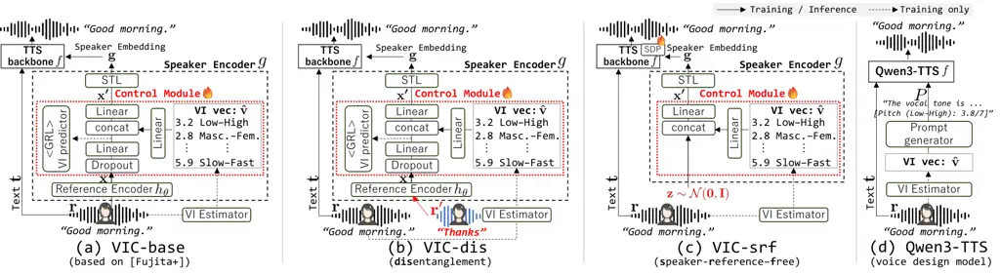
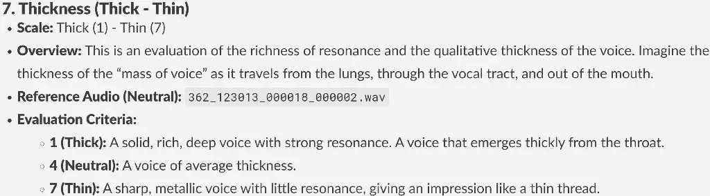

Ohmura Ito Tsunoo Sekiya Kumakura

# LibriTTS-VI: A Public Corpus and Novel Methods for Efficient Voice Impression Control

Junki    Yuki    Emiru    Toshiyuki    Toshiyuki

###### Abstract

Numerical voice impression (VI) control (e.g., scaling brightness)
enables fine-grained control in text-to-speech (TTS). However, it faces
two challenges: no public corpus and impression leakage, where reference
audio biases synthesized voice away from the target VI. To address the
first challenge, we introduce LibriTTS-VI, the first public VI corpus
built on LibriTTS-R. For the second, we hypothesize a single reference
causes leakage by entangling speaker identity and VI. To mitigate this,
we propose 1) disentangled training with two utterances from the same
speaker for speaker and VI conditioning, and 2) a reference-free method
controlling the impression solely via target VI. Experimentally, our
best method improves controllability: 11-dimensional VI mean squared
error drops from 0.61 to 0.41 objectively and 1.15 to 0.92 subjectively.
A comparison with a prompt-based TTS reveals imprecise numerical control
and entanglement between VI and text semantics, which our methods
overcome.¹¹ 1 The corpus and demo samples are publicly available.
[https://github.com/sony/LibriTTS-VI](https://github.com/sony/LibriTTS-VI)

###### keywords

text-to-speech, voice impression control, corpus, disentanglement,
zero-shot TTS

^(†)^(†)address: ¹ Sony Group Corporation, Japan ^(†)^(†)email:
{junki.ohmura, yuki.g.ito, emiru.tsunoo, toshiyuki.sekiya,
toshiyuki.kumakura}@sony.com

## 1 Introduction

Modern text-to-speech (TTS) synthesis has achieved near-human
naturalness \[1, 2, 3\], shifting the research toward controlling
speaker identity and speaking styles. Control paradigms include
manipulating acoustic features such as pitch, energy, and duration \[2,
3, 4\], and ID-based methods for predefined speakers \[3, 5\] or
emotional classes \[6, 7\]. Another prominent paradigm involves
conditioning on audio exemplars or text descriptions, utilizing
reference-based speaker encoders \[8, 9\], unsupervised style transfer
\[10\], emotion synthesis with intensity control \[11, 12\], and the use
of natural-language (NL) prompts for prosody, emotion, or speaker traits
\[13, 14, 15, 16, 17, 18, 19\]. Recent large language model (LLM)-based
models have further advanced this direction, enabling complex NL
instruction \[20, 21, 22\]. Yet controllability often trades off
precision and usability. While manipulating acoustic features offers
precise control, it is too granular and difficult for users. Other
intuitive approaches introduce different constraints: IDs and references
are limited to predefined categories or available exemplars, while NL
prompts lack fine-grained numerical control.

A key challenge is balancing fine-grained control with
human-understandable scales for practical use. One line of work derives
controllable axes from speaker-embedding spaces \[23\], which was
extended in \[24\] to generate reference-free artificial speaker
embeddings. Another paradigm uses explicitly defined perceptual
dimensions for voice characteristics, categorized into two approaches.
One approach uses perceptual voice qualities (e.g., roughness and
breathiness), rated by phonetic experts based on clinical protocols
\[25\]. Another approach, voice impression control (VIC) \[26\], targets
voice impressions (VI) such as calmness and brightness based on
non-experts’ subjective ratings \[27, 28\], which we focus on in this
paper.

VIC \[26\] enables VI-based numerical control of speaker characteristics
in TTS with 11 VI dimensions. However, VIC still faces two limitations.
First, it relies on a private VI corpus, making follow-up studies
difficult. Second, we observed impression leakage: despite being able to
specify the reference audio and target VI individually, the synthesized
voice is biased toward the impression of the reference audio itself.

This paper addresses these two challenges. We address the first
challenge by introducing LibriTTS-VI, a public VI corpus built on
LibriTTS-R \[29\]. For the second challenge, we hypothesize that
training with one utterance for both speaker and VI conditioning causes
impression leakage. Therefore, we propose two methods to mitigate the
leakage. The first one is a disentangled training strategy using two
utterances from the same speaker to individually provide speaker
identity and the target VI. The second one is a reference-free method
controlling the impression only from the target VI without reference
audio. Our best method objectively reduced the mean squared error (MSE)
of 11-dimensional VI vectors from 0.61 to 0.41 and from 1.15 to 0.92
subjectively, while maintaining high synthesis quality. We also evaluate
a recent LLM-based TTS, revealing its imprecise numerical control and
entanglement between VI and text semantics, which our methods
effectively address.

## 2 VIC Task Definition



Figure 1: Overview of the VIC systems (base, dis, and srf) and the
Qwen3-TTS voice design interface for VIC.

VIC \[26\] synthesizes speech that follows a target VI while preserving
the speaker traits of a reference utterance. The target VI is an
11-dimensional vector $`\mathbf{v}\in\mathbb{R}^{11}`$ on a seven-point
scale (1--7): A) Low--High pitched, B) Masculine--Feminine, C)
Clear--Hoarse, D) Calm--Restless, E) Powerful--Weak, F) Youthful--Aged,
G) Thick--Thin, H) Firm--Relaxed, I) Dark--Bright, J) Cold--Warm, and K)
Slow--Fast.²² 2 For a fair comparison, we retained sensitive scales
(e.g., Masculine-Feminine) with minor wording and polarity adjustments
for clarity. Formally, VIC outputs waveform $`\mathbf{y}`$ from text
$`\mathbf{t}`$, reference utterance $`\mathbf{r}`$, and target VI
$`\mathbf{v}`$:

```math
\mathbf{y}=f(\mathbf{t},\mathbf{g})=f(\mathbf{t},g(\mathbf{r},\mathbf{v})), \tag{1}
```

where $`f`$ is a TTS backbone and $`g`$ is a speaker encoder extracting
the speaker embedding $`\mathbf{g}`$ aligned with $`\mathbf{v}`$. The
speaker encoder $`g`$ (black dashed box in Fig. 1 (a)) comprises a
reference encoder $`h_{\theta}`$ with parameters $`\theta`$, a control
module (CM) for VI, and a style token layer (STL) \[10\]. The reference
encoder consists of a pre-trained HuBERT \[30\] and a Bi-LSTM with
attention. It encodes a reference $`\mathbf{r}`$ into an intermediate
vector $`\mathbf{x}`$:

```math
\mathbf{x}=h_{\theta}(\mathbf{r})=\text{BiLSTM}_{\text{attn}}(\text{HuBERT}(\mathbf{r})). \tag{2}
```

CM modulates $`\mathbf{x}`$ into $`\mathbf{x^{\prime}}`$ given the
target VI $`\mathbf{v}`$. Specifically, it processes $`\mathbf{x}`$ with
a high-rate dropout and a linear layer, and $`\mathbf{v}`$ via a linear
layer. These outputs are concatenated and linearly projected to match
the dimensionality of $`\mathbf{x}`$, yielding $`\mathbf{x^{\prime}}`$:

```math
\mathbf{x^{\prime}}=\text{Linear}([\text{Linear}(\text{Dropout}(\mathbf{x}));\text{Linear}(\mathbf{v})]), \tag{3}
```

where $`[\cdot;\cdot]`$ is a concatenation operation. This vector is
then passed through the STL to produce the speaker embedding
$`\mathbf{g}`$:

```math
\mathbf{g}=g(\mathbf{r},\mathbf{v})=\text{STL}(\mathbf{x^{\prime}}). \tag{4}
```

Note that the CM is inserted into $`g`$ only after jointly pre-training
the backbone $`f`$ and the speaker encoder $`g`$ without the CM. The CM
is trained with all other modules frozen, using the same training
objectives of the backbone TTS to implicitly learn the correspondence
between a ground-truth (GT) audio and its VI.

During the training, a pre-trained VI estimator (VIE) predicts target
$`\mathbf{\hat{v}}`$ from reference $`\mathbf{r}`$. VIE shares the
architecture of $`h_{\theta}`$ (with independent parameters
$`\theta^{\prime}`$) followed by a linear head:

```math
\mathbf{\hat{v}}=\text{VIE}(\mathbf{r})=\text{Linear}(h_{\theta^{\prime}}(\mathbf{r})). \tag{5}
```

By setting $`\mathbf{v}=\mathbf{\hat{v}}`$, Eq. (1) becomes:

```math
\mathbf{y}=f(\mathbf{t},g(\mathbf{r},\mathbf{\hat{v}}))=f(\mathbf{t},g(\mathbf{r},\text{VIE}(\mathbf{r}))). \tag{6}
```

Because both $`\mathbf{x}`$ and $`\mathbf{\hat{v}}`$ come from the same
reference $`\mathbf{r}`$, speaker identity and VI tend to be entangled.
To encourage disentanglement, a VI predictor consisting of two linear
layers with a gradient reversal layer (GRL) \[31\] is applied to the
first term in the concatenation of Eq. (3). This suppresses VI cues in
$`\mathbf{x}`$, mitigating impression leakage.

Despite the success of VIC \[26\], two challenges remain: the lack of a
public VI corpus and impression leakage. To address the first challenge,
we introduce our new VI corpus, LibriTTS-VI, in Sec. 3. The second
challenge is impression leakage, which we still observed in our
preliminary experiments despite employing the high-rate dropout and the
GRL. We hypothesize that impression leakage arises because a single
reference utterance, $`\mathbf{r}`$, is used for both speaker and VI
conditioning during training. To this end, we propose two methods in
Sec. 4.

## 3 LibriTTS-VI: A Public Corpus for VIC

To foster reproducibility, we created LibriTTS-VI, a new public corpus,
built by annotating LibriTTS-R \[29\]. The released dataset contains
manual VI annotations, the annotation guideline, and estimated VI values
for the entire LibriTTS-R corpus.



Table 1: Krippendorff’s alpha for the annotated VI dimensions.

|                 |            |                |            |                |            |
| --------------- | ---------- | -------------- | ---------- | -------------- | ---------- |
| VI Dim.         | $`\alpha`$ | VI Dim.        | $`\alpha`$ | VI Dim.        | $`\alpha`$ |
| A) Low–High     | .729       | E) Pow.–Weak   | .331       | I) Dark–Bright | .433       |
| B) Masc.–Fem.   | .888       | F) Youth.–Aged | .586       | J) Cold–Warm   | .197       |
| C) Clear–Hoarse | .415       | G) Thick–Thin  | .413       | K) Slow–Fast   | -          |
| D) Calm–Rest.   | .295       | H) Firm–Relax. | .408       | Average        | .470       |

Figure 2: An example of VI annotation guideline.

For annotation, we randomly selected 130 utterances from distinct
speakers in the LibriTTS-R training set. We defined criteria for the ten
VIs other than K) Slow–Fast, using written descriptions of each VI and
reference audio as an anchor sample, as exemplified in Fig. 2. Four
in-house experienced annotators rated the 130 utterances on a
seven-point Likert scale. We used the mean of the four ratings as the
final VI score, yielding 1,300 labels (130 $`\times`$ 10 VIs).³³ 3 We
are currently expanding the annotations to 300 utterances. For K)
Slow–Fast, we computed words-per-minute via timestamped automatic speech
recognition (ASR) \[32\], and rescaled to 1–7. Table 1 reports
inter-annotator agreement by Krippendorff’s alpha. Although many scales
fall below the reliable threshold ($`\alpha\geq 0.667`$) \[33\], our
average (0.470) exceeds similar vocal perception tasks: speech emotion
(0.442) \[34\] and singing voices (0.153) \[35\]. Moreover, \[35\]
showed such low-agreement ratings remain good predictors of voice
preference, supporting the value of our dataset.

As in \[26\], we trained VIE in Eq. (5) to label the rest of the
LibriTTS-R corpus to scale the annotation. The VIE is trained with MSE
against manual VI labels. With limited 130 labeled utterances, we
augmented data to train the VIE, as in \[26\]. The VIE is trained by
assigning the same manual label to all utterances of a speaker, assuming
a constant VI per speaker. However, this assumption is too strict for
LibriTTS-R, which is a mixture of narration and expressive utterances.
Therefore, we adopted a new data augmentation strategy. To safely assign
the manual labels to other utterances of the same speaker, we select
acoustically similar utterances, assuming similar VI. The similarity was
determined by averaging ranks of L1 distances of pitch and energy and
cosine similarities of the WavLM embeddings \[36, 37\]. For each manual
label, we only used the 100 most similar utterances from the same
speaker, resulting a 100-fold data augmentation. Of the 130 manually
annotated utterances (1,300 VI labels), we used 100 for augmentation to
train the VIE, and held out 30 for the test set. The VIE achieved a
root-MSE of 0.68 ($`<1`$ point) on this set.

## 4 Proposed Methods

We hypothesize impression leakage arises because the same reference
$`\mathbf{r}`$ conditions both speaker and VI, as in Eq. (6). As a
result, the speaker encoder $`g`$ encodes VI cues from the reference
$`\mathbf{r}`$ alongside speaker traits. This can be prevented by
disentangling VI and speaker information extracted from the reference
utterance. Furthermore, if the VI sufficiently represents speaker
identity, we can omit $`\mathbf{r}`$ and rely solely on $`\mathbf{v}`$.

### 4.1 Disentanglement via different utterances (VIC-dis)

VIC-dis (“disentanglement”), shown in Fig. 1 (b), tackles this
entanglement through a decoupled training strategy. Since extracting
speaker identity does not require the reference audio to match the
target VI, we can source these inputs individually. During training, we
introduce another utterance $`\mathbf{r^{\prime}}`$ from the same
speaker, to replace $`\mathbf{r}`$ in Eq. (1). The original utterance
$`\mathbf{r}`$ remains as the GT synthesis target and the target VI is
also extracted from the same $`\mathbf{r}`$. This inherent VI difference
between $`\mathbf{r^{\prime}}`$ and $`\mathbf{r}`$ decouples identity
and VI without architectural changes. The training of VIC-dis
reformulates Eq. (6) as:

```math
\mathbf{y}=f(\mathbf{t},g(\mathbf{r^{\prime}},\text{VIE}(\mathbf{r}))). \tag{7}
```

### 4.2 Speaker-reference-free generation (VIC-srf)

VIC-srf (“speaker-reference-free”), shown in Fig. 1 (c), architecturally
eliminates the impression leakage by removing the speaker reference from
the synthesis process. Inspired by the method of generating pseudo
speaker embeddings \[24\], the synthesis is conditioned solely on the
target VI vector by replacing the first concatenation term in Eq. (3)
with Gaussian noise
$`\mathbf{z}\sim\mathcal{N}(\mathbf{0},\mathbf{I})`$. The training of
VIC-srf reformulates Eq. (6) as:

```math
\mathbf{y}=f(\mathbf{t},g(\mathbf{z},\text{VIE}(\mathbf{r}))). \tag{8}
```

## 5 Experiments

We objectively and subjectively evaluated controllability and synthesis
quality on the LibriTTS-R test-clean set, enabling zero-shot evaluation
on 39 unseen speakers. We evaluated five VIC models: the original VIC
(VIC-base) \[26\], our proposed VIC-dis and VIC-srf, and two LLM-based
VIC variants.

### 5.1 Experimental setup

To improve audio quality, we replaced the FastSpeech2 \[2\] backbone
($`f`$ in Eq. (1)) in \[26\] with VITS \[3\]. Our baseline, VIC-base
(Fig. 1 (a)), uses VITS with a single reference $`\mathbf{r}`$ for
speaker and VI conditioning. To test if NL prompts can achieve VIC, we
evaluated the state-of-the-art Qwen3-TTS voice design model⁴⁴ 4
Qwen3-TTS-12Hz-1.7B-VoiceDesign (QVD) \[22, 38\] (Fig. 1 (d)). Because
QVD uses only NL prompts for speaker conditioning, we built a prompt
generator mapping a VI to an NL prompt $`P`$, inspired by LLM-based
vocal attribute-to-text methods \[39, 38\]. To map the continuous VI
value $`v_{d}`$ of each dimension $`d\in\{1,\dots,11\}`$ to text, we
quantized it into a discrete level $`l\in\{1,\dots,7\}`$. For each
$`(d,l)`$, we prompted Gemini 3 Pro \[40\] with our annotation
guidelines to generate five paraphrases
$`\mathcal{D}_{d,l}=\{s^{(1)}_{d,l},\dots,s^{(5)}_{d,l}\}`$. To mitigate
quantization error ($`v_{d}`$ to $`l`$), we appended $`v_{d}`$ to each
sampled sentence as a tag $`\phi(v_{d})`$ (e.g., “\[Pitch (Low–High):
$`3.2/7`$\]”). Given a VI $`\mathbf{v}`$, we sampled one sentence per
dimension and concatenated them to form the prompt $`P`$:

```math
P=\bigoplus_{d=1}^{11}\bigl(s_{d}\oplus\phi(v_{d})\bigr),\quad s_{d}\sim\mathrm{Uniform}(\mathcal{D}_{d,\mathrm{round}(v_{d})}), \tag{9}
```

where $`\oplus`$ denotes string concatenation with a space delimiter. We
evaluated two settings: QVD-z (zero-shot) used the pre-trained model to
test zero-shot capability for VIC, and QVD-f (fine-tuned) was fine-tuned
on LibriTTS-R with prompts $`P`$.

Our VITS backbone was based on a public implementation.⁵⁵ 5
[https://github.com/daniilrobnikov/vits2](https://github.com/daniilrobnikov/vits2)
To further improve synthesis quality, we added a Conformer-based text
encoder \[41, 42\], and applied a connectionist temporal classification
loss and an adaptive layer-norm zero Transformer, following \[43, 44,
45\]. We set the dimension of $`\mathbf{x}`$ and $`\mathbf{g}`$ to 256.
The VITS backbone was pre-trained for 600k steps, followed by 60k steps
of CM fine-tuning where $`\mathbf{v}`$ and $`\mathbf{x}`$ were projected
to 32 dimensions. For VIC-srf, we fine-tuned the CM and the stochastic
duration predictor (SDP) of VITS to stabilize the speaking rate. QVD-f
was fine-tuned with $`P`$ as voice design instructions for 5 epochs. All
models (except QVD-z) were trained on eight NVIDIA A100 GPUs using
AdamW. We used a batch size of 20 and lr of $`2\times 10^{-4}`$ for
VITS-based systems, and a batch size of 2 (gradient accumulation 4) and
lr of $`1\times 10^{-6}`$ for QVD-f.

### 5.2 Objective evaluation

|          |          |          |          |                          |          |          |                       |
| -------- | -------- | -------- | -------- | ------------------------ | -------- | -------- | --------------------- |
| Model    | CER      | WER      | UTMOS    | SECS                     | VI-MSE   | RVI-MSE  | $`\Delta_{\text{V}}`$ |
| GT       | 2.41     | 6.17     | 4.17     | 0.81 (same) 0.63 (cross) | -        | -        | -                     |
| VITS     | 3.36     | 8.63     | 4.20     | 0.77                     | -        | -        | -                     |
| VIC-base | 3.20     | 8.17     | 4.23     | 0.77                     | 0.39     | 0.61     | 0.22\*                |
| VIC-dis  | 3.12^(†) | 7.99     | 4.25^(†) | 0.75                     | 0.37     | 0.51^(†) | 0.14\*                |
| VIC-srf  | 2.99^(†) | 7.72^(†) | 4.26^(†) | 0.72                     | 0.36^(†) | 0.41^(†) | 0.05                  |
| QVD-z    | 1.95     | 5.42     | 4.27     | 0.58                     | 0.82     | 0.97     | 0.15\*                |
| QVD-f    | 2.19     | 6.02     | 4.37     | 0.65                     | 0.87     | 1.19     | 0.32\*                |

Table 2: Summary of objective evaluation results. We measured
intelligibility with CER and WER, audio quality with UTMOS, speaker
similarity with SECS, and VI control error with VI-MSE, RVI-MSE, and
impression leakage with their difference ($`\Delta_{\text{V}}`$). ^(†)
indicates a statistically significant improvement of VIC-dis or VIC-srf
over VIC-base ($`p<0.05`$). \* indicates that $`\Delta_{\text{V}}`$ is
significantly different from zero ($`p<0.05`$).

Objective evaluation used all 4,837 utterances from the test-clean set.
We measured speech intelligibility with character/word error rates
(CER/WER) via Whisper large-v3 \[46\], audio quality with UTMOS \[47\],
and speaker similarity with speaker encoder cosine similarity (SECS)
\[48\]. For fair SECS comparison, we compared each sample to all the
utterances from the same speaker but the GT used as the reference
$`\mathbf{r}`$. As reference bounds, we report SECS (same/cross) from
all same- and cross-speaker original speech pairs. To assess
controllability, we defined two metrices; VI-MSE and RVI-MSE. VI-MSE is
the MSE between the predicted VI from the synthesized speech and the
target VI $`\mathbf{v_{r}}`$ from the speaker reference $`\mathbf{r}`$,
while RVI-MSE uses a target $`\mathbf{v_{*}}`$ extracted from a randomly
sampled utterance of a different speaker:

```math
\text{VI-MSE}=||\mathbf{v_{r}}-\text{VIE}(f(\mathbf{t},g(\mathbf{r},\mathbf{v_{r}})))||_{2}^{2}, \tag{10}
```

```math
\text{RVI-MSE}=||\mathbf{v}_{*}-\text{VIE}(f(\mathbf{t},g(\mathbf{r},\mathbf{v}_{*})))||_{2}^{2}, \tag{11}
```

where the speaker reference $`\mathbf{r}`$ is omitted for VIC-srf and
QVD. We quantify this by
$`\Delta_{\text{V}}=\text{RVI-MSE}-\text{VI-MSE}`$. If there is no VI
leakage from the reference $`\mathbf{r}`$, $`\Delta_{\text{V}}`$ should
be zero.

Table 2 shows the results. The VITS-based systems (VIC-base/dis/srf)
maintained backbone performance; compared to GT, they showed marginally
better UTMOS but slightly worse WERs and CERs. SECS stayed high for
reference-based models (VIC-base/dis), and VIC-srf remained above SECS
(cross) (0.72 vs. 0.63). Our proposed methods significantly reduced
leakage ($`\Delta_{\text{V}}`$) from 0.22 (VIC-base) to 0.14 (dis) and
0.05 (srf), with VIC-srf showing no significant VI-MSE/RVI-MSE
difference. This confirmed its structural leakage elimination. For QVD
models, despite strong ASR/UTMOS, they struggled with speaker
identification and VI control; their SECS fell below the SECS (cross)
(0.58 vs. 0.63), with marginal recovery even after fine-tuning (0.65).
High VI-MSE indicates NL prompts lack fine-grained precision, and QVD-f
further worsened it. This suggests that adapting large pre-trained
models to VIC is non-trivial. QVD models also exhibited large
$`\Delta_{\text{V}}`$ despite being speaker-reference-free. We found
QVD’s output VI was sensitive to text content. For instance, including
an exclamation mark in the text biased the predicted VI toward
restlessness. This suggests entanglement of content and VI, where text
semantics bias prosody in LLM-TTS \[49\].

To quantify this, we trained a Ridge regressor per VI dimension to
predict VI values from text embeddings \[50\].⁶⁶ 6 We used
all-MiniLM-L6-v2 model. We then calculated the correlation between these
text-predicted VIs and the audio-estimated VIs from VIE (Eq. (5)) as an
entanglement proxy. We found that correlations exceeded $`0.2`$ for five
dimensions, suggesting text semantics align with certain VI attributes.
In the RVI-MSE setting where the target VI can be misaligned with the
text semantics, QVD struggled to decouple them; introducing a semantic
bias into the output VI.

|        |       |       |      |       |         |      |      |      |       |
| ------ | ----- | ----- | ---- | ----- | ------- | ---- | ---- | ---- | ----- |
| VI     | base  | dis   | srf  | QVD-z | VI      | base | dis  | srf  | QVD-z |
| A) L-H | .008  | .106  | .145 | .035  | G) T-T  | .037 | .043 | .060 | -.008 |
| B) M-F | .858  | .856  | .843 | .534  | H) F-R  | .062 | .090 | .142 | .026  |
| C) C-H | .042  | .062  | .050 | .028  | I) D-B  | .035 | .044 | .120 | .023  |
| D) C-R | .064  | .149  | .179 | .009  | J) C-W  | .045 | .102 | .147 | .000  |
| E) P-W | -.037 | -.013 | .014 | .008  | K) S-F  | .011 | .043 | .205 | .011  |
| F) Y-A | .207  | .273  | .280 | .075  | Average | .121 | .159 | .199 | .068  |

Table 3: Slopes of linear fits for target vs. predicted VI values in the
modulation experiment. Larger positive slopes indicate higher
responsiveness. Bold: best, underline: second-best.

Figure 3: VI modulation experiment for B) Masculine-Feminine and F)
Youthful-Aged dimensions. Shaded areas: $`\pm 1\sigma`$.

To further probe control precision, we ran a VI modulation experiment
following \[26\]. For all the test speakers, we modulated single VI
dimensions from 1 to 7 in steps of 1 while keeping the others fixed. For
each condition, we synthesized 10 sentences and predicted VI with VIE in
Eq. (5). We then quantified the control fidelity via the slope of the
linear fit between the target and predicted VI. Larger positive slopes
indicate more responsive control in the intended direction. Table 3
shows a consistent hierarchy for VITS-based systems: VIC-srf (Avg:
0.199) $`>`$ dis (0.159) $`>`$ base (0.121). On E) Powerful–Weak,
VIC-base/dis yielded negative slopes, whereas VIC-srf remains positive
(0.008). Because QVD-f showed lower VI controllability, we evaluated
only QVD-z. Even in zero-shot, QVD-z yields positive slopes for all
except G) Thick–Thin, but is less sensitive (Avg: 0.068) than VITS-based
systems. Fig. 3 shows QVD-z’s instability: it fluctuates on B)
Masculine–Feminine, while F) Youthful–Aged yields a narrower prediction
range than VIC-srf ($`0.44`$ vs. $`1.47`$ points). This imprecise
numerical control via NL descriptions aligns with prior findings in LLMs
\[51\].

### 5.3 Subjective evaluation

We ran subjective tests of controllability and audio quality on only
VITS-based systems. We evaluated single-VI and multiple-VI modulation
settings. For the single-VI modulation, following \[26\], we shifted
four representative VIs by $`\pm 3`$: A) Low--High⁷⁷ 7 We replaced the
Powerful–Weak dimension from the original VIC study with Low-High, as
our models struggled to learn the former., B) Masculine–Feminine, F)
Youthful–Aged, and I) Dark–Bright. For the multiple-VI modulation, we
assessed the simultaneous modulation of multiple VIs. We reused the same
synthesized utterances from the RVI-MSE evaluation (Sec. 5.2, Table 2).
To cover diverse VI modulation settings at practical cost, we evaluated
one male and one female speaker (IDs 1089 and 8555). We only report
ID 8555 as a representative case because the main trends were consistent
across the two speakers.

First, we evaluated controllability. For each system, we selected 10
sentences for each single-VI shift ($`\pm 3`$) and for the multiple-VI
(RVI-MSE) setting. The same four annotators as in Sec. 3 rated the VI of
the synthesized speech, with each annotator completing 1,080 ratings.
Table 5 shows the MSE between their scores and the target VI vector. The
proposed methods generally outperformed VIC-base in the single-VI
conditions, except in VIC-srf’s Mod. +3 condition on dimension I. In the
multiple-VI modulation, our methods reduced the MSE from 1.15 (VIC-base)
to 1.04 (dis) and 0.92 (srf), consistent with the objective VIE-based
RVI-MSE in Table 2.

Second, we conducted a Mean Opinion Score (MOS) test for audio quality
with 30 native or native-level English speakers (1: Bad – 5: Excellent).
The setup followed the controllability test in Table 5, but including
the no-modulation condition (Mod. +0) and using 13 sentences per
condition. Each participant rated 1,014 samples, yielding 30 ratings per
sample. Table 5 shows the results. Despite GT-comparable UTMOS
(Table 2), MOS stayed below 3.8, likely due to interface bias \[52\], as
“Good” examples in our instruction anchored raters to “Good (4)”. Audio
quality showed no consistent degradation against VIC-base in either
single-VI (VIC-dis: five improvements vs. four degradations; VIC-srf:
four vs. four) or multiple-VI conditions. This comparable performance
suggests our methods could improve controllability without sacrificing
audio quality.

|              |           |                              |                              |                              |
| ------------ | --------- | ---------------------------- | ---------------------------- | ---------------------------- |
| VI           | Condition | VIC-base                     | VIC-dis                      | VIC-srf                      |
| A            | Mod. -3   | $`10.76\pm 1.14`$            | $`\underline{8.33\pm 1.22}`$ | $`\bm{7.30\pm 1.15}`$        |
|              | Mod. +3   | $`3.77\pm 0.83`$             | $`\bm{2.57\pm 0.44}`$        | $`\underline{2.58\pm 0.47}`$ |
| B            | Mod. -3   | $`0.81\pm 0.24`$             | $`\underline{0.46\pm 0.10}`$ | $`\bm{0.38\pm 0.11}`$        |
|              | Mod. +3   | $`0.66\pm 0.16`$             | $`\bm{0.40\pm 0.10}`$        | $`\underline{0.46\pm 0.10}`$ |
| F            | Mod. -3   | $`1.62\pm 0.34`$             | $`\bm{1.37\pm 0.31}`$        | $`\underline{1.48\pm 0.62}`$ |
|              | Mod. +3   | $`\bm{2.15\pm 0.44}`$        | $`2.22\pm 0.45`$             | $`\underline{2.17\pm 0.33}`$ |
| I            | Mod. -3   | $`9.42\pm 1.19`$             | $`\underline{8.22\pm 0.90}`$ | $`\bm{6.92\pm 0.76}`$        |
|              | Mod. +3   | $`\underline{8.25\pm 0.81}`$ | $`\bm{7.54\pm 0.75}`$        | $`9.27\pm 0.86`$             |
| Multiple VIs |           | $`1.15\pm 0.10`$             | $`\underline{1.04\pm 0.10}`$ | $`\bm{0.92\pm 0.09}`$        |

|              |           |                   |                       |                       |
| ------------ | --------- | ----------------- | --------------------- | --------------------- |
| VI           | Condition | VIC-base          | VIC-dis               | VIC-srf               |
| A            | Mod. -3   | 3.31 $`\pm`$ 0.10 | 3.42 $`\pm`$ 0.11     | 3.75 $`\pm`$ 0.11     |
|              | Mod. +0   | 3.31 $`\pm`$ 0.12 | 3.46 $`\pm`$ 0.11     | 3.44 $`\pm`$ 0.12     |
|              | Mod. +3   | 3.44 $`\pm`$ 0.12 | 3.21 $`\pm`$ 0.11^(†) | 2.85 $`\pm`$ 0.11^(†) |
| B            | Mod. -3   | 3.64 $`\pm`$ 0.11 | 3.42 $`\pm`$ 0.13^(†) | 3.46 $`\pm`$ 0.11^(†) |
|              | Mod. +0   | 3.37 $`\pm`$ 0.12 | 3.68 $`\pm`$ 0.11     | 3.52 $`\pm`$ 0.11     |
|              | Mod. +3   | 3.44 $`\pm`$ 0.11 | 3.48 $`\pm`$ 0.12     | 3.34 $`\pm`$ 0.11     |
| F            | Mod. -3   | 3.44 $`\pm`$ 0.10 | 3.54 $`\pm`$ 0.11     | 3.43 $`\pm`$ 0.11     |
|              | Mod. +0   | 3.34 $`\pm`$ 0.13 | 3.73 $`\pm`$ 0.10     | 3.62 $`\pm`$ 0.11     |
|              | Mod. +3   | 3.46 $`\pm`$ 0.12 | 3.18 $`\pm`$ 0.13^(†) | 3.42 $`\pm`$ 0.10     |
| I            | Mod. -3   | 3.51 $`\pm`$ 0.10 | 3.34 $`\pm`$ 0.11^(†) | 3.29 $`\pm`$ 0.11^(†) |
|              | Mod. +0   | 3.49 $`\pm`$ 0.11 | 3.68 $`\pm`$ 0.10     | 3.26 $`\pm`$ 0.11^(†) |
|              | Mod. +3   | 3.26 $`\pm`$ 0.12 | 3.59 $`\pm`$ 0.11     | 3.18 $`\pm`$ 0.13     |
| Multiple VIs |           | 3.71 $`\pm`$ 0.11 | 3.28 $`\pm`$ 0.12     | 3.60 $`\pm`$ 0.12     |

Table 4: Subjective controllability results for speaker 8555, in terms
of MSE ($`\pm`$ 95% CI). Bold: best, underline: second-best.

Table 5: MOS for audio quality ($`\pm`$ 95% CI) for speaker 8555. Bold/
$`\dagger`$: significantly better/worse than baseline ($`p<0.05`$).

## 6 Conclusion

In this paper, we addressed two challenges in VIC: the lack of a public
corpus and impression leakage. To address the first challenge, we
introduced LibriTTS-VI, a public VI corpus. For the second, we
hypothesized that using a single reference for speaker and VI
conditioning causes impression leakage. To mitigate this, we
proposed: 1) disentangled training with two utterances from the same
speaker to individually provide speaker identity and the target VI, and 2) a reference-free method controlling VI without reference audio. Our
experiments showed that these methods improve controllability while
maintaining high synthesis quality. Notably, a comparison with an
LLM-based TTS revealed imprecise numerical control and entanglement of
text semantics and VI, which we effectively mitigated.

## 7 Acknowledgments

We thank Keiichi Osako and Fernando Villavicencio for their valuable
feedback on the manuscript.

## 8 Generative AI Use Disclosure

Gemini 3 was used to support translation, paraphrasing, grammar
checking, and the identification of typographical errors. All output was
reviewed and verified by the authors, who assume full responsibility for
the content of the paper.

## References

- \[1\] J. Shen, R. Pang, R. J. Weiss, M. Schuster, N. Jaitly, Z.
  Yang, Z. Chen, Y. Zhang, Y. Wang, R. Skerry-Ryan, et al. (2018)
  Natural TTS synthesis by conditioning wavenet on mel spectrogram
  predictions. In Proc. of ICASSP, pp. 4779–4783. External Links:
  [Document](https://dx.doi.org/10.1109/ICASSP.2018.8461368) Cited by:
  §1.
- \[2\] Y. Ren, C. Hu, X. Tan, T. Qin, S. Zhao, Z. Zhao, and T.
  Liu (2021) FastSpeech 2: fast and high-quality end-to-end text to
  speech. In Proc. of ICLR, Cited by: §1, §5.1.
- \[3\] J. Kim, J. Kong, and J. Son (2021) Conditional variational
  autoencoder with adversarial learning for end-to-end text-to-speech.
  In Proc. of ICML, pp. 5530–5540. Cited by: §1, §5.1.
- \[4\] W. Chen, S. Yang, G. Li, and X. Wu (2025) DrawSpeech: expressive
  speech synthesis using prosodic sketches as control conditions. In
  Proc. of ICASSP, pp. 1–5. Cited by: §1.
- \[5\] J. Kong, J. Park, B. Kim, J. Kim, D. Kong, and S. Kim (2023)
  VITS2: improving quality and efficiency of single-stage text-to-speech
  with adversarial learning and architecture design. In Proc. of
  Interspeech, pp. 4374–4378. External Links:
  [Document](https://dx.doi.org/10.21437/Interspeech.2023-534) Cited by:
  §1.
- \[6\] Y. Lee, A. Rabiee, and S. Lee (2017) Emotional end-to-end neural
  speech synthesizer. arXiv preprint arXiv:1711.05447. Cited by: §1.
- \[7\] D. Diatlova and V. Shutov (2023) EmoSpeech: guiding fastspeech2
  towards emotional text to speech. In Proc. of SSW, pp. 106–112.
  External Links: [Document](https://dx.doi.org/10.21437/SSW.2023-17)
  Cited by: §1.
- \[8\] Y. Jia, Y. Zhang, R. Weiss, Q. Wang, J. Shen, F. Ren, P.
  Nguyen, R. Pang, I. Lopez Moreno, Y. Wu, et al. (2018) Transfer
  learning from speaker verification to multispeaker text-to-speech
  synthesis. Advances in NeurIPS. Cited by: §1.
- \[9\] E. Casanova, J. Weber, C. D. Shulby, A. C. Junior, E. Gölge,
  and M. A. Ponti (2022) YourTTS: towards zero-shot multi-speaker TTS
  and zero-shot voice conversion for everyone. In Proc. of ICML,
  pp. 2709–2720. Cited by: §1.
- \[10\] Y. Wang, D. Stanton, Y. Zhang, R. Ryan, E. Battenberg, J.
  Shor, Y. Xiao, Y. Jia, F. Ren, and R. A. Saurous (2018) Style tokens:
  unsupervised style modeling, control and transfer in end-to-end speech
  synthesis. In Proc. of ICML, pp. 5180–5189. Cited by: §1, §2.
- \[11\] D. Cho, H. Oh, S. Kim, S. Lee, and S. Lee (2024) EmoSphere-TTS:
  emotional style and intensity modeling via spherical emotion vector
  for controllable emotional text-to-speech. In Proc. of Interspeech,
  pp. 1810–1814. External Links:
  [Document](https://dx.doi.org/10.21437/Interspeech.2024-398) Cited by:
  §1.
- \[12\] D. Cho, H. Oh, S. Kim, and S. Lee (2025) EmoSphere++:
  emotion-controllable zero-shot text-to-speech via emotion-adaptive
  spherical vector. IEEE Transactions on Affective Computing. Cited by:
  §1.
- \[13\] Z. Guo, Y. Leng, Y. Wu, S. Zhao, and X. Tan (2023) Prompttts:
  controllable text-to-speech with text descriptions. In Proc. of
  ICASSP, pp. 1–5. Cited by: §1.
- \[14\] G. Liu, Y. Zhang, Y. Lei, Y. Chen, R. Wang, Z. Li, and L.
  Xie (2023) Promptstyle: controllable style transfer for text-to-speech
  with natural language descriptions. In Proc. of Interspeech,
  pp. 4888–4892. Cited by: §1.
- \[15\] D. Yang, S. Liu, R. Huang, C. Weng, and H. Meng (2024)
  Instructtts: modelling expressive tts in discrete latent space with
  natural language style prompt. In IEEE/ACM Trans. Audio, Speech, Lang.
  Process., pp. 2913–2925. Cited by: §1.
- \[16\] R. Shimizu, R. Yamamoto, M. Kawamura, Y. Shirahata, H. Doi, T.
  Komatsu, and K. Tachibana (2024) Prompttts++: controlling speaker
  identity in prompt-based text-to-speech using natural language
  descriptions. In Proc. of ICASSP, pp. 12672–12676. Cited by: §1.
- \[17\] M. Kawamura, R. Yamamoto, Y. Shirahata, T. Hasumi, and K.
  Tachibana (2024) LibriTTS-P: a corpus with speaking style and speaker
  identity prompts for text-to-speech and style captioning. In Proc. of
  Interspeech, Cited by: §1.
- \[18\] A. Sigurgeirsson and S. King (2024) Controllable speaking
  styles using a large language model. In ICASSP 2024-2024 IEEE
  International Conference on Acoustics, Speech and Signal Processing
  (ICASSP), pp. 10851–10855. Cited by: §1.
- \[19\] Y. Jeon, Y. Kim, J. Lee, and G. Lee (2025) Prompt-guided
  selective masking loss for context-aware emotive text-to-speech. In
  Findings of the Association for Computational Linguistics: NAACL 2025,
  pp. 638–650. Cited by: §1.
- \[20\] Y. Zhou, X. Qin, Z. Jin, S. Zhou, S. Lei, S. Zhou, Z. Wu,
  and J. Jia (2024) Voxinstruct: expressive human instruction-to-speech
  generation with unified multilingual codec language modelling. In
  Proceedings of the 32nd ACM International Conference on Multimedia,
  pp. 554–563. Cited by: §1.
- \[21\] J. Hu, H. Chen, L. Ma, D. Guo, Q. Zhan, W. Li, H. Zhang, K.
  Xia, Z. Zhang, W. Tian, et al. (2026) Voicesculptor: your voice,
  designed by you. arXiv preprint arXiv:2601.10629. Cited by: §1.
- \[22\] H. Hu, X. Zhu, T. He, D. Guo, B. Zhang, X. Wang, Z. Guo, Z.
  Jiang, H. Hao, Z. Guo, X. Zhang, P. Zhang, B. Yang, J. Xu, J. Zhou,
  and J. Lin (2026) Qwen3-tts technical report. arXiv preprint
  arXiv:2601.15621. Cited by: §1, §5.1.
- \[23\] P. van Rijn, S. Mertes, D. Schiller, P. Dura, H. Siuzdak, P.
  Harrison, E. André, and N. Jacoby (2022) VoiceMe: Personalized voice
  generation in TTS. In Proc. of Interspeech, pp. 2588–2592. Cited by:
  §1.
- \[24\] F. Lux, P. Tilli, S. Meyer, and N. T. Vu (2023) Controllable
  generation of artificial speaker embeddings through discovery of
  principal directions. In Proc. of Interspeech, pp. 4788–4792. Cited
  by: §1, §4.2.
- \[25\] F. Rautenberg, M. Kuhlmann, F. Seebauer, J. Wiechmann, P.
  Wagner, and R. Haeb-Umbach (2025) Speech synthesis along perceptual
  voice quality dimensions. In Proc. of ICASSP, pp. 1–5. Cited by: §1.
- \[26\] K. Fujita, S. Horiguchi, and Y. Ijima (2025) Voice impression
  control in zero-shot TTS. In Proc. of Interspeech, Cited by: §1, §1,
  §2, §2, §3, §5.1, §5.2, §5.3, §5.
- \[27\] H. Kido and H. Kasuya (1999) Extraction of everyday expression
  associated with voice quality of normal utterance. Journal of the
  Acoustical Society of Japan, pp. 405–411. Note: (In Japanese with
  English title) Cited by: §1.
- \[28\] M. Nagano, Y. Ijima, and S. Hiroya (2025) The influence of
  semantic primitives in an emotion-mediated willingness to buy model
  from advertising speech. Acoust. Sci. & Tech. 46 (1), pp. 87–95. Cited
  by: §1.
- \[29\] Y. Koizumi, H. Zen, S. Karita, Y. Ding, K. Yatabe, N.
  Morioka, M. Bacchiani, Y. Zhang, W. Han, and A. Bapna (2023)
  LibriTTS-R: a restored multi-speaker text-to-speech corpus. In Proc.
  of Interspeech, pp. 5496–5500. External Links:
  [Document](https://dx.doi.org/10.21437/Interspeech.2023-1584) Cited
  by: §1, §3.
- \[30\] W. Hsu, B. Bolte, Y. H. Tsai, K. Lakhotia, R. Salakhutdinov,
  and A. Mohamed (2021) Hubert: self-supervised speech representation
  learning by masked prediction of hidden units. IEEE/ACM Trans. Audio,
  Speech, Lang. Process. 29, pp. 3451–3460. Cited by: §2.
- \[31\] Y. Ganin and V. Lempitsky (2015) Unsupervised domain adaptation
  by backpropagation. In Proc. of ICML, pp. 1180–1189. Cited by: §2.
- \[32\] J. Louradour (2023) Whisper-timestamped. GitHub. Note:
  [https://github.com/linto-ai/whisper-timestamped](https://github.com/linto-ai/whisper-timestamped)
  Cited by: §3.
- \[33\] K. Krippendorff (2018) Content analysis: an introduction to its
  methodology. SAGE Publications. Cited by: §3.
- \[34\] O. Perepelkina, E. Kazimirova, and M. Konstantinova (2018)
  RAMAS: russian multimodal corpus of dyadic interaction for affective
  computing. In Proc. of SPECOM, pp. 501–510. Cited by: §3.
- \[35\] C. Bruder, D. Poeppel, and P. Larrouy-Maestri (2024) Perceptual
  (but not acoustic) features predict singing voice preferences. Sci.
  Rep. 14 (1), pp. 8977. Cited by: §3.
- \[36\] S. Chen, C. Wang, Z. Chen, Y. Wu, S. Liu, Z. Chen, J. Li, N.
  Kanda, T. Yoshioka, X. Xiao, et al. (2022) WavLM: large-scale
  self-supervised pre-training for full stack speech processing. IEEE
  Journal of Selected Topics in Signal Processing, pp. 1505–1518. Cited
  by: §3.
- \[37\] L. Barrault, Y. Chung, M. C. Meglioli, D. Dale, N. Dong, M.
  Duppenthaler, P. Duquenne, B. Ellis, H. Elsahar, J. Haaheim, et
  al. (2023) Seamless: multilingual expressive and streaming speech
  translation. arXiv preprint arXiv:2312.05187. Cited by: §3.
- \[38\] K. Huang, Q. Tu, L. Fan, C. Yang, D. Zhang, S. Li, Z. Fei, Q.
  Cheng, and X. Qiu (2025) Instructttseval: benchmarking complex
  natural-language instruction following in text-to-speech systems.
  arXiv preprint arXiv:2506.16381. Cited by: §5.1.
- \[39\] D. Lyth and S. King (2024) Natural language guidance of
  high-fidelity text-to-speech with synthetic annotations. arXiv
  preprint arXiv:2402.01912. Cited by: §5.1.
- \[40\] Google (2025) Gemini 3 pro: the frontier of vision ai.
  Technical report Google. External Links:
  [Link](https://blog.google/innovation-and-ai/technology/developers-tools/gemini-3-pro-vision/)
  Cited by: §5.1.
- \[41\] A. Gulati, J. Qin, C. Chiu, N. Parmar, Y. Zhang, J. Yu, W.
  Han, S. Wang, Z. Zhang, Y. Wu, et al. (2020) Conformer:
  convolution-augmented transformer for speech recognition. In Proc. of
  Interspeech, pp. 5036–5040. External Links:
  [Document](https://dx.doi.org/10.21437/Interspeech.2020-3015) Cited
  by: §5.1.
- \[42\] T. Hayashi, R. Yamamoto, T. Yoshimura, P. Wu, J. Shi, T.
  Saeki, Y. Ju, Y. Yasuda, S. Takamichi, and S. Watanabe (2021)
  ESPnet2-TTS: extending the edge of TTS research. arXiv:2110.07840.
  Cited by: §5.1.
- \[43\] S. Lee, S. Kim, J. Lee, E. Song, M. Hwang, and S. Lee (2022)
  HierSpeech: bridging the gap between text and speech by hierarchical
  variational inference using self-supervised representations for speech
  synthesis. In Proc. of NeurIPS, pp. 16624–16636. Cited by: §5.1.
- \[44\] S. Lee, H. Choi, S. Kim, and S. Lee (2025) HierSpeech++:
  bridging the gap between semantic and acoustic representation of
  speech by hierarchical variational inference for zero-shot speech
  synthesis. IEEE Trans. Neural Netw. Learn. Syst., pp. 1–15. External
  Links: [Document](https://dx.doi.org/10.1109/TNNLS.2025.3584944) Cited
  by: §5.1.
- \[45\] W. Peebles and S. Xie (2023) Scalable diffusion models with
  transformers. In Proc. of ICCV, pp. 4195–4205. Cited by: §5.1.
- \[46\] A. Radford, J. W. Kim, T. Xu, G. Brockman, C. McLeavey, and I.
  Sutskever (2023) Robust speech recognition via large-scale weak
  supervision. In Proc. of ICML, pp. 28492–28518. Cited by: §5.2.
- \[47\] T. Saeki, D. Xin, W. Nakata, T. Koriyama, S. Takamichi, and H.
  Saruwatari (2022) UTMOS: utokyo-sarulab system for voicemos challenge 2022. In Proc. of Interspeech, pp. 4521–4525. External Links:
  [Document](https://dx.doi.org/10.21437/Interspeech.2022-439) Cited by:
  §5.2.
- \[48\] G. Louppe (2019) Resemblyzer. Resemblyzer. Note:
  [https://github.com/resemble-ai/Resemblyzer](https://github.com/resemble-ai/Resemblyzer)
  Cited by: §5.2.
- \[49\] M. Łajszczak, G. Cámbara, Y. Li, F. Beyhan, A. Van Korlaar, F.
  Yang, A. Joly, Á. Martín-Cortinas, A. Abbas, A. Michalski, et
  al. (2024) Base tts: lessons from building a billion-parameter
  text-to-speech model on 100k hours of data. arXiv preprint
  arXiv:2402.08093. Cited by: §5.2.
- \[50\] N. Reimers and I. Gurevych (2019) Sentence-bert: sentence
  embeddings using siamese bert-networks. In Proceedings of the 2019
  Conference on Empirical Methods in Natural Language Processing, Cited
  by: §5.2.
- \[51\] H. Li, X. Chen, Z. Xu, D. Li, N. Hu, F. Teng, Y. Li, L.
  Qiu, C. J. Zhang, L. Qing, and L. Chen (2025) Exposing numeracy gaps:
  a benchmark to evaluate fundamental numerical abilities in large
  language models. In Findings of the Association for Computational
  Linguistics: ACL 2025, Vienna, Austria, pp. 20004–20026. External
  Links:
  [Document](https://dx.doi.org/10.18653/v1/2025.findings-acl.1026)
  Cited by: §5.2.
- \[52\] E. Cooper, W. Huang, Y. Tsao, H. Wang, T. Toda, and J.
  Yamagishi (2024) A review on subjective and objective evaluation of
  synthetic speech. Acoustical Science and Technology 45 (4),
  pp. 161–183. Cited by: §5.3.
