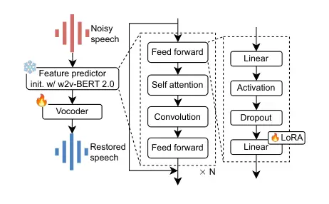

# Sidon: Fast and Robust Open-Source Multilingual Speech Restoration for Large-scale Dataset Cleansing

Wataru Nakata    Yuki Saito    Yota Ueda    Hiroshi Saruwatari

###### Abstract

Large-scale text-to-speech (TTS) systems are limited by the scarcity of
clean, multilingual recordings. We introduce Sidon, a fast, open-source
speech restoration model that converts noisy in-the-wild speech into
studio-quality speech and scales to dozens of languages. Sidon consists
of two models: w2v-BERT 2.0 finetuned feature predictor to cleanse
features from noisy speech and vocoder trained to synthesize restored
speech from the cleansed features. Sidon achieves restoration
performance comparable to Miipher: Google’s internal speech restoration
model with the aim of dataset cleansing for speech synthesis. Sidon is
also computationally efficient, running up to 500 $`\times`$ faster than
real time on a single GPU. We further show that training a TTS model
using a Sidon-cleansed automatic speech recognition corpus improves the
quality of synthetic speech in a zero-shot setting. Code and model are
released to facilitate reproducible dataset cleansing for the research
community.

###### Index Terms: 

speech restoration, self-supervised learning model, multilingual, TTS,
vocoder

^(†)^(†)address: The University of Tokyo, Japan.

## 1 Introduction

Recent advances in deep learning have demonstrated remarkable progress
across a variety of domains, largely enabled by scaling model capacity
and dataset size. Similar trends can be observed in speech synthesis,
where data quantity and quality play a critical role to improve the
quality of synthetic speech. In fact, recent text-to-speech (TTS) models
are trained on tens of thousand hours of speech corpus \[1, 2\] and for
spoken language modeling, the number becomes even larger as they are
trained on million hours of speech \[3, 4\]. However, unlike text or
image domains, expanding training data by crawling in-the-wild speech
samples for speech synthesis is particularly challenging due to the
presence of noise, artifacts, and recording environment.

To address these issues, speech restoration \[5, 6, 7\] aims to map
noisy, in-the-wild speech to clean, studio-quality speech. The task
typically combines speech enhancement, dereverberation,
super-resolution, and codec-artifact removal. Notably, Miipher \[6\] and
Miipher-2 \[7\] have proven effective at converting real-world
recordings into studio-quality speech, and have been adopted in datasets
such as LibriTTS-R \[8\] and FLEURS-R \[9\]. However, their
closed-source nature restricts accessibility and limits applicability to
new datasets. Open-source alternatives exist, but they are often
monolingual and trained under limited noise conditions on relatively
small datasets, which hinders generalization and reduces their utility
for large-scale dataset restoration.

In this paper, we present Sidon, an open-source multilingual speech
restoration model designed for large-scale dataset cleansing. Sidon is
computationally efficient, enabling practical use for cleansing large
corpora, and supports diverse languages beyond English. We conduct three
set of experiments: (i) speech restoration on English data, (ii) speech
restoration across 100 languages, and (iii) English TTS training using
Sidon-processed datasets. Results show that Sidon achieves performance
comparable to Miipher, and Sidon effectively improves the quality of TTS
training data, thereby enhancing downstream speech synthesis quality.
Speech samples, demo and code are available at our project page¹¹ 1
[https://hf.co/spaces/Wataru/SidonSamples](https://hf.co/spaces/Wataru/SidonSamples).

## 2 Related work

Speech restoration, also known as universal speech enhancement, aims to
recover clean speech from signals degraded by noise, reverberation,
bandwidth limitations, and other artifacts. VoiceFixer \[5\] introduced
a two-stage analysis–synthesis pipeline that predicts intermediate
representations from degraded speech and uses a neural vocoder to
synthesize high-fidelity audio; it restores speech corrupted by noise,
reverberation, clipping, and also upscales low-bandwidth signals to
44.1 kHz. Several work explored the generative modeling approach for
speech restoration \[10, 11, 12\] and demonstrated its effectiveness for
improving the perceptual quality of restored speech. However, these work
have focused on English, limited noise conditions, and relatively small
training sets, yielding insufficient generalization for large-scale
dataset cleansing.

To improve generalization, Miipher was proposed. Miipher integrates
self-supervised learning (SSL) model representations from
w2v-BERT \[13\] and linguistic conditioning from PnG-BERT \[14\] to
predict clean features that condition a neural vocoder, enabling robust
restoration across diverse degradations and facilitating training
high-quality TTS models from cleansed ASR datasets \[6\]. Its successor,
Miipher-2, leverages the Universal Speech Model (USM) \[15\] as a frozen
feature extractor and trains parallel adapters \[16\] to predict clean
USM representations from noisy inputs, improving cross-lingual
generalization and scaling to million-hour corpora without explicit text
or speaker conditioning \[7\]. Crucially, these systems are trained at
scale (e.g., Miipher on 2,680 hours of English speech; Miipher-2 on
3,195 hours of multilingual speech), which contributes to strong
generalization required for universal dataset cleansing \[8, 9\].
Nevertheless, both models are closed-source, and their full training
data and recipes are unavailable, limiting applicability to new datasets
and hindering reproducibility.

Despite these advances, most open-source methods remain English-centric,
assume restricted degradation types, or are trained on comparatively
small corpora, and they rarely exploit multilingual self-supervised
encoders. Our work addresses these gaps by proposing Sidon: an open
source speech restoration model trained on diverse noise conditions on
large multilingual training dataset.

## 3 Sidon

Figure 1: Overall architecture of Sidon

Figure 1 shows the overall architecture of Sidon. Sidon is based on a
parametric resynthesis framework used in previous work \[6, 7\].

### 3.1 Feature predictor

Given a noisy waveform, feature predictor estimates an SSL feature
extracted from clean speech. In order to achieve generalized speech
restoration across many languages, it is pivotal to use an SSL model
trained on large datasets from multiple languages. Therefore, we use
w2v-BERT 2.0 \[17\] as a feature predictor. This model is trained on
4.5M hours of speech in 143 languages, making it suitable for the
multilingual speech restoration. Specifically, the feature predictor is
initialized with the parameters of pretrained w2v-BERT 2.0. Then, an
output linear layer in each feed forward network of Conformer
blocks \[18\] are updated using low rank adaptation (LoRA) \[19\]
similar to \[7\]. This strategy not only reduces training cost, but also
prevents the catastrophic forgetting of the pretrained knowledge
obtained by SSL. For the clean SSL model feature extraction, we extract
the 8th layer hidden state from w2v-BERT 2.0. In previous research, it
is reported that earlier layer of an SSL model contains acoustic
features while the latter is more focused on semantic features \[20\].
In speech restoration, keeping the acoustic information such as speaker
identity and prosody is also important. Therefore, we choose the 8th
layer for the target layer.

### 3.2 Vocoder

The vocoder converts the predicted clean feature back to a waveform to
produce restored speech. For this purpose, we use HiFi-GAN \[21\]
extended with snake activation \[22\] similar to the Descript Audio
Codec (DAC) \[23\] decoder as its model structure.

### 3.3 Dataset collection

| Name                | SF  | Lang.                             | Dur. \[h\] |
| ------------------- | --- | --------------------------------- | ---------- |
| HiFi-CAPTAIN \[24\] | 48k | ja, en                            | 36         |
| EARS \[25\]         | 48k | en                                | 100        |
| EXPRESSO \[26\]     | 48k | en                                | 40         |
| JSUT \[27\]         | 48k | ja                                | 10         |
| Bible-TTS \[28\]    | 48k | akan, ewe, hausa, lingala, yoruba | 80         |
| VCTK \[29\]         | 48k | en                                | 44         |
| JVS \[27\]          | 24k | ja                                | 24         |
| FLEURS-R \[9\]      | 24k | 102 langs                         | 1.3k       |
| LibriTTS-R \[8\]    | 24k | en                                | 585        |
| Total               |     | 104                               | 2,219      |

Table 1: List of datasets used in Sidon training. “SF,” “Lang.,” and
“Dur.’ stands for sampling frequency of speech, language, and durations,
respectively.

In order to achieve speech restoration with high fidelity and good
generalization, collecting sufficient amount of data with good recording
quality is pivotal. Therefore, we collected multiple publicly available
datasets. Table 1 shows the list of the collected datasets. In Total, we
collected 2,219 hours of speech across 104 languages.

### 3.4 Training

We use three-stage training strategy. In the first stage, feature
predictor is trained. In the second stage, vocoder is trained on the
ground-truth clean SSL feature. Finally, the vocoder is finetuned on the
predicted SSL feature obtained from the first stage.

For the vocoder trainings in the second and third stages, only 48 kHz
datasets were used as mixing with 24 kHz data would hurt the fidelity of
the trained models while all the corpora listed are used for training
feature predictor.

In the first stage, feature predictor is trained to minimize the mean
squared error (MSE) loss between the predicted and target SSL features.
For vocoder training in the second and third stages, we used a
combination of MSE loss between generated and target mel-spectrograms,
adversarial loss, and feature matching loss following the original
HiFi-GAN paper \[21\].

### 3.5 Differences from Miipher-2

Sidon follows similar architecture to Miipher-2 apart from three main
differences. The first difference is the SSL model. Miipher-2 uses the
13th layer hidden state of 2B parameter USM model. However, this USM
model is closed source. Therefore, Sidon uses the 8th layer hidden state
of open-sourced 600M parameter w2v-BERT 2.0 model. The second difference
is that Sidon produces 48 kHz full-fidelity speech using HiFi-GAN with
snake activation as its vocoder while Miipher-2 produces 24 kHz speech
using WaveFiT \[30\]. Lastly, Miipher-2 was trained on 3,195 hours of
Google internal data while Sidon is trained on 2,219 hours of curated
high-quality public datasets.

## 4 Experiment

To validate the speech restoration performance and multilingual ability
of Sidon, we performed following experiments: (i) speech restoration in
English and multilingual settings, (ii) dataset cleansing for zero-shot
TTS model training, (iii) and inference speed comparison with different
batch sizes.

### 4.1 Experimental conditions

For clean speech dataset, we used corpora listed on Table 1. When
training, valid, and test sets were specified, the split were followed.
Otherwise, all samples were used as the training set.

Data preparation: To train a generalized speech restoration model,
diversity in degradation is important as we never know what kind of
artifact present in the in-the-wild data. Therefore, we used a
degradation simulation pipeline following previous work \[31\]. This
pipeline applies degradation in following order: reverberation,
background noise, band limitation, clipping, codec, and packet loss.
Each degradation was applied with a probability of 50%.

1.  1.  Reverberation: We used pyroomacoustics \[32\] for simulating room
        impulse responses (RIRs). Specifically, random RT60 and rectangular
        cuboid room dimensions were drawn from $`\mathcal{U}(0.1,2.0)`$
        seconds and $`\mathcal{U}(2,20)`$ m respectively. Based on the drawn
        RT60 and room dimensions, wall absorption and maximum order of the
        image-source method \[33\] were calculated using sabine’s equation.
        Then, RIRs were simulated.
2.  2.  Background noise: We formed a noise pool from AudioSet \[34\], Free
        Music Archive, WHAM! \[35\], FSD50K \[36\], and synthetic wind noise
        generated by SC-Wind-Noise-Generator \[37\]. For each clean
        utterance, we randomly sampled a single noise recording from this
        pool. The selected noise was looped to exceed the utterance duration
        and then truncated to match exactly, and it was added at an SNR
        drawn from $`\mathcal{U}(-5,20)`$ dB.
3.  3.  Band limitation: The input speech was randomly resampled at {8, 16,
        22.05, 24, 44.1, 48} kHz sampling rate before being converted back
        to the original sampling rate.
4.  4.  Clipping: The input speech was randomly clipped by setting its new
        minimum value to the value corresponding to a quantile uniformly
        chosen between the 0th and 10th percentiles, and its new maximum
        value to the value corresponding to a quantile uniformly chosen
        between the 90th and 100th percentiles of the original signal.
5.  5.  Codec: We applied the MP3 compression with a random average bitrate
        ranging from 65 kbps to 245 kbps.
6.  6.  Packet loss: Random 9% segments of speech were selected for packet
        loss. For each segment duration sampled from
        $`\mathcal{U}(20,200)`$ milliseconds were selected to be replaced
        with zeros to simulate packet loss.

The noising pipeline was applied four times. As a result, we obtained
roughly 9,000 hours of paired (clean, noisy) speech data.

|              | WER$`\downarrow`$ | SpkSim$`\uparrow`$ | NISQA$`\uparrow`$   | DNSMOS$`\uparrow`$  |
| ------------ | ----------------- | ------------------ | ------------------- | ------------------- |
| Noisy        | 0.040             | -                  | 4.093 $`\pm`$ 0.017 | 3.179 $`\pm`$ 0.008 |
| Miipher      | 0.047             | 0.942              | 4.688 $`\pm`$ 0.010 | 3.134 $`\pm`$ 0.009 |
| Sidon (ours) | 0.045             | 0.971              | 4.790 $`\pm`$ 0.010 | 3.303 $`\pm`$ 0.007 |

(a) Results for “test-clean” set.

|              | WER$`\downarrow`$ | SpkSim$`\uparrow`$ | NISQA$`\uparrow`$   | DNSMOS$`\uparrow`$  |
| ------------ | ----------------- | ------------------ | ------------------- | ------------------- |
| Noisy        | 0.079             | -                  | 3.623 $`\pm`$ 0.019 | 2.949 $`\pm`$ 0.010 |
| Miipher      | 0.090             | 0.930              | 4.597 $`\pm`$ 0.011 | 3.040 $`\pm`$ 0.010 |
| Sidon (ours) | 0.095             | 0.961              | 4.698 $`\pm`$ 0.011 | 3.219 $`\pm`$ 0.008 |

(b) Results for “test-other” set

Table 2: Evaluation results for speech restoration on LibriTTS
“test-clean” and “test-other” sets. Best results among the restored
speech are highlighted in bold. Values after $`\pm`$ indicates 95%
confidence intervals. Only Miipher is a text conditioned model.

|         | CER$`\downarrow`$ |           |              | DNSMOS$`\uparrow`$  |                     |                     | NISQA$`\uparrow`$   |                     |                     | SpkSim$`\uparrow`$ |           |              |
| ------- | ----------------- | --------- | ------------ | ------------------- | ------------------- | ------------------- | ------------------- | ------------------- | ------------------- | ------------------ | --------- | ------------ |
| Lang    | noisy             | Miipher-2 | Sidon (ours) | noisy               | Miipher-2           | Sidon (ours)        | noisy               | Miipher-2           | Sidon (ours)        | noisy              | Miipher-2 | Sidon (ours) |
| cmn     | 0.266             | 0.287     | 0.280        | 3.112 $`\pm`$ 0.013 | 3.397 $`\pm`$ 0.007 | 3.374 $`\pm`$ 0.006 | 3.595 $`\pm`$ 0.026 | 4.373 $`\pm`$ 0.015 | 4.364 $`\pm`$ 0.012 | -                  | 0.984     | 0.984        |
| en      | 0.051             | 0.061     | 0.061        | 2.925 $`\pm`$ 0.053 | 3.393 $`\pm`$ 0.013 | 3.466 $`\pm`$ 0.010 | 3.091 $`\pm`$ 0.104 | 4.459 $`\pm`$ 0.015 | 4.491 $`\pm`$ 0.016 | -                  | 0.982     | 0.976        |
| es      | 0.021             | 0.022     | 0.022        | 3.133 $`\pm`$ 0.015 | 3.336 $`\pm`$ 0.007 | 3.399 $`\pm`$ 0.006 | 3.638 $`\pm`$ 0.030 | 4.546 $`\pm`$ 0.010 | 4.515 $`\pm`$ 0.012 | -                  | 0.978     | 0.978        |
| ru      | 0.042             | 0.046     | 0.043        | 3.005 $`\pm`$ 0.018 | 3.307 $`\pm`$ 0.012 | 3.364 $`\pm`$ 0.009 | 3.420 $`\pm`$ 0.041 | 4.550 $`\pm`$ 0.013 | 4.490 $`\pm`$ 0.013 | -                  | 0.984     | 0.986        |
| fr      | 0.043             | 0.052     | 0.048        | 3.125 $`\pm`$ 0.018 | 3.278 $`\pm`$ 0.014 | 3.336 $`\pm`$ 0.011 | 3.633 $`\pm`$ 0.029 | 4.428 $`\pm`$ 0.015 | 4.386 $`\pm`$ 0.013 | -                  | 0.986     | 0.987        |
| pt      | 0.028             | 0.032     | 0.038        | 2.951 $`\pm`$ 0.022 | 3.399 $`\pm`$ 0.007 | 3.450 $`\pm`$ 0.006 | 3.364 $`\pm`$ 0.037 | 4.481 $`\pm`$ 0.010 | 4.514 $`\pm`$ 0.009 | -                  | 0.969     | 0.964        |
| ko      | 0.173             | 0.183     | 0.179        | 2.914 $`\pm`$ 0.036 | 3.431 $`\pm`$ 0.010 | 3.465 $`\pm`$ 0.009 | 3.191 $`\pm`$ 0.030 | 4.507 $`\pm`$ 0.016 | 4.480 $`\pm`$ 0.016 | -                  | 0.979     | 0.980        |
| ja      | 0.212             | 0.225     | 0.213        | 2.673 $`\pm`$ 0.045 | 3.479 $`\pm`$ 0.006 | 3.453 $`\pm`$ 0.006 | 2.913 $`\pm`$ 0.042 | 4.562 $`\pm`$ 0.011 | 4.472 $`\pm`$ 0.009 | -                  | 0.959     | 0.958        |
| tr      | 0.040             | 0.044     | 0.041        | 3.069 $`\pm`$ 0.020 | 3.417 $`\pm`$ 0.008 | 3.449 $`\pm`$ 0.007 | 3.365 $`\pm`$ 0.039 | 4.556 $`\pm`$ 0.009 | 4.524 $`\pm`$ 0.009 | -                  | 0.973     | 0.973        |
| pl      | 0.030             | 0.036     | 0.033        | 2.912 $`\pm`$ 0.023 | 3.274 $`\pm`$ 0.013 | 3.333 $`\pm`$ 0.011 | 3.544 $`\pm`$ 0.044 | 4.621 $`\pm`$ 0.009 | 4.573 $`\pm`$ 0.009 | -                  | 0.984     | 0.983        |
| Average | 0.084             | 0.094     | 0.090        | 2.910 $`\pm`$ 0.003 | 3.352 $`\pm`$ 0.001 | 3.393 $`\pm`$ 0.001 | 3.252 $`\pm`$ 0.005 | 4.475 $`\pm`$ 0.002 | 4.420 $`\pm`$ 0.002 | -                  | 0.979     | 0.979        |

Table 3: Evaluation results for speech restoration on the FLEURS test
set. Best values among the restored speech are shown in bold. Due to the
space constraint, we only show 10 major languages based on Whisper’s
dataset distribution \[3\] but the full 100 languages results are
available online at our project page. Please note that “average”
indicates averaged results of “all” 100 languages.

DNN architecture: For feature predictor, we set the LoRA adapter setting
to $`\alpha=16`$, LoRA dropout of 0.1 and rank of $`64`$. For the
vocoder, we set the upsampling rates to $`\{8,5,4,3,2\}`$, resulting in
a 960 times upsampling for converting 50 Hz w2v-BERT 2.0 features into
48 kHz full fidelity speech and input channels to 1,536 to match the
dimension of SSL feature. For other hyperparameters regarding the
vocoder, we followed the same values as the previous work \[23\].

DNN optimization: We used AdamW optimizer \[38\]
($`\beta_{1}=0.9,\beta_{2}=0.999`$) with learning rate of
$`1\times 10^{-4}`$ with weight decay of $`0.01`$. Learning rate
exponential decay was applied when training the vocoder to stabilize
training with $`\gamma=0.9998`$. The feature predictor was trained for
400k steps (four days) with batch size of 256, and the vocoder was
pretrained for 140k steps (two days) and finetuned for 280k steps (four
days) with batch size of 32. All trainings were conducted on eight
NVIDIA H200 GPUs. The number of parameters were 198M (five million
trainable parameters) for the feature predictor and 52.4M for the
vocoder. In total, Sidon has 250M parameters.

### 4.2 Speech restoration evaluation

To evaluate speech restoration capability of Sidon, we compare Sidon
against Miipher on two different settings: English and multilingual
speech restoration.

In the English setting, we used “test-clean” and “test-other” subsets of
LibriTTS \[39\]. Even though we do not have direct access to the
Google’s internal Miipher model, restored samples on “test-clean” and
“test-other” subsets are available as LibriTTS-R. We used these restored
samples for evaluation. Please note that Miipher is a text-conditioned
model while Sidon is not. Therefore, Miipher uses ground-truth
transcript upon restoration.

In the multilingual setting, we used the test set of FLEURS \[40\].
Similar to LibriTTS-R, FLEURS-R contains Miipher-restored samples in the
test set. Note that Miipher used for restoring FLEURS in our experiment
differed from the one used in LibriTTS-R and it had identical
architecture to Miipher-2 \[7\]. However, details of the model used in
FLEURS-R such as training dataset are not disclosed in any papers. We
refer to this model as “Miipher-2” in this paper for convenience. We
noticed that FLEURS-R lacks approximately 10% of samples from FLEURS.
Therefore, we only used test set samples included in FLEURS-R. Unlike
Miipher, Miipher-2 is not a text-conditioned model. Therefore, we can
expect fair comparison between Sidon and Miipher-2 regarding the text
conditioning. Evaluation was conducted on 100 languages selected from
102 languages in FLEURS as we could not find any publicly available ASR
models supporting Filipino (fil_ph) and Oriya (or_in).

We used four metrics for evaluation. For spoken content preservation, we
used word error rate (WER) in the English setting and character error
rate (CER) in the multilingual setting. These metrics measure distance
between transcribed results by an ASR model against the ground-truth
scripts. For the ASR model, mms-1B-all \[41\] available on HuggingFace²²
2
[https://hf.co/facebook/mms-1b-all](https://hf.co/facebook/mms-1b-all),
which covers 1,162 languages with its model size of 1B parameter. For
restoration quality, we used NISQA \[42\] and DNSMOS \[43\] quality
predictors. These are commonly used for quantifying the quality of
restored speech. Specifically, we used overall quality scores predicted
by NISQA and DNSMOS. For speaker preservation, we used cosine similarity
of speaker embeddings (SpkSim) those extracted from input noisy speech
and the restored speech. For speaker embedding extraction, we used
wavlm-base-plus-sv available on HuggingFace³³ 3
[https://hf.co/microsoft/wavlm-base-plus-sv](https://hf.co/microsoft/wavlm-base-plus-sv).

### 4.3 TTS evaluation using cleansed in-the-wild ASR dataset

To investigate the effectiveness of Sidon as a preprocessing tool for
TTS model training, we trained a TTS model on a Sidon-cleansed ASR
corpus. For the corpus to be cleansed, we used TED-LIUM release
3 \[44\], which is a 452 hours of speech dataset designed for ASR
studies. It consists of TED talks recorded mostly in a hall. Therefore
it contains reverberation and noise.

For TTS model, we used F5-TTS \[45\], which is a zero-shot TTS model
based on flow matching \[46\]. For comparison, we compared Sidon with
two conventional open-source speech restoration / separation models for
cleansing TED-LIUM release 3: VoiceFixer \[5\] and Demucs \[47\].
VoiceFixer is an open-source speech restoration model, and Demucs is an
open-source music separation model capable of separating speech from
background music; both have been used for dataset cleansing \[48, 49\].
We compared “Original” (i.e., unprocessed) TED-LIUM release 3 to
investigate the effectiveness of dataset cleansing. Upon training of
F5-TTS, we resampled all samples to 24 kHz and performed training using
the base model configuration of F5-TTS. The training was performed for
750k steps on eight H200 GPUs.

For evaluation, we performed a five-scale mean opinion score (MOS) test
on the sound quality following previous work \[6\]. The number of raters
was 120 and each raters evaluated 16 samples. To prepare test samples,
we used the initial 40% of each utterance as the speaker prompt and the
other 60% were synthesized and used for evaluation.

### 4.4 Inference speed evaluation

To efficiently cleanse large-scale in-the-wild corpora, the cleansing
pipeline must be computationally lightweight. We therefore measured the
real-time factor (RTF) of Sidon on an NVIDIA H200 using batch sizes
$`\{1,2,4,8\}`$ in bfloat16. The measurements were taken with 16 kHz 30
seconds speech input.

## 5 Results

### 5.1 Speech restoration evaluation

Table 2(a) and 2(b) show the result of speech restoration for
“test-clean” and “test-other” subsets in the English setting,
respectively. The results show that Sidon achieves strong performance on
“test-clean” and better performance on “test-other” in all metrics
except for WER. Please note that Miipher is a text-conditioned model
while Sidon is not. Therefore, Miipher has an advantage in WER as it can
utilize textual information. Table 3 shows the result of multilingual
speech restoration. In terms of sound quality, a comparison of DNSMOS
and NISQA scores between the noisy inputs and the Sidon outputs shows
that Sidon consistently improves the sound quality in any tested
language, exhibiting its success in speech restoration. On average,
Sidon outperforms Miipher-2 in CER and DNSMOS, is comparable in SpkSim,
and is slightly worse in NISQA. Therefore, Sidon’s performance is
comparable to Miipher-2 despite relying on the smaller SSL model. This
may be due to the use of a more comprehensive degradation simulation
pipeline with six different degradations whereas Miipher-2 only
simulates reverberation, background noise and codec artifacts.
Additionally, please note that NISQA might not be well-suited for
multilingual evaluation as its trained on subjective evaluation results
from English speech only.

### 5.2 ASR dataset cleansing for TTS

| Preprocess model | MOS$`\uparrow`$     |
| ---------------- | ------------------- |
| Original (noisy) | 3.254 $`\pm`$ 0.089 |
| Demucs \[47\]    | 3.265 $`\pm`$ 0.086 |
| VoiceFixer \[5\] | 3.771 $`\pm`$ 0.102 |
| Sidon (ours)     | 4.248 $`\pm`$ 0.109 |

Table 4: Result of MOS test of TTS model trained on TED-LIUM Release 3
with each preprocess models. Values after with 95% confidence intervals.
Best result shown in bold. There are statistical significance
($`p`$-value $`<`$ 0.05) between all models except for “Original” and
“Demucs.”

Table 4 shows the result of TTS model training with Sidon-cleansed
dataset. The result shows that Sidon outperforms other conventional
open-source restoration / separation models and the original noisy data
in terms of the quality of synthetic speech. This indicates that Sidon
can effectively improve the quality of training data, thereby enhancing
the performance of downstream TTS task.

### 5.3 Inference speed evaluation result

| Batch size | RTF                    |
| ---------- | ---------------------- |
| 1          | $`0.002\,260\,235\,5`$ |
| 2          | $`0.002\,096\,504\,7`$ |
| 4          | $`0.002\,050\,022\,2`$ |
| 8          | 0.0019988926           |

Table 5: Batch scaling of elapsed time and RTF on GPU (NVIDIA H200).
Results measured with 30 seconds 16 kHz audio input.

Table 5 summarizes Sidon’s inference efficiency (RTF) as a function of
batch size. With batch size 8 on a single GPU, Sidon runs approximately
500$`\times`$ faster than real time implying that restoring a 1M-hour
corpus would take about 2000 hours on one GPU—substantially reducing the
cost of constructing large-scale studio quality speech datasets.

## 6 Conclusion

In this paper, we presented Sidon, an open-source multilingual speech
restoration model designed for large-scale dataset cleansing. Sidon is
computationally efficient, enabling practical use in large corpus
cleansing, and supports diverse languages beyond English. Experimental
results demonstrated that Sidon achieves performance comparable to
closed-source models like Miipher and effectively improves the quality
of training data, thereby enhancing downstream speech synthesis quality.
We believe that Sidon will be a valuable tool for the speech synthesis
community, facilitating the development of high-quality, large-scale
speech datasets.

Acknowledgements: This work was supported by JST Moonshot JPMJMS2011,
JSPS KAKENHI, Grant Number 25KJ0806, Research Grant S of the Tateisi
Science and Technology Foundation and the AIST policy-based budget
project “R&D on Generative AI Foundation Models for the Physical
Domain.”

## References

- \[1\] Z. Ju Y. Wang et al. (2024) NaturalSpeech 3: zero-shot speech
  synthesis with factorized codec and diffusion models. In Proc. ICML,
  Cited by: §1.
- \[2\] M. Le A. Vyas et al. (2023) Voicebox: text-guided multilingual
  universal speech generation at scale. In Proc. NeurIPS, Cited by: §1.
- \[3\] A. Radford et al. (2022) Robust speech recognition via
  large-scale weak supervision. arXiv:2212.04356. Cited by: §1, Table 3,
  Table 3.
- \[4\] A. D’efossez L. Mazar’e et al. (2024) Moshi: a speech-text
  foundation model for real-time dialogue. arXiv abs/2410.00037. Cited
  by: §1.
- \[5\] H. Liu X. Liu et al. (2022) VoiceFixer: A Unified Framework for
  High-Fidelity Speech Restoration. In Proc. Interspeech, External
  Links: [Document](https://dx.doi.org/10.21437/Interspeech.2022-11026),
  ISSN 2958-1796 Cited by: §1, §2, §4.3, Table 4.
- \[6\] Y. Koizumi H. Zen et al. (2023) Miipher: a robust speech
  restoration model integrating self-supervised speech and text
  representations. In Proc. WASPAA, External Links:
  [Document](https://dx.doi.org/10.1109/WASPAA58266.2023.10248089) Cited
  by: §1, §2, §3, §4.3.
- \[7\] S. Karita Y. Koizumi et al. (2025) Miipher-2: a universal speech
  restoration model for million-hour scale data restoration. In Proc.
  WASPAA, Cited by: §1, §2, §3.1, §3, §4.2.
- \[8\] Y. Koizumi H. Zen et al. (2023) LibriTTS-R: a restored
  multi-speaker text-to-speech corpus. In Proc. Interspeech, External
  Links: [Document](https://dx.doi.org/10.21437/Interspeech.2023-1584),
  ISSN 2958-1796 Cited by: §1, §2, Table 1.
- \[9\] M. Ma Y. Koizumi et al. (2024) FLEURS-R: A Restored Multilingual
  Speech Corpus for Generation Tasks. In Proc. Interspeech, External
  Links: [Document](https://dx.doi.org/10.21437/Interspeech.2024-1356),
  ISSN 2958-1796 Cited by: §1, §2, Table 1.
- \[10\] Z. Wang X. Zhu et al. (2024) SELM: speech enhancement using
  discrete tokens and language models. In Proc. ICASSP, Cited by: §2.
- \[11\] H. R. Guimarães J. Su et al. (2025) DiTSE: high-fidelity
  generative speech enhancement via latent diffusion transformers. arXiv
  abs/2504.09381. Cited by: §2.
- \[12\] T. Dhyani F. Lux et al. (2025) High-resolution speech
  restoration with latent diffusion model. In Proc. ICASSP, Vol. .
  External Links:
  [Document](https://dx.doi.org/10.1109/ICASSP49660.2025.10890277) Cited
  by: §2.
- \[13\] Y. Chung Y. Zhang et al. (2021) W2v-BERT: combining contrastive
  learning and masked language modeling for self-supervised speech
  pre-training. In Proc. ASRU, Vol. . External Links:
  [Document](https://dx.doi.org/10.1109/ASRU51503.2021.9688253) Cited
  by: §2.
- \[14\] Y. Jia H. Zen et al. (2021) PnG BERT: augmented bert on
  phonemes and graphemes for neural tts. In Proc. Interspeech, External
  Links: [Document](https://dx.doi.org/10.21437/Interspeech.2021-1757),
  ISSN 2958-1796 Cited by: §2.
- \[15\] Y. Zhang W. Han et al. (2023) Google USM: scaling automatic
  speech recognition beyond 100 languages. arXiv abs/2303.01037. Cited
  by: §2.
- \[16\] J. He C. Zhou et al. (2022) Towards a unified view of
  parameter-efficient transfer learning. In Proc. ICLR, Cited by: §2.
- \[17\] L. Barrault Y. Chung et al. (2023) Seamless: multilingual
  expressive and streaming speech translation. arXiv abs/2312.05187.
  Cited by: §3.1.
- \[18\] A. Gulati J. Qin et al. (2020) Conformer: convolution-augmented
  transformer for speech recognition. In Proc. Interspeech, Cited by:
  §3.1.
- \[19\] E. J. Hu Y. Shen et al. (2022) LoRA: low-rank adaptation of
  large language models. In Proc. ICLR, Cited by: §3.1.
- \[20\] A. Pasad, B. Shi, and K. Livescu (2023) Comparative layer-wise
  analysis of self-supervised speech models. In Proc. ICASSP, Cited by:
  §3.1.
- \[21\] J. Kong, J. Kim, and J. Bae (2020) HiFi-GAN: Generative
  adversarial networks for efficient and high fidelity speech synthesis.
  In Proc. NeurIPS, External Links: ISSN 10495258 Cited by: §3.2, §3.4.
- \[22\] L. Ziyin, T. Hartwig, and M. Ueda (2020) Neural networks fail
  to learn periodic functions and how to fix it. In Proc. NeurIPS, Cited
  by: §3.2.
- \[23\] R. Kumar P. Seetharaman et al. (2023) High-fidelity audio
  compression with improved RVQGAN. In NeurIPS, Cited by: §3.2, §4.1.
- \[24\] (2023) Hi-Fi-CAPTAIN: High-fidelity and high-capacity
  conversational speech synthesis corpus developed by NICT. Note:
  https://ast-astrec.nict.go.jp/en/release/hi-fi-captain/ Cited by:
  Table 1.
- \[25\] J. Richter Y. Wu et al. (2024) EARS: an anechoic fullband
  speech dataset benchmarked for speech enhancement and dereverberation.
  In Proc. Interspeech, Cited by: Table 1.
- \[26\] T. A. Nguyen W. Hsu et al. (2023) Expresso: a benchmark and
  analysis of discrete expressive speech resynthesis. In Proc.
  Interspeech, Cited by: Table 1.
- \[27\] S. Takamichi R. Sonobe et al. (2020) JSUT and JVS: free
  japanese voice corpora for accelerating speech synthesis research.
  Acoustical Science and Technology. Cited by: Table 1, Table 1.
- \[28\] J. Meyer D. Adelani et al. (2022) BibleTTS: a large,
  high-fidelity, multilingual, and uniquely African speech corpus. In
  Proc. Interspeech, Cited by: Table 1.
- \[29\] J. Yamagishi, C. Veaux, and K. MacDonald (2019) CSTR VCTK
  corpus: English multi-speaker corpus for CSTR voice cloning toolkit
  (version 0.92). In CSTR, Cited by: Table 1.
- \[30\] Y. Koizumi K. Yatabe et al. (2023) Wavefit: an iterative and
  non-autoregressive neural vocoder based on fixed-point iteration. In
  Proc. SLT, Vol. . Cited by: §3.5.
- \[31\] K. Saijo W. Zhang et al. (2025) Interspeech 2025 URGENT Speech
  Enhancement Challenge. In Proc. Interspeech, External Links: ISSN
  2958-1796 Cited by: §4.1.
- \[32\] R. Scheibler, E. Bezzam, and I. Dokmanić (2018)
  Pyroomacoustics: a python package for audio room simulation and array
  processing algorithms. In Proc. ICASSP, Cited by: item 1.
- \[33\] {. B. Allen and {. A. Berkley (1979) Image method for
  efficiently simulating small-room acoustics. Journal of the Acoustical
  Society of America. Cited by: item 1.
- \[34\] J. F. Gemmeke D. P. Ellis et al. (2017) Audio set: an ontology
  and human-labeled dataset for audio events. In Proc. ICASSP, Cited by:
  item 2.
- \[35\] G. Wichern J. Antognini et al. (2019) WHAM!: extending speech
  separation to noisy environments. In Proc. Interspeech, Cited by:
  item 2.
- \[36\] E. Fonseca X. Favory et al. (2022) FSD50K: an open dataset of
  human-labeled sound events. TASLP. Cited by: item 2.
- \[37\] D. Mirabilii, A. Lodermeyer, F. Czwielong, S. Becker, and E.
  A.P. Habets (2022) Simulating wind noise with airflow speed-dependent
  characteristics. In Proc. IWAENC, Cited by: item 2.
- \[38\] I. Loshchilov and F. Hutter (2019) Decoupled weight decay
  regularization. In Proc. ICLR, Cited by: §4.1.
- \[39\] H. Zen V. Dang et al. (2019) LibriTTS: a corpus derived from
  librispeech for text-to-speech. In Proc. Interspeech, Cited by: §4.2.
- \[40\] A. Conneau M. Ma et al. (2023) FLEURS: few-shot learning
  evaluation of universal representations of speech. In Proc. SLT, Vol.
  . Cited by: §4.2.
- \[41\] V. Pratap A. Tjandra et al. (2024) Scaling speech technology to
  1,000+ languages. Journal of Machine Learning Research. Cited by:
  §4.2.
- \[42\] G. Mittag B. Naderi et al. (2021) NISQA: a deep
  CNN-self-attention model for multidimensional speech quality
  prediction with crowdsourced datasets. In Proc. Interspeech, Cited by:
  §4.2.
- \[43\] C. K. A. Reddy, V. Gopal, and R. Cutler (2022) DNSMOS p.835: a
  non-intrusive perceptual objective speech quality metric to evaluate
  noise suppressors. In Proc. ICASSP, Cited by: §4.2.
- \[44\] F. Hernandez V. Nguyen et al. (2018) TED-LIUM 3: twice as much
  data and corpus repartition for experiments on speaker adaptation. In
  Speech and Computer, Cited by: §4.3.
- \[45\] Y. Chen Z. Niu et al. (2025) F5-TTS: a fairytaler that fakes
  fluent and faithful speech with flow matching. In Proc. ACL, Cited by:
  §4.3.
- \[46\] Y. Lipman R. T. Q. Chen et al. (2023) Flow matching for
  generative modeling. In Proc. ICLR, Cited by: §4.3.
- \[47\] S. Rouard, F. Massa, and A. Défossez (2023) Hybrid Transformers
  for music source separation. In Proc. ICASSP, Vol. . Cited by: §4.3,
  Table 4.
- \[48\] J. Giraldo M. Llopart et al. (2024) Enhancing crowdsourced
  audio for text-to-speech models. In Proc. IberSPEECH 2024, Cited by:
  §4.3.
- \[49\] K. Seki S. Takamichi et al. (2025) TTSOps: a closed-loop corpus
  optimization framework for training multi-speaker tts models from dark
  data. arXiv abs/2506.15614. Cited by: §4.3.
