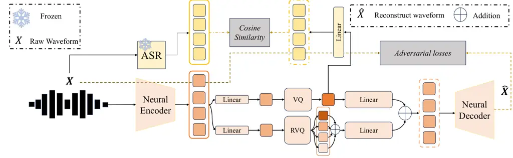
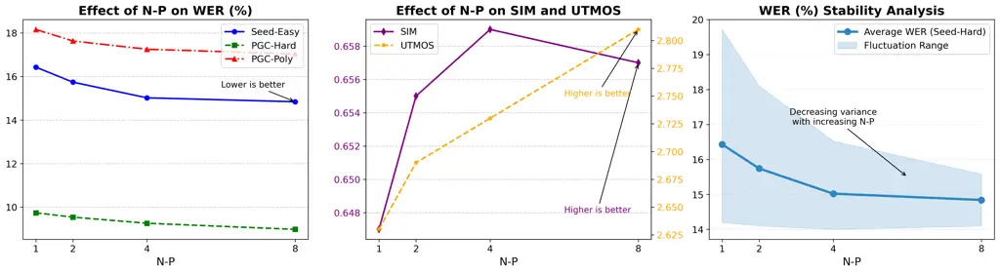
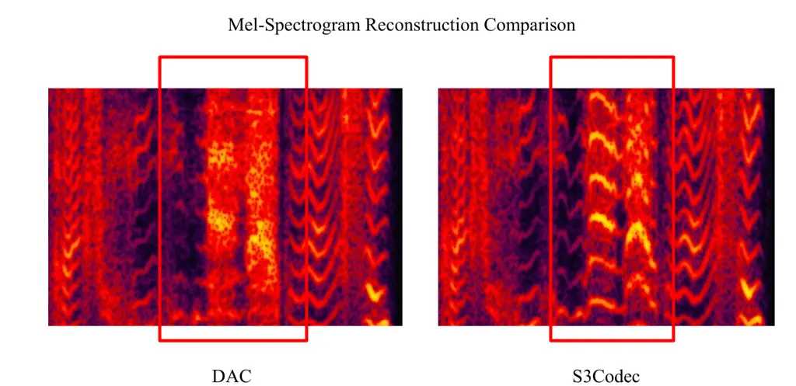

# Comprehend and Talk: Text to Speech Synthesis via Dual Language Modeling

Affiliation: Junjie Cao Affiliation: Yichen Han Affiliation: Ruonan
Zhang Affiliation: Xiaoyang Hao Affiliation: Hongxiang Li
Affiliation: Shuaijiang Zhao Affiliation: Yue Liu Affiliation: Xiao-Ping
Zhang Affiliation:  Tsinghua University Affiliation:  Peking University
Affiliation: AMAP Speech

###### Abstract

Existing Large Language Model (LLM) based autoregressive (AR)
text-to-speech (TTS) systems, while achieving state-of-the-art quality,
still face critical challenges. The foundation of this LLM-based
paradigm is the discretization of the continuous speech waveform into a
sequence of discrete tokens by neural audio codec. However, single
codebook modeling is well suited to text LLMs, but suffers from
significant information loss; hierarchical acoustic tokens, typically
generated via Residual Vector Quantization (RVQ), often lack explicit
semantic structure, placing a heavy learning burden on the model.
Furthermore, the autoregressive process is inherently susceptible to
error accumulation, which can degrade generation stability. To address
these limitations, we propose CaT-TTS, a novel framework for robust and
semantically-grounded zero-shot synthesis. First, we introduce S3Codec,
a split RVQ codec that injects explicit linguistic features into its
primary codebook via semantic distillation from a state-of-the-art ASR
model, providing a structured representation that simplifies the
learning task. Second, we propose an “Understand-then-Generate”
dual-Transformer architecture that decouples comprehension from
rendering. An initial “Understanding” Transformer models the cross-modal
relationship between text and the audio’s semantic tokens to form a
high-level utterance plan. A subsequent “Generation” Transformer then
executes this plan, autoregressively synthesizing hierarchical acoustic
tokens. Finally, to enhance generation stability, we introduce Masked
Audio Parallel Inference (MAPI), a nearly parameter-free inference
strategy that dynamically guides the decoding process to mitigate local
errors. Extensive experiments demonstrate that the synergy of our
principled architecture and semantically-aware codec allows CaT-TTS to
achieve new state-of-the-art performance in zero-shot voice cloning,
with MAPI providing a measurable boost in generation robustness on
benchmark datasets.

|     |
| --- |
|     |

## 1 Introduction

Large Language Model (LLM) based autoregressive (AR) models have
achieved state-of-the-art quality in zero-shot Text-to-Speech (TTS) with
discrete audio representations (Wang et al., 2023; Du et al., 2024a; Du
et al., 2024b; Anastassiou et al., 2024). With a few seconds of audio
prompt, current TTS models are able to synthesize speech for any given
text and mimic the speaker of the audio prompt. Contrary to NAR models
 (Chen et al., 2024b; Le et al., 2023), the sequential nature of AR
models, where each acoustic token is conditioned on all its
predecessors, naturally captures the long-range temporal dependencies
essential for rendering intricate intonation, rhythm, and emotional
nuance. This sequential process synergizes perfectly with the in-context
learning (ICL) capabilities of LLMs (Ye et al., 2025b; Wang et al.,
2025b), providing a powerful mechanism for propagating the fine-grained
acoustic characteristics of a voice prompt throughout a newly
synthesized utterance.

Despite the remarkable progress in LLM-based zero-shot TTS, several
fundamental challenges persist. The foundation of this LLM-based
paradigm is the discretization of the continuous speech waveform into a
sequence of discrete tokens, a task handled by a neural audio
codec (Kreuk et al., 2022; Copet et al., 2023). Semantic tokens,
typically derived from discretized self-supervised learning (SSL)
models, are considered to exhibit high alignment with text while leading
to poor reconstruction (Du et al., 2024a; Ye et al., 2025a; Gong et al.,
2025). In contrast, acoustic tokens often derived from speech codecs
trained through residual vector quantization GAN (RVQ-GAN), are
recognized for capturing the details of the audio waveform, enabling
high-quality synthesis, but lack explicit semantic grounding, forcing
the LLM to learn the complex mapping from text to raw acoustic
properties from scratch (Défossez et al., 2024; Kumar et al., 2023; Han
et al., 2025). We assume that a better audio tokenizer should contain
rich semantic information to facilitate an easy understanding of audio
content, thus reducing the language model’s burden in interpreting
tokens, and contains acoustic information for speech reconstruction. For
better linguistic understanding and acoustic reconstruction, inspired by
Mimi codec and SpeechTokenizer (Défossez et al., 2024; Zhang et al.,
2023a), we propose S3Codec, a split residual vector quantization speech
codec with semantic distillation. However, rather than using SSL models,
we adopt a pretrained state-of-the-art ASR model for semantic
distillation, which we assume brings more explicit linguistic features.

We argue that speech synthesis is fundamentally an
information-increasing process, where a thorough understanding of the
source conditions is a prerequisite for accurate and effective
generation (Chu et al., 2023; Xu et al., 2025; Xie & Wu, 2024). To
embody this principle, we propose CaT-TTS, a novel ”Comprehend-and-Talk”
text-to-speech framework, realized through a dual-transformer
architecture that explicitly decouples contextual comprehension from
acoustic rendering. Our first module, the Semantic Transformer, operates
autoregressively on the semantic level. Its sole purpose is to model the
rich interplay between the input text and the core semantic content of
the voice prompt, building a holistic high-level representation, a
latent “plan” for the entire utterance. Following this, our second
module, the Acoustic Transformer, takes this contextual plan as its
foundation and executes the synthesis. It generates the detailed
acoustic tokens autoregressively. This design allows the model first to
understand “what” and “how”, and then generates the “sound”, which
dramatically reduces the modeling burden at each step, leading to more
coherent and expressive output.

While our architectural design provides a more stable foundation, the
challenge of long sequence lengths in speech remains (Zhang et al.,
2023b; Le et al., 2023). Even with our proposed high compression ratio
codec, which significantly shortens the acoustic token sequences, the
risk of error accumulation persists in any AR system. To overcome this
challenge, inspired by Classifier-Free Guidance (CFG) in diffusion
models (Ho & Salimans, 2022) and Parallel Scaling Laws (Chen et al.,
2025), we introduce Masked Audio Parallel Inference (MAPI). It
constructs parallel computing streams with different masked audio tokens
and aggregates these streams adaptively with learnable weights. This
technique acts as a corrective mechanism, steering the model back on
track when it begins to “hallucinate” and ensuring robust output.

In summary, we propose a novel zero-shot TTS system CaT-TTS powered by
S3Codec. S3Codec encompasses acoustic and semantic information with low
bit rates. Based on S3Codec, Cat-TTS embodies an understand and then
generate rules via a dual language modeling strategy. To mitigate the
error accumulation problem in audio language models, we introduce Masked
Audio Parallel Inference strategy, which is beneficial for more robust
token generation. Extensive experiments have shown that CaT-TTS has
achieved a comparable or superior quality to existing models in terms of
speech quality, similarity, and intelligibility.

## 2 Related Work

Speech Tokenization. The success of autoregressive language models has
spurred progress in speech LLMs, where speech tokenizers are essential
for converting continuous signals into discrete tokens. Speech
tokenizers are typically categorized as acoustic or semantic (Wang
et al., 2025a; Yang et al., 2025). Acoustic tokens, optimized for signal
reconstruction, capture detailed acoustic features beneficial for
generation, but perform poorly on understanding tasks like ASR. Previous
semantic tokenizers can be trained in two ways: (1) applying clustering
or VQ to the representations of self-supervised learning models (Zhang
et al., 2023a; Défossez et al., 2024). (2) applying a VQ layer to the
intermediate layer of ASR models (Du et al., 2024a; Du et al., 2024b).
These semantic tokenizers typically use a single codebook, have a simple
architecture, are rich in linguistic information, and are well-suited
for LLMs. However, finer-grained acoustic details such as pitch and
prosody, are lost, resulting in poor performance on generation
tasks (Łajszczak et al., 2024; Betker, 2023). An alternative for audio
tokenization is to use multi-codebook residual vector quantization
(RVQ). In RVQ, an audio frame is represented by a sum of vectors from
several quantizers, allowing for high-fidelity reconstruction over a
range of bitrates by capturing details that single-codebook models often
miss (Kumar et al., 2023; Défossez et al., 2022; Zeghidour et al.,
2021). To align residual speech codec tokens with large text models,
recent efforts have explored modeling both semantic and acoustic
features simultaneously. SpeechTokenizer (Zhang et al., 2023a) enhances
the RVQGAN paradigm with semantic distillation to guide the first layer
of RVQ to align with a teacher SSL model. X-codec (Ye et al., 2025a)
proposes an X-shaped structure where each layer of RVQ contains semantic
and acoustic information. Mimi (Défossez et al., 2024) argues that
distilling semantic information into the first level of a single RVQ
will trade the auido quality restoration performance of the residual
codebooks. Similar to Mimi, we propose S3Codec: a Split RVQ Speech
Tokenizer with Semantic Distillation. Unlike Mimi, we adopt DAC
architecture with pretrained Whisper for semantic distillation. This
approach allows S3Codec to have good acoustic restoration ability and
stronger linguistic information.

LLM-based Zero-Shot TTS. Inspired by the success of LLM, several recent
works adopt language models to model text-to-speech (TTS) tasks (Chen
et al., 2024a; Kharitonov et al., 2023; Meng et al., 2024). The
LLM-based TTS systems are typically trained on tens of thousands of
hours of speech data and have hundreds of millions of parameters, hence
can leverage the emergent abilities of LLMs like in-context learning to
enable zero-shot TTS. VALL-E pioneered treating TTS as a conditional
language modeling problem by converting waveforms into neural codec
tokens. Spear-TTS (Kharitonov et al., 2023) integrates multiple AR
models to support multispeaker TTS with minimal supervision. Many
systems use a single discrete codebook to quantize semantic
features (Wang et al., 2025b; Ye et al., 2025b). Although simple, this
bottleneck loses fine acoustic detail (Han et al., 2025). Recent TTS
systems have often combined an AR language model with additional
components (Du et al., 2024a), such as diffusion, to generate more
natural, controllable speech when trained on large datasets. While these
methods can produce high-quality results, most of them neglect the
interactive understanding of speech and text modalities, instead
requiring continuous and fine-grained acoustic features for
supplementation. Storing and processing such large-scale features is
prohibitive, hindering training on hundreds of billions of tokens. In
contrast, our approach utilizes a dual-autoregressive structure powered
by a split RVQ discretization technique, with the first semantic
transformer for modality understanding and the second acoustic
transformer for acoustic information generation based on the context
guide produced by the semantic transformer. This
understand-then-generate paradigm fits the natural flow of speech, takes
advantage of the context learning of LLMs, and avoids the need for
additional acoustic features for supplementary reconstruction.

## 3 Method

### 3.1 S3Codec: Split RVQ with Semantic Distillation for Speech Tokenizer

To discretize waveforms into audio tokens, we introduce S3Codec, a
neural audio codec that operates as an autoencoder with a discrete
bottleneck. Figure 2 shows the architecture. Based on the DAC
architecture (Kumar et al., 2023), the encoder projects a single-channel
waveform $`\mathbf{x}\in\mathbb{R}^{T}`$ to a latent representation
$`\mathbf{A}=\textrm{enc}(\mathbf{x})\in\mathbb{R}^{L\times D}`$ by
cascading residual convolutional blocks that interleave dilated and
strided convolutions along with Snake nonlinearities and weight
normalizaton, and Quantizer quantize the latent representation to
disrete representations $`\mathbf{C}\in\mathbb{R}^{K\times L\times D}`$
where $`L`$ represents the length of encoded tokens, $`K`$ represents
the number of codebooks and $`D`$ represents the dimension of codebook.
Similarly to SpeechTokenizer and Mimi, we distill semantic information
into the first level of RVQ. However, instead of using SSL models like
HuBERT (Hsu et al., 2021) as a semantic teacher, we adopt
Whisper (Radford et al., 2023), a state-of-the-art model for automatic
speech recognition and speech translation whose hidden representation
contains rich explicit linguistic features. Mimi (Défossez et al., 2024)
found that, while distillation significantly improves the phonetic
discriminability of the first quantizer, it also negatively affects the
audio quality. To address the issue, we split the RVQ layers in a way
similar to Mimi. Rather than a single RVQ with $`K`$ levels, we distill
the semantic information into a plain VQ and apply an RVQ with $`K-1`$
levels in parallel; thus the constraint of acoustic information being
conserved in the residual of the semantic quantizer is removed.



Figure 1: S3Codec architecture overview.

Figure 2: An overview of CaT-TTS architecture. Semantic Transformer
models the temporal context information, while Acoustic Transformer
models the acoustic information from coarse to fine.

#### 3.1.1 Training Objective

S3Codec is trained with the combination of reconstruction, semantic
distillation and adversarial losses. Reconstruction and adversarial
losses can be found in Appendix E. For semantic distillation task, we
calculated the cosine distance between the output of the first quantizer
and the transformed Whisper embeddings, which is denoted as
$`\cos(\cdot)`$, to perform distillation. Formally, the distillation
loss is defined as follows:

```math
\displaystyle\mathcal{L}_{distill}=1-\frac{1}{L}\sum_{t=1}^{L}\cos(\mathbf{C}^{0}_{t},\textrm{Proj}(\mathbf{E}^{\mathcal{S}})_{t}), \tag{1}
```

where $`\mathbf{C}^{0}_{t}\in\mathbb{R}^{D}`$ represents the first
encoded embeddings for the frame $`t`$,
$`\mathbf{E}^{\mathcal{S}}\in\mathbb{R}^{L_{\mathcal{S}}\times D_{\mathcal{S}}}`$
represents the semantic embeddings obtained from the Whisper Encoder,
$`\textrm{Proj}(\cdot):\mathbb{R}^{L_{\mathcal{S}}\times D_{\mathcal{S}}}\to\mathbb{R}^{L\times D}`$
represents the projection operation that maps whisper latent embedding
to the space of audio embedding, $`L_{\mathcal{S}}`$ represents the
length of semantic frames, and
$`\textrm{Proj}(\mathbf{E}^{\mathcal{S}})_{t}`$ represents the projected
whisper embedding for frame $`t`$. The details of the overall training
objective are listed in the Appendix C.

### 3.2 Dual Language Modeling of Audio Tokens

#### 3.2.1 Problem Formulation

Given a dataset $`\mathcal{D}=\{\mathbf{x},\mathbf{y}\}`$, where
$`\mathbf{y}`$ is an audio sample and $`\mathbf{x}`$ is the
corresponding text transcription. We use a pre-trained neural codec
model to encode each audio sample into discrete codes, denoted as
$`\textrm{S3Codec}(\mathbf{y})=\mathbf{A}\in\mathbb{R}^{K\times L}`$,
where $`K`$ represents the number of codebooks, and $`L`$ is the
downsampled utterance length. $`\mathbf{A}_{t}\in\mathbb{R}^{K}`$
represents the $`K`$ codes for frame $`t`$ and $`\mathcal{A}_{t}^{k}`$
represents the code for the $`k`$-th codebook of frame $`t`$.
Mathematically, given the text prompt $`\mathcal{T}`$ and the speech
prompt $`\tilde{\mathbf{A}}`$, our target is to train a neural language
model to generate the discrete code matrix $`\mathbf{A}`$ with the
optimization objective of maximizing the distribution:

```math
\displaystyle\mathbb{P}(\mathbf{A}|\mathcal{T},\tilde{\mathbf{A}}). \tag{2}
```

To build such a model, we propose a dual auto-regressive Transformer
modeling framework. The dual auto-regressive (AR) Transformer models the
residual vector quantization (RVQ) output as a two-level autoregressive
process, operating first along the temporal axis and subsequently across
codebooks. The core intuition behind this design is to preserve both the
causal nature of speech generation and the hierarchical refinement
characteristic of RVQ. We denote the first transformer as the semantic
transformer, following the causal nature of speech generation and
context learning, while the second transformer is the acoustic
transformer, modeling the acoustic feature in a coarse-to-fine manner.

#### 3.2.2 Semantic Transformer

The semantic transformer functions as a thinker responsible for
processing and understanding the text and the audio modality, and
generating high-level representations. Mathematically, let
$`\mathcal{T}\in\mathbb{R}^{M}`$ represent the tokenized textual prompt,
$`\mathbf{A}\in\mathbb{R}^{K\times L}`$ represent the corresponding
speech, and $`\mathbf{A}^{i}\in\mathbb{R}^{L},i=\{0,\cdots,K-1\}`$
represent the speech codes in the i-th codebook, where $`M`$ represents
the length of the encoded text token and $`L`$ represents the length of
the encoded speech token. Given tokenized text prompt and encoded prompt
audio codes, the semantic transformer learns the linguistic features of
the text $`\mathcal{T}`$ and the discrete acoustic representation of the
prompt audio $`\tilde{\mathbf{A}}`$ and outputs a latent feature
$`\mathbf{H}^{ctx}`$ as a guide for the generation of subsequent speech
tokens. The optimization objective of the semantic transformer is
maximizing the distribution:

```math
\displaystyle\mathbb{P}(\mathbf{H}^{cxt}|\mathcal{T},\tilde{\mathbf{A}};\theta_{\mathcal{S}})=\prod_{t=1}^{L}\mathbb{P}(\mathbf{H}^{cxt}_{t}|\mathcal{T},\mathbf{H}^{ctx}_{<t},\tilde{\mathbf{A}};\theta_{\mathcal{S}}). \tag{3}
```

Speech Token Sequence Modeling. To be able to inject discrete speech
representations into LLM, some research proposes to use a single
codebook codec to make the speech modality well adapted in the way of
text tokens. CaT-TTS fits the RVQ paradigm and, specifically, the
multiple codebook information at each time step will be aggregated as
the speech representation of the current time step. Thus, at each time
step $`t`$, the audio representation can be formulated as
$`\mathbf{S}_{t}=\sum_{i=0}^{K-1}\mathcal{A}_{t}^{i}`$, where
$`\mathcal{A}_{t}^{i}`$ represents the $`i`$-th encoded representation
for frame t.

Next Token Embedding Prediction. In order to inject RVQ speech
representation into LLM, we sum the codebook dimensions of the
multi-codebook parallel sequence. Aggregation brings rich linguistic and
acoustic content to the semantic transformer; however, the speech
representation of each time step is no longer a quantitative
representation. To solve this problem, we propose direct embedding
prediction. Instead of predicting discrete token IDs and computing
cross-entropy loss, we directly predict the next embedding vector in the
continuous semantic space and optimize using Mean Squared Error Loss
between predicted and target embeddings. Specifically, our model learns
to predict the next semantic embedding as
$`\mathbf{H}^{ctx}_{t+1}=\theta_{\mathcal{S}}(\mathbf{H}^{ctx}_{1},\mathbf{H}^{ctx}_{2},...,\mathbf{H}^{ctx}_{t})`$,
where $`\mathbf{H}^{ctx}_{t}`$ represents the continuous semantic
embedding at position $`t`$. To be more task-specific, we denote
$`\mathbf{H}^{ctx}\doteq(\mathbf{T}\oplus\mathbf{S})`$, where
$`\mathbf{T}`$ represents the text modality, $`\mathbf{S}`$ represents
the audio modality, and $`\oplus`$ represents the concatenate operation.
We split the high-level representation and focus on speech modality;
thus the optimization objective can be formulated as follows:

```math
\displaystyle\mathbb{P}(\mathbf{H}^{cxt}|\mathcal{T},\tilde{\mathbf{A}};\theta_{\mathcal{S}})=\mathbb{P}(\mathbf{S}|\mathcal{T},\tilde{\mathbf{A}};\theta_{\mathcal{S}})=\prod_{t=1}^{L_{|S|}}\mathbb{P}(\mathbf{S}_{t}|\mathcal{T},\mathbf{S}_{<t},\tilde{\mathbf{A}};\theta_{\mathcal{S}}), \tag{4}
```

where $`L_{|S|}`$ represents the length of speech frames, as the text
tokens are ignored. To achieve this, we replace the standard
cross-entropy loss with MSE loss to handle continuous targets:

```math
\displaystyle\mathcal{L}_{ctx}=-\sum_{t=1}^{L_{|S|}}\log\mathbb{P}(\mathbf{S}_{t}|\mathcal{T},\mathbf{S}_{<t},\tilde{\mathbf{A}};\theta_{\mathcal{S}})\rightarrow\mathcal{L}_{ctx}=\sum_{t=1}^{L_{|S|}}||\mathbf{S}_{t}-\theta_{\mathcal{S}}(\mathbf{S}_{<t},\mathcal{T},\tilde{\mathbf{A}})||_{2}. \tag{5}
```

#### 3.2.3 Acoustic Transformer

The purpose of the acoustic transformer is to reconstruct discrete
speech representations from coarse-grained to fine-grained based on the
learned preceding text and speech modal information. The optimization
objective of the acoustic transformer is maximizing the following
distribution:

```math
\displaystyle\mathbb{P}(\mathbf{A}_{t}|\mathbf{S}_{t};\theta_{\mathcal{A}})=\prod_{k=0}^{K-1}\mathbb{P}(\mathcal{A}_{t}^{k}|\mathcal{A}_{t}^{<k},\mathbf{S}_{t};\theta_{\mathcal{A}}). \tag{6}
```

The combination of the semantic transformer and the acoustic transformer
can guide the generation of target audio through the understanding of
text and speech modalities, which conforms to the objective laws of
human speech production. Finally, the overall optimization objective
Eq.2 can be detailed as:

```math
\displaystyle\mathbb{P}(\mathbf{A}|\mathcal{T},\tilde{\mathbf{A}})=\prod_{t=1}^{L_{|S|}}\bigg[\mathbb{P}(\mathbf{S}_{t}|\mathbf{S}_{<t},\mathcal{T},\tilde{\mathbf{A}};\theta_{\mathcal{S}})\cdot\prod_{k=0}^{K-1}\mathbb{P}(\mathcal{A}_{t}^{k}|\mathcal{A}_{t}^{<k},\mathbf{S}_{t};\theta_{\mathcal{A}})\bigg]. \tag{7}
```

Consequently, the overall goal of training optimization objective is
fourmulated as follows:

```math
\displaystyle\mathcal{L}_{total}=\sum_{t=1}^{L_{|S|}}\bigg[||\mathbf{S}_{t}-\theta_{\mathcal{S}}(\mathbf{S}_{<t},\mathcal{T},\tilde{\mathbf{A}})||_{2}-\sum_{k=0}^{K-1}\log\mathbb{P}(\mathcal{A}_{t}^{k}|\mathcal{A}_{t}^{<k},\mathbf{S}_{t};\theta_{\mathcal{A}})\bigg]. \tag{8}
```

The mathematical derivation can be found in the Appendix D.

### 3.3 Masked Audio Parallel Inference

Due to the uncertainty of each token prediction, especially in speech
generation, errors accumulate, which reduces the expressiveness of the
generated speech. To address this challenge, inspired by (Chen et al.,
2025), we introduce Masked Audio Parallel Scaling in the semantic
generation module. Specifically, for each prompt token sequence, we
duplicate it $`P`$ times and apply a masking strategy to speech tokens
separately with a certain probability, resulting in a total of $`P`$
token sequences. The model then produces $`P`$ output sequences, and
these $`P`$ candidates are weighted and summed with a learnable weight
to produce the final output sequence. Formally, in our speech generation
task, the discrete text token embeddings and audio embeddings will be
concatenated, resulting in the input embeddings, denoted as
$`\mathbf{x}\in\mathbb{R}^{L_{in}\times D}`$. Specifically, we denote
our trained semantic transformer
$`\theta_{\mathcal{S}}:\mathbb{R}^{L_{in}\times D}\rightarrow\mathbb{R}^{L_{in}\times D}`$,
where $`\theta`$ is the parameter, $`L_{in}`$ is the length of input
text and audio embeddings and $`D`$ is the model dimension, the final
output is formulated in the following form:

```math
\displaystyle\mathrm{\theta}^{*}_{\mathcal{S}}(\mathbf{x})=w_{1}\theta_{\mathcal{S}}(\mathbf{z}_{1})+w_{2}\theta_{\mathcal{S}}(\mathbf{z}_{2})+\cdots+w_{P}\theta_{\mathcal{S}}(\mathbf{z}_{P}), \tag{9}
```

where $`P`$ denotes the number of parallel streams,
$`\mathbf{z}_{1},\cdots,\mathbf{z}_{p}`$ are $`P`$ distinct mask
transformations of $`\mathbf{x}`$, and $`w_{1},\cdots,w_{P}`$ are
adaptive-trained aggregation weights. More details can be found in the
Appendix B.

## 4 Experiments

|           |      |     |        |          |                   |                   |                     |                    |                  |
| --------- | ---- | --- | ------ | -------- | ----------------- | ----------------- | ------------------- | ------------------ | ---------------- |
| Tokenizer | CB   | Nq  | FR     | BR (bps) | PESQ $`\uparrow`$ | STOI $`\uparrow`$ | STFT $`\downarrow`$ | Mel $`\downarrow`$ | SIM $`\uparrow`$ |
| Encodec   | 1024 | 8   | 75Hz   | 6k       | 2.76              | 0.94              | 0.11                | 2.13               | 0.89             |
| DAC-8     | 1024 | 8   | 75Hz   | 6k       | 3.46              | 0.95              | 0.06                | 2.02               | 0.96             |
| S-T       | 1024 | 8   | 50Hz   | 4k       | 2.66              | 0.92              | 0.59                | 7.07               | 0.84             |
| Encodec-2 | 1024 | 2   | 75Hz   | 1.5k     | 1.56              | 0.94              | 0.23                | 4.45               | 0.90             |
| DAC-2     | 1024 | 2   | 75Hz   | 1.5k     | 1.51              | 0.83              | 0.12                | 3.36               | 0.49             |
| BigCodec  | 8192 | 1   | 80Hz   | 1.04k    | 2.68              | 0.93              | \-                  | \-                 | 0.84             |
| Xcodec    | 1024 | 2   | 50Hz   | 1k       | 2.33              | 0.87              | \-                  | \-                 | 0.72             |
| S-T       | 1024 | 2   | 50Hz   | 1k       | 1.25              | 0.77              | 0.68                | 8.02               | 0.36             |
| Mimi      | 2048 | 8   | 12.5Hz | 1.1k     | 2.24              | 0.90              | \-                  | \-                 | 0.73             |
| MBCodec   | 2048 | 8   | 25Hz   | 2.2k     | 2.98              | 0.94              | 0.17                | 3.62               | 0.87             |
| S3Codec   | 4096 | 8   | 12.5Hz | 1.2k     | 2.85              | 0.94              | 0.12                | 4.01               | 0.89             |

Table 1: Objective Evaluation Metrics for Comparison with Baseline
Codecs. S-T represents SpeechTokenizer for simplicity.

### 4.1 Audio Quantization and Reconstruction Analysis

S3Codec is trained on the subset of our amassed speech data.
Implementation details are listed in Appendix E.

Baselines. To assess the reconstruction performance of S3Codec, we
employ several state-of-the-art neural codecs as baselines, including
Encodec (Défossez et al., 2022), DAC (Kumar et al., 2023), QDAC (Han
et al., 2025), SpeechTokenizer (Zhang et al., 2023a), BigCodec (Xin
et al., 2024), Xcodec (Ye et al., 2025a) and MBCodec (Zhang et al.,
2025).

Evaluation Metrics. To evaluate the performance of S3Codec, we employ
several metrics, including SIM, STFT Distance, Mel Distance, short-time
objective intelligibility (STOI) (Taal et al., 2010) and perceptual
evaluation of speech quality (PESQ) (Rix et al., 2001). All evaluations
were conducted on the LibriSpeech (Panayotov et al., 2015) test-clean
subset. More detailed evaluation set up is listed in Appendix E.2.

|                      |                            |                  |                            |                  |                            |                  |
| -------------------- | -------------------------- | ---------------- | -------------------------- | ---------------- | -------------------------- | ---------------- |
| Model                | test-zh                    |                  | test-en                    |                  | test-hard                  |                  |
|                      | WER$`(\%)`$ $`\downarrow`$ | SIM $`\uparrow`$ | WER$`(\%)`$ $`\downarrow`$ | SIM $`\uparrow`$ | WER$`(\%)`$ $`\downarrow`$ | SIM $`\uparrow`$ |
| NAR-involved Models  |                            |                  |                            |                  |                            |                  |
| MaskGCT              | 2.27                       | 0.774            | 2.62                       | 0.714            | 10.27                      | 0.748            |
| E2 TTS (32 NFE)      | 1.97                       | 0.730            | 2.19                       | 0.710            | \-                         | \-               |
| F5-TTS (32 NFE)      | 1.56                       | 0.741            | 1.83                       | 0.647            | 8.67                       | 0.713            |
| Seed-TTS             | 1.12                       | 0.796            | 2.25                       | 0.762            | 7.59                       | 0.776            |
| FireRedTTS           | 1.51                       | 0.635            | 3.82                       | 0.460            | 17.45                      | 0.621            |
| CosyVoice            | 3.63                       | 0.723            | 4.29                       | 0.609            | 11.75                      | 0.709            |
| CosyVoice 2          | 1.45                       | 0.748            | 2.57                       | 0.652            | 6.83                       | 0.724            |
| CosyVoice 3-0.5B     | 1.16                       | 0.780            | 2.02                       | 0.718            | 6.08                       | 0.758            |
| Pure AR based Models |                            |                  |                            |                  |                            |                  |
| QTTS                 | 1.66                       | 0.648            | 3.17                       | 0.652            | 14.45                      | 0.641            |
| Spark-TTS            | 1.20                       | 0.672            | 1.98                       | 0.584            | \-                         | \-               |
| Llasa-1B-250k        | 1.89                       | 0.668            | 3.22                       | 0.572            | 12.13                      | 0.638            |
| Llasa-3B-250k        | 1.60                       | 0.675            | 3.14                       | 0.579            | 13.37                      | 0.652            |
| Llasa-8B-250k        | 1.59                       | 0.684            | 2.97                       | 0.574            | 11.09                      | 0.660            |
| CaT-TTS              | 1.56                       | 0.678            | 2.35                       | 0.668            | 9.75                       | 0.674            |

Table 2: Objective evaluation in the SeedTTS test datasets.

Evaluation Results. As shown in Table 1, S3Codec achieves
SOTA-comparable performance with a very low frame rate in most
evaluation dimensions. S3codec achieves higher SIM scores than MBcodec,
Mimi, and SpeechTokenizer with the same codebooks. In terms of the
restoration and perception indictors PESQ and STOI, S3codec is
comparable to the high bitrates Encodec and DAC-8. At the evaluation
dimension of STFT and Mel indicators, S3Codec also performs well among
low-bitrate codecs. These results provide preliminary evidence of the
model’s effectiveness in reconstructing speech. As for the semantic
evaluation, results in the Appendix E.2 demonstrate the superiority of
S3Codec.

### 4.2 Zero-shot TTS Performance

Datasets. To train the CaT-TTS models, we have amassed a considerable
dataset comprising multiple languages. The dataset contains about 200k
hours labeled speech, with about $`85\%`$ Chinese data and $`15\%`$
English data. We evaluate our zero-shot TTS models with five benchmarks:
(1) Seed-TTS test-en, a test set introduced in Seed-TTS of sample
extracted from English public corpora, includes 1,000 samples from the
Common Voice dataset. (2) SeedTTS test-zh, a test set introduced in
Seed-TTS of samples extracted from Chinese public corpora, includes
2,020 samples from the DiDiSpeech (Guo et al., 2021) dataset. (3)
Seed-TTS test-hard, includes 400 samples that consist of complex Chinese
sentences. (4) PGC-Hard, includes 1500 Chinese samples, containing
Professionally-Generated Content. (5) PGC-Poly, includes 1500 Chinese
samples, containing polyphonic characters. The PGC testset is specially
designed to test model generalization on difficult, out-of-domain
voices.

Evaluation Metrics. We adopt the word error rate (WER) and speaker
similarity (SIM) metrics for objective evaluation. For WER, we employ
Whisper-large-v3 (Radford et al., 2023) and Paraformer-zh (Gao et al., 2023) as the automatic speech recognition engines for English and
Mandarin, respectively. For SIM, we use WavLM-large fine-tuned on the
speaker verification task to obtain speaker embeddings used to calculate
the cosine similarity of speech samples of each test utterance against
reference clips. For naturalness, we use SpeechMOS MOS prediction model
to calculate UTMOS (Saeki et al., 2022) scores for evaluation.

Baselines. We compare our models with state-of-the-art zero-shot TTS
systems, including Seed-TTS (Anastassiou et al., 2024), FireRedTTS (Guo
et al., 2024), MaskGCT (Wang et al., 2024), E2 TTS (Eskimez et al.,
2024), F5-TTS (Chen et al., 2024b), CosyVoice (Du et al., 2024a),
CosyVoice2 (Du et al., 2024b), VALL-E (Wang et al., 2023) and QTTS (Han
et al., 2025). Details of each model can be found in the Appendix F.2.
In particular, we also compare the performance of SOTA two-stage models,
including VALL-E, CosyVoice, CosyVoice 2, QTTS and self-implement AR
(Llama) (Dubey et al., 2024) + flow-matching models (Lipman et al.,
2022), where L-CosyVoice50 means Llama backbone with 50 Hz semantic
codec (Hsu et al., 2021) and L-CosyVoice25 means with 25 Hz.

Training. We train CaT-TTS on 8 NVIDIA H20 96GB GPUs. The parallel
stream is set to 4. For more details about the model architecture,
please refer to Appendix F.1. We optimize the model with the AdamW
optimizer with a learning rate of 1e-5 and 20K warm-up steps.

|                   |            |                       |          |          |                 |                   |
| ----------------- | ---------- | --------------------- | -------- | -------- | --------------- | ----------------- |
| Model             | Model Size | WER$`(\%)\downarrow`$ |          |          | SIM$`\uparrow`$ | UTMOS$`\uparrow`$ |
|                   |            | Seed-Hard             | PGC-Hard | PGC-Poly | \-              | \-                |
| CosyVoice         | 0.3B       | 11.75                 | 7.86     | 16.22    | 0.709           | 3.01              |
| CosyVoice 2       | 0.5B       | 6.83                  | 6.11     | 14.25    | 0.713           | 3.02              |
| L-CosyVoice50^(†) | 0.2B       | 9.52                  | 8.15     | 18.71    | 0.691           | 2.92              |
| L-CosyVoice25^(†) | 0.5B       | 7.46                  | 6.83     | 13.84    | 0.706           | 2.99              |
| Q-TTS             | 0.2B       | 14.45                 | 7.89     | 14.37    | 0.654           | 3.03              |
| VALL-E^(†)        | 0.2B       | 13.12                 | 9.68     | 15.71    | 0.631           | 3.05              |
| CaT-TTS           | 0.4B       | 9.75                  | 7.03     | 13.97    | 0.672           | 3.13              |

Table 3: Objective evaluation on hard mandarin test. ^(†) represents the
self-implemented model. $`-`$ means the average evaluation results
across three sets.

Evaluation Results. To evaluate CaT-TTS’s zero-shot TTS capatility, we
assess its performance on Seed-TTS-eval and compare it with existing
zero-shot TTS models. These experiments focus on cross-sentence speaker
similarity and the generation of intelligible speech. The results are
presented in Table 2. As can be seen, CaT-TTS demonstrates a significant
superiority in intelligibility for zero-shot TTS scenarios. With WER
$`1.56\%`$, $`2.35\%`$ and $`9.75\%`$ in test-zh, test-en and test-hard,
respectively, CaT-TTS achieves best or best comparable performance among
these baselines, especially in pure AR based models. In terms of
speaking similarity, like the other Pure AR based models, Cat-TTS’s
performance is inferior to NAR-involved models, especially pure NAR
models. The reason is that NAR models like F5-TTS generate based on more
explicit acoustic features like Mel-Spectrogram, and AR+NAR models
typically construct acoustic information with acoustic guidance like
speaker similarity vector in the NAR stage. Although with higher
indicator performance, we think it may degrade diversity and cause more
storage and processing cost during training. To do a further
comprehensive comparison on zero-shot TTS performance, we compared
recent prominent AR-based two-stage TTS models including VALL-E,
CosyVoice, QTTS and reproduced Llama-CosyVoice as baseline models, and
testify the synthesis capability in a more real scenarios. The
evaluation datasets including PGC-Hard and PGC-Poly, which contain more
complex real-life sentences and polyphonetic characters, respectively.
The results in Table 3 demonstrate that CaT-TTS has SOTA comparable
in-context learning ability. With WER 9.75$`\%`$, 7.03$`\%`$ and
13.97$`\%`$ in Seed-TTS test-zh-hard, PGC-Hard and PGC-Poly,
respectively. Q-TTS and VALL-E are Transformer-based TTS systems powered
by codec, which is similar to CaT-TTS. As can be seen, CaT-TTS achieves
better performance. Although without additional acoustic information
supplement through flow-matching, CaT-TTS has comparable or superior
performance in terms of UTMOS and WER, demonstrating the
context-learning ability of our system.

|             |                       |          |          |                 |                    |
| ----------- | --------------------- | -------- | -------- | --------------- | ------------------ |
| Model       | WER$`(\%)\downarrow`$ |          |          | SIM$`\uparrow`$ | UTMOS $`\uparrow`$ |
|             | SeedTTS-test          | PGC-Hard | PGC-Poly | \-              | \-                 |
| CaT-TTS w/o | 3.97                  | 11.83    | 18.34    | 0.649           | 2.64               |
| CaT-TTS     | 3.31                  | 9.74     | 16.57    | 0.658           | 2.78               |

Table 4: Objective Evaluation. Comparison between models trained with
and without semantic guidance.

### 4.3 Ablation Study

Modality UnderStanding. To demonstrate the effectiveness and superiority
of the modality understanding loss. We trained two models in sub-dataset
with the same architecture but with small model size, and one of them is
trained without semantic guidance. Table 4 shows the comparison results.
With the loss of semantic guidance removed, this leads to performance
decreases, especially with the WER increasing from $`3.31\%`$ to
$`3.97\%`$ in SeedTTS-test, $`9.74\%`$ to $`11.83\%`$ in PGC-Hard and
$`16.57\%`$ to $`18.34\%`$ in PGC-Poly, and the speech quality
indicators SIM and UTMOS have also been reduced. During model training,
semantic loss forces the semantic transformer to enhance its
understanding of text and semantic modalities, thus improving the
linguistic understanding ability of CaT-TTS. These results underscore
the pivotal role of semantic loss in ensuring accurate semantic
information learning, which is essential for maintaining high-fidelity
generation of acoustic transformer.



Figure 3: The result analysis of number of parallel streams.

Masked Audio Parallel Inference. To evaluate the effectiveness of masked
parallel inference, we trained CaT-TTS-small in the subset of the
collected dataset. We set different parallel streams and evaluated the
performance in the PGC-Hard, PGC-Poly, and SeedTTS test-zh-easy dataset.
Results in Figure 4 show the average performance analysis of MAPI
parallel streams. The left subfigure shows the speech intelligibility
improvement that MAPI brings. The middle subfigure shows that as the
number of parallel streams increases, the acoustic performance SIM score
and the UTMOS score show an upward trend. To demonstrate the robustness
of MAPI, each sample in these datasets will be evaluated 10 times. As
can be seen in the right subfigure in Figure 4, the performance of each
inference is more stable in terms of the WER indicator. Due to the
parallel computing capability of GPU, MAPI almost does not bring
additional time consumption, but as the number of parallel streams
increases, the utilization of GPU resources also increases. It is
necessary to select the most appropriate number of parallel streams
according to the requirements of the actual scenario.

## 5 Conclusion

In this work, we introduced CaT-TTS, a novel Text-to-Speech system
designed to address key challenges in representation and generation. At
its core is S3Codec, a split RVQ codec that resolves the trade-off
between reconstruction fidelity and semantic interpretability by
injecting linguistic features via ASR-based distillation. Building on
this semantically aware representation, we proposed a principled
“Understand-then-Generate” paradigm, realized through a dual-Transformer
architecture that decouples contextual comprehension from acoustic
rendering. To complement this, we developed Masked Audio Parallel
Inference (MAPI), a nearly parameter-free inference strategy that
enhances generation stability by dynamically mitigating local decoding
errors. Extensive experiments demonstrate that the synergy between our
architecture and codec allows CaT-TTS to achieve state-of-the-art
performance in zero-shot voice cloning, with MAPI providing a measurable
boost in robustness on benchmark datasets.

## References

- Anastassiou et al. (2024) Philip Anastassiou, Jiawei Chen, Jitong
  Chen, Yuanzhe Chen, Zhuo Chen, Ziyi Chen, Jian Cong, Lelai Deng,
  Chuang Ding, Lu Gao, et al. Seed-tts: A family of high-quality
  versatile speech generation models. _arXiv preprint
  arXiv:2406.02430_, 2024.
- Betker (2023) James Betker. Better speech synthesis through scaling.
  _arXiv preprint arXiv:2305.07243_, 2023.
- Chen et al. (2025) Mouxiang Chen, Binyuan Hui, Zeyu Cui, Jiaxi Yang,
  Dayiheng Liu, Jianling Sun, Junyang Lin, and Zhongxin Liu. Parallel
  scaling law for language models. _arXiv preprint
  arXiv:2505.10475_, 2025.
- Chen et al. (2024a) Sanyuan Chen, Shujie Liu, Long Zhou, Yanqing Liu,
  Xu Tan, Jinyu Li, Sheng Zhao, Yao Qian, and Furu Wei. Vall-e 2: Neural
  codec language models are human parity zero-shot text to speech
  synthesizers. _arXiv preprint arXiv:2406.05370_, 2024a.
- Chen et al. (2024b) Yushen Chen, Zhikang Niu, Ziyang Ma, Keqi Deng,
  Chunhui Wang, Jian Zhao, Kai Yu, and Xie Chen. F5-tts: A fairytaler
  that fakes fluent and faithful speech with flow matching. _arXiv
  preprint arXiv:2410.06885_, 2024b.
- Chu et al. (2023) Yunfei Chu, Jin Xu, Xiaohuan Zhou, Qian Yang,
  Shiliang Zhang, Zhijie Yan, Chang Zhou, and Jingren Zhou. Qwen-audio:
  Advancing universal audio understanding via unified large-scale
  audio-language models. _arXiv preprint arXiv:2311.07919_, 2023.
- Copet et al. (2023) Jade Copet, Felix Kreuk, Itai Gat, Tal Remez,
  David Kant, Gabriel Synnaeve, Yossi Adi, and Alexandre Défossez.
  Simple and controllable music generation. _Advances in Neural
  Information Processing Systems_, 36:47704–47720, 2023.
- Défossez et al. (2022) Alexandre Défossez, Jade Copet, Gabriel
  Synnaeve, and Yossi Adi. High fidelity neural audio compression.
  _arXiv preprint arXiv:2210.13438_, 2022.
- Défossez et al. (2024) Alexandre Défossez, Laurent Mazaré, Manu
  Orsini, Amélie Royer, Patrick Pérez, Hervé Jégou, Edouard Grave, and
  Neil Zeghidour. Moshi: a speech-text foundation model for real-time
  dialogue. _arXiv preprint arXiv:2410.00037_, 2024.
- Du et al. (2024a) Zhihao Du, Qian Chen, Shiliang Zhang, Kai Hu, Heng
  Lu, Yexin Yang, Hangrui Hu, Siqi Zheng, Yue Gu, Ziyang Ma, et al.
  Cosyvoice: A scalable multilingual zero-shot text-to-speech
  synthesizer based on supervised semantic tokens. _arXiv preprint
  arXiv:2407.05407_, 2024a.
- Du et al. (2024b) Zhihao Du, Yuxuan Wang, Qian Chen, Xian Shi, Xiang
  Lv, Tianyu Zhao, Zhifu Gao, Yexin Yang, Changfeng Gao, Hui Wang,
  et al. Cosyvoice 2: Scalable streaming speech synthesis with large
  language models. _arXiv preprint arXiv:2412.10117_, 2024b.
- Du et al. (2025) Zhihao Du, Changfeng Gao, Yuxuan Wang, Fan Yu, Tianyu
  Zhao, Hao Wang, Xiang Lv, Hui Wang, Chongjia Ni, Xian Shi, et al.
  Cosyvoice 3: Towards in-the-wild speech generation via scaling-up and
  post-training. _arXiv preprint arXiv:2505.17589_, 2025.
- Dubey et al. (2024) Abhimanyu Dubey, Abhinav Jauhri, Abhinav Pandey,
  Abhishek Kadian, Ahmad Al-Dahle, Aiesha Letman, Akhil Mathur, Alan
  Schelten, Amy Yang, Angela Fan, et al. The llama 3 herd of models.
  _arXiv e-prints_, pp. arXiv–2407, 2024.
- Eskimez et al. (2024) Sefik Emre Eskimez, Xiaofei Wang, Manthan
  Thakker, Canrun Li, Chung-Hsien Tsai, Zhen Xiao, Hemin Yang, Zirun
  Zhu, Min Tang, Xu Tan, et al. E2 tts: Embarrassingly easy fully
  non-autoregressive zero-shot tts. In _2024 IEEE Spoken Language
  Technology Workshop (SLT)_, pp. 682–689. IEEE, 2024.
- Gao et al. (2023) Zhifu Gao, Zerui Li, Jiaming Wang, Haoneng Luo, Xian
  Shi, Mengzhe Chen, Yabin Li, Lingyun Zuo, Zhihao Du, Zhangyu Xiao,
  et al. Funasr: A fundamental end-to-end speech recognition toolkit.
  _arXiv preprint arXiv:2305.11013_, 2023.
- Gong et al. (2025) Yitian Gong, Luozhijie Jin, Ruifan Deng, Dong
  Zhang, Xin Zhang, Qinyuan Cheng, Zhaoye Fei, Shimin Li, and Xipeng
  Qiu. Xy-tokenizer: Mitigating the semantic-acoustic conflict in
  low-bitrate speech codecs. _arXiv preprint arXiv:2506.23325_, 2025.
- Guo et al. (2024) Hao-Han Guo, Yao Hu, Kun Liu, Fei-Yu Shen, Xu Tang,
  Yi-Chen Wu, Feng-Long Xie, Kun Xie, and Kai-Tuo Xu. Fireredtts: A
  foundation text-to-speech framework for industry-level generative
  speech applications. _arXiv preprint arXiv:2409.03283_, 2024.
- Guo et al. (2021) Tingwei Guo, Cheng Wen, Dongwei Jiang, Ne Luo,
  Ruixiong Zhang, Shuaijiang Zhao, Wubo Li, Cheng Gong, Wei Zou, Kun
  Han, et al. Didispeech: A large scale mandarin speech corpus. In
  _ICASSP 2021-2021 IEEE International Conference on Acoustics, Speech
  and Signal Processing (ICASSP)_, pp. 6968–6972. IEEE, 2021.
- Han et al. (2025) Yichen Han, Xiaoyang Hao, Keming Chen, Weibo Xiong,
  Jun He, Ruonan Zhang, Junjie Cao, Yue Liu, Bowen Li, Dongrui Zhang,
  et al. Quantize more, lose less: Autoregressive generation from
  residually quantized speech representations. _arXiv preprint
  arXiv:2507.12197_, 2025.
- Ho & Salimans (2022) Jonathan Ho and Tim Salimans. Classifier-free
  diffusion guidance. _arXiv preprint arXiv:2207.12598_, 2022.
- Hsu et al. (2021) Wei-Ning Hsu, Benjamin Bolte, Yao-Hung Hubert Tsai,
  Kushal Lakhotia, Ruslan Salakhutdinov, and Abdelrahman Mohamed.
  Hubert: Self-supervised speech representation learning by masked
  prediction of hidden units. _IEEE/ACM transactions on audio, speech,
  and language processing_, 29:3451–3460, 2021.
- Kharitonov et al. (2023) Eugene Kharitonov, Damien Vincent, Zalán
  Borsos, Raphaël Marinier, Sertan Girgin, Olivier Pietquin, Matt
  Sharifi, Marco Tagliasacchi, and Neil Zeghidour. Speak, read and
  prompt: High-fidelity text-to-speech with minimal supervision.
  _Transactions of the Association for Computational Linguistics_,
  11:1703–1718, 2023.
- Kreuk et al. (2022) Felix Kreuk, Gabriel Synnaeve, Adam Polyak, Uriel
  Singer, Alexandre Défossez, Jade Copet, Devi Parikh, Yaniv Taigman,
  and Yossi Adi. Audiogen: Textually guided audio generation. _arXiv
  preprint arXiv:2209.15352_, 2022.
- Kumar et al. (2023) Rithesh Kumar, Prem Seetharaman, Alejandro Luebs,
  Ishaan Kumar, and Kundan Kumar. High-fidelity audio compression with
  improved rvqgan. _Advances in Neural Information Processing Systems_,
  36:27980–27993, 2023.
- Łajszczak et al. (2024) Mateusz Łajszczak, Guillermo Cámbara, Yang Li,
  Fatih Beyhan, Arent Van Korlaar, Fan Yang, Arnaud Joly, Álvaro
  Martín-Cortinas, Ammar Abbas, Adam Michalski, et al. Base tts: Lessons
  from building a billion-parameter text-to-speech model on 100k hours
  of data. _arXiv preprint arXiv:2402.08093_, 2024.
- Le et al. (2023) Matthew Le, Apoorv Vyas, Bowen Shi, Brian Karrer,
  Leda Sari, Rashel Moritz, Mary Williamson, Vimal Manohar, Yossi Adi,
  Jay Mahadeokar, et al. Voicebox: Text-guided multilingual universal
  speech generation at scale. _Advances in neural information processing
  systems_, 36:14005–14034, 2023.
- Lim & Ye (2017) Jae Hyun Lim and Jong Chul Ye. Geometric gan. _arXiv
  preprint arXiv:1705.02894_, 2017.
- Lipman et al. (2022) Yaron Lipman, Ricky TQ Chen, Heli Ben-Hamu,
  Maximilian Nickel, and Matt Le. Flow matching for generative modeling.
  _arXiv preprint arXiv:2210.02747_, 2022.
- Meng et al. (2024) Lingwei Meng, Long Zhou, Shujie Liu, Sanyuan Chen,
  Bing Han, Shujie Hu, Yanqing Liu, Jinyu Li, Sheng Zhao, Xixin Wu,
  et al. Autoregressive speech synthesis without vector quantization.
  _arXiv preprint arXiv:2407.08551_, 2024.
- Panayotov et al. (2015) Vassil Panayotov, Guoguo Chen, Daniel Povey,
  and Sanjeev Khudanpur. Librispeech: an asr corpus based on public
  domain audio books. In _2015 IEEE international conference on
  acoustics, speech and signal processing (ICASSP)_, pp. 5206–5210.
  IEEE, 2015.
- Radford et al. (2023) Alec Radford, Jong Wook Kim, Tao Xu, Greg
  Brockman, Christine McLeavey, and Ilya Sutskever. Robust speech
  recognition via large-scale weak supervision. In _International
  conference on machine learning_, pp. 28492–28518. PMLR, 2023.
- Rix et al. (2001) Antony W Rix, John G Beerends, Michael P Hollier,
  and Andries P Hekstra. Perceptual evaluation of speech quality
  (pesq)-a new method for speech quality assessment of telephone
  networks and codecs. In _2001 IEEE international conference on
  acoustics, speech, and signal processing. Proceedings (Cat. No.
  01CH37221)_, volume 2, pp. 749–752. IEEE, 2001.
- Saeki et al. (2022) Takaaki Saeki, Detai Xin, Wataru Nakata, Tomoki
  Koriyama, Shinnosuke Takamichi, and Hiroshi Saruwatari. Utmos:
  Utokyo-sarulab system for voicemos challenge 2022. _arXiv preprint
  arXiv:2204.02152_, 2022.
- Taal et al. (2010) Cees H Taal, Richard C Hendriks, Richard Heusdens,
  and Jesper Jensen. A short-time objective intelligibility measure for
  time-frequency weighted noisy speech. In _2010 IEEE international
  conference on acoustics, speech and signal processing_, pp. 4214–4217.
  IEEE, 2010.
- Wang et al. (2023) Chengyi Wang, Sanyuan Chen, Yu Wu, Ziqiang Zhang,
  Long Zhou, Shujie Liu, Zhuo Chen, Yanqing Liu, Huaming Wang, Jinyu Li,
  et al. Neural codec language models are zero-shot text to speech
  synthesizers. _arXiv preprint arXiv:2301.02111_, 2023.
- Wang et al. (2025a) Dingdong Wang, Junan Li, Mingyu Cui, Dongchao
  Yang, Xueyuan Chen, and Helen Meng. Speech discrete tokens or
  continuous features? a comparative analysis for spoken language
  understanding in speechllms. _arXiv preprint arXiv:2508.17863_, 2025a.
- Wang et al. (2025b) Xinsheng Wang, Mingqi Jiang, Ziyang Ma, Ziyu
  Zhang, Songxiang Liu, Linqin Li, Zheng Liang, Qixi Zheng, Rui Wang,
  Xiaoqin Feng, et al. Spark-tts: An efficient llm-based text-to-speech
  model with single-stream decoupled speech tokens. _arXiv preprint
  arXiv:2503.01710_, 2025b.
- Wang et al. (2024) Yuancheng Wang, Haoyue Zhan, Liwei Liu, Ruihong
  Zeng, Haotian Guo, Jiachen Zheng, Qiang Zhang, Xueyao Zhang, Shunsi
  Zhang, and Zhizheng Wu. Maskgct: Zero-shot text-to-speech with masked
  generative codec transformer. _arXiv preprint arXiv:2409.00750_, 2024.
- Xie & Wu (2024) Zhifei Xie and Changqiao Wu. Mini-omni: Language
  models can hear, talk while thinking in streaming. _arXiv preprint
  arXiv:2408.16725_, 2024.
- Xin et al. (2024) Detai Xin, Xu Tan, Shinnosuke Takamichi, and Hiroshi
  Saruwatari. Bigcodec: Pushing the limits of low-bitrate neural speech
  codec. _arXiv preprint arXiv:2409.05377_, 2024.
- Xu et al. (2025) Jin Xu, Zhifang Guo, Jinzheng He, Hangrui Hu, Ting
  He, Shuai Bai, Keqin Chen, Jialin Wang, Yang Fan, Kai Dang, et al.
  Qwen2. 5-omni technical report. _arXiv preprint
  arXiv:2503.20215_, 2025.
- Yang et al. (2025) Dongchao Yang, Songxiang Liu, Haohan Guo, Jiankun
  Zhao, Yuanyuan Wang, Helin Wang, Zeqian Ju, Xubo Liu, Xueyuan Chen,
  Xu Tan, et al. Almtokenizer: A low-bitrate and semantic-rich audio
  codec tokenizer for audio language modeling. _arXiv preprint
  arXiv:2504.10344_, 2025.
- Ye et al. (2025a) Zhen Ye, Peiwen Sun, Jiahe Lei, Hongzhan Lin,
  Xu Tan, Zheqi Dai, Qiuqiang Kong, Jianyi Chen, Jiahao Pan, Qifeng Liu,
  et al. Codec does matter: Exploring the semantic shortcoming of codec
  for audio language model. In _Proceedings of the AAAI Conference on
  Artificial Intelligence_, volume 39, pp. 25697–25705, 2025a.
- Ye et al. (2025b) Zhen Ye, Xinfa Zhu, Chi-Min Chan, Xinsheng Wang,
  Xu Tan, Jiahe Lei, Yi Peng, Haohe Liu, Yizhu Jin, Zheqi Dai, et al.
  Llasa: Scaling train-time and inference-time compute for llama-based
  speech synthesis. _arXiv preprint arXiv:2502.04128_, 2025b.
- Zeghidour et al. (2021) Neil Zeghidour, Alejandro Luebs, Ahmed Omran,
  Jan Skoglund, and Marco Tagliasacchi. Soundstream: An end-to-end
  neural audio codec. _IEEE/ACM Transactions on Audio, Speech, and
  Language Processing_, 30:495–507, 2021.
- Zhang et al. (2025) Ruonan Zhang, Xiaoyang Hao, Yichen Han, Junjie
  Cao, Yue Liu, and Kai Zhang. Mbcodec:thorough disentangle for
  high-fidelity audio compression, 2025. URL
  [https://arxiv.org/abs/2509.17006](https://arxiv.org/abs/2509.17006).
- Zhang et al. (2023a) Xin Zhang, Dong Zhang, Shimin Li, Yaqian Zhou,
  and Xipeng Qiu. Speechtokenizer: Unified speech tokenizer for speech
  large language models. _arXiv preprint arXiv:2308.16692_, 2023a.
- Zhang et al. (2023b) Ziqiang Zhang, Long Zhou, Chengyi Wang, Sanyuan
  Chen, Yu Wu, Shujie Liu, Zhuo Chen, Yanqing Liu, Huaming Wang, Jinyu
  Li, et al. Speak foreign languages with your own voice: Cross-lingual
  neural codec language modeling. _arXiv preprint arXiv:2303.03926_,
  2023b.

## Appendix A The use of Large Language Models

We acknowledge the use of large language models (LLMs), such as OpenAI’s
ChatGPT, as a writing-assistance tool during the preparation of this
manuscript. The primary use of the LLM was for improving the clarity and
readability of the text, correcting grammatical errors, and rephrasing
sentences. We emphasize that the LLM was used solely for text editing
and was not involved in the generation of core scientific ideas,
experimental design, data analysis, or the drawing of conclusions. All
intellectual content, arguments, and the final manuscript were produced
by the human authors, who take full responsibility for them.

## Appendix B Implementation Details of MAPI

Input Transformation We expect that the transformations applied to the
input embedding $`x`$ can significantly influence the output, which
avoids excessively similar outputs across different parallel streams.
Inspired by (Chen et al., 2025), we utilize random mask strategy to
implement input transformation. To be specific, we first duplicate the
input $`\mathbf{x}`$ into $`P`$ parallel copies, distinguishing them
with different mask segments in each attention layer, which is
sufficient to ensure diverse outputs across different streams.

Output Aggregation As stated in (Chen et al., 2025), dynamic aggregation
weights performs better than static ones. Similarly, we concatenate each
output together and use an MLP
$`h:\mathbb{R}^{d\times P}\to\mathbb{R}^{P}`$ to convert it into a
vector of length $`P`$ as aggregation weights. The process can be
formalized as:

```math
\displaystyle w_{1},\cdots,w_{P}\leftarrow\text{Softmax}(h(\text{Concat}[\theta_{\mathcal{S}}(\mathbf{z}_{1});\cdots;\theta_{\mathcal{S}}(\mathbf{z}_{P})])), \tag{10}
```

where Softmax ensures aggregation weights are normalized,
$`\mathbf{z}_{i}`$ represents masked input tokens. It can be seen as
dynamically weighting different parallel streams during forward process
for each token.

## Appendix C Model architecture and training recipe

### C.1 Model architecture and Setting

Model Architecture Our proposed audio codec is a fully convolutional
autoencoder consisting of an encoder, a Residual Vector Quantizer (RVQ),
and a decoder. The fundamental component of our architecture is a
residual block, which contains a strided convolution for dimensionality
change (downsampling or upsampling) followed by a stack of convolutional
layers. We utilize the non-linear Snake function as the activation
throughout these blocks. The encoder is composed of five such blocks,
which progressively downsample the input waveform with strides of \[2,
4, 5, 6, 8\]. The decoder mirrors this structure with five corresponding
upsampling blocks with strides of \[8, 6, 5, 4, 2\] and is configured
with an internal channel dimension of 2048.

Model Setting To train the model, we employ a GAN-based objective with a
combination of two discriminators: a multi-period discriminator \[18\]
with periods of \[2, 3, 5, 7, 11\], and a complex multi-scale STFT
discriminator. The STFT discriminator operates on three resolutions with
window lengths \[2048, 1024, 512\] and a hop length of 1/4 the window
size, using frequency band splits of \[0.0, 0.1, 0.25, 0.5, 0.75, 1.0\].
The total loss function is a weighted sum of a GAN loss, feature
matching loss, a codebook loss, and a multi-resolution reconstruction
loss. The reconstruction loss is computed as the L1 distance between the
log-mel spectrograms of the original and reconstructed audio over seven
different resolutions. These resolutions use window lengths of \[32, 64,
128, 256, 512, 1024, 2048\] with a corresponding number of mel bands
\[5, 10, 20, 40, 80, 160, 320\], respectively.

### C.2 Training Objective

Our model is trained with a multi-task objective that jointly optimizes
for reconstruction fidelity and semantic alignment. The primary task is
reconstruction, which is guided by a GAN-based objective comprising a
reconstruction term, a discriminative loss, and an RVQ commitment loss.
This is complemented by a semantic distillation task, which introduces
an additional loss term to ensure the model’s representations are
linguistically meaningful. In the following, $`\mathbf{x}`$ represents
an speech signal and $`\hat{\mathbf{x}}`$ denotes the reconstructed
signal.

Reconstruction Loss The reconstruction loss comprises a time and a
frequency domain loss. For time domain, we minimize the $`L1`$ distance
between $`\mathbf{x}`$ and $`\hat{\mathbf{x}}`$, i.e.
$`\mathcal{L}_{t}=||\mathbf{x}-\hat{\mathbf{x}}||_{1}`$. For frequency
domain, we use the $`L1`$ loss over the mel-spectrogram using several
time scales. Formally,
$`\mathcal{L}_{f}=\sum_{i\in e}||\mathcal{S}_{i}(\mathbf{x})-\mathcal{S}_{i}(\hat{\mathbf{x}})||_{1}`$,
where $`\mathcal{S}_{i}`$ is a 64-bins mel-spectrogram using a
normalized STFT with window size of $`2^{i}`$ and hop length of
$`2^{i}/4,e=5,\cdots,11`$ is the set of scales.

Discriminator Loss We use the same discriminator as  (Kumar et al., 2023) that consist of three discriminators. The adversarial loss is used
to promote perceptual quality and it is defined as a hinge loss (Lim &
Ye, 2017) over the logits of the discriminator, averaged over multiple
discriminators and over time. Let $`K`$ denote the number of
discriminators. For discriminators, $`\mathcal{L}_{D}`$ is defined as :

```math
\displaystyle\mathcal{L}_{D}=\frac{1}{K}\sum_{k=1}^{K}\max(1+D_{k}(\hat{\mathbf{x}}),0)+\max(1-D_{k}(\mathbf{x}),0). \tag{11}
```

The adversarial loss for the generator $`\mathcal{L}_{g}`$ is
constructed as follows:

```math
\displaystyle\mathcal{L}_{g}=\frac{1}{K}\sum_{k=1}^{K}\max(1-D_{k}(\hat{\mathbf{x}}),0). \tag{12}
```

Additionally, the feature matching loss for the generator is computed as
follow:

```math
\displaystyle\mathcal{L}_{feat}=\frac{1}{KL}\sum_{K=1}^{K}\sum_{l=1}^{L}\frac{||D_{k}^{l}(\mathbf{x})-D_{k}^{l}(\hat{\mathbf{x}})||_{1}}{mean(||D_{k}^{l}(\mathbf{x})||_{1})}, \tag{13}
```

where the mean is computed over all dimensions and $`L`$ is the number
of layers in discriminators. RVQ Commitment Loss We add a commitment
loss $`\mathcal{L}_{w}`$ between the pre-quantized value, and its
quantized value, without gradient computed for the quantized value. The
commitment loss is defined as :
$`\mathcal{L}_{w}=\sum_{i=1}^{N_{q}}||\mathbf{z}_{i}-\mathbf{z}_{q_{i}}||`$,
where $`\mathbf{z}_{i}`$ and $`\mathbf{z}_{q_{i}}`$ denote current
residual and nearest entry in the corresponding codebook respectively.

The generator is trained to optimize the following loss:

```math
\displaystyle\mathcal{L}_{G}=\lambda_{t}\mathcal{L}_{t}+\lambda_{f}\mathcal{L}_{f}+\lambda_{g}\mathcal{L}_{g}+\lambda_{feat}\mathcal{L}_{feat}+\lambda_{w}\mathcal{L}_{w}+\lambda_{distill}\mathcal{L}_{distill}, \tag{14}
```

where $`\lambda_{all}`$ are the hyper-parameters used to balance each
loss item. The detailed values are refered to  (Kumar et al., 2023).
$`\lambda_{distill}`$ is set to 0.1 in our work, and
$`\mathcal{L}_{distill}`$ has been described in Section 3.1.1.

## Appendix D Training Objective of CaT-TTS

We use the maximum likelihood function to solve this problem.

```math
\displaystyle\mathcal{L}_{total} \displaystyle=-\log\mathbb{P}(\mathbf{A}|\mathcal{T},\tilde{\mathbf{A}})
```

```math
\displaystyle=-\log\prod_{t=1}^{L_{|S|}}\bigg[\mathbb{P}(\mathbf{S}_{t}|\mathbf{S}_{<t},\mathcal{T},\tilde{\mathbf{A}};\theta_{\mathcal{S}})\cdot\prod_{k=0}^{K-1}\mathbb{P}(\mathcal{A}_{t}^{k}|\mathcal{A}_{t}^{<k},\mathbf{S}_{t};\theta_{\mathcal{A}})\bigg]
```

```math
\displaystyle=-\sum_{t=1}^{L_{|S|}}\log\bigg[\mathbb{P}(\mathbf{S}_{t}|\mathbf{S}_{<t},\mathcal{T},\tilde{\mathbf{A}};\theta_{\mathcal{S}})\cdot\prod_{k=0}^{K-1}\mathbb{P}(\mathcal{A}_{t}^{k}|\mathcal{A}_{t}^{<k},\mathbf{S}_{t};\theta_{\mathcal{A}})\bigg]
```

```math
\displaystyle=-\sum_{t=1}^{L_{|S|}}\bigg[\log\mathbb{P}(\mathbf{S}_{t}|\mathbf{S}_{<t},\mathcal{T},\tilde{\mathbf{A}};\theta_{\mathcal{S}})+\log\prod_{k=0}^{K-1}\mathbb{P}(\mathcal{A}_{t}^{k}|\mathcal{A}_{t}^{<k},\mathbf{S}_{t};\theta_{\mathcal{A}})\bigg]
```

```math
\displaystyle=-\sum_{t=1}^{L_{|S|}}\bigg[\log\mathbb{P}(\mathbf{S}_{t}|\mathbf{S}_{<t},\mathcal{T},\tilde{\mathbf{A}};\theta_{\mathcal{S}})+\sum_{k=0}^{K-1}\log\mathbb{P}(\mathcal{A}_{t}^{k}|\mathcal{A}_{t}^{<k},\mathbf{S}_{t};\theta_{\mathcal{A}}))\bigg]
```

```math
\displaystyle=\sum_{t=1}^{L_{|S|}}\bigg[-\log\mathbb{P}(\mathbf{S}_{t}|\mathbf{S}_{<t},\mathcal{T},\tilde{\mathbf{A}};\theta_{\mathcal{S}})-\sum_{k=0}^{K-1}\log\mathbb{P}(\mathcal{A}_{t}^{k}|\mathcal{A}_{t}^{<k},\mathbf{S}_{t};\theta_{\mathcal{A}}))\bigg]. \tag{15}
```

To be noticed, in Equation 5, we have

```math
\displaystyle\mathcal{L}_{ctx}=-\sum_{t=1}^{L_{|S|}}\log\mathbb{P}(\mathbf{S}_{t}|\mathcal{T},\mathbf{S}_{<t},\tilde{\mathbf{A}};\theta_{\mathcal{S}})\rightarrow\mathcal{L}_{ctx}=\sum_{t=1}^{L_{|S|}}||\mathbf{S}_{t}-\theta_{\mathcal{S}}(\mathbf{S}_{<t},\mathcal{T},\tilde{\mathbf{A}})||_{2}, \tag{16}
```

thus the above equation can be transformed as follows:

```math
\displaystyle\mathcal{L}_{total} \displaystyle=\sum_{t=1}^{L_{|S|}}\bigg[-\log\mathbb{P}(\mathbf{S}_{t}|\mathbf{S}_{<t},\mathcal{T},\tilde{\mathbf{A}};\theta_{\mathcal{S}})-\sum_{k=0}^{K-1}\log\mathbb{P}(\mathcal{A}_{t}^{k}|\mathcal{A}_{t}^{<k},\mathbf{S}_{t};\theta_{\mathcal{A}}))\bigg]
```

```math
\displaystyle=\mathcal{L}_{total}=\sum_{t=1}^{L_{|S|}}\bigg[||\mathbf{S}_{t}-\theta_{\mathcal{S}}(\mathbf{S}_{<t},\mathcal{T},\tilde{\mathbf{A}})||_{2}-\sum_{k=0}^{K-1}\log\mathbb{P}(\mathcal{A}_{t}^{k}|\mathcal{A}_{t}^{<k},\mathbf{S}_{t};\theta_{\mathcal{A}})\bigg]. \tag{17}
```

## Appendix E Semantic superiority of S3Codec

### E.1 Details of S3Codec

To discretize waveforms into audio tokens, we introduce S3Codec, a
neural audio codec that operates as an autoencoder with a discrete
bottleneck. As Figure 2 shows, S3Codec consists of an autoencoder and
Residual Vector Quantizer. Based on the DAC architecture (Kumar et al.,
2023), the encoder projects a single-channel waveform
$`\mathbf{x}\in\mathbb{R}^{T}`$ to a latent representation
$`\mathbf{A}=\textrm{enc}(\mathbf{x})\in\mathbb{R}^{L\times D}`$ by
cascading residual convolutional blocks that interleave dilated and
strided convolutions along with Snake nonlinearities and weight
normalizaton, and Quantizer quantize the latent representation to
disrete representations $`\mathbf{C}\in\mathbb{R}^{K\times L\times D}`$
where $`L`$ represents the length of encoded tokens, $`K`$ represents
the number of codebooks and $`D`$ represents the dimension of codebook.
Similarly to SpeechTokenizer and Mimi, we distill semantic information
into the first level of RVQ. However, instead of using SSL models like
HuBERT (Hsu et al., 2021) as a semantic teacher, we adopt
Whisper (Radford et al., 2023), a state-of-the-art model for automatic
speech recognition and speech translation whose hidden representation
contains rich explicit linguistic features. It projects a 16kHz waveform
into 1280-dimensional embeddings sampled at 50Hz, while S3Codec projects
a 24kHz waveform into 4096-dimensional at 12.5 Hz. During training, we
thus downsample the waveforms and project them to the same dimension as
targets for distillation. Mimi (Défossez et al., 2024) found that, while
distillation significantly improves the phonetic discriminability of the
first quantizer, it also negatively affects the audio quality. To
address the issue, we split the RVQ layers in a way similar to Mimi.
Rather than a single RVQ with $`K`$ levels, we distill the semantic
information into a plain VQ and apply an RVQ with $`K-1`$ levels in
parallel. Their outputs will be summed up; thus the constraint of
acoustic information being conserved in the residual of the semantic
quantizer is removed.

Training Loss. We compute the frequency domain reconstruction loss using
L1 loss on multi-scale mel-spectrograms. Multi-period discriminator and
multi-band multi-scale STFT discriminator are used for waveform
discrimination and frequency domain discrimination, respectively. RVQ
codebook learning incorporates both a codebook loss and a commitment
loss.

Training Configuration. All audio samples are 24kHz. The codec has 8
codebooks, each with 4096 entries. For optimization, we use AdamW
optimizer with moving average coefficients $`\beta_{1}=0.8`$ and
$`\beta_{2}=0.99`$. The model converges within approximately 900k
training steps using a batch size of 128.

Evaluation Setup. To evaluate the preservation of acoustic information,
we employ several metrics. Speaker similarity (SIM) is calculated as the
cosine similarity between speaker embeddings extracted from original and
reconstructed audio using a pre-trained speaker verification model. STFT
and Mel represent the spectrogram distance between original and
reconstructed speech. We also use short-time objective intelligibility
(STOI) (Taal et al., 2010) to measure speech intelligibility and
perceptual evaluation of speech quality (PESQ) (Rix et al., 2001) to
assess audio quality. All evaluations were conducted on the
LibriSpeech (Panayotov et al., 2015) test-clean subset. To demonstrate
the semantic alignment, we trained small CaT-TTS models powered by
S3Codec and DAC, respectively.

### E.2 Semantic preservation of S3Codec

To demonstrate the capability of semantic preservation of S3Codec, we
trained CaT-TTS small powered with S3Codec and DAC, respectively. We use
WER as the evaluation metric, representing the speech intelligibility of
the generated results. Table 5 shows the evaluation results on Seed-TTS
test zh easy, PGC-Hard and PGC-Poly. Compared to S3Codec-based system,
DAC-based model’s performance on speech intelligibility has decreased.
The reason lies that DAC dose not contain structured linguistic features
as S3Codec, which makes the LM model harder to understand, leading to
worse performance than S3Codec.

| Model         | SeedTTS-test | PGC-Hard | PGC-Poly |
| ------------- | ------------ | -------- | -------- |
| DAC-Based     | 4.21         | 12.83    | 19.27    |
| S3Codec-Based | 3.30         | 9.75     | 16.53    |

Table 5: Objective Word Error Rate evaluation.

We visualize the mel-spectrogram reconstruction results below. As can be
seen, the reconstruction results of S3Codec is more clear, while there
exists a blurry segment in the result reconstructed by DAC.



Figure 4: The result analysis of mel-spectrogram reconstruction.

## Appendix F Implementations of CaT-TTS and Baseline Details

### F.1 CaT-TTS architecture

Semantic Transformer Semantic Transformer is a decoder-only transformer.
The dimension is 1536, with 12 layers.

Acoustic Transformer Acousctic Transformer is also a decoder-only
architecture, with 8 layers, and the dimension is 1024.

Text Tokenizer We use the Whisper Tokenizer, with 50260 text
vocabularies size.

Regarding the CaT-TTS small, the semantic transformer is 8 decoder-only
transformer layers, with 1024 model dimension, and the acoustic
transformer is 4 decoder-only transformer layers, with 512 model
dimension.

### F.2 Baseline Details

VALL-E (Wang et al., 2023): AR + NAR TTS system. The first AR model
predicts the first codebook, and the second transformer predict the
remaining codebooks.

Seed-TTS (Anastassiou et al., 2024): Hybrid TTS system. A two-stage
model that employs an AR LM for semantic token prediction and flow
matching for acoustic feature generation.

FireRedTTS (Guo et al., 2024): Hybrid TTS system. A two-stage model
similar to Seed-TTS, using an AR LM for semantic tokens and flow
matching for acoustic features.

MaskGCT (Wang et al., 2024): NAR TTS system. A NAR model that applies
masking-based generative strategies for speech synthesis.

E2-TTS (Eskimez et al., 2024): NAR TTS system. A flow matching-based
model that predicts Mel spectrograms as acoustic features.

F5-TTS (Chen et al., 2024b): NAR TTS system. A flow matching-based model
that predicts Mel spectrograms as acoustic features.

CosyVoice series (Du et al., 2024a; Du et al., 2024b; Du et al., 2025):
Hybrid TTS system. AR for semantic prediction and flow-matching for
acoustic feature generation.

Spark-TTS (Wang et al., 2025b): Single codebook Neural Audio Codec based
Pure language TTS model. Powered by BiCodec and Qwen LLM.

QTTS (Han et al., 2025): Pure Codec based language audio model. A
two-stage AR+AR model. RVQ-based two stage speech synthesis modeling.

Llasa (Ye et al., 2025b): A single-stream codecbased TTS model that uses
a single AR language model for direct single-stream code prediction.
