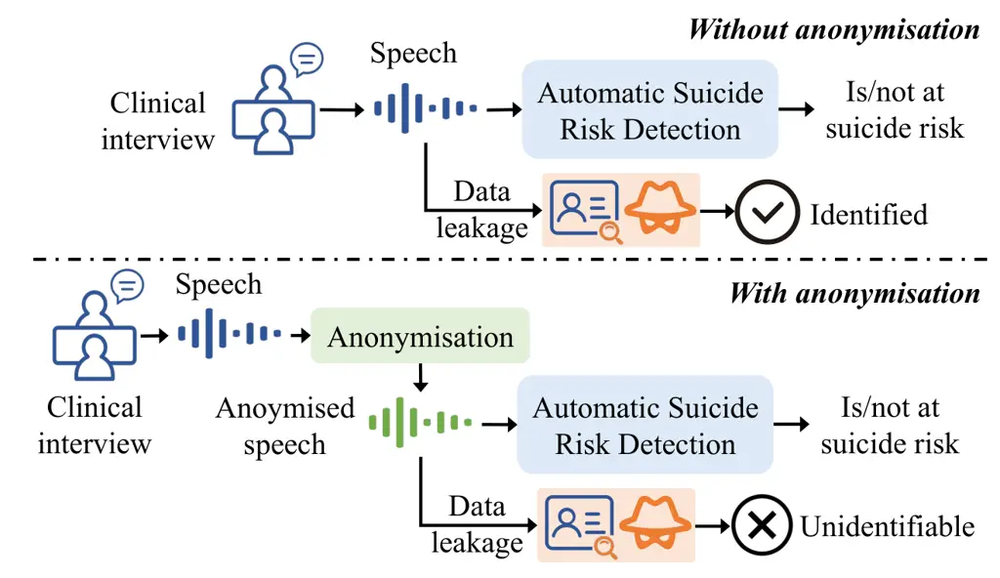
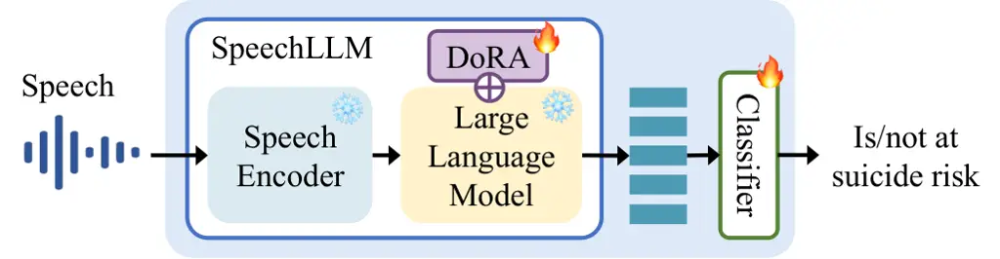

# Speaker Anonymisation for Speech-based Suicide Risk Detection

[https://huggingface.co/Qwen/Qwen2.5-Omni-7B](https://huggingface.co/Qwen/Qwen2.5-Omni-7B)[https://github.com/RVC-Project/Retrieval-based-Voice-Conversion-WebUI](https://github.com/RVC-Project/Retrieval-based-Voice-Conversion-WebUI)[https://huggingface.co/SparkAudio/Spark-TTS-0.5B](https://huggingface.co/SparkAudio/Spark-TTS-0.5B)[https://huggingface.co/FunAudioLLM/CosyVoice2-0.5B](https://huggingface.co/FunAudioLLM/CosyVoice2-0.5B)[https://huggingface.co/emotion2vec/emotion2vec_plus_seed](https://huggingface.co/emotion2vec/emotion2vec_plus_seed)

Ziyun Cui    Sike Jia    Yang Lin    Yinan Duan    Diyang Qu    Runsen
Chen    Chao Zhang    Chang Lei    Wen Wu ^(†)^(†)thanks: ^(†)
Corresponding authors. This work was supported by the National Natural
Science Foundation of China (Grant No. 62501336).

###### Abstract

Adolescent suicide is a critical global health issue, and speech
provides a cost-effective modality for automatic suicide risk detection.
Given the vulnerable population, protecting speaker identity is
particularly important, as speech itself can reveal personally
identifiable information if the data is leaked or maliciously exploited.
This work presents the first systematic study of speaker anonymisation
for speech-based suicide risk detection. A broad range of anonymisation
methods are investigated, including techniques based on traditional
signal processing, neural voice conversion, and speech synthesis. A
comprehensive evaluation framework is built to assess the trade-off
between protecting speaker identity and preserving information essential
for suicide risk detection. Results show that combining anonymisation
methods that retain complementary information yields detection
performance comparable to that of original speech, while achieving
protection of speaker identity for vulnerable populations.

###### Index Terms: 

speaker anonymisation, suicide risk detection, adolescent speech

^(†)^(†)address: Shanghai Artificial Intelligence Laboratory, Shanghai,
China Department of Electronic Engineering, Tsinghua University,
Beijing, China Vanke School of Public Health, Tsinghua University,
Beijing, China Weiyang College, Tsinghua University, Beijing, China
leic22@mails.tsinghua.edu.cn, cz277@tsinghua.edu.cn, wuwen@pjlab.org.cn

## 1 Introduction

Suicide is a critical global health challenge and one of the leading
causes of death among adolescents \[16, 19\]. Early detection of suicide
risk is essential for effective prevention and intervention of potential
suicide attempts. Existing approaches still face limitations: clinical
interviews require well-trained professionals, while self-report
questionnaires are vulnerable to bias, discrimination, and even
intentional concealment \[5\]. Speech serves as a cost-effective,
remote, and non-invasive candidate for automatic suicide risk
detection \[24\]. Speech naturally encodes both semantic and
paralinguistic information. As an individual becomes pre-suicide, their
speech exhibits measurable alterations in acoustic properties (e.g.,
jitter, shimmer, fundamental frequency) \[3\], increased disfluency
(e.g., hesitations and speech errors) \[21\], and distinct lexical
patterns \[1\]. Previous studies have shown that suicide risk is
detectable from spontaneous speech \[24, 2\].

Despite its great potential, it is critical to emphasise the privacy
protection of participants’ speech data, especially given the dual
vulnerabilities of age and psychological distress in the relevant
population.

As illustrated in Fig. , directly incorporating the original speech into
the automatic detection system could pose serious privacy risks, as the
speaker’s identity can be easily revealed if the data is leaked or
maliciously exploited. By contrast, applying proper anonymisation before
exposing speech to the system makes it much harder to trace the
processed audio back to individuals, even in the event of a data breach.
In fact, privacy protection has long been a central concern in the
healthcare research, where anonymisation has been extensively studied
for textual records \[10\], medical imaging \[8\], and physiological
signals such as ECG \[15\] and EEG \[13\], where techniques range from
simple de-identification \[10, 13\] to advanced generative models \[8,
15\]. Speech data poses unique challenges: it simultaneously encodes
linguistic, acoustic, and emotional information, many of which are
relevant for clinical analysis but also carry identifiable speaker
characteristics \[22\], making it essential to carefully evaluate
anonymisation techniques on both effectiveness in suppressing speaker
identity and the ability to preserve features relevant to downstream
suicide risk detection.

Figure 1: Importance of anonymisation for protecting speaker identity.

This work investigates speaker anonymisation for speech-based suicide
risk detection. The aim is to identify anonymisation pipelines that
strike a balance between sufficient privacy protection and performance
in suicide risk detection. We systematically evaluate a wide range of
anonymisation methods, including traditional signal processing
techniques, neural voice conversion approaches, and speech synthesis
approaches. A comprehensive evaluation framework is built to assess the
effect of anonymisation approaches in terms of speech quality, speaker
discrimination, deviation in fundamental frequency, as well as
preservation of semantic and emotional content. Experiments show that
combining complementary anonymisation methods boosts downstream task
performance, achieving detection accuracy comparable to that of original
speech while still maintaining robust anonymisation.

## 2 Methods

### 2.1 Speech-based Suicide Risk Detection

This section describes the structure used in this study for speech-based
suicide risk detection. The task is formulated as binary classification.
As shown in Fig. , a speech LLM (Qwen2.5-Omni-7B \[25\]), which consists
of a speech encoder and a large language model (LLM), is employed as the
backbone for processing speech recordings and generating embeddings for
downstream suicide risk detection. Weight-decomposed low-rank adaptation
(DoRA) is adopted for parameter-efficient fine-tuning of the speech LLM,
with a rank of 32 and alpha of 64.

We perform speech-based suicide risk detection using original and
anonymised speech respectively to examine whether using anonymised
speech leads to remarkable performance degradation. A two-sided t-test
between the results obtained with original and anonymised speech is
conducted to assess statistical significance.

Figure 2: Structure used for speech-based suicide risk detection.

### 2.2 Speaker Anonymisation Approaches

This section describes the anonymisation approaches studied in this
paper, including traditional signal processing methods, voice conversion
(VC) based on neural vocoder, and direct synthesis based on transcribed
text.

#### 2.2.1 Traditional Signal Processing Methods

Traditional anonymisation methods involves direct transformation of
acoustic attributes without altering the linguistic content, which are
computationally lightweight and interpretable. Two approaches are
studied in this paper:

Pitch modification alters fundamental frequency (F0) of speech without
significantly distorting prosodic and speaking style. The magnitude of
the shift, measured in semitones, affects the trade-off among
anonymisation effectiveness, naturalness, and utility.

McAdams \[17\] leverages Linear Predictive Coding (LPC) to alter vocal
tract characteristics by shifting the formant locations. The LPC order
is a critical parameter that governs the trade-off between the fidelity
of the speech signal and the degree of anonymisation.

#### 2.2.2 Content-Speaker Disentanglement with Neural Vocoder

This section investigates approaches that leverage the paradigm of
content-speaker disentanglement. They first extract content
representations, then manipulate or replace speaker-specific embeddings,
and finally synthesise speech from the modified representations by a
neural vocoder.

SSL-SAS \[14\] employs a HuBERT-based content encoder to extract
frame-level content features, ECAPA-TDNN for speaker encoder, an F0
contour extraction, before a neural vocoder HiFi-GAN synthesising the
final anonymised speech. The target speaker embedding is a
pseudo-speaker vector constructed by averaging 100 similar speaker
embeddings from an external pool derived from the LibriTTS dataset.

FreeVC \[9\] implements text-free, one-shot voice conversion using WavLM
features as rich speech representations and an information bottleneck
mechanism to extract clean content embeddings that minimize speaker
identity leakage.

SeedVC \[11\] is a Diffusion-based voice conversion framework, which
leverages Whisper-extracted content features to preserve linguistic
information and CAM++ speaker features to capture target speaker
characteristics, which serve as U-Net conditional inputs to guide the
diffusion generation process. The diffusion process iteratively refines
the output through multiple denoising steps.

RVC combines retrieval mechanisms with neural generation for speaker
transformation. RVC retrieves segments or acoustic embeddings from a
target-speaker database to guide conversion and synthesises output via a
neural vocoder, thereby enhancing audio fidelity and naturalness through
the reuse of real acoustic patterns.

#### 2.2.3 Speech Synthesis from Transcribed Text

For comparison, we investigate a cascaded approach that first conducts
automatic speech recognition (ASR) to transcribe the original speech to
text, and then synthesises new speech from the transcribed text using
text-to-speech (TTS) technology. This method fundamentally disrupts the
original speaker’s identity by completely discarding all acoustic,
prosodic, and emotional characteristics present in the source speech,
while attempts to preserve the semantic content. We employ
Paraformer \[7, 6\] for ASR, and evaluate two popular TTS models:
SparkTTS \[23\] and CosyVoice 2.0 \[4\].

### 2.3 Anonymisation Performance Evaluation Framework

We build a multi-dimensional evaluation framework to comprehensively
assess the effectiveness of different anonymisation methods, spanning
over the following five critical aspects: speech quality, speaker
discrimination, deviation in fundamental frequency, preservation of
semantic content, and preservation of emotional content.

Speech Quality. Two metrics are employed to measure the quality of
anonymised speech: signal-to-noise ratio (SNR) and MOS score. SNR
measures cleanliness of the speech while MOS measures the overall
perceptual quality of the speech. The MOS score is automatically
computed by the UTMOS model \[18\].

Speaker Discrimination. The discrimination between speakers before and
after anonymisation is a key aspect in evaluating the effectiveness of
anonymisation. Equal Error Rate (EER) is used to assess speaker
verifiability after anonymisation, which reflects the traceability of
anonymised speech and its resistance to linking attacks.

Deviation in Fundamental Frequency. We perform F0 contour variation
analysis to quantify the pitch change after anonymisation. F0 contours
are extracted from both original and anonymised speech. Two
complementary metrics are computed between the contours: (i) L1
distance, which captures the average magnitude of pitch shifts; (ii)
Pearson correlation coefficient (PCC), which quantifies the degree to
which the pitch-contour shape is preserved.

Preservation of Semantic Content. The semantic consistency is evaluated
by character error rate (CER) between the original and anonymised
speech, both transcribed by Paraformer ASR system.

Preservation of Emotional Content. Since emotional information might
contain important cue for suicide risk assessment, the preservation of
it after anonymisation is also evaluated. Emotion embeddings are
extracted using Emotion2Vec \[12\] from both original and anonymised
speech samples. Emotion consistency is then measured by the cosine
similarity.

|                               |                 |                 |                                    |                                   |                   |                 |                 |
| ----------------------------- | --------------- | --------------- | ---------------------------------- | --------------------------------- | ----------------- | --------------- | --------------- |
|                               | SNR$`\uparrow`$ | MOS$`\uparrow`$ | L1$`{}_{\text{F0}}`$$`\downarrow`$ | PCC$`{}_{\text{F0}}`$$`\uparrow`$ | CER$`\downarrow`$ | Emo$`\uparrow`$ | EER$`\uparrow`$ |
| SparkTTS                      | 35.96           | 3.11            | 9.260                              | 0.009                             | 0.332             | 0.577           | 0.498           |
| CosyVoice                     | 61.89           | 3.01            | 7.467                              | -0.002                            | 0.024             | 0.257           | 0.497           |
| Pitch$`{}_{\text{step2}}`$    | 15.05           | 1.31            | 3.001                              | 0.563                             | 0.343             | 0.835           | 0.326           |
| Pitch$`{}_{\text{step4}}`$    | 15.00           | 1.32            | 4.815                              | 0.526                             | 0.424             | 0.836           | 0.512           |
| Pitch$`{}_{\text{step6}}`$    | 14.97           | 1.31            | 6.495                              | 0.480                             | 0.540             | 0.837           | 0.508           |
| McAdams$`{}_{\text{lpc15}}`$  | 14.92           | 1.28            | 1.761                              | 0.587                             | 0.335             | 0.858           | 0.248           |
| McAdams$`{}_{\text{lpc20}}`$  | 15.78           | 1.28            | 2.837                              | 0.510                             | 0.457             | 0.851           | 0.295           |
| McAdams$`{}_{\text{lpc25}}`$  | 16.11           | 1.28            | 4.039                              | 0.421                             | 0.603             | 0.848           | 0.331           |
| SSL-SAS$`{}_{\text{F0}}`$     | 47.18           | 2.25            | 2.328                              | 0.377                             | 0.351             | 0.805           | 0.355           |
| SSL-SAS$`{}_{\text{no\_F0}}`$ | 34.49           | 1.33            | 13.08                              | 0.122                             | 0.388             | 0.661           | 0.475           |
| FreeVC$`{}_{\text{child}}`$   | 24.40           | 2.31            | 4.984                              | 0.372                             | 0.367             | 0.868           | 0.445           |
| FreeVC$`{}_{\text{adult}}`$   | 28.88           | 2.61            | 9.642                              | 0.421                             | 0.362             | 0.870           | 0.453           |
| SeedVC$`{}_{\text{d25}}`$     | 37.58           | 2.09            | 7.215                              | 0.299                             | 0.209             | 0.820           | 0.492           |
| SeedVC$`{}_{\text{d40}}`$     | 36.35           | 2.05            | 7.225                              | 0.302                             | 0.207             | 0.870           | 0.499           |
| RVC$`{}_{\text{s1}}`$         | 39.28           | 2.31            | 1.672                              | 0.490                             | 0.398             | 0.794           | 0.510           |
| RVC$`{}_{\text{s2}}`$         | 54.18           | 2.47            | 2.730                              | 0.443                             | 0.362             | 0.619           | 0.501           |
| Original                      | 15.24           | 1.49            | \-                                 | \-                                | \-                | \-              | 0.185           |

Table 1: Comparison of different speaker anonymisation methods under
different configurations. Configuration used for later experiments shown
in bold.

## 3 Experimental Setup

### 3.1 Dataset

The dataset used in this study consists of voice recordings collected
from 1,223 Chinese adolescents aged 10-18 \[24, 2\]. All recordings were
conducted in Mandarin Chinese. Recordings are all paired with
standardised suicide risk assessments administered via the Mini
International Neuropsychiatric Interview for Children and Adolescents
(MINI-KID) suicidality module \[20\], a widely validated diagnostic
interview tool. 53.4% participants were identified as in suicide risk.
The data collection procedures have been approved by the Medical Ethics
Committee of the Tsinghua University Technology Ethics Committee.
Following previous study \[2\], the recordings corresponding to the
self-description task is used.

Given the sensitive nature of mental health data and the vulnerable
population involved, protecting adolescent privacy through effective
speech anonymisation is important. The selected self-description task
contains rich acoustic and semantic information relevant to suicide risk
detection, making it suitable for evaluating how well different
anonymisation methods preserve both types of information.

### 3.2 Implementation Details

The dataset was split into train/dev/test sets with an 8:1:1 ratio. The
model achieving the best validation performance is selected for test
evaluation. All experiments were conducted with three random seeds and
the average accuracy is reported.

Below describes different configurations tested for each speaker
anonymisation method. For pitch modification, three different shift
magnitudes (2, 4 and 6 semitones) were tested. Male voices were raised
by the number of semitones while female voices were lowered by the same
number. For McAdams, LPC with orders of 15, 20, and 25 were compared.
For SSL-SAS, we tested both with and without F0 contour preservation.
For FreeVC, we tested two target voice styles: a child voice and a male
adult voice. For SeedVC, we tested the diffusion step of 10 and 25. For
RVC, two different teenager voices from the official release were
tested, denoted as subscript s1 and s2 in Table .

Figure 3: Visualisation of pitch change in semitones relative to A4 (440
Hz).

## 4 Results and Discussion

### 4.1 Anonymisation Effectiveness and Perceptual Quality

Table  compares various anonymisation methods across different
configurations under the evaluation framework introduced in Section . We
also provide a visualisation of changes in F0 contours induced by
different anonymisation methods in Fig. .

Firstly, methods that directly synthesise speech from transcribed text
(i.e., SparkTTS and CosyVoice) achieve superior performance in
preserving semantic content, as indicated by lower CER, and produce
better perceptual quality, as reflected by higher UTMOS. However, they
completely discard acoustic and emotional characteristics, yielding low
PCC$`{}_{\text{F0}}`$ and emotion similarity, as expected. This is
evident in Fig. , where the F0 contours of anonymised speech are
extremely different from the originals.

For traditional signal processing, both pitch shifting and McAdams yield
relatively low signal quality, indicated by lower SNR. It is worth
noting that pitch shifting exhibits large L1 deviations but high PCC in
F0 contours. This seemingly counter-intuitive pattern is in fact
expected, as it indicates that only the absolute F0 values are shifted
while contour shapes are preserved, as shown in Fig. . It can be also
observed that increase in shifting step leads to higher L1 deviations
and lower PCC. The step=4 configuration provides overall the best
anonymisation trade-off. A similar pattern is observed for McAdams when
LPC step increases. While McAdams preserves F0 contours and emotional
content well, it performs poorly in speaker discrimination, as indicated
by the lowest EER among the anonymisation approaches.

All four VC-based methods improve the speech quality compared to
original speech, with higher SNR and UTMOS. Among four methods, SeedVC
yields the lowest CER while SSL-SAS gives the lowest EER. It can be
observed that without F0 preservation, SSL-SAS$`{}_{\text{no\_F0}}`$
results in much larger L1$`{}_{\text{F0}}`$ deviation, much lower
PCC$`{}_{\text{F0}}`$, as well as consistently poorer perceptual
quality, intelligibility, and emotion similarity. Among all tested
speaker anonymisation approach, FreeVC provides the best emotional
consistency while RVC achieves the best speaker discrimination
performance as well as the smallest F0 deviation.

Based on the overall trade-off between anonymisation effectiveness and
speech quality, one configuration is selected for each anonymisation
approach, bolded in Table  and used in the following experiments.

### 4.2 Suicide Risk Detection Using Anonymised Speech

Figure 4: Accuracy of suicide risk detection using the original and
anonymised speech. Average of three runs reported.

Fig.  shows the suicide risk detection results using speech anonymised
by different approaches. The original speech got an average accuracy of
0.702, serving as the upper-bound. Among all anonymisation methods, RVC
produced the strongest single-model performance with an accuracy of
0.680, only 2% drop compared to original audio (with p=0.349), while
maintaining high anonymisation strength (with EER of 0.510). CosyVoice
achieved the second-best result (accuracy of 0.658, 5% decay, with
p=0.136), possibly benefiting from the best preservation of semantic
content while suffering from the loss of acoustic and prosodic cues. All
other approaches show significant performance decay.

We further ensemble the CosyVoice and RVC models by averaging their
predicted probabilities. This ensemble benefits from the complementary
strengths of the two approaches where CosyVoice retains most semantic
contents and RVC maintains most F0 contour. The combined system achieves
an accuracy of 0.692. This result surpasses all individual systems,
reduces the gap to the original speech to only  1% (with p=0.677), while
still ensuring good anonymisation. These findings suggest that combining
complementary anonymisation strategies enhances speech utility while
preserving privacy.

### 4.3 The Impact of Speech Enhancement

|                              | SNR$`\uparrow`$ | MOS$`\uparrow`$ | L1$`{}_{\text{F0}}`$$`\downarrow`$ | L1$`{}_{\text{PCC}}`$$`\uparrow`$ | CER$`\downarrow`$ | Emo$`\uparrow`$ | EER$`\uparrow`$ |
| ---------------------------- | --------------- | --------------- | ---------------------------------- | --------------------------------- | ----------------- | --------------- | --------------- |
| SparkTTS                     | 36.14           | 2.96            | 9.493                              | 0.006                             | 0.336             | 0.474           | 0.506           |
| CosyVoice                    | 61.79           | 3.10            | 7.412                              | 0.002                             | 0.031             | 0.213           | 0.505           |
| Pitch$`{}_{\text{step4}}`$   | 50.12           | 1.26            | 4.398                              | 0.646                             | 0.220             | 0.833           | 0.569           |
| McAdams$`{}_{\text{lpc20}}`$ | 51.59           | 1.29            | 1.833                              | 0.504                             | 0.224             | 0.819           | 0.263           |
| SSL-SAS$`{}_{\text{F0}}`$    | 57.12           | 2.53            | 1.349                              | 0.520                             | 0.229             | 0.833           | 0.356           |
| FreeVC$`{}_{\text{child}}`$  | 31.29           | 2.50            | 4.953                              | 0.421                             | 0.305             | 0.833           | 0.434           |
| SeedVC$`{}_{\text{d25}}`$    | 41.65           | 2.12            | 7.259                              | 0.363                             | 0.177             | 0.848           | 0.477           |
| RVC$`{}_{\text{s1}}`$        | 47.66           | 2.39            | 0.737                              | 0.685                             | 0.202             | 0.778           | 0.511           |
| Original                     | 52.85           | 2.23            | \-                                 | \-                                | \-                | \-              | 0.155           |

Table 2: Performance of anonymisation approaches on enhanced. Results
improved over non-enhanced ones (Table ) marked in bold.

| SparkTTS | CosyVoice | Pitch  | McAdams |
| -------- | --------- | ------ | ------- |
| 0.625    | 0.644     | 0.642  | 0.633   |
| SSL-SAS  | FreeVC    | SeedVC | RVC     |
| 0.622    | 0.664     | 0.636  | 0.664   |

Table 3: Accuracy of suicide risk detection with enhanced speech.
Results improved over non-enhanced ones (Fig. ) bolded.

It can be seen from Table  that the original speech has a relatively low
SNR and UTMOS, which is a common phenomenon for raw clinical data. This
section investigates whether applying speech enhancement benefits
detection performance. FRCRN \[26\] was applied to the original speech
before performing anonymisation. Table  shows the anonymisation
performance on enhanced speech. For the two TTS-based methods,
enhancement has little effect. For other methods, enhancement leads to
improvement on most metrics.

However, enhancement does not lead to consistently improved suicide
detection results, as shown in Table . Comparing with the detection
performance of non-enhanced speech in Fig. , except for the traditional
methods, most of the rest approaches do not benefit from speech
enhancement. The cause can be twofold. The enhancement operation
performs spectral masking, which, despite producing cleaner signals, can
also lead to information loss from the original speech. In addition,
modifications in spectral patterns may interfere with the encoders in VC
models, which extracts relevant features. This highlights the need to
carefully consider compatibility between enhancement and anonymisation
modules.

## 5 Conclusion

This work presents the first systematic investigation of speaker
anonymisation methods for adolescent suicide risk detection, covering
traditional signal processing, neural voice conversion, and speech
synthesis approaches under a comprehensive evaluation framework. Results
show that different anonymisation approaches excel at preserving
different types of information, and combining complementary methods
(i.e., RVC for acoustic features and CosyVoice for semantic content)
achieves near-original performance, with only 1% decay. These findings
hightlight the potential of hybrid strategies for privacy-preserving
clinical speech applications.

## References

- \[1\] A. Belouali, S. Gupta, V. Sourirajan, J. Yu, N. Allen, A.
  Alaoui, M. A. Dutton, and M. J. Reinhard (2021) Acoustic and language
  analysis of speech for suicidal ideation among us veterans. BioData
  mining 14 (1), pp. 11. Cited by: §1.
- \[2\] Z. Cui, C. Lei, W. Wu, Y. Duan, D. Qu, J. Wu, R. Chen, and C.
  Zhang (2024) Spontaneous speech-based suicide risk detection using
  Whisper and large language models. In Proc. Interspeech, Kos Island.
  Cited by: §1, §3.1.
- \[3\] N. Cummins, S. Scherer, J. Krajewski, S. Schnieder, J. Epps,
  and T. F. Quatieri (2015) A review of depression and suicide risk
  assessment using speech analysis. Speech communication 71, pp. 10–49.
  Cited by: §1.
- \[4\] Z. Du, Y. Wang, Q. Chen, X. Shi, X. Lv, T. Zhao, Z. Gao, Y.
  Yang, C. Gao, H. Wang, et al. (2024) CosyVoice 2: Scalable streaming
  speech synthesis with large language models. arXiv preprint
  arXiv:2412.10117. Cited by: §2.2.3.
- \[5\] L. Ganzini, L. M. Denneson, N. Press, M. J. Bair, D. A.
  Helmer, J. Poat, and S. K. Dobscha (2013) Trust is the basis for
  effective suicide risk screening and assessment in veterans. Journal
  of general internal medicine 28 (9), pp. 1215–1221. Cited by: §1.
- \[6\] Z. Gao, Z. Li, J. Wang, H. Luo, X. Shi, M. Chen, Y. Li, L.
  Zuo, Z. Du, and S. Zhang (2023) FunASR: A fundamental end-to-end
  speech recognition toolkit. In Proc. Interspeech, Dublin. Cited by:
  §2.2.3.
- \[7\] Z. Gao, S. Zhang, I. McLoughlin, and Z. Yan (2022) Paraformer:
  Fast and accurate parallel Transformer for non-autoregressive
  end-to-end speech recognition. In Proc. Interspeech, Incheon. Cited
  by: §2.2.3.
- \[8\] F. Hellmann, S. Mertes, M. Benouis, A. Hustinx, T. Hsieh, C.
  Conati, P. Krawitz, and E. André (2024) GANonymization: A GAN-based
  face anonymization framework for preserving emotional expressions. ACM
  Transactions on Multimedia Computing, Communications and Applications
  21 (1), pp. 1–27. Cited by: §1.
- \[9\] J. Li, W. Tu, and L. Xiao (2023) FreeVC: Towards high-quality
  text-free one-shot voice conversion. In Proc. ICASSP, Rhodes. Cited
  by: §2.2.2.
- \[10\] X. Li and J. Qin (2017) Anonymizing and sharing medical text
  records. Information Systems Research 28 (2), pp. 332–352. Cited by:
  §1.
- \[11\] S. Liu (2024) Zero-shot voice conversion with diffusion
  transformers. arXiv preprint arXiv:2411.09943. Cited by: §2.2.2.
- \[12\] Z. Ma, Z. Zheng, J. Ye, J. Li, Z. Gao, S. Zhang, and X.
  Chen (2024) Emotion2Vec: Self-supervised pre-training for speech
  emotion representation. In Proc. ACL, Bangkok. Cited by: §2.3.
- \[13\] R. Matovu and A. Serwadda (2016) Your substance abuse disorder
  is an open secret! Gleaning sensitive personal information from
  templates in an EEG-based authentication system. In Proc. BTAS,
  Niagara Falls. Cited by: §1.
- \[14\] X. Miao, X. Wang, E. Cooper, J. Yamagishi, and N.
  Tomashenko (2022) Analyzing language-independent speaker anonymization
  framework under unseen conditions. In Proc. Interspeech, Incheon.
  Cited by: §2.2.2.
- \[15\] A. Nolin-Lapalme, R. Avram, and H. Julie (2023) PrivECG:
  generating private ECG for end-to-end anonymization. In Proc. MLHC,
  New York. Cited by: §1.
- \[16\] W. H. Organization (2025) Suicide worldwide in 2021: Global
  health estimates. World Health Organization. Cited by: §1.
- \[17\] J. Patino, N. Tomashenko, M. Todisco, A. Nautsch, and N.
  Evans (2021) Speaker anonymisation using the McAdams coefficient. In
  Proc. Interspeech, Brno. Cited by: §2.2.1.
- \[18\] T. Saeki, D. Xin, W. Nakata, T. Koriyama, S. Takamichi, and H.
  Saruwatari (2022) UTMOS: UTokyo-SaruLab system for VoiceMOS Challenge 2022. In Proc. Interspeech, Incheon. Cited by: §2.3.
- \[19\] B. Shain, C. on Adolescence, P. K. Braverman, W. P.
  Adelman, E. M. Alderman, C. C. Breuner, D. A. Levine, A. V. Marcell,
  and R. F. O’Brien (2016) Suicide and suicide attempts in adolescents.
  Pediatrics 138 (1), pp. e20161420. Cited by: §1.
- \[20\] D. V. Sheehan, K. H. Sheehan, R. D. Shytle, J. Janavs, Y.
  Bannon, J. E. Rogers, K. M. Milo, S. L. Stock, and B. Wilkinson (2010)
  Reliability and validity of the mini international neuropsychiatric
  interview for children and adolescents (MINI-KID). The Journal of
  clinical psychiatry 71 (3), pp. 17393. Cited by: §3.1.
- \[21\] B. Stasak, J. Epps, H. T. Schatten, I. W. Miller, E. M.
  Provost, and M. F. Armey (2021) Read speech voice quality and
  disfluency in individuals with recent suicidal ideation or suicide
  attempt. Speech Communication 132, pp. 10–20. Cited by: §1.
- \[22\] S. Tayebi Arasteh, T. Arias-Vergara, P. A. Pérez-Toro, T.
  Weise, K. Packhäuser, M. Schuster, E. Noeth, A. Maier, and S. H.
  Yang (2024) Addressing challenges in speaker anonymization to maintain
  utility while ensuring privacy of pathological speech. Communications
  Medicine 4 (1), pp. 182. Cited by: §1.
- \[23\] X. Wang, M. Jiang, Z. Ma, Z. Zhang, S. Liu, L. Li, Z. Liang, Q.
  Zheng, R. Wang, X. Feng, et al. (2025) Spark-TTS: An efficient
  LLM-based text-to-speech model with single-stream decoupled speech
  tokens. arXiv preprint arXiv:2503.01710. Cited by: §2.2.3.
- \[24\] W. Wu, Z. Cui, C. Lei, Y. Duan, D. Qu, J. Wu, B. Zhou, R. Chen,
  and C. Zhang (2025) The 1st SpeechWellness challenge: Detecting
  suicide risk among adolescents. In Proc. Interspeech, Rotterdam. Cited
  by: §1, §3.1.
- \[25\] J. Xu, Z. Guo, J. He, H. Hu, T. He, S. Bai, K. Chen, J.
  Wang, Y. Fan, K. Dang, et al. (2025) Qwen2.5-Omni technical report.
  arXiv preprint arXiv:2503.20215. Cited by: §2.1.
- \[26\] S. Zhao, B. Ma, K. N. Watcharasupat, and W. Gan (2022) FRCRN:
  Boosting feature representation using frequency recurrence for
  monaural speech enhancement. In Proc. ICASSP, Singapore. Cited by:
  §4.3.
