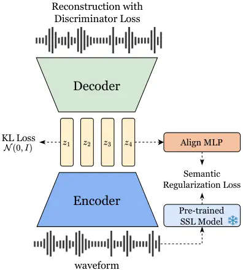
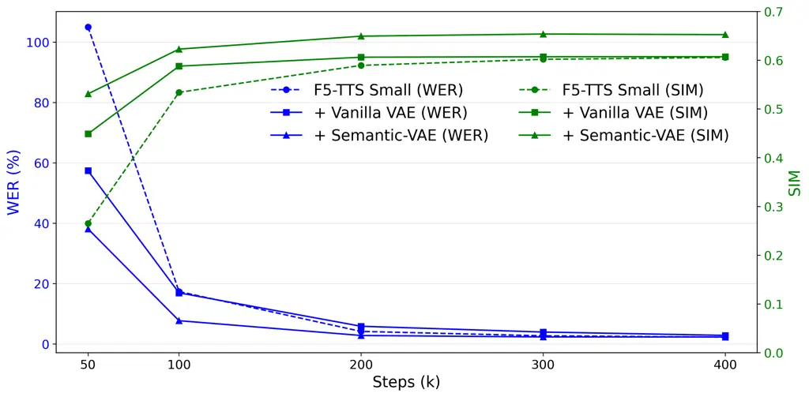

Niu Hu Choi Chen Chen Zhu Yang Zhang Zhao Wang Chen

# Semantic-VAE: Semantic-Alignment Latent Representation for Better Speech Synthesis

Zhikang    Shujie    Jeongsoo    Yushen    Peining    Pengcheng   
Yunting    Bowen    Jian    Chunhui    Xie

###### Abstract

Mel-spectrograms have been widely used in zero-shot text-to-speech
(TTS); their inherent redundancy leads to inefficiency in text-speech
alignment. Compact VAE-based latent representations have emerged as a
stronger alternative but exhibit an optimization dilemma:
higher-dimensional latents improve reconstruction quality and speaker
similarity but degrade intelligibility, while lower-dimensional latents
improve intelligibility at the cost of reconstruction fidelity. To
overcome this dilemma, we propose Semantic-VAE, which uses semantic
alignment regularization in the latent space. This design alleviates the
reconstruction-generation trade-off by capturing semantic structure in
high-dimensional latent representations. When integrated into F5-TTS,
our method achieves 2.10% WER and 0.64 speaker similarity on
LibriSpeech-PC, outperforming mel-based systems and vanilla acoustic VAE
baselines with improved training efficiency. Demo and codes:
https://zhikangniu.github.io/semantic-vae/

###### keywords

text-to-speech, latent diffusion model, semantic alignment, variational
autoencoder

^(†)^(†)address: ¹ X-LANCE Lab, MoE Key Lab of Artificial Intelligence,
Shanghai Jiao Tong University, China  
² Shanghai Innovation Institute, China; ³ The Chinese University of Hong
Kong, China  
⁴ School of Electrical Engineering, KAIST, South Korea; ⁵ Geely, China
^(†)^(†)email: zhikangniu@sjtu.edu.cn, chenxie95@sjtu.edu.cn

## 1 Introduction

Zero-shot Text-to-Speech (TTS) aims to synthesize natural human speech
from text inputs, conditioned on a reference speech prompt to closely
mimic the speaker’s timbre. In recent years, zero-shot TTS models have
achieved remarkable progress by scaling up both data and model size.
Existing methods for zero-shot TTS can be broadly categorized into two
approaches: Autoregressive (AR)  \[1, 2, 3, 4, 5\] and
Non-Autoregressive (NAR) \[6, 7, 8, 9, 10, 11\] models.

Most AR models directly quantize speech into discrete tokens and achieve
exceptional performance in capturing and reproducing the acoustic
characteristics of a reference speaker through in-context learning.
However, they suffer from slow inference speed and error accumulation
due to autoregressive generation of speech representation and
information loss from quantization \[12, 13, 14\]. NAR models, primarily
built on diffusion and flow matching models and using continuous speech
representations, address the inherent limitations of AR models and
overcome the information loss introduced by quantization, thereby
improving both inference speed and output quality. NAR-based models can
be grouped into two main categories based on their intermediate
representation:

Figure 1: Reconstruction and Generation(TTS) dilemma on continuous
representation. Higher-dimensional latents retain more acoustic
information, improving reconstruction and speaker similarity;
lower-dimensional latents focus on semantic information, boosting
intelligibility while trading off reconstruction and similarity.

1. Models conditioned on the mel-spectrogram, which constitute the
   predominant paradigm in NAR-based TTS, use a pre-trained vocoder to
   reconstruct the waveform from the generated mel-spectrogram.
   Representative examples include VoiceBox \[6\], E2 TTS \[15\], and
   F5-TTS \[9\]. Despite the strong performance of mel-based systems, they
   still suffer from several inherent limitations \[16, 17, 18\], including
   loss of phase information, high dimensionality with substantial
   redundancy, and the absence of fine-grained high-frequency details,
   which limit high-fidelity speech synthesis.

2. Models conditioned on latent representations produced by a
   Variational Autoencoder (VAE) and synthesize waveforms directly using
   the corresponding decoder. VAE-based systems mitigate the drawbacks
   mentioned above by learning compact latent representations that preserve
   essential acoustic information while eliminating redundancy. These
   compact representations not only accelerate training convergence but
   also yield improved synthesis quality \[11\]. For instance,
   $`\text{SeedTTS}_{DiT}`$ \[2\] is a large-scale state-of-the-art
   industrial TTS model that leverages VAE latent representations,
   highlighting the effectiveness of compact representation for
   high-fidelity speech synthesis. Building on this idea, MegaTTS-3 \[11\]
   further introduces a novel sparse alignment strategy to guide a latent
   diffusion transformer over the VAE latent space, achieving performance
   gains.

Consistent with findings in the vision domain \[19\], latent diffusion
models with vanilla acoustic VAE systems face an optimization dilemma
between reconstruction and generation performance. The results of
preliminary experiments are shown in Fig. 1. Specifically, increasing
the latent dimension enhances reconstruction quality and speaker
similarity but impairs intelligibility in zero-shot TTS, whereas
reducing the latent dimension improves intelligibility at the expense of
reconstruction quality and speaker similarity. This trade-off
exemplifies the information bottleneck: lower-dimensional
representations capture core semantic content, whereas
higher-dimensional representations preserve richer acoustic details but
introduce redundancy and complicate semantic modeling.

To address this challenge, we introduce Semantic-VAE, a novel VAE with
semantic alignment regularization in the latent space to mitigate the
difficulty of semantic modeling in zero-shot TTS tasks with
unconstrained high-dimensional latent representations. Extensive
experiments demonstrate that Semantic-VAE mitigates the
generation–reconstruction dilemma in high-dimensional latent spaces,
accelerates training convergence, and achieves state-of-the-art
performance in zero-shot TTS tasks. Specifically, the F5-TTS model with
the proposed Semantic-VAE features achieves 2.10% WER and 0.64 speaker
similarity on the LibriSpeech-PC test-clean dataset, outperforming the
mel-based F5-TTS baseline (2.23%, 0.60) and the vanilla acoustic VAE
baseline (2.65%, 0.59). Additional reconstruction experiments show that
Semantic-VAE achieves reconstruction quality comparable to vanilla VAE
and substantially better than the vocoder \[20\] with mel-spectrograms.
This demonstrates that our proposed semantic alignment regularization
enables more effective generative modeling without compromising the
representational capacity of the latent features.

## 2 Method

In this section, we provide a detailed introduction of our proposed
method, highlighting its key components and underlying motivations.
Section 2.1 introduces our baseline VAE architecture and objective.
Section 2.2 presents our strategy for semantic regularizing latent
representations using pre-trained self-supervised learning (SSL) speech
models.



Figure 2: Overall training framework. The encoder maps the input into
latent representations, regularized by a KL loss. The decoder
reconstructs the waveform guided by a discriminator loss, while a
semantic regularization loss aligns the latent space with features from
a frozen pre-trained SSL model.

### 2.1 Variational Autoencoder

To obtain latent representations for speech generation, we employ a
Variational Autoencoder (VAE) \[21\] that models speech waveforms. The
VAE consists of an encoder that maps the input speech $`\bm{x}`$ into a
latent representation $`\bm{z}`$, and a decoder that reconstructs the
signal $`\hat{\bm{x}}`$ from $`\bm{z}`$. The standard training objective
of a VAE maximizes the Evidence Lower Bound (ELBO):

```math
\mathrm{ELBO}:=\mathbb{E}_{q_{\phi}(\mathbf{z}\mid\mathbf{x})}\bigl[\log p_{\psi}(\mathbf{x}\mid\mathbf{z})\bigr]-\mathcal{D}_{\mathrm{KL}}\bigl(q_{\phi}(\mathbf{z}\mid\mathbf{x})\parallel p(\mathbf{z})\bigr) \tag{1}
```

where $`q_{\phi}(\bm{z}|\bm{x})`$ denotes the variational posterior that
approximates the true latent distribution, $`p_{\psi}(\bm{x}|\bm{z})`$
models the conditional likelihood of the reconstructed speech
$`\hat{\bm{x}}`$ given $`\bm{z}`$, and the KL divergence term
regularizes the latent space towards the standard Gaussian prior
$`p(\bm{z})=\mathcal{N}(0,\bm{I})`$.

Following the standard VAE objective, we express the generative loss as
a weighted sum of the reconstruction loss $`\mathcal{L}_{\text{recon}}`$
and the KL divergence loss $`\mathcal{L}_{\text{KL}}`$:

```math
\mathcal{L}_{\text{gen}}=\lambda_{\text{recon}}\mathcal{L}_{\text{recon}}+\lambda_{\text{KL}}\mathcal{L}_{\text{KL}}, \tag{2}
```

where $`\lambda_{\text{KL}}`$ balances the trade-off between
reconstruction fidelity and latent space regularization. Following
DAC \[22\], we use multi-scale frequency domain reconstruction loss
$`\mathcal{L}_{\text{recon}}`$, defined as L1 distance between
mel-spectrograms of the ground-truth and the reconstruction over
multiple window lengths.

Moreover, to enhance the perceptual quality of the output, we adopt
adversarial training with a multi-period discriminator \[23\] and a
multi-band, multi-scale STFT discriminator \[22\]. We use a
HingeGAN \[24\] adversarial objective with L1 feature-matching loss. The
overall VAE training objective is then expressed as follows:

```math
\mathcal{L}_{\text{VAE}}=\mathcal{L}_{\text{gen}}+\lambda_{\text{adv}}\,\mathcal{L}_{\text{adv}}+\lambda_{\text{feat}}\,\mathcal{L}_{\text{feat}}. \tag{3}
```

### 2.2 Semantic Representation Alignment

The reconstruction and generation dilemma is a widely discussed
challenge in discrete audio codecs. Previous studies \[25, 8\] have
demonstrated that aligning with pre-trained SSL speech models (e.g.,
HuBERT \[26\], WavLM \[27\], w2v-BERT \[28\], etc.), which capture rich
phonetic and semantic representations, can provide more informative
supervision for audio codec training and improve downstream AR model
performance and convergence. Similarly, incorporating SSL alignment into
Diffusion Transformers (DiT) training accelerates convergence and yields
better performance in speech synthesis \[29\] and image
generation \[30\].

However, to the best of our knowledge, no prior work has explored
applying semantic regularization to speech continuous latent spaces, nor
examined its potential to improve downstream task performance. Motivated
by these insights, we introduce a semantic regularization loss into the
VAE training framework. This addition aims to investigate whether
semantic-aligned VAEs can improve both the convergence speed and
performance of NAR-based TTS models compared to vanilla acoustic VAEs.
Specifically, we employ a pre-trained SSL speech model $`f(\cdot)`$ to
extract structured semantic representations from the same speech
$`\bm{x}`$. The hidden states $`\bm{h}`$ of the SSL model, aligned in
both temporal and feature dimensions with the VAE latent representation,
are obtained through an interpolation layer followed by a 1D convolution
layer, formulated as $`\bm{h}=\text{Conv1D}(\text{Interp}(f(\bm{x}))).`$
The semantic alignment regularization loss is then defined as

```math
\mathcal{L}_{\text{Align}}=-\frac{1}{T}\sum_{t=1}^{T}\cos\big(\bm{h}^{[t]},\,\bm{z}^{[t]}\big), \tag{4}
```

where $`T`$ denotes the sequence length and $`\text{cos}(\cdot,\cdot)`$
computes the cosine similarity between the aligned VAE latent and the
SSL feature at each time step $`t`$. This loss regularizes the VAE
latent space, encouraging the VAE to learn a structured semantic
representation from SSL models. To jointly optimize for high-fidelity
speech reconstruction and semantically meaningful latent
representations, we integrate the VAE training objective with the
proposed semantic regularization loss. The overall training objective is
formulated as

```math
\mathcal{L}_{\text{total}}=\mathcal{L}_{\text{VAE}}+\lambda_{\text{Align}}\,\mathcal{L}_{\text{Align}}, \tag{5}
```

where $`\lambda_{\text{Align}}`$ is a hyperparameter that controls the
relative importance of the semantic alignment regularization.

## 3 Experimental Setup

In this section, we describe implementation details, datasets, and the
evaluation setup.

### 3.1 Semantic-VAE Model Setup

Following DAC \[22\], Semantic-VAE adopts the same convolutional
encoder, discriminator, and loss weights. To improve reconstruction
performance, we replace the original convolutional decoder with an AMP
Block-based decoder \[31\]. The encoder downsamples the 16 kHz input
$`\bm{x}`$ with factors of $`[4,4,5,5]`$, producing a 64-dimensional
latent representation $`\bm{z}`$ at a frame rate of 40 Hz, while the
decoder upsamples $`\bm{z}`$ with factors of $`[5,5,2,2,2,2]`$ to
reconstruct the waveform.

Semantic-VAE is trained for 600k iterations with a global batch size of 64. Each sample is a 3-second segment and resampled to 16 kHz, totaling
approximately 192 seconds per batch. We employ the Adam optimizer with a
learning rate of $`1\times 10^{-4}`$ and apply exponential decay with a
factor of $`\gamma=0.9996`$. In our experiment, we set
$`\lambda_{\text{Align}}=1`$, $`\lambda_{\text{KL}}=0.01`$,
$`\lambda_{\text{adv}}=1`$, $`\lambda_{\text{feat}}=2`$, and
$`\lambda_{\text{recon}}=15`$.

### 3.2 Zero-shot TTS Model Setup

We use the F5-TTS \[9\] as the baseline and adopt its training setup. In
our approach, the mel-spectrograms are replaced with VAE latent
representations. The model is optimized using the AdamW optimizer with
$`7.5\times 10^{-5}`$, following a warm-up schedule for the first 20,000
updates and linear decay thereafter. For inference, we follow the same
setup as F5-TTS, applying the sway sampling strategy and using the Euler
ODE solver.

### 3.3 Training Datasets

We train Semantic-VAE on LibriTTS \[32\] and the small/medium subsets of
Libriheavy \[33\], totaling 6k hours. Unless otherwise stated, TTS
models are only trained on LibriTTS.

### 3.4 Evaluation

To comprehensively evaluate Semantic-VAE regarding the optimization
dilemma between reconstruction and generation, we consider two tasks: 1)
reconstruction and 2) downstream zero-shot TTS. For the reconstruction
task, we use the LibriTTS test-other as the test set, and employ
UTMOS \[34\], PESQ \[35\], and STOI as the evaluation metrics to
quantify perceptual quality and intelligibility. For the zero-shot TTS
evaluation, we follow the setup in F5-TTS¹¹ 1
[https://github.com/SWivid/F5-TTS/tree/main/src/f5_tts/eval](https://github.com/SWivid/F5-TTS/tree/main/src/f5_tts/eval)
and evaluate on the LibriSpeech-PC \[36\] test-clean. We perform the
cross-sentence generation and evaluate the performance using the Word
Error Rate (WER), Speaker Similarity (SIM-o), and UTMOS, which
respectively measure intelligibility, speaker consistency, and
naturalness. We further conduct 5-point MOS listening tests with 25
listeners (250 ratings per system).

|                   |           |       |                      |                 |                   |
| ----------------- | --------- | ----- | -------------------- | --------------- | ----------------- |
| Method            | \# Param. | Data  | WER(%)$`\downarrow`$ | SIM$`\uparrow`$ | MOS$`\uparrow`$   |
| Ground Truth      | \-        | \-    | 2.23                 | 0.69            | 4.20 $`\pm`$ 0.08 |
| High-resource     |           |       |                      |                 |                   |
| CosyVoice \[37\]  | 300M      | 170kh | 3.59                 | 0.66            | \-                |
| FireRedTTS \[38\] | 580M      | 248kh | 2.69                 | 0.47            | \-                |
| E2 TTS \[15\]     | 333M      | 100kh | 2.95                 | 0.69            | \-                |
| F5-TTS \[9\]      | 336M      | 100kh | 2.42                 | 0.66            | \-                |
| Low-resource      |           |       |                      |                 |                   |
| USLM \[25\]       | 361M      | 0.6kh | 6.11                 | 0.43            | \-                |
| E2 TTS \[15\]     | 157M      | 0.6kh | 3.51                 | 0.61            | 3.68 $`\pm`$ 0.11 |
| \+ Semantic-VAE   | 157M      | 0.6kh | 2.41                 | 0.62            | 3.88 $`\pm`$ 0.10 |
| F5-TTS \[9\]      | 159M      | 0.6kh | 2.23                 | 0.60            | 3.99 $`\pm`$ 0.10 |
| \+ Vanilla VAE    | 159M      | 0.6kh | 2.65                 | 0.60            | 4.13 $`\pm`$ 0.09 |
| \+ Semantic-VAE   | 159M      | 0.6kh | 2.10                 | 0.64            | 4.17 $`\pm`$ 0.09 |

Table 1: Zero-shot TTS results on the LibriSpeech-PC test-clean. The
best results in the low-resource setting are marked in bold.
High-resource results are quoted from the F5-TTS for comparison.

## 4 Results

### 4.1 Downstream Zero-shot TTS Results



Figure 3: Comparison of WER and SIM on the LibriSpeech-PC test-clean
dataset between the F5-TTS baseline, Vallina VAE, and Semantic-VAE
across different training steps.

Table 1 reports zero-shot TTS results on LibriSpeech-PC test-clean. We
include high-resource results from prior work for reference and focus
our evaluation on the low-resource setting. When integrated into F5-TTS,
Semantic-VAE achieves the best WER and SIM among all low-resource
models, outperforming both the F5-TTS baseline and its vanilla VAE
variant. A similar trend is observed when applying Semantic-VAE to E2
TTS, yielding consistent gains over the baseline. To further assess
convergence, we compare the proposed Semantic-VAE against the vanilla
VAE and the mel-based F5-TTS baseline across different training steps.
As shown in Fig. 3, Semantic-VAE converges faster and achieves better
performance than both the vanilla VAE and the mel-based baseline at the
same step. These results demonstrate that Semantic-VAE not only improves
the final performance, especially speaker similarity, but also
accelerates convergence and reduces training costs compared with the
baseline F5-TTS.

### 4.2 Scaling to a High-Resource TTS Results

To further validate the effectiveness of Semantic-VAE, we conduct
additional experiments using larger-scale downstream TTS models and
training data. Specifically, we trained the F5-TTS Base (336M
parameters) integrated with Semantic-VAE on Emilia \[39\](100k hours)
and evaluated it on multiple test sets under the same training budget
(400k updates). The results show consistent improvements in WER, SIM and
UTMOS on LibriSpeech-PC and SeedTTS-eval \[2\]. Notably, although
Semantic-VAE is trained only on English data, it also produce
improvements over the baseline on the Chinese test set, suggesting
robust cross-lingual generalization.

|                |                   |                   |                 |                   |
| -------------- | ----------------- | ----------------- | --------------- | ----------------- |
| Dataset        | Method            | WER$`\downarrow`$ | SIM$`\uparrow`$ | UTMOS$`\uparrow`$ |
| LibriSpeech-PC | F5-TTS^(†)        | 2.42              | 0.66            | 3.89              |
|                | F5-TTS(reproduce) | 2.34              | 0.63            | 3.92              |
|                | + Semantic-VAE    | 2.04              | 0.71            | 4.38              |
| SeedTTS-en     | F5-TTS^(†)        | 1.83              | 0.67            | 3.76              |
|                | F5-TTS(reproduce) | 1.70              | 0.63            | 3.76              |
|                | + Semantic-VAE    | 1.61              | 0.72            | 4.11              |
| SeedTTS-zh     | F5-TTS^(†)        | 1.56              | 0.76            | 2.95              |
|                | F5-TTS(reproduce) | 1.60              | 0.74            | 3.04              |
|                | + Semantic-VAE    | 1.48              | 0.77            | 3.25              |

Table 2: Scaling model and training data results under the same training
budget (400k updates) for fair comparison. ^(†) denotes results reported
in the F5-TTS paper (1250k updates).

### 4.3 Reconstruction Results

Table 3 reports reconstruction results on LibriTTS test-other. Despite
its aggressively compact representation in both temporal and latent
dimensions, vanilla VAE outperforms Vocos in reconstruction. It
indicates that end-to-end VAE training encourages the latent to retain
essential information while discarding redundancy. Moreover,
Semantic-VAE maintains reconstruction performance comparable to vanilla
VAE, demonstrating that semantic alignment simplified generative
modeling without sacrificing reconstruction performance.

|              |         |     |                  |                  |                   |
| ------------ | ------- | --- | ---------------- | ---------------- | ----------------- |
| Model        | frame/s | dim | PESQ$`\uparrow`$ | STOI$`\uparrow`$ | UTMOS$`\uparrow`$ |
| Ground Truth | \-      | \-  | \-               | \-               | 3.48              |
| Vocos        | 93.75   | 100 | 3.57             | 0.96             | 3.24              |
| Vanilla VAE  | 40      | 64  | 3.75             | 0.97             | 3.57              |
| Semantic-VAE | 40      | 64  | 3.74             | 0.96             | 3.56              |

Table 3: Reconstruction performance on LibriTTS test-other

### 4.4 Ablation Study

|                                   |                |                       |                 |                   |
| --------------------------------- | -------------- | --------------------- | --------------- | ----------------- | ---- | ---- |
| Align method                      | Layer          | WER (%)$`\downarrow`$ | SIM$`\uparrow`$ | UTMOS$`\uparrow`$ |
| Baseline                          | \-             | 2.65                  | 0.59            | 4.42              |
| $`                                | \Phi\_{n}-f(x) | `$                    | WavLM 23rd      | 3.12              | 0.47 | 3.29 |
| $`\lVert\Phi_{n}-f(x)\rVert_{2}`$ |                | 4.37                  | 0.48            | 4.16              |
| $`-\cos(\Phi_{n},f(x))`$          |                | 2.10                  | 0.64            | 4.39              |
| SSL Models                        | Layer          | WER (%)$`\downarrow`$ | SIM$`\uparrow`$ | UTMOS$`\uparrow`$ |
| HuBERT                            | 23             | 2.28                  | 0.63            | 4.38              |
|                                   | Last           | 2.33                  | 0.50            | 4.41              |
|                                   | Avg.           | 2.29                  | 0.61            | 4.39              |
| WavLM                             | 23             | 2.10                  | 0.64            | 4.39              |
|                                   | Last           | 2.62                  | 0.58            | 4.34              |
|                                   | Avg.           | 2.31                  | 0.63            | 4.42              |

Table 4: Effect of different SSL models, layer, and alignment methods on
LibriSpeech-PC TTS test set. “Avg.” = average of all layers; “Last” =
final layer output.

Table 4 presents a comprehensive ablation study on semantic alignment
methods and semantic guidance selection. The results indicate that
negative cosine similarity loss provides a more effective alignment
mechanism than the L1 or MSE losses. This can be intuitively explained
that L1 and MSE overly constrain absolute numerical differences between
the latent space and the semantic guidance, whereas cosine loss focuses
on directional alignment in the latent space, which better captures
structured semantic representations.

Moreover, we explore which semantic guidance is most effective for
semantic alignment. It observes that WavLM\[27\] generally outperforms
HuBERT\[26\] on SIM and comparable performance on WER, which can be
attributed to its speaker-aware training objectives. Moreover, we
compare different SSL layers and find that while all SSL layers help
reduce WER, their impact on SIM varies considerably. In particular, the
final layer consistently leads to a substantial drop in SIM performance,
likely due to distributional adjustments required for aligning with the
SSL training target, thereby discarding speaker-specific cues. Averaging
SSL features across all layers improves SIM compared to the last-layer
feature, which suggests that averaging all layers introduces more
information that can improve acoustic details. However, incorporating
too much information may also introduce redundancy, which could degrade
semantic modeling. To verify this hypothesis, we chose the 23rd layer of
WavLM for supervision. In SUPERB\[40\], this layer has the highest
weight for WER and provides richer semantic representations.
Experimental results confirm that this layer offers an optimal trade-off
between WER and SIM, providing practical guidance for selecting
pre-trained SSL features for alignment.

## 5 Conclusion

In this paper, we investigate the optimization dilemma in
high-dimensional latent spaces and propose Semantic-VAE, a speech
variational autoencoder with semantic alignment regularization. By
learning structured and semantically aligned latent representations,
Semantic-VAE alleviates the reconstruction–generation dilemma and
improves downstream zero-shot TTS performance. Experiments demonstrate
that our approach accelerates convergence and achieves state-of-the-art
results on the zero-shot TTS task. In addition, comprehensive analyses
and ablation studies confirm the effectiveness of each proposed
component. We believe that these promising findings pave the way for
future research on advanced modality alignment techniques and further
optimization of latent diffusion-based text-to-speech systems.

## 6 Acknowledgements

This work was supported by the National Natural Science Foundation of
China (No. U23B2018), Shanghai Municipal Science and Technology Major
Project under Grant 2021SHZDZX0102 and Yangtze River Delta Science and
Technology Innovation Community Joint Research Project (2024CSJGG1100).

## 7 Generative AI Use Disclosure

Generative AI was used only for editing and polishing purposes and was
not used to generate any substantial sections of the manuscript.

## References

- \[1\] C. Wang, S. Chen, Y. Wu, Z. Zhang, L. Zhou, et al. (2023) Neural
  codec language models are zero-shot text to speech synthesizers.
  arXiv:2301.02111. Cited by: §1.
- \[2\] P. Anastassiou, J. Chen, J. Chen, Y. Chen, et al. (2024)
  Seed-tts: a family of high-quality versatile speech generation models.
  arXiv:2406.02430. Cited by: §1, §1, §4.2.
- \[3\] P. Peng, P. Huang, D. Li, A. Mohamed, and D. Harwath (2024)
  VoiceCraft: zero-shot speech editing and text-to-speech in the wild.
  In Proc. ACL, Cited by: §1.
- \[4\] M. Łajszczak, G. Cámbara, Y. Li, et al. (2024) BASE tts: lessons
  from building a billion-parameter text-to-speech model on 100k hours
  of data. arXiv:2402.08093. Cited by: §1.
- \[5\] L. Meng, L. Zhou, S. Liu, S. Chen, B. Han, S. Hu, Y. Liu, et
  al. (2025) Autoregressive speech synthesis without vector
  quantization. Proc. ACL. Cited by: §1.
- \[6\] M. Le, A. Vyas, B. Shi, B. Karrer, et al. (2024) Voicebox:
  text-guided multilingual universal speech generation at scale. In
  NeurIPS, Cited by: §1, §1.
- \[7\] K. Shen, Z. Ju, X. Tan, E. Liu, et al. (2024) NaturalSpeech 2:
  latent diffusion models are natural and zero-shot speech and singing
  synthesizers. In ICLR, Cited by: §1.
- \[8\] Z. Ju, Y. Wang, K. Shen, X. Tan, et al. (2024) NaturalSpeech 3:
  zero-shot speech synthesis with factorized codec and diffusion models.
  In ICML, Cited by: §1, §2.2.
- \[9\] Y. Chen, Z. Niu, Z. Ma, K. Deng, C. Wang, et al. (2025) F5-tts:
  a fairytaler that fakes fluent and faithful speech with flow matching.
  Proc. ACL. Cited by: §1, §1, §3.2, Table 1, Table 1.
- \[10\] K. Lee, D. W. Kim, J. Kim, and J. Cho (2025) DiTTo-tts:
  efficient and scalable zero-shot text-to-speech with diffusion
  transformer. In Proc. ICLR, Cited by: §1.
- \[11\] Z. Jiang et al. (2025) MegaTTS 3: sparse alignment enhanced
  latent diffusion transformer for zero-shot speech synthesis. arXiv
  preprint arXiv:2502.18924. Cited by: §1, §1.
- \[12\] S. Chen, S. Liu, L. Zhou, et al. (2024) VALL-e 2: neural codec
  language models are human parity zero-shot text to speech
  synthesizers. arXiv:2406.05370. Cited by: §1.
- \[13\] B. Han, L. Zhou, S. Liu, S. Chen, et al. (2024) VALL-e r:
  robust and efficient zero-shot text-to-speech synthesis via monotonic
  alignment. arXiv:2406.07855. Cited by: §1.
- \[14\] C. Du, Y. Guo, H. Wang, Y. Yang, et al. (2025) VALL-t:
  decoder-only generative transducer for robust and
  decoding-controllable text-to-speech. In Proc. ICASSP, Vol. . External
  Links:
  [Document](https://dx.doi.org/10.1109/ICASSP49660.2025.10890943) Cited
  by: §1.
- \[15\] S. E. Eskimez, X. Wang, M. Thakker, C. Li, C. Tsai, et
  al. (2024) E2 tts: embarrassingly easy fully non-autoregressive
  zero-shot tts. In Proc. SLT, Cited by: §1, Table 1, Table 1.
- \[16\] Y. Liu, R. Xue, L. He, X. Tan, and S. Zhao (2022) Delightfultts
  2: end-to-end speech synthesis with adversarial vector-quantized
  auto-encoders. In Proc. Interspeech, Cited by: §1.
- \[17\] Y. Lee and C. Kim (2025) Wave-u-mamba: an end-to-end framework
  for high-quality and efficient speech super resolution. In Proc.
  ICASSP, Cited by: §1.
- \[18\] C. Qiang, H. Li, Y. Tian, Y. Zhao, et al. (2024) High-fidelity
  speech synthesis with minimal supervision: all using diffusion models.
  In Proc. ICASSP, Cited by: §1.
- \[19\] J. Yao, B. Yang, and X. Wang (2025) Reconstruction vs.
  generation: taming optimization dilemma in latent diffusion models. In
  Proc. CVPR, Cited by: §1.
- \[20\] H. Siuzdak (2024) Vocos: closing the gap between time-domain
  and fourier-based neural vocoders for high-quality audio synthesis. In
  Proc. ICLR, Cited by: §1.
- \[21\] D. P. Kingma and M. Welling (2014) Auto-encoding variational
  bayes. In Proc. ICLR, Cited by: §2.1.
- \[22\] R. Kumar P. Seetharaman et al. (2023) High-fidelity audio
  compression with improved rvqgan. In NeurIPS, Cited by: §2.1, §2.1,
  §3.1.
- \[23\] J. Kong, J. Kim, and J. Bae (2020) Hifi-gan: generative
  adversarial networks for efficient and high fidelity speech synthesis.
  In NeurIPS, Cited by: §2.1.
- \[24\] J. H. Lim and J. C. Ye (2017) Geometric gan. arXiv preprint
  arXiv:1705.02894. Cited by: §2.1.
- \[25\] X. Zhang, D. Zhang, S. Li, Y. Zhou, and X. Qiu (2024)
  SpeechTokenizer: unified speech tokenizer for speech large language
  models. In Proc. ICLR, Cited by: §2.2, Table 1.
- \[26\] W. Hsu et al. (2021) Hubert: self-supervised speech
  representation learning by masked prediction of hidden units. IEEE/ACM
  Trans. Audio Speech Lang. Process.. Cited by: §2.2, §4.4.
- \[27\] S. Chen C. Wang et al. (2022) WavLM: large-scale
  self-supervised pre-training for full stack speech processing. IEEE J.
  Sel. Topics Signal Process.. Cited by: §2.2, §4.4.
- \[28\] Y. Chung Y. Zhang et al. (2021) W2v-bert: combining contrastive
  learning and masked language modeling for self-supervised speech
  pre-training. In Proc. ASRU, Cited by: §2.2.
- \[29\] J. Choi Z. Niu et al. (2025) Accelerating diffusion-based
  text-to-speech model training with dual modality alignment. In Proc.
  Interspeech, Cited by: §2.2.
- \[30\] S. Yu, S. Kwak, H. Jang, et al. (2025) Representation alignment
  for generation: training diffusion transformers is easier than you
  think. In Proc. ICLR, Cited by: §2.2.
- \[31\] S. Lee, W. Ping, B. Ginsburg, B. Catanzaro, and S. Yoon (2023)
  Bigvgan: a universal neural vocoder with large-scale training. In
  Proc. ICLR, Cited by: §3.1.
- \[32\] H. Zen, V. Dang, R. Clark, Y. Zhang, R. J. Weiss, Y. Jia, et
  al. (2019) LibriTTS: A corpus derived from librispeech for
  text-to-speech. In Proc. Interspeech, Cited by: §3.3.
- \[33\] W. Kang, X. Yang, Z. Yao, F. Kuang, et al. (2024) Libriheavy: a
  50,000 hours asr corpus with punctuation casing and context. In Proc.
  ICASSP, Cited by: §3.3.
- \[34\] T. Saeki et al. (2022) UTMOS: utokyo-sarulab system for
  voicemos challenge 2022. In Proc. Interspeech, Cited by: §3.4.
- \[35\] A. W. Rix et al. (2001) Perceptual evaluation of speech quality
  (pesq)-a new method for speech quality assessment of telephone
  networks and codecs. In Proc. ICASSP, Cited by: §3.4.
- \[36\] A. Meister M. Novikov et al. (2023) LibriSpeech-pc: benchmark
  for evaluation of punctuation and capitalization capabilities of
  end-to-end asr models. In Proc. ASRU, Cited by: §3.4.
- \[37\] Z. Du Q. Chen et al. (2024) Cosyvoice: a scalable multilingual
  zero-shot text-to-speech synthesizer based on supervised semantic
  tokens. arXiv:2407.05407. Cited by: Table 1.
- \[38\] H. Guo K. Liu et al. (2024) FireRedTTS: a foundation
  text-to-speech framework for industry-level generative speech
  applications. arXiv:2409.03283. Cited by: Table 1.
- \[39\] H. He, Z. Shang, C. Wang, X. Li, Y. Gu, H. Hua, L. Liu, C.
  Yang, J. Li, P. Shi, et al. (2024) Emilia: an extensive, multilingual,
  and diverse speech dataset for large-scale speech generation. In 2024
  IEEE Spoken Language Technology Workshop (SLT), pp. 885–890. Cited by:
  §4.2.
- \[40\] S. Yang et al. (2021) Superb: speech processing universal
  performance benchmark. In Proc. Interspeech, Cited by: §4.4.
