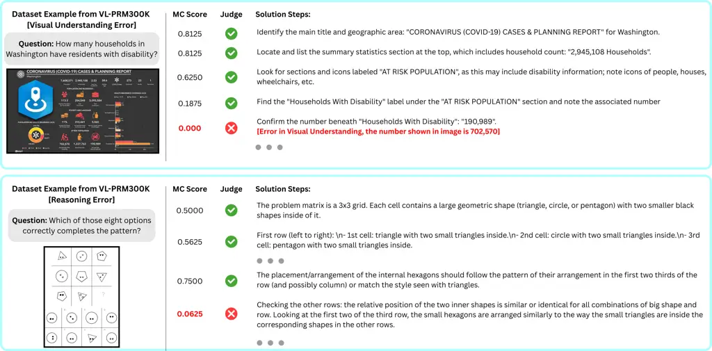
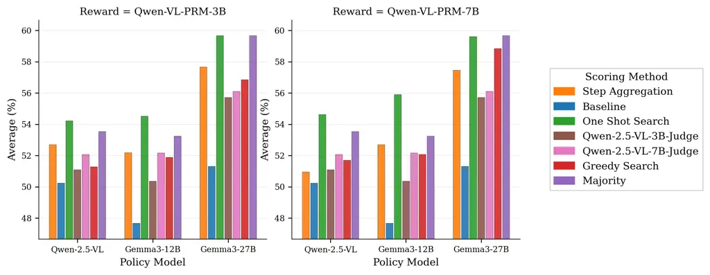
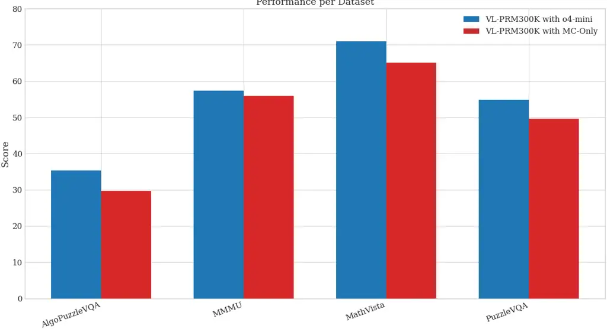
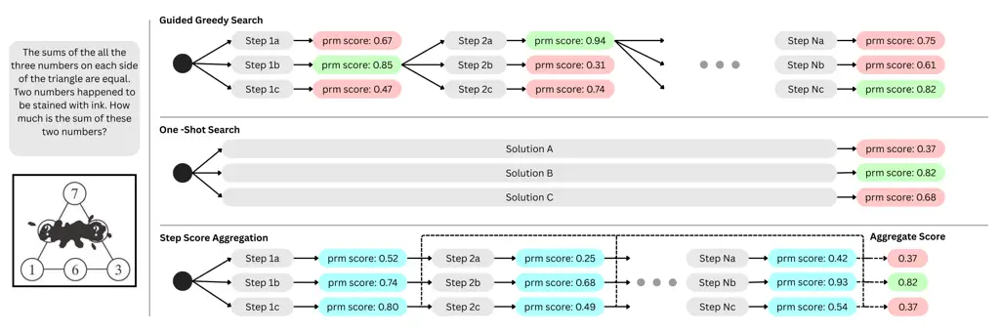
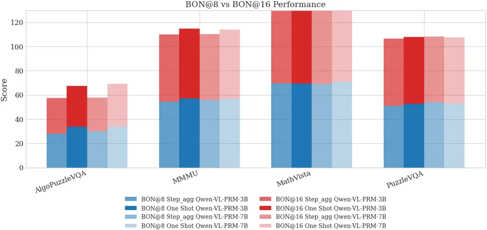
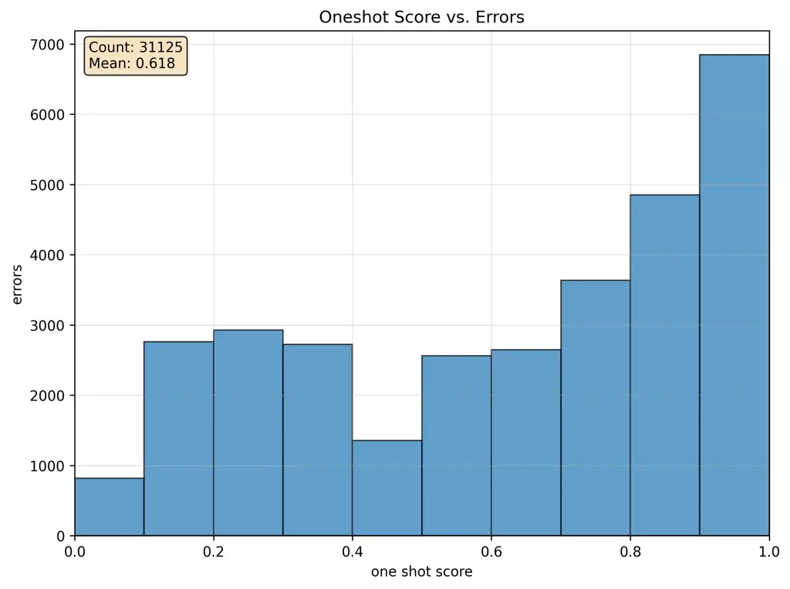
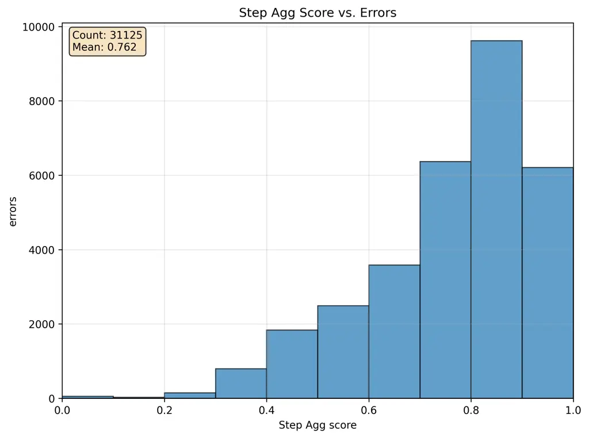

# Training Vision-Language Process Reward Models for Test-Time Scaling in Multimodal Reasoning: Key Insights and Lessons Learned

Brandon Ong Affiliation: AI Singapore    Tej Deep Pala
Affiliation: Nanyang Technological University    Vernon Toh
Affiliation: Nanyang Technological University    William Chandra Tjhi
Affiliation: AI Singapore    Soujanya Poria Affiliation: Nanyang
Technological University

###### Abstract

Process Reward Models (PRMs) provide step-level supervision that
improves the reliability of reasoning in large language models. While
PRMs have been extensively studied in text-based domains, their
extension to Vision Language Models (VLMs) remains limited. Existing
Vision-Language PRMs (VL-PRMs) rely on Monte Carlo Tree Search (MCTS)
for data construction, which can often produce noisy supervision signals
and limit generalization across tasks. In this work, we aim to elucidate
the design space of VL-PRMs by exploring diverse strategies for dataset
construction, training, and test-time scaling. First, we introduce a
hybrid data synthesis framework that combines MCTS with judgments from a
strong VLM, producing more accurate step-level labels. Second, we
propose perception-focused supervision, enabling our PRM to explicitly
detect errors at the visual grounding stage of reasoning. Third, we
systematically evaluate multiple test-time scaling strategies, showing
that our PRMs can reliably guide VLMs toward more accurate solutions.
Our experiments covering five diverse multimodal benchmarks (MMMU,
PuzzleVQA, AlgoPuzzleVQA, MathVista, and MathVision) reveal several key
insights: (i) VL-PRMs when used as Outcome Reward Models (ORMs) during
test-time scaling (TTS) can outperform VL-PRM guided process step
selection, (ii) smaller VL-PRMs can match or even surpass larger ones in
detecting process errors, (iii) VL-PRMs uncover latent reasoning
abilities in stronger VLM backbones, (iv) perception-level supervision
leads to significant gains in test-time scaling, and (v) TTS performance
of different policies improve on advanced math reasoning datasets
despite not training VL-PRMs on such datasets. We hope our work will
motivate further research and support the advancement of VLMs.

|     |
| --- |
|     |

![[Uncaptioned
image]](arxiv-2509-23250--e45c6afb1296.figures/figure-1.webp) Code:
[https://github.com/theogbrand/vlprm](https://github.com/theogbrand/vlprm)

![[Uncaptioned
image]](arxiv-2509-23250--e45c6afb1296.figures/figure-2.webp)
Qwen-VL-PRM-3B:
[https://huggingface.co/ob11/Qwen-VL-PRM-3B](https://huggingface.co/ob11/Qwen-VL-PRM-3B)

![[Uncaptioned
image]](arxiv-2509-23250--e45c6afb1296.figures/figure-2.webp)
Qwen-VL-PRM-7B:
[https://huggingface.co/ob11/Qwen-VL-PRM-7B](https://huggingface.co/ob11/Qwen-VL-PRM-7B)

![[Uncaptioned
image]](arxiv-2509-23250--e45c6afb1296.figures/figure-2.webp)
VL-PRM300K:
[https://huggingface.co/datasets/ob11/VL-PRM300K](https://huggingface.co/datasets/ob11/VL-PRM300K)

## 1 Introduction

Chain-of-thought (CoT) (Wei et al., 2022) prompting has opened up new
possibilities for Large Language Models (LLMs). Prior research
demonstrates that CoT-based training can substantially improve LLM
performance. A central challenge lies in obtaining high-quality training
data, often addressed through distillation, where teacher models
generate step-by-step reasoning traces. This approach has proven
effective in models like DeepSeek-R1.

In such settings, effective _process supervision_ becomes crucial.
Rather than verifying only the final answer, it provides guidance and
correction at every intermediate step, thereby ensuring logical
consistency and factual reliability throughout the reasoning chain.
Distillation data can be enhanced with process-level annotations, where
each reasoning step is labeled as correct or incorrect, enabling the
training of _Process Reward Models_ (PRMs), which serve as reward
functions for reinforcement learning (RL) with policy LLMs.

Beyond training, PRMs offer two key benefits: (1) identifying reasoning
errors and (2) enabling test-time scaling by guiding inference. This is
particularly important because LLMs remain vulnerable to
_hallucinations_ and subtle logical mistakes in multi-step reasoning
tasks, such as mathematical problem solving (Wang et al., 2023; Zheng
et al., 2024). Traditional outcome-only verifiers (Outcome Reward
Models) are limited, evaluating only the final answer and often missing
intermediate errors that compromise the reasoning trajectory (Wang
et al., 2024). In contrast, PRMs can detect such errors and translate
them into effective guidance. During inference, PRMs can be leveraged to
filter out flawed reasoning paths and steer generation toward more
coherent and accurate solutions (Lightman et al., 2023; Zhang et al.,
2025b).

Although research on PRMs has made significant progress, most existing
work has focused on text-based tasks such as mathematical reasoning.
More recently, (Wang et al., 2025) introduced a PRM tailored to
vision-language models (VLMs). Their dataset was constructed using Monte
Carlo Tree Search (MCTS), where the quality of a reasoning step was
scored by the ratio of successful versus unsuccessful solution paths
emanating from that step. This MCTS-based scoring strategy has also been
widely explored in the math-focused PRM research (Zhao et al., 2025).

Despite Wang et al. (2025)’s progress, several key research questions on
VL-PRMs remain open:

- •
  Beyond MCTS for dataset construction. Wang et al. (2025) relied
  primarily on MC-score-based dataset construction, which strongly
  influenced PRM performance. Our central question is whether superior
  performance can be achieved by using stronger VLMs to judge each
  reasoning step, and subsequently employing these judgments as
  supervision signals for training VL-PRMs.
- •
  Does VL-PRM size matter? Can smaller VL-PRMs match the performance of
  larger ones?
- •
  Strategies for test-time scaling. How can VL-PRMs be best leveraged
  during inference?
- •
  Generalization across reasoning tasks. While Wang et al. (2025)
  evaluated primarily on math-heavy datasets requiring expert subject
  knowledge, other reasoning domains remain underexplored. In
  particular, abstract reasoning tasks highlight human strengths but
  expose persistent weaknesses in VLMs. We ask whether VL-PRMs can
  bridge this gap.
- •
  The role of structured reasoning. Prior studies Chia et al. (2024)
  suggest that perception is a major bottleneck in multimodal reasoning.
  Can VL-PRMs be designed to capture perception errors explicitly, and
  would such process-level supervision improve test-time scaling
  performance?

In this work, we expand the VL-PRM design space, offering insights
across the full pipeline—from dataset construction and training to
evaluation on diverse reasoning tasks.

- •
  Training data source. Wang et al. (2025) train their model using
  advanced math datasets such as GeoQA+ (Cao & Xiao, 2022), CLEVR-Math
  (Lindström & Abraham, 2022), Geometry3K (Lu et al., 2021), GEOS (Seo
  et al., 2015), GeomVerse (Kazemi et al., 2023), and Geo170K (Gao
  et al., 2025). They evaluate on similarly complex benchmarks
  (MathVista, Dynamath, Wemath), yielding improved error detection, but
  this is expected given the overlap between training and evaluation. In
  contrast, we test whether training solely on general VQA and abstract
  reasoning, without advanced math datasets, can still enhance
  mathematical reasoning under test-time scaling (TTS). Our results
  confirm this: models trained this way consistently improve both TTS
  performance and error detection on advanced benchmarks, suggesting
  that general VQA and abstract reasoning tasks strengthen logical error
  detection, which in turn benefits mathematical reasoning under TTS.
- •
  Hybrid step evaluation. While we also use MCTS to construct data, we
  depart from relying solely on MC-score-based metrics as in Wang et al.
  (2025). Instead, we additionally leverage a strong multimodal LLM
  (o4-mini) to directly judge the correctness of each step. This allows
  us to investigate whether LLM-based judgments provide more reliable
  process supervision than MC-score-based labeling. We are publicly
  releasing both the datasets ¹¹ 1 .
- •
  Test-time scaling strategies. We evaluate three VL-PRM-based
  methods: (1) _Greedy_, which iteratively selects the best next step at
  each decoding stage based on VL-PRM scores; (2) _One-shot_, which
  scores $`N`$ complete solutions and chooses the highest-scoring one;
  and (3) _Step-score Aggregation_, which averages step-level scores to
  select the final solution.
- •
  Perception-focused supervision. Prior work, such as Chia et al.
  (2024), has shown that VLMs often struggle at the perception stage of
  multimodal reasoning even before doing inductive and deductive
  reasoning. Motivated by this, we train our VL-PRM to explicitly
  evaluate perception steps, which substantially improves test-time
  scaling performance of policy VLMs.
- •
  Backbone sensitivity. We observe that different VLM backbones show
  varying degrees of reasoning capability when guided by PRMs at test
  time. For instance, Qwen-2.5-VL-7B and Gemma3-12B achieve comparable
  performance on PuzzleVQA and AlgoPuzzleVQA under standard evaluation,
  yet with PRM-driven test-time scaling, Gemma3-12B outperforms
  Qwen-2.5-VL-7B by 8–15%. This highlights the role of PRMs in
  uncovering latent reasoning abilities of VLMs.
- •
  Comprehensive evaluation. In contrast to Wang et al. (2025), we
  evaluate our approach on five diverse multimodal benchmarks covering
  various types of reasoning: _MMMU_, which requires expert subject
  knowledge; _PuzzleVQA_, targeting abstract reasoning; _AlgoPuzzleVQA_,
  focused on algorithmic reasoning; and _MathVista & MathVision_,
  designed for mathematical problem solving.
- •
  VL-PRM sizes. We experiment with two VL-PRMs of different scales—3B
  and 7B parameters—initialized from Qwen-2.5-VL-3B and Qwen-2.5-VL-7B,
  respectively. Our results show that the smaller 3B model achieves
  comparable test-time scaling performance to the 7B model and
  outperforms the 7B variant by 5% in detecting process errors.

Figure 1: Visual and reasoning errors detected by MC scoring and o4-mini
judge in VL-PRM300K.

## 2 Method

Data scarcity is a key challenge for training PRMs. While prior work
uses MCTS-based scoring i.e., it assigns an _MC-score_ to each reasoning
step, e.g.,
$`\mathrm{MCScore}(i)\;=\;\frac{\#\text{ correct completions from step }i}{\#\text{ sampled completions from step }i}`$
to build datasets like VisualPRM400K (Wang et al., 2025), this dataset
does not distinguish between perception and higher-level reasoning
steps. To address this, we create a new dataset, VL-PRM300K, with
structured traces that explicitly separate these stages. Additionally,
we exclude advanced math datasets from training to study their impact on
the generalizability of VL-PRMs across diverse multimodal reasoning
tasks.

### 2.1 Constructing VL-PRM300K

Let $`\mathcal{I}=\{I_{1},I_{2},\ldots\}`$ denote the image set and
$`\mathcal{Q}`$ the question set. For a pair
$`(I,q)\in\mathcal{I}\times\mathcal{Q}`$, a policy VLM $`\pi`$ is
prompted to produce a stepwise solution
$`S\;=\;(s_{1},s_{2},\ldots,s_{T})`$, where $`s_{i}`$ denotes the
$`i`$-th reasoning step. Under MCTS, from any prefix
$`s_{\leq i}\triangleq(s_{1},\ldots,s_{i})`$ we expand continuations by
rolling out the policy until termination:
$`s_{>i}\;\sim\;\pi\!\left(\cdot\,\middle|\,I,q,s_{\leq i}\right).`$ The
quality of step $`s_{i}`$ can then be assessed either by (i) the
MCTS-derived $`\mathrm{MCScore}(i)`$ as above, or (ii) an external judge
VLM.

##### Structured Reasoning.

Prior work has identified perception as a key bottleneck (Chia et al., 2024) in multimodal models. In particular, several studies show ²² 2
[https://cloud.google.com/vertex-ai/generative-ai/docs/multimodal/design-multimodal-prompts#tailor_the_models_response_to_input](https://cloud.google.com/vertex-ai/generative-ai/docs/multimodal/design-multimodal-prompts#tailor_the_models_response_to_input) (Jia
et al., 2024) that prompting models to first describe or explain the
image before attempting problem-solving significantly improves reasoning
performance, as the additional grounding helps anchor subsequent
inference (Wu et al., 2025; Thawakar et al., 2025) ³³ 3
[https://andrewmayne.com/2024/03/12/improving-gpt-4s-visual-reasoning-with-prompting/](https://andrewmayne.com/2024/03/12/improving-gpt-4s-visual-reasoning-with-prompting/).
However, errors introduced at the perception stage can propagate through
the reasoning process, ultimately degrading overall accuracy. Motivated
by this observation, we design our VL-PRMs to evaluate not only
reasoning steps but also perception steps, enabling them to detect and
penalize errors at both stages of the structured reasoning pipeline.

##### Using o4-mini as a Judge.

For judge-based supervision, we query a judge VLM $`J`$ (here, o4-mini)
with the tuple $`(I,q,s_{<i},s_{i})`$ to decide whether step $`s_{i}`$
is correct given its context. Concretely, $`J`$ emits a binary label
$`y_{i}\in\{correct,incorrect\}`$ along with a brief rationale. We use
these judge labels to provide process-level supervision signals for
training VL-PRMs. Following how PRMs are used at test-time, once a step
is labeled as negative, we discard all subsequent steps.

##### Dataset Statistics.

Our dataset comprises approximately 300K $`(I,q,S)`$ pairs, with overall
statistics reported in Table 1. We sampled from six datasets covering
diverse visual question answering (VQA) skills: document and chart
understanding (DVQA); OCR (InfoVQA); general commonsense knowledge
(VQAv2); grade-school level science (AI2D); grade-school level math
reasoning (CLEVR-Math); and abstract reasoning (RAVEN). During dataset
construction, we generate 5 solutions per image–question pair using
GPT-4.1, with temperature of 1.0 and $`16384`$ maximum new tokens. We
select traces that adhere strictly to our structured
perception-reasoning prompt format shown in Section A.4, discarding all
invalid traces. Following the MCTS methodology described above, we split
the perception and reasoning step traces into standalone steps, and for
every step, we sample 16 continuations with prior steps (if any)
included as prefixes. Finally, we query a judge VLM $`J`$ (here,
o4-mini) to determine whether each step is correct given its context.
The resulting VL-PRM300K dataset comprises approximately 300K samples,
containing 77% of samples with an incorrect step found in the reasoning
trace and 23% of samples with all steps verified correct, reported in
Table 9. On average, each solution contains 4.55 steps, yielding an
estimate of $`1.32`$M step-level samples. Among these steps, about 17%
are incorrect steps, with full details in Table 10. To study the effect
of label imbalance, we additionally construct a balanced variant of
VL-PRM300K.

| Statistics                        | Number |
| --------------------------------- | ------ |
| Total Samples                     |  290K  |
|    - DVQA                         | 16K    |
|    - InfoVQA                      | 22K    |
|    - VQAv2                        | 7K     |
|    - AI2D                         | 21K    |
|    - CLEVR-Math                   | 25K    |
|    - RAVEN                        | 199K   |
| Incorrect Samples                 | 77%    |
| Correct Samples                   | 23%    |
| Total Steps                       | 1.32M  |
|    - Correct Steps                | 1.10M  |
|    - Incorrect Steps              | 0.22M  |
|     - Perception Errors           | 86%    |
|     - Reasoning Error             | 14%    |
| Avg. Number of Steps per Solution | 4.55   |

Table 1: Statistics of VL-PRM300K.

##### Constructing VL-PRM300K-balanced.

As reported in Table 1, VL-PRM300K is highly imbalanced, with the
majority of samples containing samples with an incorrect step found in
the step-by-step reasoning trace. Among the samples in VL-PRM300K, the
majority of steps are labeled as correct, consistent with the
observations in Wang et al. (2025). Among the error labels,
approximately 86% correspond to perception errors, while the remaining
14% correspond to reasoning errors. To construct a balanced dataset with
equal proportions of correct and incorrect samples, we first aggregate
all samples from all datasets, excluding RAVEN. Next, we sample all the
correct samples from RAVEN, since RAVEN contains significantly more
samples with an incorrect step in its reasoning trace than samples with
verified correct steps. Finally, we randomly select samples with
incorrect steps from RAVEN to match the total number of correct samples,
achieving a balanced distribution of correct and incorrect training
samples, as summarized in Table 11.

### 2.2 Training VL-PRMs

##### Training.

VL-PRMs are trained on VL-PRM300K to predict “+” or “–” as step-level
judgments. Training minimizes the cross-entropy loss over these label
tokens for every step. The input to the VL-PRM is $`\{I,q,s_{0},p\}`$.
Here, the prompt $`p`$ is the system prompt for VL-PRM.

##### Best-of-$`N`$ Inference.

Our VL-PRMs are used as a critic model to judge the Chain-of-Thought
(CoT) step-by-step responses generated by the policy model. At inference
time, the Vision-Language Process Reward Model (VL-PRM) receives an
image–question pair $`(I,q)`$ along with a partial reasoning trajectory
$`\{s_{1},\dots,s_{i-1}\}`$, and assigns a score to the candidate step
$`s_{i}`$. The response that receives the highest score is chosen. We
investigate three different strategies for integrating VL-PRMs into
test-time scaling (Figure 4):

- •
  Guided Greedy Search. Given $`(I,q)`$, the policy $`\pi`$ samples
  $`N`$ candidate next steps $`\{s_{i}^{(1)},\dots,s_{i}^{(N)}\}`$. Each
  candidate step is scored by the VL-PRM as
  $`\text{Score}(s_{i}^{(j)})=P_{\theta}(+\mid I,q,s_{\leq i}),`$ where
  $`P_{\theta}`$ is the VL-PRM’s probability of the step being correct.
  The highest-scoring step is selected, and $`\pi`$ continues generation
  conditioned on that step.
- •
  One-shot Search. Instead of evaluating individual steps, the policy
  $`\pi`$ generates $`N`$ complete candidate solutions
  $`\{S^{(1)},\dots,S^{(N)}\}`$. VL-PRM scores each full solution in a
  single pass: $`\text{Score}(S^{(j)})=P_{\theta}(+\mid I,q,S^{(j)})`$.
  This approach avoids per-step evaluations, making it computationally
  cheaper than guided greedy search.
- •
  Step-Score Aggregation. The policy $`\pi`$ first produces full
  solutions $`\{S^{(1)},\dots,S^{(N)}\}`$, where each solution
  $`S^{(j)}=(s_{1}^{(j)},\dots,s_{T}^{(j)})`$. VL-PRM assigns a per-step
  probability $`p_{i}^{(j)}=P_{\theta}(+\mid I,q,s_{\leq i}^{(j)})`$,
  which is converted into a weighted score:
  $`\tilde{s}_{i}^{(j)}=1\cdot p_{i}^{(j)}+0\cdot(1-p_{i}^{(j)})=p_{i}^{(j)}`$.
  The overall solution score is then computed by aggregating step-level
  scores, e.g., using the mean:
  $`\text{Score}(S^{(j)})=\frac{1}{T}\sum_{i=1}^{T}\tilde{s}_{i}^{(j)}`$.
  VL-PRM selects the solution with the highest aggregated score.

The policy models are instructed to do structured reasoning, where they
first explain the image and then perform reasoning to solve the problem.

### 2.3 Constructing PerceptionProcessBench

We use VisualProcessBench to evaluate our VL-PRMs’ ability to detect
step-level visual reasoning errors. However, assessing their performance
on perception error detection requires a dataset with explicit
correctness annotations for perception steps. To address this, we
synthetically construct PerceptionProcessBench from PuzzleVQA. In
PuzzleVQA, each problem includes ground-truth perception details. To
generate negative examples, we prompt GPT-4.1 to minimally alter the
original perception step by either subtly modifying a correct detail or
introducing a small, plausible error relevant to the problem. We
specifically instruct the model to make only a single, subtle change,
ensuring the resulting error is challenging for the VL-PRM to detect.
Larger or multiple changes would make the error too obvious. As the
original perception details are created using templates, to include
variability in the steps, we further rephrase them using GPT-4.1. The
exact prompt used for generating these mutations is provided in the
Appendix. For each problem, we create one negative example, resulting in
a dataset of 1,000 positive and 1,000 negative perception steps.

## 3 Experiments and Results

### 3.1 Experimental Settings

##### Backbones.

We fine-tune Qwen-2.5-VL-3B and Qwen-2.5-VL-7B on the VL-PRM300K
dataset, resulting in two models: Qwen-VL-PRM-3B and Qwen-VL-PRM-7B.

##### Evaluation Datasets.

To evaluate these models under test-time scaling, we select five
benchmark datasets that probe distinct aspects of multimodal reasoning:
(i) MMMU, which requires expert-level subject knowledge, (ii) PuzzleVQA,
designed to assess abstract reasoning, (iii) AlgoPuzzleVQA, targeting
algorithmic reasoning, and (iv) MathVista & MathVision, which evaluates
mathematical problem-solving ability. For MMMU, we use the validation
set containing 900 problems. For PuzzleVQA, we construct an evaluation
set of 1,000 samples by selecting the first 50 puzzles from each of 20
problem types. For AlgoPuzzleVQA, we similarly sample the first 50
puzzles from each of 18 problem types. For MathVista, we adopt the
test-mini split, which contains 1,000 problems. Finally, for MathVision,
we use the test split, which has 3040 samples. On all five datasets, the
policy model is instructed to do structured reasoning, where the model
first explains the image, followed by induction and deduction.

To assess the capability of our VL-PRMs in fine-grained step correctness
evaluation, we use VisualProcessBench (Wang et al., 2025). This
benchmark consists of 2,866 problems with step-by-step solutions,
comprising a total of 26,950 steps manually annotated as _correct_,
_incorrect_, or _neutral_. The problems are drawn from five datasets,
including MMMU and four math benchmarks: MathVerse, DynaMath,
MathVision, and WeMath. Performance on this benchmark is reported using
the macro-F1 score. We dropped neutral samples from the data following
Wang et al. (2025).

### 3.2 Main Results

|                     |             |              |               |             |             |             |
| ------------------- | ----------- | ------------ | ------------- | ----------- | ----------- | ----------- |
| Model               | MMMU        | PuzzleVQA    | AlgoPuzzleVQA | MathVista   | MathVision  | Overall     |
| Commercial Models   |             |              |               |             |             |             |
| GPT-4o              | 70.7        | 60.0         | 57.8          | 30.9        | 31.2        | 50.1        |
| o1                  | 78.2        | 78.9         | 54.4          | 73.9        | 60.3        | 69.1        |
| o3                  | 82.9        | 84.1         | 62.3          | 86.8        | –           | –           |
| Qwen-2.5-VL Family  |             |              |               |             |             |             |
| Qwen-2.5-VL-3B      | 51.7        | 34.5         | 25.7          | 60.0        | 21.2        | 38.6        |
|    + Qwen-VL-PRM-7B | 53.7 (+2.0) | 44.9 (+10.5) | 28.3 (+2.6)   | 64.1 (+4.1) | 21.8 (+0.6) | 42.6 (+4.0) |
| Qwen-2.5-VL-7B      | 55.0        | 48.0         | 29.1          | 67.8        | 24.2        | 44.8        |
|    + Qwen-VL-PRM-3B | 57.6 (+2.6) | 55.5 (+7.5)  | 33.8 (+4.7)   | 70.0 (+2.2) | 26.1 (+1.9) | 48.6 (+3.6) |
|    + Qwen-VL-PRM-7B | 57.4 (+2.4) | 54.8 (+6.8)  | 35.3 (+6.2)   | 71.0 (+3.2) | 26.2 (+2.0) | 48.9 (+4.1) |
| Qwen-2.5-VL-32B     | 66.0        | 46.2         | 26.9          | 76.9        | 36.7        | 50.5        |
|    + Qwen-VL-PRM-3B | 67.0 (+1.0) | 67.1 (+20.8) | 41.6 (+14.7)  | 77.7 (+0.8) | 40.5 (+3.8) | 58.7 (+8.2) |
|    + Qwen-VL-PRM-7B | 67.6 (+1.6) | 66.8 (+20.6) | 44.2 (+17.3)  | 78.3 (+1.4) | 40.1 (+3.2) | 59.4 (+8.9) |
| Gemma3 Family       |             |              |               |             |             |             |
| Gemma3-12B          | 57.6        | 45.0         | 29.1          | 58.9        | 28.1        | 43.7        |
|    + Qwen-VL-PRM-3B | 60.4 (+2.8) | 57.7 (+12.7) | 39.7 (+10.6)  | 60.3 (+1.4) | 33.8 (+5.7) | 50.4 (+6.7) |
|    + Qwen-VL-PRM-7B | 60.2 (+2.6) | 59.0 (+12.0) | 41.1 (+4.5)   | 63.3 (+4.4) | 33.9 (+5.8) | 51.5 (+7.8) |
| Gemma3-27B          | 62.9        | 50.8         | 29.9          | 61.6        | 32.4        | 47.5        |
|    + Qwen-VL-PRM-3B | 65.5 (+2.6) | 67.4 (+16.6) | 40.3 (+10.4)  | 65.4 (+3.8) | 39.8 (+7.4) | 55.7 (+8.2) |
|    + Qwen-VL-PRM-7B | 64.5 (+1.6) | 67.6 (+16.8) | 41.1 (+11.2)  | 65.2 (+3.6) | 40.9 (+8.5) | 55.9 (+8.4) |

Table 2: Performance comparison across model families on visual
reasoning datasets with Visual Process Reward Models (Qwen-VL-PRM-3B and
Qwen-VL-PRM-7B). Improvements are shown in green with gains over base
models.

#### 3.2.1 VL-PRM Improves Performance under Test-time Scaling

##### Results on MMMU.

Both Qwen-VL-PRM-3B and Qwen-VL-PRM-7B consistently enhance the
performance of all evaluated policies under test-time scaling. On the
expert-knowledge–oriented dataset MMMU, however, the observed gains are
relatively modest, with improvements averaging around 2.5% across the
three policies. This suggests that test-time scaling may have a limited
impact in tasks where reasoning heavily depends on specialized domain
knowledge.

##### Results on Abstract and Algorithmic Reasoning Datasets.

In contrast, for datasets requiring abstract, algorithmic, or
mathematical reasoning, we observe substantial improvements. On
PuzzleVQA, performance increases by 7% for Qwen-VL-2.5-7B, 12.7% for
Gemma3-12B, and 16.6% for Gemma3-27B. Similarly, on AlgoPuzzleVQA, we
find improvements of approximately 5% for Qwen-VL-2.5-7B and 11% for
both Gemma3-12B and Gemma3-27B. These results highlight that test-time
scaling is particularly effective for reasoning-intensive tasks beyond
expert subject knowledge. In Table 7, we present the performance of
VisualPRM on the two datasets. VisualPRM was trained primarily on
math-focused datasets and did not include any abstract reasoning data.
The results show consistent performance gains across both datasets, with
the exception of Qwen-2.5-VL-7B, where the improvement on PuzzleVQA is
limited to just 1%. While these gains are notable, VisualPRM still does
not surpass the performance of our VL-PRMs. Overall, these findings
highlight that training on a mixture of general VQA and math datasets
can transfer effectively to other reasoning domains, such as abstract
and algorithmic reasoning.

##### Results on Math Datasets.

On MathVista and MathVision, we observe a moderate performance
improvement of 3–5%, which is lower than the gains seen on PuzzleVQA and
AlgoPuzzleVQA. This is likely due to the lower proportion of
math-related data in our training set compared to the abundance of
abstract reasoning problems from RAVEN. Interestingly, despite using a
much larger collection of math-focused problems, Wang et al. (2025)
report a similar level of improvement on MathVista and MathVision across
their models. However, when we evaluate VisualPRM using
Qwen-2.5-VL-7B/32B and Gemma3-12B/27B as policy models, we find that on
MathVista, performance drops from 1-2 percentage points (see Table 7).
MathVision performance improves, but the improvement is less than our
VL-PRMs. In our case, we include only a few samples from CLEVER-Math,
which primarily consists of elementary problems such as basic addition
and subtraction. Despite this limited mathematical data, our approach
achieves comparable improvements to those of Wang et al. (2025), whose
dataset includes more complex mathematical problems, such as those from
GeoQA+, Geo170K, Geometry3K, GEOS, GeomVerse, and CLEVR-Math as well. We
hypothesize that the substantial number of abstract reasoning and
general VQA tasks in our dataset enhances the general logical reasoning
ability of the VL-PRM, thereby improving TTS performance across diverse
domains.

|                 |             |             |              |              |              |              |
| --------------- | ----------- | ----------- | ------------ | ------------ | ------------ | ------------ |
| Model           | MathVision  | MathVerse   | MMMU         | DynaMath     | WeMath       | Overall      |
| GPT-4o-Mini     | 53.6        | 58.9        | 57.1         | 56.7         | 58.5         | 57.9         |
| GPT-4o          | 56.3        | 60.2        | 59.7         | 59.0         | 63.3         | 60.3         |
| Qwen-2.5-VL-3B  | 43.9        | 42.6        | 41.6         | 45.2         | 40.8         | 43.4         |
| Qwen-2.5-VL-7B  | 53.1        | 51.8        | 47.8         | 51.3         | 54.2         | 51.0         |
| Qwen-2.5-VL-32B | 58.4        | 63.3        | 57.5         | 61.1         | 60.3         | 59.5         |
| Qwen-VL-PRM-3B  | 59.6 (+6.5) | 60.6 (+8.8) | 59.4 (+11.6) | 64.5 (+13.2) | 64.7 (+10.5) | 61.9 (+10.9) |
| Qwen-VL-PRM-7B  | 55.7(+2.6)  | 58.8 (+7.0) | 55.8 (+8.0)  | 58.3 (+7.0)  | 59.8 (+5.6)  | 58.6 (+7.6)  |

Table 3: Performance on VisualProcessBench. Improvements over
Qwen-2.5-VL-7B shown in green. Bold indicates best performance per
column.

##### Test-time Scaling Unleashes Hidden Reasoning Ability.

We observe that certain models, particularly Qwen-2.5-VL-32B, Gemma3-12B
and Gemma3-27B, exhibit substantial gains under test-time scaling
despite performing comparably to Qwen-VL-2.5-7B in the absence of
scaling on PuzzleVQA and AlgoPuzzleVQA. While their baseline performance
is similar, these larger Gemma models benefit disproportionately from
the guidance of VL-PRMs during inference. This finding is noteworthy, as
it suggests that process reward models (PRMs) can _unlock latent
reasoning capacity_ that is not apparent under standard greedy decoding.

A plausible explanation is that larger models often encode more
sophisticated reasoning patterns, but these capabilities may remain
underutilized due to suboptimal decoding trajectories. By filtering and
guiding intermediate steps, VL-PRMs help these models explore more
reliable reasoning paths, thereby revealing their hidden potential.

#### 3.2.2 Performance on VisualProcessBench

VisualProcessBench is employed to evaluate the ability of VL-PRMs to
assess step-level correctness. Given a problem and its step-by-step
solution, the VL-PRM computes the probabilities of the “+” and “–”
tokens for each step. A step is labeled as positive if $`P(+)>P(-)`$,
and negative otherwise. As baselines, we use Qwen-2.5-VL-3B and
Qwen-2.5-VL-7B directly to predict step correctness. Our results in
Table 3 show that both VL-PRMs outperform their respective baselines.
While Qwen-VL-PRM-7B achieves a good improvement of 7.6% in macro-F1
score, Qwen-VL-PRM-3B exhibits a substantial gain of 16%, highlighting
the effectiveness of PRM training even for smaller backbones.
Additionally, we also benchmark GPT-4o-Mini and GPT-4o. We find that
Qwen-VL-PRM-3B outperforms GPT-4o-Mini and performs comparably to
GPT-4o.

##### Takeaways.

Our VL-PRMs are trained only on an elementary math dataset with basic
operations, yet the 3B variant performs competitively with proprietary
models like GPT-4o on VisualProcessBench, which contains challenging
math datasets. This suggests that training on general VQA and abstract
reasoning tasks effectively generalizes to mathematical reasoning for
error detection. Future work will explore incorporating advanced math
datasets (Wang et al., 2025) to further enhance performance.

#### 3.2.3 Results on PerceptionProcessBench

| PRM                    | F1   |
| ---------------------- | ---- |
| Qwen-VL-PRM-3B         | 66.8 |
| w/o perception         | 33.3 |
| Qwen-VL-PRM-7B         | 70.3 |
| w/o perception         | 33.3 |
| Qwen2.5-VL-3B-Instruct | 46.8 |
| Qwen2.5-VL-7B-Instruct | 56.3 |

Table 4: F1 scores of our VL-PRMs on PerceptionProcessBench.

The results on PerceptionProcessBench in Table 4 show that incorporating
perception steps during training significantly improves the ability of
VL-PRMs to detect perception errors. Our VL-PRMs outperform the baseline
Qwen2.5-VL models of comparable size by a margin of 14%–20%. In
contrast, when trained without perception supervision, the VL-PRMs tend
to predict all perception steps as correct. This occurs because the
training data does not explicitly indicate which perception steps are
incorrect. Moreover, since our data is structured such that all
subsequent steps are marked as negative after a negative step is
identified by o4-mini, the model implicitly treats all perception steps
as positive—even though their labels are masked during training.

### 3.3 Analyses and Ablations

##### Findings from Test-time Scaling Strategies.

As outlined in Section 2.2, we investigate three strategies for
leveraging VL-PRMs during test-time scaling. While all the TTS
techniques improve performance substantially compared to the baseline,
our results show that Guided Greedy Search consistently performs the
worst among the three. A likely explanation is that selecting the
immediately highest-rewarded step does not necessarily lead to an
optimal reasoning trajectory due to error propagation from earlier
steps. In fact, for challenging tasks such as AlgoPuzzleVQA, we even
observe that greedy VL-PRM-guided search can reduce performance below
the baseline policy. With Step-score aggregation, we see improvements
across the benchmarks using all the different policies. Notably, both
the greedy search and step-scorer approaches provide negligible
improvement for MMMU.

Figure 2: Comparison among different TTS methods.

Surprisingly, although our VL-PRMs are trained to assign rewards at the
step level, performance improves markedly when the model is provided
with an entire solution sequence for scoring, as described in
Section 2.2. This suggests that, despite being trained for local
supervision, VL-PRMs generalize effectively to full-solution evaluation.
Access to complete contextual information appears to enable more
accurate and reliable reward assignment, thereby enhancing test-time
scaling. The comparative results are reported in Figure 2. For Qwen-VL,
although these two methods perform similarly on MMMU and MathVista, the
differences are noticeable for PuzzleVQA and AlgoPuzzleVQA, where
One-shot Search outperforms Guided Greedy Search by 4% to 9%. However,
when looked closely, we find that Step-score aggregation tends to
generate false positives, consequently affecting its performance. One
reason for this could be the high imbalance of correct and incorrect
steps in the training data.

One-shot Search has improved performance across VL-PRMs and benchmarks.
This method is akin to Outcome Reward Modeling (ORM). What is
interesting is that despite not training an explicit ORM, our PRM is
acting as an ORM. This is in contrast to VisualPRM (Wang et al., 2025),
where they trained an ORM explicitly, yet failed to perform as well as
their PRM. To investigate this further, we evaluated VisualPRM on the
same benchmarks and policy models, with details in Table 7. We found
that VisualPRM shows improvement under the one-shot setting and only
falls short of step-aggregation-based TTS by 1%. In our case, one-shot
consistently outperforms step-aggregation by 2-3%.

##### The Impact of Dataset Size.

Our experiments reveal that training on VL-PRM300K-balanced subset does
not lead to consistent improvements: in some cases, performance
increases marginally, while in others, a slight decrease is observed. We
report this result Table 5.

|                 |                |                    |       |           |               |           |         |
| --------------- | -------------- | ------------------ | ----- | --------- | ------------- | --------- | ------- |
| Policy Model    | Reward Model   | VL-PRM300K Variant | MMMU  | PuzzleVQA | AlgoPuzzleVQA | MathVista | Average |
| Qwen-2.5-VL-7B  | _Baseline_     |                    | 55.0  | 48.0      | 29.1          | 67.8      | 49.98   |
|                 | Qwen-VL-PRM-3B | full               | 55.33 | 55.50     | 33.78         | 69.00     | 53.40   |
|                 |                | –balanced          | 57.56 | 52.10     | 33.22         | 70.00     | 53.22   |
|                 |                | –w/o perception    | 54.22 | 49.10     | 33.11         | 67.90     | 51.08   |
|                 | Qwen-VL-PRM-7B | full               | 57.44 | 54.80     | 33.78         | 69.80     | 53.96   |
|                 |                | –balanced          | 56.00 | 54.70     | 35.33         | 71.00     | 54.26   |
|                 |                | –w/o perception    | 53.89 | 51.80     | 32.11         | 68.20     | 51.50   |
| Qwen-2.5-VL-32B | _Baseline_     |                    | 66.0  | 46.2      | 26.9          | 76.9      | 54.0    |
|                 | Qwen-VL-PRM-3B | full               | 67.0  | 67.1      | 41.56         | 77.6      | 63.32   |
|                 |                | –balanced          | 65.78 | 67.0      | 40.33         | 77.4      | 62.63   |
|                 |                | –w/o perception    | 65.00 | 66.7      | 40.78         | 77.7      | 62.55   |
|                 | Qwen-VL-PRM-7B | full               | 67.56 | 66.50     | 42.22         | 77.50     | 63.45   |
|                 |                | –balanced          | 65.00 | 66.80     | 44.22         | 78.30     | 63.58   |
|                 |                | –w/o perception    | 66.89 | 65.00     | 42.78         | 77.10     | 62.94   |
| Gemma3 12B      | _Baseline_     |                    | 57.6  | 45.0      | 29.1          | 58.9      | 47.65   |
|                 | Qwen-VL-PRM-3B | full               | 60.00 | 57.70     | 39.67         | 60.30     | 54.42   |
|                 |                | –balanced          | 60.44 | 57.30     | 38.33         | 60.00     | 54.02   |
|                 |                | –w/o perception    | 57.44 | 54.80     | 36.11         | 57.30     | 51.41   |
|                 | Qwen-VL-PRM-7B | full               | 59.11 | 59.00     | 40.78         | 63.30     | 55.55   |
|                 |                | –balanced          | 60.22 | 58.10     | 41.11         | 60.70     | 55.03   |
|                 |                | –w/o perception    | 58.44 | 55.60     | 37.67         | 58.20     | 52.48   |
| Gemma3 27B      | _Baseline_     |                    | 62.9  | 50.8      | 29.9          | 61.6      | 51.80   |
|                 | Qwen-VL-PRM-3B | full               | 65.56 | 67.40     | 40.33         | 65.40     | 59.67   |
|                 |                | –balanced          | 65.11 | 67.20     | 39.33         | 64.70     | 59.09   |
|                 |                | –w/o perception    | 63.78 | 65.70     | 40.33         | 62.30     | 58.03   |
|                 | Qwen-VL-PRM-7B | full               | 64.00 | 67.60     | 40.33         | 65.00     | 59.23   |
|                 |                | –balanced          | 64.56 | 67.00     | 41.11         | 65.20     | 59.47   |
|                 |                | –w/o perception    | 63.89 | 66.40     | 40.67         | 62.20     | 58.29   |

Table 5: Performance comparison of VL-PRMs trained on variants of
VL-PRM300K

##### The Role of Judge Labels.

Figure 3: MC-Only vs o4-mini judge for VL-PRM300K construction.

To construct VL-PRM300K, we first apply MCTS and then determine the
correctness of each step using o4-mini as a judge. To assess whether an
external judge LLM is necessary for improving VL-PRM performance, we
experiment with MC-score–based labeling only to verify the correctness
of steps. For this labeling scheme, as described in Section 2, a step is
labeled as positive if the MC-score of a step exceeds a selected
threshold, otherwise a step is labeled as negative. Our results using a
threshold of 0, summarized in Figure 3, show that using o4-mini as the
judge substantially improves VL-PRM performance compared to utilizing
MC-score–based labeling only. We experiment with multiple thresholds,
including 0.5 and 0.9, and find that using a judge continues to result
in better overall performance. Furthermore, we measure the agreement
between the two step-level labeling schemes and find that it is
approximately approximately 20% for incorrect samples, underscoring the
divergence between MCTS-derived supervision and LLM-based judgments.

##### Perception Guidance Enhances VL-PRMs.

During the construction of VL-PRM300K, we adopt a structured reasoning
template in which the policy (o4-mini) first produces a perception-based
description of the image, followed by inductive and deductive reasoning
steps to solve the problem. This design enables training VL-PRMs on
explicit perception steps. To evaluate the importance of perception
supervision, we conduct an ablation study in which samples with
perception errors are omitted during training. As shown in Table 5,
excluding perception guidance leads to a consistent drop in performance
for both Qwen-VL-PRM-3B and Qwen-VL-PRM-7B across all four benchmarks
and with different policies. The performance drop is more evident in the
7B and 12B policy models compared to the 32B and 27B models, indicating
that the larger models exhibit much stronger perception performance.
Overall, these results demonstrate that perception guidance plays a
crucial role in strengthening the capabilities of VL-PRMs.

##### VL-PRMs vs. VLMs as Judges.

We evaluate whether VLMs can act as effective critics for test-time
scaling (TTS). While using Qwen-2.5-VL models as judges in a one-shot
best-of-$`N`$ setting improves performance, our VL-PRMs deliver
substantially greater gains, consistently outperforming VLM-based
judges. In contrast, when applying greedy search TTS with Qwen-2.5-VL-7B
as both the policy and judge, performance drops below baseline across
all datasets: MMMU (53.89%, $`\downarrow 1\%`$), PuzzleVQA (45.50%,
$`\downarrow{2.5\%}`$), AlgoPuzzleVQA (28.44%, $`\downarrow 1.5\%`$),
and MathVista (65%, $`\downarrow 3.1\%`$). These results suggest that
relying on VLMs for stepwise evaluation is not optimal.

##### Majority Voting.

As shown in Figure 2, PRM-based test-time scaling outperforms majority
voting for smaller models. Here, majority voting selects the final
answer by choosing the most frequent output across multiple CoT traces.
For larger models, such as Gemma 27B, the performance of PRM-based
scaling and majority voting is comparable.

## 4 Conclusion

We introduce VL-PRM300K, a dataset built with MCTS and o4-mini labeling
to train VL-PRMs for test-time scaling (TTS) of VLMs. Our study presents
several in-depth and complementary analyses compared to the existing
works. We show that when used as Outcome Reward Models (ORMs), VL-PRMs
can outperform VL-PRM-guided response selection during TTS, with smaller
models sometimes rivaling larger ones in error detection. They also
reveal hidden reasoning abilities in strong VLM backbones, benefit
greatly from perception-level supervision, and improve performance on
advanced math tasks even without direct training on such datasets. These
findings highlight the potential of VL-PRMs to drive progress in
multimodal reasoning.

## Acknowledgment

This research/project is supported by the National Research Foundation,
Singapore under its National Large Language Models Funding Initiative.
Any opinions, findings and conclusions or recommendations expressed in
this material are those of the author(s) and do not reflect the views of
National Research Foundation, Singapore.

## References

- Cao & Xiao (2022) Jie Cao and Jing Xiao. An augmented benchmark
  dataset for geometric question answering through dual parallel text
  encoding. In Nicoletta Calzolari, Chu-Ren Huang, Hansaem Kim, James
  Pustejovsky, Leo Wanner, Key-Sun Choi, Pum-Mo Ryu, Hsin-Hsi Chen,
  Lucia Donatelli, Heng Ji, Sadao Kurohashi, Patrizia Paggio, Nianwen
  Xue, Seokhwan Kim, Younggyun Hahm, Zhong He, Tony Kyungil Lee, Enrico
  Santus, Francis Bond, and Seung-Hoon Na (eds.), _Proceedings of the
  29th International Conference on Computational Linguistics_, pp.
  1511–1520, Gyeongju, Republic of Korea, October 2022. International
  Committee on Computational Linguistics. URL
  [https://aclanthology.org/2022.coling-1.130/](https://aclanthology.org/2022.coling-1.130/).
- Chen et al. (2025) Xinquan Chen, Bangwei Liu, Xuhong Wang, Yingchun
  Wang, and Chaochao Lu. Vrprm: Process reward modeling via visual
  reasoning, 2025. URL
  [https://arxiv.org/abs/2508.03556](https://arxiv.org/abs/2508.03556).
- Chia et al. (2024) Yew Ken Chia, Vernon Toh Yan Han, Deepanway Ghosal,
  Lidong Bing, and Soujanya Poria. Puzzlevqa: Diagnosing multimodal
  reasoning challenges of language models with abstract visual
  patterns, 2024. URL
  [https://arxiv.org/abs/2403.13315](https://arxiv.org/abs/2403.13315).
- Christiano et al. (2023) Paul Christiano, Jan Leike, Tom B. Brown,
  Miljan Martic, Shane Legg, and Dario Amodei. Deep reinforcement
  learning from human preferences, 2023. URL
  [https://arxiv.org/abs/1706.03741](https://arxiv.org/abs/1706.03741).
- Du et al. (2025) Lingxiao Du, Fanqing Meng, Zongkai Liu, Zhixiang
  Zhou, Ping Luo, Qiaosheng Zhang, and Wenqi Shao. Mm-prm: Enhancing
  multimodal mathematical reasoning with scalable step-level
  supervision, 2025. URL
  [https://arxiv.org/abs/2505.13427](https://arxiv.org/abs/2505.13427).
- Gao et al. (2025) Jiahui Gao, Renjie Pi, Jipeng Zhang, Jiacheng Ye,
  Wanjun Zhong, Yufei Wang, Lanqing Hong, Jianhua Han, Hang Xu, Zhenguo
  Li, and Lingpeng Kong. G-llava: Solving geometric problem with
  multi-modal large language model, 2025. URL
  [https://arxiv.org/abs/2312.11370](https://arxiv.org/abs/2312.11370).
- Jia et al. (2024) Mengzhao Jia, Zhihan Zhang, Wenhao Yu, Fangkai Jiao,
  and Meng Jiang. Describe-then-reason: Improving multimodal
  mathematical reasoning through visual comprehension training, 2024.
  URL
  [https://arxiv.org/abs/2404.14604](https://arxiv.org/abs/2404.14604).
- Kazemi et al. (2023) Mehran Kazemi, Hamidreza Alvari, Ankit Anand,
  Jialin Wu, Xi Chen, and Radu Soricut. Geomverse: A systematic
  evaluation of large models for geometric reasoning, 2023. URL
  [https://arxiv.org/abs/2312.12241](https://arxiv.org/abs/2312.12241).
- Khalifa et al. (2025) Muhammad Khalifa, Rishabh Agarwal, Lajanugen
  Logeswaran, Jaekyeom Kim, Hao Peng, Moontae Lee, Honglak Lee, and
  Lu Wang. Process reward models that think, 2025. URL
  [https://arxiv.org/abs/2504.16828](https://arxiv.org/abs/2504.16828).
- Lightman et al. (2023) Hunter Lightman, Vineet Kosaraju, Yura Burda,
  Harri Edwards, Bowen Baker, Teddy Lee, Jan Leike, John Schulman, Ilya
  Sutskever, and Karl Cobbe. Let’s verify step by step. _arXiv preprint
  arXiv:2305.20050_, 2023.
- Lindström & Abraham (2022) Adam Dahlgren Lindström and Savitha Sam
  Abraham. Clevr-math: A dataset for compositional language, visual and
  mathematical reasoning, 2022. URL
  [https://arxiv.org/abs/2208.05358](https://arxiv.org/abs/2208.05358).
- Lu et al. (2021) Pan Lu, Ran Gong, Shibiao Jiang, Liang Qiu, Siyuan
  Huang, Xiaodan Liang, and Song-Chun Zhu. Inter-gps: Interpretable
  geometry problem solving with formal language and symbolic
  reasoning, 2021. URL
  [https://arxiv.org/abs/2105.04165](https://arxiv.org/abs/2105.04165).
- Seo et al. (2015) Minjoon Seo, Hannaneh Hajishirzi, Ali Farhadi, Oren
  Etzioni, and Clint Malcolm. Solving geometry problems: Combining text
  and diagram interpretation. In Lluís Màrquez, Chris Callison-Burch,
  and Jian Su (eds.), _Proceedings of the 2015 Conference on Empirical
  Methods in Natural Language Processing_, pp. 1466–1476, Lisbon,
  Portugal, September 2015. Association for Computational Linguistics.
  doi: 10.18653/v1/D15-1171. URL
  [https://aclanthology.org/D15-1171/](https://aclanthology.org/D15-1171/).
- Thawakar et al. (2025) Omkar Thawakar, Dinura Dissanayake, Ketan More,
  Ritesh Thawkar, Ahmed Heakl, Noor Ahsan, Yuhao Li, Mohammed Zumri,
  Jean Lahoud, Rao Muhammad Anwer, Hisham Cholakkal, Ivan Laptev,
  Mubarak Shah, Fahad Shahbaz Khan, and Salman Khan. Llamav-o1:
  Rethinking step-by-step visual reasoning in llms, 2025.
- Wang et al. (2024) Peiyi Wang, Lei Li, Zhihong Shao, Runxin Xu, Damai
  Dai, Yifei Li, Deli Chen, Yu Wu, and Zhifang Sui. Math-shepherd:
  Verify and reinforce llms step-by-step without human annotations. In
  _Proceedings of the 62nd Annual Meeting of the Association for
  Computational Linguistics (Volume 1: Long Papers)_, pp. 9426–9439.
  Association for Computational Linguistics, 2024. doi:
  10.18653/v1/2024.acl-long.510. URL
  [http://dx.doi.org/10.18653/v1/2024.acl-long.510](http://dx.doi.org/10.18653/v1/2024.acl-long.510).
- Wang et al. (2025) Weiyun Wang, Zhangwei Gao, Lianjie Chen, Zhe Chen,
  Jinguo Zhu, Xiangyu Zhao, Yangzhou Liu, Yue Cao, Shenglong Ye, Xizhou
  Zhu, Lewei Lu, Haodong Duan, Yu Qiao, Jifeng Dai, and Wenhai Wang.
  Visualprm: An effective process reward model for multimodal
  reasoning, 2025. URL
  [https://arxiv.org/abs/2503.10291](https://arxiv.org/abs/2503.10291).
- Wang et al. (2023) Xuezhi Wang, Jason Wei, Dale Schuurmans, Quoc Le,
  Ed Chi, Sharan Narang, Aakanksha Chowdhery, and Denny Zhou.
  Self-consistency improves chain of thought reasoning in language
  models, 2023. URL
  [https://arxiv.org/abs/2203.11171](https://arxiv.org/abs/2203.11171).
- Wei et al. (2022) Jason Wei, Xuezhi Wang, Dale Schuurmans, Maarten
  Bosma, brian ichter, Fei Xia, Ed Chi, Quoc V Le, and Denny Zhou.
  Chain-of-thought prompting elicits reasoning in large language models.
  In S. Koyejo, S. Mohamed, A. Agarwal, D. Belgrave, K. Cho, and A. Oh
  (eds.), _Advances in Neural Information Processing Systems_,
  volume 35, pp. 24824–24837. Curran Associates, Inc., 2022. URL
  [https://proceedings.neurips.cc/paper_files/paper/2022/file/9d5609613524ecf4f15af0f7b31abca4-Paper-Conference.pdf](https://proceedings.neurips.cc/paper_files/paper/2022/file/9d5609613524ecf4f15af0f7b31abca4-Paper-Conference.pdf).
- Wu et al. (2025) Qiong Wu, Xiangcong Yang, Yiyi Zhou, Chenxin Fang,
  Baiyang Song, Xiaoshuai Sun, and Rongrong Ji. Grounded
  chain-of-thought for multimodal large language models, 2025. URL
  [https://arxiv.org/abs/2503.12799](https://arxiv.org/abs/2503.12799).
- Zhang et al. (2019) Chi Zhang, Feng Gao, Baoxiong Jia, Yixin Zhu, and
  Song-Chun Zhu. Raven: A dataset for relational and analogical visual
  reasoning. In _Proceedings of the IEEE Conference on Computer Vision
  and Pattern Recognition (CVPR)_, 2019.
- Zhang et al. (2025a) Jianghangfan Zhang, Yibo Yan, Kening Zheng, Xin
  Zou, Song Dai, and Xuming Hu. Gm-prm: A generative multimodal process
  reward model for multimodal mathematical reasoning, 2025a. URL
  [https://arxiv.org/abs/2508.04088](https://arxiv.org/abs/2508.04088).
- Zhang et al. (2025b) Zhenru Zhang, Chujie Zheng, Yangzhen Wu, Beichen
  Zhang, Runji Lin, Bowen Yu, Dayiheng Liu, Jingren Zhou, and Junyang
  Lin. The lessons of developing process reward models in mathematical
  reasoning. _arXiv preprint arXiv:2501.07301_, 2025b.
- Zhao et al. (2025) Jian Zhao, Runze Liu, Kaiyan Zhang, Zhimu Zhou,
  Junqi Gao, Dong Li, Jiafei Lyu, Zhouyi Qian, Biqing Qi, Xiu Li, and
  Bowen Zhou. Genprm: Scaling test-time compute of process reward models
  via generative reasoning. _arXiv preprint arXiv:2504.00891_, 2025.
- Zheng et al. (2024) Chujie Zheng, Zhenru Zhang, Beichen Zhang, Runji
  Lin, Keming Lu, Bowen Yu, Dayiheng Liu, Jingren Zhou, and Junyang Lin.
  Processbench: Identifying process errors in mathematical
  reasoning, 2024. URL
  [https://arxiv.org/abs/2412.06559](https://arxiv.org/abs/2412.06559).

## Appendix A Appendix

### A.1 Related Work

##### Reward Models.

Reward models play a central role in reinforcement learning and
test-time scaling by providing the feedback signal that guides model
behavior (Christiano et al., 2023). Traditional Outcome Reward Models
(ORMs) evaluate only the final output with a single score, whereas
Process Reward Models (PRMs) assess intermediate steps in the reasoning
trajectory and then aggregate these step-level evaluations into a final
judgment. Recent multimodal PRMs, such as VisualPRM (Wang et al., 2025)
and MM-PRM (Du et al., 2025) demonstrate improvement in reasoning tasks
by constructing large process-supervision datasets and leveraging
scalable step-level supervision. Follow-up works such as GM-PRM (Zhang
et al., 2025a) and VRPRM (Chen et al., 2025) further refine error
correction and visual reasoning capabilities. However, most existing
multimodal PRMs focus on mathematical reasoning, with less focus on
abstract visual reasoning (Zhang et al., 2019) in dataset construction.
To address this gap, we introduce VL-PRM300K, the first multimodal
process supervision dataset, which includes roughly 300K samples and
$`1.32`$ million steps with process supervision containing predominantly
abstract reasoning samples, and develop VL-PRM, a multimodal PRM trained
on this dataset.

##### Test-time Scaling.

Most current multimodal PRM work only emphasizes on a step aggregation
technique (Wang et al., 2025) with the focus mainly on the process
reward model data construction. Some recent works further explore other
TTS techniques, such as GM-PRM (Zhang et al., 2025a), which introduces a
refined Best-of-N inference strategy in which the PRM not only scores
multiple candidate reasoning paths but also corrects the first error in
a path to guide further search. In ThinkPRM (Khalifa et al., 2025), it
evaluates Best-of-N selection and reward-guided search across several
math reasoning benchmarks. These works lack a comprehensive comparison
of different test-time scaling (TTS) or inference time strategies. In
our work, we evaluate a comprehensive range of TTS strategies, including
greedy PRM-guided search, one-shot search, and step-wise score
aggregation, to understand how they influence performance and
generalization across various benchmarks.

### A.2 Experiments

##### TTS Strategies.

Different TTS strategies are shown in Figure 4. Detailed experimental
results are shown in Table 6.

Figure 4: Different TTS strategies.

| Policy Model   | Scoring Method | AlgoPuzzleVQA |       | MMMU  |       | MathVista |       | PuzzleVQA |       | Average |       |
| -------------- | -------------- | ------------- | ----- | ----- | ----- | --------- | ----- | --------- | ----- | ------- | ----- |
|                |                | 3B            | 7B    | 3B    | 7B    | 3B        | 7B    | 3B        | 7B    | 3B      | 7B    |
| Qwen-2.5-VL-7B | Baseline       | 29.90         |       | 54.95 |       | 68.10     |       | 48.00     |       | 50.24   |       |
|                | Step_agg       | 29.78         | 27.67 | 55.62 | 54.39 | 69.70     | 67.60 | 55.70     | 54.20 | 52.70   | 50.97 |
|                | One-shot       | 33.80         | 35.30 | 57.60 | 57.40 | 70.00     | 71.00 | 55.50     | 54.80 | 54.23   | 54.63 |
|                | Greedy         | 27.89         | 27.95 | 57.34 | 56.56 | 67.90     | 71.20 | 52.00     | 51.10 | 51.28   | 51.70 |
|                | Majority       | 31.44         |       | 56.51 |       | 73.20     |       | 53.00     |       | 53.54   |       |
| Gemma3 12B     | Baseline       | 29.10         |       | 57.67 |       | 58.90     |       | 45.00     |       | 47.67   |       |
|                | Step_agg       | 33.89         | 36.78 | 57.67 | 57.00 | 61.40     | 61.30 | 55.80     | 55.70 | 52.19   | 52.70 |
|                | One-shot       | 39.67         | 41.11 | 60.44 | 60.22 | 60.30     | 63.30 | 57.70     | 59.00 | 54.53   | 55.91 |
|                | Greedy         | 36.89         | 38.22 | 55.56 | 54.67 | 62.40     | 61.20 | 52.70     | 54.20 | 51.89   | 52.07 |
|                | Majority       | 37.11         |       | 55.66 |       | 61.60     |       | 58.30     |       | 53.17   |       |
| Gemma3 27B     | Baseline       | 29.90         |       | 62.95 |       | 61.60     |       | 50.80     |       | 51.31   |       |
|                | Step_agg       | 38.11         | 38.78 | 61.89 | 62.11 | 65.00     | 63.90 | 65.70     | 65.10 | 57.68   | 57.47 |
|                | One-shot       | 40.33         | 41.11 | 65.56 | 64.56 | 65.40     | 65.20 | 67.40     | 67.60 | 59.67   | 59.62 |
|                | Greedy         | 38.00         | 40.00 | 60.22 | 62.33 | 63.10     | 64.70 | 66.10     | 68.40 | 56.86   | 58.86 |
|                | Majority       | 42.00         |       | 63.11 |       | 63.80     |       | 69.80     |       | 59.68   |       |

Table 6: Performance comparison with color-coded results: Best, Second,
and Third performing scaling methods per policy model and dataset.
Performance Ranking: Best (Top 1), Second (Top 2), Third (Top 3) within
each policy model per dataset. Gray background: Baseline
(PRM-independent). Blue background: Majority (PRM-independent). The
MathVision column is reserved for future evaluation results.

##### Increasing N in BON@N.

In Figure 5, we see the effect of increasing N from 8 to 16 for Stepwise
Score Aggregation and One-shot Search. The results suggest that
performance improves by about 1% by increasing the size of N.

Figure 5: Comparison between BON@8 and BON@16 across datasets and
models.

##### Performance of VisualPRM.

We also evaluate VisualPRM on the same datasets and under both TTS
settings used for our VL-PRMs. Unlike our models, VisualPRM does not
show a consistent advantage for either Step Aggregation or One-shot TTS.
For instance, with Qwen-2.5-VL-7B, One-shot search outperforms Step
Aggregation by only 0.6%, while for other models Step Aggregation has a
slight edge of about 1% on average across datasets.

Although VisualPRM was primarily trained on math-focused datasets, it
performs reasonably well on abstract and algorithmic reasoning tasks,
demonstrating some level of generalization. However, its overall
performance gains are notably smaller than those of our VL-PRMs. This
gap likely arises from the higher proportion of abstract reasoning
samples in VL-PRM300K, which we use to train our VL-PRMs.

We expected VisualPRM to achieve its strongest improvements on math
datasets such as MathVista and MathVision. While it shows consistent
gains on MathVision, performance on MathVista decreases by 1–2
percentage points. Even on MathVision, the gains do not surpass those of
our VL-PRMs. Several factors may contribute to this difference,
including variations in model backbones, differences in dataset
composition, and the use of GPT-4.1 for generation and o4-mini for
judgment used to train our models instead of using InternVL-2.5-7B for
generation and MCScore threshold-based step labeling only used for
training VisualPRM.

Interestingly, on MMMU, VisualPRM exhibits a performance decline across
nearly all settings, with the sole exception of Qwen-2.5-VL-7B, where it
achieves a modest 2% improvement.

|                         |             |              |               |             |             |             |
| ----------------------- | ----------- | ------------ | ------------- | ----------- | ----------- | ----------- |
| Model                   | MMMU        | PuzzleVQA    | AlgoPuzzleVQA | MathVista   | MathVision  | Overall     |
| Commercial Models       |             |              |               |             |             |             |
| GPT-4o                  | 70.7        | 60.0         | 57.8          | 30.9        | 31.2        | 50.1        |
| o1                      | 78.2        | 78.9         | 54.4          | 73.9        | 60.3        | 69.1        |
| o3                      | 82.9        | 84.1         | 62.3          | 86.8        | –           | –           |
| Qwen-2.5-VL Family      |             |              |               |             |             |             |
| Qwen-2.5-VL-3B          | 51.7        | 34.5         | 25.7          | 60.0        | 21.2        | 38.6        |
|    + Qwen-VL-PRM-7B     | 53.7 (+2.0) | 44.9 (+10.5) | 28.3 (+2.6)   | 64.1 (+4.1) | 21.8 (+0.6) | 42.6 (+4.0) |
| Qwen-2.5-VL-7B          | 55.0        | 48.0         | 29.1          | 67.8        | 24.2        | 44.8        |
|    + VisualPRM-Step-Agg | 57.1 (+2.1) | 49.1 (+1.1)  | 27.7 (-1.4)   | 68.1 (+0.3) | 25.7 (+1.5) | 45.5 (+0.7) |
|    + VisualPRM-One-shot | 55.7 (+0.7) | 48.0 (+0.0)  | 33.5 (+4.4)   | 66.0 (-1.8) | 27.6 (+3.4) | 46.1 (+1.3) |
|    + Qwen-VL-PRM-3B     | 57.6 (+2.6) | 55.5 (+7.5)  | 33.8 (+4.7)   | 70.0 (+2.2) | 26.1 (+1.9) | 48.6 (+3.6) |
|    + Qwen-VL-PRM-7B     | 57.4 (+2.4) | 54.8 (+6.8)  | 35.3 (+6.2)   | 71.0 (+3.2) | 26.2 (+2.0) | 48.9 (+4.1) |
| Qwen-2.5-VL-32B         | 66.0        | 46.2         | 26.9          | 76.9        | 36.7        | 50.5        |
|    + VisualPRM-Step-Agg | 62.4 (-3.6) | 62.9 (+16.7) | 42.4 (+15.5)  | 76.7 (-0.2) | 39.5 (+2.8) | 56.7 (+6.2) |
|    + VisualPRM-One-shot | 61.8 (-4.8) | 60.0 (+13.8) | 40.7 (+13.8)  | 75.4 (-1.5) | 39.5 (+2.8) | 55.5 (+5.0) |
|    + Qwen-VL-PRM-3B     | 67.0 (+1.0) | 67.1 (+20.8) | 41.6 (+14.7)  | 77.7 (+0.8) | 40.1 (+3.4) | 58.7 (+8.2) |
|    + Qwen-VL-PRM-7B     | 67.6 (+1.6) | 66.8 (+20.6) | 44.2 (+17.3)  | 78.3 (+1.4) | 40.4 (+3.7) | 59.4 (+8.9) |
| Gemma3 Family           |             |              |               |             |             |             |
| Gemma3-12B              | 57.6        | 45.0         | 29.1          | 58.9        | 28.1        | 43.7        |
|    + VisualPRM-Step-Agg | 57.1 (-0.5) | 52.8 (+7.8)  | 33.0 (+3.9)   | 57.8 (-1.1) | 28.1 (+0.0) | 46.9 (+3.2) |
|    + VisualPRM-One-shot | 57.5 (-0.1) | 50.1 (+5.1)  | 34.3 (+5.2)   | 56.8 (-2.1) | 32.5 (+4.4) | 46.2 (+2.5) |
|    + Qwen-VL-PRM-3B     | 60.4 (+2.8) | 57.7 (+12.7) | 39.7 (+10.6)  | 60.3 (+1.4) | 33.8 (+5.7) | 50.4 (+6.7) |
|    + Qwen-VL-PRM-7B     | 60.2 (+2.6) | 59.0 (+12.0) | 41.1 (+4.5)   | 63.3 (+4.4) | 33.9 (+5.8) | 51.5 (+7.8) |
| Gemma3-27B              | 62.9        | 50.8         | 29.9          | 61.6        | 32.4        | 47.5        |
|    + VisualPRM-Step-Agg | 62.3 (-0.6) | 64.8 (+14.0) | 38.5 (+8.6)   | 61.8 (+0.0) | 27.8 (-4.6) | 53.0 (+5.5) |
|    + VisualPRM-One-shot | 61.1 (-1.1) | 62.4 (+11.6) | 39.6 (+9.7)   | 59.6 (-2.0) | 37.2 (+4.8) | 52.0 (+4.5) |
|    + Qwen-VL-PRM-3B     | 65.5 (+2.6) | 67.4 (+16.6) | 40.3 (+10.4)  | 65.4 (+3.8) | 39.8 (+7.4) | 55.7 (+8.2) |
|    + Qwen-VL-PRM-7B     | 64.5 (+1.6) | 67.6 (+16.8) | 41.1 (+11.2)  | 65.2 (+3.6) | 40.9 (+8.5) | 55.7 (+7.7) |

Table 7: Performance comparison across model families using VisualPRM
(Wang et al., 2025). Improvements are shown in green with gains over
base models.

##### Limited TTS benefits on MiniCPM-V family of models.

We observed limited test-time scaling benefits for openbmb/MiniCPM-V-2_6
across all benchmarks, as shown in table 8, averaging 2% improvement
overall. Upon comparison of baseline model outputs (in the absence of
test-time scaling) and the TTS temperature-sampled outputs generated, we
noticed that the baseline model is more likely to arrive at final
correct answers when generating step-by-step traces in Mandarin Chinese.
Building on this insight, we investigated various methods to elicit the
model to “think” in Mandarin Chinese in the hope of better TTS
performance, but faced limited systematic performance improvements.
Future work will explore how we can further enhance performance for such
models. We also faced challenges reproducing the baseline scores
reported for MathVision, despite following the configurations detailed
in VLMEvalKit specifically for evaluating MiniCPM-V-2_6.

| Model               | MMMU        | PuzzleVQA   | AlgoPuzzleVQA | MathVista   | MathVision    | Overall     |
| ------------------- | ----------- | ----------- | ------------- | ----------- | ------------- | ----------- |
| MiniCPM-V Family    |             |             |               |             |               |             |
| MiniCPM-V-2_6       | 47.8        | 36.0        | 27.9          | 60.8        | 18.1\*        | 38.1        |
|    + Qwen-VL-PRM-7B | 50.0 (+2.2) | 37.9 (+1.9) | 30.2 (+2.3)   | 62.2 (+1.4) | 20.1\* (+2.0) | 40.1 (+2.0) |

Table 8: MiniCPM-V-2_6 performance on visual reasoning datasets (when
used with Qwen-VL-PRM-7B). Improvements are shown in green with gains
over base models.

### A.3 Dataset Analysis

##### Details

In this Section, we will provide details on VL-PRM300K.

|                                                              |         |            |         |       |        |        |         |
| ------------------------------------------------------------ | ------- | ---------- | ------- | ----- | ------ | ------ | ------- |
| Source                                                       | RAVEN   | CLEVR-Math | InfoVQA | VQAv2 | AI2D   | DVQA   | Overall |
| Cumulative Statistics                                        |         |            |         |       |        |        |         |
| Total Valid Samples                                          | 203,115 | 27,326     | 25,518  | 8,138 | 22,399 | 16,663 | 303,159 |
| Total Samples Discarded                                      | 4,610   | 1,849      | 3,768   | 1,010 | 1,428  | 488    | 13,153  |
| Total Training Samples                                       | 198,505 | 25,477     | 21,750  | 7,128 | 20,971 | 16,175 | 290,006 |
| Consensus Filtering Breakdown (number of rows)               |         |            |         |       |        |        |         |
| o4-mini Incorrect Step Identified                            | 197,028 | 10,134     | 3,828   | 2,478 | 6,614  | 4,233  | 224,315 |
| o4-mini Correct and MC Consensus                             | 1,477   | 15,343     | 17,922  | 4,650 | 14,357 | 11,942 | 65,691  |
| o4-mini Correct and MC Disagree                              | 4,610   | 1,849      | 3,768   | 1,010 | 1,428  | 488    | 13,153  |
| Breakdown of steps with Perception v.s. Reasoning Errors (%) |         |            |         |       |        |        |         |
| Perception Incorrect (%)                                     | 86.4    | 96.3       | 81.5    | 59.1  | 80.6   | 70.4   | \-      |
| Reasoning Incorrect (%)                                      | 13.6    | 3.7        | 18.5    | 40.9  | 19.4   | 29.6   | \-      |

Table 9: Breakdown of VL-PRM300K by data source.

|                           |         |            |         |        |         |         |           |
| ------------------------- | ------- | ---------- | ------- | ------ | ------- | ------- | --------- |
| Source                    | RAVEN   | CLEVR-Math | InfoVQA | VQAv2  | AI2D    | DVQA    | Overall   |
| Cumulative Statistics     |         |            |         |        |         |         |           |
| Total Steps               | 619,692 | 160,632    | 171,890 | 52,426 | 170,683 | 145,360 | 1,320,683 |
| Number of Steps Breakdown |         |            |         |        |         |         |           |
| Incorrect Steps           | 197,028 | 10,134     | 3,828   | 2,478  | 6,614   | 4,233   | 224,315   |
| Correct Steps             | 422,664 | 150,498    | 168,062 | 49,948 | 164,069 | 141,127 | 1,096,368 |
| Step Breakdown (%)        |         |            |         |        |         |         |           |
| Incorrect Steps (%)       | 31.8    | 6.3        | 2.2     | 4.7    | 3.9     | 2.9     | \-        |
| Correct Steps (%)         | 68.2    | 93.7       | 97.8    | 95.3   | 96.1    | 97.1    | \-        |

Table 10: Breakdown of steps in VL-PRM300K by data source.

|                                         |         |            |         |       |        |        |         |
| --------------------------------------- | ------- | ---------- | ------- | ----- | ------ | ------ | ------- |
| Source                                  | RAVEN   | CLEVR-Math | InfoVQA | VQAv2 | AI2D   | DVQA   | Overall |
| Cumulative Statistics                   |         |            |         |       |        |        |         |
| All Training Samples                    | 198,505 | 25,477     | 21,750  | 7,128 | 20,971 | 16,175 | 290,006 |
| Balanced Training Samples               | 39,881  | 25,477     | 21,750  | 7,128 | 20,971 | 16,175 | 131,382 |
| Number of rows                          |         |            |         |       |        |        |         |
| Samples with Incorrect Step             | 38,404  | 10,134     | 3,828   | 2,478 | 6,614  | 4,233  | 65,691  |
| Samples with Verified Correct Steps     | 1,477   | 15,343     | 17,922  | 4,650 | 14,357 | 11,942 | 65,691  |
| Proportion of rows used in training (%) |         |            |         |       |        |        |         |
| Samples with Incorrect Step (%)         | 96.3    | 39.8       | 17.6    | 34.8  | 31.5   | 26.2   | \-      |
| Samples with Verified Correct Steps (%) | 3.7     | 60.2       | 82.4    | 65.2  | 68.5   | 73.8   | \-      |

Table 11: Breakdown of VL-PRM300K-balanced by data source

### A.4 Prompts

##### Details

In this Section, we will provide details regarding the prompts used in
VL-PRM300K construction and test time evaluation.

### A.5 Training Details

##### Details.

In this Section, we will provide details on training. We utilize the
HuggingFace TRL library with PyTorch torchrun for distributed training
to perform full parameter fine-tuning on Qwen2.5-VL-3B/7B-Instruct to
create Qwen-VL-PRM-3B and Qwen-VL-PRM-7B.

|                             |                           |
| --------------------------- | ------------------------- |
| Parameter                   | Value                     |
| Base Model                  | Qwen2.5-VL-3B/7B-Instruct |
| Torch Data type             | bfloat16                  |
| Attention Implementation    | flash attention 2         |
| Per-device Train Batch Size | 2                         |
| Gradient Accumulation Steps | 4                         |
| Learning Rate               | 1.0e-05                   |
| Weight Decay                | 1.0e-04                   |
| Number of Training Epochs   | 2                         |
| LR Scheduler Type           | cosine                    |
| Max Gradient Norm           | 1.0                       |
| Warmup Ratio                | 0.05                      |
| Seed                        | 100                       |
| BF16                        | true                      |
| Optimizer                   | adam                      |
| Adam Beta 1                 | 0.9                       |
| Adam Beta 2                 | 0.95                      |
| Gradient Checkpointing      | True                      |
| Tune Vision Encoder         | False                     |

Table 12: Training Configuration for Qwen-VL-PRM-3B and Qwen-VL-PRM-7B.

##### Effect of Resizing Images on Performance Before Training.

Similar to dynamic resizing of images using image processors at
inference time, recommended by Qwen-2.5-VL for optimized inference
performance, we experiment with applying the same dynamic image resizing
procedure to all images in our training dataset and observed performance
improvements on all evaluation benchmarks.

##### Effect of Tuning Vision Layers on Performance.

We experimented with full parameter fine-tuning, including and excluding
the layers of the vision encoder and concluded that excluding layers
relating to the vision encoder consistently results in better
performance for Qwen-VL-PRM-3B and Qwen-VL-PRM-7B on all benchmarks.
Hence, we tune all parameters when training and freeze all vision
layers.

### A.6 Test-time Scaling Decoding Details

##### Details.

In this Section, we will provide details used for test-time scaling
decoding when running the following policy models with Qwen-VL-PRM-3B
and Qwen-VL-PRM-7B on all evaluation benchmarks. We use vLLM version
0.10.1.1 with V1 engine, transformers version 4.55.2 and flash-attn
version 2.8.0.post2 for inference. We experience varying results across
models when different versions of these key packages are used, and found
that fixing these versions resulted in the best overall performance.

|                    |                                    |
| ------------------ | ---------------------------------- |
| Parameter          | Value                              |
| Base Model         | Qwen/Qwen2.5-VL-3B/7B/32B-Instruct |
| N                  | 16                                 |
| Top P              | 0.8                                |
| Top K              | 20                                 |
| Temperature        | 0.7                                |
| Max New Tokens     | 16384 (One-shot), 8196 (Greedy)    |
| Repetition Penalty | 1.05                               |

Table 13: Evaluation decoding configuration for Qwen family policy
models for TTS.

|                    |                                 |
| ------------------ | ------------------------------- |
| Parameter          | Value                           |
| Base Model         | google/gemma-3-12B/27B-it       |
| N                  | 16                              |
| Top P              | 0.95                            |
| Top K              | 64                              |
| Temperature        | 0.7                             |
| Max New Tokens     | 16384 (One-shot), 8196 (Greedy) |
| Repetition Penalty | 1.0                             |

Table 14: Evaluation decoding configuration for Gemma family policy
models for TTS.

| Parameter          | Value |
| ------------------ | ----- |
| N                  | 1     |
| Top P              | 0.001 |
| Top K              | 1     |
| Temperature        | 0.01  |
| Max New Tokens     | 16384 |
| Repetition Penalty | 1.0   |

Table 15: Evaluation decoding configuration for baseline model
evaluation.

### A.7 Baseline Model Evaluation Decoding Details

##### Details.

In this Section, we will provide details used for baseline model
evaluation when running the following policy models without TTS on all
evaluation benchmarks.

### A.8 Evaluation Data Examples

In this section, we provide some examples from the TTS evaluation with
correct and incorrect candidate solutions along with their PRM scores.

#### A.8.1 AlgoPuzzleVQA

![[Uncaptioned
image]](arxiv-2509-23250--e45c6afb1296.figures/figure-8.webp)

Question: The checkerboard shown in the image was originally of 7 \* 6
in dimension having a total of 42 squares. It uses two colours of
squares, one light yellow and one dark yellow, in a chequered pattern.
Two of the squares have been removed from the board in the position of
the white coloured cells, as shown in the image. You have 20 dominoes of
size 2 \* 1. You can use them as is or you can rotate them to use as a 1 \* 2 domino. Is it possible to place all the 20 dominoes in the
checkerboard to exactly cover all the remaining 40 squares? (A) Yes or
(B) No

#### A.8.2 PuzzleVQA

![[Uncaptioned
image]](arxiv-2509-23250--e45c6afb1296.figures/figure-9.webp)

Question: What is the missing number of the part denoted with a question
mark?  
(A) 9   (B) 2   (C) 5   (D) 0  

#### A.8.3 MMMU Dev Set

![[Uncaptioned
image]](arxiv-2509-23250--e45c6afb1296.figures/figure-10.webp)

Question: Baxter Company has a relevant range of production between
15,000 and 30,000 units. The following cost data represents average
variable costs per unit for 25,000 units of production. If 30,000 units
are produced, what are the per unit manufacturing overhead costs
incurred?  
(A). \$6 (B). \$7 (C). \$8 (D). \$9

#### A.8.4 MathVista Testmini

![[Uncaptioned
image]](arxiv-2509-23250--e45c6afb1296.figures/figure-11.webp)

Question: what is the total volume of the measuring cup?

#### A.8.5 MathVision Test

![[Uncaptioned
image]](arxiv-2509-23250--e45c6afb1296.figures/figure-12.webp)

Question: Which number should be written in place of the question
mark?

### A.9 Analysis of Errors between One Shot and Step Aggregation Scoring

Figure 6: Comparison of error distribution histograms across two scoring
methods (One shot score on the left and Step Aggregate Scor on the
right), showing the frequency of incorrect samples per score bin.

To better understand the performance differences between the two scoring
methods, we analyzed the distribution of errors with respect to their
assigned scores. Figure 6 shows histograms of incorrect samples for the
Oneshot and Step Aggregate scoring approaches.

The results reveal two key trends. First, the Oneshot method tends to
assign lower scores to incorrect samples on average (mean score
$`\approx`$ 0.62), with a relatively even spread of errors across the
score bins. This indicates that when the model produces an error, the
assigned confidence is often more moderate, reflecting some degree of
uncertainty.

In contrast, the Step Aggregate method produces a markedly different
error profile. Incorrect samples under this scoring scheme are skewed
towards the higher end of the score range (mean score $`\approx`$ 0.76),
with a large concentration of errors receiving scores close to 1.0. This
indicates that the Step Aggregate approach is more prone to
overestimating its confidence when the output is incorrect. A likely
reason is that even when a final solution is wrong, it may consist
largely of correct intermediate steps, with only a few erroneous steps
leading to the incorrect answer. As a result, the aggregation process
inflates the overall score, causing erroneous samples to receive higher
scores on average.

This phenomenon may explain why the Oneshot scoring approach is more
effective than Step Aggregation for selecting the best candidate
solution. Because Step Aggregation assigns disproportionately high
scores to incorrect solutions, driven by the sparsity of erroneous steps
within largely correct reasoning chains, it risks favoring poor
solutions that nonetheless appear strong under the aggregated metric. In
contrast, Oneshot scoring evaluates the solution holistically, resulting
in a more reliable selection from the candidate solutions.
