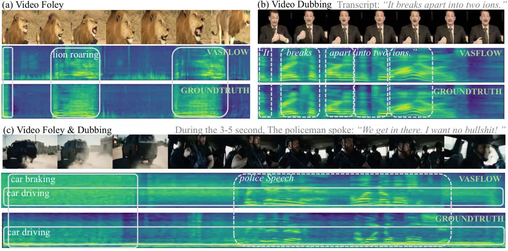
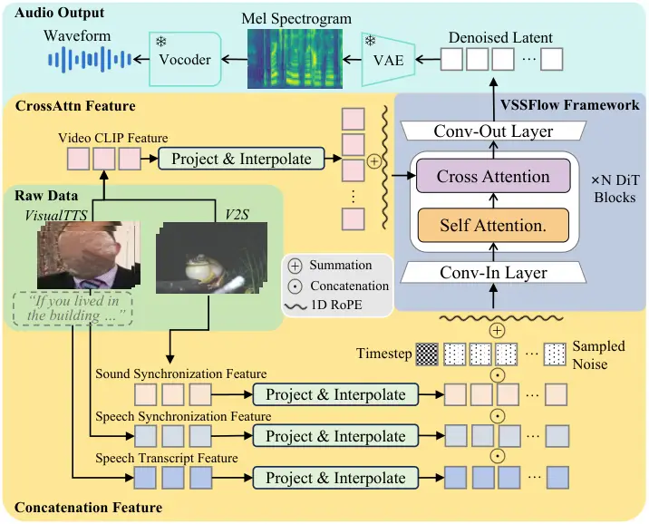
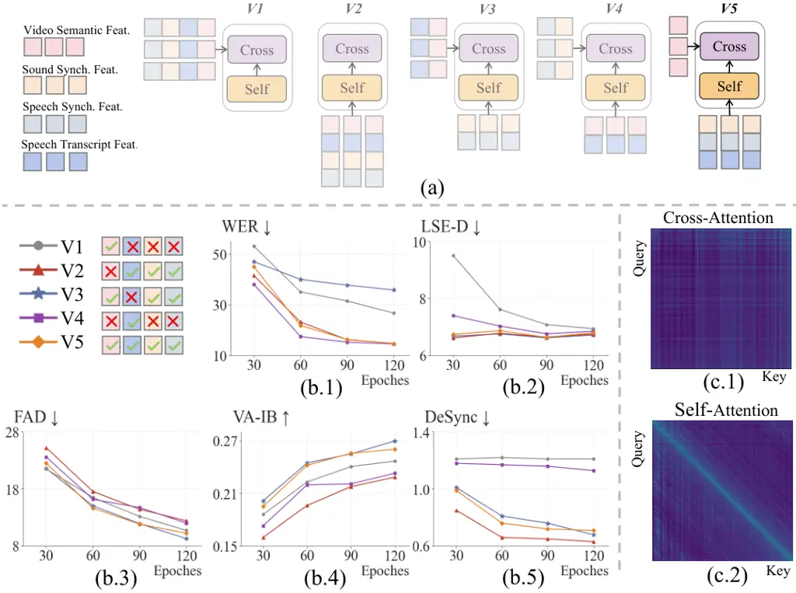
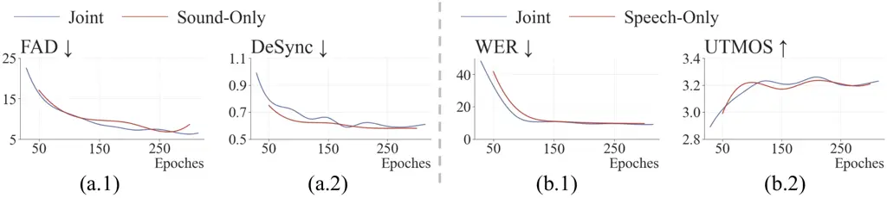

# VSSFlow: Unifying Video-conditioned Sound and Speech Generation via Joint Learning

Xin Cheng ^(†)^(†)thanks: These authors contributed equally. Contact:
chengxin000@ruc.edu.cn Affiliation: Renmin University of China    Yuyue
Wang^(\*) Affiliation: Renmin University of China    Xihua Wang^(\*)
Affiliation: Renmin University of China    Yihan Wu Affiliation: Renmin
University of China    Kaisi Guan Affiliation: Renmin University of
China    Yijing Chen Affiliation: Renmin University of China    Peng
Zhang Affiliation: Apple E-mail <chengxin000@ruc.edu.cn>    Kieran Liu
Affiliation: Apple E-mail <chengxin000@ruc.edu.cn>    Meng Cao
Affiliation: Apple E-mail <chengxin000@ruc.edu.cn>    Ruihua Song
Affiliation: Renmin University of China

###### Abstract

Video-conditioned audio generation, including Video-to-Sound (V2S) and
Visual Text-to-Speech (VisualTTS), has traditionally been treated as
distinct tasks, leaving the potential for a unified generative framework
largely underexplored. In this paper, we bridge this gap with VSSFlow, a
unified flow-matching framework that seamlessly solve both problems. To
effectively handle multiple input signals within a Diffusion Transformer
(DiT) architecture, we propose a disentangled condition aggregation
mechanism leveraging distinct intrinsic properties of attention layers:
cross-attention for semantic conditions, and self-attention for
temporally-intensive conditions. Besides, contrary to the prevailing
belief that joint training for the two tasks leads to performance
degradation, we demonstrate that VSSFlow maintains superior performance
during end-to-end joint learning process. Furthermore, we use a
straightforward feature-level data synthesis method, demonstrating that
our framework provides a robust foundation that easily adapts to joint
sound and speech generation using synthetic data. Extensive experiments
on V2S, VisualTTS and joint generation benchmarks show that VSSFlow
effectively unifies these tasks and surpasses state-of-the-art
domain-specific baselines, underscoring the critical potential of
unified generative models. Demos and code will be soon released.

Project page:
[https://vasflow1.github.io/vasflow/](https://vasflow1.github.io/vasflow/)

###### Keywords: 

Video-to-Sound Generation Visual Text-to-Speech Generation Multimodal
learning



Figure 1: VSSFlow: A unified generative model for video-conditioned
sound and speech synthesis. (a) Video-to-Sound generation given a silent
video. (b) Visual-TTS generation given a silent talking video and speech
transcripts. (c) Sound-Speech Joint generation given a silent video and
transcripts.

## 1 Introduction

The rapid evolution of multimodal generative models has established
sound and speech synthesis as indispensable pillars for creating
immersive multimodal content \[15, 20\]. Within this landscape,
video-conditioned audio generation, including Visual
Text-to-Speech \[13, 11\] (VisualTTS) and Video-to-Sound \[7, 6\]
(V2S ¹¹ 1 In prior works, the term “Video-to-Audio (V2A)” or “Foley” has
commonly been used. To avoid ambiguity in this paper, we define “sound”
as non-linguistic audio, such as environmental or natural audio,
distinct from speech. “Speech” refers to audio containing linguistic
information, such as spoken language. “Audio” is used to encompass
sound, speech, and all other types of auditory content. ), has emerged
as a frontier. These two tasks aim to produce human speech or ambient
sound that is synchronized with visual inputs. However, as speech and
sound generation requires different conditions and have different
focuses, most research regards them as specialized yet isolated domains.
V2S models typically lack the ability to produce intelligible speech,
while VisualTTS models remain incapable of synthesizing non-speech
environmental sounds.

Several attempts have been made recently to unify video-conditioned
sound, speech and sound-speech joint generation tasks. However, they
either require complex curriculum learning procedure \[61, 51\] to learn
V2S and VisualTTS separately, or fail to generate speech and sound
jointly \[56\] due to the lack of high-quality joint data. Consequently,
developing an end-to-end framework unifying these tasks remains an open
question, as the model architecture, training strategies, and data
scarcity remain largely underexplored.

To address these challenges, we introduce VSSFlow, a
flow-matching \[31\] framework that unifies V2S, VisualTTS and
video-conditioned sound-speech joint generation. First, to handle
multiple heterogeneous conditions, we systematically explore the optimal
conditioning mechanism within the attention-based Diffusion Transformer
(DiT) \[41\] architecture. There are two typical types of conditioning
mechanisms: cross-attention and self-attention conditioning. VSSFlow
integrates temporally-dense conditions (e.g. text transcript, sound and
speech synchronization features) by concatenating with audio latents and
processing them through self-attention. In contrast, semantically-rich
video features are incorporated via cross-attention layers. We
demonstrate the effectiveness of our conditioning mechanisms through
extensive ablations. Second, under our VSSFlow framework, we observe
that no complex design for training stages is necessary. The joint
learning of sound and speech does not lead to interference or
performance degradation, a common issue observed in previous multitask
learning \[26, 51\]. Furthermore, to address the scarcity of
high-quality joint video-sound-speech data, we apply a simple and
effective data synthesis method. The synthesis process is performed at
the feature level, therefore it enables more flexible and on-the-fly
operations during data loading, effectively eliminating the need for
additional storage overhead. Finetuned with the synthetic data, VSSFlow
can be easily adapted to real-world scenarios, generating sound and
speech jointly (i.e., speech with environmental sounds), as shown
in Fig. 1(c).

Evaluation on V2S, VisualTTS and joint generation benchmarks shows that
VSSFlow achieves exceptional sound fidelity and speech quality, compared
to domain-specific and pipeline-based methods. In summary, our
contributions are as follows: (1) We introduce VSSFlow, a unified
flow-based framework for video-conditioned sound and speech generation,
with an effective condition aggregation mechanism to integrate multiple
features for sound and speech generation into DiT blocks. (2) For joint
learning, we demonstrate that end-to-end training without complex
strategies is feasible under our framework. For joint generation, we
show that VSSFlow can easily adapt to this task using our
straightforward data augmentation strategy to construct sound-speech
mixed pairs. (3) Extensive evaluations confirm VSSFlow’s superior
performance, surpassing the state-of-the-art domain-specific baselines
on V2S, VisualTTS and joint generation benchmarks.

## 2 Related Work

### 2.1 Video-to-Sound and Visual Text-to-Speech Generation

Video-to-Sound (V2S) generation aims to produce environmental or natural
sound, which is semantically- and temporally-aligned with the given
video. Recent advances in generative models have driven significant
progress in the V2S field, with approaches categorized into four main
paradigms: autoregressive \[46, 22, 39, 52\], mask-based \[34, 40, 50\],
flow- and diffusion-based methods \[36, 62, 57, 7, 58, 60, 6\]. Most V2S
models leverage CLIP features \[43\] for robust semantic representation.
To further enhance temporal alignment, various auxiliary cues are
incorporated, including specialized visual features like CAVP \[36\] and
SynchFormer \[23\], as well as fine-grained temporal priors like energy
curves \[24\], onset conditions \[62\], and mel-spectrogram
layouts \[57, 55\]. Another task, visual text-to-speech (VisualTTS)
generation, aims to generate speech that is consistent with the given
video in aspects like speaker’s style, lip movements, emotions, and so
on. These models \[3, 10, 12, 35, 13, 21\] are often built on mature TTS
frameworks \[8, 37\]. By incorporating multiple prosodic features \[12,
13\] like reference speech, pitch, energy, emotional cues and so on,
these models demonstrate powerful speech generation capability. However,
these two related fields are typically treated as distinct domains. Most
V2S models fail to produce intelligible speech, and VisualTTS models are
unable to generate non-speech sounds, creating a significant bottleneck
for unified generation model.

### 2.2 Unified Models for Video-conditioned Sound and Speech Generation

Some advancements have been made to integrate video-conditioned sound
and speech generation into unified models. For example, Meta’s
Audiobox \[53\] and Google’s V2A model \[15\] leverage diffusion
backbones to generate sound and speech from multimodal prompts like
video, text and speech. More recently, Veo3 \[20\] has garnered
significant attention for its ability to generate videos with
synchronized background sound and human speech, sparking renewed
interest in unified model. However, unified video-conditioned
sound-speech joint generation models still face critical challenges. In
the academic community, AudioGen-Omni \[56\] integrates various
conditions through in-context conditioning into a flow model, but is
unable to generate sound and speech simultaneously due to the lack of
high-quality video-sound-speech data. DeepAudio \[61\] and
DualDub \[51\] have employed fusion modules to integrate speech and
sound generation heads into large language models (LLMs) backbones.
However, common belief is that end-to-end joint training degrades
generation performance compared to curriculum learning under their
frameworks \[51\]. Therefore, they both employ carefully-designed
multi-stage training strategy to progressively acquire V2S and VisualTTS
capabilities, resulting in complex training pipeline. The joint training
and generation still remains underexplored in prior works.

## 3 Method

### 3.1 Preliminary

VSSFlow is a flow-matching generation model built upon DiT architecture.

##### Flow-Matching Framework.

Flow-matching \[31\] is a generative paradigm, which transforms a source
distribution $`\mathcal{P}(x_{0})`$, typically Gaussian noise
$`x_{0}\sim\mathcal{N}(0,1)`$, into a target audio distribution
$`\mathcal{P}(x_{1})`$. This process is governed by a continuous-time
ODE with learned velocity field $`v_{\theta}(x_{t},c,t)`$, where
$`t\in[0,1]`$, $`x_{t}`$ is the sample state at timestep $`t`$, $`c`$ is
an optional condition, and $`\theta`$ denotes parameters:

```math
\frac{dx_{t}}{dt}=v_{\theta}(x_{t},c,t),\quad x_{t}=x_{0}+\int_{0}^{t}v_{\theta}(x_{s},c,s)\,ds, \tag{1}
```

The training objective is to minimize the difference between predicted
and ground-truth velocities:

```math
\mathcal{L}_{\text{FM}}=\mathbb{E}_{t,x_{0},x_{1}}\left\|v_{\theta}(x_{t},c,t)-\dot{x}_{t}\right\|^{2}, \tag{2}
```

where $`x_{t}=tx_{0}+(1-t)x_{1}`$ and $`\dot{x}_{t}=x_{1}-x_{0}`$.

##### Diffusion Transformers.

DiT \[41\] uses transformer architectures to process latent
representations $`x_{t}`$ and conditioning inputs $`c`$, providing a
scalable framework for generation tasks. While standard attention-based
DiT models incorporate conditions via cross-attention, we also explore
another approach by concatenating conditions with latent along the
channel dimension. This dual-conditioning strategy allows the model to
better leverage different types of input signals.



Figure 2: Architecture of VSSFlow. VSSFlow employs cross-attention-based
DiT blocks and a flow-matching paradigm, which can handle multiple
conditional inputs via cross attention or concatenation with latents.
Temporally-dense signals like sound synchronization, speech
synchronization and speech transcript features are introduced by
concatenation, while video semantic feature are incorporated through
cross attention. Ablation studies on different condition mechanisms of
DiT are presented in Sec. 4.3.

### 3.2 VSSFlow Framework

#### Model Overview.

As illustrated in Fig. 2, VSSFlow adopts a attention-based DiT
architecture for generation. Each DiT block follows the implementation
in Stable Audio Open \[17\], and is designed to accept multiple types of
conditioning inputs. To better capture temporal relationships between
the sound sequence and video frame sequence in the V2S process, we
incorporate 1D Rotary Position Embedding (RoPE) \[49\] in both self- and
cross-attention blocks. For data representations, audio waveforms are
first converted into mel-spectrum and then encoded into a latent
representation $`x_{1}\in\mathbb{R}^{T_{a}\times D_{a}}`$ using the
Variational Autoencoder (VAE) from AudioLDM 2 \[33\], where $`T_{a}`$ is
the length of the latent sequence and $`D_{a}=64`$ is the latent
dimension. The audio latent has a temporal resolution of 25 Hz (i.e., 25
frames per second). The final predicted latent is converted back into a
mel-spectrogram through the VAE decoder and reconstructed into a
waveform using the HiFi-GAN vocoder \[29\]. The training and inference
process follows the paradigm of conditional flow-matching as illustrated
in Sec. 3.1. The timestep condition $`t`$ is encoded and prepended to
the latent sequence.

#### Condition Inputs.

Both V2S \[6\] and VisualTTS \[12\] generation rely on a diverse set of
conditioning signals to ensure semantic consistency and temporal
synchronization. In our VSSFlow framework, we primarily consider the
following conditions. Video Semantic Features: We extract visual
semantic representations using a CLIP model \[43\]. These features,
denoted as $`c_{v}\in\mathbb{R}^{T_{v}\times D_{v}}`$, provide
high-level context, such as event categories and character information.
Sound Synchronization Features: To capture the temporal alignment of
environmental sounds, we utilize Synchformer \[23\] to extract features
$`c_{ss}\in\mathbb{R}^{T_{ss}\times D_{ss}}`$. Speech Transcript
Features: For speech generation, input text is converted into a phoneme
sequence $`c_{st}\in\mathbb{R}^{T_{st}\times D_{st}}`$. The phoneme
embedding layer is trained in an end-to-end manner with the model to
capture linguistic information. Speech Synchronization Features: To
ensure precise lip-sync, we employ AV-HuBERT \[47\] to extract lip
movement features $`c_{lip}\in\mathbb{R}^{T_{lip}\times D_{lip}}`$ from
the video. To facilitate unified modeling within the DiT architecture,
all aforementioned features are linearly interpolated along the temporal
dimension to match the resolution of the length audio latent $`T_{a}`$.
This ensures that every latent frame is aligned with a corresponding
multi-modal conditioning vector. More details of condition signals can
be found in Appendix 0.A.

#### Condition Aggregation Mechanism.

Within our attention-based DiT architecture, conditioning sequences are
incorporated through two main mechanisms: (1) Cross-Attention: Following
the standard implementation of attention-based DiT \[41\], conditions
are introduced through cross attention blocks serving as the Key and
Value matrices. This mechanism is particularly effective for
semantic-rich features (e.g., video semantic features $`c_{v}`$), where
the model needs to globally attend to high-level context for guiding the
generation. (2) Channel-wise Concatenation: Conditions are concatenated
with the latent representation $`x_{t}`$ along the channel dimension
then processed through self-attention blocks. This approach has been
proven effective in recent V2S \[58\] and TTS \[4\] frameworks. We find
this mechanism more suitable for temporally dense and aligned features
(e.g., sound synchronization, speech transcript, and speech
synchronization features). By concatenating, the model can more
effectively exploit the fine-grained temporal correspondences through
self-attention block. The final input sequence to the DiT blocks is
formulated as:

```math
x_{in}=\text{Concat}([x_{t},c_{ss},c_{st},c_{lip}],\text{dim=channel})\in\mathbb{R}^{T_{a}\times(D_{a}+D_{ss}+D_{st}+D_{lip})}, \tag{3}
```

we carry out extensive experiments on different variants of the
condition aggregation mechanism and detailed analysis are presented
in Sec. 4.3.

### 3.3 Training

#### Multimodal Datasets.

VSSFlow is trained end-to-end on sound and speech datasets using the
flow loss function defined in Eq. 2. The training data covers two tasks:
(1) Video-to-Sound, with speech transcript features $`c_{st}`$ and
speech synchronization features $`c_{lip}`$ set to zeros. We use
VGGSound \[2\], a widely adopted dataset for the V2S task, which
contains 182k training samples and 15k test samples. VGGSound provides a
diverse collection of sound-visual pairs, making it well-suited for
training models in video-conditioned sound generation. (2) Visual
Text-to-Speech (VisualTTS), with sound synchonization features
$`c_{ss}=0`$. We employ three standard VisualTTS datasets: Chem \[42\],
GRID \[14\], and LRS2 \[1\], comprising a total of 162k training
samples. Chem is a single-speaker English dataset of chemistry lecture
recordings. Following prior work \[10\], we use 6,240 samples for
training and 200 for testing. GRID is a multi-speaker English dataset
consisting of 33 speakers, each contributing 1,000 utterances. In line
with \[11\], we select 100 segments per speaker for testing, resulting
in 29,600 training samples and 3,291 test samples. LRS2 is a diverse
sentence-level dataset collected from BBC television programs, providing
real-world variability. It contains 126k training samples and 700 test
samples.

The total training data contains 350k samples. Contrary to the previous
belief that joint training of V2S and VisualTTS is suboptimal \[51\],
VSSFlow achieves robust performance in both domains without the need for
complex multi-stage training strategies. More analyses about joint
training are discussed in Sec. 4.4.

#### Synthetic Datasets.

After end-to-end pretraining, we fine-tune VSSFlow to enable
video-conditioned sound-speech joint generation. To address the scarcity
of joint data, we propose an efficient data synthesis strategy that
constructs joint video-sound-speech samples directly in the feature
space. We randomly select sound samples from VGGSound and speech samples
from LRS2. Given a sound waveform $`w_{a}`$ and a speech waveform
$`w_{s}`$, we define a temporal shift operator $`S_{\tau}(\cdot)`$ that
pad the speech segment to a random start time $`\tau`$. We implement two
synthesis modes to simulate diverse acoustic scenarios:

- •
  Additive Synthesis (Add): Speech is superimposed onto the background
  sound to simulate overlapping audio at a random Signal-to-Noise Ratio:

  ```math
  w_{syn}=w_{a}+\alpha\cdot S_{\tau}(w_{s}),\quad c_{v}^{syn}=c_{v}^{a}+\alpha\cdot S_{\tau}(c_{v}^{s}) \tag{4}
  ```

  where $`\alpha`$ are random scaling factors representing the mixing
  ratio.

- •
  In-place Substitution (Insert): The background content of $`w_{a}`$
  within the speech interval is replaced by $`w_{s}`$, simulating a
  clean transition between modalities:

  ```math
  w_{syn}=(1-\mathbf{m}_{\tau})\odot w_{a}+S_{\tau}(w_{s}),\quad c_{v}^{syn}=(1-\mathbf{m}_{\tau})\odot c_{v}^{a}+S_{\tau}(c_{v}^{s}) \tag{5}
  ```

  where $`\mathbf{m}_{\tau}`$ is a binary mask corresponding to the
  speech interval of $`S_{\tau}`$.

During synthesis, we retain the sound synchronization features from the
sound source, as well as the speech transcript and speech
synchronization features from the speech source. The video semantic
features $`c_{v}`$ are implemented the same operation as the wave data,
as in Eqs. 4 and 5. Since these operations are performed in the feature
space during data loading, they bypass the need to modify raw video and
audio data—a process that is often computationally intensive and
logistically complex. Consequently, this synthesis method introduces
negligible computational overhead while accommodating a wide range of
joint scenarios. By fine-tuning with easily accessible synthetic data,
VSSFlow can be adapted to joint sound-speech generation. This
demonstrates the robust capabilities of VSSFlow and validates the
efficacy of our data synthesis approach. Detailed analysis is provided
in Sec. 4.4.

#### Implementation Detail.

During training, all audio samples are padded or truncated to a 10
seconds and resampled to 16 kHz. We use a learning rate of
$`4\times 10^{-7}`$ with 2,000 warm-up steps. The model is trained on 4
NVIDIA H100 GPUs with a batch size of 36 per GPU. The unconditional
probability is set to 0.1 to support classifier-free guidance (CFG). For
model configuration, we train three variants of VSSFlow with different
sizes: VSSFlow-S (5 DiT blocks, 245M parameters), VSSFlow-M (10 DiT
blocks, 463M parameters), and VSSFlow-L (15 DiT blocks, 618M
parameters). All parameters of the DiT backbone are fully optimized,
while VAE and vocoder remain frozen. The joint multi-task training phase
is conducted for 250k steps. Subsequently, the fine-tuning phase for
joint generation is performed for only 10k steps based on pretrained
VSSFlow-M. During inference, we employ the Dopri5 solver for ordinary
differential equations to ensure high-quality sampling. A CFG scale of
3.0 is applied across all tasks.

## 4 Experiment

### 4.1 Metrics

#### Sound Evaluation

V2S generation follows the implemenetation of MMAudio \[6\]. We adopt
widely-used metrics, including Fréchet Audio Distance (FAD)\[27\],
Inception Score (IS)\[45\], and Mean KL-Divergence (KL) to assess the
quality of generated sound. For temporal alignment evaluation, we
extract temporal features using the SynchFormer model \[23\] to compute
offsets, producing the DeSync Score. To quantify sound-visual relevance,
we calculate the cosine similarity between the embeddings of the input
video and the generated sound using the ImageBind \[19\] model (VA-IB).

#### Speech Evaluation

For overall speech quality, we calculate Word Error Rate (WER) to
measure speech intelligibility, and UTokyo-SaruLab Mean Opinion Score
(UTMOS)\[44\] to assesses clarity, naturalness, and fluency. For style
alignment, we calculate speaker similarity via Versa\[48\]. For
synchronization between the ground truth and the generated sample, we
calculate MCD, MCD-DTW and MCD-DTW-SL using espnet toolkit \[59\], which
applies applies Dynamic Time Warping and penalty term to capture local
and global temporal similarities based on Mel-Cepstral Distortion. For
speech-visual alignment, we compute Lip Sync Error Distance (LSE-D) and
Lip Sync Error Confidence (LSE-C) using the SyncNet \[9\] model to
assess lip synchronization performance.

### 4.2 Benchmark Results

#### V2S Benchmark

For V2S evaluation, Tab. 1 compares our main results on the VGGSound
test set with existing state-of-the-art models across autoregressive,
mask, diffusion, and flow-based paradigms. Our primary baselines include
Frieren \[58\], which shares a comparable parameter count and flow
matching paradigm using the same V2S dataset, and LoVA \[7\], a larger
diffusion-based model fully initialized from Stable Audio Open. More
details can be found in Appendix 0.B.

As presented in Tab. 1, VSSFlow matches or exceeds SOTA performance
across audio quality (FAD, IS, KL), video-sound semantic alignment
(VA-IB) and temporal synchronization (Desync) metrics. Even our smallest
variant, VSSFlow-S demonstrates superior performance across multiple
metrics, outperforming the much larger LoVA and the comparably-sized
Frieren. Also, the consistent performance gains from small to large
model size validate that our framework effectively scales to capture
complex audio-visual correlations.

| Model Information |        |         | Sound Quality            |                          |                          |                       |                         | Sync.          | Seman.       |
| ----------------- | ------ | ------- | ------------------------ | ------------------------ | ------------------------ | --------------------- | ----------------------- | -------------- | ------------ |
| Method            | Param. | Extra   | $`\text{FAD}\downarrow`$ | $`\text{FAD}\downarrow`$ | $`\text{FAD}\downarrow`$ | $`\text{IS}\uparrow`$ | $`\text{KL}\downarrow`$ | DeSync         | IB-VA        |
|                   | Count  | Data    | (vgg.)                   | (pas.)                   | (pann.)                  | (pann.)               | (pann.)                 | $`\downarrow`$ | $`\uparrow`$ |
| SpecVQ.           | 377M   | –       | 4.80                     | 270.07                   | 28.62                    | 5.00                  | 3.31                    | 1.23           | 13.77        |
| Im2Wav            | 360M   | –       | 4.84                     | 242.05                   | 18.34                    | 7.29                  | 2.50                    | 1.22           | 19.59        |
| V-AURA            | 893M   | –       | 2.20                     | 218.50                   | 14.80                    | 8.95                  | 2.42                    | 0.65           | 27.60        |
| VAB               | 403M   | A.S.    | 2.98                     | 192.07                   | 18.26                    | 9.60                  | 2.51                    | 1.17           | 25.82        |
| MultiF.           | 332M   | HQ-SFX  | 2.45                     | 148.93                   | 13.81                    | 15.90                 | 1.69                    | 0.82           | 27.00        |
| Difffoley         | 859M   | A.S.    | 4.72                     | 409.20                   | 23.05                    | 10.77                 | 3.14                    | 0.91           | 20.60        |
| Seeing.           | 416M   | –       | 3.94                     | 206.63                   | 21.96                    | 5.92                  | 2.78                    | 1.20           | 36.81        |
| V2A-M.            | –      | –       | 1.45                     | 113.55                   | 8.16                     | 12.45                 | 2.66                    | 1.22           | 22.25        |
| FoleyC.           | 1126M  | –       | 2.17                     | 142.34                   | 12.85                    | 10.59                 | 2.33                    | 1.21           | 27.75        |
| TiVA              | 346M   | A.S.    | 3.86                     | 304.60                   | 23.62                    | 6.60                  | 3.23                    | 1.18           | 16.92        |
| LoVA              | 1057M  | A.S.    | 2.02                     | 150.54                   | 13.13                    | 11.39                 | 2.30                    | 1.22           | 26.01        |
| Frieren           | 421M   | –       | 1.49                     | 100.33                   | 11.66                    | 12.25                 | 2.71                    | 0.85           | 22.88        |
| MMAudio           | 1054M  | A.&W.C. | 1.77                     | 65.16                    | 5.95                     | 17.4                  | 1.67                    | 0.45           | 33.23        |
| VSSFlow-S         | 245M   | –       | 1.33                     | 136.8                    | 9.55                     | 10.62                 | 2.24                    | 0.65           | 28.38        |
| VSSFlow-M         | 443M   | –       | 1.11                     | 107.95                   | 6.58                     | 12.37                 | 2.22                    | 0.59           | 29.64        |
| VSSFlow-L         | 681M   | –       | 1.12                     | 98.45                    | 6.52                     | 12.83                 | 2.26                    | 0.59           | 29.59        |

Table 1: V2S evaluation results on the VGGSound benchmark. “Param.Count”
denotes the number of parameters of the generation backbone. “Extra
Data” lists additional training datasets beyond VGGSound: A.S refers to
another V2S dataset AudioSet \[18\], HQ-SFX refers to high-quality sound
effects dataset with text captions, A.&W.C. refers to Text-to-Audio
datasets AudioCaps \[28\] and WavCaps \[38\]. As MMAudio and MultiFoley
(MultiF.) utilize additional high-quality Text-to-Audio data, we label
them in gray and do not directly compare with them for fair
comparison \[6\]. For each metric, the highest score is in bold and the
second-highest score is underlined.

#### VisualTTS Benchmarks

Tab. 2 summarizes VSSFlow’s performance on the Chem and GRID benchmarks
for VisualTTS task. We compare VSSFlow against several representative
VisualTTS baselines, including DSU \[35\], HPMDubbing \[10\],
StyleDubber \[13\], and EmoDubber \[11\]. We also include a TTS model
E2-TTS \[16\] as baseline. Detailed baseline configurations are provided
in Appendix 0.B.

As shown in Tab. 2, our VSSFlow variants consistently surpass baselines
across most metrics. On the Chem benchmark, VSSFlow achieves a WER of
9.4, significantly outperforming all existing VisualTTS baselines and
reaching a performance comparable to the pure TTS baseline E2-TTS.
Notably, our models demonstrate exceptional acoustic fidelity and speech
temporal synchronization. Across both benchmarks, VSSFlow achieves the
SOTA scores in terms of MCD, MCD-D, MCD-DS, LSE-C, and LSE-D. These
results validate that our flow-based architecture can synthesize highly
intelligible and synchronized speech with superior acoustic quality.

|       |             |                          |                              |                          |                          |                             |                              |                          |                            |
| ----- | ----------- | ------------------------ | ---------------------------- | ------------------------ | ------------------------ | --------------------------- | ---------------------------- | ------------------------ | -------------------------- |
| Bench | Method      | $`\text{WER}\downarrow`$ | $`\text{Spk. Sim.}\uparrow`$ | $`\text{UTMOS}\uparrow`$ | $`\text{MCD}\downarrow`$ | $`\text{MCD-D.}\downarrow`$ | $`\text{MCD-DS.}\downarrow`$ | $`\text{LSE-C}\uparrow`$ | $`\text{LSE-D}\downarrow`$ |
| Chem  | GT          | 3.5                      | 100                          | 4.19                     | 0                        | 0                           | 0                            | 7.66                     | 6.88                       |
|       | GT-vocoder  | 3.5                      | 93.3                         | 3.19                     | 3.33                     | 2.67                        | 2.67                         | 7.57                     | 6.9                        |
|       | DSU         | 37.3                     | 72.9                         | 3.33                     | 10.52                    | 6.7                         | 6.73                         | 5.88                     | 7.86                       |
|       | HPMDubbing  | 22.3                     | 44.6                         | 3.11                     | 11.54                    | 5.19                        | 6.30                         | 7.30                     | 7.58                       |
|       | StyleDubber | 16.3                     | 73.7                         | 3.14                     | 14.46                    | 6.01                        | 6.36                         | 3.58                     | 11.08                      |
|       | EmoDubber   | 16.7                     | 78.1                         | 3.87                     | 14.87                    | 5.8                         | 7.16                         | 5.48                     | 8.27                       |
|       | E2-TTS      | 8.7                      | 70.2                         | 3.51                     | 14.46                    | 5.07                        | 6.21                         | 1.62                     | 13.1                       |
|       | VSSFlow-S   | 12.6                     | 77.4                         | 3.13                     | 8.46                     | 5.09                        | 5.09                         | 7.93                     | 6.70                       |
|       | VSSFlow-M   | 9.4                      | 76.0                         | 3.26                     | 7.97                     | 4.88                        | 4.89                         | 7.84                     | 6.76                       |
|       | VSSFlow-L   | 9.2                      | 76.1                         | 3.31                     | 7.96                     | 4.88                        | 4.88                         | 7.89                     | 6.73                       |
| GRID  | GT          | 12.9                     | 100                          | 4.04                     | 0                        | 0                           | 0                            | 5.49                     | 8.56                       |
|       | GT-vocoder  | 13.4                     | 64.1                         | 3.37                     | 5.02                     | 3.88                        | 3.89                         | 6.83                     | 8.16                       |
|       | DSU         | 34.3                     | 5.9                          | 3.55                     | 13.82                    | 10.55                       | 10.57                        | 5.63                     | 8.73                       |
|       | HPMDubbing  | 27.6                     | 31.3                         | 2.11                     | 12.31                    | 8.05                        | 8.23                         | 6.02                     | 8.85                       |
|       | StyleDubber | 10.9                     | 51.4                         | 3.74                     | 12.85                    | 7.81                        | 7.91                         | 6.33                     | 8.77                       |
|       | EmoDubber   | 15.9                     | 50.5                         | 3.98                     | 15.52                    | 5.89                        | 9.83                         | 3.48                     | 10.35                      |
|       | E2-TTS      | 20.2                     | 44.2                         | 3.62                     | 15.64                    | 5.62                        | 6.98                         | 2.36                     | 12.08                      |
|       | VSSFlow-S   | 15.4                     | 52.1                         | 3.29                     | 8.78                     | 5.77                        | 5.78                         | 6.84                     | 8.14                       |
|       | VSSFlow-M   | 15.8                     | 52.3                         | 3.25                     | 8.45                     | 5.61                        | 5.61                         | 6.80                     | 8.19                       |
|       | VSSFlow-L   | 16.2                     | 51.4                         | 3.30                     | 8.62                     | 5.73                        | 5.73                         | 6.81                     | 8.18                       |

Table 2: VisualTTS evaluation results on Chem and GRID benchmark. For
each metric, the highest score is in bold and the second-highest score
is underlined.

#### Video-Conditioned Sound-Speech Joint Generation Benchmarks

| Method          | Speech         |                  |              |              | Sound              |                    |                   |                   |
| --------------- | -------------- | ---------------- | ------------ | ------------ | ------------------ | ------------------ | ----------------- | ----------------- |
|                 | WER            | Spk.             | UTMOS        | LSE-C        | FAD $`\downarrow`$ | FAD $`\downarrow`$ | KL $`\downarrow`$ | KL $`\downarrow`$ |
|                 | $`\downarrow`$ | Sim.$`\uparrow`$ | $`\uparrow`$ | $`\uparrow`$ | (pann.)            | (pas.)             | (pann.)           | (pas.)            |
| LoVA+Speaker    | 25.98          | 20.02            | 1.33         | 1.28         | 8.68               | 285.84             | 0.97              | 1.27              |
| LoVA+Style      | 37.56          | 19.58            | 1.30         | 1.27         | 9.28               | 296.64             | 1.05              | 1.31              |
| MMAudio+Speaker | 41.47          | 18.39            | 1.32         | 1.91         | 4.32               | 229.65             | 0.89              | 1.14              |
| MMAudio+Style   | 56.86          | 17.78            | 1.30         | 1.92         | 4.48               | 240.70             | 0.91              | 1.16              |
| VSSFlow-M       | 19.40          | 24.70            | 2.07         | 2.00         | 6.83               | 177.16             | 0.91              | 1.07              |

Table 3: Video-conditioned sound-speech joint generation evaluation
results on V2C benchmark. Bold and underlined values indicate the best
and second-best performance, respectively.

Following the evaluation implementation of DualDub \[51\], we conduct a
video-to-sound-speech joint generation test on the V2C-Animation test
set, consisting of 1.3k video segments featuring synchronized speech and
environmental sounds with videos. Given the scarcity of open-source
joint generation frameworks, we establish several competitive
pipeline-based methods following \[51\]. These baselines decouple the
task by independently generating speech via VisualTTS models (here we
use Speaker2Dubber \[63\] and StyleDubber \[13\] as they are trained on
the V2C training set) and environmental sounds via V2S models (e.g.,
MMAudio \[6\] and LoVA \[7\]), subsequently merging the outputs.

The results are summarized in Tab. 3. Despite being finetuned for only
10k steps on out-of-domain synthetic data, VSSFlow still outperforms
baselines in most speech and sound evaluation metrics. The results
demonstrate a clear advantage of unified framework and the effectiveness
of our data synthesis method.



Figure 3: Performance comparison of different conditioning mechanisms.
(a) demonstrate the overview of different model architecture. (b.1) and
(b.2) shows WER and LSE-D metric for VisualTTS task, while (b.3) - (b.5)
presents FAD, VA-IB and DeSync metrics for V2S task. The checkmarks and
crosses in the legend of (b) indicate whether the variant effectively
incorporates the specific condition. (c) is the visualization of the
attention weights in self- and cross-attention layers of DiT blocks.

### 4.3 Experiments on Architecture

To demonstrate the advantage of our architecture for integrating
multimodal signals, we investigate five variants as illustrated
in Fig. 3(a). These variants differ in how they incorporate video
semantic features $`c_{v}`$, sound synchronization features $`c_{ss}`$,
speech transcript features $`c_{st}`$, and speech synchronization
features $`c_{lip}`$. We trained each variant for 120 epoches on
combined V2S and VisualTTS datasets. The convergence curves for speech
and sound metrics are shown in Fig. 3(b). From these results, we derive
the following observations:

Features with explicit temporal alignment properties are best suited for
integration via concatenation. Specifically, variants incorporating
speech transcript $`c_{st}`$ via concatenation (V2, V4, V5) consistently
outperform others (V1, V3) in WER metrics as in Fig. 3(b.1). Similarly,
for sound synchronization features ($`c_{ss}`$) and speech
synchronization features ($`c_{lip}`$), variants V2, V3, and V5 exhibit
superior DeSync and LSE-D compared to V1 and V4, demonstrated
in Fig. 3(b.2) and (b.5). As training progresses, the gap in LSE-D
gradually diminishes. However, the discrepancy in DeSync remains
relatively persistent. We hypothesize that conditions introduced via
concatenation are primarily processed through the model’s self-attention
layers. Our visualization of VSSFlow’s self-attention heatmap
in Fig. 3(c.2) reveals a prominent diagonal inductive bias, indicating
that the self-attention layers primarily focus on local context from
neighboring positions. This finding is consistent with prior
literature \[30, 32\]. For information with highly local correlations,
the self-attention layers effectively leverage this diagonal bias to
accelerate convergence and achieve finer temporal granularity.

Besides, global semantic information is more effectively integrated
through cross-attention. Our results indicate that V1, V3, and V5
consistently achieve higher performance in sound generation metrics (FAD
in Fig. 3(b.2) and VA-IB in Fig. 3(b.4)). For features that contain
relatively sparse temporal information like video semantic embeddings,
forced concatenation may hinder the learning of semantic correlations
due to the restrictive diagonal bias of self-attention. Instead,
cross-attention provides a more flexible mechanism for free-form
interaction (see Fig. 3(c.1)), allowing the model to dynamically attend
to global visual cues without being constrained by rigid temporal
structures.

Based on these insights, we adopt the configuration of V5 as the final
architecture (Fig. 2). By concatenating temporally-sensitive features
($`c_{ss},c_{lip},c_{st}`$) and utilizing cross-attention for global
semantic features ($`c_{v}`$), VSSFlow strikes an optimal performance on
both temporal synchronization and semantic fidelity.

### 4.4 Experiments on Training Strategies



Figure 4: Impact of joint learning on sound and speech generation. We
compare three models trained with different data configurations: (i)
joint V2S + VisualTTS, (ii) Sound only, and (iii) Speech only. Panels
(a) display FAD and DeSync metrics for V2S task over training epochs,
while (b) present WER and UTMOS for VisualTTS.

#### Joint Training of Sound and Speech Generation Tasks.

We investigate the impact of joint training with sound and speech data.
We compare VSSFlow under three distinct data configurations: sound
data-only, speech data-only, and joint training (sound and speech data).
The learning curves illustrated in Fig. 4 provide a direct visualization
of the convergence behavior across these settings.

As observed, at the same training epoch, the joint training
configuration achieves performance identical to those trained with the
speech-only or sound-only data. This suggests that joint learning does
not lead to mutual suppression or suboptimal convergence. Instead, the
two modalities can be learned concurrently within a unified framework
without compromising the generative quality of either domain. We
hypothesize that this stability stems from two key architectural
advantages of VSSFlow. First, our decoupled condition aggregation
mechanism isolates the processing pathways for different modalities,
effectively mitigating feature-space interference. Second, the
formulation inherent in flow-matching provides a smoother and more
robust optimization trajectory compared to traditional autoregressive
models, enabling the network to naturally accommodate the diverse data
distributions of both sound and speech. Therefore, contrary to the
previous belief \[51\], the learning processes of VSSFlow do not require
additional designs on training stages.

#### Finetuned with Synthetic Sound-Speech Mixed Data.

| Training Data          | Speech         |                  |              |              | Sound              |                    |                   |                   |
| ---------------------- | -------------- | ---------------- | ------------ | ------------ | ------------------ | ------------------ | ----------------- | ----------------- |
|                        | WER            | Spk.             | UTMOS        | LSE-C        | FAD $`\downarrow`$ | FAD $`\downarrow`$ | KL $`\downarrow`$ | KL $`\downarrow`$ |
|                        | $`\downarrow`$ | Sim.$`\uparrow`$ | $`\uparrow`$ | $`\uparrow`$ | (pann.)            | (pas.)             | (pann.)           | (pas.)            |
| V2C                    | 36.5           | 32.5             | 1.45         | 2.42         | 4.35               | 158.01             | 0.84              | 1.01              |
| V2C + Synthesized Data | 32.6           | 32.4             | 1.76         | 2.58         | 3.15               | 116.08             | 0.80              | 1.00              |
| Synthesized Data       | 19.4           | 24.7             | 2.07         | 2.00         | 6.83               | 177.16             | 0.91              | 1.07              |

Table 4: Experiment on training data configurations for
video-conditioned audio-speech joint generation on V2C benchmark. Bold
and underlined values indicate the best and second-best performance,
respectively.

To further investigate the efficacy of our proposed data synthesis
method, we conduct an ablation study on the V2C-Animation benchmark
using three distinct data configurations: V2C-only, synthesized
data-only, and V2C+synthesized joint setting . All variants are
fine-tuned for 10k steps to ensure a fair comparison.

The results in Tab. 4 reveal the critical role of synthesized data for
joint generation. When trained exclusively on V2C, the model exhibits a
high WER, low UTMOS and suboptimal synchronization. We attribute this to
the relatively small scale of the V2C dataset (only 8k training samples)
and its significant domain gap (only contains animation video and
speech) from the pre-trained model’s knowledge. Furthermore, the
less-regularized nature of raw animation data makes precise lip-syncing
and phonetic alignment challenging to capture. The introduction of
synthesized data effectively mitigates these issues. By incorporating
highly regularized synthetic samples, it shows better speech
intelligibility and achieves the best lip synchronization performance.
Moreover, when using synthetic data, the broad coverage of environmental
sounds in V2S dataset leads to a substantial leap in sound generation
metrics.

Remarkably, the model trained with only synthesized data also
demonstrates exceptional performance, achieving the best WER and UTMOS
among all settings. Furthermore, the integration of synthesized data
significantly enhances the generalization capabilities of our model. As
illustrated in Fig. 1(c), VSSFlow fine-tuned on synthetic data
demonstrates robust zero-shot performance when applied to out-of-domain
Veo3-generated \[20\] videos. We politely invite readers to check our
project page²² 2
[https://vasflow1.github.io/vasflow/](https://vasflow1.github.io/vasflow/)
to explore more demos. These findings underscore the importance of
high-quality data synthesis as a powerful tool for helping unified
models adapt to complex joint data distribution.

## 5 Conclusion

##### Conclusions.

This work introduces VSSFlow, the first unified flow-matching framework
that integrates video-conditioned sound, speech, and joint generation.
By employing an effective condition aggregation mechanism, VSSFlow
seamlessly incorporates diverse input signals into a DiT-based
architecture. More importantly, we demonstrate the feasibility of joint
sound-speech learning within a single framework, underscoring the
significant potential of unified generative models. Furthermore, our
feature-level data construction method enhances joint generation
capabilities with minimal additional cost.

##### Limitations.

Consistent with existing approaches, VSSFlow relies on frozen
pre-trained extractors, which may hinder the capture of fine-grained
audio-visual nuances. Additionally, while our data synthesis alleviates
scarcity, the generation quality is inherently constrained by the
distributional gap of synthetic OOD data. Future research will focus on
developing robust, compact representations that better preserve
audio-visual details, alongside the collection of diverse, real-world
datasets to further enhance model’s capability.

## References

- \[1\] T. Afouras, J. S. Chung, A. Senior, O. Vinyals, and A.
  Zisserman (2018) Deep audio-visual speech recognition. IEEE
  transactions on pattern analysis and machine intelligence 44 (12),
  pp. 8717–8727. Cited by: §3.3.
- \[2\] H. Chen, W. Xie, A. Vedaldi, and A. Zisserman (2020) Vggsound: a
  large-scale audio-visual dataset. In ICASSP 2020-2020 IEEE
  International Conference on Acoustics, Speech and Signal Processing
  (ICASSP), pp. 721–725. Cited by: §3.3.
- \[3\] Q. Chen, M. Tan, Y. Qi, J. Zhou, Y. Li, and Q. Wu (2022) V2C:
  visual voice cloning. In Proceedings of the IEEE/CVF Conference on
  Computer Vision and Pattern Recognition, pp. 21242–21251. Cited by:
  §2.1.
- \[4\] Y. Chen, Z. Niu, Z. Ma, K. Deng, C. Wang, J. Zhao, K. Yu, and X.
  Chen (2024) F5-tts: a fairytaler that fakes fluent and faithful speech
  with flow matching. arXiv preprint arXiv:2410.06885. Cited by: §3.2.
- \[5\] Z. Chen, P. Seetharaman, B. Russell, O. Nieto, D. Bourgin, A.
  Owens, and J. Salamon (2025) Video-guided foley sound generation with
  multimodal controls. Cited by: Appendix 0.B.
- \[6\] H. K. Cheng, M. Ishii, A. Hayakawa, T. Shibuya, A. Schwing,
  and Y. Mitsufuji (2025) MMAudio: taming multimodal joint training for
  high-quality video-to-audio synthesis. In CVPR, Cited by: Appendix
  0.B, §1, §2.1, §3.2, §4.1, §4.2, Table 1, Table 1.
- \[7\] X. Cheng, X. Wang, Y. Wu, Y. Wang, and R. Song (2024) LoVA:
  long-form video-to-audio generation. arXiv preprint arXiv:2409.15157.
  Cited by: Appendix 0.B, Appendix 0.B, §1, §2.1, §4.2, §4.2.
- \[8\] C. Chien, J. Lin, C. Huang, P. Hsu, and H. Lee (2021)
  Investigating on incorporating pretrained and learnable speaker
  representations for multi-speaker multi-style text-to-speech. In
  ICASSP 2021 - 2021 IEEE International Conference on Acoustics, Speech
  and Signal Processing (ICASSP), Vol. , pp. 8588–8592. External Links:
  [Document](https://dx.doi.org/10.1109/ICASSP39728.2021.9413880) Cited
  by: §2.1.
- \[9\] J. S. Chung and A. Zisserman (2016) Out of time: automated lip
  sync in the wild. In Workshop on Multi-view Lip-reading, ACCV, Cited
  by: §4.1.
- \[10\] G. Cong, L. Li, Y. Qi, Z. Zha, Q. Wu, W. Wang, B. Jiang, M.
  Yang, and Q. Huang (2023) Learning to dub movies via hierarchical
  prosody models. In Proceedings of the IEEE/CVF Conference on Computer
  Vision and Pattern Recognition, pp. 14687–14697. Cited by: Appendix
  0.B, §2.1, §3.3, §4.2.
- \[11\] G. Cong, J. Pan, L. Li, Y. Qi, Y. Peng, A. v. d. Hengel, J.
  Yang, and Q. Huang (2024) EmoDubber: towards high quality and emotion
  controllable movie dubbing. arXiv preprint arXiv:2412.08988. Cited by:
  Appendix 0.B, §1, §3.3, §4.2.
- \[12\] G. Cong, J. Pan, L. Li, Y. Qi, Y. Peng, A. van den Hengel, J.
  Yang, and Q. Huang (2025) Emodubber: towards high quality and emotion
  controllable movie dubbing. In Proceedings of the Computer Vision and
  Pattern Recognition Conference, pp. 15863–15873. Cited by: §2.1, §3.2.
- \[13\] G. Cong, Y. Qi, L. Li, A. Beheshti, Z. Zhang, A. Hengel, M.
  Yang, C. Yan, and Q. Huang (2024) StyleDubber: towards multi-scale
  style learning for movie dubbing. In Findings of the Association for
  Computational Linguistics ACL 2024, pp. 6767–6779. Cited by: Appendix
  0.B, §1, §2.1, §4.2, §4.2.
- \[14\] M. Cooke, J. Barker, S. Cunningham, and X. Shao (2006) An
  audio-visual corpus for speech perception and automatic speech
  recognition. The Journal of the Acoustical Society of America 120 (5),
  pp. 2421–2424. Cited by: Appendix 0.B, §3.3.
- \[15\] DeepMind (2024) Generating audio for video. External Links:
  [Link](https://deepmind.google/discover/blog/generating-audio-for-video/)
  Cited by: §1, §2.2.
- \[16\] S. E. Eskimez, X. Wang, M. Thakker, C. Li, C. Tsai, Z. Xiao, H.
  Yang, Z. Zhu, M. Tang, X. Tan, Y. Liu, S. Zhao, and N. Kanda (2024) E2
  tts: embarrassingly easy fully non-autoregressive zero-shot tts.
  External Links:
  [Link](https://api.semanticscholar.org/CorpusID:270738197) Cited by:
  §4.2.
- \[17\] Z. Evans, J. D. Parker, C. Carr, Z. Zukowski, J. Taylor, and J.
  Pons (2025) Stable audio open. In ICASSP 2025-2025 IEEE International
  Conference on Acoustics, Speech and Signal Processing (ICASSP),
  pp. 1–5. Cited by: §3.2.
- \[18\] J. F. Gemmeke, D. P. W. Ellis, D. Freedman, A. Jansen, W.
  Lawrence, R. C. Moore, M. Plakal, and M. Ritter (2017) Audio set: an
  ontology and human-labeled dataset for audio events. In Proc. IEEE
  ICASSP 2017, New Orleans, LA. Cited by: Table 1, Table 1.
- \[19\] R. Girdhar, A. El-Nouby, Z. Liu, M. Singh, K. V. Alwala, A.
  Joulin, and I. Misra (2023) ImageBind: one embedding space to bind
  them all. In CVPR, Cited by: §4.1.
- \[20\] Google (2025)Veo 3 AI Video Generator with Realistic
  Sound(Website) Note: [https://www.veo3.io/](https://www.veo3.io/)
  Cited by: §1, §2.2, §4.4.
- \[21\] C. Hu, Q. Tian, T. Li, W. Yuping, Y. Wang, and H. Zhao (2021)
  Neural dubber: dubbing for videos according to scripts. Advances in
  neural information processing systems 34, pp. 16582–16595. Cited by:
  §2.1.
- \[22\] V. Iashin and E. Rahtu (2021) Taming visually guided sound
  generation. In British Machine Vision Conference (BMVC), Cited by:
  Appendix 0.B, §2.1.
- \[23\] V. Iashin, W. Xie, E. Rahtu, and A. Zisserman (2024)
  Synchformer: efficient synchronization from sparse cues. In ICASSP
  2024-2024 IEEE International Conference on Acoustics, Speech and
  Signal Processing (ICASSP), pp. 5325–5329. Cited by: §2.1, §3.2, §4.1.
- \[24\] Y. Jeong, Y. Kim, S. Chun, and J. Lee (2025) Read, watch and
  scream! sound generation from text and video. In Proceedings of the
  AAAI Conference on Artificial Intelligence, Vol. 39, pp. 17590–17598.
  Cited by: §2.1.
- \[25\] J. Jung, Y. J. Kim, H. Heo, B. Lee, Y. Kwon, and J. S.
  Chung (2022) Pushing the limits of raw waveform speaker recognition.
  Proc. Interspeech. Cited by: Appendix 0.A.
- \[26\] A. Kendall, Y. Gal, and R. Cipolla (2018) Multi-task learning
  using uncertainty to weigh losses for scene geometry and semantics. In
  Proceedings of the IEEE conference on computer vision and pattern
  recognition, pp. 7482–7491. Cited by: §1.
- \[27\] K. Kilgour, M. Zuluaga, D. Roblek, and M. Sharifi (2018)
  Fr$`\backslash`$’echet audio distance: a metric for evaluating music
  enhancement algorithms. arXiv preprint arXiv:1812.08466. Cited by:
  §4.1.
- \[28\] C. D. Kim, B. Kim, H. Lee, and G. Kim (2019) AudioCaps:
  Generating Captions for Audios in The Wild. In NAACL-HLT, Cited by:
  Table 1, Table 1.
- \[29\] J. Kong, J. Kim, and J. Bae (2020) Hifi-gan: generative
  adversarial networks for efficient and high fidelity speech synthesis.
  Advances in neural information processing systems 33, pp. 17022–17033.
  Cited by: Appendix 0.A, §3.2.
- \[30\] Y. Li, J. Wang, X. Dai, L. Wang, C. M. Yeh, Y. Zheng, W. Zhang,
  and K. Ma (2023) How does attention work in vision transformers? a
  visual analytics attempt. IEEE transactions on visualization and
  computer graphics 29 (6), pp. 2888–2900. Cited by: §4.3.
- \[31\] Y. Lipman, R. T. Chen, H. Ben-Hamu, M. Nickel, and M. Le (2022)
  Flow matching for generative modeling. arXiv preprint
  arXiv:2210.02747. Cited by: §1, §3.1.
- \[32\] B. Liu, C. Wang, T. Cao, K. Jia, and J. Huang (2024) Towards
  understanding cross and self-attention in stable diffusion for
  text-guided image editing. In Proceedings of the IEEE/CVF conference
  on computer vision and pattern recognition, pp. 7817–7826. Cited by:
  §4.3.
- \[33\] H. Liu, Y. Yuan, X. Liu, X. Mei, Q. Kong, Q. Tian, Y. Wang, W.
  Wang, Y. Wang, and M. D. Plumbley (2024) AudioLDM 2: learning holistic
  audio generation with self-supervised pretraining. IEEE/ACM
  Transactions on Audio, Speech, and Language Processing 32,
  pp. 2871–2883. External Links:
  [Document](https://dx.doi.org/10.1109/TASLP.2024.3399607) Cited by:
  Appendix 0.A, §3.2.
- \[34\] X. Liu, K. Su, and E. Shlizerman (2024) Tell what you hear from
  what you see-video to audio generation through text. Advances in
  Neural Information Processing Systems 37, pp. 101337–101366. Cited by:
  §2.1.
- \[35\] J. Lu, B. Sisman, M. Zhang, and H. Li (2023) High-Quality
  Automatic Voice Over with Accurate Alignment: Supervision through
  Self-Supervised Discrete Speech Units. In Proc. INTERSPEECH 2023,
  pp. 5536–5540. External Links:
  [Document](https://dx.doi.org/10.21437/Interspeech.2023-2179) Cited
  by: Appendix 0.B, §2.1, §4.2.
- \[36\] S. Luo, C. Yan, C. Hu, and H. Zhao (2023) Diff-foley:
  synchronized video-to-audio synthesis with latent diffusion models.
  External Links: 2306.17203 Cited by: Appendix 0.B, Appendix 0.B, §2.1.
- \[37\] S. Mehta, R. Tu, J. Beskow, É. Székely, and G. E. Henter (2024)
  Matcha-TTS: a fast TTS architecture with conditional flow matching. In
  Proc. ICASSP, Cited by: §2.1.
- \[38\] X. Mei, C. Meng, H. Liu, Q. Kong, T. Ko, C. Zhao, M. D.
  Plumbley, Y. Zou, and W. Wang (2024) WavCaps: a ChatGPT-assisted
  weakly-labelled audio captioning dataset for audio-language multimodal
  research. IEEE/ACM Transactions on Audio, Speech, and Language
  Processing, pp. 1–15. Cited by: Table 1, Table 1.
- \[39\] X. Mei, V. Nagaraja, G. Le Lan, Z. Ni, E. Chang, Y. Shi, and V.
  Chandra (2024) Foleygen: visually-guided audio generation. In 2024
  IEEE 34th International Workshop on Machine Learning for Signal
  Processing (MLSP), pp. 1–6. Cited by: §2.1.
- \[40\] S. Pascual, C. Yeh, I. Tsiamas, and J. Serrà (2024) Masked
  generative video-to-audio transformers with enhanced synchronicity. In
  European Conference on Computer Vision, pp. 247–264. Cited by:
  Appendix 0.B, §2.1.
- \[41\] W. Peebles and S. Xie (2022) Scalable diffusion models with
  transformers. arXiv preprint arXiv:2212.09748. Cited by: §1, §3.1,
  §3.2.
- \[42\] K. Prajwal, R. Mukhopadhyay, V. P. Namboodiri, and C.
  Jawahar (2020) Learning individual speaking styles for accurate lip to
  speech synthesis. In Proceedings of the IEEE/CVF conference on
  computer vision and pattern recognition, pp. 13796–13805. Cited by:
  Appendix 0.B, §3.3.
- \[43\] A. Radford, J. W. Kim, C. Hallacy, A. Ramesh, G. Goh, S.
  Agarwal, G. Sastry, A. Askell, P. Mishkin, J. Clark, et al. (2021)
  Learning transferable visual models from natural language supervision.
  In International conference on machine learning, pp. 8748–8763. Cited
  by: §2.1, §3.2.
- \[44\] T. Saeki, D. Xin, W. Nakata, T. Koriyama, S. Takamichi, and H.
  Saruwatari (2022) Utmos: utokyo-sarulab system for voicemos challenge 2022. arXiv preprint arXiv:2204.02152. Cited by: §4.1.
- \[45\] T. Salimans, I. Goodfellow, W. Zaremba, V. Cheung, A. Radford,
  and X. Chen (2016) Improved techniques for training gans. Advances in
  neural information processing systems 29. Cited by: §4.1.
- \[46\] R. Sheffer and Y. Adi (2022) I hear your true colors: image
  guided audio generation. External Links: 2211.03089 Cited by: Appendix
  0.B, §2.1.
- \[47\] B. Shi, W. Hsu, K. Lakhotia, and A. Mohamed (2022) Learning
  audio-visual speech representation by masked multimodal cluster
  prediction. arXiv preprint arXiv:2201.02184. Cited by: Appendix 0.A,
  §3.2.
- \[48\] J. Shi, H. Shim, J. Tian, S. Arora, H. Wu, D. Petermann, J. Q.
  Yip, Y. Zhang, Y. Tang, W. Zhang, et al. (2024) VERSA: a versatile
  evaluation toolkit for speech, audio, and music. arXiv preprint
  arXiv:2412.17667. Cited by: §4.1.
- \[49\] J. Su, M. Ahmed, Y. Lu, S. Pan, W. Bo, and Y. Liu (2024)
  Roformer: enhanced transformer with rotary position embedding.
  Neurocomputing 568, pp. 127063. Cited by: §3.2.
- \[50\] K. Su, X. Liu, and E. Shlizerman (2024) From vision to audio
  and beyond: a unified model for audio-visual representation and
  generation. In Proceedings of the 41st International Conference on
  Machine Learning, R. Salakhutdinov, Z. Kolter, K. Heller, A.
  Weller, N. Oliver, J. Scarlett, and F. Berkenkamp (Eds.), Proceedings
  of Machine Learning Research, Vol. 235, pp. 46804–46822. Cited by:
  §2.1.
- \[51\] W. Tian, X. Zhu, H. Liu, Z. Zhao, Z. Chen, C. Ding, X. Di, J.
  Zheng, and L. Xie (2025) DualDub: video-to-soundtrack generation via
  joint speech and background audio synthesis. External Links:
  2507.10109 Cited by: §1, §1, §2.2, §3.3, §4.2, §4.4.
- \[52\] I. Viertola, V. Iashin, and E. Rahtu (2025) Temporally aligned
  audio for video with autoregression. In ICASSP 2025-2025 IEEE
  International Conference on Acoustics, Speech and Signal Processing
  (ICASSP), Cited by: Appendix 0.B, §2.1.
- \[53\] A. Vyas, B. Shi, M. Le, A. Tjandra, Y. Wu, B. Guo, J. Zhang, X.
  Zhang, R. Adkins, W. Ngan, et al. (2023) Audiobox: unified audio
  generation with natural language prompts. arXiv preprint
  arXiv:2312.15821. Cited by: §2.2.
- \[54\] H. Wang, J. Ma, S. Pascual, R. Cartwright, and W. Cai (2024)
  V2a-mapper: a lightweight solution for vision-to-audio generation by
  connecting foundation models. In Proceedings of the AAAI Conference on
  Artificial Intelligence, Vol. 38, pp. 15492–15501. Cited by: Appendix
  0.B.
- \[55\] J. Wang, C. Xu, C. Yu, L. Shang, Z. Hu, S. Wang, and L.
  Bo (2025) Synchronized video-to-audio generation via mel
  quantization-continuum decomposition. In Proceedings of the Computer
  Vision and Pattern Recognition Conference, pp. 3111–3120. Cited by:
  §2.1.
- \[56\] L. Wang, J. Wang, C. Qiang, F. Deng, C. Zhang, D. Zhang, and K.
  Gai (2025) AudioGen-omni: a unified multimodal diffusion transformer
  for video-synchronized audio, speech, and song generation. arXiv
  preprint arXiv:2508.00733. Cited by: §1, §2.2.
- \[57\] X. Wang, Y. Wang, Y. Wu, R. Song, X. Tan, Z. Chen, H. Xu,
  and G. Sui (2024) Tiva: time-aligned video-to-audio generation. In
  Proceedings of the 32nd ACM International Conference on Multimedia,
  pp. 573–582. Cited by: Appendix 0.B, §2.1.
- \[58\] Y. Wang, W. Guo, R. Huang, J. Huang, Z. Wang, F. You, R. Li,
  and Z. Zhao (2024) Frieren: efficient video-to-audio generation
  network with rectified flow matching. Advances in Neural Information
  Processing Systems 37, pp. 128118–128138. Cited by: Appendix 0.B,
  Appendix 0.B, §2.1, §3.2, §4.2.
- \[59\] S. Watanabe, T. Hori, S. Karita, T. Hayashi, J. Nishitoba, Y.
  Unno, N. Enrique Yalta Soplin, J. Heymann, M. Wiesner, N. Chen, A.
  Renduchintala, and T. Ochiai (2018) ESPnet: end-to-end speech
  processing toolkit. In Proceedings of Interspeech, pp. 2207–2211.
  External Links:
  [Document](https://dx.doi.org/10.21437/Interspeech.2018-1456),
  [Link](http://dx.doi.org/10.21437/Interspeech.2018-1456) Cited by:
  §4.1.
- \[60\] Y. Xing, Y. He, Z. Tian, X. Wang, and Q. Chen (2024) Seeing and
  hearing: open-domain visual-audio generation with diffusion latent
  aligners. In Proceedings of the IEEE/CVF Conference on Computer Vision
  and Pattern Recognition, pp. 7151–7161. Cited by: Appendix 0.B, §2.1.
- \[61\] H. Zhang, C. Liu, J. Zheng, Z. Chen, C. Ding, and X. Di (2025)
  DeepAudio-v1: towards multi-modal multi-stage end-to-end video to
  speech and audio generation. arXiv preprint arXiv:2503.22265. Cited
  by: §1, §2.2.
- \[62\] Y. Zhang, Y. Gu, Y. Zeng, Z. Xing, Y. Wang, Z. Wu, and K.
  Chen (2024) Foleycrafter: bring silent videos to life with lifelike
  and synchronized sounds. arXiv preprint arXiv:2407.01494. Cited by:
  Appendix 0.B, §2.1.
- \[63\] Z. Zhang, L. Li, G. Cong, H. Yin, Y. Gao, C. Yan, A. van den
  Hengel, and Y. Qi (2024) From speaker to dubber: movie dubbing with
  prosody and duration consistency learning. In Proceedings of the 32nd
  ACM International Conference on Multimedia, MM 2024, Melbourne, VIC,
  Australia, 28 October 2024 - 1 November 2024, pp. 7523–7532. Cited by:
  §4.2.

## Appendix

## Appendix 0.A Condition Representations

Each video is truncated or padded to 10 seconds. Following the standard
configuration of the CLIP, we extract video semantic features $`c_{v}`$
with a dimension $`D_{v}=768`$. These features are sampled at 10 Hz,
resulting in $`T_{v}=100`$. Sound synchronization features ($`c_{ss}`$)
extracted from Synchformer maintain a dimensionality of $`D_{ss}=768`$.
These are extracted at a temporal resolution of 24 Hz by default,
resulting in $`T_{ss}=240`$. Speech transcript phonemes $`c_{st}`$ are
mapped to a learnable embedding space with $`D_{st}=32`$. Note that
$`T_{st}`$ is determined by the phoneme count of the input transcript
and is independent of the video duration. Speech synchronization
features ($`c_{lip}`$) are extracted by pre-trained AV-HuBERT
model \[47\], yielding lip movement representations with
$`D_{lip}=1024`$. These features are extracted at 25 Hz, resulting in
$`T_{lip}=250`$. Besides, to align with prior VisualTTS baselines, we
extract speaker embeddings from reference speech using RawNet3 \[25\],
optionally prefixing them to $`c_{v}`$ for speaker consistency.

Audio waveforms are resampled at 16 kHz and truncated or padded to a
fixed duration of 10 seconds. These waveforms are converted into
mel-spectrograms and subsequently encoded into a latent representation
$`x_{1}\in\mathbb{R}^{T_{a}\times D_{a}}`$ using the AudioLDM 2
VAE \[33\]. At a compressed frame rate of 25 Hz, the resulting latent
sequence has a length $`T_{a}=250`$ and a dimensional $`D_{a}=64`$.
Timestep condition $`t`$ is encoded and padded before the latent
representation sequence to form the final input latent
$`x_{t}\in\mathbb{R}^{(T_{a}+1)\times D_{a}}`$ During inference, the
predicted latent is converted into a mel-spectrogram through the VAE
decoder and then reconstructed to a waveform by HiFiGAN vocoder \[29\].

To ensure temporal alignment across modalities, all sequence features
(including $`c_{v},c_{ss},c_{st}`$ and $`c_{lip}`$) are linearly
interpolated to match the latent audio length
$`T^{\prime}_{v}=T^{\prime}_{ss}=T^{\prime}_{st}=T^{\prime}_{lip}=T_{a}=250`$.

## Appendix 0.B Baselines

#### V2S Baselines

We evaluate the video-to-sound performance on the standard VGGSound
benchmark. We compare VSSFlow against baselines representing different
paradigms, as shown in Tab. 1. Autoregressive baselines include
SpecVQGan \[22\], Im2Wav \[46\] and V-AURA \[52\]. Mask-based baselines
include MultiFoley \[5\] and VAB \[40\]. Diffusion baselines include
Difffoley \[36\], Seeing&Hearing \[60\], V2A-Mapper \[54\],
FoleyCrafter \[62\], TiVA \[57\] and LoVA \[7\]. Flow-based approaches
include Frieren \[58\] and MMAudio \[6\]. The baseline results are
obtained either through official code execution or from released
generated sounds. All sound samples are padded to 10 seconds for
consistency. Since V-AURA \[52\] generates 2.56-second clips, we repeat
each generated clip three times before padding it to 10 seconds.

Our primary comparisons focus on two baselines: Frieren\[58\], which has
a comparable parameter count, uses flow matching, and is trained on the
same V2S dataset as VSSFlow. It introduces video conditions by
concatenating CAVP \[36\] video representations with latent sequence.
And LoVA\[7\], which employs a 24-layer DiT backbone and adopts a
diffusion paradigm. Compared to VSSFlow, LoVA has significantly more
parameters and is fully initialized with Stable Audio Open weights.

#### VisualTTS Baselines

We evaluate VSSFlow’s performance against other VisualTTS baselines on
the widely adopted Chem \[42\] and GRID \[14\] datasets. During
generation, we randomly select a speech sample from the same speaker as
the reference. We compare VSSFlow against four SOTA baselines:
DSU \[35\], HPMDubbing \[10\], StyleDubber \[13\] and EmoDubber \[11\].
We additionally include E2TTS a TTS baseline. We fine-tune it on the
Chem + GRID dataset for 10k steps on 4 H800 GPUs with per-GPU batch size
32, learning rate 5e-5. Both the pretrained model weights and the
training code are directly obtained from the github repository.³³ 3
[https://github.com/SWivid/F5-TTS](https://github.com/SWivid/F5-TTS)

The baseline data is either generated from the official implementation
or from author-released results. We also obtain the results of the
GT-vocoder by compressing the ground truth mel-spectrogram into the
latent space via a VAE encoder, reconstructing it through a VAE decoder,
and then using a vocoder to recover the waveform. Theoretically, the
indicators in this row represent the upper limit of VSSFlow.
