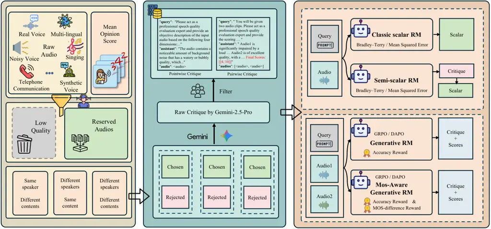
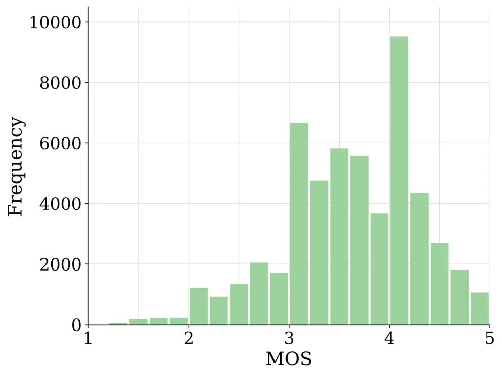
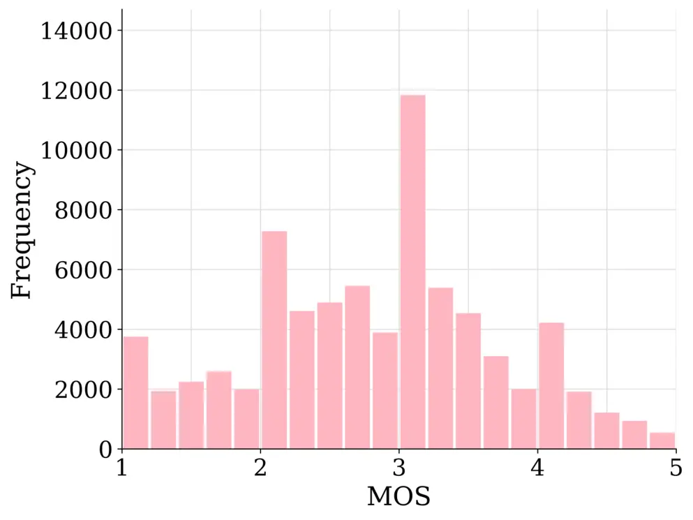
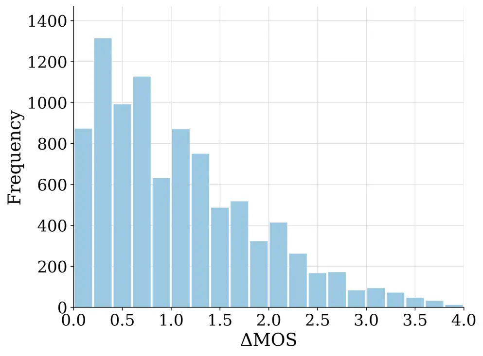
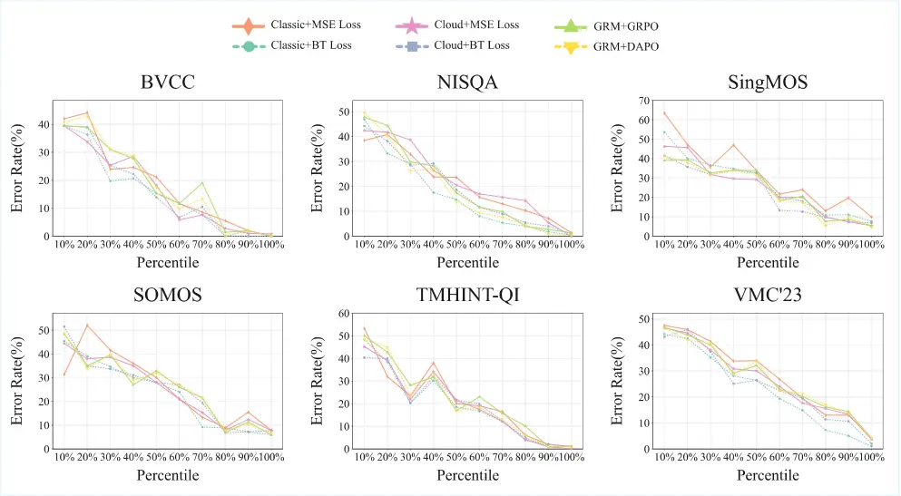

# From Scores to Preferences: Redefining MOS Benchmarking for Speech Quality Reward Modeling

Yifei Cao¹¹ 1 Equal contribution. Affiliation:  Fudan University
Email: <caoyf24@m.fudan.edu.cn>    Changhao Jiang¹¹ 1 Equal
contribution. Affiliation:  Fudan University Email: <tgui@fudan.edu.cn>
   Jiabao Zhuang¹¹ 1 Equal contribution. Affiliation:  Fudan University
   Jiajun Sun¹¹ 1 Equal contribution. Affiliation:  Fudan University   
Ming Zhang Affiliation:  Fudan University    Zhiheng Xi Affiliation: 
Fudan University    Hui Li Affiliation:  Fudan University    Shihan Dou
Affiliation:  Fudan University    Yuran Wang Affiliation:  Honor Device
Co., Ltd    Yunke Zhang Affiliation:  Honor Device Co., Ltd    Tao Ji
Affiliation:  Fudan University    Tao Gui²² 2 Corresponding authors.
Affiliation:  Fudan University    Qi Zhang Affiliation:  Fudan
University    Xuanjing Huang Affiliation:  Fudan University

###### Abstract

Assessing the perceptual quality of synthetic speech is crucial for
guiding the development and refinement of speech generation models.
However, it has traditionally relied on human subjective ratings such as
the Mean Opinion Score (MOS), which depend on manual annotations and
often suffer from inconsistent rating standards and poor
reproducibility. To address these limitations, we introduce MOS-RMBench,
a unified benchmark that reformulates diverse MOS datasets into a
preference-comparison setting, enabling rigorous evaluation across
different datasets. Building on MOS-RMBench, we systematically construct
and evaluate three paradigms for reward modeling: scalar reward models,
semi-scalar reward models, and generative reward models (GRMs). Our
experiments reveal three key findings: (1) scalar models achieve the
strongest overall performance, consistently exceeding 74% accuracy; (2)
most models perform considerably worse on synthetic speech than on human
speech; and (3) all models struggle on pairs with very small MOS
differences. To improve performance on these challenging pairs, we
propose a MOS-aware GRM that incorporates an MOS-difference-based reward
function, enabling the model to adaptively scale rewards according to
the difficulty of each sample pair. Experimental results show that the
MOS-aware GRM significantly improves fine-grained quality discrimination
and narrows the gap with scalar models on the most challenging cases. We
hope this work will establish both a benchmark and a methodological
framework to foster more rigorous and scalable research in automatic
speech quality assessment.

|     |
| --- |
|     |

## 1 Introduction

Assessing the perceptual quality of synthetic speech is crucial for
guiding the development and refinement of speech generation models
(Valentini-Botinhao & Yamagishi, 2018). The rapid progress of
text-to-speech (TTS) and generative audio models has dramatically
improved the naturalness and expressiveness of synthetic speech (Wang
et al., 2025b; Xu et al., 2025a), but also created new challenges for
evaluating speech quality at scale (Lo et al., 2019; Huang et al.,
2022).



Figure 1: Overview of MOS-RMBench. Data from multiple MOS datasets are
filtered and grouped, then converted into pairwise comparisons with
natural-language critiques generated by Gemini-2.5-Pro. The resulting
dataset supports training and evaluation of reward models in a
consistent and reproducible setting.

However, perceptual quality assessment has traditionally relied on human
subjective ratings such as the Mean Opinion Score (MOS) (Sector, 1996),
which depend on manual annotations and often suffer from inconsistent
rating standards and poor reproducibility. MOS-based evaluation asks
listeners to rate the quality of speech samples on a fixed scale and
averages the scores to produce ground-truth labels. While this approach
has been the de facto standard for decades (Sector, 1996), it is
expensive to collect, subject to human variability, and difficult to
scale for modern systems that generate massive amounts of data (Mittag &
Möller, 2019). Furthermore, variations in listener populations and
rating procedures lead to inconsistent subjective standards, hindering
reproducibility and cross-dataset comparison (Pieper & Voran, 2024).

To address these limitations, we introduce MOS-RMBench (see Figure 1), a
unified benchmark that reformulates diverse MOS datasets into a
preference-comparison setting, enabling rigorous evaluation across
different datasets. By transforming MOS scores into pairwise preference
labels, MOS-RMBench eliminates scale inconsistencies and allows models
to be trained and evaluated under a consistent comparison framework.

Building on MOS-RMBench, we systematically construct and evaluate three
paradigms for reward modeling: scalar reward models, semi-scalar reward
models, and generative reward models (GRMs). First, we find that scalar
models achieve the strongest overall performance, consistently exceeding
74% accuracy and reaching around 80% on average across both in-domain
and out-of-domain (OOD) datasets, establishing a solid baseline for
future work. Second, we observe that most models perform considerably
worse on synthetic speech datasets such as SOMOS (Maniati et al., 2022)
and VMC’23 (Cooper et al., 2023) compared to human speech, underscoring
a persistent domain gap. Finally, although all models struggle on pairs
with very small MOS differences, they perform very well when the MOS gap
is large, indicating that the key challenge lies in fine-grained quality
discrimination.

To improve performance on these challenging pairs, we propose a
MOS-aware GRM that augments the standard correctness-based reward with
an additional MOS-difference–based reward, enabling the model to
adaptively scale rewards according to the difficulty of each sample
pair. Experimental results show that the MOS-aware GRM consistently
improves performance across all evaluated datasets, with accuracy gains
exceeding 3% on samples with particularly similar speech quality.

We hope this work will establish both a benchmark and a methodological
framework to foster more rigorous and scalable research in automatic
speech quality assessment. Overall, our contributions are threefold:

1.  1.  We present MOS-RMBench, the first unified benchmark that
        reformulates heterogeneous MOS datasets into a consistent
        preference-comparison framework, enabling rigorous cross-dataset
        evaluation.
2.  2.  We conduct a systematic evaluation of reward modeling paradigms,
        comparing scalar, semi-scalar, and generative models across diverse
        speech domains, and providing insights into their relative strengths
        and weaknesses.
3.  3.  We introduce a MOS-aware GRM that adaptively scales pairwise rewards
        based on MOS differences, achieving measurable improvements in
        fine-grained speech quality discrimination.

## 2 Related Work

### 2.1 Automatic Speech Quality Assessment

Research on automated speech quality assessment has evolved from early
CNN- and RNN-based predictors such as MOSNet and Quality-Net (Lo et al.,
2019; Fu et al., 2018) to self-supervised learning approaches based on
wav2vec 2.0 and HuBERT (Baevski et al., 2020; Hsu et al., 2021), and
more recently to Audio Language Models (ALMs) (Wang et al., 2025a;
Deshmukh et al., 2024; Chen et al., 2025; Zezario et al., 2025). Recent
state-of-the-art MOS prediction systems, including UTMOS (Saeki et al., 2022) and LE-SSL-MOS (Qi et al., 2023), have shown strong results on
in-domain and OOD tracks of the VoiceMOS challenges. To address the
inconsistencies in subjective ratings across datasets, recent work has
explored bias-aware training losses (Mittag et al., 2021b) and dataset
score alignment frameworks such as AlignNet (Pieper & Voran, 2024).
While these methods improve cross-dataset performance, progress remains
limited by heterogeneous MOS annotation protocols, motivating the need
for a unified benchmark for consistent evaluation.

### 2.2 Advances in Reward Modeling

Recent advances in reward modeling (RM), originally introduced to align
model outputs with human preferences (Ouyang et al., 2022), have led to
diverse paradigms in text and vision. In the text domain, research has
progressed from scalar reward models to generative reward modeling. The
Critique-out-Loud (CLoud) framework (Ankner et al., 2024) introduces
natural language critiques prior to scalar scoring, bridging generative
judgment and reward modeling. More recently, Liu et al. (2025) proposes
Self-Principled Critique Tuning (SPCT), enabling GRMs to generate
adaptive principles and critiques during inference, achieving
state-of-the-art results across RM benchmarks. In the vision domain, RM
has been extended to multimodal evaluation, with proprietary systems
such as GPT-4V (Achiam et al., 2023) demonstrating strong agreement with
human judgments and open-source efforts like LLaVA-Critic (Xiong et al., 2025) unifying pointwise and pairwise scoring. By contrast, research on
speech RM remains sparse, with no established frameworks for scalable or
fine-grained preference alignment.

## 3 MOS-RMBench-Data

To systematically evaluate reward models for speech quality assessment,
we construct MOS-RMBench, a large-scale benchmark centered on Mean
Opinion Score (MOS) and preference supervision. MOS-RMBench integrates
diverse MOS datasets into a consistent format based on preferences,
addresses inconsistencies in scoring standards by using preference pairs
rather than absolute MOS scores, and covers diverse speech scenarios.
This chapter introduces the benchmark in three aspects: data sources,
the annotation strategy for preference data, and overall dataset
statistics.

### 3.1 Dataset Source

MOS-RMBench is constructed based on several widely used speech quality
datasets. Specifically, we select BVCC (Cooper & Yamagishi, 2021), NISQA
(Mittag et al., 2021a), SingMOS (Tang et al., 2024), SOMOS (Maniati
et al., 2022), and TMHINT-QI (Chen & Tsao, 2021) as the primary sources
for training and in-domain evaluation. To further assess the
cross-domain generalization of models, we incorporate the VMC’23 Cooper
et al. (2023) dataset as an OOD evaluation benchmark. A brief
description of each dataset is provided below:

BVCC: The BVCC dataset originates from large-scale listening tests and
comprises 7,106 samples, including natural speech and synthetic speech
generated by 187 systems spanning diverse TTS and voice conversion (VC)
methods. The data sources include Blizzard Challenge, Voice Conversion
Challenge, and publicly available samples from ESPnet-TTS (Hayashi
et al., 2020).

NISQA: NISQA is designed for speech quality assessment in communication
networks, covering both simulated distortions and real call recordings.
The training and validation sets comprise 11,020 and 2,700 samples,
respectively, and consist of simulated and live subsets. The test set
contains four subsets, with a total of 952 samples.

SingMOS: SingMOS is an open-source, high-quality singing voice MOS
dataset in Chinese and Japanese, containing 3,421 segments from both
natural singing and 33 systems. It covers various synthesis techniques
including singing voice synthesis (SVS), singing voice conversion (SVC),
and vocoder-based re-synthesis.

SOMOS: SOMOS is a large-scale MOS dataset focusing on neural TTS. It
contains 20,100 samples synthesized from LJ Speech (Ito & Johnson, 2017)
by 200 neural TTS systems and natural speech, all generated using the
same LPCNet vocoder (Valin & Skoglund, 2019) to isolate acoustic-model
differences. MOS-RMBench adopts the SOMOS-clean subset to ensure
annotation consistency and reliability.

TMHINT-QI: TMHINT-QI is a MOS dataset focused on Mandarin speech, mainly
for evaluating speech enhancement (SE) systems. It contains 24,408
samples generated by adding four types of noise (babble, street, pink,
white) at four SNR levels (-2, 0, 2, 5 dB) to clean speech, then
processed by five SE systems.

VMC’23: The VMC’23 dataset originates from The VoiceMOS Challenge 2023
(Cooper et al., 2023). It includes three tracks: (1) French TTS, based
on Blizzard Challenge 2023 (Perrotin et al., 2023) listening tests, with
1,460 samples; (2) singing voice conversion, based on the Voice
Conversion Challenge 2023 (Huang et al., 2023), containing 4,040
samples; (3) noisy and enhanced speech, based on TMHINT-QI(S) (Zezario
et al., 2024), consisting of 1,960 samples.

### 3.2 Preference Annotation

Given the differences in MOS scoring standards across existing datasets,
we adopt a preference-based annotation strategy that transforms MOS
scores into a unified supervision signal to achieve consistent
evaluation. The core idea is to replace absolute MOS scores with
relative preferences between paired samples, because absolute scores are
susceptible to dataset-specific biases and inconsistent scoring scales.
By formulating the task as preference comparison, MOS-RMBench provides a
consistent signal across datasets with diverse sources and evaluation
standards, enabling fair and robust benchmarking of reward models for
speech quality assessment across domains and scenarios.

We first convert all samples into a unified 16 kHz WAV format to ensure
consistency in subsequent processing. Following this, we filter out
samples with unreliable annotations and partition the remaining data
from each source dataset into three categories: (i) samples that share
the same speech content but differ in speaker, synthesis system, or
speech processing conditions, for example a TTS system or noise
perturbation; (ii) samples that share the same speaker or are generated
by the same system but differ in speech content; and (iii) samples that
differ in both content and speaker or system. To ensure that comparisons
are meaningful and consistent, we construct preference pairs within each
dataset based on the intrinsic relationships between samples.
Specifically, for the first two categories, we group samples by shared
content or by shared speaker or system, respectively, then construct
preference pairs within each group and ensure that the two samples in
each pair have different MOS scores. The sample with the higher MOS is
labeled “chosen”, and the one with the lower score is labeled
“rejected”. For the third category, since explicit grouping is not
feasible, we construct preference pairs directly within the dataset and
apply the same “chosen-rejected” labeling rule. Finally, we ensure that
the number of constructed preference pairs is balanced across datasets
so that subsequent evaluations are not biased toward any particular
source.

This annotation strategy yields two primary benefits. First, it ensures
that pairwise comparisons reflect meaningful contrasts—either
differences in system quality under conditions where the content is
matched, or differences in content under conditions where the system is
matched. Second, by converting absolute MOS values into relative
preferences, the strategy reduces sensitivity to dataset-specific
scoring standards and annotation biases, which facilitates the
integration of heterogeneous MOS sources into a single benchmarking
framework.

### 3.3 Dataset Statistics

Overview. MOS-RMBench constructs a large-scale and balanced preference
dataset comprising 55,333 training samples, 9,905 development samples,
and 6,240 in-domain test samples from five source datasets, together
with 3,000 OOD test samples from the VMC’23 challenge for assessing
cross-domain generalization, as summarized in Table 1. The benchmark
covers a broad spectrum of speech scenarios, including natural and
synthetic speech, singing voice, VC, SVC, SE, and speech with real or
simulated noise and distortions, spanning six languages: English,
Chinese, Taiwanese Mandarin, Japanese, French, and German. This
diversity in acoustic conditions and linguistic coverage establishes a
rigorous foundation for the development and evaluation of reward models,
enabling them to achieve more robust perceptual discrimination and to
generalize effectively across domains and languages.

| Dataset   | Train  | Dev   | Test  | Scenario                                  | Language                            |
| --------- | ------ | ----- | ----- | ----------------------------------------- | ----------------------------------- |
| BVCC      | 9,948  | 2,132 | 1,000 | natural speech, TTS, VC                   | English                             |
| NISQA     | 11,571 | 2,796 | 2,240 | natural & distorted speech                | English, German                     |
| SingMOS   | 10,000 | 2,720 | 1,000 | natural speech, SVS, SVC                  | Chinese, Japanese                   |
| SOMOS     | 13,814 | 2,257 | 1,000 | natural speech, TTS                       | English                             |
| TMHINT-QI | 10,000 | –     | 1,000 | natural & noisy speech, SE                | Taiwanese Mandarin                  |
| VMC’23    | –      | –     | 3,000 | natural & noisy speech, TTS, SVS, SVC, SE | French, English, Taiwanese Mandarin |
| Overall   | 55,333 | 9,905 | 9,240 | –                                         | –                                   |

Table 1: Statistics of MOS-RMBench across datasets.



(a) Distribution of chosen samples



(b) Distribution of rejected samples



(c) Distribution of $`\Delta MOS`$

Figure 2: Distribution of MOS scores in MOS-RMBench. Figures (a) and (b)
show the MOS distributions of chosen and rejected samples. Figure (c)
presents the distribution of $`\Delta MOS`$ in the test set.

MOS Distribution. Figure 2 illustrates the distribution of MOS scores
within MOS-RMBench. Overall, the MOS ratings of the chosen samples are
predominantly concentrated in the range of 3 and above, whereas the
rejected samples are largely distributed below 3.5. This clear
separation between the two categories reflects the internal consistency
and reliability of the preference annotations. For the test set, the MOS
difference ($`\Delta MOS`$) between each paired sample is mostly within
1.5 points, indicating that a substantial portion of the speech pairs
exhibit very similar perceptual quality, which makes the benchmark
particularly challenging for speech quality assessment.

## 4 MOS-RMBench-Eval

To comprehensively evaluate the capability of reward models in speech
quality assessment, we design MOS-RMBench-Eval. Centered on a unified
preference-based setting, the benchmark encompasses diverse reward
modeling paradigms, thereby enabling systematic and fair comparison
across models. This section introduces the evaluation task and the
reward models under evaluation.

### 4.1 Evaluation Task

Task Description. The evaluation is formulated as a binary preference
comparison task: given a pair of speech samples, the model must either
assign quality scores to both or directly decide which sample exhibits
higher perceptual quality. The model’s performance on this task reflects
its ability to discriminate differences in speech quality. To reduce
potential position bias, the presentation order of the two audio clips
in each pair is randomly swapped during evaluation. A decision is
counted as correct only if the model assigns a strictly higher score to
the sample annotated as chosen than to the one annotated as rejected.

Evaluation Metrics. Model performance is reported in terms of accuracy
(Acc). For each dataset, we calculate the proportion of evaluation pairs
in which the model’s scores correctly reflect the annotated preference
(i.e., the chosen sample receives the higher score). The overall
accuracy is computed as the proportion of correctly judged pairs across
all samples from all datasets, which provides a comprehensive measure of
model performance across the diverse speech scenarios covered by
MOS-RMBench-Eval.

### 4.2 Evaluated Models

We implement and evaluate a range of reward modeling paradigms based on
Qwen2-Audio (Chu et al., 2024), covering scalar, semi-scalar, and GRMs,
as well as UTMOS used for MOS prediction and the LLM-as-a-judge (Zheng
et al., 2023) paradigm. The following provides a description of the
models evaluated under each paradigm, with detailed configurations
provided in the Appendix B.

Classic scalar reward models. These models output a single quality score
for each audio sample. We adopt two training objectives: the
Bradley–Terry(BT) (Bradley & Terry, 1952) loss, which maximizes the
likelihood that the sample annotated as chosen receives a higher
predicted score, and the mean squared error (MSE) loss, which minimizes
the squared difference between the predicted score and the corresponding
MOS value.

Semi-scalar reward models. These models extend the scalar paradigm by
incorporating natural language descriptions of audio quality. For each
audio sample, Gemini-2.5-Pro (Comanici et al., 2025) provides an overall
quality description along four dimensions: noise, distortion,
continuity, and naturalness. The model is first trained to generate
these descriptions, after which its outputs are passed through a reward
head to produce scalar scores. Similar to classic scalar models, both BT
and MSE objectives are used for training.

Generative reward models. GRMs take two audio samples as input
simultaneously. As in the semi-scalar setting, the mode first learns to
produce descriptive quality assessments. It is then further refined
through supervised fine-tuning (SFT) on paired audio data annotated by
Gemini-2.5-Pro, where each pair is compared across the same four
dimensions and provided with overall quality scores. The annotation is
validated to ensure that the chosen sample receives the higher score.
GRMs are further optimized using reinforcement learning methods,
including Group Relative Policy Optimization (GRPO) (Shao et al., 2024)
and Decoupled Clip and Dynamic sAmpling Policy Optimization (DAPO) (Yu
et al., 2025). In both cases, training employs a rule-based reward
design, referred to as the Accuracy reward, which is determined solely
by whether the model correctly judges the quality of a speech sample
pair. Using $`S(c)`$ and $`S(r)`$ to denote the scores assigned to the
chosen and rejected samples, respectively, the Accuracy reward is
defined as follows:

```math
\text{Accuracy reward}=\left\{\begin{array}[]{lcl}1&&if\ \ S(c)>S(r),\\
-1&&otherwise\\
\end{array}\right. \tag{1}
```

LLM-as-a-judge. These models directly compare two audio samples and
output a preference judgment without producing explicit scalar scores.
We evaluate this paradigm using Gemini-2.5-Pro and Qwen2.5-Omni-7B (Xu
et al., 2025b).

## 5 Experiment

This section presents an empirical study on MOS-RMBench to investigate
the performance of different paradigms. We first present the overall
evaluation results, then perform an error analysis across samples with
varying MOS gaps, and finally explore a MOS-aware GRM designed to
address the limitations revealed by this analysis.

|                           |       |       |         |       |           |        |         |
| ------------------------- | ----- | ----- | ------- | ----- | --------- | ------ | ------- |
| Model                     | BVCC  | NISQA | SingMOS | SOMOS | TMHINT-QI | VMC’23 | Overall |
| MOS prediction model      |       |       |         |       |           |        |         |
| UTMOS                     | 86.70 | 73.17 | 63.80   | 65.00 | 68.10     | 60.83  | 68.18   |
| LLM-as-a-judge            |       |       |         |       |           |        |         |
| Gemini-2.5-Pro            | 63.90 | 81.96 | 58.50   | 64.10 | 73.20     | 65.57  | 69.26   |
| Qwen2.5-Omni-7B           | 54.00 | 63.97 | 57.70   | 56.30 | 69.90     | 58.43  | 60.23   |
| Scalar reward models      |       |       |         |       |           |        |         |
| Classic + BT Loss         | 85.70 | 83.93 | 74.80   | 76.80 | 81.10     | 77.73  | 80.04   |
| Classic + MSE Loss        | 82.80 | 79.33 | 69.80   | 74.30 | 79.40     | 72.23  | 75.83   |
| Semi-scalar reward models |       |       |         |       |           |        |         |
| Cloud + BT Loss           | 85.50 | 81.07 | 78.20   | 75.30 | 80.60     | 75.70  | 78.82   |
| Cloud + MSE Loss          | 84.50 | 77.81 | 76.10   | 75.20 | 80.50     | 73.67  | 77.01   |
| Generative reward models  |       |       |         |       |           |        |         |
| GRM + SFT                 | 80.60 | 79.60 | 75.10   | 70.00 | 77.90     | 69.23  | 74.63   |
| GRM + GRPO                | 82.50 | 80.31 | 76.40   | 74.60 | 78.10     | 73.13  | 76.94   |
| GRM + DAPO                | 82.60 | 82.05 | 77.50   | 74.40 | 79.30     | 73.13  | 77.60   |

Table 2: Evaluation results of models from different paradigms on
MOS-RMBench. The best results are shown in bold and the second best is
with underline.

### 5.1 Evaluation Results

Table 2 presents the main evaluation results, summarizing the
performance of all models across individual datasets as well as overall.

Comparison of different modeling paradigms. As shown in the evaluation
results, the Classic scalar models achieve the highest overall accuracy
(80.04% with BT loss), followed by the Cloud semi-scalar models (78.82%
with BT loss), while the GRMs attain slightly lower overall performance.
These findings indicate that, under the current evaluation setup, the
Classic scalar paradigm remains highly effective in distinguishing
speech quality, despite the additional modeling flexibility offered by
the semi-scalar and generative paradigms. Notably, while UTMOS performs
strongly on BVCC, it exhibits a marked drop in accuracy on the other
datasets, suggesting that MOS prediction models may generalize poorly
across diverse datasets. Furthermore, Gemini-2.5-Pro and Qwen2.5-Omni-7B
both achieve accuracies below 70% on most datasets, underscoring the
considerable challenge that MOS-RMBench presents to current audio large
language models.

Comparison of training objectives for scalar-based reward models. Within
scalar-based paradigms, we examine the effect of different training
objectives: BT loss and MSE loss. For the Classic scalar models, BT loss
consistently outperforms MSE loss, achieving over a 4% gain in overall
accuracy; a similar trend is observed for the Cloud semi-scalar models.
The advantage of BT loss over MSE loss is even more pronounced on the
OOD VMC’23 dataset. These findings indicate that, compared with direct
regression to MOS scores, optimizing the relative ordering of samples
with BT loss is generally more effective. The advantage likely stems
from BT loss explicitly encouraging the model to capture relative
quality differences between samples, whereas MSE is more sensitive to
variations in absolute MOS scores across datasets, affecting
cross-domain robustness.

Comparison of training strategies for GRMs. For GRMs, we evaluate two
reinforcement learning strategies: DAPO and GRPO. The two methods attain
comparable overall accuracies, with 77.60% for DAPO and 76.94% for GRPO.
Although the differences among strategies are modest, DAPO appears to
have a slight but consistent advantage in learning from paired audio
comparisons on average. More importantly, both strategies yield a clear
and consistent performance gain compared with SFT alone, further
highlighting the benefit and necessity of reinforcement learning for
GRMs. Furthermore, all GRM variants demonstrate competitive performance
across both in-domain and OOD datasets, particularly on NISQA and
SingMOS, despite their overall accuracy remaining slightly lower than
that of the Classic scalar models.

### 5.2 Error Analysis

What constrains model performance? We observe that all models are
particularly prone to errors on sample pairs with small MOS differences.
To quantify this phenomenon, we conduct a percentile-based error
analysis: within each dataset, pairs are first sorted by their MOS
difference in ascending order and then divided into percentile bins of
equal size. We then compute, for each bin, the proportion of pairs that
each reward model ranks incorrectly. Figure 3 presents the statistical
results. Across all models, error rates are consistently high in the
lowest MOS difference percentiles, even the top-performing Classic
scalar model exhibits error rates of 40% or higher. As the MOS
difference increases, however, the error rates for all models decrease
markedly. These findings indicate that fine-grained discrimination of
speech quality remains a critical bottleneck for current reward models,
highlighting the need for methods capable of capturing subtle speech
quality differences.



Figure 3: Percentile-based error analysis across datasets: error rates
are highest for pairs with small MOS differences and decline markedly as
the MOS gap widens.

### 5.3 MOS-aware GRM

Design of the MOS-aware reward function. GRMs offer a flexible and
interpretable framework for reward modeling, allowing the reward signal
to be decomposed and extended. During the original GRM reinforcement
learning process, the Accuracy reward considers only whether the model
correctly ranks the quality of an audio pair, treating all pairs as
equally informative. This uniform treatment overlooks the inherent
difficulty of pairs with small MOS differences, which may constrain the
model’s ability to learn fine-grained quality distinctions. To address
this limitation, we introduce the MOS-difference reward, which
explicitly incorporates the MOS gap of each audio pair into the reward
function:

```math
\text{MOS-difference reward}=\left\{\begin{array}[]{lcl}0.5*(1.0+cos(\Delta MOS*\pi))&&if\ \ S(c)>S(r),\\
0.5*(-1.0+cos(\Delta MOS*\pi))&&otherwise\\
\end{array}\right. \tag{2}
```

Specifically, $`\Delta MOS`$ is obtained by normalizing the original MOS
gap by the 90th percentile of MOS differences in the dataset and
clamping the resulting value to the \[0,1\] range to mitigate the
influence of extreme outliers. Based on the Accuracy reward and the
MOS-difference reward, the final MOS-aware reward is defined as follows:

```math
\text{MOS-aware reward}=\text{Accuracy reward}+\text{MOS-difference reward}. \tag{3}
```

This formulation offers two key advantages. First, it enables adaptive
scaling of the reward based on the relative difficulty of each sample
pair: for pairs with small MOS differences, correct predictions are
assigned a relatively larger reward while incorrect predictions incur a
relatively smaller penalty; for pairs with large MOS differences, the
reward and penalty are modulated accordingly. Second, the cosine-based
shaping ensures smooth transitions at both ends of the scale. By
adjusting the reward according to the implied difficulty, the MOS-aware
design provides a more informative learning signal, encouraging the
model to attend to subtle perceptual distinctions while still penalizing
clearly incorrect predictions.

| Models             | BVCC          | NISQA         | SingMOS       | SOMOS         | TMHINT-QI     | VMC’23        | Overall       |
| ------------------ | ------------- | ------------- | ------------- | ------------- | ------------- | ------------- | ------------- |
| MOS-aware GRM+GRPO | 83.10 (+0.60) | 81.47 (+1.16) | 76.50 (+0.10) | 75.80 (+1.20) | 80.40 (+2.30) | 74.13 (+1.00) | 78.00 (+1.06) |
| MOS-aware GRM+DAPO | 83.40 (+0.80) | 82.14 (+0.09) | 78.40 (+0.90) | 75.10 (+0.70) | 79.90 (+0.60) | 73.57 (+0.44) | 78.08 (+0.48) |

Table 3: Evaluation results of MOS-aware GRMs with GRPO and DAPO on
MOS-RMBench. Numbers in parentheses denote absolute improvements over
baseline GRM.

(a) Training strategy: GRPO

(b) Training strategy: DAPO

Figure 4: Performance comparison of MOS-aware GRMs and standard GRMs
trained with different reinforcement methods on samples with MOS
difference $`\leq 0.5`$.

Impact of MOS-aware reward on GRM performance. To evaluate the
effectiveness of the proposed MOS-aware reward, we incorporate it into
the GRM training process under both GRPO and DAPO strategies, while
keeping all other training configurations unchanged. This design enables
a direct comparison with baseline GRM models that rely solely on the
Accuracy reward. Table 3 summarizes the overall results, showing that
MOS-aware GRMs achieve consistent improvements over their baseline
counterparts across all evaluation scenarios.

To further examine performance on perceptually challenging pairs, we
evaluate models on sample pairs with a MOS difference threshold of 0.5.
Figure 4 presents the corresponding results. Across all datasets,
MOS-aware GRMs consistently outperform the baselines on these
fine-grained comparisons. For illustration, with the GRPO strategy,
accuracy increases from 57.44% to 60.74% on THMINT-QI and from 57.17% to
58.89% on the OOD VMC’23 dataset; under the DAPO strategy accuracy
improves from 62.79% to 65.12% on BVCC and from 57.47% to 59.39% on
VMC’23. These results demonstrate that incorporating MOS difference
information into the reward function produces stable and statistically
significant gains. The MOS-aware design provides a more informative,
difficulty-sensitive learning signal that strengthens GRM’s capacity to
capture fine-grained perceptual quality differences beyond what the
conventional Accuracy reward achieves.

## 6 Conclusion, limitations and future work

In this work, we introduced MOS-RMBench, the first unified benchmark for
speech quality reward modeling that reformulates six major MOS datasets
into a preference-based evaluation framework. Our experiments show that
scalar reward models achieve the strongest overall accuracy (80%),
semi-scalar models perform comparably, and GRMs achieve slightly lower
accuracy but offer greater interpretability. Error analysis reveals that
most misrankings occur on pairs with very small MOS differences,
highlighting fine-grained quality discrimination as a key challenge.

Despite its coverage, MOS-RMBench is limited to a small set of languages
and focuses primarily on perceptual quality, leaving prosody, emotion,
and style unmodeled. Reformulating MOS scores into pairwise preferences
also changes the original score distribution, which may affect how
models learn absolute quality levels.

Future work includes expanding the benchmark to more languages and
acoustic conditions, incorporating multi-dimensional quality dimensions,
and developing reward models that better capture subtle perceptual
differences. We hope MOS-RMBench will serve as a reproducible foundation
for advancing speech quality reward modeling and preference alignment in
next-generation speech generation systems.

## Ethics Statement

This study strictly adheres to academic research ethics. All models used
are employed in accordance with their respective licenses, and all
datasets are publicly available and used in compliance with their terms.
The research does not involve human subjects, private or sensitive
personal data, or proprietary information, and no experiments pose
potential harm to individuals, communities, or the environment.

## Reproducibility Statement

We take reproducibility seriously and provide sufficient information to
enable others to replicate the results reported in this paper. All
datasets used are publicly available, and detailed statistics, data
splits, and preprocessing steps are described in the paper. Training
configurations, hyperparameters, and evaluation protocols for all models
are fully documented, along with the prompts used for data annotation
and model evaluation. In addition, we provide the source code and
relevant data as supplementary materials to facilitate exact
reproduction of our experiments. The code and datasets will be released
in due course.

## References

- Achiam et al. (2023) Josh Achiam, Steven Adler, Sandhini Agarwal, Lama
  Ahmad, Ilge Akkaya, Florencia Leoni Aleman, Diogo Almeida, Janko
  Altenschmidt, Sam Altman, Shyamal Anadkat, et al. Gpt-4 technical
  report. _arXiv preprint arXiv:2303.08774_, 2023.
- Ankner et al. (2024) Zachary Ankner, Mansheej Paul, Brandon Cui,
  Jonathan D Chang, and Prithviraj Ammanabrolu. Critique-out-loud reward
  models. _arXiv preprint arXiv:2408.11791_, 2024.
- Baevski et al. (2020) Alexei Baevski, Yuhao Zhou, Abdelrahman Mohamed,
  and Michael Auli. wav2vec 2.0: A framework for self-supervised
  learning of speech representations. _Advances in neural information
  processing systems_, 33:12449–12460, 2020.
- Bradley & Terry (1952) Ralph Allan Bradley and Milton E Terry. Rank
  analysis of incomplete block designs: I. the method of paired
  comparisons. _Biometrika_, 39(3/4):324–345, 1952.
- Chen et al. (2025) Chen Chen, Yuchen Hu, Siyin Wang, Helin Wang,
  Zhehuai Chen, Chao Zhang, Chao-Han Huck Yang, and Eng Siong Chng.
  Audio large language models can be descriptive speech quality
  evaluators. _arXiv preprint arXiv:2501.17202_, 2025.
- Chen & Tsao (2021) Yu-Wen Chen and Yu Tsao. Inqss: a speech
  intelligibility and quality assessment model using a multi-task
  learning network. _arXiv preprint arXiv:2111.02585_, 2021.
- Chu et al. (2024) Yunfei Chu, Jin Xu, Qian Yang, Haojie Wei, Xipin
  Wei, Zhifang Guo, Yichong Leng, Yuanjun Lv, Jinzheng He, Junyang Lin,
  et al. Qwen2-audio technical report. _arXiv preprint
  arXiv:2407.10759_, 2024.
- Comanici et al. (2025) Gheorghe Comanici, Eric Bieber, Mike
  Schaekermann, Ice Pasupat, Noveen Sachdeva, Inderjit Dhillon, Marcel
  Blistein, Ori Ram, Dan Zhang, Evan Rosen, et al. Gemini 2.5: Pushing
  the frontier with advanced reasoning, multimodality, long context, and
  next generation agentic capabilities. _arXiv preprint
  arXiv:2507.06261_, 2025.
- Cooper & Yamagishi (2021) Erica Cooper and Junichi Yamagishi. How do
  voices from past speech synthesis challenges compare today? _arXiv
  preprint arXiv:2105.02373_, 2021.
- Cooper et al. (2023) Erica Cooper, Wen-Chin Huang, Yu Tsao, Hsin-Min
  Wang, Tomoki Toda, and Junichi Yamagishi. The voicemos challenge 2023:
  Zero-shot subjective speech quality prediction for multiple domains.
  In _2023 IEEE Automatic Speech Recognition and Understanding Workshop
  (ASRU)_, pp. 1–7. IEEE, 2023.
- Deshmukh et al. (2024) Soham Deshmukh, Dareen Alharthi, Benjamin
  Elizalde, Hannes Gamper, Mahmoud Al Ismail, Rita Singh, Bhiksha Raj,
  and Huaming Wang. Pam: Prompting audio-language models for audio
  quality assessment. _arXiv preprint arXiv:2402.00282_, 2024.
- Fu et al. (2018) Szu-Wei Fu, Yu Tsao, Hsin-Te Hwang, and Hsin-Min
  Wang. Quality-net: An end-to-end non-intrusive speech quality
  assessment model based on blstm. _arXiv preprint
  arXiv:1808.05344_, 2018.
- Hayashi et al. (2020) Tomoki Hayashi, Ryuichi Yamamoto, Katsuki Inoue,
  Takenori Yoshimura, Shinji Watanabe, Tomoki Toda, Kazuya Takeda,
  Yu Zhang, and Xu Tan. Espnet-tts: Unified, reproducible, and
  integratable open source end-to-end text-to-speech toolkit. In _ICASSP
  2020-2020 IEEE international conference on acoustics, speech and
  signal processing (ICASSP)_, pp. 7654–7658. IEEE, 2020.
- Hsu et al. (2021) Wei-Ning Hsu, Benjamin Bolte, Yao-Hung Hubert Tsai,
  Kushal Lakhotia, Ruslan Salakhutdinov, and Abdelrahman Mohamed.
  Hubert: Self-supervised speech representation learning by masked
  prediction of hidden units. _IEEE/ACM transactions on audio, speech,
  and language processing_, 29:3451–3460, 2021.
- Huang et al. (2022) Wen-Chin Huang, Erica Cooper, Yu Tsao, Hsin-Min
  Wang, Tomoki Toda, and Junichi Yamagishi. The voicemos challenge 2022.
  _arXiv preprint arXiv:2203.11389_, 2022.
- Huang et al. (2023) Wen-Chin Huang, Lester Phillip Violeta, Songxiang
  Liu, Jiatong Shi, and Tomoki Toda. The singing voice conversion
  challenge 2023. In _2023 IEEE Automatic Speech Recognition and
  Understanding Workshop (ASRU)_, pp. 1–8. IEEE, 2023.
- Ito & Johnson (2017) Keith Ito and Linda Johnson. The lj speech
  dataset, 2017.
- Liu et al. (2025) Zijun Liu, Peiyi Wang, Runxin Xu, Shirong Ma, Chong
  Ruan, Peng Li, Yang Liu, and Yu Wu. Inference-time scaling for
  generalist reward modeling. _arXiv preprint arXiv:2504.02495_, 2025.
- Lo et al. (2019) Chen-Chou Lo, Szu-Wei Fu, Wen-Chin Huang, Xin Wang,
  Junichi Yamagishi, Yu Tsao, and Hsin-Min Wang. Mosnet: Deep learning
  based objective assessment for voice conversion. _arXiv preprint
  arXiv:1904.08352_, 2019.
- Maniati et al. (2022) Georgia Maniati, Alexandra Vioni, Nikolaos
  Ellinas, Karolos Nikitaras, Konstantinos Klapsas, June Sig Sung, Gunu
  Jho, Aimilios Chalamandaris, and Pirros Tsiakoulis. Somos: The samsung
  open mos dataset for the evaluation of neural text-to-speech
  synthesis. _arXiv preprint arXiv:2204.03040_, 2022.
- Mittag & Möller (2019) Gabriel Mittag and Sebastian Möller.
  Non-intrusive speech quality assessment for super-wideband speech
  communication networks. In _ICASSP 2019-2019 IEEE International
  Conference on Acoustics, Speech and Signal Processing (ICASSP)_, pp.
  7125–7129. IEEE, 2019.
- Mittag et al. (2021a) Gabriel Mittag, Babak Naderi, Assmaa Chehadi,
  and Sebastian Möller. Nisqa: A deep cnn-self-attention model for
  multidimensional speech quality prediction with crowdsourced datasets.
  _arXiv preprint arXiv:2104.09494_, 2021a.
- Mittag et al. (2021b) Gabriel Mittag, Saman Zadtootaghaj, Thilo
  Michael, Babak Naderi, and Sebastian Möller. Bias-aware loss for
  training image and speech quality prediction models from multiple
  datasets. In _2021 13th International Conference on Quality of
  Multimedia Experience (QoMEX)_, pp. 97–102. IEEE, 2021b.
- Ouyang et al. (2022) Long Ouyang, Jeffrey Wu, Xu Jiang, Diogo Almeida,
  Carroll Wainwright, Pamela Mishkin, Chong Zhang, Sandhini Agarwal,
  Katarina Slama, Alex Ray, et al. Training language models to follow
  instructions with human feedback. _Advances in neural information
  processing systems_, 35:27730–27744, 2022.
- Perrotin et al. (2023) Olivier Perrotin, Brooke Stephenson, Silvain
  Gerber, and Gérard Bailly. The blizzard challenge 2023. In _18th
  Blizzard Challenge Workshop_, pp. 1–27. ISCA, 2023.
- Pieper & Voran (2024) Jaden Pieper and Stephen D Voran. Alignnet:
  Learning dataset score alignment functions to enable better training
  of speech quality estimators. _arXiv preprint arXiv:2406.10205_, 2024.
- Qi et al. (2023) Zili Qi, Xinhui Hu, Wangjin Zhou, Sheng Li, Hao Wu,
  Jian Lu, and Xinkang Xu. Le-ssl-mos: Self-supervised learning mos
  prediction with listener enhancement. In _2023 IEEE Automatic Speech
  Recognition and Understanding Workshop (ASRU)_, pp. 1–6. IEEE, 2023.
- Saeki et al. (2022) Takaaki Saeki, Detai Xin, Wataru Nakata, Tomoki
  Koriyama, Shinnosuke Takamichi, and Hiroshi Saruwatari. Utmos:
  Utokyo-sarulab system for voicemos challenge 2022. _arXiv preprint
  arXiv:2204.02152_, 2022.
- Sector (1996) International Telecommunication Union.
  Telecommunication Standardization Sector. _Methods for subjective
  determination of transmission quality_. International
  Telecommunication Union, 1996.
- Shao et al. (2024) Zhihong Shao, Peiyi Wang, Qihao Zhu, Runxin Xu,
  Junxiao Song, Xiao Bi, Haowei Zhang, Mingchuan Zhang, YK Li, Yang Wu,
  et al. Deepseekmath: Pushing the limits of mathematical reasoning in
  open language models. _arXiv preprint arXiv:2402.03300_, 2024.
- Tang et al. (2024) Yuxun Tang, Jiatong Shi, Yuning Wu, and Qin Jin.
  Singmos: An extensive open-source singing voice dataset for mos
  prediction. _arXiv preprint arXiv:2406.10911_, 2024.
- Valentini-Botinhao & Yamagishi (2018) Cassia Valentini-Botinhao and
  Junichi Yamagishi. Speech enhancement of noisy and reverberant speech
  for text-to-speech. _IEEE/ACM Transactions on Audio, Speech, and
  Language Processing_, 26(8):1420–1433, 2018.
- Valin & Skoglund (2019) Jean-Marc Valin and Jan Skoglund. Lpcnet:
  Improving neural speech synthesis through linear prediction. In
  _ICASSP 2019-2019 IEEE International Conference on Acoustics, Speech
  and Signal Processing (ICASSP)_, pp. 5891–5895. IEEE, 2019.
- Wang et al. (2025a) Siyin Wang, Wenyi Yu, Yudong Yang, Changli Tang,
  Yixuan Li, Jimin Zhuang, Xianzhao Chen, Xiaohai Tian, Jun Zhang,
  Guangzhi Sun, et al. Enabling auditory large language models for
  automatic speech quality evaluation. In _ICASSP 2025-2025 IEEE
  International Conference on Acoustics, Speech and Signal Processing
  (ICASSP)_, pp. 1–5. IEEE, 2025a.
- Wang et al. (2025b) Xinsheng Wang, Mingqi Jiang, Ziyang Ma, Ziyu
  Zhang, Songxiang Liu, Linqin Li, Zheng Liang, Qixi Zheng, Rui Wang,
  Xiaoqin Feng, et al. Spark-tts: An efficient llm-based text-to-speech
  model with single-stream decoupled speech tokens. _arXiv preprint
  arXiv:2503.01710_, 2025b.
- Xiong et al. (2025) Tianyi Xiong, Xiyao Wang, Dong Guo, Qinghao Ye,
  Haoqi Fan, Quanquan Gu, Heng Huang, and Chunyuan Li. Llava-critic:
  Learning to evaluate multimodal models. In _Proceedings of the
  Computer Vision and Pattern Recognition Conference_, pp.
  13618–13628, 2025.
- Xu et al. (2025a) Jin Xu, Zhifang Guo, Jinzheng He, Hangrui Hu, Ting
  He, Shuai Bai, Keqin Chen, Jialin Wang, Yang Fan, Kai Dang, et al.
  Qwen2. 5-omni technical report. _arXiv preprint arXiv:2503.20215_,
  2025a.
- Xu et al. (2025b) Jin Xu, Zhifang Guo, Jinzheng He, Hangrui Hu, Ting
  He, Shuai Bai, Keqin Chen, Jialin Wang, Yang Fan, Kai Dang, et al.
  Qwen2. 5-omni technical report. _arXiv preprint arXiv:2503.20215_,
  2025b.
- Yu et al. (2025) Qiying Yu, Zheng Zhang, Ruofei Zhu, Yufeng Yuan,
  Xiaochen Zuo, Yu Yue, Weinan Dai, Tiantian Fan, Gaohong Liu, Lingjun
  Liu, et al. Dapo: An open-source llm reinforcement learning system at
  scale. _arXiv preprint arXiv:2503.14476_, 2025.
- Zezario et al. (2024) Ryandhimas E Zezario, Yu-Wen Chen, Szu-Wei Fu,
  Yu Tsao, Hsin-Min Wang, and Chiou-Shann Fuh. A study on incorporating
  whisper for robust speech assessment. In _2024 IEEE International
  Conference on Multimedia and Expo (ICME)_, pp. 1–6. IEEE, 2024.
- Zezario et al. (2025) Ryandhimas E Zezario, Sabato M Siniscalchi,
  Hsin-Min Wang, and Yu Tsao. A study on zero-shot non-intrusive speech
  assessment using large language models. In _ICASSP 2025-2025 IEEE
  International Conference on Acoustics, Speech and Signal Processing
  (ICASSP)_, pp. 1–5. IEEE, 2025.
- Zheng et al. (2023) Lianmin Zheng, Wei-Lin Chiang, Ying Sheng, Siyuan
  Zhuang, Zhanghao Wu, Yonghao Zhuang, Zi Lin, Zhuohan Li, Dacheng Li,
  Eric Xing, et al. Judging llm-as-a-judge with mt-bench and chatbot
  arena. _Advances in neural information processing systems_,
  36:46595–46623, 2023.

## Appendix A Usage of Large Language Models

In this study, large language models were used only for polishing parts
of the manuscript’s text to improve fluency and readability. They did
not participate in the research design, the development or execution of
the methodology, the collection or analysis of data, or the creation and
validation of the core scientific content. All core research content and
findings are entirely the work and responsibility of the authors.

## Appendix B Experimental Details

### B.1 Model Configurations and Hyperparameters

Classic scalar reward models: Both BT-loss and MSE-loss variants are
trained for one epoch with a batch size of 32, using the AdamW optimizer
(initial learning rate 5e-6, weight decay 5e-6).

Semi-scalar reward models: Both BT-loss and MSE-loss variants are
trained for one epoch with a batch size of 32, using the AdamW optimizer
(initial learning rate 1e-6, weight decay 1e-6). The total loss is a
weighted sum of the reward loss and the LM loss, where the LM loss is
assigned a weight of 1.25.

Generative reward models: Both GRPO and DAPO are trained for one epoch
with a batch size of 64 using the AdamW optimizer (learning rate 1e-6),
generating 4 completions per prompt with temperature 1.0, and employing
ZeRO-2 optimization.

For inference, the temperature was set to 0.0 for all models. Training
and inference are conducted on eight H20 GPUs for all models.

### B.2 Prompt Templates

This section details the prompt templates used both for data annotation
and for model inference during evaluation.

Prompts for Data Annotation. To construct the training sets for the
reward models, we used Gemini-2.5-Pro as the annotator and designed two
kinds of prompts. For single-sample critic annotation, as illustrated in
Figure 5, Gemini-2.5-Pro is guided to listen to a single speech sample
and provide a detailed critique of its perceptual quality across
multiple dimensions. For paired-sample critic annotation, as shown in
Figure 6, Gemini-2.5-Pro compares two speech samples, offers a detailed
assessment of each along key perceptual dimensions, and then assigns
overall quality scores from 1 to 10 to both samples. This
paired-comparison protocol yields both textual rationales and numerical
ratings that serve as the foundation for preference-based generative
reward modeling.

Prompts for Model Inference. During evaluation, different
reward-modeling paradigms adopt distinct prompt formats. Figure 7
presents the prompt structure for both the Classic scalar reward models
and the semi-scalar reward models: the Classic scalar models assess a
single speech sample and output a scalar score representing its overall
perceptual quality, whereas the semi-scalar models produce a detailed
critique of the sample before deriving a scalar quality score. Figure 8
shows the prompt for the GRMs, which requires the model to compare two
speech samples across four perceptual dimensions and then assign an
overall quality score from 1 to 10 to each sample. Finally, Figure 9
illustrates the prompt for the LLM-as-a-judge paradigm, where the model
is asked to decide which of two input speech samples has higher overall
perceptual quality and to output the identifier of the higher-quality
sample.

Figure 5: Prompt structure for Gemini-2.5-Pro to annotate a single-audio
critic.

Figure 6: Prompt structure for Gemini-2.5-Pro to annotate a paired-audio
critic with scores.

Figure 7: Prompt structure for scalar and semi-scalar reward models
inference.

Figure 8: Prompt structure for generative reward models inference.

Figure 9: Prompt structure for LLM-as-a-judge.
