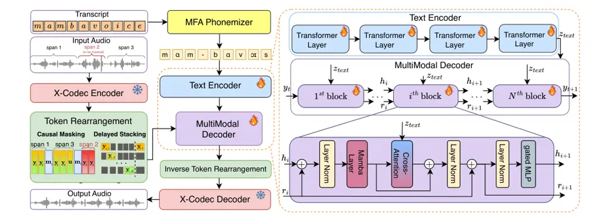
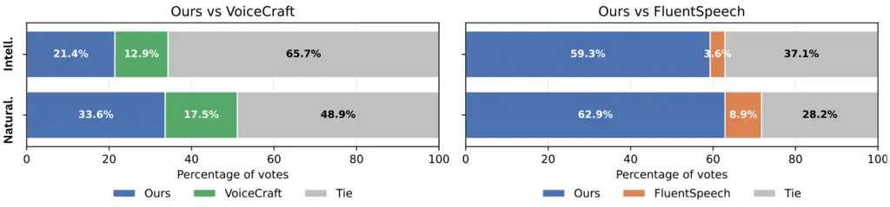
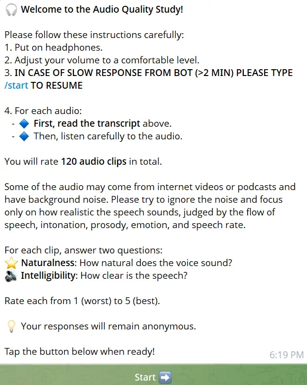
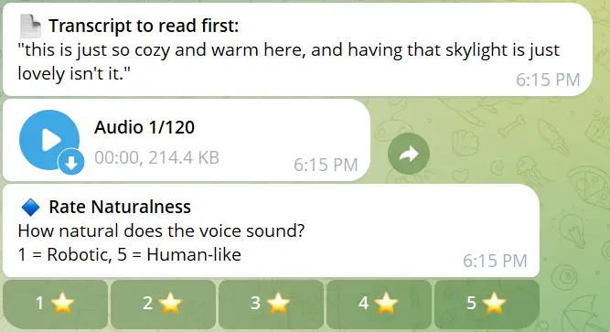
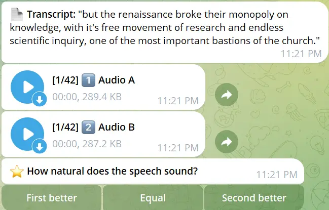
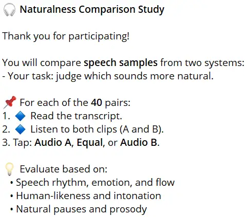
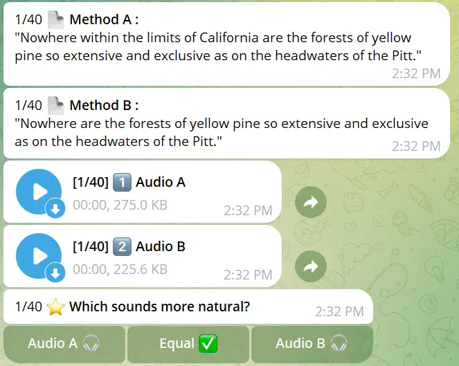

# Speak, Edit, Repeat: High-Fidelity Voice Editing and Zero-Shot TTS with Cross-Attentive Mamba

Baher Mohammad Affiliation: MTS AI Affiliation: ITMO University   
Magauiya Zhussip Affiliation: MTS AI    Stamatios Lefkimmiatis
Affiliation: MTS AI

###### Abstract

We introduce MAVE (Mamba with Cross-Attention for Voice Editing and
Synthesis), a novel autoregressive architecture for text-conditioned
voice editing and high-fidelity text-to-speech (TTS) synthesis, built on
a cross-attentive Mamba backbone. MAVE achieves state-of-the-art
performance in speech editing and very competitive results in zero-shot
TTS, while not being explicitly trained on the latter task,
outperforming leading autoregressive and diffusion models on diverse,
real-world audio. By integrating Mamba for efficient audio sequence
modeling with cross-attention for precise text-acoustic alignment, MAVE
enables context-aware voice editing with exceptional naturalness and
speaker consistency. In pairwise human evaluations on a random 40-sample
subset of the RealEdit benchmark (400 judgments), 57.2% of listeners
rated MAVE-edited speech as perceptually equal to the original, while
24.8% prefered the original and 18.0% MAVE- demonstrating that in the
majority of cases edits are indistinguishable from the source. MAVE
compares favorably with VoiceCraft and FluentSpeech both on pairwise
comparisons and standalone mean opinion score (MOS) evaluations. For
zero-shot TTS, MAVE exceeds VoiceCraft in both speaker similarity and
naturalness, without requiring multiple inference runs or
post-processing. Remarkably, these quality gains come with a
significantly lower memory cost and approximately the same latency: MAVE
requires $`\lx@scalerel@obj{\sim}6\lx@scalerel@obj{\times}`$ less memory
than VoiceCraft during inference on utterances from the RealEdit
database (mean duration: 6.21s, A100, FP16, batch size 1). Our results
demonstrate that MAVE establishes a new standard for flexible,
high-fidelity voice editing and synthesis through the synergistic
integration of structured state-space modeling and cross-modal
attention.

## 1 Introduction

Recent advances in neural speech synthesis have enabled compelling
text-to-speech (TTS) and voice editing capabilities, yet _precise,
context-aware voice editing_ remains a formidable challenge. Current
approaches fall into two paradigms: autoregressive models (AR) such as
Transformer-based methods \[33\] and non-autoregressive frameworks (NAR)
that are based on flow-matching or diffusion probabilistic models \[26,
14, 11\]). While AR models excel in fidelity, they suffer from
_quadratic complexity_. Conversely, flow-matching methods \[26, 14\]
prioritize speed, but struggle with _temporal coherence_ and
_fine-grained prosodic control_, particularly in noisy, real-world
audio.

To address these limitations, we propose MAVE (Mamba with
Cross-Attention for Voice Editing and Synthesis), a novel
_autoregressive_ architecture for text-conditioned voice editing and
zero-shot TTS that synergizes Mamba state-space models with
cross-attention mechanisms. Unlike Transformer-based decoders \[33,
42\], MAVE replaces self-attention with structured state-space sequences
(SSMs), enabling _linear-complexity modeling_ of dependencies between
acoustic tokens. Crucially, our cross-attention module dynamically
aligns _augmented text inputs_ with acoustic tokens, allowing the model
to “edit” speech by attending to the textual information.

To the best of our knowledge, MAVE – built on a cross-attentive Mamba
backbone – is the first successful application of a structured
state-space model to text-conditional speech generation, namely speech
editing and zero-shot TTS. On the challenging RealEdit benchmark, MAVE
achieves human-parity naturalness in speech editing and surpasses
state-of-the-art models like VoiceCraft and FluentSpeech in both speaker
similarity and naturalness (MOS) without requiring any post-processing.
Moreover, MAVE offers significant efficiency gains, reducing memory
usage by six times compared to Transformer-based VoiceCraft, while
enabling single-pass generation without silent tokens handling or
multiple runs. Our results demonstrate that Mamba-based models enhanced
with cross-attention can outperform both autoregressive and
diffusion-based approaches in fidelity, efficiency, and robustness,
establishing a new direction for scalable and high-quality speech
generation.

## 2 Related Works

Neural Codec Language Models for Speech Synthesis The evolution of
high-fidelity speech generation has been significantly advanced by
Neural Codec Language Models (NCLMs), which discretize speech into
symbolic units through Residual Vector Quantization (RVQ) frameworks as
shown by \[49, 10\] and model temporal dependencies via autoregressive
sequence learning. Originating in textless NLP research \[17, 25, 22,
32\], this paradigm achieved breakthrough performance in speech
continuity with AudioLM \[4\]. A pivotal advancement emerged through the
application of NCLMs to zero-shot text-to-speech synthesis, where models
like VALL-E \[42\] and Spear-TTS \[23\] reframed synthesis as
transcript-conditioned speech continuation conditioned on brief speaker
references. These systems substantially outperformed conventional
non-NCLM approaches, prompting extensions for cross-lingual TTS \[52\],
style-controlled synthesis \[15, 45, 27, 19, 29\], and phoneme alignment
refinement \[39\].

The Evolution of Speech Editing Speech editing, defined as the precise
modification of targeted speech segments while preserving unaltered
regions, has evolved through three distinct generations of methodology.
Early approaches \[21\] relied on concatenating TTS-generated segments
with original speech, inevitably introducing prosody mismatches and
boundary artifacts due to the absence of contextual conditioning \[31\].
Subsequent research introduced context-aware mechanisms through
bidirectional fusion architectures \[40\] and masked reconstruction
objectives \[43, 2, 5\], with Transformer-based systems demonstrating
improved contextualization. Most recently, diffusion-based methods like
FluentSpeech \[20\] achieved state-of-the-art performance on standard
benchmarks through denoising frameworks. However, these approaches
collectively suffer from three interrelated limitations. First,
Transformer-based systems incur quadratic computational complexity
relative to sequence length, restricting practical context windows.
Second, evaluation protocols remain constrained to short editing
spans—UniCATS \[11\], for instance, limits assessments to segments under
two seconds, failing to address real-world editing scenarios involving
multi-word phrases. Third and most critically, none incorporate
mechanisms for leveraging linguistically augmented inputs (e.g.,
prosody-annotated text) to guide context-aware modifications. MAVE
overcomes these constraints through its linear-complexity Mamba
architecture and differentiable cross-attention fusion mechanism,
enabling robust editing of spans up to 16 words while preserving natural
prosody through explicit text augmentation.

Unified Frameworks for Voice Editing and Synthesis Recent efforts have
sought to develop unified models capable of both zero-shot TTS and
speech editing, recognizing their shared dependency on context-aware
acoustic modeling. These frameworks broadly bifurcate into modular
architectures \[48, 20\] that employ separate components for distinct
tasks, and end-to-end systems including SpeechX \[44\]—which adapts
VALLE through prompt tuning—and flow-matching approaches like
VoiceBox \[26\] and UniCATS \[11\]. While representing important
conceptual advances, these unified systems exhibit significant practical
limitations. SpeechX lacks human evaluation metrics for editing
performance, undermining claims of perceptual quality. VoiceBox, despite
its broad task coverage, omits formal speech editing evaluation in its
methodology, relying solely on demo examples. UniCATS restricts editing
capability to brief segments ($`<2`$ seconds) and employs rule-based
prosody markers rather than differentiable conditioning. Crucially, all
existing unified frameworks are constrained by a fundamental dichotomy:
autoregressive systems (e.g., SpeechX) maintain high fidelity but
sacrifice contextual awareness through causal masking and face quadratic
time complexity, while non-autoregressive approaches (e.g., VoiceBox)
enable bidirectional context modeling at the cost of temporal coherence
and prosodic precision. This trade-off between contextual awareness and
generation fidelity has remained unresolved in prior art.

MAVE in a Nutshell. In summary, MAVE establishes a novel paradigm in
text-conditioned speech generation by bridging the efficiency of State
Space Models with the flexibility of cross-modal attention. Unlike prior
SSM-based approaches such as CM-Mamba  \[18\], which require strict
alignment between text and audio sequences, our architecture introduces
a length-agnostic cross-attention mechanism that enables rich,
contextualized phoneme conditioning without artificial upsampling or
architectural constraints. By replacing the quadratic self-attention of
Transformer-based editors like Voicecraft with linear-time selective
state updates, MAVE achieves scalable long-context modeling while
preserving prosodic coherence and speaker identity through recurrence.
Our framework further unifies three critical capabilities: (1) efficient
bidirectional context access via causal token rearrangement, (2) precise
linguistic control through differentiable cross-attention on phonemized
input, and (3) reference-guided voice consistency without explicit
speaker embeddings. As demonstrated in Section 4, MAVE is the first
model to simultaneously outperform both autoregressive (e.g.,
VoiceCraft) and non-autoregressive (e.g., FluentSpeech) baselines in
human evaluations across speech editing and zero-shot TTS, setting a new
standard for unified, high-fidelity, and scalable speech generation. To
our knowledge, this is the first successful integration of
cross-attention into a Mamba-based audio decoder for unrestricted,
long-form speech editing and synthesis.

## 3 Proposed Method



Figure 1: Overview of the proposed MAVE architecture. The model accepts
phonemized text and audio tokens as input. A causal masking and
rearrangement strategy is applied to the audio tokens to enable
bidirectional context for editing. The core of the model is a Mamba
block for efficient sequence modeling, augmented with cross-attention
layers to condition the audio generation on the text embeddings produced
by a Transformer encoder.

We present MAVE, a novel architecture for text-conditioned speech
editing and zero-shot text-to-speech (TTS). The core challenge lies in
autoregressively generating long sequences of discrete audio tokens
conditioned on a textual transcript, where the quadratic complexity of
self-attention in Transformers becomes prohibitive. Audio signals are
typically encoded at 50 Hz using residual vector quantization (RVQ),
yielding 4 to 8 discrete tokens per frame, which amounts to 200–400
tokens per second of speech \[10, 47\]. In contrast, the corresponding
phoneme sequence contains approximately 12 units per second \[38, 3,
36\], resulting in a significant sequence length mismatch between
modalities. This disparity makes direct application of Transformer-based
models inefficient for high-fidelity, long-form audio generation.

While State Space Models (SSMs) such as Mamba \[13\] offer linear-time
sequence modeling, they face two key challenges in multimodal speech
generation: (1) limited support for cross-modal conditioning (such as
encoder-decoder architecture of transformers), and (2) potential loss of
fine-grained acoustic details over long sequences. Prior work such as
CM-Mamba \[18\] enables cross-attention but requires equal-length
modalities, which is infeasible for text-conditioned speech processing.
Unlike CM-Mamba, which requires equal-length modalities and thus forces
phoneme padding or audio subsampling, our architecture supports
arbitrary-length text-to-audio conditioning via explicit Cross-Attention
module, attended access to text embeddings, decoupled from the
autoregressive audio state evolution.

To address these issues, we propose MAVE, a hybrid decoder that combines
the efficiency of Mamba for audio token modeling with a flexible
cross-attention mechanism for text conditioning—without requiring
aligned sequence lengths. Our model supports context-aware speech
infilling and zero-shot TTS by leveraging both surrounding audio context
and linguistic input.

### 3.1 Input Representation and Token Rearrangement

Given an input audio waveform $`X\in\mathbb{R}^{T\times f_{s}}`$, where
$`T`$ is duration in seconds and $`f_{s}`$ is the sampling rate (e.g.,
16 kHz), we encode it using X-Codec, a residual vector quantization
(RVQ)-based neural codec \[47\]. This yields a sequence of $`K=8`$
parallel streams of discrete tokens at a frame rate of
$`f_{\text{x}}=50`$ Hz. Let $`L=T\cdot f_{\text{x}}`$ denote the number
of frames. The encoded representation is:

```math
Y=[\mathbf{y}_{1},\mathbf{y}_{2},\dots,\mathbf{y}_{L}],\quad\text{where }\mathbf{y}_{l}=[y_{l1},y_{l2},\dots,y_{lK}],\quad y_{lk}\in\{1,2,\dots,S\},
```

and $`S=1024`$ is the codebook size per RVQ level.

For speech editing, we consider a non-autoregressive infilling task
where one or more spans of audio tokens are masked and must be
reconstructed. To enable bidirectional context access during
autoregressive generation, we adopt the causal masking strategy from
CM3 \[1\]. Masked spans are replaced with special mask tokens and moved
to the end of the sequence, allowing the model to condition on both past
and future context while preserving autoregressive training.

During training, we sample $`m\sim\text{Poisson}(\lambda=1)`$ masked
spans, capped at a maximum of $`N=3`$. Each span length is uniformly
sampled from $`[1,600]`$ frames, and positions are selected to avoid
overlap. If the $`j`$-th span $`s_{j}`$ is masked, we:

1.  1.  Replace the span with a unique mask token $`M_{j}`$,
2.  2.  Append a mask token $`M_{j}`$, followed by the original token
        sequence $`s_{j}`$.

For example, given
$`Y=[\mathbf{s}_{1},\mathbf{s}_{2},\mathbf{s}_{3},\mathbf{s}_{4},\mathbf{s}_{5}]`$
and masking spans $`\mathbf{s}_{2},\mathbf{s}_{4}`$, the rearranged
sequence becomes:

```math
Y_{\text{rearranged}}=[\mathbf{s}_{1},M_{1},\mathbf{s}_{3},M_{2},\mathbf{s}_{5},M_{1},\mathbf{s}_{2},M_{2},\mathbf{s}_{4}].
```

The model autoregressively generates tokens following the last
$`M_{1}`$, reconstructing the original masked content. After that, to
accelerate decoding, we apply the codebook delay pattern \[22, 9\]. This
is mainly to ensure that the generation of a speific code of level $`k`$
at some time step $`t`$ is conditioned on all the higher levels
$`[1,...,k-1`$\] at the same time step $`t`$.

### 3.2 Modeling and Text Conditioning

Having defined the input representation and preprocessing pipeline, we
now describe how the model leverages Mamba and cross-attention to
generate audio tokens autoregressively conditioned on text and reference
context. The task is formulated as text-conditioned autoregressive audio
generation, decomposed into two components: (1) modeling intra-audio
temporal dependencies, and (2) conditioning on linguistic input.

#### 3.2.1 Modeling Intra-Audio Token Dependencies

We employ the Mamba architecture \[13\], a selective State Space Model
(SSM), to model long-range dependencies in the audio token sequence.
Unlike Transformers, Mamba scales linearly with sequence length and
maintains a compressed latent state that effectively captures speaker
identity, prosody, and acoustic continuity—critical for coherent speech
editing.

The SSM operates via a discretized recurrence with input-dependent
parameters. At step $`t`$, given input $`x_{t}\in\mathbb{R}^{d}`$, the
hidden state $`s_{t}\in\mathbb{R}^{d}`$ evolves as:

```math
s_{t}=\overline{A}_{t}s_{t-1}+\overline{B}_{t}x_{t}, \tag{1a}
```

```math
g_{t}=\overline{C}_{t}s_{t}, \tag{1b}
```

where $`\overline{A}_{t},\overline{B}_{t},\overline{C}_{t}`$ are
discretized SSM parameters computed from $`x_{t}`$ via a shared
projection. The output $`g_{t}`$ is then passed through a gating
mechanism (e.g., SiLU) and combined with a residual branch. This
selective mechanism allows Mamba to dynamically attend to relevant past
information, making it well-suited for preserving voice and prosody
across long contexts.

We stack multiple Mamba blocks with intermediate normalization and
residual connections, forming the backbone of our audio decoder. Mamba
has proven to be very effective in terms of modeling dependencies
between audio tokens in previous research \[12\] \[37\], but its
effectivness to generate text-conditioned conherent audio are still not
well-studied. Many text-conditioned audio generation approaches, such as
text-to-speech (TTS) and speech editing, have adopted transformer-based
decoder architectures that process concatenated text and audio tokens
within a unified sequence \[33\] \[42\]. While this design leverages the
strong sequence modeling capabilities of transformers, it poses
significant challenges when applied to alternative architectures such as
Mamba.

Unlike transformers, which benefit from global self-attention, Mamba
relies on selective state-space mechanisms that exhibit difficulty in
retaining fine-grained information over long sequences. As a result, if
we concatenate text and audio tokens and attempt to process them with
the same decoder model, distant text tokens—critical for maintaining
linguistic fidelity—tend to be encoded with degraded or ”fuzzy” memory
\[41\], leading to a loss of semantic precision. This limitation is
particularly detrimental in speech generation tasks, where high-fidelity
retention of textual information is essential to ensure accurate
alignment and high-quality output.

On the other hand, this limitation is less critical when modeling
dependencies among audio tokens, as exact low-level detail preservation
is not essential for high-quality speech synthesis. Instead, the model
benefits from retaining high-level acoustic features which are
sufficient to generate coherent and natural-sounding audio. The
compressed, selective memory inherent in SSMs like Mamba is well-suited
to this purpose, effectively filtering out perceptually irrelevant noise
while preserving meaningful temporal patterns. In our ablation studies,
we further demonstrate that conditioning on text via
cross-attention—rather than token concatenation—is crucial for
maintaining linguistic fidelity in Mamba-based architectures. This
design ensures that textual information is explicitly attended to
throughout generation, mitigating the risk of forgetting distant
linguistic context.

#### 3.2.2 Text Conditioning via Cross-Attention

To incorporate linguistic information, we first convert the input
transcript into a sequence of phonemes using the Montreal Forced Aligner
(MFA) toolkit \[30\]. This ensures explicit modeling of pronunciation,
especially for homographs. The phoneme sequence is then processed by a
4-layer Transformer encoder to produce contextualized embeddings
$`\mathbf{z}_{\text{text}}=[\mathbf{z}_{1},\dots,\mathbf{z}_{M}]\in\mathbb{R}^{M\times d}`$,
where $`M`$ is the number of phonemes. As depicted in Fig. 1, a
cross-attention module is inserted after each Mamba block. The query is
derived from the Mamba block’s output, while keys and values come from
$`\mathbf{z}_{\text{text}}`$. This allows the audio decoder to attend to
relevant phonetic content at each generation step, ensuring precise
linguistic alignment.

#### 3.2.3 Speaker Conditioning via Reference Context

MAVE does not rely on explicit speaker embeddings for voice identity
preservation. Instead, it leverages in-context learning for TTS task by
prepending a short reference utterance encoded into discrete audio
tokens using X-Codec \[47\] to the generation sequence. This reference
context provides rich acoustic, prosodic, and timbral cues that guide
the autoregressive decoder to synthesize speech in the target speaker’s
voice, without requiring speaker labels or fine-tuning.

During both training and inference, the reference tokens are placed at
the beginning of the input sequence, followed by the masked audio
context. The Mamba decoder attends to this context through its
long-range recurrence, effectively conditioning the generated speech on
the speaker’s voice characteristics. This strategy enables true
zero-shot TTS: given only a few seconds of reference audio and a target
transcript, the model generates high-fidelity, speaker-consistent
speech.

In speech editing tasks, the reference can be omitted because the
surrounding unmasked audio already provides sufficient speaker context.
However, for zero-shot TTS or cross-speaker editing, the reference
utterance is essential for voice coherence.

##### Training and Inference.

Given the input context (including text, reference audio, and unmasked
audio tokens), the model parametrized by $`\theta`$ autoregressively
predicts the conditional distribution over the RVQ codebooks.

We define the training loss as the negative log-likelihood:

```math
\mathcal{L}(\theta)=-\log P_{\theta}(\mathbf{Y}\mid\mathcal{C})=-\sum_{k=1}^{K}\mathcal{L}_{k}(\theta), \tag{2}
```

where $`\mathcal{C}`$ denotes the conditioning transcript, and
$`\mathcal{L}_{k}(\theta)=\sum_{l=1}^{L}\log P_{\theta}(y_{lk}\mid\mathbf{y}_{<l},\mathbf{y}_{l,<k},\mathcal{C})`$
is the cross-entropy loss for the $`k`$-th codebook.

The early RVQ codebooks in X-Codec \[47\] encode semantic and linguistic
content, while the later codebooks primarily model fine-grained acoustic
details and high-frequency textures. To prioritize the accurate
reconstruction of perceptually important features, we employ a weighted
loss strategy:

```math
\mathcal{L}(\theta)=-\sum_{k=1}^{K}\alpha_{k}\mathcal{L}_{k}(\theta), \tag{3}
```

where $`\{\alpha_{k}\}_{k=1}^{K}`$ are tunable hyperparameters with
$`\alpha_{1}\geq\alpha_{2}\geq\dots\geq\alpha_{K}`$, typically set
inversely proportional to codebook index. Following \[28\] we assign a
weight of 0.25 to the first three levels and 0.05 to the last five.
Additionally, following  \[1\], we compute the prediction loss over all
valid audio tokens in the sequence, excluding special tokens such as
mask tokens $`M_{j}`$ regardless of whether they belong to masked or
unmasked regions. This encourages the model to refine its internal
representations throughout the sequence, improving contextual coherence
and reconstruction fidelity.

In summary, MAVE is a hybrid autoregressive decoder that integrates
Mamba blocks for efficient long-sequence audio modeling with
cross-attention for flexible text conditioning. By combining token
rearrangement, delayed RVQ decoding, and explicit speaker conditioning,
it supports high-fidelity speech editing and zero-shot TTS. The network
efficiently handles a large disparity between text and audio sequence
lengths, offering a scalable alternative to transformer-based methods.

## 4 Experiments

##### Dataset.

Gigaspeech training set \[6\] is used as the training data, which
contains 9k hours of audiobooks, podcasts, and YouTube videos at 16kHz
audio sampling rate. For speech editing evaluation, we use the
real-world benchmark called RealEdit from \[33\]. For TTS evaluation, we
use a subset of libritts \[51\]

##### Training Details.

To train MAVE, we used the ScaledAdam optimizer and Eden Scheduler
proposed in \[46\] with a base learning rate of 0.01, batch size of 400k
frames (i.e. 133.2 minutes), and total training step of 50k with
gradient accumulation. The training of the 830M MAVE model took about 4
days on 4 NVIDIA A100 GPUs. For inference, we use Nucleus sampling
\[16\] with p = 0.8 and a temperature of 1 for all experiments.

##### Evaluation Setup.

VoiceCraft has been observed to generate prolonged silences during
synthesis \[33\]. To mitigate this issue, the authors proposed reducing
the probability of silence tokens and performing multiple generations
per sample, selecting the shortest output as the final result. In all of
our experiments involving VoiceCraft, we adopted this strategy,
generating five samples per input and selecting the shortest one. In
contrast we haven’t noticed this problem in our model, so we produce a
single generation with no further processing.

### 4.1 Results on Speech Editing

Table 1 shows the results of both VoiceCraft \[33\] and MAVE on RealEdit
dataset \[33\], which reflects real-life speech editing cases that are
both challenging and diverse. The original dataset contains 100
utterances from LibriTTS (dev-clean and dev-other) \[50\], 100
utterances from YouTube (from Gigaspeech testset) \[6\], and 110
utterances from the Spotify Podcast dataset \[8\]. However, the Spotify
podcasts dataset is no longer available on the official website, so we
have used only the 200 audios that are still publicly available.

We computed the Word Error Rate (WER) between the generated audio and
the target transcript using Whisper-large and Whisper-medium.en \[34\].
In addition, we conducted a human evaluation to assess naturalness and
intelligibility, based on audio samples from 80 randomly selected test
cases for each model. Specifically, 20 people of proven English fluency
participated in the study, they were divided into 2 groups of 10 people,
and each group was asked to evaluate 120 audios (40 from each method) on
the naturalness and intelligibility on a 5-point Likert scale (poor=1,
excellent=5). For further details we refer to A.3.1.

MAVE demonstrates superior performance compared to VoiceCraft, achieving
smaller WER and higher mean opinion scores (MOS) in both naturalness
(3.90 vs. 3.77) and intelligibility (4.25 vs. 4.20). Notably, the
performance gap between our model and the ground truth recordings is
minimal, with differences of less than 0.1 in naturalness MOS and less
than 0.07 in intelligibility MOS. This is an indication that MAVE-edits
feature strong perceptual correlation to human speech. It is worth
noting that even for the original audio, the average naturalness ratings
did not exceed 4.0 out of 5.0. This is mostly attributed to the fact
that the audio data were collected in the wild and their quality is
inferior to studio recordings, with the presence of background noise and
other sources of recording artifacts. This also highlights the
challenging conditions under which the evaluation was conducted.

To further assess the perceptual quality of our generated speech
relative to ground truth, we conducted an additional study in which we
asked a group of 10 users of proven English fluency to do a side-by-side
comparison on the naturalness of the original unedited audio and our
edited audio on 40 samples from the RealEdit dataset. The results are
very promising and demonstrate that 57.2% of the times, users reported
that both audios sound equally natural, while in 24.8% of cases, the
ground truth was judged as more natural, and interestingly 18% of the
times, the edited audio was preferred over the original. These findings
indicate that in the majority of cases, our generated audios are
indistinguishable from the original ones. For further details about the
setup, we refer to A.3.2

|              |                        |                        |                              |                                  |
| ------------ | ---------------------- | ---------------------- | ---------------------------- | -------------------------------- |
| Model        | WER (L) $`\downarrow`$ | WER (M) $`\downarrow`$ | MOS Naturalness $`\uparrow`$ | MOS Intelligibility $`\uparrow`$ |
| VoiceCraft   | 8.4                    | 6.9                    | 3.77 ± 0.08                  | 4.20 ± 0.07                      |
| MAVE (ours)  | 7.5                    | 5.9                    | 3.90 ± 0.08                  | 4.25 ± 0.07                      |
| Ground Truth | 6.8                    | 5.2                    | 4.00 ± 0.08                  | 4.31 ± 0.06                      |

Table 1: Results on RealEdit benchmark for the speech editing task.

To enable a meaningful comparison with diffusion-based speech generation
models, we selected FluentSpeech \[20\] as the most relevant open-source
baseline. However, due to its significantly smaller model size, a direct
comparison with our approach would not be fair. To address this, we
leveraged the larger variant of FluentSpeech retrained and evaluated by
the authors of VoiceCraft. The authors have not made this model publicly
available but have provided 14 synthesized utterances, publishing for
each sample: (1) VoiceCraft’s generation, (2) the enhanced FluentSpeech
model’s generation, and (3) the original audio with original and target
transcript. We generated corresponding outputs using MAVE for the same
14 samples and conducted a perceptual listening study to compare the
audio quality between the three models. The evaluation consisted of a
pairwise, side-by-side comparison, where each participant (20 in total)
was presented with two audio samples from different models and asked to
judge which exhibited better naturalness and intelligibility. With 14
samples per system and three possible pairings between the models
(VoiceCraft vs. FluentSpeech, VoiceCraft vs. Ours, and FluentSpeech vs.
Ours), each participant evaluated a total of 42 audio pairs. Further
details on the experimental setup, including participant instructions,
interface design, and evaluation protocol, are provided in
Appendix A.3.2.

The results in Figure 2 clearly indicate that MAVE accomplishes superior
perceptual quality compared to both FluentSpeech and VoiceCraft. While
VoiceCraft already holds an advantage over FluentSpeech as it was
preferred in 47.1% vs. 13.2% for naturalness and 50.7% vs. 6.4% for
intelligibility, our model surpasses FluentSpeech by an even larger
margin, being favored in 62.9% of cases for naturalness and 59.3% for
intelligibility. More importantly, our model also outperforms
VoiceCraft: it is preferred over VoiceCraft in 33.6% of comparisons for
naturalness and 21.4% for intelligibility, while VoiceCraft is preferred
over ours in only 17.5% and 12.9%, respectively.



Figure 2: Side-by-side comparison between MAVE (ours), VoiceCraft and
FluentSpeech

|              |                        |                        |                  |                    |                              |                                  |
| ------------ | ---------------------- | ---------------------- | ---------------- | ------------------ | ---------------------------- | -------------------------------- |
| Model        | WER (L) $`\downarrow`$ | WER (M) $`\downarrow`$ | SIM $`\uparrow`$ | MCD $`\downarrow`$ | MOS Naturalness $`\uparrow`$ | MOS Intelligibility $`\uparrow`$ |
| VoiceCraft   | 9.3                    | 7.5                    | 0.55             | 4.75               | 3.22 ± 0.07                  | 4.01 ± 0.07                      |
| MAVE (ours)  | 7.4                    | 6.6                    | 0.57             | 4.73               | 3.48 ± 0.08                  | 4.20 ± 0.06                      |
| Ground Truth | 6.2                    | 5.4                    | 0.66             | \-                 | 3.90 ± 0.08                  | 4.40 ± 0.06                      |

Table 2: Performance analysis of the proposed MAVE on the zero-shot TTS
task.

### 4.2 Results on Zero-shot TTS

For zero-shot text-to-speech (TTS) evaluation, we used the LibriTTS
dataset \[50\] and we randomly selected 500 utterances. For each
utterance, we extracted a different uterrance with the same speaker ID.
The prompt was trimmed to be as close as possible to 3 seconds in
duration, with cuts made only at word boundaries. We then filtered the
initial 500 samples to retain only those containing more than 8 words in
the target text, ensuring sufficient linguistic complexity for
meaningful evaluation. This filtering resulted in a final evaluation set
of 372 samples.

Table 2 shows the results for the zero-shot TTS task. For the evaluation
we employed both objective and subjective metrics. The objective
evaluation included WER, computed using Whisper Large and Whisper
medium.en—following the methodology commonly adopted in speech editing
tasks. Additionally, we measured speaker similarity using the pretrained
WavLM-Large model \[7\] to compute cosine similarity between reference
and synthesized speaker embeddings. We also report the Mel-Cepstral
Distortion (MCD) \[24\] to assess spectral fidelity.

For the subjective evaluation, we randomly selected 80 samples from our
test set and generated corresponding speech outputs using VoiceCraft and
our proposed model. To ensure a balanced assessment, we conducted a
listening study involving 20 native or near-native English speakers
(C1–C2 proficiency level). Participants were randomly assigned to two
groups of 10, with each group evaluating a total of 120 audio clips: 40
generated by VoiceCraft, 40 produced by MAVE, and 40 ground-truth
recordings. Each participant rated the naturalness and intelligibility
of the audio samples on a 5-point Likert scale (1 = poor, 5 =
excellent). Further details regarding the experimental setup, rating
criteria, and instructions provided to participants are available in
Appendix A.3.1.

MAVE outperformed VoiceCraft in MOS evaluations across both naturalness
(3.48 vs. 3.22) and intelligibility (4.20 vs. 4.01). While the overall
gap between our model and the ground truth remains notable, a closer
analysis reveals a reduced performance disparity under certain
conditions. As shown in Table 3, which breaks down results by the number
of words to be generated, with split points selected to ensure
approximately balanced sample sizes across ranges, specifically 17, 22,
21, 20 for the different ranges in ascending order. The performance gap
narrows significantly in the 8–15 word range. In this interval, our
model achieves a naturalness score of 3.71 compared to the ground
truth’s 3.87, and an intelligibility score of 4.26 versus 4.36,
indicating competitive quality for medium-length utterances, while the
gap becomes more significant with the increasing length of the target
transcript. This trend is consistent with what the model is trained on,
as it was trained on the Gigaspeech dataset, which consists of speech
with moderate utterance lengths.

|              |                           |                           |                           |                           |                           |                           |                           |                           |
| ------------ | ------------------------- | ------------------------- | ------------------------- | ------------------------- | ------------------------- | ------------------------- | ------------------------- | ------------------------- |
|              | Naturalness MOS           |                           |                           |                           | Intelligibility MOS       |                           |                           |                           |
| Model        | 8–15                      | 15–22                     | 23–34                     | $`>`$34                   | 8–15                      | 15–22                     | 23–34                     | $`>`$34                   |
| VoiceCraft   | $`3.44\pm 0.14`$          | $`3.17\pm 0.15`$          | $`3.17\pm 0.14`$          | $`3.11\pm 0.15`$          | $`4.07\pm 0.07`$          | $`4.00\pm 0.07`$          | $`3.95\pm 0.07`$          | $`4.01\pm 0.15`$          |
| MAVE (ours)  | $`\textbf{3.71}\pm 0.15`$ | $`\textbf{3.45}\pm 0.16`$ | $`\textbf{3.35}\pm 0.15`$ | $`\textbf{3.46}\pm 0.16`$ | $`\textbf{4.26}\pm 0.14`$ | $`\textbf{4.28}\pm 0.13`$ | $`\textbf{4.09}\pm 0.12`$ | $`\textbf{4.19}\pm 0.12`$ |
| Ground Truth | $`3.87\pm 0.18`$          | $`3.78\pm 0.16`$          | $`3.93\pm 0.14`$          | $`4.03\pm 0.15`$          | $`4.36\pm 0.14`$          | $`4.38\pm 0.14`$          | $`4.33\pm 0.12`$          | $`4.54\pm 0.11`$          |

Table 3: MOS comparison across different transcript word-length ranges.

### 4.3 Efficiency Analysis

In this section, we compare our model, with previous SOTA AR model for
speech editing, namely VoiceCraft \[33\], which uses a transformer
backbone. All inference experiments were conducted on NVIDIA A100 GPU.
Table 5 reports the inference time required to process the entire
RealEdit dataset as well as the average and peak memory consumption. It
is important to note that these reported numbers are based on a single
generation per sample. The results clearly demonstrate the superior
memory efficiency of MAVE compared to VoiceCraft with KV caching,
requiring approximately six times less GPU memory—largely due to the
selective state mechanism of the Mamba backbone. While VoiceCraft
exhibits faster inference speed in this evaluation, this advantage is
primarily attributed to the relatively short duration of the target
audio segments. On average, our model generates about 85 tokens per
sample, corresponding to approximately 1.7 seconds of speech, a regime
in which autoregressive overheads are minimal.

|             |          |                |              |                     |
| ----------- | -------- | -------------- | ------------ | ------------------- |
| Model       | KV Cache | Inference Time | Tokens / Sec | Avg / Max Mem. (GB) |
| MAVE (ours) | X-attn   | 5 min 17 s     | 53.5         | 6.2 / 6.5           |
| VoiceCraft  | Yes      | 4 min 33 s     | 74.9         | 37.9 / 40.2         |
| VoiceCraft  | No       | 22 min 31 s    | 15.1         | 9.2 / 9.7           |

Table 4: Performance comparison of MAVE (ours) and VoiceCraft on the
RealEdit dataset.

|              |              |                   |                   |                  |                  |
| ------------ | ------------ | ----------------- | ----------------- | ---------------- | ---------------- |
| Decoder      | Conditioning | WER$`\downarrow`$ | MCD$`\downarrow`$ | F0$`\downarrow`$ | PESQ$`\uparrow`$ |
| Mamba (ours) | X-Attn.      | 7.8               | 4.29              | 0.280            | 2.08             |
| Trm.         | X-Attn.      | 10.8              | 4.58              | 0.293            | 1.99             |
| Mamba        | Concat.      | 13.0              | 4.48              | 0.284            | 2.02             |

Table 5: Ablation study of model architectures by conditioning
mechanism.

However, theoretical complexity analysis reveals that MAVE scales more
favorably with sequence length. For longer generation tasks, our model
not only maintains significant memory savings but also surpasses
VoiceCraft in computational efficiency, offering better speed
performance for extended audio synthesis (see  A.4 for more details).

### 4.4 Ablation Study

For the ablation study, we considered the masked reconstruction task, in
which we used a random subset of the Gigaspeech validation dataset,
randomly masked a sequence of words and required the model to
reconstruct them (details provided in  A.2). Table 5 presents a
comprehensive ablation study comparing different architectural designs
under similar conditions, including model size (approximately 830M
parameters) and training setup. The results highlight that neither a
pure transformer-based encoder-decoder architecture nor a standalone
Mamba decoder achieves optimal performance, highlighting the importance
of our hybrid design.

The encoder-decoder transformer, with the encoder utilized to get
contextualized text tokens, cross-attention to condition the audio
decoder on text, and transformer decoder to model audio dependencies,
achieves moderate performance but lags behind our model in all metrics,
particularly in WER (10.8 vs. 7.8). In contrast, the Mamba-only model,
where text and audio tokens are concatenated and processed
autoregressively, performs significantly worse with a higher WER (13.0).

Crucially, our MAVE architecture integrates both components, it uses
cross-attention to explicitly condition the generation process on
textual input while leveraging the Mamba decoder to efficiently model
acoustic dependencies. As shown in Table 5, this hybrid approach yields
superior performance across all metrics, achieving the lowest WER and
MCD, best fundamental frequency (F0) accuracy, and highest PESQ score.
These improvements demonstrate that the strength of MAVE does not arise
from either cross-attention or Mamba in isolation, but from the
combination of both.

## 5 Conclusion

In this work we introduce MAVE, a novel hybrid architecture for
high-fidelity speech synthesis that combines cross-attention and
structured state-space modeling via Mamba within a single autoregressive
framework. By leveraging Mamba for robust audio modeling and
cross-attention for precise text–audio alignment, MAVE sets a new
benchmark for speech editing and zero-shot text-to-speech in terms of
both naturalness and efficiency. As future work, we plan to train MAVE
on significantly longer audio sequences to further exploit Mamba’s
ability to capture long-range dependencies.

## 6 Ethics Statement

The development and deployment of speech editing models like MAVE raise
important ethical concerns that must be carefully addressed. One primary
issue is the potential for misuse in generating deceptive audio content,
such as deepfakes, which could be exploited for misinformation, fraud,
or impersonation. While our model enables beneficial applications, such
as facilitating editing tasks by correcting errors in speech recordings,
improving accessibility, or enhancing voice interfaces.

To mitigate risks, we emphasize the importance of rational use,
transparent provenance, and deep-fake detection mechanisms. We encourage
the integration of watermarking or authentication protocols to help
distinguish synthetic speech from authentic recordings. Furthermore, we
advocate for clear usage policies and informed consent when applying
such technology to the voices of real individuals.

All data used in this study was sourced from publicly available datasets
with permissive licenses. No personal or sensitive data were collected
or used without proper authorization.

## References

- \[1\] Armen Aghajanyan, Bernie Huang, Candace Ross, Vladimir
  Karpukhin, Hu Xu, Naman Goyal, Dmytro Okhonko, Mandar Joshi, Gargi
  Ghosh, Mike Lewis, et al. Cm3: A causal masked multimodal model of the
  internet. arXiv preprint arXiv:2201.07520, 2022.
- \[2\] He Bai, Renjie Zheng, Junkun Chen, Xintong Li, Mingbo Ma, and
  Liang Huang. A3t: Alignment-aware acoustic and text pretraining for
  speech synthesis and editing. In International Conference on Machine
  Learning, 2022.
- \[3\] David A Balota, Melvin J Yap, Keith A Hutchison, Michael J
  Cortese, Brett Kessler, Bjorn Loftis, James H Neely, Douglas L Nelson,
  Greg B Simpson, and Rebecca Treiman. The english lexicon project.
  Behavior research methods, 39(3):445–459, 2007.
- \[4\] Zalán Borsos, Raphaël Marinier, Damien Vincent, Eugene
  Kharitonov, Olivier Pietquin, Matthew Sharifi, Dominik Roblek, Olivier
  Teboul, David Grangier, Marco Tagliasacchi, and Neil Zeghidour.
  Audiolm: A language modeling approach to audio generation. IEEE/ACM
  Transactions on Audio, Speech, and Language Processing,
  31:2523–2533, 2022.
- \[5\] Zalán Borsos, Matthew Sharifi, and Marco Tagliasacchi.
  Speechpainter: Text-conditioned speech inpainting. In
  Interspeech, 2022.
- \[6\] Guoguo Chen, Shuzhou Chai, Guan-Bo Wang, Jiayu Du, Weiqiang
  Zhang, Chao Weng, Dan Su, Daniel Povey, Jan Trmal, Junbo Zhang,
  Mingjie Jin, Sanjeev Khudanpur, Shinji Watanabe, Shuaijiang Zhao, Wei
  Zou, Xiangang Li, Xuchen Yao, Yongqing Wang, Yujun Wang, Zhao You, and
  Zhiyong Yan. Gigaspeech: An evolving, multi-domain asr corpus with
  10,000 hours of transcribed audio. In Proc. Interspeech 2021, 2021.
- \[7\] Sanyuan Chen, Chengyi Wang, Zhengyang Chen, Yu Wu, Shujie Liu,
  Zhuo Chen, Jinyu Li, Naoyuki Kanda, Takuya Yoshioka, Xiong Xiao, Jian
  Wu, Long Zhou, Shuo Ren, Yanmin Qian, Yao Qian, Jian Wu, Michael Zeng,
  Xiangzhan Yu, and Furu Wei. Wavlm: Large-scale self-supervised
  pre-training for full stack speech processing. IEEE Journal of
  Selected Topics in Signal Processing, 16(6):1505–1518, July 2022.
- \[8\] Ann Clifton, Sravana Reddy, Yongze Yu, Aasish Pappu, Rezvaneh
  Rezapour, Hamed Bonab, Maria Eskevich, Gareth Jones, Jussi Karlgren,
  Ben Carterette, and Rosie Jones. 100,000 podcasts: A spoken English
  document corpus. In Proceedings of the 28th International Conference
  on Computational Linguistics, pages 5903–5917, Barcelona, Spain
  (Online), December 2020. International Committee on Computational
  Linguistics.
- \[9\] Jade Copet, Felix Kreuk, Itai Gat, Tal Remez, David Kant,
  Gabriel Synnaeve, Yossi Adi, and Alexandre Défossez. Simple and
  controllable music generation. Advances in Neural Information
  Processing Systems, 36:47704–47720, 2023.
- \[10\] Alexandre Defossez, Jade Copet, Gabriel Synnaeve, and Yossi
  Adi. High fidelity neural audio compression. ArXiv,
  abs/2210.13438, 2022.
- \[11\] Chenpeng Du, Yiwei Guo, Feiyu Shen, Zhijun Liu, Zheng Liang,
  Xie Chen, Shuai Wang, Hui Zhang, and K. Yu. Unicats: A unified
  context-aware text-to-speech framework with contextual vq-diffusion
  and vocoding. In AAAI, 2024.
- \[12\] Mehmet Hamza Erol, Arda Senocak, Jiu Feng, and Joon Son Chung.
  Audio mamba: Bidirectional state space model for audio representation
  learning. IEEE Signal Processing Letters, 31:2975–2979, 2024.
- \[13\] Albert Gu and Tri Dao. Mamba: Linear-time sequence modeling
  with selective state spaces. arXiv preprint arXiv:2312.00752, 2023.
- \[14\] Yiwei Guo, Chenpeng Du, Ziyang Ma, Xie Chen, and Kai Yu.
  Voiceflow: Efficient text-to-speech with rectified flow matching. In
  ICASSP 2024-2024 IEEE International Conference on Acoustics, Speech
  and Signal Processing (ICASSP), pages 11121–11125. IEEE, 2024.
- \[15\] Zhifang Guo, Yichong Leng, Yihan Wu, Sheng Zhao, and Xuejiao
  Tan. Prompttts: Controllable text-to-speech with text descriptions.
  ICASSP 2023 - 2023 IEEE International Conference on Acoustics, Speech
  and Signal Processing (ICASSP), pages 1–5, 2022.
- \[16\] Ari Holtzman, Jan Buys, Li Du, Maxwell Forbes, and Yejin Choi.
  The curious case of neural text degeneration. In International
  Conference on Learning Representations, 2020.
- \[17\] Wei-Ning Hsu, Benjamin Bolte, Yao-Hung Hubert Tsai, Kushal
  Lakhotia, Ruslan Salakhutdinov, and Abdelrahman Mohamed. Hubert:
  Self-supervised speech representation learning by masked prediction of
  hidden units. IEEE/ACM Transactions on Audio, Speech, and Language
  Processing, 29:3451–3460, 2021.
- \[18\] Ziru Huang, Jia Li, Wenjie Zhao, Yunhui Guo, and Yapeng Tian.
  Av-mamba: Cross-modality selective state space models for audio-visual
  question answering. In Proceedings of the IEEE/CVF Conference on
  Computer Vision and Pattern Recognition Workshop (CVPRW), pages
  1–4, 2024.
- \[19\] Shengpeng Ji, Jia li Zuo, Minghui Fang, Ziyue Jiang, Feiyang
  Chen, Xinyu Duan, Baoxing Huai, and Zhou Zhao. Textrolspeech: A text
  style control speech corpus with codec language text-to-speech models.
  ArXiv, abs/2308.14430, 2023.
- \[20\] Ziyue Jiang, Qiang Yang, Jia li Zuo, Zhe Ye, Rongjie Huang,
  Yixiang Ren, and Zhou Zhao. Fluentspeech: Stutter-oriented automatic
  speech editing with context-aware diffusion models. In Annual Meeting
  of the Association for Computational Linguistics, 2023.
- \[21\] Zeyu Jin, Gautham J. Mysore, Stephen DiVerdi, Jingwan Lu, and
  Adam Finkelstein. Voco: text-based insertion and replacement in audio
  narration. In International Conference on Computer Graphics and
  Interactive Techniques, 2017.
- \[22\] Eugene Kharitonov, Ann Lee, Adam Polyak, Yossi Adi, Jade Copet,
  Kushal Lakhotia, Tu Nguyen, Morgane Rivière, Abdel rahman Mohamed,
  Emmanuel Dupoux, and Wei-Ning Hsu. Text-free prosody-aware generative
  spoken language modeling. ArXiv, abs/2109.03264, 2021.
- \[23\] Eugene Kharitonov, Damien Vincent, Zalán Borsos, Raphaël
  Marinier, Sertan Girgin, Olivier Pietquin, Matthew Sharifi, Marco
  Tagliasacchi, and Neil Zeghidour. Speak, read and prompt:
  High-fidelity text-to-speech with minimal supervision. Transactions of
  the Association for Computational Linguistics, 11:1703–1718, 2023.
- \[24\] R. Kubichek. Mel-cepstral distance measure for objective speech
  quality assessment. In Proceedings of IEEE Pacific Rim Conference on
  Communications Computers and Signal Processing, volume 1, pages
  125–128 vol.1, 1993.
- \[25\] Kushal Lakhotia, Evgeny Kharitonov, Wei-Ning Hsu, Yossi Adi,
  Adam Polyak, Benjamin Bolte, Tu Nguyen, Jade Copet, Alexei Baevski,
  Adel Ben Mohamed, and Emmanuel Dupoux. On generative spoken language
  modeling from raw audio. Transactions of the Association for
  Computational Linguistics, 9:1336–1354, 2021.
- \[26\] Matthew Le, Apoorv Vyas, Bowen Shi, Brian Karrer, Leda Sari,
  Rashel Moritz, Mary Williamson, Vimal Manohar, Yossi Adi, Jay
  Mahadeokar, et al. Voicebox: Text-guided multilingual universal speech
  generation at scale. Advances in neural information processing
  systems, 36:14005–14034, 2023.
- \[27\] Guanghou Liu, Yongmao Zhang, Yinjiao Lei, Yunlin Chen, Rui
  Wang, Zhifei Li, and Linfu Xie. Promptstyle: Controllable style
  transfer for text-to-speech with natural language descriptions. ArXiv,
  abs/2305.19522, 2023.
- \[28\] Zihan Liu, Shuangrui Ding, Zhixiong Zhang, Xiaoyi Dong, Pan
  Zhang, Yuhang Zang, Yuhang Cao, Dahua Lin, and Jiaqi Wang. Songgen: A
  single stage auto-regressive transformer for text-to-song
  generation, 2025.
- \[29\] Daniel Lyth and Simon King. Natural language guidance of
  high-fidelity text-to-speech with synthetic annotations. ArXiv,
  abs/2402.01912, 2024.
- \[30\] Michael McAuliffe, Michaela Socolof, Sarah Mihuc, Michael
  Wagner, and Morgan Sonderegger. Montreal forced aligner: Trainable
  text-speech alignment using kaldi. In Interspeech, volume 2017, pages
  498–502, 2017.
- \[31\] Max Morrison, Lucas Rencker, Zeyu Jin, Nicholas J. Bryan,
  Juan Pablo Cáceres, and Bryan Pardo. Context-aware prosody correction
  for text-based speech editing. ICASSP 2021 - 2021 IEEE International
  Conference on Acoustics, Speech and Signal Processing (ICASSP), pages
  7038–7042, 2021.
- \[32\] Tu Nguyen, Eugene Kharitonov, Jade Copet, Yossi Adi, Wei-Ning
  Hsu, Ali Mamdouh Elkahky, Paden Tomasello, Robin Algayres, Benoît
  Sagot, Abdel rahman Mohamed, and Emmanuel Dupoux. Generative spoken
  dialogue language modeling. Transactions of the Association for
  Computational Linguistics, 11:250–266, 2022.
- \[33\] Puyuan Peng, Po-Yao Huang, Shang-Wen Li, Abdelrahman Mohamed,
  and David Harwath. Voicecraft: Zero-shot speech editing and
  text-to-speech in the wild. In Proceedings of the 62nd Annual Meeting
  of the Association for Computational Linguistics (Volume 1: Long
  Papers), pages 12442–12462, 2024.
- \[34\] Alec Radford, Jong Wook Kim, Tao Xu, Greg Brockman, Christine
  McLeavey, and Ilya Sutskever. Robust speech recognition via
  large-scale weak supervision, 2022.
- \[35\] Alec Radford, Jong Wook Kim, Tao Xu, Greg Brockman, Christine
  McLeavey, and Ilya Sutskever. Robust speech recognition via
  large-scale weak supervision. ArXiv, abs/2212.04356, 2022.
- \[36\] Gaia C Santi, Eleonora Catricalà, Stephanie Kwan, Anson Wong,
  Zoe Ezzes, Lisa Wauters, Valentina Esposito, Francesca Conca, Daniela
  Gibbons, Eric Fernandez, et al. Cross-linguistic analysis of speech
  markers: Insights from english, chinese, and italian speakers.
  medRxiv, 2024.
- \[37\] Siavash Shams, Sukru Samet Dindar, Xilin Jiang, and Nima
  Mesgarani. Ssamba: Self-supervised audio representation learning with
  mamba state space model. In 2024 IEEE Spoken Language Technology
  Workshop (SLT), pages 1053–1059, 2024.
- \[38\] Bengt Sigurd, Mats Eeg-Olofsson, and Joost Van Weijer. Word
  length, sentence length and frequency–zipf revisited. Studia
  linguistica, 58(1):37–52, 2004.
- \[39\] Yakun Song, Zhuo Chen, Xiaofei Wang, Ziyang Ma, and Xie Chen.
  Ella-v: Stable neural codec language modeling with alignment-guided
  sequence reordering. In Proceedings of the AAAI Conference on
  Artificial Intelligence, volume 39, pages 25174–25182, 2025.
- \[40\] Daxin Tan, Liqun Deng, Yu Ting Yeung, Xin Jiang, Xiao Chen, and
  Tan Lee. Editspeech: A text based speech editing system using partial
  inference and bidirectional fusion. 2021 IEEE Automatic Speech
  Recognition and Understanding Workshop (ASRU), pages 626–633, 2021.
- \[41\] Roger Waleffe, Wonmin Byeon, Duncan Riach, Brandon Norick,
  Vijay Korthikanti, Tri Dao, Albert Gu, Ali Hatamizadeh, Sudhakar
  Singh, Deepak Narayanan, Garvit Kulshreshtha, Vartika Singh, Jared
  Casper, Jan Kautz, Mohammad Shoeybi, and Bryan Catanzaro. An empirical
  study of mamba-based language models, 2024.
- \[42\] Chengyi Wang, Sanyuan Chen, Yu Wu, Zi-Hua Zhang, Long Zhou,
  Shujie Liu, Zhuo Chen, Yanqing Liu, Huaming Wang, Jinyu Li, Lei He,
  Sheng Zhao, and Furu Wei. Neural codec language models are zero-shot
  text to speech synthesizers. ArXiv, abs/2301.02111, 2023.
- \[43\] Tao Wang, Jiangyan Yi, Liqun Deng, Ruibo Fu, Jianhua Tao, and
  Zhengqi Wen. Context-aware mask prediction network for end-to-end
  text-based speech editing. ICASSP 2022 - 2022 IEEE International
  Conference on Acoustics, Speech and Signal Processing (ICASSP), pages
  6082–6086, 2022.
- \[44\] Xiaofei Wang, Manthan Thakker, Zhuo Chen, Naoyuki Kanda,
  Sefik Emre Eskimez, Sanyuan Chen, Min Tang, Shujie Liu, Jinyu Li, and
  Takuya Yoshioka. Speechx: Neural codec language model as a versatile
  speech transformer. ArXiv, abs/2308.06873, 2023.
- \[45\] Dongchao Yang, Songxiang Liu, Rongjie Huang, Guangzhi Lei, Chao
  Weng, Helen M. Meng, and Dong Yu. Instructtts: Modelling expressive
  tts in discrete latent space with natural language style prompt.
  ArXiv, abs/2301.13662, 2023.
- \[46\] Zengwei Yao, Liyong Guo, Xiaoyu Yang, Wei Kang, Fangjun Kuang,
  Yifan Yang, Zengrui Jin, Long Lin, and Daniel Povey. Zipformer: A
  faster and better encoder for automatic speech recognition. In
  ICLR, 2024.
- \[47\] Zhen Ye, Peiwen Sun, Jiahe Lei, Hongzhan Lin, Xu Tan, Zheqi
  Dai, Qiuqiang Kong, Jianyi Chen, Jiahao Pan, Qifeng Liu, et al. Codec
  does matter: Exploring the semantic shortcoming of codec for audio
  language model. In Proceedings of the AAAI Conference on Artificial
  Intelligence, volume 39, pages 25697–25705, 2025.
- \[48\] Dacheng Yin, Chuanxin Tang, Yanqing Liu, Xiaoqiang Wang,
  Zhiyuan Zhao, Yucheng Zhao, Zhiwei Xiong, Sheng Zhao, and Chong Luo.
  Retrievertts: Modeling decomposed factors for text-based speech
  insertion. In Interspeech, 2022.
- \[49\] Neil Zeghidour, Alejandro Luebs, Ahmed Omran, Jan Skoglund, and
  Marco Tagliasacchi. Soundstream: An end-to-end neural audio codec.
  IEEE/ACM Transactions on Audio, Speech, and Language Processing,
  30:495–507, 2021.
- \[50\] Heiga Zen, Viet Dang, Rob Clark, Yu Zhang, Ron J. Weiss,
  Ye Jia, Zhifeng Chen, and Yonghui Wu. Libritts: A corpus derived from
  librispeech for text-to-speech. In Interspeech 2019, pages
  1526–1530, 2019.
- \[51\] Heiga Zen, Viet-Trung Dang, Robert A. J. Clark, Yu Zhang,
  Ron J. Weiss, Ye Jia, Z. Chen, and Yonghui Wu. Libritts: A corpus
  derived from librispeech for text-to-speech. In Interspeech, 2019.
- \[52\] Zi-Hua Zhang, Long Zhou, Chengyi Wang, Sanyuan Chen, Yu Wu,
  Shujie Liu, Zhuo Chen, Yanqing Liu, Huaming Wang, Jinyu Li, Lei He,
  Sheng Zhao, and Furu Wei. Speak foreign languages with your own voice:
  Cross-lingual neural codec language modeling. ArXiv,
  abs/2303.03926, 2023.

## Appendix A Appendix

### A.1 Implementation Details

Configuration for our model, and the variants used in ablation studies
are shown in Table  6. All models were trained under consistent
experimental settings, using Scaled Adam optimizer and Eden Secheduler
proposed in \[46\], with a base learning rate of 0.01. Hyperparameters
were carefully selected to ensure a fair comparison, with all models
constrained to have approximately 830 million parameters.

|                             |                  |                  |                 |
| --------------------------- | ---------------- | ---------------- | --------------- |
| Model                       | \#Encoder Layers | \#Decoder Layers | Model Dimension |
| MAVE                        | 4                | 12               | 1808            |
| Encoder-decoder Transformer | 4                | 12               | 1840            |
| Mamba-only                  | –                | 16               | 2016            |

Table 6: Model architecture details for different configurations.

Table  7 shows detailed configuration used to train the models.

|                                 |                                                    |
| ------------------------------- | -------------------------------------------------- |
| Parameter                       | Value                                              |
| Learning rate (lr)              | 0.01                                               |
| Max audio length                | 20                                                 |
| Min audio length                | 2                                                  |
| Codebook weight                 | \[0.25, 0.25, 0.25, 0.05, 0.05, 0.05, 0.05, 0.05\] |
| Number of transformer heads     | 16                                                 |
| Type                            | bfloat16                                           |
| AMP (Automatic Mixed Precision) | true                                               |

Table 7: Training configuration parameters.

### A.2 Ablation Study Setup

To conduct ablation studies, we employed the masked reconstruction task.
For dataset construction, we used the evaluation subset of
GigaSpeech \[6\], from which we randomly sampled 500 utterances. We
applied several filtering criteria to ensure data quality: (1)
utterances with a word error rate (WER) greater than 0.1 when
transcribed by Whisper-medium.en \[35\] were excluded to ensure reliable
reference transcripts; and (2) utterances containing fewer than five
words were discarded to provide sufficient linguistic context.

For each remaining utterance, we mask a contiguous span of $`m`$ words,
where $`m`$ is sampled uniformly from $`[1,M]`$, and:

```math
M=\min(L-5,15),
```

where $`L`$ the number of words in the transcript of the utterance,
ensuring that at least five words remained unmasked to preserve
contextual coherence. The starting position of the masked span was
selected uniformly at random from all valid positions. After processing,
the final dataset consisted of 266 high-quality samples used for
ablation analysis.

### A.3 Instructions and details for user study

We have conducted a total of 4 user studies. For each of them, we have
created a telegram bot to facilitate interaction. In the following
subsections, we provide detailed descriptions of the experimental setup,
including the instructions presented to users and representative
screenshots of the bot interface.

#### A.3.1 Speech editing and zero-shot TTS mean opinion score

This study was conducted to evaluate the quality of audio samples
generated by our model in comparison to VoiceCraft and ground-truth
recordings, to provide insights of how well our model performs against
state-of-the-art models and to assess how closely our synthesized speech
approaches the quality of natural, human speech. We sampled 80 random
examples from the RealEdit benchmark to evaluate the models on the
speech editing task, and another 80 from the LibriTTS to evaluate on
zero-shot TTS. Then, for each task we generated the synthesized audios
using both our model MAVE and VoiceCraft. After that we divided these
audios into two groups, each group was assigned 120 audios (40 from each
category). We then asked 20 people to assess the quality of the
generation, assigning each user to one group, ensuring that each group
receives exactly 10 people. Audios are randomly shuffled for each new
user. At the beginning of the study, the instructions are provided to
the users as illustrated in Fig 3. Then for each audio sample,
participants were first presented with the corresponding transcript and
asked to rate the naturalness of the speech as depicted in Fig. 4. After
submitting their naturalness rating, they were then prompted to evaluate
the same audio in terms of intelligibility.



Figure 3: The instructions to assess the quality of different audios in
terms of naturalness and intelligibility



Figure 4: Example of questions users were asked to assess the
naturalness for the speech editing task

#### A.3.2 Comparative studies

To further assess the quality of the generated audios, and to enable
direct comparison between the different methods, we have conducted 2
comparative user studies. The first study evaluates our model against
VoiceCraft and FluentSpeech. We selected the 14 publicly available audio
samples generated by both VoiceCraft and FluentSpeech, which are
provided on the VoiceCraft demo
page [https://jasonppy.github.io/VoiceCraft_web/](https://jasonppy.github.io/VoiceCraft_web/).
Using the same text prompts, we generated corresponding outputs using
MAVE. This resulted in three pairwise comparisons: (1) VoiceCraft vs.
FluentSpeech, (2) VoiceCraft vs. Ours, and (3) FluentSpeech vs. Ours),
with 14 pairs per comparison, yielding a total of 42 unique audio pairs.

We asked 20 people of proven English fluency to evaluate each pair and
choose which is better in terms of both naturalness and intelligibility,
or to indicate that they are perceptually equal (three options: ”First
is better,” ”Second is better,” or ”Equal”) as show in Fig. 5. To
minimize positional bias, the order of the two audios in each pair was
randomized across participants, and the presentation order of the pairs
themselves was shuffled for each user.

The second comparative study focuses on a direct comparison between MAVE
and ground truth audio for the speech editing task. To accomplish this,
we have selected 40 random samples from RealEdit data, provided the
ground truth before editing and our edited audio, along with their
respective transcript. In total, 10 native or near-native English
speakers—were asked to compare the two audios in terms of naturalness,
and indicate whether the ground truth sounded better, the MAVE-edit
sounded better, or there was no perceptual difference between the two.
Fig. 6 illustrates the instructions provided to users at the beginning
of the study, and Fig. 7 provides an example interface of the
side-by-side comparison.



Figure 5: Question example about pair-wise comparative study between our
model, VoiceCraft and FluentSpeech



Figure 6: Instructions provided to users at for pair-wise comparison
between our model and ground truth



Figure 7: Example of questions asked to user to compare our edited audio
with ground truth

### A.4 Theoretical Analysis of Computational Complexity

In this section, we provide a theoretical comparison between two
autoregressive generation paradigms for modeling paired text–audio data.
Let $`X`$ denote the input text sequence of length $`L_{x}`$, and $`Y`$
the output audio sequence of length $`L_{y}`$. We study the
computational complexity of:

1.  1.  a decoder–only Transformer that consumes the concatenation of the
        text and the previously generated audio tokens, and
2.  2.  an encoder–decoder architecture in which a Transformer encoder
        processes the text and a stack of Mamba \[13\] layers
        autoregressively generates the audio. Each Mamba layer is followed
        by a cross–attention module conditioning on the encoder output.

Throughout the analysis we use the following notation:

- •
  $`N_{d}`$: number of layers in the decoder–only Transformer, with
  hidden dimension $`H_{0}`$.
- •
  $`N_{e}`$: number of encoder layers in the encoder–decoder model.
- •
  $`M_{d}`$: number of Mamba layers in the encoder–decoder model, each
  with hidden dimension $`H`$ (assumed equal in encoder and decoder).

Feed–forward expansion factors and head counts are absorbed into the
$`\mathcal{O}(\cdot)`$ notation.

##### Decoder–only Transformer.

At generation step $`t`$ the model processes a sequence of length
$`L_{x}+t-1`$. With standard key–value (KV) caching, the cost of
computing self–attention for the new token is

```math
\mathcal{O}\big(N_{d}H_{0}(L_{x}+t-1)\big),
```

while the feed–forward update for the new token adds
$`\mathcal{O}(N_{d}H_{0})`$. Summing over $`t=1,\dots,L_{y}`$ yields a
total complexity

```math
\mathcal{O}\!\left(N_{d}H_{0}\left[L_{y}L_{x}+\tfrac{1}{2}L_{y}^{2}\right]\right), \tag{4}
```

where the quadratic term $`L_{y}^{2}`$ arises because each new token
must attend to all previously generated tokens.

##### Encoder–decoder with Mamba decoder.

The text encoder is run once, with cost

```math
\mathcal{O}\!\left(N_{e}HL_{x}^{2}\right), \tag{5}
```

dominated by the self–attention layers. During generation, each Mamba
layer updates its hidden state in $`\mathcal{O}(H)`$ time per token and
attends to the fixed encoder output of length $`L_{x}`$. Thus the
per–token decoder cost is $`\mathcal{O}\big(M_{d}H(L_{x}+1)\big)`$, and
generating the entire audio sequence requires

```math
\mathcal{O}\!\left(M_{d}HL_{y}(L_{x}+1)\right). \tag{6}
```

Unlike the decoder–only case, there is no dependence on $`L_{y}^{2}`$
because the Mamba recurrence does not revisit past audio tokens.

##### Comparison.

Equations equation 4–equation 6 highlight a key difference: the
decoder–only Transformer grows _quadratically_ with the audio length
$`L_{y}`$, whereas the proposed encoder–decoder with Mamba decoder grows
only _linearly_ with $`L_{y}`$ (after a one–time
$`\mathcal{O}(N_{e}HL_{x}^{2})`$ encoder cost). When the audio output is
much longer than the text prompt ($`L_{y}\gg L_{x}`$), the dominant
terms simplify to

```math
\text{Decoder--only: }\mathcal{O}(N_{d}H_{0}L_{y}^{2}),\qquad\text{Encoder--decoder: }\mathcal{O}(M_{d}HL_{x}L_{y}).
```

Because $`L_{x}`$ remains fixed while $`L_{y}`$ can be very large, the
encoder–decoder architecture scales far more favorably for long audio
generation.

##### Implications for our model.

In our experiments the number of audio tokens is significantly larger
than the number of text tokens ($`L_{y}\gg L_{x}`$). Under this regime
the proposed encoder–decoder model with a Mamba decoder offers two clear
advantages:

1.  1.  Computational efficiency: linear growth in $`L_{y}`$ rather than
        quadratic, leading to faster autoregressive generation and lower
        memory usage.
2.  2.  Memory efficiency: although both models can use KV-cache, the
        decoder-only Transformer must store keys and values for all past
        text and audio tokens ($`\mathcal{O}(N_{d}H_{0}(L_{x}+L_{y}))`$ per
        layer) which grows linearly as the generation goes, whereas the
        encoder–decoder model only stores a fixed encoder cache
        ($`\mathcal{O}(N_{e}HL_{x})`$) and the hidden state of Mamba. When
        $`L_{y}\gg L_{x}`$, this results in significantly lower memory usage
        for the encoder–decoder model.
3.  3.  Better conditioning: the cross–attention mechanism allows the
        decoder to efficiently incorporate the entire encoded text
        representation at every step without revisiting the growing audio
        history.

These properties make the encoder–decoder with Mamba decoder a natural
choice for high–fidelity speech synthesis tasks where the output
sequence length greatly exceeds that of the input text.

### A.5 Use of Large Language Models

The authors acknowledge the use of a large language model (LLM) solely
for language editing and grammatical refinement of the current
manuscript. All scientific content, analysis, and interpretations
presented herein are the sole responsibility of the authors.
