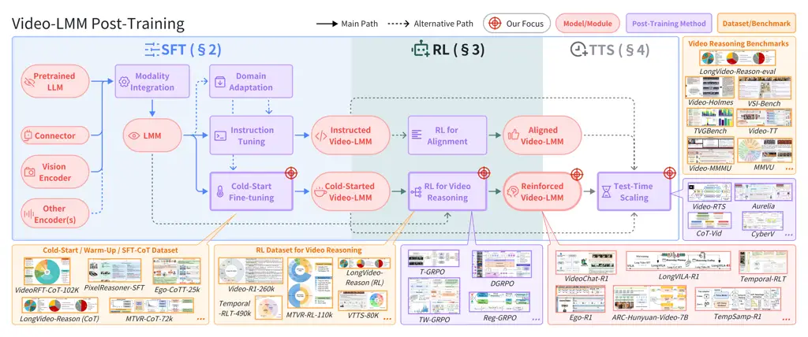
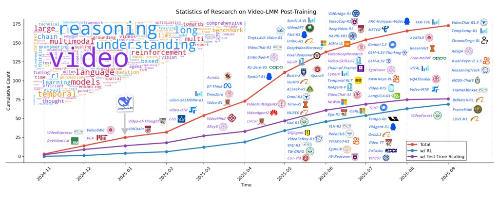

\setheadertext

A Survey of Video Reasoning with Large Multimodal Models

# Video-LMM Post-Training: A Deep Dive into Video Reasoning with Large Multimodal Models

Yolo Yunlong Tang Affiliation: University of Rochester Email:
<%5Bregular%5Dyunlong.tang@rochester.eduhttps://github.com/yunlong10/Awesome-Video-LMM-Post-Trainingyunlong10/Awesome-Video-LMM-Post-Training>
   Jing Bi Affiliation: University of Rochester    Pinxin Liu
Affiliation: University of Rochester    Zhenyu Pan Affiliation:
Northwestern University    Zhangyun Tan Affiliation: University of
Rochester    Qianxiang Shen Affiliation: University of Rochester   
Jiani Liu Affiliation: University of Rochester    Hang Hua Affiliation:
University of Rochester    Junjia Guo Affiliation: University of
Rochester    Yunzhong Xiao Affiliation: CMU    Chao Huang Affiliation:
University of Rochester    Zhiyuan Wang Affiliation: UCSB    Susan Liang
Affiliation: University of Rochester    Xinyi Liu Affiliation:
University of Rochester    Yizhi Song Affiliation: Purdue University   
Junhua Huang Affiliation: UCLA    Jia-Xing Zhong Affiliation: University
of Oxford    Bozheng Li Affiliation: Brown University    Daiqing Qi
Affiliation: University of Virginia    Ziyun Zeng Affiliation:
University of Rochester    Ali Vosoughi Affiliation: University of
Rochester    Luchuan Song Affiliation: University of Rochester   
Zeliang Zhang Affiliation: University of Rochester    Daiki Shimada
Affiliation: Sony Group Corporation    Han Liu Affiliation: Northwestern
University    Jiebo Luo Affiliation: University of Rochester   
Chenliang Xu Affiliation: University of Rochester

###### Abstract

Video understanding represents the most challenging frontier in computer
vision, requiring models to reason about complex spatiotemporal
relationships, long-term dependencies, and multimodal evidence. The
recent emergence of Video-Large Multimodal Models (Video-LMMs), which
integrate visual encoders with powerful decoder-based language models,
has demonstrated remarkable capabilities in video understanding tasks.
However, the critical phase that transforms these models from basic
perception systems into sophisticated reasoning
engines—post-training—remains fragmented across the literature. This
survey provides the first comprehensive examination of post-training
methodologies for Video-LMMs, encompassing three fundamental pillars:
supervised fine-tuning (SFT) with chain-of-thought, reinforcement
learning (RL) from verifiable objectives, and test-time scaling (TTS)
through enhanced inference computation. We present a structured taxonomy
that clarifies the roles, interconnections, and video-specific
adaptations of these techniques, addressing unique challenges such as
temporal localization, spatiotemporal grounding, long video efficiency,
and multimodal evidence integration. Through systematic analysis of
representative methods, we synthesize key design principles, insights,
and evaluation protocols while identifying critical open challenges in
reward design, scalability, and cost-performance optimization. We
further curate essential benchmarks, datasets, and metrics to facilitate
rigorous assessment of post-training effectiveness. This survey aims to
provide researchers and practitioners with a unified framework for
advancing Video-LMM capabilities. Additional resources and updates are
maintained at:
[https://github.com/yunlong10/Awesome-Video-LMM-Post-Training](https://github.com/yunlong10/Awesome-Video-LMM-Post-Training).



Figure 1: Overview of Video-LMM post-training and the scope of this
survey.



Figure 2: Research trends in Video-LMM post-training (November 2024 -
September 2025). The word cloud is based on the titles of the papers.

## 1 Introduction

> One whale falls, ten thousand beings grow.  
> – A modern saying, inspired by _The Practice of the Wild_ \[1\]

In recent years, Large Multimodal Models (LMMs) \[2, 3, 4, 5, 6\] have
rapidly evolved from simple question-answering toward general
problem-solving with interpretable long chain-of-thought (CoT) reasoning
\[7\]. Video understanding, as one of the most comprehensive and
challenging directions in computer vision, simultaneously involves
complex spatiotemporal relationships, event causality, and long-term
memory mechanisms, naturally demanding powerful language reasoning and
task interface capabilities \[8\]. Consequently, Video-LMMs featuring
decoder-centric architectures have become the dominant paradigm \[8,
9\]. These systems leverage strong LLMs as reasoning engines, employ
video encoders to extract visual representations, align visual features
to the LLM token embedding space through projection modules, and enable
instruction understanding and answer generation, demonstrating superior
initialization performance and generalization \[8\].

Video-language modeling has undergone three paradigm shifts: (1) the
CNN+RNN era focused on temporal feature aggregation through recurrent
architectures \[10\]; (2) Transformer-based video models, especially
BERT-style/encoder-only joint representations, emphasized cross-modal
alignment and retrieval through bidirectional encoding \[11, 12\]; (3)
the current video encoder + decoder-based LLM architecture prioritizes
the generality and composability of the language component while
maximally reusing the knowledge and reasoning capabilities of pretrained
LLMs \[8, 13, 9\]. The key advantage lies in internet-scale
self-supervised learning in the language domain, where next-token
prediction enables knowledge, reasoning, and interface capabilities to
emerge at scale under a unified objective. In contrast, the visual
domain lacks an equivalent self-supervised learning method for
efficiently processing internet-scale native video data. Although native
multimodal approaches that jointly model vision and language end-to-end
are being explored \[14, 15\], they have yet to surpass the
divide-and-conquer strategy in computational efficiency and engineering
reusability.

Within this framework, post-training is the critical phase determining
whether Video-LMMs progress from basic perception to sophisticated
reasoning. As illustrated in Figure 1, post-training encompasses three
major components: (i) Supervised Fine-Tuning (SFT) incorporates CoT and
reasoning style distillation to bootstrap reasoning formats and
establish task-following behaviors \[16, 17, 18\]. (ii) Reinforcement
Learning (RL) has evolved from RLHF, PPO, and DPO to R1-style/GRPO
\[19\] approaches that eliminate the need for preference data and
explicit reward models, enabling enhanced reasoning and self-correction
through verifiable objectives and systematic exploration \[20, 21, 22,
23\]. (iii) Test-Time Scaling (TTS) leverages increased inference
computation for higher reliability through reasoning sample
augmentation, voting mechanisms, self-consistency checks, external
verifiers, and multi-path search \[24, 25, 26\]. This progression
maintains close alignment with LLM community developments, offering
transferability in theoretical principles and engineering practices.

Adapting these paradigms to video presents distinctive challenges
differing substantially from static image-text scenarios. Temporal
localization requires models to provide not only correct answers but
also temporally precise responses anchored to specific segments \[27,
28\]. Spatiotemporal grounding demands consistency in tracking objects,
parts, and actions across spatial and temporal dimensions \[22, 29\].
Long video understanding necessitates sophisticated sampling strategies,
adaptive routing, hierarchical viewing protocols, and effective caching
\[30, 31\]. Multimodal evidence integration requires coordinated
reasoning over video frames, textual captions, audio transcripts, and
external knowledge \[32, 33, 34\]. These characteristics have catalyzed
video-specific post-training strategies: incorporating verifiable
temporal and spatial rewards (tIoU, region consistency metrics) in RL
frameworks; designing TTS methods that guide models to autonomously
select informative frames and perform staged viewing with multi-round
reflection and self-correction; and unifying diverse tasks (question
answering, temporal localization, spatiotemporal grounding) within
coherent alignment and optimization frameworks, establishing
hierarchical pipelines for watching, thinking, locating, and answering
\[27, 28, 24\].

Recent studies have successfully integrated GRPO/R1-style RL with
extended reasoning TTS into video understanding, as illustrated in
Figure 2. Some emphasize verifiable reward design for temporal reasoning
and localization \[27, 28\], others extend to joint spatiotemporal
grounding \[22\], while others focus on long video scaling with
efficient training and inference \[35, 30\], and interactive viewing
paradigms enabling thinking with video through evidence accumulation
across iterations \[36, 24, 37\]. This research wave has validated the
feasibility of transferring LLM post-training paradigms to video
understanding and revealed common challenges in data construction,
reward robustness, evaluation protocol standardization, and
cost-performance optimization, underscoring the need for a comprehensive
survey examining Video-LMM reasoning methods from a post-training
perspective.

In this survey, we focus on post-training for Video-LMMs, providing
systematic coverage of key techniques across SFT, RL, and TTS, along
with their specialized adaptations for video scenarios. We synthesize
design principles and engineering insights from representative methods
and discuss open challenges and future directions under unified
evaluation and reporting standards.

In short, the key contributions of this survey are as follows:


#### Related Surveys.

Several surveys have reviewed video understanding with large language
models \[8, 38, 39, 9, 40\], multimodal chain-of-thought reasoning
\[7\], and reinforcement learning in LMMs \[20\]. We also note the
recent survey on reinforcement learning for large reasoning models
\[41\], which provides broader context on RL-driven reasoning
complementary to video post-training. While these works provide valuable
perspectives on video-language modeling and reasoning techniques, our
survey distinctly focuses on systematic organization and analysis of
post-training methodologies specifically tailored for Video-LMMs,
offering a unified treatment of SFT, RL, and TTS approaches.

#### Survey Structure.

Section 2 examines SFT for effective Video-LMM fine-tuning, especially
CoT-SFT. Section 3 reviews LLM-based RL foundations before
systematically analyzing RL algorithms, especially R1-style methods for
video reasoning, including model configurations, data preparation,
optimization strategies, and policy/reward design. Section 4
investigates video-specific TTS methods, emphasizing adaptive viewing
mechanisms, multi-path reasoning strategies, and verification
architectures. Section 5 surveys datasets, benchmarks, and evaluation
metrics. Section 6 discusses future directions. Additional resources and
updates are maintained at:
[https://github.com/yunlong10/Awesome-Video-LMM-Post-Training](https://github.com/yunlong10/Awesome-Video-LMM-Post-Training).

## 2 Supervised Fine-Tuning for Video Reasoning

Supervised fine-tuning (SFT) serves as a pivotal stage that not only
refines multimodal alignment, enhances instruction-following capability,
and instills structured reasoning behaviors in Video-LMMs but also
bridges large-scale pretraining and reinforcement learning (RL), laying
the foundation for stable and generalizable video reasoning.


{forest}

Figure 3: Taxonomy of Video-LMM post-training.

### 2.1 Basic SFT for Video-LMMs

Researchers have discovered large-scale pretraining methods that enable
LLMs to effectively consume internet-scale unlabeled text corpora
through next token prediction, trained with maximum likelihood
estimation (MLE) to obtain powerful LLM base models. These base models
are then further refined through SFT using high-quality annotated data
in smaller quantities. Early SFT for text-only LLMs primarily served two
purposes: enhancing the model’s instruction-following capability and
performing domain adaptation to transform general-purpose LLMs into
domain-specific experts. For obtaining an LMM, subsequent SFT can either
build upon the LLM base model or start from an instruction-tuned LLM for
further refinement.

#### Modality Integration.

The transition from LLM to LMM typically begins with a Modality
Integration stage, which endows the LLM with the ability to understand
information from other modalities, particularly visual information. This
stage usually employs large-scale image-text pairs for image captioning
tasks, sometimes incorporating video-text pairs as well. A connector
links the vision encoder to the LLM, and supervised fine-tuning is
applied to update either the connector parameters alone or both the
connector and LLM parameters jointly. The connector is typically a
linear layer or MLP that maintains input-output token correspondence,
though alternatives like Q-Former \[42\] use resamplers to map inputs to
a fixed number of tokens. In practice, the former approach generally
outperforms the latter \[43\]. Additionally, some methods directly feed
vision features to the LLM, potentially passing representations from
different ViT layers to corresponding LLM layers. Regardless of the
specific approach, the key objective of modality integration is to
effectively project visual representations from the vision encoder into
the LLM’s embedding space, enabling the LMM to directly interpret visual
information. Beyond vision, other modalities such as audio, speech, and
optical flow can be aligned with LMMs using similar operations \[44\].

#### Domain Adaptation.

Domain adaptation in Video-LMMs can be understood in multiple ways. The
most fundamental interpretation applies when an LMM has only performed
modality integration on image-text data without extending to video: an
additional domain adaptation step uses video-text pairs to fine-tune the
LMM for video captioning, thereby expanding the LMM’s capabilities to
video understanding. A second interpretation involves a Video-LMM that
initially handles only general video understanding being fine-tuned with
domain-specific data to inject domain knowledge, enabling it to process
specialized content such as medical videos, anomaly detection videos, or
AI-generated video detection. A third interpretation involves endowing
Video-LMMs with specific capabilities, such as temporal localization
abilities. For instance, VTimeLLM \[45\], TimeChat \[46\], and AVicuna
\[47\] employ boundary alignment to align events occurring in videos
with their start and end times, enabling LMMs to predict when events
occur in videos. Elysium \[48\] extends this capability to the
spatiotemporal domain. Research indicates that domain adaptation may
compromise the instruction-following ability inherited from the LLM,
typically necessitating further SFT to restore this capability.

#### Video Instruction Tuning.

Video Instruction tuning enhances the instruction-following capability
of Video-LMMs \[49, 50, 51, 52, 53, 54, 55, 56\]. The training data
takes the form of instruction-response pairs, and after fine-tuning, the
model is expected to respond as accurately as possible to any given
instruction \[57\]. For example, when asked to provide a video-to-text
summarization of a video, the model generates a description; when asked
for video-to-video summarization, the model outputs the indices of key
frames \[58\]. Visual instruction tuning originated with LLaVA \[43\]
and typically follows the Modality Integration stage, though some work
has shown that mixing modality integration data with instruction tuning
data in a unified format yields better results \[59\]. Video-LLaMA
extended instruction tuning to video and audio, validating the
feasibility of video instruction tuning \[44\]. Since then, instruction
tuning has been widely applied to video understanding \[60, 61, 62, 63,
64, 65, 66, 67, 68, 69, 70, 30, 71, 72, 73\].

These fine-tuning approaches all employ auto-regressive language
modeling loss as the objective function. While full fine-tuning of the
LLM is possible, it can be computationally and memory-intensive, leading
to frequent adoption of parameter-efficient fine-tuning (PEFT)
techniques. For example, some approaches only update LoRA \[74\] and
connector parameters, while others attempt to fine-tune the vision
encoder. Input prompts typically include video placeholders that are
replaced with corresponding video tokens before being fed into the LLM.

### 2.2 From Video Instruction Tuning to Chain-of-Thought Fine-tuning (CoT-SFT)

#### CoT Reasoning Fine-tuning.

Chain-of-thought (CoT) reasoning emphasizes introducing additional
intermediate steps to improve final answer accuracy, requiring models to
output step-by-step reasoning traces. Research has found that longer
CoTs not only provide interpretability but also enhance final answer
accuracy, a phenomenon that will be further discussed in Section 4. CoT
reasoning fine-tuning uses data in long CoT format (either annotated by
human experts or generated synthetically) and applies the same
supervised training methodology as instruction tuning to internalize the
capability of producing step-by-step reasoning traces into the model.
This approach can also be extended to the multimodal domain. For
example, the CoT data in Video-of-Thought \[36\] divides the process of
answering a video QA question into five steps: analyzing the user’s
question, constructing a scene graph of the input video, generating
detailed video captions, using the acquired information to analyze which
option is optimal by comparing against the question and choices, and
finally summarizing the entire reasoning process to return the answer.

#### Video-grounded CoT Fine-tuning.

Early CoT reasoning fine-tuning took video and prompts as input and
produced pure text as output, which to some extent limited the
capabilities of Video-LMMs. Text-only CoTs emphasize logical structure
but risk visual hallucination. Therefore, incorporating vision-grounded
information into CoTs is beneficial. Video-grounded CoTs reduce
hallucination by binding steps to visual evidence via timestamps, shot
IDs, or frame indices. VideoEspresso \[16\] demonstrates that pairing
CoT with core frame selection yields fine-grained reasoning supervision
while controlling token budgets. ViTCoT \[18\] advocates video-text
interleaving during reasoning, periodically revisiting key frames while
thinking, to better align cognition with perception. CoTasks \[17\]
further structures the reasoning interface by injecting entity-level
intermediate steps (localization, tracking, relation extraction) as part
of the supervision, improving compositional spatiotemporal reasoning.

#### CoT Fine-tuning for Video RL Cold-Start.

Although works such as Video-of-Thought \[36\] and VideoEspresso \[16\]
have achieved certain success in introducing CoT to video reasoning, the
CoT formats used in these datasets are typically fixed, following rigid
step sequences. While unified formats facilitate batch generation, they
consequently lack flexibility: models cannot explore independently, and
predefined paths may not be optimal. Errors generated during fixed-path
reasoning cannot be effectively corrected and accumulate continuously.
Fundamentally, this represents a static learning paradigm whose
effectiveness is highly dependent on the quality and diversity of
training data. These models can only imitate the reasoning patterns
present in their dataset and struggle to generalize to unseen, more
complex scenarios \[75\]. To overcome this limitation and enable models
to learn and align with more abstract and qualitative objectives that
are difficult to define precisely in a supervised dataset, many works
are increasingly turning to Reinforcement Learning (RL, which will be
detailed in ), particularly following the emergence of R1-style and GRPO
algorithms. Consequently, CoT-SFT has gradually evolved into the
cold-start training phase for RL. The cold-start phase is now critical
for stabilizing the model before full RL training, preventing
instability that can arise from purely RL-driven updates. Cold-start
data preparation focuses on capturing human-readable reasoning patterns
to prevent instability from purely RL-driven updates. This step
generates CoT-style examples with consistent \<think\> and \<answer\>
fields, usually involving thousands of carefully curated samples.
Structured CoT formats and consistent fields ensure clarity and
robustness in the model’s reasoning outputs, reducing errors and
improving interpretability \[57\].

### 2.3 Data Construction and Representative Resources

#### Curation Pipelines.

Obtaining high-quality video CoT supervision is resource-intensive. A
practical approach involves a two-phase curation pipeline: (1) eliciting
preliminary CoTs from a reasoning-capable LLM using structured video
metadata such as scene descriptions, automatic speech recognition (ASR)
transcripts, and shot lists; (2) applying visual consistency refinement
through an LMM conditioned on actual video frames to reduce
hallucination and align reasoning steps with visual evidence. VideoRFT
\[76\] exemplifies this methodology and provides the VideoRFT-CoT-102K
dataset for SFT alongside larger collections designed for RL training.

#### CoT-SFT Datasets for Video Reasoning.

We highlight representative resources used for SFT with CoT format.
VideoRFT-CoT-102K supplies large-scale CoT traces tailored for
reward-driven fine-tuning and incentivized video reasoning \[76\].
PixelReasoner-SFT offers pixel/region-grounded, stepwise supervision
that tightly couples perception with structured reasoning. Ego-CoTT-25k
targets egocentric and embodied scenarios with chain-of-tool-thought
style supervision for ultra-long videos \[77\]. LongVideo-Reason-CoT
\[35\] extends to multi-event, long-form understanding with
narrative-level annotations and supports long-context training
pipelines. MTVR-CoT-72k \[37\], including MTVR-CoT and MTVR-CoT-Tool,
contribute multi-task CoT trajectories that bridge video QA and temporal
grounding, enabling explicit intermediate reasoning. Beyond the above,
fine-grained CoT resources such as VideoEspresso \[16\], entity-centric
CoTasks \[17\], and interleaved video–text protocols ViTCoT/ViTIB \[18\]
are widely used as warm-up data, while causal/multi-event understanding
can leverage MECD \[78\]. In addition, Video-of-Thought style
collections and their perception-to-cognition protocols provide useful
templates for supervising intermediate steps \[36\]. More resources are
summarized in Table 4.

#### Long-Video Considerations.

For long-form video content, SFT typically combines CoT supervision with
token-budget control mechanisms, such as shot selection and quota
assignment, to maintain computational tractability. These approaches may
leverage agentic keyframe selection strategies or frame-aware reasoning
signals \[34\]. When SFT precedes RL training on long videos, as
demonstrated in LongVILA-R1 \[35\], CoT-SFT establishes the format prior
that facilitates efficient rollouts and subsequent policy optimization
\[35\].

|                                  |            |           |                                           |                |                                                                                                                                                                                                               |
| -------------------------------- | ---------- | --------- | ----------------------------------------- | -------------- | ------------------------------------------------------------------------------------------------------------------------------------------------------------------------------------------------------------- |
| Model                            | \# Params  | \# Stages | Training Strategy                         | TTS            | Link                                                                                                                                                                                                          |
| Fact-R1 \[79\]                   | $`\sim`$7B | 3         | SFT + DPO + GRPO                          | $`\checkmark`$ | [ ](https://github.com/zfr00/fact-r1)  [![[Uncaptioned image]](arxiv-2510-05034--22d938347d04.figures/figure-3.webp)](https://huggingface.co/papers/2505.16836)                                               |
| Temporal-RLT \[80\]              | 7B         | 2         | SFT + GRPO                                | $`\checkmark`$ | [ ](https://github.com/appletea233/Temporal-R1)  [![[Uncaptioned image]](arxiv-2510-05034--22d938347d04.figures/figure-3.webp)](https://huggingface.co/papers/2506.01908)                                     |
| VideoChat-R1 \[22\]              | 7B         | 1         | Multi-task RFT (GRPO)                     | $`\checkmark`$ | [ ](https://github.com/OpenGVLab/VideoChat-R1)  [![[Uncaptioned image]](arxiv-2510-05034--22d938347d04.figures/figure-3.webp)](https://huggingface.co/OpenGVLab/VideoChat-R1_5-7B)                            |
| Spatial-R1 \[81\]                | 7B         | 1         | Task-Specific RFT (GRPO)                  | $`\times`$     | [ ](https://github.com/OuyangKun10/SpaceR)  [![[Uncaptioned image]](arxiv-2510-05034--22d938347d04.figures/figure-3.webp)](https://huggingface.co/RUBBISHLIKE/SpaceR)                                         |
| LLaVA-NeXT-Video-Thinking \[82\] | 7B - 34B   | 2         | SFT + TDPO (RLHF-style, Segment-Weighted) | $`\checkmark`$ | [ ](https://github.com/Hongcheng-Gao/HAVEN)  [![[Uncaptioned image]](arxiv-2510-05034--22d938347d04.figures/figure-3.webp)](https://huggingface.co/datasets/Joshua999/HAVEN)                                  |
| video-SALMONN-o1 \[83\]          | 7B         | 2         | SFT (LoRA) + pDPO (Process-level)         | $`\checkmark`$ | [ ](https://github.com/BriansIDP/video-SALMONN-o1)  [![[Uncaptioned image]](arxiv-2510-05034--22d938347d04.figures/figure-3.webp)](https://huggingface.co/tsinghua-ee/video-SALMONN-o1)                       |
| LongVILA-R1 \[35\]               | 7B - 8B    | 2         | CoT-SFT + RL (MR-SP, GRPO)                | $`\times`$     | [ ](https://github.com/NVlabs/Long-RL)  [![[Uncaptioned image]](arxiv-2510-05034--22d938347d04.figures/figure-3.webp)](https://huggingface.co/Efficient-Large-Model/LongVILA-R1-7B)                           |
| Video-RTS \[23\]                 | 7B         | 1         | Pure RL, no SFT (GRPO)                    | $`\checkmark`$ | [ ](https://github.com/Ziyang412/Video-RTS)  [![[Uncaptioned image]](arxiv-2510-05034--22d938347d04.figures/figure-3.webp)](https://huggingface.co/Ted412/Video-RTS)                                          |
| Ego-R1 \[77\]                    | $`\sim`$3B | 2         | SFT (CoTT) + RL (GRPO)                    | $`\checkmark`$ | [ ](https://github.com/egolife-ai/Ego-R1)  [![[Uncaptioned image]](arxiv-2510-05034--22d938347d04.figures/figure-3.webp)](https://huggingface.co/Ego-R1)                                                      |
| DeepVideo-R1 \[84\]              | 2B - 7B    | 1         | Regressive GRPO (Reg-GRPO)                | $`\checkmark`$ | [ ](https://github.com/mlvlab/DeepVideoR1)  [![[Uncaptioned image]](arxiv-2510-05034--22d938347d04.figures/figure-3.webp)](https://huggingface.co/papers/2506.07464)                                          |
| VideoRFT \[76\]                  | $`\sim`$7B | 2         | SFT (CoT) + RL (GRPO)                     | $`\checkmark`$ | [ ](https://github.com/QiWang98/VideoRFT)  [![[Uncaptioned image]](arxiv-2510-05034--22d938347d04.figures/figure-3.webp)](https://huggingface.co/QiWang98/VideoRFT)                                           |
| UniVG-R1 \[85\]                  | 2B - 7B    | 2         | CoT-SFT + RL (GRPO)                       | $`\checkmark`$ | [ ](https://github.com/AMAP-ML/UniVG-R1)  [![[Uncaptioned image]](arxiv-2510-05034--22d938347d04.figures/figure-3.webp)](https://huggingface.co/GD-ML/UniVG-R1)                                               |
| TinyLLaVA-Video-R1 \[86\]        | $`\sim`$3B | 2         | SFT (Cold-Start) + RL (GRPO)              | $`\checkmark`$ | [ ](https://github.com/ZhangXJ199/TinyLLaVA-Video-R1)  [![[Uncaptioned image]](arxiv-2510-05034--22d938347d04.figures/figure-3.webp)](https://huggingface.co/Zhang199/TinyLLaVA-Video-R1)                     |
| Video-R1 \[21\]                  | 7B         | 2         | CoT-SFT + RL (Temporal GRPO)              | $`\checkmark`$ | [ ](https://github.com/tulerfeng/Video-R1)  [![[Uncaptioned image]](arxiv-2510-05034--22d938347d04.figures/figure-3.webp)](https://huggingface.co/Video-R1/Video-R1-7B)                                       |
| VAU-R1 \[87\]                    | 2B - 3B    | 2         | SFT + RFT (GRPO)                          | $`\checkmark`$ | [ ](https://github.com/GVCLab/VAU-R1)  [![[Uncaptioned image]](arxiv-2510-05034--22d938347d04.figures/figure-3.webp)](https://huggingface.co/datasets/7xiang/VAU-Bench)                                       |
| ST-R1 \[88\]                     | $`\sim`$7B | 2         | CoT-SFT + RL (GRPO)                       | $`\checkmark`$ | [ ](https://github.com/WPR001/Ego-ST)  [![[Uncaptioned image]](arxiv-2510-05034--22d938347d04.figures/figure-3.webp)](https://huggingface.co/collections/openinterx/st-think-684745a22833bfda73c5bd82)        |
| TimeZero \[89\]                  | $`\sim`$7B | 1         | Pure RL (GRPO)                            | $`\checkmark`$ | [ ](https://github.com/www-Ye/Time-R1)  [![[Uncaptioned image]](arxiv-2510-05034--22d938347d04.figures/figure-3.webp)](https://huggingface.co/wwwyyy/TimeZero-Charades-7B)                                    |
| VerIPO \[25\]                    | 7B         | 3         | GRPO-Verifier-DPO loop                    | $`\checkmark`$ | [ ](https://github.com/HITsz-TMG/VerIPO)  [![[Uncaptioned image]](arxiv-2510-05034--22d938347d04.figures/figure-3.webp)](https://huggingface.co/Uni-MoE/VerIPO-7B-v1.0)                                       |
| VLN-R1 \[90\]                    | $`\sim`$7B | 2         | SFT + RFT (Custom Reward)                 | $`\times`$     | [ ](https://github.com/Qi-Zhangyang/GPT4Scene-and-VLN-R1)  [![[Uncaptioned image]](arxiv-2510-05034--22d938347d04.figures/figure-3.webp)](https://huggingface.co/datasets/alexzyqi/VLN-Ego)                   |
| TVG-R1 \[91\]                    | $`\sim`$7B | 2         | SFT + RFT                                 | $`\checkmark`$ | [ ](https://github.com/zjuruizhechen/TVG-R1)  [![[Uncaptioned image]](arxiv-2510-05034--22d938347d04.figures/figure-3.webp)](https://huggingface.co/RuizheChen/TVG-R1)                                        |
| VideoCap-R1 \[92\]               | $`\sim`$7B | 2         | SFT + RL (GRPO)                           | $`\checkmark`$ | –                                                                                                                                                                                                             |
| Vad-R1 \[93\]                    | $`\sim`$7B | 2         | P2C-CoT SFT + AVA-GRPO                    | $`\checkmark`$ | [ ](https://github.com/wbfwonderful/Vad-R1)  [![[Uncaptioned image]](arxiv-2510-05034--22d938347d04.figures/figure-3.webp)](https://huggingface.co/datasets/wbfwonderful/Vad-R1)                              |
| R1-SGG \[94\]                    | 2B - 7B    | 2         | SFT + RL (GRPO)                           | $`\times`$     | [ ](https://github.com/gpt4vision/R1-SGG)  [![[Uncaptioned image]](arxiv-2510-05034--22d938347d04.figures/figure-3.webp)](https://huggingface.co/JosephZ/R1-SGG-7B)                                           |
| vsGRPO \[95\]                    | 2B - 7B    | 1         | R1-Zero-like RL training (GRPO)           | $`\checkmark`$ | [ ](https://github.com/zhijie-group/R1-Zero-VSI)  [![[Uncaptioned image]](arxiv-2510-05034--22d938347d04.figures/figure-3.webp)](https://huggingface.co/datasets/OPPOer/VSI-100k)                             |
| BusterX \[96\]                   | $`\sim`$7B | 2         | SFT (Cold-start) + RL (PEFT, DAPO)        | $`\checkmark`$ | [ ](https://github.com/l8cv/BusterX)  [![[Uncaptioned image]](arxiv-2510-05034--22d938347d04.figures/figure-3.webp)](https://huggingface.co/l8cv/BusterX_plusplus)                                            |
| ARC-Hunyuan-Video \[97\]         | 7B         | 4         | SFT + CoT SFT + RL (GRPO) + SFT           | $`\times`$     | [ ](https://github.com/TencentARC/ARC-Hunyuan-Video-7B/)  [![[Uncaptioned image]](arxiv-2510-05034--22d938347d04.figures/figure-3.webp)](https://huggingface.co/TencentARC/ARC-Hunyuan-Video-7B)              |
| VITAL \[37\]                     | 7B         | 7         | SFT + Tool-Augmented DGRPO                | $`\checkmark`$ | [ ](https://github.com/zhang9302002/ThinkingWithVideos)  [![[Uncaptioned image]](arxiv-2510-05034--22d938347d04.figures/figure-3.webp)](https://huggingface.co/datasets/zhang9302002/MultiTaskVideoReasoning) |
| Video-MTR \[98\]                 | $`\sim`$7B | 1         | RL with Gated Bi-Level Reward (PPO)       | $`\times`$     | - [![[Uncaptioned image]](arxiv-2510-05034--22d938347d04.figures/figure-3.webp)](https://huggingface.co/papers/2508.20478)                                                                                    |
| ReasonAct \[99\]                 | 3B         | 3         | SFT + V-SFT + Temporal RL (T-GRPO)        | $`\times`$     | –                                                                                                                                                                                                             |
| ReFoCUS \[100\]                  | -          | 2         | RL with Reward Model (GRPO)               | $`\times`$     | - [![[Uncaptioned image]](arxiv-2510-05034--22d938347d04.figures/figure-3.webp)](https://huggingface.co/papers/2506.01274)                                                                                    |
| Kwai Keye-VL \[101\]             | 8.4B       | 2         | SFT + MPO + Mix-Mode RL (MPO, GRPO)       | $`\checkmark`$ | [ ](https://github.com/Kwai-Keye/Keye)  [![[Uncaptioned image]](arxiv-2510-05034--22d938347d04.figures/figure-3.webp)](https://huggingface.co/Kwai-Keye/Keye-VL-8B-Preview)                                   |
| VRAgent-R1 \[102\]               | -          | 2         | Progressive RL for User Simulation (GRPO) | $`\checkmark`$ | –                                                                                                                                                                                                             |
| Omni-R1 \[103\]                  | 7B         | 2         | End-to-End RL (GRPO)                      | $`\times`$     | [ ](https://github.com/aim-uofa/Omni-R1)  [![[Uncaptioned image]](arxiv-2510-05034--22d938347d04.figures/figure-3.webp)](https://huggingface.co/Haoz0206/Omni-R1)                                             |
| A2Seek-R1 \[104\]                | $`\sim`$3B | 2         | GoT-SFT + RFT (Aerial GRPO)               | $`\times`$     | [ ](https://hayneyday.github.io/A2Seek/) -                                                                                                                                                                    |
| Pixel Reasoner \[105\]           | 7B         | 2         | SFT + Curiosity-Driven RL (Custom)        | $`\checkmark`$ | [ ](https://github.com/TIGER-AI-Lab/Pixel-Reasoner)  [![[Uncaptioned image]](arxiv-2510-05034--22d938347d04.figures/figure-3.webp)](https://huggingface.co/TIGER-Lab/PixelReasoner-RL-v1)                     |
| Tempo-R0 \[106\]                 | $`\sim`$7B | 2         | SFT + RFT (PIR-GRPO)                      | $`\times`$     | –                                                                                                                                                                                                             |
| VideoSafety-R1 \[107\]           | -          | 2         | AT-SFT + RLHF-style (GRPO)                | $`\checkmark`$ | –                                                                                                                                                                                                             |
| SiLVR \[108\]                    | 7B - 72B   | N/A       | Training-Free, Modular                    | $`\times`$     | [ ](https://github.com/CeeZh/SILVR) -                                                                                                                                                                         |
| CoT-Vid \[24\]                   | 7B         | N/A       | Training-Free, Inference-time strategy    | $`\checkmark`$ | –                                                                                                                                                                                                             |
| MR. Video \[109\]                | Modular    | N/A       | Training-Free, MapReduce Framework        | $`\checkmark`$ | [ ](https://github.com/ziqipang/MR-Video)  [![[Uncaptioned image]](arxiv-2510-05034--22d938347d04.figures/figure-3.webp)](https://huggingface.co/ziqipang/MR-Video)                                           |
| Free-MoRef \[110\]               | 7B         | N/A       | Training-Free, Inference-time MoE         | $`\times`$     | [ ](https://github.com/wkfdb/Free-MoRef) -                                                                                                                                                                    |

Table 1: Summary of large multimodal models for video reasoning
(Video-LMMs), including model name, number of parameters, training
strategy, test-time scaling, and links.

## 3 Reinforcement Learning for Video Reasoning


### 3.1 Preliminary: From PPO to GRPO

This subsection formalizes three alignment routes that underpin
post-training for video reasoning: PPO-based RLHF (with or without
AI-generated preferences), Direct Preference Optimization (DPO), and
Group Relative Policy Optimization (GRPO). We use $`x`$ for the
multimodal context, $`y`$ for a response, and $`\tau`$ for a token
trajectory.

#### PPO, RLHF, and RLAIF.

RLHF trains a reward model (RM) to score responses and then optimizes
the policy with PPO under a KL constraint to a reference model. The RM
is commonly trained on preference pairs $`(x,y^{+},y^{-})`$ via a
Bradley–Terry objective,

```math
\mathcal{L}_{\mathrm{RM}}(\phi)=-\mathbb{E}_{(x,y^{+},y^{-})}\,\log\sigma\!\left(r_{\phi}(x,y^{+})-r_{\phi}(x,y^{-})\right),
```

where $`r_{\phi}(x,y)`$ is the scalar reward and $`\sigma`$ is the
logistic function. Given a fixed RM, PPO maximizes a clipped
policy-gradient objective with a KL penalty to the reference
$`\pi_{\mathrm{ref}}`$ (e.g., SFT model). Let
$`r_{t}(\theta)=\frac{\pi_{\theta}(y_{t}\,|\,x,y_{<t})}{\pi_{\theta_{\mathrm{old}}}(y_{t}\,|\,x,y_{<t})}`$
and $`\hat{A}_{t}`$ be an advantage estimator (often sequence-level
reward broadcast to tokens):

```math
\mathcal{L}_{\mathrm{PPO}}(\theta)=-\mathbb{E}\bigg[\sum_{t}\min\!\Big(r_{t}(\theta)\,\hat{A}_{t},\;\mathrm{clip}\big(r_{t}(\theta),\,1-\epsilon,\,1+\epsilon\big)\,\hat{A}_{t}\Big)\bigg]\;+\;\beta\,\mathrm{KL}\!\left(\pi_{\theta}(\cdot|x)\,\|\,\pi_{\mathrm{ref}}(\cdot|x)\right).
```

RLAIF replaces human preferences with AI-generated preferences or
rewards; the optimization is unchanged, only the supervision source for
$`\mathcal{L}_{\mathrm{RM}}`$ differs. In our curated corpus of
video-LLM papers, explicit post-training with PPO/RLHF/RLAIF is uncommon
relative to DPO/GRPO.

#### Direct Preference Optimization (DPO).

DPO dispenses with an explicit RM and directly matches the policy to the
observed preferences relative to a fixed reference model
$`\pi_{\mathrm{ref}}`$. With temperature $`\beta>0`$, the standard DPO
loss over $`(x,y^{+},y^{-})`$ is

```math
\mathcal{L}_{\mathrm{DPO}}(\theta)=-\,\mathbb{E}\,\log\sigma\!\Big(\beta\big[\log\pi_{\theta}(y^{+}\!|x)-\log\pi_{\mathrm{ref}}(y^{+}\!|x)-\log\pi_{\theta}(y^{-}\!|x)+\log\pi_{\mathrm{ref}}(y^{-}\!|x)\big]\Big).
```

Equivalently, DPO can be viewed as maximizing the log-odds that the
policy assigns higher normalized preference to $`y^{+}`$ than to
$`y^{-}`$, implicitly inducing a reward proportional to
$`\log\pi_{\theta}(\cdot|x)-\log\pi_{\mathrm{ref}}(\cdot|x)`$. Recent
video-LLMs instantiate this route with process-/task-aware variants,
including video-SALMONN-o1 (process-DPO) \[83\], Fact-R1 (preference
stage) \[79\], and LLaVA-NeXT-Video-7B-Thinking (TDPO) \[82\].

#### Group Relative Policy Optimization (GRPO).

GRPO replaces learned rewards with verifiable outcome rules and
optimizes with group-relative advantages. For each prompt $`x`$, sample
$`K`$ trajectories $`\{\tau^{(k)}\}_{k=1}^{K}`$ from
$`\pi_{\theta_{\mathrm{old}}}`$, compute verifiable scores
$`r^{(k)}\in[0,1]`$ (e.g., answer correctness, temporal IoU, format
checks), and form the group baseline
$`\bar{r}=\frac{1}{K}\sum_{j=1}^{K}r^{(j)}`$. Define advantages

```math
A^{(k)}=r^{(k)}-\operatorname{stopgrad}(\bar{r}),\qquad\ell^{(k)}(\theta)=\sum_{t\in\tau^{(k)}}\log\pi_{\theta}(y_{t}\,|\,x,y_{<t}),
```

and optimize a KL-regularized objective,

```math
\mathcal{L}_{\mathrm{GRPO}}(\theta)=-\frac{1}{K}\sum_{k=1}^{K}A^{(k)}\,\ell^{(k)}(\theta)\;+\;\beta\,\mathrm{KL}\!\left(\pi_{\theta}(\cdot|x)\,\|\,\pi_{\mathrm{ref}}(\cdot|x)\right).
```

In practice, temperature/top-$`p`$ controls, sequence-length penalties,
entropy scheduling, and rejection of malformed traces stabilize
on-policy sampling while preserving the verifiable nature of
$`r^{(k)}`$. Recent research have explored GRPO for video-LLMs,
including VideoChat-R1 \[22\], SpaceR \[81\], Fact-R1 (final RL stage)
\[79\], Reinforcement Learning Tuning for VideoLLMs \[80\], Scaling RL
to Long Videos \[35\], Video-RTS \[23\], DeepVideo-R1 \[84\], Ego-R1
Agent \[77\], and so on \[111, 112, 113, 114, 115, 116, 117, 118, 119,
120, 121, 122, 123, 124, 125, 126, 127, 128, 129, 130, 96, 106, 100\].

### 3.2 Video-Specific Policy Optimization

#### Policy and trajectory formulation.

Let $`x=(V,q)`$ denote the video and query. A trajectory $`\tau`$
interleaves reasoning and decision tokens,

```math
\tau=\big(r_{1},\ldots,r_{k_{1}},\,d_{1},\,r_{k_{1}+1},\ldots,\,d_{2},\ldots,\,y\big),
```

where decisions may propose temporal spans $`[t_{s},t_{e}]`$, select
keyframes $`\mathcal{F}`$, emit spatio-temporal regions, and finally
produce the answer $`y`$. The policy $`\pi_{\theta}(\tau\mid x)`$
factorizes autoregressively. For a group of $`K`$ rollouts
$`\{\tau^{(k)}\}`$ with verifiable base rewards
$`r_{\text{base}}^{(k)}\!\in\![0,1]`$, let
$`\bar{r}=\tfrac{1}{K}\sum_{j}r^{(j)}`$.

#### Temporal GRPO (T-GRPO).

For each $`(V,q)`$, construct two input settings: the ordered frame
sequence and a randomly shuffled sequence. Generate two groups of
responses and compute the proportions of correct answers
$`p_{\mathrm{ord}}`$ and $`p_{\mathrm{shuf}}`$. Define a temporal
coefficient with margin $`m\!\geq\!0`$:

```math
c_{\text{temp}}=\max\big(0,\;p_{\mathrm{ord}}-p_{\mathrm{shuf}}-m\big).
```

For an ordered rollout $`k`$, shape the reward

```math
r^{(k)}\;=\;r_{\text{base}}^{(k)}\;+\;\lambda_{\text{temp}}\,c_{\text{temp}}\;\mathbb{1}\!\big[\text{correct}(\tau^{(k)})\big],
```

and set the group-relative advantage $`A^{(k)}=r^{(k)}-\bar{r}`$. The
GRPO update maximizes
$`\sum_{k}A^{(k)}\sum_{t\in\tau^{(k)}}\log\pi_{\theta}(y_{t}\mid x,y_{<t})`$
under a KL anchor to $`\pi_{\text{ref}}`$, which explicitly rewards
accuracy that depends on temporal order rather than single-frame
shortcuts \[21\].

#### Regressive GRPO (Reg-GRPO).

Reg-GRPO \[84\] reformulates GRPO as regression on group-normalized
advantages, removing min/clipping safeguards. Let the normalized target
be

```math
\tilde{A}^{(k)}\;=\;\frac{r_{\text{base}}^{(k)}-\mu_{r}}{\sigma_{r}},\qquad\mu_{r}=\tfrac{1}{K}\sum_{j}r_{\text{base}}^{(j)},\;\sigma_{r}=\sqrt{\tfrac{1}{K}\sum_{j}(r_{\text{base}}^{(j)}-\mu_{r})^{2}}.
```

Define a sequence score
$`s_{\theta}(\tau^{(k)},x)=\sum_{t\in\tau^{(k)}}\log\pi_{\theta}(y_{t}\mid x,y_{<t})`$.
The loss is

```math
\mathcal{L}_{\text{Reg-GRPO}}(\theta)=\frac{1}{K}\sum_{k=1}^{K}\Big(s_{\theta}(\tau^{(k)},x)-\tilde{A}^{(k)}\Big)^{2}+\beta\,\mathrm{KL}\!\left(\pi_{\theta}(\cdot\mid x)\,\|\,\pi_{\text{ref}}(\cdot\mid x)\right).
```

To mitigate vanishing advantages on very easy/hard samples, DeepVideo-R1
adds difficulty-aware augmentation and/or per-sample weights
$`w(d(x))`$:

```math
\mathcal{L}_{\text{Reg-GRPO}}^{\text{DA}}(\theta)=\frac{1}{K}\sum_{k}w\!\big(d(x)\big)\Big(s_{\theta}(\tau^{(k)},x)-\tilde{A}^{(k)}\Big)^{2}+\beta\,\mathrm{KL}(\cdot).
```

#### Token-weighted advantages (TW-GRPO).

To improve credit assignment along long chains of thought, TW-GRPO
introduces token importance $`w_{t}`$ estimated from intra-group
informativeness (e.g., entropy across the $`K`$ rollouts). Replace the
unweighted score with

```math
s_{\theta}^{\text{TW}}(\tau^{(k)},x)=\sum_{t\in\tau^{(k)}}w_{t}\,\log\pi_{\theta}(y_{t}\mid x,y_{<t}),
```

and compute advantages from a soft multi-bin reward
$`r_{\text{soft}}^{(k)}=\sum_{b}\gamma_{b}\,\mathbb{1}[y^{(k)}\!\in\!\mathcal{Y}_{b}]`$
(exact, near-miss, wrong). The resulting GRPO/Reg-GRPO objective uses
$`s_{\theta}^{\text{TW}}`$ in place of $`s_{\theta}`$, yielding denser,
lower-variance updates \[131\].

#### Difficulty-aware GRPO (DGRPO).

To address the difficulty imbalance across tasks or prompts, DGRPO
reweights the group-relative advantages by adaptive difficulty signals.
Let $`d_{\text{task}}`$ be a moving hardness estimate at the task level
and $`d_{\text{sample}}`$ a per-prompt score (e.g., running success rate
or verifier score dispersion). With a monotone weight
$`g(\cdot,\cdot)`$,

```math
\tilde{A}_{\text{DA}}^{(k)}\;=\;g\!\big(d_{\text{task}},d_{\text{sample}}\big)\,\big(r^{(k)}-\bar{r}\big),
```

and the update maximizes
$`\sum_{k}\tilde{A}_{\text{DA}}^{(k)}\sum_{t\in\tau^{(k)}}\log\pi_{\theta}(y_{t}\mid x,y_{<t})`$
under the same KL anchor. In “Thinking With Videos,” this scheme is used
together with curated multi-task RL data (MTVR-RL-110k) to emphasize
informative failures and prevent easy examples from dominating \[37\].

|                                                                                        |                                                                                                                                                                                                                                                                                                        |                                                                                                                                                                                     |
| -------------------------------------------------------------------------------------- | ------------------------------------------------------------------------------------------------------------------------------------------------------------------------------------------------------------------------------------------------------------------------------------------------------ | ----------------------------------------------------------------------------------------------------------------------------------------------------------------------------------- |
| Method                                                                                 | Objective                                                                                                                                                                                                                                                                                              | Symbols                                                                                                                                                                             |
| Vanilla GRPO \[80, 22\]                                                                | $`\displaystyle\max_{\theta}\frac{1}{G}\sum_{i=1}^{G}\min\!\Big(\tfrac{\pi_{\theta}(y_{i})}{\pi_{\text{old}}(y_{i})}A_{i},\,\mathrm{clip}\big(\tfrac{\pi_{\theta}}{\pi_{\text{old}}},1-\epsilon,1+\epsilon\big)A_{i}\Big)-\beta\,\mathrm{KL}\!\big[\pi_{\theta}\,\|\,\pi_{\text{ref}}\big]`$           | $`G`$: group size; $`A_{i}=\frac{r_{i}-\mu_{r}}{\sigma_{r}}`$; $`r_{i}`$: verifiable reward; $`\pi_{\text{ref}}`$: reference policy; $`\mathrm{clip}(\cdot)`$: PPO-style clipping   |
| T-GRPO \[21\]                                                                          | $`\displaystyle\max_{\theta}\,\mathcal{L}_{\text{GRPO}}(\theta)\;+\;\lambda_{t}\,\alpha\,\mathbf{1}\!\big[p_{\mathrm{ord}}>p_{\mathrm{shuf}}\big]`$                                                                                                                                                    | $`p_{\mathrm{ord}},p_{\mathrm{shuf}}`$: success on ordered vs. shuffled frames; $`\lambda_{t},\alpha`$: weights                                                                     |
| TW-GRPO \[131\]                                                                        | $`\displaystyle\max_{\theta}\frac{1}{G}\sum_{i}\min\!\Big(\tfrac{\pi_{\theta}}{\pi_{\text{old}}}A^{\prime}_{i},\mathrm{clip}(\cdot)A^{\prime}_{i}\Big)-\beta\,\mathrm{KL},\hskip 8.50012ptA^{\prime}_{i}=\sum_{t}w_{t}\,a_{it},\hskip 8.50012ptr=\sum_{k}\gamma_{k}\,\mathbf{1}[y\in\mathcal{Y}_{k}]`$ | $`A^{\prime}_{i}`$: token-weighted advantage; $`w_{t}`$: token importance; $`a_{it}`$: token-level advantage; $`\mathcal{Y}_{k}`$: partial-credit bins; $`\gamma_{k}`$: bin weights |
| Reg-GRPO \[84\]                                                                        | $`\displaystyle\min_{\theta}\;\frac{1}{G}\sum_{i=1}^{G}\Big(\Delta\log\pi_{\theta}(y_{i})-\eta A_{i}\Big)^{2}\;+\;\beta\,\mathrm{KL}`$                                                                                                                                                                 | $`\Delta\log\pi_{\theta}(y_{i})=\log\!\tfrac{\pi_{\theta}(y_{i})}{\pi_{\text{old}}(y_{i})}`$; $`\eta`$: regression scale                                                            |
| DGRPO \[79\]                                                                           | $`\displaystyle\max_{\theta}\frac{1}{G}\sum_{i}\min\!\Big(\tfrac{\pi_{\theta}}{\pi_{\text{old}}}A_{i}^{\prime\prime},\mathrm{clip}(\cdot)A_{i}^{\prime\prime}\Big)-\beta\,\mathrm{KL},\hskip 8.50012ptA_{i}^{\prime\prime}=w\!\big(d(x)\big)\cdot A_{i}`$                                              | $`d(x)`$: difficulty score; $`w(\cdot)`$: difficulty weight; $`A_{i}^{\prime\prime}`$: difficulty-weighted advantage                                                                |
| Multi-task GRPO \[22\]                                                                 | $`\displaystyle\max_{\theta}\frac{1}{G}\sum_{i}\min\!\Big(\tfrac{\pi_{\theta}}{\pi_{\text{old}}}\textstyle\sum_{m}\lambda_{m}A_{i}^{(m)},\,\mathrm{clip}(\cdot)\sum_{m}\lambda_{m}A_{i}^{(m)}\Big)-\beta\,\mathrm{KL}`$                                                                                | $`A_{i}^{(m)}`$: standardized advantage on task $`m`$; $`\lambda_{m}`$: task weights                                                                                                |
| Verifier-DPO \[25\]                                                                    | $`\displaystyle\min_{\theta}\;\mathcal{L}_{\text{DPO}}=-\log\frac{\exp(\beta s^{+})}{\exp(\beta s^{+})+\exp(\beta s^{-})}`$                                                                                                                                                                            | $`s^{+},s^{-}`$: scores of preferred/rejected outputs; $`\beta`$: DPO temperature                                                                                                   |
| Long-video-RL \[35\]                                                                   | $`\displaystyle\max_{\theta}\;\sum_{s=1}^{S}\mathcal{L}_{\text{GRPO}}^{(s)}(\theta)\;-\;\gamma\,\Omega(\text{memory/retrieval})`$                                                                                                                                                                      | $`S`$: \#segments; $`\mathcal{L}_{\text{GRPO}}^{(s)}`$: per-segment objective; $`\Omega(\cdot)`$: memory/retrieval regularizer; $`\gamma`$: weight                                  |
| Temporal-only grounding RL \[80\]                                                      | $`\displaystyle\max_{\theta}\;\mathcal{L}_{\text{GRPO}}(\theta)\hskip 8.50012pt\text{s.t.}\hskip 8.50012ptr=\mathrm{IoU}\!\big([t_{s},t_{e}],\hat{[t_{s},t_{e}]}\big)`$                                                                                                                                | $`[t_{s},t_{e}]`$: predicted span; $`\hat{[t_{s},t_{e}]}`$: ground-truth span                                                                                                       |
| Spatio-temporal GRPO \[22\]                                                            | $`\displaystyle\max_{\theta}\;\mathcal{L}_{\text{GRPO}}(\theta)\hskip 8.50012pt\text{with}\hskip 8.50012ptr=\lambda_{f}R_{\text{format}}+\lambda_{\mathrm{IoU}}R_{\mathrm{IoU}}+\lambda_{a}R_{\text{acc}}+\lambda_{r}R_{\text{recall}}`$                                                               | $`R_{\text{format}}`$: structured output; $`R_{\mathrm{IoU}}`$: temporal IoU; $`R_{\text{acc}}`$: MC/classification accuracy; $`R_{\text{recall}}`$: event recall                   |
| Caption w/ dual verifiable rewards \[92\]                                              | $`\displaystyle\max_{\theta}\;\mathcal{L}_{\text{GRPO}}(\theta)\hskip 8.50012pt\text{with}\hskip 8.50012ptr=\lambda_{f}R_{\text{format}}+\lambda_{c}R_{\text{content}}`$                                                                                                                               | $`R_{\text{format}}`$: template/structure score; $`R_{\text{content}}`$: content fidelity; $`\lambda_{f},\lambda_{c}`$: weights                                                     |
| RL$`\times`$RTS \[23\]                                                                 | $`\displaystyle\max_{\theta}\;\mathcal{L}_{\text{GRPO}}(\theta)\;-\;\lambda_{s}\,\Phi(\text{CoT steps})`$                                                                                                                                                                                              | $`\lambda_{s}`$: coupling weight; $`\Phi(\cdot)`$: penalty/constraint on CoT step count                                                                                             |
| Note: DPO can be viewed as an offline preference-based alignment method related to RL. |                                                                                                                                                                                                                                                                                                        |                                                                                                                                                                                     |

Table 2: Policy optimization methods for Video-LMM post-training.
GRPO-family, preference-based alignment, verifier-guided pipelines, and
long-video variants.

|                                 |                                                                     |                |
| ------------------------------- | ------------------------------------------------------------------- | -------------- |
| Aspect                          | Typical formulation                                                 | Examples       |
| Temporal localization           | Span IoU/mIoU; event order consistency; count/duration constraints  | \[80, 22, 21\] |
| Spatial grounding               | Box/mask/track IoU; trajectory overlap; relation/pose consistency   | \[22, 81\]     |
| Content correctness             | MC accuracy; open-ended semantic match; partial-credit bins         | \[131, 79\]    |
| Format/structure                | Enforce \<think\>/\<answer\> template; reasoning-step completeness  | \[79, 80\]     |
| Hallucination mitigation        | Entity/evidence grounding checks; cross-modal consistency penalty   | \[82, 132\]    |
| Difficulty-aware weighting      | $`w(d(x))`$ on advantages; curriculum by hardness bins              | \[37\]         |
| Tool-augmented signals          | Reward for informative frame retrieval; toolbox success/failure     | \[37, 77\]     |
| Memory/retrieval regularization | Penalty $`\Omega(\cdot)`$ on memory calls; segment-wise consistency | \[35\]         |
| Audio-aware consistency         | Optional ASR/AV alignment scores when audio is used                 | \[83\]         |

Table 3: Reward design taxonomy for Video-LMM post-training.

### 3.3 Reward Design for Video Reasoning

We decompose the outcome reward into verifiable components and aggregate
them with task weights:

```math
R(x,\tau)=\sum_{m}\lambda_{m}\,R_{m}(x,\tau),\qquad\lambda_{m}\geq 0,\;\sum_{m}\lambda_{m}=1,
```

which distributes incentives and mitigates reward hacking by avoiding
reliance on any single objective.

#### Format and faithfulness.

Outputs are parsed with lightweight rules (e.g., required
\<think\>/\<answer\> tags, unit normalization, timestamp presence,
citation syntax). Violations incur graded penalties; contradictions with
visual or subtitle evidence trigger additional deductions \[25\].

#### Answer correctness.

For multiple-choice, we use exact match. For open-ended responses, we
compute normalized string scores (e.g., edit distance, token-F1) with
minor lexical normalization and, when necessary, a calibrated evaluator
to assign partial credit rather than binary pass/fail \[76\].

#### Temporal localization.

Given a predicted interval $`P=[t_{s},t_{e}]`$ and ground truth $`G`$,
we combine smooth temporal IoU and threshold bonuses while discouraging
overlong spans:

```math
R_{\text{temp}}=\alpha\,\mathrm{tIoU}(P,G)+\sum_{k}b_{k}\,\mathbb{1}\!\left[\mathrm{tIoU}(P,G)\geq\tau_{k}\right]-\gamma\,\tfrac{|P|}{|V|}.
```

Missed critical events (false negatives) receive additional penalties to
avoid degenerate short spans \[27, 28\].

#### Spatio-temporal grounding.

For regions or tracks $`\{B_{t}\}`$, we combine region-IoU/track-IoU
with center-distance shaping and enforce text–region referential
consistency across frames to prevent hallucinated references \[22\].

#### Budget awareness.

Let $`B`$ be the frame/token budget. We reward accurate solutions that
respect $`B`$ and penalize redundant re-observations; staged viewing
(coarse-to-fine frame selection) receives a small bonus:

```math
R_{\text{budget}}=\eta_{1}\,\mathbb{1}[\text{correct}]\cdot\Big(1-\tfrac{\text{used}}{B}\Big)-\eta_{2}\,\tfrac{\text{repeats}}{\text{used}}.
```

This keeps the policy sample-efficient during long-video rollouts \[30,
31\].

#### Verifier and critic signals.

External verifiers check timestamp/region claims and entity references;
multi-path self-consistency (e.g., majority vote or agreement rate
across $`K`$ sampled traces) yields pass/fail or graded signals that
fold into $`R`$ and help stabilize exploration \[25, 37\].

#### Aggregation and normalization.

Task weights $`\{\lambda_{m}\}`$ are tuned to equalize gradient
magnitudes across objectives. We normalize each $`R_{m}`$ to $`[0,1]`$
on a per-batch basis and apply temperature scaling when mixing discrete
pass/fail terms with continuous IoU-style signals. This keeps the GRPO
advantages well-conditioned and reduces variance during on-policy
sampling.

### 3.4 RL Datasets for Video Reasoning

Reinforcement learning for video reasoning draws on three complementary
data sources. First, supervised chain-of-thought corpora warm up the
policy to produce structured traces that can be scored online by
verifiers. Second, RL rollout corpora provide prompts with verifiable
targets, e.g., answer strings, timestamps, or regions, so that outcome
rewards can be computed without human preferences. Third, curated hard
negatives and near-duplicate distractors sharpen temporal and spatial
discrimination under limited budgets.

#### Representative scales and staging.

Across recent Video-LMMs the RL data footprint ranges from a few
thousand to hundreds of thousands of examples, often after a smaller SFT
warmup. Video-RTS demonstrates a single-stage GRPO pipeline trained on
roughly $`6`$K video–QA triples, yet matches systems that rely on
$`\sim\!165`$K SFT pairs, highlighting data efficiency under verifiable
rewards \[23\]. LongVILA adopts a two-phase schedule: long-video CoT-SFT
on about $`36`$K samples, followed by GRPO with $`\sim\!68`$K filtered
prompts plus $`\sim\!102`$K external additions to stabilize exploration
at length \[35\]. Fact-R1 explicitly separates stages, $`\sim\!85`$K
long-form CoT-SFT, then $`\sim\!5`$K preference pairs for DPO alignment,
and finally GRPO with verifier-backed outcome rewards while jointly
training auxiliary caption/OCR heads \[79\]. Multi-task GRPO in
VideoChat-R1 operates over a mixed training set totaling approximately
$`18{,}031`$ samples spanning QA, grounding, tracking, and captioning,
showing that a moderate-scale, heterogeneous pool suffices when rewards
are verifiable \[22\]. Larger pipelines exist as well:
ARC-Hunyuan-Video-7B \[97\] reports instruction-tuning corpora on the
order of $`4.6\times 10^{5}`$ pairs and tens of thousands of GRPO
rollouts distributed across tasks, interleaved with cold-start and
polish stages to control drift.

#### Temporal and spatial supervision.

Effective RL corpora emphasize prompts with temporal anchors and spatial
references so that rewards can combine correctness with localization.
Typical sources include timestamped QA, dense event or action segments,
and region-grounded queries. For long-form content, authors construct
silver labels with shot detection and ASR alignment to produce
answerable windows and span-level targets, which enable smooth tIoU
shaping during GRPO \[35, 23\].

#### Curation and filtering.

To control reward hacking and variance, recent works filter prompts for
unambiguous answers, enforce strict formatting constraints, and mine
hard negatives from near-duplicate shots or distractor spans before
rollout. In practice this yields a compact but high-yield RL pool (e.g.,
the $`\sim\!68`$K filtered set in LongVILA) that keeps the verifier
precise and the advantages well-conditioned \[35\].

#### Domain breadth and streaming settings.

Beyond general video QA, RL datasets extend to navigation, egocentric,
and streaming regimes where budgets and latency matter. For example,
StreamVLN trains over hundreds of thousands of trajectories and on the
order of $`6\times 10^{7}`$ frames with a GRPO-style objective adapted
to streaming perception and action, illustrating how outcome rewards
transfer to embodied video tasks \[133\].

## 4 Test-Time Scaling for Video Reasoning


### 4.1 Beam Search for Video Outputs

Beam search is a standard decoding strategy adopted by many video
captioning and video-QA models to improve the fluency and relevance of
generated text. In video captioning tasks, for example, models often
generate descriptions using beam search (e.g., beam width 5) to explore
multiple candidate sentences and pick the best one. This approach has
been used to produce higher-quality captions by balancing completeness
and coherence as compared to greedy decoding. Overall, beam search
serves as a test-time decoding boost for Video-LMMs by considering
alternative word sequences and selecting the highest-probability
caption.

### 4.2 Video Chain-of-Thought Prompting

CoT prompting, getting the model to generate intermediate reasoning
steps before the final answer, has been successfully extended to video
understanding. Video-of-Thought (VoT) \[36\] was one of the first
frameworks to implement CoT for video reasoning. VoT \[36\] breaks a
complex video question into simpler sub-problems and addresses them step
by step, from low-level perceptual cues to high-level conclusions. This
explicit reasoning significantly improved performance on challenging
video QA benchmarks, demonstrating the benefit of prompted reasoning
traces in video tasks. More recently, CoT-Vid \[24\] introduced a
training-free multi-stage CoT pipeline for video QA. CoT-Vid \[24\]
dynamically decides whether a question needs reasoning, then decomposes
it and iteratively reasons step by step before producing the answer,
yielding notable accuracy gains without any model fine-tuning.

### 4.3 Self-Consistency Decoding in Video Reasoning

Video-LMMs have also begun to employ self-consistency decoding, where
multiple reasoning paths are sampled and then aggregated to improve
answer reliability. A clear example is the video self-consistency
verification stage in CoT-Vid \[24\]. During inference, CoT-Vid \[24\]
generates multiple reasoning chains for the same question and uses a
similarity-based voting mechanism to merge them into a final answer.
This ensures that the chosen answer is consistent with the majority of
reasoning paths and with the video content, reducing random errors or
hallucinations. Empirically, video self-consistency yields better
accuracy as more answer samples are considered, CoT-Vid’s performance
improved steadily up to about five reasoning samples before saturating,
stabilizing outputs by leveraging ensemble reasoning.

### 4.4 Confidence-Based Iterative Reasoning

Recent Video-LMM agents use confidence measures to guide and terminate
multi-step inference. CyberV \[134\] treats reasoning as a closed-loop
process: a controller monitors uncertainty and instructs the model to
think deeper or request denser visual evidence until a stopping
criterion is met. Video-ICL \[135\] similarly allocates more computation
to uncertain queries and stops early on confident ones. This
confidence-driven iteration allows Video-LMMs to balance thoroughness
and efficiency by refining their understanding progressively and
stopping only when the answer is likely correct.

### 4.5 Self-Improvement via Refinement Loops

Several video reasoning frameworks implement iterative self-refinement
loops at test time, enabling the model to improve answers over multiple
rounds. DIVE (Deep-search Iterative Video Exploration) \[136\] breaks
down each question into sub-questions and tackles them in a multi-step
loop, refining the queries and answers at each pass. If an intermediate
answer is incomplete or a sub-question remains, DIVE \[136\]
re-evaluates and refines that part in the next iteration. This
refine-on-fail strategy yields highly accurate and contextually
appropriate answers even for complex queries. Similarly, Video-MTR
\[98\] performs multi-turn reasoning on long videos, progressively
selecting relevant segments and updating the answer until convergence.

### 4.6 Monte Carlo Tree Search (MCTS) for Video-LMMs

Monte Carlo Tree Search has been applied to expand and diversify
generation at inference. AutoCaption \[137\] uses MCTS to iteratively
construct diverse video descriptions by exploring a tree of possible
continuations and selecting branches that yield informative sentences.
This produces rich sets of key-point captions that go beyond fixed-beam
decoding, and enables the MCTS-VCB benchmark where MLLMs fine-tuned on
AutoCaption outputs show large gains.

### 4.7 Chain-of-Action and Tool-Augmented Reasoning

Video-LMMs are increasingly embracing tool use and multi-step action
chains to handle complex video understanding. VITAL \[37\] equips a
video-language model with a visual toolbox that the model can call
during reasoning. At inference time, VITAL \[37\] decides when to invoke
tools (for example, to fetch a particular video clip segment or detect
an object) and incorporates the results into a multimodal chain of
thought, greatly reducing hallucinations by grounding intermediate
claims in returned evidence. Ego-R1 \[77\] introduces a
Chain-of-Tool-Thought paradigm for ultra-long egocentric videos: an
RL-trained agent orchestrates specialized tools in sequence, first
calling a temporal retrieval tool to find a relevant moment, then an
object recognizer, and so on, each tool tackling a sub-task of the
query, enabling answers about weeks-long recordings beyond raw context
limits. ReAgent-V \[138\] coordinates multiple specialized agents and
tools so that perception and reasoning are scheduled and verified under
long or streaming inputs. Complementary agentic strategies include
VideoDeepResearch \[139\], which performs tool-augmented search over
long videos at inference time, and Agentic Keyframe Search \[140\],
which plans which frames to inspect and couples planner–executor loops
with verification before answer commitment.

|                                       |                                              |                                                                                             |                                                                                                                                                      |
| ------------------------------------- | -------------------------------------------- | ------------------------------------------------------------------------------------------- | ---------------------------------------------------------------------------------------------------------------------------------------------------- |
| Name (with source)                    | Size                                         | Tasks                                                                                       | Link                                                                                                                                                 |
| Temporal-RLT-Full-490k \[80\]         | 490,000                                      | VideoQA, temporal grounding, grounded VideoQA; diversified difficulty; used before RL.      | [![[Uncaptioned image]](arxiv-2510-05034--22d938347d04.figures/figure-3.webp)](https://huggingface.co/datasets/appletea2333/temporal_r1)             |
| Temporal-RLT-32k \[80\]               | 32,000                                       | Curated subset for GRPO-style RLT; temporal signals emphasized.                             | [![[Uncaptioned image]](arxiv-2510-05034--22d938347d04.figures/figure-3.webp)](https://huggingface.co/datasets/appletea2333/temporal_r1)             |
| VideoChat-R1 training set \[22\]      | 18,031                                       | Multi-task SFT covering grounding, tracking, grounded QA.                                   | –                                                                                                                                                    |
| MTVR-CoT-72k \[37\]                   | 72,000                                       | Long CoT reasoning; temporal grounding; tool-augmented SFT variants included.               | [![[Uncaptioned image]](arxiv-2510-05034--22d938347d04.figures/figure-3.webp)](https://huggingface.co/datasets/zhang9302002/MultiTaskVideoReasoning) |
| MTVR-RL-110k \[37\]                   | 110,000                                      | Multi-task video reasoning; difficulty-aware scheduling.                                    | [![[Uncaptioned image]](arxiv-2510-05034--22d938347d04.figures/figure-3.webp)](https://huggingface.co/datasets/zhang9302002/MultiTaskVideoReasoning) |
| Video-R1-COT-165k \[21\]              | 165,000                                      | Chain-of-thought supervision for time-aware reasoning (ordered vs. shuffled frames).        | [![[Uncaptioned image]](arxiv-2510-05034--22d938347d04.figures/figure-3.webp)](https://huggingface.co/datasets/Video-R1/Video-R1-data)               |
| Video-R1-260k \[21\]                  | 260,000                                      | RL pool for T-GRPO reinforcement; mixed video/image subsets.                                | [![[Uncaptioned image]](arxiv-2510-05034--22d938347d04.figures/figure-3.webp)](https://huggingface.co/datasets/Video-R1/Video-R1-data)               |
| video-SALMONN-o1 (QA pairs) \[83\]    | $`\sim`$180,000 QA (from $`\sim`$13k videos) | Audio+video reasoning; curated QA pairs for instruction/SFT.                                | –                                                                                                                                                    |
| video-SALMONN-o1 (preferences) \[83\] | $`\sim`$200,000 pairs                        | Pairwise preference data for DPO/RFT-like objectives; strengthens chain-of-thought quality. | –                                                                                                                                                    |
| LongVILA CoT-SFT \[35\]               | 36,000                                       | Long-video chain-of-thought supervision; length-aware prompts.                              | [![[Uncaptioned image]](arxiv-2510-05034--22d938347d04.figures/figure-3.webp)](https://huggingface.co/datasets/LongVideo-Reason/longvideo-reason)    |
| LongVILA RL pool \[35\]               | 68,000 + 102,000 (open)                      | Two-part RL data (in-house + open-source) targeting long temporal reasoning.                | [![[Uncaptioned image]](arxiv-2510-05034--22d938347d04.figures/figure-3.webp)](https://huggingface.co/datasets/LongVideo-Reason/longvideo-reason)    |
| FakeVV (news-domain) \[79\]           | 197,600                                      | Video misinformation detection/explanation; reasoning traces.                               | [ ](https://github.com/zfr00/fact-r1)                                                                                                                |
| FakeTT (short-video, EN) \[79\]       | —                                            | Short-video misinformation (English); used for SFT and analysis.                            | [ ](https://github.com/zfr00/fact-r1)                                                                                                                |
| FakeSV (short-video, ZH) \[79\]       | 18,859                                       | Short-video misinformation (Chinese); reasoning.                                            | [ ](https://github.com/zfr00/fact-r1)                                                                                                                |
| TVG-Coldstart-13K \[91\]              | $`\sim`$13k                                  | SFT cold-start for temporal grounding                                                       | [![[Uncaptioned image]](arxiv-2510-05034--22d938347d04.figures/figure-3.webp)](https://huggingface.co/datasets/RuizheChen/TVG_processed_data)        |
| TVG-RL-18K \[91\]                     | $`\sim`$18k                                  | RL data for temporal grounding                                                              | [![[Uncaptioned image]](arxiv-2510-05034--22d938347d04.figures/figure-3.webp)](https://huggingface.co/datasets/RuizheChen/TVG_processed_data)        |
| Charades-STA \[22\]                   | —                                            | Temporal grounding benchmark.                                                               | [![[Uncaptioned image]](arxiv-2510-05034--22d938347d04.figures/figure-3.webp)](https://huggingface.co/datasets/VLM2Vec/Charades-STA)                 |
| ActivityNet-Grounding \[22\]          | —                                            | Temporal grounding benchmark.                                                               | [ ](https://github.com/facebookresearch/ActivityNet-Entities)                                                                                        |
| ActivityNet-RTL \[80, 22\]            | —                                            | Reasoning-intensive temporal grounding benchmark.                                           | [![[Uncaptioned image]](arxiv-2510-05034--22d938347d04.figures/figure-3.webp)](https://huggingface.co/datasets/deahuang/LITA-Datasets/tree/main)     |
| AVE-2 \[141\]                         | 570,138                                      | Audio-visual alignment evaluation reasoning.                                                | [![[Uncaptioned image]](arxiv-2510-05034--22d938347d04.figures/figure-3.webp)](https://huggingface.co/datasets/ali-vosoughi/ave-2)                   |
| GoT–10k \[22\]                        | —                                            | Object tracking benchmark.                                                                  | [![[Uncaptioned image]](arxiv-2510-05034--22d938347d04.figures/figure-3.webp)](https://huggingface.co/huangyuyang11/got10k)                          |
| NExT-GQA \[22\]                       | —                                            | Video QA / grounded QA benchmark.                                                           | [![[Uncaptioned image]](arxiv-2510-05034--22d938347d04.figures/figure-3.webp)](https://huggingface.co/datasets/jinyoungkim/NExT-GQA)                 |
| Dream–1k \[22\]                       | —                                            | Captioning benchmark (dense descriptions).                                                  | [![[Uncaptioned image]](arxiv-2510-05034--22d938347d04.figures/figure-3.webp)](https://huggingface.co/datasets/omni-research/DREAM-1K)               |
| VidTAB-QA \[22\]                      | —                                            | Video QA quality assessment benchmark.                                                      | [![[Uncaptioned image]](arxiv-2510-05034--22d938347d04.figures/figure-3.webp)](https://github.com/MCG-NJU/VideoEval)                                 |
| VSI-Bench \[81\]                      | —                                            | Spatial reasoning (relations, order, counting).                                             | [![[Uncaptioned image]](arxiv-2510-05034--22d938347d04.figures/figure-3.webp)](https://huggingface.co/datasets/nyu-visionx/VSI-Bench)                |
| VideoMME \[22\]                       | 2,700 QA                                     | General video understanding benchmark.                                                      | [![[Uncaptioned image]](arxiv-2510-05034--22d938347d04.figures/figure-3.webp)](https://huggingface.co/datasets/lmms-lab/Video-MME)                   |
| MVBench \[22\]                        | —                                            | General video understanding benchmark.                                                      | [![[Uncaptioned image]](arxiv-2510-05034--22d938347d04.figures/figure-3.webp)](https://huggingface.co/datasets/OpenGVLab/MVBench)                    |
| Video-Holmes \[142\]                  | —                                            | Video reasoning benchmark.                                                                  | [![[Uncaptioned image]](arxiv-2510-05034--22d938347d04.figures/figure-3.webp)](https://huggingface.co/datasets/TencentARC/Video-Holmes)              |
| MMVU \[143\]                          | 3,000 items                                  | Expert-level multidisciplinary video.                                                       | [![[Uncaptioned image]](arxiv-2510-05034--22d938347d04.figures/figure-3.webp)](https://huggingface.co/datasets/yale-nlp/MMVU)                        |
| Video-MMMU \[144\]                    | 900 QA pairs                                 | Multi-discipline professional videos.                                                       | [![[Uncaptioned image]](arxiv-2510-05034--22d938347d04.figures/figure-3.webp)](https://huggingface.co/datasets/lmms-lab/VideoMMMU)                   |
| VideoHallucer / HAVEN \[82\]          | 6,497 QA (HAVEN)                             | Hallucination evaluation (object/temporal consistency).                                     | [![[Uncaptioned image]](arxiv-2510-05034--22d938347d04.figures/figure-3.webp)](https://huggingface.co/datasets/bigai-nlco/VideoHallucer)             |

Table 4: Datasets used in Video-LLM post-training (training &
evaluation). Row color indicates primary usage scenario, and datasets
may be used across multiple stages: SFT, RL, Bench.

## 5 Benchmarks for Video-LMM Post-training Evaluation

Evaluating post-training requires benchmarks aligned with optimization
objectives: verifiable supervision for RL, realistic compute budgets for
TTS, and protocols that expose genuine reasoning rather than shortcut
exploitation. We organize resources into general QA, video reasoning,
and grounding-centric benchmarks, emphasizing settings that enable
verifier-ready rewards and standardized comparisons. Table 4 summarizes
commonly used datasets in recent post-training work.


### 5.1 General Video QA Benchmarks

Comprehensive QA suites probe recognition, reasoning, and instruction
following across diverse lengths and domains \[145, 146, 144\]. MMVU
\[143\] targets expert-level, multi-discipline understanding and
provides dual reporting protocols (with and without subtitles) to expose
text-based shortcuts. VCR-Bench \[147\] focuses on compositional,
causal, and multi-step reasoning with fine-grained categories for
capability analysis. VideoReasonBench \[148\] emphasizes vision-centric
reasoning beyond frame-level recognition, stressing cross-event
inference and temporal dependencies. MINERVA \[149\] stresses complex
multi-step reasoning over long videos, assessing sustained attention and
multi-hop inference. Standard metrics include accuracy for
multiple-choice and exact match or F1 for free-form answers, with
recommended dual reporting with and without subtitles to reveal
linguistic shortcut exploitation \[143, 147\].

### 5.2 Video Reasoning Benchmarks

Reasoning-centric evaluations isolate capabilities that post-training
often targets. MECD \[78\] measures multi-event causal dependencies,
enabling analysis of causal chains across shots. VidHalluc \[132\] and
HAVEN \[82\] probe hallucination robustness, including temporal
hallucination and object consistency, testing whether models fabricate
non-existent entities or events. Long-video and streaming settings such
as LongVideo-Reason-eval \[35\] and streaming/multi-round evaluations
(e.g., StreamBench \[32\], SVBench \[150\], OmniMMI \[151\]) stress
memory management, budgeted viewing, and stability under temporal
resampling. For these protocols, budget- and latency-aware reporting is
essential: disclose viewing budget (frames or tokens), reasoning length,
path count, and latency/throughput alongside accuracy to reveal
cost–performance trade-offs critical for deployment \[35\].

### 5.3 Grounding Reasoning Benchmarks for Video-LMMs

Grounding-centric benchmarks align tightly with verifiable rewards used
in RL and with inference-time verification. Temporal localization
datasets such as Charades-STA and ActivityNet Grounding \[22\] evaluate
precise moment retrieval from language, while ActivityNet-RTL \[80, 22\]
requires multi-step reasoning before localization. The fine-grained 0–10
scores make it a verifier-ready resource for RL-based post-training and
a bridge between moment-localization benchmarks and multimodal reasoning
suites. Spatial–temporal grounding benchmarks broaden the target to
regions and tracks: V-STAR \[29\] provides entity/action grounding with
trajectory annotations; VSI-Bench \[81\] probes spatial relations,
ordering, and counting; GoT-10k \[152\] stresses long-term identity
maintenance via object tracking. Evaluation commonly reports temporal
IoU (tIoU), Recall@K at multiple tIoU thresholds (e.g., 0.3/0.5/0.7),
region/trajectory IoU, and center-distance errors, with
locate-then-answer protocols that require models to commit to evidence
before producing answers \[27, 28,
li2025videochatr1enhancingspatiotemporalperception，yuan2025momentseeker\].

### 5.4 Long and Streaming Video Evaluation

Long/streaming evaluations target long-horizon reasoning, dialogue
coherence, and timestamp sensitivity under online constraints. SVBench
\[150\] uses temporally linked multi-turn QA chains to probe streaming
understanding; StreamBench \[32\] evaluates real-time, interactive
scenarios. OVO-Bench \[153\] stresses timestamp-aware online reasoning
with three settings, backward tracing, real-time comprehension, and
forward (delayed) answering, paired with fine-grained temporal
annotations. For long-form video, LongViTU \[154\] supplies large-scale
long-video QA with explicit timestamps, and HLV-1K \[155\] focuses on
hour-long videos. For captioning, AuroraCap \[156\] introduces VDC (a
detailed video captioning benchmark) and VDCscore, an LLM-assisted
metric that decomposes long captions into QA-style checks.

## 6 Challenges and Future Directions

We highlight challenges and promising forward paths that connect SFT,
RL, and TTS for video LMMs with a focus on verifiability, efficiency,
and robustness. Rather than treating these paradigms as isolated
techniques, the field is moving toward deep integration that converts
training-time investment into dependable test-time accuracy while
addressing concrete limitations reported across recent studies.


### 6.1 Future Directions for Video-LMM Supervised Fine-Tuning

#### Structured interfaces and grounded CoT.

Codifying reasoning formats that bind steps to evidence (timestamps,
frame IDs, regions) can improve faithfulness and simplify verifier
design, building on multimodal CoT resources \[16, 18, 17\]. Normalizing
tags, citations, and unit conventions enables plug-and-play checks later
used in RL and TTS.

#### Verifier-in-the-loop CoT synthesis at scale.

Automate draft–refine–audit pipelines that start from ASR/OCR/shot
metadata, refine on frames, and filter with lightweight checkers to
reduce hallucinations. Reduce template and single-model biases by mixing
trace generators and including self-correction exemplars; couple
instruction tuning to task metrics rather than style alone \[107, 157,
26\].

#### Trimodal supervision and subtitle controls.

Many queries hinge on audio cues and speaker turns. Extend SFT to align
speech, events, and visual evidence and always report with and without
transcripts to avoid shortcutting via ASR. Current works highlight
limited audio coverage and the need for streaming-aware alignment \[83,
35, 150\].

#### Hallucination-aware instruction tuning.

Incorporating counterfactual and absence cases from robustness resources
\[82, 132\] teaches calibrated abstention and verification-seeking
behavior, reducing over-affirmation as chains lengthen.

#### Multilingual, OCR, and narrative structure.

Data remains imbalanced across languages and misses hard OCR and
narrative dependencies. Future SFT should target multilingual breadth,
degraded text, and long-span story reasoning so improvements transfer
beyond narrow scenarios \[158, 159\].

### 6.2 Challenges and Future Directions of RL for Video Reasoning

#### Compositional, verifiable rewards.

Beyond tIoU/IoU, many tasks require joint time–space–semantics checks
(entity linking, ordering, object–action binding) \[27, 28, 22\].
Process Reward Models (PRMs) can provide dense credit along chains but
need cost-effective construction and bias control \[35\]. Lightweight
rule systems like VeriPO complement PRMs and transfer to TTS
verification \[25\].

#### Sample efficiency and long-video cost.

Caching visual features and decoupled encoders help \[35\], yet scaling
RL still strains budgets. Off-policy and model-based variants, world
models, and micro-rollouts (optimize locate-first, then answer) are
promising for exploration efficiency \[160\]. Architectural
context-scaling offers another path. For instance, VideoNSA \[161\]
applies learnable, hardware-aware native sparse attention \[162\],
reliably scaling to 128K tokens and improving temporal reasoning over
compression-based baselines; MovieChat+ \[163\] uses question-aware
sparse memory to support long-video reasoning without external temporal
modules while cutting cost.

#### Exploration beyond teachers.

Curriculum and teacher distillation mitigate cold starts \[35\], but
discovering strategies surpassing teachers requires diversity-driven
objectives and self-play. Difficulty-aware and group-relative schemes
from recent RL for video provide practical starting points \[37\].

#### Evaluation bias and fair comparison.

Judge bias and length bias can distort progress when using LLMs as
evaluators. Report matched budgets, control for reasoning length, and
include human or verifier-based audits to ensure reliability \[164,
143\].

#### Scaling beyond preference data.

Automated pipelines \[76\] and self-alignment \[165\] reduce annotation
dependence but must broaden coverage for causal and counterfactual
reasoning and diverse domains \[80, 20\].

### 6.3 Video-LMM Test-Time Scaling Future Directions

#### Confidence-aware, verifier-guided TTS.

Stopping rules tied to uncertainty, coupled with verifier checks, can
deliver anytime accuracy: deepen reasoning or densify viewing only when
needed, echoing closed-loop designs and sparse-to-dense schedules \[134,
23\].

#### Tool-augmented inference and distillation.

Reasoning that interleaves tool calls (retrieval, tracking, ASR
alignment) improves faithfulness at test time \[37\]; post-hoc
distillation can transfer these benefits into base models to cut
inference cost, using verifier-anchored traces as supervision \[25\].

#### Streaming agents with memory.

Agentic planners that decide what to watch next and when to stop, while
maintaining task-aware working memory, are essential for long or
streaming video \[32, 33, 166\]. Budget-aware rewards can train these
behaviors for robust anytime performance.

#### Standardized reporting and leakage control.

Report viewing budgets, reasoning lengths, path counts,
latency/throughput, and subtitle usage. Include sycophancy and
judge-bias diagnostics so gains are attributable and not artifacts of
prompt length or transcript leakage \[143, 26\].

#### Compute–accuracy trade-offs under constrained viewing.

Co-tune frame selection and compression with reasoning quality so
systems remain strong when only a small fraction of frames are
processed. Frame-optimization and compression frameworks still incur
notable cost; future work should make these components data- and
compute-efficient \[100, 167\].

## 7 Conclusion

This survey has systematically analyzed the critical role of
post-training in advancing video reasoning, tracing the evolution from
foundational Supervised Fine-tuning with Chain-of-Thought to more
powerful and autonomous paradigms. Reinforcement learning, primarily
through online frameworks like GRPO, has become a core engine for
optimization, while emerging agentic frameworks and test-time scaling
strategies offer new frontiers in reasoning capability and efficiency.
Despite these significant advances, the path to robust, general-purpose
video intelligence is still marked by key challenges. The future
research agenda will be defined by overcoming data scarcity for complex
reasoning, developing more sample-efficient and stable RL algorithms,
strengthening multimodal grounding to prevent hallucinations, and
creating integrated frameworks that synergize training-time alignment
with inference-time computation. Addressing these interconnected
challenges is crucial to advancing the boundaries of video understanding
systems.

## References

- \[1\] G. Snyder (2020) The practice of the wild: essays. Catapult.
  Cited by: §1.
- \[2\] G. Comanici, E. Bieber, M. Schaekermann, I. Pasupat, N.
  Sachdeva, I. Dhillon, M. Blistein, O. Ram, D. Zhang, E. Rosen, et
  al. (2025) Gemini 2.5: pushing the frontier with advanced reasoning,
  multimodality, long context, and next generation agentic capabilities.
  arXiv preprint arXiv:2507.06261. Cited by: §1.
- \[3\] A. Hurst, A. Lerer, A. P. Goucher, A. Perelman, A. Ramesh, A.
  Clark, A. Ostrow, A. Welihinda, A. Hayes, A. Radford, et al. (2024)
  Gpt-4o system card. arXiv preprint arXiv:2410.21276. Cited by: §1.
- \[4\] G. Team, R. Anil, S. Borgeaud, J. Alayrac, J. Yu, R. Soricut, J.
  Schalkwyk, A. M. Dai, A. Hauth, K. Millican, et al. (2023) Gemini: a
  family of highly capable multimodal models. arXiv preprint
  arXiv:2312.11805. Cited by: §1.
- \[5\] A. Jaech, A. Kalai, A. Lerer, A. Richardson, A. El-Kishky, A.
  Low, A. Helyar, A. Madry, A. Beutel, A. Carney, et al. (2024) Openai
  o1 system card. arXiv preprint arXiv:2412.16720. Cited by: §1.
- \[6\] S. Bai, K. Chen, X. Liu, J. Wang, W. Ge, S. Song, K. Dang, P.
  Wang, S. Wang, J. Tang, et al. (2025) Qwen2. 5-vl technical report.
  arXiv preprint arXiv:2502.13923. Cited by: §1.
- \[7\] Y. Wang, S. Wu, Y. Zhang, S. Yan, Z. Liu, J. Luo, and H.
  Fei (2025) Multimodal chain-of-thought reasoning: a comprehensive
  survey. External Links: 2503.12605,
  [Link](https://arxiv.org/abs/2503.12605) Cited by: §1, §1.
- \[8\] Y. Tang, J. Bi, S. Xu, L. Song, S. Liang, T. Wang, D. Zhang, J.
  An, J. Lin, R. Zhu, A. Vosoughi, C. Huang, Z. Zhang, P. Liu, M.
  Feng, F. Zheng, J. Zhang, P. Luo, J. Luo, and C. Xu (2025) Video
  understanding with large language models: a survey. IEEE Transactions
  on Circuits and Systems for Video Technology (TCSVT). Cited by: §1,
  §1, §1.
- \[9\] H. Zou, T. Luo, G. Xie, Victor, Zhang, F. Lv, G. Wang, J.
  Chen, Z. Wang, H. Zhang, and H. Zhang (2024) From seconds to hours:
  reviewing multimodal large language models on comprehensive long video
  understanding. External Links: 2409.18938,
  [Link](https://arxiv.org/abs/2409.18938) Cited by: §1, §1, §1.
- \[10\] J. Yue-Hei Ng, M. Hausknecht, S. Vijayanarasimhan, O.
  Vinyals, R. Monga, and G. Toderici (2015) Beyond short snippets: deep
  networks for video classification. In Proceedings of the IEEE
  conference on computer vision and pattern recognition, pp. 4694–4702.
  Cited by: §1.
- \[11\] C. Sun, A. Myers, C. Vondrick, K. Murphy, and C. Schmid (2019)
  Videobert: a joint model for video and language representation
  learning. In Proceedings of the IEEE/CVF international conference on
  computer vision, pp. 7464–7473. Cited by: §1.
- \[12\] D. Neimark, O. Bar, M. Zohar, and D. Asselmann (2021) Video
  transformer network. In Proceedings of the IEEE/CVF international
  conference on computer vision, pp. 3163–3172. Cited by: §1.
- \[13\] H. Hua, Q. Liu, L. Zhang, J. Shi, S. Y. Kim, Z. Zhang, Y.
  Wang, J. Zhang, Z. Lin, and J. Luo (2025) Finecaption: compositional
  image captioning focusing on wherever you want at any granularity. In
  Proceedings of the Computer Vision and Pattern Recognition Conference,
  pp. 24763–24773. Cited by: §1.
- \[14\] C. Team, Z. Yue, Z. Lin, Y. Song, W. Wang, S. Ren, S. Gu, S.
  Li, P. Li, L. Zhao, L. Li, K. Bao, H. Tian, H. Zhang, G. Wang, D. Zhu,
  Cici, C. He, B. Ye, B. Shen, Z. Zhang, Z. Jiang, Z. Zheng, Z. Song, Z.
  Luo, Y. Yu, Y. Wang, Y. Tian, Y. Tu, Y. Yan, Y. Huang, X. Wang, X.
  Xu, X. Song, X. Zhang, X. Yong, X. Zhang, X. Deng, W. Yang, W. Ma, W.
  Lv, W. Zhuang, W. Liu, S. Deng, S. Liu, S. Chen, S. Yu, S. Liu, S.
  Wang, R. Ma, Q. Wang, P. Wang, N. Chen, M. Zhu, K. Zhou, K. Zhou, K.
  Fang, J. Shi, J. Dong, J. Xiao, J. Xu, H. Liu, H. Xu, H. Qu, H.
  Zhao, H. Lv, G. Wang, D. Zhang, D. Zhang, D. Zhang, C. Ma, C. Liu, C.
  Cai, and B. Xia (2025) MiMo-vl technical report. External Links:
  2506.03569, [Link](https://arxiv.org/abs/2506.03569) Cited by: §1.
- \[15\] J. Yang, S. Yang, A. W. Gupta, R. Han, L. Fei-Fei, and S.
  Xie (2025) Thinking in space: how multimodal large language models
  see, remember, and recall spaces. External Links: 2412.14171,
  [Link](https://arxiv.org/abs/2412.14171) Cited by: §1.
- \[16\] S. Han, W. Huang, H. Shi, L. Zhuo, X. Su, S. Zhang, X. Zhou, X.
  Qi, Y. Liao, and S. Liu (2024) VideoEspresso: a large-scale
  chain-of-thought dataset for fine-grained video reasoning via core
  frame selection. External Links: 2411.14794,
  [Link](https://arxiv.org/abs/2411.14794) Cited by: §1, §2.2, §2.2,
  §2.3, §6.1.
- \[17\] Y. Wang, J. Vizcarra, Z. Li, H. Niu, and M. Kurokawa (2025)
  CoTasks: chain-of-thought based video instruction tuning tasks.
  External Links: 2507.13609, [Link](https://arxiv.org/abs/2507.13609)
  Cited by: §1, §2.2, §2.3, §6.1.
- \[18\] Y. Zhang, X. Liu, R. Tao, Q. Chen, H. Fei, W. Che, and L.
  Qin (2025) ViTCoT: video-text interleaved chain-of-thought for
  boosting video understanding in large language models. External Links:
  2507.09876, [Link](https://arxiv.org/abs/2507.09876) Cited by: §1,
  §2.2, §2.3, §6.1.
- \[19\] D. Guo, D. Yang, H. Zhang, J. Song, R. Zhang, R. Xu, Q. Zhu, S.
  Ma, P. Wang, X. Bi, et al. (2025) Deepseek-r1: incentivizing reasoning
  capability in llms via reinforcement learning. arXiv preprint
  arXiv:2501.12948. Cited by: §1.
- \[20\] G. Zhou, P. Qiu, C. Chen, J. Wang, Z. Yang, J. Xu, and M.
  Qiu (2025) Reinforced mllm: a survey on rl-based reasoning in
  multimodal large language models. External Links: 2504.21277,
  [Link](https://arxiv.org/abs/2504.21277) Cited by: §1, §1, §6.2.
- \[21\] K. Feng, K. Gong, B. Li, Z. Guo, Y. Wang, T. Peng, J. Wu, X.
  Zhang, B. Wang, and X. Yue (2025) Video-r1: reinforcing video
  reasoning in mllms. External Links: 2503.21776,
  [Link](https://arxiv.org/abs/2503.21776) Cited by: §1, Table 1, §3.2,
  Table 2, Table 3, Table 4, Table 4.
- \[22\] X. Li, Z. Yan, D. Meng, L. Dong, X. Zeng, Y. He, Y. Wang, Y.
  Qiao, Y. Wang, and L. Wang (2025) VideoChat-r1: enhancing
  spatio-temporal perception via reinforcement fine-tuning. External
  Links: 2504.06958, [Link](https://arxiv.org/abs/2504.06958) Cited by:
  §1, §1, §1, Table 1, §3.1, §3.3, §3.4, Table 2, Table 2, Table 2,
  Table 3, Table 3, Table 4, Table 4, Table 4, Table 4, Table 4, Table
  4, Table 4, Table 4, Table 4, Table 4, §5.3, §6.2.
- \[23\] Z. Wang, J. Yoon, S. Yu, M. M. Islam, G. Bertasius, and M.
  Bansal (2025) Video-rts: rethinking reinforcement learning and
  test-time scaling for efficient and enhanced video reasoning. External
  Links: 2507.06485, [Link](https://arxiv.org/abs/2507.06485) Cited by:
  §1, Table 1, §3.1, §3.4, §3.4, Table 2, §6.3.
- \[24\] H. Jin, R. Liu, W. Zhang, G. Luo, and G. Li (2025) CoT-vid:
  dynamic chain-of-thought routing with self verification for
  training-free video reasoning. External Links: 2505.11830,
  [Link](https://arxiv.org/abs/2505.11830) Cited by: §1, §1, §1, Table
  1, §4.2, §4.3.
- \[25\] Y. Li, X. Chen, Z. Li, Z. Liu, L. Wang, W. Luo, B. Hu, and M.
  Zhang (2025) VerIPO: cultivating long reasoning in video-llms via
  verifier-gudied iterative policy optimization. External Links:
  2505.19000, [Link](https://arxiv.org/abs/2505.19000) Cited by: §1,
  Table 1, §3.3, §3.3, Table 2, §6.2, §6.3.
- \[26\] Z. Chen, W. Wang, Y. Cao, Y. Liu, Z. Gao, E. Cui, J. Zhu, S.
  Ye, H. Tian, Z. Liu, L. Gu, X. Wang, Q. Li, Y. Ren, Z. Chen, J.
  Luo, J. Wang, T. Jiang, B. Wang, C. He, B. Shi, X. Zhang, H. Lv, Y.
  Wang, W. Shao, P. Chu, Z. Tu, T. He, Z. Wu, H. Deng, J. Ge, K.
  Chen, K. Zhang, L. Wang, M. Dou, L. Lu, X. Zhu, T. Lu, D. Lin, Y.
  Qiao, J. Dai, and W. Wang (2025) Expanding performance boundaries of
  open-source multimodal models with model, data, and test-time scaling.
  External Links: 2412.05271, [Link](https://arxiv.org/abs/2412.05271)
  Cited by: §1, §6.1, §6.3.
- \[27\] Z. Xu, Q. Dai, T. Xie, Y. Yang, K. Qiu, D. Chen, Z. Wu, and C.
  Luo (2025) ViaRL: adaptive temporal grounding via visual iterated
  amplification reinforcement learning. External Links: 2505.15447,
  [Link](https://arxiv.org/abs/2505.15447) Cited by: §1, §1, §3.3, §5.3,
  §6.2.
- \[28\] F. Luo, S. Lou, C. Chen, Z. Wang, C. Li, W. Shen, J. Guo, P.
  Li, M. Yan, J. Zhang, F. Huang, and Y. Liu (2025) MUSEG: reinforcing
  video temporal understanding via timestamp-aware multi-segment
  grounding. External Links: 2505.20715,
  [Link](https://arxiv.org/abs/2505.20715) Cited by: §1, §1, §3.3, §5.3,
  §6.2.
- \[29\] Z. Cheng, J. Hu, Z. Liu, C. Si, W. Li, and S. Gong (2025)
  V-star: benchmarking video-llms on video spatio-temporal reasoning.
  External Links: 2503.11495, [Link](https://arxiv.org/abs/2503.11495)
  Cited by: §1, §5.3.
- \[30\] J. Jiang, X. Li, Z. Liu, M. Li, G. Chen, Z. Li, D. Huang, G.
  Liu, Z. Yu, K. Keutzer, S. Ahn, J. Kautz, H. Yin, Y. Lu, S. Han,
  and W. Byeon (2025) STORM: token-efficient long video understanding
  for multimodal llms. External Links: 2503.04130,
  [Link](https://arxiv.org/abs/2503.04130) Cited by: §1, §1, §2.1, §3.3.
- \[31\] K. Hu, F. Gao, X. Nie, P. Zhou, S. Tran, T. Neiman, L. Wang, M.
  Shah, R. Hamid, B. Yin, and T. Chilimbi (2025) M-llm based video frame
  selection for efficient video understanding. External Links:
  2502.19680, [Link](https://arxiv.org/abs/2502.19680) Cited by: §1,
  §3.3.
- \[32\] H. Xiong, Z. Yang, J. Yu, Y. Zhuge, L. Zhang, J. Zhu, and H.
  Lu (2025) Streaming video understanding and multi-round interaction
  with memory-enhanced knowledge. External Links: 2501.13468,
  [Link](https://arxiv.org/abs/2501.13468) Cited by: §1, §5.2, §5.4,
  §6.3.
- \[33\] Z. Zhi, Q. Wu, M. shen, W. Li, Y. Li, K. Shao, and K.
  Zhou (2025) VideoAgent2: enhancing the llm-based agent system for
  long-form video understanding by uncertainty-aware cot. External
  Links: 2504.04471, [Link](https://arxiv.org/abs/2504.04471) Cited by:
  §1, §6.3.
- \[34\] S. Ghazanfari, F. Croce, N. Flammarion, P. Krishnamurthy, F.
  Khorrami, and S. Garg (2025) Chain-of-frames: advancing video
  understanding in multimodal llms via frame-aware reasoning. External
  Links: 2506.00318, [Link](https://arxiv.org/abs/2506.00318) Cited by:
  §1, §2.3.
- \[35\] Y. Chen, W. Huang, B. Shi, Q. Hu, H. Ye, L. Zhu, Z. Liu, P.
  Molchanov, J. Kautz, X. Qi, S. Liu, H. Yin, Y. Lu, and S. Han (2025)
  Scaling rl to long videos. External Links: 2507.07966,
  [Link](https://arxiv.org/abs/2507.07966) Cited by: §1, §2.3, §2.3,
  Table 1, §3.1, §3.4, §3.4, §3.4, Table 2, Table 3, Table 4, Table 4,
  §5.2, §6.1, §6.2, §6.2, §6.2.
- \[36\] H. Fei, S. Wu, W. Ji, H. Zhang, M. Zhang, M. Lee, and W.
  Hsu (2024) Video-of-thought: step-by-step video reasoning from
  perception to cognition. External Links: 2501.03230,
  [Link](https://arxiv.org/abs/2501.03230) Cited by: §1, §2.2, §2.2,
  §2.3, §4.2.
- \[37\] H. Zhang, X. Gu, J. Li, C. Ma, S. Bai, C. Zhang, B. Zhang, Z.
  Zhou, D. He, and Y. Tang (2025) Thinking with videos: multimodal
  tool-augmented reinforcement learning for long video reasoning.
  External Links: 2508.04416, [Link](https://arxiv.org/abs/2508.04416)
  Cited by: §1, §2.3, Table 1, §3.2, §3.3, Table 3, Table 3, §4.7, Table
  4, Table 4, §6.2, §6.3.
- \[38\] Y. Zhang, Y. Chew, Y. Dong, A. Leo, B. Hu, and Z. Liu (2025)
  Towards video thinking test: a holistic benchmark for advanced video
  reasoning and understanding. External Links: 2507.15028,
  [Link](https://arxiv.org/abs/2507.15028) Cited by: §1.
- \[39\] Y. Kumar (2025) VideoLLM benchmarks and evaluation: a survey.
  External Links: 2505.03829, [Link](https://arxiv.org/abs/2505.03829)
  Cited by: §1.
- \[40\] J. Wu, W. Liu, Y. Liu, M. Liu, L. Nie, Z. Lin, and C. W.
  Chen (2025) A survey on video temporal grounding with multimodal large
  language model. IEEE Transactions on Pattern Analysis and Machine
  Intelligence (), pp. 1–20. External Links:
  [Document](https://dx.doi.org/10.1109/TPAMI.2025.3615586) Cited by:
  §1.
- \[41\] K. Zhang, Y. Zuo, B. He, Y. Sun, R. Liu, C. Jiang, Y. Fan, K.
  Tian, G. Jia, P. Li, et al. (2025) A survey of reinforcement learning
  for large reasoning models. arXiv preprint arXiv:2509.08827. Cited by:
  §1.
- \[42\] J. Li, D. Li, S. Savarese, and S. Hoi (2023) Blip-2:
  bootstrapping language-image pre-training with frozen image encoders
  and large language models. In International conference on machine
  learning, pp. 19730–19742. Cited by: §2.1.
- \[43\] H. Liu, C. Li, Q. Wu, and Y. J. Lee (2023) Visual instruction
  tuning. Advances in neural information processing systems 36,
  pp. 34892–34916. Cited by: §2.1, §2.1.
- \[44\] H. Zhang, X. Li, and L. Bing (2023) Video-llama: an
  instruction-tuned audio-visual language model for video understanding.
  arXiv preprint arXiv:2306.02858. Cited by: §2.1, §2.1.
- \[45\] B. Huang, X. Wang, H. Chen, Z. Song, and W. Zhu (2024)
  Vtimellm: empower llm to grasp video moments. In Proceedings of the
  IEEE/CVF Conference on Computer Vision and Pattern Recognition,
  pp. 14271–14280. Cited by: §2.1.
- \[46\] S. Ren, L. Yao, S. Li, X. Sun, and L. Hou (2023) TimeChat: a
  time-sensitive multimodal large language model for long video
  understanding. arXiv preprint arXiv:2312.02051. Cited by: §2.1.
- \[47\] Y. Tang, D. Shimada, J. Bi, M. Feng, H. Hua, and C. Xu (2025)
  Empowering llms with pseudo-untrimmed videos for audio-visual temporal
  understanding. In Proceedings of the AAAI Conference on Artificial
  Intelligence (AAAI), Vol. 39, pp. 7293–7301. External Links:
  [Document](https://dx.doi.org/10.1609/aaai.v39i7.32784) Cited by:
  §2.1.
- \[48\] H. Wang, Y. Ye, Y. Wang, Y. Nie, and C. Huang (2024) Elysium:
  exploring object-level perception in videos via mllm. In European
  Conference on Computer Vision, pp. 166–185. Cited by: §2.1.
- \[49\] E. Song, W. Chai, G. Wang, Y. Zhang, H. Zhou, F. Wu, X. Guo, T.
  Ye, Y. Lu, J. Hwang, et al. (2023) MovieChat: from dense token to
  sparse memory for long video understanding. arXiv preprint
  arXiv:2307.16449. Cited by: §2.1.
- \[50\] M. Maaz, H. Rasheed, S. Khan, and F. S. Khan (2023)
  Video-chatgpt: towards detailed video understanding via large vision
  and language models. arXiv preprint arXiv:2306.05424. Cited by: §2.1.
- \[51\] J. Chen, D. Zhu, K. Haydarov, X. Li, and M. Elhoseiny (2023)
  Video chatcaptioner: towards the enriched spatiotemporal descriptions.
  arXiv preprint arXiv:2304.04227. Cited by: §2.1.
- \[52\] G. Chen, Y. Zheng, J. Wang, J. Xu, Y. Huang, J. Pan, Y.
  Wang, Y. Wang, Y. Qiao, T. Lu, et al. (2023) VideoLLM: modeling video
  sequence with large language models. arXiv preprint arXiv:2305.13292.
  Cited by: §2.1.
- \[53\] F. Ma, X. Jin, H. Wang, Y. Xian, J. Feng, and Y. Yang (2023)
  Vista-llama: reliable video narrator via equal distance to visual
  tokens. External Links: 2312.08870,
  [Link](https://arxiv.org/abs/2312.08870) Cited by: §2.1.
- \[54\] C. Zhang, T. Lu, M. M. Islam, Z. Wang, S. Yu, M. Bansal, and G.
  Bertasius (2024) A simple llm framework for long-range video
  question-answering. External Links: 2312.17235,
  [Link](https://arxiv.org/abs/2312.17235) Cited by: §2.1.
- \[55\] L. Xu, Y. Zhao, D. Zhou, Z. Lin, S. K. Ng, and J. Feng (2024)
  Pllava: parameter-free llava extension from images to videos for video
  dense captioning. arXiv preprint arXiv:2404.16994. Cited by: §2.1.
- \[56\] S. Munasinghe, R. Thushara, M. Maaz, H. A. Rasheed, S. Khan, M.
  Shah, and F. Khan (2023) PG-video-llava: pixel grounding large
  video-language models. arXiv preprint arXiv:2311.13435. Cited by:
  §2.1.
- \[57\] K. Kumar, T. Ashraf, O. Thawakar, R. M. Anwer, H. Cholakkal, M.
  Shah, M. Yang, P. H. Torr, F. S. Khan, and S. Khan (2025) Llm
  post-training: a deep dive into reasoning large language models. arXiv
  preprint arXiv:2502.21321. Cited by: §2.1, §2.2.
- \[58\] H. Hua, Y. Tang, C. Xu, and J. Luo (2025) V2Xum-llm:
  cross-modal video summarization with temporal prompt instruction
  tuning. In Proceedings of the AAAI Conference on Artificial
  Intelligence (AAAI), Vol. 39, pp. 3599–3607. External Links:
  [Document](https://dx.doi.org/10.1609/aaai.v39i4.32374) Cited by:
  §2.1.
- \[59\] H. Liu, C. Li, Y. Li, and Y. J. Lee (2024) Improved baselines
  with visual instruction tuning. In Proceedings of the IEEE/CVF
  conference on computer vision and pattern recognition,
  pp. 26296–26306. Cited by: §2.1.
- \[60\] Y. Weng, M. Han, H. He, X. Chang, and B. Zhuang (2024) Longvlm:
  efficient long video understanding via large language models. arXiv
  preprint arXiv:2404.03384. Cited by: §2.1.
- \[61\] Y. Wang, R. Zhang, H. Wang, U. Bhattacharya, Y. Fu, and G.
  Wu (2023) VaQuitA: enhancing alignment in llm-assisted video
  understanding. External Links: 2312.02310,
  [Link](https://arxiv.org/abs/2312.02310) Cited by: §2.1.
- \[62\] P. Zhang, K. Zhang, B. Li, G. Zeng, J. Yang, Y. Zhang, Z.
  Wang, H. Tan, C. Li, and Z. Liu (2024) Long context transfer from
  language to vision. arXiv preprint arXiv:2406.16852. Cited by: §2.1.
- \[63\] Z. Cheng, S. Leng, H. Zhang, Y. Xin, X. Li, G. Chen, Y. Zhu, W.
  Zhang, Z. Luo, D. Zhao, et al. (2024) VideoLLaMA 2: advancing
  spatial-temporal modeling and audio understanding in video-llms. arXiv
  preprint arXiv:2406.07476. Cited by: §2.1.
- \[64\] B. Zhang, K. Li, Z. Cheng, Z. Hu, Y. Yuan, G. Chen, S. Leng, Y.
  Jiang, H. Zhang, X. Li, et al. (2025) Videollama 3: frontier
  multimodal foundation models for image and video understanding. arXiv
  preprint arXiv:2501.13106. Cited by: §2.1.
- \[65\] P. Jin, R. Takanobu, W. Zhang, X. Cao, and L. Yuan (2024)
  Chat-univi: unified visual representation empowers large language
  models with image and video understanding. External Links: 2311.08046,
  [Link](https://arxiv.org/abs/2311.08046) Cited by: §2.1.
- \[66\] M. Xu, M. Gao, Z. Gan, H. Chen, Z. Lai, H. Gang, K. Kang,
  and A. Dehghan (2024) SlowFast-llava: a strong training-free baseline
  for video large language models. arXiv preprint arXiv:2407.15841.
  Cited by: §2.1.
- \[67\] H. Zhou, X. Peng, S. Kendre, M. S. Ryoo, S. Savarese, C. Xiong,
  and J. C. Niebles (2025) Strefer: empowering video llms with
  space-time referring and reasoning via synthetic instruction data.
  External Links: 2509.03501, [Link](https://arxiv.org/abs/2509.03501)
  Cited by: §2.1.
- \[68\] Y. Wang, M. Liu, W. Liu, X. Song, B. Wen, F. Yang, T. Gao, D.
  Zhang, G. Zhou, and L. Nie (2025) TIME: temporal-sensitive
  multi-dimensional instruction tuning and robust benchmarking for
  video-llms. External Links: 2503.09994,
  [Link](https://arxiv.org/abs/2503.09994) Cited by: §2.1.
- \[69\] R. Liao, M. Erler, H. Wang, G. Zhai, G. Zhang, Y. Ma, and V.
  Tresp (2024) VideoINSTA: zero-shot long video understanding via
  informative spatial-temporal reasoning with llms. External Links:
  2409.20365, [Link](https://arxiv.org/abs/2409.20365) Cited by: §2.1.
- \[70\] X. Huang, H. Zhou, and K. Han (2024) PruneVid: visual token
  pruning for efficient video large language models. External Links:
  2412.16117, [Link](https://arxiv.org/abs/2412.16117) Cited by: §2.1.
- \[71\] J. Cheng, V. Wang, H. Wang, H. Zhou, Y. Peng, H. Liu, H.
  Huang, K. Chen, C. Yang, W. Chai, Y. Chen, V. Vineet, Q. Cai, and J.
  Hwang (2025) TEMPURA: temporal event masked prediction and
  understanding for reasoning in action. External Links: 2505.01583,
  [Link](https://arxiv.org/abs/2505.01583) Cited by: §2.1.
- \[72\] G. Sun, W. Yu, C. Tang, X. Chen, T. Tan, W. Li, L. Lu, Z.
  Ma, Y. Wang, and C. Zhang (2024) Video-salmonn: speech-enhanced
  audio-visual large language models. arXiv preprint arXiv:2406.15704.
  Cited by: §2.1.
- \[73\] M. Maaz, H. Rasheed, S. Khan, and F. Khan (2024) VideoGPT+:
  integrating image and video encoders for enhanced video understanding.
  arXiv preprint arXiv:2406.09418. Cited by: §2.1.
- \[74\] E. J. Hu, Y. Shen, P. Wallis, Z. Allen-Zhu, Y. Li, S. Wang, L.
  Wang, W. Chen, et al. (2022) Lora: low-rank adaptation of large
  language models.. ICLR 1 (2), pp. 3. Cited by: §2.1.
- \[75\] Q. Zhou, Y. Gong, G. Bao, H. Qiu, J. Li, X. Zhu, H. Zhang,
  and Y. Zhang (2025) Reasoning is all you need for video
  generalization: a counterfactual benchmark with sub-question
  evaluation. External Links: 2503.10691,
  [Link](https://arxiv.org/abs/2503.10691) Cited by: §2.2.
- \[76\] Q. Wang, Y. Yu, Y. Yuan, R. Mao, and T. Zhou (2025) VideoRFT:
  incentivizing video reasoning capability in mllms via reinforced
  fine-tuning. External Links: 2505.12434,
  [Link](https://arxiv.org/abs/2505.12434) Cited by: §2.3, §2.3, Table
  1, §3.3, §6.2.
- \[77\] S. Tian, R. Wang, H. Guo, P. Wu, Y. Dong, X. Wang, J. Yang, H.
  Zhang, H. Zhu, and Z. Liu (2025) Ego-r1: chain-of-tool-thought for
  ultra-long egocentric video reasoning. External Links: 2506.13654,
  [Link](https://arxiv.org/abs/2506.13654) Cited by: §2.3, Table 1,
  §3.1, Table 3, §4.7.
- \[78\] T. Chen, H. Liu, T. He, Y. Chen, C. Gan, X. Ma, C. Zhong, Y.
  Zhang, Y. Wang, H. Lin, and W. Lin (2024) MECD: unlocking multi-event
  causal discovery in video reasoning. External Links: 2409.17647,
  [Link](https://arxiv.org/abs/2409.17647) Cited by: §2.3, §5.2.
- \[79\] F. Zhang, D. Li, Q. Zhang, Chenjun, sinbadliu, J. Lin, J.
  Yan, J. Liu, and Z. Zha (2025) Fact-r1: towards explainable video
  misinformation detection with deep reasoning. External Links:
  2505.16836, [Link](https://arxiv.org/abs/2505.16836) Cited by: Table
  1, §3.1, §3.1, §3.4, Table 2, Table 3, Table 3, Table 4, Table 4,
  Table 4.
- \[80\] H. Li, S. Han, Y. Liao, J. Luo, J. Gao, S. Yan, and S.
  Liu (2025) Reinforcement learning tuning for videollms: reward design
  and data efficiency. External Links: 2506.01908,
  [Link](https://arxiv.org/abs/2506.01908) Cited by: Table 1, §3.1,
  Table 2, Table 2, Table 3, Table 3, Table 4, Table 4, Table 4, §5.3,
  §6.2.
- \[81\] K. Ouyang, Y. Liu, H. Wu, Y. Liu, H. Zhou, J. Zhou, F. Meng,
  and X. Sun (2025) SpaceR: reinforcing mllms in video spatial
  reasoning. External Links: 2504.01805,
  [Link](https://arxiv.org/abs/2504.01805) Cited by: Table 1, §3.1,
  Table 3, Table 4, §5.3.
- \[82\] H. Gao, J. Qu, J. Tang, B. Bi, Y. Liu, H. Chen, L. Liang, L.
  Su, and Q. Huang (2025) Exploring hallucination of large multimodal
  models in video understanding: benchmark, analysis and mitigation.
  External Links: 2503.19622, [Link](https://arxiv.org/abs/2503.19622)
  Cited by: Table 1, §3.1, Table 3, Table 4, §5.2, §6.1.
- \[83\] G. Sun, Y. Yang, J. Zhuang, C. Tang, Y. Li, W. Li, Z. MA,
  and C. Zhang (2025) Video-salmonn-o1: reasoning-enhanced audio-visual
  large language model. External Links: 2502.11775,
  [Link](https://arxiv.org/abs/2502.11775) Cited by: Table 1, §3.1,
  Table 3, Table 4, Table 4, §6.1.
- \[84\] J. Park, J. Na, J. Kim, and H. J. Kim (2025) DeepVideo-r1:
  video reinforcement fine-tuning via difficulty-aware regressive grpo.
  External Links: 2506.07464, [Link](https://arxiv.org/abs/2506.07464)
  Cited by: Table 1, §3.1, §3.2, Table 2.
- \[85\] S. Bai, M. Li, Y. Liu, J. Tang, H. Zhang, L. Sun, X. Chu,
  and Y. Tang (2025) UniVG-r1: reasoning guided universal visual
  grounding with reinforcement learning. External Links: 2505.14231,
  [Link](https://arxiv.org/abs/2505.14231) Cited by: Table 1.
- \[86\] X. Zhang, S. Wen, W. Wu, and L. Huang (2025)
  TinyLLaVA-video-r1: towards smaller lmms for video reasoning. External
  Links: 2504.09641, [Link](https://arxiv.org/abs/2504.09641) Cited by:
  Table 1.
- \[87\] L. Zhu, Q. Chen, X. Shen, and X. Cun (2025) VAU-r1: advancing
  video anomaly understanding via reinforcement fine-tuning. External
  Links: 2505.23504, [Link](https://arxiv.org/abs/2505.23504) Cited by:
  Table 1.
- \[88\] P. Wu, Y. Liu, M. Liu, and J. Shen (2025) ST-think: how
  multimodal large language models reason about 4d worlds from
  ego-centric videos. External Links: 2503.12542,
  [Link](https://arxiv.org/abs/2503.12542) Cited by: Table 1.
- \[89\] Y. Wang, Z. Wang, B. Xu, Y. Du, K. Lin, Z. Xiao, Z. Yue, J.
  Ju, L. Zhang, D. Yang, X. Fang, Z. He, Z. Luo, W. Wang, J. Lin, J.
  Luan, and Q. Jin (2025) Time-r1: post-training large vision language
  model for temporal video grounding. External Links: 2503.13377,
  [Link](https://arxiv.org/abs/2503.13377) Cited by: Table 1.
- \[90\] Z. Qi, Z. Zhang, Y. Yu, J. Wang, and H. Zhao (2025) VLN-r1:
  vision-language navigation via reinforcement fine-tuning. External
  Links: 2506.17221, [Link](https://arxiv.org/abs/2506.17221) Cited by:
  Table 1.
- \[91\] R. Chen, Z. Fan, T. Luo, H. Zou, Z. Feng, G. Xie, H. Zhang, Z.
  Wang, Z. Liu, and H. Zhang (2025) Datasets and recipes for video
  temporal grounding via reinforcement learning. arXiv preprint
  arXiv:2507.18100. Cited by: Table 1, Table 4, Table 4.
- \[92\] D. Meng, R. Huang, Z. Dai, X. Li, Y. Xu, J. Zhang, Z. Huang, M.
  Zhang, L. Zhang, Y. Liu, and L. Wang (2025) VideoCap-r1: enhancing
  mllms for video captioning via structured thinking. External Links:
  2506.01725, [Link](https://arxiv.org/abs/2506.01725) Cited by: Table
  1, Table 2.
- \[93\] C. Huang, B. Wang, J. Wen, C. Liu, W. Wang, L. Shen, and X.
  Cao (2025) Vad-r1: towards video anomaly reasoning via
  perception-to-cognition chain-of-thought. External Links: 2505.19877,
  [Link](https://arxiv.org/abs/2505.19877) Cited by: Table 1.
- \[94\] Z. Chen, J. Wu, Z. Lei, M. Pollefeys, and C. W. Chen (2025)
  Compile scene graphs with reinforcement learning. External Links:
  2504.13617, [Link](https://arxiv.org/abs/2504.13617) Cited by: Table
  1.
- \[95\] Z. Liao, Q. Xie, Y. Zhang, Z. Kong, H. Lu, Z. Yang, and Z.
  Deng (2025) Improved visual-spatial reasoning via r1-zero-like
  training. External Links: 2504.00883,
  [Link](https://arxiv.org/abs/2504.00883) Cited by: Table 1.
- \[96\] H. Wen, Y. He, Z. Huang, T. Li, Z. Yu, X. Huang, L. Qi, B.
  Wu, X. Li, and G. Cheng (2025) BusterX: mllm-powered ai-generated
  video forgery detection and explanation. External Links: 2505.12620,
  [Link](https://arxiv.org/abs/2505.12620) Cited by: Table 1, §3.1.
- \[97\] Y. Ge, Y. Ge, C. Li, T. Wang, J. Pu, Y. Li, L. Qiu, J. Ma, L.
  Duan, X. Zuo, J. Luo, W. Gu, Z. Li, X. Zhang, Y. Tao, H. Hu, D. Wang,
  and Y. Shan (2025) ARC-hunyuan-video-7b: structured video
  comprehension of real-world shorts. External Links: 2507.20939,
  [Link](https://arxiv.org/abs/2507.20939) Cited by: Table 1, §3.4.
- \[98\] Y. Xie, T. Chen, Z. Ge, and L. Ni (2025) Video-mtr: reinforced
  multi-turn reasoning for long video understanding. External Links:
  2508.20478, [Link](https://arxiv.org/abs/2508.20478) Cited by: Table
  1, §4.5.
- \[99\] J. Liu and Z. Kang (2025) ReasonAct: progressive training for
  fine-grained video reasoning in small models. External Links:
  2508.01533, [Link](https://arxiv.org/abs/2508.01533) Cited by: Table
  1.
- \[100\] H. Lee, J. Kim, H. Kim, and Y. M. Ro (2025) ReFoCUS:
  reinforcement-guided frame optimization for contextual understanding.
  External Links: 2506.01274, [Link](https://arxiv.org/abs/2506.01274)
  Cited by: Table 1, §3.1, §6.3.
- \[101\] K. K. Team, B. Yang, B. Wen, C. Liu, C. Chu, C. Song, C.
  Rao, C. Yi, D. Li, D. Zang, F. Yang, G. Zhou, H. Peng, H. Ding, J.
  Huang, J. Cao, J. Chen, J. Hua, J. Ouyang, K. Chen, K. Jiang, K.
  Tang, K. Gai, S. Zhang, S. Mao, S. Huang, T. Zhang, T. Gao, W.
  Chen, W. Yuan, X. Wu, X. Hu, X. Lu, Y. Zhou, Y. Zhang, Y. Yang, Y.
  Chen, Z. Wu, Z. Li, Z. Ling, Z. Li, D. Ma, D. Xu, H. Gao, H. Li, J.
  Guo, J. Wang, L. Ren, M. Wei, Q. Wang, Q. Hu, S. Wang, T. Yu, X.
  Luo, Y. Li, Y. Liang, Y. Hu, Z. Lu, Z. Yang, and Z. Zhang (2025) Kwai
  keye-vl technical report. External Links: 2507.01949,
  [Link](https://arxiv.org/abs/2507.01949) Cited by: Table 1.
- \[102\] S. Chen, B. Chen, C. Yu, Y. Luo, O. Yi, L. Cheng, C. Zhuo, Z.
  Li, and Y. Wang (2025) VRAgent-r1: boosting video recommendation with
  mllm-based agents via reinforcement learning. External Links:
  2507.02626, [Link](https://arxiv.org/abs/2507.02626) Cited by: Table
  1.
- \[103\] H. Zhong, M. Zhu, Z. Du, Z. Huang, C. Zhao, M. Liu, W.
  Wang, H. Chen, and C. Shen (2025) Omni-r1: reinforcement learning for
  omnimodal reasoning via two-system collaboration. External Links:
  2505.20256, [Link](https://arxiv.org/abs/2505.20256) Cited by: Table
  1.
- \[104\] M. Mo, X. Tong, J. Leng, M. Tan, J. Zheng, Y. Liu, H. Chen, J.
  Gan, W. Li, and X. Gao (2025) A2Seek: towards reasoning-centric
  benchmark for aerial anomaly understanding. External Links:
  2505.21962, [Link](https://arxiv.org/abs/2505.21962) Cited by: Table
  1.
- \[105\] A. Su, H. Wang, W. Ren, F. Lin, and W. Chen (2025) Pixel
  reasoner: incentivizing pixel-space reasoning with curiosity-driven
  reinforcement learning. External Links: 2505.15966,
  [Link](https://arxiv.org/abs/2505.15966) Cited by: Table 1.
- \[106\] F. Yue, Z. Zhang, J. Jiao, Z. Liang, S. Cao, F. Zhang, and R.
  Shen (2025) Tempo-r0: a video-mllm for temporal video grounding
  through efficient temporal sensing reinforcement learning. External
  Links: 2507.04702, [Link](https://arxiv.org/abs/2507.04702) Cited by:
  Table 1, §3.1.
- \[107\] Y. Sun, P. Jiang, C. Liu, L. Lin, Z. Lu, and H. Xie (2025)
  From evaluation to defense: advancing safety in video large language
  models. External Links: 2505.16643,
  [Link](https://arxiv.org/abs/2505.16643) Cited by: Table 1, §6.1.
- \[108\] C. Zhang, Y. Lin, Z. Wang, M. Bansal, and G. Bertasius (2025)
  SiLVR: a simple language-based video reasoning framework. External
  Links: 2505.24869, [Link](https://arxiv.org/abs/2505.24869) Cited by:
  Table 1.
- \[109\] Z. Pang and Y. Wang (2025) MR. video: "mapreduce" is the
  principle for long video understanding. External Links: 2504.16082,
  [Link](https://arxiv.org/abs/2504.16082) Cited by: Table 1.
- \[110\] K. Wang, Q. Zheng, J. Xie, Y. Zhang, J. Luo, H. Lu, L. Lin, F.
  Zhou, and G. Li (2025) Free-moref: instantly multiplexing context
  perception capabilities of video-mllms within single inference.
  External Links: 2508.02134, [Link](https://arxiv.org/abs/2508.02134)
  Cited by: Table 1.
- \[111\] S. Lu, Y. Li, Y. Xia, Y. Hu, S. Zhao, Y. Ma, Z. Wei, Y. Li, L.
  Duan, J. Zhao, et al. (2025) Ovis2. 5 technical report. arXiv preprint
  arXiv:2508.11737. Cited by: §3.1.
- \[112\] Y. Kulkarni and P. Fazli (2025) Avatar: reinforcement learning
  to see, hear, and reason over video. arXiv preprint arXiv:2508.03100.
  Cited by: §3.1.
- \[113\] H. Ge, Y. Wang, K. Chang, H. Wu, and Y. Cai (2025) FrameMind:
  frame-interleaved chain-of-thought for video reasoning via
  reinforcement learning. arXiv preprint arXiv:2509.24008. Cited by:
  §3.1.
- \[114\] W. Hong, W. Yu, X. Gu, G. Wang, G. Gan, H. Tang, J. Cheng, J.
  Qi, J. Ji, L. Pan, et al. (2025) Glm-4.1 v-thinking: towards versatile
  multimodal reasoning with scalable reinforcement learning. arXiv
  e-prints, pp. arXiv–2507. Cited by: §3.1.
- \[115\] X. Wang, L. Jin, X. Lou, S. Wang, L. Chen, B. Jiang, and Z.
  Zhang (2025) ReasoningTrack: chain-of-thought reasoning for long-term
  vision-language tracking. arXiv preprint arXiv:2508.05221. Cited by:
  §3.1.
- \[116\] Z. He, X. Qu, Y. Li, S. Huang, D. Liu, and Y. Cheng (2025)
  FrameThinker: learning to think with long videos via multi-turn frame
  spotlighting. arXiv preprint arXiv:2509.24304. Cited by: §3.1.
- \[117\] S. Tao, J. Li, Y. Yan, J. Zhang, Y. Gao, H. Li, S. Xun, Y.
  Fan, H. Chen, J. He, et al. (2025) MOSS-chatv: reinforcement learning
  with process reasoning reward for video temporal reasoning. arXiv
  preprint arXiv:2509.21113. Cited by: §3.1.
- \[118\] C. Guo, X. Mo, Y. Nie, X. Xu, C. Xu, F. Yu, and C. Long (2025)
  TAR-tvg: enhancing vlms with timestamp anchor-constrained reasoning
  for temporal video grounding. arXiv preprint arXiv:2508.07683. Cited
  by: §3.1.
- \[119\] E. Yu, K. Lin, L. Zhao, Y. Wei, Z. Zhu, H. Wei, J. Sun, Z.
  Ge, X. Zhang, J. Wang, et al. (2025) Unhackable temporal rewarding for
  scalable video mllms. arXiv preprint arXiv:2502.12081. Cited by: §3.1.
- \[120\] Y. Sun, P. Jiang, C. Liu, L. Lin, Z. Lu, and H. Xie (2025)
  From evaluation to defense: advancing safety in video large language
  models. arXiv preprint arXiv:2505.16643. Cited by: §3.1.
- \[121\] S. Ghazanfari, F. Croce, N. Flammarion, P. Krishnamurthy, F.
  Khorrami, and S. Garg (2025) Chain-of-frames: advancing video
  understanding in multimodal llms via frame-aware reasoning. arXiv
  preprint arXiv:2506.00318. Cited by: §3.1.
- \[122\] S. Fu, Q. Yang, Y. Li, X. Wei, X. Xie, and W. Zheng (2025)
  LOVE-r1: advancing long video understanding with an adaptive zoom-in
  mechanism via multi-step reasoning. arXiv preprint arXiv:2509.24786.
  Cited by: §3.1.
- \[123\] X. Yang, Q. Zhang, S. Jiang, Y. Xu, Z. Zou, H. Sun, and X.
  Li (2025) METER: multi-modal evidence-based thinking and explainable
  reasoning–algorithm and benchmark. arXiv preprint arXiv:2507.16206.
  Cited by: §3.1.
- \[124\] S. Gong, L. Zhang, Y. Zhuge, X. Jia, P. Zhang, and H.
  Lu (2025) Reinforcing video reasoning segmentation to think before it
  segments. arXiv preprint arXiv:2508.11538. Cited by: §3.1.
- \[125\] B. Yang, B. Wen, B. Ding, C. Liu, C. Chu, C. Song, C. Rao, C.
  Yi, D. Li, D. Zang, et al. (2025) Kwai keye-vl 1.5 technical report.
  arXiv preprint arXiv:2509.01563. Cited by: §3.1.
- \[126\] X. Chen, Y. Zhang, Y. Guan, B. Zeng, Y. Shi, S. Yang, P.
  Wan, Q. Liu, L. Wang, and T. Tan (2025) VersaVid-r1: a versatile video
  understanding and reasoning model from question answering to
  captioning tasks. External Links: 2506.09079,
  [Link](https://arxiv.org/abs/2506.09079) Cited by: §3.1.
- \[127\] X. Long, K. Tian, P. Xu, G. Jia, J. Li, S. Yang, Y. Shao, K.
  Zhang, C. Jiang, H. Xu, et al. (2025) Adsqa: towards advertisement
  video understanding. arXiv preprint arXiv:2509.08621. Cited by: §3.1.
- \[128\] K. Chen (2025) ChronoForge-rl: chronological forging through
  reinforcement learning for enhanced video understanding. arXiv
  preprint arXiv:2509.15800. Cited by: §3.1.
- \[129\] Y. Li, J. Cheng, S. Jia, H. Kuang, S. Jiao, Q. Hou, and M.
  Cheng (2025) TempSamp-r1: effective temporal sampling with
  reinforcement fine-tuning for video llms. arXiv preprint
  arXiv:2509.18056. Cited by: §3.1.
- \[130\] K. Team, A. Du, B. Yin, B. Xing, B. Qu, B. Wang, C. Chen, C.
  Zhang, C. Du, C. Wei, et al. (2025) Kimi-vl technical report. arXiv
  preprint arXiv:2504.07491. Cited by: §3.1.
- \[131\] J. Dang, J. Wu, T. Wang, X. Lin, N. Zhu, H. Chen, W. Zheng, M.
  Wang, and T. Chua (2025) Reinforcing video reasoning with focused
  thinking. External Links: 2505.24718,
  [Link](https://arxiv.org/abs/2505.24718) Cited by: §3.2, Table 2,
  Table 3.
- \[132\] C. Li, E. W. Im, and P. Fazli (2025) VidHalluc: evaluating
  temporal hallucinations in multimodal large language models for video
  understanding. External Links: 2412.03735,
  [Link](https://arxiv.org/abs/2412.03735) Cited by: Table 3, §5.2,
  §6.1.
- \[133\] M. Wei, C. Wan, X. Yu, T. Wang, Y. Yang, X. Mao, C. Zhu, W.
  Cai, H. Wang, Y. Chen, X. Liu, and J. Pang (2025) StreamVLN: streaming
  vision-and-language navigation via slowfast context modeling. External
  Links: 2507.05240, [Link](https://arxiv.org/abs/2507.05240) Cited by:
  §3.4.
- \[134\] J. Meng, S. Sun, Y. Tan, L. Qi, Y. Tong, X. Li, and L.
  Wen (2025) CyberV: cybernetics for test-time scaling in video
  understanding. External Links: 2506.07971,
  [Link](https://arxiv.org/abs/2506.07971) Cited by: §4.4, §6.3.
- \[135\] K. Kim, G. Park, Y. Lee, W. Yeo, and S. J. Hwang (2024)
  VideoICL: confidence-based iterative in-context learning for
  out-of-distribution video understanding. External Links: 2412.02186,
  [Link](https://arxiv.org/abs/2412.02186) Cited by: §4.4.
- \[136\] U. Kamoto, T. Ishibashi, and N. Kugo (2025) DIVE: deep-search
  iterative video exploration a technical report for the cvrr challenge
  at cvpr 2025. External Links: 2506.21891,
  [Link](https://arxiv.org/abs/2506.21891) Cited by: §4.5.
- \[137\] L. Yu, X. Ji, Y. Liu, F. Kong, C. Sun, J. Zhang, H.
  Zhang, V. W. Wang, F. Zhang, and D. Xiong (2025) Evaluating multimodal
  large language models on video captioning via monte carlo tree search.
  In Proceedings of the 63rd Annual Meeting of the Association for
  Computational Linguistics (ACL), Note: AutoCaption + MCTS and the
  MCTS-VCB benchmark External Links:
  [Link](https://aclanthology.org/2025.acl-long.323/) Cited by: §4.6.
- \[138\] Y. Zhou, Y. He, Y. Su, S. Han, J. Jang, G. Bertasius, M.
  Bansal, and H. Yao (2025) ReAgent-v: a reward-driven multi-agent
  framework for video understanding. External Links: 2506.01300,
  [Link](https://arxiv.org/abs/2506.01300) Cited by: §4.7.
- \[139\] H. Yuan, Z. Liu, J. Zhou, H. Qian, J. Wen, and Z. Dou (2025)
  VideoDeepResearch: long video understanding with agentic tool using.
  External Links: 2506.10821, [Link](https://arxiv.org/abs/2506.10821)
  Cited by: §4.7.
- \[140\] S. Fan, M. Guo, and S. Yang (2025) Agentic keyframe search for
  video question answering. External Links: 2503.16032,
  [Link](https://arxiv.org/abs/2503.16032) Cited by: §4.7.
- \[141\] A. Vosoughi, J. Bi, P. Liu, Y. Tang, and C. Xu (2025) Can
  sound replace vision in llava with token substitution?. arXiv preprint
  arXiv:2506.10416. External Links:
  [Link](https://arxiv.org/abs/2506.10416) Cited by: Table 4.
- \[142\] J. Cheng, Y. Ge, T. Wang, Y. Ge, J. Liao, and Y. Shan (2025)
  Video-holmes: can mllm think like holmes for complex video reasoning?.
  External Links: 2505.21374, [Link](https://arxiv.org/abs/2505.21374)
  Cited by: Table 4.
- \[143\] Y. Zhao, L. Xie, H. Zhang, G. Gan, Y. Long, Z. Hu, T. Hu, W.
  Chen, C. Li, J. Song, Z. Xu, C. Wang, W. Pan, Z. Shangguan, X.
  Tang, Z. Liang, Y. Liu, C. Zhao, and A. Cohan (2025) MMVU: measuring
  expert-level multi-discipline video understanding. External Links:
  2501.12380, [Link](https://arxiv.org/abs/2501.12380) Cited by: Table
  4, §5.1, §6.2, §6.3.
- \[144\] K. Hu, P. Wu, F. Pu, W. Xiao, Y. Zhang, X. Yue, B. Li, and Z.
  Liu (2025) Video-mmmu: evaluating knowledge acquisition from
  multi-discipline professional videos. arXiv preprint arXiv:2501.13826.
  Cited by: Table 4, §5.1.
- \[145\] C. Fu, Y. Dai, Y. Luo, L. Li, S. Ren, R. Zhang, Z. Wang, C.
  Zhou, Y. Shen, M. Zhang, et al. (2025) Video-mme: the first-ever
  comprehensive evaluation benchmark of multi-modal llms in video
  analysis. In Proceedings of the Computer Vision and Pattern
  Recognition Conference, pp. 24108–24118. Cited by: §5.1.
- \[146\] K. Mangalam, R. Akshulakov, and J. Malik (2023) EgoSchema: a
  diagnostic benchmark for very long-form video language understanding.
  arXiv preprint arXiv:2308.09126. Cited by: §5.1.
- \[147\] Y. Qi, Y. Zhao, Y. Zeng, X. Bao, W. Huang, L. Chen, Z.
  Chen, J. Zhao, Z. Qi, and F. Zhao (2025) VCR-bench: a comprehensive
  evaluation framework for video chain-of-thought reasoning. External
  Links: 2504.07956, [Link](https://arxiv.org/abs/2504.07956) Cited by:
  §5.1.
- \[148\] Y. Liu, K. Ouyang, H. Wu, Y. Liu, L. Sui, X. Li, Y. Zhong, Y.
  Charles, X. Zhou, and X. Sun (2025) VideoReasonBench: can mllms
  perform vision-centric complex video reasoning?. External Links:
  2505.23359, [Link](https://arxiv.org/abs/2505.23359) Cited by: §5.1.
- \[149\] A. Nagrani, S. Menon, A. Iscen, S. Buch, R. Mehran, N. Jha, A.
  Hauth, Y. Zhu, C. Vondrick, M. Sirotenko, C. Schmid, and T.
  Weyand (2025) MINERVA: evaluating complex video reasoning. External
  Links: 2505.00681, [Link](https://arxiv.org/abs/2505.00681) Cited by:
  §5.1.
- \[150\] Z. Yang, Y. Hu, Z. Du, D. Xue, S. Qian, J. Wu, F. Yang, W.
  Dong, and C. Xu (2025) SVBench: a benchmark with temporal multi-turn
  dialogues for streaming video understanding. External Links:
  2502.10810, [Link](https://arxiv.org/abs/2502.10810) Cited by: §5.2,
  §5.4, §6.1.
- \[151\] Y. Wang, Y. Wang, B. Chen, T. Wu, D. Zhao, and Z. Zheng (2025)
  OmniMMI: a comprehensive multi-modal interaction benchmark in
  streaming video contexts. External Links: 2503.22952,
  [Link](https://arxiv.org/abs/2503.22952) Cited by: §5.2.
- \[152\] L. Huang, X. Zhao, and K. Huang (2019) Got-10k: a large
  high-diversity benchmark for generic object tracking in the wild. IEEE
  transactions on pattern analysis and machine intelligence 43 (5),
  pp. 1562–1577. Cited by: §5.3.
- \[153\] Y. Li, J. Niu, Z. Miao, C. Ge, Y. Zhou, Q. He, X. Dong, H.
  Duan, S. Ding, R. Qian, P. Zhang, Y. Zang, Y. Cao, C. He, and J.
  Wang (2025) OVO-bench: how far is your video-llms from real-world
  online video understanding?. External Links: 2501.05510,
  [Link](https://arxiv.org/abs/2501.05510) Cited by: §5.4.
- \[154\] R. Wu, X. Ma, H. Ci, Y. Fan, Y. Wang, H. Zhao, Q. Li, and Y.
  Wang (2025) LongViTU: instruction tuning for long-form video
  understanding. External Links: 2501.05037,
  [Link](https://arxiv.org/abs/2501.05037) Cited by: §5.4.
- \[155\] H. Zou, T. Luo, G. Xie, V. X. J. Zhang, F. Lv, G. Wang, J.
  Chen, Z. Wang, H. Zhang, and H. Zhang (2025) HLV-1k: a large-scale
  hour-long video benchmark for time-specific long video understanding.
  External Links: 2501.01645, [Link](https://arxiv.org/abs/2501.01645)
  Cited by: §5.4.
- \[156\] W. Chai, E. Song, Y. Du, C. Meng, V. Madhavan, O. Bar-Tal, J.
  Hwang, S. Xie, and C. D. Manning (2024) Auroracap: efficient,
  performant video detailed captioning and a new benchmark. arXiv
  preprint arXiv:2410.03051. Cited by: §5.4.
- \[157\] J. S. Lee, J. Kim, J. Na, J. Park, and H. J. Kim (2025)
  VidChain: chain-of-tasks with metric-based direct preference
  optimization for dense video captioning. External Links: 2501.06761,
  [Link](https://arxiv.org/abs/2501.06761) Cited by: §6.1.
- \[158\] Z. Yang, Y. Shu, Z. Yang, Y. Zhang, Y. Li, K. Lu, G. Zeng, S.
  Liu, Y. Zhou, and N. Sebe (2025) VidText: towards comprehensive
  evaluation for video text understanding. External Links: 2505.22810,
  [Link](https://arxiv.org/abs/2505.22810) Cited by: §6.1.
- \[159\] C. Zhang, Y. Lei, Z. Liu, H. Leng, S. Liu, T. Gao, Q. Liu,
  and Y. Wang (2025) SeriesBench: a benchmark for narrative-driven drama
  series understanding. External Links: 2504.21435,
  [Link](https://arxiv.org/abs/2504.21435) Cited by: §6.1.
- \[160\] L. Dubois, K. Schmidt, C. Wang, J. Park, L. Wang, and S.
  Munoz (2025) Video event reasoning and prediction by fusing world
  knowledge from llms with vision foundation models. External Links:
  2507.05822, [Link](https://arxiv.org/abs/2507.05822) Cited by: §6.2.
- \[161\] E. Song, W. Chai, S. Yang, E. Armand, X. Shan, H. Xu, J. Xie,
  and Z. Tu (2025) VideoNSA: native sparse attention scales video
  understanding. arXiv preprint arXiv:2510.02295. Cited by: §6.2.
- \[162\] J. Yuan, H. Gao, D. Dai, J. Luo, L. Zhao, Z. Zhang, Z. Xie, Y.
  Wei, L. Wang, Z. Xiao, et al. (2025) Native sparse attention:
  hardware-aligned and natively trainable sparse attention. arXiv
  preprint arXiv:2502.11089. Cited by: §6.2.
- \[163\] E. Song, W. Chai, T. Ye, J. Hwang, X. Li, and G. Wang (2025)
  Moviechat+: question-aware sparse memory for long video question
  answering. IEEE Transactions on Pattern Analysis and Machine
  Intelligence. Cited by: §6.2.
- \[164\] W. Ma, W. Ren, Y. Jia, Z. Li, P. Nie, G. Zhang, and W.
  Chen (2025) VideoEval-pro: robust and realistic long video
  understanding evaluation. External Links: 2505.14640,
  [Link](https://arxiv.org/abs/2505.14640) Cited by: §6.2.
- \[165\] Y. Kulkarni and P. Fazli (2025) VideoSAVi: self-aligned video
  language models without human supervision. External Links: 2412.00624,
  [Link](https://arxiv.org/abs/2412.00624) Cited by: §6.2.
- \[166\] Z. Wang, B. Chen, Z. Yue, Y. Wang, Y. Qiao, L. Wang, and Y.
  Wang (2025) VideoChat-a1: thinking with long videos by chain-of-shot
  reasoning. External Links: 2506.06097,
  [Link](https://arxiv.org/abs/2506.06097) Cited by: §6.3.
- \[167\] Z. Wang, H. Wu, Y. Rong, D. Jiang, Y. Zhang, Y. Zhao, S. Xu,
  and B. XU (2025) LVC: a lightweight compression framework for
  enhancing vlms in long video understanding. External Links:
  2504.06835, [Link](https://arxiv.org/abs/2504.06835) Cited by: §6.3.
