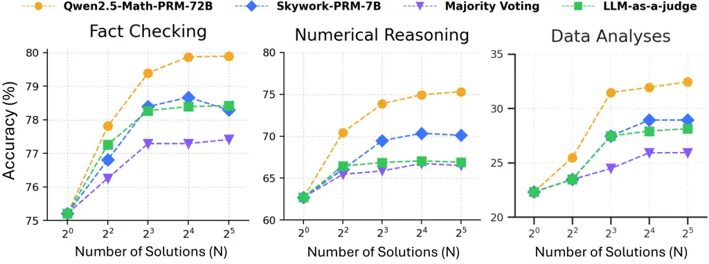
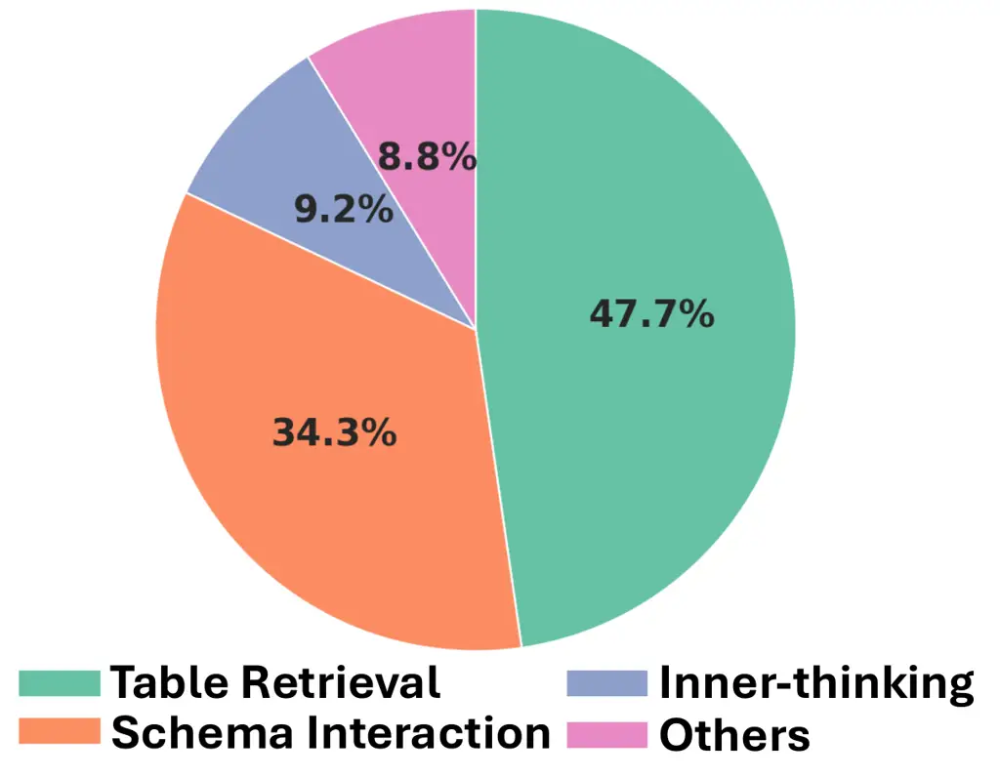
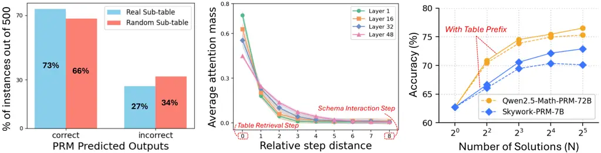
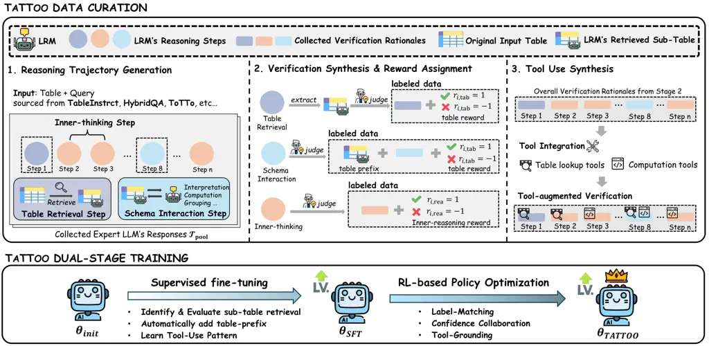
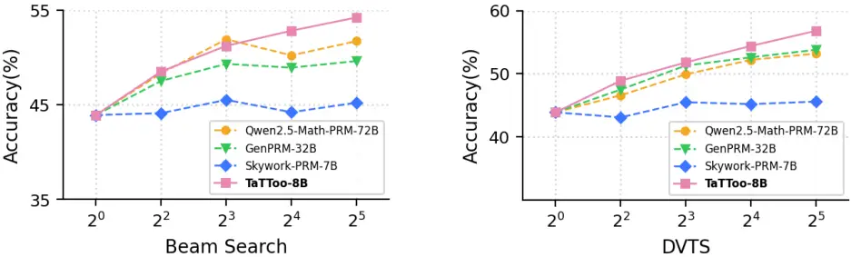
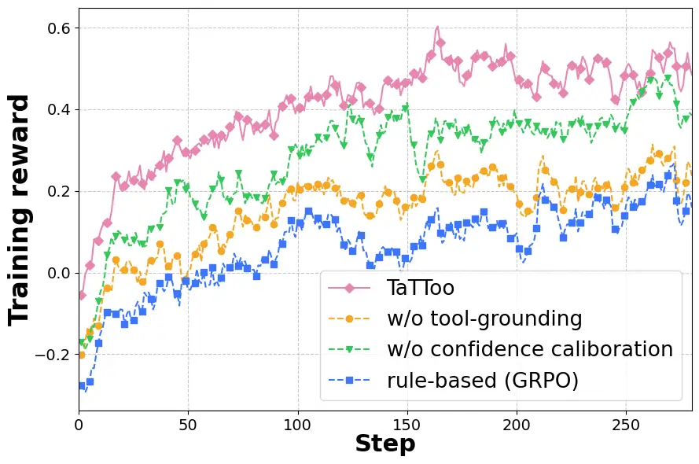
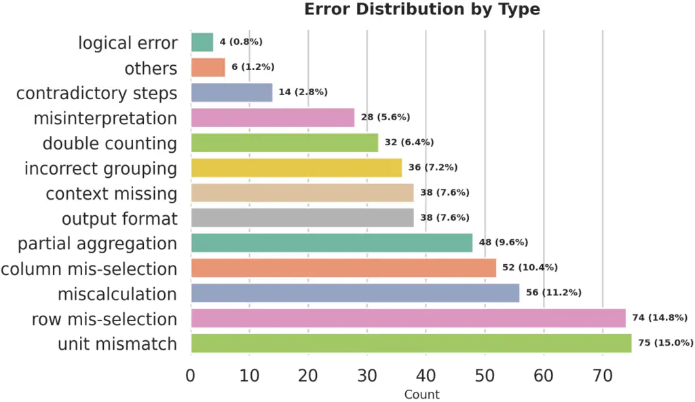
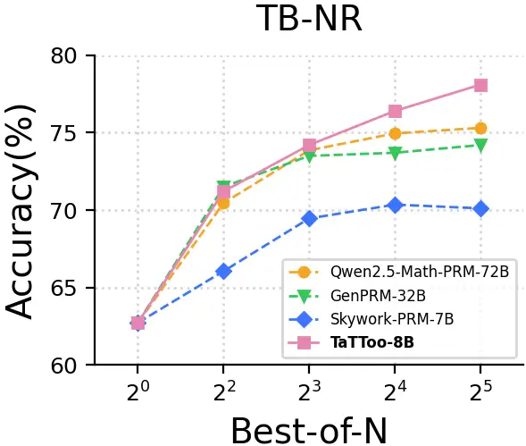

# TaTToo: Tool-Grounded Thinking PRM for Test-Time Scaling in Tabular Reasoning

Jiaru Zou ^(†)^(†)thanks: Contact:
[jiaruz2@illinois.edu](mailto:jiaruz2@illinois.edu) Affiliation: UIUC
Affiliation: Amazon    Soumya Roy Affiliation: Amazon    Vinay Kumar
Verma Affiliation: Amazon    Ziyi Wang Affiliation: Purdue University   
David Wipf Affiliation: Amazon    Pan Lu Affiliation: Stanford
University    Sumit Negi Affiliation: Amazon    James Zou Affiliation:
Stanford University    Jingrui He Affiliation: UIUC

###### Abstract

Process Reward Models (PRMs) have recently emerged as a powerful
framework for enhancing the reasoning capabilities of large reasoning
models (LRMs), particularly in the context of test-time scaling (TTS).
However, their potential for supervising LRMs on tabular reasoning
domains remains underexplored. Through detailed empirical analyses, we
identify that existing PRMs, though widely adopted for supervising
text-only reasoning steps, struggle with table-specific operations such
as sub-table retrieval and schema interaction, leading to critical
performance bottlenecks. To address this limitation, we propose TaTToo,
a novel table-grounded PRM framework that (i) reasons explicitly over
tabular reasoning steps and (ii) integrates tool-based verification to
provide precise reward supervision. Concretely, we first design a
scalable data curation pipeline that constructs over 60k high-quality
step-level annotations by integrating table verification rationales with
tool-based executions. Building on the collected data, we train TaTToo
with a dual-stage paradigm: cold-start supervised fine-tuning to capture
tool-use reasoning patterns, followed by reinforcement learning with
tool-grounded reward shaping to align our model with table-based
verification. We provide a comprehensive evaluation of the policy
improvement induced by our newly designed PRM. Across 5 challenging
tabular reasoning benchmarks covering numerical reasoning,
fact-checking, and data analysis, TaTToo improves downstream policy LRMs
by 30.9% at inference, surpasses strong PRM baselines such as
Qwen-2.5-Math-PRM-72B with only 8B parameters, and demonstrates strong
generalizability across diverse TTS strategies.

|     |
| --- |
|     |

## 1 Introduction

Tabular reasoning has become a fundamental capability for emerging large
reasoning models (LRMs) across various real-world applications,
including numerical analysis (Akhtar et al., 2023; Sui et al., 2024),
fact-checking (Chen et al., 2019; Parikh et al., 2020), and question
answering (Vakulenko and Savenkov, 2017; Li et al., 2023a). Unlike
free-form text, tables encode information in rows and columns with an
implicit relational semi-structure. Effective reasoning over tables
therefore requires both accurate interpretation of tabular content and
step-by-step logical inference to produce precise answers (Wang et al.,
2024c; Zhang et al., 2025a). To support such multi-step reasoning,
recent studies such as Table-R1 series (Wu et al., 2025b; Yang et al.,
2025b; Jin et al., 2025) have incorporated reinforcement learning (RL)
techniques (Schulman et al., 2017; Shao et al., 2024) to better align
LRMs with the demands of complex table understanding and reasoning.

On the other hand, process reward models (PRMs) (Setlur et al., 2024;
Wang et al., 2024b; Yang et al., 2024) have been developed to provide
step-level supervision over model reasoning trajectories during
test-time scaling (TTS), offering fine-grained verification that
enhances LRMs’ performance at inference. However, despite growing
computational budgets and increasing emphasis on advancing LRMs’ tabular
reasoning abilities (Ye et al., 2025; Muennighoff et al., 2025), a
corresponding step-level PRM to supervise the reasoning quality of these
models in table domains is equally important but remains notably absent.
This gap motivates our study of a fundamental question:


To investigate this question, we first revisit several general-domain
advanced PRMs and evaluate their effectiveness in supervising
table-involved reasoning steps generated by LRMs. Our analysis reveals
that existing PRMs struggle to reliably verify two critical types of
tabular CoT steps: ① Table Retrieval, where PRMs fail to supervise
whether LRMs extract the correct sub-region of the input table relevant
to the query; and ② Schema Interaction, where PRMs cannot detect
attention collapse (Dong et al., 2021), as LRMs often overlook
long-range table dependencies due to inherent locality bias. Beyond
challenges arising from the tabular input modality, we also observe that
current PRMs frequently introduce supervision errors within their own
evaluation process, stemming from inaccurate table lookups or failed
operations on tables. These shortcomings amplify bias and noise during
TTS, ultimately creating persistent performance bottlenecks.

Motivated by our preliminary analyses, we propose TaTToo, a new Table
Thinking PRM with Tool integration abilities to provide more reliable
and precise supervision for tabular reasoning. Distinct from prior PRMs
that provide weak supervision over table-specific operations, TaTToo
provides step-level supervision tailored to different input steps,
applying both table-grounded rewards for tabular operation steps and
inner-reasoning rewards for text-based reasoning steps. In addition,
TaTToo can leverage several external tools to interact with table
contents, execute code-based operations, and incorporate the results
back into the step-by-step verification process. To build TaTToo, we
first design a scalable data curation pipeline that yields over 60k
high-quality supervision instances by integrating expert verification
rationales with tool-based executions. We then train our PRM under a
dual-stage paradigm: supervised fine-tuning to capture step-level
tool-use reasoning patterns, followed by reinforcement learning with a
newly designed reward shaping scheme to encourage effective tool
manipulation and faithful reasoning for accurate verification. Finally,
we provide theoretical intuition on the policy improvement induced by
incorporating TaTToo during inference.

To demonstrate the effectiveness of TaTToo, we conduct extensive
experiments on five challenging tabular reasoning benchmarks, covering
table-based question answering, numerical reasoning, fact-checking, and
data analysis. Across all benchmarks, incorporating 8B-size TaTToo
improves downstream policy models by 30.9%. In addition, TaTToo
consistently outperforms strong PRM baselines such as
Qwen-2.5-Math-PRM-72B (Zhang et al., 2025b) and GenPRM-32B (Zhao et al., 2025) with up to 9x parameter efficiency. In-depth analyses further
demonstrate that incorporating our dual-stage training paradigm yields a
10.2% improvement over standard PRM training, and TaTToo exhibits strong
generalizability across diverse TTS strategies, including Beam Search
and DVTS.

## 2 Preliminary

Table Understanding with LRMs. We denote $`T=(H,R)`$ as a
semi-structured table, where $`H`$ is the set of column headers defining
the schema-level semantics, and $`R`$ is the set of rows, with each row
composed of cell entries aligned with $`H`$. Given a table $`T`$ and an
associated natural language query $`q`$, we define a reasoning model as
a conditional generation policy $`\pi(\tau\mid T,q),`$ where
$`\tau=\{a_{1},\dots,a_{L}\}`$. Here, $`\tau`$ denotes the reasoning
model’s generated reasoning trajectory, including both intermediate
reasoning steps $`\{a_{i}\}^{L-1}_{i=1}`$ and the final answer
$`a_{L}`$. In our problem setup, the intermediate reasoning steps
consist of both model inner-thinking reasoning traces and
tool-integrated programs that operate directly on the table to retrieve
or compute intermediate results. The final answer can take different
formats depending on the query type, including textual or numerical
values, boolean outputs (e.g., True/False), or executable programs
(e.g., Python, SQL).

Reward Modeling for Tabular Reasoning. Given a table $`T`$, a query
$`q`$, and a candidate response $`\tau`$ generated by a policy LRM, a
standard step-level verifier (i.e., PRM) parameterized by $`\theta`$
computes a scoring function $`\mathcal{R}_{\theta}(\cdot)`$ that assigns
step-level rewards $`r_{i}`$ evaluating the correctness of each step
$`a_{i}\in\tau`$. The trajectory-level reward $`r_{\tau}`$ for each
response $`\tau`$ is then obtained by aggregating these step-level
rewards. Formally, we have:

```math
r_{i}=\mathcal{R}_{\theta}(a_{i}\mid T,q,\tau_{<i}),\quad\text{with }r_{\tau}=\mathcal{A}(r_{1},r_{2},\cdots,r_{L}), \tag{1}
```

where $`\mathcal{A}(\cdot)`$ denotes an aggregation function such as
Mean and Sum (Liu et al., 2025). The rewards provided by the PRM
$`\mathcal{R}_{\theta}`$ can be further leveraged by a test-time compute
strategy $`\phi`$ (e.g., Best-of-N (Brown et al., 2024), Beam Search
(Snell et al., 2024)) to guide resampling, refinement, and candidate
selection among the responses generated by the policy model.

## 3 Why Table Reasoning Requires Verifiers Beyond Current PRMs?



Figure 1: Best-of-N performance of DeepSeek-R1-Distill-Qwen-14B across 3
table tasks on TableBench with different types of step verifiers.



Figure 2: Error Distribution over 4 step categories across 500 incorrect
cases after Best-of-N selection.

We begin by revisiting existing general-domain PRM methods to assess
their effectiveness in supervising LRMs on tabular reasoning tasks and
to identify potential performance bottlenecks. To this end, we conduct a
pilot study guided by two key questions:


For brevity, we defer detailed experimental setups to Appendix E. To
investigate RQ1, we evaluate various step-level verification methods,
including two advanced PRMs (Qwen2.5-Math-PRM-72B (Zhang et al., 2025b)
and Skywork-PRM-7B (He et al., 2024a)), majority voting (Liu et al.,
2025), and LLM-as-a-judge (Zheng et al., 2023) with the Best-of-N TTS
strategy. We choose DeepSeek-R1-Distill-Qwen-14B (Guo et al., 2025) as
the common LRM and evaluate on TableBench (Wu et al., 2024), which
includes three fundamental table tasks (Fact Checking, Numerical
Reasoning, and Data Analysis). As shown in Figure 2, we observe that for
small values of $`N`$, incorporating step-level verifiers into
Best-of-$`N`$ generally improves LRM’s performance over single-shot
generation, with PRMs providing the largest gains. However, once the
number surpasses a threshold ($`N\geq 8`$), accuracy across all three
table tasks converges to a bottleneck. For example, the performance of
Qwen2.5-Math-PRM-72B on fact-checking is 79.19%, 79.82%, and 79.84% for
$`N=\{8,16,32\}`$, indicating that further increases in $`N`$ yield
negligible gains, even though with PRM incorporation.


[TABLE]

Table 1: Representative error cases in 3 different reasoning step
categories. Each example highlights the erroneous model step in red, the
corresponding error description, and the PRM’s (mis)judgment reward,
illustrating where existing PRMs fail to detect mistakes.

Error Analysis. Building on the observation, we further investigate the
underlying causes of the performance bottleneck by conducting an error
analysis on LRM’s generation and PRM’s supervision processes.
Specifically, we sample 500 erroneous Best-of-N responses (N$`=32`$)
selected by the PRM from LRM outputs, and ask human experts to classify
them into 13 well-defined tabular error types (see Appendix B). We then
connect these errors with 4 reasoning-step categories reflecting the
typical flow of LRMs’ reasoning process: (i) Table Retrieval Steps,
locating relevant rows/columns regarding the input query; (ii) Schema
Interaction Steps, reasoning over the retrieved table contents, (iii)
Inner-thinking Steps, models’ inner reasoning independent of table
contents, and (iv) Others, initial setup or final output steps that are
irrelevant to core reasoning process. Figure 2 presents the error
distribution across 4 reasoning step categories. We find that most
errors arise in Table Retrieval (47.7%) and Schema Interaction (34.3%),
implying that PRMs perform reasonably well on independent reasoning but
fall short when reasoning steps involve table-specific operations. For
better demonstration, we provide representative examples for each
category in Table 1.

Why do PRMs fail on table-involved reasoning steps? Next, we take a
closer look at why PRMs lose their supervisory effectiveness when
reasoning steps involve table operations. For Table Retrieval Steps, we
conduct a contrastive experiment focusing particularly on the table
contents retrieved by LRMs within their responses. We randomly sampled
500 responses and constructed two variants by (i) retaining the original
LRM-retrieved sub-table, and (ii) replacing it with a randomly selected
sub-table region from the original input table. Figure 3 (left) shows
the output rewards of Qwen2.5-Math-PRM-72B on both variants. The nearly
identical distributions between real and random sub-tables indicate that
current PRMs fail to distinguish retrieval correctness, suggesting that
they are unable to assess whether the LRMs’ retrieved portion of the
table corresponds to the query.




Figure 3: Left: PRM’s rewards on 500 reasoning steps with the
real-retrieved/randomly-replaced sub-table. Middle: Layer-wise average
attention mass vs. relative step distance in tabular reasoning.
Attention concentrates on nearby steps, with sharp decay as distance
increases. Right: Best-of-N results on DeepSeek-R1-Distill-Qwen-14B for
numerical reasoning with/without the table prefix.

For Schema Interaction Steps, we found in prior experiments that in the
logic flow of LRMs’ trajectories, table retrieval steps typically occur
at the beginning, as the model must first extract relevant information
from the table to answer the query. In contrast, schema interaction
steps frequently occur far sentences from the beginning table retrieval
steps, since LRMs tend to perform intermediate reasoning before
revisiting their retrieved contents when needed. Figure 3 (middle)
illustrates the attention distribution of the LRM between the schema
interaction step (step 8) and the table retrieval step (step 0). Due to
the auto-regressive nature of LRMs, the schema interaction step attends
primarily to nearby steps while assigning little attention to the
earlier retrieval step. This inherent locality bias causes the model to
frequently misinterpret or discard previously retrieved contents, even
when the retrieval step has already extracted the correct information.
Moreover, current PRMs fail to supervise such misinterpretations, as
their evaluations are highly localized to the current step rather than
capturing dependencies on distant prior steps (Zou et al., 2025b; Feng
et al., 2025c).


Table Prefix is the Key. To explore potential solutions to the
limitation above, we begin with a simple input modification for PRMs:
prepending the retrieved table contents as a prefix to each schema
interaction step. This grants PRMs direct access to the retrieval
context, alleviating the need for long-range dependencies. We evaluate
this modification and report the results in Figure 3 (right).
Incorporating the table prefix indeed improves PRM supervision and leads
to stronger downstream LRM performance. However, directly applying the
prefix remains challenging, as current PRMs cannot automatically
identify schema interaction steps, and the table prefixes obtained from
LRMs are not guaranteed to be correct without proper supervision.

Motivation for TaTToo. Our analyses above highlight the need for a
principled step-level verifier capable of providing robust supervision
over both table-grounded operations and models’ inner reasoning.
Motivated by this, we propose a new process reward model specifically
designed to support LRMs in tabular reasoning.

## 4 Building a Table-Grounded Step Verifier

We introduce TaTToo, a generative PRM that provides reward supervision
over both table operations and model inner thinking steps. Our method
builds on two key components: (i) a large-scale data curation pipeline
that synthesizes reasoning and tool usage for PRM training, and (ii) a
dual-stage training paradigm that learns step-level verification with
tool use optimization.

### 4.1 Table-Aware and Tool-Integrated Supervision

Table-Aware Reward. To align with the LRM’s reasoning process on table
tasks, we separate the supervision of table operations from model’s
inner reasoning part and decompose TaTToo’s step-level reward (Eq. 1)
into two components:

```math
r_{i}=\begin{cases}r_{i,\text{rea}},\text{ if }a_{i}\in\text{inner-thinking,}\\
r_{i,\text{tab}},\text{ if }a_{i}\in\text{table retrieval or schema interaction,}\\
\end{cases}\text{and }r_{\tau}=\frac{1}{L}\sum_{i=1}^{L}r_{i}, \tag{2}
```

where $`r_{i,\text{rea}}`$ captures the correctness of the model
inner-reasoning process, $`r_{i,\text{tab}}`$ reflects the accuracy of
table-grounded operations, and $`r_{\tau}`$ denotes the trajectory-level
reward.

Tool Integration in Verification. A major limitation of current PRMs is
their inability to supervise table-involved reasoning steps (as shown in
Section 3). Meanwhile, recent studies (Feng et al., 2025a; Qian et al., 2025) have shown that LLM agents can autonomously use tools to interact
with external environments and iteratively refine their reasoning. In a
similar spirit to address current PRM’s limitation, we incorporate
several external table-oriented tools into TaTToo’s verification process
to enable more reliable step supervision. We next describe how we curate
a training set with tool-augmented, table-aware rewards and use it to
train TaTToo.

### 4.2 TaTToo Data Curation Pipline

We design a large-scale data curation pipeline that simulates real-world
scenarios of PRM tool use and step verification at scale. As illustrated
in Figure 4, there are three main stages:


Reasoning Trajectory Generation. We begin by collecting trajectory
responses from expert LRMs (e.g., DeepSeek-R1 (Guo et al., 2025) and
Claude-Opus-4.1 (Anthropic, 2025)) on table-based questions drawn from
diverse benchmarks, including TableInstruct (Wu et al., 2024), HybridQA
(Chen et al., 2020), ToTTo (Parikh et al., 2020), and WikiTQ (Pasupat
and Liang, 2015b). We generate multiple responses per query and apply
dual verification with human annotators and expert LLMs to filter out
low-quality data, yielding a high-quality trajectory pool
$`\mathcal{T}_{\text{pool}}`$ for subsequent labeling.


Verification Synthesis & Reward Assignment. We next provide step-level
verification rationales and reward labels for each candidate response in
$`\mathcal{T}_{\text{pool}}`$. (i) For table retrieval steps, we extract
the sub-table in each step and use LLM-as-a-judge to assess its
relevance to the query, assigning table reward
$`r_{i,\text{tab}}\in\{-1,1\}`$ based on retrieval correctness. (ii) For
schema interaction steps, we prepend the accurate sub-table as a table
prefix to each collected verification rationale (according to our
table-prefix analysis in Section 3) and assign
$`r_{i,\text{tab}}\in\{-1,1\}`$ based on the correctness of the specific
table-based operations or reasoning. (iii) For inner-thinking steps,
which involve no table contents, we apply LLM-as-a-judge and follow
established labeling strategies (Zhao et al., 2025; Khalifa et al., 2025) to assign $`r_{i,\text{rea}}\in\{-1,1\}`$ based on reasoning
quality.



Figure 4: Overview of TaTToo framework. We first curate 60k high-quality
instances by collecting expert verification rationales with tool
integration (Section 4.2). We then train our PRM through a dual-stage
training paradigm to achieve tool-grounded step-by-step reward
supervision (Section 4.3).


Tool Use Synthesis. To train TaTToo to leverage tools for more accurate
verification, we further augment the collected verification rationales
with tool invocations, execution results, and feedback at the step
level. Specifically, inside the rationale contents, we replace manual
reasoning for table lookups or calculations with the corresponding tool
call and its execution output. We primarily employ two types of table
tools: (i) Computation tools: code snippets (e.g., Python, SQL) for
arithmetic and aggregation over table inputs; (ii) Table Lookup tools:
DataFrame APIs (e.g., Polars) or Lookup Utilities (e.g., CSV/Excel
readers) for retrieving specific rows, columns, or cells during
verification.

Finally, we construct over 60k high-quality training instances with
complete verification rationales and step-level rewards. This dataset is
then used to train TaTToo to integrate tool use with reasoning for
robust step supervision. We leave additional data curation details in
Appendix C.

### 4.3 Tool-Grounded Dual-Stage Training

With the training data recipe in place, we train TaTToo via a dual-stage
paradigm: supervised fine-tuning to capture tool-integrated verification
patterns, followed by RL-based policy optimization with a newly designed
reward shaping scheme to further refine our PRM’s step-level rationales
and ensure accurate verification.

Table-Aware Verification with Tools via SFT. We first finetune our PRM
$`\mathcal{R}_{\theta}`$ on the curated dataset (Section 4.2).
Specifically, given a training instance $`(T,q,\tau)`$ consisting of a
table $`T`$, a query $`q`$, and an LRM-generated trajectory
$`\tau=(a_{1},\dots,a_{L})`$, we train the PRM to output, for each step
$`a_{i}\in\tau`$, a verification rationale $`v_{i}`$ together with its
corresponding step-level reward $`r_{i}`$. By formulating PRM training
as language modeling, $`\mathcal{R}_{\theta}`$ is optimized
auto-regressively to (i) identify accurate sub-table regions, (ii) learn
to dynamically incorporate the retrieved table prefix into each schema
interaction step, and (iii) generate verification rationales with
tool-integration patterns.

Tool-Grounded Reward Shaping in RL. Prior generative PRM approaches (Liu
et al., 2025; Khalifa et al., 2025; Zhao et al., 2025) typically
conclude PRM training after the SFT stage. In contrast, we draw
inspiration from recent advances in agentic RL (Jaech et al., 2024; Guo
et al., 2025) and further apply policy optimization to more tightly
align the PRM’s verification process with effective tool utilization.
Specifically, we optimize $`\mathcal{R}_{\theta}`$ with a modified GRPO
(Shao et al., 2024) by providing dense, tool-grounded supervision
signals during policy optimization. During RL rollouts of each training
instance $`(T,q,\tau)`$, we replace the original rule-based GRPO
supervision signal with a denser per-step reward signal $`s_{i}`$,
defined as:

```math
s_{i}\;=\;\underbrace{\mathbbm{1}\{\hat{r}_{i}=r_{i}\}}_{\text{{label-matching}}}\;-\;\underbrace{\lambda_{\mathrm{cal}}\Big(-\log\mathcal{R}_{\theta}(r_{i}\mid T,q,\tau)\Big)}_{\text{{confidence calibration}}}\;+\;\underbrace{\lambda_{\mathrm{tool}}\cdot\mathrm{support}(\hat{v}_{i})}_{\text{{tool-grounding}}}, \tag{3}
```

where $`\hat{r}_{i}`$ is the PRM’s predicted step-reward and $`r_{i}`$
is the ground-truth step-reward for the input step $`a_{i}\in\tau`$;
$`\hat{v}_{i}`$ denotes the verification rationale generated by the PRM
at step $`i`$, and $`\mathrm{support}(\hat{v}_{i})\in\{0,1\}`$ measures
whether the rationale correctly incorporates tool outputs; and
$`\lambda_{\mathrm{cal}}`$, $`\lambda_{\mathrm{tool}}`$ are tunable
coefficients. Besides enforcing correctness with the label-matching
term, the confidence calibration term stabilizes training by encouraging
higher probability on the ground-truth label, and the tool-grounding
term encourages rationales that effectively incorporate tool outputs. We
then aggregate the per-step signals $`s_{i}`$ into a trajectory-level
training reward, normalize it within each sampled group to compute
group-relative advantages, and update the PRM $`\mathcal{R}_{\theta}`$
under the GRPO objective.

### 4.4 Inference-time Policy Improvement – An Intuitive View

To intuitively elucidate the role of TaTToo and its table-aware rewards
on LRM’s tabular reasoning process (Eq. 2), we provide a theoretical
analysis on the policy improvement induced by TaTToo.

Recall that the goal of our PRM is to improve the generated trajectory
$`\tau`$ sampled from a policy LRM $`\pi`$, i.e.,
$`\tau\sim\pi(\cdot\mid T,q)`$. By combining the input table and query,
we represent $`(T,q,a_{1},\dots,a_{i-1})`$ as the current state
$`\mathbf{s}_{i}`$. At step $`i`$, the policy LRM $`\pi`$ samples an
action $`a_{i}\sim\pi(\cdot\mid\mathbf{s}_{i})`$. We define the
$`Q`$-value of policy $`\pi`$ as the expected future success, measured
by the final answer $`a_{L}`$ correctness, i.e.,

```math
Q^{\pi}(\mathbf{s}_{i},a_{i})=Q^{\pi}\big((T,q,a_{1},\dots,a_{i-1}),a_{i}\big)=\mathbb{E}_{a_{i+1},\dots,a_{L}\sim\pi(\cdot\mid\mathbf{s}_{i})}\left[\mathbbm{1}_{a_{L}\text{is correct}}\right]. \tag{4}
```

The value of policy $`\pi`$ at state $`\mathbf{s}_{i}`$ is defined as
the expectation of $`Q`$-values under $`\pi`$’s next action
distribution:
$`V^{\pi}(\mathbf{s}_{i})=\mathbb{E}_{a_{i}\sim\pi(\cdot\mid\mathbf{s}_{i})}[Q^{\pi}(\mathbf{s}_{i},a_{i})]`$.
We now analyze the policy improvement afforded by TaTToo’s table-aware
reward $`r_{i}`$ supervision under one step of a natural policy gradient
updating.

###### Theorem 4.1 (Policy Improvement (Lower Bound)).

Given the current policy $`\pi`$, after one natural policy gradient
update step guided by the PRM reward $`r_{i}`$ defined in Eq.2, we
obtain the revised policy
$`\pi^{\prime}(a_{i}\mid\mathbf{s}_{i})\propto\exp(Q^{\pi}(\mathbf{s}_{i},a_{i})+r_{i}(\mathbf{s}_{i},a_{i}))`$.
The resulting expected policy improvement over the state distribution
$`\rho`$ then satisfies:

```math
\displaystyle\mathbb{E}_{\mathbf{s}_{i}\sim\rho}\left[V^{\pi^{\prime}}(\mathbf{s}_{i})-V^{\pi}(\mathbf{s}_{i})\right]\gtrsim\underbrace{\mathbb{E}_{\mathbf{s}_{i}\sim\rho}\mathrm{Var}_{a_{i}\sim\pi(\cdot\mid\mathbf{s}_{i})}\left[r_{i,\text{tab}}(\mathbf{s}_{i},a_{i})\right]}_{\textbf{{\color[rgb]{1,0.4,0.4}distinguishability from table reward $r_{i,\text{tab}}$}}}+\underbrace{\mathbb{E}_{\mathbf{s}_{i}\sim\rho}\mathrm{Var}_{a_{i}\sim\pi(\cdot\mid\mathbf{s}_{i})}\left[r_{i,\text{rea}}(\mathbf{s}_{i},a_{i})\right]}_{\textbf{distinguishability from inner-reasoning reward $r_{i,\text{rea}}$}}
```

```math
\displaystyle+\underbrace{\mathbb{E}_{\mathbf{s}_{i}\sim\rho}\mathbb{E}_{a_{i}\sim\pi(\cdot\mid\mathbf{s}_{i})}\left[r_{i,\text{tab}}(\mathbf{s}_{i},a_{i})A^{\pi}(\mathbf{s}_{i},a_{i})\right]}_{\textbf{{\color[rgb]{1,0.4,0.4}alignment between $r_{i,\text{tab}}$ and $A^{\pi}$}}}+\underbrace{\mathbb{E}_{\mathbf{s}_{i}\sim\rho}\mathbb{E}_{a_{i}\sim\pi(\cdot\mid\mathbf{s}_{i})}\left[r_{i,\text{rea}}(\mathbf{s}_{i},a_{i})A^{\pi}(\mathbf{s}_{i},a_{i})\right]}_{\textbf{alignment between $r_{i,\text{rea}}$ and $A^{\pi}$}}, \tag{5}
```

where
$`A^{\pi}(\mathbf{s}_{i},a_{i})=Q^{\pi}(\mathbf{s}_{i},a_{i})-V^{\pi}(\mathbf{s}_{i})`$
denotes the advantage of policy $`\pi`$.

Theorem 4.1 (proof in Appendix D) explains that our decomposable reward
design $`r_{i}`$ enables each component to additively contribute to
policy improvement, provided that the reward components are each
individually aligned with the policy advantage function. In this way,
the table-aware rewards provided by TaTToo help ensure targeted
supervision on both inner reasoning and table-involved operations
generated by LRMs. Below, we further empirically evaluate the
effectiveness of TaTToo across various downstream tabular reasoning
tasks.

## 5 Empirical Evaluations

Baselines and Models. We compare TaTToo against various types of
step-level verification methods, including advanced PRMs, majority
voting (Liu et al., 2025), and LLM-as-a-judge (Zheng et al., 2023). The
setups for these baselines are aligned with our preliminary analyses in
Section 3. For PRM approaches, we include both discriminative (Qwen-PRM
series (Zhang et al., 2025b), Math-Shepherd-PRM (Wang et al., 2024b),
and Skywork-PRM (He et al., 2024a)) and generative (ThinkPRM (Khalifa et
al., 2025) and GenPRM (Zhao et al., 2025)). Regarding the policy
reasoning models, we evaluate our proposed method on
DeepSeek-R1-Distill-Qwen-14B (Guo et al., 2025). Further details on the
baselines and policy models setups are provided in Appendix E.1.

Datasets. We evaluate on four representative and challenging benchmarks
spanning diverse tabular reasoning tasks, including (i) TableBench (TB)
(Wu et al., 2024), a complex tabular reasoning benchmark with 886
questions covering tasks of numerical reasoning (NR), fact checking
(FC), and data analysis (DA). (ii) WTQ (Pasupat and Liang, 2015b), a
benchmark for complex question answering over Wikipedia tables. (iii)
MMQA (Wu et al., 2025a), a multi-table understanding benchmark covering
table retrieval, multi-hop & multi-table QA and text-to-SQL generation.
We leave the additional dataset descriptions in Appendix E.2.

Implementation Details. We train TaTToo on the off-the-shelf Qwen-3-8B
model (Yang et al., 2025a) using our 60k curated training instances
(Section 4.2). All training and inference experiments are conducted on
8×A100-80G GPUs. To evaluate TaTToo under different TTS strategies, we
adopt three representative methods, including Best-of-N (Brown et al.,
2024), Beam Search (Snell et al., 2024), and Diverse Verifier Tree
Search (DVTS) (Beeching et al., 2024). Additional implementation details
on training setup and configurations of TaTToo are provided in Appendix
E.3.

|                      |        |       |      |      |      |       |      |      |      |       |      |      |      |      |      |      |      |      |      |      |      |
| -------------------- | ------ | ----- | ---- | ---- | ---- | ----- | ---- | ---- | ---- | ----- | ---- | ---- | ---- | ---- | ---- | ---- | ---- | ---- | ---- | ---- | ---- |
| Verifer (Best-of-N)  | Params | TB-NR |      |      |      | TB-FC |      |      |      | TB-DA |      |      |      | WTQ  |      |      |      | MMQA |      |      |      |
|                      |        | 4     | 8    | 16   | 32   | 4     | 8    | 16   | 32   | 4     | 8    | 16   | 32   | 4    | 8    | 16   | 32   | 4    | 8    | 16   | 32   |
| Majority Vote        | \-     | 65.5  | 65.9 | 66.8 | 66.5 | 76.2  | 77.3 | 77.3 | 77.4 | 23.5  | 24.5 | 26.0 | 26.1 | 64.7 | 65.3 | 67.3 | 67.0 | 18.4 | 19.4 | 20.4 | 20.1 |
| LLM-as-a-judge       | \-     | 66.7  | 66.9 | 67.1 | 66.9 | 77.2  | 78.3 | 78.4 | 78.6 | 23.5  | 27.4 | 28.0 | 28.4 | 65.2 | 66.4 | 68.1 | 68.1 | 19.6 | 21.3 | 22.5 | 22.7 |
| Skywork-PRM-7B       | 7B     | 66.1  | 69.5 | 70.3 | 70.1 | 76.8  | 78.4 | 78.6 | 78.3 | 24.1  | 27.5 | 28.9 | 29.1 | 65.9 | 67.5 | 68.4 | 68.6 | 21.4 | 24.6 | 25.1 | 25.3 |
| Math-Shepherd-PRM-7B | 7B     | 67.2  | 70.6 | 71.5 | 71.8 | 76.2  | 76.9 | 76.8 | 77.1 | 22.7  | 24.8 | 26.4 | 25.9 | 66.8 | 68.7 | 69.6 | 69.3 | 22.0 | 25.2 | 25.9 | 26.1 |
| Qwen2.5-Math-PRM-7B  | 7B     | 66.9  | 70.1 | 71.7 | 72.5 | 75.4  | 77.2 | 77.9 | 77.4 | 23.2  | 25.4 | 26.3 | 26.6 | 65.2 | 68.5 | 69.6 | 69.7 | 23.5 | 25.2 | 27.1 | 27.3 |
| ThinkPRM             | 14B    | 69.2  | 70.7 | 73.5 | 73.8 | 75.8  | 75.4 | 76.3 | 76.9 | 21.6  | 22.7 | 23.1 | 22.8 | 64.3 | 66.1 | 65.7 | 65.9 | 22.4 | 22.7 | 23.6 | 23.0 |
| GenPRM               | 32B    | 71.5  | 73.5 | 73.7 | 74.2 | 76.3  | 78.5 | 79.2 | 79.4 | 25.3  | 27.9 | 30.2 | 30.7 | 69.8 | 72.5 | 73.3 | 73.1 | 23.8 | 25.4 | 26.2 | 26.4 |
| Qwen2.5-Math-PRM-72B | 72B    | 70.4  | 73.8 | 74.9 | 75.3 | 77.8  | 79.2 | 79.8 | 79.8 | 25.5  | 31.5 | 32.0 | 32.4 | 69.2 | 71.8 | 73.0 | 72.6 | 24.4 | 26.8 | 28.7 | 28.6 |
| TaTToo               | 8B     | 71.2  | 74.2 | 76.4 | 78.1 | 77.4  | 79.6 | 81.2 | 82.0 | 27.7  | 31.9 | 33.6 | 34.3 | 69.8 | 72.3 | 73.5 | 74.9 | 25.1 | 27.2 | 29.1 | 30.5 |

Table 2: Main results of TaTToo on 5 different tabular reasoning tasks.
We report the best-of-N (with $`N=\{4,8,16,32\}`$) performance using
DeepSeek-R1-Distill-Qwen-14B as the policy model and compare against
various step verifiers. The best and second-best results are
highlighted. TaTToo consistently achieves state-of-the-art TTS
performance with significantly fewer parameters.

### 5.1 Main Results

Table 2 reports the Best-of-N performance of incorporating TaTToo on the
DeepSeek-R1-Distill-Qwen-14B model across five tabular reasoning tasks.
Notably, TaTToo consistently outperforms strong baselines such as
GenPRM-32B and Qwen2.5-Math-PRM-72B despite using only 8B parameters. On
TB-DA, TaTToo achieves the largest accruacy performance across each
level of N, rising from 27.7% at N$`{=}4`$ to 34.3% at N$`{=}32`$.
Moreover, while existing PRMs often suffer from performance bottlenecks
beyond a certain response threshold (as observed in Section 3), TaTToo
continues to scale effectively, yielding consistent gains as the
response group size increases. For example, on TB-NR,
Qwen2.5-Math-PRM-72B saturates after N$`{=}16`$ (74.9% $`\rightarrow`$
75.3%), whereas TaTToo continues to improve from 74.2% at N$`{=}8`$ to
78.1% at N$`{=}32`$. These results demonstrate that TaTToo provides
stronger reward supervision on LRMs’ reasoning trajectories, therefore
yielding better performance improvement compared with other
step-verification baselines.



Figure 5: Performance of TaTToo on two additional TTS strategies, Beam
Search and Diverse Verifier Tree Search (DVTS). We report the average
accuracy across all 5 tabular reasoning tasks.

Generalizability on Other TTS Strategies. Beyond best-of-$`N`$, we also
evaluate TaTToo under two additional TTS strategies (Beam Search and
DVTS) and compare with the strongest PRM baselines. Figure 5 reports the
average performance across the five tabular reasoning tasks. Under each
TTS strategy, TaTToo consistently yields steady improvements as the
number of responses N increases, whereas other baseline PRMs often
plateau. For example, in beam search, TaTToo improves from 45.0% to
54.8%, while GenPRM saturates around 51% and Skywork-PRM remains below
46%. These results highlight the strong generalizability of TaTToo
across diverse TTS strategies.

### 5.2 In-depth Analyses on TaTToo

Mastery of RL with Bootstrapping from SFT. To examine the respective
roles of SFT and RL in TaTToo’s dual-stage training paradigm, we compare
against a variant TaTToo (SFT only), which is trained solely on the
first SFT stage. As shown in Table 3, under the Best-of-N evaluation,
the second-stage RL policy optimization consistently improves
performance over the SFT-only initialization. Specifically, we observe
that the average accuracy across all three tasks improves from 72.3%
(SFT only) to 78.5% after RL training, yielding a total gain of 10.2%.
This demonstrates that bootstrapping from SFT provides a solid
initialization, while RL optimization further enhances our PRM’s
reasoning and tool-use effectiveness during the verification process.

|                             |       |      |      |      |       |      |      |      |       |      |      |      |
| --------------------------- | ----- | ---- | ---- | ---- | ----- | ---- | ---- | ---- | ----- | ---- | ---- | ---- |
| Training Variants           | TB-NR |      |      |      | TB-FC |      |      |      | TB-DA |      |      |      |
|                             | 4     | 8    | 16   | 32   | 4     | 8    | 16   | 32   | 4     | 8    | 16   | 32   |
| TaTToo (SFT only)           | 67.9  | 69.1 | 72.0 | 73.7 | 71.5  | 73.0 | 74.6 | 75.2 | 23.3  | 25.6 | 26.2 | 26.4 |
| TaTToo                      | 71.2  | 74.2 | 76.4 | 78.1 | 77.4  | 79.6 | 81.2 | 82.0 | 27.7  | 31.9 | 33.6 | 34.3 |
| w/o tool-grounding          | 68.5  | 71.1 | 72.7 | 74.6 | 73.2  | 75.6 | 75.5 | 76.3 | 26.2  | 28.1 | 28.7 | 30.3 |
| w/o confidence caliboration | 71.1  | 73.7 | 74.3 | 76.2 | 76.4  | 76.7 | 78.4 | 80.5 | 27.4  | 29.5 | 31.3 | 33.2 |
| rule-based (GRPO)           | 67.0  | 68.4 | 70.4 | 73.1 | 71.6  | 74.0 | 74.9 | 75.8 | 25.5  | 27.4 | 28.0 | 28.6 |

Table 3: In-depth analysis of TaTToo on three table datasets. We
evaluate the contributions of SFT and RL training stages, and assess the
impact of reward shaping components during RL optimization.



Figure 6: Training dynamics of TaTToo and ablated variants. We report
the training reward across 280 training steps.

Reward Shaping during RL Training. Next, we analyze the effectiveness of
each supervised component in our per-step reward signal $`s_{i}`$ design
(Eq. 3), with the ablation results reported in Table 3. Removing the
tool-grounding term yields the largest drop (e.g., $`\downarrow`$4.0% on
TB-DA at N$`{=}32`$), highlighting its critical role in encouraging
effective tool use during RL training. In addition, excluding confidence
calibration reduces performance by 1.6% on average, showing its
complementary effect in stabilizing reward signals. We also compare
TaTToo with the original rule-based group-relative reward from GRPO,
which yields only marginal improvement over SFT. Finally, Figure 6
visualizes the training dynamics of TaTToo and other variants during RL
optimization.

Additional Experiments. Additional experiments on TaTToo including
ablations on the training coefficients and case studies are provided in
Appendix F.

## 6 Related Works

Reasoning over tables poses a unique challenge for LLMs, requiring them
to bridge natural language understanding with structured reasoning over
rows, columns, and cell values (Jin et al., 2022; Zhang et al., 2025a).
Recent works (Tang et al., 2020; Iida et al., 2021; Deng et al., 2022)
have investigated tabular reasoning on several downstream tasks,
including table QA (Pasupat and Liang, 2015b; Chen et al., 2020), table
fact verification (Chen et al., 2019; Parikh et al., 2020), text-to-SQL
(Mohammadjafari et al., 2024), etc. Early-stage tabular reasoning
methods, such as TAPAS (Herzig et al., 2020) and TaBERT (Yin et al.,
2020), encode table data into transformer-based encoder representations.
Later methods leverage the capabilities of LLMs to apply either prompt
engineering (Sui et al., 2023; Wang et al., 2024c) or supervised
fine-tuning techniques (Su et al., 2024; Zhang et al., 2023) for
enhanced tabular reasoning. More recent works, including the Table-R1
series (Wu et al., 2025b; Yang et al., 2025b; Jin et al., 2025) and
Reasoning-Table (Lei et al., 2025), leverage RL to acquire
higher-quality reasoning paths during reasoning over tables.

While these recent advances have focused on improving the generation
ability of models on tables, how to provide robust and verifiable reward
supervision for the lengthy and complex output trajectories generated by
the table-specific reasoning models remains largely unexplored (Zhang et
al., 2024b). This essential yet overlooked gap motivates us to develop
the first tool-use and thinking PRM, which is specifically designed for
enhancing test time scaling on tabular reasoning tasks. We leave
additional related works on Process Reward Models and Tool Integration
with RL in Appendix A.

## 7 Conclusion

We introduced TaTToo, a novel tool-augmented thinking PRM tailored for
tabular reasoning. By diagnosing why existing verifiers fail on table
retrieval and schema interaction, we built a scalable pipeline with
expert rationales, table prefixes, and tool-augmented verification, and
trained our model via SFT followed by RL with reward shaping. TaTToo
achieves comparable performance across five table benchmarks, surpassing
strong PRMs with up to 9× parameter efficiency and generalizing across
multiple TTS strategies. Our results underscore the importance of
table-grounded reward supervision and point toward future directions in
reward modeling for structured reasoning tasks.

## References

- Akhtar et al. (2023) Mubashara Akhtar, Abhilash Shankarampeta, Vivek
  Gupta, Arpit Patil, Oana Cocarascu, and Elena Simperl. Exploring the
  numerical reasoning capabilities of language models: A comprehensive
  analysis on tabular data. _arXiv preprint arXiv:2311.02216_, 2023.
- Anthropic (2025) Anthropic. Claude opus 4 and claude sonnet 4 system
  card. Technical report, Anthropic, 2025.
- Beeching et al. (2024) Edward Beeching, Lewis Tunstall, and Sasha
  Rush. Scaling test-time compute with open models, 2024. URL
  [https://huggingface.co/spaces/HuggingFaceH4/blogpost-scaling-test-time-compute](https://huggingface.co/spaces/HuggingFaceH4/blogpost-scaling-test-time-compute).
- Brown et al. (2024) Bradley Brown, Jordan Juravsky, Ryan Ehrlich,
  Ronald Clark, Quoc V. Le, Christopher Ré, and Azalia Mirhoseini. Large
  language monkeys: Scaling inference compute with repeated
  sampling, 2024. URL
  [https://arxiv.org/abs/2407.21787](https://arxiv.org/abs/2407.21787).
- Chen et al. (2019) Wenhu Chen, Hongmin Wang, Jianshu Chen, Yunkai
  Zhang, Hong Wang, Shiyang Li, Xiyou Zhou, and William Yang Wang.
  Tabfact: A large-scale dataset for table-based fact verification.
  _arXiv preprint arXiv:1909.02164_, 2019.
- Chen et al. (2020) Wenhu Chen, Hanwen Zha, Zhiyu Chen, Wenhan Xiong,
  Hong Wang, and William Wang. Hybridqa: A dataset of multi-hop question
  answering over tabular and textual data. _arXiv preprint
  arXiv:2004.07347_, 2020.
- Chen et al. (2025) Xiusi Chen, Gaotang Li, Ziqi Wang, Bowen Jin, Cheng
  Qian, Yu Wang, Hongru Wang, Yu Zhang, Denghui Zhang, Tong Zhang,
  Hanghang Tong, and Heng Ji. Rm-r1: Reward modeling as reasoning, 2025.
  URL
  [https://arxiv.org/abs/2505.02387](https://arxiv.org/abs/2505.02387).
- Cui et al. (2025) Ganqu Cui, Lifan Yuan, Zefan Wang, Hanbin Wang,
  Wendi Li, Bingxiang He, Yuchen Fan, Tianyu Yu, Qixin Xu, Weize Chen,
  et al. Process reinforcement through implicit rewards. _arXiv preprint
  arXiv:2502.01456_, 2025.
- Deng et al. (2022) Xiang Deng, Huan Sun, Alyssa Lees, You Wu, and Cong
  Yu. Turl: Table understanding through representation learning. _ACM
  SIGMOD Record_, 51(1):33–40, 2022.
- Dong et al. (2025) Guanting Dong, Hangyu Mao, Kai Ma, Licheng Bao,
  Yifei Chen, Zhongyuan Wang, Zhongxia Chen, Jiazhen Du, Huiyang Wang,
  Fuzheng Zhang, et al. Agentic reinforced policy optimization. _arXiv
  preprint arXiv:2507.19849_, 2025.
- Dong et al. (2021) Yihe Dong, Jean-Baptiste Cordonnier, and Andreas
  Loukas. Attention is not all you need: Pure attention loses rank
  doubly exponentially with depth. In _International conference on
  machine learning_, pages 2793–2803. PMLR, 2021.
- Feng et al. (2025a) Jiazhan Feng, Shijue Huang, Xingwei Qu, Ge Zhang,
  Yujia Qin, Baoquan Zhong, Chengquan Jiang, Jinxin Chi, and Wanjun
  Zhong. Retool: Reinforcement learning for strategic tool use in llms.
  _arXiv preprint arXiv:2504.11536_, 2025a.
- Feng et al. (2025b) Jiazhan Feng, Shijue Huang, Xingwei Qu, Ge Zhang,
  Yujia Qin, Baoquan Zhong, Chengquan Jiang, Jinxin Chi, and Wanjun
  Zhong. Retool: Reinforcement learning for strategic tool use in llms,
  2025b. URL
  [https://arxiv.org/abs/2504.11536](https://arxiv.org/abs/2504.11536).
- Feng et al. (2025c) Zhangying Feng, Qianglong Chen, Ning Lu, Yongqian
  Li, Siqi Cheng, Shuangmu Peng, Duyu Tang, Shengcai Liu, and Zhirui
  Zhang. Is prm necessary? problem-solving rl implicitly induces prm
  capability in llms. _arXiv preprint arXiv:2505.11227_, 2025c.
- Guan et al. (2025) Xinyu Guan, Li Lyna Zhang, Yifei Liu, Ning Shang,
  Youran Sun, Yi Zhu, Fan Yang, and Mao Yang. rstar-math: Small llms can
  master math reasoning with self-evolved deep thinking. _arXiv preprint
  arXiv:2501.04519_, 2025.
- Guo et al. (2025) Daya Guo, Dejian Yang, Haowei Zhang, Junxiao Song,
  Ruoyu Zhang, Runxin Xu, Qihao Zhu, Shirong Ma, Peiyi Wang, Xiao Bi, et
  al. Deepseek-r1: Incentivizing reasoning capability in llms via
  reinforcement learning. _arXiv preprint arXiv:2501.12948_, 2025.
- He et al. (2024a) Jujie He, Tianwen Wei, Rui Yan, Jiacai Liu, Chaojie
  Wang, Yimeng Gan, Shiwen Tu, Chris Yuhao Liu, Liang Zeng, Xiaokun
  Wang, Boyang Wang, Yongcong Li, Fuxiang Zhang, Jiacheng Xu, Bo An,
  Yang Liu, and Yahui Zhou. Skywork-o1 open series.
  [https://huggingface.co/Skywork](https://huggingface.co/Skywork),
  November 2024a. URL
  [https://huggingface.co/Skywork](https://huggingface.co/Skywork).
- He et al. (2024b) Xinyi He, Jiaru Zou, Yun Lin, Mengyu Zhou, Shi Han,
  Zejian Yuan, and Dongmei Zhang. CoCoST: Automatic complex code
  generation with online searching and correctness testing. In Yaser
  Al-Onaizan, Mohit Bansal, and Yun-Nung Chen, editors, _Proceedings of
  the 2024 Conference on Empirical Methods in Natural Language
  Processing_, pages 19433–19451, Miami, Florida, USA, November 2024b.
  Association for Computational Linguistics. doi:
  10.18653/v1/2024.emnlp-main.1082. URL
  [https://aclanthology.org/2024.emnlp-main.1082/](https://aclanthology.org/2024.emnlp-main.1082/).
- Herzig et al. (2020) Jonathan Herzig, Paweł Krzysztof Nowak, Thomas
  Müller, Francesco Piccinno, and Julian Martin Eisenschlos. Tapas:
  Weakly supervised table parsing via pre-training. _arXiv preprint
  arXiv:2004.02349_, 2020.
- Iida et al. (2021) Hiroshi Iida, Dung Thai, Varun Manjunatha, and
  Mohit Iyyer. Tabbie: Pretrained representations of tabular data.
  _arXiv preprint arXiv:2105.02584_, 2021.
- Jaech et al. (2024) Aaron Jaech, Adam Kalai, Adam Lerer, Adam
  Richardson, Ahmed El-Kishky, Aiden Low, Alec Helyar, Aleksander Madry,
  Alex Beutel, Alex Carney, et al. Openai o1 system card. _arXiv
  preprint arXiv:2412.16720_, 2024.
- Jin et al. (2022) Nengzheng Jin, Joanna Siebert, Dongfang Li, and
  Qingcai Chen. A survey on table question answering: recent advances.
  In _China Conference on Knowledge Graph and Semantic Computing_, pages
  174–186. Springer, 2022.
- Jin et al. (2025) Rihui Jin, Zheyu Xin, Xing Xie, Zuoyi Li, Guilin Qi,
  Yongrui Chen, Xinbang Dai, Tongtong Wu, and Gholamreza Haffari.
  Table-r1: Self-supervised and reinforcement learning for program-based
  table reasoning in small language models. _arXiv preprint
  arXiv:2506.06137_, 2025.
- Kakade and Langford (2002) Sham Kakade and John Langford.
  Approximately optimal approximate reinforcement learning. In
  _Proceedings of the nineteenth international conference on machine
  learning_, pages 267–274, 2002.
- Khalifa et al. (2025) Muhammad Khalifa, Rishabh Agarwal, Lajanugen
  Logeswaran, Jaekyeom Kim, Hao Peng, Moontae Lee, Honglak Lee, and Lu
  Wang. Process reward models that think, 2025. URL
  [https://arxiv.org/abs/2504.16828](https://arxiv.org/abs/2504.16828).
- Lei et al. (2025) Fangyu Lei, Jinxiang Meng, Yiming Huang, Tinghong
  Chen, Yun Zhang, Shizhu He, Jun Zhao, and Kang Liu. Reasoning-table:
  Exploring reinforcement learning for table reasoning. _arXiv preprint
  arXiv:2506.01710_, 2025.
- Li et al. (2023a) Peng Li, Yeye He, Dror Yashar, Weiwei Cui, Song Ge,
  Haidong Zhang, Danielle Rifinski Fainman, Dongmei Zhang, and Surajit
  Chaudhuri. Table-gpt: Table-tuned gpt for diverse table tasks. _arXiv
  preprint arXiv:2310.09263_, 2023a.
- Li and Li (2024) Wendi Li and Yixuan Li. Process reward model with
  q-value rankings. _arXiv preprint arXiv:2410.11287_, 2024.
- Li et al. (2023b) Yinghui Li, Zishan Xu, Shaoshen Chen, Haojing Huang,
  Yangning Li, Yong Jiang, Zhongli Li, Qingyu Zhou, Hai-Tao Zheng, and
  Ying Shen. Towards real-world writing assistance: A chinese character
  checking benchmark with faked and misspelled characters. _CoRR_,
  abs/2311.11268, 2023b. doi: 10.48550/ARXIV.2311.11268. URL
  [https://doi.org/10.48550/arXiv.2311.11268](https://doi.org/10.48550/arXiv.2311.11268).
- Li et al. (2024) Yinghui Li, Qingyu Zhou, Yuanzhen Luo, Shirong Ma,
  Yangning Li, Hai-Tao Zheng, Xuming Hu, and Philip S. Yu. When llms
  meet cunning questions: A fallacy understanding benchmark for large
  language models. _CoRR_, abs/2402.11100, 2024. doi:
  10.48550/ARXIV.2402.11100. URL
  [https://doi.org/10.48550/arXiv.2402.11100](https://doi.org/10.48550/arXiv.2402.11100).
- Lightman et al. (2024) Hunter Lightman, Vineet Kosaraju, Yuri Burda,
  Harrison Edwards, Bowen Baker, Teddy Lee, Jan Leike, John Schulman,
  Ilya Sutskever, and Karl Cobbe. Let’s verify step by step. In _The
  Twelfth International Conference on Learning Representations_, 2024.
  URL
  [https://openreview.net/forum?id=v8L0pN6EOi](https://openreview.net/forum?id=v8L0pN6EOi).
- Liu et al. (2025) Runze Liu, Junqi Gao, Jian Zhao, Kaiyan Zhang, Xiu
  Li, Biqing Qi, Wanli Ouyang, and Bowen Zhou. Can 1b llm surpass 405b
  llm? rethinking compute-optimal test-time scaling. _arXiv preprint
  arXiv:2502.06703_, 2025.
- Lu et al. (2025) Pan Lu, Bowen Chen, Sheng Liu, Rahul Thapa, Joseph
  Boen, and James Zou. Octotools: An agentic framework with extensible
  tools for complex reasoning, 2025. URL
  [https://arxiv.org/abs/2502.11271](https://arxiv.org/abs/2502.11271).
- Maxwell-Jia (2024) Maxwell-Jia. AIME 2024 dataset.
  [https://huggingface.co/datasets/Maxwell-Jia/AIME_2024](https://huggingface.co/datasets/Maxwell-Jia/AIME_2024), 2024.
  Accessed: 2025-05-15.
- Mohammadjafari et al. (2024) Ali Mohammadjafari, Anthony S Maida, and
  Raju Gottumukkala. From natural language to sql: Review of llm-based
  text-to-sql systems. _arXiv preprint arXiv:2410.01066_, 2024.
- Muennighoff et al. (2025) Niklas Muennighoff, Zitong Yang, Weijia Shi,
  Xiang Lisa Li, Li Fei-Fei, Hannaneh Hajishirzi, Luke Zettlemoyer,
  Percy Liang, Emmanuel Candès, and Tatsunori Hashimoto. s1: Simple
  test-time scaling, 2025. URL
  [https://arxiv.org/abs/2501.19393](https://arxiv.org/abs/2501.19393).
- Paranjape et al. (2023) Bhargavi Paranjape, Scott Lundberg, Sameer
  Singh, Hannaneh Hajishirzi, Luke Zettlemoyer, and Marco Tulio Ribeiro.
  Art: Automatic multi-step reasoning and tool-use for large language
  models, 2023. URL
  [https://arxiv.org/abs/2303.09014](https://arxiv.org/abs/2303.09014).
- Parikh et al. (2020) Ankur Parikh, Xuezhi Wang, Sebastian Gehrmann,
  Manaal Faruqui, Bhuwan Dhingra, Diyi Yang, and Dipanjan Das. Totto: A
  controlled table-to-text generation dataset. In _EMNLP 2020_, pages
  1173–1186, 2020.
- Pasupat and Liang (2015a) Panupong Pasupat and Percy Liang.
  Compositional semantic parsing on semi-structured tables. In Chengqing
  Zong and Michael Strube, editors, _Proceedings of the 53rd Annual
  Meeting of the Association for Computational Linguistics and the 7th
  International Joint Conference on Natural Language Processing (Volume
  1: Long Papers)_, pages 1470–1480, Beijing, China, July 2015a.
  Association for Computational Linguistics. doi: 10.3115/v1/P15-1142.
  URL
  [https://aclanthology.org/P15-1142/](https://aclanthology.org/P15-1142/).
- Pasupat and Liang (2015b) Panupong Pasupat and Percy Liang.
  Compositional semantic parsing on semi-structured tables. In
  _Proceedings of the 53rd Annual Meeting of the Association for
  Computational Linguistics and the 7th International Joint Conference
  on Natural Language Processing of the Asian Federation of Natural
  Language Processing, ACL 2015, July 26-31, 2015, Beijing, China,
  Volume 1: Long Papers_, 2015b.
- Patil et al. (2024) Shishir G Patil, Tianjun Zhang, Xin Wang, and
  Joseph E Gonzalez. Gorilla: Large language model connected with
  massive apis. _Advances in Neural Information Processing Systems_,
  37:126544–126565, 2024.
- Qian et al. (2025) Cheng Qian, Emre Can Acikgoz, Qi He, Hongru Wang,
  Xiusi Chen, Dilek Hakkani-Tür, Gokhan Tur, and Heng Ji. Toolrl: Reward
  is all tool learning needs, 2025. URL
  [https://arxiv.org/abs/2504.13958](https://arxiv.org/abs/2504.13958).
- Qu et al. (2025) Changle Qu, Sunhao Dai, Xiaochi Wei, Hengyi Cai,
  Shuaiqiang Wang, Dawei Yin, Jun Xu, and Ji-rong Wen. Tool learning
  with large language models: a survey. _Frontiers of Computer Science_,
  19(8), January 2025. ISSN 2095-2236. doi: 10.1007/s11704-024-40678-2.
  URL
  [http://dx.doi.org/10.1007/s11704-024-40678-2](http://dx.doi.org/10.1007/s11704-024-40678-2).
- Rein et al. (2023) David Rein, Betty Li Hou, Asa Cooper Stickland,
  Jackson Petty, Richard Yuanzhe Pang, Julien Dirani, Julian Michael,
  and Samuel R. Bowman. Gpqa: A graduate-level google-proof q&a
  benchmark, 2023. URL
  [https://arxiv.org/abs/2311.12022](https://arxiv.org/abs/2311.12022).
- Schick et al. (2023) Timo Schick, Jane Dwivedi-Yu, Roberto Dessi,
  Roberta Raileanu, Maria Lomeli, Eric Hambro, Luke Zettlemoyer, Nicola
  Cancedda, and Thomas Scialom. Toolformer: Language models can teach
  themselves to use tools. In _Thirty-seventh Conference on Neural
  Information Processing Systems_, 2023. URL
  [https://openreview.net/forum?id=Yacmpz84TH](https://openreview.net/forum?id=Yacmpz84TH).
- Schulman et al. (2017) John Schulman, Filip Wolski, Prafulla Dhariwal,
  Alec Radford, and Oleg Klimov. Proximal policy optimization
  algorithms. _arXiv preprint arXiv:1707.06347_, 2017.
- Seo et al. (2025) Kwangwook Seo, Donguk Kwon, and Dongha Lee. Mt-raig:
  Novel benchmark and evaluation framework for retrieval-augmented
  insight generation over multiple tables. _arXiv preprint
  arXiv:2502.11735_, 2025.
- Setlur et al. (2024) Amrith Setlur, Chirag Nagpal, Adam Fisch, Xinyang
  Geng, Jacob Eisenstein, Rishabh Agarwal, Alekh Agarwal, Jonathan
  Berant, and Aviral Kumar. Rewarding progress: Scaling automated
  process verifiers for llm reasoning. _arXiv preprint
  arXiv:2410.08146_, 2024.
- Shao et al. (2024) Zhihong Shao, Peiyi Wang, Qihao Zhu, Runxin Xu,
  Junxiao Song, Xiao Bi, Haowei Zhang, Mingchuan Zhang, YK Li, Y Wu, et
  al. Deepseekmath: Pushing the limits of mathematical reasoning in open
  language models, 2024. _URL https://arxiv. org/abs/2402.03300_, 2024.
- Shen (2024) Zhuocheng Shen. Llm with tools: A survey, 2024. URL
  [https://arxiv.org/abs/2409.18807](https://arxiv.org/abs/2409.18807).
- Sheng et al. (2024) Guangming Sheng, Chi Zhang, Zilingfeng Ye, Xibin
  Wu, Wang Zhang, Ru Zhang, Yanghua Peng, Haibin Lin, and Chuan Wu.
  Hybridflow: A flexible and efficient rlhf framework. _arXiv preprint
  arXiv: 2409.19256_, 2024.
- Snell et al. (2024) Charlie Snell, Jaehoon Lee, Kelvin Xu, and Aviral
  Kumar. Scaling llm test-time compute optimally can be more effective
  than scaling model parameters. _arXiv preprint
  arXiv:2408.03314_, 2024.
- Song et al. (2023) Yifan Song, Weimin Xiong, Dawei Zhu, Wenhao Wu, Han
  Qian, Mingbo Song, Hailiang Huang, Cheng Li, Ke Wang, Rong Yao, et al.
  Restgpt: Connecting large language models with real-world restful
  apis. _arXiv preprint arXiv:2306.06624_, 2023.
- Su et al. (2024) Aofeng Su, Aowen Wang, Chao Ye, Chen Zhou, Ga Zhang,
  Guangcheng Zhu, Haobo Wang, Haokai Xu, Hao Chen, Haoze Li, et al.
  Tablegpt2: A large multimodal model with tabular data integration.
  _arXiv preprint arXiv:2411.02059_, 2024.
- Sui et al. (2023) Yuan Sui, Jiaru Zou, Mengyu Zhou, Xinyi He, Lun Du,
  Shi Han, and Dongmei Zhang. Tap4llm: Table provider on sampling,
  augmenting, and packing semi-structured data for large language model
  reasoning. _arXiv preprint arXiv:2312.09039_, 2023.
- Sui et al. (2024) Yuan Sui, Mengyu Zhou, Mingjie Zhou, Shi Han, and
  Dongmei Zhang. Table meets llm: Can large language models understand
  structured table data? a benchmark and empirical study. In
  _Proceedings of the 17th ACM International Conference on Web Search
  and Data Mining_, pages 645–654, 2024.
- Tang et al. (2020) Nan Tang, Ju Fan, Fangyi Li, Jianhong Tu, Xiaoyong
  Du, Guoliang Li, Sam Madden, and Mourad Ouzzani. Rpt: relational
  pre-trained transformer is almost all you need towards democratizing
  data preparation. _arXiv preprint arXiv:2012.02469_, 2020.
- Uesato et al. (2022) Jonathan Uesato, Nate Kushman, Ramana Kumar,
  Francis Song, Noah Siegel, Lisa Wang, Antonia Creswell, Geoffrey
  Irving, and Irina Higgins. Solving math word problems with process-
  and outcome-based feedback, 2022. URL
  [https://arxiv.org/abs/2211.14275](https://arxiv.org/abs/2211.14275).
- Vakulenko and Savenkov (2017) Svitlana Vakulenko and Vadim Savenkov.
  Tableqa: Question answering on tabular data. _arXiv preprint
  arXiv:1705.06504_, 2017.
- Wang et al. (2024a) Jun Wang, Meng Fang, Ziyu Wan, Muning Wen, Jiachen
  Zhu, Anjie Liu, Ziqin Gong, Yan Song, Lei Chen, Lionel M Ni, et al.
  Openr: An open source framework for advanced reasoning with large
  language models. _arXiv preprint arXiv:2410.09671_, 2024a.
- Wang et al. (2024b) Peiyi Wang, Lei Li, Zhihong Shao, R. X. Xu, Damai
  Dai, Yifei Li, Deli Chen, Y. Wu, and Zhifang Sui. Math-shepherd:
  Verify and reinforce llms step-by-step without human annotations,
  2024b. URL
  [https://arxiv.org/abs/2312.08935](https://arxiv.org/abs/2312.08935).
- Wang et al. (2024c) Zilong Wang, Hao Zhang, Chun-Liang Li, Julian
  Martin Eisenschlos, Vincent Perot, Zifeng Wang, Lesly Miculicich,
  Yasuhisa Fujii, Jingbo Shang, Chen-Yu Lee, et al. Chain-of-table:
  Evolving tables in the reasoning chain for table understanding. _arXiv
  preprint arXiv:2401.04398_, 2024c.
- Wu et al. (2025a) Jian Wu, Linyi Yang, Dongyuan Li, Yuliang Ji, Manabu
  Okumura, and Yue Zhang. Mmqa: Evaluating llms with multi-table
  multi-hop complex questions. In _The Thirteenth International
  Conference on Learning Representations_, 2025a.
- Wu et al. (2024) Xianjie Wu, Jian Yang, Linzheng Chai, Ge Zhang,
  Jiaheng Liu, Xinrun Du, Di Liang, Daixin Shu, Xianfu Cheng, Tianzhen
  Sun, et al. Tablebench: A comprehensive and complex benchmark for
  table question answering. _arXiv preprint arXiv:2408.09174_, 2024.
- Wu et al. (2025b) Zhenhe Wu, Jian Yang, Jiaheng Liu, Xianjie Wu,
  Changzai Pan, Jie Zhang, Yu Zhao, Shuangyong Song, Yongxiang Li, and
  Zhoujun Li. Table-r1: Region-based reinforcement learning for table
  understanding. _arXiv preprint arXiv:2505.12415_, 2025b.
- Yang et al. (2024) An Yang, Beichen Zhang, Binyuan Hui, Bofei Gao,
  Bowen Yu, Chengpeng Li, Dayiheng Liu, Jianhong Tu, Jingren Zhou,
  Junyang Lin, et al. Qwen2.5-math technical report: Toward mathematical
  expert model via self-improvement. _arXiv preprint
  arXiv:2409.12122_, 2024.
- Yang et al. (2025a) An Yang, Anfeng Li, Baosong Yang, Beichen Zhang,
  Binyuan Hui, Bo Zheng, Bowen Yu, Chang Gao, Chengen Huang, Chenxu Lv,
  et al. Qwen3 technical report, 2025a. URL
  [https://arxiv.org/abs/2505.09388](https://arxiv.org/abs/2505.09388).
- Yang et al. (2020) Jian Yang, Shuming Ma, Dongdong Zhang, Zhoujun Li,
  and Ming Zhou. Improving neural machine translation with soft template
  prediction. In Dan Jurafsky, Joyce Chai, Natalie Schluter, and Joel R.
  Tetreault, editors, _Proceedings of the 58th Annual Meeting of the
  Association for Computational Linguistics, ACL 2020, Online, July
  5-10, 2020_, pages 5979–5989. Association for Computational
  Linguistics, 2020. doi: 10.18653/V1/2020.ACL-MAIN.531. URL
  [https://doi.org/10.18653/v1/2020.acl-main.531](https://doi.org/10.18653/v1/2020.acl-main.531).
- Yang et al. (2025b) Zheyuan Yang, Lyuhao Chen, Arman Cohan, and Yilun
  Zhao. Table-r1: Inference-time scaling for table reasoning, 2025b. URL
  [https://arxiv.org/abs/2505.23621](https://arxiv.org/abs/2505.23621).
- Yao et al. (2023) Shunyu Yao, Jeffrey Zhao, Dian Yu, Nan Du, Izhak
  Shafran, Karthik Narasimhan, and Yuan Cao. React: Synergizing
  reasoning and acting in language models, 2023. URL
  [https://arxiv.org/abs/2210.03629](https://arxiv.org/abs/2210.03629).
- Ye et al. (2025) Yixin Ye, Zhen Huang, Yang Xiao, Ethan Chern, Shijie
  Xia, and Pengfei Liu. Limo: Less is more for reasoning. _arXiv
  preprint arXiv:2502.03387_, 2025.
- Yin et al. (2020) Pengcheng Yin, Graham Neubig, Wen-tau Yih, and
  Sebastian Riedel. Tabert: Pretraining for joint understanding of
  textual and tabular data. _arXiv preprint arXiv:2005.08314_, 2020.
- Yu et al. (2018) Tao Yu, Rui Zhang, Kai Yang, Michihiro Yasunaga,
  Dongxu Wang, Zifan Li, James Ma, Irene Li, Qingning Yao, Shanelle
  Roman, et al. Spider: A large-scale human-labeled dataset for complex
  and cross-domain semantic parsing and text-to-sql task. In _EMNLP
  2018_, pages 3911–3921, 2018.
- Zhang et al. (2024a) Dan Zhang, Sining Zhoubian, Ziniu Hu, Yisong Yue,
  Yuxiao Dong, and Jie Tang. Rest-mcts\*: Llm self-training via process
  reward guided tree search. _arXiv preprint arXiv:2406.03816_, 2024a.
- Zhang et al. (2023) Tianshu Zhang, Xiang Yue, Yifei Li, and Huan Sun.
  Tablellama: Towards open large generalist models for tables. _arXiv
  preprint arXiv:2311.09206_, 2023.
- Zhang et al. (2024b) Xuanliang Zhang, Dingzirui Wang, Longxu Dou,
  Qingfu Zhu, and Wanxiang Che. A survey of table reasoning with large
  language models, 2024b. URL
  [https://arxiv.org/abs/2402.08259](https://arxiv.org/abs/2402.08259).
- Zhang et al. (2025a) Xuanliang Zhang, Dingzirui Wang, Longxu Dou,
  Qingfu Zhu, and Wanxiang Che. A survey of table reasoning with large
  language models. _Frontiers of Computer Science_, 19(9):199348, 2025a.
- Zhang et al. (2025b) Zhenru Zhang, Chujie Zheng, Yangzhen Wu, Beichen
  Zhang, Runji Lin, Bowen Yu, Dayiheng Liu, Jingren Zhou, and Junyang
  Lin. The lessons of developing process reward models in mathematical
  reasoning. _arXiv preprint arXiv:2501.07301_, 2025b.
- Zhao et al. (2025) Jian Zhao, Runze Liu, Kaiyan Zhang, Zhimu Zhou,
  Junqi Gao, Dong Li, Jiafei Lyu, Zhouyi Qian, Biqing Qi, Xiu Li, and
  Bowen Zhou. Genprm: Scaling test-time compute of process reward models
  via generative reasoning, 2025. URL
  [https://arxiv.org/abs/2504.00891](https://arxiv.org/abs/2504.00891).
- Zheng et al. (2023) Lianmin Zheng, Wei-Lin Chiang, Ying Sheng, Siyuan
  Zhuang, Zhanghao Wu, Yonghao Zhuang, Zi Lin, Zhuohan Li, Dacheng Li,
  Eric Xing, et al. Judging llm-as-a-judge with mt-bench and chatbot
  arena. _Advances in Neural Information Processing Systems_,
  36:46595–46623, 2023.
- Zheng et al. (2024) Yaowei Zheng, Richong Zhang, Junhao Zhang, Yanhan
  Ye, Zheyan Luo, Zhangchi Feng, and Yongqiang Ma. Llamafactory: Unified
  efficient fine-tuning of 100+ language models. In _Proceedings of the
  62nd Annual Meeting of the Association for Computational Linguistics
  (Volume 3: System Demonstrations)_, Bangkok, Thailand, 2024.
  Association for Computational Linguistics. URL
  [http://arxiv.org/abs/2403.13372](http://arxiv.org/abs/2403.13372).
- Zhong et al. (2025) Jialun Zhong, Wei Shen, Yanzeng Li, Songyang Gao,
  Hua Lu, Yicheng Chen, Yang Zhang, Wei Zhou, Jinjie Gu, and Lei Zou. A
  comprehensive survey of reward models: Taxonomy, applications,
  challenges, and future. _arXiv preprint arXiv:2504.12328_, 2025.
- Zhong et al. (2017) Victor Zhong, Caiming Xiong, and Richard Socher.
  Seq2sql: Generating structured queries from natural language using
  reinforcement learning. _CoRR_, 2017.
- Zou et al. (2025a) Jiaru Zou, Dongqi Fu, Sirui Chen, Xinrui He, Zihao
  Li, Yada Zhu, Jiawei Han, and Jingrui He. Gtr: Graph-table-rag for
  cross-table question answering, 2025a. URL
  [https://arxiv.org/abs/2504.01346](https://arxiv.org/abs/2504.01346).
- Zou et al. (2025b) Jiaru Zou, Ling Yang, Jingwen Gu, Jiahao Qiu, Ke
  Shen, Jingrui He, and Mengdi Wang. Reasonflux-prm: Trajectory-aware
  prms for long chain-of-thought reasoning in llms. _arXiv preprint
  arXiv:2506.18896_, 2025b.

###### Table of Contents

1.  1 Introduction
2.  2 Preliminary
3.  3 Why Table Reasoning Requires Verifiers Beyond Current PRMs?
4.  4 Building a Table-Grounded Step Verifier
    1.  4.1 Table-Aware and Tool-Integrated Supervision
    2.  4.2 TaTToo Data Curation Pipline
    3.  4.3 Tool-Grounded Dual-Stage Training
    4.  4.4 Inference-time Policy Improvement – An Intuitive View
5.  5 Empirical Evaluations
    1.  5.1 Main Results
    2.  5.2 In-depth Analyses on TaTToo
6.  6 Related Works
7.  7 Conclusion
8.  References
9.  A Additional Related Work
10. B Detailed Error Analysis
11. C TaTToo Data Curation Pipline
12. D Proof of Theorem
13. E Experimental Setups
    1.  E.1 Policy Model Configurations
    2.  E.2 Downstream Datasets
    3.  E.3 TaTToo Training Details
14. F Additoinal Experiments
    1.  F.1 Ablation Study on TaTToo
    2.  F.2 Performance Gain of TaTToo with Increasing Number of
        Responses
    3.  F.3 Case Study
15. G Limitations and Broader Impacts

Appendix

## Appendix A Additional Related Work

#### Table Question Answering.

The evolution of Table Question Answering (Table QA) research \[Jin et
al., 2022\] has been propelled by the creation of sophisticated
evaluation resources that facilitate semantic parsing capabilities
\[Yang et al., 2020, Li et al., 2023b, Li et al., 2024\]. Foundational
works, including WTQ \[Pasupat and Liang, 2015a\] and TabFact \[Chen et
al., 2019\], established initial evaluation paradigms through
Wikipedia-derived HTML table QA pairs. Structured supervision has also
been explored in alternative benchmarks such as WikiSQL \[Zhong et al.,
2017\] and Spider \[Yu et al., 2018\], where logical expressions serve
as explicit annotations to encourage systematic reasoning. More recent
studies, such as MultiTableQA \[Wu et al., 2024, Zou et al., 2025a\],
MT-RAIG \[Seo et al., 2025\], and MMQA \[Wu et al., 2025a\] has shifted
towards multi-hop reasoning.

#### PRMs for Test-time Scaling.

Process Reward Models (PRMs) \[Lightman et al., 2024, Uesato et al.,
2022, Zhang et al., 2024a\] deliver fine-grained, step-level feedback to
guide model reasoning, assigning intermediate rewards to individual
reasoning steps rather than only judging final answers \[Guan et al.,
2025, Chen et al., 2025\]. Prominent PRMs, including Math-Shepherd
\[Wang et al., 2024b\], Skywork-PRM \[He et al., 2024a\], and the
Qwen2.5-Math-PRM family \[Zhang et al., 2025b\], are trained using a mix
of human annotations and synthesized supervision to score
model-generated solution steps across domains such as math
\[Maxwell-Jia, 2024\], scientific reasoning \[Rein et al., 2023\], and
programming \[He et al., 2024b\]; more recently, Think-PRM proposes a
generative verifier to produce long-chain CoT evaluations \[Khalifa et
al., 2025\]. PRMs have been incorporated into training-time optimization
as reward signals via step-verified online RL and verifier-guided
self-training \[Li and Li, 2024, Guan et al., 2025, Cui et al., 2025\],
and into inference-time scaling by coupling step-level scoring with
search/decoding strategies \[Zhao et al., 2025, Khalifa et al., 2025\],
including beam search, reward-guided tree search, and Best-of-N
sampling.

#### Discriminative vs. Generative PRM.

In general, PRMs can be categorized as discriminative and generative
evaluators \[Zhong et al., 2025\]. A discriminative PRM treats
verification as classification, directly predicting the correctness of
each reasoning step with a scalar score. It is typically trained on
step-level labels using cross-entropy loss, making it heavily reliant on
step-level reward annotations. A generative PRM instead frames
verification as conditional generation. It is trained with the standard
language modeling objective to first generate rationales and then verify
each step’s correctness via a judgment token (e.g., \[correct,
incorrect\]).

#### Tool Integration with LLMs.

Recent research has explored augmenting LLMs with external tools to
extend their reasoning and problem-solving abilities \[Shen, 2024, Qu et
al., 2025\]. Early approaches rely on predefined APIs or plugins
\[Schick et al., 2023, Paranjape et al., 2023, Yao et al., 2023\],
enabling models to call external functions during inference. Additional
methods \[Song et al., 2023, Patil et al., 2024, Lu et al., 2025\]
emphasize training LLMs to select, invoke, and compose tools
dynamically. More recent frameworks, such as ReTool \[Feng et al.,
2025b\] and ToolRL \[Qian et al., 2025\], extend tool learning with
RL-based policy optimization \[Schulman et al., 2017, Shao et al., 2024,
Dong et al., 2025\], enabling reward-driven tool integration where LLMs
iteratively refine their tool-use strategies. While prior work
integrates tools into LLMs to improve model generation capabilities,
integrating tools in the reward modeling process for reliable
verification has remained underexplored, with existing PRMs still
functioning primarily as text-only verifiers. Our work bridges this gap
by proposing a tool-augmented PRM that leverages external tool
executions for more reliable and precise reward supervision, enabling
stronger verification of reasoning trajectories.

## Appendix B Detailed Error Analysis



Figure 7: Error distribution over 500 incorrect LRM responses after
Best-of-N. The errors are grouped into 13 predefined types, with the
majority arising from table retrieval and schema interaction.

In Section 3, we perform a fine-grained error analysis on 500 erroneous
responses sampled after Best-of-$`N`$ selection with
Qwen2.5-Math-PRM-72B, to better understand the limitations of LRMs and
PRMs. Each response is inspected and categorized by human experts into
13 predefined error types, covering both reasoning and table-specific
mistakes. Figure 7 illustrates the overall error distribution.

#### Error Type Distribution.

The most frequent errors are unit mismatch (15.0%), row mis-selection
(14.8%), and miscalculation (11.2%). Other common issues include column
mis-selection (10.4%), partial aggregation (9.6%), and missing or
incomplete context (7.6%). Less frequent but still notable categories
include output format errors, incorrect grouping, double counting,
misinterpretation, and contradictory steps. A small portion of errors is
grouped under others and logical errors. This diverse distribution
highlights that model failures are not restricted to arithmetic slips
but extend to schema understanding and structural reasoning.

#### Mapping to Reasoning-Step Categories.

To reveal deeper patterns, we align the 13 error types with four
reasoning-step categories reflecting the typical flow of LRMs:

- •
  Table Retrieval Step: Includes row/column mis-selection, unit
  mismatch, and partial aggregation. These account for 47.7% of total
  errors, indicating difficulty in locating and extracting the correct
  table region.
- •
  Schema Interaction Step: Covers miscalculation, grouping mistakes,
  double counting, and misinterpretation of table semantics. This
  represents 34.3% of errors, reflecting challenges in reasoning over
  structured contents once retrieved.
- •
  Inner-Thinking Step: Logical errors or contradictory reasoning steps
  independent of table contents. These contribute 12.0% of total errors,
  suggesting LRMs remain relatively competent in pure logical chains
  compared to table-centric operations.
- •
  Others: Errors arising from context omission or improper output
  formatting.

#### Key Findings.

The analysis reveals that most model weaknesses lie in table-related
operations, including table retrieval and schema interaction, rather
than general logical reasoning. PRMs, when supervising such steps, face
greater challenges since they must not only validate the correctness of
reasoning but also verify alignment between the retrieved sub-table and
the query.

## Appendix C TaTToo Data Curation Pipline

We design a large-scale data curation pipeline that simulates real-world
scenarios of PRM tool use and step verification at scale. As illustrated
in Figure 4, there are three main stages:

Reasoning Trajectory Generation. We begin by collecting trajectory
responses from expert LRMs (e.g., DeepSeek-R1 \[Guo et al., 2025\] and
Claude-Opus-4.1 \[Anthropic, 2025\]) on table-based questions drawn from
diverse benchmarks, including TableInstruct \[Wu et al., 2024\],
HybridQA \[Chen et al., 2020\], ToTTo \[Parikh et al., 2020\], and
WikiTQ \[Pasupat and Liang, 2015b\].

We generate multiple model responses per query, capturing both correct
and incorrect reasoning patterns. We then adopt a dual-verification
procedure \[Feng et al., 2025a\], where both human annotators and expert
LLMs are employed to examine and filter out low-quality or incomplete
CoT data. Through this, we receive a high-quality set of LRMs’ output
responses $`\mathcal{T_{\text{pool}}}`$ for subsequent data labeling.

Verification Synthesis & Reward Assignment. Our next step is to provide
step-level verification rationales and assign PRM step-reward labels for
each candidate response in $`\mathcal{T}_{\text{pool}}`$. To this end,
we first identify the table retrieval and schema interaction steps
within each response in $`\mathcal{T}_{\text{pool}}`$:

- •
  Table retrieval steps - We first extract the retrieved sub-table from
  each step. Then we apply LLM-as-a-judge to evaluate whether retrieved
  contents are accurate and provide complete rationales for the
  judgment. We assign step-level table reward
  $`r_{i,\text{tab}}\in\{-1,1\}`$ (in Eq. 1) as the meaning of
  $`\{\text{incorrect},\text{correct}\}`$ based on the correctness of
  the retrieval. This reward supervision explicitly trains PRMs to
  recognize if the retrieved sub-table aligns with the input query,
  addressing the limitation in Takeaway 1.
- •
  Schema interaction steps - We collect the sub-table retrieved from the
  preceding table retrieval step and use it as a table prefix. If the
  retrieval is incorrect, we manually replace it with the correct
  sub-table corresponding to the query. We then prepend this table
  prefix to the verification rationale generated by LLM-as-a-judge.
  Finally, we assign the PRM’s step-level table reward
  $`r_{i,\text{tab}}\in\{-1,1\}`$ as the meaning of
  $`\{\text{incorrect},\text{correct}\}`$ based on the correctness of
  the schema interaction. By explicitly attaching the retrieved
  sub-table to each schema interaction step, we mitigate the
  dependencies issue noted in Takeaway 2.
- •
  Other steps without table operations involved - We directly query an
  expert LLM (DeepSeek-R1) to generate verification rationales. We
  assign the PRM’s step-level reasoning reward
  $`r_{i,\text{rea}}\in\{-1,1\}`$ as the meaning of
  $`\{\text{incorrect},\text{correct}\}`$ based on the correctness of
  the reasoning.

Tool Use Synthesis. To help PRMs learn to leverage tools for more
accurate verification, we augment the collected verification rationales
by incorporating tool invocation, execution, and feedback into the
verification steps. Specifically, whenever the model’s inner reasoning
involves a calculation or table lookup operation, we replace it with the
corresponding tool call and its execution result. We primarily employ
two types of tools:

- •
  Computation tools - Applying Python or SQL code snippets for
  arithmetic or aggregation operations. E.g., if a step verifies the sum
  of a table column, we replace the model’s manual calculation with a
  code snippet that executes the summation and returns the result.
- •
  Table lookup tools - Locating and extracting specific rows, columns,
  or cells from the table. E.g., if a step requires referencing a
  sub-table cell value during the verification, we replace the model’s
  self-extraction with an explicit lookup tool call that retrieves the
  corresponding entry.

By integrating verification processes with code snippets and real-time
interpreter feedback, we construct roughly 60k data for TaTToo’s
verification reasoning and tool usage.

## Appendix D Proof of Theorem 4.1

#### Notational conventions.

We use $`\mathbf{s}_{i}`$ for a state, $`a_{i}`$ for an action, $`\pi`$
for the current policy, and $`\pi^{\prime}`$ for the updated policy. The
advantage is defined as

```math
A^{\pi}(\mathbf{s}_{i},a_{i})=Q^{\pi}(\mathbf{s}_{i},a_{i})-V^{\pi}(\mathbf{s}_{i}). \tag{6}
```

The PRM signal at a step is the overall process reward, defined in Eq.2.
For a fixed $`\mathbf{s}_{i}`$, we write
$`\mathbb{E}_{\pi}[\cdot]\equiv\mathbb{E}_{a_{i}\sim\pi(\cdot\mid\mathbf{s}_{i})}[\cdot]`$,
$`\mathrm{Var}_{\pi}[\cdot]\equiv\mathrm{Var}_{a_{i}\sim\pi(\cdot\mid\mathbf{s}_{i})}[\cdot]`$,
and
$`\mathrm{Cov}_{\pi}(r_{i,\text{rea}}(\mathbf{s}_{i},a_{i}),r_{i,\text{rea}}(\mathbf{s}_{i},a_{i}))\equiv\mathrm{Cov}_{a_{i}\sim\pi(\cdot\mid\mathbf{s}_{i})}(r_{i,\text{rea}}(\mathbf{s}_{i},a_{i}),r_{i,\text{rea}}(\mathbf{s}_{i},a_{i}))`$
Expectations over states use the subscript explicitly, e.g.,
$`\mathbb{E}_{\mathbf{s}_{i}\sim\rho}[\cdot]`$. We use
$`d_{\rho}^{\pi^{\prime}}`$ for the state distribution induced by the
policy $`\pi^{\prime}`$ starting from the initial distribution $`\rho`$.
Finally, $`X\gtrsim Y`$ means there exists a universal constant $`c>0`$,
independent of $`(\pi,\pi^{\prime},\mathbf{s}_{i})`$, such that
$`X\geq c\,Y`$.

We start the proof by introducing two standard lemmas that will be used
repeatedly; both are well-known results in the RL literature, and we
omit their proofs here for brevity.

###### Lemma D.1 (Performance Difference Lemma (PDL)).

For any pair of policies $`\pi`$ and $`\pi^{\prime}`$ defined over the
same Markov decision process with initial state distribution $`\rho`$,
the following identity holds:

```math
\displaystyle\mathbb{E}_{\mathbf{s}_{i}\sim\rho}\!\left[V^{\pi^{\prime}}(\mathbf{s}_{i})-V^{\pi}(\mathbf{s}_{i})\right]\;=\;\mathbb{E}_{\mathbf{s}_{i}\sim d_{\rho}^{\pi^{\prime}}}\mathbb{E}_{a_{i}\sim\pi^{\prime}(\cdot\mid\mathbf{s}_{i})}\!\big[A^{\pi}(\mathbf{s}_{i},a_{i})\big].
```

See proof of Lemma 6.1 in \[Kakade and Langford, 2002\].

###### Lemma D.2 (Natural policy gradient (NPG) update form).

Fix a step size $`\gamma>0`$. If the NPG update is guided by the signal
$`A^{\pi}(\mathbf{s}_{i},a_{i})+r_{i}(\mathbf{s}_{i},a_{i})`$, then

```math
\displaystyle\pi^{\prime}(a_{i}\mid\mathbf{s}_{i}) \displaystyle\propto\;\pi(a_{i}\mid\mathbf{s}_{i})\,\exp\!\Big(\gamma\big(A^{\pi}(\mathbf{s}_{i},a_{i})+r_{i}(\mathbf{s}_{i},a_{i})\big)\Big), \tag{7}
```

```math
\displaystyle Z^{\pi}(\mathbf{s}_{i}) \displaystyle\triangleq\;\sum_{a_{i}}{\pi(a_{i}\mid\mathbf{s}_{i})}\!\left[\exp\!\Big(\gamma\big(A^{\pi}(\mathbf{s}_{i},a_{i})+r_{i}(\mathbf{s}_{i},a_{i})\big)\Big)\right],
```

```math
\displaystyle\text{so that}\quad\frac{\pi^{\prime}(a_{i}\mid\mathbf{s}_{i})}{\pi(a_{i}\mid\mathbf{s}_{i})}=\frac{\exp\!\Big(\gamma\big(A^{\pi}(\mathbf{s}_{i},a_{i})+r_{i}(\mathbf{s}_{i},a_{i})\big)\Big)}{Z^{\pi}(\mathbf{s}_{i})}.
```

See proof of Lemma F.2 in \[Setlur et al., 2024\]. Next, we restate
Theorem 4.1 in the following proposition.

###### Proposition D.3 (Full-strength policy improvement lower bound).

Let $`\pi^{\prime}`$ be the NPG update in Lemma D.2. We can have:

```math
\displaystyle\mathbb{E}_{\mathbf{s}_{i}\sim\rho}\!\left[V^{\pi^{\prime}}(\mathbf{s}_{i})-V^{\pi}(\mathbf{s}_{i})\right]\;\gtrsim\;\mathbb{E}_{\mathbf{s}_{i}\sim\rho}\!\Big[\underbrace{\mathrm{Var}_{\pi}\!\big[r_{i,\mathrm{rea}}(\mathbf{s}_{i},a_{i})\big]}_{\text{distinguishability (reasoning reward)}}+\underbrace{\mathrm{Var}_{\pi}\!\big[r_{i,\mathrm{tab}}(\mathbf{s}_{i},a_{i})\big]}_{\text{distinguishability (table reward)}} \tag{8}
```

```math
\displaystyle+2\,\underbrace{\mathrm{Cov}_{\pi}\!\big(r_{i,\text{rea}}(\mathbf{s}_{i},a_{i}),\,r_{i,\text{tab}}(\mathbf{s}_{i},a_{i})\big)}_{\text{alignment between $r_{i,\text{rea}}$ and $r_{i,\text{tab}}$}}+\underbrace{\mathbb{E}_{\pi}\!\big[r_{i,\text{tab}}(\mathbf{s}_{i},a_{i})\,A^{\pi}(\mathbf{s}_{i},a_{i})\big]}_{\text{alignment of $r_{i,\text{tab}}$ with $A^{\pi}$}}+\underbrace{\mathbb{E}_{\pi}\!\big[r_{i,\text{rea}}(\mathbf{s}_{i},a_{i})\,A^{\pi}(\mathbf{s}_{i},a_{i})\big]}_{\text{alignment of $r_{i,\text{rea}}$ with $A^{\pi}$}}\Big].
```

###### Proof of Proposition D.3.

We now combine the performance difference lemma with the NPG update to
derive a variance–alignment lower bound, while first retaining the
covariance term between the reward components. By Lemma D.1, we have

```math
\displaystyle\mathbb{E}_{\mathbf{s}_{i}\sim\rho}\!\big[V^{\pi^{\prime}}(\mathbf{s}_{i})-V^{\pi}(\mathbf{s}_{i})\big]\;=\;\mathbb{E}_{\mathbf{s}_{i}\sim d_{\rho}^{\pi^{\prime}}}\mathbb{E}_{a_{i}\sim\pi^{\prime}(\cdot\mid\mathbf{s}_{i})}\!\big[A^{\pi}(\mathbf{s}_{i},a_{i})\big]. \tag{9}
```

Exponential tilting and a log-partition bound. Let us define the
log-partition at state $`\mathbf{s}_{i}`$ by

```math
\log Z^{\pi}(\mathbf{s}_{i})\;=\;\log\mathbb{E}_{a_{i}\sim\pi(\cdot\mid\mathbf{s}_{i})}\exp\!\Big(\gamma\big(A^{\pi}(\mathbf{s}_{i},a_{i})+r_{i}(\mathbf{s}_{i},a_{i})\big)\Big).
```

From Lemma D.2, we have

```math
A^{\pi}(\mathbf{s}_{i},a_{i})=\frac{1}{\gamma}\log\!\frac{\pi^{\prime}(a_{i}\mid\mathbf{s}_{i})}{\pi(a_{i}\mid\mathbf{s}_{i})}-r_{i}(\mathbf{s}_{i},a_{i})+\frac{1}{\gamma}\log Z^{\pi}(\mathbf{s}_{i}).
```

Averaging over $`a_{i}\sim\pi^{\prime}(\cdot\mid\mathbf{s}_{i})`$, using
$`\mathbb{E}_{\pi^{\prime}}[\log\frac{\pi^{\prime}}{\pi}]\geq 0`$,
Jensen’s inequality on $`\log Z^{\pi}(\mathbf{s}_{i})`$ and
$`\mathbb{E}_{\pi}[A^{\pi}(\mathbf{s}_{i},a_{i})]=0`$ gives

```math
\displaystyle\mathbb{E}_{a_{i}\sim\pi^{\prime}(\cdot\mid\mathbf{s}_{i})}[A^{\pi}(\mathbf{s}_{i},a_{i})]\;\geq\;-\,\mathbb{E}_{a_{i}\sim\pi^{\prime}(\cdot\mid\mathbf{s}_{i})}[r_{i}(\mathbf{s}_{i},a_{i})]+\mathbb{E}_{a_{i}\sim\pi(\cdot\mid\mathbf{s}_{i})}[r_{i}(\mathbf{s}_{i},a_{i})]. \tag{10}
```

Plugging this into equation 9 yields the basic inner-product lower bound

```math
\displaystyle\mathbb{E}_{\mathbf{s}_{i}\sim\rho}\!\big[V^{\pi^{\prime}}(\mathbf{s}_{i})-V^{\pi}(\mathbf{s}_{i})\big]\;\geq\;\mathbb{E}_{\mathbf{s}_{i}\sim d_{\rho}^{\pi^{\prime}}}\!\left\langle\pi^{\prime}(\cdot\mid\mathbf{s}_{i})-\pi(\cdot\mid\mathbf{s}_{i}),\,r_{i}(\mathbf{s}_{i},\cdot)\right\rangle. \tag{11}
```

Using first-order expansion of the exponential tilt implies

```math
\displaystyle\left\langle\pi^{\prime}(\cdot\mid\mathbf{s}_{i})-\pi(\cdot\mid\mathbf{s}_{i}),\,r_{i}(\mathbf{s}_{i},\cdot)\right\rangle\;\gtrsim\;\left(\mathrm{Var}_{\pi}\!\big[r_{i}(\mathbf{s}_{i},a_{i})\big]+\mathbb{E}_{\pi}\!\big[r_{i}(\mathbf{s}_{i},a_{i})\,A^{\pi}(\mathbf{s}_{i},a_{i})\big]\right), \tag{12}
```

Combining equation 11 and equation 12, and weakening
$`d_{\rho}^{\pi^{\prime}}`$ to $`\rho`$ (componentwise monotonicity)
gives

```math
\displaystyle\mathbb{E}_{\mathbf{s}_{i}\sim\rho}\!\big[V^{\pi^{\prime}}(\mathbf{s}_{i})-V^{\pi}(\mathbf{s}_{i})\big]\;\gtrsim\;\,\mathbb{E}_{\mathbf{s}_{i}\sim\rho}\!\Big[\mathrm{Var}_{\pi}\!\big[r_{i}(\mathbf{s}_{i},a_{i})\big]+\mathbb{E}_{\pi}\!\big[r_{i}(\mathbf{s}_{i},a_{i})\,A^{\pi}(\mathbf{s}_{i},a_{i})\big]\Big]. \tag{13}
```

Variance decomposition with covariance. Next, using
$`r_{i}=r_{i,\text{rea}}+r_{i,\text{tab}}`$, we have

```math
\displaystyle\mathrm{Var}_{\pi}\!\big[r_{i}(\mathbf{s}_{i},a_{i})\big] \displaystyle=\mathrm{Var}_{\pi}\!\big[r_{i,\text{rea}}(\mathbf{s}_{i},a_{i})\big]+\mathrm{Var}_{\pi}\!\big[r_{i,\text{tab}}(\mathbf{s}_{i},a_{i})\big]+2\,\mathrm{Cov}_{\pi}\!\big(r_{i,\text{rea}}(\mathbf{s}_{i},a_{i}),r_{i,\text{tab}}(\mathbf{s}_{i},a_{i})\big). \tag{14}
```

Substituting into equation 13 complete our proof of Proposition D.3
(equation 8). ∎

#### Covariance elimination under our reward design.

By construction in our setup (see Section 4.2), for each state–action
pair $`(\mathbf{s}_{i},a_{i})`$, the two components of the PRM signal,
i.e., table reward and reasoning reward, are _mutually exclusive_.
Formally, we have

```math
r_{i,\text{tab}}(\mathbf{s}_{i},a_{i})\in\{-1,0,1\},\quad r_{i,\text{rea}}(\mathbf{s}_{i},a_{i})\in\{-1,0,1\},\quad\text{and}\quad r_{i,\text{tab}}(\mathbf{s}_{i},a_{i})\,r_{i,\text{rea}}(\mathbf{s}_{i},a_{i})=0.
```

Policy-gradient updates are invariant to adding any per-state baseline,
so we may center each component without loss, i.e.,

```math
\tilde{r}_{i,\text{rea}}(\mathbf{s}_{i},a_{i})\;=\;r_{i,\text{rea}}(\mathbf{s}_{i},a_{i})-\mathbb{E}_{\pi}\!\big[r_{i,\text{rea}}(\mathbf{s}_{i},a_{i})\big],\qquad\tilde{r}_{i,\text{tab}}(\mathbf{s}_{i},a_{i})\;=\;r_{i,\text{tab}}(\mathbf{s}_{i},a_{i})-\mathbb{E}_{\pi}\!\big[r_{i,\text{tab}}(\mathbf{s}_{i},a_{i})\big].
```

Mutual exclusivity yields
$`\mathbb{E}_{\pi}\!\big[\tilde{r}_{i,\text{rea}}(\mathbf{s}_{i},a_{i})\,\tilde{r}_{i,\text{tab}}(\mathbf{s}_{i},a_{i})\big]=0`$,
hence
$`\mathrm{Cov}_{\pi}\!\big(\tilde{r}_{i,\text{rea}},\tilde{r}_{i,\text{tab}}\big)=0`$
and

```math
\mathrm{Var}_{\pi}\!\big[\tilde{r}_{i}(\mathbf{s}_{i},a_{i})\big]=\mathrm{Var}_{\pi}\!\big[\tilde{r}_{i,\text{rea}}(\mathbf{s}_{i},a_{i})\big]+\mathrm{Var}_{\pi}\!\big[\tilde{r}_{i,\text{tab}}(\mathbf{s}_{i},a_{i})\big],\quad\tilde{r}_{i}\;\triangleq\;\tilde{r}_{i,\text{rea}}+\tilde{r}_{i,\text{tab}}.
```

Plugging these centered quantities into the bounds of Proposition D.3
(which is NPG-invariant under per-state centering) gives exactly Theorem
4.1’s inequality:

```math
\displaystyle\mathbb{E}_{\mathbf{s}_{i}\sim\rho}\!\left[V^{\pi^{\prime}}(\mathbf{s}_{i})-V^{\pi}(\mathbf{s}_{i})\right] \displaystyle\gtrsim\;\mathbb{E}_{\mathbf{s}_{i}\sim\rho}\!\Big[\mathrm{Var}_{\pi}\!\big[r_{i,\text{rea}}(\mathbf{s}_{i},a_{i})\big]+\mathrm{Var}_{\pi}\!\big[r_{i,\text{tab}}(\mathbf{s}_{i},a_{i})\big] \tag{15}
```

```math
\displaystyle+\mathbb{E}_{\pi}\!\big[r_{i,\text{tab}}(\mathbf{s}_{i},a_{i})\,A^{\pi}(\mathbf{s}_{i},a_{i})\big]+\mathbb{E}_{\pi}\!\big[r_{i,\text{rea}}(\mathbf{s}_{i},a_{i})\,A^{\pi}(\mathbf{s}_{i},a_{i})\big]\Big],
```

which completes the proof of Theorem 4.1. $`\square`$

###### Remark D.4.

\(i\) Proposition D.3 is strictly more general; Theorem 4.1 follows as a
corollary under mutual exclusivity plus per-state centering (baseline
invariance). (ii) Mutual exclusivity alone yields
$`\mathbb{E}_{\pi}[r_{i,\text{rea}}\,r_{i,\text{tab}}]=0`$, but
per-state centering is what ensures
$`\mathrm{Cov}_{\pi}(r_{i,\text{rea}},r_{i,\text{tab}})=0`$. (iii) The
alignment term necessarily uses the composite signal $`r_{i}`$ because
the NPG step is guided by $`A^{\pi}+r_{i}`$.

## Appendix E Experimental Setups

### E.1 Policy Model Configurations

In our experiments, we adopt an LRM DeepSeek-R1-Distill-Qwen-14B \[Guo
et al., 2025\] as the downstream policy model. During inference, we
configure the model with a temperature of 0.7, a maximum generation
length of 16,384 tokens, and top-$`p`$ sampling with $`p=0.95`$. We
evaluate the LRM on several inference-time scaling strategies:

#### Best-of-N (BoN).

The policy model generates $`N`$ candidate responses independently. A
verifier (PRM) scores each response, and the final output is selected
based on a voting or scoring method.

#### Beam Search.

Given beam width $`N`$ and branching factor $`M`$, the model generates
$`N`$ initial steps. The verifier then selects the top $`N/M`$
continuations, and the model expands each with $`M`$ new candidates.
This process repeats until termination, enabling guided exploration of
high-quality reasoning paths.

#### Diverse Verifier Tree Search (DVTS).

DVTS is a variant of beam search where the search process is divided
into multiple subtrees. Each subtree is explored independently using
verifier-guided expansions, with candidates selected at every step based
on PRM scores.

#### Majority Voting.

After generating multiple responses, the final answer is determined by
simple majority over identical outputs, regardless of intermediate step
scores. This method provides a baseline aggregation mechanism.

#### LLM-as-a-Judge.

Instead of relying solely on PRMs, a separate LLM is prompted to compare
and evaluate candidate responses directly, selecting the most plausible
or logically consistent output.

### E.2 Downstream Datasets

#### TableBench \[Wu et al., 2024\].

TableBench is a comprehensive benchmark specifically designed to
evaluate the reasoning abilities of LLMs over tabular data. It consists
of 3,681 unique tables drawn from diverse domains such as finance,
sports, politics, and science, with each table containing on average
$`16.7`$ rows and $`6.7`$ columns. The dataset emphasizes numerical
reasoning, with over $`65\%`$ of table cells containing numerical
values. TableBench questions are organized into four major categories:
fact-checking, numerical reasoning, data analysis, further divided into
18 subcategories, yielding a total of 886 carefully annotated samples.
Each question typically requires $`6.3`$ reasoning steps, making the
dataset significantly more complex than prior TableQA corpora.

#### WikiTableQuestions (WTQ) \[Pasupat and Liang, 2015b\].

The WikiTableQuestions dataset introduces question answering over
semi-structured HTML tables, aiming to test both compositional reasoning
and domain generalization. It comprises $`22{,}033`$ natural language
questions paired with $`2{,}108`$ Wikipedia tables, where the training
and test tables are disjoint to ensure generalization to unseen schemas.
The tables are semi-structured and heterogeneous, often containing
multi-part cell values (e.g., “Beijing, China”) that require
normalization into multiple semantic types such as numbers or dates.
Questions range from simple lookups to highly compositional queries
involving comparison, aggregation, arithmetic, and superlatives. Each
table contains at least $`8`$ rows and $`5`$ columns, and the question
collection was conducted with quality control through multiple
annotators.

#### MMQA \[Wu et al., 2025a\]

MMQA is a large-scale benchmark for evaluating LLMs on multi-table and
multi-hop question answering. The benchmark includes a total of
$`3{,}312`$ relational tables across $`138`$ domains, where each
instance consists of two or three interlinked tables. The dataset
features $`5{,}000`$ multi-table samples, annotated with natural
language questions, SQL queries, gold answers, and explicit
primary/foreign key relations. To ensure annotation quality, foreign and
primary keys were labeled by human experts with inter-annotator
agreement exceeding $`80\%`$. MMQA questions span four main categories,
including numerical, list, count, and select, with an average length of
77–85 tokens, reflecting their compositional complexity.

### E.3 TaTToo Training Details

We train TaTToo using the off-the-shelf Qwen-3-8B model \[Yang et al.,
2025a\] on our curated 60k dataset. For supervised fine-tuning, we adopt
the LLaMA-Factory framework \[Zheng et al., 2024\]. The training setup
uses a learning rate of $`1\times 10^{-5}`$, a weight decay of
$`1\times 10^{-4}`$, a maximum sequence length of 20,000, and is run for
3 epochs. For the RL training stage, we adopt the VeRL framework \[Sheng
et al., 2024\] to further optimize the SFT checkpoint via policy
optimization. The model is trained with a batch size of 32, generating 8
samples per question as the group size, and is run for 3 epochs. During
inference, we use the OpenR framework \[Wang et al., 2024a\] to deploy
our trained TaTToo-8B, which serves as a verifier to guide the
downstream LRM under different test-time scaling strategies.

## Appendix F Additoinal Experiments

### F.1 Ablation Study on TaTToo

|      |       |       |       |
| ---- | ----- | ----- | ----- |
| N=32 | TB-NR | TB-FC | TB-DA |
| 0.3  | 76.8  | 80.9  | 33.1  |
| 0.5  | 77.3  | 81.3  | 33.6  |
| 0.8  | 78.1  | 82.0  | 34.3  |
| 1.0  | 78.5  | 81.4  | 33.8  |

Table 4: Ablation on confidence calibration $`\lambda_{\text{cal}}`$.

|      |       |       |       |
| ---- | ----- | ----- | ----- |
| N=32 | TB-NR | TB-FC | TB-DA |
| 0.1  | 75.2  | 76.3  | 30.8  |
| 0.5  | 75.9  | 76.9  | 32.2  |
| 1.0  | 78.1  | 82.0  | 34.3  |
| 1.3  | 77.5  | 81.2  | 34.6  |

Table 5: Ablation on tool-grounding $`\lambda_{\text{tool}}`$.

Ablations on $`\lambda_{\text{cal}}`$ and $`\lambda_{\text{tool}}`$. In
Eq. 3, we use $`\lambda_{\text{cal}}`$ and $`\lambda_{\text{tool}}`$ as
tunable coefficients to balance the contributions of the corresponding
reward terms in GRPO. To examine their influence, we separately train
our verifier model (initialized from the same SFT checkpoint) by varying
$`\lambda_{\text{cal}}\in\{0.3,0.5,0.8,1.0\}`$ and
$`\lambda_{\text{tool}}\in\{0.1,0.5,1.0,1.5\}`$ during RL, and then
evaluate on TableBench with N = 32. As shown in Table 5 and 5,
performance improves as $`\lambda_{\text{cal}}`$ increases, peaking at
0.8–1.0. For $`\lambda_{\text{tool}}`$, accuracy rises steadily and is
strongest around 1.0–1.3. These results empirically confirm the
effectiveness of confidence calibration and tool-grounding in enhancing
TTS.

### F.2 Performance Gain of TaTToo with Increasing Number of Responses



Figure 8: Performance of TaTToo and baseline PRMs on TB-NR under
Best-of-N test time scaling strategy.

Figure 8 presents the best-of-$`N`$ performance on TB-NR. We observe
that baseline PRMs such as Qwen2.5-Math-PRM-72B and GenPRM-32B quickly
saturate beyond $`N{=}16`$, achieving only marginal improvements at
larger $`N`$. Skywork-PRM-7B shows even weaker scalability, plateauing
below 71%. In contrast, TaTToo continues to improve steadily as $`N`$
increases, reaching 78.3% at $`N{=}32`$, the highest among all models
despite having significantly fewer parameters (8B). These results
highlight the scalability advantage of TaTToo, demonstrating its ability
to leverage larger response pools more effectively than existing PRMs.

In addition, we observe that the performance gap widens as $`N`$ grows:
at $`N{=}2`$, the difference between TaTToo and GenPRM-32B is less than
1%, whereas by $`N{=}32`$ the gap exceeds 6%. This suggests that TaTToo
is not only competitive at small-scale selection but also excels under
test-time scaling, where robust discrimination among diverse reasoning
trajectories becomes increasingly important. This trend highlights the
robustness of our tool-augmented PRM in supervising multiple reasoning
candidates.

### F.3 Case Study


Code Interpreter

Since the computed total of 22,460 aligns with the result in step 3,
this step is correct.  
The step is \boxed{1(correct)} (✓ Correct Step Reward)

Figure 9: Case study on TaTToo before and after RL training. Applying RL
training enhances our PRM’s dynamic utilization of tool calls, which in
turn provides more reliable supervision over the input reasoning
trajectories of LRMs.

As shown in Figure 9, we present a case study on TaTToo illustrating the
difference between the verification processes at the two training stages
on a specific instance in Figure 9 (Appendix F.3). When facing the same
step (Step 3), the SFT-stage relies on inner text reasoning to verify
the calculation, but introduces numerical errors that lead to incorrect
justification of the step’s correctness. In contrast, the RL-stage
learns to leverage the computation tool with concise Python code,
ensuring accurate calculations and thereby providing more reliable
reward supervision on the policy model’s responses. In addition, we
randomly sample 500 trajectories from both stages of TaTToo on the same
set of inputs and observe a 26.3% improvement in the tool-integration
ratio after RL training, indicating our model learns to utilize tools
better for step-level verification during RL rollouts.

## Appendix G Limitations and Broader Impacts

While reinforcement learning with reward shaping enhances our PRM’s
ability to capture fine-grained tabular reasoning signals, it introduces
more computational overhead. Compared to SFT-only training, the RL stage
requires additional rollouts, reward evaluations, and optimization
steps, which can increase training cost and resource demands. This
overhead may hinder reproducibility and accessibility in low-resource
environments, motivating future work on more efficient reward objectives
and lightweight reward modeling strategies. In addition, our current
framework is limited to text–table reasoning, and extending it to
multimodal settings (e.g., integrating charts or image-based tables)
remains an important direction for future work.

From a broader perspective, this work highlights the potential for
process reward models to enhance structured reasoning in domains such as
fact-checking, scientific analysis, and decision support. At the same
time, reliance on automated verification carries risks: if tools or
training data contain errors, these may be amplified rather than
corrected. We encourage future research to explore mechanisms for
auditing verifier reliability, reducing the energy footprint of RL
training, and ensuring equitable performance across diverse application
domains.
