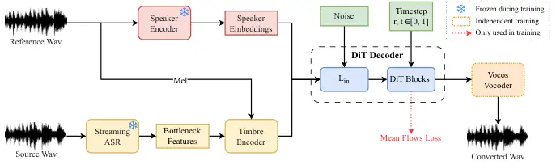

# MeanVC: Lightweight and Streaming Zero-Shot Voice Conversion via Mean Flows

Guobin Ma Jixun Yao Ziqian Ning Yuepeng Jiang Lingxin Xiong Lei
Xie$`\sthanks{Correspondingauthor.}`$ Pengcheng Zhu¹¹footnotemark: 1

###### Abstract

Zero-shot voice conversion (VC) aims to transfer timbre from a source
speaker to any unseen target speaker while preserving linguistic
content. Growing application scenarios demand models with streaming
inference capabilities. This has created a pressing need for models that
are simultaneously fast, lightweight, and high-fidelity. However,
existing streaming methods typically rely on either autoregressive (AR)
or non-autoregressive (NAR) frameworks, which either require large
parameter sizes to achieve strong performance or struggle to generalize
to unseen speakers. In this study, we propose MeanVC, a lightweight and
streaming zero-shot VC approach. MeanVC introduces a diffusion
transformer with a chunk-wise autoregressive denoising strategy,
combining the strengths of both AR and NAR paradigms for efficient
streaming processing. By introducing mean flows, MeanVC regresses the
average velocity field during training, enabling zero-shot VC with
superior speech quality and speaker similarity in a single sampling step
by directly mapping from the start to the endpoint of the flow
trajectory. Additionally, we incorporate diffusion adversarial
post-training to mitigate over-smoothing and further enhance speech
quality. Experimental results demonstrate that MeanVC significantly
outperforms existing zero-shot streaming VC systems, achieving superior
conversion quality with higher efficiency and significantly fewer
parameters. Audio demos and code are publicly available at
https://aslp-lab.github.io/MeanVC.

###### Index Terms: 

streaming voice conversion, zero-shot, mean flows, adversarial
post-training

^(†)^(†)address: ¹ Audio, Speech and Language Processing Group
(ASLP@NPU), School of Computer Science,  
Northwestern Polytechnical University, Xi’an, China  
² Geely Automobile Research Institute (Ningbo) Company Ltd, Ningbo,
China

## 1 Introduction

Zero-shot voice conversion (VC) aims to transfer the timbre from the
source speaker to any unseen speaker while keeping the linguistic
content unchanged. This capability has profound implications for a wide
array of applications, including movie dubbing \[26, 19\], privacy
protection \[27\], personalized pronunciation correction, and the
creation of expressive virtual avatars. Benefiting from modern deep
learning based approaches, recent voice conversion models \[8, 11, 12,
17, 10, 3\] have achieved remarkable performance in terms of naturalness
and speaker similarity. However, as the demand for real-time processing
in various application scenarios increases, the computational cost of
high-performing models becomes a significant bottleneck for practical
deployment. This has created a pressing need for streaming models that
are simultaneously fast (low-latency), lightweight (low computational
overhead), and high-fidelity (high audio quality and speaker
similarity).

Recent streaming zero-shot VC studies have explored two main
architectural paradigms: autoregressive (AR) and non-autoregressive
(NAR) frameworks. A representative AR-based streaming VC system is
StreamVoice \[25\], which employs a fully causal, context-aware language
model. It alternates between semantic bottleneck features and acoustic
codec tokens at each AR step, supported by an auxiliary acoustic
predictor, to enable streaming zero-shot VC without future look-ahead.
Building on this design, StreamVoice+ \[24\] introduces a learnable
semantic encoder and a connector, while adapting the backbone via
LoRA \[7\]. It further improves quality through a residual-bottleneck
connector, forming an end-to-end streaming pipeline. Despite their
high-fidelity output, these models fundamentally compromise on the other
two critical requirements. Their sequential decoding process inherently
leads to high latency, failing the ’fast’ criterion. Moreover, their
massive model sizes (101M for StreamVoice and 153M for StreamVoice+)
make them far from ’lightweight,’ resulting in prohibitive computational
costs that render real-time inference on standard CPUs impractical.

To mitigate the inherent latency of AR models, NAR frameworks have been
explored for their potential in parallel generation. DualVC2 \[18\], for
instance, presents a lightweight NAR model based on the conformer
architecture, which accelerates inference by incorporating dynamic chunk
training. While it achieves faster speeds, its reliance on conventional
architectures limits its generalization capability to unseen speakers in
zero-shot scenarios. Another NAR approach adapts powerful diffusion
models for zero-shot VC. Seed-VC \[16\] employs a diffusion transformer
(DiT) \[20\] architecture within a sliding-window pipeline. Although
this mechanism enables streaming VC, the fixed-size windows can disrupt
long-term contextual dependencies and speaker characteristics. Thus,
while NAR frameworks successfully address the ’fast’ requirement, they
often do so by sacrificing ’high-fidelity,’ either through poor
generalization in simpler models or context fragmentation in more
complex ones. This leaves a clear gap in the field: a framework that can
unite the speed of NAR models with the quality and consistency of their
AR counterparts.



Figure 1: Overall architecture of our proposed MeanVC.

To address these challenges, we propose MeanVC, a lightweight framework
for streaming zero-shot VC that leverages the advantages of both AR and
NAR paradigms while addressing their respective limitations.
Specifically, MeanVC employs a chunk-wise autoregressive denoising
strategy, which processes audio in individual chunks while explicitly
conditioning each chunk on the previous one, thereby preserving
long-term speaker consistency. To overcome the latency of iterative
diffusion samplers, we introduce mean flows \[5\], a powerful method
that enables the diffusion model to generate high-quality results with
1-NFE (number of function evaluations). We integrate mean flows into the
DiT-based decoder. By training the model to regress the average velocity
field of the probability flow, MeanVC can synthesize a high-quality
spectrogram using 1-NFE. Finally, we incorporate a diffusion adversarial
post-training (DAPT) stage to mitigate over-smoothing and further
enhance speech quality. With merely 14M parameters, MeanVC achieves
superior audio quality and efficiency. Both subjective and objective
evaluations demonstrate that MeanVC significantly outperforms existing
streaming VC systems. Audio demos and code are publicly available at
https://aslp-lab.github.io/MeanVC.

## 2 MEANVC

### 2.1 Overview

As illustrated in Fig. 1, MeanVC is built on the widely used
recognition-synthesis framework \[30\], consisting of a streaming
automatic speech recognition (ASR) module, a speaker encoder, a timbre
encoder, a DiT decoder, and a vocoder. First, the pre-trained streaming
ASR model extracts bottleneck features (BNFs) from the source waveform.
Subsequently, these BNFs are fed into the timbre encoder, which fuses
them with fine-grained timbre information extracted from a reference
mel-spectrogram to produce timbre BNFs. Meanwhile, speaker embeddings
are extracted from a reference waveform via a pre-trained speaker
encoder. The DiT decoder generates the converted mel-spectrogram
conditioned on both the speaker embeddings and the timbre BNFs. During
generation, the source mel-spectrogram is concatenated at the front to
serve as a cache, enabling chunk-wise autoregressive denoising and
producing the converted spectrogram with the target speaker’s timbre.

### 2.2 Chunk-wise Autoregressive Denoising

To enable streaming conversion, we adopt a chunk-wise autoregressive
approach that divides the BNFs into smaller chunks and applies a
chunk-wise causal mask inspired by MoonCast \[9\]. This mask strategy
allows each chunk to access the historical context from previously
generated chunks, ensuring consistency across chunks. Furthermore, we
build on conditional flow matching (CFM) to learn optimal transport
paths between the two distributions. Given data
$`x\sim p_{\text{data}}(x)`$, prior
$`\epsilon\sim p_{\text{prior}}(\epsilon)`$, the optimal transport flow
path can be constructed as: $`z_{t}=(1-t)x+t\epsilon`$, and the
conditional velocity is thus given by $`v_{t}=dz_{t}/dt=\epsilon-x`$.
During training, the objective is to learn a neural network
$`f_{\theta}`$ that minimizes the following CFM loss:
$`\mathcal{L}_{\text{CFM}}(\theta)=\mathbb{E}_{t,x,\epsilon}\left\|f_{\theta}\left(t,z_{t}\right)-v_{t}\right\|^{2}`$.

Our DiT decoder is conditioned on timbre BNFs and speaker embeddings to
generate the mel-spectrogram from random Gaussian noise. Specifically,
we repeat the speaker embeddings to match the length of the timbre BNFs
and concatenate them to form the conditioning inputs for the model. We
select chunk $`i`$ to be generated, along with all preceding chunks,
where $`i`$ is an integer index and $`i\in[0,N]`$ with $`N`$ being the
total number of chunks. Let $`M_{i}`$ denote the mel-spectrogram of
chunk $`i`$ and $`C_{i}`$ denote its corresponding conditioning input.
The mel-spectrograms of the preceding chunks are collectively denoted as
$`M_{<i}`$. The flow-matching approach involves a forward process to add
noise to the data and a backward process to remove the noise in reverse.
During the training phase, the forward process takes as input the noisy
chunk $`Z_{i}(t)=(1-t)M_{i}+t\xi`$, where the clean mel-spectrogram
$`M_{i}`$ is mixed with Gaussian noise $`\xi\sim\mathcal{N}(0,1)`$ at
timestep $`t\in[0,1]`$. The flow-matching model $`f_{\theta}`$
parameterized by $`\theta`$, learns the velocity field mapping
$`f_{\theta}(t,Z_{i}(t))=dZ_{i}(t)/{dt}=\xi-M_{i}`$ conditioned on
$`C_{i}`$.

Figure 2: Chunk-wise causal mask in the DiT decoder. In this example,
each noisy mel-spectrogram chunk $`Z_{i}`$ can attend to up to 3
preceding clean mel-spectrogram chunks $`M_{j}`$ (where
$`j\in[i-3,i-1]`$) and itself. The green cells indicate allowed
attention, while the white cells indicate restricted attention.

The mel-spectrograms of preceding chunks, denoted as $`M_{<i}`$, are
used as prompts for in-context learning. We apply a chunk-wise causal
mask, as illustrated in Fig. 2. We denote the clean mel-spectrogram
chunk as $`M_{i}`$ and the noisy mel-spectrogram chunk used for
generation as $`Z_{i}`$. During training, all clean chunks $`M_{i}`$ are
concatenated before all noisy chunks $`Z_{i}`$ to form a complete
sequence of $`2N`$ chunks. The chunk-wise attention mask is defined as
follows: 1) Full attention is allowed within each chunk. 2) For clean
chunks where $`i\in[0,N)`$, each chunk $`M_{i}`$ can only attend to
itself. 3) For noisy chunks where $`i\in[N,2N)`$, each chunk $`Z_{i}`$
can attend to preceding clean chunks $`M_{j}`$ where
$`j\in[\max(0,i-K),i-1]`$ as well as to itself, where $`K`$ represents
the maximum number of preceding clean chunks accessible for
conditioning. We find that when using extremely short chunks (e.g., 160
ms), allowing access to too many historical chunks causes the model to
over-rely on historical context rather than the current chunk $`Z_{i}`$,
ultimately degrading performance.

### 2.3 Mean Flows for Generative Modeling

CFM typically requires multiple sampling steps to solve the ordinary
differential equation (ODE), and the number of function evaluations
directly impacts inference efficiency. With just 1-NFE, the quality of
generated spectrograms degrades catastrophically. To address this
limitation, we adopt the approach proposed in mean flows \[5\], which
regresses the average velocity field during training to enable
high-quality synthesis with only 1-NFE. Specifically, given a time
interval $`[r,t]`$, the displacement on the ODE trajectory within it is
$`\int_{r}^{t}v(z_{\tau},\tau)d\tau`$. The average velocity is then
defined as:
$`u(z_{t},r,t)\triangleq\frac{1}{t-r}\int_{r}^{t}v(z_{\tau},\tau)d\tau`$.
By differentiating both sides with respect to $`t`$ and subsequently
rearranging the resulting terms, the relationship between $`u`$ and
$`t`$ can be derived, yielding the mean flows identity:

```math
u(z_{t},r,t)=v(z_{t},t)-(t-r)\frac{d}{dt}u(z_{t},r,t). \tag{1}
```

By utilizing the Jacobian-vector product (JVP), the total derivative can
be expressed as:
$`\frac{d}{dt}u(z_{t},r,t)=v(z_{t},t)\partial_{z}u+\partial_{t}u`$. The
velocity $`v(z_{t},t)`$ is the marginal velocity in flow matching. We
follow \[15\] to replace it with the conditional velocity
$`v_{t}=\epsilon-x`$. With this, the target field for training is
defined as
$`u_{\text{tgt}}=v_{t}-(t-r)(v_{t}\partial_{z}u_{\theta}+\partial_{t}u_{\theta})`$.
We then encourage $`f_{\theta}`$ to satisfy this field by minimizing the
mean flows objective:

```math
\mathcal{L}_{\text{MF}}(\theta)=\mathbb{E}_{t,r,x,\epsilon}\left\|f_{\theta}(z_{t},r,t)-\text{sg}(u_{\text{tgt}})\right\|^{2}, \tag{2}
```

where $`\text{sg}(\cdot)`$ denotes the stop-gradient operation. Note,
when $`t=r`$, the mean flows objective reduces to the standard flow
matching objective.

During sampling, the time integral in CFM can be substituted with the
average velocity, resulting in:

```math
z_{r}=z_{t}-(t-r)u(z_{t},r,t). \tag{3}
```

For 1-NFE sampling, we have $`z_{0}=z_{1}-f_{\theta}(z_{1},0,1)`$, where
$`z_{1}=\epsilon\sim p_{\text{prior}}(\epsilon)`$.

### 2.4 Diffusion Adversarial Post-Training

Mel-spectrograms generated by flow matching models often suffer from
over-smoothing artifacts. While conventional multi-length
discriminators \[2\] are employed, we find that high-frequency
components in generated mel-spectrograms still exhibit artifacts such as
bright lines. Inspired by \[14\], we leverage the generator architecture
as the discriminator backbone to address this issue. Specifically, we
employ the DiT model as generator $`G`$, which generates spectrograms
with 1-NFE. The DiT weights are used to initialize the backbone of the
discriminator $`D`$. After training, the discriminator outputs a logit
that distinguishes between real samples $`x`$ and generated samples
$`\hat{x}`$. To achieve this, we modify the DiT architecture by
introducing cross-attention-only Transformer blocks at the second and
fourth layers of the 4-layer DiT backbone. These blocks use a learnable
vector as the query and perform cross-attention with the backbone’s
latent representations as keys and values. The outputs are concatenated
channel-wise to form a global feature vector, which is then projected to
produce a scalar logit output.

The training objectives of DAPT are defined as follows:

```math
\mathcal{L}_{\text{Adv}}(G)=\mathbb{E}_{c,\epsilon}\left\|D(G(\epsilon,c),c)-1\right\|^{2}, \tag{4}
```

```math
\mathcal{L}_{\text{Adv}}(D)=\mathbb{E}_{c,x}\left\|D(x,c)-1\right\|^{2}+\mathbb{E}_{c,\epsilon}\left\|D(G(\epsilon,c),c)\right\|^{2}, \tag{5}
```

where $`c`$ denotes the conditioning input (timbre BNFs and speaker
embeddings). The generator $`G`$ learns to produce realistic samples
through 1-NFE generation, while the discriminator $`D`$ learns to
distinguish between real and generated samples.

## 3 EXPERIMENTS

### 3.1 Experiment Setup

Dataset. We train MeanVC on the open-source Emilia \[6\] corpus.
Specifically, we use DNSMOS \[21\] to filter out audio with DNSMOS
scores below 3.4, retaining 10,000 hours of mandarin data. All audio
files are resampled to 16 kHz for VC training. For zero-shot evaluation,
we use the Mandarin subset of the Seed-TTS test set \[1\], comprising
2,018 source–target testing pairs. For known speakers evaluation, we
fine-tune MeanVC on Aishell3 \[22\], selecting four speakers as targets
for evaluation. We use 100 clean and 100 noisy clips as source
recordings. To extract semantic features, we incorporate the streaming
ASR model Fast-U2++ \[13\], implemented by WeNet \[28\] and trained on
WenetSpeech \[29\].

Implementation Details. MeanVC consists of 14M parameters. The DiT
decoder employs four DiT blocks, each with a hidden size of 512 and two
attention heads. The timbre encoder incorporates two cross-attention
modules, with a hidden size of 256 and four attention heads. Fast-U2++
utilizes a 160 ms chunk size for streaming inference and compresses
16 kHz waveforms into semantic features with a 40 ms frame length.
Speaker embeddings are extracted using ECAPA-TDNN \[4\]. We employ
Vocos \[23\] as the vocoder to convert mel-spectrograms to high-fidelity
16 kHz speech waveforms.

| Method      | Quality          |                    |                      |     | Similarity       |                  |     | Efficiency    |                   |                           |
| ----------- | ---------------- | ------------------ | -------------------- | --- | ---------------- | ---------------- | --- | ------------- | ----------------- | ------------------------- |
|             | NMOS$`\uparrow`$ | DNSMOS$`\uparrow`$ | CER(%)$`\downarrow`$ |     | SMOS$`\uparrow`$ | SSIM$`\uparrow`$ |     | Parameters(M) | RTF$`\downarrow`$ | Latency(ms)$`\downarrow`$ |
| GT          | 4.04$`\pm`$0.05  | 3.79               | 1.36                 |     | -                | -                |     | -             | -                 | -                         |
| StreamVoice | 3.81$`\pm`$0.06  | 3.67               | 9.32                 |     | 3.67$`\pm`$0.05  | 0.543            |     | 101           | 13.632            | 2379.52                   |
| Seed-VC     | 3.76$`\pm`$0.07  | 3.84               | 6.03                 |     | 3.62$`\pm`$0.09  | 0.582            |     | 25            | 7.039             | 1990.72                   |
| MeanVC      | 3.82$`\pm`$0.05  | 3.76               | 5.01                 |     | 3.87$`\pm`$0.06  | 0.687            |     | 14            | 0.136             | 211.52                    |

Table 1: Zero-shot performance (unseen speakers). The RTF is calculated
only for the VC module. The Latency represents the delay of a single
chunk (160 ms) within the entire pipeline. The best-performing metrics
are indicated in bold, while the second-best are underlined.

Evaluation Metrics. For subjective evaluation, we employ naturalness
mean opinion score (NMOS) and speaker similarity mean opinion score
(SMOS) as subjective metrics, calculated with 95% confidence intervals.
We randomly select 100 testing pairs and recruit 15 listeners to conduct
the assessments. For objective evaluation, we measure speech
intelligibility using character error rate (CER) computed by an ASR
model¹¹ 1 https://huggingface.co/funasr/paraformer-zh. Speaker
similarity (SSIM) is computed using a WavLM-finetuned speaker
verification model²² 2 https://github.com/BytedanceSpeech/seed-tts-eval
to measure the similarity between converted and target speaker speech.
Additionally, we employ DNSMOS³³ 3
https://github.com/microsoft/DNS-Challenge/tree/master/DNSMOS to assess
speech quality. For streaming performance evaluation, we use real-time
factor (RTF) and latency metrics. RTF represents the ratio of model
inference time to input speech duration, indicating computational
efficiency. We evaluate both RTF and latency of all VC models on a
single-core AMD EPYC 7542 CPU with single-threaded execution.

Baseline Systems. To validate the performance of MeanVC, we compare
MeanVC against the following baseline systems: StreamVoice \[25\], a
language model-based system that employs fully causal context-awareness.
It alternately processes semantic and acoustic features to achieve
streaming zero-shot voice conversion; Seed-VC \[16\], a NAR system based
on diffusion models. It employs an external timbre shifter to mitigate
timbre leakage and achieves streaming zero-shot voice conversion through
a sliding-window pipeline; DualVC2 \[18\], a lightweight NAR system
based on the conformer architecture. It uses classic non-causal
convolutions and dynamic masking convolutions to achieve streaming
any-to-many voice conversion.

### 3.2 Evaluation on Zero-shot VC

To evaluate zero-shot VC performance, we benchmark MeanVC against
Seed-VC and StreamVoice. As shown in Table 1, MeanVC outperforms all
baseline systems on both subjective SMOS and NMOS, and achieves the best
performance on objective metrics CER and SSIM, highlighting its
effectiveness in zero-shot VC. However, MeanVC lags behind Seed-VC in
DNSMOS, which we attribute to its relatively smaller parameter size
compared to Seed-VC.

Our VC module consists of only 14M parameters, achieving an RTF of 0.136
on a single-core, single-threaded setup of an AMD EPYC 7542 CPU,
significantly lower than baseline systems. To meet real-time
requirements, RTF must remain below 1.0. Our complete pipeline includes
the ASR encoder with an RTF of 0.120 and the vocoder with an RTF of
0.066, achieving an overall RTF of 0.322 and satisfying real-time
constraints. With a 160 ms chunk size, the model’s inference latency is
51.52 ms. The total pipeline latency, including the chunk duration, is
211.52 ms (160 ms + 51.52 ms), significantly outperforming baseline
systems. Notably, all efficiency measurements for the experiments were
obtained without optimizations such as quantization.

| Method           | Clean              |                      |                  |     | Noise              |                      |                  |
| ---------------- | ------------------ | -------------------- | ---------------- | --- | ------------------ | -------------------- | ---------------- |
|                  | DNSMOS$`\uparrow`$ | CER(%)$`\downarrow`$ | SSIM$`\uparrow`$ |     | DNSMOS$`\uparrow`$ | CER(%)$`\downarrow`$ | SSIM$`\uparrow`$ |
| GT               | 3.64               | 0.37                 | \-               |     | 2.86               | 2.92                 | \-               |
| DualVC2          | 3.63               | 3.84                 | 0.659            |     | 3.47               | 16.28                | 0.562            |
| MeanVC           | 3.69               | 3.33                 | 0.681            |     | 3.56               | 12.84                | 0.633            |
| $`\quad+`$Tuning | 3.74               | 3.09                 | 0.696            |     | 3.61               | 10.81                | 0.657            |

Table 2: Intra-dataset performance (seen speakers)

### 3.3 Evaluation on Intra-dataset

To gain deeper insights into MeanVC’s performance, we explore it on
known speakers by fine-tuning it on Aishell3, selecting four speakers as
targets for evaluation. We select DualVC2 for comparison, an any-to-many
VC model. Specifically, we use a configuration with parameter size
comparable to MeanVC and train DualVC2 from scratch on both Emilia
(using the same filtered training data as MeanVC) and Aishell3. As shown
in Table 2, MeanVC outperforms DualVC2 across all metrics even without
fine-tuning, with its advantages becoming particularly evident under
noisy input conditions. This demonstrates MeanVC’s superior robustness
and strong conversion capabilities. With available utterances of target
speakers, fine-tuning significantly improves performance. This indicates
our system can be easily applied to various scenarios with or without
the utterances of target speakers.

### 3.4 Ablation Study

To validate the contribution of MeanVC’s key components and analyze the
impact of key hyperparameters, we conducted a series of ablation
studies, with results detailed in Table 3. First, we assessed the
model’s core modules. Ablating the DAPT stage resulted in a tangible
degradation across all metrics, confirming its crucial role in
mitigating over-smoothing and enhancing speech quality. Similarly,
disabling the clean mel-spectrogram cache led to a significant
performance drop, particularly in CER, which underscores the mechanism’s
importance in reducing the train-inference mismatch to improve speech
intelligibility. Next, we investigated the critical trade-off between
latency and performance by varying the streaming chunk size from our 160
ms default. Reducing the chunk size to 80 ms halves the processing
latency, offering a faster response. However, this came at the cost of
degraded performance, especially in CER and DNSMOS, likely due to
insufficient contextual information for robust modeling. Conversely,
increasing the chunk size to 200 ms provided more acoustic context and
yielded substantial improvements across all metrics, but at the expense
of a 25% increase in overall latency. These findings explicitly
demonstrate the performance-latency trade-off inherent in the streaming
pipeline and validate our choice of 160 ms as a well-balanced
configuration that achieves strong performance without incurring
excessive delay.

| Method                   | DNSMOS$`\uparrow`$ | CER(%)$`\downarrow`$ | SSIM$`\uparrow`$ |
| ------------------------ | ------------------ | -------------------- | ---------------- |
| MeanVC                   | 3.76               | 5.01                 | 0.687            |
|    w/o DAPT              | 3.68               | 5.86                 | 0.673            |
|    w/o clean chunks      | 3.71               | 5.97                 | 0.677            |
|    w/ chunk size (80ms)  | 3.56               | 9.97                 | 0.619            |
|    w/ chunk size (200ms) | 3.83               | 4.42                 | 0.700            |

Table 3: Results of ablation studies. The baseline MeanVC uses a chunk
size of 160ms.

## 4 CONCLUSIONS

In this study, we introduce MeanVC, a lightweight and efficient
framework for streaming zero-shot voice conversion. By integrating the
advantages of both autoregressive and non-autoregressive approaches,
MeanVC employs a chunk-wise autoregressive denoising strategy, leverages
mean flows for efficient single-step spectrogram synthesis, and
incorporates diffusion adversarial post-training to enhance speech
naturalness. Despite its compact architecture of only 14M parameters,
MeanVC achieves superior performance in both audio quality and
computational efficiency. Our extensive evaluations demonstrate that
MeanVC outperforms existing streaming VC systems.

## References

- \[1\] P. Anastassiou, J. Chen, J. Chen, Y. Chen, Z. Chen, Z. Chen, J.
  Cong, et al. (2024) Seed-tts: A family of high-quality versatile
  speech generation models. CoRR abs/2406.02430. Cited by: §3.1.
- \[2\] J. Chen, X. Tan, J. Luan, T. Qin, and T. Liu (2020) HiFiSinger:
  towards high-fidelity neural singing voice synthesis. CoRR
  abs/2009.01776. Cited by: §2.4.
- \[3\] H. Choi and J. Park (2025) VoicePrompter: robust zero-shot voice
  conversion with voice prompt and conditional flow matching. In ICASSP,
  pp. 1–5. Cited by: §1.
- \[4\] B. Desplanques, J. Thienpondt, and K. Demuynck (2020)
  ECAPA-TDNN: emphasized channel attention, propagation and aggregation
  in TDNN based speaker verification. In INTERSPEECH, pp. 3830–3834.
  Cited by: §3.1.
- \[5\] Z. Geng, M. Deng, X. Bai, J. Z. Kolter, and K. He (2025) Mean
  flows for one-step generative modeling. CoRR abs/2505.13447. Cited by:
  §1, §2.3.
- \[6\] H. He, Z. Shang, C. Wang, X. Li, Y. Gu, H. Hua, L. Liu, C.
  Yang, J. Li, P. Shi, Y. Wang, K. Chen, P. Zhang, and Z. Wu (2024)
  Emilia: an extensive, multilingual, and diverse speech dataset for
  large-scale speech generation. In SLT, pp. 885–890. Cited by: §3.1.
- \[7\] E. J. Hu, Y. Shen, P. Wallis, Z. Allen-Zhu, Y. Li, S. Wang, L.
  Wang, and W. Chen (2022) LoRA: low-rank adaptation of large language
  models. In ICLR, Cited by: §1.
- \[8\] S. Hussain, P. Neekhara, J. Huang, J. Li, and B. Ginsburg (2023)
  ACE-VC: adaptive and controllable voice conversion using explicitly
  disentangled self-supervised speech representations. In ICASSP,
  pp. 1–5. Cited by: §1.
- \[9\] Z. Ju, D. Yang, J. Yu, K. Shen, Y. Leng, Z. Wang, X. Tan, X.
  Zhou, T. Qin, and X. Li (2025) MoonCast: high-quality zero-shot
  podcast generation. CoRR abs/2503.14345. Cited by: §2.2.
- \[10\] J. Kim, J. Kim, Y. Choi, T. D. Nguyen, S. Mun, and J. S.
  Chung (2025) AdaptVC: high quality voice conversion with adaptive
  learning. In ICASSP, pp. 1–5. Cited by: §1.
- \[11\] D. Li, X. Li, and X. Li (2023) DVQVC: an unsupervised zero-shot
  voice conversion framework. In ICASSP, pp. 1–5. Cited by: §1.
- \[12\] J. Li, Y. Guo, X. Chen, and K. Yu (2024) SEF-VC: speaker
  embedding free zero-shot voice conversion with cross attention. In
  ICASSP, pp. 12296–12300. Cited by: §1.
- \[13\] C. Liang, X. Zhang, B. Zhang, D. Wu, S. Li, X. Song, Z. Peng,
  and F. Pan (2023) Fast-u2++: fast and accurate end-to-end speech
  recognition in joint ctc/attention frames. In ICASSP, pp. 1–5. Cited
  by: §3.1.
- \[14\] S. Lin, X. Xia, Y. Ren, C. Yang, X. Xiao, and L. Jiang (2025)
  Diffusion adversarial post-training for one-step video generation.
  CoRR abs/2501.08316. Cited by: §2.4.
- \[15\] Y. Lipman, R. T. Q. Chen, H. Ben-Hamu, M. Nickel, and M.
  Le (2023) Flow matching for generative modeling. In ICLR, Cited by:
  §2.3.
- \[16\] S. Liu (2024) Zero-shot voice conversion with diffusion
  transformers. CoRR abs/2411.09943. Cited by: §1, §3.1.
- \[17\] Y. Luo and S. Dixon (2024) Posterior variance-parameterised
  gaussian dropout: improving disentangled sequential autoencoders for
  zero-shot voice conversion. In ICASSP, pp. 11676–11680. Cited by: §1.
- \[18\] Z. Ning, Y. Jiang, P. Zhu, S. Wang, J. Yao, L. Xie, and M.
  Bi (2024) Dualvc 2: dynamic masked convolution for unified streaming
  and non-streaming voice conversion. In ICASSP, pp. 11106–11110. Cited
  by: §1, §3.1.
- \[19\] Z. Ning, Q. Xie, P. Zhu, Z. Wang, L. Xue, J. Yao, L. Xie,
  and M. Bi (2023) Expressive-vc: highly expressive voice conversion
  with attention fusion of bottleneck and perturbation features. In
  Proc. ICASSP, pp. 1–5. Cited by: §1.
- \[20\] W. Peebles and S. Xie (2023) Scalable diffusion models with
  transformers. In ICCV, pp. 4172–4182. Cited by: §1.
- \[21\] C. K. A. Reddy, V. Gopal, and R. Cutler (2022) Dnsmos P.835: A
  non-intrusive perceptual objective speech quality metric to evaluate
  noise suppressors. In ICASSP, pp. 886–890. Cited by: §3.1.
- \[22\] Y. Shi, H. Bu, X. Xu, S. Zhang, and M. Li (2021) AISHELL-3: A
  multi-speaker mandarin TTS corpus. In Interspeech, pp. 2756–2760.
  Cited by: §3.1.
- \[23\] H. Siuzdak (2024) Vocos: closing the gap between time-domain
  and fourier-based neural vocoders for high-quality audio synthesis. In
  ICLR, Cited by: §3.1.
- \[24\] Z. Wang, Y. Chen, X. Wang, L. Xie, and Y. Wang (2024)
  StreamVoice+: evolving into end-to-end streaming zero-shot voice
  conversion. IEEE Signal Process. Lett. 31, pp. 3000–3004. Cited by:
  §1.
- \[25\] Z. Wang, Y. Chen, X. Wang, L. Xie, and Y. Wang (2024)
  StreamVoice: streamable context-aware language modeling for real-time
  zero-shot voice conversion. In ACL (1), pp. 7328–7338. Cited by: §1,
  §3.1.
- \[26\] J. Yao, Y. Lei, Q. Wang, P. Guo, Z. Ning, L. Xie, H. Li, J.
  Liu, and D. Xie (2023) Preserving background sound in noise-robust
  voice conversion via multi-task learning. In Proc. ICASSP, pp. 1–5.
  Cited by: §1.
- \[27\] J. Yao, Q. Wang, L. Zhang, P. Guo, Y. Liang, and L. Xie (2022)
  NWPU-ASLP system for the voiceprivacy 2022 challenge. CoRR
  abs/2209.11969. External Links: 2209.11969 Cited by: §1.
- \[28\] Z. Yao, D. Wu, X. Wang, B. Zhang, F. Yu, C. Yang, Z. Peng, X.
  Chen, L. Xie, and X. Lei (2021) WeNet: production oriented streaming
  and non-streaming end-to-end speech recognition toolkit. In
  Interspeech, pp. 4054–4058. Cited by: §3.1.
- \[29\] B. Zhang, H. Lv, P. Guo, Q. Shao, C. Yang, L. Xie, X. Xu, H.
  Bu, X. Chen, C. Zeng, D. Wu, and Z. Peng (2022) WENETSPEECH: A 10000+
  hours multi-domain mandarin corpus for speech recognition. In ICASSP,
  pp. 6182–6186. Cited by: §3.1.
- \[30\] J. Zhang, Z. Ling, and L. Dai (2020) Non-parallel
  sequence-to-sequence voice conversion with disentangled linguistic and
  speaker representations. IEEE ACM Trans. Audio Speech Lang. Process.
  28, pp. 540–552. Cited by: §2.1.
