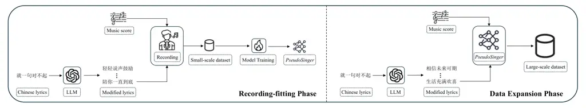
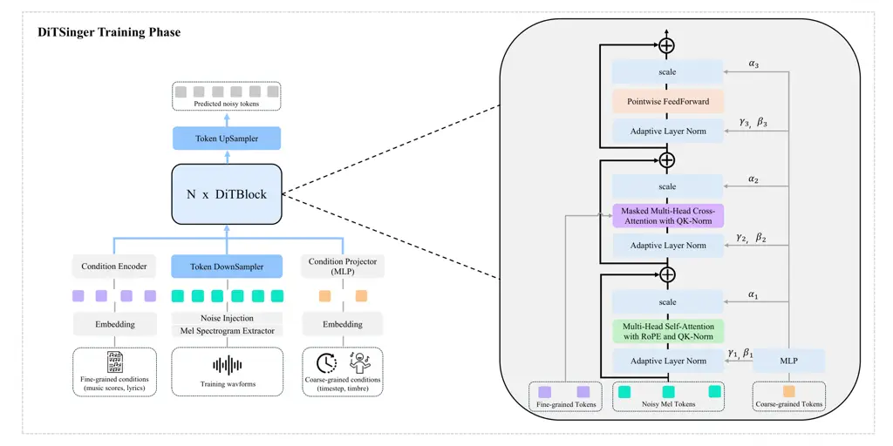

# DITSINGER: SCALING SINGING VOICE SYNTHESIS WITH DIFFUSION TRANSFORMER AND IMPLICIT ALIGNMENT

Zongcai Du^(\*), Guilin Deng^(\*), Xiaofeng Guo^(\*), Xin Gao, Linke Li
Kaichang Cheng, Fubo Han, Siyu Yang, Peng Liu, Pan Zhong, Qiang Fu
^(†)^(†)thanks: ^(\*)Equal contribution.

###### Abstract

Recent progress in diffusion-based Singing Voice Synthesis (SVS)
demonstrates strong expressiveness but remains limited by data scarcity
and model scalability. We introduce a two-stage pipeline: a compact seed
set of human-sung recordings is constructed by pairing fixed melodies
with diverse LLM-generated lyrics, and melody-specific models are
trained to synthesize over 500 hours of high-quality Chinese singing
data. Building on this corpus, we propose DiTSinger, a Diffusion
Transformer with RoPE and qk-norm, systematically scaled in depth,
width, and resolution for enhanced fidelity. Furthermore, we design an
implicit alignment mechanism that obviates phoneme-level duration labels
by constraining phoneme-to-acoustic attention within character-level
spans, thereby improving robustness under noisy or uncertain alignments.
Extensive experiments validate that our approach enables scalable,
alignment-free, and high-fidelity SVS.

###### Index Terms: 

singing voice synthesis, diffusion transformer, large-scale data
generation, implicit alignment

^(†)^(†)address: Migu Music, China Mobile Communications Corporation,
China



Figure 1: Overview of the proposed two-stage data construction pipeline.
The Recording-fitting Phase (left) collects high-quality vocal
recordings without accompaniment from professional singers to train a
melody-specific model, PseudoSinger. The Data Expansion Phase (right)
leverages the trained PseudoSinger to synthesize large-scale singing
data with diverse LLM-generated lyrics while keeping the melody fixed.
This enables scalable dataset construction with improved phonetic
consistency and melodic alignment.

## 1 Introduction

Singing voice synthesis (SVS) generates singing from lyrics and scores,
requiring precise phoneme–pitch alignment and expressive modeling \[4\].
Early concatenative and statistical models \[1, 13\] lacked naturalness,
while neural approaches—from DNNs to GANs and non-autoregressive
models \[15, 10\]—improved quality by reducing over-smoothing and
exposure bias. Recent diffusion- and flow-based methods \[8, 5\] offer
finer timbre and technique control \[18, 3, 19\], and diverse
datasets \[17, 20\] support multiple vocal styles.

Despite recent advances, SVS faces two main challenges: unclear scaling
effects on synthesis quality and limited methods for systematically
expanding training data. We address this with a two-stage pipeline: fix
a small set of melodies, use LLMs to generate diverse lyrics, pair with
human recordings to train melody-specific models, and synthesize
large-scale data with varied content, enhancing phonetic coverage and
enabling controllable augmentation. To leverage the enlarged data and
model scale, we design a Diffusion Transformer (DiT) \[11\] with rotary
positional encoding (RoPE) \[14\] and qk normalization \[2\].

The second challenge is robust phoneme-to-acoustic alignment. Prior
methods rely on monotonic attention \[12\] or duration prediction \[8,
18\], limiting flexibility and requiring post-processing. We propose an
implicit cross-attention mechanism that constrains each phoneme’s
attention to its character span, providing soft supervision and
robustness under timing variability.

We present DiTSinger, a Diffusion Transformer-based SVS framework with
strong scaling properties. Our main contributions are as follows:

- •
  A scalable data pipeline combining LLM-generated lyrics with
  model-based audio synthesis to enhance phoneme diversity and
  generalization.
- •
  Introduction of DiT for SVS and analysis of scaling effects across
  data and model dimensions.
- •
  An implicit alignment mechanism linking phonemes to acoustic features
  at the character level, removing the need for duration annotations and
  improving timing robustness.

## 2 Proposed Method

### 2.1 Preliminaries

Diffusion Models (DMs). DDPM \[6\] synthesize data by reversing a
gradual noising process. The forward process corrupts a clean sample
$`\mathbf{x}_{0}`$ via

```math
q(\mathbf{x}_{t}\!\mid\!\mathbf{x}_{t-1})=\mathcal{N}(\mathbf{x}_{t};\sqrt{1-\beta_{t}}\mathbf{x}_{t-1},\beta_{t}\mathbf{I}), \tag{1}
```

where $`\mathcal{N}(\cdot)`$ denotes the Gaussian distribution and
$`\beta_{t}`$ is the noise schedule. The reverse process is modeled by a
neural network $`\boldsymbol{\epsilon}_{\theta}(\cdot)`$ conditioned on
$`\mathbf{c}`$ to predict the added noise:

```math
\mathcal{L}_{\text{simple}}=\mathbb{E}_{\mathbf{x}_{0},\boldsymbol{\epsilon},t}\left[\left\|\boldsymbol{\epsilon}-\boldsymbol{\epsilon}_{\theta}(\mathbf{x}_{t},t,\mathbf{c})\right\|_{2}^{2}\right]. \tag{2}
```

Classifier-free guidance (CFG) improves fidelity and $`w`$ controls the
guidance strength:

```math
\boldsymbol{\epsilon}_{\text{guided}}=\boldsymbol{\epsilon}_{\theta}(\mathbf{x}_{t})+w\cdot\left(\boldsymbol{\epsilon}_{\theta}(\mathbf{x}_{t},\mathbf{c})-\boldsymbol{\epsilon}_{\theta}(\mathbf{x}_{t})\right). \tag{3}
```

Latent Diffusion Models (LDMs) improve computational efficiency by
encoding $`\mathbf{x}_{0}`$ into a latent representation
$`\mathbf{z}`$ \[16, 7\]:

```math
\mathbf{z}=\text{Enc}(\mathbf{x}_{0}),\quad\hat{\mathbf{x}}_{0}=\text{Dec}(\mathbf{z}). \tag{4}
```

### 2.2 Data Construction Pipeline

Existing high-quality singing datasets are typically limited in scale,
posing challenges for singing voice synthesis (SVS) models in capturing
diverse pitch contours and phonetic variations. In particular, phoneme
articulation and transitions can become unstable when models are exposed
to unseen phonetic or linguistic content.

We observe that constraining training data to a small set of fixed
melodies while varying only the lyrics and vocals reduces the complexity
of learning melodic alignment and acoustic modeling. This strategy
allows the model to internalize underlying melodic structures,
facilitating more accurate and robust melody-conditioned synthesis
across diverse lyrical inputs.

Motivated by this observation, we propose a two-stage data construction
pipeline, illustrated in Figure 1, consisting of a Recording-fitting
Phase and a Data Expansion Phase. In the Recording-fitting Phase, a
small set of fixed melodies is paired with diverse lyric variants
generated by a large language model (LLM). Professional singers record
the corresponding clean vocals, resulting in a compact dataset used to
train melody-specific SVS models, referred to as PseudoSinger. In the
subsequent Data Expansion Phase, each trained PseudoSinger is leveraged
to synthesize large-scale singing data. New lyrics are continually
generated by the LLM and rendered into singing voices by PseudoSinger,
enabling scalable data generation while preserving melodic consistency.

To accelerate convergence and model phoneme transitions, we first train
a base model on the M4Singer \[17\] dataset. We then fine-tune 20
PseudoSinger models on disjoint groups of 500 melodies (50 rewrites
each, 30h total) to synthesize  500h of singing with consistent melodies
and diverse lyrics, forming the largest publicly reported SVS dataset.



Figure 2: DiTSinger Training Phase. The model predicts the added noise
$`\boldsymbol{\epsilon}`$ to the noisy mel-spectrogram tokens at each
denoising step $`t`$, conditioned on both fine-grained (e.g., music
scores, lyrics) and coarse-grained (e.g., timbre, timestep) inputs.
Right: detailed structure of a single DiTBlock, which integrates
Multi-Head Self-Attention with RoPE and QK-Norm, Multi-Head
Cross-Attention with QK-Norm, and Adaptive Layer Normalization modulated
by learnable parameters $`\{\gamma_{i},\beta_{i}\}`$ and residual
scaling factors $`\{\alpha_{i}\}`$.

\(a\)

\(b\)

Figure 3: Scaling results of DiTSinger. (a) Architectural scaling
improves MCD. (b) Data scaling further boosts performance. S_2 denotes a
Small model with half resolution. GFLOPS measured on 5s audio.

### 2.3 Architecture

Figure 2 shows the training of DiTSinger, a transformer-based latent
diffusion model that predicts noise $`\boldsymbol{\epsilon}`$ in the
mel-spectrogram domain at each denoising step $`t`$.

Conditioning inputs. DiTSinger uses hierarchical conditioning with fine-
and coarse-grained information. Fine-grained inputs—pitch
$`\mathbf{p}`$, phonemes $`\mathbf{ph}`$, word durations $`\mathbf{w}`$,
and slur indicators $`\mathbf{sl}`$—are embedded, summed, and encoded
via a Transformer-based condition encoder $`\text{Enc}_{\text{cond}}`$:

```math
\mathbf{h}_{\text{local}}=\text{Enc}_{\text{cond}}(\mathbf{E}_{\text{p}}(\mathbf{p})+\mathbf{E}_{\text{ph}}(\mathbf{ph})+\mathbf{E}_{\text{w}}(\mathbf{w})+\mathbf{E}_{\text{sl}}(\mathbf{sl})), \tag{5}
```

where $`\mathbf{E}_{*}(\cdot)`$ are learnable embeddings. Coarse-grained
inputs, including speaker identity and diffusion timestep, are embedded
via an MLP and injected through AdaLN \[11\]. Given the small number of
speakers, timbre is represented with a learnable embedding table instead
of a reference encoder.

Tokenization and denoising. The waveform is converted to
mel-spectrograms and tokenized into latents via a convolutional
downsampler. Gaussian noise is added at each timestep $`t`$ to obtain
$`\mathbf{x}_{t}`$ for diffusion training. The denoising network stacks
$`N`$ DiTBlocks, each with three parallel branches: (1) Multi-Head
Self-Attention (MHSA) with RoPE and QK-Norm, (2) Masked Multi-Head
Cross-Attention (MHCA) incorporating fine-grained phoneme conditions,
and (3) a pointwise FeedForward network. All branches use AdaLN
conditioned on speaker embeddings, with residuals scaled by learnable
parameters $`{\alpha_{1},\alpha_{2},\alpha_{3}}`$.

Implicit Alignment Mechanism. We propose an _Implicit Alignment
Mechanism_ to avoid costly phoneme-level duration labels. Each phoneme
inherits its character’s temporal span, with known start time
$`t_{\text{start}}`$ and duration $`d_{\text{char}}`$, extended backward
by a tunable offset $`\delta`$:

```math
\tilde{t}_{\text{start}}=t_{\text{start}}-\min(\delta,d_{\text{char}},d_{\text{prev}}),\quad t_{\text{end}}=t_{\text{start}}+d_{\text{char}}, \tag{6}
```

where $`d_{\text{prev}}`$ denotes the duration of the preceding
character. The resulting interval
$`[\tilde{t}_{\text{start}},t_{\text{end}}]`$ defines a valid interval
used to construct an additive attention bias
$`M\in\mathbb{R}^{L_{\text{mel}}\times L_{\text{ph}}}`$:

```math
M_{i,j}=\begin{cases}0,&\text{if }t_{i}\in[\tilde{t}_{\text{start}}^{(j)},t_{\text{end}}^{(j)}],\\
-\infty,&\text{otherwise}.\end{cases} \tag{7}
```

Let $`Q\in\mathbb{R}^{L_{\text{mel}}\times d}`$ be the query projected
from mel tokens, and $`K,V\in\mathbb{R}^{L_{\text{ph}}\times d}`$ be the
key and value projected from the fused local condition representation
$`\mathbf{h}_{\text{local}}`$. The masked cross-attention is then
computed as:

```math
\mathrm{Attention}(Q,K,V)=\mathrm{softmax}\left(\frac{QK^{\top}}{\sqrt{d}}+M\right)V. \tag{8}
```

This fixed mask is applied consistently during both training and
inference. During training, it guides the model to learn soft and
localized alignments under coarse timing constraints, supervised solely
by the diffusion reconstruction loss. At inference time, it enforces the
same temporal constraints to ensure stable and consistent attention
patterns.

## 3 Experiments

### 3.1 Settings

Datasets and evaluation metrics. We train on $`\sim 530`$h of singing
from 40 professional vocalists, including data collected via our
pipeline and the open-source M4Singer \[17\], and evaluate on 50
segments from 10 songs excluded from training to test generalization to
unseen melodies and lyrics. Synthesized singing is assessed with
objective metrics MCD (DTW-aligned mel-cepstral coefficients from 24kHz,
loudness-normalized), FFE (frames with voicing or pitch deviations
$`>`$50 cents), F0RMSE (voiced frames), and a subjective MOS test (1–5
scale) with 95% confidence intervals.

Implementation and Baselines. We extract 80-bin mel-spectrograms from
24kHz audio (window 512, hop 128) with $`\delta=1.0`$. Training runs on
4 A100 GPUs for 100,000 iterations with per-GPU batch size 8 and 6-step
gradient accumulation, using AdamW ($`lr=0.001`$) and 0.1 probability of
dropping fine-grained conditions for classifier-free guidance. Inference
uses DPM-Solver \[9\] with guidance scale 4.0, and training takes 3–7
days depending on model size. Baselines include Reference (human
recording), Reference (vocoder, HiFi-GAN reconstruction),
DiffSinger \[8\] retrained on our dataset, and StyleSinger \[18\] and
TCSinger \[19\] conditioned on a reference clip from the same singer.

### 3.2 Scalability of DiTSinger

We investigate both model and data scaling. Model scaling is evaluated
with Small (depth 4, width 384), Base(depth 8, width 576), and
Large(depth 16, width 768) configurations using strided convolutions for
resolution. Notably, S_2 outperforms B_4 despite lower complexity,
underscoring the importance of resolution. Data scaling ranges from 30h
to 530h. As shown in Figure 3, DiTSinger demonstrates strong scalability
across both model size and dataset scale.

| PseudoSinger \# | MOS $`\uparrow`$  | MCD $`\downarrow`$ | FFE $`\downarrow`$ | F0RMSE $`\downarrow`$ |
| --------------- | ----------------- | ------------------ | ------------------ | --------------------- |
| w/o base model  | –                 | –                  | –                  | –                     |
| 1               | 3.62 $`\pm`$ 0.06 | 3.82               | 0.29               | 16.95                 |
| 10              | 3.88 $`\pm`$ 0.07 | 3.45               | 0.22               | 14.12                 |
| 20              | 4.05 $`\pm`$ 0.06 | 3.12               | 0.19               | 11.48                 |
| 30              | 4.02 $`\pm`$ 0.06 | 3.18               | 0.19               | 12.91                 |
| 40              | 3.98 $`\pm`$ 0.07 | 3.21               | 0.20               | 13.05                 |
| 50              | 3.81 $`\pm`$ 0.08 | 3.65               | 0.26               | 15.48                 |

Table 1: Effectiveness of PseudoSinger with different numbers of groups.

### 3.3 Effectiveness of PseudoSinger

We evaluate PseudoSinger by varying the number of groups from 1 to 50
(Table 1), measuring metrics on training-set MIDI with out-of-set lyrics
to assess melody fitting and generalization. With one group (base
model), melodic contours are captured but articulation is unstable.
Performance improves with more groups, peaking at 20, then saturates; at
50 groups, where each PseudoSinger has fewer MIDIs, generalization
worsens. These results suggest a moderate number of groups balances
specialization and generalization.

### 3.4 Comparison with State-of-the-Art Methods

We compare DiTSinger with representative state-of-the-art SVS models,
including DiffSinger \[8\], StyleSinger \[18\], and TCSinger \[19\]. As
shown in Table 2, DiTSinger_L_2 achieves the best overall performance,
yielding the highest MOS and consistently lower MCD, FFE, and F0RMSE.
Notably, DiTSinger_L_2 surpasses DiffSinger (retrained on our data) by
0.22 MOS and significantly reduces F0 errors, highlighting the
effectiveness of our implicit alignment framework.

|                     |                   |                    |                    |                       |
| ------------------- | ----------------- | ------------------ | ------------------ | --------------------- |
| Method              | MOS $`\uparrow`$  | MCD $`\downarrow`$ | FFE $`\downarrow`$ | F0RMSE $`\downarrow`$ |
| Reference           | 4.35 $`\pm`$ 0.04 | –                  | –                  | –                     |
| Reference (vocoder) | 4.12 $`\pm`$ 0.06 | 1.45               | 0.06               | 3.60                  |
| DiffSinger \[8\]    | 3.80 $`\pm`$ 0.06 | 3.54               | 0.24               | 14.15                 |
| StyleSinger \[18\]  | 3.62 $`\pm`$ 0.08 | 3.78               | 0.28               | 16.72                 |
| TCSinger \[19\]     | 3.89 $`\pm`$ 0.06 | 3.51               | 0.22               | 13.83                 |
| DiTSinger_S_2       | 3.47 $`\pm`$ 0.09 | 4.12               | 0.32               | 17.83                 |
| DiTSinger_B_2       | 3.95 $`\pm`$ 0.05 | 3.38               | 0.18               | 13.25                 |
| DiTSinger_L_2       | 4.02 $`\pm`$ 0.06 | 3.03               | 0.15               | 11.18                 |

Table 2: Comparison of DiTSinger variants with baselines on MOS, MCD
(dB), FFE, and F0RMSE (Hz). DiffSinger \[8\] is retrained on our data.

## 4 Limitations and Future Work

Although we propose a scalable data augmentation pipeline and
architecture, experiments are limited to Chinese datasets, and the model
ignores factors like singing techniques. Future work will expand
datasets and incorporate conditions such as reference timbre and singing
style to improve multilingual and multi-scenario adaptability.

## References

- \[1\] H. Gu and J. He (2016) Singing-voice synthesis using
  demi-syllable unit selection. In 2016 International Conference on
  Machine Learning and Cybernetics (ICMLC), Vol. 2, pp. 654–659. Cited
  by: §1.
- \[2\] D. Guo, D. Yang, H. Zhang, J. Song, R. Zhang, R. Xu, Q. Zhu, S.
  Ma, P. Wang, X. Bi, et al. (2025) Deepseek-r1: incentivizing reasoning
  capability in llms via reinforcement learning. arXiv preprint
  arXiv:2501.12948. Cited by: §1.
- \[3\] W. Guo, Y. Zhang, C. Pan, R. Huang, L. Tang, R. Li, Z. Hong, Y.
  Wang, and Z. Zhao (2025) TechSinger: technique controllable
  multilingual singing voice synthesis via flow matching. arXiv preprint
  arXiv:2502.12572. Cited by: §1.
- \[4\] B. Hayes, J. Shier, G. Fazekas, A. McPherson, and C.
  Saitis (2024) A review of differentiable digital signal processing for
  music and speech synthesis. Frontiers in Signal Processing 3,
  pp. 1284100. Cited by: §1.
- \[5\] J. He, J. Liu, Z. Ye, R. Huang, C. Cui, H. Liu, and Z.
  Zhao (2023) Rmssinger: realistic-music-score based singing voice
  synthesis. arXiv preprint arXiv:2305.10686. Cited by: §1.
- \[6\] J. Ho, A. Jain, and P. Abbeel (2020) Denoising diffusion
  probabilistic models. Advances in neural information processing
  systems 33, pp. 6840–6851. Cited by: §2.1.
- \[7\] J. Kong, J. Kim, and J. Bae (2020) Hifi-gan: generative
  adversarial networks for efficient and high fidelity speech synthesis.
  Advances in neural information processing systems 33, pp. 17022–17033.
  Cited by: §2.1.
- \[8\] J. Liu, C. Li, Y. Ren, F. Chen, and Z. Zhao (2022) Diffsinger:
  singing voice synthesis via shallow diffusion mechanism. In
  Proceedings of the AAAI conference on artificial intelligence, Vol.
  36, pp. 11020–11028. Cited by: §1, §1, §3.1, §3.4, Table 2, Table 2,
  Table 2.
- \[9\] C. Lu, Y. Zhou, F. Bao, J. Chen, C. Li, and J. Zhu (2022)
  Dpm-solver: a fast ode solver for diffusion probabilistic model
  sampling in around 10 steps. Advances in Neural Information Processing
  Systems 35, pp. 5775–5787. Cited by: §3.1.
- \[10\] P. Lu, J. Wu, J. Luan, X. Tan, and L. Zhou (2020) Xiaoicesing:
  a high-quality and integrated singing voice synthesis system. arXiv
  preprint arXiv:2006.06261. Cited by: §1.
- \[11\] W. Peebles and S. Xie (2023) Scalable diffusion models with
  transformers. In Proceedings of the IEEE/CVF international conference
  on computer vision, pp. 4195–4205. Cited by: §1, §2.3.
- \[12\] Y. Ren, X. Tan, T. Qin, J. Luan, Z. Zhao, and T. Liu (2020)
  Deepsinger: singing voice synthesis with data mined from the web. In
  Proceedings of the 26th ACM SIGKDD International Conference on
  Knowledge Discovery & Data Mining, pp. 1979–1989. Cited by: §1.
- \[13\] K. Saino, H. Zen, Y. Nankaku, A. Lee, and K. Tokuda (2006) An
  hmm-based singing voice synthesis system.. In INTERSPEECH,
  pp. 2274–2277. Cited by: §1.
- \[14\] J. Su, M. Ahmed, Y. Lu, S. Pan, W. Bo, and Y. Liu (2024)
  Roformer: enhanced transformer with rotary position embedding.
  Neurocomputing 568, pp. 127063. Cited by: §1.
- \[15\] C. Wang, C. Zeng, and X. He (2022) Xiaoicesing 2: a
  high-fidelity singing voice synthesizer based on generative
  adversarial network. arXiv preprint arXiv:2210.14666. Cited by: §1.
- \[16\] N. Zeghidour, A. Luebs, A. Omran, J. Skoglund, and M.
  Tagliasacchi (2021) Soundstream: an end-to-end neural audio codec.
  IEEE/ACM Transactions on Audio, Speech, and Language Processing 30,
  pp. 495–507. Cited by: §2.1.
- \[17\] L. Zhang, R. Li, S. Wang, L. Deng, J. Liu, Y. Ren, J. He, R.
  Huang, J. Zhu, X. Chen, et al. (2022) M4singer: a multi-style,
  multi-singer and musical score provided mandarin singing corpus.
  Advances in Neural Information Processing Systems 35, pp. 6914–6926.
  Cited by: §1, §2.2, §3.1.
- \[18\] Y. Zhang, R. Huang, R. Li, J. He, Y. Xia, F. Chen, X. Duan, B.
  Huai, and Z. Zhao (2024) Stylesinger: style transfer for out-of-domain
  singing voice synthesis. In Proceedings of the AAAI Conference on
  Artificial Intelligence, Vol. 38, pp. 19597–19605. Cited by: §1, §1,
  §3.1, §3.4, Table 2.
- \[19\] Y. Zhang, Z. Jiang, R. Li, C. Pan, J. He, R. Huang, C. Wang,
  and Z. Zhao (2024) TCSinger: zero-shot singing voice synthesis with
  style transfer and multi-level style control. arXiv preprint
  arXiv:2409.15977. Cited by: §1, §3.1, §3.4, Table 2.
- \[20\] Y. Zhang, C. Pan, W. Guo, R. Li, Z. Zhu, J. Wang, W. Xu, J.
  Lu, Z. Hong, C. Wang, et al. (2024) Gtsinger: a global multi-technique
  singing corpus with realistic music scores for all singing tasks.
  arXiv preprint arXiv:2409.13832. Cited by: §1.
