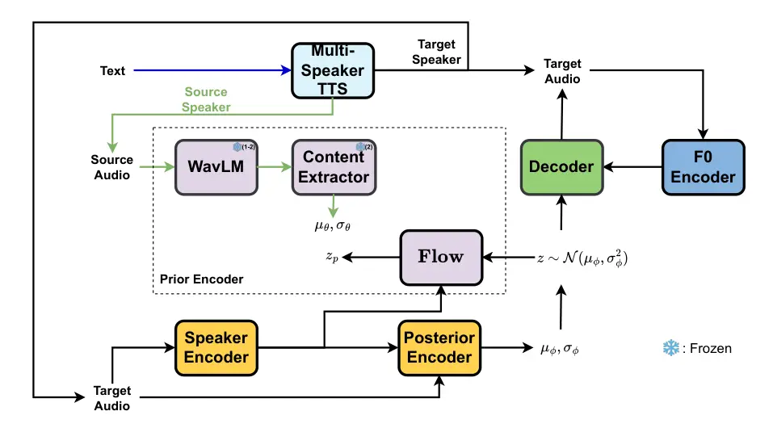
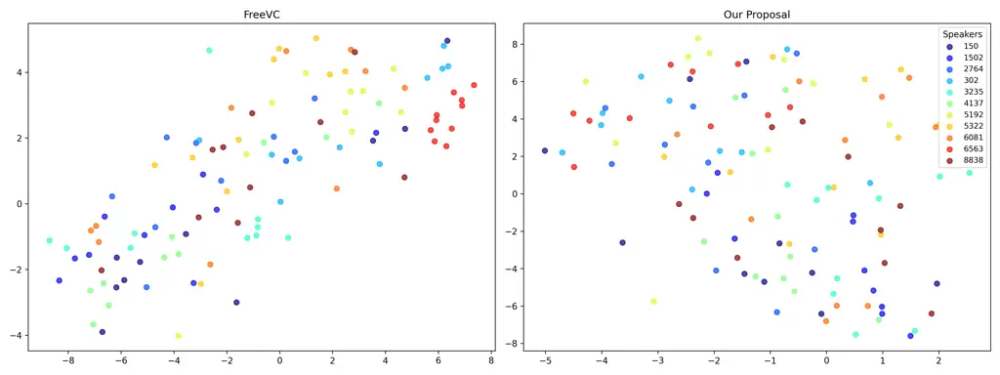
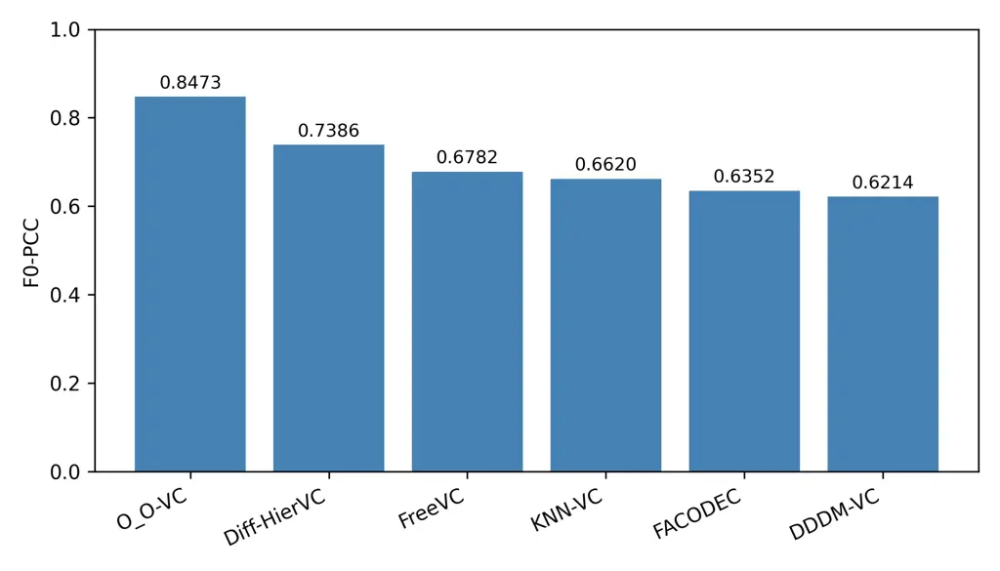
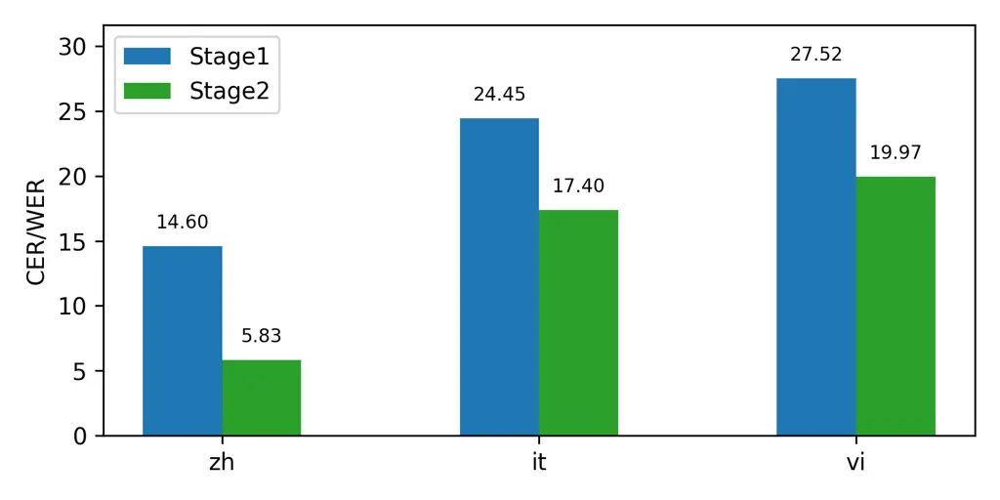
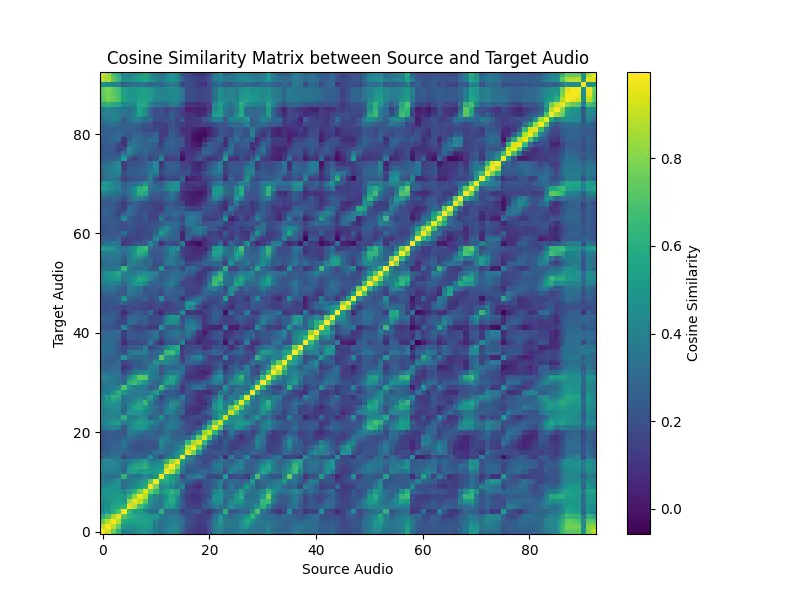
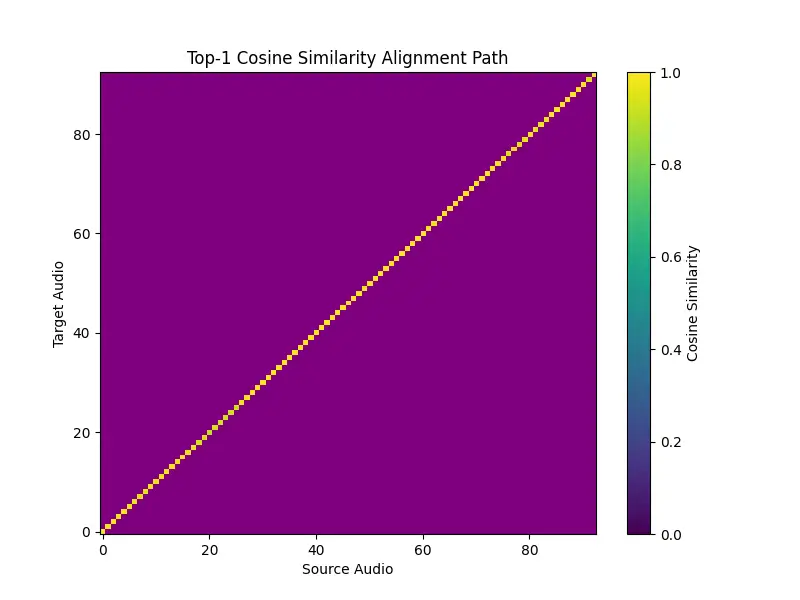
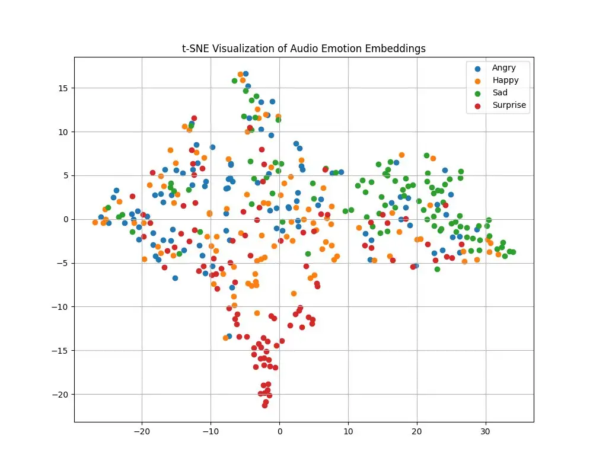
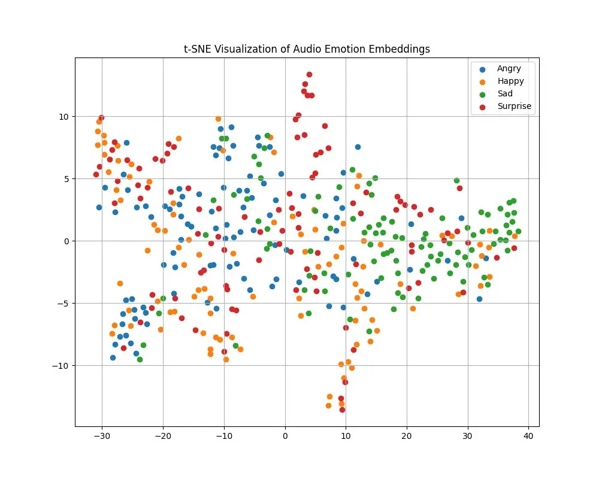

# O_O-VC: Synthetic Data-Driven One-to-One Alignment for Any-to-Any Voice Conversion

Huu Tuong Tu Affiliation: VNPT AI, VNPT Group Affiliation: Hanoi
University of Science and Technology    Huan Vu Affiliation: Business AI
Lab, National Economics University    Nguyen Tien Cuong
Affiliation: VNPT AI, VNPT Group    Ngo Dien Hy Affiliation: VNPT AI,
VNPT Group Affiliation: Business AI Lab, National Economics University
   Nguyen Thi Thu Trang Affiliation: 

###### Abstract

Traditional voice conversion (VC) methods typically attempt to separate
speaker identity and linguistic information into distinct
representations, which are then combined to reconstruct the audio.
However, effectively disentangling these factors remains challenging,
often leading to information loss during training. In this paper, we
propose a new approach that leverages synthetic speech data generated by
a high-quality, pretrained multispeaker text-to-speech (TTS) model.
Specifically, synthetic data pairs that share the same linguistic
content but differ in speaker identity are used as input-output pairs to
train the voice conversion model. This enables the model to learn a
direct mapping between source and target voices, effectively capturing
speaker-specific characteristics while preserving linguistic content.
Additionally, we introduce a flexible training strategy for any-to-any
voice conversion that generalizes well to unseen speakers and new
languages, enhancing adaptability and performance in zero-shot
scenarios. Our experiments show that our proposed method achieves a
16.35% relative reduction in word error rate and a 5.91% improvement in
speaker cosine similarity, outperforming several state-of-the-art
methods. Voice conversion samples can be accessed at:
[https://oovc-emnlp-2025.github.io/](https://oovc-emnlp-2025.github.io/)

## 1 Introduction

Voice conversion specifically aims to transform a source speaker’s voice
to match a target speaker while preserving the original linguistic
content. This is typically done by disentangling speech into content and
speaker identity representations, which are combined during training to
reconstruct the audio. At inference time, the source content is paired
with a target speaker embedding to generate the converted speech.

Several methods have been proposed for VC, with supervised training
being a common approach. Content encoders are trained with text labels
to extract linguistic features, and speaker encoders use speaker labels
to capture identity-specific traits (Huang et al., 2023; Liu et al.,
2021). Alternatively, phonetic posteriorgrams (PPGs) can be used
directly as content representations (Sun et al., 2016; Tian et al.,
2018). However, both approaches often struggle to capture
speaker-independent prosody and accent information. Moreover, training
content encoders as ASR models can introduce alignment errors or
recognition errors, which can negatively impact conversion quality
(Hussain et al., 2023).

On the other hand, some methods avoid using text labels by leveraging
self-supervised learning (SSL) to extract high-level phonetic
representations (Polyak et al., 2021; Lin et al., 2021; Huang et al.,
2022b; Huang et al., 2022c). These approaches aim to remove speaker
identity from source audio while preserving speaker-independent features
such as accent and content. To achieve this separation, techniques such
as vector quantization (Wu and Lee, 2020), instance normalization (Chen
et al., 2021b), heuristic transformation (Neekhara et al., 2024),
bottleneck, and data augmentation (Li et al., 2023) are commonly
applied. However, despite these efforts, such methods still struggle to
completely eliminate speaker information from the source speech. This
often leads to speaker leakage, where the converted audio retains
unintended characteristics of the source speaker, resulting in
mismatches between the synthesized voice and the intended target speaker
(Baas et al., 2023).

Previous studies have primarily focused on feature disentanglement
methods and audio reconstruction in voice conversion systems. However,
feature disentanglement remains a challenging task and training models
to reconstruct the audio may not be well suited for the voice conversion
objective, which inherently involves transforming speech from one
speaker to another. To address these limitations, we propose a novel
training strategy that leverages synthetic data generated by a
high-quality multi-speaker text-to-speech (TTS) system to directly
establish input-output mappings for voice conversion, bypassing the need
for traditional reconstruction-based approaches. Despite the high
fidelity of synthetic data, such TTS systems are typically constrained
to a fixed set of speakers, limiting their applicability to any-to-any
voice conversion, particularly for unseen speakers. To mitigate this
issue, we introduce a training framework that promotes generalization to
unseen speakers without relying on additional text or speaker labels,
thereby enhancing the system’s adaptability and performance in zero-shot
voice conversion scenarios. In summary, we make the following
contributions:

- •
  Synthetic data for voice conversion training: We propose the use of
  synthetic data generated by a high-quality multi-speaker TTS system to
  train voice conversion models. This approach eliminates the need for
  audio reconstruction and feature disentanglement, enabling direct
  learning of input-output mappings.
- •
  Improved generalization: We introduce a training strategy that allows
  the model to generalize to unseen speakers or unseen languages, making
  it well suited for zero-shot voice conversion.
- •
  We validate the effectiveness of our approach through extensive
  experiments, showing significant improvements over traditional
  reconstruction-based methods, especially in challenging zero-shot
  settings.

## 2 Literature Review

The goal of voice conversion (VC) is to transform the voice of a source
speaker into that of a target speaker while preserving the original
linguistic content. Achieving this requires an effective decomposition
of speech signals into distinct components such as linguistic content,
speaker timbre, and prosodic characteristics. Early VC systems were
typically trained as speech-to-speech models on parallel datasets, where
multiple speakers uttered the same sentences, defining the task as a
sequence-to-sequence problem (Sun et al., 2015; Chen et al., 2014).
Recent VC approaches have focused on reconstructing speech using
disentangled representations of linguistic content and speaker identity.

### 2.1 Text-Based Method

A common strategy is to leverage pretrained automatic speech recognition
(ASR) models to extract phonetic features such as PPGs, which provide a
speaker-independent representation of the input speech (Sun et al.,
2016; Liu et al., 2021; Tian et al., 2018). Specifically, speaker
information is obtained using a pretrained speaker verification (SV)
model. The speaker embeddings are combined with the content features
during decoding, allowing the system to generate speech in the target
speaker’s voice. Some approaches leverage hidden text representations
from pretrained multispeaker text-to-speech (TTS) models, using them
either as semantic features or as target representations for learning a
mapping from audio to text (Park et al., 2020; Zhang et al., 2021).

Despite their advantages, text-based methods suffer from several
limitations. PPGs and other textual representations often fail to
capture fine-grained attributes such as accent, prosody, and
speaker-independent speaking style. As a result, these systems often
produce speech that lacks expressiveness and sounds overly neutral
(Hussain et al., 2023). Although ASR-based disentanglement methods have
shown progress in separating speaker and content information, their
reliance on textual supervision and limited prosodic modeling remain
significant challenges for achieving natural and expressive voice
conversion across diverse speakers and languages.

### 2.2 Text-Free Method

To address the limitations of text-based methods, text-free approaches
have emerged, leveraging self-supervised learning models to extract
content representations without requiring transcriptions (Polyak et al.,
2021; Lin et al., 2021; Huang et al., 2022b; Huang et al., 2022c).
Although self-supervised learning (SSL) features capture high-level
information related to linguistic content, they often retain residual
speaker characteristics. To address this, methods such as bottleneck
layers (Li et al., 2023), vector quantization (Wu and Lee, 2020), and
instance normalization (Chen et al., 2021b) have been proposed to
compress SSL features and extract speaker-independent content
representations. However, effective disentanglement heavily depends on
the choice of bottleneck configuration: if the bottleneck dimension is
too large, speaker information may be retained; if too small, important
content information can be lost. A similar trade-off exists in vector
quantization: large codebooks may retain speaker traits, while overly
small codebooks may lead to excessive loss of content information.
Moreover, these compression techniques often degrade the quality of the
generated audio, and full disentanglement of speaker and content
information remains an open challenge.

### 2.3 KNN Method

Recent work has introduced k-nearest neighbor (kNN)-based voice
conversion methods (Baas et al., 2023), offering a simpler alternative
to traditional feature disentanglement approaches. These methods operate
directly on frame-level self-supervised representations extracted from
both source and target speech, which encode both phonetic and
speaker-specific information. Voice conversion is performed by replacing
each frame of the source with its nearest neighbor from the target set,
followed by vocoder-based synthesis.

However, in one-shot scenarios, the limited size of the target set
restricts the pool of candidate neighbors, often resulting in higher
word error rates. To address this, the Phoneme Hallucinator (Shan
et al., 2024) was proposed, leveraging a permutation network to
synthesize additional target representations and expand the neighbor
set, thereby improving intelligibility. Nonetheless, averaging features
in kNN-based retrieval can lead to oversmoothing, reducing speaker
distinctiveness and clarity in the synthesized speech.

### 2.4 Diffusion Method

Diffusion models have shown exceptional performance in generative tasks
across a variety of domains, including images, videos, and audio. In
speech processing, diffusion models have been successfully applied to
tasks such as audio generation (Kong et al., 2021; Chen et al., 2021a)
and text-to-speech (TTS) synthesis (Popov et al., 2021; Huang et al.,
2022a). Furthermore, diffusion models have been investigated for VC
tasks with the aim of enhancing the conversion process. In particular,
diffusion-based VC models (Popov et al., 2022) have demonstrated high
performance in zero-shot speaker adaptation through iterative sampling
processes. While recent works such as Diff-HierVC (Choi et al., 2023)
and DDDM-VC (Choi et al., 2024) have further improved zero-shot VC
performance through source-filter disentanglement and disentangled
denoising processes, the audio quality of diffusion models is still
limited.

## 3 Methodology

In text-free VC systems, content and speaker identity are often not
fully disentangled. As a result, speaker information can leak into the
content representation, which undermines the system’s ability to perform
clean speaker conversion. This leakage reduces the system’s
generalization to unseen voices or speaking styles and often results in
converted speech that retains characteristics of the source speaker.

In text-based VC, ASR-derived content representations are highly
sensitive to transcription errors, mispronunciations, and noisy labels,
which can compromise their reliability and degrade the quality of
converted speech (Sun et al., 2016; Liu et al., 2021; Tian et al.,
2018). Some approaches attempt to leverage knowledge transfer from
hidden representations of text encoders in multispeaker TTS models (Park
et al., 2020; Zhang et al., 2021). However, mapping audio
representations directly to these text-based features is a difficult
task. In addition, this process typically requires an explicit alignment
mechanism between speech and text, which introduces further complexity.

As an alternative solution, synthetic data offers several advantages for
voice conversion. When both source and target audio are generated from
the same linguistic content, it provides a clean and direct supervisory
signal. This shared content allows precise frame-level alignment between
source and target audio, enabling more stable and fine-grained learning
of the conversion function. Unlike traditional approaches that rely on
symbolic representations (e.g., phonemes or characters), synthetic data
eliminates the need for such intermediates and avoids issues like label
noise commonly found in real-data training. Furthermore, with controlled
or predefined durations, speaker-independent features are inherently
aligned across domains, removing the need for forced alignment
algorithms used in previous work (Park et al., 2020; Zhang et al.,
2021). Unlike methods that map audio to hidden text representations from
multispeaker TTS models, our approach directly maps source audio to
target audio, simplifying the learning process. This enables one-to-one
frame alignment, allowing the model to focus more effectively on speaker
transformation while preserving linguistic content. Finally, synthetic
data enables the creation of diverse speaker pairs with uniform content,
supporting the learning of generalizable speaker conversion mappings.
Motivated by these advantages, this work is the first to propose using
synthetic data as a training paradigm for voice conversion models.

### 3.1 Synthetic Data Strategy

Building upon these advantages, we propose a synthetic data strategy to
improve the disentanglement of speaker and content representations in
voice conversion. Instead of relying on real-world utterances, we
generate high-quality synthetic pairs with identical linguistic content
but varying speaker identities. This provides ideal supervision for
isolating speaker-independent content.

We use a multi-speaker TTS system that produces natural, intelligible
speech across speakers from a shared linguistic latent space. Our
selection criteria for the TTS system are: (1) the generated speech must
be of high fidelity, exhibiting natural prosody and clarity, and (2) the
model must synthesize source and target utterances from the same
linguistic latent space, ensuring consistent phonetic and prosodic
alignment across speakers. These criteria ensure that the synthetic
speech pairs are perfectly aligned in linguistic structure while
differing only in speaker identity.

We adopt VITS (Kim et al., 2021) as the backbone of our TTS system
because it combines variational inference, flows, and adversarial
learning to generate high-quality speech with precise duration control
and the ability to sample two audios with different speakers conditioned
on a shared latent linguistic representation. This enables the creation
of large-scale, controllable training data that improves
disentanglement, reduces speaker leakage, and enhances voice conversion
robustness.

Given a text input $`c_{\text{text}}`$, source speaker embedding
$`s_{\text{src}}`$, target speaker embedding $`s_{\text{tgt}}`$, and
noise vector $`w`$, we generate a pair of utterances by first encoding
the linguistic content:

```math
h_{\text{text}}=\text{TextEncoder}(c_{\text{text}}) \tag{1}
```

We then sample a global speaker token:

```math
g=\text{random}(s_{\text{src}},s_{\text{tgt}}) \tag{2}
```

and predict the duration based on speaker condition using the duration
predictor (DP):

```math
\text{dur}_{\text{text}}=\text{DP}(h_{\text{text}},g,w) \tag{3}
```

Next, we project the encoded content into a linguistic latent
distribution:

```math
\mu_{p},\sigma_{p}=\text{Projector}(h_{\text{text}}) \tag{4}
```

We then sample latent linguistic features by applying duration expansion
through the length regulator (LR), defined as follows:

```math
\mu_{p},\sigma_{p}=\text{LR}(\mu_{p},\sigma_{p},\text{dur}_{\text{text}}) \tag{5}
```

```math
z_{p}=\mu_{p}+\sigma_{p}\cdot\epsilon,\quad\epsilon\sim\mathcal{N}(0,I) \tag{6}
```

To generate speaker-specific representations, we apply the inverse flow
conditioned on each speaker:

```math
z_{\text{src}}=\text{Flow}^{-1}(z_{p},s_{\text{src}}) \tag{7}
```

```math
z_{\text{tgt}}=\text{Flow}^{-1}(z_{p},s_{\text{tgt}}) \tag{8}
```



(a) Training

(b) Inference

Figure 1: Voice conversion with synthetic data.

Finally, we decode both representations into waveform audio:

```math
a_{\text{src}}=\text{Decoder}(z_{\text{src}}),\quad a_{\text{tgt}}=\text{Decoder}(z_{\text{tgt}}) \tag{9}
```

This process generates pairs of utterances that share the same
linguistic latent features, duration, and prosody, while differing only
in speaker identity. Such pairs provide a clean and consistent training
signal for voice conversion. Standard VITS, however, produces utterances
independently, which often leads to mismatches in duration and rhythm.

### 3.2 Model Overview

After generating synthetic data consisting of source and target speech
pairs for supervised training, these utterances are directly utilized as
input-output pairs for the voice conversion model. As the backbone
architecture, we adopt a VITS-base model. Following the design of FreeVC
(Li et al., 2023), our model structure retains its core components.
However, we note that while the source and target speech pairs share the
same underlying linguistic content, the target speech is conditioned on
a different speaker identity, which primarily manifests in variations in
pitch. To avoid mismatch between input and output during training, we
incorporate the fundamental frequency ($`F0`$) of the target speech as
an additional conditioning feature when decoding the final audio. The
general model pipeline is illustrated in Figure 1.

#### 3.2.1 Training Procedure

In the training phase, the source and target audios are processed
through different stages:

Source Audio Processing: The source audio is passed through a pretrained
WavLM (Chen et al., 2022) and a content extractor to obtain a
distribution of content features
$`\mathcal{N}(\mu_{\theta},\sigma^{2}_{\theta})`$.

Target Audio Processing: The target audio is passed through a speaker
encoder and a posterior encoder to extract the posterior latent
distribution $`\mathcal{N}(\mu_{\phi},\sigma^{2}_{\phi})`$. Then, a
latent variable $`z`$ is sampled from this distribution
$`z\sim\mathcal{N}(\mu_{\phi},\sigma^{2}_{\phi})`$. The sampled latent
vector $`z`$ is passed through a flow-based module to obtain $`z_{p}`$,
transforming the posterior distribution to match the prior distribution.
A Kullback-Leibler (KL) divergence loss is calculated to minimize the
discrepancy between the posterior and prior distributions.

Fundamental Frequency (F0) Adjustment: To address the mismatch in $`F0`$
between the source and target audio, we extract the $`F0`$ of the target
audio and pass it through an $`F0`$ encoder to obtain pitch-related
features. The decoder then takes the transformed latent representation
along with the $`F0`$ features to generate the target audio. In this
work, we extract $`F0`$ using Parselmouth¹¹ 1
[https://github.com/YannickJadoul/Parselmouth](https://github.com/YannickJadoul/Parselmouth).

#### 3.2.2 Fine-Tuning Adaptation

Training with synthetic data often results in poor generalization to
unseen speakers. Multi-speaker TTS models are typically trained with
fixed speaker embeddings, which can lead to reduced speaker similarity
for out-of-domain speakers. Moreover, slight discrepancies in the
linguistic content between source and target utterances may persist,
despite both being generated from the same text.

To mitigate these challenges, we adopt a two-phase training strategy:

- •
  Phase 1: Train the model with synthetic data, where the WavLM and
  content extractor components are responsible for learning independent
  speaker representations. The WavLM is frozen during phase 1.
- •
  Phase 2: Fine-tune the model using real large multispeaker speech
  recordings corpus with a reconstruction-based objective, the input and
  output of the model is the same audio. During this phase, WavLM and
  content extractor is frozen to preserve speaker-independent
  representations learned in phase 1. This fine-tuning phase helps the
  model adapt to new speakers without the need for transcripts and
  improves the fidelity of linguistic content. Additionally, the model
  becomes more versatile and can easily adapt to different domains, such
  as various languages or accents.

#### 3.2.3 Inference

During inference, the source audio is processed by WavLM and the content
extractor to obtain the content distribution
$`\mathcal{N}(\mu_{\theta},\sigma^{2}_{\theta})`$. A latent sample
$`z_{p}`$ is drawn and combined with the speaker embedding from the
reference audio via the inverse flow model, producing a feature that
captures both content and speaker information.

To address the mismatch in $`F0`$ between the source and reference
audio, we shift $`F0`$ source to $`F0`$ target with same median level,
the following steps are performed:

```math
\displaystyle F0_{\text{src}} \displaystyle=\text{Get\_F0}(\text{Source Audio}) \tag{10}
```

```math
\displaystyle F0_{\text{ref}} \displaystyle=\text{Get\_F0}(\text{Reference Audio}) \tag{11}
```

```math
\displaystyle\log F0_{\text{shifted}} \displaystyle=\log(F0_{\text{src}})-\text{med}(\log(F0_{\text{src}}))
```

```math
\displaystyle\quad+\text{med}(\log(F0_{\text{ref}})) \tag{12}
```

```math
\displaystyle F0_{\text{shifted}} \displaystyle=\exp(\log F0_{\text{shifted}}) \tag{13}
```

The shifted $`F0`$ is then used as a conditioning feature along with the
fused linguistic and speaker representation to generate the final audio
output.

#### 3.2.4 Objective Function

Following the methodology proposed in (Li et al., 2023), we formulate
the objective function by combining losses from conditional variational
autoencoders (CVAE) and generative adversarial networks (GAN) (Mao
et al., 2017; Larsen et al., 2016). CVAE-related losses include the KL
divergence loss $`L_{\text{kl}}`$, which measures the discrepancy
between the prior and posterior distributions of the flow-based model,
and a phase-dependent reconstruction/conversion loss, either
$`L_{\text{rec}}`$ in phase 2 or $`L_{\text{cv}}`$ in phase 1, defined
as the L1 distance between the predicted and target mel-spectrograms.
GAN-related losses include the adversarial loss for the discriminator
$`L_{\text{adv}}(D)`$, the adversarial loss for the generator
$`L_{\text{adv}}(G)`$, and the feature matching loss
$`L_{\text{fm}}(G)`$. We further incorporate two distillation losses
into the total objective. The final loss function is defined as:

```math
L(D)=L_{\text{adv}}(D) \tag{14}
```

```math
L(G)=L_{\text{rec/cv}}+L_{\text{kl}}+L_{\text{adv}}(G)+L_{\text{fm}}(G) \tag{15}
```

|               |                       |                      |                      |                      |                                                                           |                                                                           |                      |
| ------------- | --------------------- | -------------------- | -------------------- | -------------------- | ------------------------------------------------------------------------- | ------------------------------------------------------------------------- | -------------------- |
| Model         | Objective Evaluation  |                      |                      |                      | Subjective Evaluation                                                     |                                                                           |                      |
|               | SECS$`\uparrow`$      | WER$`\downarrow`$    | CER$`\downarrow`$    | NISQA$`\uparrow`$    | MOS$`\uparrow`$                                                           | SMOS$`\uparrow`$                                                          | B-MOS$`\uparrow`$    |
| FreeVC        | 75.66                 | 2.37                 | 0.78                 | 4.60                 | $`\textbf{{\color[rgb]{0,0,1}3.60}}\pm\textbf{{\color[rgb]{0,0,1}0.26}}`$ | $`3.01\pm 0.28`$                                                          | $`\underline{3.31}`$ |
| KNN-VC        | 78.33                 | 2.16                 | $`\underline{0.62}`$ | 3.92                 | $`3.17\pm 0.23`$                                                          | $`2.89\pm 0.21`$                                                          | 3.03                 |
| Diff-Hier     | 81.42                 | 3.82                 | 1.51                 | 3.80                 | $`2.87\pm 0.28`$                                                          | $`3.42\pm 0.25`$                                                          | 3.15                 |
| DDDM-VC       | $`\underline{81.86}`$ | 6.84                 | 2.92                 | 3.91                 | $`2.89\pm 0.28`$                                                          | $`\textbf{{\color[rgb]{0,0,1}3.61}}\pm\textbf{{\color[rgb]{0,0,1}0.23}}`$ | 3.25                 |
| Facodec       | 81.54                 | $`\underline{2.08}`$ | 0.64                 | 3.90                 | $`2.49\pm 0.29`$                                                          | $`2.66\pm 0.27`$                                                          | 2.58                 |
| O_O-VC (Ours) | 86.70                 | 1.74                 | 0.53                 | $`\underline{4.04}`$ | $`\underline{3.42\pm 0.24}`$                                              | $`\underline{3.48\pm 0.23}`$                                              | 3.45                 |

Table 1: Any-to-any voice conversion results. Blue indicates the best
performance, Underline indicates second best. Subjective evaluation
results showing MOS and SMOS scores, along with 95% confidence
intervals.

## 4 Experiment Setup

### 4.1 Datasets

For phase 1 of training, we use synthetic speech generated by a publicly
available pretrained VITS model²² 2
[https://github.com/jaywalnut310/vits](https://github.com/jaywalnut310/vits).
Specifically, we adopt the model released in the official repository.
The amount of synthetic data corresponds to the VCTK training set used
in the original VITS implementation. For each sample, the target audio
is synthesized using the ground-truth text and speaker ID, while the
source audio is generated by sampling a different random speaker ID. In
phase 2, we fine-tune the model on the LibriSpeech dataset (Panayotov
et al., 2015), using the train-clean-360 and train-clean-100 subsets,
totaling approximately 460 hours of speech from 1,172 speakers.
Evaluation is conducted on the test-clean subset under any-to-any voice
conversion scenarios.

### 4.2 Model Configuration and Training Details

We follow the implementation and hyperparameter setup of FreeVC (Li
et al., 2023). Training occurs in two phases: up to 450k steps on
synthetic data, followed by 150k steps of fine-tuning on real speech.
All experiments are conducted on four NVIDIA Tesla A100 GPUs.

We compare our method with several recent state-of-the-art voice
conversion models, including FreeVC (Li et al., 2023), DDDM-VC (Choi
et al., 2024), Diff-HierVC (Choi et al., 2023), FaCodec (NaturalSpeech 3) (Ju et al., 2024), and KNN-VC (Baas et al., 2023). For all baselines,
we use official publicly released pretrained models. For KNN-VC, we use
an 8-minute real speech segment as the reference pool for
nearest-neighbor retrieval.

### 4.3 Evaluation Metrics

Objective Evaluation: We evaluate system performance using four
objective metrics: Character Error Rate (CER), Word Error Rate (WER),
Speaker Encoder Cosine Similarity (SECS), and Objective Naturalness. CER
and WER assess intelligibility between the source and converted speech,
using the HuBERT model³³ 3
[https://huggingface.co/facebook/hubert-large-ls960-ft](https://huggingface.co/facebook/hubert-large-ls960-ft)
(Hsu et al., 2021). SECS measures speaker similarity using the cosine
similarity between embeddings extracted by Resemblyzer⁴⁴ 4
[https://github.com/resemble-ai/Resemblyzer](https://github.com/resemble-ai/Resemblyzer).
Naturalness is assessed using NISQA (Mittag et al., 2021), which
estimates perceptual speech quality without reference audio. We compute
these metrics on 1,000 randomly sampled audio pairs from LibriSpeech
test-clean.

Subjective Evaluation: For human evaluation, we use Mean Opinion Score
(MOS) and Speaker Similarity Mean Opinion Score (SMOS). MOS rates
naturalness, while SMOS rates speaker similarity, both on a 1-5 scale.
We randomly select 30 audio pairs from the objective set, each evaluated
by three different annotators, resulting in a total of 540 labeled audio
samples. A total of 12 volunteer listeners participate in the
evaluation. Final scores are calculated by averaging the ratings across
annotators for each pair to ensure reliability. In voice conversion
systems, both MOS and SMOS help evaluate model quality. To provide an
overall comparison, we introduce a new metric called balance-MOS
(B-MOS), defined as the average of these two scores.

|                |                  |                   |                   |                   |
| -------------- | ---------------- | ----------------- | ----------------- | ----------------- |
| Model          | SECS$`\uparrow`$ | WER$`\downarrow`$ | CER$`\downarrow`$ | NISQA$`\uparrow`$ |
| O_O-VC (Ours)  | 86.70            | 1.74              | 0.53              | 4.04              |
| w/o F0 Encoder | 87.00            | 2.07              | 0.61              | 3.85              |
| w/o Finetuning | 70.78            | 2.18              | 0.66              | 4.59              |
| FreeVC         | 75.66            | 2.37              | 0.78              | 4.60              |

Table 2: Ablation study results.

## 5 Results and Analysis



Figure 2: T-SNE visualization of speaker-independent features. More
distributed points with no clusters indicate better speaker
independence.

### 5.1 Zero-Shot Voice Conversion

We evaluate our model in a zero-shot setting, where the target speaker
is unseen during training. The results in Table 1 demonstrate that our
model achieves the best performance in terms of content consistency,
with the lowest WER and CER. Furthermore, our model achieves the second
highest MOS, only slightly behind FreeVC. This can be attributed to the
fact that FreeVC is trained on a high-quality speech dataset, whereas
our model is fine-tuned and adapted on LibriSpeech, which is of
comparatively lower quality, leading to decreased performance. Despite
FreeVC’s strong MOS, it performs notably worse in terms of speaker
similarity and content intelligibility compared to our model. Although
DDDM-VC achieves the highest Similarity Mean Opinion Score (SMOS), its
speech quality is comparatively poor. Overall, our model achieves the
best intelligibility while maintaining a strong balance between
naturalness (MOS) and speaker similarity (SMOS), outperforming recent
systems in a zero-shot scenario.



Figure 3: Comparison of systems on F0-PCC

### 5.2 Ablation Study

We conduct an ablation study by modifying or removing key modules to
evaluate their individual contributions, summarized in Table 2. We
observe that removing the use of synthetic data, the F0 encoder, or
phase 2 fine-tuning each leads to a noticeable drop in intelligibility,
highlighting the importance of all three components. Eliminating phase 2
fine-tuning also causes a significant reduction in speaker similarity,
likely due to the limited speaker diversity in the phase 1 dataset.
However, since the phase 1 data is of higher quality, the phase 2
adaptation may slightly reduce speech quality. These findings
demonstrate that using a synthetic dataset in phase 1 can achieve speech
quality comparable to real data (competitive NISQA with FreeVC), while
our phase 2 adaptation enables the model to generalize effectively to
new datasets and unseen speakers without transcript labels.

In addition to intelligibility and naturalness, we also assess pitch
preservation by reporting the F0 Pearson Correlation Coefficient
(F0-PCC) (Benesty et al., 2009), which is computed between the F0
contours of the source and converted audio. As shown in Figure 3, our
system achieves the highest F0-PCC, outperforming recent models that
explicitly condition on F0 such as Diff-HierVC, as well as the same
backbone model FreeVC without F0 conditioning. These results highlight
the effectiveness of the proposed F0 encoder in maintaining accurate
pitch contours and demonstrate strong pitch consistency across converted
speech.

We also quantitatively evaluate how effectively the prior encoder
removes speaker information by comparing our model to FreeVC, which
shares the same backbone architecture. Our goal is to demonstrate that
training with synthetic data significantly improves the removal of
speaker identity from source audio. To assess this, we use three
clustering evaluation metrics: Adjusted Rand Index (ARI), Normalized
Mutual Information (NMI) and Silhouette Score. The ARI measures the
similarity between predicted clusters and true speaker labels, adjusted
for chance. A lower ARI indicates that the clusters do not correspond
well to speaker identities, suggesting better speaker information
removal. NMI measures the amount of shared information between the
predicted and true clusters; lower values indicate weaker correlation
and thus stronger speaker anonymization. The Silhouette Score reflects
how well each embedding fits within its cluster compared to the others.
Lower scores imply that the model’s embeddings are not tightly grouped
by speaker, further indicating that speaker identity has been
suppressed. The quantitative results are shown in Table 3. Our model,
trained with synthetic data, consistently achieves lower scores across
all metrics, demonstrating its improved ability to remove
speaker-specific information compared to FreeVC.

| Model         | ARI$`\downarrow`$ | NMI$`\downarrow`$ | Silhouette$`\downarrow`$ |
| ------------- | ----------------- | ----------------- | ------------------------ |
| O_O-VC (Ours) | 0.07              | 0.31              | 0.15                     |
| FreeVC        | 0.13              | 0.41              | 0.17                     |

Table 3: Evaluation of speaker information removal.

For intuitive visualization, we use t-SNE to plot the
speaker-independent features in Figure 2. Our model’s embeddings are
more evenly dispersed across speakers (different colors), indicating
greater speaker independence. In contrast, FreeVC shows noticeable
clustering, such as for speakers $`6563`$ and $`5192`$, which indicates
that its features preserve more speaker-specific information.

### 5.3 Adaptation to New Languages

We evaluate the adaptability of our approach to new languages by
applying the model to speech data from previously unseen linguistic
domains. In this experiment, we fine-tune the model in phase 2 using
speech from three languages: Chinese (ZH), Italian (IT), and Vietnamese
(VI). We use AISHELL-3 for Chinese (Shi et al., 2021), the same dataset
as (Tu et al., 2025) for Vietnamese, and the Multilingual LibriSpeech
(MLS) training subset for Italian (Pratap et al., 2020). We reserve a
portion of each training set as a test set and pair 400 utterances for
evaluation. To measure content intelligibility, we use language-specific
ASR tools: FunASR (Gao et al., 2023) with paraformer-zh (Gao et al., 2022) for Chinese, Chunkformer-large-vi (Le et al., 2025) for
Vietnamese, and Whisper-large (Radford et al., 2023) for Italian. Figure
4 shows that Phase 2 fine-tuning boosts performance and enables language
adaptation using only audio, without requiring labeled data. It also
proves that our speaker-independent features still retain some accent or
language information.



Figure 4: Performance of new language adaptation: CER for Chinese, WER
for Vietnamese and Italian.

### 5.4 Semantic Alignment of Synthetic Audio Pairs



(a) Cosine pairwise semantic similarity.



(b) Top-1 cosine similarity alignment path.

Figure 5: Semantic alignment of source and target audio via synthetic
data.

To evaluate the effectiveness of synthetic speech for input-output
training, we examine the semantic alignment between the source and
target audio generated. To assess semantic alignment quality, we extract
semantic features with a pretrained HuBERT ASR model, as described in
Section 4.3. We then compute the cosine similarity between all pairs of
frames from the source and target audio, resulting in a pairwise
similarity matrix. This matrix is visualized as a cosine similarity
heatmap in Figure 5(a).

The heatmap displays a clear diagonal of high similarity values,
indicating strong frame-level alignment between the source and target
audio. Furthermore, the top-1 cosine similarity alignment path, shown in
Figure 5(b), lies precisely along the diagonal, confirming perfect
alignment. These results demonstrate that the synthetic data
input-output pairs are ideal training examples for voice conversion,
enabling the model to learn effective one-to-one mapping.

## 6 Conclusion

We presented a robust voice conversion framework based on synthetic data
and a two-phase training strategy. Our method enhances speaker
similarity, speech quality, and content consistency, particularly in
zero-shot scenarios with unseen target speakers. Experiments and
ablation studies confirm the effectiveness of our approach and
demonstrate its ability to prevent speaker information leakage from the
source audio. Additionally, we showed that the model generalizes well to
unseen languages without requiring labeled data, making it highly
suitable for low-resource settings.

## Limitations

Although our model improves speaker similarity and content
intelligibility, it still depends on access to a high-quality,
well-labeled speech corpus to train the TTS system. Furthermore, the
effectiveness of synthetic data generation and its influence on the
performance of voice conversion across different TTS systems remain
insufficiently explored. Therefore, in future work, we plan to
investigate alternative TTS models to gain a deeper and more
comprehensive understanding of their impact on overall system
performance.

## Ethics Statement

Voice conversion technology raises ethical concerns because it can be
misused to generate deepfake audio and illegally spoof someone’s
identity without consent. Such applications risk enabling fraud,
misinformation, and reputational harm, while also undermining public
trust in authentic communication. Since voices are unique biometric
identifiers, misuse poses serious threats to privacy and security.
Ethical use requires informed consent, transparency, and robust
safeguards, including reliable spoofing verification methods, to prevent
malicious exploitation.

## References

- Baas et al. (2023) Matthew Baas, Benjamin van Niekerk, and Herman
  Kamper. 2023. Voice conversion with just nearest neighbors. In
  _Interspeech 2023_.
- Benesty et al. (2009) Jacob Benesty, Jingdong Chen, Yiteng Huang, and
  Israel Cohen. 2009. [Pearson correlation
  coefficient](https://doi.org/10.1007/978-3-642-00296-0_5). In _Noise
  Reduction in Speech Processing_, pages 1–4, Berlin, Heidelberg.
  Springer Berlin Heidelberg.
- Chen et al. (2014) Ling-Hui Chen, Zhen-Hua Ling, Li-Juan Liu, and
  Lirong Dai. 2014. [Voice conversion using deep neural networks with
  layer-wise generative
  training](https://doi.org/10.1109/TASLP.2014.2353991). _Audio, Speech,
  and Language Processing, IEEE/ACM Transactions on_, 22:1859–1872.
- Chen et al. (2021a) Nanxin Chen, Yu Zhang, Heiga Zen (Byungha Chun),
  Ron Weiss, Mohammad Norouzi, and William Chan. 2021a. [Wavegrad:
  Estimating gradients for waveform
  generation](https://arxiv.org/abs/2009.00713). In _ICLR_.
- Chen et al. (2022) Sanyuan Chen, Chengyi Wang, Zhengyang Chen, Yu Wu,
  Shujie Liu, Zhuo Chen, Jinyu Li, Naoyuki Kanda, Takuya Yoshioka, Xiong
  Xiao, Jian Wu, Long Zhou, Shuo Ren, Yanmin Qian, Yao Qian, Michael
  Zeng, Xiangzhan Yu, and Furu Wei. 2022. [Wavlm: Large-scale
  self-supervised pre-training for full stack speech
  processing](https://doi.org/10.1109/JSTSP.2022.3188113). _IEEE Journal
  of Selected Topics in Signal Processing_, 16:1–14.
- Chen et al. (2021b) Yen-Hao Chen, Da-Yi Wu, Tsung-Han Wu, and Hung-yi
  Lee. 2021b. [Again-vc: A one-shot voice conversion using activation
  guidance and adaptive instance
  normalization](https://doi.org/10.1109/ICASSP39728.2021.9414257). In
  _ICASSP 2021 - 2021 IEEE International Conference on Acoustics, Speech
  and Signal Processing (ICASSP)_, pages 5954–5958.
- Choi et al. (2023) Ha-Yeong Choi, Sang-Hoon Lee, and Seong-Whan
  Lee. 2023. [Diff-hiervc: Diffusion-based hierarchical voice conversion
  with robust pitch generation and masked prior for zero-shot speaker
  adaptation](https://doi.org/10.21437/Interspeech.2023-817). In
  _Interspeech 2023_, pages 2283–2287.
- Choi et al. (2024) Ha-Yeong Choi, Sang-Hoon Lee, and Seong-Whan
  Lee. 2024. Dddm-vc: Decoupled denoising diffusion models with
  disentangled representation and prior mixup for verified robust voice
  conversion. In _Proceedings of the AAAI Conference on Artificial
  Intelligence_, volume 38, pages 17862–17870.
- Gao et al. (2023) Zhifu Gao, Zerui Li, Jiaming Wang, Haoneng Luo, Xian
  Shi, Mengzhe Chen, Yabin Li, Lingyun Zuo, Zhihao Du, Zhangyu Xiao, and
  Shiliang Zhang. 2023. Funasr: A fundamental end-to-end speech
  recognition toolkit. In _INTERSPEECH_.
- Gao et al. (2022) Zhifu Gao, Shiliang Zhang, Ian Mcloughlin, and
  Zhijie Yan. 2022. Paraformer: Fast and accurate parallel transformer
  for non-autoregressive end-to-end speech recognition. In _Interspeech
  2022_, pages 2063–2067.
- Hsu et al. (2021) Wei-Ning Hsu, Benjamin Bolte, Yao-Hung Tsai, Kushal
  Lakhotia, Ruslan Salakhutdinov, and Abdelrahman Mohamed. 2021.
  [Hubert: Self-supervised speech representation learning by masked
  prediction of hidden
  units](https://doi.org/10.1109/TASLP.2021.3122291). _IEEE/ACM
  Transactions on Audio, Speech, and Language Processing_, PP:1–1.
- Huang et al. (2023) Hao Huang, Lin Wang, Jichen Yang, Ying Hu, and
  Liang He. 2023. W2vc: Wavlm representation based one-shot voice
  conversion with gradient reversal distillation and ctc supervision. In
  _Journal AUDIO SPEECH MUSIC PROC_.
- Huang et al. (2022a) Rongjie Huang, Max WY Lam, Jun Wang, Dan Su, Dong
  Yu, Yi Ren, and Zhou Zhao. 2022a. Fastdiff: A fast conditional
  diffusion model for high-quality speech synthesis. In _Proceedings of
  the IJCAI-22_.
- Huang et al. (2022b) Wen-Chin Huang, Shu-Wen Yang, Tomoki Hayashi,
  Hung-Yi Lee, Shinji Watanabe, and Tomoki Toda. 2022b. S3prl-vc:
  Open-source voice conversion framework with self-supervised speech
  representations. In _Proc. ICASSP_.
- Huang et al. (2022c) Wen-Chin Huang, Shu-Wen Yang, Tomoki Hayashi, and
  Tomoki Toda. 2022c. A Comparative Study of Self-Supervised Speech
  Representation Based Voice Conversion. _IEEE Journal of Selected
  Topics in Signal Processing_, 16(6):1308–1318.
- Hussain et al. (2023) Shehzeen Hussain, Paarth Neekhara, Jocelyn
  Huang, Jason Li, and Boris Ginsburg. 2023. [Ace-vc: Adaptive and
  controllable voice conversion using explicitly disentangled
  self-supervised speech
  representations](https://doi.org/10.1109/ICASSP49357.2023.10094850).
  In _ICASSP 2023 - 2023 IEEE International Conference on Acoustics,
  Speech and Signal Processing (ICASSP)_, pages 1–5.
- Ju et al. (2024) Zeqian Ju, Yuancheng Wang, Kai Shen, Xu Tan, Detai
  Xin, Dongchao Yang, Yanqing Liu, Yichong Leng, Kaitao Song, Siliang
  Tang, Zhizheng Wu, Tao Qin, Xiang-Yang Li, Wei Ye, Shikun Zhang, Jiang
  Bian, Lei He, Jinyu Li, and Sheng Zhao. 2024. Naturalspeech 3:
  zero-shot speech synthesis with factorized codec and diffusion models.
  In _Proceedings of the 41st International Conference on Machine
  Learning_, ICML’24.
- Kim et al. (2021) Joonson Kim, Jungil Kong, and Jaehyeon Son. 2021.
  Conditional variational autoencoder with adversarial learning for
  end-to-end text-to-speech. In _Proceedings of the International
  Conference on Machine Learning (ICML)_, pages 5530–5540.
- Kong et al. (2021) Ziyu Kong, Wei Ping, Jiaji Huang, Kexin Zhao, and
  Bryan Catanzaro. 2021. Diffwave: A versatile diffusion model for audio
  synthesis. In _International Conference on Learning Representations
  (ICLR)_.
- Larsen et al. (2016) Anders Boesen Lindbo Larsen, Søren Kaae Sønderby,
  H. Larochelle, and Ole Winther. 2016. Autoencoding beyond pixels using
  a learned similarity metric. _International conference on machine
  learning_, abs/1512.09300.
- Le et al. (2025) Khanh Le, Tuan Vu Ho, Dung Tran, and Duc Thanh
  Chau. 2025. [Chunkformer: Masked chunking conformer for long-form
  speech
  transcription](https://doi.org/10.1109/ICASSP49660.2025.10888640). In
  _ICASSP 2025 - 2025 IEEE International Conference on Acoustics, Speech
  and Signal Processing (ICASSP)_, pages 1–5.
- Li et al. (2023) Jingyi Li, Weiping Tu, and Li Xiao. 2023. [Freevc:
  Towards high-quality text-free one-shot voice
  conversion](https://doi.org/10.1109/ICASSP49357.2023.10095191). In
  _ICASSP 2023 - 2023 IEEE International Conference on Acoustics, Speech
  and Signal Processing (ICASSP)_, pages 1–5.
- Lin et al. (2021) Yist Y. Lin, Chung-Ming Chien, Jheng-Hao Lin,
  Hung-yi Lee, and Lin-shan Lee. 2021. [Fragmentvc: Any-to-any voice
  conversion by end-to-end extracting and fusing fine-grained voice
  fragments with
  attention](https://doi.org/10.1109/ICASSP39728.2021.9413699). In
  _ICASSP 2021 - 2021 IEEE International Conference on Acoustics, Speech
  and Signal Processing (ICASSP)_, pages 5939–5943.
- Liu et al. (2021) Songxiang Liu, Yuewen Cao, Disong Wang, Xixin Wu,
  Xunying Liu, and Helen Meng. 2021. [Any-to-many voice conversion with
  location-relative sequence-to-sequence
  modeling](https://doi.org/10.1109/TASLP.2021.3076867). _IEEE/ACM
  Transactions on Audio, Speech, and Language Processing_.
- Luong and Vu (2016) Hieu-Thi Luong and Hai-Quan Vu. 2016. [A
  non-expert Kaldi recipe for Vietnamese speech recognition
  system](https://aclanthology.org/W16-5207). In _WLSI/OIAF4HLT2016_,
  pages 51–55, Osaka, Japan. The COLING 2016 Organizing Committee.
- Ma et al. (2024) Ziyang Ma, Zhisheng Zheng, Jiaxin Ye, Jinchao Li,
  Zhifu Gao, Shiliang Zhang, and Xie Chen. 2024. emotion2vec:
  Self-supervised pre-training for speech emotion representation. _Proc.
  ACL 2024 Findings_.
- Mao et al. (2017) X. Mao, Q. Li, H. Xie, R. K. Lau, Z. Wang, and
  S. Smolley. 2017. [Least squares generative adversarial
  networks](https://doi.org/10.1109/ICCV.2017.304). In _2017 IEEE
  International Conference on Computer Vision (ICCV)_, pages 2813–2821,
  Los Alamitos, CA, USA. IEEE Computer Society.
- Mittag et al. (2021) Gabriel Mittag, Babak Naderi, Assmaa Chehadi, and
  Sebastian Möller. 2021. [Nisqa: A deep cnn-self-attention model for
  multidimensional speech quality prediction with crowdsourced
  datasets](https://doi.org/10.21437/interspeech.2021-299). _Interspeech
  2021_.
- Neekhara et al. (2024) Paarth Neekhara, Shehzeen Hussain, Rafael
  Valle, Boris Ginsburg, Rishabh Ranjan, Shlomo Dubnov, Farinaz
  Koushanfar, and Julian McAuley. 2024. Selfvc: voice conversion with
  iterative refinement using self transformations. In _Proceedings of
  the 41st International Conference on Machine Learning_, ICML’24.
- Panayotov et al. (2015) Vassil Panayotov, Guoguo Chen, Daniel Povey,
  and Sanjeev Khudanpur. 2015. [Librispeech: An asr corpus based on
  public domain audio
  books](https://doi.org/10.1109/ICASSP.2015.7178964). In _2015 IEEE
  International Conference on Acoustics, Speech and Signal Processing
  (ICASSP)_, pages 5206–5210.
- Park et al. (2020) Seung-won Park, Doo-young Kim, and Myun-chul
  Joe. 2020. [Cotatron: Transcription-guided speech encoder for
  any-to-many voice conversion without parallel
  data](https://doi.org/10.21437/Interspeech.2020-1542). In _Proc.
  Interspeech 2020_, pages 4696–4700.
- Polyak et al. (2021) Adam Polyak, Yossi Adi, Jade Copet, Eugene
  Kharitonov, Kushal Lakhotia, Wei-Ning Hsu, Abdelrahman Mohamed, and
  Emmanuel Dupoux. 2021. Speech Resynthesis from Discrete Disentangled
  Self-Supervised Representations. In _Proc. Interspeech 2021_.
- Popov et al. (2021) Vadim Popov, Ivan Vovk, Vladimir Gogoryan, Tasnima
  Sadekova, and Mikhail Kudinov. 2021. Grad-tts: A diffusion
  probabilistic model for text-to-speech. In _International Conference
  on Machine Learning_.
- Popov et al. (2022) Vadim Popov, Ivan Vovk, Vladimir Gogoryan, Tasnima
  Sadekova, Mikhail Sergeevich Kudinov, and Jiansheng Wei. 2022.
  [Diffusion-based voice conversion with fast maximum likelihood
  sampling scheme](https://openreview.net/forum?id=8c50f-DoWAu). In
  _International Conference on Learning Representations_.
- Pratap et al. (2020) Vineel Pratap, Qiantong Xu, Anuroop Sriram,
  Gabriel Synnaeve, and Ronan Collobert. 2020. Mls: A large-scale
  multilingual dataset for speech research. _ArXiv_, abs/2012.03411.
- Radford et al. (2023) Alec Radford, Jong Wook Kim, Tao Xu, Greg
  Brockman, Christine McLeavey, and Ilya Sutskever. 2023. Robust speech
  recognition via large-scale weak supervision. In _Proceedings of the
  40th International Conference on Machine Learning_, ICML’23.
- Shan et al. (2024) Siyuan Shan, Yang Li, Amartya Banerjee, and Junier
  Oliva. 2024. [Phoneme hallucinator: One-shot voice conversion via set
  expansion](https://doi.org/10.1609/aaai.v38i13.29411). _Proceedings of
  the AAAI Conference on Artificial Intelligence_, 38:14910–14918.
- Shi et al. (2021) Yao Shi, Hui Bu, Xin Xu, Shaoji Zhang, and Ming
  Li. 2021. [Aishell-3: A multi-speaker mandarin tts
  corpus](https://doi.org/10.21437/Interspeech.2021-755). In
  _Proceedings of Interspeech_, pages 2756–2760.
- Sun et al. (2015) Lifa Sun, Shiyin Kang, Kun Li, and Helen Meng. 2015.
  [Voice conversion using deep bidirectional long short-term memory
  based recurrent neural
  networks](https://doi.org/10.1109/ICASSP.2015.7178896). In _2015 IEEE
  International Conference on Acoustics, Speech and Signal Processing
  (ICASSP)_.
- Sun et al. (2016) Lifa Sun, Kun Li, Hao Wang, Shiyin Kang, and Helen
  Meng. 2016. Phonetic posteriorgrams for many-to-one voice conversion
  without parallel data training. In _2016 IEEE International Conference
  on Multimedia and Expo (ICME)_, pages 1–6.
- Tian et al. (2018) Xiaohai Tian, Junchao Wang, Haihua Xu, Eng Chng,
  and Haizhou Li. 2018. [Average modeling approach to voice conversion
  with non-parallel data](https://doi.org/10.21437/Odyssey.2018-32). In
  _Odyssey 2018 The Speaker and Language Recognition Workshop_, pages
  227–232.
- Tu et al. (2025) Huu Tuong Tu, Luong Thanh Long, Vu Huan, Nguyen Thi
  Phuong Thao, Nguyen Van Thang, Nguyen Tien Cuong, and Nguyen Thi
  Thu Trang. 2025. [Voice conversion for low-resource languages via
  knowledge transfer and domain-adversarial
  training](https://doi.org/10.1109/ICASSP49660.2025.10889083). In
  _ICASSP 2025 - 2025 IEEE International Conference on Acoustics, Speech
  and Signal Processing (ICASSP)_, pages 1–5.
- Wu and Lee (2020) Da-Yi Wu and Hung-yi Lee. 2020. [One-shot voice
  conversion by vector
  quantization](https://doi.org/10.1109/ICASSP40776.2020.9053854). In
  _ICASSP 2020 - 2020 IEEE International Conference on Acoustics, Speech
  and Signal Processing (ICASSP)_.
- Zhang et al. (2021) Mingyang Zhang, Yi Zhou, Li Zhao, and Haizhou
  Li. 2021. [Transfer learning from speech synthesis to voice conversion
  with non-parallel training
  data](https://doi.org/10.1109/TASLP.2021.3066047). _IEEE/ACM
  Transactions on Audio, Speech, and Language Processing_, PP:1–1.
- Zhou et al. (2021) Kun Zhou, Berrak Sisman, Rui Liu, and Haizhou
  Li. 2021. Seen and unseen emotional style transfer for voice
  conversion with a new emotional speech dataset. In _ICASSP 2021-2021
  IEEE International Conference on Acoustics, Speech and Signal
  Processing (ICASSP)_, pages 920–924. IEEE.

## Appendix A Appendix

### A.1 Preservation of Emotional Information



(a) Our Proposal



(b) FreeVC

Figure 6: Emotion representation of converted audio using t-SNE.

To evaluate how well emotional information is preserved, we compare our
proposed model with the baseline FreeVC, which shares the same backbone.
For this experiment, we use the ESD dataset Zhou et al. (2021), which
contains emotional speech. We randomly sample 10 audio clips from each
of the 10 speakers across 4 emotions, resulting in a total of 400 source
audio samples. For the target speakers, we randomly select a speaker
from the LibriSpeech test set. After performing voice conversion, we
extract emotion embeddings from the converted audio using the
emotion2vec_plus_large model Ma et al. (2024) and visualize them using
t-SNE. As shown in Figure 6, our proposed model produces more distinct
emotion clusters, such as sad and surprise, while FreeVC exhibits little
to no clustering, indicating that our model better preserves emotional
characteristics.

|      |       |         |
| ---- | ----- | ------- |
| Lang | Stage | CER/WER |
| ZH   | 1     | 16.59   |
| ZH   | 2     | 7.76    |
| ZH   | GT    | 2.84    |
| IT   | 1     | 28.93   |
| IT   | 2     | 22.62   |
| IT   | GT    | 11.96   |
| VI   | 1     | 11.10   |
| VI   | 2     | 8.83    |
| VI   | GT    | 2.53    |

Table 4: CER/WER between converted audio and ground-truth
transcriptions.

### A.2 Evaluation of Native-Like Qualities in Converted Speech

To assess how “native-like” the converted speech is, we report CER/WER
between the converted audio and ground-truth transcriptions of the
original voice. The datasets used for Chinese and Italian are the same
as those described in Section 5.3. However, for Vietnamese, since the
multi-speaker-vi dataset lacks text Tu et al. (2025), we constructed a
clean test set using utterances from the VIVOS dataset Luong and Vu
(2016) that do not overlap with the training data. Lower scores indicate
higher intelligibility and a closer resemblance to native speech.
Results are summarized in Table 4.

These results show clear gains in intelligibility after language
adaptation, though still slightly below ground-truth levels. This
indicates that the converted speech becomes substantially more
native-like, while leaving room for further improvements to fully match
natural speech.
