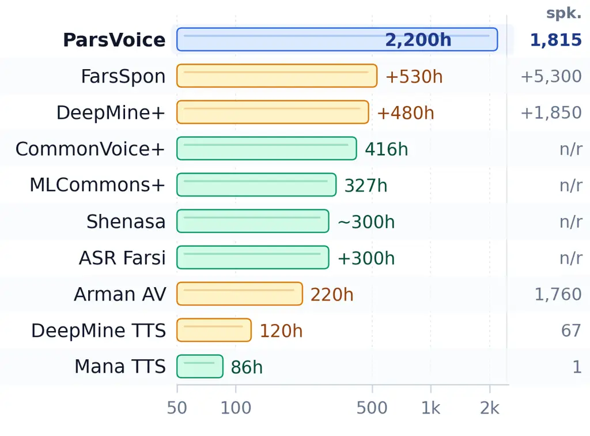
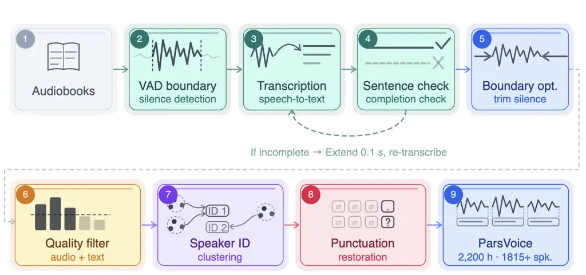
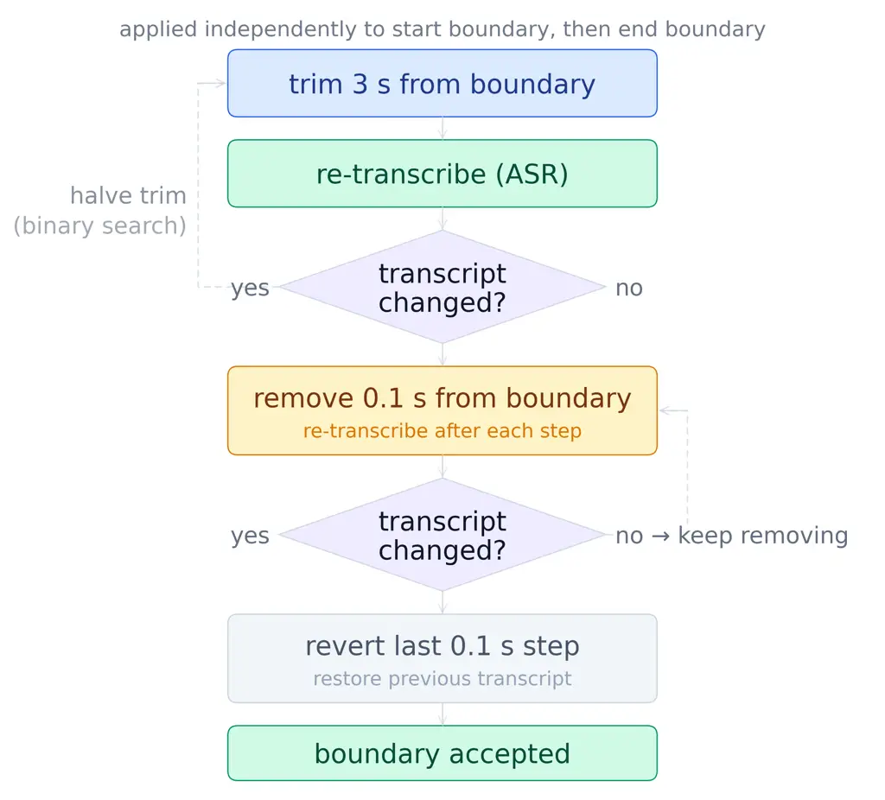
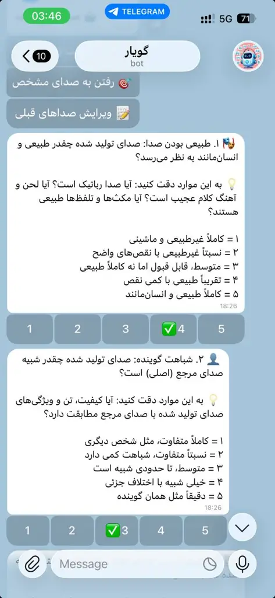
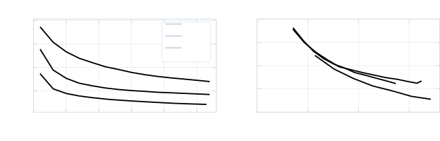

# ParsVoice: A Large-Scale Multi-Speaker Persian Speech Corpus for Text-to-Speech Synthesis

Mohammad Javad Ranjbar Kalahroodi Affiliation: School of Electrical and
Computer Engineering, University of Tehran, Iran
Email: [mohammadjranjbar@ut.ac.ir](mailto:)    Heshaam Faili
Affiliation: School of Electrical and Computer Engineering, University
of Tehran, Iran Email: [hfaili@ut.ac.ir](mailto:)    Azadeh Shakery
Affiliation: School of Electrical and Computer Engineering, University
of Tehran, Iran Affiliation: Institute for Research in Fundamental
Sciences (IPM), Tehran, Iran Email: [shakery@ut.ac.ir](mailto:)

###### Abstract

Persian remains substantially underrepresented in open speech-text
resources, limiting progress in multi-speaker text-to-speech (TTS),
speech-language modelling, and low-resource speech processing. We
introduce ParsVoice, the largest publicly available Persian speech-text
corpus tailored for training multi-speaker TTS systems, along with a
scalable pipeline to construct high-quality speech-text data from
long-form audiobook recordings. The pipeline combines a fine-tuned
ParsBERT sentence-completion classifier, ASR-based boundary
optimization, punctuation restoration, speaker identification, and a
multi-dimensional quality assessment that covers both audio and
Persian-specific text properties. The resulting release contains a
2,200-hour TTS-ready subset with 1.36 million aligned segments from
1,815 automatically inferred speaker IDs, making it more than 25 times
larger than the largest previously available open Persian TTS dataset.
To validate the corpus, we fine-tune XTTSv2, a zero-shot multilingual
TTS model that operates directly on raw Persian text without phoneme
representations. The resulting model achieves a naturalness MOS of 3.6/5
and a speaker-similarity MOS of 4.0/5. ParsVoice, its metadata, and the
corpus-construction pipeline are publicly available on Hugging Face¹¹ 1
[https://huggingface.co/datasets/MohammadJRanjbar/ParsVoice](https://huggingface.co/datasets/MohammadJRanjbar/ParsVoice)
and GitHub²² 2
[https://github.com/MohammadJRanjbar/ParsVoice](https://github.com/MohammadJRanjbar/ParsVoice),
supporting reproducible research on Persian speech synthesis and
low-resource speech-language technologies.

## 1 Introduction

The rapid advancement of transformer architectures Vaswani et al. (2017)
and generative models has increased the demand for large-scale,
high-quality speech data. Despite this growing need, resource
availability remains highly uneven across languages, and Persian remains
significantly underrepresented in speech corpora compared to
high-resource languages such as English.

Figure 1: Comparison of Persian speech datasets by duration, in hours of
audio on a logarithmic scale. Speaker counts are shown at right; n/r
indicates that the speaker count is not reported.

Figure 2: Overview of the ParsVoice corpus construction pipeline. Stages
1–5 handle segmentation and transcription; the dashed arc between stages
3 and 4 shows the iterative extension loop for incomplete sentences.
Stages 6–9 handle filtering, speaker identification, punctuation
restoration, and final output.

This scarcity extends beyond speech: insufficient Persian data affects a
broad range of language technologies, including ASR, forced alignment,
and optical character recognition (OCR). English benefits from thousands
of hours of high-quality labelled speech Panayotov et al. (2015), mature
alignment tools with pretrained acoustic models McAuliffe et al. (2017),
and well-established OCR benchmarks—resources that are simply
unavailable at a comparable scale for Persian. Moreover, Persian speech
presents several language-specific challenges: short vowels are
systematically omitted in written text, the Ezafe—a connective vowel
between consecutive words—is never written yet must be pronounced, and a
single letter can map to multiple phonemes depending on context Adibian
et al. (2025). These properties make raw-text Persian TTS challenging
and have motivated many prior systems to rely on explicit phonetic or
linguistic preprocessing. This resource gap has slowed development
across multiple areas of Persian language processing and widened the
digital divide between Persian and better-resourced languages.

TTS is particularly demanding in its data requirements. Unlike ASR
models, which can tolerate noisy, real-world recordings, TTS models
require data that satisfies several strict criteria simultaneously:
audio must be free of background noise, music, and artifacts surrounding
the speech signal, as background noise directly impairs alignment and
degrades synthesised speech quality Zen et al. (2019); transcripts must
consist of complete, well-punctuated sentences, since punctuation
governs prosody modelling and its absence measurably reduces naturalness
Zen et al. (2019); Qharabagh et al. (2024); speech and text must be
precisely aligned at sentence boundaries rather than arbitrary silence
points Zen et al. (2019); and the corpus should cover a diverse range of
speakers and content domains to enable generalisation across voices and
topics Zen et al. (2019); Seki et al. (2025). Meeting all of these
requirements at scale is significantly more difficult and expensive than
collecting ASR data, and the challenge is compounded for Persian by the
linguistic properties discussed above. Compared with the wide range of
English speech resources Panayotov et al. (2015); Ito and Johnson
(2017); Yamagishi et al. (2019), Persian TTS datasets are still limited
in scale, speaker diversity, and accessibility. Most are single-speaker
and often proprietary, which restricts the development of multi-speaker
TTS systems.

To address this gap, we introduce ParsVoice, a large-scale publicly
available Persian speech-text corpus designed to provide high-quality
training data for Persian TTS and low-resource speech-language research.
ParsVoice targets the harder setting of constructing a multi-speaker
corpus from long-form audiobook recordings without relying on publicly
available reference transcripts. We develop a scalable automated
pipeline that combines sentence-aware segmentation, ASR-based
transcription, a ParsBERT sentence-completion classifier, ASR-based
boundary optimization, speaker identification, punctuation restoration,
and Persian-specific audio/text quality assessment. The final TTS-ready
release contains 2,200 hours of speech, 1.36 million aligned segments,
and 1,815 automatically inferred speaker IDs. In terms of duration, this
expands the scale of openly available Persian TTS data by more than a
factor of 25 relative to ManaTTS Qharabagh et al. (2024).

To validate ParsVoice, we fine-tune XTTSv2 Casanova et al. (2024), a
zero-shot multilingual TTS model that operates directly on text without
explicit phoneme representations. On unseen Persian reference speakers,
the adapted model achieves a naturalness MOS of 3.60/5 and a
speaker-similarity SMOS of 4.03/5, demonstrating the suitability of
ParsVoice for multi-speaker Persian TTS. Figure 2 provides an overview
of the corpus construction pipeline.

The remainder of the paper is organized as follows. Section 2 reviews
related Persian speech resources and TTS systems, Section 3 describes
the ParsVoice construction pipeline, Section 4 analyzes the resulting
corpus, and Section 5 evaluates TTS training with ParsVoice.
Sections 6–8 conclude with the main findings, limitations, and ethical
considerations.

## 2 Related Work

### 2.1 Speech Corpora for High-Resource Languages

Speech dataset development has been dominated by English resources.
LibriSpeech Panayotov et al. (2015) provides 960 hours of read speech
from audiobooks across 2,484 speakers, LJSpeech Ito and Johnson (2017)
offers 24 hours from a single speaker, and VCTK Yamagishi et al. (2019)
contains approximately 44 hours across 109 speakers. Multilingual
efforts such as Common Voice Ardila et al. (2020), Multilingual
LibriSpeech Pratap et al. (2020), and VoxPopuli Wang et al. (2021) have
expanded coverage to 20+ languages, but remain skewed toward European
languages with variable quality across linguistic communities. Many
widely spoken non-European languages—including Persian—have received
comparatively little attention in these initiatives.

### 2.2 Persian Speech Datasets

Existing Persian speech resources suffer from critical limitations in
scale, speaker diversity, and accessibility. Figure 1 compares ParsVoice
with representative Persian speech datasets in terms of duration.

Prior to this work, DeepMine+ Zeinali et al. (2019) was the largest
existing Persian speech resource, providing over 480 hours of speech
from more than 1,850 speakers; however, it is commercially restricted.
Among TTS-specific datasets, DeepMine Multi-TTS Adibian et al. (2025)
provides 120 hours across 67 speakers under a restricted license with
manually verified transcripts and phoneme-level annotations;
ArmanTTS Shamgholi et al. (2023) contains approximately 9 hours from a
single speaker; and ManaTTS Qharabagh et al. (2024) offers 86 hours from
a single speaker under an open CC-0 license. Common Voice’s Persian
portion exists but lacks the audio quality required for TTS training.

### 2.3 Persian TTS Systems

Existing Persian TTS systems have predominantly relied on explicit
phoneme-level intermediate representations, adding pipeline complexity
and requiring language-specific lexicons or grapheme-to-phoneme models.
ManaTTS Qharabagh et al. (2024) introduced an end-to-end Persian TTS
system built on a Tacotron-style architecture and trained on its
accompanying 86-hour single-speaker corpus, with phoneme sequences
derived from a rule-based front-end. ArmanTTS Shamgholi et al. (2023)
similarly targets single-speaker synthesis from a 9-hour corpus using a
standard sequence-to-sequence TTS pipeline with phoneme inputs. The most
closely related prior work is DeepMine Multi-TTS Adibian et al. (2025),
which trains Tacotron2 and FastSpeech2 models on their dataset, using
phoneme sequences rather than raw Persian text as input. For corpus
validation, we fine-tune XTTSv2 Casanova et al. (2024), which operates
_directly_ on raw Persian text without any phoneme transcription step.
This choice avoids the explicit phonetic front-end used by several
previous Persian TTS systems. A quantitative comparison of MOS scores is
presented in Section 5.

## 3 ParsVoice

ParsVoice is constructed using a scalable pipeline that transforms raw
audiobook recordings into a structured, high-quality speech-text corpus.
The pipeline addresses three key challenges in Persian speech data
creation: preserving sentence integrity, ensuring accurate audio-text
alignment, and processing thousands of hours of speech at scale.

### 3.1 Data Collection and Source Selection

We selected IranSeda (book.iranseda.ir) as our primary data source based
on several critical considerations. The platform hosts over 3,800
audiobooks across many categories, ensuring broad lexical and stylistic
coverage essential for TTS training. Content is produced by professional
narrators in controlled recording environments at a 44.1 kHz sampling
rate, providing consistent audio quality crucial for neural TTS model
training. Importantly, IranSeda audiobooks are publicly accessible,
making the platform a practical large-scale source for Persian audiobook
data.

Although IranSeda provides audiobook recordings together with metadata,
the corresponding written transcripts are not publicly available. We
considered obtaining transcripts from scanned or digitised book editions
using OCR, but this approach was unreliable at scale. Audiobook
narrations often differ from printed editions due to abridgement,
narrator edits, translation differences, or edition-specific wording,
and many titles have no accessible digitised text version. Even minor
text–audio mismatches would introduce systematic alignment errors and
propagate noise throughout the corpus. We therefore adopted an ASR-based
transcription strategy that is edition-agnostic, does not require access
to source texts, and can be applied automatically at scale.

### 3.2 Intelligent Audio Segmentation

Raw audiobook files typically span several hours and must be segmented
into short, linguistically coherent chunks for TTS training. This is
challenging because silence-based Voice Activity Detection (VAD)
boundaries do not necessarily coincide with sentence boundaries: a
segment may start at a natural pause but still end before the sentence
is complete. We therefore use a three-phase segmentation pipeline that
combines acoustic boundary detection, ASR transcription, and text-based
completeness validation.

Phase 1: Acoustic Boundary Detection. We apply WebRTC Wiseman () VAD
with aggressiveness level 0 to identify silence-based candidate
boundaries in each audio file; see Appendix A for a comparison of
alternative configurations.

Phase 2: Transcription. Each candidate segment is transcribed using the
Google Web Speech backend through the SpeechRecognition library Zhang
(2017), which was selected for being free, fast, and reliable, achieving
the lowest Persian ASR error rates among the tested alternatives
(Appendix B); any ASR system can be substituted. Since the API returns
only the recognised text string without word-level timestamps,
timestamp-based alignment is not possible, which motivates the
boundary-extension procedure described below. Remaining transcription
errors are removed by quality filtering in Section 3.4.

Phase 3: Completeness Validation and Boundary Extension. Each transcript
is analysed by a ParsBERT-based sentence-completion classifier
fine-tuned to distinguish complete from incomplete Persian sentences.
Segments predicted as incomplete undergo iterative boundary extension in
0.1-second increments, up to a maximum of 5 seconds. After each
extension, the segment is re-transcribed and re-evaluated by the
classifier. This loop continues until the transcript satisfies the
completeness criterion or the maximum extension limit is reached.
Segments that remain incomplete are retained with an incompleteness flag
rather than discarded, allowing downstream users to apply their own
quality thresholds. Full details of the classifier training procedure,
including the construction of complete and truncated training examples
from PersianPunc Kalahroodi et al. (2026), are provided in Appendix C.

### 3.3 Boundary Optimization Algorithm

Even with accurate transcription, audio segments may contain unwanted
silence, background noise, or acoustic artifacts at boundaries that
degrade TTS model performance Zen et al. (2019); Jung et al. (2024);
Seki et al. (2025). Our boundary optimization algorithm employs binary
search to determine optimal trimming points for both segment start and
end boundaries. Figure 3 illustrates the full algorithm.

Figure 3: Boundary optimization algorithm, applied independently to the
start and end boundaries of each segment.

The boundary optimization is applied independently to each boundary: the
start boundary is processed first, then the end boundary, using the same
procedure. A hard ceiling of 3 seconds is set for the initial trimming
step to prevent over-trimming in edge cases.

The procedure follows a two-stage search strategy:

1. Initial Adjustment: 3 seconds are removed from the boundary, and the
   trimmed audio is re-transcribed.

2. Stability Verification: If the new transcription differs from the
   original in any way—that is, if even a single character changes—the
   trimming is deemed excessive and must be reduced.

3. Binary Search Optimization: The algorithm iteratively halves the
   trimming interval to converge on the maximum trim length that still
   produces an identical transcription. Binary search terminates when the
   transcription is character-for-character identical to the original.

4. Fine-Grained Linear Search: After binary search converges, a linear
   search with 0.1-second increments is applied to achieve precise boundary
   alignment, continuing until the transcript changes, at which point the
   last step is reverted, and the boundary is accepted.

In practice, the binary search converges well within the 3-second
ceiling for the vast majority of segments. Leading silence is more
prevalent than trailing noise in the source recordings; full trimming
statistics are reported in Appendix E (Table 9).

### 3.4 Text-Audio Quality Assessment

High-quality speech is critical for TTS training data, as low-quality
samples can degrade model performance. We implement a comprehensive
assessment across both audio and text dimensions. All thresholds were
determined through human review of a random subset of segments:
candidate threshold values were applied, and the resulting accepted and
rejected samples were manually inspected until the authors judged the
boundary to produce consistently clean output. The distribution of
quality scores across the full dataset is provided in Appendix E.

#### 3.4.1 Persian Text Quality Metrics

The Persian Text Quality Framework evaluates transcriptions across five
dimensions: character quality, length quality, repetition score,
linguistic complexity, and phonetic coverage. Each metric is normalised
to $`[0,1]`$ and combined using fixed weights to produce a total score
on $`[0,1]`$. Segments scoring below $`0.5`$ are excluded from the
TTS-ready subset (Section 3.6). Descriptive tier boundaries used for
reporting, together with full metric descriptions and weights, are
provided in Appendix D.

#### 3.4.2 Audio Quality Metrics

The audio quality framework assesses recordings for overall clarity,
absence of distortions, and suitability for speech processing. Metrics
include estimated signal-to-noise ratio, dynamic range, clipping ratio,
silence ratio, background music presence (detected via
inaSpeechSegmenter Doukhan et al. (2018)), and duration. Each segment
receives a composite score on a 0–100 scale; segments scoring below 75
are excluded from TTS use (Section 3.6). Full scoring rules, metric
descriptions, tier definitions, and score distributions are provided in
Appendices D and E.

### 3.5 Speaker Identification

Since approximately 40% of audiobook entries lacked narrator names and
some books featured multiple narrators, we apply a two-stage speaker
identification pipeline based on ECAPA-TDNN embeddings Desplanques
et al. (2020) to assign consistent automatically inferred speaker labels
across the corpus. The first stage clusters segments within each
audiobook into local speaker identities; the second merges these local
identities into global speaker labels across the entire corpus.
Low-confidence segments and spuriously small clusters are excluded at
both stages. Full implementation details, including cluster-count
estimation, the clustering ensemble, outlier removal, dimensionality
reduction, confidence thresholds, and cross-book merging criteria, are
provided in Appendix F.

### 3.6 Final Data Cleaning and Preparation

We apply audio and text quality filtering to the boundary-optimised
corpus: segments with audio quality scores below 75 (out of 100) and
segments with text quality scores below 0.5 are removed, reducing the
corpus to 2,089,749 segments (3,007.8 hours). The final TTS-ready subset
is then constructed by excluding segments assigned to low-confidence
speaker clusters, and segments flagged as incomplete by the
sentence-completion classifier. This yields 1,364,671 segments totalling
2,199.7 hours. Since ASR transcriptions lack punctuation, we apply the
ParsBERT-based Persian punctuation restoration model of Kalahroodi
et al. (2026) to all segments prior to release. The release includes
punctuation-restored transcripts, available metadata, automatically
inferred speaker IDs, and per-segment audio and text quality scores, so
users can re-filter the corpus to their own quality and
speaker-confidence thresholds using the released pipeline.

| Metric            | ASR Subset | Final TTS Subset |
| ----------------- | ---------- | ---------------- |
| Total Hours       | 4,096.2    | 2,199.7          |
| Segments          | 2,999,296  | 1,364,671        |
| Total Tokens      | 29,566,314 | 17,347,614       |
| Unique Word Forms | 309,406    | 229,860          |

Table 1: ParsVoice Dataset Statistics. We refer to the
boundary-optimised corpus before TTS-specific filtering as the processed
ASR-oriented subset.

## 4 ParsVoice Corpus Analysis

The current release contains 2,231 processed audiobooks, of which 1,706
are retained in the final TTS subset after quality filtering.

| Stage                              | Segments  | Hours   |
| ---------------------------------- | --------- | ------- |
| VAD output                         | 5,161,459 | 5,824.7 |
| After removing empty transcripts   | 3,323,679 | 5,127.3 |
| After boundary optimization        | 2,999,296 | 4,096.2 |
| After text-audio quality filtering | 2,089,749 | 3,007.8 |
| Final TTS subset                   | 1,364,671 | 2,199.7 |

Table 2: ParsVoice pipeline statistics at each processing stage.

Quality Assessment. The mean audio-quality score is 89.5 (median 92.0),
with 83.1% of segments reaching the high-quality tier ($`\geq 90`$) and
13.4% in the acceptable range (75–89). Mean SNR is 41.8 dB and 96.5% of
segments exceed 20 dB, reflecting the controlled studio conditions of
the source recordings. On the text side, the mean quality score in the
final TTS subset is 0.737 (median 0.748). Combined audio and text
filtering removes 30.3% of boundary-optimised segments (Table 2); full
score distributions and tier definitions are given in Appendices D
and E.

Linguistic Analysis. Following text normalisation, token and vocabulary
statistics are computed using the Hazm Persian tokeniser Roshan (2014).
Token and vocabulary counts for both subsets are reported in Table 1.
Segments in the final TTS subset contain an average of 12.71 words and
60.7 characters.

Transcript Verification. To independently assess transcript accuracy,
two native Persian speakers transcribed 500 randomly sampled segments
from the TTS-ready subset. Compared with the human reference
transcriptions, ParsVoice transcripts achieve 4.90% WER and 1.81% CER,
with 69.0% of segments transcribed perfectly. Full transcription and
normalization details are provided in Appendix G.4.

Speaker Statistics. The final TTS subset contains 1,815 automatically
inferred global speaker IDs, covering both metadata-linked named
narrators and audiobooks with unknown narrator names. Gender analysis
was performed using narrator names present in the available metadata.
Among audiobooks with available metadata, approximately 33% of narrators
are female, and 67% are male. As a metadata-based clustering consistency
check, we computed speaker-ID purity. For each global speaker ID, purity
is defined as the fraction of its metadata-linked audio duration
associated with the dominant narrator name. A purity of 1.0 therefore
indicates that all metadata-linked audio assigned to that global ID
comes from a single named narrator. Among 325 global speaker IDs with
sufficient metadata-linked audio, the median purity is 1.00 and the mean
is 0.871; 214 IDs (65.8%) have purity of at least 0.90. A
merge-threshold sensitivity analysis is reported in Appendix F.1.

| System                                                            | MOS             | SMOS            | Intel. MOS      | Spk.Sim. (%) |
| ----------------------------------------------------------------- | --------------- | --------------- | --------------- | ------------ |
| Real Persian Speech$`\dagger`$                                    | 4.72            | 4.86            | —               | —            |
| XTTSv2 + ParsVoice                                                | 3.60$`\pm`$0.09 | 4.03$`\pm`$0.08 | 4.03$`\pm`$0.08 | 80.0         |
| DeepMine Tacotron2 (unseen spk.)$`\dagger`$ Adibian et al. (2025) | 3.80$`\pm`$0.04 | —               | —               | —            |
| DeepMine FastSpeech2 (seen spk.)$`\dagger`$ Adibian et al. (2025) | 4.12$`\pm`$0.06 | 3.98$`\pm`$0.11 | —               | —            |

Table 3: Evaluation results. MOS = naturalness, SMOS = speaker
similarity, Intel. MOS = intelligibility MOS, and Spk.Sim. is ECAPA-TDNN
cosine similarity reported as a percentage. $`\dagger`$ DeepMine results
are taken directly from the original paper and were not re-evaluated by
our raters.

## 5 Evaluation: TTS Model Training

To assess whether ParsVoice is suitable for downstream TTS training, we
fine-tuned XTTSv2 Casanova et al. (2024), a state-of-the-art open-source
multilingual zero-shot TTS model that supports over 17 languages and can
clone a speaker’s voice from a short reference clip without any
fine-tuning on that speaker.

### 5.1 Model Adaptation

We adapted the GPT component of XTTSv2 to Persian while keeping the
remaining modules frozen. A BPE tokeniser was trained on Persian text,
and 2,500 additional Persian tokens extracted from the ParsVoice text
were added to the XTTSv2 GPT vocabulary.

The model was trained on a single NVIDIA A100 GPU using AdamW with a
learning rate of $`5\times 10^{-6}`$ and weight decay of $`10^{-2}`$ for
340,000 steps. We used a per-device batch size of 21 with gradient
accumulation over 8 steps, resulting in an effective batch size of 168.

### 5.2 Evaluation Setup

We evaluated the fine-tuned model using 90 synthesised samples generated
from random sentences and unseen Persian reference speakers drawn from
the Persian Common Voice dataset. The age and gender distribution of the
reference speakers is reported in Appendix G.3. Subjective evaluation
used 22 retained native Persian raters (of 42 participants; retention
criterion and demographics in Appendix G.2). Each item was rated by a
median of 7 raters (mean 6.7). Raters scored naturalness using MOS,
speaker similarity using SMOS, and intelligibility using an additional
1–5 intelligibility MOS. Further details about the rater pool and
annotation procedure are provided in Appendix G.2. For objective
evaluation, we measured intelligibility using WER and CER from three ASR
systems: Google ASR, the transcription system used during corpus
construction; a Persian-finetuned Whisper model Nezamisafa (2025), which
is independent of our pipeline; and Qwen ASR 1.7B Shi et al. (2026). To
contextualise these scores, we also evaluated the same ASR systems on
the Google FLEURS Persian test set Conneau et al. (2023), which serves
as a real-speech reference. Speaker similarity was additionally measured
using ECAPA-TDNN cosine similarity between reference and synthesised
speaker embeddings.

### 5.3 Subjective Evaluation Results

Table 3 reports the subjective evaluation results. The fine-tuned XTTSv2
model achieves a naturalness MOS of 3.60, a speaker-similarity SMOS of
4.03, and an intelligibility MOS of 4.03 in a zero-shot setting with
unseen reference speakers drawn from Persian Common Voice. For context,
we also report results from Adibian et al. (2025), which were obtained
with different raters and evaluation conditions. DeepMine FastSpeech2
achieves a MOS of 4.12 and an SMOS of 3.98 under seen-speaker evaluation
and is not evaluated on unseen speakers, whereas its Tacotron2 model
achieves a MOS of 3.80 under unseen-speaker evaluation. The real-speech
MOS and SMOS values are also taken from Adibian et al. (2025) as
approximate upper-bound references. Because the systems differ in
speaker conditions, test material, rater pools, model architectures, and
input representations, these values are provided only for contextual
comparison rather than as a controlled head-to-head evaluation.

### 5.4 Objective Results

Table 4 reports WER and CER across three ASR systems. Because Google ASR
was also used during corpus construction, we treat its results only as a
diagnostic measure. The Persian-finetuned Whisper model, which is
independent of the construction pipeline, provides the primary
non-circular ASR-based intelligibility evaluation.

Google ASR achieves 10.40% WER and 5.92% CER on synthesised speech,
compared with 6.53% WER and 2.55% CER on real Persian speech from the
FLEURS test set, corresponding to a WER degradation of 3.87 percentage
points. The Persian-finetuned Whisper model shows a similar trend, with
17.20% WER on synthesised speech versus 13.07% on FLEURS, a gap of 4.13
percentage points. This consistency across an independent ASR system
suggests that the relatively low error rate on synthesised speech is not
solely an artefact of using Google ASR during corpus construction. Qwen
ASR 1.7B produces higher absolute error rates on both real and
synthesised speech, while preserving the same overall pattern.

As an additional ASR-independent intelligibility check, two native
Persian speakers independently transcribed the 90 synthesised samples
without access to the target text. Compared with the intended sentences,
the resulting human transcriptions yield a WER of 4.78%. This provides
complementary evidence that the synthesised speech is intelligible to
native listeners. Further details of the human transcription protocol
and agreement analysis are provided in Appendix G.4.

Finally, speaker similarity was assessed using ECAPA-TDNN Desplanques
et al. (2020) embeddings extracted via the SpeechBrain toolkit Parcollet
et al. (2022); Ravanelli et al. (2024), computing cosine similarity
between the reference and synthesised speaker representations. The
resulting score of 80.0% indicates effective zero-shot speaker
adaptation across the 42 unseen reference speakers.

|                                      | TTS   |       | Real  |      | Gap    |
| ------------------------------------ | ----- | ----- | ----- | ---- | ------ |
| ASR System                           | WER   | CER   | WER   | CER  | WER    |
| Google ASR                           | 10.40 | 5.92  | 6.53  | 2.55 | +3.87  |
| Whisper fine-tuned Nezamisafa (2025) | 17.20 | 7.79  | 13.07 | 5.05 | +4.13  |
| Qwen ASR 1.7B                        | 34.08 | 15.32 | 22.92 | 8.56 | +11.16 |

All values are percentages.

Table 4: Multi-ASR intelligibility evaluation. WER and CER are reported
on 90 synthesised samples and on the Google FLEURS Persian test set as a
real-speech reference. Lower WER/CER is better; the gap column shows
TTS$`-`$Real degradation in WER.

### 5.5 Effect of Training-Data Scale

To examine whether the scale of ParsVoice contributes to TTS
performance, we fine-tuned XTTSv2 on nested 120 h and 530 h subsets and
on the full 2,200 h corpus using the same tokenizer, model
configuration, and evaluation set. Under an equal number of training
epochs, increasing the amount of training data improves Google-ASR WER
from 42.89% for 120 h to 20.06% for 530 h and 17.83% for the full
corpus. NISQA-TTS likewise increases from 2.968 to 3.081 and 3.165,
respectively.

However, equal numbers of epochs correspond to substantially different
numbers of optimization updates across training-set sizes. We therefore
also compare checkpoints at approximately matched optimization budgets.
Under this setting, the differences are smaller and no training-set size
is consistently best across all metrics, although the full-data model
achieves the lowest WER and CER with the Persian-finetuned Whisper
evaluator. The loss curves also indicate that the full-data model
remains at an earlier stage of optimization, whereas the 120 h model
begins to show signs of overfitting at high step counts. Full numerical
results and training curves are provided in Appendix H.

## 6 Conclusion

In this work, we address the scarcity of high-quality Persian speech
datasets by introducing ParsVoice, the largest publicly available
Persian speech-text corpus tailored for TTS training to date. ParsVoice
consists of 2,200 hours of clean, segmented speech suitable for TTS
training, covering 1,364,671 segments from 1,815 automatically inferred
speaker IDs. In addition, the broader processed corpus contains 4,096.2
hours of audio, making it useful for a wider range of Persian speech
research tasks.

Alongside the dataset, we provide a scalable and automated pipeline for
dataset creation. This pipeline incorporates several key parts,
including a BERT-based model to ensure sentence completeness, a binary
search algorithm for precise audio-text boundary optimization, and
comprehensive audio-text quality assessment frameworks specifically
designed for Persian. Together, the dataset and the pipeline provide a
valuable resource for advancing Persian speech research and TTS
development.

We validated ParsVoice by fine-tuning XTTSv2, achieving a naturalness
MOS of 3.60/5 and a speaker similarity SMOS of 4.03/5 (Section 5).
Multi-ASR intelligibility evaluation using both the
transcription-pipeline ASR and a Persian-finetuned Whisper model
provides complementary evidence that the synthesised speech remains
intelligible under evaluation. These results support the usability of
ParsVoice for training multi-speaker Persian TTS systems, addressing a
critical resource gap in Persian language technology.

## 7 Limitations

Despite the scale and quality of ParsVoice, several limitations should
be acknowledged. First, the corpus is derived entirely from audiobooks,
which means the speaking style is predominantly formal and narrative.
Spontaneous conversational speech, which differs substantially in
prosody, pace, and vocabulary, is not represented. TTS models trained on
ParsVoice may therefore produce speech that sounds natural in read-aloud
contexts but less so in conversational applications. Second, our
transcription pipeline relies on a proprietary ASR system without access
to the original book texts, which introduces a small but non-zero
transcription error rate. While our multi-stage quality filtering
mitigates this, some residual errors may remain in the dataset. Third,
the evaluation of ParsVoice was conducted by fine-tuning XTTSv2, a
single model architecture. Due to limited access to GPU compute, we were
unable to train multiple model architectures or conduct extensive
hyperparameter searches, which limits the generalisability of the
validation results. Similarly, we were unable to evaluate against
restricted-access baseline models such as DeepMine Multi-TTS, meaning
our MOS comparison relies on scores reported in the original papers
rather than a controlled head-to-head evaluation with shared raters.
Finally, around 40% of audiobooks lack narrator metadata (Section 4),
with two consequences. The metadata-linked portion of the corpus is
gender-imbalanced, which may affect the quality of TTS voices
synthesised for female speakers relative to male speakers, and the
full-corpus gender distribution remains only partially observed. Speaker
identity for the unlabelled recordings is also assigned through
automated clustering rather than verified ground truth; although the
ECAPA-TDNN-based pipeline provides useful global speaker IDs, these
labels should be interpreted as automatically inferred speaker
identities rather than manually verified speaker annotations. Segments
whose speaker identity is confirmed by narrator metadata are flagged in
the release, allowing users who require verified speaker labels to
restrict to that subset.

## 8 Ethical Considerations

ParsVoice is derived from publicly accessible audiobooks on IranSeda. We
do not redistribute complete recordings, only short quality-filtered
excerpts, consistent with Article 7 of Iran’s Copyright Act, which
permits quotation from published works for scientific and educational
purposes with attribution. Copyright in the underlying recordings
remains with IranSeda and the narrators; we make no ownership claim. The
pipeline code is released under Apache 2.0 and our annotations
(transcripts, speaker IDs, quality scores) under CC BY-NC 4.0. Audio
segments are distributed for non-commercial research only, under gated
access on Hugging Face. Rights holders may request removal; affected
audio will be excluded from future releases.

Because ParsVoice may support voice-cloning-capable TTS systems,
potential misuse includes impersonation, fraud, deceptive synthetic
media, and disinformation. Such uses are outside the intended scope of
the dataset. We encourage downstream users to obtain appropriate speaker
consent for deployed cloned voices and to use provenance or watermarking
mechanisms for publicly released synthetic speech.

## References

- Adibian et al. (2025) Majid Adibian, Hossein Zeinali, and Soroush
  Barmaki. 2025. [Deepmine-multi-tts: a persian speech corpus for
  multi-speaker
  text-to-speech](https://doi.org/10.1007/s10579-025-09807-6). _Language
  Resources and Evaluation_, 59:2245–2264.
- Ardila et al. (2020) Rosana Ardila, Megan Branson, Kelly Davis,
  Michael Kohler, Josh Meyer, Michael Henretty, Reuben Morais, Lindsay
  Saunders, Francis Tyers, and Gregor Weber. 2020. [Common voice: A
  massively-multilingual speech
  corpus](https://aclanthology.org/2020.lrec-1.520/). In _Proceedings of
  the Twelfth Language Resources and Evaluation Conference_, pages
  4218–4222, Marseille, France. European Language Resources Association.
- Casanova et al. (2024) Edresson Casanova, Kelly Davis, Eren Gölge,
  Görkem Göknar, Iulian Gulea, Logan Hart, Aya Aljafari, Joshua Meyer,
  Reuben Morais, Samuel Olayemi, and Julian Weber. 2024. [XTTS: a
  Massively Multilingual Zero-Shot Text-to-Speech
  Model](https://doi.org/10.21437/Interspeech.2024-2016). In
  _Interspeech 2024_, pages 4978–4982.
- Conneau et al. (2023) Alexis Conneau, Min Ma, Simran Khanuja,
  Yu Zhang, Vera Axelrod, Siddharth Dalmia, Jason Riesa, Clara Rivera,
  and Ankur Bapna. 2023. [Fleurs: Few-shot learning evaluation of
  universal representations of
  speech](https://doi.org/10.1109/SLT54892.2023.10023141). In _2022 IEEE
  Spoken Language Technology Workshop (SLT)_, pages 798–805.
- Desplanques et al. (2020) Brecht Desplanques, Jenthe Thienpondt, and
  Kris Demuynck. 2020. ECAPA-TDNN: Emphasized Channel Attention,
  propagation and aggregation in TDNN based speaker verification. In
  _Interspeech 2020_, pages 3830–3834.
- Doukhan et al. (2018) David Doukhan, Eliott Lechapt, Marc Evrard, and
  Jean Carrive. 2018. Ina’s mirex 2018 music and speech detection
  system. In _Music Information Retrieval Evaluation eXchange (MIREX 2018)_.
- Farahani et al. (2021) Mehrdad Farahani, Mohammad Gharachorloo,
  Marzieh Farahani, and Mohammad Manthouri. 2021. [Parsbert:
  Transformer-based model for persian language
  understanding](https://doi.org/10.1007/s11063-021-10528-4). _Neural
  Processing Letters_, 53(6):3831–3847.
- Ito and Johnson (2017) Keith Ito and Linda Johnson. 2017. The lj
  speech dataset.
  [https://keithito.com/LJ-Speech-Dataset/](https://keithito.com/LJ-Speech-Dataset/).
- Jung et al. (2024) Jee-weon Jung, Wangyou Zhang, Soumi Maiti, Yihan
  Wu, Xin Wang, Ji-Hoon Kim, Yuta Matsunaga, Seyun Um, Jinchuan Tian,
  Hye-jin Shim, and 1 others. 2024. Text-to-speech synthesis in the
  wild. _arXiv preprint arXiv:2409.08711_.
- Kalahroodi et al. (2026) Mohammad Javad Ranjbar Kalahroodi, Heshaam
  Faili, and Azadeh Shakery. 2026. [PersianPunc: A large-scale dataset
  and BERT-based approach for Persian punctuation
  restoration](https://aclanthology.org/2026.silkroadnlp-1.11/). In _The
  Proceedings of the First Workshop on NLP and LLMs for the Iranian
  Language Family_, pages 105–113, Rabat, Morocco. Association for
  Computational Linguistics.
- McAuliffe et al. (2017) Michael McAuliffe, Michaela Socolof, Sarah
  Mihuc, Michael Wagner, and Morgan Sonderegger. 2017. [Montreal Forced
  Aligner: Trainable Text-Speech Alignment Using
  Kaldi](https://doi.org/10.21437/Interspeech.2017-1386). In
  _Interspeech 2017_, pages 498–502.
- Mittag and Möller (2020) Gabriel Mittag and Sebastian Möller. 2020.
  [Deep Learning Based Assessment of Synthetic Speech
  Naturalness](https://doi.org/10.21437/Interspeech.2020-2382). In
  _Interspeech 2020_, pages 1748–1752.
- Nezamisafa (2025) Nezamisafa. 2025. whisper-persian-v4.
  [https://huggingface.co/nezamisafa/whisper-persian-v4](https://huggingface.co/nezamisafa/whisper-persian-v4).
  Fine-tuned version of OpenAI Whisper-large-v3 for Persian automatic
  speech recognition. Accessed: 2026-05-25.
- Panayotov et al. (2015) Vassil Panayotov, Guoguo Chen, Daniel Povey,
  and Sanjeev Khudanpur. 2015. [Librispeech: An asr corpus based on
  public domain audio
  books](https://doi.org/10.1109/ICASSP.2015.7178964). In _2015 IEEE
  International Conference on Acoustics, Speech and Signal Processing
  (ICASSP)_, pages 5206–5210.
- Parcollet et al. (2022) Titouan Parcollet, Mirco Ravanelli, Peter
  Plantinga, Aku Rouhe, Samuele Cornell, Loren Lugosch, Cem Subakan,
  Nauman Dawalatabad, Abdelwahab Heba, Jianyuan Zhong, Ju-Chieh Chou,
  Sung-Lin Yeh, Szu-Wei Fu, Chien-Feng Liao, Elena Rastorgueva, François
  Grondin, William Aris, Hwidong Na, Yan Gao, and 2 others. 2022.
  [SpeechBrain: A General-Purpose Speech
  Toolkit](https://hal.science/hal-03601303). Preprint.
- Pratap et al. (2020) Vineel Pratap, Qiantong Xu, Anuroop Sriram,
  Gabriel Synnaeve, and Ronan Collobert. 2020. [Mls: A large-scale
  multilingual dataset for speech
  research](https://doi.org/10.21437/interspeech.2020-2826). In
  _Interspeech 2020_, interspeech_2020, page 2757–2761. ISCA.
- Qharabagh et al. (2024) Mahta Fetrat Qharabagh, Zahra Dehghanian, and
  Hamid R. Rabiee. 2024. [Manatts persian: a recipe for creating tts
  datasets for lower resource
  languages](https://arxiv.org/abs/2409.07259). _Preprint_,
  arXiv:2409.07259.
- Radford et al. (2023) Alec Radford, Jong Wook Kim, Tao Xu, Greg
  Brockman, Christine Mcleavey, and Ilya Sutskever. 2023. [Robust speech
  recognition via large-scale weak
  supervision](https://proceedings.mlr.press/v202/radford23a.html). In
  _Proceedings of the 40th International Conference on Machine
  Learning_, volume 202 of _Proceedings of Machine Learning Research_,
  pages 28492–28518. PMLR.
- Ravanelli et al. (2024) Mirco Ravanelli, Titouan Parcollet, Adel
  Moumen, Sylvain {de Langen}, Cem Subakan, Peter Plantinga, Yingzhi
  Wang, Pooneh Mousavi, {Luca Della} Libera, Artem Ploujnikov, Francesco
  Paissan, Davide Borra, Salah Zaiem, Zeyu Zhao, Shucong Zhang, Georgios
  Karakasidis, {Sung Lin} Yeh, Pierre Champion, Aku Rouhe, and 14
  others. 2024. Open-source conversational ai with speechbrain 1.0.
  _Journal of Machine Learning Research_, 25. Publisher Copyright: ©
  2024 Mirco Ravanelli, Titouan Parcollet, et al.
- Roshan (2014) Roshan. 2014. [hazm: Python library for digesting
  persian text](https://github.com/roshan-research/hazm). Available at
  [https://github.com/roshan-research/hazm](https://github.com/roshan-research/hazm).
- Seki et al. (2025) Kentaro Seki, Shinnosuke Takamichi, Takaaki Saeki,
  and Hiroshi Saruwatari. 2025. [Ttsops: A closed-loop corpus
  optimization framework for training multi-speaker tts models from dark
  data](https://doi.org/10.1109/TASLPRO.2025.3633089). _IEEE
  Transactions on Audio, Speech and Language Processing_, 33:4956–4970.
- Shamgholi et al. (2023) Mohammd Hasan Shamgholi, Vahid Saeedi, Javad
  Peymanfard, Leila Alhabib, and Hossein Zeinali. 2023. [Armantts
  single-speaker persian dataset](https://arxiv.org/abs/2304.03585).
  _Preprint_, arXiv:2304.03585.
- Shi et al. (2026) Xian Shi, Xiong Wang, Zhifang Guo, Yongqi Wang, Pei
  Zhang, Xinyu Zhang, Zishan Guo, Hongkun Hao, Yu Xi, Baosong Yang, Jin
  Xu, Jingren Zhou, and Junyang Lin. 2026. Qwen3-asr technical report.
  _arXiv preprint arXiv:2601.21337_.
- SileroTeam (2024) SileroTeam. 2024. Silero vad: pre-trained
  enterprise-grade voice activity detector (vad), number detector and
  language classifier.
  [https://github.com/snakers4/silero-vad](https://github.com/snakers4/silero-vad).
- Vaswani et al. (2017) Ashish Vaswani, Noam Shazeer, Niki Parmar, Jakob
  Uszkoreit, Llion Jones, Aidan N Gomez, Ł ukasz Kaiser, and Illia
  Polosukhin. 2017. [Attention is all you
  need](https://proceedings.neurips.cc/paper_files/paper/2017/file/3f5ee243547dee91fbd053c1c4a845aa-Paper.pdf).
  In _Advances in Neural Information Processing Systems_, volume 30.
  Curran Associates, Inc.
- Wang et al. (2021) Changhan Wang, Morgane Riviere, Ann Lee, Anne Wu,
  Chaitanya Talnikar, Daniel Haziza, Mary Williamson, Juan Pino, and
  Emmanuel Dupoux. 2021. [VoxPopuli: A large-scale multilingual speech
  corpus for representation learning, semi-supervised learning and
  interpretation](https://doi.org/10.18653/v1/2021.acl-long.80). In
  _Proceedings of the 59th Annual Meeting of the Association for
  Computational Linguistics and the 11th International Joint Conference
  on Natural Language Processing (Volume 1: Long Papers)_, pages
  993–1003, Online. Association for Computational Linguistics.
- (27) Wiseman. Webrtc voice activity detector.
  [https://github.com/wiseman/py-webrtcvad](https://github.com/wiseman/py-webrtcvad).
  Accessed: 2025-09-14.
- Yamagishi et al. (2019) Junichi Yamagishi, Christophe Veaux, and
  Kirsten MacDonald. 2019. [Cstr vctk corpus: English multi-speaker
  corpus for cstr voice cloning toolkit (version
  0.92)](https://doi.org/10.7488/ds/2645).
- Zeinali et al. (2019) Hossein Zeinali, Lukáš Burget, and Jan "Honza”
  Černocký. 2019. [A multi purpose and large scale speech corpus in
  persian and english for speaker and speech recognition: the deepmine
  database](https://arxiv.org/abs/1912.03627). _Preprint_,
  arXiv:1912.03627.
- Zen et al. (2019) Heiga Zen, Viet Dang, Rob Clark, Yu Zhang, Ron J.
  Weiss, Ye Jia, Zhifeng Chen, and Yonghui Wu. 2019. [LibriTTS: A Corpus
  Derived from LibriSpeech for
  Text-to-Speech](https://doi.org/10.21437/Interspeech.2019-2441). In
  _Interspeech 2019_, pages 1526–1530.
- Zhang (2017) Anthony Zhang. 2017. Speech recognition (version 3.11).
  Software. Available from
  [https://github.com/Uberi/speech_recognition](https://github.com/Uberi/speech_recognition).
  Accessed: 2025.

## Appendix A VAD Method Comparison

To justify the choice of the VAD algorithm used in Phase 1 of the
segmentation pipeline (Section 3.2), we evaluated six VAD configurations
on a random sample of ten audiobooks. The evaluation metric is
_completion rate_: the percentage of produced segments that the ParsBERT
sentence-completion classifier identifies as complete sentences.

| VAD Method                | Completion Rate (%) |
| ------------------------- | ------------------- |
| WebRTC Level 0            | 75.31               |
| WebRTC Level 1            | 73.43               |
| WebRTC Level 2            | 59.62               |
| WebRTC Level 3            | 31.60               |
| Silero  SileroTeam (2024) | 42.02               |
| Whisper-based VAD         | 52.10               |

Table 5: Completion rates of segments produced by different VAD methods
on ten randomly selected audiobooks.

WebRTC Level 0 achieved the highest completion rate while remaining
lightweight and scalable; Silero and Whisper-based VAD are additionally
heavier to run. We therefore selected WebRTC Level 0 as the segmentation
backend.

## Appendix B ASR System Comparison

We compared three ASR systems on 1,000 randomly selected samples from
Persian Common Voice Ardila et al. (2020) to select a transcription
backend.

| ASR System                                           | WER   | CER   |
| ---------------------------------------------------- | ----- | ----- |
| Google Speech Rec.                                   | 20.10 | 7.03  |
| Whisper-large-v3 Persian-finetuned Nezamisafa (2025) | 32.50 | 11.14 |
| Whisper-large-v3 Radford et al. (2023)               | 43.77 | 15.62 |

Table 6: Persian ASR comparison on 1,000 Persian Common Voice samples.
Lower is better.

Google Speech Recognition achieves the lowest WER (20.10%) and CER
(7.03%) and was therefore selected as the transcription backend.

## Appendix C Sentence Completion Classifier

The classifier is fine-tuned from ParsBERT Farahani et al. (2021) on
synthetic data from PersianPunc Kalahroodi et al. (2026). Positive
examples are complete sentences; negatives are generated by removing up
to five words from the sentence end or truncating the final word by up
to five characters, reflecting the tendency of VAD boundaries to cut
sentences at their endings. Incomplete examples are oversampled at a 3:2
ratio. Training runs for 3 epochs with Adam (lr $`=2\times 10^{-5}`$,
batch size 128, weight decay 0.01). On a 10,000-sample held-out set the
classifier achieves 97.4% F1 across both classes.

## Appendix D Audio and Text Quality Scoring Details

### D.1 Audio Quality Scoring

Each recording receives a composite score on a 0–100 scale. Scores of
$`\geq 90`$ are _high quality_; 75–89 are _acceptable_; below 75 are
_low quality_. Scoring rules are listed in Table 7.

|                     |                  |         |
| ------------------- | ---------------- | ------- |
| Metric              | Condition        | Adj.    |
| SNR                 | $`>20`$ dB       | $`+35`$ |
|                     | $`10`$–$`20`$ dB | $`+25`$ |
|                     | $`5`$–$`10`$ dB  | $`+15`$ |
| Dynamic range       | $`>20`$ dB       | $`+15`$ |
|                     | $`15`$–$`20`$ dB | $`+12`$ |
|                     | $`10`$–$`15`$ dB | $`+10`$ |
| Duration            | $`3`$–$`15`$ s   | $`+15`$ |
|                     | $`15`$–$`30`$ s  | $`+5`$  |
| No background music | clean (binary)   | $`+35`$ |
| Clipping            | $`>5\%`$         | $`-20`$ |
|                     | $`1`$–$`5\%`$    | $`-10`$ |
|                     | $`0.1`$–$`1\%`$  | $`-5`$  |
| Silence             | $`>50\%`$        | $`-15`$ |
|                     | $`30`$–$`50\%`$  | $`-10`$ |
|                     | $`20`$–$`30\%`$  | $`-5`$  |

Table 7: Audio quality scoring rules. Adjustments are summed and clamped
to $`[0,100]`$.

### D.2 Text Quality Scoring

Each transcription is scored on a 0–1 scale across five weighted
dimensions. (Table 8). Tier thresholds for descriptive reporting:
$`\geq 0.78`$ = _high quality_; $`0.62`$–$`0.78`$ = _mid quality_;
$`<0.62`$ = _low quality_. Note that these tiers are used only for
analysis and reporting; the actual filtering threshold that excludes
segments from the TTS-ready corpus is $`0.5`$ (Section 3.6).

| Dimension             | Weight | Description                                                                          |
| --------------------- | ------ | ------------------------------------------------------------------------------------ |
| Character quality     | 0.25   | Fraction of valid Persian characters or digits; penalises Arabic-script substitutes. |
| Length quality        | 0.20   | Word and character counts in an acceptable range (3–30 words, 20–200 characters).    |
| Repetition score      | 0.20   | Lexical diversity; penalises excessive word repetition.                              |
| Linguistic complexity | 0.175  | Combines the common-word ratio and average word length.                              |
| Phonetic coverage     | 0.175  | Diversity of Persian characters; favours broad phoneme coverage.                     |

Table 8: Text quality dimensions, weights, and descriptions.

## Appendix E Corpus Statistics

### E.1 Pipeline Stage Statistics

Segment counts and hours at each processing stage are reported in
Table 2 in Section 4. After transcription and before boundary
optimization, segments have a mean duration of 5.55 s (median 4.20 s).
Only 1.1% of segments are shorter than 1 s and 1.9% exceed 20 s,
confirming that VAD-based segmentation produces broadly TTS-suitable
lengths even before further refinement. Of the 3,323,679 segments with
non-empty transcripts, 86.3% were classified as complete by the ParsBERT
classifier; the remaining 13.7% underwent iterative boundary extension
with a mean of 17.7 extension steps.

### E.2 Boundary optimization

The boundary optimization algorithm processed 3,323,679 non-empty
transcript segments. Of these, 324,383 segments were discarded due to
transcription instability or failed re-transcription during the boundary
search, accounting for approximately 524 hours of audio. The remaining
2,999,296 segments were retained and trimmed. Table 9 summarises
trimming statistics for the retained segments.

|                                                                                                       |                   |                   |
| ----------------------------------------------------------------------------------------------------- | ----------------- | ----------------- |
| Metric                                                                                                | Start             | End               |
| Segments trimmed                                                                                      | 2,434,154 (81.2%) | 1,510,777 (50.4%) |
| Mean trim, all segs (ms)                                                                              | 426.9             | 181.6             |
| Mean trim, trimmed (ms)                                                                               | 526.0             | 360.5             |
| Total audio removed by trimming: 507.0 h (11.0% of pre-trim duration of retained segments, 4,603.2 h) |                   |                   |

Table 9: Boundary optimization trimming statistics across 2,999,296
retained segments.

### E.3 Audio Quality

Summary audio-quality statistics are reported in Section 4. Of all
scored segments, 3.5% fall below the exclusion threshold of 75 and are
removed. Background music was detected in 4.3% of segments by
inaSpeechSegmenter Doukhan et al. (2018).

### E.4 Text Quality

Summary text-quality statistics are reported in Section 4. Sub-metric
means in the final TTS subset are: character quality 0.851, length
quality 0.900, repetition score 0.597, linguistic complexity 0.586, and
phonetic coverage 0.699.

## Appendix F Speaker Identification Details

##### Local clustering.

Segment-level ECAPA-TDNN embeddings are preprocessed by removing
statistical outliers (z-score threshold 3.0), L2-normalised, and
PCA-reduced when the embedding dimension exceeds 512. The number of
speakers $`k^{*}`$ per book is estimated by consensus among the
Silhouette score, the gap statistic, and DBSCAN-based estimates.
Clustering uses an ensemble of Agglomerative (cosine distance, average
linkage), Spectral, and Gaussian Mixture Model methods, with the result
selected by the highest silhouette score. Each segment receives a
confidence score $`c_{i}=0.6\,\tilde{s}_{i}+0.4\,d_{i}`$, where
$`\tilde{s}_{i}`$ is the normalised silhouette score and $`d_{i}`$ is
the distance-based confidence. Segments with $`c_{i}<0.4`$ and clusters
smaller than $`1/k^{*}`$ of the high-confidence pool are excluded;
speaker groups with fewer than 10% of the book’s high-confidence
segments are discarded entirely, preventing fragmented utterances from
entering the final subset.

##### Global merging.

Local cluster centroids are compared across all books using pairwise
cosine similarity. Agglomerative clustering with average linkage and a
similarity threshold of 0.90 forms global speaker-cluster IDs.
Cross-book merges are accepted only when the matched speakers share at
least 100 segments in total; otherwise they are kept as separate
single-book identities.

### F.1 Speaker-ID Validation

Narrator metadata covers 83.2% of segments. For each global speaker ID,
we define purity as the fraction of its metadata-linked audio associated
with the dominant narrator name. Across 325 IDs with sufficient
metadata, median purity is 1.000 and mean purity is 0.871. Overall,
10.8% of IDs are associated with more than one narrator name. Because
narrator metadata are provided at the book level, genuinely
multi-narrator books may also create such conflicts; this rate therefore
provides an upper bound on speaker mixing.

Table 10 shows sensitivity to the global merge threshold. Higher
thresholds make cross-book merging more conservative and produce more
speaker IDs. Purity remains stable through 0.90 but decreases at 0.95,
indicating that an overly strict threshold does not improve metadata
consistency. We therefore use 0.90. Here, $`N_{2}`$ denotes the
effective number of speakers after accounting for highly unequal cluster
sizes. Because the resulting IDs are automatically inferred and may
fragment the same speaker across multiple clusters, the reported 1,815
IDs should not be interpreted as a verified count of distinct speakers.

| Threshold | IDs  | $`N_{2}`$ | Median purity |
| --------- | ---- | --------- | ------------- |
| 0.75      | 921  | 64.3      | 1.000         |
| 0.80      | 1165 | 94.5      | 1.000         |
| 0.85      | 1472 | 98.2      | 1.000         |
| 0.90      | 1815 | 142.1     | 1.000         |
| 0.95      | 2448 | 466.2     | 0.832         |

Table 10: Global-merge threshold sensitivity.

## Appendix G Evaluation Details

### G.1 Annotation Interface and Procedure

Ratings were collected via Goyar, a custom Telegram-based annotation bot
developed for this study. Raters accessed the interface through their
personal Telegram accounts at their own convenience. Before the session
began, each rater received the following standardised instructions:
complete the evaluation in a quiet environment, and use in-ear
headphones (earphones) throughout, to ensure consistent and
distraction-free listening conditions.

Each session comprised 90 evaluation items presented sequentially. For
each item, the bot displayed (i) the item index out of 90, (ii) the
Persian reference text, (iii) a reference audio clip recorded by the
target speaker, and (iv) the corresponding synthesised audio clip.
Raters were explicitly instructed to listen to the _reference audio_
first in order to familiarise themselves with the target speaker’s voice
characteristics before listening to the _synthesised audio_. Ratings
were submitted directly via the bot’s inline response buttons.

Each synthesised sample was scored on three criteria using the following
scales:

##### 1. Naturalness (MOS).

How natural and human-like does the synthesised voice sound? Raters were
asked to consider whether the voice sounded robotic, whether prosody and
intonation were unusual, and whether pauses and pronunciation were
natural.

- •
  1 = Completely unnatural, machine-like
- •
  2 = Somewhat unnatural with clear defects
- •
  3 = Acceptable but not fully natural
- •
  4 = Almost natural with minor imperfections
- •
  5 = Completely natural and human-like

##### 2. Speaker Similarity (SMOS).

How closely does the synthesised voice resemble the reference speaker?
Raters were asked to judge whether the quality, pitch, and vocal
characteristics of the synthesised voice matched those of the reference
recording.

- •
  1 = Completely different, like another person
- •
  2 = Somewhat different, low similarity
- •
  3 = Moderate similarity
- •
  4 = Very similar with minor differences
- •
  5 = Identical to the reference speaker

##### 3. Intelligibility (Intel. MOS).

How well does the synthesised audio match the written text? Raters were
asked to note whether any words were missing, added, or mispronounced.
Because Persian-specific phenomena such as Ezafe, unwritten short
vowels, and context-dependent homograph pronunciation manifest as
pronunciation errors to native listeners, these phenomena are also
reflected in the intelligibility ratings. This scale used 0.5-point
increments to permit finer-grained assessment of intelligibility:

- •
  1 = Completely mismatched with the text
- •
  2 = Some correspondence but many errors
- •
  3 = Acceptable correspondence
- •
  4 = Good correspondence with minor errors
- •
  5 = Perfectly and exactly matched

Figure 4 shows a screenshot of the Goyar interface as displayed to
raters.

Figure 4: Screenshot of the Goyar Telegram-based annotation interface.
The bot presents the reference text, delivers the reference and
synthesised audio clips in sequence, and collects naturalness, speaker
similarity, and intelligibility ratings via inline response buttons.

### G.2 Raters

Subjective ratings were collected via the Telegram-based interface
described above. A total of 42 native Persian-speaking participants
contributed ratings. For the subjective results reported in the paper,
we retained the 22 raters who evaluated at least 10 items, yielding
1,812 retained ratings from 1,915 unique rating events. Table 11
summarises rater demographics, and Table 12 reports mean scores grouped
by rater gender. Participants were adult volunteers recruited through
university research groups and personal contacts; participation was
voluntary and uncompensated, and raters were told their ratings would be
used for academic research on Persian speech synthesis. Only
self-reported age and gender were collected. This minimal-risk
perceptual evaluation was exempt from formal ethics-review-board
approval under our institution’s guidelines.

| Property         | Value   |
| ---------------- | ------- |
| Female / Male    | 11 / 11 |
| Mean age (years) | 28.6    |
| Age range        | 19–60   |

Table 11: Retained rater demographics (22 raters).

| Rater gender | MOS  | SMOS | Intel. MOS |
| ------------ | ---- | ---- | ---------- |
| Female       | 3.46 | 3.82 | 3.84       |
| Male         | 3.76 | 4.30 | 4.26       |

Table 12: Mean scores by rater gender.

##### Inter-Rater Agreement.

We measured listener agreement using Krippendorff’s $`\alpha`$, which
supports different numbers of ratings per item. Each item received a
median of 7 ratings. Ordinal $`\alpha`$ was 0.418 for MOS, 0.146 for
SMOS, and 0.368 for intelligibility. Since MOS is reported as an average
across listeners, we also estimated the reliability of the averaged
scores using a crossed item and rater random-effects model. At the
observed average of 7 listeners per item, reliability was 0.819 for MOS,
0.591 for SMOS, and 0.808 for intelligibility.

### G.3 Reference Speakers

The 90 synthesised samples correspond to 42 unique reference speakers
stratified from Persian Common Voice Ardila et al. (2020), unseen during
training. Speakers were stratified by gender and age group to ensure
demographic coverage. Table 13 summarises their demographics. Female
reference speakers received marginally higher scores across all three
dimensions (MOS 3.69 vs. 3.53, SMOS 4.13 vs. 3.99, intelligibility MOS
4.14 vs. 3.94).

|              |       |      |
| ------------ | ----- | ---- |
| Property     | Count | %    |
| Gender       |       |      |
| Female       | 17    | 40.5 |
| Male         | 20    | 47.6 |
| Not reported | 5     | 11.9 |
| Age group    |       |      |
| Teens        | 6     | 14.3 |
| Twenties     | 10    | 23.8 |
| Thirties     | 10    | 23.8 |
| Forties      | 7     | 16.7 |
| Fifties      | 1     | 2.4  |
| Sixties      | 1     | 2.4  |
| Not reported | 7     | 16.7 |

Table 13: Reference speaker demographics (42 speakers).

### G.4 Human Verification of Transcripts

To evaluate ASR transcript accuracy, we randomly sampled 500 segments
from the released TTS-ready subset, comprising 7,013 words. This
evaluation therefore reflects the quality of retained segments and does
not include rejected segments. Two native Persian speakers independently
transcribed all 500 segments by listening. They agreed on 100% of the
words. Compared with these human reference transcriptions, the released
ParsVoice transcripts achieved 4.90% WER and 1.81% CER, with 345 of 500
segments (69%) transcribed perfectly. Before computing WER and CER,
reference and hypothesis texts were normalised consistently by removing
punctuation and diacritics and normalising ZWNJ/half-spaces,
Arabic-to-Persian characters, digits, and whitespace.

The 90 synthesised evaluation samples comprise 942 words. The 4.78% WER
reported in Section 5 corresponds to 45 word errors, with 52 of 90
samples (57.8%) transcribed perfectly. The two transcribers differed on
only 20 of the 942 words, corresponding to 97.8% word-level agreement,
indicating strong consistency between the independent human
transcriptions.

##### Transcription protocol.

Both transcribers worked independently and blind: they were shown
neither the ASR output nor, for the synthesised samples, the target
text, and they did not see each other’s transcriptions. They were
instructed to transcribe verbatim exactly what they heard, including
inserted, repeated, or hallucinated words, rather than what they
expected the sentence to be. Because Persian does not write short
vowels, transcribers were told to listen to the realised pronunciation
and to write the word actually produced; when a short vowel or an Ezafe
was pronounced differently from the intended word, the produced word was
transcribed as heard and therefore counted as a substitution.

Figure 5: Validation loss.

## Appendix H Data-Scale Ablation

We fine-tuned XTTSv2 on nested 120 h and 530 h subsets of ParsVoice and
on the full 2,200 h training set using the same tokenizer, model
configuration, and optimization settings. The subsets were constructed
from a single random ordering of the full training corpus and truncated
by cumulative duration, ensuring that each smaller subset is contained
in the larger one:
$`120,\mathrm{h}\subset 530,\mathrm{h}\subset 2{,}200,\mathrm{h}`$. In
addition to WER and CER, we report NISQA-TTS Mittag and Möller (2020), a
reference-free predictor of synthetic-speech naturalness.

|               |              |         |            |         |       |
| ------------- | ------------ | ------- | ---------- | ------- | ----- |
|               | Google fa-IR |         | Whisper-fa |         |       |
| Training data | WER (%)      | CER (%) | WER (%)    | CER (%) | NISQA |
| 120 h         | 42.89        | 33.68   | 48.51      | 27.53   | 2.968 |
| 530 h         | 20.06        | 13.84   | 27.81      | 13.66   | 3.081 |
| Full          | 17.83        | 12.14   | 30.36      | 14.58   | 3.165 |

Table 14: Data-scale ablation after the same number of training epochs,
scored with two independent ASR systems.

Under equal epochs, performance generally improves as the training set
grows, but this comparison also reflects optimization exposure because
the same number of epochs corresponds to substantially different numbers
of parameter updates across training-set sizes. Moreover, none of the
three runs has clearly converged by 26 epochs, as validation loss is
still decreasing for all conditions (Fig. 5a).

We therefore also compare checkpoints at approximately matched
optimization budgets. Under this setting, differences across data scales
are smaller and no model is consistently best across all metrics. The
runs also correspond to very different numbers of passes through their
respective datasets: approximately 160k updates correspond to about 140
epochs for the 120 h subset but only about 8.9 epochs for the full
training set. Consistent with this difference, the 120 h run begins to
show signs of overfitting at high step counts, whereas the full-data run
remains at an earlier stage of training and may benefit from additional
optimization (Fig. 5b).

|               |              |         |            |         |       |
| ------------- | ------------ | ------- | ---------- | ------- | ----- |
|               | Google fa-IR |         | Whisper-fa |         |       |
| Training data | WER (%)      | CER (%) | WER (%)    | CER (%) | NISQA |
| 120 h         | 15.18        | 10.34   | 26.01      | 12.30   | 3.035 |
| 530 h         | 19.11        | 12.26   | 28.24      | 12.70   | 3.075 |
| Full          | 17.62        | 11.96   | 25.58      | 10.90   | 3.015 |

Table 15: Data-scale ablation at comparable optimization budgets, scored
with two independent ASR systems.
