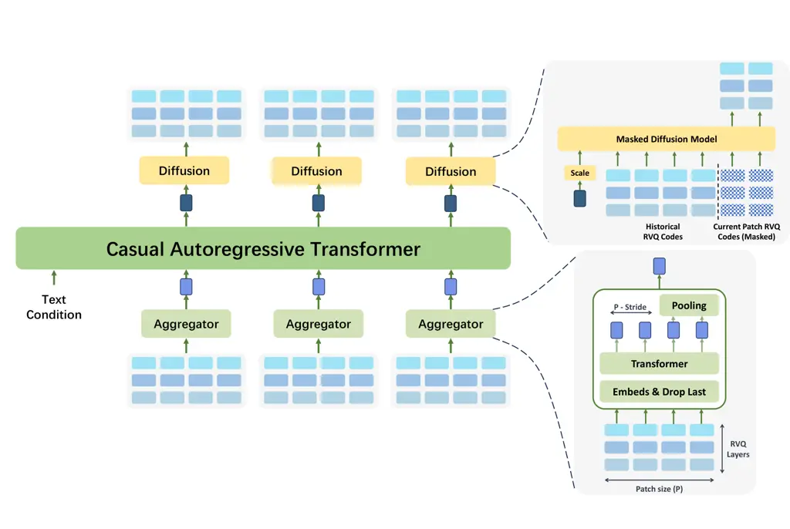

# DiSTAR: Diffusion over a Scalable Token Autoregressive Representation for Speech Generation

Yakun Song ^(†)^(†)thanks: This work was done while the author was an
intern at ByteDance Inc. Affiliation: X-LANCE Lab, School of Computer
Science, Shanghai Jiao Tong University Affiliation: ByteDance Inc.
Email: [ereboas@sjtu.edu.cn](mailto:)    Xiaobin Zhuang Jiawei Chen
Zhikang Niu Guanrou Yang Affiliation: X-LANCE Lab, School of Computer
Science, Shanghai Jiao Tong University Affiliation: ByteDance Inc.
Email: [chenxie95@sjtu.edu.cn](mailto:)    Chenpeng Du Dongya Jia Zhuo
Chen Yuping Wang Yuxuan Wang Xie Chen ^(†)^(†)thanks: Corresponding
author. Affiliation: X-LANCE Lab, School of Computer Science, Shanghai
Jiao Tong University Affiliation: ByteDance Inc.

###### Abstract

Recent attempts to interleave autoregressive (AR) sketchers with
diffusion-based refiners over continuous speech representations have
shown promise, but they remain brittle under distribution shift and
offer limited levers for controllability. We introduce DiSTAR, a
zero-shot text-to-speech framework that operates entirely in a discrete
residual vector quantization (RVQ) code space and tightly couples an AR
language model with a masked diffusion model, without forced alignment
or a duration predictor. Concretely, DiSTAR drafts block-level RVQ
tokens with an AR language model and then performs parallel
masked-diffusion infilling conditioned on the draft to complete the next
block, yielding long-form synthesis with blockwise parallelism while
mitigating classic AR exposure bias. The discrete code space affords
explicit control at inference: DiSTAR produces high-quality audio under
both greedy and sample-based decoding using classifier-free guidance,
supports trade-offs between robustness and diversity, and enables
variable bit-rate and controllable computation via RVQ layer pruning at
test time. Extensive experiments and ablations demonstrate that
DiSTAR surpasses state-of-the-art zero-shot TTS systems in robustness,
naturalness, and speaker/style consistency, while maintaining rich
output diversity. Audio samples are provided on
[https://anonymous.4open.science/w/DiSTAR_demo](https://anonymous.4open.science/w/DiSTAR_demo).

|     |
| --- |
|     |

## 1 Introduction

Zero-shot text-to-speech (TTS) aims to synthesize natural, intelligible
speech for an unseen speaker, matching voice timbre and style from only
a brief prompt while remaining robust over long passages  (Anastassiou
et al., 2024; Du et al., 2024b; Chen et al., 2025b). This capability is
central to open-domain narration, content creation, and conversational
agents (Ji et al., 2024; Nguyen et al., 2023).

A first mainstream route models speech as a sequence of discrete tokens
from a single codebook (e.g., from a neural audio codec) and applies an
autoregressive language model (AR) to predict the next token, followed
by a vocoder/codec decoder to reconstruct the waveform Anastassiou
et al. (2024); Shen et al. (2023). This track inherits mature AR
modeling and decoding strategies from the Natural Language Processing
community: discrete \[EOS\] tokens enable clear termination;
maximum-likelihood training is relatively stable compared with Mean
Squared/Absolute Error Loss; and decoding hyper-parameters (temperature,
top-$`p`$/top-$`k`$) and perplexity provide interpretable control at
inference. However, codec rate sequences are long; exposure bias
compounds in thousands of steps; and purely AR decoders struggle with
long-range consistency (speaker/style drift) and throughput Song et al.
(2024). Moreover, when a single discrete layer runs at low bitrate or
with limited expressivity, reconstructions tend to lose fidelity and
fine detail.

A second line of work models continuous speech representations (e.g.,
mel spectrograms or latents from pre-trained audio variational
autoencoder (Kingma et al., 2019) or self-supervised learning encoders)
and generates in the continuous space via diffusion or continuous-domain
AR before vocoding to waveform (Chen et al., 2025b; Eskimez et al.,
2024). Recent work interleaves AR drafting with next-patch diffusion
over continuous latents, balancing quality and compute, and achieving
impressive zero-shot cloning and cross-speaker generalization (Jia
et al., 2025). Yet continuous latents introduce practical fragilities:
modeling high-dimensional, information-dense features complicates
optimization and convergence; systems are sensitive to domain shift;
many rely on explicit duration predictors; and pipelines that add
reinforcement learning (RL) or intricate aligners raise engineering and
tuning burden.

A third, increasingly influential direction embraces multi-codebook
discrete representations, typically residual vector quantization (RVQ)
(Lee et al., 2022), where several codebooks per frame progressively
capture detail (Chen et al., 2024; Xiaomi, 2025). RVQ confers two
attractive properties: (i) at a sufficient aggregate bitrate it can
reconstruct high-fidelity audio; and (ii) by remaining discrete, it
preserves the stability and interpretability of LM-style training and
decoding. However, RVQ introduces a second dependency axis beyond
temporal order: intra-frame depth – the strong correlation among
codebooks at the same time frame – is critical for quality. Effective
RVQ TTS systems must therefore model time and depth jointly. Previous
explorations, such as including flattening codebooksBorsos et al.
(2022), semantic-to-acoustic hierarchiesChen et al. (2025a),
RQ-TransformerYang et al. (2023), and delay-pattern schedulingCopet
et al. (2023), partially address this coupling but still trade off
inference parallelism, long-range consistency, and train/infer
efficiency, leaving RVQ’s full potential under-exploited. This raises a
central question: Can we architect a generator that natively models
RVQ’s joint time-depth structure, achieving high quality at reasonable
compute?

To address this challenge, we introduce DiSTAR (DIffusion over a
Scalable Token AutoRegressive Representation for Speech Generation), a
zero-shot TTS framework that operates entirely in the RVQ discrete code
space and tightly couples an AR language model with a masked diffusion
transformer. DiSTAR adopts the patch-wise factorization strategy
popularized in next-patch systems Jia et al. (2025): it aggregates RVQ
tokens into patches. A causal LM drafts the next patch by predicting a
compact hidden sketch that captures coarse temporal evolution, after
which a discrete masked diffusion Transformer performs parallel
infilling within the patch. Inspired by LLaDA Nie et al. (2025), the
masked diffusion component operates not as a continuous denoiser but as
a iterative discrete demasking process over masked positions, thereby
resolving multi-codebook (depth) dependencies and supporting efficient
parallel synthesis in the RVQ code space.

The design gives two main advantages. Compared with continuous
next-patch diffusion, DiSTAR avoids optimization issues in
high-dimensional continuous latents while retaining patch-level
parallelism. Compared with single-codebook AR, it models the intra-frame
multi-codebook coupling inside each patch, improving coherence and
allowing depthwise parallel refinement, which reduces exposure-bias
effects without sacrificing the robustness of discrete training.

Several design choices in DiSTAR yield practical advantages. First, the
fully discrete setting preserves an \[EOS\] token for the immediate
termination of patch-level generation, eliminating auxiliary duration
predictors or stop heads Jia et al. (2025); Chen et al. (2025b); Shen
et al. (2018). Second, sharing the RVQ code space between the AR
sketcher and the masked diffusion refiner allows end-to-end optimization
and reduces inter-module mismatch relative to cascaded pipelines Wang
et al. (2024); Du et al. (2024b). Third, decoding achieves robust
quality under purely greedy settings, while temperature-based sampling
extends to RVQ-level and joint layer–time strategies, enabling
fine-grained control over the diversity–determinism trade-off. Fourth,
pruning the upper RVQ layers at inference controls computation and
bitrate to match bandwidth/latency constraints without retraining.

On standard zero-shot TTS benchmarks, DiSTAR demonstrates strong
robustness, speaker similarity, and naturalness, while maintaining the
inference cost close to its continuous counterpart DiTAR and using
fewer/comparable parameters than competitive baselines. Audio samples
are available on the demo page.

In summary, our contributions to the community include the following:

- •
  We introduce DiSTAR, a zero-shot TTS framework that couples an
  autoregressive drafter with masked diffusion entirely in the discrete
  RVQ domain, achieving patch-level parallelism and joint modeling of
  RVQ layer–time dependencies.
- •
  We develop an RVQ-specific sampling method that boosts quality and
  stability; support for diverse decoding strategies, and on-the-fly
  bitrate/compute control without retraining.
- •
  In standard zero-shot benchmarks, DiSTAR provides state-of-the-art
  robustness, speaker similarity, and naturalness with comparable or
  lower computational cost.

## 2 Related Works

### 2.1 Zero-Shot Text-to-Speech

Zero-shot TTS work broadly bifurcates by the target representation.
Continuous-latent approaches predict high-information features (mel or
codec latents) with diffusion/flow to boost long-range consistency and
robust cloning. (Shen et al., 2023; Ju et al., 2024) scale latent and
factorized diffusion with speech prompting; (Le et al., 2024) casts
text-guided speech infilling as flow matching; (Eskimez et al., 2024)
and (Chen et al., 2025b) report strong results via continuous flow
matching; (Yang et al., 2025) simplify training with scalar-latent
codecs and Transformer diffusion; (Li et al., 2024) improves
time-varying style control; and recent (Lee et al., 2024) and (Liu
et al., 2024) explore DiT-based and autoregressive diffusion decoders,
while (Jia et al., 2025; Sun et al., 2024) place diffusion heads inside
causal stacks to retain AR-like controllability. In contrast,
discrete-token pipelines discretize speech and leverage AR LMs for
stronger in-context prompting and explicit decoding control. (Chen
et al., 2025a) set the Nerual codec LM recipe, with (Chen et al., 2024;
Song et al., 2025b) improving robustness and human parity;
token-infilling AR models such as (Kharitonov et al., 2023) and (Peng
et al., 2024) advanced editing and wild-data zero-shot; (Wang et al., 2024) uses masked generative codec modeling; and large multilingual
systems such as(Anastassiou et al., 2024; Du et al., 2024a; Casanova
et al., 2024), broaden coverage and controllability.

### 2.2 Mask Diffusion Models

Masked diffusion extends discrete-state diffusion to language by
formalizing token corruption with structured transition kernels, notably
D3PM and multinomial diffusion, which introduced absorbing masks and
principled categorical noising (Austin et al., 2021; Hoogeboom et al.,
2021). Recent theory shows that masked-diffusion training objectives
reduce to mixtures of masked-LM losses and can be reparameterized to
connect tightly with any-order autoregression; this yields simpler
sampling and clarifies likelihood bounds (Ou et al., 2024; Shih et al.,
2022). Scaling experiments train masked-diffusion LMs from scratch at
LLM scale (e.g., LLaDA), demonstrating competitive perplexity and strong
instruction-following after SFT (Nie et al., 2025). Beyond pure masking,
generalized interpolating discrete diffusion mixes masking with uniform
noise, enabling self-correction and compute-matched gains (von Rütte
et al., 2025). Parallel advances include simplified/standardized masked
diffusion parameterizations, reparameterized discrete diffusion routes
and denoisers, and analyses that decouple paradigm (MDM vs. AR) from
architecture (Shi et al., 2024; Zheng et al., 2023). Task-level studies
further adapt discrete diffusion to conditional long-text generation
with improved efficiency (Dat et al., 2024). Collectively, these results
position masked discrete diffusion as a competitive LM family with
any-order decoding, efficient parallelism, and growing theoretical
clarity.



Figure 1: An overview of the proposed DiSTAR framework. It consists of
an aggregator for RVQ code input, a causal language model backbone with
text prompts, and a masked diffusion decoder, predicting patches of
tokens purely on the discrete RVQ space.

## 3 DiSTAR

### 3.1 Overview

Figure 1 summarizes DiSTAR, an autoregressive architecture that advances
patch by patch while remaining entirely within a discrete residual
vector-quantized (RVQ) code domain.

#### 3.1.1 Formulation

We recast long sequences of discrete speech codes into a tiled layout of
patches, akin to the DiTAR (Jia et al., 2025) paradigm. An
autoregressive (AR) Transformer governs dependencies across patches,
while a masked diffusion Transformer completes the contents within each
patch in parallel. In practice, generation advances along the patch
index autoregressively, with the next patch produced via conditional
masked diffusion. Let
$`\mathbf{C}=[\mathbf{c}_{0},\mathbf{c}_{1},\ldots,\mathbf{c}_{L-1}]\in\mathbb{Z}^{L\times J}`$
denote the sequence of RVQ codes from $`J`$ quantizers, where $`L`$ is
the RVQ code sequence length. And let $`\mathbf{X}`$ be the input text.
We estimate the DiSTAR parameters $`\theta`$ by conditional maximum
likelihood over the patch-grouped codes. By the chain rule, the model
factorizes as

```math
p_{\theta}(\mathbf{C}\mid\mathbf{X})=\prod_{i=0}^{L-1}p_{\theta}\!\big(\mathbf{c}_{i}\,\big|\,\mathbf{c}_{<i},\,\mathbf{X}\big), \tag{1}
```

where $`\mathbf{c}_{<i}=[\mathbf{c}_{0},\ldots,\mathbf{c}_{i-1}]`$
collects all previously generated codes. Training minimizes the negative
log-likelihood, while inference realizes the autoregressive step at the
patch level and resolves intra-patch tokens via masked diffusion in an
iterative parallel decoding pass.

##### Patchified view of the code stream.

Let
$`\mathbf{C}=[\mathbf{c}_{0},\mathbf{c}_{1},\ldots,\mathbf{c}_{L-1}]`$
be the discrete codec sequence. Fix a window length $`P`$ and stride
$`S\!\leq\!P`$. We work with a left–padded extension in which
$`\mathbf{c}_{i}`$ for $`i<0`$ equals a \[PAD\] code so that all early
windows have full length. For $`k=0,1,\ldots`$, define

```math
\underbrace{\mathbf{C}^{(k)}}_{\text{context aggregation window}}\;\stackrel{{\scriptstyle\mathrm{def}}}{{=}}\;\mathbf{C}_{(k+1)S-P:(k+1)S}\qquad\text{and}\qquad\underbrace{\dot{\mathbf{C}}^{(k)}}_{\text{next span to predict}}\;\stackrel{{\scriptstyle\mathrm{def}}}{{=}}\;\mathbf{C}_{kS:(k+1)S},
```

so the stream is viewed as a stack of (potentially) overlapping windows
$`\{\mathbf{C}^{(k)}\}`$ with step $`S`$, while the target of step $`k`$
is the length-$`S`$ slice $`\dot{\mathbf{C}}^{(k)}`$. Equivalently, the
windowed view can be written as

```math
\mathbf{C}[P;S]\;=\;\big[\,\mathbf{C}_{S-P:S},\;\mathbf{C}_{2S-P:2S},\;\ldots,\;\mathbf{C}_{(L-P):L}\big].
```

##### Decomposed generator.

Parameters are decomposed as
$`\theta=(\theta_{\text{AR}},\theta_{\text{MD}})`$. The autoregressive
summarizer $`\theta_{\text{AR}}`$ produces a conditioning state from the
accumulated history and text:

```math
p_{\theta_{\text{AR}}}\!\left(\mathbf{h}_{k}\;\middle|\;\mathbf{C}^{(0)},\mathbf{C}^{(1)},\ldots,\mathbf{C}^{(k-1)},\mathbf{X}\right),
```

capturing long-range dependencies across previously completed windows.
Given $`\mathbf{h}_{k}`$, a bidirectional self-attention Transformer
$`\theta_{\text{MD}}`$ then models the next-span distribution
$`p_{\theta_{\text{MD}}}\!\left(\dot{\mathbf{C}}^{(k)}\;\middle|\;\mathbf{h}_{k}\right),`$
which will be realized via a masked diffusion objective over discrete
tokens.

##### Discrete masked diffusion over the next span.

Following the LLaDA-style formulation for discrete spaces, we specify a
forward masking process and a reverse reconstruction process on
$`\dot{\mathbf{C}}^{(k)}`$. Let $`t\in[0,1]`$ and let
$`\lambda:[0,1]\!\to\![0,1]`$ be a monotonically increasing mask
schedule. The forward process produces a partially masked sequence
$`\dot{\mathbf{C}}^{(k)}_{t}`$ by independently replacing each position
with a special token $`\mathrm{MASK}`$ with probability $`\lambda(t)`$
(and leaving it unchanged with probability $`1-\lambda(t)`$); thus
$`\dot{\mathbf{C}}^{(k)}_{1}`$ is fully masked and
$`\dot{\mathbf{C}}^{(k)}_{0}`$ is clean. The reverse process is
parameterized by a bidirectional Transformer that, at any $`t`$,
predicts all masked sites simultaneously, i.e.
$`p_{\theta_{\text{MD}}}\!\big(\cdot\,\big|\,\dot{\mathbf{C}}^{(k)}_{t},\,\mathbf{h}_{k}\big).`$
Training minimizes the cross-entropy only on the positions that are
masked at time $`t`$, with a time-dependent weight that recovers an
upper bound on the sequence negative log-likelihood:

```math
\displaystyle\mathcal{L}(\theta_{\text{MD}})\;\stackrel{{\scriptstyle\mathrm{def}}}{{=}}\;-\;\mathbb{E}_{\,t,\ \dot{\mathbf{C}}^{(k)}_{0},\ \dot{\mathbf{C}}^{(k)}_{t}}\Bigg[\frac{1}{t}\sum_{j}\mathbf{1}\!\left\{\dot{\mathbf{C}}^{(k)}_{t,j}=\mathrm{MASK}\right\}\cdot\log p_{\theta_{\text{MD}}}\!\left(\dot{\mathbf{C}}^{(k)}_{0,j}\,\middle|\,\dot{\mathbf{C}}^{(k)}_{t},\,\mathbf{h}_{k}\right)\Bigg]. \tag{2}
```

Here $`j`$ indexes token positions within the span, and
$`\mathbf{1}\{\cdot\}`$ is the indicator. Conceptually, the AR module
supplies a long-context sketch $`\mathbf{h}_{k}`$, while the masked
diffusion infiller completes the $`k`$-th span in parallel, yielding a
patchwise AR process with reduced exposure bias and high intra-patch
fidelity.

At inference, generation proceeds through iterative decoding in parallel
over a masked sequence. We begin from an all-masked initialization
$`\dot{\mathbf{C}}^{(k)}_{1}`$. At time $`t`$, the masked diffusion
Transformer takes $`\dot{\mathbf{C}}^{(k)}_{t}`$ as input and outputs
categorical distributions for every currently masked position in one
shot. From these distributions we produce a provisional completion
$`\widehat{\mathbf{C}}^{(k)}_{t}`$ (sampling or choosing modes), and
compute per-position confidence scores $`s_{t}(i)`$ (e.g., maximum class
probability).

Let $`N`$ denote the total number of the decoding steps and define a
monotonically decreasing mask budget
$`\rho_{n}\;=\;\lambda\!\left(1-\frac{n}{N}\right)`$ for each step
$`n`$, we reapply masks to the least confident fraction $`\rho_{n}`$ of
position, yielding the next iterate

```math
\dot{\mathbf{C}}^{(k)}_{\rho_{n+1}}\;=\;\mathrm{Mask}\!\left(\widehat{\mathbf{C}}^{(k)}_{\rho_{n}},\,\operatorname*{arg\,top}_{\lfloor\rho_{n}|\Omega|\rfloor}\big(-s_{\rho_{n}}(i)\big)\right),
```

where $`\Omega`$ indexes the currently editable sites, $`s_{t}(i)`$
denotes per-position confidence scores,
$`\widehat{\mathbf{C}}^{(k)}_{\rho_{n}}`$ is produced as a provisional
completion at this timestep, and $`\mathrm{Mask}(\cdot,\cdot)`$ replaces
the selected entries with the mask token. This schedule enforces a
monotone decrease in the masked ratio and mirrors the forward-noising
trajectory, aligning the reverse refinement with the corruption process.
Throughout decoding we employ classifier-free guidance (Ho & Salimans,
2022; Lin et al., 2024) with rescaling, following (Wang et al., 2024).

#### 3.1.2 Overall architecture

Figure 1 sketches the DiSTAR pipeline. In the spirit of DiTAR, we adopt
a blockwise decomposition of the RVQ code stream: a long sequence of
discrete tokens is sliced into patch-level units. Dependencies across
patches are modeled by a causal autoregressive (AR) language model,
whereas a Transformer-based masked diffusion module decodes within-patch
content in parallel.

The text prompt is fed to the AR LM and then concatenated with a learned
patch embedding obtained by aggregating the relevant RVQ codes. The LM
produces a contextual summary $`h`$, which—together with a finite
history of previously generated tokens—serves as conditioning for the
diffusion model. Training minimizes the cross-entropy objective in
equation 2.

DiSTAR dispenses with both an explicit duration predictor and forced
alignment. Moreover, unlike prior designs, the RVQ aggregator is not
restricted to disjoint patches: overlapping windows are permitted. At
each decoding step, the diffusion head predicts, in one shot, a segment
whose length matches the aggregator’s stride on the output stream,
ensuring consistency. Additional architectural and training details are
provided in the following sections.

### 3.2 Aggregator

We use a lightweight non-autoregressive Transformer encoder to turn
frame-level RVQ codes into one vector per patch. Concretely, each RVQ
layer has its own embedding table, and we adopt factorized embedding
parameterization (Lan et al., 2019): a narrow embedding (e.g., 32-d) is
learned and then lifted to $`d_{\text{model}}`$ by a layer-specific
linear map. A learnable scalar mixes the layer embeddings at each frame
into a single continuous vector by weighted summing, giving one hidden
vector per RVQ frame.

Inspired by the overlapped mode in classic CNNs (O’shea & Nash, 2015),
we do not require the stride to equal the aggregation patch size on the
input RVQ sequence, thereby allowing overlapping. With patch length
$`P`$ and stride $`S\!\leq\!P`$, we intentionally allow $`S<P`$ so
adjacent patches overlap, which smooths boundaries and provide more
information. After the encoder, each patch vector is obtained by
averaging the final hidden states over the last $`S`$ tokens of that
patch. The resulting sequence of patch embeddings is then passed to the
AR language model.

### 3.3 Next-Patch Masked Diffusion Modeling

To complete each drafted patch, we employ a discrete masked diffusion
model that operates in parallel over the tokens of the patch while
respecting bidirectional context, akin to LLaDA-style non-causal
Transformers. Conditioning follows the spirit of (Jia et al., 2025) and
(Wang et al., 2024): the diffusion model receives a compact prefix
formed by concatenating (i) the autoregressive planner’s hidden state
and (ii) a sliding window of previously generated codes. To avoid scale
mismatch, the AR hidden is first passed through a trainable scalar gate
before concatenation, which keeps its contribution numerically stable.

The target RVQ streams are linearized across time into a one-dimensional
token sequence
$`\tilde{\mathbf{c}}=(\mathbf{c}_{k}^{\top},\mathbf{c}_{k+1}^{\top},\ldots)`$
with $`\mathbf{c}_{k}`$ denoting the code tuple at frame $`k`$. For each
position, we add a learnable embedding and an RVQ-layer embedding to
inject positional/type cues, which breaks symmetry and provides simple
priors for the model (Dosovitskiy et al., 2020).

During training, we draw a timestep $`t\sim\mathcal{U}(0,1]`$ and
compute the masking ratio via a cosine schedule
$`\lambda(t)=\cos\big(\frac{1-t}{2}\pi\big)`$ following  (Chang et al.,
2022). A fraction $`\lambda(t)`$ of target tokens in the current patch
is replaced by a special \[MASK\] symbol, and the diffusion model learns
to reconstruct all masked RVQ tokens simultaneously given the visible
tokens and the conditioning prefix. At inference, we use the same cosine
schedule to anneal the mask ratio over $`N`$ iterations using
iteratively decoding, after which the process advances to the next
patch.

### 3.4 Training and Inference

##### Embedding initialization.

For each discrete RVQ token, we bootstrap its embedding vector by
_transplanting_ the first $`16`$ channels from the corresponding
codebook of the RVQ codec. The remaining $`d-16`$ channels are sampled
i.i.d. from a Gaussian whose mean and variance are matched to those
$`16`$ copied channels. This preserves the native scale of the codebook
while avoiding cold-start mismatch in the unused dimensions.

##### Stochastic layer truncation.

To make the model resilient to depth reductions, during training we
randomly drop the top $`\ell`$ RVQ tiers, drawing
$`\ell\sim\mathrm{Unif}\{0,\dots,L-1\}`$ where $`L`$ is the total number
of layers. The network therefore encounters examples with missing
high-depth codes and learns to decode from shallower stacks, enabling
test-time bitrate/compute control by simply pruning the last $`\ell`$
layers, with no retraining required.

##### Classifier-free conditioning.

We implement classifier-free guidance (CFG) for the masked-diffusion
module by independently dropping (i) the AR LM conditioning output and
(ii) the past-code window with probabilities $`0.1`$ and $`0.1`$,
respectively. At inference, the LM is evaluated once to produce its
context, while the diffusion head executes multiple times. Unless stated
otherwise, CFG is applied only to the historical code with a guidance
scale of $`1.25`$ and a rescale factor of $`0.75`$.

##### Decoding heuristics.

At inference, we observe a tail-first bias: tokens near the end of each
patch often receive higher confidence early in decoding. Vanilla
decoding thus induces a mask pattern misaligned with training and
degrades performance. A likely reason is that, in temporally/casually
dependent sequences, non-autoregressive training makes later positions
easier (they lean more on preceding context), leading to overconfidence.

To mitigate this with three lightweight decoding tricks: (i) Layer-wise
temperature shaping. Cool down deeper RVQ layers so they don’t dominate
early. Concretely, multiply the sampling temperature for layer $`j`$ by
$`T_{\text{layer}}^{\,j}`$. (ii) Position-wise temperature shaping.
Within a patch, reduce confidence for farther-ahead positions by scaling
the temperature at offset $`l`$ with $`T_{\text{time}}^{\,l}`$
($`0\!\leq\!l\!<\!S`$). (iii) Hybrid sampling. Generate the first
$`50\%`$ of the target positions by sampling, then switch to greedy for
the remaining $`50\%`$ to trade diversity for stability. In principle,
the greedy/sample schedule is a hyperparameter; we adopt a simple
half–half scheme to avoid over-tuning.

In our default setup, $`T_{\text{layer}}{=}0.8`$,
$`T_{\text{time}}{=}0.95`$; we use top-$`k{=}50`$, top-$`p{=}0.9`$, and
anneal temperature from $`1.0`$ to $`0.1`$ for sampling. Following (Chen
et al., 2024), we also add a repetition-aware penalty within every
$`P_{r}{=}4`$ patches to curb code collapse at the layer level.

Together these inference strategies keep sampling diverse yet stable,
while also enabling high-quality greedy decoding.

### 3.5 Implementation Details

#### 3.5.1 Residual Vector Quantizer

We largely adopt the overall architecture and staged training recipe of
Magicodec (Song et al., 2025a), but replace its single-codebook VQ
module with a residual vector quantizer (RVQ). Our RVQ is a
Transformer-based streaming codec with approximately $`0.3`$B
parameters. Under this configuration, a $`24\,\mathrm{kHz}`$ waveform is
compressed into a discrete token stream at $`64\,\mathrm{Hz}`$. The
codec employs $`9`$ residual stages (RVQ layers); each stage uses a
codebook of size $`65{,}536`$ with $`16`$-dimensional code vectors.

#### 3.5.2 Model

DiSTAR comprises (i) an aggregator, (ii) a causal language model (LM),
and (iii) a masked diffusion model (MDM), all instantiated with
Transformer backbones. The aggregator and MDM are bidirectional
RoFormers with rotary positional encodings (RoPE) (Su et al., 2024),
SwiGLU activations (Shazeer, 2020), and a Pre-Norm layout using
RMSNorm(Zhang & Sennrich, 2019). The AR LM follows the Qwen2.5 (Yang
et al., 2024) style decoder-only architecture and is trained from
scratch. Input text is converted to phoneme sequences and embedded via a
learned lookup table. At inference, consistent with prior practice, we
construct a prefix context that includes the text together with a short
acoustic prompt.

#### 3.5.3 Optimization

Training uses the cut cross entropy (Wijmans et al., 2024) as the
implementation of cross entropy for masked token prediction. We
implement SwiGLU, RMSNorm, and RoPE via Liger’s open-source Triton
kernels (Hsu et al., 2024), and optimize with a fused Adam variant.
Further details are provided in the Appendix B.1.

## 4 Experiments

In this subsection, we position DiSTAR against strong contemporary
systems and report state-of-the-art results.

### 4.1 Experimental Settings

##### Datasets.

All models are trained on Emilia (He et al., 2024), a large,
multilingual, in-the-wild speech corpus curated for scalable speech
generation. For this study we use only its English subset, totaling
roughly $`50`$k hours. Evaluation spans two open benchmarks: (i)
LibriSpeech(PC) (Meister et al., 2023) test-clean, $`5.4`$ hours from
$`40`$ unique English speakers; we follow the established zero-shot
cross-sentence protocol and adopt the subset from F5TTS (Chen et al.,
2025b) (40 prompts, 1127 utterances), and (ii) SeedTTS test-en,
introduced with Seed-TTS (Anastassiou et al., 2024), consisting of 1088
English samples drawn from Common Voice (Ardila et al., 2019).

##### Evaluation Metrics.

We use both objective and subjective metrics to evaluate our models. For
the objective metrics, we evaluate (i) Word Error Rate (WER) to assess
robustness and intelligibility using Whisper-large-v3 (Radford et al., 2022) as our ASR model; (ii) Speaker similarity (SIM) via cosine
similarity between the TDNN-based WavLM embeddings (Chen et al., 2022)
extracted from the generated audio and its reference prompt; (iii) UTMOS
(Saeki et al., 2022), an automatic predicted mean opinion score (MOS)
for speech quality.For the subjective metrics, comparative mean option
score (CMOS) and similarity mean option score (SMOS) are used to
evaluate naturalness/robustness and similarity, respectively. CMOS is on
a scale of -3 to 3, and SMOS is on a scale of 1 to 5.

##### Model settings and baselines.

We train all models on 64 NVIDIA A100 80GB GPUs. We train DiSTAR of two
sizes DiSTAR-base (0.15B), and DiSTAR-medium (0.3B). Architectural
specifics are provided in Appendix B.2. Unless otherwise noted, we use a
patch size of $`8`$ and condition the diffusion module on a single
historical patch. Inference procedures are detailed in Section 3.4.

|                        |          |                      |                 |                   |
| ---------------------- | -------- | -------------------- | --------------- | ----------------- |
| System                 | \#Params | WER(%)$`\downarrow`$ | SIM$`\uparrow`$ | UTMOS$`\uparrow`$ |
| LibriSpeech test-clean |          |                      |                 |                   |
| Human                  | \-       | 1.80                 | 0.69            | 4.10              |
| RVQ resynthesized      | \-       | 1.83                 | 0.66            | 4.23              |
| IndexTTS               | 0.5B     | 2.57                 | 0.62            | 4.35              |
| E2TTS (NFE=32)         | 0.3B     | 2.74                 | 0.70            | 3.47              |
| F5TTS-v1 (NFE=32)      | 0.3B     | 2.02                 | 0.68            | 3.83              |
| DiTAR (NFE=10) ^(⧫)    | 0.6B     | 2.39                 | 0.67            | 4.22              |
| DiSTAR-base (NFE=24)   | 0.15B    | 1.90                 | 0.64            | 4.29              |
| DiSTAR-medium (NFE=24) | 0.3B     | 1.66                 | 0.67            | 4.27              |
| Seed-TTS test-en       |          |                      |                 |                   |
| Human                  | \-       | 1.47                 | 0.73            | 3.53              |
| RVQ resynthesized      | \-       | 1.71                 | 0.70            | 3.79              |
| IndexTTS               | 0.5B     | 1.92                 | 0.61            | 3.98              |
| E2TTS (NFE=32)         | 0.3B     | 2.20                 | 0.71            | 3.20              |
| F5TTS-v1 (NFE=32)      | 0.3B     | 1.35                 | 0.68            | 3.66              |
| DiTAR (NFE=10) ^(⧫)    | 0.6B     | 1.78                 | 0.64            | 4.15              |
| DiSTAR-base (NFE=24)   | 0.15B    | 1.51                 | 0.64            | 3.93              |
| DiSTAR-medium (NFE=24) | 0.3B     | 1.32                 | 0.66            | 4.05              |

Table 1: Evaluation results of DiSTAR and other systems LibriSpeech-PC
test-clean and SeedTTS test-en. $`\blacklozenge`$ denotes the scores
reported in DiTAR paper. The boldface and underline indicate the best
and the second-best result, respectively. $`\uparrow`$ and
$`\downarrow`$ indicate that lower or higher values are better.

### 4.2 Zero-Shot TTS

we show comparison results with SOTA baselines. The main results of
objective metrics are shown in Table 1. Subjective results are detailed
in Table 2.

DiSTAR exhibits strong overall performance. Across benchmarks it attains
the lowest WER, indicating robust synthesis. We assess speaker
similarity using both objective and human judgments: SIM and speaker
SMOS. DiSTAR yields SIM on par with the best alternatives and leads on
SMOS. We attribute these gains in part to reduced sensitivity to
high-frequency artifacts in the reference prompt, which preserves
cleaner timbral cues during cloning. The same trend is observed in the
objective predictor UTMOS and in CMOS listening tests. Notably, relative
to continuous-representation systems, DiSTAR achieves comparable or
superior perceptual quality with a similar or smaller parameter budget.
As model capacity grows, DiSTAR yields consistent improvements on
objective metrics, closely matching the scaling behavior reported for
discrete-token autoregressive systems and indicating a healthy scaling
trajectory.

| System      | SMOS                         | CMOS                         |
| ----------- | ---------------------------- | ---------------------------- |
| Human       | $`3.07`$                     | $`0.00`$                     |
| FireRedTTS  | $`2.36_{\pm 0.58}`$          | $`-0.34_{\pm 0.21}`$         |
| CosyVoice 2 | $`3.07_{\pm 0.21}`$          | $`-0.04_{\pm 0.17}`$         |
| E2TTS       | $`3.29_{\pm 0.19}`$          | $`-0.08_{\pm 0.22}`$         |
| F5TTS       | $`3.08_{\pm 0.20}`$          | $`0.01_{\pm 0.12}`$          |
| DiSTAR      | $`\mathbf{3.31}_{\pm 0.25}`$ | $`\mathbf{0.22}_{\pm 0.13}`$ |

Table 2: Subjective evaluation results on Seed-TTS test-en dataset. We
compare DiTAR with several leading TTS systems based on discrete or/and
continuous speech representations.

### 4.3 Ablation Study

In this subsection, we conduct a detailed analysis of the various
components of DiSTAR. Unless specified otherwise, we default to using
DiSTAR-base with 0.15 billion parameters, a patch size of 8, a stride of
8, and NFE of 24, tested on the LibriSpeech-PC test dataset mentioned
above. We discuss the patch size in Appendix  D and classifier-guidance
free settings in Appendix C.

##### Decoding Strategies.

| Type   | $`T_{\text{time}}`$ | $`T_{\text{layer}}`$ | WER  | SPK   |
| ------ | ------------------- | -------------------- | ---- | ----- |
| Sample | 1                   | 1                    | 2.11 | 0.626 |
| Sample | 0.95                | 0.8                  | 1.99 | 0.640 |
| Greedy | 0.95                | 0.8                  | 1.91 | 0.636 |

Table 3: Objective evaluation results between different decoding
strategies.

We compare DiSTAR under multiple inference strategies (Table 3).
Deterministic greedy decoding yields the lowest WER, evidencing stable
synthesis, while speaker similarity is slightly lower than with
stochastic sampling. This aligns with the standard diversity-determinism
trade-off: sampling can recover timbral nuances at the cost of higher
variability.

### 4.4 Inference Efficiency and Controllability

Figure 2: Comparison results among different inference RVQ layers.

During training, DiSTAR randomly drops the last $`\ell`$ RVQ layers. At
inference, we simply prune higher RVQ layers to achieve variable bitrate
and compute. Figure 2 summarizes the inference–quality trade-off under
different RVQ pruning depths. As more RVQ layers are retained (hence
higher FLOPs), speaker similarity increases markedly, whereas WER
changes little and reaches its minimum around six layers. This pattern
is consistent with the hypothesis that upper RVQ layers primarily encode
acoustic detail rather than linguistic content (Chen et al., 2025a).

## 5 Conclusion

We presented DiSTAR, a zero-shot TTS framework that operates in an RVQ
code space and tightly couples an autoregressive Transformer with masked
diffusion. DiSTAR achieves blockwise parallelism while effectively
modeling layer–time dependencies across RVQ levels and local temporal
neighborhoods, without an explicit duration predictor. We further
introduced a simple but effective RVQ-aware sampling procedure that
stabilizes inference and improves perceptual quality. In combination,
these design choices yield SOTA robustness, speaker similarity, and
naturalness in zero-shot speech synthesis, while exposing clear levers
for controllability at inference time.

## References

- Anastassiou et al. (2024) Philip Anastassiou, Jiawei Chen, Jitong
  Chen, Yuanzhe Chen, Zhuo Chen, Ziyi Chen, Jian Cong, Lelai Deng,
  Chuang Ding, Lu Gao, et al. Seed-tts: A family of high-quality
  versatile speech generation models. _arXiv preprint
  arXiv:2406.02430_, 2024.
- Ardila et al. (2019) Rosana Ardila, Megan Branson, Kelly Davis,
  Michael Henretty, Michael Kohler, Josh Meyer, Reuben Morais, Lindsay
  Saunders, Francis M Tyers, and Gregor Weber. Common voice: A
  massively-multilingual speech corpus. _arXiv preprint
  arXiv:1912.06670_, 2019.
- Austin et al. (2021) Jacob Austin, Daniel D Johnson, Jonathan Ho,
  Daniel Tarlow, and Rianne Van Den Berg. Structured denoising diffusion
  models in discrete state-spaces. _Advances in neural information
  processing systems_, 34:17981–17993, 2021.
- Borsos et al. (2022) Zalán Borsos, Raphaël Marinier, Damien Vincent,
  Eugene Kharitonov, Olivier Pietquin, Matthew Sharifi, Olivier Teboul,
  David Grangier, Marco Tagliasacchi, and Neil Zeghidour. Audiolm: a
  language modeling approach to audio generation. _CoRR_,
  abs/2209.03143, 2022.
- Casanova et al. (2024) Edresson Casanova, Kelly Davis, Eren Gölge,
  Görkem Göknar, Iulian Gulea, Logan Hart, Aya Aljafari, Joshua Meyer,
  Reuben Morais, Samuel Olayemi, et al. Xtts: a massively multilingual
  zero-shot text-to-speech model. _arXiv preprint
  arXiv:2406.04904_, 2024.
- Chang et al. (2022) Huiwen Chang, Han Zhang, Lu Jiang, Ce Liu, and
  William T Freeman. Maskgit: Masked generative image transformer. In
  _Proceedings of the IEEE/CVF Conference on Computer Vision and Pattern
  Recognition_, pp. 11315–11325, 2022.
- Chen et al. (2022) Sanyuan Chen, Chengyi Wang, Zhengyang Chen, Yu Wu,
  Shujie Liu, Zhuo Chen, Jinyu Li, Naoyuki Kanda, Takuya Yoshioka, Xiong
  Xiao, et al. Wavlm: Large-scale self-supervised pre-training for full
  stack speech processing. _IEEE Journal of Selected Topics in Signal
  Processing_, 16(6):1505–1518, 2022.
- Chen et al. (2024) Sanyuan Chen, Shujie Liu, Long Zhou, Yanqing Liu,
  Xu Tan, Jinyu Li, Sheng Zhao, Yao Qian, and Furu Wei. Vall-e 2: Neural
  codec language models are human parity zero-shot text to speech
  synthesizers. _arXiv preprint arXiv:2406.05370_, 2024.
- Chen et al. (2025a) Sanyuan Chen, Chengyi Wang, Yu Wu, Ziqiang Zhang,
  Long Zhou, Shujie Liu, Zhuo Chen, Yanqing Liu, Huaming Wang, Jinyu Li,
  et al. Neural codec language models are zero-shot text to speech
  synthesizers. _IEEE Transactions on Audio, Speech and Language
  Processing_, 2025a.
- Chen et al. (2025b) Yushen Chen, Zhikang Niu, Ziyang Ma, Keqi Deng,
  Chunhui Wang, JianZhao JianZhao, Kai Yu, and Xie Chen. F5-TTS: A
  fairytaler that fakes fluent and faithful speech with flow matching.
  In Wanxiang Che, Joyce Nabende, Ekaterina Shutova, and Mohammad Taher
  Pilehvar (eds.), _Proceedings of the 63rd Annual Meeting of the
  Association for Computational Linguistics (Volume 1: Long Papers)_,
  pp. 6255–6271, Vienna, Austria, July 2025b. Association for
  Computational Linguistics. ISBN 979-8-89176-251-0. doi:
  10.18653/v1/2025.acl-long.313. URL
  [https://aclanthology.org/2025.acl-long.313/](https://aclanthology.org/2025.acl-long.313/).
- Copet et al. (2023) Jade Copet, Felix Kreuk, Itai Gat, Tal Remez,
  David Kant, Gabriel Synnaeve, Yossi Adi, and Alexandre Défossez.
  Simple and controllable music generation. _Advances in Neural
  Information Processing Systems_, 36:47704–47720, 2023.
- Dat et al. (2024) Do Huu Dat, Do Duc Anh, Anh Tuan Luu, and Wray
  Buntine. Discrete diffusion language model for efficient text
  summarization. _arXiv preprint arXiv:2407.10998_, 2024.
- Deng et al. (2025) Wei Deng, Siyi Zhou, Jingchen Shu, Jinchao Wang,
  and Lu Wang. Indextts: An industrial-level controllable and efficient
  zero-shot text-to-speech system. _arXiv preprint
  arXiv:2502.05512_, 2025.
- Dosovitskiy et al. (2020) Alexey Dosovitskiy, Lucas Beyer, Alexander
  Kolesnikov, Dirk Weissenborn, Xiaohua Zhai, Thomas Unterthiner,
  Mostafa Dehghani, Matthias Minderer, Georg Heigold, Sylvain Gelly,
  et al. An image is worth 16x16 words: Transformers for image
  recognition at scale. _arXiv preprint arXiv:2010.11929_, 2020.
- Du et al. (2024a) Zhihao Du, Qian Chen, Shiliang Zhang, Kai Hu, Heng
  Lu, Yexin Yang, Hangrui Hu, Siqi Zheng, Yue Gu, Ziyang Ma, et al.
  Cosyvoice: A scalable multilingual zero-shot text-to-speech
  synthesizer based on supervised semantic tokens. _arXiv preprint
  arXiv:2407.05407_, 2024a.
- Du et al. (2024b) Zhihao Du, Yuxuan Wang, Qian Chen, Xian Shi, Xiang
  Lv, Tianyu Zhao, Zhifu Gao, Yexin Yang, Changfeng Gao, Hui Wang,
  et al. Cosyvoice 2: Scalable streaming speech synthesis with large
  language models. _arXiv preprint arXiv:2412.10117_, 2024b.
- Eskimez et al. (2024) Sefik Emre Eskimez, Xiaofei Wang, Manthan
  Thakker, Canrun Li, Chung-Hsien Tsai, Zhen Xiao, Hemin Yang, Zirun
  Zhu, Min Tang, Xu Tan, et al. E2 tts: Embarrassingly easy fully
  non-autoregressive zero-shot tts. In _2024 IEEE Spoken Language
  Technology Workshop (SLT)_, pp. 682–689. IEEE, 2024.
- Guo et al. (2024) Hao-Han Guo, Yao Hu, Kun Liu, Fei-Yu Shen, Xu Tang,
  Yi-Chen Wu, Feng-Long Xie, Kun Xie, and Kai-Tuo Xu. Fireredtts: A
  foundation text-to-speech framework for industry-level generative
  speech applications. _arXiv preprint arXiv:2409.03283_, 2024.
- He et al. (2024) Haorui He, Zengqiang Shang, Chaoren Wang, Xuyuan Li,
  Yicheng Gu, Hua Hua, Liwei Liu, Chen Yang, Jiaqi Li, Peiyang Shi,
  et al. Emilia: An extensive, multilingual, and diverse speech dataset
  for large-scale speech generation. In _2024 IEEE Spoken Language
  Technology Workshop (SLT)_, pp. 885–890. IEEE, 2024.
- Ho & Salimans (2022) Jonathan Ho and Tim Salimans. Classifier-free
  diffusion guidance. _arXiv preprint arXiv:2207.12598_, 2022.
- Hoogeboom et al. (2021) Emiel Hoogeboom, Didrik Nielsen, Priyank
  Jaini, Patrick Forré, and Max Welling. Argmax flows and multinomial
  diffusion: Learning categorical distributions. _Advances in neural
  information processing systems_, 34:12454–12465, 2021.
- Hsu et al. (2024) Pin-Lun Hsu, Yun Dai, Vignesh Kothapalli, Qingquan
  Song, Shao Tang, Siyu Zhu, Steven Shimizu, Shivam Sahni, Haowen Ning,
  and Yanning Chen. Liger kernel: Efficient triton kernels for llm
  training. _arXiv preprint arXiv:2410.10989_, 2024.
- Ji et al. (2024) Shengpeng Ji, Yifu Chen, Minghui Fang, Jialong Zuo,
  Jingyu Lu, Hanting Wang, Ziyue Jiang, Long Zhou, Shujie Liu, Xize
  Cheng, et al. Wavchat: A survey of spoken dialogue models. _arXiv
  preprint arXiv:2411.13577_, 2024.
- Jia et al. (2025) Dongya Jia, Zhuo Chen, Jiawei Chen, Chenpeng Du,
  Jian Wu, Jian Cong, Xiaobin Zhuang, Chumin Li, Zhen Wei, Yuping Wang,
  et al. Ditar: Diffusion transformer autoregressive modeling for speech
  generation. _arXiv preprint arXiv:2502.03930_, 2025.
- Ju et al. (2024) Zeqian Ju, Yuancheng Wang, Kai Shen, Xu Tan, Detai
  Xin, Dongchao Yang, Yanqing Liu, Yichong Leng, Kaitao Song, Siliang
  Tang, et al. Naturalspeech 3: Zero-shot speech synthesis with
  factorized codec and diffusion models. _arXiv preprint
  arXiv:2403.03100_, 2024.
- Kharitonov et al. (2023) Eugene Kharitonov, Damien Vincent, Zalán
  Borsos, Raphaël Marinier, Sertan Girgin, Olivier Pietquin, Matt
  Sharifi, Marco Tagliasacchi, and Neil Zeghidour. Speak, read and
  prompt: High-fidelity text-to-speech with minimal supervision.
  _Transactions of the Association for Computational Linguistics_,
  11:1703–1718, 2023.
- Kingma et al. (2019) Diederik P Kingma, Max Welling, et al. An
  introduction to variational autoencoders. _Foundations and Trends® in
  Machine Learning_, 12(4):307–392, 2019.
- Lan et al. (2019) Zhenzhong Lan, Mingda Chen, Sebastian Goodman, Kevin
  Gimpel, Piyush Sharma, and Radu Soricut. Albert: A lite bert for
  self-supervised learning of language representations. _arXiv preprint
  arXiv:1909.11942_, 2019.
- Le et al. (2024) Matthew Le, Apoorv Vyas, Bowen Shi, Brian Karrer,
  Leda Sari, Rashel Moritz, Mary Williamson, Vimal Manohar, Yossi Adi,
  Jay Mahadeokar, et al. Voicebox: Text-guided multilingual universal
  speech generation at scale. _Advances in neural information processing
  systems_, 36, 2024.
- Lee et al. (2022) Doyup Lee, Chiheon Kim, Saehoon Kim, Minsu Cho, and
  Wook-Shin Han. Autoregressive image generation using residual
  quantization. In _Proceedings of the IEEE/CVF conference on computer
  vision and pattern recognition_, pp. 11523–11532, 2022.
- Lee et al. (2024) Keon Lee, Dong Won Kim, Jaehyeon Kim, and Jaewoong
  Cho. Ditto-tts: Efficient and scalable zero-shot text-to-speech with
  diffusion transformer. _arXiv e-prints_, pp. arXiv–2406, 2024.
- Li et al. (2024) Yinghao Aaron Li, Cong Han, Vinay Raghavan, Gavin
  Mischler, and Nima Mesgarani. Styletts 2: Towards human-level
  text-to-speech through style diffusion and adversarial training with
  large speech language models. _Advances in Neural Information
  Processing Systems_, 36, 2024.
- Lin et al. (2024) Shanchuan Lin, Bingchen Liu, Jiashi Li, and Xiao
  Yang. Common diffusion noise schedules and sample steps are flawed. In
  _Proceedings of the IEEE/CVF winter conference on applications of
  computer vision_, pp. 5404–5411, 2024.
- Liu et al. (2024) Zhijun Liu, Shuai Wang, Sho Inoue, Qibing Bai, and
  Haizhou Li. Autoregressive diffusion transformer for text-to-speech
  synthesis. _arXiv preprint arXiv:2406.05551_, 2024.
- Liu et al. (2022) Zhuang Liu, Hanzi Mao, Chao-Yuan Wu, Christoph
  Feichtenhofer, Trevor Darrell, and Saining Xie. A convnet for the
  2020s. In _Proceedings of the IEEE/CVF conference on computer vision
  and pattern recognition_, pp. 11976–11986, 2022.
- Meister et al. (2023) Aleksandr Meister, Matvei Novikov, Nikolay
  Karpov, Evelina Bakhturina, Vitaly Lavrukhin, and Boris Ginsburg.
  Librispeech-pc: Benchmark for evaluation of punctuation and
  capitalization capabilities of end-to-end asr models. In _2023 IEEE
  Automatic Speech Recognition and Understanding Workshop (ASRU)_, pp.
  1–7. IEEE, 2023.
- Nguyen et al. (2023) Tu Anh Nguyen, Eugene Kharitonov, Jade Copet,
  Yossi Adi, Wei-Ning Hsu, Ali Elkahky, Paden Tomasello, Robin Algayres,
  Benoit Sagot, Abdelrahman Mohamed, et al. Generative spoken dialogue
  language modeling. _Transactions of the Association for Computational
  Linguistics_, 11:250–266, 2023.
- Nie et al. (2025) Shen Nie, Fengqi Zhu, Zebin You, Xiaolu Zhang,
  Jingyang Ou, Jun Hu, Jun Zhou, Yankai Lin, Ji-Rong Wen, and Chongxuan
  Li. Large language diffusion models. _arXiv preprint
  arXiv:2502.09992_, 2025.
- O’shea & Nash (2015) Keiron O’shea and Ryan Nash. An introduction to
  convolutional neural networks. _arXiv preprint
  arXiv:1511.08458_, 2015.
- Ou et al. (2024) Jingyang Ou, Shen Nie, Kaiwen Xue, Fengqi Zhu,
  Jiacheng Sun, Zhenguo Li, and Chongxuan Li. Your absorbing discrete
  diffusion secretly models the conditional distributions of clean data.
  _arXiv preprint arXiv:2406.03736_, 2024.
- Peng et al. (2024) Puyuan Peng, Po-Yao Huang, Shang-Wen Li,
  Abdelrahman Mohamed, and David Harwath. Voicecraft: Zero-shot speech
  editing and text-to-speech in the wild. _arXiv preprint
  arXiv:2403.16973_, 2024.
- Radford et al. (2022) Alec Radford, Jong Wook Kim, Tao Xu, Greg
  Brockman, Christine McLeavey, and Ilya Sutskever. Robust speech
  recognition via large-scale weak supervision, 2022. URL
  [https://arxiv.org/abs/2212.04356](https://arxiv.org/abs/2212.04356).
- Saeki et al. (2022) Takaaki Saeki, Detai Xin, Wataru Nakata, Tomoki
  Koriyama, Shinnosuke Takamichi, and Hiroshi Saruwatari. Utmos:
  Utokyo-sarulab system for voicemos challenge 2022. _arXiv preprint
  arXiv:2204.02152_, 2022.
- Shazeer (2020) Noam Shazeer. Glu variants improve transformer. _arXiv
  preprint arXiv:2002.05202_, 2020.
- Shen et al. (2018) Jonathan Shen, Ruoming Pang, Ron J Weiss, Mike
  Schuster, Navdeep Jaitly, Zongheng Yang, Zhifeng Chen, Yu Zhang,
  Yuxuan Wang, Rj Skerrv-Ryan, et al. Natural tts synthesis by
  conditioning wavenet on mel spectrogram predictions. In _2018 IEEE
  international conference on acoustics, speech and signal processing
  (ICASSP)_, pp. 4779–4783. IEEE, 2018.
- Shen et al. (2023) Kai Shen, Zeqian Ju, Xu Tan, Yanqing Liu, Yichong
  Leng, Lei He, Tao Qin, Sheng Zhao, and Jiang Bian. Naturalspeech 2:
  Latent diffusion models are natural and zero-shot speech and singing
  synthesizers. _arXiv preprint arXiv:2304.09116_, 2023.
- Shi et al. (2024) Jiaxin Shi, Kehang Han, Zhe Wang, Arnaud Doucet, and
  Michalis Titsias. Simplified and generalized masked diffusion for
  discrete data. _Advances in neural information processing systems_,
  37:103131–103167, 2024.
- Shih et al. (2022) Andy Shih, Dorsa Sadigh, and Stefano Ermon.
  Training and inference on any-order autoregressive models the right
  way. _Advances in Neural Information Processing Systems_,
  35:2762–2775, 2022.
- Song et al. (2024) Yakun Song, Zhuo Chen, Xiaofei Wang, Ziyang Ma, and
  Xie Chen. Ella-v: Stable neural codec language modeling with
  alignment-guided sequence reordering. _arXiv preprint
  arXiv:2401.07333_, 2024.
- Song et al. (2025a) Yakun Song, Jiawei Chen, Xiaobin Zhuang, Chenpeng
  Du, Ziyang Ma, Jian Wu, Jian Cong, Dongya Jia, Zhuo Chen, Yuping Wang,
  et al. Magicodec: Simple masked gaussian-injected codec for
  high-fidelity reconstruction and generation. _arXiv preprint
  arXiv:2506.00385_, 2025a.
- Song et al. (2025b) Yakun Song, Zhuo Chen, Xiaofei Wang, Ziyang Ma,
  and Xie Chen. Ella-v: Stable neural codec language modeling with
  alignment-guided sequence reordering. In _Proceedings of the AAAI
  Conference on Artificial Intelligence_, volume 39, pp. 25174–25182,
  2025b.
- Su et al. (2024) Jianlin Su, Murtadha Ahmed, Yu Lu, Shengfeng Pan, Wen
  Bo, and Yunfeng Liu. Roformer: Enhanced transformer with rotary
  position embedding. _Neurocomputing_, 568:127063, 2024.
- Sun et al. (2024) Yutao Sun, Hangbo Bao, Wenhui Wang, Zhiliang Peng,
  Li Dong, Shaohan Huang, Jianyong Wang, and Furu Wei. Multimodal latent
  language modeling with next-token diffusion. _arXiv preprint
  arXiv:2412.08635_, 2024.
- von Rütte et al. (2025) Dimitri von Rütte, Janis Fluri, Yuhui Ding,
  Antonio Orvieto, Bernhard Schölkopf, and Thomas Hofmann. Generalized
  interpolating discrete diffusion. _arXiv preprint
  arXiv:2503.04482_, 2025.
- Wang et al. (2024) Yuancheng Wang, Haoyue Zhan, Liwei Liu, Ruihong
  Zeng, Haotian Guo, Jiachen Zheng, Qiang Zhang, Xueyao Zhang, Shunsi
  Zhang, and Zhizheng Wu. Maskgct: Zero-shot text-to-speech with masked
  generative codec transformer. _arXiv preprint arXiv:2409.00750_, 2024.
- Wijmans et al. (2024) Erik Wijmans, Brody Huval, Alexander Hertzberg,
  Vladlen Koltun, and Philipp Krähenbühl. Cut your losses in
  large-vocabulary language models. _arXiv preprint
  arXiv:2411.09009_, 2024.
- Xiaomi (2025) LLM-Core-Team Xiaomi. Mimo-audio: Audio language models
  are few-shot learners, 2025. URL
  [https://github.com/XiaomiMiMo/MiMo-Audio](https://github.com/XiaomiMiMo/MiMo-Audio).
- Yang et al. (2024) An Yang, Baosong Yang, Beichen Zhang, Binyuan Hui,
  Bo Zheng, Bowen Yu, Chengyuan Li, Dayiheng Liu, Fei Huang, Haoran Wei,
  et al. Qwen2. 5 technical report. _arXiv preprint
  arXiv:2412.15115_, 2024.
- Yang et al. (2023) Dongchao Yang, Jinchuan Tian, Xu Tan, Rongjie
  Huang, Songxiang Liu, Xuankai Chang, Jiatong Shi, Sheng Zhao, Jiang
  Bian, Xixin Wu, et al. Uniaudio: An audio foundation model toward
  universal audio generation. _arXiv preprint arXiv:2310.00704_, 2023.
- Yang et al. (2025) Dongchao Yang, Rongjie Huang, Yuanyuan Wang, Haohan
  Guo, Dading Chong, Songxiang Liu, Xixin Wu, and Helen Meng.
  Simplespeech 2: Towards simple and efficient text-to-speech with
  flow-based scalar latent transformer diffusion models. _IEEE
  Transactions on Audio, Speech and Language Processing_, 2025.
- Zhang & Sennrich (2019) Biao Zhang and Rico Sennrich. Root mean square
  layer normalization. _Advances in neural information processing
  systems_, 32, 2019.
- Zheng et al. (2023) Lin Zheng, Jianbo Yuan, Lei Yu, and Lingpeng Kong.
  A reparameterized discrete diffusion model for text generation. _arXiv
  preprint arXiv:2302.05737_, 2023.

## Appendix A Limitations and scope

Our results are currently demonstrated under the codec, RVQ
configuration, and evaluation setups described in the paper. Performance
may depend on the RVQ depth and codebook design. Due to resource
constraints, we trained our model solely on a around-50k-hour English
corpusHe et al. (2024); broader generalization to multilingual and
multi-style settings remains to be evaluated.

## Appendix B Implementation Details

### B.1 Training Details

We utilize 64 A100 GPUs, each processing a batch size of 36K token
frames, and train DiSTAR  for 0.6M steps. The AdamW optimizer is
employed with a learning rate of 0.75e-4 for AR, and 1.5e-4 for the
other parts, $`\beta_{t}=0.9`$, and $`\beta_{2}=0.99`$.

For masked token prediction we adopt Cut Cross-Entropy (CCE)¹¹ 1
[https://github.com/apple/ml-cross-entropy](https://github.com/apple/ml-cross-entropy)
(Wijmans et al., 2024), which computes the cross-entropy loss without
materializing the full $`|V|`$-way logit tensor in GPU global memory. We
use Liger ²² 2
[https://github.com/linkedin/Liger-Kernel](https://github.com/linkedin/Liger-Kernel)
(Hsu et al., 2024) kernels, which are drop-in replacements that fuse
fine-grained operations and use recomputation, in-place updates, and
program coarsening to cut high-bandwidth-memory traffic and kernel
launches.

### B.2 Model Architecture

| Model size     |                  | $`\sim 0.15`$B | $`\sim 0.3`$B |
| -------------- | ---------------- | -------------- | ------------- |
| Aggregator     | RVQ dim          | 32             | 48            |
|                | Number of layers | 4              | 4             |
|                | Hidden dim       | 512            | 768           |
|                | Number of heads  | 8              | 16            |
|                | FFN dim          | 1024           | 3072          |
| Language Model | Number of layers | 24             | 24            |
|                | Hidden dim       | 512            | 768           |
|                | Number of heads  | 8              | 16            |
|                | FFN dim          | 1024           | 2048          |
| Diffusion      | Number of layers | 16             | 16            |
|                | Hidden dim       | 512            | 768           |
|                | Number of heads  | 16             | 16            |
|                | FFN dim          | 2048           | 3072          |

Table 4: Configurations of DiSTAR with different sizes.

Table 4 presents the key hyperparameters of the models.

## Appendix C Classifier-Free Guidance

Classifier-free guidance (Ho & Salimans, 2022) is widely used to
strengthen conditional adherence in diffusion models by jointly training
conditional and unconditional modes within a single network via random
condition dropping. We implement CFG for the masked-diffusion module
(MDM). Let $`g_{\theta}(\mathbf{C}\mid\cdot)`$ denote the last-layer
embedding (pre-projection) for masked positions, where $`\mathbf{C}`$
are target codes, $`\mathbf{C}^{p}`$ is the history code context, and
$`\mathbf{h}`$ is the AR condition. During training, we randomly drop
the AR condition and the historical prompt with probabilities $`0.1`$
and $`0.1`$, respectively, to expose $`p_{\theta_{\mathrm{MD}}}`$ to
unconditional variants.

Define the three evaluations:

```math
g_{\text{hist}}\!=\!g_{\theta}(\mathbf{C}\!\mid\!\mathbf{C}^{p},\mathbf{h}),\quad g_{\text{ar}}\!=\!g_{\theta}(\mathbf{C}\!\mid\!\mathbf{C}^{p}),\quad g_{\text{uncond}}\!=\!g_{\theta}(\mathbf{C}).
```

We consider two CFG constructions for the final-layer embedding:

(A) History-only CFG.

```math
\tilde{g}^{\,(A)}=g_{\text{hist}}+w_{\text{cfg,hist}}\bigl(g_{\text{hist}}-g_{\text{ar}}\bigr). \tag{3}
```

(B) Nested AR+history CFG. First form an AR-guided intermediate,

```math
\hat{g}_{\text{ar}}=g_{\text{ar}}+w_{\text{cfg,ar}}\bigl(g_{\text{ar}}-g_{\text{uncond}}\bigr), \tag{4}
```

then apply history guidance on top:

```math
\tilde{g}^{\,(B)}=g_{\text{hist}}+w_{\text{cfg,hist}}\bigl(g_{\text{hist}}-\hat{g}_{\text{ar}}\bigr). \tag{5}
```

To tame over-exposure at high $`w_{\text{cfg},\cdot}`$, we apply the
variance-matching rescale of (Lin et al., 2024):

```math
g^{\text{rescale}}=\tilde{g}\cdot\frac{\mathrm{std}\!\bigl(g_{\text{hist}}\bigr)}{\mathrm{std}\!\bigl(\tilde{g}\bigr)+\varepsilon},\quad\varepsilon\!>\!0, \tag{6}
```

where $`\mathrm{std}(\cdot)`$ is computed over the embedding dimension.

Finally, we optionally blend the rescaled and un-rescaled outputs:

```math
g^{\text{final}}=w_{\text{rescale}}\,g^{\text{rescale}}+\bigl(1-w_{\text{rescale}}\bigr)\,\tilde{g},\quad w_{\text{rescale}}\!\in\![0,1]. \tag{7}
```

In our ablations, we instantiate $`\tilde{g}`$ with either
Eq. equation 3 or Eq. equation 5.

As reported in Table 5, holding all other factors fixed, nested CFG
(Scheme B) and simple single-step CFG (Scheme A) yield nearly identical
objective metrics. To reduce computational cost and latency, we
therefore adopt the simpler Scheme A (single-step CFG) as the default in
the main experiments.

| Schema | $`w_{\text{cfg,hist}}`$ | $`w_{\text{cfg,ar}}`$ | $`w_{\text{rescale}}`$ | WER  | SPK  |
| ------ | ----------------------- | --------------------- | ---------------------- | ---- | ---- |
| A      | 2                       | \-                    | 0.75                   | 2.12 | 0.63 |
| A      | 1.25                    | \-                    | 0.75                   | 1.74 | 0.63 |
| A      | 0.75                    | \-                    | 0.75                   | 1.99 | 0.62 |
| B      | 0.75                    | 0.75                  | 0.75                   | 1.76 | 0.63 |
| B      | 0.75                    | 1.25                  | 0.75                   | 1.90 | 0.63 |
| B      | 1.25                    | 1.25                  | 0.75                   | 1.88 | 0.63 |

Table 5: Objective evaluation results between different classifer-free
guidance strategies.

## Appendix D Patch Size.

| Patch size | WER  | SPK  | UTMOS |
| ---------- | ---- | ---- | ----- |
| 2          | 4.50 | 0.63 | 4.26  |
| 4          | 1.85 | 0.65 | 4.33  |
| 8          | 1.91 | 0.64 | 4.29  |

Table 6: Objective evaluation results between different patch size $`P`$
of DiSTAR. All results use greedy decoding to eliminate sampling
randomness.

To isolate the effect of patching, we vary the patch size $`P`$ while
keeping the DiSTAR-base configuration fixed and adopt greedy decoding to
eliminate sampling stochasticity. As shown in Table 6, performance
degrades when $`P`$ is either too small or too large. Small patches
deprive the masked diffusion of sufficient within-patch context,
weakening reconstruction; moreover, the autoregressive horizon is only
marginally shortened, so efficiency gains are limited. In contrast, very
large patches encourage the refiner to overrely on copy-from-context
shortcuts rather than resolving long–time dependencies, which also harms
quality. Balancing these factors, we use $`P=8`$ by default as a
favorable trade-off between compute and performance.

## Appendix E Evaluation Baselines

##### DiTAR (Jia et al., 2025).

A _patch-based_ autoregressive framework on continuous tokens that
couples a causal LM with a bidirectional diffusion transformer (LocDiT)
for intra-patch prediction. This divide-and-conquer design balances
determinism and diversity and reduces compute versus fully
diffusion-based approaches. The paper reports strong zero-shot TTS with
fast temperature-based sampling.

##### CosyVoice2 (Du et al., 2024b).

A scalable zero-shot TTS that unifies offline and streaming synthesis in
one framework via a unified text–speech LM and a chunk-aware causal
flow-matching decoder. It replaces VQ with finite-scalar quantization
(FSQ) to improve codebook utilization and simplifies the LM by removing
explicit speaker embeddings while initializing from a pretrained LLM.
CosyVoice2 supports rich instruction following (emotion, accent, role)
and reports near-lossless quality in streaming mode compared with
offline synthesis. We use the official code and pre-trained checkpoint
³³ 3
[https://huggingface.co/FunAudioLLM/CosyVoice2-0.5B](https://huggingface.co/FunAudioLLM/CosyVoice2-0.5B).

##### E2TTS (Eskimez et al., 2024).

A fully non-autoregressive, flow-matching TTS that treats generation as
an audio-infilling task: text is padded with filler tokens and a
mel-spectrogram generator is trained via flow matching. Its simplicity
established a modern NAR baseline later built upon by follow-ups
(Eskimez et al., 2024). We use the unofficial implementation and
pre-trained checkpoint ⁴⁴ 4
[https://huggingface.co/SWivid/E2-TTS](https://huggingface.co/SWivid/E2-TTS).

##### F5TTS (Chen et al., 2025b).

A diffusion-transformer (DiT) flow-matching system that addresses
E2TTS’s convergence and robustness issues with a ConvNeXt (Liu et al., 2022) text encoder and an inference-time Sway Sampling schedule. Trained
at scale (about 100k hours), it demonstrates strong zero-shot cloning,
code-switching, and efficient inference, with open-sourced code and
checkpoints. It is widely adopted as a strong continuous-latent NAR
baseline. We use the official code and pre-trained checkpoint ⁵⁵ 5
[https://huggingface.co/SWivid/F5-TTS](https://huggingface.co/SWivid/F5-TTS).

##### IndexTTS (Deng et al., 2025).

An industrial-level, controllable zero-shot TTS that builds on
XTTS (Casanova et al., 2024)-style AR modeling with practical
enhancements for stability and control. The system targets faster
inference and simpler training while providing fine control over
pronunciation, timing, and emotion, with public demos and code. We use
the official code and pre-trained checkpoint ⁶⁶ 6
[https://huggingface.co/IndexTeam/Index-TTS](https://huggingface.co/IndexTeam/Index-TTS).

##### FireRedTTS (Guo et al., 2024).

A foundation TTS framework with a semantic-token LM front-end and a
two-stage waveform generator, designed for robust zero-shot cloning and
instruction-tuned conversational speech. It emphasizes data/process
pipeline design for large-scale training and showcases in-context
learning for dubbing and chat. We use the official code and pre-trained
checkpoint ⁷⁷ 7
[https://huggingface.co/FireRedTeam/FireRedTTS](https://huggingface.co/FireRedTeam/FireRedTTS).

## Appendix F Boarder Impact

High-fidelity zero-shot TTS offers clear benefits for accessibility,
education, and creative production, yet the ability of DiSTAR  to
closely match speaker timbre introduces material risks, such as
impersonation and social-engineering fraud, spoofed voice biometrics,
non-consensual cloning, and scalable disinformation. To mitigate misuse,
we advocate consent-first deployment with strict use-policy gating, the
use of robust audio watermarks to support provenance, and a public
abuse-reporting channel with prompt triage and access revocation.
