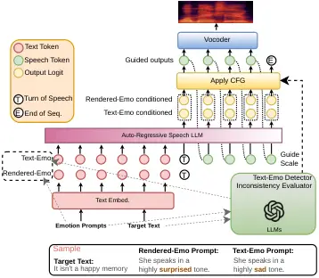

Peng Ma Zhang Chao Ni Ma Chng

# Cross-modal Consistency Guidance for Robust Emotion Control in Auto-Regressive TTS Models

Yizhou    Yukun    Chong    Yi-Wen    Chongjia    Bin    Eng Siong

###### Abstract

While Text-to-Speech (TTS) systems enable emotional control via
natural-language instructions, expressiveness, naturalness, and speech
quality degrade when the target emotion conflicts with the textual
semantics. We propose a Cross-modal Consistency Guided Classifier-Free
Guidance (CCG-CFG) method with dynamic scales based on the degree of
inconsistency between the text emotion and the explicit speech emotion,
replacing the dropout condition with the text emotion. We also distill
the CCG-CFG guidance signal using a hard-sample mining strategy,
improving the TTS model’s emotional alignment capability. Evaluations on
five emotional corpora and two TTS benchmarks show that our approaches
applied to CosyVoice2 achieve up to a 12% absolute improvement in
emotion-recognition accuracy and a 10% relative improvement in
subjective scores, outperforming baselines including HierSpeech++,
Qwen3-TTS, and the original CosyVoice2, while preserving
intelligibility, naturalness, and high speech quality.

###### keywords

Emotional Speech Synthesis, Classifier-Free Guidance, Reinforcement
Learning

^(†)^(†)address: ¹ Alibaba-NTU Global e-Sustainability CorpLab, Nanyang
Technological University, Singapore  
² College of Computing and Data Science, Nanyang Technological
University, Singapore  
³ Alibaba, Alibaba Inc., Singapore ^(†)^(†)email: peng.yizhou@ntu.edu.sg

## 1 Introduction

Modern Text-to-Speech (TTS) systems are increasingly expected to produce
not only intelligible but also highly expressive and emotionally
resonant speech for applications such as virtual assistants, audiobook
narration, and digital avatars \[1, 2\]. With the advent of Large
Language Models (LLMs), the paradigm of emotional TTS has fundamentally
shifted \[3, 4\]. By leveraging deep semantic understanding, modern
systems can parse complex prompts \[5, 6, 7\], transitioning from
coarse-grained predefined labels (e.g., “happy”) or reference audio
snippets \[8, 9\] to nuanced natural language instructions (e.g., “speak
in a calm and reassuring tone”). This shift enables unprecedented
zero-shot and fine-grained controllability over the synthesized
speech \[10, 11\].

However, a critical challenge arises in realistic scenarios: A
cross-modal inconsistency between the text and rendered emotion in
synthesized speech. As users are empowered to provide arbitrary textual
semantics alongside explicit emotion instructions, there is frequently
an inconsistency, or even direct conflict between the text emotion and
the rendered emotion (e.g., requiring a TTS to say “It isn’t a happy
memory” in a surprised tone). When faced with these cases, the model
must reconcile competing signals while maintaining naturalness,
intelligibility, and expressive fidelity. Consequently, robust emotional
TTS requires not only accurate speech modeling but also dedicated
mechanisms to resolve this cross-modal inconsistency. This challenge
remains largely underexplored in auto-regressive (AR) TTS
frameworks \[12, 13, 6\], the current state-of-the-art for natural,
zero-shot speech synthesis. To enhance style alignment in these models,
a common workaround is to apply Classifier-Free Guidance (CFG) \[14, 15,
16\] during inference. By extrapolating the conditional prediction away
from an unconditional baseline, CFG artificially amplifies the target
style; however, it naively introduces severe synthesis artifacts \[17\].

This work¹¹ 1 Demo Page:
[pengyizhou.github.io/Emotional_tts_demo](https://pengyizhou.github.io/Emotional_tts_demo)
addresses the cross-modal emotion inconsistency challenge with a
Cross-modal Consistency Guided CFG (CCG-CFG) scheme that modulates this
emotional non-congruence. Specifically, our contributions lie in the
following:

- •
  We propose a CCG-CFG framework that replaces the CFG’s unconditional
  dropout with the text emotion if inconsistency is detected, which
  explicitly magnifies the distance between the conditional and
  unconditional predictions to provide a precise and more effective
  guidance signal.
- •
  We further improve the CCG-CFG with a dynamic guidance scale
  (DS-CCG-CFG) based on the LLM-measured degree of inconsistency, which
  balances strong emotional expressiveness with speech naturalness and
  intelligibility.
- •
  Finally, we distill the DS-CCG-CFG signal into the AR TTS model via an
  inconsistent-sample mining strategy, removing the two-pass decoding
  overhead and CFG artifacts.

## 2 Methods

### 2.1 Overall Architecture

Figure 1 illustrates the inference pipeline of our proposed CCG-CFG
framework integrated into an AR TTS model. Given a target text and a
user-specified Rendered-Emo prompt, an external LLM first extracts the
Text-Emo. Simultaneously, the LLM assesses the degree of cross-modal
inconsistency between these two emotional states, produces an
inconsistency profile in {Identical, Inconsistent, Highly Inconsistent},
and dynamically maps this mismatch onto a specific guidance scale.



Figure 1: Overall architecture of the proposed Dynamic Scale Cross-Modal
Consistency Guided CFG (DS-CCG-CFG) framework. The guidance mechanism
replaces standard unconditional dropout with the Text-Emo to contrast
against the Rendered-Emo condition. An LLM evaluator determines the text
emotion and the degree of cross-modal inconsistency, dynamically mapping
this level to an appropriate guidance scale for the AR TTS model.

During the inference phase, the model runs two parallel passes: one
conditional on Rendered-Emo and the other on Text-Emo instead of the
dropout condition of the traditional CFG, whose logits are fused by the
dynamic scale $`w`$. By contrasting the two emotions, CCG-CFG yields an
inconsistency-aware signal that steers token generation before vocoding.

### 2.2 Classifier-Free Guidance

We first demonstrate that cross-modal inconsistency fundamentally
impairs AR TTS generation by assessing synthesis quality under varying
degrees of text-rendered emotion inconsistency. As shown in Table 1, TTS
baselines (CosyVoice2 and HierSpeech++) suffer severe EmoACC degradation
and a slight increase in Word Error Rate (WER) when rendered emotions
conflict with textual semantics. Ground-truth recordings, in contrast,
carry the rendered emotion as a genuine acoustic property; since the SER
model classifies acoustic rather than textual affect, its EmoACC remains
high regardless of text-rendered inconsistency.

|              |        |                       |                      |
| ------------ | ------ | --------------------- | -------------------- |
| Models       | Incon. | EmoACC(%)$`\uparrow`$ | WER(%)$`\downarrow`$ |
| Ground Truth | ✗      | 91.16                 | 5.62                 |
|              | ✓      | 85.88                 | 5.91                 |
|              | ✓✓     | 82.33                 | 6.80                 |
| HierSpeech++ | ✗      | 80.32                 | 4.52                 |
|              | ✓      | 58.44                 | 4.53                 |
|              | ✓✓     | 48.82                 | 5.11                 |
| CosyVoice2   | ✗      | 80.92                 | 4.76                 |
|              | ✓      | 71.77                 | 4.43                 |
|              | ✓✓     | 63.70                 | 4.84                 |

Table 1: Emotion Expressiveness and intelligibility results by Model and
Inconsistency profile. ✗ means that the text and rendered emotions are
identical, while ✓ and ✓✓ stand for inconsistent and highly inconsistent
between the two emotions. HierSpeech++ and CosyVoice2 use Ground Truth
audio as reference speech for synthesizing.

#### 2.2.1 Cross-modal Consistency Guided CFG (CCG-CFG)

Standard CFG attempts to enforce alignment by emphasizing a conditional
prediction (rendered-emo, $`c_{re}`$) from an unconditional prediction
($`\emptyset`$), stated as Eq. 1, where $`w>1.0`$ is the guidance scale.
However, merely dropping the condition is insufficient to overcome the
strong semantic pull of the inconsistency. To explicitly expand the gap
between the two conditions, CCG-CFG replaces $`\emptyset`$ with
$`c_{te}`$ as the text emotion when cross-modal inconsistency is
detected, calculated as Eq. 2, while emotion identical cases stick to
Eq. 1.

```math
\displaystyle L_{CFG} \displaystyle=L(\emptyset)+w\cdot(L(c_{re})-L(\emptyset)) \tag{1}
```

```math
\displaystyle L_{CCG-CFG} \displaystyle=L(c_{te})+w\cdot(L(c_{re})-L(c_{te})) \tag{2}
```

#### 2.2.2 Dynamic-Scale CCG-CFG (DS-CCG-CFG)

CFG usually applies a fixed guidance scale $`w`$, and this is
sub-optimal \[18, 19\]. As illustrated in Figure 2, CFG exhibits
divergent behavior depending on inconsistency severity: guiding
Identical samples degrades EmoACC, while moderate guidance improves
expressiveness for Inconsistent samples, excessively large scales
severely compromise intelligibility, leading to a sharp spike in WER
across all conditions. To resolve this, DS-CCG-CFG dynamically adjusts
$`w`$ based on the three detected inconsistency profiles and maps them
to the scales of {1.0, 2.5, 3.0}, respectively. These scale values were
selected via a grid search on the development set, balancing EmoACC
against WER for each profile.

Figure 2: EmoACC and WER by CFG scale for three inconsistency profiles:
Identical; Inconsistency, and Highly-Inconsistency. $`Scale=1.0`$ stands
for no guidance applied.

### 2.3 Guidance Distillation and Hard Sample Mining

To eliminate the inference overhead of two-pass decoding and the
synthesis artifacts introduced by CFG, we distill the DS-CCG-CFG
guidance signal directly into the TTS model via Direct Preference
Optimization (DPO) \[20, 21, 22\]. Furthermore, we maximize distillation
efficacy using a hard-sample mining strategy: for each text in an
external corpus, we extract its text emotion and pair it with a
contrasting target emotion to artificially induce a cross-modal
inconsistency corpus.

To construct the DPO preference pairs, we generate 25 candidate speech
samples per target text by applying five random seeds across five
CCG-CFG guidance scales ($`w\in\{1.0,1.5,2.0,2.5,3.0\}`$). These
candidates are then ranked using an objective score $`S`$ that balances
intelligibility and expressiveness:

```math
S=0.5\cdot(1-\text{WER})+0.5\cdot\text{EmoConf} \tag{3}
```

where EmoConf adjusts the raw emotion prediction confidence $`p`$ by
applying a penalty if the predicted emotion $`\hat{y}`$ does not match
the target emotion $`y`$:

```math
\text{EmoConf}=\begin{cases}p,&\text{if }\hat{y}=y\\
p-1,&\text{otherwise}\end{cases} \tag{4}
```

By selecting the highest- and lowest-scoring candidates as positive and
negative pairs, this approach compels the model to learn stable emotion
control under cross-modal inconsistency while preserving performance for
emotion-identical cases. Because the objective score $`S`$ enforces an
intelligibility-and-quality constraint when ranking candidates,
CFG-induced artifacts are pushed toward the rejected side and filtered
out during preference optimization, rather than being distilled into the
model.

|              |        |       |       |             |
| ------------ | ------ | ----- | ----- | ----------- |
|              | Train  | Valid | Test  | EXT. (text) |
| Total        | 37,883 | 2,445 | 2,445 | 20,000      |
| Duration (h) | 40.01  | 2.83  | 2.85  | –           |
| \# Speaker   | 985    | 252   | 244   | 7           |

Table 2: Data distribution across the combined dataset and VCTK external
resource (used as additional data for RL training). The EXT duration is
not reported because we only use the text and perform speech synthesis
for RL training.

## 3 Experimental Setup

### 3.1 Dataset

Our experiments are conducted using a combined corpus sourced from seven
well-established speech datasets: ESD \[23\], MESS \[24\], MEAD \[25\],
TESS \[26\], SAVEE \[27\], LibriTTS \[28\], and VCTK \[29\]. We curated
this dataset to cover seven distinct emotion categories: angry,
disgusted, fearful, happy, neutral, sad, and surprised. Table 2
summarizes the data splits. The training set comprises 38k utterances
(40 hours), while the validation and test sets contain 2.5k utterances
(roughly 2.8 hours) each. We also have a supplementary 20k text-only
samples from the VCTK dataset for the hard-sample mining strategy.

### 3.2 Model Configurations

#### 3.2.1 Baseline models

To evaluate the effectiveness of our proposed framework, we compare it
against several state-of-the-art emotional TTS systems:

- •
  HierSpeech++ \[10\]: A zero-shot speech synthesis framework. For
  emotion control, an explicit reference speech sample containing the
  rendered emotion is required.
- •
  Qwen3-TTS \[13\]: A large-scale, LLM-based TTS system. While it
  supports direct control of emotion tags, this feature is limited to
  its built-in, optimized voices. Otherwise, it also requires a
  reference speech containing the rendered emotion.
- •
  CosyVoice2 \[6\]: An auto-regressive TTS system that natively supports
  both reference-based emotional transfer and Natural Language Emotion
  Control (NLEC).

#### 3.2.2 Supervised Finetuning (SFT) and DPO training

We fine-tune the CosyVoice2 LLM on the Train subset for SFT, and Train
with EXT hard samples for DPO training. Each training is performed on a
single H20-96GB GPU. The total effective batch size is 640s, with a
constant learning rate of $`10^{-5}`$ and optimized using the Adam
optimizer. The models are trained for 4 epochs without applying model
averaging.

#### 3.2.3 Inference configurations on CosyVoice2

We integrate the traditional CFG and the proposed CCG-CFG methods into
the CosyVoice2 TTS model, with two guidance scale $`w`$ configurations:
$`w=1.5`$ and $`w=3.0`$, corresponding to Low and High, respectively. We
use gpt-5.2-2025-12-11 as the LLM to judge the text emotion and to
discriminate cross-modality inconsistency. Note that the LLM provides
only a control signal for guidance scaling; it is not used for
evaluation or as scientific evidence, so our reported gains rest
entirely on the independent objective and subjective metrics.

### 3.3 Evaluation Methods

#### 3.3.1 Emotional Expressiveness

We use a pre-trained Speech Emotion Recognition model
(emo2vec-plus-large \[30\]) and report the average EmoACC to quantify
how accurately synthesized speech conveys the target emotion.

#### 3.3.2 Speech Quality, Naturalness, and Intelligibility

We evaluate the quality and naturalness of the synthesized audio using
three objective metrics: UTMOS \[31\] to predict the Mean Opinion Score
(MOS) for speech naturalness, DNSMOS \[32\] for audio clarity, and
NISQA \[33\] for synthesized speech naturalness. To assess the clarity
and correctness of the synthesized speech, we transcribe the generated
audio using an ASR model (Whisper-Large-V3-Turbo \[34\]) and compute the
WER.

|                                                                                                                                                    |                  |                  |                        |                       |                   |                    |                   |                 |
| -------------------------------------------------------------------------------------------------------------------------------------------------- | ---------------- | ---------------- | ---------------------- | --------------------- | ----------------- | ------------------ | ----------------- | --------------- |
| Model & Config                                                                                                                                     | NLEC             | Rendered Emo Ref | Metrics                |                       |                   |                    |                   |                 |
|                                                                                                                                                    |                  |                  | EmoACC (%)$`\uparrow`$ | WER (%)$`\downarrow`$ | UTMOS$`\uparrow`$ | DNSMOS$`\uparrow`$ | NISQA$`\uparrow`$ | MaJ$`\uparrow`$ |
| Ground Truth                                                                                                                                       | -                | -                | 85.60                  | 6.04                  | 2.27              | 2.91               | 3.48              | 65.4            |
| HierSpeech++ \[10\]                                                                                                                                | ✗                | R^($`\dagger`$)  | 52.97                  | 9.82                  | 3.75              | 2.93               | 3.41              | 48.1            |
| Qwen3-TTS \[13\]                                                                                                                                   | ✗                | R^($`\dagger`$)  | 58.08                  | 4.97                  | 3.93              | 2.98               | 3.85              | 62.4            |
|                                                                                                                                                    | ✓^($`\ddagger`$) | -                | 49.98                  | 4.21                  | 3.83              | 3.09               | 4.36              | 80.9            |
| CosyVoice2                                                                                                                                         | ✓                | R                | 65.11                  | 4.74                  | 3.72              | 3.06               | 3.44              | 55.8            |
|                                                                                                                                                    | ✓                | N                | 50.63                  | 4.61                  | 4.32              | 3.24               | 3.54              | 53.0            |
| CosyVoice2-SFT                                                                                                                                     | ✓                | N                | 53.54                  | 5.53                  | 4.23              | 3.21               | 3.57              | 55.5            |
| CosyVoice2-CFG (L)                                                                                                                                 | ✓                | N                | 52.43                  | 5.93                  | 4.26              | 3.24               | 3.54              | 52.9            |
| CosyVoice2-CFG (H)                                                                                                                                 | ✓                | N                | 56.40                  | 9.88                  | 4.15              | 3.22               | 3.49              | 50.8            |
| Proposed Methods (Experiments conducted on CosyVoice2)                                                                                             |                  |                  |                        |                       |                   |                    |                   |                 |
| CCG-CFG (L)                                                                                                                                        | ✓                | N                | 55.50                  | 5.17                  | 4.27              | 3.24               | 3.53              | 54.5            |
| CCG-CFG (H)                                                                                                                                        | ✓                | N                | 64.79                  | 9.17                  | 4.03              | 3.21               | 3.52              | 57.8            |
| DS-CCG-CFG                                                                                                                                         | ✓                | N                | 64.83                  | 7.86                  | 4.09              | 3.22               | 3.53              | 58.4            |
| DS-CCG-CFG for DPO                                                                                                                                 | ✓                | N                | 56.69                  | 3.81                  | 4.31              | 3.25               | 3.57              | 56.3            |
| +HARD EXT. DATA                                                                                                                                    | ✓                | N                | 59.55                  | 3.76                  | 4.29              | 3.25               | 3.53              | 57.0            |
| $`\dagger`$ HierSpeech++ and Qwen3-TTS require a reference speech with the rendered emotion to perform emotional TTS without NLEC support.         |                  |                  |                        |                       |                   |                    |                   |                 |
| $`\ddagger`$ Qwen3-TTS supports emotion-tags with a built-in optimised voice. MaJ gives subscores close to 100 for naturalness and speech quality. |                  |                  |                        |                       |                   |                    |                   |                 |

Table 3: Objective evaluation results across various model
configurations. NLEC indicates support for Natural Language Emotion
Control. Rendered Emotion Reference denotes whether we provide the
reference speech with the specific Rendered or a fixed Neutral emotion.
(L)ow and (H)igh denote low- and high-guidance scales in CFG and
CCG-CFG, respectively, whereas DS-CCG-CFG applies the Dynamic Scale over
CCG-CFG. DS-CCG-CFG for DPO is our proposed Guidance Distillation
method, while HARD EXT. DATA is from the Hard Sample Mining method. MaJ
mimics subjective evaluation using Model-as-Judge.

#### 3.3.3 Subjective Evaluation

To complement our objective metrics, we conduct subjective evaluations
using both human listeners and a Model-as-Judge (MaJ) approach. For the
human evaluation, listeners are asked to rate the synthesized speech on
a scale from 0 to 5 across three dimensions: Emotion Similarity to the
ground truth (EMOS), Naturalness (NMOS), and Quality (MOS), using a
14-sample ($`2\times 7~\text{emos}`$) subset. In parallel, we adopt a
MaJ approach using the state-of-the-art multimodal
Gemini-3.1-Pro-preview to assess each synthesized sample on a scale of 0
to 100 across three dimensions: Emotional Expressiveness, Naturalness,
and Intelligibility/Quality, across all experiment configurations. We
report the mathematical average of these three scores as the final MaJ
metric.

## 4 Results and Analysis

### 4.1 Evaluation Results

As shown in Table 4, baselines such as HierSpeech++ and Qwen3-TTS are
optimized for emotion cloning, requiring rendered emotion references or
relying on built-in voices with emotion tags. For NLEC-capable models
such as CosyVoice2, performance degrades significantly when using a
neutral rather than a rendered reference, where EmoACC drops from 65.11%
to 50.63%. This suggests that providing an emotion reference leaks
target-style information, thereby bypassing zero-shot NLEC.
Consequently, all subsequent experiments use a neutral reference to
mimic a realistic scenario, establishing CosyVoice2 without a
rendered-emotion reference as our primary baseline.

|                     |        |        |       |
| ------------------- | ------ | ------ | ----- |
| Models              | Incon. | EmoACC | WER   |
| CosyVoice2-N        | ✗      | 78.31% | 4.66% |
|                     | ✓      | 46.00% | 4.30% |
|                     | ✓✓     | 40.90% | 4.89% |
| DS-CCG-CFG          | ✗      | 78.31% | 4.66% |
|                     | ✓      | 65.84% | 7.91% |
|                     | ✓✓     | 56.53% | 9.81% |
| DS-CCG-CFG-DPO+EXT. | ✗      | 81.53% | 3.19% |
|                     | ✓      | 57.85% | 3.78% |
|                     | ✓✓     | 49.68% | 4.08% |

Table 4: Emotion expressiveness and intelligibility results by Model and
Inconsistency profile. ✗ means that the text and rendered emotions are
identical, while ✓ and ✓✓ stand for inconsistent and highly inconsistent
between the two emotions. CosyVoice2-N is CosyVoice2 with Neutral
reference.

Against this baseline, CosyVoice2-SFT partially recovers the lost
expressiveness, improving zero-shot EmoACC (+2.91%) with only a minor
intelligibility penalty (WER +0.92%). CosyVoice2-CFG improves emotional
rendering but degrades other metrics. In contrast, CCG-CFG improves upon
traditional CFG across all metrics by providing a more accurate
cross-modal guiding signal. The DS-CCG-CFG further optimizes this,
delivering the best results among all training-free configurations by
adaptively balancing expressiveness and overall quality, with the
highest MaJ score of 58.4 and EmoACC of 64.83.

Finally, DS-CCG-CFG-DPO eliminates the reliance on external LLMs and
two-pass CFG decoding during inference. This standalone DPO model
outperforms zero-shot baselines and actively improves intelligibility,
giving a lower WER of 3.81%. Augmenting this training with an external
corpus via hard-sample mining further boosts the EmoACC to 59.55%, while
preserving excellent naturalness and intelligibility, demonstrating
robust emotion control without requiring inference-time guidance.

### 4.2 Cross-Modal Analysis and Human Evaluation

Table 4 details performance under cross-modal inconsistency. The
baseline CosyVoice2-N struggles with inconsistent samples; DS-CCG-CFG
boosts EmoACC but introduces artifacts, while DS-CCG-CFG-DPO+EXT.
resolves this trade-off. The largest gains occur on the incongruent
samples, confirming that our distillation resolves cross-modal
inconsistency without compromising quality.

|                     |      |      |      |
| ------------------- | ---- | ---- | ---- |
| Model               | NMOS | EMOS | MOS  |
| HierSpeech++        | 2.77 | 2.56 | 2.88 |
| Qwen3-TTS-R         | 4.09 | 3.69 | 4.32 |
| CosyVoice2-R        | 3.59 | 3.41 | 3.97 |
| CosyVoice2-N        | 3.60 | 3.44 | 4.20 |
| DS-CCG-CFG          | 3.31 | 3.43 | 3.91 |
| DS-CCG-CFG-DPO+EXT. | 3.94 | 3.67 | 4.33 |

Table 5: Human evaluation results. EMOS denotes Emotion Similarity to
the ground truth, NMOS denotes Naturalness, and MOS denotes overall
Speech Quality. -R and -N stand for using reference speech with Rendered
emotion or Neutral emotion.

Table 5 presents the human evaluation results. While applying DS-CCG-CFG
degrades naturalness (3.31 NMOS) and quality (3.91 MOS) due to synthesis
artifacts, DS-CCG-CFG-DPO+EXT. distilled from it successfully resolves
this. By internalizing the guidance signal, the DPO model achieves the
highest overall speech quality, with a MOS of 4.33. Furthermore, it
yields substantial improvements in emotional expressiveness (3.67 EMOS)
and naturalness (3.94 NMOS) over CosyVoice2-N and even outperforms the
CosyVoice2-R, achieving performance comparable to the Qwen3-TTS-R.

## 5 Conclusion

This paper addresses the degradation of emotion TTS expressiveness and
quality when the target emotion to be expressed in the synthetic speech
conflicts with the textual semantics. To resolve this inconsistency, we
propose a Cross-modal Consistency Guided Classifier-Free Guidance
(CCG-CFG) scheme that dynamically scales guidance based on text-speech
emotion inconsistency and conditions the unconditional pass on the text
emotion. To eliminate the overhead of CFG decoding, we distill the
guidance signal from the CCG-CFG directly into the TTS model, using a
hard-sample mining strategy to enrich the training data. Evaluations on
CosyVoice2 demonstrate that our approach significantly improves emotion
expressiveness, intelligibility, and naturalness, and it outperforms
state-of-the-art baselines, including HierSpeech++ and Qwen3-TTS.

## 6 Acknowledgement

This research is supported by the RIE2025 Industry Alignment Fund -
Industry Collaboration Projects (IAF-ICP) (Award I2301E0026),
administered by A\*STAR, as well as supported by Alibaba Group and NTU
Singapore through Alibaba-NTU Global e-Sustainability CorpLab (ANGEL).

## 7 Generative AI Use Disclosure

The authors acknowledge the use of AI-assisted technologies to edit and
polish the manuscript, improving language and clarity. All generated
content was critically reviewed, and the authors assume full
responsibility for the final manuscript.

## References

- \[1\] T. Xie, Y. Rong, P. Zhang, W. Wang, and L. Liu (2025) Towards
  controllable speech synthesis in the era of large language models: a
  systematic survey. In Proceedings of the 2025 Conference on Empirical
  Methods in Natural Language Processing, pp. 764–791. Cited by: §1.
- \[2\] A. Clifton, S. Reddy, Y. Yu, A. Pappu, R. Rezapour, H. Bonab, M.
  Eskevich, G. Jones, J. Karlgren, B. Carterette, et al. (2020) 100,000
  podcasts: a spoken english document corpus. In Proceedings of the 28th
  International Conference on Computational Linguistics, pp. 5903–5917.
  Cited by: §1.
- \[3\] D. Yang, J. Tian, X. Tan, R. Huang, S. Liu, X. Chang, J. Shi, S.
  Zhao, J. Bian, X. Wu, et al. (2023) Uniaudio: an audio foundation
  model toward universal audio generation. arXiv preprint
  arXiv:2310.00704. Cited by: §1.
- \[4\] F. Ma, Y. Xie, Y. Li, Y. He, Y. Zhang, H. Ren, Z. Liu, W.
  Yao, F. Ren, F. R. Yu, et al. (2025) A review of human emotion
  synthesis based on generative technology. IEEE Transactions on
  Affective Computing. Cited by: §1.
- \[5\] Q. He, J. Zeng, W. Huang, L. Chen, J. Xiao, Q. He, X. Zhou, J.
  Liang, and Y. Xiao (2024) Can large language models understand
  real-world complex instructions?. In Proceedings of the AAAI, Vol. 38,
  pp. 18188–18196. Cited by: §1.
- \[6\] Z. Du, Y. Wang, Q. Chen, X. Shi, X. Lv, T. Zhao, Z. Gao, Y.
  Yang, C. Gao, H. Wang, et al. (2024) Cosyvoice 2: scalable streaming
  speech synthesis with large language models. arXiv preprint
  arXiv:2412.10117. Cited by: §1, §1, 3rd item.
- \[7\] A. Huang, B. Wu, B. Wang, C. Yan, C. Hu, C. Feng, F. Tian, F.
  Shen, J. Li, M. Chen, et al. (2025) Step-audio: unified understanding
  and generation in intelligent speech interaction. arXiv preprint
  arXiv:2502.11946. Cited by: §1.
- \[8\] A. Jawaid, S. S. Chandra, J. Lu, and B. Sisman (2024) Style
  mixture of experts for expressive text-to-speech synthesis. arXiv
  preprint arXiv:2406.03637. Cited by: §1.
- \[9\] D. Cho, H. Oh, S. Kim, S. Lee, and S. Lee (2024) Emosphere-tts:
  emotional style and intensity modeling via spherical emotion vector
  for controllable emotional text-to-speech. arXiv preprint
  arXiv:2406.07803. Cited by: §1.
- \[10\] S. Lee, H. Choi, S. Kim, and S. Lee (2025) Hierspeech++:
  bridging the gap between semantic and acoustic representation of
  speech by hierarchical variational inference for zero-shot speech
  synthesis. IEEE Transactions on Neural Networks and Learning Systems.
  Cited by: §1, 1st item, Table 3.
- \[11\] X. Jing, K. Zhou, A. Triantafyllopoulos, and B. W.
  Schuller (2025) Enhancing emotional text-to-speech controllability
  with natural language guidance through contrastive learning and
  diffusion models. In Proceedings of the ICASSP 2025, pp. 1–5. Cited
  by: §1.
- \[12\] S. Hussain, P. Neekhara, X. Yang, E. Casanova, S. Ghosh, M. T.
  Desta, R. Fejgin, R. Valle, and J. Li (2025) Koel-tts: enhancing llm
  based speech generation with preference alignment and classifier free
  guidance. arXiv preprint arXiv:2502.05236. Cited by: §1.
- \[13\] H. Hu, X. Zhu, T. He, D. Guo, B. Zhang, X. Wang, Z. Guo, Z.
  Jiang, H. Hao, Z. Guo, X. Zhang, P. Zhang, B. Yang, J. Xu, J. Zhou,
  and J. Lin (2026) Qwen3-tts technical report. arXiv preprint
  arXiv:2601.15621. Cited by: §1, 2nd item, Table 3.
- \[14\] J. Ho and T. Salimans Classifier-free diffusion guidance. In
  NeurIPS 2021 Workshop on Deep Generative Models and Downstream
  Applications, Cited by: §1.
- \[15\] H. Liu, Z. Chen, Y. Yuan, X. Mei, X. Liu, D. Mandic, W. Wang,
  and M. D. Plumbley (2023) Audioldm: text-to-audio generation with
  latent diffusion models. arXiv preprint arXiv:2301.12503. Cited by:
  §1.
- \[16\] Q. Zheng, M. Le, N. Shaul, Y. Lipman, A. Grover, and R. T.
  Chen (2023) Guided flows for generative modeling and decision making.
  arXiv preprint arXiv:2311.13443. Cited by: §1.
- \[17\] J. Darefsky, G. Zhu, and Z. Duan (2024) Parakeet. Note:
  [https://jordandarefsky.com/blog/2024/parakeet/](https://jordandarefsky.com/blog/2024/parakeet/)Accessed:
  2025-09-15 Cited by: §1.
- \[18\] D. Malarz, A. Kasymov, M. Zięba, J. Tabor, and P. Spurek (2025)
  Classifier-free guidance with adaptive scaling. External Links:
  2502.10574, [Link](https://arxiv.org/abs/2502.10574) Cited by: §2.2.2.
- \[19\] P. Papalampidi, O. Wiles, I. Ktena, A. Shtedritski, E.
  Bugliarello, I. Kajic, I. Albuquerque, and A. Nematzadeh (2025)
  Dynamic classifier-free diffusion guidance via online feedback. arXiv
  preprint arXiv:2509.16131. Cited by: §2.2.2.
- \[20\] R. Rafailov, A. Sharma, E. Mitchell, C. D. Manning, S. Ermon,
  and C. Finn (2023) Direct preference optimization: your language model
  is secretly a reward model. In Advances in Neural Information
  Processing Systems, Vol. 36, pp. 53728–53741. Cited by: §2.3.
- \[21\] X. Gao, C. Zhang, Y. Chen, H. Zhang, and N. F. Chen (2025)
  Emo-dpo: controllable emotional speech synthesis through direct
  preference optimization. In ICASSP 2025-2025 IEEE International
  Conference on Acoustics, Speech and Signal Processing (ICASSP),
  pp. 1–5. Cited by: §2.3.
- \[22\] J. Tian, C. Zhang, J. Shi, H. Zhang, J. Yu, S. Watanabe, and D.
  Yu (2025) Preference alignment improves language model-based tts. In
  ICASSP 2025-2025 IEEE International Conference on Acoustics, Speech
  and Signal Processing (ICASSP), pp. 1–5. Cited by: §2.3.
- \[23\] K. Zhou, B. Sisman, R. Liu, and H. Li (2021) Seen and unseen
  emotional style transfer for voice conversion with a new emotional
  speech dataset. In ICASSP 2021-2021 IEEE International Conference on
  Acoustics, Speech and Signal Processing (ICASSP), pp. 920–924. Cited
  by: §3.1.
- \[24\] S. D. Morgan (2019) Categorical and dimensional ratings of
  emotional speech: behavioral findings from the morgan emotional speech
  set. Journal of Speech, Language, and Hearing Research 62 (11),
  pp. 4015–4029. Cited by: §3.1.
- \[25\] K. Wang, Q. Wu, L. Song, Z. Yang, W. Wu, C. Qian, R. He, Y.
  Qiao, and C. C. Loy (2020) Mead: a large-scale audio-visual dataset
  for emotional talking-face generation. In Computer Vision–ECCV 2020:
  16th European Conference, pp. 700–717. Cited by: §3.1.
- \[26\] K. Dupuis and M. K. Pichora-Fuller (2010) Toronto emotional
  speech set (tess). Scholars Portal Dataverse. Cited by: §3.1.
- \[27\] S. Haq, P. J. Jackson, and J. Edge (2008) Surrey audio-visual
  expressed emotion (savee) database. University of Surrey. Note:
  [http://kahlan.eps.surrey.ac.uk/savee/](http://kahlan.eps.surrey.ac.uk/savee/)
  Cited by: §3.1.
- \[28\] H. Zen, V. Dang, R. Clark, Y. Zhang, R. J. Weiss, Y. Jia, Z.
  Chen, and Y. Wu (2019) LibriTTS: a corpus derived from librispeech for
  text-to-speech. In Interspeech, pp. 1526–1530. Cited by: §3.1.
- \[29\] J. Yamagishi, C. Veaux, and K. MacDonald (2019) CSTR vctk
  corpus: english multi-speaker corpus for cstr voice cloning toolkit.
  University of Edinburgh. The Centre for Speech Technology Research
  (CSTR). Cited by: §3.1.
- \[30\] Z. Ma, Z. Zheng, J. Ye, J. Li, Z. Gao, S. Zhang, and X.
  Chen (2023) Emotion2vec: self-supervised pre-training for speech
  emotion representation. arXiv preprint arXiv:2312.15185. Cited by:
  §3.3.1.
- \[31\] T. Saeki, D. Xin, W. Nakata, T. Koriyama, S. Takamichi, and H.
  Saruwatari (2022) UTMOS: utokyo-sarulab system for voicemos challenge 2022. Proceedings of the Interspeech 2022. Cited by: §3.3.2.
- \[32\] C. K. A. Reddy, V. Gopal, and R. Cutler (2021) DNSMOS: A
  Non-Intrusive Perceptual Objective Speech Quality metric to evaluate
  Noise Suppressors. In Proc. ICASSP 2021, pp. 6493–6497. External
  Links: [Document](https://dx.doi.org/10.1109/ICASSP39728.2021.9413981)
  Cited by: §3.3.2.
- \[33\] G. Mittag, B. Naderi, A. Chehadi, and S. Möller (2021) NISQA: A
  Deep CNN-Self-Attention Model for Multidimensional Speech Quality
  Prediction with Crowdsourced Datasets. In Interspeech 2021,
  pp. 2127–2131. External Links:
  [Document](https://dx.doi.org/10.21437/Interspeech.2021-299), ISSN
  2958-1796 Cited by: §3.3.2.
- \[34\] A. Radford, J. W. Kim, T. Xu, G. Brockman, C. McLeavey, and I.
  Sutskever (2023) Robust speech recognition via large-scale weak
  supervision. In Proceedings of the ICML 2023, pp. 28492–28518. Cited
  by: §3.3.2.
