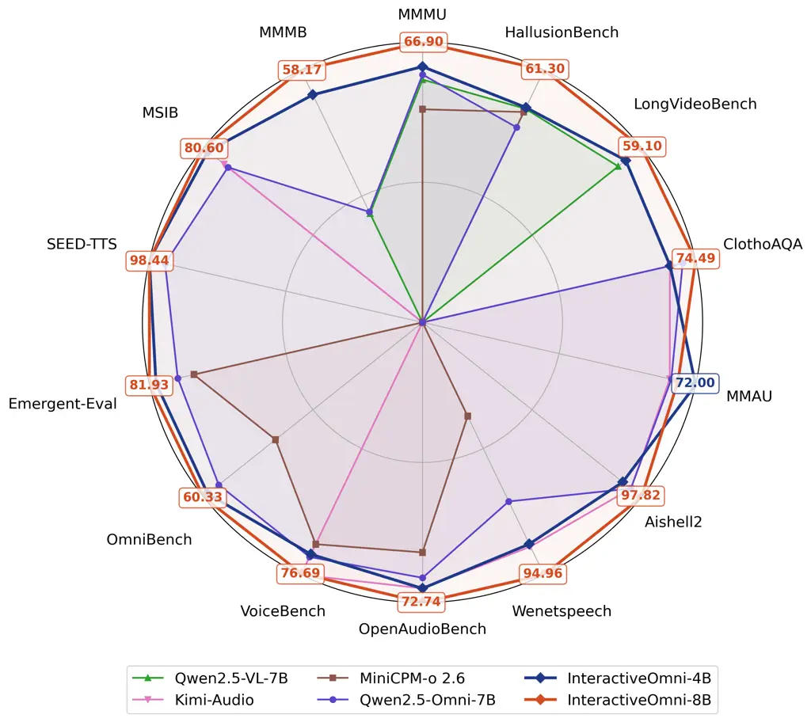
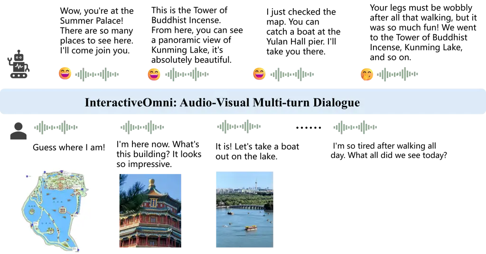
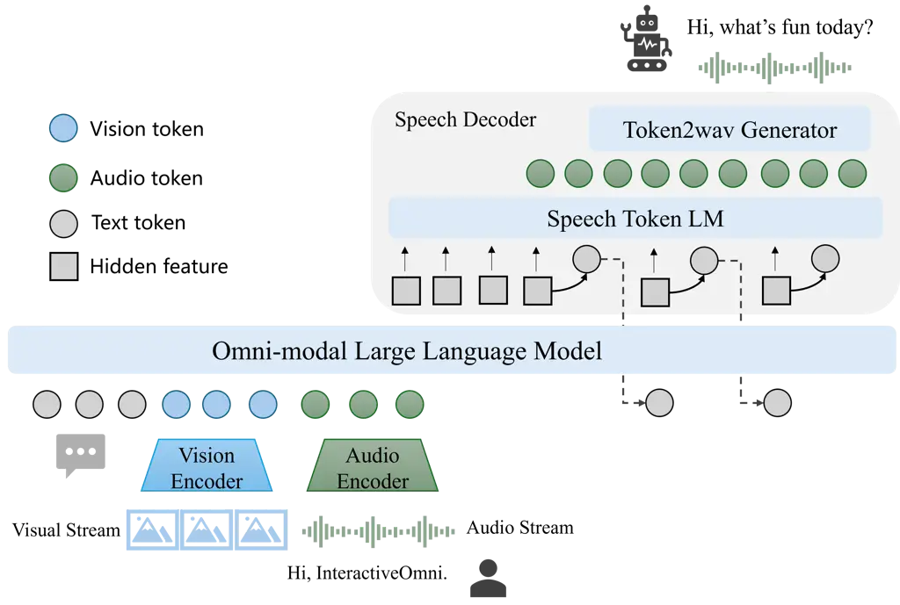
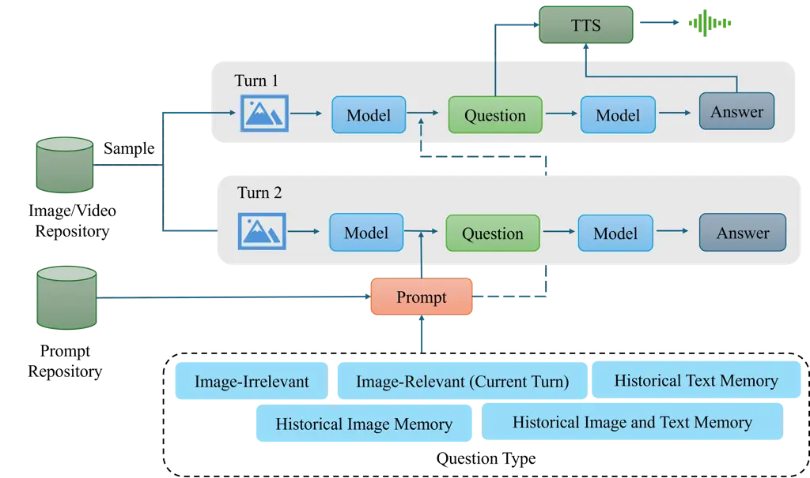
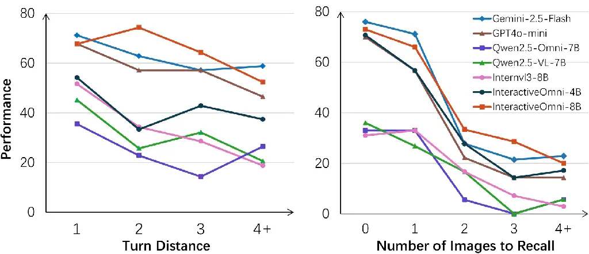
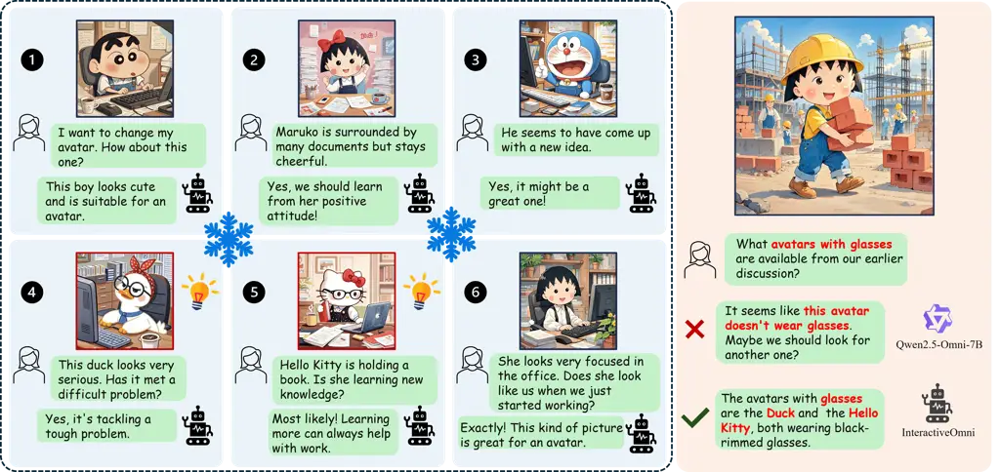
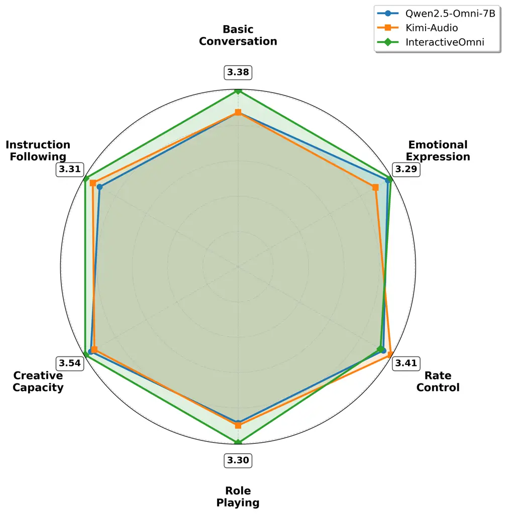

# InteractiveOmni: A Unified Omni-modal Model for Audio-Visual Multi-turn Dialogue

Wenwen Tong^(\*), Hewei Guo^(\*), Dongchuan Ran^(\*), Jiangnan
Chen^(\*), Jiefan Lu^(\*), Kaibin Wang^(\*), Keqiang Li^(\*), Xiaoxu
Zhu^(\*), Jiakui Li^(\*), Kehan Li, Xueheng Li, Lumin Li, Chenxu Guo,
Jiasheng Zhou, Jiandong Chen, Xianye Wu, Jiahao Wang, Silei Wu, Lei
Chen, Hanming Deng,    Yuxuan Song, Dinghao Zhou, Guiping Zhong, Ken
Zheng, Shiyin Kang, Lewei Lu SenseTime Research \* Equal Contribution  
🖂 Corresponding Author  
[https://github.com/OpenSenseNova/InteractiveOmni](https://github.com/OpenSenseNova/InteractiveOmni)

###### Abstract

We introduce InteractiveOmni, a unified and open-source omni-modal large
language model for audio-visual multi-turn interaction, ranging from 4B
to 8B parameters, designed to lead the field of lightweight models by
offering comprehensive omni-modal understanding and speech generation
capabilities. To achieve this, we integrate the vision encoder, audio
encoder, large language model, and speech decoder into a unified model
for understanding and generation tasks. We design a multi-stage training
strategy to ensure robust cross-modal capabilities, including
pre-training for omni-modal understanding, followed by post-training
with speech conversation and audio-visual interaction. To enable
human-like long-term conversational ability, we meticulously curate a
multi-turn training dataset that enhances the model’s ability to handle
complex and multi-turn interactions. To effectively evaluate the
multi-turn memory and speech interaction capabilities, we construct the
multi-modal multi-turn memory benchmark and the multi-turn speech
interaction benchmark. Experiments demonstrate that InteractiveOmni
significantly outperforms leading open-source models and provides a more
intelligent multi-turn audio-visual experience, particularly in its
long-term memory capabilities. Notably, InteractiveOmni-4B is comparable
to the much larger model like Qwen2.5-Omni-7B on general benchmarks, and
it can retain 97% of the performance of the InteractiveOmni-8B while
utilizing only 50% of the model size. Achieving state-of-the-art results
against similarly sized models across image, audio, video understanding,
and speech generation tasks, InteractiveOmni is an accessible,
open-source foundation for next-generation intelligent interactive
systems.

## 1 Introduction

Figure 1: Evaluation across image, video, and audio modalities on
open-source benchmarks. InteractiveOmni outperforms the current leading
multi-modal models such as Qwen2.5-VL-7BBai et al. (2025), Kimi-Audio
Ding et al. (2025), MiniCPM-o-2.6 Yao et al. (2024) and Qwen2.5-Omni-7B
Xu et al. (2025).

Human interaction is fundamentally a holistic and multi-modal experience
that integrates sensory information from vision, hearing, and language,
supporting natural multi-turn communication and long-term memory, which
are the core aspects of intelligence. Developing machines with this
comprehensive multi-modal multi-turn interactive capability is a
critical step toward Artificial General Intelligence (AGI) and
represents the next frontier in human-computer interaction Mumuni and
Mumuni (2025). Recent breakthroughs in large language models (LLMs) have
shown a degree of intelligence, and this is particularly evident in
improved problem-solving capabilities and the growing utility in the
real world Brown et al. (2020); OpenAI (2023); Guo et al. (2025a); Yang
et al. (2025). Furthermore, LLMs can expand their capabilities by
integrating vision and audio processing abilities, evolving towards
multi-modal large language models (MLLMs), such as vision-language
models (VLMs) Liu et al. (2023b); Bai et al. (2025); Chen et al. (2023);
Zhu et al. (2025); Xiaomi (2025); Hong et al. (2025), audio-language
models (ALMs) Chu et al. (2024); Ding et al. (2025); Wu et al. (2025a),
and omni-modal MLLMs (Omni-MLLMs) Fang et al. (2025); Li et al. (2025b);
Xu et al. (2025); Comanici et al. (2025); Jiang et al. (2024); Xie and
Wu (2024b). Although these works have explored multi-modal capabilities,
they mainly focus on understanding ability and single-turn interaction
Zhu et al. (2025); Ding et al. (2025); Xu et al. (2025), which is
different from human-like multi-turn interaction with long-term memory,
failing to provide a seamless and integrated user experience on complex,
multi-modal interactive tasks in the real world. Therefore, it is
necessary to develop an end-to-end Omni-MLLM capable of understanding
omni-modal inputs and synthesizing speech as a response with multi-turn
conversational ability, which will serve as the core engine for building
the next generation of intelligent interactive experiences and breaking
down the barriers between modalities. As illustrated in Figure 2, an
Omni-MLLM can serve as an intelligent assistant, offering multi-turn
memory and interaction capabilities to accompany us on our travels.

Figure 2: The schematic diagram of multi-turn audio-visual interaction.
InteractiveOmni can perceive external audio and video inputs like a
human, actively interact with users, and has the capabilities of
multi-turn memory and empathy.

Developing the Omni-MLLM with comprehensive multi-modal interactive
capability presents several challenges. First, multi-modal alignment is
a core difficulty for the development of MLLMs, which has been
extensively investigated in VLMs and ALMs Bai et al. (2023); Chen et al.
(2023); Chen et al. (2024e). Effectively combining information from
heterogeneous data sources, such as images, audio, text, and video, and
achieving deep alignment is crucial and much more complex for the
training of Omni-MLLM Xie and Wu (2024b); Xu et al. (2025). Second, it
is exceptionally challenging to construct an end-to-end unified
understanding and generation framework which can process any combination
of modal inputs and synchronously generate streaming text and audio AI
et al. (2025); Xu et al. (2025). Finally, enhancing the model’s strong
interactive capabilities and speech emotional expressiveness is central
to its ultimate practical value Geng et al. (2025); Boson AI (2025);
Peng et al. (2025), including the long-term memory, human-like emotion
and empathy, and the maintenance of contextual consistency and logical
coherence in the multi-turn dialogues. Current MLLMs exhibit limited
capabilities for real-world interaction, and there is also a lack of
benchmarks to evaluate the multi-turn interaction ability and
practicality Sirdeshmukh et al. (2025).

To address these challenges, we propose InteractiveOmni, an Omni-MLLM
with end-to-end understanding and generation capabilities, providing
intelligent multi-turn interactive experience. We employ a single
architecture to process and generate data across all modalities,
achieving an end-to-end workflow from omni-modal input to text and
speech output. To address the omni-modal alignment problem, we propose
the omni-modal pre-training and post-training strategy. Through
meticulously designed pre-training tasks, the model learns the intrinsic
correlations between different modalities at an early stage.
Subsequently, during the post-training phase, we leverage the
instruction tuning and direct preference optimization (DPO) to further
strengthen the cross-modal capabilities. Furthermore, to enhance the
interactive experience, we constructe highly interactive multi-turn data
combined with post-training for optimization, focusing on improving the
model’s performance in memory, empathy, and contextual understanding to
make its interactions more human-like and intelligent. To effectively
evaluate multi-turn memory and speech interaction, we meticulously
construct new benchmarks: the multi-modal multi-turn memory benchmark
(MMMB) and the multi-turn speech interaction benchmark (MSIB), to
address the shortcomings of existing multi-turn dialogue benchmarks.

We develop InteractiveOmni based on open-source models Yang et al.
(2025); Chen et al. (2023); Du et al. (2024a); Radford et al. (2023),
achieving comprehensive leading performance in multi-modal understanding
and generation tasks. Specifically, in visual understanding tasks,
InteractiveOmni is comparable to state-of-the-art vision-language models
such as Qwen2.5-VL-7B Bai et al. (2025) and InternVL3.5-8BWang et al.
(2025c). For audio understanding and speech conversation tasks,
InteractiveOmni’s performance rivals leading audio-language models,
including Kimi-Audio Ding et al. (2025) and Step-Audio-Chat Wu et al.
(2025a). Furthermore, InteractiveOmni delivers superior performance on
omni-modal benchmarks, outperforming models like MiniCPM-o-2.6 Yao et
al. (2024), Qwen2.5-Omni-7B Xu et al. (2025), and Ming-Lite-Omni AI et
al. (2025). In addition, InteractiveOmni demonstrates superior
performance in the comprehensive multi-turn benchmarks, showcasing its
excellent interactive capabilities in real-world applications. The key
contributions of InteractiveOmni can be summarized as follows:

- •
  We propose a unified omni-modal model that can simultaneously receive
  inputs such as images, audio, text, and video and directly generate
  coherent text and speech streams, achieving truly integrated
  multi-turn interaction.
- •
  InteractiveOmni achieves state-of-the-art performance against
  similarly sized multi-modal large language models on several
  mainstream open-source benchmarks for image, audio, and video
  understanding, as well as speech conversation. Notably,
  InteractiveOmni-4B is comparable to the much larger Qwen2.5-Omni-7B on
  various benchmarks.
- •
  InteractiveOmni demonstrates excellent interactive performance with
  multi-turn and long-term memory capabilities. To effectively evaluate
  this capability, we construct the multi-turn benchmarks such as MMMB
  and MSIB, specifically for assessing the multi-turn, multi-modal
  interactive capabilities.

## 2 Method

### 2.1 Architecture

As shown in Figure 3, InteractiveOmni is a unified model capable of
perceiving omni-modal inputs such as image, video, audio, and text,
while generating text and speech sequentially, achieving end-to-end
omni-modal perception and generation. InteractiveOmni consists of vision
encoder, audio encoder, LLM decoder, speech-token LM, and token2wav
speech generator. The architecture of InteractiveOmni-4B and
InteractiveOmni-8B is shown in Table 1.

Figure 3: The overview framework of InteractiveOmni. InteractiveOmni is
composed of vision encoder, audio encoder, LLM decoder and streaming
speech decoder. The extracted visual and audio tokens are processed by
the LLM to generate text tokens and speech tokens sequentially.

|                    |                |               |          |                |
| ------------------ | -------------- | ------------- | -------- | -------------- |
| Module             | Vision Encoder | Audio Encoder | LLM      | Speech Decoder |
| InteractiveOmni-4B | InternViT      | Whisper       | Qwen3-4B | Cosyvoice2     |
| InteractiveOmni-8B | InternViT      | Whisper       | Qwen3-8B | Cosyvoice2     |

Table 1: The architecture of InteractiveOmni models.

We adopt the audio encoder from the Whisper-large-v3 model Radford et
al. (2023) due to its strong performance on audio understanding tasks.
Similar to the preprocessing of audio in Qwen2-Audio Chu et al. (2024),
we resample the input audio data to a frequency of 16kHz and convert the
raw waveform into the 128-channel mel-spectrogram. In addition, we add a
pooling layer to downsample the output length of audio to the frame rate
of 25Hz, meaning that one second of audio is represented by 25 tokens.
An audio adapter with a two-layer MLP projector is employed to connect
the audio encoder to LLM.

We utilize the InternViT-300M Chen et al. (2024d) as the vision encoder
to handle the image and video inputs. In terms of the data
preprocessing, we employ the dynamic resolution strategy to divide the
images into tiles of 448x448 pixels based on the resolution and aspect
ratio of the image Chen et al. (2024e); Chen et al. (2023); Zhu et al.
(2025). Since the representation of high-resolution image and long video
inputs requires a large number of visual tokens, we employ the pixel
shuffle operation to reduce the number of visual tokens to one-sixteenth
of their original number. Thus, a 448x448 image is represented by 64
visual tokens in our model. Finally, a two-layer MLP projector is
utilized to map the visual features into the embedding space of the LLM.

We use the pretrained Qwen3 Yang et al. (2025) as the LLM decoder,
considering its outstanding performance on various text benchmarks. The
LLM takes the visual features and audio features as input, and decodes
text tokens sequentially. Our speech decoder, based on Cosyvoice2 Du et
al. (2024a), consists of a speech token LM and a token2wav speech
generator. To generate the speech in a streaming fashion, we interleave
the generated text tokens and speech tokens in a 5:25 ratio.
Specifically, for every five text tokens generated, we pass the text
token embeddings and corresponding hidden features to the speech token
LM to generate 25 speech tokens, ensuring efficient and seamless speech
synthesis. Then, the 25 speech tokens are passed to the token2wav
generator to produce the final speech output. For the speech-to-speech
conversational scenario, the generated speech style can also be
controlled by the user instruction and text hidden features to generate
more emotionally expressive speech.

InteractiveOmni is fully trained end-to-end for the omni-modal
understanding and generation task based on the hidden embeddings
connecting the LLM, vision encoder, audio encoder, and speech decoder.
The training datasets are explained in detail in Section 2.2, and the
training procedure of InteractiveOmni is given in Section 2.3.

### 2.2 Datasets

Figure 4: Data construction pipeline for multi-turn dialogue. In each
turn, the visual element is sampled from a dedicated image and video
repository. The corresponding question is then generated by a
vision-language model using a specific prompt tailored to the desired
question type. To ensure the dialogue effectively tests long-term
memory, we specifically design turns that require recalling historical
images and previous dialogue text. Finally, the generated text-format
question and answer can be transformed into speech-based question-answer
pairs using a TTS system, facilitating end-to-end training.

To enhance the performance of audio-visual multi-turn dialogue and
improve the long-term memory capacity, we have carefully constructed a
multi-turn data generation pipeline. As illustrated in Figure 4, we
first establish a comprehensive repository of images and videos. For
each dialogue turn, the visual element is sampled from this repository
to serve as the visual input. The corresponding question is then
generated by a vision-language model using a specific prompt tailored to
the desired question type. The questions in each turn can be categorized
based on the scope of the information required for a correct answer.
Specifically, the questions can be categorized into five types:

- •
  Image-Irrelevant: The question is a pure text-based query that is
  completely independent of the current image and the dialogue history.
- •
  Image-Relevant (Current Turn): The question is visually-grounded and
  can be answered solely by analyzing the current image and the text of
  the current question.
- •
  Historical Image Memory: The question requires the model to recall and
  reason about information presented in a previously shown image within
  the dialogue history.
- •
  Historical Text Memory: The question is grounded in the previous turns
  of the dialogue text, but does not require reference to any specific
  image.
- •
  Historical Image and Text Memory: The question necessitates the
  integration of information from both the historical dialogue text and
  images.

We primarily construct multi-turn dialogue data within 20 turns based on
this data pipeline. To facilitate end-to-end training, we can also
transform the generated text-format question and answer into
speech-based question-answer pairs using the TTS system.

In the subsequent sections, we provide a detailed breakdown of the
training data and the open-source data utilized. This includes data
categorized by modality and task: image understanding data, video
understanding data, audio understanding data, omni-modal understanding
data, audio generation data, and end-to-end dialogue data.

#### 2.2.1 Image Data

To enhance the visual understanding capabilities of the model, we curate
a comprehensive collection of multi-modal datasets with approximately 12
million image-text pairs for post-training, including open-source,
synthetic, and proprietary in-house data. This visual corpus encompasses
multiple domains, such as general question answering (GeneralQA),
optical character recognition (OCR), document understanding,
mathematics, science, knowledge, and perception. For a detailed
statistical breakdown of the open-source dataset’s composition, please
refer to Table 2.

|                        |                                                                                                                                                                                                                                                                                               |
| ---------------------- | --------------------------------------------------------------------------------------------------------------------------------------------------------------------------------------------------------------------------------------------------------------------------------------------- |
| Task                   | Datasets                                                                                                                                                                                                                                                                                      |
| OCR                    | TextVQASingh et al. (2019), OCRVQAMishra et al. (2019), ST-VQABiten et al. (2019), LSVTSun et al. (2019), ArTChng et al. (2019), CTWYuan et al. (2019), RCTWShi et al. (2017), COCO-TextVeit et al. (2016), MTVQATang et al. (2024), ReCTsLiu et al. (2019), MathWritingGervais et al. (2025) |
| Document Understanding | InfographicVQAMathew et al. (2022), LLaVARZhang et al. (2023), FigureQAKahou et al. (2017), MapQAChang et al. (2022), SROIEHuang et al. (2019), DocmatixLaurençon et al. (2024), DocVQAMathew et al. (2021)                                                                                   |
| GeneralQA              | VQAv2Goyal et al. (2017), Visual7WZhu et al. (2016), ViRL39KWang et al. (2025a), MMDULiu et al. (2024d), VISTHuang et al. (2016), GQAHudson and Manning (2019), OKVQAMarino et al. (2019)                                                                                                     |
| Science                | TQAKembhavi et al. (2017), AI2DKembhavi et al. (2016), ScienceQALu et al. (2022)                                                                                                                                                                                                              |
| Mathematics            | GeoQA+Chen et al. (2021b), Geometry3KLu et al. (2021a), MathQAYu et al. (2023), MAVISZhang et al. (2024b), UniGeoChen et al. (2022)                                                                                                                                                           |
| Knowledge              | A-OKVQASchwenk et al. (2022), ART500KMao et al. (2019), ViQuAELerner et al. (2022), KVQAShah et al. (2019)                                                                                                                                                                                    |
| Perception             | PuzzleVQAChia et al. (2024), Spot-the-diffZou et al. (2022), VSRLiu et al. (2023a), TallyQAAcharya et al. (2019), IconQALu et al. (2021b), RefCOCOKazemzadeh et al. (2014), Object365Shao et al. (2019)                                                                                       |

Table 2: Detailed statistics of the training data of open-source image
data.

#### 2.2.2 Video Data

The video data is composed of various data with 5 million video-text
pairs covering several distinct tasks such as the short caption,
detailed caption, video question-answering (VideoQA) and Video Temporal
Grounding (VTG). This strategic composition of the dataset ensures that
the model’s performance can be thoroughly improved across a variety of
complexities, from high-level summarization to fine-grained temporal and
semantic understanding. A detailed breakdown of the open-source dataset
composition is provided in Table 3.

|                  |                                                                                                                                                                                                  |
| ---------------- | ------------------------------------------------------------------------------------------------------------------------------------------------------------------------------------------------ |
| Task             | Datasets                                                                                                                                                                                         |
| Short Caption    | InternVid-10MWang et al. (2023), WebVidBain et al. (2021), OpenVidNan et al. (2024), TextVRWu et al. (2025b), MementosRansford et al. (2011)                                                     |
| Detailed Caption | ShareGPT4VideoChen et al. (2024b), VriptYang et al. (2024a), LSMDCRohrbach et al. (2015), MementosRansford et al. (2011), PE-VideoCho et al. (2025), LLaVA-VideoZhang et al. ()                  |
| VideoQA          | STARXie et al. (2025), EgoTaskQAJia et al. (2022), TVQALei et al. (2018), HiRESTZala et al. (2023), PerceptionTestPătrăucean et al. (2023), VideoGPT+Maaz et al. (2024), CLEVRERYi et al. (2019) |
| VTG              | ET-Instruct-164kLiu et al. (2024b), hdvilaXue et al. (2022), Koala-36MWang et al. (2025b), HiRESTZala et al. (2023)                                                                              |

Table 3: Detailed statistics of the training data of open-source video
data.

#### 2.2.3 Audio Data

The audio understanding data is built on a massive dataset of over
240,000 hours, including speech, sound, and music data, as shown in
Table 4. The primary component is dedicated to automatic speech
recognition (ASR), which comprises over 187,000 hours of English and
Chinese speech. The ASR data is sourced from academic benchmarks,
crowdsourcing, and in-house collections, constituting approximately 76%
of our entire audio dataset and nearly 90% of all speech-related data,
providing a robust foundation for speech understanding.

To achieve a more comprehensive and nuanced understanding of audio, the
remaining portion of audio data is strategically allocated to a variety
of specialized tasks as indicated in Table 4. For speech-related
applications, this includes a substantial corpus of over 10,000 hours,
such as translation, speech question answering, and emotion recognition.
Beyond speech, we incorporate over 18,000 hours of general sound data,
with the majority dedicated to question answering and captioning tasks.
Furthermore, over 16,000 hours of music data are used for training
music-based question answering, enabling the model to interpret a wide
spectrum of complex audio signals.

|          |                      |                                                                                                                                                                                                                                                                                                                                                                                                                           |         |
| -------- | -------------------- | ------------------------------------------------------------------------------------------------------------------------------------------------------------------------------------------------------------------------------------------------------------------------------------------------------------------------------------------------------------------------------------------------------------------------- | ------- |
| Category | Task                 | Datasets                                                                                                                                                                                                                                                                                                                                                                                                                  | Hours   |
| Speech   | ASR                  | AISHELL Bu et al. (2017); Du et al. (2018); Shi et al. (2020), ChildMandarin Zhou et al. (2024), CommonVoice Ardila et al. (2019), Emilia He et al. (2024), Fleurs Conneau et al. (2023), GigaSpeech Chen et al. (2021a), Libriheavy Kang et al. (2024), LibriSpeech Panayotov et al. (2015), LibriTTS Zen et al. (2019), MLS-ENG Pratap et al. (2020), SPGISpeech O’Neill et al. (2021), WenetSpeech Zhang et al. (2022) | 187,942 |
|          | QA                   | Open-ASQA-Speech Gong et al. (2023), SLURP Bastianelli et al. (2020)                                                                                                                                                                                                                                                                                                                                                      | 2,444   |
|          | Emotion Recognition  | MELD Poria et al. (2018), IEMCAP Busso et al. (2008), CSEMOTIONS Tian et al. (2025), Nonverbal Borisov et al. (2025)                                                                                                                                                                                                                                                                                                      | 38      |
|          | Translation          | CoVoST-1 Wang et al. (2020a), CoVoST-2 Wang et al. (2020b),GigaST Ye et al. (2022)                                                                                                                                                                                                                                                                                                                                        | 10,277  |
|          | Inhouse              | -                                                                                                                                                                                                                                                                                                                                                                                                                         | 11,282  |
| Sound    | QA                   | Clotho-AQA Lipping et al. (2022), CompA-R-Instructions Ghosh et al. (2024), Open-ASQA-Non-Speech Gong et al. (2023), VocalSound Gong et al. (2022)                                                                                                                                                                                                                                                                        | 10,997  |
|          | Sound Classification | Cochlscene Jeong and Park (2022), ESC-50 Piczak (2015), MACS Morato and Mesaros (2021), TAU Wang et al. (2021), Urbansound8k Salamon et al. (2014), VggSound Chen et al. (2020)                                                                                                                                                                                                                                           | 835     |
|          | Caption              | AudioCaps Kim et al. (2019), Auto-ACD Sun et al. (2024b), Clotho Drossos et al. (2020), SoundDescs Koepke et al. (2022), Epidemic Sounds Huh et al. (2025), Wavcaps Mei et al. (2024), WavText5k Deshmukh et al. (2022)                                                                                                                                                                                                   | 6,397   |
| Music    | QA                   | FMA Defferrard et al. (2016), MagnaTagATune Wolff et al. (2012), FSD2018 Fonseca et al. (2018), MusicBench Melechovsky et al. (2023), MusicQA Liu et al. (2024a)                                                                                                                                                                                                                                                          | 16,605  |

Table 4: Summary of datasets for audio understanding tasks, including
speech, sound, and music.

#### 2.2.4 Omni-modal Data

We curate a comprehensive omni-modal dataset by integrating open-source,
synthetic, and in-house annotated data. Spanning multiple tasks and
modalities, the dataset comprises approximately 15 million data pairs,
including audio-to-text, image-audio-to-text, and video-audio-to-text
combinations. Based on the image data in Section 2.2.1 and video data in
Section 2.2.2, we curate a large volume of speech interaction data by
converting the text-based question from the multi-modal dataset into
speech-based question using the TTS system. Furthermore, to enhance the
ability for spoken dialogue with speech input and text response, we
construct a dataset of spoken dialogue through rewriting original
formatted multi-modal data or using the LLM to generate spoken
conversational data. We also develop a sophisticated, multi-stage data
processing pipeline to synthesize multi-turn image, audio, and text
conversational data as shown in Figure 4, significantly improving the
model’s long-term memory and multi-turn interactive capabilities.
Therefore, the model demonstrates comprehensive and omni-modal
understanding capability, which is enabled by the integration of this
high-quality omni-modal data.

#### 2.2.5 Text-to-Speech Dataset

This category of data mainly consists of two parts, including the basic
speech synthesis data and style-controllable speech synthesis data, as
detailed in Table 5. The basic synthesis data consists of approximately
202,000 hours of large-scale public Chinese-English text-speech paired
corpora. This dataset is crucial for supporting fundamental speech
synthesis capabilities, including linguistic coverage, cross-domain
robustness, and generalization. Additionally, we construct about 1,000
hours of style-controllable data, which is guided by natural language
instructions along four dimensions: speech rate, emotional tone,
dialect, and character persona. These instructions were generated by
Qwen3 Yang et al. (2025) and subsequently converted into high-quality
speech using our in-house TTS system.

|                                          |       |
| ---------------------------------------- | ----- |
| Task                                     | Hours |
| Speech Synthesis                         | 202k  |
| Style-controllable Speech Synthesis      | 1k    |
| Speech-to-Speech Chat                    | 11k   |
| Style-controllable Speech-to-Speech Chat | 11k   |

Table 5: Detailed statistics of training data for the speech generation
task.

#### 2.2.6 Speech-to-Speech Dataset

The speech-to-speech dataset supports end-to-end model training by
enabling the system to comprehend user speech inputs and generate
contextually appropriate spoken responses. We curate a large volume of
speech-to-speech data by converting the text-based question-answering
into speech-based question-answering using the TTS system based on the
omni-modal data in Section 2.2.4. In addition, we construct colloquial
multi-turn conversational data to improve the naturalness of
human-machine interaction. This process yields approximately 11,000
hours of speech conversation data. Furthermore, we develop the data
pipeline to generate style-controllable speech-to-speech dialogue data
of approximately 11,000 hours, covering different speaking styles such
as emotion, speech rate, and role-play. A detailed breakdown of the
speech-to-speech dialogue data is given in Table 5. As a result, the
model can produce highly expressive and human-like speech responses for
the speech-to-speech question-answering tasks.

### 2.3 Training

The training process of InteractiveOmni comprises two main stages. In
the first stage, we perform omni-modal pre-training to achieve alignment
across audio, image, video, and text modalities. The second stage
involves post-training, which enhances the model’s ability to follow
instructions and engage in audio-visual interactions. A detailed
description of the training procedure is provided in Section 2.3.1 and
Section 2.3.2, respectively.

#### 2.3.1 Pre-training

For the initial pre-training stage, InteractiveOmni is initialized with
Qwen3 Yang et al. (2025) as the pretrained textual LLM, InternViT-300M
Chen et al. (2024d) as the vision encoder, and Whisper-large-v3 model
Radford et al. (2023) as the audio encoder. The model is pre-trained on
a diverse mixture of datasets, comprising image-text pairs, interleaved
image-text data, video-text pairs, audio-text pairs, multimodal
question-answering data, and pure text corpora. The
instruction-following data is also incorporated in the pre-training
stage to further improve the model’s performance. To improve training
efficiency, we employ a data-packing strategy, with the maximum token
length set to 32,768 to better accommodate long video sequences and
multi-turn audio-visual interactions.

The pre-training methodology is structured in three progressive stages
to incrementally incorporate additional tasks. In the first stage, we
leverage vision-text data to train the vision encoder, establishing a
foundational alignment between image, video, and text. The second stage
focuses on the audio encoder, which is trained with audio-text data to
align the audio and text modalities. The final stage integrates a vast
and diverse corpus of mixed multi-modal data, including audio-image,
audio-video, audio-image-text, and audio-video-text data, to improve the
model’s comprehensive understanding across all modalities. Extensive
evaluations demonstrate that the resulting pre-trained model exhibits
strong performance on a wide range of omni-modal understanding tasks.

#### 2.3.2 Post-training

For the post-training stage, we focus on the improvement of audio-visual
interaction and speech-to-speech conversational ability to achieve the
end-to-end interaction. We conduct multi-task supervised fine-tuning to
enhance the model’s ability to follow instructions in audio-visual
conversations involving speech-based questions and text-based answers.
We curate a large volume of audio-visual interaction data by converting
text-based questions from a multimodal question-answering dataset into
speech format using a TTS system, including the speech-to-text and
image-speech-to-text data as shown in Section 2.2.4. In this stage, the
audio encoder, vision encoder, and LLM are trainable to improve the
model’s performance with multi-modal inputs. The model can acquire the
capabilities of audio-visual understanding and dialogue capabilities
after this training stage. We can then directly integrate an external
TTS system to enable full audio-visual conversation in a
speech-to-speech format.

To achieve end-to-end dialogue, we integrate the speech decoder into the
architecture to enable end-to-end speech conversation as shown in
Figure 3, avoiding the need for an external TTS system. First, we
utilize large-scale Chinese–English TTS corpora to train the Speech LM
module and adaptor, aligning text tokens with speech tokens. To support
streaming speech output, we interleave the generated text tokens and
speech tokens in a 5:25 ratio Du et al. (2024b). To address the
abundance of simple samples in the TTS-generated data, we employ a hard
sample mining strategy to enhance model robustness and performance.
Subsequently, the model is trained on speech-to-speech conversational
data to enhance end-to-end audio-visual interaction capabilities. During
this phase, we curate high-quality multi-turn speech-to-speech and
image-speech-to-speech dialogue data to improve contextual
conversational ability as shown in Figure 4. Additionally,
style-controllable speech-to-speech data is incorporated to strengthen
the emotional expressiveness of the generated speech.

Lastly, we utilize the DPO Rafailov et al. (2023) to improve the quality
of generated content. Experiments show that DPO is effective for the
multi-turn conversational scenario, which can enhance the multi-turn
interactive experience. Specifically, for the multi-turn conversation,
we mainly optimize the final round to improve the interactive
experience. Furthermore, we find that the model merging technique Li et
al. (2025c) is effective in enhancing the model performance. We apply
this technique in the pre-training stage, merging the checkpoint of the
pre-trained model and the continuously trained model to improve the
model’s performance on the omni-modal understanding tasks.

## 3 Evaluation

We conduct extensive evaluations of InteractiveOmni on both in-house
multi-turn conversational benchmarks and open-source benchmarks,
covering the omni-modal understanding and speech generation tasks. We
compare InteractiveOmni with proprietary models such as GPT-4o Hurst et
al. (2024), Gemini Comanici et al. (2025) and open-source models
including MiniCPM-o-2.6 Yao et al. (2024), Qwen2.5-Omni-7B Xu et al.
(2025), Kimi-Audio Ding et al. (2025), Qwen2.5-VL Bai et al. (2025), and
InternVL3 Zhu et al. (2025) across image, video, audio and text
benchmarks.

### 3.1 Multi-turn Benchmarks

#### 3.1.1 Multi-modal Multi-turn Memory Benchmark(MMMB)

##### Benchmark Introduction.

We construct the multi-modal multi-turn memory benchmark (MMMB) to
evaluate the multi-turn performance of MLLMs owing to the poor
performance of multi-turn interaction capability for current MLLMs. The
central objective of MMMB is to investigate the following question: How
effectively can MLLMs utilize information from historical turns to
answer the question related to the historical images and text in the
multi-turn interaction?

MMMB consists of 300 dialogue groups, each with a maximum of 15 turns,
designed to assess the multi-turn memory of historical text and images.
In each multi-image multi-turn dialogue, textual and visual information
is introduced progressively across turns. The final turn poses a
question that can only be answered by accurately utilizing information
from the historical dialogue context. For performance evaluation, we
exclusively assess the model’s response in this final turn, treating all
preceding turns as contextual history. Based on the memory information
required to answer the final question, the data can be categorized into
three types:

- •
  Text Memory: Answers derived solely from textual information within
  the dialogue history.
- •
  Image Memory: Answers that rely on images from previous turns.
- •
  Mixed Memory: Answers that require both textual and visual information
  from the history.

##### Evaluation Results.

We evaluate InteractiveOmni against a suite of state-of-the-art
open-source and closed-source MLLMs using Gemini-2.5-Pro as the judge
model for assessment Comanici et al. (2025). As shown in Table 6,
InteractiveOmni-4B outperforms leading vision-language models such as
Qwen2.5-VL-7B Bai et al. (2025) and InternVL3-8B (Zhu et al., 2025), as
well as Omni-MLLMs including Qwen2.5-Omni-7B (Xu et al., 2025) and
GPT-4o-mini (Hurst et al., 2024). InteractiveOmni-8B further strengthens
the multi-turn performance and is comparable to Gemini-2.5-Flash
 (Comanici et al., 2025) (58.17 vs. 60.84), demonstrating the strong
performance in long-term memory for historical image and text context.
To quantify the model performance degradation related to memory
information, we conduct two types of evaluation: one measures accuracy
based on the number of historical images to be recalled, and the other
assesses accuracy according to the turn distance between critical
historical turns and the final question. As shown in Figure 5, the
model’s performance decreases as the turn distance increases.
InteractiveOmni-4B maintains an accuracy of 40% even with a turn
distance of four. This demonstrates its robustness, which is comparable
to the proprietary model such as Gemini-2.5-Flash, and significantly
surpasses other open-source models like Qwen2.5-Omni-7B, InternVL3-8B,
and Qwen2.5-VL-7B, which only achieve a score of around 20.
Additionally, all models exhibit a significant performance decline as
the number of images to be memorized increases, highlighting a common
weakness in the long-term memory of current MLLMs. For example, even
Gemini-2.5-Flash achieves a score of only 20 under these conditions.

|             |                                          |             |              |              |         |
| ----------- | ---------------------------------------- | ----------- | ------------ | ------------ | ------- |
| Type        | Model                                    | Text Memory | Image Memory | Mixed Memory | Average |
| Proprietary | GPT-4o-mini (Hurst et al., 2024)         | 70.00       | 29.41        | 58.06        | 51.33   |
|             | Gemini-2.5-Flash (Comanici et al., 2025) | 75.76       | 40.19        | 70.97        | 60.84   |
| Open-source | InternVL3-8B (Zhu et al., 2025)          | 31.31       | 15.69        | 33.87        | 25.86   |
|             | Qwen2.5-VL-7B (Bai et al., 2025)         | 35.35       | 13.73        | 27.42        | 25.10   |
|             | Qwen2.5-Omni-7B (Xu et al., 2025)        | 32.32       | 9.80         | 40.32        | 25.48   |
|             | InteractiveOmni-4B                       | 70.71       | 30.39        | 59.68        | 52.47   |
|             | InteractiveOmni-8B                       | 72.73       | 40.20        | 64.52        | 58.17   |

Table 6: Performance evaluation of InteractiveOmni, proprietary and
open-source models on the MMMB.

Figure 5: The sketch of performance degradation with the increase of
recall burden considering the turn distance and number of memorized
images. InteractiveOmni is comparable to proprietary models like
GPT-4o-mini and Gemini-2.5-Flash, consistently outperforming open-source
models such as InternVL3-8B, Qwen2.5-VL-7B, and Qwen2.5-Omni-7B.

As shown in Figure 6, we compare the performance of Qwen2.5-Omni-7B and
InteractiveOmni in multimodal and multi-turn conversations. The results
demonstrate that InteractiveOmni can accurately answer questions based
on historical image information, showcasing its strong long-term memory
capability.

Figure 6: An example of multi-turn conversations requiring historical
image context. InteractiveOmni demonstrates enhanced long-term memory
performance for historical images compared to Qwen2.5-Omni-7B.

#### 3.1.2 Multi-turn Speech Interaction Benchmark (MSIB)

##### Benchmark Introduction.

To comprehensively assess InteractiveOmni in realistic multi-turn speech
dialogue scenarios, we propose the Multi-turn Speech Interaction
Benchmark (MSIB). MSIB spans six measurable dimensions: _basic
conversational ability_, _emotional expression capability_, _speech rate
control ability_, _role-playing proficiency_, _creative capacity_, and
_instruction-following ability_. This multi-faceted design enables a
comprehensive evaluation of end-to-end audio dialogue systems. The
complete task formulations and evaluation protocol (including prompts,
turn-structure, and model-as-judge rubric) are detailed in Appendix A.
We compare InteractiveOmni-4B and InteractiveOmni-8B against two leading
audio-language models, Qwen2.5-Omni-7B Xu et al. (2025) and
Kimi-Audio Ding et al. (2025).

##### Automated Evaluation Results.

Table 7 reports model-as-judge scores on the MSIB benchmark on a 1–5
scale. The automated evaluation results demonstrate the superior
performance of InteractiveOmni across multiple dimensions of multi-turn
speech interaction.

Content Quality Dominance. InteractiveOmni-4B demonstrates clear
superiority over both Qwen2.5-Omni-7B and Kimi-Audio in content quality,
achieving the highest or second-highest scores across five out of six
categories. It notably outperforms the baselines in Emotional Expression
(3.97) and Role-Playing (3.80), exceeding the second-best baseline by
substantial margins. The model also excels in Creative Capacity (3.83),
highlighting its strong generative capabilities in empathetic and
imaginative scenarios. The larger 8B variant further strengthens these
results, leading in four of six content categories.

Competitive Speech Quality. In speech quality, InteractiveOmni-4B
remains highly competitive, achieving the second-highest score in
Emotional Expression (4.23) and outperforming Kimi-Audio across all
categories. While Qwen2.5-Omni-7B leads in several speech tasks, the 4B
model consistently surpasses Kimi-Audio, demonstrating a balanced and
robust profile. The 8B model secures the top position in three
categories including Basic Conversation (4.02) and Emotional Expression
(4.26).

InteractiveOmni-4B achieves an average score of 3.95, significantly
outperforming both Qwen2.5-Omni-7B (3.58) and Kimi-Audio (3.65),
underscoring its balanced and comprehensive capabilities across content
and speech dimensions. The 8B variant further elevates this performance,
attaining the highest overall score of 4.03 and leading in all average
category scores, reflecting the scalability of the InteractiveOmni
series.

|                 |                                  |                    |                      |              |              |                   |                       |         |
| --------------- | -------------------------------- | ------------------ | -------------------- | ------------ | ------------ | ----------------- | --------------------- | ------- |
| Dimension       | Model                            | Basic Conversation | Emotional Expression | Rate Control | Role Playing | Creative Capacity | Instruction Following | Overall |
| Content Quality | Qwen2.5-Omni-7B Xu et al. (2025) | 3.14               | 2.59                 | 3.29         | 2.57         | 3.12              | 3.14                  | 2.96    |
|                 | Kimi-Audio Ding et al. (2025)    | 3.38               | 2.98                 | 4.10         | 2.83         | 3.44              | 3.43                  | 3.37    |
|                 | InteractiveOmni-4B               | 3.67               | 3.97                 | 3.90         | 3.80         | 3.83              | 3.81                  | 3.84    |
|                 | InteractiveOmni-8B               | 3.70               | 4.00                 | 3.92         | 4.03         | 4.05              | 3.43                  | 3.89    |
| Speech Quality  | Qwen2.5-Omni-7B Xu et al. (2025) | 3.98               | 4.13                 | 4.41         | 4.33         | 4.22              | 4.00                  | 4.19    |
|                 | Kimi-Audio Ding et al. (2025)    | 3.64               | 4.03                 | 3.92         | 3.90         | 4.05              | 4.10                  | 3.93    |
|                 | InteractiveOmni-4B               | 3.79               | 4.23                 | 4.16         | 3.93         | 4.02              | 4.00                  | 4.05    |
|                 | InteractiveOmni-8B               | 4.02               | 4.26                 | 4.22         | 4.10         | 4.05              | 4.33                  | 4.16    |
| Average         | Qwen2.5-Omni-7B Xu et al. (2025) | 3.56               | 3.36                 | 3.85         | 3.45         | 3.67              | 3.57                  | 3.58    |
|                 | Kimi-Audio Ding et al. (2025)    | 3.51               | 3.51                 | 4.01         | 3.37         | 3.75              | 3.77                  | 3.65    |
|                 | InteractiveOmni-4B               | 3.73               | 4.10                 | 4.03         | 3.87         | 3.93              | 3.91                  | 3.95    |
|                 | InteractiveOmni-8B               | 3.86               | 4.13                 | 4.07         | 4.07         | 4.05              | 3.88                  | 4.03    |

Table 7: Evaluation of InteractiveOmni and baseline models on MSIB using
model-as-judge. Best results are in bold and second-best results are
underlined, and scores range from 1 to 5.

Figure 7: Human evaluation of the speech-to-speech interactions on MSIB.

##### Human Evaluation.

As shown in Figure 7, human evaluators rate the speech-to-speech
conversations on a 1-5 Mean Opinion Score (MOS) scale. The results
demonstrate that InteractiveOmni consistently outperforms the baselines
across multiple dimensions of general conversational quality
(simultaneously considering speech and content quality). Compared with
Qwen2.5-Omni-7B and Kimi-Audio, InteractiveOmni achieves higher scores
in _Basic Conversation_, _Emotional Expression_, _Role-Playing_,
_Creative Capacity_, and _Instruction Following_. These results confirm
that InteractiveOmni delivers more expressive, coherent, and
user-centric interactions, complementing automated metrics with clear
human preference advantages.

### 3.2 Open-source Benchmarks

#### 3.2.1 Image Understanding Benchmarks

To evaluate the comprehensive capabilities of the model in image
understanding tasks, we conduct an extensive assessment on seven
benchmarks: MMBench V1.1 Liu et al. (2023c), MMStar Chen et al. (2024a),
MMMU Yue et al. (2024), MathVista Lu et al. (2024b), HallusionBench Guan
et al. (2023), AI2D Kembhavi et al. (2016), and OCRBench Liu et al.
(2024c). We compare the performance of our model with state-of-the-art
vision-language models (VLMs) and omni-modal models of a similar scale,
including InternVL3-8B Zhu et al. (2025), InternVL3.5-8B Wang et al.
(2025c), Qwen2.5-VL-7B Bai et al. (2025), Qwen2.5-Omni-7B Xu et al.
(2025) and GPT-4o-mini Hurst et al. (2024). As shown in Table 8,
InteractiveOmni demonstrates competitive performance with VLMs such as
InternVL3-8B and Qwen2.5-VL-7B, and is superior to the open-source
omni-modal model such as Qwen2.5-Omni-7B. Specifically,
InteractiveOmni-8B outperforms all open-source models in HallusionBench,
achieving a score of 61.3. These results indicate that InteractiveOmni
maintains robust image understanding capabilities and achieves leading
performance in specific scenarios.

|        |                                    |              |        |      |           |                |      |          |      |
| ------ | ---------------------------------- | ------------ | ------ | ---- | --------- | -------------- | ---- | -------- | ---- |
| Type   | Model                              | MMBench-V1.1 | MMStar | MMMU | MathVista | HallusionBench | AI2D | OCRBench | Avg  |
| Visual | InternVL3-8B Zhu et al. (2025)     | 82.1         | 68.7   | 62.2 | 70.5      | 49.0           | 85.1 | 88.4     | 72.3 |
|        | InternVL3.5-8B Wang et al. (2025c) | 79.5         | 69.3   | 73.4 | 78.4      | 54.5           | 84.0 | 84.0     | 74.7 |
|        | Qwen2.5-VL-7B Bai et al. (2025)    | 82.2         | 64.1   | 58.0 | 68.1      | 51.9           | 84.3 | 88.8     | 71.1 |
| Omni   | GPT-4o-mini Hurst et al. (2024)    | 76.0         | 54.8   | 60.0 | 52.5      | 46.1           | 77.8 | 78.5     | 63.7 |
|        | VITA-1.5 Fu et al. (2025)          | 76.8         | 60.2   | 52.6 | 66.2      | 44.6           | 79.2 | 74.1     | 64.8 |
|        | Ming-Lite-Omni AI et al. (2025)    | 80.8         | 64.7   | 56.3 | 71.6      | 55.0           | 83.1 | 88.4     | 71.4 |
|        | Qwen2.5-Omni-7B Xu et al. (2025)   | 81.3         | 64.0   | 59.2 | 67.9      | 47.4           | 83.2 | 83.4     | 69.5 |
|        | InteractiveOmni-4B                 | 78.9         | 62.6   | 61.1 | 61.7      | 52.2           | 83.8 | 80.0     | 68.6 |
|        | InteractiveOmni-8B                 | 81.4         | 66.8   | 66.9 | 68.0      | 61.3           | 84.3 | 83.7     | 73.2 |

Table 8: Results on image understanding benchmarks. The score of other
models is taken from the OpenCompass Contributors (2023). The best
result is highlighted in bold, the second-best is underlined.

|        |                                    |                   |                  |             |                           |      |
| ------ | ---------------------------------- | ----------------- | ---------------- | ----------- | ------------------------- | ---- |
| Type   | Model                              | Video-MME(wo sub) | Video-MME(w sub) | MLVU(M-Avg) | LongVideoBench(val total) | Avg  |
| Visual | InternVL3-8B Zhu et al. (2025)     | 66.3              | 68.9             | 71.4        | 58.8                      | 66.4 |
|        | InternVL3.5-8B Wang et al. (2025c) | 66.0              | 68.6             | 70.2        | 62.1                      | 66.7 |
|        | Qwen2.5-VL-7B Bai et al. (2025)    | 65.1              | 71.6             | 70.2        | 56.0                      | 64.5 |
| Omni   | GPT-4o-mini Hurst et al. (2024)    | 64.8              | \-               | \-          | \-                        | \-   |
|        | Qwen2.5-Omni-7B Xu et al. (2025)   | 64.3              | 72.4             | \-          | \-                        | \-   |
|        | InteractiveOmni-4B                 | 63.3              | 69.3             | 68.0        | 57.0                      | 64.4 |
|        | InteractiveOmni-8B                 | 66.0              | 71.8             | 71.6        | 59.1                      | 67.1 |

Table 9: Results on video understanding benchmarks.

|                                      |                                        |                                  |
| ------------------------------------ | -------------------------------------- | -------------------------------- |
| Datasets                             | Model                                  | Performance (WER) $`\downarrow`$ |
| LibriSpeech  Panayotov et al. (2015) |                                        |                                  |
| dev-clean \| dev-other \|            |                                        |                                  |
| test-clean \| test-other             | Qwen2.5-Omni-7B Xu et al. (2025)       | 1.60 \| 3.50 \| 1.80 \| 3.40     |
|                                      | Qwen2-Audio Chu et al. (2024)          | 1.30 \| 3.40 \| 1.60 \| 3.60     |
|                                      | Step-Audio-Chat Huang et al. (2025)    | -   \|    -   \| 3.19 \| 10.67   |
|                                      | Kimi-Audio Ding et al. (2025)          | -   \|    -   \| 1.28 \| 2.42    |
|                                      | Mini-Omni2 Xie and Wu (2024a)          | 4.70 \| 9.40 \| 4.80 \| 9.80     |
|                                      | VITA-1.5 Fu et al. (2025)              | 8.14 \| 18.41 \| 7.57 \| 16.57   |
|                                      | InteractiveOmni-4B                     | 1.60 \| 3.38 \| 1.73 \| 3.69     |
|                                      | InteractiveOmni-8B                     | 1.45 \| 3.38 \| 1.64 \| 3.41     |
| WenetSpeech Zhang et al. (2022)      |                                        |                                  |
|  test-net \| test-meeting            | Qwen2.5-Omni-7B Xu et al. (2025)       | 5.90 \| 7.70                     |
|                                      | Qwen2-Audio\* Chu et al. (2024)        | 10.60 \| 10.68                   |
|                                      | Step-Audio-Chat Huang et al. (2025)    | 8.75 \| 9.52                     |
|                                      | Kimi-Audio Ding et al. (2025)          | 5.37 \| 6.28                     |
|                                      | InteractiveOmni-4B                     | 5.40 \| 6.95                     |
|                                      | InteractiveOmni-8B                     | 5.04 \| 5.55                     |
| AISHELL-1 Bu et al. (2017)           | Qwen2.5-Omni-7B Xu et al. (2025)       | 1.13                             |
|                                      | Qwen2-Audio\* Chu et al. (2024)        | 3.01                             |
|                                      | Step-Audio-Chat Huang et al. (2025)    | 1.95                             |
|                                      | Kimi-Audio Ding et al. (2025)          | 0.60                             |
|                                      | InteractiveOmni-4B                     | 1.21                             |
|                                      | InteractiveOmni-8B                     | 1.48                             |
| AISHELL-2 IOS Du et al. (2018)       | Qwen2.5-Omni-7B Xu et al. (2025)       | 2.56                             |
|                                      | Qwen2-Audio\* Chu et al. (2024)        | 4.48                             |
|                                      | Step-Audio-Chat Huang et al. (2025)    | 3.57                             |
|                                      | Kimi-Audio Ding et al. (2025)          | 2.56                             |
|                                      | InteractiveOmni-4B                     | 2.85                             |
|                                      | InteractiveOmni-8B                     | 2.18                             |
| FLEURS Conneau et al. (2023)         |                                        |                                  |
|  zh \| en                            | Whisper-Large-V3 Radford et al. (2023) | 7.70 \| 4.10                     |
|                                      | Qwen2.5-Omni-7B Xu et al. (2025)       | 3.00 \| 4.10                     |
|                                      | Qwen2-Audio\* Chu et al. (2024)        | 7.50 \| 5.67                     |
|                                      | Step-Audio-Chat Huang et al. (2025)    | 4.26 \| 8.56                     |
|                                      | Kimi-Audio Ding et al. (2025)          | 2.56 \| 4.44                     |
|                                      | InteractiveOmni-4B                     | 3.86 \| 4.53                     |
|                                      | InteractiveOmni-8B                     | 3.49 \| 4.14                     |
| ChildMandarin Zhou et al. (2024)     | Qwen2.5-Omni-7B\* Xu et al. (2025)     | 19.34                            |
|                                      | Qwen2-Audio\* Chu et al. (2024)        | 14.62                            |
|                                      | InteractiveOmni-4B                     | 17.21                            |
|                                      | InteractiveOmni-8B                     | 14.03                            |

Table 10: Results on ASR benchmarks. The best result is highlighted in
bold, the second-best is underlined, and results reproduced by ourselves
are marked with \*.

|                                 |                                           |                                      |
| ------------------------------- | ----------------------------------------- | ------------------------------------ |
| Datasets                        | Model                                     | Performance $`\uparrow`$             |
| MMAU Sakshi et al. (2024)       |                                           |                                      |
| Sound \| Music \|               |                                           |                                      |
| Speech \| Avg.                  | Qwen2.5-Omni-7B Xu et al. (2025)          | 67.78 \| 69.16 \| 59.76 \| 65.60     |
|                                 | Qwen2-Audio\* Chu et al. (2024)           | 60.66 \| 58.08 \| 51.05 \| 56.6      |
|                                 | Kimi-Audio Ding et al. (2025)             | 73.27 \| 61.68 \| 60.66 \| 65.20     |
|                                 | MiDashengLM-7B Dinkel et al. (2025)       | 68.47 \| 66.77 \| 63.66 \| 66.30     |
|                                 | InteractiveOmni-4B                        | 70.87 \| 76.05 \| 69.07 \| 72.00     |
|                                 | InteractiveOmni-8B                        | 69.07 \| 73.05 \| 60.06 \| 67.39     |
| AIR-Bench  Yang et al. (2024b)  |                                           |                                      |
| Speech \| Sound \|              |                                           |                                      |
| Music \| Mixed-Audio            |                                           |                                      |
| \| Avg                          | Qwen2.5-Omni-7B\* Xu et al. (2025)        | 7.96 \| 6.82 \| 6.43 \| 6.69 \| 6.98 |
|                                 | Qwen2-Audio Chu et al. (2024)             | 7.18 \| 6.99 \| 6.79 \| 6.77 \| 6.93 |
|                                 | SALMONN Tang et al. (2023)                | 6.16 \| 6.28 \| 5.95 \| 6.08 \| 6.12 |
|                                 | Phi-4-Multimodal Abouelenin et al. (2025) | 7.47 \| 7.00 \| 6.67 \| 6.78 \| 6.98 |
|                                 | InteractiveOmni-4B                        | 7.82 \| 7.13 \| 5.91 \| 5.55 \| 6.60 |
|                                 | InteractiveOmni-8B                        | 7.54 \| 7.07 \| 6.00 \| 5.54 \| 6.54 |
| MELD Poria et al. (2018)        | Qwen2.5-Omni-7B Xu et al. (2025)          | 57.00                                |
|                                 | Qwen2-Audio Chu et al. (2024)             | 55.30                                |
|                                 | Step-Audio-Chat Huang et al. (2025)       | 33.54                                |
|                                 | Kimi-Audio Ding et al. (2025)             | 59.13                                |
|                                 | InteractiveOmni-4B                        | 57.16                                |
|                                 | InteractiveOmni-8B                        | 57.55                                |
| ClothoAQA Lipping et al. (2022) |                                           |                                      |
| dev \| test                     | Qwen2.5-Omni-7B Xu et al. (2025)          | 73.12 \| 72.86                       |
|                                 | Qwen2-Audio Chu et al. (2024)             | 72.63 \| 71.73                       |
|                                 | Step-Audio-Chat Huang et al. (2025)       | 44.98 \| 45.84                       |
|                                 | Kimi-Audio Ding et al. (2025)             | 73.18 \| 71.24                       |
|                                 | InteractiveOmni-4B                        | 71.91 \| 71.28                       |
|                                 | InteractiveOmni-8B                        | 72.98 \| 74.49                       |

Table 11: Results on audio understanding tasks. The best result is
highlighted in bold, the second-best is underlined, and results
reproduced by ourselves are marked with \*.

#### 3.2.2 Video Understanding Benchmarks

To assess the video understanding capabilities, we conduct a thorough
evaluation on representative video understanding benchmarks including
Video-MME Liu et al. (2023c), MLVU Chen et al. (2024a), and
LongVideoBench Yue et al. (2024). We compare InteractiveOmni with
several state-of-the-art vision-language models, including InternVL3-8B
Zhu et al. (2025), InternVL3.5-8B Wang et al. (2025c), Qwen2.5-VL-7B Bai
et al. (2025), as well as omni-modal models such as Qwen2.5-Omni-7B Xu
et al. (2025) and GPT-4o-mini Hurst et al. (2024). As shown in Table 9,
InteractiveOmni achieves competitive performance against existing
vision-language models and outperforms Qwen2.5-Omni-7B across multiple
benchmarks. These results demonstrate that InteractiveOmni maintains
robust and consistent performance across a diverse set of video
understanding tasks.

#### 3.2.3 Audio Understanding Benchmarks

To thoroughly assess the audio understanding capabilities of our model,
we conduct extensive evaluations across a wide range of automatic speech
recognition (ASR) and comprehensive audio understanding benchmarks. The
ASR evaluations include LibriSpeech (dev-clean, dev-other, test-clean,
test-other) Panayotov et al. (2015), WenetSpeech (test-net,
test-meeting) Zhang et al. (2022), AISHELL-1 (test) Bu et al. (2017),
AISHELL-2 iOS (test) Du et al. (2018), FLEURS (zh, en) Conneau et al.
(2023), and ChildMandarin Zhou et al. (2024), and we use word error rate
(WER) to evaluate the performance. As shown in Table 10,
InteractiveOmni-4B achieves competitive performance with much larger
specialized audio-language models such as Qwen2-Audio Chu et al. (2024),
Step-Audio-Chat Huang et al. (2025) and Kimi-Audio Ding et al. (2025).
Specifically, InteractiveOmni-8B surpasses all open-source omni-modal
and audio-language models on the challenging WenetSpeech benchmark,
attaining a score of 5.04 on test-net and 5.55 on test-meeting,
demonstrating the superior performance of the audio understanding
ability. In addition, InteractiveOmni achieves state-of-the-art
performance on both the AISHELL-2 IOS and ChildMandarin benchmarks,
demonstrating its strong capability in Mandarin comprehension.

Beyond speech recognition, we systematically evaluate the model across a
wide range of audio domains, including environmental sound detection,
music analysis, speech comprehension, emotion recognition, audio
question answering, and vocal sound classification. These assessments
are conducted using benchmark datasets such as MMAU Sakshi et al.
(2024), AIR-Bench Yang et al. (2024b), MELD Poria et al. (2018), and
ClothoAQA Lipping et al. (2022). As shown in Table 11, the comprehensive
evaluation framework provides a holistic characterization of the model’s
audio perception capabilities, highlighting the proficiency of
InteractiveOmni in capturing complex acoustic patterns, including the
paralinguistic information and sound signals. Notably,
InteractiveOmni-4B demonstrates exceptional parameter efficiency by
surpassing all open-source 7B-sized models on the MMAU benchmark,
achieving an average score of 72.00.

#### 3.2.4 Omni-modal Understanding Benchmarks

We evaluate the omni-modal benchmark OmniBench (Li et al., 2024) to
assess the omni-modal understanding capability of MLLMs, and compare
InteractiveOmni with Qwen2.5-Omni-7B and other models. As shown in Table
12, InteractiveOmni-4B achieves state-of-the-art performance on
OmniBench, attaining an average score of 59.19 that substantially
exceeds other Omni models, demonstrating exceptional omni-modal
understanding capabilities.

|                                              |        |             |       |       |
| -------------------------------------------- | ------ | ----------- | ----- | ----- |
| Model                                        | Speech | Sound Event | Music | Avg   |
| Gemini-1.5-Pro (Team et al., 2024)           | 42.67  | 42.26       | 46.23 | 42.91 |
| MIO-Instruct (Wang et al., 2024c) (7B)       | 36.96  | 33.58       | 11.32 | 33.80 |
| AnyGPT (7B) (Zhan et al., 2024)              | 17.77  | 20.75       | 13.21 | 18.04 |
| video-SALMONN (13B) (Sun et al., 2024a)      | 34.11  | 31.70       | 56.60 | 35.64 |
| UnifiedIO2-xlarge (3.2B) (Lu et al., 2024a)  | 39.56  | 36.98       | 29.25 | 38.00 |
| UnifiedIO2-xxlarge (6.8B) (Lu et al., 2024a) | 34.24  | 36.98       | 24.53 | 33.98 |
| MiniCPM-o-2.6 (Yao et al., 2024)             | \-     | \-          | \-    | 40.50 |
| Baichuan-Omni-1.5 (Li et al., 2025b)         | \-     | \-          | \-    | 42.90 |
| Qwen2.5-Omni-7B (Xu et al., 2025)            | 55.25  | 60.00       | 52.83 | 56.13 |
| InteractiveOmni-4B                           | 60.70  | 61.51       | 42.45 | 59.19 |
| InteractiveOmni-8B                           | 60.18  | 62.64       | 55.66 | 60.33 |

Table 12: Performance of InteractiveOmni on OmniBench compared with
leading MLLMs.

|                                                                                                  |                                      |                                                    |
| ------------------------------------------------------------------------------------------------ | ------------------------------------ | -------------------------------------------------- |
| Datasets                                                                                         | Model                                | Performance                                        |
| OpenAudioBench Reasoning QA \| Llama Questions \| Web Questions \| TriviaQA \| AlpacaEval \| Avg | Qwen2-Audio (Chu et al., 2024)       | 42.77 \| 69.67 \| 45.20 \| 40.30 \| 57.19 \| 51.03 |
|                                                                                                  | GLM-4-Voice (Zeng et al., 2024)      | 47.43 \| 76.00 \| 55.40 \| 51.80 \| 57.89 \| 57.70 |
|                                                                                                  | VITA-1.5 (Fu et al., 2025)           | 41.00 \| 74.20 \| 57.30 \| 46.80 \| 68.20 \| 57.50 |
|                                                                                                  | Step-Audio-chat (Huang et al., 2025) | 60.00 \| 72.33 \| 73.00 \| 56.80 \| 56.53 \| 63.73 |
|                                                                                                  | Baichuan-Audio (Li et al., 2025a)    | 41.90 \| 78.40 \| 64.50 \| 61.70 \| 77.40 \| 64.78 |
|                                                                                                  | Kimi-Audio (Ding et al., 2025)       | 58.02 \| 79.33 \| 70.20 \| 62.10 \| 75.73 \| 69.08 |
|                                                                                                  | MiniCPM-o-2.6 (Yao et al., 2024)     | 38.60 \| 77.80 \| 68.60 \| 61.90 \| 51.80 \| 59.74 |
|                                                                                                  | Baichuan-Omni-1.5 (Li et al., 2025b) | 50.00 \| 78.50 \| 59.10 \| 57.20 \| 77.90 \| 64.54 |
|                                                                                                  | Qwen2.5-Omni-7B (Xu et al., 2025)    | 63.76 \| 75.33 \| 62.80 \| 57.06 \| 72.76 \| 66.34 |
|                                                                                                  | InteractiveOmni-4B                   | 69.11 \| 79.33 \| 65.80 \| 56.40 \| 74.87 \| 69.10 |
|                                                                                                  | InteractiveOmni-8B                   | 71.68 \| 80.67 \| 70.30 \| 66.50 \| 74.57 \| 72.74 |
| VoiceBench AlpacaEval \| CommonEval \| WildVoice \| SD-QA \| MMSU                                | Qwen2-Audio (Chu et al., 2024)       | 3.69 \| 3.40 \| 3.01 \| 35.35 \| 35.43             |
|                                                                                                  | GLM-4-Voice (Zeng et al., 2024)      | 4.06 \| 3.48 \| 3.18 \| 43.31 \| 40.11             |
|                                                                                                  | VITA-1.5 (Fu et al., 2025)           | 4.21 \| 3.66 \| 3.48 \| 38.88 \| 52.15             |
|                                                                                                  | Step-Audio-chat (Huang et al., 2025) | 3.99 \| 2.99 \| 2.93 \| 46.84 \| 28.72             |
|                                                                                                  | Baichuan-Audio (Li et al., 2025a)    | 4.41 \| 4.08 \| 3.92 \| 45.84 \| 53.19             |
|                                                                                                  | Kimi-Audio (Ding et al., 2025)       | 4.46 \| 3.97 \| 4.20 \| 63.12 \| 62.17             |
|                                                                                                  | MiniCPM-o-2.6 (Yao et al., 2024)     | 4.42 \| 4.15 \| 3.94 \| 50.72 \| 54.78             |
|                                                                                                  | Baichuan-Omni-1.5 (Li et al., 2025b) | 4.50 \| 4.05 \| 4.06 \| 43.40 \| 57.25             |
|                                                                                                  | Qwen2.5-Omni-7B (Xu et al., 2025)    | 4.50 \| 3.84 \| 3.89 \| 56.40 \| 61.32             |
|                                                                                                  | InteractiveOmni-4B                   | 4.27 \| 4.20 \| 3.94 \| 41.41 \| 63.24             |
|                                                                                                  | InteractiveOmni-8B                   | 4.61 \| 4.34 \| 4.21 \| 44.67 \| 65.26             |
| VoiceBench OpenBookQA \| IFEval \| BBH \| AdvBench \| Avg                                        | Qwen2-Audio (Chu et al., 2024)       | 49.01 \| 54.70 \| 22.57 \| 98.85 \| 55.32          |
|                                                                                                  | GLM-4-Voice (Zeng et al., 2024)      | 52.97 \| 52.80 \| 24.91 \| 88.08 \| 57.40          |
|                                                                                                  | VITA-1.5 (Fu et al., 2025)           | 71.65 \| 55.30 \| 38.14 \| 97.69 \| 64.53          |
|                                                                                                  | Step-Audio-chat (Huang et al., 2025) | 31.87 \| 50.60 \| 29.19 \| 65.77 \| 50.13          |
|                                                                                                  | Baichuan-Audio (Li et al., 2025a)    | 71.65 \| 54.80 \| 50.31 \| 99.42 \| 69.27          |
|                                                                                                  | Kimi-Audio (Ding et al., 2025)       | 83.52 \| 69.70 \| 61.10 \| 100.0 \| 76.91          |
|                                                                                                  | MiniCPM-o-2.6 (Yao et al., 2024)     | 78.02 \| 60.40 \| 49.25 \| 97.69 \| 71.23          |
|                                                                                                  | Baichuan-Omni-1.5 (Li et al., 2025b) | 74.51 \| 62.70 \| 54.54 \| 97.31 \| 71.32          |
|                                                                                                  | Qwen2.5-Omni-7B (Xu et al., 2025)    | 80.90 \| 66.70 \| 53.50 \| 99.20 \| 73.60          |
|                                                                                                  | InteractiveOmni-4B                   | 82.64 \| 55.90 \| 60.90 \| 99.62 \| 73.10          |
|                                                                                                  | InteractiveOmni-8B                   | 86.37 \| 73.30 \| 57.99 \| 99.42 \| 76.69          |

Table 13: Results on speech-to-text question-answering benchmarks.

#### 3.2.5 Speech-to-text Benchmarks

To assess the speech understanding and speech-based question-answering
capabilities, we evaluate InteractiveOmni on the following benchmarks:
OpenAudioBench (Li et al., 2025a) and VoiceBench (Chen et al., 2024c).
As shown in Table 13, our model performs excellently on the
speech-to-text question-answering benchmarks, outperforming recent
open-source audio language models and omni models. InteractiveOmni-4B
achieves an average score of 69.10 on OpenAudioBench, significantly
outperforming Kimi-Audio Ding et al. (2025), Step-Audio-chat Huang et
al. (2025) and Qwen2.5-Omni-7B Xu et al. (2025). These voice-chat
benchmarks reflect our model’s substantial progress in diversified
speech interaction.

#### 3.2.6 Text-to-Speech Benchmarks

To evaluate the speech generation capability of InteractiveOmni, we
conducte a comparative study on the Seed-TTS test set Anastassiou et al.
(2024) against both a state-of-the-art TTS system and the omni-modal
models. The Seed-TTS benchmark includes Seed test-zh, test-en, and
test-hard, covering diverse input texts and reference speeches across
multiple domains. As shown in Table 14, compared with the omni-modal
models such as Ming-Lite-Omni AI et al. (2025) and
Qwen2.5-omni-7B$`{}_{\text{icl}}`$ Xu et al. (2025), InteractiveOmni-4B
achieves considerably better performance on Seed-TTS-test-zh, reaching a
level comparable to highly professional TTS systems.

|      |                                   |         |         |              |
| ---- | --------------------------------- | ------- | ------- | ------------ |
| Type | Model                             | test-zh | test-en | test-zh-hard |
| TTS  | MaskGCT Wang et al. (2024b)       | 2.27    | 2.62    | 10.27        |
|      | SeedTTS Anastassiou et al. (2024) | 1.12    | 2.25    | 7.59         |
|      | CosyVoice 2 Du et al. (2024b)     | 1.45    | 2.57    | 6.83         |
| MLLM | MinMo Chen et al. (2025)          | 2.48    | 2.90    | -            |
|      | Ming-Lite-Omni AI et al. (2025)   | 1.69    | 4.31    | -            |
|      | Qwen2.5-Omni-7B Xu et al. (2025)  | 1.70    | 2.72    | 7.97         |
|      | InteractiveOmni-4B                | 1.37    | 3.73    | 8.02         |
|      | InteractiveOmni-8B                | 1.56    | 2.33    | 7.92         |

Table 14: Performance on the Seed-TTS benchmark, as measured by
WER$`\downarrow`$.

To further assess how the models handle nuanced and semantically complex
texts, we conduct evaluations on EmergentTTS-EvalManku et al. (2025), a
comprehensive benchmark covering six challenging TTS scenarios:
emotions, paralinguistics, foreign words, syntactic complexity, complex
pronunciation (e.g., URLs, formulas), and questions. As shown in
Table 15, InteractiveOmni-4B and InteractiveOmni-8B achieve an overall
WER of 22.04 and 18.07, respectively, surpassing all other models.
Furthermore, it reaches state-of-the-art performance in several
sub-categories, including emotions, questions, paralinguistics, and
complex pronunciation, surpassing leading omni-modal models.

|                                  |         |          |               |                 |                       |           |                      |
| -------------------------------- | ------- | -------- | ------------- | --------------- | --------------------- | --------- | -------------------- |
| Model                            | Overall | Emotions | Foreign Words | Paralinguistics | Complex Pronunciation | Questions | Syntactic Complexity |
| VITS-VCTK Kim et al. (2021)      | 27.45   | 16.34    | 47.45         | 51.12           | 44.30                 | 17.82     | 2.37                 |
| Tortoise-TTS Betker (2023)       | 28.62   | 13.04    | 29.61         | 64.93           | 51.87                 | 10.44     | 6.35                 |
| Sesame1B Schalkwyk et al. (2025) | 32.32   | 17.07    | 45.27         | 49.63           | 80.97                 | 2.74      | 4.30                 |
| MiniCPM-o-2.6 Yao et al. (2024)  | 31.40   | 12.36    | 33.46         | 58.48           | 82.15                 | 5.21      | 3.08                 |
| Qwen2.5-Omni-7B Xu et al. (2025) | 26.58   | 1.22     | 26.98         | 57.48           | 64.07                 | 12.77     | 1.66                 |
| InteractiveOmni-4B               | 22.04   | 1.59     | 29.75         | 33.37           | 66.36                 | 1.67      | 5.19                 |
| InteractiveOmni-8B               | 18.07   | 1.05     | 28.34         | 26.68           | 54.37                 | 1.09      | 1.44                 |

Table 15: Performance on the EmergentTTS benchmark, as measured by
WER$`\downarrow`$. The results for competing models are drawn from the
EmergentTTS-Eval Manku et al. (2025).

#### 3.2.7 Spoken Dialogue Benchmarks

We evaluate the end-to-end spoken dialogue capabilities of
InteractiveOmni based on the benchmarks: Llama Question Nachmani et al.
(2023), Web Question Berant et al. (2013), TriviaQA Joshi et al. (2017),
and AlpacaEval Li et al. (2023b). A comparison of the speech interaction
abilities of speech LLMs and omni models is shown in Table 16.
InteractiveOmni achieves almost state-of-the-art performance across all
four benchmarks on the speech-to-text and speech-to-speech evaluations,
indicating its strong capabilities in handling a wide range of
conversational scenarios. These results show that InteractiveOmni excels
in speech understanding and stable speech generation on end-to-end
speech interaction scenarios.

|                                    |                 |                 |                 |                 |                 |                 |                 |                 |
| ---------------------------------- | --------------- | --------------- | --------------- | --------------- | --------------- | --------------- | --------------- | --------------- |
| Model                              | LlamaQuestion   |                 | WebQuestion     |                 | TriviaQA        |                 | AlpacaEval      |                 |
|                                    | S2T$`\uparrow`$ | S2S$`\uparrow`$ | S2T$`\uparrow`$ | S2S$`\uparrow`$ | S2T$`\uparrow`$ | S2S$`\uparrow`$ | S2T$`\uparrow`$ | S2S$`\uparrow`$ |
| Moshi Défossez et al. (2024)       | 62.3            | 21.0            | 26.6            | 9.2             | 22.8            | 7.3             | \-              | \-              |
| GLM-4-Voice Zeng et al. (2024)     | 64.7            | 50.7            | 32.2            | 15.9            | 39.1            | 26.5            | \-              | \-              |
| Kimi-Audio\* Ding et al. (2025)    | 82.0            | 66.6            | 69.0            | 60.6            | 64.2            | 52.8            | 58.2            | 36.4            |
| Freeze-Omni Wang et al. (2024a)    | 72.0            | \-              | 44.7            | \-              | 53.8            | \-              | \-              | \-              |
| VITA-1.5 Fu et al. (2025)          | 74.2            | \-              | 57.3            | \-              | 46.8            | \-              | 68.2            | \-              |
| MiniCPM-o-2.6 Yao et al. (2024)    | 77.8            | \-              | 68.6            | \-              | 61.9            | \-              | 51.8            | \-              |
| LLaMA-Omni2-7B Fang et al. (2025)  | 70.3            | 60.7            | 34.5            | 31.3            | \-              | \-              | \-              | \-              |
| Qwen2.5-Omni-7B\* Xu et al. (2025) | 77.6            | 74.6            | 65.8            | 64.7            | 57.4            | 55.9            | 56.1            | 49.6            |
| InteractiveOmni-4B                 | 76.3            | 65.3            | 64              | 58.7            | 53.1            | 43.8            | 53.8            | 46.4            |
| InteractiveOmni-8B                 | 81.0            | 69.0            | 71.3            | 64.6            | 66.8            | 56.3            | 74.3            | 58.1            |

Table 16: The performance of the speech LLMs on spoken dialogue
benchmarks. S2T and S2S represent the speech-to-text and the
speech-to-speech performance, respectively. Results reproduced by
ourselves are marked with \*.

## 4 Related works

### 4.1 Vision-language Models

VLMs extend traditional LLMs by integrating vision and language
understanding within a unified framework. By jointly processing textual
and visual input, VLMs enable complex cross-modal reasoning tasks such
as image captioning, visual question answering, and multimodal dialogue.
They typically leverage pre-trained vision encoders, like CLIP Radford
et al. (2021) or ViT Dosovitskiy et al. (2021), combined with powerful
language backbones to align heterogeneous representations in a shared
semantic space. Early multimodal models such as Flamingo Alayrac et al.
(2022) and BLIP-2 Li et al. (2023a) focused on bridging vision encoders
with language models through pre-training and efficient alignment
strategies, enabling tasks such as captioning and visual question
answering (VQA). Following this line of work, a series of
instruction-tuned vision-language models emerged almost simultaneously,
including Instruct-BLIP Dai et al. (2023), LLaVA Liu et al. (2023b),
MiniGPT-4 Zhu et al. (2023), and mPLUG-Owl Ye et al. (2023). These
models adopt a common paradigm of leveraging large language models
combined with vision encoders, and are trained on instruction-following
datasets to enable effective multimodal alignment. Closed-source
general-purpose models, such as GPT-4V OpenAI. (2023) and Google’s
Gemini Team et al. (2023), extend multimodal capabilities beyond
research prototypes by integrating text, vision, and other modalities
within unified frameworks. Recent work like Qwen2.5-VL Bai et al.
(2025), InternVL3.5 Wang et al. (2025c), Seed1.5-VL Guo et al. (2025b),
GLM-4.1V Hong et al. (2025), Kimi-VL Team et al. (2025) and
MiMo-VL Xiaomi (2025) primarily focused on native resolution,
Mixture-of-Experts architecture, visual reasoning capabilities and
reinforcement learning. In addition, to fully unleash the potential of
the model, they collected a large amount of high-quality data, including
available open-source datasets as well as carefully designed and curated
in-house data. These optimizations and improvements have led to
significant performance gains across a wide range of vision-related
tasks, including OCR, general question answering, and visual reasoning.

### 4.2 Speech-to-Speech Dialogue Models

Against the backdrop of the rapid evolution of LLM, both academia and
industry have placed high expectations on the development of
speech-to-speech models. Traditionally, end-to-end speech systems are
constructed by sequentially integrating an automatic speech recognition
module, an LLM, and a text-to-speech module, which is constrained by the
high latency, insufficient paralinguistic perception, and error
propagation across cascaded modules. To address these challenges,
several new paradigms have been proposed. For example, Twist Hassid et
al. (2023) introduces a framework that enables pretrained textual
language models to directly generate speech, thereby bridging the gap
between text-based reasoning and spoken interaction. Moshi Défossez et
al. (2024) proposes a full-duplex end-to-end spoken dialogue system that
employs a multi-stream output mechanism to simultaneously produce audio
and text tokens.

Several speech-to-speech models have explored training strategies with
curated training data to enhance the performance of end-to-end spoken
dialogue systems. GLM-4-Voice Zeng et al. (2024) leverages interleaved
data during pre-training to support text-guided interleaved speech
generation. MinMo Chen et al. (2025) demonstrates the feasibility of
end-to-end language systems by employing a multi-stage training strategy
on 1.4 million hours of data. Baichuan-Audio Li et al. (2025a) adopts a
multi-codebook discretization method to preserve both semantic and
acoustic information, thereby enabling effective modeling of speech
within the LLM. Furthermore, LLaMA-Omni2 Fang et al. (2025) explores
techniques for integrating discrete text embeddings with continuous
hidden representations. Recently, Kimi-Audio Ding et al. (2025) achieves
state-of-the-art performance across multiple speech and audio
understanding benchmarks. Step-Audio 2 Wu et al. (2025a) further
advances the emotional and paralinguistic expressivity of end-to-end
spoken dialogue systems by incorporating chain-of-thought reasoning and
reinforcement learning. These studies achieve more natural
speech-to-speech human-machine communication with end-to-end training.

### 4.3 Omni-modal Large Language Model

To achieve human-like omni-modal interactive experience, the MLLMs have
propelled the development of the Omni-modal MLLM, which can process
omni-modality including image, video, audio, and text, such as GPT-4o
Hurst et al. (2024) and Gemini Comanici et al. (2025). Compared with
VLMs and ALMs, the Omni-MLLM integrates data from more modalities,
enabling it to learn richer contextual information and gain a deeper
understanding of the latent relationships between different modalities.
VITA Fu et al. (2024) achieves the omni-modal understanding capability,
which can simultaneously process the video, image, text, and audio
modalities towards the natural human-computer experience. Mini-Omni2 Xie
and Wu (2024b) proposes the multi-modal model as a visual voice
assistant to achieve the audio-visual interaction similar to the
functionality of GPT-4o. Ming-Omni AI et al. (2025) proposes a unified
architecture capable of processing images, audio, video and text, while
generating speech and images. Qwen2.5-Omni Xu et al. (2025) introduces
an end-to-end model that can perceive all modalities and generate text
and speech in a streaming fashion.

For the unified understanding and generation, the speech modality can be
represented by the discrete audio token or continuous audio feature.
Models based on discretized audio encoding Défossez et al. (2024); Zeng
et al. (2024); Zhang et al. (2024a) expand tokens into the vocabulary of
the LLM to achieve unified understanding and generation of
omni-modalities, while the training of the model usually requires a
large amount of cross-modal data. In contrast, models based on
continuous audio feature encoding Fang et al. (2025); Fang et al.
(2024); Wang et al. (2024a); Xie and Wu (2024c); Chen et al. (2025) can
maximize the preservation of the basic capabilities of the LLM. Thus,
the omni-modal alignment and the design of a unified understanding and
generation architecture still present several challenges. In addition,
these omni-modal MLLMs show poor performance in multi-turn interaction,
failing to achieve a natural, human-like conversational flow.

## 5 Conclusions

In this work, we present InteractiveOmni, a unified, open-source
omni-modal large language model that seamlessly integrates comprehensive
multi-modal understanding with natural speech generation, demonstrating
superior performance on multi-turn interaction tasks. Our unified
framework successfully integrates the processing of text, image, audio,
and video inputs, and directly generates coherent text and speech,
enabling a truly seamless and intelligent interactive experience.

Combining omni-modal pre-training for foundational modality alignment
and post-training for omni-modal understanding and audio-visual
interaction, we effectively address the critical challenge of
cross-modal synergy. Furthermore, the meticulous curation of
high-quality, multi-turn dialogue data is essential in endowing
InteractiveOmni with robust long-term memory and contextual awareness,
enabling interactions that are significantly more natural and
intelligent. InteractiveOmni demonstrates a clear superiority over
comparable models in our newly constructed multi-turn benchmarks,
showcasing its advanced capabilities in maintaining context and memory
in complex dialogues. Moreover, it achieves state-of-the-art performance
against similarly sized MLLMs across a suite of mainstream open-source
benchmarks for image, audio, and video understanding, as well as speech
conversation, proving its robustness and versatility.

InteractiveOmni lays a strong foundation for the next generation of
multi-modal AI assistants. Our future work includes enhancing the
model’s efficiency for real-time interaction and expanding its capacity
to comprehend more complex, abstract inter-modal relationships, paving
the way for a more authentic and human-like user experience.

## References

- \[1\] A. Abouelenin, A. Ashfaq, A. Atkinson, H. Awadalla, N. Bach, J.
  Bao, A. Benhaim, M. Cai, V. Chaudhary, C. Chen, et al. (2025)
  Phi-4-mini technical report: compact yet powerful multimodal language
  models via mixture-of-loras. arXiv preprint arXiv:2503.01743. Cited
  by: Table 11.
- \[2\] M. Acharya, K. Kafle, and C. Kanan (2019) TallyQA: answering
  complex counting questions. In Proceedings of the AAAI conference on
  artificial intelligence, Vol. 33, pp. 8076–8084. Cited by: Table 2.
- \[3\] I. AI, B. Gong, C. Zou, C. Zheng, C. Zhou, C. Yan, C. Jin, C.
  Shen, D. Zheng, F. Wang, et al. (2025) Ming-omni: a unified multimodal
  model for perception and generation. arXiv preprint arXiv:2506.09344.
  Cited by: §1, §1, §3.2.6, Table 14, Table 8, §4.3.
- \[4\] J. Alayrac, J. Donahue, P. Luc, A. Miech, I. Barr, Y. Hasson, K.
  Lenc, A. Mensch, K. Millican, M. Reynolds, et al. (2022) Flamingo: a
  visual language model for few-shot learning. In NeurIPS, Cited by:
  §4.1.
- \[5\] P. Anastassiou, J. Chen, J. Chen, Y. Chen, Z. Chen, Z. Chen, J.
  Cong, L. Deng, C. Ding, L. Gao, et al. (2024) Seed-tts: a family of
  high-quality versatile speech generation models. arXiv preprint
  arXiv:2406.02430. Cited by: §3.2.6, Table 14.
- \[6\] R. Ardila, M. Branson, K. Davis, M. Henretty, M. Kohler, J.
  Meyer, R. Morais, L. Saunders, F. M. Tyers, and G. Weber (2019) Common
  voice: a massively-multilingual speech corpus. arXiv preprint
  arXiv:1912.06670. Cited by: Table 4.
- \[7\] J. Bai, S. Bai, S. Yang, S. Wang, S. Tan, P. Wang, J. Lin, C.
  Zhou, and J. Zhou (2023) Qwen-vl: a frontier large vision-language
  model with versatile abilities. arXiv:2308.12966. Cited by: §1.
- \[8\] S. Bai, K. Chen, X. Liu, J. Wang, W. Ge, S. Song, K. Dang, P.
  Wang, S. Wang, J. Tang, et al. (2025) Qwen2.5-vl technical report.
  arXiv preprint arXiv:2502.13923. Cited by: Figure 1, Figure 1, §1, §1,
  §3.1.1, §3.2.1, §3.2.2, Table 6, Table 8, Table 9, §3, §4.1.
- \[9\] M. Bain, A. Nagrani, G. Varol, and A. Zisserman (2021) Frozen in
  time: a joint video and image encoder for end-to-end retrieval. In
  IEEE International Conference on Computer Vision, Cited by: Table 3.
- \[10\] E. Bastianelli, A. Vanzo, P. Swietojanski, and V. Rieser (2020)
  SLURP: a spoken language understanding resource package. arXiv
  preprint arXiv:2011.13205. Cited by: Table 4.
- \[11\] J. Berant, A. Chou, R. Frostig, and P. Liang (2013) Semantic
  parsing on freebase from question-answer pairs. In Proceedings of the
  2013 conference on empirical methods in natural language processing,
  pp. 1533–1544. Cited by: §3.2.7.
- \[12\] J. Betker (2023) Better speech synthesis through scaling. arXiv
  preprint arXiv:2305.07243. Cited by: Table 15.
- \[13\] A. F. Biten, R. Tito, A. Mafla, L. Gomez, M. Rusinol, E.
  Valveny, C.V. Jawahar, and D. Karatzas (2019) Scene text visual
  question answering. In Proceedings of the IEEE/CVF International
  Conference on Computer Vision (ICCV), Cited by: Table 2.
- \[14\] M. Borisov, E. Spirin, and D. Diatlova (2025) NonverbalTTS: a
  public english corpus of text-aligned nonverbal vocalizations with
  emotion annotations for text-to-speech. arXiv preprint
  arXiv:2507.13155. Cited by: Table 4.
- \[15\] Boson AI (2025) Higgs Audio V2: Redefining Expressiveness in
  Audio Generation. Note:
  [https://github.com/boson-ai/higgs-audio](https://github.com/boson-ai/higgs-audio)GitHub
  repository. Release blog available at
  [https://www.boson.ai/blog/higgs-audio-v2](https://www.boson.ai/blog/higgs-audio-v2)
  Cited by: §1.
- \[16\] T. Brown, B. Mann, N. Ryder, M. Subbiah, J. D. Kaplan, P.
  Dhariwal, A. Neelakantan, P. Shyam, G. Sastry, A. Askell, et
  al. (2020) Language models are few-shot learners. In NeurIPS, Cited
  by: §1.
- \[17\] H. Bu, J. Du, X. Na, B. Wu, and H. Zheng (2017) Aishell-1: an
  open-source mandarin speech corpus and a speech recognition baseline.
  In 2017 20th conference of the oriental chapter of the international
  coordinating committee on speech databases and speech I/O systems and
  assessment (O-COCOSDA), pp. 1–5. Cited by: Table 4, §3.2.3, Table 10.
- \[18\] C. Busso, M. Bulut, C. Lee, A. Kazemzadeh, E. Mower, S.
  Kim, J. N. Chang, S. Lee, and S. S. Narayanan (2008) IEMOCAP:
  interactive emotional dyadic motion capture database. Language
  resources and evaluation 42 (4), pp. 335–359. Cited by: Table 4.
- \[19\] S. Chang, D. Palzer, J. Li, E. Fosler-Lussier, and N.
  Xiao (2022) Mapqa: a dataset for question answering on choropleth
  maps. arXiv preprint arXiv:2211.08545. Cited by: Table 2.
- \[20\] G. Chen, S. Chai, G. Wang, J. Du, W. Zhang, C. Weng, D. Su, D.
  Povey, J. Trmal, J. Zhang, et al. (2021) Gigaspeech: an evolving,
  multi-domain asr corpus with 10,000 hours of transcribed audio. arXiv
  preprint arXiv:2106.06909. Cited by: Table 4.
- \[21\] H. Chen, W. Xie, A. Vedaldi, and A. Zisserman (2020) Vggsound:
  a large-scale audio-visual dataset. In ICASSP 2020-2020 IEEE
  International Conference on Acoustics, Speech and Signal Processing
  (ICASSP), pp. 721–725. Cited by: Table 4.
- \[22\] J. Chen, T. Li, J. Qin, P. Lu, L. Lin, C. Chen, and X.
  Liang (2022) Unigeo: unifying geometry logical reasoning via
  reformulating mathematical expression. arXiv preprint
  arXiv:2212.02746. Cited by: Table 2.
- \[23\] J. Chen, J. Tang, J. Qin, X. Liang, L. Liu, E. P. Xing, and L.
  Lin (2021) GeoQA: a geometric question answering benchmark towards
  multimodal numerical reasoning. arXiv preprint arXiv:2105.14517. Cited
  by: Table 2.
- \[24\] L. Chen, J. Li, X. Dong, P. Zhang, Y. Zang, Z. Chen, H.
  Duan, J. Wang, Y. Qiao, D. Lin, et al. (2024) Are we on the right way
  for evaluating large vision-language models?. Advances in Neural
  Information Processing Systems 37, pp. 27056–27087. Cited by: §3.2.1,
  §3.2.2.
- \[25\] L. Chen, X. Wei, J. Li, X. Dong, P. Zhang, Y. Zang, Z. Chen, H.
  Duan, B. Lin, Z. Tang, et al. (2024) ShareGPT4Video: improving video
  understanding and generation with better captions. arXiv preprint
  arXiv:2406.04325. Cited by: Table 3.
- \[26\] Q. Chen, Y. Chen, Y. Chen, M. Chen, Y. Chen, C. Deng, Z. Du, R.
  Gao, C. Gao, Z. Gao, et al. (2025) MinMo: a multimodal large language
  model for seamless voice interaction. arXiv preprint arXiv:2501.06282.
  Cited by: Table 14, §4.2, §4.3.
- \[27\] Y. Chen, X. Yue, C. Zhang, X. Gao, R. T. Tan, and H. Li (2024)
  Voicebench: benchmarking llm-based voice assistants. arXiv preprint
  arXiv:2410.17196. Cited by: §3.2.5.
- \[28\] Z. Chen, W. Wang, Y. Cao, Y. Liu, Z. Gao, E. Cui, J. Zhu, S.
  Ye, H. Tian, Z. Liu, et al. (2024) Expanding performance boundaries of
  open-source multimodal models with model, data, and test-time scaling.
  arXiv preprint arXiv:2412.05271. Cited by: §2.1, §2.3.1.
- \[29\] Z. Chen, W. Wang, H. Tian, S. Ye, Z. Gao, E. Cui, W. Tong, K.
  Hu, J. Luo, Z. Ma, et al. (2024) How far are we to gpt-4v? closing the
  gap to commercial multimodal models with open-source suites.
  arXiv:2404.16821. Cited by: §1, §2.1.
- \[30\] Z. Chen, J. Wu, W. Wang, W. Su, G. Chen, S. Xing, M. Zhong, Q.
  Zhang, X. Zhu, L. Lu, B. Li, P. Luo, T. Lu, Y. Qiao, and J. Dai (2023)
  InternVL: scaling up vision foundation models and aligning for generic
  visual-linguistic tasks. arXiv preprint arXiv:2312.14238. Cited by:
  §1, §1, §1, §2.1.
- \[31\] Y. K. Chia, V. T. Y. Han, D. Ghosal, L. Bing, and S.
  Poria (2024) Puzzlevqa: diagnosing multimodal reasoning challenges of
  language models with abstract visual patterns. arXiv preprint
  arXiv:2403.13315. Cited by: Table 2.
- \[32\] C. K. Chng, Y. Liu, Y. Sun, C. C. Ng, C. Luo, Z. Ni, C.
  Fang, S. Zhang, J. Han, E. Ding, et al. (2019) Icdar2019 robust
  reading challenge on arbitrary-shaped text-rrc-art. In 2019
  International Conference on Document Analysis and Recognition (ICDAR),
  pp. 1571–1576. Cited by: Table 2.
- \[33\] J. H. Cho, A. Madotto, E. Mavroudi, T. Afouras, T.
  Nagarajan, M. Maaz, Y. Song, T. Ma, S. Hu, S. Jain, et al. (2025)
  PerceptionLM: open-access data and models for detailed visual
  understanding. arXiv preprint arXiv:2504.13180. Cited by: Table 3.
- \[34\] Y. Chu, J. Xu, Q. Yang, H. Wei, X. Wei, Z. Guo, Y. Leng, Y.
  Lv, J. He, J. Lin, et al. (2024) Qwen2-audio technical report. arXiv
  preprint arXiv:2407.10759. Cited by: §1, §2.1, §3.2.3, Table 10, Table
  10, Table 10, Table 10, Table 10, Table 10, Table 11, Table 11, Table
  11, Table 11, Table 13, Table 13, Table 13.
- \[35\] G. Comanici, E. Bieber, M. Schaekermann, I. Pasupat, N.
  Sachdeva, I. Dhillon, M. Blistein, O. Ram, D. Zhang, E. Rosen, et
  al. (2025) Gemini 2.5: pushing the frontier with advanced reasoning,
  multimodality, long context, and next generation agentic capabilities.
  arXiv preprint arXiv:2507.06261. Cited by: §1, §3.1.1, Table 6, §3,
  §4.3.
- \[36\] A. Conneau, M. Ma, S. Khanuja, Y. Zhang, V. Axelrod, S.
  Dalmia, J. Riesa, C. Rivera, and A. Bapna (2023) Fleurs: few-shot
  learning evaluation of universal representations of speech. In 2022
  IEEE Spoken Language Technology Workshop (SLT), pp. 798–805. Cited by:
  Table 4, §3.2.3, Table 10.
- \[37\] O. Contributors (2023) Opencompass: a universal evaluation
  platform for foundation models. Cited by: Table 8, Table 8.
- \[38\] W. Dai, J. Li, D. Li, A. M. H. Tiong, J. Zhao, W. Wang, B.
  Li, P. Fung, and S. Hoi (2023) Instructblip: towards general-purpose
  vision-language models with instruction tuning. arXiv:2305.06500.
  Cited by: §4.1.
- \[39\] M. Defferrard, K. Benzi, P. Vandergheynst, and X.
  Bresson (2016) FMA: a dataset for music analysis. arXiv preprint
  arXiv:1612.01840. Cited by: Table 4.
- \[40\] A. Défossez, L. Mazaré, M. Orsini, A. Royer, P. Pérez, H.
  Jégou, E. Grave, and N. Zeghidour (2024) Moshi: a speech-text
  foundation model for real-time dialogue. arXiv preprint
  arXiv:2410.00037. Cited by: Table 16, §4.2, §4.3.
- \[41\] S. Deshmukh, B. Elizalde, and H. Wang (2022) Audio retrieval
  with wavtext5k and clap training. arXiv preprint arXiv:2209.14275.
  Cited by: Table 4.
- \[42\] D. Ding, Z. Ju, Y. Leng, S. Liu, T. Liu, Z. Shang, K. Shen, W.
  Song, X. Tan, H. Tang, et al. (2025) Kimi-audio technical
  reportKimi-audio technical report. arXiv preprint arXiv:2504.18425.
  Cited by: Figure 1, Figure 1, §1, §1, §3.1.2, §3.2.3, §3.2.5, Table
  10, Table 10, Table 10, Table 10, Table 10, Table 11, Table 11, Table
  11, Table 13, Table 13, Table 13, Table 16, Table 7, Table 7, Table 7,
  §3, §4.2.
- \[43\] H. Dinkel, G. Li, J. Liu, J. Luan, Y. Niu, X. Sun, T. Wang, Q.
  Xiao, J. Zhang, and J. Zhou (2025) MiDashengLM: efficient audio
  understanding with general audio captions. arXiv preprint
  arXiv:2508.03983. Cited by: Table 11.
- \[44\] A. Dosovitskiy, L. Beyer, A. Kolesnikov, D. Weissenborn, X.
  Zhai, T. Unterthiner, M. Dehghani, M. Minderer, G. Heigold, S.
  Gelly, J. Uszkoreit, and N. Houlsby (2021) An image is worth 16x16
  words: transformers for image recognition at scale. In ICLR, Cited by:
  §4.1.
- \[45\] K. Drossos, S. Lipping, and T. Virtanen (2020) Clotho: an audio
  captioning dataset. In ICASSP 2020-2020 IEEE International Conference
  on Acoustics, Speech and Signal Processing (ICASSP), pp. 736–740.
  Cited by: Table 4.
- \[46\] J. Du, X. Na, X. Liu, and H. Bu (2018) Aishell-2: transforming
  mandarin asr research into industrial scale. arXiv preprint
  arXiv:1808.10583. Cited by: Table 4, §3.2.3, Table 10.
- \[47\] Z. Du, Q. Chen, S. Zhang, K. Hu, H. Lu, Y. Yang, H. Hu, S.
  Zheng, Y. Gu, Z. Ma, et al. (2024) Cosyvoice: a scalable multilingual
  zero-shot text-to-speech synthesizer based on supervised semantic
  tokens. arXiv preprint arXiv:2407.05407. Cited by: §1, §2.1.
- \[48\] Z. Du, Y. Wang, Q. Chen, X. Shi, X. Lv, T. Zhao, Z. Gao, Y.
  Yang, C. Gao, H. Wang, et al. (2024) Cosyvoice 2: scalable streaming
  speech synthesis with large language models. arXiv preprint
  arXiv:2412.10117. Cited by: §2.3.2, Table 14.
- \[49\] Q. Fang, S. Guo, Y. Zhou, Z. Ma, S. Zhang, and Y. Feng (2024)
  Llama-omni: seamless speech interaction with large language models.
  arXiv preprint arXiv:2409.06666. Cited by: §4.3.
- \[50\] Q. Fang, Y. Zhou, S. Guo, S. Zhang, and Y. Feng (2025)
  Llama-omni2: llm-based real-time spoken chatbot with autoregressive
  streaming speech synthesis. arXiv preprint arXiv:2505.02625. Cited by:
  §1, Table 16, §4.2, §4.3.
- \[51\] E. Fonseca, M. Plakal, F. Font, D. P. Ellis, X. Favory, J.
  Pons, and X. Serra (2018) General-purpose tagging of freesound audio
  with audioset labels: task description, dataset, and baseline. arXiv
  preprint arXiv:1807.09902. Cited by: Table 4.
- \[52\] C. Fu, H. Lin, Z. Long, Y. Shen, Y. Dai, M. Zhao, Y. Zhang, S.
  Dong, Y. Li, X. Wang, et al. (2024) Vita: towards open-source
  interactive omni multimodal llm. arXiv preprint arXiv:2408.05211.
  Cited by: §4.3.
- \[53\] C. Fu, H. Lin, X. Wang, Y. Zhang, Y. Shen, X. Liu, Y. Li, Z.
  Long, H. Gao, K. Li, et al. (2025) VITA-1.5: towards gpt-4o level
  real-time vision and speech interaction. arXiv preprint
  arXiv:2501.01957. Cited by: Table 10, Table 13, Table 13, Table 13,
  Table 16, Table 8.
- \[54\] X. Geng, Q. Shao, H. Xue, S. Wang, H. Xie, Z. Guo, Y. Zhao, G.
  Li, W. Tian, C. Wang, et al. (2025) OSUM-echat: enhancing end-to-end
  empathetic spoken chatbot via understanding-driven spoken dialogue.
  arXiv preprint arXiv:2508.09600. Cited by: §1.
- \[55\] P. Gervais, A. Fadeeva, and A. Maksai (2025) MathWriting: a
  dataset for handwritten mathematical expression recognition. In
  Proceedings of the 31st ACM SIGKDD Conference on Knowledge Discovery
  and Data Mining V.2, KDD ’25, New York, NY, USA, pp. 5459–5469.
  External Links: ISBN 9798400714542,
  [Link](https://doi.org/10.1145/3711896.3737436),
  [Document](https://dx.doi.org/10.1145/3711896.3737436) Cited by: Table 2.
- \[56\] S. Ghosh, S. Kumar, A. Seth, C. K. R. Evuru, U. Tyagi, S.
  Sakshi, O. Nieto, R. Duraiswami, and D. Manocha (2024) Gama: a large
  audio-language model with advanced audio understanding and complex
  reasoning abilities. arXiv preprint arXiv:2406.11768. Cited by: Table 4.
- \[57\] Y. Gong, A. H. Liu, H. Luo, L. Karlinsky, and J. Glass (2023)
  Joint audio and speech understanding. In 2023 IEEE Automatic Speech
  Recognition and Understanding Workshop (ASRU), pp. 1–8. Cited by:
  Table 4, Table 4.
- \[58\] Y. Gong, J. Yu, and J. Glass (2022) Vocalsound: a dataset for
  improving human vocal sounds recognition. In ICASSP 2022-2022 IEEE
  International Conference on Acoustics, Speech and Signal Processing
  (ICASSP), pp. 151–155. Cited by: Table 4.
- \[59\] Y. Goyal, T. Khot, D. Summers-Stay, D. Batra, and D.
  Parikh (2017) Making the v in vqa matter: elevating the role of image
  understanding in visual question answering. In CVPR, Cited by: Table 2.
- \[60\] T. Guan, F. Liu, X. Wu, R. Xian, Z. Li, X. Liu, X. Wang, L.
  Chen, F. Huang, Y. Yacoob, D. Manocha, and T. Zhou (2023)
  HallusionBench: an advanced diagnostic suite for entangled language
  hallucination and visual illusion in large vision-language models.
  External Links: 2310.14566 Cited by: §3.2.1.
- \[61\] D. Guo, D. Yang, H. Zhang, J. Song, R. Zhang, R. Xu, Q. Zhu, S.
  Ma, P. Wang, X. Bi, et al. (2025) Deepseek-r1: incentivizing reasoning
  capability in llms via reinforcement learning. arXiv preprint
  arXiv:2501.12948. Cited by: §1.
- \[62\] D. Guo, F. Wu, F. Zhu, F. Leng, G. Shi, H. Chen, H. Fan, J.
  Wang, J. Jiang, J. Wang, et al. (2025) Seed1. 5-vl technical report.
  arXiv preprint arXiv:2505.07062. Cited by: §4.1.
- \[63\] M. Hassid, T. Remez, T. A. Nguyen, I. Gat, A. CONNEAU, F.
  Kreuk, J. Copet, A. Defossez, G. Synnaeve, E. Dupoux, R. Schwartz,
  and Y. Adi (2023) Textually pretrained speech language models. In
  Advances in Neural Information Processing Systems, A. Oh, T.
  Naumann, A. Globerson, K. Saenko, M. Hardt, and S. Levine (Eds.), Vol.
  36, pp. 63483–63501. Cited by: §4.2.
- \[64\] H. He, Z. Shang, C. Wang, X. Li, Y. Gu, H. Hua, L. Liu, C.
  Yang, J. Li, P. Shi, et al. (2024) Emilia: an extensive, multilingual,
  and diverse speech dataset for large-scale speech generation. In 2024
  IEEE Spoken Language Technology Workshop (SLT), pp. 885–890. Cited by:
  Table 4.
- \[65\] W. Hong, W. Yu, X. Gu, G. Wang, G. Gan, H. Tang, J. Cheng, J.
  Qi, J. Ji, L. Pan, et al. (2025) Glm-4.1 v-thinking: towards versatile
  multimodal reasoning with scalable reinforcement learning. arXiv
  e-prints, pp. arXiv–2507. Cited by: §1, §4.1.
- \[66\] A. Huang, B. Wu, B. Wang, C. Yan, C. Hu, C. Feng, F. Tian, F.
  Shen, J. Li, M. Chen, et al. (2025) Step-audio: unified understanding
  and generation in intelligent speech interaction. arXiv preprint
  arXiv:2502.11946. Cited by: §3.2.3, §3.2.5, Table 10, Table 10, Table
  10, Table 10, Table 10, Table 11, Table 11, Table 13, Table 13, Table 13.
- \[67\] T. Huang, F. Ferraro, N. Mostafazadeh, I. Misra, A. Agrawal, J.
  Devlin, R. Girshick, X. He, P. Kohli, D. Batra, et al. (2016) Visual
  storytelling. In Proceedings of the 2016 conference of the North
  American chapter of the association for computational linguistics:
  Human language technologies, pp. 1233–1239. Cited by: Table 2.
- \[68\] Z. Huang, K. Chen, J. He, X. Bai, D. Karatzas, S. Lu, and C.
  Jawahar (2019) Icdar2019 competition on scanned receipt ocr and
  information extraction. In 2019 International Conference on Document
  Analysis and Recognition (ICDAR), pp. 1516–1520. Cited by: Table 2.
- \[69\] D. A. Hudson and C. D. Manning (2019) Gqa: a new dataset for
  real-world visual reasoning and compositional question answering. In
  CVPR, Cited by: Table 2.
- \[70\] J. Huh, J. Chalk, E. Kazakos, D. Damen, and A. Zisserman (2025)
  Epic-sounds: a large-scale dataset of actions that sound. IEEE
  Transactions on Pattern Analysis and Machine Intelligence. Cited by:
  Table 4.
- \[71\] A. Hurst, A. Lerer, A. P. Goucher, A. Perelman, A. Ramesh, A.
  Clark, A. Ostrow, A. Welihinda, A. Hayes, A. Radford, et al. (2024)
  Gpt-4o system card. Cited by: §3.1.1, §3.2.1, §3.2.2, Table 6, Table
  8, Table 9, §3, §4.3.
- \[72\] I. Jeong and J. Park (2022) Cochlscene: acquisition of acoustic
  scene data using crowdsourcing. In 2022 Asia-Pacific Signal and
  Information Processing Association Annual Summit and Conference
  (APSIPA ASC), pp. 17–21. Cited by: Table 4.
- \[73\] B. Jia, T. Lei, S. Zhu, and S. Huang (2022) EgoTaskQA:
  understanding human tasks in egocentric videos. In The 36th Conference
  on Neural Information Processing Systems (NeurIPS 2022) Track on
  Datasets and Benchmarks, Cited by: Table 3.
- \[74\] S. Jiang, J. Liang, J. Wang, X. Dong, H. Chang, W. Yu, J.
  Du, M. Liu, and B. Qin (2024) From specific-mllms to omni-mllms: a
  survey on mllms aligned with multi-modalities. arXiv preprint
  arXiv:2412.11694. Cited by: §1.
- \[75\] M. Joshi, E. Choi, D. S. Weld, and L. Zettlemoyer (2017)
  Triviaqa: a large scale distantly supervised challenge dataset for
  reading comprehension. arXiv preprint arXiv:1705.03551. Cited by:
  §3.2.7.
- \[76\] S. E. Kahou, V. Michalski, A. Atkinson, Á. Kádár, A. Trischler,
  and Y. Bengio (2017) Figureqa: an annotated figure dataset for visual
  reasoning. arXiv preprint arXiv:1710.07300. Cited by: Table 2.
- \[77\] W. Kang, X. Yang, Z. Yao, F. Kuang, Y. Yang, L. Guo, L. Lin,
  and D. Povey (2024) Libriheavy: a 50,000 hours asr corpus with
  punctuation casing and context. In ICASSP 2024-2024 IEEE International
  Conference on Acoustics, Speech and Signal Processing (ICASSP),
  pp. 10991–10995. Cited by: Table 4.
- \[78\] S. Kazemzadeh, V. Ordonez, M. Matten, and T. Berg (2014)
  Referitgame: referring to objects in photographs of natural scenes. In
  EMNLP, Cited by: Table 2.
- \[79\] A. Kembhavi, M. Salvato, E. Kolve, M. Seo, H. Hajishirzi,
  and A. Farhadi (2016) A diagram is worth a dozen images. In European
  conference on computer vision, pp. 235–251. Cited by: Table 2, §3.2.1.
- \[80\] A. Kembhavi, M. Seo, D. Schwenk, J. Choi, A. Farhadi, and H.
  Hajishirzi (2017) Are you smarter than a sixth grader? textbook
  question answering for multimodal machine comprehension. In
  Proceedings of the IEEE Conference on Computer Vision and Pattern
  Recognition (CVPR), Cited by: Table 2.
- \[81\] C. D. Kim, B. Kim, H. Lee, and G. Kim (2019) Audiocaps:
  generating captions for audios in the wild. In Proceedings of the 2019
  Conference of the North American Chapter of the Association for
  Computational Linguistics: Human Language Technologies, Volume 1 (Long
  and Short Papers), pp. 119–132. Cited by: Table 4.
- \[82\] J. Kim, J. Kong, and J. Son (2021) Conditional variational
  autoencoder with adversarial learning for end-to-end text-to-speech.
  In International Conference on Machine Learning, pp. 5530–5540. Cited
  by: Table 15.
- \[83\] A. S. Koepke, A. Oncescu, J. F. Henriques, Z. Akata, and S.
  Albanie (2022) Audio retrieval with natural language queries: a
  benchmark study. IEEE Transactions on Multimedia 25, pp. 2675–2685.
  Cited by: Table 4.
- \[84\] H. Laurençon, A. Marafioti, V. Sanh, and L. Tronchon (2024)
  Building and better understanding vision-language models: insights and
  future directions.. External Links: 2408.12637 Cited by: Table 2.
- \[85\] J. Lei, L. Yu, M. Bansal, and T. L. Berg (2018) TVQA:
  localized, compositional video question answering. In EMNLP, Cited by:
  Table 3.
- \[86\] P. Lerner, O. Ferret, C. Guinaudeau, H. Le Borgne, R.
  Besançon, J. G. Moreno, and J. Lovón Melgarejo (2022) ViQuAE, a
  dataset for knowledge-based visual question answering about named
  entities. In Proceedings of the 45th International ACM SIGIR
  Conference on Research and Development in Information Retrieval,
  pp. 3108–3120. Cited by: Table 2.
- \[87\] J. Li, D. Li, S. Savarese, and S. Hoi (2023) Blip-2:
  bootstrapping language-image pre-training with frozen image encoders
  and large language models. arXiv:2301.12597. Cited by: §4.1.
- \[88\] T. Li, J. Liu, T. Zhang, Y. Fang, D. Pan, M. Wang, Z. Liang, Z.
  Li, M. Lin, G. Dong, et al. (2025) Baichuan-audio: a unified framework
  for end-to-end speech interaction. arXiv preprint arXiv:2502.17239.
  Cited by: §3.2.5, Table 13, Table 13, Table 13, §4.2.
- \[89\] X. Li, T. Zhang, Y. Dubois, R. Taori, C. Ishaan Gulrajani, P.
  Liang, and T. Hashimoto (2023) Alpacaeval: an automatic evaluator of
  instruction-following models (2023). URL https://github.
  com/tatsu-lab/alpaca_eval. Cited by: §3.2.7.
- \[90\] Y. Li, J. Liu, T. Zhang, S. Chen, T. Li, Z. Li, L. Liu, L.
  Ming, G. Dong, D. Pan, et al. (2025) Baichuan-omni-1.5 technical
  report. arXiv preprint arXiv:2501.15368. Cited by: §1, Table 12, Table
  13, Table 13, Table 13.
- \[91\] Y. Li, G. Zhang, Y. Ma, R. Yuan, K. Zhu, H. Guo, Y. Liang, J.
  Liu, Z. Wang, J. Yang, et al. (2024) OmniBench: towards the future of
  universal omni-language models. arXiv preprint arXiv:2409.15272. Cited
  by: §3.2.4.
- \[92\] Y. Li, Y. Ma, S. Yan, C. Zhang, J. Liu, J. Lu, Z. Xu, M.
  Chen, M. Wang, S. Zhan, et al. (2025) Model merging in pre-training of
  large language models. arXiv preprint arXiv:2505.12082. Cited by:
  §2.3.2.
- \[93\] S. Lipping, P. Sudarsanam, K. Drossos, and T. Virtanen (2022)
  Clotho-aqa: a crowdsourced dataset for audio question answering. In
  2022 30th European Signal Processing Conference (EUSIPCO),
  pp. 1140–1144. Cited by: Table 4, §3.2.3, Table 11.
- \[94\] F. Liu, G. Emerson, and N. Collier (2023) Visual spatial
  reasoning. Transactions of the Association for Computational
  Linguistics 11, pp. 635–651. Cited by: Table 2.
- \[95\] H. Liu, C. Li, Q. Wu, and Y. J. Lee (2023) Visual instruction
  tuning. arXiv:2304.08485. Cited by: §1, §4.1.
- \[96\] S. Liu, A. S. Hussain, C. Sun, and Y. Shan (2024) Music
  understanding llama: advancing text-to-music generation with question
  answering and captioning. In ICASSP 2024-2024 IEEE International
  Conference on Acoustics, Speech and Signal Processing (ICASSP),
  pp. 286–290. Cited by: Table 4.
- \[97\] X. Liu, R. Zhang, Y. Zhou, Q. Jiang, Q. Song, N. Li, K.
  Zhou, L. Wang, D. Wang, M. Liao, M. Yang, X. Bai, B. Shi, D.
  Karatzas, S. Lu, and C. V. Jawahar (2019) ICDAR 2019 robust reading
  challenge on reading chinese text on signboard. External Links:
  1912.09641 Cited by: Table 2.
- \[98\] Y. Liu, Z. Ma, Z. Qi, Y. Wu, C. W. Chen, and Y. Shan (2024)
  E.t. bench: towards open-ended event-level video-language
  understanding. In Neural Information Processing Systems (NeurIPS),
  Cited by: Table 3.
- \[99\] Y. Liu, H. Duan, B. L. Yuanhan Zhang, S. Zhang, W. Zhao, Y.
  Yuan, J. Wang, C. He, Z. Liu, K. Chen, and D. Lin (2023) MMBench: is
  your multi-modal model an all-around player?. arXiv:2307.06281. Cited
  by: §3.2.1, §3.2.2.
- \[100\] Y. Liu, Z. Li, M. Huang, B. Yang, W. Yu, C. Li, X. Yin, C.
  Liu, L. Jin, and X. Bai (2024) Ocrbench: on the hidden mystery of ocr
  in large multimodal models. Science China Information Sciences 67
  (12), pp. 220102. Cited by: §3.2.1.
- \[101\] Z. Liu, T. Chu, Y. Zang, X. Wei, X. Dong, P. Zhang, Z.
  Liang, Y. Xiong, Y. Qiao, D. Lin, et al. (2024) Mmdu: a multi-turn
  multi-image dialog understanding benchmark and instruction-tuning
  dataset for lvlms. Advances in Neural Information Processing Systems
  37, pp. 8698–8733. Cited by: Table 2.
- \[102\] J. Lu, C. Clark, S. Lee, Z. Zhang, S. Khosla, R. Marten, D.
  Hoiem, and A. Kembhavi (2024) Unified-io 2: scaling autoregressive
  multimodal models with vision language audio and action. In
  Proceedings of the IEEE/CVF Conference on Computer Vision and Pattern
  Recognition, pp. 26439–26455. Cited by: Table 12, Table 12.
- \[103\] P. Lu, H. Bansal, T. Xia, J. Liu, C. Li, H. Hajishirzi, H.
  Cheng, K. Chang, M. Galley, and J. Gao (2024) MathVista: evaluating
  mathematical reasoning of foundation models in visual contexts. In
  International Conference on Learning Representations (ICLR), Cited by:
  §3.2.1.
- \[104\] P. Lu, R. Gong, S. Jiang, L. Qiu, S. Huang, X. Liang, and S.
  Zhu (2021) Inter-gps: interpretable geometry problem solving with
  formal language and symbolic reasoning. In ACL, Cited by: Table 2.
- \[105\] P. Lu, S. Mishra, T. Xia, L. Qiu, K. Chang, S. Zhu, O.
  Tafjord, P. Clark, and A. Kalyan (2022) Learn to explain: multimodal
  reasoning via thought chains for science question answering. In
  NeurIPS, Cited by: Table 2.
- \[106\] P. Lu, L. Qiu, J. Chen, T. Xia, Y. Zhao, W. Zhang, Z. Yu, X.
  Liang, and S. Zhu (2021) IconQA: a new benchmark for abstract diagram
  understanding and visual language reasoning. arXiv preprint
  arXiv:2110.13214. Cited by: Table 2.
- \[107\] M. Maaz, H. Rasheed, S. Khan, and F. Khan (2024) Videogpt+:
  integrating image and video encoders for enhanced video understanding.
  arXiv preprint arXiv:2406.09418. Cited by: Table 3.
- \[108\] R. R. Manku, Y. Tang, X. Shi, M. Li, and A. Smola (2025)
  EmergentTTS-eval: evaluating tts models on complex prosodic,
  expressiveness, and linguistic challenges using model-as-a-judge.
  arXiv preprint arXiv:2505.23009. Cited by: §3.2.6, Table 15, Table 15.
- \[109\] H. Mao, J. She, and M. Cheung (2019) Visual arts search on
  mobile devices. ACM Transactions on Multimedia Computing,
  Communications, and Applications (TOMM) 15 (2s), pp. 60. Cited by:
  Table 2.
- \[110\] K. Marino, M. Rastegari, A. Farhadi, and R. Mottaghi (2019)
  Ok-vqa: a visual question answering benchmark requiring external
  knowledge. In CVPR, Cited by: Table 2.
- \[111\] M. Mathew, V. Bagal, R. Tito, D. Karatzas, E. Valveny, and C.
  Jawahar (2022) InfographicVQA. In Proceedings of the IEEE/CVF Winter
  Conference on Applications of Computer Vision, pp. 1697–1706. Cited
  by: Table 2.
- \[112\] M. Mathew, D. Karatzas, and C. Jawahar (2021) Docvqa: a
  dataset for vqa on document images. In WACV, Cited by: Table 2.
- \[113\] X. Mei, C. Meng, H. Liu, Q. Kong, T. Ko, C. Zhao, M. D.
  Plumbley, Y. Zou, and W. Wang (2024) Wavcaps: a chatgpt-assisted
  weakly-labelled audio captioning dataset for audio-language multimodal
  research. IEEE/ACM Transactions on Audio, Speech, and Language
  Processing 32, pp. 3339–3354. Cited by: Table 4.
- \[114\] J. Melechovsky, Z. Guo, D. Ghosal, N. Majumder, D. Herremans,
  and S. Poria (2023) Mustango: toward controllable text-to-music
  generation. arXiv preprint arXiv:2311.08355. Cited by: Table 4.
- \[115\] A. Mishra, S. Shekhar, A. K. Singh, and A. Chakraborty (2019)
  Ocr-vqa: visual question answering by reading text in images. In
  ICDAR, Cited by: Table 2.
- \[116\] I. M. Morato and A. Mesaros (2021) Diversity and bias in audio
  captioning datasets. In Detection and Classication of Acoustic Scenes
  and Events, pp. 90–94. Cited by: Table 4.
- \[117\] A. Mumuni and F. Mumuni (2025) Large language models for
  artificial general intelligence (agi): a survey of foundational
  principles and approaches. arXiv preprint arXiv:2501.03151. Cited by:
  §1.
- \[118\] E. Nachmani, A. Levkovitch, R. Hirsch, J. Salazar, C.
  Asawaroengchai, S. Mariooryad, E. Rivlin, R. Skerry-Ryan, and M. T.
  Ramanovich (2023) Spoken question answering and speech continuation
  using spectrogram-powered llm. arXiv preprint arXiv:2305.15255. Cited
  by: §3.2.7.
- \[119\] K. Nan, R. Xie, P. Zhou, T. Fan, Z. Yang, Z. Chen, X. Li, J.
  Yang, and Y. Tai (2024) OpenVid-1m: a large-scale high-quality dataset
  for text-to-video generation. arXiv preprint arXiv:2407.02371. Cited
  by: Table 3.
- \[120\] OpenAI. (2023) GPT-4v(ision) system card. External Links:
  [Link](https://openai.com/research/gpt-4v-system-card) Cited by: §4.1.
- \[121\] OpenAI (2023) GPT-4 technical report. arXiv:2303.08774. Cited
  by: §1.
- \[122\] P. K. O’Neill, V. Lavrukhin, S. Majumdar, V. Noroozi, Y.
  Zhang, O. Kuchaiev, J. Balam, Y. Dovzhenko, K. Freyberg, M. D.
  Shulman, et al. (2021) Spgispeech: 5,000 hours of transcribed
  financial audio for fully formatted end-to-end speech recognition.
  arXiv preprint arXiv:2104.02014. Cited by: Table 4.
- \[123\] V. Panayotov, G. Chen, D. Povey, and S. Khudanpur (2015)
  Librispeech: an asr corpus based on public domain audio books. In 2015
  IEEE international conference on acoustics, speech and signal
  processing (ICASSP), pp. 5206–5210. Cited by: Table 4, §3.2.3, Table 10.
- \[124\] V. Pătrăucean, L. Smaira, A. Gupta, A. R. Continente, L.
  Markeeva, D. Banarse, S. Koppula, J. Heyward, M. Malinowski, Y.
  Yang, C. Doersch, T. Matejovicova, Y. Sulsky, A. Miech, A.
  Frechette, H. Klimczak, R. Koster, J. Zhang, S. Winkler, Y. Aytar, S.
  Osindero, D. Damen, A. Zisserman, and J. Carreira (2023) Perception
  test: a diagnostic benchmark for multimodal video models. In Advances
  in Neural Information Processing Systems, Cited by: Table 3.
- \[125\] Z. Peng, J. Yu, W. Wang, Y. Chang, Y. Sun, L. Dong, Y. Zhu, W.
  Xu, H. Bao, Z. Wang, et al. (2025) VibeVoice technical report. arXiv
  preprint arXiv:2508.19205. Cited by: §1.
- \[126\] K. J. Piczak (2015) ESC: dataset for environmental sound
  classification. In Proceedings of the 23rd ACM international
  conference on Multimedia, pp. 1015–1018. Cited by: Table 4.
- \[127\] S. Poria, D. Hazarika, N. Majumder, G. Naik, E. Cambria,
  and R. Mihalcea (2018) Meld: a multimodal multi-party dataset for
  emotion recognition in conversations. arXiv preprint arXiv:1810.02508.
  Cited by: Table 4, §3.2.3, Table 11.
- \[128\] V. Pratap, Q. Xu, A. Sriram, G. Synnaeve, and R.
  Collobert (2020) MLS: a large-scale multilingual dataset for speech
  research. ArXiv abs/2012.03411. Cited by: Table 4.
- \[129\] A. Radford, J. W. Kim, C. Hallacy, A. Ramesh, G. Goh, S.
  Agarwal, G. Sastry, A. Askell, P. Mishkin, J. Clark, et al. (2021)
  Learning transferable visual models from natural language supervision.
  In ICML, Cited by: §4.1.
- \[130\] A. Radford, J. W. Kim, T. Xu, G. Brockman, C. McLeavey, and I.
  Sutskever (2023) Robust speech recognition via large-scale weak
  supervision. In International conference on machine learning,
  pp. 28492–28518. Cited by: §1, §2.1, §2.3.1, Table 10.
- \[131\] R. Rafailov, A. Sharma, E. Mitchell, C. D. Manning, S. Ermon,
  and C. Finn (2023) Direct preference optimization: your language model
  is secretly a reward model. Advances in neural information processing
  systems 36, pp. 53728–53741. Cited by: §2.3.2.
- \[132\] B. Ransford, J. Sorber, and K. Fu (2011) Mementos: system
  support for long-running computation on rfid-scale devices. In
  Proceedings of the sixteenth international conference on Architectural
  support for programming languages and operating systems, pp. 159–170.
  Cited by: Table 3, Table 3.
- \[133\] A. Rohrbach, M. Rohrbach, N. Tandon, and B. Schiele (2015) A
  dataset for movie description. In Proceedings of the IEEE conference
  on computer vision and pattern recognition, pp. 3202–3212. Cited by:
  Table 3.
- \[134\] S. Sakshi, U. Tyagi, S. Kumar, A. Seth, R. Selvakumar, O.
  Nieto, R. Duraiswami, S. Ghosh, and D. Manocha (2024) Mmau: a massive
  multi-task audio understanding and reasoning benchmark. arXiv preprint
  arXiv:2410.19168. Cited by: §3.2.3, Table 11.
- \[135\] J. Salamon, C. Jacoby, and J. P. Bello (2014) A dataset and
  taxonomy for urban sound research. In 22nd ACM International
  Conference on Multimedia (ACM-MM’14), Orlando, FL, USA, pp. 1041–1044.
  Cited by: Table 4.
- \[136\] J. Schalkwyk, A. Kumar, D. Lyth, S. E. Eskimez, Z. Hodari, C.
  Resnick, R. Sanabria, R. Jiang, and the Sesame team (2025) CSM:
  conversational speech model. GitHub. Note:
  [https://github.com/SesameAILabs/csm](https://github.com/SesameAILabs/csm)
  Cited by: Table 15.
- \[137\] D. Schwenk, A. Khandelwal, C. Clark, K. Marino, and R.
  Mottaghi (2022) A-okvqa: a benchmark for visual question answering
  using world knowledge. In Computer Vision – ECCV 2022, S. Avidan, G.
  Brostow, M. Cissé, G. M. Farinella, and T. Hassner (Eds.), Cham,
  pp. 146–162. External Links: ISBN 978-3-031-20074-8 Cited by: Table 2.
- \[138\] S. Shah, A. Mishra, N. Yadati, and P. P. Talukdar (2019) Kvqa:
  knowledge-aware visual question answering. In Proceedings of the AAAI
  Conference on Artificial Intelligence, Vol. 33, pp. 8876–8884. Cited
  by: Table 2.
- \[139\] S. Shao, Z. Li, T. Zhang, C. Peng, G. Yu, X. Zhang, J. Li,
  and J. Sun (2019) Objects365: a large-scale, high-quality dataset for
  object detection. In 2019 IEEE/CVF International Conference on
  Computer Vision (ICCV), Vol. , pp. 8429–8438. External Links:
  [Document](https://dx.doi.org/10.1109/ICCV.2019.00852) Cited by: Table 2.
- \[140\] B. Shi, C. Yao, M. Liao, M. Yang, P. Xu, L. Cui, S.
  Belongie, S. Lu, and X. Bai (2017) ICDAR2017 competition on reading
  chinese text in the wild (rctw-17). In 2017 14th iapr international
  conference on document analysis and recognition (ICDAR), Vol. 1,
  pp. 1429–1434. Cited by: Table 2.
- \[141\] Y. Shi, H. Bu, X. Xu, S. Zhang, and M. Li (2020) Aishell-3: a
  multi-speaker mandarin tts corpus and the baselines. arXiv preprint
  arXiv:2010.11567. Cited by: Table 4.
- \[142\] A. Singh, V. Natarajan, M. Shah, Y. Jiang, X. Chen, D.
  Batra, D. Parikh, and M. Rohrbach (2019) Towards vqa models that can
  read. In CVPR, Cited by: Table 2.
- \[143\] V. Sirdeshmukh, K. Deshpande, J. Mols, L. Jin, E. Cardona, D.
  Lee, J. Kritz, W. Primack, S. Yue, and C. Xing (2025) Multichallenge:
  a realistic multi-turn conversation evaluation benchmark challenging
  to frontier llms. arXiv preprint arXiv:2501.17399. Cited by: §1.
- \[144\] G. Sun, W. Yu, C. Tang, X. Chen, T. Tan, W. Li, L. Lu, Z.
  Ma, Y. Wang, and C. Zhang (2024) Video-salmonn: speech-enhanced
  audio-visual large language models. arXiv preprint arXiv:2406.15704.
  Cited by: Table 12.
- \[145\] L. Sun, X. Xu, M. Wu, and W. Xie (2024) Auto-acd: a
  large-scale dataset for audio-language representation learning. In
  Proceedings of the 32nd ACM International Conference on Multimedia,
  pp. 5025–5034. Cited by: Table 4.
- \[146\] Y. Sun, Z. Ni, C. Chng, Y. Liu, C. Luo, C. C. Ng, J. Han, E.
  Ding, J. Liu, D. Karatzas, et al. (2019) ICDAR 2019 competition on
  large-scale street view text with partial labeling-rrc-lsvt. In 2019
  International Conference on Document Analysis and Recognition (ICDAR),
  pp. 1557–1562. Cited by: Table 2.
- \[147\] C. Tang, W. Yu, G. Sun, X. Chen, T. Tan, W. Li, L. Lu, Z. Ma,
  and C. Zhang (2023) Salmonn: towards generic hearing abilities for
  large language models. arXiv preprint arXiv:2310.13289. Cited by:
  Table 11.
- \[148\] J. Tang, Q. Liu, Y. Ye, J. Lu, S. Wei, C. Lin, W.
  Li, M. F. F. B. Mahmood, H. Feng, Z. Zhao, Y. Wang, Y. Liu, H. Liu, X.
  Bai, and C. Huang (2024) MTVQA: benchmarking multilingual text-centric
  visual question answering. arXiv:2405.11985. Cited by: Table 2.
- \[149\] G. Team, R. Anil, S. Borgeaud, Y. Wu, J. Alayrac, J. Yu, R.
  Soricut, J. Schalkwyk, A. M. Dai, A. Hauth, et al. (2023) Gemini: a
  family of highly capable multimodal models. arXiv:2312.11805. Cited
  by: §4.1.
- \[150\] G. Team, P. Georgiev, V. I. Lei, R. Burnell, L. Bai, A.
  Gulati, G. Tanzer, D. Vincent, Z. Pan, S. Wang, et al. (2024) Gemini
  1.5: unlocking multimodal understanding across millions of tokens of
  context. arXiv preprint arXiv:2403.05530. Cited by: Table 12.
- \[151\] K. Team, A. Du, B. Yin, B. Xing, B. Qu, B. Wang, C. Chen, C.
  Zhang, C. Du, C. Wei, et al. (2025) Kimi-vl technical report. arXiv
  preprint arXiv:2504.07491. Cited by: §4.1.
- \[152\] F. Tian, C. Lyu, X. Ni, H. Sun, Q. Li, Z. Qian, H. Li, L.
  Wang, Z. Xu, W. Luo, et al. (2025) Marco-voice technical report. arXiv
  preprint arXiv:2508.02038. Cited by: Table 4.
- \[153\] A. Veit, T. Matera, L. Neumann, J. Matas, and S.
  Belongie (2016) Coco-text: dataset and benchmark for text detection
  and recognition in natural images. arXiv preprint arXiv:1601.07140.
  Cited by: Table 2.
- \[154\] C. Wang, J. Pino, A. Wu, and J. Gu (2020) Covost: a diverse
  multilingual speech-to-text translation corpus. arXiv preprint
  arXiv:2002.01320. Cited by: Table 4.
- \[155\] C. Wang, A. Wu, and J. Pino (2020) CoVoST 2: a massively
  multilingual speech-to-text translation corpus. External Links:
  2007.10310 Cited by: Table 4.
- \[156\] H. Wang, C. Qu, Z. Huang, W. Chu, F. Lin, and W. Chen (2025)
  VL-rethinker: incentivizing self-reflection of vision-language models
  with reinforcement learning. arXiv preprint arXiv:2504.08837. Cited
  by: Table 2.
- \[157\] Q. Wang, Y. Shi, J. Ou, R. Chen, K. Lin, J. Wang, B. Jiang, H.
  Yang, M. Zheng, X. Tao, et al. (2025) Koala-36m: a large-scale video
  dataset improving consistency between fine-grained conditions and
  video content. In Proceedings of the Computer Vision and Pattern
  Recognition Conference, pp. 8428–8437. Cited by: Table 3.
- \[158\] S. Wang, A. Mesaros, T. Heittola, and T. Virtanen (2021) A
  curated dataset of urban scenes for audio-visual scene analysis. In
  ICASSP 2021-2021 IEEE International Conference on Acoustics, Speech
  and Signal Processing (ICASSP), pp. 626–630. Cited by: Table 4.
- \[159\] W. Wang, Z. Gao, L. Gu, H. Pu, L. Cui, X. Wei, Z. Liu, L.
  Jing, S. Ye, J. Shao, et al. (2025) InternVL3. 5: advancing
  open-source multimodal models in versatility, reasoning, and
  efficiency. arXiv preprint arXiv:2508.18265. Cited by: §1, §3.2.1,
  §3.2.2, Table 8, Table 9, §4.1.
- \[160\] X. Wang, Y. Li, C. Fu, Y. Shen, L. Xie, K. Li, X. Sun, and L.
  Ma (2024) Freeze-omni: a smart and low latency speech-to-speech
  dialogue model with frozen llm. arXiv preprint arXiv:2411.00774. Cited
  by: Table 16, §4.3.
- \[161\] Y. Wang, Y. He, Y. Li, K. Li, J. Yu, X. Ma, X. Li, G. Chen, X.
  Chen, Y. Wang, et al. (2023) Internvid: a large-scale video-text
  dataset for multimodal understanding and generation. arXiv preprint
  arXiv:2307.06942. Cited by: Table 3.
- \[162\] Y. Wang, H. Zhan, L. Liu, R. Zeng, H. Guo, J. Zheng, Q.
  Zhang, X. Zhang, S. Zhang, and Z. Wu (2024) Maskgct: zero-shot
  text-to-speech with masked generative codec transformer. arXiv
  preprint arXiv:2409.00750. Cited by: Table 14.
- \[163\] Z. Wang, K. Zhu, C. Xu, W. Zhou, J. Liu, Y. Zhang, J. Wang, N.
  Shi, S. Li, Y. Li, et al. (2024) Mio: a foundation model on multimodal
  tokens. arXiv preprint arXiv:2409.17692. Cited by: Table 12.
- \[164\] D. Wolff, S. Stober, A. Nürnberger, and T. Weyde (2012) A
  systematic comparison of music similarity adaptation approaches. In
  ISMIR, pp. 103–108. Cited by: Table 4.
- \[165\] B. Wu, C. Yan, C. Hu, C. Yi, C. Feng, F. Tian, F. Shen, G.
  Yu, H. Zhang, J. Li, et al. (2025) Step-audio 2 technical report.
  arXiv preprint arXiv:2507.16632. Cited by: §1, §1, §4.2.
- \[166\] W. Wu, Y. Zhao, Z. Li, J. Li, H. Zhou, M. Z. Shou, and X.
  Bai (2025) A large cross-modal video retrieval dataset with reading
  comprehension. Pattern Recognition 157, pp. 110818. Cited by: Table 3.
- \[167\] L. Xiaomi (2025) MiMo-vl technical report. External Links:
  2506.03569 Cited by: §1, §4.1.
- \[168\] R. Xie, Y. Liu, P. Zhou, C. Zhao, J. Zhou, K. Zhang, Z.
  Zhang, J. Yang, Z. Yang, and Y. Tai (2025) Star: spatial-temporal
  augmentation with text-to-video models for real-world video
  super-resolution. arXiv preprint arXiv:2501.02976. Cited by: Table 3.
- \[169\] Z. Xie and C. Wu (2024) Mini-omni2: towards open-source gpt-4o
  with vision, speech and duplex capabilities. arXiv preprint
  arXiv:2410.11190. Cited by: Table 10.
- \[170\] Z. Xie and C. Wu (2024) Mini-omni2: towards open-source gpt-4o
  with vision, speech and duplex capabilities. ArXiv abs/2410.11190.
  External Links: 2410.11190 Cited by: §1, §1, §4.3.
- \[171\] Z. Xie and C. Wu (2024) Mini-omni: language models can hear,
  talk while thinking in streaming. arXiv preprint arXiv:2408.16725.
  Cited by: §4.3.
- \[172\] J. Xu, Z. Guo, J. He, H. Hu, T. He, S. Bai, K. Chen, J.
  Wang, Y. Fan, K. Dang, et al. (2025) Qwen2.5-omni technical report.
  arXiv preprint arXiv:2503.20215. Cited by: Figure 1, Figure 1, §1, §1,
  §1, §3.1.1, §3.1.2, §3.2.1, §3.2.2, §3.2.5, §3.2.6, Table 10, Table
  10, Table 10, Table 10, Table 10, Table 10, Table 11, Table 11, Table
  11, Table 11, Table 12, Table 13, Table 13, Table 13, Table 14, Table
  15, Table 16, Table 6, Table 7, Table 7, Table 7, Table 8, Table 9,
  §3, §4.3.
- \[173\] H. Xue, T. Hang, Y. Zeng, Y. Sun, B. Liu, H. Yang, J. Fu,
  and B. Guo (2022) Advancing high-resolution video-language
  representation with large-scale video transcriptions. In Proceedings
  of the IEEE/CVF Conference on Computer Vision and Pattern Recognition,
  pp. 5036–5045. Cited by: Table 3.
- \[174\] A. Yang, A. Li, B. Yang, B. Zhang, B. Hui, B. Zheng, B. Yu, C.
  Gao, C. Huang, C. Lv, et al. (2025) Qwen3 technical report. arXiv
  preprint arXiv:2505.09388. Cited by: §1, §1, §2.1, §2.2.5, §2.3.1.
- \[175\] D. Yang, S. Huang, C. Lu, X. Han, H. Zhang, Y. Gao, Y. Hu,
  and H. Zhao (2024) Vript: a video is worth thousands of words.
  External Links: 2406.06040 Cited by: Table 3.
- \[176\] Q. Yang, J. Xu, W. Liu, Y. Chu, Z. Jiang, X. Zhou, Y. Leng, Y.
  Lv, Z. Zhao, C. Zhou, et al. (2024) Air-bench: benchmarking large
  audio-language models via generative comprehension. arXiv preprint
  arXiv:2402.07729. Cited by: §3.2.3, Table 11.
- \[177\] Y. Yao, T. Yu, A. Zhang, C. Wang, J. Cui, H. Zhu, T. Cai, H.
  Li, W. Zhao, Z. He, et al. (2024) MiniCPM-v: a gpt-4v level mllm on
  your phone. arXiv:2408.01800. Cited by: Figure 1, Figure 1, §1, Table
  12, Table 13, Table 13, Table 13, Table 15, Table 16, §3.
- \[178\] Q. Ye, H. Xu, G. Xu, J. Ye, M. Yan, Y. Zhou, J. Wang, A.
  Hu, P. Shi, Y. Shi, et al. (2023) Mplug-owl: modularization empowers
  large language models with multimodality. arXiv:2304.14178. Cited by:
  §4.1.
- \[179\] R. Ye, C. Zhao, T. Ko, C. Meng, T. Wang, M. Wang, and J.
  Cao (2022) Gigast: a 10,000-hour pseudo speech translation corpus.
  arXiv preprint arXiv:2204.03939. Cited by: Table 4.
- \[180\] K. Yi, C. Gan, Y. Li, P. Kohli, J. Wu, A. Torralba, and J. B.
  Tenenbaum (2019) Clevrer: collision events for video representation
  and reasoning. arXiv preprint arXiv:1910.01442. Cited by: Table 3.
- \[181\] L. Yu, W. Jiang, H. Shi, J. Yu, Z. Liu, Y. Zhang, J. T.
  Kwok, Z. Li, A. Weller, and W. Liu (2023) Metamath: bootstrap your own
  mathematical questions for large language models. arXiv preprint
  arXiv:2309.12284. Cited by: Table 2.
- \[182\] T. Yuan, Z. Zhu, K. Xu, C. Li, T. Mu, and S. Hu (2019) A large
  chinese text dataset in the wild. Journal of Computer Science and
  Technology 34 (3), pp. 509–521. Cited by: Table 2.
- \[183\] X. Yue, Y. Ni, K. Zhang, T. Zheng, R. Liu, G. Zhang, S.
  Stevens, D. Jiang, W. Ren, Y. Sun, C. Wei, B. Yu, R. Yuan, R. Sun, M.
  Yin, B. Zheng, Z. Yang, Y. Liu, W. Huang, H. Sun, Y. Su, and W.
  Chen (2024) MMMU: a massive multi-discipline multimodal understanding
  and reasoning benchmark for expert agi. In Proceedings of CVPR, Cited
  by: §3.2.1, §3.2.2.
- \[184\] A. Zala, J. Cho, S. Kottur, X. Chen, B. Oguz, Y. Mehdad,
  and M. Bansal (2023) Hierarchical video-moment retrieval and
  step-captioning. In Proceedings of the IEEE/CVF Conference on Computer
  Vision and Pattern Recognition, pp. 23056–23065. Cited by: Table 3,
  Table 3.
- \[185\] H. Zen, V. Dang, R. Clark, Y. Zhang, R. J. Weiss, Y. Jia, Z.
  Chen, and Y. Wu (2019) Libritts: a corpus derived from librispeech for
  text-to-speech. arXiv preprint arXiv:1904.02882. Cited by: Table 4.
- \[186\] A. Zeng, Z. Du, M. Liu, K. Wang, S. Jiang, L. Zhao, Y. Dong,
  and J. Tang (2024) Glm-4-voice: towards intelligent and human-like
  end-to-end spoken chatbot. arXiv preprint arXiv:2412.02612. Cited by:
  Table 13, Table 13, Table 13, Table 16, §4.2, §4.3.
- \[187\] J. Zhan, J. Dai, J. Ye, Y. Zhou, D. Zhang, Z. Liu, X.
  Zhang, R. Yuan, G. Zhang, L. Li, et al. (2024) Anygpt: unified
  multimodal llm with discrete sequence modeling. arXiv preprint
  arXiv:2402.12226. Cited by: Table 12.
- \[188\] B. Zhang, H. Lv, P. Guo, Q. Shao, C. Yang, L. Xie, X. Xu, H.
  Bu, X. Chen, C. Zeng, et al. (2022) Wenetspeech: a 10000+ hours
  multi-domain mandarin corpus for speech recognition. In ICASSP
  2022-2022 IEEE International Conference on Acoustics, Speech and
  Signal Processing (ICASSP), pp. 6182–6186. Cited by: Table 4, §3.2.3,
  Table 10.
- \[189\] Q. Zhang, L. Cheng, C. Deng, Q. Chen, W. Wang, S. Zheng, J.
  Liu, H. Yu, C. Tan, Z. Du, et al. (2024) Omniflatten: an end-to-end
  gpt model for seamless voice conversation. arXiv preprint
  arXiv:2410.17799. Cited by: §4.3.
- \[190\] R. Zhang, X. Wei, D. Jiang, Z. Guo, S. Li, Y. Zhang, C.
  Tong, J. Liu, A. Zhou, B. Wei, et al. (2024) Mavis: mathematical
  visual instruction tuning with an automatic data engine. arXiv
  preprint arXiv:2407.08739. Cited by: Table 2.
- \[191\] Y. Zhang, R. Zhang, J. Gu, Y. Zhou, N. Lipka, D. Yang, and T.
  Sun (2023) LLaVAR: enhanced visual instruction tuning for text-rich
  image understanding. External Links: 2306.17107 Cited by: Table 2.
- \[192\] Y. Zhang, J. Wu, W. Li, B. Li, Z. Ma, Z. Liu, and C. Li
  LLaVA-video: video instruction tuning with synthetic data.
  Transactions on Machine Learning Research. Cited by: Table 3.
- \[193\] J. Zhou, S. Wang, S. Zhao, J. He, H. Sun, H. Wang, C. Liu, A.
  Kong, Y. Guo, X. Yang, et al. (2024) Childmandarin: a comprehensive
  mandarin speech dataset for young children aged 3-5. arXiv preprint
  arXiv:2409.18584. Cited by: Table 4, §3.2.3, Table 10.
- \[194\] D. Zhu, J. Chen, X. Shen, X. Li, and M. Elhoseiny (2023)
  Minigpt-4: enhancing vision-language understanding with advanced large
  language models. arXiv:2304.10592. Cited by: §4.1.
- \[195\] J. Zhu, W. Wang, Z. Chen, Z. Liu, S. Ye, L. Gu, H. Tian, Y.
  Duan, W. Su, J. Shao, et al. (2025) Internvl3: exploring advanced
  training and test-time recipes for open-source multimodal models.
  arXiv preprint arXiv:2504.10479. Cited by: §1, §2.1, §3.1.1, §3.2.1,
  §3.2.2, Table 6, Table 8, Table 9, §3.
- \[196\] Y. Zhu, O. Groth, M. Bernstein, and L. Fei-Fei (2016)
  Visual7w: grounded question answering in images. In Proceedings of the
  IEEE conference on computer vision and pattern recognition,
  pp. 4995–5004. Cited by: Table 2.
- \[197\] Y. Zou, J. Jeong, L. Pemula, D. Zhang, and O. Dabeer (2022)
  Spot-the-difference self-supervised pre-training for anomaly detection
  and segmentation. In European conference on computer vision,
  pp. 392–408. Cited by: Table 2.

## Appendix A Evaluation Details of Multi-turn Speech Interaction Benchmark

### A.1 Data Preparation and Inference Pipeline

We construct the multi-turn speech interaction benchmark to assess the
model’s core capability of speech-to-speech multi-turn interaction. We
construct a total of 244 multi-turn dialogues with each dialogue
consisting of 2 to 10 turns, covering six dimensions, such as basic
conversational ability, emotional expression capability, speech rate
control ability, role-playing proficiency, creative capacity, and
instruction-following ability. The data construction and evaluation
process consists of the following three steps:

1.  1.  Text-based Dialogue Construction: For each dimension, we first use
        an LLM to generate multi-turn spoken dialogues, which are then
        manually revised by annotators. Only the final turn of each dialogue
        was evaluated, while all previous turns were treated as pre-defined
        conversational history.
2.  2.  Speech-based Dialogue Construction: For text-based multi-turn
        dialogues, we employ a high-quality TTS system to convert the
        textual prompts into speech, thereby generating speech-based
        multi-turn conversations to evaluate the model’s speech interaction
        capabilities.
3.  3.  Inference: When evaluating the model’s performance, only the final
        dialogue turn is assessed, while all preceding turns are treated as
        historical context.

### A.2 Human Evaluation

To assess the model’s performance in end-to-end speech interaction,
expert evaluators rate the generated speech on a 1-5 Mean Opinion Score
(MOS) scale. The evaluation covers both speech content and speech
quality based on the detailed scoring rubric provided below.

Speech Quality 1: Unintelligible or extremely difficult to understand.
Critical flaws: Extremely loud background noise severely impacts
comprehension; completely robotic/electronic voice with utterly stiff
intonation. 2: Sounds like a robot reading a script. Audible but very
monotonous voice with zero emotional expression, similar to navigation
systems or early AI voices. 3: Sounds human but lacks emotion or has
noticeable flaws. Clear speech that sounds human, but has flat
intonation without emotional variation. May contain noticeable defects
(e.g., occasional weird pronunciation, slightly muffled sound). 4:
Basically indistinguishable from human but not perfect. Clear speech
resembling human speaking with basic intonation variations and some
emotion. May have very minor flaws that don’t affect the overall
listening experience. 5: Perfect and indistinguishable from human.
Completely clear voice that not only sounds human but is emotionally
rich with proper prosody and modulation, showing full expressiveness.
Content Quality Step 1: Determine Category - If BOTH content and
attributes are poor → Score 1 (End evaluation) - If ONE aspect is good
but the other is poor → Proceed to 2-3 score range - If BOTH content
and attributes are good → Proceed to 4-5 score range Step 2: Detailed
Scoring For 2-3 Range (One aspect deficient): - Score 2: If attributes
are severely mismatched (even if content is acceptable). Examples:
Required role play completely missed; requested slow speed but too fast
to understand; emotional tone completely wrong. - Score 3: If
attributes are relatively well-matched (regardless of content quality).
Examples: Emotional expression mostly appropriate; role play generally
convincing despite content issues. For 4-5 Range (Both aspects good): -
Score 4: Accurately solves the problem and clearly meets attribute
requirements. Standard, satisfactory completion. - Score 5: Perfectly
solves the problem (may include extra value) and demonstrates highly
precise attribute fulfillment. Examples: Role play is vivid and
authentic; instruction following is exceptionally well-executed.

### A.3 Automated Machine Evaluation.

To enable scalable assessment of multi-turn speech interactions, we
implement an automated scoring pipeline leveraging LLM as a judge. We
employ Gemini-2.5-Pro as the judge model, owing to its state-of-the-art
multi-modal understanding capabilities and demonstrated proficiency in
complex reasoning tasks. The prompt for the judge model is given as
follows:

You are an AI audio assistant acting as a strong reward model for
evaluating an end-to-end (speech-to-speech) system by carefully
analyzing a piece of generated speech for content, intonation, prosody,
pronunciation, expressiveness, etc. You are an expert evaluator for
voice dialogue systems. Carefully assess the \*\*audio input\*\* based
on two dimensions: Speech Quality and Content Quality. \*\*Speech
Quality\*\*: - \*\*Clarity\*\*: Is the speech or audio signal clear and
free of noise? - \*\*Naturalness\*\*: Does the voice resemble a real
human without robotic or artificial sounding effects? Is there emotional
expressiveness? - \*\*Continuity\*\*: Are there any interruptions,
stutters, or glitches? \*\*Content Quality\*\*: - \*\*Content
matching\*\*: Whether the content of the audio transcript solves the key
information matching with the reference text. Compare the reference text
and the audio transcript. - \*\*Attribute matching\*\*: Whether the
emotion, speed, role and other attributes of the output audio match the
expected (consider the history context). To score, please follow these
steps: 1. \*\*Transcription\*\*: - First, transcribe the audio as
accurately as possible. - Then use that transcript to evaluate the
speech and content quality as described above. 2. \*\*Scoring\*\*: You
will rate each dimension on a scale from \*\*1 to 5\*\*, using the
following rubrics: - \*\*Speech Quality\*\*: 1: Unintelligible or
extremely difficult to understand. Critical flaws: Extremely loud
background noise severely impacts comprehension; completely
robotic/electronic voice with utterly stiff intonation. 2: Sounds like a
robot reading a script. Audible but very monotonous voice with zero
emotional expression, similar to navigation systems or early AI voices.
3: Sounds human but lacks emotion or has noticeable flaws. Clear speech
that sounds human, but has flat intonation without emotional variation.
May contain noticeable defects (e.g., occasional weird pronunciation,
slightly muffled sound). 4: Basically indistinguishable from human but
not perfect. Clear speech resembling human speaking with basic
intonation variations and some emotion. May have very minor flaws that
don’t affect overall listening experience. 5: Perfect and
indistinguishable from human. Completely clear voice that not only
sounds human but is emotionally rich with proper prosody and modulation,
showing full expressiveness. - \*\*Content Quality\*\* (Two-Step
Method): \*\*Step 1: Determine Category\*\* - If BOTH content and
attributes are poor → Score 1 (End evaluation) - If ONE aspect is good
but the other is poor → Proceed to 2-3 score range - If BOTH content
and attributes are good → Proceed to 4-5 score range \*\*Step 2:
Detailed Scoring\*\* For 2-3 Range (One aspect deficient): - Score 2:
If attributes are severely mismatched (even if content is acceptable).
Examples: Required role play completely missed; requested slow speed but
too fast to understand; emotional tone completely wrong. - Score 3: If
attributes are relatively well-matched (regardless of content quality).
Examples: Emotional expression mostly appropriate; role play generally
convincing despite content issues. For 4-5 Range (Both aspects good): -
Score 4: Accurately solves the problem and clearly meets attribute
requirements. Standard, satisfactory completion. - Score 5: Perfectly
solves the problem (may include extra value) and demonstrates highly
precise attribute fulfillment. Examples: Role play is vivid and
authentic; instruction following is exceptionally well-executed. 3.
\*\*Output Format\*\*: You must respond with a JSON object in the
following format: { "transcript": "The recognized spoken content",
"speech_quality_score": int (1-5), "content_quality_score": int (1-5),
"speech_score_reasoning": "Brief reasoning that explains your
speech_quality_score, especially highlighting key strengths or issues in
speech clarity and expressiveness.", "content_score_reasoning": "Brief
reasoning that explains your content_quality_score, especially
highlighting key strengths or issues in semantic accuracy and alignment
with background." } You will be provided with: -
\*\*background_text\*\*: Provides key context information to judge the
synthesized speech. - \*\*audio\*\*: The audio generated by the end2end
system to be evaluated. The background text: {background_text} And, the
synthesized speech from the system, please analyze it carefully
\*\*synthesized_speech\*\*
