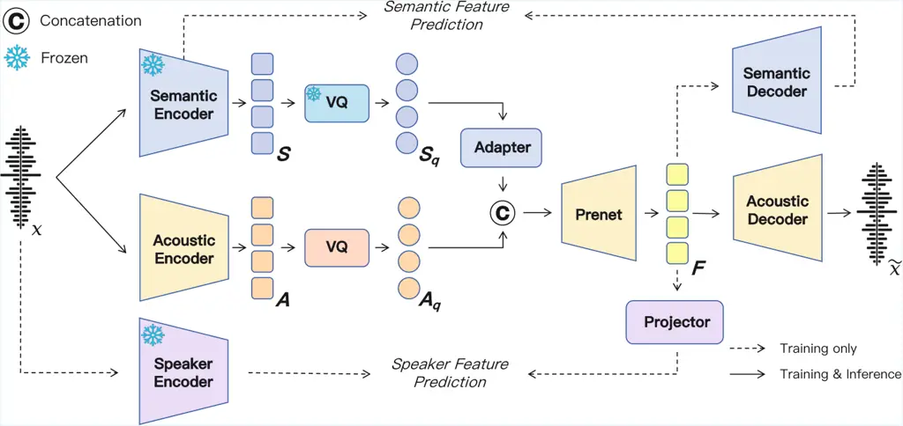
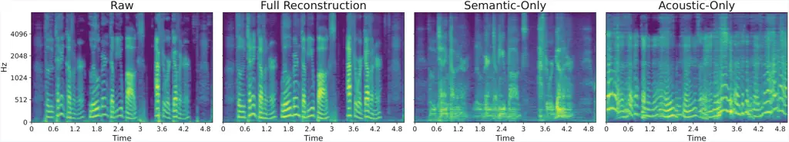
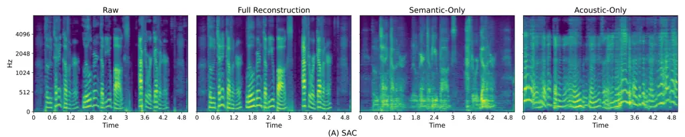
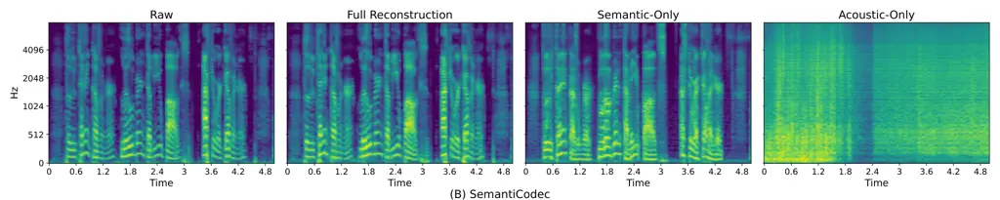
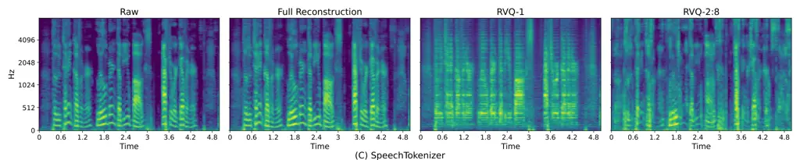

# SAC: Neural Speech Codec with Semantic-Acoustic Dual-Stream Quantization

Wenxi Chen ^(†)^(†)thanks: Work done during an internship at Soul AI
Lab. Affiliation: X-LANCE Lab, Shanghai Jiao Tong University, China
Affiliation: Shanghai Innovation Institute, China    Xinsheng Wang
^(†)^(†)thanks: Corresponding author. Affiliation: Soul AI Lab, China
[1029713857@sjtu.edu.cn](mailto:1029713857@sjtu.edu.cn);
[wangxinsheng@soulapp.cn](mailto:wangxinsheng@soulapp.cn);
[chenxie95@sjtu.edu.cn](mailto:chenxie95@sjtu.edu.cn)    Ruiqi Yan
Affiliation: X-LANCE Lab, Shanghai Jiao Tong University, China    Yushen
Chen Affiliation: X-LANCE Lab, Shanghai Jiao Tong University, China
Affiliation: Shanghai Innovation Institute, China    Zhikang Niu
Affiliation: X-LANCE Lab, Shanghai Jiao Tong University, China
Affiliation: Shanghai Innovation Institute, China    Ziyang Ma
Affiliation: X-LANCE Lab, Shanghai Jiao Tong University, China    Xiquan
Li Affiliation: X-LANCE Lab, Shanghai Jiao Tong University, China   
Yuzhe Liang Affiliation: X-LANCE Lab, Shanghai Jiao Tong University,
China Affiliation: Shanghai Innovation Institute, China    Hanlin Wen
Affiliation: Soul AI Lab, China
[1029713857@sjtu.edu.cn](mailto:1029713857@sjtu.edu.cn);
[wangxinsheng@soulapp.cn](mailto:wangxinsheng@soulapp.cn);
[chenxie95@sjtu.edu.cn](mailto:chenxie95@sjtu.edu.cn)    Shunshun Yin
Affiliation: Soul AI Lab, China
[1029713857@sjtu.edu.cn](mailto:1029713857@sjtu.edu.cn);
[wangxinsheng@soulapp.cn](mailto:wangxinsheng@soulapp.cn);
[chenxie95@sjtu.edu.cn](mailto:chenxie95@sjtu.edu.cn)    Ming Tao
Affiliation: Soul AI Lab, China
[1029713857@sjtu.edu.cn](mailto:1029713857@sjtu.edu.cn);
[wangxinsheng@soulapp.cn](mailto:wangxinsheng@soulapp.cn);
[chenxie95@sjtu.edu.cn](mailto:chenxie95@sjtu.edu.cn)    Xie
Chen²²footnotemark: 2 Affiliation: X-LANCE Lab, Shanghai Jiao Tong
University, China Affiliation: Shanghai Innovation Institute, China

###### Abstract

Speech codecs that convert continuous speech signals into discrete
tokens have become essential for speech language models. However,
existing codecs struggle to balance high-quality reconstruction with
semantically rich representations, limiting their effectiveness in both
generative and understanding tasks. In this work, we propose SAC, a
neural speech codec with semantic-acoustic dual-stream quantization. By
disentangling semantic and acoustic modeling into two dedicated streams,
SAC enables each to be optimized for its respective role. Comprehensive
evaluations show that SAC achieves strong reconstruction performance
across diverse bitrates under both clean and noisy conditions, with
particularly high scores on UTMOS and WER, indicating superior
naturalness and intelligibility. Moreover, SAC substantially surpasses
prior codecs in semantic representation, approaching the level of
continuous self-supervised embeddings. When used as a tokenizer for
LLM-based text-to-speech, SAC enables a single-stage autoregressive (AR)
TTS model that clearly outperforms state-of-the-art AR systems. Our
disentanglement analysis further validates the effectiveness of the
dual-stream design, offering new potential for controllable speech
generation. The code and pre-trained models are available at
[https://github.com/Soul-AILab/SAC](https://github.com/Soul-AILab/SAC).
¹¹ 1 Demo at [https://sac-codec.github.io](https://sac-codec.github.io).

## 1 Introduction

With the rapid advancement of large language models (LLMs), speech
language models (SLMs) have emerged by extending text-based LLMs with
speech modalities (Peng et al., 2024; Ji et al., 2024a). Central to
these models is the speech tokenizer, which discretizes continuous
speech waveforms into token sequences, thereby enabling seamless
integration with token-based language models (Guo et al., 2025).
Leveraging such speech tokens, SLMs have driven progress in a wide range
of downstream applications, including text-to-speech (TTS) (Xie et al.,
2025; Wang et al., 2025b), speech understanding (Wang et al., 2024), and
spoken dialogue systems  (Xu et al., 2025; Zeng et al., 2024a; Chen et
al., 2024b; Défossez et al., 2024).

Figure 1: Comparison of codecs on speech reconstruction. The x-axis
shows WER, reflecting speech intelligibility, while the y-axis presents
UTMOS, reflecting objective naturalness. Circle size indicates bitrate.

Semantic tokens are among the most widely used tokens in speech
processing. These tokens are typically derived from either
self-supervised models (Yang et al., 2024) or supervised models (Du et
al., 2024a; Du et al., 2024b), making them effective in capturing
semantic meaning. However, the absence of essential acoustic information
significantly limits the applicability of semantic tokens. In contrast,
acoustic tokens are usually generated by neural audio codecs trained
with reconstruction objectives (Défossez et al., 2022; Zeghidour et al.,
2021). While this approach preserves fine-grained acoustic details, the
lack of semantic supervision results in weaker alignment with semantic
content and reduced compatibility with text-based LMs (Wang et al.,
2025a; Deng et al., 2025).

To enhance semantic representation, recent advancements in speech codecs
have explored incorporating semantic supervision during training. For
example, SpeechTokenizer (Zhang et al., 2023) employs semantic
distillation, where representations from an SSL model guide the output
of the first residual vector quantization (RVQ) layer. The X-Codec
series (Ye et al., 2025a; Ye et al., 2025b) and XY-Tokenizer (Gong et
al., 2025) adopt an “X-shaped” paradigm, explicitly injecting
pre-trained semantic features and fusing them with acoustic embeddings
before quantization. However, while these approaches improve semantic
alignment compared to methods without semantic constraints, they still
fall short of pure semantic tokens in terms of semantic relevance. This
raises a central question: Can semantic and acoustic tokens be
disentangled at the token level, allowing each to specialize in its
respective role? In this work, we explore such a dual-stream design that
decouples semantic and acoustic modeling into independent streams, and
show that it leads to improved semantic representation and
reconstruction performance.

In this paper, we propose SAC, a novel Semantic  
–Acoustic Dual-Stream Neural Speech Codec. Unlike prior approaches that
inject semantic supervision into codecs, SAC complements the semantic
tokens by introducing a separate acoustic token stream, which provides
the essential acoustic information missing from the semantic tokens, all
while ensuring the integrity of the semantic representations.
Specifically, in the semantic stream, we adopt a pre-trained speech
tokenizer (Zeng et al., 2024b) to extract semantic tokens aligned with
linguistic content, keeping it frozen during training to ensure faithful
retention of semantic information. In the acoustic stream, we follow the
design of neural audio codecs (Kumar et al., 2023), employing temporally
distributed acoustic tokens to capture the essential acoustic
information, e.g., timbre and emotional attributes, that is missing from
the semantic tokens. This dual-stream design unifies the complementary
strengths of both within a single framework: semantic tokenizers excel
in speech understanding and dialogue tasks (Zeng et al., 2024a; Ding et
al., 2025), while acoustic tokenizers are particularly effective in
generative modeling (Wang et al., 2023; Chen et al., 2024a). At the
decoding stage, a ConvNeXt-based (Liu et al., 2022) prenet is employed
to fuse the two streams of embeddings, followed by a codec decoder that
reconstructs the waveform. Experiments show that SAC delivers strong
reconstruction and semantic relevance, while also supporting competitive
performance in downstream LLM-based TTS tasks. Our main contributions
can be summarized as follows:

- •
  We propose SAC, a semantic–acoustic dual-stream neural speech codec.
  By explicitly disentangling speech encoding into parallel semantic and
  acoustic streams, SAC enables each pathway to specialize in modeling
  linguistic content and acoustic detail, respectively.
- •
  SAC outperforms existing codecs with strong speech reconstruction
  quality and semantic representation across different bitrates.
- •
  We validate SAC in TTS downstream tasks, where SAC-based single-stage
  AR models significantly surpass SOTA pure AR systems in both
  intelligibility and objective naturalness.
- •
  We further analyze SAC’s effectiveness in speech disentanglement,
  paving the way for controllable and anonymized speech applications.



Figure 2: Overview of SAC. Semantic and speaker feature supervision are
applied only during codec training, with their respective encoders kept
frozen to preserve the integrity of extracted features.

## 2 Related Work

#### Semantic Tokenizer

Semantic tokens are derived from quantized representations of
self-supervised learning (SSL) models or supervised models. They are
strongly correlated with textual semantics but are not primarily
designed for waveform reconstruction. Following the introduction of the
$`\mathcal{S}^{3}`$ tokenizer in CosyVoice (Du et al., 2024a), a range
of supervised semantic tokenizers have been proposed. For example,
CosyVoice3 (Du et al., 2025) employs multi-task learning to improve
prosody modeling in their tokenizer, while the Baichuan Audio Tokenizer
(Li et al., 2025) introduced an additional mel reconstruction objective
to capture both semantic and acoustic details. However, due to the lack
of necessary acoustic information, the application of semantic tokens in
generation tasks still requires additional generative models and
reference audio to generate acoustic features. To fully leverage the
semantic consistency inherent in semantic tokens while addressing their
lack of acoustic information during generation tasks, we propose a
method that preserves their semantic integrity by introducing a separate
acoustic token stream.

#### Neural Audio Codecs

Acoustic tokens are derived from neural audio codecs, which compress
continuous audio signals into discrete tokens while reconstructing
high-fidelity waveforms (Niu et al., 2024). Speech codecs typically
adopt the VQ-GAN paradigm (Esser et al., 2021), where a VQ-VAE (Van Den
Oord et al., 2017)-based generator performs the encode–quantize–decode
process, and adversarial discriminators distinguish real from synthetic
speech to improve perceptual quality. SoundStream (Zeghidour et al., 2021) introduced residual vector quantization (RVQ) to improve
quantization efficiency, while Encodec (Défossez et al., 2022)
incorporated LSTMs into the encoder–decoder structure to enhance
compression. More recently, several single-codebook codecs have emerged,
including Single-Codec (Li et al., 2024), WavTokenizer (Ji et al.,
2024b), and BigCodec (Xin et al., 2024), which replace multi-layer
quantizers with a single codebook. These designs achieve
ultra-low-bitrate compression while simplifying and accelerating
downstream modeling. However, the absence of explicit semantic
consistency constraints limits their effectiveness in
recognition-oriented tasks and hinders compatibility with text-based
LMs (Wang et al., 2025a).

#### Codec with Semantic Supervision

To enhance semantic representation, recent speech codecs have introduced
semantic features through distillation or injection. For instance,
SpeechTokenizer (Zhang et al., 2023) leverages HuBERT (Hsu et al., 2021)
to guide the first RVQ layer toward encoding semantic information, while
Mimi (Défossez et al., 2024) distills WavLM (Chen et al., 2022a)
features into a separate VQ module. X-Codec (Ye et al., 2025a; Ye et
al., 2025b) introduces semantic injection via an auxiliary semantic
module, and XY-Tokenizer (Gong et al., 2025) further enhances textual
alignment through an LLM-based ASR objective. However, these methods
rely on fused semantic–acoustic tokens that must jointly support
semantic prediction and spectrogram reconstruction, limiting both
semantic fidelity and reconstruction quality. Although SemantiCodec (Liu
et al., 2024), built on AudioMAE (Huang et al., 2022), seeks to
disentangle semantic and acoustic streams, our analysis indicates that
the separation remains incomplete. In contrast, SAC employs a
dual-stream semantic–acoustic design, enabling both stronger semantic
representation and improved reconstruction.

## 3 SAC

To jointly leverage the semantic modeling capabilities of speech
tokenizers and the fine-grained acoustic representations of neural
codecs, we propose the semantic-acoustic dual-stream codec (SAC). As
illustrated in Fig. 2, SAC employs two discrete encoding streams: (1) a
semantic stream, which utilizes a pre-trained semantic tokenizer to
model linguistic content, and (2) an acoustic stream, which relies on a
speech codec to provide the acoustic information that is missing from
the semantic tokens. Together, these two streams enable a more
comprehensive representation of speech signals and explicitly mitigate
conflicts between speech tokens when optimizing for these two distinct
objectives during codec training.

### 3.1 Model Architecture

SAC is built on the VQ-GAN framework (Esser et al., 2021), which follows
a VQ-VAE architecture (Gârbacea et al., 2019) to reconstruct raw speech.
As shown in Fig. 2, SAC comprises a dual-stream encoder–quantizer and a
unified codec decoder, complemented by auxiliary modules for semantic
and speaker feature supervision. The details of each component are
described in the following subsections.

#### Semantic Stream

To ensure that the semantic stream of SAC maintains strong semantic
consistency, we employ a pre-trained semantic tokenizer, keeping its
parameters frozen throughout SAC training. Specifically, we use the
speech tokenizer proposed in Zeng et al. (2024b), which tokenizes input
speech into discrete tokens at a frame rate of 12.5 Hz. Formally, given
an input waveform $`x`$, the semantic tokenizer first extracts
fine-grained continuous representations $`\mathbf{S}_{c}`$ at 50 Hz,
which also serve as the target for auxiliary semantic supervision. A
temporal pooling layer then downsamples $`\mathbf{S}_{c}`$ to 12.5 Hz,
producing $`\mathbf{S}`$. These features are quantized via a vector
quantization layer to obtain discrete semantic tokens and their
corresponding quantized embeddings $`\mathbf{S}_{q}`$. During training,
the semantic tokenizer is kept frozen to ensure that the semantic stream
focuses exclusively on linguistic content without being biased toward
acoustic details. To achieve temporal alignment with the acoustic
embeddings, $`\mathbf{S}_{q}`$ is further upsampled by a ConvNeXt-based
adapter (Liu et al., 2022), resulting in the semantic features
$`\mathbf{S}_{q}^{\prime}`$.

#### Acoustic Stream

The acoustic token serves to complement the acoustic details missing
from the semantic token. Specifically, we adopt the Encodec
architecture (Défossez et al., 2022), which employs stacked
convolutional and temporal downsampling layers with stride $`\tau`$ to
extract frame-level acoustic representations $`\mathbf{A}`$. Following
DAC (Kumar et al., 2023), we apply factorized code projections to map
$`\mathbf{A}`$ into a lower-dimensional embedding space and perform
single-codebook quantization based on $`L_{2}`$ distances. To mitigate
codebook underutilization, entries that remain inactive over prolonged
training intervals are reinitialized with randomly sampled embeddings
drawn from the current batch (Dhariwal et al., 2020). Since acoustic
information is inherently more fine-grained than semantic information,
we adopt higher frame rates for its representation, specifically 25 Hz
for low-bitrate settings and 50 Hz for high-bitrate settings. The
corresponding strides $`\tau`$ are set to $`(2,2,4,5,8)`$ and
$`(2,4,5,8)`$, respectively, yielding temporal reduction factors of 640
and 320 for input audio sampled at 16 kHz.

#### Decoder

The quantized acoustic embeddings $`\mathbf{A}_{q}`$ are concatenated
with the semantic embeddings $`\mathbf{S}_{q}^{\prime}`$ along the
feature dimension to form a unified representation $`\mathbf{U}`$. This
joint representation is then processed by a ConvNeXt-based prenet, which
upsamples it to 50 Hz, producing the fused feature sequence
$`\mathbf{F}`$. The fused representation $`\mathbf{F}`$ integrates
linguistic information from the semantic stream with timbre and acoustic
detail from the acoustic stream. Subsequently, $`\mathbf{F}`$ is passed
through a mirrored decoder composed of stacked convolutional and
temporal upsampling layers to reconstruct the waveform $`\tilde{x}`$,
with deconvolution strides set to $`\tau=(8,5,4,2)`$. Following the
design of “X-shaped” codec models (Ye et al., 2025a), we introduce an
auxiliary semantic reconstruction objective to ensure that key
linguistic information is preserved during decoding. Specifically,
$`\mathbf{F}`$ is fed into a CNN-based semantic decoder to predict the
reconstructed semantic features $`\tilde{\mathbf{S}}_{c}`$. A mean
squared error (MSE) loss,

```math
\mathcal{L}_{\text{sem}}=\|\tilde{\mathbf{S}}_{c}-\mathbf{S}_{c}\|_{2}^{2} \tag{1}
```

is then applied between $`\tilde{\mathbf{S}}_{c}`$ and the ground-truth
semantic features $`\mathbf{S}_{c}`$ to regularize training.

### 3.2 Auxiliary Speaker Feature Supervision

While the acoustic stream effectively captures fine-grained spectral
details, it may insufficiently model global timbre characteristics. To
mitigate this limitation and improve timbre reconstruction, we introduce
explicit speaker feature supervision. To be specific, we employ
ERes2Net (Chen et al., 2023) to extract speaker embeddings
$`\mathbf{S}_{p}`$ as the supervision target. For prediction, we compute
the temporal mean and variance of the fused representation
$`\mathbf{F}`$ and concatenate them into a global feature
$`\mathbf{f}`$. This vector is passed through a lightweight two-layer
MLP projector to generate the predicted speaker embedding
$`\tilde{\mathbf{S}}_{p}`$. An MSE loss is then applied between
$`\tilde{\mathbf{S}}_{p}`$ and $`\mathbf{S}_{p}`$ to encourage accurate
modeling of timbre information:

```math
\displaystyle\mathbf{f} \displaystyle=[\,\text{Mean}_{t}(\mathbf{F});\;\text{Std}_{t}(\mathbf{F})\,], \tag{2}
```

```math
\displaystyle\mathcal{L}_{\text{spk}} \displaystyle=\left\|\tilde{\mathbf{S}}_{p}-\mathbf{S}_{p}\right\|_{2}^{2}=\Big\|\text{Proj}(\mathbf{f})-\mathbf{S}_{p}\Big\|_{2}^{2}. \tag{3}
```

### 3.3 Training Objectives

SAC is optimized under the VQ-GAN framework, where the overall objective
comprises losses for both the generator and the discriminator.

#### Reconstruction Loss

Following DAC, we define the reconstruction loss
$`\mathcal{L}_{\text{recon}}`$ as the $`L_{1}`$ distance between the
reconstructed and ground-truth audio signals across multiple scales,
applied on both log-scale and linear-scale spectrograms.

#### VQ Loss

For the acoustic stream, the codebook is optimized by minimizing the
$`L_{2}`$ distance between the encoder outputs and their quantized
embeddings, with gradients propagated using the straight-through
estimator (STE) (Bengio et al., 2013). The VQ loss
$`\mathcal{L}_{\text{vq}}`$ also incorporates a commitment term that
constrains encoder outputs to remain close to their assigned codebook
entries.

#### Discriminative Loss

We employ a multi-period discriminator (MPD) (Kong et al., 2020) and a
multi-scale STFT-based discriminator (MS-STFT) (Défossez et al., 2022),
following Xin et al. (2024). The discriminators are optimized using the
least-squares GAN objective (Mao et al., 2017). For the generator, we
apply both an adversarial loss $`\mathcal{L}_{\text{adv}}`$ and a
feature matching loss $`\mathcal{L}_{\text{feat}}`$, the latter computed
as the $`L_{1}`$ distance between intermediate feature maps of real and
generated audio.

The overall generator loss is formulated as:

```math
\displaystyle\mathcal{L}_{G}=\; \displaystyle\lambda_{\text{recon}}\mathcal{L}_{\text{recon}}+\lambda_{\text{vq}}\mathcal{L}_{\text{vq}}+\lambda_{\text{adv}}\mathcal{L}_{\text{adv}}
```

```math
\displaystyle+\lambda_{\text{feat}}\mathcal{L}_{\text{feat}}+\lambda_{\text{sem}}\mathcal{L}_{\text{sem}}+\lambda_{\text{spk}}\mathcal{L}_{\text{spk}}, \tag{4}
```

where each coefficient $`\lambda`$ is a tunable hyperparameter weighting
the corresponding objective.

## 4 Experimental Setup

### 4.1 Training Details

#### Datasets

To ensure diversity in the training data, we randomly sampled
approximately 20,000 hours of bilingual (Chinese and English) speech
data from various sources. These include Emilia (He et al., 2024),
WenetSpeech4TTS (Ma et al., 2024), LibriSpeech (Panayotov et al., 2015),
Libriheavy (Kang et al., 2024), MLS (Pratap et al., 2020), and in-house
data. Further details of the training data are provided in Appendix A.

#### Training Setup

Both the semantic and acoustic codebooks in SAC contain 16,384 entries.
To provide configurations for different bitrates, we set the acoustic
token frame rate to 25 Hz or 50 Hz, corresponding to overall token rates
of 37.5 Hz and 62.5 Hz, respectively. Models are trained for 850k steps
on 8 NVIDIA H20 GPUs with a batch size of 24. During training, each
audio sample is randomly cropped into 2.4-second segments. Optimization
is performed using the AdamW optimizer (Loshchilov and Hutter, 2017)
with $`\beta_{1}=0.8`$ and $`\beta_{2}=0.9`$. Both the generator and
discriminator learning rates are initialized at $`1\times 10^{-4}`$ and
decayed exponentially throughout training. Additional training details
are provided in Appendix B.

### 4.2 Evaluation Details

An ideal speech token should not only have strong audio reconstruction
capability but also maintain good semantic consistency, facilitating
tasks such as audio generation or comprehension. Therefore, we conduct a
comprehensive evaluation of SAC from both reconstruction and semantic
representation perspectives.

#### Speech Reconstruction

We evaluate speech reconstruction performance on the LibriSpeech
test-clean set, which contains 2,620 utterances at 16 kHz. To facilitate
comparison across models, we report key parameters, including codebook
size, the number of quantizers (Nq), token rate, and bandwidth (BPS).
Speech intelligibility is assessed using Short-Time Objective
Intelligibility (STOI) and Word Error Rate (WER), where transcriptions
are obtained with the HuBERT-based (Hsu et al., 2021) model. Acoustic
quality is measured by the Perceptual Evaluation of Speech Quality
(PESQ) and UTMOS (Saeki et al., 2022), while speaker similarity (SIM) is
computed via a WavLM-based (Chen et al., 2022b) speaker verification
model. For comparison, we evaluate SAC at two token rates against a
range of state-of-the-art codecs with similar bitrates, including
DAC (Kumar et al., 2023), Encodec (Défossez et al., 2022),
Mimi (Défossez et al., 2024), SpeechTokenizer (Zhang et al., 2023),
SemantiCodec (Liu et al., 2024), BigCodec (Xin et al., 2024), the
X-Codec series (Ye et al., 2025a; Ye et al., 2025b), XY-Tokenizer (Gong
et al., 2025), WavTokenizer (Ji et al., 2024b), MagiCodec (Song et al.,
2025), and TS3-Codec (Wu et al., 2024). All baselines are reproduced on
our test set using their official checkpoints. For ablations, we
consistently adopt the lower-bitrate configuration of SAC for
comparison.

|                     |                  |          |            |          |                  |                     |                     |                   |                 |                      |
| ------------------- | ---------------- | -------- | ---------- | -------- | ---------------- | ------------------- | ------------------- | ----------------- | --------------- | -------------------- |
| Model               | Codebook Size    | Nq       | Token Rate | BPS      | STOI$`\uparrow`$ | PESQ NB$`\uparrow`$ | PESQ WB$`\uparrow`$ | UTMOS$`\uparrow`$ | SIM$`\uparrow`$ | WER(%)$`\downarrow`$ |
| Ground Truth        | \-               | \-       | \-         | \-       | 1.00             | 4.55                | 4.64                | 4.09              | 1.00            | 2.16                 |
| DAC                 | 1024             | 12       | 600        | 6000     | 0.97             | 4.15                | 4.01                | 4.00              | 0.95            | 2.22                 |
| Encodec             | 1024             | 8        | 600        | 6000     | 0.94             | 3.18                | 2.77                | 3.09              | 0.89            | 2.36                 |
| Mimi                | 2048             | 32       | 400        | 4400     | 0.96             | 3.80                | 3.45                | 3.95              | 0.93            | 2.27                 |
| SpeechTokenizer     | 1024             | 8        | 400        | 4000     | 0.92             | 3.05                | 2.60                | 3.90              | 0.85            | 2.51                 |
| DAC                 | 1024             | 3        | 150        | 1500     | 0.79             | 1.61                | 1.25                | 1.48              | 0.47            | 7.80                 |
| Encodec             | 1024             | 2        | 150        | 1500     | 0.85             | 1.94                | 1.56                | 1.58              | 0.60            | 5.62                 |
| SemantiCodec        |  32768/8192^(‡)  |  1/1^(‡) | 100        | 1400     | 0.88             | 2.63                | 2.02                | 2.94              | 0.72            | 3.31                 |
| Mimi                | 2048             | 8        | 100        | 1100     | 0.91             | 2.80                | 2.26                | 3.63              | 0.74            | 3.24                 |
| BigCodec            | 8192             | 1        | 80         | 1040     | 0.94             | 3.27                | 2.68                | 4.11              | 0.84            | 2.92                 |
| X-codec             | 1024             | 2        | 100        | 1000     | 0.86             | 2.68                | 2.11                | 4.06              | 0.68            | 2.73                 |
| XY-Tokenizer        | 1024             | 8        | 100        | 1000     | 0.91             | 3.00                | 2.41                | 3.98              | 0.84            | 2.46                 |
| WavTokenizer        | 4096             | 1        | 75         | 900      | 0.90             | 2.63                | 2.13                | 3.79              | 0.65            | 4.15                 |
| MagiCodec           | 131072           | 1        | 50         | 850      | 0.92             | 3.16                | 2.54                | 4.17              | 0.77            | 3.52                 |
| TS3-Codec^(†)       | 131072           | 1        | 50         | 850      | 0.91             | \-                  | 2.23                | 3.84              | 0.68            | 3.60                 |
| X-codec2            | 65536            | 1        | 50         | 800      | 0.92             | 3.04                | 2.43                | 4.13              | 0.82            | 2.61                 |
| SAC (ours)          |  16384/16384^(‡) |  1/1^(‡) | 62.5       | 875      | 0.93             | 3.15                | 2.59                | 4.25              | 0.86            | 2.35                 |

Table 1: Comparison of high-bitrate codec models on speech
reconstruction metrics. Bold numbers denote the best performance among
models with comparable bitrates. ^(†)TS3-Codec results are taken from
the original paper. ^(‡)For codec models with semantic–acoustic
decoupling (e.g., SAC and SemantiCodec), the codebook size and Nq are
reported as “x/y”, where x corresponds to the semantic stream and y to
the acoustic stream.

|                     |               |     |            |         |                  |                     |                     |                   |                 |                      |
| ------------------- | ------------- | --- | ---------- | ------- | ---------------- | ------------------- | ------------------- | ----------------- | --------------- | -------------------- |
| Model               | Codebook Size | Nq  | Token Rate | BPS     | STOI$`\uparrow`$ | PESQ NB$`\uparrow`$ | PESQ WB$`\uparrow`$ | UTMOS$`\uparrow`$ | SIM$`\uparrow`$ | WER(%)$`\downarrow`$ |
| Ground Truth        | \-            | \-  | \-         | \-      | 1.00             | 4.55                | 4.64                | 4.09              | 1.00            | 2.16                 |
| Encodec             | 1024          | 1   | 75         | 750     | 0.77             | 1.48                | 1.23                | 1.25              | 0.25            | 41.2                 |
| SemantiCodec        | 32768/8192    | 1/1 | 50         | 700     | 0.86             | 2.33                | 1.78                | 2.94              | 0.61            | 5.54                 |
| TS3-Codec           | 131072        | 1   | 40         | 680     | 0.90             | \-                  | 2.06                | 3.73              | 0.63            | 4.50                 |
| SpeechTokenizer     | 1024          | 1   | 50         | 500     | 0.63             | 1.31                | 1.14                | 1.27              | 0.17            | 7.67                 |
| X-codec             | 1024          | 1   | 50         | 500     | 0.84             | 2.22                | 1.71                | 3.84              | 0.49            | 3.48                 |
| WavTokenizer        | 4096          | 1   | 40         | 480     | 0.85             | 2.06                | 1.62                | 3.57              | 0.48            | 10.88                |
| SAC (ours)          | 16384/16384   | 1/1 | 37.5       | 525     | 0.90             | 2.74                | 2.18                | 4.27              | 0.78            | 2.53                 |

Table 2: Comparison of low-bitrate codec models on speech reconstruction
metrics.

#### Speech Representation

We evaluate the semantic richness of codec representations using the
speech domain of the ARCH benchmark, following Ji et al. (2024b)
and Jiang et al. (2025). ARCH includes RAVDESS (Livingstone and Russo, 2018) and EMOVO (Costantini et al., 2014) for emotion recognition,
SLURP (Bastianelli et al., 2020) for intent classification, and
AudioMNIST (Becker et al., 2024) for digit recognition. For each codec
model, the quantized representations extracted from the codec quantizer
are average-pooled over time and passed through a linear classifier,
following the standard ARCH protocol. For semantic–acoustic decoupled
codecs such as SemantiCodec and SAC, features from the two streams are
concatenated before linear probing. To further contextualize the
performance gap between discrete codec representations and continuous
SSL features, we additionally report results for wav2vec 2.0 (Baevski et
al., 2020), data2vec (Baevski et al., 2022), HuBERT (Hsu et al., 2021),
and WavLM (Chen et al., 2022a) in ARCH as SSL-based references.

|                  |                        |            |      |                     |                   |                   |                |                  |
| ---------------- | ---------------------- | ---------- | ---- | ------------------- | ----------------- | ----------------- | -------------- | ---------------- |
| Category         | Model                  | Token Rate | BPS  | RAVDESS$`\uparrow`$ | EMOVO$`\uparrow`$ | SLURP$`\uparrow`$ | AM$`\uparrow`$ | Avg.$`\uparrow`$ |
| SSL Models       | wav2vec 2.0            | -          | -    | 55.32               | 31.80             | 14.37             | 86.38          | 46.97            |
|                  | data2vec               | -          | -    | 48.03               | 27.27             | 43.57             | 99.06          | 54.48            |
|                  | Hubert                 | -          | -    | 65.28               | 40.48             | 33.75             | 99.58          | 59.77            |
|                  | WavLM                  | -          | -    | 67.94               | 43.08             | 30.98             | 99.50          | 60.38            |
| Codec Models     | Encodec^(†)            | 150        | 1500 | 27.43               | 21.93             | 6.27              | 36.49          | 23.03            |
|                  | SemantiCodec           | 100        | 1400 | 44.79               | 26.87             | 15.35             | 98.19          | 46.30            |
|                  | BigCodec               | 80         | 1040 | 34.72               | 17.52             | 7.72              | 65.66          | 31.40            |
|                  | DAC^(†)                | 100        | 1000 | 25.00               | 22.78             | 7.13              | 62.87          | 29.45            |
|                  | XY-Tokenizer           | 100        | 1000 | 48.96               | 24.66             | 17.98             | 96.22          | 46.96            |
|                  | WavTokenizer^(†)       | 75         | 900  | 32.55               | 31.63             | 8.02              | 69.57          | 35.44            |
|                  | MagiCodec              | 50         | 850  | 32.99               | 25.17             | 7.73              | 70.11          | 34.00            |
|                  | X-Codec2               | 50         | 800  | 37.15               | 22.11             | 7.71              | 68.59          | 33.89            |
|                  | SAC                    | 62.5       | 875  | 57.99               | 40.31             | 29.94             | 99.52          | 56.94            |
|                  | SAC                    | 37.5       | 525  | 61.81               | 39.63             | 29.21             | 99.63          | 57.57            |
|                  | SAC$`{}_{\text{sem}}`$ | 12.5       | 175  | 39.93               | 32.82             | 29.37             | 99.80          | 50.48            |

Table 3: Semantic representation evaluation on the speech domain of the
ARCH benchmark. The best results in each category are in bold, and the
second-best are underlined. SAC$`{}_{\text{sem}}`$ denotes evaluation
using representations extracted solely from the semantic tokenizer of
SAC. ^(†)Results are cited from the Wavtokenizer (Ji et al., 2024b)
paper.

## 5 Experimental Results and Discussions

### 5.1 Speech Reconstruction Results

Tables 1 and 2 present the reconstruction performance of SAC compared
with existing neural audio codecs under different bitrate settings.

At high bitrates, SAC achieves state-of-the-art performance in acoustic
quality, intelligibility, and speaker similarity compared to models with
similar bitrates. For reconstruction-oriented metrics such as STOI and
PESQ, SAC significantly outperforms models below 1.5 kbps, while
performing only slightly worse than BigCodec, which benefits from a
higher token rate of 80 Hz. Notably, SAC attains a WER of 2.35%, which
is very close to the ground truth (2.16%). We attribute this to the
dual-stream architecture, which effectively disentangles semantic and
acoustic modeling, enabling the semantic stream to preserve linguistic
content with high fidelity. SAC also achieves a UTMOS score of 4.25,
surpassing all other models as well as the ground truth. We hypothesize
that this improvement stems from the acoustic stream being unconstrained
from semantic modeling objectives, thereby better capturing fine-grained
acoustic details (see Section 5.5 for further discussion).

At low bitrates, SAC likewise delivers state-of-the-art performance
across all metrics, demonstrating the robustness of the framework under
varying bandwidths. Remarkably, at a token rate of only 37.5, SAC
achieves a SIM score of 0.78, exceeding the second-best model by 0.15.
Moreover, its WER (2.53%) and UTMOS (4.27) remain comparable and even
surpass those of the high-bitrate setting, confirming that the
dual-stream design remains effective at low bitrates: the semantic
stream preserves intelligibility, while the acoustic stream complements
and enhances acoustic detail.

We include a Mean Opinion Score (MOS) subjective evaluation to assess
the perceptual quality of the reconstructed audio, with details in
Appendix E. To further examine robustness, we also evaluate SAC’s
reconstruction performance under noisy conditions, as presented in
Appendix C.

### 5.2 Representations Evaluation Results

Table 3 compares SAC with other models on the semantic representation
tasks using the ARCH benchmark. SAC achieves performance that
substantially surpasses existing codec models, exceeding the second-best
XY-Tokenizer by roughly 10% in overall accuracy. Remarkably, SAC’s
semantic representations even outperform some SSL models such as wav2vec
2.0 and data2vec, while remaining competitive with HuBERT and WavLM.

Several findings emerge from this evaluation:  
(1) Codecs trained without semantic supervision exhibit weaker semantic
representation ability, as observed in Encodec, BigCodec, and DAC; (2)
Freezing the semantic stream during training and disentangling it from
the reconstruction objective leads to significantly stronger semantic
representations, as demonstrated by SemantiCodec, XY-Tokenizer, and SAC;
(3) SAC’s semantic tokenizer shows strong text-related representation
ability, yielding superior performance on intent and digit
classification tasks such as SLURP and AudioMNIST. Meanwhile, the
acoustic stream effectively complements para-linguistic representation,
leading to large gains on emotion recognition tasks (e.g., SAC
outperforms SAC$`{}_{\text{sem}}`$ by about 20% accuracy on RAVDESS);
(4) SAC delivers consistent representation performance across different
bitrates. We conjecture that more fine-grained downstream tasks may be
needed to investigate differences, since the current evaluation relies
on global pooling.

### 5.3 Effect of Auxiliary Feature Supervision

The effects of speaker and semantic feature supervision on SAC are
examined through ablation studies. As shown in Table 4, removing speaker
supervision yields a slight improvement in PESQ but causes a sharp drop
in SIM, from 0.78 to 0.65. This demonstrates that the proposed speaker
feature supervision effectively guides the codec to preserve timbre
information during training, with only a minor trade-off in
reconstruction fidelity.

When semantic supervision is removed, the model shows only a slight drop
in PESQ, with other metrics remaining unaffected. This contrasts with
“X-shaped” codec models, such as XY-Tokenizer, which suffer substantial
degradation in ASR probing without semantic supervision. We attribute
this robustness to SAC’s dual-stream design, which explicitly
disentangles the semantic stream from acoustic reconstruction, thereby
preserving linguistic content without relying heavily on additional
supervision. In contrast, “X-shaped” models fuse semantic and acoustic
streams before quantization, resulting in interference between the two
objectives and making explicit semantic supervision crucial.

The impact of $`\mathcal{L}_{\text{spk}}`$ and
$`\mathcal{L}_{\text{sem}}`$ on semantic representation is further
analyzed in Appendix H.

|                                         |                  |                     |                     |                   |                 |                      |
| --------------------------------------- | ---------------- | ------------------- | ------------------- | ----------------- | --------------- | -------------------- |
| Model                                   | STOI$`\uparrow`$ | PESQ NB$`\uparrow`$ | PESQ WB$`\uparrow`$ | UTMOS$`\uparrow`$ | SIM$`\uparrow`$ | WER(%)$`\downarrow`$ |
| SAC                                     | 0.90             | 2.74                | 2.18                | 4.27              | 0.78            | 2.53                 |
|    w/o $`\mathcal{L}_{\text{spk}}`$     | 0.90             | 2.76                | 2.21                | 4.28              | 0.65            | 2.53                 |
|    w/o $`\mathcal{L}_{\text{sem}}`$     | 0.90             | 2.72                | 2.17                | 4.27              | 0.78            | 2.53                 |

Table 4: Ablation study of auxiliary feature supervision.

### 5.4 Downstream Speech-LLM Performance

We conduct downstream LLM-based experiments to assess the
transferability of SAC when integrated with speech language models.
Given SAC’s strong semantic representations and its previously verified
ASR performance (Zeng et al., 2024a), our focus here is on its
effectiveness in generative tasks. We adopt a single-stage
autoregressive (AR) TTS framework using the pre-trained Qwen3-0.6B (Yang
et al., 2025) as the backbone, and accommodate SAC’s dual-stream tokens
through an interleaved flattening scheme based on their token-rate
ratio. Using the 37.5 Hz SAC tokenizer, we train the TTS model on a
100k-hour bilingual (Chinese–English) corpus. As shown in Table 9, the
resulting system substantially outperforms state-of-the-art pure AR
models, including Spark-TTS (Wang et al., 2025b) and Llasa (Ye et al.,
2025b), achieving significantly lower WER and higher UTMOS, which
reflects superior semantic clarity and objective perceptual quality.
Although speaker similarity exhibits a slight drop, we attribute this to
the low-bitrate SAC variant used under current computational
constraints. Detailed setup and analyses are provided in Appendix D.



Figure 3: Mel-spectrograms of the original audio and SAC reconstructions
under different reconstruction patterns.

|                            |              |      |            |      |      |
| -------------------------- | ------------ | ---- | ---------- | ---- | ---- |
| Reconstruction Pattern     | Model        | BPS  | WER^(†)(%) | SIM  | MSIM |
| Full                       | SemantiCodec | 1400 | 3.25       | 0.72 | \-   |
|                            | SAC          | 525  | 2.77       | 0.78 | \-   |
| Semantic-Only              | SemantiCodec | 750  | 30.67      | 0.31 | 0.29 |
|                            | SAC          | 175  | 3.99       | 0.17 | 0.64 |

Table 5: Comparison of speech information disentanglement. ^(†)WER is
evaluated using whisper-large-v3 for more robust and accurate speech
recognition.

### 5.5 Speech Decoupling Analysis

In terms of speech disentanglement, we compare SAC with another
semantic–acoustic decoupled codec, SemantiCodec, under the semantic-only
reconstruction pattern, where acoustic features are masked out and only
the semantic stream is used for decoding. As shown in Table 5, SAC
achieves a WER of 3.99, far lower than SemantiCodec’s 30.67. This
demonstrates that SAC’s semantic stream effectively preserves linguistic
content with minimal interference from acoustic representations during
decoding. We further evaluate SIM and mean similarity (MSIM) for
semantic-only reconstructions. MSIM is computed as the average cosine
similarity between speaker embeddings across all reconstructed
utterances. Results show that SAC’s SIM is only 0.17, demonstrating a
clean disentanglement of timbre information from the original audio.
Meanwhile, its MSIM reaches 0.64, indicating that semantic-only
reconstructions converge toward a uniform timbre, with subjective
listening revealing a consistent male bass voice. These findings
highlight SAC’s superior timbre disentanglement and suggest potential
speech applications such as speaker anonymization.

As illustrated in Fig. 3, we performed a visual analysis of SAC’s
reconstruction capabilities across different paradigms. In the full
reconstruction setting, which follows SAC’s basic reconstruction method
using dual-stream tokens, the spectrogram preserves more high-frequency
textures compared to the original, indicating reduced distortion in
harmonic structures and formants. This observation also explains SAC’s
strong performance on UTMOS, as the decoder effectively acts as a
generator to enrich fine-grained acoustic detail.

In contrast, the semantic-only reconstruction lacks the speaker-specific
fundamental frequencies and formants, yet retains clear semantic
content. This demonstrates SAC’s ability to effectively separate and
preserve the semantic features, while discarding speaker-dependent
acoustic information. On the other hand, the acoustic-only
reconstruction retains well-defined fundamental frequencies and
formants, but completely loses semantic content (The output is
perceptually similar to noise, devoid of any meaningful information).
This highlights SAC’s remarkable capacity to disentangle and
independently process semantic and acoustic features, providing direct
evidence of its robust disentanglement ability. Additional
mel-spectrogram reconstruction analyses of other codec models are
provided in Appendix I.

## 6 Conclusion

In this paper, we presented SAC, a neural speech codec with
semantic–acoustic dual-stream quantization. To exploit the strengths of
semantic tokenizers for capturing linguistic content and codecs for
modeling acoustic detail, SAC introduces independent semantic and
acoustic streams that extract tokens separately. To further enhance
timbre modeling, we incorporated speaker feature supervision into codec
training. Comprehensive evaluations demonstrate that SAC achieves SOTA
performance in both speech reconstruction and semantic representation
across different bitrates, while ablation studies validate the
effectiveness of auxiliary feature supervision. Moreover, downstream
LLM-based TTS experiments further confirm SAC’s effectiveness as a
speech tokenizer for generative speech applications. We also observe a
remarkably clean disentanglement between semantic and acoustic tokens in
reconstruction: semantic-token-based reconstruction contains no
speaker-related information, while acoustic-token-based reconstruction
preserves no semantic content. To the best of our knowledge, this is the
first instance of such a clean disentanglement between semantics and
speaker identity in terms of reconstruction. This finding offers new
insights for subsequent tasks that rely on disentanglement, such as
voice conversion or the joint control of style and timbre in TTS.

## Limitations

Although SAC demonstrates superior reconstruction quality and semantic
representation within the speech domain, its generalizability to other
types of audio signals, such as music and sounds, remains to be
explored. A key challenge lies in the semantic tokenizer used in SAC,
which is trained under ASR supervision on speech data and therefore
primarily aligned with textual objectives. In contrast, the semantics in
music and sound extend beyond linguistic alignment. To develop a more
general-purpose audio codec based on the SAC dual-stream architecture,
future work should focus on designing a universal audio semantic
encoder, potentially through multi-task supervision across modalities or
self-supervised training on diverse audio data.

## References

- Anastassiou et al. (2024) P. Anastassiou, J. Chen, J. Chen, Y.
  Chen, Z. Chen, Z. Chen, J. Cong, L. Deng, C. Ding, L. Gao, et al.
  Seed-tts: a family of high-quality versatile speech generation models.
  arXiv preprint arXiv:2406.02430. Cited by: Appendix D, Appendix G.
- Baevski et al. (2022) A. Baevski, W. Hsu, Q. Xu, A. Babu, J. Gu,
  and M. Auli Data2vec: a general framework for self-supervised learning
  in speech, vision and language. In International conference on machine
  learning, pp. 1298–1312. Cited by: §4.2.
- Baevski et al. (2020) A. Baevski, Y. Zhou, A. Mohamed, and M. Auli
  Wav2vec 2.0: a framework for self-supervised learning of speech
  representations. Advances in neural information processing systems 33,
  pp. 12449–12460. Cited by: §4.2.
- Bastianelli et al. (2020) E. Bastianelli, A. Vanzo, P. Swietojanski,
  and V. Rieser SLURP: A spoken language understanding resource package.
  arXiv preprint arXiv:2011.13205. Cited by: §4.2.
- Becker et al. (2024) S. Becker, J. Vielhaben, M. Ackermann, K.
  Müller, S. Lapuschkin, and W. Samek Audiomnist: exploring explainable
  artificial intelligence for audio analysis on a simple benchmark.
  Journal of the Franklin Institute 361 (1), pp. 418–428. Cited by:
  §4.2.
- Bengio et al. (2013) Y. Bengio, N. Léonard, and A. Courville
  Estimating or propagating gradients through stochastic neurons for
  conditional computation. arXiv preprint arXiv:1308.3432. Cited by:
  §3.3.
- Chen et al. (2024a) S. Chen, S. Liu, L. Zhou, Y. Liu, X. Tan, J.
  Li, S. Zhao, Y. Qian, and F. Wei VALL-E 2: Neural Codec Language
  Models are Human Parity Zero-Shot Text to Speech Synthesizers. arXiv
  preprint arXiv:2406.05370. Cited by: §1.
- Chen et al. (2022a) S. Chen, C. Wang, Z. Chen, Y. Wu, S. Liu, Z.
  Chen, J. Li, N. Kanda, T. Yoshioka, X. Xiao, et al. Wavlm: large-scale
  self-supervised pre-training for full stack speech processing. IEEE
  Journal of Selected Topics in Signal Processing 16 (6), pp. 1505–1518.
  Cited by: §2, §4.2.
- Chen et al. (2024b) W. Chen, Z. Ma, R. Yan, Y. Liang, X. Li, R. Xu, Z.
  Niu, Y. Zhu, Y. Yang, Z. Liu, et al. Slam-omni: timbre-controllable
  voice interaction system with single-stage training. arXiv preprint
  arXiv:2412.15649. Cited by: §1.
- Chen et al. (2023) Y. Chen, S. Zheng, H. Wang, L. Cheng, Q. Chen,
  and J. Qi An enhanced res2net with local and global feature fusion for
  speaker verification. arXiv preprint arXiv:2305.12838. Cited by: §3.2.
- Chen et al. (2025) Y. Chen, K. Hu, L. Zhou, S. Feng, X. Yang, H. Chen,
  and X. Chen AUV: Teaching Audio Universal Vector Quantization with
  Single Nested Codebook. arXiv preprint arXiv:2509.21968. Cited by:
  Appendix B.
- Chen et al. (2022b) Z. Chen, S. Chen, Y. Wu, Y. Qian, C. Wang, S.
  Liu, Y. Qian, and M. Zeng Large-scale self-supervised speech
  representation learning for automatic speaker verification. In ICASSP
  2022-2022 IEEE International Conference on Acoustics, Speech and
  Signal Processing (ICASSP), pp. 6147–6151. Cited by: §4.2.
- Costantini et al. (2014) G. Costantini, I. Iaderola, A. Paoloni, M.
  Todisco, et al. EMOVO corpus: an Italian emotional speech database. In
  Proceedings of the ninth international conference on language
  resources and evaluation (LREC’14), pp. 3501–3504. Cited by: §4.2.
- Défossez et al. (2022) A. Défossez, J. Copet, G. Synnaeve, and Y. Adi
  High fidelity neural audio compression. arXiv preprint
  arXiv:2210.13438. Cited by: Appendix E, §1, §2, §3.1, §3.3, §4.2.
- Défossez et al. (2024) A. Défossez, L. Mazaré, M. Orsini, A. Royer, P.
  Pérez, H. Jégou, E. Grave, and N. Zeghidour Moshi: a speech-text
  foundation model for real-time dialogue. arXiv preprint
  arXiv:2410.00037. Cited by: §1, §2, §4.2.
- Deng et al. (2025) R. Deng, Y. Gong, Q. Gao, L. Jin, Q. Cheng, Z.
  Fei, S. Li, and X. Qiu CodecBench: A Comprehensive Benchmark for
  Acoustic and Semantic Evaluation. arXiv preprint arXiv:2508.20660.
  Cited by: §1.
- Dhariwal et al. (2020) P. Dhariwal, H. Jun, C. Payne, J. W. Kim, A.
  Radford, and I. Sutskever Jukebox: a generative model for music. arXiv
  preprint arXiv:2005.00341. Cited by: §3.1.
- Ding et al. (2025) D. Ding, Z. Ju, Y. Leng, S. Liu, T. Liu, Z.
  Shang, K. Shen, W. Song, X. Tan, H. Tang, et al. Kimi-audio technical
  report. arXiv preprint arXiv:2504.18425. Cited by: §1.
- Du et al. (2024a) Z. Du, Q. Chen, S. Zhang, K. Hu, H. Lu, Y. Yang, H.
  Hu, S. Zheng, Y. Gu, Z. Ma, et al. Cosyvoice: a scalable multilingual
  zero-shot text-to-speech synthesizer based on supervised semantic
  tokens. arXiv preprint arXiv:2407.05407. Cited by: §1, §2.
- Du et al. (2025) Z. Du, C. Gao, Y. Wang, F. Yu, T. Zhao, H. Wang, X.
  Lv, H. Wang, C. Ni, X. Shi, et al. Cosyvoice 3: towards in-the-wild
  speech generation via scaling-up and post-training. arXiv preprint
  arXiv:2505.17589. Cited by: §2.
- Du et al. (2024b) Z. Du, Y. Wang, Q. Chen, X. Shi, X. Lv, T. Zhao, Z.
  Gao, Y. Yang, C. Gao, H. Wang, et al. Cosyvoice 2: scalable streaming
  speech synthesis with large language models. arXiv preprint
  arXiv:2412.10117. Cited by: §1.
- Esser et al. (2021) P. Esser, R. Rombach, and B. Ommer Taming
  transformers for high-resolution image synthesis. In Proceedings of
  the IEEE/CVF conference on computer vision and pattern recognition,
  pp. 12873–12883. Cited by: §2, §3.1.
- Gârbacea et al. (2019) C. Gârbacea, A. van den Oord, Y. Li, F. S.
  Lim, A. Luebs, O. Vinyals, and T. C. Walters Low bit-rate speech
  coding with vq-vae and a wavenet decoder. In ICASSP 2019-2019 IEEE
  International Conference on Acoustics, Speech and Signal Processing
  (ICASSP), pp. 735–739. Cited by: §3.1.
- Gong et al. (2025) Y. Gong, L. Jin, R. Deng, D. Zhang, X. Zhang, Q.
  Cheng, Z. Fei, S. Li, and X. Qiu XY-Tokenizer: Mitigating the
  Semantic-Acoustic Conflict in Low-Bitrate Speech Codecs. arXiv
  preprint arXiv:2506.23325. Cited by: Appendix F, Appendix G, §1, §2,
  §4.2.
- Guo et al. (2025) Y. Guo, Z. Li, H. Wang, B. Li, C. Shao, H. Zhang, C.
  Du, X. Chen, S. Liu, and K. Yu Recent advances in discrete speech
  tokens: A review. arXiv preprint arXiv:2502.06490. Cited by: §1.
- He et al. (2024) H. He, Z. Shang, C. Wang, X. Li, Y. Gu, H. Hua, L.
  Liu, C. Yang, J. Li, P. Shi, et al. Emilia: an extensive,
  multilingual, and diverse speech dataset for large-scale speech
  generation. In 2024 IEEE Spoken Language Technology Workshop (SLT),
  pp. 885–890. Cited by: Appendix A, Appendix F, §4.1.
- Hsu et al. (2021) W. Hsu, B. Bolte, Y. H. Tsai, K. Lakhotia, R.
  Salakhutdinov, and A. Mohamed Hubert: self-supervised speech
  representation learning by masked prediction of hidden units. IEEE/ACM
  transactions on audio, speech, and language processing 29,
  pp. 3451–3460. Cited by: §2, §4.2, §4.2.
- Huang et al. (2022) P. Huang, H. Xu, J. Li, A. Baevski, M. Auli, W.
  Galuba, F. Metze, and C. Feichtenhofer Masked autoencoders that
  listen. Advances in Neural Information Processing Systems 35,
  pp. 28708–28720. Cited by: Appendix I, §2.
- Ji et al. (2024a) S. Ji, Y. Chen, M. Fang, J. Zuo, J. Lu, H. Wang, Z.
  Jiang, L. Zhou, S. Liu, X. Cheng, et al. Wavchat: a survey of spoken
  dialogue models. arXiv preprint arXiv:2411.13577. Cited by: §1.
- Ji et al. (2024b) S. Ji, Z. Jiang, W. Wang, Y. Chen, M. Fang, J.
  Zuo, Q. Yang, X. Cheng, Z. Wang, R. Li, et al. Wavtokenizer: an
  efficient acoustic discrete codec tokenizer for audio language
  modeling. arXiv preprint arXiv:2408.16532. Cited by: Appendix E,
  Appendix F, §2, §4.2, §4.2, Table 3.
- Jiang et al. (2025) Y. Jiang, Q. Chen, S. Ji, Y. Xi, W. Wang, C.
  Zhang, X. Yue, S. Zhang, and H. Li UniCodec: Unified Audio Codec with
  Single Domain-Adaptive Codebook. arXiv preprint arXiv:2502.20067.
  Cited by: §4.2.
- Kahn et al. (2020) J. Kahn, M. Riviere, W. Zheng, E. Kharitonov, Q.
  Xu, P. Mazaré, J. Karadayi, V. Liptchinsky, R. Collobert, C. Fuegen,
  et al. Libri-light: a benchmark for asr with limited or no
  supervision. In ICASSP 2020-2020 IEEE International Conference on
  Acoustics, Speech and Signal Processing (ICASSP), pp. 7669–7673. Cited
  by: Appendix F.
- Kang et al. (2024) W. Kang, X. Yang, Z. Yao, F. Kuang, Y. Yang, L.
  Guo, L. Lin, and D. Povey Libriheavy: a 50,000 hours asr corpus with
  punctuation casing and context. In ICASSP 2024-2024 IEEE International
  Conference on Acoustics, Speech and Signal Processing (ICASSP),
  pp. 10991–10995. Cited by: Appendix A, §4.1.
- Kong et al. (2020) J. Kong, J. Kim, and J. Bae Hifi-gan: generative
  adversarial networks for efficient and high fidelity speech synthesis.
  Advances in neural information processing systems 33, pp. 17022–17033.
  Cited by: §3.3.
- Kumar et al. (2023) R. Kumar, P. Seetharaman, A. Luebs, I. Kumar,
  and K. Kumar High-fidelity audio compression with improved rvqgan.
  Advances in Neural Information Processing Systems 36, pp. 27980–27993.
  Cited by: §1, §3.1, §4.2.
- Li et al. (2024) H. Li, L. Xue, H. Guo, X. Zhu, Y. Lv, L. Xie, Y.
  Chen, H. Yin, and Z. Li Single-codec: single-codebook speech codec
  towards high-performance speech generation. arXiv preprint
  arXiv:2406.07422. Cited by: §2.
- Li et al. (2025) T. Li, J. Liu, T. Zhang, Y. Fang, D. Pan, M. Wang, Z.
  Liang, Z. Li, M. Lin, G. Dong, et al. Baichuan-audio: a unified
  framework for end-to-end speech interaction. arXiv preprint
  arXiv:2502.17239. Cited by: §2.
- Liu et al. (2024) H. Liu, X. Xu, Y. Yuan, M. Wu, W. Wang, and M. D.
  Plumbley Semanticodec: an ultra low bitrate semantic audio codec for
  general sound. IEEE Journal of Selected Topics in Signal Processing.
  Cited by: Appendix E, Appendix G, Appendix I, §2, §4.2.
- Liu et al. (2022) Z. Liu, H. Mao, C. Wu, C. Feichtenhofer, T. Darrell,
  and S. Xie A convnet for the 2020s. In Proceedings of the IEEE/CVF
  conference on computer vision and pattern recognition,
  pp. 11976–11986. Cited by: §1, §3.1.
- Livingstone and Russo (2018) S. R. Livingstone and F. A. Russo The
  Ryerson Audio-Visual Database of Emotional Speech and Song (RAVDESS):
  A dynamic, multimodal set of facial and vocal expressions in North
  American English. PloS one 13 (5), pp. e0196391. Cited by: §4.2.
- Loshchilov and Hutter (2017) I. Loshchilov and F. Hutter Decoupled
  weight decay regularization. arXiv preprint arXiv:1711.05101. Cited
  by: §4.1.
- Ma et al. (2024) L. Ma, D. Guo, K. Song, Y. Jiang, S. Wang, L. Xue, W.
  Xu, H. Zhao, B. Zhang, and L. Xie Wenetspeech4tts: a 12,800-hour
  mandarin tts corpus for large speech generation model benchmark. arXiv
  preprint arXiv:2406.05763. Cited by: Appendix A, §4.1.
- Mao et al. (2017) X. Mao, Q. Li, H. Xie, R. Y. Lau, Z. Wang, and S.
  Paul Smolley Least squares generative adversarial networks. In
  Proceedings of the IEEE International Conference on Computer Vision,
  pp. 2794–2802. Cited by: §3.3.
- Niu et al. (2024) Z. Niu, S. Chen, L. Zhou, Z. Ma, X. Chen, and S. Liu
  NDVQ: Robust neural audio codec with normal distribution-based vector
  quantization. In 2024 IEEE Spoken Language Technology Workshop (SLT),
  pp. 705–710. Cited by: §2.
- Panayotov et al. (2015) V. Panayotov, G. Chen, D. Povey, and S.
  Khudanpur Librispeech: an asr corpus based on public domain audio
  books. In 2015 IEEE international conference on acoustics, speech and
  signal processing (ICASSP), pp. 5206–5210. Cited by: Appendix A,
  Appendix F, §4.1.
- Peng et al. (2024) J. Peng, Y. Wang, Y. Xi, X. Li, X. Zhang, and K. Yu
  A survey on speech large language models. arXiv e-prints,
  pp. arXiv–2410. Cited by: §1.
- Pratap et al. (2020) V. Pratap, Q. Xu, A. Sriram, G. Synnaeve, and R.
  Collobert Mls: a large-scale multilingual dataset for speech research.
  arXiv preprint arXiv:2012.03411. Cited by: Appendix A, §4.1.
- Saeki et al. (2022) T. Saeki, D. Xin, W. Nakata, T. Koriyama, S.
  Takamichi, and H. Saruwatari Utmos: utokyo-sarulab system for voicemos
  challenge 2022. arXiv preprint arXiv:2204.02152. Cited by: §4.2.
- Song et al. (2025) Y. Song, J. Chen, X. Zhuang, C. Du, Z. Ma, J.
  Wu, J. Cong, D. Jia, Z. Chen, Y. Wang, et al. MagiCodec: Simple Masked
  Gaussian-Injected Codec for High-Fidelity Reconstruction and
  Generation. arXiv preprint arXiv:2506.00385. Cited by: §4.2.
- Touvron et al. (2023) H. Touvron, T. Lavril, G. Izacard, X.
  Martinet, M. Lachaux, T. Lacroix, B. Rozière, N. Goyal, E. Hambro, F.
  Azhar, et al. Llama: open and efficient foundation language models.
  arXiv preprint arXiv:2302.13971. Cited by: Appendix D.
- Van Den Oord et al. (2017) A. Van Den Oord O. Vinyals et al. Neural
  discrete representation learning. Advances in neural information
  processing systems 30. Cited by: §2.
- Wang et al. (2023) C. Wang, S. Chen, Y. Wu, Z. Zhang, L. Zhou, S.
  Liu, Z. Chen, Y. Liu, H. Wang, J. Li, et al. Neural codec language
  models are zero-shot text to speech synthesizers. arXiv preprint
  arXiv:2301.02111. Cited by: Appendix D, §1.
- Wang et al. (2024) D. Wang, M. Cui, D. Yang, X. Chen, and H. Meng A
  comparative study of discrete speech tokens for semantic-related tasks
  with large language models. arXiv preprint arXiv:2411.08742. Cited by:
  §1.
- Wang et al. (2025a) L. Wang, H. Chen, S. Wu, Z. Wu, H. Zhou, C.
  Zhang, T. Wang, and H. Zhang AudioCodecBench: A Comprehensive
  Benchmark for Audio Codec Evaluation. arXiv preprint arXiv:2509.02349.
  Cited by: §1, §2.
- Wang et al. (2025b) X. Wang, M. Jiang, Z. Ma, Z. Zhang, S. Liu, L.
  Li, Z. Liang, Q. Zheng, R. Wang, X. Feng, et al. Spark-TTS: An
  efficient llm-based text-to-speech model with single-stream decoupled
  speech tokens. arXiv preprint arXiv:2503.01710. Cited by: Appendix A,
  Appendix D, Appendix D, §1, §5.4.
- Wu et al. (2024) H. Wu, N. Kanda, S. E. Eskimez, and J. Li Ts3-codec:
  transformer-based simple streaming single codec. arXiv preprint
  arXiv:2411.18803. Cited by: Appendix E, Appendix F, §4.2.
- Xie et al. (2025) K. Xie, F. Shen, J. Li, F. Xie, X. Tang, and Y. Hu
  Fireredtts-2: Towards long conversational speech generation for
  podcast and chatbot. arXiv preprint arXiv:2509.02020. Cited by: §1.
- Xin et al. (2024) D. Xin, X. Tan, S. Takamichi, and H. Saruwatari
  Bigcodec: pushing the limits of low-bitrate neural speech codec. arXiv
  preprint arXiv:2409.05377. Cited by: §2, §3.3, §4.2.
- Xu et al. (2025) J. Xu, Z. Guo, H. Hu, Y. Chu, X. Wang, J. He, Y.
  Wang, X. Shi, T. He, X. Zhu, et al. Qwen3-Omni Technical Report. arXiv
  preprint arXiv:2509.17765. Cited by: §1.
- Yang et al. (2025) A. Yang, A. Li, B. Yang, B. Zhang, B. Hui, B.
  Zheng, B. Yu, C. Gao, C. Huang, C. Lv, et al. Qwen3 technical report.
  arXiv preprint arXiv:2505.09388. Cited by: Appendix D, §5.4.
- Yang et al. (2024) Y. Yang, F. Shen, C. Du, Z. Ma, K. Yu, D. Povey,
  and X. Chen Towards universal speech discrete tokens: a case study for
  asr and tts. In ICASSP 2024-2024 IEEE International Conference on
  Acoustics, Speech and Signal Processing (ICASSP), pp. 10401–10405.
  Cited by: §1.
- Ye et al. (2025a) Z. Ye, P. Sun, J. Lei, H. Lin, X. Tan, Z. Dai, Q.
  Kong, J. Chen, J. Pan, Q. Liu, et al. Codec does matter: exploring the
  semantic shortcoming of codec for audio language model. In Proceedings
  of the AAAI Conference on Artificial Intelligence, pp. 25697–25705.
  Cited by: Appendix E, §1, §2, §3.1, §4.2.
- Ye et al. (2025b) Z. Ye, X. Zhu, C. Chan, X. Wang, X. Tan, J. Lei, Y.
  Peng, H. Liu, Y. Jin, Z. Dai, et al. Llasa: scaling train-time and
  inference-time compute for llama-based speech synthesis. arXiv
  preprint arXiv:2502.04128. Cited by: Appendix D, §1, §2, §4.2, §5.4.
- Zeghidour et al. (2021) N. Zeghidour, A. Luebs, A. Omran, J. Skoglund,
  and M. Tagliasacchi Soundstream: an end-to-end neural audio codec.
  IEEE/ACM Transactions on Audio, Speech, and Language Processing 30,
  pp. 495–507. Cited by: §1, §2.
- Zeng et al. (2024a) A. Zeng, Z. Du, M. Liu, K. Wang, S. Jiang, L.
  Zhao, Y. Dong, and J. Tang Glm-4-voice: towards intelligent and
  human-like end-to-end spoken chatbot. arXiv preprint arXiv:2412.02612.
  Cited by: §1, §1, §5.4.
- Zeng et al. (2024b) A. Zeng, Z. Du, M. Liu, L. Zhang, S. Jiang, Y.
  Dong, and J. Tang Scaling speech-text pre-training with synthetic
  interleaved data. arXiv preprint arXiv:2411.17607. Cited by: Appendix
  B, §1, §3.1.
- Zhang et al. (2023) X. Zhang, D. Zhang, S. Li, Y. Zhou, and X. Qiu
  Speechtokenizer: unified speech tokenizer for speech large language
  models. arXiv preprint arXiv:2308.16692. Cited by: Appendix E,
  Appendix I, §1, §2, §4.2.

## Appendix A Details of Training Data

As summarized in Table 6, SAC is trained on approximately 20,000 hours
of bilingual (Chinese and English) speech, comprising around 8 million
utterances. The training corpus includes roughly 10,000 hours in each
language. All audio is resampled to 16 kHz.

For Chinese, the data sources include the Chinese subset of Emilia (He
et al., 2024), WenetSpeech4TTS (Ma et al., 2024), and a small amount of
in-house para-linguistic data. For English, we use
LibriSpeech (Panayotov et al., 2015), the small and medium subsets of
Libriheavy (Kang et al., 2024), the English subset of Emilia,
MLS (Pratap et al., 2020), and a small amount of in-house data.

To promote diversity, we follow the annotation scheme of VoxBox (Wang et
al., 2025b), which labels speech samples along three dimensions: age,
gender, and emotion. Specifically, we partition Emilia, WenetSpeech4TTS,
and MLS into categories defined by the unique combination of these three
attributes, and then sample data to achieve balanced coverage across
categories. This strategy ensures broad diversity within the training
set.

All data are drawn from the official training splits of each dataset to
maintain fair evaluation. Given the small scale and similarity of the
in-house data to existing open-source corpora, we believe that
reproducing SAC with only open-source data would not significantly
affect performance.

|                    |       |        |          |          |
| ------------------ | ----- | ------ | -------- | -------- |
| Dataset            | Lang. | \#Utt. | Dur. (h) | Avg. (s) |
| Emilia-ZH          | ZH    | 3.0M   | 6712     | 8.05     |
| WenetSpeech4TTS    | ZH    | 2.0M   | 2754     | 4.96     |
| In-house Data      | ZH    | 0.2M   | 525      | 7.82     |
| LibriSpeech        | EN    | 0.3M   | 961      | 12.30    |
| Libriheavy         | EN    | 1.2M   | 5042     | 14.85    |
| Emilia-EN          | EN    | 1.0M   | 2481     | 8.93     |
| MLS-EN             | EN    | 0.3M   | 1222     | 14.66    |
| In-house Data      | EN    | 0.1M   | 209      | 6.42     |
| Summary (All)      | ZH&EN | 8.2M   | 19906    | 8.78     |

Table 6: Data statistics for SAC training. “#Utt.” refers to the total
number of audio samples, “Dur. (h)” denotes the total duration in hours,
and “Avg. (s)” indicates the average duration per sample.

|                  |               |     |            |          |                  |                     |                     |                   |                 |                      |
| ---------------- | ------------- | --- | ---------- | -------- | ---------------- | ------------------- | ------------------- | ----------------- | --------------- | -------------------- |
| Model            | Codebook Size | Nq  | Token Rate | BPS      | STOI$`\uparrow`$ | PESQ NB$`\uparrow`$ | PESQ WB$`\uparrow`$ | UTMOS$`\uparrow`$ | SIM$`\uparrow`$ | WER(%)$`\downarrow`$ |
| Ground Truth     | \-            | \-  | \-         | \-       | 1.00             | 4.55                | 4.64                | 3.50              | 1.00            | 4.59                 |
| X-codec          | 1024          | 2   | 100        | 1000     | 0.85             | 2.50                | 1.99                | 3.66              | 0.67            | 7.02                 |
| XY-Tokenizer     | 1024          | 8   | 100        | 1000     | 0.89             | 2.80                | 2.23                | 3.46              | 0.82            | 6.19                 |
| WavTokenizer     | 4096          | 1   | 75         | 900      | 0.87             | 2.40                | 1.96                | 3.22              | 0.68            | 13.35                |
| MagiCodec        | 131072        | 1   | 50         | 850      | 0.90             | 2.94                | 2.34                | 3.70              | 0.75            | 10.63                |
| X-codec2         | 65536         | 1   | 50         | 800      | 0.90             | 2.83                | 2.26                | 3.64              | 0.81            | 6.85                 |
| SAC (ours)       | 16384/16384   | 1/1 | 62.5       | 875      | 0.90             | 2.92                | 2.39                | 3.84              | 0.85            | 5.77                 |

Table 7: Comparison of high-bitrate codecs on speech reconstruction
metrics under noisy conditions.

|                     |               |     |            |         |                  |                     |                     |                   |                 |                      |
| ------------------- | ------------- | --- | ---------- | ------- | ---------------- | ------------------- | ------------------- | ----------------- | --------------- | -------------------- |
| Model               | Codebook Size | Nq  | Token Rate | BPS     | STOI$`\uparrow`$ | PESQ NB$`\uparrow`$ | PESQ WB$`\uparrow`$ | UTMOS$`\uparrow`$ | SIM$`\uparrow`$ | WER(%)$`\downarrow`$ |
| Ground Truth        | \-            | \-  | \-         | \-      | 1.00             | 4.55                | 4.64                | 3.50              | 1.00            | 4.59                 |
| SpeechTokenizer     | 1024          | 1   | 50         | 500     | 0.61             | 1.27                | 1.12                | 1.27              | 0.15            | 19.85                |
| X-codec             | 1024          | 1   | 50         | 500     | 0.82             | 2.10                | 1.63                | 3.47              | 0.48            | 9.58                 |
| WavTokenizer        | 4096          | 1   | 40         | 480     | 0.82             | 1.95                | 1.56                | 3.16              | 0.51            | 30.28                |
| SAC (ours)          | 16384/16384   | 1/1 | 37.5       | 525     | 0.87             | 2.54                | 2.03                | 3.90              | 0.77            | 6.36                 |

Table 8: Comparison of low-bitrate codecs on speech reconstruction
metrics under noisy conditions.

## Appendix B Codec Training Details

To accelerate SAC training, we pre-extracted all semantic
representations $`\mathbf{S}_{c}`$ and corresponding semantic tokens
from the training corpus using a pretrained semantic tokenizer (Zeng et
al., 2024b). During training, only the codebook from the tokenizer is
required to obtain the quantized semantic embeddings $`\mathbf{S}_{q}`$,
while $`\mathbf{S}_{c}`$ serves as the ground-truth target for auxiliary
semantic feature supervision. The generator contains approximately 277M
parameters, with around 249M being trainable. The codebook of the
semantic tokenizer and the speaker encoder are frozen to ensure that
well-pretrained semantic and speaker features are properly utilized.

For generator training, the loss coefficients are set as
$`\lambda_{\text{recon}}=15`$, $`\lambda_{\text{vq}}=1`$,
$`\lambda_{\text{adv}}=1`$, $`\lambda_{\text{feat}}=2`$,
$`\lambda_{\text{sem}}=1000`$, and $`\lambda_{\text{spk}}=10`$. Within
the VQ loss, the commitment and codebook loss weights are set to 0.25
and 4, respectively. To improve training stability, the generator is
pretrained for 1,500 steps before introducing the discriminator for
adversarial training. An exponential moving average (EMA) is applied to
maintain a smoothed version of the model parameters (Chen et al., 2025),
which are used during inference and observed to enhance model stability.

## Appendix C Speech Reconstruction under Noisy Conditions

To further evaluate the robustness of SAC in noisy environments, we
conduct additional reconstruction experiments on the full LibriSpeech
test-other set, which contains significantly more background noise
compared to the test-clean set. Tables 7 and 8 present the
reconstruction results of SAC under high-bitrate and low-bitrate
settings, respectively, alongside comparable state-of-the-art codecs.

As expected, compared to the results on the test-clean set, the ground
truth recordings exhibit notable degradation in noisy conditions, with
UTMOS decreasing from 4.09 to 3.50 and WER increasing from 2.16% to
4.59%. All codecs show a general decline in reconstruction quality, as
reflected by reduced STOI, PESQ-NB, and PESQ-WB scores. Nevertheless,
SAC consistently achieves the best performance across bitrates, closely
mirroring its relative ranking in the test-clean setting.

Notably, SAC maintains a clear advantage in UTMOS, SIM, and WER. For
objective naturalness, SAC achieves UTMOS scores of 3.84 and 3.90 at
high and low bitrates, respectively—both substantially higher than the
ground truth value of 3.50. We attribute this to SAC’s acoustic stream
effectively modeling fine-grained acoustic details, while the decoder
functions as a generator that enhances objective perceptual realism. In
terms of speaker similarity, SAC shows only a marginal drop of 0.01 in
SIM compared to the clean condition, whereas other codecs experience
significant declines. This demonstrates the robustness of both our model
architecture and the diverse training data, as well as the effectiveness
of the speaker feature supervision in preserving timbre characteristics.
Furthermore, SAC maintains high speech intelligibility under noisy
conditions, with remarkably low WER values, confirming that its
dual-stream architecture enables reliable semantic reconstruction even
in the presence of noise.

These findings highlight SAC’s robustness under extreme high compression
and its ability to deliver high-fidelity speech reconstruction in both
clean and noisy environments—underscoring its strong potential for
applications in speech compression and transmission.

## Appendix D Downstream LLM-Based Speech Generation

To validate the potential of SAC in downstream speech language models
(SLMs) tasks, we further conducted an LLM-based text-to-speech (TTS)
experiment. For language modeling, we adopt a pure autoregressive (AR)
framework using the pre-trained LLM Qwen3-0.6B ²² 2
[https://huggingface.co/Qwen/Qwen3-0.6B](https://huggingface.co/Qwen/Qwen3-0.6B) (Yang
et al., 2025) as the backbone. In contrast to prior TTS systems such as
VALL-E (Wang et al., 2023), which rely on a two-stage AR+NAR generation
pipeline, our approach uses a single Transformer decoder to
autoregressively predict single-layer speech tokens, substantially
simplifying the modeling process.

To accommodate SAC’s dual-stream tokens, we introduce a novel
interleaved flattening strategy for language modeling. Since SAC
produces single-layer semantic and acoustic tokens with different token
rates, we arrange them in an interleaved sequence proportional to their
rate ratio. For example, the 37.5 Hz SAC variant generates semantic
tokens at 12.5 Hz and acoustic tokens at 25 Hz; the downstream model
therefore predicts them in a fixed 1:2 pattern in a single layer, where
earlier semantic predictions facilitate subsequent acoustic predictions.

Given computational constraints, we use the 37.5 Hz SAC tokenizer and
expand the LLM vocabulary with both semantic and acoustic codebooks.
During training, the decoder-only LLM is optimized via negative
log-likelihood to predict speech tokens conditioned on text
transcriptions as prefixes.

Small-scale TTS evaluations often fail to reflect the robustness and
generalization abilities of speech tokens, especially when paired with
LLMs whose interaction dynamics exhibit complex emergent behavior. To
obtain a more reliable assessment, we train the TTS model using SAC
tokens on a large 100k-hour bilingual corpus (Chinese and English),
following the same data distribution as VoxBox (Wang et al., 2025b).

We evaluate the zero-shot TTS performance on the Seed-TTS-eval
 (Anastassiou et al., 2024), using speaker similarity (SIM), WER (or CER
for the Chinese test set), and UTMOS as evaluation metrics. During
inference, we concatenate the prompt text, the target synthesis text,
and the prompt-audio token sequence as the input to the LLM. For a fair
comparison, we benchmark our model against two state-of-the-art purely
AR TTS systems trained on large-scale datasets: Spark-TTS (Wang et al.,
2025b) and Llasa (Ye et al., 2025b). Spark-TTS adopts BiCodec as the
speech tokenizer and Qwen2.5-0.5B as the backbone, trained on the same
VoxBox data. Llasa employs X-codec2 as the tokenizer and Llama
3.2-1B (Touvron et al., 2023) as the backbone, with versions trained on
80k, 160k, and 250k hours of data.

|                  |                      |                 |                   |
| ---------------- | -------------------- | --------------- | ----------------- |
| Model            | WER(%)$`\downarrow`$ | SIM$`\uparrow`$ | UTMOS$`\uparrow`$ |
| Seed-TTS test-en |                      |                 |                   |
| Llasa-1B-80k     | 3.71                 | 0.54            | 4.06              |
| Llasa-1B-160k    | 3.60                 | 0.56            | 4.05              |
| Llasa-1B-250k    | 2.99                 | 0.57            | 4.07              |
| Spark-TTS        | 1.98                 | 0.58            | 3.94              |
| Ours             | 1.06                 | 0.54            | 4.21              |
| Seed-TTS test-zh |                      |                 |                   |
| Llasa-1B-80k     | 2.69                 | 0.65            | 3.27              |
| Llasa-1B-160k    | 2.22                 | 0.66            | 3.28              |
| Llasa-1B-250k    | 1.89                 | 0.67            | 3.28              |
| Spark-TTS        | 1.20                 | 0.67            | 3.27              |
| Ours             | 0.90                 | 0.65            | 3.34              |

Table 9: Results of our TTS model compared with prior single-stage AR
TTS systems on the Seed-TTS test sets. The evaluation results for
Spark-TTS and Llasa are cited from their respective papers.

Table 9 reports the zero-shot TTS performance of our model trained with
the 37.5 Hz SAC tokenizer. Compared with prior pure AR TTS systems, our
model achieves substantial gains in both intelligibility and objective
naturalness. On the test-en set, our model attains a WER of 1.06%,
markedly outperforming the Spark-TTS (1.98%). On the test-zh set, we
obtain a CER of 0.90%, achieving a performance below 1% for the first
time. To the best of our knowledge, our TTS model is optimal or
near-optimal in terms of semantic clarity, even when compared against
all existing TTS models (including non-purely AR models). Moreover, our
model yields consistently higher UTMOS scores than both Llasa and
Spark-TTS, demonstrating superior objective naturalness. These results
collectively highlight the promising potential of SAC in downstream
generative tasks and further confirm its capacity for high-fidelity
semantic preservation and high-naturalness speech synthesis.

Despite these improvements, our model shows a slight reduction in
speaker similarity compared with previous AR systems. We attribute this
mainly to the low token rate of the 37.5 Hz SAC tokenizer: its coarse
temporal granularity limits the capacity to capture fine-grained timbre
details relative to the 50 Hz codecs used in prior TTS models.

Nevertheless, we believe that SAC has already demonstrated strong
potential for generative downstream tasks. Moreover, for applications
involving semantic or acoustic editing, the semantic–acoustic decoupled
token design offers a particularly promising modeling foundation. As
future work, we plan to investigate how data scaling and model scaling
influence generation quality—especially speaker similarity—and to
evaluate higher-rate SAC variants (e.g., 62.5 Hz) in zero-shot TTS,
which remains unexplored due to current computational limitations.

## Appendix E Subjective Evaluation on Speech Reconstruction

Since reconstructed audio from different codec models at high bitrates
(particularly above 800 bps) tends to be perceptually indistinguishable
to human listeners, we focus our subjective evaluation on low-bitrate
settings. In this regime, Encodec (Défossez et al., 2022) and
SpeechTokenizer (Zhang et al., 2023) produce notably low reconstruction
quality when restricted to their first-layer RVQ tokens (with STOI
scores below 0.80), and TS3-Codec (Wu et al., 2024) does not provide
publicly available model weights. Consequently, these models are
excluded from our comparison. Our Mean Opinion Score (MOS) study
therefore includes Ground Truth, SemanticCodec (Liu et al., 2024),
X-codec (Ye et al., 2025a), WavTokenizer (Ji et al., 2024b), and SAC
(with a token rate of 37.5 Hz).

For the evaluation, 20 native speakers were invited to assess
reconstructed audio samples generated by each model. A total of 30
utterances were randomly selected from the LibriSpeech test-clean set.
Evaluators were thoroughly informed of the scoring criteria and
instructed to judge naturalness and perceptual quality as the primary
factors in their evaluation. Each sample was rated on a 1–5 scale with
0.5-point increments, where higher scores indicate better perceived
quality.

|                  |            |     |                 |
| ---------------- | ---------- | --- | --------------- |
| Model            | Token Rate | BPS | MOS$`\uparrow`$ |
| Ground Truth     | \-         | \-  | 3.98            |
| SemantiCodec     | 50         | 700 | 2.80            |
| X-codec          | 50         | 500 | 3.18            |
| WavTokenizer     | 40         | 480 | 3.20            |
| SAC (ours)       | 37.5       | 525 | 3.94            |

Table 10: Subjective evaluation of reconstructed audio from different
codec models on low-bitrate settings.

As shown in Table 10, SAC achieves a MOS of 3.94, substantially higher
than all other codec baselines and approaching the ground-truth score of
3.98. This indicates that SAC preserves perceptual quality with almost
no audible degradation, whereas competing codecs introduce noticeable
distortion. The subjective results also highlight the limitations of
UTMOS as a model-based predictor: although it reliably captures overall
quality trends, finer-grained distinctions still require human
evaluation. For example, WavTokenizer receives a lower UTMOS score than
X-Codec (3.57 vs. 3.84), yet is slightly preferred in the human MOS
assessment.

## Appendix F Impact of Training Data Scale

Existing codec models are often trained on datasets of varying scales,
which complicates a fair comparison of their performance. For example,
WavTokenizer (Ji et al., 2024b) is trained on 8k hours of mixed data,
XY-Tokenizer (Gong et al., 2025) utilizes 101k hours of the multilingual
Emilia (He et al., 2024) dataset, and TS3-Codec (Wu et al., 2024) uses
60k hours of Libri-light (Kahn et al., 2020) data. To validate the
generality and scalability of the SAC modeling approach, we further
include results trained exclusively on the LibriSpeech (Panayotov et
al., 2015) 960-hour English speech corpus (based on the low-bitrate
version of SAC). This represents the smallest training data volume among
all comparable bitrate codecs.

|                            |                  |                     |                     |                   |                 |                      |
| -------------------------- | ---------------- | ------------------- | ------------------- | ----------------- | --------------- | -------------------- |
| Model                      | STOI$`\uparrow`$ | PESQ NB$`\uparrow`$ | PESQ WB$`\uparrow`$ | UTMOS$`\uparrow`$ | SIM$`\uparrow`$ | WER(%)$`\downarrow`$ |
| $`\text{SAC}_{large}`$     | 0.90             | 2.74                | 2.18                | 4.27              | 0.78            | 2.53                 |
| $`\text{SAC}_{small}`$     | 0.90             | 2.70                | 2.16                | 4.30              | 0.63            | 2.58                 |

Table 11: Reconstruction evaluation of SAC trained with different data
scales. $`\text{SAC}_{large}`$ denotes the model trained on the 20k
hours of large-scale data mentioned in the main paper, while
$`\text{SAC}_{small}`$ represents the model trained exclusively on the
LibriSpeech dataset.

As shown in Table 11, $`\text{SAC}_{small}`$, trained on a small-scale
dataset, still maintains superior reconstruction performance. Although
its performance slightly declines in metrics such as PESQ and WER
compared to $`\text{SAC}_{large}`$, it still demonstrates a significant
advantage over other comparable-bitrate codecs presented in Table 2.
Notably, $`\text{SAC}_{small}`$ achieves a further improvement in UTMOS,
reaching up to 4.30. We primarily attribute this to the high purity of
the audio in the LibriSpeech dataset, which enables the model to achieve
better reconstruction quality on the equally clean test set (LibriSpeech
test-clean) than $`\text{SAC}_{large}`$.

However, $`\text{SAC}_{small}`$ exhibits a substantial drop in SIM
compared to $`\text{SAC}_{large}`$, decreasing from 0.78 to 0.63. We
hypothesize that this is primarily caused by the severe lack of speaker
diversity in the training data, leading SAC to overfit to
speaker-specific characteristics. Specifically, we randomly sampled 2620
samples—the same number as the LibriSpeech test-clean set—from the
training sets of both models and tested their reconstruction
performance. The results show that the SIM score of
$`\text{SAC}_{small}`$ on its training examples reached 0.72, which is
significantly higher than 0.63 on the test set. In contrast, the SIM
score of $`\text{SAC}_{large}`$ on its training examples remained
consistent with the test examples (both 0.78), fully illustrating the
robustness and generalization capability provided by large-scale
training data.

In summary, this analysis indicates that SAC can maintain outstanding
reconstruction performance even in low-resource scenarios, demonstrating
excellent semantic clarity and acoustic quality. Furthermore, scaling up
data, particularly by increasing the speaker diversity of the training
corpus, effectively mitigates the issue of model overfitting to speaker
characteristics, which further validates the generalization and
scalability of the SAC model.

## Appendix G Speech Reconstruction Speed

To evaluate the real-time performance of different speech codec models
in speech reconstruction, we conduct experiments that measure the
Real-Time Factor (RTF), defined as the ratio of processing time to audio
duration. Specifically, 1,000 samples are randomly selected from the
seed-eval dataset (Anastassiou et al., 2024), and reconstruction is
performed on an NVIDIA L20 GPU with a batch size of 1. For comparison,
SAC is evaluated alongside two speech codecs of similar model
scale—SemantiCodec (Liu et al., 2024) and XY-Tokenizer (Gong et al.,
2025).

|                 |      |          |                   |
| --------------- | ---- | -------- | ----------------- |
| Models          | BPS  | \#Params | RTF$`\downarrow`$ |
| SemantiCodec    | 1400 | 507M     | 0.3608            |
| XY-Tokenizer    | 1000 | 520M     | 0.0155            |
| SAC             | 875  | 533M     | 0.0135            |

Table 12: Real-Time Factor (RTF) for audio codec models on test audio
clips using an L20 GPU.

As shown in Figure 12, despite containing over 500M parameters, SAC
maintains superior real-time performance compared to codec models of
similar size, achieving an RTF as low as 0.0135. This efficiency
primarily stems from SAC’s architecture: apart from the semantic
tokenizer, which employs Transformer blocks, all remaining components
consist of lightweight convolutional and linear layers that
significantly accelerate inference. These results demonstrate SAC’s high
efficiency and practicality for real-world deployment and various
downstream applications.

## Appendix H Effect of Auxiliary Feature Supervision on Semantic Representation

To investigate the impact of semantic and speaker feature supervision on
SAC’s semantic representation capabilities, we further evaluate the
semantic representation performance of SAC on ARCH under these two
ablation settings.

|                                         |                     |                   |                   |                |                  |
| --------------------------------------- | ------------------- | ----------------- | ----------------- | -------------- | ---------------- |
| Model                                   | RAVDESS$`\uparrow`$ | EMOVO$`\uparrow`$ | SLURP$`\uparrow`$ | AM$`\uparrow`$ | Avg.$`\uparrow`$ |
| SAC                                     | 61.81               | 39.63             | 29.21             | 99.63          | 57.57            |
|    w/o $`\mathcal{L}_{\text{spk}}`$     | 59.72               | 40.32             | 27.34             | 99.54          | 56.73            |
|    w/o $`\mathcal{L}_{\text{sem}}`$     | 62.19               | 38.78             | 29.14             | 99.60          | 57.43            |

Table 13: Ablation study of auxiliary feature supervision on semantic
representations evaluations.

As shown in Table 13, removing the speaker feature supervision loss
($`\mathcal{L}_{\text{spk}}`$) or the semantic feature supervision loss
($`\mathcal{L}_{\text{sem}}`$) during training has a minimal impact on
the final semantic representation evaluation results. Although the
results fluctuate slightly across individual sub-evaluation sets, the
overall score of the ablation models shows a decline of less than 1%
compared to the baseline. This suggests that the auxiliary supervision
branches have a limited effect on the semantic representation
capabilities learned by SAC, and the dual-stream quantization design
itself is sufficient to ensure the model retains rich semantic
information.

Nevertheless, to achieve optimal semantic representation and
reconstruction performance, we retained both feature supervision
mechanisms in the final model design. However, for training efficiency,
we also recommend removing the semantic supervision branch in
resource-constrained scenarios, as this simplification only leads to a
marginal decrease in both reconstruction performance and semantic
representation capability.







Figure 4: Comparison of mel-spectrogram reconstructions from different
codec models under distinct reconstruction patterns. (A) SAC, (B)
SemantiCodec, and (C) SpeechTokenizer.

## Appendix I Mel-Spectrogram Reconstructions Comparison among Codecs

To further analyze the speech disentanglement capability of different
speech codecs, we visualize mel-spectrograms reconstructed under various
configurations using a randomly selected speech sample from the
LibriSpeech test-clean set (identical to the one used in the main
paper). In particular, we additionally include SpeechTokenizer (Zhang et
al., 2023) for comparison, which achieves effective semantic–acoustic
disentanglement through its multi-layer residual vector quantization
(RVQ) structure, by reconstructing speech from tokens of different RVQ
layers.

In these settings, full reconstruction refers to speech reconstructed
using all discrete speech tokens. The semantic-only reconstruction
denotes cases where only semantic tokens are used, while acoustic
embeddings are masked with zeros, as in semantic–acoustic decoupled
codecs such as SAC and SemantiCodec (Liu et al., 2024). In
SpeechTokenizer, the first RVQ layer is guided by semantic distillation
to primarily encode linguistic information; therefore, reconstruction
from the first-layer tokens (denoted as RVQ-1) can be considered
analogous to semantic-only reconstruction. Conversely, acoustic-only
reconstruction uses only the acoustic tokens while masking semantic
embeddings. In SpeechTokenizer, the modeling of acoustic details is
pushed to the deeper RVQ layers (layers 2–8); thus, reconstructions
based on tokens from these layers (denoted as RVQ-2:8) correspond to the
disentangled acoustic component.

Figure 4 presents the reconstruction results of different speech codecs
under various reconstruction settings. In the full reconstruction, SAC
retains a continuous harmonic structure in the mid-frequency and
high-frequency regions, with clear formant shapes and spectral patterns.
Notably, it even introduces richer harmonic details than the original
signal, demonstrating its superior reconstruction fidelity and high
UTMOS score. In contrast, SemantiCodec produces slightly blurred
high-frequency components with lower spectral precision, while
SpeechTokenizer reproduces the coarse spectral envelope but lacks fine
texture, particularly in high-frequency regions.

In the semantic-only reconstruction, SAC’s harmonics almost vanish,
preserving only a coarse energy contour of speech while effectively
removing formant-related acoustic features. This confirms that the
semantic stream in SAC is minimally influenced by the acoustic stream
during decoding, achieving clean disentanglement of non-linguistic
information. SemantiCodec, however, still exhibits visible harmonic and
formant structures, suggesting considerable residual acoustic details.
This can be attributed to its design: the semantic tokens in
SemantiCodec are derived from AudioMAE (Huang et al., 2022), which is
trained on general audio rather than speech data, making it less capable
of separating semantic content from acoustic cues. As a result, its
semantic tokens encode general informative features rather than purely
linguistic representations. SpeechTokenizer’s RVQ-1 reconstruction also
shows weakened low-frequency harmonics but retains high-frequency
spectral density, indicating that the first RVQ layer still carries some
acoustic features.

In the acoustic-only reconstruction, SAC preserves clear harmonic
structures and temporal energy variations in the low-frequency and
mid-frequency ranges, reflecting strong modeling of acoustic patterns.
However, its high-frequency harmonics are relatively weaker, implying
room for improvement in high-frequency modeling. SemantiCodec produces
an overly smoothed spectrum with a lack of fine-grained detail,
indicating limited acoustic expressiveness—likely due to the absence of
semantic tokens as decoding conditions. SpeechTokenizer’s reconstruction
retains fragmented and unstable harmonic structures, with fluctuating
energy distributions, suggesting that its acoustic and semantic
components are not cleanly separated across RVQ layers.
