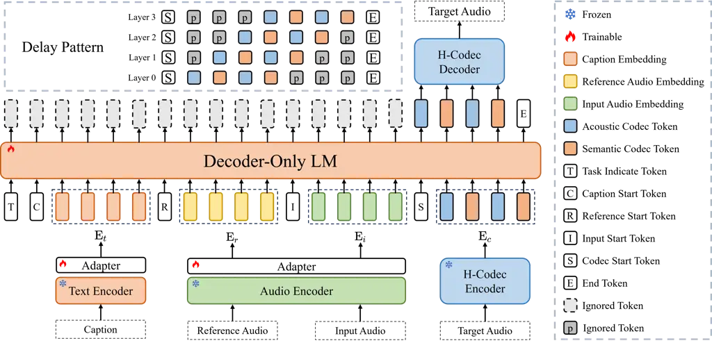
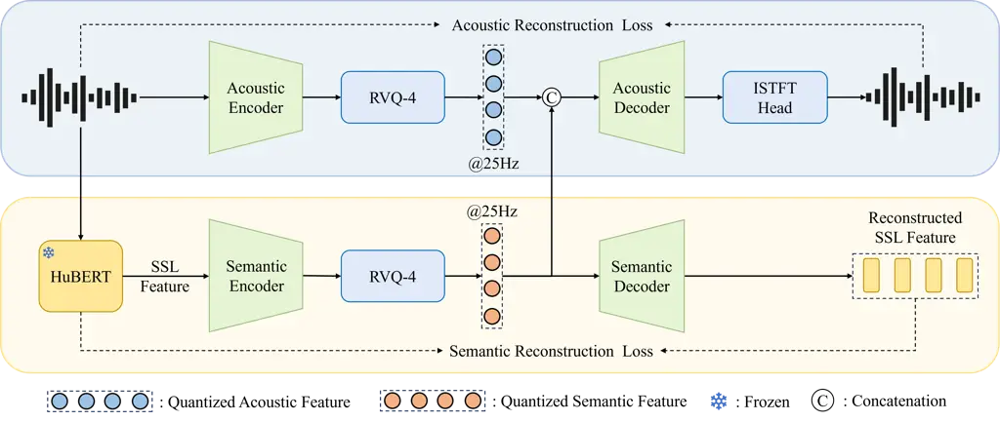

# UniTok-Audio: A Unified Audio Generation Framework via Generative Modeling on Discrete Codec Tokens

Chengwei Liu ^(†)^(†)thanks: Equal contribution.
Affiliation: Intelligent Connectivity, Alibaba Group
Email: [liuchengwei.lcw@alibaba-inc.com](mailto:)    Haoyin Yan
Affiliation: Intelligent Connectivity, Alibaba Group
Email: [shaofei.xsf@alibaba-inc.com](mailto:)    Shaofei Xue
^(†)^(†)thanks: Corresponding Author. Affiliation: Intelligent
Connectivity, Alibaba Group Affiliation: TongYi Ai lab, Alibaba Group   
Xiaotao Liang Affiliation: Intelligent Connectivity, Alibaba Group   
Yinghao Liu Affiliation: Intelligent Connectivity, Alibaba Group   
Zheng Xue Affiliation: Intelligent Connectivity, Alibaba Group    Gang
Song Affiliation: Intelligent Connectivity, Alibaba Group    Boyang Zhou
Affiliation: Intelligent Connectivity, Alibaba Group
Affiliation: Zhejiang University

###### Abstract

Generative modeling has recently achieved remarkable success across
text, image, and audio domains, demonstrating powerful capabilities for
unified representation learning. However, audio generation models still
face challenges in terms of audio quality and generalization ability
across tasks. This fragmentation results in redundant development
efforts, inconsistent performance, and limited extensibility. To address
these issues, we propose UniTok-Audio, a scalable and extensible
framework for unified audio generation tasks. Specifically, 1)
UniTok-Audio extracts continuous feature of conditions to generates
discrete tokens of target audio in an autoregressive manner; 2) a
special task identifier token unifies different learning patterns of
multiple tasks in a single framework; 3) a dual-stream audio codec
involving acoustic and semantic branch is developed for high-fidelity
waveform reconstruction. Experimental results demonstrate that
UniTok-Audio achieves competitive performance in comparation with
state-of-the-art task-specific or multi-task systems across five
time-aligned tasks: speech restoration, target speaker extraction,
speech separation, voice conversion, and language-queried audio source
separation. To foster future research, we will open-source our codebase.
The demo page of our work can be found here:
https://alibaba.github.io/unified-audio.

|     |
| --- |
|     |

## 1 Introduction

Leveraging the remarkable sequential generation capability of language
model (LM) (Vaswani et al., 2017), recent works have achieved
significant improvements in generation quality (Polyak et al., 2024;
Lipman et al., 2023), promoting the growing prevalence of artificial
intelligence-generated content (AIGC). These advances have inspired
substantial research extending LMs to various audio tasks, which can be
fundamentally categorized by the temporal relationship between input and
output: either time-aligned (TA) or non-time-aligned (NTA) (Xu et al.,
2025). The former involves strict temporal correspondence between input
and output signals, such as speech denoising, which aligns speech
components in each frame between noisy and clean speech. While the
latter dose not require point-wise temporal alignment, such as
text-to-audio (TTA), which aims at semantic coherence between the
holistical textual description and entire output soundscape.

This study focuses on the TA tasks, especially which provides the input
audio that temporally aligned with the output audio at the frame level,
including: speech restoration (SR) that aims at restoring speech from
the degraded recording with various distortions (e.g., noise,
reverberation,and packet loss); target speaker extraction (TSE) that
extracts target speech from mixture using assistive clues (e.g.,
voiceprint information from reference speech); speech separation (SS)
that aims to separate all existing speaker in the mixture; voice
conversion (VC) that transforms the timbre of source speech guided by
reference speech of another speaker; language-queried audio source
separation (LASS) that aims at extracting target audio components from
mixture, which are consistent with the given textual caption. Numerous
generative models are developed for these tasks, while most of them are
designed for single task with task-specific architectures (Yuan et al.,
2025; Lee et al., 2025; Wang et al., 2024b; Tang et al., 2025; Wang
et al., 2023b). This fragmentation results in redundant development
efforts, inconsistent performance, and limited extensibility.

Some studies aim to unify multiple tasks within a single framework,
including AnyEnhance (Zhang et al., 2025), UniAudio (Yang et al., 2024),
LLaSE-G1 (Kang et al., 2025), UniSE (Yan et al., 2025), and Metis (Wang
et al., 2025b). These methods utilizes the LM backbone combined with
discrete audio codec and exhibit remarkable generative ability, which
benefit from the semantic understanding and contextual modeling
capabilities of LMs. However, challenges still exist in terms of audio
quality and generalization ability across tasks. For instance, few
unified models are capable of handling the SS task, as it generally
requires customized architecture to output multi-track speech.

To improve audio generation quality, some works (Le et al., 2023; Vyas
et al., 2023; Wang et al., 2025c; Xu et al., 2025) adopt generative
paradigms in continuous space, such as flow matching (Lipman et al.,
2023), which eliminates the dependence on discrete codecs. However, the
flowchart of model needs to be carefully designed to support different
tasks, increasing the difficulty when extending to more tasks.
Additionally, considering the trend of combining audio generation
capabilities with large language models (LLM) (Team, 2025), developing
audio generation models based on discrete codec has greater potential.
This highlights the need for improving the ability of audio codec, which
directly affects the generation quality of audio models.

In this work, we propose UniTok-Audio, a novel decoder-only
autoregressive (AR) LM-based generative framework to unify multiple TA
tasks. The contributions of this work can be summarized as follows:

1.  1.  Unified Framework: The framework unifies tasks by taking
        task-specific conditional information as the conditioning sequence
        of decoder-only LM, and the discrete token of target audio is
        predicted in an AR manner. We utilize a special task token to
        distinguish different learning patterns of multiple tasks. Note that
        our model handles diverse tasks using a single set of shared
        weights, thereby eliminating the need for task-specific weight
        adaptation.
2.  2.  New Tokenization: We present H-codec, which integrates
        self-supervised learning (SSL) representation within the audio
        tokenization and reconstruction process. The features from waveform
        and SSL model are individually quantized, resulting dual-stream
        (acoustic and semantic) codec tokens. H-Codec achieves remarkable
        audio reconstruction quality with a low frame rate, improving both
        the efficiency and performance of downstream audio generation.
3.  3.  High-Fidelity Generation: UniTok-Audio achieves high-fidelity
        generation quality in terms of SR, TSE, SS, VC, and LASS tasks,
        demonstrating strong competitiveness compared to state-of-the-art
        (SOTA) task-specific or multi-task baselines.

## 2 Related Work

### 2.1 Generative Modeling for Audio Tasks

In the domain of TA audio tasks, early researches focus on
discriminative modeling, which directly learns the mapping between input
signal and target audio (Williamson & Wang, 2017; Luo & Mesgarani,
2019). However, the lack of generative ability limits their
generalization in unseen scenarios and the performance in extreme
situations (Welker et al., 2022; Wang et al., 2020). Many studies
integrate generative modeling into audio tasks in recent years. For the
SR task, SELM (Wang et al., 2024b) applies k-means to quantize noisy
speech representations obtained by WavLM (Chen et al., 2022) into
discrete tokens, and then a Transformer-based speech LM maps the noisy
tokens to clean tokens. For the LASS task, FlowSep (Yuan et al., 2025)
learns linear flow trajectories from noise to target source features
within the variational autoencoder (VAE) latent space, which are guided
by the encoded text embeddings and the mixture audio. However, these
models are designed for specific task, facing limited extensibility when
migrating to more tasks.

Creating an unified framework that can tackle diverse tasks stands as a
critical research goal in the field of artificial intelligence. In the
unification of audio tasks, the approaches can be divided into two
categories: discrete audio codec based method and continuous
representation based method. The former is based on the pre-trained
audio codec, which encodes the waveform into discrete space and
reconstructs audio signal from it. The generative ability of AR modeling
or masked generative modeling (Chang et al., 2022) is leveraged to
generate discrete tokens of the target audio. For instance,
UniAudio (Yang et al., 2024) tokenizes the target audio along with other
condition modalities and then concatenates source-target pair as a
single sequence, performing next-token prediction using LLM. Metis (Wang
et al., 2025b) adopts a two-stage generation framework using masked
generative modeling, which first generates SSL tokens and then predicts
acoustic tokens based the former. Continuous representation based
methods typically adopt diffusion (Ho et al., 2020) or flow matching
techniques, eliminating the inevitable quantitative loss in discrete
codec. VoiceBox (Le et al., 2023) performs flow matching on
mel-spectrograms to unify tasks such as text-to-speech (TTS) and speech
editing. UniFlow (Wang et al., 2025c) utilizes VAE to learn a compact
latent representation of raw audio, coupled with a diffusion Transformer
(DiT) (Peebles & Xie, 2023) that predicts latent updates.

Compared to discrete audio codec based method, especially decoder-only
AR models which can elegantly integrate conditional information as a
prefix sequence, continuous methods usually requires complex design to
combines multimodal conditions, limiting the extensibility to more
tasks. In addition, discrete audio representation plays an important
role in combining with LLM (Team, 2025), bridging the natural language
instructions and continuous waveform. Therefore, we develop a
decoder-only AR LM-based framework (UniTok-Audio) to unify audio tasks.
It utilizes continuous conditional embeddings to maximize the
preservation of semantic and acoustic information, predicting
multi-layer codec tokens which reduce the quantization loss.

### 2.2 Neural Audio Codec

Neural audio codecs utilize neural networks to obtain highly compressed
discrete representations of audio waveforms and aim to reconstruct
high-fidelity signal form discrete tokens. For instance,
SoundStream (Zeghidour et al., 2021) utilizes residual vector
quantization (RVQ) where each quantizer refines the residuals left by
the previous one, obtaining parallel multi-layer tokens and achieving
remarkable reconstruction quality. Many works including
Encodec (Défossez et al., 2022b) and DAC (Kumar et al., 2023) follow
this paradigm to improve performance.

With the development of LM, the research focus of codecs has gradually
shifted from reducing data transmission costs toward the integration
with LM, which ensures the high quality of generated audio. This
requires codecs (Liu et al., 2024; Défossez et al., 2024) to preserve
more semantic information that can be understood and modeled by LM.
X-Codec (Ye et al., 2024a) integrates the representations from the
pre-trained SSL model to enhance semantic preservation, improving both
reconstruction quality and downstream TTS performance. Some studies (Ji
et al., 2024; Jiang et al., 2025) explore single-layer codecs that are
more suitable for autoregressive modeling in LM. X-Codec2 (Ye et al., 2025) utilizes finite scalar quantization (FSQ) (Mentzer et al., 2024)
to perform single-layer quantization, enlarging the code space.
BiCodec (Wang et al., 2025a) generates a hybrid token stream combining
semantic and global tokens, which are derived from a SSL model and a
speaker verification model, respectively. However, single-layer codecs
with a low frame rate still faces challenges in high-fidelity
reconstruction (Ye et al., 2025), e.g., speaker similarity.

In practice, downstream LMs are capable of generating multi-layer tokens
in parallel (Copet et al., 2023; Neekhara et al., 2024), thereby
relaxing the requirement for single-layer quantization. This paradigm
relies more heavily on the modeling capacity of LMs, raising the upper
bound of the codec’s reconstruction capability. In this context, the
frame rate of codecs plays a critical role, which determines the number
of time steps for inference. Our H-Codec benefits from the RVQ technique
and SSL representations, achieving significant reconstruction quality in
the domain of speech, music, and general audio. The low frame rate
ensures efficient generation when integrated with our UniTok-Audio
framework.

## 3 UniTok-Audio

As shown in Figure 1, UniTok-Audio is a unified, autoregressive LM-based
audio generation framework comprising four key components: (i) a novel
dual-stream H-codec; (ii) a text encoder with adapter; (iii) an audio
encoder with adapter; (iv) a decoder-only LM backbone. Next, we will
introduce the architecture of H-Codec and the operational framework of
UniTok-Audio in detail.



Figure 1: The overall architecture of UniTok-Audio, which is a
straightforward model for multiple audio tasks. For simplicity, we
illustrate the AR process with single-layer codec tokens and it actually
operates in a multi-layer AR manner with delay pattern.

### 3.1 H-Codec

To improve the audio generation quality, we propose H-Codec to
discretize audio and reconstruct waveform from discrete tokens. As
illustrated in Figure 2, the architecture of H-Codec follows the common
paradigm of audio tokenizers, including an acoustic encoder, a quantizer
module, and an acoustic decoder. Inspired by X-Codec (Ye et al., 2024a),
we incorporate pretrained models to facilitate the preservation of
semantic information. However, unlike X-Codec, which fuses acoustic and
semantic information and then quantizes the combined representation
using a single codebook, we employ separate codebooks to quantize the
two types of features independently, leading to dual-stream codec
tokens.

#### 3.1.1 H-Codec Encoder

In the encoding stage, the raw waveform $`\bm{x}\in\mathbb{R}^{n}`$ is
fed into the acoustic encoder to extract frame-level acoustic features,
where $`n`$ represents the number of waveform samples. The architecture
of the acoustic encoder follows Encodec (Défossez et al., 2022b). A
4-layer RVQ (Zeghidour et al., 2021) is utilized to quantize features,
resulting in the quantized features with a frame rate of 25 Hz.
Synchronously, a pre-trained HuBERT¹¹ 1
https://huggingface.co/bosonai/hubert_base (Hsu et al., 2021) extracts
SSL features by averaging outputs from all transformer layers and the
quantized semantic feature is obtained by applying the semantic encoder
and RVQ quantizer. Note that HuBERT is trained on general audio, thus
the codec has the potential to handle general audio as well.

#### 3.1.2 H-Codec Decoder

For the waveform reconstruction, the quantized acoustic and semantic
features are concatenated along the hidden dimension, and the waveform
is reconstructed by utilizing acoustic decoder and the inverse
short-time Fourier transform (ISTFT) head following Vocos (Siuzdak,
2024). We believe that decoupling acoustic and semantic features enables
each branch to learn distinct representations, which is beneficial for
improving reconstruction quality. Additionally, the quantized semantic
feature is processed by the semantic decoder to reconstruct the SSL
feature. This ensures that the quantized semantic features retain
sufficiently rich semantic information.

#### 3.1.3 Optimization Strategy

The types of discriminators and the composition of the loss functions
follow the configuration used in WavTokenizer (Ji et al., 2024). We
employ a multi-period discriminator (MPD) (Kong et al., 2020), a
multi-resolution discriminator (MRD) (Jang et al., 2021), and a sub-band
complex STFT discriminator (Zeghidour et al., 2021) to improve the
naturalness and fidelity of reconstructed audio, and the training loss
$`\mathcal{L}_{dis}`$ conforms to the hinge loss formulation suggested
by (Zeghidour et al., 2021). The training loss for the generator of
H-Codec include: commitment loss for quantizer $`\mathcal{L}_{commit}`$,
mel-spectrum reconstruction loss $`\mathcal{L}_{mel}`$, adversarial loss
$`\mathcal{L}_{adv}`$, feature matching loss $`\mathcal{L}_{fm}`$, and
an auxiliary mean squared error (MSE) loss on SSL feature
$`\mathcal{L}_{aux}`$. The composite training loss of the generator is
obtained by

```math
\mathcal{L}_{gen}=\lambda_{commit}\mathcal{L}_{commit}+\lambda_{mel}\mathcal{L}_{mel}+\lambda_{adv}\mathcal{L}_{adv}+\lambda_{fm}\mathcal{L}_{fm}+\lambda_{aux}\mathcal{L}_{aux}, \tag{1}
```

where $`\lambda_{commit}`$, $`\lambda_{mel}`$, $`\lambda_{adv}`$,
$`\lambda_{fm}`$, and $`\lambda_{aux}`$ are hyper-parameters to scale
different loss components. Additionally, the perceptual loss (Parker
et al., 2024) is utilized during the final steps of the training
process, which further enhances the reconstruction quality.



Figure 2: The framework of our proposed H-codec.

### 3.2 Unified Multi-Task Generation

#### 3.2.1 Overall Framework

To unify various audio generation tasks within a single framework, we
extract task-specific conditional information as a conditioning sequence
for the decoder-only AR backbone, which then predicts the corresponding
H-Codec tokens of the target audio. Since continuous features, typically
extracted from SSL models, contain richer audio details compared to
discrete representations and are more adaptable to varying input
conditions, we extract continuous features to assemble the the
task-conditioning sequence. Specifically, we utilize T5-base²² 2
https://huggingface.co/google/t5-v1_1-base (Raffel et al., 2020) as the
text encoder to extract embedding from audio caption. The same HuBERT
used in H-Codec is adopted to extract continuous features from audio
waveforms. Two linear layers serve as two adapters to map the text
embedding and audio features into a representation space amenable to LM
AR modeling, respectively. Given text and audio embeddings as
conditions, we utilize LLaMA architecture (Touvron et al., 2023) to
predicts discrete tokens of target waveform in an AR manner. Finally,
the H-Codec decoder reconstructs high-fidelity audio from the predicted
token sequence.

#### 3.2.2 AR Prediction of H-Codec Tokens

To incorporate multi-layer codec tokens into AR prediction, an existing
method (Wang et al., 2023a) applies two-stage strategy: (i) model the
tokens of the first layer in an AR manner; (ii) then, predict the tokens
of remaining layers using a NAR post-network. However, this method
causes additional complexity to the system. In addition, flattening all
tokens into one layer leads to unbearable computational cost, while
predicting tokens from all layers in parallel within one step
deteriorates the performance. Therefore, we adopt the delay
pattern (Copet et al., 2023) to arrange our tokens for the trade-off
between performance and computational cost. Specifically, the 4-layer
acoustic and semantic tokens produced by H-Codec are first interleaved
sequentially across time steps, resulting in
$`{\rm E}_{c}\in\mathbb{Z}^{T\times 4}`$ with a frame rate of 50 Hz,
where $`T`$ indicates the number of frames. Before feeding the tokens
into the LM backbone, different shifts are applied across layers and
special pad tokens occupy empty positions, as shown in Figure 1. In the
LM backbone, 4 embedding layers handle 4-layer tokens respectively, and
the embeddings of each layer are added up as the input of transformer
layers. There are 4 output heads to predict the 4-layer logits of next
time step. The delay pattern allows generating high-layer tokens
conditioned by low-layer tokens, which improves prediction accuracy.

|      |                    |                                  |
| ---- | ------------------ | -------------------------------- |
| Mode | Task Token         | Conditions                       |
| SR   | $`{\rm T_{SR}}`$   | Degraded Speech                  |
| TSE  | $`{\rm T_{TSE}}`$  | Reference Speech, Mixture Speech |
| rTSE | $`{\rm T_{rTSE}}`$ | Reference Speech, Mixture Speech |
| VC   | $`{\rm T_{VC}}`$   | Reference Speech, Source Speech  |
| LASS | $`{\rm T_{LASS}}`$ | Caption, Mixture Audio           |

Table 1: Operational modes and corresponding conditions in UniTok-Audio.

#### 3.2.3 Unifying Tasks with Operational Modes

Following our previous work (Yan et al., 2025), we introduce special
task tokens to distinguish between different operational modes. To unify
five tasks (i.e., SR, TSE, SS, VC, and LASS), we utilize five modes, as
shown in Table 1. Each mode corresponds to a special token and different
task-specific condition types, which serve as a conditioning sequence
for the LM backbone to estimate the conditional probability density
distribution of target discrete tokens.

SR Mode: The target audio is the clean speech corresponding to the
degraded input speech. The conditional sequence of LM is formatted as
$`\left[{\rm T_{SR}},{\rm I},{\rm E}_{i},{\rm S}\right]`$, where
$`{\rm I}`$ denotes the start of input audio features, $`{\rm E}_{i}`$
the input audio embeddings, and $`{\rm S}`$ the start of codec tokens,
respectively. The output sequence is formulated as
$`{\bm{o}}=\left[{\rm E}^{\prime}_{c},{\rm E}\right]`$, where
$`{\rm E}^{\prime}_{c}`$ indicates codec tokens with delay pattern, and
$`{\rm E}`$ represents the end token. The trainable parameters
$`\theta`$ in the model are optimized by minimizing the negative
log-likelihood of the predicted outputs:

```math
\displaystyle\mathcal{L}_{\rm SR}=-\sum_{t=1}^{L}\sum_{i=1}^{4}{\rm log}P\left(o^{i}_{t}|{\rm T_{SR}},{\rm I},{\rm E}_{i},{\rm S},o_{<t};\theta\right), \tag{2}
```

where $`o^{i}_{t}`$ indicates the output token at $`t`$-th step and
$`i`$-th layer, and $`L`$ is the length of output sequence,
respectively.

TSE Mode: The target audio corresponds to the timbre-matched speech
component in the input mixture audio that aligns with the reference
audio. The conditional sequence is formatted as
$`\left[{\rm T_{TSE}},{\rm R},{\rm E}_{r},{\rm I},{\rm E}_{i},{\rm S}\right]`$,
where $`{\rm E}_{r}`$ and $`{\rm R}`$ represent the features of
reference speech and its start token, respectively. Therefore, the
associated loss function is defined as

```math
\displaystyle\mathcal{L}_{\rm TSE}=-\sum_{t=1}^{L}\sum_{i=1}^{4}{\rm log}P\left(o^{i}_{t}|{\rm T_{TSE}},{\rm R},{\rm E}_{r},{\rm I},{\rm E}_{i},{\rm S},o_{<t};\theta\right). \tag{3}
```

rTSE Mode: Since SS task requires generating multiple output tracks
while our model only supports one-track output, we include the rTSE mode
during training, enabling the model to obtain multiple tracks through
iterative inference. This mode aims to extract the timbre-mismatched
speech component in the mixture input when compared with the reference
speech. The loss function $`\mathcal{L}_{\rm rTSE}`$ keeps similar to
that of the TSE mode, except that the task token has been replaced with
$`{\rm T_{rTSE}}`$. When handling SS task (we only consider 2-speaker
cases), we first apply the SR mode to extract the main speaker with
higher energy, and the other speaker is obtained by using the rTSE mode.

VC Mode: The target signal is timbre-perturbed version of input source
speech using the speaker characteristics of the reference speech, where
the speech content remains unchanged. The optimization object has a
similar formulation with equation 3.

LASS Mode: This mode aims at separating specific component that matches
the given caption query from the input mixture audio. Therefore, the
associated loss function is defined as

```math
\displaystyle\mathcal{L}_{\rm LASS}=-\sum_{t=1}^{L}\sum_{i=1}^{4}{\rm log}P\left(o^{i}_{t}|{\rm T_{LASS}},{\rm C},{\rm E}_{t},{\rm I},{\rm E}_{i},{\rm S},o_{<t};\theta\right), \tag{4}
```

where $`{\rm E}_{t}`$ and $`{\rm C}`$ denote the embedding of caption
and its start token, respectively.

## 4 Experiments

### 4.1 H-Codec

#### 4.1.1 Experimental Setup

Datasets: We utilize multi-domain data to train our codec, including
speech, music, and audio. The speech samples are sourced from the VoxBox
dataset (Wang et al., 2025a), which comprises approximately 100k hours
of speech and is composed of some publicly available speech datasets.
For the music domain, we utilize the FMA-full dataset (Defferrard
et al., 2017) and the MUSDB18-HQ dataset (Rafii et al., ), involving
about 8k hours of data. For the audio domain, we adopt AudioSet (Gemmeke
et al., 2017) and WavCaps (Mei et al., 2024), including about 13k hours
of recordings. We evaluate the reconstruction quality on
LibriSpeech (Panayotov et al., 2015) test-clean, MUSDB18-HQ test, and
AudioSet eval sets for speech, music, and audio domain, respectively.
All samples are resampled to 16k Hz.

Implementation Details: The total downsampling ratio in H-Codec is set
to 640 to obtain the frame rate of 25 Hz in both acoustic and semantic
branch. In the 4-layer RVQ, we utilize a codebook size of 1024 for each
layer with the codebook dimension set to 512. During training, we
randomly crop 5-second segments from audio samples. The network is
optimized using the AdamW optimizer with an initial learning rate of
$`2\times 10^{-4}`$, which is decayed based on a cosine scheduler. In
total, we train for 600k steps, and the perceptual loss is activated at
final 100k steps.

Evaluation Metrics: We utilize several metrics to measure the
reconstruction quality of speech, including the perceptual evaluation of
speech quality (PESQ), short-time objective intelligibility (STOI),
speaker similarity (SPK-SIM) and UTMOS. The loss on Mel-scale spectrum
and STFT spectrum bettween the target audio and reconstructed audio are
computed for general evaluation in the domain of speech, music, and
audio. Details about evaluation metrics of codec can be found in
Appendix B.1.

Baselines: We compare our codec against some state-of-the-art (SOTA)
baselines, including DAC (Kumar et al., 2023), Encodec (Défossez et al.,
2022a), X-Codec (Ye et al., 2024b), X-Codec2 (Ye et al., 2025),
BiCodec (Wang et al., 2025a), WavTokenizer (Ji et al., 2024), and
UniCodec (Jiang et al., 2025). All results are obtained using their
official checkpoints.

#### 4.1.2 Experimental Results

|                |         |       |     |      |                    |                    |                     |                       |                     |
| -------------- | ------- | ----- | --- | ---- | ------------------ | ------------------ | ------------------- | --------------------- | ------------------- |
| Model          | Unified | FPS   | Nq  | BPS  | PESQ($`\uparrow`$) | STOI($`\uparrow`$) | UTMOS($`\uparrow`$) | SPK-SIM($`\uparrow`$) | WER($`\downarrow`$) |
| Ground Truth   | \-      | \-    | \-  | \-   | 4.64               | 1.00               | 4.09                | 1.00                  | 2.43                |
| Encodec        | ✗       | 75    | 8   | 6000 | 2.77               | 0.94               | 3.09                | 0.89                  | 2.64                |
| X-Codec        | ✗       | 50    | 4   | 2000 | 2.77               | 0.87               | 4.21                | 0.72                  | 3.13                |
| WavTokenizer   | ✗       | 75    | 1   | 900  | 2.39               | 0.91               | 4.00                | 0.68                  | 5.43                |
| X-Codec2       | ✗       | 50    | 1   | 800  | 2.43               | 0.92               | 4.13                | 0.82                  | 3.53                |
| BiCodec        | ✗       | 50    | 1   | 650  | 2.51               | 0.92               | 4.18                | 0.80                  | 3.23                |
| DAC            | ✓       | 50    | 4   | 2000 | 1.42               | 0.84               | 1.83                | 0.60                  | 4.32                |
| X-Codec        | ✓       | 50    | 4   | 2000 | 2.64               | 0.92               | 3.88                | 0.77                  | 3.33                |
| UniCodec       | ✓       | 75    | 1   | 900  | 2.56               | 0.92               | 4.00                | 0.76                  | 4.23                |
| WavTokenizer   | ✓       | 40    | 1   | 480  | 1.88               | 0.87               | 3.78                | 0.57                  | 10.03               |
| H-Codec (ours) | ✓       | 25+25 | 4   | 2000 | 2.99               | 0.94               | 4.06                | 0.84                  | 3.18                |

Table 2: Comparison between different codec models on LibriSpeech
test-clean set, where FPS and BPS denotes frame per second and bitrate
per second, respectively. Nq represents the number of codebook layer.
Unified indicates whether the model supports general audio or only
speech.

Speech Reconstruction Performance: As reported in Table 2, our H-Codec
achieves competitive performance at a frame rate of 50. Since
multi-layer tokens can be predicted simultaneously within a single time
step in downstream audio LM, we argue that frame rate is more critical,
as the number of time steps significantly affects computational cost.
Compared to baselines wich support general audio, H-Codec exhibits
better signal reconstruction quality (PESQ and STOI), speech naturalness
(UTMOS), speaker consistency (SPK-SIM), and semantic information
preservation (WER). Note that some models achieve higher UTMOS than the
ground truth, this can be attributed to the generative ability of codec
decoder, which generates plausible speech at the expense of inacurrate
signal alignment. Our H-Codec reports UTMOS closely matches that of the
ground truth, indicating the high fidelity of the reconstructed speech.

|                |      |                          |                            |                          |                            |                          |                            |
| -------------- | ---- | ------------------------ | -------------------------- | ------------------------ | -------------------------- | ------------------------ | -------------------------- |
| Model          | BPS  | Speech                   |                            | Music                    |                            | Audio                    |                            |
|                |      | Mel loss($`\downarrow`$) | STFT loss ($`\downarrow`$) | Mel loss($`\downarrow`$) | STFT loss ($`\downarrow`$) | Mel loss($`\downarrow`$) | STFT loss ($`\downarrow`$) |
| DAC            | 2000 | 0.6436                   | 0.1667                     | 0.8443                   | 0.2308                     | 1.9054                   | 0.5164                     |
| X-Codec        | 2000 | 0.4225                   | 0.1161                     | 0.6403                   | 0.1804                     | 1.5073                   | 0.4193                     |
| UniCodec       | 900  | 0.4147                   | 0.1201                     | 0.6488                   | 0.1999                     | 1.5403                   | 0.4760                     |
| WavTokenizer   | 480  | 0.5143                   | 0.1364                     | 0.8174                   | 0.2270                     | 1.8912                   | 0.5201                     |
| H-Codec (ours) | 2000 | 0.3394                   | 0.1033                     | 0.5158                   | 0.1667                     | 1.2512                   | 0.4070                     |

Table 3: Comparison between different codec models on speech
(LibriSpeech test-clean), music (MUSDB18-HQ test), and audio (AudioSet
eval) domain in terms of Mel loss and STFT loss.

Audio Reconstruction Performance: Table 3 presents a comprehensive
comparison of audio codec models on speech, music, and general audio
tasks. All baselines supports general audio reconstruction. Notably,
H-Codec achieves lowest Mel loss and STFT loss on all domain,
illustrating the powerful multi-domain reconstruction ability. This
ensures the potential of H-Codec for extensive downstream tasks,
including speech, music, and audio generation.

### 4.2 UniTok-Audio

Training Datasets: For the training of speech tasks, we adopt clean
speech samples from the VoxBox (Wang et al., 2025a) dataset, including
approximately 3.8k hours of data from LibriSpeech (Panayotov et al.,
2015), MLS_English (Pratap et al., 2020) and Emilia_ZH (He et al., 2024)
subset. The noise corpus comprises approximately 460 hours of data from
the DNS Challenge (Reddy et al., 2020), FSD50K (Fonseca et al., 2022),
WHAM! (Wichern et al., 2019), DESED (Turpault et al., 2019),
DEMAND (Thiemann et al., 2013), MUSAN (Snyder et al., 2015),
DISCO (Furnon et al., 2021), MUSDB18-HQ (Rafii et al., ), and TUT Urban
Acoustic Scenes (Mesaros et al., 2018). We include 60k room impulse
response (RIR) samples from SLR28 (Ko et al., 2017) to simulate
reverberation. For the audio data, we include captioned audio samples
from WavCaps (Mei et al., 2024), CLAP_FreeSound (Wu et al., 2023),
VGGSound (Chen et al., 2020), and Internal data, resulting in
approximately 40k hours. The simulation pipeline of training samples for
all operational modes are described in Appendix A.

Implementation Details: There are 16 layers with 16 attention heads and
a hidden dimension of 1024 in the LLaMA-based LM backbone, resulting in
481M trainable parameters. We also explore different model size
configurations in Appendix C. Our model is trained using AdamW optimizer
with 30 epochs, where the learning rate reaches a peak of 0.001 after
4000 warm-up steps and reduces at a decay factor of 0.98 in each epoch.
The lengths of reference audio and input signal are set to 5 seconds for
both training and inference phases. We train the multi-task version
(UniTok-Audio*(omni)) and single-task version of UniTok-Audio for
performance evaluation. For the former, one of the five operational
modes is randomly selected for every batch during training. For the
latter, we report results of models trained within single task. We also
attempt to adopt WavLM³³ 3
https://huggingface.co/microsoft/wavlm-base-plus as the audio encoder
for the single-task version. Subscripts are used to distinguish
different models (e.g., HuBERT-based and WavLM-based single-task
verisons for SR are denoted as UniTok-Audio*(sr-hubert) and
UniTok-Audio\_(sr-wavlm)).

Evaluation Metrics: We adopt multiple evaluation metrics to assess
different aspects of the generated audio across tasks. For speech tasks,
we evaluate quality by DNSMOS (SIG, BAK, OVRL) and NISQA, speaker
similarity by SIM, intelligibility by WER, and continuity by PLCMOS. For
the LASS task, we utilize FAD, CLAPScore, and CLAPScore\_(A) to measure
the audio separation performance. Details about evaluation metrics can
be found in Appendix B.2.

#### 4.2.1 SR Performance

|                           |        |                   |                   |                    |                   |                   |                    |
| ------------------------- | ------ | ----------------- | ----------------- | ------------------ | ----------------- | ----------------- | ------------------ |
| Model                     | Type   | With Reverb       |                   |                    | No Reverb         |                   |                    |
|                           |        | SIG($`\uparrow`$) | BAK($`\uparrow`$) | OVRL($`\uparrow`$) | SIG($`\uparrow`$) | BAK($`\uparrow`$) | OVRL($`\uparrow`$) |
| Noisy                     | \-     | 1.76              | 1.50              | 1.39               | 3.39              | 2.62              | 2.48               |
| Conv-TasNet               | D      | 2.42              | 2.71              | 2.01               | 3.09              | 3.34              | 3.00               |
| DEMUCS                    | D      | 2.86              | 3.90              | 2.55               | 3.58              | 4.15              | 3.35               |
| FRCRN                     | D      | 2.93              | 2.92              | 2.28               | 3.58              | 4.13              | 3.34               |
| FlowSE                    | G\_(c) | 3.60              | 4.10              | 3.33               | 3.69              | 4.20              | 3.45               |
| UniFlow                   | G\_(c) | 3.59              | 4.12              | 3.32               | 3.72              | 4.21              | 3.48               |
| SELM                      | G\_(d) | 3.16              | 3.58              | 2.70               | 3.51              | 4.10              | 3.26               |
| MaskSR                    | G\_(d) | 3.53              | 4.07              | 3.25               | 3.59              | 4.12              | 3.34               |
| AnyEnhance                | G\_(d) | 3.50              | 4.04              | 3.20               | 3.64              | 4.18              | 3.42               |
| GenSE                     | G\_(d) | 3.49              | 3.73              | 3.19               | 3.65              | 4.18              | 3.43               |
| Metis-SE                  | G\_(d) | 3.68              | 4.14              | 3.44               | 3.64              | 4.17              | 3.43               |
| LLaSE-G1                  | G\_(d) | 3.59              | 4.10              | 3.33               | 3.66              | 4.17              | 3.42               |
| UniSE                     | G\_(d) | 3.67              | 4.10              | 3.40               | 3.67              | 4.14              | 3.43               |
| UniTok-Audio\_(sr-hubert) | G\_(d) | 3.67              | 4.11              | 3.40               | 3.66              | 4.15              | 3.41               |
| UniTok-Audio\_(sr-wavlm)  | G\_(d) | 3.67              | 4.10              | 3.40               | 3.66              | 4.14              | 3.42               |
| UniTok-Audio\_(omni)      | G\_(d) | 3.67              | 4.12              | 3.42               | 3.66              | 4.15              | 3.44               |

Table 4: DNSMOS scores on the Interspeech 2020 DNS Challenge blind test
set. “D” represents discriminative approaches. “G*(c)” and “G*(d)”
denote generative methods in the continuous domain and discrete domain,
respectively. “No Reverb” subset contains only noise while “With Reverb”
subset additionally involves reverberation.

|                                 |        |                    |                      |
| ------------------------------- | ------ | ------------------ | -------------------- |
| Model                           | Type   | OVRL($`\uparrow`$) | PLCMOS($`\uparrow`$) |
| Noisy                           | \-     | 2.56               | 2.90                 |
| KuaishouNet (Li et al., 2022)   | D      | \-                 | 4.27                 |
| LPCNet (Valin et al., 2022)     | D      | 3.09               | 3.74                 |
| PLCNet (Liu et al., 2022a)      | D      | \-                 | 3.83                 |
| BS-PLCNet (Zhang et al., 2024b) | D      | 3.20               | 4.29                 |
| LLaSE-G1 (Kang et al., 2025)    | G\_(d) | 3.03               | 3.68                 |
| UniTok-Audio\_(sr-hubert)       | G\_(d) | 3.30               | 4.55                 |
| UniTok-Audio\_(sr-wavlm)        | G\_(d) | 3.33               | 4.55                 |
| UniTok-Audio\_(omni)            | G\_(d) | 3.35               | 4.58                 |

Table 5: DNSMOS OVRL and PLCMOS scores on 2022 ICASSP PLC challenge
blind test set.

Evaluation Configuration: We evaluate speech restoration performance on
the synthetic test sets of 2020 DNS Challenge (Reddy et al., 2020)
(including “With Reverb” and “No Reverb”) and 2022 PLC Challenge (Diener
et al., 2022) blind test set. Baselines include Conv-TasNet (Luo &
Mesgarani, 2019), DEMUCS (Défossez et al., 2019), FRCRN (Zhao et al.,
2022), FlowSE (Lee et al., 2025), UniFlow (Wang et al., 2025c),
SELM (Wang et al., 2024b), MaskSR (Li et al., 2024), AnyEnhance (Zhang
et al., 2025), GenSE (Yao et al., 2025), Metis-SE (Wang et al., 2025b),
LLaSE-G1 (Kang et al., 2025), UniSE (Yan et al., 2025), KuaishouNet (Li
et al., 2022), LPCNet (Valin et al., 2022), PLCNet (Liu et al., 2022a),
and BS-PLCNet (Zhang et al., 2024b).

Results: Table 4 presents the SR performance comparison on 2020 DNS
Challenge test sets. It is clear that generative models generally
outperform discriminative ones. Continuous-domain generative approaches
perform well on the “No Reverb” subset, highlighting the potential of
continuous methods in terms of generated signal quality. However,
discrete-domain generative approaches can perform better under
reverberant conditions, indicating that discrete representations may
simplify the modeling difficulty of reverberation components. Our
UniTok-Audio achieves comparable performance among SOTA baselines, and
the single-task versions with different audio encoders result in similar
performance to UniTok-Audio\_(omni). In addition, Table 5 reports the
performance on packet loss concealment (PLC), a subtask of SR aimed at
recovering speech frames lost during transmission. UniTok-Audio
surpasses baselines in terms of both signal quality and continuity,
showing powerful content understanding and generation capabilities of
the framework.

#### 4.2.2 TSE Performance

|                            |        |                   |                   |                    |                     |                   |
| -------------------------- | ------ | ----------------- | ----------------- | ------------------ | ------------------- | ----------------- |
| Model                      | Type   | SIG($`\uparrow`$) | BAK($`\uparrow`$) | OVRL($`\uparrow`$) | NISQA($`\uparrow`$) | SIM($`\uparrow`$) |
| Mixture                    | \-     | 3.38              | 3.10              | 2.65               | 2.45                | 0.85              |
| Spex+                      | D      | 3.38              | 3.77              | 3.00               | 3.03                | 0.96              |
| WeSep                      | D      | 3.56              | 3.93              | 3.23               | 4.04                | 0.99              |
| TSELM-L                    | G\_(d) | 3.55              | 4.08              | 3.23               | 4.03                | 0.91              |
| AnyEnhance                 | G\_(d) | 3.64              | 4.07              | 3.35               | 4.28                | 0.91              |
| LLaSE-G1                   | G\_(d) | 3.53              | 4.01              | 3.22               | 3.89                | 0.92              |
| Metis-TSE                  | G\_(d) | 3.65              | 4.08              | 3.34               | 4.36                | \-                |
| LauraTSE                   | G\_(d) | 3.61              | 4.08              | 3.34               | 4.33                | 0.97              |
| UniSE                      | G\_(d) | 3.62              | 4.06              | 3.33               | 4.00                | 0.95              |
| UniTok-Audio\_(tse-hubert) | G\_(d) | 3.58              | 4.03              | 3.31               | 3.97                | 0.95              |
| UniTok-Audio\_(tse-wavlm)  | G\_(d) | 3.60              | 4.04              | 3.32               | 3.99                | 0.95              |
| UniTok-Audio\_(omni)       | G\_(d) | 3.62              | 4.05              | 3.32               | 4.00                | 0.95              |

Table 6: TSE results on Libri2Mix clean test set.

Evaluation Configuration: The performance of TSE is evaluated on the
Libri2Mix (Cosentino et al., 2020) clean test set. Baselines include
Spex+ (Ge et al., 2020), WeSep (Wang et al., 2024a), TSELM-L (Tang
et al., 2024), AnyEnhance (Zhang et al., 2025), LLaSE-G1 (Kang et al.,
2025), Metis-TSE  (Wang et al., 2025b), LauraTSE (Tang et al., 2025),
and UniSE (Yan et al., 2025).

Results: Table 6 shows the performance comparison for TSE task. The
results indicate that generative methods achieve higher speech quality
than discriminative approaches but struggle with speaker similarity.
This can be attributed to the upper bound limitation of codecs’
reconstruction fidelity (Yan et al., 2025). Our UniTok-Audio maintains
comparable performance compared to SOTA baselines, demonstrating the
feasibility of constructing a unified framework.

#### 4.2.3 SS Performance

|                                  |        |                   |                   |                    |                   |                   |                    |
| -------------------------------- | ------ | ----------------- | ----------------- | ------------------ | ----------------- | ----------------- | ------------------ |
| Model                            | Type   | Libri2Mix         |                   |                    | WSJ0-2mix         |                   |                    |
|                                  |        | SIG($`\uparrow`$) | BAK($`\uparrow`$) | OVRL($`\uparrow`$) | SIG($`\uparrow`$) | BAK($`\uparrow`$) | OVRL($`\uparrow`$) |
| Mixture                          | \-     | 2.33              | 1.66              | 1.64               | 3.42              | 3.20              | 2.76               |
| Sepformer (Subakan et al., 2021) | D      | 3.33              | 3.88              | 3.02               | 3.43              | 3.96              | 3.14               |
| Mossformer2 (Zhao et al., 2024)  | D      | 3.44              | 3.94              | 3.11               | 3.50              | 4.05              | 3.23               |
| LLaSE-G1 (Kang et al., 2025)     | G\_(d) | 3.48              | 3.83              | 3.11               | 3.52              | 3.92              | 3.19               |
| UniTok-Audio\_(omni)             | G\_(d) | 3.56              | 4.04              | 3.25               | 3.57              | 3.96              | 3.26               |

Table 7: SS results on Libri2Mix and WSJ0-2mix test sets.

Evaluation Configuration: We evaluate SS performance on Libri2Mix noisy
test set and WSJ0-2mix (Hershey et al., 2016) test set, where the former
additionally evaluates the denoising ability of models. Baselines
include Sepformer (Subakan et al., 2021), Mossformer2 (Zhao et al.,
2024), and LLaSE-G1 (Kang et al., 2025).

Results: Table 7 reports the performance comparison for SS task, showing
that our model achieves superior performance than baselines. This
verifies the effectiveness of our iterative inference strategy in
handling the SS task that requires multiple output tracks. Note that
although the experiments are conducted with the 2-speaker configuration,
our approach can be extended to scenarios with more sources when the
target signal of rTSE mode is defined as all remaining speakers. The
single-task version is not reported since the inference phase of SS
requires the cooperation of multiple modes.

#### 4.2.4 VC Performance

|                           |        |                     |                   |                      |                     |
| ------------------------- | ------ | ------------------- | ----------------- | -------------------- | ------------------- |
| Model                     | Type   | WER($`\downarrow`$) | SIM($`\uparrow`$) | DNSMOS($`\uparrow`$) | NISQA($`\uparrow`$) |
| HierSpeech++              | G\_(c) | 4.87                | 0.38              | 3.40                 | 3.79                |
| LM-VC                     | G\_(d) | 8.35                | 0.29              | 3.46                 | 3.93                |
| UniAudio                  | G\_(d) | 9.00                | 0.25              | 3.47                 | 4.28                |
| Vevo                      | G\_(c) | 3.48                | 0.38              | 3.47                 | 4.30                |
| Metis-VC                  | G\_(d) | 4.49                | 0.50              | 3.48                 | 4.46                |
| UniTok-Audio\_(vc-hubert) | G\_(d) | 4.15                | 0.48              | 3.42                 | 4.43                |
| UniTok-Audio\_(vc-wavlm)  | G\_(d) | 3.02                | 0.51              | 3.46                 | 4.46                |
| UniTok-Audio\_(omni)      | G\_(d) | 4.23                | 0.50              | 3.51                 | 4.51                |

Table 8: Performance comparison on the VC task.

Evaluation Configuration: Following (Wang et al., 2025b), we create test
set for the VC task using VCTK (Veaux et al., 2017) dataset. We randomly
select 200 recordings from the dataset as source speech, and for each
source sample, a sample from another speaker is picked as the reference
speech. Baselines include HierSpeech++ (Lee et al., 2023), LM-VC (Wang
et al., 2023b), UniAudio (Yang et al., 2024), Vevo (Zhang et al.,
2024a), and Metis (Wang et al., 2025b).

Results: VC results are presented in Table 8, showing the superiority of
UniTok-Audio in speech quality, speaker similarity, and intelligibility.
We observe that UniTok-Audio*(vc-wavlm) outperforms
UniTok-Audio*(vc-hubert), indicating that WavLM performs better in
extracting semantic information and speaker characteristics. The
performance degrades when extending to multiple tasks from single-task
version, implying the distinct pattern between VC and other tasks, where
the former changes the property of the input signal rather than
restoring or extracting certain components.

#### 4.2.5 LASS Performance

|                             |        |                     |                         |                              |
| --------------------------- | ------ | ------------------- | ----------------------- | ---------------------------- |
| Model                       | Type   | FAD($`\downarrow`$) | CLAPScore($`\uparrow`$) | CLAPScore\_(A)($`\uparrow`$) |
| Mixture                     | \-     | \-                  | 23.83                   | 60.39                        |
| LASS-Net                    | D      | 2.57                | 23.04                   | 65.14                        |
| FlowSep                     | G\_(c) | 0.50                | 20.00                   | 63.47                        |
| UniTok-Audio\_(lass-hubert) | G\_(d) | 0.68                | 28.85                   | 65.56                        |
| UniTok-Audio\_(omni)        | G\_(d) | 1.48                | 26.21                   | 61.21                        |

Table 9: LASS results on 2024 DCASE LASS validation set.

Evaluation Configuration: We adopt 2024 DCASE LASS⁴⁴ 4
https://dcase.community/challenge2024/task-language-queried-audio-source-separation
validation set to evaluate the LASS performance, which contains 3k
synthetic mixtures mixed from 1k audio clips. Baselines include
LASS-Net (Liu et al., 2022b) and FlowSep (Yuan et al., 2025).

Results: As shown in Table 9, UniTok-Audio achieves competitive
performance in the LASS task, indicating effective exploitation of
textual information. We prove that the unified domain codec has
potential to handle the LASS tasks. The single-task version outperforms
UniTok-Audio\_(omni), which can be attributed to the domain gap between
speech and audio.

## 5 Conclusion

In this work, we propose UniTok-Audio, a framework that resembles
multiple time-aligned audio tasks. We uniify different learning patterns
of multiple tasks in a single framework using a special task token,
which indicates current operational mode of model. This paper also
introduces H-Codec, achieving high-fidelity reconstruction quality with
dual-stream architecture that quantize acoustic and semantic features
simultaneously. Based on H-Codec, UniTok-Audio adopts continuous
conditional embeddings to generates multi-layer discrete tokens in
parallel. Extensive experiments demonstrate that UniTok-Audio achieves
competitive performance across diverse tasks with limited training data
and moderate model size, highlighting its potential as a foundation
model for unified AR audio generation.

## References

- Andersen et al. (2017) Asger Heidemann Andersen, Jan Mark de Haan,
  Zheng-Hua Tan, and Jesper Jensen. A non-intrusive short-time objective
  intelligibility measure. In _2017 IEEE International Conference on
  Acoustics, Speech and Signal Processing (ICASSP)_, pp. 5085–5089.
  IEEE, 2017.
- Chang et al. (2022) Huiwen Chang, Han Zhang, Lu Jiang, Ce Liu, and
  William T. Freeman. MaskGIT: Masked generative image transformer. In
  _Proceedings of the IEEE/CVF conference on computer vision and pattern
  recognition_, pp. 11305–11315, 2022. doi:
  10.1109/CVPR52688.2022.01103.
- Chen et al. (2020) Honglie Chen, Weidi Xie, Andrea Vedaldi, and Andrew
  Zisserman. VGGSound: A large-scale audio-visual dataset. In _IEEE
  International Conference on Acoustics, Speech and Signal Processing_,
  pp. 721–725. IEEE, 2020.
- Chen et al. (2022) Sanyuan Chen, Chengyi Wang, Zhengyang Chen, Yu Wu,
  Shujie Liu, Zhuo Chen, Jinyu Li, Naoyuki Kanda, Takuya Yoshioka, Xiong
  Xiao, et al. Wavlm: Large-scale self-supervised pre-training for full
  stack speech processing. _IEEE Journal of Selected Topics in Signal
  Processing_, 16(6):1505–1518, 2022.
- Copet et al. (2023) Jade Copet, Felix Kreuk, Itai Gat, Tal Remez,
  David Kant, Gabriel Synnaeve, Yossi Adi, and Alexandre Défossez.
  Simple and controllable music generation. _arXiv preprint
  arXiv:2306.05284_, 2023.
- Cosentino et al. (2020) Joris Cosentino, Manuel Pariente, Samuele
  Cornell, Antoine Deleforge, and Emmanuel Vincent. LibriMix: An
  open-source dataset for generalizable speech separation. _arXiv
  preprint arXiv:2005.11262_, 2020.
- Defferrard et al. (2017) Michaël Defferrard, Kirell Benzi, Pierre
  Vandergheynst, and Xavier Bresson. FMA: A dataset for music analysis.
  _arXiv preprint arXiv:1612.01840_, 2017.
- Défossez et al. (2022a) Alexandre Défossez, Jade Copet, Gabriel
  Synnaeve, and Yossi Adi. High fidelity neural audio compression.
  _arXiv preprint arXiv:2210.13438_, 2022a.
- Défossez et al. (2022b) Alexandre Défossez, Jade Copet, Gabriel
  Synnaeve, and Yossi Adi. High fidelity neural audio compression.
  _arXiv preprint arXiv:2210.13438_, 2022b.
- Défossez et al. (2024) Alexandre Défossez, Laurent Mazaré, Manu
  Orsini, Amélie Royer, Patrick Pérez, Hervé Jégou, Edouard Grave, and
  Neil Zeghidour. Moshi: a speech-text foundation model for real-time
  dialogue. _arXiv preprint arXiv:2410.00037_, 2024.
- Diener et al. (2022) Lorenz Diener, Sten Sootla, Solomiya Branets,
  Ando Saabas, Robert Aichner, and Ross Cutler. Interspeech 2022 audio
  deep packet loss concealment challenge. In _Interspeech_, pp.
  580–584, 2022. doi: 10.21437/Interspeech.2022-10829.
- Diener et al. (2023) Lorenz Diener, Marju Purin, Sten Sootla, Ando
  Saabas, Robert Aichner, and Ross Cutler. PLCMOS - A data-driven
  non-intrusive metric for the evaluation of packet loss concealment
  algorithms. In _INTERSPEECH_, pp. 2533–2537. ISCA, 2023.
- Défossez et al. (2019) Alexandre Défossez, Nicolas Usunier, Léon
  Bottou, and Francis Bach. Demucs: Deep extractor for music sources
  with extra unlabeled data remixed. _arXiv preprint
  arXiv:1909.01174_, 2019.
- Fonseca et al. (2022) Eduardo Fonseca, Xavier Favory, Jordi Pons,
  Frederic Font, and Xavier Serra. FSD50K: An open dataset of
  human-labeled sound events. _IEEE/ACM Trans. Audio, Speech, Lang.
  Process._, 30:829–852, 2022.
- Furnon et al. (2021) Nicolas Furnon, Romain Serizel, Slim Essid, and
  Irina Illina. DNN-based mask estimation for distributed speech
  enhancement in spatially unconstrained microphone arrays. _IEEE/ACM
  Trans. Audio, Speech, Lang. Process._, 29:2310–2323, 2021.
- Ge et al. (2020) Meng Ge, Chenglin Xu, Longbiao Wang, Eng Siong Chng,
  Jianwu Dang, and Haizhou Li. SpEx+: A complete time domain speaker
  extraction network. In _Proc. Interspeech_, pp. 1406–1410, 2020.
- Gemmeke et al. (2017) Jort F Gemmeke, Daniel PW Ellis, Dylan Freedman,
  Aren Jansen, Wade Lawrence, R Channing Moore, Manoj Plakal, and Marvin
  Ritter. AudioSet: An ontology and human-labeled dataset for audio
  events. In _Proceedings of the Conference of the International Speech
  Communication Association_, pp. 776–780. IEEE, 2017.
- He et al. (2024) Haorui He, Zengqiang Shang, Chaoren Wang, Xuyuan Li,
  Yicheng Gu, Hua Hua, Liwei Liu, Chen Yang, Jiaqi Li, Peiyang Shi,
  Yuancheng Wang, Kai Chen, Pengyuan Zhang, and Zhizheng Wu. Emilia: An
  extensive, multilingual, and diverse speech dataset for large-scale
  speech generation. In _Proc. SLT_, pp. 885–890, 2024.
- Hershey et al. (2016) John R. Hershey, Zhuo Chen, Jonathan Le Roux,
  and Shinji Watanabe. Deep clustering: Discriminative embeddings for
  segmentation and separation. In _IEEE International Conference on
  Acoustics, Speech and Signal Processing_, pp. 31–35, 2016. doi:
  10.1109/ICASSP.2016.7471631.
- Ho et al. (2020) Jonathan Ho, Ajay Jain, and Pieter Abbeel. Denoising
  diffusion probabilistic models. _Advances in Neural Information
  Processing Systems_, 33:6840–6851, 2020.
- Hsu et al. (2021) Wei-Ning Hsu, Benjamin Bolte, Yao-Hung Hubert Tsai,
  Kushal Lakhotia, Ruslan Salakhutdinov, and Abdelrahman Mohamed.
  Hubert: Self-supervised speech representation learning by masked
  prediction of hidden units. _IEEE/ACM Transactions on Audio, Speech,
  and Language Processing_, 29:3451–3460, 2021.
- Jang et al. (2021) Won Jang, Dan Lim, Jaesam Yoon, Bongwan Kim, and
  Juntae Kim. UnivNet: A neural vocoder with multi-resolution
  spectrogram discriminators for high-fidelity waveform generation. In
  _Proceedings of the Conference of the International Speech
  Communication Association_, pp. 2207–2211, 2021. doi:
  10.21437/Interspeech.2021-1016.
- Ji et al. (2024) Shengpeng Ji, Ziyue Jiang, Wen Wang, Yifu Chen,
  Minghui Fang, Jialong Zuo, Qian Yang, Xize Cheng, Zehan Wang, Ruiqi
  Li, et al. Wavtokenizer: an efficient acoustic discrete codec
  tokenizer for audio language modeling. _arXiv preprint
  arXiv:2408.16532_, 2024.
- Jiang et al. (2025) Yidi Jiang, Qian Chen, Shengpeng Ji, Yu Xi, Wen
  Wang, Chong Zhang, Xianghu Yue, ShiLiang Zhang, and Haizhou Li.
  UniCodec: Unified audio codec with single domain-adaptive codebook. In
  Wanxiang Che, Joyce Nabende, Ekaterina Shutova, and Mohammad Taher
  Pilehvar (eds.), _Proceedings of the 63rd Annual Meeting of the
  Association for Computational Linguistics (Volume 1: Long Papers)_,
  pp. 19112–19124, Vienna, Austria, July 2025. Association for
  Computational Linguistics. doi: 10.18653/v1/2025.acl-long.937. URL
  [https://aclanthology.org/2025.acl-long.937/](https://aclanthology.org/2025.acl-long.937/).
- Kang et al. (2025) Boyi Kang, Xinfa Zhu, Zihan Zhang, Zhen Ye,
  Mingshuai Liu, Ziqian Wang, Yike Zhu, Guobin Ma, Jun Chen, Longshuai
  Xiao, Chao Weng, Wei Xue, and Lei Xie. LLaSE-g1: Incentivizing
  generalization capability for LLaMA-based speech enhancement. In
  _Proceedings of the 63rd Annual Meeting of the Association for
  Computational Linguistics (Volume 1: Long Papers)_, pp. 13292–13305,
  Vienna, Austria, July 2025. Association for Computational Linguistics.
  ISBN 979-8-89176-251-0. doi: 10.18653/v1/2025.acl-long.651. URL
  [https://aclanthology.org/2025.acl-long.651/](https://aclanthology.org/2025.acl-long.651/).
- Kilgour et al. (2018) Kevin Kilgour, Mauricio Zuluaga, Dominik Roblek,
  and Matthew Sharifi. Fr$`\backslash`$’echet audio distance: A metric
  for evaluating music enhancement algorithms. _arXiv preprint
  arXiv:1812.08466_, 2018.
- Ko et al. (2017) Tom Ko, Vijayaditya Peddinti, Daniel Povey,
  Michael L. Seltzer, and Sanjeev Khudanpur. A study on data
  augmentation of reverberant speech for robust speech recognition. In
  _IEEE International Conference on Acoustics, Speech and Signal
  Processing_, pp. 5220–5224, 2017. doi: 10.1109/ICASSP.2017.7953152.
- Kong et al. (2020) Jungil Kong, Jaehyeon Kim, and Jaekyoung Bae.
  HiFi-GAN: Generative adversarial networks for efficient and high
  fidelity speech synthesis. In _Advances in Neural Information
  Processing Systems_, volume 33, pp. 17022–17033. Curran Associates,
  Inc., 2020.
- Kumar et al. (2023) Rithesh Kumar, Prem Seetharaman, Alejandro Luebs,
  Ishaan Kumar, and Kundan Kumar. High-fidelity audio compression with
  improved RVQGAN. In _Thirty-seventh Conference on Neural Information
  Processing Systems_, 2023. URL
  [https://openreview.net/forum?id=qjnl1QUnFA](https://openreview.net/forum?id=qjnl1QUnFA).
- Le et al. (2023) Matthew Le, Apoorv Vyas, Bowen Shi, Brian Karrer,
  Leda Sari, Rashel Moritz, Mary Williamson, Vimal Manohar, Yossi Adi,
  Jay Mahadeokar, and Wei-Ning Hsu. Voicebox: text-guided multilingual
  universal speech generation at scale. In _Proceedings of the 37th
  International Conference on Neural Information Processing Systems_,
  NIPS ’23, Red Hook, NY, USA, 2023. Curran Associates Inc.
- Lee et al. (2023) Sang-Hoon Lee, Ha-Yeong Choi, Seung-Bin Kim, and
  Seong-Whan Lee. Hierspeech++: Bridging the gap between semantic and
  acoustic representation of speech by hierarchical variational
  inference for zero-shot speech synthesis. _arXiv preprint
  arXiv:2311.12454_, 2023.
- Lee et al. (2025) Seonggyu Lee, Sein Cheong, Sangwook Han, and
  Jong Won Shin. FlowSE: Flow Matching-based Speech Enhancement. In
  _IEEE International Conference on Acoustics, Speech and Signal
  Processing_, 2025.
- Li et al. (2022) Nan Li, Xiguang Zheng, Chen Zhang, Liang Guo, and
  Bing Yu. End-to-end multi-loss training for low delay packet loss
  concealment. In _Interspeech 2022_, pp. 585–589, 2022. doi:
  10.21437/Interspeech.2022-11439.
- Li et al. (2024) Xu Li, Qirui Wang, and Xiaoyu Liu. MaskSR: Masked
  Language Model for Full-band Speech Restoration. In _Interspeech
  2024_, pp. 2275–2279, 2024. doi: 10.21437/Interspeech.2024-1584.
- Lipman et al. (2023) Yaron Lipman, Ricky TQ Chen, Heli Ben-Hamu,
  Maximilian Nickel, and Matthew Le. Flow matching for generative
  modeling. In _Proceedings of the International Conference on Learning
  Representations_, 2023.
- Liu et al. (2022a) B. Liu, Q. Song, M. Yang, W. Yuan, and T. Wang.
  Plcnet: Realtime packet loss concealment with semi-supervised
  generative adversarial network. In _Interspeech_, pp. 575–579, 2022a.
- Liu et al. (2024) Haohe Liu, Xuenan Xu, Yi Yuan, Mengyue Wu, Wenwu
  Wang, and Mark D Plumbley. Semanticodec: An ultra low bitrate semantic
  audio codec for general sound. _arXiv preprint
  arXiv:2405.00233_, 2024.
- Liu et al. (2022b) Xubo Liu et al. Separate what you describe:
  Language-queried audio source separation. In _ICASSP_, pp. … IEEE,
  2022b.
- Luo & Mesgarani (2019) Yi Luo and Nima Mesgarani. Conv-TasNet:
  Surpassing ideal time-frequency magnitude masking for speech
  separation. _IEEE/ACM Trans. Audio, Speech, Lang. Process._,
  27(8):1256–1266, 2019. doi: 10.1109/TASLP.2019.2915167.
- Mei et al. (2024) Xinhao Mei, Chutong Meng, Haohe Liu, Qiuqiang Kong,
  Tom Ko, Chengqi Zhao, Mark D Plumbley, Yuexian Zou, and Wenwu Wang.
  WavCaps: A ChatGPT-assisted weakly-labelled audio captioning dataset
  for audio-language multimodal research. _IEEE/ACM Transactions on
  Audio, Speech, and Language Processing_, 32:3339–3354, 2024.
- Mentzer et al. (2024) Fabian Mentzer, David Minnen, Eirikur Agustsson,
  and Michael Tschannen. Finite scalar quantization: VQ-VAE made simple.
  In B. Kim, Y. Yue, S. Chaudhuri, K. Fragkiadaki, M. Khan, and Y. Sun
  (eds.), _International Conference on Representation Learning_, volume
  2024, pp. 51772–51783, 2024. URL
  [https://proceedings.iclr.cc/paper_files/paper/2024/file/e2dd53601de57c773343a7cdf09fae1c-Paper-Conference.pdf](https://proceedings.iclr.cc/paper_files/paper/2024/file/e2dd53601de57c773343a7cdf09fae1c-Paper-Conference.pdf).
- Mesaros et al. (2018) Annamaria Mesaros, Toni Heittola, and Tuomas
  Virtanen. A multi-device dataset for urban acoustic scene
  classification. In _Proc. DCASE_, pp. 9–13, 2018.
- Mittag et al. (2021) Gabriel Mittag, Babak Naderi, Assmaa Chehadi, and
  Sebastian Möller. Nisqa: A deep cnn-self-attention model for
  multidimensional speech quality prediction with crowdsourced datasets.
  _arXiv preprint arXiv:2104.09494_, 2021.
- Neekhara et al. (2024) Paarth Neekhara, Shehzeen Hussain, Subhankar
  Ghosh, Jason Li, and Boris Ginsburg. Improving robustness of llm-based
  speech synthesis by learning monotonic alignment. In _Interspeech_,
  pp. 3425–3429, 2024. doi: 10.21437/Interspeech.2024-335.
- Panayotov et al. (2015) Vassil Panayotov, Guoguo Chen, Daniel Povey,
  and Sanjeev Khudanpur. Librispeech: An asr corpus based on public
  domain audio books. In _Proc. ICASSP_, pp. 5206–5210, 2015. URL
  [https://ieeexplore.ieee.org/document/7178964](https://ieeexplore.ieee.org/document/7178964).
- Parker et al. (2024) Julian D Parker, Anton Smirnov, Jordi Pons,
  CJ Carr, Zack Zukowski, Zach Evans, and Xubo Liu. Scaling transformers
  for low-bitrate high-quality speech coding. _arXiv preprint
  arXiv:2411.19842_, 2024.
- Peebles & Xie (2023) William Peebles and Saining Xie. Scalable
  diffusion models with Transformers. In _2023 IEEE/CVF International
  Conference on Computer Vision (ICCV)_, pp. 4172–4182, 2023. doi:
  10.1109/ICCV51070.2023.00387.
- Polyak et al. (2024) Adam Polyak, Amit Zohar, Andrew Brown, Andros
  Tjandra, Animesh Sinha, Ann Lee, Apoorv Vyas, Bowen Shi, Chih-Yao Ma,
  Ching-Yao Chuang, et al. Movie Gen: A cast of media foundation models.
  _arXiv preprint arXiv:2410.13720_, 2024.
- Pratap et al. (2020) Vineel Pratap, Qiantong Xu, Anuroop Sriram,
  Gabriel Synnaeve, and Ronan Collobert. MLS: A large-scale multilingual
  dataset for speech research. In _Proc. Interspeech_, pp.
  2757–2761, 2020.
- Radford et al. (2023) Alec Radford, Jong Wook Kim, Tao Xu, Greg
  Brockman, Christine McLeavey, and Ilya Sutskever. Robust speech
  recognition via large-scale weak supervision. In _Proceedings of the
  International Conference on Machine Learning_, pp. 28492–28518.
  PMLR, 2023.
- Raffel et al. (2020) Colin Raffel, Noam Shazeer, Adam Roberts,
  Katherine Lee, Sharan Narang, Michael Matena, Yanqi Zhou, Wei Li, and
  Peter J. Liu. Exploring the limits of transfer learning with a unified
  text-to-text transformer. _Journal of Machine Learning Research_,
  21(140):1–67, 2020. URL
  [http://jmlr.org/papers/v21/20-074.html](http://jmlr.org/papers/v21/20-074.html).
- (52) Zafar Rafii, Antoine Liutkus, Fabian-Robert Stöter,
  Stylianos Ioannis Mimilakis, and Rachel Bittner. MUSDB18-HQ - an
  uncompressed version of MUSDB18. \[Online\]. Available:
  [https://doi.org/10.5281/zenodo.3338373](https://doi.org/10.5281/zenodo.3338373).
- Reddy et al. (2020) Chandan K. A. Reddy, Vishak Gopal, Ross Cutler,
  Ebrahim Beyrami, Roger Cheng, Harishchandra Dubey, Sergiy Matusevych,
  Robert Aichner, Ashkan Aazami, Sebastian Braun, Puneet Rana, Sriram
  Srinivasan, and Johannes Gehrke. The interspeech 2020 deep noise
  suppression challenge: Datasets, subjective testing framework, and
  challenge results. In _Proc. Interspeech_, pp. 2492–2496, 2020.
- Reddy et al. (2022) Chandan K A Reddy, Vishak Gopal, and Ross Cutler.
  Dnsmos p.835: A non-intrusive perceptual objective speech quality
  metric to evaluate noise suppressors, 2022. URL
  [https://arxiv.org/abs/2110.01763](https://arxiv.org/abs/2110.01763).
- Rix et al. (2001) Antony W Rix, John G Beerends, Michael P Hollier,
  and Andries P Hekstra. Perceptual evaluation of speech quality
  (pesq)-a new method for speech quality assessment of telephone
  networks and codecs. In _IEEE International Conference on Acoustics,
  Speech and Signal Processing_, volume 2, pp. 749–752. IEEE, 2001.
- Saeki et al. (2022) Takaaki Saeki, Detai Xin, Wataru Nakata, Tomoki
  Koriyama, Shinnosuke Takamichi, and Hiroshi Saruwatari. Utmos:
  Utokyo-sarulab system for voicemos challenge 2022. _arXiv preprint
  arXiv:2204.02152_, 2022.
- Siuzdak (2024) Hubert Siuzdak. Vocos: Closing the gap between
  time-domain and fourier-based neural vocoders for high-quality audio
  synthesis. In B. Kim, Y. Yue, S. Chaudhuri, K. Fragkiadaki, M. Khan,
  and Y. Sun (eds.), _Proceedings of the International Conference on
  Learning Representations_, volume 2024, pp. 25719–25733, 2024. URL
  [https://proceedings.iclr.cc/paper_files/paper/2024/file/6db0903efdfe9b1bbafb015c10990b78-Paper-Conference.pdf](https://proceedings.iclr.cc/paper_files/paper/2024/file/6db0903efdfe9b1bbafb015c10990b78-Paper-Conference.pdf).
- Snyder et al. (2015) David Snyder, Guoguo Chen, and Daniel Povey.
  MUSAN: A music, speech, and noise corpus. _arXiv preprint
  arXiv:1510.08484_, 2015.
- Subakan et al. (2021) Cem Subakan, Mirco Ravanelli, Samuele Cornell,
  Mirko Bronzi, and Jianyuan Zhong. Attention is all you need in speech
  separation. In _Proc. ICASSP_, pp. 21–25, 2021.
- Tang et al. (2024) Beilong Tang, Bang Zeng, and Ming Li. TSELM: Target
  speaker extraction using discrete tokens and language models. _arXiv
  preprint arXiv:2409.07841_, 2024.
- Tang et al. (2025) Beilong Tang, Bang Zeng, and Ming Li. LauraTSE:
  Target speaker extraction using auto-regressive decoder-only language
  models. _arXiv preprint arXiv:2504.07402_, 2025.
- Team (2025) Qwen Team. Qwen3-Omni technical report. _arXiv preprint
  arXiv:2509.17765_, 2025.
- Thiemann et al. (2013) Joachim Thiemann, Nobutaka Ito, and Emmanuel
  Vincent. The diverse environments multi-channel acoustic noise
  database: A database of multichannel environmental noise recordings.
  _J. Acoust. Soc. Am._, 133:3591–3591, 2013.
- Touvron et al. (2023) Hugo Touvron, Thibaut Lavril, Gautier Izacard,
  Xavier Martinet, Marie-Anne Lachaux, Timothée Lacroix, Baptiste
  Rozière, Naman Goyal, Eric Hambro, Faisal Azhar, Aurelien Rodriguez,
  Armand Joulin, Edouard Grave, and Guillaume Lample. LLaMA: Open and
  efficient foundation language models. _arXiv preprint
  arXiv:2302.13971_, 2023.
- Turpault et al. (2019) Nicolas Turpault, Romain Serizel, Justin
  Salamon, and Ankit Parag Shah. Sound event detection in domestic
  environments with weakly labeled data and soundscape synthesis. In
  Michael I. Mandel, Justin Salamon, and Daniel P. W. Ellis (eds.),
  _Proc. DCASE_, pp. 253–257, 2019.
- Valin et al. (2022) Jean-Marc Valin, Ahmed Mustafa, Christopher
  Montgomery, Timothy B. Terriberry, Michael Klingbeil, Paris Smaragdis,
  and Arvindh Krishnaswamy. Real-time packet loss concealment with mixed
  generative and predictive model, 2022. URL
  [https://arxiv.org/abs/2205.05785](https://arxiv.org/abs/2205.05785).
- Vaswani et al. (2017) Ashish Vaswani, Noam Shazeer, Niki Parmar, Jakob
  Uszkoreit, Llion Jones, Aidan N Gomez, Łukasz Kaiser, and Illia
  Polosukhin. Attention is all you need. _Advances in Neural Information
  Processing Systems_, 30, 2017.
- Veaux et al. (2017) Christophe Veaux, Junichi Yamagishi, Kirsten
  MacDonald, et al. CSTR VCTK corpus: English multi-speaker corpus for
  CSTR voice cloning toolkit. _University of Edinburgh. The Centre for
  Speech Technology Research (CSTR)_, 6:15, 2017.
- Vyas et al. (2023) Apoorv Vyas, Bowen Shi, Matthew Le, Andros Tjandra,
  Yi-Chiao Wu, Baishan Guo, Jiemin Zhang, Xinyue Zhang, Robert Adkins,
  William Ngan, Jeff Wang, Ivan Cruz, Bapi Akula, Akinniyi Akinyemi,
  Brian Ellis, Rashel Moritz, Yael Yungster, Alice Rakotoarison, Liang
  Tan, Chris Summers, Carleigh Wood, Joshua Lane, Mary Williamson, and
  Wei-Ning Hsu. Audiobox: Unified audio generation with natural language
  prompts. _arXiv preprint arXiv:2312.15821_, 2023.
- Wang et al. (2023a) Chengyi Wang, Sanyuan Chen, Yu Wu, Ziqiang Zhang,
  Long Zhou, Shujie Liu, Zhuo Chen, Yanqing Liu, Huaming Wang, Jinyu Li,
  et al. Neural codec language models are zero-shot text to speech
  synthesizers. _arXiv preprint arXiv:2301.02111_, 2023a.
- Wang et al. (2020) Peidong Wang, Ke Tan, and De Liang Wang. Bridging
  the gap between monaural speech enhancement and recognition with
  distortion-independent acoustic modeling. _IEEE/ACM Transactions on
  Audio, Speech, and Language Processing_, 28:39–48, 2020. doi:
  10.1109/TASLP.2019.2946789.
- Wang et al. (2024a) Shuai Wang, Ke Zhang, Shaoxiong Lin, Junjie Li,
  Xuefei Wang, Meng Ge, Jianwei Yu, Yanmin Qian, and Haizhou Li. WeSep:
  A scalable and flexible toolkit towards generalizable target speaker
  extraction. In _Proc. Interspeech_, pp. 4273–4277, 2024a.
- Wang et al. (2025a) Xinsheng Wang, Mingqi Jiang, Ziyang Ma, Ziyu
  Zhang, Songxiang Liu, Linqin Li, Zheng Liang, Qixi Zheng, Rui Wang,
  Xiaoqin Feng, Weizhen Bian, Zhen Ye, Sitong Cheng, Ruibin Yuan,
  Zhixian Zhao, Xinfa Zhu, Jiahao Pan, Liumeng Xue, Pengcheng Zhu,
  Yunlin Chen, Zhifei Li, Xie Chen, Lei Xie, Yike Guo, and Wei Xue.
  Spark-TTS: An efficient llm-based text-to-speech model with
  single-stream decoupled speech tokens. _arXiv preprint
  arXiv:2503.01710_, 2025a.
- Wang et al. (2025b) Yuancheng Wang, Jiachen Zheng, Junan Zhang, Xueyao
  Zhang, Huan Liao, and Zhizheng Wu. Metis: A foundation speech
  generation model with masked generative pre-training. _arXiv preprint
  arXiv:2502.03128_, 2025b.
- Wang et al. (2023b) Zhichao Wang, Yuanzhe Chen, Lei Xie, Qiao Tian,
  and Yuping Wang. LM-VC: Zero-shot voice conversion via speech
  generation based on language models. _IEEE Signal Processing Letters_,
  2023b.
- Wang et al. (2024b) Ziqian Wang, Xinfa Zhu, Zihan Zhang, YuanJun Lv,
  Ning Jiang, Guoqing Zhao, and Lei Xie. Selm: Speech enhancement using
  discrete tokens and language models. In _ICASSP 2024-2024 IEEE
  International Conference on Acoustics, Speech and Signal Processing
  (ICASSP)_, pp. 11561–11565. IEEE, 2024b.
- Wang et al. (2025c) Ziqian Wang, Zikai Liu, Yike Zhu, Xingchen Li,
  Boyi Kang, Jixun Yao, Xianjun Xia, Chuanzeng Huang, and Lei Xie.
  UniFlow: Unifying speech front-end tasks via continuous generative
  modeling. _arXiv preprint arXiv:2508.07558_, 2025c. doi:
  10.48550/arXiv.2508.07558. URL
  [https://arxiv.org/abs/2508.07558](https://arxiv.org/abs/2508.07558).
- Welker et al. (2022) Simon Welker, Julius Richter, and Timo Gerkmann.
  Speech enhancement with score-based generative models in the complex
  STFT domain. In _Interspeech_, pp. 2928–2932, 2022. doi:
  10.21437/Interspeech.2022-10653.
- Wichern et al. (2019) Gordon Wichern, Joe Antognini, Michael Flynn,
  Licheng Richard Zhu, Emmett McQuinn, Dwight Crow, Ethan Manilow, and
  Jonathan Le Roux. WHAM!: Extending speech separation to noisy
  environments. In _Proceedings of the Conference of the International
  Speech Communication Association_, pp. 1368–1372, 2019.
- Williamson & Wang (2017) Donald S. Williamson and DeLiang Wang.
  Time-frequency masking in the complex domain for speech
  dereverberation and denoising. _IEEE/ACM Transactions on Audio,
  Speech, and Language Processing_, 25(7):1492–1501, 2017. doi:
  10.1109/TASLP.2017.2696307.
- Wu et al. (2023) Yusong Wu, Ke Chen, Tianyu Zhang, Yuchen Hui, Taylor
  Berg-Kirkpatrick, and Shlomo Dubnov. Large-scale contrastive
  language-audio pretraining with feature fusion and keyword-to-caption
  augmentation. In _IEEE International Conference on Acoustics, Speech
  and Signal Processing_, pp. 1–5, 2023. doi:
  10.1109/ICASSP49357.2023.10095969.
- Xu et al. (2025) Xuenan Xu, Jiahao Mei, Zihao Zheng, Ye Tao, Zeyu Xie,
  Yaoyun Zhang, Haohe Liu, Yuning Wu, Ming Yan, Wen Wu, Chao Zhang, and
  Mengyue Wu. UniFlow-Audio: Unified flow matching for audio generation
  from omni-modalities. _arXiv preprint arXiv:2509.24391_, 2025.
- Yan et al. (2025) Haoyin Yan, Chengwei Liu, Shaofei Xue, Xiaotao
  Liang, and Zheng Xue. UniSE: A unified framework for decoder-only
  autoregressive lm-based speech enhancement. _arXiv preprint
  arXiv:2510.20441_, 2025.
- Yang et al. (2024) Dongchao Yang, Jinchuan Tian, Xu Tan, Rongjie
  Huang, Songxiang Liu, Haohan Guo, Xuankai Chang, Jiatong Shi, Jiang
  Bian, Zhou Zhao, et al. UniAudio: Towards universal audio generation
  with large language models. In _Proceedings of the International
  Conference on Learning Representations_, 2024.
- Yao et al. (2025) Jixun Yao, Hexin Liu, Chen Chen, Yuchen Hu, EngSiong
  Chng, and Lei Xie. GenSE: Generative speech enhancement via language
  models using hierarchical modeling. In _The Thirteenth International
  Conference on Learning Representations_, 2025.
- Ye et al. (2024a) Zhen Ye, Peiwen Sun, Jiahe Lei, Hongzhan Lin,
  Xu Tan, Zheqi Dai, Qiuqiang Kong, Jianyi Chen, Jiahao Pan, Qifeng Liu,
  et al. Codec does matter: Exploring the semantic shortcoming of codec
  for audio language model. _arXiv preprint arXiv:2408.17175_, 2024a.
- Ye et al. (2024b) Zhen Ye, Peiwen Sun, Jiahe Lei, Hongzhan Lin,
  Xu Tan, Zheqi Dai, Qiuqiang Kong, Jianyi Chen, Jiahao Pan, Qifeng Liu,
  et al. Codec does matter: Exploring the semantic shortcoming of codec
  for audio language model. _arXiv preprint arXiv:2408.17175_, 2024b.
- Ye et al. (2025) Zhen Ye, Xinfa Zhu, Chi-Min Chan, Xinsheng Wang,
  Xu Tan, Jiahe Lei, Yi Peng, Haohe Liu, Yizhu Jin, Zheqi Dai, Hongzhan
  Lin, Jianyi Chen, Xingjian Du, Liumeng Xue, Yunlin Chen, Zhifei Li,
  Lei Xie, Qiuqiang Kong, Yike Guo, and Wei Xue. Llasa: Scaling
  train-time and inference-time compute for llama-based speech
  synthesis. _arXiv preprint arXiv:2502.04128_, 2025.
- Yuan et al. (2025) Yi Yuan, Xubo Liu, Haohe Liu, Mark D Plumbley, and
  Wenwu Wang. FlowSep: Language-queried sound separation with rectified
  flow matching. In _IEEE International Conference on Acoustics, Speech
  and Signal Processing_, pp. 1–5. IEEE, 2025.
- Zeghidour et al. (2021) Neil Zeghidour, Alejandro Luebs, Ahmed Omran,
  Jan Skoglund, and Marco Tagliasacchi. Soundstream: An end-to-end
  neural audio codec. _IEEE/ACM Transactions on Audio, Speech, and
  Language Processing_, 30:495–507, 2021.
- Zhang et al. (2025) Junan Zhang, Jing Yang, Zihao Fang, Yuancheng
  Wang, Zehua Zhang, Zhuo Wang, Fan Fan, and Zhizheng Wu. Anyenhance: A
  unified generative model with prompt-guidance and self-critic for
  voice enhancement. _IEEE Transactions on Audio, Speech and Language
  Processing_, 33:3085–3098, 2025.
- Zhang et al. (2024a) Xueyao Zhang, Xiaohui Zhang, Kainan Peng, Zhenyu
  Tang, Vimal Manohar, Yingru Liu, Jeff Hwang, Dangna Li, Yuhao Wang,
  Julian Chan, Yuan Huang, Zhizheng Wu, and Mingbo Ma. Vevo:
  Controllable zero-shot voice imitation with self-supervised
  disentanglement. _OpenReview_, 2024a.
- Zhang et al. (2024b) Zihan Zhang, Jiayao Sun, Xianjun Xia, Chuanzeng
  Huang, Yijian Xiao, and Lei Xie. Bs-plcnet: Band-split packet loss
  concealment network with multi-task learning framework and
  multi-discriminators, 2024b. URL
  [https://arxiv.org/abs/2401.03687](https://arxiv.org/abs/2401.03687).
- Zhao et al. (2022) Shengkui Zhao, Bin Ma, Karn N. Watcharasupat, and
  Woon-Seng Gan. FRCRN: Boosting feature representation using frequency
  recurrence for monaural speech enhancement. In _Proc. ICASSP_, pp.
  9281–9285, 2022.
- Zhao et al. (2024) Shengkui Zhao, Yukun Ma, Chongjia Ni, Chong Zhang,
  Hao Wang, Trung Hieu Nguyen, Kun Zhou, Jia Qi Yip, Dianwen Ng, and Bin
  Ma. MossFormer2: Combining Transformer and RNN-free recurrent network
  for enhanced time-domain monaural speech separation. In _Proc.
  ICASSP_, pp. 10356–10360, 2024.

## Appendix A Data Simulation

A data simulation pipeline is designed to synthesis data pairs
dynamically during training. Considering various types of degradation in
the SR task, we apply multiple distortions to a speech sample with
independent probabilities, where the distortion categories and
corresponding configurations are shown in  Table 10. The distortion
chain is also applied to the TSE and rTSE modes, except that the
probability of interfering speaker is set to 1.0 and the SIR is
uniformly sampled between -5 and 5 dB. For the LASS mode, we mix the
target audio with another randomly selected audio using a SIR ranges
from -5 to 20 dB. For the VC mode, we leverage a voice conversion
model⁵⁵ 5 https://github.com/myshell-ai/OpenVoice to perform timbre
perturbation using randomly selected target speech and reference speech,
generating 6k hours of fixed training dataset. The perturbed sample is
used as input to predict the target speech based on another speech of
the target speaker.

[TABLE]

Table 10: Distortion categories and corresponding configurations, where
SNR and SIR denote the signal-to-noise ratio and signal-to-interference
ratio, respectively.

## Appendix B Evaluation Metrics

### B.1 Codec Metrics

PESQ (Rix et al., 2001): The perceptual evaluation of speech quality
(PESQ) assesses perceptual speech quality by comparing the reconstructed
speech to the ground-truth target speech signal. We employ the wideband
PESQ scoring from 1 (poor) to 4.5 (excellent).

STOI (Andersen et al., 2017): The short-time objective intelligibility
(STOI) evaluates the intelligibility of speech signals, ranging from 0
to 1. The higher STOI score indicates a higher intelligibility and
better preservation of the speech content.

UTMOS (Saeki et al., 2022): An automatic Mean Opinion Score (MOS)
predictor⁶⁶ 6 https://github.com/tarepan/SpeechMOS measuring the
naturalness of speech.

WER: Word Error Rate (WER) measures the intelligibility of the generated
speech by using the automatic speech recognition (ASR) model. We utilize
a HuBERT-based ASR system⁷⁷ 7
https://huggingface.co/facebook/hubert-large-ls960-ft to calculate WER.

SPK-SIM: A WavLM-based speaker verification model⁸⁸ 8
https://github.com/microsoft/UniSpeech/tree/main/downstreams/speaker_verification
is used to calculate the speaker similarity between the reconstructed
speech and target speech.

STFT Loss & Mel Loss: We calculate the L1 loss between the magnitude
spectrum of the reconstructed speech and target speech, where the STFT
is performed using a Hann window with a length of 1024 and a shift of 256. For the Mel Loss, 100 mel filters are utilized.

### B.2 Audio Task Metrics

DNSMOS (Reddy et al., 2022): DNSMOS is a neural network-based MOS
estimator⁹⁹ 9
https://github.com/microsoft/DNS-Challenge/tree/master/DNSMOS that
correlates strongly with human quality ratings. It comprises three
components: 1) speech quality (SIG), 2) background noise quality (BAK),
and 3) overall quality (OVRL). Note that for the VC task, DNSMOS scores
are calculated by averaging three components.

NISQA (Mittag et al., 2021): NISQA¹⁰¹⁰ 10
https://github.com/gabrielmittag/NISQA is a deep learning framework for
speech quality prediction. We report NISQA for the TSE and VC tasks.

SIM: For the TSE task, we evaluate the speaker similarity using
finetuned WavLM-base¹¹¹¹ 11
https://huggingface.co/microsoft/wavlm-base-plus-sv following (Tang
et al., 2025). While for the VC task, speaker embeddings are computed
using the WavLM TDNN¹²¹² 12
https://github.com/microsoft/UniSpeech/tree/main/downstreams/speaker_verification.

WER: We utilize the whisper-large-v3¹³¹³ 13
https://huggingface.co/openai/whisper-large-v3 (Radford et al., 2023) to
obtain the transcriptions of converted speech in the VC task, thereby
calculating WER with the ground-truth text of source speech.

PLCMOS (Diener et al., 2023): A metric¹⁴¹⁴ 14
https://github.com/microsoft/PLC-Challenge/tree/main/PLCMOS designed to
evaluate the quality of speech enhanced by PLC algorithms, outputting a
single score ranging from 1 to 5 (higher is better).

FAD (Kilgour et al., 2018): Fréchet Audio Distance (FAD)¹⁵¹⁵ 15
https://github.com/gudgud96/frechet-audio-distance measures the quality
of generated audio by comparing the statistics of deep features between
real and synthesized audio. Lower FAD value indicates higher fidelity
and better distributional alignment.

CLAPScore & CLAPScore*(A) (Wu et al., 2023): CLAPScore measures
text-audio similarity using joint embeddings from a contrastive
language-audio pretraining (CLAP) model¹⁶¹⁶ 16
https://github.com/LittleFlyingSheep/CLAPScore_for_LASS. While
CLAPScore*(A) evaluates the similarity between the output audio and the
target audio.

## Appendix C Model Size vs. Performance

|                |       |            |           |                  |
| -------------- | ----- | ---------- | --------- | ---------------- |
| Model Size     | Depth | Embed Size | Num Heads | Trainable Params |
| UniTok-Audio-S | 8     | 768        | 8         | 109M             |
| UniTok-Audio   | 16    | 1024       | 16        | 481M             |
| UniTok-Audio-L | 44    | 1024       | 32        | 1.3B             |

Table 11: Model configurations of different UniTok-Audio versions.

|                |                     |                   |                      |                     |
| -------------- | ------------------- | ----------------- | -------------------- | ------------------- |
| Model          | WER($`\downarrow`$) | SIM($`\uparrow`$) | DNSMOS($`\uparrow`$) | NISQA($`\uparrow`$) |
| UniTok-Audio-S | 5.38                | 0.42              | 3.41                 | 4.30                |
| UniTok-Audio   | 3.02                | 0.51              | 3.46                 | 4.46                |
| UniTok-Audio-L | 2.10                | 0.61              | 3.61                 | 4.54                |

Table 12: VC performance across different model sizes.

Table 11 reports the hyperparameter configurations of different
UniTok-Audio versions. UniTok-Audio-S and UniTok-Audio-L denote the
small and large version, respectively. The VC performance in terms of
different verisons are shown in Table 12, where all versions are trained
for the single VC task using WavLM-based audio encoder. It can be seen
that increasing the model size consistently improves performance, in
accordance with scaling laws. This indicates the potential of
UniTok-Audio to be extended to a larger model size. To balance
complexity and performance, we report the medium-sized verison in the
main text.
