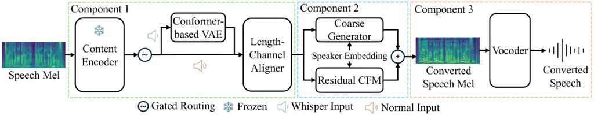
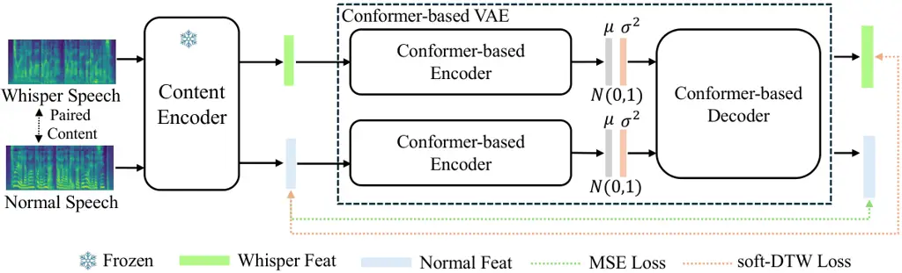

Liu Liu Ju Tian Li

# WhisperVC: Decoupled Cross-Domain Alignment and Speech Generation for Low-Resource Whisper-to-Normal Conversion

Dong    Juan    Wei    Yao    Ming

###### Abstract

Whispered speech lacks vocal-fold excitation, making the intelligible
conversion challenging. We propose _WhisperVC_, a three-stage framework
for low-resource Whisper-to-Normal (W2N) conversion that decouples
cross-domain alignment from speech generation. Stage 1 uses limited
paired whisper–normal data with a content encoder and a Conformer-based
variational autoencoder (VAE) with soft-DTW alignment to learn
domain-invariant semantic representations. Stage 2, trained only on
normal speech, employs a Length–Channel Aligner and a two-stage
speaker-conditioned mel generator for timbre and prosody modeling. Stage
3 fine-tunes a HiFi-GAN vocoder for waveform synthesis. Experimental
results on AISHELL6-Whisper show competitive quality (DNSMOS 3.07, UTMOS
2.83, CER 16.93%) and WavLM speaker similarity (0.95). The framework
also supports privacy-preserving communication as well as non-vocal
communication and a rehabilitation tool for post-surgical vocal-fold
patients. Samples are available online¹¹ 1 Demo url:
https://demo-whispervc.github.io/demo-whispervc/..

###### keywords

whisper-to-normal conversion, voice conversion, domain alignment,
variational autoencoder, flow matching

^(†)^(†)address: ¹ School of Computer Science, Wuhan University, Wuhan,
China  
² School of Artificial Intelligence, The Chinese University of Hong
Kong, Shenzhen, China  
³ School of Artificial Intelligence, Wuhan University, Wuhan, China  
⁴ AI Center, OPPO, Beijing, China ^(†)^(†)email: dong.liu@whu.edu.cn



Figure 1: Overview of the proposed whisper-to-normal voice conversion
framework.



Figure 2: Overview of the proposed Conformer-based VAE module.

## 1 Introduction

Whispered speech lacks vocal-fold excitation and exhibits reduced energy
and shifted formant frequencies, leading to severe degradation in
intelligibility and naturalness. Converting whispered speech into normal
voiced speech—referred to as _whisper-to-normal_ (W2N) conversion—can
benefit individuals with voice disorders or users who must speak quietly
in noise-sensitive environments.

W2N remains challenging due to the absence of F0, large spectral
mismatch between whisper and normal speech, and temporal inconsistencies
across speaking styles. Moreover, parallel whisper–voiced speech corpora
are scarce, motivating non-parallel and robust modeling strategies.

Existing approaches are predominantly data-driven. Early neural models
employ adversarial or sequence-to-sequence architectures to directly map
whispered acoustic features to normal-speech representations. For
example, attention-guided GANs \[1\] and modified Transformer
networks \[2\] predict mel-spectrograms that are subsequently
synthesized by neural vocoders, while comparative studies further
demonstrate the effectiveness of GAN-based frameworks \[3\]. To
alleviate the reliance on strictly parallel data, non-parallel methods
based on auxiliary classifier VAEs \[4\] and cycle-consistent GANs \[5\]
have been proposed, treating W2N as a cross-domain style transfer
problem. More recently, lightweight and zero-/one-shot pipelines
leveraging self-supervised speech representations have been explored,
such as WESPER \[6\] and DistillW2N \[7\]. In contrast, model-driven
approaches explicitly exploit interpretable speech production
mechanisms, including MFCC inversion \[8\] and source–filter-based
excitation reconstruction \[9\]. While these methods provide
interpretability, accurately restoring natural voicing and prosody
remains difficult.

Most existing W2N systems adopt a single-stage acoustic mapping
framework that jointly learns whisper–normal alignment, speaker
conditioning, and acoustic generation. However, the large spectral and
temporal mismatch between whisper and normal speech makes stable voicing
reconstruction difficult with limited training data and often lack
robustness when extended to broader voice conversion (VC) tasks.

To address these limitations and inspired by \[10\], we propose
_WhisperVC_, a decoupled coarse-to-fine framework for W2N conversion.
Moreover, WhisperVC separates cross-domain alignment from normal-speech
generation, enabling unified modeling of W2N and conventional VC within
a single architecture. Our contributions are threefold:

- •
  Whisper-specific domain alignment. We introduce a continuous
  dual-encoder VAE with soft-DTW regularization built upon content
  encoder representations to model cross-domain alignment between
  whispered and normal speech, providing stable inputs for downstream
  generation.
- •
  Decoupled coarse-to-fine residual generation. We adopt a two-stage
  generation strategy where a deterministic decoder first predicts a
  coarse mel representation, followed by an optimal-transport
  conditional flow matching (OT-CFM) module that models the residual
  between the coarse prediction and the ground-truth mel, enabling
  coarse-to-fine refinement of the acoustic representation. A gated
  dual-path routing mechanism further enables whispered inputs to
  undergo domain alignment while allowing normal inputs to bypass this
  stage, unifying W2N and conventional VC within a single framework.
- •
  Vocoder adaptation for distribution consistency. We fine-tune HiFi-GAN
  on generated mel-spectrograms to reduce the train–test distribution
  mismatch between predicted and real acoustic features.

By combining explicit cross-domain alignment, gated dual-path routing,
and residual flow-based refinement, WhisperVC provides a unified
framework for whisper-to-normal conversion while preserving
normal-speech voice conversion capability.

## 2 Methods

### 2.1 Framework Overview

WhisperVC consists of three sequential components: (1) a
whisper-specific domain alignment module, (2) a coarse-to-fine mel
generation framework operating in the normal-speech space, and (3) a
neural vocoder for waveform synthesis.

Given an input utterance $`x`$ (whispered or normal), our goal is to
generate a natural 22.05 kHz waveform $`\hat{y}`$ while preserving
linguistic content and speaker timbre. The final mel-spectrogram is
formulated as

```math
\hat{M}=M_{c}+\hat{R}, \tag{1}
```

where $`M_{c}`$ denotes a coarse mel representation capturing global
acoustic structure, and $`\hat{R}`$ is the residual predicted by the
refinement module to model fine-grained acoustic details.

During inference, whispered inputs first undergo domain alignment before
mel generation, while normal inputs bypass the alignment stage through a
gated routing mechanism.

### 2.2 Whisper-Specific Domain Alignment

We adopt a pretrained content encoder (Whisper-large V3), fine-tuned on
a Mandarin whispered–normal corpus \[11\], to extract 1280-d content
representations $`C`$ from 16 kHz audio.

Due to representation and temporal mismatch between whispered and normal
content features, we introduce a Conformer-based continuous variational
autoencoder (VAE) to model cross-domain alignment.

The VAE consists of dual encoders and a shared decoder. Given paired
content features $`C_{w}`$ (whisper) and $`C_{n}`$ (normal), the
encoders produce latent posteriors:

```math
q_{w}(z|C_{w})=E_{w}(C_{w}),\quad q_{n}(z|C_{n})=E_{n}(C_{n}). \tag{2}
```

Latent samples $`z_{w}`$ and $`z_{n}`$ are then decoded to reconstruct
aligned features:

```math
\hat{C}_{w}=D(z_{w}),\quad\hat{C}_{n}=D(z_{n}). \tag{3}
```

The training objective is

```math
\displaystyle\mathcal{L}_{\text{VAE}} \displaystyle=\lambda_{\text{KL}}\left[\mathrm{KL}(q_{w}||\mathcal{N}(0,I))+\mathrm{KL}(q_{n}||\mathcal{N}(0,I))\right]
```

```math
\displaystyle\quad+\lambda_{\text{rec}}\lVert\hat{C}_{n}-C_{n}\rVert_{2}^{2}+\lambda_{\text{DTW}}\mathrm{softDTW}(\hat{C}_{w},C_{n}). \tag{4}
```

The soft-DTW \[12\] loss aligns reconstructed whisper features with
normal features under temporal flexibility, encouraging alignment toward
the normal-speech space.

### 2.3 Coarse-to-Fine Residual Generation

Length–Channel Alignment (LCA).  
The content encoder operates on 16 kHz audio, while mel-spectrograms
used for HiFi-GAN synthesis are extracted at 22.05 kHz. This results in
a length mismatch between encoder features and mel frames. To bridge
this gap without introducing explicit duration modeling, we linearly
interpolate the encoder features to match the mel length.

Given encoder features $`C\in\mathbb{R}^{T_{\text{enc}}\times d}`$, we
obtain length-aligned features $`\tilde{C}`$ via interpolation, followed
by a convolutional projection to map features into the acoustic decoder
dimension.

Coarse Mel Generation.  
A feed-forward Transformer-based acoustic decoder predicts a
deterministic coarse mel-spectrogram:

```math
M_{c}=G_{\text{coarse}}(\tilde{C},s), \tag{5}
```

where $`s`$ denotes a 256-dimensional speaker embedding extracted using
a SimAM–ResNet34 encoder \[13\] pretrained on VoxBlink2 \[14\] and
fine-tuned on VoxCeleb2 \[15\].

The coarse generator is trained with an $`\ell_{1}`$ reconstruction
loss:

```math
\mathcal{L}_{\text{coarse}}=\lVert M_{c}-M\rVert_{1}. \tag{6}
```

Residual OT-CFM Refinement.  
To improve acoustic fidelity, we model the residual between the
ground-truth mel-spectrogram $`M`$ and the coarse prediction $`M_{c}`$:

```math
R=M-M_{c}. \tag{7}
```

Instead of directly generating the full mel-spectrogram, the residual
distribution is modeled using optimal-transport conditional flow
matching (OT-CFM). Specifically, Gaussian noise
$`z\sim\mathcal{N}(0,I)`$ is transported to the residual $`R`$ along a
linear interpolation path

```math
y_{t}=(1-t)z+tR,\quad t\sim\mathcal{U}(0,1). \tag{8}
```

The flow network $`f_{\theta}`$ predicts the velocity field conditioned
on the interpolated state $`y_{t}`$, the time step $`t`$, the
length-aligned content feature $`\tilde{C}`$, and the speaker embedding
$`s`$. Training minimizes the velocity matching objective

```math
\mathcal{L}_{\text{CFM}}=\mathbb{E}_{R,z,t}\left[\left\lVert f_{\theta}(y_{t},t,\tilde{C},s)-(R-z)\right\rVert_{2}^{2}\right]. \tag{9}
```

This coarse-to-fine formulation separates global structure modeling from
stochastic detail refinement, improving stability under cross-domain
mismatch.

Gated Dual-Path Routing

To enable unified modeling of W2N and conventional VC, we introduce a
lightweight sigmoid classifier that predicts a domain indicator and
determines whether the VAE alignment module is applied.

Given content features $`C`$, the routing module produces aligned
features

```math
\tilde{C}=\begin{cases}D(E_{w}(C)),&\text{if classified as whisper},\\
C,&\text{otherwise}.\end{cases} \tag{10}
```

The classifier is trained using paired whisper-normal supervision. This
selective alignment corrects cross-domain mismatch while preserving
normal-speech representations.

### 2.4 Vocoder Adaptation

We adopt HiFi-GAN \[16\] as the neural vocoder. To reduce train–test
mismatch introduced by residual refinement, the vocoder is fine-tuned on
predicted mel-spectrograms.

|                            |                                    |               |               |       |       |        |       |                                |                                 |           |       |                       |
| -------------------------- | ---------------------------------- | ------------- | ------------- | ----- | ----- | ------ | ----- | ------------------------------ | ------------------------------- | --------- | ----- | --------------------- |
|                            | Naturalness / Quality $`\uparrow`$ |               |               |       |       |        |       | Intelligibility $`\downarrow`$ | Speaker Similarity $`\uparrow`$ |           |       | Semantic $`\uparrow`$ |
| Model                      | DNSMOS\_(ovrl)                     | DNSMOS\_(sig) | DNSMOS\_(bak) | P808  | UTMOS | WVMOS  | NISQA | CER                            | SECS                            | WeSpeaker | WavLM | SBERT                 |
| Whispered input            | 1.102                              | 1.155         | 1.195         | 2.703 | 1.308 | -0.067 | 1.900 | 22.937                         | 0.582                           | 0.498     | 0.784 | 0.673                 |
| Seed-VC \[17\] (zero-shot) | 2.868                              | 3.255         | 4.031         | 3.740 | 2.467 | 2.814  | 3.088 | 46.423                         | 0.851                           | 0.772     | 0.952 | 0.758                 |
| Ablation studies           |                                    |               |               |       |       |        |       |                                |                                 |           |       |                       |
| Coarse-only                | 2.716                              | 3.338         | 3.343         | 3.258 | 2.797 | 3.186  | 2.418 | 18.729                         | 0.529                           | 0.638     | 0.943 | 0.761                 |
|    + OT-CFM (Full)         | 2.548                              | 3.178         | 3.188         | 3.398 | 2.170 | 2.716  | 2.935 | 19.576                         | 0.515                           | 0.613     | 0.930 | 0.744                 |
|    + OT-CFM (Residual)     | 2.652                              | 3.253         | 3.313         | 3.425 | 2.795 | 3.139  | 2.830 | 18.266                         | 0.528                           | 0.650     | 0.944 | 0.760                 |
| OT-CFM (Residual) w/o VAE  | 1.830                              | 3.218         | 1.632         | 2.755 | 1.729 | 1.519  | 2.233 | 40.155                         | 0.511                           | 0.557     | 0.898 | 0.712                 |
| WhisperVC (Proposed)       | 3.072                              | 3.506         | 3.720         | 3.562 | 2.831 | 3.352  | 3.164 | 16.932                         | 0.816                           | 0.675     | 0.945 | 0.785                 |
| Ground Truth               | 3.141                              | 3.552         | 3.795         | 3.680 | 2.868 | 3.129  | 3.395 | -                              | 1.000                           | 1.000     | 1.000 | 1.000                 |

Table 1: W2N performance and ablation results on AISHELL6-Whisper
testing set. Best results are highlighted in bold.

## 3 Experimental Results

### 3.1 Experimental Setup

WhisperVC consists of three components: (1) Whisper-Specific Domain
Alignment, (2) Coarse-to-Fine Residual Generation, and (3) Vocoder
Adaptation. The components are trained sequentially and jointly used
during inference.

Mandarin (Primary Evaluation). All three components are trained on the
AISHELL6-Whisper corpus \[11\], which contains paired whispered-normal
Mandarin speech with approximately 30 hours.

Component 1 learns cross-domain alignment between whispered and normal
speech features. Component 2 performs normal-speech acoustic modeling
using a coarse mel predictor with OT-CFM-based residual refinement.
Component 3 fine-tunes HiFi-GAN to adapt waveform synthesis to the
reconstructed mel distribution.

W2N performance is evaluated on whispered test utterances²² 2 All
training and testing files are released on the demo page. to measure
reconstruction quality.

To further verify that the gated architecture preserves
speaker-conditioned generation capability, we additionally evaluate
normal speech VC on AISHELL6-Whisper. In this setting, normal speech
serves as input while a target speaker embedding is provided, examining
whether the unified framework maintains standard VC functionality
alongside W2N conversion.

Since no prior W2N systems have been reported on AISHELL6-Whisper, we
include Seed-VC as a representative generic VC baseline. For W2N
evaluation, whispered speech is directly used as input to Seed-VC,
reflecting whisper–normal mismatch. For VC evaluation, normal speech is
used following the standard VC protocol. Seed-VC is not specifically
trained for whisper-to-normal conversion.

English (Additional Evaluation). The three components are trained on
separate corpora to evaluate the effectiveness of the decoupled training
strategy.

Component 1 is trained on the paired whispered–normal corpus
wTIMIT \[18\]. Component 2 is trained on LibriTTS-clean \[19\], which
contains only normal speech, following the normal-speech-only generation
paradigm. Component 3 is optimized using LibriTTS-clean together with
wTIMIT normal speech to improve robustness to domain variation.

To ensure rigorous zero-shot evaluation, wTIMIT is strictly partitioned
at the speaker level into disjoint training, validation, and test sets³³
3 File lists are available at the demo page.. Validation and test
speakers are completely unseen during training, forming an
unseen-speaker evaluation protocol that prevents speaker leakage. All
data are organized as paired normal–whisper utterances to maintain
consistent supervision during alignment training and evaluation.

Evaluation is conducted on the wTIMIT whispered test set. We compare
with whisper-oriented systems (WESPER \[6\], DistillW2N \[7\]) and
representative generic VC models (Seed-VC \[17\], FreeVC \[20\]) applied
in a zero-shot manner to illustrate the limitation of generic VC under
the W2N task.

The content encoder operates at 16 kHz, while acoustic modeling and
waveform synthesis are performed at 22.05 kHz.

### 3.2 Evaluation Metrics

We evaluate WhisperVC from four perspectives:

Naturalness. DNSMOS (ovrl/sig/bak/p808) \[21\], UTMOS \[22\],
WVMOS \[23\], and NISQA \[24\] estimate perceptual quality and signal
fidelity, providing a comprehensive approximation of human listening
experience.

Intelligibility. Character Error Rate (CER) is computed using OpenAI
Whisper-largeV3-turbo \[25\]. These metrics measure phonetic
reconstruction accuracy and content preservation.

Speaker similarity. We report SECS (Resemblyzer cosine similarity) and
WavLM \[26\] cosine similarity.

Semantic consistency. SpeechBERTScore \[27\] measures high-level
semantic alignment between converted and reference speech.

### 3.3 Mandarin W2N Results and Ablation Analysis

To evaluate W2N conversion performance, we conduct experiments on
AISHELL6-Whisper, with results reported in Table 1.

Compared with whispered input, WhisperVC substantially improves
perceptual quality and intelligibility (DNSMOS$`{}_{\text{ovrl}}`$:
1.102 $`\rightarrow`$ 3.072; CER: 22.937% $`\rightarrow`$ 16.932%),
demonstrating that the proposed framework effectively reconstructs
natural voiced speech from whispered inputs.

Directly applying a general voice conversion model (Seed-VC) to
whispered speech results in severe intelligibility degradation (CER
46.423%), indicating that generic VC systems cannot properly handle the
large acoustic mismatch between whispered and normal speech.

Effect of Component 2 (Coarse-to-Fine Residual Generation). Using only
the deterministic coarse mel generator (Coarse-only) already improves
intelligibility (CER 18.729%), showing that the acoustic generator can
recover normal-speech structure from the aligned representations
produced by Component 1. However, perceptual quality remains limited due
to the deterministic prediction.

Introducing OT-CFM refinement further improves mel reconstruction. The
residual formulation outperforms full-mel modeling, indicating that
learning structured residual corrections on top of the coarse mel
prediction is more stable than directly modeling full mel trajectories.

Effect of Component 1 (Whisper-Specific Domain Alignment). Removing the
VAE alignment module (OT-CFM Residual w/o VAE) leads to drastic
performance degradation (CER 40.155% and large quality drops across MOS
predictors). This confirms that our VAE-based cross-domain alignment
between whispered and normal speech representations is essential for
reliable W2N generation.

Effect of Component 3 (Vocoder Adaptation). Fine-tuning HiFi-GAN on
predicted mel-spectrograms further improves perceptual quality and
intelligibility (DNSMOS$`{}_{\text{ovrl}}`$: 2.652 $`\rightarrow`$
3.072; CER: 18.266% $`\rightarrow`$ 16.932%), showing that reducing the
mismatch between predicted mel distributions and vocoder training data
improves waveform synthesis quality.

These results demonstrate that the three components jointly improve W2N
performance: VAE enables cross-domain alignment, Component 2 provides
coarse-to-fine acoustic reconstruction, and finetuning HiFi-GAN improves
waveform synthesis robustness.

|                     |                          |       |                        |                      |       |
| ------------------- | ------------------------ | ----- | ---------------------- | -------------------- | ----- |
|                     | Naturalness $`\uparrow`$ |       | Content $`\downarrow`$ | Speaker $`\uparrow`$ |       |
| Model               | DNSMOS\_(OVRL)           | UTMOS | CER                    | SECS                 | WavLM |
| Seed-VC \[17\]      | 3.033                    | 2.755 | 4.392                  | 0.894                | 0.727 |
| WhisperVC           | 3.092                    | 2.850 | 3.331                  | 0.778                | 0.743 |
| w/o Gate (Equa  10) | 3.078                    | 2.859 | 4.333                  | 0.793                | 0.717 |

Table 2: VC results on AISHELL6-Whisper testing set. Best results are
highlighted in bold.

### 3.4 Voice Conversion Capability (Mandarin)

To verify that the proposed framework maintains standard voice
conversion capability, we evaluate normal-to-normal VC on
AISHELL6-Whisper, with results reported in Table 2.

Compared with the strong baseline Seed-VC, WhisperVC achieves comparable
perceptual quality while improving content preservation, reducing CER
from 4.392 to 3.331.

We further analyze the effect of the gated architecture by removing the
Gated Dual-Path Routing mechanism. Although perceptual quality remains
similar, content preservation degrades noticeably (CER 3.331%
$`\rightarrow`$ 4.333%), indicating that the gate helps stabilize
generation by adaptively routing information between whisper-oriented
and normal-speech pathways.

These results demonstrate that WhisperVC preserves voice conversion
capability while simultaneously supporting whisper-to-normal
reconstruction within a unified framework.

|                             |                          |       |                        |                      |       |
| --------------------------- | ------------------------ | ----- | ---------------------- | -------------------- | ----- |
|                             | Naturalness $`\uparrow`$ |       | Content $`\downarrow`$ | Speaker $`\uparrow`$ |       |
| Model                       | DNSMOS\_(ovrl)           | UTMOS | CER                    | SECS                 | WavLM |
| FreeVC \[20\]               | 2.657                    | 2.643 | 26.534                 | 0.702                | 0.885 |
| Seed-VC \[17\]              | 3.108                    | 3.321 | 16.709                 | 0.839                | 0.926 |
| WESPER \[6\]$`\dagger`$     | 3.202                    | 3.496 | 30.724                 | 0.531                | 0.543 |
| DistillW2N \[7\]$`\dagger`$ | 3.012                    | 1.894 | 36.028                 | 0.642                | 0.806 |
| WhisperVC                   | 2.894                    | 3.276 | 11.389                 | 0.594                | 0.724 |

Table 3: W2N performance on the wTIMIT testing dataset. Best results are
highlighted in bold.

³³footnotetext: ^(†) Results obtained using the official pretrained
model from the authors’ GitHub repository (
https://github.com/rkmt/wesper-demo,
https://github.com/tan90xx/distillw2n ) on our test set.

### 3.5 English W2N Evaluation

To evaluate the generalization ability of WhisperVC across languages, we
train the same framework on the English wTIMIT and LibriTTS-clean
datasets and report W2N results in Table 3.

WhisperVC achieves the best intelligibility among all compared systems,
with a CER of 11.389%. Compared with whisper-oriented baselines (WESPER
and DistillW2N), the proposed method substantially reduces content
recognition errors, demonstrating effective whispered-to-normal
reconstruction on English speech.

Generic voice conversion models (Seed-VC and FreeVC) show limited
effectiveness when directly applied to whispered inputs. Although these
systems can synthesize perceptually plausible speech, their
intelligibility remains inferior to WhisperVC (CER 16.709% and 26.534%),
indicating that generic VC systems cannot fully resolve the acoustic
mismatch between whispered and normal speech.

These results suggest that the proposed alignment and acoustic
generation framework generalizes well across languages when trained on
the target-language data.

## 4 Conclusion

This paper presented WhisperVC, a unified coarse-to-fine framework for
whisper-to-normal (W2N) conversion that addresses whisper-normal domain
mismatch through whisper-specific representation alignment, residual
acoustic generation, and vocoder adaptation. Experiments on
AISHELL6-Whisper demonstrate substantial improvements in perceptual
quality and intelligibility over whispered input and generic VC
baselines, while additional results on wTIMIT show that the framework
generalizes beyond Mandarin. Future work will explore improving model
efficiency and enabling real-time whisper-to-normal conversion.

## 5 Acknowledgement

This research is funded in part by the National Natural Science
Foundation of China (62571223) and Yangtze River Delta Science and
Technology Innovation Community Joint Research Project (2024CSJGG01100)
and OPPO. Many thanks for the computational resource provided by the
Advanced Computing East China Sub-Center.

## 6 Generative AI Use Disclosure

Large Language Models (LLMs) were used solely for manuscript polishing
(e.g., rephrasing and grammar checks) to improve clarity and
readability. The LLMs were not used for ideation, methodology,
experimental design, data analysis, or result interpretation. All
scientific content was produced and verified by the authors.

## References

- \[1\] T. Gao, Q. Pan, J. Zhou, H. Wang, L. Tao, and H. K. Kwan (2023)
  A novel attention-guided generative adversarial network for
  whisper-to-normal speech conversion. Cognitive Computation 15 (2),
  pp. 778–792. Cited by: §1.
- \[2\] A. Niranjan, M. Sharma, S. B. C. Gutha, and M. Shaik (2020)
  End-to-end whisper to natural speech conversion using modified
  transformer network. arXiv preprint arXiv:2004.09347. Cited by: §1.
- \[3\] D. Wagner, I. Baumann, and T. Bocklet (2024) Generative
  adversarial networks for whispered to voiced speech conversion: a
  comparative study. International Journal of Speech Technology 27 (4),
  pp. 1093–1110. Cited by: §1.
- \[4\] S. Seki, H. Kameoka, T. Kaneko, and K. Tanaka (2023)
  Non-parallel whisper-to-normal speaking style conversion using
  auxiliary classifier variational autoencoder. IEEE Access 11,
  pp. 44590–44599. Cited by: §1.
- \[5\] S. J. Joysingh, K. R. Gupta, K. Ramnath, P. Vijayalakshmi,
  and T. Nagarajan (2025) MaskCycleGAN-based whisper to normal speech
  conversion. In Proc. ICBSII, pp. 1–4. Cited by: §1.
- \[6\] J. Rekimoto (2023) WESPER: zero-shot and realtime whisper to
  normal voice conversion for whisper-based speech interactions. In
  Proc. CHI, pp. 1–12. Cited by: §1, §3.1, Table 3.
- \[7\] T. Tan, H. Ruan, X. Chen, K. Chen, Z. Lin, and J. Lu (2025)
  DistillW2N: a lightweight one-shot whisper to normal voice conversion
  model using distillation of self-supervised features. In Proc. ICASSP,
  pp. 1–5. Cited by: §1, §3.1, Table 3.
- \[8\] Q. Zhu, Z. Wang, Y. Dou, and J. Zhou (2022) Whispered speech
  conversion based on the inversion of mel frequency cepstral
  coefficient features. Algorithms 15 (2), pp. 68. Cited by: §1.
- \[9\] O. Perrotin and I. V. McLoughlin (2020) Glottal flow synthesis
  for whisper-to-speech conversion. IEEE/ACM Trans. Audio Speech Lang.
  Process. 28, pp. 889–900. Cited by: §1.
- \[10\] Y. Yang, H. Zhang, Z. Cai, Y. Shi, M. Li, D. Zhang, X. Ding, J.
  Deng, and J. Wang (2023) Electrolaryngeal speech enhancement based on
  a two stage framework with bottleneck feature refinement and voice
  conversion. Biomedical Signal Processing and Control 80, pp. 104279.
  Cited by: §1.
- \[11\] C. Li, F. Su, J. Liu, H. Bu, Y. Wan, H. Suo, and M. Li (2026)
  AISHELL6-whisper: a chinese mandarin audio-visual whisper speech
  dataset with speech recognition baselines. In Proc. ICASSP, Cited by:
  §2.2, §3.1.
- \[12\] M. Cuturi and M. Blondel (2017) Soft-dtw: a differentiable loss
  function for time-series. In Proc. ICML, pp. 894–903. Cited by: §2.2.
- \[13\] H. Wang, C. Liang, S. Wang, Z. Chen, B. Zhang, X. Xiang, Y.
  Deng, and Y. Qian (2023) Wespeaker: a research and production oriented
  speaker embedding learning toolkit. In Proc. ICASSP, pp. 1–5. Cited
  by: §2.3.
- \[14\] Y. Lin, M. Cheng, F. Zhang, Y. Gao, S. Zhang, and M. Li (2024)
  Voxblink2: a 100k+ speaker recognition corpus and the open-set
  speaker-identification benchmark. In Proc. INTERSPEECH, pp. 4263–4267.
  Cited by: §2.3.
- \[15\] J. S. Chung, A. Nagrani, and A. Zisserman (2018) Voxceleb2:
  deep speaker recognition. arXiv preprint arXiv:1806.05622. Cited by:
  §2.3.
- \[16\] J. Kong, J. Kim, and J. Bae (2020) Hifi-gan: generative
  adversarial networks for efficient and high fidelity speech synthesis.
  Advances in neural information processing systems 33, pp. 17022–17033.
  Cited by: §2.4.
- \[17\] S. Liu (2024) Zero-shot voice conversion with diffusion
  transformers. arXiv preprint arXiv:2411.09943. Cited by: Table 1,
  §3.1, Table 2, Table 3.
- \[18\] B. P. Lim (2011) Computational differences between whispered
  and non-whispered speech. University of Illinois at Urbana-Champaign.
  Cited by: §3.1.
- \[19\] H. Zen, V. Dang, R. Clark, Y. Zhang, R. J. Weiss, Y. Jia, Z.
  Chen, and Y. Wu (2019) Libritts: a corpus derived from librispeech for
  text-to-speech. In Proc. INTERSPEECH, pp. 1526–1530. Cited by: §3.1.
- \[20\] J. Li, W. Tu, and L. Xiao (2023) Freevc: towards high-quality
  text-free one-shot voice conversion. In Proc. ICASSP, pp. 1–5. Cited
  by: §3.1, Table 3.
- \[21\] C. K. Reddy, V. Gopal, and R. Cutler (2021) DNSMOS: a
  non-intrusive perceptual objective speech quality metric to evaluate
  noise suppressors. In Proc. ICASSP, pp. 6493–6497. Cited by: §3.2.
- \[22\] T. Saeki, D. Xin, W. Nakata, T. Koriyama, S. Takamichi, and H.
  Saruwatari (2022) Utmos: utokyo-sarulab system for voicemos challenge 2022. In Proc. INTERSPEECH, pp. 4521–4525. Cited by: §3.2.
- \[23\] P. Andreev, A. Alanov, O. Ivanov, and D. Vetrov (2023) Hifi++:
  a unified framework for bandwidth extension and speech enhancement. In
  Proc. ICASSP, pp. 1–5. Cited by: §3.2.
- \[24\] G. Mittag, B. Naderi, A. Chehadi, and S. Möller (2021) NISQA: a
  deep cnn-self-attention model for multidimensional speech quality
  prediction with crowdsourced datasets. In Proc. INTERSPEECH,
  pp. 2127–2131. Cited by: §3.2.
- \[25\] A. Radford, J. W. Kim, T. Xu, G. Brockman, C. McLeavey, and I.
  Sutskever (2023) Robust speech recognition via large-scale weak
  supervision. In Proc. ICML, pp. 28492–28518. Cited by: §3.2.
- \[26\] S. Chen, C. Wang, Z. Chen, Y. Wu, S. Liu, Z. Chen, J. Li, N.
  Kanda, T. Yoshioka, X. Xiao, et al. (2022) Wavlm: large-scale
  self-supervised pre-training for full stack speech processing. IEEE
  Journal of Selected Topics in Signal Processing 16 (6), pp. 1505–1518.
  Cited by: §3.2.
- \[27\] T. Saeki, S. Maiti, S. Takamichi, S. Watanabe, and H.
  Saruwatari (2024) Speechbertscore: reference-aware automatic
  evaluation of speech generation leveraging nlp evaluation metrics. In
  Proc. INTERSPEECH, pp. 4943–4947. Cited by: §3.2.
