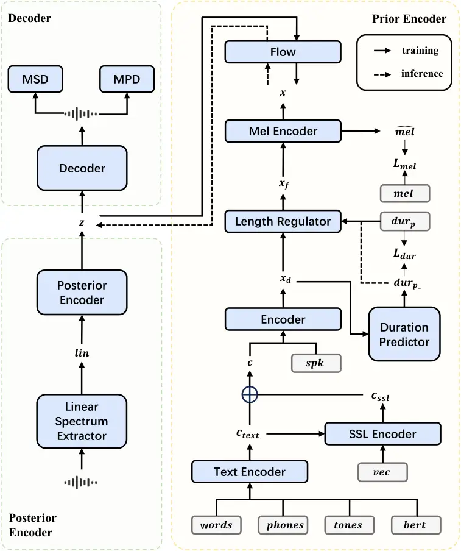

# FabasedVC: Enhancing Voice Conversion with Text Modality Fusion and Phoneme-Level SSL Features

Conference: ACM Multimedia Asia; December 9–12, 2025; Kuala Lumpur,
MalaysiaACM Multimedia Asia (MMAsia ’25), December 9–12, 2025, Kuala
Lumpur,
MalaysiaDOI: [10.1145/3743093.3771038](https://doi.org/10.1145/3743093.3771038)ISBN: 979-8-4007-2005-5/2025/12CCS: Computing
methodologies Natural language processing

Wenyu Wang Affiliation: School of Software Engineering, Xi’an Jiaotong
University, Xi’an, China Affiliation: SYKI-SPEECH Team, Xi’an, China
email: <wenyu.wang@stu.xjtu.edu.cn> , Zhetao Hu Affiliation: School of
Software Engineering, Xi’an Jiaotong University, Xi’an, China
Affiliation: SYKI-SPEECH Team, Xi’an, China email: <2219904645@qq.com> ,
Yiquan Zhou Affiliation: School of Software Engineering, Xi’an Jiaotong
University, Xi’an, China Affiliation: SYKI-SPEECH Team, Xi’an, China
Affiliation: AI Platform Department, bilibili, Shanghai, China email:
<yiqian.zhou@stu.xjtu.edu.cn> Note: Corresponding author , Jiacheng Xu
Affiliation: School of Software Engineering, East China Normal
University, Shanghai, China email: <xujiacheng28@outlook.com> , Zhiyu Wu
Affiliation: School of Computer Science and Artificial Intelligence,
Fudan University, Shanghai, China email: <wuzy24@m.fudan.edu.cn> , Chen
Li Affiliation: School of Software Engineering, Xi’an Jiaotong
University, Xi’an, China email: <cclidd@xjtu.edu.cn> and Shihao Li
Affiliation: Division of Music and Audio, Union Wheatland Culture and
Media Ltd., Chengdu, China email: <yiseho@yiseho.com>

© acmlicensed

###### Abstract.

In voice conversion (VC), it is crucial to preserve complete semantic
information while accurately modeling the target speaker’s timbre and
prosody. This paper proposes FabasedVC to achieve VC with enhanced
similarity in timbre, prosody, and duration to the target speaker, as
well as improved content integrity. It is an end-to-end VITS-based VC
system that integrates relevant textual modality information,
phoneme-level self-supervised learning (SSL) features, and a duration
predictor. Specifically, we employ a text feature encoder to encode
attributes such as text, phonemes, tones and BERT features. We then
process the frame-level SSL features into phoneme-level features using
two methods: average pooling and attention mechanism based on each
phoneme’s duration. Moreover, a duration predictor is incorporated to
better align the speech rate and prosody of the target speaker.
Experimental results demonstrate that our method outperforms competing
systems in terms of naturalness, similarity, and content integrity. We
strongly recommend that readers listen to our samples.¹¹ 1
https://fabased-vc.github.io/fabasedvc/

###### Keywords: 

generative ai, voice conversion, text-to-speech, text modality
supplement, self-supervised learning

## 1. Introduction

Voice conversion (VC) is a technology that modifies the style and timbre
of a source speaker’s speech to mimic that of a target speaker, while
maintaining the original linguistic content(Mohammadi and Kain, 2017;
Liu et al., 2020). Both Voice Conversion and Text-to-Speech (TTS) fall
under the umbrella of speech processing technologies; however, they
differ in their primary focuses. TTS systems(Kim et al., 2021; Kong et
al., 2023; Du et al., 2024) primarily focus on generating natural and
fluent speech expressions from text. VC systems aims to retain the
content information of the source speech while preserving non-linguistic
elements such as emotion and expressiveness. It seeks to generate
converted speech that combines these elements with the timbre
information of the target speaker.

Based on the aforementioned objectives, the key to achieving successful
voice conversion is to disentangle speaker independent information and
speaker dependent timbre information from source and target speech. On
this basis, the two types of information can be integrated, thereby
achieving the effect of voice conversion. However, several challenges
remain in the field. Firstly, the speaker-independent features extracted
are entirely derived from the source speech, which means that their
duration and prosody closely follow those of the source. However, each
speaker possesses a unique speaking style. Following the prosody,
pauses, and duration of the source speech strictly when generating
converted speech does not adequately reflect the relevant
characteristics of the target speaker. This can reduce the perceived
similarity to the target speaker among listeners. Secondly, existing
voice conversion systems encounter challenges in preserving the
integrity of the content in the generated speech. This in turn affects
the semantic accuracy and naturalness of the generated speech. Lastly,
current disentanglement methods are inadequate in effectively removing
timbre information, resulting in issues of timbre leakage during voice
conversion tasks.

Text-to-Speech technology can complement and mitigate some of the
shortcomings present in VC technologies. By integrating commonly used
semantic-related information from TTS through front-end processing
methods, such as ASR, can be leveraged to enhance the content integrity
of converted speech in VC systems. The duration predictors utilized in
TTS can better simulate speech durations that align more closely with
the characteristics of the target speaker.

In this paper, we propose a novel end-to-end VC system named FabasedVC,
which integrates TTS related technologies to address the three
aforementioned shortcomings of current VC technologies. Specifically,
this system enhances existing VC frameworks by introducing supplementary
textual modality information, processing features at the phoneme level,
and integrating a duration predictor. Firstly, the system employs ASR
and related annotation tools to add various character and phoneme-level
textual modality annotations to the existing VC system, thereby
improving content completeness. Secondly, We utilize a Forced Aligner
tool to obtain phoneme-level timestamps, which we then utilize to
convert the disentangled SSL features from the frame level to the
phoneme level. This conversion is achieved through phoneme-level average
pooling and attention mechanisms. Compared to frame-level features,
phoneme-level features provide the advantage of modifiable duration and
significantly enhance the disentanglement of speaker timbre information.
Lastly, We incorporate a duration predictor into the model which allows
the duration of each phoneme to be re-predicted during inference. The
re-prediction uses the encoded phoneme-level features combined with the
target speaker’s information. When the re-prediction disabled, VC
matches the source speech duration; when enabled, it adjusts the
duration to improve similarity. Experimental results demonstrate that
FabasedVC effectively preserves the content information from the source
speech while achieving a high degree of similarity in timbre, duration,
and prosody with the target speaker. The contributions of this paper are
as follows:

- •
  We have designed a pre-processing program for textual modality
  annotation, which supplements semantic information during the VC
  process.
- •
  By utilizing pooling and attention mechanisms, we have converted
  frame-level SSL features to the phoneme-level. This has further
  separated speaker information and provided the capability to adjust
  duration in VC.
- •
  We have added a duration predictor to the VC system that, when
  enabled, re-estimates the duration of each phoneme for the target
  speaker.

## 2. Related Work

### 2.1. Voice Conversion

Voice conversion (VC) has witnessed remarkable progress, evolving from
traditional statistical models to advanced deep learning approaches.
Early VC methods mainly relied on signal processing and statistical
techniques, such as Gaussian mixture models (GMMs) (Stylianou et al.,
1998), frequency warping (Erro et al., 2010), and exemplar-based
strategies (Takashima et al., 2012).These methods focused on
transforming the spectral features of the source speaker to match those
of the target speaker, but often struggled with flexibility and
generalization to unseen data.

With the rapid development of deep learning, VC systems have
significantly advanced in terms of modeling capacity and performance.
Generative Adversarial Networks (GANs) have been widely adopted for
voice conversion, where adversarial training is employed to perform
end-to-end voice conversion or enhance the performance of existing
frameworks (Li et al., 2021; Kaneko et al., 2021). However, due to the
instability of GANs, the generated speech lacks clarity. Another
effective line of work leverages features derived from Automatic Speech
Recognition (ASR) systems, such as phoneme posteriorgrams (PPGs) and
bottleneck features (BNFs). These representations help disentangle
linguistic content from speaker identity, facilitating more robust and
speaker-independent VC (Wang et al., 2021b; Zhao et al., 2022; Ning et
al., 2023). There are also some problems with the intermediate features
of ASR: The accuracy and granularity of data annotation affecting the
model’s performance, and the loss of part of the expressiveness in the
features. In recent years, self-supervised learning (SSL) has gained
increasing attention due to its strong performance on a wide range of
speech processing tasks (Hsu et al., 2021; Chen et al., 2022).
Researchers have explored various strategies to disentangle the speaker
identity from SSL-based representations for VC purposes. For example,
adversarial speaker disentanglement (Zhao et al., 2023) introduces an
adversarial training framework along with an unannotated external corpus
to reduce residual speaker information in SSL features. FreeVC (Li et
al., 2023) proposes a data augmentation approach based on spectrogram
resizing, which distorts speaker-related information during SSL feature
extraction to improve model robustness and disentanglement capability.
SoftVC (van Niekerk et al., 2022) further enhances semantic
representation learning by predicting distributions over discrete units
extracted from SSL models.

### 2.2. Prosody Prediction

Prosody, which encompass rhythm, stress, and intonation, is essential
for producing natural and expressive speech. Effective prosody modeling
not only improves the fluency and naturalness of synthesized speech, but
also enables the expression of various styles and emotions, such as
emphasis, questioning, or surprise.

Traditional text-to-speech (TTS) systems often struggled with prosody
control due to the reliance on handcrafted features and pipeline
architectures. The introduction of end-to-end models like Tacotron (Wang
et al., 2017) greatly simplified the synthesis process but exposed new
challenges, such as limited controllability over prosody and issues like
word skipping or repetition. To mitigate this, text-speech alignment
becomes crucial. FastSpeech (Ren et al., 2019) addresses this by
introducing a phoneme duration predictor and a length regulator,
allowing explicit control over speaking rate and prosody.However, its
dependence on external autoregressive models for alignment supervision
constrained its flexibility. To overcome these limitations, models such
as Glow-TTS (Kim et al., 2020) and VITS (Kim et al., 2021) adopt
Monotonic Alignment Search (MAS), using dynamic programming to learn the
alignment between text and speech representations without external
models.Furthermore, stochastic duration predictors were introduced
during inference to increase prosodic diversity and naturalness. With
the rise of large language models (LLMs), many recent approaches adopt
discrete codes as intermediate representations for speech synthesis.
Models like AudioLM (Borsos et al., 2023) and VALL-E (Wang et al., 2023)
implicitly learn prosody from prompt audio without explicit prosody
predictors. In contrast, CosyVoice (Du et al., 2024) proposes Supervised
Semantic Tokens, encoding prosody, timbre, and style into dedicated
token embeddings, which are combined with textual inputs for
fine-grained prosody control.

## 3. Proposed Methods

Our proposed end-to-end VC system is shown in Fig.1. The backbone of
FabasedVC is inspired by VITS(Kim et al., 2021), we describe it as
comprising a feature extractor and a Conditional Variational Autoencoder
(CVAE)(Kingma and Welling, 2014). The CVAE primarily consisting of a
posterior encoder, a prior encoder, and a decoder. The key modifications
and contributions of this paper focus on front-end feature processing
and the prior encoder. The front-end feature processing supplements a
large amount of textual modality information for the speech through a
series of automated workflows. In the prior encoder of the VC model, we
introduce a text feature encoder, an SSL feature encoder that processes
SSL features at the phoneme level, and a duration predictor. First, we
will introduce the various features utilized by the model, followed by a
detailed description of the specific architecture of the model’s encoder
and decoder.



Figure 1. Architecture of FabasedVC.

### 3.1. Features

| Feature    | Value/example      | Type        |
| ---------- | ------------------ | ----------- |
| Words      | Chinese characters | Categorical |
| Phonemes   | sil n i h ao sil   | Categorical |
| Tones      | 0 2 3 0            | Categorical |
| WordsBERT  | Tensor vector      | Numerical   |
| Pframe     | 8 9 5 10 33 10     | Numerical   |
| Wframe     | 8 14 43 10         | Numerical   |
| W2P        | 1 2 2 1            | Numerical   |
| Speaker    | speaker1           | Categorical |
| Contentvec | Tensor vector      | Numerical   |

Table 1. Features used for model training and inference.

In Table 1, we outline the features utilized for model training and
inference, using Mandarin Chinese as a demonstrative example. Words,
Phonemes, and Tones are obtained through ASR models and related
annotation tools, representing the textual content, phonetic
information, and tonal characteristics of speech, respectively. Tonal
characteristics refers to the pitch variation patterns of a syllable
during pronunciation. This supplementation is based on the fact that
Mandarin is a tonal language. For non-tonal languages like English,
other semantic features can be used during processing. Some speech voice
synthesis systems employ BERT (Devlin et al., 2018) features of text to
enhance semantic information(Xiao et al., 2020; Zhang and Ling, 2021).
Similarly, we derive WordsBERT features from the Words feature using
BERT to further enrich the information.

A forced alignment annotation model can generate timestamps at the
phoneme level of speech. By leveraging existing forced alignment
annotation models and applying them to speech data as well as the Words
and Phones features, we can extract duration information for each
element of Words and Phonemes in the speech. By aligning this duration
information with the frames of the spectrogram, we obtain Pframe and
Wframe features, which represent the frame lengths corresponding to each
character and Phoneme, respectively. The W2P feature indicates the
number of phonemes associated with each character in a sentence. The
Speaker feature conveys speaker-related information linked to the
speech, while the Contentvec(Qian et al., 2022) feature refers to the
disentangled SSL features extracted from the speech. Similar to other
voice conversion systems, we also utilize audio and spectrograms.

The front-end feature processing program we designed can automatically
extract all of the aforementioned speech features in a single step
during both training and inference.

### 3.2. Prior Encoder

The prior encoder consists of a text feature encoder, an SSL feature
encoder, a frame-level prior network, and a duration predictor.

#### 3.2.1. Text Feature Encoder

The text encoder comprises four encoding modules, each module encodes
Words, Phonemes, Tones, and WordsBERT features separately. These modules
produce encodings of the same dimension: $`c_{words}`$, $`c_{phones}`$,
$`c_{tones}`$, and $`c_{bert}`$. The $`c_{text}`$ feature is the sum of
these encoding features:

```math
\displaystyle c_{text}=c_{words}+c_{phones}+c_{tones}+c_{bert} \tag{1}
```

#### 3.2.2. SSL Feature Encoder

The SSL feature encoder utilizes both phoneme-level average pooling and
an attention-based encoding module to reduce the dimensions of the
Contentvec feature $`vec`$ from the frame level to the phoneme level,
resulting in the final representation $`c_{ssl}`$.

Phoneme-level average pooling is guided by the Pframe, duration of each
phoneme, denoted as $`dur_{p}`$. Given the Contentvec feature matrix
$`vec\in\mathbb{R}^{n\times f}`$, where $`n`$ denotes the feature
dimension and $`f`$ denotes the frame length, and the phoneme duration
vector $`dur_{p}=[d_{1},d_{2},...,d_{d}]`$, where $`d`$ represents the
number of phonemes and $`\sum_{i=1}^{d}d_{i}=f`$. Based on the number of
frames $`d_{i}`$ for each phoneme in $`dur_{p}`$, average pooling
operation is performed on $`vec`$ to obtain a feature matrix
$`vec_{dur}`$ with dimensions $`[n,d]`$. The calculation method is as
follows:

```math
\displaystyle vec_{dur}[:,i]=\frac{1}{d_{i}}\sum_{j=start_{i}}^{start_{i}+d_{i}-1}vec[:,j],\quad\text{for }i=1,...,d \tag{2}
```

Where $`start_{i}=\sum_{k=1}^{i-1}d_{k}`$ represents the starting frame
index for the $`i`$-th phoneme. Finally, by processing $`vec_{dur}`$
through the encoder, the encoded phoneme-level pooled feature
$`c_{avg}`$ is obtained.

To dynamically encode the $`vec`$ features at the phoneme level using
text features, we propose an attention-based encoding module. For each
phoneme, the output of the text feature encoder, $`c_{text}`$, is used
as the query $`Q`$. The $`vec`$ features serve as both the key $`K`$ and
value $`V`$ to integrate the $`vec`$ features corresponding to the
phoneme frames. Repeats this process for each phoneme to obtain the
encoded feature $`c_{att}`$. Following the attention mechanism described
in (Vaswani, 2017), we employ scaled dot-product operations as the
similarity measure.

Figure 2. Architecture of SSL Encoder.

The final SSL encoded feature $`c_{ssl}`$ is expressed as:

```math
\displaystyle c_{ssl}=\alpha c_{avg}+\beta c_{att} \tag{3}
```

Where $`\alpha`$ and $`\beta`$ are weighting coefficients. Here, the
model performed best with the values set to 1.0 and 0.5, respectively.

Fig.2 shows how the SSL encoder converts all frames of a phoneme in
speech into a phoneme-level representation. After this process, the
length of the $`c_{ssl}`$ feature matches the phoneme feature length of
the speech.

#### 3.2.3. Frame-level Prior Network

The frame-level prior network expands the phoneme-level features back to
the frame-level features $`x`$ for utilize in subsequent steps. Firstly,
we normalizes the sum of $`c_{text}`$ and $`c_{ssl}`$, resulting in
$`c`$. By utilizing the speaker information $`spk`$ as a condition, it
processes $`c`$ through an attention-based normalization flow module to
produce the encoded phoneme-level feature $`x_{d}`$:

```math
\displaystyle x_{d}=encoder(c,spk) \tag{4}
```

To extend the phoneme-level feature $`x_{d}`$ to the frame level, the
phoneme-level feature is replicated according to the frame counts
specified by $`dur_{p}`$ during training, resulting in the frame-level
feature $`x_{f}`$. During inference, to better match the target
speaker’s duration, the duration predicted by the duration predictor can
be utilized to obtain $`x_{f}`$. Details regarding the duration
predictor will be discussed in the next subsection.

To enhance the training of the network, we implemented a separate module
to predict the mel spectrogram, drawing inspiration from VISinger2
(Zhang et al., 2022). The encoder $`x_{f}`$ and $`spk`$ serve as inputs
to predict the mel spectrogram $`\widehat{mel}`$, which is utilized in
the loss calculation $`L_{melpre}`$ during training. $`L_{melpre}`$
represents the $`L_{1}`$ loss between the predicted mel spectrogram
$`\widehat{mel}`$ and the ground truth mel spectrogram $`mel`$.
Additionally, $`\widehat{mel}`$ is processed through the network and
subsequently added back to $`x_{f}`$ to obtain $`x`$:

```math
\displaystyle x=postnet(x_{f}+prenet(\widehat{mel})) \tag{5}
```

#### 3.2.4. Duration Predictor

The duration predictor $`dp`$ re-predicts the logarithm duration
$`logw_{-}`$ using $`x_{d}`$ and $`spk`$. This helps to better match the
durations of different target speakers:

```math
\displaystyle logw_{-}=dp(x,spk) \tag{6}
```

The duration prediction loss $`L_{dur}`$ is expressed as the $`L_{2}`$
loss between $`logw_{-}`$ and $`logw`$. Here, $`logw`$ represents the
actual logarithm duration.

### 3.3. Posterior Encoder

The posterior encoder is designed to extract the latent representation
$`z`$ from the linear spectrogram. In line with VITS, we employ
non-causal WaveNet(Oord et al., 2016) residual blocks as the primary
architecture of the posterior encoder.

### 3.4. Decoder

The decoder generates audio waveforms based on the intermediate
representation $`z`$ obtained from the encoder. In our decoder, we
utilize the HiFi-GAN architecture (Kong et al., 2020), which comprises a
generator and two discriminators. The generator accepts $`z`$ as input
and progressively upsamples the data until the generated sequence
matches the temporal resolution of the original waveform. The two
discriminators are the multi-period discriminator (MPD) and the
multi-scale discriminator (MSD), which assess the audio across different
periodic windows and scales, respectively. GAN-based training is
employed to improve the quality of the reconstructed speech.

### 3.5. Final Loss

The ultimate loss of our proposed model, through CVAE and adversarial
training, can be articulated as follows:

```math
\displaystyle L(G)=L_{rec}+L_{premel}+L_{kl}+L_{dur}+L_{G} \tag{7}
```

```math
\displaystyle L(D)=L_{D} \tag{8}
```

Where $`L_{rec}`$ is the mel spectrogram reconstruction loss, $`L_{kl}`$
is the KL divergence loss between the prior and posterior distributions,
$`L_{G}`$ and $`L_{D}`$ are the adversarial training losses associated
with the generator and the discriminator.

## 4. Experiments

### 4.1. Experimental setup

|                       |                                   |                                   |                                   |                                   |                     |                     |                      |
| --------------------- | --------------------------------- | --------------------------------- | --------------------------------- | --------------------------------- | ------------------- | ------------------- | -------------------- |
|                       | aishell-to-aishell                |                                   | databaker-to-aishell              |                                   | objective           |                     |                      |
| Approach              | Naturalness $`\uparrow`$          | Similarity $`\uparrow`$           | Naturalness $`\uparrow`$          | Similarity $`\uparrow`$           | CER $`\downarrow`$  | PER $`\downarrow`$  | Cos.Sim $`\uparrow`$ |
| VQMIVC                | $`2.21\pm 0.06`$                  | $`2.55\pm 0.06`$                  | $`2.26\pm 0.09`$                  | $`2.61\pm 0.07`$                  | $`26.64\%`$         | $`13.61\%`$         | $`0.6498`$           |
| PPGVC                 | $`3.02\pm 0.07`$                  | $`2.97\pm 0.07`$                  | $`2.82\pm 0.09`$                  | $`2.88\pm 0.11`$                  | $`12.08\%`$         | $`5.38\%`$          | $`0.7020`$           |
| FreeVC                | $`3.74\pm 0.08`$                  | $`3.41\pm 0.07`$                  | $`3.72\pm 0.09`$                  | $`3.30\pm 0.11`$                  | $`11.97\%`$         | $`4.51\%`$          | $`0.7349`$           |
| SOVITS-VC             | $`4.09\pm 0.06`$                  | $`3.64\pm 0.07`$                  | $`3.65\pm 0.11`$                  | $`3.24\pm 0.08`$                  | $`7.51\%`$          | $`2.26\%`$          | $`0.7432`$           |
| Cosyvoice-VC          | $`3.82\pm 0.08`$                  | $`4.05\pm 0.08`$                  | $`3.78\pm 0.07`$                  | $`3.81\pm 0.09`$                  | $`10.80\%`$         | $`4.05\%`$          | $`0.7836`$           |
| SeedVC                | $`4.08\pm 0.06`$                  | $`4.11\pm 0.08`$                  | $`\mathbf{3.90}\pm\mathbf{0.08}`$ | $`3.88\pm 0.07`$                  | $`8.15\%`$          | $`3.17\%`$          | $`0.7827`$           |
| FabasedVC             | $`\mathbf{4.43}\pm\mathbf{0.06}`$ | $`\mathbf{4.49}\pm\mathbf{0.05}`$ | $`3.85\pm 0.08`$                  | $`\mathbf{4.27}\pm\mathbf{0.07}`$ | $`\mathbf{6.27\%}`$ | $`\mathbf{2.22\%}`$ | $`\mathbf{0.8088}`$  |
| \- SSL Pooling        | $`3.81\pm 0.06`$                  | $`4.29\pm 0.06`$                  | $`3.53\pm 0.05`$                  | $`4.09\pm 0.08`$                  | $`19.19\%`$         | $`8.48\%`$          | $`0.7925`$           |
| \- SSL Attention      | $`3.96\pm 0.06`$                  | $`4.34\pm 0.06`$                  | $`3.62\pm 0.06`$                  | $`4.16\pm 0.07`$                  | $`9.45\%`$          | $`3.22\%`$          | $`0.7994`$           |
| \- Duration predictor | $`4.23\pm 0.07`$                  | $`4.25\pm 0.05`$                  | $`3.65\pm 0.07`$                  | $`4.04\pm 0.08`$                  | $`11.35\%`$         | $`4.05\%`$          | $`0.8078`$           |

Table 2. The subjective evaluation results are presented in terms of MOS
with 95% confidence intervals, corresponding to the scenarios of
"aishell-to-aishell" and "aishell-to-baker". The objective evaluation
results included CER, PER and Cos.Sim.

In the experiments, open-source Mandarin data Aishell3 (Shi et al., 2021) are used to train the model. AISHELL3 contains approximately 85
hours of speech data from around 218 native Mandarin speakers. For
evaluation, we randomly selected 10 sentences from each speaker for
validation and an additional 10 sentences for testing, using the
remaining data for training. Furthermore, we incorporated a dataset
featuring a single female speaker from DataBaker²² 2
https://www.data-baker.com/#/data/index/source for testing, with the aim
of demonstrating the model’s robustness in converting speech across
different styles.

The annotation information utilized during training and inference is
derived from an ASR model (Gao et al., 2022) and an internal forced
alignment tool. This forced alignment tool employs the text annotations
and phonetic information obtained from the ASR model to generate the
corresponding timestamps for the text. We utilized pre-trained
192-dimensional Mandarin BERT(Cui et al., 2021) and 256-dimensional
ContentVec(Qian et al., 2022) models to extract the corresponding
features. Through this preprocessing step, we are able to obtain all the
features required for training and inference from the speech.

All audio samples were resampled to 44,100 Hz. We employed the
Short-Time Fourier Transform (STFT) to compute linear spectrograms and
80-band Mel spectrograms. The dimensions for textual information and
SSL-encoded features were set to 192. Our model was trained for 500,000
steps on an A100 GPU with a batch size of 16.

To evaluate the performance of the proposed FabasedVC across various
aspects of voice conversion, we compared it with several VC systems. The
comparison systems include VQMIVC (Wang et al., 2021a), PPGVC (Liu et
al., 2021), FreeVC (Li et al., 2023), SOVITS³³ 3
https://github.com/svc-develop-team/so-vits-svc, Cosyvoice(Du et al., 2024) in voice conversion task, and SeedVC(Liu, 2024). VQMIVC achieves
effective VC by disentangling speech representations; PPGVC is a VC
system based on the BNF framework; FreeVC employs the VITS framework to
provide high-quality waveform reconstruction for VC; and SOVITS is a
well-regarded open-source SVC and VC project. Cosyvoice is a highly
effective zero-shot TTS model that significantly enhances content
consistency and speaker similarity. It also supports voice conversion
capabilities. SeedVC achieves high-fidelity, low-leakage zero-shot voice
conversion via external timbre perturbation and a diffusion Transformer.
For CosyVoice and SeedVC, we used the official open-source models for
voice conversion, and we trained other VC comparison models using the
same dataset as FabasedVC. Additionally, we conducted ablation studies
on the SSL encoder and duration predictor to verify the effectiveness of
each component.

### 4.2. Evaluation Metrics

In both subjective and objective evaluations, we assessed naturalness,
intelligibility, and speaker similarity. For the subjective evaluation,
20 participants rated the naturalness and similarity of the audio using
a 5-point Mean Opinion Score (MOS). We randomly selected four target
speakers (two males and two females) from the AISHELL3 dataset and
evaluated the system under two scenarios: converting the speech of
AISHELL speakers to that of target speakers, and converting the speech
of a DataBaker speaker to that of target speakers. The DataBaker dataset
features standard pronunciation and stable prosody, whereas speakers in
the AISHELL3 dataset exhibit various accents and speaking habits.
Evaluating under these two scenarios aims to test the robustness of the
system and the prosodic diversity generated for different target
speakers. This approach better demonstrates the model’s capabilities in
modeling duration and prosody. For the objective evaluation, we adopted
three metrics: Character Error Rate (CER), Phoneme Error Rate (PER), and
Cosine Similarity (Cos.sim). CER was obtained via an ASR model⁴⁴ 4
https://github.com/wenet-e2e/wenet to measure the character error rate
between the source speech and the converted speech. Similarly, PER
measures the phoneme error rate following ASR. Cos.sim is derived from
the speaker embeddings of the converted speech, objectively quantifying
the similarity between the converted speech and the target speaker. In
this paper, we utilized a commonly employed speaker embedding extraction
model from PPGVC⁵⁵ 5
https://github.com/liusongxiang/ppg-vc/blob/main/speaker_encoder/ckpt to
obtain the speaker embeddings used for testing. Additionally, we
evaluated the actual effectiveness of the predicted durations.

### 4.3. Results and Analysis

The results in Table 2 indicate that our model achieves the highest
scores on the majority of metrics for both speech naturalness and
speaker similarity, surpassing all baseline models, with the exception
of a single metric where it ranks second. Even when converting Databaker
data to AISHELL speakers, our model maintains a high level of
similarity. Despite the significant differences in style and Mandarin
proficiency between the source and target speakers, the model achieves
it. This clearly demonstrates the role of phoneme-level SSL features and
the duration predictor in enhancing speaker similarity. The higher
Cos.sim scores further confirm that our model maintains high speaker
similarity. Additionally, more comprehensive feature information can
facilitate the model in generating speech with higher naturalness. Our
proposed model achieves lower CER and PER compared to all other models.
This also demonstrates the effectiveness of FabasedVC in addressing the
loss of content completeness and better preserving the linguistic
content of the source speech. In the ablation experiments, we separately
removed the SSL feature encoder modules $`c_{att}`$ and $`c_{avg}`$ as
well as the duration predictor. It was observed that removing
$`c_{att}`$ or $`c_{avg}`$ leads to a noticeable decline in both speech
naturalness and similarity. This removal also results in some loss of
content completeness. Additionally, disabling the duration predictor
results in generating speech with the same timing as the source, which
can lead to a decrease in perceived speaker similarity.

Table 3 presents a comprehensive analysis of the Relative Duration
Deviation (RDD) in the voice conversion task. The RDD metric is computed
as:

```math
\displaystyle\text{RDD}=\frac{|D_{\text{conv}}-D_{\text{ref}}|}{D_{\text{ref}}}\times 100\% \tag{9}
```

where $`D_{\text{conv}}`$ and $`D_{\text{ref}}`$ represent the average
phoneme duration of the converted speech and the reference speech,
respectively. This formula quantifies the percentage deviation in
phoneme duration between the converted utterance and the reference,
providing a normalized measure that enables meaningful comparison across
speakers with different speaking rates.

As shown, the converted speech exhibits a low average RDD relative to
the source speaker, indicating that the model preserves the original
temporal structure and speaking rate of the source utterance. At the
same time, the average RDD relative to the target speaker is 11.34%,
which is significantly lower than the average RDD\_(source→target) of
20.85%. This demonstrates that the model successfully shifts the
duration characteristics toward those of the target speaker, achieving a
partial but meaningful adaptation without fully sacrificing the source
timing. This confirms that the proposed approach successfully leverages
the source speaking rate while producing duration characteristics
similar to those of the target.

| Speakers | RDD\_(source) | RDD\_(target) | RDD\_(source→target) |
| -------- | ------------- | ------------- | -------------------- |
| SSB0338  | 0.28%         | 7.32%         | 13.92%               |
| SSB0817  | 4.67%         | 2.64%         | 4.27%                |
| SSB1585  | 6.38%         | 21.87%        | 41.91%               |
| SSB1935  | 1.66%         | 14.52%        | 23.29%               |
| Average  | 3.25%         | 11.34%        | 20.85%               |

Table 3. Analysis of Relative Duration Deviation (RDD) for voice
conversion

## 5. Conclusion

In this paper, we propose FabasedVC, a VC system with high timbre
similarity and content integrity. We adopted a VITS-based framework for
waveform reconstruction. To improve content completeness in voice
conversion, we enhanced the prior encoder by introducing textual
information through front-end feature processing. Moreover, we processed
SSL features from the frame-level to the phoneme-level to disentangle
timbre information. We also incorporated a duration predictor to adjust
duration. Experimental results demonstrate the high naturalness and
similarity achieved by our method. In the future, we will continue to
focus on enhancing prosody and content integrity in voice conversion.

###### Acknowledgements.

This work was supported by the Key Research and Development Program of
Shaanxi Province, China, under Grant No. 2024GX-YBXM-556.

## References

- Borsos et al. (2023) Z. Borsos, R. Marinier, D. Vincent, E.
  Kharitonov, O. Pietquin, M. Sharifi, D. Roblek, O. Teboul, D.
  Grangier, M. Tagliasacchi, et al. Audiolm: a language modeling
  approach to audio generation. IEEE/ACM transactions on audio, speech,
  and language processing 31, pp. 2523–2533. Cited by: §2.2.
- Chen et al. (2022) S. Chen, C. Wang, Z. Chen, Y. Wu, S. Liu, Z.
  Chen, J. Li, N. Kanda, T. Yoshioka, X. Xiao, et al. Wavlm: large-scale
  self-supervised pre-training for full stack speech processing. IEEE
  Journal of Selected Topics in Signal Processing 16 (6), pp. 1505–1518.
  Cited by: §2.1.
- Cui et al. (2021) Y. Cui, W. Che, T. Liu, B. Qin, and Z. Yang
  Pre-training with whole word masking for chinese bert. IEEE/ACM
  Transactions on Audio, Speech, and Language Processing 29,
  pp. 3504–3514. Cited by: §4.1.
- Devlin et al. (2018) J. Devlin, M. Chang, K. Lee, and K. Toutanova
  Bert: pre-training of deep bidirectional transformers for language
  understanding. arXiv preprint arXiv:1810.04805. Cited by: §3.1.
- Du et al. (2024) Z. Du, Q. Chen, S. Zhang, K. Hu, H. Lu, Y. Yang, H.
  Hu, S. Zheng, Y. Gu, Z. Ma, et al. Cosyvoice: a scalable multilingual
  zero-shot text-to-speech synthesizer based on supervised semantic
  tokens. arXiv preprint arXiv:2407.05407. Cited by: §1, §2.2, §4.1.
- Erro et al. (2010) D. Erro, A. Moreno, and A. Bonafonte Voice
  conversion based on weighted frequency warping. IEEE Transactions on
  Audio, Speech, and Language Processing 18 (5), pp. 922–931. Cited by:
  §2.1.
- Gao et al. (2022) Z. Gao, S. Zhang, I. McLoughlin, and Z. Yan
  Paraformer: fast and accurate parallel transformer for
  non-autoregressive end-to-end speech recognition. arXiv preprint
  arXiv:2206.08317. Cited by: §4.1.
- Hsu et al. (2021) W. Hsu, B. Bolte, Y. H. Tsai, K. Lakhotia, R.
  Salakhutdinov, and A. Mohamed HuBERT: self-supervised speech
  representation learning by masked prediction of hidden units. IEEE/ACM
  Transactions on Audio, Speech, and Language Processing 29,
  pp. 3451–3460. Cited by: §2.1.
- Kaneko et al. (2021) T. Kaneko, H. Kameoka, K. Tanaka, and N. Hojo
  Maskcyclegan-vc: learning non-parallel voice conversion with filling
  in frames. In ICASSP 2021-2021 IEEE International Conference on
  Acoustics, Speech and Signal Processing (ICASSP), pp. 5919–5923. Cited
  by: §2.1.
- Kim et al. (2020) J. Kim, S. Kim, J. Kong, and S. Yoon Glow-tts: a
  generative flow for text-to-speech via monotonic alignment search.
  Advances in Neural Information Processing Systems 33, pp. 8067–8077.
  Cited by: §2.2.
- Kim et al. (2021) J. Kim, J. Kong, and J. Son Conditional variational
  autoencoder with adversarial learning for end-to-end text-to-speech.
  In International Conference on Machine Learning, pp. 5530–5540. Cited
  by: §1, §2.2, §3.
- Kingma and Welling (2014) D. P. Kingma and M. Welling Auto-encoding
  variational bayes. In International Conference on Learning
  Representations, Cited by: §3.
- Kong et al. (2020) J. Kong, J. Kim, and J. Bae Hifi-gan: generative
  adversarial networks for efficient and high fidelity speech synthesis.
  Advances in neural information processing systems 33, pp. 17022–17033.
  Cited by: §3.4.
- Kong et al. (2023) J. Kong, J. Park, B. Kim, J. Kim, D. Kong, and S.
  Kim VITS2: improving quality and efficiency of single-stage
  text-to-speech with adversarial learning and architecture design.
  International Speech Communication Association (Interspeech). Cited
  by: §1.
- Li et al. (2023) J. Li, W. Tu, and L. Xiao Freevc: towards
  high-quality text-free one-shot voice conversion. In ICASSP 2023-2023
  IEEE International Conference on Acoustics, Speech and Signal
  Processing (ICASSP), pp. 1–5. Cited by: §2.1, §4.1.
- Li et al. (2021) Y. A. Li, A. Zare, and N. Mesgarani StarGANv2-vc: a
  diverse, unsupervised, non-parallel framework for natural-sounding
  voice conversion. In International Speech Communication Association
  (Interspeech), pp. 1349–1353. Cited by: §2.1.
- Liu et al. (2021) S. Liu, Y. Cao, D. Wang, et al. Any-to-many voice
  conversion with location-relative sequence-to-sequence modeling.
  IEEE/ACM Transactions on Audio, Speech, and Language Processing 29,
  pp. 1717–1728. Cited by: §4.1.
- Liu (2024) S. Liu Zero-shot voice conversion with diffusion
  transformers. arXiv preprint arXiv:2411.09943. Cited by: §4.1.
- Liu et al. (2020) S. Liu, Y. Cao, S. Kang, N. Hu, X. Liu, D. Su, D.
  Yu, and H. Meng Transferring source style in nonparallel voice
  conversion. In International Speech Communication Association
  (Interspeech), pp. 4721–4725. Cited by: §1.
- Mohammadi and Kain (2017) S. H. Mohammadi and A. Kain An overview of
  voice conversion systems. Speech Communication 88, pp. 65–82. Cited
  by: §1.
- Ning et al. (2023) Z. Ning, Q. Xie, P. Zhu, Z. Wang, L. Xue, J.
  Yao, L. Xie, and M. Bi Expressive-vc: highly expressive voice
  conversion with attention fusion of bottleneck and perturbation
  features. In ICASSP 2023-2023 IEEE International Conference on
  Acoustics, Speech and Signal Processing (ICASSP), pp. 1–5. Cited by:
  §2.1.
- Oord et al. (2016) A. v. d. Oord, S. Dieleman, H. Zen, K. Simonyan, O.
  Vinyals, A. Graves, N. Kalchbrenner, A. Senior, and K. Kavukcuoglu
  Wavenet: a generative model for raw audio. arXiv preprint
  arXiv:1609.03499. Cited by: §3.3.
- Qian et al. (2022) K. Qian, Y. Zhang, H. Gao, J. Ni, C. Lai, D.
  Cox, M. Hasegawa-Johnson, and S. Chang Contentvec: an improved
  self-supervised speech representation by disentangling speakers. In
  International Conference on Machine Learning, pp. 18003–18017. Cited
  by: §3.1, §4.1.
- Ren et al. (2019) Y. Ren, Y. Ruan, X. Tan, T. Qin, S. Zhao, Z. Zhao,
  and T. Liu Fastspeech: fast, robust and controllable text to speech.
  Advances in neural information processing systems 32. Cited by: §2.2.
- Shi et al. (2021) Y. Shi, H. Bu, X. Xu, S. Zhang, and M. Li AISHELL-3:
  a multi-speaker mandarin tts corpus. In International Speech
  Communication Association (Interspeech), pp. 2756–2760. Cited by:
  §4.1.
- Stylianou et al. (1998) Y. Stylianou, O. Cappé, and E. Moulines
  Continuous probabilistic transform for voice conversion. IEEE
  Transactions on speech and audio processing 6 (2), pp. 131–142. Cited
  by: §2.1.
- Takashima et al. (2012) R. Takashima, T. Takiguchi, and Y. Ariki
  Exemplar-based voice conversion in noisy environment. In Spoken
  Language Technology Workshop (SLT), pp. 313–317. Cited by: §2.1.
- van Niekerk et al. (2022) B. van Niekerk, M. Carbonneau, J. Zaïdi, M.
  Baas, H. Seuté, and H. Kamper A comparison of discrete and soft speech
  units for improved voice conversion. In ICASSP 2022-2022 IEEE
  International Conference on Acoustics, Speech and Signal Processing
  (ICASSP), pp. 6562–6566. Cited by: §2.1.
- Vaswani (2017) A. Vaswani Attention is all you need. Advances in
  Neural Information Processing Systems. Cited by: §3.2.2.
- Wang et al. (2023) C. Wang, S. Chen, Y. Wu, Z. Zhang, L. Zhou, S.
  Liu, Z. Chen, Y. Liu, H. Wang, J. Li, et al. Neural codec language
  models are zero-shot text to speech synthesizers. arXiv preprint
  arXiv:2301.02111. Cited by: §2.2.
- Wang et al. (2021a) D. Wang, L. Deng, Y. T. Yeung, X. Chen, X. Liu,
  and H. Meng Vqmivc: vector quantization and mutual information-based
  unsupervised speech representation disentanglement for one-shot voice
  conversion. arXiv preprint arXiv:2106.10132. Cited by: §4.1.
- Wang et al. (2017) Y. Wang, R. Skerry-Ryan, D. Stanton, Y. Wu, R. J.
  Weiss, N. Jaitly, Z. Yang, Y. Xiao, Z. Chen, S. Bengio, et al.
  Tacotron: towards end-to-end speech synthesis. Interspeech 2017,
  pp. 4006. Cited by: §2.2.
- Wang et al. (2021b) Z. Wang, X. Zhou, F. Yang, T. Li, H. Du, L.
  Xie, W. Gan, H. Chen, and H. Li Enriching source style transfer in
  recognition-synthesis based non-parallel voice conversion. In
  International Speech Communication Association (Interspeech), Cited
  by: §2.1.
- Xiao et al. (2020) Y. Xiao, L. He, H. Ming, and F. K. Soong Improving
  prosody with linguistic and bert derived features in multi-speaker
  based mandarin chinese neural tts. In ICASSP 2020-2020 IEEE
  International Conference on Acoustics, Speech and Signal Processing
  (ICASSP), pp. 6704–6708. Cited by: §3.1.
- Zhang and Ling (2021) Y. Zhang and Z. Ling Extracting and predicting
  word-level style variations for speech synthesis. IEEE/ACM
  Transactions on Audio, Speech, and Language Processing 29,
  pp. 1582–1593. Cited by: §3.1.
- Zhang et al. (2022) Y. Zhang, H. Xue, H. Li, L. Xie, T. Guo, R. Zhang,
  and C. Gong Visinger 2: high-fidelity end-to-end singing voice
  synthesis enhanced by digital signal processing synthesizer. arXiv
  preprint arXiv:2211.02903. Cited by: §3.2.3.
- Zhao et al. (2022) X. Zhao, F. Liu, C. Song, Z. Wu, S. Kang, D. Tuo,
  and H. Meng Disentangling content and fine-grained prosody information
  via hybrid asr bottleneck features for voice conversion. In ICASSP
  2022-2022 IEEE International Conference on Acoustics, Speech and
  Signal Processing (ICASSP), pp. 7022–7026. Cited by: §2.1.
- Zhao et al. (2023) X. Zhao, S. Wang, Y. Chao, Z. Wu, and H. Meng
  Adversarial speaker disentanglement using unannotated external data
  for self-supervised representation-based voice conversion. In 2023
  IEEE International Conference on Multimedia and Expo (ICME),
  pp. 1691–1696. Cited by: §2.1.
