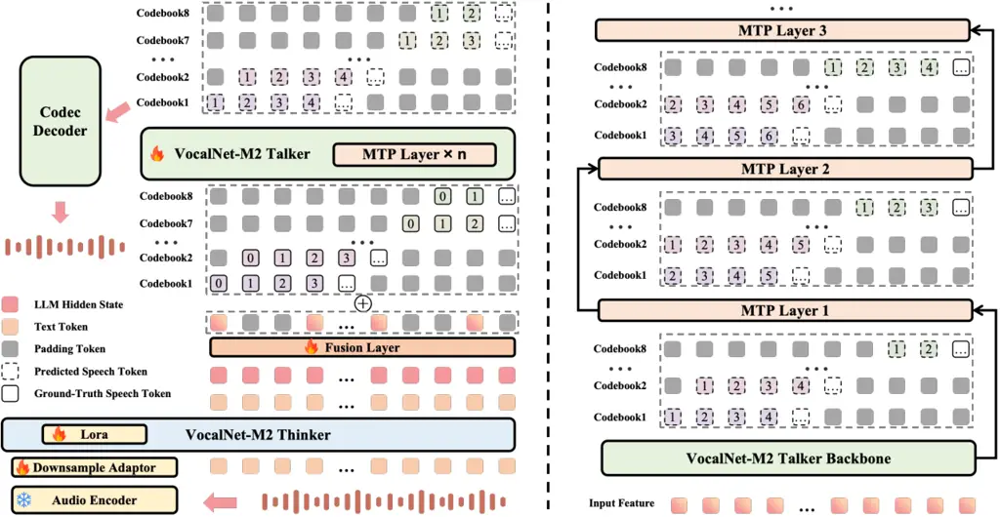

# VocalNet-M2: Advancing Low-Latency Spoken Language Modeling via Integrated Multi-Codebook Tokenization and Multi-Token Prediction

Yuhao Wang    Ziyang Cheng    Heyang Liu    Ronghua Wu    Qunshan Gu   
Yanfeng Wang    Yu Wang ^(†)^(†)thanks: ^(†)Corresponding author

###### Abstract

Current end-to-end spoken language models (SLMs) have made notable
progress, yet they still encounter considerable response latency. This
delay primarily arises from the autoregressive generation of speech
tokens and the reliance on complex flow-matching models for speech
synthesis. To overcome this, we introduce VocalNet-M2, a novel
low-latency SLM that integrates a multi-codebook tokenizer and a
multi-token prediction (MTP) strategy. Our model directly generates
multi-codebook speech tokens, thus eliminating the need for a
latency-inducing flow-matching model. Furthermore, our MTP strategy
enhances generation efficiency and improves overall performance.
Extensive experiments demonstrate that VocalNet-M2 achieves a
substantial reduction in first chunk latency (from approximately 725ms
to 350ms) while maintaining competitive performance across mainstream
SLMs. This work also provides a comprehensive comparison of
single-codebook and multi-codebook strategies, offering valuable
insights for developing efficient and high-performance SLMs for
real-time interactive applications.

###### Index Terms: 

spoken language models, multi-token prediction, multi-codebook

^(†)^(†)address: ¹Shanghai Jiao Tong University  
²Ant Group

## 1 Introduction

In recent years, end-to-end spoken language models (SLMs) have made
rapid progress, marking a significant milestone in generative AI \[18,
16, 11, 21\]. These models learn to directly model discrete speech
tokens derived from a speech tokenizer, endowing Large Language Models
(LLMs) with the dual ability to comprehend and generate both text and
speech, which is particularly valuable for applications requiring
natural and fluent human-computer dialogue, such as voice assistants and
real-time conversational agents.

Current approaches for multimodal modeling of text and speech in SLMs
can be broadly categorized into two paradigms. The first is the
speech-native multimodal approach, which directly extends an LLM’s
vocabulary to include tokens from speech corpora \[16, 11, 21, 2, 17\].
The second is the modality-alignment approach \[20, 1, 15\]. This method
leverages pre-trained LLMs and integrates separate speech input/output
modules through efficient cross-modal alignment. This reduces the need
for extensive training from scratch, building upon existing LLM
capabilities.

Despite these advancements, a significant challenge for current
open-source SLMs is high response latency, which severely degrades user
experience in speech interactions. This latency primarily arises from
two sources: the autoregressive generation of both text and speech
tokens by the Transformer decoder, and the subsequent conversion of
speech tokens into waveforms. Most SLMs are trained to generate a single
codebook of semantic speech tokens \[1, 15, 21, 2, 6\]. These tokens are
then converted into a mel spectrogram by a flow-matching model, which a
vocoder finally synthesizes into an audio waveform \[5\]. While semantic
tokens effectively capture linguistic content, their limited acoustic
information necessitates a flow-matching model for detailed acoustic
reconstruction. Although this simplifies the speech modeling task for
the LLM and can produce high-quality speech, it introduces a critical
bottleneck. The heavy reliance on the flow-matching model for acoustic
reconstruction leads to substantial computational overhead and,
critically, significant inference latency. This poses a major challenge
for real-time interactive applications where low-latency turn-taking is
essential.

To mitigate this, a direct approach is to empower SLMs to generate
multi-codebook speech tokens. These tokens inherently contain richer
acoustic information, which could eliminate the need for a separate,
latency-inducing flow-matching model. While Moshi \[3\] has explored
multi-codebook strategies, its application has been confined to the
speech-native multimodal paradigm. Furthermore, a systematic analysis of
the architectural design and a comprehensive comparison between
single-codebook and multi-codebook strategies remain largely unexplored.

Therefore, in this work, we propose VocalNet-M2, a novel low-latency
modality-alignment SLM incorporating a multi-codebook tokenizer and a
multi-token prediction (MTP) strategy \[7\]. Our main contributions are
threefold:

- •
  We propose a novel modality-aligned spoken language model architecture
  capable of directly generating multi-codebook speech tokens,
  eliminating the need for a flow-matching model and enabling more
  streamlined and efficient speech response generation.
- •
  We design a specialized multi-token prediction strategy tailored for
  multi-codebook generation, which significantly improves the
  performance of VocalNet-M2 while further reducing inference latency.
- •
  We conduct extensive experiments comparing single-codebook and
  multi-codebook strategies, revealing their respective strengths and
  trade-offs. Our findings provide actionable insights for future
  research on efficient and high-performance spoken language models.



Figure 1: Left: Overview of the VocalNet-M2 architecture. Right: The
detailed architecture of VocalNet-M2 Talker.

## 2 VocalNet-M2

### 2.1 Model Architecture

VocalNet-M2 adopts a Thinker-Talker architecture \[18\], as illustrated
in Figure 1 (Left).

Given a raw audio input $`{x}^{a}`$, it is first processed by an Audio
Encoder and a Downsample Adaptor. This converts the raw audio into
continuous representations $`{r^{a}_{1:T}}`$ that capture the
high-quality features of the input. These representations are then fed
into the VocalNet-M2 Thinker. The Thinker is responsible for
autoregressively generating both the textual response tokens and their
corresponding hidden states:

```math
({t^{\text{text}}_{1:N},h^{\text{text}}_{1:N}})=\mathcal{T}_{\text{thinker}}({r^{a}_{1:T}}) \tag{1}
```

Here, $`{t^{\text{text}}_{1:N}}`$ represents the sequence of generated
text tokens, and $`{h^{\text{text}}_{1:N}}`$ are their associated LLM
hidden states, providing a rich semantic embedding for subsequent speech
generation.

The VocalNet-M2 Talker is a multi-track autoregressive transformer
decoder designed to generate speech tokens. VocalNet-M2 utilizes the
XY-Tokenizer \[8\] to extract eight codebook audio tokens. Consequently,
as shown in Figure 1, the Talker operates with eight distinct audio
tracks (one for each codebook) and a semantic representation track as
input. Its output consists of eight audio tracks, corresponding to the
predicted tokens for each codebook.

Before being input to the Talker, the hidden states and text embeddings
from the Thinker are processed by a Fusion Layer. This layer, composed
of 2 linear layers, fuses the text embeddings and the Thinker’s hidden
states to create a unified semantic representation:

```math
{h^{\text{fused}}_{1:N}}=\mathrm{Linear}\Big(\sigma\big(\mathrm{Linear}(\mathrm{Emb}({t^{\text{text}}_{1:N}})||{h^{\text{text}}_{1:N}})\big)\Big) \tag{2}
```

Where $`\mathrm{Emb}({t^{\text{text}}_{1:N}})`$ denotes the embeddings
of the text tokens, and $`||`$ signifies concatenation.

To address the inherent frequency mismatch between text and speech
tokens, we first upsample the fused representation
$`{h^{\text{fused}}_{1:N}}`$ to three times its original length. This
upsampling aims to promote better temporal alignment between the
semantic information and the audio tokens. For the current decoding
timestep $`t`$, this upsampled sequence is then either truncated or
padded with zeros to match the current audio tokens length $`t`$,
forming $`{h^{\text{up}}_{1:t}}`$:

```math
{h^{\text{up}}_{1:t}}=\begin{cases}[h^{\text{fused}}_{1},\mathbf{0},\mathbf{0},\cdots,h^{\text{fused}}_{N},\mathbf{0},\mathbf{0}]_{1:t}&\text{if }3N\geq t\\
[h^{\text{fused}}_{1},\mathbf{0},\mathbf{0},\cdots,h^{\text{fused}}_{N},\mathbf{0},\mathbf{0},\mathbf{0},\cdots,\mathbf{0}]_{1:t}&\text{if }3N<t\end{cases} \tag{3}
```

Then, the VocalNet-M2 Talker predicts the audio tokens at time $`t+1`$.
Its input consists of the upsampled hidden states
($`{h^{\text{up}}_{1:t}}`$) and the embeddings of all previously
predicted audio tokens
($`\sum_{j=1}^{8}\mathrm{Emb}(a^{\text{cb}j}_{1:t})`$). The Talker then
outputs the eight audio tokens for time $`t+1`$ via eight linear layers:

```math
\{a^{\text{cb}j}_{t+1}\}_{j=1}^{8}=\mathcal{T}_{\text{talker}}(h^{\text{up}}_{1:t}+\sum_{j=1}^{8}\mathrm{Emb}(a^{\text{cb}j}_{1:t})) \tag{4}
```

This design allows VocalNet-M2 to generate audio tokens in a streaming
manner by continuously feeding the $`{h^{\text{up}}}`$ sequence into the
Talker. During training, the cross-entropy loss is computed for each
codebook at each time step $`t`$:

```math
\mathcal{L}_{talker}=-\sum_{t=0}^{M-1}\sum_{j=1}^{8}\mathrm{log}P(a^{\text{cb}j}_{t+1}|h^{up}_{1:t},\{a^{\text{cb}i}_{1:t}\}_{i=1}^{8}) \tag{5}
```

Here, $`M`$ is the length of audio token.

| Model               | text       |                 |          |               | speech |       | First chunk latency (ms) |
| ------------------- | ---------- | --------------- | -------- | ------------- | ------ | ----- | ------------------------ |
|                     | AlpacaEval | Llama Questions | TriviaQA | Web Questions | wer    | utmos |                          |
| SLAM-Omni \[2\]     | 3.50       | 2.94            | 0.39     | 0.84          | 5.78   | 4.46  | 702.41 $`\pm`$ 30.30     |
| VocalNet-8B \[15\]  | 7.12       | 7.95            | 6.24     | 6.48          | 3.64   | 4.49  | 556.00 $`\pm`$ 8.29      |
| GLM-4-Voice \[21\]  | 5.86       | 7.74            | 4.95     | 5.56          | 11.90  | 4.23  | 1060.36 $`\pm`$ 2.36     |
| MiniCPM-o \[12\]    | 6.13       | 7.72            | 6.43     | 7.16          | 9.52   | 4.14  | 893.82 $`\pm`$ 81.80     |
| kimi-audio \[4\]    | 6.49       | 8.10            | 6.15     | 7.10          | 14.71  | 2.87  | 1744.80 $`\pm`$ 139.99   |
| Qwen2.5-Omni \[18\] | 6.01       | 7.90            | 5.89     | 6.88          | 2.31   | 4.34  | \\                       |
| VocalNet-M2         | 7.29       | 8.33            | 6.13     | 6.65          | 6.07   | 4.31  | 348.86 $`\pm`$ 2.86      |

Table 1: Comparison between VocalNet-M2 and other mainstream SLMs. We
evaluate their performance including text quality, speech quality, and
first chunk latency. Note that Qwen2.5-Omni’s first chunk latency was
not measured due to the absence of officially provided streaming
inference code. The latency results are shown in the formation
‘mean$`\pm`$standard error’.

### 2.2 Multi-token Prediction (MTP)

To enhance generation efficiency and capture local dependencies more
effectively \[15\], VocalNet-M2 incorporates a MTP mechanism. As shown
in Figure 1 (Right), the VocalNet-M2 Talker consists of a Talker
backbone followed by $`N_{\text{mtp}}`$ sequential MTP layers. This
design allows the model to predict $`N_{\text{mtp}}+1`$ audio tokens for
each codebook in a single inference step while preserving the essential
temporal relationships between these tokens.

Specifically, for an MTP Layer $`n`$ (where
$`n\in\{1,\ldots,N_{\text{mtp}}\}`$), it is designed to predict the
audio tokens at time step $`t+n+1`$, leveraging information available up
to time $`t`$. The output of an MTP layer can be formally expressed as:

```math
\{a^{\text{cb}j}_{t+n+1}\}_{j=1}^{8}=\mathcal{T}_{\text{MTP}_{n}}\cdots\mathcal{T}_{\text{MTP}_{1}}\mathcal{T}_{\text{talker}}(h^{\text{up}}_{1:t}+\sum_{j=1}^{8}\mathrm{Emb}(a^{\text{cb}j}_{1:t})) \tag{6}
```

As analyzed in VocalNet \[15\], this approach helps the model to more
efficiently leverage limited training data and better capture local
dependencies between speech tokens. Consequently, the overall training
objective integrates the standard Talker loss with losses from each MTP
layer:

```math
\displaystyle\mathcal{L}_{\text{mtp}}=-\sum_{n=0}^{N_{\text{mtp}}}\sum_{t=0}^{M-1}\sum_{j=1}^{8}\mathrm{log}P(a^{\text{cb}j}_{t+n+1}|h^{\text{up}}_{1:t},\{a^{\text{cb}i}_{1:t}\}_{i=1}^{8}) \tag{7}
```

### 2.3 Training Stategy

The training strategy for VocalNet-M2 is structured in three sequential
stages. The initial stage focuses on pre-training the VocalNet-M2 Talker
using TTS data, where the model learns to synthesize high-quality speech
solely from text tokens, thereby establishing its fundamental speech
generation capabilities. Following this, the second stage is dedicated
to training the downsample adaptor and VocalNet-M2 Thinker with Lora,
enabling it to comprehend and process raw audio inputs and generate text
responses. The final stage integrates both the Thinker and Talker
modules for end-to-end fine-tuning on speech-to-speech dialogue data.
Distinct from the initial TTS pre-training, here the Talker module
receives both the hidden states and text embeddings generated by the
Thinker. This comprehensive final phase allows the entire VocalNet-M2
model to process audio input, produce a pertinent textual response, and
concurrently generate the corresponding speech output.

## 3 Experimental Settings

### 3.1 Training Data

For TTS pre-training, we used approximately 10k hours of randomly
sampled audio from the Emilia dataset \[9\]. Our speech dialogue
training dataset totals about 800K samples (approximately 7k hours of
audio). This includes 400K dialogues from VoiceAssistant \[17\], 300K
from Ultrachat \[15\], and an additional 100K English multi-turn speech
dialogues synthesized from tulu-3-sft-mixture \[10\] using
Cosyvoice2 \[5\].

Regarding model initialization, the audio encoder is based on the
Whisper-large-v3 \[13\]. The VocalNet-M2 Thinker is initialized from
Qwen3-8B \[19\]. The VocalNet-M2 Talker shares a similar architectural
design with the Thinker but employs a reduced number of transformer
layers and is trained separately from scratch. As for audio labels, we
ultilize XY-tokenizer \[8\] to extract tokens.

### 3.2 Evaluation Metrics

To thoroughly assess VocalNet-M2’s voice interaction capabilities, we
utilize the English subsets of OpenAudioBench \[11\]. The quality of
textual responses generated by the model is evaluated using Qwen-max,
which scores correctness and relevance on a normalized scale of 0 to 10.
For evaluating speech quality, we employ two distinct metrics.
UTMOS \[14\] predicts Mean Opinion Scores (MOS) for objective
measurement of perceived naturalness. To quantify the alignment between
synthesized speech and its text, we transcribe the speech using
Whisper-large-v3 \[13\] and then compute the Word Error Rate (WER)
against the ground-truth text.

## 4 Experimental Results

### 4.1 Main Results

Table 1 presents a comparative analysis between VocalNet-M2 and other
mainstream SLMs. VocalNet-M2 demonstrates strong performance in text
quality, retaining the knowledge and reasoning capabilities of Qwen3-8B.
It achieves the highest scores in AlpacaEval and Llama Questions,
alongside competitive results in TriviaQA and Web Questions. For speech
quality, evaluated using UTMOS and WER, VocalNet-M2’s performance is in
the mid-range among current mainstream models, as shown in Table 1. This
is an expected outcome given the limited training data and the inherent
complexity of learning multi-codebook speech tokens compared to
single-codebook approaches.

Furthermore, we conducted a latency analysis, measuring the first audio
chunk generation time for all models. To ensure a fair comparison and
minimize variability arising from custom implementations, we prioritized
models with officially provided streaming inference code. Consequently,
Qwen2.5-Omni was excluded due to the absence of such code. Most models
were evaluated using a fixed first chunk duration of 0.8 seconds; the
sole exception was MiniCPM-o, whose official implementation has a fixed
chunk size of 0.533 seconds. All tests were performed on a single L20
GPU without acceleration frameworks (e.g., vLLM), as these are not
universally supported by the baseline models. As detailed in Table 1,
VocalNet-M2 exhibits significantly lower first chunk latency while
maintaining competitive performance. This efficiency is attributed to
its direct modeling of multi-codebook speech tokens and the
incorporation of the MTP approach.

### 4.2 Comparison Between Single and Multi-Codebook Tokens

This section explores the differences in modeling single and
multi-codebook speech tokens. For the tokenizer with single-codebook, we
utilize the $`\mathcal{S}^{3}`$ tokenizer from Cosyvoice2 \[5\].
Conversely, the XY-tokenizer with 8 codebooks is utilized for extracting
multi-codebook tokens. Two versions of training data were constructed:

- •
  v1 data: The speech dialogue data described in Section 3.1.
- •
  v2 data: A high-quality dialogue dataset of approximately 400K
  samples, derived from v1. It exhibits higher UTMOS and lower WER,
  achieved by filtering samples with high WER and re-synthesizing audio
  with high-quality prompts.

The results of this ablation study are presented in Table 2.

Firstly, we observe that learning to generate multi-codebook speech
tokens requires more training data than single-codebook tokens to
achieve comparable performance. Without TTS pretraining, the model
struggles to generate the multi-codebook tokens, resulting in very high
WER and low UTMOS scores. In contrast, learning speech tokens extracted
by the $`\mathcal{S}^{3}`$ tokenizer is easier; even without
pretraining, the model can achieve respectable performance.

Secondly, high-quality training data is crucial for learning to generate
multi-codebook speech tokens. Models trained with ‘emilia + v2’ data
demonstrate significantly better WER and UTMOS scores compared to those
trained with ‘emilia + v1’ data. This improvement is not observed in
models leveraging single codebook speech tokens. The reason for this
disparity is that single codebook speech tokens inherently lack acoustic
information, which must be reconstructed through a flow-matching model
to convert them back into speech. Consequently, the quality of speech
generated from single codebook tokens heavily relies on the performance
of the flow-matching model. In this work, we utilize the CosyVoice2
flow-matching model, enabling single-codebook-based models to achieve
high performance in both WER and UTMOS, even when trained on noisier,
lower-quality ‘v1’ data. In contrast, models based on multi-codebook
tokens directly learn acoustic features from the dialogue data, making
them more sensitive to the quality of the training data.

| tokenizer                                      | Training data | WER   | utmos | First chunk latency |
| ---------------------------------------------- | ------------- | ----- | ----- | ------------------- |
| $`\mathcal{S}^{3}`$ tokenizer(Single-codebook) | v1            | 10.66 | 4.34  |                     |
|                                                | emilia + v1   | 3.73  | 4.35  | 725.90 $`\pm`$ 9.17 |
|                                                | emilia + v2   | 3.68  | 4.37  |                     |
| XY-tokenizer(Multi-codebook)                   | v1            | 20.49 | 3.89  |                     |
|                                                | emilia + v1   | 10.43 | 4.08  | 405.23 $`\pm`$ 6.29 |
|                                                | emilia + v2   | 8.56  | 4.24  |                     |

Table 2: Impact of tokenizer type (single vs. multi-codebook) and
training data quality on speech generation performance.

| Metrics | w/o MTP Layer | w/ n MTP layer |      |      |      |      |
| ------- | ------------- | -------------- | ---- | ---- | ---- | ---- |
|         |               | n=1            | n=2  | n=3  | n=4  | n=5  |
| WER     | 8.56          | 7.64           | 6.53 | 6.64 | 6.07 | 6.33 |
| UTMOS   | 4.24          | 4.28           | 4.29 | 4.28 | 4.31 | 4.29 |

Table 3: Ablation study on the impact of MTP on model’s performance.

### 4.3 Ablation study on MTP

This section investigates the impact of MTP on the model’s performance.
In this experiment, we varied the number of MTP layers used during
training, while MTP layers were not employed during inference. As shown
in Table 3, the introduction of MTP significantly reduced the WER from
8.56 (without MTP layers) to an optimal 6.07 with four MTP layers. UTMOS
scores remained consistently high, with the best score of 4.31 also
achieved with four MTP layers. Therefore, a configuration with four MTP
layers was adopted for VocalNet-M2.

### 4.4 Latency Analysis

We categorize the first chunk latency into three distinct parts: (1) the
Thinker’s generation of text tokens and hidden states, (2) the Talker’s
generation of speech tokens, and (3) the Vocoder’s conversion of these
tokens into speech. Figure 2 illustrates the latency for various
configurations. Notably, the integration of multi-codebook speech tokens
and the MTP method significantly reduced the latency in both the (2)
Talker and (3) Vocoder stages. These advancements collectively enabled
VocalNet-M2 to achieve a first chunk latency reduction from 725 ms to
348 ms, resulting in an inference speedup of approximately $`2\times`$.

Figure 2: Breakdown of first chunk latency across different model
components for various configurations.

## 5 Conclusion

In this work, we introduced VocalNet-M2, a novel low-latency
modality-alignment SLM. Our key contributions include a new model
architecture designed to directly generate multi-codebook speech tokens,
thereby eliminating the need for a computationally intensive
flow-matching model for speech synthesis and significantly reducing
latency. Additionally, we developed a MTP strategy that not only
enhances overall performance but also further reduces inference latency.
Our experimental results demonstrate that VocalNet-M2 effectively
reduces first chunk latency by approximately 50%, from 725ms to 348ms,
showcasing a substantial improvement in responsiveness. We also provided
a thorough comparison between single and multi-codebook approaches,
highlighting their respective advantages and limitations. These
advancements pave the way for more efficient and responsive spoken
dialogue systems.

## References

- \[1\] Q. Chen, Y. Chen, Y. Chen, M. Chen, Y. Chen, C. Deng, Z. Du, R.
  Gao, C. Gao, Z. Gao, et al. (2025) Minmo: a multimodal large language
  model for seamless voice interaction. arXiv preprint arXiv:2501.06282.
  Cited by: §1, §1.
- \[2\] W. Chen, Z. Ma, R. Yan, Y. Liang, X. Li, R. Xu, Z. Niu, Y.
  Zhu, Y. Yang, Z. Liu, et al. (2024) Slam-omni: timbre-controllable
  voice interaction system with single-stage training. arXiv preprint
  arXiv:2412.15649. Cited by: §1, §1, Table 1.
- \[3\] A. Défossez, L. Mazaré, M. Orsini, A. Royer, P. Pérez, H.
  Jégou, E. Grave, and N. Zeghidour (2024) Moshi: a speech-text
  foundation model for real-time dialogue. arXiv preprint
  arXiv:2410.00037. Cited by: §1.
- \[4\] D. Ding, Z. Ju, Y. Leng, S. Liu, T. Liu, Z. Shang, K. Shen, W.
  Song, X. Tan, H. Tang, et al. (2025) Kimi-audio technical report.
  arXiv preprint arXiv:2504.18425. Cited by: Table 1.
- \[5\] Z. Du, Y. Wang, Q. Chen, X. Shi, X. Lv, T. Zhao, Z. Gao, Y.
  Yang, C. Gao, H. Wang, et al. (2024) Cosyvoice 2: scalable streaming
  speech synthesis with large language models. arXiv preprint
  arXiv:2412.10117. Cited by: §1, §3.1, §4.2.
- \[6\] Q. Fang, Y. Zhou, S. Guo, S. Zhang, and Y. Feng (2025)
  Llama-omni2: llm-based real-time spoken chatbot with autoregressive
  streaming speech synthesis. arXiv preprint arXiv:2505.02625. Cited by:
  §1.
- \[7\] F. Gloeckle, B. Y. Idrissi, B. Rozière, D. Lopez-Paz, and G.
  Synnaeve (2024) Better & faster large language models via multi-token
  prediction. arXiv preprint arXiv:2404.19737. Cited by: §1.
- \[8\] Y. Gong, L. Jin, R. Deng, D. Zhang, X. Zhang, Q. Cheng, Z.
  Fei, S. Li, and X. Qiu (2025) XY-tokenizer: mitigating the
  semantic-acoustic conflict in low-bitrate speech codecs. arXiv
  preprint arXiv:2506.23325. Cited by: §2.1, §3.1.
- \[9\] H. He, Z. Shang, C. Wang, X. Li, Y. Gu, H. Hua, L. Liu, C.
  Yang, J. Li, P. Shi, et al. (2024) Emilia: an extensive, multilingual,
  and diverse speech dataset for large-scale speech generation. In 2024
  IEEE Spoken Language Technology Workshop (SLT), pp. 885–890. Cited by:
  §3.1.
- \[10\] N. Lambert, J. Morrison, V. Pyatkin, S. Huang, H. Ivison, F.
  Brahman, L. J. V. Miranda, A. Liu, N. Dziri, S. Lyu, et al. (2024)
  Tulu 3: pushing frontiers in open language model post-training. arXiv
  preprint arXiv:2411.15124. Cited by: §3.1.
- \[11\] Y. Li, J. Liu, T. Zhang, S. Chen, T. Li, Z. Li, L. Liu, L.
  Ming, G. Dong, D. Pan, et al. (2025) Baichuan-omni-1.5 technical
  report. arXiv preprint arXiv:2501.15368. Cited by: §1, §1, §3.2.
- \[12\] OpenBMB MiniCPM-o 2.6: a gpt-4o level mllm for vision, speech,
  and multimodal live streaming on your phone. Note:
  [https://openbmb.notion.site/185ede1b7a558042b5d5e45e6b237da9](https://openbmb.notion.site/185ede1b7a558042b5d5e45e6b237da9)Accessed:
  2025-03-28 Cited by: Table 1.
- \[13\] A. Radford, J. W. Kim, T. Xu, G. Brockman, C. McLeavey, and I.
  Sutskever (2023) Robust speech recognition via large-scale weak
  supervision. In International conference on machine learning,
  pp. 28492–28518. Cited by: §3.1, §3.2.
- \[14\] T. Saeki, D. Xin, W. Nakata, T. Koriyama, S. Takamichi, and H.
  Saruwatari (2022) Utmos: utokyo-sarulab system for voicemos challenge 2022. arXiv preprint arXiv:2204.02152. Cited by: §3.2.
- \[15\] Y. Wang, H. Liu, Z. Cheng, R. Wu, Q. Gu, Y. Wang, and Y.
  Wang (2025) Vocalnet: speech llm with multi-token prediction for
  faster and high-quality generation. arXiv preprint arXiv:2504.04060.
  Cited by: §1, §1, §2.2, §2.2, Table 1, §3.1.
- \[16\] B. Wu, C. Yan, C. Hu, C. Yi, C. Feng, F. Tian, F. Shen, G.
  Yu, H. Zhang, J. Li, et al. (2025) Step-audio 2 technical report.
  arXiv preprint arXiv:2507.16632. Cited by: §1, §1.
- \[17\] Z. Xie and C. Wu (2024) Mini-omni: language models can hear,
  talk while thinking in streaming. arXiv preprint arXiv:2408.16725.
  Cited by: §1, §3.1.
- \[18\] J. Xu, Z. Guo, J. He, H. Hu, T. He, S. Bai, K. Chen, J.
  Wang, Y. Fan, K. Dang, et al. (2025) Qwen2. 5-omni technical report.
  arXiv preprint arXiv:2503.20215. Cited by: §1, §2.1, Table 1.
- \[19\] A. Yang, A. Li, B. Yang, B. Zhang, B. Hui, B. Zheng, B. Yu, C.
  Gao, C. Huang, C. Lv, C. Zheng, D. Liu, F. Zhou, F. Huang, F. Hu, H.
  Ge, H. Wei, H. Lin, J. Tang, J. Yang, J. Tu, J. Zhang, J. Yang, J.
  Yang, J. Zhou, J. Zhou, J. Lin, K. Dang, K. Bao, K. Yang, L. Yu, L.
  Deng, M. Li, M. Xue, M. Li, P. Zhang, P. Wang, Q. Zhu, R. Men, R.
  Gao, S. Liu, S. Luo, T. Li, T. Tang, W. Yin, X. Ren, X. Wang, X.
  Zhang, X. Ren, Y. Fan, Y. Su, Y. Zhang, Y. Zhang, Y. Wan, Y. Liu, Z.
  Wang, Z. Cui, Z. Zhang, Z. Zhou, and Z. Qiu (2025) Qwen3 technical
  report. arXiv preprint arXiv:2505.09388. Cited by: §3.1.
- \[20\] W. Yu, S. Wang, X. Yang, X. Chen, X. Tian, J. Zhang, G. Sun, L.
  Lu, Y. Wang, and C. Zhang (2025) SALMONN-omni: a standalone speech llm
  without codec injection for full-duplex conversation. arXiv preprint
  arXiv:2505.17060. Cited by: §1.
- \[21\] A. Zeng, Z. Du, M. Liu, K. Wang, S. Jiang, L. Zhao, Y. Dong,
  and J. Tang (2024) Glm-4-voice: towards intelligent and human-like
  end-to-end spoken chatbot. arXiv preprint arXiv:2412.02612. Cited by:
  §1, §1, §1, Table 1.
