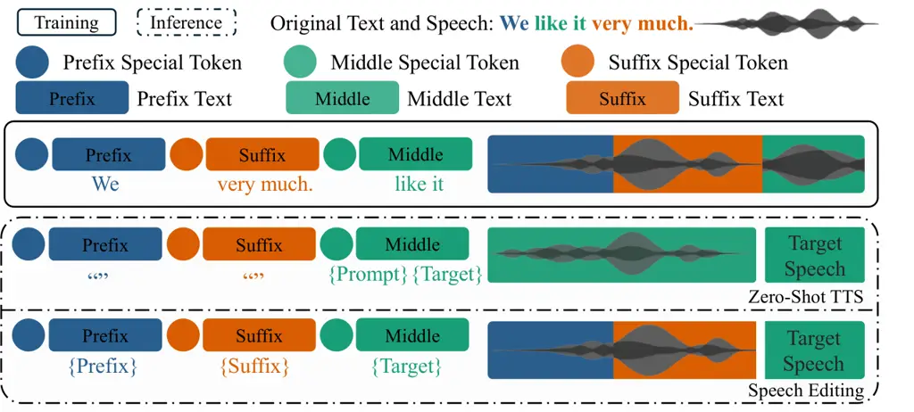
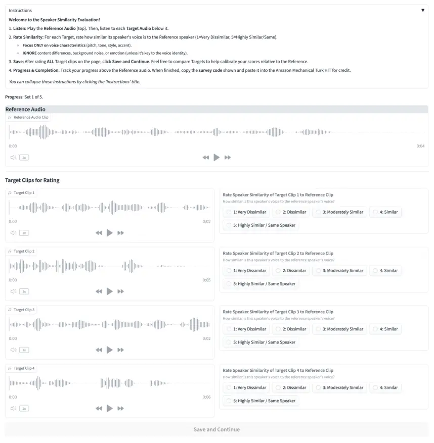
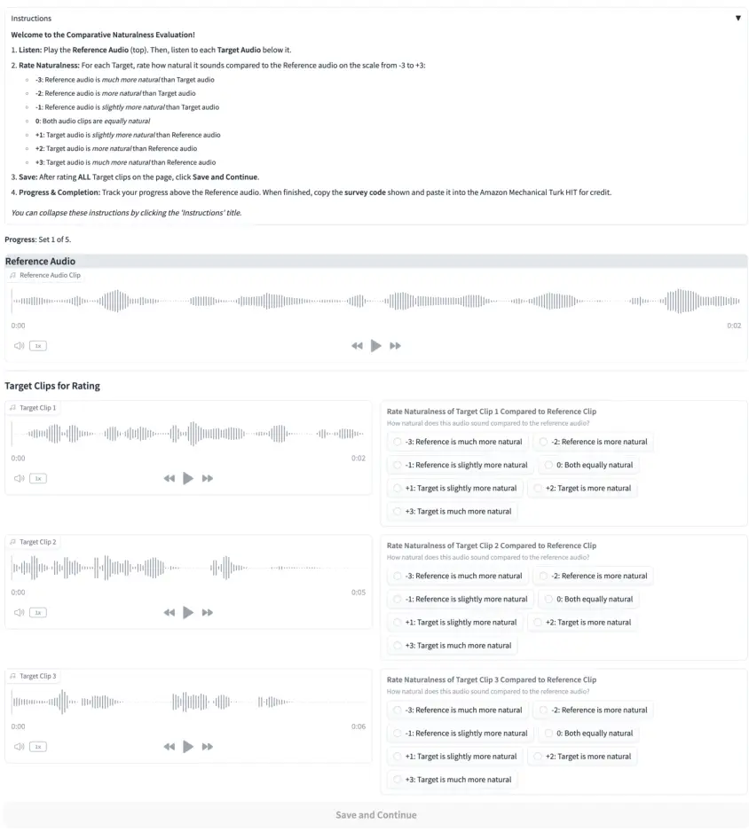
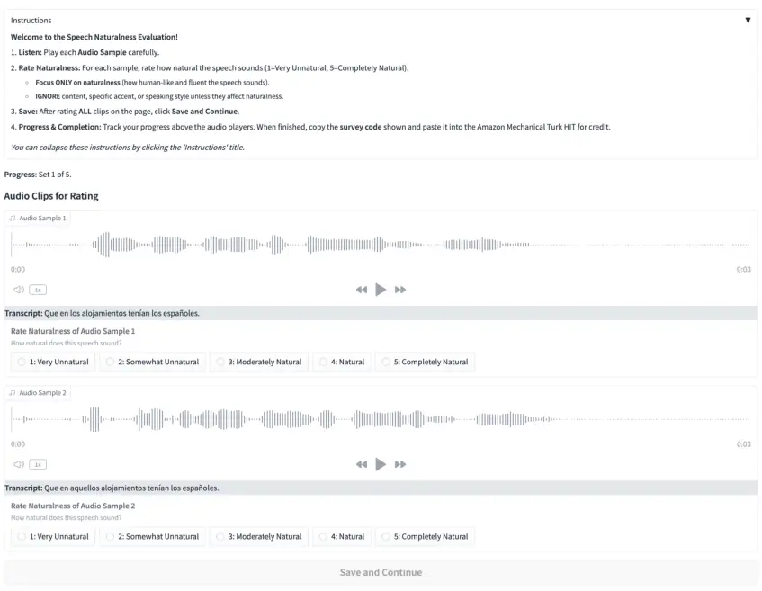
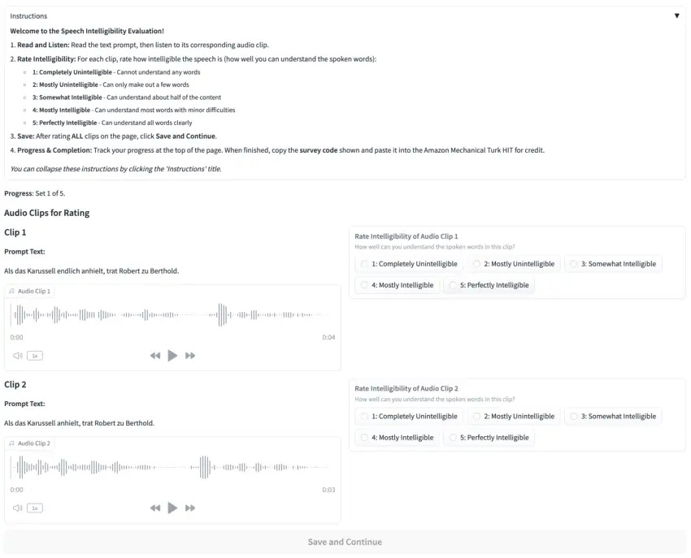

# VoiceCraft-X: Unifying Multilingual, Voice-Cloning Speech Synthesis and Speech Editing

Zhisheng Zheng Affiliation: University of Texas at Austin    Puyuan Peng
Affiliation: University of Texas at Austin    Anuj Diwan
Affiliation: University of Texas at Austin    Cong Phuoc Huynh
Affiliation: Amazon    Xiaohang Sun Affiliation: Amazon    Zhu Liu
Affiliation: Amazon    Vimal Bhat Affiliation: Amazon    David Harwath
^(†)^(†)thanks: Corresponding author Affiliation: University of Texas at
Austin

###### Abstract

We introduce VoiceCraft-X, an autoregressive neural codec language model
which unifies multilingual speech editing and zero-shot Text-to-Speech
(TTS) synthesis across 11 languages: English, Mandarin, Korean,
Japanese, Spanish, French, German, Dutch, Italian, Portuguese, and
Polish. VoiceCraft-X utilizes the Qwen3 large language model for
phoneme-free cross-lingual text processing and a novel token reordering
mechanism with time-aligned text and speech tokens to handle both tasks
as a single sequence generation problem. The model generates
high-quality, natural-sounding speech, seamlessly creating new audio or
editing existing recordings within one framework. VoiceCraft-X shows
robust performance in diverse linguistic settings, even with limited
per-language data, underscoring the power of unified autoregressive
approaches for advancing complex, real-world multilingual speech
applications. Audio samples are available at
[https://zhishengzheng.com/voicecraft-x/](https://zhishengzheng.com/voicecraft-x/).

## 1 Introduction

Highly realistic speech generation is an indispensable technology for
voice assistants, content dubbing, accessibility tools, and creative
media. Speech generation can be broken down into several sub-problems:
_creating_ new audio via Text-To-Speech synthesis (TTS) or _editing_
part of an existing recording while ensuring voice consistency with the
remainder of the original speech. Despite their shared goal of producing
natural speech, TTS and speech editing are typically treated as
_separate_ problems, especially in multilingual settings, which leaves
practitioners without a _single_ model that can both edit and synthesize
speech across languages.

Over the past several years, the quality of TTS models has improved
significantly, particularly in the zero-shot setting in which a model
generates speech in a new speaker’s voice given a short (e.g. 3 second)
audio prompt. Transformer-based neural networks have been central to
this progress, leading to three broad paradigms: (i) autoregressive
(AR), (ii) non-autoregressive (Non-AR), and (iii) hybrid models. AR
models, such as VALL-E (Wang et al., 2023) and its successors (Zhang et
al., 2023b; Han et al., 2024; Xin et al., 2024; Chen et al., 2024a; Song
et al., 2025; Yang et al., 2025), generate frame-level speech tokens
sequentially, where the tokens are typically derived from a neural audio
codec (Défossez et al., 2022; Zeghidour et al., 2021; Zhang et al.,
2023a). These models are able to perform voice-cloning TTS via
Transformer language models’ in-context learning ability, demonstrating
high-quality speech synthesis. Non-AR models include flow-matching
models such as F5-TTS (Chen et al., 2024b), as well as diffusion models
such as NaturalSpeech 2/3 (Shen et al., 2023; Ju et al., 2024). These
models predict all tokens representing an utterance in parallel via
iterative refinement. Hybrid approaches such as Seed-TTS (Anastassiou et
al., 2024), CosyVoice (Du et al., 2024b; Du et al., 2024c) and
MaskGCT (Wang et al., 2024) aim to combine the strengths of both
paradigms. While these models deliver impressive zero-shot quality, most
of the models are either monolingual or focus on a handful of
high-resource languages such as English and Chinese. This is likely due
to the fact that these models are data-hungry, often requiring 10K-100K
hours of training speech for SOTA performance.

The quest for broader linguistic inclusivity across the world’s 7,000
spoken languages (Eberhard et al., 2024) has driven research in
multilingual speech generation. Efforts include curating large corpora
(e.g., VoxPopuliTTS (Liu et al., 2025), Fish-Speech (Liao et al., 2024))
and training multilingual TTS architectures like VoiceBox (Le et al.,
2023), CLAM-TTS (Kim et al., 2024) and XTTS (Casanova et al., 2024). Yet
even the most capable multilingual systems treat _speech editing_ as a
separate task—or ignore it altogether—leaving users without a unified
solution.

In this paper we address this gap, by introducing VoiceCraft-X, a
unified autoregressive neural codec language model that performs _both_
speech editing and zero-shot TTS in 11 languages: English (en), Mandarin
(zh), Korean (ko), Japanese (ja), Spanish (es), French (fr), German
(de), Dutch (nl), Italian (it), Portuguese (pt) and Polish (pl). Our
contributions are threefold:

1.  1.  We introduce VoiceCraft-X, a single autoregressive model that
        unifies multilingual speech editing and zero-shot Text-to-Speech
        (TTS) across 11 languages.
2.  2.  Our approach leverages the Qwen3 large language model for
        cross-lingual text processing, without the need for phonetic
        pronunciation lexicons. We also propose a novel token reordering
        mechanism that time-aligns text and speech, enabling a unified
        sequence generation approach for both editing and synthesis.
3.  3.  We demonstrate VoiceCraft-X’s robust generation of high-quality,
        natural-sounding speech across diverse languages, even with limited
        per-language data, and will release our code and model to the
        community.

## 2 Related Work

### 2.1 Speech Editing

Speech editing aims to correct mispronunciations, stutters, or recording
artifacts while producing speech that is indistinguishable from natural
audio. Recent approaches leverage Transformer and diffusion
architectures. Borsos et al. (2022) perform audio infilling with a
Transformer that maintains speaker identity and prosody, generalizing to
unseen speakers.  Le et al. (2023) use flow matching for versatile
speech infilling, and Peng et al. (2024) show that a neural-codec
language model with token infilling can concurrently handle editing and
synthesis. F5-TTS (Chen et al., 2024b) and MaskGCT (Wang et al., 2024)
extend this idea with flow-matching or diffusion, respectively. Despite
these advances, most works are monolingual, motivating a unified
multilingual solution.

### 2.2 Zero-Shot Speech Synthesis

The zero-shot Text-to-Speech (TTS) synthesis task entails generating
speech in a new speaker’s voice from a short audio prompt, without
assuming that the new speaker was seen during training. Recent progress
is largely driven by Transformer-based neural networks, falling into
autoregressive (AR), non-autoregressive (non-AR), and hybrid.

Autoregressive (AR) models generate speech tokens sequentially.
VALL-E (Wang et al., 2023) pioneered neural codec language models for
high-quality zero-shot TTS via in-context learning, with subsequent
works (Zhang et al., 2023b; Han et al., 2024; Chen et al., 2024a; Xin et
al., 2024; Song et al., 2025; Kharitonov et al., 2023; Łajszczak et al.,
2024; Peng et al., 2024; Guo et al., 2024) further refining this
paradigm. Non-Autoregressive (Non-AR) models aim for faster generation
by predicting tokens in parallel or using iterative refinement. Examples
include flow-matching models like VoiceBox (Le et al., 2023) and
diffusion-based models such as NaturalSpeech 2 (Shen et al., 2023),
NaturalSpeech 3 (Ju et al., 2024), and DiTTo-TTS (Lee et al., 2024).
Other notable non-AR approaches include Unicats (Du et al., 2024a),
SimpleSpeech (Yang et al., 2024b; Yang et al., 2024a), E2-TTS (Eskimez
et al., 2024), F5-TTS (Chen et al., 2024b) and Mega-TTS 3 (Jiang et al.,
2025). Hybrid systems combine aspects of both AR and non-AR methods.
Seed-TTS (Anastassiou et al., 2024) uses a two-stage architecture, while
CosyVoice (Du et al., 2024b; Du et al., 2024c) and MaskGCT (Wang et al., 2024) also represent efforts to balance quality, speed, and
controllability. In this work, VoiceCraft-X follows the codec language
modeling method of VoiceCraft (Peng et al., 2024) and enables
high-quality, zero-shot multilingual speech synthesis within its unified
editing and generation framework.

### 2.3 Multilingual Speech Generation

Prior work on multilingual speech synthesis largely pursues two
complementary goals: (i) expanding language coverage and (ii) achieving
zero-shot robustness to unseen speakers and languages.

On the data side, Saeki et al. (2024) show that pairing self-supervised
speech representations with unsupervised text alignment scales TTS to
100 + languages, even when only scant transcriptions exist. Large
curated corpora amplify these gains: VoxPopuliTTS (Liu et al., 2025)
refines 30,000 hours of English, French and Spanish speech; Fish-Speech
 (Liao et al., 2024) goes further, training on 720,000 hours while using
an LLM to sidestep language-specific G2P rules. Model architectures have
evolved in parallel. VoiceBox (Le et al., 2023) adopts
non-autoregressive flow matching, delivering cross-lingual zero-shot TTS
in six languages via in-context learning. XTTS (Casanova et al., 2024),
extending Tortoise (Betker, 2023), combines a Perceiver Resampler with a
speaker-consistency loss to reach 16 languages with speaker cloning.
CLAM-TTS (Kim et al., 2024) improves codec language model compression
with probabilistic residual vector quantization, enabling single-step
multi-token generation. However, these models often treat synthesis as a
distinct task from speech editing. The challenge of _unifying_
high-quality, multilingual speech editing with robust multilingual
speech synthesis within a single, open-source, and fully autoregressive
model architecture remains largely unaddressed.

## 3 Method

### 3.1 Overview

Figure 1: Architecture Overview. This diagram illustrates the training
process for the VoiceCraft-X model. The model takes text and a speaker
embedding as input and is trained to predict sequences of speech tokens.
The labels CB1-CB4 represent codec tokens from different codebooks.

VoiceCraft-X evolves VoiceCraft (Peng et al., 2024) into a truly
multilingual speech-editing and synthesis system, treating both tasks as
a single sequence-generation problem over neural codec tokens. The core
of this system, as illustrated in Figure 1, is the Qwen3 (Qwen-Team, 2025) large language model. Qwen3 natively supports text input in
$`119`$ languages and dialects, which we leverage as the cross-lingual
input text tokenizer for VoiceCraft-X. This eliminates the cumbersome
phoneme-conversion step that was integral to the original VoiceCraft,
resulting in a simplified pipeline with a shared tokenizer across
languages, without the need to curate pronunciation lexicons for each
language.

A further key innovation in VoiceCraft-X is its enhanced data layout: it
interleaves text tokens and speech tokens in a single, time-ordered
stream, whereas VoiceCraft reordered only the speech tokens. Enforcing
this alignment between linguistic content and its acoustic realization
yields more consistent and natural-sounding speech.

### 3.2 Speaker Embedding

In addition to the speech tokens representing the prompt speech,
VoiceCraft-X also takes as input a speaker embedding vector extracted
from this prompt speech. We follow the approach of CosyVoice (Du et al.,
2024b) by using a pre-trained voiceprint model¹¹ 1
[https://www.modelscope.cn/models/iic/CosyVoice-300M/file/view/master/campplus.onnx](https://www.modelscope.cn/models/iic/CosyVoice-300M/file/view/master/campplus.onnx)
to extract the speaker embedding. The resulting vector is then passed
through a linear projection layer. This projection maps the speaker
embedding to match Qwen3’s input dimension.

### 3.3 Speech Tokenization

We utilize the EnCodec (Défossez et al., 2022) neural audio codec model
to tokenize the input utterance. Specifically, we train a modified
version of the tokenizer which outputs a sequence of four parallel token
streams at a 50Hz framerate. The tokens are discretized with residual
vector quantization (RVQ) with a vocabulary size of 2048 at each
quantization layer.

### 3.4 Token Reordering

VoiceCraft-X employs several token reordering steps, illustrated in
Figure 2, to unify speech editing and synthesis. We assume that our
training examples consist of utterance waveforms accompanied by
time-aligned word transcriptions (we use the Montreal Forced Aligner
(MFA) (McAuliffe et al., 2017) in our work). During training, a text
transcription is randomly segmented into prefix, middle, and suffix
portions. These are then rearranged into a "prefix-suffix-middle"
sequence, where the "middle" segment serves as the prediction target.
Finally, the corresponding speech tokens for each segment are reordered
identically based on the alignment timings. This ensures a monotonic
alignment between the text and speech tokens, even when performing
speech edits which require infilling tokens in the middle of the speech
sequence. This rearrangement serves to mirror the use case in which a
user wishes to modify some, but not all of the words in an utterance -
by using this rearrangement, the model can be trained to predict the
speech tokens within the middle of an utterance, conditioned on the
preceding (prefix) and following (suffix) speech tokens in addition to
the desired text transcription.

### 3.5 Causal Masking and Delay Pattern

Following the token reordering, a learnable \<MASK\> token is inserted
at two locations within the text-speech input sequence: one \<MASK\>
token is inserted at the boundary between the prefix and suffix speech
tokens, and a second \<MASK\> token is placed between the suffix audio
tokens and the middle (target) audio tokens. These tokens serve to
inform the model of the boundaries between the segments.

During training, the model is tasked with autoregressively predicting
all audio tokens: encompassing those in the prefix, suffix, and the
middle (target) segments. This prediction is optimized using a standard
language modeling objective, where the cross-entropy loss function is
applied to every token in the sequence. By training the model to predict
not only the target segment but also the known prefix and suffix
segments, it receives gradients for every timestep, resulting in faster
training.

To model the $`K`$ parallel token sequences output by the EnCodec
tokenizer autoregressively, we incorporate the “Delay Pattern” proposed
by MusicGen (Copet et al., 2023). Instead of predicting all $`K`$
codebooks for a given audio timestep $`t`$ simultaneously or flattening
all codebooks across all timesteps into one long sequence, delay
patterning inserts a cumulative time delay of one timestep per RVQ layer
to the EnCodec token sequences. As a result, the prediction for the
speech token at codebook level $`k`$ at timestep $`t`$ can be
conditioned on the model’s predictions for codebook levels 1 through
$`k-1`$ associated with the same timestep $`t`$.



Figure 2: Illustration of Token Reordering

### 3.6 Inference

Figure 2 shows how, at inference time, VoiceCraft-X performs speech
editing and zero-shot text-to-speech by preparing an input sequence
based on the "prefix-suffix-middle" reordering of text and speech
tokens. The system then autoregressively generates the neural codec
tokens for the target audio segment.

#### Speech editing

Let $`T_{P},\,A_{P}`$ be the prefix text/audio, $`T_{S},\,A_{S}`$ the
suffix, and $`T_{M}^{\text{new}}`$ the user-supplied replacement text
for the middle segment. The model input is the concatenation

```math
\begin{split}T_{P},\;T_{S},\;T_{M}^{\text{new}},\ \textit{<SPK>},\;A_{P},\;\textit{<M>},\;A_{S},\;\textit{<M>},\end{split}
```

where \<SPK\> is a speaker embedding token and \<M\> is the (learnable)
mask token. The decoder predicts the middle-segment audio tokens
$`\hat{A}_{M}`$, which we splice between $`A_{P}`$ and $`A_{S}`$ before
decoding the entire sequence with the EnCodec decoder network to create
a seamless edit.

#### Zero-shot TTS

If a prompt text ($`T_{prompt}`$) and its corresponding prompt speech
are provided, we concatenate the prompt text and the target text
($`T_{target}`$) to form the middle text segment, and a speaker
embedding is extracted from the prompt speech. If no such prompt is
provided, we set the prompt text ($`T_{prompt}`$) to empty and randomly
generate a speaker embedding. The final input is as follows:

```math
\begin{split}&T_{P},\;T_{S},\;T_{prompt},\;T_{target},\;\\
&\textit{<SPK>},\;A_{P},\;\textit{<M>},\;A_{S},\;\textit{<M>},\;A_{prompt},\end{split}
```

where $`T_{P}=T_{S}=\varnothing`$, $`A_{P}=A_{S}=\varnothing`$, and
$`T_{prompt}=A_{prompt}=\varnothing`$ if no prompt is provided.

## 4 Experiments

### 4.1 Setup

#### Training Dataset.

We combined speech data across public datasets over 11 languages,
amounting to a total of approximately 32K hours (detailed statistics
provided in Appendix §A.1). The sampling rate for all audio is 16 kHz.
Audio segments longer than 25 seconds were discarded. For MLS
dataset (Pratap et al., 2020), misalignment issues were particularly
prominent, with approximately 20% of samples having extra or missing
words in the transcript at the beginning or end. We found that this
negatively impacted model performance for English, and subsequently
removed utterances whose transcriptions differed significantly from
those produced by the Whisper (Radford et al., 2023) model. While we
found similar problems with the non-English European language data in
MLS, we anecdotally observed better performance on those languages
without performing this filtering. We speculate that this is due to the
fact that the amount of available training data for those languages is
already relatively low, and the performance improvements brought by the
additional training data outweigh the detriments brought by
transcription noise.

#### Evaluation Dataset.

For evaluating Text-to-Speech (TTS) performance, we curated an
evaluation dataset from several established benchmarks. For English, we
utilized the Seed-TTS test-en set (Anastassiou et al., 2024) (1088
samples sourced from Common Voice (Ardila et al., 2019)). For Mandarin,
we employed the Seed-TTS test-zh set (2020 samples from DiDiSpeech (Guo
et al., 2021)). Korean and Japanese evaluations were conducted using 200
randomly selected samples from KsponSpeech (Bang et al., 2020) and
KokoroSpeech (Iida, 2021), respectively. For the remaining seven
languages supported by our model (Spanish, French, German, Dutch,
Italian, Portuguese, and Polish), we randomly selected 100 samples for
each language from their corresponding Multilingual LibriSpeech
(MLS) (Pratap et al., 2020) test sets. To evaluate speech editing, we
randomly selected 100-300 samples per language from these TTS test
datasets and then utilized Gemini (Team et al., 2023) to perform
insertion, deletion, or substitution operations on the textual portions
of these samples, with specific details available in the appendix §A.2.
We conducted subjective evaluation over a subset of languages (English,
Chinese, French, Italian, Portuguese, and Spanish) using a random subset
of the evaluation set: 40 English samples, 50 Chinese, and 20 for
others.

#### Training.

Our model utilizes Encodec (Défossez et al., 2022) as the speech
tokenizer. We retrain the model with some modifications, namely using 4
Residual Vector Quantization (RVQ) codebooks, each containing 2048
entries, and a framerate of 50Hz on audio recorded at 16 kHz. We retrain
the model with our multilingual speech data. Other than those, the
training process adheres to the methodology outlined in the work
by (Défossez et al., 2022). Additional configuration specifics can be
found in Section §B.1. To combine the parallel speech tokens when using
them as input to the Transformer LM, at each timestep we sum the
embeddings of the tokens across the four codebooks.

We use Qwen3-0.6B-Base as both the text tokenizer and the Transformer LM
backbone (details are provided in Appendix B.2). The outputs from the
final Transformer layer are then projected into four distinct linear
layers, each producing the logits for one of the codec tokens. The model
comprises 613 million total parameters (457 million excluding
embeddings). The codebook weights $`\boldsymbol{\alpha}`$ are set to
$`(1.0,0.8,0.6,0.4)`$, influencing the contribution of each codebook
during training (as further detailed in our loss formulation §B.3). For
model training, we employ the AdamW optimizer (Loshchilov and Hutter, 2017) with a learning rate of $`4\times 10^{-3}`$, $`\beta_{1}=0.9`$,
$`\beta_{2}=0.999`$, an epsilon of $`1\times 10^{-6}`$, and a weight
decay of $`0.01`$. A learning rate scheduler is utilized, featuring a
linear warm-up for the initial $`50K`$ steps, followed by a linear decay
for the remainder of the $`5,000K`$ total training steps. Gradient
accumulation is performed over $`8`$ micro-batches. The training of the
multilingual VoiceCraft-X model took approximately one week on 16 NVIDIA
A100 40GB GPUs.

#### Inference

Figure 2 shows how, at inference time, VoiceCraft-X performs speech
editing and zero-shot text-to-speech by preparing an input sequence
based on the "prefix-suffix-middle" reordering of text and speech
tokens; the model then autoregressively predicts the corresponding
neural codec tokens for the target audio segment. Notably, the token
reordering mechanism significantly enhances inference stability. This
largely prevents repeating token loops, an issue in the original
VoiceCraft which could cause artifacts (e.g., excessive silences) and
required multi-sample filtering. Consequently, VoiceCraft-X reliably
generates high-quality speech in a single pass without needing this
filtering step. In all experiments, we employ nucleus sampling (Holtzman
et al., 2019) with $`TopK=20,TopP=1.0`$, and a temperature of 1.

#### Baselines.

For the English and Chinese Zero-shot TTS tasks, we compared our model
with FireRedTTS (Guo et al., 2024), MaskGCT (Wang et al., 2024),
F5-TTS (Chen et al., 2024b), CosyVoice (Du et al., 2024b), and CosyVoice
2 (Du et al., 2024c). For English, we also included VoiceCraft (Peng et
al., 2024) in our comparison. For the remaining languages, we
benchmarked our model against the multilingual XTTS (Casanova et al., 2024) model, considering both its v1 and v2 versions. For speech
editing, we compared VoiceCraft-X with the original VoiceCraft (Peng et
al., 2024) model on English.

|                                |             |          |          |       |      |             |          |          |      |      |
| ------------------------------ | ----------- | -------- | -------- | ----- | ---- | ----------- | -------- | -------- | ---- | ---- |
|                                | Chinese\*   |          |          |       |      | English     |          |          |      |      |
|                                | Train (hrs) | WER      | SIM-o    | CMOS  | SMOS | Train (hrs) | WER      | SIM-o    | CMOS | SMOS |
| Ground Truth                   | -           | 1.25     | 0.75     | 0.0   | 3.38 | -           | 2.14     | 0.73     | 0.0  | 3.36 |
| MaskGCT (Wang et al., 2024)    | 49.9K       | 2.27^(†) | 0.77^(†) | -     | -    | 46.8K       | 2.62^(†) | 0.72^(†) | -    | -    |
| F5-TTS (Chen et al., 2024b)    | 49.9K       | 1.56^(†) | 0.76^(†) | -     | -    | 46.8K       | 1.83^(†) | 0.67^(†) | -    | -    |
| FireRedTTS (Guo et al., 2024)  | 110K        | 1.21     | 0.65     | -0.28 | 2.82 | 40K         | 9.08     | 0.45     | 0.27 | 2.97 |
| CosyVoice (Du et al., 2024b)   | 130K        | 3.49     | 0.75     | 0.18  | 3.64 | 30K         | 3.89     | 0.64     | 0.50 | 3.48 |
| CosyVoice 2 (Du et al., 2024c) | 130K        | 1.35     | 0.75     | -0.01 | 3.86 | 30K         | 2.69     | 0.65     | 0.59 | 3.69 |
| VoiceCraft (Peng et al., 2024) | -           | -        | -        | -     | -    | 9K          | 5.28     | 0.51     | 0.44 | 3.27 |
| VoiceCraft-X                   | 5K          | 3.29     | 0.68     | -0.39 | 2.94 | 14.5K       | 4.20     | 0.54     | 0.63 | 3.43 |

|              |             |       |       |             |       |       |             |       |       |
| ------------ | ----------- | ----- | ----- | ----------- | ----- | ----- | ----------- | ----- | ----- |
|              | Korean\*    |       |       | Japanese\*  |       |       | Dutch       |       |       |
|              | Train (hrs) | WER   | SIM-o | Train (hrs) | WER   | SIM-o | Train (hrs) | WER   | SIM-o |
| Ground Truth | -           | 8.89  | -     | -           | 9.72  | 0.79  | -           | 9.54  | 0.65  |
| XTTS-v1      | -           | -     | -     | -           | -     | -     | -           | 78.17 | 0.41  |
| XTTS-v2      | 539^(‡)     | 40.89 | 0.62  | 57^(‡)      | 11.61 | 0.64  | 74^(‡)      | 12.62 | 0.59  |
| VoiceCraft-X | 832         | 31.11 | 0.56  | 3489        | 15.09 | 0.66  | 2147        | 16.28 | 0.61  |

|              |             |       |       |             |       |       |             |       |       |
| ------------ | ----------- | ----- | ----- | ----------- | ----- | ----- | ----------- | ----- | ----- |
|              | Italian     |       |       | Portuguese  |       |       | Polish      |       |       |
|              | Train (hrs) | WER   | SIM-o | Train (hrs) | WER   | SIM-o | Train (hrs) | WER   | SIM-o |
| Ground Truth | -           | 9.48  | 0.68  | -           | 8.75  | 0.69  | -           | 8.81  | 0.72  |
| XTTS-v1      | -           | 73.12 | 0.32  | -           | 48.93 | 0.33  | -           | 96.15 | 0.41  |
| XTTS-v2      | 1297^(‡)    | 15.52 | 0.56  | 2387^(‡)    | 13.48 | 0.58  | 199^(‡)     | 9.47  | 0.62  |
| VoiceCraft-X | 294         | 15.46 | 0.54  | 223         | 22.57 | 0.56  | 139         | 24.80 | 0.61  |

|              |             |       |       |             |       |       |             |       |       |
| ------------ | ----------- | ----- | ----- | ----------- | ----- | ----- | ----------- | ----- | ----- |
|              | French      |       |       | German      |       |       | Spanish     |       |       |
|              | Train (hrs) | WER   | SIM-o | Train (hrs) | WER   | SIM-o | Train (hrs) | WER   | SIM-o |
| Ground Truth | -           | 6.09  | 0.68  | -           | 6.64  | 0.69  | -           | 4.87  | 0.73  |
| XTTS-v1      | -           | 38.34 | 0.35  | -           | 11.37 | 0.35  | -           | 20.84 | 0.37  |
| XTTS-v2      | 2216^(‡)    | 5.45  | 0.58  | 3584^(‡)    | 16.50 | 0.59  | 1514^(‡)    | 8.11  | 0.58  |
| VoiceCraft-X | 1338        | 13.22 | 0.59  | 3405        | 8.19  | 0.60  | 1191        | 4.67  | 0.63  |

Table 1: Zero-Shot TTS performance across different models and
languages. ^(‡)Training Hours for XTTS-v2 may be an underestimation as
the model is continuously updated and specific training data has not
been fully disclosed. "-" indicates data not available or not
applicable. \*For Chinese, Korean and Japanese, figures in the WER
columns represent Character Error Rate (CER). ^(†)Scores reported in
baseline papers.

#### Metrics.

We used a combination of subjective and objective measures. Objectively,
we use Word Error Rate (WER) as an automatic proxy for the
intelligibility of the synthesized speech; this is calculated using
Paraformer-zh (Gao et al., 2023) for Chinese and
Whisper-large-v3 (Radford et al., 2023) for other languages.
Additionally, speaker similarity (SIM-o) is objectively measured by
computing the cosine similarity of speaker embeddings, which are
extracted from both the generated and original target speech using a
WavLM-based speaker verification model (Chen et al., 2022). Subjective
evaluations involved human annotators (see Appendix C for details) who
provide Comparative Mean Opinion Scores (CMOS) and Similarity Mean
Opinion Scores (SMOS) for TTS, and Naturalness Mean Opinion Scores
(NMOS) and Intelligibility Mean Opinion Scores (IMOS) for speech
editing. For CMOS, evaluators assess the naturalness of the synthesized
speech in comparison to the ground truth, while for SMOS, they directly
score the similarity between the synthesized speech and the initial
speech prompt. For NMOS and IMOS, evaluators respectively assess the
naturalness and intelligibility of the synthesized and original speech.

### 4.2 Zero-Shot TTS

We evaluated VoiceCraft-X’s zero-shot TTS performance across 11
languages, and the results are shown in Table 1. For Chinese,
VoiceCraft-X was trained on a modest $`5K`$ hours of data, a fraction of
that used by leading models (often exceeding $`50K`$ hours).
Consequently, while its CER of 3.29 was higher than these specialized
models, this was achieved with substantially less data, and its speaker
similarity and subjective scores reflected this data disparity. In
English, VoiceCraft-X, trained on $`14K`$ hours, showed marked
improvements over its predecessor, VoiceCraft, reducing its WER from
5.28 to 4.37 and enhancing SIM-o from 0.51 to 0.54. Critically, its CMOS
score of 0.63²² 2 The generally higher English CMOS scores likely
resulted from using Seed-TTS test set as prompts with atypical,
exaggerated intonation (not standard read speech). was the highest among
compared models, indicating superior perceived naturalness. While some
models trained on significantly larger datasets achieved lower WERs,
VoiceCraft-X’s subjective quality in English was highly competitive.

For the remaining nine languages, VoiceCraft-X, compared to XTTS
(versions v1 and v2), showed strong overall performance with varying
focuses. VoiceCraft-X particularly excelled in European languages like
German (WER significantly better than XTTS-v2 by over 50%), Spanish (WER
over 40% better than XTTS-v2 and below the ground truth), and Italian
(higher data efficiency), as well as in Korean (CER reduced by over
20%). However, in languages such as Japanese and Dutch, or for those
where VoiceCraft-X had considerably less training data like Portuguese
and Polish, XTTS-v2 achieved lower error rates. Nevertheless,
VoiceCraft-X was often favored by evaluators for its better speaker
similarity, naturalness, and intelligibility. (Further results are in
the appendix §C).

### 4.3 Transfer Learning for Multilingual TTS

|            |         |              |       |              |       |              |       |                       |           |                   |       |
| ---------- | ------- | ------------ | ----- | ------------ | ----- | ------------ | ----- | --------------------- | --------- | ----------------- | ----- |
| Language   | \#Hours | Multilingual |       | from Scratch |       | from English |       | from Chinese/Japanese |           | from Multilingual |       |
|            |         | WER          | SIM-o | WER          | SIM-o | WER          | SIM-o | WER                   | SIM-o     | WER               | SIM-o |
| Korean\*   | 832     | 31.11        | 0.56  | 45.79        | 0.51  | 42.10        | 0.54  | 49.11/42.08           | 0.50/0.52 | 41.36             | 0.53  |
| Japanese\* | 3489    | 15.09        | 0.66  | 22.36        | 0.62  | \-           | \-    | 36.18                 | 0.61      | 19.35             | 0.67  |
| Spanish    | 1191    | 4.67         | 0.63  | 7.08         | 0.38  | 4.54         | 0.47  | \-                    | \-        | 3.30              | 0.52  |
| French     | 1338    | 13.22        | 0.60  | 18.85        | 0.43  | 12.50        | 0.49  | \-                    | \-        | 16.39             | 0.53  |
| German     | 3405    | 8.19         | 0.60  | 6.43         | 0.43  | 5.93         | 0.50  | \-                    | \-        | 7.25              | 0.53  |
| Dutch      | 2147    | 16.28        | 0.61  | 16.85        | 0.37  | 16.02        | 0.35  | \-                    | \-        | 11.78             | 0.46  |
| Italian    | 294     | 15.46        | 0.54  | 142.30       | 0.22  | 13.97        | 0.36  | \-                    | \-        | 13.93             | 0.46  |
| Portuguese | 223     | 22.57        | 0.56  | 91.89        | 0.26  | 15.87        | 0.46  | \-                    | \-        | 14.74             | 0.55  |
| Polish     | 139     | 24.80        | 0.61  | 163.08       | 0.25  | 20.73        | 0.46  | \-                    | \-        | 19.47             | 0.55  |

Table 2: Cross-lingual transfer learning performance on zero-shot TTS
task. Comparison of fine-tuning from different pre-trained models versus
training from scratch for various target languages. Character Error Rate
(CER) for Korean and Japanese, indicated by \*. "-" indicates data not
available or not applicable.

To explore the benefits of multilingual training, especially for
lower-resource languages, we fine-tuned monolingual models on individual
languages starting from different pre-trained checkpoints, comparing
these against training from scratch and the multilingual model (detailed
in Table 2).

The universal advantage of pre-training over “from Scratch” models is
paramount, especially for languages with limited data. For instance,
Italian (294 hours) and Polish (139 hours) saw their WERs plummet from
over 140 and 160 to under 14 and 20 respectively, demonstrating
pre-training’s crucial role in transferring foundational knowledge and
overcoming data scarcity. Even higher-resource languages like Spanish,
French and German benefited significantly. Fine-tuning from an English
model initialization proved highly effective for European languages
(Germanic, Romance, Slavic), leveraging linguistic similarities and
robust acoustic modeling, with gains particularly vital for low-data
scenarios (Italian, Portuguese, Polish). Korean showed better CER with a
Japanese checkpoint (42.08) than Chinese (49.11), aligning with
typological closeness. Conversely, Japanese experienced negative
transfer from Chinese (CER 36.18 vs. 22.36 from scratch).

Furthermore, fine-tuning from the “multilingual checkpoint” frequently
yielded superior WER/CER compared to an English-only checkpoint for a
range of languages including Spanish, Dutch, Italian, Portuguese,
Polish, and Japanese. This advantage held across varying data volumes
(e.g., Polish 139 hours, Japanese 3489 hours), suggesting that
pre-training on a diverse linguistic set fosters more generalized and
transferable representations than exposure to English alone, capturing a
broader array of phonetic and prosodic patterns.

Finally, the original multilingual model’s speaker similarity is
significantly higher than models fine-tuned from other checkpoints for
nearly all languages. This indicates that joint training on diverse
linguistic data, leveraging collective data volume, allows the model to
disentangle speaker-specific characteristics from language-specific
features. This robust performance across varied languages suggests it
learns a more abstract, shared representation space for speech,
facilitating both high-fidelity synthesis and strong cross-lingual
capabilities. While fine-tuning on single language data may impact this
disentanglement ability, as evidenced by SIM-o drops in many such cases.

### 4.4 Speech Editing

|              |      |      |      |
| ------------ | ---- | ---- | ---- |
|              | WER  | NMOS | IMOS |
| Original     | 2.42 | 3.78 | 3.79 |
| VoiceCraft   | 5.99 | 3.87 | 3.87 |
| VoiceCraft-X | 5.62 | 3.68 | 3.79 |

Table 3: Performance on English speech editing.

For English speech editing (Table 3), VoiceCraft-X demonstrated a better
Word Error Rate (WER) than VoiceCraft. Both models produced edited
speech that listeners found to be highly natural (NMOS) and intelligible
(IMOS), comparable to the original recordings. VoiceCraft’s slightly
higher scores in these subjective tests are not surprising, given its
monolingual English focus, especially considering both models have
similar parameter counts and amounts of English training data.

|            |          |      |        |      |
| ---------- | -------- | ---- | ------ | ---- |
|            | Original |      | Edited |      |
|            | NMOS     | IMOS | NMOS   | IMOS |
| French     | 3.62     | 4.10 | 3.13   | 3.60 |
| Italian    | 4.38     | 4.78 | 3.77   | 4.28 |
| Portuguese | 4.42     | 4.98 | 2.63   | 3.78 |
| Spanish    | 3.80     | 3.93 | 3.58   | 3.78 |

Table 4: Subjective performance on speech editing.

For multilingual speech editing in other languages—a capability where
comparative baselines are notably scarce as most models do not support
multilingual editing—we conducted subjective MOS evaluations. These
evaluations focused on a subset of languages (French, Italian,
Portuguese, and Spanish) for which MTurk annotators were available, with
results presented in Table 4. The evaluations demonstrate VoiceCraft-X’s
effective performance in this challenging scenario. While naturalness
(NMOS) scores for edited speech are, as anticipated, lower than the
original recordings, intelligibility (IMOS) remains high across these
languages. Particularly for Spanish and Italian, where edited NMOS and
IMOS scores closely matched the original audio, these findings
underscore VoiceCraft-X’s significant and unique capability for
coherent, comprehensible multilingual speech editing.

## 5 Conclusion

We present VoiceCraft-X, an autoregressive neural codec language model
that successfully unifies multilingual speech editing and Text-to-Speech
(TTS) synthesis. Leveraging the Qwen3 LLM and a novel token reordering
strategy, VoiceCraft-X supports eleven languages, producing
high-quality, natural-sounding speech. Our model demonstrates robust
performance across diverse conditions and shows that a unified framework
can effectively advance both speech editing and synthesis in
multilingual contexts, even with limited data for some languages. This
work underscores the potential of autoregressive models for complex,
real-world speech generation tasks.

## Limitations

One key limitation is the scale of our training data. Although
VoiceCraft-X performs well with approximately 32,578 hours across eleven
languages, this is notably less than some state-of-the-art models. This
comparative data scarcity, particularly for lower-resource languages in
our set, may limit the model’s capacity to capture the full spectrum of
speech nuances as effectively as systems trained on more extensive
datasets.

Secondly, while the model’s multilingual support is a core feature, its
current reach of eleven languages (with around 20-30 explored
internally) only scratches the surface of global linguistic diversity.
Expanding coverage to more languages, especially under-resourced ones,
remains a significant challenge that would require substantial data
curation and potential model adaptations to address varied linguistic
features.

Finally, further investigation into model size scalability is also
warranted. The current VoiceCraft-X utilizes the Qwen3-0.6B
architecture; exploring larger model variants could unlock enhanced
learning capabilities and higher fidelity in speech synthesis and
editing. Systematically assessing different model sizes is crucial for
optimizing the balance between performance improvements and
computational demands.

## Ethical Implications

The development of advanced speech models like VoiceCraft-X, which
possesses strong zero-shot voice cloning and multilingual editing
capabilities, carries significant ethical responsibilities. We
acknowledge the potential for misuse of this technology. Malicious
actors could exploit it for unauthorized voice cloning, impersonation,
the creation of convincing deepfakes for fraudulent purposes, or the
generation of misinformation and propaganda. These risks are
particularly pronounced given the model’s ability to operate across
eleven languages, broadening the potential scope for misuse on a global
scale.

The zero-shot nature of VoiceCraft-X lowers the barrier to entry for
creating high-fidelity synthetic audio, making it accessible to a wider
range of actors beyond those with specialized technical expertise. This
accessibility amplifies the dual-use nature of the technology; while it
empowers creativity and accessibility, it also provides a powerful tool
for deception.

We recognize that technical solutions alone are insufficient to address
these societal challenges. The proliferation of convincing synthetic
media necessitates a broader, collaborative effort involving
researchers, platform companies, policymakers, and the public to develop
new norms, regulations, and educational initiatives around the
responsible creation and consumption of digital content.

To mitigate these risks, we are committed to a responsible release of
our model and code. We strongly advocate for the research community to
explore and develop robust safeguards, such as audio watermarking and
detection tools, to help distinguish between authentic and synthesized
audio. Such advancements are crucial for building a safer information
ecosystem, but are only possible if open-source versions of these models
are available for researchers to utilize. Our release will be
accompanied by strict intended-use guidelines and a license that
explicitly prohibits malicious applications, such as impersonating
public figures or private individuals without their explicit consent. We
believe that by fostering an open yet cautious approach, we can
encourage further research into safety measures while providing a
valuable tool for beneficial applications and advancing the field of
speech technology responsibly.

## Acknowledgments

This work was supported by Amazon.com, PO No. 2D-16003984 through the
Amazon-UT Austin HUB. We thank Sanyuan Chen, Zhikang Niu, Chen Yang,
Tianrui Wang, Yushen Chen, Yifan Yang, Xie Chen for their constructive
feedback.

## References

- Anastassiou et al. (2024) P. Anastassiou, J. Chen, J. Chen, Y.
  Chen, Z. Chen, Z. Chen, J. Cong, L. Deng, C. Ding, L. Gao, et al.
  Seed-tts: a family of high-quality versatile speech generation models.
  arXiv preprint arXiv:2406.02430. Cited by: §1, §2.2, §4.1.
- Ardila et al. (2019) R. Ardila, M. Branson, K. Davis, M. Henretty, M.
  Kohler, J. Meyer, R. Morais, L. Saunders, F. M. Tyers, and G. Weber
  Common voice: a massively-multilingual speech corpus. arXiv preprint
  arXiv:1912.06670. Cited by: §4.1.
- Bang et al. (2020) J. Bang, S. Yun, S. Kim, M. Choi, M. Lee, Y.
  Kim, D. Kim, J. Park, Y. Lee, and S. Kim Ksponspeech: korean
  spontaneous speech corpus for automatic speech recognition. Applied
  Sciences. Cited by: Table 5, §4.1.
- Betker (2023) J. Betker Better speech synthesis through scaling. arXiv
  preprint arXiv:2305.07243. Cited by: §2.3.
- Borsos et al. (2022) Z. Borsos, M. Sharifi, and M. Tagliasacchi
  Speechpainter: text-conditioned speech inpainting. arXiv preprint
  arXiv:2202.07273. Cited by: §2.1.
- Casanova et al. (2024) E. Casanova, K. Davis, E. Gölge, G. Göknar, I.
  Gulea, L. Hart, A. Aljafari, J. Meyer, R. Morais, S. Olayemi, et al.
  Xtts: a massively multilingual zero-shot text-to-speech model. arXiv
  preprint arXiv:2406.04904. Cited by: §1, §2.3, §4.1.
- Chen et al. (2021) G. Chen, S. Chai, G. Wang, J. Du, W. Zhang, C.
  Weng, D. Su, D. Povey, J. Trmal, J. Zhang, et al. Gigaspeech: an
  evolving, multi-domain asr corpus with 10,000 hours of transcribed
  audio. arXiv preprint arXiv:2106.06909. Cited by: Table 5.
- Chen et al. (2024a) S. Chen, S. Liu, L. Zhou, Y. Liu, X. Tan, J.
  Li, S. Zhao, Y. Qian, and F. Wei Vall-e 2: neural codec language
  models are human parity zero-shot text to speech synthesizers. arXiv
  preprint arXiv:2406.05370. Cited by: §1, §2.2.
- Chen et al. (2022) S. Chen, C. Wang, Z. Chen, Y. Wu, S. Liu, Z.
  Chen, J. Li, N. Kanda, T. Yoshioka, X. Xiao, et al. Wavlm: large-scale
  self-supervised pre-training for full stack speech processing. In
  Journal JSTSP. Cited by: §4.1.
- Chen et al. (2024b) Y. Chen, Z. Niu, Z. Ma, K. Deng, C. Wang, J.
  Zhao, K. Yu, and X. Chen F5-tts: a fairytaler that fakes fluent and
  faithful speech with flow matching. arXiv preprint arXiv:2410.06885.
  Cited by: §1, §2.1, §2.2, §4.1, Table 1.
- Copet et al. (2023) J. Copet, F. Kreuk, I. Gat, T. Remez, D. Kant, G.
  Synnaeve, Y. Adi, and A. Défossez Simple and controllable music
  generation. In Proc. NeurIPS, Cited by: §3.5.
- Défossez et al. (2022) A. Défossez, J. Copet, G. Synnaeve, and Y. Adi
  High fidelity neural audio compression. arXiv preprint
  arXiv:2210.13438. Cited by: §B.1, §1, §3.3, §4.1.
- Du et al. (2024a) C. Du, Y. Guo, F. Shen, Z. Liu, Z. Liang, X.
  Chen, S. Wang, H. Zhang, and K. Yu Unicats: a unified context-aware
  text-to-speech framework with contextual vq-diffusion and vocoding. In
  Proc. AAAI, Cited by: §2.2.
- Du et al. (2018) J. Du, X. Na, X. Liu, and H. Bu Aishell-2:
  transforming mandarin asr research into industrial scale. arXiv
  preprint arXiv:1808.10583. Cited by: Table 5.
- Du et al. (2024b) Z. Du, Q. Chen, S. Zhang, K. Hu, H. Lu, Y. Yang, H.
  Hu, S. Zheng, Y. Gu, Z. Ma, et al. Cosyvoice: a scalable multilingual
  zero-shot text-to-speech synthesizer based on supervised semantic
  tokens. arXiv preprint arXiv:2407.05407. Cited by: §1, §2.2, §3.2,
  §4.1, Table 1.
- Du et al. (2024c) Z. Du, Y. Wang, Q. Chen, X. Shi, X. Lv, T. Zhao, Z.
  Gao, Y. Yang, C. Gao, H. Wang, et al. Cosyvoice 2: scalable streaming
  speech synthesis with large language models. arXiv preprint
  arXiv:2412.10117. Cited by: §1, §2.2, §4.1, Table 1.
- D. M. Eberhard, G. F. Simons, and C. D. Fennig (Eds.) (2024) D. M.
  Eberhard, G. F. Simons, and C. D. Fennig (Eds.) Ethnologue: languages
  of the world. Twenty-seventh edition, SIL International, Dallas,
  Texas. External Links: [Link](http://www.ethnologue.com) Cited by: §1.
- Eskimez et al. (2024) S. E. Eskimez, X. Wang, M. Thakker, C. Li, C.
  Tsai, Z. Xiao, H. Yang, Z. Zhu, M. Tang, X. Tan, et al. E2 tts:
  embarrassingly easy fully non-autoregressive zero-shot tts. In Proc.
  SLT, Cited by: §2.2.
- Gao et al. (2023) Z. Gao, Z. Li, J. Wang, H. Luo, X. Shi, M. Chen, Y.
  Li, L. Zuo, Z. Du, Z. Xiao, et al. Funasr: a fundamental end-to-end
  speech recognition toolkit. arXiv preprint arXiv:2305.11013. Cited by:
  §4.1.
- Guo et al. (2024) H. Guo, Y. Hu, K. Liu, F. Shen, X. Tang, Y. Wu, F.
  Xie, K. Xie, and K. Xu Fireredtts: a foundation text-to-speech
  framework for industry-level generative speech applications. arXiv
  preprint arXiv:2409.03283. Cited by: §2.2, §4.1, Table 1.
- Guo et al. (2021) T. Guo, C. Wen, D. Jiang, N. Luo, R. Zhang, S.
  Zhao, W. Li, C. Gong, W. Zou, K. Han, et al. Didispeech: a large scale
  mandarin speech corpus. In Proc. ICASSP, Cited by: §4.1.
- Han et al. (2024) B. Han, L. Zhou, S. Liu, S. Chen, L. Meng, Y.
  Qian, Y. Liu, S. Zhao, J. Li, and F. Wei VALL-e r: robust and
  efficient zero-shot text-to-speech synthesis via monotonic alignment.
  arXiv preprint arXiv:2406.07855. Cited by: §1, §2.2.
- Holtzman et al. (2019) A. Holtzman, J. Buys, L. Du, M. Forbes, and Y.
  Choi The curious case of neural text degeneration. arXiv preprint
  arXiv:1904.09751. Cited by: §4.1.
- Iida (2021) K. Iida Kokoro speech dataset. Note:
  [https://github.com/kaiidams/Kokoro-Speech-Dataset](https://github.com/kaiidams/Kokoro-Speech-Dataset)
  External Links:
  [Link](https://github.com/kaiidams/Kokoro-Speech-Dataset) Cited by:
  §4.1.
- Jiang et al. (2025) Z. Jiang, Y. Ren, R. Li, S. Ji, B. Zhang, Z.
  Ye, C. Zhang, B. Jionghao, X. Yang, J. Zuo, et al. MegaTTS 3: sparse
  alignment enhanced latent diffusion transformer for zero-shot speech
  synthesis. arXiv preprint arXiv:2502.18924. Cited by: §2.2.
- Ju et al. (2024) Z. Ju, Y. Wang, K. Shen, X. Tan, D. Xin, D. Yang, Y.
  Liu, Y. Leng, K. Song, S. Tang, et al. Naturalspeech 3: zero-shot
  speech synthesis with factorized codec and diffusion models. arXiv
  preprint arXiv:2403.03100. Cited by: §1, §2.2.
- Kharitonov et al. (2023) E. Kharitonov, D. Vincent, Z. Borsos, R.
  Marinier, S. Girgin, O. Pietquin, M. Sharifi, M. Tagliasacchi, and N.
  Zeghidour Speak, read and prompt: high-fidelity text-to-speech with
  minimal supervision. In journal TACL. Cited by: §2.2.
- Kim et al. (2024) J. Kim, K. Lee, S. Chung, and J. Cho CLaM-tts:
  improving neural codec language model for zero-shot text-to-speech. In
  Proc. ICLR, Cited by: §1, §2.3.
- Kingma and Ba (2014) D. P. Kingma and J. Ba Adam: a method for
  stochastic optimization. arXiv preprint arXiv:1412.6980. Cited by:
  §B.1.
- Koizumi et al. (2023) Y. Koizumi, H. Zen, S. Karita, Y. Ding, K.
  Yatabe, N. Morioka, M. Bacchiani, Y. Zhang, W. Han, and A. Bapna
  Libritts-r: a restored multi-speaker text-to-speech corpus. arXiv
  preprint arXiv:2305.18802. Cited by: Table 5, §D.1.
- Le et al. (2023) M. Le, A. Vyas, B. Shi, B. Karrer, L. Sari, R.
  Moritz, M. Williamson, V. Manohar, Y. Adi, J. Mahadeokar, et al.
  Voicebox: text-guided multilingual universal speech generation at
  scale. In Proc. NeurIPS, Cited by: §1, §2.1, §2.2, §2.3.
- Lee et al. (2024) K. Lee, D. W. Kim, J. Kim, and J. Cho Ditto-tts:
  efficient and scalable zero-shot text-to-speech with diffusion
  transformer. arXiv preprint arXiv:2406.11427. Cited by: §2.2.
- Liao et al. (2024) S. Liao, Y. Wang, T. Li, Y. Cheng, R. Zhang, R.
  Zhou, and Y. Xing Fish-speech: leveraging large language models for
  advanced multilingual text-to-speech synthesis. arXiv preprint
  arXiv:2411.01156. Cited by: §1, §2.3.
- Liu et al. (2025) W. Liu, J. Bai, X. Cheng, J. Zuo, Z. Jiang, S.
  Ji, M. Fang, X. Yang, Q. Yang, and Z. Zhao VoxpopuliTTS: a large-scale
  multilingual tts corpus for zero-shot speech generation. In Proc.
  COLING, Cited by: §1, §2.3.
- Loshchilov and Hutter (2017) I. Loshchilov and F. Hutter Decoupled
  weight decay regularization. arXiv preprint arXiv:1711.05101. Cited
  by: §4.1.
- Ma et al. (2024) L. Ma, D. Guo, K. Song, Y. Jiang, S. Wang, L. Xue, W.
  Xu, H. Zhao, B. Zhang, and L. Xie Wenetspeech4tts: a 12,800-hour
  mandarin tts corpus for large speech generation model benchmark. arXiv
  preprint arXiv:2406.05763. Cited by: Table 5, §D.1.
- Magic Data (2019) Magic Data MAGICDATA mandarin chinese read speech
  corpus. Cited by: Table 5.
- McAuliffe et al. (2017) M. McAuliffe, M. Socolof, S. Mihuc, M. Wagner,
  and M. Sonderegger Montreal forced aligner: trainable text-speech
  alignment using kaldi.. In Proc. Interspeech, Cited by: §3.4.
- Oliveira et al. (2023) F. S. Oliveira, E. Casanova, A. C.
  Junior, A. S. Soares, and A. R. Galvão Filho Cml-tts: a multilingual
  dataset for speech synthesis in low-resource languages. In Proc. TSD,
  Cited by: Table 5.
- Peng et al. (2024) P. Peng, P. Huang, S. Li, A. Mohamed, and D.
  Harwath Voicecraft: zero-shot speech editing and text-to-speech in the
  wild. arXiv preprint arXiv:2403.16973. Cited by: §A.2, §2.1, §2.2,
  §3.1, §4.1, Table 1.
- Pratap et al. (2020) V. Pratap, Q. Xu, A. Sriram, G. Synnaeve, and R.
  Collobert Mls: a large-scale multilingual dataset for speech research.
  arXiv preprint arXiv:2012.03411. Cited by: Table 5, Table 5, §4.1,
  §4.1.
- Qwen-Team (2025) Qwen-Team Qwen3. External Links:
  [Link](https://qwenlm.github.io/blog/qwen3/) Cited by: §3.1.
- Radford et al. (2023) A. Radford, J. W. Kim, T. Xu, G. Brockman, C.
  McLeavey, and I. Sutskever Robust speech recognition via large-scale
  weak supervision. In Proc. ICML, Cited by: §4.1, §4.1.
- Saeki et al. (2024) T. Saeki, G. Wang, N. Morioka, I. Elias, K.
  Kastner, A. Rosenberg, B. Ramabhadran, H. Zen, F. Beaufays, and H.
  Shemtov Extending multilingual speech synthesis to 100+ languages
  without transcribed data. In Proc. ICASSP, Cited by: §2.3.
- Shen et al. (2023) K. Shen, Z. Ju, X. Tan, Y. Liu, Y. Leng, L. He, T.
  Qin, S. Zhao, and J. Bian Naturalspeech 2: latent diffusion models are
  natural and zero-shot speech and singing synthesizers. arXiv preprint
  arXiv:2304.09116. Cited by: §1, §2.2.
- Song et al. (2025) Y. Song, Z. Chen, X. Wang, Z. Ma, and X. Chen
  Ella-v: stable neural codec language modeling with alignment-guided
  sequence reordering. In Proc. AAAI, Cited by: §1, §2.2.
- Team et al. (2023) G. Team, R. Anil, S. Borgeaud, J. Alayrac, J.
  Yu, R. Soricut, J. Schalkwyk, A. M. Dai, A. Hauth, K. Millican, et al.
  Gemini: a family of highly capable multimodal models. arXiv preprint
  arXiv:2312.11805. Cited by: §A.2, §4.1.
- Wang et al. (2023) C. Wang, S. Chen, Y. Wu, Z. Zhang, L. Zhou, S.
  Liu, Z. Chen, Y. Liu, H. Wang, J. Li, et al. Neural codec language
  models are zero-shot text to speech synthesizers. arXiv preprint
  arXiv:2301.02111. Cited by: §1, §2.2.
- Wang et al. (2024) Y. Wang, H. Zhan, L. Liu, R. Zeng, H. Guo, J.
  Zheng, Q. Zhang, X. Zhang, S. Zhang, and Z. Wu Maskgct: zero-shot
  text-to-speech with masked generative codec transformer. arXiv
  preprint arXiv:2409.00750. Cited by: §1, §2.1, §2.2, §4.1, Table 1.
- Xin et al. (2024) D. Xin, X. Tan, K. Shen, Z. Ju, D. Yang, Y. Wang, S.
  Takamichi, H. Saruwatari, S. Liu, J. Li, et al. Rall-e: robust codec
  language modeling with chain-of-thought prompting for text-to-speech
  synthesis. arXiv preprint arXiv:2404.03204. Cited by: §1, §2.2.
- Yang et al. (2024a) D. Yang, R. Huang, Y. Wang, H. Guo, D. Chong, S.
  Liu, X. Wu, and H. Meng Simplespeech 2: towards simple and efficient
  text-to-speech with flow-based scalar latent transformer diffusion
  models. arXiv preprint arXiv:2408.13893. Cited by: §2.2.
- Yang et al. (2024b) D. Yang, D. Wang, H. Guo, X. Chen, X. Wu, and H.
  Meng Simplespeech: towards simple and efficient text-to-speech with
  scalar latent transformer diffusion models. arXiv preprint
  arXiv:2406.02328. Cited by: §2.2.
- Yang et al. (2025) Y. Yang, S. Liu, J. Li, Y. Hu, H. Wu, H. Wang, J.
  Yu, L. Meng, H. Sun, Y. Liu, et al. Pseudo-autoregressive neural codec
  language models for efficient zero-shot text-to-speech synthesis.
  arXiv preprint arXiv:2504.10352. Cited by: §1.
- Yin (2023) Y. Yin ReazonSpeech: a free and massive corpus for japanese
  asr. Cited by: Table 5.
- Zeghidour et al. (2021) N. Zeghidour, A. Luebs, A. Omran, J. Skoglund,
  and M. Tagliasacchi Soundstream: an end-to-end neural audio codec. In
  Journal TASLPRO. Cited by: §1.
- Zhang et al. (2023a) X. Zhang, D. Zhang, S. Li, Y. Zhou, and X. Qiu
  Speechtokenizer: unified speech tokenizer for speech large language
  models. arXiv preprint arXiv:2308.16692. Cited by: §1.
- Zhang et al. (2023b) Z. Zhang, L. Zhou, C. Wang, S. Chen, Y. Wu, S.
  Liu, Z. Chen, Y. Liu, H. Wang, J. Li, et al. Speak foreign languages
  with your own voice: cross-lingual neural codec language modeling.
  arXiv preprint arXiv:2303.03926. Cited by: §1, §2.2.
- Łajszczak et al. (2024) M. Łajszczak, G. Cámbara, Y. Li, F. Beyhan, A.
  Van Korlaar, F. Yang, A. Joly, Á. Martín-Cortinas, A. Abbas, A.
  Michalski, et al. Base tts: lessons from building a billion-parameter
  text-to-speech model on 100k hours of data. arXiv preprint
  arXiv:2402.08093. Cited by: §2.2.

## Appendix A Dataset

### A.1 Training Dataset Statistics

The training datasets for each language are as shown in Table 5. For all
of them, we remove all YouTube clips.

|            |                                                           |        |
| ---------- | --------------------------------------------------------- | ------ |
| Language   | Dataset(s)                                                | Hours  |
| English    | LibriTTS-R (Koizumi et al., 2023)                         | 516    |
|            | GigaSpeech (Chen et al., 2021)                            | 5 783  |
|            | MLS (Pratap et al., 2020)                                 | 8 235  |
| Chinese    | WenetSpeech4TTS (Ma et al., 2024)                         | 3 282  |
|            | AISHELL-2 (Du et al., 2018)                               | 997    |
|            | MAGICDATA (Magic Data, 2019)                              | 707    |
| Korean     | KsponSpeech (Bang et al., 2020)                           | 832    |
| Japanese   | ReazonSpeech (Yin, 2023)                                  | 3 489  |
| Spanish    | MLS (Pratap et al., 2020) CML-TTS (Oliveira et al., 2023) | 1 191  |
| French     |                                                           | 1 338  |
| German     |                                                           | 3 405  |
| Dutch      |                                                           | 2 147  |
| Italian    |                                                           | 294    |
| Portuguese |                                                           | 223    |
| Polish     |                                                           | 139    |
| Total      |                                                           | 32 578 |

Table 5: Speech-corpus statistics used for training (total: 32 578 h).

### A.2 Speech Editing Dataset

To create a comprehensive evaluation set for speech editing, we began by
selecting a subset of samples from the Text-to-Speech (TTS) evaluation
datasets described in Section 4.1. For each language, 100-300 original
text samples were chosen.

Unlike RealEdit (Peng et al., 2024), which relies on manual,
sentence-by-sentence human annotation and modification, a process that
limits its scalability across many languages, we employed the powerful
multilingual capabilities of the Gemini language model (Team et al., 2023) to systematically introduce textual modifications to the original
sentences. The goal was to generate edited versions that reflect common
editing scenarios. To achieve this, Gemini was instructed to perform
exactly one of the following specified operations on each original
sentence:

- •
  Insertion: Adding a sequence of new words into the original sentence.
- •
  Deletion: Removing a sequence of words from the original sentence.
- •
  Substitution: Replacing a sequence of words in the original sentence
  with a new sequence of words.

To ensure diversity in the complexity and scope of edits, the length of
the modified segments was varied. Specifically, all edits involved at
least two contiguous words. The modifications ranged from short (2–3
words), to medium (4–6 words), and occasionally longer spans (7–10
words). We show examples in Table 6.

Table 6: Examples of the multilingual speech editing dataset.

## Appendix B Implementational Details

### B.1 Encodec Model

The Encodec model we employ operates with a stride of 320 samples,
corresponding to a codec frame rate of 50 Hz when processing audio
recorded at 16 kHz. Its encoder begins with a base channel dimension of
64, which doubles at each of the five successive convolutional layers.
Following (Défossez et al., 2022), we utilize the open-source audiocraft
repository³³ 3
[https://github.com/facebookresearch/audiocraft/blob/main/docs/ENCODEC.md](https://github.com/facebookresearch/audiocraft/blob/main/docs/ENCODEC.md)
for training. Specifically, we sample one-second speech segments from
the multilingual dataset (shown in Table 5) and train for 200 epochs
with a batch size of 832. Optimization is performed using the Adam
algorithm (Kingma and Ba, 2014) with a base learning rate of 5e-5.

### B.2 Qwen3 Base Model

The Qwen3-0.6B-Base model⁴⁴ 4
[https://huggingface.co/Qwen/Qwen3-0.6B-Base](https://huggingface.co/Qwen/Qwen3-0.6B-Base),
foundational to VoiceCraft-X, is a causal language model with 0.6
billion total parameters, of which 0.44 billion are non-embedding
parameters. It features 28 Transformer layers, a hidden dimension of
1024, and a feed-forward network (FFN) dimension of 3072, along with 16
attention heads. The model employs Grouped-Query Attention (16 query
heads and 8 key/value heads) and supports a context length of 32,768
tokens. A key factor in its suitability for VoiceCraft-X’s multilingual
requirements is its pre-training on 36 trillion tokens across 119
languages. This pre-training utilized a diverse, high-quality data mix
that included multilingual texts, books, and synthetic data.
Furthermore, the model incorporates architectural refinements such as qk
layernorm and benefits from a three-stage pre-training process designed
for robust long-context handling.

### B.3 Loss Design

VoiceCraft-X is trained as an autoregressive model to predict a sequence
of neural codec tokens. Given the input context, which includes text
tokens, speaker embeddings, and potentially prefix/suffix audio tokens,
the model predicts the target audio tokens one by one. The overall
training objective is a weighted cross-entropy loss, designed to enhance
learning efficiency and focus on the crucial aspects of the speech
generation task.

Let the sequence of all ground truth speech tokens (encompassing prefix,
suffix, and middle segments, and structured according to the delay
pattern described in Section 3.5) be denoted by
$`Z=(z_{1},z_{2},\dots,z_{N})`$, where $`N`$ is the total number of
tokens in the flattened sequence. Each token $`z_{i}`$ in this sequence
corresponds to an original codec token $`Y_{t_{i},k_{i}}`$ from timestep
$`t_{i}`$ and the $`k_{i}`$-th codebook of the EnCodec output (where
$`K=4`$ is the total number of codebooks). The model predicts the
probability distribution for each token $`\hat{z}_{i}`$ conditioned on
previous tokens and the input context.

The total loss $`\mathcal{L}`$ is a sum of individual cross-entropy
losses for each token, with two layers of weighting:

1.  1.  Codebook Weighting: As mentioned in Section 4.1, each of the $`K=4`$
        parallel codebooks contributes differently to the overall perceptual
        quality. We assign weights
        $`\boldsymbol{\alpha}=(\alpha_{1},\alpha_{2},\alpha_{3},\alpha_{4})=(1.0,0.8,0.6,0.4)`$
        to the tokens from codebook 1 to 4, respectively. So, for a token
        $`z_{i}`$ corresponding to $`Y_{t_{i},k_{i}}`$, its codebook weight
        is $`\alpha_{k_{i}}`$.
2.  2.  Segment Weighting: While the model is trained to predict tokens for
        all three segments (prefix, middle, and suffix) to improve training
        efficacy and contextual understanding, the primary goal is the
        accurate generation of the "middle" (target) segment. To reflect
        this, we introduce segment-specific weights. Tokens belonging to the
        "prefix" and "suffix" segments are assigned a weight $`w_{seg}=1`$.
        Tokens belonging to the "middle" segment, which is the primary
        target for generation or editing, are assigned a higher weight
        $`w_{seg}=3`$. Let $`w_{seg}(z_{i})`$ denote the segment weight for
        token $`z_{i}`$.

Combining these, the total loss $`\mathcal{L}`$ is formulated as:

```math
\mathcal{L}=\sum_{i=1}^{N}w_{seg}(z_{i})\cdot\alpha_{k_{i}}\cdot L_{CE}(\hat{z}_{i},z_{i})
```

where $`L_{CE}(\hat{z}_{i},z_{i})`$ is the cross-entropy loss for
predicting token $`z_{i}`$. This weighted loss function guides the model
to prioritize the generation of the target audio segment while still
learning from the context provided by the prefix and suffix, and
appropriately valuing the contribution of each codebook.

## Appendix C Subjective Evaluation

### C.1 Setup

To compute our subjective evaluation metrics (SMOS and CMOS for TTS,
NMOS and IMOS for Speech Editing), for all languages except Chinese, we
recruited Amazon Mechanical Turk workers with a minimum approval rate of
$`98\%`$ and at least $`1000`$ successful HITs. We manually recruited
university students for Chinese. We filtered workers by the following
countries in Table 7 for each of our languages:

|            |                                                          |
| ---------- | -------------------------------------------------------- |
| Language   | Countries                                                |
| English    | United States                                            |
| Chinese    | China                                                    |
| French     | Belgium, Canada, France, Luxembourg, Switzerland         |
| Italian    | Italy                                                    |
| Portuguese | Brazil, Portugal                                         |
| Spanish    | Argentina, Chile, Colombia, Mexico, Spain, United States |

Table 7: Countries used to filter crowdworkers for each language

Each sample was annotated by 3 different annotators. We display
annotation UIs for our metrics in Figures 4, 5, 6 and 7.

### C.2 Additional Results

A scarcity of Amazon Mechanical Turk workers for less common languages
prevented us from collecting subjective evaluation results for all
targeted languages. Consequently, the SMOS results for French, Italian,
Portuguese, and Spanish on the Zero-Shot TTS task that we were able to
gather are detailed in Table 8.

|              |        |         |            |         |
| ------------ | ------ | ------- | ---------- | ------- |
| Model        | French | Italian | Portuguese | Spanish |
| Ground Truth | 3.07   | 3.57    | 4.15       | 3.42    |
| XTTS-v1      | 2.07   | 2.00    | 1.63       | 2.83    |
| XTTS-v2      | 2.23   | 2.75    | 2.48       | 3.22    |
| VoiceCraft-X | 3.58   | 3.30    | 2.87       | 3.58    |

Table 8: SMOS on Zero-Shot TTS.

## Appendix D Ablations

### D.1 Reordering Mechanism

|                |                   |                   |                   |                   |
| -------------- | ----------------- | ----------------- | ----------------- | ----------------- |
|                | English           |                   | Chinese           |                   |
|                | WER$`\downarrow`$ | SIM-o$`\uparrow`$ | CER$`\downarrow`$ | SIM-o$`\uparrow`$ |
| w/o Reordering | 104.02            | 0.31              | 262.25            | 0.29              |
| w/ Reordering  | 11.60             | 0.32              | 19.25             | 0.46              |

Table 9: Impact of token reordering in a low-resource scenario. Models
were trained from scratch: one on English (585h LibriTTS-R), the other
on Chinese (601h WenetSpeech4TTS Premium subset).

For this ablation study, considering the low-resource nature of most
languages, we used LibriTTS-R (Koizumi et al., 2023) and the
WenetSpeech4TTS Premium (Ma et al., 2024) subset as training data.
LibriTTS-R contains 585 hours of speech, while the WenetSpeech4TTS
Premium subset includes 601 hours⁵⁵ 5 YouTube clips are removed.. Models
were trained for 15 epochs, both with and without the reordering
mechanism. The final epoch was then evaluated on the Seed-TTS test set.
As can be seen from Table 9, the model using the reordering mechanism
shows significant performance improvements across all objective
evaluation metrics on both the English and Chinese datasets.
Specifically, the WER for English dropped dramatically from 104.02 to
11.60, and the CER for Chinese also decreased sharply from 262.25 to
19.25. Concurrently, the SIM-o scores for both languages also showed
noticeable increases, indicating an improvement in the quality and
naturalness of the synthesized speech. These results strongly
demonstrate that the reordering mechanism is very effective in training
under low-resource scenarios.

|                                                                                                                                          |      |       |
| ---------------------------------------------------------------------------------------------------------------------------------------- | ---- | ----- |
|                                                                                                                                          | WER  | SIM-o |
| $`\varnothing,\varnothing,T_{prompt},T_{target},\textit{<SPK>},\varnothing,\textit{<M>},\varnothing,\textit{<M>},A_{prompt},A_{target}`$ | 4.37 | 0.54  |
| $`T_{prompt},\varnothing,T_{target},\textit{<SPK>},A_{prompt},\textit{<M>},\varnothing,\textit{<M>},A_{target}`$                         | 5.68 | 0.53  |
| $`\varnothing,T_{prompt},T_{target},\textit{<SPK>},\varnothing,\textit{<M>},A_{prompt},\textit{<M>},A_{target}`$                         | 6.32 | 0.54  |

Table 10: WER and SIM-o of different prompt positions in zero-shot TTS
inference on Seed-TTS test-en set.

### D.2 Position of Prompt in Zero-Shot TTS Inference

The token reordering mechanism, integral to our training methodology,
introduces flexibility in how prompts are structured during zero-shot
Text-to-Speech (TTS) inference. To determine the optimal placement, we
evaluated several configurations for incorporating the prompt text
($`T_{prompt}`$) and prompt audio ($`A_{prompt}`$) into the input
sequence. These configurations are detailed in Table 10.

Our evaluation, based on WER and SIM-o, revealed that placing the prompt
at the beginning of the "middle" segment yields the most favorable
overall performance. Specifically, structuring the input such that the
prompt text precedes the target text within the middle text segment
(i.e.,
$`T_{P}=\varnothing,T_{S}=\varnothing,T_{M}=(T_{prompt},T_{target})`$,
with $`A_{prompt}`$ appended after the mask tokens and before where
$`A_{target}`$ would be generated) resulted in a WER of 4.37, which is
notably better than the alternative placements.

## Appendix E Code-Switching

A desirable characteristic of a multilingual Text-to-Speech (TTS) model
is its ability to generate code-switched speech—that is, speech that
fluidly transitions between languages. Although our model was trained
exclusively on monolingual data, meaning code-switched speech is an
out-of-distribution phenomenon for it, the model still demonstrated a
certain capacity for code-switching without needing additional language
identifiers for inputs in different languages.

We also observed that the model tends to perform better when the initial
language of the target text matches the language of the prompt.
Conversely, if the starting language of the target text differs from the
prompt, the model’s performance may be significantly worse. We have made
code-switched samples available on our demo page.

## Appendix F Cross-lingual Finetuning Hours on Zero-Shot TTS

Figure 3: Relationship between per-language fine-tuning data and
zero-shot TTS quality. Each point represents a target language,
positioned by the number of hours used to fine-tune VoiceCraft-X
(x-axis) and the relative Word Error Rate – the difference between
Whisper’s WER on synthesized audio and its WER on ground-truth audio.

To further assess VoiceCraft-X’s adaptability and the impact of data
quantity, we extended fine-tuning experiments across diverse languages.
Building on cross-lingual transfer insights (Section §4.3), we examined
the correlation between per-language fine-tuning data volume and
zero-shot Text-to-Speech (TTS) quality.

Figure 3 illustrates these findings, plotting per-language fine-tuning
data volume (x-axis) against the relative Word Error Rate (WER) from
zero-shot TTS (y-axis). This relative WER, the difference between
Whisper’s WER on synthesized versus ground-truth audio, offers a
normalized measure of intelligibility. The figure generally shows that
more fine-tuning data improves pronunciation accuracy, especially for
languages sharing similarities with VoiceCraft-X’s initial training set.
However, this correlation is not universally linear. For languages like
Korean and Thai, a moderate data increase (around 1000 hours) did not
yield significant WER improvements. This plateauing suggests that for
such languages, substantial gains may require much larger or more
diverse datasets, or different fine-tuning approaches.



Figure 4: SMOS Annotation UI



Figure 5: CMOS Annotation UI



Figure 6: NMOS Annotation UI



Figure 7: IMOS Annotation UI
