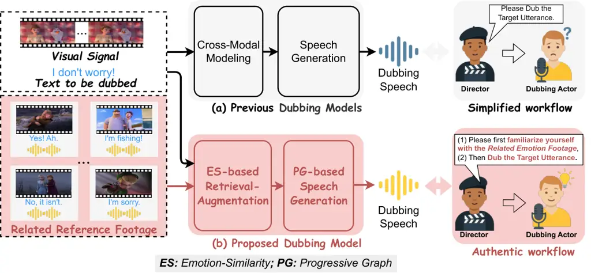
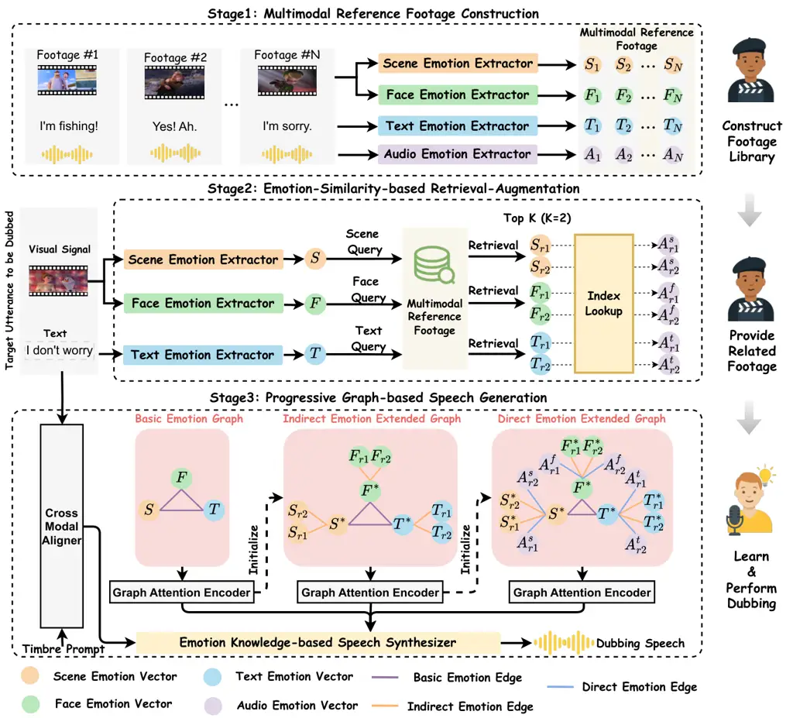
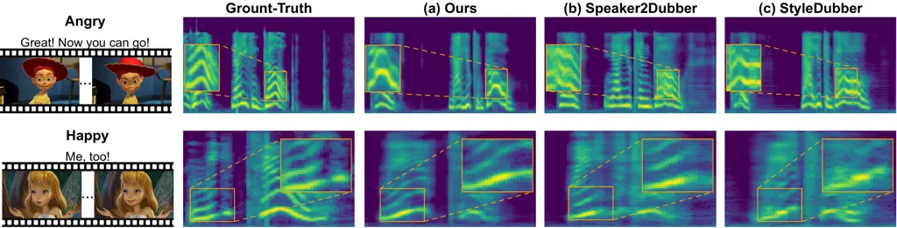

# Towards Authentic Movie Dubbing with Retrieve-Augmented Director-Actor Interaction Learning

Rui Liu ^(†)^(†)thanks: Corresponding author.    Yuan Zhao    Zhenqi Jia

###### Abstract

The automatic movie dubbing model generates vivid speech from given
scripts, replicating a speaker’s timbre from a brief timbre prompt while
ensuring lip-sync with the silent video. Existing approaches simulate a
simplified workflow where actors dub directly without preparation,
overlooking the critical director–actor interaction. In contrast,
authentic workflows involve a dynamic collaboration: directors actively
engage with actors, guiding them to internalize the context cues,
specifically emotion, before performance. To address this issue, we
propose a new Retrieve-Augmented Director-Actor Interaction Learning
scheme to achieve authentic movie dubbing, termed Authentic-Dubber,
which contains three novel mechanisms: (1) We construct a multimodal
Reference Footage library to simulate the learning footage provided by
directors. Note that we integrate Large Language Models (LLMs) to
achieve deep comprehension of emotional representations across
multimodal signals. (2) To emulate how actors efficiently and
comprehensively internalize director-provided footage during dubbing, we
propose an Emotion-Similarity-based Retrieval-Augmentation strategy.
This strategy retrieves the most relevant multimodal information that
aligns with the target silent video. (3) We develop a Progressive
Graph-based speech generation approach that incrementally incorporates
the retrieved multimodal emotional knowledge, thereby simulating the
actor’s final dubbing process. The above mechanisms enable the
Authentic-Dubber to faithfully replicate the authentic dubbing workflow,
achieving comprehensive improvements in emotional expressiveness. Both
subjective and objective evaluations on the V2C-Animation benchmark
dataset validate the effectiveness. The code and demos are available at
https://github.com/AI-S2-Lab/Authentic-Dubber.

College of Computer Science, Inner Mongolia University, Hohhot, China

imucslr@imu.edu.cn, zy404nf@163.com, jiazhenqi7@163.com



Figure 1: (a) Previous models rely solely on cross-modal modeling of the
target utterance to generate speech, which results in limited emotional
expressiveness. (b) Our method enables expressive dubbing through three
mechanisms: Multimodal Reference Footage Construction,
Emotion-Similarity-based Retrieval-Augmentation, and Progressive
Graph-based Speech Generation.

## Introduction

Movie Dubbing, also known as Visual Voice Cloning (V2C) (Chen et al.
2022a; Zhang et al. 2024; Li et al. 2025a), aims to generate vivid
speech from given scripts, replicating a speaker’s timbre from a brief
timbre prompt while ensuring lip-sync with the silent video. V2C holds
significant potential and value for applications in movie production and
commercial Artificial Intelligence Generated Content (Cao et al. 2025).

Traditional dubbing work mainly focuses on improving pronunciation
quality (Cong et al. 2024; Zhang et al. 2024; Cong et al. 2025b),
audio-visual synchronization (Hu et al. 2021; Cong et al. 2025b;
Sung-Bin et al. 2025; Choi et al. 2025; Lu et al. 2022), and
expressiveness (Cong et al. 2023; Zhao et al. 2025; Li et al. 2025b;
Zhao et al. 2024; Zheng et al. 2025). To improve pronunciation quality,
Speaker2Dubber (Zhang et al. 2024) designs a multi-task pre-training to
learn pronunciation knowledge before using the dubbing dataset. To
enhance audio-visual synchronization, FlowDubber (Cong et al. 2025a)
introduces a dual contrastive learning approach between lip movement
sequences and phoneme sequences. For improving expressiveness, ProDubber
(Zhang et al. 2025) proposes a two-stage approach. It includes
prosody-enhanced acoustic pre-training and acoustic-disentangled prosody
adaptation, ensuring high audio quality and accurate prosody alignment.
The above works pave the way for accelerated advancement in movie
dubbing technologies.

Despite the progress, these methods simulate a simplified workflow and
overlook the critical interaction between the director and the actor,
which limits their ability to fully model dubbing expressiveness,
especially emotional expression. Specifically, previous dubbing models
exhibit limited emotional expression due to their reliance solely on
cross-modal modeling of the target utterance, as shown at the top of
Fig. 1. These models simulate a simplified workflow in which actors
proceed directly to perform dubbing, facing confusion without
preparation. They overlook the crucial interaction between the director
and the actors. In authentic movie dubbing, directors typically require
dubbing actors to first become sufficiently familiar with emotional
reference footage, which contains rich knowledge of emotional
expression. This process helps actors internalize contextual
cues—particularly emotional ones—before the actual performance, as
illustrated at the bottom of Fig. 1. Only after thoroughly studying the
footage and cumulatively acquiring this emotional knowledge can the
dubbing actor perform emotionally expressive dubbing. Through this
interactive learning process between the director and the actor, the
final generated dubbing can exhibit rich emotional expression.

To address the above issue, we propose a novel Retrieval-Augmented
Director-Actor Interaction Learning scheme for authentic movie dubbing,
termed Authentic-Dubber, which consists of three novel mechanisms: (1)
To simulate the learning footage provided by directors, we construct a
Multimodal Reference Footage Library (MRFL). We design specialized
emotion extractors for indirect multimodal emotional information,
including the scene’s emotional atmosphere, the character’s facial
expression changes, and the script’s emotional semantics, as well as
their matched direct emotional audio within each movie clip. In this
process, we integrate Large Language Models (LLMs) to extract emotional
captions to enable deep comprehension of emotional representations
across multimodal signals. (2) To emulate how actors efficiently and
comprehensively internalize director-provided footage during dubbing, we
propose an Emotion-Similarity-based Retrieval-Augmentation (ESRG)
strategy. ESRG uses the target utterance’s basic emotion, i.e., scene,
face, and text, as separate queries. Each query retrieves similar
indirect emotion information and matched direct emotional audio from the
MRFL. These retrieved items serve as the most relevant multimodal
information aligned with the target dubbing video. (3) To simulate the
actor’s final dubbing process, we propose a Progressive Graph-based
Speech Generation (PGSG) approach. This method incrementally learns
emotional knowledge from the target’s basic emotional source, the
retrieved indirect multimodal information, and the direct emotional
audio. PGSG follows a progressive construct-and-encode paradigm over the
Basic Emotion Graph, Indirect Emotion Extended Graph, and Direct Emotion
Extended Graph. Finally, the emotional knowledge acquired from these
three stages is aggregated in an Emotion Knowledge-based Speech
Synthesizer to generate emotionally expressive speech. The main
contributions of this paper are as follows:

- •
  Based on the dubbing workflow in real-world scenarios, we propose, for
  the first time, a movie dubbing model, termed Authentic-Dubber, that
  simulates authentic workflows, aiming to enhance the emotional
  expressiveness of movie dubbing.
- •
  We adopt three key technologies, that are Multimodal Reference Footage
  Construction, Emotion-Similarity-based Retrieval Augmentation, and
  Progressive Graph-based Speech Generation, to simulate the interaction
  process between directors and actors.
- •
  Subjective and objective experiments on benchmark datasets, along with
  additional detailed analytical experiments, demonstrate the
  effectiveness of our method in improving emotional expressiveness.

## Related Works



Figure 2: The proposed Authentic-Dubber consists of Multimodal Reference
Footage Construction, Emotion-Similarity-based Retrieval-Augmentation,
and Progressive Graph-based Speech Generation. (\* means that the node’s
initial vector representation is initialized from the immediately
preceding graph.)

### Retrieval-Augmented Generation

Retrieval-Augmented Generation (RAG) compensates for the limitations of
a single model’s knowledge by leveraging rich and explainable additional
knowledge (Kang et al. 2024; Yuan et al. 2024; Yang et al. 2024; Ghosh
et al. 2024) and has demonstrated strong performance in related
multi-modal information processing tasks. For example, $`\text{CM}^{2}`$
(Kim et al. 2024) improves image caption generation by using cross-modal
video-text matching to retrieve prior knowledge from an external memory
bank. Re-Imagen (Chen et al. 2022b) retrieves relevant (image, text)
pairs from an external multi-modal knowledge bank, allowing
high-fidelity image generation. Note that RAG methods provide an
excellent example of addressing knowledge-intensive tasks (Gao et al.
2023; Lewis et al. 2020; Guu et al. 2020). Inspired by the above ideas,
we believe that in the dubbing process, the reference footage provided
by directors serves as an invaluable source of knowledge for actors.
Therefore, we propose an emotion-similarity-based retrieval-augmentation
strategy to simulate how actors learn from such materials. However,
unlike previous RAG schemes that retrieve knowledge through
embedding-based similarity calculation and directly feed the retrieved
features into downstream modules, our Authentic-Dubber incorporates the
following special designs tailored to movie dubbing: 1) We calculate the
similarity of diverse emotional expressions—such as scenes, facial
expressions, texts, and speech—from the constructed learning materials
to identify relevant samples; 2) We develop a hierarchical knowledge
fusion strategy based on a progressive graph, which integrates both the
utterance to be dubbed and the retrieved multimodal signals. This has
not been considered at all in previous dubbing efforts.

### Graph-Based Knowledge Modeling

Graph Neural Network (GNN) is designed to process graph-structured data
(Sanchez-Lengeling et al. 2021), capturing relationships and structural
information by learning representations of nodes and edges (Hamilton et
al. 2017; Hamilton 2020). In movie dubbing and related tasks, several
works employ GNN to model complex interactions between multimodal
signals within utterances (Liu et al. 2024a). For example, M2CI-Dubber
(Zhao et al. 2025) uses a graph attention network to model the relation
between the multiscale multimodal context and the target utterance,
enhancing prosody expressiveness. Li et al. (Li et al. 2022) use GNN to
model both intra-speaker and inter-speaker dependencies, enhancing the
speaking style of the generated speech. While existing approaches also
leverage GNN to encode emotional knowledge within utterances, our method
innovatively introduces a progressive graph fusion mechanism. The key
distinction from prior work lies in (1) We propose a novel progressive
construct-and-encode paradigm: first encoding a graph of the target
basic emotion, then incorporating retrieved multimodal emotional
information for further and indirect emotional modeling, and finally
integrating emotional audio for direct emotion modeling. This gradual
accumulation of emotional knowledge enhances the model’s emotion
understanding. (2) We introduce basic emotion edge, indirect emotion
edge, and direct emotion edge to capture relationships among emotional
nodes, boosting the model’s emotion modeling capabilities in dubbing.

## Authentic-Dubber: Methodology

### Overview

Given a script, a silent video clip, and a timbre prompt, the goal of
Authentic-Dubber is to generate a speech with emotion expressiveness.
The main architecture of the proposed model is shown in Fig. 2. (1) We
first construct a Multimodal Reference Footage Library (MRFL) based on
the V2C (Chen et al. 2022a) dataset. For each sample, modality-specific
emotion extractors are designed for indirect multimodal emotion
information (scene, face, text), and matched direct emotion audio to
extract their respective emotion vectors. (2) In
Emotion-Similarity-based Retrieval-Augmentation, the target utterance’s
basic emotion is individually encoded, and then the basic emotion is
used separately as queries to retrieve indirect multimodal emotion
information and direct emotional audio from MRFL. (3) In Progressive
Graph-based Speech Generation, we adopt a progressive
construct-and-encode paradigm over the Basic Emotion Graph, Indirect
Emotion Extended Graph, and Direct Emotion Extended Graph to accumulate
emotional knowledge. Finally, an Emotion Knowledge-based Speech
Synthesizer integrates the learned emotional knowledge to generate
emotionally expressive dubbing while using the cross-modal alignment
results of the text, timbre prompt, and visual frames as input.

### Multimodal Reference Footage Construction

To simulate the learning footage provided by directors, we first build a
Multimodal Reference Footage Library (MRFL) based on the V2C dataset
(Chen et al. 2022a). For each sample $`i`$, we design four emotion
extractors for both the indirect emotional multimodal information and
the direct emotional audio, projecting them into their respective
emotional spaces.

Scene Emotion Extractor. Inspired by the general understanding
capabilities of Large Language Models (LLMs), we first employ a video
understanding model, VideoLLaMA 2 (Cheng et al. 2024), to generate a
scene emotion caption, while incorporating global low-level visual
features such as hue, lightness, and saturation that influence emotion
perception into the instruction prompts. The generated caption is then
passed to a RoBERTa-based Text Emotion Recognition model (RTER) ¹¹ 1
https://huggingface.co/j-hartmann/emotion-english-roberta-large
(Hartmann 2021) to extract the scene emotion vector $`S_{i}`$.

Face Emotion Extractor. Using VideoLLaMA 2 (Cheng et al. 2024), we
generate a caption describing facial emotion changes in the video, and
the caption is then processed by RTER to produce the face emotion vector
$`F_{i}`$.

Text Emotion Extractor. We first use RTER to obtain a text-self emotion
vector $`T_{i}^{self}`$ from the input text. Considering that prior
commonsense reactions (Deng et al. 2023) influence the understanding of
the text’s emotion, we use COMET²² 2
https://huggingface.co/svjack/comet-atomic-en to generate a reaction
caption, which is also processed by RTER to generate the text-react
emotion vector $`T_{i}^{react}`$. Finally, the text-self emotion vector
$`T_{i}^{self}`$ is concatenated with the text-react emotion vector
$`T_{i}^{react}`$ to form the final text emotion vector $`T_{i}`$.

Audio Emotion Extractor. We employ a universal emotion representation
model, Emotion2Vec (Ma et al. 2023) to extract the audio emotion vector
$`A_{i}`$.

### Emotion-Similarity-based Retrieval-Augmentation

In this work, we focus on animated movie dubbing, where characters are
virtually created and speaker-specific reference footage is often
limited. To address this challenge, we introduce a speaker-agnostic
retrieval strategy, which allows access to a broader and more
emotionally diverse set of footage. Specifically, we design a separate
retrieval mechanism based on different emotional knowledge. Considering
that the target speech is absent in real-world movie dubbing scenarios,
we utilize the target utterance’s basic emotion to retrieve indirect
multimodal emotion information, which in turn helps match the
corresponding direct emotional audio via index lookup. For scene
retrieval, the Scene Emotion Extractor generates the target utterance’s
scene emotion vector $`S`$, which is compared via cosine similarity with
the scene vectors in MRFL to retrieve the Top-$`K`$ indirect scene
emotion information $`S_{r1\rightarrow rk}`$ and the matched direct
emotional audio $`A_{r1\rightarrow rk}^{s}`$. For face retrieval, the
Face Emotion Extractor generates the target utterance’s face emotion
vector $`F`$. Similar to scene retrieval, the Top-$`K`$ indirect facial
emotion information $`F_{r1\rightarrow rk}`$ and matched direct
emotional audio $`A_{r1\rightarrow rk}^{f}`$ are retrieved. Notably, for
text retrieval, the Text Emotion Extractor generates the target
utterance’s text emotion vector $`T`$ by concatenating the text-self
emotion vector $`T^{self}`$ and the text-react emotion vector
$`T^{react}`$. We compute the cosine similarity between $`T^{self}`$ and
$`T_{i}^{self}`$, as well as between $`T^{react}`$ and $`T_{i}^{react}`$
in MRFL, and use the average of these values as the retrieval criterion
for text retrieval. The Top-$`K`$ indirect text emotion information
$`T_{r1\rightarrow rk}`$ and matched direct emotional audio
$`A_{r1\rightarrow rk}^{t}`$ are retrieved.

### Progressive Graph-based Speech Generation

Inspired by the authentic dubbing workflow, where actors first
understand the basic emotion of the target silent video and then refer
to similar movie clips containing indirect multimodal emotional
information and their matched direct emotional audio. Therefore, we
design a Progressive Graph-based Speech Generation module, which
accumulates learn emotional knowledge. It adopts a progressive
construct-and-encode paradigm over the Basic Emotion Graph, Indirect
Emotion Extended Graph, and Direct Emotion Extended Graph.

Basic Emotion Graph. Since the emotional knowledge of the target
utterance is most closely related to the emotional expression of speech,
we first guide the model to focus on learning it. Specifically, we
construct a Basic Emotion Graph $`\mathcal{G}_{beg}`$, where the nodes
consist of the scene emotion vector $`S`$, face emotion vector $`F`$,
and text emotion vector $`T`$. To better capture the relationships
between different basic emotion sources, we connect the emotion sources
$`S`$, $`F`$, and $`T`$ in a pairwise manner. Next, we utilize a Graph
Attention Encoder (GAE) to encode $`\mathcal{G}_{beg}`$, where the
resulting graph $`\tilde{\mathcal{G}_{beg}}`$ represents the learned
emotional knowledge of the target basic emotion source.

Indirect Emotion Extended Graph. Based on the encoded
$`\tilde{\mathcal{G}_{\mathrm{beg}}}`$ and the retrieved indirect
multimodal emotion nodes, we construct and initialize an Indirect
Emotion Extended Graph $`\mathcal{G}_{\mathrm{ieg}}`$. The retrieved
nodes are connected to the basic emotion source nodes of the same
modality. The encoded $`\tilde{\mathcal{G}}_{\mathrm{ieg}}`$ further
accumulatively learns emotional knowledge derived from the retrieved
indirect emotion information.

Direct Emotion Extended Graph. Based on the encoded
$`\tilde{\mathcal{G}_{\mathrm{ieg}}}`$ and the matched emotion audio
nodes, we construct and initialize a Direct Emotion Extended Graph
$`\mathcal{G}_{\mathrm{deg}}`$. The matched direct emotion audio is
added as new nodes and connected to the basic emotion source from which
the corresponding query is issued. The encoded
$`\tilde{\mathcal{G}}_{\mathrm{deg}}`$ continuously learns the emotional
knowledge derived from the retrieved matched direct emotion audio.

Emotion Knowledge-based Speech Synthesizer. Our emotion knowledge-based
speech synthesizer performs hierarchical aggregation of learned
emotional knowledge to enhance the emotional expressiveness of the
generated speech. Meanwhile, it takes as input the output $`H_{t,v,r}`$
from the Cross-Modal Aligner. This aligner follows the architecture of
StyleDubber (Cong et al. 2024), achieving audio-visual synchronization
based on the input script and visual frames, and learns voice from the
timbre prompt. Specifically, the nodes in graphs
$`\tilde{\mathcal{G}}_{beg}`$, $`\tilde{\mathcal{G}}_{ieg}`$, and
$`\tilde{\mathcal{G}}_{deg}`$ are denoted as $`H_{beg}`$, $`H_{ieg}`$,
and $`H_{deg}`$, respectively. The emotion aggregation is then performed
as follows:

```math
\displaystyle E_{t,v,r}^{beg} \displaystyle=\text{Conv1D}\left(\left[H_{t,v,r};\ \text{CA}(H_{t,v,r},H_{beg},H_{beg})\right]\right) \tag{1}
```

```math
\displaystyle E_{t,v,r}^{ieg} \displaystyle=\text{Conv1D}\left(\left[E_{t,v,r}^{beg};\ \text{CA}(E_{t,v,r}^{beg},H_{ieg},H_{ieg})\right]\right)
```

```math
\displaystyle E_{t,v,r}^{deg} \displaystyle=\text{Conv1D}\left(\left[E_{t,v,r}^{ieg};\ \text{CA}(E_{t,v,r}^{ieg},H_{deg},H_{deg})\right]\right)
```

```math
\displaystyle E_{t,v,r}^{out} \displaystyle=\text{Conv1D}\left(\left[H_{t,v,r};\ E_{t,v,r}^{deg}\right]\right)
```

where CA denotes Cross-Attention. Finally, the aggregated emotional
representation $`E_{t,v,r}^{\text{out}}`$ is passed to the Mel decoder
to produce a Mel spectrogram, which is then converted into the final
speech with rich emotion expression using a Vocoder (Liu et al. 2025; He
and Liu 2025)³³ 3
https://huggingface.co/nvidia/bigvgan˙v2˙44khz˙128band˙256x.

## Experimental Setup

### Dataset

V2C-Animation (Chen et al. 2022a) is a multi-speaker dataset designed
for animated movie dubbing. It is collected from 26 Disney animated
movies and includes 153 characters. The dataset consists of 10,217 video
clips with paired audio and scripts, and is split into 60% for training,
10% for validation, and 30% for testing. Notably, V2C is currently the
only publicly available movie dubbing dataset with emotion annotations.
Therefore, we evaluate our model solely on the V2C dataset to assess its
effectiveness in enhancing emotional expressiveness in dubbing.

### Implementation Details

Video frames are sampled at 25 frames per second, and all audio samples
are resampled to 22.05 kHz. In the Short-Time Fourier Transform, the
window length, frame size, and hop length are set to 1024, 1024, and
256, respectively. In Progressive Graph-based Speech Generation, the
dimensionality of all input emotional features is set to 256 through a
linear layer. The output dimension of the Graph Attention Encoder is set
to 256. In the Emotion Knowledge-based Speech Synthesizer, the output
dimension of the Conv1D layer is set to 256. During training, we use the
Adam optimizer with parameters set to $`\beta_{1}=0.9`$,
$`\beta_{2}=0.98`$, and $`\epsilon=10^{-9}`$, with a learning rate of
0.00625. Both training and inference are implemented using PyTorch on an
A800 GPU.

| Methods                                      | EMO-ACC ($`\uparrow`$) | WER ($`\downarrow`$) | SECS ($`\uparrow`$) | MCD-DTW-SL ($`\downarrow`$) | MOS-DE ($`\uparrow`$) | MOS-SE ($`\uparrow`$) |
| -------------------------------------------- | ---------------------- | -------------------- | ------------------- | --------------------------- | --------------------- | --------------------- |
| Ground-Truth                                 | 99.96                  | 22.03                | 100.00              | 0.00                        | 4.416 ± 0.035         | 4.497 ± 0.044         |
| FastSpeech2 (Ren et al. 2020b) (ICLR 2021)   | 42.39                  | 33.30                | 25.47               | 14.72                       | 3.058 ± 0.077         | 3.063 ± 0.082         |
| V2C-Net (Chen et al. 2022a) (CVPR 2022)      | 43.07                  | 67.98                | 40.65               | 19.16                       | 3.146 ± 0.062         | 3.149 ± 0.064         |
| HPMDubbing (Cong et al. 2023) (CVPR 2023)    | 43.94                  | 135.72               | 34.11               | 12.64                       | 3.362 ± 0.049         | 3.320 ± 0.040         |
| StyleDubber (Cong et al. 2024) (ACL 2024)    | 45.73                  | 24.70                | 83.46               | 9.40                        | 3.676 ± 0.048         | 3.738 ± 0.049         |
| Speaker2Dubber (Zhang et al. 2024) (MM 2024) | 44.55                  | 18.27                | 81.26               | 9.82                        | 3.432 ± 0.069         | 3.461 ± 0.069         |
| Authentic-Dubber                             | 47.21                  | 25.95                | 84.40               | 9.68                        | 3.792 ± 0.055         | 3.889 ± 0.053         |

Table 1: Objective and subjective (with 95% confidence interval)
evaluation results with other methods. $`\uparrow`$ ($`\downarrow`$)
indicates that a higher (lower) value is better, and bold indicates the
best score. The Authentic-Dubber significantly outperforms the baselines
on emotion expressiveness.

|                                                           |                              |                        |                       |                       |
| --------------------------------------------------------- | ---------------------------- | ---------------------- | --------------------- | --------------------- |
| \#                                                        | Methods                      | EMO-ACC $`(\uparrow)`$ | MOS-DE $`(\uparrow)`$ | MOS-SE $`(\uparrow)`$ |
| Effect of LLMs in Reference Footage Construction          |                              |                        |                       |                       |
| 1                                                         | w/o Scene Caption            | 46.34                  | 3.582 ± 0.032         | 3.612 ± 0.042         |
| 2                                                         | w/o Face Caption             | 46.52                  | 3.653 ± 0.049         | 3.684 ± 0.047         |
| 3                                                         | w/o Scene & Face Caption     | 46.02                  | 3.520 ± 0.034         | 3.608 ± 0.053         |
| Effect of Emotion-Similarity-based Retrieval-Augmentation |                              |                        |                       |                       |
| 4                                                         | w/o Scene Retrieval          | 46.27                  | 3.591 ± 0.048         | 3.666 ± 0.045         |
| 5                                                         | w/o Face Retrieval           | 46.64                  | 3.657 ± 0.047         | 3.690 ± 0.051         |
| 6                                                         | w/o Text Retrieval           | 45.99                  | 3.540 ± 0.054         | 3.614 ± 0.047         |
| 7                                                         | w/o All Retrieval            | 45.23                  | 3.511 ± 0.058         | 3.527 ± 0.054         |
| Effect of Progressive Graph-based Speech Generation       |                              |                        |                       |                       |
| 8                                                         | w/o Indirect Information     | 45.95                  | 3.542 ± 0.060         | 3.581 ± 0.053         |
| 9                                                         | w/o Direct Audio             | 45.30                  | 3.492 ± 0.061         | 3.571 ± 0.051         |
| 10                                                        | w/o Graph-based Modeling     | 45.92                  | 3.518 ± 0.058         | 3.549 ± 0.055         |
| 11                                                        | w/o Construct & Encode       | 46.85                  | 3.705 ± 0.049         | 3.749 ± 0.046         |
| 12                                                        | w/o Hierarchical Aggregation | 46.71                  | 3.661 ± 0.045         | 3.710 ± 0.050         |

Table 2: Objective and subjective (with 95% confidence interval)
evaluation results of ablation studies.

### Comparative and Ablation Models

To demonstrate the effectiveness of Authentic-Dubber in emotional
expression, we compare it with five state-of-the-art dubbing models,
namely FastSpeech (Ren et al. 2020a), V2C-Net (Chen et al. 2022a),
HPMDubbing (Cong et al. 2023), StyleDubber (Cong et al. 2024), and
Speaker2Dubber (Zhang et al. 2024). In addition, to verify the
contribution of each component in Authentic-Dubber, we conduct a
comprehensive ablation study. Details on the baseline models and
ablation settings can be found in Appendix A.

### Evaluation Metrics

Objective metrics. (1) Emotion Accuracy (EMO-ACC): A pre-trained speech
emotion recognition model (Ye et al. 2023) is used to predict the
emotion category of the synthesized speech and compute the percentage of
matches with the ground-truth category. (2) Word Error Rate (WER):
measures pronunciation accuracy by the Whisper-large-v3 automatic speech
recognition model (Radford et al. 2023). (3) Speaker Encoder Cosine
similarity (SECS): Measures the speaker similarity between the
synthesized speech and the timbre prompt following (Cong et al. 2024).

\(4\) Mel Cepstral Distortion Dynamic Time Warping weighted by Speech
Length (MCD-DTW-SL) (Chen et al. 2022a): Evaluates both length and the
quality of alignment between the generated speech and the ground-truth
speech.

Subjective metrics. We conducted a Mean Opinion Score (MOS) test with 20
trained raters who evaluated 12 generated dubbed videos and speech
samples, scoring the following metrics on a scale of 1 to 5 (Jia et al.
2025; Hu et al. 2025b; Hu et al. 2025a; Liu et al. 2024b; Jia and Liu
2025): (1) MOS-Dubbing Emotion (MOS-DE): Evaluates the emotional
similarity between the generated dubbing and the ground-truth video. (2)
MOS-Speech Emotion (MOS-SE): Evaluate the emotional similarity between
the synthesized speech and the ground-truth speech.

## Results and Discussion

### Comparison with SOTA Dubbing Methods

To verify the effectiveness of our method in enhancing emotional
expressiveness, we compare the proposed model with several
representative dubbing approaches. All speech samples generated by the
baseline models are produced using their official implementations. As
shown in Table 1, our method achieves the best performance across all
emotion-related evaluation metrics. Regarding objective measures, our
approach obtains the highest EMO-ACC score (47.21%), which indicates
that our method is capable of generating speech with emotion more
closely aligned with the ground truth. For subjective evaluations, our
method also achieves the highest scores in both MOS-DE (3.792) and
MOS-SE (3.889), indicating its superior ability to enhance the emotional
expressiveness of both dubbed videos and generated speech. Overall, the
results presented in Table 1 demonstrate the effectiveness of our method
in enhancing emotional expression for dubbing by simulating the crucial
interaction process between the director and the actors.



Figure 3: The visualization of the mel-spectrograms of ground truth (GT)
and synthesized speech obtained by different dubbing baselines, and
orange bounding boxes are used to highlight the details in speech.

Figure 4: EMO-ACC of speech generated by Authentic-Dubber under
Speaker-Agnostic and Speaker-Specific retrieval settings with varying
Top-$`K`$ values.

Figure 5: The figure illustrates the emotion accuracy (EMO-ACC) of
speech generated by our proposed Authentic-Dubber under different
retrieval dataset scales.

Figure 6: The figure shows the emotion accuracy (EMO-ACC) of speech
generated by our proposed Authentic-Dubber using different vector
similarity metrics during retrieval.

### Ablation Studies

To validate the contribution of each component in Authentic-Dubber, we
performed comprehensive ablation studies (Table 2). Specifically, to
validate the Effect of LLMs in Reference Footage Construction, We
conducted ablations by replacing the Scene Caption with embeddings
extracted from the scene emotion model I3D (Carreira and Zisserman
2017), replacing the Face Caption with embeddings from the facial
emotion model EmoFan (Toisoul et al. 2021), and replacing both captions
simultaneously, as shown in Table 2, lines 1–3. The results show a
consistent performance drop across all evaluation metrics, demonstrating
that the LLM’s deep comprehension of emotional representations across
multimodal signals effectively contributes to the model’s performance by
enhancing its emotional modeling capability. To validate the
effectiveness of Emotion-Similarity-based Retrieval-Augmentation, we
performed ablations by individually removing scene retrieval, face
retrieval, text retrieval, and all retrieval, as shown in Table 2, lines
4–7. The results show that all evaluation metrics dropped, with the most
significant decline observed when all retrievals were removed. This
indicates that each retrieval modality effectively contributes to
emotional information enhancement, and their combined use plays a
crucial role in providing rich emotional cues, thereby improving the
overall dubbing performance. In addition, to validate the Effect of
Emotion Knowledge-based Speech Generation, we ablate key components
including Indirect Information, Direct Audio, Graph-based Modeling,
Construct & Encode, and Hierarchical Aggregation, as shown in Table 2,
lines 8–12. The results show that all evaluation metrics decline,
further demonstrating that the basic emotion, indirect multimodal
emotional information, direct emotional audio, as well as the
construct-and-encode paradigm and hierarchical aggregation strategy,
directly affect the emotional expressiveness and speech quality of the
generated dubbing. Moreover, this paradigm of progressively integrating
diverse emotional knowledge through graph structures proves to be
crucial for producing emotionally expressive dubbing speech.

### Speaker-Agnostic vs. Speaker-Specific Retrieval

This experiment evaluates how the retrieval setting (Speaker-Agnostic
vs. Speaker-Specific) affects the emotional accuracy (EMO-ACC) of
generated speech. As shown in Fig. 4, Speaker-Agnostic retrieval
achieves the highest EMO-ACC (47.21%) at $`K`$ = 3 and consistently
outperforms the Speaker-Specific setting. This supports our strategy of
using speaker-agnostic retrieval to enrich the selected reference
footage in animation dubbing scenarios with few speaker priors, thereby
enhancing emotional expressiveness. However, increasing $`K`$ beyond a
certain point degrades performance under both settings, suggesting that
excessive retrieval introduces redundant information regardless of the
retrieval strategy.

### Qualitative Analysis of Mel-Spectrogram

This experiment compares our model with several baseline methods by
visualizing the mel-spectrograms of generated speech in two emotional
categories: angry and happy. As shown in Fig. 3, the zoomed-in regions
highlighted with orange bounding boxes indicate that our model more
accurately captures high fluctuations in angry speech and exhibits more
natural prosodic variation in happy speech. These results suggest that
our model conveys emotional expressiveness more effectively than the
baselines.

### Analysis of Retrieval Footage Scales

To assess the effect of retrieval dataset scale, that are reference
footage scale, on emotional expressiveness, we evaluated our model’s
EMO-ACC across scales from 10% to 100%. As shown in Fig. 5, EMO-ACC
steadily increases with larger datasets, plateauing between 80% and
100%, with a peak at 47.21%. This demonstrates that expanding the
emotion footage set enhances emotional expressiveness.

### Analysis of Similarity Metrics

To investigate the impact of vector similarity metrics in retrieval on
model performance in terms of EMO-ACC, we conducted comparative
experiments evaluating cosine similarity, dot product, and Euclidean
distance under different Top-$`K`$ settings. As shown in Fig. 6, cosine
similarity consistently yields the best overall performance. Among the
metrics, the dot product exhibits greater fluctuations, while Euclidean
distance is relatively stable but shows a slightly lower performance
ceiling. These findings indicate that the model is sensitive to the
choice of similarity function and that retrieving a small number of
high-quality emotional footage is more effective for enhancing the
emotional expressiveness of synthesized speech.

## Conclusion

In this paper, we propose Authentic-Dubber, a framework that simulates
real-world dubbing workflows to enhance the emotional expressiveness of
movie dubbing. A multimodal Reference Footage Library is constructed to
simulate the learning materials typically provided by directors. An
Emotion-Similarity-based Retrieval-Augmentation strategy is designed to
retrieve the most relevant multimodal information aligned with the
target silent video. A Progressive Graph-based Speech Generation module
is developed to incrementally incorporate the retrieved emotional
knowledge. Experimental results demonstrate the effectiveness of our
model on the V2C benchmark. In future work, we plan to explore more
expressive modeling of director–actor interactions in real dubbing
workflows, including controllable aspects such as timbre, speaking rate,
and prosody.

## Acknowledgments

This research was funded by the Young Scientists Fund (No. 62206136) and
the General Program (No. 62476146) of the National Natural Science
Foundation of China, the Young Elite Scientists Sponsorship Program by
CAST (2024QNRC001), the Outstanding Youth Project of Inner Mongolia
Natural Science Foundation (2025JQ011), the Key R&D and Achievement
Transformation Program of Inner Mongolia Autonomous Region
(2025YFHH0014), and the Central Government Fund for Promoting Local
Scientific and Technological Development (2025ZY0143).

## References

- Cao et al. (2025) Y. Cao, S. Li, Y. Liu, Z. Yan, Y. Dai, P. Yu, and L.
  Sun A survey of ai-generated content (aigc). ACM Computing Surveys 57
  (5), pp. 1–38. Cited by: Introduction.
- Carreira and Zisserman (2017) J. Carreira and A. Zisserman Quo vadis,
  action recognition? a new model and the kinetics dataset. In
  proceedings of the IEEE Conference on Computer Vision and Pattern
  Recognition, pp. 6299–6308. Cited by: Ablation Studies.
- Chen et al. (2022a) Q. Chen, M. Tan, Y. Qi, J. Zhou, Y. Li, and Q. Wu
  V2C: visual voice cloning. In Proceedings of the IEEE/CVF Conference
  on Computer Vision and Pattern Recognition, pp. 21242–21251. Cited by:
  Introduction, Overview, Multimodal Reference Footage Construction,
  Dataset, Comparative and Ablation Models, Evaluation Metrics, Table 1.
- Chen et al. (2022b) W. Chen, H. Hu, C. Saharia, and W. W. Cohen
  Re-imagen: retrieval-augmented text-to-image generator. arXiv preprint
  arXiv:2209.14491. Cited by: Retrieval-Augmented Generation.
- Cheng et al. (2024) Z. Cheng, S. Leng, H. Zhang, Y. Xin, X. Li, G.
  Chen, Y. Zhu, W. Zhang, Z. Luo, D. Zhao, et al. Videollama 2:
  advancing spatial-temporal modeling and audio understanding in
  video-llms. arXiv preprint arXiv:2406.07476. Cited by: Multimodal
  Reference Footage Construction, Multimodal Reference Footage
  Construction.
- Choi et al. (2025) J. Choi, J. Kim, K. Sung-Bin, T. Oh, and J. S.
  Chung AlignDiT: multimodal aligned diffusion transformer for
  synchronized speech generation. arXiv preprint arXiv:2504.20629. Cited
  by: Introduction.
- Cong et al. (2025a) G. Cong, L. Li, J. Pan, Z. Zhang, A.
  Beheshti, A. v. d. Hengel, Y. Qi, and Q. Huang FlowDubber: movie
  dubbing with llm-based semantic-aware learning and flow matching based
  voice enhancing. arXiv preprint arXiv:2505.01263. Cited by:
  Introduction.
- Cong et al. (2023) G. Cong, L. Li, Y. Qi, Z. Zha, Q. Wu, W. Wang, B.
  Jiang, M. Yang, and Q. Huang Learning to dub movies via hierarchical
  prosody models. In Proceedings of the IEEE/CVF Conference on Computer
  Vision and Pattern Recognition, pp. 14687–14697. Cited by:
  Introduction, Comparative and Ablation Models, Table 1.
- Cong et al. (2025b) G. Cong, J. Pan, L. Li, Y. Qi, Y. Peng, A. van den
  Hengel, J. Yang, and Q. Huang Emodubber: towards high quality and
  emotion controllable movie dubbing. In Proceedings of the Computer
  Vision and Pattern Recognition Conference, pp. 15863–15873. Cited by:
  Introduction.
- Cong et al. (2024) G. Cong, Y. Qi, L. Li, A. Beheshti, Z.
  Zhang, A. v. d. Hengel, M. Yang, C. Yan, and Q. Huang StyleDubber:
  towards multi-scale style learning for movie dubbing. arXiv preprint
  arXiv:2402.12636. Cited by: Introduction, Progressive Graph-based
  Speech Generation, Comparative and Ablation Models, Evaluation
  Metrics, Table 1.
- Deng et al. (2023) Y. Deng, J. Xue, F. Wang, Y. Gao, and Y. Li
  Cmcu-css: enhancing naturalness via commonsense-based multi-modal
  context understanding in conversational speech synthesis. In
  Proceedings of the 31st ACM International Conference on Multimedia,
  pp. 6081–6089. Cited by: Multimodal Reference Footage Construction.
- Gao et al. (2023) Y. Gao, Y. Xiong, X. Gao, K. Jia, J. Pan, Y. Bi, Y.
  Dai, J. Sun, H. Wang, and H. Wang Retrieval-augmented generation for
  large language models: a survey. arXiv preprint arXiv:2312.10997 2.
  Cited by: Retrieval-Augmented Generation.
- Ghosh et al. (2024) S. Ghosh, S. Kumar, C. K. R. Evuru, R. Duraiswami,
  and D. Manocha Recap: retrieval-augmented audio captioning. In ICASSP
  2024-2024 IEEE International Conference on Acoustics, Speech and
  Signal Processing (ICASSP), pp. 1161–1165. Cited by:
  Retrieval-Augmented Generation.
- Guu et al. (2020) K. Guu, K. Lee, Z. Tung, P. Pasupat, and M. Chang
  Retrieval augmented language model pre-training. In International
  conference on machine learning, pp. 3929–3938. Cited by:
  Retrieval-Augmented Generation.
- Hamilton et al. (2017) W. L. Hamilton, R. Ying, and J. Leskovec
  Representation learning on graphs: methods and applications. arXiv
  preprint arXiv:1709.05584. Cited by: Graph-Based Knowledge Modeling.
- Hamilton (2020) W. L. Hamilton Graph representation learning. Morgan &
  Claypool Publishers. Cited by: Graph-Based Knowledge Modeling.
- Hartmann (2021) J. Hartmann Emotion-english-roberta-large. Note:
  https://huggingface.co/j-hartmann/emotion-english-roberta-large Cited
  by: Multimodal Reference Footage Construction.
- He and Liu (2025) S. He and R. Liu Multi-source spatial knowledge
  understanding for immersive visual text-to-speech. In ICASSP 2025-2025
  IEEE International Conference on Acoustics, Speech and Signal
  Processing (ICASSP), pp. 1–5. Cited by: Progressive Graph-based Speech
  Generation.
- Hu et al. (2021) C. Hu, Q. Tian, T. Li, W. Yuping, Y. Wang, and H.
  Zhao Neural dubber: dubbing for videos according to scripts. Advances
  in neural information processing systems 34, pp. 16582–16595. Cited
  by: Introduction.
- Hu et al. (2025a) Y. Hu, R. Liu, Y. Ren, X. Yin, and H. Li
  Chain-talker: chain understanding and rendering for empathetic
  conversational speech synthesis. In Findings of the Association for
  Computational Linguistics: ACL 2025, W. Che, J. Nabende, E. Shutova,
  and M. T. Pilehvar (Eds.), Vienna, Austria, pp. 1988–2003. External
  Links: [Link](https://aclanthology.org/2025.findings-acl.101/),
  [Document](https://dx.doi.org/10.18653/v1/2025.findings-acl.101), ISBN
  979-8-89176-256-5 Cited by: Evaluation Metrics.
- Hu et al. (2025b) Y. Hu, R. Liu, Y. Ren, X. Yin, and H. Li UniTalker:
  conversational speech-visual synthesis. In Proceedings of the 33rd ACM
  International Conference on Multimedia, pp. 10248–10257. Cited by:
  Evaluation Metrics.
- Jia et al. (2025) Z. Jia, R. Liu, B. Sisman, and H. Li Multimodal
  fine-grained context interaction graph modeling for conversational
  speech synthesis. In Proceedings of the 2025 Conference on Empirical
  Methods in Natural Language Processing, pp. 8863–8869. Cited by:
  Evaluation Metrics.
- Jia and Liu (2025) Z. Jia and R. Liu Intra-and inter-modal context
  interaction modeling for conversational speech synthesis. In ICASSP
  2025-2025 IEEE International Conference on Acoustics, Speech and
  Signal Processing (ICASSP), pp. 1–5. Cited by: Evaluation Metrics.
- Kang et al. (2024) Z. Kang, Y. He, B. Zhao, X. Qu, J. Peng, J. Xiao,
  and J. Wang Retrieval-augmented audio deepfake detection. In
  Proceedings of the 2024 International Conference on Multimedia
  Retrieval, pp. 376–384. Cited by: Retrieval-Augmented Generation.
- Kim et al. (2024) M. Kim, H. B. Kim, J. Moon, J. Choi, and S. T. Kim
  Do you remember? dense video captioning with cross-modal memory
  retrieval. In Proceedings of the IEEE/CVF Conference on Computer
  Vision and Pattern Recognition, pp. 13894–13904. Cited by:
  Retrieval-Augmented Generation.
- Lewis et al. (2020) P. Lewis, E. Perez, A. Piktus, F. Petroni, V.
  Karpukhin, N. Goyal, H. Küttler, M. Lewis, W. Yih, T. Rocktäschel, et
  al. Retrieval-augmented generation for knowledge-intensive nlp tasks.
  Advances in neural information processing systems 33, pp. 9459–9474.
  Cited by: Retrieval-Augmented Generation.
- Li et al. (2022) J. Li, Y. Meng, C. Li, Z. Wu, H. Meng, C. Weng,
  and D. Su Enhancing speaking styles in conversational text-to-speech
  synthesis with graph-based multi-modal context modeling. In ICASSP
  2022-2022 IEEE International Conference on Acoustics, Speech and
  Signal Processing (ICASSP), pp. 7917–7921. Cited by: Graph-Based
  Knowledge Modeling.
- Li et al. (2025a) L. Li, G. Cong, Y. Qi, Z. Zha, Q. Wu, Q. Z.
  Sheng, Q. Huang, and M. Yang Dubbing movies via hierarchical phoneme
  modeling and acoustic diffusion denoising. IEEE Transactions on
  Pattern Analysis and Machine Intelligence. Cited by: Introduction.
- Li et al. (2025b) Q. Li, Z. Wu, H. Li, X. Dong, and Q. Yang
  FCConDubber: fine and coarse grained prosody alignment for expressive
  video dubbing via contrastive audio-motion pretraining. In ICASSP
  2025-2025 IEEE International Conference on Acoustics, Speech and
  Signal Processing (ICASSP), pp. 1–5. Cited by: Introduction.
- Liu et al. (2025) R. Liu, S. He, Y. Hu, and H. Li Multi-modal and
  multi-scale spatial environment understanding for immersive visual
  text-to-speech. In Proceedings of the AAAI Conference on Artificial
  Intelligence, Vol. 39, pp. 24632–24640. Cited by: Progressive
  Graph-based Speech Generation.
- Liu et al. (2024a) R. Liu, Y. Hu, Y. Ren, X. Yin, and H. Li Emotion
  rendering for conversational speech synthesis with heterogeneous
  graph-based context modeling. In Proceedings of the AAAI Conference on
  Artificial Intelligence, Vol. 38, pp. 18698–18706. Cited by:
  Graph-Based Knowledge Modeling.
- Liu et al. (2024b) R. Liu, Y. Hu, Y. Ren, X. Yin, and H. Li Generative
  expressive conversational speech synthesis. In Proceedings of the 32nd
  ACM International Conference on Multimedia, pp. 4187–4196. Cited by:
  Evaluation Metrics.
- Lu et al. (2022) J. Lu, B. Sisman, R. Liu, M. Zhang, and H. Li
  Visualtts: tts with accurate lip-speech synchronization for automatic
  voice over. In ICASSP 2022-2022 IEEE International Conference on
  Acoustics, Speech and Signal Processing (ICASSP), pp. 8032–8036. Cited
  by: Introduction.
- Ma et al. (2023) Z. Ma, Z. Zheng, J. Ye, J. Li, Z. Gao, S. Zhang,
  and X. Chen Emotion2vec: self-supervised pre-training for speech
  emotion representation. arXiv preprint arXiv:2312.15185. Cited by:
  Multimodal Reference Footage Construction.
- Radford et al. (2023) A. Radford, J. W. Kim, T. Xu, G. Brockman, C.
  McLeavey, and I. Sutskever Robust speech recognition via large-scale
  weak supervision. In International conference on machine learning,
  pp. 28492–28518. Cited by: Evaluation Metrics.
- Ren et al. (2020a) Y. Ren, C. Hu, X. Tan, T. Qin, S. Zhao, Z. Zhao,
  and T. Liu Fastspeech 2: fast and high-quality end-to-end text to
  speech. arXiv preprint arXiv:2006.04558. Cited by: Comparative and
  Ablation Models.
- Ren et al. (2020b) Y. Ren, C. Hu, X. Tan, T. Qin, S. Zhao, Z. Zhao,
  and T. Liu Fastspeech 2: fast and high-quality end-to-end text to
  speech. arXiv preprint arXiv:2006.04558. Cited by: Table 1.
- Sanchez-Lengeling et al. (2021) B. Sanchez-Lengeling, E. Reif, A.
  Pearce, and A. B. Wiltschko A gentle introduction to graph neural
  networks. Distill 6 (9), pp. e33. Cited by: Graph-Based Knowledge
  Modeling.
- Sung-Bin et al. (2025) K. Sung-Bin, J. Choi, P. Peng, J. S. Chung, T.
  Oh, and D. Harwath VoiceCraft-dub: automated video dubbing with neural
  codec language models. arXiv preprint arXiv:2504.02386. Cited by:
  Introduction.
- Toisoul et al. (2021) A. Toisoul, J. Kossaifi, A. Bulat, G.
  Tzimiropoulos, and M. Pantic Estimation of continuous valence and
  arousal levels from faces in naturalistic conditions. Nature Machine
  Intelligence 3 (1), pp. 42–50. Cited by: Ablation Studies.
- Yang et al. (2024) D. Yang, J. Rao, K. Chen, X. Guo, Y. Zhang, J.
  Yang, and Y. Zhang Im-rag: multi-round retrieval-augmented generation
  through learning inner monologues. In Proceedings of the 47th
  International ACM SIGIR Conference on Research and Development in
  Information Retrieval, pp. 730–740. Cited by: Retrieval-Augmented
  Generation.
- Ye et al. (2023) J. Ye, X. Wen, Y. Wei, Y. Xu, K. Liu, and H. Shan
  Temporal modeling matters: a novel temporal emotional modeling
  approach for speech emotion recognition. In ICASSP 2023-2023 IEEE
  international conference on acoustics, speech and signal processing
  (ICASSP), pp. 1–5. Cited by: Evaluation Metrics.
- Yuan et al. (2024) Y. Yuan, H. Liu, X. Liu, Q. Huang, M. D. Plumbley,
  and W. Wang Retrieval-augmented text-to-audio generation. In ICASSP
  2024-2024 IEEE International Conference on Acoustics, Speech and
  Signal Processing (ICASSP), pp. 581–585. Cited by: Retrieval-Augmented
  Generation.
- Zhang et al. (2024) Z. Zhang, L. Li, G. Cong, H. Yin, Y. Gao, C.
  Yan, A. v. d. Hengel, and Y. Qi From speaker to dubber: movie dubbing
  with prosody and duration consistency learning. In Proceedings of the
  32nd ACM International Conference on Multimedia, pp. 7523–7532. Cited
  by: Introduction, Introduction, Comparative and Ablation Models, Table
  1.
- Zhang et al. (2025) Z. Zhang, L. Li, C. Yan, C. Liu, A. van den
  Hengel, and Y. Qi Prosody-enhanced acoustic pre-training and
  acoustic-disentangled prosody adapting for movie dubbing. External
  Links: 2503.12042, [Link](https://arxiv.org/abs/2503.12042) Cited by:
  Introduction.
- Zhao et al. (2024) Y. Zhao, Z. Jia, R. Liu, D. Hu, F. Bao, and G. Gao
  MCDubber: multimodal context-aware expressive video dubbing. arXiv
  preprint arXiv:2408.11593. Cited by: Introduction.
- Zhao et al. (2025) Y. Zhao, R. Liu, and G. Cong Towards expressive
  video dubbing with multiscale multimodal context interaction. In
  ICASSP 2025-2025 IEEE International Conference on Acoustics, Speech
  and Signal Processing (ICASSP), pp. 1–5. Cited by: Introduction,
  Graph-Based Knowledge Modeling.
- Zheng et al. (2025) J. Zheng, Z. Chen, C. Ding, Y. Liang, Y. Fan, H.
  Yang, L. Xie, and X. Di MM-moviedubber: towards multi-modal learning
  for multi-modal movie dubbing. arXiv preprint arXiv:2505.16279. Cited
  by: Introduction.
