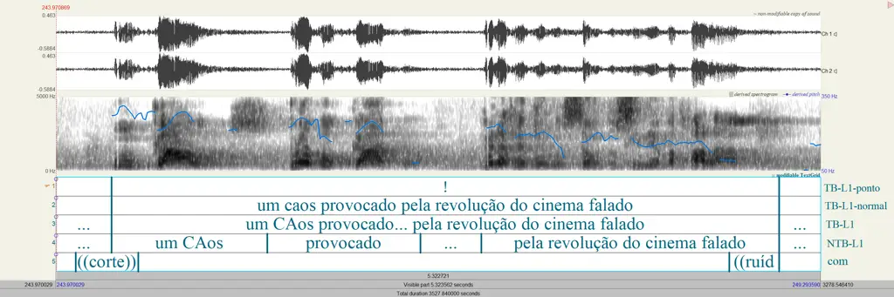
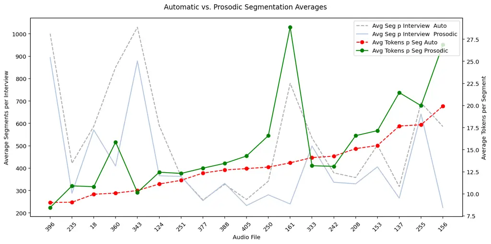
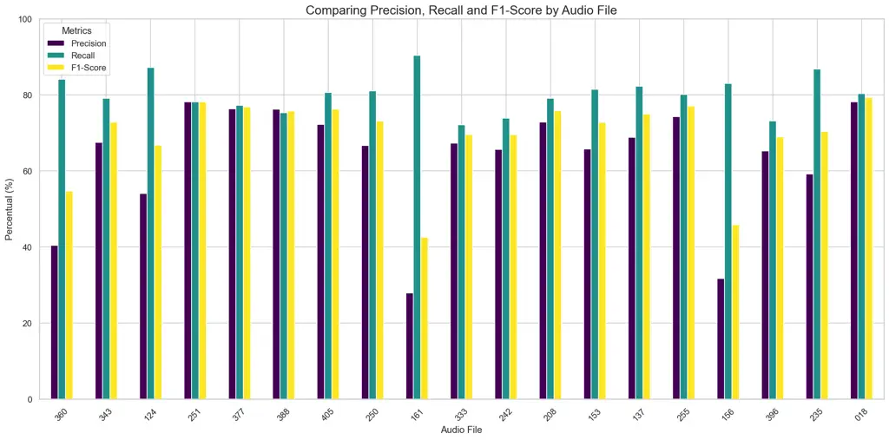
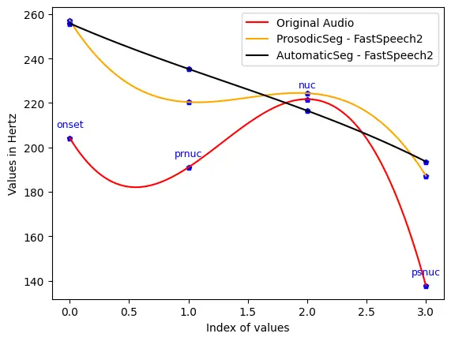

# The Impact of Prosodic Segmentation on Speech Synthesis of Spontaneous Speech

Julio Galdino

Affiliation: University of São Paulo, São Carlos, SP, Brazil    Sidney
Leal

Affiliation: University of São Paulo, São Carlos, SP, Brazil
Affiliation: Venturus - Centro de Inovação Tecnológica, Campinas, SP,
Brazil  
Corresponding authors: juliogaldino@usp.br, sidleal@gmail.com    Leticia
de Souza

Affiliation: Universidade Estadual Paulista, São José do Rio Preto, SP,
Brazil    Rodrigo Lima

Affiliation: University of São Paulo, São Carlos, SP, Brazil    Antonio
Moreira

Affiliation: University of São Paulo, São Carlos, SP, Brazil    Arnaldo
Candido Jr

Affiliation: Universidade Estadual Paulista, São José do Rio Preto, SP,
Brazil    Miguel Oliveira Jr

Affiliation: Universidade Federal de Alagoas, Maceió, AL, Brazil   
Edresson Casanova

Affiliation: NVIDIA Corporation, São Paulo, SP, Brazil    Sandra Aluísio

Affiliation: University of São Paulo, São Carlos, SP, Brazil

###### Abstract

Spontaneous speech presents several challenges for speech synthesis,
particularly in capturing the natural flow of conversation, including
turn-taking, pauses, and disfluencies. Although speech synthesis systems
have made significant progress in generating natural and intelligible
speech, primarily through architectures that implicitly model prosodic
features such as pitch, intensity, and duration, the construction of
datasets with explicit prosodic segmentation and their impact on
spontaneous speech synthesis remains largely unexplored. This paper
evaluates the effects of manual and automatic prosodic segmentation
annotations in Brazilian Portuguese on the quality of speech synthesized
by a non-autoregressive model, FastSpeech 2. Experimental results show
that training with prosodic segmentation produced slightly more
intelligible and acoustically natural speech. While automatic
segmentation tends to create more regular segments, manual prosodic
segmentation introduces greater variability, which contributes to more
natural prosody. Analysis of neutral declarative utterances showed that
both training approaches reproduced the expected nuclear accent pattern,
but the prosodic model aligned more closely with natural pre-nuclear
contours. To support reproducibility and future research, all datasets,
source codes, and trained models are publicly available under the CC
BY-NC-ND 4.0 license.

###### Keywords: 

Transcription and segmentation of datasets Prosody of TTS Models
Brazilian Portuguese.

## 1 Introduction

Text-to-Speech (TTS) systems have achieved significant progress in
recent years, particularly in generating natural and intelligible speech
from text. Advances in system architectures have enabled fine-grained
control over synthesized speech by implicitly modeling various
attributes, including emotion and prosodic features such as pitch,
intensity, and duration \[28\]. Additionally, incorporating regional
linguistic variations has become increasingly important to enhance the
naturalness and authenticity of synthesized voices \[19\]. Nevertheless,
there remains a pressing need for conversational and spontaneous speech
datasets, which are crucial for training applications such as chatbots,
virtual assistants, and interactive storytelling systems \[16\].

The field of speech synthesis has witnessed significant advances, and
research in automatic speech recognition (ASR) has also made notable
progress, particularly with the widespread adoption of systems such as
OpenAI’s Whisper \[21\] and related developments such as WhisperX \[1\],
which enable fast ASR (up to 70× real-time transcription) based on the
Whisper large-v2 model. As a result, several datasets for low-resource
languages have become available through the use of ASR tools, often
supplemented with further human revision \[15\]. However, an important
concern remains: Are we losing critical prosodic information when using
ASR systems to transcribe and segment spontaneous speech?

The relationship between speech synthesis and prosody has been studied
for decades. For example, \[24\] presents a collection of papers on
computational approaches to processing spontaneous speech prosody,
exploring the generation and modeling of prosody in computational
synthesis. The evaluation of prosodic aspects of synthesized speech also
has a long history — studies such as \[13\] and \[7\] employed objective
metrics to assess prosodic features, such as Root Mean Squared Error
(RMSE) related to pitch, duration, and intensity. Recent studies on
prosody related to speech synthesis aim to incorporate more objective
metrics to perform a comprehensive acoustic analysis to evaluate
quality, naturalness, and intelligibility. These metrics complement the
predominant — and costly — subjective evaluation method used in TTS: the
Mean Opinion Score (MOS) \[6\].

The appropriate use of pauses and pause duration, naturally employed by
human speakers, enhances speech intelligibility by aiding in the
interpretation of speech meaning \[17\]. In addition, pauses mark the
boundaries of intonation groups and can align with syntactic boundaries
within and between utterances \[27\]. Along with pauses, the lengthening
of the speech rate at the end of a segment, combined with acceleration
at the beginning, known as discontinuities in the speech rate, serves as
cues to identify boundaries and facilitates natural turn-taking in
spontaneous conversations \[3\]. These boundaries can be delineated by
intonation units (IUs), which are segmentation units defined based on
prosodic features \[25\]. Among the various theoretical perspectives for
analyzing these units, \[22\] divides them into non-terminal breaks
(NTB) and terminal breaks (TB), where Terminal Boundaries mark the
conclusion of the utterance and Non-Terminal Boundaries mark breaks of
non-conclusive sequences of the utterance.

This study examines the influence of manual and automatic annotations of
prosodic boundaries in Brazilian Portuguese on the quality of
synthesized speech. In particular, it assesses the capacity of a
non-autoregressive (NAR) TTS model, FastSpeech 2\[23\], to capture
prosodic information when trained on a dataset manually segmented
according to terminal intonation units. For comparison purposes, the
same model is trained on segments automatically generated and
transcribed by WhisperX, without subsequent human revision. This work
seeks to address the current gap in the evaluation of prosodic
annotations for Brazilian Portuguese and to provide results that may
support future research in the training of spontaneous style
text-to-speech synthesis models.

The key contributions of this work are as follows: (1) we present a
comprehensive comparison between manual and automatic segmentation
techniques, highlighting certain limitations of automatic segmentation;
(2) we demonstrate the benefits and importance of prosodic segmentation
for spontaneous speech synthesis; and (3) our code, datasets, and
checkpoints are publicly available¹¹ 1 It will be made publicly
available once the blind-review process is complete.

## 2 NURC-SP Minimal Corpus

To evaluate the impact of prosodic segmentation on spontaneous speech
synthesis, we selected the Brazilian Portuguese NURC-SP Minimal Corpus
(NURC-SP MC) dataset \[25\], which was manually annotated by human
evaluators. Additionally, we created a version of the dataset that was
automatically segmented and transcribed (Section 3.1).

NURC-SP MC \[25\] is composed of 21 pairs of audio-transcription,
although one of them (SP_D2_062) was removed from the dataset used in
this study as its audio quality was not good (the voice is shaky) for
training TTS. The remaining pairs of NURC-SP MC are composed of: (i) 6
Formal Elocutions (EF); (ii) 5 formal dialogues between the speakers,
with the presence of a documenter (D2); (iii) 9 interviews about
different topics, carried out by an interviewer with the interviewee
(DID). NURC-SP MC was chosen because of its size, variety of text
genres, and quality of annotation. The team of 6 linguists who annotated
the dataset underwent annotation training, carried out in Praat \[4\],
and the inter-rater reliability on prosodic segmentation reached a kappa
value above 0.8, indicating substantial agreement in terms of consistent
annotation.

Although speech segmentation can be performed at different units
(phones, syllables, stress groups, IUs, utterances, turns, and even
larger domains), the adoption of a segmentation unit that takes into
account prosodic features, such as the IU, has been a common practice in
spontaneous speech corpora of several languages \[3\]. Although IUs can
be analysed from different theoretical perspectives, the boundaries of
IUs are associated, in most definitions, with a set of typical acoustic
features: (i) a coherent and unified pitch contour; (ii) boundary tones;
(iii) pitch reset or pitch register change; (iv) pause; (v) one or more
final syllable lengthening; (vi) change in speech rate at the end or
beginning of a unit; and (vii) intensity changes \[25\].

The concept of intonation unit used in NURC-SP MC follows the prosodic
segmentation model established by C-ORAL-BRASIL²² 2
https://www.c-oral-brasil.org/. Accordingly, NURC-SP MC is annotated
with prosodic boundaries (or breaks) marked as either terminal or
non-terminal as already defined in Section 1. It is important to notice
that non-terminal prosodic breaks signal a non-autonomous prosodic unit
inside the same utterance.

First, automatic forced alignment between the audio and the original
transcription was performed using aeneas³³ 3
https://github.com/readbeyond/aeneas, which requires segmenting the text
into excerpts. Thus, initially the text was segmented using the original
annotation for pause, indicated by ellipsis in the NURC project⁴⁴ 4
https://nurc.fflch.usp.br/, and turn-shifts between speakers, indicated
by a line break followed by the next speaker’s identification
abbreviation. Then, the identification of prosodic breaks was based on
the perceptual (auditory) relevance of prosodic cues, but the annotators
were also oriented to rely on the visual inspection⁵⁵ 5 The oscillogram
and the spectrogram with the blue line showing the variation of the F0
curve throughout the recording were used by the annotators. of the
acoustic signal provided by Praat. The main cues to a prosodic break in
Brazilian Portuguese are pause insertion, changes related to fundamental
frequency (F0), and duration.

It is important to notice that there are some minor differences from the
definitions used in CORAL-BRASIL I, as NURC-SP MC did not make a
distinction between interrupted, abandoned utterances (called a false
start) and regular, concluded TBs. Furthermore, unlike CORAL-BRASIL I,
NURC-SP MC segmented laughs as separate units. On the other hand, filled
pauses (such as “uh”, “ah”, “hmm”), false starts phenomena, and
truncated words, for example, were not segmented into separate units as
is the case with C-ORAL-BRASIL I.

NURC-SP MC uses multilevel transcriptions that consist of the following
interval layers annotated in the speech analysis program Praat. See
Figure 1 for an illustration of five layers in Praat: (i) 2 layers for
TB and NTB in which the speech of each main speaker (-L1, -L2) and
documenter (-Doc1, -Doc2) is segmented into prosodic units and
transcribed according to standards adapted from the NURC project; (ii) 1
layer (LA) for transcribed and segmented speech from any additional
speaker; (iii) 1 layer for comments regarding the audio recording; (iv)
1 layer containing the normalized (-normal) version of the transcript of
all TB and LA layers; and (v) 1 layer containing the punctuation
(-point) that ends each TB (. ? ! …).

Figure 1: Excerpt from the SP_EF_153 inquiry with five layers annotated
in Praat: the first layer is used to indicate the punctuation that ends
each TB (. ? ! … ), the second contains the normalized excerpt, i.e.
without the annotation used for transcription in the NURC project, the
next two for each speaker that appears in the inquiry (TB-L1, NTB-L1)
and the last one for comments on the audio recording (com) \[25\].

## 3 Experiments

Our experiments address the following questions: (i) whether there are
statistically significant differences between natural and synthesized
speech from models trained with the prosodic and automatic datasets, via
acoustic features, including fundamental frequency (F0); (ii) whether
there are differences between manual and automatic segmentation (the
average number of segments, the average size of segments, among others);
and (iii) whether there are differences in intelligibility of speech
synthesized by models trained with the prosodic and automatic datasets,
via Word Error Rate (WER) and Character Error Rate (CER).

We employed the manually annotated NURC-SP MC dataset and created an
automatic version of the dataset using the WhisperX ASR model. WhisperX
is a system designed for efficient transcription of long-form audio,
providing accurate word-level timestamps. It was selected due to its
state-of-the-art performance in automatic speech recognition and speech
segmentation. Moreover, WhisperX has recently been used in the
development of several open-source datasets \[15, 10, 18\].

### 3.1 Datasets Preprocessing

We duplicated the 20 NURC-SP MC audio files to segment and transcribe
them using WhisperX as well, and named this dataset ‘‘automatic’’⁶⁶ 6 It
is available at (omitted due to blind review).

The original NURC-SP MC, which was manually transcribed in the 1970s,
was revised before the manual prosodic annotation of segmentation was
undertaken; in this study, it was called ‘‘prosodic’’⁷⁷ 7 It is
available at (omitted due to blind review).

We split both subsets (automatic and prosodic) into three sets:

1.  1.  7527 segments from 19 inquiries (about 11 hours and 50 minutes) for
        training the prosodic model and 9870 segments from 19 inquiries
        (about 15 hours and 50 minutes) for training the automatic model;
2.  2.  473 segments from the same 19 inquiries (about 42 minutes) for
        validation of prosodic model and 500 segments from the same 19
        inquiries (about 44 minutes) for validation of the automatic model;
        and
3.  3.  one inquiry (DID_234) was separated for testing both models.
        Specifically, we selected 30 segments of the speaker L1 of DID_234
        for the acoustic analysis (Section 5.2) and all the segments of the
        speaker L1 of DID_234 (361 segments) for evaluating intelligibility
        (Section 5.1).

The selection of segments for the validation set respected the duration
intervals (short, medium, and long audios) and the representativeness of
the inquiries.

To compose the subset called “prosodic”, it was used only terminal
intonation units (terminal boundaries mark the conclusion of the
utterance) from NURC-SP MC. For the subset called “automatic”, the 20
audio files of NURC-SP MC were segmented and transcribed by WhisperX.

The prosodic subset has 12:32:25 hours , and the automatic subset has
16:33:54 hours. The difference (4 hours, 1 minute, 29 seconds) is due to
three factors: (i) the header⁸⁸ 8 The header includes information about
inquiries (e.g. audio duration, recording date) and about main speakers
(e.g. gender, age). of each file that was preserved in the automatic
subset; (ii) transcriptions containing only unintelligible segments and
emotion sounds (e.g., laughter) were excluded from the prosodic subset;
(iii) segments with speaker overlap of more than 2 seconds were removed
from the prosodic subset; as well when the overlapping was greater than
50% of the total time. The quality of intelligibility was also verified
via transcription using Whisper, and segments with a CER \> 0.6 were
removed. In our preliminary experiments, we observed that neither the
“automatic” nor the “prosodic” subsets alone were sufficient to achieve
convergence in the TTS models. We believe this is due to the size and
characteristics of the dataset. To enable successful training, we
included the Portuguese subset of the CML-TTS \[20\] dataset in the
training data for both the “automatic” and “prosodic” subsets. CML-TTS
comprises audiobooks in seven languages: Dutch, French, German, Italian,
Portuguese, Polish, and Spanish. For this work, only the Portuguese
audio files were utilized, resulting in 59 hours (30 speakers) of data
after the pre-processing.

### 3.2 TTS Experiments

In this study, we adopted the FastSpeech 2 TTS model \[23\]. FastSpeech
2 is a transformer-based non-autoregressive model with a simple
structure that generates greater variation in speech by explicitly
modeling three prosodic features: duration, pitch, and energy.
Specifically, duration, pitch, and energy are extracted from the speech
waveform and directly used as conditional inputs during training; during
inference, the model utilizes the predicted values. We selected this
model because it explicitly models prosodic features through dedicated
pitch, energy, and duration predictors, enabling the manipulation of
these features during inference. We employed an open-source
implementation of the model⁹⁹ 9 https://github.com/ming024/FastSpeech2,
and the training procedure follows a pipeline consisting of the
following steps:

1.  1.  Prepare align: Audio files and transcriptions for each segment were
        extracted from original datasets and saved in .lab and .wav files
        inside a folder named after each speaker code;
2.  2.  MFA Align 1: The tool Montreal Forced Aligner¹⁰¹⁰ 10
        https://montreal-forced-aligner.readthedocs.io/en/latest/ was
        applied to transform graphemes to phonemes using the pretrained
        model portuguese_brazil_mfa and a lexicon dictionary was generated
        in a text file;
3.  3.  MFA Align 2: MFA align command was used to process the raw data and
        generate the alignments in TextGrid format;
4.  4.  From that, a pre-processing script generated estimated values for
        energy and pitch, a json file with speakers codes and a
        train/validation text files with phonetic transcriptions. Validation
        subset was a selection of 1% random segments;
5.  5.  Finally, the model was trained with the preprocessed data on a RTX
        4070 GPU for 720k steps (in approximately 4 days).

For a fair comparison, this pipeline was executed twice: once for the
CML-TTS subset combined with the NURC-SP MC “prosodic” dataset, and once
for the CML-TTS subset combined with the NURC-SP MC “automatic” dataset.
Since the implemented pipeline already included an automatic train-dev
split, we used all segments from our dataset as input. Audio samples¹¹¹¹
11
[https://sites.google.com/view/bracis25-prosod-blind-review/home](https://sites.google.com/view/bracis25-prosod-blind-review/home)
from both experiments are available for evaluation.

## 4 Evaluation of Prosodic and Automatic Segmentation Methods

We compared the NURC-SP MC “prosodic” and NURC-SP MC “automatic”
datasets to identify the weaknesses of automatic segmentation. First, we
pre-processed both datasets as described in Section 4.1. Subsequently,
we conducted several statistical analyses to highlight the differences
between the two segmentation methods, as presented in Section 4.2.

### 4.1 Preprocessing and Alignment

To simplify the analysis of segmentations, both human and automatic
transcriptions underwent a normalization process. Initially, the text
was converted to lowercase, and punctuation was removed. Subsequently,
numbers were converted to their full textual form using the python
library num2words, and whitespaces were removed. Following this, all
segments were written into two text files, word by word, with the
special token \[seg\] inserted at the location of each segmentation
(manual or automatic). As WhisperX’s audios contain additional headers
for metadata extraction, such headers were removed from automatic
transcriptions for a fair comparison with manual transcriptions.

For segment alignment, we used Python’s ndiff function¹²¹² 12
https://docs.python.org/3/library/difflib.html. This is equivalent to
organizing transcription tokens, including segmentation labels, line by
line, and executing the diff command used in version control management
systems for source code, such as GIT¹³¹³ 13 https://git-scm.com/. This
allowed us to align both segmentation lists, capturing the number of
differences, insertions, and deletions. Based on this output, we were
able to identify the matches and mismatches between both automatic and
prosodic segmentation boundaries and to be able to calculate the metrics
mentioned previously. This approach enabled a detailed analysis of the
alignment between segments and quantitative insights into each boundary
strategy.

### 4.2 Statistics of Segmentation

Table 1 presents statistics regarding the segmentation process. In
total, the automatic process resulted in 130,220 tokens while the manual
(prosodic) segmentation totaled 112,023 tokens. This difference is
mainly due to the removal of 1,750 segments from the prosodic version,
due to laughter, voice overlap or unintelligible segments (see Section
3.1), although other factors also play a role in this difference, for
example, different styles of transcription for disfluencies (e.g.: word
repetitions and hesitations) and minor transcription errors in the
WhisperX’s transcriptions¹⁴¹⁴ 14 Headers present in WhisperX’s
transcriptions were removed in this version, as indicated in Section
4.1.

|                                |                      |                      |        |
| ------------------------------ | -------------------- | -------------------- | ------ |
| Metrics                        | Auto                 | Prosodic             | Diff   |
| Total Tokens                   | 130,220              | 112,023              | 18,197 |
| Total Segments                 | 10,182               | 7,816                | 2,366  |
| Average Tokens per Segment     | 12.79 ($`\pm`$ 9.69) | 14.33 ($`\pm`$ 13)   | 2.14   |
| Average Segments per Interview | 536 ($`\pm`$ 233.18) | 411 ($`\pm`$ 232.78) | 125    |

Table 1: Token and Segment Statistics

Our results also show a difference in the number of total segments.
Manual transcriptions use fewer segments ($`\approx 7k`$) than
WhisperX’s ones ($`\approx 10k`$), even considering the removal of 1,750
from the prosodic version. It is important to note that manual
transcriptions in this work use only TB’s. This number should be higher
if we were using NTB instead (see Figure 1). Also, annotators do not
face WhisperX’s restriction on audio length uniformity (maximum 30
seconds), which may also result in a slight reduction in the total
number of segments. More importantly, the automatic method generates
12.79 tokens per segment, on average, while the prosodic method
generates 14.33 segments. This indicates that the prosodic segments tend
to be larger. This is partially explained by disfluencies in manual
transcriptions and errors in automatic transcriptions. However, the main
factor is that manual transcriptions are longer, as TBs focus on
complete utterances, capturing more information, without being
restricted by maximum length constraints.

Figure 2 presents the average tokens per segment of the automatic and
prosodic segmentations.

Figure 2: Automatic vs. Prosodic: Averages by Token and Segment

Although WhisperX’s segmentation was not originally conceived or trained
to detect prosodic boundaries, it is useful to compare how well
WhisperX’s segments align with prosodic segments. To do so, we
considered prosodic segment boundaries as ground truth labels, and
WhisperX’s segments as boundary predictions. We considered that a
segment from WhisperX is aligned with a segment prosodic boundary when
they both occur between a given pair of words, rather than looking for a
precise timestamp in the audio. Therefore, this problem can be thought
of as a binary classification problem that indicates whether there is a
segment boundary between any pair of words, which allowed us to
calculate precision, recall, and F1-score for the positive class (the
presence of a boundary).

As a result, we obtained a precision of 60.95% and a recall of 79.40%,
resulting in an F1-score of 68.96%. In this context, precision increases
when automatic segments do not occur outside prosodic boundaries.
Similarly, recall increases when automatic segments do occur within
prosodic boundaries. The fact that recall is higher than precision
indicates that WhisperX tends to segment at prosodic boundaries. The
smaller precision also indicates that WhisperX inserts more boundaries
than the manual process, for the reasons previously discussed. Figure 3
presents individual metrics for each inquiry. It should be noticed that
there is a small variation in automatic segmentation (red line), while
prosodic segmentation varies more. This result is expected because
prosodic segmentation focuses on information units rather than on audio
length.

Figure 3: Precision, Recall, and F1-Score by Inquiry.

## 5 Results of TTS Intelligibility and Acoustic Analysis of Prosodic Features

### 5.1 Intelligibility

To evaluate the intelligibility of the synthesized audios, we used an
ASR model¹⁵¹⁵ 15
https://huggingface.co/nilc-nlp/distil-whisper-coraa-mupe-asr that uses
two large spontaneous speech datasets in Brazilian Portuguese to
transcribe them and calculate CER and WER with the human-annotated
labels. For comparison, we also transcribed the original test audios
with the same model. These metrics are commonly used in the TTS field
\[5, 12, 14\] and provide insights into pronunciation accuracy,
reflecting the impact of the segmentation process.

A total of 361 segments were synthesized for the speaker L1 of DID_234
(SP-DID-234-TB-L1) with the automatic and prosodic FastSpeech 2
checkpoints, ending up with 1083 total audios (including the segments of
the ground truth original). The CER/WER averages for the three audios
for each segment ground CER = 0.09, ground WER = 0.16, auto CER = 0.35,
auto WER = 0.50, prosodic CER = 0.31, prosodic WER = 0.43. The prosodic
values were slightly better than automatic ones (we applied T-Test for
auto and prosodic averages, ending with WER(t=2.589, p-value\<0.01) and
CER(t=1.796, p-value=0.07). Although the CER average was not
statistically significant, it is close to the 0.05 threshold.

The CSV file with all transcriptions and individual CER/WER is available
at our GitHub repository (omitted due to blind review).

### 5.2 Acoustic Analysis of Prosodic Features

Regarding the acoustic analysis, we used a sample of natural speech for
the testing phase of our experiment in order to prosodically compare it
with the utterances synthesized by FastSpeech 2. We selected the speaker
SP-DID-234-TB-L1, as it represents a DID (Dialog between Informant and
Documenter) recording, providing high-quality material for prosodic
analysis and utterance selection. This speaker also presented the
largest number of segments among all samples belonging to the DID genre.
For the purposes of this study, we selected 30 neutral declarative
utterances, free from emphasis, turn-taking overlap, laughter, noise, or
other paralinguistic elements. Each utterance contained either a single
terminal break (TB) or a non-terminal break (NTB) within a TB. Selecting
neutral declarative utterances from a spontaneous speech corpus is a
challenging task; therefore, 30 utterances were the maximum number
closely matching the established criteria

For the prosodic annotation, four points on the F0 contour were
annotated in each of the 30 utterances, based on both existing
literature and visual inspection of the contour. Specifically, the onset
point (ons) corresponds to the first syllable of the intonational unit;
the pre-nuclear point (prnuc) marks the lowest F0 value before the
nuclear accent; the nuclear point (nuc) identifies the highest F0 peak,
typically associated with neutral declarative utterances in Brazilian
Portuguese; and the post-nuclear point (psnuc) corresponds to the lowest
movement during the final F0 fall. These points were selected to examine
the F0 curve in natural speech and to compare it with the corresponding
curve in synthesized speech.

For this purpose, we extracted the maximum F0 value at each annotated
point using the AnalyseTier script \[11\], following standard practices
in the literature \[26\]. The extracted values were exported to a
spreadsheet, and the mean F0 values for each point, in both natural and
synthesized speech, were calculated to support the subsequent
statistical analysis (see Figure 4).

Figure 4: Average of four F0 contour points in the original audio and
trained TTS models

We calculated how closely each FastSpeech 2 training approach
approximated natural speech, using root mean square error (RMSE) to
measure the discrepancy between the observed values in the curve. The
higher the numerical value of the model, the farther it is from the
original audio. The RMSE calculation resulted in a value of
approximately 39.07 Hz between FastSpeech 2 with prosodic segmentation
and natural speech, which means that the curve generated by FastSpeech
2, after being trained with a manually segmented dataset, is relatively
closer to the natural one when compared to the curve generated by
FastSpeech 2 with automatic segmentation, which is slightly more distant
from original speech (RMSE = approximately 44.05 Hz). To compare the
average values of different prosodic points among the three groups, we
performed separate univariate ANOVAs. The results showed a significant
difference for onset (p-value\<0.01), pre-nuclear (p-value=0.05), and
post-nuclear (p-value\<0.01) points, but no significant difference for
the nuclear point (p-value=0.86). We also conducted a Tukey post-hoc
test to explore which groups differed from each other and at which
points. For the onset variable, both FastSpeech 2 training versions
significantly differed from natural speech, while the two model versions
were closer to each other. This means that the difference between the
model and natural speech is noticeable right at the beginning of the
utterances.

In the pre-nuclear position, there was no significant difference between
the original audio and FastSpeech 2 with prosodic segmentation
(p-value=0.08), making it closer to natural speech at this point than
FastSpeech 2 with automatic segmentation (p-value=0.04). At the nuclear
point, there was no significant difference between the three groups, as
previously indicated by the ANOVA — in other words, no significant
difference between natural speech and the two FastSpeech 2 training
versions. This shows that the model was able to reproduce the nuclear
accent that characterizes declarative utterances in Brazilian Portuguese
\[9\]. The post-nuclear point differed significantly between both
FastSpeech 2 models and natural speech. Even though there was a
statistical difference between the model trainings and natural audio, it
is important to consider the overall behavior of the intonational curve.
From a linguistic perspective, the shape of the curve may matter more
than just the individual average values of the four points. A visual
interpretation shows that FastSpeech 2 with prosodic segmentation
produces a curve with a low pre-nuclear point that precedes the rise of
the nuclear accent peak, just like natural speech, while FastSpeech 2
with automatic segmentation shows a simple downward linear slope.

We also examined the average F0 variation of the utterances in semitones
(relative to 100 Hz), based on the maximum F0 values. The ANOVA result
indicated that there was a significant difference between the groups
(p-value\<0.01), then we perform a post-hoc test. While the two
FastSpeech 2 training methods did not differ from each other
(p-value=0.99), neither was able to approximate natural speech (Prosodic
segmentation = p-value\<0.01, Automatic segmentation = p-value\<0.01).
Humans discriminate F0 variation more effectively when it is measured in
semitones, since we are more sensitive to changes in lower frequencies
than in higher ones \[2\]. These results regarding F0 variation can
objectively explain why this speech sounds less natural.

## 6 Conclusions

This study evaluated the impact of manual versus automatic prosodic
boundary segmentation in Brazilian Portuguese on the quality of
synthesized spontaneous speech. The main objective was to determine
whether incorporating human-annotated prosodic boundaries into a TTS
training corpus could improve the performance of an NAR TTS model
compared to using automatically segmented data. By comparing these two
approaches, we aimed to assess differences in intelligibility and how
closely the synthetic speech aligns with natural prosodic patterns.

The results indicate that models trained with manually segmented
prosodic data achieved slightly better performance than those trained
with automatic segmentation. In particular, the FastSpeech 2 model
trained on the prosodic dataset produced speech that was marginally more
intelligible (as evidenced by a lower WER/CER) and acoustically closer
to natural speech. For example, acoustic analyses of intonation contours
showed that the prosody-informed model more accurately reproduced
natural pitch patterns in neutral declarative utterances. In contrast,
the model trained on automatically segmented data (using WhisperX)
yielded more uniform speech segments and a flatter overall intonation,
missing some of the expressive variability present in natural prosody.
These findings suggest that explicit prosodic boundary annotation
provides a modest but measurable advantage in capturing the nuances of
spontaneous speech. Notably, the automatic segmentation method
demonstrated promising performance in detecting prosodic breaks. The
WhisperX-based pipeline achieved high recall of the boundaries marked by
human annotators, illustrating its potential for efficient corpus
building. However, there remains a noticeable gap between the two
segmentation approaches in terms of speech naturalness. The
automatically segmented dataset did not fully capture the variability
and subtle prosodic cues that human annotation provided. As a result,
the synthetic speech from the automatic approach sounded less dynamic
and natural compared to the speech from the prosodically segmented
dataset. This gap highlights that current automatic methods, despite
their convenience, cannot yet replicate the rich prosodic patterns that
come from careful manual segmentation. This study reinforces that
careful evaluation of prosodic and acoustic characteristics is crucial
for advancing automatic speech synthesis systems. Analyses of features
such as pitch contours provided objective evidence of how segmentation
strategies influence the naturalness and intelligibility of the output.
Incorporating such evaluations into the development cycle of TTS systems
is essential to bridge the gap between synthetic and natural speech,
particularly in applications that demand conversational fluency and
expressive variability.

This work has certain limitations that must be acknowledged. The scope
of our experiments was restricted to a relatively small dataset of
Brazilian Portuguese spontaneous speech, which may limit the
generalizability of the conclusions to other languages or speaking
styles. Additionally, the automatic segmentation using WhisperX, while
effective for generating aligned transcripts, is not specifically
tailored to prosodic boundary detection; this limitation likely affected
the quality of the automatically segmented training data. Future efforts
will focus on expanding and diversifying prosodically annotated corpora,
which would provide more data for training and enable a deeper analysis
of prosody in TTS. We also plan to refine automatic segmentation
techniques — for instance, by incorporating acoustic-prosodic cues or
developing dedicated prosody segmentation models — to narrow the gap
between automatic and manual segmentation performance. Indeed, there are
some methods that explicitly model speech prosody to build automatic
prosody annotation for Chinese \[8\] and English \[29\]. Moreover, it
will be important to evaluate the benefits of prosodic segmentation in
different conditions, including other genres of speech, to verify that
the advantages observed here extend beyond Brazilian Portuguese.
Additionally, we plan to expand our study to include other TTS models,
such as autoregressive and flow-matching-based architectures.

## References

- \[1\] M. Bain, J. Huh, T. Han, and A. Zisserman (2023) WhisperX:
  time-accurate speech transcription of long-form audio. In Interspeech
  2023, pp. 4489–4493. External Links:
  [Document](https://dx.doi.org/10.21437/Interspeech.2023-78), ISSN
  2958-1796 Cited by: §1.
- \[2\] P. A. Barbosa (2019) Prosódia. Parábola. Cited by: §5.2.
- \[3\] T. Biron, D. Baum, D. Freche, N. Matalon, N. Ehrmann, E.
  Weinreb, D. Biron, and E. Moses (2021) Automatic detection of prosodic
  boundaries in spontaneous speech. PLoS ONE 16 (5), pp. 1–21. External
  Links: [Document](https://dx.doi.org/10.1371/journal.pone.0250969)
  Cited by: §1, §2.
- \[4\] P. Boersma and D. Weenink (2023) Praat: doing phonetics by
  computer \[Computer program\]. Version 6.3.10. External Links:
  [Link](http://www.praat.org/) Cited by: §2.
- \[5\] E. Casanova, K. Davis, E. Gölge, G. Göknar, I. Gulea, L.
  Hart, A. Aljafari, J. Meyer, R. Morais, S. Olayemi, et al. (2024)
  XTTS: a massively multilingual zero-shot text-to-speech model. In
  Proc. Interspeech 2024, pp. 4978–4982. Cited by: §5.1.
- \[6\] C. Chan and J. Kuang (2024) Exploring the accuracy of prosodic
  encodings in state-of-the-art text-to-speech models. In Speech Prosody
  2024, pp. 27–31. External Links:
  [Document](https://dx.doi.org/10.21437/SpeechProsody.2024-6), ISSN
  2333-2042 Cited by: §1.
- \[7\] S. Chen, S. Hwang, and Y. Wang (1998) An RNN-based prosodic
  information synthesizer for mandarin text-to-speech. IEEE transactions
  on speech and audio processing 6 (3), pp. 226–239. External Links:
  [Document](https://dx.doi.org/10.1109/89.668817) Cited by: §1.
- \[8\] Z. Dai, J. Yu, Y. Wang, N. Chen, Y. Bian, G. Li, D. Cai, and D.
  Yu (2022) Automatic prosody annotation with pre-trained text-speech
  model. In Interspeech 2022, pp. 5513–5517. External Links:
  [Document](https://dx.doi.org/10.21437/Interspeech.2022-10005), ISSN
  2958-1796 Cited by: §6.
- \[9\] J. A. de Moraes (2008) The pitch accents in brazilian
  portuguese: analysis by synthesis. In Speech Prosody 2008,
  pp. 389–397. External Links:
  [Document](https://dx.doi.org/10.21437/SpeechProsody.2008-4), ISSN
  2333-2042 Cited by: §5.2.
- \[10\] H. He, Z. Shang, C. Wang, X. Li, Y. Gu, H. Hua, L. Liu, C.
  Yang, J. Li, P. Shi, et al. (2024) Emilia: an extensive, multilingual,
  and diverse speech dataset for large-scale speech generation. In 2024
  IEEE Spoken Language Technology Workshop (SLT), pp. 885–890. Cited by:
  §3.
- \[11\] D. Hirst (2012) Analyse tier praat script. Cited by: §5.2.
- \[12\] S. Hussain, P. Neekhara, X. Yang, E. Casanova, S. Ghosh, M. T.
  Desta, R. Fejgin, R. Valle, and J. Li (2025) Koel-tts: enhancing llm
  based speech generation with preference alignment and classifier free
  guidance. arXiv:2502.05236. Cited by: §5.1.
- \[13\] O. Jokisch, H. Mixdorff, H. Kruschke, and U. Kordon (2000)
  Learning the parameters of quantitative prosody models. In 6th
  International Conference on Spoken Language Processing (ICSLP 2000),
  pp. 645–648. External Links:
  [Document](https://dx.doi.org/10.21437/ICSLP.2000-160), ISSN 2958-1796
  Cited by: §1.
- \[14\] H. Kim, S. Kim, and S. Yoon (2022) Guided-tts: a diffusion
  model for text-to-speech via classifier guidance. In International
  Conference on Machine Learning, pp. 11119–11133. Cited by: §5.1.
- \[15\] S. E. Leal, A. Candido Junior, R. Marcacini, E. Casanova, O.
  Gonçalves, A. Silva Soares, R. Freitas Lima, L. R. Stefanel Gris,
  and S. Aluísio (2025) MuPe life stories dataset: spontaneous speech in
  Brazilian Portuguese with a case study evaluation on ASR bias against
  speakers groups and topic modeling. In Proceedings of the 31st
  International Conference on Computational Linguistics, O. Rambow, L.
  Wanner, M. Apidianaki, H. Al-Khalifa, B. D. Eugenio, and S. Schockaert
  (Eds.), Abu Dhabi, UAE, pp. 6076–6087. External Links:
  [Link](https://aclanthology.org/2025.coling-main.407/) Cited by: §1,
  §3.
- \[16\] W. Li, P. Yang, Y. Zhong, Y. Zhou, Z. Wang, Z. Wu, X. Wu,
  and H. Meng (2024) Spontaneous style text-to-speech synthesis with
  controllable spontaneous behaviors based on language models. In
  Interspeech 2024, pp. 1785–1789. External Links:
  [Document](https://dx.doi.org/10.21437/Interspeech.2024-1989), ISSN
  2958-1796 Cited by: §1.
- \[17\] S. Liu, Y. Nakajima, L. Chen, S. Arndt, M. Kakizoe, M. A.
  Elliott, and G. B. Remijn (2022) How pause duration influences
  impressions of english speech: comparison between native and
  non-native speakers. Frontiers in Psychology 13. External Links:
  [Link](https://www.frontiersin.org/articles/10.3389/fpsyg.2022.778018),
  [Document](https://dx.doi.org/10.3389/fpsyg.2022.778018), ISSN
  1664-1078 Cited by: §1.
- \[18\] W. Liu, J. Bai, X. Cheng, J. Zuo, Z. Jiang, S. Ji, M. Fang, X.
  Yang, Q. Yang, and Z. Zhao (2025) VoxpopuliTTS: a large-scale
  multilingual tts corpus for zero-shot speech generation. In
  Proceedings of the 31st International Conference on Computational
  Linguistics, pp. 10293–10297. Cited by: §3.
- \[19\] A. Matos, G. Araújo, A. C. Junior, and M. Ponti (2024) Accent
  classification is challenging but pre-training helps: a case study
  with novel Brazilian Portuguese datasets. In Proceedings of the 16th
  International Conference on Computational Processing of Portuguese -
  Vol. 1, P. Gamallo, D. Claro, A. Teixeira, L. Real, M. Garcia, H. G.
  Oliveira, and R. Amaro (Eds.), Santiago de Compostela, Galicia/Spain,
  pp. 364–373. External Links:
  [Link](https://aclanthology.org/2024.propor-1.37/) Cited by: §1.
- \[20\] F. S. Oliveira, E. Casanova, A. C. Junior, A. S. Soares,
  and A. R. Galvão Filho (2023) CML-tts: a multilingual dataset for
  speech synthesis in low-resource languages. In Text, Speech, and
  Dialogue, K. Ekštein, F. Pártl, and M. Konopík (Eds.), Cham,
  pp. 188–199. External Links: ISBN 978-3-031-40498-6 Cited by: §3.1.
- \[21\] A. Radford, J. W. Kim, T. Xu, G. Brockman, C. Mcleavey, and I.
  Sutskever (2023) Robust speech recognition via large-scale weak
  supervision. In Proceedings of the 40th International Conference on
  Machine Learning, A. Krause, E. Brunskill, K. Cho, B. Engelhardt, S.
  Sabato, and J. Scarlett (Eds.), Proceedings of Machine Learning
  Research, Vol. 202, pp. 28492–28518. Cited by: §1.
- \[22\] T. Raso and H. Mello (2012) O corpus c-oral-brasil. Editora
  UFMG, Belo Horizonte. Cited by: §1.
- \[23\] Y. Ren, C. Hu, X. Tan, T. Qin, S. Zhao, Z. Zhao, and T.
  Liu (2022) FastSpeech 2: fast and high-quality end-to-end text to
  speech. External Links: 2006.04558,
  [Link](https://arxiv.org/abs/2006.04558) Cited by: §1, §3.2.
- \[24\] Y. Sagisaka, N. Campbell, and N. Higuchi (1997) Computing
  prosody: computational models for processing spontaneous speech.
  Springer Science & Business Media. Cited by: §1.
- \[25\] V. G. Santos, C. A. Alves, B. B. Carlotto, B. A. P.
  Dias, L. R. S. Gris, R. de Lima Izaias, M. L. A. de Morais, P. M. de
  Oliveira, R. Sicoli, F. R. Fernandes-Svartman, M. Q. Leite, and S. M.
  Aluísio (2022) CORAA NURC-SP Minimal Corpus: a manually annotated
  corpus of Brazilian Portuguese spontaneous speech. In Proc. IberSPEECH
  2022, pp. 161–165. External Links:
  [Document](https://dx.doi.org/10.21437/IberSPEECH.2022-33) Cited by:
  §1, Figure 1, §2, §2, §2.
- \[26\] M. Swerts (1997) Prosodic features at discourse boundaries of
  different strength. The Journal of the Acoustical Society of America
  101 (1), pp. 514–521. Cited by: §5.2.
- \[27\] I. C. Viola and S. Madureira (2008) The roles of pause in
  speech expression. In Speech Prosody 2008, pp. 721–724. External
  Links: [Document](https://dx.doi.org/10.21437/SpeechProsody.2008-160),
  ISSN 2333-2042 Cited by: §1.
- \[28\] T. Xie, Y. Rong, P. Zhang, W. Wang, and L. Liu (2025) Towards
  controllable speech synthesis in the era of large language models: a
  survey. External Links: 2412.06602,
  [Link](https://arxiv.org/abs/2412.06602) Cited by: §1.
- \[29\] J. Zhong, Y. Li, H. Huang, K. Richmond, J. Liu, Z. Su, J.
  Guo, B. Tang, and F. Zhu (2024) Multi-modal automatic prosody
  annotation with contrastive pretraining of speech-silence and
  word-punctuation. In Interspeech 2024, pp. 2305–2309. External Links:
  [Document](https://dx.doi.org/10.21437/Interspeech.2024-2133), ISSN
  2958-1796 Cited by: §6.
